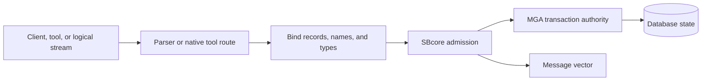
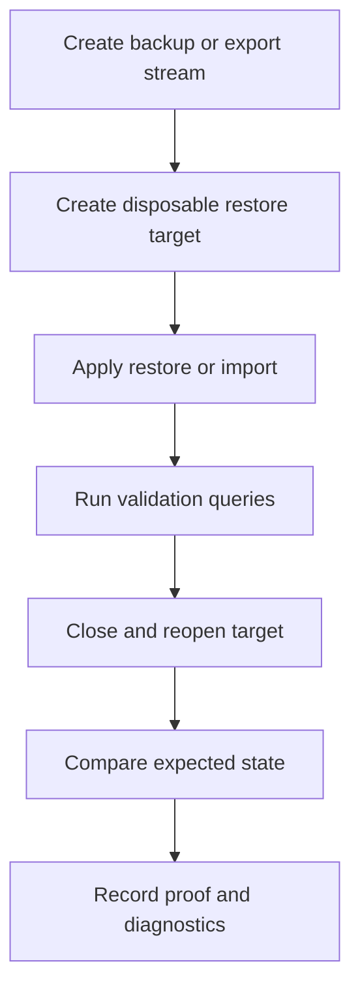

# Backup, Restore, And Data Movement Overview

## Purpose

This page explains backup, restore, import, export, CDC, replication, ETL, and migration at a high level. It is an orientation page for administrators, not a complete data-protection policy or release certification.

Any workflow that protects real data must be proven against the current build, target platform, configuration, parser route, and operational policy. A backup is not useful until restore has been tested.

## Core Distinction: Logical Versus Physical

The most important distinction is whether data movement is logical or physical.

| Kind | Meaning | Administrative Reading |
| --- | --- | --- |
| Logical export | Data and metadata are represented as statements, rows, records, events, or structured values. | Can be handled through parser, tool, transaction, authorization, and engine rules where implemented. |
| Logical import | A stream of statements, rows, records, or events is applied as database work. | Should pass through normal admission, type, transaction, and policy checks. |
| Logical backup | A backup stream that represents database content as metadata and data operations. | Restore can be treated as admitted logical work when the format is supported. |
| Logical restore | Applying a logical backup stream to a target database. | Should be tested into a disposable database before trust. |
| Physical copy | Database pages, files, or storage images are copied directly. | Requires engine-native storage rules; it should not be treated as parser-level logical restore input. |
| Low-level repair or verification | Direct inspection or manipulation of storage internals. | Should be limited to documented native administrative surfaces where implemented and authorized. |

Logical streams can be interpreted as work. Physical storage operations require storage authority.

## ScratchBird Data Movement Model

A logical stream still passes through parser, binder, authorization, transaction, and engine rules. It is not a shortcut around SBcore.

## Backup

A backup workflow should define:

- source database;
- backup kind;
- scope: full, partial, schema, table, object, or filtered set where supported;
- consistency point;
- transaction handling;
- output destination;
- retention policy;
- encryption or protected-material handling where applicable;
- verification query or proof;
- restore drill plan.

For a first draft workflow, prefer a logical backup stream where the release documents and tests that surface.

## Restore

A restore workflow should define:

- target database;
- whether the target is empty, existing, or a migration staging area;
- whether the stream is logical or physical;
- how object names and UUID-backed identity are handled;
- how security, grants, policies, and protected material are restored or remapped;
- transaction boundaries;
- conflict handling;
- validation queries;
- failure and rollback behavior.

Do not trust a backup strategy until restore into a non-production target has been tested.

## Remote Logical Streams

Remote logical streams are the safest compatibility shape to reason about because the server receives logical work from a client or tool rather than being asked to open and manipulate arbitrary local files.

Allowed by design where implemented and policy admits it:

- a client sends a logical restore stream;
- a client receives a logical backup stream;
- a tool imports rows or records through an admitted route;
- a tool exports rows or records through an admitted route;
- a parser-support routine streams logical CDC or ETL records.

The stream still has to pass authorization, type, transaction, and policy checks.

## Server-Local File Access

Server-local file access is sensitive. A command that asks the server to open, read, overwrite, or repair a local file should be denied unless a documented native administrative surface and policy explicitly admits it.

For compatibility parser routes, the conservative rule is:

- remote logical streams can be supported where implemented;
- server-local file manipulation should be denied by default;
- physical page-copy backup or restore should be denied through parser routes;
- low-level repair and verification should not be available through compatibility parser routes.

This protects the engine authority boundary and reduces accidental file exposure.

## CDC, Replication, And ETL

CDC, replication, and ETL are logical data movement surfaces.

| Surface | Meaning |
| --- | --- |
| CDC | Change data capture: records changes as ordered logical events. |
| Replication | Applies change streams between systems according to ordering, identity, and conflict rules. |
| ETL | Extract, transform, load: reads data from one source, changes its shape, and writes it to a target. |
| Migration | Moves schema, data, routines, security, and operational behavior from one shape to another. |

These surfaces need explicit rules for:

- source identity;
- target identity;
- transaction grouping;
- record identity;
- ordering token or ordering evidence;
- idempotency;
- quarantine;
- cutover;
- retry;
- refusal when order or identity is ambiguous.

Do not describe a replication or ETL route as available until the relevant parser, tool, engine path, and tests prove it.

## Reference-System Compatible Data Movement

Some compatibility parser families expose logical backup, restore, CDC, replication, ETL, import, or export behavior. ScratchBird should support those surfaces only where they are implemented, safe, scoped to that parser, and admitted by policy.

The parser must classify the operation:

| Compatibility Request | Expected Classification |
| --- | --- |
| Client sends logical metadata and data stream. | Logical restore candidate, if implemented and admitted. |
| Client requests logical backup stream for the connected workarea. | Logical backup candidate, if implemented and admitted. |
| Client asks server to open an arbitrary local file. | Deny by default unless a safe native policy admits it. |
| Client submits physical page-copy format. | Deny through compatibility parser route. |
| Client asks for low-level repair or verification. | Deny through compatibility parser route. |
| Client requests CDC or replication stream. | Admit only if that parser route and engine surface implement it and policy allows it. |

Compatibility does not mean bypassing ScratchBird security, storage, or transaction authority.

## Migration

Migration is broader than import.

A migration may need to handle:

- schemas;
- tables and data;
- datatypes and domains;
- indexes and constraints;
- views and materialized views;
- stored procedures and functions;
- triggers and events;
- security grants and roles;
- policies;
- comments;
- sequences;
- backup and restore behavior;
- application cutover.

Migration should be staged, tested, validated, and reversible where possible.

## Validation Checklist

Before relying on a data movement workflow, verify:

1. The operation is classified as logical or physical.
2. The selected parser or native tool route supports the operation.
3. The source and target are explicit.
4. Authorization admits the operation.
5. External access policy admits any required external resource.
6. Protected material handling is defined.
7. Transaction boundaries are clear.
8. Restore or replay is tested into a disposable target.
9. Row counts, checksums, or validation queries are recorded where appropriate.
10. Expected refusals are tested.
11. Diagnostics are redacted.
12. Failure recovery is documented.

## Restore Drill

A restore drill should be routine and repeatable.

The drill is not complete until the restored target has been reopened and validated.

## What This Page Does Not Claim

This page does not claim:

- every backup or restore command is implemented;
- every parser supports logical backup or restore;
- physical page-copy operations are supported through parser routes;
- replication or CDC is complete for every parser;
- a backup is valid without restore testing;
- repair or verification is available through compatibility parser routes;
- data movement is safe without policy review.

## Where To Go Next

- [Configuration Basics](configuration_basics.md)
- [Diagnostics And Support Bundles](diagnostics_and_support_bundles.md)
- [First Database](../using_scratchbird/first_database.md)
- [Reference-System Compatibility](../using_scratchbird/reference_system_compatibility.md)
- [Backup, Restore, Replication, Migration](../../Language_Reference/syntax_reference/backup_restore_replication_migration.md)
- [Copy](../../Language_Reference/syntax_reference/copy.md)
- [Refusal Vectors](../../Language_Reference/syntax_reference/refusal_vectors.md)
