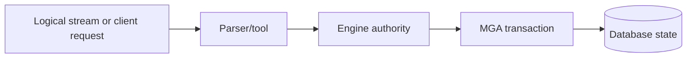

# Backup, Restore, And Data Movement Overview

## Purpose

This page explains backup, restore, CDC, replication, ETL, and migration at a high level. It does not define a complete backup policy or certify any data-protection workflow.

## Logical And Physical Movement

| Kind | Meaning |
| --- | --- |
| Logical export | Data and metadata are represented as statements, rows, or structured records. |
| Logical import | A stream of statements or records is applied through normal engine authority. |
| Physical copy | Database pages or files are copied directly. |
| CDC | Changes are captured as ordered logical events. |
| ETL | Data is extracted, transformed, and loaded through controlled paths. |

## ScratchBird Reading

ScratchBird should treat logical data movement as requests that still pass through parser, binder, transaction, and authorization rules. Server-local file access and low-level repair behavior should not be assumed from donor tool syntax.

## Donor-Compatible Streams

Some donor database families expose logical backup, restore, CDC, replication, or ETL behavior. A ScratchBird donor parser may support those surfaces only where implemented, safe, and scoped to that parser.

The key distinction is whether the operation is a logical stream handled through the parser and engine, or a physical/low-level operation that expects server-local file manipulation or page repair. The latter should not be assumed for donor parser use.

## Operator Checklist

- Confirm whether the operation is logical or physical.
- Confirm whether the parser supports the donor surface.
- Confirm whether the stream is remote/client-provided or asks the server to open a local file.
- Confirm authorization and policy.
- Test restore into a non-production database before trusting the workflow.
- Keep independent backups according to the current release guidance.

## Cautious Reading

Do not treat this page as a backup guarantee. Data-protection procedures require release-specific proof, platform testing, retention policy, restore drills, and operator review.
