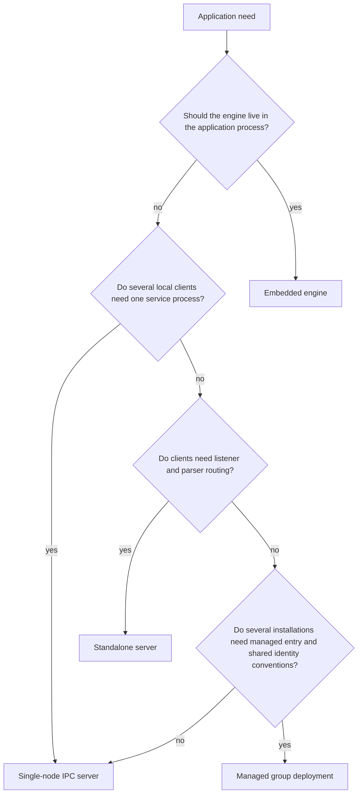

# Choosing A Deployment Mode

## Purpose

This page gives an administrator's view of ScratchBird operating modes. It turns application and operational requirements into a first deployment shape to evaluate.

It is not a performance guide, sizing guide, support statement, or production-readiness claim. A deployment mode is usable only when the current build output, target platform, configuration, tests, and release notes prove the required behavior.

## Start With The Boundary

The first deployment decision is the process and trust boundary.

Use the smallest mode that satisfies the requirement. Add listener, parser, manager, and shared identity layers only when their behavior is part of the need being tested.

## Deployment Comparison

| Mode | Process Boundary | Client Scope | Main Components | Administrative Focus |
| --- | --- | --- | --- | --- |
| Embedded engine | Same process as the application. | Application-local. | SBcore. | Application lifecycle, resource discovery, transaction handling, diagnostics returned to the application. |
| Single-node IPC server | Separate local server process. | Same-machine clients. | SBsrv and SBcore. | IPC endpoint permissions, local service lifecycle, attach/detach behavior, local diagnostics. |
| Standalone server | Listener and parser route to a local service. | Network-facing client boundary where configured. | SBgate, parser package, SBsrv, SBcore. | Listener endpoints, parser registration, authentication, workarea routing, diagnostics, controlled drain/stop. |
| Managed group deployment | Manager-front-door convention over local services. | Operator-defined local installations. | SBmgr plus configured local services. | Shared identity conventions, route admission, policy consistency, local service health, diagnostics. |

## Questions To Ask

| Question | Why It Matters |
| --- | --- |
| Does one application own all access? | Embedded mode may be enough if the application can carry engine lifecycle responsibility. |
| Do independent local clients need access? | A local server process gives clients a shared boundary without a network listener. |
| Does any client require a network-facing entry point? | Standalone server mode is the listener and parser-routing shape. |
| Is a compatibility parser part of the requirement? | Parser packages require explicit registration, routing, and proof. |
| Are several installations managed under common identity rules? | SBmgr can provide a consistent front-door convention where configured. |
| Do operators need service supervision independent of applications? | Prefer a server process over embedded mode. |
| Is the database disposable, test, or persistent? | Storage paths, backup behavior, diagnostics, and cleanup rules differ by intent. |
| What should happen when startup is uncertain? | The deployment should fail closed with useful diagnostics. |

## Administrative Worksheet

Before configuring a deployment, write down:

- target platform and architecture;
- intended mode;
- database path or database selection mechanism;
- output tree location for binaries and resources;
- required parser packages;
- authentication source;
- authorization and default schema root policy;
- listener endpoint or IPC endpoint;
- expected users, services, or agents;
- diagnostic and support-bundle location;
- redaction policy;
- backup and restore expectation;
- start, stop, drain, and restart procedure;
- proof tests required before the deployment is trusted.

This worksheet should be reviewable without exposing secrets.

## Mode-Specific First Proof

| Mode | Minimum First Proof |
| --- | --- |
| Embedded engine | Application opens a disposable database, runs create/insert/select/commit, closes, reopens, and handles one controlled diagnostic. |
| Single-node IPC server | SBsrv starts, a local client attaches, runs create/insert/select/commit, detaches, server restarts, and committed data is still visible. |
| Standalone server | SBgate starts, a parser route accepts a client, a session authenticates, work reaches SBcore, diagnostics return through the client, and drain/stop behaves cleanly. |
| Managed group deployment | SBmgr validates identity or policy context, opens a local route, admits or refuses the session clearly, and local service diagnostics identify the route used. |

Do not broaden the deployment until the first proof is repeatable.

## Parser And Tool Availability

Parser and tool availability must be checked per build.

Do not assume:

- a parser exists because a directory exists;
- a parser is installed because another parser is installed;
- a parser supports another parser's dialect;
- a management command is admitted because a tool name exists;
- a compatibility surface is complete without proof.

Each parser should be configured as its own standalone capability.

## Security Considerations

For every mode, verify:

- identity source and authentication behavior;
- default grants and roles;
- schema root or workarea assignment;
- protected-material handling;
- external access policy;
- parser route admission;
- diagnostic redaction;
- refusal behavior for denied or unsupported requests.

Security should be explicit. Do not rely on default behavior for anything that protects real data.

## Operational Considerations

Administrators should define:

- who starts and stops the service;
- how clean shutdown is requested;
- how forced shutdown is handled;
- where logs and message vectors are collected;
- how support bundles are generated and reviewed;
- how stale local endpoints are detected;
- how configuration changes are validated before restart;
- how backup and restore drills are performed;
- how a failed open or recovery-required state is escalated.

## What This Page Does Not Claim

This page does not claim:

- a deployment is production-ready;
- a mode is faster or safer than another mode for all workloads;
- every parser route is available;
- every administrative tool exists in every build;
- managed group deployment makes separate databases share storage or transactions;
- backup, restore, or repair behavior is complete without release-specific proof.

## Where To Go Next

- [Choosing A Mode Summary](../operating_modes/choosing_a_mode_summary.md)
- [Embedded Engine](../operating_modes/embedded_engine.md)
- [Single-Node IPC Server](../operating_modes/single_node_ipc_server.md)
- [Standalone Server](../operating_modes/standalone_server.md)
- [Managed Group Deployment](../operating_modes/group_deployment.md)
- [Configuration Basics](configuration_basics.md)
- [Diagnostics And Support Bundles](diagnostics_and_support_bundles.md)
