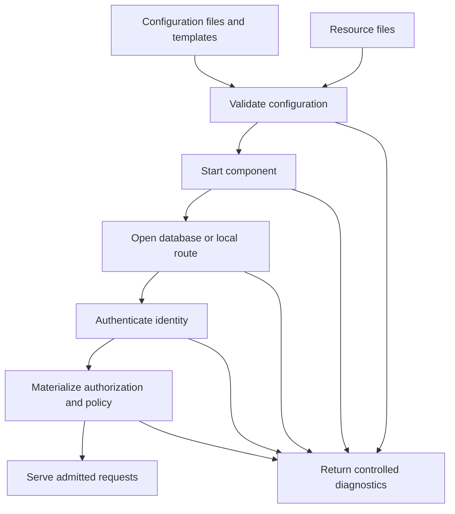

# Configuration Basics

## Purpose

ScratchBird configuration controls how components start, which databases they open, which parser routes are available, how identities are authenticated, what policy is applied, and where diagnostics are written.

Exact file names, option names, and command-line flags can vary by build and packaging. This page explains the concepts an administrator should verify before relying on a configuration.

## Configuration Is Part Of The Product

A ScratchBird output tree is not only binaries. A usable deployment may also need:

- parser packages;
- character set resources;
- collation resources;
- time zone resources;
- policy defaults;
- configuration templates;
- security provider configuration;
- diagnostic and support-bundle settings;
- tool configuration;
- tests or proof assets used to validate the output.

If the runtime cannot find the resources it was tested with, the deployment is not the same as the tested build.

## Configuration Areas

| Area | What It Controls |
| --- | --- |
| Operating mode | Embedded, single-node IPC, standalone server, or managed group deployment. |
| Database route | Which database is created or opened for a given request. |
| Storage paths | Where database files, filespaces, temporary files, and diagnostic files may live. |
| Resource files | Character sets, collations, time zones, policies, and other required data. |
| Parser routes | Which parser packages are available for which entry points. |
| Authentication | Which identity source and method are admitted. |
| Authorization | Grants, roles, schema roots, workareas, and policy. |
| External access | Whether file, network, or bridge-like external actions are admitted. |
| Runtime limits | Memory, file handles, frame sizes, timeouts, request envelope sizes, and backpressure. |
| Diagnostics | Log level, message-vector detail, support-bundle scope, and redaction policy. |
| Lifecycle | Start, stop, drain, restart, stale endpoint handling, and refusal behavior. |

## Configuration Flow

Configuration should be validated before a component accepts ordinary client work.

## Output Tree Expectations

A release or test output tree should make it clear what belongs together.

At a high level, administrators should be able to identify:

- runtime binaries;
- shared libraries;
- parser packages;
- command-line tools;
- configuration templates;
- resource files;
- test or proof material intended for the output;
- platform-specific files;
- documentation for the build.

Avoid mixing live database files with release binaries and resources. Databases should live in deliberate storage locations, not inside source directories or arbitrary build output directories.

## Parser Route Configuration

Parser routes should be explicit.

A parser route should answer:

- which parser package is used;
- which client surface it accepts;
- which endpoint or mode can reach it;
- which database or workarea it attaches to;
- which identity rules apply;
- which schema root is visible;
- which unsupported surfaces are refused;
- where parser diagnostics are written.

Installing one parser should not imply that any other parser exists. A parser should not silently accept another parser's language.

## Database Route Configuration

A database route should answer:

- whether the request creates a database or opens an existing database;
- where the database files live;
- which filespaces are expected;
- which initial character set and collation are used;
- which security baseline applies;
- which parser-visible root or workarea is selected;
- what happens if the database is already open, missing, locked, or recovery-required.

Use disposable paths for early tests until the create/open/reopen lifecycle is understood.

## Authentication And Authorization

Configuration should make identity behavior explicit.

At minimum, know:

- which identity source is used;
- how a user, service, or agent authenticates;
- how failures are reported;
- which roles or grants are loaded;
- which schema root or workarea is assigned;
- whether protected material is referenced by secret reference rather than raw value;
- how policy denies are rendered.

Authentication proves identity. Authorization admits work. Both should be tested.

## Secrets And Protected Material

Do not put raw secrets into ordinary configuration examples, parser packets, scripts, or diagnostics.

Use documented secret-reference mechanisms where available. A configuration review should check:

- whether raw secrets appear in files;
- whether secret references resolve only for authorized identities;
- whether support bundles redact protected material;
- whether diagnostics avoid exposing credentials;
- whether configuration templates can be shared safely.

## Resource Limits And Backpressure

Operational configuration should define limits before the system is under pressure.

Examples include:

- maximum request or frame size;
- maximum request envelope bytes;
- cursor or stream fetch size;
- transaction timeout;
- idle session timeout;
- memory budget;
- temporary storage policy;
- file handle limits;
- diagnostic retention;
- cancellation behavior.

Defaults should be treated as starting points, not as a substitute for workload-specific testing.

## Diagnostics Configuration

Diagnostics need configuration too.

Define:

- where logs go;
- which components log at which detail level;
- how message vectors are rendered;
- what support bundles include;
- what is redacted;
- how long diagnostic material is retained;
- who is allowed to generate or view support bundles.

Diagnostic configuration should be tested with both successful and refused requests.

## Validation Checklist

Before opening a configured deployment to users, verify:

1. Configuration parses successfully.
2. Required resource files are found.
3. Required binaries and parser packages are staged.
4. Database paths are deliberate and writable by the intended service identity.
5. Authentication succeeds for an allowed identity.
6. Authentication fails clearly for an invalid identity.
7. Authorization admits an expected request.
8. Authorization denies an expected forbidden request.
9. Parser routes accept only their intended surfaces.
10. Diagnostics are written and redacted.
11. Clean shutdown works.
12. Restart and reopen prove committed data remains visible.

## Common Configuration Problems

| Symptom | Likely Area |
| --- | --- |
| Component starts but cannot serve requests | Missing resource files, invalid route, unavailable database, or failed policy load. |
| Parser route unavailable | Parser package not staged, not registered, wrong route, or incompatible package version. |
| Authentication succeeds but queries fail | Authorization, schema root, grants, or policy. |
| Object appears missing | Current schema, visible root, workarea, transaction visibility, or wrong database route. |
| Support bundle contains too much detail | Redaction policy or diagnostic scope. |
| Service cannot restart cleanly | Stale endpoint, stale process state, storage lock, or database open refusal. |
| Restore or import refused | Policy, parser support, logical versus physical stream classification, or server-local file restriction. |

## Where To Go Next

- [Choosing A Deployment Mode](choosing_a_deployment_mode.md)
- [Diagnostics And Support Bundles](diagnostics_and_support_bundles.md)
- [Identity, Authentication, And Authorization](../architecture/identity_authentication_and_authorization.md)
- [First Database](../using_scratchbird/first_database.md)
- [Standalone Server](../operating_modes/standalone_server.md)
- [Refusal Vectors](../../Language_Reference/syntax_reference/refusal_vectors.md)
