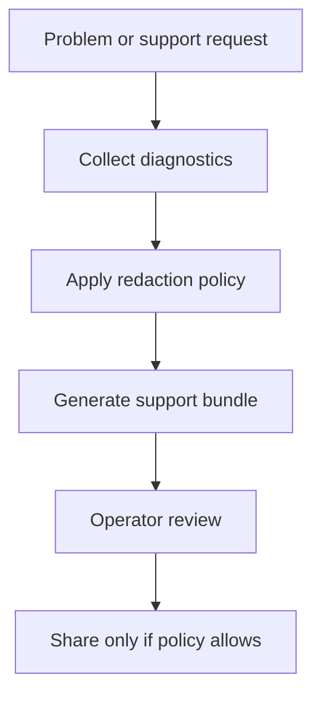

# Diagnostics And Support Bundles

## Purpose

Diagnostics explain what ScratchBird did, refused, or could not complete. Support bundles collect enough information for analysis while respecting redaction policy.

## Diagnostic Types

| Type | Meaning |
| --- | --- |
| Error | A request failed. |
| Refusal | The request was denied, unsupported, unavailable, or outside policy. |
| Warning | The request completed but produced a condition the user should inspect. |
| Info | Operational information useful for debugging or support. |
| Evidence | Structured proof or context used to explain a decision. |

## Message Vectors

ScratchBird uses message vectors to report controlled outcomes. A message vector should let a tool distinguish between:

- unsupported functionality;
- denied access;
- unavailable component;
- invalid syntax;
- invalid object state;
- missing capability;
- policy refusal.

## Support Bundle Flow

## Redaction

Support material should not expose raw secrets, protected values, private credentials, or unnecessary local paths. A support bundle may include identifiers, hashes, timestamps, configuration summaries, and refusal evidence where policy allows.

## Cautious Reading

The existence of a support-bundle command or diagnostic surface does not mean every subsystem emits complete evidence in every build. Check current tests and release notes for coverage.
