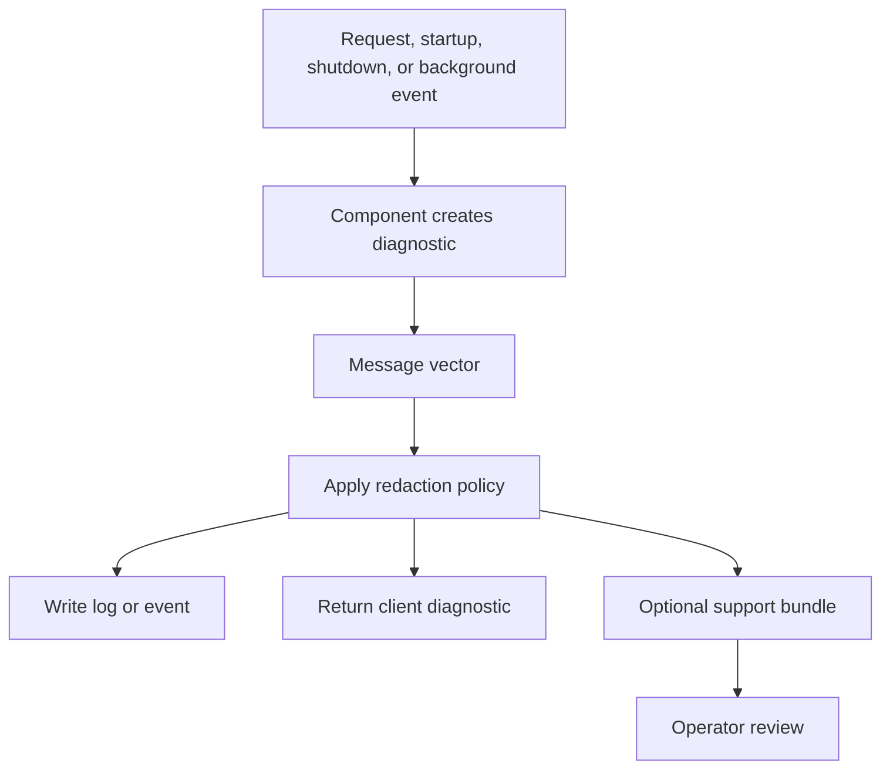
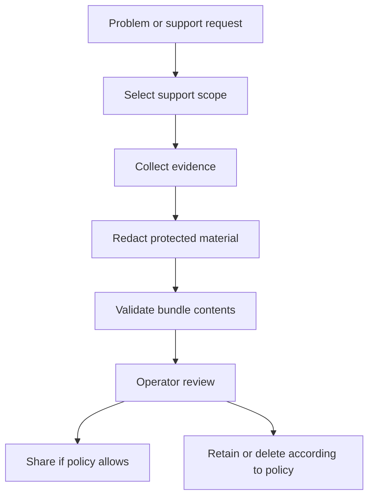

# Diagnostics And Support Bundles

## Purpose

Diagnostics explain what ScratchBird did, refused, could not complete, or could not safely determine. Support bundles collect diagnostic evidence for review while applying redaction policy.

This page explains the expected administrative model. It does not claim that every component emits complete evidence in every build.

## Diagnostic Goals

Good diagnostics should answer:

- Which component handled the request?
- Which identity and parser route were involved, if policy allows that detail?
- Which database or route was selected?
- Was the request accepted, denied, unsupported, unavailable, or failed during execution?
- Was the refusal caused by syntax, binding, authorization, policy, storage, transaction state, or configuration?
- Can the user continue, retry, roll back, detach, or ask an operator to intervene?
- Was any protected material redacted?

Diagnostics are part of the product surface. A controlled refusal is better than an unclear crash or silent success.

## Diagnostic Types

| Type | Meaning |
| --- | --- |
| Error | A request failed during parsing, binding, admission, execution, storage, or transaction handling. |
| Refusal | A request was denied, unsupported, unavailable, unsafe, or outside policy. |
| Warning | Work completed but produced a condition the user or operator should inspect. |
| Info | Operational detail useful for understanding startup, shutdown, routing, or configuration. |
| Evidence | Structured context used to explain a decision, prove a route, or support review. |
| Proof | Test or validation output showing that a behavior was exercised. |

## Message Vectors

ScratchBird uses message vectors for structured diagnostics. A message vector should let tools distinguish between failure categories rather than parsing only human text.

Common message-vector categories include:

- invalid syntax;
- invalid token;
- parser route unavailable;
- parser feature unsupported;
- object not found or not visible;
- ambiguous name;
- invalid type coercion;
- authorization denied;
- policy denied;
- sandbox denied;
- protected material unavailable;
- external access denied;
- missing capability;
- database open refused;
- transaction state invalid;
- recovery required;
- storage unavailable;
- diagnostic redacted.

The exact rendering can differ by parser or tool. The underlying category should remain clear.

## Diagnostic Flow

Redaction must happen before sensitive diagnostic material is shared outside the trusted boundary.

## What To Include In Diagnostics

Where policy allows, useful diagnostics include:

- timestamp;
- component name;
- build or package version;
- operating mode;
- route selected;
- parser package selected;
- session identity or redacted identity reference;
- database route;
- schema root or workarea reference;
- transaction state;
- object name and object UUID where safe;
- message-vector class;
- refusal reason;
- next recommended action;
- correlation identifier;
- support-bundle identifier.

Do not include raw secrets, credentials, protected values, or unnecessary local machine details.

## Support Bundle Purpose

A support bundle is a controlled diagnostic package. It should help an operator or support engineer understand a problem without requiring unrestricted access to the environment.

A support bundle may include:

- configuration summary;
- component versions;
- startup and shutdown evidence;
- parser registration summary;
- database open summary;
- identity provider summary;
- redacted session context;
- message vectors;
- selected logs;
- support-bundle generation metadata;
- resource availability summary;
- test or proof summaries where available.

It should not include raw secrets or protected material.

## Support Bundle Flow

An operator should review the bundle before sharing it.

## Redaction Policy

Redaction should protect:

- passwords;
- keys;
- tokens;
- raw protected material;
- unwrapped secret values;
- unnecessary local paths;
- credentials in connection strings;
- private user data not needed for diagnosis;
- sensitive policy details where disclosure would create risk.

Redaction can preserve safe evidence such as:

- hashes;
- UUIDs where policy allows;
- component names;
- version identifiers;
- timestamps;
- message-vector classes;
- object names where safe;
- redacted route names;
- counts and summaries.

## Diagnostics By Area

| Area | Useful Evidence |
| --- | --- |
| Startup | Configuration validation, resource discovery, component version, route registration, database open result. |
| Authentication | Provider selected, identity result, refusal class, redacted principal reference. |
| Authorization | Grants loaded, schema root, policy outcome, denied object or route where safe. |
| Parser | Parser selected, accepted surface, unsupported feature refusal, binding failure. |
| Query execution | Statement class, transaction state, object visibility, result or failure class. |
| Storage | Database path class, filespace state, open refusal, storage unavailable, recovery-required state. |
| Transactions | Begin, commit, rollback, savepoint, conflict, invalid state, cleanup restriction. |
| Backup and restore | Logical stream classification, target database, policy result, denied physical operation. |
| Data movement | Source, target, ordering or record identity summary, quarantine or refusal state. |

## Refusal Examples

| User-Facing Situation | Diagnostic Should Distinguish |
| --- | --- |
| A parser command is not implemented. | Unsupported parser feature. |
| The engine build lacks the operation. | Missing engine capability. |
| The identity lacks permission. | Authorization denied. |
| The request targets another schema branch. | Sandbox denied or object not visible. |
| A command asks the server to open a local file. | External access denied or policy denied. |
| A physical page-copy restore is submitted through a parser route. | Unsupported physical operation through that route. |
| A database cannot safely open. | Recovery required or open refused. |

## Operator Review Checklist

Before sharing a support bundle:

1. Confirm the bundle was generated by the intended build.
2. Confirm the scope is limited to the problem.
3. Confirm raw secrets are absent.
4. Confirm protected material is redacted.
5. Confirm local paths are removed or minimized.
6. Confirm user data is not included unless required and authorized.
7. Confirm the message-vector classes are preserved.
8. Confirm timestamps and component names are present.
9. Confirm the bundle can be retained or deleted according to policy.

## What This Page Does Not Claim

This page does not claim:

- every component emits complete diagnostics;
- every support-bundle field exists in every build;
- redaction has been independently certified;
- diagnostics are a substitute for backups;
- support bundles are safe to share without operator review.

Verify support-bundle behavior with the current build before using it in a real support process.

## Where To Go Next

- [Configuration Basics](configuration_basics.md)
- [Choosing A Deployment Mode](choosing_a_deployment_mode.md)
- [Refusal Vectors](../../Language_Reference/syntax_reference/refusal_vectors.md)
- [Management And Operations](../../Language_Reference/syntax_reference/management_and_operations.md)
- [Security And Privilege Statements](../../Language_Reference/syntax_reference/security_and_privilege_statements.md)
