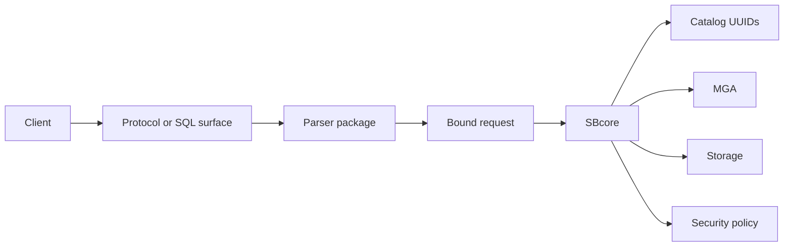

# Engine Parser Boundary

## Purpose

ScratchBird separates the parser from the engine. This is one of the most important ideas in the system.

The parser understands a language or wire protocol. The engine owns durable authority.

## Boundary Diagram

## Parser Responsibilities

A parser package is responsible for:

- accepting the protocol or language it supports;
- preserving parser-specific rules where implemented;
- rendering parser-specific diagnostics and result shapes;
- mapping object names and syntax to bound ScratchBird requests;
- refusing unsupported or unsafe surfaces.

## Engine Responsibilities

The engine is responsible for:

- durable object identity;
- catalog state;
- descriptor binding;
- transaction finality;
- recovery;
- materialized authorization;
- storage;
- index and visibility decisions;
- final refusal or execution.

## Why This Matters

Without this boundary, every donor dialect would risk becoming its own database engine inside ScratchBird. With the boundary, parser packages can differ in syntax and client behavior while still using one engine authority model.

## Compatibility Reading

Parser compatibility is scoped. A Firebird-style parser should not be read as supporting PostgreSQL-style syntax. A PostgreSQL-style parser should not be read as supporting MySQL-style behavior. Each parser has its own route, catalog projections, datatypes, defaults, and refusal rules.

## Related Pages

- [sbsql_and_sblr.md](sbsql_and_sblr.md)
- [../using_scratchbird/donor_database_compatibility.md](../using_scratchbird/donor_database_compatibility.md)
