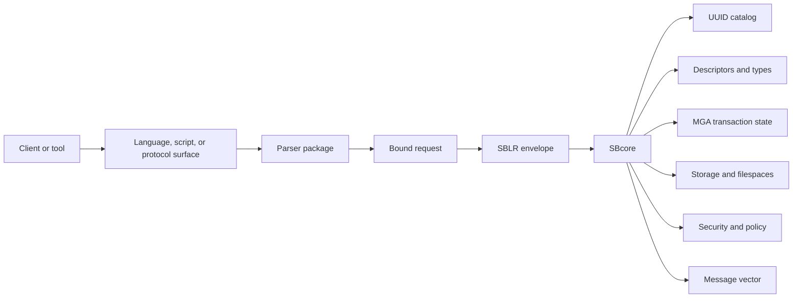
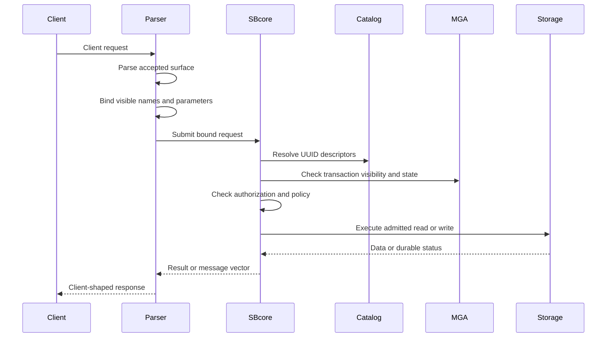

# Engine Parser Boundary

## Purpose

ScratchBird separates client language handling from durable database authority. This is one of the central architectural ideas in the system.

A parser understands a command language, script format, or wire protocol. SBcore owns durable database behavior: catalog identity, descriptors, storage, transactions, authorization, diagnostics, and recovery decisions.

This page explains the boundary at an end-user level. It does not claim that every parser route or command surface is complete in every build.

## The Boundary In One Diagram

The client sends text, frames, parameters, or tool commands. The parser decides whether that surface is accepted. The engine decides whether the resulting bound request is valid, authorized, transactionally safe, and executable.

## Why The Boundary Exists

Without a strict parser/engine boundary, every accepted language surface could become a separate database engine. That would make transaction behavior, catalog identity, security, recovery, and diagnostics drift by parser.

ScratchBird avoids that by making parsers translators, not storage authorities.

| Concern | Parser Package | SBcore |
| --- | --- | --- |
| Syntax | Accepts or refuses the language or protocol it supports. | Does not treat raw client text as authority. |
| Names | Binds visible user names according to parser and session context. | Resolves admitted work to durable UUID-backed catalog identity. |
| Types | Parses literals and applies parser-visible type spelling. | Owns type descriptors, storage encoding, comparison, and coercion authority. |
| Defaults | Applies parser-specific defaults explicitly. | Stores explicit durable object descriptors. |
| Security | Carries session identity and visible context toward the engine. | Materializes authorization and policy before execution. |
| Transactions | Requests begin, commit, rollback, savepoint, or statement work. | Owns final visibility, cleanup, and recovery state. |
| Diagnostics | Renders client-shaped messages where implemented. | Produces authoritative message vectors for engine admission and execution. |

## Parser Responsibilities

A parser package is responsible for:

- accepting only the language or protocol surface it is designed to support;
- rejecting unrelated dialects or malformed protocol input;
- tokenizing and parsing accepted input;
- applying parser-specific identifier, literal, and default rules;
- binding visible names through the session's schema root and search context;
- lowering admitted work into SBLR or another engine-facing request shape;
- rendering rows, status, and diagnostics in the client-facing shape where implemented;
- refusing unsupported, denied, unsafe, or unavailable behavior clearly.

A parser should not write database files, decide final transaction visibility, bypass catalog identity, or grant access outside the session's authority.

## Engine Responsibilities

SBcore is responsible for:

- database create, open, close, and reopen behavior;
- durable object UUIDs and catalog state;
- descriptor validation and type authority;
- transaction begin, commit, rollback, savepoint, visibility, cleanup, and recovery;
- storage pages, row storage, overflow storage, and filespace state;
- index identity and index maintenance;
- materialized authorization and policy checks;
- support-bundle evidence and engine diagnostics;
- final admission, execution, or refusal of a bound request.

The engine may refuse a request even after the parser accepts the syntax. That is expected behavior.

## Statement Lifecycle

This lifecycle is the same architectural pattern whether the client uses native SBsql or a compatibility parser route.

## Parser-Specific Defaults

Different parser routes may expose similar objects with different default behavior. Examples include:

- identifier folding;
- default schema selection;
- datatype precision or scale defaults;
- string literal interpretation;
- index null ordering;
- generated constraint names;
- catalog projection shape;
- diagnostic wording.

Those defaults must be lowered into explicit engine requests. The engine should not have to guess which parser default created a durable object later.

## Sandboxing

The parser boundary is also a sandbox boundary.

A session has a visible schema root and authorization context. A compatibility parser may present one schema branch as the connected database. Native SBsql may expose broader tree navigation when the identity is authorized.

The parser cannot simply spell a path outside the visible root and gain authority. Name resolution must end in a visible object identity that the engine admits for the session.

## Refusal Behavior

Refusal can happen at several points.

| Location | Example Refusal |
| --- | --- |
| Listener or entry point | Unknown route, unavailable parser, authentication failure. |
| Parser | Syntax not accepted, malformed protocol input, unsupported parser feature. |
| Binder | Name not visible, ambiguous object, invalid type coercion. |
| Engine admission | Unauthorized object, denied policy, unsupported engine operation. |
| Execution | Constraint violation, transaction conflict, storage refusal, recovery-required state. |

Good refusal is part of compatibility. The system should not return success for work it did not implement or admit.

## What This Boundary Does Not Mean

The parser/engine boundary does not mean:

- all parser packages are complete;
- all parser packages support the same commands;
- parser syntax is native SBsql syntax;
- the engine executes raw SQL text;
- syntax acceptance guarantees execution;
- a compatibility route can bypass ScratchBird storage or transaction rules.

Always check the parser documentation, build output, tests, and release notes for the specific route you intend to use.

## Where To Go Next

- [SBsql And SBLR](sbsql_and_sblr.md)
- [Recursive Schema Tree](recursive_schema_tree.md)
- [Identity, Authentication, And Authorization](identity_authentication_and_authorization.md)
- [Storage, Transactions, And Recovery](storage_transactions_and_recovery.md)
- [Donor Database Compatibility](../using_scratchbird/donor_database_compatibility.md)
- [Parser To SBLR Pipeline](../../Language_Reference/core_paradigms/parser_to_sblr_pipeline.md)
