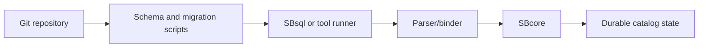

# Git-Oriented Workflows

## Purpose

ScratchBird documentation uses Git-oriented workflows to describe how database-related source assets can be reviewed, versioned, and reproduced alongside application code.

This page is an overview. It does not claim that Git replaces database backup, database recovery, transaction history, or engine-managed audit.

## What Belongs In Git

Git is useful for human-reviewed artifacts such as:

- schema scripts;
- migration scripts;
- seed data used for development or tests;
- configuration templates;
- parser compatibility fixtures;
- expected result files;
- documentation;
- test harness inputs.

## What Does Not Belong In Git By Default

Git should not be treated as the ordinary storage mechanism for:

- live database files;
- local build output;
- temporary files;
- private secrets;
- raw support bundles that contain sensitive operational details;
- generated release artifacts unless a release process explicitly tracks them.

## How This Fits ScratchBird

ScratchBird uses UUID-based engine identity and transaction authority. Git can track the scripts and manifests used to request changes, but the database catalog remains engine-owned.

## Review Model

A safe Git-oriented workflow usually separates:

| Artifact | Role |
| --- | --- |
| Source script | Human-reviewed request. |
| Test fixture | Reproducible proof input. |
| Expected result | Reviewable assertion. |
| Database state | Engine-owned result after admitted execution. |

## Cautious Reading

Git support should be understood as workflow support unless a specific command or tool documents a stronger behavior. Git is not a substitute for backups, transaction logs, access control, or support-bundle diagnostics.
