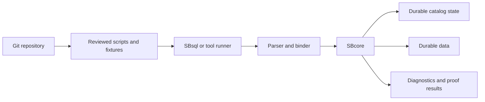

# Git-Oriented Workflows

## Purpose

ScratchBird documentation uses Git-oriented workflows to describe how database-related source assets can be reviewed, versioned, tested, and reproduced alongside application code.

Git is useful for managing scripts, configuration templates, fixtures, expected results, and documentation. Git does not replace database backups, recovery, transaction history, authorization, support bundles, or engine-owned catalog state.

## The Core Distinction



Git tracks the request material and expected proof artifacts. SBcore owns the durable result after admitted execution.

## What Belongs In Git

Git is appropriate for human-reviewed and reproducible artifacts such as:

- schema creation scripts;
- migration scripts;
- rollback scripts where the project maintains them;
- seed data for development or tests;
- test fixtures;
- expected result files;
- parser compatibility inputs;
- configuration templates;
- policy templates without secrets;
- documentation;
- generated proof summaries that are intended for review;
- release notes and upgrade notes.

These files should be written so another user can understand what they request before executing them.

## What Does Not Belong In Git By Default

Git should not be treated as ordinary storage for:

- live database files;
- temporary database files;
- local build output;
- staged release artifacts unless the release process explicitly tracks them;
- raw support bundles that may contain sensitive operational evidence;
- secrets, passwords, keys, or tokens;
- local machine paths;
- generated caches;
- logs with protected material;
- physical backup page copies.

If a project intentionally tracks a generated artifact, document why it is tracked and how it is regenerated.

## Recommended Repository Shape

A project using ScratchBird can keep database source assets organized without mixing them with live storage.

```text
project_root
|-- database
|   |-- schema
|   |-- migrations
|   |-- seed
|   |-- policy_templates
|   `-- expected_results
|-- tests
|   |-- sbsql
|   |-- fixtures
|   `-- proof
`-- docs
    `-- database_notes
```

This is only an example layout. The important rule is to keep source material separate from live database files and local generated output.

## Migration Scripts

A migration script is a reviewed request to change the database. It is not the durable change by itself.

A good migration workflow records:

- the intended precondition;
- the requested schema or data changes;
- the expected postcondition;
- the transaction boundary;
- the verification query or proof;
- the rollback or recovery plan where applicable;
- the minimum ScratchBird build or feature surface required.

Example structure:

```sql
-- migration: add note status
-- intent: add a status column for application filtering

alter table app.notes
    add column note_status text not null default 'open';

select note_id, note_status
from app.notes
order by note_id;

commit;
```

Use exact syntax from the current Language Reference when writing production scripts.

## Expected Results

Expected result files are useful when a script should produce deterministic output.

For example, a test can record:

- row count;
- column names;
- column types;
- ordered result rows;
- expected diagnostic class for an invalid request;
- expected refusal when policy denies an operation.

When row order matters, scripts should request it explicitly with `order by`.

## Configuration Templates

Configuration templates can live in Git when they do not contain secrets and when environment-specific values are clearly separated.

Good template behavior:

- use template variables for local paths and secret references;
- keep raw secrets out of the file;
- document required resource files;
- make parser route admission explicit;
- make diagnostics and redaction policy explicit;
- keep platform-specific notes separate when needed.

## Git And Database Identity

ScratchBird uses UUID-backed catalog identity. Git tracks text files.

That means:

- a script can request `create table app.notes`;
- the engine creates or modifies durable catalog objects;
- a later rename may keep the same durable object identity;
- a Git diff of scripts is not the same as a catalog diff;
- replaying a script against a different database may not produce the same durable identity.

Treat Git as source control for requests, not as the catalog.

## Git And Transactions

Git commit history is not database transaction history.

| Git Concept | Database Concept |
| --- | --- |
| Git commit | Versioned source change in a repository. |
| Database commit | Engine admission of a transaction outcome. |
| Git revert | Source-level reversal of a repository change. |
| Database rollback | Discard uncommitted database work. |
| Git branch | Source-control line of development. |
| Schema branch | Database namespace branch. |

The terms can sound similar, but they are different systems with different authority.

## Git And Backups

Git is not a database backup system.

Git can help reproduce scripts and expected states, but a database backup must preserve the database state according to the documented backup and restore surface. Logical backup, logical restore, import, export, and migration behavior should be handled through the relevant ScratchBird tools or SBsql commands where implemented and admitted.

## Review Checklist

Before merging database-related source changes, review:

- Does the script state its intent?
- Does it use qualified names where clarity matters?
- Does it avoid raw secrets?
- Does it include a transaction boundary?
- Does it include verification queries or expected diagnostics?
- Does it avoid relying on implicit row order?
- Does it avoid server-local paths unless the operation is explicitly intended and admitted?
- Does it avoid claiming feature availability that the current build does not prove?

## Where To Go Next

- [SBsql And SBLR](sbsql_and_sblr.md)
- [Storage, Transactions, And Recovery](storage_transactions_and_recovery.md)
- [First SBsql Session](../using_scratchbird/first_sbsql_session.md)
- [Backup, Restore, And Data Movement Overview](../administration/backup_restore_and_data_movement_overview.md)
- [Script Tokens And Identifiers](../../Language_Reference/syntax_reference/script_tokens_and_identifiers.md)
