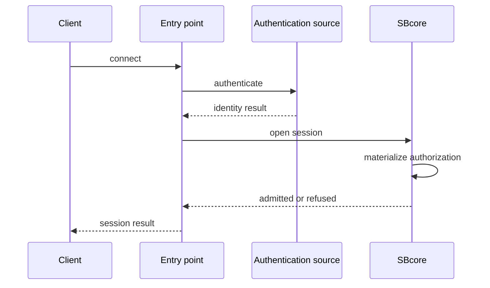

# Identity, Authentication, And Authorization

## Purpose

ScratchBird separates who a session is, how it proves that identity, and what the identity can do.

## Terms

| Term | Meaning |
| --- | --- |
| Identity | The user or agent UUID associated with a session. |
| Authentication | The process of proving the identity. |
| Authorization | The grants, policy, schema root, and object visibility available to that identity. |
| Session | A connected execution context with identity, parser profile, transaction state, and schema context. |

## High-Level Flow

## Schema Roots And Sandboxes

Authorization includes what part of the schema tree the session can see. A native administrative SBsql session may have broad visibility. A donor parser session normally sees a donor workarea as its root.

This means a connected donor client can query objects inside its assigned workarea without seeing unrelated branches. Catalog projection views may show selected metadata from outside the workarea only when policy grants that projection.

## Refusal Is A Feature

ScratchBird uses message vectors and diagnostics when a request is unsupported, denied, unavailable, or not licensed for the current build. A refusal should be treated as part of the public behavior, not as an accidental crash path.

## Cautious Reading

Authentication methods, identity providers, and policy features depend on the current build and configuration. Do not assume a method is available until the release status and tests for that surface confirm it.
