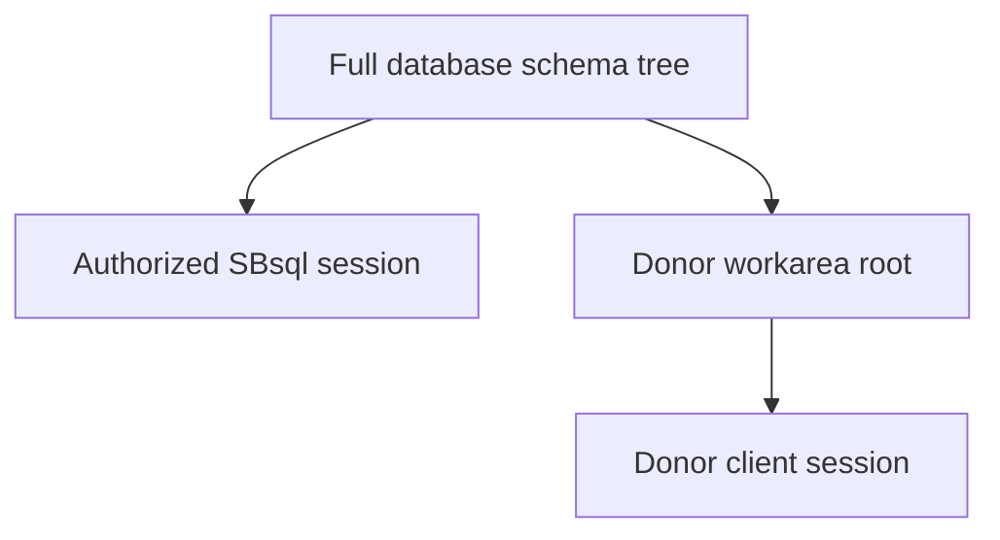

# Recursive Schema Tree

## Purpose

ScratchBird schemas form a tree. A schema can contain child schemas and ordinary objects. This is different from a flat schema model where all schemas live at one level.

## Basic Shape

```text
database
|
+-- sys
|   +-- catalog
|   +-- security
|   +-- metrics
|   +-- parser
|   +-- storage
|
+-- users
|   +-- public
|   +-- home schema
|
+-- emulated
|   +-- donor workarea
|
+-- remote
    +-- external connection namespace
```

The names above are explanatory labels. Engine identity is UUID-based.

## Why Recursive Schemas Exist

Recursive schemas let ScratchBird represent:

- ordinary application schemas;
- user home areas;
- system catalog branches;
- donor-emulated database workareas;
- external connection namespaces;
- compatibility catalog projections;
- administrative and diagnostic namespaces.

## User View

A native SBsql administrator may be able to see a broad tree when authorized. A donor client normally sees only its donor workarea as the root. This lets a Firebird-style client behave like it is attached to a Firebird-style database without seeing unrelated SBsql branches.



## Name Resolution

Names are resolved through the current schema, search path or parser-specific equivalent, and sandbox root. A text name is not durable authority. The resolver must bind the name to a visible object UUID before execution.

## Related Pages

- [../Language_Reference/syntax_reference/schema_tree_and_name_resolution.md](../../Language_Reference/syntax_reference/schema_tree_and_name_resolution.md)
- [../using_scratchbird/schemas_objects_and_names.md](../using_scratchbird/schemas_objects_and_names.md)
