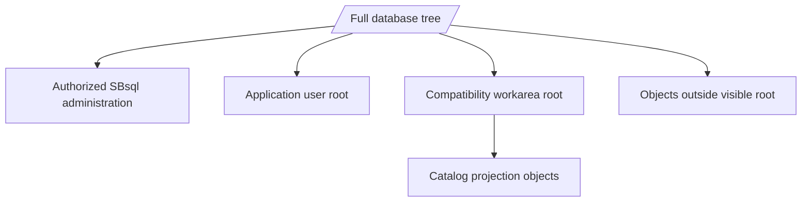
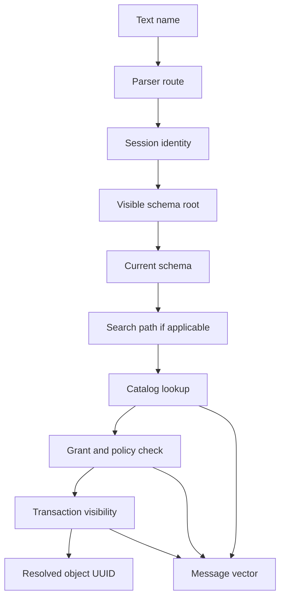

# Recursive Schema Tree

## Purpose

ScratchBird schemas form a tree. A schema can contain database objects and, where supported, child schemas. This is different from a flat model where all schemas live at one level.

The recursive schema tree is important for native SBsql administration, compatibility workareas, sandboxing, catalog projections, and durable UUID-backed object identity.

## Basic Shape

The names below are explanatory labels, not a required database layout.

```text
database_root
|-- system
|   |-- catalog
|   |-- security
|   |-- diagnostics
|   `-- storage
|-- users
|   |-- public
|   `-- home
|-- applications
|   |-- app
|   |   |-- tables
|   |   |-- routines
|   |   `-- policy
|   `-- audit
`-- workareas
    |-- compatibility_area_a
    `-- compatibility_area_b
```

Engine identity is UUID-based. The visible names are labels resolved by the session.

## Why Recursive Schemas Exist

Recursive schemas let ScratchBird represent several ideas without flattening them into one global namespace.

| Need | How The Tree Helps |
| --- | --- |
| Application organization | Application objects can live under a branch. |
| Administrative separation | System, security, diagnostics, and storage metadata can be separated from user objects. |
| User home areas | A user's default namespace can be a branch rather than a single global schema. |
| Compatibility workareas | A parser can present one branch as the client's database root. |
| Catalog projections | Metadata views can be placed where the intended users can see them. |
| Policy scoping | Policy can be attached or reasoned about by branch. |
| Migration staging | Imported or converted objects can be staged in a separate branch before promotion. |

## Durable Identity Versus Path Names

A path such as `applications.app.tables.notes` is user-facing. The durable object is represented by catalog identity and descriptors.

That matters because:

- an object can be renamed;
- a branch can be moved or reorganized where supported;
- parser routes can render names differently;
- dependencies should follow object identity;
- grants should apply to the intended object;
- transaction visibility controls whether a catalog change is visible.

Names are necessary for users. UUID identity is necessary for durable engine authority.

## Session Views

Different sessions can see different roots.



An authorized administrative SBsql session may see broad portions of the tree. A normal application user may see an application branch. A compatibility parser session may see its workarea as the root.

The visible root is part of the security model, not just a display preference.

## Schema Context Variables

ScratchBird documentation uses several schema-context ideas.

| Concept | Meaning |
| --- | --- |
| Database root | The top of the durable database tree. |
| Parser-visible root | The root presented to the selected parser route. |
| Home schema | The schema associated with a user, service, or configured workarea. |
| Current schema | The default schema for unqualified names in the current session. |
| Search path | An ordered set of schemas used by commands that allow path-based lookup. |
| Object parent schema | The schema that owns a specific object's local name. |

The exact inspection and assignment syntax belongs in the Language Reference.

## Name Resolution

Name resolution turns text into object identity.



An unqualified name such as `notes` may resolve through the current schema. A qualified name such as `app.notes` gives more path information. Neither form bypasses visibility, grants, policy, or transaction state.

## Compatibility Workareas

A compatibility workarea is a schema branch presented to a parser route as the client-visible database root.

This lets the parser show a client a familiar namespace without giving that client direct access to the entire ScratchBird tree.

```text
database_root
|-- workareas
|   `-- accounting_compat
|       |-- catalog_projection
|       |-- tables
|       |-- views
|       `-- routines
`-- internal
    `-- not_visible_to_that_client
```

A catalog projection can expose selected metadata if the projection object has authority. That is different from giving the connected user direct access outside the workarea.

## Current Schema Examples

An SBsql session may use a current schema for shorter statements.

```sql
create schema app;
set schema app;

create table notes (
    note_id uint64 not null,
    note_text text not null
);

select note_id, note_text
from notes
order by note_id;
```

The unqualified name `notes` resolves relative to the current schema. A more explicit script can use qualified names:

```sql
select note_id, note_text
from app.notes
order by note_id;
```

Use qualified names for administrative scripts and migrations when ambiguity would be expensive.

## Object Lifecycle In The Tree

Object lifecycle operations interact with the tree.

| Operation | Tree Effect |
| --- | --- |
| Create schema | Adds a branch under a parent schema. |
| Create object | Adds an object under a parent schema. |
| Rename object | Changes a visible label while preserving durable identity where supported. |
| Move object | Changes parent context where supported and authorized. |
| Comment on object | Adds descriptive metadata without changing authority. |
| Drop object | Removes or marks the object according to transaction visibility and dependency rules. |
| Describe or show | Presents visible metadata through the current parser route. |

Dependency and authorization checks should prevent unsafe changes.

## Practical Guidance

For new SBsql work:

- create application schemas deliberately;
- avoid placing application objects at the database root;
- qualify names in migrations;
- avoid names that differ only by case;
- do not rely on catalog projections as direct access authority;
- document the intended schema root for each application or parser route;
- verify name resolution after renames;
- include explicit `order by` in result checks when order matters.

## Where To Go Next

- [Schemas, Objects, And Names](../using_scratchbird/schemas_objects_and_names.md)
- [Identity, Authentication, And Authorization](identity_authentication_and_authorization.md)
- [Engine Parser Boundary](engine_parser_boundary.md)
- [Schema Tree And Name Resolution](../../Language_Reference/syntax_reference/schema_tree_and_name_resolution.md)
- [Schema Statements](../../Language_Reference/syntax_reference/schema.md)
