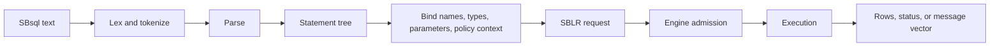
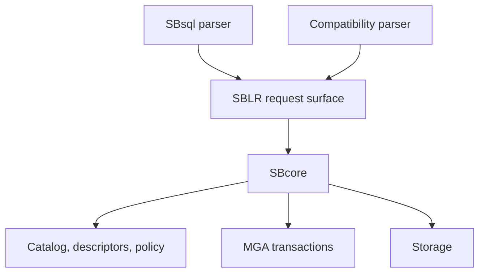

# SBsql And SBLR

## Purpose

SBsql is the native ScratchBird command language. SBLR is the bound request representation submitted toward engine authority after parsing and binding.

The practical rule is:

```text
SBsql text is user input.
SBLR is the engine-facing request.
SBcore state is the authority.
```

This page explains the relationship at a high level. Use the Language Reference for exact syntax.

## Where SBsql Fits

SBsql is intended to be the native user language for ScratchBird.

SBsql can be used for:

- creating and changing database objects;
- querying data;
- inserting, updating, deleting, merging, and streaming data where implemented;
- controlling transactions;
- managing schemas, privileges, policies, and diagnostics where authorized;
- defining routines, triggers, domains, types, and sequences where implemented;
- inspecting catalog and operational state;
- running scripts.

Native SBsql should express ScratchBird concepts directly instead of copying a donor language.

## Where SBLR Fits

SBLR is not ordinary end-user SQL. It is the structured request form emitted after a parser accepts and binds a request.

SBLR carries information such as:

- operation kind;
- object identity or name bindings;
- datatype descriptors;
- expression trees;
- parameter bindings;
- transaction context;
- routine bodies or callable operations where supported;
- diagnostics and refusal routing;
- policy-relevant context.

Users normally do not write SBLR directly in an interactive session.

## Statement Pipeline



Each stage can refuse the request. For example, parsing can reject malformed syntax, binding can reject an invisible name, and engine admission can reject unauthorized work.

## Example: Create A Table

An SBsql statement might look like this:

```sql
create table app.notes (
    note_id uint64 not null,
    note_text text not null,
    created_at timestamp with time zone not null,
    constraint pk_notes primary key (note_id)
);
```

The parser does not store that text as the durable table. Instead, the accepted request is bound into engine-owned metadata:

- parent schema identity;
- table object identity;
- column descriptors;
- datatype descriptors;
- constraint descriptors;
- default and nullability rules;
- transaction visibility;
- authorization checks.

The original text can be useful as source material or reference, but the engine catalog is the durable authority.

## Example: Query Data

An SBsql query:

```sql
select note_id, note_text
from app.notes
where note_id > 10
order by note_id;
```

The parser and binder must determine:

- which object `app.notes` refers to;
- whether the session can see it;
- which columns are projected;
- which operator and type rules apply to `note_id > 10`;
- what ordering is requested;
- which parameters, collations, or functions are involved;
- whether the engine admits the resulting plan.

The result is returned as rows or as a controlled diagnostic.

## Context-Sensitive Language

SBsql is intended to remain context-sensitive, with as few reserved words as practical. That means a word may be usable as an identifier in one context and a command word in another context.

Practical guidance:

- prefer clear object names;
- avoid names that look like common command words;
- quote identifiers only where the Language Reference says to do so;
- qualify names in administrative scripts;
- do not assume another parser's keyword rules apply to SBsql.

## SBLR And Parser Packages

Native SBsql is not the only possible parser source. A compatibility parser can accept its own client language or protocol and lower accepted work to the same engine authority model.



This lets parser packages preserve their client-facing syntax and defaults without becoming independent engines.

## Diagnostics

SBsql and SBLR participate in structured diagnostics.

| Stage | Example Diagnostic |
| --- | --- |
| Lexing | Invalid token. |
| Parsing | Statement shape not accepted. |
| Binding | Name not visible, ambiguous name, invalid argument count. |
| Type checking | Unsupported coercion or operator/type combination. |
| Engine admission | Authorization denied or feature unsupported by the build. |
| Execution | Constraint violation, transaction conflict, storage refusal. |

The user sees the diagnostic through the client or tool. The underlying message vector should preserve enough structure for support and automation where available.

## What SBsql/SBLR Does Not Mean

An SBsql grammar entry or an SBLR operation name does not, by itself, prove:

- the implementation is complete;
- every platform build includes it;
- every parser can call it;
- every operation is enabled by policy;
- the surface is production-ready;
- the operation bypasses engine authorization.

Availability must be checked against the current build, tests, configuration, and release notes.

## Where To Go Next

- [Engine Parser Boundary](engine_parser_boundary.md)
- [First SBsql Session](../using_scratchbird/first_sbsql_session.md)
- [Script Tokens And Identifiers](../../Language_Reference/syntax_reference/script_tokens_and_identifiers.md)
- [Operators](../../Language_Reference/syntax_reference/operators.md)
- [Procedural SQL](../../Language_Reference/syntax_reference/procedural_sql.md)
- [Language Reference](../../Language_Reference/README.md)
