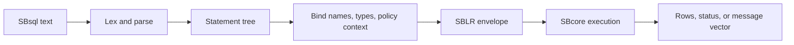

# SBsql And SBLR

## Purpose

SBsql is the native ScratchBird SQL language. SBLR is the internal execution representation admitted by the engine.

The practical rule is:

```text
SBsql text is user input.
SBLR is the engine-facing request format.
Engine state is the authority.
```

## How A Statement Moves



## What SBsql Is For

SBsql is intended to be the native language for:

- creating and changing ScratchBird objects;
- querying data;
- managing schemas and security where authorized;
- inspecting metadata and diagnostics;
- using ScratchBird-native object and command surfaces.

For detailed syntax, use the [SBsql Language Reference](../../Language_Reference/README.md).

## What SBLR Is For

SBLR is used after parsing and binding. It carries engine-facing operations, object identities, descriptors, transaction context, and diagnostic routing. Users normally do not write SBLR by hand in ordinary sessions.

## Donor Parser Relationship

Donor parsers do not make the engine run donor SQL directly. They translate donor requests into the same engine-facing model. This allows a donor parser to preserve donor syntax and defaults while still using ScratchBird transaction, storage, and security authority.

## Cautious Reading

An SBsql grammar entry or SBLR operation name should not be read as a claim that all behavior is production-ready. Availability depends on implementation, build configuration, platform proof, and release status.
