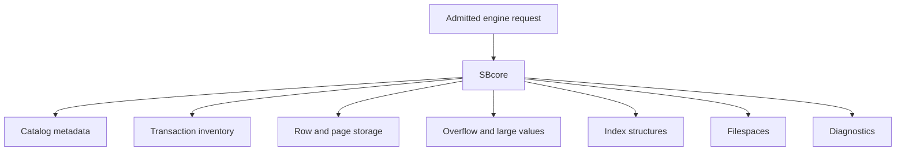
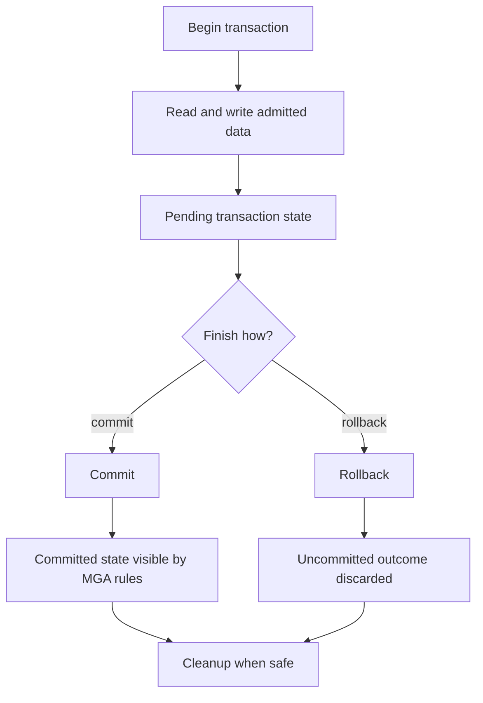

# Storage, Transactions, And Recovery

## Purpose

ScratchBird stores data through SBcore. Parser packages, client tools, and scripts can request changes, but they do not own storage finality, transaction visibility, or recovery decisions.

This page explains the high-level model for users. It is not a durability certification or crash-safety claim for every build and platform. Read release-specific test results before relying on a deployment for real data.

## Engine-Owned State

SBcore owns durable database state such as:

- database header and create/open state;
- filespace metadata;
- page and row storage;
- catalog rows;
- object UUIDs;
- type and domain descriptors;
- index metadata and index contents;
- overflow or large-value storage metadata;
- transaction inventory;
- visibility and cleanup state;
- materialized authorization state;
- recovery-required or refusal state;
- support-bundle evidence.

Client-visible SQL text and parser state are not the durable database.

## Storage Model At A High Level



The exact on-disk format belongs to implementation and release documentation. The user-facing rule is that SBcore is the component that understands and maintains durable storage.

## Filespaces

A filespace is a storage area known to the engine. A database can use filespace metadata to describe where durable data lives and how it is organized.

At a high level, filespace behavior should answer:

- which storage areas belong to the database;
- which filespace is primary or special for database bootstrap;
- whether a filespace can be attached, detached, promoted, moved, or removed in the current release;
- what diagnostics are returned when storage is unavailable or unsafe;
- how recovery determines whether filespace metadata is consistent.

Use the Language Reference for exact filespace commands and supported lifecycle operations.

## Transactions

A transaction is a boundary around work. A session can request transaction actions, but the engine owns final visibility.



ScratchBird documentation refers to the transaction and visibility authority model as MGA. For an end user, the core point is simple: commit, rollback, visibility, and cleanup are engine decisions.

## Transaction Actions

Common transaction actions include:

| Action | Meaning |
| --- | --- |
| Begin | Start a transaction context where required by the session mode. |
| Commit | Request that admitted changes become final according to engine rules. |
| Rollback | Request that uncommitted changes be discarded. |
| Savepoint | Mark a point within a transaction that can be rolled back to where supported. |
| Release savepoint | Remove a savepoint marker where supported. |
| Autocommit | Let the session or tool commit statement work automatically according to documented rules. |
| Prepare | Enter a prepared transaction state where supported by the engine and selected route. |

Exact syntax and availability are described in the Language Reference.

## Visibility

Visibility decides which committed or uncommitted versions a transaction can see. It affects:

- newly inserted rows;
- updated rows;
- deleted rows;
- catalog objects created or dropped inside transactions;
- index contents;
- cleanup decisions;
- long-running readers;
- recovery after reopen.

Visibility is not decided by the parser. A parser can ask for work; SBcore determines the transactionally valid view.

## Commit And Reopen

A practical first durability check is a commit-and-reopen test:

1. Create or open a disposable database.
2. Begin a session.
3. Create a schema and table.
4. Insert rows.
5. Commit.
6. Detach.
7. Stop the runtime if the selected mode uses one.
8. Reopen the same database.
9. Query the committed rows.

```sql
select count(*) as note_count
from app.notes;
```

This proves more than an in-memory result. It confirms that the selected mode can reopen the database and see committed state for that basic workflow.

## Recovery

Recovery is the engine's process for determining a safe state after normal shutdown, interruption, or uncertain durable state.

Recovery can lead to different outcomes:

| Outcome | Meaning |
| --- | --- |
| Open normally | Durable metadata and transaction state are consistent enough to admit normal work. |
| Open read-only or restricted | The engine can expose limited access while preventing unsafe writes where supported. |
| Recovery required | The engine requires a recovery path before ordinary work proceeds. |
| Operator action required | The engine refuses to decide silently and requires administrative intervention. |
| Fail closed | The engine refuses access because safe state cannot be determined. |

Silent inconsistency is the state to avoid. A clear refusal is safer than pretending that uncertain data is valid.

## Parser Boundary And Storage

Parser packages can request storage-changing operations. They do not write pages directly.

That matters for compatibility routes:

- a parser can accept client syntax;
- a parser can lower admitted work to SBLR;
- the engine still enforces transaction, storage, authorization, and recovery rules;
- physical page-copy formats or low-level repair commands should not bypass SBcore through a parser route;
- logical streams must be interpreted as admitted operations, not as direct file edits.

## Diagnostics

Storage and transaction diagnostics should identify the kind of problem without leaking protected material.

Useful diagnostic categories include:

- database open refused;
- unsupported filespace operation;
- storage path unavailable;
- transaction conflict;
- transaction state invalid for the command;
- recovery required;
- authorization denied;
- policy denied;
- unsupported physical operation through a parser route;
- message vector redacted.

## What This Page Does Not Claim

This page does not claim:

- a specific crash matrix is complete;
- every filespace lifecycle operation is implemented;
- every parser route supports every transaction action;
- every platform build has the same durability proof;
- a logical backup is the same as a physical page copy;
- client tools can repair storage directly.

Use the current build, tests, and Language Reference for exact behavior.

## Where To Go Next

- [First Database](../using_scratchbird/first_database.md)
- [Transaction Control](../../Language_Reference/syntax_reference/transaction_control.md)
- [Filespace](../../Language_Reference/syntax_reference/filespace.md)
- [Database](../../Language_Reference/syntax_reference/database.md)
- [Backup, Restore, Replication, Migration](../../Language_Reference/syntax_reference/backup_restore_replication_migration.md)
- [Diagnostics And Support Bundles](../administration/diagnostics_and_support_bundles.md)
