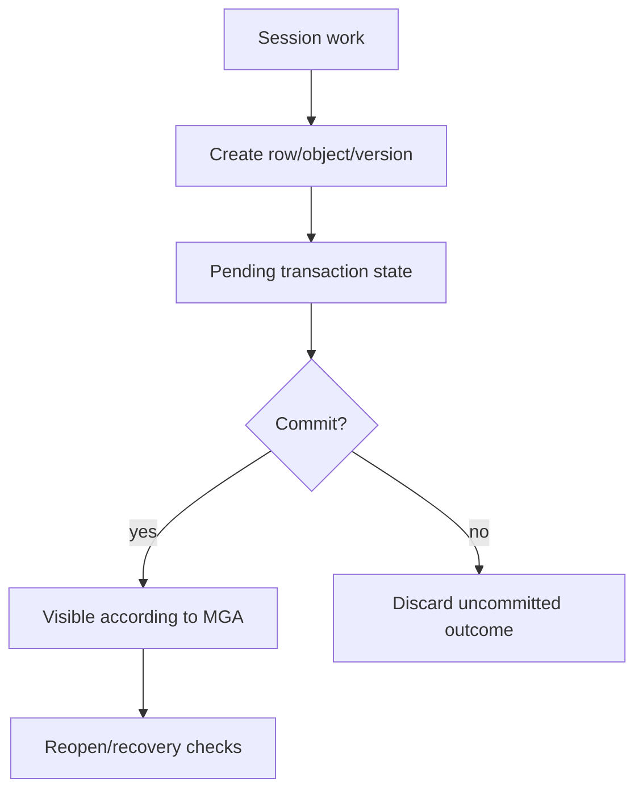

# Storage, Transactions, And Recovery

## Purpose

ScratchBird stores data through the engine, not through parser files or client-side state. This page explains the high-level storage and transaction model.

## Engine-Owned State

The engine owns:

- database files;
- catalog rows;
- object UUIDs;
- row and page storage;
- transaction inventory;
- visibility rules;
- cleanup and recovery decisions;
- index and overflow storage metadata;
- support-bundle evidence.

## Transaction Authority

ScratchBird documentation refers to the transaction model as MGA. A session can request transaction actions such as begin, commit, rollback, and savepoint. The engine decides final visibility and recovery.

## Recovery Reading

Recovery means the engine can reopen and determine the safe database state according to its durable metadata and transaction inventory. It does not mean a client can disconnect and later resume arbitrary uncommitted work.

## Parser Boundary

Parser packages can request changes. They do not own storage finality. This keeps donor compatibility from bypassing ScratchBird recovery rules.

## Cautious Reading

Crash behavior, durability, and recovery guarantees must be read from the current release evidence and tests for the exact build and platform. This overview describes the intended ownership model, not a blanket guarantee.
