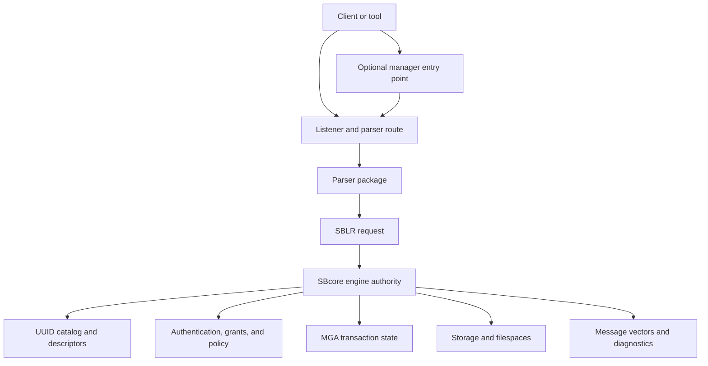
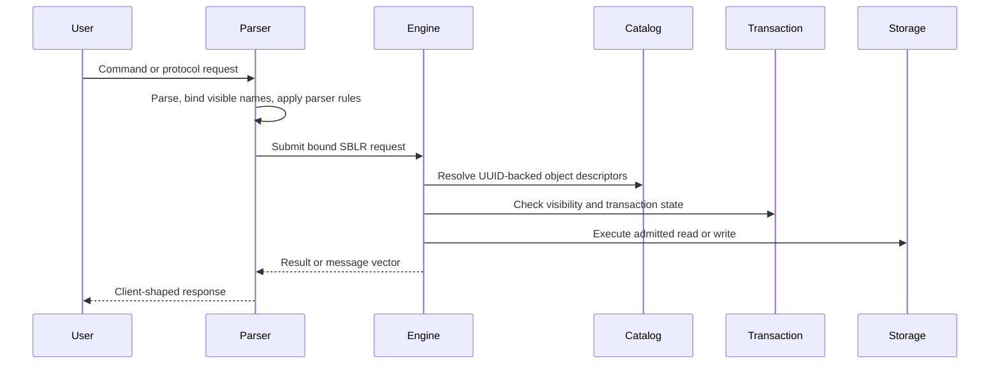
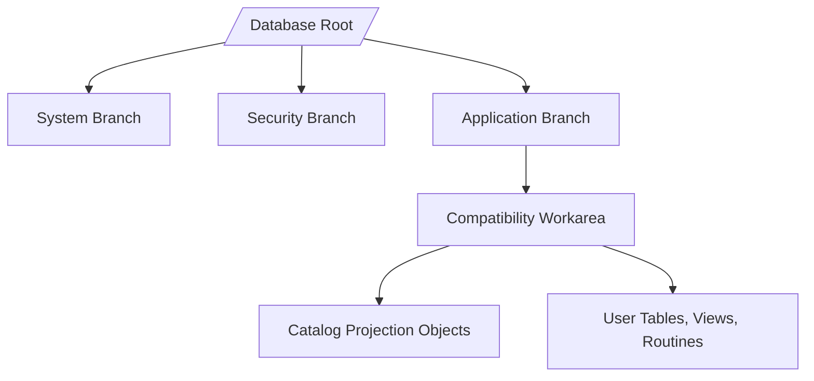
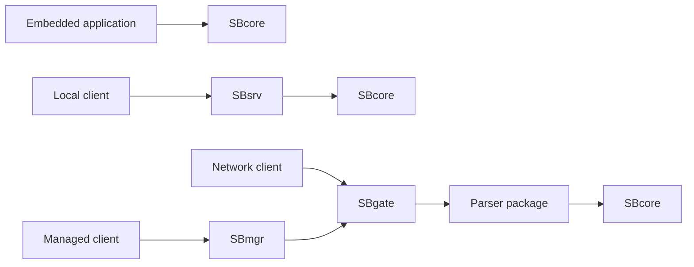

# How ScratchBird Implements A CDE

## Purpose

ScratchBird is organized as a Convergent Data Engine by separating durable engine authority from parser, protocol, management, and operational surfaces. This page explains that model at a high level for users who are trying to understand what parts of the system they are interacting with.

This is an architectural overview, not a compatibility or deployment certification. A feature is usable only when it is implemented, built for the target platform, enabled by configuration and policy, and covered by the relevant tests for the release being used.

## Design Summary

ScratchBird is built around a small number of boundaries:

- **SBcore** owns durable engine behavior.
- **Parsers** translate client language or protocol requests into engine requests.
- **SBLR** is the bound request representation passed toward engine authority.
- **Catalog identity** uses durable UUIDs rather than relying only on text names.
- **MGA transaction authority** belongs to the engine.
- **Security and policy** are materialized before work is admitted.
- **Operational tools** inspect, configure, diagnose, and manage the running system.

The result is a system where several client surfaces can exist without making any one client language the engine itself.

## Main Components

The public names below are the user-facing names used in documentation and output. Internal file names may differ.

| Component | User-Facing Role |
| --- | --- |
| ScratchBird Engine, or SBcore | The embedded engine library that owns catalog identity, descriptors, transaction authority, storage, recovery decisions, materialized security checks, and engine diagnostics. |
| ScratchBird IPC Server, or SBsrv | A local multi-user server process for clients on the same machine. It is useful when local processes need shared access without exposing a network listener. |
| ScratchBird Listener, or SBgate | The parser and parser-pool entry point used for network-facing client traffic. It routes accepted client work to the appropriate parser path. |
| ScratchBird Single Node Manager, or SBmgr | A single-node front door that can proxy authenticated connections to internal listener routes in managed deployments. |
| ScratchBird SQL, or SBsql | The native ScratchBird command language and script runner surface. |
| ScratchBird Core Parser, or SBParser | The parser package for native SBsql requests. |
| Compatibility parser packages | Standalone parser packages for specific client families. Each parser should understand only its intended client surface and lower accepted work to ScratchBird engine requests. |
| Administrative tools | Utilities for backup, security, diagnostics, conformance, policy, character set, collation, and related operational work where those tools are present in the release. |
| Resource files | Character sets, collations, time zones, policy files, configuration files, and other resources that make the built output usable as a product instead of only a binary. |

## Engine Authority

ScratchBird treats the engine as the final authority for durable database behavior.

The engine owns:

- database create, open, close, and reopen behavior;
- object identity and catalog state;
- type descriptors and domain descriptors;
- transaction begin, commit, rollback, savepoint, visibility, and cleanup;
- storage pages, row storage, overflow storage, and filespace state;
- materialized authorization and policy checks;
- index identity and index maintenance;
- diagnostic message vectors;
- recovery and refusal decisions.

Parser packages can request work, but they do not own durable identity, final transaction state, storage recovery, or security authority.

## Parser Separation

ScratchBird does not require every client to speak SBsql. Parser packages exist so different client families can be supported without moving storage authority into those parsers.

A parser package is responsible for:

- accepting the client language or wire protocol it is built for;
- applying that parser's syntax rules;
- mapping visible names to engine object identities;
- applying parser-local defaults before lowering the request;
- generating SBLR for supported operations;
- rendering results and diagnostics in the expected client shape where implemented;
- refusing unsupported, denied, unsafe, or out-of-scope behavior.

A parser package should not silently accept another parser's language. A compatibility parser is scoped to its reference-system client family. Native SBsql is the ScratchBird language surface.

## SBLR Boundary

SBLR is the bridge between parsed client intent and engine execution. It is where text has already been parsed and bound into a structured request.

That boundary matters because it prevents raw client text from becoming durable authority. It also makes it possible for different parser packages to share engine behavior while preserving their own syntax and diagnostic presentation.

At a high level:

1. A client sends a request.
2. The selected parser accepts or refuses the request.
3. The parser binds names, values, types, and parameters that are visible to that session.
4. The parser emits SBLR for an engine-supported operation.
5. The engine admits, executes, or refuses the request based on engine authority.
6. The parser returns a client-shaped result or message vector.

## Catalog Identity And Names

ScratchBird users work with names. The engine works with durable catalog identity.

Names are still important:

- they are what users type;
- they are what tools display;
- they are part of schema navigation;
- they can be projected differently by different parser surfaces.

Durable identity is deeper than the visible name. Engine catalog objects are tracked through UUID-backed identity and descriptors so the engine can preserve meaning across rename, dependency tracking, parser projection, security evaluation, and transaction visibility.

For example, a table may have a user-facing name inside a schema branch. If that table is renamed, dependencies and grants should follow the object identity rather than treating the renamed table as an unrelated object.

## Recursive Schema Tree

ScratchBird schemas form a recursive tree. A schema can contain objects and child schemas. A session resolves names from its current authority, current schema, home schema, and parser-visible schema root.

This is important for compatibility and security:

- native SBsql can administer or query broader parts of the tree when authorized;
- a compatibility client can be sandboxed so its connected workarea appears to be the root;
- catalog projection objects can expose selected metadata without giving the user direct access outside the sandbox;
- object names can be resolved relative to the session instead of requiring one global flat namespace.

The exact objects visible to a session depend on parser route, authentication, authorization, policy, and schema root.

## Data Model Convergence

ScratchBird's CDE model is intended to let different data shapes share engine authority where those surfaces are implemented.

| Surface | How It Fits The CDE Model |
| --- | --- |
| Relational rows | Tables, columns, indexes, constraints, views, and query execution are represented through catalog descriptors and engine execution. |
| Documents | Document values and document functions can be described by types and operated on through admitted expression and query surfaces. |
| Graph-like relationships | Relationship-oriented objects can be modeled through catalog identity, references, indexes, and query surfaces where implemented. |
| Vector values | Vector descriptors and similarity operations can use engine type, function, and index machinery where implemented. |
| Time-series values | Time-oriented data can use ordinary storage, indexing, functions, and policy while retaining time-specific semantics where implemented. |
| Procedural SQL | Stored routines, triggers, functions, packages, and event-style behavior lower into engine-controlled requests instead of bypassing authority. |
| Operational data | Diagnostics, backup, restore, security, policy, and management surfaces are treated as product behavior with message-vector refusal paths. |

The convergence point is not a single syntax. It is shared authority for identity, security, transactions, storage, and diagnostics.

## Security And Sandboxing

A connected session is not automatically allowed to see every object in the database.

ScratchBird's model separates:

- authentication, which establishes the identity;
- authorization, which determines what that identity may do;
- parser-visible schema root, which shapes the namespace presented to the client;
- policy, which can further restrict rows, values, external access, operational commands, or protected material;
- catalog projections, which can show selected metadata without making the underlying objects directly accessible.

In a compatibility workarea, the client should experience that workarea as its database root. If metadata views show information that requires broader knowledge, that access belongs to the catalog projection object and its grants, not to unrestricted user authority.

## Operating Modes

ScratchBird can be used through several operating modes. The correct mode depends on how the application connects, how many clients need access, where the trust boundary sits, and which binaries are available for the target platform.

| Mode | Path | Typical Use |
| --- | --- | --- |
| Embedded engine | Application -> SBcore | A process links to the engine and owns the local application boundary. |
| Single-node IPC server | Local client -> SBsrv -> SBcore | Several local processes need shared access without a network listener. |
| Standalone server | Client -> SBgate -> parser -> SBcore | Network clients use listener and parser routing. |
| Managed group deployment | Client -> SBmgr -> SBgate -> parser -> SBcore | Local installations need a managed front door and shared identity or policy integration. |

Read the operating-mode pages before choosing a deployment shape.

## Resources And Built Output

A usable ScratchBird build is more than a compiled executable.

Depending on the release and target platform, the output tree may need:

- runtime binaries;
- parser packages;
- character set definitions;
- collation definitions;
- time zone data;
- policy defaults;
- configuration templates;
- security provider configuration;
- diagnostics and support-bundle tooling;
- test and conformance assets used to prove the build.

Documentation should treat those resources as part of the product because a binary without its required resources may not behave like the tested release.

## Git-Oriented Workflows

ScratchBird documentation may describe Git-oriented workflows and metadata where they are implemented. Git support is an operational and lifecycle concept; it does not replace database transaction authority, recovery behavior, or the engine catalog.

Use Git-oriented features only as documented for the release. Do not assume that a repository operation is the same thing as a database transaction, backup, restore, or repair operation.

## Refusals And Diagnostics

An enterprise-style database surface must be able to say no clearly.

ScratchBird uses message-vector diagnostics so a request can distinguish between cases such as:

- syntax not accepted by the selected parser;
- feature unsupported by the selected parser;
- feature unsupported by the engine build;
- operation denied by policy;
- missing capability or unavailable component;
- authentication or authorization failure;
- unsafe request shape;
- recovery-required or operator-intervention state.

Clear refusal is part of the CDE model. It is better for the system to refuse an operation than to pretend to support behavior that has not been implemented or admitted.

## What To Verify In A Release

Before relying on a ScratchBird capability, verify:

- the required component exists in the release output;
- the parser route is present and configured;
- the target platform is listed for that component;
- the feature is documented as implemented;
- the configuration and policy admit the operation;
- tests or conformance proof cover the behavior;
- refusal diagnostics are documented for unsupported cases.

This is especially important for compatibility parsers and operational commands, where the presence of a parser package does not automatically mean every possible behavior from that client family is implemented.

## Where To Go Next

- [What Is A Database?](what_is_a_database.md)
- [What Is A Convergent Data Engine?](what_is_a_convergent_data_engine.md)
- [Engine Parser Boundary](../architecture/engine_parser_boundary.md)
- [SBsql And SBLR](../architecture/sbsql_and_sblr.md)
- [Recursive Schema Tree](../architecture/recursive_schema_tree.md)
- [Embedded Engine](../operating_modes/embedded_engine.md)
- [Single-Node IPC Server](../operating_modes/single_node_ipc_server.md)
- [Standalone Server](../operating_modes/standalone_server.md)
- [Managed Group Deployment](../operating_modes/group_deployment.md)
- [Language Reference](../../Language_Reference/README.md)
