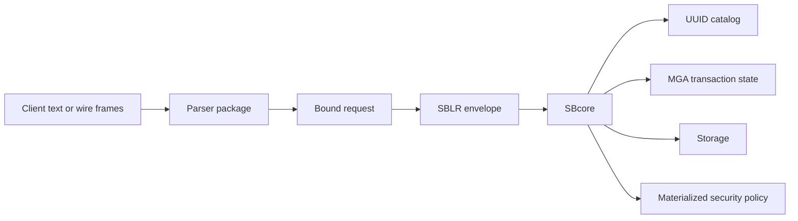

# How ScratchBird Implements A CDE

## Purpose

ScratchBird is designed around a convergent engine core with separate parser, protocol, management, and operational components. This page explains the high-level model without claiming that every surface is complete in every build.

## Main Components

| Component | High-Level Role |
| --- | --- |
| SBcore | The embedded engine library that owns storage, catalog identity, descriptors, security checks, transaction authority, and recovery decisions. |
| SBsrv | A local IPC server that lets more than one local client use the engine through a server process. |
| SBgate | A listener-facing component that accepts network/client traffic and hands work to the appropriate parser path. |
| SBmgr | A single-node manager that can act as a front door for managed local deployments. |
| SBParser | The native SBsql parser package. |
| Donor parsers | Parser packages that accept donor-style protocols or dialects and lower them into ScratchBird execution requests. |

## Authority Boundary

ScratchBird separates language from authority.

The parser recognizes syntax, validates parser-local rules, and produces a bound request. The engine owns durable object identity, security, transaction finality, and storage.

## UUID Object Identity

Object names are user-facing labels. Durable identity is UUID-based. A table name can be renamed, localized, or rendered differently by a donor parser, but the engine object remains the same UUID until the engine changes or drops it.

This matters for:

- schema recursion;
- donor compatibility;
- object rename and comment handling;
- dependency tracking;
- transaction visibility;
- security policy;
- support-bundle diagnostics.

## Recursive Schema

ScratchBird schemas form a tree. A schema can contain child schemas and objects, and a connected session can be sandboxed to a branch of that tree.

Native SBsql can be used for full-tree administration when authorized. A legacy-style donor client normally sees its connected donor workarea as its root and cannot simply spell names outside that branch.

## Multi-Parser Design

ScratchBird does not require every client to speak SBsql. Instead, parser packages can map different client languages and protocols onto the same engine authority model.

This design is intended to support:

- native SBsql use;
- donor-style SQL clients where a donor parser exists;
- donor catalog projections where implemented;
- parser-specific defaults for object behavior, names, and diagnostics.

The existence of a parser directory or profile is not, by itself, a compatibility guarantee. Compatibility must be checked against the current parser implementation and test results.

## Operating Modes

ScratchBird can be described through four end-user modes:

| Mode | Summary |
| --- | --- |
| Embedded engine | Application links to SBcore directly. |
| Single-node IPC server | Local clients talk to SBsrv through IPC; no network listener is required. |
| Standalone server | Network clients enter through SBgate and parser routes. |
| Managed group deployment | Multiple local installations can use a shared identity source and SBmgr-managed entry points. |

Read the operating-mode pages for diagrams and tradeoffs.
