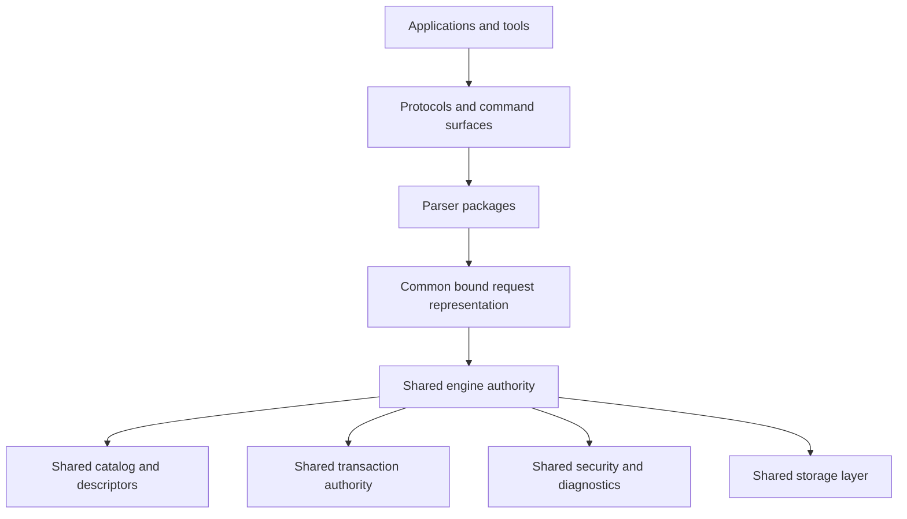
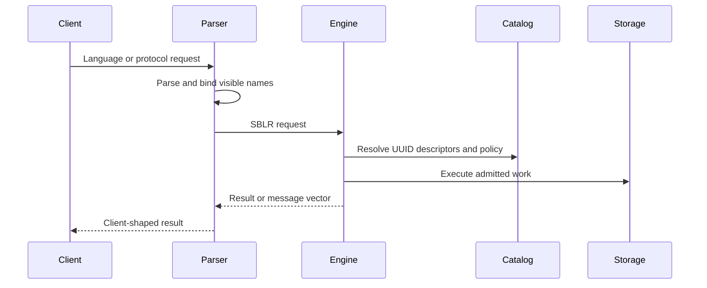

# What Is A Convergent Data Engine?

## Purpose

This guide uses Convergent Data Engine, or CDE, as a database-engine category. A CDE is an engine design that attempts to bring capabilities that are often split across separate products into one shared engine substrate.

The term is descriptive. It is not a certification, benchmark result, compatibility guarantee, or production-readiness claim. A feature is available only when the current source tree, build target, configuration, tests, and release notes prove that it is available.

## Why The Category Exists

Application systems often grow by adding specialized data products:

- a relational database for transactions;
- a document store for flexible records;
- a search service for text search;
- a vector store for embeddings;
- a graph store for relationships;
- a time-series store for measurements;
- a separate cache;
- separate governance, audit, and backup tooling;
- separate compatibility gateways for old applications.

That can be the right architecture for many teams. It also creates work:

- data has to move between systems;
- security models diverge;
- transaction boundaries become harder to explain;
- backups and restores need product-specific handling;
- operators need several diagnostic systems;
- applications need several drivers and failure models.

A CDE design explores whether more of those capabilities can share one engine authority model.

## The Basic CDE Idea

A CDE does not mean that every language becomes the same language. It means that different surfaces can lower into a common execution and authority layer.

The parser accepts a client language or wire protocol. The engine owns durable identity, security, transaction finality, recovery, and storage.

## What Converges

The word convergent means several responsibilities can meet at one engine boundary.

| Area | What Converges |
| --- | --- |
| Object identity | Objects can have stable engine identity even when surfaced through different names or parser profiles. |
| Data models | Relational, document, key-value, graph, vector, time-series, and other surfaces can share catalog and transaction authority where implemented. |
| Language surfaces | SBsql and parser packages can map different command styles into a shared bound request model. |
| Security | Authentication, authorization, protected material policy, masking, and row-level policy can be enforced by engine authority. |
| Transactions | Commit, rollback, visibility, and cleanup are not delegated to parser text. |
| Diagnostics | Refusals, unsupported features, policy failures, and runtime errors can be represented through shared message-vector behavior. |
| Operations | Startup, health checks, support bundles, configuration validation, and administrative commands can be handled as product surfaces instead of one-off utilities. |

## What Does Not Converge Automatically

A CDE is not a promise that every client sees the same language or the same behavior.

| Non-Goal | Why |
| --- | --- |
| One universal SQL dialect | Different clients expect different syntax, defaults, catalogs, and diagnostic shapes. |
| Automatic compatibility with every engine | Each compatibility profile requires implementation and proof. |
| Parser authority over storage | Parser packages translate requests; they do not own transaction finality or durable catalog identity. |
| Unlimited feature availability | A surface must be implemented, configured, admitted by policy, and tested for the target build. |
| Silent behavior substitution | If a behavior is unsupported, unsafe, denied, or unlicensed, the system should refuse with a diagnostic rather than pretending success. |

## Examples Of Convergence

The examples below describe the architectural idea. They are not a statement that every listed surface is complete in every build.

| User Need | CDE-Shaped Response |
| --- | --- |
| A native user creates a relational table. | SBsql parses the statement; the engine creates UUID-backed catalog objects and descriptors. |
| A compatibility client asks for its catalog tables. | The parser can project compatibility catalog rows while the engine remains the source of durable authority. |
| An application stores JSON and queries fields. | JSON descriptors and functions can be bound through the same expression and policy system as ordinary scalar values. |
| A vector query ranks candidates by distance. | Vector descriptors, functions, indexes, and execution operators can be tied back to engine catalog and policy rules. |
| A stored routine updates rows and emits diagnostics. | Procedural SQL lowers to engine-controlled operations and message vectors. |

## Why Parser Separation Matters

A CDE that supports multiple client families cannot let raw client text become the database engine.

ScratchBird uses parser packages as translators. A parser package can:

- accept the protocol or language it is designed for;
- apply parser-specific syntax rules;
- render parser-specific diagnostics where implemented;
- map names to visible object identities;
- lower accepted work into SBLR;
- refuse unsupported or unsafe behavior.

The engine then decides whether the bound request is authorized, type-correct, transactionally valid, and executable.

## Compatibility Must Be Scoped

In this documentation, a parser profile means a compatibility route exists as a tracked product surface. It does not mean every behavior from that source ecosystem is complete.

Read compatibility cautiously:

- a parser should support only its intended client family;
- a donor-style parser should not silently accept unrelated dialects;
- donor-specific defaults must be documented and tested per parser;
- unsupported or denied behavior should return a diagnostic;
- compatibility status depends on the current tests and release notes.

## CDE And Operations

A CDE design also affects operators. If more behavior runs through one engine authority model, operations need shared answers to ordinary questions:

- Is the database ready?
- Is the session authorized?
- Which parser handled this request?
- Which object UUID was accessed?
- Which transaction controls visibility?
- Why was a request refused?
- Which support bundle evidence can diagnose the failure?

ScratchBird documentation treats those questions as part of the product, not as afterthoughts.

## What To Verify Before Relying On A Feature

Before relying on a CDE feature in a specific build, verify:

- the component exists in the public source tree;
- the build target includes it;
- the parser or API route admits it;
- the engine has an implemented SBLR/runtime path;
- policy allows it;
- tests cover the behavior;
- documentation states any limitations;
- diagnostics are clear when it is refused.

## Where To Go Next

- [How ScratchBird Implements A CDE](how_scratchbird_implements_a_cde.md)
- [Engine Parser Boundary](../architecture/engine_parser_boundary.md)
- [SBsql And SBLR](../architecture/sbsql_and_sblr.md)
- [Choosing A Mode Summary](../operating_modes/choosing_a_mode_summary.md)
