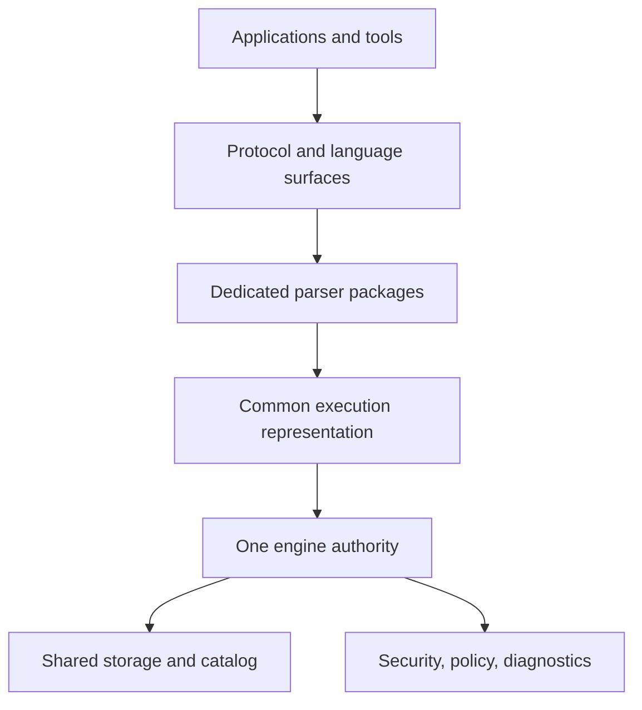

# What Is A Convergent Data Engine?

## Purpose

This guide uses Convergent Data Engine, or CDE, as a database-engine category. A CDE is an engine design that attempts to bring capabilities that are often split across separate products into one engine substrate.

The term is descriptive, not a certification. It does not imply that every feature is complete in every build, that every donor behavior is compatible, or that every deployment mode is production-ready.

## The Basic Idea

Traditional application stacks often combine several systems:

- a relational database for transactions;
- a document store for flexible records;
- a search system;
- a graph or vector system;
- separate governance and auditing tools;
- protocol gateways or compatibility layers;
- separate operational tools.

A CDE design tries to reduce that split by using one engine architecture for multiple data models, multiple parser surfaces, shared governance, shared transaction authority, and shared diagnostics.

## What Converges

| Area | Meaning |
| --- | --- |
| Protocols | Different clients can be served through parser packages rather than a single universal SQL dialect. |
| Dialects | Parser packages translate their own syntax into a common execution request. |
| Data models | Relational, document, key-value, graph, vector, time-series, and other surfaces can share catalog and transaction authority where implemented. |
| Governance | Authorization, diagnostics, protected material policy, and audit behavior are engine-level concerns. |
| Operations | Startup, health, diagnostics, support bundles, background actions, and refusal reasons are handled as part of the product surface. |

## What It Does Not Mean

A CDE is not a promise that one database can be a perfect replacement for every other system. It is also not a claim that every compatibility profile is complete at all times.

In ScratchBird documentation:

- a parser profile means a compatibility surface is tracked;
- a test or manifest means a behavior is covered by some proof material;
- a feature is usable only when the relevant implementation, build target, configuration, and proof gates support it;
- a donor-compatible surface is scoped to that donor parser, not automatically shared by every parser.

## Why Parser Separation Matters

A CDE that wants to support multiple client families cannot make one SQL dialect the whole engine. ScratchBird uses parser packages as translators. The engine receives bound execution requests rather than treating raw client text as durable authority.

That lets the same engine model support native SBsql and donor-style client behavior without requiring every client language to become SBsql.

## Where To Go Next

Read [how_scratchbird_implements_a_cde.md](how_scratchbird_implements_a_cde.md) for the ScratchBird-specific architecture.
