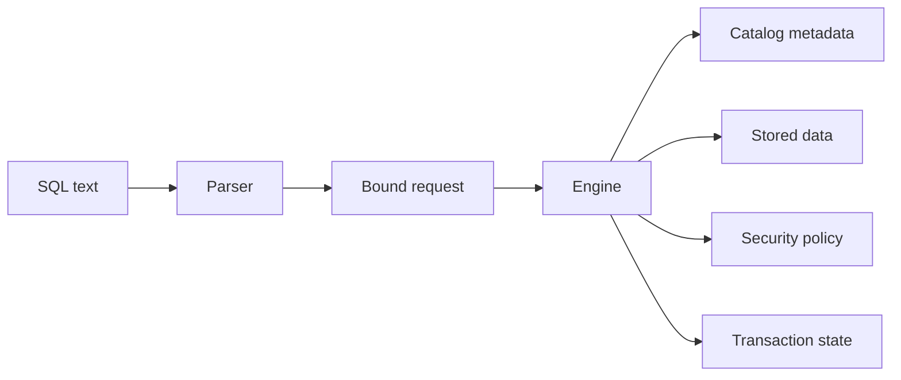
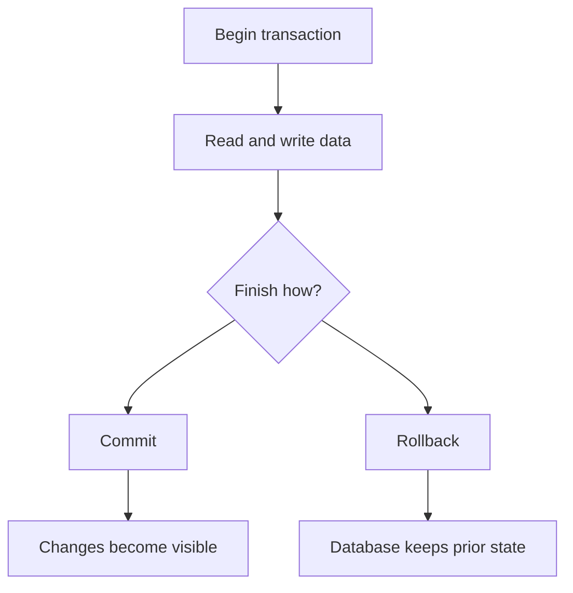

# What Is A Database?

## Purpose

A database is a managed place for durable information. It stores data, describes that data, controls who may use it, and applies rules when the data changes.

The important part is the word managed. A spreadsheet, a text file, and a directory full of JSON files can all hold information. A database adds a system around the information so applications can ask questions, make changes, share access, and recover after failures with predictable rules.

This page explains the idea without assuming that you already know database terminology.

## Data And Metadata

Data is the information users care about: accounts, orders, documents, sensor readings, vectors, audit events, configuration records, and similar values.

Metadata is information about the data:

| Metadata | What It Describes |
| --- | --- |
| Tables and columns | The relational shape of rows. |
| Document descriptors | The expected shape or meaning of document values. |
| Types and domains | Which values are valid and how they compare or convert. |
| Constraints | Rules that values must satisfy. |
| Indexes | Search structures that help find rows or values. |
| Views | Named query projections over stored or derived data. |
| Procedures and functions | Stored routines that perform controlled work. |
| Grants and policies | Who can see or change each object or value. |
| Catalog entries | The durable records that describe database objects. |

In ScratchBird, metadata is not just comments or loose documentation. It is engine-owned state. A parser may accept a text command such as `create table`, but the durable object is represented by catalog identity, descriptors, parent schema identity, grants, and transaction visibility.

## Common Database Responsibilities

Most database systems provide a set of core responsibilities:

| Responsibility | Meaning |
| --- | --- |
| Storage | Keeps data and metadata in durable files, memory-backed structures, or managed devices. |
| Type handling | Knows how values are encoded, compared, sorted, converted, and validated. |
| Query execution | Reads or changes data according to a request. |
| Transactions | Groups work so it can commit, roll back, and recover consistently. |
| Concurrency | Lets multiple sessions work at the same time without corrupting shared state. |
| Security | Controls who can connect and what each identity can see or change. |
| Recovery | Reopens the database after normal shutdown, refused startup, or failure paths according to documented rules. |
| Diagnostics | Explains success, failure, refusal, and recovery-required states to users and operators. |

An application usually experiences these responsibilities through a language, driver, protocol, command-line tool, or embedded API.

## A Simple Example

A table named `orders` might hold order rows:

```sql
create table app.orders (
    order_id uint64 not null,
    account_id uint64 not null,
    status text not null,
    total numeric(18, 2) not null
);
```

That statement is user-facing text. After it is accepted, a database also needs durable metadata:

- the table object's internal identity;
- the parent schema identity;
- each column's descriptor;
- the constraints attached to the table;
- privileges and policies;
- transaction visibility for the catalog change.

The durable database is therefore more than the text statement.



## Tables, Documents, And Other Shapes

Many people first learn databases through relational tables. Tables are still a central model because they give clear names, columns, constraints, indexes, and query behavior.

Modern applications often also need other shapes:

| Shape | Example Use |
| --- | --- |
| Relational rows | Orders, invoices, users, permissions. |
| Documents | Flexible records, application payloads, nested values. |
| Key-value records | Fast lookup by key. |
| Graph relationships | Connected objects and relationship traversal. |
| Vector values | Embeddings and similarity search. |
| Time-series values | Measurements over time. |

ScratchBird documentation uses database language broadly because the system is designed around a common engine authority model for multiple data shapes where those surfaces are implemented.

## Transactions In Plain Language

A transaction is a boundary around work.

Within a transaction, a session can make changes that are not yet final. When the transaction commits, the engine makes the outcome visible according to transaction visibility rules. When the transaction rolls back, the engine discards the uncommitted outcome.



ScratchBird documentation refers to its transaction authority model as MGA. For a new reader, the practical rule is this: commit, rollback, visibility, cleanup, and recovery are engine decisions. Client tools and parser packages can request transaction actions, but they do not own finality.

## Names And Durable Identity

Users work with names such as `app.orders`. Names are convenient and necessary, but names are not the deepest identity of a durable database object.

ScratchBird uses UUID-based internal identity for catalog objects. A table can be renamed, displayed differently through a compatibility parser, or reached through a schema branch, while the engine still tracks the underlying object through durable identity.

This distinction matters for:

- renaming objects;
- resolving dependencies;
- enforcing grants;
- supporting recursive schemas;
- projecting compatibility catalogs;
- diagnosing failures;
- preserving transaction visibility.

## Database Files And Database Systems

It is tempting to describe a database as "the database file." That is incomplete.

A database file can hold pages, metadata, and stored values, but a database system also includes:

- the engine code that understands the file;
- resource files such as character sets, collations, policies, and configuration;
- tools that create, open, verify, back up, restore, or diagnose data;
- parser or protocol packages that accept client requests;
- operational rules for startup, shutdown, refusal, and recovery.

For that reason, copying files, replaying text, or translating syntax is not enough to reproduce a database safely.

## How ScratchBird Uses The Word Database

ScratchBird documentation uses `database` in two related ways:

| Use | Meaning |
| --- | --- |
| Durable database | The engine-owned stored data, metadata, catalog identity, security state, and transaction state. |
| User-facing database | The namespace and compatibility view a connected client sees after authentication and parser routing. |

A native SBsql session, an administrator, and a compatibility client may see different parts of the same durable database because each session can have its own parser profile, identity, grants, and schema root.

## What A Database Is Not

A database is not only:

- a file;
- a query language;
- a network protocol;
- a parser;
- a set of tables;
- a backup stream;
- a catalog dump.

Those can all be part of a database product, but the database itself is the managed combination of durable storage, metadata, identity, transaction rules, security rules, diagnostics, and recovery behavior.

## Why This Matters For ScratchBird

ScratchBird separates language from durable authority.

The parser handles text, wire protocol, dialect rules, and compatibility presentation. The engine handles catalog identity, descriptors, transactions, storage, recovery, and materialized authorization.

That separation is one of the foundations for the Convergent Data Engine model described in the next page.

## Where To Go Next

- [What Is A Convergent Data Engine?](what_is_a_convergent_data_engine.md)
- [How ScratchBird Implements A CDE](how_scratchbird_implements_a_cde.md)
- [Engine Parser Boundary](../architecture/engine_parser_boundary.md)
- [Schema Tree And Name Resolution](../../Language_Reference/syntax_reference/schema_tree_and_name_resolution.md)
