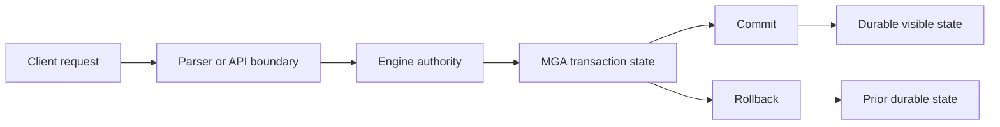

# What Is A Database?

## Purpose

A database is a structured place to store information so applications and people can create, read, update, delete, search, secure, and recover that information consistently. The important idea is not only that data is stored, but that the system controls how data changes over time.

A database engine normally provides:

| Capability | Meaning |
| --- | --- |
| Storage | Keeps data in files, memory, or managed devices. |
| Schema | Describes the shape of data: tables, columns, types, constraints, views, routines, and metadata. |
| Query language | Lets users ask questions and request changes. |
| Transactions | Groups work so it can commit, roll back, and recover consistently. |
| Concurrency | Lets multiple sessions use the database without corrupting shared state. |
| Security | Controls who can connect and what they can see or change. |
| Recovery | Lets the database reopen after ordinary shutdowns or failures. |
| Diagnostics | Explains what happened when a request succeeds, fails, or is refused. |

ScratchBird documentation uses the word "database" for both the durable database created by the engine and the user-facing namespace that a client sees after it connects. Those are related, but not identical. A connected Firebird-style client, a native SBsql session, and a management tool may see different parts of the same underlying database because each session has its own parser profile, identity, grants, and schema root.

## Data, Metadata, And Authority

Data is the information a user stores. Metadata is information about that data: object names, types, constraints, indexes, security rules, storage descriptors, and catalog rows.

ScratchBird treats metadata as engine-owned state. A parser may accept a text command such as `create table`, but the durable object is not the text command. The durable object is a catalog entry with a UUID, descriptors, parent schema identity, grants, and transaction visibility.

## Transaction Model

A transaction is a boundary around work. Within a transaction, a session can make changes that are not yet final. When the transaction commits, the database makes the outcome visible according to its visibility rules. When the transaction rolls back, the database discards the uncommitted outcome.

ScratchBird documentation refers to the transaction model as MGA. In this guide, the practical rule is simple: commit, rollback, visibility, cleanup, and recovery are engine decisions. Client tools and parser packages can request transaction actions, but they do not own finality.

## What A Database Is Not

A database is not only a file. It is also not only a query language. A database is the combination of durable storage, object identity, transaction rules, security rules, and recovery behavior.

For that reason, copying files, replaying text, or translating syntax is not enough to reproduce a database safely. ScratchBird separates those responsibilities so the parser handles language and protocol, while the engine handles durable authority.

## Where To Go Next

Read [what_is_a_convergent_data_engine.md](what_is_a_convergent_data_engine.md) for the broader category ScratchBird is designed to explore.
