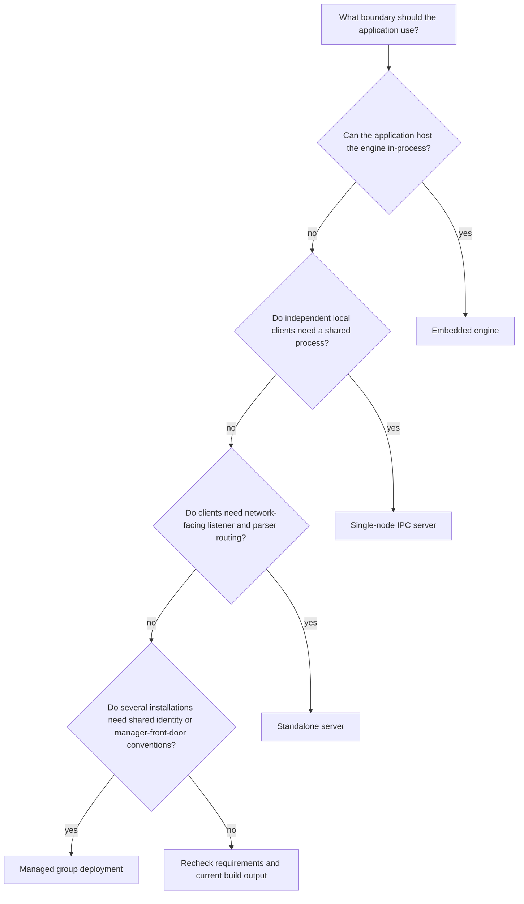
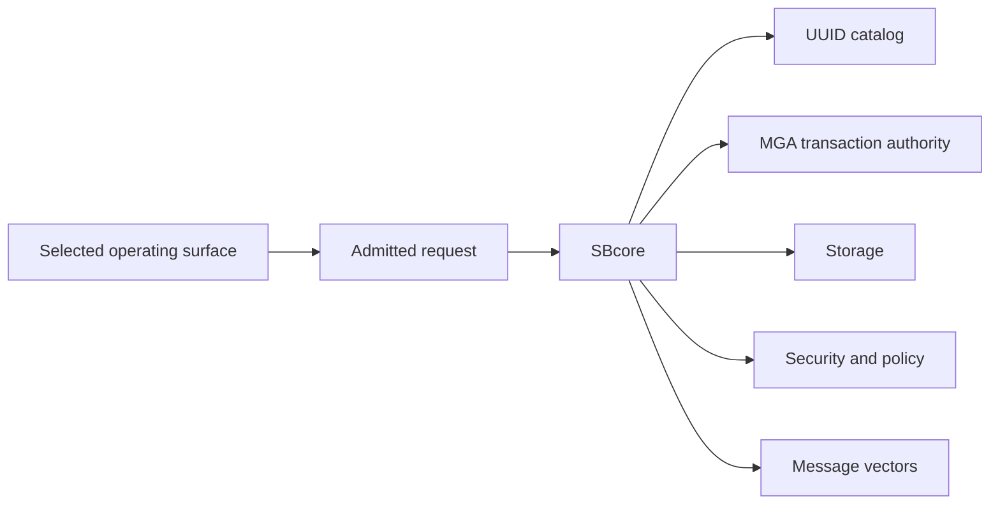

# Choosing A Mode Summary

## Purpose

ScratchBird can be used through several process and connection shapes. This page helps you choose the first mode to read, test, or configure.

It is not a sizing guide, benchmark, support statement, or deployment recommendation. The right mode depends on the current build output, target platform, configuration, parser packages, resource files, tests, and the application boundary you intend to use.

## The Four Shapes

| Mode | Short Description | Main Entry | Network Listener Required | Read More |
| --- | --- | --- | --- | --- |
| Embedded engine | The application links to SBcore and uses the engine in its own process. | SBcore library/API | No | [Embedded Engine](embedded_engine.md) |
| Single-node IPC server | Local clients connect to a shared local server process. | SBsrv IPC endpoint | No | [Single-Node IPC Server](single_node_ipc_server.md) |
| Standalone server | Clients connect through listener and parser routing. | SBgate and parser packages | Yes | [Standalone Server](standalone_server.md) |
| Managed group deployment | Multiple installations use a managed front-door convention and shared identity or policy integration. | SBmgr plus local services | Depends on local service shape | [Managed Group Deployment](group_deployment.md) |

## Decision Flow

## Quick Recommendations

| Need | First Mode To Evaluate |
| --- | --- |
| One application owns all access and can carry engine lifecycle responsibility. | Embedded engine. |
| Several local processes need a shared database service without accepting network traffic. | Single-node IPC server. |
| A client connects over a listener or requires parser routing for a client protocol. | Standalone server. |
| Several installations need consistent identity validation, policy conventions, and manager-mediated entry. | Managed group deployment. |
| You are only trying to learn SBsql syntax. | Use the simplest mode available in your build, then read [First SBsql Session](../using_scratchbird/first_sbsql_session.md). |
| You are testing a donor parser. | Standalone server, because parser routing and protocol-facing behavior are part of the test. |

## Comparison Table

| Area | Embedded Engine | Single-Node IPC Server | Standalone Server | Managed Group Deployment |
| --- | --- | --- | --- | --- |
| Process boundary | Same process as application. | Separate local server process. | Listener and server processes. | Manager-front-door convention over local services. |
| Client location | Application-local. | Same machine. | Network-facing client boundary where configured. | Operator-defined local installations. |
| Primary component | SBcore. | SBsrv. | SBgate, parser package, SBsrv, SBcore. | SBmgr plus configured local services. |
| Parser route | Optional, depending on application surface. | Depends on local client route. | Required for protocol or SQL client traffic. | Depends on the local service selected by SBmgr. |
| Lifecycle owner | Application. | Local service supervisor or operator. | Service supervisor or operator. | Operator-managed entry and local services. |
| Best first proof | Open database, run transaction, close cleanly. | Start server, attach local clients, run transaction, detach. | Connect through listener, route parser, run transaction, disconnect. | Authenticate through manager, open local route, run scoped session. |
| Main risk to understand | Application crash and engine lifecycle are tied together. | Local IPC configuration and service lifecycle. | Listener, parser, authentication, and routing configuration. | Shared identity and policy expectations across installations. |

## What All Modes Share

Every mode still relies on the same engine authority model.

The mode changes how a client reaches the engine. It does not move durable object identity, final transaction authority, recovery decisions, or materialized authorization out of SBcore.

## What To Verify Before Choosing

Before selecting a mode for anything more than exploration, verify:

- the required binaries or libraries exist in the build output;
- required parser packages are staged and registered;
- resource files are present;
- configuration files are explicit and valid;
- authentication and authorization behavior are understood;
- diagnostics can be collected and redacted;
- start, stop, attach, detach, and restart tests pass for the target platform;
- the selected mode has proof coverage for the workflow you need.

## Conservative Mode Selection

Use the smallest mode that satisfies the application boundary.

- Do not add a listener if the application only needs embedded access.
- Do not expose network-facing routes when local IPC is enough.
- Do not use a compatibility parser for native SBsql work unless that parser route is the thing being tested.
- Do not treat a managed group deployment as shared storage or distributed query behavior.
- Do not infer availability from a diagram; check the current build output and tests.

## Where To Go Next

- [Embedded Engine](embedded_engine.md)
- [Single-Node IPC Server](single_node_ipc_server.md)
- [Standalone Server](standalone_server.md)
- [Managed Group Deployment](group_deployment.md)
- [First Database](../using_scratchbird/first_database.md)
- [Configuration Basics](../administration/configuration_basics.md)
