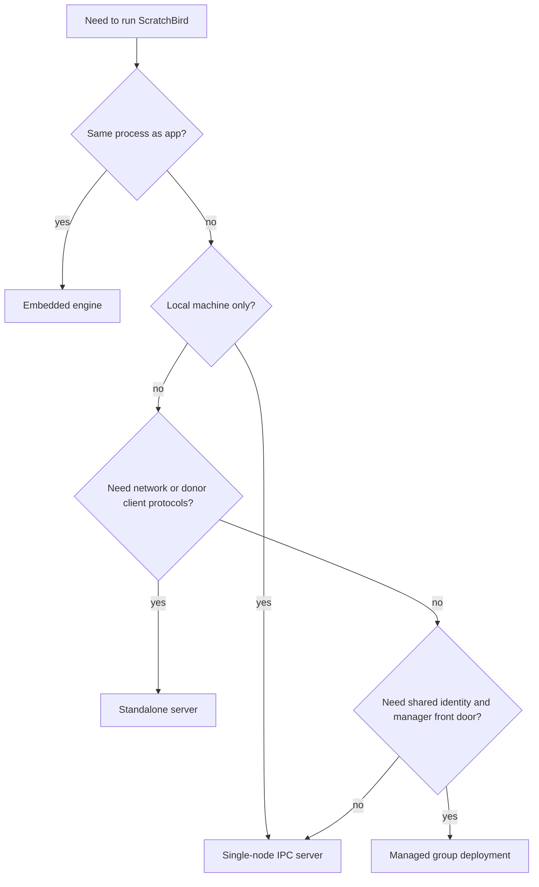

# Choosing A Mode Summary

## Purpose

ScratchBird can be used through different process and connection shapes. This page helps end users understand the intended shape of each mode. It is not a sizing guide, performance claim, or deployment recommendation.

## Mode Table

| Mode | Best Fit | Main Entry | Network Listener Required |
| --- | --- | --- | --- |
| Embedded engine | One application wants direct in-process engine access. | SBcore library/API | No |
| Single-node IPC server | Multiple local clients on one machine need a shared engine process. | SBsrv IPC endpoint | No |
| Standalone server | Remote clients or donor-style clients need listener/parser routing. | SBgate and parser packages | Yes |
| Managed group deployment | Several installations need consistent identity policy and managed front-door behavior. | SBmgr plus local services | Depends on the local service shape |

## Decision Flow

## Conservative Reading

Choose a mode based on what the current build and tests prove for your platform. A mode described here means the architecture has a documented shape; it does not mean every release build exposes every binary, parser, or operational feature.

## Related Pages

- [embedded_engine.md](embedded_engine.md)
- [single_node_ipc_server.md](single_node_ipc_server.md)
- [standalone_server.md](standalone_server.md)
- [group_deployment.md](group_deployment.md)
