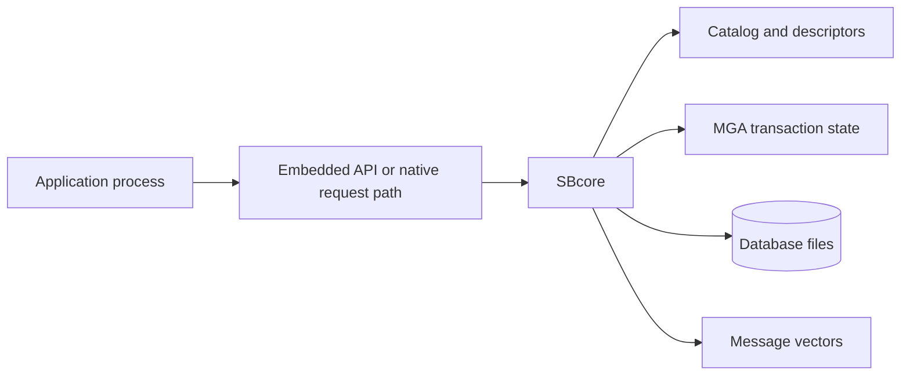
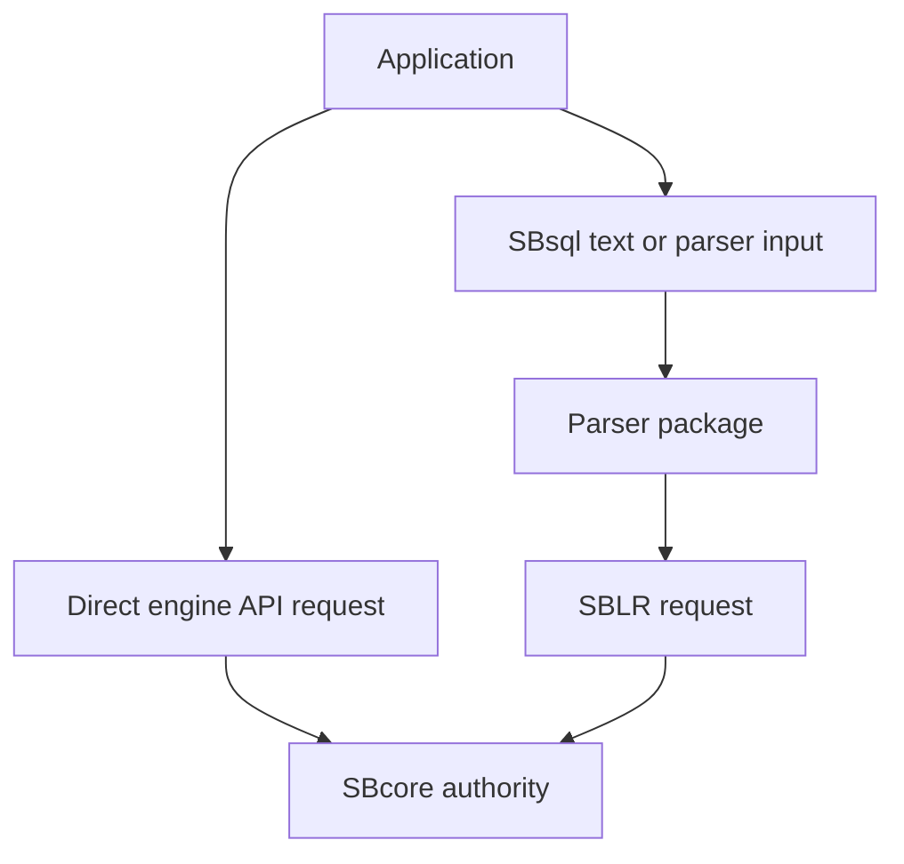

# Embedded Engine

## Purpose

Embedded mode means an application uses the ScratchBird Engine, SBcore, inside the application's own process. There is no separate server process between the application and the engine, and no network listener is required for that application to reach the database.

This page explains the shape, responsibilities, and boundaries of embedded mode. It does not claim that every API, platform, or feature is available in every build.

## High-Level Shape

The application and engine share one process boundary. That is the defining characteristic of embedded mode.

## What Embedded Mode Is For

Embedded mode is a fit to evaluate when:

- one application owns the database lifecycle;
- the application can manage attach, detach, open, close, and shutdown behavior;
- local in-process access is enough;
- a separate server process would add complexity without providing a needed boundary;
- tests or tools need direct engine access;
- the application can collect and handle engine diagnostics.

Embedded mode is often the easiest way to understand the engine itself because fewer runtime components sit between the application and SBcore.

## What The Application Owns

In embedded mode, the application carries responsibilities that a server process would otherwise centralize.

| Responsibility | Embedded Reading |
| --- | --- |
| Process lifetime | If the application starts, stops, or crashes, the embedded engine session is inside that same process boundary. |
| Configuration | The application must pass or locate the correct configuration, resource files, and database paths. |
| Authentication | The application must use the configured identity model correctly for the embedded route. |
| Authorization | The engine still enforces authorization, but the application must not bypass the intended session model. |
| Transactions | The application must begin, commit, roll back, and close transaction scopes intentionally. |
| Diagnostics | Message vectors and errors are returned to the application and must be logged or presented safely. |
| Resource cleanup | The application must detach sessions and close databases cleanly. |

## Engine Authority Still Applies

Embedded mode does not mean the application owns database finality. SBcore remains responsible for:

- durable catalog identity;
- descriptor validation;
- storage and filespace state;
- transaction finality and visibility;
- recovery decisions;
- index maintenance;
- materialized authorization;
- diagnostic message vectors.

The application can request work. The engine admits, executes, or refuses that work.

## Parser Use In Embedded Mode

An embedded application can use different request styles depending on what the build exposes:

- a direct embedded API surface;
- native SBsql through SBParser;
- another configured parser route if the application intentionally embeds that route.

The important boundary remains the same: SQL text or protocol-shaped input must be parsed and lowered before engine execution. Raw text is not durable engine authority.

## First Embedded Smoke Test

A useful first embedded test should prove:

1. The application can locate SBcore and required resources.
2. The application can create or open a disposable database.
3. A session can be established with the intended identity.
4. A transaction can create a schema and table.
5. Rows can be inserted and queried.
6. The transaction can commit.
7. The database can close and reopen.
8. A controlled invalid request returns a diagnostic.
9. The application detaches and exits cleanly.

The test should use a disposable database path until lifecycle behavior is understood.

## Operational Boundaries

| Area | What To Know |
| --- | --- |
| Crash isolation | An application crash affects the engine process because they are the same process. Recovery behavior is still engine-owned after reopen. |
| Local concurrency | Concurrency is limited by the embedded route and process design. Use a server mode when independent clients require a shared boundary. |
| Security boundary | Do not treat in-process access as a reason to skip identity, grants, policy, or protected-material rules. |
| Resource limits | The application must account for engine memory, file handles, timeouts, and cleanup policy. |
| Diagnostics | The application must handle message vectors clearly and redact protected material before logging or support collection. |
| Updates | Application and engine library versioning must be managed together. |

## What Embedded Mode Does Not Provide

Embedded mode does not automatically provide:

- network client access;
- a listener;
- parser pool management;
- a local multi-client service process;
- independent process supervision;
- compatibility with arbitrary external database tools;
- shared identity conventions across multiple installations;
- automatic operational packaging.

Use another mode when those boundaries are required.

## When To Choose Another Mode

Consider [Single-Node IPC Server](single_node_ipc_server.md) when several local clients need a shared service process.

Consider [Standalone Server](standalone_server.md) when clients must connect through listener and parser routing.

Consider [Managed Group Deployment](group_deployment.md) when several installations need consistent manager-mediated entry and shared identity or policy conventions.

## Where To Go Next

- [Choosing A Mode Summary](choosing_a_mode_summary.md)
- [First Database](../using_scratchbird/first_database.md)
- [SBsql And SBLR](../architecture/sbsql_and_sblr.md)
- [Storage, Transactions, And Recovery](../architecture/storage_transactions_and_recovery.md)
- [Diagnostics And Support Bundles](../administration/diagnostics_and_support_bundles.md)
