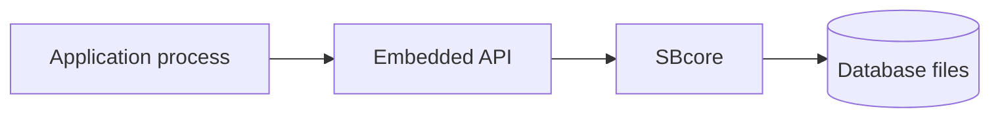

# Embedded Engine

## Purpose

Embedded mode means the application uses the ScratchBird engine library in its own process. This is the smallest process shape: there is no separate listener process, and no network protocol is required for the application to reach the engine.

## High-Level Shape

## What It Is For

Embedded mode is intended for applications that want direct local database access and can accept the operational responsibility of hosting the engine inside the application process.

This can be useful for:

- development tools;
- local applications;
- test fixtures;
- controlled single-application deployments;
- tools that need direct engine-level operations.

Actual suitability depends on the current platform build, API status, and proof results.

## Parser Use

An embedded application may use an API surface or a parser package depending on what it is trying to do. The core point is that the engine itself remains the authority. SQL text, if used, is parsed and lowered before engine execution.

## Operational Boundaries

| Area | Embedded Reading |
| --- | --- |
| Process lifetime | The application controls engine lifetime. |
| Isolation | A process crash can affect the embedded engine session. |
| Security | The application is responsible for using the configured authentication and authorization model correctly. |
| Diagnostics | Diagnostics are returned to the embedding application and can be included in support bundles where admitted. |
| Multi-client use | Use a server mode when independent local or remote clients need a shared process boundary. |

## What Embedded Mode Does Not Promise

Embedded mode does not automatically provide network access, a listener, central process supervision, or compatibility with every client tool. Those belong to other operating modes.

## Related Pages

- [../architecture/sbsql_and_sblr.md](../architecture/sbsql_and_sblr.md)
- [../architecture/storage_transactions_and_recovery.md](../architecture/storage_transactions_and_recovery.md)
