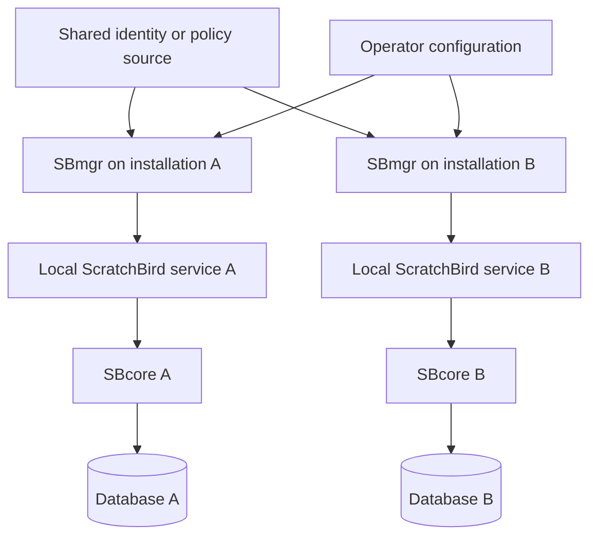
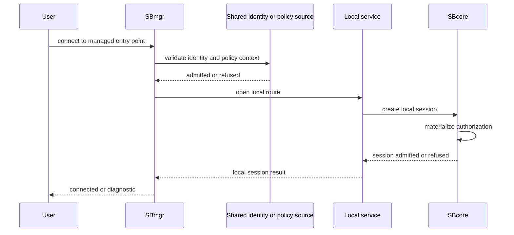

# Managed Group Deployment

## Purpose

A managed group deployment is an operating shape where more than one ScratchBird installation is administered with consistent identity, policy, diagnostics, and manager-front-door conventions. It is about operational consistency across installations.

This page does not describe shared storage, distributed query execution, automatic data placement, or one database transparently spanning several installations. Each database keeps its own durable state and transaction authority.

## High-Level Shape

## What Is Managed

| Area | Meaning |
| --- | --- |
| Entry convention | SBmgr provides a consistent front-door pattern before traffic reaches local services. |
| Identity validation | Installations can use a shared identity source or shared identity policy where configured. |
| Admission policy | Operators can apply consistent expectations for who may connect and which routes may be used. |
| Parser route policy | Parser availability can be managed deliberately instead of being assumed. |
| Diagnostics | Logs, message vectors, support-bundle expectations, and redaction policy can be made consistent. |
| Configuration style | Installation configuration can follow the same layout and validation rules. |

## What Remains Local

Even in a managed group deployment, important authority remains local to each database.

| Area | Local Authority |
| --- | --- |
| Database files | Each database has its own storage and filespace state. |
| Transactions | Each database keeps its own MGA transaction authority. |
| Recovery | Each database reopens, recovers, or refuses according to its own durable state. |
| Catalog identity | Object UUIDs and descriptors belong to the database that owns them. |
| Grants and schema roots | Authorization is evaluated for the session and database context. |
| Parser workarea | A compatibility session sees the workarea assigned by its local route. |

Managed group deployment is therefore an operating pattern, not a promise that all databases become one database.

## User Connection Flow

The user receives a session inside a specific local database context. Grants, parser route, schema root, workarea, and policy determine what the user can see and do.

## When To Evaluate This Mode

Managed group deployment is worth evaluating when:

- several installations should use the same identity conventions;
- users or agents should connect through a manager-controlled front door;
- operators need consistent diagnostics and support-bundle expectations;
- parser routes should be centrally described or consistently admitted;
- policy defaults need to be coordinated;
- installations need a common operational runbook.

If there is only one local application process, read [Embedded Engine](embedded_engine.md). If there are several local clients on one machine, read [Single-Node IPC Server](single_node_ipc_server.md). If the requirement is listener and parser routing for clients, read [Standalone Server](standalone_server.md).

## Configuration Checklist

Before using a managed group shape, define:

- installation identity;
- local database routes;
- SBmgr endpoint and local service routes;
- identity source and authentication behavior;
- authorization mapping for users, roles, groups, or agents;
- parser packages admitted at each installation;
- default schema roots or workareas;
- diagnostics, support-bundle, and redaction policy;
- start, stop, drain, and restart behavior;
- refusal behavior when the identity source or local service is unavailable.

## Refusal Cases

A managed group deployment should refuse clearly when:

- identity validation fails;
- the identity source is unavailable and policy does not allow fallback;
- the requested installation or database route is unknown;
- the local service is unavailable;
- the parser route is not admitted;
- the user is not authorized for the requested schema root or workarea;
- configuration validation fails;
- diagnostics cannot be safely produced.

Controlled refusal is part of the operating model.

## Data Movement Is Separate

Managed group deployment may coexist with backup, restore, migration, import, export, CDC, or replication features where those features are implemented and admitted. Those are separate data movement surfaces.

Do not infer data movement, shared storage, or automatic query routing from the presence of SBmgr. The manager-front-door role is about connection admission and local route control.

## Diagnostics To Collect

Useful evidence for this mode includes:

- SBmgr configuration validation;
- identity source selection;
- authentication result;
- local route selected;
- parser selected;
- database opened;
- session identity and schema root;
- authorization result;
- refusal message vector when connection is denied;
- local service health;
- clean drain and shutdown behavior.

Diagnostics must follow the configured redaction policy.

## What This Mode Does Not Provide

Managed group deployment does not automatically provide:

- one shared database across installations;
- distributed query planning;
- automatic replication;
- automatic failover;
- shared storage;
- cross-installation transaction finality;
- compatibility parser completeness;
- production suitability without release-specific proof.

Those behaviors require separately documented and proven surfaces.

## Where To Go Next

- [Choosing A Mode Summary](choosing_a_mode_summary.md)
- [Standalone Server](standalone_server.md)
- [Choosing A Deployment Mode](../administration/choosing_a_deployment_mode.md)
- [Configuration Basics](../administration/configuration_basics.md)
- [Identity, Authentication, And Authorization](../architecture/identity_authentication_and_authorization.md)
- [Diagnostics And Support Bundles](../administration/diagnostics_and_support_bundles.md)
