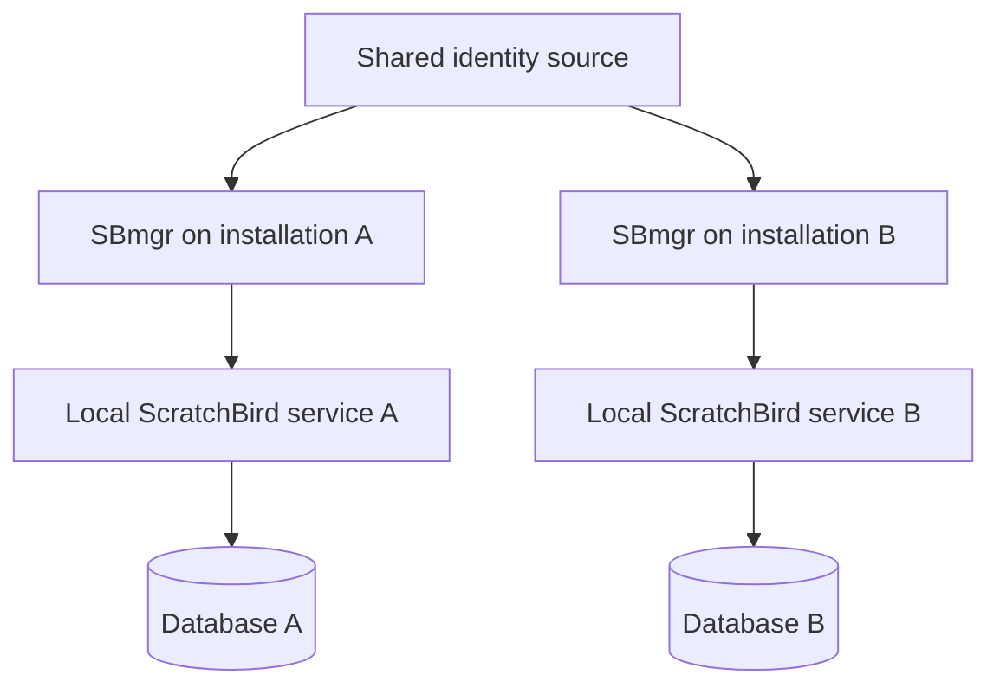
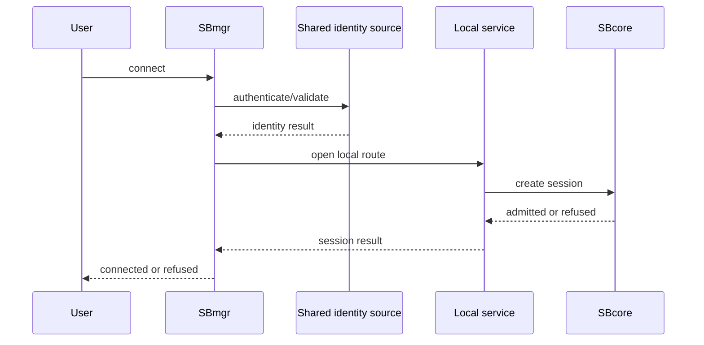

# Managed Group Deployment

## Purpose

A managed group deployment is a high-level shape where more than one ScratchBird installation is operated with shared identity policy and manager-front-door conventions. The goal is administrative consistency, not a promise of shared storage or automatic cross-node query behavior.

No separate distributed-data capability is described in this guide.

## High-Level Shape

## What Is Shared

| Area | Reading |
| --- | --- |
| Identity source | Users, agents, groups, or credentials can be coordinated through a shared source where configured. |
| Manager conventions | SBmgr can provide a consistent front-door pattern for local installations. |
| Policy intent | Operators can aim for consistent admission, refusal, and diagnostic policy across installations. |
| Database authority | Each database remains responsible for its own transaction authority and durable state. |

## User Experience

A user may authenticate through the configured identity source and then connect to a managed local service. The user still receives a session inside a specific database context. Grants, schema roots, parser profiles, and sandbox rules determine what that user sees.

## Boundaries

Managed group deployment does not make every database one database. It does not remove per-database transaction authority, per-database recovery behavior, or per-session authorization. It is best understood as an operating pattern for consistent front-door control.

## Related Pages

- [../architecture/identity_authentication_and_authorization.md](../architecture/identity_authentication_and_authorization.md)
- [../administration/choosing_a_deployment_mode.md](../administration/choosing_a_deployment_mode.md)
