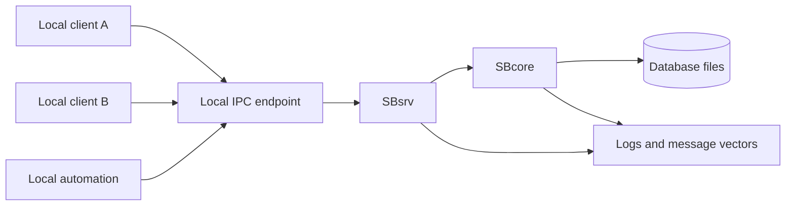
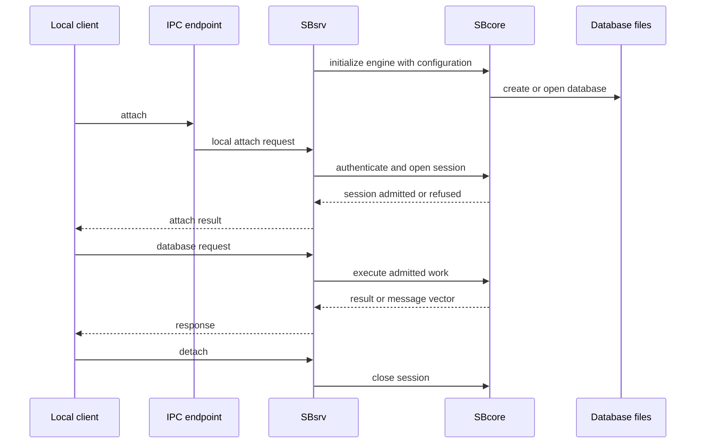

# Single-Node IPC Server

## Purpose

Single-node IPC server mode uses a local server process, SBsrv, for clients on the same machine. It is the mode to evaluate when more than one local client needs a shared engine process but the deployment does not need a network listener.

The defining boundary is local IPC: clients are outside the engine process, but they are still local to the machine.

## High-Level Shape

## What This Mode Is For

Use this page when you are evaluating:

- local multi-client access;
- a process boundary between applications and the engine;
- local automation that should not embed SBcore directly;
- service-style lifecycle management on one machine;
- smoke tests that need attach, detach, and restart behavior;
- a setup where network listener behavior is not part of the requirement.

This mode is not a remote access mode. If a client needs to connect through a network-facing listener or parser route, read [Standalone Server](standalone_server.md).

## Component Responsibilities

| Component | Responsibility In This Mode |
| --- | --- |
| Local client | Connects to the configured IPC endpoint and sends requests through the local route. |
| IPC endpoint | Provides the local communication boundary between clients and SBsrv. |
| SBsrv | Owns the local service process, opens engine sessions, routes admitted local requests, and returns results or diagnostics. |
| SBcore | Owns catalog identity, descriptors, transactions, storage, recovery, authorization, and engine diagnostics. |
| Configuration | Defines database paths, resource locations, authentication, authorization, IPC endpoints, diagnostics, and policy. |

## Request Flow

## Parser Behavior

Single-node IPC mode may expose different local request surfaces depending on build and configuration. A local client might use native SBsql, a direct local API, or another configured parser route.

The same rules still apply:

- parser packages accept and lower client syntax;
- SBcore owns durable authority;
- unsupported or denied behavior should return a controlled diagnostic;
- parser availability must be proven by the current build and tests.

## First Local IPC Smoke Test

A useful first test should prove:

1. SBsrv starts with the intended configuration.
2. Required resource files are available.
3. A disposable database can be created or opened.
4. A local client can attach through the IPC endpoint.
5. Authentication and authorization produce the expected session.
6. A simple create, insert, select, and commit cycle succeeds.
7. A second local client can attach if the scenario requires it.
8. A controlled invalid request returns a message vector.
9. Clients detach cleanly.
10. SBsrv stops cleanly and can restart.
11. The database reopens with committed data visible.

## Local Isolation

The server process gives isolation that embedded mode does not:

- client crashes do not automatically terminate the server process;
- the engine lifecycle can be supervised separately from clients;
- multiple clients can use a shared local service boundary;
- diagnostics can be collected by the server process.

That isolation is local process isolation. It is not network security, remote routing, or a replacement for authentication and authorization.

## Configuration Checklist

Before using this mode, verify:

- IPC endpoint location and permissions;
- database path and storage permissions;
- resource file locations;
- authentication provider or local identity configuration;
- grants, schema roots, and policy;
- diagnostic output location;
- service start and stop behavior;
- stale endpoint cleanup behavior after abnormal termination;
- parser or local API route configuration.

## Diagnostics To Expect

Useful diagnostics in this mode include:

- configuration validation errors;
- IPC endpoint unavailable or permission denied;
- database open refused;
- authentication failure;
- authorization denied;
- parser route missing or unavailable;
- transaction state diagnostic;
- controlled shutdown or drain messages;
- stale endpoint or stale process state.

## What This Mode Does Not Provide

Single-node IPC server mode does not automatically provide:

- network listener access;
- parser pool management for network clients;
- remote client compatibility;
- shared identity conventions across installations;
- distributed query behavior;
- automatic backup or repair behavior;
- proof that every parser package is available.

Use the standalone server page when listener and parser routing are part of the requirement.

## Where To Go Next

- [Choosing A Mode Summary](choosing_a_mode_summary.md)
- [Standalone Server](standalone_server.md)
- [First Database](../using_scratchbird/first_database.md)
- [Configuration Basics](../administration/configuration_basics.md)
- [Identity, Authentication, And Authorization](../architecture/identity_authentication_and_authorization.md)
- [Diagnostics And Support Bundles](../administration/diagnostics_and_support_bundles.md)
