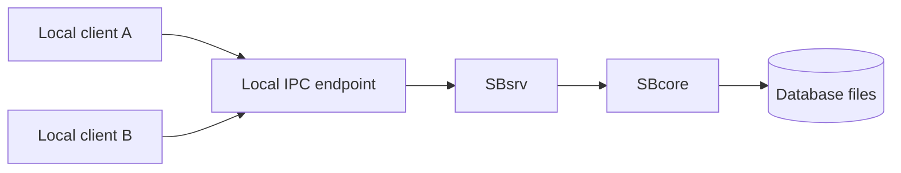
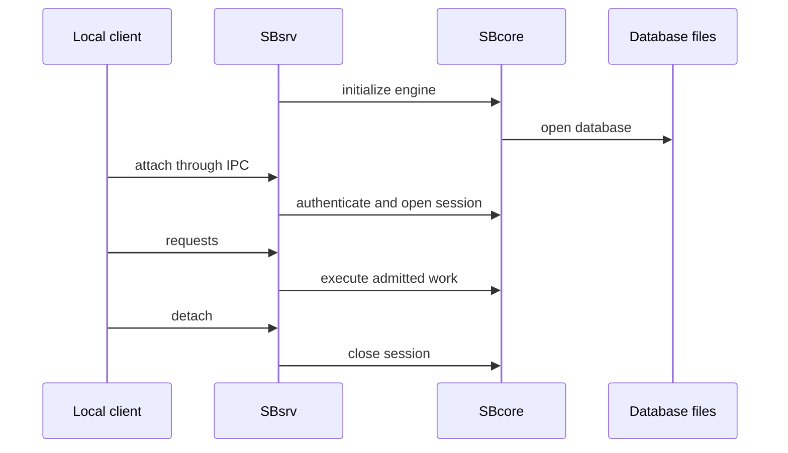

# Single-Node IPC Server

## Purpose

The single-node IPC server mode uses a local server process for local clients on the same machine. It is useful when an application set needs a shared engine process but does not need a network listener.

## High-Level Shape

## What It Is For

This mode is intended for:

- local multi-user testing;
- local services that should not embed the engine directly;
- controlled local automation;
- deployments that want a process boundary without accepting network traffic.

It does not require SBgate for ordinary local IPC routing.

## Key Properties

| Area | Behavior |
| --- | --- |
| Connection scope | Local IPC clients only. |
| Parser path | Depends on the configured local client and server route. |
| Database authority | SBcore remains the authority for catalog, storage, transaction, and security decisions. |
| Process boundary | Client processes are separate from the server process. |
| Network exposure | None unless another component is configured to provide it. |

## Startup And Shutdown

## Conservative Reading

The single-node IPC server is a local process mode. It should not be described as a remote access solution, a compatibility gateway, or a production deployment recommendation without current release evidence for the target environment.

## Related Pages

- [../architecture/identity_authentication_and_authorization.md](../architecture/identity_authentication_and_authorization.md)
- [../administration/diagnostics_and_support_bundles.md](../administration/diagnostics_and_support_bundles.md)
