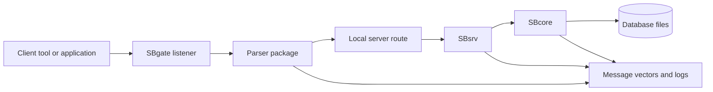
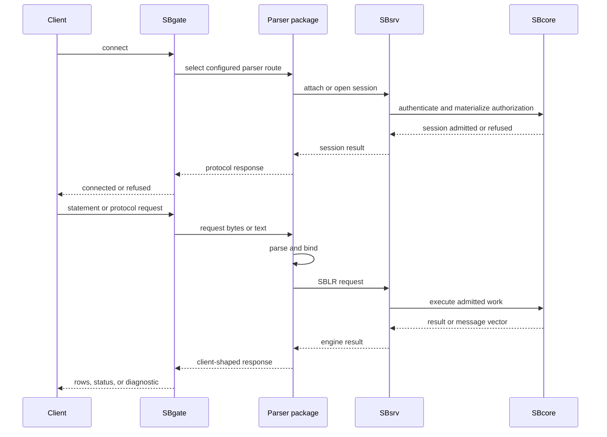

# Standalone Server

## Purpose

Standalone server mode is the client/server shape where clients enter through listener and parser routing. It is the mode to evaluate when a client needs a network-facing entry point, a parser package, protocol negotiation, or compatibility testing through a client tool.

The defining boundary is that clients do not call SBcore directly. They connect to SBgate, are routed to a parser package, and reach SBcore through the configured local service path.

## High-Level Shape

## What This Mode Is For

Standalone server mode is the right page to read when you are evaluating:

- network-facing client access;
- listener startup and shutdown;
- parser selection and parser pool behavior;
- compatibility client or tool experiments where a parser exists;
- native SBsql over a listener route;
- protocol negotiation and refusal behavior;
- end-to-end client/server smoke tests.

Actual suitability depends on the current release, target platform, parser status, configuration, and proof results.

## Component Responsibilities

| Component | Responsibility In This Mode |
| --- | --- |
| Client | Connects through the configured listener route and sends language or protocol requests. |
| SBgate | Accepts client connections, performs listener-level routing, and hands work to the selected parser path. |
| Parser package | Accepts one client language or protocol family, binds visible names, lowers admitted work to SBLR, and renders client-shaped results or diagnostics. |
| SBsrv | Provides the local service route to SBcore where configured. |
| SBcore | Owns durable catalog identity, descriptors, transactions, storage, recovery, authorization, and engine diagnostics. |
| Configuration | Defines listener endpoints, parser registration, identity sources, database routes, resource files, policy, and diagnostics. |

## Request Flow

## Parser Routing

The listener does not make syntax into engine authority. It selects a configured parser path. The parser accepts or refuses the client surface, then submits a bound request to the engine path.

Parser routing must be explicit enough that users can answer:

- which parser handled the connection;
- which database or workarea the session entered;
- which identity was authenticated;
- which schema root the session sees;
- which unsupported or denied requests are refused by the parser;
- which requests reach engine authority.

## Compatibility Parser Boundaries

A compatibility parser is scoped to its own client family.

It should not:

- accept unrelated dialects silently;
- bypass engine transactions;
- write storage directly;
- grant access outside its configured workarea;
- treat physical page-copy data as logical restore input;
- perform low-level repair or verification through a compatibility route;
- claim unsupported features by returning success without doing the work.

It should:

- accept the supported client surface;
- lower supported work to SBLR;
- apply parser-specific defaults explicitly;
- return controlled diagnostics for unsupported, denied, unsafe, or unavailable behavior;
- keep catalog projections within the configured authority model.

## First Standalone Server Smoke Test

A useful first standalone test should prove:

1. Required binaries, parser packages, and resource files are staged together.
2. Configuration validates before accepting clients.
3. SBsrv can open the database route.
4. SBgate starts and listens on the intended endpoint.
5. The selected parser package is available and registered.
6. A client can connect and authenticate.
7. The parser opens the expected schema root or workarea.
8. A create, insert, select, and commit cycle succeeds.
9. A controlled invalid request returns the expected diagnostic.
10. The client disconnects cleanly.
11. Listener drain or stop behavior completes.
12. The database reopens with committed data visible.

## Diagnostics To Collect

Standalone server mode has more moving parts than embedded or IPC mode. Useful diagnostics include:

- configuration validation result;
- listener endpoint and route selection;
- parser registration and version;
- authentication result;
- session identity and schema root;
- database open result;
- transaction state;
- message vectors for unsupported or denied requests;
- parser-to-engine request identifiers where available;
- clean shutdown, drain, and restart evidence.

Diagnostics should be redacted before sharing outside trusted support channels.

## Security And Exposure

Network-facing entry points require careful configuration.

Before allowing access beyond a local test environment, verify:

- only intended endpoints are listening;
- authentication is configured;
- authorization and schema roots are explicit;
- parser routes are limited to the needed surfaces;
- diagnostics do not expose protected material;
- server-local file access is denied unless an explicit documented policy admits a safe operation;
- unsupported management or low-level actions refuse clearly.

This guide does not certify a deployment shape. It describes the concepts to verify.

## What This Mode Does Not Provide

Standalone server mode does not automatically provide:

- implementation of every command in every parser package;
- compatibility with every external client tool;
- shared identity conventions across separate installations;
- cross-installation query planning;
- automatic data movement;
- physical backup or repair through parser routes;
- production readiness without release-specific proof.

## Where To Go Next

- [Choosing A Mode Summary](choosing_a_mode_summary.md)
- [Single-Node IPC Server](single_node_ipc_server.md)
- [Managed Group Deployment](group_deployment.md)
- [Reference-System Compatibility](../using_scratchbird/reference_system_compatibility.md)
- [Engine Parser Boundary](../architecture/engine_parser_boundary.md)
- [Configuration Basics](../administration/configuration_basics.md)
- [Diagnostics And Support Bundles](../administration/diagnostics_and_support_bundles.md)
