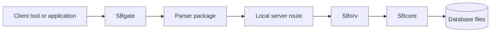
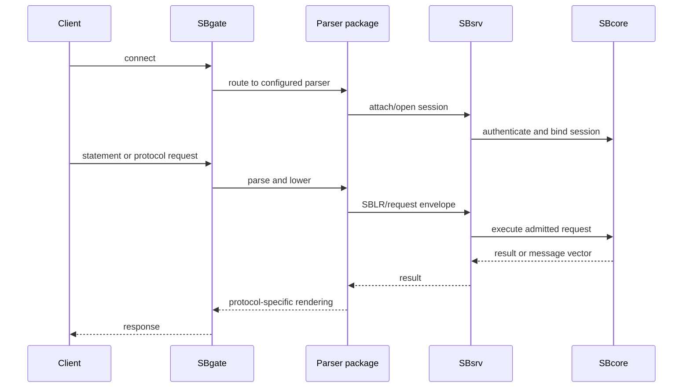

# Standalone Server

## Purpose

Standalone server mode adds listener and parser routing for clients that connect over a protocol-facing entry point. This is the mode to read when you are thinking about donor-style clients, network clients, parser pools, or ordinary client/server use.

## High-Level Shape

## Parser Role

The listener does not make donor syntax into engine authority. A parser package accepts a specific protocol or language surface, validates it according to its profile, and lowers admitted work to a ScratchBird execution request.

The engine then rechecks object identity, descriptors, transaction context, and security before execution.

## Typical Request Flow

## What It Is For

Standalone server mode is intended for:

- client/server evaluation;
- parser compatibility testing;
- donor-style client experiments where a parser exists;
- networked development deployments;
- applications that need a network-facing service boundary.

Suitability for any particular production environment must be verified against current release status and platform proof.

## What It Does Not Mean

The existence of a parser package does not mean every donor command, datatype, catalog projection, management utility, or driver behavior is complete. Each parser has its own supported surface and tests.

## Related Pages

- [../architecture/engine_parser_boundary.md](../architecture/engine_parser_boundary.md)
- [../using_scratchbird/donor_database_compatibility.md](../using_scratchbird/donor_database_compatibility.md)
