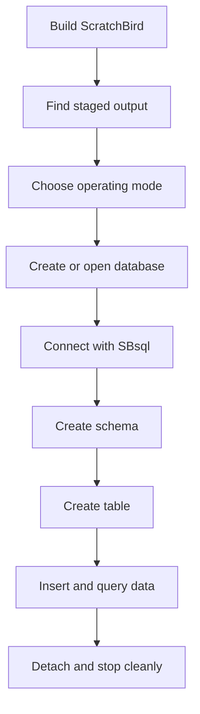

# First Database

## Purpose

This page gives a safe, high-level path for creating or opening a first ScratchBird database. Exact command names, flags, and binary paths can change by build configuration, so use this as orientation and check the current build output before running commands.

## Basic Steps

1. Build the project for your platform.
2. Locate the staged public output directory for that build.
3. Choose an operating mode.
4. Create or open a database through the mode's documented entry point.
5. Connect with SBsql or another configured client.
6. Create a schema and a first object.
7. Shut down cleanly.

## Example Flow



## First Object Shape

The native SBsql shape usually looks like this:

```sql
create schema app;

create table app.notes (
  note_id uuid primary key,
  note_text varchar(200),
  created_at timestamp with time zone
);

insert into app.notes (note_id, note_text, created_at)
values (uuid_v7(), 'first note', current_timestamp);

select note_id, note_text, created_at
from app.notes;
```

The exact built-in function names and type details should be checked in the [Language Reference](../../Language_Reference/README.md).

## What To Verify

Before treating a first database as usable for real work, verify:

- the build completed without skipped required targets;
- the expected binaries or libraries were staged;
- the selected operating mode starts and stops cleanly;
- the session authenticates as expected;
- a simple create/insert/select/commit cycle works;
- diagnostics are understandable when an invalid request is submitted.

## Related Pages

- [../operating_modes/choosing_a_mode_summary.md](../operating_modes/choosing_a_mode_summary.md)
- [first_sbsql_session.md](first_sbsql_session.md)
