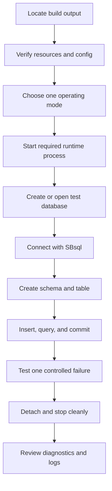

# First Database

## Purpose

This page gives a safe path for creating or opening a first ScratchBird database. It is written as an orientation guide rather than a fixed command transcript because command names, binary locations, configuration defaults, and release packaging can vary by build target.

The goal of a first database is modest: prove that the selected build can create or open a database, connect through the intended mode, run a small transaction, return diagnostics, and shut down cleanly.

## Before You Start

Confirm these items before creating a database:

| Item | Why It Matters |
| --- | --- |
| Build output exists | The tools, engine library, parser packages, and resource files must come from the same build. |
| Target platform is known | A Linux, Windows, or BSD output tree may have different file names and service behavior. |
| Operating mode is chosen | Embedded, local IPC, standalone server, and managed group deployments have different startup paths. |
| Resource files are staged | Character sets, collations, time zones, policy defaults, and configuration files are part of a usable deployment. |
| Authentication path is understood | Even a first test should use a known identity and expected authorization behavior. |
| Storage location is deliberate | Put test databases somewhere disposable until you understand cleanup and backup behavior. |

Do not create first-test databases in directories that also hold release binaries or source files.

## Choose A Mode

ScratchBird can be approached through more than one mode. Pick one path for the first test instead of mixing them.

| Mode | First-Test Shape | Use When |
| --- | --- | --- |
| Embedded engine | Application or test tool opens SBcore directly. | You are validating library embedding or an application-local database. |
| Single-node IPC server | Local client talks to SBsrv. | Several local clients need one server process without a network listener. |
| Standalone server | Client enters through SBgate and parser routing. | You are validating network-facing listener and parser behavior. |
| Managed group deployment | Client enters through SBmgr, then listener and parser routing. | You need managed entry points and shared identity or policy integration. |

For a first user workflow, the single-node IPC or standalone server modes are often easiest to reason about because they show a clear client/server boundary. Embedded tests are better when the application itself is the product boundary.

## First Database Flow



## Pick A Test Database Name

Use a name that clearly identifies the database as disposable, for example:

- `scratchbird_getting_started`;
- `first_database_test`;
- `sbsql_smoke_test`.

Keep the database in a temporary test location until you know how the selected operating mode handles database paths, configuration, identity, and cleanup.

## Create Or Open The Database

The exact command depends on the selected binary and mode. The operation should establish:

- database file or database resource location;
- initial catalog;
- initial filespace;
- initial character set and collation behavior;
- security and policy baseline;
- parser route for the first session;
- diagnostics location.

In a first test, avoid advanced options. Do not test backup, restore, repair, import, replication, or compatibility parser behavior until a basic create/open/connect/query cycle works.

## First SBsql Workload

Once connected with SBsql, run a small transaction that exercises names, types, inserts, selects, and commit.

```sql
create schema app;

create table app.notes (
    note_id uint64 not null,
    note_text text not null,
    created_at timestamp with time zone not null,
    constraint pk_notes primary key (note_id)
);

insert into app.notes (note_id, note_text, created_at)
values
    (1, 'first note', current_timestamp),
    (2, 'second note', current_timestamp);

select note_id, note_text, created_at
from app.notes
order by note_id;

commit;
```

This example uses native SBsql. If a release changes spelling, available types, or built-in function names, follow the Language Reference for that release.

## Verify A Controlled Refusal

A first database test should include one intentional failure. The goal is not to break the system; the goal is to confirm that invalid work returns a controlled diagnostic.

Example:

```sql
select *
from app.table_that_does_not_exist;
```

Expected behavior:

- the session remains alive;
- the transaction state is understandable;
- the diagnostic says what failed;
- the diagnostic does not expose protected material;
- the client can continue or detach cleanly according to transaction state.

## Confirm The Database Reopens

After the first transaction:

1. Detach the client.
2. Stop the server process if the selected mode uses one.
3. Start the same mode again.
4. Reopen the same test database.
5. Query the rows inserted earlier.

```sql
select count(*) as note_count
from app.notes;

select note_id, note_text
from app.notes
order by note_id;
```

The point is to prove that the database did not only work in memory during the first session.

## What Success Looks Like

A successful first database run proves:

- the selected output tree is internally consistent;
- required resource files can be found;
- the chosen operating mode starts;
- the database can be created or opened;
- SBsql can connect;
- simple DDL and DML execute;
- commit makes data visible after reconnect;
- an invalid query returns a controlled diagnostic;
- the runtime detaches and shuts down without leaving an obvious stuck state.

It does not prove that every parser, datatype, administrative command, or compatibility surface is complete.

## Common Early Problems

| Symptom | Likely Area To Inspect |
| --- | --- |
| Binary starts but cannot find resources | Output staging, configuration paths, character set or collation resources. |
| Client cannot connect | Operating mode, socket or port configuration, listener route, authentication settings. |
| Parser not found | Parser package output, parser registration, configuration. |
| Create database fails | Storage directory permissions, existing file state, configuration, initial security policy. |
| Query fails with syntax error | SBsql syntax version or command spelling. |
| Data disappears after restart | Transaction not committed, wrong database path, temporary test database, failed reopen. |
| Shutdown leaves state behind | Runtime lifecycle handling, stale process, stale socket, or configuration issue. |

## Cleanup

When the first test is complete:

- detach all clients;
- stop server or manager processes started for the test;
- keep logs if a diagnostic needs review;
- delete only disposable test databases that you created for this purpose;
- do not delete shared resource files from the output tree.

## Where To Go Next

- [First SBsql Session](first_sbsql_session.md)
- [Schemas, Objects, And Names](schemas_objects_and_names.md)
- [Choosing A Mode Summary](../operating_modes/choosing_a_mode_summary.md)
- [Configuration Basics](../administration/configuration_basics.md)
- [Language Reference](../../Language_Reference/README.md)
