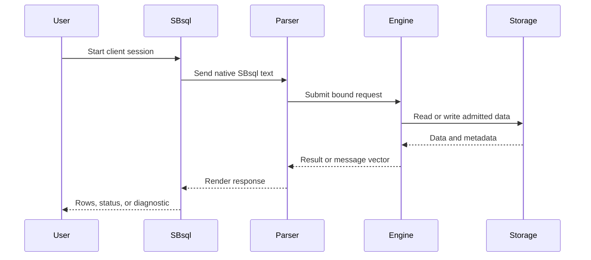

# First SBsql Session

## Purpose

SBsql is the native ScratchBird command language. A first SBsql session should prove that you can connect to the intended database, understand your schema context, run a small transaction, inspect results, and detach cleanly.

This page uses simple examples. It does not replace the full Language Reference, and it should not be read as a complete list of supported statements.

## What A Session Is

A session is the authenticated conversation between a client and the database through a selected operating mode and parser route.



Within one session, you normally care about:

- identity: who the engine thinks you are;
- current schema: where unqualified names resolve;
- transaction state: whether work is pending, committed, or rolled back;
- parser route: whether the request is going through native SBsql;
- diagnostics: how success and failure are reported.

## Session Checklist

Before running commands, know:

- which database you are connecting to;
- which operating mode is running;
- which identity is being used;
- whether autocommit is enabled by default for the selected tool;
- where diagnostics and logs can be reviewed;
- whether the database is disposable or persistent.

## Start With Context

Begin by inspecting the session context. Exact output formatting can vary by build.

```sql
show current schema;
show search path;
show current user;
show transaction;
```

The point is to confirm that you are in the database and schema context you intended. If a command is not available in the current build, use the equivalent context-inspection command documented for that release.

## Create A Working Schema

Create a schema for the first test rather than placing test objects at the database root.

```sql
create schema app;
set schema app;

show current schema;
```

After `set schema app`, unqualified names such as `notes` should resolve relative to `app` when visible and unambiguous.

## Create A Table

Use a small table with ordinary scalar values.

```sql
create table notes (
    note_id uint64 not null,
    note_text text not null,
    created_at timestamp with time zone not null,
    constraint pk_notes primary key (note_id)
);
```

This tests several basic behaviors:

- table creation;
- column descriptors;
- scalar datatypes;
- a named constraint;
- current-schema name resolution;
- catalog transaction behavior.

## Insert Rows

Insert more than one row so ordering and row counts are easy to inspect.

```sql
insert into notes (note_id, note_text, created_at)
values
    (1, 'created from the first SBsql session', current_timestamp),
    (2, 'second row in the same statement', current_timestamp),
    (3, 'third row for ordering checks', current_timestamp);
```

Multi-row `values` input is useful for simple smoke tests because it proves that the parser and executor are not limited to one row per insert statement.

## Query Rows

Query the data using an explicit projection and stable ordering.

```sql
select note_id, note_text, created_at
from notes
order by note_id;
```

Avoid `select *` in documentation examples unless the point is to inspect all columns. Explicit projection makes examples clearer and avoids hiding column-order assumptions.

## Commit Or Roll Back Intentionally

End the transaction deliberately.

```sql
commit;
```

If you are experimenting and want to discard the work instead:

```sql
rollback;
```

For a first persistence test, commit the transaction, detach, reconnect, and query the table again.

## Test A Controlled Error

Run one statement that should fail.

```sql
select note_id
from notes_that_do_not_exist;
```

Expected behavior:

- the client receives a diagnostic;
- the session remains controlled;
- protected details are not leaked;
- the next allowed command behaves according to transaction state.

This is part of learning the product. Successful systems explain failures clearly.

## Reconnect And Verify Persistence

After commit:

1. Detach the SBsql client.
2. Stop and restart the selected runtime if appropriate.
3. Connect again.
4. Set the schema or qualify names.
5. Query the committed rows.

```sql
set schema app;

select count(*) as note_count
from notes;

select note_id, note_text
from notes
order by note_id;
```

If the rows are not present, check whether the transaction was committed, whether the same database was reopened, and whether the current schema is the one you expect.

## Clean Up Test Objects

For a disposable first session, remove the test objects after verifying the workflow.

```sql
drop table app.notes;
drop schema app;
commit;
```

Only drop objects that you created for the test. Do not use cleanup examples against a database that contains real work.

## Reading Result Sets

A result set has column names, column order, datatypes, nullability behavior, and row order.

For early tests:

- name the columns you want;
- include `order by` when row order matters;
- test null values intentionally;
- test type conversion intentionally;
- keep result sets small enough to inspect by eye.

## Reading Message Vectors

ScratchBird diagnostics are expected to communicate structured refusal or error information. A user-facing rendering may include text, code, class, source component, object name, or policy information depending on the command and build.

For a first session, record whether failures are:

- syntax errors;
- missing object errors;
- authorization denials;
- unsupported feature refusals;
- configuration problems;
- runtime availability problems.

Different categories require different fixes.

## Common Session Mistakes

| Mistake | What Happens |
| --- | --- |
| Connecting to the wrong database path | Objects appear missing or changes appear to disappear. |
| Forgetting to commit | Reconnect tests may not show expected rows. |
| Using the wrong current schema | Unqualified names resolve somewhere else or fail. |
| Relying on implicit row order | Result rows may not appear in insertion order. |
| Mixing parser expectations | Native SBsql examples should be run through the SBsql parser route. |
| Ignoring diagnostics | A refused command may leave the session in a state that requires commit, rollback, or detach. |

## Where To Go Next

- [First Database](first_database.md)
- [Schemas, Objects, And Names](schemas_objects_and_names.md)
- [Schema Tree And Name Resolution](../../Language_Reference/syntax_reference/schema_tree_and_name_resolution.md)
- [Table Statements](../../Language_Reference/syntax_reference/table.md)
- [Insert](../../Language_Reference/syntax_reference/insert.md)
- [Select](../../Language_Reference/syntax_reference/select.md)
- [Transaction Control](../../Language_Reference/syntax_reference/transaction_control.md)
