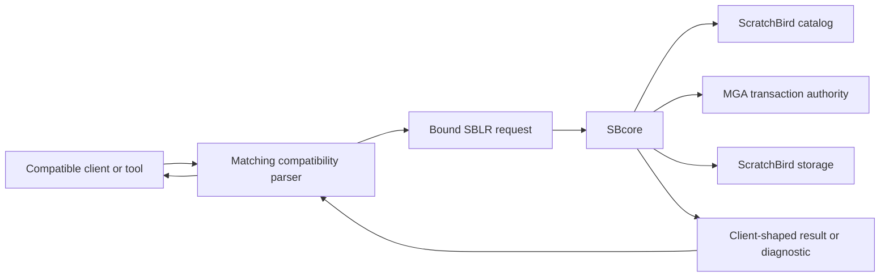
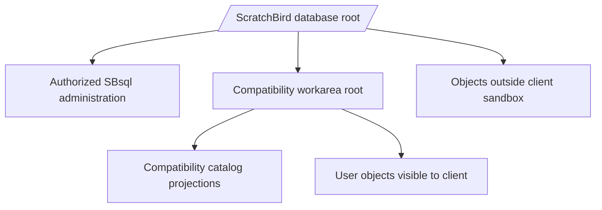

# Reference-System Compatibility

## Purpose

ScratchBird can expose compatibility surfaces through reference-system emulation
parser packages. A compatibility parser is a standalone parser and protocol
adapter for one client family. It lets a client speak the language and protocol
shape that parser is built to understand while ScratchBird keeps storage,
transactions, identity, security, and recovery inside the ScratchBird engine.

Compatibility is scoped. The presence of a parser package means there is a route for that client family; it does not mean every command, tool behavior, catalog row, wire-protocol edge case, or administrative feature from that source ecosystem is complete in the current build.

## The Compatibility Model

A compatibility parser sits between a client and SBcore.

The parser is responsible for accepting the client surface. The engine remains responsible for durable authority.

## What The Parser Owns

A compatibility parser can own client-facing behavior such as:

- protocol negotiation for its client family;
- syntax accepted by that parser;
- parser-specific object defaults;
- parser-specific type spelling and literal handling;
- catalog projections that make ScratchBird metadata visible in the expected shape;
- diagnostic rendering for that client family;
- logical backup, restore, replication, or import/export streams where those surfaces are implemented and admitted by policy;
- mapping accepted work into SBLR.

The parser does not own:

- final transaction authority;
- storage recovery;
- durable catalog identity;
- authorization finality;
- object UUID assignment;
- cleanup and garbage collection decisions;
- page format interpretation outside the engine;
- low-level repair or verification authority.

## Parser Isolation

Each compatibility parser is isolated from the others.

| Rule | Meaning |
| --- | --- |
| One parser, one client family | A parser should accept only the syntax and protocol shape it is built for. |
| No cross-dialect fallback | A parser should not silently accept unrelated language forms because another parser supports them. |
| No implicit dependency | Installing one compatibility parser must not imply that any other parser is installed. |
| Parser-local defaults | Object defaults, name folding, null handling, index defaults, and diagnostics are parser-specific where implemented. |
| Engine authority remains shared | Once accepted and lowered, engine execution still uses ScratchBird catalog, security, transaction, and storage rules. |

This separation is intentional. It keeps compatibility behavior explicit and prevents a client from accidentally entering a different dialect.

## Compatibility Areas

Compatibility may involve many independent surfaces. A parser can be strong in one area and incomplete in another, so documentation and proof should be read by surface.

| Area | What To Check |
| --- | --- |
| Connection behavior | Authentication route, session state, database selection, client options, and refusal behavior. |
| SQL syntax | Accepted statements, expressions, functions, procedural blocks, comments, identifiers, and script tokens. |
| Type system | Native type spelling, value ranges, coercions, binary encodings, domain behavior, and null handling. |
| DDL | Create, alter, drop, recreate, rename, comment, show, describe, and object-specific lifecycle behavior. |
| DML and query behavior | Insert, update, delete, merge, upsert, select, joins, grouping, ordering, windowing, recursive common table expressions, and result ordering. |
| Transactions | Autocommit, begin, commit, rollback, savepoints, retain or chain behavior where applicable, and prepared transactions where supported. |
| Procedural SQL | Stored procedures, functions, triggers, packages, events, cursors, result sets, and routine metadata. |
| Catalog projection | System tables, views, metadata functions, dependency rows, privileges, indexes, constraints, and generated objects. |
| Backup and restore | Logical stream support, denied physical copy behavior, server-local file policy, and diagnostics. |
| CDC, replication, and ETL | Direction, ordering, transaction grouping, record identity, quarantine, cutover, and idempotency behavior where implemented. |
| Diagnostics | Error codes, message text, refusal classes, unsupported behavior, denied behavior, and policy failures. |

## Sandboxed Workareas

A compatibility client normally connects to a compatibility workarea. That
workarea is the root of the namespace the client can see.

The client should not be able to spell a path outside its sandbox and read arbitrary objects. Some catalog projection objects may display selected metadata from outside the sandbox when the projection object itself has been granted that authority. That does not give the user unrestricted direct access outside the workarea.

## Logical Streams And File Access

Compatibility commands that move data require careful handling.

Allowed by design when implemented and admitted by policy:

- remote logical backup streams for the connected compatibility database;
- remote logical restore streams that contain metadata and data operations;
- partial logical export or import streams where the parser and engine support them;
- CDC, replication, or ETL streams through the parser's UDR bridge where implemented.

Denied or restricted by design:

- server-local file open or manipulation by a compatibility parser unless policy explicitly admits a safe surface;
- physical page-copy backup or restore formats;
- low-level repair, verification, or page maintenance through compatibility parser routes;
- operations targeting objects outside the connected workarea without explicit engine authority.

The key distinction is logical remote stream versus server-local or physical storage access. A logical stream can be interpreted as client work. A physical page copy or repair command attempts to bypass engine authority.

## Refusals Are Compatibility Behavior

A compatibility parser should fail clearly when behavior is not admitted.

Common refusal classes include:

- syntax not accepted by the selected parser;
- feature unsupported by the parser;
- feature unsupported by the engine build;
- operation denied by sandbox policy;
- operation denied because it requires server-local file access;
- operation denied because it is physical backup, restore, repair, or verification;
- unavailable parser UDR or bridge package;
- missing capability for CDC, replication, import, export, or migration;
- ambiguous ordering or transaction grouping in a stream.

A controlled refusal is preferable to pretending that a feature succeeded.

## Reading Compatibility Claims

When evaluating a parser, look for proof of the exact surface you need:

1. The parser package exists in the build output.
2. The parser can be configured and selected.
3. Connection and authentication tests pass.
4. The SQL or protocol surface you need is implemented.
5. Type, index, transaction, and catalog behavior match the parser's documented compatibility target.
6. The behavior is covered by reference-system regression tests or parser proof gates.
7. Unsupported cases return the documented message vector.

Do not infer readiness from file names, directory names, or generated manifests alone.

## Where To Go Next

- [First Database](first_database.md)
- [Schemas, Objects, And Names](schemas_objects_and_names.md)
- [Engine Parser Boundary](../architecture/engine_parser_boundary.md)
- [SBsql And SBLR](../architecture/sbsql_and_sblr.md)
- [Language Reference](../../Language_Reference/README.md)
