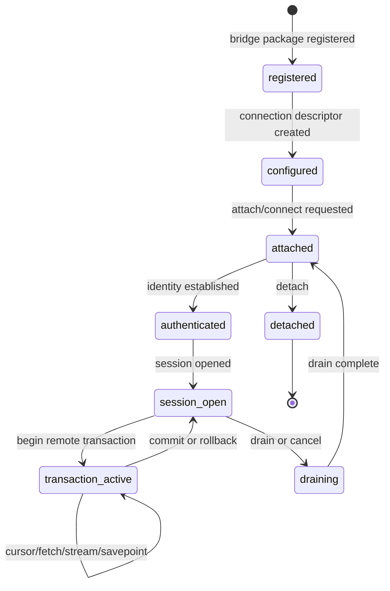
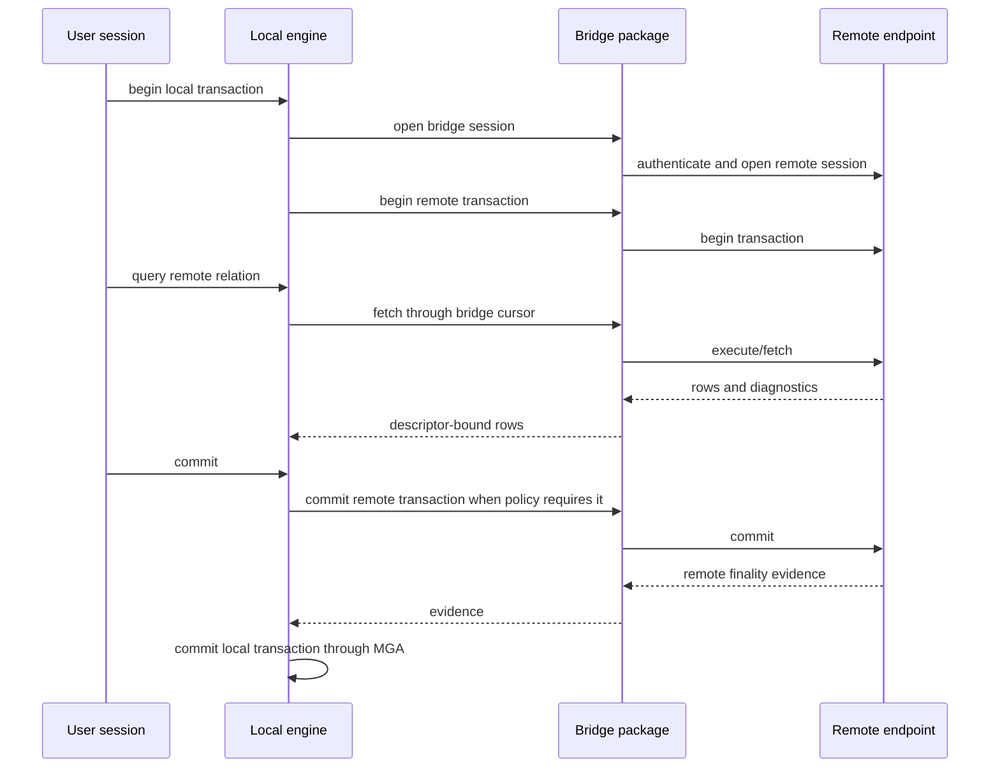
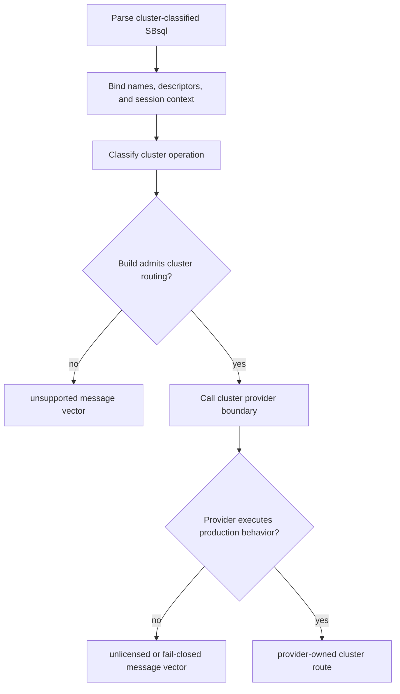

# Bridge And Cluster Boundaries

This page is part of the SBsql Language Reference Manual. It explains the
boundary between ordinary bridge operations, remote data access, logical data
movement, provider-backed capabilities, and cluster-classified operations.

Generation task: `core_paradigms_bridge_and_cluster_boundaries`

## Purpose

A bridge is a connection boundary. It lets an authorized local user, session, or
agent connect to another database endpoint through a registered bridge-capable
package. The bridge can carry statements, cursors, rows, streams, logical
backup/restore data, replication data, migration data, diagnostics, and
capability information.

A bridge does not move transaction finality, catalog identity, storage
authority, recovery authority, or security authority out of the participating
databases. Each database keeps its own MGA transaction authority and durable
catalog identity.

Cluster-classified operations are different. They coordinate placement,
membership, distributed query planning, distributed transaction barriers,
failover, cross-node route authority, and similar multi-node behavior. Those
surfaces are admitted only through cluster gates. In a public build they either
return an explicit unsupported/unlicensed message vector or route to the public
compile/link stub and fail closed.

## Boundary Summary

| Surface | Classification | Authority Model |
| --- | --- | --- |
| Local table query | Local engine operation | Local MGA, local catalog UUIDs, local security, local storage. |
| Remote table through bridge | Bridge operation | Local session plus remote session; each database keeps its own transaction authority. |
| Logical backup stream | Stream operation | Source database owns snapshot and export authority; stream policy controls release. |
| Logical restore stream | Stream operation | Target database owns catalog mapping, transaction finality, and import authority. |
| CDC or replication route | Bridge/stream operation | Source and target each own local transaction state; ordering evidence is route evidence, not finality authority. |
| Migration route | Bridge/stream operation | Source, target, mapping, validation, quarantine, and cutover are explicit policy-bound phases. |
| Cross-node optimizer fanout | Cluster-classified operation | Requires cluster provider admission. Public builds fail closed. |
| Distributed transaction barrier | Cluster-classified operation | Requires cluster provider admission. Local MGA remains local authority. |
| Membership, failover, placement, shard routing | Cluster-classified operation | Requires cluster provider admission. Public builds provide diagnostics only. |

An ordinary query that reads a remote relation through a bridge is not a
distributed query. The local operation treats the remote relation as an input
reached through a connection. A distributed query lets a cluster-aware authority
plan, route, and coordinate work across nodes or fragments; that surface is
cluster-classified.

## Bridge Lifecycle



Bridge registration makes a capability available. It does not create an
automatic connection or grant anyone authority to use it. An authorized SBsql
statement creates the connection descriptor and policy state. A session or
agent then attaches, authenticates, opens a session, and begins one or more
remote transactions as needed.

## Authority Model

Bridge authority is layered.

| Layer | Owns |
| --- | --- |
| Local database | Local session identity, local transaction, local catalog, local policy, local resource limits, local result rendering. |
| Bridge descriptor | Endpoint reference, capability profile, stream limits, security policy, retry policy, diagnostic profile. |
| Bridge package | Wire protocol, remote statement rendering, result decoding, capability reporting, stream framing. |
| Remote database | Remote authentication, remote session, remote catalog, remote transaction, remote security, remote result semantics. |
| Engine admission | Whether the bound SBsql operation may call the bridge route at all. |

The bridge package is not durable authority. It reports capabilities, translates
requests, frames data, and returns evidence. The local engine decides whether
the local operation is admitted. The remote endpoint decides whether the remote
operation is admitted.

## Local And Remote Transactions

A bridge operation can involve one local transaction and one or more remote
transactions. Each participating database owns its own transaction state.



Rules:

- local commit is local MGA finality;
- remote commit is remote finality;
- local rollback does not prove remote rollback unless the remote transaction
  actually rolled back and returned evidence;
- remote commit evidence does not override local recovery classification;
- savepoints, retain/chain behavior, autocommit, and prepare are used only when
  both the route and the remote endpoint report support;
- uncertain finality must return explicit diagnostics and fence unsafe work.

## Bridge Operations

The public bridge surface groups operations by purpose.

| Operation | Purpose |
| --- | --- |
| Describe capabilities | Report package ABI, supported statement families, streams, transaction modes, diagnostics, and limits. |
| Create connection | Create a durable connection descriptor with endpoint, policy, capability, and secret-reference metadata. |
| Attach/connect | Establish a connection handle under a user or agent context. |
| Authenticate | Establish remote identity using policy-admitted credential references or delegation. |
| Open session | Create a remote session that can own cursors and remote transactions. |
| Close session | End a remote session and release session-owned resources. |
| Detach | Close the connection handle and return final diagnostics. |
| Ping/health | Check availability, route state, and provider readiness without changing data. |
| Cancel | Request cancellation of an active remote operation. |
| Drain | Stop accepting new work and allow admitted work to finish or cancel by policy. |
| Shutdown | Shut down an admitted bridge package or connection scope where policy permits it. |
| Begin transaction | Start a remote transaction associated with the bridge session. |
| Commit transaction | Request remote commit and return remote finality evidence. |
| Rollback transaction | Request remote rollback and return remote finality evidence. |
| Savepoint | Create or roll back to a remote savepoint where supported. |
| Cursor fetch | Fetch descriptor-bound rows under stream and backpressure policy. |
| Stream read/write | Move stream frames for rows, large values, logical backup, restore, CDC, replication, migration, and result data. |
| Validate | Validate connection, mapping, stream shape, endpoint capabilities, and cutover readiness. |
| Compare | Compare source and target data or metadata under an admitted migration/replication route. |
| Cutover | Complete an admitted migration or replication transition after validation. |

Unsupported operations must return explicit message vectors. They must not be
silently ignored.

## Bridge Handles And Scope

Bridge handles are opaque session-scoped or agent-scoped references. The
database stores connection configuration and policy. The bridge package supplies
the ability to connect; it does not own the durable connection policy.

Handle rules:

- handles are not raw pointers or client-trusted tokens;
- handles are bound to session, agent, transaction, endpoint, policy, and
  security context;
- a handle can own multiple remote transactions when the route permits it;
- a handle can be cancelled, drained, closed, or invalidated by policy;
- handle metadata is redacted in diagnostics unless disclosure policy admits it;
- stale handles fail closed after disconnect, revoke, policy change, provider
  reload, or recovery fence.

## Streams And Backpressure

Bridge streams carry typed frames. They are not arbitrary byte pipes once they
enter the SBsql execution pipeline.

Stream contracts include:

- frame type and descriptor;
- maximum frame size;
- maximum in-flight bytes;
- timeout and cancellation behavior;
- retry and idempotency policy;
- ordering token where required;
- transaction grouping where required;
- quarantine behavior for invalid records;
- redaction and protected-material policy;
- completion and failure diagnostics.

Large values, cursors, logical backup streams, restore streams, CDC streams,
replication streams, migration streams, and `COPY` streams all use explicit
stream contracts.

## Logical Backup And Restore Across A Bridge

Logical backup and logical restore are allowed where the route, policy, and
endpoint capabilities admit them.

| Operation | Allowed Shape |
| --- | --- |
| Logical backup to client or bridge stream | Exports metadata and data as typed logical instructions and row frames. |
| Logical restore from client or bridge stream | Reads typed logical instructions and applies them through target catalog and DML routes. |
| Partial logical backup | Exports an admitted subset such as a schema, table, query, or policy-bound scope. |
| Partial logical restore | Imports an admitted subset with explicit mapping and validation. |
| Physical page-copy backup or restore | Denied through bridge/parser routes unless an explicit administrative route admits it. |
| Server-local file manipulation | Denied by default unless an explicit named location policy admits it. |

Logical streams are interpreted as instructions and typed data. They are not
trusted as catalog or transaction authority. The target database decides what
UUIDs, descriptors, security mappings, and transaction outcomes are admitted.

## CDC, Replication, ETL, And Migration

CDC, replication, ETL, and migration routes are bridge and stream operations.
They require direction, capability, identity, ordering, idempotency, mapping,
quarantine, validation, and cutover policy.

| Concern | Rule |
| --- | --- |
| Direction | A route can be source, target, or both only when capability negotiation reports support. |
| Transaction grouping | Changes must preserve group boundaries where the route requires them. |
| Ordering token | Ordering evidence must be present when replay or cutover depends on it. |
| Record identity | Each record must carry enough identity to apply, compare, quarantine, or reject it. |
| Idempotency | Replayed changes require an idempotency key or equivalent route contract where policy requires it. |
| Quarantine | Invalid or ambiguous records must be quarantined or refused according to policy. |
| Cutover | Cutover requires validation that the target is ready and that no required changes are missing. |
| Finality | Route evidence does not override local or remote MGA finality. |

## Remote Query Versus Distributed Query

A remote query through a bridge:

- connects to one remote endpoint through a bridge session;
- treats remote rows as a relation input;
- uses local and remote transactions according to bridge policy;
- does not give the local optimizer authority to distribute work across a
  cluster;
- does not create cluster placement, membership, route, or failover authority.

A distributed query:

- plans or routes work across nodes, shards, fragments, or distributed
  participants;
- can require distributed read safety, fanout, partial aggregation, merge,
  placement, route authority, and distributed diagnostics;
- is cluster-classified;
- requires cluster provider admission;
- fails closed in public builds unless an admitted provider boundary exists.

## Cluster Gate

Cluster-classified statements are recognized so tools and scripts can receive
stable diagnostics. Recognition is not execution.



The public compile/link stub exists to prove parser routing, SBLR mapping, ABI
wiring, diagnostics, and fail-closed behavior. It provides no cluster
membership, routing authority, replication authority, failover, recovery,
distributed transaction control, or production cluster behavior.

See [Cluster-Gated Statements](../syntax_reference/cluster_gated_statements.md).

## Cluster-Classified Operation Families

| Family | Examples |
| --- | --- |
| Topology | Inspect topology, define regions, define shard profiles, publish topology manifests, validate topology schema. |
| Membership | Admit, remove, drain, assign role, inspect health, validate node suitability. |
| Routing | Publish ownership, reject stale ownership, inspect route plans. |
| Placement | Place objects, rebalance shards, validate partition distribution, assign ranges. |
| Distributed transactions | Begin distributed work, prepare participants, publish barriers, recover limbo, advance cleanup, validate finality evidence. |
| Replication and reconciliation | Consume events, reconcile ledgers, apply merge policy, report conflicts, publish reconciled state. |
| Security and fencing | Validate epoch, issue or revoke fence tokens, validate policy versions, validate route authority. |
| Jobs and throttling | Start or cancel controlled jobs, throttle workloads, run admitted maintenance. |
| Metrics and support | Inspect provider status, route traces, events, support evidence, and readiness state. |
| Distributed query | Plan and admit cross-node work, route fragments, fanout reads, merge rows, aggregate partials, validate safe reads. |

These operation families are not implemented by ordinary local query execution
or by ordinary bridge remote-table access.

## Security And Secrets

Bridge and cluster-gated operations are security-sensitive because they can move
data, create remote sessions, expose metadata, and affect operational state.

Security rules:

- bridge use requires an explicit privilege on the bridge descriptor or route;
- endpoint access requires policy admission;
- external network access requires policy admission;
- credential material uses secret references or provider-owned handles, not raw
  statement text;
- remote authentication follows the destination endpoint's authority model;
- metadata rendering is redacted by disclosure policy;
- protected material cannot be exported, logged, diagnosed, replicated, or
  streamed without release authority;
- management operations require management privileges even when they return a
  refusal;
- cluster-classified operations require cluster gate admission before any
  provider behavior can run.

See [Security And Sandboxing](security_and_sandboxing.md) and
[Security And Privilege Statements](../syntax_reference/security_and_privilege_statements.md).

## Recovery And Failure Rules

Bridge and cluster boundary failures must be explicit.

| Failure | Required Behavior |
| --- | --- |
| Missing bridge package | Return unsupported or unavailable capability. |
| Bridge package cannot authenticate | Return bridge authentication failure. |
| Endpoint lacks capability | Return missing capability or unsupported operation. |
| Stream frame invalid | Reject frame, quarantine record, or abort stream according to policy. |
| Ordering ambiguous | Refuse replay, CDC, migration, or cutover until ordering evidence exists. |
| Idempotency missing | Refuse replay/apply route where idempotency is required. |
| Remote transaction uncertain | Fence dependent local work and report uncertainty. |
| Local transaction uncertain | Follow local MGA recovery and fail closed. |
| Provider unavailable | Return unavailable provider or unlicensed provider message vector. |
| Cluster route disabled | Return unsupported before provider call. |
| Cluster stub reached | Return unlicensed or fail-closed diagnostic from the stub boundary. |

Silent partial success is not allowed for bridge or cluster-classified
operations.

## Syntax Productions

```ebnf
bridge_operation        ::= bridge_connection_operation
                          | bridge_session_operation
                          | bridge_transaction_operation
                          | bridge_cursor_operation
                          | bridge_stream_operation
                          | bridge_replication_operation
                          | bridge_migration_operation
                          | bridge_diagnostic_operation ;
```

```ebnf
bridge_connection_operation ::=
      describe_bridge_capabilities
    | create_bridge_connection
    | alter_bridge_connection
    | drop_bridge_connection
    | validate_bridge_connection
    | attach_bridge
    | detach_bridge
    | ping_bridge
    | health_bridge ;
```

```ebnf
bridge_session_operation ::=
      open_bridge_session
    | close_bridge_session
    | cancel_bridge_operation
    | drain_bridge_session
    | shutdown_bridge_scope ;
```

```ebnf
bridge_transaction_operation ::=
      begin_bridge_transaction
    | commit_bridge_transaction
    | rollback_bridge_transaction
    | savepoint_bridge_transaction ;
```

```ebnf
bridge_stream_operation ::=
      open_bridge_stream
    | read_bridge_stream
    | write_bridge_stream
    | close_bridge_stream ;
```

```ebnf
private_cluster_statement ::= show_cluster
                            | alter_cluster
                            | create_cluster
                            | drop_cluster ;
```

```ebnf
show_cluster            ::= "SHOW" "CLUSTER" cluster_target ;
alter_cluster           ::= "ALTER" "CLUSTER" cluster_action ;
create_cluster          ::= "CREATE" "CLUSTER" cluster_create_payload ;
drop_cluster            ::= "DROP" "CLUSTER" cluster_ref ;
```

The grammar production name `private_cluster_statement` is historical. It
describes cluster-classified statement grouping. It does not mean production
cluster implementation code is present in the public build.

## Binding And Execution Summary

| Step | Bridge Meaning | Cluster-Gated Meaning |
| --- | --- | --- |
| Parse | Recognize bridge, stream, remote, replication, migration, or diagnostic intent. | Recognize cluster-classified intent. |
| Bind | Resolve bridge descriptors, endpoints, streams, objects, parameters, transactions, and policy inputs. | Resolve names and descriptors required to classify the cluster operation. |
| Lower | Produce SBLR for bridge route or explicit refusal. | Produce SBLR for cluster gate or explicit refusal. |
| Admit | Check bridge capability, security, stream, endpoint, and resource policy. | Check compile-time cluster gate and provider boundary admission. |
| Execute | Bridge package performs admitted connection or stream work; engines retain authority. | Provider boundary executes only in an admitted build/profile. Public stub fails closed. |
| Return | Result envelope includes rows, stream state, remote evidence, diagnostics, or refusal. | Result envelope includes provider diagnostics, unsupported, unlicensed, or fail-closed refusal. |

## Verification Checklist

A bridge and cluster-boundary proof should demonstrate:

- bridge package registration does not grant automatic use authority;
- connection descriptors require explicit SBsql creation and policy;
- bridge attach/auth/session lifecycle returns explicit diagnostics;
- local and remote transactions remain separately authoritative;
- remote commit evidence cannot override local MGA recovery;
- local rollback cannot pretend remote rollback occurred;
- stream frame limits, cancellation, timeouts, and backpressure are enforced;
- logical backup and restore use typed streams and policy-bound mappings;
- server-local file access is denied unless a named location policy admits it;
- physical page-copy backup/restore is denied through bridge/parser routes;
- CDC, replication, ETL, and migration require ordering, idempotency, mapping,
  quarantine, validation, and cutover evidence where policy requires it;
- remote-table access is distinct from distributed query;
- cluster-classified statements return unsupported when the build gate is off;
- cluster-classified statements reaching the public stub return unlicensed or
  fail-closed diagnostics;
- provider errors do not become silent success;
- protected material is not leaked through streams, diagnostics, logs, support
  bundles, or metadata rendering;
- all refusals use explicit message vectors.

## Related Reference Pages

- [Intro And MGA](intro_and_mga.md)
- [Parser To SBLR Pipeline](parser_to_sblr_pipeline.md)
- [Transactions And Recovery](transactions_and_recovery.md)
- [Security And Sandboxing](security_and_sandboxing.md)
- [Cluster-Gated Statements](../syntax_reference/cluster_gated_statements.md)
- [Backup, Restore, Replication, And Migration](../syntax_reference/backup_restore_replication_migration.md)
- [COPY Streaming Import And Export](../syntax_reference/copy.md)
- [Management And Operations](../syntax_reference/management_and_operations.md)
- [Agents And Agent Management](../syntax_reference/agent.md)
- [Refusal Vectors](../syntax_reference/refusal_vectors.md)
