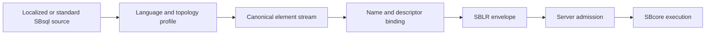

# SBsql Language Profiles

This page is part of the SBsql Language Reference Manual. It explains how
localized SBsql source, standard English fallback, local predictive resources,
and SBLR-to-SBsql rendering fit into the parser-to-SBLR model.

Generation task: `core_paradigms_sbsql_language_profiles`

## Purpose

SBsql language profiles are parser resources. They can change user-facing
spellings, phrase order, diagnostics, message vectors, completion prompts, and
rendered source. They do not change ScratchBird execution authority.

The core rule is:

```text
localized SBsql source -> canonical element stream -> UUID binding -> SBLR
```

The engine executes admitted SBLR with UUID identity, descriptors, security
policy, and MGA transaction authority. It does not execute localized source
text.

## What A Language Profile Can Change

A language profile may define:

- keyword and phrase aliases;
- clause and sentence order for a specific locale;
- localized diagnostic and message-vector text;
- localized object-label rendering where the catalog contains admitted labels;
- predictive-text tables for tools, drivers, and editors;
- SBLR-to-SBsql renderer templates;
- locale-specific literal rules where the profile explicitly admits them.

The profile is exact. For example, a profile for `fr-CA` is not the same as a
profile for `fr-FR`, and a profile for `en-US` is not the same as `en-GB`.

## What A Language Profile Cannot Change

A language profile cannot change:

- canonical SBsql surface IDs;
- SBLR operation families;
- UUID catalog identity;
- descriptor identity;
- authorization and disclosure policy;
- transaction visibility, commit, rollback, savepoint, cleanup, or recovery;
- storage, index, page, or filespace behavior;
- whether a feature is implemented, enabled, or release-supported.

If a localized statement parses successfully but binding or engine admission
fails, the request is refused in the same way as canonical SBsql.

## Canonical Element Stream

The parser normalizes localized source before UUID resolution. It does not
rewrite the text into English SQL. Instead, it emits a canonical element stream:



The stream records canonical token IDs, surface IDs, command slots, source
spans, profile identities, resource hashes, and resolver inputs. That gives the
binder stable input without making localized words into engine authority.

## Standard SBsql Fallback

Many applications and tools will continue to generate canonical English SBsql
without knowing that a user has selected another preferred language. A
non-English session may therefore accept standard SBsql as an input syntax
fallback when policy enables it and the preferred language profile does not
parse the statement.

Fallback has two important limits:

- the user's preferred rendering language remains selected;
- the canonical element stream records that the input syntax profile was
  standard English fallback.

If a statement is ambiguous between the preferred profile and fallback, the
parser must refuse it unless the caller supplies an explicit syntax profile.

## Rendering SBLR Back To SBsql

SBLR-to-SBsql conversion should render in the preferred language when an
admitted renderer template exists and the rendered text can round-trip to the
same canonical element stream, SBLR operation family, and UUID resolver inputs.

If preferred-language rendering is not available, the converter falls back to
canonical English SBsql with an explicit fallback reason. If neither rendering
path is safe, it returns a not-renderable diagnostic rather than inventing
source.

Rendering is canonical source generation. It is not guaranteed to reproduce the
original source text exactly.

## Shared Resources For Tools And Drivers

Parser workers, drivers, command-line tools, driver-equivalent adaptors, IDE
integrations, and AI assistants must use the same admitted SBsql resource pack
for local SBsql intelligence. That pack contains the language profiles,
topology profiles, dialect profile metadata, predictive tables, diagnostics,
and renderer templates needed for local syntax help and draft SBLR creation.

Local parsing, local completion, and draft SBLR remain client-side assistance.
The server still revalidates SBLR, UUIDs, descriptors, grants, resource hashes,
language profile identity, and MGA transaction context before execution.

## Security And Privacy

Language profiles and predictive resources must not reveal hidden objects or
protected material. Completion should distinguish grammar help from object-name
completion. Object-name completion must use authorized metadata or server
resolver results.

Confusable characters, mixed scripts, bidirectional controls, transliteration
aliases, mirrored punctuation, and localized/default-name collisions must fail
closed unless an explicit policy admits the case.

## Release Status

This page describes the architecture and release-scoped behavior. It does not
claim that every language profile, tool, driver, adaptor, or renderer is
release-supported in every build. Check the release evidence, admitted resource
manifest, and current test gates for the exact profiles available in a build.

## Where To Go Next

- [Parser To SBLR Pipeline](parser_to_sblr_pipeline.md)
- [UUID Catalog Identity](uuid_catalog_identity.md)
- [Script Tokens And Identifiers](../syntax_reference/script_tokens_and_identifiers.md)
- [Schema Tree And Name Resolution](../syntax_reference/schema_tree_and_name_resolution.md)
