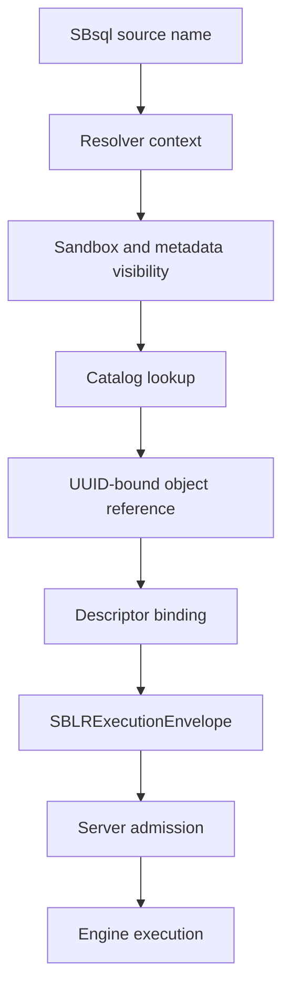
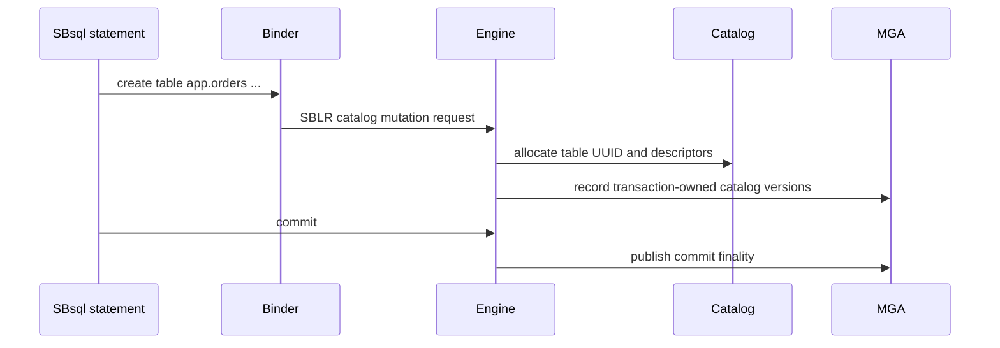

# UUID Catalog Identity

This page is part of the SBsql Language Reference Manual. It explains how
ScratchBird identifies catalog objects, how user-facing names bind to durable
UUID identity, and why engine execution depends on UUID references and
descriptors rather than display text.

Generation task: `core_paradigms_uuid_catalog_identity`

## Purpose

ScratchBird catalog identity is UUID based. User-facing names, localized names,
aliases, synonyms, path labels, and SBsql-visible spellings are resolver input.
They are not durable identity.

When an SBsql statement names an object, binding resolves that name to an object
UUID, object class, parent schema UUID, catalog generation, security epoch, and
descriptor evidence. The parser then lowers the bound operation into SBLR. The
engine executes the SBLR request against UUID identity and descriptors.

This model lets ScratchBird support rename, localized names, aliases, recursive
schemas, schema sandboxes, catalog projections, migrations, support
diagnostics, dependency tracking, and cache invalidation without confusing a
spelling with the object itself.

## Core Rule

> Names are for users and scripts. UUIDs are for durable identity.

Examples:

- renaming a table changes resolver metadata, not the table's durable identity;
- commenting on an object changes descriptive metadata, not identity;
- moving an object where the lifecycle permits it changes parent or placement
  metadata, not identity unless the operation explicitly creates a replacement;
- dropping an object retires the object identity under catalog lifecycle rules;
- recreating an object creates a new durable identity unless the statement is
  explicitly an admitted metadata mutation of the existing object;
- dependencies are tracked by UUID, not by the text that happened to name the
  object when the dependency was created.

## Identity Flow



The resolver context includes current schema, home schema, search path, default
root, sandbox root, identifier profile, language profile, active transaction,
security epoch, and policy state.

## What Has UUID Identity

Durable catalog objects use UUID identity. The visible name of an object is a
label over that identity.

| Object Family | UUID Identity Applies To |
| --- | --- |
| Database and filespaces | Database identity, filespace identity, placement metadata, filespace lifecycle records. |
| Schemas | Root schemas, recursive child schemas, home schemas, workarea roots, system branches, remote roots. |
| Relations | Tables, temporary tables, views, materialized views, external rowsets, relation descriptors. |
| Relation members | Columns, generated columns, constraints, indexes, row descriptors, storage descriptors. |
| Routines | Functions, procedures, packages, package members, triggers, trigger events, compiled routine bodies. |
| Type system | Type descriptors, domains, domain elements, casts, operators, collations, character sets. |
| Security | Users, roles, groups, grants, policies, masks, RLS rules, protected-material descriptors. |
| Operations | Agents, streams, bridge descriptors, replication descriptors, migration descriptors, support-bundle descriptors. |
| Catalog metadata | Comments, aliases, localized names, dependencies, invalidation records, audit records. |

A result may render a name, but the bound object remains the UUID. A diagnostic
may show both when disclosure policy admits it.

## Names, Paths, And Labels

ScratchBird supports several name forms. All are resolver inputs:

| Name Form | Meaning |
| --- | --- |
| Primary name | The ordinary display and lookup name for an object in a schema scope. |
| Qualified name | A path of names resolved through parent schema UUIDs. |
| Alias or synonym | Additional resolver label that points to a durable object UUID where policy admits it. |
| Localized name | Language/profile-specific display name or lookup label. |
| Quoted identifier | Exact spelling that participates in the active identifier profile. |
| Unquoted identifier | Context-sensitive word folded according to the active identifier profile. |
| UUID reference | Direct identity reference that bypasses name search but still requires visibility, class, and authorization checks. |

Qualified names are path labels, not identity. In `app.orders`, `app` resolves
to a schema UUID, then `orders` resolves inside that parent UUID.

See [Schema Tree And Name Resolution](../syntax_reference/schema_tree_and_name_resolution.md).

## UUID References

UUID references are useful for automation, migration, support diagnostics, and
scripts that must avoid ambiguity. A UUID reference is still subject to object
class, transaction visibility, sandbox, authorization, policy, and recovery
checks.

```sql
describe table uuid '019d0000-0000-7000-8000-000000000001';
```

The UUID literal above is illustrative. Real UUID values are assigned and
validated by the engine.

UUID references do not use the search path. They do not bypass security. A user
who knows an object UUID still cannot access the object unless the effective
security context is authorized and disclosure policy admits the operation.

## Resolver Evidence

Binding a name produces evidence that can be validated by admission and engine
execution.

| Evidence | Purpose |
| --- | --- |
| Object UUID | Durable identity of the resolved object. |
| Object class | Confirms that the resolved object is the expected class, such as table, view, domain, function, or role. |
| Parent schema UUID | Establishes namespace, sandbox, dependency, and lifecycle context. |
| Descriptor UUID | Identifies type, row, parameter, result, stream, policy, or storage descriptors where needed. |
| Catalog generation | Detects stale bindings after DDL or catalog lifecycle changes. |
| Security epoch | Detects stale grants, revokes, roles, groups, policies, masks, and RLS state. |
| Name-resolution epoch | Detects stale aliases, renames, localized labels, search path, and schema resolver state. |
| Resource epoch | Detects stale filespace, stream, bridge, placement, or operational resource state. |
| Source span | Lets diagnostics point back to the user's text without treating that text as authority. |

Prepared statements, compiled routines, cached plans, metadata projections, and
support diagnostics use this evidence to decide whether reuse is safe or
revalidation is required.

## Lifecycle Effects

Object lifecycle statements affect identity differently depending on what they
do.

| Operation | Identity Effect |
| --- | --- |
| `CREATE` | Allocates a new object UUID and records parent, owner, descriptor, dependency, and lifecycle metadata. |
| `ALTER` | Mutates admitted metadata or descriptors for the existing object UUID unless the specific action creates a child or replacement object. |
| `RENAME` | Changes resolver labels. Durable UUID identity remains stable. |
| `COMMENT ON` | Changes descriptive metadata. Durable UUID identity remains stable. |
| `DESCRIBE` | Reads authorized metadata for the bound UUID. No identity change. |
| `SHOW` | Reads authorized projections. No identity change. |
| `VALIDATE` | Checks descriptors, dependencies, policy, or storage readiness. No identity change unless a documented repair route is admitted. |
| `RECREATE` | Drops and creates through an explicit lifecycle route. The replacement object receives a new UUID unless the reference page for that object states a narrower admitted behavior. |
| `DROP` | Retires the object identity subject to dependencies, transaction finality, recovery safety, and retention policy. |
| `RESTORE` or `IMPORT` | Maps incoming logical identity to admitted ScratchBird UUID identity according to the operation's mapping policy. |

DDL becomes visible according to MGA transaction finality. A created object is
not visible to other transactions until commit rules make it visible. A dropped
or renamed object can remain visible to existing valid snapshots according to
the same transaction rules.

## Identity And Dependencies

Dependencies are recorded against UUID identity and descriptor identity. This
prevents rename from breaking dependent objects and lets the engine invalidate
or refuse stale work precisely.

Common dependency edges include:

| Dependent | Referenced Identity |
| --- | --- |
| View | Tables, columns, functions, domains, collations, policies. |
| Materialized view | Source rowsets, refresh policy, storage descriptors, indexes. |
| Procedure or function | Referenced tables, routines, domains, types, packages, variables, result descriptors. |
| Trigger | Target relation, timing/event descriptor, transition descriptors, called routines. |
| Constraint | Table, column, domain, index, referenced relation, expression descriptors. |
| Index | Target relation, key expressions, collation, null behavior, storage descriptor. |
| Policy, mask, or RLS | Target object, security context inputs, expression descriptors, protected-material descriptors. |
| Prepared statement | Object UUIDs, descriptors, security epoch, name-resolution epoch, result shape. |

When an object changes, dependent state must be invalidated, revalidated,
rebuilt, or refused. It must not continue using stale name text.

## Identity And Security

Security applies to the resolved UUID. The resolver must also enforce sandbox
and metadata visibility before returning the UUID to the operation.

Security rules:

- a hidden object may render as not found when policy requires metadata hiding;
- a UUID reference does not bypass grants, roles, policy, masks, RLS, or
  protected-material rules;
- catalog projections may reveal selected metadata without granting direct
  traversal or object access;
- result envelopes and diagnostics may redact object UUIDs, names, parent paths,
  policy names, and dependency details;
- grants and revokes advance the security epoch and invalidate dependent
  bindings.

See [Security And Sandboxing](security_and_sandboxing.md).

## Identity And Transactions

Catalog identity participates in MGA. Creating, renaming, altering, dropping, or
retiring an object is a transaction-governed catalog operation.



The UUID may be allocated before commit, but its user-visible finality depends
on transaction outcome. If the transaction rolls back, the object is not visible
as a committed catalog object.

See [Transactions And Recovery](transactions_and_recovery.md).

## Identity In SBLR

SBLR envelopes carry UUID references and descriptors. They do not ask the engine
to execute names.

For a query such as:

```sql
select order_id, total
from app.orders
where total > cast(:minimum_total as decimal(18,2));
```

binding produces:

| Source Text | Bound Identity |
| --- | --- |
| `app` | Schema UUID. |
| `orders` | Table UUID under the schema UUID. |
| `order_id` | Column UUID and type descriptor. |
| `total` | Column UUID and numeric descriptor. |
| `:minimum_total` | Parameter descriptor slot. |
| `decimal(18,2)` | Numeric descriptor. |

The resulting SBLR request carries operation identity, UUID references,
descriptor entries, parameter slots, predicate operations, result shape, and
diagnostic shape. SQL text may be retained as non-authoritative source evidence.

See [Parser To SBLR Pipeline](parser_to_sblr_pipeline.md).

## Identity Rendering

SBsql can render identity in different ways depending on command and disclosure
policy.

| Surface | Typical Rendering |
| --- | --- |
| `SHOW` | Lists authorized objects with names and selected metadata. UUIDs may be hidden or shown according to policy. |
| `DESCRIBE` | Shows one object's authorized descriptor, parent, dependencies, lifecycle state, and comments. |
| Catalog views | Return policy-filtered metadata rows. |
| Support diagnostics | Return redacted identity evidence suitable for troubleshooting. |
| Error messages | Show names, UUIDs, both, or neither according to disclosure policy. |

Rendering is not authority. It is an authorized projection over catalog state.

## Examples

Create an object with a user-facing name:

```sql
create schema app;

create table app.orders (
    order_id uuid primary key,
    total decimal(18,2) not null
);
```

The engine assigns UUID identity to the schema, table, columns, constraints, and
descriptors.

Rename the table without changing its durable identity:

```sql
rename table app.orders to app.sales_order;
```

Describe by name:

```sql
describe table app.sales_order;
```

Describe by UUID when an automation script has recorded the object identity:

```sql
describe table uuid '019d0000-0000-7000-8000-000000000001';
```

Comment on an object without changing identity:

```sql
comment on table app.sales_order is 'Application order table';
```

Drop the object through a transaction-governed lifecycle route:

```sql
drop table app.sales_order restrict;
```

## Syntax Productions

```ebnf
object_ref              ::= uuid_ref
                          | qualified_name ;
```

```ebnf
qualified_name          ::= name_part ("." name_part)* ;
```

```ebnf
uuid_ref                ::= "UUID" string_literal ;
```

```ebnf
name_part               ::= identifier
                          | delimited_identifier ;
```

```ebnf
identity_rendering      ::= show_statement
                          | describe_statement
                          | catalog_query
                          | support_diagnostic ;
```

## Binding And Execution Summary

| Step | Identity Rule |
| --- | --- |
| Parse | Object references are still text or UUID literal tokens. |
| Resolve | Names bind through schema, search path, sandbox, and metadata visibility rules. |
| Validate class | The resolved UUID must match the object class required by the statement. |
| Bind descriptors | Type, row, column, parameter, stream, policy, and result descriptors are attached. |
| Lower | SBLR carries UUID references and descriptors, not executable names. |
| Admit | Server admission rejects missing, ambiguous, stale, or class-invalid identity evidence. |
| Authorize | Security and policy check the resolved UUID and operation descriptor. |
| Execute | Engine operates on catalog UUIDs under MGA and recovery authority. |
| Render | Results display names, UUIDs, metadata, or redactions according to policy. |

## Failure Modes

| Condition | Required Behavior |
| --- | --- |
| Name not found | Return a bind diagnostic or hidden-object diagnostic according to disclosure policy. |
| Name resolves to multiple visible UUIDs | Return ambiguity; do not choose arbitrarily. |
| UUID has wrong object class | Refuse with a class mismatch diagnostic. |
| UUID exists but is hidden | Return denied, not visible, or not found according to policy. |
| UUID belongs outside sandbox | Return sandbox denial or redacted not-visible diagnostic. |
| Catalog generation changed | Rebind, invalidate cached state, or refuse stale execution. |
| Security epoch changed | Reauthorize and rebind policy-sensitive state. |
| Object dropped in another transaction | Apply MGA visibility and recovery rules. |
| Dependency invalidated | Revalidate, rebuild, or refuse dependent object execution. |
| Recovery state uncertain | Fail closed before using uncertain catalog identity. |

## Practical Rules For SBsql Authors

- Use ordinary names for readable scripts.
- Use UUID references for support, automation, and migration tasks that require
  unambiguous identity.
- Do not assume a rename changes the object a dependency points to.
- Do not assume a UUID bypasses security or sandboxing.
- Reprepare or rebind statements after DDL, grant/revoke, policy, search-path,
  schema, type, or routine changes.
- Use `describe`, `show`, and catalog views to inspect identity and descriptors
  rather than relying on source text.
- Treat object UUIDs in examples as illustrative unless they were returned by
  the engine.

## Verification Checklist

An identity proof should demonstrate:

- every durable catalog object receives UUID identity;
- names, aliases, localized names, and paths resolve to UUID identity;
- qualified names resolve under parent schema UUIDs;
- unqualified names follow current schema and search-path rules;
- UUID references bypass search path but not security;
- rename preserves object UUID;
- comment preserves object UUID;
- recreate creates a replacement UUID where documented;
- drop retires identity under transaction and dependency rules;
- created and dropped catalog objects obey MGA visibility;
- hidden objects do not leak through diagnostics where policy forbids it;
- stale catalog, security, resolver, and resource epochs invalidate cached
  bindings;
- SBLR envelopes contain UUID references and descriptors;
- result rendering follows disclosure policy.

## Related Reference Pages

- [Intro And MGA](intro_and_mga.md)
- [Parser To SBLR Pipeline](parser_to_sblr_pipeline.md)
- [Transactions And Recovery](transactions_and_recovery.md)
- [Security And Sandboxing](security_and_sandboxing.md)
- [Schema Tree And Name Resolution](../syntax_reference/schema_tree_and_name_resolution.md)
- [Script Tokens And Identifiers](../syntax_reference/script_tokens_and_identifiers.md)
- [Table Lifecycle](../syntax_reference/table.md)
- [View Lifecycle](../syntax_reference/view.md)
- [Function Lifecycle](../syntax_reference/function.md)
- [Procedure Lifecycle](../syntax_reference/procedure.md)
- [Trigger Lifecycle](../syntax_reference/trigger.md)
- [Type System Overview](../data_types/type_system_overview.md)
- [Refusal Vectors](../syntax_reference/refusal_vectors.md)
