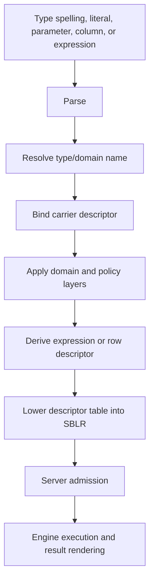

# Type System Overview

This page is part of the SBsql Language Reference Manual. It explains the
descriptor model behind SBsql values, literals, parameters, columns, domains,
expressions, rows, streams, and result sets.

Generation task: `data_types_type_system_overview`

## Purpose

SBsql values are descriptor-bound. A textual type name, literal, cast,
parameter marker, column definition, routine argument, stream frame, or result
column is resolved into a descriptor before engine execution. The descriptor
controls representation, comparison, ordering, hashing, indexing, null
behavior, collation, character set, temporal precision, timezone behavior,
storage admission, overflow behavior, policy, and result rendering.

The type system separates carriers from domains:

- a carrier descriptor defines how a value is represented and operated on;
- a domain is a named policy layer over a carrier or another domain;
- a descriptor-bound expression can preserve a domain, erase a domain, or bind
  to a new domain only when an operation policy says so.

The engine receives descriptor identity through SBLR. It does not infer type
behavior from SQL text after binding.

## Descriptor Binding Flow



Descriptor binding happens before execution. If a descriptor cannot be resolved
or a value cannot fit the descriptor, the statement returns a diagnostic rather
than allowing implicit best-effort behavior.

## Supported Type Families

| Family | Canonical SBsql Names | Main Use | Fixed Size Or Bounds |
| --- | --- | --- | --- |
| Null marker | `null` | Unknown or absent value before contextual typing. | No payload. Requires nullable target or explicit cast context. |
| Boolean | `boolean`, `bool` | Three-valued logic. | 1 byte logical payload plus null marker. |
| Signed integer | `int8`, `int16`, `int32`, `int64`, `int128`, `smallint`, `int`, `integer`, `bigint` | Exact signed whole numbers. | 1, 2, 4, 8, or 16 bytes. |
| Unsigned integer | `uint8`, `uint16`, `uint32`, `uint64`, `uint128` | Exact unsigned whole numbers. | 1, 2, 4, 8, or 16 bytes. |
| Decimal | `decimal(p,s)`, `numeric(p,s)`, `money` | Exact base-10, decimal floating, and money-like values. | Precision, scale, rounding, and display are descriptor-owned. |
| Approximate real | `real`, `double precision`, `float(p)` | Approximate binary floating values. | 4 or 8 byte descriptors in the portable profile. |
| Text | `char(n)`, `varchar(n)`, `text`, `clob`, `nchar(n)`, `nvarchar(n)`, `nclob` | Character data. | Character count, byte count, charset, collation, and overflow are descriptor-owned. |
| Binary | `binary(n)`, `varbinary(n)`, `blob`, `bytea` | Byte-oriented values and binary large values. | Byte count, overflow, and stream policy are descriptor-owned. |
| UUID | `uuid` | Application UUIDs and catalog identity references. | 16 bytes. |
| Temporal | `date`, `time(p)`, `timestamp(p)`, `timestamptz`, `interval` | Calendar, clock, instant, and duration values. | Precision, calendar, timezone, and range are descriptor-owned. |
| Document | `document`, `json_document`, `binary_json_document` | Structured document values and path-addressable data. | Payload and normalization profile are descriptor-owned. |
| Collection | `array<T>`, `multiset<T>`, `row(...)`, `record(...)` | Structured values, routine arguments, rowsets, and compound domains. | Element descriptors and shape descriptors own bounds. |
| Vector | `vector` | Fixed-dimension numerical vectors. | Dimension multiplied by element size plus descriptor metadata. |
| Spatial | `geometry`, `geography` | Spatial values, spatial predicates, and spatial indexes. | Shape, coordinate profile, and exact-recheck policy are descriptor-owned. |
| Graph | `graph`, `node`, `edge`, `path` | Graph data and traversal payloads. | Node, edge, path, and traversal descriptors own shape. |
| Search | `search_document`, `lexeme`, search-vector descriptors where admitted | Full-text/search payloads. | Tokenization and index profile are descriptor-owned. |
| Time-series | `timeseries`, `sample`, `bucket` descriptors where admitted | Time-series observations and windows. | Time key, value descriptor, and window profile are descriptor-owned. |
| Key-value | `kv_key`, `kv_value`, map-like descriptors | Key-value and map payloads. | Key descriptor, value descriptor, and ordering/hash policy are descriptor-owned. |
| Protected material | `secret_ref`, `protected_blob_ref`, protected descriptors | References to protected values and release-controlled material. | References only unless release policy admits raw access. |
| Domain | User-defined domain names | Named constraints, defaults, null policy, masks, and operation policy. | Underlying carrier plus domain policy. |

## Canonical Names And Aliases

SBsql can accept aliases, but binding resolves each spelling to a canonical
descriptor. After binding, the engine uses descriptor identity. The original
spelling remains useful for diagnostics and source references, not execution
authority.

Examples:

```sql
create table app.example_types (
    id uuid primary key,
    exact_count uint128,
    label varchar(120),
    payload document,
    embedding vector,
    created_at timestamptz
);
```

The table definition creates column descriptors for each column. Inserts,
updates, defaults, indexes, constraints, masks, and query projections use those
descriptors.

## Null Behavior

`null` has no standalone carrier. It adopts the target descriptor when the
target is known and nullable.

| Context | Rule |
| --- | --- |
| Assignment to nullable column | `null` is admitted as the target descriptor's null value. |
| Assignment to non-null target | Refused before storage mutation. |
| Function argument | Requires an overload that admits null for that argument. |
| Comparison | Uses three-valued logic unless the operator has explicit null-handling semantics. |
| Domain assignment | Domain null policy is checked before ordinary constraints. |
| Array, row, and document values | Element or field null behavior is descriptor-owned. |

Use an explicit cast when the target type cannot be inferred:

```sql
select cast(null as decimal(18,2)) as empty_amount;
```

## Literal Binding

Literals are parsed text until they bind to descriptors.

| Literal Form | Binding Rule |
| --- | --- |
| Integer literal | Binds by context or to the smallest admitted exact descriptor that can represent it. |
| Unsigned literal | Uses an explicit unsigned suffix or contextual unsigned target. |
| Decimal literal | Binds to an exact decimal descriptor unless context selects another admitted numeric descriptor. |
| String literal | Binds as text until context, cast, charset introducer, or target descriptor changes it. |
| Binary literal | Binds as bytes and does not carry charset or collation. |
| UUID literal | Binds to a 16-byte UUID descriptor. |
| Temporal literal | Binds only when context or explicit cast states the temporal descriptor. |
| Document literal | Binds through document/json descriptor rules. |
| Vector literal | Requires an element descriptor and dimension. |

Ambiguous or lossy literal binding is refused unless a documented conversion
policy admits it.

## Storage And Overflow

Descriptor validity is not the same as storage admission. A value can have a
valid descriptor and still be refused because it cannot fit the row, page,
overflow, stream, transaction, filespace, or policy limits.

| Concern | Controlled By |
| --- | --- |
| Inline row payload | Row descriptor, page size, null map, alignment, and storage policy. |
| Large values | Overflow/large-value descriptor and transaction policy. |
| Text byte size | Character set, encoded byte length, collation key policy, and overflow policy. |
| Binary byte size | Byte descriptor, overflow policy, and stream limits. |
| Index key size | Index descriptor, collation key, expression descriptor, and index policy. |
| Stream frames | Stream descriptor, frame limit, backpressure, timeout, and cancellation policy. |

## Type Authority In SBLR

SBLR carries descriptor tables. An execution envelope can include:

- column descriptors;
- parameter descriptors;
- literal descriptors;
- expression result descriptors;
- row and record descriptors;
- cursor descriptors;
- stream descriptors;
- domain stacks;
- conversion operations;
- result shapes;
- diagnostic shapes.

Server admission rejects malformed, missing, stale, contradictory, or
unsupported descriptor evidence before engine dispatch.

## Related Pages

- [Numeric Types](numeric_types.md)
- [Text, Collation, And Charset](text_collation_and_charset.md)
- [Temporal Types](temporal_types.md)
- [Binary, UUID, And Protected Values](binary_uuid_and_protected_values.md)
- [Document, Graph, Vector, And Multimodel Types](document_graph_vector_and_multimodel_types.md)
- [Domains, Casts, And Coercion](domains_casts_and_coercion.md)
- [Conversion Matrix](conversion_matrix.md)
- [Operator Type Result Matrix](../syntax_reference/operator_type_result_matrix.md)
- [Parser To SBLR Pipeline](../core_paradigms/parser_to_sblr_pipeline.md)

## Verification Checklist

The type-system proof suite should demonstrate:

- every supported type spelling resolves to a canonical descriptor;
- unsupported aliases are refused rather than accepted as inert text;
- `null` binds only through a valid nullable target;
- fixed-width numeric ranges reject overflow and underflow;
- text length checks use character count while storage uses encoded byte count;
- collation affects comparison, grouping, ordering, and indexes consistently;
- temporal precision and timezone policy are descriptor-owned;
- UUID values store as 16 bytes and do not bypass authorization;
- protected material is carried by reference unless release policy admits it;
- document, graph, vector, spatial, search, time-series, and key-value indexes
  produce candidate evidence only;
- domains apply null policy, defaults, constraints, and operation policy in the
  documented order;
- SBLR envelopes carry descriptors rather than executable type text;
- stale descriptor or policy epochs invalidate dependent statements and plans.
