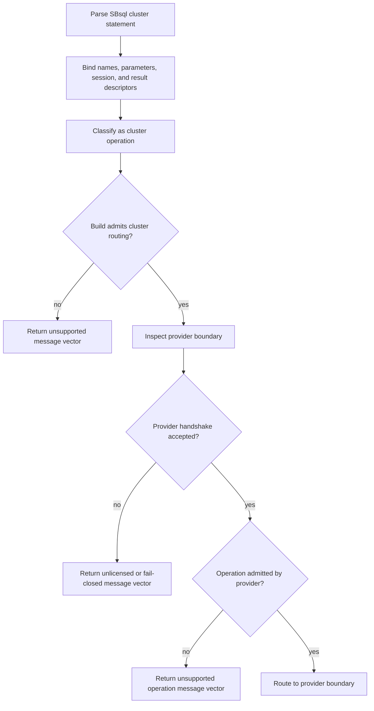

# Cluster-Gated Statements

This page is part of the SBsql Language Reference Manual. It explains the user-facing language contract while preserving the ScratchBird authority model: SQL text parses to SBLR, durable identity is UUID based, descriptors own type behavior, security is materialized from catalog policy, and MGA owns transaction finality.

Generation task: `syntax_reference_cluster_gated`

Related pages: [Bridge Boundary Model](../core_paradigms/bridge_and_cluster_boundaries.md), [Transactions And Recovery](../core_paradigms/transactions_and_recovery.md), [Transaction Control](transaction_control.md), [Backup, Restore, Replication, And Migration](backup_restore_replication_migration.md), [Management And Operations](management_and_operations.md), [Security And Privileges](security_and_privilege_statements.md), and [Refusal Vectors](refusal_vectors.md).

## Purpose

Cluster-gated statements are recognized by SBsql so clients, scripts, tools, and support workflows receive stable diagnostics for cluster-classified operations. Public builds do not include production cluster behavior. A recognized cluster statement therefore either:

- returns an unsupported message vector when cluster routing is not admitted in the build;
- routes to the public compile/link stub and returns an unlicensed or fail-closed message vector; or
- routes to an admitted external cluster provider boundary in a build profile that includes that provider.

The public compile/link stub is named `scratchbird.cluster.compile_link_stub_provider`. It exists to verify parser routing, SBLR operation mapping, ABI wiring, diagnostics, and fail-closed behavior. It provides no cluster membership, routing authority, replication authority, failover, recovery, distributed transaction finality, or production cluster behavior.

Cluster syntax is therefore documented for compatibility, diagnostics, and future-safe scripting. This page must not be read as a claim that production cluster execution is available in the public build.

## Non-Cluster Bridge Versus Cluster Query

An ordinary remote-table query through an admitted bridge is not a cluster distributed query. It treats the remote relation as an input reached through a connection boundary. Each database keeps its own transaction authority.

A cluster distributed query is different. It lets a cluster-aware authority plan and coordinate work across nodes, shards, participants, or distributed fragments. That surface is cluster-classified and must pass cluster provider admission before execution.

| Surface | Classification | Public-build behavior |
| --- | --- | --- |
| Remote table through a bridge | Bridge/data access | Uses bridge authority and ordinary local/remote transactions. |
| Cross-node optimizer fanout | Cluster query | Cluster-gated; public build refuses unless an admitted provider boundary exists. |
| Distributed transaction barrier | Cluster transaction | Cluster-gated; public build refuses unless an admitted provider boundary exists. |
| Placement or shard routing | Cluster placement | Cluster-gated; public build refuses unless an admitted provider boundary exists. |
| Cluster status inspection | Cluster administration | May route to provider inspection; public stub reports compile/link-only status. |

## Statement Surface

| Operation family | Example surface | Contract |
| --- | --- | --- |
| Inspection | `SHOW CLUSTER STATUS`, `SHOW CLUSTER PROVIDER` | Returns authorized provider/refusal information. In the public stub, this reports compile/link-only support. |
| Lifecycle | `CREATE CLUSTER`, `DROP CLUSTER` | Recognized so scripts receive stable unsupported, unlicensed, or provider-gated diagnostics. |
| Topology | region, member, route, placement, shard, and filespace-shard actions | Cluster-classified. Public builds fail closed before production behavior. |
| Node operations | admit, remove, drain, role, and health actions | Cluster-classified. Requires provider admission. |
| Routing and placement | owner publication, route inspection, rebalance, shard/range placement | Cluster-classified. Requires provider admission. |
| Distributed transactions | begin, prepare, barrier, limbo recovery, cleanup low-water, finality proof | Cluster-classified. Local MGA remains local authority; distributed authority requires provider admission. |
| Replication and reconciliation | cluster event consumption, branch ledger reconciliation, merge policy, conflict reporting | Cluster-classified. Requires provider admission. |
| Security and fencing | epoch validation, fence token, route authority, policy version | Cluster-classified. Requires provider admission. |
| Jobs and throttling | controlled jobs, cancellation, workload throttling, maintenance | Cluster-classified. Requires provider admission. |
| Metrics and support | status, route tracing, support collection, provider information | Cluster-classified inspection and diagnostics. |
| Distributed query | plan, admit, shard read, fragment execution, fanout search, merge, partial aggregate, safe-read validation | Cluster-classified. Public builds must not treat local query execution as cluster authority. |

## Syntax

```ebnf
private_cluster_statement ::=
      show_cluster
    | alter_cluster
    | create_cluster
    | drop_cluster ;
```

```ebnf
show_cluster ::=
    SHOW CLUSTER cluster_target cluster_option_list? ;

cluster_target ::=
      STATUS
    | PROVIDER
    | TOPOLOGY
    | MEMBERS
    | ROUTES
    | PLACEMENT
    | SHARDS
    | TRANSACTIONS
    | JOBS
    | METRICS
    | SUPPORT
    | QUERY PLAN qualified_name ;
```

```ebnf
create_cluster ::=
    CREATE CLUSTER cluster_ref cluster_create_payload? ;

cluster_create_payload ::=
      cluster_topology_payload
    | cluster_member_payload
    | cluster_route_payload
    | cluster_placement_payload
    | cluster_security_payload ;
```

```ebnf
alter_cluster ::=
    ALTER CLUSTER cluster_ref cluster_action cluster_option_list? ;

cluster_action ::=
      SET cluster_setting_list
    | ADD MEMBER member_ref
    | DROP MEMBER member_ref
    | DRAIN MEMBER member_ref
    | SET MEMBER member_ref ROLE cluster_member_role
    | DEFINE REGION region_name
    | DEFINE SHARD PROFILE shard_profile_ref
    | PUBLISH ROUTE route_ref
    | REBALANCE placement_clause
    | START JOB cluster_job_ref
    | CANCEL JOB cluster_job_ref
    | THROTTLE cluster_throttle_payload
    | VALIDATE cluster_validation_target
    | RECONCILE cluster_reconcile_target
    | FAILOVER cluster_failover_target ;
```

```ebnf
drop_cluster ::=
    DROP CLUSTER cluster_ref drop_cluster_option_list? ;

drop_cluster_option_list ::=
    WITH drop_cluster_option ("," drop_cluster_option)* ;

drop_cluster_option ::=
      IF EXISTS
    | RESTRICT
    | CASCADE
    | VALIDATE ONLY ;
```

```ebnf
cluster_option_list ::=
    WITH cluster_option ("," cluster_option)* ;

cluster_option ::=
      VALIDATE ONLY
    | PROVIDER provider_ref
    | REQUIRE PROVIDER ABI integer_literal
    | REQUIRE MANIFEST qualified_name
    | REQUIRE DIGEST string_literal
    | TIMEOUT duration_literal
    | DRY RUN
    | EXPLAIN
    | EMIT DIAGNOSTICS ;
```

SBsql is context sensitive. Cluster words are command words inside this statement family and should not be treated as globally reserved identifiers outside cluster statement contexts.

## Gate And Provider Boundary

Cluster statement execution is admitted in stages.



The public compile/link stub reaches the provider boundary but does not execute cluster behavior. It returns fail-closed diagnostics such as `SBLR.CLUSTER.HANDSHAKE.STUB_COMPILE_LINK_ONLY` and reports that route admission is not allowed.

Provider admission requires the expected ABI, catalog manifest, operation set, feature flags, authority domains, and compatibility digest. If any of those checks fail, the route fails closed.

## Inspection Examples

Provider inspection:

```sql
show cluster provider;
```

Expected public-build behavior:

```text
provider_name        = scratchbird.cluster.compile_link_stub_provider
provider_type        = compile_link_stub
support_status       = compile_link_only
supports_execution   = false
route_admission      = false
diagnostic           = SBLR.CLUSTER.HANDSHAKE.STUB_COMPILE_LINK_ONLY
```

Cluster status inspection:

```sql
show cluster status;
```

In a public build, this must return an unsupported, unlicensed, or fail-closed cluster message vector. It must not invent local single-node cluster status or treat ordinary local database state as cluster authority.

## Lifecycle Examples

Recognized but gated lifecycle statement:

```sql
create cluster app_cluster
with provider app.cluster_provider,
     validate only,
     emit diagnostics;
```

Recognized but gated topology mutation:

```sql
alter cluster app_cluster
add member app_member_01
with validate only;
```

Recognized but gated removal:

```sql
drop cluster app_cluster
with restrict;
```

In the public build, these statements should parse and lower far enough to produce stable diagnostics. They must not create cluster catalog authority, mutate local storage as a cluster side effect, or bypass ordinary database authorization.

## Cluster Operation Families

The cluster provider boundary normalizes operations before routing. Public documentation groups them by purpose rather than exposing implementation details.

| Family | Normalized intent | Public-build result |
| --- | --- | --- |
| Topology | Inspect topology, define regions, define shard profiles, publish topology manifests, validate topology schema. | Refused unless an admitted provider exists. |
| Node membership | Admit, remove, drain, assign role, inspect health, validate suitability. | Refused unless an admitted provider exists. |
| Routing | Publish owners, reject stale ownership, inspect routing plans. | Refused unless an admitted provider exists. |
| Placement | Place objects, rebalance shards, validate partition distribution, assign ranges. | Refused unless an admitted provider exists. |
| Distributed transaction | Begin distributed work, prepare participants, publish commit/rollback barriers, recover limbo, advance cleanup, validate finality proof. | Refused unless an admitted provider exists. |
| Replication and reconciliation | Consume cluster events, reconcile ledgers, apply merge policy, report conflicts, publish reconciled finality. | Refused unless an admitted provider exists. |
| Security and fencing | Validate epoch, issue/revoke fence tokens, validate policy versions, validate route authority. | Refused unless an admitted provider exists. |
| Jobs and throttling | Start/cancel controlled jobs, throttle workloads, run admitted maintenance. | Refused unless an admitted provider exists. |
| Metrics and support | Inspect status, trace routes, emit events, collect support evidence, inspect provider. | Provider inspection can report stub status; production behavior requires provider admission. |
| Distributed query | Plan and admit cross-node work, route shard reads, execute fragments, fanout search, merge results, aggregate partials, validate safe reads. | Refused unless an admitted provider exists. |

Some refusal operations intentionally do not call the provider. They return an exact local refusal when the requested operation attempts to turn local core behavior, ordinary query behavior, or unsupported local mutation into cluster authority.

## Transaction And Recovery Rules

Cluster-gated statements never weaken local MGA authority.

| Concern | Rule |
| --- | --- |
| Local transactions | Local commit, rollback, visibility, cleanup, and recovery remain MGA-owned. |
| Distributed finality | Requires an admitted cluster provider route; public builds fail closed. |
| Remote participants | Cannot be treated as committed by local parser state or local SQL text. |
| Barriers and proofs | Are evidence for the admitted provider route; they do not override local recovery classification. |
| Recovery uncertainty | Must return explicit diagnostics and fence unsafe work. |
| Inspection | Cannot turn local single-node state into cluster state. |

If a cluster action has uncertain outcome, the required behavior is explicit diagnostic output and fail-closed fencing. Silent partial success is not allowed.

## Security And Authorization

Cluster-gated statements require administrative authority even when the final result is a refusal.

| Check | Required behavior |
| --- | --- |
| Authentication | Caller must have an authenticated session or authorized agent context. |
| Privilege | Cluster inspection, topology, membership, routing, placement, transaction, security, job, and support actions are separately privileged where exposed. |
| Provider reference | A provider reference must resolve to an admitted provider descriptor. |
| Protected material | Raw secrets must not appear in SQL text, provider packets, diagnostics, or support output. |
| Sandbox | A sandboxed user cannot infer hidden cluster, database, member, route, or provider state through diagnostics. |
| Redaction | Refusal vectors and support evidence must redact provider and environment details according to policy. |

Public-build refusals should reveal enough stable information for clients to classify the result without disclosing unavailable provider internals.

## Diagnostics And Refusals

| Condition | Expected diagnostic class |
| --- | --- |
| Cluster routing not compiled/admitted | Unsupported, with a cluster support-not-enabled code. |
| Public compile/link stub reached | Unlicensed or fail-closed, with `SBLR.CLUSTER.HANDSHAKE.STUB_COMPILE_LINK_ONLY`. |
| External provider required | Fail-closed, with external-provider-required diagnostic. |
| ABI or contract mismatch | Fail-closed, with ABI mismatch diagnostic. |
| Catalog manifest mismatch | Fail-closed, with catalog manifest mismatch diagnostic. |
| Operation set incomplete | Fail-closed, with operation-set incomplete diagnostic. |
| Feature flags incomplete | Fail-closed, with feature-flags incomplete diagnostic. |
| Authority domains incomplete | Fail-closed, with authority-domain incomplete diagnostic. |
| Compatibility digest mismatch | Fail-closed, with digest mismatch diagnostic. |
| Unsupported provider operation | Unsupported operation diagnostic. |
| Local runtime tries to execute cluster behavior | Local runtime refused diagnostic. |
| Local mutation tries to become cluster authority | Local mutation refused diagnostic. |
| Missing privilege | Authorization denied. |
| Hidden provider or object | Object resolution or sandbox denied. |

Diagnostics should include the statement UUID or job UUID, normalized cluster operation, provider mode where visible, route-admission state, and refusal vector where disclosure policy permits it.

## Related Surface Rows

| Surface | Kind | Family | Lowering | Result Shape |
| --- | --- | --- | --- | --- |
| member_ref_list | grammar_production | cluster_private | yes | rs.sbsql.cluster_private_refusal.v1 |
| cluster_setting_stmt | grammar_production | cluster_private | yes | rs.sbsql.cluster_private_refusal.v1 |
| cluster_ref | grammar_production | cluster_private | yes | rs.sbsql.cluster_private_refusal.v1 |
| placement_clause | grammar_production | cluster_private | yes | rs.sbsql.cluster_private_refusal.v1 |
| cluster_prepare_options | grammar_production | cluster_private | yes | rs.sbsql.cluster_private_refusal.v1 |
| cluster_reconcile_stmt | grammar_production | cluster_private | yes | rs.sbsql.cluster_private_refusal.v1 |
| cluster_audit_stmt | grammar_production | cluster_private | yes | rs.sbsql.cluster_private_refusal.v1 |
| cluster_stmt | grammar_production | cluster_private | yes | rs.sbsql.cluster_private_refusal.v1 |
| cluster_tx_stmt | grammar_production | cluster_private | yes | rs.sbsql.cluster_private_refusal.v1 |
| cluster_topology_stmt | grammar_production | cluster_private | yes | rs.sbsql.cluster_private_refusal.v1 |
| region_split_stmt | grammar_production | cluster_private | yes | rs.sbsql.cluster_private_refusal.v1 |
| cluster_lifecycle_ddl | grammar_production | cluster_private | yes | rs.sbsql.cluster_private_refusal.v1 |
| cluster_node_op_stmt | grammar_production | cluster_private | yes | rs.sbsql.cluster_private_refusal.v1 |
| cluster_throttle_stmt | grammar_production | cluster_private | yes | rs.sbsql.cluster_private_refusal.v1 |
| shard_clause | grammar_production | cluster_private | yes | rs.sbsql.cluster_private_refusal.v1 |
| shard_method | grammar_production | cluster_private | yes | rs.sbsql.cluster_private_refusal.v1 |
| cluster_job_control_stmt | grammar_production | cluster_private | yes | rs.sbsql.cluster_private_refusal.v1 |
| cluster_system_op_stmt | grammar_production | cluster_private | yes | rs.sbsql.cluster_private_refusal.v1 |
| cluster_member_op_stmt | grammar_production | cluster_private | yes | rs.sbsql.cluster_private_refusal.v1 |
| cluster_failover_stmt | grammar_production | cluster_private | yes | rs.sbsql.cluster_private_refusal.v1 |
| region_name | grammar_production | cluster_private | yes | rs.sbsql.cluster_private_refusal.v1 |
| cluster_control_stmt | grammar_production | cluster_private | yes | rs.sbsql.cluster_private_refusal.v1 |
| route_ref | grammar_production | cluster_private | yes | rs.sbsql.cluster_private_refusal.v1 |
| member_ref | grammar_production | cluster_private | yes | rs.sbsql.cluster_private_refusal.v1 |

## Verification Checklist

| Check | Required outcome |
| --- | --- |
| Parse | Cluster statements are recognized contextually by SBsql. |
| Bind | Provider, cluster, route, member, placement, job, query, and option descriptors resolve where visible. |
| Authorize | The effective user or agent UUID has the required administrative privilege for inspection or mutation. |
| Classify | The operation is classified as cluster-gated and cannot be executed by ordinary local engine behavior. |
| Gate | Build flags either refuse routing or admit routing to the provider boundary. |
| Handshake | Provider ABI, manifest, operation set, feature flags, authority domains, and digest are checked. |
| Refuse | Public stub and incomplete providers return stable fail-closed diagnostics. |
| Route | Only an admitted provider route can receive production cluster operations. |
| Finality | Local MGA remains the authority for local transaction state. |
| Render | Results and diagnostics expose only authorized information. |
