### /home/dcalford/CliWork/ScratchBird/docs/documentation/draft/Language_Reference/README.md

# SBsql Language Reference Manual

This directory contains the draft SBsql Language Reference Manual. It is organized as section files rather than one large manuscript so editors can revise, test, and promote sections independently.

## Directory Map

| Directory | Purpose |
| --- | --- |
| core_paradigms | Architecture and authority rules needed to read the language reference correctly. |
| data_types | Descriptor, domain, conversion, collation, temporal, vector, document, and protected-value mechanics. |
| syntax_reference | Statement syntax, object lifecycles, DML, query clauses, procedural SQL, operational commands, refusal vectors, and per-production EBNF files. |
| functional_reference | Built-in functions, operators, aggregates, windows, and special forms grouped by package namespace. |
| catalog_reference | System catalog tables and schema-tree metadata surfaces. |

## Reading Model

SBsql text is parser input. ScratchBird execution authority is SBLR, UUID catalog identity, descriptors, MGA transaction state, and materialized security policy. Every section in this manual follows that boundary.

## Key Entry Points

| Topic | File |
| --- | --- |
| Syntax reference index | [syntax_reference/README.md](syntax_reference/README.md) |
| Schema tree and name resolution | [syntax_reference/schema_tree_and_name_resolution.md](syntax_reference/schema_tree_and_name_resolution.md) |
| Procedural SQL overview | [syntax_reference/procedural_sql.md](syntax_reference/procedural_sql.md) |
| Procedural blocks and declarations | [syntax_reference/procedural_sql_blocks.md](syntax_reference/procedural_sql_blocks.md) |
| Procedural control flow | [syntax_reference/procedural_sql_control_flow.md](syntax_reference/procedural_sql_control_flow.md) |
| Procedural cursors | [syntax_reference/procedural_sql_cursors.md](syntax_reference/procedural_sql_cursors.md) |
| Procedural exceptions and diagnostics | [syntax_reference/procedural_sql_exceptions.md](syntax_reference/procedural_sql_exceptions.md) |
| Procedural triggers and event capture | [syntax_reference/procedural_sql_triggers_and_events.md](syntax_reference/procedural_sql_triggers_and_events.md) |

## Generation State

Progress and recovery data is kept in `.generation_state.json` in this directory. The state file is intentionally local to the generated manual tree.


### /home/dcalford/CliWork/ScratchBird/docs/documentation/draft/Language_Reference/core_paradigms/intro_and_mga.md

# Intro And MGA Authority

This page is part of the SBsql Language Reference Manual. It introduces the
language model used by ScratchBird, the role of SBsql, and the MGA authority
rules that govern visibility, transaction finality, catalog identity, and
recovery behavior.

Generation task: `core_paradigms_intro_and_mga`

## Purpose

ScratchBird is a convergent data engine. It exposes one authority model for
relational data, document data, graph data, vectors, key-value structures,
streams, catalog metadata, security metadata, and operational state. SBsql is
the native language used to describe work against that engine.

The engine does not execute SQL text. SBsql text is parsed, bound, lowered into
SBLR, admitted by the server boundary, and executed by engine-owned operation
identity. This keeps text syntax, parser behavior, client tools, and rendering
choices separate from durable state and recovery authority.

MGA is the transaction authority. MGA controls:

- transaction identity;
- snapshots and row-version visibility;
- commit, rollback, savepoint, retain, and chain behavior;
- cleanup and retention horizons;
- recovery classification after interruption;
- the final decision about whether a version is visible to a transaction.

A practical reading rule follows from this:

> Treat every SBsql name, clause, keyword, parameter, and option as a request
> that must be parsed, bound, admitted, authorized, and executed. Treat every
> durable object, durable value, transaction outcome, and security decision as
> engine-owned state.

## Core Concepts

| Concept | Meaning |
| --- | --- |
| SBsql | The native user-facing command language. It is context sensitive and intentionally keeps most words usable as identifiers. |
| SBLR | The canonical operation language admitted by the server and executed by the engine. |
| UUID catalog identity | Durable object identity. Names, aliases, and visible paths resolve to UUIDs before execution. |
| Descriptor | Engine-readable type, row, parameter, stream, result, policy, or object-shape metadata. |
| MGA | Multi-generational architecture: writes create or retire versions, and transactions see versions through snapshots. |
| Transaction inventory | Durable transaction-state evidence used for visibility, cleanup, commit, rollback, and recovery. |
| Snapshot | The visibility context used by a transaction or statement. |
| Message vector | Structured diagnostic output returned for success, warning, refusal, or failure. |
| Refusal | An explicit unsupported, denied, unavailable, unlicensed, invalid, or fail-closed response. |

## Authority Boundaries

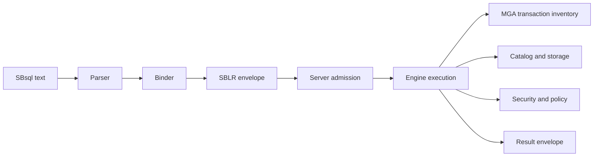

| Layer | Owns | Does Not Own |
| --- | --- | --- |
| Client | Source text, parameter values, display preferences, cancellation request. | Catalog identity, transaction finality, authorization, storage state. |
| Parser | Tokenization, grammar recognition, source spans, AST construction. | Durable object identity, MGA visibility, engine execution. |
| Binder | Name resolution, UUID binding, descriptor binding, scope binding. | Commit/rollback outcome, recovery classification, storage mutation. |
| Server admission | Envelope validation, operation-family admission, fail-closed rejection of malformed SBLR. | Business semantics, final row visibility, durable catalog mutation. |
| Engine | Catalog, storage, MGA, optimizer execution, index maintenance, large-value storage, policy enforcement, recovery. | User-facing grammar, source-text spelling, client display formatting. |
| Result renderer | Human-readable output, command tags, result formatting. | Reinterpreting source text or overriding the result envelope. |

## What MGA Means In Practice

MGA stores and evaluates multiple versions of data. A transaction sees the
version set admitted by its snapshot and security context. Writers create new
versions or retire existing versions; they do not overwrite the meaning of
already-visible data for existing snapshots.

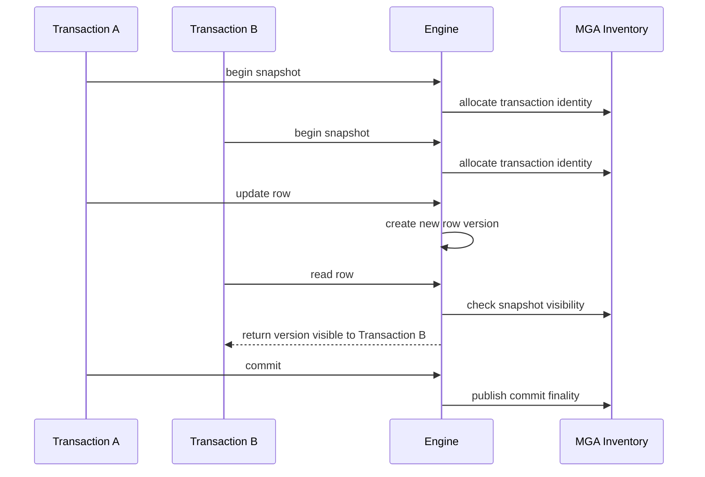

The important user-facing effects are:

- readers do not become storage authority by reading a row;
- writers do not make uncommitted versions visible to other transactions;
- indexes provide candidate access paths, not final row authority;
- a committed transaction is visible only when the engine's transaction
  inventory and snapshot rules say it is visible;
- a rolled-back transaction's versions are not visible to later valid snapshots;
- recovery fences ordinary work when finality evidence is uncertain.

## Statement Lifecycle

Every executable SBsql statement follows the same broad lifecycle:

1. Tokenize the source text.
2. Parse the statement and build a diagnostic source map.
3. Bind names to UUID catalog identity.
4. Bind parameters, literals, expressions, rows, streams, and results to
   descriptors.
5. Lower the bound statement into an SBLR execution envelope.
6. Admit or refuse the envelope at the server boundary.
7. Recheck authorization, policy, sandbox, transaction state, and resource
   state.
8. Execute under engine authority.
9. Return a result envelope and message vector.

This lifecycle applies to queries, DML, DDL, transaction control, security
statements, management statements, procedural SQL, multimodel statements,
streaming operations, backup/restore/replication/migration operations, and
recognized refusal routes.

## Name Identity Versus UUID Identity

Names are for users. UUIDs are for durable identity.

For example, a user might write:

```sql
select order_id, total
from app.orders
where total > 100.00;
```

During binding, `app.orders`, `order_id`, and `total` resolve to catalog UUIDs
and descriptors. The engine receives the bound object and descriptor identity,
not a request to search for the text `orders` at execution time.

This matters because:

- renaming an object changes resolver state, not the object's durable identity;
- dependency tracking uses UUID identity;
- support diagnostics can refer to objects unambiguously;
- scripts can use names for readability while automation can use UUID references
  when ambiguity must be avoided;
- authorization and policy checks are applied to the resolved object identity.

See [UUID Catalog Identity](uuid_catalog_identity.md) and
[Schema Tree And Name Resolution](../syntax_reference/schema_tree_and_name_resolution.md)
for the detailed resolver rules.

## Descriptors And Type Authority

SBsql syntax can name types and write literals in a human-friendly form. The
engine operates on descriptors.

A descriptor can describe:

- scalar types such as integer, decimal, real, text, binary, UUID, temporal,
  boolean, protected material, and large values;
- structured values such as rows, records, arrays, multisets, ranges, documents,
  graph values, vectors, and cursor rows;
- domain constraints, default behavior, nullability, collation, character set,
  scale, precision, length, and time-zone behavior;
- parameter slots and result columns;
- stream frame shapes and backpressure expectations.

Descriptor binding prevents the parser from treating a value as merely textual
after it has entered the execution pipeline. A value's type, length, range,
coercion path, and result behavior must be explicit enough for admission and
engine execution to validate.

See [Type System Overview](../data_types/type_system_overview.md),
[Numeric Types](../data_types/numeric_types.md), and
[Conversion Matrix](../data_types/conversion_matrix.md).

## Transaction Authority

SBsql can request transaction operations:

```sql
begin transaction isolation snapshot;

insert into app.orders (order_id, total)
values (uuid '018f2f1e-6d8a-7c31-9f44-000000000001', 42.50);

commit;
```

The parser can recognize `begin transaction`, `insert`, and `commit`. Binding
can resolve `app.orders`, assign descriptors, and lower each statement to SBLR.
Only the engine can:

- allocate the transaction identity;
- decide the snapshot;
- create row versions;
- publish commit finality;
- roll back versions;
- classify recovery state if interruption occurs.

Autocommit is also an engine-coordinated execution profile. It does not create a
shortcut around MGA.

See [Transactions And Recovery](transactions_and_recovery.md) and
[Transaction Control](../syntax_reference/transaction_control.md).

## Catalog And DDL Authority

DDL statements are catalog mutation requests. They are parsed as SBsql, bound to
UUID identity and descriptors, and executed as transaction-protected catalog
operations.

Examples include:

```sql
create schema app;

create table app.orders (
    order_id uuid primary key,
    total decimal(18,2) not null
);

comment on table app.orders is 'Orders accepted by the application';
```

The engine decides whether these operations can be admitted, whether the caller
has the required privileges, which catalog UUIDs are created, which dependencies
are recorded, and whether the transaction commits.

DDL is not merely metadata text. It changes durable catalog state under MGA and
recovery rules.

## Query Authority

A query result is produced by the engine under the active snapshot and security
context. The optimizer may use indexes, statistics, plan cache entries, and
physical layout evidence, but final row admission still requires:

- catalog identity validation;
- descriptor validation;
- MGA visibility;
- predicate evaluation;
- row-level policy and mask evaluation;
- transaction and recovery safety;
- result-shape compliance.

This is why an index can accelerate a query without becoming row authority.

## Security And Policy Authority

Security is applied after names are resolved and before results or durable
changes are exposed. A user may be able to type a valid statement and still be
refused because the resolved object, operation, policy, or sandbox does not
permit it.

Security and policy checks include:

- identity and role context;
- schema-root and sandbox visibility;
- object privileges;
- row-level policy;
- column masks;
- protected-material policy;
- management and operational privileges;
- bridge, stream, file, and external-access policy where applicable.

See [Security And Sandboxing](security_and_sandboxing.md),
[Security And Privileges](../syntax_reference/security_and_privilege_statements.md),
and [Policy, Mask, And RLS Lifecycle](../syntax_reference/policy_mask_and_rls.md).

## Recovery Authority

Recovery is engine-owned. After a crash, forced stop, interrupted sync, partial
write, or uncertain finality event, the engine classifies durable state before
ordinary work proceeds.

Possible outcomes include:

- old state survives;
- new committed state survives;
- rollback evidence is accepted;
- recovery-required state is reported;
- write admission is fenced;
- operator or policy decision is required;
- corruption or uncertainty is detected and fails closed.

SQL text, client retry behavior, timestamps, ordinary logs, and parser state are
not recovery authority.

## Refusal As A First-Class Result

ScratchBird treats refusal as a valid, explicit outcome. A statement can be
recognized and still be refused because it is unsupported, denied, unavailable,
unlicensed, malformed after binding, unsafe under recovery state, or outside the
admitted build capability set.

This matters for release safety. Silent no-op behavior and best-effort
substitution are not acceptable when a command has durable, security, recovery,
or operational meaning.

See [Refusal Vectors](../syntax_reference/refusal_vectors.md).

## Syntax Productions

The top-level language productions are:

```ebnf
script                  ::= statement_list EOF ;
```

```ebnf
statement_list          ::= statement ( statement_terminator statement )*
                          | empty ;
```

```ebnf
statement               ::= native_statement
                          | refusal_statement ;
```

```ebnf
native_statement        ::= query_statement
                          | dml_statement
                          | ddl_statement
                          | transaction_statement
                          | security_statement
                          | policy_statement
                          | observability_statement
                          | management_statement
                          | acceleration_statement
                          | archive_replication_migration_statement
                          | nosql_statement
                          | cluster_gated_statement ;
```

```ebnf
transaction_statement   ::= begin_transaction
                          | commit_transaction
                          | rollback_transaction
                          | savepoint_statement
                          | set_transaction
                          | show_transaction ;
```

## Binding And Execution Summary

| Step | User-Facing Meaning | Engine Boundary Meaning |
| --- | --- | --- |
| Parse | The text is valid SBsql syntax. | No durable authority yet. |
| Bind | Names, parameters, expressions, and results have known meaning. | UUID references and descriptors are available for SBLR. |
| Lower | The request has a canonical SBLR envelope. | SQL text is no longer executable authority. |
| Admit | The server accepts the envelope shape and route. | Malformed or gated requests fail closed before engine dispatch. |
| Authorize | The resolved operation is allowed for this principal and context. | Security and policy are rechecked against bound identity. |
| Execute | The operation runs under MGA and storage authority. | Durable state changes and result visibility are engine-owned. |
| Return | The client receives rows, command completion, stream state, or diagnostics. | The result envelope is the rendering source of truth. |

## Practical Rules For SBsql Authors

- Use names for readable scripts, but understand that names bind to UUIDs before
  execution.
- Use explicit casts when a literal or parameter could bind to more than one
  descriptor.
- Treat transaction control as a request; finality is reported by the engine.
- Do not infer success from the absence of returned rows; inspect the command
  completion and message vector.
- Expect security and policy to be checked after name resolution.
- Expect recovery-required state to refuse ordinary work until classified.
- Expect unsupported and gated surfaces to return explicit refusals.
- Use `show`, `describe`, catalog views, and support diagnostics to inspect
  admitted state rather than relying on source text.

## Related Reference Pages

- [Parser To SBLR Pipeline](parser_to_sblr_pipeline.md)
- [UUID Catalog Identity](uuid_catalog_identity.md)
- [Transactions And Recovery](transactions_and_recovery.md)
- [Security And Sandboxing](security_and_sandboxing.md)
- [Schema Tree And Name Resolution](../syntax_reference/schema_tree_and_name_resolution.md)
- [Transaction Control](../syntax_reference/transaction_control.md)
- [Security And Privileges](../syntax_reference/security_and_privilege_statements.md)
- [Policy, Mask, And RLS Lifecycle](../syntax_reference/policy_mask_and_rls.md)
- [Refusal Vectors](../syntax_reference/refusal_vectors.md)
- [Type System Overview](../data_types/type_system_overview.md)


### /home/dcalford/CliWork/ScratchBird/docs/documentation/draft/Language_Reference/core_paradigms/security_and_sandboxing.md

# Security And Sandboxing

This page is part of the SBsql Language Reference Manual. It explains the
security model that applies before SBsql text can become engine work: identity,
roles, grants, sandbox roots, catalog visibility, policy, masking, row-level
security, protected material, and fail-closed refusal behavior.

Generation task: `core_paradigms_security_and_sandboxing`

## Purpose

Security in ScratchBird is materialized engine state. A parser can recognize a
security statement, a client can submit credentials, and a script can name an
object, but none of those facts grants authority by itself.

The effective user or agent UUID, active role set, group membership, sandbox
root, security epoch, policy snapshot, object UUID, operation descriptor,
transaction state, and recovery state decide whether an operation is admitted.
The engine rechecks those facts after parsing and binding, before returning
data or mutating durable state.

The model is fail-closed:

- explicit denial wins over allow;
- hidden objects must stay hidden unless disclosure policy admits them;
- policy, masks, and row-level security narrow access after ordinary grants;
- server-local file, network, bridge, stream, backup, restore, diagnostic, and
  management surfaces require explicit policy admission;
- missing, stale, ambiguous, corrupted, or recovery-fenced security evidence
  refuses the operation rather than silently allowing it.

## Security Flow

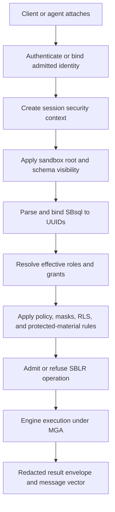

Security is evaluated on bound identity. A name that cannot be resolved inside
the session's visible schema branch does not become a security decision about a
hidden object. When disclosure policy requires it, missing-object and
hidden-object diagnostics can be intentionally indistinguishable.

## Principal Model

Every principal has durable UUID identity. Names are resolver inputs and display
labels.

| Principal | Purpose |
| --- | --- |
| User | Human or application identity that can attach, authenticate, own objects, and receive grants. |
| Agent | Admitted engine, management, maintenance, migration, replication, or operational actor with a UUID and policy-bound authority. |
| Role | Privilege bundle that can be activated by a session where policy admits it. |
| Group | Membership collection used to organize users, agents, and roles. |
| Public | Optional pseudo-principal for privileges intentionally available to every attached session. |
| Owner | Principal recorded as owning a durable object. Ownership is materialized authorization, not a parser bypass. |

The effective security context for a statement includes:

- authenticated principal UUID;
- attached database or workarea UUID;
- sandbox root;
- home schema and current schema;
- active role set;
- group membership;
- session attributes admitted by policy;
- transaction UUID and isolation profile;
- security epoch;
- policy epoch;
- redaction and disclosure profile;
- operation descriptor.

## Authentication And Session Binding

Authentication proves that a client or agent may become a principal in the
current attach context. Authorization decides what that principal may do after
attach.

An attach can establish:

- user UUID;
- agent UUID;
- provider identity evidence;
- session UUID;
- attached database/workarea root;
- network, IPC, embedded, or bridge endpoint evidence;
- default schema and home schema;
- initial active role set;
- sandbox root;
- policy profile;
- resource limits and timeout profile.

Raw secret material is not ordinary SBsql data. Secret references, provider
tokens, credential handles, and protected-material handles must not be rendered
in result sets, logs, diagnostics, catalog display, support bundles, or message
vectors unless an explicit protected-material release policy admits that
specific disclosure.

## Sandboxed Schema Roots

A sandbox root limits what a session can name, inspect, and operate on through
ordinary name resolution. A session connected to a workarea, tenant branch,
application branch, or other bounded schema root sees that root as its visible
world unless SBsql administrative authority and policy admit broader access.

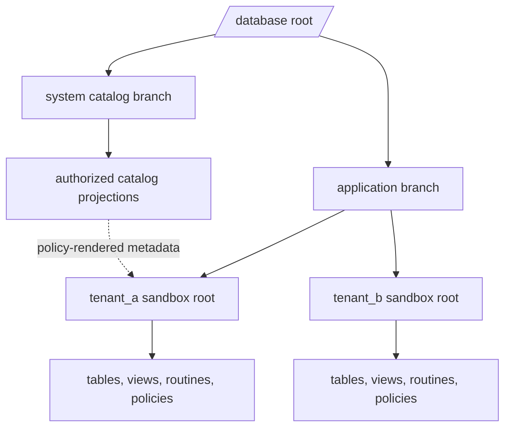

Sandbox rules:

- ordinary name resolution starts inside the session root;
- recursive schema lookup cannot escape the admitted root;
- current schema and search path entries outside the root are refused or hidden;
- grants inside the sandbox do not imply grants outside the sandbox;
- catalog projections can render authorized metadata from outside the root only
  when the projection object itself has authority and policy admits disclosure;
- support diagnostics must redact names, UUIDs, paths, values, and policy
  details according to the session's disclosure profile.

See [Schema Tree And Name Resolution](../syntax_reference/schema_tree_and_name_resolution.md).

## Grants And Effective Privileges

Grants attach privileges to principal UUIDs, roles, groups, or public scope.
Revokes remove privilege edges. Effective privileges are computed for a bound
operation, not for raw source text.

Resolution order:

1. Authenticate or bind the effective principal UUID.
2. Establish sandbox root, attached database/workarea, current schema, and home
   schema.
3. Resolve the target object to UUID identity under metadata visibility rules.
4. Collect direct grants to the principal.
5. Collect grants inherited through active roles and admitted groups.
6. Apply ownership and administration policy.
7. Apply explicit denials.
8. Apply row, column, object, stream, file, bridge, and management policies.
9. Check transaction and recovery gates.
10. Admit or refuse the operation.

Common privilege targets include:

| Target | Examples Of Controlled Operations |
| --- | --- |
| Database | connect, create schema, create filespace, backup, restore, security administration, configuration. |
| Schema | usage, create object, alter, drop, describe. |
| Table | select, insert, update, delete, truncate, references, trigger, alter, drop, comment, describe. |
| Column | select, insert, update, references, describe. |
| View and materialized view | select, refresh, alter, drop, comment, describe. |
| Routine | execute, alter, drop, comment, describe. |
| Domain and type descriptor | usage, alter, drop, comment, describe. |
| Sequence | usage, select, update, alter, drop. |
| Policy, mask, and RLS | apply, alter, drop, enable, disable, describe, validate. |
| Filespace | usage, create object, attach, detach, alter, drop, describe, promote where admitted. |
| Stream or bridge | connect, import, export, replicate, migrate, validate, cutover. |
| Management surface | show metrics, manage sessions, validate configuration, generate support bundle, run admitted maintenance. |

See [Security And Privilege Statements](../syntax_reference/security_and_privilege_statements.md).

## Explicit Deny Wins

An allow edge can make an operation possible. A deny edge or policy refusal can
still block it.

Examples:

- a user has `SELECT` on a table, but RLS hides rows for that user's tenant;
- a user has `SELECT` on a column, but a mask returns a redacted value;
- a user has `UPDATE` on a table, but a policy denies updates after a workflow
  state is sealed;
- a user has a management role, but a recovery fence denies write admission;
- a user can create objects in a schema, but filespace policy denies the
  requested placement.

Denial is not a parser error. It is an explicit message vector result.

## Policy, Masks, And Row-Level Security

Policy objects refine grant authority.

| Object | Role |
| --- | --- |
| Policy | General durable rule applied to an object, operation family, principal scope, security context, stream, bridge, support surface, or management surface. |
| Mask | Value rendering rule that transforms or redacts a visible value before it leaves the engine. |
| RLS | Row-level rule that filters visible row versions or checks proposed row mutations. |

Evaluation order is conceptually:

1. MGA determines which row versions are visible to the transaction.
2. Object and column privileges determine whether the operation can proceed.
3. RLS filters visible rows or refuses row mutation.
4. Masks transform values that are visible but protected.
5. Protected-material release policy decides whether sensitive values can leave
   the engine.
6. Diagnostics and support output are redacted according to disclosure policy.

RLS is not a transaction system. It does not decide whether a row version exists
or whether a transaction committed. MGA owns that. RLS decides whether the
effective security context may see or mutate the otherwise visible row.

See [Policy, Mask, And RLS Lifecycle](../syntax_reference/policy_mask_and_rls.md).

## Protected Material

Protected material includes secrets, credentials, keys, tokens, protected
configuration values, masked values, sensitive diagnostic fields, and any value
whose release is governed by policy.

Rules:

- store and pass secret references rather than raw secrets where possible;
- redact protected material in diagnostics and support bundles by default;
- do not expose protected values through casts, string concatenation, errors,
  logs, `show`, `describe`, catalog views, or procedure output without release
  authority;
- treat export, backup, replication, migration, bridge, and stream routes as
  protected-material release surfaces when values can cross a boundary;
- record audit evidence for admitted release where policy requires it.

## Catalog Projections

Catalog tables and views can reveal metadata. Metadata itself can be sensitive:
object names, existence, ownership, privilege edges, policy names, filespace
layout, endpoint labels, and diagnostic handles can all disclose information.

ScratchBird therefore distinguishes:

- base catalog authority;
- projection authority;
- disclosure policy;
- redaction policy;
- sandbox root;
- ordinary object privileges.

A user may have `SELECT` on an authorized catalog projection that renders a
safe view of objects outside the sandbox. That does not grant the user direct
name resolution or object privileges outside the sandbox.

## Procedural Security

Procedures, functions, packages, and triggers run with an explicit security
mode. The mode is part of the routine descriptor and is checked when the routine
is compiled, invoked, invalidated, or revalidated.

| Mode | Contract |
| --- | --- |
| Invoker rights | The routine executes with the caller's effective principal, active roles, sandbox root, and policy context. |
| Definer rights | The routine executes with admitted definer authority for the routine body while preserving caller context for auditing and policy inputs. |
| Agent rights | The routine is invoked by an admitted agent and runs only within the agent's registered authority and purpose. |
| Restricted rights | The routine runs with an intentionally reduced privilege set even when caller or definer has broader authority. |

Procedural security rules:

- routine source text is not authority;
- compiled routine SBLR must reference UUID-bound objects and descriptors;
- dependency, grant, policy, domain, type, and catalog changes can invalidate a
  compiled routine;
- dynamic execution must pass through parse, bind, admission, authorization,
  and engine dispatch;
- cursors, result sets, streams, and protected values passed between routines
  retain descriptor and security context;
- trigger execution must not bypass the security and transaction context of the
  firing operation.

See [Procedural SQL](../syntax_reference/procedural_sql.md),
[Function Lifecycle](../syntax_reference/function.md),
[Procedure Lifecycle](../syntax_reference/procedure.md), and
[Trigger Lifecycle](../syntax_reference/trigger.md).

## File, Stream, Bridge, And Network Gates

Operations that move data across a boundary are policy-controlled even when the
ordinary object privileges are present.

| Surface | Security Rule |
| --- | --- |
| `COPY FROM STDIN` | Client-supplied stream frames are admitted through the stream contract and target-object privileges. |
| `COPY TO STDOUT` | Data can leave the engine only through result and stream policy. |
| Server-local location | Opening a server-local path requires explicit policy admission before any file access occurs. |
| Logical backup | May stream logical data only through admitted backup and protected-material policy. |
| Logical restore | May ingest logical instructions only through admitted restore policy and target privileges. |
| Replication and CDC | Requires source, target, ordering, idempotency, quarantine, and cutover authority. |
| Migration | Requires metadata, data, stream, validation, and cutover authority. |
| Bridge | Requires bridge-use privilege, endpoint policy, identity delegation policy, and stream policy. |
| Management diagnostics | Requires management privilege and redaction policy. |

Low-level repair, verification, page-copy backup, page-copy restore, and direct
storage manipulation are not ordinary parser privileges. They require explicit
administrative SBsql routes and policy admission.

See [COPY Streaming Import And Export](../syntax_reference/copy.md) and
[Backup, Restore, Replication, And Migration](../syntax_reference/backup_restore_replication_migration.md).

## Agent Sandboxing

Agents are principals. They are not ambient superusers.

An agent has:

- UUID identity;
- registered purpose;
- owner or controller;
- admitted scope;
- allowed operation families;
- resource limits;
- activation policy;
- audit policy;
- shutdown and cancellation policy;
- support-bundle disclosure policy.

An agent may run maintenance, migration, replication, validation, support, or
management work only within its registered authority. Agent work still uses
SBLR admission, engine authorization, MGA transaction authority, resource
limits, and fail-closed recovery behavior.

See [Agents And Agent Management](../syntax_reference/agent.md).

## Security Epochs And Invalidation

Security changes advance a security epoch. Dependent state must be invalidated
or revalidated when the epoch changes.

Dependent state includes:

- prepared statements;
- bound SBLR envelopes;
- compiled procedures and functions;
- trigger plans;
- optimizer plans and plan cache entries;
- metadata caches;
- catalog projection caches;
- bridge sessions;
- stream authorizations;
- support-bundle projections;
- active security snapshots where policy requires revalidation.

Invalidation prevents stale authorization from surviving a grant, revoke,
policy, mask, role, group, identity, sandbox, or protected-material change.

## Statement Examples

Create a role, grant schema usage, and grant read access:

```sql
create role app_reader;

grant usage on schema app to app_reader;
grant select on table app.orders to app_reader;
```

Activate a role for the current session:

```sql
set role app_reader;
```

Create a row-level rule that narrows visible rows:

```sql
create rls app.orders_tenant_rls
on table app.orders
for select
using tenant_uuid = current_tenant_uuid()
to role app_reader
active;
```

Create a mask for a protected column:

```sql
create mask app.customer_email_mask
on column app.customer.email
using case
    when has_role('support_full_contact') then email
    else null
end
active;
```

Attempting to read outside the sandbox returns a denial or a redacted
missing-object diagnostic according to disclosure policy:

```sql
select *
from admin.security_audit;
```

## Syntax Productions

```ebnf
security_statement ::=
      create_identity_statement
    | alter_identity_statement
    | drop_identity_statement
    | grant_statement
    | revoke_statement
    | set_role_statement
    | show_security_statement
    | describe_security_statement ;
```

```ebnf
principal_ref           ::= uuid_ref
                          | qualified_name ;
```

```ebnf
grant_statement         ::= "GRANT" grant_payload "TO" principal_ref grant_option_list? ;
```

```ebnf
revoke_statement        ::= "REVOKE" revoke_payload "FROM" principal_ref revoke_option_list? ;
```

```ebnf
policy_statement        ::= create_policy_statement
                          | alter_policy_statement
                          | drop_policy_statement
                          | create_mask_statement
                          | alter_mask_statement
                          | drop_mask_statement
                          | create_rls_statement
                          | alter_rls_statement
                          | drop_rls_statement
                          | show_policy_statement
                          | describe_policy_statement
                          | validate_policy_statement ;
```

## Binding And Execution Summary

| Step | Security Meaning |
| --- | --- |
| Parse | The statement shape is recognized. No authority is granted. |
| Bind principal | User, role, group, agent, or public references resolve to UUIDs where visible. |
| Bind target | Object names resolve under sandbox and metadata visibility rules. |
| Bind descriptors | Parameters, expressions, rowsets, streams, masks, policies, and result shapes receive descriptors. |
| Admit envelope | Server admission checks route, envelope version, operation identity, and gated capability state. |
| Authorize | Grants, roles, groups, ownership, deny edges, policy, masks, RLS, and protected-material rules are evaluated. |
| Execute | Engine performs the admitted operation under MGA and recovery authority. |
| Render | Results and diagnostics are redacted according to disclosure policy. |

## Refusal Classes

| Refusal | Typical Cause |
| --- | --- |
| `unsupported` | Security surface, grant target, policy option, provider route, or management route is not available in the build or target. |
| `denied` | Principal lacks privilege, sandbox blocks resolution, policy blocks access, protected material cannot be released, recovery fences work, or server-local access is not admitted. |
| `unlicensed` | A recognized route reaches a provider or gated boundary that reports the capability is not licensed. |
| Parse error | The source text does not form a valid SBsql statement. |
| Bind error | Principal, object, descriptor, role, policy, or target reference cannot be resolved unambiguously. |

See [Refusal Vectors](../syntax_reference/refusal_vectors.md).

## Verification Checklist

A security and sandbox proof should demonstrate:

- authenticated sessions bind to a principal UUID;
- unauthenticated sessions cannot perform protected operations;
- role activation changes effective privileges only where admitted;
- explicit deny overrides direct and inherited allow;
- sandbox roots prevent ordinary name resolution outside the root;
- hidden objects do not leak through diagnostics when disclosure policy forbids
  it;
- authorized catalog projections can render only policy-admitted metadata;
- grants and revokes are transactional;
- security epoch changes invalidate dependent plans and metadata;
- RLS filters otherwise visible row versions;
- masks transform visible values without changing stored values;
- protected material is redacted from diagnostics and support output by default;
- server-local file access is denied unless explicitly admitted;
- bridge and stream operations require endpoint, identity, object, and stream
  authority;
- agent operations run only inside registered authority;
- recovery-required state fences unsafe security and data operations;
- unsupported, denied, and unlicensed routes return explicit message vectors.

## Related Reference Pages

- [Intro And MGA](intro_and_mga.md)
- [Parser To SBLR Pipeline](parser_to_sblr_pipeline.md)
- [UUID Catalog Identity](uuid_catalog_identity.md)
- [Transactions And Recovery](transactions_and_recovery.md)
- [Security And Privilege Statements](../syntax_reference/security_and_privilege_statements.md)
- [Policy, Mask, And RLS Lifecycle](../syntax_reference/policy_mask_and_rls.md)
- [Schema Tree And Name Resolution](../syntax_reference/schema_tree_and_name_resolution.md)
- [Refusal Vectors](../syntax_reference/refusal_vectors.md)
- [Agents And Agent Management](../syntax_reference/agent.md)
- [COPY Streaming Import And Export](../syntax_reference/copy.md)
- [Backup, Restore, Replication, And Migration](../syntax_reference/backup_restore_replication_migration.md)


### /home/dcalford/CliWork/ScratchBird/docs/documentation/draft/Language_Reference/core_paradigms/bridge_and_cluster_boundaries.md

# Bridge And Cluster Boundaries

This page is part of the SBsql Language Reference Manual. It explains the
boundary between ordinary bridge operations, remote data access, logical data
movement, provider-backed capabilities, and cluster-classified operations.

Generation task: `core_paradigms_bridge_and_cluster_boundaries`

## Purpose

A bridge is a connection boundary. It lets an authorized local user, session, or
agent connect to another database endpoint through a registered bridge-capable
package. The bridge can carry statements, cursors, rows, streams, logical
backup/restore data, replication data, migration data, diagnostics, and
capability information.

A bridge does not move transaction finality, catalog identity, storage
authority, recovery authority, or security authority out of the participating
databases. Each database keeps its own MGA transaction authority and durable
catalog identity.

Cluster-classified operations are different. They coordinate placement,
membership, distributed query planning, distributed transaction barriers,
failover, cross-node route authority, and similar multi-node behavior. Those
surfaces are admitted only through cluster gates. In a public build they either
return an explicit unsupported/unlicensed message vector or route to the public
compile/link stub and fail closed.

## Boundary Summary

| Surface | Classification | Authority Model |
| --- | --- | --- |
| Local table query | Local engine operation | Local MGA, local catalog UUIDs, local security, local storage. |
| Remote table through bridge | Bridge operation | Local session plus remote session; each database keeps its own transaction authority. |
| Logical backup stream | Stream operation | Source database owns snapshot and export authority; stream policy controls release. |
| Logical restore stream | Stream operation | Target database owns catalog mapping, transaction finality, and import authority. |
| CDC or replication route | Bridge/stream operation | Source and target each own local transaction state; ordering evidence is route evidence, not finality authority. |
| Migration route | Bridge/stream operation | Source, target, mapping, validation, quarantine, and cutover are explicit policy-bound phases. |
| Cross-node optimizer fanout | Cluster-classified operation | Requires cluster provider admission. Public builds fail closed. |
| Distributed transaction barrier | Cluster-classified operation | Requires cluster provider admission. Local MGA remains local authority. |
| Membership, failover, placement, shard routing | Cluster-classified operation | Requires cluster provider admission. Public builds provide diagnostics only. |

An ordinary query that reads a remote relation through a bridge is not a
distributed query. The local operation treats the remote relation as an input
reached through a connection. A distributed query lets a cluster-aware authority
plan, route, and coordinate work across nodes or fragments; that surface is
cluster-classified.

## Bridge Lifecycle

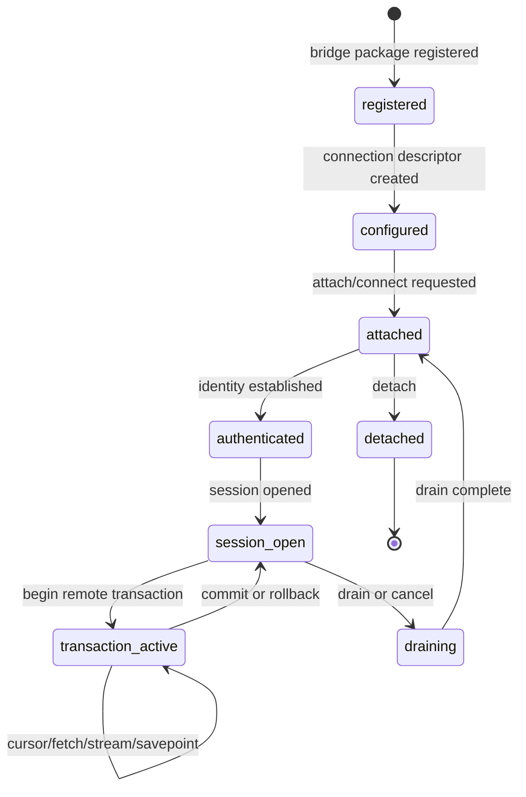

Bridge registration makes a capability available. It does not create an
automatic connection or grant anyone authority to use it. An authorized SBsql
statement creates the connection descriptor and policy state. A session or
agent then attaches, authenticates, opens a session, and begins one or more
remote transactions as needed.

## Authority Model

Bridge authority is layered.

| Layer | Owns |
| --- | --- |
| Local database | Local session identity, local transaction, local catalog, local policy, local resource limits, local result rendering. |
| Bridge descriptor | Endpoint reference, capability profile, stream limits, security policy, retry policy, diagnostic profile. |
| Bridge package | Wire protocol, remote statement rendering, result decoding, capability reporting, stream framing. |
| Remote database | Remote authentication, remote session, remote catalog, remote transaction, remote security, remote result semantics. |
| Engine admission | Whether the bound SBsql operation may call the bridge route at all. |

The bridge package is not durable authority. It reports capabilities, translates
requests, frames data, and returns evidence. The local engine decides whether
the local operation is admitted. The remote endpoint decides whether the remote
operation is admitted.

## Local And Remote Transactions

A bridge operation can involve one local transaction and one or more remote
transactions. Each participating database owns its own transaction state.

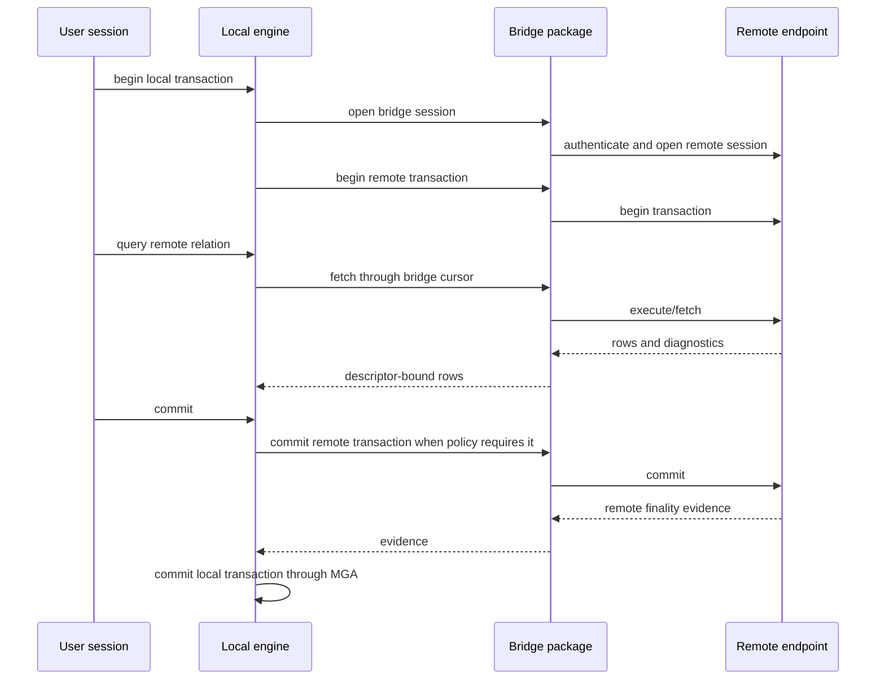

Rules:

- local commit is local MGA finality;
- remote commit is remote finality;
- local rollback does not prove remote rollback unless the remote transaction
  actually rolled back and returned evidence;
- remote commit evidence does not override local recovery classification;
- savepoints, retain/chain behavior, autocommit, and prepare are used only when
  both the route and the remote endpoint report support;
- uncertain finality must return explicit diagnostics and fence unsafe work.

## Bridge Operations

The public bridge surface groups operations by purpose.

| Operation | Purpose |
| --- | --- |
| Describe capabilities | Report package ABI, supported statement families, streams, transaction modes, diagnostics, and limits. |
| Create connection | Create a durable connection descriptor with endpoint, policy, capability, and secret-reference metadata. |
| Attach/connect | Establish a connection handle under a user or agent context. |
| Authenticate | Establish remote identity using policy-admitted credential references or delegation. |
| Open session | Create a remote session that can own cursors and remote transactions. |
| Close session | End a remote session and release session-owned resources. |
| Detach | Close the connection handle and return final diagnostics. |
| Ping/health | Check availability, route state, and provider readiness without changing data. |
| Cancel | Request cancellation of an active remote operation. |
| Drain | Stop accepting new work and allow admitted work to finish or cancel by policy. |
| Shutdown | Shut down an admitted bridge package or connection scope where policy permits it. |
| Begin transaction | Start a remote transaction associated with the bridge session. |
| Commit transaction | Request remote commit and return remote finality evidence. |
| Rollback transaction | Request remote rollback and return remote finality evidence. |
| Savepoint | Create or roll back to a remote savepoint where supported. |
| Cursor fetch | Fetch descriptor-bound rows under stream and backpressure policy. |
| Stream read/write | Move stream frames for rows, large values, logical backup, restore, CDC, replication, migration, and result data. |
| Validate | Validate connection, mapping, stream shape, endpoint capabilities, and cutover readiness. |
| Compare | Compare source and target data or metadata under an admitted migration/replication route. |
| Cutover | Complete an admitted migration or replication transition after validation. |

Unsupported operations must return explicit message vectors. They must not be
silently ignored.

## Bridge Handles And Scope

Bridge handles are opaque session-scoped or agent-scoped references. The
database stores connection configuration and policy. The bridge package supplies
the ability to connect; it does not own the durable connection policy.

Handle rules:

- handles are not raw pointers or client-trusted tokens;
- handles are bound to session, agent, transaction, endpoint, policy, and
  security context;
- a handle can own multiple remote transactions when the route permits it;
- a handle can be cancelled, drained, closed, or invalidated by policy;
- handle metadata is redacted in diagnostics unless disclosure policy admits it;
- stale handles fail closed after disconnect, revoke, policy change, provider
  reload, or recovery fence.

## Streams And Backpressure

Bridge streams carry typed frames. They are not arbitrary byte pipes once they
enter the SBsql execution pipeline.

Stream contracts include:

- frame type and descriptor;
- maximum frame size;
- maximum in-flight bytes;
- timeout and cancellation behavior;
- retry and idempotency policy;
- ordering token where required;
- transaction grouping where required;
- quarantine behavior for invalid records;
- redaction and protected-material policy;
- completion and failure diagnostics.

Large values, cursors, logical backup streams, restore streams, CDC streams,
replication streams, migration streams, and `COPY` streams all use explicit
stream contracts.

## Logical Backup And Restore Across A Bridge

Logical backup and logical restore are allowed where the route, policy, and
endpoint capabilities admit them.

| Operation | Allowed Shape |
| --- | --- |
| Logical backup to client or bridge stream | Exports metadata and data as typed logical instructions and row frames. |
| Logical restore from client or bridge stream | Reads typed logical instructions and applies them through target catalog and DML routes. |
| Partial logical backup | Exports an admitted subset such as a schema, table, query, or policy-bound scope. |
| Partial logical restore | Imports an admitted subset with explicit mapping and validation. |
| Physical page-copy backup or restore | Denied through bridge/parser routes unless an explicit administrative route admits it. |
| Server-local file manipulation | Denied by default unless an explicit named location policy admits it. |

Logical streams are interpreted as instructions and typed data. They are not
trusted as catalog or transaction authority. The target database decides what
UUIDs, descriptors, security mappings, and transaction outcomes are admitted.

## CDC, Replication, ETL, And Migration

CDC, replication, ETL, and migration routes are bridge and stream operations.
They require direction, capability, identity, ordering, idempotency, mapping,
quarantine, validation, and cutover policy.

| Concern | Rule |
| --- | --- |
| Direction | A route can be source, target, or both only when capability negotiation reports support. |
| Transaction grouping | Changes must preserve group boundaries where the route requires them. |
| Ordering token | Ordering evidence must be present when replay or cutover depends on it. |
| Record identity | Each record must carry enough identity to apply, compare, quarantine, or reject it. |
| Idempotency | Replayed changes require an idempotency key or equivalent route contract where policy requires it. |
| Quarantine | Invalid or ambiguous records must be quarantined or refused according to policy. |
| Cutover | Cutover requires validation that the target is ready and that no required changes are missing. |
| Finality | Route evidence does not override local or remote MGA finality. |

## Remote Query Versus Distributed Query

A remote query through a bridge:

- connects to one remote endpoint through a bridge session;
- treats remote rows as a relation input;
- uses local and remote transactions according to bridge policy;
- does not give the local optimizer authority to distribute work across a
  cluster;
- does not create cluster placement, membership, route, or failover authority.

A distributed query:

- plans or routes work across nodes, shards, fragments, or distributed
  participants;
- can require distributed read safety, fanout, partial aggregation, merge,
  placement, route authority, and distributed diagnostics;
- is cluster-classified;
- requires cluster provider admission;
- fails closed in public builds unless an admitted provider boundary exists.

## Cluster Gate

Cluster-classified statements are recognized so tools and scripts can receive
stable diagnostics. Recognition is not execution.

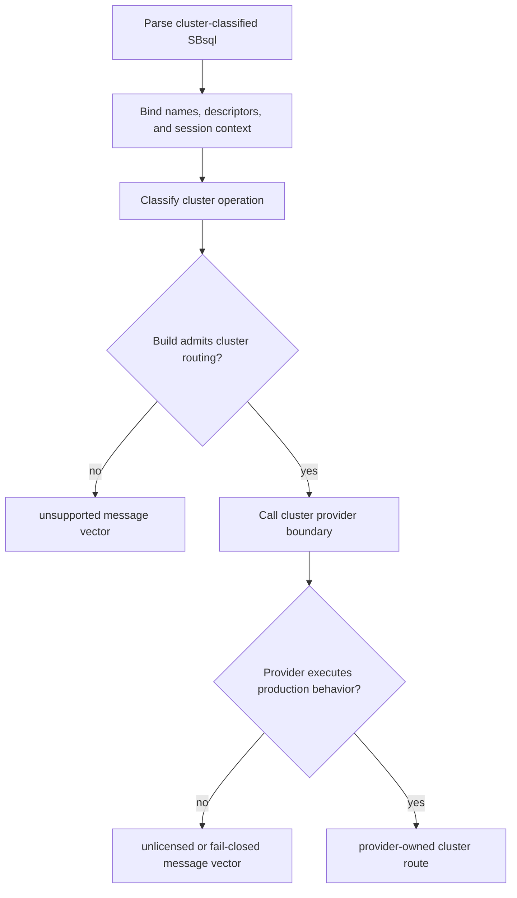

The public compile/link stub exists to prove parser routing, SBLR mapping, ABI
wiring, diagnostics, and fail-closed behavior. It provides no cluster
membership, routing authority, replication authority, failover, recovery,
distributed transaction control, or production cluster behavior.

See [Cluster-Gated Statements](../syntax_reference/cluster_gated_statements.md).

## Cluster-Classified Operation Families

| Family | Examples |
| --- | --- |
| Topology | Inspect topology, define regions, define shard profiles, publish topology manifests, validate topology schema. |
| Membership | Admit, remove, drain, assign role, inspect health, validate node suitability. |
| Routing | Publish ownership, reject stale ownership, inspect route plans. |
| Placement | Place objects, rebalance shards, validate partition distribution, assign ranges. |
| Distributed transactions | Begin distributed work, prepare participants, publish barriers, recover limbo, advance cleanup, validate finality evidence. |
| Replication and reconciliation | Consume events, reconcile ledgers, apply merge policy, report conflicts, publish reconciled state. |
| Security and fencing | Validate epoch, issue or revoke fence tokens, validate policy versions, validate route authority. |
| Jobs and throttling | Start or cancel controlled jobs, throttle workloads, run admitted maintenance. |
| Metrics and support | Inspect provider status, route traces, events, support evidence, and readiness state. |
| Distributed query | Plan and admit cross-node work, route fragments, fanout reads, merge rows, aggregate partials, validate safe reads. |

These operation families are not implemented by ordinary local query execution
or by ordinary bridge remote-table access.

## Security And Secrets

Bridge and cluster-gated operations are security-sensitive because they can move
data, create remote sessions, expose metadata, and affect operational state.

Security rules:

- bridge use requires an explicit privilege on the bridge descriptor or route;
- endpoint access requires policy admission;
- external network access requires policy admission;
- credential material uses secret references or provider-owned handles, not raw
  statement text;
- remote authentication follows the destination endpoint's authority model;
- metadata rendering is redacted by disclosure policy;
- protected material cannot be exported, logged, diagnosed, replicated, or
  streamed without release authority;
- management operations require management privileges even when they return a
  refusal;
- cluster-classified operations require cluster gate admission before any
  provider behavior can run.

See [Security And Sandboxing](security_and_sandboxing.md) and
[Security And Privilege Statements](../syntax_reference/security_and_privilege_statements.md).

## Recovery And Failure Rules

Bridge and cluster boundary failures must be explicit.

| Failure | Required Behavior |
| --- | --- |
| Missing bridge package | Return unsupported or unavailable capability. |
| Bridge package cannot authenticate | Return bridge authentication failure. |
| Endpoint lacks capability | Return missing capability or unsupported operation. |
| Stream frame invalid | Reject frame, quarantine record, or abort stream according to policy. |
| Ordering ambiguous | Refuse replay, CDC, migration, or cutover until ordering evidence exists. |
| Idempotency missing | Refuse replay/apply route where idempotency is required. |
| Remote transaction uncertain | Fence dependent local work and report uncertainty. |
| Local transaction uncertain | Follow local MGA recovery and fail closed. |
| Provider unavailable | Return unavailable provider or unlicensed provider message vector. |
| Cluster route disabled | Return unsupported before provider call. |
| Cluster stub reached | Return unlicensed or fail-closed diagnostic from the stub boundary. |

Silent partial success is not allowed for bridge or cluster-classified
operations.

## Syntax Productions

```ebnf
bridge_operation        ::= bridge_connection_operation
                          | bridge_session_operation
                          | bridge_transaction_operation
                          | bridge_cursor_operation
                          | bridge_stream_operation
                          | bridge_replication_operation
                          | bridge_migration_operation
                          | bridge_diagnostic_operation ;
```

```ebnf
bridge_connection_operation ::=
      describe_bridge_capabilities
    | create_bridge_connection
    | alter_bridge_connection
    | drop_bridge_connection
    | validate_bridge_connection
    | attach_bridge
    | detach_bridge
    | ping_bridge
    | health_bridge ;
```

```ebnf
bridge_session_operation ::=
      open_bridge_session
    | close_bridge_session
    | cancel_bridge_operation
    | drain_bridge_session
    | shutdown_bridge_scope ;
```

```ebnf
bridge_transaction_operation ::=
      begin_bridge_transaction
    | commit_bridge_transaction
    | rollback_bridge_transaction
    | savepoint_bridge_transaction ;
```

```ebnf
bridge_stream_operation ::=
      open_bridge_stream
    | read_bridge_stream
    | write_bridge_stream
    | close_bridge_stream ;
```

```ebnf
private_cluster_statement ::= show_cluster
                            | alter_cluster
                            | create_cluster
                            | drop_cluster ;
```

```ebnf
show_cluster            ::= "SHOW" "CLUSTER" cluster_target ;
alter_cluster           ::= "ALTER" "CLUSTER" cluster_action ;
create_cluster          ::= "CREATE" "CLUSTER" cluster_create_payload ;
drop_cluster            ::= "DROP" "CLUSTER" cluster_ref ;
```

The grammar production name `private_cluster_statement` is historical. It
describes cluster-classified statement grouping. It does not mean production
cluster implementation code is present in the public build.

## Binding And Execution Summary

| Step | Bridge Meaning | Cluster-Gated Meaning |
| --- | --- | --- |
| Parse | Recognize bridge, stream, remote, replication, migration, or diagnostic intent. | Recognize cluster-classified intent. |
| Bind | Resolve bridge descriptors, endpoints, streams, objects, parameters, transactions, and policy inputs. | Resolve names and descriptors required to classify the cluster operation. |
| Lower | Produce SBLR for bridge route or explicit refusal. | Produce SBLR for cluster gate or explicit refusal. |
| Admit | Check bridge capability, security, stream, endpoint, and resource policy. | Check compile-time cluster gate and provider boundary admission. |
| Execute | Bridge package performs admitted connection or stream work; engines retain authority. | Provider boundary executes only in an admitted build/profile. Public stub fails closed. |
| Return | Result envelope includes rows, stream state, remote evidence, diagnostics, or refusal. | Result envelope includes provider diagnostics, unsupported, unlicensed, or fail-closed refusal. |

## Verification Checklist

A bridge and cluster-boundary proof should demonstrate:

- bridge package registration does not grant automatic use authority;
- connection descriptors require explicit SBsql creation and policy;
- bridge attach/auth/session lifecycle returns explicit diagnostics;
- local and remote transactions remain separately authoritative;
- remote commit evidence cannot override local MGA recovery;
- local rollback cannot pretend remote rollback occurred;
- stream frame limits, cancellation, timeouts, and backpressure are enforced;
- logical backup and restore use typed streams and policy-bound mappings;
- server-local file access is denied unless a named location policy admits it;
- physical page-copy backup/restore is denied through bridge/parser routes;
- CDC, replication, ETL, and migration require ordering, idempotency, mapping,
  quarantine, validation, and cutover evidence where policy requires it;
- remote-table access is distinct from distributed query;
- cluster-classified statements return unsupported when the build gate is off;
- cluster-classified statements reaching the public stub return unlicensed or
  fail-closed diagnostics;
- provider errors do not become silent success;
- protected material is not leaked through streams, diagnostics, logs, support
  bundles, or metadata rendering;
- all refusals use explicit message vectors.

## Related Reference Pages

- [Intro And MGA](intro_and_mga.md)
- [Parser To SBLR Pipeline](parser_to_sblr_pipeline.md)
- [Transactions And Recovery](transactions_and_recovery.md)
- [Security And Sandboxing](security_and_sandboxing.md)
- [Cluster-Gated Statements](../syntax_reference/cluster_gated_statements.md)
- [Backup, Restore, Replication, And Migration](../syntax_reference/backup_restore_replication_migration.md)
- [COPY Streaming Import And Export](../syntax_reference/copy.md)
- [Management And Operations](../syntax_reference/management_and_operations.md)
- [Agents And Agent Management](../syntax_reference/agent.md)
- [Refusal Vectors](../syntax_reference/refusal_vectors.md)


### /home/dcalford/CliWork/ScratchBird/docs/documentation/draft/Language_Reference/core_paradigms/parser_to_sblr_pipeline.md

# Parser To SBLR Pipeline

This page is part of the SBsql Language Reference Manual. It describes how
SBsql text becomes SBLR, how that SBLR is admitted by the server boundary, and
what the engine treats as authority. The pipeline exists so the parser can
remain expressive and context sensitive while the engine executes one canonical
command language.

Generation task: `core_paradigms_parser_to_sblr`

## Purpose

SBsql statements are not executed directly by the engine. A parser session
turns source text into a bound operation, lowers that operation into an
`SBLRExecutionEnvelope`, and submits the envelope to the server admission
boundary. The engine then validates the envelope and executes the operation by
SBLR operation identity.

This separation is a core ScratchBird rule:

- SQL text is user input, diagnostic evidence, and source-reference material.
- Catalog names are user-layer references until they are bound to UUID catalog
  identity.
- Type names, literal forms, parameters, row shapes, stream contracts, and
  result shapes become descriptor-bound SBLR data.
- Parser output is never transaction finality, storage finality, authorization
  finality, or catalog authority.
- The engine can reject a syntactically valid statement if binding, admission,
  authorization, policy, transaction state, storage state, or resource limits do
  not permit execution.

A successful statement therefore passes three user-visible phases: parse,
bind/admit, and execute. A failure in any phase returns a message vector instead
of continuing with guessed behavior.

## Pipeline At A Glance

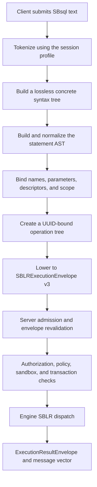

The same pipeline applies whether the client uses an embedded engine path, a
local IPC server, or a network path through the manager, listener, parser, IPC
server, and engine. Network deployment adds transport and handoff boundaries;
it does not change the requirement that the engine receives canonical SBLR
rather than SQL text.

## Stage 1: Tokenization

The tokenizer reads the SBsql script under the active session profile. SBsql is
context sensitive, so most words are interpreted by context rather than by a
large global reserved-word list. This lets identifiers use ordinary business
terms while still allowing command clauses to be recognized where the grammar
expects them.

Tokenization preserves:

- source spans for diagnostics and support bundles;
- quoted identifier spelling;
- string, binary, numeric, temporal, UUID, document, graph, vector, and protected
  value literal forms;
- parameter marker positions;
- statement separators;
- comments, when comment retention is enabled for diagnostic or source-reference
  output.

Tokenization does not resolve object identity. A token such as `orders` is only
text until the binding phase determines which visible object, if any, it names.

## Stage 2: Concrete Syntax Tree

The parser builds a concrete syntax tree that is lossless enough to render
precise diagnostics. The concrete tree records the user's spelling, clause
order, nesting, and token spans. It is the right structure for error reporting
and source annotation, but it is not the structure that the engine executes.

Examples of concrete syntax decisions include:

- whether a statement is a query, DML statement, DDL statement, transaction
  statement, procedural statement, security statement, management statement,
  multimodel statement, stream statement, or recognized refusal route;
- where each clause starts and ends;
- which expressions appear in projection, filtering, grouping, windowing,
  ordering, DML assignments, defaults, constraints, policies, and procedural
  blocks;
- whether a token sequence is ambiguous and needs binding context to decide its
  meaning.

Syntax errors stop here. The parser returns a message vector containing the
source span, expected grammar context, and statement boundary when possible.

## Stage 3: Statement AST

The parser then builds a statement AST. The AST removes purely textual
structure, classifies the statement family, and prepares the statement for
binding. It still contains source spans for diagnostics, but the main purpose is
semantic organization.

The AST records:

- statement family and subfamily;
- object references, aliases, CTE names, correlation names, and local block
  variables;
- expression trees and predicate trees;
- DDL lifecycle actions such as create, alter, recreate, rename, comment,
  describe, show, and drop;
- DML source and target structure;
- rowset, scalar, cursor, stream, and command-completion expectations;
- procedural blocks, variables, cursor operations, handlers, triggers, and
  event bindings;
- security, policy, management, backup, restore, replication, migration,
  multimodel, and gated operation intent.

The AST is still parser-owned. It cannot create durable state, open server-local
files, commit transactions, bypass policy, or treat display names as engine
identity.

## Stage 4: Binding

Binding converts parser-owned semantic intent into ScratchBird identity and type
evidence. This is the first phase where names become durable catalog references.

Binding resolves:

- database, schema, object, column, domain, type, index, sequence, view,
  procedure, function, trigger, package, role, policy, agent, stream, and
  filespace names to UUID catalog identity;
- the active schema root, home schema, current schema, recursive schema lookup
  rules, sandbox root, and visibility branch;
- aliases, CTE names, recursive CTE columns, local variables, parameters,
  transition variables, cursor variables, and row fields;
- overload selection for functions, procedures, operators, casts, aggregates,
  and procedural calls;
- literal descriptors, parameter descriptors, row descriptors, record
  descriptors, collection descriptors, stream descriptors, and result
  descriptors;
- expression input types, nullability, collation, character set, scale,
  precision, temporal zone behavior, binary length, vector dimensions, document
  shape, graph shape, and protected-material policy labels;
- transaction context, savepoint context, autocommit behavior, isolation
  request, retain/chain behavior, and execution timeout;
- security context, invoker/definer behavior, row-level policy inputs, masking
  inputs, and sandbox constraints.

After binding, an executable operation must not depend on display-name lookup
inside the engine. The operation carries UUID-bound references and descriptors.
The engine may still reject those references if the referenced object has
changed, become invisible, been revoked, requires recovery, or no longer
matches the bound descriptor contract.

## Stage 5: Lowering To SBLR

Lowering converts the bound AST into an `SBLRExecutionEnvelope`. The envelope is
the parser-to-server command carrier. It is versioned, canonical, and explicit
about what the engine is being asked to do.

An execution envelope contains the following classes of information:

| Field Class | Purpose |
| --- | --- |
| Envelope version | Identifies the SBLR envelope contract accepted by server admission. |
| Operation identity | Identifies the SBLR operation and statement family to dispatch. |
| UUID references | Carries bound catalog identity for objects, columns, descriptors, policies, agents, streams, and filespaces. |
| Descriptor table | Defines parameter, literal, expression, row, cursor, stream, and result shapes. |
| Argument table | Carries typed values, parameter slots, default requests, and expression operands. |
| Scope table | Carries CTE, alias, local variable, cursor, and procedural block scope bindings. |
| Transaction request | Carries begin, commit, rollback, savepoint, retain, chain, timeout, and isolation intent where relevant. |
| Security request | Carries invoker/definer, principal UUID, role context, policy context, and sandbox evidence. |
| Stream contract | Defines cursor, large value, copy/load, logical backup/restore, CDC, replication, migration, and result streaming behavior. |
| Diagnostic shape | Defines how refusals, warnings, row counts, command tags, and support evidence are returned. |
| Source evidence | Carries source spans, normalized source digests, and non-authoritative source references for diagnostics. |

The envelope must not treat raw SQL text as engine authority. Source text may be
retained for diagnostics or reference, but the executable request is the SBLR
payload.

## Stage 6: Server Admission

Server admission is a fail-closed validation boundary between parser output and
engine execution. It rejects malformed, ambiguous, stale, or unauthorized
envelopes before dispatch.

Admission validates:

- the `SBLRExecutionEnvelope` version;
- operation identity, operation family, and opcode consistency;
- result shape and diagnostic shape;
- UUID-bound object references and required descriptor references;
- that parser-resolved names have been converted to UUID references;
- that the envelope contains no SQL text as an executable command;
- that authority fields are not duplicated or contradictory;
- that family-only routing is not used as final dispatch authority;
- that public ABI dispatch metadata is present where required;
- that gated operation surfaces fail with the correct message vector when not
  enabled or not licensed;
- that unsupported, denied, unlicensed, and unavailable-capability routes return
  explicit refusals rather than silent fallthrough.

Admission success does not mean the operation will complete. It means the
request is well formed enough for engine-level authorization, policy,
transaction, storage, and resource checks.

## Stage 7: Engine Execution

The engine dispatches the admitted SBLR operation by operation identity. The
engine owns durable state, MGA transaction authority, catalog mutation,
visibility, cleanup, storage, index maintenance, large-value storage, optimizer
execution, authorization enforcement, policy enforcement, and recovery fences.

Execution rules:

- MGA decides transaction visibility, commit, rollback, savepoint release,
  retention, cleanup, and recovery state.
- Catalog UUID identity is the durable identity. Names remain display and
  resolution material.
- Indexes, optimizer plans, statistics, cached plans, and parser claims are
  evidence, not final row authority.
- Authorization and policy are rechecked at the engine boundary.
- Durable metadata updates are versioned and integrity checked.
- Uncertain recovery or inconsistent durable state fails closed.
- Result rows, command completion, warnings, refusals, and diagnostics are
  returned through an execution result envelope.

## Result Contracts

Each operation declares the result shape it expects. The parser renders the
result according to that shape; it does not infer success by rereading the
original SQL text.

Common result contracts are:

| Result Contract | Returned Form |
| --- | --- |
| Command completion | Command tag, affected object UUID, row count where applicable, warnings, and message vector. |
| Rowset | Descriptor-bound rows with column UUIDs, aliases, type descriptors, nullability, collation, and cursor metadata. |
| Scalar | One value plus its descriptor and diagnostic context. |
| Cursor | Cursor handle, descriptor, snapshot or transaction context, fetch policy, and close behavior. |
| Stream | Stream handle, frame limits, backpressure policy, cancellation behavior, and completion status. |
| Diagnostic/refusal | Message vector, refusal class, source span, object UUID when safe to reveal, and remediation hint when available. |
| Support/metadata | Redacted support evidence, catalog summaries, plan summaries, policy summaries, or health summaries. |

## Message Vector Classes

The pipeline reports failures at the phase that detects them. Message vectors
must be explicit enough that an operator or client can tell whether the problem
is syntax, binding, admission, authorization, policy, resource state, or engine
execution.

| Phase | Typical Message Vector Class |
| --- | --- |
| Tokenization | Invalid token, unterminated literal, invalid escape, invalid numeric form, invalid protected-value marker. |
| Parsing | Unexpected token, missing clause, invalid statement boundary, invalid procedural block, invalid expression grammar. |
| Binding | Unknown object, ambiguous object, invalid scope, unresolved overload, descriptor mismatch, invalid recursive CTE shape. |
| Admission | Unsupported envelope version, missing operation identity, SQL text forbidden, UUID binding required, result-shape mismatch. |
| Authorization | Permission denied, sandbox denied, role inactive, policy denied, masked value unavailable, protected material denied. |
| Transaction | No active transaction, invalid savepoint, isolation conflict, transaction requires recovery, commit refused, rollback refused. |
| Resource | File access denied, stream limit exceeded, timeout, cancellation, memory pressure, filespace unavailable, disk policy refused. |
| Execution | Constraint violation, duplicate key, data exception, arithmetic exception, object changed, recovery required, fail-closed refusal. |
| Gated operation | Unsupported, unlicensed, unavailable capability, unavailable provider, compile-time disabled route. |

## Example: Query Lowering

The following query uses SBsql syntax and a parameter marker:

```sql
select
    order_id,
    total
from app.orders
where total > cast(:minimum_total as decimal(18,2))
order by order_id;
```

Conceptually, the pipeline produces:

| Source Fragment | Bound Evidence | SBLR Carrier |
| --- | --- | --- |
| `app.orders` | Table UUID plus visible schema branch. | UUID object reference. |
| `order_id` | Column UUID, type descriptor, collation if applicable. | Projection descriptor entry. |
| `total` | Column UUID, numeric descriptor, nullability. | Projection and predicate descriptor entries. |
| `:minimum_total` | Parameter slot, expected numeric descriptor. | Parameter descriptor entry. |
| `cast(... as decimal(18,2))` | Conversion target descriptor and conversion operation. | Expression operation entry. |
| `total > ...` | Boolean predicate with numeric comparison semantics. | Predicate operation entry. |
| `order by order_id` | Sort key descriptor and collation/null-order rules. | Ordering descriptor entry. |

The engine does not execute the text `app.orders` or `order_id`. It receives a
UUID-bound operation with descriptors, validates the request, executes it under
the active transaction and authorization context, and returns a rowset envelope.

## Example: DDL Lowering

```sql
create table app.invoice_line (
    invoice_line_id uuid primary key,
    invoice_id uuid not null,
    line_no uint32 not null,
    amount decimal(18,2) not null
);
```

DDL binding resolves the target schema UUID, validates that the caller may
create a table in that schema, resolves type descriptors for every column,
creates constraint descriptors, and lowers the request to a catalog-mutation
SBLR operation. The engine performs the durable catalog update inside the active
transaction and returns command completion. If any descriptor, constraint,
authorization, filespace, recovery, or catalog-version check fails, the command
is refused.

## Non-Authority Rules

The parser must not:

- execute SQL text inside the engine;
- treat names as durable identity after binding;
- decide transaction finality;
- create or modify durable storage outside an admitted engine operation;
- open or manipulate server-local files unless the admitted operation explicitly
  permits that behavior under policy;
- grant itself authorization or bypass row-level policy;
- treat an optimizer plan, index candidate, or statistics record as final row
  authority;
- convert a recognized unsupported command into best-effort behavior;
- silently ignore statement clauses that affect semantics;
- hide a gated capability refusal behind a generic parse error.

## Syntax Productions

This page summarizes the high-level productions used by the pipeline. Detailed
statement pages and EBNF pages define the individual command surfaces.

```ebnf
script                  ::= statement_list EOF ;
```

```ebnf
statement_list          ::= statement ( statement_terminator statement )*
                          | empty ;
```

```ebnf
statement               ::= native_statement
                          | refusal_statement ;
```

```ebnf
native_statement        ::= query_statement
                          | dml_statement
                          | ddl_statement
                          | transaction_statement
                          | security_statement
                          | policy_statement
                          | observability_statement
                          | management_statement
                          | acceleration_statement
                          | archive_replication_migration_statement
                          | nosql_statement
                          | cluster_gated_statement ;
```

```ebnf
bound_statement         ::= statement_ast
                            catalog_uuid_bindings
                            descriptor_bindings
                            scope_bindings
                            transaction_context
                            security_context ;
```

```ebnf
sblr_execution_request  ::= envelope_version
                            operation_identity
                            uuid_reference_table
                            descriptor_table
                            argument_table
                            scope_table
                            result_contract
                            diagnostic_contract ;
```

```ebnf
execution_result        ::= command_completion
                          | rowset_result
                          | scalar_result
                          | cursor_result
                          | stream_result
                          | diagnostic_result ;
```

## Pipeline Surface Map

| Surface | Kind | Pipeline Role | SBLR Or Result Expectation |
| --- | --- | --- | --- |
| `script` | Grammar production | Defines batch and statement boundaries. | No execution until each statement is parsed and bound. |
| `statement` | Grammar production | Selects native execution or explicit refusal. | Operation identity or refusal vector. |
| `qualified_name` | Grammar production | Supplies user-layer object reference text. | UUID-bound object reference after binding. |
| `uuid_ref` | Grammar production | Supplies explicit identity evidence. | Object class, visibility, and authorization still rechecked. |
| `parameter_marker` | Grammar production | Names a client-supplied value slot. | Parameter descriptor entry. |
| `literal` | Grammar production | Supplies a source literal. | Typed value descriptor and canonical value representation. |
| `expression` | Grammar production | Builds a scalar, row, document, graph, vector, predicate, or procedural expression. | Descriptor-bound expression SBLR. |
| `query_statement` | Statement family | Requests a rowset, scalar, cursor, or stream. | Query operation envelope and result descriptor. |
| `dml_statement` | Statement family | Requests MGA-governed insert, update, delete, merge, upsert, load, or return rows. | DML operation envelope and affected-row/result contract. |
| `ddl_statement` | Statement family | Requests a catalog mutation or object lifecycle command. | Catalog operation envelope and command completion. |
| `transaction_statement` | Statement family | Requests begin, commit, rollback, savepoint, retain, chain, or transaction setting. | MGA transaction operation and finality result. |
| `security_statement` | Statement family | Requests identity, role, grant, revoke, policy, masking, or protected-material operation. | Security operation envelope and authorization result. |
| `management_statement` | Statement family | Requests diagnostic, health, configuration, support, agent, or operational action. | Management operation envelope or explicit refusal. |
| `refusal_statement` | Statement family | Recognizes a command shape that must not execute. | Explicit unsupported, denied, unlicensed, or unavailable message vector. |

## Verification Checklist

A parser-to-SBLR proof should demonstrate all of the following for each covered
statement family:

- valid source parses successfully;
- invalid source fails at parse with a precise message vector;
- contextual words can be identifiers outside command contexts;
- object names bind to UUID catalog identity;
- unresolved and ambiguous names fail during binding;
- parameter and literal descriptors match the expected expression types;
- result shapes are declared before admission;
- raw SQL text is not executable authority in the envelope;
- server admission rejects malformed or incomplete envelopes;
- authorization and policy are rechecked after admission;
- transaction state is owned by MGA execution;
- engine dispatch occurs by operation identity;
- result envelopes match the declared result contract;
- unsupported, denied, unlicensed, and unavailable surfaces return explicit
  message vectors;
- the proof is part of the normal project test suite.

## Related Reference Pages

- [Intro And MGA](intro_and_mga.md)
- [UUID Catalog Identity](uuid_catalog_identity.md)
- [Transactions And Recovery](transactions_and_recovery.md)
- [Security And Sandboxing](security_and_sandboxing.md)
- [Script Tokens And Identifiers](../syntax_reference/script_tokens_and_identifiers.md)
- [Schema Tree And Name Resolution](../syntax_reference/schema_tree_and_name_resolution.md)
- [Refusal Vectors](../syntax_reference/refusal_vectors.md)
- [Type System Overview](../data_types/type_system_overview.md)
- [Conversion Matrix](../data_types/conversion_matrix.md)
- [Projection](../syntax_reference/projection.md)
- [Transaction Control](../syntax_reference/transaction_control.md)


### /home/dcalford/CliWork/ScratchBird/docs/documentation/draft/Language_Reference/core_paradigms/uuid_catalog_identity.md

# UUID Catalog Identity

This page is part of the SBsql Language Reference Manual. It explains how
ScratchBird identifies catalog objects, how user-facing names bind to durable
UUID identity, and why engine execution depends on UUID references and
descriptors rather than display text.

Generation task: `core_paradigms_uuid_catalog_identity`

## Purpose

ScratchBird catalog identity is UUID based. User-facing names, localized names,
aliases, synonyms, path labels, and SBsql-visible spellings are resolver input.
They are not durable identity.

When an SBsql statement names an object, binding resolves that name to an object
UUID, object class, parent schema UUID, catalog generation, security epoch, and
descriptor evidence. The parser then lowers the bound operation into SBLR. The
engine executes the SBLR request against UUID identity and descriptors.

This model lets ScratchBird support rename, localized names, aliases, recursive
schemas, schema sandboxes, catalog projections, migrations, support
diagnostics, dependency tracking, and cache invalidation without confusing a
spelling with the object itself.

## Core Rule

> Names are for users and scripts. UUIDs are for durable identity.

Examples:

- renaming a table changes resolver metadata, not the table's durable identity;
- commenting on an object changes descriptive metadata, not identity;
- moving an object where the lifecycle permits it changes parent or placement
  metadata, not identity unless the operation explicitly creates a replacement;
- dropping an object retires the object identity under catalog lifecycle rules;
- recreating an object creates a new durable identity unless the statement is
  explicitly an admitted metadata mutation of the existing object;
- dependencies are tracked by UUID, not by the text that happened to name the
  object when the dependency was created.

## Identity Flow

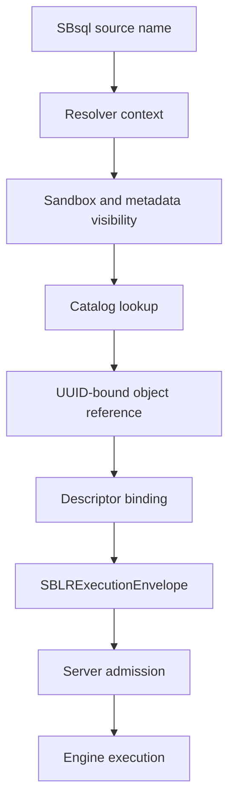

The resolver context includes current schema, home schema, search path, default
root, sandbox root, identifier profile, language profile, active transaction,
security epoch, and policy state.

## What Has UUID Identity

Durable catalog objects use UUID identity. The visible name of an object is a
label over that identity.

| Object Family | UUID Identity Applies To |
| --- | --- |
| Database and filespaces | Database identity, filespace identity, placement metadata, filespace lifecycle records. |
| Schemas | Root schemas, recursive child schemas, home schemas, workarea roots, system branches, remote roots. |
| Relations | Tables, temporary tables, views, materialized views, external rowsets, relation descriptors. |
| Relation members | Columns, generated columns, constraints, indexes, row descriptors, storage descriptors. |
| Routines | Functions, procedures, packages, package members, triggers, trigger events, compiled routine bodies. |
| Type system | Type descriptors, domains, domain elements, casts, operators, collations, character sets. |
| Security | Users, roles, groups, grants, policies, masks, RLS rules, protected-material descriptors. |
| Operations | Agents, streams, bridge descriptors, replication descriptors, migration descriptors, support-bundle descriptors. |
| Catalog metadata | Comments, aliases, localized names, dependencies, invalidation records, audit records. |

A result may render a name, but the bound object remains the UUID. A diagnostic
may show both when disclosure policy admits it.

## Names, Paths, And Labels

ScratchBird supports several name forms. All are resolver inputs:

| Name Form | Meaning |
| --- | --- |
| Primary name | The ordinary display and lookup name for an object in a schema scope. |
| Qualified name | A path of names resolved through parent schema UUIDs. |
| Alias or synonym | Additional resolver label that points to a durable object UUID where policy admits it. |
| Localized name | Language/profile-specific display name or lookup label. |
| Quoted identifier | Exact spelling that participates in the active identifier profile. |
| Unquoted identifier | Context-sensitive word folded according to the active identifier profile. |
| UUID reference | Direct identity reference that bypasses name search but still requires visibility, class, and authorization checks. |

Qualified names are path labels, not identity. In `app.orders`, `app` resolves
to a schema UUID, then `orders` resolves inside that parent UUID.

See [Schema Tree And Name Resolution](../syntax_reference/schema_tree_and_name_resolution.md).

## UUID References

UUID references are useful for automation, migration, support diagnostics, and
scripts that must avoid ambiguity. A UUID reference is still subject to object
class, transaction visibility, sandbox, authorization, policy, and recovery
checks.

```sql
describe table uuid '019d0000-0000-7000-8000-000000000001';
```

The UUID literal above is illustrative. Real UUID values are assigned and
validated by the engine.

UUID references do not use the search path. They do not bypass security. A user
who knows an object UUID still cannot access the object unless the effective
security context is authorized and disclosure policy admits the operation.

## Resolver Evidence

Binding a name produces evidence that can be validated by admission and engine
execution.

| Evidence | Purpose |
| --- | --- |
| Object UUID | Durable identity of the resolved object. |
| Object class | Confirms that the resolved object is the expected class, such as table, view, domain, function, or role. |
| Parent schema UUID | Establishes namespace, sandbox, dependency, and lifecycle context. |
| Descriptor UUID | Identifies type, row, parameter, result, stream, policy, or storage descriptors where needed. |
| Catalog generation | Detects stale bindings after DDL or catalog lifecycle changes. |
| Security epoch | Detects stale grants, revokes, roles, groups, policies, masks, and RLS state. |
| Name-resolution epoch | Detects stale aliases, renames, localized labels, search path, and schema resolver state. |
| Resource epoch | Detects stale filespace, stream, bridge, placement, or operational resource state. |
| Source span | Lets diagnostics point back to the user's text without treating that text as authority. |

Prepared statements, compiled routines, cached plans, metadata projections, and
support diagnostics use this evidence to decide whether reuse is safe or
revalidation is required.

## Lifecycle Effects

Object lifecycle statements affect identity differently depending on what they
do.

| Operation | Identity Effect |
| --- | --- |
| `CREATE` | Allocates a new object UUID and records parent, owner, descriptor, dependency, and lifecycle metadata. |
| `ALTER` | Mutates admitted metadata or descriptors for the existing object UUID unless the specific action creates a child or replacement object. |
| `RENAME` | Changes resolver labels. Durable UUID identity remains stable. |
| `COMMENT ON` | Changes descriptive metadata. Durable UUID identity remains stable. |
| `DESCRIBE` | Reads authorized metadata for the bound UUID. No identity change. |
| `SHOW` | Reads authorized projections. No identity change. |
| `VALIDATE` | Checks descriptors, dependencies, policy, or storage readiness. No identity change unless a documented repair route is admitted. |
| `RECREATE` | Drops and creates through an explicit lifecycle route. The replacement object receives a new UUID unless the reference page for that object states a narrower admitted behavior. |
| `DROP` | Retires the object identity subject to dependencies, transaction finality, recovery safety, and retention policy. |
| `RESTORE` or `IMPORT` | Maps incoming logical identity to admitted ScratchBird UUID identity according to the operation's mapping policy. |

DDL becomes visible according to MGA transaction finality. A created object is
not visible to other transactions until commit rules make it visible. A dropped
or renamed object can remain visible to existing valid snapshots according to
the same transaction rules.

## Identity And Dependencies

Dependencies are recorded against UUID identity and descriptor identity. This
prevents rename from breaking dependent objects and lets the engine invalidate
or refuse stale work precisely.

Common dependency edges include:

| Dependent | Referenced Identity |
| --- | --- |
| View | Tables, columns, functions, domains, collations, policies. |
| Materialized view | Source rowsets, refresh policy, storage descriptors, indexes. |
| Procedure or function | Referenced tables, routines, domains, types, packages, variables, result descriptors. |
| Trigger | Target relation, timing/event descriptor, transition descriptors, called routines. |
| Constraint | Table, column, domain, index, referenced relation, expression descriptors. |
| Index | Target relation, key expressions, collation, null behavior, storage descriptor. |
| Policy, mask, or RLS | Target object, security context inputs, expression descriptors, protected-material descriptors. |
| Prepared statement | Object UUIDs, descriptors, security epoch, name-resolution epoch, result shape. |

When an object changes, dependent state must be invalidated, revalidated,
rebuilt, or refused. It must not continue using stale name text.

## Identity And Security

Security applies to the resolved UUID. The resolver must also enforce sandbox
and metadata visibility before returning the UUID to the operation.

Security rules:

- a hidden object may render as not found when policy requires metadata hiding;
- a UUID reference does not bypass grants, roles, policy, masks, RLS, or
  protected-material rules;
- catalog projections may reveal selected metadata without granting direct
  traversal or object access;
- result envelopes and diagnostics may redact object UUIDs, names, parent paths,
  policy names, and dependency details;
- grants and revokes advance the security epoch and invalidate dependent
  bindings.

See [Security And Sandboxing](security_and_sandboxing.md).

## Identity And Transactions

Catalog identity participates in MGA. Creating, renaming, altering, dropping, or
retiring an object is a transaction-governed catalog operation.

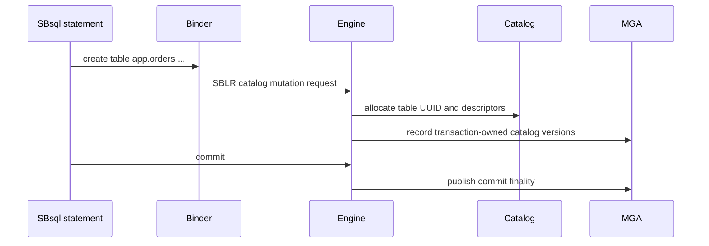

The UUID may be allocated before commit, but its user-visible finality depends
on transaction outcome. If the transaction rolls back, the object is not visible
as a committed catalog object.

See [Transactions And Recovery](transactions_and_recovery.md).

## Identity In SBLR

SBLR envelopes carry UUID references and descriptors. They do not ask the engine
to execute names.

For a query such as:

```sql
select order_id, total
from app.orders
where total > cast(:minimum_total as decimal(18,2));
```

binding produces:

| Source Text | Bound Identity |
| --- | --- |
| `app` | Schema UUID. |
| `orders` | Table UUID under the schema UUID. |
| `order_id` | Column UUID and type descriptor. |
| `total` | Column UUID and numeric descriptor. |
| `:minimum_total` | Parameter descriptor slot. |
| `decimal(18,2)` | Numeric descriptor. |

The resulting SBLR request carries operation identity, UUID references,
descriptor entries, parameter slots, predicate operations, result shape, and
diagnostic shape. SQL text may be retained as non-authoritative source evidence.

See [Parser To SBLR Pipeline](parser_to_sblr_pipeline.md).

## Identity Rendering

SBsql can render identity in different ways depending on command and disclosure
policy.

| Surface | Typical Rendering |
| --- | --- |
| `SHOW` | Lists authorized objects with names and selected metadata. UUIDs may be hidden or shown according to policy. |
| `DESCRIBE` | Shows one object's authorized descriptor, parent, dependencies, lifecycle state, and comments. |
| Catalog views | Return policy-filtered metadata rows. |
| Support diagnostics | Return redacted identity evidence suitable for troubleshooting. |
| Error messages | Show names, UUIDs, both, or neither according to disclosure policy. |

Rendering is not authority. It is an authorized projection over catalog state.

## Examples

Create an object with a user-facing name:

```sql
create schema app;

create table app.orders (
    order_id uuid primary key,
    total decimal(18,2) not null
);
```

The engine assigns UUID identity to the schema, table, columns, constraints, and
descriptors.

Rename the table without changing its durable identity:

```sql
rename table app.orders to app.sales_order;
```

Describe by name:

```sql
describe table app.sales_order;
```

Describe by UUID when an automation script has recorded the object identity:

```sql
describe table uuid '019d0000-0000-7000-8000-000000000001';
```

Comment on an object without changing identity:

```sql
comment on table app.sales_order is 'Application order table';
```

Drop the object through a transaction-governed lifecycle route:

```sql
drop table app.sales_order restrict;
```

## Syntax Productions

```ebnf
object_ref              ::= uuid_ref
                          | qualified_name ;
```

```ebnf
qualified_name          ::= name_part ("." name_part)* ;
```

```ebnf
uuid_ref                ::= "UUID" string_literal ;
```

```ebnf
name_part               ::= identifier
                          | delimited_identifier ;
```

```ebnf
identity_rendering      ::= show_statement
                          | describe_statement
                          | catalog_query
                          | support_diagnostic ;
```

## Binding And Execution Summary

| Step | Identity Rule |
| --- | --- |
| Parse | Object references are still text or UUID literal tokens. |
| Resolve | Names bind through schema, search path, sandbox, and metadata visibility rules. |
| Validate class | The resolved UUID must match the object class required by the statement. |
| Bind descriptors | Type, row, column, parameter, stream, policy, and result descriptors are attached. |
| Lower | SBLR carries UUID references and descriptors, not executable names. |
| Admit | Server admission rejects missing, ambiguous, stale, or class-invalid identity evidence. |
| Authorize | Security and policy check the resolved UUID and operation descriptor. |
| Execute | Engine operates on catalog UUIDs under MGA and recovery authority. |
| Render | Results display names, UUIDs, metadata, or redactions according to policy. |

## Failure Modes

| Condition | Required Behavior |
| --- | --- |
| Name not found | Return a bind diagnostic or hidden-object diagnostic according to disclosure policy. |
| Name resolves to multiple visible UUIDs | Return ambiguity; do not choose arbitrarily. |
| UUID has wrong object class | Refuse with a class mismatch diagnostic. |
| UUID exists but is hidden | Return denied, not visible, or not found according to policy. |
| UUID belongs outside sandbox | Return sandbox denial or redacted not-visible diagnostic. |
| Catalog generation changed | Rebind, invalidate cached state, or refuse stale execution. |
| Security epoch changed | Reauthorize and rebind policy-sensitive state. |
| Object dropped in another transaction | Apply MGA visibility and recovery rules. |
| Dependency invalidated | Revalidate, rebuild, or refuse dependent object execution. |
| Recovery state uncertain | Fail closed before using uncertain catalog identity. |

## Practical Rules For SBsql Authors

- Use ordinary names for readable scripts.
- Use UUID references for support, automation, and migration tasks that require
  unambiguous identity.
- Do not assume a rename changes the object a dependency points to.
- Do not assume a UUID bypasses security or sandboxing.
- Reprepare or rebind statements after DDL, grant/revoke, policy, search-path,
  schema, type, or routine changes.
- Use `describe`, `show`, and catalog views to inspect identity and descriptors
  rather than relying on source text.
- Treat object UUIDs in examples as illustrative unless they were returned by
  the engine.

## Verification Checklist

An identity proof should demonstrate:

- every durable catalog object receives UUID identity;
- names, aliases, localized names, and paths resolve to UUID identity;
- qualified names resolve under parent schema UUIDs;
- unqualified names follow current schema and search-path rules;
- UUID references bypass search path but not security;
- rename preserves object UUID;
- comment preserves object UUID;
- recreate creates a replacement UUID where documented;
- drop retires identity under transaction and dependency rules;
- created and dropped catalog objects obey MGA visibility;
- hidden objects do not leak through diagnostics where policy forbids it;
- stale catalog, security, resolver, and resource epochs invalidate cached
  bindings;
- SBLR envelopes contain UUID references and descriptors;
- result rendering follows disclosure policy.

## Related Reference Pages

- [Intro And MGA](intro_and_mga.md)
- [Parser To SBLR Pipeline](parser_to_sblr_pipeline.md)
- [Transactions And Recovery](transactions_and_recovery.md)
- [Security And Sandboxing](security_and_sandboxing.md)
- [Schema Tree And Name Resolution](../syntax_reference/schema_tree_and_name_resolution.md)
- [Script Tokens And Identifiers](../syntax_reference/script_tokens_and_identifiers.md)
- [Table Lifecycle](../syntax_reference/table.md)
- [View Lifecycle](../syntax_reference/view.md)
- [Function Lifecycle](../syntax_reference/function.md)
- [Procedure Lifecycle](../syntax_reference/procedure.md)
- [Trigger Lifecycle](../syntax_reference/trigger.md)
- [Type System Overview](../data_types/type_system_overview.md)
- [Refusal Vectors](../syntax_reference/refusal_vectors.md)


### /home/dcalford/CliWork/ScratchBird/docs/documentation/draft/Language_Reference/core_paradigms/transactions_and_recovery.md

# Transactions And Recovery

This page is part of the SBsql Language Reference Manual. It explains the ScratchBird transaction and recovery model at a conceptual level. Statement syntax is documented in [../syntax_reference/transaction_control.md](../syntax_reference/transaction_control.md).

Generation task: `core_paradigms_transactions_and_recovery`

## Purpose

ScratchBird transaction authority is MGA-native. The engine owns transaction identity, snapshots, row-version visibility, commit finality, rollback behavior, cleanup horizons, and recovery classification. SBsql can request transaction actions and inspect admitted state, but SQL text and client-side state are not finality authority.

## Core Invariants

| Invariant | Meaning |
| --- | --- |
| Engine-owned identity | Every active transaction has an engine-allocated transaction UUID and local transaction number. |
| Snapshot before work | A transaction snapshot is constructed before user-visible work begins. |
| Versions, not overwrite | Writes create or retire row versions. They do not make older committed versions disappear for existing snapshots. |
| Inventory finality | Commit and rollback state are published through durable MGA transaction inventory. |
| Security recheck | Visibility is the intersection of MGA visibility and security/materialized policy. |
| Indexes are evidence | Index entries accelerate candidates. Final row authority requires MGA, predicate, descriptor, and security recheck. |
| Recovery before work | Recovery-required state fences ordinary work until classification is complete. |

## Transaction Lifecycle

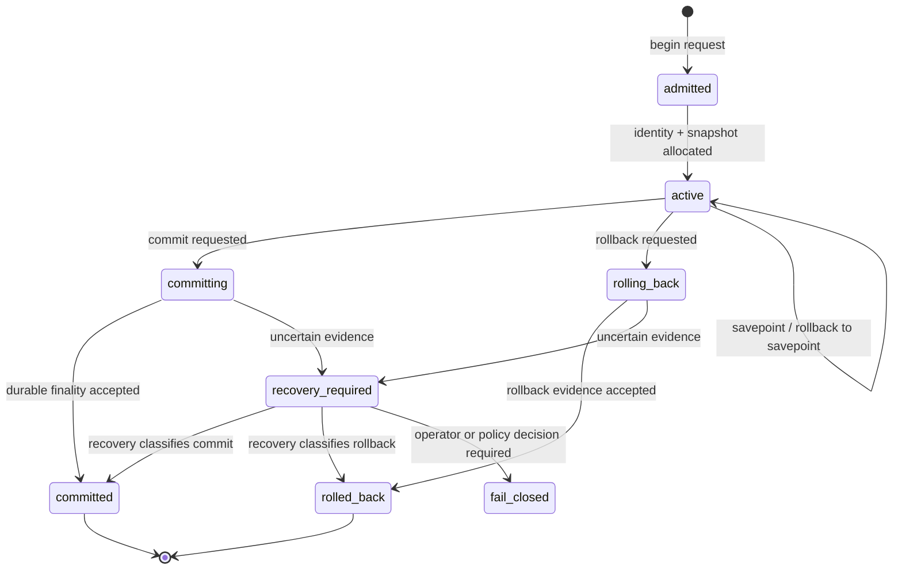

## Snapshot Contents

A transaction snapshot includes:

- visible-through transaction boundary;
- active transaction exclusions;
- cleanup and retention horizons;
- catalog epoch;
- security epoch;
- policy epoch;
- isolation profile;
- attached database/workarea root;
- effective principal and role context;
- resource and filespace readiness state.

The exact encoded snapshot is engine-owned. The user-facing rule is that visibility must be reproducible for the isolation profile and must fail closed when the required snapshot evidence is missing.

## Commit And Rollback

Commit publishes new visible state only when the durable transaction inventory and required sync/fence policy accept the commit. Rollback makes the transaction's versions non-visible and releases, compensates, or retires transaction-owned resources.

Commit and rollback are not parser decisions. A parser, driver, bridge, or client can request finality, but the engine decides and records it.

## Autocommit

Autocommit is an execution profile:

1. open a transaction;
2. execute one admitted statement or statement group;
3. commit on success;
4. rollback on failure;
5. report finality evidence or a diagnostic.

Autocommit does not weaken transaction guarantees and does not create a second authority path.

## Savepoints

Savepoints are rollback markers inside one transaction. They let a script undo part of a transaction while keeping the transaction active. They do not have independent commit authority, independent snapshots, or independent recovery finality.

## Isolation

ScratchBird public isolation profiles are documented in [Transaction Control](../syntax_reference/transaction_control.md). At a high level:

- `READ COMMITTED` can see newer committed data at statement boundaries.
- `SNAPSHOT` uses a stable transaction snapshot.
- `SNAPSHOT TABLE STABILITY` adds admitted table-stability behavior.
- `SERIALIZABLE` requires conflict detection or prevention for the admitted operation set.

All profiles still require MGA row-version visibility, page/filespace validity, and security policy recheck.

## Recovery Classification

On startup or reopen after interruption, the engine classifies transaction inventory before ordinary work resumes.

| Evidence State | Required Outcome |
| --- | --- |
| Committed evidence complete | Transaction remains committed. |
| Rolled-back evidence complete | Transaction remains rolled back. |
| Active without finality | Transaction is rolled back or classified according to recovery policy. |
| Commit in progress | Recovery completes commit only if durable evidence proves it. |
| Rollback in progress | Recovery completes rollback or fences if uncertain. |
| Prepared or limbo | Recovery waits for a valid local decision, policy decision, or operator action. |
| Inconsistent evidence | Fail closed with recovery-required state. |

Silent inconsistency is not an allowed outcome.

## Bridge And Remote Transactions

Bridge operations may create a local transaction and one or more remote transactions. Each participating database keeps its own transaction authority. A local commit cannot assert remote finality, and a remote commit cannot assert local finality. Cross-node or distributed finality requires explicit policy-owned routes and must preserve local MGA rules.

## Diagnostics And Inspection

Authorized inspection surfaces can expose:

- transaction UUID;
- local transaction number;
- state;
- isolation profile;
- snapshot boundary;
- active savepoints;
- lock/resource wait state;
- recovery-required state;
- commit/rollback evidence status.

Inspection is policy controlled and may redact details.

## Failure Principle

When transaction outcome is uncertain, ScratchBird must return an explicit diagnostic, fence unsafe work, and require recovery or operator/policy decision. It must not infer finality from SQL text, client retry behavior, timestamps, UUID order, parser state, or ordinary log messages.


### /home/dcalford/CliWork/ScratchBird/docs/documentation/draft/Language_Reference/.generation_state.json

{
  "current_phase": "completed",
  "last_updated": "2026-06-08T23:36:10Z",
  "progress_summary": {
    "completed_tasks": 198,
    "percent_complete": 100.0,
    "total_tasks": 198
  },
  "source_blueprint_id": "sbsql_complete_ebnf_function_operator_catalog_reference",
  "tasks": [
    {
      "completed_at": "2026-06-08T22:55:24Z",
      "id": "core_paradigms_intro_and_mga",
      "status": "completed",
      "target_file": "core_paradigms/intro_and_mga.md"
    },
    {
      "completed_at": "2026-06-08T22:17:07Z",
      "id": "core_paradigms_parser_to_sblr",
      "status": "completed",
      "target_file": "core_paradigms/parser_to_sblr_pipeline.md"
    },
    {
      "completed_at": "2026-06-08T23:07:50Z",
      "id": "core_paradigms_uuid_catalog_identity",
      "status": "completed",
      "target_file": "core_paradigms/uuid_catalog_identity.md"
    },
    {
      "completed_at": "2026-06-08T18:39:06Z",
      "id": "core_paradigms_transactions_and_recovery",
      "status": "completed",
      "target_file": "core_paradigms/transactions_and_recovery.md"
    },
    {
      "completed_at": "2026-06-08T23:05:19Z",
      "id": "core_paradigms_security_and_sandboxing",
      "status": "completed",
      "target_file": "core_paradigms/security_and_sandboxing.md"
    },
    {
      "completed_at": "2026-06-08T23:11:04Z",
      "id": "core_paradigms_bridge_and_cluster_boundaries",
      "status": "completed",
      "target_file": "core_paradigms/bridge_and_cluster_boundaries.md"
    },
    {
      "completed_at": "2026-06-08T23:22:31Z",
      "id": "data_types_type_system_overview",
      "status": "completed",
      "target_file": "data_types/type_system_overview.md"
    },
    {
      "completed_at": "2026-06-08T23:15:58Z",
      "id": "data_types_numeric",
      "status": "completed",
      "target_file": "data_types/numeric_types.md"
    },
    {
      "completed_at": "2026-06-08T23:22:15Z",
      "id": "data_types_text_collation",
      "status": "completed",
      "target_file": "data_types/text_collation_and_charset.md"
    },
    {
      "completed_at": "2026-06-08T23:22:50Z",
      "id": "data_types_temporal",
      "status": "completed",
      "target_file": "data_types/temporal_types.md"
    },
    {
      "completed_at": "2026-06-08T23:18:53Z",
      "id": "data_types_binary_uuid_protected",
      "status": "completed",
      "target_file": "data_types/binary_uuid_and_protected_values.md"
    },
    {
      "completed_at": "2026-06-08T23:20:02Z",
      "id": "data_types_document_graph_vector",
      "status": "completed",
      "target_file": "data_types/document_graph_vector_and_multimodel_types.md"
    },
    {
      "completed_at": "2026-06-08T18:22:35Z",
      "id": "data_types_domains_and_casts",
      "status": "completed",
      "target_file": "data_types/domains_casts_and_coercion.md"
    },
    {
      "completed_at": "2026-06-08T23:21:14Z",
      "id": "data_types_conversion_matrix",
      "status": "completed",
      "target_file": "data_types/conversion_matrix.md"
    },
    {
      "completed_at": "2026-06-08T22:08:28Z",
      "id": "syntax_reference_script_and_tokens",
      "status": "completed",
      "target_file": "syntax_reference/script_tokens_and_identifiers.md"
    },
    {
      "completed_at": "2026-06-08T18:09:04Z",
      "id": "syntax_reference_select",
      "status": "completed",
      "target_file": "syntax_reference/select.md"
    },
    {
      "completed_at": "2026-06-08T21:29:28Z",
      "id": "syntax_reference_with",
      "status": "completed",
      "target_file": "syntax_reference/with.md"
    },
    {
      "completed_at": "2026-06-08T21:03:25Z",
      "id": "syntax_reference_projection",
      "status": "completed",
      "target_file": "syntax_reference/projection.md"
    },
    {
      "completed_at": "2026-06-08T20:11:07Z",
      "id": "syntax_reference_from",
      "status": "completed",
      "target_file": "syntax_reference/from.md"
    },
    {
      "completed_at": "2026-06-08T21:29:28Z",
      "id": "syntax_reference_where",
      "status": "completed",
      "target_file": "syntax_reference/where.md"
    },
    {
      "completed_at": "2026-06-08T20:11:07Z",
      "id": "syntax_reference_group_by_having",
      "status": "completed",
      "target_file": "syntax_reference/group_by_and_having.md"
    },
    {
      "completed_at": "2026-06-08T21:29:28Z",
      "id": "syntax_reference_window",
      "status": "completed",
      "target_file": "syntax_reference/window.md"
    },
    {
      "completed_at": "2026-06-08T20:51:35Z",
      "id": "syntax_reference_order_limit",
      "status": "completed",
      "target_file": "syntax_reference/order_by_limit_offset.md"
    },
    {
      "completed_at": "2026-06-08T20:03:28Z",
      "id": "syntax_reference_insert",
      "status": "completed",
      "target_file": "syntax_reference/insert.md"
    },
    {
      "completed_at": "2026-06-08T20:06:39Z",
      "id": "syntax_reference_copy",
      "status": "completed",
      "target_file": "syntax_reference/copy.md"
    },
    {
      "completed_at": "2026-06-08T19:39:24Z",
      "id": "syntax_reference_update",
      "status": "completed",
      "target_file": "syntax_reference/update.md"
    },
    {
      "completed_at": "2026-06-08T19:39:24Z",
      "id": "syntax_reference_delete",
      "status": "completed",
      "target_file": "syntax_reference/delete.md"
    },
    {
      "completed_at": "2026-06-08T19:39:24Z",
      "id": "syntax_reference_merge_upsert",
      "status": "completed",
      "target_file": "syntax_reference/merge_and_upsert.md"
    },
    {
      "completed_at": "2026-06-08T18:39:06Z",
      "id": "syntax_reference_transaction_control",
      "status": "completed",
      "target_file": "syntax_reference/transaction_control.md"
    },
    {
      "completed_at": "2026-06-08T18:28:28Z",
      "id": "syntax_reference_security_privilege",
      "status": "completed",
      "target_file": "syntax_reference/security_and_privilege_statements.md"
    },
    {
      "completed_at": "2026-06-08T20:38:45Z",
      "id": "syntax_reference_agent_management",
      "status": "completed",
      "target_file": "syntax_reference/agent.md"
    },
    {
      "completed_at": "2026-06-08T20:30:29Z",
      "id": "syntax_reference_management_operations",
      "status": "completed",
      "target_file": "syntax_reference/management_and_operations.md"
    },
    {
      "completed_at": "2026-06-08T19:51:10Z",
      "id": "syntax_reference_backup_restore_replication_migration",
      "status": "completed",
      "target_file": "syntax_reference/backup_restore_replication_migration.md"
    },
    {
      "completed_at": "2026-06-08T20:24:50Z",
      "id": "syntax_reference_multimodel",
      "status": "completed",
      "target_file": "syntax_reference/multimodel_statements.md"
    },
    {
      "completed_at": "2026-06-08T19:57:49Z",
      "id": "syntax_reference_cluster_gated",
      "status": "completed",
      "target_file": "syntax_reference/cluster_gated_statements.md"
    },
    {
      "completed_at": "2026-06-08T21:07:57Z",
      "id": "syntax_reference_refusal_vectors",
      "status": "completed",
      "target_file": "syntax_reference/refusal_vectors.md"
    },
    {
      "completed_at": "2026-06-08T18:09:04Z",
      "id": "syntax_reference_table_lifecycle",
      "status": "completed",
      "target_file": "syntax_reference/table.md"
    },
    {
      "completed_at": "2026-06-08T12:05:44Z",
      "id": "syntax_reference_index_lifecycle",
      "status": "completed",
      "target_file": "syntax_reference/index.md"
    },
    {
      "completed_at": "2026-06-08T21:11:27Z",
      "id": "syntax_reference_schema_lifecycle",
      "status": "completed",
      "target_file": "syntax_reference/schema.md"
    },
    {
      "completed_at": "2026-06-08T19:02:22Z",
      "id": "syntax_reference_database_lifecycle",
      "status": "completed",
      "target_file": "syntax_reference/database.md"
    },
    {
      "completed_at": "2026-06-08T19:02:22Z",
      "id": "syntax_reference_filespace_lifecycle",
      "status": "completed",
      "target_file": "syntax_reference/filespace.md"
    },
    {
      "completed_at": "2026-06-08T18:22:35Z",
      "id": "syntax_reference_domain_lifecycle",
      "status": "completed",
      "target_file": "syntax_reference/domain.md"
    },
    {
      "completed_at": "2026-06-08T21:25:51Z",
      "id": "syntax_reference_type_descriptor_lifecycle",
      "status": "completed",
      "target_file": "syntax_reference/type_descriptor.md"
    },
    {
      "completed_at": "2026-06-08T21:21:38Z",
      "id": "syntax_reference_sequence_lifecycle",
      "status": "completed",
      "target_file": "syntax_reference/sequence.md"
    },
    {
      "completed_at": "2026-06-08T18:09:04Z",
      "id": "syntax_reference_view_lifecycle",
      "status": "completed",
      "target_file": "syntax_reference/view.md"
    },
    {
      "completed_at": "2026-06-08T21:39:39Z",
      "id": "syntax_reference_function_lifecycle",
      "status": "completed",
      "target_file": "syntax_reference/function.md"
    },
    {
      "completed_at": "2026-06-08T21:39:39Z",
      "id": "syntax_reference_procedure_lifecycle",
      "status": "completed",
      "target_file": "syntax_reference/procedure.md"
    },
    {
      "completed_at": "2026-06-08T21:39:39Z",
      "id": "syntax_reference_trigger_lifecycle",
      "status": "completed",
      "target_file": "syntax_reference/trigger.md"
    },
    {
      "completed_at": "2026-06-08T20:57:51Z",
      "id": "syntax_reference_policy_mask_rls_lifecycle",
      "status": "completed",
      "target_file": "syntax_reference/policy_mask_and_rls.md"
    },
    {
      "completed_at": "2026-06-08T18:15:28Z",
      "functions_processed": 605,
      "functions_total": 605,
      "id": "sb_core",
      "status": "completed",
      "target_file": "functional_reference/sb_core.md"
    },
    {
      "completed_at": "2026-06-08T12:05:16Z",
      "functions_processed": 27,
      "functions_total": 27,
      "id": "sb_crypto",
      "status": "completed",
      "target_file": "functional_reference/sb_crypto.md"
    },
    {
      "completed_at": "2026-06-08T12:05:16Z",
      "functions_processed": 15,
      "functions_total": 15,
      "id": "sb_cursor",
      "status": "completed",
      "target_file": "functional_reference/sb_cursor.md"
    },
    {
      "completed_at": "2026-06-08T12:05:16Z",
      "functions_processed": 1,
      "functions_total": 1,
      "id": "sb_diagnostic",
      "status": "completed",
      "target_file": "functional_reference/sb_diagnostic.md"
    },
    {
      "completed_at": "2026-06-08T12:05:16Z",
      "functions_processed": 44,
      "functions_total": 44,
      "id": "sb_json",
      "status": "completed",
      "target_file": "functional_reference/sb_json.md"
    },
    {
      "completed_at": "2026-06-08T12:05:16Z",
      "functions_processed": 13,
      "functions_total": 13,
      "id": "sb_lob",
      "status": "completed",
      "target_file": "functional_reference/sb_lob.md"
    },
    {
      "completed_at": "2026-06-08T12:05:16Z",
      "functions_processed": 23,
      "functions_total": 23,
      "id": "sb_operator",
      "status": "completed",
      "target_file": "functional_reference/sb_operator.md"
    },
    {
      "completed_at": "2026-06-08T12:05:16Z",
      "functions_processed": 9,
      "functions_total": 9,
      "id": "sb_range",
      "status": "completed",
      "target_file": "functional_reference/sb_range.md"
    },
    {
      "completed_at": "2026-06-08T12:05:16Z",
      "functions_processed": 12,
      "functions_total": 12,
      "id": "sb_regex",
      "status": "completed",
      "target_file": "functional_reference/sb_regex.md"
    },
    {
      "completed_at": "2026-06-08T12:05:16Z",
      "functions_processed": 16,
      "functions_total": 16,
      "id": "sb_rowset",
      "status": "completed",
      "target_file": "functional_reference/sb_rowset.md"
    },
    {
      "completed_at": "2026-06-08T12:05:16Z",
      "functions_processed": 93,
      "functions_total": 93,
      "id": "sb_spatial",
      "status": "completed",
      "target_file": "functional_reference/sb_spatial.md"
    },
    {
      "completed_at": "2026-06-08T12:05:16Z",
      "functions_processed": 39,
      "functions_total": 39,
      "id": "sb_temporal",
      "status": "completed",
      "target_file": "functional_reference/sb_temporal.md"
    },
    {
      "completed_at": "2026-06-08T12:05:16Z",
      "functions_processed": 1,
      "functions_total": 1,
      "id": "sb_timeseries",
      "status": "completed",
      "target_file": "functional_reference/sb_timeseries.md"
    },
    {
      "completed_at": "2026-06-08T12:05:16Z",
      "functions_processed": 10,
      "functions_total": 10,
      "id": "sb_uuid",
      "status": "completed",
      "target_file": "functional_reference/sb_uuid.md"
    },
    {
      "completed_at": "2026-06-08T12:05:16Z",
      "functions_processed": 14,
      "functions_total": 14,
      "id": "sb_vector",
      "status": "completed",
      "target_file": "functional_reference/sb_vector.md"
    },
    {
      "completed_at": "2026-06-08T12:05:16Z",
      "functions_processed": 20,
      "functions_total": 20,
      "id": "sb_xml",
      "status": "completed",
      "target_file": "functional_reference/sb_xml.md"
    },
    {
      "completed_at": "2026-06-08T23:29:19Z",
      "id": "catalog_sys_catalog_type_descriptor",
      "status": "completed",
      "target_file": "catalog_reference/sys_catalog_type_descriptor.md"
    },
    {
      "completed_at": "2026-06-08T23:36:10Z",
      "id": "catalog_sys_catalog_domain_descriptor",
      "status": "completed",
      "target_file": "catalog_reference/sys_catalog_domain_descriptor.md"
    },
    {
      "completed_at": "2026-06-08T18:22:35Z",
      "id": "catalog_sys_catalog_domain_element",
      "status": "completed",
      "target_file": "catalog_reference/sys_catalog_domain_element.md"
    },
    {
      "completed_at": "2026-06-08T23:30:48Z",
      "id": "catalog_sys_catalog_type_alias_mapping",
      "status": "completed",
      "target_file": "catalog_reference/sys_catalog_type_alias_mapping.md"
    },
    {
      "completed_at": "2026-06-08T23:30:03Z",
      "id": "catalog_sys_catalog_type_capability",
      "status": "completed",
      "target_file": "catalog_reference/sys_catalog_type_capability.md"
    },
    {
      "completed_at": "2026-06-08T23:31:56Z",
      "id": "catalog_sys_catalog_operation_descriptor",
      "status": "completed",
      "target_file": "catalog_reference/sys_catalog_operation_descriptor.md"
    },
    {
      "completed_at": "2026-06-08T23:32:45Z",
      "id": "catalog_sys_catalog_protected_material",
      "status": "completed",
      "target_file": "catalog_reference/sys_catalog_protected_material.md"
    },
    {
      "completed_at": "2026-06-08T23:33:27Z",
      "id": "catalog_sys_catalog_protected_material_version",
      "status": "completed",
      "target_file": "catalog_reference/sys_catalog_protected_material_version.md"
    },
    {
      "completed_at": "2026-06-08T23:34:09Z",
      "id": "catalog_sys_catalog_protected_material_policy_binding",
      "status": "completed",
      "target_file": "catalog_reference/sys_catalog_protected_material_policy_binding.md"
    },
    {
      "completed_at": "2026-06-08T23:35:01Z",
      "id": "catalog_sys_security_catalog_protected_material_audit_event",
      "status": "completed",
      "target_file": "catalog_reference/sys_security_catalog_protected_material_audit_event.md"
    },
    {
      "completed_at": "2026-06-08T12:02:32Z",
      "id": "ebnf_script",
      "production": "script",
      "status": "completed",
      "target_file": "syntax_reference/ebnf/script.md"
    },
    {
      "completed_at": "2026-06-08T12:02:32Z",
      "id": "ebnf_statement_list",
      "production": "statement_list",
      "status": "completed",
      "target_file": "syntax_reference/ebnf/statement_list.md"
    },
    {
      "completed_at": "2026-06-08T12:02:32Z",
      "id": "ebnf_statement",
      "production": "statement",
      "status": "completed",
      "target_file": "syntax_reference/ebnf/statement.md"
    },
    {
      "completed_at": "2026-06-08T12:02:32Z",
      "id": "ebnf_native_statement",
      "production": "native_statement",
      "status": "completed",
      "target_file": "syntax_reference/ebnf/native_statement.md"
    },
    {
      "completed_at": "2026-06-08T12:02:32Z",
      "id": "ebnf_statement_terminator",
      "production": "statement_terminator",
      "status": "completed",
      "target_file": "syntax_reference/ebnf/statement_terminator.md"
    },
    {
      "completed_at": "2026-06-08T12:02:32Z",
      "id": "ebnf_object_ref",
      "production": "object_ref",
      "status": "completed",
      "target_file": "syntax_reference/ebnf/object_ref.md"
    },
    {
      "completed_at": "2026-06-08T12:02:32Z",
      "id": "ebnf_schema_ref",
      "production": "schema_ref",
      "status": "completed",
      "target_file": "syntax_reference/ebnf/schema_ref.md"
    },
    {
      "completed_at": "2026-06-08T12:02:32Z",
      "id": "ebnf_principal_ref",
      "production": "principal_ref",
      "status": "completed",
      "target_file": "syntax_reference/ebnf/principal_ref.md"
    },
    {
      "completed_at": "2026-06-08T12:02:32Z",
      "id": "ebnf_policy_ref",
      "production": "policy_ref",
      "status": "completed",
      "target_file": "syntax_reference/ebnf/policy_ref.md"
    },
    {
      "completed_at": "2026-06-08T12:02:32Z",
      "id": "ebnf_package_ref",
      "production": "package_ref",
      "status": "completed",
      "target_file": "syntax_reference/ebnf/package_ref.md"
    },
    {
      "completed_at": "2026-06-08T12:02:32Z",
      "id": "ebnf_qualified_name",
      "production": "qualified_name",
      "status": "completed",
      "target_file": "syntax_reference/ebnf/qualified_name.md"
    },
    {
      "completed_at": "2026-06-08T12:02:32Z",
      "id": "ebnf_name_part",
      "production": "name_part",
      "status": "completed",
      "target_file": "syntax_reference/ebnf/name_part.md"
    },
    {
      "completed_at": "2026-06-08T12:02:32Z",
      "id": "ebnf_uuid_ref",
      "production": "uuid_ref",
      "status": "completed",
      "target_file": "syntax_reference/ebnf/uuid_ref.md"
    },
    {
      "completed_at": "2026-06-08T12:02:32Z",
      "id": "ebnf_option_list",
      "production": "option_list",
      "status": "completed",
      "target_file": "syntax_reference/ebnf/option_list.md"
    },
    {
      "completed_at": "2026-06-08T12:02:32Z",
      "id": "ebnf_option",
      "production": "option",
      "status": "completed",
      "target_file": "syntax_reference/ebnf/option.md"
    },
    {
      "completed_at": "2026-06-08T12:02:32Z",
      "id": "ebnf_profile_clause",
      "production": "profile_clause",
      "status": "completed",
      "target_file": "syntax_reference/ebnf/profile_clause.md"
    },
    {
      "completed_at": "2026-06-08T12:02:32Z",
      "id": "ebnf_policy_clause",
      "production": "policy_clause",
      "status": "completed",
      "target_file": "syntax_reference/ebnf/policy_clause.md"
    },
    {
      "completed_at": "2026-06-08T12:02:32Z",
      "id": "ebnf_where_clause",
      "production": "where_clause",
      "status": "completed",
      "target_file": "syntax_reference/ebnf/where_clause.md"
    },
    {
      "completed_at": "2026-06-08T12:02:32Z",
      "id": "ebnf_returning_clause",
      "production": "returning_clause",
      "status": "completed",
      "target_file": "syntax_reference/ebnf/returning_clause.md"
    },
    {
      "completed_at": "2026-06-08T12:02:32Z",
      "id": "ebnf_query_statement",
      "production": "query_statement",
      "status": "completed",
      "target_file": "syntax_reference/ebnf/query_statement.md"
    },
    {
      "completed_at": "2026-06-08T12:02:32Z",
      "id": "ebnf_with_statement",
      "production": "with_statement",
      "status": "completed",
      "target_file": "syntax_reference/ebnf/with_statement.md"
    },
    {
      "completed_at": "2026-06-08T12:02:32Z",
      "id": "ebnf_cte_list",
      "production": "cte_list",
      "status": "completed",
      "target_file": "syntax_reference/ebnf/cte_list.md"
    },
    {
      "completed_at": "2026-06-08T12:02:32Z",
      "id": "ebnf_cte",
      "production": "cte",
      "status": "completed",
      "target_file": "syntax_reference/ebnf/cte.md"
    },
    {
      "completed_at": "2026-06-08T12:02:32Z",
      "id": "ebnf_select_statement",
      "production": "select_statement",
      "status": "completed",
      "target_file": "syntax_reference/ebnf/select_statement.md"
    },
    {
      "completed_at": "2026-06-08T12:02:32Z",
      "id": "ebnf_select_modifier",
      "production": "select_modifier",
      "status": "completed",
      "target_file": "syntax_reference/ebnf/select_modifier.md"
    },
    {
      "completed_at": "2026-06-08T12:02:32Z",
      "id": "ebnf_projection_list",
      "production": "projection_list",
      "status": "completed",
      "target_file": "syntax_reference/ebnf/projection_list.md"
    },
    {
      "completed_at": "2026-06-08T12:02:32Z",
      "id": "ebnf_projection",
      "production": "projection",
      "status": "completed",
      "target_file": "syntax_reference/ebnf/projection.md"
    },
    {
      "completed_at": "2026-06-08T20:11:07Z",
      "id": "ebnf_from_clause",
      "production": "from_clause",
      "status": "completed",
      "target_file": "syntax_reference/ebnf/from_clause.md"
    },
    {
      "completed_at": "2026-06-08T20:11:07Z",
      "id": "ebnf_group_by_clause",
      "production": "group_by_clause",
      "status": "completed",
      "target_file": "syntax_reference/ebnf/group_by_clause.md"
    },
    {
      "completed_at": "2026-06-08T20:11:07Z",
      "id": "ebnf_having_clause",
      "production": "having_clause",
      "status": "completed",
      "target_file": "syntax_reference/ebnf/having_clause.md"
    },
    {
      "completed_at": "2026-06-08T20:11:07Z",
      "id": "ebnf_function_lifecycle_statement",
      "production": "function_lifecycle_statement",
      "status": "completed",
      "target_file": "syntax_reference/ebnf/function_lifecycle_statement.md"
    },
    {
      "completed_at": "2026-06-08T20:11:07Z",
      "id": "ebnf_create_function",
      "production": "create_function",
      "status": "completed",
      "target_file": "syntax_reference/ebnf/create_function.md"
    },
    {
      "completed_at": "2026-06-08T20:11:07Z",
      "id": "ebnf_alter_function",
      "production": "alter_function",
      "status": "completed",
      "target_file": "syntax_reference/ebnf/alter_function.md"
    },
    {
      "completed_at": "2026-06-08T20:11:07Z",
      "id": "ebnf_recreate_function",
      "production": "recreate_function",
      "status": "completed",
      "target_file": "syntax_reference/ebnf/recreate_function.md"
    },
    {
      "completed_at": "2026-06-08T20:11:07Z",
      "id": "ebnf_drop_function",
      "production": "drop_function",
      "status": "completed",
      "target_file": "syntax_reference/ebnf/drop_function.md"
    },
    {
      "completed_at": "2026-06-08T20:11:07Z",
      "id": "ebnf_function_signature",
      "production": "function_signature",
      "status": "completed",
      "target_file": "syntax_reference/ebnf/function_signature.md"
    },
    {
      "completed_at": "2026-06-08T12:02:32Z",
      "id": "ebnf_window_clause",
      "production": "window_clause",
      "status": "completed",
      "target_file": "syntax_reference/ebnf/window_clause.md"
    },
    {
      "completed_at": "2026-06-08T20:11:07Z",
      "id": "ebnf_describe_statement",
      "production": "describe_statement",
      "status": "completed",
      "target_file": "syntax_reference/ebnf/describe_statement.md"
    },
    {
      "completed_at": "2026-06-08T12:02:32Z",
      "id": "ebnf_order_by_clause",
      "production": "order_by_clause",
      "status": "completed",
      "target_file": "syntax_reference/ebnf/order_by_clause.md"
    },
    {
      "completed_at": "2026-06-08T12:02:32Z",
      "id": "ebnf_limit_clause",
      "production": "limit_clause",
      "status": "completed",
      "target_file": "syntax_reference/ebnf/limit_clause.md"
    },
    {
      "completed_at": "2026-06-08T12:02:32Z",
      "id": "ebnf_set_query",
      "production": "set_query",
      "status": "completed",
      "target_file": "syntax_reference/ebnf/set_query.md"
    },
    {
      "completed_at": "2026-06-08T12:02:32Z",
      "id": "ebnf_set_operator",
      "production": "set_operator",
      "status": "completed",
      "target_file": "syntax_reference/ebnf/set_operator.md"
    },
    {
      "completed_at": "2026-06-08T20:06:39Z",
      "id": "ebnf_dml_statement",
      "production": "dml_statement",
      "status": "completed",
      "target_file": "syntax_reference/ebnf/dml_statement.md"
    },
    {
      "completed_at": "2026-06-08T20:03:28Z",
      "id": "ebnf_insert_statement",
      "production": "insert_statement",
      "status": "completed",
      "target_file": "syntax_reference/ebnf/insert_statement.md"
    },
    {
      "completed_at": "2026-06-08T20:06:39Z",
      "id": "ebnf_copy_statement",
      "production": "copy_statement",
      "status": "completed",
      "target_file": "syntax_reference/ebnf/copy_statement.md"
    },
    {
      "completed_at": "2026-06-08T20:06:39Z",
      "id": "ebnf_copy_source",
      "production": "copy_source",
      "status": "completed",
      "target_file": "syntax_reference/ebnf/copy_source.md"
    },
    {
      "completed_at": "2026-06-08T20:06:39Z",
      "id": "ebnf_copy_format",
      "production": "copy_format",
      "status": "completed",
      "target_file": "syntax_reference/ebnf/copy_format.md"
    },
    {
      "completed_at": "2026-06-08T20:06:39Z",
      "id": "ebnf_copy_options",
      "production": "copy_options",
      "status": "completed",
      "target_file": "syntax_reference/ebnf/copy_options.md"
    },
    {
      "completed_at": "2026-06-08T20:06:39Z",
      "id": "ebnf_copy_endpoint",
      "production": "copy_endpoint",
      "status": "completed",
      "target_file": "syntax_reference/ebnf/copy_endpoint.md"
    },
    {
      "completed_at": "2026-06-08T12:02:32Z",
      "id": "ebnf_values_source",
      "production": "values_source",
      "status": "completed",
      "target_file": "syntax_reference/ebnf/values_source.md"
    },
    {
      "completed_at": "2026-06-08T19:42:11Z",
      "id": "ebnf_update_statement",
      "production": "update_statement",
      "status": "completed",
      "target_file": "syntax_reference/ebnf/update_statement.md"
    },
    {
      "completed_at": "2026-06-08T19:42:11Z",
      "id": "ebnf_delete_statement",
      "production": "delete_statement",
      "status": "completed",
      "target_file": "syntax_reference/ebnf/delete_statement.md"
    },
    {
      "completed_at": "2026-06-08T19:42:11Z",
      "id": "ebnf_merge_statement",
      "production": "merge_statement",
      "status": "completed",
      "target_file": "syntax_reference/ebnf/merge_statement.md"
    },
    {
      "completed_at": "2026-06-08T19:42:11Z",
      "id": "ebnf_upsert_statement",
      "production": "upsert_statement",
      "status": "completed",
      "target_file": "syntax_reference/ebnf/upsert_statement.md"
    },
    {
      "completed_at": "2026-06-08T12:02:32Z",
      "id": "ebnf_ddl_statement",
      "production": "ddl_statement",
      "status": "completed",
      "target_file": "syntax_reference/ebnf/ddl_statement.md"
    },
    {
      "completed_at": "2026-06-08T19:02:22Z",
      "id": "ebnf_create_statement",
      "production": "create_statement",
      "status": "completed",
      "target_file": "syntax_reference/ebnf/create_statement.md"
    },
    {
      "completed_at": "2026-06-08T18:49:46Z",
      "id": "ebnf_create_event_trigger",
      "production": "create_event_trigger",
      "status": "completed",
      "target_file": "syntax_reference/ebnf/create_event_trigger.md"
    },
    {
      "completed_at": "2026-06-08T18:49:46Z",
      "id": "ebnf_event_trigger_event",
      "production": "event_trigger_event",
      "status": "completed",
      "target_file": "syntax_reference/ebnf/event_trigger_event.md"
    },
    {
      "completed_at": "2026-06-08T19:02:22Z",
      "id": "ebnf_alter_statement",
      "production": "alter_statement",
      "status": "completed",
      "target_file": "syntax_reference/ebnf/alter_statement.md"
    },
    {
      "completed_at": "2026-06-08T19:02:22Z",
      "id": "ebnf_database_lifecycle_statement",
      "production": "database_lifecycle_statement",
      "status": "completed",
      "target_file": "syntax_reference/ebnf/database_lifecycle_statement.md"
    },
    {
      "completed_at": "2026-06-08T19:02:22Z",
      "id": "ebnf_filespace_lifecycle_statement",
      "production": "filespace_lifecycle_statement",
      "status": "completed",
      "target_file": "syntax_reference/ebnf/filespace_lifecycle_statement.md"
    },
    {
      "completed_at": "2026-06-08T12:02:32Z",
      "id": "ebnf_drop_statement",
      "production": "drop_statement",
      "status": "completed",
      "target_file": "syntax_reference/ebnf/drop_statement.md"
    },
    {
      "completed_at": "2026-06-08T12:02:32Z",
      "id": "ebnf_comment_statement",
      "production": "comment_statement",
      "status": "completed",
      "target_file": "syntax_reference/ebnf/comment_statement.md"
    },
    {
      "completed_at": "2026-06-08T12:02:32Z",
      "id": "ebnf_rename_statement",
      "production": "rename_statement",
      "status": "completed",
      "target_file": "syntax_reference/ebnf/rename_statement.md"
    },
    {
      "completed_at": "2026-06-08T12:02:32Z",
      "id": "ebnf_recreate_statement",
      "production": "recreate_statement",
      "status": "completed",
      "target_file": "syntax_reference/ebnf/recreate_statement.md"
    },
    {
      "completed_at": "2026-06-08T18:39:06Z",
      "id": "ebnf_transaction_statement",
      "production": "transaction_statement",
      "status": "completed",
      "target_file": "syntax_reference/ebnf/transaction_statement.md"
    },
    {
      "completed_at": "2026-06-08T18:39:06Z",
      "id": "ebnf_begin_transaction",
      "production": "begin_transaction",
      "status": "completed",
      "target_file": "syntax_reference/ebnf/begin_transaction.md"
    },
    {
      "completed_at": "2026-06-08T18:39:06Z",
      "id": "ebnf_commit_transaction",
      "production": "commit_transaction",
      "status": "completed",
      "target_file": "syntax_reference/ebnf/commit_transaction.md"
    },
    {
      "completed_at": "2026-06-08T18:39:06Z",
      "id": "ebnf_rollback_transaction",
      "production": "rollback_transaction",
      "status": "completed",
      "target_file": "syntax_reference/ebnf/rollback_transaction.md"
    },
    {
      "completed_at": "2026-06-08T18:39:06Z",
      "id": "ebnf_savepoint_statement",
      "production": "savepoint_statement",
      "status": "completed",
      "target_file": "syntax_reference/ebnf/savepoint_statement.md"
    },
    {
      "completed_at": "2026-06-08T18:39:06Z",
      "id": "ebnf_set_transaction",
      "production": "set_transaction",
      "status": "completed",
      "target_file": "syntax_reference/ebnf/set_transaction.md"
    },
    {
      "completed_at": "2026-06-08T12:02:32Z",
      "id": "ebnf_security_statement",
      "production": "security_statement",
      "status": "completed",
      "target_file": "syntax_reference/ebnf/security_statement.md"
    },
    {
      "completed_at": "2026-06-08T12:02:32Z",
      "id": "ebnf_create_identity",
      "production": "create_identity",
      "status": "completed",
      "target_file": "syntax_reference/ebnf/create_identity.md"
    },
    {
      "completed_at": "2026-06-08T12:02:32Z",
      "id": "ebnf_alter_identity",
      "production": "alter_identity",
      "status": "completed",
      "target_file": "syntax_reference/ebnf/alter_identity.md"
    },
    {
      "completed_at": "2026-06-08T12:02:32Z",
      "id": "ebnf_drop_identity",
      "production": "drop_identity",
      "status": "completed",
      "target_file": "syntax_reference/ebnf/drop_identity.md"
    },
    {
      "completed_at": "2026-06-08T18:28:28Z",
      "id": "ebnf_grant_statement",
      "production": "grant_statement",
      "status": "completed",
      "target_file": "syntax_reference/ebnf/grant_statement.md"
    },
    {
      "completed_at": "2026-06-08T18:28:28Z",
      "id": "ebnf_revoke_statement",
      "production": "revoke_statement",
      "status": "completed",
      "target_file": "syntax_reference/ebnf/revoke_statement.md"
    },
    {
      "completed_at": "2026-06-08T12:02:32Z",
      "id": "ebnf_policy_statement",
      "production": "policy_statement",
      "status": "completed",
      "target_file": "syntax_reference/ebnf/policy_statement.md"
    },
    {
      "completed_at": "2026-06-08T20:30:29Z",
      "id": "ebnf_observability_statement",
      "production": "observability_statement",
      "status": "completed",
      "target_file": "syntax_reference/ebnf/observability_statement.md"
    },
    {
      "completed_at": "2026-06-08T20:30:29Z",
      "id": "ebnf_show_statement",
      "production": "show_statement",
      "status": "completed",
      "target_file": "syntax_reference/ebnf/show_statement.md"
    },
    {
      "completed_at": "2026-06-08T20:30:29Z",
      "id": "ebnf_explain_statement",
      "production": "explain_statement",
      "status": "completed",
      "target_file": "syntax_reference/ebnf/explain_statement.md"
    },
    {
      "completed_at": "2026-06-08T20:30:29Z",
      "id": "ebnf_management_statement",
      "production": "management_statement",
      "status": "completed",
      "target_file": "syntax_reference/ebnf/management_statement.md"
    },
    {
      "completed_at": "2026-06-08T20:38:45Z",
      "id": "ebnf_agent_statement",
      "production": "agent_statement",
      "status": "completed",
      "target_file": "syntax_reference/ebnf/agent_statement.md"
    },
    {
      "completed_at": "2026-06-08T20:30:29Z",
      "id": "ebnf_show_management",
      "production": "show_management",
      "status": "completed",
      "target_file": "syntax_reference/ebnf/show_management.md"
    },
    {
      "completed_at": "2026-06-08T20:30:29Z",
      "id": "ebnf_alter_management",
      "production": "alter_management",
      "status": "completed",
      "target_file": "syntax_reference/ebnf/alter_management.md"
    },
    {
      "completed_at": "2026-06-08T20:30:29Z",
      "id": "ebnf_config_statement",
      "production": "config_statement",
      "status": "completed",
      "target_file": "syntax_reference/ebnf/config_statement.md"
    },
    {
      "completed_at": "2026-06-08T20:30:29Z",
      "id": "ebnf_support_bundle_statement",
      "production": "support_bundle_statement",
      "status": "completed",
      "target_file": "syntax_reference/ebnf/support_bundle_statement.md"
    },
    {
      "completed_at": "2026-06-08T12:02:32Z",
      "id": "ebnf_acceleration_statement",
      "production": "acceleration_statement",
      "status": "completed",
      "target_file": "syntax_reference/ebnf/acceleration_statement.md"
    },
    {
      "completed_at": "2026-06-08T12:02:32Z",
      "id": "ebnf_show_acceleration",
      "production": "show_acceleration",
      "status": "completed",
      "target_file": "syntax_reference/ebnf/show_acceleration.md"
    },
    {
      "completed_at": "2026-06-08T12:02:32Z",
      "id": "ebnf_alter_acceleration",
      "production": "alter_acceleration",
      "status": "completed",
      "target_file": "syntax_reference/ebnf/alter_acceleration.md"
    },
    {
      "completed_at": "2026-06-08T19:51:10Z",
      "id": "ebnf_archive_replication_migration_statement",
      "production": "archive_replication_migration_statement",
      "status": "completed",
      "target_file": "syntax_reference/ebnf/archive_replication_migration_statement.md"
    },
    {
      "completed_at": "2026-06-08T19:51:10Z",
      "id": "ebnf_backup_statement",
      "production": "backup_statement",
      "status": "completed",
      "target_file": "syntax_reference/ebnf/backup_statement.md"
    },
    {
      "completed_at": "2026-06-08T19:51:10Z",
      "id": "ebnf_restore_statement",
      "production": "restore_statement",
      "status": "completed",
      "target_file": "syntax_reference/ebnf/restore_statement.md"
    },
    {
      "completed_at": "2026-06-08T19:51:10Z",
      "id": "ebnf_replication_statement",
      "production": "replication_statement",
      "status": "completed",
      "target_file": "syntax_reference/ebnf/replication_statement.md"
    },
    {
      "completed_at": "2026-06-08T19:51:10Z",
      "id": "ebnf_migration_statement",
      "production": "migration_statement",
      "status": "completed",
      "target_file": "syntax_reference/ebnf/migration_statement.md"
    },
    {
      "completed_at": "2026-06-08T19:51:10Z",
      "id": "ebnf_archive_statement",
      "production": "archive_statement",
      "status": "completed",
      "target_file": "syntax_reference/ebnf/archive_statement.md"
    },
    {
      "completed_at": "2026-06-08T20:24:50Z",
      "id": "ebnf_nosql_statement",
      "production": "nosql_statement",
      "status": "completed",
      "target_file": "syntax_reference/ebnf/nosql_statement.md"
    },
    {
      "completed_at": "2026-06-08T20:24:50Z",
      "id": "ebnf_document_statement",
      "production": "document_statement",
      "status": "completed",
      "target_file": "syntax_reference/ebnf/document_statement.md"
    },
    {
      "completed_at": "2026-06-08T20:24:50Z",
      "id": "ebnf_graph_statement",
      "production": "graph_statement",
      "status": "completed",
      "target_file": "syntax_reference/ebnf/graph_statement.md"
    },
    {
      "completed_at": "2026-06-08T20:24:50Z",
      "id": "ebnf_vector_statement",
      "production": "vector_statement",
      "status": "completed",
      "target_file": "syntax_reference/ebnf/vector_statement.md"
    },
    {
      "completed_at": "2026-06-08T20:24:50Z",
      "id": "ebnf_search_statement",
      "production": "search_statement",
      "status": "completed",
      "target_file": "syntax_reference/ebnf/search_statement.md"
    },
    {
      "completed_at": "2026-06-08T20:24:50Z",
      "id": "ebnf_timeseries_statement",
      "production": "timeseries_statement",
      "status": "completed",
      "target_file": "syntax_reference/ebnf/timeseries_statement.md"
    },
    {
      "completed_at": "2026-06-08T20:24:50Z",
      "id": "ebnf_kv_statement",
      "production": "kv_statement",
      "status": "completed",
      "target_file": "syntax_reference/ebnf/kv_statement.md"
    },
    {
      "completed_at": "2026-06-08T19:57:49Z",
      "id": "ebnf_private_cluster_statement",
      "production": "private_cluster_statement",
      "status": "completed",
      "target_file": "syntax_reference/ebnf/private_cluster_statement.md"
    },
    {
      "completed_at": "2026-06-08T19:57:49Z",
      "id": "ebnf_show_cluster",
      "production": "show_cluster",
      "status": "completed",
      "target_file": "syntax_reference/ebnf/show_cluster.md"
    },
    {
      "completed_at": "2026-06-08T19:57:49Z",
      "id": "ebnf_alter_cluster",
      "production": "alter_cluster",
      "status": "completed",
      "target_file": "syntax_reference/ebnf/alter_cluster.md"
    },
    {
      "completed_at": "2026-06-08T19:57:49Z",
      "id": "ebnf_create_cluster",
      "production": "create_cluster",
      "status": "completed",
      "target_file": "syntax_reference/ebnf/create_cluster.md"
    },
    {
      "completed_at": "2026-06-08T19:57:49Z",
      "id": "ebnf_drop_cluster",
      "production": "drop_cluster",
      "status": "completed",
      "target_file": "syntax_reference/ebnf/drop_cluster.md"
    },
    {
      "completed_at": "2026-06-08T12:02:32Z",
      "id": "ebnf_refusal_statement",
      "production": "refusal_statement",
      "status": "completed",
      "target_file": "syntax_reference/ebnf/refusal_statement.md"
    },
    {
      "completed_at": "2026-06-08T12:02:32Z",
      "id": "ebnf_unsupported_statement",
      "production": "unsupported_statement",
      "status": "completed",
      "target_file": "syntax_reference/ebnf/unsupported_statement.md"
    },
    {
      "completed_at": "2026-06-08T12:02:32Z",
      "id": "ebnf_denied_statement",
      "production": "denied_statement",
      "status": "completed",
      "target_file": "syntax_reference/ebnf/denied_statement.md"
    },
    {
      "completed_at": "2026-06-08T12:02:32Z",
      "id": "ebnf_unlicensed_statement",
      "production": "unlicensed_statement",
      "status": "completed",
      "target_file": "syntax_reference/ebnf/unlicensed_statement.md"
    },
    {
      "completed_at": "2026-06-08T12:02:32Z",
      "id": "ebnf_expression",
      "production": "expression",
      "status": "completed",
      "target_file": "syntax_reference/ebnf/expression.md"
    },
    {
      "completed_at": "2026-06-08T12:02:32Z",
      "id": "ebnf_expression_atom",
      "production": "expression_atom",
      "status": "completed",
      "target_file": "syntax_reference/ebnf/expression_atom.md"
    },
    {
      "completed_at": "2026-06-08T12:02:32Z",
      "id": "ebnf_predicate",
      "production": "predicate",
      "status": "completed",
      "target_file": "syntax_reference/ebnf/predicate.md"
    },
    {
      "completed_at": "2026-06-08T12:02:32Z",
      "id": "ebnf_literal",
      "production": "literal",
      "status": "completed",
      "target_file": "syntax_reference/ebnf/literal.md"
    },
    {
      "completed_at": "2026-06-08T21:39:39Z",
      "id": "syntax_reference_procedural_sql",
      "status": "completed",
      "target_file": "syntax_reference/procedural_sql.md"
    },
    {
      "completed_at": "2026-06-08T18:15:28Z",
      "id": "syntax_reference_procedural_sql_blocks",
      "status": "completed",
      "target_file": "syntax_reference/procedural_sql_blocks.md"
    },
    {
      "completed_at": "2026-06-08T13:15:32Z",
      "id": "syntax_reference_procedural_sql_control_flow",
      "status": "completed",
      "target_file": "syntax_reference/procedural_sql_control_flow.md"
    },
    {
      "completed_at": "2026-06-08T21:39:39Z",
      "id": "syntax_reference_procedural_sql_cursors",
      "status": "completed",
      "target_file": "syntax_reference/procedural_sql_cursors.md"
    },
    {
      "completed_at": "2026-06-08T13:15:32Z",
      "id": "syntax_reference_procedural_sql_exceptions",
      "status": "completed",
      "target_file": "syntax_reference/procedural_sql_exceptions.md"
    },
    {
      "completed_at": "2026-06-08T18:49:46Z",
      "id": "syntax_reference_procedural_sql_triggers_and_events",
      "status": "completed",
      "target_file": "syntax_reference/procedural_sql_triggers_and_events.md"
    },
    {
      "completed_at": "2026-06-08T18:15:28Z",
      "id": "syntax_reference_schema_tree_and_name_resolution",
      "status": "completed",
      "target_file": "syntax_reference/schema_tree_and_name_resolution.md"
    }
  ]
}


### /home/dcalford/CliWork/ScratchBird/docs/documentation/draft/Language_Reference/syntax_reference/update.md

# UPDATE Statement

This page is part of the SBsql Language Reference Manual. It explains the user-facing language contract while preserving the ScratchBird authority model: SQL text parses to SBLR, durable identity is UUID based, descriptors own type behavior, security is materialized from catalog policy, and MGA owns transaction finality.

Generation task: `syntax_reference_update`

Related pages: [SELECT Statement](select.md), [WITH And Common Table Expressions](with.md), [FROM And Table Expressions](from.md), [WHERE Clause](where.md), [Table Lifecycle](table.md), [View Lifecycle](view.md), [Index Lifecycle](index.md), [Trigger Lifecycle](trigger.md), [Transaction Control](transaction_control.md), [Operators](operators.md), and [Type System Overview](../data_types/type_system_overview.md).

## Purpose

`UPDATE` changes rows by creating replacement row versions in the active transaction. It does not mutate older visible row versions in place as user authority. Older snapshots may continue to see the prior versions until MGA visibility and cleanup rules prove they are no longer reachable.

The statement can update ordinary scalar columns, structured descriptors, document fields exposed through path targets, vector-bearing columns, graph or key-value projections, and other rowset targets when the target descriptor admits the assignment. The engine verifies write authority, row visibility, write conflicts, descriptor compatibility, constraints, indexes, triggers, policies, storage, and recovery state before any change can become durable.

## Syntax

```ebnf
update_statement ::=
    UPDATE update_target
       SET assignment_list
       update_from_clause?
       where_clause?
       returning_clause? ;

update_target ::=
    qualified_name target_alias? ;

assignment_list ::=
    assignment ("," assignment)* ;

assignment ::=
      assignment_target "=" assignment_value
    | "(" assignment_target ("," assignment_target)* ")" "=" row_value_expression ;

assignment_target ::=
      identifier
    | qualified_identifier
    | path_target ;

assignment_value ::=
      expression
    | DEFAULT ;

update_from_clause ::=
    FROM table_expression ;

where_clause ::=
    WHERE predicate ;

returning_clause ::=
    RETURNING projection_list ;
```

`update_from_clause` is an admitted row-source clause for target row qualification and assignment expressions. It does not make the source row final authority for the target write. `path_target` is admitted only when the target descriptor defines structured update behavior.

## Update Target Families

| Target family | Update contract |
| --- | --- |
| Base table | Creates replacement row versions under the table descriptor. |
| Updatable view | Updates through an admitted rewrite or `INSTEAD OF` trigger route. |
| Document projection | Updates document-bearing rows or descriptor-bound document fields. |
| Key-value projection | Updates value, metadata, TTL, or version columns exposed through a rowset descriptor. |
| Graph projection | Updates graph node or edge properties only through a graph descriptor. |
| Vector projection | Updates vector-bearing rows only when dimension, element type, metric profile, and index maintenance bind successfully. |
| Time-series projection | Updates corrective event/sample rows only when policy admits mutation of the time-series descriptor. |

Targets that are read-only, hidden by sandbox policy, recovery-fenced, or missing a deterministic write route must be refused.

## Basic UPDATE

```sql
update app.orders
   set order_state = 'closed',
       closed_at = current_timestamp
 where order_id = :order_id
returning order_id, order_state, closed_at;
```

The binder resolves `app.orders`, each assignment target, every expression, the predicate, and the `RETURNING` projection. The executor identifies rows visible for update, checks conflicts, constructs replacement row versions, and runs the table's enforcement routes.

## Assignment Semantics

| Assignment form | Behavior |
| --- | --- |
| `column = expression` | Evaluates the expression and assigns it to the target column descriptor. |
| `column = DEFAULT` | Recomputes the column default or generation policy where admitted. |
| Multi-column assignment | Assigns a row value to multiple targets after descriptor and count checks. |
| Structured path assignment | Updates a descriptor-bound field or path without granting raw storage access. |
| Generated column assignment | Refused for `GENERATED ALWAYS` targets unless the specific route admits default recomputation. |
| Identity column assignment | Refused or policy-gated according to the identity descriptor. |
| Protected value assignment | Requires protected-material policy and secret-reference rules. |

Assignments are conceptually evaluated against the candidate row and statement context, then applied to a replacement row version. SBsql does not expose an assignment order that lets one assignment target see another assignment target's newly written value unless an admitted expression rule states that behavior.

## UPDATE With Source Rows

`UPDATE ... FROM` lets a target row use values from another rowset.

```sql
update app.invoice i
   set customer_name = c.customer_name,
       updated_at = current_timestamp
  from app.customer c
 where c.customer_id = i.customer_id
   and i.invoice_state = 'open';
```

The join between target and source must be deterministic for the update route. If more than one source row can drive the same target row and no deterministic rule resolves the conflict, the engine should refuse the statement rather than choose an arbitrary value.

## Common Table Expressions

`WITH` can define source rowsets for an update. Recursive CTE support is described in [WITH And Common Table Expressions](with.md).

```sql
with stale_sessions as (
  select session_id
  from app.session
  where expires_at < current_timestamp
)
update app.session s
   set session_state = 'expired'
  from stale_sessions x
 where x.session_id = s.session_id
returning s.session_id;
```

The CTE is a source expression. It does not own target visibility or transaction finality.

## Structured And Multimodel Updates

Structured data can be updated when the target descriptor defines how the update is applied.

Document field update:

```sql
update app.product_profile
   set profile.status = 'archived',
       profile.archived_at = current_timestamp
 where product_id = :product_id
returning product_id, profile.status;
```

Vector replacement:

```sql
update app.product_embedding
   set embedding = vector(:embedding_values),
       model_name = :model_name,
       embedded_at = current_timestamp
 where product_id = :product_id;
```

Time-series correction:

```sql
update app.metric_sample
   set metric_value = :corrected_value,
       corrected_at = current_timestamp
 where series_id = :series_id
   and sample_at = :sample_at;
```

Structured updates must preserve descriptor identity, missing/null rules, index maintenance, and exact recheck requirements. A path target is never a shortcut around table privileges or row policy.

## Constraints, Triggers, And Indexes

`UPDATE` can affect every enforcement surface attached to a table.

| Mechanism | Update behavior |
| --- | --- |
| `NOT NULL` | Refuses a replacement row whose final value is null. |
| Domain and type descriptor | Validates the assigned value after coercion and default handling. |
| `CHECK` | Evaluates the bound predicate against the replacement row version. |
| `UNIQUE` and primary key | Releases and reserves key entries through transaction-aware uniqueness rules. |
| Foreign key | Verifies parent or child effects for changed key columns and action policies. |
| Row policy | Applies update visibility and `WITH CHECK` style predicates where admitted. |
| Before trigger | May validate or adjust admitted replacement values before final construction. |
| After trigger | Runs after replacement construction and constraint timing rules admit the row event. |
| Index maintenance | Retires old index evidence and creates new evidence within the same transaction. |
| Search/vector/document indexes | Receive maintenance entries and still require exact row recheck at query time. |

Changing an indexed column, document path, vector value, search field, or graph property must invalidate or maintain the affected access structure before the transaction can be considered safely committed.

## Concurrency And Conflicts

An update must prove that each target row is visible and writable to the transaction performing the update. The engine may use locks, conflict markers, transaction inventory, predicate checks, and isolation rules to detect unsafe writes.

| Situation | Required behavior |
| --- | --- |
| Row not visible to the transaction | Row is not eligible for update. |
| Row changed by a concurrent transaction | Engine applies the isolation profile and either waits, retries internally, or refuses with a conflict diagnostic. |
| Target row matches multiple source rows | Refuse unless an admitted deterministic rule resolves the source. |
| Predicate becomes false after conflict recheck | Do not update that row. |
| Transaction rolls back | Replacement row versions and index evidence are non-visible and eligible for cleanup when safe. |
| Crash/restart | Recovery classifies replacement versions using durable MGA transaction inventory. |

## RETURNING

`RETURNING` projects values from replacement rows after defaults, generated expressions, allowed trigger changes, and descriptor coercions have been applied.

```sql
update app.account
   set display_name = :display_name
 where account_id = :account_id
returning account_id, display_name, updated_at;
```

`RETURNING` is a statement result. In an explicit transaction it does not prove commit finality. If the transaction later rolls back, the replacement rows are not visible to later snapshots.

## Diagnostics And Refusals

| Condition | Expected diagnostic class |
| --- | --- |
| Target not found or hidden by sandbox | Object resolution or sandbox denied. |
| Missing update privilege | Authorization denied. |
| Target is not updatable | Unsupported or incompatible surface. |
| Assignment target not found | Descriptor resolution failure. |
| Value cannot coerce to target descriptor | Type conversion refused. |
| Generated or identity assignment not admitted | Generated value or identity violation. |
| Constraint failure | Constraint violation. |
| Duplicate key after update | Unique constraint violation. |
| Foreign key action cannot be satisfied | Referential constraint violation. |
| Write conflict | Transaction conflict or lock timeout. |
| Recovery-required state | Operation fenced until recovery action completes. |

Diagnostics should identify target, column, constraint, and conflict information only where disclosure policy permits it.

## Verification Checklist

| Check | Required outcome |
| --- | --- |
| Parse | `UPDATE` statement shape is recognized by SBsql. |
| Bind | Target, assignment descriptors, source rowsets, predicate, parameters, and `RETURNING` descriptors resolve. |
| Authorize | Effective user or agent UUID may read the source and update the target. |
| Admit | SBLR route and result shape are accepted by the engine verifier. |
| Select rows | Candidate rows are visible, authorized, and conflict-checked under the transaction profile. |
| Construct | Replacement row versions apply coercions, defaults, generated values, and structured update rules. |
| Enforce | Constraints, triggers, policies, and index maintenance run through engine-owned routes. |
| Finalize | Visibility follows MGA commit or rollback finality. |


### /home/dcalford/CliWork/ScratchBird/docs/documentation/draft/Language_Reference/syntax_reference/insert.md

# INSERT Statement

This page is part of the SBsql Language Reference Manual. It explains the user-facing language contract while preserving the ScratchBird authority model: SQL text parses to SBLR, durable identity is UUID based, descriptors own type behavior, security is materialized from catalog policy, and MGA owns transaction finality.

Generation task: `syntax_reference_insert`

Related pages: [SELECT Statement](select.md), [WITH And Common Table Expressions](with.md), [FROM And Table Expressions](from.md), [WHERE Clause](where.md), [Table Lifecycle](table.md), [View Lifecycle](view.md), [Index Lifecycle](index.md), [Trigger Lifecycle](trigger.md), [Transaction Control](transaction_control.md), [Type System Overview](../data_types/type_system_overview.md), and [Document, Graph, Vector, And Multimodel Types](../data_types/document_graph_vector_and_multimodel_types.md).

## Purpose

`INSERT` constructs one or more new row versions in the active transaction. The statement may supply explicit values, default-only rows, rows produced by a query, or rows projected from an admitted multimodel source. Before any row can become durable and visible, the engine verifies descriptors, defaults, generated values, identity values, domains, constraints, indexes, triggers, policies, storage placement, and authorization.

The parser recognizes the statement and lowers it to SBLR. It does not create row truth. ScratchBird MGA decides transaction identity, row visibility, commit, rollback, cleanup, and recovery.

Use `INSERT` when the target is a rowset target: a table, an updatable view, or a descriptor-bound projection that admits row insertion. Use dedicated multimodel statements when the operation is primarily a document, graph, vector, search, time-series, or key-value command rather than a rowset insertion.

## Syntax

```ebnf
insert_statement ::=
    INSERT INTO insert_target insert_column_list? insert_source returning_clause? ;

insert_target ::=
    qualified_name target_alias? ;

insert_column_list ::=
    "(" insert_column ("," insert_column)* ")" ;

insert_column ::=
      identifier
    | qualified_identifier
    | path_target ;

insert_source ::=
      values_insert_source
    | query_insert_source
    | default_values_source
    | multimodel_insert_source ;

values_insert_source ::=
    VALUES row_constructor ("," row_constructor)* ;

row_constructor ::=
      "(" insert_value ("," insert_value)* ")"
    | ROW "(" insert_value ("," insert_value)* ")" ;

insert_value ::=
      expression
    | DEFAULT ;

query_insert_source ::=
    query_statement ;

default_values_source ::=
    DEFAULT VALUES ;

returning_clause ::=
    RETURNING projection_list ;
```

`path_target` is admitted only for descriptor-bound structured targets, such as a document field exposed as an insertable rowset column. A path name never bypasses the target descriptor.

## Insert Target Families

| Target family | Insert contract |
| --- | --- |
| Base table | Creates ordinary row versions under the table descriptor. |
| Updatable view | Inserts through the view only when the view has an admitted rewrite or `INSTEAD OF` trigger route. |
| Catalog projection | Admitted only for documented administrative surfaces. Ordinary metadata changes should use the specific lifecycle statement for the object. |
| Document projection | Inserts document rows or document-bearing rows only through a descriptor that defines key, body, missing/null behavior, and indexing rules. |
| Key-value projection | Inserts a descriptor-bound key/value row. Raw storage keys are not exposed as parser authority. |
| Graph projection | Inserts node or edge rows only through a graph descriptor that defines identity, labels, properties, and edge endpoints. |
| Vector projection | Inserts vector-bearing rows only when dimension, element type, metric profile, and exact-recheck policy bind successfully. |
| Time-series projection | Inserts event or sample rows only when timestamp, series identity, bucket, and retention descriptors bind successfully. |

If the target does not admit row insertion, the statement must fail before execution.

## Explicit Values

The `VALUES` form supplies one or more row constructors. SBsql supports the compact multi-row form:

```sql
insert into app.my_table (col1, col2, col3)
values
  (:val1, :val2, :val3),
  (:val4, :val5, :val6),
  (:val7, :val8, :val9);
```

The same form can be written on one line:

```sql
insert into app.my_table (col1, col2, col3)
values (:val1, :val2, :val3), (:val4, :val5, :val6);
```

Each parenthesized row constructor must produce the same number of values as the target column list. Values are assigned by ordinal: the first expression maps to the first target column, the second expression maps to the second target column, and so on.

```sql
insert into app.customer (
  customer_id,
  customer_name,
  account_state
)
values (
  :customer_id,
  :customer_name,
  'active'
)
returning customer_id, account_state;
```

Every supplied expression is bound against the target column descriptor. Parameter descriptors must be known before execution. If a value cannot be coerced safely to the target descriptor, the statement fails before row construction for that row.

Multiple row constructors are one statement. Constraint timing, trigger behavior, `RETURNING`, and error handling follow statement-level rules unless a policy-admitted bulk mode states otherwise.

```sql
insert into app.order_state_ref (state_code, display_order)
values
  ('open', 10),
  ('held', 20),
  ('closed', 30);
```

## DEFAULT And Generated Values

`DEFAULT` requests the target column default. Omitting a column has the same effect when the column has a default or generated policy. `DEFAULT VALUES` requests a row built entirely from defaults, generated values, identity values, and nullable columns.

```sql
insert into app.audit_event default values
returning event_id, created_at;
```

| Feature | Required behavior |
| --- | --- |
| Omitted nullable column | Stores `NULL` unless a default or generation policy supplies a value. |
| Omitted `NOT NULL` column | Requires a default, identity, or generated value; otherwise the statement fails. |
| `DEFAULT` keyword | Binds to the column default or generation policy. It is not a literal value. |
| Identity value | Allocated through the engine-managed identity or sequence policy admitted for the table. |
| Generated column | Computed by the engine route. `GENERATED ALWAYS` columns reject explicit non-default input. |
| Domain default/check | The domain descriptor participates in default construction and validation. |

Defaults and generated values are evaluated by the engine under the statement transaction. They are not supplied by client-side rendering.

## INSERT From Query

The query form inserts rows produced by a `SELECT`, `WITH`, `VALUES`, or other rowset-producing query statement.

```sql
insert into app.invoice_archive (
  invoice_id,
  customer_id,
  archived_at,
  invoice_total
)
select invoice_id,
       customer_id,
       current_timestamp,
       total_amount
from app.invoice
where invoice_state = 'closed'
  and closed_at < :archive_before;
```

The binder checks that the query result shape can be assigned to the target column list:

| Check | Required outcome |
| --- | --- |
| Column count | Query result count must equal the target column count. |
| Descriptor compatibility | Each query result descriptor must assign to the corresponding target descriptor. |
| Collation and charset | Text values must bind to compatible descriptor rules. |
| Structured values | Document, vector, graph, spatial, and protected descriptors must match their target policy. |
| Ordering | Insert order is not a durable row order unless a later query specifies `ORDER BY`. |
| Snapshot | Source rows are read through the transaction snapshot and target rows are written under the same transaction unless an admitted route states otherwise. |

If the query reads from the same table it writes to, the engine uses MGA visibility and conflict rules to avoid parser-side finality assumptions.

## Multimodel Row Insertion

`INSERT` can be used with multimodel data when the target exposes a rowset descriptor. The row remains the unit of transaction visibility, security, and cleanup.

Document-bearing row:

```sql
insert into app.product_profile (
  product_id,
  profile,
  tags
)
values (
  :product_id,
  json_object('name' value :name, 'state' value 'active'),
  json_array(:tag_a, :tag_b)
);
```

Vector-bearing row:

```sql
insert into app.product_embedding (
  product_id,
  embedding,
  model_name
)
values (
  :product_id,
  vector(:embedding_values),
  :model_name
);
```

Time-series row:

```sql
insert into app.metric_sample (
  series_id,
  sample_at,
  metric_name,
  metric_value
)
values (
  :series_id,
  :sample_at,
  'cpu.user',
  :metric_value
);
```

Structured values are descriptor-bound. A JSON path, vector payload, graph identity, or key-value payload is not accepted as raw storage authority.

## Updatable Views

An `INSERT` into a view is admitted only when SBsql can bind an unambiguous write route.

```sql
insert into app.open_orders (
  order_id,
  customer_id,
  total_amount
)
values (
  :order_id,
  :customer_id,
  :total_amount
);
```

The route may be a view rewrite or an `INSTEAD OF INSERT` trigger. The engine still verifies base table privileges, view privileges, row policy, constraints, and trigger behavior. If the view cannot be proven insertable, the statement fails before writing data.

## Constraints, Triggers, And Indexes

`INSERT` participates in the full table lifecycle contract.

| Mechanism | Insert behavior |
| --- | --- |
| `NOT NULL` | Refuses row construction when the final value is null. |
| `CHECK` | Evaluates the bound predicate against the new row version. |
| `UNIQUE` and primary key | Reserves and verifies key values through the admitted uniqueness/index route. |
| Foreign key | Verifies parent visibility and action timing under the transaction snapshot and policy. |
| Row policy | Applies insert policy and any `WITH CHECK` style predicate admitted by the policy surface. |
| Before trigger | May validate, derive, or adjust admitted values before final row construction. |
| After trigger | Runs after row construction and constraint timing rules admit the row event. |
| Index maintenance | Creates index entries as part of the same transaction. Index entries are evidence, not row authority. |
| Search/vector/document indexes | May receive maintenance entries, but final query delivery still requires exact row recheck. |

If any required check fails, the statement fails according to the active transaction policy. In autocommit mode the engine rolls back the statement transaction.

## RETURNING

`RETURNING` projects values from the inserted row after defaults, identity values, generated values, allowed trigger changes, and descriptor coercions have been applied.

```sql
insert into app.ticket (ticket_subject, ticket_body)
values (:subject, :body)
returning ticket_id, created_at, ticket_state;
```

`RETURNING` is a result projection. It does not prove commit finality. In an explicit transaction, the inserted rows are still uncommitted until `COMMIT` succeeds. In autocommit mode, the delivered success result must be consistent with the engine transaction outcome.

## Transaction And Visibility Rules

`INSERT` creates row versions owned by the active transaction.

| State | Visibility |
| --- | --- |
| Active transaction | The inserting transaction may see its own admitted row versions according to its isolation profile. |
| Concurrent transaction | Other transactions cannot see the inserted rows until commit visibility rules admit them. |
| Commit succeeds | New row versions become visible to later valid snapshots. |
| Rollback succeeds | Inserted row versions are non-visible and eligible for cleanup when safe. |
| Crash/restart | Recovery uses durable MGA transaction inventory and row-version metadata to classify the outcome. |

Cleanup and physical reclamation are separate engine decisions. A successful insert does not require immediate physical compaction or index cleanup.

## Diagnostics And Refusals

Common refusal classes include:

| Condition | Expected diagnostic class |
| --- | --- |
| Target not found or hidden by sandbox | Object resolution or sandbox denied. |
| Missing insert privilege | Authorization denied. |
| Target is not insertable | Unsupported or incompatible surface. |
| Column count mismatch | Descriptor mismatch. |
| Value cannot coerce to target descriptor | Type conversion refused. |
| `NOT NULL`, domain, or check failure | Constraint violation. |
| Duplicate key | Unique constraint violation. |
| Foreign key parent missing or invisible | Referential constraint violation. |
| Generated column supplied illegally | Generated value violation. |
| Storage or overflow allocation refused | Resource or storage refusal. |
| Recovery-required state | Operation fenced until recovery action completes. |

Diagnostics should identify the affected statement, target, column or constraint where disclosure policy permits it.

## Verification Checklist

| Check | Required outcome |
| --- | --- |
| Parse | `INSERT` statement shape is recognized by SBsql. |
| Bind | Target, columns, source descriptors, parameters, defaults, and `RETURNING` descriptors resolve. |
| Authorize | Effective user or agent UUID may insert into the target and read any source query. |
| Admit | SBLR route and result shape are accepted by the engine verifier. |
| Construct | Defaults, generated values, identity values, coercions, and structured descriptors are applied. |
| Enforce | Constraints, triggers, policies, and index maintenance run through engine-owned routes. |
| Finalize | Row visibility follows MGA commit or rollback finality. |
| Render | `RETURNING` and diagnostics expose only authorized information. |


### /home/dcalford/CliWork/ScratchBird/docs/documentation/draft/Language_Reference/syntax_reference/procedural_sql_cursors.md

# Procedural SQL Cursors

This page documents cursor declarations, cursor lifecycle, row fetching, cursor parameters, positioned operations, and cursor diagnostics in procedural SQL.

Related pages: [procedural_sql.md](procedural_sql.md), [procedural_sql_blocks.md](procedural_sql_blocks.md), [procedural_sql_control_flow.md](procedural_sql_control_flow.md), [../functional_reference/sb_cursor.md](../functional_reference/sb_cursor.md).

## Cursor Model

A cursor is a named row stream bound to a query, rowset, table value, or engine cursor handle. It does not own transaction finality or visibility. Rows fetched from a cursor remain governed by the statement snapshot, transaction context, materialized authorization, and cursor descriptor.

## Declaration

```sql
declare cursor c_orders for
  select order_id, order_total
    from app.orders
   where customer_id = :p_customer_id
   order by submitted_at;
```

| Declaration Field | Contract |
| --- | --- |
| Cursor name | Local resolver symbol inside the block. |
| Query | Parsed, bound, and lowered to SBLR. |
| Parameters | Bound from routine variables or parameters. |
| Row descriptor | Derived from query projection descriptors. |
| Scrollability | Forward-only by default unless descriptor admits scrollable behavior. |
| Holdability | Transaction-scoped by default unless descriptor admits holdable behavior. |
| Sensitivity | Cursor sees rows according to its snapshot and profile policy. |

## Lifecycle

```sql
open c_orders;

fetch c_orders into v_order_id, v_order_total;

close c_orders;
```

| Operation | Contract |
| --- | --- |
| Declare | Creates a local cursor descriptor, not an open stream. |
| Open | Binds parameters, starts the query, and creates an engine cursor handle. |
| Fetch | Reads the next row or requested position into descriptor-compatible targets. |
| Close | Releases cursor resources. |
| End of data | Produces a not-found condition or cursor state that procedural code can test. |

## Cursor FOR Loop

```sql
for
  select order_id, order_total
    from app.orders
   where customer_id = p_customer_id
    into v_order_id, v_order_total
do
begin
  execute procedure app.audit_order(v_order_id, v_order_total);
end
```

The query is cursor-backed even when no cursor name is declared. The engine owns row production and visibility.

## Explicit Cursor Loop

```sql
declare cursor c_orders for
  select order_id, order_total
    from app.orders
   where customer_id = p_customer_id;

begin
  open c_orders;

  loop
    fetch c_orders into v_order_id, v_order_total;
    if row_not_found() then
      leave;
    end if;

    execute procedure app.audit_order(v_order_id, v_order_total);
  end loop;

  close c_orders;
end
```

`row_not_found()` is illustrative of a handler/context function. The exact name can be SBsql-specific; the operation must read procedural diagnostic context rather than inspect raw cursor state directly.

## Fetch Targets

```sql
fetch c_orders into v_order_id, v_order_total;
```

| Rule | Behavior |
| --- | --- |
| Ordinal matching | Projection field 1 assigns to target 1, and so on. |
| Descriptor matching | Each fetched value must assign to the target descriptor. |
| Null policy | A null fetched into a `not null` target raises a diagnostic. |
| Too few/many targets | Diagnostic unless a profile admits a structured target. |
| Structured target | Row variables or record variables may be admitted by profile. |

## Cursor Parameters And Routine Calls

Procedures, functions, and triggers may pass an admitted `cursor` descriptor across a routine call. The argument is an engine-owned handle to a row stream, not a copied result set, stored table, or durable catalog object. Passing the handle gives the callee access only to the operations admitted by the cursor descriptor, routine signature, security context, and current policy.

```sql
create procedure app.audit_order_stream(p_orders cursor)
as
begin
  declare v_order_id uuid;
  declare v_order_total decimal(18,2);

  loop
    fetch p_orders into v_order_id, v_order_total;
    if row_not_found() then
      leave;
    end if;

    execute procedure app.audit_order(v_order_id, v_order_total);
  end loop;
end;
```

A caller can create the cursor and pass it to the procedure:

```sql
declare cursor c_orders for
  select order_id, order_total
    from app.orders
   where customer_id = p_customer_id
   order by submitted_at;

begin
  open c_orders;
  execute procedure app.audit_order_stream(c_orders);
  close c_orders;
end;
```

A function can accept a cursor argument when its attributes reflect cursor behavior. A function that fetches, closes, converts, or otherwise changes cursor state is not immutable or deterministic.

```sql
create function app.cursor_is_open(p_rows cursor)
returns boolean
volatile
as
begin
  return cursor_active(p_rows);
end;
```

Trigger bodies can create a cursor and pass it to another routine. The cursor remains scoped to the trigger execution context unless an explicit holdable or transferred route is admitted.

```sql
create trigger app.orders_ai
after insert on table app.orders
for each row
as
begin
  declare cursor c_related for
    select order_id, order_total
      from app.orders
     where customer_id = new.customer_id
     order by submitted_at;

  open c_related;
  execute procedure app.audit_order_stream(c_related);
  close c_related;
end;
```

Cursor parameter rules:

| Rule | Contract |
| --- | --- |
| Descriptor binding | The parameter descriptor must be `cursor` or an admitted cursor-compatible descriptor. |
| Row shape | The row descriptor travels with the open cursor handle and is checked against each fetch target. |
| Borrowed handle | A cursor argument is borrowed by default. The callee does not own the cursor unless the signature and policy explicitly admit transfer. |
| Fetch position | Fetching through the callee advances the same cursor handle seen by the caller. |
| Close behavior | A callee may close or cancel a passed cursor only where the signature or policy admits that operation. |
| Transaction context | The cursor remains bound to the transaction, snapshot, holdability, and cleanup rules from its open operation. |
| Function attributes | Any function that observes mutable cursor state or advances a cursor must be declared with compatible volatility. |
| Trigger scope | Trigger-created cursors cannot outlive the trigger event unless an admitted holdable route exists. |
| Storage boundary | An active cursor handle cannot be stored as committed row data. Durable metadata may describe a cursor shape; it cannot preserve an open cursor position. |
| Security | Passing a cursor does not bypass row security, masks, protected-material policy, or positioned-update authorization. |

## Cursor Metadata Functions

The generated functional reference exposes cursor-related functions in [../functional_reference/sb_cursor.md](../functional_reference/sb_cursor.md). Procedural SQL may use these functions where the cursor handle is visible and policy admits context reads.

| Function Area | Use |
| --- | --- |
| `cursor_open` / `cursor_close` | Runtime open/close helper surfaces. |
| `cursor_active` | Determines whether a cursor is active. |
| `cursor_state` | Reads cursor state for diagnostics. |
| `cursor_position` | Reads current position when the cursor profile supports position. |
| `cursor_holdability` | Reports holdability. |
| `cursor_scrollability` | Reports scrollability. |
| `current_row_locator` | Reads current row locator where positioned operations are admitted. |
| `rowset_to_cursor` / `cursor_to_rowset` | Converts between rowset and cursor abstractions where admitted. |

These functions are metadata and runtime helper surfaces. They do not grant storage, visibility, or transaction authority.

## Positioned UPDATE And DELETE

```sql
update app.orders
   set reviewed = true
 where current of c_orders;

delete from app.orders
 where current of c_orders;
```

Positioned operations are admitted only when:

- the cursor is open;
- the cursor has a current row;
- the current row locator is valid for the target relation;
- the target row is still visible and writable under MGA;
- the effective user or agent has write privileges;
- no profile or policy blocks positioned mutation.

An index or cursor row locator is candidate evidence. The engine must recheck row identity, visibility, security, and write conflict status.

## Scrollable Cursors

```sql
fetch prior from c_orders into v_order_id, v_order_total;
fetch absolute 10 from c_orders into v_order_id, v_order_total;
```

Scrollable fetch forms are profile and descriptor dependent. A cursor that is not declared or opened as scrollable must refuse prior, absolute, relative, and random-position fetches.

## Holdable Cursors

A holdable cursor can survive a transaction boundary only where policy admits it. Ordinary procedural cursors are transaction-scoped. A cursor that crosses transaction boundaries must carry explicit descriptor, snapshot, cleanup, and recovery evidence.

## Cursor Diagnostics

| Condition | Required Diagnostic Behavior |
| --- | --- |
| Fetch before open | Cursor-not-open diagnostic. |
| Open already-open cursor | Cursor-state diagnostic or profile-defined reopen behavior. |
| Fetch after close | Cursor-not-open diagnostic. |
| End of cursor | Not-found condition or cursor-state result. |
| Descriptor mismatch | Assignment diagnostic. |
| Cursor parameter descriptor mismatch | Routine-call descriptor diagnostic. |
| Cursor parameter lifetime violation | Cursor-lifetime diagnostic. |
| Callee closes a borrowed cursor without authority | Cursor-authority diagnostic. |
| Positioned operation without current row | Positioned-operation diagnostic. |
| Cursor handle stale after rollback/recovery | Fail-closed diagnostic. |

## Boundaries

- Cursor names are local symbols, not durable identity.
- Cursor handles are not transaction authority.
- Cursor state cannot bypass row visibility or security checks.
- Cursor arguments are handles to active streams; they are not copied result sets and do not transfer ownership unless explicitly admitted.
- Parser-support UDRs may expose SBsql cursor behavior, but the engine cursor descriptor owns ScratchBird execution behavior.
- Cursor metadata can appear in support bundles only through authorized, redacted projections.


### /home/dcalford/CliWork/ScratchBird/docs/documentation/draft/Language_Reference/syntax_reference/schema.md

# Schema Lifecycle

This page is part of the SBsql Language Reference Manual. It documents schema creation, alteration, rename, recreation, comments, inspection, and drop behavior. The deeper resolver model, session schema variables, recursive branch layout, search path, base schema tree, and sandbox rules are documented in [Schema Tree And Name Resolution](schema_tree_and_name_resolution.md).

Generation task: `syntax_reference_schema_lifecycle`

Related pages: [Schema Tree And Name Resolution](schema_tree_and_name_resolution.md), [Database Lifecycle](database.md), [Table Lifecycle](table.md), [View Lifecycle](view.md), [Domain Lifecycle](domain.md), [Security And Privileges](security_and_privilege_statements.md), [Policy, Mask, And RLS Lifecycle](policy_mask_and_rls.md), [Refusal Vectors](refusal_vectors.md), and [UUID Catalog Identity](../core_paradigms/uuid_catalog_identity.md).

## Purpose

A schema is both a catalog object and a resolver branch. It owns a durable schema UUID, a parent schema UUID unless it is a root branch, localized names, comments, grants, policies, default descriptors, and child-object namespaces. SQL text names such as `app` or `users.alice.app` are resolver input; they are not durable identity.

Schema lifecycle statements mutate the schema tree. They do not mutate table rows directly, but they affect how names bind, how unqualified object creation chooses a parent scope, what metadata a session can inspect, and which dependent plans or metadata caches remain valid.

## Complete Lifecycle Surface

| Operation | Surface | Contract |
| --- | --- | --- |
| Create | `CREATE SCHEMA` | Creates a durable schema UUID and name-registry entry under an admitted parent schema. |
| Alter | `ALTER SCHEMA` | Changes admitted schema metadata without changing the schema UUID. |
| Rename | `RENAME SCHEMA ... TO ...` | Changes resolver labels while preserving schema UUID, child object UUIDs, grants, dependencies, and policy links. |
| Recreate | `RECREATE SCHEMA` | Drops and recreates a schema branch as one statement only when dependency, privilege, sandbox, and recovery rules admit the replacement. |
| Comment | `COMMENT ON SCHEMA ... IS ...` | Stores or clears descriptive metadata through the schema catalog row. |
| Show | `SHOW SCHEMA`, `SHOW SCHEMAS` | Lists authorized schema branches and selected properties. Hidden branches are omitted. |
| Describe | `DESCRIBE SCHEMA` | Returns authorized metadata for one schema, including child object classes, defaults, owner, policy, and dependency summary. |
| Drop | `DROP SCHEMA` | Retires or removes a schema branch after dependency handling, privilege checks, and transaction admission. |

Schema statements are transactional catalog mutations. A created, altered, renamed, recreated, or dropped schema becomes visible only when the owning transaction reaches MGA finality.

## Syntax

```ebnf
schema_lifecycle_statement ::=
      create_schema_statement
    | alter_schema_statement
    | rename_schema_statement
    | recreate_schema_statement
    | comment_on_schema_statement
    | show_schema_statement
    | describe_schema_statement
    | drop_schema_statement ;
```

```ebnf
create_schema_statement ::=
    CREATE SCHEMA if_not_exists? schema_ref schema_create_clause* ;

if_not_exists ::= IF NOT EXISTS ;

schema_create_clause ::=
      AUTHORIZATION principal_ref
    | UNDER schema_ref
    | WITH schema_option_list ;
```

```ebnf
alter_schema_statement ::=
    ALTER SCHEMA schema_ref alter_schema_action+ ;

alter_schema_action ::=
      SET OWNER principal_ref
    | SET DEFAULT CHARACTER SET identifier
    | SET DEFAULT COLLATION qualified_name
    | SET DEFAULT FILESPACE filespace_ref
    | SET DEFAULT POLICY policy_ref
    | SET VISIBILITY schema_visibility
    | SET COMMENT string_literal
    | RESET DEFAULT CHARACTER SET
    | RESET DEFAULT COLLATION
    | RESET DEFAULT FILESPACE
    | RESET DEFAULT POLICY
    | RESET VISIBILITY ;
```

```ebnf
rename_schema_statement ::=
    RENAME SCHEMA schema_ref TO identifier ;

recreate_schema_statement ::=
    RECREATE SCHEMA schema_ref schema_create_clause* ;

comment_on_schema_statement ::=
    COMMENT ON SCHEMA schema_ref IS (string_literal | NULL) ;
```

```ebnf
show_schema_statement ::=
      SHOW SCHEMAS show_schema_filter?
    | SHOW SCHEMA schema_ref show_schema_option_list? ;

show_schema_filter ::=
      LIKE string_literal
    | WHERE predicate ;

show_schema_option_list ::=
    WITH show_schema_option ("," show_schema_option)* ;

show_schema_option ::=
      CHILDREN
    | DEFAULTS
    | POLICIES
    | GRANTS
    | DEPENDENCIES
    | UUIDS ;
```

```ebnf
describe_schema_statement ::=
    DESCRIBE SCHEMA schema_ref describe_schema_option_list? ;

describe_schema_option_list ::=
    WITH describe_schema_option ("," describe_schema_option)* ;

describe_schema_option ::=
      CHILDREN
    | OBJECTS
    | DEFAULTS
    | POLICIES
    | GRANTS
    | DEPENDENCIES
    | UUIDS ;
```

```ebnf
drop_schema_statement ::=
    DROP SCHEMA if_exists? schema_ref drop_schema_behavior? ;

if_exists ::= IF EXISTS ;

drop_schema_behavior ::=
      RESTRICT
    | CASCADE ;
```

SBsql is context sensitive. Words such as `schema`, `authorization`, `under`, `visibility`, `children`, and `dependencies` are command words in the schema lifecycle context; they do not need to be globally reserved identifiers in unrelated expression positions.

## Schema References

A schema reference resolves either by UUID or by qualified name:

```ebnf
schema_ref ::= uuid_ref | qualified_name ;
```

Qualified schema names are recursive paths through the schema tree:

```sql
create schema app;
create schema app.archive;
create schema users.alice.workspace;
```

The text path is a set of resolver labels. The durable identity is the resolved schema UUID. Renaming `app.archive` changes the path label, not the UUID of the schema or its child objects.

## Create Schema

`CREATE SCHEMA` creates a schema branch under an admitted parent. If the name is unqualified, the parent is the current schema or the statement's explicit target schema, according to the active session descriptor. If the name is qualified, each parent path component must resolve, be visible, and admit child-schema creation.

Basic creation:

```sql
create schema app;
```

Creation under a recursive parent:

```sql
create schema app.reporting;
```

Creation with explicit parent:

```sql
create schema reporting under app;
```

Creation with owner and defaults:

```sql
create schema app_ingest
authorization app_owner
with
  default character set utf8,
  default collation sys.fn.unicode_ci,
  default filespace primary_data;
```

The binder must prove:

- the effective principal has `CREATE SCHEMA` on the database or parent schema;
- the parent schema is visible inside the session sandbox root;
- no visible sibling with the same normalized label already exists;
- the owner principal resolves and may own the schema;
- default charset, collation, filespace, and policy descriptors exist and are admitted;
- the catalog mutation route is available and accepted by SBLR admission;
- the database is not fenced against catalog writes.

`IF NOT EXISTS` suppresses the duplicate-name error only when the existing visible object is a schema compatible with the requested shape. It must not hide a privilege failure, sandbox escape, incompatible object class, descriptor mismatch, or recovery fence.

## Schema Options

| Option | Meaning | Refusal Conditions |
| --- | --- | --- |
| `AUTHORIZATION principal` | Sets the initial owner UUID. | Principal hidden, not admitted as owner, or caller lacks owner assignment authority. |
| `UNDER schema` | Sets the parent schema explicitly. | Parent not found, hidden, outside sandbox, or caller lacks child-create privilege. |
| `DEFAULT CHARACTER SET` | Default character set for child objects that inherit it. | Descriptor unknown, unsupported, or not admitted by policy. |
| `DEFAULT COLLATION` | Default collation descriptor for child textual objects. | Collation incompatible with default charset or not admitted. |
| `DEFAULT FILESPACE` | Default filespace for child objects that do not specify one. | Filespace hidden, read-only, incompatible, or outside policy. |
| `DEFAULT POLICY` | Default policy applied to admitted child objects. | Policy not visible, wrong class, or not attachable to schemas. |
| `VISIBILITY` | Metadata visibility profile for the branch. | Caller lacks policy/metadata administration authority. |
| `COMMENT` | Initial descriptive metadata. | Comment policy rejects size, language, classification, or protected material. |

Unsupported option combinations return a refusal vector before any catalog mutation is created.

## Alter Schema

`ALTER SCHEMA` changes metadata attached to the existing schema UUID. It must not rewrite child object identity.

Examples:

```sql
alter schema app
  set owner app_owner;

alter schema app
  set default filespace app_data
  set default policy app_table_policy;

alter schema app
  reset default collation;
```

Alteration requires schema `ALTER` privilege plus any authority required by the specific action. For example, changing the owner requires owner-assignment authority, changing defaults requires access to the target descriptor, and changing policy metadata requires policy administration authority.

Altering a default affects future child object creation. Existing child objects keep their own descriptors unless an explicit child-object alteration changes them.

## Rename Schema

`RENAME SCHEMA` changes the resolver label of a schema under its current parent.

```sql
rename schema app.reporting to reports;
```

After the rename, `app.reports` resolves to the same schema UUID that `app.reporting` resolved to before commit. Dependencies stored by UUID remain valid. Textual metadata, support projections, prepared statements, and client metadata caches that rely on the old path must be invalidated.

A rename is refused when:

- the new label conflicts with a visible sibling;
- the target schema is a protected system branch;
- the caller lacks `ALTER` or rename authority;
- the branch is outside the session sandbox root;
- a policy freezes the branch name;
- the database is in a recovery or read-only state that fences catalog writes.

## Recreate Schema

`RECREATE SCHEMA` is a controlled replacement surface. It is not a shortcut around dependency checks.

```sql
recreate schema app_stage;
```

The operation is admitted only when the effective behavior is unambiguous:

- if the schema does not exist, create it;
- if it exists and is empty or otherwise admitted for replacement, retire the old branch and create the new branch transactionally;
- if it contains child objects or dependent grants/policies, require explicit dependency handling or refuse.

`RECREATE SCHEMA` should be used for deployment scripts that need deterministic replacement of an admitted empty or staging branch. It must not silently cascade through production objects.

## Comment On Schema

`COMMENT ON SCHEMA` stores descriptive metadata on the schema catalog row.

```sql
comment on schema app is 'Application-owned objects';
comment on schema app is null;
```

Comments are metadata, not authority. A comment may be hidden, redacted, localized, versioned, or omitted from inspection results according to disclosure policy. Setting a comment requires `COMMENT` privilege or an admitted ownership/admin authority.

## Show And Describe

`SHOW SCHEMAS` lists authorized branches.

```sql
show schemas;
show schemas like 'app%';
```

`SHOW SCHEMA` displays selected properties for one schema:

```sql
show schema app with defaults, policies, uuids;
```

`DESCRIBE SCHEMA` returns a deeper object-oriented view:

```sql
describe schema app with children, objects, dependencies;
```

Inspection is subject to metadata disclosure policy. If a schema is outside the sandbox root or hidden by authorization policy, it must be omitted or rendered as not visible according to [Refusal Vectors](refusal_vectors.md). `WITH UUIDS` returns durable identifiers only when the session is allowed to inspect UUIDs.

## Drop Schema

`DROP SCHEMA` removes or retires a schema branch after dependency handling.

```sql
drop schema app_stage restrict;
```

`RESTRICT` refuses the drop when the schema contains child schemas, tables, views, routines, policies, grants, comments, external descriptors, temporary-object dependencies, or active metadata references that must be handled first.

`CASCADE` is explicit dependency handling. It still requires authorization for every affected child object and must produce an auditable dependency plan before mutation. If any affected object cannot be dropped, the entire statement is refused or rolled back according to transaction rules.

`IF EXISTS` suppresses "not found" for an absent visible schema. It does not suppress privilege failures, hidden-object refusal, sandbox denial, recovery fences, or dependency errors.

Protected system branches and bootstrap roots cannot be dropped through ordinary schema DDL.

## Recursive Branch Rules

Schema lifecycle statements must preserve the recursive schema-tree contract:

| Rule | Required Behavior |
| --- | --- |
| Parent UUID | Every non-root schema records a parent schema UUID. |
| Sibling uniqueness | Two visible child schemas under the same parent cannot share the same normalized label. |
| Durable identity | Rename and alter preserve the schema UUID. |
| Child identity | Child object UUIDs remain stable when a parent schema is renamed. |
| Sandbox boundary | A session cannot create, inspect, rename, or drop outside its admitted root. |
| Transaction visibility | Other transactions see the change only through MGA visibility rules. |
| Cache invalidation | Resolver caches, prepared statements, metadata views, and support projections are invalidated when schema path metadata changes. |
| Disclosure policy | Hidden parent or child branches are not revealed by diagnostics unless policy admits disclosure. |

## Privileges

Schema operations require object and context privileges.

| Operation | Typical Required Authority |
| --- | --- |
| `CREATE SCHEMA` | `CREATE SCHEMA` on the database or parent schema. |
| `ALTER SCHEMA` | `ALTER` on the schema plus authority for changed descriptors. |
| `RENAME SCHEMA` | `ALTER` or rename authority on the schema and parent branch. |
| `RECREATE SCHEMA` | Create authority plus drop/replace authority when the old branch exists. |
| `COMMENT ON SCHEMA` | `COMMENT` on the schema or admitted ownership authority. |
| `SHOW SCHEMAS` | Metadata visibility on listed schemas. |
| `DESCRIBE SCHEMA` | `DESCRIBE` on the schema and disclosure rights for requested fields. |
| `DROP SCHEMA` | `DROP` on the schema and required authority over affected child objects. |

Ownership is not a parser bypass. The engine verifies effective user or agent UUID, active roles, group membership, explicit denies, object grants, inherited policy, sandbox root, and recovery state before catalog mutation.

## Transaction And Recovery Semantics

Schema DDL participates in the active transaction unless the surrounding execution context explicitly admits a different transactional mode.

- A schema created and then rolled back must not remain visible.
- A rename rolled back must restore the prior resolver label.
- A dropped schema rolled back must preserve the prior branch and child-object bindings.
- A committed schema mutation must invalidate stale resolver and plan evidence.
- A recovery-required database fences schema writes until recovery policy admits them.
- Prepared statements that bind through old schema evidence must rebind or fail closed.

MGA is the final transaction authority. Parser output, SQL text, client metadata, and support projections are evidence only.

## Examples

Create an application branch and child schemas:

```sql
create schema app;
create schema app.current;
create schema app.archive;

comment on schema app is 'Application root';
describe schema app with children, defaults;
```

Set defaults for future objects:

```sql
alter schema app
  set default character set utf8
  set default collation sys.fn.unicode_ci
  set default filespace app_data;
```

Rename a child branch without changing object identity:

```sql
rename schema app.archive to historical;

show schema app.historical with uuids;
```

Drop a staging branch only if it is empty:

```sql
drop schema app_stage restrict;
```

Inspect only authorized schemas:

```sql
show schemas where name starts with 'app';
```

## Refusal Conditions

Schema statements return refusal vectors for recognized but inadmissible requests.

| Condition | Refusal Class |
| --- | --- |
| Unknown or unsupported option | `unsupported` |
| Schema outside sandbox root | `denied` |
| Missing create, alter, comment, describe, or drop privilege | `denied` |
| Hidden parent or target branch | `denied` or not-visible rendering according to policy |
| Duplicate visible sibling name | bind diagnostic or `denied` when disclosure is restricted |
| Protected system branch mutation | `denied` |
| Descriptor default not admitted | `denied` or `unsupported` according to reason |
| Dependency plan incomplete | `denied` |
| Recovery-required catalog fence | `denied` |
| Product profile omits a gated schema operation | `unlicensed` or `unsupported` according to route admission |

## Verification Checklist

| Check | Required Outcome |
| --- | --- |
| Parse | Every lifecycle statement shape is recognized as SBsql schema DDL or inspection. |
| Bind | Schema references resolve to UUIDs or produce stable diagnostics. |
| Create | New schema rows carry parent UUID, owner UUID, name-registry entry, defaults, and catalog generation. |
| Alter | Metadata changes preserve schema UUID and child object UUIDs. |
| Rename | Old path invalidates, new path binds to the same schema UUID after commit. |
| Recreate | Replacement is atomic and refuses unsafe dependency cases. |
| Comment | Comments persist, clear with `NULL`, and obey disclosure policy. |
| Show/describe | Inspection omits hidden branches and redacts protected fields. |
| Drop | `RESTRICT` refuses dependencies; `CASCADE` requires explicit authorized dependency handling. |
| Transaction | Rollback removes uncommitted schema changes; commit publishes them through MGA finality. |
| Recovery | Recovery fences refuse catalog writes until admitted. |
| Proof | Full rebuild tests regenerate parser, SBLR, catalog, security, transaction, and refusal evidence. |


### /home/dcalford/CliWork/ScratchBird/docs/documentation/draft/Language_Reference/syntax_reference/merge_and_upsert.md

# MERGE And UPSERT

This page is part of the SBsql Language Reference Manual. It explains the user-facing language contract while preserving the ScratchBird authority model: SQL text parses to SBLR, durable identity is UUID based, descriptors own type behavior, security is materialized from catalog policy, and MGA owns transaction finality.

Generation task: `syntax_reference_merge_upsert`

Related pages: [INSERT Statement](insert.md), [UPDATE Statement](update.md), [DELETE Statement](delete.md), [SELECT Statement](select.md), [WITH And Common Table Expressions](with.md), [Table Lifecycle](table.md), [Index Lifecycle](index.md), [Trigger Lifecycle](trigger.md), [Transaction Control](transaction_control.md), and [Refusal Vectors](refusal_vectors.md).

## Purpose

`MERGE` and `UPSERT` express conditional data changes as one admitted statement. They are useful when the desired operation depends on whether a target row matches a source row or conflicts with a declared key.

`MERGE` binds a target rowset, a source rowset, a match predicate, and ordered match actions. `UPSERT` binds an insert input plus a conflict target and conflict action. Both forms require deterministic rules so the engine can preserve descriptor correctness, constraints, index maintenance, triggers, row policies, and MGA transaction authority.

## Syntax

```ebnf
merge_statement ::=
    MERGE INTO merge_target
    USING merge_source
       ON merge_search_condition
    merge_when_clause+
    returning_clause? ;

merge_target ::=
    qualified_name target_alias? ;

merge_source ::=
      table_expression
    | "(" query_statement ")" source_alias? ;

merge_when_clause ::=
      WHEN MATCHED merge_when_condition? THEN merge_matched_action
    | WHEN NOT MATCHED merge_when_condition? THEN merge_not_matched_action ;

merge_when_condition ::=
    AND predicate ;

merge_matched_action ::=
      UPDATE SET assignment_list
    | DELETE
    | DO NOTHING ;

merge_not_matched_action ::=
      INSERT insert_column_list? VALUES row_constructor
    | DO NOTHING ;
```

```ebnf
upsert_statement ::=
    UPSERT INTO upsert_target insert_column_list?
    upsert_source
    conflict_clause?
    returning_clause? ;

upsert_source ::=
      values_insert_source
    | query_insert_source
    | default_values_source ;

conflict_clause ::=
    ON CONFLICT conflict_target? conflict_action ;

conflict_target ::=
      "(" conflict_key ("," conflict_key)* ")"
    | ON CONSTRAINT identifier ;

conflict_key ::=
      identifier
    | qualified_identifier
    | expression ;

conflict_action ::=
      DO NOTHING
    | DO UPDATE SET assignment_list where_clause? ;
```

SBsql is context sensitive. The command words in this family are command words inside the statement and should not be treated as globally reserved identifiers outside this context.

## MERGE Model

`MERGE` classifies source rows against target rows.

```sql
merge into app.customer c
using app.customer_stage s
   on s.customer_id = c.customer_id
when matched and s.is_deleted = true then
  delete
when matched then
  update set
    customer_name = s.customer_name,
    updated_at = current_timestamp
when not matched then
  insert (customer_id, customer_name, created_at)
  values (s.customer_id, s.customer_name, current_timestamp)
returning c.customer_id;
```

The engine must bind all target columns, source columns, predicates, actions, and result descriptors before execution. A source row may not drive multiple incompatible actions. A target row may not be modified more than once by the same `MERGE` unless an explicit admitted rule makes that behavior deterministic.

## MERGE Action Rules

| Clause | Behavior |
| --- | --- |
| `WHEN MATCHED THEN UPDATE` | Creates replacement row versions for matched target rows. |
| `WHEN MATCHED THEN DELETE` | Retires matched target rows by transaction visibility rules. |
| `WHEN MATCHED THEN DO NOTHING` | Leaves matched target rows unchanged. |
| `WHEN NOT MATCHED THEN INSERT` | Constructs new target row versions from source expressions. |
| `WHEN NOT MATCHED THEN DO NOTHING` | Ignores source rows with no target match. |
| Clause predicate | Further qualifies the matched or not-matched branch. |
| Clause order | Evaluated in statement order where more than one clause could apply. |

Each action uses the same engine-owned enforcement as the corresponding `INSERT`, `UPDATE`, or `DELETE` statement.

## UPSERT Model

`UPSERT` attempts an insert and applies conflict handling when a declared conflict target detects an existing row.

```sql
upsert into app.customer (
  customer_id,
  customer_name,
  updated_at
)
values (
  :customer_id,
  :customer_name,
  current_timestamp
)
on conflict (customer_id) do update set
  customer_name = :customer_name,
  updated_at = current_timestamp
returning customer_id, customer_name, updated_at;
```

The conflict target must bind to a unique or otherwise admitted conflict descriptor. The conflict descriptor is catalog authority; the text spelling of a key column or constraint name is only resolver input.

## Conflict Actions

| Action | Contract |
| --- | --- |
| `DO NOTHING` | If a conflict is detected, no target row is changed. |
| `DO UPDATE SET ...` | If a conflict is detected, the existing target row is updated through the ordinary update route. |
| Conflict `WHERE` | Qualifies the conflict update. If false, the conflict row is left unchanged. |
| `RETURNING` | Projects inserted or updated rows, and may omit rows skipped by `DO NOTHING` according to the admitted result rule. |

Example:

```sql
upsert into app.session_cache (
  cache_key,
  cache_value,
  expires_at
)
values (
  :cache_key,
  :cache_value,
  :expires_at
)
on conflict (cache_key) do nothing;
```

## Determinism Requirements

`MERGE` and `UPSERT` must avoid ambiguous writes.

| Requirement | Reason |
| --- | --- |
| Source row shape is fixed | Target actions need known descriptors and parameters. |
| Match predicate is bound | Text comparison is not enough to identify row authority. |
| Conflict target is catalog-bound | Uniqueness and conflict detection depend on durable descriptors. |
| One target row has one action outcome | Multiple incompatible actions would make row finality ambiguous. |
| Approximate evidence is rechecked | Vector, search, graph, document, and index candidates cannot decide final row membership. |
| Concurrent conflicts are rechecked | A conflict detected before a wait or retry may no longer be valid. |

If determinism cannot be proven, the statement must return a diagnostic instead of choosing an arbitrary action.

## Multimodel Conditional Writes

Conditional writes can operate on multimodel rowsets when the target exposes descriptor-bound rows.

Document-bearing upsert:

```sql
upsert into app.document_store (
  document_key,
  document_body,
  updated_at
)
values (
  :document_key,
  json(:document_body),
  current_timestamp
)
on conflict (document_key) do update set
  document_body = json(:document_body),
  updated_at = current_timestamp;
```

Vector embedding upsert:

```sql
upsert into app.product_embedding (
  product_id,
  embedding,
  embedded_at
)
values (
  :product_id,
  vector(:embedding_values),
  current_timestamp
)
on conflict (product_id) do update set
  embedding = vector(:embedding_values),
  embedded_at = current_timestamp;
```

Graph edge merge through a rowset projection:

```sql
merge into app.graph_edge e
using app.graph_edge_stage s
   on s.edge_id = e.edge_id
when matched then
  update set edge_properties = s.edge_properties
when not matched then
  insert (edge_id, from_node_id, to_node_id, edge_properties)
  values (s.edge_id, s.from_node_id, s.to_node_id, s.edge_properties);
```

Structured values still require descriptor checks, row policy, exact predicate recheck, and index maintenance.

## Constraints, Triggers, And Indexes

`MERGE` and `UPSERT` may perform inserts, updates, deletes, or no-op actions. Enforcement follows the selected action.

| Mechanism | Conditional write behavior |
| --- | --- |
| `NOT NULL`, domain, and check constraints | Validate the final row version produced by each action. |
| Unique constraints | Detect conflicts and enforce final uniqueness under transaction rules. |
| Foreign keys | Apply parent/child checks and action timing for inserted, updated, or deleted keys. |
| Row policy | Applies read, insert, update, delete, and check predicates according to the selected action. |
| Triggers | Runs action-specific triggers. A `MERGE` may fire insert, update, or delete triggers for different rows. |
| Index maintenance | Maintains index evidence for every inserted, replaced, or retired row version. |
| Approximate indexes | Supply candidates only; exact row recheck remains mandatory. |

## Transaction And Visibility Rules

All actions in one `MERGE` or `UPSERT` statement execute in the active transaction.

| Outcome | Visibility |
| --- | --- |
| Insert action | Creates new row versions visible after commit. |
| Update action | Creates replacement row versions; older snapshots may continue to see prior versions. |
| Delete action | Retires target row versions; cleanup happens later when safe. |
| No-op action | Leaves target rows unchanged. |
| Rollback | All statement-created row versions and index evidence become non-visible. |
| Crash/restart | Recovery uses durable MGA transaction inventory to classify each row version. |

`RETURNING` reports statement results. It is not commit proof for an explicit transaction.

## Diagnostics And Refusals

| Condition | Expected diagnostic class |
| --- | --- |
| Target or source hidden by sandbox | Object resolution or sandbox denied. |
| Missing read/write privilege | Authorization denied. |
| Target is not writable | Unsupported or incompatible surface. |
| Source shape does not match action | Descriptor mismatch. |
| Multiple source rows match one target row ambiguously | Non-deterministic conditional write. |
| Conflict target is missing or not unique | Conflict descriptor failure. |
| Concurrent write changes target eligibility | Transaction conflict or retry refusal. |
| Constraint, trigger, or policy failure | Action-specific violation. |
| Recovery-required state | Operation fenced until recovery action completes. |

## Verification Checklist

| Check | Required outcome |
| --- | --- |
| Parse | `MERGE` or `UPSERT` statement shape is recognized by SBsql. |
| Bind | Target, source, conflict descriptors, predicates, action descriptors, and result descriptors resolve. |
| Authorize | Effective user or agent UUID may read sources and perform every possible target action. |
| Admit | SBLR route and result shape are accepted by the engine verifier. |
| Classify | Match and conflict detection are deterministic and transaction-aware. |
| Execute | Each selected action uses the corresponding engine-owned insert, update, or delete route. |
| Enforce | Constraints, triggers, policies, and index maintenance run for each affected row. |
| Finalize | Visibility follows MGA commit or rollback finality. |


### /home/dcalford/CliWork/ScratchBird/docs/documentation/draft/Language_Reference/syntax_reference/README.md

# Syntax Reference

This directory contains SBsql statement, expression, lifecycle, and clause reference pages.

## Core Expression Pages

| Topic | File |
| --- | --- |
| Operators, precedence, associativity, symbolic forms, and SBsql aliases | [operators.md](operators.md) |
| Operator operand and result descriptor matrix | [operator_type_result_matrix.md](operator_type_result_matrix.md) |
| Expression EBNF production | [ebnf/expression.md](ebnf/expression.md) |
| Projection expressions | [projection.md](projection.md) |
| Predicates and filtering | [where.md](where.md) |

## Statement And Object Pages

| Topic | File |
| --- | --- |
| SELECT | [select.md](select.md) |
| FROM and table expressions | [from.md](from.md) |
| GROUP BY and HAVING | [group_by_and_having.md](group_by_and_having.md) |
| INSERT | [insert.md](insert.md) |
| COPY streaming import/export | [copy.md](copy.md) |
| UPDATE | [update.md](update.md) |
| DELETE | [delete.md](delete.md) |
| WITH and recursive CTEs | [with.md](with.md) |
| Databases | [database.md](database.md) |
| Filespaces | [filespace.md](filespace.md) |
| Tables | [table.md](table.md) |
| Schema tree, schema variables, name resolution, and sandbox roots | [schema_tree_and_name_resolution.md](schema_tree_and_name_resolution.md) |
| Indexes | [index.md](index.md) |
| Views | [view.md](view.md) |
| Functions | [function.md](function.md) |
| Procedures | [procedure.md](procedure.md) |
| Triggers | [trigger.md](trigger.md) |
| Domains | [domain.md](domain.md) |
| Type descriptors | [type_descriptor.md](type_descriptor.md) |
| Security and privileges | [security_and_privilege_statements.md](security_and_privilege_statements.md) |
| Agents and agent management | [agent.md](agent.md) |
| Transactions | [transaction_control.md](transaction_control.md) |
| Backup, restore, replication, and migration | [backup_restore_replication_migration.md](backup_restore_replication_migration.md) |
| Multimodel statements | [multimodel_statements.md](multimodel_statements.md) |

## Procedural SQL Pages

| Topic | File |
| --- | --- |
| Procedural SQL overview, routine forms, authority model, and proof expectations | [procedural_sql.md](procedural_sql.md) |
| Blocks, declarations, variables, parameters, assignment, and executable-body storage | [procedural_sql_blocks.md](procedural_sql_blocks.md) |
| Control flow, conditional logic, loops, returns, row emission, and dynamic execution boundaries | [procedural_sql_control_flow.md](procedural_sql_control_flow.md) |
| Cursors, row streams, positioned operations, and cursor metadata | [procedural_sql_cursors.md](procedural_sql_cursors.md) |
| Exceptions, diagnostics, conditions, `SIGNAL`, `RESIGNAL`, and handler behavior | [procedural_sql_exceptions.md](procedural_sql_exceptions.md) |
| Table triggers, event triggers, transition values, `WHEN` filters, event capture, and trigger execution context | [procedural_sql_triggers_and_events.md](procedural_sql_triggers_and_events.md) |


### /home/dcalford/CliWork/ScratchBird/docs/documentation/draft/Language_Reference/syntax_reference/select.md

# SELECT Statement

This page is part of the SBsql Language Reference Manual. It is generated from the SBsql grammar, surface registry, SBLR routing matrix, built-in operation registries, catalog-definition material, and parser/engine proof fixtures. It explains the user-facing language contract without treating SQL text as engine authority.

Generation task: `syntax_reference_select`


## Purpose

`SELECT` reads rowsets through descriptor-bound sources. A source may be a relational table, view, catalog projection view, bridge relation, document collection projection, graph query projection, vector-search projection, full-text/search projection, time-series projection, or key-value projection when that source has been admitted as a rowset-producing query.

Projection expressions are descriptor-bound, predicates are bound before execution, and result ordering is deterministic only when an admitted ordering surface supplies it. The optimizer may use indexes, statistics, full-text evidence, vector candidate sets, graph adjacency evidence, document-path indexes, and expression metadata, but candidate evidence never becomes final row authority. The executor must revalidate row visibility, authorization, descriptor compatibility, and predicate truth before returning rows.

Use `SELECT` when the requested result is a tabular rowset. Use the dedicated multimodel statement families described in [Multimodel Statements](multimodel_statements.md) when the operation is primarily a document, graph, vector, search, time-series, or key-value command rather than a relational projection.

Example:

```sql
select customer_id, count(*) as order_count
from app.orders
where order_state = 'open'
group by customer_id
having count(*) > 0
order by customer_id
limit 100;
```

## Query Source Families

`SELECT` can project from these source families when the binder can resolve a descriptor and SBLR admits the route:

| Source family | Typical source shape | Result rule |
| --- | --- | --- |
| Relational | Tables, views, CTEs, derived tables, catalog projection views | Produces ordinary rows and columns. |
| Document or JSON | Document-typed columns, document collections exposed through rowset descriptors, JSON table/value functions | Missing-field and null behavior follows the bound JSON/document operation. |
| Key-value | Key, value, version, TTL, stream, or map/set projections exposed through rowset descriptors | Keys and values must have explicit descriptors; raw storage keys are not authority. |
| Graph | Graph traversal or pattern results projected as rows | Node, edge, path, and property values are row descriptors, not unmanaged graph handles. |
| Vector | Vector columns or vector-search candidate sets projected as rows | Candidate sets must be rechecked against descriptors, visibility, and metric policy. |
| Full-text/search | Search result projections or search-scored rowsets | Search evidence can rank candidates but cannot bypass row visibility or authorization. |
| Time-series | Time-window, bucket, sample, or event projections | Window boundaries, timestamp types, and ordering must be descriptor-bound. |

Related reference pages:

- [FROM And Table Expressions](from.md)
- [WITH And Common Table Expressions](with.md)
- [Document, Graph, Vector, And Multimodel Types](../data_types/document_graph_vector_and_multimodel_types.md)
- [JSON Functions](../functional_reference/sb_json.md)
- [Vector Functions](../functional_reference/sb_vector.md)

## Relational SELECT

The ordinary relational form reads tables, views, CTEs, derived tables, and catalog projection views.

```sql
select o.order_id,
       o.customer_id,
       o.submitted_at,
       sum(i.extended_price) as order_total
from app.orders o
join app.order_items i on i.order_id = o.order_id
where o.order_state = 'open'
group by o.order_id, o.customer_id, o.submitted_at
order by o.submitted_at, o.order_id;
```

This route binds relation names, column names, aggregate descriptors, predicate descriptors, and result descriptors before execution. Authorization is checked against the resolved catalog objects, not against the text spelling of the names.

## Document And JSON Projection

Document data can participate in `SELECT` when it is stored in descriptor-bound document columns or exposed as a rowset-producing document projection. JSON and document functions let a query project, filter, and group document fields without treating a raw document path as storage authority.

```sql
select d.document_id,
       json_value(d.body, '$.customer.id') as customer_id,
       json_value(d.body, '$.status') as status,
       json_value(d.body, '$.total') as total_text
from app.order_documents d
where json_exists(d.body, '$.customer.id')
  and json_value(d.body, '$.status') = 'open'
order by d.document_id;
```

When a document path is missing, the result follows the semantics of the bound JSON/document operation. A predicate that compares a missing value, JSON null, SQL `NULL`, text, number, or boolean must bind to a known descriptor and coercion rule.

## Key-Value Projection

Key-value data can be queried through a rowset projection when the key, value, version, and optional metadata descriptors are known to the binder.

```sql
select c.cache_key,
       c.value_descriptor,
       c.value_payload,
       c.expires_at
from app.session_cache c
where c.cache_key like 'session:%'
  and c.expires_at > current_timestamp
order by c.cache_key
limit 50;
```

The query reads the key-value projection as a rowset. It does not give the parser or client direct authority over the underlying key-value storage layout.

## Vector Projection And Ranking

Vector columns and vector candidate sets can be projected through `SELECT`. Vector search evidence can narrow or order candidates, but final row delivery still requires descriptor, visibility, and predicate checks.

```sql
select p.product_id,
       p.display_name,
       l2_distance(e.embedding, vector(:query_embedding)) as distance
from app.products p
join app.product_embeddings e on e.product_id = p.product_id
where p.is_active = true
  and vector_dims(e.embedding) = vector_dims(vector(:query_embedding))
order by distance, p.product_id
limit 20;
```

If a vector index is used, the index supplies candidates. It does not decide final result membership by itself.

## Full-Text And Search Projection

Full-text or search-backed rowsets can be joined with relational data when the search surface exposes descriptor-bound result columns such as object identity, rank, score, snippet, or matched fields.

```sql
with hits as (
  select h.object_uuid,
         h.score,
         h.snippet
  from app.product_search_hits h
  where h.query_text = :search_text
)
select p.product_id,
       p.display_name,
       hits.score,
       hits.snippet
from hits
join app.products p on p.object_uuid = hits.object_uuid
where p.is_active = true
order by hits.score desc, p.product_id
limit 25;
```

Search score is ranking evidence. The joined row is still read under normal table visibility and authorization rules.

## Graph Projection

Graph query results can feed a `SELECT` when the graph route returns a rowset descriptor. The rowset may contain node identifiers, edge identifiers, path values, properties, distance, depth, or other graph-derived columns.

```sql
with related_products as (
  graph subquery app.customer_product_graph
)
select p.product_id,
       p.display_name,
       related_products.path_depth
from related_products
join app.products p on p.product_id = related_products.product_id
where related_products.customer_id = :customer_id
order by related_products.path_depth, p.product_id;
```

Graph traversal evidence does not bypass relational authorization. If the query joins graph results to relational tables, each side keeps its own descriptor and authorization checks.

## Time-Series Projection

Time-series sources can be projected through `SELECT` when bucket, sample, timestamp, value, and series identity descriptors are bound.

```sql
select m.series_id,
       m.bucket_start,
       avg(m.value) as avg_value,
       max(m.value) as max_value
from app.metric_samples m
where m.metric_name = 'cpu.user'
  and m.bucket_start >= :start_at
  and m.bucket_start < :end_at
group by m.series_id, m.bucket_start
order by m.series_id, m.bucket_start;
```

Time-zone handling, timestamp precision, gap filling, and interpolation are admitted operation details. The `SELECT` result is still a rowset with typed columns.

## Mixed SQL And Multimodel Queries

Mixed queries are expected when all participating sources are rowset-producing and descriptor-bound. This is the common pattern for joining relational catalog data to document fields, vector ranking, search hits, graph paths, or time-series buckets.

```sql
select p.product_id,
       json_value(p.profile_document, '$.brand') as brand,
       h.score as search_score,
       l2_distance(e.embedding, vector(:query_embedding)) as vector_distance
from app.products p
join app.product_embeddings e on e.product_id = p.product_id
join app.product_search_hits h on h.object_uuid = p.object_uuid
where json_value(p.profile_document, '$.status') = 'active'
  and h.query_text = :search_text
order by h.score desc, vector_distance, p.product_id
limit 20;
```

The engine treats this as one bound query plan with multiple evidence sources. Search and vector evidence can influence candidate order; JSON predicates can filter rows; relation descriptors and MGA visibility decide which rows can actually be returned.

## Dedicated NoSQL Query Surfaces

The query grammar includes rowset-producing NoSQL query surfaces. Dedicated `DOCUMENT`, `GRAPH`, `VECTOR`, `SEARCH`, `TIMESERIES`, and `KV` statements are documented separately because some operations are commands rather than `SELECT` projections.

Examples of standalone multimodel routes:

```sql
document get app.documents key :document_id;
graph match app.graph using :pattern;
vector search app.product_embeddings using :query_vector limit 20;
search app.product_search for :search_text limit 25;
timeseries from app.metric_samples between :start_at and :end_at;
kv get app.session_cache key :session_key;
```

When those routes return a rowset, they may be consumed by `WITH`, a derived table, or another admitted query surface. When they perform a direct command, they remain outside `SELECT` and use their own operation family.

## Syntax Productions

```ebnf
query_statement         ::= select_statement | with_statement | values_statement | nosql_query_statement ;
```

```ebnf
select_statement        ::= "SELECT" select_modifier? projection_list from_clause? where_clause? group_by_clause? having_clause? window_clause? order_by_clause? limit_clause? ;
```

```ebnf
select_modifier         ::= "ALL" | "DISTINCT" ;
```

```ebnf
projection_list         ::= projection ("," projection)* ;
```

```ebnf
from_clause             ::= "FROM" table_expression ;
```

```ebnf
where_clause            ::= "WHERE" predicate ;
```

```ebnf
group_by_clause         ::= "GROUP" "BY" expression_list ;
```

```ebnf
having_clause           ::= "HAVING" predicate ;
```

```ebnf
window_clause           ::= "WINDOW" window_definition_list ;
```

```ebnf
order_by_clause         ::= "ORDER" "BY" ordering_list ;
```

```ebnf
limit_clause            ::= "LIMIT" expression ("OFFSET" expression)? ;
```

## Binding And Execution

- The parser recognizes the syntax and builds a statement or expression tree.
- Binding resolves catalog names, UUID references, parameter descriptors, result descriptors, security context, transaction context, and SBsql execution options.
- SBLR admission maps the bound request to an operation family and result shape.
- The engine rechecks authority before durable state changes or result delivery.
- Multimodel evidence sources are planner inputs only until the executor revalidates the final rowset.
- A query that combines relational and multimodel sources must bind every source to a compatible row descriptor before execution.
- A dedicated NoSQL command that does not return a rowset is not a `SELECT` source.

## Related Surface Rows

| Surface | Kind | Family | Lowering | Result Shape |
| --- | --- | --- | --- | --- |
| query_term | grammar_production | query | yes | rs.sbsql.rowset.v1 |
| ch_join_strictness | grammar_production | query | yes | rs.sbsql.rowset.v1 |
| fulltext_search_query | grammar_production | query | yes | rs.sbsql.rowset.v1 |
| select | canonical_surface | query | yes | rs.sbsql.rowset.v1 |
| select_item | grammar_production | query | yes | rs.sbsql.rowset.v1 |
| clustering_order_spec | grammar_production | query | yes | rs.sbsql.cluster_private_refusal.v1 |
| within_group_clause | grammar_production | query | yes | rs.sbsql.rowset.v1 |
| stream_consumer_group_stmt | grammar_production | query | yes | rs.sbsql.rowset.v1 |
| xml_query_arg | grammar_production | query | yes | rs.sbsql.rowset.v1 |
| limit_offset_clause | grammar_production | query | yes | rs.sbsql.rowset.v1 |
| select_list | grammar_production | query | yes | rs.sbsql.rowset.v1 |
| subquery_expression | grammar_production | query | yes | rs.sbsql.rowset.v1 |
| quota_limit | grammar_production | query | yes | rs.sbsql.rowset.v1 |
| graph_subquery_stmt | grammar_production | query | yes | rs.sbsql.rowset.v1 |
| with_clause | grammar_production | query | yes | rs.sbsql.rowset.v1 |
| cypher_with_clause | grammar_production | query | yes | rs.sbsql.rowset.v1 |
| group_by_list | grammar_production | query | yes | rs.sbsql.rowset.v1 |
| identifier_delimited | grammar_production | query | yes | rs.sbsql.rowset.v1 |
| json_query_form | grammar_production | query | yes | rs.sbsql.rowset.v1 |
| psql_select_into | grammar_production | query | yes | rs.sbsql.rowset.v1 |
| prewhere_clause | grammar_production | query | yes | rs.sbsql.rowset.v1 |
| query_specification | grammar_production | query | yes | rs.sbsql.rowset.v1 |
| vector_search_query | grammar_production | query | yes | rs.sbsql.rowset.v1 |
| xml_query_form | grammar_production | query | yes | rs.sbsql.rowset.v1 |


### /home/dcalford/CliWork/ScratchBird/docs/documentation/draft/Language_Reference/syntax_reference/security_and_privilege_statements.md

# Security And Privilege Statements

This page is part of the SBsql Language Reference Manual. It documents identities, roles, groups, grants, revokes, privilege resolution, sandboxing, and security inspection surfaces for SBsql.

Generation task: `syntax_reference_security_privilege`

Related pages: [Security And Sandboxing](../core_paradigms/security_and_sandboxing.md), [Policy, Mask, And RLS Lifecycle](policy_mask_and_rls.md), [Schema Tree And Name Resolution](schema_tree_and_name_resolution.md), [Table Lifecycle](table.md), [View Lifecycle](view.md), [Procedure Lifecycle](procedure.md), [Function Lifecycle](function.md), and [Refusal Vectors](refusal_vectors.md).

## Purpose

Security statements create and mutate durable authorization state. They do not grant authority merely because the parser accepts text. The effective user or agent UUID, active role set, group membership, sandbox root, security policy snapshot, object UUID, and operation descriptor decide whether a statement is admitted.

The security model is fail-closed:

- explicit denial wins over allow;
- hidden objects must not be revealed by error detail unless policy allows disclosure;
- grants on catalog projections do not grant authority on hidden base catalog rows;
- grants inside a sandbox do not allow name resolution outside the sandbox root;
- revocation and policy changes invalidate prepared statements, metadata caches, support projections, and active security snapshots that depend on them.

## Principal Model

| Principal | Meaning |
| --- | --- |
| User | Human or application identity that can authenticate or be delegated by an admitted provider. |
| Agent | Engine or management actor identity represented by a UUID and admitted by policy. |
| Role | Named privilege bundle that can be granted to users, groups, agents, or other roles where policy admits nesting. |
| Group | Membership collection used for identity organization and inherited authorization. |
| Public | Optional database-wide pseudo-principal for privileges intentionally granted to every attached session. |
| Owner | Object owner UUID recorded in catalog metadata. Ownership is materialized authorization, not a parser bypass. |

Every principal has a durable UUID. Display names are resolver input and may be hidden, localized, renamed, or policy-rendered.

## Lifecycle Statement Surface

| Operation | Surface | Contract |
| --- | --- | --- |
| Create identity | `CREATE USER`, `CREATE ROLE`, `CREATE GROUP` | Creates a durable principal UUID with provider, status, default schema, home schema, and metadata policy. |
| Alter identity | `ALTER USER`, `ALTER ROLE`, `ALTER GROUP` | Changes admitted identity metadata, status, authentication provider binding, membership policy, or defaults. |
| Drop identity | `DROP USER`, `DROP ROLE`, `DROP GROUP` | Retires the principal only when ownership, grants, dependencies, and audit requirements are handled. |
| Grant privilege | `GRANT ... ON ... TO ...` | Adds an allow edge from a privilege payload to one or more principals. |
| Grant role | `GRANT role_name TO principal` | Adds a role-membership edge, optionally with administration authority. |
| Revoke privilege | `REVOKE ... ON ... FROM ...` | Removes an allow edge, or removes only grant-option authority when requested. |
| Revoke role | `REVOKE role_name FROM principal` | Removes role membership or role administration authority. |
| Set role | `SET ROLE ...`, `RESET ROLE` | Changes the active role set for the session where policy admits it. |
| Show security | `SHOW GRANTS`, `SHOW PRIVILEGES`, `SHOW ROLES`, `SHOW USERS`, `SHOW GROUPS` | Returns authorized security projections only. |
| Describe security | `DESCRIBE USER`, `DESCRIBE ROLE`, `DESCRIBE GROUP`, `DESCRIBE GRANT` | Returns one security object's metadata according to disclosure policy. |

Policy, masking, and row-level security lifecycle statements are documented in [Policy, Mask, And RLS Lifecycle](policy_mask_and_rls.md).

## Syntax

```ebnf
security_statement ::=
      create_identity_statement
    | alter_identity_statement
    | drop_identity_statement
    | grant_statement
    | revoke_statement
    | set_role_statement
    | show_security_statement
    | describe_security_statement ;
```

```ebnf
create_identity_statement ::=
    CREATE (USER | ROLE | GROUP) principal_name identity_option* ;

alter_identity_statement ::=
    ALTER (USER | ROLE | GROUP) principal_ref alter_identity_action+ ;

drop_identity_statement ::=
    DROP (USER | ROLE | GROUP) principal_ref (RESTRICT | CASCADE)? ;
```

```ebnf
grant_statement ::=
      GRANT privilege_list ON grant_target TO grantee_list grant_option*
    | GRANT role_list TO grantee_list role_grant_option* ;

revoke_statement ::=
      REVOKE revoke_option* privilege_list ON grant_target FROM grantee_list revoke_behavior?
    | REVOKE revoke_option* role_list FROM grantee_list revoke_behavior? ;
```

```ebnf
privilege_list ::=
      ALL PRIVILEGES
    | privilege_name ("," privilege_name)* ;

grant_target ::=
      DATABASE qualified_name
    | SCHEMA qualified_name
    | TABLE qualified_name
    | VIEW qualified_name
    | MATERIALIZED VIEW qualified_name
    | COLUMN qualified_name "." identifier
    | SEQUENCE qualified_name
    | DOMAIN qualified_name
    | TYPE DESCRIPTOR qualified_name
    | FUNCTION qualified_name
    | PROCEDURE qualified_name
    | TRIGGER qualified_name
    | POLICY qualified_name
    | MASK qualified_name
    | RLS qualified_name
    | FILESPACE qualified_name
    | BRIDGE qualified_name
    | SYSTEM qualified_name ;

grant_option ::=
      WITH GRANT OPTION
    | AS principal_ref ;

role_grant_option ::=
      WITH ADMIN OPTION
    | AS principal_ref ;

revoke_option ::=
      GRANT OPTION FOR
    | ADMIN OPTION FOR ;

revoke_behavior ::=
      RESTRICT
    | CASCADE ;
```

```ebnf
set_role_statement ::=
      SET ROLE role_ref
    | SET ROLE NONE
    | RESET ROLE ;

show_security_statement ::=
      SHOW GRANTS (FOR principal_ref)?
    | SHOW PRIVILEGES ON grant_target
    | SHOW ROLES
    | SHOW USERS
    | SHOW GROUPS ;
```

SBsql is context sensitive. These words are contextual command words in this statement family; they do not need to be globally reserved in unrelated expression positions.

## Identity Statements

Identity statements bind to principal UUIDs. They may render names, provider labels, status, default schema, or home schema, but secret material must not be exposed in ordinary statement text, diagnostics, metadata views, logs, or support bundles.

| Option Area | Contract |
| --- | --- |
| Authentication provider | Binds the principal to a provider or provider group admitted by database policy. |
| Secret material | Uses secret references or provider-owned credentials. Raw secrets are not catalog display values. |
| Status | Active, disabled, expired, locked, or policy-defined states affect attach and authorization. |
| Default schema | Initial current schema or search root for ordinary sessions. |
| Home schema | User-owned schema root selected by identity policy. |
| Group membership | May be changed through group alteration or role/group grants, subject to policy. |
| Owner reassignment | Dropping an identity that owns objects requires explicit reassignment, cascade, or refusal. |

Example:

```sql
create role app_reader;
create group app_support;
create user app_reporter;
```

## Privilege Classes

The exact admitted privileges for an object are determined by object class and policy. The public SBsql privilege families are:

| Object Class | Common Privileges |
| --- | --- |
| Database | `CONNECT`, `CREATE SCHEMA`, `CREATE USER`, `CREATE ROLE`, `CREATE GROUP`, `CREATE FILESPACE`, `ALTER`, `DROP`, `BACKUP`, `RESTORE`, `MANAGE SECURITY`, `MANAGE CONFIGURATION` |
| Schema | `USAGE`, `CREATE TABLE`, `CREATE VIEW`, `CREATE FUNCTION`, `CREATE PROCEDURE`, `CREATE TRIGGER`, `CREATE DOMAIN`, `CREATE SEQUENCE`, `ALTER`, `DROP` |
| Table | `SELECT`, `INSERT`, `UPDATE`, `DELETE`, `TRUNCATE`, `REFERENCES`, `TRIGGER`, `ALTER`, `DROP`, `COMMENT`, `DESCRIBE` |
| Column | `SELECT`, `INSERT`, `UPDATE`, `REFERENCES`, `DESCRIBE` |
| View | `SELECT`, `ALTER`, `DROP`, `COMMENT`, `DESCRIBE` |
| Materialized view | `SELECT`, `REFRESH`, `ALTER`, `DROP`, `COMMENT`, `DESCRIBE` |
| Sequence | `USAGE`, `SELECT`, `UPDATE`, `ALTER`, `DROP` |
| Function | `EXECUTE`, `ALTER`, `DROP`, `COMMENT`, `DESCRIBE` |
| Procedure | `EXECUTE`, `ALTER`, `DROP`, `COMMENT`, `DESCRIBE` |
| Trigger | `ALTER`, `DROP`, `ENABLE`, `DISABLE`, `DESCRIBE` |
| Domain | `USAGE`, `ALTER`, `DROP`, `COMMENT`, `DESCRIBE` |
| Type descriptor | `USAGE`, `ALTER`, `DROP`, `DESCRIBE` |
| Policy, mask, RLS | `APPLY`, `ALTER`, `DROP`, `ENABLE`, `DISABLE`, `DESCRIBE` |
| Filespace | `USAGE`, `CREATE OBJECT`, `ALTER`, `DROP`, `DESCRIBE` |
| Bridge | `CONNECT`, `IMPORT`, `EXPORT`, `REPLICATE`, `ALTER`, `DROP`, `DESCRIBE` |
| System or management surface | Policy-defined administrative privileges such as `SHOW METRICS`, `MANAGE SESSIONS`, `VALIDATE CONFIGURATION`, or `SUPPORT BUNDLE` |

`ALL PRIVILEGES` means all grantable privileges for the specified target class that the grantor is authorized to grant. It does not include privileges outside that target class.

## Grant Targets

A grant target binds to an object UUID, not to display text alone.

| Target Form | Binding Rule |
| --- | --- |
| `DATABASE name` | Binds to a database catalog identity. |
| `SCHEMA name` | Binds to a schema UUID. Does not grant child-object privileges unless policy explicitly defines inherited behavior. |
| `TABLE name` | Binds to a table UUID. Column restrictions are independent. |
| `COLUMN table.column` | Binds to a column descriptor within a table UUID. |
| `VIEW name` | Binds to a view UUID. Underlying table privileges are not automatically granted. |
| `MATERIALIZED VIEW name` | Binds to a materialized-view UUID and its refresh/read privileges. |
| `FUNCTION name`, `PROCEDURE name` | Bind to callable routine identity and argument descriptor where needed. |
| `DOMAIN name` | Binds to a domain UUID. Grants usage or administration of that domain, not arbitrary access to stored values. |
| `BRIDGE name` | Binds to a bridge connection descriptor. External access still requires policy and session authority. |
| `SYSTEM name` | Binds to a named administrative surface. System grants should be narrow and auditable. |

If a name is hidden by metadata policy, the resolver may return the same user-facing diagnostic as a missing object.

## Grant Option And Admin Option

`WITH GRANT OPTION` allows the grantee to grant the same object privilege to another principal, subject to sandbox and policy checks.

`WITH ADMIN OPTION` allows the grantee to administer a role membership edge, subject to role policy.

Grantable authority is never broader than the grantor's effective authority. A user cannot grant a privilege merely because they can spell the object or role name.

Example:

```sql
grant usage on schema app to app_reader;
grant select on table app.orders to app_reader with grant option;
grant app_reader to app_reporter;
grant app_reader to app_support with admin option;
```

## Revoke Semantics

`REVOKE` removes grant edges. It does not delete objects or erase audit history.

| Form | Effect |
| --- | --- |
| `REVOKE privilege ON target FROM principal` | Removes the privilege edge from that principal. |
| `REVOKE GRANT OPTION FOR privilege ON target FROM principal` | Removes the ability to re-grant while preserving the privilege itself where admitted. |
| `REVOKE role FROM principal` | Removes role membership. |
| `REVOKE ADMIN OPTION FOR role FROM principal` | Removes role administration authority while preserving membership where admitted. |
| `RESTRICT` | Refuses if dependent grants, role memberships, or active policy edges would become invalid. |
| `CASCADE` | Removes dependent grant edges through an explicit cascade plan and audit record. |

Example:

```sql
revoke grant option for select on table app.orders from app_reader restrict;
revoke select on table app.orders from app_reader cascade;
revoke admin option for app_reader from app_support restrict;
```

Revocation takes effect transactionally. A rollback restores the prior visible grant state. A commit advances the security epoch and invalidates dependent execution state.

## Effective Privilege Resolution

For each protected operation, the engine resolves effective privileges in this order:

1. Authenticate the session or agent and bind the effective principal UUID.
2. Establish sandbox root, attached database/workarea, current schema, and active role set.
3. Resolve the target name or UUID under the sandbox and metadata visibility rules.
4. Collect direct grants to the principal.
5. Collect grants inherited through active roles and admitted groups.
6. Apply object ownership and administration policy.
7. Apply object-class privilege rules.
8. Apply column, element, row-level, mask, protected-material, bridge, and system policies.
9. Apply explicit deny or refusal policy. Denial wins over allow.
10. Produce an admitted operation descriptor or a canonical refusal message vector.

Authorization is rechecked at execution. A prepared statement that was valid when prepared can be refused later if security state, schema state, policy state, or object state changed.

## Object Ownership

Object ownership is represented in catalog metadata and materialized security state. Ownership may imply administrative authority only where policy says so.

| Concern | Contract |
| --- | --- |
| Owner name | Display metadata only; owner UUID is authority. |
| Owner transfer | Must be explicit, authorized, audited, and dependency-aware. |
| Owner drop | Dropping an owner principal requires reassignment, cascade, or refusal. |
| Owner bypass | Ownership is not a bypass for explicit denial, sandbox boundaries, protected material, or fail-closed recovery. |

## Column, Row, And Mask Interaction

`GRANT SELECT ON TABLE` admits table read only if column, row, and mask policy also admit the specific projection.

| Security Layer | Effect |
| --- | --- |
| Table privilege | Allows access to the relation as a target. |
| Column privilege | Allows individual column projection or mutation. |
| Row-level security | Filters or refuses rows according to policy. |
| Mask policy | Rewrites visible values according to masking policy. |
| Protected material | Requires protected-value release policy; ordinary SELECT does not expose raw secrets. |
| Catalog projection | May show metadata from outside a sandbox only through its own grants and policy. |

Example:

```sql
grant select on table app.customer to app_support;
grant select on column app.customer.customer_id to app_support;
grant select on column app.customer.display_name to app_support;
```

The table grant does not require every column to be visible. The final projection is the intersection of relation, column, row, mask, and protected-material policy.

## Sandbox Rules

Sandboxing applies before ordinary object visibility:

- a sandboxed session cannot grant, revoke, describe, or resolve objects outside its sandbox root unless an authorized administrative route admits it;
- granting privileges on a catalog projection does not grant privileges on the underlying hidden objects;
- a role active inside one sandbox does not automatically become active in another sandbox;
- bridge and external-access privileges are checked in addition to object privileges;
- names that spell parent paths outside the sandbox must fail closed.

## SHOW And DESCRIBE

Security inspection is itself security-sensitive.

```sql
show grants for app_reporter;
show privileges on table app.orders;
show roles;
describe role app_reader;
describe user app_reporter;
```

Inspection results should include only metadata the caller is authorized to see:

- principal UUID or redacted identifier;
- role membership and active/admin option state;
- target object class and name where visible;
- privilege name;
- grant option or admin option state;
- grantor where visible;
- security epoch;
- dependency or cascade readiness;
- refusal or redaction reason where policy allows disclosure.

## Transaction, Recovery, And Audit Behavior

Security DCL is catalog mutation and therefore follows MGA transaction finality.

| Event | Required Behavior |
| --- | --- |
| Commit | Grant, revoke, identity, role, and group changes become visible through a new security epoch. |
| Rollback | Changes disappear and prior effective privilege state remains visible. |
| Crash before commit | Recovery must expose old state or recovery-required fail-closed state. |
| Crash after commit | Recovery must expose the committed state or recovery-required fail-closed state. |
| Cache invalidation | Prepared statements, metadata caches, authorization snapshots, support projections, and active role state are refreshed or refused. |
| Audit | Security DCL should produce authorized audit evidence without leaking protected material. |

## Practical Examples

### Read-Only Application Role

```sql
create role app_reader;
grant usage on schema app to app_reader;
grant select on table app.orders to app_reader;
grant select on table app.order_items to app_reader;
grant app_reader to app_reporter;
```

### Writer Role With Narrow Mutation

```sql
create role app_order_writer;
grant usage on schema app to app_order_writer;
grant insert, update on table app.orders to app_order_writer;
grant update on column app.orders.order_state to app_order_writer;
grant app_order_writer to app_service;
```

### Routine Execution

```sql
create role app_routine_runner;
grant execute on procedure app.close_order to app_routine_runner;
grant execute on function app.tax_amount to app_routine_runner;
```

Routine execution still runs with the routine's declared security mode and policy. Granting `EXECUTE` does not grant direct access to every object the routine references.

### Administrative Separation

```sql
create role app_security_admin;
grant manage security on database appdb to app_security_admin;
grant app_security_admin to app_owner with admin option;
```

Administrative grants should be narrow and auditable. A security administrator can manage the admitted security surface but still remains subject to explicit deny, sandbox, protected-material, and recovery-required states.

## Failure Modes

| Failure | Required Behavior |
| --- | --- |
| Unknown or hidden principal | Return not-found or hidden-object diagnostic according to disclosure policy. |
| Unknown or hidden target | Return not-found or hidden-object diagnostic according to disclosure policy. |
| Grantor lacks grant authority | Refuse before catalog mutation. |
| Grantee lacks attach or sandbox eligibility | Refuse or record a dormant grant only where policy explicitly admits it. |
| Invalid privilege for target class | Refuse during bind/admission. |
| Revocation would orphan dependent grant | Refuse under `RESTRICT`; require explicit `CASCADE` where admitted. |
| Role cycle | Refuse role membership that creates a cycle unless policy defines a bounded acyclic expansion. |
| Explicit denial exists | Refuse even when an allow grant is present. |
| Recovery uncertainty | Fail closed and require operator or recovery action. |

## Verification Checklist

| Check | Required Outcome |
| --- | --- |
| Parse | Security statement shape is recognized by SBsql. |
| Bind | Principals, roles, groups, targets, privileges, options, and dependencies resolve to UUIDs and descriptors. |
| Authorize | Grantor or revoker has authority to mutate the requested security edge. |
| Admit | SBLR route and result shape are accepted by the engine verifier. |
| Apply | Grant/revoke changes alter effective authorization only after commit. |
| Deny precedence | Explicit denial or refusal policy wins over allow. |
| Sandbox | Names outside the sandbox root do not resolve through grants. |
| Inspect | `SHOW` and `DESCRIBE` redact metadata according to disclosure policy. |
| Invalidate | Security epoch changes invalidate dependent execution and metadata state. |
| Recover | Crash/restart never leaves a silently inconsistent grant graph. |


### /home/dcalford/CliWork/ScratchBird/docs/documentation/draft/Language_Reference/syntax_reference/table.md

# Table Lifecycle

This page is part of the SBsql Language Reference Manual. It explains the user-facing language contract while preserving the ScratchBird authority model: SQL text parses to SBLR, durable identity is UUID based, descriptors own type behavior, security is materialized from catalog policy, and MGA owns transaction finality.

Generation task: `syntax_reference_table_lifecycle`


## Purpose

Tables store descriptor-bound row versions under MGA. A table definition must describe identity, resolver scope, columns, descriptors or domains, defaults, generated expressions, constraints, indexes implied by constraints, storage policy, visibility policy, security policy, and dependency edges.

Altering a table is a catalog mutation. Dropping a table retires object identity and invalidates dependent plans, metadata projections, parser metadata, bridge metadata, and cached descriptors. SQL text is never table authority by itself; the bound SBLR request and catalog UUIDs are the authority the engine verifies.

Related reference pages:

- [Schema Tree And Name Resolution](schema_tree_and_name_resolution.md)
- [Type System Overview](../data_types/type_system_overview.md)
- [Document, Graph, Vector, And Multimodel Types](../data_types/document_graph_vector_and_multimodel_types.md)
- [Domains, Casts, And Coercion](../data_types/domains_casts_and_coercion.md)
- [Index Lifecycle](index.md)
- [Policy, Mask, And Row-Level Security Lifecycle](policy_mask_and_rls.md)
- [Trigger Lifecycle](trigger.md)
- [View Lifecycle](view.md)
- [SELECT Statement](select.md)

## Complete Lifecycle Model

1. Define the table with enough descriptor, dependency, security, and policy metadata for the binder and engine verifier to reason about it.
2. Bind the statement to UUID catalog identity and descriptor metadata.
3. Admit the catalog mutation through SBLR and engine verification.
4. Make the mutation visible only when the owning transaction commits.
5. Invalidate dependent plans, parser caches, driver metadata, UDR metadata, support-bundle projections, and catalog projections that rely on the changed object.
6. Retire or drop the table only after dependency, privilege, transaction, recovery, and sandbox checks pass.

## Table Identity And Resolver Scope

A table has at least two identities:

| Identity | Meaning |
| --- | --- |
| Resolver name | The user-visible name used in SQL text, such as `app.orders` or `"Order"`. It is input to name resolution. |
| Durable UUID | The catalog identity used by dependencies, privileges, plans, constraints, storage metadata, and row versions. |

Renaming a table changes the resolver name. It does not change the durable UUID, row versions, privileges, constraint ownership, index ownership, or dependency identity.

Table names resolve through the active schema rules described in [Schema Tree And Name Resolution](schema_tree_and_name_resolution.md). An unqualified table name is resolved relative to the current schema, default schema, authorized schema root, or SBsql search path admitted for the session.

## Lifecycle Statement Surface

| Operation | Surface | Contract |
| --- | --- | --- |
| Create | `CREATE TABLE` | Creates the durable table UUID, column descriptors, constraints, storage policy bindings, dependency edges, initial security metadata, and metadata visibility rules. |
| Alter | `ALTER TABLE` | Mutates table metadata under the owning transaction. Descriptor changes, data rewrites, dependency rewrites, and revalidation operations must be admitted explicitly. |
| Rename | `RENAME TABLE ... TO ...`, `ALTER TABLE ... RENAME TO ...` | Changes the resolver name only. Durable identity, privileges, dependencies, constraints, indexes, and row versions remain bound to the table UUID. |
| Rename column | `ALTER TABLE ... RENAME COLUMN ... TO ...` | Changes the column resolver name while preserving the column UUID or descriptor identity used by dependencies where that preservation is admitted. |
| Comment | `COMMENT ON TABLE ... IS ...`, `COMMENT ON COLUMN ... IS ...` | Stores authorized descriptive metadata on the catalog row. A `NULL` or empty-comment policy, when admitted, removes or clears the metadata without changing identity. |
| Show | `SHOW TABLE ...`, `SHOW TABLES` | Returns authorized table metadata projections. It must not disclose hidden objects through names, counts, diagnostics, or timing-sensitive detail. |
| Describe | `DESCRIBE TABLE ...` | Returns the authorized column, descriptor, constraint, policy, storage, index, dependency, and relation metadata view for one table. |
| Recreate | `RECREATE TABLE ...` | Performs the admitted drop-and-create lifecycle as one DDL request. It must fail closed if dependencies, privileges, retained data, recovery state, or sandbox rules make replacement unsafe. |
| Drop | `DROP TABLE ... [RESTRICT | CASCADE]` | Retires or removes the table only through dependency-aware, transactionally visible catalog mutation. `RESTRICT` refuses remaining dependents; `CASCADE` requires explicit admitted dependency handling. |

`SHOW` and `DESCRIBE` are inspection surfaces, not shortcuts around authorization. `COMMENT ON`, `RENAME`, `RECREATE`, `ALTER`, and `DROP` are catalog mutations and therefore require the same bind, SBLR admission, security, and MGA commit rules as `CREATE`.

## Create Table Contract

`CREATE TABLE` defines a relation descriptor and its initial catalog dependencies.

```sql
create table app.orders (
  order_id uuid not null,
  customer_id uuid not null,
  submitted_at timestamp with time zone not null default current_timestamp,
  total_amount decimal(18, 2) not null,
  order_state varchar(32) not null default 'open',
  primary key (order_id),
  check (total_amount >= 0)
);
```

A complete table definition includes these parts:

| Part | Required behavior |
| --- | --- |
| Table name | Resolves to a schema branch that the effective user or agent may create in. |
| Table UUID | Created by the catalog layer; not supplied by user SQL text except through admitted administrative restore or migration routes. |
| Column list | Defines column resolver names, ordinals, descriptor identity, nullability, defaults, generation, collation, charset, storage, and dependency metadata. |
| Type descriptors | Bind to canonical descriptors or domains. SBsql spellings lower through SBsql binding rules. |
| Constraints | Define validation and dependency rules. They are catalog objects and may imply index descriptors. |
| Storage policy | Defines ordinary row storage, overflow storage, filespace policy, compression/encryption policy where admitted, and cleanup behavior. |
| Visibility policy | Defines row-level access, masks, projection behavior, and catalog visibility where admitted. |
| Dependency graph | Records dependencies on domains, collations, functions, sequences, parent tables, policies, triggers, indexes, and UDR packages. |

SBsql may accept contextual shorthand, but binding must expand that syntax into explicit descriptors and policy choices before the engine admits the request.

## Column Definition Semantics

A column is a named value slot in a table descriptor. A column definition is not only a type spelling; it also controls null handling, default construction, generated values, collation, security behavior, and storage.

| Column property | Contract |
| --- | --- |
| Name | Resolver label scoped to the table. Case folding and quoting follow SBsql identifier rules. |
| Ordinal | Stable table descriptor position used for metadata projection and rendering. |
| Descriptor | Canonical type descriptor or domain descriptor. See [Type System Overview](../data_types/type_system_overview.md). |
| Nullability | `NOT NULL` is enforced when a row version is constructed or modified. It is not deferred to client code. |
| Default | Bound expression used when an insert omits the column. The expression must be deterministic enough for the admitted default class. |
| Generated expression | Computed expression for virtual or stored generated columns where SBsql admits that feature. |
| Identity or sequence binding | Describes automatic value generation and dependency on a sequence/generator resource where admitted. |
| Character set and collation | Descriptor-owned text comparison, ordering, and rendering policy. |
| Storage class | Inline, overflow, document, vector, spatial, or large-object storage behavior where admitted. |
| Security projection | Column-level grant, mask, protected-value, or redaction behavior where policy admits it. |
| Comment | Authorized descriptive metadata. It does not change execution behavior. |

Example:

```sql
create domain app.email_text as varchar(320)
  check (position('@' in value) > 1);

create table app.account (
  account_id uuid not null,
  email app.email_text not null,
  display_name varchar(120),
  created_at timestamp with time zone not null default current_timestamp,
  updated_at timestamp with time zone,
  primary key (account_id),
  unique (email)
);
```

## Data Types And Descriptor Families

Table columns may use scalar, structured, protected, and multimodel descriptor families. The exact size, range, coercion, and rendering rules are documented in the data type pages.

| Descriptor family | Examples | Table design notes |
| --- | --- | --- |
| Integer and numeric | `int32`, `int64`, `decimal(18,2)` | Choose exact numeric descriptors for keys, counters, money, and audit values. Use explicit precision and scale for decimals. |
| Floating point | `float32`, `float64` | Use for approximate scientific or ranking values. Do not use where exact decimal equality is required. |
| Text | `char`, `varchar`, `text` | Collation and charset are descriptor-owned and affect comparisons, indexes, and ordering. |
| Binary and UUID | `binary`, `varbinary`, `blob`, `uuid` | UUIDs are preferred for durable object identity exposed to applications. |
| Temporal | `date`, `time`, `timestamp`, `timestamp with time zone`, intervals where admitted | Time-zone, precision, and calendar behavior are descriptor-owned. |
| Boolean | `boolean` | Stores truth values with descriptor-owned null behavior. |
| Domain | `app.email_text` | Centralizes descriptor and validation policy. |
| JSON/document | `json`, `jsonb`, `document` | Stores document payloads with path, missing/null, and index recheck semantics. |
| Vector | `vector<float32,768>`, `vector<int8,1536>` | Stores fixed-dimension embeddings with metric and exact-recheck requirements. |
| Graph | `node`, `edge`, `path`, `graph` where admitted | Stores graph identities or traversal payloads when a graph surface exposes them as table columns. |
| Spatial | `geometry`, `geography` where admitted | Stores spatial payloads with SRID/profile metadata and exact predicate recheck. |
| Protected material | secret references, encrypted/protected descriptors where admitted | Raw secrets must not be embedded in ordinary parser packets or support projections. |

Portable SBsql should spell descriptors explicitly. The resulting catalog descriptor must be unambiguous.

## Constraints

Constraints are catalog objects with their own identity, dependency edges, enforcement timing, and diagnostic behavior.

| Constraint | Behavior |
| --- | --- |
| `PRIMARY KEY` | Defines table row identity for the application model, implies `NOT NULL` on key columns, and usually creates or binds a uniqueness index descriptor. It is not the same as the internal table UUID. |
| `UNIQUE` | Enforces uniqueness according to the SBsql null and collation rules bound into the constraint descriptor. |
| `FOREIGN KEY` | Links child row descriptors to parent key descriptors. Parent lookup, action rules, and timing are enforced under MGA transaction visibility. |
| `CHECK` | Stores a bound predicate descriptor. It must evaluate against the row version being constructed or modified. |
| `NOT NULL` | Enforced as part of row construction and update. It may be represented as column metadata or as a constraint projection. |
| Exclusion or specialized constraints | Admitted only when SBsql and the engine route define their descriptor, index, and recheck rules. |

Foreign key actions include SBsql forms such as `RESTRICT`, `NO ACTION`, `CASCADE`, `SET NULL`, and `SET DEFAULT` where admitted. Unsupported action spellings must fail before execution.

Example:

```sql
create table app.order_item (
  order_item_id uuid not null,
  order_id uuid not null,
  sku varchar(64) not null,
  quantity int32 not null,
  unit_price decimal(18, 2) not null,
  primary key (order_item_id),
  foreign key (order_id) references app.orders (order_id) on delete cascade,
  check (quantity > 0),
  check (unit_price >= 0)
);
```

## Generated Values, Defaults, And Identity

Defaults and generated values are evaluated by the engine route admitted for the table descriptor. They are not client-side conveniences.

| Feature | Contract |
| --- | --- |
| Default expression | Used when an insert omits the column or explicitly requests the default. It must bind to the column descriptor. |
| Identity column | Binds the column to an engine-managed sequence/generator policy where admitted. |
| Generated column | Binds a computed expression to a column descriptor. Stored generated columns write materialized values; virtual generated columns compute values at read time where admitted. |
| Identity or sequence shorthand | Lowered to the ScratchBird descriptor and sequence/generator surface for the table definition. |

Example:

```sql
create table app.invoice (
  invoice_id uuid not null,
  invoice_no int64 generated by default as identity,
  subtotal decimal(18, 2) not null,
  tax_amount decimal(18, 2) not null default 0,
  total_amount decimal(18, 2) generated always as (subtotal + tax_amount) stored,
  primary key (invoice_id),
  unique (invoice_no)
);
```

If SBsql does not admit a particular identity or generated-column form, the statement must return an unsupported or incompatible-surface diagnostic before changing catalog state.

## Storage And Large Values

Tables use row-page storage for ordinary row versions. Large values, document payloads, blobs, long text, vectors, spatial payloads, and other oversized descriptors may use overflow storage when the descriptor and storage policy admit it.

| Storage concern | Required behavior |
| --- | --- |
| Row version | Insert, update, and delete create versioned row state governed by MGA. |
| Inline data | Small fixed and variable fields can be stored inline according to the row descriptor. |
| Overflow values | Large fields must remain reachable from visible row versions and reclaimable after cleanup. |
| Document payloads | Path operations must preserve missing/null semantics and descriptor identity. |
| Vector payloads | Dimension, element profile, metric, and exact-recheck metadata are descriptor-owned. |
| Filespace policy | The table may bind to an admitted storage policy or filespace. User SQL does not directly own operating system file layout. |
| Cleanup | Cleanup may reclaim retired row and overflow versions only after transaction visibility rules prove they are unreachable. |

Physical page-copy backup, repair, verification, and low-level file manipulation are not table DDL features. Administrative maintenance surfaces are separate from table lifecycle syntax.

## NoSQL And Multimodel Table Design

ScratchBird can model SQL and NoSQL data in one catalog, but table design should make the row boundary explicit. Use `CREATE TABLE` when the data needs descriptor-owned rows, constraints, grants, joins, row-level policy, indexes, and MGA visibility. Use dedicated multimodel statements when the operation is primarily a document, graph, vector, search, time-series, or key-value command rather than a table lifecycle change.

| Design pattern | Table shape | Typical use |
| --- | --- | --- |
| Document-in-row | Ordinary key columns plus `json`, `jsonb`, or `document` columns | Application records with flexible attributes, audit envelopes, and imported JSON documents. |
| Key-value projection | Key column, value descriptor column, value payload column, version/TTL columns | Cache-like or map-like data that still needs SQL visibility, grants, joins, and auditing. |
| Graph projection | Node table, edge table, or table columns containing `node`, `edge`, or `path` descriptors where admitted | Graph data that must join with relational tables or be inspected through SQL. |
| Vector search table | Entity key plus `vector<T,n>` embedding column and optional metadata columns | Embedding search with relational filters and exact recheck. |
| Search-backed table | Table plus search index metadata or search-hit projection | Full-text search joined back to authoritative rows. |
| Time-series table | Series identity, timestamp/bucket columns, value columns, tags or document metadata | Metrics, events, sampled values, and time-window queries. |
| Hybrid row | Relational keys and constraints plus document, vector, search, or graph descriptors | Product profiles, event records, observability data, recommendations, and migration workloads. |

Example hybrid table:

```sql
create table app.product_profile (
  product_id uuid not null,
  sku varchar(64) not null,
  profile jsonb not null,
  embedding vector<float32,768>,
  tags jsonb,
  created_at timestamp with time zone not null default current_timestamp,
  primary key (product_id),
  unique (sku),
  check (json_exists(profile, '$.name'))
);
```

The row remains the authority for visibility and security. A JSON path index, vector index, search index, or graph adjacency index can supply candidate evidence, but the executor must still recheck row visibility, authorization, descriptor compatibility, and predicate truth before returning or modifying rows.

Example mixed SQL and NoSQL query over the table:

```sql
select p.product_id,
       p.sku,
       json_value(p.profile, '$.name') as product_name,
       l2_distance(p.embedding, vector(:query_embedding)) as distance
from app.product_profile p
where json_value(p.profile, '$.status') = 'active'
order by distance, p.product_id
limit 20;
```

Table DDL should not hide an unbounded or untyped NoSQL store behind a generic blob unless that is truly the intended application contract. Prefer explicit descriptors, generated projections, check constraints, and indexes for fields that participate in predicates, joins, ordering, or authorization.

## Index And Optimizer Relationship

Tables can have explicit indexes and indexes implied by constraints. Indexes accelerate access and enforce some constraints, but they are not final row authority.

| Relationship | Contract |
| --- | --- |
| Primary key index | May be created or bound as part of primary key admission. Its null, uniqueness, and collation behavior follow the table descriptor. |
| Unique index | May enforce a unique constraint. Null treatment must match the constraint descriptor. |
| Foreign key support index | May be required or recommended for parent/child lookups; enforcement still uses engine constraint authority. |
| Document path index | Produces candidates for JSON/document predicates. Missing/null and type behavior must be rechecked. |
| Vector index | Produces candidates or rankings. Exact metric and row visibility must be rechecked. |
| Search index | Produces score or match evidence. The joined table row remains authoritative. |
| Graph/spatial index | Produces traversal, adjacency, or spatial candidates. Exact predicate and visibility recheck remain mandatory. |

See [Index Lifecycle](index.md) for access method families, null ordering, uniqueness, collation, and evidence rules.

## Alter Table Contract

`ALTER TABLE` changes table metadata through an admitted catalog mutation. The engine must verify that the change is compatible with existing data, dependent objects, transaction state, security policy, and recovery state.

Common alter operations:

| Operation | Required checks |
| --- | --- |
| Add column | Descriptor, default, generated expression, nullability, storage, dependency, and existing-row materialization policy. |
| Drop column | Dependency checks for views, indexes, constraints, triggers, policies, grants, generated expressions, and catalog projections. |
| Rename column | Dependency and compatibility checks; durable identity should be preserved where the operation admits preservation. |
| Alter type/domain | Explicit conversion path, lossiness policy, collation/charset compatibility, index rebuild need, and existing-row validation. |
| Set/drop default | Expression binding and dependency refresh. Dropping a default does not rewrite existing rows. |
| Set/drop `NOT NULL` | Existing visible rows must satisfy `NOT NULL` before it is added. Dropping `NOT NULL` must preserve dependent constraint semantics. |
| Add/drop constraint | Full constraint binding, validation, dependency updates, optional index creation/drop, and rollback safety. |
| Validate constraint | Scans admitted row versions under a consistent transaction view and records validation state only on commit. |
| Attach policy | Binds row-level security, masks, or visibility policy to the table where admitted. |
| Change storage policy | Requires data movement, rebuild, or future-write-only admission depending on the policy. |

Examples:

```sql
alter table app.orders
  add column fulfilled_at timestamp with time zone;

alter table app.orders
  add constraint orders_total_nonnegative
  check (total_amount >= 0);

alter table app.orders
  alter column order_state set default 'open';

alter table app.orders
  rename column submitted_at to accepted_at;
```

An alter that requires a data rewrite must be atomic with respect to MGA visibility. Readers must see either the old committed table descriptor or the new committed descriptor, never a half-rewritten state.

## Drop, Recreate, Rename, Comment, Show, And Describe

Table lifecycle includes more than create and alter.

### Drop

`DROP TABLE` removes or retires the table descriptor through a transactionally visible catalog mutation.

```sql
drop table app.orders restrict;
```

`RESTRICT` refuses the drop when dependent objects remain. `CASCADE`, where admitted, must enumerate and authorize every dependent object it will remove or rewrite. A drop must not silently remove objects outside the user's authorized schema branch.

### Recreate

`RECREATE TABLE` is an explicit replacement operation.

```sql
recreate table app.orders_archive (
  order_id uuid not null primary key,
  archived_at timestamp with time zone not null
);
```

It is not a blind overwrite. The operation must pass the same dependency, privilege, data-retention, sandbox, and recovery checks that would apply to a separate drop and create.

### Rename

```sql
rename table app.orders to orders_live;
```

Renaming changes name resolution. It must invalidate dependent name caches while preserving durable identity and dependency UUIDs.

### Comment

```sql
comment on table app.orders is 'Orders accepted by the application workflow';
comment on column app.orders.total_amount is 'Order total in the account currency';
```

Comments are metadata. They must be authorized, transactional, and visible only through permitted metadata projections.

### Show And Describe

```sql
show tables in schema app;
show table app.orders;
describe table app.orders;
```

`SHOW` returns lists or compact object projections. `DESCRIBE` returns a detailed projection for one object. Both must apply object visibility, catalog projection, schema-root, and redaction rules.

## Transaction And Visibility Semantics

Table DDL and table DML both participate in MGA, but at different catalog and row layers.

| Action | MGA behavior |
| --- | --- |
| `CREATE TABLE` | Table descriptor becomes visible only after the creating transaction commits. |
| `ALTER TABLE` | Descriptor mutation becomes visible only on commit. Existing readers keep a valid descriptor view or are fenced according to transaction rules. |
| `DROP TABLE` | Object retirement becomes visible only on commit. Rollback restores the previous committed catalog state. |
| `INSERT` | Creates a row version visible according to transaction isolation after commit. |
| `UPDATE` | Creates a new row version and retires the previous version according to MGA rules. |
| `DELETE` | Retires the visible row version; cleanup can reclaim only when safe. |
| Constraint validation | Must use a transactionally consistent view and commit the validation result atomically. |

DDL cannot bypass recovery fencing. If the database is in recovery-required or uncertain state, table mutations must fail closed until the engine admits the state transition.

## Security, Sandboxing, And Catalog Projection

Tables are protected by catalog security, schema-root rules, object visibility policy, and optional row/column policies.

| Rule | Behavior |
| --- | --- |
| Schema root | A restricted session sees only the authorized schema branch unless authorized catalog views project more. |
| Object grants | `SELECT`, `INSERT`, `UPDATE`, `DELETE`, `REFERENCES`, `TRIGGER`, and DDL privileges are distinct where SBsql exposes them. |
| Row policy | Row-level security policies filter or deny rows according to materialized authorization. |
| Column masks | Masks and protected-value policies control projection of sensitive columns. |
| Catalog views | Compatibility catalog tables may be granted authority to inspect outside the sandbox and project safe results to the user. |
| Support diagnostics | Diagnostics must identify refusals without leaking hidden object names or secret values. |

SBsql may expose broader administrative or tree-wide views only to users or agents with explicit authorization.

## Practical Lifecycle Example

```sql
create table app.orders (
  order_id uuid not null,
  customer_id uuid not null,
  submitted_at timestamp with time zone not null,
  total_amount decimal(18, 2) not null,
  order_state varchar(32) not null,
  primary key (order_id)
);

alter table app.orders
  add column fulfilled_at timestamp with time zone;

comment on table app.orders is 'Orders accepted by the application workflow';

show table app.orders;
describe table app.orders;
rename table app.orders to orders_live;
recreate table app.orders_archive (
  order_id uuid not null primary key,
  archived_at timestamp with time zone not null
);
drop table app.orders_live restrict;
```

## Failure Modes

| Failure | Required diagnostic behavior |
| --- | --- |
| Ambiguous table name | Refuse binding before execution and identify the ambiguity through an authorized diagnostic. |
| Unauthorized schema | Refuse without revealing hidden schema contents. |
| Unsupported table option | Return unsupported or incompatible-surface diagnostics; do not ignore the clause silently. |
| Unsafe type conversion | Refuse unless an explicit admitted conversion and rewrite path exists. |
| Existing data violates new constraint | Refuse the constraint addition or validation and report the authorized failing condition. |
| Dependency remains on drop | `RESTRICT` refuses; `CASCADE` requires explicit dependency handling and authorization. |
| Sandbox escape | Refuse and return a sandbox-denied diagnostic. |
| Recovery fenced | Refuse catalog mutation until recovery state admits writes. |
| Overflow or storage policy refused | Refuse before creating partial row or catalog state. |
| Secret or protected material exposure | Redact or refuse according to policy; never expose raw secrets through table metadata. |

## Boundaries

- User-visible names are resolver input; UUID rows are durable identity.
- The parser cannot create catalog truth by accepting syntax.
- Catalog DDL must be transactionally visible and rollback-safe.
- NoSQL and multimodel table designs are still descriptor-bound row designs; dedicated multimodel commands are separate surfaces.
- Support and diagnostic surfaces may inspect the object only through authorized projections.

## Verification Checklist

| Check | Required Outcome |
| --- | --- |
| Parse | Statement shape is recognized by SBsql. |
| Bind | Names, UUIDs, descriptors, options, and dependencies resolve exactly. |
| Authorize | The effective user or agent UUID is allowed to mutate the object. |
| Admit | SBLR route and result shape are accepted by the engine verifier. |
| Validate descriptors | Column types, domains, defaults, generated expressions, collations, and storage choices are explicit and compatible. |
| Validate data | Existing visible rows satisfy new constraints, nullability, and conversion rules before metadata is committed. |
| Validate multimodel fields | Document paths, vector dimensions, graph identities, spatial descriptors, search metadata, and key-value projections have descriptor-owned semantics. |
| Commit | Catalog mutation becomes visible only through MGA transaction finality. |
| Invalidate | Dependent caches, metadata, plans, and projections are refreshed or refused. |
| Recheck | Index, search, vector, graph, spatial, and document evidence is rechecked against row visibility, security, descriptors, and predicates. |
| Rollback | A failed or rolled-back DDL operation leaves no partial descriptor, row, overflow, index, policy, or dependency state. |


### /home/dcalford/CliWork/ScratchBird/docs/documentation/draft/Language_Reference/syntax_reference/database.md

# Database Lifecycle

This page is part of the SBsql Language Reference Manual. It documents database creation, open/attach/use/detach, lifecycle modes, inspection, verification, repair, shutdown, drop, metadata operations, and the boundaries between SQL text, SBLR, catalog identity, storage, and MGA transaction authority.

Generation task: `syntax_reference_database_lifecycle`

Related pages: [Schema Tree And Name Resolution](schema_tree_and_name_resolution.md), [Filespace Lifecycle](filespace.md), [Security And Privileges](security_and_privilege_statements.md), [Transaction Control](transaction_control.md), [Backup, Restore, Replication, And Migration](backup_restore_replication_migration.md), [Management And Operations](management_and_operations.md), [Refusal Vectors](refusal_vectors.md), and [Database Lifecycle EBNF](ebnf/database_lifecycle_statement.md).

## Purpose

A database is an engine-owned durability, catalog, security, schema-tree, and storage root. It owns:

- one database UUID;
- one database lifecycle state;
- one catalog root and schema tree;
- one materialized security and policy context;
- one transaction inventory and MGA visibility domain;
- one default storage/filespace policy set;
- operational evidence for open, recovery, maintenance, shutdown, and supportability.

Database lifecycle statements request engine lifecycle work. The parser recognizes SBsql text and lowers it to SBLR; it does not create files, mark transactions final, bypass security, or declare recovery complete. The engine lifecycle API owns physical create/open/reopen, recovery-required state, shutdown, safe drop, and fail-closed diagnostics.

## Identity Model

| Concept | Meaning | Authority |
| --- | --- | --- |
| Database UUID | Durable identity of the database. | Engine-created and catalog-recorded. |
| Database name | Resolver name visible through authorized metadata. | Name registry and security policy. |
| Database alias | Session-local or configuration-provided handle used by `USE` and attach/open operations. | Session context and lifecycle manager. |
| Database storage reference | Policy-controlled reference to storage placement. | Engine lifecycle and filespace policy. |
| Current database | Database selected for the current session. | Session context after successful attach/use/open. |
| Home schema | Schema branch assigned as the user's default root within the current database. | Security and schema policy. |
| Current schema | Resolver starting point for unqualified object names. | Session context, `SET` commands, and schema policy. |

User-visible names are resolver input. UUID identity and lifecycle evidence are the durable authority.

## Authority Boundaries

| Boundary | Rule |
| --- | --- |
| Parser | Parses context-sensitive SBsql and produces SBLR-bound requests. It does not perform database file work. |
| SBLR verifier | Admits only operation families and descriptor shapes that the public engine accepts. |
| Engine lifecycle | Creates, opens, attaches, detaches, verifies, repairs, shuts down, drops, and fences databases. |
| MGA | Owns transaction finality, visibility, snapshots, cleanup, and rollback for work inside an open database. |
| Security | Materialized policy decides who may create, attach, inspect, repair, shut down, or drop a database. |
| Storage | Filespace and storage code own allocation, sync, integrity checks, and recovery behavior. |

Catalog mutations inside an open database follow MGA visibility. Engine lifecycle operations such as `CREATE DATABASE`, `ATTACH DATABASE`, `OPEN DATABASE`, `SHUTDOWN DATABASE`, and `DROP DATABASE` are lifecycle operations; they return lifecycle evidence and may not require a user transaction context.

## Lifecycle States

| State | Meaning | Allowed Direction |
| --- | --- | --- |
| `creating` | Engine is initializing storage, header, catalog root, and bootstrap metadata. | Success moves to `created`/`open`; failure must leave no usable database or a recovery-required diagnostic. |
| `created` | Database exists but is not necessarily selected by the current session. | Open, attach, inspect, verify, drop where policy admits. |
| `open` | Database is available for sessions and ordinary transactions. | Enter restricted open, maintenance, shutdown, detach, verify. |
| `attached` | Current session has a database attachment/alias. | Use, detach, transact, inspect according to rights. |
| `restricted_open` | Database is open for authorized administration only. | Exit restricted open, maintenance, verify, repair, shutdown. |
| `maintenance` | Ordinary user work is fenced for maintenance, verify, repair, or controlled operational changes. | Exit maintenance, verify, repair, shutdown. |
| `recovery_required` | Engine detected a state that requires recovery or operator decision before ordinary work. | Verify, repair, inspect, shutdown; ordinary writes fail closed. |
| `shutdown_pending` | Database is draining or waiting for acknowledgement. | Acknowledge, force where explicitly admitted, or complete shutdown. |
| `closed` | Database is not open for ordinary work. | Open, attach, inspect, drop where policy admits. |
| `dropping` | Engine is validating safe-drop policy and retiring storage/catalog bindings. | Complete drop or refuse and preserve prior durable state. |
| `dropped` | Database identity is retired according to safe-drop policy. | Reuse of names requires new UUID identity. |

## Lifecycle Statement Surface

| Operation | Surface | Contract |
| --- | --- | --- |
| Create | `CREATE DATABASE` | Requests engine-owned initialization of a new database UUID, storage root, bootstrap catalog, security seed, lifecycle evidence, and default schema/filespace policy. |
| Open | `OPEN DATABASE` | Opens a known database for lifecycle-managed use. `OPEN DATABASE ... RESTRICTED` enters restricted-open admission. |
| Attach | `ATTACH DATABASE ... AS ...` | Binds a database storage reference or configured database to a session-visible alias after security and lifecycle checks. |
| Use | `USE DATABASE ...`, `USE ...` | Selects a session database alias as the current database. It does not create or authorize the database by itself. |
| Detach | `DETACH DATABASE ...` | Removes a session attachment after active work, cursor, transaction, and cleanup checks pass. |
| Alter | `ALTER DATABASE` | Changes admitted lifecycle or metadata settings, such as maintenance mode, restricted-open mode, shutdown mode, default schema, default filespace, or policy bindings. |
| Maintenance | `MAINTENANCE DATABASE`, `ENTER DATABASE MAINTENANCE`, `EXIT DATABASE MAINTENANCE` | Enters or exits maintenance admission. Ordinary writes are fenced according to policy while maintenance is active. |
| Restricted open | `ENTER DATABASE RESTRICTED OPEN`, `EXIT DATABASE RESTRICTED OPEN` | Limits admission to authorized administration while preserving controlled open behavior. |
| Inspect | `INSPECT DATABASE`, `DIAGNOSE DATABASE`, `DESCRIBE DATABASE`, `SHOW DATABASE` | Returns authorized lifecycle, storage, catalog, security, and recovery summaries. |
| Verify | `VERIFY DATABASE` | Runs read-only or policy-limited consistency checks and returns evidence. It does not repair by itself. |
| Repair | `REPAIR DATABASE` | Applies an explicit repair plan through engine lifecycle authority. Missing, unsafe, or ambiguous repair plans are refused. |
| Shutdown | `SHUTDOWN DATABASE`, `ALTER DATABASE ... SHUTDOWN` | Drains and closes a database according to policy. |
| Force shutdown | `FORCE SHUTDOWN DATABASE`, `SHUTDOWN DATABASE ... FORCE` | Requires an explicit force descriptor and emits diagnostics. It must preserve recovery correctness. |
| Acknowledge shutdown | `ACKNOWLEDGE SHUTDOWN DATABASE`, `SHUTDOWN ACKNOWLEDGE DATABASE` | Records operator acknowledgement for drain/shutdown lifecycle. |
| Rename | `RENAME DATABASE ... TO ...` | Changes resolver name only. UUID, filespace, recovery, and transaction identity remain unchanged. |
| Comment | `COMMENT ON DATABASE ... IS ...` | Stores authorized descriptive metadata. |
| Recreate | `RECREATE DATABASE` | Requests create-or-replace semantics and must refuse unless retention, drop, recovery, and dependency policy explicitly admit replacement. |
| Drop | `DROP DATABASE ...` | Retires/removes a database only through safe-drop authority after dependency, attachment, transaction, recovery, and storage checks pass. |

## Syntax

```ebnf
database_lifecycle_statement ::=
      create_database_statement
    | open_database_statement
    | attach_database_statement
    | use_database_statement
    | detach_database_statement
    | alter_database_statement
    | maintenance_database_statement
    | inspect_database_statement
    | verify_database_statement
    | repair_database_statement
    | shutdown_database_statement
    | drop_database_statement
    | rename_database_statement
    | comment_database_statement
    | recreate_database_statement
    | show_database_statement
    | describe_database_statement ;
```

```ebnf
create_database_statement ::=
    CREATE DATABASE database_name database_create_options? ;

database_create_options ::=
    WITH database_create_option (","? database_create_option)* ;

database_create_option ::=
      OWNER principal_name
    | DEFAULT SCHEMA schema_name
    | DEFAULT CHARACTER SET charset_name
    | DEFAULT COLLATION collation_name
    | DEFAULT TIME ZONE time_zone_name
    | FILESPACE filespace_name
    | PAGE SIZE integer_literal
    | STORAGE PROFILE storage_profile_name
    | SECURITY POLICY policy_name
    | PROTECTED MATERIAL POLICY policy_name ;
```

```ebnf
open_database_statement ::=
    OPEN DATABASE database_ref (RESTRICTED OPEN?)? ;

attach_database_statement ::=
    ATTACH DATABASE storage_ref AS database_alias attach_options? ;

use_database_statement ::=
      USE DATABASE database_alias
    | USE database_alias ;

detach_database_statement ::=
    DETACH DATABASE database_alias detach_options? ;
```

```ebnf
alter_database_statement ::=
    ALTER DATABASE database_ref alter_database_action+ ;

alter_database_action ::=
      SET DEFAULT SCHEMA schema_name
    | SET DEFAULT FILESPACE filespace_name
    | SET DEFAULT CHARACTER SET charset_name
    | SET DEFAULT COLLATION collation_name
    | SET MAINTENANCE maintenance_options?
    | CLEAR MAINTENANCE
    | ENTER MAINTENANCE maintenance_options?
    | EXIT MAINTENANCE
    | ENTER RESTRICTED OPEN restricted_open_options?
    | EXIT RESTRICTED OPEN
    | VERIFY verify_options?
    | REPAIR repair_options
    | SHUTDOWN shutdown_options? ;
```

```ebnf
maintenance_database_statement ::=
      MAINTENANCE DATABASE database_ref maintenance_options?
    | ENTER DATABASE MAINTENANCE database_ref maintenance_options?
    | EXIT DATABASE MAINTENANCE database_ref ;

inspect_database_statement ::=
      INSPECT DATABASE database_ref inspect_options?
    | DIAGNOSE DATABASE database_ref inspect_options? ;

verify_database_statement ::=
    VERIFY DATABASE database_ref verify_options? ;

repair_database_statement ::=
    REPAIR DATABASE database_ref repair_options ;

shutdown_database_statement ::=
      SHUTDOWN DATABASE database_ref shutdown_options?
    | FORCE SHUTDOWN DATABASE database_ref force_shutdown_options
    | ACKNOWLEDGE SHUTDOWN DATABASE database_ref
    | SHUTDOWN ACKNOWLEDGE DATABASE database_ref ;
```

```ebnf
drop_database_statement ::=
    DROP DATABASE database_ref drop_database_options? ;

drop_database_options ::=
      RESTRICT
    | CASCADE
    | PRESERVE STORAGE
    | DESTROY STORAGE
    | WITH SAFE DROP POLICY policy_name ;

show_database_statement ::=
      SHOW DATABASE database_ref?
    | SHOW DATABASES ;

describe_database_statement ::=
    DESCRIBE DATABASE database_ref ;
```

SBsql is context-sensitive. Words such as `database`, `maintenance`, `restricted`, and `repair` are command words in these statements and do not need to be globally reserved in unrelated expression positions.

## Create Database

`CREATE DATABASE` asks the engine to create a database root. A successful create produces lifecycle evidence and a new database UUID.

| Option Area | Meaning | Notes |
| --- | --- | --- |
| Owner | Initial owner or administrative principal. | Must resolve to an authorized principal or policy-owned bootstrap identity. |
| Default schema | Initial resolver root for ordinary unqualified names. | The schema branch must exist or be created through bootstrap policy. |
| Character set and collation | Default text descriptor behavior. | Columns and domains may override defaults. |
| Time zone | Default session/database temporal interpretation. | Session settings may override where policy admits. |
| Filespace | Default storage placement. | The filespace must exist or be created by bootstrap policy. |
| Page size/storage profile | Storage descriptor family for the database. | Invalid sizes, profiles, or incompatible storage settings are refused. |
| Security policy | Initial materialized security policy. | Raw secrets are never embedded in SQL text; secret references must be policy-owned. |

Example:

```sql
create database tenant_a
with
  owner admin,
  default schema app,
  default character set utf8,
  default collation unicode_ci,
  filespace primary_data,
  storage profile transactional_default;
```

Creation can fail after parsing but before a usable database exists. The result must be one of: no durable database, a complete durable database, or a recovery-required state that fails closed.

## Open, Attach, Use, And Detach

Opening and attaching are not synonyms:

| Operation | Scope | Meaning |
| --- | --- | --- |
| `OPEN DATABASE` | Engine/database lifecycle | Opens a database so it can accept admitted work. |
| `ATTACH DATABASE ... AS ...` | Session lifecycle | Creates a session-visible attachment/alias after lifecycle and security checks. |
| `USE DATABASE` | Session context | Selects an already admitted alias as the current database. |
| `DETACH DATABASE` | Session lifecycle | Releases the session attachment after active work is drained or refused. |

Example:

```sql
attach database 'policy://databases/tenant_a' as tenant_a;
use database tenant_a;
show database tenant_a;
detach database tenant_a;
```

The storage reference is data passed to the engine lifecycle layer. SQL text does not grant arbitrary server-local file access. Deployments decide which storage-reference schemes are admitted.

## Maintenance And Restricted Open

Maintenance and restricted-open are admission modes.

| Mode | Purpose | Ordinary Work |
| --- | --- | --- |
| Maintenance | Verify, repair, operator inspection, storage-policy changes, controlled support actions. | Fenced unless policy admits the user/agent and operation. |
| Restricted open | Keep the database open while limiting admission to authorized administration. | Fenced for ordinary sessions. |

Examples:

```sql
alter database tenant_a set maintenance with evidence;
verify database tenant_a with checksum;
repair database tenant_a with plan tenant_a_repair_plan;
alter database tenant_a clear maintenance;
```

```sql
open database tenant_a restricted;
exit database restricted open tenant_a;
```

## Verify And Repair

`VERIFY DATABASE` is inspection. `REPAIR DATABASE` is mutation.

| Statement | Authority | Required Behavior |
| --- | --- | --- |
| `VERIFY DATABASE` | Lifecycle inspect/verify authority. | Read, classify, and report; do not silently modify durable state. |
| `REPAIR DATABASE` | Lifecycle repair authority. | Require an explicit repair plan or policy-owned plan descriptor. |
| `ALTER DATABASE ... VERIFY` | Same as verify route. | Must return the same class of verification evidence. |
| `ALTER DATABASE ... REPAIR` | Same as repair route. | Must refuse ambiguous or unsafe repairs. |

Repair can update storage, catalog, or lifecycle metadata only through the engine lifecycle API. A repair statement cannot mark a transaction committed or rolled back; MGA remains the finality authority for transaction inventory.

## Shutdown And Drop

Shutdown and drop operate at the lifecycle boundary.

| Operation | Contract |
| --- | --- |
| Graceful shutdown | Drain admitted work, refuse new work, close safely, record lifecycle evidence. |
| Force shutdown | Requires explicit force syntax or descriptor. It may leave recovery-required evidence but must not silently corrupt state. |
| Shutdown acknowledge | Records authorized operator acknowledgement for a drain or shutdown state. |
| Drop restrict | Refuses if active attachments, dependent objects, recovery state, or storage references make removal unsafe. |
| Drop cascade | Requires explicit cascade policy. Cascade is not permission to skip recovery or storage safety checks. |
| Preserve storage | Retires database metadata while preserving storage according to policy. |
| Destroy storage | Requires explicit destructive authority and safe-drop evidence. |

Example:

```sql
shutdown database tenant_a;
acknowledge shutdown database tenant_a;
drop database tenant_a restrict;
```

## SHOW And DESCRIBE

`SHOW DATABASE`, `SHOW DATABASES`, and `DESCRIBE DATABASE` are authorized projections.

Expected fields include:

- database UUID;
- resolver name and aliases visible to the caller;
- lifecycle state;
- open/attach status for the current session;
- home schema and current schema where visible;
- default character set, collation, and time zone;
- default filespace and storage profile;
- transaction inventory summary;
- active maintenance or restricted-open fences;
- recovery-required state and diagnostic reference;
- security policy and authorization epoch;
- filespace health summary;
- backup/restore/replication capability summary where visible;
- support-bundle redaction status;
- version and compatibility metadata.

Protected material, hidden database names, secret references, and security-sensitive storage details must be redacted.

## Metadata Operations

| Operation | Contract |
| --- | --- |
| `RENAME DATABASE` | Updates name-registry metadata only. UUID and storage identity do not change. |
| `COMMENT ON DATABASE` | Stores descriptive text according to catalog comment policy. |
| `RECREATE DATABASE` | Combines drop/create semantics only where replacement policy is explicit and safe. |
| `ALTER DATABASE SET DEFAULT ...` | Updates database defaults for future binding; existing object descriptors keep their stored definitions unless separately altered. |

## Failure Modes

| Failure | Required Behavior |
| --- | --- |
| Unknown or hidden database | Return not-found or hidden-object diagnostic according to security policy. |
| Unauthorized lifecycle action | Refuse before mutating lifecycle state. |
| Storage reference denied | Refuse without attempting parser-side file access. |
| Incompatible page/storage profile | Refuse create/open and return diagnostic evidence. |
| Recovery required | Fence ordinary work and expose only authorized recovery/inspect/repair routes. |
| Active transaction blocks detach/drop/shutdown | Refuse or drain according to explicit policy; never silently discard transaction finality. |
| Missing repair plan | Refuse `REPAIR DATABASE`. |
| Force not explicit | Refuse force-shutdown/drop behavior unless the force/destructive descriptor is present. |
| Unsupported downgrade/upgrade | Refuse open or enter recovery-required mode according to compatibility policy. |

## Verification Checklist

| Check | Required Outcome |
| --- | --- |
| Parse | Every database lifecycle statement shape is recognized by SBsql. |
| Bind | Database names, aliases, storage refs, schema refs, policy refs, and filespace refs resolve exactly. |
| Authorize | Effective user or agent has the required lifecycle, catalog, security, or repair right. |
| Admit | SBLR route and result shape are accepted by the engine verifier. |
| Execute | Engine lifecycle API, not the parser, performs create/open/attach/detach/verify/repair/shutdown/drop. |
| Commit | Catalog mutations inside an open database become visible only through MGA finality. |
| Recover | Crash/restart cannot leave silent half-created, half-dropped, or incorrectly open database state. |
| Redact | `SHOW`/`DESCRIBE` output hides protected and unauthorized fields. |
| Refuse | Unsafe storage, recovery, force, drop, and repair paths fail closed with canonical diagnostics. |


### /home/dcalford/CliWork/ScratchBird/docs/documentation/draft/Language_Reference/syntax_reference/procedural_sql_blocks.md

# Procedural SQL Blocks

This page documents procedural block structure, declarations, variables, parameters, assignment, and stored body representation.

Related pages: [procedural_sql.md](procedural_sql.md), [procedure.md](procedure.md), [function.md](function.md), [trigger.md](trigger.md), [transaction_control.md](transaction_control.md).

## Block Shape

A procedural body has an optional declaration section and an executable block.

```ebnf
routine_body            ::= declaration_section? block ;
declaration_section     ::= declaration+ ;
block                   ::= "BEGIN" procedural_statement* exception_section? "END" ;
exception_section       ::= "EXCEPTION" exception_handler+ ;
```

The exact SBsql spelling can vary by SBsql session policy. The ScratchBird binding model is the same: declarations create descriptor-bound local symbols, executable statements lower to SBLR operations, and the block is stored as encoded executable metadata plus original reference source.

## Basic Block Example

```sql
create procedure app.reprice_order(p_order_id uuid, p_rate decimal(9,6))
returns (new_total decimal(18,2))
as
declare variable v_subtotal decimal(18,2) default 0;
declare variable v_tax decimal(18,2) default 0;
begin
  select sum(line_total)
    from app.order_line
   where order_id = p_order_id
    into v_subtotal;

  v_tax = v_subtotal * p_rate;
  new_total = v_subtotal + v_tax;

  update app.orders
     set order_total = new_total
   where order_id = p_order_id;

  suspend;
end;
```

## Declaration Kinds

| Declaration | Purpose | Example |
| --- | --- | --- |
| Parameter | Input, output, or input/output routine argument | `p_order_id uuid` |
| Return field | Named output column for selectable procedures | `returns (order_id uuid, status text)` |
| Local variable | Descriptor-bound local storage | `declare variable v_count int64 default 0;` |
| Cursor | Named row stream over a query | `declare cursor c_orders for select ...;` |
| Condition | Named diagnostic condition | `declare condition duplicate_order sqlstate '23505';` |
| Exception handler | Handles a diagnostic class inside a block | `when sqlstate '23505' do begin ... end` |
| Local helper routine | Nested routine where admitted by profile | `declare function local_tax(...) returns ... as ...` |

Not every SBsql policy admits every declaration kind. If a parser route accepts a SBsql-defined declaration, it must lower it to descriptor-aware ScratchBird metadata or fail closed.

## Parameters

Routine parameters are part of the routine signature. Parameter names are resolver input; parameter descriptors are authority.

```sql
create function app.discounted_amount(
  amount decimal(18,2),
  discount_rate decimal(9,6) default 0
)
returns decimal(18,2)
as
begin
  return amount - (amount * discount_rate);
end;
```

| Parameter Attribute | Contract |
| --- | --- |
| Name | Resolver input within the routine body. |
| Mode | `in`, `out`, `inout`, or SBsql-specific default. |
| Descriptor | Type, domain, collation, charset, scale, precision, timezone, and null policy. |
| Default | Bound expression evaluated under routine-call rules. |
| Authorization | Caller must be authorized to execute the routine; body execution uses invoker/definer policy. |

## Return Descriptors

Functions have one return descriptor. Selectable procedures have a result row descriptor made from the `returns (...)` list.

```sql
create procedure app.open_orders(p_customer_id uuid)
returns (
  order_id uuid,
  submitted_at timestamp with time zone,
  order_total decimal(18,2)
)
as
begin
  for
    select order_id, submitted_at, order_total
      from app.orders
     where customer_id = p_customer_id
       and order_state = 'open'
      into order_id, submitted_at, order_total
  do
  begin
    suspend;
  end
end;
```

`SUSPEND` emits the current output descriptor values as one result row for selectable procedures or execute blocks with a `returns` list.

## Local Variables

```sql
declare variable v_attempts int32 default 0;
declare variable v_status varchar(30) not null default 'pending';
declare variable v_started_at timestamp with time zone default current_timestamp;
```

| Rule | Behavior |
| --- | --- |
| Descriptor binding | Variable type is resolved to a descriptor before execution. |
| Default expression | Default expression must bind to the variable descriptor. |
| Nullability | A `not null` variable rejects null assignment. |
| Scope | Local to the block where declared and nested blocks under it unless shadowing is admitted by profile. |
| Lifetime | Lives for one routine invocation or execute-block invocation. |
| Storage authority | Local variables do not own durable storage or transaction finality. |

## Assignment

Assignment changes a local, output, or transition value when the context admits mutation.

```sql
v_count = v_count + 1;
new.updated_at = current_timestamp;
out_status = 'closed';
```

Assignment is descriptor-checked. The right side must be assignable to the target descriptor through exact matching, safe implicit conversion, or explicit cast.

## SELECT INTO

`SELECT ... INTO` assigns query output fields to variables or output fields.

```sql
select count(*), coalesce(sum(line_total), 0)
  from app.order_line
 where order_id = p_order_id
  into v_line_count, v_subtotal;
```

| Case | Required Behavior |
| --- | --- |
| One row | Assigns projected fields by ordinal to target descriptors. |
| No row | Follows routine/profile policy: null assignment, not-found diagnostic, or handler-visible condition. |
| More than one row | Diagnostic unless the statement shape explicitly admits multi-row behavior. |
| Descriptor mismatch | Diagnostic before or during execution. |

## Nested Blocks

Nested blocks isolate declarations and handlers.

```sql
begin
  declare variable v_outer int64 default 1;

  begin
    declare variable v_inner int64 default v_outer + 1;
    insert into app.audit_event(event_text) values ('inner=' || cast(v_inner as text));
  end
end;
```

A nested block can install exception handlers for its statements. If a handler consumes an exception, execution continues according to the handler rule. Otherwise the diagnostic propagates to the outer block.

## Dynamic Execution Boundary

Dynamic SQL is a policy-sensitive surface. When admitted, it must parse and bind under the current security, descriptor, and transaction context. Dynamic text cannot bypass UUID resolution or materialized authorization.

```sql
execute statement :dynamic_sql
  into v_result;
```

Dynamic SQL must be refused when:

- the routine context does not admit it;
- the caller lacks authority;
- the statement attempts server-local file access not admitted by policy;
- the statement cannot be parsed and lowered to SBLR;
- the statement tries to acquire parser, SBsql, storage, or recovery authority.

## Stored Body Contract

Every stored procedural object must retain:

| Stored Item | Reason |
| --- | --- |
| Original source text | Editing, compatibility display, migration audit, and SBsql reference. |
| Parser profile | Re-rendering and metadata rendering. |
| Bound dependency graph | Invalidation, privilege checks, recompile, support bundles. |
| Parameter and return descriptors | Call binding, result shape, and driver metadata. |
| Executable representation | Runtime execution, JIT/AOT eligibility, and proof that execution does not depend on raw text. |
| Message-vector behavior | Stable diagnostics. |
| Security mode | Invoker/definer behavior and sandboxing. |

## Boundaries

- A declaration does not create durable catalog state unless it is part of a catalog object definition.
- Local variable names are not UUID identity.
- Routine body text is not engine authority.
- A parser route may preserve SBsql reference source, but execution must use admitted SBLR or trusted UDR binding.
- JIT/AOT can only consume the encoded representation and descriptor graph, not unbound SBsql text.


### /home/dcalford/CliWork/ScratchBird/docs/documentation/draft/Language_Reference/syntax_reference/procedural_sql.md

# Procedural SQL

This page is part of the SBsql Language Reference Manual. It is the entry point for the SBsql procedural block language.

## Purpose

Procedural SQL is the block language used inside procedures, functions, triggers, execute blocks, migration helpers, and SBsql-session routine bodies. It lets a routine declare variables, run SQL statements, branch, loop, use cursors, raise diagnostics, handle exceptions, return values, and capture trigger/event context.

Procedural SQL text is not runtime authority. The parser accepts the body, the binder resolves names to UUIDs and descriptors, the body is encoded into executable SBLR or trusted UDR metadata, and the original source text is retained as reference text for editing, migration, auditing, and metadata rendering.

## Reference Structure

| Topic | File |
| --- | --- |
| Blocks, declarations, variables, parameters, assignment, and executable-body storage | [procedural_sql_blocks.md](procedural_sql_blocks.md) |
| Control flow, conditional logic, loops, returns, row emission, and dynamic execution boundaries | [procedural_sql_control_flow.md](procedural_sql_control_flow.md) |
| Cursors, row streams, cursor parameters, positioned operations, and cursor metadata | [procedural_sql_cursors.md](procedural_sql_cursors.md) |
| Exceptions, diagnostics, conditions, `SIGNAL`, `RESIGNAL`, and handler behavior | [procedural_sql_exceptions.md](procedural_sql_exceptions.md) |
| Table triggers, event triggers, transition values, `WHEN` filters, event capture, and trigger execution context | [procedural_sql_triggers_and_events.md](procedural_sql_triggers_and_events.md) |

## Related Lifecycle Pages

| Object | Lifecycle Reference |
| --- | --- |
| Procedures | [procedure.md](procedure.md) |
| Functions | [function.md](function.md) |
| Triggers | [trigger.md](trigger.md) |
| Transactions, savepoints, execute blocks, autonomous blocks | [transaction_control.md](transaction_control.md) |
| Security and privilege statements | [security_and_privilege_statements.md](security_and_privilege_statements.md) |
| Policy, masking, and RLS interaction | [policy_mask_and_rls.md](policy_mask_and_rls.md) |

## Related Functional Pages

| Area | Reference |
| --- | --- |
| Cursor runtime functions | [../functional_reference/sb_cursor.md](../functional_reference/sb_cursor.md) |
| Procedural diagnostics and context functions | [../functional_reference/sb_diagnostic.md](../functional_reference/sb_diagnostic.md) |
| Core scalar functions including procedural diagnostic surfaces | [../functional_reference/sb_core.md](../functional_reference/sb_core.md) |
| Operators and result descriptors used in procedural expressions | [operators.md](operators.md) and [operator_type_result_matrix.md](operator_type_result_matrix.md) |
| Type descriptors and conversion rules | [../data_types/type_system_overview.md](../data_types/type_system_overview.md) and [../data_types/conversion_matrix.md](../data_types/conversion_matrix.md) |

## Authority Model

| Concern | Authority |
| --- | --- |
| Routine identity | UUID catalog row, not routine name text. |
| Parameter and variable type | Descriptor UUID and domain metadata. |
| SQL statement execution | SBLR operation admitted by server and engine. |
| Transaction finality | MGA transaction inventory. |
| Object visibility | MGA snapshot and materialized authorization. |
| Trigger firing | Engine event dispatcher and trigger catalog metadata. |
| Event capture | Engine-provided event context descriptor. |
| Diagnostics | Canonical message-vector records. |
| Stored body | Encoded SBLR or trusted UDR binding plus original reference source text. |

## Top-Level Routine Forms

### Procedure

```sql
create procedure app.close_order(p_order_id uuid)
returns (closed_order_id uuid)
as
begin
  update app.orders
     set order_state = 'closed'
   where order_id = p_order_id
  returning order_id into closed_order_id;

  suspend;
end;
```

A procedure may emit zero or more result rows. A procedure with a `returns (...)` list exposes output descriptors as part of its catalog identity. A procedure can also accept an admitted `cursor` descriptor parameter when the body needs to consume a caller-provided row stream.

### Function

```sql
create function app.tax_amount(amount decimal(18,2), rate decimal(9,6))
returns decimal(18,2)
as
begin
  return amount * rate;
end;
```

A function returns a single scalar, row, rowset, or admitted structured descriptor. Functions can accept cursor descriptors where policy admits them, but any function that observes or changes cursor state must use volatility attributes that match that behavior.

### Execute Block

```sql
execute block (p_customer_id uuid = :customer_id)
returns (order_count int64)
as
begin
  select count(*)
    from app.orders
   where customer_id = p_customer_id
    into order_count;

  suspend;
end;
```

`EXECUTE BLOCK` is an anonymous procedural routine. It is parsed, bound, admitted, and executed in the caller's session and transaction context unless an explicit autonomous-block form is admitted.

### Trigger

```sql
create trigger app.orders_bi
before insert on app.orders
for each row
when (new.order_id is null)
as
begin
  new.order_id = gen_uuid_v7();
end;
```

Triggers run inside engine-defined table or event contexts. They can read transition values supplied by the engine, declare local cursors, and pass admitted cursor handles to routines, but parser text cannot invent storage authority.

## Supported Statement Classes

| Class | Examples | Notes |
| --- | --- | --- |
| Declarations | variables, cursors, conditions, local routine helpers where admitted | See [procedural_sql_blocks.md](procedural_sql_blocks.md). |
| Assignment | `v_total = amount * rate;`, `select ... into ...` | Assignment requires descriptor-compatible values. |
| DML | `select`, `insert`, `update`, `delete`, `merge`, `upsert` | Executes through ordinary SBLR DML routes. |
| Transaction-local control | savepoint, release, rollback to savepoint | Top-level commit/rollback is restricted by routine context and policy. |
| Conditional control | `if`, searched/simple `case` | Conditions use boolean descriptors and SQL null rules. |
| Loops | `while`, `repeat`, `loop`, `for select`, cursor loops | Loop control is encoded into procedural SBLR. |
| Cursor control | declare, open, fetch, close, positioned operations where admitted | See [procedural_sql_cursors.md](procedural_sql_cursors.md). |
| Routine calls | procedure calls and function calls with scalar, row, rowset, or cursor descriptors | Cursor arguments pass engine handles, not copied row data. |
| Diagnostics | `signal`, `resignal`, exception handlers, message vectors | See [procedural_sql_exceptions.md](procedural_sql_exceptions.md). |
| Trigger/event control | `old`, `new`, transition rows, event payload, `when` filter | See [procedural_sql_triggers_and_events.md](procedural_sql_triggers_and_events.md). |

## SBsql Procedural Boundary

SBsql procedural bodies must use the SBsql procedural grammar admitted by the active session policy. Any accepted procedural form must lower into this authority model:

- preserve the accepted SBsql source as original reference text;
- bind executable behavior to UUIDs and descriptors;
- store executable SBLR or trusted UDR metadata;
- preserve SBsql-defined null, cursor, exception, trigger, and result-row rules through session policy;
- refuse unsupported SBsql procedural constructs with a canonical message vector.

SBsql procedural SQL is the common ScratchBird model. It is not a license to mix unrelated syntax families inside one routine unless a session policy explicitly owns that syntax.

## Implementation And Verification Expectations

Every procedural routine should be testable through:

- parse and bind proof;
- SBLR encode proof;
- catalog identity and descriptor proof;
- transaction and rollback proof;
- trigger/event context proof where applicable;
- diagnostic/message-vector proof;
- original-source retention proof;
- executable-body re-open proof;
- SBsql lowering proof where the routine came from a parser route.


### /home/dcalford/CliWork/ScratchBird/docs/documentation/draft/Language_Reference/syntax_reference/projection.md

# Projection List

This page is part of the SBsql Language Reference Manual. It explains the user-facing projection contract while preserving the ScratchBird authority model: SQL text parses to SBLR, durable identity is UUID based, descriptors own type behavior, security is materialized from catalog policy, and MGA owns transaction finality.

Generation task: `syntax_reference_projection`

Related pages: [SELECT Statement](select.md), [FROM And Table Expressions](from.md), [WHERE Clause](where.md), [Operators](operators.md), [Operator Type Result Matrix](operator_type_result_matrix.md), [Functions](function.md), [Policy, Mask, And RLS Lifecycle](policy_mask_and_rls.md), [INSERT](insert.md), [UPDATE](update.md), [DELETE](delete.md), [MERGE And UPSERT](merge_and_upsert.md), and [Projection EBNF](ebnf/projection.md).

## Purpose

A projection defines the columns returned by a query or by a mutation statement that returns rows. Each projection item binds an expression, derives an output descriptor, applies authorization and masking rules, and assigns a client-visible output name.

Projection is not just display formatting. It is where SBsql turns expression results, source columns, aliases, wildcard expansion, aggregate values, window values, document paths, vector scores, graph values, catalog fields, and mutation output values into a typed result descriptor.

The parser can recognize a projection list. It cannot decide whether the caller may see a source column, whether a masked value can be rendered, whether a protected value can be released, or whether a mutation result is final. Those decisions belong to binding, security policy, SBLR admission, engine execution, and MGA transaction finality.

```sql
select order_id,
       customer_id,
       order_total * tax_rate as tax_amount
from app.orders
where order_state = 'open';
```

## Syntax

The compact generated production is:

```ebnf
projection_list ::= projection ("," projection)* ;
projection      ::= expression alias_clause? ;
returning_clause ::= "RETURNING" projection_list ;
```

The full SBsql projection surface is:

```ebnf
projection_list ::=
    projection_item ("," projection_item)* ;

projection_item ::=
      wildcard_projection
    | expression_projection ;

wildcard_projection ::=
      "*"
    | source_ref "." "*" ;

expression_projection ::=
    expression projection_alias? ;

projection_alias ::=
      "AS" identifier
    | identifier ;
```

`AS` is recommended for long-lived scripts because it makes the output name intentional. A bare trailing identifier is accepted where it cannot be confused with the expression itself.

## Result Descriptor

Every projection produces an output column descriptor. The descriptor records the properties that the client, executor, optimizer, security layer, and later clauses need.

| Descriptor field | Meaning |
| --- | --- |
| Column ordinal | One-based position in the result row. |
| Stable output name | Client-visible column name chosen by alias or inferred by binding. |
| Source identity | Source object UUID and column UUID when the projection is a direct source column. |
| Expression identity | Canonical expression operation and operand descriptors when the projection is computed. |
| Type descriptor | Carrier type, domain, collation, charset, timezone, nullability, precision, scale, and structured-value metadata. |
| Security state | Column privilege, row policy, mask policy, protected-material rule, and redaction state. |
| Updatability state | Whether the column can participate in updateable view or cursor operations. |
| Visibility state | Whether the column is visible, hidden, generated, system-owned, or policy-rendered. |

The result descriptor is authority. The original expression text and output alias are not durable authority after binding.

## Projection Binding

Projection binding proceeds in this order:

1. Resolve the query source scope from `FROM`, CTEs, derived tables, catalog projections, or admitted rowset-producing routes.
2. Expand wildcard items into visible columns for the effective security context.
3. Bind each expression against the source scope and expression registry.
4. Resolve function and operator overloads using operand descriptors.
5. Apply admitted implicit casts and domain rules.
6. Derive each output descriptor.
7. Resolve output aliases and generated names.
8. Apply column, row, mask, protected-material, and sandbox policy.
9. Produce a result descriptor or a canonical refusal message vector.

The binder must preserve expression order. Projection order is the result column order unless a later operation creates a new result descriptor.

## Column Projection

A direct column projection returns a source column under the caller's visibility and mask policy.

```sql
select order_id, customer_id, submitted_at
from app.orders;
```

If a column name is ambiguous, the statement is refused.

```sql
select id
from app.orders o
join app.customers c on c.customer_id = o.customer_id;
```

Use a qualifier when more than one source exposes the same name:

```sql
select o.order_id,
       c.customer_id,
       c.display_name
from app.orders o
join app.customers c on c.customer_id = o.customer_id;
```

The qualifier resolves names only. Source UUIDs and column UUIDs are the authority carried forward.

## Wildcard Projection

`*` expands to visible columns from the current rowset scope.

```sql
select *
from app.orders;
```

Qualified wildcard expands only one source.

```sql
select o.*, c.display_name
from app.orders o
join app.customers c on c.customer_id = o.customer_id;
```

Wildcard expansion happens during binding, not execution. It uses the effective security context and metadata visibility rules at bind time. Prepared statements that use wildcard projection must be invalidated or rebound when visible columns, grants, masks, row policy, schema state, or source descriptors change.

Wildcard projection does not include hidden columns, protected values, internal row identity columns, generated evidence fields, or system-maintained fields unless the source descriptor and security policy explicitly expose them.

## Expression Projection

An expression projection evaluates a scalar expression for each result row, or once for scalar projections without a row source.

```sql
select order_id,
       order_total * tax_rate as tax_amount,
       order_total + (order_total * tax_rate) as total_with_tax
from app.orders;
```

Expression projections can include:

| Expression form | Binding rule |
| --- | --- |
| Literal | Binds to a literal descriptor such as integer, decimal, text, boolean, binary, JSON, or temporal. |
| Parameter | Binds to the parameter descriptor supplied by the prepared statement or execution context. |
| Column reference | Binds to a visible source column descriptor. |
| Function call | Binds to a function overload and result descriptor. |
| Operator expression | Binds through operator overload and type-result rules. |
| Cast | Binds through conversion and domain policy. |
| Case expression | Derives a common result descriptor from admitted arms. |
| Aggregate expression | Binds over grouped input and returns one result per group. |
| Window expression | Binds over a window partition and returns one result per input row. |
| Multimodel expression | Binds structured, document, graph, vector, search, time-series, or key-value values through declared descriptors. |

Expressions that cannot derive a single admitted output descriptor are refused before execution.

## Scalar Projection Without FROM

A `SELECT` statement can evaluate scalar projections without a row source when all expressions are source-independent.

```sql
select 1 as one,
       'two' as two,
       null as empty_value,
       true as truth;
```

This route is commonly used for expression checks, function calls, session values, type conversion, XML/JSON construction, and diagnostics. It still lowers to an admitted projection operation and is still subject to security, function policy, descriptor rules, and SBLR admission.

## Aliases And Output Names

Aliases define result column names.

```sql
select customer_id as customer,
       count(*) as order_count
from app.orders
group by customer_id;
```

Alias rules:

| Rule | Contract |
| --- | --- |
| Explicit alias | Used as the stable output name where policy admits it. |
| Inferred source name | A direct column projection uses the source column's visible name. |
| Inferred expression name | A computed expression gets a generated name unless the binder has a stable contextual name. |
| Duplicate aliases | Allowed only where the result descriptor can preserve distinct ordinals; later name resolution may require qualification or ordinal selection. |
| Hidden source name | If policy hides a source name, the output may be generated or redacted. |
| Alias authority | An alias is display metadata; it does not change source identity, privileges, or expression identity. |

Use aliases for every computed expression in stable application-facing queries.

## Projection And ORDER BY

`ORDER BY` can refer to a projection alias, a visible output column, an ordinal, or a separate bound expression depending on the query shape.

```sql
select customer_id,
       sum(order_total) as lifetime_value
from app.orders
group by customer_id
order by lifetime_value desc, customer_id;
```

Projection names used by `ORDER BY` must be unambiguous. If two projected columns have the same alias, `ORDER BY alias` is ambiguous unless the binder has a policy-defined resolution rule. Ordinals avoid name ambiguity but are brittle when projection order changes.

## Projection With DISTINCT

`DISTINCT` applies to the projected result descriptor. Two rows are duplicates when every projected value compares equal under the descriptor comparison rules.

```sql
select distinct customer_id, order_state
from app.orders;
```

Changing the projection list changes distinctness. Adding a unique column usually makes every row distinct.

## Aggregate Projection

Aggregate projection turns grouped input rows into grouped result rows.

```sql
select customer_id,
       count(*) as order_count,
       sum(order_total) as total_value
from app.orders
group by customer_id
having count(*) > 0;
```

Grouped projections must obey grouping rules. A projected expression must be:

- a grouping expression;
- an aggregate expression;
- an expression derived from grouping expressions; or
- a route-admitted expression whose descriptor is constant for the group.

Ungrouped source columns that are not functionally admitted by the group descriptor are refused.

## Window Projection

Window projection computes values over a partition while preserving row-level output.

```sql
select customer_id,
       order_id,
       row_number() over (
         partition by customer_id
         order by submitted_at desc, order_id
       ) as customer_order_rank
from app.orders;
```

Window expressions have their own partition and order descriptors. The final result order is still controlled by the outer `ORDER BY` clause.

## Structured And Multimodel Projection

Structured values can be projected directly only when the output descriptor supports that value family. Otherwise, project a scalar field or declared operation result.

Document projection:

```sql
select document_id,
       json_value(body, '$.customer.id') as customer_id,
       json_value(body, '$.total') as total_text
from app.order_documents;
```

Vector projection:

```sql
select product_id,
       l2_distance(embedding, vector(:query_embedding)) as distance
from app.product_embeddings
order by distance, product_id
limit 20;
```

Search, graph, time-series, and key-value routes follow the same rule: the projected value must bind to a result descriptor and must not bypass row visibility, authorization, or policy.

## Masking, RLS, And Protected Values

Projection is where visible values are rendered for the caller. That makes it one of the main enforcement points for column grants, masks, protected material, and row-level security.

| Security layer | Projection effect |
| --- | --- |
| Table privilege | Determines whether the relation can be read at all. |
| Column privilege | Determines whether a column can appear in the result descriptor. |
| Row-level security | Filters which rows reach the projection. |
| Mask policy | Rewrites or redacts values before the client receives them. |
| Protected material policy | Controls whether raw protected values can be released or must be redacted/refused. |
| Sandbox policy | Prevents resolving or projecting objects outside the session's admitted root. |

Example:

```sql
select customer_id,
       display_name,
       email
from app.customer;
```

The result may contain the real `email`, a masked email, `NULL`, a redaction marker, or a refusal depending on the effective security context and the mask/protected-material policy. The stored row is not changed by projection masking.

## RETURNING Projection

`RETURNING` uses projection mechanics for mutation statements that expose rows after an admitted mutation route.

```sql
insert into app.orders(customer_id, order_total)
values (:customer_id, :order_total)
returning order_id, customer_id, order_total;
```

```sql
update app.orders
set order_state = 'closed'
where order_id = :order_id
returning order_id, order_state, updated_at;
```

The mutation route owns write admission, constraints, triggers, generated columns, and MGA finality. The `RETURNING` projection owns result descriptors and value rendering for the rows the mutation route is allowed to expose.

`RETURNING *` expands over the mutation output row descriptor, not over arbitrary base storage. Hidden generated fields, system fields, and protected values are still subject to policy.

## Updatable Projection Boundaries

Some projected columns can participate in updateable views, positioned updates, or client metadata. A projection is updatable only when the binder can map it back to a single mutable target descriptor and policy admits the route.

| Projection | Usually updatable? | Reason |
| --- | --- | --- |
| Direct base column | Possible | Stable source column UUID can be mapped back. |
| Masked column | Usually no | The visible value may not equal the stored value. |
| Expression | No | Computed value has no single storage target. |
| Aggregate | No | Grouped value represents many input rows. |
| Window expression | No | Computed per row but not a base storage column. |
| Literal or parameter | No | No storage target. |
| View column | Policy dependent | Must map to one admitted base column or view-owned update route. |

Updatability metadata is part of the result descriptor. It is not inferred by the client from output names.

## Diagnostics And Refusal Cases

Projection must fail closed for invalid or unsafe result construction.

| Case | Expected behavior |
| --- | --- |
| Unknown column | Refuse with a name-resolution diagnostic. |
| Ambiguous column | Refuse with an ambiguity diagnostic. |
| Ambiguous alias reuse | Refuse later alias resolution where ambiguity matters. |
| Hidden column in wildcard | Omit it from expansion or refuse according to policy. |
| Unauthorized column | Refuse or omit according to policy and statement shape. |
| Protected value without release authority | Redact or refuse according to protected-material policy. |
| Mask expression descriptor mismatch | Refuse with a descriptor diagnostic. |
| Expression overload cannot resolve | Refuse with function/operator binding diagnostic. |
| Incompatible aggregate grouping | Refuse with grouping diagnostic. |
| Unsupported structured value projection | Refuse with descriptor or route diagnostic. |
| Result descriptor cannot be built | Refuse before execution. |

Diagnostics must not leak hidden object names, protected values, raw expression text, or sandbox-external metadata unless policy explicitly admits that disclosure.

## Practical Patterns

Application-facing projection:

```sql
select order_id,
       customer_id,
       submitted_at,
       order_total
from app.orders
order by submitted_at desc, order_id
limit 50;
```

Computed projection:

```sql
select order_id,
       order_total,
       order_total * tax_rate as tax_amount,
       order_total + (order_total * tax_rate) as total_with_tax
from app.orders;
```

Catalog projection:

```sql
select object_uuid,
       object_name,
       object_kind
from sys.catalog.objects
order by object_kind, object_name;
```

Mutation-return projection:

```sql
delete from app.order_queue
where order_id = :order_id
returning order_id, removed_at;
```

## Proof Expectations

Public proof for projection should include:

- parser acceptance for projection lists, aliases, wildcard forms, scalar projections, and `RETURNING` forms;
- exact SBLR lowering for scalar projection through `query.evaluate_projection`;
- result descriptor proof for literals, parameters, source columns, functions, operators, casts, JSON/XML constructors, case expressions, aggregate outputs, and window outputs;
- server admission and engine dispatch proof for projection evaluation;
- rowset proof for `SELECT *` expansion against a descriptor-bound source;
- masking and protected-material proof that stored values are not leaked through projection;
- RLS proof that filtered rows do not reach projection;
- mutation proof that `RETURNING` exposes only rows and columns admitted by the mutation route;
- cache invalidation proof when wildcard expansion, grants, masks, source descriptors, or result names change;
- refusal proof for unknown names, ambiguous names, incompatible descriptors, unauthorized columns, and unsupported structured projections.

The visible public route evidence includes scalar projection fixtures such as `SELECT 1 AS one, 'two' AS two, NULL AS empty_value, TRUE AS truth`, expression and function projection fixtures lowered through `query.evaluate_projection`, and rowset fixtures such as `SELECT * FROM customer`. Those fixtures prove bounded parser binding, SBLR admission, server dispatch, and engine projection routing for the public surface.

## Verification Checklist

| Check | Required outcome |
| --- | --- |
| Parse | Projection list shape is recognized contextually by SBsql. |
| Bind | Source names, expression operands, aliases, wildcard expansions, and descriptors resolve exactly. |
| Authorize | Table, column, row, mask, protected-value, and sandbox policy are applied. |
| Admit | SBLR route and result shape are accepted by the engine verifier. |
| Execute | Projection values are computed or read only through admitted engine routes. |
| Describe | Result descriptor contains stable names, ordinals, types, nullability, policy state, and source identity where applicable. |
| Invalidate | Plans and metadata that depend on projection shape are refreshed or refused after changes. |
| Protect | Hidden, masked, and protected values do not leak through output, diagnostics, or support material. |


### /home/dcalford/CliWork/ScratchBird/docs/documentation/draft/Language_Reference/syntax_reference/order_by_limit_offset.md

# ORDER BY, LIMIT, OFFSET, And FETCH

This page is part of the SBsql Language Reference Manual. It explains the user-facing ordering and row-limiting contract while preserving the ScratchBird authority model: SQL text parses to SBLR, durable identity is UUID based, descriptors own type behavior, security is materialized from catalog policy, and MGA owns transaction finality.

Generation task: `syntax_reference_order_limit`

Related pages: [SELECT Statement](select.md), [FROM And Table Expressions](from.md), [GROUP BY And HAVING](group_by_and_having.md), [WITH And Common Table Expressions](with.md), [Window Functions](window.md), [Indexes](index.md), [Operators And Precedence](operators.md), [Operator Type Result Matrix](operator_type_result_matrix.md), [Order By Clause EBNF](ebnf/order_by_clause.md), and [Limit Clause EBNF](ebnf/limit_clause.md).

## Purpose

`ORDER BY` defines the client-visible order of a rowset. Without `ORDER BY`, row order is not part of the query contract, even when the optimizer happens to use an index, a clustered access path, a temporary sort run, or a stable physical scan.

`LIMIT`, `OFFSET`, and `FETCH` restrict the number of rows delivered by a query. They do not change which rows satisfy `WHERE`, `GROUP BY`, `HAVING`, window, or authorization checks. They are applied after the rowset has been bound, filtered, grouped, projected where required by the query shape, ordered when an order is present, and admitted by SBLR.

Use an explicit deterministic `ORDER BY` whenever the row limit is semantically important. A limited query without a unique ordering is allowed, but repeated executions may return different peer rows when the plan, statistics, concurrent data, or visible snapshot changes.

```sql
select order_id,
       customer_id,
       submitted_at,
       order_total
from app.orders
where order_state = 'open'
order by submitted_at desc, order_id
limit 50 offset 100;
```

## Syntax

The compact generated grammar exposes these productions:

```ebnf
order_by_clause ::= "ORDER" "BY" ordering_list ;
limit_clause    ::= "LIMIT" expression ("OFFSET" expression)? ;
```

The full SBsql clause shape is:

```ebnf
order_by_clause ::=
    "ORDER" "BY" sort_spec ("," sort_spec)* ;

sort_spec ::=
    sort_expression sort_direction? null_ordering? ;

sort_expression ::=
      expression
    | result_column_name
    | result_column_ordinal ;

sort_direction ::=
      "ASC"
    | "DESC" ;

null_ordering ::=
      "NULLS" "FIRST"
    | "NULLS" "LAST" ;

limit_clause ::=
      "LIMIT" limit_count ("OFFSET" offset_count)?
    | fetch_clause ;

fetch_clause ::=
    "FETCH" fetch_quantifier? limit_count "ROW" row_plural? "ONLY" ;

fetch_quantifier ::=
      "FIRST"
    | "NEXT" ;

row_plural ::=
    "S" ;

limit_count ::=
    expression ;

offset_count ::=
    expression ;
```

`FETCH FIRST n ROWS ONLY` and `FETCH NEXT n ROW ONLY` bind to the same bounded row-limit route. `FETCH ... WITH TIES` and percent-based fetch are not part of the public SBsql contract described here; unsupported fetch variants must fail closed with a diagnostic message vector.

## Clause Position

In a simple `SELECT`, ordering and row limiting appear after filtering, grouping, `HAVING`, and window declarations:

```ebnf
select_statement ::=
    "SELECT" select_modifier? projection_list
    from_clause?
    where_clause?
    group_by_clause?
    having_clause?
    window_clause?
    order_by_clause?
    limit_clause? ;
```

For a `WITH` query, the final `ORDER BY`, `LIMIT`, `OFFSET`, or `FETCH` belongs to the query expression that follows the CTE declarations unless it appears inside a nested subquery.

```sql
with recent_orders as (
  select order_id, customer_id, submitted_at
  from app.orders
  where submitted_at >= :start_at
)
select order_id, customer_id
from recent_orders
order by submitted_at desc, order_id
fetch first 25 rows only;
```

## ORDER BY Binding

Each sort item is bound independently. The binder resolves the sort expression against the query result descriptor and visible query scope.

| Sort item | Binding rule |
| --- | --- |
| Output alias | Resolves to the matching projected column when the alias is unique in the result descriptor. |
| Output column name | Resolves to the projected column or visible source column according to the query scope. Ambiguity is refused. |
| Ordinal | Resolves to a one-based projected column position. Out-of-range ordinals are refused. |
| Expression | Binds as an ordinary expression and must have a sortable descriptor. |

Examples:

```sql
select customer_id,
       sum(order_total) as lifetime_value
from app.orders
group by customer_id
order by lifetime_value desc, customer_id;
```

```sql
select order_id, submitted_at
from app.orders
order by 2 desc, 1;
```

Ordinal ordering is useful for short ad hoc queries, but named ordering is clearer in long-lived scripts. If a result column is added or moved, ordinal meaning changes.

## Sort Direction

`ASC` orders from the lowest value to the highest value. `DESC` orders from the highest value to the lowest value. When direction is omitted, SBsql uses ascending order.

```sql
select order_id, submitted_at
from app.orders
order by submitted_at desc, order_id asc;
```

Multi-column ordering is lexicographic. SBsql compares the first sort key; if two rows are peers for that key, it compares the second key; it continues through the remaining keys. Rows that compare equal for every sort key are peers.

For stable pagination, include a final key that is unique within the visible result set.

```sql
select order_id, submitted_at
from app.orders
where order_state = 'open'
order by submitted_at desc, order_id
limit 50;
```

In that example, `submitted_at` provides the business order and `order_id` breaks ties.

## Null Ordering

`NULLS FIRST` places `NULL` values before non-null values for that sort item. `NULLS LAST` places `NULL` values after non-null values.

```sql
select customer_id, last_contact_at
from app.customers
order by last_contact_at nulls last, customer_id;
```

When explicit null ordering is omitted, the effective behavior is the descriptor default for the bound type and collation. Scripts that need portable, repeatable ordering should spell `NULLS FIRST` or `NULLS LAST`.

`NULL` comparison for sorting is not the same as predicate comparison. In predicates, `NULL` participates in three-valued logic. In ordering, `NULL` placement is a sorting policy.

## Collation, Charset, And Type Rules

Sorting uses the bound descriptor for each sort expression.

| Value family | Ordering rule |
| --- | --- |
| Integer and exact numeric values | Numeric order after descriptor-compatible coercion. |
| Floating values | Numeric order under the descriptor's floating-value policy. Non-finite values use the descriptor policy for that type. |
| Text values | Bound charset and collation decide comparison, case behavior, accent behavior, and normalization behavior. |
| Binary values | Byte-order comparison unless a richer descriptor-specific operation is declared. |
| UUID values | UUID descriptor order, not raw text spelling. Time-ordered UUID descriptors may expose a different key order from ordinary UUID text formatting. |
| Temporal values | Temporal instant or local-field ordering according to the bound temporal descriptor. |
| Boolean values | Descriptor-defined boolean order. |
| Document, graph, vector, protected, and structured values | Not directly sortable unless the descriptor exposes a sortable projection or operation. |

Use explicit scalar expressions when sorting structured values.

```sql
select document_id,
       json_value(body, '$.priority') as priority_text
from app.inbox_documents
where json_exists(body, '$.priority')
order by cast(priority_text as int32), document_id;
```

The parser does not choose text, numeric, temporal, or binary behavior from the spelling of a value. The binder chooses behavior from descriptors and declared coercion rules.

## LIMIT

`LIMIT` returns at most the requested number of rows.

```sql
select order_id, submitted_at
from app.orders
order by submitted_at desc, order_id
limit 10;
```

The limit expression must bind to a non-negative integral value. A value of zero returns an empty rowset. Negative, fractional, nonnumeric, overflowed, or otherwise non-integral limits are refused.

`LIMIT` is evaluated after the query route has produced its visible, authorized rowset. The optimizer may use the bound limit to choose a top-N plan or ordered index route, but that optimization does not change row visibility or authorization.

## OFFSET

`OFFSET` skips the requested number of rows after ordering.

```sql
select order_id, submitted_at
from app.orders
order by submitted_at desc, order_id
limit 25 offset 50;
```

The offset expression must bind to a non-negative integral value. A value of zero skips no rows. If the offset is greater than or equal to the row count, the query returns an empty rowset.

Offset pagination is simple, but it can become expensive for large offsets because skipped rows may still need to be found, ordered, authorized, and counted. For large result sets, prefer keyset pagination where possible.

```sql
select order_id, submitted_at
from app.orders
where (submitted_at, order_id) < (:last_submitted_at, :last_order_id)
order by submitted_at desc, order_id desc
limit 25;
```

The keyset predicate must use the same logical ordering keys as the `ORDER BY` clause.

## FETCH

`FETCH` is the standard row-limiting spelling for cases where a script wants a bounded number of rows without using `LIMIT`.

```sql
select order_id, submitted_at
from app.orders
order by submitted_at desc, order_id
fetch first 10 rows only;
```

`FIRST` and `NEXT` are equivalent in SBsql row-limiting clauses:

```sql
select order_id
from app.orders
fetch next 5 row only;
```

`ROW` and `ROWS` are accepted for readability. The count expression follows the same binding and refusal rules as `LIMIT`.

## Determinism And Peer Rows

A row limit is deterministic only when the final ordering is deterministic for the visible snapshot.

```sql
select customer_id, order_id, submitted_at
from app.orders
order by submitted_at desc
limit 5;
```

This query is deterministic only if `submitted_at` is unique for every visible row. If two or more rows share the same timestamp, any of those peer rows may appear at the boundary.

Add a tie breaker:

```sql
select customer_id, order_id, submitted_at
from app.orders
order by submitted_at desc, order_id
limit 5;
```

The same rule applies to search rank, vector distance, graph traversal depth, grouped aggregates, and computed expressions. If peers can exist, add a deterministic final key.

## ORDER BY With DISTINCT And GROUP BY

When `DISTINCT` is used, `ORDER BY` applies to the distinct result rows.

```sql
select distinct customer_id
from app.orders
order by customer_id;
```

When `GROUP BY` is used, `ORDER BY` applies to grouped rows and may refer to grouping expressions or aggregate outputs that are visible in the result descriptor.

```sql
select customer_id,
       count(*) as order_count,
       max(submitted_at) as last_order_at
from app.orders
group by customer_id
having count(*) > 0
order by last_order_at desc, customer_id
limit 100;
```

An `ORDER BY` expression that cannot be bound to the grouped row descriptor is refused.

## ORDER BY With Window Functions

Window functions can have their own `ORDER BY` inside `OVER (...)`. That order controls the window frame or function evaluation for each partition. The final query `ORDER BY` controls the delivered row order.

```sql
select customer_id,
       order_id,
       row_number() over (
         partition by customer_id
         order by submitted_at desc, order_id
       ) as customer_order_rank
from app.orders
order by customer_id, customer_order_rank;
```

The window order and the final result order may be the same, but they are separate contracts.

## ORDER BY In Subqueries And CTEs

An `ORDER BY` inside a derived table, CTE, or subquery is meaningful only when the nested query's contract admits ordered delivery to its consumer, usually because the nested query also has `LIMIT`, `OFFSET`, `FETCH`, a cursor-producing route, or another ordered rowset contract.

```sql
with latest_orders as (
  select order_id, customer_id, submitted_at
  from app.orders
  order by submitted_at desc, order_id
  limit 100
)
select customer_id, count(*) as recent_order_count
from latest_orders
group by customer_id
order by recent_order_count desc, customer_id;
```

Do not rely on an inner `ORDER BY` to control the final order of an outer query. The outer query needs its own `ORDER BY`.

## ORDER BY In DML Sources

`INSERT ... SELECT`, `MERGE`, and other row-consuming statements can consume a query that has `ORDER BY`, `LIMIT`, `OFFSET`, or `FETCH` when that source query is admitted by the binder.

```sql
insert into app.recent_order_queue(order_id, submitted_at)
select order_id, submitted_at
from app.orders
where order_state = 'open'
order by submitted_at desc, order_id
limit 100;
```

Ordering a source query does not give the statement transaction finality. The target mutation remains governed by MGA, constraints, triggers, authorization, and the target statement route.

## Multimodel Ordering

Rowset-producing document, graph, vector, search, time-series, and key-value projections can be ordered when the projected sort expressions bind to sortable descriptors.

```sql
select product_id,
       l2_distance(embedding, vector(:query_embedding)) as distance
from app.product_embeddings
where vector_dims(embedding) = vector_dims(vector(:query_embedding))
order by distance, product_id
limit 20;
```

```sql
select document_id,
       json_value(body, '$.customer.id') as customer_id
from app.order_documents
where json_exists(body, '$.customer.id')
order by customer_id, document_id
limit 50;
```

Search scores, vector distances, graph traversal depth, time buckets, and document paths are evidence or projected values until bound to result descriptors. Final row delivery still requires descriptor compatibility, visibility checks, and authorization.

## Optimizer And Execution

The optimizer may satisfy `ORDER BY`, `LIMIT`, `OFFSET`, or `FETCH` through several admitted strategies:

| Strategy | When it may be used | Contract |
| --- | --- | --- |
| Ordered index access | A usable index matches the order keys and visibility checks can be preserved. | Index order is candidate evidence; the executor still rechecks row visibility and predicates. |
| Top-N execution | A limit is present and a bounded sort can produce the first N rows. | The bound is part of the plan and must be enforced. |
| Temporary sort | The rowset must be sorted after scan, join, grouping, or projection. | Sort runs must preserve descriptors, row identity, cancellation, and spill policy. |
| Streaming order | The producer already emits rows in an admitted order. | The route must prove that its output order matches the requested sort contract. |
| Final slice | `LIMIT` or `OFFSET` is applied after order and visibility. | The slice must not be applied before authorization or predicate truth is established. |

An index can avoid a separate sort, but it does not become row authority. The executor must still verify MGA visibility, predicate truth, descriptor compatibility, and security before returning each row.

## Error And Refusal Cases

SBsql must fail closed for invalid ordering and row limiting. Common refusal cases include:

| Case | Expected behavior |
| --- | --- |
| Unknown sort column or alias | Refuse with a name-resolution diagnostic. |
| Ambiguous sort name | Refuse with an ambiguity diagnostic. |
| Out-of-range ordinal | Refuse with a binding diagnostic. |
| Unsuitable sort descriptor | Refuse with a descriptor or operation diagnostic. |
| Negative limit or offset | Refuse with a value-domain diagnostic. |
| Fractional or nonnumeric limit or offset | Refuse with a type diagnostic. |
| Overflowed limit or offset | Refuse with a value-domain diagnostic. |
| Unsupported fetch variant | Refuse with an unsupported-feature diagnostic. |
| Hidden or unauthorized sort expression | Refuse with a security diagnostic. |
| Planner cannot preserve required order | Use a safe fallback sort or refuse if policy disallows it. |

Diagnostics are returned as message vectors. A parser-side acceptance is not execution authority.

## Practical Patterns

Top rows:

```sql
select order_id, order_total
from app.orders
order by order_total desc, order_id
limit 10;
```

Paged result:

```sql
select order_id, submitted_at
from app.orders
order by submitted_at desc, order_id
limit :page_size offset :page_start;
```

Keyset pagination:

```sql
select order_id, submitted_at
from app.orders
where (submitted_at, order_id) < (:last_submitted_at, :last_order_id)
order by submitted_at desc, order_id desc
limit :page_size;
```

Bounded grouped report:

```sql
select customer_id,
       sum(order_total) as total_value
from app.orders
group by customer_id
order by total_value desc, customer_id
fetch first 100 rows only;
```

Stable export chunk:

```sql
select order_id, customer_id, submitted_at, order_total
from app.orders
where order_id > :last_seen_order_id
order by order_id
limit :chunk_size;
```

## Proof Expectations

Public proof for this surface should include:

- parser acceptance for contextual `ORDER`, `LIMIT`, `OFFSET`, and `FETCH` tokens;
- exact lowering to the admitted query rowset route;
- SBLR envelope verification for ordered select and fetch-limited select;
- row-result proof that descending order, limit, and offset produce the expected row count and row order;
- binary round-trip proof for the route payload;
- refusal proof for unresolved names, invalid descriptors, invalid limits, unsupported fetch variants, and authorization failures;
- optimizer proof that index order, top-N, and temporary sort remain evidence and never bypass MGA visibility or predicate recheck.

The visible public route evidence includes ordered `SELECT ... ORDER BY id DESC LIMIT 2 OFFSET 1` and `SELECT ... FETCH FIRST 2 ROWS ONLY` fixtures. Those fixtures prove the bounded route, contextual keyword recognition, SBLR admission, server dispatch, and MGA row-result behavior for the public surface.


### /home/dcalford/CliWork/ScratchBird/docs/documentation/draft/Language_Reference/syntax_reference/copy.md

# COPY Streaming Import And Export

This page is part of the SBsql Language Reference Manual. It explains the user-facing language contract while preserving the ScratchBird authority model: SQL text parses to SBLR, durable identity is UUID based, descriptors own type behavior, security is materialized from catalog policy, and MGA owns transaction finality.

Generation task: `syntax_reference_copy`

Related pages: [INSERT Statement](insert.md), [Transaction Control](transaction_control.md), [Backup, Restore, Replication, And Migration](backup_restore_replication_migration.md), [Table Lifecycle](table.md), [Type System Overview](../data_types/type_system_overview.md), [Security And Privileges](security_and_privilege_statements.md), and [Refusal Vectors](refusal_vectors.md).

## Purpose

`COPY` declares a bulk import or export route. For large insert streaming, use `COPY ... FROM STDIN` rather than constructing a very large `INSERT ... VALUES` statement. The `COPY` statement binds the target, column descriptors, stream profile, format, options, privileges, and SBLR import/export route. The actual row bytes are then moved as stream frames through the client/driver protocol or admitted bridge route.

The parser does not decode row bytes, store rows, authorize the stream, or decide transaction finality. It creates an import/export plan that the engine and streaming layer execute under ordinary authorization, descriptor, constraint, trigger, index, policy, and MGA rules.

## Basic Large Insert Streaming

The compact declaration for a large streamed insert is:

```sql
copy app.my_table (col1, col2, col3)
from stdin;
```

The client then sends row frames for `(col1, col2, col3)` until it sends the stream-end frame. Those row frames are not additional SQL statements.

CSV with a header row:

```sql
copy app.my_table (col1, col2, col3)
from stdin
with header;
```

JSON Lines:

```sql
copy app.my_table
from stdin jsonl;
```

The current public proof fixtures cover import planning for `COPY customer FROM STDIN`, `COPY customer FROM STDIN JSONL`, and `COPY customer FROM STDIN WITH HEADER`. Execution of the stream is an engine/driver route, not parser-side byte decoding.

## Syntax

```ebnf
copy_statement ::=
    COPY copy_target copy_direction copy_endpoint copy_format? copy_options? returning_clause? ;

copy_target ::=
      table_ref copy_column_list?
    | QUERY "(" query_statement ")" ;

copy_column_list ::=
    "(" identifier ("," identifier)* ")" ;

copy_direction ::=
      FROM
    | TO ;

copy_endpoint ::=
      STDIN
    | STDOUT
    | STREAM parameter_ref
    | LOCATION location_ref ;

copy_format ::=
      CSV
    | JSONL
    | BINARY
    | FORMAT identifier ;

copy_options ::=
    WITH copy_option ("," copy_option)* ;

copy_option ::=
      HEADER
    | NO HEADER
    | DELIMITER string_literal
    | NULL string_literal
    | QUOTE string_literal
    | ESCAPE string_literal
    | ENCODING identifier
    | BATCH SIZE integer_literal
    | REJECTS STREAM parameter_ref
    | MAX ERRORS integer_literal
    | ON ERROR STOP
    | ON ERROR QUARANTINE ;
```

Only admitted endpoint, format, and option combinations may execute. Unsupported or policy-denied combinations must fail before row data is accepted.

## Direction

| Direction | Meaning |
| --- | --- |
| `FROM` | Import stream rows into a target table or admitted writable rowset. |
| `TO` | Export a table or query rowset to an admitted output stream. |

Large insert streaming uses `FROM`.

```sql
copy app.event_stage (event_id, event_body, received_at)
from stdin jsonl;
```

Large export uses `TO`.

```sql
copy query (
  select event_id, event_body, received_at
  from app.event_stage
  where received_at >= :start_at
)
to stdout jsonl;
```

Export does not create row versions. Import creates row versions only through engine-owned execution after stream frames are validated and applied.

## Endpoint Model

| Endpoint | Contract |
| --- | --- |
| `STDIN` | Client-to-server stream attached to the current statement. |
| `STDOUT` | Server-to-client stream attached to the current statement. |
| `STREAM parameter` | A typed stream handle supplied as a parameter descriptor. |
| `LOCATION ref` | Policy-controlled server-side location. Denied unless location policy admits it. |

Portable client applications should prefer `STDIN`, `STDOUT`, or typed `STREAM` parameters. Server-local locations are administrative and policy-controlled.

## Formats

| Format | Typical use | Notes |
| --- | --- | --- |
| `CSV` | Delimited text import/export. | Default format for `COPY ... FROM STDIN` when no format is specified. |
| `JSONL` | One JSON value per line. | Each record maps through descriptor-bound field rules. |
| `BINARY` | Typed binary frames where admitted. | Requires a compatible descriptor and stream profile. |
| `FORMAT name` | Named format profile. | Must resolve to a policy-admitted format descriptor. |

Format parsing belongs to the admitted stream execution route, not to SQL text authority.

## Import Semantics

`COPY ... FROM` is a bulk insert route.

| Phase | Required behavior |
| --- | --- |
| Parse | Recognize the `COPY` statement shape. |
| Bind | Resolve target UUID, columns, descriptors, endpoint, format, options, and result shape. |
| Admit | Lower to the DML import planning route and verify required rights. |
| Open stream | Establish an authorized stream profile and frame limits. |
| Decode frames | Decode CSV, JSONL, binary, or named-format records through the stream execution route. |
| Validate rows | Apply type conversion, domains, defaults, generated values, constraints, policies, and triggers. |
| Maintain indexes | Maintain ordinary, document, vector, search, and other indexes attached to the target. |
| Finalize | Commit or roll back imported row versions through MGA. |

The statement can be used inside an explicit transaction:

```sql
begin transaction;

copy app.event_stage (event_id, event_body, received_at)
from stdin jsonl
with batch size 10000,
     on error quarantine;

commit;
```

In autocommit mode, the engine still opens and finalizes an engine-owned transaction around the admitted import work.

## Error Handling And Rejects

For large streams, reject handling must be explicit.

```sql
copy app.event_stage (event_id, event_body, received_at)
from stdin jsonl
with rejects stream :reject_stream,
     max errors 100,
     on error quarantine;
```

| Option | Behavior |
| --- | --- |
| `ON ERROR STOP` | Refuse the import when the first invalid row or stream error is encountered. |
| `ON ERROR QUARANTINE` | Put invalid rows into an admitted quarantine/reject route and continue until policy limits are reached. |
| `MAX ERRORS` | Stops the import when the error threshold is exceeded. |
| `REJECTS STREAM` | Emits rejected rows and diagnostics to a typed stream handle. |

If the transaction rolls back, successfully decoded row versions from the import are not visible to later snapshots.

## Authority Boundaries

| Concern | Authority |
| --- | --- |
| Target identity | Catalog UUID resolved during binding. |
| Stream bytes | Stream endpoint and frame profile. |
| Descriptor conversion | Engine descriptor/type system. |
| Authorization | Materialized security and policy. |
| Row visibility | MGA transaction inventory and row-version metadata. |
| Parser role | Syntax recognition and SBLR lowering only. |
| Commit/rollback | Engine-owned MGA finality. |

`COPY` must not embed SQL text, raw object-name authority, server-local path authority, or source handles into the import plan as durable authority.

## Diagnostics And Refusals

| Condition | Expected diagnostic class |
| --- | --- |
| Target not found or hidden by sandbox | Object resolution or sandbox denied. |
| Missing write/read privilege | Authorization denied. |
| Endpoint not admitted | Stream or location denied. |
| Format not supported | Unsupported format. |
| Option not admitted | Unsupported or policy-denied option. |
| Row frame invalid | Stream frame invalid. |
| Descriptor conversion fails | Type conversion refused. |
| Constraint, trigger, or policy fails | Row validation violation. |
| Too many reject rows | Import threshold exceeded. |
| Transaction outcome uncertain | Recovery-required or fail-closed diagnostic. |

Diagnostics should identify statement UUID, target, stream phase, row boundary, and refusal vector where disclosure policy permits it.

## Verification Checklist

| Check | Required outcome |
| --- | --- |
| Parse | `COPY` statement shape is recognized by SBsql. |
| Bind | Target, columns, endpoint, format, options, and result descriptors resolve. |
| Authorize | Effective user or agent UUID has required read/write and stream privileges. |
| Admit | SBLR route and result shape are accepted by the engine verifier. |
| Stream | Frame size, in-flight bytes, cancellation, timeout, and retry policy are enforced. |
| Validate | Rows are converted, constrained, triggered, indexed, and policy-checked by engine-owned routes. |
| Finalize | Imported rows become visible only through MGA commit finality. |
| Render | Progress, rejects, summary, and diagnostics expose only authorized information. |


### /home/dcalford/CliWork/ScratchBird/docs/documentation/draft/Language_Reference/syntax_reference/view.md

# View Lifecycle

This page is part of the SBsql Language Reference Manual. It explains the user-facing language contract while preserving the ScratchBird authority model: SQL text parses to SBLR, durable identity is UUID based, descriptors own type behavior, security is materialized from catalog policy, and MGA owns transaction finality.

Generation task: `syntax_reference_view_lifecycle`


## Purpose

Views are named, descriptor-bound query objects. A normal view stores a query definition, result descriptor, dependency graph, security mode, and metadata rendering policy. It does not store its own base row versions. A materialized view stores the same view definition plus a relation-like materialization descriptor and one or more committed materialization generations.

Both forms expose relation-shaped output to `SELECT`, joins, metadata discovery, grants, and catalog projections. Neither form gives SQL text authority over storage, transaction finality, authorization, or dependency identity.

Related reference pages:

- [Schema Tree And Name Resolution](schema_tree_and_name_resolution.md)
- [SELECT Statement](select.md)
- [WITH And Common Table Expressions](with.md)
- [Table Lifecycle](table.md)
- [Index Lifecycle](index.md)
- [Policy, Mask, And Row-Level Security Lifecycle](policy_mask_and_rls.md)
- [Trigger Lifecycle](trigger.md)
- [Procedure And Procedural SQL Reference](procedural_sql.md)

## Complete Lifecycle Model

1. Define the view with enough descriptor, dependency, security, materialization, and policy metadata for the binder and engine verifier to reason about it.
2. Bind the statement to UUID catalog identity, source-object UUIDs, output descriptors, and security context.
3. Admit the catalog mutation through SBLR and engine verification.
4. Make the view definition or materialized generation visible only when the owning transaction commits.
5. Invalidate dependent plans, parser caches, driver metadata, UDR metadata, support-bundle projections, catalog projections, and materialized-view rewrite candidates that rely on the changed object.
6. Retire or drop the view only after dependency, privilege, transaction, recovery, and sandbox checks pass.

## View Kinds

| Kind | Stores rows | Primary contract |
| --- | --- | --- |
| Normal view | No | Stores a bound query descriptor and presents it as a reusable relation shape. The executor reads source objects when the view is queried. |
| Updatable view | No | A normal view with an admitted update mapping, `WITH CHECK OPTION`, `INSTEAD OF` trigger, or SBsql rewrite rule. |
| Security-barrier view | No | A normal view whose predicate/security boundary constrains optimizer rewrites and pushdown. |
| Materialized view | Yes | Stores a query descriptor plus committed materialized result generations. Reads may use the stored generation subject to freshness, authorization, and policy checks. |
| Catalog projection view | Usually no | Renders catalog metadata in an authorized user-facing shape. Authority remains in the underlying catalog and security policy. |
| Multimodel projection view | Depends on definition | Presents document, key-value, graph, vector, search, or time-series rowset output as a named relation shape. |

The resolver treats tables, views, materialized views, foreign tables, and other admitted relation-like objects as compatible relation targets when the surrounding statement asks for a rowset source.

## Lifecycle Statement Surface

| Operation | Surface | Contract |
| --- | --- | --- |
| Create view | `CREATE VIEW` | Creates the durable view UUID, stored source reference, bound SBLR/query descriptor, dependency graph, result descriptor, and security mode. |
| Create materialized view | `CREATE MATERIALIZED VIEW` | Creates the durable materialized-view UUID, query descriptor, relation-like storage descriptor, initial materialization state, refresh policy, and dependency graph. |
| Alter view | `ALTER VIEW` | Changes admitted view metadata such as security mode, check option, barrier behavior, refresh policy, storage policy, owner, or compiled representation. |
| Refresh materialized view | `REFRESH MATERIALIZED VIEW` | Rebuilds, replaces, or advances a materialized generation through an admitted refresh route. The committed generation changes atomically under MGA. |
| Rename | `RENAME VIEW ... TO ...`, `ALTER VIEW ... RENAME TO ...`, materialized equivalents where admitted | Changes only the resolver name. Source dependencies, grants, materialized generations, and stored executable form remain bound to the object UUID. |
| Comment | `COMMENT ON VIEW ... IS ...`, `COMMENT ON MATERIALIZED VIEW ... IS ...` | Stores authorized descriptive metadata on the catalog row. |
| Show | `SHOW VIEW ...`, `SHOW VIEWS`, `SHOW MATERIALIZED VIEWS` | Returns authorized metadata, security mode, dependencies, materialization state, refresh readiness, and result descriptor projections. |
| Describe | `DESCRIBE VIEW ...`, `DESCRIBE MATERIALIZED VIEW ...` | Returns authorized result columns, descriptors, dependency graph, security mode, materialization policy, source-reference metadata, indexes, and freshness fields. |
| Recreate | `RECREATE VIEW ...`, `RECREATE MATERIALIZED VIEW ...` | Replaces the definition only through a fresh bind/lower/admit route and dependency invalidation. Existing materialized rows cannot be reused as new definition truth without admitted refresh evidence. |
| Drop | `DROP VIEW ... [RESTRICT | CASCADE]`, `DROP MATERIALIZED VIEW ... [RESTRICT | CASCADE]` | Retires the object only after dependent views, routines, grants, indexes, materialized generations, and catalog projections are handled. |

The original SQL text can be retained for authorized metadata rendering, but execution authority is the bound SBLR/query representation plus UUID-resolved dependencies.

## Normal View Contract

`CREATE VIEW` stores a reusable relation shape.

```sql
create view app.open_orders as
select order_id, customer_id, submitted_at, total_amount
from app.orders
where order_state = 'open';
```

A complete view definition records:

| Part | Required behavior |
| --- | --- |
| View UUID | Durable identity for grants, dependencies, comments, plans, and metadata projection. |
| Resolver name | User-visible name bound through the schema resolver. |
| Source query descriptor | Bound SBLR/query representation. The parser must not execute stored SQL text. |
| Result descriptor | Output column names, ordinals, types, collations, nullability, and rendering metadata. |
| Dependencies | Source tables, views, functions, domains, collations, policies, UDR packages, sequences, and other referenced objects. |
| Security mode | Invoker, definer, owner, or another SBsql mode where admitted. |
| Updatability | Whether DML through the view is refused, rewritten, checked, or routed through triggers. |
| Check option | Predicate enforcement for inserts or updates routed through an updatable view. |
| Barrier mode | Optimizer rewrite boundary for security-sensitive views. |
| Compatibility text | Original or normalized source text for authorized metadata rendering only. |

Views expose a result descriptor even when the stored query contains expressions, joins, CTEs, document functions, graph projections, or other rowset-producing surfaces.

## Materialized View Contract

A materialized view is both a view definition and a stored result relation. It has a query descriptor, output descriptor, materialized storage descriptor, refresh policy, freshness metadata, and generation history.

```sql
create materialized view app.daily_order_totals as
select cast(submitted_at as date) as order_date,
       count(*) as order_count,
       sum(total_amount) as total_amount
from app.orders
where order_state <> 'cancelled'
group by cast(submitted_at as date);
```

Materialized view metadata includes:

| Part | Required behavior |
| --- | --- |
| Materialized-view UUID | Durable identity for relation resolution, grants, refresh operations, indexes, comments, and dependencies. |
| Query descriptor | Bound query used to populate or refresh the materialized rows. |
| Result descriptor | Column descriptors visible to readers and indexes. |
| Storage descriptor | Row storage, overflow, filespace, compression/encryption policy where admitted, and cleanup behavior. |
| Population state | `populated`, `unpopulated`, `refreshing`, `stale`, `invalid`, or equivalent authorized status projection. |
| Generation identity | Committed materialization generation used for visibility, refresh, rollback, crash recovery, and diagnostics. |
| Freshness policy | Manual refresh, scheduled refresh, incremental refresh, or event-driven maintenance where admitted. |
| Source dependency epoch | Catalog, security, descriptor, and resource epochs that prove which source state the generation reflects. |
| Refresh authority | Grants, source-read authority, security mode, and policy checks required to refresh. |
| Rewrite eligibility | Whether the optimizer may use the materialized view to answer another query. |

The baseline refresh model is replacement refresh: evaluate the bound query under an admitted transaction view, build a new generation, validate descriptors and indexes, then publish that generation at commit. Readers see either the old committed generation or the new committed generation. They must not see a half-built refresh.

Incremental refresh, streaming refresh, partition refresh, and event-driven refresh are admitted only when SBsql and the engine route define the required ordering, idempotency, dependency, and crash-recovery evidence.

## Population And Refresh Semantics

`REFRESH MATERIALIZED VIEW` changes the materialized generation, not the view definition.

```sql
refresh materialized view app.daily_order_totals;
```

Refresh behavior must define:

| Concern | Contract |
| --- | --- |
| Snapshot | Source rows are read through a transactionally consistent view admitted by the refresh policy. |
| Security | Refresh uses the materialized view's security mode and the effective user or agent authority required by policy. |
| Replacement | A full refresh creates a replacement generation and commits it atomically. |
| Rollback | A failed or rolled-back refresh leaves the previous committed generation visible. |
| Crash recovery | Recovery must choose a complete old generation, a complete new generation, or a fenced recovery-required state. |
| Index maintenance | Indexes on the materialized view must be rebuilt, validated, or advanced consistently with the new generation. |
| Freshness | `SHOW` and `DESCRIBE` must expose authorized freshness state without leaking hidden source objects. |
| Unpopulated state | A materialized view created without data or left unpopulated must refuse reads with a clear diagnostic unless SBsql explicitly defines empty-result behavior for that operation. |

Refresh modifiers such as population mode, partition selection, or scheduled refresh are accepted only when SBsql defines and admits a ScratchBird refresh contract for them. Unsupported refresh forms must fail before changing catalog or storage state.

## Updatable Views And Check Options

A view is read-only unless an admitted update route exists.

| Update route | Behavior |
| --- | --- |
| Simple rewrite | DML on a simple projection is rewritten to one base table when the view definition is provably key-preserving and unambiguous. |
| `WITH CHECK OPTION` | Inserts and updates through the view must satisfy the view predicate after the change. |
| `INSTEAD OF` trigger | DML is routed through an authorized trigger body. Trigger execution remains under engine transaction authority. |
| Refusal | Joins, aggregates, grouping, set operations, window functions, materialized views, or multimodel projections are read-only unless an admitted route says otherwise. |

Example:

```sql
create view app.open_order_edit as
select order_id, customer_id, submitted_at, total_amount, order_state
from app.orders
where order_state = 'open'
with check option;
```

If an update would move a row outside the view predicate, the update must fail or route through an admitted SBsql diagnostic.

## Security Modes

View security determines whose authority is used to read source objects and evaluate protected expressions.

| Mode | Contract |
| --- | --- |
| Invoker | Source access is checked against the effective user or agent querying the view. |
| Definer or owner | Source access is checked against the authorized definer/owner context where admitted. Result projection still applies caller-visible metadata and row/column policy. |
| Security barrier | Optimizer rewrites must not move caller predicates or leaky expressions across the barrier in a way that changes protected information exposure. |

A view can expose a safe projection over objects the caller cannot query directly only when the view's security descriptor and grants explicitly allow that projection. Diagnostic and metadata surfaces must avoid leaking hidden source object names through errors, counts, timing-sensitive detail, or comments.

## Dependencies And Invalidation

Views depend on every object needed to bind, execute, render, or refresh their definition.

| Dependency | Invalidation behavior |
| --- | --- |
| Source table or view | Altering columns, descriptors, policies, or object identity can invalidate the view until it is revalidated or recreated. |
| Function, procedure, or UDR | Signature or security changes can invalidate expression descriptors and compiled forms. |
| Domain, collation, type, or cast | Descriptor changes can invalidate result columns, predicates, indexes, and refresh plans. |
| Policy or grant | Security epoch changes can invalidate cached plans and materialized-view rewrite eligibility. |
| Index or statistics | Optimizer metadata can be refreshed without changing view identity; materialized-view indexes must match the committed generation. |
| Catalog projection metadata | Catalog projections and rendered metadata forms must be invalidated when the bound descriptor changes. |

Dependency handling is fail-closed. A stale view must not silently run against a changed source descriptor if the binder cannot prove compatibility.

## Optimizer And Execution Behavior

The optimizer may inline, merge, materialize, or preserve a view boundary only when doing so preserves semantics.

| Behavior | Rule |
| --- | --- |
| View inlining | Allowed for ordinary views when dependency, security, check-option, and barrier rules permit it. |
| Predicate pushdown | Allowed only when it does not cross a security barrier or change null/missing/path behavior. |
| Materialized-view scan | Reads the committed materialized generation as a relation-like source. |
| Materialized-view rewrite | May answer a compatible query from a materialized view only when freshness, descriptor, dependency, security, and predicate-equivalence proof all pass. |
| Candidate evidence | Indexes on source tables or materialized views provide candidates only. MGA visibility, security, descriptors, and predicates still require recheck. |
| Ordering | Output order is deterministic only when the outer query has an admitted `ORDER BY` or the operation surface explicitly defines stable order. |

An `ORDER BY` inside a view definition does not by itself guarantee order for every later `SELECT` from that view unless SBsql makes that part of the result contract. Portable queries should order at the outermost query that consumes the view.

## Multimodel Views

Views can expose SQL and NoSQL rowset projections through the same relation contract.

```sql
create view app.active_product_profiles as
select product_id,
       sku,
       json_value(profile, '$.name') as product_name,
       json_value(profile, '$.status') as product_status,
       embedding
from app.product_profile
where json_value(profile, '$.status') = 'active';
```

A materialized view can cache a descriptor-bound multimodel projection:

```sql
create materialized view app.product_search_rollup as
select p.product_id,
       json_value(p.profile, '$.brand') as brand,
       l2_distance(p.embedding, vector(:reference_embedding)) as reference_distance
from app.product_profile p
where json_exists(p.profile, '$.brand');
```

Document paths, graph patterns, vector distances, search scores, time-series buckets, and key-value projections remain descriptor-bound. A materialized view may store their results, but it does not make path indexes, vector indexes, search indexes, or graph evidence final row authority.

## Practical Lifecycle Example

```sql
create view app.open_orders as
select order_id, customer_id, submitted_at, total_amount
from app.orders
where order_state = 'open';

alter view app.open_orders set security invoker;
comment on view app.open_orders is 'Visible open-order projection';
show view app.open_orders;
describe view app.open_orders;
rename view app.open_orders to open_orders_live;

create materialized view app.daily_order_totals as
select cast(submitted_at as date) as order_date,
       count(*) as order_count,
       sum(total_amount) as total_amount
from app.orders
group by cast(submitted_at as date);

refresh materialized view app.daily_order_totals;
show materialized views in schema app;
describe materialized view app.daily_order_totals;
drop materialized view app.daily_order_totals restrict;
drop view app.open_orders_live restrict;
```

## Failure Modes

| Failure | Required diagnostic behavior |
| --- | --- |
| Ambiguous view name | Refuse binding before execution and identify the ambiguity through an authorized diagnostic. |
| Hidden source object | Return not-found or not-visible according to metadata hiding policy. |
| Unsupported materialization form | Refuse before catalog mutation; do not silently create a normal view or table. |
| Stale source descriptor | Refuse execution, refresh, or rewrite until the view is revalidated or recreated. |
| Unpopulated materialized view | Refuse reads or unsupported operations with a clear unpopulated diagnostic. |
| Unsafe refresh | Refuse if the engine cannot prove snapshot, generation, index, dependency, and rollback safety. |
| Security barrier violation | Refuse an optimizer rewrite or predicate pushdown that would cross the barrier unsafely. |
| Updatable-view ambiguity | Refuse DML when the target base row or check option cannot be proven. |
| Dependency remains on drop | `RESTRICT` refuses; `CASCADE` requires explicit dependency handling and authorization. |
| Recovery fenced | Refuse catalog mutation or refresh until recovery state admits writes. |

## Boundaries

- User-visible names are resolver input; UUID rows are durable identity.
- The parser cannot create catalog truth by accepting syntax.
- Catalog DDL and materialized refresh publication must be transactionally visible and rollback-safe.
- A normal view does not own base table rows.
- A materialized view owns its materialized generation, not source-table transaction finality.
- Support and diagnostic surfaces may inspect the object only through authorized projections.

## Verification Checklist

| Check | Required Outcome |
| --- | --- |
| Parse | Statement shape is recognized by SBsql. |
| Bind | Names, UUIDs, descriptors, options, security modes, and dependencies resolve exactly. |
| Authorize | The effective user or agent UUID is allowed to create, query, refresh, alter, or drop the object. |
| Admit | SBLR route and result shape are accepted by the engine verifier. |
| Validate result descriptors | Output columns, types, nullability, collations, and multimodel descriptors are stable and explicit. |
| Validate dependencies | Source object epochs, security epochs, descriptor epochs, and UDR/function dependencies are recorded. |
| Validate materialization | Materialized rows, indexes, refresh state, generation identity, and freshness metadata are consistent. |
| Commit | Definition changes and refresh generation changes become visible only through MGA transaction finality. |
| Invalidate | Dependent caches, metadata, plans, rendered metadata, and materialized rewrite candidates are refreshed or refused. |
| Rollback | Failed or rolled-back view DDL or refresh leaves no partial descriptor, generation, index, or dependency state. |


### /home/dcalford/CliWork/ScratchBird/docs/documentation/draft/Language_Reference/syntax_reference/group_by_and_having.md

# GROUP BY And HAVING

This page is part of the SBsql Language Reference Manual. It explains the user-facing language contract while preserving the ScratchBird authority model: SQL text parses to SBLR, durable identity is UUID based, descriptors own type behavior, security is materialized from catalog policy, and MGA owns transaction finality.

Generation task: `syntax_reference_group_by_having`

Related pages: [SELECT Statement](select.md), [FROM And Table Expressions](from.md), [WHERE Clause](where.md), [Operators](operators.md), [Operator Type Result Matrix](operator_type_result_matrix.md), [Type System Overview](../data_types/type_system_overview.md), and [Core Functions](../functional_reference/sb_core.md).

## Purpose

`GROUP BY` partitions visible input rows into aggregate groups. `HAVING` filters those groups after aggregate state is available. The grouping expressions, aggregate arguments, accumulator descriptors, collation rules, null rules, and result descriptors must bind before execution.

`WHERE` filters rows before grouping. `HAVING` filters groups after grouping. Aggregate functions can appear in `HAVING` and the select list; ordinary non-aggregate expressions in an aggregate query must be functionally dependent on the grouping keys or appear in the grouping key list.

## Syntax

```ebnf
group_by_clause ::=
    GROUP BY group_by_item ("," group_by_item)* group_by_modifier? ;

group_by_item ::=
      expression
    | column_ordinal
    | grouping_set ;

group_by_modifier ::=
      WITH ROLLUP
    | WITH CUBE ;

grouping_set ::=
      GROUPING SETS "(" grouping_set_list ")"
    | ROLLUP "(" expression_list ")"
    | CUBE "(" expression_list ")" ;

having_clause ::=
    HAVING predicate ;
```

Advanced grouping forms are admitted only when the active SBsql profile and engine route define the required result descriptors and grouping-id behavior.

## Basic Grouping

```sql
select customer_id,
       count(*) as order_count,
       sum(total_amount) as order_total
from app.orders
where order_state = 'closed'
group by customer_id
having sum(total_amount) > 1000
order by customer_id;
```

Execution order is conceptually:

1. bind `FROM` sources;
2. apply `WHERE` to visible rows;
3. compute grouping keys;
4. build aggregate state for each group;
5. apply `HAVING`;
6. project result expressions;
7. apply `ORDER BY`, `LIMIT`, and `OFFSET`.

The optimizer may choose a different physical plan when it preserves those semantics.

## Grouping Keys

Grouping keys are descriptor-bound expressions.

```sql
select date_trunc('day', submitted_at) as submitted_day,
       count(*) as order_count
from app.orders
group by date_trunc('day', submitted_at)
order by submitted_day;
```

| Key type | Rule |
| --- | --- |
| Column reference | Binds to a source column descriptor. |
| Expression | Binds to an expression descriptor and dependency graph. |
| Text value | Uses the bound charset and collation descriptor. |
| Numeric value | Uses numeric equality and canonicalization rules for the descriptor. |
| Temporal value | Uses timestamp/date/time descriptor precision and time-zone rules. |
| Structured value | Requires an admitted equality/grouping descriptor. |
| `NULL` | All SQL `NULL` grouping-key values for the same key position belong to one null group. |

Grouping by output alias is allowed only where the binder can prove the alias maps unambiguously to the same expression in the current query block.

## Aggregate Functions

Aggregate functions operate on groups and may use accumulator descriptors that differ from the final display descriptor.

```sql
select customer_id,
       count(*) as row_count,
       count(discount_code) as discounted_count,
       sum(total_amount) as total_amount,
       avg(total_amount) as average_amount,
       min(submitted_at) as first_order_at,
       max(submitted_at) as last_order_at
from app.orders
group by customer_id;
```

| Aggregate | Null behavior |
| --- | --- |
| `count(*)` | Counts input rows. |
| `count(expression)` | Counts non-null expression values. |
| `sum(expression)` | Aggregates non-null values and returns null for an empty non-null set unless a function-specific rule states otherwise. |
| `avg(expression)` | Uses sum/count accumulator rules and returns null for an empty non-null set. |
| `min(expression)` / `max(expression)` | Ignores null values and uses descriptor ordering rules. |
| Collection aggregates | Require an admitted result descriptor, memory policy, ordering policy, and size limits. |

`DISTINCT` aggregate arguments are admitted where the aggregate function defines a distinct accumulator.

```sql
select customer_id,
       count(distinct product_id) as product_count
from app.order_item
group by customer_id;
```

## Aggregate Return Descriptors

Aggregate result types are descriptor-defined. The following table describes the ordinary SBsql contract; exact precision, scale, collation, and nullability are governed by the input descriptors and aggregate definition.

| Aggregate form | Input descriptor | Result descriptor contract |
| --- | --- | --- |
| `count(*)` | Row presence | Exact integer count, not nullable for an executed group. |
| `count(value)` | Any descriptor | Exact integer count of non-null values. |
| `sum(integer)` | Integer family | Widened exact numeric accumulator where admitted. |
| `sum(decimal)` | Decimal family | Decimal result with declared precision/scale growth rules. |
| `sum(real)` | Approximate numeric | Approximate numeric result using the descriptor's floating rules. |
| `avg(integer)` | Integer family | Decimal or exact numeric average descriptor where admitted. |
| `avg(decimal)` | Decimal family | Decimal average descriptor with defined precision/scale. |
| `avg(real)` | Approximate numeric | Approximate numeric average descriptor. |
| `min` / `max` | Ordered descriptor | Same descriptor family as input, using descriptor ordering rules. |
| Collection aggregate | Structured or scalar | Declared collection descriptor with memory and size policy. |

Queries that need a specific display descriptor should cast explicitly.

```sql
select customer_id,
       cast(avg(total_amount) as decimal(18,2)) as average_amount
from app.orders
group by customer_id;
```

## HAVING

`HAVING` filters groups after aggregate state has been computed.

```sql
select customer_id,
       sum(total_amount) as total_amount
from app.orders
group by customer_id
having count(*) >= 5
   and sum(total_amount) > 1000;
```

`HAVING` predicates may reference grouping keys, aggregate functions, and deterministic expressions over those values. A `HAVING` predicate cannot refer to an arbitrary non-grouped source column unless the binder proves it is functionally dependent on the group.

Use `WHERE` when filtering individual rows before grouping:

```sql
select customer_id, sum(total_amount)
from app.orders
where order_state = 'closed'
group by customer_id;
```

Use `HAVING` when filtering aggregate groups:

```sql
select customer_id, sum(total_amount)
from app.orders
group by customer_id
having sum(total_amount) > 1000;
```

## Grouping Without GROUP BY

An aggregate query without `GROUP BY` has one implicit group over the visible input rows.

```sql
select count(*) as order_count,
       sum(total_amount) as total_amount
from app.orders
where order_state = 'open';
```

If the input has no rows, `count(*)` returns zero and other aggregate functions follow their null/empty-set rules.

## Advanced Grouping

Advanced grouping creates subtotal or multiple grouping sets when admitted.

Rollup:

```sql
select region_code,
       product_category,
       sum(total_amount) as total_amount
from app.sales_fact
group by rollup(region_code, product_category);
```

Cube:

```sql
select region_code,
       product_category,
       sum(total_amount) as total_amount
from app.sales_fact
group by cube(region_code, product_category);
```

Grouping sets:

```sql
select region_code,
       product_category,
       sum(total_amount) as total_amount
from app.sales_fact
group by grouping sets (
  (region_code, product_category),
  (region_code),
  ()
);
```

Subtotal rows must expose a descriptor that distinguishes ordinary null grouping keys from subtotal null placeholders when the query asks for that distinction.

## Grouping Id And Subtotal Indicators

When rollups, cubes, or grouping sets are admitted, subtotal rows need a way to distinguish a real `NULL` key from a subtotal placeholder. SBsql exposes that distinction through grouping metadata functions or descriptors where the active profile admits them.

```sql
select region_code,
       product_category,
       grouping_id(region_code, product_category) as grouping_level,
       sum(total_amount) as total_amount
from app.sales_fact
group by rollup(region_code, product_category)
order by grouping_level, region_code, product_category;
```

If the grouping metadata function is not admitted for a query profile, subtotal-producing grouping forms must either be refused or rendered through another explicit descriptor that preserves the same distinction.

## Multimodel Grouping

Descriptor-bound multimodel values can be grouped when the descriptor defines equality and grouping behavior.

Document field grouping:

```sql
select json_value(profile, '$.status') as status,
       count(*) as product_count
from app.product_profile
group by json_value(profile, '$.status')
having count(*) > 0;
```

Time-series grouping:

```sql
select metric_name,
       date_trunc('minute', sample_at) as sample_minute,
       avg(metric_value) as average_value
from app.metric_sample
group by metric_name, date_trunc('minute', sample_at)
order by metric_name, sample_minute;
```

Vector/search/graph evidence can contribute source rows, scores, distances, or path attributes, but final grouping input rows still require descriptor, visibility, and authorization recheck.

## Functional Dependency And Projection Rules

In an aggregate query, each projected expression must be one of:

- a grouping key;
- an aggregate expression;
- a deterministic expression over grouping keys and aggregates;
- an expression proven functionally dependent on the grouping keys by a declared key or constraint;
- a constant or parameter descriptor.

Example:

```sql
select customer_id,
       max(customer_name) as display_name,
       count(*) as order_count
from app.customer_order_projection
group by customer_id;
```

Using `max(customer_name)` makes the aggregation explicit. If a table constraint proves `customer_id` determines `customer_name`, a policy may admit direct projection; otherwise the query should be refused as ambiguous.

## Execution And Resource Rules

The engine may use hash aggregation, sort aggregation, streaming aggregation, index-assisted grouping, partial aggregation, or spill-to-disk work areas where admitted.

| Concern | Rule |
| --- | --- |
| Input visibility | Input rows must pass MGA snapshot visibility and security policy. |
| Accumulator descriptors | Aggregate state uses function-specific descriptors. |
| Memory pressure | Aggregation may spill according to resource policy. |
| Ordering | `GROUP BY` does not guarantee result order; use `ORDER BY`. |
| Index evidence | Index order can help grouping but cannot bypass row recheck. |
| Parallel/partial aggregation | Must preserve exact grouping and accumulator semantics. |
| Recovery | A failed query must not publish partial aggregate results as durable state. |

## Proof Expectations

The `GROUP BY` and `HAVING` proof suite should include:

- grouping by columns, expressions, collated text, temporal buckets, structured extracted values, and null keys;
- aggregate return-descriptor checks for count, sum, average, minimum, maximum, distinct aggregates, and collection aggregates where admitted;
- rejection of non-grouped, non-dependent projected columns;
- `WHERE` versus `HAVING` evaluation order;
- grouping sets, rollups, cubes, subtotal indicators, and empty grouping set behavior where admitted;
- spill and memory-pressure paths that preserve exact aggregate state;
- index-assisted and unordered aggregation paths proving final row recheck;
- deterministic result ordering only when `ORDER BY` is present.

## Diagnostics And Refusals

| Condition | Expected diagnostic class |
| --- | --- |
| Non-grouped source column projected | Grouping descriptor error. |
| Aggregate argument type unsupported | Function descriptor mismatch. |
| Grouping expression has no equality descriptor | Grouping unsupported. |
| `HAVING` references unavailable column | Name resolution or grouping error. |
| Advanced grouping not admitted | Unsupported surface. |
| Memory or spill policy refuses query | Resource refusal. |
| Hidden source or column | Authorization or sandbox denied. |
| Recovery-required state | Operation fenced until recovery action completes. |

## Verification Checklist

| Check | Required outcome |
| --- | --- |
| Parse | `GROUP BY` and `HAVING` shape is recognized by SBsql. |
| Bind | Grouping keys, aggregate functions, accumulator descriptors, and predicates resolve. |
| Authorize | Effective user or agent UUID may read all source expressions. |
| Admit | SBLR query route and result descriptors are accepted by the engine verifier. |
| Execute | Groups and aggregates are built from visible, authorized rows only. |
| Filter | `HAVING` filters aggregate groups after accumulator state exists. |
| Render | Result descriptors expose only authorized grouping and aggregate values. |


### /home/dcalford/CliWork/ScratchBird/docs/documentation/draft/Language_Reference/syntax_reference/management_and_operations.md

# Management And Operations Statements

This page is part of the SBsql Language Reference Manual. It explains the user-facing language contract while preserving the ScratchBird authority model: SQL text parses to SBLR, durable identity is UUID based, descriptors own type behavior, security is materialized from catalog policy, and MGA owns transaction finality.

Generation task: `syntax_reference_management_operations`

Related pages: [Agents And Agent Management](agent.md), [Security And Privileges](security_and_privilege_statements.md), [Transaction Control](transaction_control.md), [Database Lifecycle](database.md), [Filespace Lifecycle](filespace.md), [Backup, Restore, Replication, And Migration](backup_restore_replication_migration.md), [Cluster-Gated Statements](cluster_gated_statements.md), [Refusal Vectors](refusal_vectors.md), [Management Statement EBNF](ebnf/management_statement.md), [SHOW Statement EBNF](ebnf/show_statement.md), and [EXPLAIN Statement EBNF](ebnf/explain_statement.md).

## Purpose

Management and operations statements inspect, validate, diagnose, and control runtime state. They are still ordinary SBsql surfaces: parse, bind, authorize, route, execute, and return either a typed report, command result, job descriptor, support bundle descriptor, or canonical message vector.

Management statements do not bypass catalog security, transaction rules, sandbox roots, recovery fencing, or protected-material policy. A command that can stop work, drain a service, cancel a statement, generate diagnostics, reload configuration, or expose runtime metadata must be authorized explicitly.

Common operation families include:

- runtime health, readiness, and liveness;
- sessions, connections, statements, transactions, locks, waits, and jobs;
- agents, agent lifecycle, agent policies, action approval, overrides, and evidence;
- listeners, local managers, parser pools, workers, IPC endpoints, and service lifecycle;
- configuration validation, reload, history, effective values, and refusal details;
- support bundle generation, redaction, manifest inspection, and bundle lifecycle;
- storage, filespace, cache, memory, temporary work, index readiness, and cleanup summaries;
- package, parser, UDR, extension, and acceleration readiness;
- `SHOW`, `DESCRIBE`, `EXPLAIN`, `EXPLAIN ANALYZE`, and diagnostics.

## Statement Families

```ebnf
management_statement ::=
      show_management
    | alter_management
    | config_statement
    | support_bundle_statement ;

observability_statement ::=
      show_statement
    | explain_statement ;
```

SBsql is context sensitive. `SHOW`, `ALTER MANAGEMENT`, `CONFIG`, `SUPPORT BUNDLE`, and `EXPLAIN` words are command words inside their statement families and should not be treated as globally reserved identifiers outside those contexts.

## Shared Execution Contract

Every management operation follows the same route:

1. Parse the command family and target.
2. Bind target names, service identifiers, session identifiers, job identifiers, configuration keys, and result descriptors.
3. Authorize the effective user or agent UUID for the requested inspection or control action.
4. Check sandbox, disclosure, recovery, and service-state policy.
5. Admit the SBLR management or observability route.
6. Execute the operation or return a fail-closed message vector.
7. Redact protected fields before rendering the result.

The parser cannot make a management command authoritative by accepting text. Runtime control belongs to the admitted management route, and durable database state still belongs to engine transaction rules.

## SHOW And DESCRIBE Inspection

`SHOW` returns compact runtime or catalog projections. `DESCRIBE` returns detailed authorized metadata for one target. Both are inspection surfaces.

```sql
show health;
show readiness;
show liveness;
show management listeners;
show management parser pools;
show agents extended;
show agent memory_governor;
show management sessions;
show management jobs;
show management config effective;
show diagnostics;
describe database current;
describe filespace primary;
```

Inspection targets are deliberately broad because operational users need to answer different questions without reading private files or raw internal state.

| Target family | Typical command | Required result contract |
| --- | --- | --- |
| Health | `SHOW HEALTH` | Overall service status, degraded state, recovery fences, and message vectors. |
| Readiness | `SHOW READINESS` | Whether the service should receive new work. |
| Liveness | `SHOW LIVENESS` | Whether the process or endpoint is alive enough for supervision. |
| Build/runtime | `SHOW VERSION`, `SHOW BUILD`, `SHOW RUNTIME` | Version, build profile, platform, feature gates, and public capabilities. |
| Sessions | `SHOW MANAGEMENT SESSIONS` | Authorized session summaries, not raw secrets or hidden principals. |
| Connections | `SHOW MANAGEMENT CONNECTIONS` | Endpoint, parser, manager, and service connection state with redaction. |
| Statements | `SHOW MANAGEMENT STATEMENTS` | Running statement IDs, state, elapsed time, wait reason, and cancel eligibility. |
| Transactions | `SHOW MANAGEMENT TRANSACTIONS` | Transaction IDs, state, snapshot age, blockers, and cleanup impact. |
| Locks/waits | `SHOW MANAGEMENT WAITS` | Wait graph summaries, lock families, and blocked work. |
| Jobs | `SHOW MANAGEMENT JOBS` | Background job state, progress, owner, refusal, and cancellation eligibility. |
| Storage | `SHOW MANAGEMENT STORAGE` | Filespace, page, growth, sync, recovery, and cleanup summaries. |
| Indexes | `SHOW MANAGEMENT INDEXES` | Readiness, rebuild state, divergence refusal, and maintenance progress. |
| Memory/cache | `SHOW MANAGEMENT MEMORY`, `SHOW MANAGEMENT CACHE` | High-water marks, cache pressure, spill state, and policy limits. |
| Parser/runtime packages | `SHOW MANAGEMENT PARSERS`, `SHOW MANAGEMENT UDR` | Package identity, version, ABI, capability, readiness, and load diagnostics. |
| Configuration | `SHOW MANAGEMENT CONFIG EFFECTIVE` | Effective configuration after policy, defaults, environment, and reload history. |
| Diagnostics | `SHOW DIAGNOSTICS` | Current diagnostic records visible to the caller. |

`SHOW` output must be stable enough for tools to parse, but it is not a promise to expose protected internal fields.

## Management Control

`ALTER MANAGEMENT` requests operational control over runtime targets. These commands require stronger privileges than inspection.

```ebnf
alter_management ::=
    ALTER MANAGEMENT management_target management_action management_filter? management_option_list? ;
```

Examples:

```sql
alter management listener default drain;
alter management parser pool sbsql reload;
alter management statement :statement_id cancel;
alter management job :job_id cancel;
alter management cache default flush with scope metadata;
alter management diagnostics rotate;
```

Control actions:

| Action | Meaning |
| --- | --- |
| `DRAIN` | Stop admitting new work while allowing admitted work to finish according to policy. |
| `UNDRAIN` | Resume admission after a drain. |
| `START` | Start an admitted runtime target that is configured but stopped. |
| `STOP` | Stop an admitted runtime target gracefully where policy allows it. |
| `RESTART` | Stop and start under one authorized lifecycle request. |
| `RELOAD` | Reload parser, package, UDR, configuration, or policy surfaces where admitted. |
| `CANCEL` | Request cancellation of a statement, job, stream, or operation. |
| `TERMINATE` | Force termination where policy explicitly admits forced action. |
| `FLUSH` | Flush cache, metadata, diagnostics, or temporary state where safe. |
| `ROTATE` | Rotate diagnostics, logs, support manifests, or other operational records. |
| `VALIDATE` | Validate configuration, package, filespace, service, or readiness without changing state. |

Forced operations must fail closed when they would risk corruption, lose protected evidence, violate transaction finality, or bypass recovery fencing.

## Configuration Operations

`CONFIG` statements validate, inspect, and reload configuration.

```ebnf
config_statement ::=
      CONFIG SHOW config_target? config_option_list?
    | CONFIG VALIDATE config_target? config_option_list?
    | CONFIG RELOAD config_target? config_option_list?
    | CONFIG HISTORY config_target? config_option_list?
    | CONFIG EFFECTIVE config_target? config_option_list? ;
```

Examples:

```sql
config show;
config validate;
config reload;
config history with limit 20;
config effective with include_defaults true;
```

Configuration rules:

| Concern | Rule |
| --- | --- |
| Validation | Syntax, descriptors, value ranges, references, policy gates, and service compatibility are checked before activation. |
| Reload | A reload can apply only reloadable keys. Non-reloadable changes must be reported. |
| History | History reports authorized reload attempts, effective version, actor, result, and message vectors. |
| Defaults | Effective output distinguishes explicit values from defaults when disclosure policy permits it. |
| Protected values | Secrets and protected material are rendered as references or redacted values. |
| Failure | Failed reload leaves the prior effective configuration active. |

## Support Bundles

Support bundles collect authorized diagnostic evidence for troubleshooting. They must be redacted, manifest-driven, and reproducible enough for support work without exposing secrets or protected material.

```ebnf
support_bundle_statement ::=
    SUPPORT BUNDLE support_bundle_action support_bundle_target? support_bundle_option_list? ;
```

Examples:

```sql
support bundle create with scope current_database, redact strict;
support bundle describe :bundle_id;
support bundle export :bundle_id to client stream;
support bundle drop :bundle_id;
```

Bundle actions:

| Action | Contract |
| --- | --- |
| `CREATE` | Collect admitted diagnostics and create a bundle descriptor. |
| `DESCRIBE` | Return manifest, scope, redaction mode, size, readiness, and refusal details. |
| `EXPORT` | Stream the bundle to an authorized client route. |
| `VERIFY` | Check manifest integrity and redaction proof. |
| `DROP` | Remove bundle material according to retention policy. |

Support bundles should include enough authorized evidence to diagnose startup refusal, recovery-required state, configuration failure, transaction blocking cleanup, index readiness, storage pressure, parser/UDR load failure, bridge refusal, and management denial.

## EXPLAIN And EXPLAIN ANALYZE

`EXPLAIN` returns an authorized plan report. `EXPLAIN ANALYZE` executes the statement and returns measured execution details in addition to the plan.

```sql
explain
select o.order_id
from app.orders o
where o.customer_id = :customer_id;
```

```sql
explain analyze
select o.order_id
from app.orders o
where o.customer_id = :customer_id;
```

Plan reports can include:

- statement and plan UUIDs;
- descriptor-bound query shape;
- selected indexes and access paths;
- join order and join methods;
- estimated rows, costs, and selectivity;
- actual rows and timing for `EXPLAIN ANALYZE`;
- spill, memory, cache, and temporary work indicators;
- recheck requirements for index, document, vector, search, graph, or bridge evidence;
- refusal vectors and recovery fences.

Plan reports must not expose hidden object names, protected predicates, secrets, raw protected values, or unauthorized row counts.

## Runtime Packages, Parsers, And UDRs

Management inspection covers parser and UDR packages because they are runtime boundaries.

```sql
show management parsers;
show management parser pool sbsql;
show management udr packages;
show management udr package app_text;
alter management parser pool sbsql reload;
alter management udr package app_text reload;
```

Reported fields should include package name, UUID, ABI/profile version, load path class, capability set, readiness, refusal details, active sessions, crash/restart counts, and redacted diagnostics. Raw filesystem paths, secrets, and protected configuration values must not be disclosed unless policy admits them.

## Sessions, Statements, And Cancellation

Operational users need to identify and safely cancel work.

```sql
show management statements with state running;
show management waits;
alter management statement :statement_id cancel;
alter management session :session_id drain;
```

Cancellation is cooperative unless policy admits stronger action. A cancellation request must:

- identify the target through an authorized descriptor;
- record a diagnostic trail;
- preserve transaction finality;
- avoid leaving partial durable state;
- return a clear message vector when the target is already finished, hidden, or not cancellable.

## Jobs And Maintenance

Background work includes index rebuilds, cleanup, validation, bundle creation, configuration reloads, backup/restore flows, replication flows, and other admitted maintenance.

```sql
show management jobs;
show management job :job_id;
alter management job :job_id cancel;
alter management storage validate;
alter management index app.orders_customer_idx rebuild;
```

Job reports should include state, owner, progress, checkpoint, current phase, last message vector, safe cancellation state, retry policy, and recovery behavior.

## Storage And Recovery State

Storage management reports must be precise but redacted.

```sql
show management storage;
show management filespaces;
show management recovery;
show management cleanup;
```

These reports should explain:

- whether recovery is required;
- whether write admission is fenced;
- which filespaces are primary, attached, detached, read-only, or degraded;
- whether cleanup is blocked by snapshots or transactions;
- whether index, document, vector, search, graph, or time-series evidence is stale;
- what operator action is required, if any.

Repair and low-level file manipulation are not generic management shortcuts. They must use the explicit SBsql lifecycle or diagnostic surfaces that own those operations.

## Security And Disclosure

Management statements are security-sensitive.

| Rule | Contract |
| --- | --- |
| Inspection privilege | A user can inspect only authorized runtime and catalog projections. |
| Control privilege | Drain, stop, reload, cancel, terminate, validate, flush, rotate, and bundle operations require explicit authority. |
| Sandbox root | Sandboxed sessions cannot see or control targets outside their root. |
| Protected values | Secrets, raw credentials, protected material, file locations, snippets, and raw payloads are redacted by default. |
| Message vectors | Refusals identify the diagnostic class without leaking hidden targets. |
| Audit | Control actions should produce durable audit or diagnostic evidence where policy admits it. |

## Diagnostics And Refusals

| Condition | Expected diagnostic class |
| --- | --- |
| Target hidden or not found | Object resolution or sandbox denied. |
| Missing inspection privilege | Authorization denied. |
| Missing control privilege | Management control denied. |
| Target not drainable, stoppable, reloadable, or cancellable | Operation unsupported for target. |
| Configuration validation failed | Configuration validation error. |
| Reload failed | Configuration reload refused; prior configuration remains active. |
| Support bundle redaction failed | Support bundle refused. |
| Explain target hidden | Observability denied. |
| Recovery-required state | Operation fenced until recovery action completes. |
| Provider or package unavailable | Runtime package unavailable or incompatible. |
| Protected field requested | Protected-material redaction or denial. |

## Proof Expectations

The management proof suite should include:

- `SHOW HEALTH`, `SHOW READINESS`, `SHOW LIVENESS`, and `SHOW DIAGNOSTICS`;
- `SHOW MANAGEMENT` for sessions, statements, waits, jobs, config, storage, indexes, memory, cache, parser pools, UDR packages, and support;
- `ALTER MANAGEMENT` drain, undrain, reload, cancel, validate, flush, rotate, and refusal paths;
- configuration validate, reload success, reload failure, history, and effective rendering;
- support bundle create, describe, verify, export-to-client-stream, drop, redaction, and manifest proof;
- `EXPLAIN` and `EXPLAIN ANALYZE` with authorized and hidden objects;
- cancellation during long-running reads, writes, index work, bundle generation, and streaming work;
- recovery-required, sandbox denied, unauthorized, unavailable package, resource pressure, and malformed target refusals;
- proof that management commands do not bypass transaction finality, recovery fencing, or protected-material policy.

## Verification Checklist

| Check | Required outcome |
| --- | --- |
| Parse | Management and observability statements are recognized by SBsql. |
| Bind | Targets, identifiers, options, parameters, and result descriptors resolve. |
| Authorize | Effective user or agent UUID may inspect or control the target. |
| Admit | SBLR management or observability route is accepted by the engine verifier. |
| Execute | Runtime action preserves service, transaction, and recovery invariants. |
| Redact | Protected fields are omitted or redacted before rendering. |
| Diagnose | Refusals return canonical message vectors. |
| Prove | Full-test runs regenerate management proofs without external directories. |


### /home/dcalford/CliWork/ScratchBird/docs/documentation/draft/Language_Reference/syntax_reference/agent.md

# Agent Management

This page is part of the SBsql Language Reference Manual. It explains the user-facing language contract while preserving the ScratchBird authority model: SQL text parses to SBLR, durable identity is UUID based, descriptors own type behavior, security is materialized from catalog policy, and MGA owns transaction finality.

Generation task: `syntax_reference_agent_management`

Related pages: [Management And Operations](management_and_operations.md), [Security And Privileges](security_and_privilege_statements.md), [Filespace Lifecycle](filespace.md), [Backup, Restore, Replication, And Migration](backup_restore_replication_migration.md), [Cluster-Gated Statements](cluster_gated_statements.md), [Refusal Vectors](refusal_vectors.md), and [Agent Statement EBNF](ebnf/agent_statement.md).

## Purpose

Agents are engine-owned operational actors. They observe metrics, evaluate policy, publish recommendations, request bounded actions, or perform policy-admitted bounded actions. They do not own catalog identity, storage truth, authorization, recovery, parser execution, or transaction finality.

An agent decision is valid only when the engine can prove:

- the agent type is registered in the canonical manifest;
- the instance has a durable identity and policy snapshot;
- the effective user or agent context has the required rights;
- required metrics are present, fresh, trusted, and descriptor-compatible;
- lifecycle state admits the requested activation level;
- the action is safe under resource, cooldown, lease, approval, and feature gates;
- evidence is persisted and redacted according to policy.

The parser can route agent statements to SBLR. The parser cannot execute an agent, approve an action, mutate storage, or treat source text as authority.

## Statement Surface

```ebnf
agent_statement ::=
      show_agent_statement
    | alter_agent_statement
    | create_agent_override_statement
    | drop_agent_override_statement ;
```

Common examples:

```sql
show agents;
show agents extended;
show agents where agent_type = memory_governor;
show agent memory_governor;
show agent memory_governor metrics;
show agent memory_governor policy;
show agent memory_governor evidence;
show agent memory_governor audit;
show agent actions;
show agent overrides;
alter agent memory_governor start;
alter agent memory_governor pause;
alter agent memory_governor resume;
alter agent memory_governor dry run;
alter agent memory_governor quarantine reason checksum_failure;
alter agent memory_governor attach policy baseline_policy;
alter agent action action_uuid approve;
alter agent action action_uuid cancel;
create agent override for memory_governor suppress page_preallocation until timestamp '2026-06-09 00:00:00' reason operator_hold;
drop agent override override_uuid;
```

Cluster-scoped agent commands are recognized by SBsql, but they are cluster-gated. In public builds they must either return an unsupported message vector or route to the public cluster stub and return an unlicensed/fail-closed message vector.

```sql
show cluster agents;
show cluster agent cluster_autoscale_manager;
alter cluster agent cluster_autoscale_manager drain;
```

## Core Concepts

| Concept | Meaning |
| --- | --- |
| Agent type | Canonical type such as `memory_governor` or `storage_health_manager`. |
| Agent instance | Durable runtime record for one type in one scope. |
| Agent UUID | Engine-owned durable identity for an instance. |
| Scope | The node, database, filespace, workload, index, job, or cluster area the agent may observe or affect. |
| Policy | Durable rules controlling activation, metrics, limits, actions, approvals, and fail-closed behavior. |
| Lease | Runtime guard preventing duplicate runs or stale action execution. |
| Evidence | Redacted operational facts produced by the agent or runtime. |
| Action | A requested or bounded operation evaluated by the engine action path. |
| Override | Explicit operator policy that suppresses, approves, changes, or constrains behavior for a bounded time or scope. |
| Quarantine | Fail-closed state used after crash loops, bad evidence, unsafe policy, stale metrics, or operator action. |

## Authority And Activation Classes

| Class | Meaning | Default behavior |
| --- | --- | --- |
| `observe_only` | Agent can report state and evidence only. | No recommendations or actions. |
| `recommend_only` | Agent can publish recommendations but cannot perform work. | Requires operator or policy route to apply. |
| `request_action` | Agent can request a bounded action through engine-owned action hooks. | Engine validates and may refuse, defer, or require approval. |
| `direct_bounded_action` | Agent can perform a bounded action when policy, metrics, lease, lifecycle, and safety gates admit it. | Often starts in `dry_run` until elevated. |

Activation profiles:

| Profile | Contract |
| --- | --- |
| `disabled` | Agent cannot run. |
| `observe_only` | Agent can observe and publish evidence. |
| `recommend_only` | Agent can publish recommendations. |
| `dry_run` | Agent can evaluate actions but must not perform durable live action. |
| `live_action` | Agent may perform admitted bounded actions. Escalation to this profile requires explicit policy approval. |

Lifecycle modes such as read-only, maintenance, backup, restore, shutdown, crash recovery, repair, archive hold, and PITR can downgrade or disable live action.

## Management And Control Model

Agents are controlled by the engine agent runtime. Human operators, administrative sessions, jobs, and internal engine services can request management changes only through authorized SBsql or internal API routes.

The control chain is:

1. SBsql parses an agent statement.
2. The binder resolves agent type, instance, policy, action, override, and result descriptor.
3. Security checks the effective user or agent UUID and required right.
4. SBLR admission verifies the operation family and result shape.
5. The engine agent management API evaluates the request.
6. The agent runtime applies lifecycle, policy, lease, feature, metric, approval, and resource gates.
7. The result is persisted as evidence or returned as a message vector.

Human command precedence wins over agent action. Emergency shutdown, quarantine, disable, safe mode, recovery fencing, and protected policy refusal must override agent recommendations and action requests.

## Agent Statement Details

### Listing And Inspection

```sql
show agents;
show agents extended;
show agents where agent_type = memory_governor;
show agent memory_governor;
```

Expected result fields include agent type, deployment, scope, authority class, activation profile, lifecycle state, policy UUID, instance UUID, lease state, readiness, feature availability, last diagnostic, and redacted evidence summary.

### Metrics, Policy, Evidence, And Audit

```sql
show agent memory_governor metrics;
show agent memory_governor policy;
show agent memory_governor evidence;
show agent memory_governor audit;
```

These surfaces require separate rights because they can reveal operational state. Metrics must be fresh and trusted before action. Policy output must redact protected fields. Evidence and audit output must preserve tamper-evidence and redaction policy.

### Lifecycle Control

```sql
alter agent memory_governor start;
alter agent memory_governor stop;
alter agent memory_governor pause;
alter agent memory_governor resume;
alter agent memory_governor drain;
alter agent memory_governor restart;
alter agent memory_governor enable;
alter agent memory_governor disable;
alter agent memory_governor dry run;
alter agent memory_governor set mode recommend_only;
```

Lifecycle changes require `OBS_AGENT_CONTROL`. They must be refused when the target is unknown, hidden, not controllable, quarantined, recovery-fenced, or when escalation requires approval.

### Quarantine

```sql
alter agent memory_governor quarantine reason checksum_failure;
alter agent memory_governor unquarantine reason operator_reviewed;
```

Quarantine prevents unsafe action and clears active leases. Unquarantine requires explicit authority and must not hide the diagnostic history that caused quarantine.

### Policy Attachment And Simulation

```sql
alter agent memory_governor attach policy baseline_policy;
alter agent memory_governor detach policy baseline_policy;
alter agent memory_governor validate policy baseline_policy;
alter agent memory_governor simulate policy baseline_policy;
alter agent memory_governor apply policy baseline_policy;
alter agent memory_governor rollback policy baseline_policy;
```

Policy changes must validate schema, scope, activation, metric dependencies, action permissions, approval requirements, rollout rules, and protected fields. Applying a policy that raises activation must require explicit approval.

### Actions And Overrides

```sql
show agent actions;
show agent overrides;
alter agent action action_uuid approve;
alter agent action action_uuid cancel;
alter agent action action_uuid retry;
alter agent action action_uuid suppress;
create agent override for memory_governor suppress page_preallocation until timestamp '2026-06-09 00:00:00' reason operator_hold;
drop agent override override_uuid;
```

Actions require idempotency keys, evidence, safety checks, cooldown checks, and outcome verification. Unverified live outcomes fail closed. Overrides must have scope, reason, expiry, and audit evidence.

## Canonical Agent Inventory

The following table is the public SBsql inventory of canonical agent types.

| Agent | Deployment | Scope | Authority | Default | Purpose | Responsibilities | Controlled By | Why It Exists |
| --- | --- | --- | --- | --- | --- | --- | --- | --- |
| `node_resource_agent` | local | `node` | observe only | observe only | Observe node-level resource condition. | Publishes CPU, memory, storage, process, and runtime suitability evidence. | Local engine runtime, node policy, authorized operations role. | Gives operators and other agents trusted local resource evidence without granting action authority. |
| `metrics_registry_manager` | both | `node/database/cluster` | direct bounded action | dry run | Maintain metric registry quality. | Validates metric schemas, rejects invalid samples, records freshness, and exposes metric readiness. | Engine metric registry policy; cluster authority where cluster scope is active. | Prevents stale, malformed, or untrusted metrics from driving decisions. |
| `storage_health_manager` | local | `node/database/filespace` | recommend only | recommend only | Assess storage health. | Reports degraded filespaces, sync risk, growth risk, page pressure, and repair/refusal evidence. | Engine storage policy and authorized storage operators. | Keeps storage advice separate from storage authority. |
| `filespace_capacity_manager` | local | `node/database/filespace` | request action | recommend only | Manage filespace capacity pressure. | Recommends or requests growth, shrink readiness, and capacity interventions. | Engine filespace policy, storage management route, human approval for unsafe changes. | Allows capacity automation while the engine keeps allocation authority. |
| `page_allocation_manager` | local | `database/filespace/page_family/page_type` | request action | recommend only | Assist page preallocation and relocation decisions. | Requests page preallocation, relocation, and allocation-family readiness through action hooks. | Engine storage allocator, policy, metrics, cooldown, and lifecycle fences. | Reduces allocation pressure without letting an agent allocate pages directly. |
| `memory_governor` | local | `node/database/session/workload` | direct bounded action | dry run | Govern memory pressure. | Evaluates memory budgets, spill pressure, cache pressure, workload budgets, and bounded throttles. | Engine memory policy, workload policy, lease, and authorized operations role. | Keeps memory response deterministic and auditable under load. |
| `index_health_manager` | local | `database/index` | recommend only | recommend only | Assess index readiness and health. | Reports stale evidence, rebuild need, divergence risk, and maintenance recommendations. | Engine index policy and index maintenance authority. | Indexes are evidence only; this agent recommends but does not make row truth. |
| `cluster_autoscale_manager` | cluster | `cluster` | request action | disabled | Recommend cluster autoscale decisions. | Evaluates cluster-scale resource pressure and autoscale requests. | Cluster provider boundary and cluster operations authority. | Autoscale is cluster-classified and must fail closed in public standalone use. |
| `admission_control_manager` | both | `database/cluster/workload` | direct bounded action | dry run | Control work admission under pressure. | Applies bounded admission, throttle, and refusal decisions from workload metrics. | Engine admission policy; cluster authority when cluster-scoped. | Prevents overload while keeping admission policy explicit and auditable. |
| `parser_interface_manager` | local | `node/parser/interface` | request action | recommend only | Monitor parser interfaces and pools. | Reports parser pool readiness, crash loops, reload needs, and assignment refusals. | Listener/manager policy, parser package registry, authorized operations role. | Keeps parser health visible without granting parser authority over engine state. |
| `transaction_pressure_manager` | both | `database/cluster` | request action | recommend only | Observe transaction and cleanup pressure. | Reports long readers, cleanup blockers, snapshot age, and pressure recommendations. | Engine transaction manager and cleanup policy. | Protects MGA cleanup and visibility from silent drift. |
| `storage_version_cleanup_agent` | local | `database/filespace/page_family/row_version` | direct bounded action | dry run | Assist storage version cleanup. | Evaluates cleanup-safe windows and bounded cleanup requests. | Engine cleanup policy, MGA visibility, recovery fences. | Cleanup can reclaim space only when no visible version can be lost. |
| `cleanup_archive_manager` | both | `database/cluster` | direct bounded action | dry run | Coordinate cleanup and archive pressure. | Holds or releases cleanup/archive work based on policy and evidence. | Engine archive policy and cluster authority where applicable. | Prevents cleanup and archival work from crossing recovery or retention boundaries. |
| `policy_recommendation_manager` | both | `database/cluster` | recommend only | recommend only | Recommend policy changes. | Produces policy recommendations, validates scope, and records review evidence. | Security and policy management authority. | Keeps policy tuning advisory until an authorized route applies it. |
| `distributed_query_metrics_agent` | cluster | `cluster/query` | observe only | disabled | Observe distributed query metrics. | Publishes cluster query fanout, fragment, merge, and latency evidence. | Cluster provider boundary. | Distributed query metrics are cluster-classified and unavailable without cluster authority. |
| `remote_query_routing_agent` | cluster | `cluster/query/route` | request action | disabled | Recommend or request cluster route changes. | Evaluates cluster route evidence and routing requests. | Cluster provider route authority. | Routing across cluster participants requires provider admission. |
| `runtime_learning_agent` | local | `database/optimizer` | recommend only | recommend only | Learn runtime plan and workload feedback. | Produces optimizer learning recommendations from trusted samples. | Optimizer policy and runtime learning gates. | Improves planning evidence without making optimizer evidence final authority. |
| `support_bundle_triage_agent` | both | `node/database/cluster/support` | request action | recommend only | Triage support bundle evidence. | Recommends bundle scope, redaction, manifest checks, and evidence grouping. | Support bundle policy and authorized support operators. | Produces useful diagnostics while preserving secret redaction. |
| `cluster_scheduler_manager` | cluster | `cluster/jobs` | request action | disabled | Coordinate cluster job scheduling. | Evaluates cluster job placement and scheduling requests. | Cluster provider job authority. | Cluster job scheduling is unavailable without cluster authority. |
| `job_control_manager` | both | `database/cluster/jobs` | request action | recommend only | Manage database-local and cluster job control requests. | Starts, pauses, resumes, cancels, and reports jobs where policy admits. | Job scheduler, workload quota, operations role. | Centralizes background job control and audit evidence. |
| `backup_manager` | both | `database/cluster/backup` | request action | recommend only | Coordinate backup operations. | Requests backup start, pause, cancellation, progress reporting, and policy checks. | Backup policy, storage policy, and operations role. | Backup has durability and disclosure risk, so action is policy-gated. |
| `archive_manager` | both | `database/cluster/archive` | direct bounded action | dry run | Manage archive flow. | Tracks archive windows, holds slices, and performs bounded archive-state actions. | Archive policy, retention policy, and recovery fences. | Archive work must not outrun recovery, retention, or cleanup safety. |
| `restore_drill_manager` | both | `database/cluster/restore` | request action | recommend only | Coordinate restore drills. | Requests drill setup, validation, progress, and result evidence. | Restore policy and authorized operators. | Restore readiness needs proof without risking production state. |
| `pitr_manager` | both | `database/cluster/pitr` | request action | recommend only | Manage point-in-time recovery readiness. | Evaluates PITR reachability, window evidence, and recovery-point requests. | PITR policy, archive policy, recovery authority. | Recovery planning must be explicit and fail closed when evidence is incomplete. |
| `identity_manager` | both | `database/cluster/security` | request action | recommend only | Assist identity lifecycle management. | Reports identity state, policy risk, credential rotation needs, and security recommendations. | Security policy and security administration authority. | Identity actions are security-sensitive and must not be autonomous by default. |
| `session_control_manager` | both | `database/cluster/session` | request action | recommend only | Manage session control recommendations. | Recommends drain, cancel, disconnect, and session policy changes. | Session registry, security policy, operations role. | Protects users and transactions while enabling controlled operational response. |
| `alert_manager` | both | `node/database/cluster` | direct bounded action | dry run | Emit alerts and operational events. | Converts validated evidence into local alerts, notifications, and alert state. | Alerting policy and diagnostics policy. | Alerts are bounded actions that should not mutate database truth. |
| `export_adapter_manager` | both | `node/database/cluster/export` | request action | recommend only | Govern export adapters. | Recommends export admission, backpressure, redaction, and adapter readiness. | Export policy, bridge/export authority, security policy. | Export can leak data, so all action requires explicit policy. |
| `cluster_upgrade_manager` | cluster | `cluster/upgrade` | request action | disabled | Coordinate cluster upgrade readiness. | Evaluates upgrade prerequisites and cluster upgrade requests. | Cluster provider upgrade authority. | Cluster upgrade is unavailable in standalone public execution. |

## Filespace Agents

Filespace agents are a specific registration pattern for filespace lifecycle assistance.

```sql
create filespace agent primary_growth_agent
for filespace primary
with type filespace_capacity_manager;
```

A filespace agent can assist growth, shrink readiness, relocation, and health decisions. It does not allocate pages, move pages, mark storage healthy, or promote filespaces by itself. Storage authority remains in the engine storage subsystem.

## System Views

`sys.agents` exposes authorized local agent rows. Cluster-scoped rows are exposed only through cluster-authorized projections and are cluster-gated in public builds.

Expected `sys.agents` fields include:

- agent type;
- instance UUID;
- scope;
- deployment;
- authority class;
- default activation;
- current lifecycle state;
- policy UUID;
- lease state;
- feature availability;
- last diagnostic;
- redacted evidence summary.

## Security Rights

| Right | Used For |
| --- | --- |
| `OBS_AGENT_STATE_READ` | List agents and read basic state. |
| `OBS_AGENT_EVIDENCE_READ` | Read evidence and audit projections. |
| `OBS_AGENT_CONTROL` | Start, stop, pause, resume, drain, enable, disable, quarantine, or unquarantine. |
| `OBS_AGENT_POLICY_CONTROL` | Attach, detach, validate, simulate, apply, or roll back agent policy. |
| `OBS_AGENT_RECOMMENDATION_READ` | Read recommendations and action lists. |
| `OBS_AGENT_ACTION_CANCEL` | Cancel pending or running agent actions. |
| `OBS_AGENT_ACTION_APPROVE` | Approve, retry, or apply controlled actions. |
| `OBS_AGENT_OVERRIDE` | Create, update, or drop operator overrides. |
| `OBS_METRICS_READ_FAMILY` | Read metric families needed by one agent. |
| `OBS_METRICS_READ_ALL` | Read broad operational metrics. |
| `OBS_CLUSTER_CONTROL` | Control cluster-scoped agents where cluster routing is admitted. |

Rights are examples of the public contract. Policy can require narrower or stronger rights for a specific target, scope, or build profile.

## Action Hooks

Agents request bounded work through engine-owned hooks. The hook validates policy, evidence sink availability, metric freshness, cooldown, manual override, lifecycle fences, dry-run state, and target descriptors before accepting, deferring, or refusing the action.

Public action-hook families include:

| Hook | Typical requester | Engine authority retained |
| --- | --- | --- |
| Page preallocation | `page_allocation_manager` | Page allocation and page ownership. |
| Page relocation | `page_allocation_manager` | Page movement and recovery safety. |
| Filespace growth | `filespace_capacity_manager` | Filespace allocation, growth, sync, and metadata updates. |
| Filespace shrink readiness | `filespace_capacity_manager` | Shrink admission and safety fencing. |
| Index delta merge | `index_health_manager` | Index merge, row recheck, and index evidence consistency. |
| Index rebuild or shadow build | `index_health_manager` | Index creation, shadow state, and final promotion. |

## Diagnostics And Refusals

| Condition | Expected diagnostic class |
| --- | --- |
| Unknown agent type | Agent resolution failure. |
| Hidden agent scope | Sandbox or disclosure denial. |
| Missing state read right | Agent inspection denied. |
| Missing control right | Agent control denied. |
| Cluster-scoped agent in standalone context | Cluster-gated unsupported or unlicensed message vector. |
| Metrics stale or absent | Metric stale or dependency failure. |
| Policy missing or invalid | Policy validation failure. |
| Unsafe activation escalation | Explicit approval required. |
| Duplicate lease | Run lease refused. |
| Crash loop | Agent quarantined. |
| Cooldown active | Action deferred or refused. |
| Lifecycle fence active | Action refused. |
| Manual approval missing | Approval required. |
| Unverified action outcome | Failed closed. |
| Protected evidence requested | Evidence redacted or denied. |

## Proof Expectations

The agent proof suite should include:

- canonical manifest count and drift checks for all 29 agent types;
- `SHOW AGENTS`, filtered `SHOW AGENTS`, `SHOW AGENT`, and `SHOW AGENTS EXTENDED`;
- metric, policy, evidence, audit, action, and override inspection;
- start, stop, pause, resume, drain, enable, disable, dry-run, run, configure, quarantine, and unquarantine routes;
- policy attach, detach, validate, simulate, apply, and rollback;
- action approve, cancel, retry, suppress, and failed-closed denial;
- override create, update, expiry, and drop;
- `sys.agents` visibility and redaction;
- cluster agent fail-closed behavior in standalone public builds;
- lease acquisition, duplicate lease refusal, crash-loop quarantine, cooldown, lifecycle fence, stale metric, corrupt metric, invalid policy, queue corruption, and restart-mid-action fault cases;
- proof that parser routes to SBLR but never executes agent action;
- proof that agent action never owns transaction finality, catalog identity, storage truth, security authority, recovery authority, parser authority, or row visibility.

## Verification Checklist

| Check | Required outcome |
| --- | --- |
| Parse | Agent statements are recognized by SBsql. |
| Bind | Agent type, scope, instance, action, policy, override, and descriptors resolve. |
| Authorize | Effective user or agent UUID has the required right. |
| Admit | SBLR agent management route is accepted by the verifier. |
| Gate | Metrics, policy, feature, lifecycle, lease, cooldown, and approval gates are checked. |
| Execute | Engine-owned management API performs the admitted action or refuses. |
| Persist | Evidence, audit, and durable runtime state are recorded where required. |
| Redact | Protected fields are omitted or redacted. |
| Fail Closed | Unsupported, unsafe, cluster-scoped, stale, or unauthorized paths return message vectors. |


### /home/dcalford/CliWork/ScratchBird/docs/documentation/draft/Language_Reference/syntax_reference/schema_tree_and_name_resolution.md

# Schema Tree And Name Resolution

This page documents the SBsql schema tree, schema session variables, name-resolution order, recursive schema behavior, base schema branches, and SBsql-parser sandbox rules.

Related pages: [schema.md](schema.md), [script_tokens_and_identifiers.md](script_tokens_and_identifiers.md), [database.md](database.md), [../core_paradigms/uuid_catalog_identity.md](../core_paradigms/uuid_catalog_identity.md), [../core_paradigms/security_and_sandboxing.md](../core_paradigms/security_and_sandboxing.md), [../functional_reference/sb_core.md](../functional_reference/sb_core.md), and [../catalog_reference/index.md](../catalog_reference/index.md).

## Purpose

A schema is both a catalog object and a resolver scope. A schema name such as `app` is not durable authority. The durable object is the schema UUID, and every object created inside that schema is bound to a parent schema UUID.

The schema tree is recursive. A schema may have child schemas, and each child has its own UUID, names, grants, policy, comments, and child-object namespace. This lets ScratchBird model native SBsql workspaces, parser-attached database roots, remote bridge namespaces, system catalog branches, user home branches, and compatibility catalog projections without flattening every object into a single global namespace.

## Schema Session Variables

| Variable Or Surface | Meaning | Authority |
| --- | --- | --- |
| Current schema | Default schema UUID used for unqualified object creation and ordinary unqualified lookup. Exposed through `current_schema()` and the `CURRENT_SCHEMA` context variable. | Session execution context. |
| Default schema | Database or session default used when a new session has no more specific current-schema setting. `ALTER DATABASE ... SET DEFAULT SCHEMA ...` changes database-level default metadata. | Database catalog metadata plus session attach policy. |
| Home schema | Default user-owned schema created or selected by identity policy, normally under the user-home root. It is a convenience root for the user's own objects, not a privilege bypass. | Identity policy and schema catalog row. |
| Search path | Ordered list of schema UUIDs considered after the current schema for unqualified lookup. Exposed through `search_path()` and `SHOW SEARCH PATH` where admitted. | Session descriptor and SBsql session policy. |
| Default root | The root UUID used as a final resolver scope for the session, SBsql sandbox, or system/admin context. | Attach policy, security context, and SBsql session policy. |
| Sandbox root | The highest schema root visible to a SBsql-parser session or restricted session. Names outside this root are invisible unless a granted catalog projection renders them. | Materialized authorization and SBsql-session sandbox policy. |
| Temporary schema | Session-private schema for temporary objects where the SBsql supports it. | Session descriptor and SBsql-session temporary-object policy. |

These variables are UUID-bearing session descriptors. Display names are rendered through the name registry after authorization and language/profile selection.

## Context Functions

```sql
select current_schema();
show search path;
```

`current_schema()` returns the current schema projection for the session. The generated functional reference records it as `sb.session.current_schema` with SBLR binding `sblr.expr.session_current_schema.v3`.

`search_path()` and `SHOW SEARCH PATH` expose the active search-path descriptor where the session and SBsql session policy admit that surface. SBsql policies may render equivalent behavior as `SET search_path`, `SHOW search_path`, `USE database`, or no search path at all.

## Base Schema Tree

Database creation assigns UUIDv7 schema object IDs for bootstrap paths. The names below are labels over those UUIDs; implementations must not treat the text path as object identity.

```text
<database uuid>
|
+-- sys
|   |
|   +-- catalog              engine-owned catalog authority tables
|   +-- catalog_readable     authorized catalog projections for users and SBsql views
|   +-- metrics              local metrics and retention metadata
|   +-- agents               agent registration, leases, and local agent metadata
|   +-- security             security providers, users, roles, groups, policy metadata
|   +-- configuration        configuration descriptors and validation surfaces
|   +-- management           administrative command and management-state surfaces
|   +-- fn                   built-in function and function-package metadata
|   +-- udr                  UDR package, bridge, parser-support, and trusted binding metadata
|   +-- parser               SBsql session policy, dialect, route, and metadata
|   +-- storage              filespace, page, TOAST, index, and storage diagnostics
|   +-- mga                  transaction inventory, horizons, cleanup, and recovery metadata
|   +-- audit                audit and event records visible through policy
|   +-- compatibility        SBsql and driver compatibility projections
|   +-- information          ScratchBird-native information schema
|   +-- information_schema   standards-compatible information-schema projection
|   +-- diagnostics          canonical diagnostics and message-vector metadata
|
+-- users
|   |
|   +-- public               default shared user schema
|   +-- <home schema>        user-owned home branch created or selected by identity policy
|
+-- remote                  bridge/federation namespace roots
|
+-- workarea                parser-attached database/workarea roots
|
+-- local.user              bootstrap local-user root used by the initial catalog manifest
```

The minimum bootstrap manifest requires `sys.catalog`, `sys.metrics`, and `local.user`. The broader logical tree gives stable placement for public system branches, user home schemas, remote bridge roots, and parser-attached workarea roots.

## Branch Purpose

| Branch | Purpose | Ordinary User Mutability |
| --- | --- | --- |
| `sys.catalog` | Durable catalog authority records. | No. Engine-owned. |
| `sys.catalog_readable` | Authorized projections over catalog authority tables. | No direct mutation. Query visibility is policy controlled. |
| `sys.metrics` | Local metrics, retention policy, and observability state. | No direct mutation except admitted administrative policy. |
| `sys.security` | Security provider, identity, role, group, and policy metadata. | Only through security DCL/admin surfaces. |
| `sys.fn` | Built-in function/package registry. | No ordinary user mutation. |
| `sys.udr` | UDR and parser-support package metadata. | Only through trusted UDR registration/admin surfaces. |
| `sys.parser` | Parser profiles, metadata rendering descriptors, and parser route metadata. | Only through parser administration policy. |
| `sys.storage` | Storage diagnostics and storage object metadata. | Engine/admin controlled. |
| `sys.mga` | Transaction, horizon, cleanup, and recovery metadata. | Engine controlled. |
| `sys.information` | ScratchBird-native information views. | Read through grants and policy. |
| `sys.information_schema` | Standards-style information schema projection. | Read through grants and policy. |
| `users.public` | Shared ordinary user namespace. | Yes, subject to grants and policy. |
| `users.<home schema>` | Per-user home namespace. | Yes for the owning identity, subject to grants and policy. |
| `remote` | Namespaces for remote bridge connections and external relation descriptors. | Controlled by bridge and external-access policy. |
| `workarea` | Parser-attached workarea roots. | Mutated through the connected parser route and granted SBsql administration. |
| `local.user` | Initial local-user bootstrap root. | User mutable in the bootstrap manifest. |

Cluster-specific roots are not public standalone authority. Cluster surfaces must pass the compile-time cluster gate and, in public builds, route to the cluster stub or return a canonical unsupported/unlicensed message vector.

## Recursive Schema Rules

| Rule | Contract |
| --- | --- |
| Parent identity | Every non-root schema stores its parent schema UUID. |
| Path labels | A path such as `users.alice.app` is a sequence of resolver labels over UUIDs. |
| Child namespace | Child schemas and objects are scoped under the parent schema UUID. |
| No text authority | Changing a schema name updates resolver metadata; it does not change object UUIDs or child object identity. |
| No ambiguous visible path | If the same localized path resolves to more than one visible object UUID, binding fails with an ambiguity diagnostic. |
| No sandbox escape | A restricted or SBsql session cannot resolve outside its sandbox root by spelling a parent path. |
| Transaction visibility | Schema creation, rename, and drop become visible only through MGA transaction finality. |
| Cache invalidation | Resolver caches, prepared statements, parser metadata, and support-bundle projections are invalidated when schema resolver state changes. |

## Name Resolution Order

The resolver works on UUIDs and descriptors. A parser-recognized name must still bind through the engine resolver before execution.

1. If the reference is a UUID reference, validate the UUID, expected object class, transaction visibility, and authorization. UUID references do not use the search path.
2. Split a qualified name into identifier atoms. Preserve quoted/exact-match flags and apply the active identifier profile to unquoted atoms.
3. For a qualified name, resolve the parent path directly and do not use the search path.
4. For an unqualified name, search candidate scopes in order:
   - explicit target schema supplied by the surrounding command;
   - current schema UUID;
   - search-path schema UUIDs;
   - default root UUID;
   - final global fallback where the engine admits it.
5. Match only entries with the requested object class or an admitted compatible class. For example, a relation request may match a table, view, materialized view, external table, or foreign table.
6. Apply language, localized-name, primary-name, alias, SBsql, and identifier-profile rules.
7. Apply materialized authorization and sandbox visibility.
8. Return a bound object UUID, resolved object type, schema UUID, catalog generation, security epoch, resource epoch, and name-resolution epoch.

If no authorized match exists, the resolver returns the same user-facing result for "not found" and "not visible" where policy requires metadata hiding.

## Identifier Profile Rules

Identifier folding is profile-aware:

| Profile Family | Unquoted Identifier Behavior |
| --- | --- |
| SBsql default profile | Fold toward upper-case lookup unless exact matching is required. |
| SBsql lower-case profile | Fold toward lower-case lookup. |
| SBsql case-insensitive profile | Use case-insensitive lookup behavior for unquoted identifiers. |
| Quoted identifiers | Require exact-match lookup under the active quoted-identifier profile. |

Names can have localized labels and comments. The default language is `en`, the session language is preferred when present, and `und` can be used for language-independent names.

## SBsql Examples

```sql
create schema app;
create table app.orders (
  order_id uuid primary key,
  order_total decimal(18,2)
);

comment on schema app is 'Application schema';
show schema app;
describe schema app;
```

Qualified references do not depend on the search path:

```sql
select order_id, order_total
from app.orders
where order_total > 100;
```

Unqualified references bind through the current schema and search path:

```sql
select current_schema();
show search path;

select order_id
from orders;
```

Administrative code that needs exact identity should use UUID references or bind names and then record the resolved UUID:

```sql
describe schema uuid '019d0000-0000-7000-8000-000000000001';
```

The UUID literal above is illustrative. Real database and schema UUIDs are assigned by the engine.

## SBsql Parser Sandboxes

SBsql parser sessions see their connected SBsql database or workarea as their schema root.

| SBsql Family | Schema/Database Behavior |
| --- | --- |
| SBsql | Single attachment schema context. There is no SBsql-style search path. Resolution is relative to the connected SBsql schema root. |
| SBsql/SBsql/SBsql/SBsql/Dolt-style profiles | `USE database` changes the current database/schema descriptor. There is no separate multi-schema search path. |
| SBsql-family profiles | `search_path` is represented as a UUID-resolved descriptor list. Temporary schema behavior is session-private and may shadow permanent objects where the SBsql policy requires it. |

A parser route cannot escape to SBsql global namespaces by spelling paths outside its root. Metadata rendering catalog views can expose projected metadata from outside the root only when those views have their own grants and policy. The user's select privilege on a projection is not the same thing as parser authority to traverse the underlying schema tree.

## Catalog And Resolver Evidence

Resolver output must carry enough evidence for safe execution and cache invalidation:

| Evidence | Use |
| --- | --- |
| Object UUID | Durable object identity. |
| Schema UUID | Parent schema authority and dependency scope. |
| Resolved object type | Confirms that a relation/table/view/domain/function/etc. match is class-correct. |
| Catalog generation | Detects stale catalog bindings. |
| Security epoch | Detects stale authorization bindings. |
| Resource epoch | Detects stale resource/dependency bindings. |
| Name-resolution epoch | Detects stale name-registry or search-path bindings. |
| Search-path hash | Separates prepared statements whose text is identical but whose resolver context differs. |

## Failure Modes

| Condition | Required Behavior |
| --- | --- |
| Missing schema variable | Fail closed with a context diagnostic. |
| Duplicate visible path | Ambiguity diagnostic; no arbitrary winner. |
| Hidden object | Return not-found/not-visible according to metadata-hiding policy. |
| Quoted identifier mismatch | Exact-match failure. |
| Search-path stale after DDL | Invalidate cached plan or refuse stale execution. |
| SBsql root escape | Sandbox-denied diagnostic. |
| System branch mutation by ordinary user | Denied diagnostic. |
| Cluster branch without cluster authority | Unsupported or unlicensed cluster message vector. |

## Verification Checklist

| Check | Required Outcome |
| --- | --- |
| Bootstrap | Required schema roots exist and have UUIDv7 schema identities. |
| Recursive tree | Child schema creation stores parent schema UUID and cannot create ambiguous visible paths. |
| Session variables | Current schema, default root, and search path are UUID descriptors. |
| Resolution | Qualified names bypass search path; unqualified names use current schema and search-path order. |
| Identifier profiles | SBsql, SBsql, SBsql, and SBsql folding rules produce expected bindings. |
| Sandboxing | SBsql parser sessions cannot resolve outside their connected root. |
| Catalog projections | Authorized catalog views can render projected metadata without granting resolver traversal. |
| Invalidation | Schema DDL changes invalidate resolver, plan, parser, and support-bundle projections. |


### /home/dcalford/CliWork/ScratchBird/docs/documentation/draft/Language_Reference/syntax_reference/operator_type_result_matrix.md

# Operator Type Result Matrix

This page is part of the SBsql Language Reference Manual. It gives the descriptor result rules for SBsql operators. The syntax and precedence rules are in [operators.md](operators.md).

## Reading The Matrix

The result type is a descriptor rule, not just a display name. Domains keep their domain identity only where the operation explicitly preserves the domain; most arithmetic returns the carrier descriptor derived from the operands.

`null` operands follow the null rules in [operators.md](operators.md). Unless a row below states otherwise, a required `null` operand produces `null`.

## Numeric Arithmetic

| Expression | Accepted Operand Families | Result Descriptor Rule | Diagnostics |
| --- | --- | --- | --- |
| `+a` | numeric | Operand descriptor if unary plus is admitted for that descriptor. | Unsupported descriptor. |
| `-a` | signed integer, decimal, real; unsigned only where value can be represented by an admitted signed descriptor | Signed/widened numeric descriptor derived from operand. | Unsupported descriptor, unsigned range overflow. |
| `a + b` | integer/integer | Narrowest exact signed or unsigned integer descriptor that can represent the derived result rule; may widen. | Overflow or ambiguous signed/unsigned widening. |
| `a + b` | decimal with integer or decimal | Decimal descriptor derived from precision and scale. | Derived precision/scale exceeds policy. |
| `a + b` | real with numeric | Wider approximate real descriptor, normally `real64` if either side is `real64` or exact-to-real coercion is required. | Invalid real value or refused exact-to-real coercion. |
| `a - b` | integer/integer | Exact integer descriptor derived from operands; may widen or become signed. | Overflow or ambiguous signed/unsigned widening. |
| `a - b` | decimal with integer or decimal | Decimal descriptor derived from precision and scale. | Derived precision/scale exceeds policy. |
| `a - b` | real with numeric | Wider approximate real descriptor. | Invalid real value or refused coercion. |
| `a * b` | integer/integer | Exact integer descriptor derived from operands; may widen. | Overflow or unsupported widening. |
| `a * b` | decimal with integer or decimal | Decimal descriptor derived from operand precision and scale. | Derived precision/scale exceeds policy. |
| `a * b` | real with numeric | Wider approximate real descriptor. | Invalid real value or refused coercion. |
| `a / b` | integer/integer | Exact numeric division descriptor. Portable SBsql derives a decimal result; use `div(a,b)` for integer quotient. | Divide-by-zero; derived precision/scale exceeds policy. |
| `a / b` | decimal with integer or decimal | Decimal descriptor with derived scale sufficient for the declared operation policy. | Divide-by-zero; derived precision/scale exceeds policy. |
| `a / b` | real with numeric | Wider approximate real descriptor. | Divide-by-zero; invalid real value. |
| `a % b` | integer/integer | Integer remainder descriptor derived from operands. | Modulo by zero; unsupported signed/unsigned mix. |
| `a % b` | decimal with integer or decimal | Decimal remainder descriptor derived from operands. | Modulo by zero; derived precision/scale exceeds policy. |
| `power(a,b)` | numeric/numeric | `real64` for the current portable SBsql function surface. | Domain error, invalid real value, overflow according to descriptor policy. |

## Numeric Promotion Summary

| Operand Pair | Ordinary Arithmetic Result |
| --- | --- |
| `int16` with `int16` | Exact integer, widened if required by result rule. |
| `int32` with `int64` | `int64` or wider exact integer when required. |
| signed integer with unsigned integer | Exact descriptor that can represent both operands and result, or diagnostic refusal. |
| integer with `decimal(p,s)` | Decimal with derived precision/scale. |
| decimal with decimal | Decimal with derived precision/scale. |
| exact numeric with `real`/`float4` | Approximate real, normally at least `real`. |
| exact numeric with `double precision`/`float8` | `double precision`/`real64`. |
| `decfloat(16)` with exact numeric | Decimal floating descriptor selected by profile. |
| `decfloat(34)` with exact numeric | Decimal floating descriptor selected by profile. |

## Text And Binary Operators

| Expression | Accepted Operand Families | Result Descriptor Rule | Diagnostics |
| --- | --- | --- | --- |
| `a || b` | text-compatible operands | Character/text descriptor derived from operand charsets, collations, and maximum length. | Unsupported charset/collation merge; result length exceeds policy. |
| `a LIKE pattern` | text, text pattern | `boolean`. Uses input collation/charset and pattern semantics. | Invalid pattern or unsupported collation. |
| `a LIKE pattern ESCAPE e` | text, text pattern, one-character text escape | `boolean`. | Escape length not one character; invalid escape usage. |
| `a ILIKE pattern` | text, text pattern | `boolean`. Case-insensitive behavior is collation/profile owned. | Unsupported case-folding/collation rule. |
| regex match | text, regex pattern, optional flags | `boolean`. | Invalid regex or unsupported flags. |
| binary with text operator | none by default | no implicit result | Explicit conversion required. |

`+` is not a portable text concatenation operator. Use `||` or `concat(...)`.

## Boolean Operators

| Expression | Accepted Operand Families | Result Descriptor Rule | Null Rule |
| --- | --- | --- | --- |
| `NOT a` | boolean | `boolean` | `NOT null` is `null`. |
| `a AND b` | boolean/boolean | `boolean` | SQL three-valued logic. |
| `a XOR b` | boolean/boolean | `boolean` | `null` on unknown operand unless profile says otherwise. |
| `a OR b` | boolean/boolean | `boolean` | SQL three-valued logic. |

Boolean operators do not coerce arbitrary text or numeric values to boolean in portable SBsql. Use explicit casts where a session policy requires non-default behavior.

## Comparison Operators

| Expression | Accepted Operand Families | Result Descriptor Rule | Notes |
| --- | --- | --- | --- |
| `a = b` | comparable descriptors | `boolean` | Text uses collation descriptor. |
| `a <> b`, `a != b` | comparable descriptors | `boolean` | Negated equality. |
| `a < b` | ordered descriptors | `boolean` | Requires an ordering contract. |
| `a <= b` | ordered descriptors | `boolean` | Requires an ordering contract. |
| `a > b` | ordered descriptors | `boolean` | Requires an ordering contract. |
| `a >= b` | ordered descriptors | `boolean` | Requires an ordering contract. |
| `a IS DISTINCT FROM b` | comparable descriptors | `boolean`, never `null` | Null-aware comparison. |
| `a IS NOT DISTINCT FROM b` | comparable descriptors | `boolean`, never `null` | Negated null-aware comparison. |

Comparable descriptors include numeric descriptors with admitted conversions, text descriptors with compatible collation rules, temporal descriptors with compatible precision/timezone rules, UUID descriptors, boolean descriptors, and profile-admitted JSON/document descriptors. Ordering requires a deterministic comparison contract.

## Temporal Operators

| Expression | Accepted Operand Families | Result Descriptor Rule | Diagnostics |
| --- | --- | --- | --- |
| `date + interval` | date, interval | `date` or `timestamp` according to interval fields and descriptor policy. | Ambiguous units or unsupported calendar policy. |
| `timestamp + interval` | timestamp, interval | Same timestamp family and precision unless descriptor policy derives a wider result. | Unsupported precision/timezone rule. |
| `time + interval` | time, interval | `time` when the interval is time-compatible. | Date-bearing interval applied to time-only descriptor. |
| `date - interval` | date, interval | `date` or `timestamp` according to interval fields and descriptor policy. | Ambiguous units or unsupported calendar policy. |
| `timestamp - interval` | timestamp, interval | Same timestamp family and precision unless descriptor policy derives a wider result. | Unsupported precision/timezone rule. |
| `timestamp - timestamp` | compatible timestamps | `interval`. | Incompatible timezone/precision policy. |
| `date - date` | compatible dates | day-count interval descriptor. | Incompatible calendar policy. |
| temporal comparison | compatible temporal descriptors | `boolean`. | Incompatible timezone, precision, or calendar policy. |

Portable scripts should use explicit casts when mixing `timestamp` and `timestamp with time zone`.

## JSON And Document Operators

| Expression | Accepted Operand Families | Result Descriptor Rule | Diagnostics |
| --- | --- | --- | --- |
| `document -> path` | `json`, `jsonb`, or `document` plus path/key/index | `json_document`. Missing versus JSON null is preserved by the operation result. | Invalid path, unsupported path type, non-document input. |
| `document ->> path` | `json`, `jsonb`, or `document` plus path/key/index | text descriptor. Missing result is `null`; JSON null renders according to descriptor policy. | Invalid path, non-scalar extraction where scalar text is required. |
| JSON equality/order | profile-admitted document descriptors | `boolean` where comparison is admitted. | Unsupported comparison contract. |

JSON path text is parser input only. The bound path descriptor owns execution.

## Array, Multiset, Range, And Spatial Operators

| Form | Accepted Operand Families | Result Descriptor Rule | Portable SBsql Recommendation |
| --- | --- | --- | --- |
| `array_contains(array,value)` | array/multiset and element | `boolean` | Use named function unless the SBsql admits a symbol such as `@>`. |
| range contains | range and element/range | `boolean` | Use named range functions in portable SBsql. |
| range overlaps | range/range | `boolean` | Use named range functions in portable SBsql. |
| spatial predicate | geometry/geography descriptors | `boolean` | Use named `st_*` functions unless a SBsql policy admits spatial operator symbols. |
| vector distance `<->` | vector descriptors with matching dimensions | distance/rank evidence, normally `real64` | Valid in vector-search context; exact rerank/recheck rules still apply. |

SBsql symbols such as `@>`, `<@`, `&&`, `<<`, and `>>` are profile-sensitive. They are not portable SBsql unless the SBsql grammar explicitly admits a portable spelling for that operation.

## Bit Operations

| Portable Form | Accepted Operand Families | Result Descriptor Rule |
| --- | --- | --- |
| `bit_count(value)` | integer or bit string where admitted | `int64` |
| `bit_and(a,b)` | integer-compatible descriptors | `int64` |
| `bit_or(a,b)` | integer-compatible descriptors | `int64` |
| `bit_xor(a,b)` | integer-compatible descriptors | `int64` |
| `bit_shift_left(value,n)` | integer-compatible descriptor and non-negative shift count | `int64` |
| `bit_shift_right(value,n)` | integer-compatible descriptor and non-negative shift count | `int64` |
| `bit_set(value,position)` | integer-compatible descriptor and bit position | `int64` |
| `bit_clear(value,position)` | integer-compatible descriptor and bit position | `int64` |
| `bit_toggle(value,position)` | integer-compatible descriptor and bit position | `int64` |
| `bit_test(value,position)` | integer-compatible descriptor and bit position | `boolean` |
| `bit_string_position(needle, haystack)` | bit string descriptors | `int64` |
| `bit_string_substring(value, start, length)` | bit string descriptor and integer positions | bit string descriptor |

The symbolic forms `&`, `|`, `^`, `~`, `<<`, and `>>` are profile-sensitive and must not be assumed portable SBsql. In portable SBsql, `^` is not the power operator; use `power(a,b)`.

## Protected Values

Protected values cannot be converted to raw text or binary through ordinary operators. Equality, identity comparison, reachability checks, and metadata inspection are admitted only through protected-value surfaces with explicit authorization. A normal operator must not release protected material.

## Result Descriptor Examples

| Expression | Result |
| --- | --- |
| `cast(1 as int32) + cast(2 as int32)` | exact integer descriptor, widened if required by result policy. |
| `cast(1 as int64) / cast(2 as int64)` | decimal division descriptor. |
| `div(cast(5 as int64), cast(2 as int64))` | `int64` integer quotient function result. |
| `cast(5 as int64) % cast(2 as int64)` | integer remainder descriptor. |
| `cast(1.0 as double precision) / 2` | `double precision`/`real64`. |
| `'alpha' || '-' || 'beta'` | character/text descriptor. |
| `timestamp '2026-01-01 00:00:00' - timestamp '2025-01-01 00:00:00'` | interval descriptor. |
| `json_col -> '$.item'` | `json_document`. |
| `json_col ->> '$.item'` | text descriptor. |
| `uuid_col = uuid '018f0000-0000-7000-8000-000000000001'` | `boolean`. |
| `embedding <-> :query_vector` | vector distance/rank evidence in vector-search context. |


### /home/dcalford/CliWork/ScratchBird/docs/documentation/draft/Language_Reference/syntax_reference/transaction_control.md

# Transaction Control

This page is part of the SBsql Language Reference Manual. It documents transaction boundaries, autocommit behavior, isolation options, savepoints, locks, runtime inspection, and recovery-facing transaction states for SBsql.

Generation task: `syntax_reference_transaction_control`

Related pages: [Transactions And Recovery](../core_paradigms/transactions_and_recovery.md), [Security And Privileges](security_and_privilege_statements.md), [Procedural SQL](procedural_sql.md), [Procedural Blocks](procedural_sql_blocks.md), [Table Lifecycle](table.md), [Index Lifecycle](index.md), [View Lifecycle](view.md), [Backup, Restore, Replication, And Migration](backup_restore_replication_migration.md), and [Refusal Vectors](refusal_vectors.md).

## Purpose

Transaction statements request a change to the current session's transaction state. ScratchBird MGA remains the final authority for transaction identity, snapshots, visibility, commit, rollback, cleanup horizons, and recovery. Parser text, client state, driver state, timestamps, UUID order, or log text do not own transaction finality.

Use explicit transaction control for scripts that mix DML, DDL, routines, bridge operations, logical stream work, metadata changes, or long reads. Autocommit is a session profile that creates engine-owned transaction boundaries around individual statements; it is not a separate finality model.

## Transaction Authority Model

| Concern | Authority |
| --- | --- |
| Transaction identity | Engine-allocated transaction UUID and local transaction number. |
| Transaction state | Durable MGA transaction inventory. |
| Snapshot | Engine snapshot descriptor with visible-through boundary, active exclusions, catalog epoch, security epoch, policy epoch, and isolation profile. |
| Visibility | MGA inventory, row-version metadata, delete/replacement markers, snapshot rules, page validity, and security policy. |
| Commit | Engine publishes committed state only after required finality evidence and sync/fence policy succeed. |
| Rollback | Engine marks rollback state, releases or compensates resources, and makes transaction versions non-visible. |
| Savepoint | Engine-owned marker inside one transaction; not an independent transaction. |
| Recovery | Engine classifies durable transaction inventory before ordinary work resumes. |

## Statement Surface

| Operation | Surface | Contract |
| --- | --- | --- |
| Begin | `BEGIN`, `BEGIN TRANSACTION`, `BEGIN WORK`, `START TRANSACTION` | Starts an explicit engine transaction after admission checks. |
| Set transaction | `SET TRANSACTION ...` | Sets transaction options for the next transaction or current transaction where policy admits it. |
| Commit | `COMMIT`, `COMMIT WORK`, `COMMIT TRANSACTION` | Requests durable finality for the active transaction. Success means MGA finality accepted the commit. |
| Rollback | `ROLLBACK`, `ROLLBACK WORK`, `ROLLBACK TRANSACTION` | Requests full rollback of the active transaction. |
| Savepoint | `SAVEPOINT name` | Creates or replaces a transaction-local rollback marker. |
| Rollback to savepoint | `ROLLBACK TO SAVEPOINT name` | Reverts work after the savepoint while keeping the transaction active. |
| Release savepoint | `RELEASE SAVEPOINT name` | Removes a savepoint marker and keeps later work. |
| Show transaction | `SHOW TRANSACTION`, `SHOW TRANSACTIONS`, `SHOW SAVEPOINTS` | Returns authorized transaction/session state projections. |
| Lock table | `LOCK TABLE ...` | Requests an admitted lock mode inside the active transaction. Locking never bypasses MGA visibility. |

Prepared and limbo transaction states may appear in recovery and diagnostic surfaces. This page does not define a general public `PREPARE TRANSACTION` statement unless a policy-admitted route exposes it. Any such route must still use MGA transaction inventory as final authority and must fail closed when the outcome is uncertain.

## Syntax

```ebnf
transaction_statement ::=
      begin_transaction
    | set_transaction
    | commit_transaction
    | rollback_transaction
    | savepoint_statement
    | lock_table_statement
    | show_transaction_statement ;
```

```ebnf
begin_transaction ::=
      BEGIN (TRANSACTION | WORK)? transaction_option_list?
    | START TRANSACTION transaction_option_list? ;
```

```ebnf
transaction_option_list ::=
    transaction_option ("," transaction_option)* ;

transaction_option ::=
      READ ONLY
    | READ WRITE
    | ISOLATION LEVEL isolation_level
    | WAIT
    | NO WAIT
    | LOCK TIMEOUT duration_literal
    | SNAPSHOT snapshot_option
    | ACCESS MODE access_mode ;

isolation_level ::=
      READ COMMITTED
    | SNAPSHOT
    | SNAPSHOT TABLE STABILITY
    | SERIALIZABLE ;
```

```ebnf
set_transaction ::=
      SET TRANSACTION transaction_option_list
    | SET SESSION TRANSACTION transaction_option_list ;
```

```ebnf
commit_transaction ::=
    COMMIT (TRANSACTION | WORK)? transaction_completion_option* ;

rollback_transaction ::=
    ROLLBACK (TRANSACTION | WORK)? transaction_completion_option* ;

transaction_completion_option ::=
      AND CHAIN
    | AND NO CHAIN
    | RELEASE
    | NO RELEASE ;
```

```ebnf
savepoint_statement ::=
      SAVEPOINT identifier
    | ROLLBACK TO SAVEPOINT? identifier
    | RELEASE SAVEPOINT identifier ;
```

```ebnf
lock_table_statement ::=
    LOCK TABLE qualified_name lock_mode? ;

lock_mode ::=
      IN SHARED MODE
    | IN EXCLUSIVE MODE
    | IN UPDATE MODE ;
```

```ebnf
show_transaction_statement ::=
      SHOW TRANSACTION
    | SHOW TRANSACTIONS
    | SHOW SAVEPOINTS ;
```

SBsql is context sensitive. Transaction words are command words in this statement family and should not be treated as globally reserved outside their transaction context.

## Begin Transaction

`BEGIN TRANSACTION` creates an explicit transaction for the session. Admission must allocate engine transaction identity and construct a snapshot before user-visible work begins.

Admission checks include:

- session authentication and authorization;
- database attachment state;
- sandbox root;
- requested access mode and isolation level;
- memory and resource policy;
- lock and timeout policy;
- filespace and catalog readiness;
- recovery-required state;
- current session transaction state.

Example:

```sql
begin transaction
  isolation level snapshot
  read write;

insert into app.audit_event(event_id, event_text)
values (:event_id, :event_text);

commit;
```

Attempting to begin a second ordinary transaction while one is active must be refused unless a specific policy-owned nested or autonomous route admits it.

## Transaction Options

| Option | Meaning |
| --- | --- |
| `READ ONLY` | Transaction may read but must refuse ordinary data mutation. Administrative and diagnostic actions still require their own policy. |
| `READ WRITE` | Transaction may request reads and writes subject to privileges, policy, locks, and storage admission. |
| `ISOLATION LEVEL READ COMMITTED` | Each statement reads committed data according to the read-committed profile. |
| `ISOLATION LEVEL SNAPSHOT` | Transaction reads through a stable snapshot boundary. |
| `ISOLATION LEVEL SNAPSHOT TABLE STABILITY` | Snapshot isolation plus table-stability semantics where lock and policy admission allow it. |
| `ISOLATION LEVEL SERIALIZABLE` | Strongest public isolation profile. Conflicts must be detected or refused according to the operation policy. |
| `WAIT` | Wait for admitted lock/resource conflicts according to timeout policy. |
| `NO WAIT` | Refuse immediately when a required lock/resource cannot be acquired. |
| `LOCK TIMEOUT` | Sets a transaction lock wait bound where policy admits it. |
| `SNAPSHOT` | Requests a specific snapshot behavior where the session and database policy allow it. |

The engine may refuse an option combination that cannot be made correct for the requested operation.

## Autocommit

Autocommit is a session behavior. It maps each eligible statement or statement group to an engine-owned transaction:

1. open an engine transaction;
2. execute the admitted SBLR operation;
3. commit on success;
4. rollback on failure;
5. open or preserve a replacement transaction only when the session profile requires it.

Autocommit success is commit success only when MGA finality succeeds. A statement result is not a durable commit proof by itself.

Example behavior:

```text
autocommit statement succeeds -> commit requested -> commit finality accepted -> result delivered
autocommit statement fails    -> rollback requested -> rollback state accepted -> diagnostic delivered
```

If autocommit cleanup or replacement fails, the session must return a diagnostic that preserves the uncertain state instead of reporting ordinary success.

## Commit

`COMMIT` requests finality for the active transaction.

Commit must:

1. verify the transaction is active and committable;
2. verify security, policy, resource, and recovery state still admit finality;
3. publish the committed state through the durable MGA transaction inventory;
4. satisfy the configured sync/fence policy;
5. advance visibility and cleanup horizons where applicable;
6. invalidate dependent caches, metadata, and snapshots;
7. return finality evidence or a failure diagnostic.

Example:

```sql
begin transaction;
update app.orders
   set order_state = 'closed'
 where order_id = :order_id;
commit;
```

If the connection drops before the client receives the result, the client must inspect transaction state through an admitted recovery/diagnostic route rather than guessing from client-side state.

## Rollback

`ROLLBACK` requests rollback of the active transaction.

Rollback must:

1. verify the transaction is active or in a rollback-capable state;
2. mark the transaction rolling back;
3. release, compensate, or retire transaction-owned resources;
4. make row versions created by the transaction non-visible;
5. remove savepoint state;
6. publish rolled-back state in the transaction inventory;
7. return rollback evidence or a failure diagnostic.

Example:

```sql
begin transaction;
delete from app.staging_order
 where loaded_batch_id = :batch_id;
rollback;
```

Rollback does not erase audit evidence that policy requires to remain available.

## Savepoints

A savepoint is a named marker inside the current transaction. It is not an independent transaction and cannot commit independently.

```sql
begin transaction;

insert into app.audit_event(event_id, event_text)
values (:id, 'started');

savepoint after_audit;

insert into app.order_event(order_id, event_text)
values (:order_id, 'processing');

rollback to savepoint after_audit;

insert into app.audit_event(event_id, event_text)
values (:id2, 'order event skipped');

commit;
```

Savepoint rules:

| Rule | Contract |
| --- | --- |
| Scope | Savepoint names are scoped to the active transaction. |
| Creation | Creating a savepoint records an engine-owned rollback marker. |
| Replacement | Reusing a savepoint name replaces or shadows the prior marker according to session policy; behavior must be deterministic. |
| Rollback to | Reverts work after the marker and keeps the transaction active. |
| Release | Removes the marker. Later rollback to that name must fail unless a prior marker remains visible by policy. |
| Commit | Removes all savepoints. |
| Full rollback | Removes all savepoints. |
| Recovery | Savepoint markers are not finality authority. Recovery uses transaction inventory. |

## Chain, Retain, And Release Behavior

Completion options control the session boundary after commit or rollback:

| Option | Contract |
| --- | --- |
| `AND CHAIN` | Complete the current transaction and start a new transaction with compatible options. New identity and snapshot are allocated. |
| `AND NO CHAIN` | Complete the current transaction without automatically starting another explicit transaction. |
| `RELEASE` | Complete the transaction and release/detach the session resource where policy admits it. |
| `NO RELEASE` | Complete the transaction and keep the session attached. |

Retain-style behavior must be explicit in the transaction profile. Retaining a cursor, snapshot, or stream cannot make an old transaction remain finality authority after commit or rollback.

## Isolation And Visibility

ScratchBird isolation is MGA-based.

| Isolation | User-Facing Rule |
| --- | --- |
| `READ COMMITTED` | A statement sees committed versions according to the read-committed snapshot profile. Later statements may see newer committed data. |
| `SNAPSHOT` | All statements in the transaction see through the transaction snapshot, plus the transaction's own writes. |
| `SNAPSHOT TABLE STABILITY` | Uses a transaction snapshot and admitted table-stability locks or equivalent conflict prevention. |
| `SERIALIZABLE` | Requires conflict detection or prevention sufficient for serializable behavior under the admitted operation set. |

All isolation levels remain subject to:

- transaction inventory;
- row-version metadata;
- delete and replacement markers;
- index candidate recheck;
- security policy;
- row-level policy and masks;
- page and filespace validity;
- recovery-required fences.

An index can accelerate candidate selection, but it cannot decide final row visibility.

## Locking

`LOCK TABLE` is a transaction-scoped request for lock admission. It does not create transaction finality and does not bypass security, row visibility, or policy checks.

```sql
begin transaction;
lock table app.orders in update mode;
update app.orders
   set order_state = 'queued'
 where order_state = 'new';
commit;
```

Locking can be refused for privilege, timeout, deadlock, policy, resource, or recovery reasons. A lock acquired by a transaction is released or compensated during commit, rollback, session reset, or recovery.

## DDL And Transaction Control

DDL is catalog mutation and follows transaction visibility unless a specific administrative route defines an atomic standalone operation.

```sql
begin transaction;
create table app.import_batch (
  batch_id uuid primary key,
  loaded_at timestamp with time zone
);
comment on table app.import_batch is 'Incoming logical import batches';
commit;
```

If the transaction rolls back, the catalog mutation rolls back. Dependent metadata, prepared statements, plans, and support projections must not observe a half-applied catalog state.

## Procedural Transaction Boundaries

Procedural routines run inside a caller or engine-defined transaction context unless a policy-admitted autonomous route exists.

| Context | Transaction Rule |
| --- | --- |
| Procedure called inside a transaction | Uses caller transaction unless routine security mode and policy define a different admitted context. |
| Function inside an expression | Must not commit or roll back the caller transaction. |
| Trigger | Executes inside the firing statement's transaction context. |
| Execute block | Uses caller transaction unless an autonomous form is explicitly admitted. |
| Autonomous block | Requires its own admitted transaction identity and recovery behavior. It cannot borrow finality from the outer transaction. |

See [Procedural SQL](procedural_sql.md) and [Procedural Blocks](procedural_sql_blocks.md).

## Bridge And Remote Work

A bridge can create local and remote work, but each database keeps its own transaction authority. A local transaction cannot make a remote database committed by assertion, and a remote transaction cannot make the local database committed by assertion.

For ordinary remote table access, the local transaction owns local visibility and the remote transaction owns remote visibility. Distributed query and cross-node finality are outside ordinary local transaction control and require explicit policy-owned routes.

## Prepared, Limbo, And Recovery-Facing States

ScratchBird may classify transaction inventory entries as active, committing, committed, rolling back, rolled back, prepared, limbo, in-doubt, or recovery-required depending on durable evidence.

These states matter for diagnostics and recovery:

| State | Meaning |
| --- | --- |
| `active` | Transaction has started and has not requested finality. |
| `committing` | Commit is in progress and recovery must classify the durable evidence. |
| `committed` | Commit finality is durable and visible according to snapshots. |
| `rolling_back` | Rollback is in progress and recovery must finish or classify it. |
| `rolled_back` | Transaction's versions are not visible. |
| `prepared` | A policy-admitted prepare phase has durable evidence but final decision is not yet complete. |
| `limbo` | Outcome requires recovery classification or operator/policy decision. |
| `recovery_required` | Ordinary writes are fenced until recovery action completes. |

Public transaction control must not silently turn prepared or limbo state into committed or rolled-back state. When uncertain, fail closed.

## SHOW Transaction Surfaces

Inspection surfaces are authorized projections:

```sql
show transaction;
show transactions;
show savepoints;
```

Expected fields may include:

- transaction UUID;
- local transaction number;
- state;
- isolation profile;
- access mode;
- snapshot visible-through boundary;
- active savepoint names visible to the caller;
- lock wait policy;
- timeout policy;
- catalog/security/policy epochs;
- recovery-required flag;
- commit/rollback evidence status.

Inspection must redact or hide transaction information according to security policy.

## Failure Modes

| Failure | Required Behavior |
| --- | --- |
| No active transaction | `COMMIT`, `ROLLBACK`, savepoint, and lock operations refuse unless autocommit/profile policy defines a replacement behavior. |
| Transaction already active | `BEGIN` refuses unless an admitted nested/autonomous route exists. |
| Read-only violation | Mutating statement refuses before durable mutation. |
| Invalid isolation option | Refuse during bind or admission. |
| Lock timeout or no-wait conflict | Refuse with a lock diagnostic and leave the transaction state explicit. |
| Savepoint missing | `ROLLBACK TO` or `RELEASE` refuses without changing transaction finality. |
| Commit uncertainty | Return an uncertain/recovery diagnostic; client must inspect state. |
| Rollback uncertainty | Return an uncertain/recovery diagnostic; recovery must finish or fence. |
| Recovery required | New write transactions refuse until recovery-required state is cleared. |
| Session disconnect | Engine classifies active transaction according to session policy and durable inventory. |

## Practical Patterns

### Explicit Unit Of Work

```sql
begin transaction isolation level snapshot read write;

update app.inventory
   set on_hand = on_hand - :quantity
 where item_id = :item_id;

insert into app.order_event(order_id, event_text)
values (:order_id, 'reserved inventory');

commit;
```

### Savepoint Recovery Inside A Transaction

```sql
begin transaction;

savepoint before_optional_note;

insert into app.order_note(order_id, note_text)
values (:order_id, :note_text);

rollback to savepoint before_optional_note;

insert into app.order_event(order_id, event_text)
values (:order_id, 'note skipped');

commit;
```

### Read-Only Snapshot

```sql
begin transaction isolation level snapshot read only;

select order_state, count(*)
from app.orders
group by order_state
order by order_state;

commit;
```

### Autocommit Conceptual Flow

```text
insert statement
  -> engine opens transaction
  -> statement executes
  -> engine commits on success
  -> result reports command completion and finality evidence
```

## Verification Checklist

| Check | Required Outcome |
| --- | --- |
| Parse | Every transaction statement shape is recognized by SBsql. |
| Bind | Options, savepoint names, targets, lock modes, and session state bind exactly. |
| Authorize | Session and effective principal can start, inspect, lock, or finalize the transaction. |
| Admit | SBLR route and result shape are accepted by the engine verifier. |
| Begin | Allocates engine transaction identity and snapshot before visible work. |
| Commit | Reports success only after MGA finality and sync/fence policy succeed. |
| Rollback | Makes transaction versions non-visible and records rollback state. |
| Savepoint | Rolls back or releases only transaction-local work after the marker. |
| Autocommit | Commits on success and rolls back on failure through engine-owned transaction boundaries. |
| Isolation | Visibility matches the requested isolation profile and security policy. |
| Recovery | Crash/restart never leaves silent transaction inconsistency. |


### /home/dcalford/CliWork/ScratchBird/docs/documentation/draft/Language_Reference/syntax_reference/function.md

# Function Lifecycle

This page is part of the SBsql Language Reference Manual. It explains the user-facing language contract while preserving the ScratchBird authority model: SQL text parses to SBLR, durable identity is UUID based, descriptors own type behavior, security is materialized from catalog policy, and MGA owns transaction finality.

Generation task: `syntax_reference_function_lifecycle`

Related pages: [Procedural SQL](procedural_sql.md), [Procedural Blocks](procedural_sql_blocks.md), [Procedural Control Flow](procedural_sql_control_flow.md), [Procedural Exceptions](procedural_sql_exceptions.md), [Procedures](procedure.md), [Triggers](trigger.md), [Security And Privileges](security_and_privilege_statements.md), [Type System Overview](../data_types/type_system_overview.md), and [Function Lifecycle EBNF](ebnf/function_lifecycle_statement.md).

## Purpose

Functions are executable catalog objects that return a value or rowset descriptor. A function definition includes durable identity, resolver name, overload signature, parameter descriptors, return descriptor, body language, dependency graph, security mode, execution policy, determinism/volatility metadata, original source text, and executable SBLR or trusted UDR binding.

The original SBsql text is retained as reference text for editing, audit, migration, and metadata rendering. Execution must use the encoded representation that was parsed, bound, validated, and admitted by the engine. The parser cannot execute function text as storage or transaction authority.

## Complete Lifecycle Model

1. Define the function with a name, parameter descriptors, return descriptor, body or external binding, security mode, and execution attributes.
2. Parse and bind the function body to UUID catalog identity, descriptors, dependencies, variables, parameters, and routine context.
3. Encode executable behavior into SBLR or a trusted UDR binding.
4. Store the durable function UUID, overload signature, source reference, executable form, dependency graph, grants, and metadata.
5. Make the catalog mutation visible only when the owning transaction commits.
6. Invalidate dependent plans, expression indexes, generated columns, routines, triggers, metadata caches, and support projections.
7. Retire or drop the function only after dependency, privilege, transaction, recovery, and sandbox checks pass.

## Lifecycle Statement Surface

| Operation | Surface | Contract |
| --- | --- | --- |
| Create | `CREATE FUNCTION` | Creates the durable function UUID, signature descriptors, security mode, dependency graph, original source reference, and executable SBLR or trusted UDR binding. |
| Alter | `ALTER FUNCTION` | Changes admitted metadata such as determinism, volatility, cost, security mode, package binding, JIT/AOT eligibility, or execution policy. |
| Rename | `RENAME FUNCTION ... TO ...` | Changes resolver name only; overload identity, signature descriptors, grants, dependencies, and executable form remain UUID-bound. |
| Comment | `COMMENT ON FUNCTION ... IS ...` | Stores authorized descriptive metadata on the function catalog row. |
| Show | `SHOW FUNCTION ...`, `SHOW FUNCTIONS` | Returns authorized function metadata, overloads, package binding, readiness, and compilation state. |
| Describe | `DESCRIBE FUNCTION ...` | Returns signature descriptors, return type, body language, dependency graph, security mode, and execution binding for one overload or overload set. |
| Recreate | `RECREATE FUNCTION ...` | Replaces the function through a fresh parse, bind, encode, dependency validation, and invalidation route. |
| Drop | `DROP FUNCTION ... [RESTRICT | CASCADE]` | Retires the function only after overload resolution and dependency handling are explicit. |

Function lifecycle is not text storage alone. The executable representation must be complete enough for validation, execution, audit, dependency analysis, and JIT/AOT eligibility where admitted.

## Syntax

```ebnf
function_lifecycle_statement ::=
      create_function
    | alter_function
    | rename_function
    | recreate_function
    | comment_on_function
    | show_function
    | describe_function
    | drop_function ;

create_function ::=
    CREATE FUNCTION function_ref function_parameter_list?
    RETURNS function_return_descriptor
    function_attribute_list?
    AS function_body ;

function_parameter_list ::=
    "(" function_parameter ("," function_parameter)* ")" ;

function_parameter ::=
    parameter_name type_descriptor parameter_default? ;

parameter_default ::=
    DEFAULT expression ;

function_return_descriptor ::=
      type_descriptor
    | TABLE "(" result_column ("," result_column)* ")"
    | ROW "(" result_column ("," result_column)* ")" ;

function_attribute_list ::=
    function_attribute* ;

function_attribute ::=
      DETERMINISTIC
    | NOT DETERMINISTIC
    | IMMUTABLE
    | STABLE
    | VOLATILE
    | RETURNS NULL ON NULL INPUT
    | CALLED ON NULL INPUT
    | SECURITY DEFINER
    | SECURITY INVOKER
    | COST numeric_literal
    | LANGUAGE identifier
    | JIT ELIGIBLE
    | AOT ELIGIBLE
    | EXTERNAL NAME string_literal ;

function_body ::=
      procedural_block
    | RETURN expression
    | EXTERNAL UDR function_udr_binding ;
```

SBsql is context sensitive. Function lifecycle words are command words inside this statement family and should not be treated as globally reserved identifiers outside this context.

## Basic Scalar Function

```sql
create function app.tax_amount(amount decimal(18,2), rate decimal(9,6))
returns decimal(18,2)
deterministic
returns null on null input
as
begin
  return amount * rate;
end;
```

This creates:

- a function UUID;
- resolver name `app.tax_amount`;
- parameter descriptors for `amount` and `rate`;
- return descriptor `decimal(18,2)`;
- deterministic and null-input metadata;
- dependency edges for used descriptors and functions;
- original source reference text;
- encoded executable representation.

## Expression-Body Function

Simple functions may use a single return expression when admitted.

```sql
create function app.extended_price(quantity int32, unit_price decimal(18,2))
returns decimal(18,2)
deterministic
returns null on null input
as return quantity * unit_price;
```

The expression is still parsed, bound, descriptor-checked, and encoded. It is not stored as unbound text for runtime interpretation.

## Table-Valued Function

A table-valued function returns a rowset descriptor and can appear in `FROM` through `TABLE(function_call)`.

```sql
create function app.order_totals(p_customer_id uuid)
returns table (
  order_id uuid,
  total_amount decimal(18,2)
)
stable
security invoker
as
begin
  for select order_id, total_amount
      from app.orders
      where customer_id = p_customer_id
      into order_id, total_amount
  do
  begin
    suspend;
  end
end;
```

Query use:

```sql
select t.order_id, t.total_amount
from table(app.order_totals(:customer_id)) t;
```

The returned table columns are part of the function signature descriptor.

## Parameters And Defaults

Function parameters are input descriptors.

```sql
create function app.discounted_amount(
  amount decimal(18,2),
  discount_rate decimal(9,6) default 0
)
returns decimal(18,2)
as
begin
  return amount - (amount * discount_rate);
end;
```

| Parameter property | Contract |
| --- | --- |
| Name | Local routine resolver name. |
| Descriptor | Canonical type or domain descriptor. |
| Default | Bound expression used when the caller omits an argument. |
| Null handling | Governed by function null-input attributes and descriptor rules. |
| Dependency | Parameter type/domain dependencies are recorded in the catalog. |

Overload resolution uses function name, argument count, argument descriptors, defaults, and coercion policy. Ambiguous overloads must be refused.

## Function Calls And Overload Resolution

A function call binds in expression, procedural, generated-column, check-constraint, index-expression, table-function, and default-expression contexts only when the selected overload is valid for that context.

```sql
select app.tax_amount(o.total_amount, :tax_rate) as tax_amount
from app.orders o
where app.tax_amount(o.total_amount, :tax_rate) > 0;
```

Overload resolution is descriptor based:

1. resolve the visible function name in the active schema and sandbox scope;
2. collect visible overloads;
3. match argument count, named arguments, and defaulted parameters;
4. prefer exact descriptor matches;
5. apply admitted coercions;
6. reject ambiguous or lossy matches unless policy explicitly admits them;
7. bind the return descriptor into the surrounding expression.

Named arguments improve readability and reduce ambiguity.

```sql
select app.discounted_amount(
  amount => o.total_amount,
  discount_rate => :discount_rate
) as discounted_total
from app.orders o;
```

If a function is used in an index expression, generated column, or persisted computed value, the function must meet the determinism, dependency, and descriptor stability requirements for that use.

## Return Descriptors

| Return form | Meaning |
| --- | --- |
| Scalar descriptor | Function returns one value. |
| Row descriptor | Function returns a structured row value where admitted. |
| Table descriptor | Function returns zero or more rows and can be used as a table function. |
| Cursor descriptor | Function returns an admitted cursor handle descriptor whose lifetime and ownership are governed by cursor policy. |
| Protected descriptor | Function returns protected material by reference or policy-admitted value. |
| Structured descriptor | Function returns JSON/document, vector, spatial, graph, or other admitted descriptors. |

The function body must return values compatible with the declared return descriptor on every successful path. Missing returns must be refused unless the descriptor and body policy define an explicit null return.

## Cursor Arguments

A function may accept a `cursor` descriptor when the call context admits cursor handles.

```sql
create function app.cursor_is_active(p_rows cursor)
returns boolean
volatile
as
begin
  return cursor_active(p_rows);
end;
```

Cursor-aware functions are constrained by the same descriptor and authority rules as procedural cursor statements:

| Concern | Contract |
| --- | --- |
| Argument value | The function receives an engine cursor handle and descriptor, not a materialized result set. |
| State access | Reading cursor state, position, holdability, or metadata is context-sensitive and policy-controlled. |
| Fetching | A function that fetches from a cursor advances the handle and must be declared with compatible volatility. |
| Planner use | Cursor-aware functions are refused in immutable contexts, expression indexes, generated columns, and persisted computed values unless their behavior is proven descriptor-stable and side-effect-free. |
| Return descriptors | Returning a rowset or cursor descriptor must preserve lifetime, ownership, and cleanup rules. |
| Security | A cursor argument does not grant extra object visibility or write authority. |

Cursor conversion helper functions are documented in [../functional_reference/sb_cursor.md](../functional_reference/sb_cursor.md), and procedural rules are documented in [procedural_sql_cursors.md](procedural_sql_cursors.md).

## Determinism, Volatility, And Planner Use

Function attributes tell the binder and optimizer how the function may be used.

| Attribute | Contract |
| --- | --- |
| `DETERMINISTIC` | Same inputs and same admitted context produce the same output. |
| `NOT DETERMINISTIC` | Result may vary even for the same inputs. |
| `IMMUTABLE` | Result depends only on inputs and immutable descriptors. |
| `STABLE` | Result is stable within a statement or transaction according to policy. |
| `VOLATILE` | Result can change between calls and cannot be freely reordered. |
| `RETURNS NULL ON NULL INPUT` | If any input is null, the function returns null without executing the body where admitted. |
| `CALLED ON NULL INPUT` | Body executes even when one or more arguments are null. |
| `COST` | Optimizer hint used for planning, not execution authority. |

Incorrectly declaring a function as deterministic or immutable can corrupt query semantics, expression indexes, generated columns, and cached plans. SBsql must store and expose the declared attribute, and tests should verify behavior for functions used in indexes or generated expressions.

## Security Mode

| Mode | Contract |
| --- | --- |
| `SECURITY INVOKER` | Function executes with the caller's effective privileges and sandbox root. |
| `SECURITY DEFINER` | Function executes with the definer authority admitted by policy, with explicit dependency and audit metadata. |

Security-definer functions require stricter validation. They must not leak protected material, bypass sandbox roots, or expose hidden object details through diagnostics.

## External UDR Binding

Functions can bind to a trusted UDR package where policy admits it.

```sql
create function app.normalize_email(email varchar(320))
returns varchar(320)
deterministic
language udr
external name 'app_text.normalize_email'
as external udr app_text.normalize_email;
```

External binding must record:

- package or library identity;
- function symbol or operation name;
- ABI/profile version;
- parameter and return descriptors;
- determinism and security attributes;
- secret/protected-material policy;
- failure and diagnostic contract;
- upgrade/version pinning where admitted.

The UDR receives typed values and returns typed values. It does not own storage, catalog identity, authorization, or transaction finality.

## Allowed Execution Contexts

| Context | Contract |
| --- | --- |
| Scalar expression | Function returns one descriptor-compatible value. |
| Predicate | Function result must coerce to a boolean predicate descriptor. |
| Projection | Function result descriptor becomes part of the result row descriptor. |
| Default expression | Function must be admitted for default evaluation and transaction context. |
| Generated column | Function must satisfy persistence and determinism requirements. |
| Check constraint | Function must be deterministic or otherwise admitted by constraint policy. |
| Expression index | Function must be deterministic and descriptor-stable. |
| Procedural block | Function executes inside the routine's statement and transaction context. |
| Table expression | Function must return a table descriptor and be invoked through `TABLE(...)`. |
| Cursor-aware routine | Function may read or consume an admitted cursor handle only where volatility, lifetime, and security policy allow it. |

Functions should not be used for uncontrolled side effects. If a statement needs side effects, streaming, external interaction, or data movement, use the statement family or routine type that owns that behavior explicitly.

## Dependencies And Invalidations

Functions can depend on:

- type descriptors and domains;
- collations and character sets;
- other functions, procedures, packages, or UDR bindings;
- tables, views, indexes, generated columns, policies, and triggers referenced by the body;
- protected material policies;
- schema search rules and sandbox roots;
- optimizer attributes such as cost and volatility.

Changing any dependency may invalidate the function or dependent plans.

```sql
alter function app.tax_amount set stable;
describe function app.tax_amount;
```

`DESCRIBE FUNCTION` should show dependency state and readiness where visible.

## JIT And AOT Eligibility

JIT/AOT eligibility is metadata, not a guarantee that compilation will happen.

```sql
alter function app.tax_amount set jit eligible;
```

Eligibility requires:

- complete executable encoding;
- deterministic descriptor behavior where required;
- no unsupported dynamic execution;
- stable dependency graph;
- safe protected-material handling;
- platform and policy admission;
- proof that compiled and interpreted behavior agree.

If any requirement fails, the function can still remain executable through the ordinary admitted route, but JIT/AOT status must report not-ready or refused.

## Lifecycle Examples

```sql
create function app.tax_amount(amount decimal(18,2), rate decimal(9,6))
returns decimal(18,2)
deterministic
as
begin
  return amount * rate;
end;

alter function app.tax_amount set stable;
comment on function app.tax_amount is 'Computes tax from amount and rate';
show function app.tax_amount;
describe function app.tax_amount;
rename function app.tax_amount to tax_amount_v1;
recreate function app.tax_amount_v1(amount decimal(18,2), rate decimal(9,6))
returns decimal(18,2)
deterministic
as return amount * rate;
drop function app.tax_amount_v1 restrict;
```

`RECREATE FUNCTION` is a drop-and-create lifecycle operation with dependency checks. It must fail closed if existing dependencies make replacement unsafe.

## Transaction And Recovery Rules

Function DDL is transactional. A created, altered, renamed, recreated, commented, or dropped function becomes visible only when the owning transaction commits. Rollback restores the prior visible catalog state.

Function execution occurs inside the caller's statement and transaction context unless a policy-admitted autonomous route is explicitly used. Function execution cannot commit or roll back the caller's transaction by itself.

## Diagnostics And Refusals

| Condition | Expected diagnostic class |
| --- | --- |
| Ambiguous overload | Function resolution failure. |
| Parameter descriptor not found | Descriptor resolution failure. |
| Body return type mismatch | Return descriptor mismatch. |
| Missing return path | Function body validation failure. |
| Security-definer policy violation | Authorization or sandbox denied. |
| UDR binding unavailable | UDR unavailable or incompatible. |
| Determinism attribute contradicted by body | Function attribute validation failure. |
| Dependency invalid | Dependency validation failure. |
| Drop blocked by dependents | Dependency violation. |
| Recovery-required state | Operation fenced until recovery action completes. |

## Proof Expectations

The function proof suite should include:

- scalar, row, and table-valued functions;
- expression-body and procedural-body functions;
- defaults, named arguments, exact overloads, coercion overloads, and ambiguous overload refusal;
- null-input behavior for `RETURNS NULL ON NULL INPUT` and `CALLED ON NULL INPUT`;
- security-invoker and security-definer execution with sandbox roots;
- UDR binding success, unavailable binding refusal, and incompatible ABI refusal;
- dependency invalidation after referenced object changes;
- generated-column and expression-index eligibility checks;
- transactional create, alter, recreate, rename, comment, drop, commit, rollback, close, and reopen behavior.

## Boundaries

- User-visible names are resolver input; UUID rows are durable identity.
- The parser cannot create catalog truth by accepting syntax.
- Catalog DDL must be transactionally visible and rollback-safe.
- The executable body is encoded SBLR or trusted UDR metadata plus original reference source.
- UDR functions never own storage, authorization, catalog identity, or transaction finality.
- Support and diagnostic surfaces may inspect the object only through authorized projections.

## Verification Checklist

| Check | Required outcome |
| --- | --- |
| Parse | Function lifecycle statement shape is recognized by SBsql. |
| Bind | Names, UUIDs, descriptors, parameters, return type, attributes, and dependencies resolve. |
| Authorize | Effective user or agent UUID may create, alter, inspect, execute, or drop the function. |
| Encode | Body is encoded into SBLR or trusted UDR metadata. |
| Store | Original reference text, executable form, signature, and dependency graph are cataloged. |
| Commit | Catalog mutation becomes visible only through MGA transaction finality. |
| Execute | Function calls use descriptor-compatible arguments and return values. |
| Invalidate | Dependent caches, metadata, plans, indexes, generated columns, and projections are refreshed or refused. |


### /home/dcalford/CliWork/ScratchBird/docs/documentation/draft/Language_Reference/syntax_reference/where.md

# WHERE And Predicates

This page is part of the SBsql Language Reference Manual. It documents row filtering, predicate binding, three-valued logic, null and missing behavior, subquery predicates, multimodel predicates, optimizer use of predicate evidence, and refusal cases.

Generation task: `syntax_reference_where`

Related pages: [SELECT Statement](select.md), [FROM And Table Expressions](from.md), [WITH And Common Table Expressions](with.md), [GROUP BY And HAVING](group_by_and_having.md), [Operators](operators.md), [Operator Type Result Matrix](operator_type_result_matrix.md), [Type System Overview](../data_types/type_system_overview.md), [Conversion Matrix](../data_types/conversion_matrix.md), [Policy, Mask, And RLS Lifecycle](policy_mask_and_rls.md), and [Refusal Vectors](refusal_vectors.md).

## Purpose

`WHERE` filters candidate rows before projection, grouping, window evaluation, ordering, and limit handling. A `WHERE` predicate is not a text filter. It is a descriptor-bound boolean expression lowered to SBLR and evaluated by the engine under transaction visibility, authorization, policy, masking, row-level security, and descriptor rules.

Example:

```sql
select order_id, customer_id, total_amount
from app.orders
where order_state = 'open'
  and submitted_at >= :start_at
  and total_amount > 0;
```

The optimizer may use predicate evidence to choose an index, search route, vector candidate route, document-path route, partition pruning route, or other access path. Candidate evidence never becomes final row authority. The executor must still recheck row visibility and predicate truth before returning a row.

## Syntax

```ebnf
where_clause ::=
    WHERE predicate ;

predicate ::=
    boolean_expression ;

boolean_expression ::=
      boolean_term
    | boolean_expression OR boolean_term
    | boolean_expression XOR boolean_term ;

boolean_term ::=
      boolean_factor
    | boolean_term AND boolean_factor ;

boolean_factor ::=
      NOT boolean_factor
    | predicate_primary ;

predicate_primary ::=
      comparison_predicate
    | null_predicate
    | distinct_predicate
    | truth_predicate
    | between_predicate
    | in_predicate
    | exists_predicate
    | quantified_comparison_predicate
    | pattern_predicate
    | fulltext_predicate
    | document_predicate
    | vector_predicate
    | graph_predicate
    | timeseries_predicate
    | "(" boolean_expression ")" ;
```

SBsql is context sensitive. `WHERE`, `AND`, `OR`, `NOT`, `BETWEEN`, `IN`, `LIKE`, `EXISTS`, and related predicate words are command words inside predicate contexts and should not be treated as globally reserved identifiers outside those contexts.

## Evaluation Position

For an ordinary `SELECT`, the logical order is:

1. bind `WITH` CTEs;
2. bind `FROM` row sources;
3. apply row visibility, authorization, and row-level security;
4. evaluate `WHERE` for each candidate row;
5. group rows and compute aggregates;
6. apply `HAVING`;
7. evaluate select-list expressions and window functions;
8. apply set operations, ordering, limit, offset, and fetch rules.

The optimizer can reorder physical work only when it proves the same visible result under descriptor, transaction, and policy rules.

## Three-Valued Logic

Predicates produce `true`, `false`, or `unknown` where SQL `NULL`, document missing values, optional fields, or protected values participate.

| Predicate Result | Row Passes `WHERE`? |
| --- | --- |
| `true` | Yes. |
| `false` | No. |
| `unknown` | No. |

Logical operators follow three-valued logic:

| Expression | Result |
| --- | --- |
| `true and unknown` | `unknown` |
| `false and unknown` | `false` |
| `true or unknown` | `true` |
| `false or unknown` | `unknown` |
| `not unknown` | `unknown` |

Use explicit null-aware predicates when null state matters:

```sql
select customer_id
from app.customer
where email_address is not null;
```

## Comparison Predicates

```ebnf
comparison_predicate ::=
    expression comparison_operator expression ;

comparison_operator ::=
      "=" | "<>" | "!=" | "<" | "<=" | ">" | ">=" ;
```

Comparisons require compatible descriptors. The binder resolves operand types, domains, collations, charsets, timezones, numeric widening, and cast rules before execution.

```sql
select order_id
from app.orders
where total_amount >= cast(:minimum_amount as decimal(18,2));
```

Text comparison uses the bound collation descriptor:

```sql
select customer_id
from app.customer
where display_name collate sys.fn.unicode_ci = :name_text;
```

Temporal comparison uses the bound temporal descriptor and timezone policy:

```sql
select event_id
from app.event_log
where occurred_at >= timestamp '2026-06-01 00:00:00';
```

## Null And Truth Predicates

```ebnf
null_predicate ::=
    expression IS NOT? NULL ;

truth_predicate ::=
    expression IS NOT? (TRUE | FALSE | UNKNOWN) ;

distinct_predicate ::=
    expression IS NOT? DISTINCT FROM expression ;
```

`IS DISTINCT FROM` and `IS NOT DISTINCT FROM` are null-aware comparison forms:

```sql
select customer_id
from app.customer
where preferred_name is distinct from legal_name;
```

Truth predicates are useful for nullable booleans:

```sql
select policy_id
from app.policy_audit
where approved is not true;
```

## BETWEEN

```ebnf
between_predicate ::=
    expression NOT? BETWEEN expression AND expression ;
```

`BETWEEN` is inclusive when admitted:

```sql
select order_id
from app.orders
where submitted_at between :start_at and :end_at;
```

The three expressions must bind to compatible descriptors. For text and temporal values, collation and timezone behavior are descriptor-owned.

`NOT BETWEEN` negates the predicate after null handling. If any required operand is null and no operation-specific null rule applies, the result is `unknown`.

## IN And NOT IN

```ebnf
in_predicate ::=
    expression NOT? IN "(" in_value_list_or_subquery ")" ;

in_value_list_or_subquery ::=
      expression ("," expression)*
    | query_statement ;
```

Value list:

```sql
select order_id
from app.orders
where order_state in ('open', 'held', 'ready');
```

Subquery:

```sql
select customer_id
from app.customer
where customer_id in (
  select customer_id
  from app.orders
  where submitted_at >= :start_at
);
```

`NOT IN` with nulls can produce `unknown`. Prefer `NOT EXISTS` when the intended logic is anti-join semantics:

```sql
select c.customer_id
from app.customer c
where not exists (
  select 1
  from app.orders o
  where o.customer_id = c.customer_id
);
```

## EXISTS

```ebnf
exists_predicate ::=
    EXISTS "(" query_statement ")" ;
```

`EXISTS` tests whether the subquery returns at least one visible row:

```sql
select c.customer_id
from app.customer c
where exists (
  select 1
  from app.orders o
  where o.customer_id = c.customer_id
    and o.order_state = 'open'
);
```

The subquery may be correlated. Correlation references bind to source descriptors from the outer query block.

## Quantified Comparison

```ebnf
quantified_comparison_predicate ::=
    expression comparison_operator (ANY | SOME | ALL) "(" query_statement ")" ;
```

Examples:

```sql
select product_id
from app.product p
where p.unit_price > all (
  select c.unit_price
  from app.competitor_price c
  where c.product_id = p.product_id
);
```

Quantified comparison uses descriptor-compatible values from the subquery. Empty-set, null, and unknown behavior is defined by the quantifier contract and comparison descriptor.

## Pattern Predicates

```ebnf
pattern_predicate ::=
      expression NOT? LIKE expression escape_clause?
    | expression NOT? ILIKE expression escape_clause?
    | regexp_like_call ;

escape_clause ::=
    ESCAPE expression ;
```

Examples:

```sql
select customer_id
from app.customer
where email_address like '%@example.test';
```

```sql
select customer_id
from app.customer
where display_name ilike :prefix || '%';
```

Pattern predicates are text operations. They bind charset, collation, escape, case-folding, and pattern-validity rules before execution.

## Document Predicates

Document predicates operate on descriptor-bound document values, not raw text authority.

```sql
select document_id
from app.order_documents
where json_exists(body, '$.customer.id')
  and json_value(body, '$.status') = 'open';
```

Missing path, JSON null, SQL `NULL`, typed scalar conversion, and path errors follow the bound JSON/document operation. A document-path index may provide candidates, but final predicate truth is rechecked.

## Vector Predicates

Vector predicates and distance expressions require matching dimensions, element descriptors, metric policy, and exact-recheck behavior.

```sql
select product_id
from app.product_embeddings
where vector_dims(embedding) = vector_dims(vector(:query_embedding))
  and l2_distance(embedding, vector(:query_embedding)) < 0.25
order by l2_distance(embedding, vector(:query_embedding)), product_id
limit 20;
```

Vector candidate sets are ranking evidence. They do not bypass row visibility, descriptor checks, or the final distance predicate.

## Search Predicates

Search predicates use a search descriptor and result policy.

```sql
select product_id, display_name
from app.products
where text_search_matches(search_document, :query_text)
order by product_id;
```

Search indexes may narrow candidates or provide ranking evidence. The executor still verifies visibility and predicate truth.

## Graph And Time-Series Predicates

Graph and time-series rowset projections can be filtered with ordinary predicates once they expose descriptor-bound columns:

```sql
select path_id, path_depth
from app.product_paths
where path_depth <= :max_depth
  and edge_kind = 'related';
```

```sql
select series_id, bucket_start, value
from app.metric_samples
where bucket_start >= :start_at
  and bucket_start < :end_at
  and value > :threshold;
```

Traversal, bucket, interpolation, and gap-fill behavior belong to the source operation. `WHERE` filters the rowset it receives.

## Predicate Pushdown And Index Use

The optimizer may push predicates into access paths, joins, derived tables, CTEs, materialized views, bridge relations, document paths, search indexes, vector indexes, and time-series partitions only when semantics are preserved.

Pushdown must not change:

- transaction snapshot visibility;
- row-level security;
- column masks;
- protected-value release rules;
- null and missing behavior;
- collation and timezone behavior;
- outer-join null extension;
- volatile function evaluation order where observable;
- error/refusal timing where the language contract requires it.

Example candidate index use:

```sql
select order_id
from app.orders
where customer_id = :customer_id
  and submitted_at >= :start_at;
```

An index on `(customer_id, submitted_at)` may reduce candidate rows. The executor still rechecks `customer_id`, `submitted_at`, row visibility, and authorization.

## Predicate Order

SBsql does not guarantee left-to-right predicate evaluation except where a function or operator contract explicitly requires it. The optimizer may reorder deterministic predicates when safe.

Do not use predicate order as a guard for unsafe expressions:

```sql
-- Prefer a safe expression contract or CASE when division must be guarded.
select order_id
from app.orders
where item_count <> 0
  and total_amount / item_count > 100;
```

If the division rule can raise on zero, use a form whose descriptor contract defines safe evaluation:

```sql
select order_id
from app.orders
where case
        when item_count = 0 then false
        else total_amount / item_count > 100
      end;
```

## DML Predicates

`WHERE` also appears in `UPDATE`, `DELETE`, `MERGE`, and some administrative rowset operations. In DML, the predicate decides candidate rows, but mutation still requires write authority and MGA conflict handling.

```sql
update app.orders
set order_state = 'closed'
where order_state = 'ready'
  and submitted_at < :cutoff;
```

```sql
delete from app.session_token
where expires_at < current_timestamp;
```

## Refusal And Diagnostics

| Condition | Result |
| --- | --- |
| Predicate expression does not bind to boolean | Bind diagnostic. |
| Operand descriptors are incompatible | Bind diagnostic or `unsupported` refusal. |
| Implicit conversion would lose information | Bind diagnostic unless explicit cast policy admits it. |
| Pattern, path, regex, vector, or search expression is invalid | Bind or runtime diagnostic according to operation contract. |
| Protected value would be released through predicate detail | `denied`. |
| Predicate references a hidden object or column | Not-visible or `denied` according to disclosure policy. |
| Predicate pushdown would change semantics | Pushdown is not admitted; query may still execute without it. |
| Required operation route is unavailable | `unsupported` or `unlicensed` according to route admission. |

## Verification Checklist

| Check | Required Outcome |
| --- | --- |
| Parse | `WHERE` clauses and predicate forms are recognized in query and DML contexts. |
| Bind | Predicates resolve to boolean descriptors with complete operand descriptors. |
| Nulls | `true`, `false`, and `unknown` behavior matches three-valued logic. |
| Subqueries | Correlated and uncorrelated subqueries bind outer references correctly. |
| Text | Collation, charset, pattern, and escape descriptors are applied. |
| Document | Missing, JSON null, SQL null, and path errors follow the document operation. |
| Vector/search | Candidate evidence is rechecked before row delivery. |
| Security | Hidden objects, masks, and RLS do not leak through predicate diagnostics. |
| Optimizer | Predicate pushdown preserves transaction, authorization, and descriptor behavior. |
| DML | Predicate-selected rows still pass write authority and MGA conflict checks. |
| Proof | Full rebuild tests regenerate parser, SBLR, optimizer, executor, security, and refusal evidence. |

## Related Surface Rows

| Surface | Kind | Family | Lowering | Result Shape |
| --- | --- | --- | --- | --- |
| `where_clause` | grammar production | query | yes | row filter |
| `predicate` | grammar production | expression | yes | boolean descriptor |
| `comparison_predicate` | grammar production | expression | yes | boolean descriptor |
| `null_predicate` | grammar production | expression | yes | boolean descriptor |
| `in_predicate` | grammar production | expression | yes | boolean descriptor |
| `exists_predicate` | grammar production | query | yes | boolean descriptor |
| `pattern_predicate` | grammar production | expression | yes | boolean descriptor |
| `document_predicate` | grammar production | multimodel | yes | boolean descriptor |
| `vector_predicate` | grammar production | multimodel | yes | boolean descriptor |
| `search_predicate` | grammar production | multimodel | yes | boolean descriptor |


### /home/dcalford/CliWork/ScratchBird/docs/documentation/draft/Language_Reference/syntax_reference/operators.md

# Operators

This page is part of the SBsql Language Reference Manual. It describes operator syntax, precedence, associativity, descriptor binding, and the boundary between portable SBsql operators and SBsql operator aliases.

## Purpose

Operators are expression syntax. They do not execute as text. The parser recognizes an operator form, the binder resolves operand descriptors and overloads, SBLR carries the canonical operation, and the engine evaluates the operation under descriptor, transaction, and security authority.

The detailed operand/result matrix is in [operator_type_result_matrix.md](operator_type_result_matrix.md).

## Binding Model

1. Parse the operator token or contextual operator phrase.
2. Resolve the operator to a canonical operation ID such as `sb.operator.add`.
3. Resolve operand descriptors, domains, collations, charsets, timezones, and SBsql policy options.
4. Apply the implicit conversion matrix only where the conversion is safe and admitted.
5. Derive the result descriptor.
6. Lower to SBLR expression operation.
7. Evaluate in the engine. Runtime errors such as overflow, divide-by-zero, invalid pattern, invalid JSON path, or unsupported descriptor combinations return diagnostics.

Names and tokens are not authority after binding. Descriptors and SBLR operation IDs are authority.

## Precedence And Associativity

The following table lists SBsql expression precedence from highest to lowest. Parentheses override all precedence rules.

| Level | Operators or Forms | Associativity | Notes |
| --- | --- | --- | --- |
| 1 | `(...)`, function calls, casts, literals, parameters, object references | n/a | Primary expressions bind first. |
| 2 | JSON/document access `->`, `->>`; array/subscript forms where admitted; vector distance forms such as `<->` in vector-search context | left | These bind tightly to the left expression. |
| 3 | unary `+`, unary `-` | right | Unary plus is descriptor-preserving where admitted. Unary minus requires a numeric descriptor. |
| 4 | exponentiation | policy-dependent | Portable SBsql uses `power(base, exponent)`. The token `^` is SBsql sensitive and is not assigned a single portable SBsql meaning. |
| 5 | `*`, `/`, `%` | left | Multiplication, numeric division, and modulo. |
| 6 | `+`, `-` | left | Numeric addition/subtraction, and temporal plus/minus interval forms. |
| 7 | `||` | left | Text concatenation. XML/document concatenation uses explicit functions or SBsql-specific forms. |
| 8 | comparison: `=`, `<>`, `!=`, `<`, `<=`, `>`, `>=`; `IS DISTINCT FROM`; `IS NOT DISTINCT FROM` | non-associative | Chained comparisons must be written with `AND`. |
| 9 | pattern and membership predicates: `LIKE`, `ILIKE`, regex match, `BETWEEN`, `IN`, `IS NULL`, `IS [NOT] TRUE`, `IS [NOT] FALSE`, `IS [NOT] UNKNOWN` | non-associative | These return `boolean` and use three-valued logic. |
| 10 | `NOT` | right | Logical negation. |
| 11 | `AND` | left | Three-valued logical conjunction. |
| 12 | `XOR` | left | Boolean exclusive-or. SBsql bitwise XOR is not this operator. |
| 13 | `OR` | left | Three-valued logical disjunction. |

Set operators such as `UNION`, `INTERSECT`, and `EXCEPT` are query operators, not scalar expression operators. Their rules are documented with query syntax.

## Portable Operator Catalog

| Surface | Symbol or Phrase | Canonical Operation | Operand Families | Result Family |
| --- | --- | --- | --- | --- |
| Unary minus | `-a` | `sb.operator.unary_minus` | numeric | numeric derived from operand descriptor |
| Addition | `a + b` | `sb.operator.add` | numeric; temporal plus interval | numeric or temporal derived from operands |
| Subtraction | `a - b` | `sb.operator.subtract` | numeric; temporal minus interval; temporal minus temporal | numeric, temporal, or interval derived from operands |
| Multiplication | `a * b` | `sb.operator.multiply` | numeric | numeric derived from operands |
| Division | `a / b` | `sb.operator.divide` | numeric | decimal or approximate numeric derived from operands |
| Modulo | `a % b` | `sb.operator.modulo` | numeric | numeric remainder descriptor |
| Power | `power(a,b)` | `sb.scalar.power` | numeric | `real64` unless a future descriptor-specific exact power overload is admitted |
| Concatenation | `a || b` | `sb.operator.concat` lowering to `sb.scalar.concat` | text-compatible values | character/text descriptor |
| Equality | `a = b` | `sb.operator.equal` | comparable descriptors | `boolean` |
| Inequality | `a <> b`, `a != b` | `sb.operator.not_equal` | comparable descriptors | `boolean` |
| Ordering | `<`, `<=`, `>`, `>=` | `sb.operator.less`, `less_equal`, `greater`, `greater_equal` | ordered descriptors | `boolean` |
| Distinctness | `IS DISTINCT FROM`, `IS NOT DISTINCT FROM` | `sb.operator.is_distinct_from` plus negation for `NOT` form | comparable descriptors, including nulls | `boolean` |
| Logical NOT | `NOT a` | `sb.operator.not` | boolean | `boolean` |
| Logical AND | `a AND b` | `sb.operator.and` | boolean | `boolean` |
| Logical XOR | `a XOR b` | `sb.operator.xor` | boolean | `boolean` |
| Logical OR | `a OR b` | `sb.operator.or` | boolean | `boolean` |
| LIKE | `a LIKE b [ESCAPE e]` | `sb.operator.like` | text, text pattern, optional text escape | `boolean` |
| ILIKE | `a ILIKE b [ESCAPE e]` | `sb.operator.ilike` | text, text pattern, optional text escape | `boolean` |
| Regex match | profile/operator form or `regexp_like(...)` | `sb.operator.regex_match` or `sb.regex.match` | text, pattern, optional flags | `boolean` |
| JSON get | `document -> path` | `sb.operator.json_get` | JSON/document plus path/key/index | `json_document` |
| JSON get text | `document ->> path` | `sb.operator.json_get_text` | JSON/document plus path/key/index | text |
| Array contains | profile form or `array_contains(array, value)` | `sb.operator.array_contains` or scalar range/array function | array/multiset and element | `boolean` |
| Vector distance | `<->` in vector search context | vector-search operation | vectors with matching descriptor dimensions | distance/rank evidence, normally `real64` |

## Bit Operators And Symbols

Portable SBsql exposes bit operations as functions so the type contract is unambiguous:

| Function | Result |
| --- | --- |
| `bit_count(value)` | `int64` |
| `bit_and(a,b)` | `int64` |
| `bit_or(a,b)` | `int64` |
| `bit_xor(a,b)` | `int64` |
| `bit_shift_left(value,n)` | `int64` |
| `bit_shift_right(value,n)` | `int64` |
| `bit_set(value,position)` | `int64` |
| `bit_clear(value,position)` | `int64` |
| `bit_toggle(value,position)` | `int64` |
| `bit_test(value,position)` | `boolean` |

The symbolic tokens `&`, `|`, `^`, `~`, `<<`, and `>>` are SBsql sensitive. A specific SBsql policy may assign a meaning to these tokens. Portable SBsql scripts should use named bit functions and `power()` instead of assuming a global meaning for `^` or `|`.

## Null Behavior

Most scalar operators are strict: if any required operand is `null`, the result is `null`. The main exceptions are logical and null-aware predicates:

| Form | Null Rule |
| --- | --- |
| `a IS DISTINCT FROM b` | Never returns `null`; treats null as a comparable state. |
| `a IS NOT DISTINCT FROM b` | Never returns `null`; negates distinctness. |
| `NOT` | `NOT null` returns `null`. |
| `AND` | `false AND null` returns `false`; `true AND null` returns `null`; `null AND null` returns `null`. |
| `OR` | `true OR null` returns `true`; `false OR null` returns `null`; `null OR null` returns `null`. |
| `XOR` | Returns `null` when either side is `null` unless a SBsql policy explicitly admits a different boolean XOR rule. |
| `LIKE`, `ILIKE`, regex | Returns `null` when the input, pattern, or required escape/flags are `null`. |

## SBsql Profile Operator Aliases

SBsql parsers may map SBsql-defined symbols to canonical SBsql operations or parser-support UDR calls, but only inside that SBsql policy. Examples:

| Token or Form | Why It Is Profile Sensitive |
| --- | --- |
| `^` | May mean exponentiation, bitwise XOR, or be unsupported depending on SBsql. Portable SBsql uses `power()` or `bit_xor()`. |
| `|` | May mean bitwise OR, pipe-related syntax, or SBsql-specific text/search syntax. Portable SBsql uses `bit_or()` or explicit functions. |
| `#`, `~`, `!~`, `~*`, `!~*` | Commonly regex, bitwise, or SBsql-defined operators. Portable SBsql uses named regex or bit functions unless a SBsql session policy admits the symbol. |
| `@>`, `<@`, `&&`, `<<`, `>>` | Commonly array/range/geometric operators in SBsql dialects. Portable SBsql uses named range, array, spatial, or graph functions unless the active SBsql policy admits the symbol. |
| `<->` | Vector distance in vector-search context. It is not a general numeric subtraction token sequence. |

## Diagnostics

Operator binding or execution must fail closed for:

- unresolved operator overload;
- unsupported operand descriptor combination;
- ambiguous implicit conversion;
- numeric overflow;
- divide-by-zero;
- invalid modulo divisor;
- invalid collation or non-deterministic comparison where deterministic order is required;
- invalid pattern, regex, JSON path, or vector descriptor;
- profile-only symbol used outside the profile that admits it;
- protected value release through an ordinary operator.

## Related Pages

- [operator_type_result_matrix.md](operator_type_result_matrix.md)
- [../functional_reference/sb_operator.md](../functional_reference/sb_operator.md)
- [data_types/conversion_matrix.md](../data_types/conversion_matrix.md)
- [data_types/numeric_types.md](../data_types/numeric_types.md)
- [data_types/text_collation_and_charset.md](../data_types/text_collation_and_charset.md)
- [ebnf/expression.md](ebnf/expression.md)


### /home/dcalford/CliWork/ScratchBird/docs/documentation/draft/Language_Reference/syntax_reference/policy_mask_and_rls.md

# Policy, Mask, And RLS Lifecycle

This page is part of the SBsql Language Reference Manual. It explains the user-facing policy, mask, and row-level security contract while preserving the ScratchBird authority model: SQL text parses to SBLR, durable identity is UUID based, descriptors own type behavior, security is materialized from catalog policy, and MGA owns transaction finality.

Generation task: `syntax_reference_policy_mask_rls_lifecycle`

Related pages: [Security And Privilege Statements](security_and_privilege_statements.md), [Security And Sandboxing](../core_paradigms/security_and_sandboxing.md), [Table Lifecycle](table.md), [View Lifecycle](view.md), [Domain Lifecycle](domain.md), [Trigger Lifecycle](trigger.md), [Transaction Control](transaction_control.md), [Protected Material Policy Binding](../catalog_reference/sys_catalog_protected_material_policy_binding.md), and [Refusal Vectors](refusal_vectors.md).

## Purpose

Policies, masks, and row-level security rules are durable authorization objects. They refine ordinary grants by controlling whether rows are visible or mutable, whether column values are rendered directly or transformed, whether diagnostics are redacted, and whether protected material can be released.

These objects do not grant authority by existing. They are enforced after the effective user or agent UUID, active roles, groups, sandbox root, object grants, column grants, and policy snapshot have been materialized. They are fail-closed: if policy state is missing, ambiguous, stale, corrupted, unauthorized, or recovery-fenced, protected access is refused or redacted rather than silently allowed.

## Object Families

| Object | Purpose | Typical target |
| --- | --- | --- |
| Policy | General durable security rule that can be attached to a table, view, schema, domain, protected material, routine, bridge, management surface, or support surface. | Object UUID plus operation family. |
| Mask | Projection rule that rewrites, redacts, hashes, truncates, nulls, or otherwise transforms a visible value before returning it to the caller. | Column, domain, domain element, view column, protected value, diagnostic field, or support-bundle field. |
| RLS | Row-level rule that filters rows and checks row mutation admission for a table or view-like rowset. | Table or view row descriptor. |

RLS means row-level security. It is separate from row locking, transaction visibility, and MGA version visibility. MGA decides which row versions exist for a transaction. RLS decides which of those otherwise visible rows the effective security context may see or mutate.

## Core Concepts

| Concept | Meaning |
| --- | --- |
| Target object | The durable UUID of the table, view, domain, column, protected value, or surface governed by the rule. |
| Principal scope | The users, roles, groups, agents, or public scope to which the rule applies. |
| Operation scope | The operations governed by the rule, such as `SELECT`, `INSERT`, `UPDATE`, `DELETE`, `DESCRIBE`, support-bundle generation, or diagnostic rendering. |
| Predicate | Boolean expression evaluated against a row, security context, session context, or metadata descriptor. |
| Mask expression | Expression that produces the value returned to the caller instead of the stored value. |
| Check expression | Boolean expression that a proposed row image must satisfy before mutation. |
| Enforcement mode | Whether the rule is active, inactive, validating, audit-only, dry-run, or policy-defined. |
| Composition | How multiple rules combine: explicit denial wins, restrictive rules narrow access, and permissive rules can admit only where no stronger rule refuses. |
| Security epoch | Monotonic security generation used to invalidate plans, statements, metadata, and support projections after a security change. |

## Statement Surface

| Operation | Surface | Contract |
| --- | --- | --- |
| Create policy | `CREATE POLICY` | Creates a durable policy identity with target binding, operation scope, principal scope, enforcement metadata, and optional predicate or option payload. |
| Alter policy | `ALTER POLICY` | Changes admitted policy metadata such as active state, target, scope, expression, priority, validation state, or option payload. |
| Create mask | `CREATE MASK` | Creates a durable masking rule with target column/domain/value binding, mask expression, disclosure level, and protected-material behavior. |
| Alter mask | `ALTER MASK` | Changes admitted mask expression, disclosure level, active state, target binding, validation state, or redaction metadata. |
| Create RLS | `CREATE RLS` | Creates a durable row-level rule with row visibility predicate and optional mutation check expression. |
| Alter RLS | `ALTER RLS` | Changes row predicate, check expression, principal scope, active state, validation mode, or priority. |
| Rename | `RENAME POLICY`, `RENAME MASK`, `RENAME RLS` | Changes resolver names only; durable UUID identity and dependency edges remain stable. |
| Comment | `COMMENT ON POLICY`, `COMMENT ON MASK`, `COMMENT ON RLS` | Stores authorized descriptive metadata without weakening enforcement. |
| Show | `SHOW POLICIES`, `SHOW MASKS`, `SHOW RLS` | Lists authorized metadata and readiness state. Protected internals may be redacted. |
| Describe | `DESCRIBE POLICY`, `DESCRIBE MASK`, `DESCRIBE RLS` | Shows one object's binding, expression descriptors, dependency metadata, and enforcement state according to disclosure policy. |
| Validate | `VALIDATE POLICY`, `VALIDATE MASK`, `VALIDATE RLS` | Checks target existence, expression binding, dependencies, privileges, and fail-closed behavior without silently enabling unsafe rules. |
| Drop | `DROP POLICY`, `DROP MASK`, `DROP RLS` | Retires the security object only when dependency, privilege, transaction, recovery, and fail-closed checks pass. |

## Syntax

SBsql is context sensitive. The words shown here are command words in this statement family and do not need to be globally reserved elsewhere.

```ebnf
policy_mask_rls_statement ::=
      create_policy_statement
    | alter_policy_statement
    | drop_policy_statement
    | rename_policy_statement
    | comment_policy_statement
    | show_policy_statement
    | describe_policy_statement
    | validate_policy_statement
    | create_mask_statement
    | alter_mask_statement
    | drop_mask_statement
    | rename_mask_statement
    | comment_mask_statement
    | show_mask_statement
    | describe_mask_statement
    | validate_mask_statement
    | create_rls_statement
    | alter_rls_statement
    | drop_rls_statement
    | rename_rls_statement
    | comment_rls_statement
    | show_rls_statement
    | describe_rls_statement
    | validate_rls_statement ;
```

```ebnf
create_policy_statement ::=
    "CREATE" "POLICY" policy_name
    "ON" policy_target
    policy_clause* ;

alter_policy_statement ::=
    "ALTER" "POLICY" policy_ref alter_policy_action+ ;

drop_policy_statement ::=
    "DROP" "POLICY" policy_ref drop_behavior? ;
```

```ebnf
create_mask_statement ::=
    "CREATE" "MASK" mask_name
    "ON" mask_target
    "USING" mask_expression
    mask_clause* ;

alter_mask_statement ::=
    "ALTER" "MASK" mask_ref alter_mask_action+ ;

drop_mask_statement ::=
    "DROP" "MASK" mask_ref drop_behavior? ;
```

```ebnf
create_rls_statement ::=
    "CREATE" "RLS" rls_name
    "ON" rowset_target
    rls_clause* ;

alter_rls_statement ::=
    "ALTER" "RLS" rls_ref alter_rls_action+ ;

drop_rls_statement ::=
    "DROP" "RLS" rls_ref drop_behavior? ;
```

```ebnf
policy_target ::=
      "DATABASE" qualified_name
    | "SCHEMA" qualified_name
    | "TABLE" qualified_name
    | "VIEW" qualified_name
    | "MATERIALIZED" "VIEW" qualified_name
    | "COLUMN" qualified_name "." identifier
    | "DOMAIN" qualified_name
    | "FUNCTION" qualified_name
    | "PROCEDURE" qualified_name
    | "BRIDGE" qualified_name
    | "SYSTEM" qualified_name ;

mask_target ::=
      "COLUMN" qualified_name "." identifier
    | "DOMAIN" qualified_name
    | "DOMAIN" "ELEMENT" qualified_name "." identifier
    | "PROTECTED" "MATERIAL" qualified_name
    | "DIAGNOSTIC" qualified_name
    | "SUPPORT" "FIELD" qualified_name ;

rowset_target ::=
      "TABLE" qualified_name
    | "VIEW" qualified_name ;
```

```ebnf
policy_clause ::=
      "FOR" policy_operation_list
    | "TO" principal_scope
    | "USING" predicate
    | "WITH" "CHECK" predicate
    | "AS" composition_mode
    | enforcement_clause
    | policy_option ;

rls_clause ::=
      "FOR" row_operation_list
    | "TO" principal_scope
    | "USING" predicate
    | "WITH" "CHECK" predicate
    | "AS" composition_mode
    | enforcement_clause
    | policy_option ;

mask_clause ::=
      "TO" principal_scope
    | "FOR" policy_operation_list
    | enforcement_clause
    | mask_option ;

enforcement_clause ::=
      "ACTIVE"
    | "INACTIVE"
    | "VALIDATE"
    | "AUDIT" "ONLY"
    | "DRY" "RUN" ;

composition_mode ::=
      "RESTRICTIVE"
    | "PERMISSIVE" ;
```

The exact option set is policy defined. Unsupported options must be refused with a canonical message vector; they must not be accepted as inert text.

## CREATE POLICY

`CREATE POLICY` creates a durable policy identity. The minimal public route shape is:

```sql
create policy app_policy on table customer;
```

A complete policy may include operation scope, principal scope, predicates, check expressions, and enforcement metadata:

```sql
create policy app.orders_support_visibility
on table app.orders
for select
to role app_support
using (
  tenant_uuid = current_tenant_uuid()
  and order_state <> 'sealed'
)
as restrictive
active;
```

Creation must bind the target object UUID and validate that the expression descriptors can be evaluated under the target row descriptor and security context. The parser cannot create security truth by accepting the text. The engine creates the durable policy row only through an admitted catalog/security route.

## ALTER POLICY

`ALTER POLICY` changes an existing policy. The public route includes inactive-state alteration:

```sql
alter policy app_policy set inactive;
```

Other admitted alterations use the same authority model:

```sql
alter policy app.orders_support_visibility set active;
alter policy app.orders_support_visibility set audit only;
alter policy app.orders_support_visibility to role app_auditor;
alter policy app.orders_support_visibility using (
  tenant_uuid = current_tenant_uuid()
);
```

Altering a policy advances the security epoch and invalidates prepared statements, plan caches, metadata renderings, support-bundle projections, parser metadata caches, and driver metadata that depended on the old policy state.

## CREATE MASK

`CREATE MASK` defines the visible value returned for a protected target. It does not change the stored value.

```sql
create mask app.customer_email_support_mask
on column app.customer.email
using case
  when has_role('app_support') then email
  else null
end
to role app_support
active;
```

Common mask patterns:

| Pattern | Contract |
| --- | --- |
| Nulling | Returns `NULL` when the value exists but the caller cannot see it. |
| Constant redaction | Returns a constant such as `'redacted'` according to descriptor type. |
| Partial rendering | Returns a substring, prefix, suffix, or formatted value that policy admits. |
| Hashing | Returns a deterministic or salted digest where policy and descriptor admit it. |
| Protected release | Returns a raw value only when protected-material release policy admits it. |
| Diagnostic redaction | Rewrites diagnostic or support fields before display or bundle generation. |

The mask expression must produce a value compatible with the target descriptor or with an explicitly declared output descriptor. Silent type drift is refused.

## CREATE RLS

`CREATE RLS` defines row-level visibility and optional mutation checks for a rowset.

```sql
create rls app.orders_tenant_rls
on table app.orders
for select, update, delete
to role app_user
using (tenant_uuid = current_tenant_uuid())
with check (tenant_uuid = current_tenant_uuid())
as restrictive
active;
```

`USING` controls which existing rows are visible for the operation. `WITH CHECK` controls whether a proposed inserted or updated row image is allowed. A rule that has `USING` but no `WITH CHECK` does not automatically admit writes unless policy says the visibility predicate also acts as a check predicate.

## Enforcement Order

For an ordinary row read, ScratchBird applies security in this conceptual order:

1. Authenticate the session or agent and materialize the effective UUID.
2. Establish sandbox root, attached database/workarea, current schema, active role set, and group membership.
3. Resolve the target object under name visibility and metadata rules.
4. Check object-level grants.
5. Check column, element, domain, and protected-material grants.
6. Apply explicit deny rules.
7. Apply RLS row visibility rules to otherwise MGA-visible rows.
8. Apply mask and protected-material release rules to projected values.
9. Redact diagnostics, support-bundle fields, and metadata according to policy.
10. Return the admitted rowset or a canonical refusal message vector.

For mutation, the engine also checks the proposed row image:

| Operation | RLS and mask interaction |
| --- | --- |
| `INSERT` | `WITH CHECK` rules validate the new row image. Masks do not change stored values. |
| `UPDATE` | `USING` decides whether the old row can be targeted. `WITH CHECK` validates the new row image. |
| `DELETE` | `USING` decides whether the row can be targeted. There is no new row image. |
| `MERGE` and UPSERT | The matched and not-matched paths apply the relevant `UPDATE`, `DELETE`, or `INSERT` rules. |
| `SELECT FOR UPDATE` or locking reads | Row visibility and mutation eligibility are checked before the row can be locked for mutation. |

Triggers, generated columns, defaults, constraints, domains, and protected-value release rules still run through their own authority and descriptor checks. A trigger body does not bypass RLS or masks unless an explicit definer/security policy admits a different context.

## Composition Rules

Multiple policies can apply to the same target and operation.

| Rule | Meaning |
| --- | --- |
| Explicit deny wins | A denying rule or failed protected-material release refuses access even when another rule would allow it. |
| Restrictive composition | The row or value must satisfy every applicable restrictive rule. |
| Permissive composition | The row or value may be admitted by one applicable permissive rule only if no stronger rule denies it. |
| Principal-specific rules | User, role, group, and agent scopes are resolved against the active security context. |
| Object-specific rules | Table, column, domain, and protected-material rules all apply where their scopes intersect. |
| Hidden metadata | Metadata existence and expression details can be hidden or redacted independently of row access. |

When composition is ambiguous, the operation must fail closed. The engine must not infer allow behavior from missing policy rows.

## Visibility Examples

Tenant isolation:

```sql
create rls app.orders_tenant_rls
on table app.orders
for select, update, delete
to role app_user
using (tenant_uuid = current_tenant_uuid())
with check (tenant_uuid = current_tenant_uuid())
active;
```

Support role with masked values:

```sql
grant select on table app.customer to app_support;
grant select on column app.customer.customer_id to app_support;
grant select on column app.customer.display_name to app_support;
grant select on column app.customer.email to app_support;

create mask app.customer_email_mask
on column app.customer.email
using case
  when has_role('app_support_private') then email
  else 'redacted'
end
to role app_support
active;
```

Read/write separation:

```sql
create rls app.invoice_read_rls
on table app.invoice
for select
to role app_billing_reader
using (tenant_uuid = current_tenant_uuid())
active;

create rls app.invoice_write_rls
on table app.invoice
for insert, update
to role app_billing_writer
with check (
  tenant_uuid = current_tenant_uuid()
  and invoice_state in ('draft', 'review')
)
active;
```

## SHOW And DESCRIBE

Security inspection is itself security-sensitive.

```sql
show policies;
show masks;
show rls;
describe policy app.orders_support_visibility;
describe mask app.customer_email_mask;
describe rls app.orders_tenant_rls;
```

Inspection output may include:

| Field | Disclosure rule |
| --- | --- |
| Object UUID | Shown only when the caller can inspect stable identity. |
| Display name | Shown when metadata visibility allows it. |
| Target binding | Redacted or hidden when the target is outside the caller's metadata scope. |
| Principal scope | Redacted when role, group, user, or agent membership is protected. |
| Predicate descriptor | May show expression shape without protected constants. |
| Mask expression | Often redacted; raw expression display requires explicit authority. |
| Enforcement state | Usually visible to administrators; may be summarized for ordinary users. |
| Security epoch | Administrative diagnostic field. |
| Validation state | Shows active, inactive, invalid, stale, recovery-fenced, or policy-defined readiness. |

`SHOW MASKS` and `SHOW RLS` route through security inspection and must return only authorized policy metadata. They do not expose stored protected values.

## Dependency And Invalidation

Policies, masks, and RLS rules create dependency edges.

| Dependency | Why it matters |
| --- | --- |
| Target object | Dropping or renaming a target can invalidate the rule. |
| Column or domain descriptor | Type changes can invalidate predicates or mask expressions. |
| Function or routine | A predicate or mask expression can depend on callable behavior. |
| Principal | Dropping or disabling a user, role, group, or agent can invalidate the scope. |
| Protected material | Release, backup, support, and diagnostic policy can depend on protected material identity. |
| View or materialized view | A rule can attach to the view, base rowset, or both according to binding policy. |

After a policy change, ScratchBird must invalidate dependent:

- prepared statements;
- query plans and optimizer evidence;
- parser metadata caches;
- driver metadata;
- catalog projections;
- support-bundle manifests;
- diagnostic renderers;
- security snapshots;
- view and materialized-view readiness where applicable.

## Transactions And Recovery

Policy lifecycle changes are transactional catalog/security mutations.

| Event | Contract |
| --- | --- |
| Create or alter before commit | Visible only inside the owning transaction where the engine admits it. |
| Commit | Advances the visible catalog/security epoch and invalidates dependent state. |
| Rollback | Restores the prior visible policy state. |
| Crash before commit | Must recover to the old committed policy state or a recovery-required fail-closed state. |
| Crash after commit | Must recover to the committed policy state or fail closed if certainty is impossible. |
| Recovery uncertainty | Protected access is refused or redacted until operator or recovery policy resolves it. |

Policy state never becomes final because a parser accepted text or because a generated envelope exists. MGA transaction finality and engine recovery decide visibility.

## Interaction With Views And Catalog Projections

Views do not bypass table policy. A view can have its own policy, and its base objects can also have policies. The final result is the intersection of admitted visibility, column grants, row rules, masks, protected-material policy, and the view definition.

Catalog projections may show metadata outside a user's ordinary sandbox only when the projection itself has authority to do so. A grant on a projection is not a grant on the hidden base catalog rows.

Materialized views must record whether their stored rows already include policy-filtered data, whether refresh runs as invoker or definer, and whether a read from the materialized view rechecks caller policy. If that state is ambiguous, refresh or read access must fail closed.

## Interaction With Domains And Protected Material

Domains can carry masking, validation, cast, operation, null, and element policies. A table column using such a domain inherits the domain policy where the descriptor says it applies.

Protected material requires release policy. Ordinary `SELECT`, `SHOW`, `DESCRIBE`, diagnostics, and support bundles must not reveal raw protected values unless release policy explicitly admits that route for the effective principal and purpose.

```sql
select *
from sys.catalog.protected_material_policy_binding
limit 20;
```

That query reads an authorized catalog projection. It does not grant access to protected material itself.

## Error And Refusal Cases

Common fail-closed cases include:

| Case | Expected behavior |
| --- | --- |
| Unknown policy, mask, RLS, target, or principal | Refuse with a name-resolution diagnostic that does not reveal hidden objects. |
| Ambiguous target or principal | Refuse with an ambiguity diagnostic where disclosure policy allows it. |
| Unauthorized lifecycle change | Refuse with a security diagnostic. |
| Unsupported option | Refuse; do not store unknown options as inert text. |
| Predicate type is not boolean | Refuse with a descriptor diagnostic. |
| Mask expression type is incompatible | Refuse with a descriptor diagnostic. |
| Target descriptor changed | Revalidate or refuse until the rule is corrected. |
| Rule would fail open | Refuse the lifecycle operation or quarantine the rule. |
| Policy state is stale during execution | Rebind or refuse. |
| Recovery uncertainty | Refuse or redact protected access until recovery is certain. |
| Diagnostics would leak protected values | Return redacted diagnostics or a generic refusal vector. |

## Public Proof Expectations

A complete proof suite for this surface should include:

- parser acceptance and canonical refusal for policy, mask, and RLS lifecycle statements;
- UUID-bound lowering for policy/mask/RLS names, target objects, principal scopes, predicates, and mask expressions;
- SBLR admission for security mutation and inspection routes;
- engine dispatch proof for create, alter, show, describe, validate, and drop routes;
- transaction proof for commit, rollback, crash/reopen, and security epoch advancement;
- privilege proof that unauthorized users cannot create, alter, drop, inspect, or apply policies;
- row-result proof that RLS filters `SELECT`, `UPDATE`, `DELETE`, `MERGE`, and UPSERT targets correctly;
- mutation proof that `WITH CHECK` validates inserted and updated row images;
- mask proof that stored values remain unchanged while projected values are transformed;
- support-bundle and diagnostic proof that protected material and masked values do not leak;
- cache invalidation proof for prepared statements, plans, metadata, and catalog projections;
- fuzz proof for malformed predicates, oversized expressions, hidden names, stale UUIDs, and invalid descriptors.

The visible public route evidence includes `CREATE POLICY ... ON TABLE ...`, `ALTER POLICY ... SET INACTIVE`, `SHOW POLICIES`, `SHOW MASKS`, and `SHOW RLS` route fixtures. Those fixtures prove bounded parser binding, SBLR admission, server dispatch, and security inspection/mutation routing for the public surface. Broader semantic proof still belongs in normal project tests as specific RLS, mask, mutation, diagnostic, and recovery gates.

## Verification Checklist

| Check | Required outcome |
| --- | --- |
| Parse | Statement shape is recognized contextually by SBsql. |
| Bind | Names, UUIDs, descriptors, target scopes, principal scopes, predicates, and options resolve exactly. |
| Authorize | The effective user or agent UUID can perform the requested lifecycle or inspection operation. |
| Admit | SBLR route and result shape are accepted by the engine verifier. |
| Execute | Security mutation or inspection dispatches through engine-owned APIs. |
| Commit | Catalog/security state becomes visible only through MGA transaction finality. |
| Invalidate | Dependent plans, metadata, security snapshots, diagnostics, and support projections are refreshed or refused. |
| Enforce | Reads, writes, metadata, diagnostics, and support bundles apply row policy, masks, and protected-material rules. |
| Recover | Crash and reopen cannot produce silent fail-open access. |


### /home/dcalford/CliWork/ScratchBird/docs/documentation/draft/Language_Reference/syntax_reference/cluster_gated_statements.md

# Cluster-Gated Statements

This page is part of the SBsql Language Reference Manual. It explains the user-facing language contract while preserving the ScratchBird authority model: SQL text parses to SBLR, durable identity is UUID based, descriptors own type behavior, security is materialized from catalog policy, and MGA owns transaction finality.

Generation task: `syntax_reference_cluster_gated`

Related pages: [Bridge Boundary Model](../core_paradigms/bridge_and_cluster_boundaries.md), [Transactions And Recovery](../core_paradigms/transactions_and_recovery.md), [Transaction Control](transaction_control.md), [Backup, Restore, Replication, And Migration](backup_restore_replication_migration.md), [Management And Operations](management_and_operations.md), [Security And Privileges](security_and_privilege_statements.md), and [Refusal Vectors](refusal_vectors.md).

## Purpose

Cluster-gated statements are recognized by SBsql so clients, scripts, tools, and support workflows receive stable diagnostics for cluster-classified operations. Public builds do not include production cluster behavior. A recognized cluster statement therefore either:

- returns an unsupported message vector when cluster routing is not admitted in the build;
- routes to the public compile/link stub and returns an unlicensed or fail-closed message vector; or
- routes to an admitted external cluster provider boundary in a build profile that includes that provider.

The public compile/link stub is named `scratchbird.cluster.compile_link_stub_provider`. It exists to verify parser routing, SBLR operation mapping, ABI wiring, diagnostics, and fail-closed behavior. It provides no cluster membership, routing authority, replication authority, failover, recovery, distributed transaction finality, or production cluster behavior.

Cluster syntax is therefore documented for compatibility, diagnostics, and future-safe scripting. This page must not be read as a claim that production cluster execution is available in the public build.

## Non-Cluster Bridge Versus Cluster Query

An ordinary remote-table query through an admitted bridge is not a cluster distributed query. It treats the remote relation as an input reached through a connection boundary. Each database keeps its own transaction authority.

A cluster distributed query is different. It lets a cluster-aware authority plan and coordinate work across nodes, shards, participants, or distributed fragments. That surface is cluster-classified and must pass cluster provider admission before execution.

| Surface | Classification | Public-build behavior |
| --- | --- | --- |
| Remote table through a bridge | Bridge/data access | Uses bridge authority and ordinary local/remote transactions. |
| Cross-node optimizer fanout | Cluster query | Cluster-gated; public build refuses unless an admitted provider boundary exists. |
| Distributed transaction barrier | Cluster transaction | Cluster-gated; public build refuses unless an admitted provider boundary exists. |
| Placement or shard routing | Cluster placement | Cluster-gated; public build refuses unless an admitted provider boundary exists. |
| Cluster status inspection | Cluster administration | May route to provider inspection; public stub reports compile/link-only status. |

## Statement Surface

| Operation family | Example surface | Contract |
| --- | --- | --- |
| Inspection | `SHOW CLUSTER STATUS`, `SHOW CLUSTER PROVIDER` | Returns authorized provider/refusal information. In the public stub, this reports compile/link-only support. |
| Lifecycle | `CREATE CLUSTER`, `DROP CLUSTER` | Recognized so scripts receive stable unsupported, unlicensed, or provider-gated diagnostics. |
| Topology | region, member, route, placement, shard, and filespace-shard actions | Cluster-classified. Public builds fail closed before production behavior. |
| Node operations | admit, remove, drain, role, and health actions | Cluster-classified. Requires provider admission. |
| Routing and placement | owner publication, route inspection, rebalance, shard/range placement | Cluster-classified. Requires provider admission. |
| Distributed transactions | begin, prepare, barrier, limbo recovery, cleanup low-water, finality proof | Cluster-classified. Local MGA remains local authority; distributed authority requires provider admission. |
| Replication and reconciliation | cluster event consumption, branch ledger reconciliation, merge policy, conflict reporting | Cluster-classified. Requires provider admission. |
| Security and fencing | epoch validation, fence token, route authority, policy version | Cluster-classified. Requires provider admission. |
| Jobs and throttling | controlled jobs, cancellation, workload throttling, maintenance | Cluster-classified. Requires provider admission. |
| Metrics and support | status, route tracing, support collection, provider information | Cluster-classified inspection and diagnostics. |
| Distributed query | plan, admit, shard read, fragment execution, fanout search, merge, partial aggregate, safe-read validation | Cluster-classified. Public builds must not treat local query execution as cluster authority. |

## Syntax

```ebnf
private_cluster_statement ::=
      show_cluster
    | alter_cluster
    | create_cluster
    | drop_cluster ;
```

```ebnf
show_cluster ::=
    SHOW CLUSTER cluster_target cluster_option_list? ;

cluster_target ::=
      STATUS
    | PROVIDER
    | TOPOLOGY
    | MEMBERS
    | ROUTES
    | PLACEMENT
    | SHARDS
    | TRANSACTIONS
    | JOBS
    | METRICS
    | SUPPORT
    | QUERY PLAN qualified_name ;
```

```ebnf
create_cluster ::=
    CREATE CLUSTER cluster_ref cluster_create_payload? ;

cluster_create_payload ::=
      cluster_topology_payload
    | cluster_member_payload
    | cluster_route_payload
    | cluster_placement_payload
    | cluster_security_payload ;
```

```ebnf
alter_cluster ::=
    ALTER CLUSTER cluster_ref cluster_action cluster_option_list? ;

cluster_action ::=
      SET cluster_setting_list
    | ADD MEMBER member_ref
    | DROP MEMBER member_ref
    | DRAIN MEMBER member_ref
    | SET MEMBER member_ref ROLE cluster_member_role
    | DEFINE REGION region_name
    | DEFINE SHARD PROFILE shard_profile_ref
    | PUBLISH ROUTE route_ref
    | REBALANCE placement_clause
    | START JOB cluster_job_ref
    | CANCEL JOB cluster_job_ref
    | THROTTLE cluster_throttle_payload
    | VALIDATE cluster_validation_target
    | RECONCILE cluster_reconcile_target
    | FAILOVER cluster_failover_target ;
```

```ebnf
drop_cluster ::=
    DROP CLUSTER cluster_ref drop_cluster_option_list? ;

drop_cluster_option_list ::=
    WITH drop_cluster_option ("," drop_cluster_option)* ;

drop_cluster_option ::=
      IF EXISTS
    | RESTRICT
    | CASCADE
    | VALIDATE ONLY ;
```

```ebnf
cluster_option_list ::=
    WITH cluster_option ("," cluster_option)* ;

cluster_option ::=
      VALIDATE ONLY
    | PROVIDER provider_ref
    | REQUIRE PROVIDER ABI integer_literal
    | REQUIRE MANIFEST qualified_name
    | REQUIRE DIGEST string_literal
    | TIMEOUT duration_literal
    | DRY RUN
    | EXPLAIN
    | EMIT DIAGNOSTICS ;
```

SBsql is context sensitive. Cluster words are command words inside this statement family and should not be treated as globally reserved identifiers outside cluster statement contexts.

## Gate And Provider Boundary

Cluster statement execution is admitted in stages.

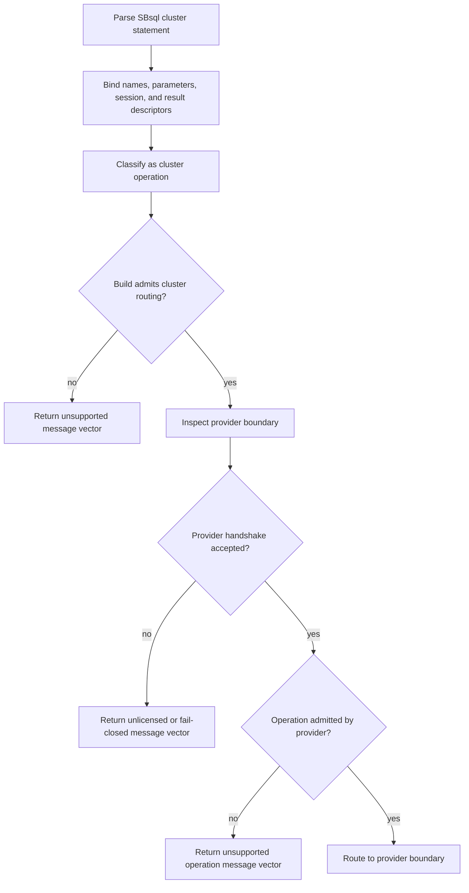

The public compile/link stub reaches the provider boundary but does not execute cluster behavior. It returns fail-closed diagnostics such as `SBLR.CLUSTER.HANDSHAKE.STUB_COMPILE_LINK_ONLY` and reports that route admission is not allowed.

Provider admission requires the expected ABI, catalog manifest, operation set, feature flags, authority domains, and compatibility digest. If any of those checks fail, the route fails closed.

## Inspection Examples

Provider inspection:

```sql
show cluster provider;
```

Expected public-build behavior:

```text
provider_name        = scratchbird.cluster.compile_link_stub_provider
provider_type        = compile_link_stub
support_status       = compile_link_only
supports_execution   = false
route_admission      = false
diagnostic           = SBLR.CLUSTER.HANDSHAKE.STUB_COMPILE_LINK_ONLY
```

Cluster status inspection:

```sql
show cluster status;
```

In a public build, this must return an unsupported, unlicensed, or fail-closed cluster message vector. It must not invent local single-node cluster status or treat ordinary local database state as cluster authority.

## Lifecycle Examples

Recognized but gated lifecycle statement:

```sql
create cluster app_cluster
with provider app.cluster_provider,
     validate only,
     emit diagnostics;
```

Recognized but gated topology mutation:

```sql
alter cluster app_cluster
add member app_member_01
with validate only;
```

Recognized but gated removal:

```sql
drop cluster app_cluster
with restrict;
```

In the public build, these statements should parse and lower far enough to produce stable diagnostics. They must not create cluster catalog authority, mutate local storage as a cluster side effect, or bypass ordinary database authorization.

## Cluster Operation Families

The cluster provider boundary normalizes operations before routing. Public documentation groups them by purpose rather than exposing implementation details.

| Family | Normalized intent | Public-build result |
| --- | --- | --- |
| Topology | Inspect topology, define regions, define shard profiles, publish topology manifests, validate topology schema. | Refused unless an admitted provider exists. |
| Node membership | Admit, remove, drain, assign role, inspect health, validate suitability. | Refused unless an admitted provider exists. |
| Routing | Publish owners, reject stale ownership, inspect routing plans. | Refused unless an admitted provider exists. |
| Placement | Place objects, rebalance shards, validate partition distribution, assign ranges. | Refused unless an admitted provider exists. |
| Distributed transaction | Begin distributed work, prepare participants, publish commit/rollback barriers, recover limbo, advance cleanup, validate finality proof. | Refused unless an admitted provider exists. |
| Replication and reconciliation | Consume cluster events, reconcile ledgers, apply merge policy, report conflicts, publish reconciled finality. | Refused unless an admitted provider exists. |
| Security and fencing | Validate epoch, issue/revoke fence tokens, validate policy versions, validate route authority. | Refused unless an admitted provider exists. |
| Jobs and throttling | Start/cancel controlled jobs, throttle workloads, run admitted maintenance. | Refused unless an admitted provider exists. |
| Metrics and support | Inspect status, trace routes, emit events, collect support evidence, inspect provider. | Provider inspection can report stub status; production behavior requires provider admission. |
| Distributed query | Plan and admit cross-node work, route shard reads, execute fragments, fanout search, merge results, aggregate partials, validate safe reads. | Refused unless an admitted provider exists. |

Some refusal operations intentionally do not call the provider. They return an exact local refusal when the requested operation attempts to turn local core behavior, ordinary query behavior, or unsupported local mutation into cluster authority.

## Transaction And Recovery Rules

Cluster-gated statements never weaken local MGA authority.

| Concern | Rule |
| --- | --- |
| Local transactions | Local commit, rollback, visibility, cleanup, and recovery remain MGA-owned. |
| Distributed finality | Requires an admitted cluster provider route; public builds fail closed. |
| Remote participants | Cannot be treated as committed by local parser state or local SQL text. |
| Barriers and proofs | Are evidence for the admitted provider route; they do not override local recovery classification. |
| Recovery uncertainty | Must return explicit diagnostics and fence unsafe work. |
| Inspection | Cannot turn local single-node state into cluster state. |

If a cluster action has uncertain outcome, the required behavior is explicit diagnostic output and fail-closed fencing. Silent partial success is not allowed.

## Security And Authorization

Cluster-gated statements require administrative authority even when the final result is a refusal.

| Check | Required behavior |
| --- | --- |
| Authentication | Caller must have an authenticated session or authorized agent context. |
| Privilege | Cluster inspection, topology, membership, routing, placement, transaction, security, job, and support actions are separately privileged where exposed. |
| Provider reference | A provider reference must resolve to an admitted provider descriptor. |
| Protected material | Raw secrets must not appear in SQL text, provider packets, diagnostics, or support output. |
| Sandbox | A sandboxed user cannot infer hidden cluster, database, member, route, or provider state through diagnostics. |
| Redaction | Refusal vectors and support evidence must redact provider and environment details according to policy. |

Public-build refusals should reveal enough stable information for clients to classify the result without disclosing unavailable provider internals.

## Diagnostics And Refusals

| Condition | Expected diagnostic class |
| --- | --- |
| Cluster routing not compiled/admitted | Unsupported, with a cluster support-not-enabled code. |
| Public compile/link stub reached | Unlicensed or fail-closed, with `SBLR.CLUSTER.HANDSHAKE.STUB_COMPILE_LINK_ONLY`. |
| External provider required | Fail-closed, with external-provider-required diagnostic. |
| ABI or contract mismatch | Fail-closed, with ABI mismatch diagnostic. |
| Catalog manifest mismatch | Fail-closed, with catalog manifest mismatch diagnostic. |
| Operation set incomplete | Fail-closed, with operation-set incomplete diagnostic. |
| Feature flags incomplete | Fail-closed, with feature-flags incomplete diagnostic. |
| Authority domains incomplete | Fail-closed, with authority-domain incomplete diagnostic. |
| Compatibility digest mismatch | Fail-closed, with digest mismatch diagnostic. |
| Unsupported provider operation | Unsupported operation diagnostic. |
| Local runtime tries to execute cluster behavior | Local runtime refused diagnostic. |
| Local mutation tries to become cluster authority | Local mutation refused diagnostic. |
| Missing privilege | Authorization denied. |
| Hidden provider or object | Object resolution or sandbox denied. |

Diagnostics should include the statement UUID or job UUID, normalized cluster operation, provider mode where visible, route-admission state, and refusal vector where disclosure policy permits it.

## Related Surface Rows

| Surface | Kind | Family | Lowering | Result Shape |
| --- | --- | --- | --- | --- |
| member_ref_list | grammar_production | cluster_private | yes | rs.sbsql.cluster_private_refusal.v1 |
| cluster_setting_stmt | grammar_production | cluster_private | yes | rs.sbsql.cluster_private_refusal.v1 |
| cluster_ref | grammar_production | cluster_private | yes | rs.sbsql.cluster_private_refusal.v1 |
| placement_clause | grammar_production | cluster_private | yes | rs.sbsql.cluster_private_refusal.v1 |
| cluster_prepare_options | grammar_production | cluster_private | yes | rs.sbsql.cluster_private_refusal.v1 |
| cluster_reconcile_stmt | grammar_production | cluster_private | yes | rs.sbsql.cluster_private_refusal.v1 |
| cluster_audit_stmt | grammar_production | cluster_private | yes | rs.sbsql.cluster_private_refusal.v1 |
| cluster_stmt | grammar_production | cluster_private | yes | rs.sbsql.cluster_private_refusal.v1 |
| cluster_tx_stmt | grammar_production | cluster_private | yes | rs.sbsql.cluster_private_refusal.v1 |
| cluster_topology_stmt | grammar_production | cluster_private | yes | rs.sbsql.cluster_private_refusal.v1 |
| region_split_stmt | grammar_production | cluster_private | yes | rs.sbsql.cluster_private_refusal.v1 |
| cluster_lifecycle_ddl | grammar_production | cluster_private | yes | rs.sbsql.cluster_private_refusal.v1 |
| cluster_node_op_stmt | grammar_production | cluster_private | yes | rs.sbsql.cluster_private_refusal.v1 |
| cluster_throttle_stmt | grammar_production | cluster_private | yes | rs.sbsql.cluster_private_refusal.v1 |
| shard_clause | grammar_production | cluster_private | yes | rs.sbsql.cluster_private_refusal.v1 |
| shard_method | grammar_production | cluster_private | yes | rs.sbsql.cluster_private_refusal.v1 |
| cluster_job_control_stmt | grammar_production | cluster_private | yes | rs.sbsql.cluster_private_refusal.v1 |
| cluster_system_op_stmt | grammar_production | cluster_private | yes | rs.sbsql.cluster_private_refusal.v1 |
| cluster_member_op_stmt | grammar_production | cluster_private | yes | rs.sbsql.cluster_private_refusal.v1 |
| cluster_failover_stmt | grammar_production | cluster_private | yes | rs.sbsql.cluster_private_refusal.v1 |
| region_name | grammar_production | cluster_private | yes | rs.sbsql.cluster_private_refusal.v1 |
| cluster_control_stmt | grammar_production | cluster_private | yes | rs.sbsql.cluster_private_refusal.v1 |
| route_ref | grammar_production | cluster_private | yes | rs.sbsql.cluster_private_refusal.v1 |
| member_ref | grammar_production | cluster_private | yes | rs.sbsql.cluster_private_refusal.v1 |

## Verification Checklist

| Check | Required outcome |
| --- | --- |
| Parse | Cluster statements are recognized contextually by SBsql. |
| Bind | Provider, cluster, route, member, placement, job, query, and option descriptors resolve where visible. |
| Authorize | The effective user or agent UUID has the required administrative privilege for inspection or mutation. |
| Classify | The operation is classified as cluster-gated and cannot be executed by ordinary local engine behavior. |
| Gate | Build flags either refuse routing or admit routing to the provider boundary. |
| Handshake | Provider ABI, manifest, operation set, feature flags, authority domains, and digest are checked. |
| Refuse | Public stub and incomplete providers return stable fail-closed diagnostics. |
| Route | Only an admitted provider route can receive production cluster operations. |
| Finality | Local MGA remains the authority for local transaction state. |
| Render | Results and diagnostics expose only authorized information. |


### /home/dcalford/CliWork/ScratchBird/docs/documentation/draft/Language_Reference/syntax_reference/index.md

# Index Lifecycle

This page is part of the SBsql Language Reference Manual. It explains the user-facing language contract while preserving the ScratchBird authority model: SQL text parses to SBLR, durable identity is UUID based, descriptors own type behavior, security is materialized from catalog policy, and MGA owns transaction finality.

Generation task: `syntax_reference_index_lifecycle`


## Purpose

Indexes are access structures and optimizer evidence. They never replace row visibility or predicate recheck authority. An index definition must preserve key descriptors, collation, null treatment, uniqueness, included fields, partial predicates, expression dependencies, maintenance policy, and rebuild behavior.

## Complete Lifecycle Model

1. Define the index with enough descriptor, dependency, security, and policy metadata for the binder and engine verifier to reason about it.
2. Bind the statement to UUID catalog identity and descriptor metadata.
3. Admit the catalog mutation through SBLR and engine verification.
4. Make the mutation visible only when the owning transaction commits.
5. Invalidate dependent plans, parser caches, driver metadata, UDR metadata, support-bundle projections, and metadata rendering views that rely on the changed object.
6. Retire or drop the index only after dependency, privilege, transaction, recovery, and sandbox checks pass.

## Lifecycle Statement Surface

| Operation | Surface | Contract |
| --- | --- | --- |
| Create | `CREATE INDEX`, `CREATE UNIQUE INDEX` | Creates the durable index UUID, key descriptor set, collation and null-order semantics, predicate or expression dependencies, and maintenance policy. |
| Alter | `ALTER INDEX` | Changes admitted index metadata such as enablement, maintenance policy, rebuild state, storage policy, or visibility to the optimizer. |
| Rename | `RENAME INDEX ... TO ...` | Changes the resolver name only; optimizer evidence, dependency edges, and maintenance state remain bound to the index UUID. |
| Comment | `COMMENT ON INDEX ... IS ...` | Stores authorized descriptive metadata on the index catalog row without changing optimizer authority. |
| Show | `SHOW INDEX ...`, `SHOW INDEXES` | Returns authorized index metadata, readiness, maintenance, and optimizer-eligibility projections. |
| Describe | `DESCRIBE INDEX ...` | Returns the index key descriptors, included columns, predicates, collation/null behavior, uniqueness, readiness, and dependency details visible to the caller. |
| Recreate | `RECREATE INDEX ...` | Replaces the index definition only through a dependency-aware DDL route; existing index evidence cannot be reused as new index truth without rebuild/admission evidence. |
| Drop | `DROP INDEX ...` | Retires the index and invalidates optimizer plans that depended on it. Row visibility and predicate authority remain table/MGA-owned. |

Indexes are evidence for access planning. `SHOW`, `DESCRIBE`, comments, and names never make an index authoritative for final row visibility; executor recheck and MGA visibility still own row truth.

## Index Access Methods And Families

ScratchBird exposes index families as descriptor-bound access methods. Some families are direct physical providers; others are semantic shapes over a provider. All index families are optimizer evidence only. They can produce candidate row locators, order evidence, selectivity estimates, or maintenance state, but final rows still require engine visibility, predicate, and security recheck.

| Family | Key Model | Persistent | Ordering | Uniqueness | Primary Use |
| --- | --- | --- | --- | --- | --- |
| `btree` | ordered key | yes | yes | optional | Default ordered equality, range, prefix, grouping, and order support. |
| `unique_btree` | ordered key | yes | yes | yes | Unique-key enforcement with duplicate preflight, transaction-bound reservation, and MGA finality. |
| `expression` | expression key | yes | yes | optional by backing provider | Indexes a deterministic expression descriptor over a backing access method, normally B-tree. |
| `partial` | predicate-filtered key | yes | yes when backing provider supports it | optional by backing provider | Indexes rows admitted by a stored predicate descriptor. |
| `covering` | covering payload | yes | yes when backing provider supports it | optional by backing provider | Stores non-key included fields for candidate/result acceleration; still requires freshness and visibility checks. |
| `hash` | hashed key | yes | no | optional | Equality lookup where ordering and range scans are not required. |
| `bitmap` | zone summary/candidate set | yes | no | no | Low-cardinality and multi-index candidate-set operations. |
| `brin_zone` | zone summary | yes | no | no | Block/range summary pruning. A positive match is never final row proof. |
| `bloom` | zone summary | yes | no | no | Probabilistic negative pruning. False positives require row predicate recheck. |
| `full_text` | token key | yes | no | no | Text search over tokenized content. |
| `gin` | token key | yes | no | no | Generalized inverted index profile where admitted by SBsql. |
| `inverted` | token key | yes | no | no | Native inverted-search segments. |
| `ngram` | token key | yes | no | no | N-gram text search. |
| `sparse_wand` | token key | yes | no | no | Sparse WAND-style ranked text candidate search. |
| `spatial` | spatial key | yes | no | no | Spatial search over geometry/geography descriptors. |
| `rtree` | spatial key | yes | no | no | R-tree rectangle/bounding-box candidate search. |
| `gist` | spatial key | yes | no | no | Generalized search-tree profile where admitted, backed by exact predicate recheck. |
| `spgist` | spatial key | yes | no | no | Space-partitioned generalized search-tree profile where admitted, backed by exact predicate recheck. |
| `vector_exact` | vector key | yes | yes for distance/rank evidence | no | Exact vector candidate production with exact rerank proof. |
| `vector_hnsw` | vector key | yes | yes for approximate rank evidence | no | HNSW approximate vector candidate search; exact rerank is required before final delivery. |
| `vector_ivf` | vector key | yes | yes for approximate rank evidence | no | IVF approximate vector candidate search; training generation and exact rerank proof are required. |
| `columnar_zone` | zone summary | yes | no | no | Columnar or extent-level summary pruning. |
| `document_path` | token key | yes | no | no | JSON/document path candidate search. |
| `graph` | SBsql-defined | yes | no | no | Graph node, edge, and traversal lookup profiles. |
| `temporary_work` | SBsql-defined | memory only | no | no | Temporary work tables, hash builds, sort helpers, and execution workspace indexes. |
| `in_memory` | SBsql-defined | cold-start persisted metadata, memory-primary runtime | no | no | Memory-primary provider where policy admits it. |
| `policy_blocked` | SBsql-defined | no | no | no | Declared refusal surface for index features blocked by policy or licensing. |

## Default SB B-Tree Contract

`btree` is the default index family when `CREATE INDEX` does not specify another method. A B-tree key descriptor contains one entry per key part.

| Descriptor Field | Default SBsql Behavior |
| --- | --- |
| Key order | Ascending unless the key part states `desc`. |
| Null placement | Explicit descriptor field. If omitted, SBsql supplies the default. SBsql should write `nulls first` or `nulls last` when order portability matters. |
| Collation | Text keys use the column or expression collation descriptor. B-tree byte order is not used as text order unless the collation descriptor says so. |
| Uniqueness | `CREATE UNIQUE INDEX` uses `unique_btree` semantics. Null-distinct behavior is a descriptor setting, not a global assumption. |
| Expression keys | Expression text is parsed and bound to expression descriptors. Expression determinism and dependency edges must be admitted before index creation. |
| Partial predicate | Predicate text is parsed and bound to a predicate descriptor. The predicate is rechecked against base rows. |
| Included columns | Included values are covering payload, not key authority. Freshness and visibility must be rechecked. |
| Descending keys | A descending descriptor reverses ordered traversal for that key part. |
| Plan use | B-tree can support equality lookup, ordered range scan, prefix scan, grouping/order evidence, and uniqueness checks. It cannot make final row visibility decisions. |

## Index Option Descriptors

| Option Class | Examples | Contract |
| --- | --- | --- |
| Access method | `using btree`, `using hash`, `using gin`, `using gist`, `using vector_hnsw` | Selects an index family admitted by SBsql. |
| Key direction | `asc`, `desc` | Stored per key part and used by optimizer ordering evidence. |
| Null handling | `nulls first`, `nulls last`, `nulls distinct`, `nulls not distinct` | Stored in descriptor fields. Omitted values use the SBsql default. |
| Collation and operator class | `collate`, operator class where admitted | Bound to descriptor UUIDs/resources; names are not runtime authority. |
| Predicate | `where <predicate>` | Creates a partial-index predicate descriptor. Predicate recheck remains mandatory. |
| Expression | expression key parts | Creates expression dependency edges and requires deterministic expression proof. |
| Included payload | `include (...)` | Covering payload only; not key authority. |
| Prefix length | `column(length)` where admitted | Stored as a key truncation descriptor. Predicate and equality recheck remain mandatory. |
| Vector metric/options | metric, dimension, `ef`, list count, quantization profile | Must match vector descriptor and provider proof. Approximate providers require exact rerank. |
| Storage/maintenance | fill policy, rebuild policy, residency, online/offline rebuild | Admitted by engine policy and surfaced through `SHOW`/`DESCRIBE` readiness fields. |

## Practical Lifecycle Example

```sql
create index app.orders_customer_submitted_idx
  on app.orders (customer_id, submitted_at desc);

create unique index app.orders_open_unique_idx
  on app.orders (customer_id, order_id)
  where order_state = 'open';

comment on index app.orders_customer_submitted_idx is 'Customer lookup ordered by submission time';
show index app.orders_customer_submitted_idx;
describe index app.orders_customer_submitted_idx;
rename index app.orders_customer_submitted_idx to orders_customer_submitted_desc_idx;
drop index app.orders_customer_submitted_desc_idx;
```

## Boundaries

- User-visible names are resolver input; UUID rows are durable identity.
- The parser cannot create catalog truth by accepting syntax.
- Catalog DDL must be transactionally visible and rollback-safe.
- Support and diagnostic surfaces may inspect the object only through authorized projections.

## Verification Checklist

| Check | Required Outcome |
| --- | --- |
| Parse | Statement shape is recognized by SBsql. |
| Bind | Names, UUIDs, descriptors, options, and dependencies resolve exactly. |
| Authorize | The effective user or agent UUID is allowed to mutate the object. |
| Admit | SBLR route and result shape are accepted by the engine verifier. |
| Commit | Catalog mutation becomes visible only through MGA transaction finality. |
| Invalidate | Dependent caches, metadata, plans, and projections are refreshed or refused. |


### /home/dcalford/CliWork/ScratchBird/docs/documentation/draft/Language_Reference/syntax_reference/with.md

# WITH And Common Table Expressions

This page is part of the SBsql Language Reference Manual. It documents ordinary and recursive common table expressions, CTE scope, column aliases, dependency order, materialization behavior, query integration, recursive fixed-point execution, cycle safety, and refusal cases.

Generation task: `syntax_reference_with`

Related pages: [SELECT Statement](select.md), [FROM And Table Expressions](from.md), [WHERE Clause](where.md), [GROUP BY And HAVING](group_by_and_having.md), [Window Clause And Window Functions](window.md), [Projection](projection.md), [ORDER BY, LIMIT, OFFSET, And FETCH](order_by_limit_offset.md), [Type System Overview](../data_types/type_system_overview.md), [Operators](operators.md), and [Refusal Vectors](refusal_vectors.md).

## Purpose

`WITH` introduces common table expressions, or CTEs, for one statement. A CTE is a named rowset expression. It can make a query easier to read, isolate a reusable subquery, stage transformations, provide statement-local names, or express recursion.

A CTE name is statement-local resolver state. It is not a durable catalog object, does not create a schema entry, and cannot grant authority over the row sources inside the CTE. Every source referenced by a CTE still binds through ordinary catalog, descriptor, transaction, and security rules.

Example:

```sql
with open_orders as (
  select order_id, customer_id, total_amount
  from app.orders
  where order_state = 'open'
)
select customer_id, sum(total_amount) as open_total
from open_orders
group by customer_id;
```

## Syntax

```ebnf
with_clause ::=
    WITH recursive_modifier? cte_list ;

recursive_modifier ::=
    RECURSIVE ;

cte_list ::=
    cte ("," cte)* ;

cte ::=
    identifier column_alias_list? cte_materialization_hint?
    AS "(" query_statement ")" ;

column_alias_list ::=
    "(" identifier ("," identifier)* ")" ;

cte_materialization_hint ::=
      MATERIALIZED
    | NOT MATERIALIZED ;
```

`WITH` attaches to a following statement that admits a query expression, such as `SELECT` and statement forms that consume a rowset. The usual form is:

```ebnf
with_query_statement ::=
    with_clause query_statement ;
```

SBsql is context sensitive. `WITH`, `RECURSIVE`, `MATERIALIZED`, and related words are command words in CTE contexts and should not be treated as globally reserved identifiers elsewhere.

## Scope

A CTE name is visible to the statement that immediately follows the `WITH` clause. It is also visible to later CTEs in the same `WITH` list according to dependency order.

```sql
with
  recent_orders as (
    select order_id, customer_id
    from app.orders
    where submitted_at >= :start_at
  ),
  recent_customers as (
    select distinct customer_id
    from recent_orders
  )
select customer_id
from recent_customers;
```

Rules:

- CTE names are scoped to one statement.
- A CTE can shadow a catalog object name inside its query block.
- Duplicate CTE names in the same `WITH` list are refused.
- A non-recursive CTE cannot refer to itself.
- A recursive CTE can refer to itself only in the recursive member.
- Nested query blocks may define their own CTE names.

## Column Aliases And Result Descriptors

Column aliases rename the CTE output descriptor:

```sql
with order_totals(customer_id, total_amount) as (
  select customer_id, sum(total_amount)
  from app.orders
  group by customer_id
)
select customer_id, total_amount
from order_totals;
```

The alias count must match the CTE result arity. If aliases are omitted, column names come from the CTE query's projection descriptors.

The result descriptor includes:

- column names;
- column order;
- descriptor UUIDs;
- nullability evidence;
- collation and charset evidence;
- domain stack evidence where preserved;
- security and redaction metadata;
- dependency and invalidation evidence.

## Ordinary CTEs

Ordinary CTEs are named subqueries:

```sql
with high_value_orders as (
  select order_id, customer_id, total_amount
  from app.orders
  where total_amount >= :minimum_total
)
select customer_id, count(*) as order_count
from high_value_orders
group by customer_id;
```

They can be referenced more than once:

```sql
with order_totals as (
  select customer_id, sum(total_amount) as total_amount
  from app.orders
  group by customer_id
)
select a.customer_id,
       a.total_amount,
       b.total_amount as peer_total
from order_totals a
join order_totals b on b.total_amount > a.total_amount;
```

The optimizer may materialize a CTE, inline it, share it, or re-evaluate it only when the selected strategy preserves descriptor, volatility, transaction, and security semantics.

## Materialization Hints

`MATERIALIZED` requests a statement-local materialized rowset. `NOT MATERIALIZED` requests inlining or re-planning as if the CTE were a derived query. They are hints unless the active route makes one behavior mandatory.

```sql
with expensive_orders materialized as (
  select order_id, customer_id, total_amount
  from app.orders
  where total_amount >= :minimum_total
)
select count(*)
from expensive_orders;
```

Materialization rules:

- materialized CTE rows are statement-local;
- materialization does not create a catalog table;
- materialized rows use the statement snapshot and authorization context;
- row-level security and masks are applied before visible CTE rows are consumed;
- volatile expressions may force materialization or prevent sharing;
- memory and spill limits are policy-controlled.

If the engine cannot honor a required materialization shape, it returns a refusal vector rather than silently changing semantics.

## Recursive CTEs

`WITH RECURSIVE` defines a CTE whose recursive member can refer to the CTE being defined. Recursive CTEs are evaluated as a fixed-point computation.

```ebnf
recursive_cte ::=
    identifier column_alias_list?
    AS "(" anchor_member recursive_set_operator recursive_member ")" ;

anchor_member ::=
    query_statement ;

recursive_set_operator ::=
      UNION
    | UNION ALL
    | UNION DISTINCT ;

recursive_member ::=
    query_statement ;
```

Basic numeric recursion:

```sql
with recursive n(value) as (
  select 1
  union all
  select value + 1
  from n
  where value < 10
)
select value
from n
order by value;
```

Hierarchy traversal:

```sql
with recursive category_tree(category_id, parent_category_id, depth) as (
  select category_id, parent_category_id, 0
  from app.category
  where parent_category_id is null

  union all

  select c.category_id, c.parent_category_id, category_tree.depth + 1
  from app.category c
  join category_tree on c.parent_category_id = category_tree.category_id
  where category_tree.depth < :max_depth
)
select category_id, parent_category_id, depth
from category_tree
order by depth, category_id;
```

The anchor member produces the initial rowset. The recursive member is repeatedly evaluated using rows produced by earlier iterations until no new admitted rows are produced, a limit is reached, or a diagnostic/refusal stops execution.

## Recursive Column And Type Rules

The anchor member and recursive member must have the same arity. Each column position must resolve to a common descriptor that can represent values from both members.

```sql
with recursive path_nodes(node_id, depth, path_text) as (
  select root_id, 0, cast(root_id as varchar(80))
  from app.graph_roots

  union all

  select e.child_id,
         path_nodes.depth + 1,
         path_nodes.path_text || '/' || cast(e.child_id as varchar(80))
  from app.graph_edge e
  join path_nodes on e.parent_id = path_nodes.node_id
  where path_nodes.depth < 20
)
select node_id, depth, path_text
from path_nodes;
```

Rules:

- alias count must match output arity;
- recursive references must bind to the CTE output descriptor;
- recursive member descriptors must be assignment-compatible with the CTE descriptor;
- nullability and domain preservation must be explicit in the common descriptor;
- collation, charset, timezone, and numeric precision must not be ambiguous;
- unsupported common-descriptor inference is refused before execution.

## Recursion Termination And Safety

Recursive CTEs need a termination path. Termination may occur because:

- the recursive member produces no new rows;
- a `WHERE` predicate limits depth or range;
- `UNION DISTINCT` removes already-seen rows until a fixed point is reached;
- a statement limit, recursion depth limit, memory limit, timeout, or cancellation policy stops execution.

Example with an explicit depth guard:

```sql
with recursive chain(node_id, depth) as (
  select :root_node_id, 0
  union all
  select e.child_id, chain.depth + 1
  from app.edge e
  join chain on e.parent_id = chain.node_id
  where chain.depth < 100
)
select node_id, depth
from chain;
```

If recursion exceeds an admitted safety limit, SBsql returns a diagnostic or refusal according to the route policy. It must not run indefinitely without cancellation and resource accounting.

## UNION ALL Versus UNION DISTINCT

`UNION ALL` preserves duplicates. It is useful for paths, depth counting, and cases where duplicate rows are meaningful.

`UNION` and `UNION DISTINCT` remove duplicate rows according to the CTE descriptor's equality and collation rules. They can help a recursive CTE reach a fixed point when duplicates would otherwise repeat.

```sql
with recursive reachable(node_id) as (
  select :root_node_id
  union
  select e.child_id
  from app.edge e
  join reachable on e.parent_id = reachable.node_id
)
select node_id
from reachable;
```

Duplicate removal requires hashable or comparable descriptors for all CTE columns. If the descriptors cannot support duplicate detection, the query is refused.

## Cycle Handling

A recursive CTE can prevent cycles with explicit state:

```sql
with recursive walk(node_id, depth, path_text) as (
  select :root_node_id, 0, cast(:root_node_id as varchar(200))
  union all
  select e.child_id,
         walk.depth + 1,
         walk.path_text || '/' || cast(e.child_id as varchar(200))
  from app.edge e
  join walk on e.parent_id = walk.node_id
  where walk.depth < 100
    and position(cast(e.child_id as varchar(200)) in walk.path_text) = 0
)
select node_id, depth
from walk;
```

When SBsql admits a dedicated cycle-detection clause or function, that surface must bind to descriptor-owned identity and equality rules. Without such a surface, explicit predicates and safety limits are required.

## CTEs In DML

A CTE can feed a data-changing statement where the statement family admits a query source:

```sql
with expired_tokens as (
  select token_id
  from app.session_token
  where expires_at < current_timestamp
)
delete from app.session_token
where token_id in (
  select token_id
  from expired_tokens
);
```

The CTE itself does not grant write authority. The target mutation still requires ordinary DML privileges, row visibility, policy admission, and MGA conflict handling.

## Multimodel CTEs

A CTE can hold any admitted rowset descriptor, including document, graph, vector, search, time-series, or key-value projections:

```sql
with ranked_matches as (
  select product_id,
         l2_distance(embedding, vector(:query_embedding)) as distance
  from app.product_embedding
  where vector_dims(embedding) = vector_dims(vector(:query_embedding))
)
select product_id, distance
from ranked_matches
where distance < :max_distance
order by distance, product_id
limit 20;
```

The CTE stores rowset descriptors, not direct access to underlying storage internals.

## Name Resolution And Shadowing

CTE names participate in statement-local name resolution. In a query block, a visible CTE name can shadow a catalog object name with the same unqualified label.

```sql
with orders as (
  select order_id
  from app.orders
)
select order_id
from orders;
```

Use qualified names when a catalog object must be referenced explicitly:

```sql
select order_id
from app.orders;
```

Resolver behavior must be deterministic. Ambiguous CTE references, duplicate aliases, hidden catalog names, and sandbox escapes must fail closed.

## Optimizer And Execution

The optimizer may:

- inline an ordinary CTE;
- materialize an ordinary CTE;
- share a materialized CTE across references;
- push safe predicates into a CTE;
- reorder joins around an inlined CTE;
- use indexes inside CTE members;
- spill materialized CTE rows when policy admits it.

The optimizer must not:

- duplicate volatile or side-effecting work when that changes semantics;
- push predicates through a CTE in a way that changes null, missing, or outer-join behavior;
- bypass RLS, masks, or protected-value policy;
- treat a CTE name as durable catalog identity;
- change recursive fixed-point behavior;
- use candidate evidence as final row authority.

## Refusal And Diagnostics

| Condition | Result |
| --- | --- |
| Duplicate CTE name in one `WITH` list | Bind diagnostic. |
| Alias count does not match row arity | Bind diagnostic. |
| Non-recursive CTE refers to itself | Bind diagnostic. |
| Recursive CTE lacks `WITH RECURSIVE` | Bind diagnostic. |
| Recursive member arity differs from anchor | Bind diagnostic. |
| Common descriptor cannot be inferred safely | Bind diagnostic or `unsupported`. |
| Recursive duplicate detection lacks comparable/hashable descriptors | `unsupported`. |
| Recursion exceeds depth, memory, timeout, or row limit | Diagnostic or `denied` according to policy. |
| Materialization hint cannot be honored when mandatory | `unsupported` or `denied`. |
| CTE references hidden or unauthorized objects | `denied` or not-visible rendering. |
| Product profile omits a required route | `unsupported` or `unlicensed` according to route admission. |

## Practical Examples

Staged filtering:

```sql
with eligible_orders as (
  select order_id, customer_id, total_amount
  from app.orders
  where order_state = 'closed'
    and total_amount > 0
)
select customer_id, sum(total_amount) as closed_total
from eligible_orders
group by customer_id
having sum(total_amount) >= :minimum_total;
```

Top rows per group:

```sql
with ranked_orders as (
  select customer_id,
         order_id,
         total_amount,
         row_number() over (
           partition by customer_id
           order by total_amount desc, order_id
         ) as rn
  from app.orders
)
select customer_id, order_id, total_amount
from ranked_orders
where rn <= 5
order by customer_id, rn;
```

Recursive hierarchy:

```sql
with recursive category_tree(category_id, depth) as (
  select category_id, 0
  from app.category
  where parent_category_id is null
  union all
  select c.category_id, category_tree.depth + 1
  from app.category c
  join category_tree on c.parent_category_id = category_tree.category_id
  where category_tree.depth < 50
)
select category_id, depth
from category_tree
order by depth, category_id;
```

## Verification Checklist

| Check | Required Outcome |
| --- | --- |
| Parse | Ordinary and recursive CTE syntax is recognized. |
| Scope | CTE names are statement-local and resolve deterministically. |
| Aliases | Column alias lists match arity and become output descriptor names. |
| Dependencies | Later CTEs can reference earlier CTEs; invalid cycles fail closed. |
| Materialization | Inlining, materialization, sharing, and spill preserve semantics. |
| Recursion | Anchor and recursive members bind to compatible descriptors. |
| Fixed point | Recursive execution terminates through empty delta, distinct fixed point, or admitted safety limit. |
| Security | CTEs do not bypass object privileges, RLS, masks, or sandbox roots. |
| DML | CTE-fed mutations still require DML authority and MGA checks. |
| Optimizer | Predicate pushdown and join reordering preserve null, descriptor, and policy behavior. |
| Proof | Full rebuild tests regenerate parser, SBLR, optimizer, executor, recursive, security, and refusal evidence. |

## Related Surface Rows

| Surface | Kind | Family | Lowering | Result Shape |
| --- | --- | --- | --- | --- |
| `with_clause` | grammar production | query | yes | rowset descriptor |
| `cte_list` | grammar production | query | yes | CTE descriptor set |
| `cte` | grammar production | query | yes | CTE rowset descriptor |
| `recursive_cte` | grammar production | query | yes | recursive rowset descriptor |
| `anchor_member` | query member | query | yes | rowset descriptor |
| `recursive_member` | query member | query | yes | rowset descriptor |
| `column_alias_list` | grammar production | query | yes | output descriptor names |
| `materialized_cte` | execution strategy | query | yes | statement-local rowset |
| `not_materialized_cte` | execution strategy | query | yes | inlined rowset plan |


### /home/dcalford/CliWork/ScratchBird/docs/documentation/draft/Language_Reference/syntax_reference/multimodel_statements.md

# Multimodel Statements

This page is part of the SBsql Language Reference Manual. It explains the user-facing language contract while preserving the ScratchBird authority model: SQL text parses to SBLR, durable identity is UUID based, descriptors own type behavior, security is materialized from catalog policy, and MGA owns transaction finality.

Generation task: `syntax_reference_multimodel`

Related pages: [SELECT Statement](select.md), [FROM And Table Expressions](from.md), [Table Lifecycle](table.md), [Index Lifecycle](index.md), [COPY Streaming Import And Export](copy.md), [Transaction Control](transaction_control.md), [Security And Privileges](security_and_privilege_statements.md), [Refusal Vectors](refusal_vectors.md), [Document, Graph, Vector, And Multimodel Types](../data_types/document_graph_vector_and_multimodel_types.md), [JSON Functions](../functional_reference/sb_json.md), [Vector Functions](../functional_reference/sb_vector.md), and [Spatial Functions](../functional_reference/sb_spatial.md).

## Purpose

SBsql includes dedicated statement families for document, key-value, graph, vector, search, and time-series workloads. These are first-class SBsql surfaces, not separate execution authorities. They parse through SBsql, bind to descriptors and catalog UUIDs, lower to SBLR, execute under the caller's transaction and security context, and must pass the same visibility, authorization, recovery, and diagnostic rules as relational SQL.

Use a dedicated multimodel statement when the operation is primarily about a multimodel command: getting a document by key, patching a document path, scanning key ranges, traversing a graph, ranking vector candidates, running a search, or querying time buckets. Use `SELECT` when the operation is primarily a tabular projection from rowset sources.

The same data can often be reached both ways:

```sql
select d.document_key,
       json_value(d.body, '$.status') as status
from app.document_store d
where json_exists(d.body, '$.status');
```

```sql
document query app.document_store
where path '$.status' exists
return key, path '$.status' as status;
```

Both forms still bind descriptors, enforce authorization, and execute under MGA transaction rules.

## Statement Families

```ebnf
nosql_statement ::=
      document_statement
    | kv_statement
    | graph_statement
    | vector_statement
    | search_statement
    | timeseries_statement ;
```

SBsql is context sensitive. `DOCUMENT`, `KV`, `GRAPH`, `VECTOR`, `SEARCH`, and `TIMESERIES` are command words inside this statement family. They should not be treated as globally reserved identifiers outside this context.

| Family | Primary use | Typical result shape |
| --- | --- | --- |
| `DOCUMENT` | Document key lookup, document put, patch, remove, query, path projection, and document validation. | One document, one mutation result, or a rowset of key/path/value rows. |
| `KV` | Key-value get, put, delete, increment, TTL, range scan, set/list/map operations, and stream-like key scans. | Value result, mutation result, counter result, or key/value rowset. |
| `GRAPH` | Node, edge, path, traversal, pattern match, shortest path, property mutation, and graph constraint checks. | Node/edge/path rowset or mutation result. |
| `VECTOR` | Vector insert/update, exact or indexed candidate search, rerank, metric inspection, and vector index maintenance requests. | Candidate rowset with distance/score and recheck status. |
| `SEARCH` | Text or structured search, scoring, snippet generation, field filters, and search index refresh requests. | Hit rowset with score, snippet, matched fields, and object identity. |
| `TIMESERIES` | Time-window reads, bucket aggregation, interpolation, gap handling, downsample, retention, and sample mutation. | Sample rowset, bucket rowset, aggregate rowset, or mutation result. |

## Shared Execution Contract

Every multimodel statement follows the same lifecycle:

1. Parse the command family and action.
2. Bind object names to catalog UUIDs under schema-root and sandbox rules.
3. Bind key, path, metric, pattern, timestamp, value, and option expressions to descriptors.
4. Authorize the effective user or agent UUID for the target and operation.
5. Admit an SBLR operation family and result descriptor.
6. Execute under the current transaction and MGA snapshot.
7. Recheck candidate evidence against descriptors, predicates, visibility, and security.
8. Return a typed rowset, typed value, mutation result, or canonical message vector.

Candidate evidence is never final authority. A document-path index, graph adjacency index, vector index, search index, time index, or key-range hint can accelerate work, but final result membership and mutation authority require engine recheck.

## Common Syntax Elements

```ebnf
multimodel_target ::=
    qualified_name ;

multimodel_key ::=
    expression ;

path_expression ::=
      string_literal
    | parameter_ref
    | path_constructor ;

return_clause ::=
    RETURN return_item ("," return_item)* ;

return_item ::=
      identifier
    | expression AS? identifier? ;

multimodel_where_clause ::=
    WHERE predicate ;

statement_option_list ::=
    WITH option ("," option)* ;
```

Names, keys, paths, metrics, query text, patterns, timestamps, and options are parser input only. Binding turns them into descriptor-aware requests. Runtime execution must not treat a raw text path or raw query string as authority.

## Document Statements

Document statements operate on descriptor-bound document containers or document-bearing rowsets.

```ebnf
document_statement ::=
    DOCUMENT document_action document_target document_payload? return_clause? statement_option_list? ;

document_action ::=
      GET
    | PUT
    | PATCH
    | DELETE
    | QUERY
    | VALIDATE ;

document_target ::=
    multimodel_target ;
```

Get a document by key:

```sql
document get app.document_store
key :document_id
return key, document;
```

Insert or replace a document:

```sql
document put app.document_store
key :document_id
value :document_body
with require_valid_profile true;
```

Patch document paths:

```sql
document patch app.document_store
key :document_id
set path '$.status' = 'approved',
    path '$.reviewed_at' = current_timestamp
remove path '$.draft_reason'
return key, version;
```

Query document paths:

```sql
document query app.document_store
where path '$.customer.id' = :customer_id
  and path '$.status' = 'open'
return key,
       path '$.customer.id' as customer_id,
       path '$.total' as order_total;
```

Document semantics:

| Concern | Rule |
| --- | --- |
| Missing versus null | A missing path and a JSON null value remain distinct when the bound operation exposes that distinction. |
| Path binding | Path text is bound to a descriptor-aware path operation before execution. |
| Validation | Profile, schema, required field, type, and protected-material checks occur before commit. |
| Mutation | Puts, patches, and deletes are transactional and rollback-safe. |
| Indexes | Path indexes produce candidate evidence and require final recheck. |
| Result shape | `RETURN` defines a typed result projection; omitted return clauses use the operation default. |

## Key-Value Statements

Key-value statements operate on descriptor-bound key spaces. Keys, values, versions, expiration, and optional collection behavior are explicit descriptors.

```ebnf
kv_statement ::=
    KV kv_action kv_target kv_payload? return_clause? statement_option_list? ;

kv_action ::=
      GET
    | PUT
    | DELETE
    | INCREMENT
    | EXPIRE
    | SCAN
    | LIST
    | SET
    | MAP ;

kv_target ::=
    multimodel_target ;
```

Get and put values:

```sql
kv get app.session_cache
key :session_key
return key, value, expires_at;
```

```sql
kv put app.session_cache
key :session_key
value :session_payload
ttl interval '30 minutes'
return key, version, expires_at;
```

Range scan:

```sql
kv scan app.session_cache
from key 'session:'
to key 'session;'
limit 500
return key, value, version;
```

Atomic counter:

```sql
kv increment app.usage_counter
key :counter_key
by 1
return key, value;
```

Key-value semantics:

| Concern | Rule |
| --- | --- |
| Key descriptor | Keys are typed values, not raw byte authority. |
| Value descriptor | Values bind to the declared descriptor or protected descriptor policy. |
| Conditional mutation | Version, existence, compare, and lease predicates bind before mutation. |
| TTL | Expiration is policy and descriptor controlled; cleanup timing does not change visible transaction semantics. |
| Range scan | Start/end keys, direction, and limit are descriptor-bound. |
| Collection operations | Lists, sets, maps, counters, streams, and geospatial-like projections require explicit descriptor support. |

## Graph Statements

Graph statements operate on graph descriptors, node descriptors, edge descriptors, path descriptors, and property descriptors.

```ebnf
graph_statement ::=
    GRAPH graph_action graph_target graph_payload? return_clause? statement_option_list? ;

graph_action ::=
      MATCH
    | TRAVERSE
    | SHORTEST_PATH
    | CREATE_NODE
    | CREATE_EDGE
    | UPDATE_NODE
    | UPDATE_EDGE
    | DELETE_NODE
    | DELETE_EDGE
    | VALIDATE ;

graph_target ::=
    multimodel_target ;
```

Pattern match:

```sql
graph match app.customer_graph
pattern (:customer)-[:placed]->(:order)
where property('customer_id') = :customer_id
return node('order') as order_node,
       path() as matched_path;
```

Traversal:

```sql
graph traverse app.service_graph
from node :start_node
over edge_type 'depends_on'
depth 1 to 4
return node_id, edge_id, path_depth;
```

Shortest path:

```sql
graph shortest_path app.route_graph
from node :from_node
to node :to_node
over edge_type 'connects'
return path(), path_cost();
```

Graph semantics:

| Concern | Rule |
| --- | --- |
| Identity | Nodes, edges, and paths are descriptor-bound values with catalog and row identity. |
| Direction | Edge direction is part of the bound graph operation. |
| Properties | Property reads and writes bind to declared property descriptors. |
| Traversal order | Stable ordering exists only when the operation descriptor defines it or an outer `ORDER BY` is used. |
| Deletion | Edge and node deletion must obey referential, graph-constraint, and visibility rules. |
| Indexes | Adjacency, property, path, or spatial evidence requires final recheck. |

## Vector Statements

Vector statements operate on vector-bearing descriptors and vector index evidence.

```ebnf
vector_statement ::=
    VECTOR vector_action vector_target vector_payload? return_clause? statement_option_list? ;

vector_action ::=
      SEARCH
    | RERANK
    | UPSERT
    | DELETE
    | REBUILD
    | DESCRIBE ;

vector_target ::=
    multimodel_target ;
```

Vector search:

```sql
vector search app.product_embedding
using vector(:query_embedding)
metric l2
limit 20
return object_uuid, distance, recheck_status;
```

Filtered search:

```sql
vector search app.product_embedding
using vector(:query_embedding)
metric cosine
where category_id = :category_id
limit 50
return object_uuid, distance;
```

Rerank candidates:

```sql
vector rerank app.product_embedding
using vector(:query_embedding)
candidates :candidate_set
metric dot
limit 20
return object_uuid, score, exact_rank;
```

Vector semantics:

| Concern | Rule |
| --- | --- |
| Dimension | Query vector and stored vector dimensions must match the bound descriptor. |
| Element profile | Element type, quantization, and normalization are descriptor owned. |
| Metric | Metric choice must be admitted for the target descriptor and index. |
| Approximate evidence | Approximate candidate sets must be exact-reranked or carry an admitted exactness proof before final delivery. |
| Filters | Relational, document, or property filters still require final row recheck. |
| Mutation | Upsert/delete updates vector-bearing rows and invalidates or updates vector index evidence transactionally. |

## Search Statements

Search statements operate on descriptor-bound search indexes or search projections.

```ebnf
search_statement ::=
    SEARCH search_target search_payload return_clause? statement_option_list? ;

search_target ::=
    multimodel_target ;
```

Text search:

```sql
search app.product_search
for :query_text
where language_tag = 'en'
limit 25
return object_uuid, score, snippet;
```

Fielded search:

```sql
search app.article_search
for :query_text
fields title, summary, body
where published_at >= :start_at
return object_uuid, score, matched_fields;
```

Search semantics:

| Concern | Rule |
| --- | --- |
| Analyzer profile | Tokenization, normalization, stemming, and language behavior are descriptor/profile owned. |
| Query text | Query text is input to a bound search operation, not executable authority. |
| Score | Score is ranking evidence and does not bypass row visibility or authorization. |
| Snippet | Snippet rendering must obey protected-material and redaction policy. |
| Refresh | Search refresh or rebuild requests are transactional operation requests where admitted. |
| Ordering | Use explicit ordering or the statement's result descriptor when stable rank order is required. |

## Time-Series Statements

Time-series statements operate on timestamped samples, events, buckets, rollups, and retention policies.

```ebnf
timeseries_statement ::=
    TIMESERIES timeseries_action timeseries_target timeseries_payload? return_clause? statement_option_list? ;

timeseries_action ::=
      QUERY
    | INSERT
    | DELETE
    | DOWNSAMPLE
    | RETAIN
    | GAPFILL
    | DESCRIBE ;

timeseries_target ::=
    multimodel_target ;
```

Window query:

```sql
timeseries query app.metric_sample
between :start_at and :end_at
where metric_name = 'cpu.user'
bucket interval '1 minute'
aggregate avg(value) as avg_value, max(value) as max_value
return series_id, bucket_start, avg_value, max_value;
```

Sample insert:

```sql
timeseries insert app.metric_sample
series :series_id
at :sample_at
value :sample_value
return series_id, sample_at, version;
```

Gap fill:

```sql
timeseries gapfill app.metric_sample
between :start_at and :end_at
bucket interval '5 minutes'
method previous
return bucket_start, value, gapfill_status;
```

Time-series semantics:

| Concern | Rule |
| --- | --- |
| Time descriptor | Timestamp type, precision, timezone handling, and calendar policy are descriptor owned. |
| Window bounds | Bounds are typed expressions; inclusive/exclusive behavior is operation defined. |
| Bucket descriptor | Bucket size, alignment, gap handling, and interpolation are bound before execution. |
| Ordering | Stable time order requires the statement descriptor or explicit `ORDER BY` when converted to a rowset. |
| Retention | Retention and downsample are policy-bound mutation requests and must be rollback-safe. |
| Late samples | Late arrival behavior is policy controlled and must preserve transaction visibility. |

## Mixed SQL And Multimodel Flow

Dedicated multimodel statements can return rowsets that are consumed by `WITH` or exposed through descriptor-bound views where admitted.

```sql
with ranked_products as (
  vector search app.product_embedding
  using vector(:query_embedding)
  metric l2
  limit 50
  return object_uuid, distance
)
select p.product_id,
       p.display_name,
       ranked_products.distance
from ranked_products
join app.product p on p.object_uuid = ranked_products.object_uuid
where p.is_active = true
order by ranked_products.distance, p.product_id;
```

The multimodel route supplies a rowset descriptor. The relational query still performs its own binding, authorization, predicate checks, and ordering.

## Mutation And Transaction Rules

Multimodel mutations are ordinary transactional mutations:

- `DOCUMENT PUT`, `DOCUMENT PATCH`, `DOCUMENT DELETE`, `KV PUT`, `KV DELETE`, `GRAPH CREATE_*`, `GRAPH UPDATE_*`, `VECTOR UPSERT`, and time-series sample changes become visible only when the transaction commits.
- Rollback restores the prior visible state.
- Index evidence is updated, retired, or invalidated transactionally.
- Cleanup must not remove document values, key-value versions, graph elements, vector payloads, search evidence, or time-series samples reachable from a visible row version.
- A failed statement must not publish partial results as durable state.

## Security And Sandboxing

Multimodel statements must obey the same effective-user and schema-root rules as SQL statements.

| Rule | Contract |
| --- | --- |
| Object visibility | A target hidden by schema root, sandbox, or privilege policy must not bind. |
| Field visibility | Protected paths, properties, vector payloads, snippets, keys, and sample values require explicit permission. |
| Mutation privilege | Update/delete/create operations require privilege on the target and affected descriptor surface. |
| Metadata disclosure | Diagnostics, counts, snippets, scores, paths, and object existence can be redacted. |
| External input | Query strings, vectors, paths, graph patterns, and stream payloads are untrusted inputs. |
| Message vectors | Refusals must use canonical diagnostic classes. |

## Diagnostics And Refusals

| Condition | Expected diagnostic class |
| --- | --- |
| Target not found or hidden | Object resolution or sandbox denied. |
| Missing operation privilege | Authorization denied. |
| Path, key, pattern, metric, or bucket descriptor unsupported | Descriptor or operation unsupported. |
| Query vector dimension mismatch | Vector descriptor mismatch. |
| Search analyzer unavailable | Search profile unavailable. |
| Graph pattern invalid | Graph pattern binding failure. |
| Time window invalid | Temporal descriptor or bounds error. |
| Protected value requested | Protected-material or redaction refusal. |
| Index evidence stale | Recheck required or operation fenced. |
| Recovery-required state | Operation fenced until recovery action completes. |

## Proof Expectations

The multimodel proof suite should include:

- parse and SBLR-route checks for every action in every statement family;
- document missing/null path behavior, validation, patch, put, delete, and query;
- key-value get/put/delete/increment/expire/scan with version and TTL rules;
- graph node, edge, traversal, pattern, shortest path, property, and constraint behavior;
- vector dimension, metric, candidate, exact-rerank, filter, mutation, and index-maintenance behavior;
- search query, analyzer profile, scoring, snippet redaction, field filtering, and refresh behavior;
- time-series sample insertion, window reads, bucket aggregation, gap fill, retention, late sample behavior, and ordering;
- mixed SQL plus multimodel rowset flow through `WITH`, `FROM`, `JOIN`, `WHERE`, `GROUP BY`, and `ORDER BY`;
- sandbox, privilege, protected-material, recovery-fenced, resource-pressure, and malformed-input refusals;
- commit, rollback, close, reopen, and crash-recovery proof for multimodel mutations and index evidence.

## Verification Checklist

| Check | Required outcome |
| --- | --- |
| Parse | Each multimodel command family and action is recognized by SBsql. |
| Bind | Targets, keys, paths, vectors, patterns, timestamps, options, descriptors, and result shapes resolve. |
| Authorize | Effective user or agent UUID may perform the requested operation. |
| Admit | SBLR operation family and result descriptor are accepted by the engine verifier. |
| Execute | Rows, documents, keys, nodes, vectors, search hits, and samples obey MGA visibility and security. |
| Recheck | Candidate evidence is rechecked before result delivery or mutation finality. |
| Commit | Durable changes become visible only through transaction finality. |
| Diagnose | Refusals return canonical message vectors without leaking protected material. |


### /home/dcalford/CliWork/ScratchBird/docs/documentation/draft/Language_Reference/syntax_reference/sequence.md

# Sequence Lifecycle

This page is part of the SBsql Language Reference Manual. It documents sequence creation, value generation, alteration, restart, cache behavior, ownership, inspection, comments, recreation, and drop behavior.

Generation task: `syntax_reference_sequence_lifecycle`

Related pages: [Table Lifecycle](table.md), [Domain Lifecycle](domain.md), [INSERT Statement](insert.md), [Transaction Control](transaction_control.md), [Schema Tree And Name Resolution](schema_tree_and_name_resolution.md), [Security And Privileges](security_and_privilege_statements.md), [Refusal Vectors](refusal_vectors.md), [Numeric Types](../data_types/numeric_types.md), and [UUID Catalog Identity](../core_paradigms/uuid_catalog_identity.md).

## Purpose

A sequence is a catalog object that produces ordered numeric values under an explicit allocation policy. Sequences are commonly used for generated keys, ticket numbers, durable counters that allow gaps, and identity-column backing state.

A sequence has durable catalog identity, a resolver name, an owner, a numeric descriptor, bounds, increment direction, restart state, cache policy, cycle behavior, dependencies, privileges, comments, and inspection policy. The sequence name is resolver input; the sequence UUID and state descriptor are the authority used by the engine.

Sequence value generation is a runtime operation, not only DDL. Creating or altering the sequence is transactional catalog mutation. Allocating a value uses the sequence state machine and must preserve uniqueness rules under concurrency and recovery.

## Lifecycle Surface

| Operation | Surface | Contract |
| --- | --- | --- |
| Create | `CREATE SEQUENCE` | Creates the sequence UUID, numeric descriptor, bounds, increment, cache policy, cycle behavior, owner, and dependencies. |
| Generate value | `NEXT VALUE FOR` | Allocates one value from the sequence according to the current state and policy. |
| Inspect current value | `CURRENT VALUE FOR`, `SHOW SEQUENCE` | Returns authorized state projection without granting allocation authority. |
| Alter | `ALTER SEQUENCE` | Changes admitted descriptor metadata, bounds, increment, restart point, cache, cycle, ownership, or policy. |
| Restart | `ALTER SEQUENCE ... RESTART` | Changes the next allocation point after catalog and state admission checks. |
| Rename | `RENAME SEQUENCE ... TO ...` | Changes resolver label only; sequence UUID, dependencies, and allocation state remain attached to the same object. |
| Comment | `COMMENT ON SEQUENCE ... IS ...` | Stores or clears descriptive metadata. |
| Show | `SHOW SEQUENCE`, `SHOW SEQUENCES` | Lists authorized metadata and state projections. |
| Describe | `DESCRIBE SEQUENCE` | Returns the complete authorized descriptor and dependency summary for one sequence. |
| Recreate | `RECREATE SEQUENCE` | Replaces a sequence only when dependency and state-loss behavior are explicit and admitted. |
| Drop | `DROP SEQUENCE` | Retires the sequence after dependency handling. |

## Syntax

```ebnf
sequence_lifecycle_statement ::=
      create_sequence_statement
    | alter_sequence_statement
    | rename_sequence_statement
    | recreate_sequence_statement
    | comment_on_sequence_statement
    | show_sequence_statement
    | describe_sequence_statement
    | drop_sequence_statement ;
```

```ebnf
create_sequence_statement ::=
    CREATE SEQUENCE if_not_exists? sequence_ref sequence_option_list? ;

sequence_option_list ::=
    sequence_option+ ;

sequence_option ::=
      AS type_descriptor
    | START WITH signed_integer_literal
    | INCREMENT BY signed_integer_literal
    | MINVALUE signed_integer_literal
    | NO MINVALUE
    | MAXVALUE signed_integer_literal
    | NO MAXVALUE
    | CACHE integer_literal
    | NO CACHE
    | CYCLE
    | NO CYCLE
    | OWNED BY column_ref
    | OWNED BY NONE
    | WITH POLICY policy_ref
    | COMMENT string_literal ;
```

```ebnf
alter_sequence_statement ::=
    ALTER SEQUENCE sequence_ref alter_sequence_action+ ;

alter_sequence_action ::=
      AS type_descriptor
    | RESTART
    | RESTART WITH signed_integer_literal
    | SET INCREMENT BY signed_integer_literal
    | SET MINVALUE signed_integer_literal
    | SET NO MINVALUE
    | SET MAXVALUE signed_integer_literal
    | SET NO MAXVALUE
    | SET CACHE integer_literal
    | SET NO CACHE
    | SET CYCLE
    | SET NO CYCLE
    | SET OWNER principal_ref
    | SET OWNED BY column_ref
    | SET OWNED BY NONE
    | SET POLICY policy_ref
    | RESET POLICY ;
```

```ebnf
rename_sequence_statement ::=
    RENAME SEQUENCE sequence_ref TO identifier ;

recreate_sequence_statement ::=
    RECREATE SEQUENCE sequence_ref sequence_option_list? ;

comment_on_sequence_statement ::=
    COMMENT ON SEQUENCE sequence_ref IS (string_literal | NULL) ;
```

```ebnf
show_sequence_statement ::=
      SHOW SEQUENCES show_sequence_filter?
    | SHOW SEQUENCE sequence_ref show_sequence_option_list? ;

show_sequence_filter ::=
      LIKE string_literal
    | WHERE predicate ;

show_sequence_option_list ::=
    WITH show_sequence_option ("," show_sequence_option)* ;

show_sequence_option ::=
      STATE
    | BOUNDS
    | CACHE
    | OWNERSHIP
    | DEPENDENCIES
    | GRANTS
    | UUIDS ;
```

```ebnf
describe_sequence_statement ::=
    DESCRIBE SEQUENCE sequence_ref describe_sequence_option_list? ;

describe_sequence_option_list ::=
    WITH describe_sequence_option ("," describe_sequence_option)* ;

describe_sequence_option ::=
      STATE
    | BOUNDS
    | CACHE
    | OWNERSHIP
    | DEPENDENCIES
    | GRANTS
    | UUIDS ;
```

```ebnf
drop_sequence_statement ::=
    DROP SEQUENCE if_exists? sequence_ref drop_sequence_behavior? ;

drop_sequence_behavior ::=
      RESTRICT
    | CASCADE ;
```

```ebnf
sequence_value_expression ::=
      NEXT VALUE FOR sequence_ref
    | CURRENT VALUE FOR sequence_ref ;
```

SBsql is context sensitive. Sequence lifecycle words are command words inside sequence statements and should not be treated as globally reserved identifiers outside those contexts.

## Create Sequence

Basic ascending sequence:

```sql
create sequence app.order_number
  start with 1
  increment by 1
  no cycle;
```

Sequence with an explicit integer descriptor and cache:

```sql
create sequence app.invoice_number
  as int64
  start with 100000
  increment by 1
  minvalue 100000
  maxvalue 999999999
  cache 100
  no cycle;
```

Descending sequence:

```sql
create sequence app.countdown
  as int32
  start with 100
  increment by -1
  minvalue 1
  maxvalue 100
  no cycle;
```

The binder must prove:

- the effective principal has `CREATE SEQUENCE` in the target schema;
- the sequence name resolves within the session schema root;
- the numeric descriptor is supported and compatible with the declared range;
- the increment is not zero;
- start, minimum, maximum, restart, and cycle rules are coherent;
- cache size is within policy limits;
- ownership and policy descriptors resolve and are authorized;
- the sequence catalog route is available and admitted;
- the database is not fenced against catalog writes.

## Numeric Descriptor

`AS type_descriptor` selects the value descriptor. Portable sequence descriptors are exact integer descriptors. A sequence should not use approximate numeric values because allocation, ordering, uniqueness, and recovery require exact comparison.

| Descriptor Area | Rule |
| --- | --- |
| Exact integer | Portable and recommended. |
| Decimal exact numeric | Admitted only where policy defines integer-step behavior. |
| Approximate numeric | Refused for ordinary sequences. |
| Domain descriptor | Admitted only when the domain carrier is an exact integer and its constraints are compatible with sequence allocation. |

If `AS` is omitted, the default sequence descriptor is policy-defined. Portable scripts should declare it explicitly.

## Bounds, Start, And Increment

The sequence state machine uses:

| Property | Meaning |
| --- | --- |
| `START WITH` | Initial value or restart default. |
| `INCREMENT BY` | Step applied after each allocation. Must not be zero. |
| `MINVALUE` | Lowest value admitted for allocation. |
| `MAXVALUE` | Highest value admitted for allocation. |
| `CYCLE` | When a bound is reached, wrap to the opposite bound if policy admits it. |
| `NO CYCLE` | Refuse allocation after exhaustion. |

Ascending sequence:

```text
start <= next <= maxvalue
increment > 0
```

Descending sequence:

```text
minvalue <= next <= start
increment < 0
```

If an allocation would pass the bound:

- `NO CYCLE` returns an exhaustion diagnostic;
- `CYCLE` wraps to the minimum for ascending sequences or the maximum for descending sequences;
- cycle behavior must still preserve uniqueness only within the active cycle policy, not across all historical values.

## Cache Policy

`CACHE n` lets the engine reserve a block of sequence values for efficient allocation.

```sql
alter sequence app.order_number
  set cache 1000;
```

Cache behavior is part of the public contract:

- cached values may be skipped after crash, process stop, failover of responsibility, or cache invalidation;
- cached values must not be handed out twice;
- the durable high-water mark must be advanced safely before cached values are exposed;
- `NO CACHE` minimizes cache-related gaps but does not make the sequence gapless;
- changing cache size affects future allocation, not values already handed out.

Applications that require gapless audited numbers should use a separate serialized allocation design, not a normal sequence.

## Value Generation

Use `NEXT VALUE FOR` to allocate a value:

```sql
select next value for app.order_number;
```

Use a sequence in a column default:

```sql
create table app.orders (
  order_number int64 not null default next value for app.order_number,
  order_id uuid not null,
  primary key (order_number)
);
```

Insert with default generation:

```sql
insert into app.orders (order_id)
values (uuid '019d0000-0000-7000-8000-000000000001')
returning order_number;
```

Rules:

- each evaluation of `NEXT VALUE FOR` allocates one value;
- the allocated value is descriptor-bound before assignment;
- the caller needs sequence usage authority and target-column assignment authority;
- value allocation must be concurrency safe;
- allocation can produce gaps;
- allocation is not undone merely because the caller's transaction rolls back;
- allocation never gives the parser authority to mutate table rows by itself.

`CURRENT VALUE FOR` returns the current value visible to the session according to the sequence policy. If no value has been allocated in the required scope, it returns a diagnostic rather than inventing a value.

```sql
select current value for app.order_number;
```

## Identity Columns

An identity column may be backed by a sequence-like state object. The table descriptor owns the column behavior; the sequence object owns allocation state when the identity is represented as a named or internal sequence.

Example:

```sql
create sequence app.customer_number_seq
  as int64
  start with 1
  increment by 1
  no cycle;

create table app.customer (
  customer_number int64 not null default next value for app.customer_number_seq,
  customer_id uuid not null,
  display_name varchar(120) not null,
  primary key (customer_number)
);
```

When `OWNED BY` links a sequence to a column, dependency handling must preserve or explicitly break that relationship during rename, alter, recreate, backup, restore, and drop.

```sql
alter sequence app.customer_number_seq
  set owned by app.customer.customer_number;
```

Dropping the table or column with a cascade plan may drop an owned sequence only when the dependency plan explicitly admits it.

## Alter Sequence

Alter range, increment, and cache:

```sql
alter sequence app.order_number
  set increment by 10
  set cache 50
  set no cycle;
```

Restart:

```sql
alter sequence app.order_number
  restart with 1000000;
```

Change owner:

```sql
alter sequence app.order_number
  set owner app_owner;
```

Alteration rules:

- changing bounds must not make the current or next value invalid unless an explicit restart resolves it;
- changing increment direction requires coherent bounds and restart state;
- changing descriptor must preserve representability of bounds, state, cache, and dependent columns;
- restart is a state mutation and must be audited;
- owner and policy changes require the relevant security authority;
- active cached reservations must be invalidated or reconciled according to the cache policy.

`RESTART` without `WITH` uses the declared start value or the policy-defined restart point.

## Rename Sequence

```sql
rename sequence app.order_number to order_number_old;
```

Rename changes the resolver label only. It does not change:

- sequence UUID;
- allocation state;
- dependencies from defaults or identity columns;
- grants;
- comments;
- ownership;
- cached reservations;
- support-bundle identity.

Prepared statements and metadata caches that resolved the old name must rebind or fail closed after commit.

## Recreate Sequence

`RECREATE SEQUENCE` is a controlled replacement surface:

```sql
recreate sequence app.stage_number
  as int64
  start with 1
  increment by 1
  no cache
  no cycle;
```

If the sequence does not exist, it is created. If it exists, replacement is admitted only when dependencies, grants, current state, cache reservations, and policy allow replacement. Recreate must not silently reset a production sequence that is referenced by table defaults, identity columns, routines, or active prepared statements.

## Comment, Show, And Describe

Comments:

```sql
comment on sequence app.order_number is 'Public order number allocator';
comment on sequence app.order_number is null;
```

Inspection:

```sql
show sequences;
show sequence app.order_number with bounds, cache, ownership;
describe sequence app.order_number with state, dependencies, grants;
```

Inspection does not allocate values. State fields such as last allocated value, next value, high-water mark, cache reservations, and exhaustion status are returned only when the caller has inspection authority. Policies may redact exact state while still showing descriptor metadata.

## Drop Sequence

```sql
drop sequence app.stage_number restrict;
```

`RESTRICT` refuses the drop if any dependency remains, including:

- table defaults;
- identity columns;
- generated expressions;
- routines;
- triggers;
- policies;
- views or materialized views;
- prepared statement metadata;
- backup or migration plans;
- ownership links.

`CASCADE` requires an explicit authorized dependency plan. It must not remove dependent objects or defaults by surprise.

```sql
drop sequence app.stage_number cascade;
```

`IF EXISTS` suppresses a not-found result only for an absent visible sequence. It does not hide a privilege failure, sandbox denial, dependency failure, recovery fence, or object-class mismatch.

## Transaction And Recovery Semantics

Sequence DDL is transactional. Create, alter, rename, comment, recreate, and drop become visible through MGA transaction finality.

Sequence allocation has different semantics:

- once a value is handed to a statement, it may remain consumed even if the caller rolls back;
- gaps are allowed and expected;
- cache reservations may skip values after crash or restart;
- recovery must never make one sequence value visible as allocated to two independent executions;
- if recovery cannot prove the safe next value, allocation is fenced and returns a refusal vector;
- restart and range changes are catalog/state operations and must be durable before future allocation observes them.

This distinction lets sequences remain safe under high concurrency without pretending to be gapless counters.

## Security

Sequence privileges are separate from table privileges.

| Privilege | Meaning |
| --- | --- |
| `USAGE` | Allows `NEXT VALUE FOR` where policy admits allocation. |
| `SELECT` | Allows authorized inspection such as `CURRENT VALUE FOR` or state projections. |
| `ALTER` | Allows metadata and state changes admitted by policy. |
| `DROP` | Allows dropping the sequence after dependency checks. |
| `COMMENT` | Allows comment mutation. |
| `DESCRIBE` | Allows metadata inspection. |

A user who can insert into a table does not automatically have direct sequence usage unless the table default or identity-column policy delegates allocation for that insert. A user who can inspect sequence metadata does not automatically have allocation authority.

## Refusal Conditions

| Condition | Result |
| --- | --- |
| Increment is zero | Bind diagnostic. |
| Start value outside bounds | Bind diagnostic. |
| Min/max incompatible with descriptor | Bind diagnostic. |
| Sequence exhausted with `NO CYCLE` | Runtime diagnostic or refusal according to allocation stage. |
| Cycle requested by policy-forbidden sequence | `denied` or `unsupported`. |
| Cache size exceeds policy | `denied`. |
| Caller lacks `USAGE` for allocation | `denied`. |
| Caller lacks state inspection authority | `denied` or redacted result. |
| Restart would collide with protected policy | `denied`. |
| Drop has remaining dependencies under `RESTRICT` | `denied`. |
| Sequence outside session sandbox root | `denied`. |
| Recovery cannot prove safe high-water mark | `denied` with recovery stage. |
| Product profile omits a gated route | `unsupported` or `unlicensed` according to route admission. |

## Practical Patterns

Application order number:

```sql
create sequence app.order_number
  as int64
  start with 1
  increment by 1
  cache 100
  no cycle;

create table app.orders (
  order_number int64 not null default next value for app.order_number,
  order_id uuid not null,
  customer_id uuid not null,
  primary key (order_number)
);
```

Small bounded cycle for a reusable slot label:

```sql
create sequence app.slot_number
  as int32
  start with 1
  increment by 1
  minvalue 1
  maxvalue 32
  cycle;
```

Administrative restart after an admitted staging reset:

```sql
alter sequence app.stage_number
  restart with 1;
```

## Verification Checklist

| Check | Required Outcome |
| --- | --- |
| Parse | Every lifecycle statement and value expression shape is recognized by SBsql. |
| Bind | Sequence names resolve to sequence UUIDs; options bind to descriptors and policies. |
| Create | Catalog row records descriptor, bounds, increment, cache, cycle, owner, policy, and dependencies. |
| Generate | Concurrent `NEXT VALUE FOR` calls never receive the same value. |
| Rollback | Rolling back a transaction that used a sequence does not make the value available for unsafe reuse. |
| Cache | Cached allocation advances durable high-water state safely and may skip values after crash. |
| Alter | Bound, increment, descriptor, cache, cycle, owner, and policy changes are validated before commit. |
| Restart | Restart is audited and cannot violate bounds, descriptor, dependency, or recovery policy. |
| Rename | Resolver label changes while UUID and allocation state remain stable. |
| Comment | Comments persist, clear with `NULL`, and obey disclosure policy. |
| Show/describe | Inspection surfaces redact state when required and do not allocate values. |
| Drop | `RESTRICT` refuses dependencies; `CASCADE` requires explicit authorized dependency handling. |
| Recovery | Reopen after crash never duplicates allocated values and fences uncertain state. |
| Proof | Full rebuild tests regenerate parser, SBLR, catalog, security, allocation, crash/recovery, and refusal evidence. |

## Related Surface Rows

| Surface | Kind | Family | Lowering | Result Shape |
| --- | --- | --- | --- | --- |
| `create_sequence_statement` | statement | DDL | yes | catalog mutation |
| `alter_sequence_statement` | statement | DDL | yes | catalog mutation |
| `rename_sequence_statement` | statement | DDL | yes | catalog mutation |
| `recreate_sequence_statement` | statement | DDL | yes | catalog mutation |
| `drop_sequence_statement` | statement | DDL | yes | catalog mutation |
| `comment_on_sequence_statement` | statement | metadata | yes | catalog mutation |
| `show_sequence_statement` | statement | inspection | yes | metadata rowset |
| `describe_sequence_statement` | statement | inspection | yes | metadata rowset |
| `next_value_for` | expression | sequence allocation | yes | scalar value |
| `current_value_for` | expression | sequence inspection | yes | scalar value |


### /home/dcalford/CliWork/ScratchBird/docs/documentation/draft/Language_Reference/syntax_reference/from.md

# FROM And Table Expressions

This page is part of the SBsql Language Reference Manual. It explains the user-facing language contract while preserving the ScratchBird authority model: SQL text parses to SBLR, durable identity is UUID based, descriptors own type behavior, security is materialized from catalog policy, and MGA owns transaction finality.

Generation task: `syntax_reference_from`

Related pages: [SELECT Statement](select.md), [WITH And Common Table Expressions](with.md), [WHERE Clause](where.md), [GROUP BY And HAVING](group_by_and_having.md), [Views](view.md), [Functions](function.md), [COPY Streaming Import And Export](copy.md), [Schema Tree And Name Resolution](schema_tree_and_name_resolution.md), and [Document, Graph, Vector, And Multimodel Types](../data_types/document_graph_vector_and_multimodel_types.md).

## Purpose

`FROM` declares the row sources for a query. A row source can be a base table, view, common table expression, derived table, table function, value constructor, bridge relation, catalog projection, or descriptor-bound multimodel projection. Each source must bind to a row descriptor before the query can execute.

The `FROM` clause is not storage authority. Names are resolver input. The binder resolves sources to catalog UUIDs, descriptors, parameters, row aliases, column aliases, security context, and transaction context. The optimizer may choose access paths and join order, but the executor still rechecks visibility, authorization, descriptor compatibility, and predicates before returning rows.

## Syntax

```ebnf
from_clause ::=
    FROM table_expression ;

table_expression ::=
      table_reference ("," table_reference)*
    | joined_table ;

table_reference ::=
      relation_reference
    | derived_table
    | table_function_reference
    | values_table
    | multimodel_table_reference
    | bridge_table_reference ;

relation_reference ::=
    qualified_name table_alias? ;

derived_table ::=
    "(" query_statement ")" table_alias column_alias_list? ;

table_function_reference ::=
    TABLE "(" function_call ")" table_alias? column_alias_list? ;

values_table ::=
    VALUES row_constructor ("," row_constructor)* table_alias column_alias_list? ;

joined_table ::=
    table_reference join_clause+ ;

join_clause ::=
      join_type? JOIN table_reference join_condition
    | CROSS JOIN table_reference
    | LATERAL JOIN table_reference join_condition? ;

join_type ::=
      INNER
    | LEFT OUTER?
    | RIGHT OUTER?
    | FULL OUTER? ;

join_condition ::=
      ON predicate
    | USING "(" identifier ("," identifier)* ")" ;

table_alias ::=
    AS? identifier ;

column_alias_list ::=
    "(" identifier ("," identifier)* ")" ;
```

SBsql is context sensitive. `FROM`, `JOIN`, `ON`, `USING`, `TABLE`, and `LATERAL` are command words inside table expressions and should not be treated as globally reserved identifiers outside this context.

## Source Families

| Source family | Example shape | Binding rule |
| --- | --- | --- |
| Base table | `app.orders o` | Resolves to a table UUID and row descriptor. |
| View | `app.open_orders o` | Resolves to the view descriptor and admitted expansion/execution route. |
| CTE | `recent_orders r` | Resolves to a `WITH` query descriptor in the statement scope. |
| Derived table | `(select ... ) x` | Requires an alias and a known result descriptor. |
| Table function | `table(app.split_text(:text)) s` | Function must return a rowset descriptor. |
| Values table | `values (1, 'a'), (2, 'b') v(id, label)` | Row constructors define an inline rowset descriptor. |
| Catalog projection | `sys.catalog_type_descriptor t` | Reads authorized catalog projection rows. |
| Bridge relation | `app.remote_orders r` | Reads through an admitted bridge relation descriptor. |
| Document projection | `app.document_rows d` | Exposes descriptor-bound document rows or fields. |
| Key-value projection | `app.session_cache c` | Exposes key, value, version, TTL, or metadata descriptors. |
| Graph projection | `app.graph_edge e` | Exposes node, edge, path, or property row descriptors. |
| Vector projection | `app.product_embedding e` | Exposes vector-bearing rows and metric-compatible descriptors. |
| Search projection | `app.product_search_hits h` | Exposes ranked search-hit descriptors. |
| Time-series projection | `app.metric_sample m` | Exposes series, timestamp, bucket, and value descriptors. |

Every source is a rowset from the query binder's point of view. A source may be backed by ordinary storage, a virtual projection, a function, a stream, or a bridge, but execution still requires a row descriptor and an admitted SBLR route.

## Base Tables And Views

```sql
select o.order_id,
       o.customer_id,
       o.total_amount
from app.orders o
where o.order_state = 'open';
```

The table name `app.orders` resolves through the active schema rules. Alias `o` becomes the preferred qualifier for columns from that source. If an alias is supplied, unqualified uses of the original table name in the same query block are not a separate authority path.

Views are read through their descriptor and admitted expansion route.

```sql
select o.order_id, o.customer_name
from app.open_order_view o
where o.customer_id = :customer_id;
```

The caller needs privilege on the visible view surface and any required base-object privileges according to the view's security mode and policy.

## Joins

Joins combine row sources. Join predicates are descriptor-bound expressions and cannot bypass row visibility or authorization.

```sql
select c.customer_name,
       o.order_id,
       o.total_amount
from app.customer c
join app.orders o on o.customer_id = c.customer_id
where o.order_state = 'open'
order by c.customer_name, o.order_id;
```

Outer joins preserve unmatched rows from one or both sides and fill missing columns with SQL `NULL` according to the joined row descriptor.

```sql
select c.customer_id,
       c.customer_name,
       o.order_id
from app.customer c
left join app.orders o on o.customer_id = c.customer_id;
```

`USING` joins require same-named columns that can bind to compatible descriptors.

```sql
select customer_id, order_id, total_amount
from app.customer
join app.orders using (customer_id);
```

`CROSS JOIN` forms a product of both sources.

```sql
select r.region_code, p.product_id
from app.region r
cross join app.product p;
```

## Derived Tables And CTEs

Derived tables are nested queries in `FROM`.

```sql
select x.customer_id, x.order_total
from (
  select customer_id, sum(total_amount) as order_total
  from app.orders
  group by customer_id
) x
where x.order_total > 1000;
```

A derived table must have an alias. Column aliases can override the derived result names.

```sql
select s.id, s.label
from (
  values (1, 'open'), (2, 'closed')
) s(id, label);
```

CTEs are named query expressions introduced by `WITH`.

```sql
with recent_orders as (
  select order_id, customer_id, total_amount
  from app.orders
  where submitted_at >= :start_at
)
select r.order_id, c.customer_name
from recent_orders r
join app.customer c on c.customer_id = r.customer_id;
```

Recursive CTE rules are documented in [WITH And Common Table Expressions](with.md).

## Table Functions

A table function is a function call that returns a rowset descriptor.

```sql
select token_value, token_ordinal
from table(app.tokenize(:input_text)) t(token_value, token_ordinal);
```

Table functions must declare their result descriptor. If a function returns a scalar value, it is an expression and not a table source.

`LATERAL` lets a source refer to columns from a prior source in the same `FROM` clause when the function or derived table admits correlation.

```sql
select d.document_id, p.path_name, p.path_value
from app.document_store d
lateral join table(app.document_paths(d.document_body)) p(path_name, path_value) on true;
```

The correlated source is evaluated according to the optimizer's admitted plan, but descriptor binding and authorization still happen before execution.

## Multimodel Row Sources

Descriptor-bound multimodel projections can participate in `FROM` when they expose rows.

Document projection:

```sql
select d.document_key,
       json_value(d.document_body, '$.status') as status
from app.document_store d
where json_exists(d.document_body, '$.status');
```

Vector projection:

```sql
select p.product_id,
       l2_distance(e.embedding, vector(:query_embedding)) as distance
from app.product p
join app.product_embedding e on e.product_id = p.product_id
order by distance, p.product_id
limit 20;
```

Search-hit projection:

```sql
select p.product_id, h.score
from app.product_search_hits h
join app.product p on p.object_uuid = h.object_uuid
where h.query_text = :query_text
order by h.score desc, p.product_id;
```

A search, vector, graph, or document index can produce candidates. It cannot become final row authority. The executor must recheck visibility, descriptor compatibility, predicates, and authorization.

## Bridge Row Sources

A bridge relation can appear in `FROM` when an authorized bridge connection exposes a rowset descriptor.

```sql
select local_o.order_id,
       remote_o.external_status
from app.orders local_o
join app.remote_order_status remote_o on remote_o.order_id = local_o.order_id;
```

A bridge row source is a connection boundary. It does not move transaction finality out of the participating databases. Local transaction visibility remains local MGA authority; remote visibility is governed by the remote endpoint and bridge policy.

## Mixed Relational And Multimodel Queries

SBsql treats relational tables, document projections, key-value projections, graph projections, search hits, time-series samples, vector rows, table functions, and bridge relations as row sources only after they expose row descriptors. This lets one query combine different storage models without letting any one model bypass the ordinary query contract.

```sql
select c.customer_id,
       c.customer_name,
       json_value(p.profile_document, '$.tier') as tier_name,
       s.score as search_score
from app.customer c
join app.customer_profile p on p.customer_id = c.customer_id
join app.customer_search_hits s on s.object_uuid = c.object_uuid
where s.query_text = :query_text
  and json_exists(p.profile_document, '$.tier')
order by s.score desc, c.customer_id;
```

In this example:

- `app.customer` is an ordinary row source.
- `app.customer_profile` exposes document-bearing rows.
- `app.customer_search_hits` exposes ranked candidate rows.
- `json_value` and `json_exists` are descriptor-bound expressions over the document value.
- `ORDER BY` is still required because `FROM` and search ranking alone do not define final result order.

Candidate row sources can narrow the work the executor performs. They cannot replace final descriptor, visibility, authorization, and predicate checks.

## Column Shape And Alias Rules

Each table expression contributes a row descriptor to the query block. The output shape of the `FROM` clause is the combined descriptor after join and alias processing.

| Rule | Contract |
| --- | --- |
| Source alias | If an alias is supplied, it becomes the visible qualifier for that source in the query block. |
| Column alias list | Overrides the visible column names of a derived table, values table, or table function result. |
| Duplicate names | Must be qualified or renamed before unqualified references can bind safely. |
| Hidden columns | Remain hidden unless the source explicitly exposes them through an authorized projection. |
| Generated columns | Bind through their declared descriptors and dependencies. |
| Protected columns | Require policy admission before they can appear in expressions or result descriptors. |
| Structured columns | Expose fields only through admitted descriptor operations. |

Example with explicit column aliases:

```sql
select src.order_id, src.total_amount
from (
  values (:order_id, :amount)
) src(order_id, total_amount);
```

## Correlation And Lateral Evaluation

Correlation lets a nested row source refer to columns from an outer query block or from a prior source in the same `FROM` clause. SBsql requires correlation to be explicit where the table expression would otherwise be ambiguous.

```sql
select o.order_id,
       item_rows.item_count
from app.orders o
lateral join table(app.order_item_summary(o.order_id)) item_rows(item_count) on true;
```

The correlated function receives `o.order_id` as a typed value. It does not receive unbound text or direct catalog authority. Correlated execution must still obey cancellation, resource, sandbox, and transaction policy.

## Comma Sources And Join Predicates

A comma-separated source list is a table expression list. It should be used only when the intended product is clear or when predicates are applied in `WHERE`.

```sql
select c.customer_name, o.order_id
from app.customer c, app.orders o
where o.customer_id = c.customer_id;
```

The explicit `JOIN ... ON` form is preferred for new documentation and examples because it keeps join predicates attached to the join they describe.

## Name Resolution And Scope

Resolution order is scoped to the query block:

1. local table aliases;
2. CTE names in the current `WITH` scope;
3. visible schema objects through schema resolution rules;
4. authorized virtual projections and bridge descriptors;
5. function/table-function names where the grammar expects a function call.

Column references should be qualified when more than one source exposes the same column name. Ambiguous unqualified names must be refused.

## Optimizer And Execution

The optimizer may reorder joins, push predicates, use indexes, materialize derived tables, stream table functions, or choose hash/sort/merge join strategies where admitted. These choices do not change the language result.

| Concern | Rule |
| --- | --- |
| Visibility | Every row read must pass MGA snapshot visibility. |
| Authorization | Every source and column must be authorized. |
| Predicate truth | `ON` and `WHERE` predicates are descriptor-bound boolean expressions. |
| Nulls | Outer joins produce `NULL` for missing side columns. |
| Order | `FROM` does not define output order; use `ORDER BY`. |
| Candidate evidence | Indexes, search hits, vector candidates, and graph traversal evidence require final row recheck. |
| Remote input | Bridge results are input rows, not local storage or transaction authority. |

## Proof Expectations

The `FROM` proof suite should include:

- table, view, CTE, derived-table, values-table, table-function, multimodel, and bridge row sources;
- inner, outer, cross, `USING`, and correlated lateral joins;
- alias replacement, duplicate column names, hidden column refusal, and column-alias lists;
- mixed relational and multimodel queries that prove candidate evidence is rechecked;
- sandboxed schema roots that hide sources outside the effective root;
- bridge row sources that preserve local and remote transaction boundaries;
- recovery-required and policy-denied refusals before row execution.

## Diagnostics And Refusals

| Condition | Expected diagnostic class |
| --- | --- |
| Source not found or hidden by sandbox | Object resolution or sandbox denied. |
| Ambiguous source or column name | Name resolution failure. |
| Missing read privilege | Authorization denied. |
| Derived table missing alias | Syntax or binding failure. |
| Table function returns scalar | Descriptor mismatch. |
| Join columns in `USING` are incompatible | Descriptor mismatch. |
| Bridge relation unavailable | Bridge unavailable or policy denied. |
| Cluster-classified distributed query requested without admission | Cluster-gated refusal. |
| Recovery-required state | Operation fenced until recovery action completes. |

## Verification Checklist

| Check | Required outcome |
| --- | --- |
| Parse | `FROM` and table-expression shape is recognized by SBsql. |
| Bind | Sources, aliases, columns, descriptors, parameters, and correlation scopes resolve. |
| Authorize | Effective user or agent UUID may read every source and visible column. |
| Admit | SBLR query route and result shape are accepted by the engine verifier. |
| Optimize | Access paths and join order preserve descriptor and predicate semantics. |
| Execute | Rows are rechecked for visibility, authorization, and predicate truth. |
| Render | Result descriptors expose only authorized columns and values. |


### /home/dcalford/CliWork/ScratchBird/docs/documentation/draft/Language_Reference/syntax_reference/domain.md

# Domain Lifecycle

This page is part of the SBsql Language Reference Manual. It explains the user-facing language contract while preserving the ScratchBird authority model: SQL text parses to SBLR, durable identity is UUID based, descriptors own type behavior, security is materialized from catalog policy, and MGA owns transaction finality.

Generation task: `syntax_reference_domain_lifecycle`

Related pages: [Type System Overview](../data_types/type_system_overview.md), [Domains, Casts, And Coercion](../data_types/domains_casts_and_coercion.md), [Conversion Matrix](../data_types/conversion_matrix.md), [Table Lifecycle](table.md), [Operator Type Result Matrix](operator_type_result_matrix.md), [sys.catalog.domain_descriptor](../catalog_reference/sys_catalog_domain_descriptor.md), and [sys.catalog.domain_element](../catalog_reference/sys_catalog_domain_element.md).

## Purpose

A domain is a named, UUID-owned policy layer over a canonical type descriptor or over another domain. The base descriptor controls physical value representation and primitive operations. The domain adds language-visible meaning: null policy, defaults, constraints, masking, element rules, cast rules, operation rules, display metadata, and dependency identity.

A domain is not just a type alias. A column, parameter, variable, return value, or element declared with a domain remains bound to the domain UUID until an admitted cast or operation erases that domain identity.

## Domain Model

| Part | Meaning |
| --- | --- |
| Domain UUID | Durable identity used by catalog dependencies, SBLR, routines, views, indexes, and stored descriptors. |
| Resolver name | Human-readable name such as `app.email_text`; it can be renamed without changing identity. |
| Base descriptor | Canonical carrier descriptor such as `decimal(18,2)`, `varchar(320)`, `uuid`, `json`, or `vector<float32,1536>`. |
| Base domain | Optional parent domain when a domain is layered over another domain. |
| Domain stack | Resolved chain of domains and the base descriptor, represented by a stable stack hash. |
| Null policy | Whether `null` is admitted before constraints and storage. |
| Default expression | Expression used when an assignment site has no more specific default. |
| Constraint set | Boolean predicates checked against the candidate value. |
| Element policy | Field, path, array, map, range, variant, or opaque-element visibility and mutation rules for compound domains. |
| Cast policy | Rules for implicit assignment, explicit casts, lossiness, domain preservation, and domain erasure. |
| Operation policy | Rules for comparison, ordering, hashing, indexing, arithmetic, text, temporal, document, vector, spatial, or opaque operations. |
| Masking policy | Optional redaction or protected-value behavior applied to reads, logs, support bundles, and projections. |

## Domain Kinds

`sys.catalog.domain_descriptor.domain_kind` records the domain kind. The public language contract is:

| Kind | Use |
| --- | --- |
| `scalar` | A constrained scalar value over one base descriptor. |
| `compound` | A named structured value with elements described in `sys.catalog.domain_element`. |
| `array` | A sequence domain with an element descriptor or element domain. |
| `row` | A row-shaped domain used by routines, structured values, or row expressions. |
| `map` | A key/value domain with key and value element policies. |
| `range` | A bounded interval domain with lower and upper element policy. |
| `enum` | A closed set of admitted labels or values. |
| `variant` | A tagged value whose active payload depends on a variant tag. |
| `opaque` | A value whose internals are only accessible through admitted operations or UDR bindings. |
| `alias_profile` | A renderable alias over a descriptor or domain where policy keeps alias behavior explicit. |
| `protected_history` | A domain that participates in protected-material retention, masking, or audit policy. |

Not every domain kind requires unique storage. Most domains store the same physical carrier as their base descriptor. The domain controls validation and operation admission.

## Lifecycle Statement Surface

| Operation | Surface | Contract |
| --- | --- | --- |
| Create | `CREATE DOMAIN` | Creates the durable domain UUID, resolver name, base descriptor or base domain, null policy, default, constraints, cast policy, operation policy, optional mask, and dependencies. |
| Alter | `ALTER DOMAIN` | Mutates admitted domain metadata without changing the domain UUID. Existing data must remain valid or be revalidated through an explicit policy-owned route. |
| Rename | `RENAME DOMAIN ... TO ...` | Changes the resolver name only. Dependent columns, variables, routines, views, indexes, and stored expressions remain bound to the domain UUID. |
| Comment | `COMMENT ON DOMAIN ... IS ...` | Stores authorized descriptive metadata on the domain catalog row. |
| Show | `SHOW DOMAIN ...`, `SHOW DOMAINS` | Lists authorized domain names, descriptors, policies, validation state, and dependency summaries. |
| Describe | `DESCRIBE DOMAIN ...` | Shows one domain's base descriptor, base domain, stack hash, constraints, default, null policy, cast policy, operation policy, mask policy, elements, and dependencies. |
| Recreate | `RECREATE DOMAIN ...` | Replaces the definition through create-or-replace semantics only when dependency and data-validation policy admit it. |
| Drop | `DROP DOMAIN ... [RESTRICT | CASCADE]` | Retires the domain only after dependency, privilege, transaction, recovery, and sandbox checks pass. |

Domain lifecycle operations preserve descriptor authority. A parser-visible SBsql type name never overrides the canonical descriptor and domain UUID binding.

## Syntax

```ebnf
create_domain_statement ::=
    CREATE DOMAIN qualified_name AS domain_base domain_option* ;

domain_base ::=
      data_type
    | qualified_domain_name ;

domain_option ::=
      NULL
    | NOT NULL
    | DEFAULT expression
    | CHECK "(" domain_check_expression ")"
    | COLLATE collation_name
    | USING CAST POLICY qualified_name
    | USING OPERATION POLICY qualified_name
    | MASKED WITH qualified_name
    | ELEMENT domain_element_definition ;

domain_check_expression ::=
    expression_using_value ;
```

```ebnf
alter_domain_statement ::=
    ALTER DOMAIN qualified_name alter_domain_action ;

alter_domain_action ::=
      SET DEFAULT expression
    | DROP DEFAULT
    | SET NOT NULL
    | DROP NOT NULL
    | ADD CONSTRAINT identifier CHECK "(" domain_check_expression ")"
    | DROP CONSTRAINT identifier
    | VALIDATE CONSTRAINT identifier
    | SET CAST POLICY qualified_name
    | DROP CAST POLICY
    | SET OPERATION POLICY qualified_name
    | DROP OPERATION POLICY
    | SET MASK qualified_name
    | DROP MASK
    | SET BASE domain_base
    | ADD ELEMENT domain_element_definition
    | ALTER ELEMENT identifier alter_domain_element_action
    | DROP ELEMENT identifier ;
```

```ebnf
rename_domain_statement   ::= RENAME DOMAIN qualified_name TO identifier ;
comment_domain_statement  ::= COMMENT ON DOMAIN qualified_name IS string_literal ;
show_domain_statement     ::= SHOW DOMAIN qualified_name | SHOW DOMAINS ;
describe_domain_statement ::= DESCRIBE DOMAIN qualified_name ;
recreate_domain_statement ::= RECREATE DOMAIN qualified_name AS domain_base domain_option* ;
drop_domain_statement     ::= DROP DOMAIN qualified_name (RESTRICT | CASCADE)? ;
```

`VALUE` is the domain check pseudo-value. It represents the candidate value after descriptor coercion and before final storage. Domain checks must bind to deterministic or policy-admitted expressions. A domain check is not a table trigger and cannot silently read unrelated table state.

## Validation Order

When a value is assigned to a domain, ScratchBird validates it in a stable order:

1. Resolve the target domain UUID and domain stack under the active transaction snapshot.
2. If the assignment supplies no value, choose the most specific default: column or parameter default first, then domain default.
3. Coerce or cast the candidate value to the base descriptor through the assignment cast policy.
4. Apply the domain null policy.
5. Evaluate parent-domain constraints from the base of the stack outward.
6. Evaluate this domain's constraints with `VALUE` bound to the candidate.
7. Apply element policy for compound, array, row, map, range, variant, or opaque values.
8. Apply masking/protected-value policy when the stored value or projected value requires it.
9. Store the value under the base descriptor while preserving the domain identity in row, variable, parameter, routine, index, or result metadata where required.

If any step fails, the assignment fails and the owning statement remains subject to normal transaction rollback rules.

## Defaults And Nullability

| Rule | Contract |
| --- | --- |
| Domain default | Used only when the assignment site has no more specific default and no explicit value. |
| Column default | Overrides the domain default for that column. |
| Routine parameter default | Overrides the domain default for that parameter. |
| Explicit `null` | Is not replaced by a default. It is validated by null policy. |
| Domain `NOT NULL` | Applies everywhere the domain is used. A column or variable may be stricter but cannot loosen a `NOT NULL` domain. |
| Dropping `NOT NULL` | Admitted only if dependent objects and policy allow the looser domain. Existing storage does not need rewrite solely because null is newly allowed. |
| Adding `NOT NULL` | Requires proof that existing reachable values are non-null or an explicit validation/rewrite route. |

## Constraints

Domain constraints are value constraints. They are evaluated for each assignment, cast-to-domain, generated value, default value, routine argument, routine return, and stored expression that produces the domain.

```sql
create domain app.positive_amount as decimal(18, 2)
  default 0.00
  not null
  check (value >= 0);
```

```sql
create domain app.email_text as varchar(320)
  check (regexp_like(value, '^[^@]+@[^@]+$'));
```

Constraint behavior:

| Concern | Contract |
| --- | --- |
| Truth value | A check passes only when it evaluates to `true`. `false` fails. `null` fails unless the constraint explicitly admits it. |
| Parent domains | Parent-domain checks run before child-domain checks. |
| Constraint names | Constraint names are dependency targets and diagnostic labels. |
| Existing data | Adding or tightening a constraint requires validation of dependent stored values unless policy records the domain as not yet validated. |
| Generated values | Generated expressions are validated after generation and before row visibility. |
| Routines | Procedure/function parameters and returns declared as domains are validated at call and return boundaries. |

## Casts And Domain Preservation

Domains participate in casting through the domain cast policy:

| Situation | Default Contract |
| --- | --- |
| Base descriptor to domain | Assignment or explicit cast is allowed only if descriptor coercion and all domain validation steps pass. |
| Domain to base descriptor | Allowed where the operation requests the carrier and the domain policy allows erasure. |
| Domain to related domain | Coerce to the common carrier, then validate through the target domain stack. |
| Domain arithmetic | Usually returns the carrier descriptor unless the operation descriptor explicitly preserves the domain. |
| Domain comparison | Uses the operation policy, collation, charset, timezone, and base descriptor comparison rules. |
| `cast(value as domain)` | Performs descriptor conversion and full domain validation. |
| `try_cast(value as domain)` | Returns `null` or a policy-defined failure result instead of raising a conversion diagnostic. Domain validation still occurs before success. |

See [Domains, Casts, And Coercion](../data_types/domains_casts_and_coercion.md) for the full coercion table.

## Compound Domains And Elements

Compound domains describe addressable parts of a value. The element rows are catalog metadata, not ad hoc path strings.

```text
domain app.address_doc
|
+-- street        target domain/text descriptor
+-- city          target domain/text descriptor
+-- postal_code   target domain/text descriptor
+-- country_code  target domain/text descriptor
```

Each element has an identity, ordinal, optional name, path-segment kind, target descriptor or target domain, null policy, visibility policy, and mutation policy. Element metadata is used for structured access, update admission, masking, support diagnostics, and dependency invalidation.

## Tables, Indexes, Views, And Routines

| Dependent Surface | Domain Effect |
| --- | --- |
| Table column | Column storage uses the base descriptor. Column metadata keeps the domain UUID. Inserts, updates, defaults, generated expressions, and row imports validate the domain. |
| Index | Index keys use descriptor comparison, collation, hash, and operation policy. Tightening a domain may require index validation or rebuild. |
| View/materialized view | Result columns preserve domain identity when the projection does not erase it. Domain changes can invalidate view descriptors or materialized generations. |
| Procedure/function | Parameters, local variables, return values, and emitted rows validate at boundaries. Stored executable bodies depend on the domain UUID. |
| Trigger | Transition values declared through table domains preserve domain metadata. Assigning to `new` values revalidates domains. |
| UDR binding | UDR entry and return descriptors carry domain UUIDs where the binding admits domain-aware values. |

## Alteration Rules

`ALTER DOMAIN` must be fail-closed. The binder records the intended mutation, dependency set, validation mode, and recovery behavior before catalog state changes.

| Alteration | Required Proof |
| --- | --- |
| Set default | New expression binds to the domain carrier and validates through the domain. |
| Drop default | Assignment sites without local defaults must be able to handle missing defaults. |
| Add constraint | Existing reachable values are validated or the domain is marked not-yet-validated with reads/writes governed by policy. |
| Drop constraint | Dependent generated expressions, indexes, routines, and views are invalidated if their assumptions changed. |
| Tighten null policy | Existing reachable values and defaults are proven non-null. |
| Loosen null policy | Dependent code that assumes non-null is invalidated or refused. |
| Change base descriptor | Requires explicit conversion, lossiness policy, existing-row validation, index impact analysis, and routine/view rebind. |
| Change cast policy | Prepared statements, routines, views, and generated columns that used the prior policy are invalidated. |
| Change operation policy | Indexes, comparisons, ordering, grouping, hash tables, and optimizer plans are invalidated. |
| Change mask policy | Security epochs and support-bundle redaction proofs are invalidated. |
| Change elements | Compound-domain element users are invalidated and path access is rechecked. |

## Dependency And Transaction Semantics

Domain DDL is transactional. A created, altered, renamed, recreated, or dropped domain becomes visible only when the owning transaction commits. Rollback restores the previous visible catalog state.

The dependency graph includes:

- columns and generated columns using the domain;
- defaults and constraints that reference functions, collations, sequences, policies, or other domains;
- indexes whose key descriptors or operation policies depend on the domain;
- views and materialized views whose result descriptors preserve the domain;
- routines, triggers, and UDR bindings that use the domain;
- casts and operation descriptors involving the domain;
- catalog projections, metadata rendering, and support-bundle surfaces.

`DROP DOMAIN ... RESTRICT` refuses if authorized dependencies remain. `DROP DOMAIN ... CASCADE` must make each dependent action explicit in the engine plan and must not silently erase stored data meaning.

## SHOW And DESCRIBE

`SHOW DOMAINS` returns the domains visible to the effective user or agent.

`DESCRIBE DOMAIN` should include:

- resolver name and domain UUID;
- domain kind;
- base descriptor and base domain;
- null policy;
- default expression;
- constraint names and validation state;
- cast policy and operation policy;
- masking policy;
- element list for compound domains;
- dependent object summary;
- last catalog generation and security epoch visible to the caller.

Catalog base rows remain protected. `SHOW` and `DESCRIBE` are authorized projections, not direct catalog authority.

## Practical Examples

### Monetary Amount

```sql
create domain app.nonnegative_money as decimal(18, 2)
  default 0.00
  not null
  check (value >= 0);

create table app.invoice (
  invoice_id uuid primary key,
  subtotal app.nonnegative_money,
  tax app.nonnegative_money,
  total app.nonnegative_money
);
```

### Enumerated State

```sql
create domain app.order_state as varchar(16)
  default 'new'
  not null
  check (value in ('new', 'paid', 'shipped', 'closed', 'cancelled'));

alter domain app.order_state
  add constraint order_state_not_blank check (char_length(value) > 0);
```

### Renaming Without Breaking Dependencies

```sql
create domain app.customer_code as varchar(40)
  not null
  check (char_length(value) >= 3);

rename domain app.customer_code to customer_identifier;

describe domain app.customer_identifier;
```

The rename changes the visible name. Columns and routines that already reference the domain remain bound to the same domain UUID.

### Explicit Cast To A Domain

```sql
select cast(:candidate_amount as app.nonnegative_money);
select try_cast(:candidate_amount as app.nonnegative_money);
```

Both forms run descriptor conversion and domain validation. The `try_cast` form uses its failure-return contract instead of raising a conversion diagnostic.

## Failure Modes

| Failure | Required Behavior |
| --- | --- |
| Unknown domain | Return a not-found or hidden-object diagnostic according to metadata-hiding policy. |
| Ambiguous name | Refuse binding and report ambiguity. |
| Unauthorized create/alter/drop | Refuse before catalog mutation. |
| Invalid base descriptor | Refuse create or alter before catalog mutation. |
| Default does not type-check | Refuse create or alter. |
| Constraint does not type-check | Refuse create or alter. |
| Existing data violates tightened policy | Refuse, or record an explicit not-yet-validated state only where policy admits it. |
| Dependency prevents drop | Refuse `RESTRICT`; require explicit cascade plan for `CASCADE`. |
| Crash during DDL | Recover to old visible state, new committed state, or recovery-required fail-closed state. Silent partial catalog mutation is not allowed. |

## Verification Checklist

| Check | Required Outcome |
| --- | --- |
| Parse | Every lifecycle statement shape is recognized by SBsql. |
| Bind | Names, UUIDs, descriptors, defaults, constraints, options, elements, and dependencies resolve exactly. |
| Authorize | The effective user or agent UUID is allowed to create, alter, describe, or drop the domain. |
| Admit | SBLR route and result shape are accepted by the engine verifier. |
| Validate | Defaults, casts, constraints, null policy, and element policy are enforced in the documented order. |
| Commit | Catalog mutation becomes visible only through MGA transaction finality. |
| Rollback | Catalog mutation and validation state roll back cleanly. |
| Invalidate | Dependent caches, metadata, plans, indexes, routines, and projections are refreshed or refused. |
| Recover | Crash/restart never leaves a silently inconsistent domain descriptor. |


### /home/dcalford/CliWork/ScratchBird/docs/documentation/draft/Language_Reference/syntax_reference/type_descriptor.md

# Type Descriptor Lifecycle

This page is part of the SBsql Language Reference Manual. It documents type descriptor creation, alteration, capability control, comparison and cast contracts, storage profile binding, inspection, comments, recreation, and drop behavior.

Generation task: `syntax_reference_type_descriptor_lifecycle`

Related pages: [Type System Overview](../data_types/type_system_overview.md), [Domains, Casts, And Coercion](../data_types/domains_casts_and_coercion.md), [Conversion Matrix](../data_types/conversion_matrix.md), [Text, Collation, And Character Sets](../data_types/text_collation_and_charset.md), [Numeric Types](../data_types/numeric_types.md), [Temporal Types](../data_types/temporal_types.md), [Document, Graph, Vector, And Multimodel Types](../data_types/document_graph_vector_and_multimodel_types.md), [Domain Lifecycle](domain.md), [Table Lifecycle](table.md), [Index Lifecycle](index.md), [Function Lifecycle](function.md), [Refusal Vectors](refusal_vectors.md), [sys.catalog.type_descriptor](../catalog_reference/sys_catalog_type_descriptor.md), [sys.catalog.type_capability](../catalog_reference/sys_catalog_type_capability.md), and [sys.catalog.operation_descriptor](../catalog_reference/sys_catalog_operation_descriptor.md).

## Purpose

A type descriptor is the catalog object that defines carrier behavior for values. It controls representation, size policy, precision, scale, charset, collation, timezone, comparison, hashing, ordering, casts, storage codec, index compatibility, wire rendering, protected-value behavior, backup and replication eligibility, acceleration eligibility, and operation binding.

SBsql type names are not the authority after binding. A textual spelling such as `decimal(18,2)`, `varchar(80)`, or `vector<float32,768>` is resolved to a descriptor UUID and descriptor payload. Tables, domains, parameters, expressions, casts, indexes, routines, streams, and SBLR envelopes carry descriptor evidence so the engine can recheck the operation.

Type descriptors are high-impact catalog objects. Changing one can affect stored data, expression results, index keys, sort order, grouping, hash joins, backup rendering, stream descriptors, driver metadata, and support diagnostics. For that reason, most descriptor changes are either immutable, versioned, or require explicit dependency validation.

## Descriptor Versus Domain

Descriptors and domains are related but separate.

| Object | Owns | Typical Use |
| --- | --- | --- |
| Type descriptor | Carrier representation and base operation behavior. | `int64`, `decimal(18,2)`, `varchar(200)`, `timestamp with time zone`, `json`, `vector<float32,768>`. |
| Domain | A named policy layer over a descriptor or another domain. | `app.email_text`, `app.positive_amount`, `app.customer_code`. |
| Domain stack | Ordered domain layers plus the base descriptor. | Assignment validation, defaults, masks, constraints, and operation preservation rules. |

A domain may wrap a type descriptor. A type descriptor must not rely on a domain for its core storage, comparison, or cast authority.

## Lifecycle Surface

| Operation | Surface | Contract |
| --- | --- | --- |
| Create | `CREATE TYPE DESCRIPTOR` | Creates a descriptor UUID, carrier family, modifier profile, capabilities, operation contracts, storage profile, and dependency metadata. |
| Alter | `ALTER TYPE DESCRIPTOR` | Changes only admitted descriptor metadata. Unsafe representation changes require a new descriptor version or explicit dependency migration. |
| Rename | `RENAME TYPE DESCRIPTOR ... TO ...` | Changes resolver label only; descriptor UUID and dependent object bindings remain stable. |
| Recreate | `RECREATE TYPE DESCRIPTOR` | Replaces a descriptor only when no unsafe dependent storage or operation binding exists. |
| Comment | `COMMENT ON TYPE DESCRIPTOR ... IS ...` | Stores or clears authorized descriptive metadata. |
| Show | `SHOW TYPE DESCRIPTOR`, `SHOW TYPE DESCRIPTORS` | Lists authorized descriptor metadata, capabilities, and dependency summaries. |
| Describe | `DESCRIBE TYPE DESCRIPTOR` | Returns one descriptor's carrier shape, modifiers, capabilities, casts, comparison contracts, indexes, storage, and dependencies. |
| Drop | `DROP TYPE DESCRIPTOR` | Retires a descriptor after domain, column, routine, index, stream, and stored-data dependencies are handled. |

## Syntax

```ebnf
type_descriptor_lifecycle_statement ::=
      create_type_descriptor_statement
    | alter_type_descriptor_statement
    | rename_type_descriptor_statement
    | recreate_type_descriptor_statement
    | comment_on_type_descriptor_statement
    | show_type_descriptor_statement
    | describe_type_descriptor_statement
    | drop_type_descriptor_statement ;
```

```ebnf
create_type_descriptor_statement ::=
    CREATE TYPE DESCRIPTOR if_not_exists? type_descriptor_ref
    AS descriptor_carrier
    type_descriptor_clause* ;

descriptor_carrier ::=
      scalar_descriptor
    | temporal_descriptor
    | text_descriptor
    | binary_descriptor
    | document_descriptor
    | vector_descriptor
    | graph_descriptor
    | spatial_descriptor
    | opaque_descriptor ;
```

```ebnf
type_descriptor_clause ::=
      MODIFIER PROFILE modifier_profile_ref
    | CHARACTER SET charset_ref
    | COLLATION collation_ref
    | TIMEZONE POLICY timezone_policy_ref
    | STORAGE CODEC storage_codec_ref
    | COMPARISON CONTRACT comparison_contract_ref
    | CAPABILITY type_capability_list
    | CAST POLICY cast_policy_ref
    | INDEX COMPATIBILITY index_compatibility_ref
    | WIRE PROFILE wire_profile_ref
    | BACKUP PROFILE backup_profile_ref
    | REPLICATION PROFILE replication_profile_ref
    | ACCELERATION acceleration_profile_ref
    | PROTECTED VALUE protected_value_policy_ref
    | VERSION integer_literal
    | COMMENT string_literal ;
```

```ebnf
alter_type_descriptor_statement ::=
    ALTER TYPE DESCRIPTOR type_descriptor_ref alter_type_descriptor_action+ ;

alter_type_descriptor_action ::=
      SET MODIFIER PROFILE modifier_profile_ref
    | SET CHARACTER SET charset_ref
    | SET COLLATION collation_ref
    | SET TIMEZONE POLICY timezone_policy_ref
    | SET STORAGE CODEC storage_codec_ref
    | SET COMPARISON CONTRACT comparison_contract_ref
    | SET CAPABILITY type_capability_list
    | SET CAST POLICY cast_policy_ref
    | SET INDEX COMPATIBILITY index_compatibility_ref
    | SET WIRE PROFILE wire_profile_ref
    | SET BACKUP PROFILE backup_profile_ref
    | SET REPLICATION PROFILE replication_profile_ref
    | SET ACCELERATION acceleration_profile_ref
    | SET PROTECTED VALUE protected_value_policy_ref
    | SET OWNER principal_ref
    | SET VERSION integer_literal
    | RESET CHARACTER SET
    | RESET COLLATION
    | RESET TIMEZONE POLICY
    | RESET STORAGE CODEC
    | RESET COMPARISON CONTRACT
    | RESET CAPABILITY
    | RESET CAST POLICY
    | RESET INDEX COMPATIBILITY
    | RESET WIRE PROFILE
    | RESET BACKUP PROFILE
    | RESET REPLICATION PROFILE
    | RESET ACCELERATION
    | RESET PROTECTED VALUE ;
```

```ebnf
rename_type_descriptor_statement ::=
    RENAME TYPE DESCRIPTOR type_descriptor_ref TO identifier ;

recreate_type_descriptor_statement ::=
    RECREATE TYPE DESCRIPTOR type_descriptor_ref
    AS descriptor_carrier
    type_descriptor_clause* ;

comment_on_type_descriptor_statement ::=
    COMMENT ON TYPE DESCRIPTOR type_descriptor_ref IS (string_literal | NULL) ;
```

```ebnf
show_type_descriptor_statement ::=
      SHOW TYPE DESCRIPTORS show_type_descriptor_filter?
    | SHOW TYPE DESCRIPTOR type_descriptor_ref show_type_descriptor_option_list? ;

show_type_descriptor_filter ::=
      LIKE string_literal
    | WHERE predicate ;

show_type_descriptor_option_list ::=
    WITH show_type_descriptor_option ("," show_type_descriptor_option)* ;

show_type_descriptor_option ::=
      CARRIER
    | MODIFIERS
    | CAPABILITIES
    | CASTS
    | OPERATIONS
    | INDEXES
    | STORAGE
    | TRANSPORT
    | DEPENDENCIES
    | UUIDS ;
```

```ebnf
describe_type_descriptor_statement ::=
    DESCRIBE TYPE DESCRIPTOR type_descriptor_ref describe_type_descriptor_option_list? ;

describe_type_descriptor_option_list ::=
    WITH describe_type_descriptor_option ("," describe_type_descriptor_option)* ;

describe_type_descriptor_option ::=
      CARRIER
    | MODIFIERS
    | CAPABILITIES
    | CASTS
    | OPERATIONS
    | INDEXES
    | STORAGE
    | TRANSPORT
    | DEPENDENCIES
    | UUIDS ;
```

```ebnf
drop_type_descriptor_statement ::=
    DROP TYPE DESCRIPTOR if_exists? type_descriptor_ref drop_type_descriptor_behavior? ;

drop_type_descriptor_behavior ::=
      RESTRICT
    | CASCADE ;
```

SBsql is context sensitive. Type descriptor words are command words inside type descriptor statements and should not be treated as globally reserved identifiers outside those contexts.

## Descriptor Identity

A descriptor has several pieces of identity:

| Identity | Meaning |
| --- | --- |
| Resolver name | User-visible catalog name, such as `sys.fn.int64` or `app.money_amount`. |
| Descriptor UUID | Durable descriptor identity carried by catalog rows, expressions, domains, columns, routines, and SBLR envelopes. |
| Descriptor version | Compatibility boundary for representation and operation semantics. |
| Carrier family | Engine-visible type family, such as integer, decimal, text, temporal, UUID, document, vector, graph, spatial, binary, or protected value. |
| Modifier profile | Precision, scale, length, dimension, SRID, timezone, charset, collation, or other parameter payload. |

Renaming a descriptor changes only the resolver name. Stored data, domains, columns, operation bindings, and index metadata remain bound to the descriptor UUID.

## Carrier Families

`CREATE TYPE DESCRIPTOR` starts from a carrier family. The carrier family defines the minimum representation and operation model.

| Carrier | Examples | Descriptor Concerns |
| --- | --- | --- |
| Boolean | `boolean` | Three-valued logic, display rendering, null interaction. |
| Signed integer | `int16`, `int32`, `int64`, `int128` | Width, signed range, overflow, widening. |
| Unsigned integer | `uint8`, `uint16`, `uint32`, `uint64` | Width, unsigned range, explicit casts. |
| Decimal | `decimal(18,2)`, `numeric(38,10)`, `decfloat(34)` | Precision, scale, rounding, overflow, special values where admitted. |
| Real | `float32`, `float64` | Approximation policy, NaN/infinity handling, comparison policy. |
| Text | `char`, `varchar`, `text`, `clob` | Character count, byte count, charset, collation, padding, overflow. |
| Binary | `binary`, `varbinary`, `blob` | Byte count, large-value storage, rendering, byte ordering. |
| Temporal | `date`, `time`, `timestamp`, `interval` | Precision, timezone, calendar, rendering, arithmetic. |
| UUID | `uuid` | 16-byte identity value, canonical text rendering, ordering. |
| Document | `json`, `jsonb`, `document` | Text-preserving or normalized form, path model, missing/null policy. |
| Vector | `vector<float32,768>` | Element descriptor, dimension, metric, exact recheck. |
| Graph | `node`, `edge`, `path`, `graph` | Identity model, traversal payload, path ordering. |
| Spatial | `geometry`, `geography` | SRID, coordinate model, exact predicate recheck. |
| Opaque or protected | protected values, handles, locator types | Release policy, rendering policy, operation allow-list. |

The supported built-in spellings and ranges are summarized in [Type System Overview](../data_types/type_system_overview.md). This page covers the lifecycle surface that creates or mutates descriptor catalog objects.

## Modifier Profiles

Descriptor modifiers are structured metadata, not free-form text.

| Modifier | Applies To | Examples |
| --- | --- | --- |
| Precision | Decimal, temporal, real profile | `decimal(18,2)`, `timestamp(6)`. |
| Scale | Decimal | `numeric(38,10)`. |
| Length | Text and binary | `varchar(200)`, `varbinary(1024)`. |
| Character set | Text | `utf8`, national character set profiles. |
| Collation | Text | Case-sensitive, case-insensitive, locale-aware, binary-like ordering. |
| Timezone policy | Temporal | Session-rendered instant, fixed-offset time, local date/time. |
| Dimension | Vector | `vector<float32,1536>`. |
| Element descriptor | Vector, arrays, structured values | `float32`, `int8`, nested descriptor UUID. |
| SRID/profile | Spatial | Coordinate reference and validation policy. |
| Storage codec | Large text, binary, document, protected material | Inline, overflow, compressed, encrypted, or protected. |

Modifier changes are safe only when every dependent value, index, cast, and operation remains compatible. Otherwise create a new descriptor version and migrate dependents explicitly.

## Capabilities

Capabilities describe where the descriptor can be used.

| Capability | Meaning |
| --- | --- |
| `comparable` | Equality comparison is defined. |
| `orderable` | Total or policy-defined ordering is defined. |
| `hashable` | Hash keys can be produced for joins, grouping, or hash indexes. |
| `groupable` | `GROUP BY`, `DISTINCT`, and related operations can use the descriptor. |
| `indexable` | At least one index family can use the descriptor. |
| `storable` | Values can be stored in ordinary table rows. |
| `wire_renderable` | Values can be rendered through parser, driver, or stream protocols. |
| `backup_safe` | Values can participate in admitted backup rendering. |
| `replication_safe` | Values can participate in logical replication routes. |
| `transport_safe` | Values can move through admitted inter-process or provider boundaries. |
| `udr_safe` | Values can cross trusted UDR boundaries. |
| `acceleration_eligible` | Values can be used by admitted native or compiled execution paths. |
| `protected_value_capable` | Values have protected-material rules. |
| `element_addressable` | Values support path, element, or field addressing. |

Capabilities are not grants. A type can be indexable while a user still lacks `CREATE INDEX`; a type can be wire-renderable while a protected-value policy redacts the value.

## Comparison, Hashing, And Ordering

Comparison behavior is descriptor-owned.

| Contract | Used By |
| --- | --- |
| Equality | `=`, `<>`, uniqueness checks, joins, grouping. |
| Ordering | `<`, `>`, `ORDER BY`, ordered indexes, range scans. |
| Hashing | Hash joins, hash aggregates, hash indexes. |
| Canonicalization | Normalized comparison keys, text folding, document normalization. |
| Null and missing behavior | Three-valued logic, document paths, optional fields, partial indexes. |
| Special values | NaN, infinity, temporal ambiguity, invalid encodings, protected values. |

Indexes, query plans, materialized views, constraints, and optimizer rewrites must use the same comparison contract that expression binding uses. An index cannot become final row authority; executor recheck still applies where the operation requires it.

## Cast Policy

Cast policy defines how values move between descriptors.

| Cast Class | Meaning |
| --- | --- |
| Assignment cast | Used for table columns, routine parameters, variables, and return values. |
| Explicit cast | Used by `CAST`, `TRY_CAST`, and named conversion functions. |
| Widening cast | Preserves all values from the source descriptor. |
| Narrowing cast | May lose range, precision, scale, timezone, charset, or representation; usually requires explicit syntax. |
| Rendering cast | Produces text or binary display form. It is not a storage conversion unless explicitly admitted. |
| Protected release | Converts protected values only through release authority. |

Implicit coercion must be conservative. A descriptor change that modifies cast policy invalidates dependent prepared statements, generated expressions, constraints, functions, indexes, and metadata rendering that rely on old coercion behavior.

## Storage And Transport Profiles

A descriptor may bind to storage and transport metadata.

| Profile | Controls |
| --- | --- |
| Storage codec | Inline, overflow, compression, encryption, page layout, and value encoding. |
| Row-page eligibility | Whether a value can be stored inline or must use overflow. |
| Stream profile | Client/server frame rendering, binary/text encoding, null markers, and size limits. |
| Backup profile | Logical backup rendering and restore validation. |
| Replication profile | Logical delta rendering, identity, ordering evidence, and idempotency. |
| Driver metadata | Type code, precision, scale, display size, nullability, and rendering hints. |
| Support profile | Redacted diagnostics, summaries, and safe bundle evidence. |

Changing storage or transport profiles is a compatibility event. Existing data must either remain readable through the old version or be migrated through an explicit operation.

## Index Compatibility

Index compatibility answers two questions:

1. Which index families may store keys for this descriptor?
2. What exact recheck is required before returning rows?

Examples:

| Descriptor | Possible Index Compatibility |
| --- | --- |
| Integer | B-tree, hash, zone map, columnar statistics. |
| Text | B-tree under collation, full-text, ngram, trigram, hash. |
| UUID | B-tree and hash. |
| Document | Path, inverted, expression, generated-column indexes. |
| Vector | Vector index families with metric and exact-recheck policy. |
| Spatial | Spatial index families with exact predicate recheck. |

The descriptor's comparison and canonicalization contracts must match index behavior. If they drift, the index must be rebuilt, refused, or marked unusable until reconciled.

## Create Type Descriptor

Example for a money-like descriptor:

```sql
create type descriptor app.money_amount
as decimal(18, 2)
  comparison contract sys.fn.numeric_order
  storage codec sys.fn.decimal_packed
  capability comparable, orderable, hashable, groupable, indexable, storable, wire_renderable
  comment 'Exact application money amount';
```

Example for a text descriptor with explicit charset and collation:

```sql
create type descriptor app.customer_label_text
as varchar(120)
  character set utf8
  collation sys.fn.unicode_ci
  capability comparable, orderable, hashable, groupable, indexable, storable, wire_renderable;
```

Example for a vector descriptor:

```sql
create type descriptor app.search_embedding
as vector<float32, 768>
  capability comparable, indexable, storable, wire_renderable
  index compatibility sys.fn.vector_cosine_exact_recheck;
```

The binder must prove:

- the effective principal has authority to create a descriptor in the target schema;
- the carrier family and modifiers form a coherent descriptor;
- referenced charset, collation, timezone, storage, comparison, cast, index, and policy objects exist and are visible;
- capability flags are compatible with the carrier and referenced contracts;
- storage and transport profiles are available in the current build/profile;
- protected-value policies do not expose raw protected material;
- the catalog mutation route is admitted by SBLR and engine verification;
- recovery state admits catalog writes.

## Alter Type Descriptor

Safe descriptor alterations are generally metadata or compatibility-preserving changes:

```sql
alter type descriptor app.customer_label_text
  set wire profile sys.fn.text_wire_utf8
  set backup profile sys.fn.text_logical_backup;
```

High-risk changes require dependency validation:

```sql
alter type descriptor app.customer_label_text
  set collation sys.fn.unicode_cs;
```

Changing collation can change equality, ordering, uniqueness, grouping, and index keys. The operation must either:

- prove no dependent stored data, indexes, constraints, plans, materialized views, or routines are affected;
- mark dependents invalid and require rebuild/revalidation;
- create a new descriptor version and require explicit migration;
- or refuse.

Representation-changing alterations are refused unless an explicit migration route is admitted.

## Rename And Versioning

```sql
rename type descriptor app.money_amount to money_amount_v1;
```

Rename changes the resolver label only. Descriptor UUID and version remain stable.

Versioning is the correct path for behavior changes that must coexist with old data:

```sql
create type descriptor app.money_amount_v2
as decimal(19, 4)
  comparison contract sys.fn.numeric_order
  storage codec sys.fn.decimal_packed
  version 2;
```

Applications can then migrate domains, columns, routine signatures, and indexes explicitly. Versioning must preserve the ability to read old descriptor versions until the database no longer contains dependent values.

## Recreate Type Descriptor

`RECREATE TYPE DESCRIPTOR` is a controlled replacement surface:

```sql
recreate type descriptor app.stage_payload
as document
  capability comparable, storable, wire_renderable, element_addressable;
```

If the descriptor does not exist, it is created. If it exists, replacement is admitted only when no unsafe dependency remains or the dependency plan explicitly handles every affected object. It must not silently reinterpret stored data.

## Comment, Show, And Describe

```sql
comment on type descriptor app.money_amount is 'Exact monetary amount descriptor';
comment on type descriptor app.money_amount is null;
```

Inspection:

```sql
show type descriptors;
show type descriptor app.money_amount with carrier, capabilities, casts, indexes;
describe type descriptor app.money_amount with operations, storage, dependencies, uuids;
```

Inspection is metadata access, not mutation. Policies may redact protected-value contracts, internal implementation references, support evidence, or dependency details.

## Drop Type Descriptor

```sql
drop type descriptor app.stage_payload restrict;
```

`RESTRICT` refuses the drop while any dependency remains, including:

- domains;
- table columns;
- generated columns;
- constraints;
- indexes;
- views and materialized views;
- functions, procedures, triggers, and packages;
- casts and operation overloads;
- stream descriptors;
- backup, replication, or migration plans;
- prepared statement and driver metadata;
- stored values requiring the descriptor for decoding.

`CASCADE` requires an explicit authorized dependency plan. It must not remove data-bearing descriptors by surprise.

## Dependency And Invalidation Rules

Any descriptor lifecycle mutation may invalidate:

- expression bindings;
- prepared statements;
- table and domain descriptors;
- generated-column plans;
- check constraints;
- index definitions and index data;
- optimizer statistics;
- materialized views;
- routines and triggers;
- driver metadata;
- stream and backup profiles;
- support-bundle projections.

After commit, stale descriptor evidence must rebind or fail closed. Rollback must restore the prior descriptor state and dependent visibility.

## Security

Descriptor privileges are separate from ordinary table privileges.

| Privilege | Meaning |
| --- | --- |
| `CREATE TYPE DESCRIPTOR` | Create a descriptor in an authorized schema. |
| `ALTER` | Change admitted descriptor metadata. |
| `DROP` | Drop or retire a descriptor after dependency checks. |
| `COMMENT` | Set or clear comments. |
| `DESCRIBE` | Inspect descriptor metadata. |
| `USAGE` | Use the descriptor in columns, domains, routine signatures, casts, or parameters where policy admits it. |

Using a descriptor in a table column requires descriptor `USAGE` plus the relevant table or schema privileges. Inspecting a descriptor does not grant authority to decode protected values or view hidden implementation details.

## Refusal Conditions

| Condition | Result |
| --- | --- |
| Carrier family is unknown or unavailable | `unsupported`. |
| Modifier profile is incoherent | Bind diagnostic. |
| Precision, scale, length, dimension, or SRID is out of range | Bind diagnostic. |
| Charset and collation are incompatible | Bind diagnostic or `denied` according to disclosure policy. |
| Capability conflicts with carrier behavior | `unsupported` or bind diagnostic. |
| Operation contract missing for requested capability | `unsupported`. |
| Caller lacks descriptor privilege | `denied`. |
| Descriptor is outside session sandbox root | `denied`. |
| Protected-value policy would expose raw protected material | `denied`. |
| Alteration would invalidate stored data without migration | `denied`. |
| Drop has remaining dependencies under `RESTRICT` | `denied`. |
| Recovery fences catalog writes | `denied` with recovery stage. |
| Product profile omits a gated descriptor route | `unsupported` or `unlicensed` according to route admission. |

## Practical Patterns

Descriptor plus domain:

```sql
create type descriptor app.email_text_descriptor
as varchar(320)
  character set utf8
  collation sys.fn.unicode_ci
  capability comparable, orderable, hashable, groupable, indexable, storable, wire_renderable;

create domain app.email_text as app.email_text_descriptor
  not null
  check (regexp_like(value, '^[^@]+@[^@]+$'));
```

Descriptor for document payloads:

```sql
create type descriptor app.event_document_descriptor
as document
  capability comparable, storable, wire_renderable, element_addressable
  index compatibility sys.fn.document_path_exact_recheck;
```

Descriptor for a vector embedding:

```sql
create type descriptor app.embedding_768
as vector<float32, 768>
  capability comparable, indexable, storable, wire_renderable
  index compatibility sys.fn.vector_cosine_exact_recheck;
```

## Verification Checklist

| Check | Required Outcome |
| --- | --- |
| Parse | Every lifecycle shape is recognized as SBsql type descriptor DDL or inspection. |
| Bind | Carrier, modifiers, referenced policies, capabilities, and dependencies resolve. |
| Create | Catalog rows persist descriptor UUID, carrier family, version, modifiers, capabilities, and contracts. |
| Alter | Compatibility-preserving changes commit; unsafe changes refuse or require explicit migration. |
| Rename | Resolver label changes while descriptor UUID and dependent bindings remain stable. |
| Version | Old and new descriptor versions coexist where stored data requires both. |
| Casts | Cast policy controls implicit, explicit, lossy, rendering, and protected release conversions. |
| Comparison | Equality, order, hash, grouping, uniqueness, and index behavior use the same contract. |
| Storage | Storage codec and transport profiles are validated before values use them. |
| Indexes | Index compatibility requires exact recheck where descriptor policy requires it. |
| Show/describe | Metadata is authorized and redacted according to policy. |
| Drop | `RESTRICT` refuses dependencies; `CASCADE` requires explicit authorized dependency handling. |
| Transaction | Rollback restores old descriptor state; commit invalidates stale descriptor evidence. |
| Recovery | Reopen after crash does not leave partial descriptor mutations visible. |
| Proof | Full rebuild tests regenerate parser, SBLR, catalog, security, descriptor, cast, index, transaction, and refusal evidence. |

## Related Surface Rows

| Surface | Kind | Family | Lowering | Result Shape |
| --- | --- | --- | --- | --- |
| `create_type_descriptor_statement` | statement | DDL | yes | catalog mutation |
| `alter_type_descriptor_statement` | statement | DDL | yes | catalog mutation |
| `rename_type_descriptor_statement` | statement | DDL | yes | catalog mutation |
| `recreate_type_descriptor_statement` | statement | DDL | yes | catalog mutation |
| `drop_type_descriptor_statement` | statement | DDL | yes | catalog mutation |
| `comment_on_type_descriptor_statement` | statement | metadata | yes | catalog mutation |
| `show_type_descriptor_statement` | statement | inspection | yes | metadata rowset |
| `describe_type_descriptor_statement` | statement | inspection | yes | metadata rowset |
| `descriptor_carrier` | grammar production | type binding | yes | descriptor payload |
| `type_capability_list` | grammar production | type binding | yes | capability payload |


### /home/dcalford/CliWork/ScratchBird/docs/documentation/draft/Language_Reference/syntax_reference/trigger.md

# Trigger Lifecycle

This page is part of the SBsql Language Reference Manual. It documents table triggers, view triggers, statement triggers, event triggers, monitor triggers, transition values, trigger ordering, trigger security, recursion policy, and trigger execution boundaries.

Generation task: `syntax_reference_trigger_lifecycle`

Related pages: [Procedural SQL](procedural_sql.md), [Procedural SQL Triggers And Events](procedural_sql_triggers_and_events.md), [Procedural Blocks](procedural_sql_blocks.md), [Procedural Exceptions](procedural_sql_exceptions.md), [Table Lifecycle](table.md), [View Lifecycle](view.md), [Transaction Control](transaction_control.md), [Security And Privileges](security_and_privilege_statements.md), [Policy, Mask, And RLS Lifecycle](policy_mask_and_rls.md), and [Refusal Vectors](refusal_vectors.md).

## Purpose

A trigger binds executable behavior to an engine event. That event may be a table change, a view change routed through `INSTEAD OF`, a statement-level table operation, a database, session, transaction, catalog, security, policy, operational lifecycle event, or an admitted monitor event. The trigger definition records event metadata, timing, scope, target binding, transition descriptors, security mode, ordering, dependency graph, original source text, and executable SBLR or trusted UDR binding.

Trigger execution is engine dispatched. The parser cannot invent `old`, `new`, transition tables, event payloads, write authority, or transaction finality. A trigger body runs inside a defined transaction and security context and remains subject to MGA visibility, authorization, row policy, masking, protected-material policy, and recovery fences.

## Trigger Families

| Family | Primary Surface | Firing Source | Main Use |
| --- | --- | --- | --- |
| Table row trigger | `CREATE TRIGGER ... FOR EACH ROW` | One affected row from `INSERT`, `UPDATE`, or `DELETE` | Validate or transform row values, maintain audit rows, enforce local invariants. |
| Table statement trigger | `CREATE TRIGGER ... FOR EACH STATEMENT` | One table-changing statement | Audit statement-level changes, maintain summaries, inspect transition tables where admitted. |
| View trigger | `CREATE TRIGGER ... INSTEAD OF ... ON VIEW` | DML routed to a view or virtual relation | Translate view writes into base-table or routine work. |
| Event trigger | `CREATE EVENT TRIGGER` | Engine event such as database connect/disconnect, session lifecycle, transaction start/commit/rollback, catalog, security, policy, DDL, or operational event | Audit, admit, deny, or react to lifecycle and metadata events according to event class policy. |
| Monitor trigger | `CREATE MONITOR TRIGGER` | Metrics, diagnostic, threshold, or observability event | Record or route operational observations without owning source event finality. |
| Internal trigger | Engine-owned metadata | Engine-defined event | Reserved for engine/catalog maintenance and not created through ordinary user text. |

This page documents the public SBsql behavior. Engine-owned internal triggers may appear in authorized diagnostics but are not ordinary user lifecycle objects.

## Lifecycle Statement Surface

| Operation | Surface | Contract |
| --- | --- | --- |
| Create table trigger | `CREATE TRIGGER` | Creates a durable trigger UUID, table/view target UUID, timing, event set, scope, transition descriptors, ordering, security mode, source text, executable binding, and dependencies. |
| Create event trigger | `CREATE EVENT TRIGGER` | Creates a durable event-trigger UUID, event class binding, filter descriptor, security mode, source text, executable binding, and dependencies. |
| Create monitor trigger | `CREATE MONITOR TRIGGER` | Creates a durable monitor-trigger UUID, monitor source binding, threshold/filter descriptor, delivery policy, source text, executable binding, and dependencies. |
| Alter | `ALTER TRIGGER`, `ALTER EVENT TRIGGER`, `ALTER MONITOR TRIGGER` | Changes admitted metadata such as active state, ordering, security mode, filter, failure policy, or compiled representation. |
| Enable/disable | `ALTER TRIGGER ... ACTIVE`, `ALTER TRIGGER ... INACTIVE`, `ENABLE TRIGGER`, `DISABLE TRIGGER` | Changes firing admission without changing the trigger UUID. |
| Rename | `RENAME TRIGGER ... TO ...` | Changes resolver name only. Target binding, event binding, and executable identity remain UUID-bound. |
| Comment | `COMMENT ON TRIGGER ... IS ...` | Stores authorized descriptive metadata on the trigger catalog row. |
| Show | `SHOW TRIGGER ...`, `SHOW TRIGGERS`, `SHOW EVENT TRIGGERS`, `SHOW MONITOR TRIGGERS` | Returns authorized trigger metadata, active state, readiness, event bindings, and dependency summaries. |
| Describe | `DESCRIBE TRIGGER ...` | Returns one trigger's target, timing, events, scope, transition descriptors, ordering, security mode, body binding, and dependencies according to disclosure policy. |
| Recreate | `RECREATE TRIGGER ...` | Replaces the trigger through fresh parse, bind, source retention, executable encoding, dependency invalidation, and catalog mutation. |
| Drop | `DROP TRIGGER ... [RESTRICT | CASCADE]` | Retires the trigger only after dependency, privilege, transaction, recovery, and sandbox checks pass. |

Trigger lifecycle DDL is transactional. A created, altered, renamed, recreated, enabled, disabled, or dropped trigger becomes visible only when the owning transaction commits.

## Syntax

```ebnf
create_table_trigger_statement ::=
    CREATE trigger_options? TRIGGER qualified_name
    trigger_timing trigger_event_list
    ON trigger_target
    trigger_referencing?
    trigger_scope?
    trigger_when?
    trigger_ordering?
    trigger_security?
    AS routine_body ;
```

```ebnf
create_event_trigger_statement ::=
    CREATE EVENT TRIGGER qualified_name
    ON event_trigger_event
    event_trigger_filter?
    event_trigger_audit_clause?
    trigger_ordering?
    trigger_security?
    AS routine_body ;
```

```ebnf
create_monitor_trigger_statement ::=
    CREATE MONITOR TRIGGER qualified_name
    ON monitor_trigger_source
    monitor_trigger_filter?
    trigger_ordering?
    trigger_security?
    AS routine_body ;
```

```ebnf
trigger_timing ::=
      BEFORE
    | AFTER
    | INSTEAD OF ;

trigger_event_list ::=
    trigger_event (OR trigger_event)* ;

trigger_event ::=
      INSERT
    | UPDATE
    | UPDATE OF column_name_list
    | DELETE
    | TRUNCATE ;

trigger_target ::=
      TABLE qualified_name
    | VIEW qualified_name
    | qualified_name ;

trigger_scope ::=
      FOR EACH ROW
    | FOR EACH STATEMENT ;

trigger_referencing ::=
    REFERENCING transition_reference+ ;

transition_reference ::=
      OLD ROW AS identifier
    | NEW ROW AS identifier
    | OLD TABLE AS identifier
    | NEW TABLE AS identifier ;

trigger_when ::=
    WHEN "(" boolean_expression ")" ;
```

```ebnf
event_trigger_event ::=
      ddl_event
    | catalog_event
    | security_event
    | policy_event
    | database_lifecycle_event
    | session_lifecycle_event
    | transaction_lifecycle_event
    | operational_event
    | diagnostic_event ;

database_lifecycle_event ::=
      DATABASE CONNECT
    | DATABASE DISCONNECT
    | DATABASE ATTACH
    | DATABASE DETACH
    | DATABASE OPEN
    | DATABASE CLOSE
    | DATABASE STARTUP
    | DATABASE SHUTDOWN
    | DATABASE RECOVERY REQUIRED
    | DATABASE RECOVERY COMPLETE ;

session_lifecycle_event ::=
      SESSION CONNECT
    | SESSION DISCONNECT
    | SESSION AUTHENTICATE
    | SESSION AUTHORIZATION CHANGE
    | SESSION CANCEL
    | SESSION TIMEOUT ;

transaction_lifecycle_event ::=
      TRANSACTION START
    | TRANSACTION PREPARE
    | TRANSACTION COMMIT
    | TRANSACTION COMMIT START
    | TRANSACTION COMMIT END
    | TRANSACTION COMMIT FAILED
    | TRANSACTION ROLLBACK
    | TRANSACTION ROLLBACK START
    | TRANSACTION ROLLBACK END
    | TRANSACTION ROLLBACK FAILED
    | TRANSACTION SAVEPOINT CREATE
    | TRANSACTION SAVEPOINT RELEASE
    | TRANSACTION SAVEPOINT ROLLBACK ;
```

```ebnf
alter_trigger_statement ::=
    ALTER TRIGGER qualified_name alter_trigger_action+ ;

alter_trigger_action ::=
      ACTIVE
    | INACTIVE
    | ENABLE
    | DISABLE
    | SET ORDER trigger_ordering
    | SET SECURITY trigger_security_mode
    | SET FAILURE POLICY qualified_name
    | COMPILE
    | VALIDATE ;
```

```ebnf
rename_trigger_statement   ::= RENAME TRIGGER qualified_name TO identifier ;
comment_trigger_statement  ::= COMMENT ON TRIGGER qualified_name IS string_literal ;
show_trigger_statement     ::= SHOW TRIGGER qualified_name | SHOW TRIGGERS ;
describe_trigger_statement ::= DESCRIBE TRIGGER qualified_name ;
recreate_trigger_statement ::= RECREATE TRIGGER qualified_name ... ;
drop_trigger_statement     ::= DROP TRIGGER qualified_name (RESTRICT | CASCADE)? ;
```

SBsql is context sensitive. Trigger words are command words in trigger statements and do not need to be globally reserved in unrelated expression positions.

## Table Trigger Timing

| Timing | Applies To | Contract |
| --- | --- | --- |
| `BEFORE` | Table row triggers for insert/update/delete where admitted | Runs before the row change is applied. May assign admitted `new` values for insert/update row triggers. |
| `AFTER` | Table row or statement triggers | Runs after the row or statement effect is staged, but before transaction finality. The change is not committed yet. |
| `INSTEAD OF` | Views or virtual relation targets where admitted | Runs instead of the requested base operation and must perform the admitted replacement work itself. |

`BEFORE` triggers cannot make a row committed. `AFTER` triggers cannot assume a row is committed. `INSTEAD OF` triggers cannot bypass authorization on the replacement work they perform.

## Table Trigger Events

| Event | Row Transition Values | Statement Transition Tables | Notes |
| --- | --- | --- | --- |
| `INSERT` | `new` available, `old` unavailable | `new table` where admitted | `BEFORE INSERT` may assign admitted `new` fields. |
| `UPDATE` | `old` and `new` available | `old table` and `new table` where admitted | `UPDATE OF column_list` fires only when admitted changed columns match the list. |
| `DELETE` | `old` available, `new` unavailable | `old table` where admitted | `old` is read-only. |
| `TRUNCATE` | No row transition values | Statement event only | Must be statement-level and policy-admitted. |
| Multi-event | Depends on current event | Body must inspect event context before using transition values that are not always present. |

Unavailable transition values must fail at bind or execution with a clear diagnostic. They must not evaluate to arbitrary `null` unless the trigger event descriptor explicitly defines that behavior.

## Row Triggers

Row triggers fire once for each affected row.

```sql
create trigger app.orders_bi
before insert on table app.orders
for each row
when (new.order_id is null)
as
begin
  new.order_id = gen_uuid_v7();
  new.created_at = current_timestamp;
end;
```

Row trigger rules:

| Concern | Contract |
| --- | --- |
| Row descriptor | `old` and `new` are descriptor-bound transition rows provided by the engine. |
| Mutation | Only admitted `new` fields in `BEFORE INSERT` and `BEFORE UPDATE` row triggers may be assigned. |
| Generated columns | Generated columns may refuse direct trigger assignment. |
| Identity columns | Identity policy controls whether a trigger can assign or override values. |
| Domains | Assignments to `new` fields validate domains, defaults, constraints, masks, and column policy. |
| Protected values | Triggers cannot read or emit raw protected material unless policy releases it. |
| Visibility | The row is still governed by the owning transaction snapshot and finality state. |

## Statement Triggers

Statement triggers fire once for a statement, even if the statement affects zero rows.

```sql
create trigger app.orders_as
after update on table app.orders
for each statement
as
begin
  insert into app.table_audit(table_name, event_name, occurred_at)
  values ('app.orders', trigger_event(), current_timestamp);
end;
```

Statement trigger rules:

| Concern | Contract |
| --- | --- |
| Transition rows | `old` and `new` row variables are not available. |
| Transition tables | `old table` and `new table` descriptors may be available where admitted. |
| Zero-row statements | The trigger still fires if the event is statement-scoped and admitted. |
| Summary work | Summary/audit writes are ordinary writes in the same transaction unless an autonomous route is admitted. |
| Ordering | Statement triggers order separately from row triggers unless an ordering policy explicitly combines them. |

## View And INSTEAD OF Triggers

`INSTEAD OF` triggers let a writable view or virtual relation define the replacement work for an insert, update, or delete request.

```sql
create trigger app.customer_view_iio
instead of insert on view app.customer_view
for each row
as
begin
  insert into app.customer(customer_id, display_name)
  values (new.customer_id, new.display_name);
end;
```

Rules:

| Concern | Contract |
| --- | --- |
| Target | The target must be a view or admitted virtual relation. |
| Base operation | The original operation is not applied automatically. The trigger body must perform any intended work. |
| Authorization | The caller must be authorized for the view operation, and the trigger execution mode must authorize replacement work. |
| Transition values | `new` and `old` are view-row descriptors, not base-table rows. |
| Result count | The trigger must report command completion according to the admitted view-update contract. |

## Trigger Calls With Cursor Arguments

A trigger body can declare a cursor, open it under the trigger's transaction and security context, and pass the cursor to a procedure or function that accepts a `cursor` descriptor.

```sql
create trigger app.orders_ai_cursor_audit
after insert on table app.orders
for each row
as
begin
  declare cursor c_customer_orders for
    select order_id, order_total
      from app.orders
     where customer_id = new.customer_id
     order by submitted_at;

  open c_customer_orders;
  execute procedure app.audit_order_stream(c_customer_orders);
  close c_customer_orders;
end;
```

Trigger cursor-call rules:

| Concern | Contract |
| --- | --- |
| Cursor source | The cursor must be declared or otherwise visible in the trigger body context. |
| Event context | The cursor uses the trigger event's transaction, snapshot, transition values, and security mode. |
| Routine argument | The callee receives a borrowed cursor handle unless transfer is explicitly admitted. |
| Lifetime | A trigger-scoped cursor cannot outlive the trigger event unless an admitted holdable route exists. |
| Transition data | A cursor query may reference available `old`, `new`, transition table, or `event` descriptors only where the trigger family exposes them. |
| Failure handling | If the callee fails, trigger failure policy decides whether the source operation is refused, quarantined, or diagnosed. |

## REFERENCING Clause

The `REFERENCING` clause renames transition values or transition tables for the trigger body.

```sql
create trigger app.orders_audit_au
after update on table app.orders
referencing old row as old_order new row as new_order
for each row
as
begin
  insert into app.order_audit(order_id, old_state, new_state)
  values (new_order.order_id, old_order.order_state, new_order.order_state);
end;
```

Renaming transition values changes body names only. It does not change event availability, mutability, descriptor identity, or authorization.

## WHEN Filters

`WHEN` filters are side-effect-free boolean expressions evaluated before the trigger body.

```sql
create trigger app.orders_state_au
after update of order_state on table app.orders
for each row
when (old.order_state is distinct from new.order_state)
as
begin
  insert into app.order_state_event(order_id, old_state, new_state)
  values (new.order_id, old.order_state, new.order_state);
end;
```

| Rule | Contract |
| --- | --- |
| Result descriptor | The expression must bind to `boolean`. |
| Truth rule | Only `true` fires the trigger body. `false` and `null` skip it. |
| Transition references | Availability follows event, timing, and scope. |
| Security | The filter cannot read unauthorized objects or protected values. |
| Side effects | The filter must not mutate data, call side-effecting routines, or alter transaction state. |

## Event Triggers

Event triggers bind to engine events rather than row changes. Event classes include admitted database lifecycle, session lifecycle, transaction lifecycle, catalog, security, policy, DDL, operational, diagnostic, and monitor-related events.

```sql
create event trigger app.audit_ddl
on ddl_command_end
when event.tag in ('CREATE TABLE', 'ALTER TABLE', 'DROP TABLE')
as
begin
  insert into app.ddl_audit(
    event_tag,
    object_uuid,
    object_name,
    principal_uuid,
    occurred_at
  )
  values (
    event.tag,
    event.object_uuid,
    event.object_name,
    event.principal_uuid,
    current_timestamp
  );
end;
```

Event trigger rules:

| Concern | Contract |
| --- | --- |
| Payload source | Event payload is produced by the engine event dispatcher. |
| Payload mutability | Event payload is read-only. |
| Event identity | Event UUID, event class, event tag, object UUIDs, and statement UUIDs are engine-provided evidence. |
| Filtering | Event filters are side-effect-free and descriptor-bound. |
| Disclosure | Event fields are redacted according to security policy. |
| Failure policy | Failure can abort the source event, quarantine the event, or emit a diagnostic only where policy says so. |
| Recursion | Event triggers require recursion and cascade controls to prevent unbounded event loops. |

Event triggers cannot convert an uncommitted DDL operation into a committed operation. They run under the event's transaction and recovery policy.

## Database, Session, And Transaction Event Triggers

Connection and transaction lifecycle triggers are event triggers. They do not have `old` or `new` row descriptors. They receive a read-only `event` descriptor whose fields depend on the event class, lifecycle phase, security policy, and redaction policy.

Lifecycle trigger syntax uses the ordinary event-trigger form:

```sql
create event trigger app.database_connect_audit
on database connect
as
begin
  insert into app.connection_audit(
    event_name,
    database_uuid,
    principal_uuid,
    session_uuid,
    occurred_at
  )
  values (
    event.name,
    event.database_uuid,
    event.principal_uuid,
    event.session_uuid,
    current_timestamp
  );
end;
```

```sql
create event trigger app.transaction_commit_audit
on transaction commit
as
begin
  insert into app.transaction_audit(
    event_name,
    transaction_uuid,
    session_uuid,
    commit_phase,
    occurred_at
  )
  values (
    event.name,
    event.transaction_uuid,
    event.session_uuid,
    event.phase,
    current_timestamp
  );
end;
```

Lifecycle event classes:

| Event Class | Canonical Events | Descriptor Fields | Failure Behavior |
| --- | --- | --- | --- |
| Database connection admission | `DATABASE CONNECT`, `DATABASE ATTACH` | database UUID, connection UUID, principal UUID, session UUID when allocated, client attributes allowed by policy | May deny the connection before the session becomes usable. Must not leak hidden database identity. |
| Database disconnection | `DATABASE DISCONNECT`, `DATABASE DETACH` | database UUID, connection UUID, principal UUID, session UUID, disconnect reason, error state where visible | Best-effort cleanup/audit event. It cannot keep a closing connection open indefinitely. |
| Database open/close | `DATABASE OPEN`, `DATABASE CLOSE`, `DATABASE STARTUP`, `DATABASE SHUTDOWN` | database UUID, lifecycle state, manager/listener/session evidence visible to policy, recovery state | May deny an unsafe open before admission. Close/shutdown events must obey drain and recovery policy. |
| Recovery state | `DATABASE RECOVERY REQUIRED`, `DATABASE RECOVERY COMPLETE` | database UUID, recovery mode, fence reason, diagnostic reference | Must fail closed when recovery state is uncertain. User trigger work cannot repair storage. |
| Session lifecycle | `SESSION CONNECT`, `SESSION AUTHENTICATE`, `SESSION AUTHORIZATION CHANGE`, `SESSION DISCONNECT`, `SESSION CANCEL`, `SESSION TIMEOUT` | session UUID, principal UUID, role/group evidence, authorization epoch, reason code | Admission events may deny. Terminal events are observation/cleanup events unless policy admits a controlled action. |
| Transaction start | `TRANSACTION START` | transaction UUID, session UUID, isolation descriptor, read/write mode, timeout and policy descriptors | May deny transaction admission before ordinary work is allowed. |
| Transaction prepare | `TRANSACTION PREPARE` | transaction UUID, prepare name where visible, participant evidence, durability policy | May deny prepare before prepared state is recorded. Prepared-state finality remains engine-owned. |
| Transaction commit | `TRANSACTION COMMIT`, `TRANSACTION COMMIT START`, `TRANSACTION COMMIT END`, `TRANSACTION COMMIT FAILED` | transaction UUID, session UUID, commit phase, statement UUID, inventory state, diagnostic reference where visible | `COMMIT`/`COMMIT START` may deny before durable finality. `COMMIT END` is observation after commit finality and cannot undo the commit. |
| Transaction rollback | `TRANSACTION ROLLBACK`, `TRANSACTION ROLLBACK START`, `TRANSACTION ROLLBACK END`, `TRANSACTION ROLLBACK FAILED` | transaction UUID, session UUID, rollback phase, rollback reason, diagnostic reference where visible | `ROLLBACK`/`ROLLBACK START` may run cleanup policy before rollback finality. `ROLLBACK END` is observation and cannot restore rolled-back work. |
| Savepoint lifecycle | `TRANSACTION SAVEPOINT CREATE`, `TRANSACTION SAVEPOINT RELEASE`, `TRANSACTION SAVEPOINT ROLLBACK` | transaction UUID, savepoint UUID/name where visible, nesting depth, reason code | May audit or deny according to policy. It cannot make savepoint rollback into transaction rollback. |

`ON TRANSACTION COMMIT` and `ON TRANSACTION ROLLBACK` are phase-aware event classes. Where a deployment needs separate before/after behavior, use the explicit `START`, `END`, and `FAILED` forms. If the unqualified form is used, the event descriptor must expose `event.phase` so procedural code can distinguish admission, completion, and failure phases where policy publishes them.

Lifecycle trigger boundaries:

| Boundary | Rule |
| --- | --- |
| No row descriptors | Lifecycle event triggers do not expose `old`, `new`, `old table`, or `new table`. |
| Admission vs observation | Events before admission or finality may deny the operation. Events after terminal state are observation and cleanup only. |
| MGA finality | Transaction triggers cannot make a commit or rollback final. The durable transaction inventory remains the authority. |
| Audit durability | Audit rows written inside a transaction that later rolls back are rolled back. Durable lifecycle audit after rollback or disconnect requires an admitted event-owned transaction route. |
| Authentication and authorization | Connection/session lifecycle triggers see only fields authorized for the effective trigger security mode. |
| Cancellation and timeout | Disconnect, cancel, and timeout events must respect deadlines and cannot block resource cleanup indefinitely. |
| Recovery | Recovery-required events must not run unsafe user code unless recovery policy explicitly admits it. |
| Recursion | Lifecycle triggers that create sessions, start transactions, or write audit rows must obey recursion and cascade policy. |

Failure examples:

| Scenario | Required Behavior |
| --- | --- |
| `ON DATABASE CONNECT` trigger denies the connection | Return a connection-refused diagnostic and do not expose a usable session. |
| `ON SESSION AUTHENTICATE` cannot read a protected field | Redact or refuse according to the trigger security mode. |
| `ON TRANSACTION START` fails | Refuse the transaction before ordinary statements can use it. |
| `ON TRANSACTION COMMIT START` fails | Abort commit before finality and preserve the transaction error behavior. |
| `ON TRANSACTION COMMIT END` fails | Preserve committed finality and apply the event failure policy, such as diagnostic or quarantine. |
| `ON TRANSACTION ROLLBACK END` writes to ordinary tables without an event-owned route | Refuse or roll the write into the documented event transaction policy; never resurrect the rolled-back transaction. |
| `ON DATABASE DISCONNECT` exceeds its deadline | Stop trigger work according to disconnect cleanup policy and continue resource release. |

## Monitor Triggers

Monitor triggers bind to observability events such as metrics, thresholds, diagnostics, or operational state changes.

```sql
create monitor trigger app.high_latency_observer
on metric app.request_latency
when event.value_ms > 250
as
begin
  insert into app.monitor_event(metric_name, metric_value, observed_at)
  values (event.metric_name, event.value_ms, current_timestamp);
end;
```

Monitor trigger rules:

| Concern | Contract |
| --- | --- |
| Observation only | The monitor event is evidence. It does not own the state it observes. |
| Payload | Metric and diagnostic payloads are engine-provided and read-only. |
| Backpressure | Monitor trigger execution must respect memory, queue, timeout, and failure policy. |
| Redaction | Diagnostics and support data must be redacted according to policy. |
| Failure | A monitor trigger failure must not silently corrupt the monitored subsystem. |

## Security Mode

Trigger security mode controls which principal context is used to authorize body execution.

| Mode | Contract |
| --- | --- |
| Invoker | Executes with the effective user or agent that caused the event, plus trigger metadata policy. |
| Definer | Executes with the trigger owner's admitted definer context, subject to sandboxing, row policy, masks, and protected-material rules. |
| Engine-owned | Reserved for internal maintenance. Not ordinary user-created trigger authority. |

Even in definer mode, a trigger cannot bypass MGA finality, recovery fences, explicit denial, sandbox roots, protected-material redaction, or provider admission gates.

## Ordering

Multiple triggers can bind to the same target, timing, event, and scope. The engine must fire them in deterministic order.

```sql
alter trigger app.orders_validate_bu
  set order before app.orders_audit_bu;
```

Ordering rules:

| Rule | Contract |
| --- | --- |
| Explicit order | `BEFORE trigger_name` or `AFTER trigger_name` style metadata creates an ordering dependency. |
| Priority | Numeric or named priority can be used where policy admits it. |
| Stable default | If no explicit order exists, the engine uses stable catalog order or refuses when order would affect correctness. |
| Cycle detection | Ordering cycles are refused. |
| Event separation | Row, statement, event, and monitor trigger ordering are separate unless policy explicitly unifies them. |

## Recursion And Cascades

Triggers may execute statements that fire other triggers. The engine must enforce recursion and cascade policy.

| Concern | Required Behavior |
| --- | --- |
| Maximum depth | Refuse when configured recursion depth is exceeded. |
| Self-recursion | Refuse unless an explicit policy-owned route admits it. |
| Same-target mutation | Enforce target mutation policy to prevent unstable read/write loops. |
| Event trigger loops | Detect and refuse unbounded event capture loops. |
| Monitor feedback loops | Prevent monitor trigger output from recursively flooding the monitor event source. |
| Diagnostics | Emit canonical message vectors for recursion or cascade refusal. |

## Transaction Behavior

Table, view, and event triggers execute inside an engine-defined transaction context.

| Trigger Type | Transaction Rule |
| --- | --- |
| Row trigger | Runs inside the firing statement's transaction. |
| Statement trigger | Runs inside the firing statement's transaction. |
| View `INSTEAD OF` trigger | Runs inside the transaction that attempted the view operation. |
| Event trigger | Runs inside the event transaction or event policy context. |
| Database/session lifecycle event trigger | Runs under the lifecycle event policy. Admission-phase events may deny before the operation is admitted; terminal events are observation/cleanup events. |
| Transaction lifecycle event trigger | Runs under the transaction lifecycle phase policy. It may observe or deny only where the phase allows; durable transaction finality remains engine-owned. |
| Monitor trigger | Runs under the admitted monitor delivery policy and any transaction it opens must be engine-owned. |
| Autonomous trigger route | Requires explicit admission and its own engine transaction identity. |

If the source statement rolls back, ordinary trigger work in the same transaction rolls back. A trigger body cannot commit or roll back the caller transaction unless an explicit procedural route admits that operation for the context.

## Error Handling

Trigger failure policy must be deterministic.

| Failure Class | Required Behavior |
| --- | --- |
| Transition value unavailable | Refuse with a transition-context diagnostic. |
| Unauthorized read/write | Refuse and preserve the owning transaction's error behavior. |
| Domain or constraint failure | Refuse the assignment or source statement according to the firing context. |
| Recursion refusal | Refuse before unbounded execution. |
| Event payload redacted | Return redacted fields or refuse access according to policy. |
| Trigger body diagnostic | Propagate, handle, quarantine, or log according to trigger failure policy. |
| Recovery-required state | Refuse unsafe trigger execution until recovery state is cleared. |

Procedural handlers are documented in [Procedural Exceptions](procedural_sql_exceptions.md). A handler does not make source changes committed by itself.

## SHOW And DESCRIBE

`SHOW TRIGGERS` and `DESCRIBE TRIGGER` are authorized metadata projections.

Expected metadata includes:

- trigger UUID;
- resolver name;
- trigger family;
- target object UUID;
- timing;
- event list;
- lifecycle event phase where applicable;
- scope;
- transition references;
- `WHEN` or filter descriptor;
- active/inactive state;
- ordering metadata;
- recursion policy;
- security mode;
- failure policy;
- source text hash or source-retention status;
- executable binding status;
- dependencies;
- catalog/security/policy epochs visible to the caller.

Protected body text, event payload fields, secret references, and security-sensitive dependencies must be redacted when policy requires it.

## Practical Examples

### Before Insert Row Trigger

```sql
create trigger app.orders_bi
before insert on table app.orders
for each row
when (new.order_id is null)
as
begin
  new.order_id = gen_uuid_v7();
  new.created_at = current_timestamp;
end;
```

### After Update Audit Trigger

```sql
create trigger app.orders_total_au
after update of order_total on table app.orders
referencing old row as old_order new row as new_order
for each row
when (old_order.order_total is distinct from new_order.order_total)
as
begin
  insert into app.order_audit(order_id, old_total, new_total)
  values (new_order.order_id, old_order.order_total, new_order.order_total);
end;
```

### Statement Trigger

```sql
create trigger app.orders_delete_as
after delete on table app.orders
for each statement
as
begin
  insert into app.table_audit(table_name, event_name, occurred_at)
  values ('app.orders', trigger_event(), current_timestamp);
end;
```

### View INSTEAD OF Trigger

```sql
create trigger app.customer_view_uio
instead of update on view app.customer_view
for each row
as
begin
  update app.customer
     set display_name = new.display_name
   where customer_id = old.customer_id;
end;
```

### Event Trigger

```sql
create event trigger app.security_event_audit
on security_command_end
as
begin
  insert into app.security_audit(event_tag, principal_uuid, occurred_at)
  values (event.tag, event.principal_uuid, current_timestamp);
end;
```

## Failure Modes

| Failure | Required Behavior |
| --- | --- |
| Unknown target | Refuse with not-found or hidden-object diagnostic according to policy. |
| Invalid timing/event combination | Refuse during bind or admission. |
| Invalid transition reference | Refuse when the referenced value/table is not available for the event, timing, and scope. |
| Invalid `WHEN` expression | Refuse if not boolean, not side-effect free, or unauthorized. |
| Body does not compile | Refuse create/recreate or mark not executable only where policy explicitly admits that state. |
| Active trigger fails | Apply the trigger failure policy and preserve transaction correctness. |
| Ordering ambiguity | Use stable order or refuse where order affects correctness. |
| Recursion limit exceeded | Refuse with recursion diagnostic. |
| Recovery-required state | Refuse unsafe trigger execution. |

## Verification Checklist

| Check | Required Outcome |
| --- | --- |
| Parse | Every trigger lifecycle statement shape is recognized by SBsql. |
| Bind | Target UUIDs, events, timing, scope, transition descriptors, filters, ordering, and body dependencies resolve exactly. |
| Authorize | Effective user or agent is allowed to create, alter, inspect, or drop the trigger. |
| Admit | SBLR route and result shape are accepted by the engine verifier. |
| Store | Original source and executable binding are retained with UUID identity. |
| Fire | Trigger fires for the documented event, timing, scope, and ordering. |
| Transition values | `old`, `new`, transition tables, and event payloads are available only where documented. |
| Lifecycle events | Database, session, and transaction lifecycle triggers expose only documented event descriptors and phase fields. |
| Security | Invoker/definer mode, sandboxing, policies, masks, and protected material are enforced. |
| Transaction | Trigger work follows the owning transaction and MGA finality. |
| Recursion | Recursion and cascade policy are enforced. |
| Recover | Crash/restart never leaves half-applied trigger catalog state or silent trigger execution ambiguity. |


### /home/dcalford/CliWork/ScratchBird/docs/documentation/draft/Language_Reference/syntax_reference/procedural_sql_triggers_and_events.md

# Procedural SQL Triggers And Events

This page documents table triggers, event triggers, database/session/transaction lifecycle events, transition values, `WHEN` filters, event capture, and trigger execution context.

Related pages: [procedural_sql.md](procedural_sql.md), [trigger.md](trigger.md), [procedural_sql_blocks.md](procedural_sql_blocks.md), [procedural_sql_exceptions.md](procedural_sql_exceptions.md), [security_and_privilege_statements.md](security_and_privilege_statements.md), [policy_mask_and_rls.md](policy_mask_and_rls.md).

## Trigger Model

Triggers bind procedural behavior to engine events. A trigger definition records event metadata, timing, scope, relation or event binding, dependency graph, security mode, original source text, and executable SBLR or trusted UDR binding.

Trigger execution happens inside an engine-provided context. The parser cannot invent `old`, `new`, event payloads, write authority, or transaction finality.

## Table Trigger Shape

```sql
create trigger app.orders_bi
before insert on app.orders
for each row
when (new.order_id is null)
as
begin
  new.order_id = gen_uuid_v7();
  new.created_at = current_timestamp;
end;
```

```ebnf
table_trigger           ::= "CREATE" trigger_options? "TRIGGER" trigger_name
                            trigger_timing trigger_event_list
                            "ON" table_ref
                            trigger_referencing?
                            trigger_scope?
                            trigger_when?
                            "AS" routine_body ;
```

The EBNF is descriptive. The exact accepted syntax is session-policy-aware and context-sensitive.

## Timing

| Timing | Contract |
| --- | --- |
| `before` | Runs before the row or statement change is applied. Can modify admitted `new` transition values in row triggers. |
| `after` | Runs after the row or statement change is applied but before transaction finality. Cannot treat the change as committed. |
| `instead of` | Runs instead of the base operation, normally for view or virtual-object surfaces where admitted. |

## Events

| Event | Row Transition Values | Notes |
| --- | --- | --- |
| `insert` | `new` available; `old` unavailable | `before insert` may assign admitted `new` fields. |
| `update` | `old` and `new` available | `old` is read-only; `new` may be mutable in admitted `before update` contexts. |
| `delete` | `old` available; `new` unavailable | `old` is read-only. |
| multi-event trigger | Depends on event being fired | Code should inspect event context before assuming transition availability. |

## Scope

| Scope | Contract |
| --- | --- |
| `for each row` | Fires once per affected row. Transition row descriptors are available according to event. |
| `for each statement` | Fires once per statement. Transition row values are not available unless transition tables/event descriptors are explicitly admitted. |

## REFERENCING Clause

```sql
create trigger app.orders_audit
after update on app.orders
referencing old row as old_order new row as new_order
for each row
as
begin
  insert into app.order_audit(order_id, old_state, new_state)
  values (new_order.order_id, old_order.order_state, new_order.order_state);
end;
```

The `REFERENCING` clause renames transition values for the trigger body. It does not change transition authority. `old` and `new` remain engine-provided descriptors.

## WHEN Filter

```sql
create trigger app.orders_state_au
after update on app.orders
for each row
when (old.order_state is distinct from new.order_state)
as
begin
  insert into app.order_state_event(order_id, old_state, new_state)
  values (new.order_id, old.order_state, new.order_state);
end;
```

The `WHEN` expression is parsed, bound, and executed before the trigger body for each trigger firing.

| Rule | Behavior |
| --- | --- |
| Descriptor binding | `WHEN` must bind to a boolean descriptor. |
| Null behavior | Only `true` fires the body. `false` and `null` skip the body. |
| Transition references | `old`/`new` availability follows event and timing. |
| Authorization | The filter cannot read unauthorized objects. |
| Side effects | `WHEN` must not perform side effects. |

## Transition Value Rules

| Value | Availability | Mutability |
| --- | --- | --- |
| `new.column` in `before insert` | Available | Mutable where column policy admits assignment. |
| `new.column` in `before update` | Available | Mutable where column policy admits assignment. |
| `new.column` in `after insert`/`after update` | Available | Read-only. |
| `old.column` in `update`/`delete` | Available | Read-only. |
| `old.column` in `insert` | Unavailable | Diagnostic if referenced. |
| `new.column` in `delete` | Unavailable | Diagnostic if referenced. |

Generated columns, identity columns, protected columns, masked fields, and policy-owned fields may reject trigger assignment even when `new` is generally mutable.

## Event Trigger Shape

Event triggers capture database lifecycle, session lifecycle, transaction lifecycle, schema, DDL, security, policy, operational, or session-policy-admitted events rather than row changes.

```sql
create event trigger app.audit_table_ddl
on ddl_command_end
when tag in ('CREATE TABLE', 'ALTER TABLE', 'DROP TABLE')
as
begin
  insert into app.ddl_audit(
    event_tag,
    object_uuid,
    object_name,
    principal_uuid,
    occurred_at
  )
  values (
    event.tag,
    event.object_uuid,
    event.object_name,
    event.principal_uuid,
    current_timestamp
  );
end;
```

The generated surface rows include `event_trigger_filter` and `event_trigger_security_clause`; event trigger execution is still an engine-defined event dispatch, not a parser-owned hook.

## Lifecycle Event Triggers

Database, session, and transaction lifecycle triggers use the event-trigger model. They receive a read-only `event` descriptor, not `old` or `new` transition rows.

```sql
create event trigger app.database_connect_audit
on database connect
as
begin
  insert into app.connection_audit(event_name, database_uuid, session_uuid, occurred_at)
  values (event.name, event.database_uuid, event.session_uuid, current_timestamp);
end;
```

```sql
create event trigger app.transaction_rollback_audit
on transaction rollback
as
begin
  insert into app.transaction_audit(event_name, transaction_uuid, phase, occurred_at)
  values (event.name, event.transaction_uuid, event.phase, current_timestamp);
end;
```

| Event Family | Examples | Contract |
| --- | --- | --- |
| Database lifecycle | `database connect`, `database disconnect`, `database attach`, `database detach`, `database open`, `database close`, recovery state changes | Admission events may deny before a usable session or database state is exposed. Terminal events are observation/cleanup events. |
| Session lifecycle | `session connect`, `session authenticate`, `session authorization change`, `session disconnect`, `session cancel`, `session timeout` | Security-sensitive fields are redacted according to the effective trigger security mode. |
| Transaction lifecycle | `transaction start`, `transaction prepare`, `transaction commit`, `transaction rollback`, savepoint lifecycle | The event can observe or deny only where its phase admits that behavior. MGA transaction inventory remains finality authority. |

Unqualified `on transaction commit` and `on transaction rollback` are phase-aware event classes. Where the trigger needs separate before/after/failure behavior, use the explicit phase forms documented in [trigger.md](trigger.md).

## Event Context

An event trigger receives a read-only event context descriptor. The exact fields are event-class dependent.

| Field Class | Examples | Contract |
| --- | --- | --- |
| Event identity | event UUID, event class, event tag | Engine-provided and read-only. |
| Object identity | object UUID, object class, schema UUID, object name | UUID is authority; names are display/resolver evidence. |
| Principal/session | principal UUID, session UUID, SBsql session policy, connection UUID | Redacted according to security policy. |
| Transaction | transaction UUID, statement UUID, timestamp | MGA remains finality authority. |
| Command metadata | command tag, operation family, result shape | Text may be redacted or omitted where policy requires. |
| Diagnostics | message-vector fields for failure events | Protected material must not be exposed. |

## Event Capture Rules

| Rule | Behavior |
| --- | --- |
| Capture source | Event payload comes from engine event dispatcher. |
| Read-only payload | Procedural code cannot mutate the event payload. |
| Authorization | Event trigger owner and effective execution mode determine visible fields. |
| Filtering | `WHEN`/filter expressions must be side-effect free and descriptor-bound. |
| Recursion control | Event triggers must have recursion/cascade policy to prevent uncontrolled event loops. |
| Failure behavior | Trigger failure follows event policy: abort source statement, quarantine event, or emit diagnostic where admitted. |

## Security Mode

```sql
alter trigger app.audit_table_ddl set security definer;
```

Trigger security mode controls how privileges are evaluated.

| Mode | Contract |
| --- | --- |
| Invoker | Trigger body executes with the effective user/agent that caused the event, plus explicit trigger metadata privileges. |
| Definer | Trigger body executes with the trigger owner/security definer context, subject to sandboxing and protected-material rules. |
| System/internal | Reserved for engine-owned triggers and must not be exposed through ordinary parser text. |

Even in definer mode, the trigger cannot bypass MGA, recovery fences, protected-material redaction, sandboxing, or provider admission gates.

## Trigger Ordering

Multiple triggers on the same event require deterministic ordering metadata.

```sql
alter trigger app.orders_validate_bu set order before app.orders_audit_bu;
```

Where explicit order is not provided, the engine must use a stable catalog order or refuse ambiguous ordering when semantics require determinism.

## Recursion And Cascades

Triggers may cause statements that fire other triggers. The engine must enforce recursion and cascade policy.

| Policy Concern | Required Behavior |
| --- | --- |
| Maximum depth | Enforce configured recursion depth. |
| Self-recursion | Refuse or require explicit admission. |
| Mutating same relation | Enforce SBsql session policy. |
| Event trigger loops | Prevent infinite event capture loops. |
| Diagnostics | Emit canonical message vectors for recursion refusal. |

## Example: Audit Trigger With Handler

```sql
create trigger app.orders_au
after update on app.orders
for each row
when (old.order_total is distinct from new.order_total)
as
begin
  insert into app.order_audit(order_id, old_total, new_total)
  values (new.order_id, old.order_total, new.order_total);

exception
  when any do
  begin
    signal sqlstate '45000'
      set message_text = 'order audit trigger failed';
  end
end;
```

The handler does not make the base update committed. The update, trigger insert, and raised diagnostic remain under the owning transaction.

## Proof Expectations

Trigger and event implementation should prove:

- event/timing/scope metadata is stored by UUID;
- original source and executable body are both retained;
- `old`, `new`, and `event` descriptors are engine-provided;
- unavailable transition values fail closed;
- `WHEN` filters are side-effect free and descriptor-bound;
- security mode is enforced;
- recursion policy is enforced;
- generated/identity/protected fields cannot be improperly assigned;
- trigger failure behavior is deterministic;
- event payloads do not leak secrets;
- lifecycle event triggers cannot override connection admission, session authority, or MGA transaction finality outside the documented event phase;
- event trigger execution cannot bypass provider admission gates.


### /home/dcalford/CliWork/ScratchBird/docs/documentation/draft/Language_Reference/syntax_reference/procedural_sql_exceptions.md

# Procedural SQL Exceptions And Diagnostics

This page documents procedural conditions, exception handlers, diagnostics, `SIGNAL`, `RESIGNAL`, and message-vector behavior.

Related pages: [procedural_sql.md](procedural_sql.md), [procedural_sql_blocks.md](procedural_sql_blocks.md), [../functional_reference/sb_diagnostic.md](../functional_reference/sb_diagnostic.md), [../functional_reference/sb_core.md](../functional_reference/sb_core.md), [refusal_vectors.md](refusal_vectors.md).

## Diagnostic Model

ScratchBird uses canonical message-vector diagnostics. Procedural SQL can name, raise, handle, inspect, and rethrow diagnostics, but it cannot turn diagnostics into storage authority or suppress recovery-required states.

| Concept | Contract |
| --- | --- |
| Condition | Named diagnostic class or SQLSTATE-like code. |
| Exception | Runtime diagnostic raised by a statement, expression, engine operation, policy check, or explicit procedural statement. |
| Handler | Block-local recovery path for selected diagnostics. |
| Message vector | Canonical structured diagnostic output. |
| SQLSTATE context | Profile-compatible condition code where admitted. |
| Refusal | Fail-closed diagnostic for unsupported, denied, unlicensed, unsafe, or unavailable functionality. |

## Conditions

```sql
declare condition duplicate_order sqlstate '23505';
declare condition no_customer sqlstate '02000';
```

Conditions are local names for diagnostic matching. The condition name is resolver input; the diagnostic code/message-vector class is authority.

## Handlers

```sql
begin
  insert into app.orders(order_id, customer_id)
  values (p_order_id, p_customer_id);

exception
  when sqlstate '23505' do
  begin
    signal sqlstate '45000'
      set message_text = 'order already exists';
  end
end
```

| Handler Form | Purpose |
| --- | --- |
| `when sqlstate '<code>' do ...` | Handles one SQLSTATE-like condition. |
| `when condition_name do ...` | Handles a named declared condition. |
| `when any do ...` | Handles all diagnostics admitted by the profile. |
| `when not_found do ...` | Handles cursor/query no-row conditions where profile exposes a not-found condition. |
| `when constraint_violation do ...` | Handles constraint class diagnostics where profile exposes class names. |

The SBsql defines which condition names are accepted. The engine still emits canonical message-vector records.

## Handler Scope

```sql
begin
  begin
    insert into app.customer(customer_id) values (p_customer_id);
  exception
    when sqlstate '23505' do
    begin
      v_customer_already_exists = true;
    end
  end;

  if v_customer_already_exists then
    execute procedure app.audit_duplicate_customer(p_customer_id);
  end if;
end
```

Handlers are scoped to their block. If a diagnostic is not handled in the current block, it propagates to the nearest enclosing block with a matching handler. If no handler accepts it, the routine exits with the diagnostic.

## SIGNAL

```sql
signal sqlstate '45000'
  set message_text = 'invalid order state',
      detail = 'closed orders cannot be reopened by this routine';
```

`SIGNAL` raises a new procedural diagnostic. The generated functional reference exposes a procedural signal surface in [../functional_reference/sb_core.md](../functional_reference/sb_core.md).

| Field | Contract |
| --- | --- |
| SQLSTATE/code | Profile-compatible code or ScratchBird diagnostic class. |
| Message text | User-facing diagnostic text, redacted where policy requires. |
| Detail | Additional diagnostic detail. |
| Hint | Optional user guidance. |
| Object identity | UUID references where relevant and authorized. |
| Protected material | Must not be exposed. |

## RESIGNAL

```sql
exception
  when any do
  begin
    insert into app.error_audit(error_text)
    values (current_diagnostic_text());

    resignal;
  end
end
```

`RESIGNAL` rethrows the current diagnostic, optionally with additional message-vector fields where admitted. The functional reference exposes a procedural resignal surface in [../functional_reference/sb_core.md](../functional_reference/sb_core.md).

## Diagnostic Inspection

Procedural code can inspect admitted diagnostic context through diagnostic functions. The exact function names are profile and package dependent, but the model is:

```sql
exception
  when any do
  begin
    v_state = current_sqlstate();
    v_text = current_diagnostic_text();
    insert into app.error_audit(sqlstate_code, diagnostic_text)
    values (v_state, v_text);
    resignal;
  end
end
```

Diagnostic inspection must be read-only. It must not expose protected material, secret values, or unauthorized catalog details.

## Not Found

`SELECT ... INTO`, cursor fetch, and positioned operations may produce not-found conditions.

```sql
begin
  select customer_id
    from app.customer
   where customer_id = p_customer_id
    into v_customer_id;

exception
  when not_found do
  begin
    signal sqlstate '02000'
      set message_text = 'customer was not found';
  end
end
```

Profiles differ on whether no-row assignment yields nulls, a not-found condition, or a diagnostic. The SBsql must preserve SBsql behavior while mapping the condition to canonical message-vector output.

## Case Not Found

A searched or simple `CASE` without an `ELSE` may raise a case-not-found diagnostic where the profile requires it.

```sql
case v_state
  when 'open' then
    v_action = 'close';
  when 'closed' then
    v_action = 'archive';
end case;
```

The generated functional reference exposes a case-not-found surface in [../functional_reference/sb_core.md](../functional_reference/sb_core.md).

## Transaction Interaction

Handlers execute in the same transaction context unless the code is inside an admitted autonomous block.

| Situation | Behavior |
| --- | --- |
| Statement fails inside ordinary block | Effects of the failing statement are undone according to statement atomicity. Prior successful statements remain part of the active transaction unless rolled back. |
| Handler runs | Handler statements execute in the same transaction context. |
| Handler signals/resignals | Diagnostic propagates; transaction finality remains with MGA. |
| Savepoint used before risky statement | Handler may roll back to the savepoint if policy admits it. |
| Autonomous block | Has its own transaction context and recovery evidence. |

## Refusal Diagnostics

Procedural SQL must fail closed for:

- unsupported condition or handler form;
- handler that attempts unauthorized object access;
- diagnostic text that would leak protected material;
- `SIGNAL`/`RESIGNAL` outside a valid procedural context;
- invalid SQLSTATE or diagnostic class;
- suppressed recovery-required state;
- attempt to convert fail-closed refusal into success.

## Example: Savepoint And Handler

```sql
begin
  savepoint before_insert;

  insert into app.orders(order_id, customer_id)
  values (p_order_id, p_customer_id);

exception
  when sqlstate '23505' do
  begin
    rollback to savepoint before_insert;
    signal sqlstate '45000'
      set message_text = 'duplicate order';
  end
end
```

## Proof Expectations

Exception handling should prove:

- handler matching is deterministic;
- diagnostics are canonical message vectors;
- protected material is redacted;
- `SIGNAL` and `RESIGNAL` preserve SQLSTATE/profile compatibility;
- savepoint interaction is MGA-owned;
- unhandled diagnostics propagate;
- fail-closed diagnostics cannot be swallowed into unsafe success.


### /home/dcalford/CliWork/ScratchBird/docs/documentation/draft/Language_Reference/syntax_reference/backup_restore_replication_migration.md

# Backup, Restore, Replication, And Migration

This page is part of the SBsql Language Reference Manual. It explains the user-facing language contract while preserving the ScratchBird authority model: SQL text parses to SBLR, durable identity is UUID based, descriptors own type behavior, security is materialized from catalog policy, and MGA owns transaction finality.

Generation task: `syntax_reference_backup_restore_replication_migration`

Related pages: [Transactions And Recovery](../core_paradigms/transactions_and_recovery.md), [Transaction Control](transaction_control.md), [Database Lifecycle](database.md), [Filespace Lifecycle](filespace.md), [Security And Privileges](security_and_privilege_statements.md), [Bridge Boundary Model](../core_paradigms/bridge_and_cluster_boundaries.md), [Management And Operations](management_and_operations.md), and [Refusal Vectors](refusal_vectors.md).

## Purpose

Backup, restore, archive, replication, changefeed, and migration statements move database state through policy-bound engine routes. These statements can describe what to export, import, publish, subscribe to, validate, compare, or cut over. They do not make stream bytes, client state, file names, timestamps, retry behavior, parser state, or external ordering tokens into database authority.

ScratchBird MGA remains the authority for local transaction identity, snapshots, visibility, commit, rollback, cleanup, and recovery. A backup stream can report what it contains, and a replication stream can report an ordering token, but the engine still decides whether the local database has admitted and finalized the corresponding work.

Use this statement family for:

- logical backup and restore streams;
- native ScratchBird backup sets where policy admits them;
- archive manifests and retention-managed backup catalogs;
- changefeed and replication source/target setup;
- migration planning, validation, replay, comparison, and cutover;
- inspection of backup, restore, replication, and migration job state.

Do not use this statement family for low-level repair, page verification, unsafe server-local file access, or direct operating-system file manipulation. Those are separate administrative surfaces and remain policy controlled.

## Statement Surface

| Operation | Surface | Contract |
| --- | --- | --- |
| Logical backup | `BACKUP DATABASE ... TO STREAM ...` | Exports catalog metadata and data changes as a typed logical stream. |
| Native backup set | `BACKUP DATABASE ... TO BACKUP SET ...` | Creates an engine-owned backup set when the product profile and policy admit it. |
| Logical restore | `RESTORE DATABASE ... FROM STREAM ...` | Imports a typed logical stream into a target database or schema branch. |
| Restore validation | `RESTORE ... VALIDATE ONLY` | Reads and validates stream shape, descriptors, manifests, and permissions without applying data. |
| Archive | `ARCHIVE ...` | Registers, expires, pins, verifies, or reports archive/backup manifest metadata. |
| Replication | `REPLICATION ...` | Creates, alters, starts, stops, drains, validates, or drops a replication route. |
| Changefeed | `REPLICATION CHANGEFEED ...` | Publishes ordered row/object changes to a stream target under idempotency and policy rules. |
| Migration | `MIGRATION ...` | Plans, imports, replays, compares, validates, or cuts over a migration route. |
| Inspection | `SHOW ...`, `DESCRIBE ...` within this family | Returns authorized job, manifest, stream, route, and refusal details. |

`SHOW` and `DESCRIBE` are inspection surfaces. They must not disclose hidden databases, schemas, credentials, stream locations, object names, object counts, or refusal details beyond the caller's authorized view.

## Syntax

```ebnf
archive_replication_migration_statement ::=
      archive_statement
    | backup_statement
    | restore_statement
    | replication_statement
    | migration_statement ;
```

```ebnf
backup_statement ::=
    BACKUP backup_target backup_destination backup_option_list? ;

backup_target ::=
      DATABASE database_ref
    | SCHEMA schema_ref
    | TABLE table_ref
    | QUERY "(" query_statement ")" ;

backup_destination ::=
      TO STREAM parameter_ref
    | TO BACKUP SET qualified_name
    | TO LOCATION location_ref ;

backup_option_list ::=
    WITH backup_option ("," backup_option)* ;

backup_option ::=
      FORMAT LOGICAL
    | FORMAT NATIVE
    | SNAPSHOT snapshot_option
    | INCLUDE DATA
    | INCLUDE METADATA
    | INCLUDE SECURITY
    | INCLUDE STATISTICS
    | EXCLUDE SECURITY
    | COMPRESS compression_profile
    | ENCRYPT WITH key_ref
    | MANIFEST qualified_name
    | LABEL string_literal
    | COMMENT string_literal ;
```

```ebnf
restore_statement ::=
    RESTORE restore_target restore_source restore_option_list? ;

restore_target ::=
      DATABASE database_ref
    | SCHEMA schema_ref
    | TABLE table_ref
    | WORKAREA qualified_name ;

restore_source ::=
      FROM STREAM parameter_ref
    | FROM BACKUP SET qualified_name
    | FROM LOCATION location_ref ;

restore_option_list ::=
    WITH restore_option ("," restore_option)* ;

restore_option ::=
      FORMAT LOGICAL
    | FORMAT NATIVE
    | VALIDATE ONLY
    | REPLACE
    | NO REPLACE
    | MAP NAMES mapping_ref
    | MAP SECURITY mapping_ref
    | TARGET SCHEMA schema_ref
    | TARGET FILESPACE filespace_ref
    | RECOVER UNTIL recovery_boundary
    | QUARANTINE INVALID ROWS
    | REQUIRE MANIFEST qualified_name ;
```

```ebnf
archive_statement ::=
    ARCHIVE archive_action archive_payload? archive_option_list? ;

archive_action ::=
      SHOW
    | DESCRIBE
    | REGISTER
    | VERIFY
    | PIN
    | UNPIN
    | EXPIRE
    | DROP ;

archive_payload ::=
      BACKUP SET qualified_name
    | MANIFEST qualified_name
    | DATABASE database_ref ;

archive_option_list ::=
    WITH archive_option ("," archive_option)* ;
```

```ebnf
replication_statement ::=
    REPLICATION replication_action replication_payload? replication_option_list? ;

replication_action ::=
      CREATE
    | ALTER
    | START
    | STOP
    | DRAIN
    | RESET
    | VALIDATE
    | SHOW
    | DESCRIBE
    | DROP
    | CHANGEFEED ;

replication_payload ::=
      ROUTE qualified_name
    | SOURCE replication_endpoint
    | TARGET replication_endpoint
    | CHANGEFEED qualified_name ;

replication_option_list ::=
    WITH replication_option ("," replication_option)* ;

replication_option ::=
      SOURCE replication_endpoint
    | TARGET replication_endpoint
    | INCLUDE TABLE table_ref
    | INCLUDE SCHEMA schema_ref
    | EXCLUDE TABLE table_ref
    | START AT replication_boundary
    | STOP AT replication_boundary
    | MODE SNAPSHOT
    | MODE CONTINUOUS
    | APPLY
    | NO APPLY
    | IDEMPOTENCY KEY expression
    | ORDER BY ordering_token_ref
    | QUARANTINE INVALID ROWS
    | RETRY retry_profile ;
```

```ebnf
migration_statement ::=
    MIGRATION migration_action migration_payload? migration_option_list? ;

migration_action ::=
      PLAN
    | CREATE
    | IMPORT
    | REPLAY
    | COMPARE
    | VALIDATE
    | CUTOVER
    | ABORT
    | SHOW
    | DESCRIBE
    | DROP ;

migration_payload ::=
      ROUTE qualified_name
    | PLAN qualified_name
    | SOURCE migration_endpoint
    | TARGET migration_endpoint ;

migration_option_list ::=
    WITH migration_option ("," migration_option)* ;

migration_option ::=
      SOURCE migration_endpoint
    | TARGET migration_endpoint
    | MAP NAMES mapping_ref
    | MAP TYPES mapping_ref
    | MAP SECURITY mapping_ref
    | MODE SNAPSHOT
    | MODE CONTINUOUS
    | VALIDATE ONLY
    | QUARANTINE INVALID ROWS
    | CUTOVER WHEN migration_cutover_condition ;
```

SBsql is context sensitive. The command words in this family are command words inside these statements and should not be treated as globally reserved identifiers outside this context.

## Stream And Location Model

Backup, restore, replication, and migration can move data through stream handles, backup sets, and policy-admitted locations.

| Carrier | Meaning | Safety rule |
| --- | --- | --- |
| `STREAM parameter` | A client, bridge, or engine stream handle supplied as a parameter descriptor. | Stream frames must bind to an admitted stream profile before read or write. |
| `BACKUP SET name` | Engine-owned backup set cataloged by ScratchBird. | The backup set is durable metadata, not an arbitrary file path. |
| `LOCATION ref` | Policy-controlled server-side storage location. | Server-local file access is denied unless an explicit filesystem/location policy admits it. |
| Bridge endpoint | A registered bridge-capable endpoint. | The bridge is a connection boundary and does not own transaction finality. |
| Archive manifest | Metadata describing backup contents, checksums, descriptors, security profile, and retention state. | Manifest evidence is validated but does not override catalog or MGA authority. |

Raw local file paths should not be used in portable SBsql. Use a named location, backup set, or stream handle so authorization, redaction, retention, and diagnostics can be enforced.

## Logical Backup

A logical backup exports catalog metadata and data as typed instructions and row streams. It is appropriate when the result must be portable across filespaces, platforms, or schema branches.

```sql
backup database app
to stream :client_stream
with format logical,
     include metadata,
     include data,
     manifest app.app_backup_manifest,
     label 'nightly logical backup';
```

Logical backup binds:

| Item | Binding rule |
| --- | --- |
| Database/schema/table scope | Must resolve to authorized catalog UUIDs under the caller's sandbox and privilege set. |
| Snapshot | Must be an engine-owned snapshot; stream order is not snapshot authority. |
| Object descriptors | Type, domain, collation, charset, protected material, index, constraint, trigger, and routine descriptors must be encoded where admitted. |
| Security metadata | Included only when requested and authorized. Secrets are represented by protected references, not raw secret values. |
| Large values | Streamed with frame limits, backpressure, cancellation, and integrity evidence. |
| Manifest | Records stream identity, scope, descriptors, ordering, checksums, policy, and redaction state. |

Example partial logical backup:

```sql
backup schema app.reporting
to stream :client_stream
with format logical,
     include metadata,
     include data;
```

Example query backup:

```sql
backup query (
  select order_id, customer_id, total_amount, closed_at
  from app.orders
  where order_state = 'closed'
)
to stream :client_stream
with format logical,
     label 'closed order export';
```

A query backup exports a rowset, not the full source table identity. It must declare or infer a result descriptor so restore/import can validate shape.

## Native Backup Sets

A native backup set is an engine-owned backup artifact. It can preserve ScratchBird-specific metadata more directly than a logical stream, but it is still created through an admitted engine route rather than direct operating-system file copying.

```sql
backup database app
to backup set app.nightly_native
with format native,
     manifest app.nightly_native_manifest,
     compress default,
     encrypt with key app.backup_key;
```

Native backup admission checks include:

- database recovery state;
- active transaction and snapshot profile;
- filespace readiness;
- storage and location policy;
- protected-material handling;
- manifest integrity;
- operator privilege;
- retention policy;
- cancellation and cleanup behavior.

Low-level repair, page verification, and unsafe physical page-copy import/export are outside this statement family. Administrative maintenance surfaces must use their own authority checks and diagnostics.

## Restore

`RESTORE` imports a logical stream or admitted backup set into a target database, schema, table, or workarea.

```sql
restore database app_restore
from stream :client_stream
with format logical,
     validate only,
     require manifest app.app_backup_manifest;
```

`VALIDATE ONLY` reads enough stream and manifest state to verify descriptors, checksums, compatibility, authorization, and target policy without applying data.

Applying a logical restore:

```sql
restore schema app.imported
from stream :client_stream
with format logical,
     target schema app.imported,
     map names app.import_name_map,
     quarantine invalid rows;
```

Restore must bind and verify:

| Item | Required behavior |
| --- | --- |
| Target | Existing or creatable target scope under the caller's authorization and sandbox root. |
| Source | Stream, backup set, or location admitted by policy. |
| Manifest | Required when policy demands it; validated before applying state. |
| Type descriptors | Source descriptors must be compatible with target descriptors or an admitted mapping. |
| Object identity | New object UUIDs are created unless the route explicitly admits identity preservation. |
| Security metadata | Restored only under security policy and protected-material rules. |
| Row data | Applied through engine-owned insert/update routes, not raw page mutation. |
| Transaction finality | Apply batches commit or roll back through MGA. |

`REPLACE` is destructive and should be policy-gated. `NO REPLACE` refuses if the target exists or if the restore would overwrite visible objects.

## Archive

Archive statements manage backup and manifest metadata. They do not create row data by themselves.

```sql
archive register backup set app.nightly_native
with manifest app.nightly_native_manifest;

archive verify backup set app.nightly_native;

archive pin backup set app.nightly_native
with comment 'release baseline';
```

Archive actions:

| Action | Contract |
| --- | --- |
| `REGISTER` | Adds an existing admitted backup set or manifest to the archive catalog. |
| `VERIFY` | Validates manifest, checksum, descriptor, policy, and retention evidence visible to the caller. |
| `PIN` | Prevents normal retention expiry until unpinned. |
| `UNPIN` | Removes an archive pin. |
| `EXPIRE` | Marks backup metadata eligible for retention cleanup. |
| `DROP` | Removes archive catalog metadata and, where admitted, the associated managed artifact. |
| `SHOW`/`DESCRIBE` | Returns authorized archive state. |

An archive manifest is evidence. It cannot authorize access to objects that the caller cannot otherwise inspect or restore.

## Replication And Changefeeds

Replication statements define and operate routes that move ordered changes between ScratchBird and an admitted endpoint. A route can publish local changes, subscribe to remote changes, or apply a stream into a target scope when the endpoint and policy admit it.

Create a route:

```sql
replication create route app.orders_out
with source database app,
     target endpoint app.reporting_endpoint,
     include table app.orders,
     mode continuous,
     idempotency key order_id;
```

Start, stop, and inspect:

```sql
replication start route app.orders_out
with start at current;

replication show route app.orders_out;

replication drain route app.orders_out;

replication stop route app.orders_out;
```

Changefeed publication:

```sql
replication changefeed app.orders_feed
with source database app,
     include table app.orders,
     mode continuous,
     order by transaction_id,
     idempotency key order_id;
```

Replication route metadata includes:

| Field | Meaning |
| --- | --- |
| Source scope | Database, schema, table, query, or stream endpoint. |
| Target scope | Stream endpoint, bridge endpoint, database, schema, or table where policy admits apply. |
| Mode | Snapshot, continuous, or combined snapshot-plus-continuous operation. |
| Ordering token | Evidence used to order stream records. It is not transaction finality authority. |
| Transaction grouping | Groups row/object changes into apply units. |
| Idempotency key | Allows replay-safe apply behavior and duplicate detection. |
| Quarantine policy | Captures invalid records without silently discarding them. |
| Cutover boundary | Defines when an apply route can be promoted or switched. |
| Diagnostic policy | Defines visible progress, error, refusal, and redaction behavior. |

Replication apply is ordinary engine work. Incoming changes are decoded, validated, mapped, and applied through engine-owned SBLR routes. Local commit succeeds only when MGA finality accepts the local transaction.

## Migration

Migration statements coordinate schema/data movement, validation, replay, comparison, and cutover.

Create a migration plan:

```sql
migration plan app.customer_migration
with source endpoint app.source_endpoint,
     target database app,
     map names app.customer_name_map,
     map types app.customer_type_map,
     validate only;
```

Run import and replay:

```sql
migration import plan app.customer_migration
with mode snapshot,
     quarantine invalid rows;

migration replay plan app.customer_migration
with mode continuous;
```

Validate and compare:

```sql
migration validate plan app.customer_migration;

migration compare plan app.customer_migration
with source endpoint app.source_endpoint,
     target database app;
```

Cut over:

```sql
migration cutover plan app.customer_migration
with cutover when validation complete;
```

Migration phases:

| Phase | Required behavior |
| --- | --- |
| Plan | Resolve source, target, mappings, privileges, and unsupported surfaces before data movement. |
| Validate | Check descriptor, security, stream, and target compatibility without applying data when `VALIDATE ONLY` is used. |
| Import | Apply a snapshot or logical stream through engine-owned routes. |
| Replay | Apply ordered changes after the snapshot boundary. |
| Compare | Compare authorized source and target result sets, counts, checksums, or sampled data. |
| Quarantine | Store invalid or ambiguous records for operator review without silent loss. |
| Cutover | Switch the admitted route only after validation, replay, and policy conditions pass. |
| Abort | Stop the migration route and preserve diagnostics for cleanup or retry. |

Migration can use a bridge endpoint, but the bridge is only a connection boundary. Each participating database keeps its own transaction authority.

## Transaction And Recovery Rules

Backup and restore work can be long-running, but they still follow explicit transaction and recovery rules.

| Operation | Transaction rule |
| --- | --- |
| Logical backup | Reads through an engine-owned snapshot. It does not commit data. |
| Native backup | Captures admitted engine state under backup/fence policy. |
| Restore validate | Does not apply user data. It may create temporary diagnostics or job state where policy admits it. |
| Restore apply | Applies work through engine-owned transactions and MGA finality. |
| Replication publish | Reads committed local changes through a route boundary and publishes evidence. |
| Replication apply | Applies incoming changes through local transactions. |
| Migration import/replay | Uses local transactions for applied batches and explicit diagnostics for ambiguous state. |
| Cutover | Requires a policy-admitted boundary and must fail closed when source/target state is uncertain. |

On crash or restart, a backup, restore, replication, or migration job must be recoverable, resumable, safely abortable, or explicitly fenced. Silent partial success is not an allowed outcome.

## Security And Secrets

These statements are administrative and require explicit privileges.

| Security concern | Rule |
| --- | --- |
| Privileges | `BACKUP`, `RESTORE`, `MANAGE REPLICATION`, `MANAGE MIGRATION`, archive management, and endpoint access are separate grants where policy exposes them. |
| Sandbox roots | A caller can operate only within its authorized database, schema, or workarea root. |
| Protected material | Raw secrets must not appear in SQL text, stream frames, manifests, diagnostics, or support output. Use protected references. |
| Security metadata restore | Requires policy admission and may map identities rather than preserving them. |
| Endpoint credentials | Stored and resolved through protected references. They are not parser packet authority. |
| Inspection | `SHOW` and `DESCRIBE` redact locations, credentials, object names, counts, or diagnostics where policy requires it. |

Example using a protected key reference:

```sql
backup database app
to backup set app.secure_backup
with format native,
     encrypt with key app.backup_key;
```

## Backpressure, Limits, And Cancellation

Streams must be policy-bound so large operations do not exhaust resources or leave ambiguous state.

| Control | Required behavior |
| --- | --- |
| Maximum frame size | Refuse frames that exceed the admitted stream profile. |
| In-flight bytes | Apply backpressure to clients, bridges, or workers. |
| Timeout | Return diagnostics when a stream endpoint stops making progress. |
| Cancellation | Cancel safely at a statement, batch, or job boundary and report the resulting state. |
| Retry | Retry only when idempotency and ordering evidence make it safe. |
| Quarantine | Store invalid records with enough authorized evidence for review. |
| Resume | Resume only from a validated boundary. |

The job state should be inspectable through authorized `SHOW` or `DESCRIBE` surfaces.

## Diagnostics And Refusals

| Condition | Expected diagnostic class |
| --- | --- |
| Surface not available in the build | Unsupported. |
| Feature recognized but not licensed | Unlicensed. |
| Missing administrative privilege | Authorization denied. |
| Target hidden by sandbox | Sandbox denied or object not visible. |
| Server-local location not policy-admitted | Location denied. |
| Stream frame invalid | Stream invalid. |
| Manifest missing or inconsistent | Manifest validation failure. |
| Descriptor mapping missing | Mapping required or incompatible descriptor. |
| Ordering token ambiguous | Ordering ambiguous. |
| Idempotency key missing | Idempotency required. |
| Protected material would leak | Protected-material violation. |
| Recovery-required state | Operation fenced until recovery action completes. |
| Cutover conditions not met | Cutover refused. |

Diagnostics should include a job UUID or statement UUID, route name, visible target, phase, progress boundary, and refusal vector where disclosure policy permits it.

## Related Surface Rows

| Surface | Kind | Family | Lowering | Result Shape |
| --- | --- | --- | --- | --- |
| backup_stmt | grammar_production | archive_replication | yes | rs.sbsql.admin_command_or_report.v1 |
| cluster_publish_options | grammar_production | archive_replication | yes | rs.sbsql.cluster_private_refusal.v1 |
| restore_options | grammar_production | archive_replication | yes | rs.sbsql.admin_command_or_report.v1 |
| restore_stmt | grammar_production | archive_replication | yes | rs.sbsql.admin_command_or_report.v1 |
| backup_options | grammar_production | archive_replication | yes | rs.sbsql.admin_command_or_report.v1 |
| changefeed_options | grammar_production | archive_replication | yes | rs.sbsql.admin_command_or_report.v1 |
| archive_stmt | grammar_production | archive_replication | yes | rs.sbsql.admin_command_or_report.v1 |
| archive_replication_stmt | grammar_production | archive_replication | yes | rs.sbsql.admin_command_or_report.v1 |
| changefeed_stmt | grammar_production | archive_replication | yes | rs.sbsql.admin_command_or_report.v1 |
| replication_stmt | grammar_production | archive_replication | yes | rs.sbsql.admin_command_or_report.v1 |

## Verification Checklist

| Check | Required outcome |
| --- | --- |
| Parse | The statement family and action are recognized by SBsql. |
| Bind | Database, schema, table, stream, backup set, manifest, endpoint, mapping, and option descriptors resolve. |
| Authorize | The effective user or agent UUID has the required administrative and object privileges. |
| Admit | SBLR route and result shape are accepted by the engine verifier. |
| Validate | Stream, manifest, descriptor, mapping, location, and endpoint policy checks pass. |
| Execute | Work uses engine-owned backup, restore, replication, or migration routes. |
| Finalize | Local applied changes commit or roll back through MGA finality. |
| Recover | Interrupted jobs resume, abort, or fence without silent partial success. |
| Render | Results and diagnostics expose only authorized information. |


### /home/dcalford/CliWork/ScratchBird/docs/documentation/draft/Language_Reference/syntax_reference/window.md

# Window Clause And Window Functions

This page is part of the SBsql Language Reference Manual. It documents window specifications, named windows, partitioning, ordering, frame units, frame bounds, exclusions, ranking functions, offset functions, value functions, aggregate windows, descriptor behavior, optimizer constraints, and refusal cases.

Generation task: `syntax_reference_window`

Related pages: [SELECT Statement](select.md), [Projection](projection.md), [FROM And Table Expressions](from.md), [WHERE Clause](where.md), [GROUP BY And HAVING](group_by_and_having.md), [ORDER BY, LIMIT, OFFSET, And FETCH](order_by_limit_offset.md), [Operators](operators.md), [Type System Overview](../data_types/type_system_overview.md), and [Refusal Vectors](refusal_vectors.md).

## Purpose

Window functions compute values over a set of rows related to the current row while preserving one output row per input row. They are used for ranking, running totals, moving averages, offsets, percentiles, sessionization, gap analysis, and analytic reporting.

Example:

```sql
select customer_id,
       order_id,
       submitted_at,
       row_number() over (
         partition by customer_id
         order by submitted_at, order_id
       ) as customer_order_number
from app.orders;
```

The window function is descriptor-bound. Partition keys, order keys, frame bounds, null rules, collation, timezone behavior, aggregate state, and result descriptor are resolved before execution. SQL text does not own the analytic semantics after binding.

## Syntax

```ebnf
window_function_call ::=
    function_call OVER window_specification_or_name ;

window_specification_or_name ::=
      identifier
    | "(" window_specification ")" ;

window_clause ::=
    WINDOW window_definition ("," window_definition)* ;

window_definition ::=
    identifier AS "(" window_specification ")" ;
```

```ebnf
window_specification ::=
    base_window_name?
    partition_by_clause?
    window_order_by_clause?
    window_frame_clause? ;

base_window_name ::=
    identifier ;

partition_by_clause ::=
    PARTITION BY expression ("," expression)* ;

window_order_by_clause ::=
    ORDER BY sort_key ("," sort_key)* ;
```

```ebnf
window_frame_clause ::=
    frame_units frame_extent frame_exclusion? ;

frame_units ::=
      ROWS
    | RANGE
    | GROUPS ;

frame_extent ::=
      frame_start
    | BETWEEN frame_start AND frame_end ;

frame_start ::=
      UNBOUNDED PRECEDING
    | unsigned_integer_literal PRECEDING
    | CURRENT ROW
    | unsigned_integer_literal FOLLOWING ;

frame_end ::=
      CURRENT ROW
    | unsigned_integer_literal FOLLOWING
    | UNBOUNDED FOLLOWING
    | unsigned_integer_literal PRECEDING ;

frame_exclusion ::=
      EXCLUDE NO OTHERS
    | EXCLUDE CURRENT ROW
    | EXCLUDE GROUP
    | EXCLUDE TIES ;
```

SBsql is context sensitive. Window words are command words in window contexts and should not be treated as globally reserved identifiers elsewhere.

## Logical Position

Window functions are evaluated after `FROM`, `WHERE`, grouping, and `HAVING`, and before the final query `ORDER BY`, `LIMIT`, `OFFSET`, and `FETCH` result slicing.

This means:

- `WHERE` cannot directly reference a window-function result from the same query block;
- `HAVING` filters aggregate groups before window functions run;
- the final `ORDER BY` controls output order, not window frame order;
- window `ORDER BY` controls analytic order within each partition.

Use a derived table or CTE when a later clause must filter a window result:

```sql
with ranked_orders as (
  select customer_id,
         order_id,
         row_number() over (
           partition by customer_id
           order by submitted_at desc, order_id
         ) as rn
  from app.orders
)
select customer_id, order_id
from ranked_orders
where rn <= 3
order by customer_id, rn;
```

## Partitions

`PARTITION BY` divides the input rowset into independent analytic groups.

```sql
select customer_id,
       order_id,
       sum(total_amount) over (
         partition by customer_id
       ) as customer_total
from app.orders;
```

Partition expressions are descriptor-bound. Text partitions use collation; temporal partitions use precision and timezone policy; structured values require groupable descriptors.

If `PARTITION BY` is omitted, the entire visible input rowset is one partition.

## Window Ordering

Window `ORDER BY` defines the sequence of rows inside each partition.

```sql
select customer_id,
       order_id,
       submitted_at,
       sum(total_amount) over (
         partition by customer_id
         order by submitted_at, order_id
         rows between unbounded preceding and current row
       ) as running_total
from app.orders;
```

Ranking and offset functions that depend on order should use deterministic ordering. Add a stable tie-breaker when needed:

```sql
row_number() over (
  partition by customer_id
  order by submitted_at, order_id
)
```

Without an order key, row-numbering and offset results are not deterministic unless the function contract defines an order-independent result.

## Named Windows

The `WINDOW` clause defines reusable window specifications for the current query block:

```sql
select customer_id,
       order_id,
       row_number() over customer_order as rn,
       sum(total_amount) over customer_order as running_total
from app.orders
window customer_order as (
  partition by customer_id
  order by submitted_at, order_id
  rows between unbounded preceding and current row
);
```

Named windows are scope-local. They do not create catalog objects and cannot be referenced outside the query block that defines them.

A window specification may inherit a base window and refine it where the grammar and binder admit the refinement:

```sql
select order_id,
       sum(total_amount) over running_orders as running_total
from app.orders
window base_orders as (partition by customer_id order by submitted_at, order_id),
       running_orders as (base_orders rows between unbounded preceding and current row);
```

The binder must reject inheritance that creates ambiguous or conflicting partition, ordering, or frame definitions.

## Frame Units

The frame defines which rows inside the partition are visible to a frame-sensitive function for the current row.

| Unit | Meaning |
| --- | --- |
| `ROWS` | Counts physical rows relative to the current row after window ordering. |
| `RANGE` | Uses the value range around the current row's order key. Requires an order descriptor that supports range offsets. |
| `GROUPS` | Counts peer groups, where peers share the same window order key values. |

`ROWS` is the most explicit and portable frame unit. `RANGE` and `GROUPS` require additional descriptor support.

## Frame Bounds

Examples:

```sql
rows between unbounded preceding and current row
```

```sql
rows between 3 preceding and 3 following
```

```sql
range between interval '7' day preceding and current row
```

Frame bounds must be coherent. A frame start that logically follows its end is refused. Offset values must be non-negative and compatible with the frame unit and order descriptor.

If no explicit frame is supplied, the default frame is function-specific. Running aggregates usually use an order-sensitive frame when `ORDER BY` is present; whole-partition functions use the full partition. Scripts that require stable behavior should state the frame explicitly.

## Peer Groups And Exclusion

Rows with equal window order keys are peers. Peer groups affect `rank`, `dense_rank`, `percent_rank`, `cume_dist`, `RANGE`, `GROUPS`, and exclusion rules.

Frame exclusion controls whether certain rows are removed from the frame after bounds are computed:

| Exclusion | Meaning |
| --- | --- |
| `EXCLUDE NO OTHERS` | Keep all rows in the frame. |
| `EXCLUDE CURRENT ROW` | Remove the current row from the frame. |
| `EXCLUDE GROUP` | Remove the current row's peer group. |
| `EXCLUDE TIES` | Remove peer rows other than the current row. |

Unsupported exclusion forms must be refused before execution.

## Ranking Functions

| Function | Result |
| --- | --- |
| `row_number()` | Sequential number of the row inside the partition. |
| `rank()` | Rank with gaps for peer groups. |
| `dense_rank()` | Rank without gaps for peer groups. |
| `percent_rank()` | Relative rank from 0 to 1 where admitted. |
| `cume_dist()` | Cumulative distribution from greater than 0 to 1. |
| `ntile(n)` | Assigns rows into `n` buckets. |

Example:

```sql
select product_id,
       category_id,
       revenue,
       rank() over (
         partition by category_id
         order by revenue desc, product_id
       ) as revenue_rank
from app.product_revenue;
```

Ranking functions require an order descriptor for deterministic business meaning. Without explicit tie-breakers, peer ordering inside a rank may still be nondeterministic for functions that distinguish individual rows.

## Offset And Value Functions

| Function | Behavior |
| --- | --- |
| `lag(value [, offset [, default]])` | Reads a prior row in the window order. |
| `lead(value [, offset [, default]])` | Reads a following row in the window order. |
| `first_value(value)` | Reads the first value in the current frame. |
| `last_value(value)` | Reads the last value in the current frame. |
| `nth_value(value, n)` | Reads the nth value in the current frame. |

Example:

```sql
select account_id,
       event_at,
       balance,
       balance - lag(balance, 1, balance) over (
         partition by account_id
         order by event_at, event_id
       ) as balance_delta
from app.account_balance_event;
```

`last_value` is frame-sensitive. Use an explicit frame if the intended result is the last value in the whole partition:

```sql
last_value(balance) over (
  partition by account_id
  order by event_at, event_id
  rows between unbounded preceding and unbounded following
)
```

## Aggregate Window Functions

Aggregate functions can run as window functions:

```sql
select customer_id,
       order_id,
       total_amount,
       sum(total_amount) over (
         partition by customer_id
         order by submitted_at, order_id
         rows between unbounded preceding and current row
       ) as running_total,
       avg(total_amount) over (
         partition by customer_id
         rows between 2 preceding and current row
       ) as trailing_average
from app.orders;
```

Aggregate window state uses aggregate descriptors. Accumulator types may differ from the input and display descriptors. Memory limits, spill behavior, inverse transition support, and frame movement are operation-owned.

## Nulls, Collation, And Descriptors

Window behavior depends on descriptors:

| Area | Descriptor Rule |
| --- | --- |
| Partition equality | Uses descriptor equality, collation, canonicalization, and null grouping rules. |
| Window order | Uses descriptor ordering, collation, timezone, and null ordering rules. |
| Frame offsets | Require numeric, temporal, interval, or other descriptor support for the selected unit. |
| Aggregate state | Uses aggregate transition and result descriptors. |
| Value functions | Preserve or derive descriptors according to the function definition. |
| Protected values | Must not be exposed by ordering, diagnostics, or support output unless policy admits release. |

## Window Functions And GROUP BY

Window functions operate over the rowset produced after grouping when the query has aggregates:

```sql
select customer_id,
       sum(total_amount) as customer_total,
       rank() over (
         order by sum(total_amount) desc, customer_id
       ) as total_rank
from app.orders
group by customer_id;
```

The window sees one row per group. It does not see the pre-aggregate base rows unless the query block is structured to expose them.

## Optimizer And Execution

The optimizer may:

- reuse an input order that matches partition and order keys;
- sort by partition and order keys;
- use index order when descriptor and visibility semantics match;
- share compatible window partitions across multiple functions;
- spill window state when memory policy requires it;
- evaluate independent windows in separate physical phases.

The optimizer must not:

- change peer grouping by using the wrong collation or null ordering;
- evaluate volatile expressions in a way that changes observable behavior;
- expose rows hidden by RLS or masks;
- use index order without required final visibility and descriptor recheck;
- treat output `ORDER BY` as a substitute for window `ORDER BY`.

## Refusal And Diagnostics

| Condition | Result |
| --- | --- |
| Window function used where expressions are not admitted | Parse or bind diagnostic. |
| Unknown named window | Bind diagnostic. |
| Conflicting inherited window specification | Bind diagnostic. |
| Ranking or offset function lacks required ordering | Bind diagnostic or warning according to function contract. |
| Frame unit unsupported for order descriptor | `unsupported`. |
| Frame offset is negative or wrong type | Bind diagnostic. |
| Frame start follows frame end | Bind diagnostic. |
| Function cannot support requested frame or exclusion | `unsupported`. |
| Window state exceeds policy and cannot spill | `denied` or runtime diagnostic. |
| Protected value would be revealed in diagnostics | `denied` or redacted diagnostic. |

## Practical Examples

Top three orders per customer:

```sql
with ranked_orders as (
  select customer_id,
         order_id,
         total_amount,
         row_number() over (
           partition by customer_id
           order by total_amount desc, order_id
         ) as rn
  from app.orders
)
select customer_id, order_id, total_amount
from ranked_orders
where rn <= 3
order by customer_id, rn;
```

Running and trailing totals:

```sql
select account_id,
       event_at,
       amount,
       sum(amount) over (
         partition by account_id
         order by event_at, event_id
         rows between unbounded preceding and current row
       ) as running_amount,
       sum(amount) over (
         partition by account_id
         order by event_at, event_id
         rows between 6 preceding and current row
       ) as seven_event_amount
from app.account_event;
```

First and last values in a partition:

```sql
select account_id,
       event_id,
       first_value(event_at) over whole_account as first_event_at,
       last_value(event_at) over whole_account as last_event_at
from app.account_event
window whole_account as (
  partition by account_id
  order by event_at, event_id
  rows between unbounded preceding and unbounded following
);
```

## Verification Checklist

| Check | Required Outcome |
| --- | --- |
| Parse | Inline and named window specifications are recognized. |
| Bind | Partition, order, frame, function, and result descriptors resolve. |
| Determinism | Order-sensitive functions require or document deterministic ordering. |
| Frames | `ROWS`, `RANGE`, and `GROUPS` admit only compatible bounds and descriptors. |
| Peer groups | Rank and frame behavior uses the correct equality and collation rules. |
| Aggregates | Window aggregate state uses declared transition and result descriptors. |
| Security | RLS, masks, and protected values are enforced before analytic output. |
| Optimizer | Sort reuse, index order, and shared window phases preserve semantics. |
| Spill | Memory pressure uses admitted spill behavior or fails closed. |
| Proof | Full rebuild tests regenerate parser, SBLR, optimizer, executor, descriptor, and refusal evidence. |

## Related Surface Rows

| Surface | Kind | Family | Lowering | Result Shape |
| --- | --- | --- | --- | --- |
| `window_clause` | grammar production | query | yes | rowset descriptor |
| `window_definition` | grammar production | query | yes | window descriptor |
| `window_specification` | grammar production | query | yes | window descriptor |
| `partition_by_clause` | grammar production | query | yes | partition descriptor |
| `window_order_by_clause` | grammar production | query | yes | ordering descriptor |
| `window_frame_clause` | grammar production | query | yes | frame descriptor |
| `window_function_call` | expression | query | yes | scalar descriptor |
| `ranking_window_function` | function family | query | yes | numeric descriptor |
| `offset_window_function` | function family | query | yes | argument-derived descriptor |
| `aggregate_window_function` | function family | query | yes | aggregate result descriptor |


### /home/dcalford/CliWork/ScratchBird/docs/documentation/draft/Language_Reference/syntax_reference/ebnf/returning_clause.md

# Returning Clause EBNF Production

This page is part of the SBsql Language Reference Manual. It is generated from the SBsql grammar, surface registry, SBLR routing matrix, built-in operation registries, catalog-definition material, and parser/engine proof fixtures. It explains the user-facing language contract without treating SQL text as engine authority.

Generation task: `ebnf_returning_clause`


## Production

```ebnf
returning_clause        ::= "RETURNING" projection_list ;
```

## Meaning

`returning_clause` is an SBsql grammar production. It is part of contextual parsing only; it does not by itself authorize execution. After parsing, the surrounding statement or expression must bind to descriptors, UUID catalog objects, security context, transaction context, and an admitted SBLR operation family.

## Used By

| Parent Production |
| --- |
| insert_statement |
| update_statement |
| delete_statement |
| merge_statement |
| upsert_statement |

## Child Productions

| Child Production |
| --- |
| projection_list |

## Practical Notes

- Quoted uppercase terms are literal contextual tokens.
- Lowercase names refer to other productions or binder-level symbols.
- Optional parts use `?`; repeated lists use `*` or `+` according to the grammar.
- A production that names an object reference must still pass resolver and authorization checks.


### /home/dcalford/CliWork/ScratchBird/docs/documentation/draft/Language_Reference/syntax_reference/ebnf/unlicensed_statement.md

# Unlicensed Statement EBNF Production

This page is part of the SBsql Language Reference Manual. It is generated from the SBsql grammar, surface registry, SBLR routing matrix, built-in operation registries, catalog-definition material, and parser/engine proof fixtures. It explains the user-facing language contract without treating SQL text as engine authority.

Generation task: `ebnf_unlicensed_statement`


## Production

```ebnf
unlicensed_statement    ::= unlicensed_token_sequence ;
```

## Meaning

`unlicensed_statement` is an SBsql grammar production. It is part of contextual parsing only; it does not by itself authorize execution. After parsing, the surrounding statement or expression must bind to descriptors, UUID catalog objects, security context, transaction context, and an admitted SBLR operation family.

## Used By

| Parent Production |
| --- |
| refusal_statement |

## Child Productions

No child production reference was detected in the production body.

## Practical Notes

- Quoted uppercase terms are literal contextual tokens.
- Lowercase names refer to other productions or binder-level symbols.
- Optional parts use `?`; repeated lists use `*` or `+` according to the grammar.
- A production that names an object reference must still pass resolver and authorization checks.


### /home/dcalford/CliWork/ScratchBird/docs/documentation/draft/Language_Reference/syntax_reference/ebnf/migration_statement.md

# Migration Statement EBNF Production

This page is part of the SBsql Language Reference Manual. It documents the grammar production for `MIGRATION` while preserving the ScratchBird authority model: parsing recognizes shape, binding resolves descriptors and UUID catalog identity, SBLR admits the operation route, and local apply work commits or rolls back through MGA.

Generation task: `ebnf_migration_statement`

Parent reference: [Backup, Restore, Replication, And Migration](../backup_restore_replication_migration.md)

## Production

```ebnf
migration_statement ::=
    MIGRATION migration_action migration_payload? migration_option_list? ;

migration_action ::=
      PLAN
    | CREATE
    | IMPORT
    | REPLAY
    | COMPARE
    | VALIDATE
    | CUTOVER
    | ABORT
    | SHOW
    | DESCRIBE
    | DROP ;

migration_payload ::=
      ROUTE qualified_name
    | PLAN qualified_name
    | SOURCE migration_endpoint
    | TARGET migration_endpoint ;

migration_option_list ::=
    WITH migration_option ("," migration_option)* ;

migration_option ::=
      SOURCE migration_endpoint
    | TARGET migration_endpoint
    | MAP NAMES mapping_ref
    | MAP TYPES mapping_ref
    | MAP SECURITY mapping_ref
    | MODE SNAPSHOT
    | MODE CONTINUOUS
    | VALIDATE ONLY
    | QUARANTINE INVALID ROWS
    | CUTOVER WHEN migration_cutover_condition ;
```

## Meaning

`migration_statement` recognizes planning, import, replay, compare, validation, cutover, abort, inspection, and drop actions for a migration route or plan. Migration statements coordinate data movement; they do not let source descriptors, bridge state, or stream tokens override local catalog or transaction authority.

## Binding Requirements

| Element | Binding requirement |
| --- | --- |
| Plan or route | Durable migration metadata visible to the caller. |
| Source | Endpoint, stream, database, schema, table, or query descriptor admitted by policy. |
| Target | Database, schema, table, or workarea descriptor admitted by policy. |
| Mappings | Name, type, security, filespace, and identity mapping descriptors where required. |
| Validation | Descriptor, row count, checksum, sample, comparison, or policy evidence. |
| Cutover | Explicit cutover condition and safe boundary. |

## Used By

| Parent production | Purpose |
| --- | --- |
| `archive_replication_migration_statement` | Places `MIGRATION` in the administrative data-movement family. |

## Admission Notes

- `VALIDATE ONLY` must not apply data.
- Import and replay apply through engine-owned routes and local transactions.
- Invalid or ambiguous rows should be quarantined when policy admits it.
- Cutover must fail closed when source, target, validation, or replay state is uncertain.


### /home/dcalford/CliWork/ScratchBird/docs/documentation/draft/Language_Reference/syntax_reference/ebnf/delete_statement.md

# Delete Statement EBNF Production

This page is part of the SBsql Language Reference Manual. It documents the grammar production for `DELETE` while preserving the ScratchBird authority model: parsing recognizes shape, binding resolves descriptors and UUID catalog identity, SBLR admits the operation route, and the engine owns transaction finality.

Generation task: `ebnf_delete_statement`

Parent reference: [DELETE Statement](../delete.md)

## Production

```ebnf
delete_statement ::=
    DELETE FROM delete_target
    delete_using_clause?
    where_clause?
    returning_clause? ;

delete_target ::=
    qualified_name target_alias? ;

delete_using_clause ::=
    USING table_expression ;

where_clause ::=
    WHERE predicate ;

returning_clause ::=
    RETURNING projection_list ;
```

## Meaning

`delete_statement` recognizes a request to retire row versions from a deletable target. The grammar accepts a target rowset, optional qualifying source rowsets, an optional predicate, and optional result projection. It does not erase storage or reclaim pages by itself.

After parsing, the binder must resolve:

| Element | Binding requirement |
| --- | --- |
| Target | A table, updatable view, or descriptor-bound rowset target that admits deletion. |
| Using source | Source descriptors used to qualify target rows. |
| Predicate | A boolean descriptor evaluated under statement visibility and authorization. |
| `RETURNING` | Authorized result descriptors projected from the retiring row versions. |

## Used By

| Parent production | Purpose |
| --- | --- |
| `dml_statement` | Places `DELETE` in the data manipulation statement family. |
| `merge_matched_action` | Supplies the delete action inside `MERGE`. |

## Child Productions

| Child production | Role |
| --- | --- |
| `qualified_name` | Resolves the target object name. |
| `table_expression` | Supplies qualifying source rows. |
| `predicate` | Filters target rows. |
| `projection_list` | Defines `RETURNING` output. |

## Ambiguity And Admission Rules

- A missing `WHERE` clause targets all visible and writable rows in the target, subject to policy.
- Source rowsets in `USING` can qualify target rows but cannot bypass target write authority.
- A row is retired under MGA transaction rules; physical cleanup is separate.
- Structured rowset deletion must obey descriptor dependency policy.
- `RETURNING` is a statement result and not commit proof.

## Practical Notes

- Quoted uppercase terms are literal contextual tokens.
- Lowercase names refer to productions or binder-level symbols.
- Optional parts use `?`; repeated lists use `*` or `+`.
- A production that names an object reference must still pass resolver, authorization, sandbox, policy, SBLR admission, conflict, dependency, and MGA transaction checks.


### /home/dcalford/CliWork/ScratchBird/docs/documentation/draft/Language_Reference/syntax_reference/ebnf/alter_management.md

# Alter Management EBNF Production

This page is part of the SBsql Language Reference Manual. It explains the user-facing grammar contract for management control commands.

Generation task: `ebnf_alter_management`

## Production

```ebnf
alter_management ::=
    "ALTER" "MANAGEMENT" management_target management_subject? management_action management_option_list? ;

management_subject ::=
      identifier
    | uuid_ref
    | object_ref ;

management_action ::=
      "DRAIN"
    | "UNDRAIN"
    | "START"
    | "STOP"
    | "RESTART"
    | "RELOAD"
    | "CANCEL"
    | "TERMINATE"
    | "FLUSH"
    | "ROTATE"
    | "VALIDATE"
    | "REBUILD" ;

management_option_list ::=
    "WITH" option ("," option)* ;
```

## Meaning

`alter_management` requests an operational control action. The statement can affect runtime admission, cancellation, reloads, package readiness, diagnostics, cache state, or maintenance work where policy admits it.

## Used By

| Parent Production |
| --- |
| management_statement |

## Child Productions

| Child Production |
| --- |
| management_target |
| identifier |
| uuid_ref |
| object_ref |
| option |

## Binding Contract

The binder must resolve a single authorized target and action. Control actions must fail closed when the target is hidden, unavailable, not controllable, protected by recovery fencing, or unsafe to change.

## Practical Notes

- `CANCEL` should preserve transaction finality and return a clear state if the target already completed.
- `TERMINATE` requires explicit forced-action authority.
- `RELOAD` must leave the prior effective state active when validation fails.


### /home/dcalford/CliWork/ScratchBird/docs/documentation/draft/Language_Reference/syntax_reference/ebnf/rename_statement.md

# Rename Statement EBNF Production

This page is part of the SBsql Language Reference Manual. It is generated from the SBsql grammar, surface registry, SBLR routing matrix, built-in operation registries, catalog-definition material, and parser/engine proof fixtures. It explains the user-facing language contract without treating SQL text as engine authority.

Generation task: `ebnf_rename_statement`


## Production

```ebnf
rename_statement        ::= "RENAME" object_kind object_ref "TO" name_part ;
```

## Meaning

`rename_statement` is an SBsql grammar production. It is part of contextual parsing only; it does not by itself authorize execution. After parsing, the surrounding statement or expression must bind to descriptors, UUID catalog objects, security context, transaction context, and an admitted SBLR operation family.

## Used By

| Parent Production |
| --- |
| ddl_statement |

## Child Productions

| Child Production |
| --- |
| name_part |
| object_ref |

## Practical Notes

- Quoted uppercase terms are literal contextual tokens.
- Lowercase names refer to other productions or binder-level symbols.
- Optional parts use `?`; repeated lists use `*` or `+` according to the grammar.
- A production that names an object reference must still pass resolver and authorization checks.


### /home/dcalford/CliWork/ScratchBird/docs/documentation/draft/Language_Reference/syntax_reference/ebnf/predicate.md

# Predicate EBNF Production

This page is part of the SBsql Language Reference Manual. It is generated from the SBsql grammar, surface registry, SBLR routing matrix, built-in operation registries, catalog-definition material, and parser/engine proof fixtures. It explains the user-facing language contract without treating SQL text as engine authority.

Generation task: `ebnf_predicate`


## Production

```ebnf
predicate               ::= expression ;
```

## Meaning

`predicate` is an SBsql grammar production. It is part of contextual parsing only; it does not by itself authorize execution. After parsing, the surrounding statement or expression must bind to descriptors, UUID catalog objects, security context, transaction context, and an admitted SBLR operation family.

## Used By

| Parent Production |
| --- |
| where_clause |
| having_clause |

## Child Productions

| Child Production |
| --- |
| expression |

## Practical Notes

- Quoted uppercase terms are literal contextual tokens.
- Lowercase names refer to other productions or binder-level symbols.
- Optional parts use `?`; repeated lists use `*` or `+` according to the grammar.
- A production that names an object reference must still pass resolver and authorization checks.


### /home/dcalford/CliWork/ScratchBird/docs/documentation/draft/Language_Reference/syntax_reference/ebnf/query_statement.md

# Query Statement EBNF Production

This page is part of the SBsql Language Reference Manual. It is generated from the SBsql grammar, surface registry, SBLR routing matrix, built-in operation registries, catalog-definition material, and parser/engine proof fixtures. It explains the user-facing language contract without treating SQL text as engine authority.

Generation task: `ebnf_query_statement`


## Production

```ebnf
query_statement         ::= select_statement | with_statement | values_statement | nosql_query_statement ;
```

## Meaning

`query_statement` is an SBsql grammar production. It is part of contextual parsing only; it does not by itself authorize execution. After parsing, the surrounding statement or expression must bind to descriptors, UUID catalog objects, security context, transaction context, and an admitted SBLR operation family.

## Used By

| Parent Production |
| --- |
| native_statement |
| cte |
| set_query |
| values_source |
| explain_statement |

## Child Productions

| Child Production |
| --- |
| select_statement |
| with_statement |

## Practical Notes

- Quoted uppercase terms are literal contextual tokens.
- Lowercase names refer to other productions or binder-level symbols.
- Optional parts use `?`; repeated lists use `*` or `+` according to the grammar.
- A production that names an object reference must still pass resolver and authorization checks.


### /home/dcalford/CliWork/ScratchBird/docs/documentation/draft/Language_Reference/syntax_reference/ebnf/native_statement.md

# Native Statement EBNF Production

This page is part of the SBsql Language Reference Manual. It is generated from the SBsql grammar, surface registry, SBLR routing matrix, built-in operation registries, catalog-definition material, and parser/engine proof fixtures. It explains the user-facing language contract without treating SQL text as engine authority.

Generation task: `ebnf_native_statement`


## Production

```ebnf
native_statement        ::= query_statement
                          | dml_statement
                          | ddl_statement
                          | transaction_statement
                          | security_statement
                          | policy_statement
                          | observability_statement
                          | management_statement
                          | acceleration_statement
                          | archive_replication_migration_statement
                          | nosql_statement
                          | private_cluster_statement ;
```

## Meaning

`native_statement` is an SBsql grammar production. It is part of contextual parsing only; it does not by itself authorize execution. After parsing, the surrounding statement or expression must bind to descriptors, UUID catalog objects, security context, transaction context, and an admitted SBLR operation family.

## Used By

| Parent Production |
| --- |
| statement |

## Child Productions

| Child Production |
| --- |
| acceleration_statement |
| archive_replication_migration_statement |
| ddl_statement |
| dml_statement |
| management_statement |
| nosql_statement |
| observability_statement |
| policy_statement |
| private_cluster_statement |
| query_statement |
| security_statement |
| transaction_statement |

## Practical Notes

- Quoted uppercase terms are literal contextual tokens.
- Lowercase names refer to other productions or binder-level symbols.
- Optional parts use `?`; repeated lists use `*` or `+` according to the grammar.
- A production that names an object reference must still pass resolver and authorization checks.


### /home/dcalford/CliWork/ScratchBird/docs/documentation/draft/Language_Reference/syntax_reference/ebnf/object_ref.md

# Object Ref EBNF Production

This page is part of the SBsql Language Reference Manual. It is generated from the SBsql grammar, surface registry, SBLR routing matrix, built-in operation registries, catalog-definition material, and parser/engine proof fixtures. It explains the user-facing language contract without treating SQL text as engine authority.

Generation task: `ebnf_object_ref`


## Production

```ebnf
object_ref              ::= uuid_ref | qualified_name ;
```

## Meaning

`object_ref` is an SBsql grammar production. It is part of contextual parsing only; it does not by itself authorize execution. After parsing, the surrounding statement or expression must bind to descriptors, UUID catalog objects, security context, transaction context, and an admitted SBLR operation family.

## Used By

| Parent Production |
| --- |
| drop_statement |
| comment_statement |
| rename_statement |
| expression_atom |

## Child Productions

| Child Production |
| --- |
| qualified_name |
| uuid_ref |

## Practical Notes

- Quoted uppercase terms are literal contextual tokens.
- Lowercase names refer to other productions or binder-level symbols.
- Optional parts use `?`; repeated lists use `*` or `+` according to the grammar.
- A production that names an object reference must still pass resolver and authorization checks.


### /home/dcalford/CliWork/ScratchBird/docs/documentation/draft/Language_Reference/syntax_reference/ebnf/nosql_statement.md

# Multimodel Statement EBNF Production

This page is part of the SBsql Language Reference Manual. It explains the user-facing grammar contract for multimodel command routing without treating SQL text as engine authority.

Generation task: `ebnf_nosql_statement`

## Production

```ebnf
nosql_statement ::=
      document_statement
    | kv_statement
    | graph_statement
    | vector_statement
    | search_statement
    | timeseries_statement ;
```

## Meaning

`nosql_statement` is the SBsql grammar dispatcher for document, key-value, graph, vector, search, and time-series command families. The production recognizes command shape only. Binding must still resolve catalog UUIDs, descriptors, security context, transaction context, and an admitted SBLR operation family.

## Used By

| Parent Production |
| --- |
| native_statement |
| statement |

## Child Productions

| Child Production |
| --- |
| document_statement |
| kv_statement |
| graph_statement |
| vector_statement |
| search_statement |
| timeseries_statement |

## Binding Contract

Each child statement must produce a typed result descriptor: a rowset, scalar value, mutation result, or message vector. Candidate evidence from indexes, graph traversal, vector search, text search, time indexes, and key ranges must be rechecked by the engine before final result delivery or mutation finality.

## Practical Notes

- Multimodel command words are contextual.
- A multimodel statement is not a separate engine or separate transaction authority.
- Mutating statements are transactional and rollback-safe.
- Protected material, snippets, paths, keys, scores, object identity, and counts can be redacted by policy.


### /home/dcalford/CliWork/ScratchBird/docs/documentation/draft/Language_Reference/syntax_reference/ebnf/drop_cluster.md

# Drop Cluster EBNF Production

This page is part of the SBsql Language Reference Manual. It documents the grammar production for `DROP CLUSTER` while preserving the public cluster gate: recognized lifecycle removal syntax returns stable diagnostics unless an admitted provider boundary exists.

Generation task: `ebnf_drop_cluster`

Parent reference: [Cluster-Gated Statements](../cluster_gated_statements.md)

## Production

```ebnf
drop_cluster ::=
    DROP CLUSTER cluster_ref drop_cluster_option_list? ;

drop_cluster_option_list ::=
    WITH drop_cluster_option ("," drop_cluster_option)* ;

drop_cluster_option ::=
      IF EXISTS
    | RESTRICT
    | CASCADE
    | VALIDATE ONLY ;
```

## Meaning

`drop_cluster` recognizes cluster lifecycle removal syntax. In public builds, it is a recognized gated surface that returns stable refusal diagnostics. It must not remove local database state, filespaces, routes, or provider metadata as a substitute for production cluster removal.

## Binding Requirements

| Element | Binding requirement |
| --- | --- |
| Cluster reference | Visible cluster resolver input where provider admission exists. |
| Restrict/cascade option | Dependency policy descriptor where admitted. |
| Validate-only option | Diagnostic route that proves what would be refused or admitted. |

## Used By

| Parent production | Purpose |
| --- | --- |
| `private_cluster_statement` | Places lifecycle removal in the cluster-gated statement family. |

## Admission Notes

- `IF EXISTS` may suppress object-not-found diagnostics only where disclosure policy admits it.
- `RESTRICT` and `CASCADE` are provider-admitted lifecycle policies, not local filesystem actions.
- Public builds should return unsupported, unlicensed, or fail-closed diagnostics.
- Local catalog cleanup must not masquerade as cluster removal.


### /home/dcalford/CliWork/ScratchBird/docs/documentation/draft/Language_Reference/syntax_reference/ebnf/copy_source.md

# Copy Source EBNF Production

This page is part of the SBsql Language Reference Manual. It documents the endpoint portion of a `COPY` statement.

Generation task: `ebnf_copy_source`

Parent reference: [COPY Streaming Import And Export](../copy.md)

## Production

```ebnf
copy_endpoint ::=
      STDIN
    | STDOUT
    | STREAM parameter_ref
    | LOCATION location_ref ;
```

## Meaning

The copy endpoint identifies where stream data comes from or goes to. For large insert streaming, use `STDIN` or an admitted `STREAM` parameter. Server-local locations are policy-controlled and should not be used as portable application syntax.

## Admission Notes

- Endpoint text is resolver input only.
- Stream handles must be typed and authorized.
- The parser must not embed source handles as durable authority.


### /home/dcalford/CliWork/ScratchBird/docs/documentation/draft/Language_Reference/syntax_reference/ebnf/uuid_ref.md

# Uuid Ref EBNF Production

This page is part of the SBsql Language Reference Manual. It is generated from the SBsql grammar, surface registry, SBLR routing matrix, built-in operation registries, catalog-definition material, and parser/engine proof fixtures. It explains the user-facing language contract without treating SQL text as engine authority.

Generation task: `ebnf_uuid_ref`


## Production

```ebnf
uuid_ref                ::= "UUID" string_literal ;
```

## Meaning

`uuid_ref` is an SBsql grammar production. It is part of contextual parsing only; it does not by itself authorize execution. After parsing, the surrounding statement or expression must bind to descriptors, UUID catalog objects, security context, transaction context, and an admitted SBLR operation family.

## Used By

| Parent Production |
| --- |
| object_ref |
| schema_ref |
| principal_ref |
| policy_ref |
| package_ref |
| literal |

## Child Productions

No child production reference was detected in the production body.

## Practical Notes

- Quoted uppercase terms are literal contextual tokens.
- Lowercase names refer to other productions or binder-level symbols.
- Optional parts use `?`; repeated lists use `*` or `+` according to the grammar.
- A production that names an object reference must still pass resolver and authorization checks.


### /home/dcalford/CliWork/ScratchBird/docs/documentation/draft/Language_Reference/syntax_reference/ebnf/search_statement.md

# Search Statement EBNF Production

This page is part of the SBsql Language Reference Manual. It explains the user-facing grammar contract for search commands.

Generation task: `ebnf_search_statement`

## Production

```ebnf
search_statement ::=
    "SEARCH" search_target search_payload return_clause? statement_option_list? ;

search_target ::=
    qualified_name ;

search_payload ::=
    "FOR" expression search_field_clause? multimodel_where_clause? limit_clause? ;

search_field_clause ::=
    "FIELDS" identifier ("," identifier)* ;
```

## Meaning

`search_statement` recognizes descriptor-bound search commands. Search text, fields, analyzer profile, scoring, snippets, matched fields, and refresh behavior are bound operation inputs, not execution authority.

## Used By

| Parent Production |
| --- |
| nosql_statement |

## Child Productions

| Child Production |
| --- |
| qualified_name |
| expression |
| identifier |
| return_clause |
| statement_option_list |
| multimodel_where_clause |
| limit_clause |

## Binding Contract

The target must resolve to a search-capable descriptor. Analyzer profile, field list, filters, score descriptor, snippet policy, and result projection must be admitted before execution. Search score is ranking evidence and requires final row recheck.

## Practical Notes

- Search query text is untrusted input.
- Snippet rendering must obey protected-material policy.
- Stable ordering requires the statement result descriptor or an explicit ordering surface.


### /home/dcalford/CliWork/ScratchBird/docs/documentation/draft/Language_Reference/syntax_reference/ebnf/recreate_function.md

# Recreate Function EBNF Production

This page is part of the SBsql Language Reference Manual. It explains the user-facing grammar contract for replacing a function definition through a single lifecycle route.

Generation task: `ebnf_recreate_function`

## Production

```ebnf
recreate_function ::=
    "RECREATE" "FUNCTION" function_signature
    "RETURNS" function_return_descriptor
    function_attribute_list?
    "AS" function_body ;
```

## Meaning

`recreate_function` replaces the visible function definition after parsing, binding, encoding, dependency validation, security checks, and invalidation. It is not a shortcut for storing new text over old text.

## Used By

| Parent Production |
| --- |
| function_lifecycle_statement |
| recreate_statement |

## Child Productions

| Child Production |
| --- |
| function_signature |
| function_return_descriptor |
| function_attribute_list |
| function_body |

## Binding Contract

The recreate route must either produce one complete, admitted replacement definition or leave the prior visible definition unchanged. It must fail closed if dependencies, grants, executable encoding, or transaction state make replacement unsafe.

## Practical Notes

- Replacement is transactional and rollback-safe.
- Dependent objects must be revalidated, invalidated, or refused.
- The recreated function retains or replaces durable identity only according to the documented catalog policy for the active profile.


### /home/dcalford/CliWork/ScratchBird/docs/documentation/draft/Language_Reference/syntax_reference/ebnf/function_lifecycle_statement.md

# Function Lifecycle Statement EBNF Production

This page is part of the SBsql Language Reference Manual. It explains the user-facing grammar contract for function lifecycle statements without treating SQL text as engine authority.

Generation task: `ebnf_function_lifecycle_statement`

## Production

```ebnf
function_lifecycle_statement ::=
      create_function
    | alter_function
    | recreate_function
    | rename_statement
    | comment_statement
    | show_statement
    | describe_statement
    | drop_function ;
```

## Meaning

`function_lifecycle_statement` groups the complete SBsql function object lifecycle. Function definitions create or modify durable catalog objects identified by UUID, with descriptor-bound signatures, executable SBLR or trusted UDR binding, source reference text, dependency graphs, security metadata, and transactional catalog visibility.

## Used By

| Parent Production |
| --- |
| ddl_statement |
| create_statement |
| alter_statement |
| recreate_statement |
| drop_statement |

## Child Productions

| Child Production |
| --- |
| create_function |
| alter_function |
| recreate_function |
| rename_statement |
| comment_statement |
| show_statement |
| describe_statement |
| drop_function |

## Binding Contract

The grammar can only recognize the statement shape. The binder must resolve names, overload signatures, parameter descriptors, return descriptors, security mode, dependency graph, UDR package metadata where present, and transaction context. The engine verifier must admit the resulting SBLR or trusted binding before the function becomes executable.

## Practical Notes

- Function identity is UUID based; names and signatures are resolver input.
- The original source text is reference material; execution uses encoded behavior.
- Function lifecycle changes are transactional and rollback-safe.
- Dependent plans, expression indexes, generated columns, routines, triggers, and metadata projections must be invalidated or refused when function metadata changes.


### /home/dcalford/CliWork/ScratchBird/docs/documentation/draft/Language_Reference/syntax_reference/ebnf/comment_statement.md

# Comment Statement EBNF Production

This page is part of the SBsql Language Reference Manual. It is generated from the SBsql grammar, surface registry, SBLR routing matrix, built-in operation registries, catalog-definition material, and parser/engine proof fixtures. It explains the user-facing language contract without treating SQL text as engine authority.

Generation task: `ebnf_comment_statement`


## Production

```ebnf
comment_statement       ::= "COMMENT" "ON" object_kind object_ref "IS" string_literal ;
```

## Meaning

`comment_statement` is an SBsql grammar production. It is part of contextual parsing only; it does not by itself authorize execution. After parsing, the surrounding statement or expression must bind to descriptors, UUID catalog objects, security context, transaction context, and an admitted SBLR operation family.

## Used By

| Parent Production |
| --- |
| ddl_statement |

## Child Productions

| Child Production |
| --- |
| object_ref |

## Practical Notes

- Quoted uppercase terms are literal contextual tokens.
- Lowercase names refer to other productions or binder-level symbols.
- Optional parts use `?`; repeated lists use `*` or `+` according to the grammar.
- A production that names an object reference must still pass resolver and authorization checks.


### /home/dcalford/CliWork/ScratchBird/docs/documentation/draft/Language_Reference/syntax_reference/ebnf/config_statement.md

# Config Statement EBNF Production

This page is part of the SBsql Language Reference Manual. It explains the user-facing grammar contract for configuration inspection and reload commands.

Generation task: `ebnf_config_statement`

## Production

```ebnf
config_statement ::=
      "CONFIG" "SHOW" config_target? config_option_list?
    | "CONFIG" "VALIDATE" config_target? config_option_list?
    | "CONFIG" "RELOAD" config_target? config_option_list?
    | "CONFIG" "HISTORY" config_target? config_option_list?
    | "CONFIG" "EFFECTIVE" config_target? config_option_list? ;

config_target ::=
      identifier
    | qualified_name ;

config_option_list ::=
    "WITH" option ("," option)* ;
```

## Meaning

`config_statement` inspects, validates, reloads, and reports configuration history or effective values. It does not grant direct file access or permission to read protected values.

## Used By

| Parent Production |
| --- |
| management_statement |

## Child Productions

| Child Production |
| --- |
| identifier |
| qualified_name |
| option |

## Binding Contract

Configuration keys, targets, defaults, reloadability, protected references, and result descriptors must bind before execution. A failed reload must leave the prior effective configuration active.

## Practical Notes

- `CONFIG VALIDATE` should be usable without applying changes.
- `CONFIG HISTORY` reports authorized reload attempts and message vectors.
- Secrets and protected values must render as references or redacted values.


### /home/dcalford/CliWork/ScratchBird/docs/documentation/draft/Language_Reference/syntax_reference/ebnf/denied_statement.md

# Denied Statement EBNF Production

This page is part of the SBsql Language Reference Manual. It is generated from the SBsql grammar, surface registry, SBLR routing matrix, built-in operation registries, catalog-definition material, and parser/engine proof fixtures. It explains the user-facing language contract without treating SQL text as engine authority.

Generation task: `ebnf_denied_statement`


## Production

```ebnf
denied_statement        ::= denied_token_sequence ;
```

## Meaning

`denied_statement` is an SBsql grammar production. It is part of contextual parsing only; it does not by itself authorize execution. After parsing, the surrounding statement or expression must bind to descriptors, UUID catalog objects, security context, transaction context, and an admitted SBLR operation family.

## Used By

| Parent Production |
| --- |
| refusal_statement |

## Child Productions

No child production reference was detected in the production body.

## Practical Notes

- Quoted uppercase terms are literal contextual tokens.
- Lowercase names refer to other productions or binder-level symbols.
- Optional parts use `?`; repeated lists use `*` or `+` according to the grammar.
- A production that names an object reference must still pass resolver and authorization checks.


### /home/dcalford/CliWork/ScratchBird/docs/documentation/draft/Language_Reference/syntax_reference/ebnf/upsert_statement.md

# Upsert Statement EBNF Production

This page is part of the SBsql Language Reference Manual. It documents the grammar production for `UPSERT` while preserving the ScratchBird authority model: parsing recognizes shape, binding resolves descriptors and UUID catalog identity, SBLR admits the operation route, and the engine owns transaction finality.

Generation task: `ebnf_upsert_statement`

Parent reference: [MERGE And UPSERT](../merge_and_upsert.md)

## Production

```ebnf
upsert_statement ::=
    UPSERT INTO upsert_target insert_column_list?
    upsert_source
    conflict_clause?
    returning_clause? ;

upsert_target ::=
    qualified_name target_alias? ;

upsert_source ::=
      values_insert_source
    | query_insert_source
    | default_values_source ;

conflict_clause ::=
    ON CONFLICT conflict_target? conflict_action ;

conflict_target ::=
      "(" conflict_key ("," conflict_key)* ")"
    | ON CONSTRAINT identifier ;

conflict_key ::=
      identifier
    | qualified_identifier
    | expression ;

conflict_action ::=
      DO NOTHING
    | DO UPDATE SET assignment_list where_clause? ;

returning_clause ::=
    RETURNING projection_list ;
```

## Meaning

`upsert_statement` recognizes an insert request with an admitted conflict action. It may insert a new row, update an existing conflict row, or do nothing. The grammar accepts conflict syntax, but conflict authority comes from catalog-bound uniqueness or conflict descriptors.

After parsing, the binder must resolve:

| Element | Binding requirement |
| --- | --- |
| Target | A writable rowset target admitting insert and any required conflict action. |
| Insert source | Values, query rows, or default-only row construction compatible with the target. |
| Conflict target | A unique or otherwise admitted conflict descriptor. |
| Conflict action | No-op or update assignments with optional predicate. |
| `RETURNING` | Authorized result descriptors for inserted or updated rows. |

## Used By

| Parent production | Purpose |
| --- | --- |
| `dml_statement` | Places `UPSERT` in the data manipulation statement family. |

## Child Productions

| Child production | Role |
| --- | --- |
| `qualified_name` | Resolves the target object name. |
| `values_insert_source` | Supplies explicit insert rows. |
| `query_insert_source` | Supplies query-produced insert rows. |
| `default_values_source` | Supplies default-only rows. |
| `assignment_list` | Defines conflict update assignments. |
| `where_clause` | Qualifies the conflict update action. |
| `projection_list` | Defines `RETURNING` output. |

## Ambiguity And Admission Rules

- A conflict target must bind to catalog metadata; text names are resolver input only.
- Concurrent conflicts must be rechecked under the active transaction profile.
- `DO NOTHING` leaves the existing target row unchanged.
- `DO UPDATE` uses the same engine-owned enforcement as standalone `UPDATE`.
- `RETURNING` is a statement result and not commit proof.

## Practical Notes

- Quoted uppercase terms are literal contextual tokens.
- Lowercase names refer to productions or binder-level symbols.
- Optional parts use `?`; repeated lists use `*` or `+`.
- A production that names an object reference must still pass resolver, authorization, sandbox, policy, SBLR admission, conflict, dependency, and MGA transaction checks.


### /home/dcalford/CliWork/ScratchBird/docs/documentation/draft/Language_Reference/syntax_reference/ebnf/observability_statement.md

# Observability Statement EBNF Production

This page is part of the SBsql Language Reference Manual. It explains the user-facing grammar contract for observability commands.

Generation task: `ebnf_observability_statement`

## Production

```ebnf
observability_statement ::=
      show_statement
    | explain_statement ;
```

## Meaning

`observability_statement` dispatches non-mutating inspection and plan-report commands. It can expose runtime, catalog, diagnostic, or plan metadata only through authorized result descriptors.

## Used By

| Parent Production |
| --- |
| native_statement |
| statement |

## Child Productions

| Child Production |
| --- |
| show_statement |
| explain_statement |

## Binding Contract

The binder must apply target visibility, descriptor resolution, sandbox root, disclosure policy, and protected-material redaction before rendering a report.

## Practical Notes

- Observability output is evidence for operators and tools, not direct catalog or storage authority.
- `EXPLAIN ANALYZE` executes the statement and therefore requires execution privileges as well as plan visibility.


### /home/dcalford/CliWork/ScratchBird/docs/documentation/draft/Language_Reference/syntax_reference/ebnf/literal.md

# Literal EBNF Production

This page is part of the SBsql Language Reference Manual. It is generated from the SBsql grammar, surface registry, SBLR routing matrix, built-in operation registries, catalog-definition material, and parser/engine proof fixtures. It explains the user-facing language contract without treating SQL text as engine authority.

Generation task: `ebnf_literal`


## Production

```ebnf
literal                 ::= string_literal | numeric_literal | boolean_literal | null_literal | uuid_ref ;
```

## Meaning

`literal` is an SBsql grammar production. It is part of contextual parsing only; it does not by itself authorize execution. After parsing, the surrounding statement or expression must bind to descriptors, UUID catalog objects, security context, transaction context, and an admitted SBLR operation family.

## Used By

| Parent Production |
| --- |
| expression_atom |

## Child Productions

| Child Production |
| --- |
| uuid_ref |

## Practical Notes

- Quoted uppercase terms are literal contextual tokens.
- Lowercase names refer to other productions or binder-level symbols.
- Optional parts use `?`; repeated lists use `*` or `+` according to the grammar.
- A production that names an object reference must still pass resolver and authorization checks.


### /home/dcalford/CliWork/ScratchBird/docs/documentation/draft/Language_Reference/syntax_reference/ebnf/policy_statement.md

# Policy Statement EBNF Production

This page is part of the SBsql Language Reference Manual. It is generated from the SBsql grammar, surface registry, SBLR routing matrix, built-in operation registries, catalog-definition material, and parser/engine proof fixtures. It explains the user-facing language contract without treating SQL text as engine authority.

Generation task: `ebnf_policy_statement`


## Production

```ebnf
policy_statement        ::= create_policy | alter_policy | drop_policy | show_policy ;
```

## Meaning

`policy_statement` is an SBsql grammar production. It is part of contextual parsing only; it does not by itself authorize execution. After parsing, the surrounding statement or expression must bind to descriptors, UUID catalog objects, security context, transaction context, and an admitted SBLR operation family.

## Used By

| Parent Production |
| --- |
| native_statement |

## Child Productions

No child production reference was detected in the production body.

## Practical Notes

- Quoted uppercase terms are literal contextual tokens.
- Lowercase names refer to other productions or binder-level symbols.
- Optional parts use `?`; repeated lists use `*` or `+` according to the grammar.
- A production that names an object reference must still pass resolver and authorization checks.


### /home/dcalford/CliWork/ScratchBird/docs/documentation/draft/Language_Reference/syntax_reference/ebnf/principal_ref.md

# Principal Ref EBNF Production

This page is part of the SBsql Language Reference Manual. It is generated from the SBsql grammar, surface registry, SBLR routing matrix, built-in operation registries, catalog-definition material, and parser/engine proof fixtures. It explains the user-facing language contract without treating SQL text as engine authority.

Generation task: `ebnf_principal_ref`


## Production

```ebnf
principal_ref           ::= uuid_ref | qualified_name ;
```

## Meaning

`principal_ref` is an SBsql grammar production. It is part of contextual parsing only; it does not by itself authorize execution. After parsing, the surrounding statement or expression must bind to descriptors, UUID catalog objects, security context, transaction context, and an admitted SBLR operation family.

## Used By

| Parent Production |
| --- |
| create_identity |
| alter_identity |
| drop_identity |
| grant_statement |
| revoke_statement |

## Child Productions

| Child Production |
| --- |
| qualified_name |
| uuid_ref |

## Practical Notes

- Quoted uppercase terms are literal contextual tokens.
- Lowercase names refer to other productions or binder-level symbols.
- Optional parts use `?`; repeated lists use `*` or `+` according to the grammar.
- A production that names an object reference must still pass resolver and authorization checks.


### /home/dcalford/CliWork/ScratchBird/docs/documentation/draft/Language_Reference/syntax_reference/ebnf/transaction_statement.md

# Transaction Statement EBNF Production

This page is part of the SBsql Language Reference Manual. It is generated from the SBsql grammar, surface registry, SBLR routing matrix, built-in operation registries, catalog-definition material, and parser/engine proof fixtures. It explains the user-facing language contract without treating SQL text as engine authority.

Generation task: `ebnf_transaction_statement`


## Production

```ebnf
transaction_statement   ::= begin_transaction | commit_transaction | rollback_transaction | savepoint_statement | set_transaction | show_transaction ;
```

## Meaning

`transaction_statement` is an SBsql grammar production. It is part of contextual parsing only; it does not by itself authorize execution. After parsing, the surrounding statement or expression must bind to descriptors, UUID catalog objects, security context, transaction context, and an admitted SBLR operation family.

Full user-facing semantics for transaction boundaries, autocommit, isolation, savepoints, locking, runtime inspection, and recovery-facing states are documented in [../transaction_control.md](../transaction_control.md).

## Used By

| Parent Production |
| --- |
| native_statement |

## Child Productions

| Child Production |
| --- |
| begin_transaction |
| commit_transaction |
| rollback_transaction |
| savepoint_statement |
| set_transaction |

## Practical Notes

- Quoted uppercase terms are literal contextual tokens.
- Lowercase names refer to other productions or binder-level symbols.
- Optional parts use `?`; repeated lists use `*` or `+` according to the grammar.
- A production that names an object reference must still pass resolver and authorization checks.


### /home/dcalford/CliWork/ScratchBird/docs/documentation/draft/Language_Reference/syntax_reference/ebnf/statement.md

# Statement EBNF Production

This page is part of the SBsql Language Reference Manual. It is generated from the SBsql grammar, surface registry, SBLR routing matrix, built-in operation registries, catalog-definition material, and parser/engine proof fixtures. It explains the user-facing language contract without treating SQL text as engine authority.

Generation task: `ebnf_statement`


## Production

```ebnf
statement               ::= native_statement | refusal_statement ;
```

## Meaning

`statement` is an SBsql grammar production. It is part of contextual parsing only; it does not by itself authorize execution. After parsing, the surrounding statement or expression must bind to descriptors, UUID catalog objects, security context, transaction context, and an admitted SBLR operation family.

## Used By

| Parent Production |
| --- |
| statement_list |

## Child Productions

| Child Production |
| --- |
| native_statement |
| refusal_statement |

## Practical Notes

- Quoted uppercase terms are literal contextual tokens.
- Lowercase names refer to other productions or binder-level symbols.
- Optional parts use `?`; repeated lists use `*` or `+` according to the grammar.
- A production that names an object reference must still pass resolver and authorization checks.


### /home/dcalford/CliWork/ScratchBird/docs/documentation/draft/Language_Reference/syntax_reference/ebnf/projection.md

# Projection EBNF Production

This page is part of the SBsql Language Reference Manual. It is generated from the SBsql grammar, surface registry, SBLR routing matrix, built-in operation registries, catalog-definition material, and parser/engine proof fixtures. It explains the user-facing language contract without treating SQL text as engine authority.

Generation task: `ebnf_projection`


## Production

```ebnf
projection              ::= expression alias_clause? ;
```

## Meaning

`projection` is an SBsql grammar production. It is part of contextual parsing only; it does not by itself authorize execution. After parsing, the surrounding statement or expression must bind to descriptors, UUID catalog objects, security context, transaction context, and an admitted SBLR operation family.

## Used By

| Parent Production |
| --- |
| projection_list |

## Child Productions

| Child Production |
| --- |
| expression |

## Practical Notes

- Quoted uppercase terms are literal contextual tokens.
- Lowercase names refer to other productions or binder-level symbols.
- Optional parts use `?`; repeated lists use `*` or `+` according to the grammar.
- A production that names an object reference must still pass resolver and authorization checks.


### /home/dcalford/CliWork/ScratchBird/docs/documentation/draft/Language_Reference/syntax_reference/ebnf/limit_clause.md

# Limit Clause EBNF Production

This page is part of the SBsql Language Reference Manual. It is generated from the SBsql grammar, surface registry, SBLR routing matrix, built-in operation registries, catalog-definition material, and parser/engine proof fixtures. It explains the user-facing language contract without treating SQL text as engine authority.

Generation task: `ebnf_limit_clause`


## Production

```ebnf
limit_clause            ::= "LIMIT" expression ("OFFSET" expression)? ;
```

## Meaning

`limit_clause` is an SBsql grammar production. It is part of contextual parsing only; it does not by itself authorize execution. After parsing, the surrounding statement or expression must bind to descriptors, UUID catalog objects, security context, transaction context, and an admitted SBLR operation family.

## Used By

| Parent Production |
| --- |
| select_statement |

## Child Productions

| Child Production |
| --- |
| expression |

## Practical Notes

- Quoted uppercase terms are literal contextual tokens.
- Lowercase names refer to other productions or binder-level symbols.
- Optional parts use `?`; repeated lists use `*` or `+` according to the grammar.
- A production that names an object reference must still pass resolver and authorization checks.


### /home/dcalford/CliWork/ScratchBird/docs/documentation/draft/Language_Reference/syntax_reference/ebnf/set_transaction.md

# Set Transaction EBNF Production

This page is part of the SBsql Language Reference Manual. It is generated from the SBsql grammar, surface registry, SBLR routing matrix, built-in operation registries, catalog-definition material, and parser/engine proof fixtures. It explains the user-facing language contract without treating SQL text as engine authority.

Generation task: `ebnf_set_transaction`


## Production

```ebnf
set_transaction         ::= "SET" "TRANSACTION" transaction_option_list ;
```

## Meaning

`set_transaction` is an SBsql grammar production. It is part of contextual parsing only; it does not by itself authorize execution. After parsing, the surrounding statement or expression must bind to descriptors, UUID catalog objects, security context, transaction context, and an admitted SBLR operation family.

Full user-facing semantics for transaction access mode, isolation, wait policy, timeout policy, and option refusal are documented in [../transaction_control.md](../transaction_control.md).

## Used By

| Parent Production |
| --- |
| transaction_statement |

## Child Productions

No child production reference was detected in the production body.

## Practical Notes

- Quoted uppercase terms are literal contextual tokens.
- Lowercase names refer to other productions or binder-level symbols.
- Optional parts use `?`; repeated lists use `*` or `+` according to the grammar.
- A production that names an object reference must still pass resolver and authorization checks.


### /home/dcalford/CliWork/ScratchBird/docs/documentation/draft/Language_Reference/syntax_reference/ebnf/expression_atom.md

# Expression Atom EBNF Production

This page is part of the SBsql Language Reference Manual. It is generated from the SBsql grammar, surface registry, SBLR routing matrix, built-in operation registries, catalog-definition material, and parser/engine proof fixtures. It explains the user-facing language contract without treating SQL text as engine authority.

Generation task: `ebnf_expression_atom`


## Production

```ebnf
expression_atom         ::= literal | object_ref | function_call | parameter_marker | "(" expression ")" ;
```

## Meaning

`expression_atom` is an SBsql grammar production. It is part of contextual parsing only; it does not by itself authorize execution. After parsing, the surrounding statement or expression must bind to descriptors, UUID catalog objects, security context, transaction context, and an admitted SBLR operation family.

## Used By

| Parent Production |
| --- |
| expression |

## Child Productions

| Child Production |
| --- |
| expression |
| literal |
| object_ref |

## Practical Notes

- Quoted uppercase terms are literal contextual tokens.
- Lowercase names refer to other productions or binder-level symbols.
- Optional parts use `?`; repeated lists use `*` or `+` according to the grammar.
- A production that names an object reference must still pass resolver and authorization checks.


### /home/dcalford/CliWork/ScratchBird/docs/documentation/draft/Language_Reference/syntax_reference/ebnf/create_function.md

# Create Function EBNF Production

This page is part of the SBsql Language Reference Manual. It explains the user-facing grammar contract for creating function catalog objects.

Generation task: `ebnf_create_function`

## Production

```ebnf
create_function ::=
    "CREATE" "FUNCTION" function_signature
    "RETURNS" function_return_descriptor
    function_attribute_list?
    "AS" function_body ;

function_signature ::=
    qualified_name function_parameter_list? ;

function_parameter_list ::=
    "(" function_parameter ("," function_parameter)* ")" ;

function_parameter ::=
    parameter_name type_descriptor parameter_default? ;

parameter_default ::=
    "DEFAULT" expression ;

function_return_descriptor ::=
      type_descriptor
    | "ROW" "(" result_column ("," result_column)* ")"
    | "TABLE" "(" result_column ("," result_column)* ")" ;

result_column ::=
    identifier type_descriptor ;

function_attribute_list ::=
    function_attribute+ ;

function_attribute ::=
      "DETERMINISTIC"
    | "NOT" "DETERMINISTIC"
    | "IMMUTABLE"
    | "STABLE"
    | "VOLATILE"
    | "RETURNS" "NULL" "ON" "NULL" "INPUT"
    | "CALLED" "ON" "NULL" "INPUT"
    | "SECURITY" "DEFINER"
    | "SECURITY" "INVOKER"
    | "COST" numeric_literal
    | "LANGUAGE" identifier
    | "JIT" "ELIGIBLE"
    | "AOT" "ELIGIBLE"
    | "EXTERNAL" "NAME" string_literal ;

function_body ::=
      procedural_block
    | "RETURN" expression
    | "EXTERNAL" "UDR" function_udr_binding ;
```

## Meaning

`create_function` creates a durable function catalog row. The create route must store the function UUID, resolver name, overload signature, descriptors, source reference, executable representation, dependency graph, grants, and readiness metadata.

## Used By

| Parent Production |
| --- |
| function_lifecycle_statement |
| create_statement |

## Child Productions

| Child Production |
| --- |
| function_signature |
| type_descriptor |
| expression |
| procedural_block |
| function_udr_binding |
| qualified_name |
| identifier |
| numeric_literal |
| string_literal |

## Binding Contract

The function body must bind to parameters, local declarations, descriptor-compatible expressions, return paths, dependencies, and security context. A table-valued function must declare a rowset return descriptor before it can be used as a table expression.

## Practical Notes

- Default parameter expressions are bound at create time and evaluated under call-time rules.
- `SECURITY DEFINER` requires explicit policy admission and audit metadata.
- JIT/AOT eligibility is stored as readiness metadata, not as a promise that native compilation will occur.


### /home/dcalford/CliWork/ScratchBird/docs/documentation/draft/Language_Reference/syntax_reference/ebnf/describe_statement.md

# Describe Statement EBNF Production

This page is part of the SBsql Language Reference Manual. It explains the user-facing grammar contract for authorized object inspection.

Generation task: `ebnf_describe_statement`

## Production

```ebnf
describe_statement ::=
    "DESCRIBE" describe_target object_ref describe_option_list? ;

describe_target ::=
      "DATABASE"
    | "FILESPACE"
    | "SCHEMA"
    | "TABLE"
    | "VIEW"
    | "MATERIALIZED" "VIEW"
    | "INDEX"
    | "DOMAIN"
    | "TYPE" "DESCRIPTOR"
    | "SEQUENCE"
    | "FUNCTION"
    | "PROCEDURE"
    | "TRIGGER"
    | "POLICY"
    | "MASK"
    | "RLS"
    | "USER"
    | "ROLE"
    | "GROUP"
    | "GRANT"
    | "BRIDGE" ;

describe_option_list ::=
    "WITH" describe_option ("," describe_option)* ;

describe_option ::=
      "DEPENDENCIES"
    | "PRIVILEGES"
    | "STORAGE"
    | "SECURITY"
    | "READINESS"
    | "DIAGNOSTICS"
    | "SOURCE" ;
```

## Meaning

`describe_statement` returns an authorized metadata projection for one object or one resolved overload. It is an inspection surface only. It does not grant catalog authority, storage authority, security authority, or transaction authority.

## Used By

| Parent Production |
| --- |
| statement |
| ddl_statement |
| function_lifecycle_statement |
| object_lifecycle_statement |

## Child Productions

| Child Production |
| --- |
| object_ref |
| describe_target |
| describe_option_list |

## Binding Contract

The binder must resolve the target object under the caller's schema root, privileges, disclosure policy, and transaction snapshot. Protected metadata must be omitted or redacted when the caller can observe the object but cannot inspect all fields.

## Practical Notes

- `DESCRIBE FUNCTION` may require a signature when the function name identifies multiple overloads.
- `DESCRIBE` output is a projection of catalog state and runtime readiness, not direct catalog storage.
- Recovery-required, unavailable, or unlicensed states must be reported through the ordinary message-vector contract.


### /home/dcalford/CliWork/ScratchBird/docs/documentation/draft/Language_Reference/syntax_reference/ebnf/where_clause.md

# Where Clause EBNF Production

This page is part of the SBsql Language Reference Manual. It is generated from the SBsql grammar, surface registry, SBLR routing matrix, built-in operation registries, catalog-definition material, and parser/engine proof fixtures. It explains the user-facing language contract without treating SQL text as engine authority.

Generation task: `ebnf_where_clause`


## Production

```ebnf
where_clause            ::= "WHERE" predicate ;
```

## Meaning

`where_clause` is an SBsql grammar production. It is part of contextual parsing only; it does not by itself authorize execution. After parsing, the surrounding statement or expression must bind to descriptors, UUID catalog objects, security context, transaction context, and an admitted SBLR operation family.

## Used By

| Parent Production |
| --- |
| select_statement |
| update_statement |
| delete_statement |

## Child Productions

| Child Production |
| --- |
| predicate |

## Practical Notes

- Quoted uppercase terms are literal contextual tokens.
- Lowercase names refer to other productions or binder-level symbols.
- Optional parts use `?`; repeated lists use `*` or `+` according to the grammar.
- A production that names an object reference must still pass resolver and authorization checks.


### /home/dcalford/CliWork/ScratchBird/docs/documentation/draft/Language_Reference/syntax_reference/ebnf/document_statement.md

# Document Statement EBNF Production

This page is part of the SBsql Language Reference Manual. It explains the user-facing grammar contract for document commands.

Generation task: `ebnf_document_statement`

## Production

```ebnf
document_statement ::=
    "DOCUMENT" document_action document_target document_payload? return_clause? statement_option_list? ;

document_action ::=
      "GET"
    | "PUT"
    | "PATCH"
    | "DELETE"
    | "QUERY"
    | "VALIDATE" ;

document_target ::=
    qualified_name ;

document_payload ::=
      document_key_payload
    | document_put_payload
    | document_patch_payload
    | document_query_payload
    | document_validate_payload ;

document_key_payload ::=
    "KEY" expression ;

document_put_payload ::=
    "KEY" expression "VALUE" expression ;

document_patch_payload ::=
    "KEY" expression document_patch_operation+ ;

document_patch_operation ::=
      "SET" "PATH" path_expression "=" expression
    | "REMOVE" "PATH" path_expression ;

document_query_payload ::=
    multimodel_where_clause? ;

document_validate_payload ::=
    "VALUE" expression ;
```

## Meaning

`document_statement` recognizes document get, put, patch, delete, query, and validate commands. Document paths, values, keys, and validation profiles are untrusted inputs until the binder maps them to descriptors and an admitted operation.

## Used By

| Parent Production |
| --- |
| nosql_statement |

## Child Productions

| Child Production |
| --- |
| qualified_name |
| expression |
| path_expression |
| return_clause |
| statement_option_list |
| multimodel_where_clause |

## Binding Contract

The target must resolve to a document-capable descriptor. Missing path and JSON null behavior must be preserved according to the bound operation. Mutations must update document payloads and document index evidence transactionally.

## Practical Notes

- A document path is bound operation input, not storage authority.
- `RETURN` controls the typed result projection.
- Document indexes are candidate evidence and require final recheck.


### /home/dcalford/CliWork/ScratchBird/docs/documentation/draft/Language_Reference/syntax_reference/ebnf/function_signature.md

# Function Signature EBNF Production

This page is part of the SBsql Language Reference Manual. It explains the shared grammar contract for identifying function overloads.

Generation task: `ebnf_function_signature`

## Production

```ebnf
function_signature ::=
    qualified_name function_parameter_list? ;

function_ref ::=
    qualified_name function_argument_descriptor_list? ;

function_parameter_list ::=
    "(" function_parameter ("," function_parameter)* ")" ;

function_parameter ::=
    parameter_name type_descriptor parameter_default? ;

function_argument_descriptor_list ::=
    "(" type_descriptor ("," type_descriptor)* ")" ;

parameter_default ::=
    "DEFAULT" expression ;
```

## Meaning

`function_signature` defines or references the descriptor shape used for overload identity. A function name alone can identify an overload set. A function name plus argument descriptors identifies a specific overload when resolution is unambiguous.

## Used By

| Parent Production |
| --- |
| create_function |
| alter_function |
| recreate_function |
| drop_function |
| describe_statement |
| show_statement |

## Child Productions

| Child Production |
| --- |
| qualified_name |
| type_descriptor |
| expression |

## Binding Contract

Overload resolution is descriptor based. The binder must consider argument count, named arguments, defaults, exact descriptor matches, admitted coercions, visibility, sandbox root, and privileges. Ambiguous matches must be refused.

## Practical Notes

- Parameter names are local routine names, not durable identity by themselves.
- Parameter type/domain descriptors create catalog dependencies.
- Defaults are bound expressions and must remain descriptor compatible with their parameters.


### /home/dcalford/CliWork/ScratchBird/docs/documentation/draft/Language_Reference/syntax_reference/ebnf/explain_statement.md

# Explain Statement EBNF Production

This page is part of the SBsql Language Reference Manual. It explains the user-facing grammar contract for plan inspection.

Generation task: `ebnf_explain_statement`

## Production

```ebnf
explain_statement ::=
    "EXPLAIN" explain_option_list? query_statement ;

explain_option_list ::=
    ("ANALYZE" | "PLAN" | "VERBOSE" | "COSTS" | "BUFFERS" | "TIMING" | "FORMAT" identifier)* ;
```

## Meaning

`explain_statement` returns an authorized plan report. `ANALYZE` executes the statement and adds measured execution evidence. Plan reports are diagnostic evidence and do not change query authority.

## Used By

| Parent Production |
| --- |
| observability_statement |

## Child Productions

| Child Production |
| --- |
| query_statement |
| identifier |

## Binding Contract

The explained query must bind normally. The caller must have permission to see the target objects and the requested plan details. `EXPLAIN ANALYZE` also requires permission to execute the query.

## Practical Notes

- Plan output must redact hidden object names, protected predicates, protected values, and unauthorized row counts.
- Candidate evidence from indexes, document paths, vectors, search, graph, or bridge sources remains evidence only.
- `EXPLAIN ANALYZE` must preserve transaction and recovery invariants.


### /home/dcalford/CliWork/ScratchBird/docs/documentation/draft/Language_Reference/syntax_reference/ebnf/cte_list.md

# Cte List EBNF Production

This page is part of the SBsql Language Reference Manual. It is generated from the SBsql grammar, surface registry, SBLR routing matrix, built-in operation registries, catalog-definition material, and parser/engine proof fixtures. It explains the user-facing language contract without treating SQL text as engine authority.

Generation task: `ebnf_cte_list`


## Production

```ebnf
cte_list                ::= cte ("," cte)* ;
```

## Meaning

`cte_list` is an SBsql grammar production. It is part of contextual parsing only; it does not by itself authorize execution. After parsing, the surrounding statement or expression must bind to descriptors, UUID catalog objects, security context, transaction context, and an admitted SBLR operation family.

When the parent `with_statement` includes contextual `RECURSIVE`, each CTE entry must still bind through an admitted execution route. The implemented recursive exact route is values-backed and emits the `values_recursive_cte` SBLR payload; unsupported recursive-reference shapes fail closed.

## Used By

| Parent Production |
| --- |
| with_statement |

## Child Productions

| Child Production |
| --- |
| cte |

## Practical Notes

- Quoted uppercase terms are literal contextual tokens.
- Lowercase names refer to other productions or binder-level symbols.
- Optional parts use `?`; repeated lists use `*` or `+` according to the grammar.
- A production that names an object reference must still pass resolver and authorization checks.


### /home/dcalford/CliWork/ScratchBird/docs/documentation/draft/Language_Reference/syntax_reference/ebnf/statement_terminator.md

# Statement Terminator EBNF Production

This page is part of the SBsql Language Reference Manual. It is generated from the SBsql grammar, surface registry, SBLR routing matrix, built-in operation registries, catalog-definition material, and parser/engine proof fixtures. It explains the user-facing language contract without treating SQL text as engine authority.

Generation task: `ebnf_statement_terminator`


## Production

```ebnf
statement_terminator    ::= ";" ;
```

## Meaning

`statement_terminator` is an SBsql grammar production. It is part of contextual parsing only; it does not by itself authorize execution. After parsing, the surrounding statement or expression must bind to descriptors, UUID catalog objects, security context, transaction context, and an admitted SBLR operation family.

## Used By

| Parent Production |
| --- |
| statement_list |

## Child Productions

No child production reference was detected in the production body.

## Practical Notes

- Quoted uppercase terms are literal contextual tokens.
- Lowercase names refer to other productions or binder-level symbols.
- Optional parts use `?`; repeated lists use `*` or `+` according to the grammar.
- A production that names an object reference must still pass resolver and authorization checks.


### /home/dcalford/CliWork/ScratchBird/docs/documentation/draft/Language_Reference/syntax_reference/ebnf/commit_transaction.md

# Commit Transaction EBNF Production

This page is part of the SBsql Language Reference Manual. It is generated from the SBsql grammar, surface registry, SBLR routing matrix, built-in operation registries, catalog-definition material, and parser/engine proof fixtures. It explains the user-facing language contract without treating SQL text as engine authority.

Generation task: `ebnf_commit_transaction`


## Production

```ebnf
commit_transaction      ::= "COMMIT" ("TRANSACTION" | "WORK")? ;
```

## Meaning

`commit_transaction` is an SBsql grammar production. It is part of contextual parsing only; it does not by itself authorize execution. After parsing, the surrounding statement or expression must bind to descriptors, UUID catalog objects, security context, transaction context, and an admitted SBLR operation family.

Full user-facing semantics for commit finality, chain/release options, uncertainty, and recovery-facing behavior are documented in [../transaction_control.md](../transaction_control.md).

## Used By

| Parent Production |
| --- |
| transaction_statement |

## Child Productions

No child production reference was detected in the production body.

## Practical Notes

- Quoted uppercase terms are literal contextual tokens.
- Lowercase names refer to other productions or binder-level symbols.
- Optional parts use `?`; repeated lists use `*` or `+` according to the grammar.
- A production that names an object reference must still pass resolver and authorization checks.


### /home/dcalford/CliWork/ScratchBird/docs/documentation/draft/Language_Reference/syntax_reference/ebnf/drop_identity.md

# Drop Identity EBNF Production

This page is part of the SBsql Language Reference Manual. It is generated from the SBsql grammar, surface registry, SBLR routing matrix, built-in operation registries, catalog-definition material, and parser/engine proof fixtures. It explains the user-facing language contract without treating SQL text as engine authority.

Generation task: `ebnf_drop_identity`


## Production

```ebnf
drop_identity           ::= "DROP" ("USER" | "ROLE" | "GROUP") principal_ref ;
```

## Meaning

`drop_identity` is an SBsql grammar production. It is part of contextual parsing only; it does not by itself authorize execution. After parsing, the surrounding statement or expression must bind to descriptors, UUID catalog objects, security context, transaction context, and an admitted SBLR operation family.

## Used By

| Parent Production |
| --- |
| security_statement |

## Child Productions

| Child Production |
| --- |
| principal_ref |

## Practical Notes

- Quoted uppercase terms are literal contextual tokens.
- Lowercase names refer to other productions or binder-level symbols.
- Optional parts use `?`; repeated lists use `*` or `+` according to the grammar.
- A production that names an object reference must still pass resolver and authorization checks.


### /home/dcalford/CliWork/ScratchBird/docs/documentation/draft/Language_Reference/syntax_reference/ebnf/alter_acceleration.md

# Alter Acceleration EBNF Production

This page is part of the SBsql Language Reference Manual. It is generated from the SBsql grammar, surface registry, SBLR routing matrix, built-in operation registries, catalog-definition material, and parser/engine proof fixtures. It explains the user-facing language contract without treating SQL text as engine authority.

Generation task: `ebnf_alter_acceleration`


## Production

```ebnf
alter_acceleration      ::= "ALTER" ("NATIVE" "COMPILE" | "GPU") acceleration_action ;
```

## Meaning

`alter_acceleration` is an SBsql grammar production. It is part of contextual parsing only; it does not by itself authorize execution. After parsing, the surrounding statement or expression must bind to descriptors, UUID catalog objects, security context, transaction context, and an admitted SBLR operation family.

## Used By

| Parent Production |
| --- |
| acceleration_statement |

## Child Productions

No child production reference was detected in the production body.

## Practical Notes

- Quoted uppercase terms are literal contextual tokens.
- Lowercase names refer to other productions or binder-level symbols.
- Optional parts use `?`; repeated lists use `*` or `+` according to the grammar.
- A production that names an object reference must still pass resolver and authorization checks.


### /home/dcalford/CliWork/ScratchBird/docs/documentation/draft/Language_Reference/syntax_reference/ebnf/drop_function.md

# Drop Function EBNF Production

This page is part of the SBsql Language Reference Manual. It explains the user-facing grammar contract for retiring function catalog objects.

Generation task: `ebnf_drop_function`

## Production

```ebnf
drop_function ::=
    "DROP" "FUNCTION" function_ref drop_behavior? ;

drop_behavior ::=
      "RESTRICT"
    | "CASCADE" ;
```

## Meaning

`drop_function` removes the visible function binding only after overload resolution, privilege checks, dependency checks, transaction checks, and recovery checks pass.

## Used By

| Parent Production |
| --- |
| function_lifecycle_statement |
| drop_statement |

## Child Productions

| Child Production |
| --- |
| function_ref |
| qualified_name |
| type_descriptor |

## Binding Contract

The binder must resolve a single visible overload unless the statement form explicitly names an overload set. `RESTRICT` refuses the drop when dependents exist. `CASCADE` must enumerate and authorize every dependent action before commit.

## Practical Notes

- Dropping a function is transactional and rollback-safe.
- Existing transactions continue to see the version admitted by their snapshot.
- Dropping a function must invalidate dependent plans, expression indexes, generated columns, routines, triggers, and metadata projections.


### /home/dcalford/CliWork/ScratchBird/docs/documentation/draft/Language_Reference/syntax_reference/ebnf/set_query.md

# Set Query EBNF Production

This page is part of the SBsql Language Reference Manual. It is generated from the SBsql grammar, surface registry, SBLR routing matrix, built-in operation registries, catalog-definition material, and parser/engine proof fixtures. It explains the user-facing language contract without treating SQL text as engine authority.

Generation task: `ebnf_set_query`


## Production

```ebnf
set_query               ::= query_statement set_operator query_statement ;
```

## Meaning

`set_query` is an SBsql grammar production. It is part of contextual parsing only; it does not by itself authorize execution. After parsing, the surrounding statement or expression must bind to descriptors, UUID catalog objects, security context, transaction context, and an admitted SBLR operation family.

## Used By

No parent production reference was detected in the grammar text.

## Child Productions

| Child Production |
| --- |
| query_statement |
| set_operator |

## Practical Notes

- Quoted uppercase terms are literal contextual tokens.
- Lowercase names refer to other productions or binder-level symbols.
- Optional parts use `?`; repeated lists use `*` or `+` according to the grammar.
- A production that names an object reference must still pass resolver and authorization checks.


### /home/dcalford/CliWork/ScratchBird/docs/documentation/draft/Language_Reference/syntax_reference/ebnf/acceleration_statement.md

# Acceleration Statement EBNF Production

This page is part of the SBsql Language Reference Manual. It is generated from the SBsql grammar, surface registry, SBLR routing matrix, built-in operation registries, catalog-definition material, and parser/engine proof fixtures. It explains the user-facing language contract without treating SQL text as engine authority.

Generation task: `ebnf_acceleration_statement`


## Production

```ebnf
acceleration_statement  ::= show_acceleration | alter_acceleration ;
```

## Meaning

`acceleration_statement` is an SBsql grammar production. It is part of contextual parsing only; it does not by itself authorize execution. After parsing, the surrounding statement or expression must bind to descriptors, UUID catalog objects, security context, transaction context, and an admitted SBLR operation family.

## Used By

| Parent Production |
| --- |
| native_statement |

## Child Productions

| Child Production |
| --- |
| alter_acceleration |
| show_acceleration |

## Practical Notes

- Quoted uppercase terms are literal contextual tokens.
- Lowercase names refer to other productions or binder-level symbols.
- Optional parts use `?`; repeated lists use `*` or `+` according to the grammar.
- A production that names an object reference must still pass resolver and authorization checks.


### /home/dcalford/CliWork/ScratchBird/docs/documentation/draft/Language_Reference/syntax_reference/ebnf/create_cluster.md

# Create Cluster EBNF Production

This page is part of the SBsql Language Reference Manual. It documents the grammar production for `CREATE CLUSTER` while preserving the public cluster gate: recognized lifecycle syntax returns stable diagnostics unless an admitted provider boundary exists.

Generation task: `ebnf_create_cluster`

Parent reference: [Cluster-Gated Statements](../cluster_gated_statements.md)

## Production

```ebnf
create_cluster ::=
    CREATE CLUSTER cluster_ref cluster_create_payload? cluster_option_list? ;

cluster_create_payload ::=
      cluster_topology_payload
    | cluster_member_payload
    | cluster_route_payload
    | cluster_placement_payload
    | cluster_security_payload ;

cluster_option_list ::=
    WITH cluster_option ("," cluster_option)* ;
```

## Meaning

`create_cluster` recognizes cluster lifecycle creation syntax. The public parser can classify and diagnose the statement, but public builds do not create production cluster membership, topology, routing, placement, failover, replication, or distributed transaction behavior.

## Binding Requirements

| Element | Binding requirement |
| --- | --- |
| Cluster reference | Visible cluster resolver input where provider admission exists. |
| Payload | Topology, member, route, placement, or security descriptors. |
| Provider option | Provider descriptor and ABI requirements where supplied. |
| Validation options | Dry-run, validate-only, manifest, digest, timeout, and diagnostic options. |

## Used By

| Parent production | Purpose |
| --- | --- |
| `private_cluster_statement` | Places lifecycle creation in the cluster-gated statement family. |

## Admission Notes

- Public builds should parse and lower far enough to return stable refusal diagnostics.
- `VALIDATE ONLY` can validate grammar and visible descriptors but cannot create cluster authority.
- Production execution requires an admitted provider handshake and operation admission.
- Local catalog mutation must not masquerade as cluster creation.


### /home/dcalford/CliWork/ScratchBird/docs/documentation/draft/Language_Reference/syntax_reference/ebnf/graph_statement.md

# Graph Statement EBNF Production

This page is part of the SBsql Language Reference Manual. It explains the user-facing grammar contract for graph commands.

Generation task: `ebnf_graph_statement`

## Production

```ebnf
graph_statement ::=
    "GRAPH" graph_action graph_target graph_payload? return_clause? statement_option_list? ;

graph_action ::=
      "MATCH"
    | "TRAVERSE"
    | "SHORTEST_PATH"
    | "CREATE_NODE"
    | "CREATE_EDGE"
    | "UPDATE_NODE"
    | "UPDATE_EDGE"
    | "DELETE_NODE"
    | "DELETE_EDGE"
    | "VALIDATE" ;

graph_target ::=
    qualified_name ;

graph_payload ::=
      graph_match_payload
    | graph_traverse_payload
    | graph_path_payload
    | graph_mutation_payload ;

graph_match_payload ::=
    "PATTERN" graph_pattern multimodel_where_clause? ;

graph_traverse_payload ::=
    "FROM" "NODE" expression "OVER" "EDGE_TYPE" expression depth_clause? ;

graph_path_payload ::=
    "FROM" "NODE" expression "TO" "NODE" expression ("OVER" "EDGE_TYPE" expression)? ;

graph_mutation_payload ::=
    graph_property_list? ;

depth_clause ::=
    "DEPTH" expression "TO" expression ;

graph_property_list ::=
    "SET" graph_property_assignment ("," graph_property_assignment)* ;

graph_property_assignment ::=
    identifier "=" expression ;
```

## Meaning

`graph_statement` recognizes graph match, traversal, path, mutation, and validation commands. Nodes, edges, paths, graph properties, direction, and traversal depth must bind to graph descriptors before execution.

## Used By

| Parent Production |
| --- |
| nosql_statement |

## Child Productions

| Child Production |
| --- |
| qualified_name |
| graph_pattern |
| expression |
| identifier |
| return_clause |
| statement_option_list |
| multimodel_where_clause |

## Binding Contract

The target must resolve to a graph-capable descriptor. Node identity, edge identity, endpoint direction, path shape, property descriptors, and graph constraints must be validated. Traversal evidence is not final row authority.

## Practical Notes

- Stable path order exists only when the operation descriptor defines it or an outer ordering surface is used.
- Node and edge deletion must obey graph constraints.
- Property values bind to declared descriptors.


### /home/dcalford/CliWork/ScratchBird/docs/documentation/draft/Language_Reference/syntax_reference/ebnf/select_modifier.md

# Select Modifier EBNF Production

This page is part of the SBsql Language Reference Manual. It is generated from the SBsql grammar, surface registry, SBLR routing matrix, built-in operation registries, catalog-definition material, and parser/engine proof fixtures. It explains the user-facing language contract without treating SQL text as engine authority.

Generation task: `ebnf_select_modifier`


## Production

```ebnf
select_modifier         ::= "ALL" | "DISTINCT" ;
```

## Meaning

`select_modifier` is an SBsql grammar production. It is part of contextual parsing only; it does not by itself authorize execution. After parsing, the surrounding statement or expression must bind to descriptors, UUID catalog objects, security context, transaction context, and an admitted SBLR operation family.

## Used By

| Parent Production |
| --- |
| select_statement |

## Child Productions

No child production reference was detected in the production body.

## Practical Notes

- Quoted uppercase terms are literal contextual tokens.
- Lowercase names refer to other productions or binder-level symbols.
- Optional parts use `?`; repeated lists use `*` or `+` according to the grammar.
- A production that names an object reference must still pass resolver and authorization checks.


### /home/dcalford/CliWork/ScratchBird/docs/documentation/draft/Language_Reference/syntax_reference/ebnf/timeseries_statement.md

# Time-Series Statement EBNF Production

This page is part of the SBsql Language Reference Manual. It explains the user-facing grammar contract for time-series commands.

Generation task: `ebnf_timeseries_statement`

## Production

```ebnf
timeseries_statement ::=
    "TIMESERIES" timeseries_action timeseries_target timeseries_payload? return_clause? statement_option_list? ;

timeseries_action ::=
      "QUERY"
    | "INSERT"
    | "DELETE"
    | "DOWNSAMPLE"
    | "RETAIN"
    | "GAPFILL"
    | "DESCRIBE" ;

timeseries_target ::=
    qualified_name ;

timeseries_payload ::=
      timeseries_query_payload
    | timeseries_insert_payload
    | timeseries_delete_payload
    | timeseries_policy_payload ;

timeseries_query_payload ::=
    time_window_clause multimodel_where_clause? bucket_clause? aggregate_clause? ;

timeseries_insert_payload ::=
    "SERIES" expression "AT" expression "VALUE" expression ;

timeseries_delete_payload ::=
    time_window_clause multimodel_where_clause? ;

timeseries_policy_payload ::=
    time_window_clause? statement_option_list? ;

time_window_clause ::=
    "BETWEEN" expression "AND" expression ;

bucket_clause ::=
    "BUCKET" expression ;

aggregate_clause ::=
    "AGGREGATE" expression ("," expression)* ;
```

## Meaning

`timeseries_statement` recognizes time-window query, sample mutation, downsample, retention, gap-fill, and inspection commands. Timestamp descriptors, window bounds, bucket alignment, interpolation, and late-sample behavior are bound before execution.

## Used By

| Parent Production |
| --- |
| nosql_statement |

## Child Productions

| Child Production |
| --- |
| qualified_name |
| expression |
| return_clause |
| statement_option_list |
| multimodel_where_clause |

## Binding Contract

The target must resolve to a time-series capable descriptor. Window bounds, series identity, timestamp precision, bucket size, aggregate descriptors, gap-fill behavior, and retention policy must be admitted. Mutations must be transactional and rollback-safe.

## Practical Notes

- Time-zone and timestamp precision are descriptor owned.
- Gap-fill status should be explicit when synthetic rows are returned.
- Retention and downsample commands must not remove samples visible to an active transaction.


### /home/dcalford/CliWork/ScratchBird/docs/documentation/draft/Language_Reference/syntax_reference/ebnf/show_statement.md

# Show Statement EBNF Production

This page is part of the SBsql Language Reference Manual. It explains the user-facing grammar contract for generic `SHOW` inspection.

Generation task: `ebnf_show_statement`

## Production

```ebnf
show_statement ::=
    "SHOW" show_target show_option_list? ;

show_target ::=
      "HEALTH"
    | "READINESS"
    | "LIVENESS"
    | "VERSION"
    | "BUILD"
    | "RUNTIME"
    | "DIAGNOSTICS"
    | "DATABASES"
    | "SCHEMAS"
    | "TABLES"
    | "VIEWS"
    | "INDEXES"
    | "FUNCTIONS"
    | "PROCEDURES"
    | "TRIGGERS"
    | "DOMAINS"
    | "SEQUENCES"
    | "PRIVILEGES"
    | "SEARCH" "PATH"
    | show_management_target ;

show_option_list ::=
    "WITH" option ("," option)* ;
```

## Meaning

`show_statement` returns compact authorized projections. It does not grant access to hidden catalog rows, runtime internals, secrets, or protected material.

## Used By

| Parent Production |
| --- |
| observability_statement |

## Child Productions

| Child Production |
| --- |
| option |
| show_management_target |

## Binding Contract

The selected target must bind to a visible report descriptor. Rows and fields must be filtered or redacted according to privileges, sandbox root, and disclosure policy.

## Practical Notes

- `SHOW` is for compact inspection; use `DESCRIBE` for one-object detail.
- Tool-facing output should be stable, typed, and redacted.
- Hidden targets should not leak through counts or diagnostics.


### /home/dcalford/CliWork/ScratchBird/docs/documentation/draft/Language_Reference/syntax_reference/ebnf/projection_list.md

# Projection List EBNF Production

This page is part of the SBsql Language Reference Manual. It is generated from the SBsql grammar, surface registry, SBLR routing matrix, built-in operation registries, catalog-definition material, and parser/engine proof fixtures. It explains the user-facing language contract without treating SQL text as engine authority.

Generation task: `ebnf_projection_list`


## Production

```ebnf
projection_list         ::= projection ("," projection)* ;
```

## Meaning

`projection_list` is an SBsql grammar production. It is part of contextual parsing only; it does not by itself authorize execution. After parsing, the surrounding statement or expression must bind to descriptors, UUID catalog objects, security context, transaction context, and an admitted SBLR operation family.

## Used By

| Parent Production |
| --- |
| returning_clause |
| select_statement |

## Child Productions

| Child Production |
| --- |
| projection |

## Practical Notes

- Quoted uppercase terms are literal contextual tokens.
- Lowercase names refer to other productions or binder-level symbols.
- Optional parts use `?`; repeated lists use `*` or `+` according to the grammar.
- A production that names an object reference must still pass resolver and authorization checks.


### /home/dcalford/CliWork/ScratchBird/docs/documentation/draft/Language_Reference/syntax_reference/ebnf/restore_statement.md

# Restore Statement EBNF Production

This page is part of the SBsql Language Reference Manual. It documents the grammar production for `RESTORE` while preserving the ScratchBird authority model: parsing recognizes shape, binding resolves descriptors and UUID catalog identity, SBLR admits the operation route, and the engine owns transaction finality and recovery.

Generation task: `ebnf_restore_statement`

Parent reference: [Backup, Restore, Replication, And Migration](../backup_restore_replication_migration.md)

## Production

```ebnf
restore_statement ::=
    RESTORE restore_target restore_source restore_option_list? ;

restore_target ::=
      DATABASE database_ref
    | SCHEMA schema_ref
    | TABLE table_ref
    | WORKAREA qualified_name ;

restore_source ::=
      FROM STREAM parameter_ref
    | FROM BACKUP SET qualified_name
    | FROM LOCATION location_ref ;

restore_option_list ::=
    WITH restore_option ("," restore_option)* ;

restore_option ::=
      FORMAT LOGICAL
    | FORMAT NATIVE
    | VALIDATE ONLY
    | REPLACE
    | NO REPLACE
    | MAP NAMES mapping_ref
    | MAP SECURITY mapping_ref
    | TARGET SCHEMA schema_ref
    | TARGET FILESPACE filespace_ref
    | RECOVER UNTIL recovery_boundary
    | QUARANTINE INVALID ROWS
    | REQUIRE MANIFEST qualified_name ;
```

## Meaning

`restore_statement` recognizes an import or validation request. The grammar accepts target and source descriptors plus restore options. It does not apply data by itself. Applying restore data must go through engine-owned catalog and row routes, and applied work commits or rolls back through MGA.

## Binding Requirements

| Element | Binding requirement |
| --- | --- |
| Target | Existing or creatable database, schema, table, or workarea scope. |
| Source | Stream handle, backup set, or location descriptor admitted by policy. |
| Format | Logical or native restore route supported by the running product profile. |
| Mapping | Name, type, security, or filespace mapping descriptors where required. |
| Manifest | Manifest descriptor and validation evidence where required. |
| Apply mode | Validate-only, replace, no-replace, quarantine, and recovery boundary rules. |

## Used By

| Parent production | Purpose |
| --- | --- |
| `archive_replication_migration_statement` | Places `RESTORE` in the administrative data-movement family. |

## Admission Notes

- `VALIDATE ONLY` must not apply user data.
- `REPLACE` is destructive and should be policy-gated.
- Raw page mutation and repair behavior are outside this statement family.
- Restore apply operations use local transaction finality.


### /home/dcalford/CliWork/ScratchBird/docs/documentation/draft/Language_Reference/syntax_reference/ebnf/index.md

# EBNF Production Index

| Production | File |
| --- | --- |
| acceleration_statement | ebnf/acceleration_statement.md |
| alter_acceleration | ebnf/alter_acceleration.md |
| alter_cluster | ebnf/alter_cluster.md |
| alter_identity | ebnf/alter_identity.md |
| alter_management | ebnf/alter_management.md |
| alter_statement | ebnf/alter_statement.md |
| agent_statement | ebnf/agent_statement.md |
| archive_replication_migration_statement | ebnf/archive_replication_migration_statement.md |
| archive_statement | ebnf/archive_statement.md |
| backup_statement | ebnf/backup_statement.md |
| begin_transaction | ebnf/begin_transaction.md |
| comment_statement | ebnf/comment_statement.md |
| commit_transaction | ebnf/commit_transaction.md |
| config_statement | ebnf/config_statement.md |
| copy_endpoint | ebnf/copy_endpoint.md |
| copy_format | ebnf/copy_format.md |
| copy_options | ebnf/copy_options.md |
| copy_source | ebnf/copy_source.md |
| copy_statement | ebnf/copy_statement.md |
| create_cluster | ebnf/create_cluster.md |
| create_identity | ebnf/create_identity.md |
| create_statement | ebnf/create_statement.md |
| cte | ebnf/cte.md |
| cte_list | ebnf/cte_list.md |
| ddl_statement | ebnf/ddl_statement.md |
| delete_statement | ebnf/delete_statement.md |
| describe_statement | ebnf/describe_statement.md |
| denied_statement | ebnf/denied_statement.md |
| dml_statement | ebnf/dml_statement.md |
| document_statement | ebnf/document_statement.md |
| drop_cluster | ebnf/drop_cluster.md |
| drop_identity | ebnf/drop_identity.md |
| drop_statement | ebnf/drop_statement.md |
| explain_statement | ebnf/explain_statement.md |
| expression | ebnf/expression.md |
| expression_atom | ebnf/expression_atom.md |
| from_clause | ebnf/from_clause.md |
| function_lifecycle_statement | ebnf/function_lifecycle_statement.md |
| create_function | ebnf/create_function.md |
| alter_function | ebnf/alter_function.md |
| recreate_function | ebnf/recreate_function.md |
| drop_function | ebnf/drop_function.md |
| function_signature | ebnf/function_signature.md |
| grant_statement | ebnf/grant_statement.md |
| graph_statement | ebnf/graph_statement.md |
| group_by_clause | ebnf/group_by_clause.md |
| having_clause | ebnf/having_clause.md |
| insert_statement | ebnf/insert_statement.md |
| kv_statement | ebnf/kv_statement.md |
| limit_clause | ebnf/limit_clause.md |
| literal | ebnf/literal.md |
| management_statement | ebnf/management_statement.md |
| merge_statement | ebnf/merge_statement.md |
| migration_statement | ebnf/migration_statement.md |
| name_part | ebnf/name_part.md |
| native_statement | ebnf/native_statement.md |
| nosql_statement | ebnf/nosql_statement.md |
| object_ref | ebnf/object_ref.md |
| observability_statement | ebnf/observability_statement.md |
| option | ebnf/option.md |
| option_list | ebnf/option_list.md |
| order_by_clause | ebnf/order_by_clause.md |
| package_ref | ebnf/package_ref.md |
| policy_clause | ebnf/policy_clause.md |
| policy_ref | ebnf/policy_ref.md |
| policy_statement | ebnf/policy_statement.md |
| predicate | ebnf/predicate.md |
| principal_ref | ebnf/principal_ref.md |
| private_cluster_statement | ebnf/private_cluster_statement.md |
| profile_clause | ebnf/profile_clause.md |
| projection | ebnf/projection.md |
| projection_list | ebnf/projection_list.md |
| qualified_name | ebnf/qualified_name.md |
| query_statement | ebnf/query_statement.md |
| recreate_statement | ebnf/recreate_statement.md |
| refusal_statement | ebnf/refusal_statement.md |
| rename_statement | ebnf/rename_statement.md |
| replication_statement | ebnf/replication_statement.md |
| restore_statement | ebnf/restore_statement.md |
| returning_clause | ebnf/returning_clause.md |
| revoke_statement | ebnf/revoke_statement.md |
| rollback_transaction | ebnf/rollback_transaction.md |
| savepoint_statement | ebnf/savepoint_statement.md |
| schema_ref | ebnf/schema_ref.md |
| script | ebnf/script.md |
| search_statement | ebnf/search_statement.md |
| security_statement | ebnf/security_statement.md |
| select_modifier | ebnf/select_modifier.md |
| select_statement | ebnf/select_statement.md |
| set_operator | ebnf/set_operator.md |
| set_query | ebnf/set_query.md |
| set_transaction | ebnf/set_transaction.md |
| show_acceleration | ebnf/show_acceleration.md |
| show_cluster | ebnf/show_cluster.md |
| show_management | ebnf/show_management.md |
| show_statement | ebnf/show_statement.md |
| statement | ebnf/statement.md |
| statement_list | ebnf/statement_list.md |
| statement_terminator | ebnf/statement_terminator.md |
| support_bundle_statement | ebnf/support_bundle_statement.md |
| timeseries_statement | ebnf/timeseries_statement.md |
| transaction_statement | ebnf/transaction_statement.md |
| unlicensed_statement | ebnf/unlicensed_statement.md |
| unsupported_statement | ebnf/unsupported_statement.md |
| update_statement | ebnf/update_statement.md |
| upsert_statement | ebnf/upsert_statement.md |
| uuid_ref | ebnf/uuid_ref.md |
| values_source | ebnf/values_source.md |
| vector_statement | ebnf/vector_statement.md |
| where_clause | ebnf/where_clause.md |
| window_clause | ebnf/window_clause.md |
| with_statement | ebnf/with_statement.md |


### /home/dcalford/CliWork/ScratchBird/docs/documentation/draft/Language_Reference/syntax_reference/ebnf/replication_statement.md

# Replication Statement EBNF Production

This page is part of the SBsql Language Reference Manual. It documents the grammar production for `REPLICATION` while preserving the ScratchBird authority model: parsing recognizes shape, binding resolves descriptors and UUID catalog identity, SBLR admits the operation route, and local apply work commits or rolls back through MGA.

Generation task: `ebnf_replication_statement`

Parent reference: [Backup, Restore, Replication, And Migration](../backup_restore_replication_migration.md)

## Production

```ebnf
replication_statement ::=
    REPLICATION replication_action replication_payload? replication_option_list? ;

replication_action ::=
      CREATE
    | ALTER
    | START
    | STOP
    | DRAIN
    | RESET
    | VALIDATE
    | SHOW
    | DESCRIBE
    | DROP
    | CHANGEFEED ;

replication_payload ::=
      ROUTE qualified_name
    | SOURCE replication_endpoint
    | TARGET replication_endpoint
    | CHANGEFEED qualified_name ;

replication_option_list ::=
    WITH replication_option ("," replication_option)* ;

replication_option ::=
      SOURCE replication_endpoint
    | TARGET replication_endpoint
    | INCLUDE TABLE table_ref
    | INCLUDE SCHEMA schema_ref
    | EXCLUDE TABLE table_ref
    | START AT replication_boundary
    | STOP AT replication_boundary
    | MODE SNAPSHOT
    | MODE CONTINUOUS
    | APPLY
    | NO APPLY
    | IDEMPOTENCY KEY expression
    | ORDER BY ordering_token_ref
    | QUARANTINE INVALID ROWS
    | RETRY retry_profile ;
```

## Meaning

`replication_statement` recognizes route and changefeed management. It can describe source and target endpoints, included scopes, ordering evidence, idempotency, apply mode, quarantine behavior, and lifecycle actions. It does not make external ordering tokens or endpoint state into local transaction authority.

## Binding Requirements

| Element | Binding requirement |
| --- | --- |
| Route | Durable route metadata visible to the caller. |
| Endpoint | Registered stream, database, bridge, or target descriptor admitted by policy. |
| Scope | Authorized database, schema, table, or query scope. |
| Ordering | Ordering-token descriptor used as evidence, not finality authority. |
| Idempotency | Replay-safe key descriptor where apply or retry can occur. |
| Apply mode | Local transaction and quarantine behavior. |

## Used By

| Parent production | Purpose |
| --- | --- |
| `archive_replication_migration_statement` | Places `REPLICATION` in the administrative data-movement family. |

## Admission Notes

- Publish routes read committed local changes through an admitted boundary.
- Apply routes write through engine-owned SBLR operations and MGA finality.
- Ambiguous ordering or missing idempotency must fail closed.
- `SHOW` and `DESCRIBE` redact endpoint and credential details where required.


### /home/dcalford/CliWork/ScratchBird/docs/documentation/draft/Language_Reference/syntax_reference/ebnf/statement_list.md

# Statement List EBNF Production

This page is part of the SBsql Language Reference Manual. It is generated from the SBsql grammar, surface registry, SBLR routing matrix, built-in operation registries, catalog-definition material, and parser/engine proof fixtures. It explains the user-facing language contract without treating SQL text as engine authority.

Generation task: `ebnf_statement_list`


## Production

```ebnf
statement_list          ::= statement (statement_terminator statement)* statement_terminator? ;
```

## Meaning

`statement_list` is an SBsql grammar production. It is part of contextual parsing only; it does not by itself authorize execution. After parsing, the surrounding statement or expression must bind to descriptors, UUID catalog objects, security context, transaction context, and an admitted SBLR operation family.

## Used By

| Parent Production |
| --- |
| script |

## Child Productions

| Child Production |
| --- |
| statement |
| statement_terminator |

## Practical Notes

- Quoted uppercase terms are literal contextual tokens.
- Lowercase names refer to other productions or binder-level symbols.
- Optional parts use `?`; repeated lists use `*` or `+` according to the grammar.
- A production that names an object reference must still pass resolver and authorization checks.


### /home/dcalford/CliWork/ScratchBird/docs/documentation/draft/Language_Reference/syntax_reference/ebnf/alter_function.md

# Alter Function EBNF Production

This page is part of the SBsql Language Reference Manual. It explains the user-facing grammar contract for modifying function metadata.

Generation task: `ebnf_alter_function`

## Production

```ebnf
alter_function ::=
    "ALTER" "FUNCTION" function_ref alter_function_action ;

alter_function_action ::=
      "SET" function_attribute
    | "RESET" function_attribute_name
    | "SET" "EXTERNAL" "NAME" string_literal
    | "SET" "LANGUAGE" identifier
    | "SET" "JIT" "ELIGIBLE"
    | "SET" "AOT" "ELIGIBLE"
    | "SET" "SECURITY" ("DEFINER" | "INVOKER")
    | "SET" "COST" numeric_literal ;

function_ref ::=
    qualified_name function_argument_descriptor_list? ;

function_argument_descriptor_list ::=
    "(" type_descriptor ("," type_descriptor)* ")" ;
```

## Meaning

`alter_function` changes admitted function metadata without changing durable identity. Signature-changing edits require a recreate route because overload identity, dependency graph, and executable representation must be rebound as a unit.

## Used By

| Parent Production |
| --- |
| function_lifecycle_statement |
| alter_statement |

## Child Productions

| Child Production |
| --- |
| function_ref |
| function_attribute |
| type_descriptor |
| qualified_name |
| identifier |
| numeric_literal |
| string_literal |

## Binding Contract

The binder must resolve a single visible overload. Changes must pass privilege, dependency, policy, and transaction checks. Dependent plans, indexes, generated columns, routines, triggers, and metadata caches must be invalidated or refused where required.

## Practical Notes

- Ambiguous overload references must be refused.
- Security and volatility changes can affect optimizer and authorization behavior.
- UDR binding changes must pass ABI, version, descriptor, and trust checks before commit.


### /home/dcalford/CliWork/ScratchBird/docs/documentation/draft/Language_Reference/syntax_reference/ebnf/show_acceleration.md

# Show Acceleration EBNF Production

This page is part of the SBsql Language Reference Manual. It is generated from the SBsql grammar, surface registry, SBLR routing matrix, built-in operation registries, catalog-definition material, and parser/engine proof fixtures. It explains the user-facing language contract without treating SQL text as engine authority.

Generation task: `ebnf_show_acceleration`


## Production

```ebnf
show_acceleration       ::= "SHOW" ("LLVM" | "NATIVE" "COMPILE" | "AOT" "ARTIFACTS" | "GPU") acceleration_target? ;
```

## Meaning

`show_acceleration` is an SBsql grammar production. It is part of contextual parsing only; it does not by itself authorize execution. After parsing, the surrounding statement or expression must bind to descriptors, UUID catalog objects, security context, transaction context, and an admitted SBLR operation family.

## Used By

| Parent Production |
| --- |
| acceleration_statement |

## Child Productions

No child production reference was detected in the production body.

## Practical Notes

- Quoted uppercase terms are literal contextual tokens.
- Lowercase names refer to other productions or binder-level symbols.
- Optional parts use `?`; repeated lists use `*` or `+` according to the grammar.
- A production that names an object reference must still pass resolver and authorization checks.


### /home/dcalford/CliWork/ScratchBird/docs/documentation/draft/Language_Reference/syntax_reference/ebnf/select_statement.md

# Select Statement EBNF Production

This page is part of the SBsql Language Reference Manual. It is generated from the SBsql grammar, surface registry, SBLR routing matrix, built-in operation registries, catalog-definition material, and parser/engine proof fixtures. It explains the user-facing language contract without treating SQL text as engine authority.

Generation task: `ebnf_select_statement`


## Production

```ebnf
select_statement        ::= "SELECT" select_modifier? projection_list from_clause? where_clause? group_by_clause? having_clause? window_clause? order_by_clause? limit_clause? ;
```

## Meaning

`select_statement` is an SBsql grammar production. It is part of contextual parsing only; it does not by itself authorize execution. After parsing, the surrounding statement or expression must bind to descriptors, UUID catalog objects, security context, transaction context, and an admitted SBLR operation family.

## Used By

| Parent Production |
| --- |
| query_statement |
| with_statement |

## Child Productions

| Child Production |
| --- |
| from_clause |
| group_by_clause |
| having_clause |
| limit_clause |
| order_by_clause |
| projection_list |
| select_modifier |
| where_clause |
| window_clause |

## Practical Notes

- Quoted uppercase terms are literal contextual tokens.
- Lowercase names refer to other productions or binder-level symbols.
- Optional parts use `?`; repeated lists use `*` or `+` according to the grammar.
- A production that names an object reference must still pass resolver and authorization checks.


### /home/dcalford/CliWork/ScratchBird/docs/documentation/draft/Language_Reference/syntax_reference/ebnf/security_statement.md

# Security Statement EBNF Production

This page is part of the SBsql Language Reference Manual. It is generated from the SBsql grammar, surface registry, SBLR routing matrix, built-in operation registries, catalog-definition material, and parser/engine proof fixtures. It explains the user-facing language contract without treating SQL text as engine authority.

Generation task: `ebnf_security_statement`


## Production

```ebnf
security_statement      ::= create_identity | alter_identity | drop_identity | grant_statement | revoke_statement | show_security ;
```

## Meaning

`security_statement` is an SBsql grammar production. It is part of contextual parsing only; it does not by itself authorize execution. After parsing, the surrounding statement or expression must bind to descriptors, UUID catalog objects, security context, transaction context, and an admitted SBLR operation family.

## Used By

| Parent Production |
| --- |
| native_statement |

## Child Productions

| Child Production |
| --- |
| alter_identity |
| create_identity |
| drop_identity |
| grant_statement |
| revoke_statement |

## Practical Notes

- Quoted uppercase terms are literal contextual tokens.
- Lowercase names refer to other productions or binder-level symbols.
- Optional parts use `?`; repeated lists use `*` or `+` according to the grammar.
- A production that names an object reference must still pass resolver and authorization checks.


### /home/dcalford/CliWork/ScratchBird/docs/documentation/draft/Language_Reference/syntax_reference/ebnf/private_cluster_statement.md

# Cluster-Gated Statement EBNF Production

This page is part of the SBsql Language Reference Manual. It documents the top-level grammar production for cluster-gated statements. Parsing recognizes shape; binding resolves descriptors and UUID catalog identity; SBLR classifies the operation as cluster-gated; and the provider gate returns unsupported, unlicensed, fail-closed, or admitted-provider behavior.

Generation task: `ebnf_private_cluster_statement`

Parent reference: [Cluster-Gated Statements](../cluster_gated_statements.md)

## Production

```ebnf
private_cluster_statement ::=
      show_cluster
    | alter_cluster
    | create_cluster
    | drop_cluster ;
```

## Meaning

`private_cluster_statement` groups public parser surfaces for cluster-classified operations. The production name is historical grammar terminology. It does not mean cluster implementation code is present in the public build.

After parsing, the binder and SBLR admission layer must classify the operation as cluster-gated. Public builds either return unsupported diagnostics before provider routing or route to the compile/link stub and return fail-closed diagnostics.

## Used By

| Parent production | Purpose |
| --- | --- |
| `native_statement` | Allows recognized cluster statements in ordinary SBsql statement streams. |
| `script_statement` | Allows scripts to receive stable diagnostics for gated cluster surfaces. |

## Child Productions

| Child production | Role |
| --- | --- |
| `show_cluster` | Provider and cluster inspection surfaces. |
| `create_cluster` | Cluster lifecycle creation surfaces. |
| `alter_cluster` | Cluster topology, membership, routing, placement, job, security, and validation surfaces. |
| `drop_cluster` | Cluster lifecycle removal surfaces. |

## Admission Notes

- This production is a gate, not execution authority.
- Local database state must not be presented as cluster state.
- Provider inspection may report compile/link-only status in public builds.
- Production cluster behavior requires an admitted provider boundary.
- Local MGA remains local transaction finality authority.


### /home/dcalford/CliWork/ScratchBird/docs/documentation/draft/Language_Reference/syntax_reference/ebnf/grant_statement.md

# Grant Statement EBNF Production

This page is part of the SBsql Language Reference Manual. It is generated from the SBsql grammar, surface registry, SBLR routing matrix, built-in operation registries, catalog-definition material, and parser/engine proof fixtures. It explains the user-facing language contract without treating SQL text as engine authority.

Generation task: `ebnf_grant_statement`


## Production

```ebnf
grant_statement         ::= "GRANT" grant_payload "TO" principal_ref grant_option_list? ;
```

## Meaning

`grant_statement` is an SBsql grammar production. It is part of contextual parsing only; it does not by itself authorize execution. After parsing, the surrounding statement or expression must bind to descriptors, UUID catalog objects, security context, transaction context, and an admitted SBLR operation family.

Full user-facing semantics for grant targets, privilege classes, role membership, grant option, sandbox behavior, and effective privilege resolution are documented in [../security_and_privilege_statements.md](../security_and_privilege_statements.md).

## Used By

| Parent Production |
| --- |
| security_statement |

## Child Productions

| Child Production |
| --- |
| principal_ref |

## Practical Notes

- Quoted uppercase terms are literal contextual tokens.
- Lowercase names refer to other productions or binder-level symbols.
- Optional parts use `?`; repeated lists use `*` or `+` according to the grammar.
- A production that names an object reference must still pass resolver and authorization checks.


### /home/dcalford/CliWork/ScratchBird/docs/documentation/draft/Language_Reference/syntax_reference/ebnf/show_management.md

# Show Management EBNF Production

This page is part of the SBsql Language Reference Manual. It explains the user-facing grammar contract for management inspection commands.

Generation task: `ebnf_show_management`

## Production

```ebnf
show_management ::=
    "SHOW" "MANAGEMENT" management_target management_filter? show_option_list? ;

management_target ::=
      "HEALTH"
    | "READINESS"
    | "LIVENESS"
    | "LISTENERS"
    | "LOCAL" "MANAGERS"
    | "PARSER" "POOLS"
    | "PARSERS"
    | "UDR" "PACKAGES"
    | "SESSIONS"
    | "CONNECTIONS"
    | "STATEMENTS"
    | "TRANSACTIONS"
    | "WAITS"
    | "JOBS"
    | "CONFIG"
    | "STORAGE"
    | "FILESPACES"
    | "INDEXES"
    | "MEMORY"
    | "CACHE"
    | "TEMP"
    | "RECOVERY"
    | "CLEANUP"
    | "DIAGNOSTICS"
    | "SUPPORT" ;

management_filter ::=
      identifier
    | uuid_ref
    | "WITH" option_list ;
```

## Meaning

`show_management` returns authorized management projections for runtime targets. It is inspection only and must not control service state.

## Used By

| Parent Production |
| --- |
| management_statement |

## Child Productions

| Child Production |
| --- |
| identifier |
| uuid_ref |
| option_list |
| show_option_list |

## Binding Contract

The target and optional filter must bind to visible runtime state. The result descriptor must redact protected values and hidden targets according to the caller's privileges and sandbox root.

## Practical Notes

- `SHOW MANAGEMENT` reports should be stable enough for tools to parse.
- Hidden targets should be omitted or refused without leaking existence.
- Runtime paths, secrets, and protected payloads are redacted by default.


### /home/dcalford/CliWork/ScratchBird/docs/documentation/draft/Language_Reference/syntax_reference/ebnf/management_statement.md

# Management Statement EBNF Production

This page is part of the SBsql Language Reference Manual. It explains the user-facing grammar contract for management command routing without treating SQL text as engine authority.

Generation task: `ebnf_management_statement`

## Production

```ebnf
management_statement ::=
      show_management
    | agent_statement
    | alter_management
    | config_statement
    | support_bundle_statement ;
```

## Meaning

`management_statement` dispatches management inspection and control commands. The grammar recognizes the statement family only. Binding must still resolve runtime targets, configuration keys, job identifiers, service identifiers, result descriptors, security context, and an admitted SBLR operation route.

## Used By

| Parent Production |
| --- |
| native_statement |
| statement |

## Child Productions

| Child Production |
| --- |
| agent_statement |
| show_management |
| alter_management |
| config_statement |
| support_bundle_statement |

## Binding Contract

Management commands are operationally sensitive. The binder must distinguish inspection from control, apply sandbox and disclosure policy, refuse hidden targets, and admit only routes that preserve transaction finality, recovery fencing, and protected-material redaction.

## Practical Notes

- Management syntax is contextual.
- Runtime control actions require stronger authority than inspection.
- A management report is a typed projection, not direct access to internal state.
- Failed management actions must return canonical message vectors.


### /home/dcalford/CliWork/ScratchBird/docs/documentation/draft/Language_Reference/syntax_reference/ebnf/option.md

# Option EBNF Production

This page is part of the SBsql Language Reference Manual. It is generated from the SBsql grammar, surface registry, SBLR routing matrix, built-in operation registries, catalog-definition material, and parser/engine proof fixtures. It explains the user-facing language contract without treating SQL text as engine authority.

Generation task: `ebnf_option`


## Production

```ebnf
option                  ::= identifier "=" expression ;
```

## Meaning

`option` is an SBsql grammar production. It is part of contextual parsing only; it does not by itself authorize execution. After parsing, the surrounding statement or expression must bind to descriptors, UUID catalog objects, security context, transaction context, and an admitted SBLR operation family.

## Used By

| Parent Production |
| --- |
| option_list |

## Child Productions

| Child Production |
| --- |
| expression |

## Practical Notes

- Quoted uppercase terms are literal contextual tokens.
- Lowercase names refer to other productions or binder-level symbols.
- Optional parts use `?`; repeated lists use `*` or `+` according to the grammar.
- A production that names an object reference must still pass resolver and authorization checks.


### /home/dcalford/CliWork/ScratchBird/docs/documentation/draft/Language_Reference/syntax_reference/ebnf/set_operator.md

# Set Operator EBNF Production

This page is part of the SBsql Language Reference Manual. It is generated from the SBsql grammar, surface registry, SBLR routing matrix, built-in operation registries, catalog-definition material, and parser/engine proof fixtures. It explains the user-facing language contract without treating SQL text as engine authority.

Generation task: `ebnf_set_operator`


## Production

```ebnf
set_operator            ::= "UNION" "ALL"? | "INTERSECT" "ALL"? | "EXCEPT" "ALL"? ;
```

## Meaning

`set_operator` is an SBsql grammar production. It is part of contextual parsing only; it does not by itself authorize execution. After parsing, the surrounding statement or expression must bind to descriptors, UUID catalog objects, security context, transaction context, and an admitted SBLR operation family.

## Used By

| Parent Production |
| --- |
| set_query |

## Child Productions

No child production reference was detected in the production body.

## Practical Notes

- Quoted uppercase terms are literal contextual tokens.
- Lowercase names refer to other productions or binder-level symbols.
- Optional parts use `?`; repeated lists use `*` or `+` according to the grammar.
- A production that names an object reference must still pass resolver and authorization checks.


### /home/dcalford/CliWork/ScratchBird/docs/documentation/draft/Language_Reference/syntax_reference/ebnf/event_trigger_event.md

# Event Trigger Event EBNF Production

This page is part of the SBsql Language Reference Manual. It expands the `event_trigger_event` production used by `CREATE EVENT TRIGGER`.

Related pages: [Create Event Trigger](create_event_trigger.md), [Trigger Lifecycle](../trigger.md), [Procedural SQL Triggers And Events](../procedural_sql_triggers_and_events.md), and [Transaction Control](../transaction_control.md).

## Production

```ebnf
event_trigger_event ::=
      ddl_event
    | catalog_event
    | security_event
    | policy_event
    | database_lifecycle_event
    | session_lifecycle_event
    | transaction_lifecycle_event
    | operational_event
    | diagnostic_event ;
```

```ebnf
database_lifecycle_event ::=
      DATABASE CONNECT
    | DATABASE DISCONNECT
    | DATABASE ATTACH
    | DATABASE DETACH
    | DATABASE OPEN
    | DATABASE CLOSE
    | DATABASE STARTUP
    | DATABASE SHUTDOWN
    | DATABASE RECOVERY REQUIRED
    | DATABASE RECOVERY COMPLETE ;

session_lifecycle_event ::=
      SESSION CONNECT
    | SESSION DISCONNECT
    | SESSION AUTHENTICATE
    | SESSION AUTHORIZATION CHANGE
    | SESSION CANCEL
    | SESSION TIMEOUT ;

transaction_lifecycle_event ::=
      TRANSACTION START
    | TRANSACTION PREPARE
    | TRANSACTION COMMIT
    | TRANSACTION COMMIT START
    | TRANSACTION COMMIT END
    | TRANSACTION COMMIT FAILED
    | TRANSACTION ROLLBACK
    | TRANSACTION ROLLBACK START
    | TRANSACTION ROLLBACK END
    | TRANSACTION ROLLBACK FAILED
    | TRANSACTION SAVEPOINT CREATE
    | TRANSACTION SAVEPOINT RELEASE
    | TRANSACTION SAVEPOINT ROLLBACK ;
```

## Semantics

An event trigger event name selects an engine event class and phase. The event name is not executable authority by itself. The statement must still bind to an event descriptor, pass event-class authorization, pass trigger security checks, and lower to an admitted SBLR route.

Database, session, and transaction lifecycle events expose an `event` descriptor. The descriptor is read-only and may include:

| Field Class | Examples |
| --- | --- |
| Event identity | event UUID, event name, event class, event phase |
| Database identity | database UUID, database alias where visible, lifecycle state |
| Session identity | session UUID, connection UUID, principal UUID, authorization epoch |
| Transaction identity | transaction UUID, isolation descriptor, read/write mode, prepare name where visible |
| Diagnostics | failure code, refusal class, recovery fence, redacted diagnostic reference |

## Phase Rules

| Event | Phase Rule |
| --- | --- |
| `DATABASE CONNECT` / `SESSION CONNECT` | Admission phase. The trigger may deny before a usable session is exposed. |
| `DATABASE DISCONNECT` / `SESSION DISCONNECT` | Terminal phase. The trigger is observation/cleanup and must not block resource release indefinitely. |
| `TRANSACTION START` | Admission phase. The trigger may deny before ordinary statement execution in that transaction. |
| `TRANSACTION PREPARE` | Pre-finality phase. The trigger may deny before prepared state is recorded. |
| `TRANSACTION COMMIT` / `TRANSACTION COMMIT START` | Pre-finality phase. The trigger may deny before commit finality. |
| `TRANSACTION COMMIT END` | Post-finality phase. The trigger cannot undo commit finality. |
| `TRANSACTION ROLLBACK` / `TRANSACTION ROLLBACK START` | Rollback phase. The trigger may run cleanup policy before rollback finality where admitted. |
| `TRANSACTION ROLLBACK END` | Post-rollback phase. The trigger cannot restore rolled-back work. |
| `TRANSACTION COMMIT FAILED` / `TRANSACTION ROLLBACK FAILED` | Failure phase. The trigger can observe and route diagnostics according to policy. |

## Example

```sql
create event trigger app.database_disconnect_audit
on database disconnect
as
begin
  insert into app.connection_audit(event_name, session_uuid, reason_code, occurred_at)
  values (event.name, event.session_uuid, event.reason_code, current_timestamp);
end;
```

The disconnect event is terminal. If the trigger exceeds the allowed deadline or cannot write its audit row, the engine applies the event failure policy and continues required cleanup.


### /home/dcalford/CliWork/ScratchBird/docs/documentation/draft/Language_Reference/syntax_reference/ebnf/copy_endpoint.md

# Copy Endpoint EBNF Production

This page is part of the SBsql Language Reference Manual. It documents the endpoint classification for `COPY` import/export routes.

Generation task: `ebnf_copy_endpoint`

Parent reference: [COPY Streaming Import And Export](../copy.md)

## Production

```ebnf
copy_endpoint ::=
      STDIN
    | STDOUT
    | STREAM parameter_ref
    | LOCATION location_ref ;
```

## Meaning

`copy_endpoint` is the source or destination boundary for a bulk stream. `STDIN` and `STDOUT` attach to the current client statement. `STREAM` attaches to a typed stream parameter. `LOCATION` attaches to a policy-admitted server-side location.

## Admission Notes

- `STDIN` is the normal declaration for large insert streaming.
- `STDOUT` is the normal declaration for streamed export.
- `LOCATION` is administrative and policy-controlled.
- Endpoint descriptors must not leak local file paths or protected material.


### /home/dcalford/CliWork/ScratchBird/docs/documentation/draft/Language_Reference/syntax_reference/ebnf/support_bundle_statement.md

# Support Bundle Statement EBNF Production

This page is part of the SBsql Language Reference Manual. It explains the user-facing grammar contract for support bundle lifecycle commands.

Generation task: `ebnf_support_bundle_statement`

## Production

```ebnf
support_bundle_statement ::=
    "SUPPORT" "BUNDLE" support_bundle_action support_bundle_target? support_bundle_option_list? ;

support_bundle_action ::=
      "CREATE"
    | "DESCRIBE"
    | "VERIFY"
    | "EXPORT"
    | "DROP" ;

support_bundle_target ::=
      uuid_ref
    | identifier
    | "CURRENT" "DATABASE"
    | "CURRENT" "SESSION" ;

support_bundle_option_list ::=
    "WITH" support_bundle_option ("," support_bundle_option)* ;

support_bundle_option ::=
      "SCOPE" identifier
    | "REDACT" identifier
    | "INCLUDE" identifier
    | "EXCLUDE" identifier
    | "TO" "CLIENT" "STREAM"
    | option ;
```

## Meaning

`support_bundle_statement` creates, inspects, verifies, exports, and drops authorized diagnostic bundles. Bundle content is manifest-driven and redacted.

## Used By

| Parent Production |
| --- |
| management_statement |

## Child Productions

| Child Production |
| --- |
| uuid_ref |
| identifier |
| option |

## Binding Contract

Bundle scope, redaction mode, manifest, retention policy, export route, and caller authority must bind before collection or export. Protected fields must be redacted or omitted.

## Practical Notes

- Support bundles should be exportable to an authorized client stream.
- `VERIFY` checks manifest integrity and redaction proof.
- Bundle creation refusal must not leak hidden object names or protected values.


### /home/dcalford/CliWork/ScratchBird/docs/documentation/draft/Language_Reference/syntax_reference/ebnf/backup_statement.md

# Backup Statement EBNF Production

This page is part of the SBsql Language Reference Manual. It documents the grammar production for `BACKUP` while preserving the ScratchBird authority model: parsing recognizes shape, binding resolves descriptors and UUID catalog identity, SBLR admits the operation route, and the engine owns snapshots and recovery.

Generation task: `ebnf_backup_statement`

Parent reference: [Backup, Restore, Replication, And Migration](../backup_restore_replication_migration.md)

## Production

```ebnf
backup_statement ::=
    BACKUP backup_target backup_destination backup_option_list? ;

backup_target ::=
      DATABASE database_ref
    | SCHEMA schema_ref
    | TABLE table_ref
    | QUERY "(" query_statement ")" ;

backup_destination ::=
      TO STREAM parameter_ref
    | TO BACKUP SET qualified_name
    | TO LOCATION location_ref ;

backup_option_list ::=
    WITH backup_option ("," backup_option)* ;

backup_option ::=
      FORMAT LOGICAL
    | FORMAT NATIVE
    | SNAPSHOT snapshot_option
    | INCLUDE DATA
    | INCLUDE METADATA
    | INCLUDE SECURITY
    | INCLUDE STATISTICS
    | EXCLUDE SECURITY
    | COMPRESS compression_profile
    | ENCRYPT WITH key_ref
    | MANIFEST qualified_name
    | LABEL string_literal
    | COMMENT string_literal ;
```

## Meaning

`backup_statement` recognizes an export request. The target may be a database, schema, table, or query rowset. The destination may be a stream parameter, engine-owned backup set, or policy-admitted location. The grammar does not authorize reading data, creating artifacts, or disclosing metadata.

## Binding Requirements

| Element | Binding requirement |
| --- | --- |
| Target | Authorized catalog scope or query result descriptor. |
| Destination | Stream handle, backup set name, or location descriptor admitted by policy. |
| Format | Logical or native route supported by the running product profile. |
| Snapshot | Engine-owned snapshot descriptor. |
| Security options | Privileges for including security metadata and protected references. |
| Manifest | Manifest descriptor and write privilege where requested. |

## Used By

| Parent production | Purpose |
| --- | --- |
| `archive_replication_migration_statement` | Places `BACKUP` in the administrative data-movement family. |

## Admission Notes

- Logical backup exports typed descriptors and row streams.
- Native backup set creation is engine-owned and policy-gated.
- Raw server-local paths should be represented by named locations and are denied unless policy admits them.
- A backup stream is evidence, not commit authority.


### /home/dcalford/CliWork/ScratchBird/docs/documentation/draft/Language_Reference/syntax_reference/ebnf/archive_replication_migration_statement.md

# Archive Replication Migration Statement EBNF Production

This page is part of the SBsql Language Reference Manual. It documents the top-level grammar production for backup, restore, archive, replication, changefeed, and migration statements. Parsing recognizes shape; binding resolves descriptors and UUID catalog identity; SBLR admits the operation route; the engine owns transaction finality and recovery.

Generation task: `ebnf_archive_replication_migration_statement`

Parent reference: [Backup, Restore, Replication, And Migration](../backup_restore_replication_migration.md)

## Production

```ebnf
archive_replication_migration_statement ::=
      archive_statement
    | backup_statement
    | restore_statement
    | replication_statement
    | migration_statement ;
```

## Meaning

This production groups administrative data-movement statements. It does not authorize backup, restore, archive, replication, or migration work by itself. Each child production must bind to an admitted operation family, administrative privilege, object scope, stream or location descriptor, and transaction or job context.

## Used By

| Parent production | Purpose |
| --- | --- |
| `native_statement` | Allows the statement family in ordinary SBsql statement streams. |
| `script_statement` | Allows scripted administration where policy admits it. |

## Child Productions

| Child production | Role |
| --- | --- |
| `backup_statement` | Exports logical streams or native backup sets. |
| `restore_statement` | Validates or applies logical streams and admitted backup sets. |
| `archive_statement` | Manages backup-set and manifest metadata. |
| `replication_statement` | Manages replication routes and changefeeds. |
| `migration_statement` | Plans, imports, replays, compares, validates, and cuts over migration routes. |

## Admission Notes

- Every child statement is administrative and must pass explicit privilege checks.
- Stream or location handles must bind to policy-admitted descriptors.
- External ordering evidence is not transaction finality authority.
- Local applied work commits or rolls back through MGA.
- Unsafe server-local file manipulation, low-level repair, and page verification are separate surfaces.


### /home/dcalford/CliWork/ScratchBird/docs/documentation/draft/Language_Reference/syntax_reference/ebnf/update_statement.md

# Update Statement EBNF Production

This page is part of the SBsql Language Reference Manual. It documents the grammar production for `UPDATE` while preserving the ScratchBird authority model: parsing recognizes shape, binding resolves descriptors and UUID catalog identity, SBLR admits the operation route, and the engine owns transaction finality.

Generation task: `ebnf_update_statement`

Parent reference: [UPDATE Statement](../update.md)

## Production

```ebnf
update_statement ::=
    UPDATE update_target
       SET assignment_list
       update_from_clause?
       where_clause?
       returning_clause? ;

update_target ::=
    qualified_name target_alias? ;

assignment_list ::=
    assignment ("," assignment)* ;

assignment ::=
      assignment_target "=" assignment_value
    | "(" assignment_target ("," assignment_target)* ")" "=" row_value_expression ;

assignment_target ::=
      identifier
    | qualified_identifier
    | path_target ;

assignment_value ::=
      expression
    | DEFAULT ;

update_from_clause ::=
    FROM table_expression ;

where_clause ::=
    WHERE predicate ;

returning_clause ::=
    RETURNING projection_list ;
```

## Meaning

`update_statement` recognizes a request to create replacement row versions in an updatable target. The grammar accepts a target rowset, one or more assignments, optional source rowsets, an optional filter, and optional result projection. It does not mutate rows by itself.

After parsing, the binder must resolve:

| Element | Binding requirement |
| --- | --- |
| Target | A table, updatable view, or descriptor-bound rowset target that admits updates. |
| Assignment targets | Writable target columns, structured path targets where admitted, and generation/identity restrictions. |
| Assignment values | Expression descriptors, `DEFAULT` rules, coercions, and protected-material policy. |
| Source rowsets | Descriptors used by assignment expressions or target qualification. |
| Predicate | A boolean descriptor evaluated under statement visibility and authorization. |
| `RETURNING` | Authorized result descriptors evaluated from replacement rows. |

## Used By

| Parent production | Purpose |
| --- | --- |
| `dml_statement` | Places `UPDATE` in the data manipulation statement family. |
| `merge_matched_action` | Supplies the update action inside `MERGE`. |
| `conflict_action` | Supplies the conflict update action inside `UPSERT`. |

## Child Productions

| Child production | Role |
| --- | --- |
| `qualified_name` | Resolves the target object name. |
| `assignment_list` | Defines replacement values. |
| `table_expression` | Supplies source rows for expressions and qualification. |
| `predicate` | Filters target rows. |
| `projection_list` | Defines `RETURNING` output. |

## Ambiguity And Admission Rules

- A target row must have one deterministic replacement row outcome.
- Source rows that drive assignments must not ambiguously produce multiple values for one target row unless an admitted deterministic rule resolves the conflict.
- `DEFAULT` on the right side requests descriptor default or generation behavior; it is not a literal.
- Structured path assignment is valid only through a descriptor that defines path update semantics.
- `RETURNING` is a statement result and not commit proof.

## Practical Notes

- Quoted uppercase terms are literal contextual tokens.
- Lowercase names refer to productions or binder-level symbols.
- Optional parts use `?`; repeated lists use `*` or `+`.
- A production that names an object reference must still pass resolver, authorization, sandbox, policy, SBLR admission, conflict, and MGA transaction checks.


### /home/dcalford/CliWork/ScratchBird/docs/documentation/draft/Language_Reference/syntax_reference/ebnf/copy_statement.md

# Copy Statement EBNF Production

This page is part of the SBsql Language Reference Manual. It documents the grammar production for `COPY` while preserving the ScratchBird authority model: parsing recognizes shape, binding resolves descriptors and UUID catalog identity, SBLR admits the import/export route, and the engine owns transaction finality.

Generation task: `ebnf_copy_statement`

Parent reference: [COPY Streaming Import And Export](../copy.md)

## Production

```ebnf
copy_statement ::=
    COPY copy_target copy_direction copy_endpoint copy_format? copy_options? returning_clause? ;

copy_target ::=
      table_ref copy_column_list?
    | QUERY "(" query_statement ")" ;

copy_column_list ::=
    "(" identifier ("," identifier)* ")" ;

copy_direction ::=
      FROM
    | TO ;

copy_endpoint ::=
      STDIN
    | STDOUT
    | STREAM parameter_ref
    | LOCATION location_ref ;

copy_format ::=
      CSV
    | JSONL
    | BINARY
    | FORMAT identifier ;

copy_options ::=
    WITH copy_option ("," copy_option)* ;
```

## Meaning

`copy_statement` recognizes a bulk import or export declaration. Large insert streaming uses `COPY target FROM STDIN`. The statement opens an import/export plan; subsequent row bytes are stream frames, not SQL text.

## Used By

| Parent production | Purpose |
| --- | --- |
| `dml_statement` | Places `COPY` in the data manipulation statement family. |

## Child Productions

| Child production | Role |
| --- | --- |
| `copy_source` | Defines source or destination endpoint shape. |
| `copy_format` | Defines stream format. |
| `copy_options` | Defines header, batching, reject, and error policy options. |

## Admission Notes

- `COPY ... FROM` requires write authority on the target.
- `COPY ... TO` requires read authority on the source rowset.
- The parser plans and lowers the operation; it does not decode bytes or persist rows.
- Local row visibility follows MGA commit or rollback finality.


### /home/dcalford/CliWork/ScratchBird/docs/documentation/draft/Language_Reference/syntax_reference/ebnf/name_part.md

# Name Part EBNF Production

This page is part of the SBsql Language Reference Manual. It is generated from the SBsql grammar, surface registry, SBLR routing matrix, built-in operation registries, catalog-definition material, and parser/engine proof fixtures. It explains the user-facing language contract without treating SQL text as engine authority.

Generation task: `ebnf_name_part`


## Production

```ebnf
name_part               ::= regular_identifier | delimited_identifier | localized_name_literal ;
```

## Meaning

`name_part` is an SBsql grammar production. It is part of contextual parsing only; it does not by itself authorize execution. After parsing, the surrounding statement or expression must bind to descriptors, UUID catalog objects, security context, transaction context, and an admitted SBLR operation family.

## Used By

| Parent Production |
| --- |
| qualified_name |
| rename_statement |

## Child Productions

No child production reference was detected in the production body.

## Practical Notes

- Quoted uppercase terms are literal contextual tokens.
- Lowercase names refer to other productions or binder-level symbols.
- Optional parts use `?`; repeated lists use `*` or `+` according to the grammar.
- A production that names an object reference must still pass resolver and authorization checks.


### /home/dcalford/CliWork/ScratchBird/docs/documentation/draft/Language_Reference/syntax_reference/ebnf/begin_transaction.md

# Begin Transaction EBNF Production

This page is part of the SBsql Language Reference Manual. It is generated from the SBsql grammar, surface registry, SBLR routing matrix, built-in operation registries, catalog-definition material, and parser/engine proof fixtures. It explains the user-facing language contract without treating SQL text as engine authority.

Generation task: `ebnf_begin_transaction`


## Production

```ebnf
begin_transaction       ::= "BEGIN" ("TRANSACTION" | "WORK")? transaction_option_list? ;
```

## Meaning

`begin_transaction` is an SBsql grammar production. It is part of contextual parsing only; it does not by itself authorize execution. After parsing, the surrounding statement or expression must bind to descriptors, UUID catalog objects, security context, transaction context, and an admitted SBLR operation family.

Full user-facing semantics for begin admission, transaction options, snapshot creation, and active-transaction refusal are documented in [../transaction_control.md](../transaction_control.md).

## Used By

| Parent Production |
| --- |
| transaction_statement |

## Child Productions

No child production reference was detected in the production body.

## Practical Notes

- Quoted uppercase terms are literal contextual tokens.
- Lowercase names refer to other productions or binder-level symbols.
- Optional parts use `?`; repeated lists use `*` or `+` according to the grammar.
- A production that names an object reference must still pass resolver and authorization checks.


### /home/dcalford/CliWork/ScratchBird/docs/documentation/draft/Language_Reference/syntax_reference/ebnf/window_clause.md

# Window Clause EBNF Production

This page is part of the SBsql Language Reference Manual. It is generated from the SBsql grammar, surface registry, SBLR routing matrix, built-in operation registries, catalog-definition material, and parser/engine proof fixtures. It explains the user-facing language contract without treating SQL text as engine authority.

Generation task: `ebnf_window_clause`


## Production

```ebnf
window_clause           ::= "WINDOW" window_definition_list ;
```

## Meaning

`window_clause` is an SBsql grammar production. It is part of contextual parsing only; it does not by itself authorize execution. After parsing, the surrounding statement or expression must bind to descriptors, UUID catalog objects, security context, transaction context, and an admitted SBLR operation family.

## Used By

| Parent Production |
| --- |
| select_statement |

## Child Productions

No child production reference was detected in the production body.

## Practical Notes

- Quoted uppercase terms are literal contextual tokens.
- Lowercase names refer to other productions or binder-level symbols.
- Optional parts use `?`; repeated lists use `*` or `+` according to the grammar.
- A production that names an object reference must still pass resolver and authorization checks.


### /home/dcalford/CliWork/ScratchBird/docs/documentation/draft/Language_Reference/syntax_reference/ebnf/merge_statement.md

# Merge Statement EBNF Production

This page is part of the SBsql Language Reference Manual. It documents the grammar production for `MERGE` while preserving the ScratchBird authority model: parsing recognizes shape, binding resolves descriptors and UUID catalog identity, SBLR admits the operation route, and the engine owns transaction finality.

Generation task: `ebnf_merge_statement`

Parent reference: [MERGE And UPSERT](../merge_and_upsert.md)

## Production

```ebnf
merge_statement ::=
    MERGE INTO merge_target
    USING merge_source
       ON merge_search_condition
    merge_when_clause+
    returning_clause? ;

merge_target ::=
    qualified_name target_alias? ;

merge_source ::=
      table_expression
    | "(" query_statement ")" source_alias? ;

merge_search_condition ::=
    predicate ;

merge_when_clause ::=
      WHEN MATCHED merge_when_condition? THEN merge_matched_action
    | WHEN NOT MATCHED merge_when_condition? THEN merge_not_matched_action ;

merge_when_condition ::=
    AND predicate ;

merge_matched_action ::=
      UPDATE SET assignment_list
    | DELETE
    | DO NOTHING ;

merge_not_matched_action ::=
      INSERT insert_column_list? VALUES row_constructor
    | DO NOTHING ;

returning_clause ::=
    RETURNING projection_list ;
```

## Meaning

`merge_statement` recognizes a conditional write that classifies source rows against target rows. Matched rows may update, delete, or do nothing. Not-matched rows may insert or do nothing. The grammar accepts the action list, but the engine must prove that each target row has a deterministic action outcome.

After parsing, the binder must resolve:

| Element | Binding requirement |
| --- | --- |
| Target | A writable rowset target with admitted insert, update, delete, or no-op action routes as required by the clauses. |
| Source | A rowset-producing source with stable descriptors. |
| Match predicate | A boolean descriptor used to classify source and target rows. |
| Clause predicates | Boolean descriptors evaluated after matched/not-matched classification. |
| Actions | Assignment, delete, insert, and default descriptors required by each branch. |
| `RETURNING` | Authorized result descriptors for affected rows. |

## Used By

| Parent production | Purpose |
| --- | --- |
| `dml_statement` | Places `MERGE` in the data manipulation statement family. |

## Child Productions

| Child production | Role |
| --- | --- |
| `qualified_name` | Resolves the target object name. |
| `table_expression` | Supplies source rows. |
| `query_statement` | Supplies derived source rows. |
| `predicate` | Defines match and clause conditions. |
| `assignment_list` | Defines update actions. |
| `row_constructor` | Defines insert actions. |
| `projection_list` | Defines `RETURNING` output. |

## Ambiguity And Admission Rules

- Clause order matters when more than one clause could apply.
- A target row must not be changed more than once unless an admitted deterministic rule defines that behavior.
- A source row that could match multiple target rows must be handled by a deterministic match contract or refused.
- Insert, update, and delete branches use the same engine-owned enforcement as the standalone statements.
- `RETURNING` is a statement result and not commit proof.

## Practical Notes

- Quoted uppercase terms are literal contextual tokens.
- Lowercase names refer to productions or binder-level symbols.
- Optional parts use `?`; repeated lists use `*` or `+`.
- A production that names an object reference must still pass resolver, authorization, sandbox, policy, SBLR admission, conflict, dependency, and MGA transaction checks.


### /home/dcalford/CliWork/ScratchBird/docs/documentation/draft/Language_Reference/syntax_reference/ebnf/package_ref.md

# Package Ref EBNF Production

This page is part of the SBsql Language Reference Manual. It is generated from the SBsql grammar, surface registry, SBLR routing matrix, built-in operation registries, catalog-definition material, and parser/engine proof fixtures. It explains the user-facing language contract without treating SQL text as engine authority.

Generation task: `ebnf_package_ref`


## Production

```ebnf
package_ref             ::= uuid_ref | qualified_name ;
```

## Meaning

`package_ref` is an SBsql grammar production. It is part of contextual parsing only; it does not by itself authorize execution. After parsing, the surrounding statement or expression must bind to descriptors, UUID catalog objects, security context, transaction context, and an admitted SBLR operation family.

## Used By

No parent production reference was detected in the grammar text.

## Child Productions

| Child Production |
| --- |
| qualified_name |
| uuid_ref |

## Practical Notes

- Quoted uppercase terms are literal contextual tokens.
- Lowercase names refer to other productions or binder-level symbols.
- Optional parts use `?`; repeated lists use `*` or `+` according to the grammar.
- A production that names an object reference must still pass resolver and authorization checks.


### /home/dcalford/CliWork/ScratchBird/docs/documentation/draft/Language_Reference/syntax_reference/ebnf/with_statement.md

# With Statement EBNF Production

This page is part of the SBsql Language Reference Manual. It is generated from the SBsql grammar, surface registry, SBLR routing matrix, built-in operation registries, catalog-definition material, and parser/engine proof fixtures. It explains the user-facing language contract without treating SQL text as engine authority.

Generation task: `ebnf_with_statement`


## Production

```ebnf
with_statement          ::= "WITH" "RECURSIVE"? cte_list select_statement ;
```

## Meaning

`with_statement` is an SBsql grammar production. It is part of contextual parsing only; it does not by itself authorize execution. After parsing, the surrounding statement or expression must bind to descriptors, UUID catalog objects, security context, transaction context, and an admitted SBLR operation family.

`RECURSIVE` is contextual. The current admitted recursive route lowers bounded values-backed recursive CTEs to the `values_recursive_cte` SBLR payload and `SBLR_QUERY_PLAN_OPERATION`; broader recursive-reference forms must be rejected until a matching execution route is admitted.

## Used By

| Parent Production |
| --- |
| query_statement |

## Child Productions

| Child Production |
| --- |
| cte_list |
| select_statement |

## Recursive Values Route

```ebnf
recursive_values_cte    ::= "WITH" "RECURSIVE" identifier column_alias_list?
                            "AS" "(" values_source "UNION" "DISTINCT"? values_source ")"
                            select_statement ;
```

This production documents the implemented exact route, not the full theoretical recursive SQL space. `UNION ALL`, search/cycle clauses, and recursive terms that read the CTE's previous iteration need explicit future SBLR and engine admission.

## Practical Notes

- Quoted uppercase terms are literal contextual tokens.
- Lowercase names refer to other productions or binder-level symbols.
- Optional parts use `?`; repeated lists use `*` or `+` according to the grammar.
- A production that names an object reference must still pass resolver and authorization checks.


### /home/dcalford/CliWork/ScratchBird/docs/documentation/draft/Language_Reference/syntax_reference/ebnf/alter_identity.md

# Alter Identity EBNF Production

This page is part of the SBsql Language Reference Manual. It is generated from the SBsql grammar, surface registry, SBLR routing matrix, built-in operation registries, catalog-definition material, and parser/engine proof fixtures. It explains the user-facing language contract without treating SQL text as engine authority.

Generation task: `ebnf_alter_identity`


## Production

```ebnf
alter_identity          ::= "ALTER" ("USER" | "ROLE" | "GROUP") principal_ref identity_option_list? ;
```

## Meaning

`alter_identity` is an SBsql grammar production. It is part of contextual parsing only; it does not by itself authorize execution. After parsing, the surrounding statement or expression must bind to descriptors, UUID catalog objects, security context, transaction context, and an admitted SBLR operation family.

## Used By

| Parent Production |
| --- |
| security_statement |

## Child Productions

| Child Production |
| --- |
| principal_ref |

## Practical Notes

- Quoted uppercase terms are literal contextual tokens.
- Lowercase names refer to other productions or binder-level symbols.
- Optional parts use `?`; repeated lists use `*` or `+` according to the grammar.
- A production that names an object reference must still pass resolver and authorization checks.


### /home/dcalford/CliWork/ScratchBird/docs/documentation/draft/Language_Reference/syntax_reference/ebnf/refusal_statement.md

# Refusal Statement EBNF Production

This page is part of the SBsql Language Reference Manual. It is generated from the SBsql grammar, surface registry, SBLR routing matrix, built-in operation registries, catalog-definition material, and parser/engine proof fixtures. It explains the user-facing language contract without treating SQL text as engine authority.

Generation task: `ebnf_refusal_statement`


## Production

```ebnf
refusal_statement       ::= unsupported_statement | denied_statement | unlicensed_statement ;
```

## Meaning

`refusal_statement` is an SBsql grammar production. It is part of contextual parsing only; it does not by itself authorize execution. After parsing, the surrounding statement or expression must bind to descriptors, UUID catalog objects, security context, transaction context, and an admitted SBLR operation family.

## Used By

| Parent Production |
| --- |
| statement |

## Child Productions

| Child Production |
| --- |
| denied_statement |
| unlicensed_statement |
| unsupported_statement |

## Practical Notes

- Quoted uppercase terms are literal contextual tokens.
- Lowercase names refer to other productions or binder-level symbols.
- Optional parts use `?`; repeated lists use `*` or `+` according to the grammar.
- A production that names an object reference must still pass resolver and authorization checks.


### /home/dcalford/CliWork/ScratchBird/docs/documentation/draft/Language_Reference/syntax_reference/ebnf/policy_ref.md

# Policy Ref EBNF Production

This page is part of the SBsql Language Reference Manual. It is generated from the SBsql grammar, surface registry, SBLR routing matrix, built-in operation registries, catalog-definition material, and parser/engine proof fixtures. It explains the user-facing language contract without treating SQL text as engine authority.

Generation task: `ebnf_policy_ref`


## Production

```ebnf
policy_ref              ::= uuid_ref | qualified_name ;
```

## Meaning

`policy_ref` is an SBsql grammar production. It is part of contextual parsing only; it does not by itself authorize execution. After parsing, the surrounding statement or expression must bind to descriptors, UUID catalog objects, security context, transaction context, and an admitted SBLR operation family.

## Used By

No parent production reference was detected in the grammar text.

## Child Productions

| Child Production |
| --- |
| qualified_name |
| uuid_ref |

## Practical Notes

- Quoted uppercase terms are literal contextual tokens.
- Lowercase names refer to other productions or binder-level symbols.
- Optional parts use `?`; repeated lists use `*` or `+` according to the grammar.
- A production that names an object reference must still pass resolver and authorization checks.


### /home/dcalford/CliWork/ScratchBird/docs/documentation/draft/Language_Reference/syntax_reference/ebnf/archive_statement.md

# Archive Statement EBNF Production

This page is part of the SBsql Language Reference Manual. It documents the grammar production for `ARCHIVE` while preserving the ScratchBird authority model: parsing recognizes shape, binding resolves descriptors and UUID catalog identity, SBLR admits the operation route, and the engine owns durable archive catalog state.

Generation task: `ebnf_archive_statement`

Parent reference: [Backup, Restore, Replication, And Migration](../backup_restore_replication_migration.md)

## Production

```ebnf
archive_statement ::=
    ARCHIVE archive_action archive_payload? archive_option_list? ;

archive_action ::=
      SHOW
    | DESCRIBE
    | REGISTER
    | VERIFY
    | PIN
    | UNPIN
    | EXPIRE
    | DROP ;

archive_payload ::=
      BACKUP SET qualified_name
    | MANIFEST qualified_name
    | DATABASE database_ref ;

archive_option_list ::=
    WITH archive_option ("," archive_option)* ;
```

## Meaning

`archive_statement` recognizes operations over backup-set and manifest metadata. Archive metadata is evidence and retention state. It does not override object authorization, stream validation, manifest checks, or MGA transaction finality.

## Binding Requirements

| Element | Binding requirement |
| --- | --- |
| Action | Authorized archive operation. |
| Payload | Visible backup set, manifest, or database scope. |
| Options | Retention, comment, label, verification, and policy descriptors where admitted. |
| Result | Authorized report shape with redaction policy. |

## Used By

| Parent production | Purpose |
| --- | --- |
| `archive_replication_migration_statement` | Places `ARCHIVE` in the administrative data-movement family. |

## Admission Notes

- `VERIFY` validates evidence; it does not repair data.
- `PIN` and `UNPIN` affect retention policy only.
- `DROP` must not remove managed artifacts unless policy admits that action explicitly.
- Inspection surfaces must redact hidden locations, credentials, and object details.


### /home/dcalford/CliWork/ScratchBird/docs/documentation/draft/Language_Reference/syntax_reference/ebnf/agent_statement.md

# Agent Statement EBNF Production

This page is part of the SBsql Language Reference Manual. It explains the user-facing grammar contract for agent inspection, lifecycle, policy, action, and override commands.

Generation task: `ebnf_agent_statement`

## Production

```ebnf
agent_statement ::=
      show_agent_statement
    | alter_agent_statement
    | create_agent_override_statement
    | drop_agent_override_statement ;

show_agent_statement ::=
      "SHOW" "AGENTS" agent_filter? agent_show_option_list?
    | "SHOW" "AGENT" agent_ref agent_inspection_target? agent_show_option_list?
    | "SHOW" "AGENT" "ACTIONS" agent_show_option_list?
    | "SHOW" "AGENT" "OVERRIDES" agent_show_option_list? ;

agent_filter ::=
    "WHERE" "AGENT_TYPE" "=" agent_type_ref ;

agent_inspection_target ::=
      "METRICS"
    | "POLICY"
    | "EVIDENCE"
    | "AUDIT"
    | "ACTIONS"
    | "OVERRIDES" ;

alter_agent_statement ::=
      "ALTER" "AGENT" agent_ref agent_lifecycle_action agent_reason_clause? agent_option_list?
    | "ALTER" "AGENT" agent_ref agent_policy_action agent_option_list?
    | "ALTER" "AGENT" "ACTION" uuid_ref agent_action_action agent_reason_clause? agent_option_list? ;

agent_lifecycle_action ::=
      "START"
    | "STOP"
    | "PAUSE"
    | "RESUME"
    | "DRAIN"
    | "RESTART"
    | "ENABLE"
    | "DISABLE"
    | "RUN"
    | "DRY" "RUN"
    | "QUARANTINE"
    | "UNQUARANTINE"
    | "SET" "MODE" agent_activation_profile ;

agent_policy_action ::=
      "ATTACH" "POLICY" policy_ref
    | "DETACH" "POLICY" policy_ref
    | "VALIDATE" "POLICY" policy_ref
    | "SIMULATE" "POLICY" policy_ref
    | "APPLY" "POLICY" policy_ref
    | "ROLLBACK" "POLICY" policy_ref ;

agent_action_action ::=
      "APPROVE"
    | "CANCEL"
    | "RETRY"
    | "SUPPRESS" ;

create_agent_override_statement ::=
    "CREATE" "AGENT" "OVERRIDE" "FOR" agent_ref agent_override_action
    "UNTIL" expression agent_reason_clause agent_option_list? ;

drop_agent_override_statement ::=
    "DROP" "AGENT" "OVERRIDE" uuid_ref agent_option_list? ;

agent_override_action ::=
      "SUPPRESS" identifier
    | "APPROVE" identifier
    | "SET" "MODE" agent_activation_profile ;

agent_activation_profile ::=
      "DISABLED"
    | "OBSERVE_ONLY"
    | "RECOMMEND_ONLY"
    | "DRY_RUN"
    | "LIVE_ACTION" ;

agent_ref ::=
      agent_type_ref
    | uuid_ref ;

agent_type_ref ::=
    identifier ;

agent_reason_clause ::=
    "REASON" identifier ;

agent_show_option_list ::=
    "WITH" option ("," option)* ;

agent_option_list ::=
    "WITH" option ("," option)* ;
```

## Meaning

`agent_statement` covers SBsql agent inspection, lifecycle control, policy attachment, policy simulation, action approval, action cancellation, and operator overrides. The grammar recognizes shape only. The engine agent management route owns authority, policy validation, evidence persistence, and fail-closed behavior.

## Used By

| Parent Production |
| --- |
| management_statement |
| native_statement |
| statement |

## Child Productions

| Child Production |
| --- |
| identifier |
| uuid_ref |
| policy_ref |
| expression |
| option |

## Binding Contract

The binder must resolve the agent type or UUID, scope, policy, action UUID, override UUID, reason, options, and result descriptor. Agent management routes require explicit rights and must apply sandbox, disclosure, policy, feature, metric, lifecycle, lease, cooldown, and approval gates.

## Practical Notes

- Agent statements do not require transaction finality for runtime state inspection.
- Agent actions that touch durable database state must route through the engine-owned subsystem that owns that state.
- Cluster agent statements are cluster-gated and fail closed without admitted cluster authority.
- Parser packages never execute agent action directly.


### /home/dcalford/CliWork/ScratchBird/docs/documentation/draft/Language_Reference/syntax_reference/ebnf/insert_statement.md

# Insert Statement EBNF Production

This page is part of the SBsql Language Reference Manual. It documents the grammar production for `INSERT` while preserving the ScratchBird authority model: parsing recognizes shape, binding resolves descriptors and UUID catalog identity, SBLR admits the operation route, and the engine owns transaction finality.

Generation task: `ebnf_insert_statement`

Parent reference: [INSERT Statement](../insert.md)

## Production

```ebnf
insert_statement ::=
    INSERT INTO insert_target insert_column_list? insert_source returning_clause? ;

insert_target ::=
    qualified_name target_alias? ;

insert_column_list ::=
    "(" insert_column ("," insert_column)* ")" ;

insert_column ::=
      identifier
    | qualified_identifier
    | path_target ;

insert_source ::=
      values_insert_source
    | query_insert_source
    | default_values_source
    | multimodel_insert_source ;

values_insert_source ::=
    VALUES row_constructor ("," row_constructor)* ;

row_constructor ::=
      "(" insert_value ("," insert_value)* ")"
    | ROW "(" insert_value ("," insert_value)* ")" ;

insert_value ::=
      expression
    | DEFAULT ;

query_insert_source ::=
    query_statement ;

default_values_source ::=
    DEFAULT VALUES ;

returning_clause ::=
    RETURNING projection_list ;
```

## Meaning

`insert_statement` recognizes a request to create row versions in an insertable target. The grammar accepts target names, optional target columns, row sources, and optional result projection. It does not by itself authorize writes or decide row visibility.

After parsing, the binder must resolve:

| Element | Binding requirement |
| --- | --- |
| Target | A table, updatable view, or descriptor-bound rowset target that admits insertion. |
| Column list | Target descriptors, ordinals, structured path targets where admitted, and generated/default rules. |
| Values source | Expression descriptors, parameter descriptors, row counts, and row constructor shapes. `VALUES (a, b), (c, d)` is one insert source containing multiple row constructors. |
| Query source | Query result descriptors assignable to the target columns. |
| Default source | Default, identity, generated, and nullable-column rules for a complete row. |
| `RETURNING` | Authorized result descriptors evaluated after row construction. |

## Used By

| Parent production | Purpose |
| --- | --- |
| `dml_statement` | Places `INSERT` in the data manipulation statement family. |
| `script_statement` | Allows `INSERT` in scripts and statement blocks where DML is admitted. |

## Child Productions

| Child production | Role |
| --- | --- |
| `qualified_name` | Resolves the target object name. |
| `target_alias` | Provides a contextual target alias where admitted. |
| `expression` | Supplies explicit inserted values. |
| `query_statement` | Supplies rows from a rowset-producing query. |
| `projection_list` | Defines `RETURNING` output. |

## Ambiguity And Admission Rules

- `DEFAULT` is contextual inside inserted values and is not a string literal.
- A missing column list means the source must bind to the target's admitted insert column order.
- Every row constructor in a multi-row `VALUES` source must match the target column count and bind by ordinal.
- Structured path targets are valid only when the target descriptor defines insertable structured fields.
- Multimodel inserts are rowset inserts only when the target exposes a row descriptor; command-style multimodel operations use their own statement family.
- `RETURNING` is a statement result and not commit proof.

## Practical Notes

- Quoted uppercase terms are literal contextual tokens.
- Lowercase names refer to productions or binder-level symbols.
- Optional parts use `?`; repeated lists use `*` or `+`.
- A production that names an object reference must still pass resolver, authorization, sandbox, policy, SBLR admission, and MGA transaction checks.


### /home/dcalford/CliWork/ScratchBird/docs/documentation/draft/Language_Reference/syntax_reference/ebnf/revoke_statement.md

# Revoke Statement EBNF Production

This page is part of the SBsql Language Reference Manual. It is generated from the SBsql grammar, surface registry, SBLR routing matrix, built-in operation registries, catalog-definition material, and parser/engine proof fixtures. It explains the user-facing language contract without treating SQL text as engine authority.

Generation task: `ebnf_revoke_statement`


## Production

```ebnf
revoke_statement        ::= "REVOKE" grant_payload "FROM" principal_ref revoke_option_list? ;
```

## Meaning

`revoke_statement` is an SBsql grammar production. It is part of contextual parsing only; it does not by itself authorize execution. After parsing, the surrounding statement or expression must bind to descriptors, UUID catalog objects, security context, transaction context, and an admitted SBLR operation family.

Full user-facing semantics for revoke behavior, grant-option removal, admin-option removal, cascade/restrict, security epoch changes, sandbox behavior, and effective privilege resolution are documented in [../security_and_privilege_statements.md](../security_and_privilege_statements.md).

## Used By

| Parent Production |
| --- |
| security_statement |

## Child Productions

| Child Production |
| --- |
| principal_ref |

## Practical Notes

- Quoted uppercase terms are literal contextual tokens.
- Lowercase names refer to other productions or binder-level symbols.
- Optional parts use `?`; repeated lists use `*` or `+` according to the grammar.
- A production that names an object reference must still pass resolver and authorization checks.


### /home/dcalford/CliWork/ScratchBird/docs/documentation/draft/Language_Reference/syntax_reference/ebnf/values_source.md

# Values Source EBNF Production

This page is part of the SBsql Language Reference Manual. It is generated from the SBsql grammar, surface registry, SBLR routing matrix, built-in operation registries, catalog-definition material, and parser/engine proof fixtures. It explains the user-facing language contract without treating SQL text as engine authority.

Generation task: `ebnf_values_source`


## Production

```ebnf
values_source           ::= "VALUES" row_value_list | query_statement ;
```

## Meaning

`values_source` is an SBsql grammar production. It is part of contextual parsing only; it does not by itself authorize execution. After parsing, the surrounding statement or expression must bind to descriptors, UUID catalog objects, security context, transaction context, and an admitted SBLR operation family.

## Used By

| Parent Production |
| --- |
| insert_statement |
| upsert_statement |

## Child Productions

| Child Production |
| --- |
| query_statement |

## Practical Notes

- Quoted uppercase terms are literal contextual tokens.
- Lowercase names refer to other productions or binder-level symbols.
- Optional parts use `?`; repeated lists use `*` or `+` according to the grammar.
- A production that names an object reference must still pass resolver and authorization checks.


### /home/dcalford/CliWork/ScratchBird/docs/documentation/draft/Language_Reference/syntax_reference/ebnf/create_statement.md

# Create Statement EBNF Production

This page is part of the SBsql Language Reference Manual. It is generated from the SBsql grammar, surface registry, SBLR routing matrix, built-in operation registries, catalog-definition material, and parser/engine proof fixtures. It explains the user-facing language contract without treating SQL text as engine authority.

Generation task: `ebnf_create_statement`


## Production

```ebnf
create_statement        ::= create_schema
                          | create_database
                          | create_filespace
                          | create_table
                          | create_index
                          | create_domain
                          | create_type_descriptor
                          | create_sequence
                          | create_view
                          | create_function
                          | create_procedure
                          | create_trigger
                          | create_event_trigger
                          | create_policy
                          | create_mask
                          | create_rls ;
```

## Meaning

`create_statement` is an SBsql grammar production. It is part of contextual parsing only; it does not by itself authorize execution. After parsing, the surrounding statement or expression must bind to descriptors, UUID catalog objects, security context, transaction context, and an admitted SBLR operation family.

## Used By

| Parent Production |
| --- |
| ddl_statement |
| recreate_statement |
| database_lifecycle_statement |
| filespace_lifecycle_statement |
| trigger lifecycle statements |

## Child Productions

No child production reference was detected in the production body.

## Practical Notes

- Quoted uppercase terms are literal contextual tokens.
- Lowercase names refer to other productions or binder-level symbols.
- Optional parts use `?`; repeated lists use `*` or `+` according to the grammar.
- A production that names an object reference must still pass resolver and authorization checks.


### /home/dcalford/CliWork/ScratchBird/docs/documentation/draft/Language_Reference/syntax_reference/ebnf/unsupported_statement.md

# Unsupported Statement EBNF Production

This page is part of the SBsql Language Reference Manual. It is generated from the SBsql grammar, surface registry, SBLR routing matrix, built-in operation registries, catalog-definition material, and parser/engine proof fixtures. It explains the user-facing language contract without treating SQL text as engine authority.

Generation task: `ebnf_unsupported_statement`


## Production

```ebnf
unsupported_statement   ::= unsupported_token_sequence ;
```

## Meaning

`unsupported_statement` is an SBsql grammar production. It is part of contextual parsing only; it does not by itself authorize execution. After parsing, the surrounding statement or expression must bind to descriptors, UUID catalog objects, security context, transaction context, and an admitted SBLR operation family.

## Used By

| Parent Production |
| --- |
| refusal_statement |

## Child Productions

No child production reference was detected in the production body.

## Practical Notes

- Quoted uppercase terms are literal contextual tokens.
- Lowercase names refer to other productions or binder-level symbols.
- Optional parts use `?`; repeated lists use `*` or `+` according to the grammar.
- A production that names an object reference must still pass resolver and authorization checks.


### /home/dcalford/CliWork/ScratchBird/docs/documentation/draft/Language_Reference/syntax_reference/ebnf/database_lifecycle_statement.md

# Database Lifecycle Statement EBNF Production

This page is part of the SBsql Language Reference Manual. It expands the database lifecycle statement family used by database creation, open/attach/use/detach, lifecycle modes, verification, repair, shutdown, drop, and authorized inspection.

Related pages: [Database Lifecycle](../database.md), [Filespace Lifecycle](../filespace.md), [Transaction Control](../transaction_control.md), and [Security And Privileges](../security_and_privilege_statements.md).

## Production

```ebnf
database_lifecycle_statement ::=
      create_database_statement
    | open_database_statement
    | attach_database_statement
    | use_database_statement
    | detach_database_statement
    | alter_database_statement
    | maintenance_database_statement
    | inspect_database_statement
    | verify_database_statement
    | repair_database_statement
    | shutdown_database_statement
    | drop_database_statement
    | rename_database_statement
    | comment_database_statement
    | recreate_database_statement
    | show_database_statement
    | describe_database_statement ;
```

```ebnf
create_database_statement ::= CREATE DATABASE database_name database_create_options? ;
open_database_statement   ::= OPEN DATABASE database_ref (RESTRICTED OPEN?)? ;
attach_database_statement ::= ATTACH DATABASE storage_ref AS database_alias attach_options? ;
use_database_statement    ::= USE DATABASE database_alias | USE database_alias ;
detach_database_statement ::= DETACH DATABASE database_alias detach_options? ;
```

```ebnf
alter_database_statement ::=
    ALTER DATABASE database_ref alter_database_action+ ;

alter_database_action ::=
      SET DEFAULT SCHEMA schema_name
    | SET DEFAULT FILESPACE filespace_name
    | SET DEFAULT CHARACTER SET charset_name
    | SET DEFAULT COLLATION collation_name
    | SET MAINTENANCE maintenance_options?
    | CLEAR MAINTENANCE
    | ENTER MAINTENANCE maintenance_options?
    | EXIT MAINTENANCE
    | ENTER RESTRICTED OPEN restricted_open_options?
    | EXIT RESTRICTED OPEN
    | VERIFY verify_options?
    | REPAIR repair_options
    | SHUTDOWN shutdown_options? ;
```

```ebnf
maintenance_database_statement ::=
      MAINTENANCE DATABASE database_ref maintenance_options?
    | ENTER DATABASE MAINTENANCE database_ref maintenance_options?
    | EXIT DATABASE MAINTENANCE database_ref ;

inspect_database_statement ::=
      INSPECT DATABASE database_ref inspect_options?
    | DIAGNOSE DATABASE database_ref inspect_options? ;

verify_database_statement ::= VERIFY DATABASE database_ref verify_options? ;
repair_database_statement ::= REPAIR DATABASE database_ref repair_options ;
```

```ebnf
shutdown_database_statement ::=
      SHUTDOWN DATABASE database_ref shutdown_options?
    | FORCE SHUTDOWN DATABASE database_ref force_shutdown_options
    | ACKNOWLEDGE SHUTDOWN DATABASE database_ref
    | SHUTDOWN ACKNOWLEDGE DATABASE database_ref ;

drop_database_statement ::=
    DROP DATABASE database_ref drop_database_options? ;

show_database_statement ::=
      SHOW DATABASE database_ref?
    | SHOW DATABASES ;
```

## Meaning

This production is a lifecycle family, not ordinary parser-side file access. Each statement must bind to a database UUID, session alias, storage reference, or lifecycle descriptor and lower to an admitted SBLR lifecycle or observability operation.

Database lifecycle execution belongs to the engine lifecycle API. Catalog mutations inside an open database still obey MGA transaction finality, but database create/open/attach/shutdown/drop behavior is lifecycle-controlled and fail-closed.

## Examples

```sql
create database tenant_a with default schema app, filespace primary_data;
attach database 'policy://databases/tenant_a' as tenant_a;
use database tenant_a;
verify database tenant_a with checksum;
shutdown database tenant_a;
drop database tenant_a restrict;
```


### /home/dcalford/CliWork/ScratchBird/docs/documentation/draft/Language_Reference/syntax_reference/ebnf/kv_statement.md

# Key-Value Statement EBNF Production

This page is part of the SBsql Language Reference Manual. It explains the user-facing grammar contract for key-value commands.

Generation task: `ebnf_kv_statement`

## Production

```ebnf
kv_statement ::=
    "KV" kv_action kv_target kv_payload? return_clause? statement_option_list? ;

kv_action ::=
      "GET"
    | "PUT"
    | "DELETE"
    | "INCREMENT"
    | "EXPIRE"
    | "SCAN"
    | "LIST"
    | "SET"
    | "MAP" ;

kv_target ::=
    qualified_name ;

kv_payload ::=
      kv_key_payload
    | kv_put_payload
    | kv_increment_payload
    | kv_expire_payload
    | kv_scan_payload ;

kv_key_payload ::=
    "KEY" expression ;

kv_put_payload ::=
    "KEY" expression "VALUE" expression ttl_clause? ;

kv_increment_payload ::=
    "KEY" expression "BY" expression ;

kv_expire_payload ::=
    "KEY" expression ttl_clause ;

kv_scan_payload ::=
    ("FROM" "KEY" expression)? ("TO" "KEY" expression)? limit_clause? ;

ttl_clause ::=
    "TTL" expression ;
```

## Meaning

`kv_statement` recognizes descriptor-bound key-value commands. Keys, values, versions, expiration policy, and collection behavior are typed surfaces, not raw storage layout.

## Used By

| Parent Production |
| --- |
| nosql_statement |

## Child Productions

| Child Production |
| --- |
| qualified_name |
| expression |
| return_clause |
| statement_option_list |
| limit_clause |

## Binding Contract

The target must resolve to a key-value capable descriptor. Key descriptors, value descriptors, TTL behavior, version checks, range bounds, and result projection must bind before execution.

## Practical Notes

- Range scans require descriptor-compatible start and end keys.
- TTL cleanup timing must not change transaction visibility.
- Conditional mutations must fail closed when versions or existence predicates do not match.


### /home/dcalford/CliWork/ScratchBird/docs/documentation/draft/Language_Reference/syntax_reference/ebnf/script.md

# Script EBNF Production

This page is part of the SBsql Language Reference Manual. It is generated from the SBsql grammar, surface registry, SBLR routing matrix, built-in operation registries, catalog-definition material, and parser/engine proof fixtures. It explains the user-facing language contract without treating SQL text as engine authority.

Generation task: `ebnf_script`


## Production

```ebnf
script                  ::= statement_list EOF ;
```

## Meaning

`script` is an SBsql grammar production. It is part of contextual parsing only; it does not by itself authorize execution. After parsing, the surrounding statement or expression must bind to descriptors, UUID catalog objects, security context, transaction context, and an admitted SBLR operation family.

## Used By

No parent production reference was detected in the grammar text.

## Child Productions

| Child Production |
| --- |
| statement_list |

## Practical Notes

- Quoted uppercase terms are literal contextual tokens.
- Lowercase names refer to other productions or binder-level symbols.
- Optional parts use `?`; repeated lists use `*` or `+` according to the grammar.
- A production that names an object reference must still pass resolver and authorization checks.


### /home/dcalford/CliWork/ScratchBird/docs/documentation/draft/Language_Reference/syntax_reference/ebnf/drop_statement.md

# Drop Statement EBNF Production

This page is part of the SBsql Language Reference Manual. It is generated from the SBsql grammar, surface registry, SBLR routing matrix, built-in operation registries, catalog-definition material, and parser/engine proof fixtures. It explains the user-facing language contract without treating SQL text as engine authority.

Generation task: `ebnf_drop_statement`


## Production

```ebnf
drop_statement          ::= "DROP" object_kind object_ref drop_behavior? ;
```

## Meaning

`drop_statement` is an SBsql grammar production. It is part of contextual parsing only; it does not by itself authorize execution. After parsing, the surrounding statement or expression must bind to descriptors, UUID catalog objects, security context, transaction context, and an admitted SBLR operation family.

## Used By

| Parent Production |
| --- |
| ddl_statement |

## Child Productions

| Child Production |
| --- |
| object_ref |

## Practical Notes

- Quoted uppercase terms are literal contextual tokens.
- Lowercase names refer to other productions or binder-level symbols.
- Optional parts use `?`; repeated lists use `*` or `+` according to the grammar.
- A production that names an object reference must still pass resolver and authorization checks.


### /home/dcalford/CliWork/ScratchBird/docs/documentation/draft/Language_Reference/syntax_reference/ebnf/order_by_clause.md

# Order By Clause EBNF Production

This page is part of the SBsql Language Reference Manual. It is generated from the SBsql grammar, surface registry, SBLR routing matrix, built-in operation registries, catalog-definition material, and parser/engine proof fixtures. It explains the user-facing language contract without treating SQL text as engine authority.

Generation task: `ebnf_order_by_clause`


## Production

```ebnf
order_by_clause         ::= "ORDER" "BY" ordering_list ;
```

## Meaning

`order_by_clause` is an SBsql grammar production. It is part of contextual parsing only; it does not by itself authorize execution. After parsing, the surrounding statement or expression must bind to descriptors, UUID catalog objects, security context, transaction context, and an admitted SBLR operation family.

## Used By

| Parent Production |
| --- |
| select_statement |

## Child Productions

No child production reference was detected in the production body.

## Practical Notes

- Quoted uppercase terms are literal contextual tokens.
- Lowercase names refer to other productions or binder-level symbols.
- Optional parts use `?`; repeated lists use `*` or `+` according to the grammar.
- A production that names an object reference must still pass resolver and authorization checks.


### /home/dcalford/CliWork/ScratchBird/docs/documentation/draft/Language_Reference/syntax_reference/ebnf/recreate_statement.md

# Recreate Statement EBNF Production

This page is part of the SBsql Language Reference Manual. It is generated from the SBsql grammar, surface registry, SBLR routing matrix, built-in operation registries, catalog-definition material, and parser/engine proof fixtures. It explains the user-facing language contract without treating SQL text as engine authority.

Generation task: `ebnf_recreate_statement`


## Production

```ebnf
recreate_statement      ::= "RECREATE" create_statement ;
```

## Meaning

`recreate_statement` is an SBsql grammar production. It is part of contextual parsing only; it does not by itself authorize execution. After parsing, the surrounding statement or expression must bind to descriptors, UUID catalog objects, security context, transaction context, and an admitted SBLR operation family.

## Used By

| Parent Production |
| --- |
| ddl_statement |

## Child Productions

| Child Production |
| --- |
| create_statement |

## Practical Notes

- Quoted uppercase terms are literal contextual tokens.
- Lowercase names refer to other productions or binder-level symbols.
- Optional parts use `?`; repeated lists use `*` or `+` according to the grammar.
- A production that names an object reference must still pass resolver and authorization checks.


### /home/dcalford/CliWork/ScratchBird/docs/documentation/draft/Language_Reference/syntax_reference/ebnf/create_identity.md

# Create Identity EBNF Production

This page is part of the SBsql Language Reference Manual. It is generated from the SBsql grammar, surface registry, SBLR routing matrix, built-in operation registries, catalog-definition material, and parser/engine proof fixtures. It explains the user-facing language contract without treating SQL text as engine authority.

Generation task: `ebnf_create_identity`


## Production

```ebnf
create_identity         ::= "CREATE" ("USER" | "ROLE" | "GROUP") principal_ref identity_option_list? ;
```

## Meaning

`create_identity` is an SBsql grammar production. It is part of contextual parsing only; it does not by itself authorize execution. After parsing, the surrounding statement or expression must bind to descriptors, UUID catalog objects, security context, transaction context, and an admitted SBLR operation family.

## Used By

| Parent Production |
| --- |
| security_statement |

## Child Productions

| Child Production |
| --- |
| principal_ref |

## Practical Notes

- Quoted uppercase terms are literal contextual tokens.
- Lowercase names refer to other productions or binder-level symbols.
- Optional parts use `?`; repeated lists use `*` or `+` according to the grammar.
- A production that names an object reference must still pass resolver and authorization checks.


### /home/dcalford/CliWork/ScratchBird/docs/documentation/draft/Language_Reference/syntax_reference/ebnf/dml_statement.md

# Dml Statement EBNF Production

This page is part of the SBsql Language Reference Manual. It is generated from the SBsql grammar, surface registry, SBLR routing matrix, built-in operation registries, catalog-definition material, and parser/engine proof fixtures. It explains the user-facing language contract without treating SQL text as engine authority.

Generation task: `ebnf_dml_statement`


## Production

```ebnf
dml_statement           ::= insert_statement | update_statement | delete_statement | merge_statement | upsert_statement | copy_statement ;
```

## Meaning

`dml_statement` is an SBsql grammar production. It is part of contextual parsing only; it does not by itself authorize execution. After parsing, the surrounding statement or expression must bind to descriptors, UUID catalog objects, security context, transaction context, and an admitted SBLR operation family.

## Used By

| Parent Production |
| --- |
| native_statement |

## Child Productions

| Child Production |
| --- |
| delete_statement |
| insert_statement |
| merge_statement |
| copy_statement |
| update_statement |
| upsert_statement |

## Practical Notes

- Quoted uppercase terms are literal contextual tokens.
- Lowercase names refer to other productions or binder-level symbols.
- Optional parts use `?`; repeated lists use `*` or `+` according to the grammar.
- A production that names an object reference must still pass resolver and authorization checks.


### /home/dcalford/CliWork/ScratchBird/docs/documentation/draft/Language_Reference/syntax_reference/ebnf/rollback_transaction.md

# Rollback Transaction EBNF Production

This page is part of the SBsql Language Reference Manual. It is generated from the SBsql grammar, surface registry, SBLR routing matrix, built-in operation registries, catalog-definition material, and parser/engine proof fixtures. It explains the user-facing language contract without treating SQL text as engine authority.

Generation task: `ebnf_rollback_transaction`


## Production

```ebnf
rollback_transaction    ::= "ROLLBACK" ("TRANSACTION" | "WORK")? rollback_target? ;
```

## Meaning

`rollback_transaction` is an SBsql grammar production. It is part of contextual parsing only; it does not by itself authorize execution. After parsing, the surrounding statement or expression must bind to descriptors, UUID catalog objects, security context, transaction context, and an admitted SBLR operation family.

Full user-facing semantics for full rollback, chain/release options, rollback uncertainty, and recovery-facing behavior are documented in [../transaction_control.md](../transaction_control.md).

## Used By

| Parent Production |
| --- |
| transaction_statement |

## Child Productions

No child production reference was detected in the production body.

## Practical Notes

- Quoted uppercase terms are literal contextual tokens.
- Lowercase names refer to other productions or binder-level symbols.
- Optional parts use `?`; repeated lists use `*` or `+` according to the grammar.
- A production that names an object reference must still pass resolver and authorization checks.


### /home/dcalford/CliWork/ScratchBird/docs/documentation/draft/Language_Reference/syntax_reference/ebnf/filespace_lifecycle_statement.md

# Filespace Lifecycle Statement EBNF Production

This page is part of the SBsql Language Reference Manual. It expands the filespace lifecycle statement family used by storage placement descriptors, filespace agents, policy bindings, health and capacity reporting, and safe retirement.

Related pages: [Filespace Lifecycle](../filespace.md), [Database Lifecycle](../database.md), [Index Lifecycle](../index.md), and [Security And Privileges](../security_and_privilege_statements.md).

## Production

```ebnf
filespace_lifecycle_statement ::=
      create_filespace_statement
    | create_filespace_agent_statement
    | alter_filespace_statement
    | attach_filespace_policy_statement
    | show_filespace_statement
    | describe_filespace_statement
    | rename_filespace_statement
    | comment_filespace_statement
    | recreate_filespace_statement
    | drop_filespace_statement ;
```

```ebnf
create_filespace_statement ::=
    CREATE FILESPACE filespace_name filespace_create_options? ;

create_filespace_agent_statement ::=
    CREATE FILESPACE AGENT filespace_agent_name
    FOR FILESPACE filespace_name?
    filespace_agent_options? ;
```

```ebnf
alter_filespace_statement ::=
    ALTER FILESPACE filespace_name alter_filespace_action+ ;

alter_filespace_action ::=
      SET LOCATION storage_ref
    | SET ROLE filespace_role
    | SET MAX SIZE size_literal
    | SET GROW BY size_literal
    | SET RESERVE size_literal
    | SET LOW RESERVE THRESHOLD size_literal
    | SET SYNC sync_policy_name
    | SET CHECKSUM checksum_policy_name
    | SET READ ONLY
    | SET READ WRITE
    | SET ONLINE
    | SET OFFLINE
    | SET MAINTENANCE
    | CLEAR MAINTENANCE
    | REQUEST GROWTH filespace_growth_request
    | NOTIFY SHRINK READINESS filespace_shrink_descriptor ;
```

```ebnf
attach_filespace_policy_statement ::=
    ATTACH POLICY policy_name TO FILESPACE filespace_name
    (ROLE role_name)? ;

show_filespace_statement ::=
      SHOW FILESPACES
    | SHOW FILESPACE filespace_name
    | SHOW FILESPACE EXTENDED
    | SHOW FILESPACE filespace_name HEALTH
    | SHOW FILESPACE filespace_name CAPACITY
    | SHOW FILESPACE filespace_name SHRINK READINESS ;

drop_filespace_statement ::=
    DROP FILESPACE filespace_name drop_filespace_options? ;
```

## Meaning

Filespace statements describe storage policy and request storage lifecycle work. They do not give the parser authority to open, create, delete, grow, or repair files. Allocation, growth, relocation, sync, integrity checking, and recovery fencing are engine storage behavior.

## Examples

```sql
create filespace primary_data
  location 'policy://storage/primary-data'
  role data
  max size 500 gb;

show filespace primary_data capacity;
show filespace primary_data shrink readiness;
drop filespace primary_data restrict;
```


### /home/dcalford/CliWork/ScratchBird/docs/documentation/draft/Language_Reference/syntax_reference/ebnf/cte.md

# Cte EBNF Production

This page is part of the SBsql Language Reference Manual. It is generated from the SBsql grammar, surface registry, SBLR routing matrix, built-in operation registries, catalog-definition material, and parser/engine proof fixtures. It explains the user-facing language contract without treating SQL text as engine authority.

Generation task: `ebnf_cte`


## Production

```ebnf
cte                     ::= identifier column_alias_list? "AS" "(" query_statement ")" ;
```

## Meaning

`cte` is an SBsql grammar production. It is part of contextual parsing only; it does not by itself authorize execution. After parsing, the surrounding statement or expression must bind to descriptors, UUID catalog objects, security context, transaction context, and an admitted SBLR operation family.

When used under `WITH RECURSIVE`, the CTE may lower through the bounded values-backed recursive route:

```ebnf
recursive_values_cte    ::= "WITH" "RECURSIVE" identifier column_alias_list?
                            "AS" "(" values_source "UNION" "DISTINCT"? values_source ")"
                            select_statement ;
```

That route produces a `values_recursive_cte` SBLR payload and uses engine-owned fixed-point materialization. A parser must refuse recursive CTE forms whose duplicate behavior, recursive-reference evaluation, or search/cycle semantics are not represented by an admitted SBLR route.

## Used By

| Parent Production |
| --- |
| cte_list |

## Child Productions

| Child Production |
| --- |
| column_alias_list |
| query_statement |
| values_source |

## Practical Notes

- Quoted uppercase terms are literal contextual tokens.
- Lowercase names refer to other productions or binder-level symbols.
- Optional parts use `?`; repeated lists use `*` or `+` according to the grammar.
- A production that names an object reference must still pass resolver and authorization checks.


### /home/dcalford/CliWork/ScratchBird/docs/documentation/draft/Language_Reference/syntax_reference/ebnf/ddl_statement.md

# Ddl Statement EBNF Production

This page is part of the SBsql Language Reference Manual. It is generated from the SBsql grammar, surface registry, SBLR routing matrix, built-in operation registries, catalog-definition material, and parser/engine proof fixtures. It explains the user-facing language contract without treating SQL text as engine authority.

Generation task: `ebnf_ddl_statement`


## Production

```ebnf
ddl_statement           ::= create_statement | alter_statement | drop_statement | comment_statement | rename_statement | recreate_statement ;
```

## Meaning

`ddl_statement` is an SBsql grammar production. It is part of contextual parsing only; it does not by itself authorize execution. After parsing, the surrounding statement or expression must bind to descriptors, UUID catalog objects, security context, transaction context, and an admitted SBLR operation family.

## Used By

| Parent Production |
| --- |
| native_statement |

## Child Productions

| Child Production |
| --- |
| alter_statement |
| comment_statement |
| create_statement |
| drop_statement |
| recreate_statement |
| rename_statement |

## Practical Notes

- Quoted uppercase terms are literal contextual tokens.
- Lowercase names refer to other productions or binder-level symbols.
- Optional parts use `?`; repeated lists use `*` or `+` according to the grammar.
- A production that names an object reference must still pass resolver and authorization checks.


### /home/dcalford/CliWork/ScratchBird/docs/documentation/draft/Language_Reference/syntax_reference/ebnf/copy_options.md

# Copy Options EBNF Production

This page is part of the SBsql Language Reference Manual. It documents the options portion of a `COPY` statement.

Generation task: `ebnf_copy_options`

Parent reference: [COPY Streaming Import And Export](../copy.md)

## Production

```ebnf
copy_options ::=
    WITH copy_option ("," copy_option)* ;

copy_option ::=
      HEADER
    | NO HEADER
    | DELIMITER string_literal
    | NULL string_literal
    | QUOTE string_literal
    | ESCAPE string_literal
    | ENCODING identifier
    | BATCH SIZE integer_literal
    | REJECTS STREAM parameter_ref
    | MAX ERRORS integer_literal
    | ON ERROR STOP
    | ON ERROR QUARANTINE ;
```

## Meaning

Copy options describe stream decoding, batching, reject handling, and error policy. They must be admitted before row frames are accepted.

## Admission Notes

- `WITH HEADER` marks the first CSV row as column metadata rather than data.
- `BATCH SIZE` is a resource and transaction-policy hint, not commit authority.
- `REJECTS STREAM` must be a typed authorized stream handle.
- Error policy must fail closed when the outcome is uncertain.


### /home/dcalford/CliWork/ScratchBird/docs/documentation/draft/Language_Reference/syntax_reference/ebnf/qualified_name.md

# Qualified Name EBNF Production

This page is part of the SBsql Language Reference Manual. It is generated from the SBsql grammar, surface registry, SBLR routing matrix, built-in operation registries, catalog-definition material, and parser/engine proof fixtures. It explains the user-facing language contract without treating SQL text as engine authority.

Generation task: `ebnf_qualified_name`


## Production

```ebnf
qualified_name          ::= name_part ("." name_part)* ;
```

## Meaning

`qualified_name` is an SBsql grammar production. It is part of contextual parsing only; it does not by itself authorize execution. After parsing, the surrounding statement or expression must bind to descriptors, UUID catalog objects, security context, transaction context, and an admitted SBLR operation family.

## Used By

| Parent Production |
| --- |
| object_ref |
| schema_ref |
| principal_ref |
| policy_ref |
| package_ref |

## Child Productions

| Child Production |
| --- |
| name_part |

## Practical Notes

- Quoted uppercase terms are literal contextual tokens.
- Lowercase names refer to other productions or binder-level symbols.
- Optional parts use `?`; repeated lists use `*` or `+` according to the grammar.
- A production that names an object reference must still pass resolver and authorization checks.


### /home/dcalford/CliWork/ScratchBird/docs/documentation/draft/Language_Reference/syntax_reference/ebnf/savepoint_statement.md

# Savepoint Statement EBNF Production

This page is part of the SBsql Language Reference Manual. It is generated from the SBsql grammar, surface registry, SBLR routing matrix, built-in operation registries, catalog-definition material, and parser/engine proof fixtures. It explains the user-facing language contract without treating SQL text as engine authority.

Generation task: `ebnf_savepoint_statement`


## Production

```ebnf
savepoint_statement     ::= "SAVEPOINT" identifier | "RELEASE" "SAVEPOINT" identifier | "ROLLBACK" "TO" "SAVEPOINT"? identifier ;
```

## Meaning

`savepoint_statement` is an SBsql grammar production. It is part of contextual parsing only; it does not by itself authorize execution. After parsing, the surrounding statement or expression must bind to descriptors, UUID catalog objects, security context, transaction context, and an admitted SBLR operation family.

Full user-facing semantics for savepoint scope, rollback-to-savepoint, release, commit cleanup, and recovery limitations are documented in [../transaction_control.md](../transaction_control.md).

## Used By

| Parent Production |
| --- |
| transaction_statement |

## Child Productions

No child production reference was detected in the production body.

## Practical Notes

- Quoted uppercase terms are literal contextual tokens.
- Lowercase names refer to other productions or binder-level symbols.
- Optional parts use `?`; repeated lists use `*` or `+` according to the grammar.
- A production that names an object reference must still pass resolver and authorization checks.


### /home/dcalford/CliWork/ScratchBird/docs/documentation/draft/Language_Reference/syntax_reference/ebnf/alter_statement.md

# Alter Statement EBNF Production

This page is part of the SBsql Language Reference Manual. It is generated from the SBsql grammar, surface registry, SBLR routing matrix, built-in operation registries, catalog-definition material, and parser/engine proof fixtures. It explains the user-facing language contract without treating SQL text as engine authority.

Generation task: `ebnf_alter_statement`


## Production

```ebnf
alter_statement         ::= alter_schema
                          | alter_database
                          | alter_filespace
                          | alter_table
                          | alter_index
                          | alter_domain
                          | alter_type_descriptor
                          | alter_sequence
                          | alter_view
                          | alter_function
                          | alter_procedure
                          | alter_trigger
                          | alter_policy
                          | alter_mask
                          | alter_rls ;
```

## Meaning

`alter_statement` is an SBsql grammar production. It is part of contextual parsing only; it does not by itself authorize execution. After parsing, the surrounding statement or expression must bind to descriptors, UUID catalog objects, security context, transaction context, and an admitted SBLR operation family.

## Used By

| Parent Production |
| --- |
| ddl_statement |
| database_lifecycle_statement |
| filespace_lifecycle_statement |

## Child Productions

No child production reference was detected in the production body.

## Practical Notes

- Quoted uppercase terms are literal contextual tokens.
- Lowercase names refer to other productions or binder-level symbols.
- Optional parts use `?`; repeated lists use `*` or `+` according to the grammar.
- A production that names an object reference must still pass resolver and authorization checks.


### /home/dcalford/CliWork/ScratchBird/docs/documentation/draft/Language_Reference/syntax_reference/ebnf/create_event_trigger.md

# Create Event Trigger EBNF Production

This page is part of the SBsql Language Reference Manual. It documents the event-trigger creation production used for database lifecycle, session lifecycle, transaction lifecycle, catalog, security, policy, operational, and diagnostic events.

Related pages: [Trigger Lifecycle](../trigger.md), [Procedural SQL Triggers And Events](../procedural_sql_triggers_and_events.md), [Transaction Control](../transaction_control.md), and [Security And Privileges](../security_and_privilege_statements.md).

## Production

```ebnf
create_event_trigger ::=
    CREATE EVENT TRIGGER qualified_name
    ON event_trigger_event
    event_trigger_filter?
    event_trigger_audit_clause?
    trigger_ordering?
    trigger_security?
    AS routine_body ;
```

```ebnf
event_trigger_filter ::=
    WHEN "(" boolean_expression ")" ;

event_trigger_audit_clause ::=
    AUDIT audit_destination? audit_payload_policy? ;

trigger_security ::=
    SECURITY INVOKER
  | SECURITY DEFINER ;
```

## Meaning

`CREATE EVENT TRIGGER` creates a durable trigger object whose firing source is an engine event rather than a row operation. The trigger is catalog-owned by UUID, and its event binding, filter descriptor, security mode, ordering metadata, source text, executable binding, and dependencies are stored as metadata.

The event payload is engine-provided and read-only. Event triggers do not receive `old` or `new` row descriptors unless the event class explicitly defines a transition descriptor, which database/session/transaction lifecycle events do not.

## Event Classes

| Event Class | Examples |
| --- | --- |
| Database lifecycle | `DATABASE CONNECT`, `DATABASE DISCONNECT`, `DATABASE ATTACH`, `DATABASE DETACH`, `DATABASE OPEN`, `DATABASE CLOSE`, recovery state changes |
| Session lifecycle | `SESSION CONNECT`, `SESSION AUTHENTICATE`, `SESSION AUTHORIZATION CHANGE`, `SESSION DISCONNECT`, `SESSION CANCEL`, `SESSION TIMEOUT` |
| Transaction lifecycle | `TRANSACTION START`, `TRANSACTION PREPARE`, `TRANSACTION COMMIT`, `TRANSACTION ROLLBACK`, savepoint lifecycle |
| Catalog and DDL | Catalog mutation and DDL command lifecycle events |
| Security and policy | User, role, grant, revoke, policy, mask, and authorization lifecycle events |
| Operational and diagnostic | Admitted runtime, diagnostic, refusal, and supportability events |

## Execution Contract

| Concern | Contract |
| --- | --- |
| Authorization | The creator must have trigger creation authority and event-class authority. |
| Filtering | `WHEN` filters must be boolean, side-effect free, and descriptor-bound. |
| Security mode | Invoker and definer execution remain subject to sandboxing, row policy, protected-material redaction, and provider admission gates. |
| Transaction authority | Transaction lifecycle triggers cannot create commit or rollback finality. Finality remains engine-owned. |
| Connection admission | Connection/session admission events may deny before the session becomes usable. |
| Terminal events | Disconnect, commit-end, rollback-end, timeout, and shutdown terminal events are observation/cleanup events unless policy admits an event-owned action. |
| Recovery | Recovery-required events must fail closed unless recovery policy explicitly admits user trigger execution. |

## Example

```sql
create event trigger app.transaction_commit_audit
on transaction commit
when event.database_uuid = current_database_uuid()
security definer
as
begin
  insert into app.transaction_audit(
    event_name,
    transaction_uuid,
    phase,
    occurred_at
  )
  values (
    event.name,
    event.transaction_uuid,
    event.phase,
    current_timestamp
  );
end;
```

The example records the lifecycle event visible to the trigger. It does not make the transaction committed; the engine transaction inventory remains the finality authority.


### /home/dcalford/CliWork/ScratchBird/docs/documentation/draft/Language_Reference/syntax_reference/ebnf/having_clause.md

# Having Clause EBNF Production

This page is part of the SBsql Language Reference Manual. It is generated from the SBsql grammar, surface registry, SBLR routing matrix, built-in operation registries, catalog-definition material, and parser/engine proof fixtures. It explains the user-facing language contract without treating SQL text as engine authority.

Generation task: `ebnf_having_clause`


## Production

```ebnf
having_clause ::=
    "HAVING" predicate ;
```

## Meaning

`having_clause` is an SBsql grammar production. It is part of contextual parsing only; it does not by itself authorize execution. After parsing, the surrounding statement or expression must bind to descriptors, UUID catalog objects, security context, transaction context, and an admitted SBLR operation family.

## Used By

| Parent Production |
| --- |
| select_statement |
| query_statement |

## Child Productions

| Child Production |
| --- |
| predicate |

## Binding Contract

`HAVING` filters aggregate groups after grouping and aggregate accumulator state are available. Its predicate may reference grouping keys, aggregate calls, deterministic expressions over grouping and aggregate values, constants, and parameters. A `HAVING` predicate that references an ordinary non-grouped source column must be refused unless the binder proves functional dependency.

## Practical Notes

- Quoted uppercase terms are literal contextual tokens.
- Lowercase names refer to other productions or binder-level symbols.
- Optional parts use `?`; repeated lists use `*` or `+` according to the grammar.
- A production that names an object reference must still pass resolver and authorization checks.
- Use `WHERE` for row filtering before grouping; use `HAVING` for group filtering after aggregation.


### /home/dcalford/CliWork/ScratchBird/docs/documentation/draft/Language_Reference/syntax_reference/ebnf/show_cluster.md

# Show Cluster EBNF Production

This page is part of the SBsql Language Reference Manual. It documents the grammar production for `SHOW CLUSTER` while preserving the public cluster gate: recognized inspection syntax returns authorized provider/refusal information and must not imply production cluster behavior is present.

Generation task: `ebnf_show_cluster`

Parent reference: [Cluster-Gated Statements](../cluster_gated_statements.md)

## Production

```ebnf
show_cluster ::=
    SHOW CLUSTER cluster_target cluster_option_list? ;

cluster_target ::=
      STATUS
    | PROVIDER
    | TOPOLOGY
    | MEMBERS
    | ROUTES
    | PLACEMENT
    | SHARDS
    | TRANSACTIONS
    | JOBS
    | METRICS
    | SUPPORT
    | QUERY PLAN qualified_name ;

cluster_option_list ::=
    WITH cluster_option ("," cluster_option)* ;
```

## Meaning

`show_cluster` recognizes cluster inspection requests. In a public build, the only expected successful information may be provider/refusal metadata such as compile/link-only status. Other targets are cluster-gated and must return unsupported, unlicensed, or fail-closed diagnostics unless an admitted provider boundary exists.

## Binding Requirements

| Element | Binding requirement |
| --- | --- |
| Target | Recognized cluster inspection target. |
| Qualified name | Visible query, route, job, or provider descriptor where the target requires it. |
| Options | Diagnostic, timeout, provider, or dry-run options where admitted. |
| Result | Redacted report shape visible to the caller. |

## Used By

| Parent production | Purpose |
| --- | --- |
| `private_cluster_statement` | Places inspection in the cluster-gated statement family. |

## Admission Notes

- `SHOW CLUSTER PROVIDER` can report compile/link-only public stub status.
- `SHOW CLUSTER STATUS` must not invent cluster state from local single-node state.
- Hidden provider, route, member, query, or job details must be redacted or refused.
- Inspection is not mutation and is not transaction finality authority.


### /home/dcalford/CliWork/ScratchBird/docs/documentation/draft/Language_Reference/syntax_reference/ebnf/profile_clause.md

# Profile Clause EBNF Production

This page is part of the SBsql Language Reference Manual. It is generated from the SBsql grammar, surface registry, SBLR routing matrix, built-in operation registries, catalog-definition material, and parser/engine proof fixtures. It explains the user-facing language contract without treating SQL text as engine authority.

Generation task: `ebnf_profile_clause`


## Production

```ebnf
profile_clause          ::= "PROFILE" identifier ;
```

## Meaning

`profile_clause` is an SBsql grammar production. It is part of contextual parsing only; it does not by itself authorize execution. After parsing, the surrounding statement or expression must bind to descriptors, UUID catalog objects, security context, transaction context, and an admitted SBLR operation family.

## Used By

No parent production reference was detected in the grammar text.

## Child Productions

No child production reference was detected in the production body.

## Practical Notes

- Quoted uppercase terms are literal contextual tokens.
- Lowercase names refer to other productions or binder-level symbols.
- Optional parts use `?`; repeated lists use `*` or `+` according to the grammar.
- A production that names an object reference must still pass resolver and authorization checks.


### /home/dcalford/CliWork/ScratchBird/docs/documentation/draft/Language_Reference/syntax_reference/ebnf/from_clause.md

# From Clause EBNF Production

This page is part of the SBsql Language Reference Manual. It is generated from the SBsql grammar, surface registry, SBLR routing matrix, built-in operation registries, catalog-definition material, and parser/engine proof fixtures. It explains the user-facing language contract without treating SQL text as engine authority.

Generation task: `ebnf_from_clause`


## Production

```ebnf
from_clause ::=
    "FROM" table_expression ;

table_expression ::=
      table_reference ("," table_reference)*
    | joined_table ;

table_reference ::=
      relation_reference
    | derived_table
    | table_function_reference
    | values_table
    | multimodel_table_reference
    | bridge_table_reference ;

relation_reference ::=
    qualified_name table_alias? ;

derived_table ::=
    "(" query_statement ")" table_alias column_alias_list? ;

table_function_reference ::=
    "TABLE" "(" function_call ")" table_alias? column_alias_list? ;

values_table ::=
    "VALUES" row_constructor ("," row_constructor)* table_alias column_alias_list? ;

joined_table ::=
    table_reference join_clause+ ;

join_clause ::=
      join_type? "JOIN" table_reference join_condition
    | "CROSS" "JOIN" table_reference
    | "LATERAL" "JOIN" table_reference join_condition? ;

join_type ::=
      "INNER"
    | "LEFT" "OUTER"?
    | "RIGHT" "OUTER"?
    | "FULL" "OUTER"? ;

join_condition ::=
      "ON" predicate
    | "USING" "(" identifier ("," identifier)* ")" ;

table_alias ::=
    "AS"? identifier ;

column_alias_list ::=
    "(" identifier ("," identifier)* ")" ;
```

## Meaning

`from_clause` is an SBsql grammar production. It is part of contextual parsing only; it does not by itself authorize execution. After parsing, the surrounding statement or expression must bind to descriptors, UUID catalog objects, security context, transaction context, and an admitted SBLR operation family.

## Used By

| Parent Production |
| --- |
| select_statement |
| query_statement |
| table_function_reference |

## Child Productions

| Child Production |
| --- |
| qualified_name |
| query_statement |
| function_call |
| row_constructor |
| predicate |
| identifier |
| multimodel_table_reference |
| bridge_table_reference |

## Binding Contract

`FROM` produces a rowset descriptor for the current query block. Every source must bind to a visible catalog object, CTE, derived query, table-valued function, values descriptor, multimodel projection, or bridge descriptor. Joins can reorder physically only when the optimizer proves that descriptor, predicate, null-extension, authorization, and transaction-visibility semantics are preserved.

## Practical Notes

- Quoted uppercase terms are literal contextual tokens.
- Lowercase names refer to other productions or binder-level symbols.
- Optional parts use `?`; repeated lists use `*` or `+` according to the grammar.
- A production that names an object reference must still pass resolver and authorization checks.
- `FROM` does not define result ordering. Use `ORDER BY` for deterministic presentation order.
- Candidate sources such as indexes, search hits, vectors, graph traversal, and bridge rows are evidence only until final row checks pass.


### /home/dcalford/CliWork/ScratchBird/docs/documentation/draft/Language_Reference/syntax_reference/ebnf/copy_format.md

# Copy Format EBNF Production

This page is part of the SBsql Language Reference Manual. It documents the format portion of a `COPY` statement.

Generation task: `ebnf_copy_format`

Parent reference: [COPY Streaming Import And Export](../copy.md)

## Production

```ebnf
copy_format ::=
      CSV
    | JSONL
    | BINARY
    | FORMAT identifier ;
```

## Meaning

The format controls how stream frames are decoded or encoded by the admitted stream execution route. `CSV` is the default for `COPY ... FROM STDIN` when no format is supplied. `JSONL` declares one JSON value per line. `BINARY` and named formats require compatible descriptors and policy admission.

## Admission Notes

- Format names are descriptors or contextual tokens, not parser byte-decoding authority.
- Unsupported formats must fail before row data is accepted.
- Format conversion errors must be reported as stream or descriptor diagnostics.


### /home/dcalford/CliWork/ScratchBird/docs/documentation/draft/Language_Reference/syntax_reference/ebnf/alter_cluster.md

# Alter Cluster EBNF Production

This page is part of the SBsql Language Reference Manual. It documents the grammar production for `ALTER CLUSTER` while preserving the public cluster gate: recognized topology, routing, placement, transaction, security, job, and validation syntax returns stable diagnostics unless an admitted provider boundary exists.

Generation task: `ebnf_alter_cluster`

Parent reference: [Cluster-Gated Statements](../cluster_gated_statements.md)

## Production

```ebnf
alter_cluster ::=
    ALTER CLUSTER cluster_ref cluster_action cluster_option_list? ;

cluster_action ::=
      SET cluster_setting_list
    | ADD MEMBER member_ref
    | DROP MEMBER member_ref
    | DRAIN MEMBER member_ref
    | SET MEMBER member_ref ROLE cluster_member_role
    | DEFINE REGION region_name
    | DEFINE SHARD PROFILE shard_profile_ref
    | PUBLISH ROUTE route_ref
    | REBALANCE placement_clause
    | START JOB cluster_job_ref
    | CANCEL JOB cluster_job_ref
    | THROTTLE cluster_throttle_payload
    | VALIDATE cluster_validation_target
    | RECONCILE cluster_reconcile_target
    | FAILOVER cluster_failover_target ;

cluster_option_list ::=
    WITH cluster_option ("," cluster_option)* ;
```

## Meaning

`alter_cluster` recognizes cluster mutation, control, validation, and administrative syntax. The public parser can classify these operations, but public builds must not execute production cluster behavior through local core code.

## Binding Requirements

| Element | Binding requirement |
| --- | --- |
| Cluster reference | Visible cluster resolver input where provider admission exists. |
| Action | Normalized cluster operation family. |
| Action payload | Member, route, placement, region, job, validation, reconciliation, failover, or setting descriptors. |
| Options | Provider, manifest, digest, dry-run, validate-only, timeout, and diagnostic options. |

## Used By

| Parent production | Purpose |
| --- | --- |
| `private_cluster_statement` | Places cluster mutation/control in the cluster-gated statement family. |

## Admission Notes

- Public builds return unsupported, unlicensed, or fail-closed diagnostics.
- Local single-node maintenance cannot become cluster maintenance through this syntax.
- Distributed transaction and query actions require provider admission.
- Local MGA remains local finality authority even when a provider route is admitted.


### /home/dcalford/CliWork/ScratchBird/docs/documentation/draft/Language_Reference/syntax_reference/ebnf/schema_ref.md

# Schema Ref EBNF Production

This page is part of the SBsql Language Reference Manual. It is generated from the SBsql grammar, surface registry, SBLR routing matrix, built-in operation registries, catalog-definition material, and parser/engine proof fixtures. It explains the user-facing language contract without treating SQL text as engine authority.

Generation task: `ebnf_schema_ref`


## Production

```ebnf
schema_ref              ::= uuid_ref | qualified_name ;
```

## Meaning

`schema_ref` is an SBsql grammar production. It is part of contextual parsing only; it does not by itself authorize execution. After parsing, the surrounding statement or expression must bind to descriptors, UUID catalog objects, security context, transaction context, and an admitted SBLR operation family.

## Used By

No parent production reference was detected in the grammar text.

## Child Productions

| Child Production |
| --- |
| qualified_name |
| uuid_ref |

## Practical Notes

- Quoted uppercase terms are literal contextual tokens.
- Lowercase names refer to other productions or binder-level symbols.
- Optional parts use `?`; repeated lists use `*` or `+` according to the grammar.
- A production that names an object reference must still pass resolver and authorization checks.


### /home/dcalford/CliWork/ScratchBird/docs/documentation/draft/Language_Reference/syntax_reference/ebnf/policy_clause.md

# Policy Clause EBNF Production

This page is part of the SBsql Language Reference Manual. It is generated from the SBsql grammar, surface registry, SBLR routing matrix, built-in operation registries, catalog-definition material, and parser/engine proof fixtures. It explains the user-facing language contract without treating SQL text as engine authority.

Generation task: `ebnf_policy_clause`


## Production

```ebnf
policy_clause           ::= "POLICY" identifier ;
```

## Meaning

`policy_clause` is an SBsql grammar production. It is part of contextual parsing only; it does not by itself authorize execution. After parsing, the surrounding statement or expression must bind to descriptors, UUID catalog objects, security context, transaction context, and an admitted SBLR operation family.

## Used By

No parent production reference was detected in the grammar text.

## Child Productions

No child production reference was detected in the production body.

## Practical Notes

- Quoted uppercase terms are literal contextual tokens.
- Lowercase names refer to other productions or binder-level symbols.
- Optional parts use `?`; repeated lists use `*` or `+` according to the grammar.
- A production that names an object reference must still pass resolver and authorization checks.


### /home/dcalford/CliWork/ScratchBird/docs/documentation/draft/Language_Reference/syntax_reference/ebnf/vector_statement.md

# Vector Statement EBNF Production

This page is part of the SBsql Language Reference Manual. It explains the user-facing grammar contract for vector commands.

Generation task: `ebnf_vector_statement`

## Production

```ebnf
vector_statement ::=
    "VECTOR" vector_action vector_target vector_payload? return_clause? statement_option_list? ;

vector_action ::=
      "SEARCH"
    | "RERANK"
    | "UPSERT"
    | "DELETE"
    | "REBUILD"
    | "DESCRIBE" ;

vector_target ::=
    qualified_name ;

vector_payload ::=
      vector_search_payload
    | vector_rerank_payload
    | vector_mutation_payload ;

vector_search_payload ::=
    "USING" expression vector_metric_clause? multimodel_where_clause? limit_clause? ;

vector_rerank_payload ::=
    "USING" expression "CANDIDATES" expression vector_metric_clause? limit_clause? ;

vector_mutation_payload ::=
    ("KEY" expression)? "VALUE" expression ;

vector_metric_clause ::=
    "METRIC" identifier ;
```

## Meaning

`vector_statement` recognizes vector candidate search, exact rerank, mutation, rebuild, and inspection commands. Vector dimension, element profile, metric, index evidence, and exact-recheck behavior are descriptor owned.

## Used By

| Parent Production |
| --- |
| nosql_statement |

## Child Productions

| Child Production |
| --- |
| qualified_name |
| expression |
| identifier |
| return_clause |
| statement_option_list |
| multimodel_where_clause |
| limit_clause |

## Binding Contract

The target must resolve to a vector-capable descriptor. Query vector dimensions and element profile must match the target descriptor. Approximate candidate evidence must be exact-reranked or carry an admitted exactness proof before final delivery.

## Practical Notes

- Vector indexes are candidate evidence only.
- Metric choice must be admitted for the vector descriptor and index.
- Mutation must update or invalidate vector evidence transactionally.


### /home/dcalford/CliWork/ScratchBird/docs/documentation/draft/Language_Reference/syntax_reference/ebnf/expression.md

# Expression EBNF Production

This page is part of the SBsql Language Reference Manual. It is generated from the SBsql grammar, surface registry, SBLR routing matrix, built-in operation registries, catalog-definition material, and parser/engine proof fixtures. It explains the user-facing language contract without treating SQL text as engine authority.

Generation task: `ebnf_expression`


## Production

```ebnf
expression              ::= expression_atom (binary_operator expression_atom)* ;
```

## Meaning

`expression` is an SBsql grammar production. It is part of contextual parsing only; it does not by itself authorize execution. After parsing, the surrounding statement or expression must bind to descriptors, UUID catalog objects, security context, transaction context, and an admitted SBLR operation family.

## Used By

| Parent Production |
| --- |
| option |
| projection |
| limit_clause |
| expression_atom |
| predicate |

## Child Productions

| Child Production |
| --- |
| expression_atom |

## Practical Notes

- Quoted uppercase terms are literal contextual tokens.
- Lowercase names refer to other productions or binder-level symbols.
- Optional parts use `?`; repeated lists use `*` or `+` according to the grammar.
- A production that names an object reference must still pass resolver and authorization checks.
- Expression precedence, associativity, symbolic operator forms, and result descriptor rules are documented in [../operators.md](../operators.md) and [../operator_type_result_matrix.md](../operator_type_result_matrix.md).


### /home/dcalford/CliWork/ScratchBird/docs/documentation/draft/Language_Reference/syntax_reference/ebnf/option_list.md

# Option List EBNF Production

This page is part of the SBsql Language Reference Manual. It is generated from the SBsql grammar, surface registry, SBLR routing matrix, built-in operation registries, catalog-definition material, and parser/engine proof fixtures. It explains the user-facing language contract without treating SQL text as engine authority.

Generation task: `ebnf_option_list`


## Production

```ebnf
option_list             ::= option ("," option)* ;
```

## Meaning

`option_list` is an SBsql grammar production. It is part of contextual parsing only; it does not by itself authorize execution. After parsing, the surrounding statement or expression must bind to descriptors, UUID catalog objects, security context, transaction context, and an admitted SBLR operation family.

## Used By

No parent production reference was detected in the grammar text.

## Child Productions

| Child Production |
| --- |
| option |

## Practical Notes

- Quoted uppercase terms are literal contextual tokens.
- Lowercase names refer to other productions or binder-level symbols.
- Optional parts use `?`; repeated lists use `*` or `+` according to the grammar.
- A production that names an object reference must still pass resolver and authorization checks.


### /home/dcalford/CliWork/ScratchBird/docs/documentation/draft/Language_Reference/syntax_reference/ebnf/group_by_clause.md

# Group By Clause EBNF Production

This page is part of the SBsql Language Reference Manual. It is generated from the SBsql grammar, surface registry, SBLR routing matrix, built-in operation registries, catalog-definition material, and parser/engine proof fixtures. It explains the user-facing language contract without treating SQL text as engine authority.

Generation task: `ebnf_group_by_clause`


## Production

```ebnf
group_by_clause ::=
    "GROUP" "BY" group_by_item ("," group_by_item)* group_by_modifier? ;

group_by_item ::=
      expression
    | column_ordinal
    | grouping_set ;

group_by_modifier ::=
      "WITH" "ROLLUP"
    | "WITH" "CUBE" ;

grouping_set ::=
      "GROUPING" "SETS" "(" grouping_set_list ")"
    | "ROLLUP" "(" expression_list ")"
    | "CUBE" "(" expression_list ")" ;

grouping_set_list ::=
    grouping_set_element ("," grouping_set_element)* ;

grouping_set_element ::=
      "(" expression_list? ")"
    | expression ;
```

## Meaning

`group_by_clause` is an SBsql grammar production. It is part of contextual parsing only; it does not by itself authorize execution. After parsing, the surrounding statement or expression must bind to descriptors, UUID catalog objects, security context, transaction context, and an admitted SBLR operation family.

## Used By

| Parent Production |
| --- |
| select_statement |
| query_statement |

## Child Productions

| Child Production |
| --- |
| expression |
| expression_list |
| column_ordinal |

## Binding Contract

`GROUP BY` partitions the visible input rowset into aggregate groups. The binder must resolve each grouping expression to an equality/grouping descriptor. Non-aggregate projections in the same query block must be grouping keys, deterministic expressions over grouping keys and aggregate results, constants, parameters, or expressions proven functionally dependent on the grouping keys.

## Practical Notes

- Quoted uppercase terms are literal contextual tokens.
- Lowercase names refer to other productions or binder-level symbols.
- Optional parts use `?`; repeated lists use `*` or `+` according to the grammar.
- A production that names an object reference must still pass resolver and authorization checks.
- `GROUP BY` does not define output order. Use `ORDER BY` for deterministic presentation order.
- Advanced grouping forms require an admitted grouping metadata descriptor that can distinguish real null keys from subtotal placeholders.


### /home/dcalford/CliWork/ScratchBird/docs/documentation/draft/Language_Reference/syntax_reference/script_tokens_and_identifiers.md

# Scripts, Tokens, And Identifiers

This page is part of the SBsql Language Reference Manual. It documents script structure, statement termination, whitespace and comments, contextual command words, identifiers, qualified names, UUID references, literals, parameter markers, punctuation, and parser-to-binder boundaries.

Generation task: `syntax_reference_script_and_tokens`

Related pages: [Schema Tree And Name Resolution](schema_tree_and_name_resolution.md), [Operators And Precedence](operators.md), [Operator Type And Result Matrix](operator_type_result_matrix.md), [Type System Overview](../data_types/type_system_overview.md), [Text, Collation, And Character Sets](../data_types/text_collation_and_charset.md), [Numeric Types](../data_types/numeric_types.md), [Temporal Types](../data_types/temporal_types.md), [Conversion Matrix](../data_types/conversion_matrix.md), [Refusal Vectors](refusal_vectors.md), and [Parser To SBLR Pipeline](../core_paradigms/parser_to_sblr_pipeline.md).

## Purpose

An SBsql script is a sequence of statements. Tokenization turns script text into contextual tokens, parsing builds statement and expression trees, binding resolves names and descriptors, and SBLR admission maps the bound request to an engine operation. None of those early stages make text authoritative. Durable object identity, type behavior, security, policy, transaction finality, and recovery decisions are engine-owned.

SBsql is intentionally context sensitive. Most command words are recognized only where the grammar expects that command. Outside that context, they may be ordinary identifiers when the surrounding grammar expects a name.

Example:

```sql
create schema app;
create table app."select" (
  id uuid primary key,
  "from" text
);

insert into app."select" (id, "from")
values (uuid '019d0000-0000-7000-8000-000000000001', 'contextual names');
```

`select` and `from` are command words in query contexts. Quoted here, they are exact identifiers.

## Script Structure

```ebnf
script ::=
    statement_list EOF ;

statement_list ::=
    statement (statement_terminator statement)* statement_terminator? ;

statement_terminator ::=
    ";" ;
```

A script may contain one statement or many statements:

```sql
create schema app;
create table app.orders (
  order_id uuid primary key,
  order_total decimal(18,2)
);
select order_id, order_total from app.orders;
```

The semicolon is the portable SBsql statement terminator. A client protocol may also submit a single prepared statement without a trailing semicolon when the protocol frame already supplies the boundary.

## Lexical Phases

SBsql processing is layered:

| Phase | Input | Output | Authority Boundary |
| --- | --- | --- | --- |
| Character decoding | Script bytes and declared encoding. | Unicode scalar stream. | Invalid encoding is a diagnostic before parsing. |
| Lexing | Character stream. | Tokens with text span, token class, quote flags, and source location. | Tokens are evidence only. |
| Parsing | Token stream. | Concrete syntax tree and abstract statement tree. | Grammar recognition does not grant authority. |
| Binding | Statement tree plus session context. | Bound descriptors, object UUIDs, parameter descriptors, and result shape. | Resolver and security checks start here. |
| SBLR lowering | Bound statement. | SBLR envelope and operation identity. | Operation must pass verifier and admission. |
| Execution | Admitted SBLR request. | Rows, diagnostics, catalog mutation, stream route, or management result. | Engine owns durable effects and MGA finality. |

Clients should not infer object identity, privilege, or type behavior from token text alone.

## Whitespace

Whitespace separates tokens where two adjacent tokens would otherwise merge. It is otherwise insignificant outside string literals, quoted identifiers, delimited text, and stream payloads.

The portable whitespace set is:

| Character | Meaning |
| --- | --- |
| Space | Ordinary token separator. |
| Horizontal tab | Ordinary token separator. |
| Line feed | Ordinary token separator and source-location increment. |
| Carriage return plus line feed | One line break for source-location purposes. |

Tools that normalize scripts should preserve source locations when they intend to report diagnostics against the original text.

## Comments

SBsql accepts line comments and block comments in script text. Comments are not tokens in the statement grammar, but source-preserving tools may keep them in a concrete syntax tree for formatting, diagnostics, or documentation extraction.

```ebnf
line_comment  ::= "--" any_character_until_line_end ;
block_comment ::= "/*" block_comment_body "*/" ;
```

Example:

```sql
-- Create the application schema.
create schema app;

/*
  The table name binds through the schema resolver.
  The comment text is ignored by statement execution.
*/
create table app.orders (
  order_id uuid primary key
);
```

Comments must not appear inside numeric literals, string literals, quoted identifiers, or binary payloads unless that construct explicitly treats the characters as data.

## Contextual Command Words

SBsql has a small hard-reserved lexical core and a large contextual vocabulary. Contextual words are recognized as command tokens only in grammar positions that require them.

| Category | Examples | Rule |
| --- | --- | --- |
| Statement introducers | `CREATE`, `ALTER`, `DROP`, `SELECT`, `INSERT`, `UPDATE`, `DELETE`, `MERGE`, `UPSERT`, `SHOW`, `DESCRIBE` | Command tokens when a statement is expected. |
| Clause introducers | `FROM`, `WHERE`, `GROUP`, `HAVING`, `ORDER`, `LIMIT`, `OFFSET`, `FETCH`, `RETURNING` | Clause tokens inside the statement families that admit them. |
| Lifecycle modifiers | `IF`, `EXISTS`, `RESTRICT`, `CASCADE`, `RECREATE`, `COMMENT`, `RENAME` | Contextual inside DDL and inspection surfaces. |
| Security words | `GRANT`, `REVOKE`, `ROLE`, `USER`, `GROUP`, `POLICY`, `MASK`, `RLS` | Contextual in security and policy statements. |
| Transaction words | `BEGIN`, `COMMIT`, `ROLLBACK`, `SAVEPOINT`, `RELEASE`, `SNAPSHOT` | Contextual in transaction statements. |
| Literal words | `NULL`, `TRUE`, `FALSE`, `UNKNOWN`, `DEFAULT` | Literal or special value only in expression or assignment contexts. |

Because command words are contextual, this is valid when the grammar expects identifiers:

```sql
create table app.statement_words (
  "select" integer,
  from_value text,
  order_value integer
);
```

Portable scripts should still avoid unquoted identifiers that match common command words when the name will be read by people or emitted through multiple tools.

## Identifier Forms

```ebnf
identifier ::=
      regular_identifier
    | delimited_identifier
    | localized_name_literal ;

regular_identifier ::=
    identifier_start identifier_continue* ;

delimited_identifier ::=
    '"' delimited_identifier_character* '"' ;

localized_name_literal ::=
    localized_name_prefix string_literal ;
```

Regular identifiers are convenient display names. Delimited identifiers are exact labels. Localized-name literals attach language-aware labels where admitted by a statement.

### Regular Identifiers

A regular identifier starts with an admitted identifier-start character and continues with admitted identifier-continue characters.

Portable regular identifiers should use:

```text
[A-Za-z_][A-Za-z0-9_]*
```

SBsql implementations may admit broader Unicode identifier classes. A script that needs maximum portability across tools should use the portable subset or delimited identifiers.

Regular identifiers are profile-folded before lookup. The active identifier profile determines whether unquoted text folds toward upper case, lower case, or case-insensitive lookup. The resolver stores and compares durable identity by UUID, not by display spelling.

### Delimited Identifiers

Delimited identifiers use double quotes and preserve exact spelling according to the active quoted-identifier profile:

```sql
create table app."Case Sensitive Name" (
  "Column With Spaces" text
);

select "Column With Spaces"
from app."Case Sensitive Name";
```

Inside a delimited identifier, a doubled quote represents one quote character:

```sql
create table app."quote""inside" (
  id integer
);
```

Delimited identifiers should be used when a label contains spaces, punctuation, mixed case that must be exact, or contextual command words.

### Localized Names

Localized labels let a catalog object carry display names for a language or language-independent context. They are metadata and resolver labels where admitted; they are not a security bypass.

Portable examples:

```sql
comment on schema app is 'Application root';
```

When a statement admits localized labels, binding must carry language tag, fallback behavior, exact-text flag, and catalog identity evidence. The default language is `en`; `und` may be used for language-independent metadata where admitted.

## Qualified Names

```ebnf
qualified_name ::=
    name_part ("." name_part)* ;

name_part ::=
      regular_identifier
    | delimited_identifier
    | localized_name_literal ;
```

Qualified names are paths through a resolver context. They may name schemas, tables, views, functions, procedures, domains, policies, filespaces, bridges, packages, or other catalog objects depending on the surrounding statement.

Examples:

```sql
app.orders
app.reporting.monthly_totals
sys.fn.current_timestamp
```

A qualified name does not use the search path for its parent components. The resolver walks the explicit path, applies identifier folding and quoted-name rules to each part, checks object class, checks transaction visibility, and applies materialized authorization.

Unqualified names bind through the current schema, search path, default root, and sandbox rules described in [Schema Tree And Name Resolution](schema_tree_and_name_resolution.md).

## UUID References

```ebnf
uuid_ref ::=
    UUID string_literal ;
```

UUID references are direct identity evidence:

```sql
describe schema uuid '019d0000-0000-7000-8000-000000000001';
```

The UUID must parse, match the expected object class, be visible in the active transaction snapshot, and pass authorization. UUID syntax bypasses name search, but it does not bypass security, sandboxing, recovery fences, or object-class validation.

## Literals

```ebnf
literal ::=
      string_literal
    | numeric_literal
    | boolean_literal
    | null_literal
    | typed_literal
    | uuid_literal ;
```

Literals create typed or initially untyped values. The final descriptor is selected by the expression context, explicit cast, target column, function signature, operator rule, or parameter descriptor.

| Literal Form | Example | Initial Meaning |
| --- | --- | --- |
| String | `'hello'` | Text value or untyped string pending context. |
| Escaped string | `'it''s done'` | One quote is represented by two quote characters. |
| Integer | `42` | Exact integer candidate. |
| Unsigned 128-bit integer | `123U128`, `123UINT128` | Exact `uint128` literal. |
| Decimal | `42.50` | Exact numeric candidate with scale evidence. |
| Approximate numeric | `1.25e3` | Approximate or exact numeric candidate according to descriptor context. |
| Boolean | `true`, `false` | Boolean value. |
| Unknown | `unknown` | Three-valued logic marker where admitted. |
| Null | `null` | Null marker typed by context. |
| UUID | `uuid '019d0000-0000-7000-8000-000000000001'` | UUID value. |
| Date | `date '2026-06-08'` | Date value. |
| Time | `time '13:45:00'` | Time value. |
| Timestamp | `timestamp '2026-06-08 13:45:00'` | Timestamp value. |
| Binary | `binary '010203'` | Binary value under an admitted binary literal profile. |

Invalid literal text, overflow, unsupported precision, lossy conversion, invalid encoding, or ambiguous target typing produces a diagnostic before execution.

## String Literals

```ebnf
string_literal ::=
    "'" string_character* "'" ;
```

A single quote inside the string is represented by two single quotes:

```sql
select 'Alice''s order';
```

String literals are decoded under the active character set and conversion policy. When a statement needs a specific character set, collation, or binary interpretation, use an explicit cast, typed literal, column descriptor, or function signature rather than relying on display text.

## Numeric Literals

```ebnf
numeric_literal ::=
      integer_literal
    | decimal_literal
    | approximate_numeric_literal ;
```

Numeric literal text carries evidence about exactness, scale, exponent, sign, and width. The target descriptor decides the final type:

```sql
insert into app.invoice (invoice_id, subtotal)
values (1, 42.50);
```

`42.50` binds through the `subtotal` descriptor. If the descriptor cannot represent the value without violating precision, scale, rounding, or overflow rules, binding or execution returns a diagnostic according to the expression context.

Integer suffixes can request an unsigned descriptor before contextual coercion.
`U128` and `UINT128` request `uint128`; overflow or negative input is refused
before execution.

Operator result rules are documented in [Operator Type And Result Matrix](operator_type_result_matrix.md).

## Parameters

Prepared statements use parameter markers. A parameter marker is not a literal; it is a placeholder with a descriptor supplied by the prepare/bind protocol, surrounding expression, or explicit cast.

```ebnf
parameter_marker ::=
      "?"
    | ":" identifier
    | "$" integer_literal ;
```

Examples:

```sql
select order_id, order_total
from app.orders
where customer_id = :customer_id
  and order_total >= :minimum_total;
```

```sql
insert into app.orders (order_id, customer_id, order_total)
values (?, ?, ?);
```

Rules:

- the same named parameter in one statement refers to one parameter descriptor;
- positional markers are ordered by appearance;
- parameters must bind to expected descriptors before execution;
- a null parameter still needs a target type;
- raw parameter bytes are not SQL text and must not be reparsed as SQL;
- parameter descriptors must be included in SBLR lowering and proof evidence.

## Punctuation And Separators

| Token | Use |
| --- | --- |
| `;` | Statement terminator. |
| `,` | List separator. |
| `.` | Qualified-name separator and member/path separator where admitted by a specific expression. |
| `(` `)` | Grouping, function calls, row constructors, subqueries, and column lists. |
| `[` `]` | Collection, array, vector, path, or profile-specific indexing where admitted. |
| `{` `}` | Document, object, or profile-specific payload syntax where admitted. |
| `:` | Named parameters, labels, slice notation, or profile-specific constructs where admitted. |
| `::` | Cast shorthand only where the active SBsql profile admits it. Portable scripts should use `CAST`. |
| `=>` | Named argument binding where admitted. |
| `*` | Projection wildcard or multiplication according to context. |

The same character can have different meanings in different contexts. The parser records context; the binder resolves the meaning to descriptors and operation IDs.

## Operators

Operators are tokens or contextual phrases inside expressions. Precedence, associativity, operand descriptors, result descriptors, null behavior, and refusal cases are documented in [Operators And Precedence](operators.md) and [Operator Type And Result Matrix](operator_type_result_matrix.md).

Example:

```sql
select order_id,
       (subtotal + tax_total) / item_count as average_item_total
from app.orders
where item_count > 0;
```

Do not infer numeric result type from the operator token alone. The descriptor rules decide whether an operation is exact, approximate, widened, rejected for overflow, or rejected for unsupported conversion.

## Labels, Aliases, And Scope-Local Names

Some names exist only inside one statement or block:

| Name Kind | Scope |
| --- | --- |
| Projection alias | Current query block result descriptor. |
| Table alias | Current `FROM` item scope and child expressions. |
| CTE name | Statement-local `WITH` scope. |
| Window name | Current query block window clause. |
| Savepoint name | Current transaction. |
| Routine parameter | Current function, procedure, or trigger body. |
| Block label | Current procedural block where admitted. |

Scope-local names are not catalog objects unless the surrounding statement explicitly creates a durable object. They can shadow catalog names only according to the scope rules for that statement.

Example:

```sql
with recent_orders as (
  select order_id, customer_id
  from app.orders
  where created_at >= :start_at
)
select recent_orders.order_id
from recent_orders;
```

`recent_orders` is a CTE name, not a schema object.

## Case, Folding, And Exact Matching

Regular identifiers are normalized by the active identifier profile before lookup. Quoted identifiers preserve exact text. UUID references bypass name folding.

| Input | Binding Rule |
| --- | --- |
| `orders` | Fold according to active identifier profile, then resolve. |
| `ORDERS` | Same regular-identifier profile as other unquoted text. |
| `"orders"` | Exact quoted label. |
| `"Orders"` | Different exact label from `"orders"` when exact matching is active. |
| `uuid '...'` | Parse UUID and validate object class, visibility, and authorization. |

Changing an identifier profile changes how future bindings resolve unquoted names. It does not change existing object UUIDs.

## Error And Refusal Boundaries

| Condition | Result |
| --- | --- |
| Invalid byte sequence for declared script encoding | Decode diagnostic before lexing. |
| Unterminated string, quoted identifier, or block comment | Parse diagnostic. |
| Unknown token sequence | Parse diagnostic. |
| Contextual word used where no grammar admits it | Parse diagnostic. |
| Ambiguous visible name | Bind diagnostic. |
| Hidden or out-of-sandbox name | Not-visible or denied result according to policy. |
| UUID has wrong object class | Bind diagnostic or denied result according to disclosure policy. |
| Unsupported literal precision or token form | Unsupported refusal or bind diagnostic according to route. |
| Parameter descriptor missing | Bind diagnostic before execution. |
| SQL text accepted but operation not available | Refusal vector. |

## Formatter And Tooling Guidance

Tools that rewrite SBsql should preserve:

- statement boundaries;
- exact quoted-identifier text;
- localized labels and language tags;
- comments when operating as a source formatter;
- parameter names and positions;
- source spans for diagnostics;
- normalized command-word casing only when doing so does not change quoted text;
- UUID references exactly as values, not as object names.

Tools should not:

- fold quoted identifiers;
- replace parameters with literal text;
- treat comments as executable directives;
- assume command words are globally reserved;
- infer object identity from names after a rename;
- expose hidden object names in diagnostics.

## Verification Checklist

| Check | Required Outcome |
| --- | --- |
| Script splitting | Semicolon-delimited statements parse independently while preserving source spans. |
| Comments | Line and block comments are ignored by execution and preserved where source tooling requires it. |
| Contextual words | Command words are accepted as identifiers where the grammar expects identifiers. |
| Quoted identifiers | Exact text and embedded doubled quotes round-trip. |
| Regular identifiers | Folding follows the active identifier profile. |
| Qualified names | Explicit paths bind without search-path fallback for parent components. |
| UUID references | UUID syntax validates object class, visibility, and authorization. |
| Literals | Text, numeric, temporal, boolean, null, UUID, and binary literals bind through descriptors. |
| Parameters | Named and positional markers produce stable parameter descriptors. |
| Operators | Operator tokens route through precedence and descriptor result rules. |
| Refusals | Recognized but unavailable surfaces return message vectors rather than parse errors. |
| Proof | Full rebuild tests regenerate parser, SBLR, descriptor, resolver, and diagnostic evidence. |

## Related Surface Rows

| Surface | Kind | Family | Lowering | Result Shape |
| --- | --- | --- | --- | --- |
| `script` | grammar production | script | yes | `sblr.statement.batch.v3` |
| `statement_list` | grammar production | script | yes | `sblr.statement.batch.v3` |
| `statement_terminator` | grammar production | script | yes | structural boundary |
| `qualified_name` | grammar production | resolver | yes | bound object reference |
| `name_part` | grammar production | resolver | yes | bound name atom |
| `regular_identifier` | lexical token | resolver | yes | folded name evidence |
| `delimited_identifier` | lexical token | resolver | yes | exact name evidence |
| `localized_name_literal` | lexical token | resolver | yes | localized name evidence |
| `uuid_ref` | grammar production | resolver | yes | UUID object evidence |
| `literal` | grammar production | expression | yes | descriptor-bound value |
| `parameter_marker` | grammar production | expression | yes | parameter descriptor |
| `option_list` | grammar production | statement options | yes | option descriptor list |


### /home/dcalford/CliWork/ScratchBird/docs/documentation/draft/Language_Reference/syntax_reference/delete.md

# DELETE Statement

This page is part of the SBsql Language Reference Manual. It explains the user-facing language contract while preserving the ScratchBird authority model: SQL text parses to SBLR, durable identity is UUID based, descriptors own type behavior, security is materialized from catalog policy, and MGA owns transaction finality.

Generation task: `syntax_reference_delete`

Related pages: [SELECT Statement](select.md), [WITH And Common Table Expressions](with.md), [FROM And Table Expressions](from.md), [WHERE Clause](where.md), [Table Lifecycle](table.md), [View Lifecycle](view.md), [Index Lifecycle](index.md), [Trigger Lifecycle](trigger.md), [Transaction Control](transaction_control.md), and [Refusal Vectors](refusal_vectors.md).

## Purpose

`DELETE` retires target row versions in the active transaction. It does not immediately erase storage as parser authority. Older valid snapshots may still see prior row versions until MGA cleanup rules prove those versions are unreachable and physical reclamation is safe.

Use `DELETE` when the target is a rowset target: a table, an updatable view, or a descriptor-bound projection that admits row deletion. Use dedicated multimodel statements when the operation is primarily a document, graph, vector, search, time-series, or key-value command rather than a rowset deletion.

## Syntax

```ebnf
delete_statement ::=
    DELETE FROM delete_target
    delete_using_clause?
    where_clause?
    returning_clause? ;

delete_target ::=
    qualified_name target_alias? ;

delete_using_clause ::=
    USING table_expression ;

where_clause ::=
    WHERE predicate ;

returning_clause ::=
    RETURNING projection_list ;
```

`delete_using_clause` supplies additional rowsets for target qualification. It does not give the source rowsets authority to delete target rows.

## Delete Target Families

| Target family | Delete contract |
| --- | --- |
| Base table | Retires ordinary row versions under the table descriptor. |
| Updatable view | Deletes through an admitted rewrite or `INSTEAD OF` trigger route. |
| Document projection | Deletes document-bearing rows or descriptor-bound document records. |
| Key-value projection | Deletes key/value rows through a descriptor-bound key route. |
| Graph projection | Deletes node or edge rows only through a graph descriptor and dependency policy. |
| Vector projection | Deletes vector-bearing rows and maintains vector index evidence. |
| Time-series projection | Deletes event/sample rows only when retention and mutation policy admit it. |

Targets that are read-only, hidden by sandbox policy, recovery-fenced, or missing a deterministic delete route must be refused.

## Basic DELETE

```sql
delete from app.session_token
 where expires_at < current_timestamp
returning token_id, expires_at;
```

The binder resolves the target, predicate, parameters, and `RETURNING` projection. The executor identifies visible rows eligible for deletion, checks conflicts, records delete/replacement state, maintains indexes, fires triggers, and leaves physical cleanup to the engine.

## DELETE With Source Rows

`DELETE ... USING` lets a statement qualify target rows using another rowset.

```sql
delete from app.order_queue q
using app.closed_order c
where c.order_id = q.order_id
  and c.closed_at < :closed_before
returning q.queue_id;
```

The source rowset is read through the statement snapshot. It can qualify target rows but cannot bypass target privileges, row policy, visibility, or conflict checks.

## Common Table Expressions

`WITH` can define target qualifiers for a delete.

```sql
with expired_accounts as (
  select account_id
  from app.account
  where account_state = 'expired'
)
delete from app.account_notification n
using expired_accounts x
where x.account_id = n.account_id;
```

Recursive CTE support is described in [WITH And Common Table Expressions](with.md). A CTE is a rowset source, not transaction authority.

## Multimodel Row Deletion

`DELETE` can operate on multimodel rowsets when the target exposes descriptor-bound rows.

Document row deletion:

```sql
delete from app.document_store
 where document_key = :document_key
returning document_key;
```

Vector-bearing row deletion:

```sql
delete from app.product_embedding
 where product_id = :product_id
returning product_id, embedded_at;
```

Graph edge deletion through a rowset projection:

```sql
delete from app.graph_edge
 where edge_id = :edge_id
returning edge_id, from_node_id, to_node_id;
```

Key-value projection deletion:

```sql
delete from app.session_cache
 where cache_key = :cache_key;
```

Structured deletion must preserve descriptor rules, dependency policy, exact recheck requirements, and index maintenance. For example, deleting a graph node may be refused when edge dependencies remain unless the graph descriptor admits a cascading action.

## DELETE Without WHERE

A `DELETE` without `WHERE` targets every row visible and writable through the target descriptor.

```sql
delete from app.import_stage;
```

This is a valid statement shape, but the engine may require additional policy for large, protected, audited, or retention-controlled targets. A policy may require explicit confirmation, a stronger privilege, or an administrative route for certain targets.

## Constraints, Triggers, And Indexes

`DELETE` participates in the full enforcement model.

| Mechanism | Delete behavior |
| --- | --- |
| Foreign key | Applies `RESTRICT`, `NO ACTION`, `CASCADE`, `SET NULL`, or `SET DEFAULT` behavior where admitted by the constraint descriptor. |
| Row policy | Applies delete eligibility and visibility predicates. |
| Before trigger | May validate, refuse, or perform admitted side effects before row retirement. |
| After trigger | Runs after delete state is recorded according to trigger timing rules. |
| Index maintenance | Retires index evidence for deleted row versions within the transaction. |
| Search/vector/document indexes | Retire or invalidate candidate evidence and still require exact row recheck at query time. |
| Retention policy | May refuse deletion or transform it into a policy-defined retained state. |

Deleting a row is not the same as dropping a table, truncating a table, repairing storage, or reclaiming pages. Those are separate administrative or lifecycle surfaces.

## Transaction And Visibility Rules

`DELETE` records a transaction-owned retirement of each target row version.

| State | Visibility |
| --- | --- |
| Active deleting transaction | The deleting transaction sees its own delete according to its isolation profile. |
| Concurrent older snapshot | May continue to see the pre-delete row version. |
| Later snapshot after commit | Does not see the deleted row unless a temporal, audit, or retained-history surface exposes it. |
| Rollback succeeds | Delete markers are non-visible and the prior row versions remain visible according to snapshot rules. |
| Cleanup horizon advances | Retired row and overflow versions may be reclaimed only when no valid snapshot can reach them. |
| Crash/restart | Recovery uses durable MGA transaction inventory to classify delete state. |

Physical reclamation is engine-owned. A successful `DELETE` result should not be interpreted as immediate page reuse or file shrinkage.

## RETURNING

`RETURNING` projects values from rows selected for deletion.

```sql
delete from app.api_token
 where revoked_at is not null
returning token_id, revoked_at;
```

The projected values come from the row version being retired and any allowed statement expressions. `RETURNING` is not commit proof in an explicit transaction.

## Diagnostics And Refusals

| Condition | Expected diagnostic class |
| --- | --- |
| Target hidden by sandbox | Object resolution or sandbox denied. |
| Missing delete privilege | Authorization denied. |
| Target is not deletable | Unsupported or incompatible surface. |
| Predicate cannot bind | Descriptor or expression binding failure. |
| Foreign key restricts delete | Referential constraint violation. |
| Retention or protected-data policy refuses delete | Policy denied. |
| Write conflict | Transaction conflict or lock timeout. |
| Delete would violate graph or structured dependency policy | Dependency violation. |
| Recovery-required state | Operation fenced until recovery action completes. |

Diagnostics should identify target, constraint, dependency, and conflict information only where disclosure policy permits it.

## Verification Checklist

| Check | Required outcome |
| --- | --- |
| Parse | `DELETE` statement shape is recognized by SBsql. |
| Bind | Target, source rowsets, predicate, parameters, and `RETURNING` descriptors resolve. |
| Authorize | Effective user or agent UUID may read qualifiers and delete target rows. |
| Admit | SBLR route and result shape are accepted by the engine verifier. |
| Select rows | Candidate rows are visible, writable, and conflict-checked under the transaction profile. |
| Retire | Delete state is recorded without treating parser text as storage authority. |
| Enforce | Foreign keys, triggers, policies, dependencies, and index maintenance run through engine-owned routes. |
| Finalize | Visibility follows MGA commit or rollback finality; cleanup remains engine-owned. |


### /home/dcalford/CliWork/ScratchBird/docs/documentation/draft/Language_Reference/syntax_reference/procedural_sql_control_flow.md

# Procedural SQL Control Flow

This page documents conditional execution, loops, return behavior, row emission, dynamic execution boundaries, and transaction restrictions inside procedural SQL.

Related pages: [procedural_sql.md](procedural_sql.md), [procedural_sql_blocks.md](procedural_sql_blocks.md), [operators.md](operators.md), [transaction_control.md](transaction_control.md).

## Statement Model

Procedural control-flow statements are encoded operations. They are not runtime text branches. Each condition, expression, query, and nested statement must bind to descriptors, UUIDs, authorization context, and an admitted SBLR route.

```ebnf
procedural_statement    ::= assignment_stmt
                          | dml_statement
                          | if_stmt
                          | case_stmt
                          | loop_stmt
                          | cursor_stmt
                          | return_stmt
                          | suspend_stmt
                          | signal_stmt
                          | nested_block ;
```

## IF

```sql
if v_total > 1000 then
begin
  v_status = 'large';
end
else
begin
  v_status = 'standard';
end
```

| Rule | Behavior |
| --- | --- |
| Condition descriptor | Must be boolean or explicitly castable to boolean by the SBsql. |
| SQL null | A null condition is treated as not true. Portable code should write explicit `is true`, `is false`, or `is unknown` where needed. |
| Branch binding | Both branches are parsed and bound before execution. |
| Authorization | Statements inside both branches must be admissible under routine security policy. |

## Searched CASE

```sql
case
  when v_total is null then
    v_status = 'missing';
  when v_total >= 1000 then
    v_status = 'large';
  else
    v_status = 'standard';
end case;
```

A searched `CASE` evaluates boolean conditions in order. If no branch matches and no `ELSE` exists, the routine may raise a case-not-found diagnostic where the SBsql requires it. The functional reference exposes a procedural case-not-found surface in [../functional_reference/sb_core.md](../functional_reference/sb_core.md).

## Simple CASE

```sql
case v_order_state
  when 'open' then
    v_action = 'close';
  when 'closed' then
    v_action = 'archive';
  else
    v_action = 'inspect';
end case;
```

Simple `CASE` compares the selector expression to each branch value using descriptor-aware equality. Text comparisons use collation descriptors.

## WHILE

```sql
while v_attempts < 3 do
begin
  v_attempts = v_attempts + 1;
  execute procedure app.try_send_notice(:p_order_id);
end
```

The condition is evaluated before each iteration. A null condition is not true unless a SBsql policy explicitly defines a different rule.

## REPEAT

```sql
repeat
  v_attempts = v_attempts + 1;
  execute procedure app.try_send_notice(:p_order_id);
until v_attempts >= 3
end repeat;
```

`REPEAT` runs the body before evaluating the condition. Generated surface rows identify `psql_repeat_stmt`; SBsql policies may render equivalent syntax differently.

## LOOP

```sql
loop
  if v_done then
    leave;
  end if;

  v_count = v_count + 1;
end loop;
```

An unconditional loop must contain an exit path such as `leave`, `exit`, `return`, a raised diagnostic, or a profile-admitted bounded form. Static analysis should warn or refuse loops with no possible exit where policy requires proof.

## FOR SELECT

```sql
for
  select order_id, order_total
    from app.orders
   where customer_id = p_customer_id
    into v_order_id, v_order_total
do
begin
  execute procedure app.audit_order(v_order_id, v_order_total);
end
```

`FOR SELECT` binds the query once and fetches rows through an engine-owned cursor/row stream. Output fields are assigned by ordinal to target descriptors for each iteration.

## FOR Counter

```sql
for v_i = 1 to 10 do
begin
  insert into app.sequence_audit(n_value) values (v_i);
end
```

Counter loops are descriptor-bound integer loops. Step, bounds, overflow, and direction are policy controlled. Use explicit integer descriptors when portability matters.

## Cursor FOR

```sql
for cursor c_orders do
begin
  fetch c_orders into v_order_id, v_order_total;
  if row_not_found() then
    leave;
  end if;
end
```

Cursor loops are detailed in [procedural_sql_cursors.md](procedural_sql_cursors.md).

## EXIT, LEAVE, CONTINUE

| Statement | Contract |
| --- | --- |
| `leave` | Exits the innermost loop or the named loop where profile admits labels. |
| `exit` | Alias or SBsql-specific exit form. |
| `continue` | Skips to the next loop iteration where admitted. |
| labeled exit | Exits the named block or loop if the SBsql supports labels. |

Labels are resolver input only. They do not create durable identity.

## RETURN

```sql
return amount * rate;
```

`RETURN` completes a function or exits a procedure/trigger block where the context admits it.

| Context | Behavior |
| --- | --- |
| Scalar function | Expression must assign to the function return descriptor. |
| Procedure | Exits the procedure without emitting an additional row. |
| Selectable procedure | Does not emit a row unless a prior `suspend` did so. |
| Trigger | Ends the trigger body. Transition-row changes already made remain part of the trigger context unless rolled back. |
| Execute block | Ends the anonymous block. |

## SUSPEND

```sql
suspend;
```

`SUSPEND` emits one result row from the current output variables in a selectable procedure or execute block with a `returns` list.

| Rule | Behavior |
| --- | --- |
| Output descriptors | Current output fields must match the declared result descriptor. |
| Transaction | Emitted rows are visible to the caller as routine output, not as committed durable state. |
| DML inside body | DML remains governed by the active transaction. |
| Non-selectable context | `SUSPEND` is refused where the routine has no row-emitting result descriptor. |

## Dynamic Execution

```sql
execute statement :sql_text
  into v_result;
```

Dynamic execution is policy-sensitive. If admitted, the dynamic statement is parsed and lowered through the normal SBsql or SBsql-session pipeline. It cannot bypass:

- SBsql session policy admission;
- UUID name resolution;
- descriptor checks;
- materialized authorization;
- SBLR admission;
- MGA transaction authority.

Server-local file access, low-level repair/verify behavior, or SBsql physical-page operations must be refused unless an SBsql-only administrative policy explicitly admits the operation.

## Transaction Control In Routines

Procedural SQL can use savepoints where admitted:

```sql
savepoint before_detail;
insert into app.detail_log(log_text) values ('detail started');
rollback to savepoint before_detail;
```

Top-level `commit` and `rollback` inside stored routines are restricted. MGA remains final authority. Autonomous blocks are special transaction contexts and are documented with [transaction_control.md](transaction_control.md).

| Operation | Routine Rule |
| --- | --- |
| `savepoint` | Admitted inside an active transaction when policy allows. |
| `rollback to savepoint` | Admitted for local undo inside current transaction. |
| `release savepoint` | Admitted for local savepoint cleanup. |
| `commit` | Refused in ordinary stored routines unless a policy admits an autonomous context. |
| `rollback` | Refused in ordinary stored routines unless a policy admits an autonomous context. |
| autonomous block | Creates a separate transaction context with explicit policy and recovery evidence. |

## Diagnostics And Proof

Control-flow implementation should prove:

- every condition is descriptor-bound;
- branch bodies are bound before execution;
- loops have explicit execution and cancellation behavior;
- row-emitting routines return the declared descriptor;
- dynamic statements are re-parsed and re-authorized;
- transaction-control statements cannot claim finality outside MGA;
- routine source text is retained but not executed as authority.


### /home/dcalford/CliWork/ScratchBird/docs/documentation/draft/Language_Reference/syntax_reference/procedure.md

# Procedure Lifecycle

This page is part of the SBsql Language Reference Manual. It explains the user-facing language contract while preserving the ScratchBird authority model: SQL text parses to SBLR, durable identity is UUID based, descriptors own type behavior, security is materialized from catalog policy, and MGA owns transaction finality.

Generation task: `syntax_reference_procedure_lifecycle`


## Purpose

Procedures are executable catalog objects that may return rows, message vectors, or policy-admitted side effects. Procedure bodies must be stored as executable representation plus original reference text, not as unbound text only.

The procedural body language is documented in [procedural_sql.md](procedural_sql.md), with detailed coverage for [blocks and declarations](procedural_sql_blocks.md), [control flow](procedural_sql_control_flow.md), [cursors](procedural_sql_cursors.md), and [exceptions and diagnostics](procedural_sql_exceptions.md).

## Complete Lifecycle Model

1. Define the procedure with enough descriptor, dependency, security, and policy metadata for the binder and engine verifier to reason about it.
2. Bind the statement to UUID catalog identity and descriptor metadata.
3. Admit the catalog mutation through SBLR and engine verification.
4. Make the mutation visible only when the owning transaction commits.
5. Invalidate dependent plans, parser caches, driver metadata, UDR metadata, support-bundle projections, and metadata rendering views that rely on the changed object.
6. Retire or drop the procedure only after dependency, privilege, transaction, recovery, and sandbox checks pass.

## Lifecycle Statement Surface

| Operation | Surface | Contract |
| --- | --- | --- |
| Create | `CREATE PROCEDURE` | Creates the durable procedure UUID, input/output descriptors, security mode, dependency graph, source reference, and executable SBLR or UDR binding. |
| Alter | `ALTER PROCEDURE` | Changes admitted metadata such as security mode, package binding, execution policy, result descriptor, or compiled representation. |
| Rename | `RENAME PROCEDURE ... TO ...` | Changes resolver name only; callable identity, grants, dependencies, and executable form remain UUID-bound. |
| Comment | `COMMENT ON PROCEDURE ... IS ...` | Stores authorized descriptive metadata on the procedure catalog row. |
| Show | `SHOW PROCEDURE ...`, `SHOW PROCEDURES` | Returns authorized procedure metadata, signatures, readiness, and package/compiled state. |
| Describe | `DESCRIBE PROCEDURE ...` | Returns parameter descriptors, result descriptors, dependency graph, security mode, body language, and execution binding. |
| Recreate | `RECREATE PROCEDURE ...` | Replaces the procedure through a fresh parse, bind, SBLR/UDR encode, and dependency invalidation route. |
| Drop | `DROP PROCEDURE ... [RESTRICT | CASCADE]` | Retires the procedure only after dependency and overload/signature handling are explicit. |

Stored procedure source text is reference material. Execution must use the admitted encoded representation and engine-owned transaction authority.

## Practical Lifecycle Example

```sql
create procedure app.close_order(p_order_id uuid)
returns (closed_order_id uuid)
as
begin
  update app.orders
     set order_state = 'closed'
   where order_id = p_order_id
  returning order_id into closed_order_id;
  suspend;
end;

alter procedure app.close_order set security definer;
drop procedure app.close_order restrict;
```

## Cursor Parameters

A procedure parameter may use the `cursor` descriptor where policy admits routine-bound row streams.

```sql
create procedure app.copy_order_stream(p_orders cursor)
returns (copied_order_id uuid)
as
begin
  declare v_order_id uuid;
  declare v_order_total decimal(18,2);

  loop
    fetch p_orders into v_order_id, v_order_total;
    if row_not_found() then
      leave;
    end if;

    insert into app.order_copy(order_id, order_total)
    values (v_order_id, v_order_total)
    returning order_id into copied_order_id;

    suspend;
  end loop;
end;
```

Procedure cursor parameters follow the rules in [procedural_sql_cursors.md](procedural_sql_cursors.md):

| Concern | Contract |
| --- | --- |
| Argument value | The caller passes an active cursor handle and descriptor, not copied rows. |
| Ownership | The procedure borrows the cursor unless the signature and policy explicitly admit close, cancel, or transfer behavior. |
| Row shape | Each `FETCH` checks the cursor row descriptor against target descriptors. |
| Transaction context | The procedure uses the cursor's existing snapshot, transaction, holdability, and cleanup rules. |
| Position | Fetching inside the procedure advances the caller-visible cursor handle. |
| Security | The procedure cannot use a passed cursor to bypass row visibility, masks, protected-material policy, or write authorization. |
| Result rows | A procedure may consume a cursor and still emit its own `RETURNS` rows with `SUSPEND`. |

## Boundaries

- User-visible names are resolver input; UUID rows are durable identity.
- The parser cannot create catalog truth by accepting syntax.
- Catalog DDL must be transactionally visible and rollback-safe.
- SBsql parser variants may render SBsql syntax, but catalog authority remains ScratchBird catalog authority.
- Open cursor handles are routine-call resources, not durable procedure metadata.
- Support and diagnostic surfaces may inspect the object only through authorized projections.

## Verification Checklist

| Check | Required Outcome |
| --- | --- |
| Parse | Statement shape is recognized by the SBsql. |
| Bind | Names, UUIDs, descriptors, options, and dependencies resolve exactly. |
| Authorize | The effective user or agent UUID is allowed to mutate the object. |
| Admit | SBLR route and result shape are accepted by the engine verifier. |
| Commit | Catalog mutation becomes visible only through MGA transaction finality. |
| Invalidate | Dependent caches, metadata, plans, and projections are refreshed or refused. |


### /home/dcalford/CliWork/ScratchBird/docs/documentation/draft/Language_Reference/syntax_reference/refusal_vectors.md

# Refusal Vectors

This page is part of the SBsql Language Reference Manual. It explains how SBsql reports commands that are syntactically recognized but cannot be executed in the current security, policy, build, license, provider, recovery, or stream context.

Generation task: `syntax_reference_refusal_vectors`

Related pages: [Security And Privileges](security_and_privilege_statements.md), [Policy, Mask, And RLS Lifecycle](policy_mask_and_rls.md), [Cluster-Gated Statements](cluster_gated_statements.md), [Management And Operations](management_and_operations.md), [Backup, Restore, Replication, And Migration](backup_restore_replication_migration.md), [COPY Streaming Import And Export](copy.md), [Transaction Control](transaction_control.md), [Schema Tree And Name Resolution](schema_tree_and_name_resolution.md), and [Bridge Boundary Model](../core_paradigms/bridge_and_cluster_boundaries.md).

## Purpose

A refusal vector is the structured diagnostic returned when SBsql understands the requested surface but must not execute it. Refusal vectors are part of the language contract. They let clients distinguish a spelling error from a recognized but unavailable command, a policy denial, an unlicensed capability, a recovery fence, or a stream validation failure.

Refusal is deliberately separate from ordinary parse failure:

| Outcome | Meaning | Typical phase |
| --- | --- | --- |
| Parse error | The text cannot be reduced to an SBsql statement or expression. | Parse |
| Bind error | Names, descriptors, parameters, or result shapes cannot be resolved. | Bind |
| Refusal vector | The request is recognized, bound enough to classify, and rejected by authority, build, policy, license, provider, stream, recovery, or safety rules. | Admission or execution gate |
| Runtime diagnostic | The operation was admitted and then failed during execution, such as constraint failure, arithmetic error, or transaction conflict. | Execution |

The parser never grants authority by accepting text. Durable catalog identity is UUID based, descriptors define type behavior, security is materialized from catalog policy, and MGA owns transaction finality.

## High-Level Classes

Every refusal vector belongs to one of three public classes.

| Class | Meaning | Retry expectation |
| --- | --- | --- |
| `unsupported` | The surface, option, route, shape, profile, build flag, or provider operation is not available in this build or for this target. | Retry only after changing the statement, build profile, provider, or feature set. |
| `denied` | The request is blocked by authorization, sandboxing, policy, safety, recovery state, resource admission, descriptor rules, stream rules, or data-protection rules. | Retry only after the blocking authority condition changes. |
| `unlicensed` | The surface and route are recognized, but the running product profile or admitted provider reports that the capability is not licensed. | Retry only with a product profile or provider that licenses the capability. |

These classes are intentionally coarse at the top level. Client tools should display the class first, then use the canonical reason code and message fields for detail.

## Syntax Productions

```ebnf
refusal_statement ::=
      unsupported_statement
    | denied_statement
    | unlicensed_statement ;
```

```ebnf
unsupported_statement ::= unsupported_token_sequence ;
denied_statement      ::= denied_token_sequence ;
unlicensed_statement  ::= unlicensed_token_sequence ;
```

The EBNF names above describe the diagnostic surface. They are not commands that users issue directly. A user issues an ordinary SBsql statement; if the statement reaches a refusal gate, the result is rendered as a refusal vector.

## Admission Stages

SBsql admission is layered. A later stage may still refuse a request even when every earlier stage succeeded.

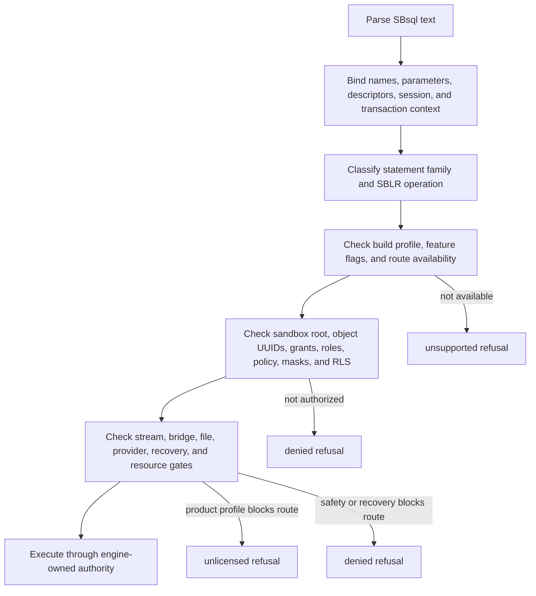

The exact stage is reported in the refusal payload so tools can separate a missing feature from a security decision or a recovery fence.

## Canonical Message Vector

SBsql clients should treat the message vector as the authoritative diagnostic payload. Text rendering is for humans and may be localized or redacted.

| Field | Contract |
| --- | --- |
| `class` | One of `unsupported`, `denied`, or `unlicensed`. |
| `code` | Stable diagnostic code for programmatic handling. |
| `severity` | Error, warning, notice, or informational diagnostic. Refusals that block execution are errors. |
| `statement_family` | Bound statement family, such as DML, DDL, transaction, management, stream, bridge, backup, security, or cluster-gated. |
| `operation_id` | Stable operation identifier after SBsql/SBLR classification. |
| `surface_id` | Grammar or route surface that produced the refusal. |
| `stage` | Parse, bind, admission, authorization, stream, provider, recovery, resource, or execution gate. |
| `principal_uuid` | Effective user or agent UUID when disclosure policy admits it. |
| `object_uuid` | Target object UUID when disclosure policy admits it. |
| `scope` | Database, schema, object, stream, session, bridge, provider, or system scope. |
| `retryable` | Boolean or policy code describing whether retry can succeed without changing authority or configuration. |
| `operator_action` | Optional safe next action, such as request privilege, enable a provider, change endpoint, reopen in recovery mode, or inspect support diagnostics. |
| `redaction` | Indicates whether names, paths, identifiers, policy names, or object details were hidden. |
| `evidence_ref` | Optional internal evidence handle or support-bundle reference. It must not expose secrets or protected material. |
| `message` | Human-readable summary. It must not reveal hidden object existence unless policy permits disclosure. |

SQLSTATE-style codes may be rendered by a driver when that driver has a mapping. The canonical SBsql contract is still the message vector.

## Unsupported

`unsupported` means the request is recognized but unavailable. It does not imply the user lacks privilege.

Common unsupported cases:

| Case | Example cause | Expected result |
| --- | --- | --- |
| Statement family absent from build | A build omits an optional runtime route. | `unsupported` before execution. |
| Option not admitted | A clause uses an option the route does not implement. | `unsupported` at bind or admission. |
| Target does not support the operation | A stream format, index attribute, or descriptor rule is unavailable for the target object. | `unsupported` with target class when disclosure permits it. |
| Provider operation missing | A provider is present but reports no support for the requested operation. | `unsupported` from provider admission. |
| Cluster route disabled | A cluster-gated statement is recognized but cluster routing is not admitted in the build. | `unsupported` with no provider call. |

Example:

```sql
select *
from app.orders
fetch first 10 rows with ties;
```

If the active query profile does not admit `WITH TIES`, the statement is refused as unsupported before row execution.

Example:

```sql
copy app.events
from stdin
with format compressed_binary;
```

If `compressed_binary` does not resolve to an admitted stream format descriptor, the stream is refused before accepting row frames.

## Denied

`denied` means the request is known but must not proceed under current authority, sandbox, policy, safety, recovery, stream, or resource rules. Denial is fail-closed. A denial should not reveal whether a hidden object exists unless the security policy allows that disclosure.

Common denied cases:

| Case | Example cause | Expected result |
| --- | --- | --- |
| Authentication or active role failure | The session lacks an admitted identity or active role. | `denied` with security stage. |
| Privilege failure | The effective principal lacks the required privilege on a target UUID. | `denied`; hidden target details may be redacted. |
| Sandbox boundary | Name resolution attempts to leave the session sandbox root. | `denied` with sandbox stage. |
| Policy, mask, or RLS failure | A policy blocks the row, column, expression, or operation. | `denied` with policy stage. |
| Protected material release | A statement tries to display, export, cast, or log protected material without release authority. | `denied` with redaction. |
| Server-local file access | A bulk, backup, restore, or diagnostic statement tries to open a server-local path without policy admission. | `denied` before file access. |
| Physical backup or restore route | A request attempts low-level page-copy backup or restore through a non-admitted surface. | `denied` before file or page access. |
| Repair or verification route | A low-level repair, verification, or file-structure operation is attempted outside an admitted administrative route. | `denied` with management or diagnostic stage. |
| Recovery fence | The database requires recovery, read-only recovery mode, or operator action before writes are admitted. | `denied` with recovery stage. |
| Resource admission | Memory, file descriptor, stream bytes, queue depth, or timeout policy blocks the request. | `denied` or runtime diagnostic according to the stage. |

Sandbox example:

```sql
select *
from admin.security_audit;
```

If the session root is `tenant_a` and `admin.security_audit` is outside that root, the resolver returns a sandbox denial. The rendered message should not reveal hidden names outside the sandbox.

Server-local file example:

```sql
copy app.orders
from location '/var/import/orders.csv'
with header;
```

`LOCATION` is a policy-controlled server-side endpoint. If the active policy does not admit that location, the engine refuses the statement before opening the path. Client-side streaming should use `STDIN` instead:

```sql
copy app.orders
from stdin
with header;
```

Recovery example:

```sql
insert into app.orders (order_id, status)
values (:order_id, 'pending');
```

If the database is fenced for recovery-required mode, the write is denied before creating durable row versions.

## Unlicensed

`unlicensed` means the parser, SBLR route, ABI boundary, or provider handshake recognized the command, but the current product profile does not license execution. This is not a privilege failure and should not be fixed by granting object privileges.

Common unlicensed cases:

| Case | Example cause | Expected result |
| --- | --- | --- |
| Public compile/link stub | A gated provider boundary exists only to prove routing and diagnostics. | `unlicensed` or fail-closed provider refusal. |
| Product profile excludes route | The binary can classify the operation, but the profile does not license it. | `unlicensed` at admission. |
| Provider capability present but not licensed | A provider reports the operation as known but unavailable for this installation. | `unlicensed` from provider admission. |

Example:

```sql
show cluster provider;
```

In a public build that admits the compile/link stub, this reaches the stub boundary and returns provider metadata plus an unlicensed or fail-closed diagnostic. In a build that does not admit cluster routing, the same statement returns `unsupported` before a provider call.

## Bridge And Stream Refusals

Bridge, stream, backup, restore, replication, migration, and `COPY` statements have additional validation because they can move data across connection boundaries.

| Condition | Refusal class | Rule |
| --- | --- | --- |
| Missing bridge package or provider boundary | `unsupported` | The route is not available. |
| Bridge authentication failure | `denied` | The remote session cannot be established with admitted identity and secret references. |
| Missing capability | `unsupported` | The target route does not report the requested capability. |
| External network blocked by policy | `denied` | Policy does not admit the outbound or inbound route. |
| Stream format invalid | `denied` or runtime diagnostic | Bind-time format mismatch is denied; per-row data errors follow the stream error policy. |
| Ordering ambiguous | `denied` | CDC, replay, or migration route lacks the required ordering token or transaction grouping. |
| Idempotency key missing | `denied` | An apply or replay route requires idempotency and the request did not provide it. |
| Cutover validation failure | `denied` | The route cannot prove that the destination is ready for cutover. |

Logical streams are admitted only through explicit stream surfaces and policies. Page-copy backup, low-level database repair, server-local file manipulation, and unbounded diagnostic extraction must fail closed unless an administrative SBsql route explicitly admits the operation.

## Rendering Rules

Refusal rendering must be useful without leaking protected information.

- A message may name an object only when the session is allowed to know that object exists.
- A sandbox denial should report the sandbox boundary, not hidden outside branches.
- Secret references may be named by safe identifier; raw secrets must never be displayed.
- Server-local paths should be redacted unless policy admits diagnostic path disclosure.
- Support-bundle references should identify evidence handles, not protected content.
- Provider diagnostics should be normalized into the SBsql message vector before being displayed.
- Repeated failures should be stable enough for automated tests to compare class, code, stage, and operation identity.

Example display:

```text
class: denied
code: SB.SQL.SANDBOX.OUT_OF_SCOPE
stage: authorization
operation: query.relational.select
message: object is outside the session schema root
redaction: target_name_hidden
retryable: false
```

Example display for an unavailable route:

```text
class: unsupported
code: SB.SQL.STREAM.FORMAT_UNSUPPORTED
stage: admission
operation: bulk.import
message: stream format is not admitted for this target
retryable: false
```

## Retryability

Refusal vectors should not encourage blind retries.

| Refusal | Retry without change? | Typical fix |
| --- | --- | --- |
| Unsupported statement family | No | Use an admitted surface or enable a build/provider that supplies the route. |
| Unsupported option | No | Remove or replace the option. |
| Denied privilege | No | Grant the required privilege or change active role where policy admits it. |
| Denied sandbox | No | Connect to the correct schema root or use an authorized catalog projection. |
| Denied recovery fence | No | Complete recovery or open the database in an admitted recovery mode. |
| Denied resource policy | Sometimes | Reduce batch size, stream frame size, timeout, or concurrency. |
| Unlicensed route | No | Use a product profile or provider that licenses the route. |
| Provider unavailable | Sometimes | Wait for provider health recovery or choose another admitted provider. |

## Transaction Semantics

A refused statement does not commit partial work. If refusal happens before execution, no row version, catalog mutation, index change, filespace change, stream apply, or transaction finality change is created.

If a statement streams multiple records and the refusal occurs after the statement has been admitted, the stream error policy controls whether the transaction aborts, quarantines invalid records, or stops at the first failing frame. MGA still owns transaction finality. A parser, stream reader, provider, or bridge route does not decide commit, rollback, prepare, or recovery state.

## Proof Expectations

Refusal behavior is part of the testable public contract. Proof suites should verify:

- recognized but unavailable surfaces return `unsupported`, not parse errors;
- security and sandbox failures return `denied` without leaking hidden names;
- unlicensed provider routes reach the admitted stub only when the build profile allows routing;
- disabled gated routes return `unsupported` before provider calls;
- server-local file and physical page-copy attempts fail before opening files;
- logical stream declarations refuse invalid formats before accepting data frames;
- protected values are redacted in diagnostics, logs, and support bundles;
- recovery-required mode fences writes and reports the recovery stage;
- message vectors include stable class, code, stage, operation, retryability, and redaction fields;
- repeated full rebuilds regenerate the same proof outcomes.

## Related Surface Rows

| Surface | Kind | Family | Lowering | Result Shape |
| --- | --- | --- | --- | --- |
| `refusal_statement` | grammar production | diagnostic | yes | `sblr.diagnostic.refusal.v3` |
| `unsupported_statement` | grammar production | diagnostic | yes | `sblr.diagnostic.refusal.v3` |
| `denied_statement` | grammar production | diagnostic | yes | `sblr.diagnostic.refusal.v3` |
| `unlicensed_statement` | grammar production | diagnostic | yes | `sblr.diagnostic.refusal.v3` |
| `cluster_gated_statement` | statement family | cluster-gated | yes | `sblr.diagnostic.refusal.v3` when refused |
| `copy_statement` | statement family | stream | yes | `sblr.bulk.import.v3` or `sblr.bulk.export.v3` when admitted |
| `backup_statement` | statement family | archive | yes | `sblr.diagnostic.refusal.v3` when refused |
| `restore_statement` | statement family | archive | yes | `sblr.diagnostic.refusal.v3` when refused |
| `grant_statement` | statement family | security | yes | `sblr.catalog.mutation.v3` when admitted |
| `policy_statement` | statement family | security | yes | `sblr.catalog.mutation.v3` when admitted |


### /home/dcalford/CliWork/ScratchBird/docs/documentation/draft/Language_Reference/syntax_reference/filespace.md

# Filespace Lifecycle

This page is part of the SBsql Language Reference Manual. It documents filespace creation, roles, placement policy, allocation controls, growth/shrink handling, health and capacity reporting, filespace agents, security policy binding, and refusal behavior.

Generation task: `syntax_reference_filespace_lifecycle`

Related pages: [Database Lifecycle](database.md), [Table Lifecycle](table.md), [Index Lifecycle](index.md), [Security And Privileges](security_and_privilege_statements.md), [Management And Operations](management_and_operations.md), [Refusal Vectors](refusal_vectors.md), and [Filespace Lifecycle EBNF](ebnf/filespace_lifecycle_statement.md).

## Purpose

A filespace is a named storage-placement and allocation policy descriptor. It tells the engine where and how a class of database pages may be allocated, grown, synchronized, checked, fenced, and reported.

A filespace is not a parser-controlled file handle. SQL text can request a filespace descriptor or policy change; storage code owns allocation, page writes, durability, integrity checks, and recovery behavior.

## Filespace Identity

| Concept | Meaning | Authority |
| --- | --- | --- |
| Filespace UUID | Durable identity of the filespace descriptor. | Catalog and engine storage metadata. |
| Filespace name | Resolver name used by DDL and policy binding. | Name registry and security policy. |
| Storage reference | Policy-controlled storage location or placement URI. | Engine storage policy. |
| Filespace role | Intended use such as data, index, overflow, temporary, catalog, or audit storage. | Filespace descriptor and placement policy. |
| Allocation policy | Growth, reserve, quota, extent, and threshold behavior. | Storage manager and filespace policy. |
| Health state | Online, read-only, low-reserve, recovery-required, or retiring status. | Storage checks and operational evidence. |

## Filespace Roles

| Role | Typical Contents | Notes |
| --- | --- | --- |
| `catalog` | Catalog and name-registry pages. | Must be available for normal open and recovery. |
| `data` | Table row pages and row-version storage. | Default role for ordinary table data. |
| `index` | Index pages, index delta pages, and index metadata. | May use a separate placement policy from table data. |
| `overflow` | Large values, document payloads, and overflow chains. | Also used for large logical values when table rows reference external page chains. |
| `temporary` | Session or statement temporary storage. | Must be clearly separated from durable user data policy. |
| `audit` | Audit, diagnostic, or lifecycle evidence where configured. | Protected and redacted according to policy. |
| `archive` | Backup/archive staging or manifest storage where admitted. | Does not replace backup authorization. |
| `default` | Fallback placement for objects without a more specific role. | Should be explicit in production configuration. |

Roles are placement descriptors. They do not grant object privileges by themselves.

## Lifecycle Statement Surface

| Operation | Surface | Contract |
| --- | --- | --- |
| Create | `CREATE FILESPACE` | Creates a filespace descriptor, role, storage reference, allocation policy, integrity policy, and readiness state. |
| Create agent | `CREATE FILESPACE AGENT` | Registers a policy-controlled agent hook for growth, shrink readiness, or storage lifecycle assistance. |
| Alter | `ALTER FILESPACE` | Changes admitted quota, growth, threshold, read-only, online/offline, maintenance, role, or integrity settings. |
| Attach policy | `ATTACH POLICY ... TO FILESPACE ... ROLE ...` | Binds a placement/security policy to a filespace or role. |
| Rename | `RENAME FILESPACE ... TO ...` | Changes resolver name only; allocation identity and storage references remain engine-owned. |
| Comment | `COMMENT ON FILESPACE ... IS ...` | Stores authorized operator/support metadata. |
| Show list | `SHOW FILESPACES` | Lists authorized filespace descriptors. |
| Show extended | `SHOW FILESPACE EXTENDED` | Returns detailed filespace metadata visible to the caller. |
| Show health | `SHOW FILESPACE <name> HEALTH` | Reports health, fences, low-reserve state, read-only state, and diagnostics. |
| Show capacity | `SHOW FILESPACE <name> CAPACITY` | Reports quota, used/reserved/free values, growth limits, and high-water evidence. |
| Show shrink readiness | `SHOW FILESPACE <name> SHRINK READINESS` | Reports whether pages can be relocated/reclaimed safely. |
| Recreate | `RECREATE FILESPACE` | Replaces descriptor metadata only where no unsafe data movement, dependency, or recovery conflict exists. |
| Drop | `DROP FILESPACE ... [RESTRICT | CASCADE]` | Retires a filespace only after storage dependencies, recovery fences, and policy checks pass. |

## Syntax

```ebnf
filespace_lifecycle_statement ::=
      create_filespace_statement
    | create_filespace_agent_statement
    | alter_filespace_statement
    | attach_filespace_policy_statement
    | show_filespace_statement
    | describe_filespace_statement
    | rename_filespace_statement
    | comment_filespace_statement
    | recreate_filespace_statement
    | drop_filespace_statement ;
```

```ebnf
create_filespace_statement ::=
    CREATE FILESPACE filespace_name filespace_create_options? ;

filespace_create_options ::=
    filespace_create_option+ ;

filespace_create_option ::=
      LOCATION storage_ref
    | ROLE filespace_role
    | MAX SIZE size_literal
    | INITIAL SIZE size_literal
    | GROW BY size_literal
    | RESERVE size_literal
    | LOW RESERVE THRESHOLD size_literal
    | PAGE SIZE integer_literal
    | SYNC sync_policy_name
    | CHECKSUM checksum_policy_name
    | READ ONLY
    | ONLINE
    | POLICY policy_name ;
```

```ebnf
create_filespace_agent_statement ::=
    CREATE FILESPACE AGENT filespace_agent_name
    FOR FILESPACE filespace_name?
    filespace_agent_options? ;

filespace_agent_options ::=
    WITH filespace_agent_option (","? filespace_agent_option)* ;

filespace_agent_option ::=
      TYPE filespace_agent_type
    | POLICY policy_name
    | MAX ACTIONS integer_literal
    | TIMEOUT duration_literal ;
```

```ebnf
alter_filespace_statement ::=
    ALTER FILESPACE filespace_name alter_filespace_action+ ;

alter_filespace_action ::=
      SET LOCATION storage_ref
    | SET ROLE filespace_role
    | SET MAX SIZE size_literal
    | SET GROW BY size_literal
    | SET RESERVE size_literal
    | SET LOW RESERVE THRESHOLD size_literal
    | SET SYNC sync_policy_name
    | SET CHECKSUM checksum_policy_name
    | SET READ ONLY
    | SET READ WRITE
    | SET ONLINE
    | SET OFFLINE
    | SET MAINTENANCE
    | CLEAR MAINTENANCE
    | REQUEST GROWTH filespace_growth_request
    | NOTIFY SHRINK READINESS filespace_shrink_descriptor ;
```

```ebnf
attach_filespace_policy_statement ::=
    ATTACH POLICY policy_name TO FILESPACE filespace_name
    (ROLE role_name)? ;

show_filespace_statement ::=
      SHOW FILESPACES
    | SHOW FILESPACE filespace_name
    | SHOW FILESPACE EXTENDED
    | SHOW FILESPACE filespace_name HEALTH
    | SHOW FILESPACE filespace_name CAPACITY
    | SHOW FILESPACE filespace_name SHRINK READINESS ;

drop_filespace_statement ::=
    DROP FILESPACE filespace_name drop_filespace_options? ;

drop_filespace_options ::=
      RESTRICT
    | CASCADE
    | PRESERVE STORAGE
    | DESTROY STORAGE ;
```

SBsql is context-sensitive. Filespace words are command words in filespace statements and do not need to be globally reserved in unrelated expression positions.

## Create Filespace

`CREATE FILESPACE` creates a descriptor. It does not by itself allocate all future pages, move existing pages, or bypass database storage policy.

Example:

```sql
create filespace primary_data
  location 'policy://storage/primary-data'
  role data
  max size 500 gb
  reserve 25 gb
  low reserve threshold 10 gb
  sync durable_default
  checksum page_crc;
```

Creation records:

- filespace UUID and name;
- storage reference;
- role;
- maximum and initial size policy;
- growth increment and low-reserve thresholds;
- sync and integrity policies;
- online/read-only/maintenance state;
- policy bindings;
- dependency and compatibility metadata.

Invalid storage references, unsupported page sizes, incompatible sync policies, or unauthorized placement policies are refused before the descriptor becomes usable.

## Alter Filespace

`ALTER FILESPACE` changes descriptor policy. It does not move or rewrite allocated pages unless the action explicitly admits a storage operation.

Examples:

```sql
alter filespace primary_data set max size 750 gb;
alter filespace primary_data set read only;
alter filespace primary_data set read write;
alter filespace primary_data set low reserve threshold 15 gb;
```

| Action Family | Contract |
| --- | --- |
| Quota and growth | May update future allocation limits. Must refuse values below currently allocated or reserved space unless a shrink plan exists. |
| Online/offline | Controls admission. Offline must refuse if active dependencies cannot be drained safely. |
| Read-only/read-write | Read-only fences new writes while preserving reads and recovery access where policy admits. |
| Maintenance | Allows controlled verify, relocation, or repair actions. Ordinary allocation may be fenced. |
| Location change | Updates future placement only unless an explicit relocation plan is admitted. |
| Sync/checksum policy | Applies according to compatibility rules. Unsafe weakening requires explicit policy authority. |

## Filespace Agents

A filespace agent is a policy-controlled hook that assists storage lifecycle decisions. It is not storage authority by itself.

```sql
create filespace agent primary_growth_agent
for filespace primary_data
with
  type growth,
  policy primary_growth_policy,
  timeout 30 seconds;
```

Agent responsibilities can include:

- requesting additional capacity;
- reporting low-reserve conditions;
- preparing shrink-readiness evidence;
- coordinating page relocation requests;
- producing diagnostics for support bundles.

The engine still owns allocation, page movement, recovery, and integrity. Agent failure must return a diagnostic or quarantine state; it must not silently allocate pages or mark storage healthy.

## Growth, Capacity, And Shrink Readiness

Filespace capacity is policy and evidence, not just a number.

| Field | Meaning |
| --- | --- |
| Maximum size | Upper allocation limit under current policy. |
| Initial size | Initial allocation target where preallocation is admitted. |
| Used bytes/pages | Pages currently allocated to objects. |
| Reserved bytes/pages | Space reserved for growth, recovery, or safety margin. |
| Free bytes/pages | Space available under current policy. |
| Low reserve threshold | Level at which low-reserve diagnostics or growth requests begin. |
| Growth increment | Unit requested during auto-growth or agent-assisted growth. |
| Shrink readiness | Whether pages can be relocated or reclaimed without breaking references, snapshots, or recovery. |

Examples:

```sql
show filespaces;
show filespace primary_data capacity;
show filespace primary_data health;
show filespace primary_data shrink readiness;
```

Shrink readiness must consider active transactions, snapshots, page references, overflow chains, indexes, temporary allocations, recovery fences, and object dependencies. A filespace can be low on capacity but still not shrink-ready.

## Health And Fencing

| Health State | Meaning | Required Behavior |
| --- | --- | --- |
| `online` | Filespace can accept admitted allocations. | Allocate according to policy. |
| `read_only` | Reads are allowed, new writes are fenced. | Refuse writes with a storage-policy diagnostic. |
| `low_reserve` | Reserve threshold has been crossed. | Emit diagnostics and growth request evidence where admitted. |
| `growth_required` | Future allocation requires growth. | Request growth or refuse writes fail-closed. |
| `maintenance` | Controlled storage operations are in progress. | Fence ordinary allocation according to policy. |
| `recovery_required` | Integrity or lifecycle evidence requires recovery. | Fence unsafe access and expose authorized diagnostics. |
| `retiring` | Filespace is being drained or dropped. | Refuse new dependencies and preserve existing references until safe. |
| `offline` | Filespace is not available for ordinary access. | Refuse dependent operations unless recovery/diagnostic policy admits them. |

## Object Placement

Objects can bind to filespaces directly or through database defaults and placement policy.

| Object Class | Placement Behavior |
| --- | --- |
| Tables | Use table-specific filespace, schema/database default, or placement policy. |
| Indexes | May use table placement or an index-specific filespace. |
| Overflow values | Use overflow role or table/filespace policy. |
| Temporary objects | Use temporary role and session policy. |
| Catalog objects | Use catalog role and bootstrap policy. |
| Audit/diagnostic data | Use audit role where configured and redacted. |

Changing a default filespace affects future bindings. Existing object descriptors keep their stored placement until explicitly altered or moved through an admitted storage operation.

## Security And Policy Binding

Filespace operations require storage and catalog authority.

```sql
attach policy placement_policy to filespace primary_data role app_writer;
```

| Concern | Contract |
| --- | --- |
| Visibility | Users see only authorized filespace metadata. |
| Placement rights | Creating or moving objects into a filespace requires placement permission. |
| Administrative rights | Alter/drop/agent operations require storage administration authority. |
| Protected material | Storage references and support details are redacted where policy requires. |
| Role policy | A policy may apply to the filespace generally or to a specific role binding. |

## SHOW And DESCRIBE

Expected fields include:

- filespace UUID;
- name;
- role;
- storage reference class, redacted where needed;
- online/read-only/maintenance state;
- quota, used, reserved, free, and high-water evidence;
- page size and allocation unit where visible;
- growth policy and low-reserve threshold;
- sync and checksum policy;
- health diagnostics;
- shrink-readiness status;
- dependent object counts;
- active filespace agents;
- policy bindings and authorization epoch;
- recovery-required state and diagnostic reference.

`SHOW FILESPACE EXTENDED` is intended for broader operational inspection. `SHOW FILESPACE <name> HEALTH`, `CAPACITY`, and `SHRINK READINESS` are focused projections.

## Drop And Recreate

`DROP FILESPACE` is safe only when no required pages, object descriptors, recovery references, or active snapshots depend on the filespace.

| Option | Contract |
| --- | --- |
| `RESTRICT` | Refuse if any dependency remains. |
| `CASCADE` | Requires explicit cascade policy and must still preserve storage correctness. |
| `PRESERVE STORAGE` | Retires catalog metadata while leaving storage content according to policy. |
| `DESTROY STORAGE` | Requires explicit destructive authority and safe-drop evidence. |

`RECREATE FILESPACE` combines replacement semantics and must refuse if it would hide unsafe data movement, dependency breakage, or recovery uncertainty.

## Failure Modes

| Failure | Required Behavior |
| --- | --- |
| Unknown or hidden filespace | Return not-found or hidden-object diagnostic according to policy. |
| Unauthorized placement | Refuse before creating or changing descriptors. |
| Storage reference denied | Refuse without parser-side file access. |
| Quota below used/reserved space | Refuse unless an admitted shrink/relocation plan exists. |
| Active dependency blocks drop | Refuse or require explicit cascade policy; never orphan pages. |
| Low reserve | Emit health/capacity evidence and request growth where admitted. |
| Agent unavailable | Return diagnostic or quarantine evidence; do not treat presence of an agent descriptor as successful action. |
| Recovery required | Fence unsafe reads/writes and expose only authorized diagnostics or repair routes. |
| Sync/integrity weakening denied | Refuse unless policy explicitly permits the downgrade. |

## Verification Checklist

| Check | Required Outcome |
| --- | --- |
| Parse | Every filespace lifecycle statement shape is recognized by SBsql. |
| Bind | Filespace names, roles, policies, storage references, and agent names resolve exactly. |
| Authorize | Effective user or agent has the required storage/catalog/security authority. |
| Admit | SBLR route and result shape are accepted by the engine verifier. |
| Store | Filespace descriptor, role, allocation policy, integrity policy, and dependencies persist by UUID. |
| Allocate | Storage code, not the parser, performs allocation and growth. |
| Report | `SHOW`/`DESCRIBE` projections match storage evidence and redact protected fields. |
| Fence | Low-reserve, read-only, maintenance, offline, recovery, and drop states fail closed where required. |
| Recover | Crash/restart never leaves silent orphan pages, broken filespace bindings, or false health status. |


### /home/dcalford/CliWork/ScratchBird/docs/documentation/draft/Language_Reference/catalog_reference/sys_catalog_type_alias_mapping.md

# sys.catalog.type_alias_mapping Catalog Reference

This page documents the authorized catalog surface that maps SBsql-visible type
spellings, aliases, profiles, and rendering names to canonical descriptors or
domains.

Generation task: `catalog_sys_catalog_type_alias_mapping`

Related pages: [Type System Overview](../data_types/type_system_overview.md),
[sys.catalog.type_descriptor](sys_catalog_type_descriptor.md),
[sys.catalog.domain_descriptor](sys_catalog_domain_descriptor.md), and
[Script Tokens And Identifiers](../syntax_reference/script_tokens_and_identifiers.md).

## Role

`sys.catalog.type_alias_mapping` lets SBsql remain context sensitive while the
engine remains descriptor-driven. It records which public spelling is accepted
in which profile, what descriptor or domain it resolves to, and how metadata
should render that type back to an authorized user.

Aliases are not execution authority. After binding, the SBLR envelope carries
descriptor and domain UUIDs.

## Keys And Columns

Primary key: `mapping_uuid`

| Column | Type Family | Requirement |
| --- | --- | --- |
| `mapping_uuid` | UUID | Durable mapping identity. |
| `profile_family` | enum domain | SBsql profile or compatibility profile that owns the spelling. |
| `profile_version` | text/domain | Version or policy profile for the spelling. |
| `visible_type_name` | text domain | Public type spelling accepted or rendered by the profile. |
| `visible_type_code` | nullable text/domain | Optional profile-owned symbolic code for metadata rendering. |
| `representation_class` | enum domain | `native`, `domain`, `compound_domain`, `opaque_domain`, `udr_bridge`, `render_only`, or `unsupported_by_policy`. |
| `descriptor_uuid` | nullable UUID | Canonical type descriptor used when the alias maps to a carrier. |
| `domain_uuid` | nullable UUID | Domain descriptor used when the alias maps to a domain. |
| `udr_package_uuid` | nullable UUID | Trusted package responsible for an opaque or bridge-backed representation. |
| `literal_policy_uuid` | nullable UUID | Literal typing policy for this spelling. |
| `bind_policy_uuid` | nullable UUID | Parameter and assignment binding policy. |
| `metadata_policy_uuid` | nullable UUID | Rules for rendering the alias in metadata output. |
| `compatibility_mode` | enum domain | `strict_scratchbird`, `alias_profile`, `bridge_only`, `degraded`, `render_only`, or `unsupported_by_policy`. |

## Alias Classes

| Representation Class | Meaning |
| --- | --- |
| `native` | The visible name maps directly to a canonical ScratchBird descriptor. |
| `domain` | The visible name maps to a domain UUID. |
| `compound_domain` | The visible name maps to a structured domain with elements. |
| `opaque_domain` | The visible name maps to a descriptor whose behavior is exposed only through admitted operations. |
| `udr_bridge` | The visible name requires a trusted package boundary for rendering or binding. |
| `render_only` | The name can be shown in metadata but cannot be used as an executable type declaration. |
| `unsupported_by_policy` | The spelling is recognized only to return a stable unsupported diagnostic. |

## Binding Rules

When the parser sees a type spelling:

1. resolve the spelling under the active SBsql profile;
2. check `compatibility_mode`;
3. bind either `descriptor_uuid` or `domain_uuid`;
4. apply literal and bind policy;
5. attach descriptor/domain identity to the SBLR envelope;
6. render diagnostics using metadata policy.

If both descriptor and domain are null for an executable mapping, binding must
fail. If both are present, the mapping must define which identity is carrier
authority and which is domain policy.

## Metadata Rendering

Metadata rendering can choose a visible type name that differs from the
canonical descriptor name. Rendering is presentation only. It must not make the
visible name into engine authority.

Example:

```sql
select visible_type_name,
       representation_class,
       compatibility_mode
from sys.catalog.type_alias_mapping
where profile_family = 'sbsql'
order by visible_type_name;
```

## Visibility And Mutation

Base rows are engine-owned and are created or updated through type, domain,
profile, package, or catalog lifecycle operations. Users inspect mappings
through authorized catalog projections, type inspection, metadata views, or
support diagnostics.

Hidden or unsupported aliases should produce the same public result as an
unknown type when metadata-hiding policy requires it.

## Dependencies And Invalidation

Alias mapping changes can invalidate:

- prepared statements that used a type spelling;
- routine and trigger compilation;
- metadata caches;
- driver and parser metadata;
- support-bundle projections;
- UDR package bindings;
- cast and conversion decisions.

## Failure Modes

| Condition | Required Behavior |
| --- | --- |
| Visible name maps to no descriptor/domain | Bind diagnostic. |
| Mapping is `render_only` but used in DDL | Unsupported diagnostic. |
| Mapping is `unsupported_by_policy` | Stable unsupported message vector. |
| Trusted package missing for `udr_bridge` | Unavailable capability diagnostic. |
| Ambiguous visible names in one profile | Ambiguity diagnostic; no arbitrary winner. |
| Metadata policy hides mapping | Redacted or not-visible result. |
| Mapping epoch stale | Rebind or refuse cached statement. |

## Verification Checklist

Proof should demonstrate:

- accepted type spellings map to descriptor or domain UUIDs;
- unsupported spellings return explicit diagnostics;
- render-only aliases cannot create executable descriptors;
- profile-specific mappings do not leak outside their profile;
- metadata rendering does not become type authority;
- alias changes invalidate cached parser, plan, routine, and metadata state;
- hidden mappings do not leak through unauthorized projections.


### /home/dcalford/CliWork/ScratchBird/docs/documentation/draft/Language_Reference/catalog_reference/sys_catalog_domain_descriptor.md

# sys.catalog.domain_descriptor Catalog Reference

This page is part of the SBsql Language Reference Manual. It documents the authorized catalog surface that describes domain identity, domain stacks, validation policy, cast policy, operation policy, and masking policy.

Generation task: `catalog_sys_catalog_domain_descriptor`

Related pages: [Domain Lifecycle](../syntax_reference/domain.md), [Domains, Casts, And Coercion](../data_types/domains_casts_and_coercion.md), [sys.catalog.domain_element](sys_catalog_domain_element.md), [sys.catalog.type_descriptor](sys_catalog_type_descriptor.md), and [sys.catalog.type_capability](sys_catalog_type_capability.md).

## Role

`sys.catalog.domain_descriptor` records durable metadata for every domain. A domain descriptor is the catalog authority for:

- the domain UUID;
- the base carrier descriptor;
- the optional parent domain;
- the resolved domain stack;
- null policy;
- defaults;
- constraints;
- element policy;
- cast policy;
- operation policy;
- masking/protected-value policy;
- SBsql alias rendering metadata.

Catalog rows are not parser authority. They are visible through authorized catalog projections, `SHOW DOMAIN`, `DESCRIBE DOMAIN`, information-style views, or support tooling. Base catalog mutation must go through engine-managed domain lifecycle operations.

## Keys And Columns

Primary key: `domain_uuid`

| Column | Type Family | Requirement |
| --- | --- | --- |
| `domain_uuid` | UUID | Durable domain identity. This value is what dependent columns, routines, indexes, views, and SBLR descriptors bind to. |
| `domain_kind` | enum domain | Domain family: `scalar`, `compound`, `array`, `row`, `map`, `range`, `enum`, `variant`, `opaque`, `alias_profile`, or `protected_history`. |
| `base_descriptor_uuid` | nullable UUID | Canonical carrier descriptor used for physical representation and primitive operations. Required unless the domain kind is represented entirely through a base domain or policy-owned opaque binding. |
| `base_domain_uuid` | nullable UUID | Parent domain UUID for domain-over-domain stacks. |
| `domain_stack_hash` | binary/hash | Stable hash of the resolved base descriptor plus parent-domain chain and this domain's validation identity. |
| `nullable_policy_uuid` | UUID | Policy that admits or refuses `null` for values of this domain. |
| `default_expression_uuid` | nullable UUID | Bound default expression used when no more specific assignment-site default exists. |
| `constraint_set_uuid` | nullable UUID | Set of named domain checks evaluated with the `VALUE` pseudo-value. |
| `element_policy_uuid` | nullable UUID | Compound-domain element policy set. Used with `sys.catalog.domain_element`. |
| `cast_policy_uuid` | nullable UUID | Policy governing implicit assignment, explicit casts, lossiness, domain preservation, and domain erasure. |
| `operation_policy_uuid` | nullable UUID | Policy governing comparison, hashing, ordering, arithmetic, text, temporal, document, vector, spatial, opaque, aggregate, and index behavior. |
| `masking_policy_uuid` | nullable UUID | Redaction, protected-value, support-bundle, or projection masking policy. |
| `source_family` | nullable enum domain | SBsql alias/rendering family used when a domain has a policy-owned alternate surface name. |
| `source_type_name` | nullable text domain | SBsql-facing type or alias spelling rendered by authorized metadata views. |

## Column Semantics

### Identity

`domain_uuid` is stable across rename. The resolver name can change, but stored descriptors, SBLR payloads, indexes, routines, views, and table columns remain bound to the UUID.

### Base Descriptor And Base Domain

A domain may wrap a canonical descriptor directly:

```text
app.nonnegative_money
|
+-- base_descriptor_uuid -> decimal(18,2)
```

It may also wrap another domain:

```text
app.customer_label
|
+-- base_domain_uuid -> app.nonblank_text
    |
    +-- base_descriptor_uuid -> varchar(200)
```

The binder resolves this chain before execution and records the result in the domain stack.

### Domain Stack Hash

`domain_stack_hash` detects whether the resolved chain used by a prepared statement, stored routine, generated column, index, or view is still valid. If any domain in the chain changes in a way that affects validation or operations, dependent compiled metadata must rebind or refuse.

### Policy UUIDs

Policy UUID columns point to policy records outside this table. The domain descriptor stores references so the binder and engine can apply a single authority model for validation, casting, comparison, indexing, masking, and element mutation.

## Dependency Behavior

The following objects normally depend on `domain_uuid`:

- table columns;
- generated columns;
- defaults and constraints;
- indexes and index expressions;
- views and materialized views;
- procedure/function parameters and returns;
- triggers;
- UDR bindings;
- cast descriptors;
- operation descriptors;
- support-bundle and metadata projections.

Changing a domain descriptor can invalidate any of those dependencies. The engine must either refresh them, revalidate them, or refuse the change.

## Operational Boundaries

- Base catalog rows require UUID identity and transaction lifecycle metadata.
- Direct user mutation of `sys.catalog.domain_descriptor` is not the domain DDL API.
- Visibility is policy controlled and may use redaction.
- Derived views must preserve base-row authority and must not become engine identity.
- `SHOW DOMAIN` and `DESCRIBE DOMAIN` are authorized projections over this table and related policy tables.
- DDL changes become visible only through MGA transaction finality.

## Example Inspection

```sql
select domain_uuid,
       domain_kind,
       base_descriptor_uuid,
       base_domain_uuid,
       domain_stack_hash
from sys.catalog.domain_descriptor
order by domain_kind, domain_uuid;
```

Use [Domain Lifecycle](../syntax_reference/domain.md) for supported mutation syntax. This catalog page is for metadata interpretation.


### /home/dcalford/CliWork/ScratchBird/docs/documentation/draft/Language_Reference/catalog_reference/sys_security_catalog_protected_material_audit_event.md

# sys.security.catalog.protected_material_audit_event Catalog Reference

This page documents the authorized catalog surface that records redacted audit
events for protected-material lifecycle, access, release, denial, purge,
policy, and inspection activity.

Generation task: `catalog_sys_security_catalog_protected_material_audit_event`

Related pages: [sys.catalog.protected_material](sys_catalog_protected_material.md),
[sys.catalog.protected_material_version](sys_catalog_protected_material_version.md),
[sys.catalog.protected_material_policy_binding](sys_catalog_protected_material_policy_binding.md),
[Security And Sandboxing](../core_paradigms/security_and_sandboxing.md), and
[Refusal Vectors](../syntax_reference/refusal_vectors.md).

## Role

`sys.security.catalog.protected_material_audit_event` is the durable, redacted
evidence surface for protected-material decisions. It lets authorized security,
support, and operations users answer questions such as:

- who attempted to inspect protected material metadata;
- whether a release was allowed or denied;
- which policy kind controlled the decision;
- which protected material and version were involved;
- which diagnostic was returned;
- whether redaction was applied;
- which transaction or catalog generation the event belongs to.

Audit events are evidence. They do not expose raw protected material and do not
grant release authority.

## Keys And Columns

Primary key: `audit_event_uuid`

| Column | Type Family | Requirement |
| --- | --- | --- |
| `audit_event_uuid` | UUID/text | Stable audit event identity. |
| `protected_material_uuid` | UUID | Material involved in the event. |
| `protected_material_version_uuid` | nullable UUID | Version involved, if the event is version-specific. |
| `actor_uuid` | UUID | Effective user, role, agent, or system actor. Redacted in projections where policy requires it. |
| `event_kind` | enum | `create`, `add_version`, `rotate`, `resolve`, `release`, `deny`, `purge`, `policy_change`, `inspect`, `quarantine`, or `support_export`. |
| `decision` | enum | `allow`, `deny`, `redact`, `quarantine`, or `not_applicable`. |
| `diagnostic_code` | nullable text | Message-vector code emitted for denial, refusal, quarantine, or warning. |
| `redacted_detail` | text | Human-readable, policy-redacted event detail. |
| `event_epoch_millis` | uint64 | Event time from engine audit context. |
| `local_transaction_id` | uint64 | Local MGA transaction ID associated with the event, or zero when no user transaction applies. |
| `catalog_generation_id` | uint64 | Catalog generation associated with the event. |
| `redaction_applied` | boolean | True when protected-material redaction policy was applied to event details. |

## Event Kinds

| Event Kind | Meaning |
| --- | --- |
| `create` | Protected material identity was created. |
| `add_version` | A new protected material version was added. |
| `rotate` | Active protected material version changed. |
| `resolve` | A protected reference was resolved without releasing raw material. |
| `release` | Raw material or release-controlled value was admitted for a purpose. |
| `deny` | Access, resolution, release, purge, export, or support collection was denied. |
| `purge` | Protected reference reachability was removed under purge policy. |
| `policy_change` | A policy binding or policy epoch changed. |
| `inspect` | Metadata was inspected through an authorized projection. |
| `quarantine` | Material or version was fenced because integrity or policy state was uncertain. |
| `support_export` | Redacted evidence was included in support output. |

## Redaction Rules

Audit rows are sensitive even when they contain no raw protected value.

Redaction can apply to:

- actor UUID;
- material UUID;
- version UUID;
- policy names or UUIDs;
- endpoint, bridge, stream, backup, replication, migration, or support context;
- diagnostic detail;
- hashes or reference metadata;
- timing information where policy requires it.

`redaction_applied` must be true for rows where protected-material redaction
policy affected rendering. A false value is allowed only when policy confirms
that the rendered audit row contains no protected detail for the caller.

## Visibility And Mutation

Audit rows are append-only evidence from the public user's point of view.
Engine-managed security and protected-material operations create them.
Ordinary catalog queries, support export, diagnostics rendering, and parser
metadata requests must not directly mutate the base audit table.

Retention and purge of audit rows are governed by audit and retention policy.
Purging protected reference reachability must not remove audit rows that policy
requires to remain.

## Example Inspection

```sql
select audit_event_uuid,
       protected_material_uuid,
       event_kind,
       decision,
       diagnostic_code,
       event_epoch_millis,
       redaction_applied
from sys.security.catalog.protected_material_audit_event
where protected_material_uuid = :protected_material_uuid
order by event_epoch_millis;
```

Returned rows and columns depend on the caller's disclosure policy.

## Support-Bundle Behavior

Support bundles may include protected-material audit evidence only through
redacted projections. A support bundle must not include raw secrets, raw
protected payloads, credential text, unredacted protected references, or
unredacted release evidence unless a specific release policy admits that
content for that support purpose.

## Failure Modes

| Condition | Required Behavior |
| --- | --- |
| Audit row hidden by policy | Redact or omit row according to disclosure policy. |
| Actor hidden | Redact `actor_uuid` or render a policy-safe actor class. |
| Material hidden | Redact material identity while preserving authorized event class. |
| Diagnostic detail protected | Render `diagnostic_code` and redacted summary only. |
| Audit append fails for required event | Fail closed or quarantine according to audit policy. |
| Support export requests raw audit detail | Deny or redact. |
| Retention policy blocks deletion | Refuse deletion or purge. |

## Verification Checklist

Proof should demonstrate:

- protected-material lifecycle operations emit audit events where policy
  requires them;
- release denials and release approvals are distinguishable without leaking raw
  material;
- unauthorized users cannot infer hidden protected material through audit
  queries;
- support bundles include only redacted audit evidence;
- purging protected reference reachability preserves required audit rows;
- redaction policy controls actor, material, version, diagnostic, and endpoint
  fields;
- audit append failure does not silently allow an operation that requires audit
  evidence;
- audit rows are transactionally and catalog-generation consistent.


### /home/dcalford/CliWork/ScratchBird/docs/documentation/draft/Language_Reference/catalog_reference/sys_catalog_type_capability.md

# sys.catalog.type_capability Catalog Reference

This page documents the authorized catalog surface that records what a type
descriptor can safely do: compare, order, hash, group, index, store, render,
move through streams, participate in backup/replication, and cross trusted
runtime boundaries.

Generation task: `catalog_sys_catalog_type_capability`

Related pages: [sys.catalog.type_descriptor](sys_catalog_type_descriptor.md),
[Type System Overview](../data_types/type_system_overview.md),
[Index Lifecycle](../syntax_reference/index.md), and
[Conversion Matrix](../data_types/conversion_matrix.md).

## Role

`sys.catalog.type_capability` prevents the engine from guessing what a type can
do. A descriptor can exist without being orderable, hashable, indexable,
wire-renderable, stream-safe, or safe for acceleration. Capability rows make
those boundaries explicit.

The row is used by:

- binder overload selection;
- comparison, grouping, sorting, and distinct planning;
- index DDL and DML maintenance;
- optimizer plan selection;
- stream, backup, restore, replication, and migration admission;
- trusted UDR and native acceleration admission;
- protected-material handling and redaction.

## Keys And Columns

Primary key: `capability_uuid`

| Column | Type Family | Requirement |
| --- | --- | --- |
| `capability_uuid` | UUID | Durable capability row identity. |
| `descriptor_uuid` | UUID | Type or domain descriptor governed by this capability row. |
| `comparable` | boolean | Equality operation support. |
| `orderable` | boolean | Total or admitted partial ordering support. |
| `hashable` | boolean | Hash-key support for joins, grouping, lookup, or hash indexes. |
| `groupable` | boolean | `GROUP BY`, `DISTINCT`, and grouping-set eligibility. |
| `indexable` | boolean | At least one index family can use this descriptor. |
| `storable` | boolean | Ordinary row, overflow, or large-value storage is admitted. |
| `wire_renderable` | boolean | Value can be rendered through an admitted client/parser/driver result contract. |
| `backup_safe` | boolean | Logical backup can include this descriptor under policy. |
| `replication_safe` | boolean | Logical replication/change streams can carry this descriptor under policy. |
| `cluster_transport_safe` | boolean | Descriptor has a declared transport profile for gated cluster-provider routes. |
| `udr_safe` | boolean | Descriptor can cross a trusted UDR boundary under policy. |
| `llvm_eligible` | boolean | Descriptor can participate in admitted native acceleration. |
| `protected_value_capable` | boolean | Descriptor can carry protected references or release-controlled material. |
| `element_addressable` | boolean | Descriptor supports element/path addressing through domain or compound-value metadata. |

## Capability Semantics

Capability flags are not privileges. They state whether the descriptor has the
technical and semantic contract needed for an operation. Security and policy
are still checked separately.

| Capability | Does Not Mean |
| --- | --- |
| `comparable` | The user may compare hidden or protected values without authorization. |
| `orderable` | Every index family can order the descriptor. |
| `hashable` | Hashes are stable across descriptor-version changes. |
| `indexable` | A specific index declaration is valid. The index family must also be compatible. |
| `wire_renderable` | Protected material can be released. |
| `backup_safe` | The caller has backup privilege. |
| `replication_safe` | The route has ordering, idempotency, or release authority. |
| `udr_safe` | Any UDR can receive the value. The UDR package still requires trust and policy. |
| `llvm_eligible` | Acceleration is required or always enabled. |

## Index And Optimizer Use

`indexable` is broad. A descriptor can be indexable for one index family and not
another. The optimizer must still consult index compatibility, operation
descriptor, collation, comparison contract, statistics, policy, and exact
recheck requirements.

An index provides candidate evidence. It does not own row visibility, security,
transaction finality, or predicate truth.

## Stream And Transport Use

`backup_safe`, `replication_safe`, and transport-related capability flags state
that the descriptor can be represented in an admitted stream. The stream route
still requires:

- object privileges;
- protected-material release policy;
- stream frame limits;
- ordering and idempotency where required;
- target descriptor compatibility;
- transaction and recovery safety.

## Visibility And Mutation

Base rows are engine-owned and are changed through descriptor, extension,
domain, catalog, or bootstrap lifecycle operations. Users inspect capability
state through authorized projections, `DESCRIBE TYPE`, `SHOW TYPE`, support
diagnostics, or information-style views.

## Example Inspection

```sql
select td.canonical_type,
       tc.comparable,
       tc.orderable,
       tc.hashable,
       tc.groupable,
       tc.indexable,
       tc.storable,
       tc.wire_renderable
from sys.catalog.type_capability tc
join sys.catalog.type_descriptor td
  on td.descriptor_uuid = tc.descriptor_uuid
order by td.canonical_type;
```

## Failure Modes

| Condition | Required Behavior |
| --- | --- |
| Capability row missing for descriptor | Refuse operation that requires capability evidence. |
| Operation requires ordering but `orderable` is false | Bind/admission diagnostic. |
| Hash grouping requires `hashable` but flag is false | Bind/admission diagnostic. |
| Index creation requires an unsupported capability | DDL diagnostic. |
| Stream route requires unsafe descriptor | Stream admission diagnostic. |
| Protected value is wire-rendered without release authority | Denied message vector. |
| Capability epoch stale | Rebind, invalidate, or refuse stale execution. |

## Verification Checklist

Proof should demonstrate:

- capability rows exist for all public descriptors that require operation
  admission;
- non-comparable descriptors cannot be used in equality operations;
- non-orderable descriptors cannot be sorted or ordered by B-tree-style keys;
- non-hashable descriptors cannot be used for hash operations;
- index creation checks descriptor and index-family compatibility;
- stream/backup/replication routes check descriptor capability and policy;
- protected descriptors remain redacted unless release is admitted;
- optimizer plans invalidate when capability metadata changes.


### /home/dcalford/CliWork/ScratchBird/docs/documentation/draft/Language_Reference/catalog_reference/index.md

# Catalog Reference Index

This section documents public SBsql catalog surfaces. A catalog page explains
how to read an authorized metadata surface; it is not a direct mutation API.
Catalog rows are engine-owned, UUID-identified, transactionally visible, and
redacted by security policy.

## Catalog Authority

Catalog data records durable engine metadata: type descriptors, domain
descriptors, operation descriptors, protected-material metadata, policy
bindings, and protected-material audit evidence. User-facing names are resolver
input. Durable catalog identity is UUID based.

The public rules are:

- base catalog rows are mutated only by engine-managed DDL, security,
  protected-material, or catalog lifecycle operations;
- `SHOW`, `DESCRIBE`, information-style views, and support diagnostics are
  authorized projections over catalog state;
- projections can redact or hide rows according to the caller's security
  context;
- catalog rows become visible only through MGA transaction finality;
- cached parser, plan, driver, UDR, support-bundle, and metadata state must
  revalidate when catalog, security, resolver, or resource epochs change.

## Reading A Catalog Page

Each table page follows the same public interpretation model.

| Section | Meaning |
| --- | --- |
| Role | Why the surface exists and which engine behavior depends on it. |
| Keys and columns | Public metadata fields and their descriptor families. |
| Column semantics | How important fields affect binding, validation, policy, or execution. |
| Visibility and mutation | Who can read the projection and which engine operation can change it. |
| Dependencies and invalidation | Which cached or compiled state must rebind when rows change. |
| Failure modes | Required diagnostics for missing, stale, hidden, invalid, or policy-blocked state. |
| Verification checklist | Proof expectations for the surface. |

## Catalog Surfaces

| Catalog Surface | File |
| --- | --- |
| `sys.catalog.type_descriptor` | [sys_catalog_type_descriptor.md](sys_catalog_type_descriptor.md) |
| `sys.catalog.domain_descriptor` | [sys_catalog_domain_descriptor.md](sys_catalog_domain_descriptor.md) |
| `sys.catalog.domain_element` | [sys_catalog_domain_element.md](sys_catalog_domain_element.md) |
| `sys.catalog.type_alias_mapping` | [sys_catalog_type_alias_mapping.md](sys_catalog_type_alias_mapping.md) |
| `sys.catalog.type_capability` | [sys_catalog_type_capability.md](sys_catalog_type_capability.md) |
| `sys.catalog.operation_descriptor` | [sys_catalog_operation_descriptor.md](sys_catalog_operation_descriptor.md) |
| `sys.catalog.protected_material` | [sys_catalog_protected_material.md](sys_catalog_protected_material.md) |
| `sys.catalog.protected_material_version` | [sys_catalog_protected_material_version.md](sys_catalog_protected_material_version.md) |
| `sys.catalog.protected_material_policy_binding` | [sys_catalog_protected_material_policy_binding.md](sys_catalog_protected_material_policy_binding.md) |
| `sys.security.catalog.protected_material_audit_event` | [sys_security_catalog_protected_material_audit_event.md](sys_security_catalog_protected_material_audit_event.md) |

## Common Query Pattern

Catalog examples use explicit column lists so public scripts do not depend on
hidden, redacted, version-specific, or future columns.

```sql
select descriptor_uuid,
       canonical_type,
       type_family
from sys.catalog.type_descriptor
order by canonical_type;
```

## Related Reference Pages

- [UUID Catalog Identity](../core_paradigms/uuid_catalog_identity.md)
- [Security And Sandboxing](../core_paradigms/security_and_sandboxing.md)
- [Parser To SBLR Pipeline](../core_paradigms/parser_to_sblr_pipeline.md)
- [Type System Overview](../data_types/type_system_overview.md)
- [Domains, Casts, And Coercion](../data_types/domains_casts_and_coercion.md)
- [Refusal Vectors](../syntax_reference/refusal_vectors.md)


### /home/dcalford/CliWork/ScratchBird/docs/documentation/draft/Language_Reference/catalog_reference/sys_catalog_type_descriptor.md

# sys.catalog.type_descriptor Catalog Reference

This page documents the authorized catalog surface that describes canonical
type descriptors. Type descriptors are the durable metadata records that let
the binder, SBLR envelope, executor, optimizer, index layer, stream layer, and
result renderer agree on what a value is.

Generation task: `catalog_sys_catalog_type_descriptor`

Related pages: [Type System Overview](../data_types/type_system_overview.md),
[Conversion Matrix](../data_types/conversion_matrix.md),
[sys.catalog.type_capability](sys_catalog_type_capability.md), and
[sys.catalog.domain_descriptor](sys_catalog_domain_descriptor.md).

## Role

`sys.catalog.type_descriptor` records canonical carrier identity. A type name
such as `uint128`, `varchar(120)`, `timestamp(6) with time zone`, or
`vector<float32,1536>` resolves to a descriptor row or to a domain row that
wraps a descriptor row.

The row is used for:

- literal, parameter, column, variable, routine, stream, and result binding;
- cast and assignment validation;
- row, page, overflow, and stream admission;
- comparison, hashing, ordering, grouping, and index eligibility;
- text charset/collation, temporal timezone, vector dimension, document shape,
  and protected-material behavior;
- cache invalidation when descriptor-affecting metadata changes.

## Keys And Columns

Primary key: `descriptor_uuid`

| Column | Type Family | Requirement |
| --- | --- | --- |
| `descriptor_uuid` | UUID | Durable descriptor identity. This is what SBLR and dependent catalog objects bind to. |
| `canonical_type` | enum domain | Canonical SBsql type name or carrier class. |
| `type_family` | enum domain | Scalar, numeric, text, binary, temporal, document, spatial, vector, graph, collection, protected, opaque, or extension family. |
| `source_type_uuid` | nullable UUID | Descriptor this descriptor derives from, where derivation is represented. |
| `domain_uuid` | nullable UUID | Domain identity when this descriptor is a domain-bound slot projection. |
| `modifier_profile_uuid` | nullable UUID | Precision, scale, length, dimension, spatial reference, timezone, or shape modifier profile. |
| `charset_uuid` | nullable UUID | Character set descriptor for text values. |
| `collation_uuid` | nullable UUID | Collation descriptor for text comparison and index keys. |
| `timezone_policy_uuid` | nullable UUID | Temporal timezone and rendering policy. |
| `storage_codec_uuid` | nullable UUID | Storage/overflow/large-value codec descriptor where applicable. |
| `comparison_contract_uuid` | nullable UUID | Equality, ordering, hashing, canonicalization, and null-comparison contract. |
| `capability_uuid` | nullable UUID | Link to the capability row for this descriptor. |

## Column Semantics

### Descriptor UUID

`descriptor_uuid` is stable identity. Names and aliases can change, but SBLR
payloads, prepared statements, indexes, routines, domains, and result
descriptors use the UUID.

### Canonical Type And Type Family

`canonical_type` is the public carrier name or class. `type_family` controls
which descriptor-specific rules apply. For example:

- numeric descriptors own range, precision, scale, and arithmetic behavior;
- text descriptors own character set and collation;
- temporal descriptors own precision and timezone policy;
- vector descriptors own dimension, element profile, metric, and recheck rules;
- protected descriptors own release and redaction policy.

### Modifier Profile

`modifier_profile_uuid` prevents a type spelling from being the only record of
important modifiers. A descriptor for `decimal(18,2)` must carry precision and
scale. A descriptor for `vector<float32,1536>` must carry element profile and
dimension. A descriptor for `timestamp(6) with time zone` must carry precision
and timezone behavior.

### Charset, Collation, And Timezone

These fields are nullable because not every descriptor uses them. When present,
they are dependencies that can affect comparison, sorting, indexing, rendering,
and cache invalidation.

## Visibility And Mutation

Base rows are engine-owned. Users inspect type descriptors through authorized
catalog projections, `SHOW TYPE`, `DESCRIBE TYPE`, information-style views, or
support diagnostics.

Direct user mutation of `sys.catalog.type_descriptor` is not the DDL API.
Descriptor changes must occur through admitted type, domain, catalog, bootstrap,
or extension lifecycle operations and become visible only through MGA
transaction finality.

## Dependencies And Invalidation

Descriptor changes can invalidate:

- prepared statements;
- compiled routines and triggers;
- domains and compound domain elements;
- table columns and generated columns;
- indexes and statistics;
- casts, operators, aggregates, and window functions;
- backup, restore, replication, migration, bridge, and stream descriptors;
- support-bundle and metadata projections.

When any descriptor-affecting epoch changes, dependent state must rebind,
revalidate, rebuild, or refuse execution.

## Example Inspection

```sql
select descriptor_uuid,
       canonical_type,
       type_family,
       modifier_profile_uuid,
       capability_uuid
from sys.catalog.type_descriptor
order by type_family, canonical_type;
```

## Failure Modes

| Condition | Required Behavior |
| --- | --- |
| Descriptor UUID missing | Bind diagnostic for unresolved descriptor. |
| Descriptor hidden by policy | Redacted not-visible or denied diagnostic. |
| Descriptor family mismatch | Bind/admission diagnostic. |
| Required modifier missing | Descriptor-invalid diagnostic. |
| Charset/collation/timezone dependency missing | Bind or admission diagnostic. |
| Capability row missing where required | Capability diagnostic; do not assume defaults. |
| Stale descriptor epoch | Rebind, invalidate cache, or refuse stale execution. |

## Verification Checklist

Proof should demonstrate:

- every public type spelling resolves to a descriptor UUID;
- descriptor UUIDs are stable across rename or alias changes;
- modifiers are represented by descriptor metadata, not text-only spelling;
- charset, collation, timezone, storage, and comparison dependencies are
  enforced;
- SBLR envelopes carry descriptor references;
- hidden descriptors do not leak through unauthorized projections;
- dependent plans and compiled objects invalidate when descriptor metadata
  changes.


### /home/dcalford/CliWork/ScratchBird/docs/documentation/draft/Language_Reference/catalog_reference/sys_catalog_protected_material_version.md

# sys.catalog.protected_material_version Catalog Reference

This page documents the authorized catalog surface that records versioned
protected-material references. A version row represents a rotated, replaced,
derived, or retained protected reference without exposing raw protected values.

Generation task: `catalog_sys_catalog_protected_material_version`

Related pages: [sys.catalog.protected_material](sys_catalog_protected_material.md),
[sys.catalog.protected_material_policy_binding](sys_catalog_protected_material_policy_binding.md),
[sys.security.catalog.protected_material_audit_event](sys_security_catalog_protected_material_audit_event.md), and
[Binary, UUID, And Protected Values](../data_types/binary_uuid_and_protected_values.md).

## Role

`sys.catalog.protected_material_version` gives protected material an MGA-visible
version history. Rotation, replacement, quarantine, purge, and retention are
recorded without turning raw secret material into ordinary catalog data.

## Keys And Columns

Primary key: `protected_material_version_uuid`

Unique key: `protected_material_uuid`, `version_number`

| Column | Type Family | Requirement |
| --- | --- | --- |
| `protected_material_version_uuid` | UUID | Stable version identity. |
| `protected_material_uuid` | UUID | Owning protected material. |
| `version_number` | uint64 | Monotonic per protected material. |
| `protected_reference_hash` | hash/text | Digest of protected reference metadata. Must not reveal sensitive reference text. |
| `envelope_hash` | hash/text | Digest of wrapped, enveloped, split, or derived metadata. |
| `payload_hash` | hash/text | Integrity hash for referenced payload where policy admits storing it. |
| `storage_class` | enum | `wrapped`, `split`, `external_reference`, `derived`, `redacted`, or admitted equivalent. |
| `rotation_state` | enum | `active`, `rotated`, `retained`, `purged`, `quarantined`, or `compromised_restricted`. |
| `valid_from_local_transaction_id` | uint64 | MGA transaction ID that makes the version visible. |
| `valid_until_local_transaction_id` | nullable uint64 | MGA transaction ID that ends active visibility. |
| `retention_policy_uuid` | UUID | Version retention policy. |
| `access_policy_uuid` | UUID | Version metadata access policy. |
| `release_policy_uuid` | UUID | Version release policy. |
| `purge_policy_uuid` | UUID | Version purge policy. |
| `audit_policy_uuid` | UUID | Version audit policy. |
| `retention_until_epoch_millis` | uint64 | Earliest policy-admitted purge time. |
| `legal_hold` | boolean | Purge refusal flag until cleared by policy. |
| `purged` | boolean | Protected reference reachability has been removed. |
| `catalog_generation_id` | uint64 | Visible catalog generation. |
| `security_epoch` | uint64 | Security epoch for visibility and release. |

## Version Selection

Active resolution selects the highest version that is visible to the caller's
MGA snapshot, is not ended for that snapshot, and is admitted by policy.

```text
protected material
|
+-- version 1: rotated
+-- version 2: retained
+-- version 3: active
```

The active version can differ by transaction snapshot. A version created in an
uncommitted transaction is not ordinary visible state.

## Rotation And Purge

Adding a version closes the previous active version by recording the ending
transaction boundary. Purge removes protected-reference reachability according
to purge policy while preserving hashes and audit evidence where retention
policy requires it.

Purge must not rewrite transaction finality, erase required audit records, or
return plaintext through diagnostics.

## Visibility And Mutation

Rows are exposed only through authorized projections. Mutation is performed by
engine-managed protected-material lifecycle operations: add version, rotate,
quarantine, retain, purge, restore metadata, or policy change.

## Example Inspection

```sql
select protected_material_version_uuid,
       protected_material_uuid,
       version_number,
       rotation_state,
       valid_from_local_transaction_id,
       valid_until_local_transaction_id,
       purged
from sys.catalog.protected_material_version
where protected_material_uuid = :protected_material_uuid
order by version_number;
```

## Failure Modes

| Condition | Required Behavior |
| --- | --- |
| Version not visible to snapshot | Return not visible or select an older visible version. |
| Active version quarantined | Fence release and return diagnostic. |
| Purged version requested | Return purged-state diagnostic without reference data. |
| Legal hold active | Refuse purge. |
| Hash mismatch | Quarantine or fail closed according to policy. |
| Version gap detected | Refuse resolution until classified. |
| Stale security epoch | Reauthorize before release or metadata rendering. |

## Verification Checklist

Proof should demonstrate:

- version numbers are monotonic per protected material;
- version visibility obeys MGA transaction snapshots;
- rotation closes the previous active version;
- purge removes reachability without leaking raw values;
- legal hold blocks purge;
- hidden versions are redacted from unauthorized projections;
- hash mismatch or version gaps fail closed;
- release and support output use version policy and audit evidence.


### /home/dcalford/CliWork/ScratchBird/docs/documentation/draft/Language_Reference/catalog_reference/sys_catalog_operation_descriptor.md

# sys.catalog.operation_descriptor Catalog Reference

This page documents the authorized catalog surface that describes SBsql/SBLR
operations: argument descriptors, result descriptors, determinism, null and
missing behavior, domain preservation, implementation routing, security, cost,
and index eligibility.

Generation task: `catalog_sys_catalog_operation_descriptor`

Related pages: [Parser To SBLR Pipeline](../core_paradigms/parser_to_sblr_pipeline.md),
[Operator Type Result Matrix](../syntax_reference/operator_type_result_matrix.md),
[Conversion Matrix](../data_types/conversion_matrix.md), and
[sys.catalog.type_descriptor](sys_catalog_type_descriptor.md).

## Role

`sys.catalog.operation_descriptor` is the metadata bridge between a bound
expression or statement and the executable SBLR operation. It tells the binder
and server admission what argument shape is valid, what result shape is
produced, how null/missing values behave, whether domains are preserved or
erased, whether an index can be used, and which implementation route is
admitted.

The page covers the public interpretation of the table. It does not expose
private implementation entry points.

## Keys And Columns

Primary key: `operation_uuid`

| Column | Type Family | Requirement |
| --- | --- | --- |
| `operation_uuid` | UUID | Durable operation identity used by SBLR routing. |
| `operation_family_uuid` | UUID | Operation family identity for grouping, inspection, and admission. |
| `operation_kind` | enum domain | Compare, hash, arithmetic, text, temporal, document, spatial, vector, aggregate, window, locator, management, stream, opaque, or other admitted family. |
| `argument_signature_uuid` | UUID | Ordered argument descriptors, domain rules, parameter modes, and variadic behavior. |
| `result_descriptor_uuid` | UUID | Descriptor of the scalar, row, cursor, stream, command, or diagnostic result. |
| `domain_stack_policy_uuid` | UUID | Domain preservation, erasure, or common-domain derivation behavior. |
| `null_missing_policy_uuid` | UUID | Null, missing, default, unknown, and error behavior. |
| `resource_dependency_set_uuid` | nullable UUID | Required collation, timezone, metric, tokenizer, spatial reference, stream, package, or provider resources. |
| `security_policy_uuid` | UUID | Execution privilege, masking, protected-material, or disclosure policy. |
| `determinism_class` | enum domain | `deterministic`, `stable`, `transaction_stable`, `statement_stable`, `volatile`, or `side_effecting`. |
| `cost_class` | enum/domain | Optimizer cost family and planning hints. |
| `index_eligibility_uuid` | nullable UUID | Index compatibility and exact-recheck contract. |
| `implementation_ref_uuid` | UUID | Public operation route identity for SBLR dispatch. |
| `fallback_ref_uuid` | nullable UUID | Alternate operation route used only when admitted. |

## Operation Identity

`operation_uuid` is the executable identity after binding. Names such as
operator symbols, function names, aggregate names, and statement-family labels
are resolver input. SBLR routes by operation identity and descriptor shape.

## Argument And Result Signatures

An operation's argument signature records:

- number of arguments;
- argument order;
- descriptor or domain expected for each argument;
- parameter mode where applicable;
- variadic behavior;
- null and missing handling;
- implicit assignment conversions allowed before execution;
- protected-material restrictions;
- result-shape derivation rules.

The result descriptor can be scalar, row, cursor, stream, command completion,
diagnostic, or another descriptor-bound shape.

## Determinism

| Determinism Class | Meaning |
| --- | --- |
| `deterministic` | Same arguments and same descriptor/resource versions produce the same result. |
| `stable` | Stable within a catalog/resource epoch. |
| `transaction_stable` | Stable within one transaction context. |
| `statement_stable` | Stable within one admitted statement. |
| `volatile` | May change between calls and cannot be freely reordered or folded. |
| `side_effecting` | Performs state-changing or externally visible work and requires stricter admission. |

Determinism affects constant folding, generated columns, indexes, materialized
views, plans, cacheability, and support diagnostics.

## Null, Missing, And Domain Policies

`null_missing_policy_uuid` separates SQL null, document missing, default value,
unknown, empty, and error behavior. An operation must not silently collapse
these states unless its descriptor says so.

`domain_stack_policy_uuid` controls whether a domain result is preserved,
erased to its carrier, or converted to a common domain. Domain behavior must be
explicit because domains can carry constraints, masks, and operation policies.

## Index Eligibility

`index_eligibility_uuid` says whether an operation can use an index and what
recheck is required.

Index eligibility can depend on:

- operation kind;
- argument descriptors;
- collation;
- comparison contract;
- temporal precision;
- vector metric;
- spatial reference;
- document path;
- graph traversal descriptor;
- exact-recheck requirement;
- protected-material and policy state.

An index is candidate evidence. The executor still rechecks MGA visibility,
security, predicate truth, descriptor compatibility, and result shape.

## Security And Protected Material

`security_policy_uuid` binds the operation to required privileges and
redaction/release policy. Operations that render values, export streams, open
bridge routes, inspect metadata, or release protected material require explicit
policy admission.

An operation can be syntactically valid and descriptor-valid but still refused
by security policy.

## Example Inspection

```sql
select operation_uuid,
       operation_kind,
       argument_signature_uuid,
       result_descriptor_uuid,
       determinism_class
from sys.catalog.operation_descriptor
where operation_kind in ('arithmetic', 'text', 'aggregate')
order by operation_kind, operation_uuid;
```

## Visibility And Mutation

Base rows are engine-owned and created or updated by catalog, type, function,
operator, aggregate, window, extension, package, or bootstrap lifecycle
operations. User statements inspect operation metadata through authorized
projections, `DESCRIBE FUNCTION`, `DESCRIBE OPERATOR`, `SHOW FUNCTIONS`,
operator documentation, or support diagnostics.

## Dependencies And Invalidation

Operation descriptor changes can invalidate:

- prepared expressions and statements;
- generated columns;
- indexes and statistics;
- views and materialized views;
- compiled routines and triggers;
- cast and overload decisions;
- optimizer plans;
- stream and bridge operation routes;
- support-bundle projections.

## Failure Modes

| Condition | Required Behavior |
| --- | --- |
| Operation name has no visible overload | Bind diagnostic. |
| Multiple overloads rank equally | Ambiguity diagnostic. |
| Argument descriptor mismatch | Bind diagnostic. |
| Result descriptor missing | Catalog diagnostic; operation cannot execute. |
| Null/missing policy absent | Admission diagnostic. |
| Operation is not deterministic but used in deterministic context | DDL or bind diagnostic. |
| Index eligibility missing for indexed expression | DDL or planning diagnostic. |
| Implementation route unavailable | Unsupported or unavailable capability message vector. |
| Security policy denies operation | Denied message vector. |
| Operation epoch stale | Rebind or refuse cached execution. |

## Verification Checklist

Proof should demonstrate:

- operation names resolve to operation UUIDs only after descriptor-aware
  overload selection;
- ambiguous overloads are refused;
- argument and result descriptors match the documented operation contract;
- null, missing, and domain policies are enforced;
- non-deterministic operations are refused in deterministic-only contexts;
- index eligibility requires exact recheck where applicable;
- security policy can deny an otherwise valid operation;
- stale operation metadata invalidates dependent plans and compiled objects;
- SBLR envelopes route by operation identity, not by source text.


### /home/dcalford/CliWork/ScratchBird/docs/documentation/draft/Language_Reference/catalog_reference/sys_catalog_protected_material_policy_binding.md

# sys.catalog.protected_material_policy_binding Catalog Reference

This page documents the authorized catalog surface that binds protected
material or protected-material versions to retention, access, release, purge,
audit, diagnostic, redaction, backup, restore, replication, migration, and
support policies.

Generation task: `catalog_sys_catalog_protected_material_policy_binding`

Related pages: [sys.catalog.protected_material](sys_catalog_protected_material.md),
[sys.catalog.protected_material_version](sys_catalog_protected_material_version.md),
[sys.security.catalog.protected_material_audit_event](sys_security_catalog_protected_material_audit_event.md), and
[Security And Sandboxing](../core_paradigms/security_and_sandboxing.md).

## Role

`sys.catalog.protected_material_policy_binding` records which policies control
protected material. A material can have material-level policies and
version-level policies. Version-level policy can narrow or override behavior
only where the policy model admits it.

The table is used before metadata rendering, reference resolution, release,
export, backup, restore, replication, purge, diagnostics, and support-bundle
generation.

## Keys And Columns

Primary key: `binding_uuid`

| Column | Type Family | Requirement |
| --- | --- | --- |
| `binding_uuid` | UUID | Stable binding identity. |
| `protected_material_uuid` | UUID | Bound protected material. |
| `protected_material_version_uuid` | nullable UUID | Bound version, or null for material-level binding. |
| `policy_uuid` | UUID | Policy object that controls the behavior. |
| `policy_kind` | enum | `retention`, `access`, `release`, `purge`, `audit`, `diagnostic`, `redaction`, `backup_restore`, `replication`, `migration`, or `support_bundle`. |
| `diagnostic_state` | enum/text | `active`, `disabled_by_policy`, `security_redacted`, `purge_blocked`, `release_blocked`, or `archived`. |
| `catalog_generation_id` | uint64 | Visible catalog generation. |
| `security_epoch` | uint64 | Security epoch for visibility and release. |

## Policy Kinds

| Policy Kind | Controls |
| --- | --- |
| `retention` | How long metadata, versions, hashes, and audit evidence are kept. |
| `access` | Who can inspect metadata or resolve references. |
| `release` | Who can obtain raw material for a specific admitted purpose. |
| `purge` | When protected-reference reachability can be destroyed. |
| `audit` | Which events must be recorded and how long evidence is retained. |
| `diagnostic` | What can appear in diagnostics and message vectors. |
| `redaction` | Which fields are hidden, masked, hashed, or summarized. |
| `backup_restore` | Whether material, references, or redacted metadata can enter backup/restore streams. |
| `replication` | Whether material can be included in change streams or replication routes. |
| `migration` | Whether material can be transformed or mapped during migration. |
| `support_bundle` | Which redacted evidence may be collected for support. |

## Resolution Rules

When protected material is accessed:

1. bind protected material UUID;
2. select visible version where needed;
3. load material-level policy bindings;
4. load version-level policy bindings;
5. combine policies according to policy precedence;
6. apply security epoch and transaction visibility;
7. admit, redact, deny, or quarantine the request;
8. record audit evidence where policy requires it.

Missing required policy is a refusal, not permission to proceed.

## Visibility And Mutation

Rows are visible only through authorized projections. Base rows are created or
changed by protected-material lifecycle and security-policy operations.

Changing a binding advances the security epoch and invalidates cached protected
handles, stream routes, support projections, metadata projections, and any
compiled or prepared operation that depended on the prior binding.

## Example Inspection

```sql
select protected_material_uuid,
       protected_material_version_uuid,
       policy_kind,
       diagnostic_state,
       security_epoch
from sys.catalog.protected_material_policy_binding
where protected_material_uuid = :protected_material_uuid
order by policy_kind;
```

## Failure Modes

| Condition | Required Behavior |
| --- | --- |
| Required policy missing | Refuse protected-material operation. |
| Binding hidden by policy | Redact or hide binding metadata. |
| Binding disabled | Deny the controlled behavior. |
| Release blocked | Deny release and emit release diagnostic where visible. |
| Purge blocked | Refuse purge and preserve reachability. |
| Conflicting policies | Fail closed unless precedence resolves them. |
| Stale security epoch | Reauthorize and invalidate cached state. |

## Verification Checklist

Proof should demonstrate:

- material-level and version-level policies are both considered;
- missing required policy fails closed;
- release, purge, support, backup, replication, and migration behavior depend on
  explicit bindings;
- binding changes advance security epoch and invalidate dependent state;
- unauthorized users cannot infer hidden policy details;
- diagnostics are redacted according to diagnostic/redaction policy;
- audit evidence is recorded where policy requires it.


### /home/dcalford/CliWork/ScratchBird/docs/documentation/draft/Language_Reference/catalog_reference/sys_catalog_domain_element.md

# sys.catalog.domain_element Catalog Reference

This page is part of the SBsql Language Reference Manual. It documents the authorized catalog surface for addressable elements inside compound domains.

Generation task: `catalog_sys_catalog_domain_element`

Related pages: [Domain Lifecycle](../syntax_reference/domain.md), [Domains, Casts, And Coercion](../data_types/domains_casts_and_coercion.md), and [sys.catalog.domain_descriptor](sys_catalog_domain_descriptor.md).

## Role

`sys.catalog.domain_element` records the field, path, ordinal, range-bound, map-key, variant-tag, opaque-accessor, or document-pointer metadata for compound domains. It is how ScratchBird represents structured domain members without treating path text as durable authority.

An element row is used by:

- structured value validation;
- path access;
- partial update admission;
- element masking/redaction;
- generated columns derived from domain elements;
- indexes over domain elements;
- routine and UDR argument binding;
- metadata rendering;
- support diagnostics.

Catalog rows are not parser authority. They are visible through authorized projections, `DESCRIBE DOMAIN`, information-style views, or support tooling.

## Keys And Columns

Primary key: `element_uuid`

Unique key: `domain_uuid`, `element_ordinal`

| Column | Type Family | Requirement |
| --- | --- | --- |
| `element_uuid` | UUID | Durable element identity. |
| `domain_uuid` | UUID | Owning compound domain. References `sys.catalog.domain_descriptor.domain_uuid`. |
| `element_ordinal` | unsigned integer | Stable ordinal for positional rendering, row-like domains, arrays, lists, and deterministic metadata output. |
| `element_name_uuid` | nullable UUID | Localized/display name reference for named fields or path segments. |
| `path_segment_kind` | enum domain | Segment family: `field_uuid`, `field_ordinal`, `array_index`, `list_index`, `map_key`, `variant_tag`, `range_lower`, `range_upper`, `set_member`, `opaque_accessor`, or `document_pointer`. |
| `target_descriptor_uuid` | UUID | Carrier descriptor for the element value. |
| `target_domain_uuid` | nullable UUID | Domain descriptor for the element value when the element itself is domain-bound. |
| `nullable_policy_uuid` | UUID | Element-level null policy. |
| `visibility_policy_uuid` | UUID | Element read/disclosure policy. |
| `mutation_policy_uuid` | UUID | Element update and partial-mutation policy. |

## Element Identity

Element names are rendering metadata. The durable identity is `element_uuid`, and the owning relationship is `domain_uuid`.

```text
domain_uuid app.address_value
|
+-- element_uuid street
+-- element_uuid city
+-- element_uuid postal_code
```

Renaming an element or changing its display label must not silently change its identity. If a change alters validation or mutation behavior, dependent expressions, indexes, routines, views, and generated columns must rebind or refuse.

## Path Segment Kinds

| Segment Kind | Meaning |
| --- | --- |
| `field_uuid` | Named field resolved by durable field identity. |
| `field_ordinal` | Positional field in a row-like value. |
| `array_index` | Array element selected by index. |
| `list_index` | List element selected by index. |
| `map_key` | Map value selected by key descriptor. |
| `variant_tag` | Active payload selected by variant tag. |
| `range_lower` | Lower bound of a range value. |
| `range_upper` | Upper bound of a range value. |
| `set_member` | Member element of a set-like value. |
| `opaque_accessor` | Policy-owned accessor for opaque values. |
| `document_pointer` | Document path pointer governed by descriptor and policy. |

## Target Descriptor And Target Domain

Every element has a target carrier descriptor. It may also have a target domain. When both are present, assignment to the element must satisfy both the carrier descriptor and the target domain validation pipeline.

```text
element app.address_value.postal_code
|
+-- target_descriptor_uuid -> varchar(20)
+-- target_domain_uuid     -> app.postal_code_text
```

## Visibility And Mutation

Element policy is separate from whole-value policy.

| Policy | Contract |
| --- | --- |
| Null policy | Determines whether the element may be `null`. |
| Visibility policy | Determines whether the effective user or agent may read or render the element. |
| Mutation policy | Determines whether the element may be inserted, updated, patched, cleared, or modified through partial update syntax. |
| Masking policy | Inherited or referenced through the owning domain. May redact an element even when the compound value is visible. |

## Operational Boundaries

- Direct user mutation of `sys.catalog.domain_element` is not the compound-domain DDL API.
- Element metadata must be transactionally visible and rollback-safe.
- Element path text is resolver input only. It is not durable identity.
- Derived views must preserve base-row authority and must not become engine identity.
- Element changes can invalidate generated columns, indexes, routines, UDR bindings, views, materialized views, support projections, and cached plans.

## Example Inspection

```sql
select element_uuid,
       domain_uuid,
       element_ordinal,
       path_segment_kind,
       target_descriptor_uuid,
       target_domain_uuid
from sys.catalog.domain_element
where domain_uuid = :domain_uuid
order by element_ordinal;
```

Use [Domain Lifecycle](../syntax_reference/domain.md) for supported mutation syntax. This catalog page is for metadata interpretation.


### /home/dcalford/CliWork/ScratchBird/docs/documentation/draft/Language_Reference/catalog_reference/sys_catalog_protected_material.md

# sys.catalog.protected_material Catalog Reference

This page documents the authorized catalog surface that records protected
material identity and lifecycle metadata. It does not expose raw protected
values.

Generation task: `catalog_sys_catalog_protected_material`

Related pages: [Binary, UUID, And Protected Values](../data_types/binary_uuid_and_protected_values.md),
[Security And Sandboxing](../core_paradigms/security_and_sandboxing.md),
[sys.catalog.protected_material_version](sys_catalog_protected_material_version.md),
[sys.catalog.protected_material_policy_binding](sys_catalog_protected_material_policy_binding.md), and
[sys.security.catalog.protected_material_audit_event](sys_security_catalog_protected_material_audit_event.md).

## Role

`sys.catalog.protected_material` is the durable identity record for secret,
credential, key, token, protected binary, protected text, protected diagnostic,
or other release-controlled material.

The table stores metadata and references. It must not store or render plaintext
secret material through ordinary catalog projections.

## Keys And Columns

Primary key: `protected_material_uuid`

| Column | Type Family | Requirement |
| --- | --- | --- |
| `protected_material_uuid` | UUID | Stable protected-material identity. |
| `object_class` | enum/text | Protected-material class or admitted subclass. |
| `owner_scope_uuid` | UUID | Owning database, schema, package, principal, security scope, or system scope. |
| `purpose_class` | enum/text | Default purpose for access, release, rotation, backup, replication, or support use. |
| `storage_class` | enum | `wrapped`, `split`, `external_reference`, `derived`, `redacted`, or other admitted class. Plaintext catalog storage is not an ordinary public class. |
| `active_version_uuid` | nullable UUID | Active version visible for the current catalog generation. |
| `lifecycle_state` | enum | `active`, `disabled_by_policy`, `retained_no_active_version`, `purged`, `quarantined`, or `archived`. |
| `retention_policy_uuid` | UUID | Retention policy for metadata and references. |
| `access_policy_uuid` | UUID | Metadata visibility policy. |
| `release_policy_uuid` | UUID | Purpose-bound release policy. |
| `purge_policy_uuid` | UUID | Purge/destruction policy. |
| `audit_policy_uuid` | UUID | Audit evidence policy. |
| `created_transaction_uuid` | UUID | Creating transaction or bootstrap event. |
| `created_local_transaction_id` | uint64 | Creating local MGA transaction ID. |
| `updated_transaction_uuid` | UUID | Last mutating transaction or system event. |
| `updated_local_transaction_id` | uint64 | Last mutating local MGA transaction ID. |
| `catalog_generation_id` | uint64 | Visible catalog generation. |
| `security_epoch` | uint64 | Security epoch for visibility and release. |
| `audit_lineage_ref` | UUID/text | Latest audit lineage anchor or redacted evidence reference. |

## Protected Material Identity

The UUID identifies the protected material, not the raw secret. Versions carry
rotated or replaced protected references. Policy bindings decide who can inspect
metadata, resolve a reference, release a value, purge a version, or include
evidence in support output.

## Lifecycle States

| State | Meaning |
| --- | --- |
| `active` | Material has an active version and can be resolved where policy admits it. |
| `disabled_by_policy` | Metadata exists, but resolution or release is blocked. |
| `retained_no_active_version` | Metadata is retained while no version is active. |
| `purged` | Protected reference reachability has been removed according to purge policy. |
| `quarantined` | Material is fenced because integrity, policy, or compromise state is uncertain. |
| `archived` | Metadata is retained for audit, recovery, or compliance but not ordinary use. |

## Visibility And Mutation

Rows are hidden by default unless the effective principal can inspect protected
material metadata. Visible projections must redact sensitive fields.

Mutation is performed only by engine-managed protected-material lifecycle
operations such as create, add version, rotate, disable, quarantine, purge,
restore metadata, or policy change. Ordinary parser text, driver metadata,
support-bundle generation, diagnostics rendering, and catalog projections must
not directly mutate the base table.

## Example Inspection

```sql
select protected_material_uuid,
       object_class,
       purpose_class,
       lifecycle_state,
       active_version_uuid,
       security_epoch
from sys.catalog.protected_material
order by protected_material_uuid;
```

Returned rows and columns depend on disclosure policy.

## Failure Modes

| Condition | Required Behavior |
| --- | --- |
| Metadata hidden by policy | Return redacted not-visible result or denied diagnostic. |
| Active version missing | Refuse resolution and report retained/no-active-version state where visible. |
| Lifecycle state disabled | Deny release or resolution. |
| Quarantined material | Fence release and require operator or policy action. |
| Purged material requested | Return purged-state diagnostic without raw reference data. |
| Security epoch stale | Reauthorize and rebind before release or rendering. |
| Support output attempts raw value | Deny or redact; this is a proof failure if leaked. |

## Verification Checklist

Proof should demonstrate:

- raw protected values are absent from ordinary catalog projections;
- hidden metadata does not leak through errors;
- active version selection uses MGA-visible catalog state;
- release requires release policy and audit evidence;
- purge removes protected reference reachability without deleting required audit
  evidence;
- lifecycle states gate resolution and release;
- security epoch changes invalidate cached protected-material handles.


### /home/dcalford/CliWork/ScratchBird/docs/documentation/draft/Language_Reference/functional_reference/sb_crypto.md

# SB Crypto Functional Reference

Generation task: `sb_crypto`

Package namespace: `sb.crypto`

Cryptographic, hashing, random-value, armor, and bounded encryption helper functions.

## How To Read This Page

Executes bounded cryptographic helper work inside the engine runtime. These functions do not grant secret access by themselves; statements still require descriptor, policy, and privilege admission.

Each entry below is written for a user reading SBsql, not for a registry maintainer. The technical fields are retained so an operator can connect the language surface to SBLR and engine diagnostics when troubleshooting.

Privileges, policy admission, sandboxing, and descriptor compatibility are still checked by the surrounding statement. A function being listed here does not grant access to catalog objects, protected material, files, network targets, or external services.

Every operation entry includes:

- `Purpose`: what the operation is for.
- `Call forms`: the public spelling or overload shapes recognized by SBsql.
- `Parameters`: the argument roles and descriptor/coercion rules.
- `Returns`: the result descriptor and value rule.
- `Behavior`: NULL, volatility, collation, timezone, side-effect, and execution notes.
- `Errors`: the message-vector conditions raised for invalid input or denied execution.
- `Example`: a representative SBsql usage shape. Examples use ordinary schema names such as `app.orders` and are meant to show the function form, not prescribe a schema.

## Package Inventory

| Kind | Records |
| --- | ---: |
| scalar | 27 |

## Operation Reference

### `argon2`

**Purpose:** Evaluates `argon2` and returns dependency-unavailable diagnostic.

**Call Forms:**

- `argon2(...)`
- Syntax category: `function_call`

**Parameters:**

- `...`: Arguments are selected by the overload and descriptor binding rules.
- Descriptor rule: provider-gated password/hash inputs.
- Coercion: bounded text/binary/uint64 argument coercion through SBLR scalar values only.
- NULL handling: NULL inputs preserve SQL NULL for value-returning helpers; provider-gated rows fail closed before data disclosure.

**Returns:**

dependency-unavailable diagnostic.

**Behavior:**

- Volatility: volatile_value for random-byte/uuid helpers; stable_statement for deterministic crypto descriptors.
- Determinism: deterministic under fixture random/uuid overrides; random helpers use OpenSSL RAND otherwise.
- Side effects: none; no mutation or transaction finality change.
- Collation/charset: UTF-8/unicode_root for returned character descriptors; binary payloads are byte-stable.
- Timezone: not timezone-sensitive.
- Security and authority: executes inside the SBLR crypto.hash runtime using OpenSSL EVP/RAND/HMAC/scrypt where locally available, in-core xxhash64, deterministic ScratchBird armor/dearmor, and bounded ScratchBird PGP envelopes that do not claim OpenPGP compatibility; no parser SQL execution, external execution, storage finality, recovery shortcut, cluster provider authority, or external service is used.

**Errors:**

provider-gated row refuses with SBSQL.FUNCTION.DEPENDENCY_UNAVAILABLE.

**Example:**

```sql
select argon2(value_1) as result_value from app.sample_values;
```

**Technical Details:**

| Field | Value |
| --- | --- |
| Builtin ID | sb.crypto.argon2 |
| UUID | 019dffbb-f000-7efc-b382-c6063ea9c79e |
| Kind | scalar |
| Syntax forms | function_call |
| SBLR binding | sblr.expr.crypto_argon2.v3 |
| AST binding | ast.expr.crypto_argon2 |
| Engine entrypoint | argon2 |
| Optimizer foldable | False |
| Index eligible | False |
| Generated-column eligible | False |
| Cost class | runtime_seed |

Conformance evidence: `SBSFC057-argon2-provider-refuses`.

### `armor`

**Purpose:** Evaluates `armor` and returns deterministic ScratchBird ASCII armor text.

**Call Forms:**

- `armor(...)`
- Syntax category: `function_call`

**Parameters:**

- `...`: Arguments are selected by the overload and descriptor binding rules.
- Descriptor rule: one text or binary value.
- Coercion: bounded text/binary/uint64 argument coercion through SBLR scalar values only.
- NULL handling: NULL inputs preserve SQL NULL for value-returning helpers; provider-gated rows fail closed before data disclosure.

**Returns:**

deterministic ScratchBird ASCII armor text.

**Behavior:**

- Volatility: volatile_value for random-byte/uuid helpers; stable_statement for deterministic crypto descriptors.
- Determinism: deterministic under fixture random/uuid overrides; random helpers use OpenSSL RAND otherwise.
- Side effects: none; no mutation or transaction finality change.
- Collation/charset: UTF-8/unicode_root for returned character descriptors; binary payloads are byte-stable.
- Timezone: not timezone-sensitive.
- Security and authority: executes inside the SBLR crypto.hash runtime using OpenSSL EVP/RAND/HMAC/scrypt where locally available, in-core xxhash64, deterministic ScratchBird armor/dearmor, and bounded ScratchBird PGP envelopes that do not claim OpenPGP compatibility; no parser SQL execution, external execution, storage finality, recovery shortcut, cluster provider authority, or external service is used.

**Errors:**

invalid arity, malformed armor/envelope, unsupported algorithm, or out-of-budget request refuses with SBSQL.FUNCTION.INVALID_INPUT.

**Example:**

```sql
select armor(value_1) as result_value from app.sample_values;
```

**Technical Details:**

| Field | Value |
| --- | --- |
| Builtin ID | sb.crypto.armor |
| UUID | 019dffbb-f000-74ec-bbd9-4ae6d355fd05 |
| Kind | scalar |
| Syntax forms | function_call |
| SBLR binding | sblr.expr.crypto_armor.v3 |
| AST binding | ast.expr.crypto_armor |
| Engine entrypoint | armor |
| Optimizer foldable | False |
| Index eligible | False |
| Generated-column eligible | False |
| Cost class | runtime_seed |

Conformance evidence: `SBSFC057-armor-text`.

### `armor_binary`

**Purpose:** Evaluates `armor_binary` and returns deterministic ScratchBird ASCII armor text.

**Call Forms:**

- `armor(binary)`
- Syntax category: `function_call`

**Parameters:**

- `binary`: Bound using the declared descriptor rules for this overload.
- Descriptor rule: one binary value.
- Coercion: bounded text/binary/uint64 argument coercion through SBLR scalar values only.
- NULL handling: NULL inputs preserve SQL NULL for value-returning helpers; provider-gated rows fail closed before data disclosure.

**Returns:**

deterministic ScratchBird ASCII armor text.

**Behavior:**

- Volatility: volatile_value for random-byte/uuid helpers; stable_statement for deterministic crypto descriptors.
- Determinism: deterministic under fixture random/uuid overrides; random helpers use OpenSSL RAND otherwise.
- Side effects: none; no mutation or transaction finality change.
- Collation/charset: UTF-8/unicode_root for returned character descriptors; binary payloads are byte-stable.
- Timezone: not timezone-sensitive.
- Security and authority: executes inside the SBLR crypto.hash runtime using OpenSSL EVP/RAND/HMAC/scrypt where locally available, in-core xxhash64, deterministic ScratchBird armor/dearmor, and bounded ScratchBird PGP envelopes that do not claim OpenPGP compatibility; no parser SQL execution, external execution, storage finality, recovery shortcut, cluster provider authority, or external service is used.

**Errors:**

invalid arity, malformed armor/envelope, unsupported algorithm, or out-of-budget request refuses with SBSQL.FUNCTION.INVALID_INPUT.

**Example:**

```sql
select armor_binary(value_1) as result_value from app.sample_values;
```

**Technical Details:**

| Field | Value |
| --- | --- |
| Builtin ID | sb.crypto.armor_binary |
| UUID | 019dffbb-f000-77be-91e5-aeeac55d9b74 |
| Kind | scalar |
| Syntax forms | function_call |
| SBLR binding | sblr.expr.crypto_armor_binary.v3 |
| AST binding | ast.expr.crypto_armor_binary |
| Engine entrypoint | armor_binary |
| Optimizer foldable | False |
| Index eligible | False |
| Generated-column eligible | False |
| Cost class | runtime_seed |

Conformance evidence: `SBSFC057-armor-binary`.

### `bcrypt`

**Purpose:** Evaluates `bcrypt` and returns dependency-unavailable diagnostic.

**Call Forms:**

- `bcrypt(...)`
- Syntax category: `function_call`

**Parameters:**

- `...`: Arguments are selected by the overload and descriptor binding rules.
- Descriptor rule: provider-gated password/hash inputs.
- Coercion: bounded text/binary/uint64 argument coercion through SBLR scalar values only.
- NULL handling: NULL inputs preserve SQL NULL for value-returning helpers; provider-gated rows fail closed before data disclosure.

**Returns:**

dependency-unavailable diagnostic.

**Behavior:**

- Volatility: volatile_value for random-byte/uuid helpers; stable_statement for deterministic crypto descriptors.
- Determinism: deterministic under fixture random/uuid overrides; random helpers use OpenSSL RAND otherwise.
- Side effects: none; no mutation or transaction finality change.
- Collation/charset: UTF-8/unicode_root for returned character descriptors; binary payloads are byte-stable.
- Timezone: not timezone-sensitive.
- Security and authority: executes inside the SBLR crypto.hash runtime using OpenSSL EVP/RAND/HMAC/scrypt where locally available, in-core xxhash64, deterministic ScratchBird armor/dearmor, and bounded ScratchBird PGP envelopes that do not claim OpenPGP compatibility; no parser SQL execution, external execution, storage finality, recovery shortcut, cluster provider authority, or external service is used.

**Errors:**

provider-gated row refuses with SBSQL.FUNCTION.DEPENDENCY_UNAVAILABLE.

**Example:**

```sql
select bcrypt(value_1) as result_value from app.sample_values;
```

**Technical Details:**

| Field | Value |
| --- | --- |
| Builtin ID | sb.crypto.bcrypt |
| UUID | 019dffbb-f000-7f76-b620-8f7df70d8e21 |
| Kind | scalar |
| Syntax forms | function_call |
| SBLR binding | sblr.expr.crypto_bcrypt.v3 |
| AST binding | ast.expr.crypto_bcrypt |
| Engine entrypoint | bcrypt |
| Optimizer foldable | False |
| Index eligible | False |
| Generated-column eligible | False |
| Cost class | runtime_seed |

Conformance evidence: `SBSFC057-bcrypt-provider-refuses`.

### `blake2b`

**Purpose:** Evaluates `blake2b` and returns openSSL EVP BLAKE2b-512 hex text.

**Call Forms:**

- `blake2b(...)`
- Syntax category: `function_call`

**Parameters:**

- `...`: Arguments are selected by the overload and descriptor binding rules.
- Descriptor rule: zero or one text/binary value.
- Coercion: bounded text/binary/uint64 argument coercion through SBLR scalar values only.
- NULL handling: NULL inputs preserve SQL NULL for value-returning helpers; provider-gated rows fail closed before data disclosure.

**Returns:**

OpenSSL EVP BLAKE2b-512 hex text.

**Behavior:**

- Volatility: volatile_value for random-byte/uuid helpers; stable_statement for deterministic crypto descriptors.
- Determinism: deterministic under fixture random/uuid overrides; random helpers use OpenSSL RAND otherwise.
- Side effects: none; no mutation or transaction finality change.
- Collation/charset: UTF-8/unicode_root for returned character descriptors; binary payloads are byte-stable.
- Timezone: not timezone-sensitive.
- Security and authority: executes inside the SBLR crypto.hash runtime using OpenSSL EVP/RAND/HMAC/scrypt where locally available, in-core xxhash64, deterministic ScratchBird armor/dearmor, and bounded ScratchBird PGP envelopes that do not claim OpenPGP compatibility; no parser SQL execution, external execution, storage finality, recovery shortcut, cluster provider authority, or external service is used.

**Errors:**

invalid arity, malformed armor/envelope, unsupported algorithm, or out-of-budget request refuses with SBSQL.FUNCTION.INVALID_INPUT.

**Example:**

```sql
select blake2b(value_1) as result_value from app.sample_values;
```

**Technical Details:**

| Field | Value |
| --- | --- |
| Builtin ID | sb.crypto.blake2b |
| UUID | 019dffbb-f000-748d-902f-4c382da1b5c4 |
| Kind | scalar |
| Syntax forms | function_call |
| SBLR binding | sblr.expr.crypto_blake2b.v3 |
| AST binding | ast.expr.crypto_blake2b |
| Engine entrypoint | blake2b |
| Optimizer foldable | False |
| Index eligible | False |
| Generated-column eligible | False |
| Cost class | runtime_seed |

Conformance evidence: `SBSFC057-blake2b-digest`.

### `blake3`

**Purpose:** Evaluates `blake3` and returns dependency-unavailable diagnostic.

**Call Forms:**

- `blake3(...)`
- Syntax category: `function_call`

**Parameters:**

- `...`: Arguments are selected by the overload and descriptor binding rules.
- Descriptor rule: provider-gated text/binary input.
- Coercion: bounded text/binary/uint64 argument coercion through SBLR scalar values only.
- NULL handling: NULL inputs preserve SQL NULL for value-returning helpers; provider-gated rows fail closed before data disclosure.

**Returns:**

dependency-unavailable diagnostic.

**Behavior:**

- Volatility: volatile_value for random-byte/uuid helpers; stable_statement for deterministic crypto descriptors.
- Determinism: deterministic under fixture random/uuid overrides; random helpers use OpenSSL RAND otherwise.
- Side effects: none; no mutation or transaction finality change.
- Collation/charset: UTF-8/unicode_root for returned character descriptors; binary payloads are byte-stable.
- Timezone: not timezone-sensitive.
- Security and authority: executes inside the SBLR crypto.hash runtime using OpenSSL EVP/RAND/HMAC/scrypt where locally available, in-core xxhash64, deterministic ScratchBird armor/dearmor, and bounded ScratchBird PGP envelopes that do not claim OpenPGP compatibility; no parser SQL execution, external execution, storage finality, recovery shortcut, cluster provider authority, or external service is used.

**Errors:**

provider-gated row refuses with SBSQL.FUNCTION.DEPENDENCY_UNAVAILABLE.

**Example:**

```sql
select blake3(value_1) as result_value from app.sample_values;
```

**Technical Details:**

| Field | Value |
| --- | --- |
| Builtin ID | sb.crypto.blake3 |
| UUID | 019dffbb-f000-7445-ae37-ff1d4dd2b543 |
| Kind | scalar |
| Syntax forms | function_call |
| SBLR binding | sblr.expr.crypto_blake3.v3 |
| AST binding | ast.expr.crypto_blake3 |
| Engine entrypoint | blake3 |
| Optimizer foldable | False |
| Index eligible | False |
| Generated-column eligible | False |
| Cost class | runtime_seed |

Conformance evidence: `SBSFC057-blake3-provider-refuses`.

### `crypt`

**Purpose:** Evaluates `crypt` and returns dependency-unavailable diagnostic.

**Call Forms:**

- `crypt(...)`
- Syntax category: `function_call`

**Parameters:**

- `...`: Arguments are selected by the overload and descriptor binding rules.
- Descriptor rule: provider-gated password/hash inputs.
- Coercion: bounded text/binary/uint64 argument coercion through SBLR scalar values only.
- NULL handling: NULL inputs preserve SQL NULL for value-returning helpers; provider-gated rows fail closed before data disclosure.

**Returns:**

dependency-unavailable diagnostic.

**Behavior:**

- Volatility: volatile_value for random-byte/uuid helpers; stable_statement for deterministic crypto descriptors.
- Determinism: deterministic under fixture random/uuid overrides; random helpers use OpenSSL RAND otherwise.
- Side effects: none; no mutation or transaction finality change.
- Collation/charset: UTF-8/unicode_root for returned character descriptors; binary payloads are byte-stable.
- Timezone: not timezone-sensitive.
- Security and authority: executes inside the SBLR crypto.hash runtime using OpenSSL EVP/RAND/HMAC/scrypt where locally available, in-core xxhash64, deterministic ScratchBird armor/dearmor, and bounded ScratchBird PGP envelopes that do not claim OpenPGP compatibility; no parser SQL execution, external execution, storage finality, recovery shortcut, cluster provider authority, or external service is used.

**Errors:**

provider-gated row refuses with SBSQL.FUNCTION.DEPENDENCY_UNAVAILABLE.

**Example:**

```sql
select crypt(value_1) as result_value from app.sample_values;
```

**Technical Details:**

| Field | Value |
| --- | --- |
| Builtin ID | sb.crypto.crypt |
| UUID | 019dffbb-f000-7245-8496-182b6c947da2 |
| Kind | scalar |
| Syntax forms | function_call |
| SBLR binding | sblr.expr.crypto_crypt.v3 |
| AST binding | ast.expr.crypto_crypt |
| Engine entrypoint | crypt |
| Optimizer foldable | False |
| Index eligible | False |
| Generated-column eligible | False |
| Cost class | runtime_seed |

Conformance evidence: `SBSFC057-crypt-provider-refuses`.

### `crypt_password_salt`

**Purpose:** Evaluates `crypt_password_salt` and returns dependency-unavailable diagnostic.

**Call Forms:**

- `crypt(password,salt)`
- Syntax category: `function_call`

**Parameters:**

- `password`: Bound using the declared descriptor rules for this overload.
- `salt`: Bound using the declared descriptor rules for this overload.
- Descriptor rule: password and salt.
- Coercion: bounded text/binary/uint64 argument coercion through SBLR scalar values only.
- NULL handling: NULL inputs preserve SQL NULL for value-returning helpers; provider-gated rows fail closed before data disclosure.

**Returns:**

dependency-unavailable diagnostic.

**Behavior:**

- Volatility: volatile_value for random-byte/uuid helpers; stable_statement for deterministic crypto descriptors.
- Determinism: deterministic under fixture random/uuid overrides; random helpers use OpenSSL RAND otherwise.
- Side effects: none; no mutation or transaction finality change.
- Collation/charset: UTF-8/unicode_root for returned character descriptors; binary payloads are byte-stable.
- Timezone: not timezone-sensitive.
- Security and authority: executes inside the SBLR crypto.hash runtime using OpenSSL EVP/RAND/HMAC/scrypt where locally available, in-core xxhash64, deterministic ScratchBird armor/dearmor, and bounded ScratchBird PGP envelopes that do not claim OpenPGP compatibility; no parser SQL execution, external execution, storage finality, recovery shortcut, cluster provider authority, or external service is used.

**Errors:**

provider-gated row refuses with SBSQL.FUNCTION.DEPENDENCY_UNAVAILABLE.

**Example:**

```sql
select crypt_password_salt(value_1, value_2) as result_value from app.sample_values;
```

**Technical Details:**

| Field | Value |
| --- | --- |
| Builtin ID | sb.crypto.crypt_password_salt |
| UUID | 019dffbb-f000-7bc4-a953-87f55445bf3d |
| Kind | scalar |
| Syntax forms | function_call |
| SBLR binding | sblr.expr.crypto_crypt_password_salt.v3 |
| AST binding | ast.expr.crypto_crypt_password_salt |
| Engine entrypoint | crypt_password_salt |
| Optimizer foldable | False |
| Index eligible | False |
| Generated-column eligible | False |
| Cost class | runtime_seed |

Conformance evidence: `SBSFC057-crypt-password-salt-provider-refuses`.

### `dearmor`

**Purpose:** Evaluates `dearmor` and returns binary payload bytes.

**Call Forms:**

- `dearmor(...)`
- Syntax category: `function_call`

**Parameters:**

- `...`: Arguments are selected by the overload and descriptor binding rules.
- Descriptor rule: one ScratchBird armor/base64 text.
- Coercion: bounded text/binary/uint64 argument coercion through SBLR scalar values only.
- NULL handling: NULL inputs preserve SQL NULL for value-returning helpers; provider-gated rows fail closed before data disclosure.

**Returns:**

binary payload bytes.

**Behavior:**

- Volatility: volatile_value for random-byte/uuid helpers; stable_statement for deterministic crypto descriptors.
- Determinism: deterministic under fixture random/uuid overrides; random helpers use OpenSSL RAND otherwise.
- Side effects: none; no mutation or transaction finality change.
- Collation/charset: UTF-8/unicode_root for returned character descriptors; binary payloads are byte-stable.
- Timezone: not timezone-sensitive.
- Security and authority: executes inside the SBLR crypto.hash runtime using OpenSSL EVP/RAND/HMAC/scrypt where locally available, in-core xxhash64, deterministic ScratchBird armor/dearmor, and bounded ScratchBird PGP envelopes that do not claim OpenPGP compatibility; no parser SQL execution, external execution, storage finality, recovery shortcut, cluster provider authority, or external service is used.

**Errors:**

invalid arity, malformed armor/envelope, unsupported algorithm, or out-of-budget request refuses with SBSQL.FUNCTION.INVALID_INPUT.

**Example:**

```sql
select dearmor(value_1) as result_value from app.sample_values;
```

**Technical Details:**

| Field | Value |
| --- | --- |
| Builtin ID | sb.crypto.dearmor |
| UUID | 019dffbb-f000-79d8-898d-abd8629b348c |
| Kind | scalar |
| Syntax forms | function_call |
| SBLR binding | sblr.expr.crypto_dearmor.v3 |
| AST binding | ast.expr.crypto_dearmor |
| Engine entrypoint | dearmor |
| Optimizer foldable | False |
| Index eligible | False |
| Generated-column eligible | False |
| Cost class | runtime_seed |

Conformance evidence: `SBSFC057-dearmor-armor`.

### `dearmor_text`

**Purpose:** Evaluates `dearmor_text` and returns binary payload bytes.

**Call Forms:**

- `dearmor(text)`
- Syntax category: `function_call`

**Parameters:**

- `text`: Bound using the declared descriptor rules for this overload.
- Descriptor rule: one ScratchBird armor/base64 text.
- Coercion: bounded text/binary/uint64 argument coercion through SBLR scalar values only.
- NULL handling: NULL inputs preserve SQL NULL for value-returning helpers; provider-gated rows fail closed before data disclosure.

**Returns:**

binary payload bytes.

**Behavior:**

- Volatility: volatile_value for random-byte/uuid helpers; stable_statement for deterministic crypto descriptors.
- Determinism: deterministic under fixture random/uuid overrides; random helpers use OpenSSL RAND otherwise.
- Side effects: none; no mutation or transaction finality change.
- Collation/charset: UTF-8/unicode_root for returned character descriptors; binary payloads are byte-stable.
- Timezone: not timezone-sensitive.
- Security and authority: executes inside the SBLR crypto.hash runtime using OpenSSL EVP/RAND/HMAC/scrypt where locally available, in-core xxhash64, deterministic ScratchBird armor/dearmor, and bounded ScratchBird PGP envelopes that do not claim OpenPGP compatibility; no parser SQL execution, external execution, storage finality, recovery shortcut, cluster provider authority, or external service is used.

**Errors:**

invalid arity, malformed armor/envelope, unsupported algorithm, or out-of-budget request refuses with SBSQL.FUNCTION.INVALID_INPUT.

**Example:**

```sql
select dearmor_text(value_1) as result_value from app.sample_values;
```

**Technical Details:**

| Field | Value |
| --- | --- |
| Builtin ID | sb.crypto.dearmor_text |
| UUID | 019dffbb-f000-7d35-8581-6f080dd3fdca |
| Kind | scalar |
| Syntax forms | function_call |
| SBLR binding | sblr.expr.crypto_dearmor_text.v3 |
| AST binding | ast.expr.crypto_dearmor_text |
| Engine entrypoint | dearmor_text |
| Optimizer foldable | False |
| Index eligible | False |
| Generated-column eligible | False |
| Cost class | runtime_seed |

Conformance evidence: `SBSFC057-dearmor-base64`.

### `gen_random_bytes`

**Purpose:** Evaluates `gen_random_bytes` and returns binary random bytes.

**Call Forms:**

- `gen_random_bytes(...)`
- Syntax category: `function_call`

**Parameters:**

- `...`: Arguments are selected by the overload and descriptor binding rules.
- Descriptor rule: optional bounded byte count.
- Coercion: bounded text/binary/uint64 argument coercion through SBLR scalar values only.
- NULL handling: NULL inputs preserve SQL NULL for value-returning helpers; provider-gated rows fail closed before data disclosure.

**Returns:**

binary random bytes.

**Behavior:**

- Volatility: volatile_value for random-byte/uuid helpers; stable_statement for deterministic crypto descriptors.
- Determinism: deterministic under fixture random/uuid overrides; random helpers use OpenSSL RAND otherwise.
- Side effects: none; no mutation or transaction finality change.
- Collation/charset: UTF-8/unicode_root for returned character descriptors; binary payloads are byte-stable.
- Timezone: not timezone-sensitive.
- Security and authority: executes inside the SBLR crypto.hash runtime using OpenSSL EVP/RAND/HMAC/scrypt where locally available, in-core xxhash64, deterministic ScratchBird armor/dearmor, and bounded ScratchBird PGP envelopes that do not claim OpenPGP compatibility; no parser SQL execution, external execution, storage finality, recovery shortcut, cluster provider authority, or external service is used.

**Errors:**

invalid arity, malformed armor/envelope, unsupported algorithm, or out-of-budget request refuses with SBSQL.FUNCTION.INVALID_INPUT.

**Example:**

```sql
select gen_random_bytes(value_1) as result_value from app.sample_values;
```

**Technical Details:**

| Field | Value |
| --- | --- |
| Builtin ID | sb.crypto.gen_random_bytes |
| UUID | 019dffbb-f000-7c39-a9f4-ac2b7f953aa4 |
| Kind | scalar |
| Syntax forms | function_call |
| SBLR binding | sblr.expr.crypto_gen_random_bytes.v3 |
| AST binding | ast.expr.crypto_gen_random_bytes |
| Engine entrypoint | gen_random_bytes |
| Optimizer foldable | False |
| Index eligible | False |
| Generated-column eligible | False |
| Cost class | runtime_seed |

Conformance evidence: `SBSFC057-gen-random-bytes-default`.

### `gen_random_bytes_n`

**Purpose:** Evaluates `gen_random_bytes_n` and returns binary random bytes.

**Call Forms:**

- `gen_random_bytes(n)`
- Syntax category: `function_call`

**Parameters:**

- `n`: Bound using the declared descriptor rules for this overload.
- Descriptor rule: bounded byte count.
- Coercion: bounded text/binary/uint64 argument coercion through SBLR scalar values only.
- NULL handling: NULL inputs preserve SQL NULL for value-returning helpers; provider-gated rows fail closed before data disclosure.

**Returns:**

binary random bytes.

**Behavior:**

- Volatility: volatile_value for random-byte/uuid helpers; stable_statement for deterministic crypto descriptors.
- Determinism: deterministic under fixture random/uuid overrides; random helpers use OpenSSL RAND otherwise.
- Side effects: none; no mutation or transaction finality change.
- Collation/charset: UTF-8/unicode_root for returned character descriptors; binary payloads are byte-stable.
- Timezone: not timezone-sensitive.
- Security and authority: executes inside the SBLR crypto.hash runtime using OpenSSL EVP/RAND/HMAC/scrypt where locally available, in-core xxhash64, deterministic ScratchBird armor/dearmor, and bounded ScratchBird PGP envelopes that do not claim OpenPGP compatibility; no parser SQL execution, external execution, storage finality, recovery shortcut, cluster provider authority, or external service is used.

**Errors:**

invalid arity, malformed armor/envelope, unsupported algorithm, or out-of-budget request refuses with SBSQL.FUNCTION.INVALID_INPUT.

**Example:**

```sql
select gen_random_bytes_n(value_1) as result_value from app.sample_values;
```

**Technical Details:**

| Field | Value |
| --- | --- |
| Builtin ID | sb.crypto.gen_random_bytes_n |
| UUID | 019dffbb-f000-7fd1-9f51-e0fbf6fb2b05 |
| Kind | scalar |
| Syntax forms | function_call |
| SBLR binding | sblr.expr.crypto_gen_random_bytes_n.v3 |
| AST binding | ast.expr.crypto_gen_random_bytes_n |
| Engine entrypoint | gen_random_bytes_n |
| Optimizer foldable | False |
| Index eligible | False |
| Generated-column eligible | False |
| Cost class | runtime_seed |

Conformance evidence: `SBSFC057-gen-random-bytes-n`.

### `gen_random_uuid`

**Purpose:** Evaluates `gen_random_uuid` and returns uuid text.

**Call Forms:**

- `gen_random_uuid(...)`
- Syntax category: `function_call`

**Parameters:**

- `...`: Arguments are selected by the overload and descriptor binding rules.
- Descriptor rule: no arguments.
- Coercion: bounded text/binary/uint64 argument coercion through SBLR scalar values only.
- NULL handling: NULL inputs preserve SQL NULL for value-returning helpers; provider-gated rows fail closed before data disclosure.

**Returns:**

uuid text.

**Behavior:**

- Volatility: volatile_value for random-byte/uuid helpers; stable_statement for deterministic crypto descriptors.
- Determinism: deterministic under fixture random/uuid overrides; random helpers use OpenSSL RAND otherwise.
- Side effects: none; no mutation or transaction finality change.
- Collation/charset: UTF-8/unicode_root for returned character descriptors; binary payloads are byte-stable.
- Timezone: not timezone-sensitive.
- Security and authority: executes inside the SBLR crypto.hash runtime using OpenSSL EVP/RAND/HMAC/scrypt where locally available, in-core xxhash64, deterministic ScratchBird armor/dearmor, and bounded ScratchBird PGP envelopes that do not claim OpenPGP compatibility; no parser SQL execution, external execution, storage finality, recovery shortcut, cluster provider authority, or external service is used.

**Errors:**

invalid arity, malformed armor/envelope, unsupported algorithm, or out-of-budget request refuses with SBSQL.FUNCTION.INVALID_INPUT.

**Example:**

```sql
select gen_random_uuid(value_1) as result_value from app.sample_values;
```

**Technical Details:**

| Field | Value |
| --- | --- |
| Builtin ID | sb.crypto.gen_random_uuid |
| UUID | 019dffbb-f000-7615-ba9c-4da476322745 |
| Kind | scalar |
| Syntax forms | function_call |
| SBLR binding | sblr.expr.crypto_gen_random_uuid.v3 |
| AST binding | ast.expr.crypto_gen_random_uuid |
| Engine entrypoint | gen_random_uuid |
| Optimizer foldable | False |
| Index eligible | False |
| Generated-column eligible | False |
| Cost class | runtime_seed |

Conformance evidence: `SBSFC057-gen-random-uuid`.

### `gen_salt`

**Purpose:** Evaluates `gen_salt` and returns deterministic bf salt descriptor.

**Call Forms:**

- `gen_salt(value_1, value_2)`
- Syntax category: `function_call`

**Parameters:**

- `value_1`: Bound using the declared descriptor rules for this overload.
- `value_2`: Bound using the declared descriptor rules for this overload.
- Descriptor rule: zero or two bounded salt arguments.
- Coercion: bounded text/binary/uint64 argument coercion through SBLR scalar values only.
- NULL handling: NULL inputs preserve SQL NULL for value-returning helpers; provider-gated rows fail closed before data disclosure.

**Returns:**

deterministic bf salt descriptor.

**Behavior:**

- Volatility: volatile_value for random-byte/uuid helpers; stable_statement for deterministic crypto descriptors.
- Determinism: deterministic under fixture random/uuid overrides; random helpers use OpenSSL RAND otherwise.
- Side effects: none; no mutation or transaction finality change.
- Collation/charset: UTF-8/unicode_root for returned character descriptors; binary payloads are byte-stable.
- Timezone: not timezone-sensitive.
- Security and authority: executes inside the SBLR crypto.hash runtime using OpenSSL EVP/RAND/HMAC/scrypt where locally available, in-core xxhash64, deterministic ScratchBird armor/dearmor, and bounded ScratchBird PGP envelopes that do not claim OpenPGP compatibility; no parser SQL execution, external execution, storage finality, recovery shortcut, cluster provider authority, or external service is used.

**Errors:**

invalid arity, malformed armor/envelope, unsupported algorithm, or out-of-budget request refuses with SBSQL.FUNCTION.INVALID_INPUT.

**Example:**

```sql
select gen_salt(value_1, value_2) as result_value from app.sample_values;
```

**Technical Details:**

| Field | Value |
| --- | --- |
| Builtin ID | sb.crypto.gen_salt |
| UUID | 019dffbb-f000-7d06-9aa1-b20c2b865445 |
| Kind | scalar |
| Syntax forms | function_call |
| SBLR binding | sblr.expr.crypto_gen_salt.v3 |
| AST binding | ast.expr.crypto_gen_salt |
| Engine entrypoint | gen_salt |
| Optimizer foldable | False |
| Index eligible | False |
| Generated-column eligible | False |
| Cost class | runtime_seed |

Conformance evidence: `SBSFC057-gen-salt-default`.

### `gen_salt_algo`

**Purpose:** Evaluates `gen_salt_algo` and returns deterministic md5/bf salt descriptor.

**Call Forms:**

- `gen_salt(algo[,rounds])`
- Syntax category: `function_call`

**Parameters:**

- `algo[`: Bound using the declared descriptor rules for this overload.
- `rounds]`: Bound using the declared descriptor rules for this overload.
- Descriptor rule: algorithm and optional rounds.
- Coercion: bounded text/binary/uint64 argument coercion through SBLR scalar values only.
- NULL handling: NULL inputs preserve SQL NULL for value-returning helpers; provider-gated rows fail closed before data disclosure.

**Returns:**

deterministic md5/bf salt descriptor.

**Behavior:**

- Volatility: volatile_value for random-byte/uuid helpers; stable_statement for deterministic crypto descriptors.
- Determinism: deterministic under fixture random/uuid overrides; random helpers use OpenSSL RAND otherwise.
- Side effects: none; no mutation or transaction finality change.
- Collation/charset: UTF-8/unicode_root for returned character descriptors; binary payloads are byte-stable.
- Timezone: not timezone-sensitive.
- Security and authority: executes inside the SBLR crypto.hash runtime using OpenSSL EVP/RAND/HMAC/scrypt where locally available, in-core xxhash64, deterministic ScratchBird armor/dearmor, and bounded ScratchBird PGP envelopes that do not claim OpenPGP compatibility; no parser SQL execution, external execution, storage finality, recovery shortcut, cluster provider authority, or external service is used.

**Errors:**

invalid arity, malformed armor/envelope, unsupported algorithm, or out-of-budget request refuses with SBSQL.FUNCTION.INVALID_INPUT.

**Example:**

```sql
select gen_salt_algo(value_1, value_2) as result_value from app.sample_values;
```

**Technical Details:**

| Field | Value |
| --- | --- |
| Builtin ID | sb.crypto.gen_salt_algo |
| UUID | 019dffbb-f000-798e-9bf8-4e9d1e8a050e |
| Kind | scalar |
| Syntax forms | function_call |
| SBLR binding | sblr.expr.crypto_gen_salt_algo.v3 |
| AST binding | ast.expr.crypto_gen_salt_algo |
| Engine entrypoint | gen_salt_algo |
| Optimizer foldable | False |
| Index eligible | False |
| Generated-column eligible | False |
| Cost class | runtime_seed |

Conformance evidence: `SBSFC057-gen-salt-md5`.

### `hmac`

**Purpose:** Evaluates `hmac` and returns marker or OpenSSL HMAC hex text.

**Call Forms:**

- `hmac(value_1, value_2, value_3)`
- Syntax category: `function_call`

**Parameters:**

- `value_1`: Bound using the declared descriptor rules for this overload.
- `value_2`: Bound using the declared descriptor rules for this overload.
- `value_3`: Bound using the declared descriptor rules for this overload.
- Descriptor rule: zero or three value/key/algorithm arguments.
- Coercion: bounded text/binary/uint64 argument coercion through SBLR scalar values only.
- NULL handling: NULL inputs preserve SQL NULL for value-returning helpers; provider-gated rows fail closed before data disclosure.

**Returns:**

marker or OpenSSL HMAC hex text.

**Behavior:**

- Volatility: volatile_value for random-byte/uuid helpers; stable_statement for deterministic crypto descriptors.
- Determinism: deterministic under fixture random/uuid overrides; random helpers use OpenSSL RAND otherwise.
- Side effects: none; no mutation or transaction finality change.
- Collation/charset: UTF-8/unicode_root for returned character descriptors; binary payloads are byte-stable.
- Timezone: not timezone-sensitive.
- Security and authority: executes inside the SBLR crypto.hash runtime using OpenSSL EVP/RAND/HMAC/scrypt where locally available, in-core xxhash64, deterministic ScratchBird armor/dearmor, and bounded ScratchBird PGP envelopes that do not claim OpenPGP compatibility; no parser SQL execution, external execution, storage finality, recovery shortcut, cluster provider authority, or external service is used.

**Errors:**

invalid arity, malformed armor/envelope, unsupported algorithm, or out-of-budget request refuses with SBSQL.FUNCTION.INVALID_INPUT.

**Example:**

```sql
select hmac(value_1, value_2) as result_value from app.sample_values;
```

**Technical Details:**

| Field | Value |
| --- | --- |
| Builtin ID | sb.crypto.hmac |
| UUID | 019dffbb-f000-763a-8f17-c4b8f7b287bc |
| Kind | scalar |
| Syntax forms | function_call |
| SBLR binding | sblr.expr.crypto_hmac.v3 |
| AST binding | ast.expr.crypto_hmac |
| Engine entrypoint | hmac |
| Optimizer foldable | False |
| Index eligible | False |
| Generated-column eligible | False |
| Cost class | runtime_seed |

Conformance evidence: `SBSFC057-hmac-marker`.

### `hmac_value_key_algo`

**Purpose:** Evaluates `hmac_value_key_algo` and returns openSSL HMAC hex text.

**Call Forms:**

- `hmac(text\|binary,key,algo)`
- Syntax category: `function_call`

**Parameters:**

- `text\|binary`: Bound using the declared descriptor rules for this overload.
- `key`: Bound using the declared descriptor rules for this overload.
- `algo`: Bound using the declared descriptor rules for this overload.
- Descriptor rule: value, key, and algorithm.
- Coercion: bounded text/binary/uint64 argument coercion through SBLR scalar values only.
- NULL handling: NULL inputs preserve SQL NULL for value-returning helpers; provider-gated rows fail closed before data disclosure.

**Returns:**

OpenSSL HMAC hex text.

**Behavior:**

- Volatility: volatile_value for random-byte/uuid helpers; stable_statement for deterministic crypto descriptors.
- Determinism: deterministic under fixture random/uuid overrides; random helpers use OpenSSL RAND otherwise.
- Side effects: none; no mutation or transaction finality change.
- Collation/charset: UTF-8/unicode_root for returned character descriptors; binary payloads are byte-stable.
- Timezone: not timezone-sensitive.
- Security and authority: executes inside the SBLR crypto.hash runtime using OpenSSL EVP/RAND/HMAC/scrypt where locally available, in-core xxhash64, deterministic ScratchBird armor/dearmor, and bounded ScratchBird PGP envelopes that do not claim OpenPGP compatibility; no parser SQL execution, external execution, storage finality, recovery shortcut, cluster provider authority, or external service is used.

**Errors:**

invalid arity, malformed armor/envelope, unsupported algorithm, or out-of-budget request refuses with SBSQL.FUNCTION.INVALID_INPUT.

**Example:**

```sql
select hmac_value_key_algo(value_1, value_2, value_3) as result_value from app.sample_values;
```

**Technical Details:**

| Field | Value |
| --- | --- |
| Builtin ID | sb.crypto.hmac_value_key_algo |
| UUID | 019dffbb-f000-7879-8721-bdbd655a9290 |
| Kind | scalar |
| Syntax forms | function_call |
| SBLR binding | sblr.expr.crypto_hmac_value_key_algo.v3 |
| AST binding | ast.expr.crypto_hmac_value_key_algo |
| Engine entrypoint | hmac_value_key_algo |
| Optimizer foldable | False |
| Index eligible | False |
| Generated-column eligible | False |
| Cost class | runtime_seed |

Conformance evidence: `SBSFC057-hmac-sha256`.

### `pgcrypto`

**Purpose:** Evaluates `pgcrypto` and returns compatibility envelope marker.

**Call Forms:**

- `pgcrypto(...)`
- Syntax category: `function_call`

**Parameters:**

- `...`: Arguments are selected by the overload and descriptor binding rules.
- Descriptor rule: no arguments.
- Coercion: bounded text/binary/uint64 argument coercion through SBLR scalar values only.
- NULL handling: NULL inputs preserve SQL NULL for value-returning helpers; provider-gated rows fail closed before data disclosure.

**Returns:**

compatibility envelope marker.

**Behavior:**

- Volatility: volatile_value for random-byte/uuid helpers; stable_statement for deterministic crypto descriptors.
- Determinism: deterministic under fixture random/uuid overrides; random helpers use OpenSSL RAND otherwise.
- Side effects: none; no mutation or transaction finality change.
- Collation/charset: UTF-8/unicode_root for returned character descriptors; binary payloads are byte-stable.
- Timezone: not timezone-sensitive.
- Security and authority: executes inside the SBLR crypto.hash runtime using OpenSSL EVP/RAND/HMAC/scrypt where locally available, in-core xxhash64, deterministic ScratchBird armor/dearmor, and bounded ScratchBird PGP envelopes that do not claim OpenPGP compatibility; no parser SQL execution, external execution, storage finality, recovery shortcut, cluster provider authority, or external service is used.

**Errors:**

invalid arity, malformed armor/envelope, unsupported algorithm, or out-of-budget request refuses with SBSQL.FUNCTION.INVALID_INPUT.

**Example:**

```sql
select pgcrypto(value_1) as result_value from app.sample_values;
```

**Technical Details:**

| Field | Value |
| --- | --- |
| Builtin ID | sb.crypto.pgcrypto |
| UUID | 019dffbb-f000-725d-94c8-999bca25ec17 |
| Kind | scalar |
| Syntax forms | function_call |
| SBLR binding | sblr.expr.crypto_pgcrypto.v3 |
| AST binding | ast.expr.crypto_pgcrypto |
| Engine entrypoint | pgcrypto |
| Optimizer foldable | False |
| Index eligible | False |
| Generated-column eligible | False |
| Cost class | runtime_seed |

Conformance evidence: `SBSFC057-pgcrypto-marker`.

### `pgp_pub_decrypt`

**Purpose:** Evaluates `pgp_pub_decrypt` and returns decrypted character payload.

**Call Forms:**

- `pgp_pub_decrypt(...)`
- Syntax category: `function_call`

**Parameters:**

- `...`: Arguments are selected by the overload and descriptor binding rules.
- Descriptor rule: ScratchBird pub envelope and key.
- Coercion: bounded text/binary/uint64 argument coercion through SBLR scalar values only.
- NULL handling: NULL inputs preserve SQL NULL for value-returning helpers; provider-gated rows fail closed before data disclosure.

**Returns:**

decrypted character payload.

**Behavior:**

- Volatility: volatile_value for random-byte/uuid helpers; stable_statement for deterministic crypto descriptors.
- Determinism: deterministic under fixture random/uuid overrides; random helpers use OpenSSL RAND otherwise.
- Side effects: none; no mutation or transaction finality change.
- Collation/charset: UTF-8/unicode_root for returned character descriptors; binary payloads are byte-stable.
- Timezone: not timezone-sensitive.
- Security and authority: executes inside the SBLR crypto.hash runtime using OpenSSL EVP/RAND/HMAC/scrypt where locally available, in-core xxhash64, deterministic ScratchBird armor/dearmor, and bounded ScratchBird PGP envelopes that do not claim OpenPGP compatibility; no parser SQL execution, external execution, storage finality, recovery shortcut, cluster provider authority, or external service is used.

**Errors:**

invalid arity, malformed armor/envelope, unsupported algorithm, or out-of-budget request refuses with SBSQL.FUNCTION.INVALID_INPUT.

**Example:**

```sql
select pgp_pub_decrypt(value_1) as result_value from app.sample_values;
```

**Technical Details:**

| Field | Value |
| --- | --- |
| Builtin ID | sb.crypto.pgp_pub_decrypt |
| UUID | 019dffbb-f000-77a1-b3d5-ea26727ce8d8 |
| Kind | scalar |
| Syntax forms | function_call |
| SBLR binding | sblr.expr.crypto_pgp_pub_decrypt.v3 |
| AST binding | ast.expr.crypto_pgp_pub_decrypt |
| Engine entrypoint | pgp_pub_decrypt |
| Optimizer foldable | False |
| Index eligible | False |
| Generated-column eligible | False |
| Cost class | runtime_seed |

Conformance evidence: `SBSFC057-pgp-pub-decrypt`.

### `pgp_pub_encrypt`

**Purpose:** Evaluates `pgp_pub_encrypt` and returns bounded ScratchBird pub envelope text.

**Call Forms:**

- `pgp_pub_encrypt(...)`
- Syntax category: `function_call`

**Parameters:**

- `...`: Arguments are selected by the overload and descriptor binding rules.
- Descriptor rule: value and public key descriptor.
- Coercion: bounded text/binary/uint64 argument coercion through SBLR scalar values only.
- NULL handling: NULL inputs preserve SQL NULL for value-returning helpers; provider-gated rows fail closed before data disclosure.

**Returns:**

bounded ScratchBird pub envelope text.

**Behavior:**

- Volatility: volatile_value for random-byte/uuid helpers; stable_statement for deterministic crypto descriptors.
- Determinism: deterministic under fixture random/uuid overrides; random helpers use OpenSSL RAND otherwise.
- Side effects: none; no mutation or transaction finality change.
- Collation/charset: UTF-8/unicode_root for returned character descriptors; binary payloads are byte-stable.
- Timezone: not timezone-sensitive.
- Security and authority: executes inside the SBLR crypto.hash runtime using OpenSSL EVP/RAND/HMAC/scrypt where locally available, in-core xxhash64, deterministic ScratchBird armor/dearmor, and bounded ScratchBird PGP envelopes that do not claim OpenPGP compatibility; no parser SQL execution, external execution, storage finality, recovery shortcut, cluster provider authority, or external service is used.

**Errors:**

invalid arity, malformed armor/envelope, unsupported algorithm, or out-of-budget request refuses with SBSQL.FUNCTION.INVALID_INPUT.

**Example:**

```sql
select pgp_pub_encrypt(value_1) as result_value from app.sample_values;
```

**Technical Details:**

| Field | Value |
| --- | --- |
| Builtin ID | sb.crypto.pgp_pub_encrypt |
| UUID | 019dffbb-f000-7dd4-968c-1dd3cc62b20c |
| Kind | scalar |
| Syntax forms | function_call |
| SBLR binding | sblr.expr.crypto_pgp_pub_encrypt.v3 |
| AST binding | ast.expr.crypto_pgp_pub_encrypt |
| Engine entrypoint | pgp_pub_encrypt |
| Optimizer foldable | False |
| Index eligible | False |
| Generated-column eligible | False |
| Cost class | runtime_seed |

Conformance evidence: `SBSFC057-pgp-pub-encrypt`.

### `pgp_sym_decrypt`

**Purpose:** Evaluates `pgp_sym_decrypt` and returns decrypted character payload.

**Call Forms:**

- `pgp_sym_decrypt(...)`
- Syntax category: `function_call`

**Parameters:**

- `...`: Arguments are selected by the overload and descriptor binding rules.
- Descriptor rule: ScratchBird sym envelope and key.
- Coercion: bounded text/binary/uint64 argument coercion through SBLR scalar values only.
- NULL handling: NULL inputs preserve SQL NULL for value-returning helpers; provider-gated rows fail closed before data disclosure.

**Returns:**

decrypted character payload.

**Behavior:**

- Volatility: volatile_value for random-byte/uuid helpers; stable_statement for deterministic crypto descriptors.
- Determinism: deterministic under fixture random/uuid overrides; random helpers use OpenSSL RAND otherwise.
- Side effects: none; no mutation or transaction finality change.
- Collation/charset: UTF-8/unicode_root for returned character descriptors; binary payloads are byte-stable.
- Timezone: not timezone-sensitive.
- Security and authority: executes inside the SBLR crypto.hash runtime using OpenSSL EVP/RAND/HMAC/scrypt where locally available, in-core xxhash64, deterministic ScratchBird armor/dearmor, and bounded ScratchBird PGP envelopes that do not claim OpenPGP compatibility; no parser SQL execution, external execution, storage finality, recovery shortcut, cluster provider authority, or external service is used.

**Errors:**

invalid arity, malformed armor/envelope, unsupported algorithm, or out-of-budget request refuses with SBSQL.FUNCTION.INVALID_INPUT.

**Example:**

```sql
select pgp_sym_decrypt(value_1) as result_value from app.sample_values;
```

**Technical Details:**

| Field | Value |
| --- | --- |
| Builtin ID | sb.crypto.pgp_sym_decrypt |
| UUID | 019dffbb-f000-7307-b5fa-143dc6de25d0 |
| Kind | scalar |
| Syntax forms | function_call |
| SBLR binding | sblr.expr.crypto_pgp_sym_decrypt.v3 |
| AST binding | ast.expr.crypto_pgp_sym_decrypt |
| Engine entrypoint | pgp_sym_decrypt |
| Optimizer foldable | False |
| Index eligible | False |
| Generated-column eligible | False |
| Cost class | runtime_seed |

Conformance evidence: `SBSFC057-pgp-sym-decrypt`.

### `pgp_sym_encrypt`

**Purpose:** Evaluates `pgp_sym_encrypt` and returns bounded ScratchBird sym envelope text.

**Call Forms:**

- `pgp_sym_encrypt(...)`
- Syntax category: `function_call`

**Parameters:**

- `...`: Arguments are selected by the overload and descriptor binding rules.
- Descriptor rule: value and symmetric key.
- Coercion: bounded text/binary/uint64 argument coercion through SBLR scalar values only.
- NULL handling: NULL inputs preserve SQL NULL for value-returning helpers; provider-gated rows fail closed before data disclosure.

**Returns:**

bounded ScratchBird sym envelope text.

**Behavior:**

- Volatility: volatile_value for random-byte/uuid helpers; stable_statement for deterministic crypto descriptors.
- Determinism: deterministic under fixture random/uuid overrides; random helpers use OpenSSL RAND otherwise.
- Side effects: none; no mutation or transaction finality change.
- Collation/charset: UTF-8/unicode_root for returned character descriptors; binary payloads are byte-stable.
- Timezone: not timezone-sensitive.
- Security and authority: executes inside the SBLR crypto.hash runtime using OpenSSL EVP/RAND/HMAC/scrypt where locally available, in-core xxhash64, deterministic ScratchBird armor/dearmor, and bounded ScratchBird PGP envelopes that do not claim OpenPGP compatibility; no parser SQL execution, external execution, storage finality, recovery shortcut, cluster provider authority, or external service is used.

**Errors:**

invalid arity, malformed armor/envelope, unsupported algorithm, or out-of-budget request refuses with SBSQL.FUNCTION.INVALID_INPUT.

**Example:**

```sql
select pgp_sym_encrypt(value_1) as result_value from app.sample_values;
```

**Technical Details:**

| Field | Value |
| --- | --- |
| Builtin ID | sb.crypto.pgp_sym_encrypt |
| UUID | 019dffbb-f000-765b-b72e-a39ab95aade5 |
| Kind | scalar |
| Syntax forms | function_call |
| SBLR binding | sblr.expr.crypto_pgp_sym_encrypt.v3 |
| AST binding | ast.expr.crypto_pgp_sym_encrypt |
| Engine entrypoint | pgp_sym_encrypt |
| Optimizer foldable | False |
| Index eligible | False |
| Generated-column eligible | False |
| Cost class | runtime_seed |

Conformance evidence: `SBSFC057-pgp-sym-encrypt`.

### `scrypt`

**Purpose:** Evaluates `scrypt` and returns openSSL EVP_PBE_scrypt hex text.

**Call Forms:**

- `scrypt(...)`
- Syntax category: `function_call`

**Parameters:**

- `...`: Arguments are selected by the overload and descriptor binding rules.
- Descriptor rule: password, salt, and optional bounded parameters.
- Coercion: bounded text/binary/uint64 argument coercion through SBLR scalar values only.
- NULL handling: NULL inputs preserve SQL NULL for value-returning helpers; provider-gated rows fail closed before data disclosure.

**Returns:**

OpenSSL EVP_PBE_scrypt hex text.

**Behavior:**

- Volatility: volatile_value for random-byte/uuid helpers; stable_statement for deterministic crypto descriptors.
- Determinism: deterministic under fixture random/uuid overrides; random helpers use OpenSSL RAND otherwise.
- Side effects: none; no mutation or transaction finality change.
- Collation/charset: UTF-8/unicode_root for returned character descriptors; binary payloads are byte-stable.
- Timezone: not timezone-sensitive.
- Security and authority: executes inside the SBLR crypto.hash runtime using OpenSSL EVP/RAND/HMAC/scrypt where locally available, in-core xxhash64, deterministic ScratchBird armor/dearmor, and bounded ScratchBird PGP envelopes that do not claim OpenPGP compatibility; no parser SQL execution, external execution, storage finality, recovery shortcut, cluster provider authority, or external service is used.

**Errors:**

invalid arity, malformed armor/envelope, unsupported algorithm, or out-of-budget request refuses with SBSQL.FUNCTION.INVALID_INPUT.

**Example:**

```sql
select scrypt(value_1) as result_value from app.sample_values;
```

**Technical Details:**

| Field | Value |
| --- | --- |
| Builtin ID | sb.crypto.scrypt |
| UUID | 019dffbb-f000-7ea8-b7b5-9b4deee60808 |
| Kind | scalar |
| Syntax forms | function_call |
| SBLR binding | sblr.expr.crypto_scrypt.v3 |
| AST binding | ast.expr.crypto_scrypt |
| Engine entrypoint | scrypt |
| Optimizer foldable | False |
| Index eligible | False |
| Generated-column eligible | False |
| Cost class | runtime_seed |

Conformance evidence: `SBSFC057-scrypt`.

### `sha3_256`

**Purpose:** Evaluates `sha3_256` and returns openSSL SHA3-256 hex text.

**Call Forms:**

- `sha3_256(...)`
- Syntax category: `function_call`

**Parameters:**

- `...`: Arguments are selected by the overload and descriptor binding rules.
- Descriptor rule: zero or one text/binary value.
- Coercion: bounded text/binary/uint64 argument coercion through SBLR scalar values only.
- NULL handling: NULL inputs preserve SQL NULL for value-returning helpers; provider-gated rows fail closed before data disclosure.

**Returns:**

OpenSSL SHA3-256 hex text.

**Behavior:**

- Volatility: volatile_value for random-byte/uuid helpers; stable_statement for deterministic crypto descriptors.
- Determinism: deterministic under fixture random/uuid overrides; random helpers use OpenSSL RAND otherwise.
- Side effects: none; no mutation or transaction finality change.
- Collation/charset: UTF-8/unicode_root for returned character descriptors; binary payloads are byte-stable.
- Timezone: not timezone-sensitive.
- Security and authority: executes inside the SBLR crypto.hash runtime using OpenSSL EVP/RAND/HMAC/scrypt where locally available, in-core xxhash64, deterministic ScratchBird armor/dearmor, and bounded ScratchBird PGP envelopes that do not claim OpenPGP compatibility; no parser SQL execution, external execution, storage finality, recovery shortcut, cluster provider authority, or external service is used.

**Errors:**

invalid arity, malformed armor/envelope, unsupported algorithm, or out-of-budget request refuses with SBSQL.FUNCTION.INVALID_INPUT.

**Example:**

```sql
select sha3_256(value_1) as result_value from app.sample_values;
```

**Technical Details:**

| Field | Value |
| --- | --- |
| Builtin ID | sb.crypto.sha3_256 |
| UUID | 019dffbb-f000-702e-b9a5-28aa6b997f82 |
| Kind | scalar |
| Syntax forms | function_call |
| SBLR binding | sblr.expr.crypto_sha3_256.v3 |
| AST binding | ast.expr.crypto_sha3_256 |
| Engine entrypoint | sha3_256 |
| Optimizer foldable | False |
| Index eligible | False |
| Generated-column eligible | False |
| Cost class | runtime_seed |

Conformance evidence: `SBSFC057-sha3-256`.

### `sha3_512`

**Purpose:** Evaluates `sha3_512` and returns openSSL SHA3-512 hex text.

**Call Forms:**

- `sha3_512(...)`
- Syntax category: `function_call`

**Parameters:**

- `...`: Arguments are selected by the overload and descriptor binding rules.
- Descriptor rule: zero or one text/binary value.
- Coercion: bounded text/binary/uint64 argument coercion through SBLR scalar values only.
- NULL handling: NULL inputs preserve SQL NULL for value-returning helpers; provider-gated rows fail closed before data disclosure.

**Returns:**

OpenSSL SHA3-512 hex text.

**Behavior:**

- Volatility: volatile_value for random-byte/uuid helpers; stable_statement for deterministic crypto descriptors.
- Determinism: deterministic under fixture random/uuid overrides; random helpers use OpenSSL RAND otherwise.
- Side effects: none; no mutation or transaction finality change.
- Collation/charset: UTF-8/unicode_root for returned character descriptors; binary payloads are byte-stable.
- Timezone: not timezone-sensitive.
- Security and authority: executes inside the SBLR crypto.hash runtime using OpenSSL EVP/RAND/HMAC/scrypt where locally available, in-core xxhash64, deterministic ScratchBird armor/dearmor, and bounded ScratchBird PGP envelopes that do not claim OpenPGP compatibility; no parser SQL execution, external execution, storage finality, recovery shortcut, cluster provider authority, or external service is used.

**Errors:**

invalid arity, malformed armor/envelope, unsupported algorithm, or out-of-budget request refuses with SBSQL.FUNCTION.INVALID_INPUT.

**Example:**

```sql
select sha3_512(value_1) as result_value from app.sample_values;
```

**Technical Details:**

| Field | Value |
| --- | --- |
| Builtin ID | sb.crypto.sha3_512 |
| UUID | 019dffbb-f000-7f5e-8666-07a0756c9405 |
| Kind | scalar |
| Syntax forms | function_call |
| SBLR binding | sblr.expr.crypto_sha3_512.v3 |
| AST binding | ast.expr.crypto_sha3_512 |
| Engine entrypoint | sha3_512 |
| Optimizer foldable | False |
| Index eligible | False |
| Generated-column eligible | False |
| Cost class | runtime_seed |

Conformance evidence: `SBSFC057-sha3-512`.

### `xxhash64`

**Purpose:** Evaluates `xxhash64` and returns uint64 xxhash64 value.

**Call Forms:**

- `xxhash64(...)`
- Syntax category: `function_call`

**Parameters:**

- `...`: Arguments are selected by the overload and descriptor binding rules.
- Descriptor rule: zero or one text/binary value.
- Coercion: bounded text/binary/uint64 argument coercion through SBLR scalar values only.
- NULL handling: NULL inputs preserve SQL NULL for value-returning helpers; provider-gated rows fail closed before data disclosure.

**Returns:**

uint64 xxhash64 value.

**Behavior:**

- Volatility: volatile_value for random-byte/uuid helpers; stable_statement for deterministic crypto descriptors.
- Determinism: deterministic under fixture random/uuid overrides; random helpers use OpenSSL RAND otherwise.
- Side effects: none; no mutation or transaction finality change.
- Collation/charset: UTF-8/unicode_root for returned character descriptors; binary payloads are byte-stable.
- Timezone: not timezone-sensitive.
- Security and authority: executes inside the SBLR crypto.hash runtime using OpenSSL EVP/RAND/HMAC/scrypt where locally available, in-core xxhash64, deterministic ScratchBird armor/dearmor, and bounded ScratchBird PGP envelopes that do not claim OpenPGP compatibility; no parser SQL execution, external execution, storage finality, recovery shortcut, cluster provider authority, or external service is used.

**Errors:**

invalid arity, malformed armor/envelope, unsupported algorithm, or out-of-budget request refuses with SBSQL.FUNCTION.INVALID_INPUT.

**Example:**

```sql
select xxhash64(value_1) as result_value from app.sample_values;
```

**Technical Details:**

| Field | Value |
| --- | --- |
| Builtin ID | sb.crypto.xxhash64 |
| UUID | 019dffbb-f000-73ad-b373-adec35c35f74 |
| Kind | scalar |
| Syntax forms | function_call |
| SBLR binding | sblr.expr.crypto_xxhash64.v3 |
| AST binding | ast.expr.crypto_xxhash64 |
| Engine entrypoint | xxhash64 |
| Optimizer foldable | False |
| Index eligible | False |
| Generated-column eligible | False |
| Cost class | runtime_seed |

Conformance evidence: `SBSFC057-xxhash64`.

### `xxhash64_value_seed`

**Purpose:** Evaluates `xxhash64_value_seed` and returns uint64 xxhash64 value.

**Call Forms:**

- `xxhash64(text\|binary[,seed])`
- Syntax category: `function_call`

**Parameters:**

- `text\|binary[`: Bound using the declared descriptor rules for this overload.
- `seed]`: Bound using the declared descriptor rules for this overload.
- Descriptor rule: text/binary value and optional uint64 seed.
- Coercion: bounded text/binary/uint64 argument coercion through SBLR scalar values only.
- NULL handling: NULL inputs preserve SQL NULL for value-returning helpers; provider-gated rows fail closed before data disclosure.

**Returns:**

uint64 xxhash64 value.

**Behavior:**

- Volatility: volatile_value for random-byte/uuid helpers; stable_statement for deterministic crypto descriptors.
- Determinism: deterministic under fixture random/uuid overrides; random helpers use OpenSSL RAND otherwise.
- Side effects: none; no mutation or transaction finality change.
- Collation/charset: UTF-8/unicode_root for returned character descriptors; binary payloads are byte-stable.
- Timezone: not timezone-sensitive.
- Security and authority: executes inside the SBLR crypto.hash runtime using OpenSSL EVP/RAND/HMAC/scrypt where locally available, in-core xxhash64, deterministic ScratchBird armor/dearmor, and bounded ScratchBird PGP envelopes that do not claim OpenPGP compatibility; no parser SQL execution, external execution, storage finality, recovery shortcut, cluster provider authority, or external service is used.

**Errors:**

invalid arity, malformed armor/envelope, unsupported algorithm, or out-of-budget request refuses with SBSQL.FUNCTION.INVALID_INPUT.

**Example:**

```sql
select xxhash64_value_seed(value_1, value_2) as result_value from app.sample_values;
```

**Technical Details:**

| Field | Value |
| --- | --- |
| Builtin ID | sb.crypto.xxhash64_value_seed |
| UUID | 019dffbb-f000-7677-96ef-016bc0a5d9c5 |
| Kind | scalar |
| Syntax forms | function_call |
| SBLR binding | sblr.expr.crypto_xxhash64_value_seed.v3 |
| AST binding | ast.expr.crypto_xxhash64_value_seed |
| Engine entrypoint | xxhash64_value_seed |
| Optimizer foldable | False |
| Index eligible | False |
| Generated-column eligible | False |
| Cost class | runtime_seed |

Conformance evidence: `SBSFC057-xxhash64-seed`.


### /home/dcalford/CliWork/ScratchBird/docs/documentation/draft/Language_Reference/functional_reference/sb_temporal.md

# SB Temporal Functional Reference

Generation task: `sb_temporal`

Package namespace: `sb.temporal`

Date, time, timestamp, interval, timezone, and temporal context helpers.

## How To Read This Page

Creates, extracts, converts, and reads temporal values using session and descriptor temporal rules.

Each entry below is written for a user reading SBsql, not for a registry maintainer. The technical fields are retained so an operator can connect the language surface to SBLR and engine diagnostics when troubleshooting.

Privileges, policy admission, sandboxing, and descriptor compatibility are still checked by the surrounding statement. A function being listed here does not grant access to catalog objects, protected material, files, network targets, or external services.

Every operation entry includes:

- `Purpose`: what the operation is for.
- `Call forms`: the public spelling or overload shapes recognized by SBsql.
- `Parameters`: the argument roles and descriptor/coercion rules.
- `Returns`: the result descriptor and value rule.
- `Behavior`: NULL, volatility, collation, timezone, side-effect, and execution notes.
- `Errors`: the message-vector conditions raised for invalid input or denied execution.
- `Example`: a representative SBsql usage shape. Examples use ordinary schema names such as `app.orders` and are meant to show the function form, not prescribe a schema.

## Package Inventory

| Kind | Records |
| --- | ---: |
| scalar | 39 |

## Operation Reference

### `add_months`

**Purpose:** Evaluates `add_months` and returns date shifted by whole months with end-of-month clamp semantics; descriptor=date.

**Call Forms:**

- `add_months(date,n)`
- Syntax category: `function_call`

**Parameters:**

- `date`: Bound using the declared descriptor rules for this overload.
- `n`: Bound using the declared descriptor rules for this overload.
- Descriptor rule: descriptor_authoritative arguments bound by parser/lowering route.
- Coercion: use descriptor implicit cast matrix; reject ambiguous external dialect-profile coercion unless profile gate allows it.
- NULL handling: strict unless context provider returns typed null as specified by the conformance fixtures fixture evidence.

**Returns:**

date shifted by whole months with end-of-month clamp semantics; descriptor=date.

**Behavior:**

- Volatility: immutable.
- Determinism: foldable when all arguments are constants with stable descriptors.
- Side effects: none.
- Collation/charset: uses input descriptor collation/charset where character semantics apply; otherwise not applicable.
- Timezone: session timezone/current timestamp context where temporal conversion requires it; otherwise not applicable.
- Security and authority: none unless session/security/system metadata is read.

**Errors:**

arity/type/domain/context errors use builtin error compatibility matrix and the conformance fixtures exact fixture evidence.

**Example:**

```sql
select add_months(value_1, value_2) as result_value from app.sample_values;
```

**Technical Details:**

| Field | Value |
| --- | --- |
| Builtin ID | sb.temporal.add_months |
| UUID | 019dffbb-f001-7040-8a00-000000000040 |
| Kind | scalar |
| Syntax forms | function_call |
| SBLR binding | sblr.expr.temporal_add_months.v3 |
| AST binding | ast.expr.temporal_add_months |
| Engine entrypoint | temporal_add_months |
| Optimizer foldable | True |
| Index eligible | True |
| Generated-column eligible | True |
| Cost class | cpu_scalar |

Conformance evidence: `SBSFC012-add_months-clamp;SBSFC012-add_months-null;SBSFC012-add_months-pos`.

### `age`

**Purpose:** Evaluates `age` and returns interval text.

**Call Forms:**

- `age(timestamp[,timestamp])`
- Syntax category: `function_call`

**Parameters:**

- `timestamp[`: Bound using the declared descriptor rules for this overload.
- `timestamp]`: Bound using the declared descriptor rules for this overload.
- Descriptor rule: timestamp and optional comparison timestamp.
- Coercion: bounded descriptor-to-SBLR scalar coercion for the fixture arguments only.
- NULL handling: SQL NULL propagates through the SBLR scalar runtime for nullable value arguments.

**Returns:**

interval text.

**Behavior:**

- Volatility: stable_statement.
- Determinism: deterministic for the the conformance fixtures fixture inputs except sequence advancement state.
- Side effects: none; no mutation or transaction finality change.
- Collation/charset: UTF-8/unicode_root for character descriptors; regex rows use the bounded C++ regex route.
- Timezone: numeric offset or UTC/GMT only for timezone rows; other rows are not timezone-sensitive.
- Security and authority: executes inside the SBLR expression runtime using in-core scalar helpers and the existing SBLR sequence runtime; no parser SQL execution, external execution, storage finality, recovery shortcut, cluster provider authority, or external service is used.

**Errors:**

invalid arity, malformed regex/temporal/numeric text, unsupported timezone, or sequence current-state errors use canonical SBLR diagnostics.

**Example:**

```sql
select age(value_1, value_2) as result_value from app.sample_values;
```

**Technical Details:**

| Field | Value |
| --- | --- |
| Builtin ID | sb.temporal.age |
| UUID | 019dffbb-f000-7e4e-91a1-6f7ddbbfc8b4 |
| Kind | scalar |
| Syntax forms | function_call |
| SBLR binding | sblr.expr.temporal_age.v3 |
| AST binding | ast.expr.temporal_age |
| Engine entrypoint | age |
| Optimizer foldable | False |
| Index eligible | False |
| Generated-column eligible | False |
| Cost class | runtime_seed |

Conformance evidence: `SBSFC058-age-signature`.

### `age_in_days`

**Purpose:** Evaluates `age_in_days` and returns int64 complete days.

**Call Forms:**

- `age_in_days(...)`
- Syntax category: `function_call`

**Parameters:**

- `...`: Arguments are selected by the overload and descriptor binding rules.
- Descriptor rule: timestamp and optional comparison timestamp.
- Coercion: bounded descriptor-to-SBLR scalar coercion for the fixture arguments only.
- NULL handling: SQL NULL propagates through the SBLR scalar runtime for nullable value arguments.

**Returns:**

int64 complete days.

**Behavior:**

- Volatility: stable_statement.
- Determinism: deterministic for the the conformance fixtures fixture inputs except sequence advancement state.
- Side effects: none; no mutation or transaction finality change.
- Collation/charset: UTF-8/unicode_root for character descriptors; regex rows use the bounded C++ regex route.
- Timezone: numeric offset or UTC/GMT only for timezone rows; other rows are not timezone-sensitive.
- Security and authority: executes inside the SBLR expression runtime using in-core scalar helpers and the existing SBLR sequence runtime; no parser SQL execution, external execution, storage finality, recovery shortcut, cluster provider authority, or external service is used.

**Errors:**

invalid arity, malformed regex/temporal/numeric text, unsupported timezone, or sequence current-state errors use canonical SBLR diagnostics.

**Example:**

```sql
select age_in_days(value_1) as result_value from app.sample_values;
```

**Technical Details:**

| Field | Value |
| --- | --- |
| Builtin ID | sb.temporal.age_in_days |
| UUID | 019dffbb-f000-7ee9-a83b-1b127ee5d637 |
| Kind | scalar |
| Syntax forms | function_call |
| SBLR binding | sblr.expr.temporal_age_in_days.v3 |
| AST binding | ast.expr.temporal_age_in_days |
| Engine entrypoint | age_in_days |
| Optimizer foldable | False |
| Index eligible | False |
| Generated-column eligible | False |
| Cost class | runtime_seed |

Conformance evidence: `SBSFC058-age-in-days`.

### `age_in_months`

**Purpose:** Evaluates `age_in_months` and returns int64 complete months.

**Call Forms:**

- `age_in_months(...)`
- Syntax category: `function_call`

**Parameters:**

- `...`: Arguments are selected by the overload and descriptor binding rules.
- Descriptor rule: timestamp and optional comparison timestamp.
- Coercion: bounded descriptor-to-SBLR scalar coercion for the fixture arguments only.
- NULL handling: SQL NULL propagates through the SBLR scalar runtime for nullable value arguments.

**Returns:**

int64 complete months.

**Behavior:**

- Volatility: stable_statement.
- Determinism: deterministic for the the conformance fixtures fixture inputs except sequence advancement state.
- Side effects: none; no mutation or transaction finality change.
- Collation/charset: UTF-8/unicode_root for character descriptors; regex rows use the bounded C++ regex route.
- Timezone: numeric offset or UTC/GMT only for timezone rows; other rows are not timezone-sensitive.
- Security and authority: executes inside the SBLR expression runtime using in-core scalar helpers and the existing SBLR sequence runtime; no parser SQL execution, external execution, storage finality, recovery shortcut, cluster provider authority, or external service is used.

**Errors:**

invalid arity, malformed regex/temporal/numeric text, unsupported timezone, or sequence current-state errors use canonical SBLR diagnostics.

**Example:**

```sql
select age_in_months(value_1) as result_value from app.sample_values;
```

**Technical Details:**

| Field | Value |
| --- | --- |
| Builtin ID | sb.temporal.age_in_months |
| UUID | 019dffbb-f000-7b1f-9b1f-a783c31821ba |
| Kind | scalar |
| Syntax forms | function_call |
| SBLR binding | sblr.expr.temporal_age_in_months.v3 |
| AST binding | ast.expr.temporal_age_in_months |
| Engine entrypoint | age_in_months |
| Optimizer foldable | False |
| Index eligible | False |
| Generated-column eligible | False |
| Cost class | runtime_seed |

Conformance evidence: `SBSFC058-age-in-months`.

### `age_in_years`

**Purpose:** Evaluates `age_in_years` and returns int64 complete years.

**Call Forms:**

- `age_in_years(...)`
- Syntax category: `function_call`

**Parameters:**

- `...`: Arguments are selected by the overload and descriptor binding rules.
- Descriptor rule: timestamp and optional comparison timestamp.
- Coercion: bounded descriptor-to-SBLR scalar coercion for the fixture arguments only.
- NULL handling: SQL NULL propagates through the SBLR scalar runtime for nullable value arguments.

**Returns:**

int64 complete years.

**Behavior:**

- Volatility: stable_statement.
- Determinism: deterministic for the the conformance fixtures fixture inputs except sequence advancement state.
- Side effects: none; no mutation or transaction finality change.
- Collation/charset: UTF-8/unicode_root for character descriptors; regex rows use the bounded C++ regex route.
- Timezone: numeric offset or UTC/GMT only for timezone rows; other rows are not timezone-sensitive.
- Security and authority: executes inside the SBLR expression runtime using in-core scalar helpers and the existing SBLR sequence runtime; no parser SQL execution, external execution, storage finality, recovery shortcut, cluster provider authority, or external service is used.

**Errors:**

invalid arity, malformed regex/temporal/numeric text, unsupported timezone, or sequence current-state errors use canonical SBLR diagnostics.

**Example:**

```sql
select age_in_years(value_1) as result_value from app.sample_values;
```

**Technical Details:**

| Field | Value |
| --- | --- |
| Builtin ID | sb.temporal.age_in_years |
| UUID | 019dffbb-f000-7f51-ad71-634cb7fb593c |
| Kind | scalar |
| Syntax forms | function_call |
| SBLR binding | sblr.expr.temporal_age_in_years.v3 |
| AST binding | ast.expr.temporal_age_in_years |
| Engine entrypoint | age_in_years |
| Optimizer foldable | False |
| Index eligible | False |
| Generated-column eligible | False |
| Cost class | runtime_seed |

Conformance evidence: `SBSFC058-age-in-years`.

### `clock_timestamp`

**Purpose:** Returns a volatile clock timestamp from the execution context.

**Call Forms:**

- `clock_timestamp()`
- Syntax category: `function_call`

**Parameters:**

- This function takes no arguments.
- Descriptor rule: descriptor_authoritative arguments bound by parser/lowering route.
- Coercion: use descriptor implicit cast matrix; reject ambiguous external dialect-profile coercion unless profile gate allows it.
- NULL handling: strict unless context provider returns typed null as specified by the conformance fixtures fixture evidence.

**Returns:**

current timestamp provider value from SBLR execution context; descriptor=timestamp_tz.

**Behavior:**

- Volatility: volatile.
- Determinism: not foldable; value is supplied by statement/session/transaction execution context or volatile time provider.
- Side effects: volatile_time_read.
- Collation/charset: uses input descriptor collation/charset where character semantics apply; otherwise not applicable.
- Timezone: session timezone/current timestamp context where temporal conversion requires it; otherwise not applicable.
- Security and authority: timestamp context read from SBLR execution context only.

**Errors:**

arity/type/domain/context errors use builtin error compatibility matrix and the conformance fixtures exact fixture evidence.

**Example:**

```sql
select clock_timestamp() as result_value;
```

**Technical Details:**

| Field | Value |
| --- | --- |
| Builtin ID | sb.temporal.clock_timestamp |
| UUID | 019dffbb-f000-7290-a2c2-a59b23103c09 |
| Kind | scalar |
| Syntax forms | function_call |
| SBLR binding | sblr.expr.clock_timestamp.v3 |
| AST binding | ast.expr.clock_timestamp |
| Engine entrypoint | clock_timestamp |
| Optimizer foldable | False |
| Index eligible | False |
| Generated-column eligible | False |
| Cost class | cpu_scalar |

Conformance evidence: `SBSFC012-clock-timestamp-context`.

### `current_date`

**Purpose:** Reads the current `date` value from the session or statement context.

**Call Forms:**

- `current_date`
- Syntax category: `keyword_or_function_call`

**Parameters:**

- `...`: Arguments are selected by the overload and descriptor binding rules.
- Coercion: use descriptor implicit cast matrix; reject ambiguous external dialect-profile coercion unless profile gate allows it.
- NULL handling: strict unless noted by function-specific semantics.

**Returns:**

current date in session timezone.

**Behavior:**

- Volatility: stable_per_transaction.
- Determinism: foldable only when volatility is immutable and all arguments are constants with stable descriptors.
- Side effects: none.
- Collation/charset: uses input descriptor collation/charset where string semantics apply.
- Timezone: session timezone for temporal forms; not applicable otherwise.
- Security and authority: none unless session/security/system metadata is read.

**Errors:**

arity/type/overflow/domain errors use builtin error compatibility matrix.

**Example:**

```sql
select current_date(value_1) as result_value from app.sample_values;
```

**Technical Details:**

| Field | Value |
| --- | --- |
| Builtin ID | sb.temporal.current_date |
| UUID | 019de5fc-2400-783b-adda-0bc068736641 |
| Kind | scalar |
| Syntax forms | keyword_or_function_call |
| SBLR binding | sblr.expr.temporal_current_date.v3 |
| AST binding | ast.expr.temporal_current_date |
| Engine entrypoint | temporal_current_date |
| Optimizer foldable | False |
| Index eligible | False |
| Generated-column eligible | False |
| Cost class | cpu_scalar |

Conformance evidence: `BIF-CONF-3f4f0afa2a2c`.

### `current_time`

**Purpose:** Reads the current `time` value from the session or statement context.

**Call Forms:**

- `current_time[(precision)]`
- Syntax category: `keyword_or_function_call`

**Parameters:**

- `precision`: Bound using the declared descriptor rules for this overload.
- Coercion: use descriptor implicit cast matrix; reject ambiguous external dialect-profile coercion unless profile gate allows it.
- NULL handling: strict unless noted by function-specific semantics.

**Returns:**

current time in session timezone.

**Behavior:**

- Volatility: stable_per_transaction.
- Determinism: foldable only when volatility is immutable and all arguments are constants with stable descriptors.
- Side effects: none.
- Collation/charset: uses input descriptor collation/charset where string semantics apply.
- Timezone: session timezone for temporal forms; not applicable otherwise.
- Security and authority: none unless session/security/system metadata is read.

**Errors:**

arity/type/overflow/domain errors use builtin error compatibility matrix.

**Example:**

```sql
select current_time(value_1) as result_value from app.sample_values;
```

**Technical Details:**

| Field | Value |
| --- | --- |
| Builtin ID | sb.temporal.current_time |
| UUID | 019de5fc-2400-73da-80a1-68fe1d19a070 |
| Kind | scalar |
| Syntax forms | keyword_or_function_call |
| SBLR binding | sblr.expr.temporal_current_time.v3 |
| AST binding | ast.expr.temporal_current_time |
| Engine entrypoint | temporal_current_time |
| Optimizer foldable | False |
| Index eligible | False |
| Generated-column eligible | False |
| Cost class | cpu_scalar |

Conformance evidence: `BIF-CONF-a678fa486fe5`.

### `current_timestamp`

**Purpose:** Returns the current statement or transaction timestamp according to the selected temporal form.

**Call Forms:**

- `current_timestamp[(precision)]`
- Syntax category: `keyword_or_function_call`

**Parameters:**

- `precision`: Bound using the declared descriptor rules for this overload.
- Coercion: use descriptor implicit cast matrix; reject ambiguous external dialect-profile coercion unless profile gate allows it.
- NULL handling: strict unless noted by function-specific semantics.

**Returns:**

transaction-stable timestamp by default; statement-stable only by external dialect profile.

**Behavior:**

- Volatility: stable_per_transaction.
- Determinism: foldable only when volatility is immutable and all arguments are constants with stable descriptors.
- Side effects: none.
- Collation/charset: uses input descriptor collation/charset where string semantics apply.
- Timezone: session timezone for temporal forms; not applicable otherwise.
- Security and authority: none unless session/security/system metadata is read.

**Errors:**

arity/type/overflow/domain errors use builtin error compatibility matrix.

**Example:**

```sql
select current_timestamp(value_1) as result_value from app.sample_values;
```

**Technical Details:**

| Field | Value |
| --- | --- |
| Builtin ID | sb.temporal.current_timestamp |
| UUID | 019de5fc-2400-7e69-bb23-613f117660a1 |
| Kind | scalar |
| Syntax forms | keyword_or_function_call |
| SBLR binding | sblr.expr.temporal_current_timestamp.v3 |
| AST binding | ast.expr.temporal_current_timestamp |
| Engine entrypoint | temporal_current_timestamp |
| Optimizer foldable | False |
| Index eligible | False |
| Generated-column eligible | False |
| Cost class | cpu_scalar |

Conformance evidence: `BIF-CONF-ba41340ab776`.

### `date_add`

**Purpose:** Evaluates `date_add` and returns date or timestamp text.

**Call Forms:**

- `date_add(...)`
- Syntax category: `function_call`

**Parameters:**

- `...`: Arguments are selected by the overload and descriptor binding rules.
- Descriptor rule: date or timestamp and ISO-like interval.
- Coercion: bounded descriptor-to-SBLR scalar coercion for the fixture arguments only.
- NULL handling: SQL NULL propagates through the SBLR scalar runtime for nullable value arguments.

**Returns:**

date or timestamp text.

**Behavior:**

- Volatility: stable_statement.
- Determinism: deterministic for the the conformance fixtures fixture inputs except sequence advancement state.
- Side effects: none; no mutation or transaction finality change.
- Collation/charset: UTF-8/unicode_root for character descriptors; regex rows use the bounded C++ regex route.
- Timezone: numeric offset or UTC/GMT only for timezone rows; other rows are not timezone-sensitive.
- Security and authority: executes inside the SBLR expression runtime using in-core scalar helpers and the existing SBLR sequence runtime; no parser SQL execution, external execution, storage finality, recovery shortcut, cluster provider authority, or external service is used.

**Errors:**

invalid arity, malformed regex/temporal/numeric text, unsupported timezone, or sequence current-state errors use canonical SBLR diagnostics.

**Example:**

```sql
select date_add(value_1) as result_value from app.sample_values;
```

**Technical Details:**

| Field | Value |
| --- | --- |
| Builtin ID | sb.temporal.date_add |
| UUID | 019dffbb-f000-72f5-8bd5-2bfc9336a0e3 |
| Kind | scalar |
| Syntax forms | function_call |
| SBLR binding | sblr.expr.temporal_date_add.v3 |
| AST binding | ast.expr.temporal_date_add |
| Engine entrypoint | date_add |
| Optimizer foldable | False |
| Index eligible | False |
| Generated-column eligible | False |
| Cost class | runtime_seed |

Conformance evidence: `SBSFC058-date-add-bare`.

### `date_bin`

**Purpose:** Evaluates `date_bin` and returns timestamp text.

**Call Forms:**

- `date_bin(...)`
- Syntax category: `function_call`

**Parameters:**

- `...`: Arguments are selected by the overload and descriptor binding rules.
- Descriptor rule: positive day/time stride, source timestamp, and origin timestamp.
- Coercion: bounded descriptor-to-SBLR scalar coercion for the fixture arguments only.
- NULL handling: SQL NULL propagates through the SBLR scalar runtime for nullable value arguments.

**Returns:**

timestamp text.

**Behavior:**

- Volatility: stable_statement.
- Determinism: deterministic for the the conformance fixtures fixture inputs except sequence advancement state.
- Side effects: none; no mutation or transaction finality change.
- Collation/charset: UTF-8/unicode_root for character descriptors; regex rows use the bounded C++ regex route.
- Timezone: numeric offset or UTC/GMT only for timezone rows; other rows are not timezone-sensitive.
- Security and authority: executes inside the SBLR expression runtime using in-core scalar helpers and the existing SBLR sequence runtime; no parser SQL execution, external execution, storage finality, recovery shortcut, cluster provider authority, or external service is used.

**Errors:**

invalid arity, malformed regex/temporal/numeric text, unsupported timezone, or sequence current-state errors use canonical SBLR diagnostics.

**Example:**

```sql
select date_bin(value_1) as result_value from app.sample_values;
```

**Technical Details:**

| Field | Value |
| --- | --- |
| Builtin ID | sb.temporal.date_bin |
| UUID | 019dffbb-f000-74d7-9498-1b5f90313b22 |
| Kind | scalar |
| Syntax forms | function_call |
| SBLR binding | sblr.expr.temporal_date_bin.v3 |
| AST binding | ast.expr.temporal_date_bin |
| Engine entrypoint | date_bin |
| Optimizer foldable | False |
| Index eligible | False |
| Generated-column eligible | False |
| Cost class | runtime_seed |

Conformance evidence: `SBSFC058-date-bin-bare`.

### `date_diff`

**Purpose:** Evaluates `date_diff` and returns int64 difference.

**Call Forms:**

- `date_diff(...)`
- Syntax category: `function_call`

**Parameters:**

- `...`: Arguments are selected by the overload and descriptor binding rules.
- Descriptor rule: part, start timestamp, and end timestamp.
- Coercion: bounded descriptor-to-SBLR scalar coercion for the fixture arguments only.
- NULL handling: SQL NULL propagates through the SBLR scalar runtime for nullable value arguments.

**Returns:**

int64 difference.

**Behavior:**

- Volatility: stable_statement.
- Determinism: deterministic for the the conformance fixtures fixture inputs except sequence advancement state.
- Side effects: none; no mutation or transaction finality change.
- Collation/charset: UTF-8/unicode_root for character descriptors; regex rows use the bounded C++ regex route.
- Timezone: numeric offset or UTC/GMT only for timezone rows; other rows are not timezone-sensitive.
- Security and authority: executes inside the SBLR expression runtime using in-core scalar helpers and the existing SBLR sequence runtime; no parser SQL execution, external execution, storage finality, recovery shortcut, cluster provider authority, or external service is used.

**Errors:**

invalid arity, malformed regex/temporal/numeric text, unsupported timezone, or sequence current-state errors use canonical SBLR diagnostics.

**Example:**

```sql
select date_diff(value_1) as result_value from app.sample_values;
```

**Technical Details:**

| Field | Value |
| --- | --- |
| Builtin ID | sb.temporal.date_diff |
| UUID | 019dffbb-f000-7043-9028-c46010757c70 |
| Kind | scalar |
| Syntax forms | function_call |
| SBLR binding | sblr.expr.temporal_date_diff.v3 |
| AST binding | ast.expr.temporal_date_diff |
| Engine entrypoint | date_diff |
| Optimizer foldable | False |
| Index eligible | False |
| Generated-column eligible | False |
| Cost class | runtime_seed |

Conformance evidence: `SBSFC058-date-diff-bare`.

### `date_part`

**Purpose:** Evaluates `date_part` and returns extract temporal part as numeric.

**Call Forms:**

- `date_part(part,timestamp)`
- Syntax category: `function_call`

**Parameters:**

- `part`: Bound using the declared descriptor rules for this overload.
- `timestamp`: Bound using the declared descriptor rules for this overload.
- Coercion: use descriptor implicit cast matrix; reject ambiguous external dialect-profile coercion unless profile gate allows it.
- NULL handling: strict unless noted by function-specific semantics.

**Returns:**

extract temporal part as numeric.

**Behavior:**

- Volatility: immutable_or_timezone_stable.
- Determinism: foldable only when volatility is immutable and all arguments are constants with stable descriptors.
- Side effects: none.
- Collation/charset: uses input descriptor collation/charset where string semantics apply.
- Timezone: session timezone for temporal forms; not applicable otherwise.
- Security and authority: none unless session/security/system metadata is read.

**Errors:**

arity/type/overflow/domain errors use builtin error compatibility matrix.

**Example:**

```sql
select date_part(value_1, value_2) as result_value from app.sample_values;
```

**Technical Details:**

| Field | Value |
| --- | --- |
| Builtin ID | sb.temporal.date_part |
| UUID | 019de5fc-2400-7156-bba9-1aa94c5a9826 |
| Kind | scalar |
| Syntax forms | function_call |
| SBLR binding | sblr.expr.temporal_date_part.v3 |
| AST binding | ast.expr.temporal_date_part |
| Engine entrypoint | temporal_date_part |
| Optimizer foldable | True |
| Index eligible | True |
| Generated-column eligible | True |
| Cost class | cpu_scalar |

Conformance evidence: `BIF-CONF-27f7ecb4d7d5;SBSFC012-extract-epoch;SBSFC012-extract-generic-year;SBSFC012-extract-part-temporal;SBSFC012-special-extract-year`.

### `date_sub`

**Purpose:** Evaluates `date_sub` and returns date or timestamp text.

**Call Forms:**

- `date_sub(date\|timestamp,interval)`
- Syntax category: `function_call`

**Parameters:**

- `date\|timestamp`: Bound using the declared descriptor rules for this overload.
- `interval`: Bound using the declared descriptor rules for this overload.
- Descriptor rule: date or timestamp and ISO-like interval.
- Coercion: bounded descriptor-to-SBLR scalar coercion for the the conformance fixtures fixture arguments only.
- NULL handling: SQL NULL propagates through the SBLR scalar runtime for nullable value arguments.

**Returns:**

date or timestamp text.

**Behavior:**

- Volatility: stable_statement.
- Determinism: deterministic for the the conformance fixtures fixture inputs except sequence advancement state.
- Side effects: none; no mutation or transaction finality change.
- Collation/charset: UTF-8/unicode_root for character descriptors; regex rows use the bounded C++ regex route.
- Timezone: UTC epoch arithmetic only for epoch/date_sub fixture rows; other rows are not timezone-sensitive.
- Security and authority: executes inside the SBLR expression runtime using in-core scalar helpers and the existing SBLR sequence runtime; no parser SQL execution, external execution, storage finality, recovery shortcut, cluster provider authority, or external service is used.

**Errors:**

invalid arity, malformed regex/temporal text, unsupported locale, or sequence increment errors use canonical SBLR diagnostics.

**Example:**

```sql
select date_sub(value_1, value_2) as result_value from app.sample_values;
```

**Technical Details:**

| Field | Value |
| --- | --- |
| Builtin ID | sb.temporal.date_sub |
| UUID | 019dffbb-f000-7e61-bd15-cdcef4c6db03 |
| Kind | scalar |
| Syntax forms | function_call |
| SBLR binding | sblr.expr.temporal_date_sub.v3 |
| AST binding | ast.expr.temporal_date_sub |
| Engine entrypoint | date_sub |
| Optimizer foldable | False |
| Index eligible | False |
| Generated-column eligible | False |
| Cost class | runtime_seed |

Conformance evidence: `SBSFC059-date-sub-signature`.

### `date_trunc`

**Purpose:** Evaluates `date_trunc` and returns truncate temporal value to part.

**Call Forms:**

- `date_trunc(part,timestamp)`
- Syntax category: `function_call`

**Parameters:**

- `part`: Bound using the declared descriptor rules for this overload.
- `timestamp`: Bound using the declared descriptor rules for this overload.
- Coercion: use descriptor implicit cast matrix; reject ambiguous external dialect-profile coercion unless profile gate allows it.
- NULL handling: strict unless noted by function-specific semantics.

**Returns:**

truncate temporal value to part.

**Behavior:**

- Volatility: immutable_or_timezone_stable.
- Determinism: foldable only when volatility is immutable and all arguments are constants with stable descriptors.
- Side effects: none.
- Collation/charset: uses input descriptor collation/charset where string semantics apply.
- Timezone: session timezone for temporal forms; not applicable otherwise.
- Security and authority: none unless session/security/system metadata is read.

**Errors:**

arity/type/overflow/domain errors use builtin error compatibility matrix.

**Example:**

```sql
select date_trunc(value_1, value_2) as result_value from app.sample_values;
```

**Technical Details:**

| Field | Value |
| --- | --- |
| Builtin ID | sb.temporal.date_trunc |
| UUID | 019de5fc-2400-7b13-a963-4628df379b25 |
| Kind | scalar |
| Syntax forms | function_call |
| SBLR binding | sblr.expr.temporal_date_trunc.v3 |
| AST binding | ast.expr.temporal_date_trunc |
| Engine entrypoint | temporal_date_trunc |
| Optimizer foldable | True |
| Index eligible | True |
| Generated-column eligible | True |
| Cost class | cpu_scalar |

Conformance evidence: `BIF-CONF-42a9dd60ab91`.

### `day_name`

**Purpose:** Evaluates `day_name` and returns character weekday name.

**Call Forms:**

- `day_name(date[,locale])`
- Syntax category: `function_call`

**Parameters:**

- `date[`: Bound using the declared descriptor rules for this overload.
- `locale]`: Bound using the declared descriptor rules for this overload.
- Descriptor rule: date and optional English locale.
- Coercion: bounded descriptor-to-SBLR scalar coercion for the fixture arguments only.
- NULL handling: SQL NULL propagates through the SBLR scalar runtime for nullable value arguments.

**Returns:**

character weekday name.

**Behavior:**

- Volatility: stable_statement.
- Determinism: deterministic for the the conformance fixtures fixture inputs except sequence advancement state.
- Side effects: none; no mutation or transaction finality change.
- Collation/charset: UTF-8/unicode_root for character descriptors; regex rows use the bounded C++ regex route.
- Timezone: numeric offset or UTC/GMT only for timezone rows; other rows are not timezone-sensitive.
- Security and authority: executes inside the SBLR expression runtime using in-core scalar helpers and the existing SBLR sequence runtime; no parser SQL execution, external execution, storage finality, recovery shortcut, cluster provider authority, or external service is used.

**Errors:**

invalid arity, malformed regex/temporal/numeric text, unsupported timezone, or sequence current-state errors use canonical SBLR diagnostics.

**Example:**

```sql
select day_name(value_1, value_2) as result_value from app.sample_values;
```

**Technical Details:**

| Field | Value |
| --- | --- |
| Builtin ID | sb.temporal.day_name |
| UUID | 019dffbb-f000-7f1f-a8cb-7121827fb5ba |
| Kind | scalar |
| Syntax forms | function_call |
| SBLR binding | sblr.expr.temporal_day_name.v3 |
| AST binding | ast.expr.temporal_day_name |
| Engine entrypoint | day_name |
| Optimizer foldable | False |
| Index eligible | False |
| Generated-column eligible | False |
| Cost class | runtime_seed |

Conformance evidence: `SBSFC058-day-name`.

### `dow`

**Purpose:** Evaluates `dow` and returns day-of-week number extracted from date/timestamp argument; descriptor=int64.

**Call Forms:**

- `dow(date)`
- Syntax category: `function_call`

**Parameters:**

- `date`: Bound using the declared descriptor rules for this overload.
- Descriptor rule: descriptor_authoritative arguments bound by parser/lowering route.
- Coercion: use descriptor implicit cast matrix; reject ambiguous external dialect-profile coercion unless profile gate allows it.
- NULL handling: strict unless context provider returns typed null as specified by the conformance fixtures fixture evidence.

**Returns:**

day-of-week number extracted from date/timestamp argument; descriptor=int64.

**Behavior:**

- Volatility: immutable.
- Determinism: foldable when all arguments are constants with stable descriptors.
- Side effects: none.
- Collation/charset: uses input descriptor collation/charset where character semantics apply; otherwise not applicable.
- Timezone: session timezone/current timestamp context where temporal conversion requires it; otherwise not applicable.
- Security and authority: none unless session/security/system metadata is read.

**Errors:**

arity/type/domain/context errors use builtin error compatibility matrix and the conformance fixtures exact fixture evidence.

**Example:**

```sql
select dow(value_1) as result_value from app.sample_values;
```

**Technical Details:**

| Field | Value |
| --- | --- |
| Builtin ID | sb.temporal.dow |
| UUID | 019dffbb-f001-703b-8a00-00000000003b |
| Kind | scalar |
| Syntax forms | function_call |
| SBLR binding | sblr.expr.temporal_dow.v3 |
| AST binding | ast.expr.temporal_dow |
| Engine entrypoint | temporal_dow |
| Optimizer foldable | True |
| Index eligible | True |
| Generated-column eligible | True |
| Cost class | cpu_scalar |

Conformance evidence: `SBSFC012-dow-bare-alias;SBSFC012-dow-null;SBSFC012-dow-pos`.

### `doy`

**Purpose:** Evaluates `doy` and returns day-of-year number extracted from date/timestamp argument; descriptor=int64.

**Call Forms:**

- `doy(date)`
- Syntax category: `function_call`

**Parameters:**

- `date`: Bound using the declared descriptor rules for this overload.
- Descriptor rule: descriptor_authoritative arguments bound by parser/lowering route.
- Coercion: use descriptor implicit cast matrix; reject ambiguous external dialect-profile coercion unless profile gate allows it.
- NULL handling: strict unless context provider returns typed null as specified by the conformance fixtures fixture evidence.

**Returns:**

day-of-year number extracted from date/timestamp argument; descriptor=int64.

**Behavior:**

- Volatility: immutable.
- Determinism: foldable when all arguments are constants with stable descriptors.
- Side effects: none.
- Collation/charset: uses input descriptor collation/charset where character semantics apply; otherwise not applicable.
- Timezone: session timezone/current timestamp context where temporal conversion requires it; otherwise not applicable.
- Security and authority: none unless session/security/system metadata is read.

**Errors:**

arity/type/domain/context errors use builtin error compatibility matrix and the conformance fixtures exact fixture evidence.

**Example:**

```sql
select doy(value_1) as result_value from app.sample_values;
```

**Technical Details:**

| Field | Value |
| --- | --- |
| Builtin ID | sb.temporal.doy |
| UUID | 019dffbb-f001-703c-8a00-00000000003c |
| Kind | scalar |
| Syntax forms | function_call |
| SBLR binding | sblr.expr.temporal_doy.v3 |
| AST binding | ast.expr.temporal_doy |
| Engine entrypoint | temporal_doy |
| Optimizer foldable | True |
| Index eligible | True |
| Generated-column eligible | True |
| Cost class | cpu_scalar |

Conformance evidence: `SBSFC012-doy-bare-alias;SBSFC012-doy-null;SBSFC012-doy-pos`.

### `epoch`

**Purpose:** Evaluates `epoch` and returns int64 Unix epoch seconds.

**Call Forms:**

- `epoch(...)`
- Syntax category: `function_call`

**Parameters:**

- `...`: Arguments are selected by the overload and descriptor binding rules.
- Descriptor rule: one ISO-like temporal value.
- Coercion: bounded descriptor-to-SBLR scalar coercion for the fixture arguments only.
- NULL handling: SQL NULL propagates through the SBLR scalar runtime for nullable value arguments.

**Returns:**

int64 Unix epoch seconds.

**Behavior:**

- Volatility: stable_statement.
- Determinism: deterministic for the the conformance fixtures fixture inputs except sequence advancement state.
- Side effects: none; no mutation or transaction finality change.
- Collation/charset: UTF-8/unicode_root for character descriptors; regex rows use the bounded C++ regex route.
- Timezone: numeric offset or UTC/GMT only for timezone rows; other rows are not timezone-sensitive.
- Security and authority: executes inside the SBLR expression runtime using in-core scalar helpers and the existing SBLR sequence runtime; no parser SQL execution, external execution, storage finality, recovery shortcut, cluster provider authority, or external service is used.

**Errors:**

invalid arity, malformed regex/temporal/numeric text, unsupported timezone, or sequence current-state errors use canonical SBLR diagnostics.

**Example:**

```sql
select epoch(value_1) as result_value from app.sample_values;
```

**Technical Details:**

| Field | Value |
| --- | --- |
| Builtin ID | sb.temporal.epoch |
| UUID | 019dffbb-f000-7285-8cb0-cc140ac2e632 |
| Kind | scalar |
| Syntax forms | function_call |
| SBLR binding | sblr.expr.temporal_epoch.v3 |
| AST binding | ast.expr.temporal_epoch |
| Engine entrypoint | epoch |
| Optimizer foldable | False |
| Index eligible | False |
| Generated-column eligible | False |
| Cost class | runtime_seed |

Conformance evidence: `SBSFC058-epoch`.

### `from_unixtime`

**Purpose:** Evaluates `from_unixtime` and returns timestamp_tz text.

**Call Forms:**

- `from_unixtime(...)`
- Syntax category: `function_call`

**Parameters:**

- `...`: Arguments are selected by the overload and descriptor binding rules.
- Descriptor rule: int64 Unix epoch seconds.
- Coercion: bounded descriptor-to-SBLR scalar coercion for the fixture arguments only.
- NULL handling: SQL NULL propagates through the SBLR scalar runtime for nullable value arguments.

**Returns:**

timestamp_tz text.

**Behavior:**

- Volatility: stable_statement.
- Determinism: deterministic for the the conformance fixtures fixture inputs except sequence advancement state.
- Side effects: none; no mutation or transaction finality change.
- Collation/charset: UTF-8/unicode_root for character descriptors; regex rows use the bounded C++ regex route.
- Timezone: numeric offset or UTC/GMT only for timezone rows; other rows are not timezone-sensitive.
- Security and authority: executes inside the SBLR expression runtime using in-core scalar helpers and the existing SBLR sequence runtime; no parser SQL execution, external execution, storage finality, recovery shortcut, cluster provider authority, or external service is used.

**Errors:**

invalid arity, malformed regex/temporal/numeric text, unsupported timezone, or sequence current-state errors use canonical SBLR diagnostics.

**Example:**

```sql
select from_unixtime(value_1) as result_value from app.sample_values;
```

**Technical Details:**

| Field | Value |
| --- | --- |
| Builtin ID | sb.temporal.from_unixtime |
| UUID | 019dffbb-f000-7458-b42c-f33748dac341 |
| Kind | scalar |
| Syntax forms | function_call |
| SBLR binding | sblr.expr.temporal_from_unixtime.v3 |
| AST binding | ast.expr.temporal_from_unixtime |
| Engine entrypoint | from_unixtime |
| Optimizer foldable | False |
| Index eligible | False |
| Generated-column eligible | False |
| Cost class | runtime_seed |

Conformance evidence: `SBSFC058-from-unixtime-bare`.

### `isodow`

**Purpose:** Evaluates `isodow` and returns iSO day-of-week number extracted from date/timestamp argument; descriptor=int64.

**Call Forms:**

- `isodow(date)`
- Syntax category: `function_call`

**Parameters:**

- `date`: Bound using the declared descriptor rules for this overload.
- Descriptor rule: descriptor_authoritative arguments bound by parser/lowering route.
- Coercion: use descriptor implicit cast matrix; reject ambiguous external dialect-profile coercion unless profile gate allows it.
- NULL handling: strict unless context provider returns typed null as specified by the conformance fixtures fixture evidence.

**Returns:**

ISO day-of-week number extracted from date/timestamp argument; descriptor=int64.

**Behavior:**

- Volatility: immutable.
- Determinism: foldable when all arguments are constants with stable descriptors.
- Side effects: none.
- Collation/charset: uses input descriptor collation/charset where character semantics apply; otherwise not applicable.
- Timezone: session timezone/current timestamp context where temporal conversion requires it; otherwise not applicable.
- Security and authority: none unless session/security/system metadata is read.

**Errors:**

arity/type/domain/context errors use builtin error compatibility matrix and the conformance fixtures exact fixture evidence.

**Example:**

```sql
select isodow(value_1) as result_value from app.sample_values;
```

**Technical Details:**

| Field | Value |
| --- | --- |
| Builtin ID | sb.temporal.isodow |
| UUID | 019dffbb-f001-703e-8a00-00000000003e |
| Kind | scalar |
| Syntax forms | function_call |
| SBLR binding | sblr.expr.temporal_isodow.v3 |
| AST binding | ast.expr.temporal_isodow |
| Engine entrypoint | temporal_isodow |
| Optimizer foldable | True |
| Index eligible | True |
| Generated-column eligible | True |
| Cost class | cpu_scalar |

Conformance evidence: `SBSFC012-isodow-bare-alias;SBSFC012-isodow-null;SBSFC012-isodow-pos`.

### `last_day`

**Purpose:** Evaluates `last_day` and returns last calendar day of the input month; descriptor=date.

**Call Forms:**

- `last_day(date)`
- Syntax category: `function_call`

**Parameters:**

- `date`: Bound using the declared descriptor rules for this overload.
- Descriptor rule: descriptor_authoritative arguments bound by parser/lowering route.
- Coercion: use descriptor implicit cast matrix; reject ambiguous external dialect-profile coercion unless profile gate allows it.
- NULL handling: strict unless context provider returns typed null as specified by the conformance fixtures fixture evidence.

**Returns:**

last calendar day of the input month; descriptor=date.

**Behavior:**

- Volatility: immutable.
- Determinism: foldable when all arguments are constants with stable descriptors.
- Side effects: none.
- Collation/charset: uses input descriptor collation/charset where character semantics apply; otherwise not applicable.
- Timezone: session timezone/current timestamp context where temporal conversion requires it; otherwise not applicable.
- Security and authority: none unless session/security/system metadata is read.

**Errors:**

arity/type/domain/context errors use builtin error compatibility matrix and the conformance fixtures exact fixture evidence.

**Example:**

```sql
select last_day(value_1) as result_value from app.sample_values;
```

**Technical Details:**

| Field | Value |
| --- | --- |
| Builtin ID | sb.temporal.last_day |
| UUID | 019dffbb-f001-7041-8a00-000000000041 |
| Kind | scalar |
| Syntax forms | function_call |
| SBLR binding | sblr.expr.temporal_last_day.v3 |
| AST binding | ast.expr.temporal_last_day |
| Engine entrypoint | temporal_last_day |
| Optimizer foldable | True |
| Index eligible | True |
| Generated-column eligible | True |
| Cost class | cpu_scalar |

Conformance evidence: `SBSFC012-last_day-leap;SBSFC012-last_day-null;SBSFC012-last_day-pos`.

### `localtime`

**Purpose:** Returns the current local time value according to session temporal rules.

**Call Forms:**

- `localtime`
- Syntax category: `keyword_or_function_call`

**Parameters:**

- `...`: Arguments are selected by the overload and descriptor binding rules.
- Descriptor rule: descriptor_authoritative arguments bound by parser/lowering route.
- Coercion: use descriptor implicit cast matrix; reject ambiguous external dialect-profile coercion unless profile gate allows it.
- NULL handling: strict unless context provider returns typed null as specified by the conformance fixtures fixture evidence.

**Returns:**

local time value derived from current timestamp context; descriptor=time.

**Behavior:**

- Volatility: stable_per_statement.
- Determinism: not foldable; value is supplied by statement/session/transaction execution context or volatile time provider.
- Side effects: none.
- Collation/charset: uses input descriptor collation/charset where character semantics apply; otherwise not applicable.
- Timezone: session timezone/current timestamp context where temporal conversion requires it; otherwise not applicable.
- Security and authority: timestamp context read from SBLR execution context only.

**Errors:**

arity/type/domain/context errors use builtin error compatibility matrix and the conformance fixtures exact fixture evidence.

**Example:**

```sql
select localtime(value_1) as result_value from app.sample_values;
```

**Technical Details:**

| Field | Value |
| --- | --- |
| Builtin ID | sb.temporal.localtime |
| UUID | 019dffbb-f000-7f3f-97d7-dfbe123123cd |
| Kind | scalar |
| Syntax forms | keyword_or_function_call |
| SBLR binding | sblr.expr.localtime.v3 |
| AST binding | ast.expr.localtime |
| Engine entrypoint | localtime |
| Optimizer foldable | False |
| Index eligible | False |
| Generated-column eligible | False |
| Cost class | cpu_scalar |

Conformance evidence: `SBSFC012-localtime-context`.

### `localtimestamp`

**Purpose:** Returns the current local timestamp value according to session temporal rules.

**Call Forms:**

- `localtimestamp`
- Syntax category: `keyword_or_function_call`

**Parameters:**

- `...`: Arguments are selected by the overload and descriptor binding rules.
- Descriptor rule: descriptor_authoritative arguments bound by parser/lowering route.
- Coercion: use descriptor implicit cast matrix; reject ambiguous external dialect-profile coercion unless profile gate allows it.
- NULL handling: strict unless context provider returns typed null as specified by the conformance fixtures fixture evidence.

**Returns:**

local timestamp value derived from current timestamp context without timezone suffix; descriptor=timestamp.

**Behavior:**

- Volatility: stable_per_statement.
- Determinism: not foldable; value is supplied by statement/session/transaction execution context or volatile time provider.
- Side effects: none.
- Collation/charset: uses input descriptor collation/charset where character semantics apply; otherwise not applicable.
- Timezone: session timezone/current timestamp context where temporal conversion requires it; otherwise not applicable.
- Security and authority: timestamp context read from SBLR execution context only.

**Errors:**

arity/type/domain/context errors use builtin error compatibility matrix and the conformance fixtures exact fixture evidence.

**Example:**

```sql
select localtimestamp(value_1) as result_value from app.sample_values;
```

**Technical Details:**

| Field | Value |
| --- | --- |
| Builtin ID | sb.temporal.localtimestamp |
| UUID | 019dffbb-f000-76e6-a33a-9f40d998a302 |
| Kind | scalar |
| Syntax forms | keyword_or_function_call |
| SBLR binding | sblr.expr.localtimestamp.v3 |
| AST binding | ast.expr.localtimestamp |
| Engine entrypoint | localtimestamp |
| Optimizer foldable | False |
| Index eligible | False |
| Generated-column eligible | False |
| Cost class | cpu_scalar |

Conformance evidence: `SBSFC012-localtimestamp-context`.

### `make_date`

**Purpose:** Evaluates `make_date` and returns date constructed from year/month/day integer arguments; descriptor=date.

**Call Forms:**

- `make_date(year,month,day)`
- Syntax category: `function_call`

**Parameters:**

- `year`: Bound using the declared descriptor rules for this overload.
- `month`: Bound using the declared descriptor rules for this overload.
- `day`: Bound using the declared descriptor rules for this overload.
- Descriptor rule: descriptor_authoritative arguments bound by parser/lowering route.
- Coercion: use descriptor implicit cast matrix; reject ambiguous external dialect-profile coercion unless profile gate allows it.
- NULL handling: strict unless context provider returns typed null as specified by the conformance fixtures fixture evidence.

**Returns:**

date constructed from year/month/day integer arguments; descriptor=date.

**Behavior:**

- Volatility: immutable.
- Determinism: foldable when all arguments are constants with stable descriptors.
- Side effects: none.
- Collation/charset: uses input descriptor collation/charset where character semantics apply; otherwise not applicable.
- Timezone: session timezone/current timestamp context where temporal conversion requires it; otherwise not applicable.
- Security and authority: none unless session/security/system metadata is read.

**Errors:**

arity/type/domain/context errors use builtin error compatibility matrix and the conformance fixtures exact fixture evidence.

**Example:**

```sql
select make_date(value_1, value_2, value_3) as result_value from app.sample_values;
```

**Technical Details:**

| Field | Value |
| --- | --- |
| Builtin ID | sb.temporal.make_date |
| UUID | 019dffbb-f001-7015-8a00-000000000015 |
| Kind | scalar |
| Syntax forms | function_call |
| SBLR binding | sblr.expr.temporal_make_date.v3 |
| AST binding | ast.expr.temporal_make_date |
| Engine entrypoint | temporal_make_date |
| Optimizer foldable | True |
| Index eligible | True |
| Generated-column eligible | True |
| Cost class | cpu_scalar |

Conformance evidence: `SBSFC012-make_date-null;SBSFC012-make_date-pos;SBSFC012-make_date-stale-signature`.

### `make_interval`

**Purpose:** Evaluates `make_interval` and returns interval text.

**Call Forms:**

- `make_interval([years[,months[,...]]])`
- Syntax category: `function_call`

**Parameters:**

- `[years[`: Bound using the declared descriptor rules for this overload.
- `months[`: Bound using the declared descriptor rules for this overload.
- `...]]]`: Bound using the declared descriptor rules for this overload.
- Descriptor rule: up to seven int64 interval components.
- Coercion: bounded descriptor-to-SBLR scalar coercion for the fixture arguments only.
- NULL handling: SQL NULL propagates through the SBLR scalar runtime for nullable value arguments.

**Returns:**

interval text.

**Behavior:**

- Volatility: stable_statement.
- Determinism: deterministic for the the conformance fixtures fixture inputs except sequence advancement state.
- Side effects: none; no mutation or transaction finality change.
- Collation/charset: UTF-8/unicode_root for character descriptors; regex rows use the bounded C++ regex route.
- Timezone: numeric offset or UTC/GMT only for timezone rows; other rows are not timezone-sensitive.
- Security and authority: executes inside the SBLR expression runtime using in-core scalar helpers and the existing SBLR sequence runtime; no parser SQL execution, external execution, storage finality, recovery shortcut, cluster provider authority, or external service is used.

**Errors:**

invalid arity, malformed regex/temporal/numeric text, unsupported timezone, or sequence current-state errors use canonical SBLR diagnostics.

**Example:**

```sql
select make_interval(value_1, value_2, value_3) as result_value from app.sample_values;
```

**Technical Details:**

| Field | Value |
| --- | --- |
| Builtin ID | sb.temporal.make_interval |
| UUID | 019dffbb-f000-7ac7-aef0-879a6f98ec79 |
| Kind | scalar |
| Syntax forms | function_call |
| SBLR binding | sblr.expr.temporal_make_interval.v3 |
| AST binding | ast.expr.temporal_make_interval |
| Engine entrypoint | make_interval |
| Optimizer foldable | False |
| Index eligible | False |
| Generated-column eligible | False |
| Cost class | runtime_seed |

Conformance evidence: `SBSFC058-make-interval-signature`.

### `make_time`

**Purpose:** Evaluates `make_time` and returns time constructed from hour/minute/second integer arguments; descriptor=time.

**Call Forms:**

- `make_time(hour,minute,second)`
- Syntax category: `function_call`

**Parameters:**

- `hour`: Bound using the declared descriptor rules for this overload.
- `minute`: Bound using the declared descriptor rules for this overload.
- `second`: Bound using the declared descriptor rules for this overload.
- Descriptor rule: descriptor_authoritative arguments bound by parser/lowering route.
- Coercion: use descriptor implicit cast matrix; reject ambiguous external dialect-profile coercion unless profile gate allows it.
- NULL handling: strict unless context provider returns typed null as specified by the conformance fixtures fixture evidence.

**Returns:**

time constructed from hour/minute/second integer arguments; descriptor=time.

**Behavior:**

- Volatility: immutable.
- Determinism: foldable when all arguments are constants with stable descriptors.
- Side effects: none.
- Collation/charset: uses input descriptor collation/charset where character semantics apply; otherwise not applicable.
- Timezone: session timezone/current timestamp context where temporal conversion requires it; otherwise not applicable.
- Security and authority: none unless session/security/system metadata is read.

**Errors:**

arity/type/domain/context errors use builtin error compatibility matrix and the conformance fixtures exact fixture evidence.

**Example:**

```sql
select make_time(value_1, value_2, value_3) as result_value from app.sample_values;
```

**Technical Details:**

| Field | Value |
| --- | --- |
| Builtin ID | sb.temporal.make_time |
| UUID | 019dffbb-f001-7016-8a00-000000000016 |
| Kind | scalar |
| Syntax forms | function_call |
| SBLR binding | sblr.expr.temporal_make_time.v3 |
| AST binding | ast.expr.temporal_make_time |
| Engine entrypoint | temporal_make_time |
| Optimizer foldable | True |
| Index eligible | True |
| Generated-column eligible | True |
| Cost class | cpu_scalar |

Conformance evidence: `SBSFC012-make_time-null;SBSFC012-make_time-pos;SBSFC012-make_time-stale-signature`.

### `make_timestamp`

**Purpose:** Evaluates `make_timestamp` and returns timestamp constructed from date/time or integer date-time parts; descriptor=timestamp.

**Call Forms:**

- `make_timestamp(year,month,day,hour,minute,second)`
- Syntax category: `function_call`

**Parameters:**

- `year`: Bound using the declared descriptor rules for this overload.
- `month`: Bound using the declared descriptor rules for this overload.
- `day`: Bound using the declared descriptor rules for this overload.
- `hour`: Bound using the declared descriptor rules for this overload.
- `minute`: Bound using the declared descriptor rules for this overload.
- `second`: Bound using the declared descriptor rules for this overload.
- Descriptor rule: descriptor_authoritative arguments bound by parser/lowering route.
- Coercion: use descriptor implicit cast matrix; reject ambiguous external dialect-profile coercion unless profile gate allows it.
- NULL handling: strict unless context provider returns typed null as specified by the conformance fixtures fixture evidence.

**Returns:**

timestamp constructed from date/time or integer date-time parts; descriptor=timestamp.

**Behavior:**

- Volatility: immutable.
- Determinism: foldable when all arguments are constants with stable descriptors.
- Side effects: none.
- Collation/charset: uses input descriptor collation/charset where character semantics apply; otherwise not applicable.
- Timezone: session timezone/current timestamp context where temporal conversion requires it; otherwise not applicable.
- Security and authority: none unless session/security/system metadata is read.

**Errors:**

arity/type/domain/context errors use builtin error compatibility matrix and the conformance fixtures exact fixture evidence.

**Example:**

```sql
select make_timestamp(value_1, value_2, value_3) as result_value from app.sample_values;
```

**Technical Details:**

| Field | Value |
| --- | --- |
| Builtin ID | sb.temporal.make_timestamp |
| UUID | 019dffbb-f001-7017-8a00-000000000017 |
| Kind | scalar |
| Syntax forms | function_call |
| SBLR binding | sblr.expr.temporal_make_timestamp.v3 |
| AST binding | ast.expr.temporal_make_timestamp |
| Engine entrypoint | temporal_make_timestamp |
| Optimizer foldable | True |
| Index eligible | True |
| Generated-column eligible | True |
| Cost class | cpu_scalar |

Conformance evidence: `SBSFC012-make_timestamp-null;SBSFC012-make_timestamp-pos;SBSFC012-make_timestamp-stale-sixint;SBSFC012-make_timestamp-stale-sixint-arity;SBSFC012-make_timestamp-stale-sixint-null;SBSFC012-make_timestamp-stale-sixint-type`.

### `make_timestamptz`

**Purpose:** Evaluates `make_timestamptz` and returns timestamp with timezone constructed from date/time and optional timezone text; descriptor=timestamp_tz.

**Call Forms:**

- `make_timestamptz(...,timezone)`
- Syntax category: `function_call`

**Parameters:**

- `...`: Bound using the declared descriptor rules for this overload.
- `timezone`: Bound using the declared descriptor rules for this overload.
- Descriptor rule: descriptor_authoritative arguments bound by parser/lowering route.
- Coercion: use descriptor implicit cast matrix; reject ambiguous external dialect-profile coercion unless profile gate allows it.
- NULL handling: strict unless context provider returns typed null as specified by the conformance fixtures fixture evidence.

**Returns:**

timestamp with timezone constructed from date/time and optional timezone text; descriptor=timestamp_tz.

**Behavior:**

- Volatility: immutable.
- Determinism: foldable when all arguments are constants with stable descriptors.
- Side effects: none.
- Collation/charset: uses input descriptor collation/charset where character semantics apply; otherwise not applicable.
- Timezone: session timezone/current timestamp context where temporal conversion requires it; otherwise not applicable.
- Security and authority: none unless session/security/system metadata is read.

**Errors:**

arity/type/domain/context errors use builtin error compatibility matrix and the conformance fixtures exact fixture evidence.

**Example:**

```sql
select make_timestamptz(value_1, value_2) as result_value from app.sample_values;
```

**Technical Details:**

| Field | Value |
| --- | --- |
| Builtin ID | sb.temporal.make_timestamptz |
| UUID | 019dffbb-f001-7018-8a00-000000000018 |
| Kind | scalar |
| Syntax forms | function_call |
| SBLR binding | sblr.expr.temporal_make_timestamptz.v3 |
| AST binding | ast.expr.temporal_make_timestamptz |
| Engine entrypoint | temporal_make_timestamptz |
| Optimizer foldable | True |
| Index eligible | True |
| Generated-column eligible | True |
| Cost class | cpu_scalar |

Conformance evidence: `SBSFC012-make_timestamptz-default;SBSFC012-make_timestamptz-null;SBSFC012-make_timestamptz-with_tz`.

### `month_name`

**Purpose:** Evaluates `month_name` and returns character month name.

**Call Forms:**

- `month_name(...)`
- Syntax category: `function_call`

**Parameters:**

- `...`: Arguments are selected by the overload and descriptor binding rules.
- Descriptor rule: date and optional English locale.
- Coercion: bounded descriptor-to-SBLR scalar coercion for the fixture arguments only.
- NULL handling: SQL NULL propagates through the SBLR scalar runtime for nullable value arguments.

**Returns:**

character month name.

**Behavior:**

- Volatility: stable_statement.
- Determinism: deterministic for the the conformance fixtures fixture inputs except sequence advancement state.
- Side effects: none; no mutation or transaction finality change.
- Collation/charset: UTF-8/unicode_root for character descriptors; regex rows use the bounded C++ regex route.
- Timezone: numeric offset or UTC/GMT only for timezone rows; other rows are not timezone-sensitive.
- Security and authority: executes inside the SBLR expression runtime using in-core scalar helpers and the existing SBLR sequence runtime; no parser SQL execution, external execution, storage finality, recovery shortcut, cluster provider authority, or external service is used.

**Errors:**

invalid arity, malformed regex/temporal/numeric text, unsupported timezone, or sequence current-state errors use canonical SBLR diagnostics.

**Example:**

```sql
select month_name(value_1) as result_value from app.sample_values;
```

**Technical Details:**

| Field | Value |
| --- | --- |
| Builtin ID | sb.temporal.month_name |
| UUID | 019dffbb-f000-701f-b179-c1df989dad05 |
| Kind | scalar |
| Syntax forms | function_call |
| SBLR binding | sblr.expr.temporal_month_name.v3 |
| AST binding | ast.expr.temporal_month_name |
| Engine entrypoint | month_name |
| Optimizer foldable | False |
| Index eligible | False |
| Generated-column eligible | False |
| Cost class | runtime_seed |

Conformance evidence: `SBSFC058-month-name`.

### `months_between`

**Purpose:** Evaluates `months_between` and returns real64 month delta.

**Call Forms:**

- `months_between(value_1, value_2)`
- Syntax category: `function_call`

**Parameters:**

- `value_1`: Bound using the declared descriptor rules for this overload.
- `value_2`: Bound using the declared descriptor rules for this overload.
- Descriptor rule: two date values.
- Coercion: bounded descriptor-to-SBLR scalar coercion for the fixture arguments only.
- NULL handling: SQL NULL propagates through the SBLR scalar runtime for nullable value arguments.

**Returns:**

real64 month delta.

**Behavior:**

- Volatility: stable_statement.
- Determinism: deterministic for the the conformance fixtures fixture inputs except sequence advancement state.
- Side effects: none; no mutation or transaction finality change.
- Collation/charset: UTF-8/unicode_root for character descriptors; regex rows use the bounded C++ regex route.
- Timezone: numeric offset or UTC/GMT only for timezone rows; other rows are not timezone-sensitive.
- Security and authority: executes inside the SBLR expression runtime using in-core scalar helpers and the existing SBLR sequence runtime; no parser SQL execution, external execution, storage finality, recovery shortcut, cluster provider authority, or external service is used.

**Errors:**

invalid arity, malformed regex/temporal/numeric text, unsupported timezone, or sequence current-state errors use canonical SBLR diagnostics.

**Example:**

```sql
select months_between(value_1, value_2) as result_value from app.sample_values;
```

**Technical Details:**

| Field | Value |
| --- | --- |
| Builtin ID | sb.temporal.months_between |
| UUID | 019dffbb-f000-7d12-9208-a5c602a4a418 |
| Kind | scalar |
| Syntax forms | function_call |
| SBLR binding | sblr.expr.temporal_months_between.v3 |
| AST binding | ast.expr.temporal_months_between |
| Engine entrypoint | months_between |
| Optimizer foldable | False |
| Index eligible | False |
| Generated-column eligible | False |
| Cost class | runtime_seed |

Conformance evidence: `SBSFC058-months-between-bare`.

### `next_day`

**Purpose:** Evaluates `next_day` and returns date text.

**Call Forms:**

- `next_day(...)`
- Syntax category: `function_call`

**Parameters:**

- `...`: Arguments are selected by the overload and descriptor binding rules.
- Descriptor rule: date and English weekday.
- Coercion: bounded descriptor-to-SBLR scalar coercion for the fixture arguments only.
- NULL handling: SQL NULL propagates through the SBLR scalar runtime for nullable value arguments.

**Returns:**

date text.

**Behavior:**

- Volatility: stable_statement.
- Determinism: deterministic for the the conformance fixtures fixture inputs except sequence advancement state.
- Side effects: none; no mutation or transaction finality change.
- Collation/charset: UTF-8/unicode_root for character descriptors; regex rows use the bounded C++ regex route.
- Timezone: numeric offset or UTC/GMT only for timezone rows; other rows are not timezone-sensitive.
- Security and authority: executes inside the SBLR expression runtime using in-core scalar helpers and the existing SBLR sequence runtime; no parser SQL execution, external execution, storage finality, recovery shortcut, cluster provider authority, or external service is used.

**Errors:**

invalid arity, malformed regex/temporal/numeric text, unsupported timezone, or sequence current-state errors use canonical SBLR diagnostics.

**Example:**

```sql
select next_day(value_1) as result_value from app.sample_values;
```

**Technical Details:**

| Field | Value |
| --- | --- |
| Builtin ID | sb.temporal.next_day |
| UUID | 019dffbb-f000-7e72-a696-1c258d52a978 |
| Kind | scalar |
| Syntax forms | function_call |
| SBLR binding | sblr.expr.temporal_next_day.v3 |
| AST binding | ast.expr.temporal_next_day |
| Engine entrypoint | next_day |
| Optimizer foldable | False |
| Index eligible | False |
| Generated-column eligible | False |
| Cost class | runtime_seed |

Conformance evidence: `SBSFC058-next-day-bare`.

### `now`

**Purpose:** Evaluates `now` and returns transaction-stable timestamp by default.

**Call Forms:**

- `now()`
- Syntax category: `function_call`

**Parameters:**

- This function takes no arguments.
- Coercion: use descriptor implicit cast matrix; reject ambiguous external dialect-profile coercion unless profile gate allows it.
- NULL handling: strict unless noted by function-specific semantics.

**Returns:**

transaction-stable timestamp by default.

**Behavior:**

- Volatility: stable_per_transaction.
- Determinism: foldable only when volatility is immutable and all arguments are constants with stable descriptors.
- Side effects: none.
- Collation/charset: uses input descriptor collation/charset where string semantics apply.
- Timezone: session timezone for temporal forms; not applicable otherwise.
- Security and authority: none unless session/security/system metadata is read.

**Errors:**

arity/type/overflow/domain errors use builtin error compatibility matrix.

**Example:**

```sql
select now() as result_value;
```

**Technical Details:**

| Field | Value |
| --- | --- |
| Builtin ID | sb.temporal.now |
| UUID | 019de5fc-2400-7654-add6-ca942f8e7000 |
| Kind | scalar |
| Syntax forms | function_call |
| SBLR binding | sblr.expr.temporal_now.v3 |
| AST binding | ast.expr.temporal_now |
| Engine entrypoint | temporal_now |
| Optimizer foldable | False |
| Index eligible | False |
| Generated-column eligible | False |
| Cost class | cpu_scalar |

Conformance evidence: `BIF-CONF-981fa51fefda`.

### `quarter`

**Purpose:** Evaluates `quarter` and returns calendar quarter number extracted from date/timestamp argument; descriptor=int64.

**Call Forms:**

- `quarter(date)`
- Syntax category: `function_call`

**Parameters:**

- `date`: Bound using the declared descriptor rules for this overload.
- Descriptor rule: descriptor_authoritative arguments bound by parser/lowering route.
- Coercion: use descriptor implicit cast matrix; reject ambiguous external dialect-profile coercion unless profile gate allows it.
- NULL handling: strict unless context provider returns typed null as specified by the conformance fixtures fixture evidence.

**Returns:**

calendar quarter number extracted from date/timestamp argument; descriptor=int64.

**Behavior:**

- Volatility: immutable.
- Determinism: foldable when all arguments are constants with stable descriptors.
- Side effects: none.
- Collation/charset: uses input descriptor collation/charset where character semantics apply; otherwise not applicable.
- Timezone: session timezone/current timestamp context where temporal conversion requires it; otherwise not applicable.
- Security and authority: none unless session/security/system metadata is read.

**Errors:**

arity/type/domain/context errors use builtin error compatibility matrix and the conformance fixtures exact fixture evidence.

**Example:**

```sql
select quarter(value_1) as result_value from app.sample_values;
```

**Technical Details:**

| Field | Value |
| --- | --- |
| Builtin ID | sb.temporal.quarter |
| UUID | 019dffbb-f001-703d-8a00-00000000003d |
| Kind | scalar |
| Syntax forms | function_call |
| SBLR binding | sblr.expr.temporal_quarter.v3 |
| AST binding | ast.expr.temporal_quarter |
| Engine entrypoint | temporal_quarter |
| Optimizer foldable | True |
| Index eligible | True |
| Generated-column eligible | True |
| Cost class | cpu_scalar |

Conformance evidence: `SBSFC012-quarter-bare-alias;SBSFC012-quarter-null;SBSFC012-quarter-pos`.

### `statement_timestamp`

**Purpose:** Returns the timestamp captured for the current statement.

**Call Forms:**

- `statement_timestamp`
- Syntax category: `keyword_or_function_call`

**Parameters:**

- `...`: Arguments are selected by the overload and descriptor binding rules.
- Descriptor rule: descriptor_authoritative arguments bound by parser/lowering route.
- Coercion: use descriptor implicit cast matrix; reject ambiguous external dialect-profile coercion unless profile gate allows it.
- NULL handling: strict unless context provider returns typed null as specified by the conformance fixtures fixture evidence.

**Returns:**

statement-start timestamp from SBLR execution context; descriptor=timestamp_tz.

**Behavior:**

- Volatility: stable_per_statement.
- Determinism: not foldable; value is supplied by statement/session/transaction execution context or volatile time provider.
- Side effects: none.
- Collation/charset: uses input descriptor collation/charset where character semantics apply; otherwise not applicable.
- Timezone: session timezone/current timestamp context where temporal conversion requires it; otherwise not applicable.
- Security and authority: timestamp context read from SBLR execution context only.

**Errors:**

arity/type/domain/context errors use builtin error compatibility matrix and the conformance fixtures exact fixture evidence.

**Example:**

```sql
select statement_timestamp(value_1) as result_value from app.sample_values;
```

**Technical Details:**

| Field | Value |
| --- | --- |
| Builtin ID | sb.temporal.statement_timestamp |
| UUID | 019dffbb-f000-75ff-bc93-ef6201c8284d |
| Kind | scalar |
| Syntax forms | keyword_or_function_call |
| SBLR binding | sblr.expr.statement_timestamp.v3 |
| AST binding | ast.expr.statement_timestamp |
| Engine entrypoint | statement_timestamp |
| Optimizer foldable | False |
| Index eligible | False |
| Generated-column eligible | False |
| Cost class | cpu_scalar |

Conformance evidence: `SBSFC012-statement-timestamp-context`.

### `timeofday`

**Purpose:** Evaluates `timeofday` and returns current timestamp provider value rendered as character text; descriptor=character.

**Call Forms:**

- `timeofday()`
- Syntax category: `function_call`

**Parameters:**

- This function takes no arguments.
- Descriptor rule: descriptor_authoritative arguments bound by parser/lowering route.
- Coercion: use descriptor implicit cast matrix; reject ambiguous external dialect-profile coercion unless profile gate allows it.
- NULL handling: strict unless context provider returns typed null as specified by the conformance fixtures fixture evidence.

**Returns:**

current timestamp provider value rendered as character text; descriptor=character.

**Behavior:**

- Volatility: volatile.
- Determinism: not foldable; value is supplied by statement/session/transaction execution context or volatile time provider.
- Side effects: volatile_time_read.
- Collation/charset: uses input descriptor collation/charset where character semantics apply; otherwise not applicable.
- Timezone: session timezone/current timestamp context where temporal conversion requires it; otherwise not applicable.
- Security and authority: timestamp context read from SBLR execution context only.

**Errors:**

arity/type/domain/context errors use builtin error compatibility matrix and the conformance fixtures exact fixture evidence.

**Example:**

```sql
select timeofday() as result_value;
```

**Technical Details:**

| Field | Value |
| --- | --- |
| Builtin ID | sb.temporal.timeofday |
| UUID | 019dffbb-f000-7878-bebd-292b497534e9 |
| Kind | scalar |
| Syntax forms | function_call |
| SBLR binding | sblr.expr.timeofday.v3 |
| AST binding | ast.expr.timeofday |
| Engine entrypoint | timeofday |
| Optimizer foldable | False |
| Index eligible | False |
| Generated-column eligible | False |
| Cost class | cpu_scalar |

Conformance evidence: `SBSFC012-timeofday-context`.

### `timezone`

**Purpose:** Evaluates `timezone` and returns timestamp_tz text.

**Call Forms:**

- `timezone(zone,timestamp)`
- Syntax category: `function_call`

**Parameters:**

- `zone`: Bound using the declared descriptor rules for this overload.
- `timestamp`: Bound using the declared descriptor rules for this overload.
- Descriptor rule: UTC/GMT or numeric offset zone and timestamp.
- Coercion: bounded descriptor-to-SBLR scalar coercion for the fixture arguments only.
- NULL handling: SQL NULL propagates through the SBLR scalar runtime for nullable value arguments.

**Returns:**

timestamp_tz text.

**Behavior:**

- Volatility: stable_statement.
- Determinism: deterministic for the the conformance fixtures fixture inputs except sequence advancement state.
- Side effects: none; no mutation or transaction finality change.
- Collation/charset: UTF-8/unicode_root for character descriptors; regex rows use the bounded C++ regex route.
- Timezone: numeric offset or UTC/GMT only for timezone rows; other rows are not timezone-sensitive.
- Security and authority: executes inside the SBLR expression runtime using in-core scalar helpers and the existing SBLR sequence runtime; no parser SQL execution, external execution, storage finality, recovery shortcut, cluster provider authority, or external service is used.

**Errors:**

invalid arity, malformed regex/temporal/numeric text, unsupported timezone, or sequence current-state errors use canonical SBLR diagnostics.

**Example:**

```sql
select timezone(value_1, value_2) as result_value from app.sample_values;
```

**Technical Details:**

| Field | Value |
| --- | --- |
| Builtin ID | sb.temporal.timezone |
| UUID | 019dffbb-f000-70f8-b4bb-84a07686bdb7 |
| Kind | scalar |
| Syntax forms | function_call |
| SBLR binding | sblr.expr.temporal_timezone.v3 |
| AST binding | ast.expr.temporal_timezone |
| Engine entrypoint | timezone |
| Optimizer foldable | False |
| Index eligible | False |
| Generated-column eligible | False |
| Cost class | runtime_seed |

Conformance evidence: `SBSFC058-timezone-signature`.

### `transaction_timestamp`

**Purpose:** Returns the timestamp captured for the current transaction.

**Call Forms:**

- `transaction_timestamp`
- Syntax category: `keyword_or_function_call`

**Parameters:**

- `...`: Arguments are selected by the overload and descriptor binding rules.
- Descriptor rule: descriptor_authoritative arguments bound by parser/lowering route.
- Coercion: use descriptor implicit cast matrix; reject ambiguous external dialect-profile coercion unless profile gate allows it.
- NULL handling: strict unless context provider returns typed null as specified by the conformance fixtures fixture evidence.

**Returns:**

transaction-start timestamp from SBLR execution context when transaction context is present; descriptor=timestamp_tz.

**Behavior:**

- Volatility: stable_per_transaction.
- Determinism: not foldable; value is supplied by statement/session/transaction execution context or volatile time provider.
- Side effects: none.
- Collation/charset: uses input descriptor collation/charset where character semantics apply; otherwise not applicable.
- Timezone: session timezone/current timestamp context where temporal conversion requires it; otherwise not applicable.
- Security and authority: transaction timestamp context read from SBLR execution context only.

**Errors:**

arity/type/domain/context errors use builtin error compatibility matrix and the conformance fixtures exact fixture evidence.

**Example:**

```sql
select transaction_timestamp(value_1) as result_value from app.sample_values;
```

**Technical Details:**

| Field | Value |
| --- | --- |
| Builtin ID | sb.temporal.transaction_timestamp |
| UUID | 019dffbb-f000-7187-b4d0-c11a728bef26 |
| Kind | scalar |
| Syntax forms | keyword_or_function_call |
| SBLR binding | sblr.expr.transaction_timestamp.v3 |
| AST binding | ast.expr.transaction_timestamp |
| Engine entrypoint | transaction_timestamp |
| Optimizer foldable | False |
| Index eligible | False |
| Generated-column eligible | False |
| Cost class | cpu_scalar |

Conformance evidence: `SBSFC012-transaction-timestamp-context`.

### `week`

**Purpose:** Evaluates `week` and returns iSO week number extracted from date/timestamp argument; descriptor=int64.

**Call Forms:**

- `week(date)`
- Syntax category: `function_call`

**Parameters:**

- `date`: Bound using the declared descriptor rules for this overload.
- Descriptor rule: descriptor_authoritative arguments bound by parser/lowering route.
- Coercion: use descriptor implicit cast matrix; reject ambiguous external dialect-profile coercion unless profile gate allows it.
- NULL handling: strict unless context provider returns typed null as specified by the conformance fixtures fixture evidence.

**Returns:**

ISO week number extracted from date/timestamp argument; descriptor=int64.

**Behavior:**

- Volatility: immutable.
- Determinism: foldable when all arguments are constants with stable descriptors.
- Side effects: none.
- Collation/charset: uses input descriptor collation/charset where character semantics apply; otherwise not applicable.
- Timezone: session timezone/current timestamp context where temporal conversion requires it; otherwise not applicable.
- Security and authority: none unless session/security/system metadata is read.

**Errors:**

arity/type/domain/context errors use builtin error compatibility matrix and the conformance fixtures exact fixture evidence.

**Example:**

```sql
select week(value_1) as result_value from app.sample_values;
```

**Technical Details:**

| Field | Value |
| --- | --- |
| Builtin ID | sb.temporal.week |
| UUID | 019dffbb-f001-703f-8a00-00000000003f |
| Kind | scalar |
| Syntax forms | function_call |
| SBLR binding | sblr.expr.temporal_week.v3 |
| AST binding | ast.expr.temporal_week |
| Engine entrypoint | temporal_week |
| Optimizer foldable | True |
| Index eligible | True |
| Generated-column eligible | True |
| Cost class | cpu_scalar |

Conformance evidence: `SBSFC012-week-bare-alias;SBSFC012-week-null;SBSFC012-week-pos`.


### /home/dcalford/CliWork/ScratchBird/docs/documentation/draft/Language_Reference/functional_reference/sb_json.md

# SB JSON Functional Reference

Generation task: `sb_json`

Package namespace: `sb.json`

JSON and JSONB construction, extraction, path, aggregation, and table-shaping helpers.

## How To Read This Page

Constructs, inspects, modifies, and aggregates JSON values under descriptor-aware JSON rules.

Each entry below is written for a user reading SBsql, not for a registry maintainer. The technical fields are retained so an operator can connect the language surface to SBLR and engine diagnostics when troubleshooting.

Privileges, policy admission, sandboxing, and descriptor compatibility are still checked by the surrounding statement. A function being listed here does not grant access to catalog objects, protected material, files, network targets, or external services.

Every operation entry includes:

- `Purpose`: what the operation is for.
- `Call forms`: the public spelling or overload shapes recognized by SBsql.
- `Parameters`: the argument roles and descriptor/coercion rules.
- `Returns`: the result descriptor and value rule.
- `Behavior`: NULL, volatility, collation, timezone, side-effect, and execution notes.
- `Errors`: the message-vector conditions raised for invalid input or denied execution.
- `Example`: a representative SBsql usage shape. Examples use ordinary schema names such as `app.orders` and are meant to show the function form, not prescribe a schema.

## Package Inventory

| Kind | Records |
| --- | ---: |
| aggregate | 5 |
| scalar | 39 |

## Operation Reference

### `json_agg`

**Purpose:** Aggregates input rows into a JSON array.

**Call Forms:**

- `json_agg(...)`
- Syntax category: `aggregate_function_call`

**Parameters:**

- `...`: Arguments are selected by the overload and descriptor binding rules.
- Descriptor rule: descriptor_authoritative aggregate arguments bound by the parser/lowering route.
- Coercion: descriptor implicit cast matrix.
- NULL handling: aggregate-specific NULL handling follows the SBLR aggregate/window runtime and row evidence fixtures.

**Returns:**

descriptor-authoritative json_agg aggregate result as implemented by the SBLR aggregate/window runtime.

**Behavior:**

- Volatility: immutable.
- Determinism: deterministic for stable MGA snapshot input and deterministic parser-provided ordering where required.
- Side effects: none.
- Collation/charset: uses input descriptor collation/charset for comparable or text aggregate states when applicable.
- Timezone: not applicable unless temporal argument descriptors require it.
- Security and authority: none unless source expressions read session/security/system metadata.

**Errors:**

aggregate arity/type/domain errors use the aggregate/window runtime diagnostic vector.

**Example:**

```sql
select json_agg(order_id order by order_id) from app.orders group by account_id;
```

**Technical Details:**

| Field | Value |
| --- | --- |
| Builtin ID | sb.aggregate.json_agg |
| UUID | 019dffbb-f000-76b7-8855-aa3a860b130f |
| Kind | aggregate |
| Syntax forms | aggregate_function_call |
| SBLR binding | sblr.expr.aggregate_json_agg.v3 |
| AST binding | ast.aggregate.aggregate_json_agg |
| Engine entrypoint | aggregate_json_agg |
| Optimizer foldable | False |
| Index eligible | False |
| Generated-column eligible | False |
| Cost class | aggregate_state |

Conformance evidence: `SBSFC015_AGGREGATE_WINDOW_FIXTURES`.

### `json_agg`

**Purpose:** Aggregates input rows into a JSON array.

**Call Forms:**

- `json_agg(expr ORDER BY expr)`
- Syntax category: `aggregate_call, aggregate_order_by_when_allowed`

**Parameters:**

- `expr ORDER BY expr`: Bound using the declared descriptor rules for this overload.
- Descriptor rule: descriptor_authoritative aggregate arguments bound by the parser/lowering route.
- Coercion: descriptor implicit cast matrix.
- NULL handling: aggregate-specific NULL handling follows the SBLR aggregate/window runtime and row evidence fixtures.

**Returns:**

descriptor-authoritative json_agg aggregate result as implemented by the SBLR aggregate/window runtime.

**Behavior:**

- Volatility: immutable.
- Determinism: deterministic for stable MGA snapshot input and deterministic parser-provided ordering where required.
- Side effects: none.
- Collation/charset: uses input descriptor collation/charset for comparable or text aggregate states when applicable.
- Timezone: not applicable unless temporal argument descriptors require it.
- Security and authority: none unless source expressions read session/security/system metadata.

**Errors:**

aggregate arity/type/domain errors use the aggregate/window runtime diagnostic vector.

**Example:**

```sql
select json_agg(order_id order by order_id) from app.orders group by account_id;
```

**Technical Details:**

| Field | Value |
| --- | --- |
| Builtin ID | sb.aggregate.json_agg |
| UUID | 019dffbb-f001-7021-8a00-000000000023 |
| Kind | aggregate |
| Syntax forms | aggregate_call, aggregate_order_by_when_allowed |
| SBLR binding | sblr.expr.aggregate_json_agg.v3 |
| AST binding | ast.aggregate.aggregate_json_agg |
| Engine entrypoint | aggregate_json_agg |
| Optimizer foldable | False |
| Index eligible | False |
| Generated-column eligible | False |
| Cost class | aggregate_state |

Conformance evidence: `SBSFC015_AGGREGATE_WINDOW_FIXTURES`.

### `json_object_agg`

**Purpose:** Aggregates key/value input rows into a JSON object.

**Call Forms:**

- `json_object_agg(...)`
- Syntax category: `aggregate_function_call`

**Parameters:**

- `...`: Arguments are selected by the overload and descriptor binding rules.
- Descriptor rule: descriptor_authoritative aggregate arguments bound by the parser/lowering route.
- Coercion: descriptor implicit cast matrix.
- NULL handling: aggregate-specific NULL handling follows the SBLR aggregate/window runtime and row evidence fixtures.

**Returns:**

descriptor-authoritative json_object_agg aggregate result as implemented by the SBLR aggregate/window runtime.

**Behavior:**

- Volatility: immutable.
- Determinism: deterministic for stable MGA snapshot input and deterministic parser-provided ordering where required.
- Side effects: none.
- Collation/charset: uses input descriptor collation/charset for comparable or text aggregate states when applicable.
- Timezone: not applicable unless temporal argument descriptors require it.
- Security and authority: none unless source expressions read session/security/system metadata.

**Errors:**

aggregate arity/type/domain errors use the aggregate/window runtime diagnostic vector.

**Example:**

```sql
select json_object_agg(order_id, status) from app.orders group by account_id;
```

**Technical Details:**

| Field | Value |
| --- | --- |
| Builtin ID | sb.aggregate.json_object_agg |
| UUID | 019dffbb-f000-7d2c-8833-cde197e21a7f |
| Kind | aggregate |
| Syntax forms | aggregate_function_call |
| SBLR binding | sblr.expr.aggregate_json_object_agg.v3 |
| AST binding | ast.aggregate.aggregate_json_object_agg |
| Engine entrypoint | aggregate_json_object_agg |
| Optimizer foldable | False |
| Index eligible | False |
| Generated-column eligible | False |
| Cost class | aggregate_state |

Conformance evidence: `SBSFC015_AGGREGATE_WINDOW_FIXTURES`.

### `json_object_agg`

**Purpose:** Aggregates key/value input rows into a JSON object.

**Call Forms:**

- `json_object_agg(key,value ORDER BY expr)`
- Syntax category: `aggregate_call, aggregate_order_by_when_allowed`

**Parameters:**

- `key`: Bound using the declared descriptor rules for this overload.
- `value ORDER BY expr`: Bound using the declared descriptor rules for this overload.
- Descriptor rule: descriptor_authoritative aggregate arguments bound by the parser/lowering route.
- Coercion: descriptor implicit cast matrix.
- NULL handling: aggregate-specific NULL handling follows the SBLR aggregate/window runtime and row evidence fixtures.

**Returns:**

descriptor-authoritative json_object_agg aggregate result as implemented by the SBLR aggregate/window runtime.

**Behavior:**

- Volatility: immutable.
- Determinism: deterministic for stable MGA snapshot input and deterministic parser-provided ordering where required.
- Side effects: none.
- Collation/charset: uses input descriptor collation/charset for comparable or text aggregate states when applicable.
- Timezone: not applicable unless temporal argument descriptors require it.
- Security and authority: none unless source expressions read session/security/system metadata.

**Errors:**

aggregate arity/type/domain errors use the aggregate/window runtime diagnostic vector.

**Example:**

```sql
select json_object_agg(order_id, status) from app.orders group by account_id;
```

**Technical Details:**

| Field | Value |
| --- | --- |
| Builtin ID | sb.aggregate.json_object_agg |
| UUID | 019dffbb-f001-7021-8a00-000000000024 |
| Kind | aggregate |
| Syntax forms | aggregate_call, aggregate_order_by_when_allowed |
| SBLR binding | sblr.expr.aggregate_json_object_agg.v3 |
| AST binding | ast.aggregate.aggregate_json_object_agg |
| Engine entrypoint | aggregate_json_object_agg |
| Optimizer foldable | False |
| Index eligible | False |
| Generated-column eligible | False |
| Cost class | aggregate_state |

Conformance evidence: `SBSFC015_AGGREGATE_WINDOW_FIXTURES`.

### `jsonb_agg`

**Purpose:** Performs the JSONB form of the `agg` JSON helper under descriptor-aware JSON rules.

**Call Forms:**

- `jsonb_agg(...)`
- Syntax category: `function_call`

**Parameters:**

- `...`: Arguments are selected by the overload and descriptor binding rules.
- Descriptor rule: zero or more scalar harness arguments.
- Coercion: JSON document inputs are bounded UTF-8 document scalars; scalar inputs are converted through the existing JSON literal conversion rules.
- NULL handling: zero supplied rows in the scalar harness returns an empty JSON array.

**Returns:**

json_document array with SQL NULL arguments represented as JSON null.

**Behavior:**

- Volatility: immutable.
- Determinism: deterministic for supplied JSON/scalar inputs.
- Side effects: none.
- Collation/charset: JSON text is emitted as UTF-8 json_document with deterministic key/order preservation for supplied arguments.
- Timezone: not applicable.
- Security and authority: executes inside the SBLR nosql.document runtime using bounded in-core JSON helpers; no parser SQL, external execution, storage scan, recovery shortcut, cluster provider authority, or external service is used.

**Errors:**

invalid arity, invalid pretty flag, or malformed text-array json_object input refuses with SBSQL.FUNCTION.INVALID_INPUT.

**Example:**

```sql
select jsonb_agg(amount) as result_value from app.orders group by account_id;
```

**Technical Details:**

| Field | Value |
| --- | --- |
| Builtin ID | sb.json.jsonb_agg |
| UUID | 019dffbb-f000-769f-9eac-f2622414c13f |
| Kind | aggregate |
| Syntax forms | function_call |
| SBLR binding | sblr.expr.json_jsonb_agg.v3 |
| AST binding | ast.expr.json_jsonb_agg |
| Engine entrypoint | jsonb_agg |
| Optimizer foldable | False |
| Index eligible | False |
| Generated-column eligible | False |
| Cost class | runtime_seed |

Conformance evidence: `SBSFC052-jsonb-agg`.

### `array_to_json`

**Purpose:** Evaluates `array_to_json` and returns json_document array.

**Call Forms:**

- `array_to_json(...)`
- Syntax category: `function_call`

**Parameters:**

- `...`: Arguments are selected by the overload and descriptor binding rules.
- Descriptor rule: one JSON array/document, array-like descriptor, or scalar argument.
- Coercion: JSON document inputs are bounded UTF-8 document scalars; scalar inputs are converted through the existing JSON literal conversion rules.
- NULL handling: SQL NULL input returns SQL NULL json_document.

**Returns:**

json_document array.

**Behavior:**

- Volatility: immutable.
- Determinism: deterministic for supplied JSON/scalar inputs.
- Side effects: none.
- Collation/charset: JSON text is emitted as UTF-8 json_document with deterministic key/order preservation for supplied arguments.
- Timezone: not applicable.
- Security and authority: executes inside the SBLR nosql.document runtime using bounded in-core JSON helpers; no parser SQL, external execution, storage scan, recovery shortcut, cluster provider authority, or external service is used.

**Errors:**

invalid arity, invalid pretty flag, or malformed text-array json_object input refuses with SBSQL.FUNCTION.INVALID_INPUT.

**Example:**

```sql
select array_to_json(value_1) as result_value from app.sample_values;
```

**Technical Details:**

| Field | Value |
| --- | --- |
| Builtin ID | sb.json.array_to_json |
| UUID | 019dffbb-f000-7b62-a578-bf3c272ee775 |
| Kind | scalar |
| Syntax forms | function_call |
| SBLR binding | sblr.expr.json_array_to_json.v3 |
| AST binding | ast.expr.json_array_to_json |
| Engine entrypoint | array_to_json |
| Optimizer foldable | False |
| Index eligible | False |
| Generated-column eligible | False |
| Cost class | runtime_seed |

Conformance evidence: `SBSFC052-array-to-json`.

### `json_array_elements`

**Purpose:** Performs the `array elements` JSON helper under descriptor-aware JSON rules.

**Call Forms:**

- `json_array_elements(...)`
- Syntax category: `function_call`

**Parameters:**

- `...`: Arguments are selected by the overload and descriptor binding rules.
- Descriptor rule: descriptor_authoritative JSON/document arguments bound by the parser/lowering route.
- Coercion: descriptor implicit cast matrix for JSON document, JSON path, text, boolean, and scalar value arguments.
- NULL handling: strict unless JSON/document function-specific semantics or the conformance fixtures row evidence defines an exact diagnostic/null result.

**Returns:**

descriptor-authoritative json_array_elements JSON/document scalar result as implemented by the SBLR document expression runtime.

**Behavior:**

- Volatility: immutable.
- Determinism: foldable only when volatility is immutable and all arguments are constants with stable descriptors.
- Side effects: none.
- Collation/charset: uses input descriptor collation/charset for JSON path/text values where character semantics apply.
- Timezone: not applicable.
- Security and authority: none unless session/security/system metadata is read.

**Errors:**

arity/type/path/document-format errors use builtin error compatibility matrix and the conformance fixtures exact diagnostic row evidence.

**Example:**

```sql
select json_array_elements(value_1) as result_value from app.sample_values;
```

**Technical Details:**

| Field | Value |
| --- | --- |
| Builtin ID | sb.json.array_elements |
| UUID | 019dffbb-f000-7766-9c2a-b4fb9b51cf4a |
| Kind | scalar |
| Syntax forms | function_call |
| SBLR binding | sblr.expr.json_array_elements.v3 |
| AST binding | ast.expr.json_array_elements |
| Engine entrypoint | json_array_elements |
| Optimizer foldable | True |
| Index eligible | True |
| Generated-column eligible | True |
| Cost class | cpu_scalar |

Conformance evidence: `SBSFC013_DOCUMENT_COLLECTION_FIXTURES`.

### `json_array_elements_text`

**Purpose:** Performs the `array elements text` JSON helper under descriptor-aware JSON rules.

**Call Forms:**

- `json_array_elements_text(...)`
- Syntax category: `function_call`

**Parameters:**

- `...`: Arguments are selected by the overload and descriptor binding rules.
- Descriptor rule: descriptor_authoritative JSON/document arguments bound by the parser/lowering route.
- Coercion: descriptor implicit cast matrix for JSON document, JSON path, text, boolean, and scalar value arguments.
- NULL handling: strict unless JSON/document function-specific semantics or the conformance fixtures row evidence defines an exact diagnostic/null result.

**Returns:**

descriptor-authoritative json_array_elements_text JSON/document scalar result as implemented by the SBLR document expression runtime.

**Behavior:**

- Volatility: immutable.
- Determinism: foldable only when volatility is immutable and all arguments are constants with stable descriptors.
- Side effects: none.
- Collation/charset: uses input descriptor collation/charset for JSON path/text values where character semantics apply.
- Timezone: not applicable.
- Security and authority: none unless session/security/system metadata is read.

**Errors:**

arity/type/path/document-format errors use builtin error compatibility matrix and the conformance fixtures exact diagnostic row evidence.

**Example:**

```sql
select json_array_elements_text(value_1) as result_value from app.sample_values;
```

**Technical Details:**

| Field | Value |
| --- | --- |
| Builtin ID | sb.json.array_elements_text |
| UUID | 019dffbb-f000-71c1-af8c-5fa2c2706299 |
| Kind | scalar |
| Syntax forms | function_call |
| SBLR binding | sblr.expr.json_array_elements_text.v3 |
| AST binding | ast.expr.json_array_elements_text |
| Engine entrypoint | json_array_elements_text |
| Optimizer foldable | True |
| Index eligible | True |
| Generated-column eligible | True |
| Cost class | cpu_scalar |

Conformance evidence: `SBSFC013_DOCUMENT_COLLECTION_FIXTURES`.

### `json_array_length`

**Purpose:** Returns the number of elements in a JSON array.

**Call Forms:**

- `json_array_length(...)`
- Syntax category: `function_call`

**Parameters:**

- `...`: Arguments are selected by the overload and descriptor binding rules.
- Descriptor rule: descriptor_authoritative JSON/document arguments bound by the parser/lowering route.
- Coercion: descriptor implicit cast matrix for JSON document, JSON path, text, boolean, and scalar value arguments.
- NULL handling: strict unless JSON/document function-specific semantics or the conformance fixtures row evidence defines an exact diagnostic/null result.

**Returns:**

descriptor-authoritative json_array_length JSON/document scalar result as implemented by the SBLR document expression runtime.

**Behavior:**

- Volatility: immutable.
- Determinism: foldable only when volatility is immutable and all arguments are constants with stable descriptors.
- Side effects: none.
- Collation/charset: uses input descriptor collation/charset for JSON path/text values where character semantics apply.
- Timezone: not applicable.
- Security and authority: none unless session/security/system metadata is read.

**Errors:**

arity/type/path/document-format errors use builtin error compatibility matrix and the conformance fixtures exact diagnostic row evidence.

**Example:**

```sql
select json_array_length(cast('[1,2,3]' as json_document)) as item_count;
```

**Technical Details:**

| Field | Value |
| --- | --- |
| Builtin ID | sb.json.array_length |
| UUID | 019e18f0-1300-7007-9f01-000000000013 |
| Kind | scalar |
| Syntax forms | function_call |
| SBLR binding | sblr.expr.json_array_length.v3 |
| AST binding | ast.expr.json_array_length |
| Engine entrypoint | json_array_length |
| Optimizer foldable | True |
| Index eligible | True |
| Generated-column eligible | True |
| Cost class | cpu_scalar |

Conformance evidence: `SBSFC013_DOCUMENT_COLLECTION_FIXTURES`.

### `json_build_array`

**Purpose:** Builds a JSON array from the supplied arguments.

**Call Forms:**

- `json_build_array(args...)`
- Syntax category: `function_call`

**Parameters:**

- `args...`: Bound using the declared descriptor rules for this overload.
- Descriptor rule: descriptor_authoritative JSON/document arguments bound by the parser/lowering route.
- Coercion: descriptor implicit cast matrix for JSON document, JSON path, text, boolean, and scalar value arguments.
- NULL handling: strict unless JSON/document function-specific semantics or the conformance fixtures row evidence defines an exact diagnostic/null result.

**Returns:**

descriptor-authoritative json_build_array JSON/document scalar result as implemented by the SBLR document expression runtime.

**Behavior:**

- Volatility: immutable.
- Determinism: foldable only when volatility is immutable and all arguments are constants with stable descriptors.
- Side effects: none.
- Collation/charset: uses input descriptor collation/charset for JSON path/text values where character semantics apply.
- Timezone: not applicable.
- Security and authority: none unless session/security/system metadata is read.

**Errors:**

arity/type/path/document-format errors use builtin error compatibility matrix and the conformance fixtures exact diagnostic row evidence.

**Example:**

```sql
select json_build_array(1, 2, 3) as document_value;
```

**Technical Details:**

| Field | Value |
| --- | --- |
| Builtin ID | sb.json.build_array |
| UUID | 019e18f0-1300-7008-9f01-000000000013 |
| Kind | scalar |
| Syntax forms | function_call |
| SBLR binding | sblr.expr.json_build_array.v3 |
| AST binding | ast.expr.json_build_array |
| Engine entrypoint | json_build_array |
| Optimizer foldable | True |
| Index eligible | True |
| Generated-column eligible | True |
| Cost class | cpu_scalar |

Conformance evidence: `SBSFC013_DOCUMENT_COLLECTION_FIXTURES`.

### `json_build_object`

**Purpose:** Builds a JSON object from alternating key and value arguments.

**Call Forms:**

- `json_build_object(k1,v1,...)`
- Syntax category: `function_call`

**Parameters:**

- `k1`: Bound using the declared descriptor rules for this overload.
- `v1`: Bound using the declared descriptor rules for this overload.
- `...`: Bound using the declared descriptor rules for this overload.
- Descriptor rule: descriptor_authoritative JSON/document arguments bound by the parser/lowering route.
- Coercion: descriptor implicit cast matrix for JSON document, JSON path, text, boolean, and scalar value arguments.
- NULL handling: strict unless JSON/document function-specific semantics or the conformance fixtures row evidence defines an exact diagnostic/null result.

**Returns:**

descriptor-authoritative json_build_object JSON/document scalar result as implemented by the SBLR document expression runtime.

**Behavior:**

- Volatility: immutable.
- Determinism: foldable only when volatility is immutable and all arguments are constants with stable descriptors.
- Side effects: none.
- Collation/charset: uses input descriptor collation/charset for JSON path/text values where character semantics apply.
- Timezone: not applicable.
- Security and authority: none unless session/security/system metadata is read.

**Errors:**

arity/type/path/document-format errors use builtin error compatibility matrix and the conformance fixtures exact diagnostic row evidence.

**Example:**

```sql
select json_build_object('name', 'Ada', 'active', true) as document_value;
```

**Technical Details:**

| Field | Value |
| --- | --- |
| Builtin ID | sb.json.build_object |
| UUID | 019e18f0-1300-7009-9f01-000000000013 |
| Kind | scalar |
| Syntax forms | function_call |
| SBLR binding | sblr.expr.json_build_object.v3 |
| AST binding | ast.expr.json_build_object |
| Engine entrypoint | json_build_object |
| Optimizer foldable | True |
| Index eligible | True |
| Generated-column eligible | True |
| Cost class | cpu_scalar |

Conformance evidence: `SBSFC013_DOCUMENT_COLLECTION_FIXTURES`.

### `json_each`

**Purpose:** Performs the `each` JSON helper under descriptor-aware JSON rules.

**Call Forms:**

- `json_each(document)`
- Syntax category: `function_call`

**Parameters:**

- `document`: Bound using the declared descriptor rules for this overload.
- Descriptor rule: descriptor_authoritative JSON/document arguments bound by the parser/lowering route.
- Coercion: descriptor implicit cast matrix for JSON document, JSON path, text, boolean, and scalar value arguments.
- NULL handling: strict unless JSON/document function-specific semantics or the conformance fixtures row evidence defines an exact diagnostic/null result.

**Returns:**

descriptor-authoritative json_each JSON/document scalar result as implemented by the SBLR document expression runtime.

**Behavior:**

- Volatility: immutable.
- Determinism: foldable only when volatility is immutable and all arguments are constants with stable descriptors.
- Side effects: none.
- Collation/charset: uses input descriptor collation/charset for JSON path/text values where character semantics apply.
- Timezone: not applicable.
- Security and authority: none unless session/security/system metadata is read.

**Errors:**

arity/type/path/document-format errors use builtin error compatibility matrix and the conformance fixtures exact diagnostic row evidence.

**Example:**

```sql
select json_each(value_1) as result_value from app.sample_values;
```

**Technical Details:**

| Field | Value |
| --- | --- |
| Builtin ID | sb.json.each |
| UUID | 019dffbb-f000-7f4b-bc9c-e5514af42232 |
| Kind | scalar |
| Syntax forms | function_call |
| SBLR binding | sblr.expr.json_each.v3 |
| AST binding | ast.expr.json_each |
| Engine entrypoint | json_each |
| Optimizer foldable | True |
| Index eligible | True |
| Generated-column eligible | True |
| Cost class | cpu_scalar |

Conformance evidence: `SBSFC013_DOCUMENT_COLLECTION_FIXTURES`.

### `json_each_text`

**Purpose:** Performs the `each text` JSON helper under descriptor-aware JSON rules.

**Call Forms:**

- `json_each_text(...)`
- Syntax category: `function_call`

**Parameters:**

- `...`: Arguments are selected by the overload and descriptor binding rules.
- Descriptor rule: descriptor_authoritative JSON/document arguments bound by the parser/lowering route.
- Coercion: descriptor implicit cast matrix for JSON document, JSON path, text, boolean, and scalar value arguments.
- NULL handling: strict unless JSON/document function-specific semantics or the conformance fixtures row evidence defines an exact diagnostic/null result.

**Returns:**

descriptor-authoritative json_each_text JSON/document scalar result as implemented by the SBLR document expression runtime.

**Behavior:**

- Volatility: immutable.
- Determinism: foldable only when volatility is immutable and all arguments are constants with stable descriptors.
- Side effects: none.
- Collation/charset: uses input descriptor collation/charset for JSON path/text values where character semantics apply.
- Timezone: not applicable.
- Security and authority: none unless session/security/system metadata is read.

**Errors:**

arity/type/path/document-format errors use builtin error compatibility matrix and the conformance fixtures exact diagnostic row evidence.

**Example:**

```sql
select json_each_text(value_1) as result_value from app.sample_values;
```

**Technical Details:**

| Field | Value |
| --- | --- |
| Builtin ID | sb.json.each_text |
| UUID | 019dffbb-f000-7781-ac0e-16252382545b |
| Kind | scalar |
| Syntax forms | function_call |
| SBLR binding | sblr.expr.json_each_text.v3 |
| AST binding | ast.expr.json_each_text |
| Engine entrypoint | json_each_text |
| Optimizer foldable | True |
| Index eligible | True |
| Generated-column eligible | True |
| Cost class | cpu_scalar |

Conformance evidence: `SBSFC013_DOCUMENT_COLLECTION_FIXTURES`.

### `json_exists`

**Purpose:** Performs the `exists` JSON helper under descriptor-aware JSON rules.

**Call Forms:**

- `json_exists(document,jsonpath)`
- Syntax category: `function_call`

**Parameters:**

- `document`: Bound using the declared descriptor rules for this overload.
- `jsonpath`: Bound using the declared descriptor rules for this overload.
- Descriptor rule: descriptor_authoritative JSON/document arguments bound by the parser/lowering route.
- Coercion: descriptor implicit cast matrix for JSON document, JSON path, text, boolean, and scalar value arguments.
- NULL handling: strict unless JSON/document function-specific semantics or the conformance fixtures row evidence defines an exact diagnostic/null result.

**Returns:**

descriptor-authoritative json_exists JSON/document scalar result as implemented by the SBLR document expression runtime.

**Behavior:**

- Volatility: immutable.
- Determinism: foldable only when volatility is immutable and all arguments are constants with stable descriptors.
- Side effects: none.
- Collation/charset: uses input descriptor collation/charset for JSON path/text values where character semantics apply.
- Timezone: not applicable.
- Security and authority: none unless session/security/system metadata is read.

**Errors:**

arity/type/path/document-format errors use builtin error compatibility matrix and the conformance fixtures exact diagnostic row evidence.

**Example:**

```sql
select json_exists(value_1, value_2) as result_value from app.sample_values;
```

**Technical Details:**

| Field | Value |
| --- | --- |
| Builtin ID | sb.json.exists |
| UUID | 019e18f0-1300-7001-9f01-000000000013 |
| Kind | scalar |
| Syntax forms | function_call |
| SBLR binding | sblr.expr.json_exists.v3 |
| AST binding | ast.expr.json_exists |
| Engine entrypoint | json_exists |
| Optimizer foldable | True |
| Index eligible | True |
| Generated-column eligible | True |
| Cost class | cpu_scalar |

Conformance evidence: `SBSFC013_DOCUMENT_COLLECTION_FIXTURES`.

### `json_extract`

**Purpose:** Extracts a JSON value using a descriptor-supported path or key.

**Call Forms:**

- `json_extract(document,path)`
- Syntax category: `function_call`

**Parameters:**

- `document`: Bound using the declared descriptor rules for this overload.
- `path`: Bound using the declared descriptor rules for this overload.
- Coercion: use descriptor implicit cast matrix; reject ambiguous external dialect-profile coercion unless profile gate allows it.
- NULL handling: strict unless noted by function-specific semantics.

**Returns:**

JSON/path extraction.

**Behavior:**

- Volatility: immutable.
- Determinism: foldable only when volatility is immutable and all arguments are constants with stable descriptors.
- Side effects: none.
- Collation/charset: uses input descriptor collation/charset where string semantics apply.
- Timezone: session timezone for temporal forms; not applicable otherwise.
- Security and authority: none unless session/security/system metadata is read.

**Errors:**

arity/type/overflow/domain errors use builtin error compatibility matrix.

**Example:**

```sql
select json_extract(cast('{"name":"Ada"}' as json_document), '$.name') as extracted_value;
```

**Technical Details:**

| Field | Value |
| --- | --- |
| Builtin ID | sb.json.extract |
| UUID | 019de5fc-2400-7e24-878d-0b67cc0acc2f |
| Kind | scalar |
| Syntax forms | function_call |
| SBLR binding | sblr.expr.json_extract.v3 |
| AST binding | ast.expr.json_extract |
| Engine entrypoint | json_extract |
| Optimizer foldable | True |
| Index eligible | True |
| Generated-column eligible | True |
| Cost class | cpu_scalar |

Conformance evidence: `BIF-CONF-049c83c28e29;SBSFC013-json-extract-canonical`.

### `json_insert`

**Purpose:** Returns JSON with a value inserted where the path is absent.

**Call Forms:**

- `json_insert(document,path,value)`
- Syntax category: `function_call`

**Parameters:**

- `document`: Bound using the declared descriptor rules for this overload.
- `path`: Bound using the declared descriptor rules for this overload.
- `value`: Bound using the declared descriptor rules for this overload.
- Descriptor rule: descriptor_authoritative JSON/document arguments bound by the parser/lowering route.
- Coercion: descriptor implicit cast matrix for JSON document, JSON path, text, boolean, and scalar value arguments.
- NULL handling: strict unless JSON/document function-specific semantics or the conformance fixtures row evidence defines an exact diagnostic/null result.

**Returns:**

descriptor-authoritative json_insert JSON/document scalar result as implemented by the SBLR document expression runtime.

**Behavior:**

- Volatility: immutable.
- Determinism: foldable only when volatility is immutable and all arguments are constants with stable descriptors.
- Side effects: none.
- Collation/charset: uses input descriptor collation/charset for JSON path/text values where character semantics apply.
- Timezone: not applicable.
- Security and authority: none unless session/security/system metadata is read.

**Errors:**

arity/type/path/document-format errors use builtin error compatibility matrix and the conformance fixtures exact diagnostic row evidence.

**Example:**

```sql
select json_insert(value_1, value_2, value_3) as result_value from app.sample_values;
```

**Technical Details:**

| Field | Value |
| --- | --- |
| Builtin ID | sb.json.insert |
| UUID | 019dffbb-f000-77f8-afca-320e3246bd12 |
| Kind | scalar |
| Syntax forms | function_call |
| SBLR binding | sblr.expr.json_insert.v3 |
| AST binding | ast.expr.json_insert |
| Engine entrypoint | json_insert |
| Optimizer foldable | True |
| Index eligible | True |
| Generated-column eligible | True |
| Cost class | cpu_scalar |

Conformance evidence: `SBSFC013_DOCUMENT_COLLECTION_FIXTURES`.

### `json_object`

**Purpose:** Performs the `object` JSON helper under descriptor-aware JSON rules.

**Call Forms:**

- `json_object(...)`
- Syntax category: `function_call`

**Parameters:**

- `...`: Arguments are selected by the overload and descriptor binding rules.
- Descriptor rule: descriptor_authoritative JSON/document arguments bound by the parser/lowering route.
- Coercion: descriptor implicit cast matrix for JSON document, JSON path, text, boolean, and scalar value arguments.
- NULL handling: strict unless JSON/document function-specific semantics or the conformance fixtures row evidence defines an exact diagnostic/null result.

**Returns:**

descriptor-authoritative json_object JSON/document scalar result as implemented by the SBLR document expression runtime.

**Behavior:**

- Volatility: immutable.
- Determinism: foldable only when volatility is immutable and all arguments are constants with stable descriptors.
- Side effects: none.
- Collation/charset: uses input descriptor collation/charset for JSON path/text values where character semantics apply.
- Timezone: not applicable.
- Security and authority: none unless session/security/system metadata is read.

**Errors:**

arity/type/path/document-format errors use builtin error compatibility matrix and the conformance fixtures exact diagnostic row evidence.

**Example:**

```sql
select json_object(value_1) as result_value from app.sample_values;
```

**Technical Details:**

| Field | Value |
| --- | --- |
| Builtin ID | sb.json.object |
| UUID | 019dffbb-f000-7069-9983-2ef3fb6e5c81 |
| Kind | scalar |
| Syntax forms | function_call |
| SBLR binding | sblr.expr.json_object.v3 |
| AST binding | ast.expr.json_object |
| Engine entrypoint | json_object |
| Optimizer foldable | True |
| Index eligible | True |
| Generated-column eligible | True |
| Cost class | cpu_scalar |

Conformance evidence: `SBSFC013_DOCUMENT_COLLECTION_FIXTURES`.

### `json_object_keys`

**Purpose:** Returns object keys from a JSON object value.

**Call Forms:**

- `json_object_keys(...)`
- Syntax category: `function_call`

**Parameters:**

- `...`: Arguments are selected by the overload and descriptor binding rules.
- Descriptor rule: descriptor_authoritative JSON/document arguments bound by the parser/lowering route.
- Coercion: descriptor implicit cast matrix for JSON document, JSON path, text, boolean, and scalar value arguments.
- NULL handling: strict unless JSON/document function-specific semantics or the conformance fixtures row evidence defines an exact diagnostic/null result.

**Returns:**

descriptor-authoritative json_object_keys JSON/document scalar result as implemented by the SBLR document expression runtime.

**Behavior:**

- Volatility: immutable.
- Determinism: foldable only when volatility is immutable and all arguments are constants with stable descriptors.
- Side effects: none.
- Collation/charset: uses input descriptor collation/charset for JSON path/text values where character semantics apply.
- Timezone: not applicable.
- Security and authority: none unless session/security/system metadata is read.

**Errors:**

arity/type/path/document-format errors use builtin error compatibility matrix and the conformance fixtures exact diagnostic row evidence.

**Example:**

```sql
select json_object_keys(cast('{"name":"Ada"}' as json_document)) as key_name;
```

**Technical Details:**

| Field | Value |
| --- | --- |
| Builtin ID | sb.json.object_keys |
| UUID | 019dffbb-f000-70b8-8258-c6287a9048e5 |
| Kind | scalar |
| Syntax forms | function_call |
| SBLR binding | sblr.expr.json_object_keys.v3 |
| AST binding | ast.expr.json_object_keys |
| Engine entrypoint | json_object_keys |
| Optimizer foldable | True |
| Index eligible | True |
| Generated-column eligible | True |
| Cost class | cpu_scalar |

Conformance evidence: `SBSFC013_DOCUMENT_COLLECTION_FIXTURES`.

### `json_object_text_array`

**Purpose:** Performs the `object text array` JSON helper under descriptor-aware JSON rules.

**Call Forms:**

- `json_object(text[][,text[]])`
- Syntax category: `function_call`

**Parameters:**

- `text[][`: Bound using the declared descriptor rules for this overload.
- `text[]]`: Bound using the declared descriptor rules for this overload.
- Descriptor rule: one even-length text array or matching key and value text arrays.
- Coercion: JSON document inputs are bounded UTF-8 document scalars; scalar inputs are converted through the existing JSON literal conversion rules.
- NULL handling: SQL NULL text-array input returns SQL NULL json_document.

**Returns:**

json_document object.

**Behavior:**

- Volatility: immutable.
- Determinism: deterministic for supplied JSON/scalar inputs.
- Side effects: none.
- Collation/charset: JSON text is emitted as UTF-8 json_document with deterministic key/order preservation for supplied arguments.
- Timezone: not applicable.
- Security and authority: executes inside the SBLR nosql.document runtime using bounded in-core JSON helpers; no parser SQL, external execution, storage scan, recovery shortcut, cluster provider authority, or external service is used.

**Errors:**

invalid arity, invalid pretty flag, or malformed text-array json_object input refuses with SBSQL.FUNCTION.INVALID_INPUT.

**Example:**

```sql
select json_object_text_array(value_1, value_2) as result_value from app.sample_values;
```

**Technical Details:**

| Field | Value |
| --- | --- |
| Builtin ID | sb.json.object_text_array |
| UUID | 019dffbb-f000-7ca5-b599-7ba03c7f2c8d |
| Kind | scalar |
| Syntax forms | function_call |
| SBLR binding | sblr.expr.json_object_text_array.v3 |
| AST binding | ast.expr.json_object_text_array |
| Engine entrypoint | json_object_text_array |
| Optimizer foldable | False |
| Index eligible | False |
| Generated-column eligible | False |
| Cost class | runtime_seed |

Conformance evidence: `SBSFC052-json-object-text-arrays`.

### `json_query`

**Purpose:** Evaluates a JSON query/path expression and returns JSON output.

**Call Forms:**

- `json_query(...)`
- Syntax category: `function_call`

**Parameters:**

- `...`: Arguments are selected by the overload and descriptor binding rules.
- Descriptor rule: descriptor_authoritative JSON/document arguments bound by the parser/lowering route.
- Coercion: descriptor implicit cast matrix for JSON document, JSON path, text, boolean, and scalar value arguments.
- NULL handling: strict unless JSON/document function-specific semantics or the conformance fixtures row evidence defines an exact diagnostic/null result.

**Returns:**

descriptor-authoritative json_query JSON/document scalar result as implemented by the SBLR document expression runtime.

**Behavior:**

- Volatility: immutable.
- Determinism: foldable only when volatility is immutable and all arguments are constants with stable descriptors.
- Side effects: none.
- Collation/charset: uses input descriptor collation/charset for JSON path/text values where character semantics apply.
- Timezone: not applicable.
- Security and authority: none unless session/security/system metadata is read.

**Errors:**

arity/type/path/document-format errors use builtin error compatibility matrix and the conformance fixtures exact diagnostic row evidence.

**Example:**

```sql
select json_query(cast('{"items":[1,2]}' as json_document), '$.items') as items_json;
```

**Technical Details:**

| Field | Value |
| --- | --- |
| Builtin ID | sb.json.query |
| UUID | 019e18f0-1300-7003-9f01-000000000013 |
| Kind | scalar |
| Syntax forms | function_call |
| SBLR binding | sblr.expr.json_query.v3 |
| AST binding | ast.expr.json_query |
| Engine entrypoint | json_query |
| Optimizer foldable | True |
| Index eligible | True |
| Generated-column eligible | True |
| Cost class | cpu_scalar |

Conformance evidence: `SBSFC013_DOCUMENT_COLLECTION_FIXTURES`.

### `json_remove`

**Purpose:** Returns JSON with a path removed.

**Call Forms:**

- `json_remove(document,path)`
- Syntax category: `function_call`

**Parameters:**

- `document`: Bound using the declared descriptor rules for this overload.
- `path`: Bound using the declared descriptor rules for this overload.
- Descriptor rule: descriptor_authoritative JSON/document arguments bound by the parser/lowering route.
- Coercion: descriptor implicit cast matrix for JSON document, JSON path, text, boolean, and scalar value arguments.
- NULL handling: strict unless JSON/document function-specific semantics or the conformance fixtures row evidence defines an exact diagnostic/null result.

**Returns:**

descriptor-authoritative json_remove JSON/document scalar result as implemented by the SBLR document expression runtime.

**Behavior:**

- Volatility: immutable.
- Determinism: foldable only when volatility is immutable and all arguments are constants with stable descriptors.
- Side effects: none.
- Collation/charset: uses input descriptor collation/charset for JSON path/text values where character semantics apply.
- Timezone: not applicable.
- Security and authority: none unless session/security/system metadata is read.

**Errors:**

arity/type/path/document-format errors use builtin error compatibility matrix and the conformance fixtures exact diagnostic row evidence.

**Example:**

```sql
select json_remove(cast('{"debug":true,"name":"Ada"}' as json_document), '$.debug') as cleaned_json;
```

**Technical Details:**

| Field | Value |
| --- | --- |
| Builtin ID | sb.json.remove |
| UUID | 019e18f0-1300-7005-9f01-000000000013 |
| Kind | scalar |
| Syntax forms | function_call |
| SBLR binding | sblr.expr.json_remove.v3 |
| AST binding | ast.expr.json_remove |
| Engine entrypoint | json_remove |
| Optimizer foldable | True |
| Index eligible | True |
| Generated-column eligible | True |
| Cost class | cpu_scalar |

Conformance evidence: `SBSFC013_DOCUMENT_COLLECTION_FIXTURES`.

### `json_replace`

**Purpose:** Returns JSON with a value replaced where the path exists.

**Call Forms:**

- `json_replace(...)`
- Syntax category: `function_call`

**Parameters:**

- `...`: Arguments are selected by the overload and descriptor binding rules.
- Descriptor rule: descriptor_authoritative JSON/document arguments bound by the parser/lowering route.
- Coercion: descriptor implicit cast matrix for JSON document, JSON path, text, boolean, and scalar value arguments.
- NULL handling: strict unless JSON/document function-specific semantics or the conformance fixtures row evidence defines an exact diagnostic/null result.

**Returns:**

descriptor-authoritative json_replace JSON/document scalar result as implemented by the SBLR document expression runtime.

**Behavior:**

- Volatility: immutable.
- Determinism: foldable only when volatility is immutable and all arguments are constants with stable descriptors.
- Side effects: none.
- Collation/charset: uses input descriptor collation/charset for JSON path/text values where character semantics apply.
- Timezone: not applicable.
- Security and authority: none unless session/security/system metadata is read.

**Errors:**

arity/type/path/document-format errors use builtin error compatibility matrix and the conformance fixtures exact diagnostic row evidence.

**Example:**

```sql
select json_replace(value_1) as result_value from app.sample_values;
```

**Technical Details:**

| Field | Value |
| --- | --- |
| Builtin ID | sb.json.replace |
| UUID | 019e18f0-1300-7006-9f01-000000000013 |
| Kind | scalar |
| Syntax forms | function_call |
| SBLR binding | sblr.expr.json_replace.v3 |
| AST binding | ast.expr.json_replace |
| Engine entrypoint | json_replace |
| Optimizer foldable | True |
| Index eligible | True |
| Generated-column eligible | True |
| Cost class | cpu_scalar |

Conformance evidence: `SBSFC013_DOCUMENT_COLLECTION_FIXTURES`.

### `json_set`

**Purpose:** Returns JSON with a value set at a path.

**Call Forms:**

- `json_set(...)`
- Syntax category: `function_call`

**Parameters:**

- `...`: Arguments are selected by the overload and descriptor binding rules.
- Descriptor rule: descriptor_authoritative JSON/document arguments bound by the parser/lowering route.
- Coercion: descriptor implicit cast matrix for JSON document, JSON path, text, boolean, and scalar value arguments.
- NULL handling: strict unless JSON/document function-specific semantics or the conformance fixtures row evidence defines an exact diagnostic/null result.

**Returns:**

descriptor-authoritative json_set JSON/document scalar result as implemented by the SBLR document expression runtime.

**Behavior:**

- Volatility: immutable.
- Determinism: foldable only when volatility is immutable and all arguments are constants with stable descriptors.
- Side effects: none.
- Collation/charset: uses input descriptor collation/charset for JSON path/text values where character semantics apply.
- Timezone: not applicable.
- Security and authority: none unless session/security/system metadata is read.

**Errors:**

arity/type/path/document-format errors use builtin error compatibility matrix and the conformance fixtures exact diagnostic row evidence.

**Example:**

```sql
select json_set(cast('{"name":"Ada"}' as json_document), '$.active', true) as updated_json;
```

**Technical Details:**

| Field | Value |
| --- | --- |
| Builtin ID | sb.json.set |
| UUID | 019e18f0-1300-7004-9f01-000000000013 |
| Kind | scalar |
| Syntax forms | function_call |
| SBLR binding | sblr.expr.json_set.v3 |
| AST binding | ast.expr.json_set |
| Engine entrypoint | json_set |
| Optimizer foldable | True |
| Index eligible | True |
| Generated-column eligible | True |
| Cost class | cpu_scalar |

Conformance evidence: `SBSFC013_DOCUMENT_COLLECTION_FIXTURES`.

### `json_table`

**Purpose:** Performs the `table` JSON helper under descriptor-aware JSON rules.

**Call Forms:**

- `JSON_TABLE(document,jsonpathCOLUMNS(...))`
- Syntax category: `function_call`

**Parameters:**

- `document`: Bound using the declared descriptor rules for this overload.
- `jsonpathCOLUMNS(...)`: Bound using the declared descriptor rules for this overload.
- Descriptor rule: document and SQL/JSON path descriptor.
- Coercion: JSON document inputs are bounded UTF-8 document scalars; scalar inputs are converted through the existing JSON literal conversion rules.
- NULL handling: SQL NULL document or path returns SQL NULL json_document.

**Returns:**

json_document descriptor payload with zero or more bounded column descriptors.

**Behavior:**

- Volatility: immutable.
- Determinism: deterministic for supplied JSON/scalar inputs.
- Side effects: none.
- Collation/charset: JSON text is emitted as UTF-8 json_document with deterministic key/order preservation for supplied arguments.
- Timezone: not applicable.
- Security and authority: executes inside the SBLR nosql.document runtime using bounded in-core JSON helpers; no parser SQL, external execution, storage scan, recovery shortcut, cluster provider authority, or external service is used.

**Errors:**

invalid arity, invalid pretty flag, or malformed text-array json_object input refuses with SBSQL.FUNCTION.INVALID_INPUT.

**Example:**

```sql
select json_table(value_1, value_2) as result_value from app.sample_values;
```

**Technical Details:**

| Field | Value |
| --- | --- |
| Builtin ID | sb.json.table |
| UUID | 019dffbb-f000-7800-af0a-cb636c6fb514 |
| Kind | scalar |
| Syntax forms | function_call |
| SBLR binding | sblr.expr.json_table.v3 |
| AST binding | ast.expr.json_table |
| Engine entrypoint | json_table |
| Optimizer foldable | False |
| Index eligible | False |
| Generated-column eligible | False |
| Cost class | runtime_seed |

Conformance evidence: `SBSFC052-json-table-document-jsonpath`.

### `json_typeof`

**Purpose:** Returns the JSON type name for a JSON value.

**Call Forms:**

- `json_typeof(value)`
- Syntax category: `function_call`

**Parameters:**

- `value`: Bound using the declared descriptor rules for this overload.
- Coercion: use descriptor implicit cast matrix; reject ambiguous external dialect-profile coercion unless profile gate allows it.
- NULL handling: strict unless noted by function-specific semantics.

**Returns:**

JSON type classifier.

**Behavior:**

- Volatility: immutable.
- Determinism: foldable only when volatility is immutable and all arguments are constants with stable descriptors.
- Side effects: none.
- Collation/charset: uses input descriptor collation/charset where string semantics apply.
- Timezone: session timezone for temporal forms; not applicable otherwise.
- Security and authority: none unless session/security/system metadata is read.

**Errors:**

arity/type/overflow/domain errors use builtin error compatibility matrix.

**Example:**

```sql
select json_typeof(cast('{"name":"Ada"}' as json_document)) as json_kind;
```

**Technical Details:**

| Field | Value |
| --- | --- |
| Builtin ID | sb.json.typeof |
| UUID | 019de5fc-2400-7d02-adb4-da4a6570dc6e |
| Kind | scalar |
| Syntax forms | function_call |
| SBLR binding | sblr.expr.json_typeof.v3 |
| AST binding | ast.expr.json_typeof |
| Engine entrypoint | json_typeof |
| Optimizer foldable | True |
| Index eligible | True |
| Generated-column eligible | True |
| Cost class | cpu_scalar |

Conformance evidence: `BIF-CONF-a427e7c340cb;SBSFC013-json-typeof-canonical`.

### `json_value`

**Purpose:** Evaluates a JSON query/path expression and returns a scalar value.

**Call Forms:**

- `JSON_VALUE(doc,path[PASSING...][RETURNING...][ONEMPTY][ONERROR])`
- Syntax category: `function_call`

**Parameters:**

- `doc`: Bound using the declared descriptor rules for this overload.
- `path[PASSING...][RETURNING...][ONEMPTY][ONERROR]`: Bound using the declared descriptor rules for this overload.
- Descriptor rule: descriptor_authoritative JSON/document arguments bound by the parser/lowering route.
- Coercion: descriptor implicit cast matrix for JSON document, JSON path, text, boolean, and scalar value arguments.
- NULL handling: strict unless JSON/document function-specific semantics or the conformance fixtures row evidence defines an exact diagnostic/null result.

**Returns:**

descriptor-authoritative json_value JSON/document scalar result as implemented by the SBLR document expression runtime.

**Behavior:**

- Volatility: immutable.
- Determinism: foldable only when volatility is immutable and all arguments are constants with stable descriptors.
- Side effects: none.
- Collation/charset: uses input descriptor collation/charset for JSON path/text values where character semantics apply.
- Timezone: not applicable.
- Security and authority: none unless session/security/system metadata is read.

**Errors:**

arity/type/path/document-format errors use builtin error compatibility matrix and the conformance fixtures exact diagnostic row evidence.

**Example:**

```sql
select json_value(cast('{"name":"Ada"}' as json_document), '$.name') as name_value;
```

**Technical Details:**

| Field | Value |
| --- | --- |
| Builtin ID | sb.json.value |
| UUID | 019e18f0-1300-7002-9f01-000000000013 |
| Kind | scalar |
| Syntax forms | function_call |
| SBLR binding | sblr.expr.json_value.v3 |
| AST binding | ast.expr.json_value |
| Engine entrypoint | json_value |
| Optimizer foldable | True |
| Index eligible | True |
| Generated-column eligible | True |
| Cost class | cpu_scalar |

Conformance evidence: `SBSFC013_DOCUMENT_COLLECTION_FIXTURES`.

### `jsonb_array_length`

**Purpose:** Performs the JSONB form of the `array length` JSON helper under descriptor-aware JSON rules.

**Call Forms:**

- `jsonb_array_length(document)`
- Syntax category: `function_call`

**Parameters:**

- `document`: Bound using the declared descriptor rules for this overload.
- Descriptor rule: descriptor_authoritative JSON/document arguments bound by the parser/lowering route.
- Coercion: descriptor implicit cast matrix for JSON document, JSON path, text, boolean, and scalar value arguments.
- NULL handling: strict unless JSON/document function-specific semantics or the conformance fixtures row evidence defines an exact diagnostic/null result.

**Returns:**

descriptor-authoritative jsonb_array_length JSON/document scalar result as implemented by the SBLR document expression runtime.

**Behavior:**

- Volatility: immutable.
- Determinism: foldable only when volatility is immutable and all arguments are constants with stable descriptors.
- Side effects: none.
- Collation/charset: uses input descriptor collation/charset for JSON path/text values where character semantics apply.
- Timezone: not applicable.
- Security and authority: none unless session/security/system metadata is read.

**Errors:**

arity/type/path/document-format errors use builtin error compatibility matrix and the conformance fixtures exact diagnostic row evidence.

**Example:**

```sql
select jsonb_array_length(value_1) as result_value from app.sample_values;
```

**Technical Details:**

| Field | Value |
| --- | --- |
| Builtin ID | sb.json.jsonb_array_length |
| UUID | 019dffbb-f000-789c-bede-bf3de23f5365 |
| Kind | scalar |
| Syntax forms | function_call |
| SBLR binding | sblr.expr.jsonb_array_length.v3 |
| AST binding | ast.expr.jsonb_array_length |
| Engine entrypoint | jsonb_array_length |
| Optimizer foldable | True |
| Index eligible | True |
| Generated-column eligible | True |
| Cost class | cpu_scalar |

Conformance evidence: `SBSFC013_DOCUMENT_COLLECTION_FIXTURES`.

### `jsonb_build_array`

**Purpose:** Performs the JSONB form of the `build array` JSON helper under descriptor-aware JSON rules.

**Call Forms:**

- `jsonb_build_array(...)`
- Syntax category: `function_call`

**Parameters:**

- `...`: Arguments are selected by the overload and descriptor binding rules.
- Descriptor rule: descriptor_authoritative JSON/document arguments bound by the parser/lowering route.
- Coercion: descriptor implicit cast matrix for JSON document, JSON path, text, boolean, and scalar value arguments.
- NULL handling: strict unless JSON/document function-specific semantics or the conformance fixtures row evidence defines an exact diagnostic/null result.

**Returns:**

descriptor-authoritative jsonb_build_array JSON/document scalar result as implemented by the SBLR document expression runtime.

**Behavior:**

- Volatility: immutable.
- Determinism: foldable only when volatility is immutable and all arguments are constants with stable descriptors.
- Side effects: none.
- Collation/charset: uses input descriptor collation/charset for JSON path/text values where character semantics apply.
- Timezone: not applicable.
- Security and authority: none unless session/security/system metadata is read.

**Errors:**

arity/type/path/document-format errors use builtin error compatibility matrix and the conformance fixtures exact diagnostic row evidence.

**Example:**

```sql
select jsonb_build_array(value_1) as result_value from app.sample_values;
```

**Technical Details:**

| Field | Value |
| --- | --- |
| Builtin ID | sb.json.jsonb_build_array |
| UUID | 019dffbb-f000-794b-af4b-ef5ded9604c6 |
| Kind | scalar |
| Syntax forms | function_call |
| SBLR binding | sblr.expr.jsonb_build_array.v3 |
| AST binding | ast.expr.jsonb_build_array |
| Engine entrypoint | jsonb_build_array |
| Optimizer foldable | True |
| Index eligible | True |
| Generated-column eligible | True |
| Cost class | cpu_scalar |

Conformance evidence: `SBSFC013_DOCUMENT_COLLECTION_FIXTURES`.

### `jsonb_build_object`

**Purpose:** Performs the JSONB form of the `build object` JSON helper under descriptor-aware JSON rules.

**Call Forms:**

- `jsonb_build_object(...)`
- Syntax category: `function_call`

**Parameters:**

- `...`: Arguments are selected by the overload and descriptor binding rules.
- Descriptor rule: descriptor_authoritative JSON/document arguments bound by the parser/lowering route.
- Coercion: descriptor implicit cast matrix for JSON document, JSON path, text, boolean, and scalar value arguments.
- NULL handling: strict unless JSON/document function-specific semantics or the conformance fixtures row evidence defines an exact diagnostic/null result.

**Returns:**

descriptor-authoritative jsonb_build_object JSON/document scalar result as implemented by the SBLR document expression runtime.

**Behavior:**

- Volatility: immutable.
- Determinism: foldable only when volatility is immutable and all arguments are constants with stable descriptors.
- Side effects: none.
- Collation/charset: uses input descriptor collation/charset for JSON path/text values where character semantics apply.
- Timezone: not applicable.
- Security and authority: none unless session/security/system metadata is read.

**Errors:**

arity/type/path/document-format errors use builtin error compatibility matrix and the conformance fixtures exact diagnostic row evidence.

**Example:**

```sql
select jsonb_build_object(value_1) as result_value from app.sample_values;
```

**Technical Details:**

| Field | Value |
| --- | --- |
| Builtin ID | sb.json.jsonb_build_object |
| UUID | 019dffbb-f000-7bd9-9a2b-4e7fa4678978 |
| Kind | scalar |
| Syntax forms | function_call |
| SBLR binding | sblr.expr.jsonb_build_object.v3 |
| AST binding | ast.expr.jsonb_build_object |
| Engine entrypoint | jsonb_build_object |
| Optimizer foldable | True |
| Index eligible | True |
| Generated-column eligible | True |
| Cost class | cpu_scalar |

Conformance evidence: `SBSFC013_DOCUMENT_COLLECTION_FIXTURES`.

### `jsonb_insert`

**Purpose:** Performs the JSONB form of the `insert` JSON helper under descriptor-aware JSON rules.

**Call Forms:**

- `jsonb_insert(document,path,value[,insert_after])`
- Syntax category: `function_call`

**Parameters:**

- `document`: Bound using the declared descriptor rules for this overload.
- `path`: Bound using the declared descriptor rules for this overload.
- `value[`: Bound using the declared descriptor rules for this overload.
- `insert_after]`: Bound using the declared descriptor rules for this overload.
- Descriptor rule: descriptor_authoritative JSON/document arguments bound by the parser/lowering route.
- Coercion: descriptor implicit cast matrix for JSON document, JSON path, text, boolean, and scalar value arguments.
- NULL handling: strict unless JSON/document function-specific semantics or the conformance fixtures row evidence defines an exact diagnostic/null result.

**Returns:**

descriptor-authoritative jsonb_insert JSON/document scalar result as implemented by the SBLR document expression runtime.

**Behavior:**

- Volatility: immutable.
- Determinism: foldable only when volatility is immutable and all arguments are constants with stable descriptors.
- Side effects: none.
- Collation/charset: uses input descriptor collation/charset for JSON path/text values where character semantics apply.
- Timezone: not applicable.
- Security and authority: none unless session/security/system metadata is read.

**Errors:**

arity/type/path/document-format errors use builtin error compatibility matrix and the conformance fixtures exact diagnostic row evidence.

**Example:**

```sql
select jsonb_insert(value_1, value_2, value_3) as result_value from app.sample_values;
```

**Technical Details:**

| Field | Value |
| --- | --- |
| Builtin ID | sb.json.jsonb_insert |
| UUID | 019dffbb-f000-73b2-93d0-ac97321ecaaf |
| Kind | scalar |
| Syntax forms | function_call |
| SBLR binding | sblr.expr.jsonb_insert.v3 |
| AST binding | ast.expr.jsonb_insert |
| Engine entrypoint | jsonb_insert |
| Optimizer foldable | True |
| Index eligible | True |
| Generated-column eligible | True |
| Cost class | cpu_scalar |

Conformance evidence: `SBSFC013_DOCUMENT_COLLECTION_FIXTURES`.

### `jsonb_object`

**Purpose:** Performs the JSONB form of the `object` JSON helper under descriptor-aware JSON rules.

**Call Forms:**

- `jsonb_object(...)`
- Syntax category: `function_call`

**Parameters:**

- `...`: Arguments are selected by the overload and descriptor binding rules.
- Descriptor rule: descriptor_authoritative JSON/document arguments bound by the parser/lowering route.
- Coercion: descriptor implicit cast matrix for JSON document, JSON path, text, boolean, and scalar value arguments.
- NULL handling: strict unless JSON/document function-specific semantics or the conformance fixtures row evidence defines an exact diagnostic/null result.

**Returns:**

descriptor-authoritative jsonb_object JSON/document scalar result as implemented by the SBLR document expression runtime.

**Behavior:**

- Volatility: immutable.
- Determinism: foldable only when volatility is immutable and all arguments are constants with stable descriptors.
- Side effects: none.
- Collation/charset: uses input descriptor collation/charset for JSON path/text values where character semantics apply.
- Timezone: not applicable.
- Security and authority: none unless session/security/system metadata is read.

**Errors:**

arity/type/path/document-format errors use builtin error compatibility matrix and the conformance fixtures exact diagnostic row evidence.

**Example:**

```sql
select jsonb_object(value_1) as result_value from app.sample_values;
```

**Technical Details:**

| Field | Value |
| --- | --- |
| Builtin ID | sb.json.jsonb_object |
| UUID | 019dffbb-f000-724d-a766-7e894b545539 |
| Kind | scalar |
| Syntax forms | function_call |
| SBLR binding | sblr.expr.jsonb_object.v3 |
| AST binding | ast.expr.jsonb_object |
| Engine entrypoint | jsonb_object |
| Optimizer foldable | True |
| Index eligible | True |
| Generated-column eligible | True |
| Cost class | cpu_scalar |

Conformance evidence: `SBSFC013_DOCUMENT_COLLECTION_FIXTURES`.

### `jsonb_object_keys`

**Purpose:** Performs the JSONB form of the `object keys` JSON helper under descriptor-aware JSON rules.

**Call Forms:**

- `jsonb_object_keys(...)`
- Syntax category: `function_call`

**Parameters:**

- `...`: Arguments are selected by the overload and descriptor binding rules.
- Descriptor rule: descriptor_authoritative JSON/document arguments bound by the parser/lowering route.
- Coercion: descriptor implicit cast matrix for JSON document, JSON path, text, boolean, and scalar value arguments.
- NULL handling: strict unless JSON/document function-specific semantics or the conformance fixtures row evidence defines an exact diagnostic/null result.

**Returns:**

descriptor-authoritative jsonb_object_keys JSON/document scalar result as implemented by the SBLR document expression runtime.

**Behavior:**

- Volatility: immutable.
- Determinism: foldable only when volatility is immutable and all arguments are constants with stable descriptors.
- Side effects: none.
- Collation/charset: uses input descriptor collation/charset for JSON path/text values where character semantics apply.
- Timezone: not applicable.
- Security and authority: none unless session/security/system metadata is read.

**Errors:**

arity/type/path/document-format errors use builtin error compatibility matrix and the conformance fixtures exact diagnostic row evidence.

**Example:**

```sql
select jsonb_object_keys(value_1) as result_value from app.sample_values;
```

**Technical Details:**

| Field | Value |
| --- | --- |
| Builtin ID | sb.json.jsonb_object_keys |
| UUID | 019dffbb-f000-77d0-b41e-8377357107cb |
| Kind | scalar |
| Syntax forms | function_call |
| SBLR binding | sblr.expr.jsonb_object_keys.v3 |
| AST binding | ast.expr.jsonb_object_keys |
| Engine entrypoint | jsonb_object_keys |
| Optimizer foldable | True |
| Index eligible | True |
| Generated-column eligible | True |
| Cost class | cpu_scalar |

Conformance evidence: `SBSFC013_DOCUMENT_COLLECTION_FIXTURES`.

### `jsonb_path_exists`

**Purpose:** Performs the JSONB form of the `path exists` JSON helper under descriptor-aware JSON rules.

**Call Forms:**

- `jsonb_path_exists(...)`
- Syntax category: `function_call`

**Parameters:**

- `...`: Arguments are selected by the overload and descriptor binding rules.
- Descriptor rule: descriptor_authoritative JSON/document arguments bound by the parser/lowering route.
- Coercion: descriptor implicit cast matrix for JSON document, JSON path, text, boolean, and scalar value arguments.
- NULL handling: strict unless JSON/document function-specific semantics or the conformance fixtures row evidence defines an exact diagnostic/null result.

**Returns:**

descriptor-authoritative jsonb_path_exists JSON/document scalar result as implemented by the SBLR document expression runtime.

**Behavior:**

- Volatility: immutable.
- Determinism: foldable only when volatility is immutable and all arguments are constants with stable descriptors.
- Side effects: none.
- Collation/charset: uses input descriptor collation/charset for JSON path/text values where character semantics apply.
- Timezone: not applicable.
- Security and authority: none unless session/security/system metadata is read.

**Errors:**

arity/type/path/document-format errors use builtin error compatibility matrix and the conformance fixtures exact diagnostic row evidence.

**Example:**

```sql
select jsonb_path_exists(value_1) as result_value from app.sample_values;
```

**Technical Details:**

| Field | Value |
| --- | --- |
| Builtin ID | sb.json.jsonb_path_exists |
| UUID | 019dffbb-f000-7ea2-9bcc-674a1eb9a59b |
| Kind | scalar |
| Syntax forms | function_call |
| SBLR binding | sblr.expr.jsonb_path_exists.v3 |
| AST binding | ast.expr.jsonb_path_exists |
| Engine entrypoint | jsonb_path_exists |
| Optimizer foldable | True |
| Index eligible | True |
| Generated-column eligible | True |
| Cost class | cpu_scalar |

Conformance evidence: `SBSFC013_DOCUMENT_COLLECTION_FIXTURES`.

### `jsonb_path_match`

**Purpose:** Performs the JSONB form of the `path match` JSON helper under descriptor-aware JSON rules.

**Call Forms:**

- `jsonb_path_match(document,jsonpath[,vars])`
- Syntax category: `function_call`

**Parameters:**

- `document`: Bound using the declared descriptor rules for this overload.
- `jsonpath[`: Bound using the declared descriptor rules for this overload.
- `vars]`: Bound using the declared descriptor rules for this overload.
- Descriptor rule: descriptor_authoritative JSON/document arguments bound by the parser/lowering route.
- Coercion: descriptor implicit cast matrix for JSON document, JSON path, text, boolean, and scalar value arguments.
- NULL handling: strict unless JSON/document function-specific semantics or the conformance fixtures row evidence defines an exact diagnostic/null result.

**Returns:**

descriptor-authoritative jsonb_path_match JSON/document scalar result as implemented by the SBLR document expression runtime.

**Behavior:**

- Volatility: immutable.
- Determinism: foldable only when volatility is immutable and all arguments are constants with stable descriptors.
- Side effects: none.
- Collation/charset: uses input descriptor collation/charset for JSON path/text values where character semantics apply.
- Timezone: not applicable.
- Security and authority: none unless session/security/system metadata is read.

**Errors:**

arity/type/path/document-format errors use builtin error compatibility matrix and the conformance fixtures exact diagnostic row evidence.

**Example:**

```sql
select jsonb_path_match(value_1, value_2, value_3) as result_value from app.sample_values;
```

**Technical Details:**

| Field | Value |
| --- | --- |
| Builtin ID | sb.json.jsonb_path_match |
| UUID | 019dffbb-f000-742b-a0b9-608e0e2e5c90 |
| Kind | scalar |
| Syntax forms | function_call |
| SBLR binding | sblr.expr.jsonb_path_match.v3 |
| AST binding | ast.expr.jsonb_path_match |
| Engine entrypoint | jsonb_path_match |
| Optimizer foldable | True |
| Index eligible | True |
| Generated-column eligible | True |
| Cost class | cpu_scalar |

Conformance evidence: `SBSFC013_DOCUMENT_COLLECTION_FIXTURES`.

### `jsonb_path_query`

**Purpose:** Performs the JSONB form of the `path query` JSON helper under descriptor-aware JSON rules.

**Call Forms:**

- `jsonb_path_query(...)`
- Syntax category: `function_call`

**Parameters:**

- `...`: Arguments are selected by the overload and descriptor binding rules.
- Descriptor rule: descriptor_authoritative JSON/document arguments bound by the parser/lowering route.
- Coercion: descriptor implicit cast matrix for JSON document, JSON path, text, boolean, and scalar value arguments.
- NULL handling: strict unless JSON/document function-specific semantics or the conformance fixtures row evidence defines an exact diagnostic/null result.

**Returns:**

descriptor-authoritative jsonb_path_query JSON/document scalar result as implemented by the SBLR document expression runtime.

**Behavior:**

- Volatility: immutable.
- Determinism: foldable only when volatility is immutable and all arguments are constants with stable descriptors.
- Side effects: none.
- Collation/charset: uses input descriptor collation/charset for JSON path/text values where character semantics apply.
- Timezone: not applicable.
- Security and authority: none unless session/security/system metadata is read.

**Errors:**

arity/type/path/document-format errors use builtin error compatibility matrix and the conformance fixtures exact diagnostic row evidence.

**Example:**

```sql
select jsonb_path_query(value_1) as result_value from app.sample_values;
```

**Technical Details:**

| Field | Value |
| --- | --- |
| Builtin ID | sb.json.jsonb_path_query |
| UUID | 019dffbb-f000-7f6b-afdc-960616319c88 |
| Kind | scalar |
| Syntax forms | function_call |
| SBLR binding | sblr.expr.jsonb_path_query.v3 |
| AST binding | ast.expr.jsonb_path_query |
| Engine entrypoint | jsonb_path_query |
| Optimizer foldable | True |
| Index eligible | True |
| Generated-column eligible | True |
| Cost class | cpu_scalar |

Conformance evidence: `SBSFC013_DOCUMENT_COLLECTION_FIXTURES`.

### `jsonb_path_query_array`

**Purpose:** Performs the JSONB form of the `path query array` JSON helper under descriptor-aware JSON rules.

**Call Forms:**

- `jsonb_path_query_array(...)`
- Syntax category: `function_call`

**Parameters:**

- `...`: Arguments are selected by the overload and descriptor binding rules.
- Descriptor rule: descriptor_authoritative JSON/document arguments bound by the parser/lowering route.
- Coercion: descriptor implicit cast matrix for JSON document, JSON path, text, boolean, and scalar value arguments.
- NULL handling: strict unless JSON/document function-specific semantics or the conformance fixtures row evidence defines an exact diagnostic/null result.

**Returns:**

descriptor-authoritative jsonb_path_query_array JSON/document scalar result as implemented by the SBLR document expression runtime.

**Behavior:**

- Volatility: immutable.
- Determinism: foldable only when volatility is immutable and all arguments are constants with stable descriptors.
- Side effects: none.
- Collation/charset: uses input descriptor collation/charset for JSON path/text values where character semantics apply.
- Timezone: not applicable.
- Security and authority: none unless session/security/system metadata is read.

**Errors:**

arity/type/path/document-format errors use builtin error compatibility matrix and the conformance fixtures exact diagnostic row evidence.

**Example:**

```sql
select jsonb_path_query_array(value_1) as result_value from app.sample_values;
```

**Technical Details:**

| Field | Value |
| --- | --- |
| Builtin ID | sb.json.jsonb_path_query_array |
| UUID | 019dffbb-f000-7525-830b-255572ed5a0f |
| Kind | scalar |
| Syntax forms | function_call |
| SBLR binding | sblr.expr.jsonb_path_query_array.v3 |
| AST binding | ast.expr.jsonb_path_query_array |
| Engine entrypoint | jsonb_path_query_array |
| Optimizer foldable | True |
| Index eligible | True |
| Generated-column eligible | True |
| Cost class | cpu_scalar |

Conformance evidence: `SBSFC013_DOCUMENT_COLLECTION_FIXTURES`.

### `jsonb_path_query_first`

**Purpose:** Performs the JSONB form of the `path query first` JSON helper under descriptor-aware JSON rules.

**Call Forms:**

- `jsonb_path_query_first(...)`
- Syntax category: `function_call`

**Parameters:**

- `...`: Arguments are selected by the overload and descriptor binding rules.
- Descriptor rule: descriptor_authoritative JSON/document arguments bound by the parser/lowering route.
- Coercion: descriptor implicit cast matrix for JSON document, JSON path, text, boolean, and scalar value arguments.
- NULL handling: strict unless JSON/document function-specific semantics or the conformance fixtures row evidence defines an exact diagnostic/null result.

**Returns:**

descriptor-authoritative jsonb_path_query_first JSON/document scalar result as implemented by the SBLR document expression runtime.

**Behavior:**

- Volatility: immutable.
- Determinism: foldable only when volatility is immutable and all arguments are constants with stable descriptors.
- Side effects: none.
- Collation/charset: uses input descriptor collation/charset for JSON path/text values where character semantics apply.
- Timezone: not applicable.
- Security and authority: none unless session/security/system metadata is read.

**Errors:**

arity/type/path/document-format errors use builtin error compatibility matrix and the conformance fixtures exact diagnostic row evidence.

**Example:**

```sql
select jsonb_path_query_first(value_1) as result_value from app.sample_values;
```

**Technical Details:**

| Field | Value |
| --- | --- |
| Builtin ID | sb.json.jsonb_path_query_first |
| UUID | 019dffbb-f000-7432-8ac5-75c7e22f4d15 |
| Kind | scalar |
| Syntax forms | function_call |
| SBLR binding | sblr.expr.jsonb_path_query_first.v3 |
| AST binding | ast.expr.jsonb_path_query_first |
| Engine entrypoint | jsonb_path_query_first |
| Optimizer foldable | True |
| Index eligible | True |
| Generated-column eligible | True |
| Cost class | cpu_scalar |

Conformance evidence: `SBSFC013_DOCUMENT_COLLECTION_FIXTURES`.

### `jsonb_pretty`

**Purpose:** Performs the JSONB form of the `pretty` JSON helper under descriptor-aware JSON rules.

**Call Forms:**

- `jsonb_pretty(document)`
- Syntax category: `function_call`

**Parameters:**

- `document`: Bound using the declared descriptor rules for this overload.
- Descriptor rule: descriptor_authoritative JSON/document arguments bound by the parser/lowering route.
- Coercion: descriptor implicit cast matrix for JSON document, JSON path, text, boolean, and scalar value arguments.
- NULL handling: strict unless JSON/document function-specific semantics or the conformance fixtures row evidence defines an exact diagnostic/null result.

**Returns:**

descriptor-authoritative jsonb_pretty JSON/document scalar result as implemented by the SBLR document expression runtime.

**Behavior:**

- Volatility: immutable.
- Determinism: foldable only when volatility is immutable and all arguments are constants with stable descriptors.
- Side effects: none.
- Collation/charset: uses input descriptor collation/charset for JSON path/text values where character semantics apply.
- Timezone: not applicable.
- Security and authority: none unless session/security/system metadata is read.

**Errors:**

arity/type/path/document-format errors use builtin error compatibility matrix and the conformance fixtures exact diagnostic row evidence.

**Example:**

```sql
select jsonb_pretty(value_1) as result_value from app.sample_values;
```

**Technical Details:**

| Field | Value |
| --- | --- |
| Builtin ID | sb.json.jsonb_pretty |
| UUID | 019dffbb-f000-7b1b-b1d7-013acfdcb345 |
| Kind | scalar |
| Syntax forms | function_call |
| SBLR binding | sblr.expr.jsonb_pretty.v3 |
| AST binding | ast.expr.jsonb_pretty |
| Engine entrypoint | jsonb_pretty |
| Optimizer foldable | True |
| Index eligible | True |
| Generated-column eligible | True |
| Cost class | cpu_scalar |

Conformance evidence: `SBSFC013_DOCUMENT_COLLECTION_FIXTURES`.

### `jsonb_set`

**Purpose:** Performs the JSONB form of the `set` JSON helper under descriptor-aware JSON rules.

**Call Forms:**

- `jsonb_set(document,path,value[,create_missing])`
- Syntax category: `function_call`

**Parameters:**

- `document`: Bound using the declared descriptor rules for this overload.
- `path`: Bound using the declared descriptor rules for this overload.
- `value[`: Bound using the declared descriptor rules for this overload.
- `create_missing]`: Bound using the declared descriptor rules for this overload.
- Descriptor rule: descriptor_authoritative JSON/document arguments bound by the parser/lowering route.
- Coercion: descriptor implicit cast matrix for JSON document, JSON path, text, boolean, and scalar value arguments.
- NULL handling: strict unless JSON/document function-specific semantics or the conformance fixtures row evidence defines an exact diagnostic/null result.

**Returns:**

descriptor-authoritative jsonb_set JSON/document scalar result as implemented by the SBLR document expression runtime.

**Behavior:**

- Volatility: immutable.
- Determinism: foldable only when volatility is immutable and all arguments are constants with stable descriptors.
- Side effects: none.
- Collation/charset: uses input descriptor collation/charset for JSON path/text values where character semantics apply.
- Timezone: not applicable.
- Security and authority: none unless session/security/system metadata is read.

**Errors:**

arity/type/path/document-format errors use builtin error compatibility matrix and the conformance fixtures exact diagnostic row evidence.

**Example:**

```sql
select jsonb_set(value_1, value_2, value_3) as result_value from app.sample_values;
```

**Technical Details:**

| Field | Value |
| --- | --- |
| Builtin ID | sb.json.jsonb_set |
| UUID | 019dffbb-f000-7655-ae18-a53f11c240f5 |
| Kind | scalar |
| Syntax forms | function_call |
| SBLR binding | sblr.expr.jsonb_set.v3 |
| AST binding | ast.expr.jsonb_set |
| Engine entrypoint | jsonb_set |
| Optimizer foldable | True |
| Index eligible | True |
| Generated-column eligible | True |
| Cost class | cpu_scalar |

Conformance evidence: `SBSFC013_DOCUMENT_COLLECTION_FIXTURES`.

### `jsonb_strip_nulls`

**Purpose:** Performs the JSONB form of the `strip nulls` JSON helper under descriptor-aware JSON rules.

**Call Forms:**

- `jsonb_strip_nulls(...)`
- Syntax category: `function_call`

**Parameters:**

- `...`: Arguments are selected by the overload and descriptor binding rules.
- Descriptor rule: descriptor_authoritative JSON/document arguments bound by the parser/lowering route.
- Coercion: descriptor implicit cast matrix for JSON document, JSON path, text, boolean, and scalar value arguments.
- NULL handling: strict unless JSON/document function-specific semantics or the conformance fixtures row evidence defines an exact diagnostic/null result.

**Returns:**

descriptor-authoritative jsonb_strip_nulls JSON/document scalar result as implemented by the SBLR document expression runtime.

**Behavior:**

- Volatility: immutable.
- Determinism: foldable only when volatility is immutable and all arguments are constants with stable descriptors.
- Side effects: none.
- Collation/charset: uses input descriptor collation/charset for JSON path/text values where character semantics apply.
- Timezone: not applicable.
- Security and authority: none unless session/security/system metadata is read.

**Errors:**

arity/type/path/document-format errors use builtin error compatibility matrix and the conformance fixtures exact diagnostic row evidence.

**Example:**

```sql
select jsonb_strip_nulls(value_1) as result_value from app.sample_values;
```

**Technical Details:**

| Field | Value |
| --- | --- |
| Builtin ID | sb.json.jsonb_strip_nulls |
| UUID | 019dffbb-f000-72dd-bab3-ac7237116ff6 |
| Kind | scalar |
| Syntax forms | function_call |
| SBLR binding | sblr.expr.jsonb_strip_nulls.v3 |
| AST binding | ast.expr.jsonb_strip_nulls |
| Engine entrypoint | jsonb_strip_nulls |
| Optimizer foldable | True |
| Index eligible | True |
| Generated-column eligible | True |
| Cost class | cpu_scalar |

Conformance evidence: `SBSFC013_DOCUMENT_COLLECTION_FIXTURES`.

### `jsonb_typeof`

**Purpose:** Returns the JSONB type name for a JSON value.

**Call Forms:**

- `jsonb_typeof(...)`
- Syntax category: `function_call`

**Parameters:**

- `...`: Arguments are selected by the overload and descriptor binding rules.
- Descriptor rule: descriptor_authoritative JSON/document arguments bound by the parser/lowering route.
- Coercion: descriptor implicit cast matrix for JSON document, JSON path, text, boolean, and scalar value arguments.
- NULL handling: strict unless JSON/document function-specific semantics or the conformance fixtures row evidence defines an exact diagnostic/null result.

**Returns:**

descriptor-authoritative jsonb_typeof JSON/document scalar result as implemented by the SBLR document expression runtime.

**Behavior:**

- Volatility: immutable.
- Determinism: foldable only when volatility is immutable and all arguments are constants with stable descriptors.
- Side effects: none.
- Collation/charset: uses input descriptor collation/charset for JSON path/text values where character semantics apply.
- Timezone: not applicable.
- Security and authority: none unless session/security/system metadata is read.

**Errors:**

arity/type/path/document-format errors use builtin error compatibility matrix and the conformance fixtures exact diagnostic row evidence.

**Example:**

```sql
select jsonb_typeof(value_1) as result_value from app.sample_values;
```

**Technical Details:**

| Field | Value |
| --- | --- |
| Builtin ID | sb.json.jsonb_typeof |
| UUID | 019e18f0-1300-7010-9f01-000000000013 |
| Kind | scalar |
| Syntax forms | function_call |
| SBLR binding | sblr.expr.jsonb_typeof.v3 |
| AST binding | ast.expr.jsonb_typeof |
| Engine entrypoint | jsonb_typeof |
| Optimizer foldable | True |
| Index eligible | True |
| Generated-column eligible | True |
| Cost class | cpu_scalar |

Conformance evidence: `SBSFC013_DOCUMENT_COLLECTION_FIXTURES`.

### `row_to_json`

**Purpose:** Evaluates `row_to_json` and returns json_document object, optionally pretty rendered.

**Call Forms:**

- `row_to_json(row[,pretty])`
- Syntax category: `function_call`

**Parameters:**

- `row[`: Bound using the declared descriptor rules for this overload.
- `pretty]`: Bound using the declared descriptor rules for this overload.
- Descriptor rule: row/object argument plus optional boolean-compatible pretty flag.
- Coercion: JSON document inputs are bounded UTF-8 document scalars; scalar inputs are converted through the existing JSON literal conversion rules.
- NULL handling: SQL NULL row input returns SQL NULL json_document; SQL NULL pretty flag refuses as invalid input.

**Returns:**

json_document object, optionally pretty rendered.

**Behavior:**

- Volatility: immutable.
- Determinism: deterministic for supplied JSON/scalar inputs.
- Side effects: none.
- Collation/charset: JSON text is emitted as UTF-8 json_document with deterministic key/order preservation for supplied arguments.
- Timezone: not applicable.
- Security and authority: executes inside the SBLR nosql.document runtime using bounded in-core JSON helpers; no parser SQL, external execution, storage scan, recovery shortcut, cluster provider authority, or external service is used.

**Errors:**

invalid arity, invalid pretty flag, or malformed text-array json_object input refuses with SBSQL.FUNCTION.INVALID_INPUT.

**Example:**

```sql
select row_to_json(value_1, value_2) as result_value from app.sample_values;
```

**Technical Details:**

| Field | Value |
| --- | --- |
| Builtin ID | sb.json.row_to_json |
| UUID | 019dffbb-f000-7b93-87c6-0a817949054a |
| Kind | scalar |
| Syntax forms | function_call |
| SBLR binding | sblr.expr.json_row_to_json.v3 |
| AST binding | ast.expr.json_row_to_json |
| Engine entrypoint | row_to_json |
| Optimizer foldable | False |
| Index eligible | False |
| Generated-column eligible | False |
| Cost class | runtime_seed |

Conformance evidence: `SBSFC052-row-to-json-pretty`.

### `to_json`

**Purpose:** Evaluates `to_json` and returns descriptor-authoritative to_json JSON/document scalar result as implemented by the SBLR document expression runtime.

**Call Forms:**

- `to_json(...)`
- Syntax category: `function_call`

**Parameters:**

- `...`: Arguments are selected by the overload and descriptor binding rules.
- Descriptor rule: descriptor_authoritative JSON/document arguments bound by the parser/lowering route.
- Coercion: descriptor implicit cast matrix for JSON document, JSON path, text, boolean, and scalar value arguments.
- NULL handling: strict unless JSON/document function-specific semantics or the conformance fixtures row evidence defines an exact diagnostic/null result.

**Returns:**

descriptor-authoritative to_json JSON/document scalar result as implemented by the SBLR document expression runtime.

**Behavior:**

- Volatility: immutable.
- Determinism: foldable only when volatility is immutable and all arguments are constants with stable descriptors.
- Side effects: none.
- Collation/charset: uses input descriptor collation/charset for JSON path/text values where character semantics apply.
- Timezone: not applicable.
- Security and authority: none unless session/security/system metadata is read.

**Errors:**

arity/type/path/document-format errors use builtin error compatibility matrix and the conformance fixtures exact diagnostic row evidence.

**Example:**

```sql
select to_json(value_1) as result_value from app.sample_values;
```

**Technical Details:**

| Field | Value |
| --- | --- |
| Builtin ID | sb.json.to_json |
| UUID | 019dffbb-f000-771d-b937-1fafd31b87c0 |
| Kind | scalar |
| Syntax forms | function_call |
| SBLR binding | sblr.expr.to_json.v3 |
| AST binding | ast.expr.to_json |
| Engine entrypoint | to_json |
| Optimizer foldable | True |
| Index eligible | True |
| Generated-column eligible | True |
| Cost class | cpu_scalar |

Conformance evidence: `SBSFC013_DOCUMENT_COLLECTION_FIXTURES`.

### `to_jsonb`

**Purpose:** Evaluates `to_jsonb` and returns descriptor-authoritative to_jsonb JSON/document scalar result as implemented by the SBLR document expression runtime.

**Call Forms:**

- `to_jsonb(...)`
- Syntax category: `function_call`

**Parameters:**

- `...`: Arguments are selected by the overload and descriptor binding rules.
- Descriptor rule: descriptor_authoritative JSON/document arguments bound by the parser/lowering route.
- Coercion: descriptor implicit cast matrix for JSON document, JSON path, text, boolean, and scalar value arguments.
- NULL handling: strict unless JSON/document function-specific semantics or the conformance fixtures row evidence defines an exact diagnostic/null result.

**Returns:**

descriptor-authoritative to_jsonb JSON/document scalar result as implemented by the SBLR document expression runtime.

**Behavior:**

- Volatility: immutable.
- Determinism: foldable only when volatility is immutable and all arguments are constants with stable descriptors.
- Side effects: none.
- Collation/charset: uses input descriptor collation/charset for JSON path/text values where character semantics apply.
- Timezone: not applicable.
- Security and authority: none unless session/security/system metadata is read.

**Errors:**

arity/type/path/document-format errors use builtin error compatibility matrix and the conformance fixtures exact diagnostic row evidence.

**Example:**

```sql
select to_jsonb(value_1) as result_value from app.sample_values;
```

**Technical Details:**

| Field | Value |
| --- | --- |
| Builtin ID | sb.json.to_jsonb |
| UUID | 019dffbb-f000-7d72-91b3-6cc44f83bc70 |
| Kind | scalar |
| Syntax forms | function_call |
| SBLR binding | sblr.expr.to_jsonb.v3 |
| AST binding | ast.expr.to_jsonb |
| Engine entrypoint | to_jsonb |
| Optimizer foldable | True |
| Index eligible | True |
| Generated-column eligible | True |
| Cost class | cpu_scalar |

Conformance evidence: `SBSFC013_DOCUMENT_COLLECTION_FIXTURES`.


### /home/dcalford/CliWork/ScratchBird/docs/documentation/draft/Language_Reference/functional_reference/sb_range.md

# SB Range Functional Reference

Generation task: `sb_range`

Package namespace: `sb.range`

Range-boundary and containment helpers for descriptor-backed range values.

## How To Read This Page

Inspects descriptor-backed ranges and evaluates range relationships.

Each entry below is written for a user reading SBsql, not for a registry maintainer. The technical fields are retained so an operator can connect the language surface to SBLR and engine diagnostics when troubleshooting.

Privileges, policy admission, sandboxing, and descriptor compatibility are still checked by the surrounding statement. A function being listed here does not grant access to catalog objects, protected material, files, network targets, or external services.

Every operation entry includes:

- `Purpose`: what the operation is for.
- `Call forms`: the public spelling or overload shapes recognized by SBsql.
- `Parameters`: the argument roles and descriptor/coercion rules.
- `Returns`: the result descriptor and value rule.
- `Behavior`: NULL, volatility, collation, timezone, side-effect, and execution notes.
- `Errors`: the message-vector conditions raised for invalid input or denied execution.
- `Example`: a representative SBsql usage shape. Examples use ordinary schema names such as `app.orders` and are meant to show the function form, not prescribe a schema.

## Package Inventory

| Kind | Records |
| --- | ---: |
| scalar | 9 |

## Operation Reference

### `range_contains`

**Purpose:** Returns whether one range contains another range.

**Call Forms:**

- `range_contains(value_1, value_2)`
- Syntax category: `function_call`

**Parameters:**

- `value_1`: Bound using the declared descriptor rules for this overload.
- `value_2`: Bound using the declared descriptor rules for this overload.
- Descriptor rule: two deterministic range descriptors.
- Coercion: range arguments accept deterministic bracket text like [lower,upper) or flat JSON descriptors with lower, upper, lower_inc, upper_inc, and empty fields; element comparison uses numeric ordering when both sides parse as finite numbers, otherwise lexical text ordering.
- NULL handling: SQL null input returns SQL null boolean.

**Returns:**

boolean true when the right range is empty or wholly contained by the left range.

**Behavior:**

- Volatility: immutable.
- Determinism: deterministic.
- Side effects: none.
- Collation/charset: implementation default character descriptor for textual bounds; boolean helpers return boolean descriptor.
- Timezone: not applicable.
- Security and authority: pure range scalar helper; accepts deterministic textual and flat-json range descriptors; no parser SQL execution, catalog/storage lookup, external plugin call, transaction finality, recovery, or cluster behavior.

**Errors:**

invalid arity or malformed descriptor refuses with SBSQL.FUNCTION.INVALID_INPUT.

**Example:**

```sql
select range_contains(value_1, value_2) as result_value from app.sample_values;
```

**Technical Details:**

| Field | Value |
| --- | --- |
| Builtin ID | sb.scalar.range_contains |
| UUID | 019dffbb-f000-79e8-8098-f3a7e1212ace |
| Kind | scalar |
| Syntax forms | function_call |
| SBLR binding | sblr.expr.scalar_range_contains.v3 |
| AST binding | ast.expr.scalar_range_contains |
| Engine entrypoint | range_contains |
| Optimizer foldable | False |
| Index eligible | False |
| Generated-column eligible | False |
| Cost class | runtime_seed |

Conformance evidence: `SBSFC035-range-contains-true;SBSFC035-range-contains-empty`.

### `range_contains_element`

**Purpose:** Returns whether a range contains a scalar element.

**Call Forms:**

- `range_contains_element(...)`
- Syntax category: `function_call`

**Parameters:**

- `...`: Arguments are selected by the overload and descriptor binding rules.
- Descriptor rule: range descriptor and scalar element.
- Coercion: range arguments accept deterministic bracket text like [lower,upper) or flat JSON descriptors with lower, upper, lower_inc, upper_inc, and empty fields; element comparison uses numeric ordering when both sides parse as finite numbers, otherwise lexical text ordering.
- NULL handling: SQL null input returns SQL null boolean.

**Returns:**

boolean true when the element falls within the range bounds.

**Behavior:**

- Volatility: immutable.
- Determinism: deterministic.
- Side effects: none.
- Collation/charset: implementation default character descriptor for textual bounds; boolean helpers return boolean descriptor.
- Timezone: not applicable.
- Security and authority: pure range scalar helper; accepts deterministic textual and flat-json range descriptors; no parser SQL execution, catalog/storage lookup, external plugin call, transaction finality, recovery, or cluster behavior.

**Errors:**

invalid arity or malformed descriptor refuses with SBSQL.FUNCTION.INVALID_INPUT.

**Example:**

```sql
select range_contains_element(active_range, 42) from app.range_examples;
```

**Technical Details:**

| Field | Value |
| --- | --- |
| Builtin ID | sb.scalar.range_contains_element |
| UUID | 019dffbb-f000-74ed-91c4-1b280b76ac8a |
| Kind | scalar |
| Syntax forms | function_call |
| SBLR binding | sblr.expr.scalar_range_contains_element.v3 |
| AST binding | ast.expr.scalar_range_contains_element |
| Engine entrypoint | range_contains_element |
| Optimizer foldable | False |
| Index eligible | False |
| Generated-column eligible | False |
| Cost class | runtime_seed |

Conformance evidence: `SBSFC035-range-contains-element;SBSFC035-range-json-contains-element`.

### `range_lower`

**Purpose:** Returns the lower bound of a range.

**Call Forms:**

- `range_lower(...)`
- Syntax category: `function_call`

**Parameters:**

- `...`: Arguments are selected by the overload and descriptor binding rules.
- Descriptor rule: one deterministic range descriptor.
- Coercion: range arguments accept deterministic bracket text like [lower,upper) or flat JSON descriptors with lower, upper, lower_inc, upper_inc, and empty fields; element comparison uses numeric ordering when both sides parse as finite numbers, otherwise lexical text ordering.
- NULL handling: SQL null input returns SQL null character.

**Returns:**

character textual lower bound or SQL null when the range is empty or unbounded below.

**Behavior:**

- Volatility: immutable.
- Determinism: deterministic.
- Side effects: none.
- Collation/charset: implementation default character descriptor for textual bounds; boolean helpers return boolean descriptor.
- Timezone: not applicable.
- Security and authority: pure range scalar helper; accepts deterministic textual and flat-json range descriptors; no parser SQL execution, catalog/storage lookup, external plugin call, transaction finality, recovery, or cluster behavior.

**Errors:**

invalid arity or malformed descriptor refuses with SBSQL.FUNCTION.INVALID_INPUT.

**Example:**

```sql
select range_lower(active_range) from app.time_windows;
```

**Technical Details:**

| Field | Value |
| --- | --- |
| Builtin ID | sb.scalar.range_lower |
| UUID | 019dffbb-f000-7228-a8fd-b333c6378a8f |
| Kind | scalar |
| Syntax forms | function_call |
| SBLR binding | sblr.expr.scalar_range_lower.v3 |
| AST binding | ast.expr.scalar_range_lower |
| Engine entrypoint | range_lower |
| Optimizer foldable | False |
| Index eligible | False |
| Generated-column eligible | False |
| Cost class | runtime_seed |

Conformance evidence: `SBSFC035-range-lower;SBSFC035-range-lower-empty-null`.

### `range_lower_inc`

**Purpose:** Returns whether the lower range bound is inclusive.

**Call Forms:**

- `range_lower_inc(...)`
- Syntax category: `function_call`

**Parameters:**

- `...`: Arguments are selected by the overload and descriptor binding rules.
- Descriptor rule: one deterministic range descriptor.
- Coercion: range arguments accept deterministic bracket text like [lower,upper) or flat JSON descriptors with lower, upper, lower_inc, upper_inc, and empty fields; element comparison uses numeric ordering when both sides parse as finite numbers, otherwise lexical text ordering.
- NULL handling: SQL null input returns SQL null boolean.

**Returns:**

boolean true when the lower bound is present and inclusive.

**Behavior:**

- Volatility: immutable.
- Determinism: deterministic.
- Side effects: none.
- Collation/charset: implementation default character descriptor for textual bounds; boolean helpers return boolean descriptor.
- Timezone: not applicable.
- Security and authority: pure range scalar helper; accepts deterministic textual and flat-json range descriptors; no parser SQL execution, catalog/storage lookup, external plugin call, transaction finality, recovery, or cluster behavior.

**Errors:**

invalid arity or malformed descriptor refuses with SBSQL.FUNCTION.INVALID_INPUT.

**Example:**

```sql
select range_lower_inc(value_1) as result_value from app.sample_values;
```

**Technical Details:**

| Field | Value |
| --- | --- |
| Builtin ID | sb.scalar.range_lower_inc |
| UUID | 019dffbb-f000-7d64-9a6c-3f0fb7806195 |
| Kind | scalar |
| Syntax forms | function_call |
| SBLR binding | sblr.expr.scalar_range_lower_inc.v3 |
| AST binding | ast.expr.scalar_range_lower_inc |
| Engine entrypoint | range_lower_inc |
| Optimizer foldable | False |
| Index eligible | False |
| Generated-column eligible | False |
| Cost class | runtime_seed |

Conformance evidence: `SBSFC035-range-lower-inc`.

### `range_overlaps`

**Purpose:** Returns whether two ranges overlap.

**Call Forms:**

- `range_overlaps(value_1, value_2)`
- Syntax category: `function_call`

**Parameters:**

- `value_1`: Bound using the declared descriptor rules for this overload.
- `value_2`: Bound using the declared descriptor rules for this overload.
- Descriptor rule: two deterministic range descriptors.
- Coercion: range arguments accept deterministic bracket text like [lower,upper) or flat JSON descriptors with lower, upper, lower_inc, upper_inc, and empty fields; element comparison uses numeric ordering when both sides parse as finite numbers, otherwise lexical text ordering.
- NULL handling: SQL null input returns SQL null boolean.

**Returns:**

boolean true when non-empty ranges share at least one included point.

**Behavior:**

- Volatility: immutable.
- Determinism: deterministic.
- Side effects: none.
- Collation/charset: implementation default character descriptor for textual bounds; boolean helpers return boolean descriptor.
- Timezone: not applicable.
- Security and authority: pure range scalar helper; accepts deterministic textual and flat-json range descriptors; no parser SQL execution, catalog/storage lookup, external plugin call, transaction finality, recovery, or cluster behavior.

**Errors:**

invalid arity or malformed descriptor refuses with SBSQL.FUNCTION.INVALID_INPUT.

**Example:**

```sql
select range_overlaps(value_1, value_2) as result_value from app.sample_values;
```

**Technical Details:**

| Field | Value |
| --- | --- |
| Builtin ID | sb.scalar.range_overlaps |
| UUID | 019dffbb-f000-70da-bb90-bf9233ce6a1a |
| Kind | scalar |
| Syntax forms | function_call |
| SBLR binding | sblr.expr.scalar_range_overlaps.v3 |
| AST binding | ast.expr.scalar_range_overlaps |
| Engine entrypoint | range_overlaps |
| Optimizer foldable | False |
| Index eligible | False |
| Generated-column eligible | False |
| Cost class | runtime_seed |

Conformance evidence: `SBSFC035-range-overlaps-boundary;SBSFC035-range-overlaps-invalid`.

### `range_strictly_left`

**Purpose:** Returns whether one range lies strictly before another range.

**Call Forms:**

- `range_strictly_left(value_1, value_2)`
- Syntax category: `function_call`

**Parameters:**

- `value_1`: Bound using the declared descriptor rules for this overload.
- `value_2`: Bound using the declared descriptor rules for this overload.
- Descriptor rule: two deterministic range descriptors.
- Coercion: range arguments accept deterministic bracket text like [lower,upper) or flat JSON descriptors with lower, upper, lower_inc, upper_inc, and empty fields; element comparison uses numeric ordering when both sides parse as finite numbers, otherwise lexical text ordering.
- NULL handling: SQL null input returns SQL null boolean.

**Returns:**

boolean true when the left range ends before the right range begins without overlap.

**Behavior:**

- Volatility: immutable.
- Determinism: deterministic.
- Side effects: none.
- Collation/charset: implementation default character descriptor for textual bounds; boolean helpers return boolean descriptor.
- Timezone: not applicable.
- Security and authority: pure range scalar helper; accepts deterministic textual and flat-json range descriptors; no parser SQL execution, catalog/storage lookup, external plugin call, transaction finality, recovery, or cluster behavior.

**Errors:**

invalid arity or malformed descriptor refuses with SBSQL.FUNCTION.INVALID_INPUT.

**Example:**

```sql
select range_strictly_left(value_1, value_2) as result_value from app.sample_values;
```

**Technical Details:**

| Field | Value |
| --- | --- |
| Builtin ID | sb.scalar.range_strictly_left |
| UUID | 019dffbb-f000-7240-837d-0768c70f3346 |
| Kind | scalar |
| Syntax forms | function_call |
| SBLR binding | sblr.expr.scalar_range_strictly_left.v3 |
| AST binding | ast.expr.scalar_range_strictly_left |
| Engine entrypoint | range_strictly_left |
| Optimizer foldable | False |
| Index eligible | False |
| Generated-column eligible | False |
| Cost class | runtime_seed |

Conformance evidence: `SBSFC035-range-strictly-left`.

### `range_strictly_right`

**Purpose:** Returns whether one range lies strictly after another range.

**Call Forms:**

- `range_strictly_right(value_1, value_2)`
- Syntax category: `function_call`

**Parameters:**

- `value_1`: Bound using the declared descriptor rules for this overload.
- `value_2`: Bound using the declared descriptor rules for this overload.
- Descriptor rule: two deterministic range descriptors.
- Coercion: range arguments accept deterministic bracket text like [lower,upper) or flat JSON descriptors with lower, upper, lower_inc, upper_inc, and empty fields; element comparison uses numeric ordering when both sides parse as finite numbers, otherwise lexical text ordering.
- NULL handling: SQL null input returns SQL null boolean.

**Returns:**

boolean true when the left range begins after the right range ends without overlap.

**Behavior:**

- Volatility: immutable.
- Determinism: deterministic.
- Side effects: none.
- Collation/charset: implementation default character descriptor for textual bounds; boolean helpers return boolean descriptor.
- Timezone: not applicable.
- Security and authority: pure range scalar helper; accepts deterministic textual and flat-json range descriptors; no parser SQL execution, catalog/storage lookup, external plugin call, transaction finality, recovery, or cluster behavior.

**Errors:**

invalid arity or malformed descriptor refuses with SBSQL.FUNCTION.INVALID_INPUT.

**Example:**

```sql
select range_strictly_right(value_1, value_2) as result_value from app.sample_values;
```

**Technical Details:**

| Field | Value |
| --- | --- |
| Builtin ID | sb.scalar.range_strictly_right |
| UUID | 019dffbb-f000-7952-998a-6734177d6c8d |
| Kind | scalar |
| Syntax forms | function_call |
| SBLR binding | sblr.expr.scalar_range_strictly_right.v3 |
| AST binding | ast.expr.scalar_range_strictly_right |
| Engine entrypoint | range_strictly_right |
| Optimizer foldable | False |
| Index eligible | False |
| Generated-column eligible | False |
| Cost class | runtime_seed |

Conformance evidence: `SBSFC035-range-strictly-right`.

### `range_upper`

**Purpose:** Returns the upper bound of a range.

**Call Forms:**

- `range_upper(...)`
- Syntax category: `function_call`

**Parameters:**

- `...`: Arguments are selected by the overload and descriptor binding rules.
- Descriptor rule: one deterministic range descriptor.
- Coercion: range arguments accept deterministic bracket text like [lower,upper) or flat JSON descriptors with lower, upper, lower_inc, upper_inc, and empty fields; element comparison uses numeric ordering when both sides parse as finite numbers, otherwise lexical text ordering.
- NULL handling: SQL null input returns SQL null character.

**Returns:**

character textual upper bound or SQL null when the range is empty or unbounded above.

**Behavior:**

- Volatility: immutable.
- Determinism: deterministic.
- Side effects: none.
- Collation/charset: implementation default character descriptor for textual bounds; boolean helpers return boolean descriptor.
- Timezone: not applicable.
- Security and authority: pure range scalar helper; accepts deterministic textual and flat-json range descriptors; no parser SQL execution, catalog/storage lookup, external plugin call, transaction finality, recovery, or cluster behavior.

**Errors:**

invalid arity or malformed descriptor refuses with SBSQL.FUNCTION.INVALID_INPUT.

**Example:**

```sql
select range_upper(active_range) from app.time_windows;
```

**Technical Details:**

| Field | Value |
| --- | --- |
| Builtin ID | sb.scalar.range_upper |
| UUID | 019dffbb-f000-7c9b-bab4-4579be8d3fde |
| Kind | scalar |
| Syntax forms | function_call |
| SBLR binding | sblr.expr.scalar_range_upper.v3 |
| AST binding | ast.expr.scalar_range_upper |
| Engine entrypoint | range_upper |
| Optimizer foldable | False |
| Index eligible | False |
| Generated-column eligible | False |
| Cost class | runtime_seed |

Conformance evidence: `SBSFC035-range-upper`.

### `range_upper_inc`

**Purpose:** Returns whether the upper range bound is inclusive.

**Call Forms:**

- `range_upper_inc(...)`
- Syntax category: `function_call`

**Parameters:**

- `...`: Arguments are selected by the overload and descriptor binding rules.
- Descriptor rule: one deterministic range descriptor.
- Coercion: range arguments accept deterministic bracket text like [lower,upper) or flat JSON descriptors with lower, upper, lower_inc, upper_inc, and empty fields; element comparison uses numeric ordering when both sides parse as finite numbers, otherwise lexical text ordering.
- NULL handling: SQL null input returns SQL null boolean.

**Returns:**

boolean true when the upper bound is present and inclusive.

**Behavior:**

- Volatility: immutable.
- Determinism: deterministic.
- Side effects: none.
- Collation/charset: implementation default character descriptor for textual bounds; boolean helpers return boolean descriptor.
- Timezone: not applicable.
- Security and authority: pure range scalar helper; accepts deterministic textual and flat-json range descriptors; no parser SQL execution, catalog/storage lookup, external plugin call, transaction finality, recovery, or cluster behavior.

**Errors:**

invalid arity or malformed descriptor refuses with SBSQL.FUNCTION.INVALID_INPUT.

**Example:**

```sql
select range_upper_inc(value_1) as result_value from app.sample_values;
```

**Technical Details:**

| Field | Value |
| --- | --- |
| Builtin ID | sb.scalar.range_upper_inc |
| UUID | 019dffbb-f000-75dc-bf43-b957d26590a9 |
| Kind | scalar |
| Syntax forms | function_call |
| SBLR binding | sblr.expr.scalar_range_upper_inc.v3 |
| AST binding | ast.expr.scalar_range_upper_inc |
| Engine entrypoint | range_upper_inc |
| Optimizer foldable | False |
| Index eligible | False |
| Generated-column eligible | False |
| Cost class | runtime_seed |

Conformance evidence: `SBSFC035-range-upper-inc;SBSFC035-range-upper-inc-null`.


### /home/dcalford/CliWork/ScratchBird/docs/documentation/draft/Language_Reference/functional_reference/sb_diagnostic.md

# SB Diagnostic Functional Reference

Generation task: `sb_diagnostic`

Package namespace: `sb.diagnostic`

Statement and procedural diagnostic helpers, including row-count context.

## How To Read This Page

Reads diagnostic context produced by the current statement or procedural frame.

Each entry below is written for a user reading SBsql, not for a registry maintainer. The technical fields are retained so an operator can connect the language surface to SBLR and engine diagnostics when troubleshooting.

Privileges, policy admission, sandboxing, and descriptor compatibility are still checked by the surrounding statement. A function being listed here does not grant access to catalog objects, protected material, files, network targets, or external services.

Every operation entry includes:

- `Purpose`: what the operation is for.
- `Call forms`: the public spelling or overload shapes recognized by SBsql.
- `Parameters`: the argument roles and descriptor/coercion rules.
- `Returns`: the result descriptor and value rule.
- `Behavior`: NULL, volatility, collation, timezone, side-effect, and execution notes.
- `Errors`: the message-vector conditions raised for invalid input or denied execution.
- `Example`: a representative SBsql usage shape. Examples use ordinary schema names such as `app.orders` and are meant to show the function form, not prescribe a schema.

## Package Inventory

| Kind | Records |
| --- | ---: |
| scalar | 1 |

## Operation Reference

### `row_count`

**Purpose:** Returns the row-count value recorded for the current statement or procedural context.

**Call Forms:**

- `row_count()`
- Syntax category: `function_call`

**Parameters:**

- This function takes no arguments.
- Descriptor rule: descriptor_authoritative context/procedural arguments bound by parser/lowering route.
- Coercion: no coercion for nullary context reads; procedural/context arguments are descriptor-authoritative where accepted.
- NULL handling: context-backed typed null or diagnostic behavior follows the conformance fixtures row evidence.

**Returns:**

last row count from SBLR execution context as uint64; descriptor=uint64.

**Behavior:**

- Volatility: stable_per_statement.
- Determinism: not foldable for execution-context reads or procedural diagnostics.
- Side effects: none.
- Collation/charset: character descriptors use byte-stable ASCII fixture values unless context supplies text.
- Timezone: not applicable unless the context value is timezone-derived.
- Security and authority: reads diagnostic row-count context only; no DML fetch or storage authority.

**Errors:**

arity/type/context/procedural diagnostics use builtin error compatibility matrix and the conformance fixtures evidence; diagnostic=SBSQL.FUNCTION.INVALID_INPUT for arity/type/context violations where applicable.

**Example:**

```sql
insert into app.audit_log(message) values ('created');
select row_count() as affected_rows;
```

**Technical Details:**

| Field | Value |
| --- | --- |
| Builtin ID | sb.fn.diagnostic.row_count |
| UUID | 019dffbb-f000-7c13-930f-6452499bdc47 |
| Kind | scalar |
| Syntax forms | function_call |
| SBLR binding | sblr.expr.row_count.v3 |
| AST binding | ast.expr.row_count |
| Engine entrypoint | row_count |
| Optimizer foldable | False |
| Index eligible | False |
| Generated-column eligible | False |
| Cost class | cpu_scalar |

Conformance evidence: `SBSFC016-row-count-context`.


### /home/dcalford/CliWork/ScratchBird/docs/documentation/draft/Language_Reference/functional_reference/sb_uuid.md

# SB UUID Functional Reference

Generation task: `sb_uuid`

Package namespace: `sb.uuid`

UUID generation, parsing, inspection, and timestamp extraction helpers.

## How To Read This Page

Generates and inspects UUID values without assigning catalog identity unless the caller uses the value in a catalog operation.

Each entry below is written for a user reading SBsql, not for a registry maintainer. The technical fields are retained so an operator can connect the language surface to SBLR and engine diagnostics when troubleshooting.

Privileges, policy admission, sandboxing, and descriptor compatibility are still checked by the surrounding statement. A function being listed here does not grant access to catalog objects, protected material, files, network targets, or external services.

Every operation entry includes:

- `Purpose`: what the operation is for.
- `Call forms`: the public spelling or overload shapes recognized by SBsql.
- `Parameters`: the argument roles and descriptor/coercion rules.
- `Returns`: the result descriptor and value rule.
- `Behavior`: NULL, volatility, collation, timezone, side-effect, and execution notes.
- `Errors`: the message-vector conditions raised for invalid input or denied execution.
- `Example`: a representative SBsql usage shape. Examples use ordinary schema names such as `app.orders` and are meant to show the function form, not prescribe a schema.

## Package Inventory

| Kind | Records |
| --- | ---: |
| scalar | 10 |

## Operation Reference

### `uuid_generate_v1`

**Purpose:** Generates a UUID value using the version-1-compatible generator surface.

**Call Forms:**

- `uuid_generate_v1()`
- Syntax category: `function_call`

**Parameters:**

- This function takes no arguments.
- Descriptor rule: descriptor_authoritative UUID compatibility helper arguments.
- Coercion: use descriptor implicit cast matrix; UUID text inputs must canonicalize before UUID helper semantics apply.
- NULL handling: not applicable; nullary function.

**Returns:**

UUID v1-compatible value; descriptor=uuid.

**Behavior:**

- Volatility: volatile.
- Determinism: not foldable; generates a new UUID unless deterministic fixture context overrides.
- Side effects: volatile_value_generation.
- Collation/charset: uses byte-stable canonical UUID text where text parsing is required; otherwise not applicable.
- Timezone: UTC timestamp_tz rendering for UUID timestamp extraction; otherwise not applicable.
- Security and authority: none; helper executes under SBLR descriptor authority and does not allocate engine identity unless explicitly used by caller context.

**Errors:**

arity, invalid UUID text, unsupported UUID timestamp version, and domain errors use canonical UUID helper diagnostics from the conformance fixtures fixtures.

**Example:**

```sql
select uuid_generate_v1() as result_value;
```

**Technical Details:**

| Field | Value |
| --- | --- |
| Builtin ID | sb.uuid.generate_v1 |
| UUID | 019dffbb-f000-7ebb-8eec-060c8b4adbb9 |
| Kind | scalar |
| Syntax forms | function_call |
| SBLR binding | sblr.expr.uuid_generate_v1.v3 |
| AST binding | ast.expr.uuid_generate_v1 |
| Engine entrypoint | uuid_generate_v1 |
| Optimizer foldable | False |
| Index eligible | False |
| Generated-column eligible | False |
| Cost class | volatile_scalar |

Conformance evidence: `SBSFC028-uuid-generate-v1`.

### `uuid_generate_v3`

**Purpose:** Generates a deterministic UUID from a namespace UUID and name using the version-3-compatible surface.

**Call Forms:**

- `uuid_generate_v3(namespace,name)`
- Syntax category: `function_call`

**Parameters:**

- `namespace`: Bound using the declared descriptor rules for this overload.
- `name`: Bound using the declared descriptor rules for this overload.
- Descriptor rule: descriptor_authoritative UUID compatibility helper arguments.
- Coercion: use descriptor implicit cast matrix; UUID text inputs must canonicalize before UUID helper semantics apply.
- NULL handling: strict; NULL namespace or name returns NULL uuid.

**Returns:**

deterministic UUID v3 from namespace UUID and name; descriptor=uuid.

**Behavior:**

- Volatility: immutable.
- Determinism: foldable when namespace and name are constants with stable descriptors.
- Side effects: none.
- Collation/charset: uses byte-stable canonical UUID text where text parsing is required; otherwise not applicable.
- Timezone: UTC timestamp_tz rendering for UUID timestamp extraction; otherwise not applicable.
- Security and authority: none; helper executes under SBLR descriptor authority and does not allocate engine identity unless explicitly used by caller context.

**Errors:**

arity, invalid UUID text, unsupported UUID timestamp version, and domain errors use canonical UUID helper diagnostics from the conformance fixtures fixtures.

**Example:**

```sql
select uuid_generate_v3(value_1, value_2) as result_value from app.sample_values;
```

**Technical Details:**

| Field | Value |
| --- | --- |
| Builtin ID | sb.uuid.generate_v3 |
| UUID | 019dffbb-f000-765c-a462-4dac8737d001 |
| Kind | scalar |
| Syntax forms | function_call |
| SBLR binding | sblr.expr.uuid_generate_v3.v3 |
| AST binding | ast.expr.uuid_generate_v3 |
| Engine entrypoint | uuid_generate_v3 |
| Optimizer foldable | True |
| Index eligible | True |
| Generated-column eligible | True |
| Cost class | cpu_scalar |

Conformance evidence: `SBSFC028-uuid-generate-v3-arity;SBSFC028-uuid-generate-v3-dns-example;SBSFC028-uuid-generate-v3-null;SBSFC028-uuid-generate-v3-invalid-namespace`.

### `uuid_generate_v4`

**Purpose:** Generates a random UUID value using the version-4-compatible generator surface.

**Call Forms:**

- `uuid_generate_v4()`
- Syntax category: `function_call`

**Parameters:**

- This function takes no arguments.
- Descriptor rule: descriptor_authoritative UUID compatibility helper arguments.
- Coercion: use descriptor implicit cast matrix; UUID text inputs must canonicalize before UUID helper semantics apply.
- NULL handling: not applicable; nullary function.

**Returns:**

random UUID v4 value; descriptor=uuid.

**Behavior:**

- Volatility: volatile.
- Determinism: not foldable; generates a new UUID unless deterministic fixture context overrides.
- Side effects: volatile_value_generation.
- Collation/charset: uses byte-stable canonical UUID text where text parsing is required; otherwise not applicable.
- Timezone: UTC timestamp_tz rendering for UUID timestamp extraction; otherwise not applicable.
- Security and authority: none; helper executes under SBLR descriptor authority and does not allocate engine identity unless explicitly used by caller context.

**Errors:**

arity, invalid UUID text, unsupported UUID timestamp version, and domain errors use canonical UUID helper diagnostics from the conformance fixtures fixtures.

**Example:**

```sql
select uuid_generate_v4() as new_uuid;
```

**Technical Details:**

| Field | Value |
| --- | --- |
| Builtin ID | sb.uuid.generate_v4 |
| UUID | 019dffbb-f000-7e63-b855-587564821ba2 |
| Kind | scalar |
| Syntax forms | function_call |
| SBLR binding | sblr.expr.uuid_generate_v4.v3 |
| AST binding | ast.expr.uuid_generate_v4 |
| Engine entrypoint | uuid_generate_v4 |
| Optimizer foldable | False |
| Index eligible | False |
| Generated-column eligible | False |
| Cost class | volatile_scalar |

Conformance evidence: `SBSFC028-uuid-generate-v4`.

### `uuid_generate_v5`

**Purpose:** Generates a deterministic UUID from a namespace UUID and name using the version-5-compatible surface.

**Call Forms:**

- `uuid_generate_v5(namespace,name)`
- Syntax category: `function_call`

**Parameters:**

- `namespace`: Bound using the declared descriptor rules for this overload.
- `name`: Bound using the declared descriptor rules for this overload.
- Descriptor rule: descriptor_authoritative UUID compatibility helper arguments.
- Coercion: use descriptor implicit cast matrix; UUID text inputs must canonicalize before UUID helper semantics apply.
- NULL handling: strict; NULL namespace or name returns NULL uuid.

**Returns:**

deterministic UUID v5 from namespace UUID and name; descriptor=uuid.

**Behavior:**

- Volatility: immutable.
- Determinism: foldable when namespace and name are constants with stable descriptors.
- Side effects: none.
- Collation/charset: uses byte-stable canonical UUID text where text parsing is required; otherwise not applicable.
- Timezone: UTC timestamp_tz rendering for UUID timestamp extraction; otherwise not applicable.
- Security and authority: none; helper executes under SBLR descriptor authority and does not allocate engine identity unless explicitly used by caller context.

**Errors:**

arity, invalid UUID text, unsupported UUID timestamp version, and domain errors use canonical UUID helper diagnostics from the conformance fixtures fixtures.

**Example:**

```sql
select uuid_generate_v5(value_1, value_2) as result_value from app.sample_values;
```

**Technical Details:**

| Field | Value |
| --- | --- |
| Builtin ID | sb.uuid.generate_v5 |
| UUID | 019dffbb-f000-7f42-b1e9-618f013887b3 |
| Kind | scalar |
| Syntax forms | function_call |
| SBLR binding | sblr.expr.uuid_generate_v5.v3 |
| AST binding | ast.expr.uuid_generate_v5 |
| Engine entrypoint | uuid_generate_v5 |
| Optimizer foldable | True |
| Index eligible | True |
| Generated-column eligible | True |
| Cost class | cpu_scalar |

Conformance evidence: `SBSFC028-uuid-generate-v5-arity;SBSFC028-uuid-generate-v5-dns-example;SBSFC028-uuid-generate-v5-null;SBSFC028-uuid-generate-v5-invalid-namespace`.

### `uuid_nil`

**Purpose:** Returns the nil UUID value.

**Call Forms:**

- `uuid_nil()`
- Syntax category: `function_call`

**Parameters:**

- This function takes no arguments.
- Descriptor rule: descriptor_authoritative UUID compatibility helper arguments.
- Coercion: use descriptor implicit cast matrix; UUID text inputs must canonicalize before UUID helper semantics apply.
- NULL handling: not applicable; nullary function.

**Returns:**

nil UUID constant; descriptor=uuid.

**Behavior:**

- Volatility: immutable.
- Determinism: foldable; returns a constant nil UUID.
- Side effects: none.
- Collation/charset: uses byte-stable canonical UUID text where text parsing is required; otherwise not applicable.
- Timezone: UTC timestamp_tz rendering for UUID timestamp extraction; otherwise not applicable.
- Security and authority: none; helper executes under SBLR descriptor authority and does not allocate engine identity unless explicitly used by caller context.

**Errors:**

arity, invalid UUID text, unsupported UUID timestamp version, and domain errors use canonical UUID helper diagnostics from the conformance fixtures fixtures.

**Example:**

```sql
select uuid_nil() as nil_uuid;
```

**Technical Details:**

| Field | Value |
| --- | --- |
| Builtin ID | sb.uuid.nil |
| UUID | 019dffbb-f000-761e-9280-aefd19556637 |
| Kind | scalar |
| Syntax forms | function_call |
| SBLR binding | sblr.expr.uuid_nil.v3 |
| AST binding | ast.expr.uuid_nil |
| Engine entrypoint | uuid_nil |
| Optimizer foldable | True |
| Index eligible | True |
| Generated-column eligible | True |
| Cost class | cpu_scalar |

Conformance evidence: `SBSFC028-uuid-nil;SBSFC028-uuid-nil-arity`.

### `uuid_timestamp`

**Purpose:** Extracts the timestamp component from UUID versions that carry one.

**Call Forms:**

- `uuid_timestamp(uuid)`
- Syntax category: `function_call`

**Parameters:**

- `uuid`: Bound using the declared descriptor rules for this overload.
- Descriptor rule: descriptor_authoritative UUID compatibility helper arguments.
- Coercion: use descriptor implicit cast matrix; UUID text inputs must canonicalize before UUID helper semantics apply.
- NULL handling: strict; NULL UUID returns NULL timestamp_tz.

**Returns:**

timestamp_tz extracted from UUID v1 or v7 embedded timestamp.

**Behavior:**

- Volatility: immutable.
- Determinism: foldable when UUID argument is constant with stable descriptor.
- Side effects: none.
- Collation/charset: uses byte-stable canonical UUID text where text parsing is required; otherwise not applicable.
- Timezone: UTC timestamp_tz rendering for UUID timestamp extraction; otherwise not applicable.
- Security and authority: none; helper executes under SBLR descriptor authority and does not allocate engine identity unless explicitly used by caller context.

**Errors:**

arity, invalid UUID text, unsupported UUID timestamp version, and domain errors use canonical UUID helper diagnostics from the conformance fixtures fixtures.

**Example:**

```sql
select uuid_timestamp(uuid_generate_v1()) as uuid_time;
```

**Technical Details:**

| Field | Value |
| --- | --- |
| Builtin ID | sb.uuid.timestamp |
| UUID | 019dffbb-f000-7184-bffb-d4c74e43d38b |
| Kind | scalar |
| Syntax forms | function_call |
| SBLR binding | sblr.expr.uuid_timestamp.v3 |
| AST binding | ast.expr.uuid_timestamp |
| Engine entrypoint | uuid_timestamp |
| Optimizer foldable | True |
| Index eligible | True |
| Generated-column eligible | True |
| Cost class | cpu_scalar |

Conformance evidence: `SBSFC028-uuid-timestamp-v1;SBSFC028-uuid-timestamp-v7;SBSFC028-uuid-timestamp-null;SBSFC028-uuid-timestamp-invalid;SBSFC028-uuid-timestamp-unsupported-version;SBSFC028-uuid-timestamp-arity`.

### `uuid_v1`

**Purpose:** Generates or normalizes a version-1-compatible UUID value.

**Call Forms:**

- `uuid_v1()`
- Syntax category: `function_call`

**Parameters:**

- This function takes no arguments.
- Coercion: use descriptor implicit cast matrix; reject ambiguous external dialect-profile coercion unless profile gate allows it.
- NULL handling: strict unless noted by function-specific semantics.

**Returns:**

compatibility UUID generator; not engine identity.

**Behavior:**

- Volatility: volatile.
- Determinism: foldable only when volatility is immutable and all arguments are constants with stable descriptors.
- Side effects: volatile_value_generation.
- Collation/charset: uses input descriptor collation/charset where string semantics apply.
- Timezone: session timezone for temporal forms; not applicable otherwise.
- Security and authority: none unless session/security/system metadata is read.

**Errors:**

arity/type/overflow/domain errors use builtin error compatibility matrix.

**Example:**

```sql
select uuid_v1() as result_value;
```

**Technical Details:**

| Field | Value |
| --- | --- |
| Builtin ID | sb.uuid.v1 |
| UUID | 019de5fc-2400-7feb-b0a9-3353de7091ed |
| Kind | scalar |
| Syntax forms | function_call |
| SBLR binding | sblr.expr.uuid_v1.v3 |
| AST binding | ast.expr.uuid_v1 |
| Engine entrypoint | uuid_v1 |
| Optimizer foldable | False |
| Index eligible | False |
| Generated-column eligible | False |
| Cost class | cpu_scalar |

Conformance evidence: `BIF-CONF-454332ee9ff7;SBSFC012-sb-uuid-v1-wrapper`.

### `uuid_v4`

**Purpose:** Generates a version-4 random UUID value.

**Call Forms:**

- `uuid_v4()`
- Syntax category: `function_call`

**Parameters:**

- This function takes no arguments.
- Coercion: use descriptor implicit cast matrix; reject ambiguous external dialect-profile coercion unless profile gate allows it.
- NULL handling: strict unless noted by function-specific semantics.

**Returns:**

random UUID generator; not engine identity.

**Behavior:**

- Volatility: volatile.
- Determinism: foldable only when volatility is immutable and all arguments are constants with stable descriptors.
- Side effects: volatile_value_generation.
- Collation/charset: uses input descriptor collation/charset where string semantics apply.
- Timezone: session timezone for temporal forms; not applicable otherwise.
- Security and authority: none unless session/security/system metadata is read.

**Errors:**

arity/type/overflow/domain errors use builtin error compatibility matrix.

**Example:**

```sql
select uuid_v4() as result_value;
```

**Technical Details:**

| Field | Value |
| --- | --- |
| Builtin ID | sb.uuid.v4 |
| UUID | 019de5fc-2400-7940-8ecf-0c79114eb869 |
| Kind | scalar |
| Syntax forms | function_call |
| SBLR binding | sblr.expr.uuid_v4.v3 |
| AST binding | ast.expr.uuid_v4 |
| Engine entrypoint | uuid_v4 |
| Optimizer foldable | False |
| Index eligible | False |
| Generated-column eligible | False |
| Cost class | cpu_scalar |

Conformance evidence: `BIF-CONF-3e9192b7d40c;SBSFC012-sb-uuid-v4-wrapper`.

### `uuid_v7`

**Purpose:** Generates a version-7 time-ordered UUID value.

**Call Forms:**

- `uuid_v7()`
- Syntax category: `function_call`

**Parameters:**

- This function takes no arguments.
- Coercion: use descriptor implicit cast matrix; reject ambiguous external dialect-profile coercion unless profile gate allows it.
- NULL handling: strict unless noted by function-specific semantics.

**Returns:**

engine identity UUID generator; v7 only for engine identities.

**Behavior:**

- Volatility: volatile.
- Determinism: foldable only when volatility is immutable and all arguments are constants with stable descriptors.
- Side effects: volatile_value_generation.
- Collation/charset: uses input descriptor collation/charset where string semantics apply.
- Timezone: session timezone for temporal forms; not applicable otherwise.
- Security and authority: none unless session/security/system metadata is read.

**Errors:**

arity/type/overflow/domain errors use builtin error compatibility matrix.

**Example:**

```sql
select uuid_v7() as ordered_uuid;
```

**Technical Details:**

| Field | Value |
| --- | --- |
| Builtin ID | sb.uuid.v7 |
| UUID | 019de5fc-2400-7fe3-a3d5-21174bd948db |
| Kind | scalar |
| Syntax forms | function_call |
| SBLR binding | sblr.expr.uuid_v7.v3 |
| AST binding | ast.expr.uuid_v7 |
| Engine entrypoint | uuid_v7 |
| Optimizer foldable | False |
| Index eligible | False |
| Generated-column eligible | False |
| Cost class | cpu_scalar |

Conformance evidence: `BIF-CONF-87b293759d19;SBSFC012-sb-uuid-v7-wrapper`.

### `uuid_version`

**Purpose:** Returns the version field from a UUID value.

**Call Forms:**

- `uuid_version(uuid)`
- Syntax category: `function_call`

**Parameters:**

- `uuid`: Bound using the declared descriptor rules for this overload.
- Descriptor rule: descriptor_authoritative UUID compatibility helper arguments.
- Coercion: use descriptor implicit cast matrix; UUID text inputs must canonicalize before UUID helper semantics apply.
- NULL handling: strict; NULL UUID returns NULL int64.

**Returns:**

UUID version nibble as int64; nil UUID returns 0.

**Behavior:**

- Volatility: immutable.
- Determinism: foldable when UUID argument is constant with stable descriptor.
- Side effects: none.
- Collation/charset: uses byte-stable canonical UUID text where text parsing is required; otherwise not applicable.
- Timezone: UTC timestamp_tz rendering for UUID timestamp extraction; otherwise not applicable.
- Security and authority: none; helper executes under SBLR descriptor authority and does not allocate engine identity unless explicitly used by caller context.

**Errors:**

arity, invalid UUID text, unsupported UUID timestamp version, and domain errors use canonical UUID helper diagnostics from the conformance fixtures fixtures.

**Example:**

```sql
select uuid_version(cast('00000000-0000-4000-8000-000000000000' as uuid)) as version_number;
```

**Technical Details:**

| Field | Value |
| --- | --- |
| Builtin ID | sb.uuid.version |
| UUID | 019dffbb-f000-773e-929d-76fcd97ac981 |
| Kind | scalar |
| Syntax forms | function_call |
| SBLR binding | sblr.expr.uuid_version.v3 |
| AST binding | ast.expr.uuid_version |
| Engine entrypoint | uuid_version |
| Optimizer foldable | True |
| Index eligible | True |
| Generated-column eligible | True |
| Cost class | cpu_scalar |

Conformance evidence: `SBSFC028-uuid-version-v1;SBSFC028-uuid-version-v4;SBSFC028-uuid-version-nil;SBSFC028-uuid-version-null;SBSFC028-uuid-version-invalid`.


### /home/dcalford/CliWork/ScratchBird/docs/documentation/draft/Language_Reference/functional_reference/sb_regex.md

# SB Regex Functional Reference

Generation task: `sb_regex`

Package namespace: `sb.regex`

Regular expression matching, search, counting, replacement, and split helpers.

## How To Read This Page

This package contains registered SBsql built-in operations.

Each entry below is written for a user reading SBsql, not for a registry maintainer. The technical fields are retained so an operator can connect the language surface to SBLR and engine diagnostics when troubleshooting.

Privileges, policy admission, sandboxing, and descriptor compatibility are still checked by the surrounding statement. A function being listed here does not grant access to catalog objects, protected material, files, network targets, or external services.

Every operation entry includes:

- `Purpose`: what the operation is for.
- `Call forms`: the public spelling or overload shapes recognized by SBsql.
- `Parameters`: the argument roles and descriptor/coercion rules.
- `Returns`: the result descriptor and value rule.
- `Behavior`: NULL, volatility, collation, timezone, side-effect, and execution notes.
- `Errors`: the message-vector conditions raised for invalid input or denied execution.
- `Example`: a representative SBsql usage shape. Examples use ordinary schema names such as `app.orders` and are meant to show the function form, not prescribe a schema.

## Package Inventory

| Kind | Records |
| --- | ---: |
| scalar | 12 |

## Operation Reference

### `occurrences_regex`

**Purpose:** Performs the `occurrences regex` regular-expression helper on text input.

**Call Forms:**

- `OCCURRENCES_REGEX(patternINstring[FLAGflags])`
- Syntax category: `function_call`

**Parameters:**

- `patternINstring[FLAGflags]`: Bound using the declared descriptor rules for this overload.
- Descriptor rule: pattern, string, and optional flags.
- Coercion: bounded descriptor-to-SBLR scalar coercion for the fixture arguments only.
- NULL handling: SQL NULL propagates through the SBLR scalar runtime for nullable value arguments.

**Returns:**

int64 match count.

**Behavior:**

- Volatility: stable_statement.
- Determinism: deterministic for the the conformance fixtures fixture inputs except sequence advancement state.
- Side effects: none; no mutation or transaction finality change.
- Collation/charset: UTF-8/unicode_root for character descriptors; regex rows use the bounded C++ regex route.
- Timezone: numeric offset or UTC/GMT only for timezone rows; other rows are not timezone-sensitive.
- Security and authority: executes inside the SBLR expression runtime using in-core scalar helpers and the existing SBLR sequence runtime; no parser SQL execution, external execution, storage finality, recovery shortcut, cluster provider authority, or external service is used.

**Errors:**

invalid arity, malformed regex/temporal/numeric text, unsupported timezone, or sequence current-state errors use canonical SBLR diagnostics.

**Example:**

```sql
select occurrences_regex(value_1) as result_value from app.sample_values;
```

**Technical Details:**

| Field | Value |
| --- | --- |
| Builtin ID | sb.scalar.occurrences_regex |
| UUID | 019dffbb-f000-7b44-8ced-ebb34f783c6e |
| Kind | scalar |
| Syntax forms | function_call |
| SBLR binding | sblr.expr.regex_count.v3 |
| AST binding | ast.expr.occurrences_regex |
| Engine entrypoint | occurrences_regex |
| Optimizer foldable | True |
| Index eligible | True |
| Generated-column eligible | True |
| Cost class | cpu_scalar |

Conformance evidence: `SBSFC058-occurrences-regex-signature`.

### `position_regex`

**Purpose:** Performs the `position regex` regular-expression helper on text input.

**Call Forms:**

- `POSITION_REGEX([START\|AFTER]patternINstring[OCCURRENCEn][FLAGflags])`
- Syntax category: `function_call`

**Parameters:**

- `[START\|AFTER]patternINstring[OCCURRENCEn][FLAGflags]`: Bound using the declared descriptor rules for this overload.
- Descriptor rule: pattern, string, optional occurrence, flags, and mode.
- Coercion: bounded descriptor-to-SBLR scalar coercion for the fixture arguments only.
- NULL handling: SQL NULL propagates through the SBLR scalar runtime for nullable value arguments.

**Returns:**

int64 one-based position or 0.

**Behavior:**

- Volatility: stable_statement.
- Determinism: deterministic for the the conformance fixtures fixture inputs except sequence advancement state.
- Side effects: none; no mutation or transaction finality change.
- Collation/charset: UTF-8/unicode_root for character descriptors; regex rows use the bounded C++ regex route.
- Timezone: numeric offset or UTC/GMT only for timezone rows; other rows are not timezone-sensitive.
- Security and authority: executes inside the SBLR expression runtime using in-core scalar helpers and the existing SBLR sequence runtime; no parser SQL execution, external execution, storage finality, recovery shortcut, cluster provider authority, or external service is used.

**Errors:**

invalid arity, malformed regex/temporal/numeric text, unsupported timezone, or sequence current-state errors use canonical SBLR diagnostics.

**Example:**

```sql
select position_regex(value_1) as result_value from app.sample_values;
```

**Technical Details:**

| Field | Value |
| --- | --- |
| Builtin ID | sb.scalar.position_regex |
| UUID | 019dffbb-f000-7b96-a548-8a2131a2a3ff |
| Kind | scalar |
| Syntax forms | function_call |
| SBLR binding | sblr.expr.regex_position.v3 |
| AST binding | ast.expr.position_regex |
| Engine entrypoint | position_regex |
| Optimizer foldable | True |
| Index eligible | True |
| Generated-column eligible | True |
| Cost class | cpu_scalar |

Conformance evidence: `SBSFC058-position-regex`.

### `regexp_count`

**Purpose:** Counts regular expression matches in text.

**Call Forms:**

- `regexp_count(string,pattern[,flags])`
- Syntax category: `function_call`

**Parameters:**

- `string`: Bound using the declared descriptor rules for this overload.
- `pattern[`: Bound using the declared descriptor rules for this overload.
- `flags]`: Bound using the declared descriptor rules for this overload.
- Descriptor rule: descriptor_authoritative regex/text-pattern arguments bound by the parser/lowering route.
- Coercion: descriptor implicit cast matrix for text, regex pattern, flags, occurrence, and group arguments.
- NULL handling: strict unless the conformance fixtures row evidence defines an exact diagnostic/null result.

**Returns:**

descriptor-authoritative regexp_count regex/text-pattern scalar result as implemented by the SBLR expression runtime; fixture descriptors int64.

**Behavior:**

- Volatility: immutable_locale_versioned.
- Determinism: foldable only when volatility is immutable and all arguments are constants with stable descriptors and regex engine version.
- Side effects: none.
- Collation/charset: uses input descriptor collation/charset and versioned regex engine semantics for character matching.
- Timezone: not applicable.
- Security and authority: none unless session/security/system metadata is read.

**Errors:**

arity/type/regex-pattern errors use builtin error compatibility matrix and the conformance fixtures exact diagnostic row evidence.

**Example:**

```sql
select regexp_count('banana', 'an') as match_count;
```

**Technical Details:**

| Field | Value |
| --- | --- |
| Builtin ID | sb.scalar.regexp_count |
| UUID | 019dffbb-f000-739b-b315-f6ecf36919ef |
| Kind | scalar |
| Syntax forms | function_call |
| SBLR binding | sblr.expr.regex_count.v3 |
| AST binding | ast.expr.regex_count |
| Engine entrypoint | regexp_count |
| Optimizer foldable | True |
| Index eligible | True |
| Generated-column eligible | True |
| Cost class | cpu_scalar |

Conformance evidence: `SBSFC017_REGEX_TEXT_PATTERN_FIXTURES`.

### `regexp_like`

**Purpose:** Returns whether text matches a regular expression pattern.

**Call Forms:**

- `regexp_like(string,pattern[,flags])`
- Syntax category: `function_call`

**Parameters:**

- `string`: Bound using the declared descriptor rules for this overload.
- `pattern[`: Bound using the declared descriptor rules for this overload.
- `flags]`: Bound using the declared descriptor rules for this overload.
- Coercion: use descriptor implicit cast matrix; reject ambiguous external dialect-profile coercion unless profile gate allows it.
- NULL handling: strict unless noted by function-specific semantics.

**Returns:**

regex match using versioned regex engine.

**Behavior:**

- Volatility: immutable_locale_versioned.
- Determinism: foldable only when volatility is immutable and all arguments are constants with stable descriptors.
- Side effects: none.
- Collation/charset: uses input descriptor collation/charset where string semantics apply.
- Timezone: session timezone for temporal forms; not applicable otherwise.
- Security and authority: none unless session/security/system metadata is read.

**Errors:**

arity/type/overflow/domain errors use builtin error compatibility matrix.

**Example:**

```sql
select regexp_like('ScratchBird', 'Bird$') as is_match;
```

**Technical Details:**

| Field | Value |
| --- | --- |
| Builtin ID | sb.regex.match |
| UUID | 019de5fc-2400-76a3-9af7-b2ed28df4682 |
| Kind | scalar |
| Syntax forms | function_call |
| SBLR binding | sblr.expr.regex_match.v3 |
| AST binding | ast.expr.regex_match |
| Engine entrypoint | regex_match |
| Optimizer foldable | True |
| Index eligible | True |
| Generated-column eligible | True |
| Cost class | cpu_scalar |

Conformance evidence: `SBSFCOP-regex-function-positive;SBSFCOP-regex-function-invalid-pattern`.

### `regexp_match`

**Purpose:** Returns match information for a regular expression pattern.

**Call Forms:**

- `regexp_match(...)`
- Syntax category: `function_call`

**Parameters:**

- `...`: Arguments are selected by the overload and descriptor binding rules.
- Descriptor rule: descriptor_authoritative regex/text-pattern arguments bound by the parser/lowering route.
- Coercion: descriptor implicit cast matrix for text, regex pattern, flags, occurrence, and group arguments.
- NULL handling: strict unless the conformance fixtures row evidence defines an exact diagnostic/null result.

**Returns:**

descriptor-authoritative regexp_match regex/text-pattern scalar result as implemented by the SBLR expression runtime; fixture descriptors array.

**Behavior:**

- Volatility: immutable_locale_versioned.
- Determinism: foldable only when volatility is immutable and all arguments are constants with stable descriptors and regex engine version.
- Side effects: none.
- Collation/charset: uses input descriptor collation/charset and versioned regex engine semantics for character matching.
- Timezone: not applicable.
- Security and authority: none unless session/security/system metadata is read.

**Errors:**

arity/type/regex-pattern errors use builtin error compatibility matrix and the conformance fixtures exact diagnostic row evidence.

**Example:**

```sql
select regexp_match('ScratchBird', 'Bird$') as match_value;
```

**Technical Details:**

| Field | Value |
| --- | --- |
| Builtin ID | sb.scalar.regexp_match |
| UUID | 019dffbb-f000-78a1-b997-3b057ae06c2c |
| Kind | scalar |
| Syntax forms | function_call |
| SBLR binding | sblr.expr.regex_match_array.v3 |
| AST binding | ast.expr.regex_match_array |
| Engine entrypoint | regexp_match |
| Optimizer foldable | True |
| Index eligible | True |
| Generated-column eligible | True |
| Cost class | cpu_scalar |

Conformance evidence: `SBSFC017_REGEX_TEXT_PATTERN_FIXTURES`.

### `regexp_matches`

**Purpose:** Returns match rows for a regular expression pattern.

**Call Forms:**

- `regexp_matches(...)`
- Syntax category: `function_call`

**Parameters:**

- `...`: Arguments are selected by the overload and descriptor binding rules.
- Descriptor rule: string, pattern, and optional flags.
- Coercion: bounded descriptor-to-SBLR scalar coercion for the fixture arguments only.
- NULL handling: SQL NULL propagates through the SBLR scalar runtime for nullable value arguments.

**Returns:**

array descriptor containing captures.

**Behavior:**

- Volatility: stable_statement.
- Determinism: deterministic for the the conformance fixtures fixture inputs except sequence advancement state.
- Side effects: none; no mutation or transaction finality change.
- Collation/charset: UTF-8/unicode_root for character descriptors; regex rows use the bounded C++ regex route.
- Timezone: numeric offset or UTC/GMT only for timezone rows; other rows are not timezone-sensitive.
- Security and authority: executes inside the SBLR expression runtime using in-core scalar helpers and the existing SBLR sequence runtime; no parser SQL execution, external execution, storage finality, recovery shortcut, cluster provider authority, or external service is used.

**Errors:**

invalid arity, malformed regex/temporal/numeric text, unsupported timezone, or sequence current-state errors use canonical SBLR diagnostics.

**Example:**

```sql
select regexp_matches(value_1) as result_value from app.sample_values;
```

**Technical Details:**

| Field | Value |
| --- | --- |
| Builtin ID | sb.scalar.regexp_matches |
| UUID | 019dffbb-f000-76b2-be48-22dbe15e24d2 |
| Kind | scalar |
| Syntax forms | function_call |
| SBLR binding | sblr.expr.regex_match_array.v3 |
| AST binding | ast.expr.regexp_matches |
| Engine entrypoint | regexp_matches |
| Optimizer foldable | True |
| Index eligible | True |
| Generated-column eligible | True |
| Cost class | cpu_scalar |

Conformance evidence: `SBSFC058-regexp-matches-bare`.

### `regexp_replace`

**Purpose:** Returns text with regular expression matches replaced.

**Call Forms:**

- `regexp_replace(string,pattern,replacement[,flags])`
- Syntax category: `function_call`

**Parameters:**

- `string`: Bound using the declared descriptor rules for this overload.
- `pattern`: Bound using the declared descriptor rules for this overload.
- `replacement[`: Bound using the declared descriptor rules for this overload.
- `flags]`: Bound using the declared descriptor rules for this overload.
- Descriptor rule: descriptor_authoritative regex/text-pattern arguments bound by the parser/lowering route.
- Coercion: descriptor implicit cast matrix for text, regex pattern, flags, occurrence, and group arguments.
- NULL handling: strict unless the conformance fixtures row evidence defines an exact diagnostic/null result.

**Returns:**

descriptor-authoritative regexp_replace regex/text-pattern scalar result as implemented by the SBLR expression runtime; fixture descriptors character.

**Behavior:**

- Volatility: immutable_locale_versioned.
- Determinism: foldable only when volatility is immutable and all arguments are constants with stable descriptors and regex engine version.
- Side effects: none.
- Collation/charset: uses input descriptor collation/charset and versioned regex engine semantics for character matching.
- Timezone: not applicable.
- Security and authority: none unless session/security/system metadata is read.

**Errors:**

arity/type/regex-pattern errors use builtin error compatibility matrix and the conformance fixtures exact diagnostic row evidence.

**Example:**

```sql
select regexp_replace('ScratchBird', 'Bird$', 'Core') as changed_text;
```

**Technical Details:**

| Field | Value |
| --- | --- |
| Builtin ID | sb.scalar.regexp_replace |
| UUID | 019dffbb-f000-7077-b07f-23d53db4cd24 |
| Kind | scalar |
| Syntax forms | function_call |
| SBLR binding | sblr.expr.regex_replace.v3 |
| AST binding | ast.expr.regex_replace |
| Engine entrypoint | regexp_replace |
| Optimizer foldable | True |
| Index eligible | True |
| Generated-column eligible | True |
| Cost class | cpu_scalar |

Conformance evidence: `SBSFC017_REGEX_TEXT_PATTERN_FIXTURES`.

### `regexp_split_to_array`

**Purpose:** Splits text into an array using a regular expression delimiter.

**Call Forms:**

- `regexp_split_to_array(text,pattern)`
- Syntax category: `function_call`

**Parameters:**

- `text`: Bound using the declared descriptor rules for this overload.
- `pattern`: Bound using the declared descriptor rules for this overload.
- Descriptor rule: descriptor_authoritative regex/text-pattern arguments bound by the parser/lowering route.
- Coercion: descriptor implicit cast matrix for text, regex pattern, flags, occurrence, and group arguments.
- NULL handling: strict unless the conformance fixtures row evidence defines an exact diagnostic/null result.

**Returns:**

descriptor-authoritative regexp_split_to_array regex/text-pattern scalar result as implemented by the SBLR expression runtime; fixture descriptors array.

**Behavior:**

- Volatility: immutable_locale_versioned.
- Determinism: foldable only when volatility is immutable and all arguments are constants with stable descriptors and regex engine version.
- Side effects: none.
- Collation/charset: uses input descriptor collation/charset and versioned regex engine semantics for character matching.
- Timezone: not applicable.
- Security and authority: none unless session/security/system metadata is read.

**Errors:**

arity/type/regex-pattern errors use builtin error compatibility matrix and the conformance fixtures exact diagnostic row evidence.

**Example:**

```sql
select regexp_split_to_array('a,b,c', ',') as parts;
```

**Technical Details:**

| Field | Value |
| --- | --- |
| Builtin ID | sb.scalar.regexp_split_to_array |
| UUID | 019dffbb-f000-7452-8ea1-2ded0fc33632 |
| Kind | scalar |
| Syntax forms | function_call |
| SBLR binding | sblr.expr.regex_split_to_array.v3 |
| AST binding | ast.expr.regex_split_to_array |
| Engine entrypoint | regexp_split_to_array |
| Optimizer foldable | True |
| Index eligible | True |
| Generated-column eligible | True |
| Cost class | cpu_scalar |

Conformance evidence: `SBSFC017_REGEX_TEXT_PATTERN_FIXTURES`.

### `regexp_split_to_table`

**Purpose:** Splits text into rows using a regular expression delimiter.

**Call Forms:**

- `regexp_split_to_table(...)`
- Syntax category: `function_call`

**Parameters:**

- `...`: Arguments are selected by the overload and descriptor binding rules.
- Descriptor rule: string and pattern.
- Coercion: bounded descriptor-to-SBLR scalar coercion for the fixture arguments only.
- NULL handling: SQL NULL propagates through the SBLR scalar runtime for nullable value arguments.

**Returns:**

array descriptor containing split text values.

**Behavior:**

- Volatility: stable_statement.
- Determinism: deterministic for the the conformance fixtures fixture inputs except sequence advancement state.
- Side effects: none; no mutation or transaction finality change.
- Collation/charset: UTF-8/unicode_root for character descriptors; regex rows use the bounded C++ regex route.
- Timezone: numeric offset or UTC/GMT only for timezone rows; other rows are not timezone-sensitive.
- Security and authority: executes inside the SBLR expression runtime using in-core scalar helpers and the existing SBLR sequence runtime; no parser SQL execution, external execution, storage finality, recovery shortcut, cluster provider authority, or external service is used.

**Errors:**

invalid arity, malformed regex/temporal/numeric text, unsupported timezone, or sequence current-state errors use canonical SBLR diagnostics.

**Example:**

```sql
select regexp_split_to_table(value_1) as result_value from app.sample_values;
```

**Technical Details:**

| Field | Value |
| --- | --- |
| Builtin ID | sb.scalar.regexp_split_to_table |
| UUID | 019dffbb-f000-7cee-b7f9-1a495f927737 |
| Kind | scalar |
| Syntax forms | function_call |
| SBLR binding | sblr.expr.regex_split_to_array.v3 |
| AST binding | ast.expr.regexp_split_to_table |
| Engine entrypoint | regexp_split_to_table |
| Optimizer foldable | True |
| Index eligible | True |
| Generated-column eligible | True |
| Cost class | cpu_scalar |

Conformance evidence: `SBSFC058-regexp-split-to-table-bare`.

### `regexp_substr`

**Purpose:** Returns the substring matched by a regular expression.

**Call Forms:**

- `regexp_substr(...)`
- Syntax category: `function_call`

**Parameters:**

- `...`: Arguments are selected by the overload and descriptor binding rules.
- Descriptor rule: descriptor_authoritative regex/text-pattern arguments bound by the parser/lowering route.
- Coercion: descriptor implicit cast matrix for text, regex pattern, flags, occurrence, and group arguments.
- NULL handling: strict unless the conformance fixtures row evidence defines an exact diagnostic/null result.

**Returns:**

descriptor-authoritative regexp_substr regex/text-pattern scalar result as implemented by the SBLR expression runtime; fixture descriptors character.

**Behavior:**

- Volatility: immutable_locale_versioned.
- Determinism: foldable only when volatility is immutable and all arguments are constants with stable descriptors and regex engine version.
- Side effects: none.
- Collation/charset: uses input descriptor collation/charset and versioned regex engine semantics for character matching.
- Timezone: not applicable.
- Security and authority: none unless session/security/system metadata is read.

**Errors:**

arity/type/regex-pattern errors use builtin error compatibility matrix and the conformance fixtures exact diagnostic row evidence.

**Example:**

```sql
select regexp_substr('order-123', '[0-9]+') as matched_text;
```

**Technical Details:**

| Field | Value |
| --- | --- |
| Builtin ID | sb.scalar.regexp_substr |
| UUID | 019dffbb-f000-7395-a58c-59cbad29d4f4 |
| Kind | scalar |
| Syntax forms | function_call |
| SBLR binding | sblr.expr.regex_substr.v3 |
| AST binding | ast.expr.regex_substr |
| Engine entrypoint | regexp_substr |
| Optimizer foldable | True |
| Index eligible | True |
| Generated-column eligible | True |
| Cost class | cpu_scalar |

Conformance evidence: `SBSFC017_REGEX_TEXT_PATTERN_FIXTURES`.

### `substring_regex`

**Purpose:** Performs the `substring regex` regular-expression helper on text input.

**Call Forms:**

- `substring_regex(...)`
- Syntax category: `function_call`

**Parameters:**

- `...`: Arguments are selected by the overload and descriptor binding rules.
- Descriptor rule: pattern, string, optional occurrence, group, and flags.
- Coercion: bounded descriptor-to-SBLR scalar coercion for the fixture arguments only.
- NULL handling: SQL NULL propagates through the SBLR scalar runtime for nullable value arguments.

**Returns:**

character text or SQL NULL.

**Behavior:**

- Volatility: stable_statement.
- Determinism: deterministic for the the conformance fixtures fixture inputs except sequence advancement state.
- Side effects: none; no mutation or transaction finality change.
- Collation/charset: UTF-8/unicode_root for character descriptors; regex rows use the bounded C++ regex route.
- Timezone: numeric offset or UTC/GMT only for timezone rows; other rows are not timezone-sensitive.
- Security and authority: executes inside the SBLR expression runtime using in-core scalar helpers and the existing SBLR sequence runtime; no parser SQL execution, external execution, storage finality, recovery shortcut, cluster provider authority, or external service is used.

**Errors:**

invalid arity, malformed regex/temporal/numeric text, unsupported timezone, or sequence current-state errors use canonical SBLR diagnostics.

**Example:**

```sql
select substring_regex(value_1) as result_value from app.sample_values;
```

**Technical Details:**

| Field | Value |
| --- | --- |
| Builtin ID | sb.scalar.substring_regex |
| UUID | 019dffbb-f000-7485-8ae8-900e757d3f67 |
| Kind | scalar |
| Syntax forms | function_call |
| SBLR binding | sblr.expr.regex_substr.v3 |
| AST binding | ast.expr.substring_regex |
| Engine entrypoint | substring_regex |
| Optimizer foldable | True |
| Index eligible | True |
| Generated-column eligible | True |
| Cost class | cpu_scalar |

Conformance evidence: `SBSFC058-substring-regex-bare`.

### `translate_regex`

**Purpose:** Performs the `translate regex` regular-expression helper on text input.

**Call Forms:**

- `TRANSLATE_REGEX(patternINstringWITHreplacement[OCCURRENCEn\|ALL][FLAGflags])`
- Syntax category: `function_call`

**Parameters:**

- `patternINstringWITHreplacement[OCCURRENCEn\|ALL][FLAGflags]`: Bound using the declared descriptor rules for this overload.
- Descriptor rule: pattern, string, replacement, optional occurrence/ALL, and flags.
- Coercion: bounded descriptor-to-SBLR scalar coercion for the fixture arguments only.
- NULL handling: SQL NULL propagates through the SBLR scalar runtime for nullable value arguments.

**Returns:**

character text.

**Behavior:**

- Volatility: stable_statement.
- Determinism: deterministic for the the conformance fixtures fixture inputs except sequence advancement state.
- Side effects: none; no mutation or transaction finality change.
- Collation/charset: UTF-8/unicode_root for character descriptors; regex rows use the bounded C++ regex route.
- Timezone: numeric offset or UTC/GMT only for timezone rows; other rows are not timezone-sensitive.
- Security and authority: executes inside the SBLR expression runtime using in-core scalar helpers and the existing SBLR sequence runtime; no parser SQL execution, external execution, storage finality, recovery shortcut, cluster provider authority, or external service is used.

**Errors:**

invalid arity, malformed regex/temporal/numeric text, unsupported timezone, or sequence current-state errors use canonical SBLR diagnostics.

**Example:**

```sql
select translate_regex(value_1) as result_value from app.sample_values;
```

**Technical Details:**

| Field | Value |
| --- | --- |
| Builtin ID | sb.scalar.translate_regex |
| UUID | 019dffbb-f000-7bbb-9d9f-2aefb6bea146 |
| Kind | scalar |
| Syntax forms | function_call |
| SBLR binding | sblr.expr.regex_replace.v3 |
| AST binding | ast.expr.translate_regex |
| Engine entrypoint | translate_regex |
| Optimizer foldable | True |
| Index eligible | True |
| Generated-column eligible | True |
| Cost class | cpu_scalar |

Conformance evidence: `SBSFC058-translate-regex-signature`.


### /home/dcalford/CliWork/ScratchBird/docs/documentation/draft/Language_Reference/functional_reference/sb_timeseries.md

# SB Timeseries Functional Reference

Generation task: `sb_timeseries`

Package namespace: `sb.timeseries`

Time-series bucketing, interpolation, downsampling, and aggregate helper surfaces.

## How To Read This Page

Provides scalar time-series helpers for bucketing, interpolation, simple series aggregation, and downsampling.

Each entry below is written for a user reading SBsql, not for a registry maintainer. The technical fields are retained so an operator can connect the language surface to SBLR and engine diagnostics when troubleshooting.

Privileges, policy admission, sandboxing, and descriptor compatibility are still checked by the surrounding statement. A function being listed here does not grant access to catalog objects, protected material, files, network targets, or external services.

Every operation entry includes:

- `Purpose`: what the operation is for.
- `Call forms`: the public spelling or overload shapes recognized by SBsql.
- `Parameters`: the argument roles and descriptor/coercion rules.
- `Returns`: the result descriptor and value rule.
- `Behavior`: NULL, volatility, collation, timezone, side-effect, and execution notes.
- `Errors`: the message-vector conditions raised for invalid input or denied execution.
- `Example`: a representative SBsql usage shape. Examples use ordinary schema names such as `app.orders` and are meant to show the function form, not prescribe a schema.

## Package Inventory

| Kind | Records |
| --- | ---: |
| aggregate | 1 |

## Operation Reference

### `aggregate`

**Purpose:** Computes a simple aggregate over a bounded numeric time-series payload.

**Call Forms:**

- `aggregate(aggregate_name, numeric_series)`
- Syntax category: `function_call`

**Parameters:**

- `aggregate_name`: Text value naming the aggregate to apply. Supported names are `count`, `min`, `max`, `sum`, `avg`, and `average`.
- `numeric_series`: Text or descriptor-supported value containing numeric samples. The current bounded helper accepts comma-separated values and bracketed list text such as `'[1,2,3,4]'`.
- Coercion: Both arguments are read through descriptor-aware scalar conversion. Invalid text, unsupported aggregate names, malformed numeric samples, or ambiguous casts are refused.
- NULL handling: If the parsed series contains no numeric values, the function returns SQL `NULL` with a `real64` descriptor. Other NULL behavior follows descriptor binding for the supplied arguments.

**Returns:**

`real64`. `count` returns the number of parsed samples as a `real64`; `min` and `max` return the lowest and highest parsed samples; `sum` returns the sample total; `avg` and `average` return the arithmetic mean.

**Behavior:**

- Volatility: immutable for the same aggregate name and numeric series payload.
- Determinism: deterministic for the same parsed sample sequence.
- Side effects: none.
- Collation/charset: text input is parsed byte-stably; aggregate names are matched as canonical lowercase tokens.
- Timezone: not applicable to this scalar aggregate helper.
- Security and authority: executes as a bounded scalar helper. It does not create, write, or manage persistent time-series objects.

**Errors:**

The function refuses invalid arity, non-numeric series values, malformed descriptor input, and unsupported aggregate names through SBsql message vectors.

**Example:**

```sql
select aggregate('avg', '[1,2,3,4]') as average_value;
```

**Technical Details:**

| Field | Value |
| --- | --- |
| Builtin ID | timeseries.aggregate |
| UUID | 019f0000-0000-7000-8000-000000063901 |
| Kind | aggregate |
| Syntax forms | function_call |
| SBLR binding | sblr.expr.timeseries_aggregate.v3 |
| AST binding | ast.expr.timeseries_aggregate |
| Engine entrypoint | aggregate |
| Optimizer foldable | False |
| Index eligible | False |
| Generated-column eligible | False |
| Cost class | runtime_seed |


### /home/dcalford/CliWork/ScratchBird/docs/documentation/draft/Language_Reference/functional_reference/index.md

# Functional Reference Index

The functional reference documents SBsql built-in operations by package namespace. Each package page gives the operation name, purpose, accepted call forms, parameter rules, return rule, behavior, error handling, example usage, and technical binding information.

These pages describe the SBsql language surface. They do not grant privileges and they do not bypass schema sandboxing, descriptor checks, policy admission, or MGA transaction authority.

## Packages

| Package | File | Records | Scope |
| --- | --- | ---: | --- |
| `sb.core` | [sb_core.md](sb_core.md) | 605 | Core scalar, aggregate, window, session, catalog, diagnostic, and language helper surfaces used by ordinary SBsql expressions and procedural SQL. |
| `sb.crypto` | [sb_crypto.md](sb_crypto.md) | 27 | Cryptographic, hashing, random-value, armor, and bounded encryption helper functions. |
| `sb.cursor` | [sb_cursor.md](sb_cursor.md) | 15 | Cursor, stream, rowset-handle, and table-value conversion helpers used by procedural SQL and streaming execution. |
| `sb.diagnostic` | [sb_diagnostic.md](sb_diagnostic.md) | 1 | Statement and procedural diagnostic helpers, including row-count context. |
| `sb.json` | [sb_json.md](sb_json.md) | 44 | JSON and JSONB construction, extraction, path, aggregation, and table-shaping helpers. |
| `sb.lob` | [sb_lob.md](sb_lob.md) | 13 | Large-object and locator helpers for bounded LOB access through engine-managed handles. |
| `sb.operator` | [sb_operator.md](sb_operator.md) | 23 | Operator functions for arithmetic, comparison, boolean, pattern, JSON, array, and vector-like operator spellings. |
| `sb.range` | [sb_range.md](sb_range.md) | 9 | Range-boundary and containment helpers for descriptor-backed range values. |
| `sb.regex` | [sb_regex.md](sb_regex.md) | 12 | Regular expression matching, search, counting, replacement, and split helpers. |
| `sb.rowset` | [sb_rowset.md](sb_rowset.md) | 16 | Rowset, set-returning, table-value, multiset, and series construction helpers. |
| `sb.spatial` | [sb_spatial.md](sb_spatial.md) | 93 | Bounded spatial geometry helpers for WKT, narrow GeoJSON, point WKB text, predicates, measurements, and construction. |
| `sb.temporal` | [sb_temporal.md](sb_temporal.md) | 39 | Date, time, timestamp, interval, timezone, and temporal context helpers. |
| `sb.timeseries` | [sb_timeseries.md](sb_timeseries.md) | 1 | Time-series bucketing, interpolation, downsampling, and aggregate helper surfaces. |
| `sb.uuid` | [sb_uuid.md](sb_uuid.md) | 10 | UUID generation, parsing, inspection, and timestamp extraction helpers. |
| `sb.vector` | [sb_vector.md](sb_vector.md) | 14 | Dense vector construction, distance, normalization, dimension, and aggregate helpers. |
| `sb.xml` | [sb_xml.md](sb_xml.md) | 20 | Bounded XML construction, query, serialization, validation, and XML-to-row helpers. |

## Entry Format

Each package entry follows the same structure:

- `Purpose`: user-facing intent of the operation.
- `Call Forms`: accepted function or operator spelling.
- `Parameters`: argument names or roles plus descriptor/coercion rules.
- `Returns`: descriptor and value rule.
- `Behavior`: NULL, volatility, determinism, side-effect, collation, timezone, and security notes.
- `Errors`: message-vector and refusal behavior.
- `Example`: representative SBsql use.
- `Technical Details`: SBLR, AST, entrypoint, UUID, optimizer, and cost metadata for diagnostics.

## Cross References

- [Operators](../syntax_reference/operators.md) explains symbolic operator precedence and result typing.
- [Operator Type Result Matrix](../syntax_reference/operator_type_result_matrix.md) gives type-result details for operator families.
- [Type System Overview](../data_types/type_system_overview.md) explains descriptors, domains, coercion, and NULL behavior.
- [Procedural SQL](../syntax_reference/procedural_sql.md) explains routine use of diagnostics, cursors, and function calls.


### /home/dcalford/CliWork/ScratchBird/docs/documentation/draft/Language_Reference/functional_reference/sb_rowset.md

# SB Rowset Functional Reference

Generation task: `sb_rowset`

Package namespace: `sb.rowset`

Rowset, set-returning, table-value, multiset, and series construction helpers.

## How To Read This Page

Creates and transforms rowset, table-value, array, multiset, and generated-series values.

Each entry below is written for a user reading SBsql, not for a registry maintainer. The technical fields are retained so an operator can connect the language surface to SBLR and engine diagnostics when troubleshooting.

Privileges, policy admission, sandboxing, and descriptor compatibility are still checked by the surrounding statement. A function being listed here does not grant access to catalog objects, protected material, files, network targets, or external services.

Every operation entry includes:

- `Purpose`: what the operation is for.
- `Call forms`: the public spelling or overload shapes recognized by SBsql.
- `Parameters`: the argument roles and descriptor/coercion rules.
- `Returns`: the result descriptor and value rule.
- `Behavior`: NULL, volatility, collation, timezone, side-effect, and execution notes.
- `Errors`: the message-vector conditions raised for invalid input or denied execution.
- `Example`: a representative SBsql usage shape. Examples use ordinary schema names such as `app.orders` and are meant to show the function form, not prescribe a schema.

## Package Inventory

| Kind | Records |
| --- | ---: |
| scalar | 16 |

## Operation Reference

### `element`

**Purpose:** Evaluates `element` and returns single JSON-backed element or SQL NULL for empty multiset; non-singleton multiset refuses with invalid input.

**Call Forms:**

- `element(multiset<T>)`
- Syntax category: `function_call`

**Parameters:**

- `multiset<T>`: Bound using the declared descriptor rules for this overload.
- Descriptor rule: one singleton array-backed multiset.
- Coercion: rowset/table_value arguments use bounded JSON descriptors; set-returning helpers emit array JSON payloads; scalar arguments are converted through SBLR scalar encodings.
- NULL handling: SQL NULL descriptor input returns SQL NULL for descriptor-dependent routes; SQL NULL scalar elements are represented as JSON null where rows or arrays are constructed.

**Returns:**

single JSON-backed element or SQL NULL for empty multiset; non-singleton multiset refuses with invalid input.

**Behavior:**

- Volatility: immutable.
- Determinism: deterministic for supplied descriptor/scalar inputs.
- Side effects: none.
- Collation/charset: descriptor and array payloads are deterministic UTF-8 JSON text; no collation-sensitive comparison except exact multiset token matching.
- Timezone: not applicable.
- Security and authority: executes inside the SBLR rowset.table runtime using bounded in-core descriptor helpers; no parser SQL, external execution, storage scan, cursor lifecycle authority, recovery shortcut, cluster provider authority, or external service is used.

**Errors:**

invalid arity, malformed descriptor, scalar non-array unnest, step-zero generate_series, or non-array multiset input refuses with SBSQL.FUNCTION.INVALID_INPUT.

**Example:**

```sql
select element(value_1) as result_value from app.sample_values;
```

**Technical Details:**

| Field | Value |
| --- | --- |
| Builtin ID | sb.multiset.element |
| UUID | 019dffbb-f000-7c3e-a192-e79f26db9b80 |
| Kind | scalar |
| Syntax forms | function_call |
| SBLR binding | sblr.expr.multiset_element.v3 |
| AST binding | ast.expr.multiset_element |
| Engine entrypoint | element |
| Optimizer foldable | False |
| Index eligible | False |
| Generated-column eligible | False |
| Cost class | runtime_seed |

Conformance evidence: `SBSFC053-multiset-element`.

### `fusion`

**Purpose:** Evaluates `fusion` and returns array JSON with fused multiset elements.

**Call Forms:**

- `fusion(multiset<T>)`
- Syntax category: `function_call`

**Parameters:**

- `multiset<T>`: Bound using the declared descriptor rules for this overload.
- Descriptor rule: one or more array-backed multisets.
- Coercion: rowset/table_value arguments use bounded JSON descriptors; set-returning helpers emit array JSON payloads; scalar arguments are converted through SBLR scalar encodings.
- NULL handling: SQL NULL descriptor input returns SQL NULL for descriptor-dependent routes; SQL NULL scalar elements are represented as JSON null where rows or arrays are constructed.

**Returns:**

array JSON with fused multiset elements.

**Behavior:**

- Volatility: immutable.
- Determinism: deterministic for supplied descriptor/scalar inputs.
- Side effects: none.
- Collation/charset: descriptor and array payloads are deterministic UTF-8 JSON text; no collation-sensitive comparison except exact multiset token matching.
- Timezone: not applicable.
- Security and authority: executes inside the SBLR rowset.table runtime using bounded in-core descriptor helpers; no parser SQL, external execution, storage scan, cursor lifecycle authority, recovery shortcut, cluster provider authority, or external service is used.

**Errors:**

invalid arity, malformed descriptor, scalar non-array unnest, step-zero generate_series, or non-array multiset input refuses with SBSQL.FUNCTION.INVALID_INPUT.

**Example:**

```sql
select fusion(value_1) as result_value from app.sample_values;
```

**Technical Details:**

| Field | Value |
| --- | --- |
| Builtin ID | sb.multiset.fusion |
| UUID | 019dffbb-f000-70b2-9c5e-e8db048341ca |
| Kind | scalar |
| Syntax forms | function_call |
| SBLR binding | sblr.expr.multiset_fusion.v3 |
| AST binding | ast.expr.multiset_fusion |
| Engine entrypoint | fusion |
| Optimizer foldable | False |
| Index eligible | False |
| Generated-column eligible | False |
| Cost class | runtime_seed |

Conformance evidence: `SBSFC053-multiset-fusion`.

### `generate_series`

**Purpose:** Returns a generated sequence of values as a rowset.

**Call Forms:**

- `generate_series(start,stop[,step])`
- Syntax category: `function_call`

**Parameters:**

- `start`: Bound using the declared descriptor rules for this overload.
- `stop[`: Bound using the declared descriptor rules for this overload.
- `step]`: Bound using the declared descriptor rules for this overload.
- Descriptor rule: int64 start, stop, and optional nonzero int64 step.
- Coercion: rowset/table_value arguments use bounded JSON descriptors; set-returning helpers emit array JSON payloads; scalar arguments are converted through SBLR scalar encodings.
- NULL handling: SQL NULL descriptor input returns SQL NULL for descriptor-dependent routes; SQL NULL scalar elements are represented as JSON null where rows or arrays are constructed.

**Returns:**

bounded integer array JSON.

**Behavior:**

- Volatility: immutable.
- Determinism: deterministic for supplied descriptor/scalar inputs.
- Side effects: none.
- Collation/charset: descriptor and array payloads are deterministic UTF-8 JSON text; no collation-sensitive comparison except exact multiset token matching.
- Timezone: not applicable.
- Security and authority: executes inside the SBLR rowset.table runtime using bounded in-core descriptor helpers; no parser SQL, external execution, storage scan, cursor lifecycle authority, recovery shortcut, cluster provider authority, or external service is used.

**Errors:**

invalid arity, malformed descriptor, scalar non-array unnest, step-zero generate_series, or non-array multiset input refuses with SBSQL.FUNCTION.INVALID_INPUT.

**Example:**

```sql
select value from generate_series(1, 5) as value;
```

**Technical Details:**

| Field | Value |
| --- | --- |
| Builtin ID | sb.rowset.generate_series |
| UUID | 019dffbb-f000-7e2c-b437-ebbbc2d4f35b |
| Kind | scalar |
| Syntax forms | function_call |
| SBLR binding | sblr.expr.rowset_generate_series.v3 |
| AST binding | ast.expr.rowset_generate_series |
| Engine entrypoint | generate_series |
| Optimizer foldable | False |
| Index eligible | False |
| Generated-column eligible | False |
| Cost class | runtime_seed |

Conformance evidence: `SBSFC053-generate-series-start-stop-step`.

### `intersection`

**Purpose:** Evaluates `intersection` and returns array JSON with common multiset elements.

**Call Forms:**

- `intersection(multiset<T>)`
- Syntax category: `function_call`

**Parameters:**

- `multiset<T>`: Bound using the declared descriptor rules for this overload.
- Descriptor rule: one or more array-backed multisets.
- Coercion: rowset/table_value arguments use bounded JSON descriptors; set-returning helpers emit array JSON payloads; scalar arguments are converted through SBLR scalar encodings.
- NULL handling: SQL NULL descriptor input returns SQL NULL for descriptor-dependent routes; SQL NULL scalar elements are represented as JSON null where rows or arrays are constructed.

**Returns:**

array JSON with common multiset elements.

**Behavior:**

- Volatility: immutable.
- Determinism: deterministic for supplied descriptor/scalar inputs.
- Side effects: none.
- Collation/charset: descriptor and array payloads are deterministic UTF-8 JSON text; no collation-sensitive comparison except exact multiset token matching.
- Timezone: not applicable.
- Security and authority: executes inside the SBLR rowset.table runtime using bounded in-core descriptor helpers; no parser SQL, external execution, storage scan, cursor lifecycle authority, recovery shortcut, cluster provider authority, or external service is used.

**Errors:**

invalid arity, malformed descriptor, scalar non-array unnest, step-zero generate_series, or non-array multiset input refuses with SBSQL.FUNCTION.INVALID_INPUT.

**Example:**

```sql
select intersection(value_1) as result_value from app.sample_values;
```

**Technical Details:**

| Field | Value |
| --- | --- |
| Builtin ID | sb.multiset.intersection |
| UUID | 019dffbb-f000-7968-9b55-2bdbfa60c297 |
| Kind | scalar |
| Syntax forms | function_call |
| SBLR binding | sblr.expr.multiset_intersection.v3 |
| AST binding | ast.expr.multiset_intersection |
| Engine entrypoint | intersection |
| Optimizer foldable | False |
| Index eligible | False |
| Generated-column eligible | False |
| Cost class | runtime_seed |

Conformance evidence: `SBSFC053-multiset-intersection`.

### `rowset`

**Purpose:** Evaluates `rowset` and returns rowset JSON descriptor with zero rows.

**Call Forms:**

- `rowset(...)`
- Syntax category: `function_call`

**Parameters:**

- `...`: Arguments are selected by the overload and descriptor binding rules.
- Descriptor rule: zero or one optional row-shape descriptor.
- Coercion: rowset/table_value arguments use bounded JSON descriptors; set-returning helpers emit array JSON payloads; scalar arguments are converted through SBLR scalar encodings.
- NULL handling: SQL NULL descriptor input returns SQL NULL for descriptor-dependent routes; SQL NULL scalar elements are represented as JSON null where rows or arrays are constructed.

**Returns:**

rowset JSON descriptor with zero rows.

**Behavior:**

- Volatility: immutable.
- Determinism: deterministic for supplied descriptor/scalar inputs.
- Side effects: none.
- Collation/charset: descriptor and array payloads are deterministic UTF-8 JSON text; no collation-sensitive comparison except exact multiset token matching.
- Timezone: not applicable.
- Security and authority: executes inside the SBLR rowset.table runtime using bounded in-core descriptor helpers; no parser SQL, external execution, storage scan, cursor lifecycle authority, recovery shortcut, cluster provider authority, or external service is used.

**Errors:**

invalid arity, malformed descriptor, scalar non-array unnest, step-zero generate_series, or non-array multiset input refuses with SBSQL.FUNCTION.INVALID_INPUT.

**Example:**

```sql
select rowset(value_1) as result_value from app.sample_values;
```

**Technical Details:**

| Field | Value |
| --- | --- |
| Builtin ID | sb.rowset.rowset |
| UUID | 019dffbb-f000-78cb-8907-f0afcc0374f1 |
| Kind | scalar |
| Syntax forms | function_call |
| SBLR binding | sblr.expr.rowset_rowset.v3 |
| AST binding | ast.expr.rowset_rowset |
| Engine entrypoint | rowset |
| Optimizer foldable | False |
| Index eligible | False |
| Generated-column eligible | False |
| Cost class | runtime_seed |

Conformance evidence: `SBSFC053-rowset-marker`.

### `rowset_append`

**Purpose:** Evaluates `rowset_append` and returns rowset JSON descriptor with one appended row.

**Call Forms:**

- `rowset_append(rowset,expr[,expr...])`
- Syntax category: `function_call`

**Parameters:**

- `rowset`: Bound using the declared descriptor rules for this overload.
- `expr[`: Bound using the declared descriptor rules for this overload.
- `expr...]`: Bound using the declared descriptor rules for this overload.
- Descriptor rule: rowset descriptor and one or more row values.
- Coercion: rowset/table_value arguments use bounded JSON descriptors; set-returning helpers emit array JSON payloads; scalar arguments are converted through SBLR scalar encodings.
- NULL handling: SQL NULL descriptor input returns SQL NULL for descriptor-dependent routes; SQL NULL scalar elements are represented as JSON null where rows or arrays are constructed.

**Returns:**

rowset JSON descriptor with one appended row.

**Behavior:**

- Volatility: immutable.
- Determinism: deterministic for supplied descriptor/scalar inputs.
- Side effects: none.
- Collation/charset: descriptor and array payloads are deterministic UTF-8 JSON text; no collation-sensitive comparison except exact multiset token matching.
- Timezone: not applicable.
- Security and authority: executes inside the SBLR rowset.table runtime using bounded in-core descriptor helpers; no parser SQL, external execution, storage scan, cursor lifecycle authority, recovery shortcut, cluster provider authority, or external service is used.

**Errors:**

invalid arity, malformed descriptor, scalar non-array unnest, step-zero generate_series, or non-array multiset input refuses with SBSQL.FUNCTION.INVALID_INPUT.

**Example:**

```sql
select rowset_append(value_1, value_2, value_3) as result_value from app.sample_values;
```

**Technical Details:**

| Field | Value |
| --- | --- |
| Builtin ID | sb.rowset.append |
| UUID | 019dffbb-f000-7275-bd16-ba5ae55214da |
| Kind | scalar |
| Syntax forms | function_call |
| SBLR binding | sblr.expr.rowset_append.v3 |
| AST binding | ast.expr.rowset_append |
| Engine entrypoint | rowset_append |
| Optimizer foldable | False |
| Index eligible | False |
| Generated-column eligible | False |
| Cost class | runtime_seed |

Conformance evidence: `SBSFC053-rowset-append-exprs`.

### `rowset_new`

**Purpose:** Evaluates `rowset_new` and returns rowset JSON descriptor with zero rows.

**Call Forms:**

- `rowset_new(...)`
- Syntax category: `function_call`

**Parameters:**

- `...`: Arguments are selected by the overload and descriptor binding rules.
- Descriptor rule: optional row-shape descriptor.
- Coercion: rowset/table_value arguments use bounded JSON descriptors; set-returning helpers emit array JSON payloads; scalar arguments are converted through SBLR scalar encodings.
- NULL handling: SQL NULL descriptor input returns SQL NULL for descriptor-dependent routes; SQL NULL scalar elements are represented as JSON null where rows or arrays are constructed.

**Returns:**

rowset JSON descriptor with zero rows.

**Behavior:**

- Volatility: immutable.
- Determinism: deterministic for supplied descriptor/scalar inputs.
- Side effects: none.
- Collation/charset: descriptor and array payloads are deterministic UTF-8 JSON text; no collation-sensitive comparison except exact multiset token matching.
- Timezone: not applicable.
- Security and authority: executes inside the SBLR rowset.table runtime using bounded in-core descriptor helpers; no parser SQL, external execution, storage scan, cursor lifecycle authority, recovery shortcut, cluster provider authority, or external service is used.

**Errors:**

invalid arity, malformed descriptor, scalar non-array unnest, step-zero generate_series, or non-array multiset input refuses with SBSQL.FUNCTION.INVALID_INPUT.

**Example:**

```sql
select rowset_new(value_1) as result_value from app.sample_values;
```

**Technical Details:**

| Field | Value |
| --- | --- |
| Builtin ID | sb.rowset.new |
| UUID | 019dffbb-f000-77b1-8fef-7b509cc646ae |
| Kind | scalar |
| Syntax forms | function_call |
| SBLR binding | sblr.expr.rowset_new.v3 |
| AST binding | ast.expr.rowset_new |
| Engine entrypoint | rowset_new |
| Optimizer foldable | False |
| Index eligible | False |
| Generated-column eligible | False |
| Cost class | runtime_seed |

Conformance evidence: `SBSFC053-rowset-new-empty`.

### `rowset_size`

**Purpose:** Evaluates `rowset_size` and returns int64 descriptor row count.

**Call Forms:**

- `rowset_size(...)`
- Syntax category: `function_call`

**Parameters:**

- `...`: Arguments are selected by the overload and descriptor binding rules.
- Descriptor rule: one rowset descriptor.
- Coercion: rowset/table_value arguments use bounded JSON descriptors; set-returning helpers emit array JSON payloads; scalar arguments are converted through SBLR scalar encodings.
- NULL handling: SQL NULL descriptor input returns SQL NULL for descriptor-dependent routes; SQL NULL scalar elements are represented as JSON null where rows or arrays are constructed.

**Returns:**

int64 descriptor row count.

**Behavior:**

- Volatility: immutable.
- Determinism: deterministic for supplied descriptor/scalar inputs.
- Side effects: none.
- Collation/charset: descriptor and array payloads are deterministic UTF-8 JSON text; no collation-sensitive comparison except exact multiset token matching.
- Timezone: not applicable.
- Security and authority: executes inside the SBLR rowset.table runtime using bounded in-core descriptor helpers; no parser SQL, external execution, storage scan, cursor lifecycle authority, recovery shortcut, cluster provider authority, or external service is used.

**Errors:**

invalid arity, malformed descriptor, scalar non-array unnest, step-zero generate_series, or non-array multiset input refuses with SBSQL.FUNCTION.INVALID_INPUT.

**Example:**

```sql
select rowset_size(value_1) as result_value from app.sample_values;
```

**Technical Details:**

| Field | Value |
| --- | --- |
| Builtin ID | sb.rowset.size |
| UUID | 019dffbb-f000-7aa8-a950-773cbbd414ec |
| Kind | scalar |
| Syntax forms | function_call |
| SBLR binding | sblr.expr.rowset_size.v3 |
| AST binding | ast.expr.rowset_size |
| Engine entrypoint | rowset_size |
| Optimizer foldable | False |
| Index eligible | False |
| Generated-column eligible | False |
| Cost class | runtime_seed |

Conformance evidence: `SBSFC053-rowset-size-marker`.

### `rowset_to_array`

**Purpose:** Evaluates `rowset_to_array` and returns array JSON containing descriptor rows.

**Call Forms:**

- `rowset_to_array(...)`
- Syntax category: `function_call`

**Parameters:**

- `...`: Arguments are selected by the overload and descriptor binding rules.
- Descriptor rule: one rowset descriptor.
- Coercion: rowset/table_value arguments use bounded JSON descriptors; set-returning helpers emit array JSON payloads; scalar arguments are converted through SBLR scalar encodings.
- NULL handling: SQL NULL descriptor input returns SQL NULL for descriptor-dependent routes; SQL NULL scalar elements are represented as JSON null where rows or arrays are constructed.

**Returns:**

array JSON containing descriptor rows.

**Behavior:**

- Volatility: immutable.
- Determinism: deterministic for supplied descriptor/scalar inputs.
- Side effects: none.
- Collation/charset: descriptor and array payloads are deterministic UTF-8 JSON text; no collation-sensitive comparison except exact multiset token matching.
- Timezone: not applicable.
- Security and authority: executes inside the SBLR rowset.table runtime using bounded in-core descriptor helpers; no parser SQL, external execution, storage scan, cursor lifecycle authority, recovery shortcut, cluster provider authority, or external service is used.

**Errors:**

invalid arity, malformed descriptor, scalar non-array unnest, step-zero generate_series, or non-array multiset input refuses with SBSQL.FUNCTION.INVALID_INPUT.

**Example:**

```sql
select rowset_to_array(value_1) as result_value from app.sample_values;
```

**Technical Details:**

| Field | Value |
| --- | --- |
| Builtin ID | sb.rowset.to_array |
| UUID | 019dffbb-f000-780f-9abf-9905eff4d97f |
| Kind | scalar |
| Syntax forms | function_call |
| SBLR binding | sblr.expr.rowset_to_array.v3 |
| AST binding | ast.expr.rowset_to_array |
| Engine entrypoint | rowset_to_array |
| Optimizer foldable | False |
| Index eligible | False |
| Generated-column eligible | False |
| Cost class | runtime_seed |

Conformance evidence: `SBSFC053-rowset-to-array-marker`.

### `setof`

**Purpose:** Evaluates `setof` and returns setof JSON descriptor with columns, one row, and row_count.

**Call Forms:**

- `setof(T,...,ordinalitybigint)`
- Syntax category: `function_call`

**Parameters:**

- `T`: Bound using the declared descriptor rules for this overload.
- `...`: Bound using the declared descriptor rules for this overload.
- `ordinalitybigint`: Bound using the declared descriptor rules for this overload.
- Descriptor rule: zero or more scalar values.
- Coercion: rowset/table_value arguments use bounded JSON descriptors; set-returning helpers emit array JSON payloads; scalar arguments are converted through SBLR scalar encodings.
- NULL handling: SQL NULL descriptor input returns SQL NULL for descriptor-dependent routes; SQL NULL scalar elements are represented as JSON null where rows or arrays are constructed.

**Returns:**

setof JSON descriptor with columns, one row, and row_count.

**Behavior:**

- Volatility: immutable.
- Determinism: deterministic for supplied descriptor/scalar inputs.
- Side effects: none.
- Collation/charset: descriptor and array payloads are deterministic UTF-8 JSON text; no collation-sensitive comparison except exact multiset token matching.
- Timezone: not applicable.
- Security and authority: executes inside the SBLR rowset.table runtime using bounded in-core descriptor helpers; no parser SQL, external execution, storage scan, cursor lifecycle authority, recovery shortcut, cluster provider authority, or external service is used.

**Errors:**

invalid arity, malformed descriptor, scalar non-array unnest, step-zero generate_series, or non-array multiset input refuses with SBSQL.FUNCTION.INVALID_INPUT.

**Example:**

```sql
select setof(value_1, value_2, value_3) as result_value from app.sample_values;
```

**Technical Details:**

| Field | Value |
| --- | --- |
| Builtin ID | sb.setof.generic |
| UUID | 019dffbb-f000-70f5-b358-f82a3542467b |
| Kind | scalar |
| Syntax forms | function_call |
| SBLR binding | sblr.expr.setof_generic.v3 |
| AST binding | ast.expr.setof_generic |
| Engine entrypoint | setof |
| Optimizer foldable | False |
| Index eligible | False |
| Generated-column eligible | False |
| Cost class | runtime_seed |

Conformance evidence: `SBSFC053-setof-generic`.

### `setof_key_text_value_document`

**Purpose:** Evaluates `setof_key_text_value_document` and returns setof JSON descriptor containing one key/document row.

**Call Forms:**

- `setof(keytext,valuedocument)`
- Syntax category: `function_call`

**Parameters:**

- `keytext`: Bound using the declared descriptor rules for this overload.
- `valuedocument`: Bound using the declared descriptor rules for this overload.
- Descriptor rule: non-null text key and nullable document value.
- Coercion: rowset/table_value arguments use bounded JSON descriptors; set-returning helpers emit array JSON payloads; scalar arguments are converted through SBLR scalar encodings.
- NULL handling: SQL NULL descriptor input returns SQL NULL for descriptor-dependent routes; SQL NULL scalar elements are represented as JSON null where rows or arrays are constructed.

**Returns:**

setof JSON descriptor containing one key/document row.

**Behavior:**

- Volatility: immutable.
- Determinism: deterministic for supplied descriptor/scalar inputs.
- Side effects: none.
- Collation/charset: descriptor and array payloads are deterministic UTF-8 JSON text; no collation-sensitive comparison except exact multiset token matching.
- Timezone: not applicable.
- Security and authority: executes inside the SBLR rowset.table runtime using bounded in-core descriptor helpers; no parser SQL, external execution, storage scan, cursor lifecycle authority, recovery shortcut, cluster provider authority, or external service is used.

**Errors:**

invalid arity, malformed descriptor, scalar non-array unnest, step-zero generate_series, or non-array multiset input refuses with SBSQL.FUNCTION.INVALID_INPUT.

**Example:**

```sql
select setof_key_text_value_document(value_1, value_2) as result_value from app.sample_values;
```

**Technical Details:**

| Field | Value |
| --- | --- |
| Builtin ID | sb.setof.key_text_value_document |
| UUID | 019dffbb-f000-7cd3-a7bf-a84f1da87607 |
| Kind | scalar |
| Syntax forms | function_call |
| SBLR binding | sblr.expr.setof_key_text_value_document.v3 |
| AST binding | ast.expr.setof_key_text_value_document |
| Engine entrypoint | setof_key_text_value_document |
| Optimizer foldable | False |
| Index eligible | False |
| Generated-column eligible | False |
| Cost class | runtime_seed |

Conformance evidence: `SBSFC053-setof-key-text-value-document`.

### `setof_key_text_value_text`

**Purpose:** Evaluates `setof_key_text_value_text` and returns setof JSON descriptor containing one key/value text row.

**Call Forms:**

- `setof(keytext,valuetext)`
- Syntax category: `function_call`

**Parameters:**

- `keytext`: Bound using the declared descriptor rules for this overload.
- `valuetext`: Bound using the declared descriptor rules for this overload.
- Descriptor rule: non-null text key and nullable text value.
- Coercion: rowset/table_value arguments use bounded JSON descriptors; set-returning helpers emit array JSON payloads; scalar arguments are converted through SBLR scalar encodings.
- NULL handling: SQL NULL descriptor input returns SQL NULL for descriptor-dependent routes; SQL NULL scalar elements are represented as JSON null where rows or arrays are constructed.

**Returns:**

setof JSON descriptor containing one key/value text row.

**Behavior:**

- Volatility: immutable.
- Determinism: deterministic for supplied descriptor/scalar inputs.
- Side effects: none.
- Collation/charset: descriptor and array payloads are deterministic UTF-8 JSON text; no collation-sensitive comparison except exact multiset token matching.
- Timezone: not applicable.
- Security and authority: executes inside the SBLR rowset.table runtime using bounded in-core descriptor helpers; no parser SQL, external execution, storage scan, cursor lifecycle authority, recovery shortcut, cluster provider authority, or external service is used.

**Errors:**

invalid arity, malformed descriptor, scalar non-array unnest, step-zero generate_series, or non-array multiset input refuses with SBSQL.FUNCTION.INVALID_INPUT.

**Example:**

```sql
select setof_key_text_value_text(value_1, value_2) as result_value from app.sample_values;
```

**Technical Details:**

| Field | Value |
| --- | --- |
| Builtin ID | sb.setof.key_text_value_text |
| UUID | 019dffbb-f000-7d76-a1e4-ac2ea892d178 |
| Kind | scalar |
| Syntax forms | function_call |
| SBLR binding | sblr.expr.setof_key_text_value_text.v3 |
| AST binding | ast.expr.setof_key_text_value_text |
| Engine entrypoint | setof_key_text_value_text |
| Optimizer foldable | False |
| Index eligible | False |
| Generated-column eligible | False |
| Cost class | runtime_seed |

Conformance evidence: `SBSFC053-setof-key-text-value-text`.

### `table_value`

**Purpose:** Evaluates `table_value` and returns table_value JSON descriptor with zero rows.

**Call Forms:**

- `table_value(...)`
- Syntax category: `function_call`

**Parameters:**

- `...`: Arguments are selected by the overload and descriptor binding rules.
- Descriptor rule: zero or one optional row-shape descriptor.
- Coercion: rowset/table_value arguments use bounded JSON descriptors; set-returning helpers emit array JSON payloads; scalar arguments are converted through SBLR scalar encodings.
- NULL handling: SQL NULL descriptor input returns SQL NULL for descriptor-dependent routes; SQL NULL scalar elements are represented as JSON null where rows or arrays are constructed.

**Returns:**

table_value JSON descriptor with zero rows.

**Behavior:**

- Volatility: immutable.
- Determinism: deterministic for supplied descriptor/scalar inputs.
- Side effects: none.
- Collation/charset: descriptor and array payloads are deterministic UTF-8 JSON text; no collation-sensitive comparison except exact multiset token matching.
- Timezone: not applicable.
- Security and authority: executes inside the SBLR rowset.table runtime using bounded in-core descriptor helpers; no parser SQL, external execution, storage scan, cursor lifecycle authority, recovery shortcut, cluster provider authority, or external service is used.

**Errors:**

invalid arity, malformed descriptor, scalar non-array unnest, step-zero generate_series, or non-array multiset input refuses with SBSQL.FUNCTION.INVALID_INPUT.

**Example:**

```sql
select table_value(value_1) as result_value from app.sample_values;
```

**Technical Details:**

| Field | Value |
| --- | --- |
| Builtin ID | sb.table_value.value |
| UUID | 019dffbb-f000-7db1-8865-e6a826478d12 |
| Kind | scalar |
| Syntax forms | function_call |
| SBLR binding | sblr.expr.table_value_value.v3 |
| AST binding | ast.expr.table_value_value |
| Engine entrypoint | table_value |
| Optimizer foldable | False |
| Index eligible | False |
| Generated-column eligible | False |
| Cost class | runtime_seed |

Conformance evidence: `SBSFC053-table-value-marker`.

### `table_value_append`

**Purpose:** Evaluates `table_value_append` and returns table_value JSON descriptor with one appended row.

**Call Forms:**

- `table_value_append(tv,row)`
- Syntax category: `function_call`

**Parameters:**

- `tv`: Bound using the declared descriptor rules for this overload.
- `row`: Bound using the declared descriptor rules for this overload.
- Descriptor rule: table_value descriptor and one row payload.
- Coercion: rowset/table_value arguments use bounded JSON descriptors; set-returning helpers emit array JSON payloads; scalar arguments are converted through SBLR scalar encodings.
- NULL handling: SQL NULL descriptor input returns SQL NULL for descriptor-dependent routes; SQL NULL scalar elements are represented as JSON null where rows or arrays are constructed.

**Returns:**

table_value JSON descriptor with one appended row.

**Behavior:**

- Volatility: immutable.
- Determinism: deterministic for supplied descriptor/scalar inputs.
- Side effects: none.
- Collation/charset: descriptor and array payloads are deterministic UTF-8 JSON text; no collation-sensitive comparison except exact multiset token matching.
- Timezone: not applicable.
- Security and authority: executes inside the SBLR rowset.table runtime using bounded in-core descriptor helpers; no parser SQL, external execution, storage scan, cursor lifecycle authority, recovery shortcut, cluster provider authority, or external service is used.

**Errors:**

invalid arity, malformed descriptor, scalar non-array unnest, step-zero generate_series, or non-array multiset input refuses with SBSQL.FUNCTION.INVALID_INPUT.

**Example:**

```sql
select table_value_append(value_1, value_2) as result_value from app.sample_values;
```

**Technical Details:**

| Field | Value |
| --- | --- |
| Builtin ID | sb.table_value.append |
| UUID | 019dffbb-f000-7d07-aa7b-1f120bd32150 |
| Kind | scalar |
| Syntax forms | function_call |
| SBLR binding | sblr.expr.table_value_append.v3 |
| AST binding | ast.expr.table_value_append |
| Engine entrypoint | table_value_append |
| Optimizer foldable | False |
| Index eligible | False |
| Generated-column eligible | False |
| Cost class | runtime_seed |

Conformance evidence: `SBSFC053-table-value-append-row`.

### `table_value_new`

**Purpose:** Evaluates `table_value_new` and returns table_value JSON descriptor with zero rows.

**Call Forms:**

- `table_value_new(...)`
- Syntax category: `function_call`

**Parameters:**

- `...`: Arguments are selected by the overload and descriptor binding rules.
- Descriptor rule: optional row-shape descriptor.
- Coercion: rowset/table_value arguments use bounded JSON descriptors; set-returning helpers emit array JSON payloads; scalar arguments are converted through SBLR scalar encodings.
- NULL handling: SQL NULL descriptor input returns SQL NULL for descriptor-dependent routes; SQL NULL scalar elements are represented as JSON null where rows or arrays are constructed.

**Returns:**

table_value JSON descriptor with zero rows.

**Behavior:**

- Volatility: immutable.
- Determinism: deterministic for supplied descriptor/scalar inputs.
- Side effects: none.
- Collation/charset: descriptor and array payloads are deterministic UTF-8 JSON text; no collation-sensitive comparison except exact multiset token matching.
- Timezone: not applicable.
- Security and authority: executes inside the SBLR rowset.table runtime using bounded in-core descriptor helpers; no parser SQL, external execution, storage scan, cursor lifecycle authority, recovery shortcut, cluster provider authority, or external service is used.

**Errors:**

invalid arity, malformed descriptor, scalar non-array unnest, step-zero generate_series, or non-array multiset input refuses with SBSQL.FUNCTION.INVALID_INPUT.

**Example:**

```sql
select table_value_new(value_1) as result_value from app.sample_values;
```

**Technical Details:**

| Field | Value |
| --- | --- |
| Builtin ID | sb.table_value.new |
| UUID | 019dffbb-f000-769f-af69-9f68356bf2cf |
| Kind | scalar |
| Syntax forms | function_call |
| SBLR binding | sblr.expr.table_value_new.v3 |
| AST binding | ast.expr.table_value_new |
| Engine entrypoint | table_value_new |
| Optimizer foldable | False |
| Index eligible | False |
| Generated-column eligible | False |
| Cost class | runtime_seed |

Conformance evidence: `SBSFC053-table-value-new-empty`.

### `unnest`

**Purpose:** Expands an array or descriptor-supported collection into a rowset.

**Call Forms:**

- `unnest(...)`
- Syntax category: `function_call`

**Parameters:**

- `...`: Arguments are selected by the overload and descriptor binding rules.
- Descriptor rule: one array descriptor.
- Coercion: rowset/table_value arguments use bounded JSON descriptors; set-returning helpers emit array JSON payloads; scalar arguments are converted through SBLR scalar encodings.
- NULL handling: SQL NULL descriptor input returns SQL NULL for descriptor-dependent routes; SQL NULL scalar elements are represented as JSON null where rows or arrays are constructed.

**Returns:**

array JSON preserving input elements.

**Behavior:**

- Volatility: immutable.
- Determinism: deterministic for supplied descriptor/scalar inputs.
- Side effects: none.
- Collation/charset: descriptor and array payloads are deterministic UTF-8 JSON text; no collation-sensitive comparison except exact multiset token matching.
- Timezone: not applicable.
- Security and authority: executes inside the SBLR rowset.table runtime using bounded in-core descriptor helpers; no parser SQL, external execution, storage scan, cursor lifecycle authority, recovery shortcut, cluster provider authority, or external service is used.

**Errors:**

invalid arity, malformed descriptor, scalar non-array unnest, step-zero generate_series, or non-array multiset input refuses with SBSQL.FUNCTION.INVALID_INPUT.

**Example:**

```sql
select item from unnest(array[1, 2, 3]) as item;
```

**Technical Details:**

| Field | Value |
| --- | --- |
| Builtin ID | sb.rowset.unnest |
| UUID | 019dffbb-f000-7713-a8f2-6cda4672b5c5 |
| Kind | scalar |
| Syntax forms | function_call |
| SBLR binding | sblr.expr.rowset_unnest.v3 |
| AST binding | ast.expr.rowset_unnest |
| Engine entrypoint | unnest |
| Optimizer foldable | False |
| Index eligible | False |
| Generated-column eligible | False |
| Cost class | runtime_seed |

Conformance evidence: `SBSFC053-unnest-marker`.


### /home/dcalford/CliWork/ScratchBird/docs/documentation/draft/Language_Reference/functional_reference/sb_vector.md

# SB Vector Functional Reference

Generation task: `sb_vector`

Package namespace: `sb.vector`

Dense vector construction, distance, normalization, dimension, and aggregate helpers.

## How To Read This Page

Creates and compares vector values for vector search and analytic expressions.

Each entry below is written for a user reading SBsql, not for a registry maintainer. The technical fields are retained so an operator can connect the language surface to SBLR and engine diagnostics when troubleshooting.

Privileges, policy admission, sandboxing, and descriptor compatibility are still checked by the surrounding statement. A function being listed here does not grant access to catalog objects, protected material, files, network targets, or external services.

Every operation entry includes:

- `Purpose`: what the operation is for.
- `Call forms`: the public spelling or overload shapes recognized by SBsql.
- `Parameters`: the argument roles and descriptor/coercion rules.
- `Returns`: the result descriptor and value rule.
- `Behavior`: NULL, volatility, collation, timezone, side-effect, and execution notes.
- `Errors`: the message-vector conditions raised for invalid input or denied execution.
- `Example`: a representative SBsql usage shape. Examples use ordinary schema names such as `app.orders` and are meant to show the function form, not prescribe a schema.

## Package Inventory

| Kind | Records |
| --- | ---: |
| scalar | 14 |

## Operation Reference

### `cosine_distance`

**Purpose:** Returns the cosine distance between two equal-dimension vectors.

**Call Forms:**

- `cosine_distance(vector,vector)`
- Syntax category: `function_call`

**Parameters:**

- `vector`: Bound using the declared descriptor rules for this overload.
- `vector`: Bound using the declared descriptor rules for this overload.
- Descriptor rule: descriptor_authoritative vector arguments bound by parser/lowering route.
- Coercion: use descriptor implicit cast matrix; vector text and element coercions are runtime-validated by vector function family.
- NULL handling: strict null propagation unless function-specific vector diagnostic fires before result materialization.

**Returns:**

return cosine distance between non-zero dense vectors as real64; descriptor=real64.

**Behavior:**

- Volatility: immutable.
- Determinism: foldable when all vector arguments are constants with stable descriptors.
- Side effects: none.
- Collation/charset: not text-locale sensitive except for vector text parsing diagnostics.
- Timezone: not applicable.
- Security and authority: none unless session/security/system metadata is read.

**Errors:**

arity/type/dimension/domain/overflow errors use builtin error compatibility matrix and the conformance fixtures vector exact fixture evidence.

**Example:**

```sql
select cosine_distance(vector('[1,0]'), vector('[0,1]')) as distance;
```

**Technical Details:**

| Field | Value |
| --- | --- |
| Builtin ID | sb.vector.cosine_distance |
| UUID | 019dffbb-f000-78af-951f-945d34ee1ffb |
| Kind | scalar |
| Syntax forms | function_call |
| SBLR binding | sblr.expr.vector_cosine_distance.v3 |
| AST binding | ast.expr.vector_cosine_distance |
| Engine entrypoint | sb_engine_functions.cosine_distance |
| Optimizer foldable | True |
| Index eligible | True |
| Generated-column eligible | True |
| Cost class | specialized_vector |

Conformance evidence: `SBSFC014-cosine-distance-name;SBSFC014-cosine-distance-null;SBSFC014-cosine-distance-signature;SBSFC014-cosine-distance-zero-refusal`.

### `hamming_distance`

**Purpose:** Returns the Hamming distance between compatible vector or bit-vector values.

**Call Forms:**

- `hamming_distance(bit_vector,bit_vector)`
- Syntax category: `function_call`

**Parameters:**

- `bit_vector`: Bound using the declared descriptor rules for this overload.
- `bit_vector`: Bound using the declared descriptor rules for this overload.
- Descriptor rule: descriptor_authoritative vector arguments bound by parser/lowering route.
- Coercion: use descriptor implicit cast matrix; vector text and element coercions are runtime-validated by vector function family.
- NULL handling: strict null propagation unless function-specific vector diagnostic fires before result materialization.

**Returns:**

return differing bit count between equal-dimension bit vectors as int64; descriptor=int64.

**Behavior:**

- Volatility: immutable.
- Determinism: foldable when all vector arguments are constants with stable descriptors.
- Side effects: none.
- Collation/charset: not text-locale sensitive except for vector text parsing diagnostics.
- Timezone: not applicable.
- Security and authority: none unless session/security/system metadata is read.

**Errors:**

arity/type/dimension/domain/overflow errors use builtin error compatibility matrix and the conformance fixtures vector exact fixture evidence.

**Example:**

```sql
select hamming_distance(vector('[1,0,1]'), vector('[1,1,0]')) as distance;
```

**Technical Details:**

| Field | Value |
| --- | --- |
| Builtin ID | sb.vector.hamming_distance |
| UUID | 019dffbb-f000-773b-8a09-d06656a63ccf |
| Kind | scalar |
| Syntax forms | function_call |
| SBLR binding | sblr.expr.vector_hamming_distance.v3 |
| AST binding | ast.expr.vector_hamming_distance |
| Engine entrypoint | sb_engine_functions.hamming_distance |
| Optimizer foldable | True |
| Index eligible | True |
| Generated-column eligible | True |
| Cost class | specialized_vector |

Conformance evidence: `SBSFC014-hamming-distance-dimension-refusal;SBSFC014-hamming-distance-name;SBSFC014-hamming-distance-null;SBSFC014-hamming-distance-signature`.

### `inner_product`

**Purpose:** Returns the inner product of two equal-dimension vectors.

**Call Forms:**

- `inner_product(vector,vector)`
- Syntax category: `function_call`

**Parameters:**

- `vector`: Bound using the declared descriptor rules for this overload.
- `vector`: Bound using the declared descriptor rules for this overload.
- Descriptor rule: descriptor_authoritative vector arguments bound by parser/lowering route.
- Coercion: use descriptor implicit cast matrix; vector text and element coercions are runtime-validated by vector function family.
- NULL handling: strict null propagation unless function-specific vector diagnostic fires before result materialization.

**Returns:**

return dot product between equal-dimension dense vectors as real64; descriptor=real64.

**Behavior:**

- Volatility: immutable.
- Determinism: foldable when all vector arguments are constants with stable descriptors.
- Side effects: none.
- Collation/charset: not text-locale sensitive except for vector text parsing diagnostics.
- Timezone: not applicable.
- Security and authority: none unless session/security/system metadata is read.

**Errors:**

arity/type/dimension/domain/overflow errors use builtin error compatibility matrix and the conformance fixtures vector exact fixture evidence.

**Example:**

```sql
select inner_product(vector('[1,2]'), vector('[3,4]')) as product_value;
```

**Technical Details:**

| Field | Value |
| --- | --- |
| Builtin ID | sb.vector.inner_product |
| UUID | 019dffbb-f000-7b97-a032-d398c47b436e |
| Kind | scalar |
| Syntax forms | function_call |
| SBLR binding | sblr.expr.vector_inner_product.v3 |
| AST binding | ast.expr.vector_inner_product |
| Engine entrypoint | sb_engine_functions.inner_product |
| Optimizer foldable | True |
| Index eligible | True |
| Generated-column eligible | True |
| Cost class | specialized_vector |

Conformance evidence: `SBSFC014-inner-product-name;SBSFC014-inner-product-null;SBSFC014-inner-product-signature`.

### `l2_distance`

**Purpose:** Returns the Euclidean distance between two equal-dimension vectors.

**Call Forms:**

- `l2_distance(vector,vector)`
- Syntax category: `function_call`

**Parameters:**

- `vector`: Bound using the declared descriptor rules for this overload.
- `vector`: Bound using the declared descriptor rules for this overload.
- Descriptor rule: descriptor_authoritative vector arguments bound by parser/lowering route.
- Coercion: use descriptor implicit cast matrix; vector text and element coercions are runtime-validated by vector function family.
- NULL handling: strict null propagation unless function-specific vector diagnostic fires before result materialization.

**Returns:**

return Euclidean distance between equal-dimension dense vectors as real64; descriptor=real64.

**Behavior:**

- Volatility: immutable.
- Determinism: foldable when all vector arguments are constants with stable descriptors.
- Side effects: none.
- Collation/charset: not text-locale sensitive except for vector text parsing diagnostics.
- Timezone: not applicable.
- Security and authority: none unless session/security/system metadata is read.

**Errors:**

arity/type/dimension/domain/overflow errors use builtin error compatibility matrix and the conformance fixtures vector exact fixture evidence.

**Example:**

```sql
select l2_distance(vector('[1,2,3]'), vector('[1,2,4]')) as distance;
```

**Technical Details:**

| Field | Value |
| --- | --- |
| Builtin ID | sb.vector.l2_distance |
| UUID | 019dffbb-f000-7dda-a342-4135426035b6 |
| Kind | scalar |
| Syntax forms | function_call |
| SBLR binding | sblr.expr.vector_l2_distance.v3 |
| AST binding | ast.expr.vector_l2_distance |
| Engine entrypoint | sb_engine_functions.l2_distance |
| Optimizer foldable | True |
| Index eligible | True |
| Generated-column eligible | True |
| Cost class | specialized_vector |

Conformance evidence: `SBSFC014-l2-distance-dimension-refusal;SBSFC014-l2-distance-name;SBSFC014-l2-distance-null;SBSFC014-l2-distance-signature`.

### `negative_inner_product`

**Purpose:** Returns the negative inner product of two equal-dimension vectors.

**Call Forms:**

- `negative_inner_product(vector,vector)`
- Syntax category: `function_call`

**Parameters:**

- `vector`: Bound using the declared descriptor rules for this overload.
- `vector`: Bound using the declared descriptor rules for this overload.
- Descriptor rule: descriptor_authoritative vector arguments bound by parser/lowering route.
- Coercion: use descriptor implicit cast matrix; vector text and element coercions are runtime-validated by vector function family.
- NULL handling: strict null propagation unless function-specific vector diagnostic fires before result materialization.

**Returns:**

return negative dot product between equal-dimension dense vectors as real64; descriptor=real64.

**Behavior:**

- Volatility: immutable.
- Determinism: foldable when all vector arguments are constants with stable descriptors.
- Side effects: none.
- Collation/charset: not text-locale sensitive except for vector text parsing diagnostics.
- Timezone: not applicable.
- Security and authority: none unless session/security/system metadata is read.

**Errors:**

arity/type/dimension/domain/overflow errors use builtin error compatibility matrix and the conformance fixtures vector exact fixture evidence.

**Example:**

```sql
select negative_inner_product(vector('[1,2]'), vector('[3,4]')) as score;
```

**Technical Details:**

| Field | Value |
| --- | --- |
| Builtin ID | sb.vector.negative_inner_product |
| UUID | 019dffbb-f000-744d-aaf6-0a5295c07008 |
| Kind | scalar |
| Syntax forms | function_call |
| SBLR binding | sblr.expr.vector_negative_inner_product.v3 |
| AST binding | ast.expr.vector_negative_inner_product |
| Engine entrypoint | sb_engine_functions.negative_inner_product |
| Optimizer foldable | True |
| Index eligible | True |
| Generated-column eligible | True |
| Cost class | specialized_vector |

Conformance evidence: `SBSFC014-negative-inner-product-name;SBSFC014-negative-inner-product-null;SBSFC014-negative-inner-product-signature`.

### `subvector`

**Purpose:** Evaluates `subvector` and returns return one-based vector slice by start and length; descriptor=dense_vector.

**Call Forms:**

- `subvector(vector,start,length)`
- Syntax category: `function_call`

**Parameters:**

- `vector`: Bound using the declared descriptor rules for this overload.
- `start`: Bound using the declared descriptor rules for this overload.
- `length`: Bound using the declared descriptor rules for this overload.
- Descriptor rule: descriptor_authoritative vector arguments bound by parser/lowering route.
- Coercion: use descriptor implicit cast matrix; vector text and element coercions are runtime-validated by vector function family.
- NULL handling: strict null propagation unless function-specific vector diagnostic fires before result materialization.

**Returns:**

return one-based vector slice by start and length; descriptor=dense_vector.

**Behavior:**

- Volatility: immutable.
- Determinism: foldable when all vector arguments are constants with stable descriptors.
- Side effects: none.
- Collation/charset: not text-locale sensitive except for vector text parsing diagnostics.
- Timezone: not applicable.
- Security and authority: none unless session/security/system metadata is read.

**Errors:**

arity/type/dimension/domain/overflow errors use builtin error compatibility matrix and the conformance fixtures vector exact fixture evidence.

**Example:**

```sql
select subvector(value_1, value_2, value_3) as result_value from app.sample_values;
```

**Technical Details:**

| Field | Value |
| --- | --- |
| Builtin ID | sb.vector.subvector |
| UUID | 019dffbb-f000-7273-a459-55a3556d74e4 |
| Kind | scalar |
| Syntax forms | function_call |
| SBLR binding | sblr.expr.vector_subvector.v3 |
| AST binding | ast.expr.vector_subvector |
| Engine entrypoint | sb_engine_functions.subvector |
| Optimizer foldable | True |
| Index eligible | True |
| Generated-column eligible | True |
| Cost class | specialized_vector |

Conformance evidence: `SBSFC014-subvector-name;SBSFC014-subvector-null;SBSFC014-subvector-range-refusal;SBSFC014-subvector-signature`.

### `vector`

**Purpose:** Constructs or normalizes a vector value from descriptor-supported input.

**Call Forms:**

- `vector(...)`
- Syntax category: `function_call`

**Parameters:**

- `...`: Arguments are selected by the overload and descriptor binding rules.
- Descriptor rule: descriptor_authoritative vector arguments bound by parser/lowering route.
- Coercion: use descriptor implicit cast matrix; vector text and element coercions are runtime-validated by vector function family.
- NULL handling: strict null propagation unless function-specific vector diagnostic fires before result materialization.

**Returns:**

construct dense vector from numeric arguments or dense-vector text; descriptor=dense_vector.

**Behavior:**

- Volatility: immutable.
- Determinism: foldable when all vector arguments are constants with stable descriptors.
- Side effects: none.
- Collation/charset: not text-locale sensitive except for vector text parsing diagnostics.
- Timezone: not applicable.
- Security and authority: none unless session/security/system metadata is read.

**Errors:**

arity/type/dimension/domain/overflow errors use builtin error compatibility matrix and the conformance fixtures vector exact fixture evidence.

**Example:**

```sql
select vector('[0.25,0.50,0.75]') as embedding;
```

**Technical Details:**

| Field | Value |
| --- | --- |
| Builtin ID | sb.vector.vector |
| UUID | 019dffbb-f000-76a0-a0af-0994b4cc9f31 |
| Kind | scalar |
| Syntax forms | function_call |
| SBLR binding | sblr.expr.vector_construct.v3 |
| AST binding | ast.expr.vector_construct |
| Engine entrypoint | sb_engine_functions.vector |
| Optimizer foldable | True |
| Index eligible | True |
| Generated-column eligible | True |
| Cost class | specialized_vector |

Conformance evidence: `SBSFC014-vector-empty-refusal;SBSFC014-vector-null;SBSFC014-vector-signature-constructor;SBSFC014-vector-upper-constructor`.

### `vector_avg`

**Purpose:** Aggregates vectors by averaging corresponding dimensions.

**Call Forms:**

- `vector_avg(vector)`
- Syntax category: `function_call`

**Parameters:**

- `vector`: Bound using the declared descriptor rules for this overload.
- Descriptor rule: one or more descriptor_authoritative dense-vector arguments bound by parser/lowering route.
- Coercion: use descriptor implicit cast matrix; vector text and element coercions are runtime-validated by vector function family.
- NULL handling: strict null propagation to dense_vector unless function-specific vector diagnostic fires before result materialization.

**Returns:**

return elementwise dense-vector average; descriptor=dense_vector.

**Behavior:**

- Volatility: immutable.
- Determinism: foldable when all vector arguments are constants with stable descriptors.
- Side effects: none.
- Collation/charset: not text-locale sensitive except for vector text parsing diagnostics.
- Timezone: not applicable.
- Security and authority: none unless session/security/system metadata is read.

**Errors:**

arity/type/dimension/domain errors use builtin error compatibility matrix and the conformance fixtures vector exact fixture evidence.

**Example:**

```sql
select vector_avg(value_1) as result_value from app.sample_values;
```

**Technical Details:**

| Field | Value |
| --- | --- |
| Builtin ID | sb.vector.vector_avg |
| UUID | 019dffbb-f000-7a7f-a278-dfeae7140aa1 |
| Kind | scalar |
| Syntax forms | function_call |
| SBLR binding | sblr.expr.vector_avg.v3 |
| AST binding | ast.expr.vector_avg |
| Engine entrypoint | sb_engine_functions.vector_avg |
| Optimizer foldable | True |
| Index eligible | True |
| Generated-column eligible | True |
| Cost class | specialized_vector |

Conformance evidence: `SBSFC014-vector-avg-name;SBSFC014-vector-avg-null;SBSFC014-vector-avg-signature`.

### `vector_cast_float16`

**Purpose:** Performs the `vector cast float16` vector helper using descriptor-validated vector values.

**Call Forms:**

- `vector_cast_float16(vector)`
- Syntax category: `function_call`

**Parameters:**

- `vector`: Bound using the declared descriptor rules for this overload.
- Descriptor rule: descriptor_authoritative vector arguments bound by parser/lowering route.
- Coercion: use descriptor implicit cast matrix; vector text and element coercions are runtime-validated by vector function family.
- NULL handling: strict null propagation unless function-specific vector diagnostic fires before result materialization.

**Returns:**

return float16 vector by finite-range half-precision quantization; descriptor=float16_vector.

**Behavior:**

- Volatility: immutable.
- Determinism: foldable when all vector arguments are constants with stable descriptors.
- Side effects: none.
- Collation/charset: not text-locale sensitive except for vector text parsing diagnostics.
- Timezone: not applicable.
- Security and authority: none unless session/security/system metadata is read.

**Errors:**

arity/type/dimension/domain/overflow errors use builtin error compatibility matrix and the conformance fixtures vector exact fixture evidence.

**Example:**

```sql
select vector_cast_float16(value_1) as result_value from app.sample_values;
```

**Technical Details:**

| Field | Value |
| --- | --- |
| Builtin ID | sb.vector.vector_cast_float16 |
| UUID | 019dffbb-f000-7f37-bc17-0848422018f0 |
| Kind | scalar |
| Syntax forms | function_call |
| SBLR binding | sblr.expr.vector_cast_float16.v3 |
| AST binding | ast.expr.vector_cast_float16 |
| Engine entrypoint | sb_engine_functions.vector_cast_float16 |
| Optimizer foldable | True |
| Index eligible | True |
| Generated-column eligible | True |
| Cost class | specialized_vector |

Conformance evidence: `SBSFC014-vector-cast-float16-name;SBSFC014-vector-cast-float16-null;SBSFC014-vector-cast-float16-overflow-refusal;SBSFC014-vector-cast-float16-signature`.

### `vector_cast_int8`

**Purpose:** Performs the `vector cast int8` vector helper using descriptor-validated vector values.

**Call Forms:**

- `vector_cast_int8(vector)`
- Syntax category: `function_call`

**Parameters:**

- `vector`: Bound using the declared descriptor rules for this overload.
- Descriptor rule: descriptor_authoritative vector arguments bound by parser/lowering route.
- Coercion: use descriptor implicit cast matrix; vector text and element coercions are runtime-validated by vector function family.
- NULL handling: strict null propagation unless function-specific vector diagnostic fires before result materialization.

**Returns:**

return int8 vector by rounding and clamping dense-vector elements; descriptor=int8_vector.

**Behavior:**

- Volatility: immutable.
- Determinism: foldable when all vector arguments are constants with stable descriptors.
- Side effects: none.
- Collation/charset: not text-locale sensitive except for vector text parsing diagnostics.
- Timezone: not applicable.
- Security and authority: none unless session/security/system metadata is read.

**Errors:**

arity/type/dimension/domain/overflow errors use builtin error compatibility matrix and the conformance fixtures vector exact fixture evidence.

**Example:**

```sql
select vector_cast_int8(value_1) as result_value from app.sample_values;
```

**Technical Details:**

| Field | Value |
| --- | --- |
| Builtin ID | sb.vector.vector_cast_int8 |
| UUID | 019dffbb-f000-77f0-b4e6-b4c3a7bc3a8c |
| Kind | scalar |
| Syntax forms | function_call |
| SBLR binding | sblr.expr.vector_cast_int8.v3 |
| AST binding | ast.expr.vector_cast_int8 |
| Engine entrypoint | sb_engine_functions.vector_cast_int8 |
| Optimizer foldable | True |
| Index eligible | True |
| Generated-column eligible | True |
| Cost class | specialized_vector |

Conformance evidence: `SBSFC014-vector-cast-int8-name;SBSFC014-vector-cast-int8-null;SBSFC014-vector-cast-int8-signature`.

### `vector_dims`

**Purpose:** Returns the dimension count of a vector value.

**Call Forms:**

- `vector_dims(vector)`
- Syntax category: `function_call`

**Parameters:**

- `vector`: Bound using the declared descriptor rules for this overload.
- Descriptor rule: descriptor_authoritative vector arguments bound by parser/lowering route.
- Coercion: use descriptor implicit cast matrix; vector text and element coercions are runtime-validated by vector function family.
- NULL handling: strict null propagation unless function-specific vector diagnostic fires before result materialization.

**Returns:**

return vector dimensionality as int64; descriptor=int64.

**Behavior:**

- Volatility: immutable.
- Determinism: foldable when all vector arguments are constants with stable descriptors.
- Side effects: none.
- Collation/charset: not text-locale sensitive except for vector text parsing diagnostics.
- Timezone: not applicable.
- Security and authority: none unless session/security/system metadata is read.

**Errors:**

arity/type/dimension/domain/overflow errors use builtin error compatibility matrix and the conformance fixtures vector exact fixture evidence.

**Example:**

```sql
select vector_dims(vector('[1,2,3]')) as dimensions;
```

**Technical Details:**

| Field | Value |
| --- | --- |
| Builtin ID | sb.vector.vector_dims |
| UUID | 019dffbb-f000-79eb-a2b4-d1c4cd23ce0c |
| Kind | scalar |
| Syntax forms | function_call |
| SBLR binding | sblr.expr.vector_dims.v3 |
| AST binding | ast.expr.vector_dims |
| Engine entrypoint | sb_engine_functions.vector_dims |
| Optimizer foldable | True |
| Index eligible | True |
| Generated-column eligible | True |
| Cost class | specialized_vector |

Conformance evidence: `SBSFC014-vector-dims-name;SBSFC014-vector-dims-null;SBSFC014-vector-dims-signature`.

### `vector_l2_normalize`

**Purpose:** Returns a vector normalized to unit L2 length.

**Call Forms:**

- `vector_l2_normalize(vector)`
- Syntax category: `function_call`

**Parameters:**

- `vector`: Bound using the declared descriptor rules for this overload.
- Descriptor rule: descriptor_authoritative vector arguments bound by parser/lowering route.
- Coercion: use descriptor implicit cast matrix; vector text and element coercions are runtime-validated by vector function family.
- NULL handling: strict null propagation unless function-specific vector diagnostic fires before result materialization.

**Returns:**

return unit-length dense vector with L2 norm 1; descriptor=dense_vector.

**Behavior:**

- Volatility: immutable.
- Determinism: foldable when all vector arguments are constants with stable descriptors.
- Side effects: none.
- Collation/charset: not text-locale sensitive except for vector text parsing diagnostics.
- Timezone: not applicable.
- Security and authority: none unless session/security/system metadata is read.

**Errors:**

arity/type/dimension/domain/overflow errors use builtin error compatibility matrix and the conformance fixtures vector exact fixture evidence.

**Example:**

```sql
select vector_l2_normalize(vector('[3,4]')) as unit_vector;
```

**Technical Details:**

| Field | Value |
| --- | --- |
| Builtin ID | sb.vector.vector_l2_normalize |
| UUID | 019dffbb-f000-7977-a0a5-75471a393bba |
| Kind | scalar |
| Syntax forms | function_call |
| SBLR binding | sblr.expr.vector_l2_normalize.v3 |
| AST binding | ast.expr.vector_l2_normalize |
| Engine entrypoint | sb_engine_functions.vector_l2_normalize |
| Optimizer foldable | True |
| Index eligible | True |
| Generated-column eligible | True |
| Cost class | specialized_vector |

Conformance evidence: `SBSFC014-vector-l2-normalize-name;SBSFC014-vector-l2-normalize-null;SBSFC014-vector-l2-normalize-signature;SBSFC014-vector-l2-normalize-zero-refusal`.

### `vector_norm`

**Purpose:** Returns the norm of a vector value.

**Call Forms:**

- `vector_norm(vector)`
- Syntax category: `function_call`

**Parameters:**

- `vector`: Bound using the declared descriptor rules for this overload.
- Descriptor rule: descriptor_authoritative vector arguments bound by parser/lowering route.
- Coercion: use descriptor implicit cast matrix; vector text and element coercions are runtime-validated by vector function family.
- NULL handling: strict null propagation unless function-specific vector diagnostic fires before result materialization.

**Returns:**

return L2 norm of dense vector as real64; descriptor=real64.

**Behavior:**

- Volatility: immutable.
- Determinism: foldable when all vector arguments are constants with stable descriptors.
- Side effects: none.
- Collation/charset: not text-locale sensitive except for vector text parsing diagnostics.
- Timezone: not applicable.
- Security and authority: none unless session/security/system metadata is read.

**Errors:**

arity/type/dimension/domain/overflow errors use builtin error compatibility matrix and the conformance fixtures vector exact fixture evidence.

**Example:**

```sql
select vector_norm(vector('[3,4]')) as magnitude;
```

**Technical Details:**

| Field | Value |
| --- | --- |
| Builtin ID | sb.vector.vector_norm |
| UUID | 019dffbb-f000-76c4-b0f0-7dd8729e47ce |
| Kind | scalar |
| Syntax forms | function_call |
| SBLR binding | sblr.expr.vector_norm.v3 |
| AST binding | ast.expr.vector_norm |
| Engine entrypoint | sb_engine_functions.vector_norm |
| Optimizer foldable | True |
| Index eligible | True |
| Generated-column eligible | True |
| Cost class | specialized_vector |

Conformance evidence: `SBSFC014-vector-norm-name;SBSFC014-vector-norm-null;SBSFC014-vector-norm-signature`.

### `vector_sum`

**Purpose:** Aggregates vectors by summing corresponding dimensions.

**Call Forms:**

- `vector_sum(vector)`
- Syntax category: `function_call`

**Parameters:**

- `vector`: Bound using the declared descriptor rules for this overload.
- Descriptor rule: one or more descriptor_authoritative dense-vector arguments bound by parser/lowering route.
- Coercion: use descriptor implicit cast matrix; vector text and element coercions are runtime-validated by vector function family.
- NULL handling: strict null propagation to dense_vector unless function-specific vector diagnostic fires before result materialization.

**Returns:**

return elementwise dense-vector sum; descriptor=dense_vector.

**Behavior:**

- Volatility: immutable.
- Determinism: foldable when all vector arguments are constants with stable descriptors.
- Side effects: none.
- Collation/charset: not text-locale sensitive except for vector text parsing diagnostics.
- Timezone: not applicable.
- Security and authority: none unless session/security/system metadata is read.

**Errors:**

arity/type/dimension/domain errors use builtin error compatibility matrix and the conformance fixtures vector exact fixture evidence.

**Example:**

```sql
select vector_sum(value_1) as result_value from app.sample_values;
```

**Technical Details:**

| Field | Value |
| --- | --- |
| Builtin ID | sb.vector.vector_sum |
| UUID | 019dffbb-f000-7f59-9fa7-f633e088665e |
| Kind | scalar |
| Syntax forms | function_call |
| SBLR binding | sblr.expr.vector_sum.v3 |
| AST binding | ast.expr.vector_sum |
| Engine entrypoint | sb_engine_functions.vector_sum |
| Optimizer foldable | True |
| Index eligible | True |
| Generated-column eligible | True |
| Cost class | specialized_vector |

Conformance evidence: `SBSFC014-vector-sum-name;SBSFC014-vector-sum-null;SBSFC014-vector-sum-signature`.


### /home/dcalford/CliWork/ScratchBird/docs/documentation/draft/Language_Reference/functional_reference/sb_lob.md

# SB LOB Functional Reference

Generation task: `sb_lob`

Package namespace: `sb.lob`

Large-object and locator helpers for bounded LOB access through engine-managed handles.

## How To Read This Page

Works with engine-managed large object locators. The locator is authority evidence only; the session still needs privileges on the object being read or written.

Each entry below is written for a user reading SBsql, not for a registry maintainer. The technical fields are retained so an operator can connect the language surface to SBLR and engine diagnostics when troubleshooting.

Privileges, policy admission, sandboxing, and descriptor compatibility are still checked by the surrounding statement. A function being listed here does not grant access to catalog objects, protected material, files, network targets, or external services.

Every operation entry includes:

- `Purpose`: what the operation is for.
- `Call forms`: the public spelling or overload shapes recognized by SBsql.
- `Parameters`: the argument roles and descriptor/coercion rules.
- `Returns`: the result descriptor and value rule.
- `Behavior`: NULL, volatility, collation, timezone, side-effect, and execution notes.
- `Errors`: the message-vector conditions raised for invalid input or denied execution.
- `Example`: a representative SBsql usage shape. Examples use ordinary schema names such as `app.orders` and are meant to show the function form, not prescribe a schema.

## Package Inventory

| Kind | Records |
| --- | ---: |
| scalar | 13 |

## Operation Reference

### `current_row_locator`

**Purpose:** Operates on an engine-managed large-object locator for `current row locator` behavior.

**Call Forms:**

- `current_row_locator`
- Syntax category: `function_call`

**Parameters:**

- `...`: Arguments are selected by the overload and descriptor binding rules.
- Descriptor rule: no arguments.
- Coercion: LOB locator arguments are bounded JSON descriptors; data accepts binary or text scalar values; offsets and lengths are int64.
- NULL handling: SQL NULL locator input refuses for required-locator operations and returns empty marker values for marker forms.

**Returns:**

current row locator descriptor.

**Behavior:**

- Volatility: stable_statement.
- Determinism: deterministic for supplied descriptors.
- Side effects: bounded descriptor-only LOB state transition; no persistent mutation.
- Collation/charset: text LOB payloads use UTF-8 character descriptor; binary payloads use binary descriptor.
- Timezone: not applicable.
- Security and authority: executes inside the SBLR lob.locator runtime using bounded in-core descriptor helpers; no parser SQL execution, external execution, storage finality, recovery shortcut, cluster provider authority, or external service is used.

**Errors:**

invalid arity, malformed locator descriptor, non-positive offset, negative length, or unsupported open mode refuses with SBSQL.FUNCTION.INVALID_INPUT.

**Example:**

```sql
select current_row_locator(value_1) as result_value from app.sample_values;
```

**Technical Details:**

| Field | Value |
| --- | --- |
| Builtin ID | sb.locator.current_row |
| UUID | 019dffbb-f000-7b96-9888-7749d95abd28 |
| Kind | scalar |
| Syntax forms | function_call |
| SBLR binding | sblr.expr.locator_current_row.v3 |
| AST binding | ast.expr.locator_current_row |
| Engine entrypoint | current_row_locator |
| Optimizer foldable | False |
| Index eligible | False |
| Generated-column eligible | False |
| Cost class | runtime_seed |

Conformance evidence: `SBSFC055-current-row-locator-marker`.

### `lob_append`

**Purpose:** Operates on an engine-managed large-object locator for `lob append` behavior.

**Call Forms:**

- `lob_append(...)`
- Syntax category: `function_call`

**Parameters:**

- `...`: Arguments are selected by the overload and descriptor binding rules.
- Descriptor rule: data or locator descriptor plus data.
- Coercion: LOB locator arguments are bounded JSON descriptors; data accepts binary or text scalar values; offsets and lengths are int64.
- NULL handling: SQL NULL locator input refuses for required-locator operations and returns empty marker values for marker forms.

**Returns:**

LOB locator descriptor with appended bytes.

**Behavior:**

- Volatility: stable_statement.
- Determinism: deterministic for supplied descriptors.
- Side effects: bounded descriptor-only LOB state transition; no persistent mutation.
- Collation/charset: text LOB payloads use UTF-8 character descriptor; binary payloads use binary descriptor.
- Timezone: not applicable.
- Security and authority: executes inside the SBLR lob.locator runtime using bounded in-core descriptor helpers; no parser SQL execution, external execution, storage finality, recovery shortcut, cluster provider authority, or external service is used.

**Errors:**

invalid arity, malformed locator descriptor, non-positive offset, negative length, or unsupported open mode refuses with SBSQL.FUNCTION.INVALID_INPUT.

**Example:**

```sql
select lob_append(value_1) as result_value from app.sample_values;
```

**Technical Details:**

| Field | Value |
| --- | --- |
| Builtin ID | sb.lob.append |
| UUID | 019dffbb-f000-74aa-a021-045a7d62e136 |
| Kind | scalar |
| Syntax forms | function_call |
| SBLR binding | sblr.expr.lob_append.v3 |
| AST binding | ast.expr.lob_append |
| Engine entrypoint | lob_append |
| Optimizer foldable | False |
| Index eligible | False |
| Generated-column eligible | False |
| Cost class | runtime_seed |

Conformance evidence: `SBSFC055-lob-append-marker`.

### `lob_close`

**Purpose:** Operates on an engine-managed large-object locator for `lob close` behavior.

**Call Forms:**

- `lob_close(locator)`
- Syntax category: `function_call`

**Parameters:**

- `locator`: Bound using the declared descriptor rules for this overload.
- Descriptor rule: one locator descriptor.
- Coercion: LOB locator arguments are bounded JSON descriptors; data accepts binary or text scalar values; offsets and lengths are int64.
- NULL handling: SQL NULL locator input refuses for required-locator operations and returns empty marker values for marker forms.

**Returns:**

LOB locator descriptor in closed state.

**Behavior:**

- Volatility: stable_statement.
- Determinism: deterministic for supplied descriptors.
- Side effects: bounded descriptor-only LOB state transition; no persistent mutation.
- Collation/charset: text LOB payloads use UTF-8 character descriptor; binary payloads use binary descriptor.
- Timezone: not applicable.
- Security and authority: executes inside the SBLR lob.locator runtime using bounded in-core descriptor helpers; no parser SQL execution, external execution, storage finality, recovery shortcut, cluster provider authority, or external service is used.

**Errors:**

invalid arity, malformed locator descriptor, non-positive offset, negative length, or unsupported open mode refuses with SBSQL.FUNCTION.INVALID_INPUT.

**Example:**

```sql
select lob_close(value_1) as result_value from app.sample_values;
```

**Technical Details:**

| Field | Value |
| --- | --- |
| Builtin ID | sb.lob.close |
| UUID | 019dffbb-f000-7a11-a540-e6c1f5bffd0f |
| Kind | scalar |
| Syntax forms | function_call |
| SBLR binding | sblr.expr.lob_close.v3 |
| AST binding | ast.expr.lob_close |
| Engine entrypoint | lob_close |
| Optimizer foldable | False |
| Index eligible | False |
| Generated-column eligible | False |
| Cost class | runtime_seed |

Conformance evidence: `SBSFC055-lob-close-arg`.

### `lob_create`

**Purpose:** Operates on an engine-managed large-object locator for `lob create` behavior.

**Call Forms:**

- `lob_create(class,[media])`
- Syntax category: `function_call`

**Parameters:**

- `class`: Bound using the declared descriptor rules for this overload.
- `[media]`: Bound using the declared descriptor rules for this overload.
- Descriptor rule: optional class and media type.
- Coercion: LOB locator arguments are bounded JSON descriptors; data accepts binary or text scalar values; offsets and lengths are int64.
- NULL handling: SQL NULL locator input refuses for required-locator operations and returns empty marker values for marker forms.

**Returns:**

new LOB locator descriptor.

**Behavior:**

- Volatility: stable_statement.
- Determinism: deterministic for supplied descriptors.
- Side effects: bounded descriptor-only LOB state transition; no persistent mutation.
- Collation/charset: text LOB payloads use UTF-8 character descriptor; binary payloads use binary descriptor.
- Timezone: not applicable.
- Security and authority: executes inside the SBLR lob.locator runtime using bounded in-core descriptor helpers; no parser SQL execution, external execution, storage finality, recovery shortcut, cluster provider authority, or external service is used.

**Errors:**

invalid arity, malformed locator descriptor, non-positive offset, negative length, or unsupported open mode refuses with SBSQL.FUNCTION.INVALID_INPUT.

**Example:**

```sql
select lob_create(value_1, value_2) as result_value from app.sample_values;
```

**Technical Details:**

| Field | Value |
| --- | --- |
| Builtin ID | sb.lob.create |
| UUID | 019dffbb-f000-7769-9c32-920cb2a44d38 |
| Kind | scalar |
| Syntax forms | function_call |
| SBLR binding | sblr.expr.lob_create.v3 |
| AST binding | ast.expr.lob_create |
| Engine entrypoint | lob_create |
| Optimizer foldable | False |
| Index eligible | False |
| Generated-column eligible | False |
| Cost class | runtime_seed |

Conformance evidence: `SBSFC055-lob-create-arg`.

### `lob_locator_to_binary`

**Purpose:** Operates on an engine-managed large-object locator for `lob locator to binary` behavior.

**Call Forms:**

- `lob_locator_to_binary(...)`
- Syntax category: `function_call`

**Parameters:**

- `...`: Arguments are selected by the overload and descriptor binding rules.
- Descriptor rule: optional locator descriptor.
- Coercion: LOB locator arguments are bounded JSON descriptors; data accepts binary or text scalar values; offsets and lengths are int64.
- NULL handling: SQL NULL locator input refuses for required-locator operations and returns empty marker values for marker forms.

**Returns:**

binary locator payload or empty binary marker.

**Behavior:**

- Volatility: stable_statement.
- Determinism: deterministic for supplied descriptors.
- Side effects: bounded descriptor-only LOB state transition; no persistent mutation.
- Collation/charset: text LOB payloads use UTF-8 character descriptor; binary payloads use binary descriptor.
- Timezone: not applicable.
- Security and authority: executes inside the SBLR lob.locator runtime using bounded in-core descriptor helpers; no parser SQL execution, external execution, storage finality, recovery shortcut, cluster provider authority, or external service is used.

**Errors:**

invalid arity, malformed locator descriptor, non-positive offset, negative length, or unsupported open mode refuses with SBSQL.FUNCTION.INVALID_INPUT.

**Example:**

```sql
select lob_locator_to_binary(value_1) as result_value from app.sample_values;
```

**Technical Details:**

| Field | Value |
| --- | --- |
| Builtin ID | sb.lob.locator_to_binary |
| UUID | 019dffbb-f000-71a7-8d88-378d891fdecd |
| Kind | scalar |
| Syntax forms | function_call |
| SBLR binding | sblr.expr.lob_locator_to_binary.v3 |
| AST binding | ast.expr.lob_locator_to_binary |
| Engine entrypoint | lob_locator_to_binary |
| Optimizer foldable | False |
| Index eligible | False |
| Generated-column eligible | False |
| Cost class | runtime_seed |

Conformance evidence: `SBSFC055-lob-locator-to-binary-marker`.

### `lob_locator_to_text`

**Purpose:** Operates on an engine-managed large-object locator for `lob locator to text` behavior.

**Call Forms:**

- `lob_locator_to_text(locator)`
- Syntax category: `function_call`

**Parameters:**

- `locator`: Bound using the declared descriptor rules for this overload.
- Descriptor rule: one locator descriptor.
- Coercion: LOB locator arguments are bounded JSON descriptors; data accepts binary or text scalar values; offsets and lengths are int64.
- NULL handling: SQL NULL locator input refuses for required-locator operations and returns empty marker values for marker forms.

**Returns:**

text locator payload.

**Behavior:**

- Volatility: stable_statement.
- Determinism: deterministic for supplied descriptors.
- Side effects: bounded descriptor-only LOB state transition; no persistent mutation.
- Collation/charset: text LOB payloads use UTF-8 character descriptor; binary payloads use binary descriptor.
- Timezone: not applicable.
- Security and authority: executes inside the SBLR lob.locator runtime using bounded in-core descriptor helpers; no parser SQL execution, external execution, storage finality, recovery shortcut, cluster provider authority, or external service is used.

**Errors:**

invalid arity, malformed locator descriptor, non-positive offset, negative length, or unsupported open mode refuses with SBSQL.FUNCTION.INVALID_INPUT.

**Example:**

```sql
select lob_locator_to_text(value_1) as result_value from app.sample_values;
```

**Technical Details:**

| Field | Value |
| --- | --- |
| Builtin ID | sb.lob.locator_to_text |
| UUID | 019dffbb-f000-703a-bc67-17bdf02e4614 |
| Kind | scalar |
| Syntax forms | function_call |
| SBLR binding | sblr.expr.lob_locator_to_text.v3 |
| AST binding | ast.expr.lob_locator_to_text |
| Engine entrypoint | lob_locator_to_text |
| Optimizer foldable | False |
| Index eligible | False |
| Generated-column eligible | False |
| Cost class | runtime_seed |

Conformance evidence: `SBSFC055-lob-locator-to-text-arg`.

### `lob_open`

**Purpose:** Operates on an engine-managed large-object locator for `lob open` behavior.

**Call Forms:**

- `lob_open(locator,mode)`
- Syntax category: `function_call`

**Parameters:**

- `locator`: Bound using the declared descriptor rules for this overload.
- `mode`: Bound using the declared descriptor rules for this overload.
- Descriptor rule: locator descriptor and mode token.
- Coercion: LOB locator arguments are bounded JSON descriptors; data accepts binary or text scalar values; offsets and lengths are int64.
- NULL handling: SQL NULL locator input refuses for required-locator operations and returns empty marker values for marker forms.

**Returns:**

LOB locator descriptor in requested open mode.

**Behavior:**

- Volatility: stable_statement.
- Determinism: deterministic for supplied descriptors.
- Side effects: bounded descriptor-only LOB state transition; no persistent mutation.
- Collation/charset: text LOB payloads use UTF-8 character descriptor; binary payloads use binary descriptor.
- Timezone: not applicable.
- Security and authority: executes inside the SBLR lob.locator runtime using bounded in-core descriptor helpers; no parser SQL execution, external execution, storage finality, recovery shortcut, cluster provider authority, or external service is used.

**Errors:**

invalid arity, malformed locator descriptor, non-positive offset, negative length, or unsupported open mode refuses with SBSQL.FUNCTION.INVALID_INPUT.

**Example:**

```sql
select lob_open(value_1, value_2) as result_value from app.sample_values;
```

**Technical Details:**

| Field | Value |
| --- | --- |
| Builtin ID | sb.lob.open |
| UUID | 019dffbb-f000-7050-93e3-09da21b5e350 |
| Kind | scalar |
| Syntax forms | function_call |
| SBLR binding | sblr.expr.lob_open.v3 |
| AST binding | ast.expr.lob_open |
| Engine entrypoint | lob_open |
| Optimizer foldable | False |
| Index eligible | False |
| Generated-column eligible | False |
| Cost class | runtime_seed |

Conformance evidence: `SBSFC055-lob-open-arg`.

### `lob_read`

**Purpose:** Operates on an engine-managed large-object locator for `lob read` behavior.

**Call Forms:**

- `lob_read(...)`
- Syntax category: `function_call`

**Parameters:**

- `...`: Arguments are selected by the overload and descriptor binding rules.
- Descriptor rule: locator descriptor, 1-based offset, and non-negative length.
- Coercion: LOB locator arguments are bounded JSON descriptors; data accepts binary or text scalar values; offsets and lengths are int64.
- NULL handling: SQL NULL locator input refuses for required-locator operations and returns empty marker values for marker forms.

**Returns:**

binary or text slice from locator payload.

**Behavior:**

- Volatility: stable_statement.
- Determinism: deterministic for supplied descriptors.
- Side effects: bounded descriptor-only LOB state transition; no persistent mutation.
- Collation/charset: text LOB payloads use UTF-8 character descriptor; binary payloads use binary descriptor.
- Timezone: not applicable.
- Security and authority: executes inside the SBLR lob.locator runtime using bounded in-core descriptor helpers; no parser SQL execution, external execution, storage finality, recovery shortcut, cluster provider authority, or external service is used.

**Errors:**

invalid arity, malformed locator descriptor, non-positive offset, negative length, or unsupported open mode refuses with SBSQL.FUNCTION.INVALID_INPUT.

**Example:**

```sql
select lob_read(value_1) as result_value from app.sample_values;
```

**Technical Details:**

| Field | Value |
| --- | --- |
| Builtin ID | sb.lob.read |
| UUID | 019dffbb-f000-7873-af4d-bad73e1e5c43 |
| Kind | scalar |
| Syntax forms | function_call |
| SBLR binding | sblr.expr.lob_read.v3 |
| AST binding | ast.expr.lob_read |
| Engine entrypoint | lob_read |
| Optimizer foldable | False |
| Index eligible | False |
| Generated-column eligible | False |
| Cost class | runtime_seed |

Conformance evidence: `SBSFC055-lob-read-marker`.

### `lob_size`

**Purpose:** Operates on an engine-managed large-object locator for `lob size` behavior.

**Call Forms:**

- `lob_size(...)`
- Syntax category: `function_call`

**Parameters:**

- `...`: Arguments are selected by the overload and descriptor binding rules.
- Descriptor rule: optional locator descriptor.
- Coercion: LOB locator arguments are bounded JSON descriptors; data accepts binary or text scalar values; offsets and lengths are int64.
- NULL handling: SQL NULL locator input refuses for required-locator operations and returns empty marker values for marker forms.

**Returns:**

int64 byte count.

**Behavior:**

- Volatility: stable_statement.
- Determinism: deterministic for supplied descriptors.
- Side effects: bounded descriptor-only LOB state transition; no persistent mutation.
- Collation/charset: text LOB payloads use UTF-8 character descriptor; binary payloads use binary descriptor.
- Timezone: not applicable.
- Security and authority: executes inside the SBLR lob.locator runtime using bounded in-core descriptor helpers; no parser SQL execution, external execution, storage finality, recovery shortcut, cluster provider authority, or external service is used.

**Errors:**

invalid arity, malformed locator descriptor, non-positive offset, negative length, or unsupported open mode refuses with SBSQL.FUNCTION.INVALID_INPUT.

**Example:**

```sql
select lob_size(value_1) as result_value from app.sample_values;
```

**Technical Details:**

| Field | Value |
| --- | --- |
| Builtin ID | sb.lob.size |
| UUID | 019dffbb-f000-7617-bb0e-7a9985ff6ecb |
| Kind | scalar |
| Syntax forms | function_call |
| SBLR binding | sblr.expr.lob_size.v3 |
| AST binding | ast.expr.lob_size |
| Engine entrypoint | lob_size |
| Optimizer foldable | False |
| Index eligible | False |
| Generated-column eligible | False |
| Cost class | runtime_seed |

Conformance evidence: `SBSFC055-lob-size-marker`.

### `lob_truncate`

**Purpose:** Operates on an engine-managed large-object locator for `lob truncate` behavior.

**Call Forms:**

- `lob_truncate(...)`
- Syntax category: `function_call`

**Parameters:**

- `...`: Arguments are selected by the overload and descriptor binding rules.
- Descriptor rule: locator descriptor and non-negative length.
- Coercion: LOB locator arguments are bounded JSON descriptors; data accepts binary or text scalar values; offsets and lengths are int64.
- NULL handling: SQL NULL locator input refuses for required-locator operations and returns empty marker values for marker forms.

**Returns:**

LOB locator descriptor truncated to length.

**Behavior:**

- Volatility: stable_statement.
- Determinism: deterministic for supplied descriptors.
- Side effects: bounded descriptor-only LOB state transition; no persistent mutation.
- Collation/charset: text LOB payloads use UTF-8 character descriptor; binary payloads use binary descriptor.
- Timezone: not applicable.
- Security and authority: executes inside the SBLR lob.locator runtime using bounded in-core descriptor helpers; no parser SQL execution, external execution, storage finality, recovery shortcut, cluster provider authority, or external service is used.

**Errors:**

invalid arity, malformed locator descriptor, non-positive offset, negative length, or unsupported open mode refuses with SBSQL.FUNCTION.INVALID_INPUT.

**Example:**

```sql
select lob_truncate(value_1) as result_value from app.sample_values;
```

**Technical Details:**

| Field | Value |
| --- | --- |
| Builtin ID | sb.lob.truncate |
| UUID | 019dffbb-f000-72a7-ba33-d3e216220898 |
| Kind | scalar |
| Syntax forms | function_call |
| SBLR binding | sblr.expr.lob_truncate.v3 |
| AST binding | ast.expr.lob_truncate |
| Engine entrypoint | lob_truncate |
| Optimizer foldable | False |
| Index eligible | False |
| Generated-column eligible | False |
| Cost class | runtime_seed |

Conformance evidence: `SBSFC055-lob-truncate-marker`.

### `lob_write`

**Purpose:** Operates on an engine-managed large-object locator for `lob write` behavior.

**Call Forms:**

- `lob_write(...)`
- Syntax category: `function_call`

**Parameters:**

- `...`: Arguments are selected by the overload and descriptor binding rules.
- Descriptor rule: locator descriptor, 1-based offset, and data.
- Coercion: LOB locator arguments are bounded JSON descriptors; data accepts binary or text scalar values; offsets and lengths are int64.
- NULL handling: SQL NULL locator input refuses for required-locator operations and returns empty marker values for marker forms.

**Returns:**

LOB locator descriptor with bytes written at offset.

**Behavior:**

- Volatility: stable_statement.
- Determinism: deterministic for supplied descriptors.
- Side effects: bounded descriptor-only LOB state transition; no persistent mutation.
- Collation/charset: text LOB payloads use UTF-8 character descriptor; binary payloads use binary descriptor.
- Timezone: not applicable.
- Security and authority: executes inside the SBLR lob.locator runtime using bounded in-core descriptor helpers; no parser SQL execution, external execution, storage finality, recovery shortcut, cluster provider authority, or external service is used.

**Errors:**

invalid arity, malformed locator descriptor, non-positive offset, negative length, or unsupported open mode refuses with SBSQL.FUNCTION.INVALID_INPUT.

**Example:**

```sql
select lob_write(value_1) as result_value from app.sample_values;
```

**Technical Details:**

| Field | Value |
| --- | --- |
| Builtin ID | sb.lob.write |
| UUID | 019dffbb-f000-7e0a-b791-07758dd38a0e |
| Kind | scalar |
| Syntax forms | function_call |
| SBLR binding | sblr.expr.lob_write.v3 |
| AST binding | ast.expr.lob_write |
| Engine entrypoint | lob_write |
| Optimizer foldable | False |
| Index eligible | False |
| Generated-column eligible | False |
| Cost class | runtime_seed |

Conformance evidence: `SBSFC055-lob-write-marker`.

### `locator`

**Purpose:** Operates on an engine-managed large-object locator for `locator` behavior.

**Call Forms:**

- `locator(...)`
- Syntax category: `function_call`

**Parameters:**

- `...`: Arguments are selected by the overload and descriptor binding rules.
- Descriptor rule: no arguments.
- Coercion: LOB locator arguments are bounded JSON descriptors; data accepts binary or text scalar values; offsets and lengths are int64.
- NULL handling: SQL NULL locator input refuses for required-locator operations and returns empty marker values for marker forms.

**Returns:**

generic locator descriptor.

**Behavior:**

- Volatility: stable_statement.
- Determinism: deterministic for supplied descriptors.
- Side effects: bounded descriptor-only LOB state transition; no persistent mutation.
- Collation/charset: text LOB payloads use UTF-8 character descriptor; binary payloads use binary descriptor.
- Timezone: not applicable.
- Security and authority: executes inside the SBLR lob.locator runtime using bounded in-core descriptor helpers; no parser SQL execution, external execution, storage finality, recovery shortcut, cluster provider authority, or external service is used.

**Errors:**

invalid arity, malformed locator descriptor, non-positive offset, negative length, or unsupported open mode refuses with SBSQL.FUNCTION.INVALID_INPUT.

**Example:**

```sql
select locator(value_1) as result_value from app.sample_values;
```

**Technical Details:**

| Field | Value |
| --- | --- |
| Builtin ID | sb.locator.locator |
| UUID | 019dffbb-f000-7c6d-89a8-7ef94e5d0d29 |
| Kind | scalar |
| Syntax forms | function_call |
| SBLR binding | sblr.expr.locator_locator.v3 |
| AST binding | ast.expr.locator_locator |
| Engine entrypoint | locator |
| Optimizer foldable | False |
| Index eligible | False |
| Generated-column eligible | False |
| Cost class | runtime_seed |

Conformance evidence: `SBSFC055-locator-marker`.

### `locator_validity`

**Purpose:** Operates on an engine-managed large-object locator for `locator validity` behavior.

**Call Forms:**

- `locator_validity(locator)`
- Syntax category: `function_call`

**Parameters:**

- `locator`: Bound using the declared descriptor rules for this overload.
- Descriptor rule: one locator descriptor.
- Coercion: LOB locator arguments are bounded JSON descriptors; data accepts binary or text scalar values; offsets and lengths are int64.
- NULL handling: SQL NULL locator input refuses for required-locator operations and returns empty marker values for marker forms.

**Returns:**

boolean locator validity.

**Behavior:**

- Volatility: stable_statement.
- Determinism: deterministic for supplied descriptors.
- Side effects: bounded descriptor-only LOB state transition; no persistent mutation.
- Collation/charset: text LOB payloads use UTF-8 character descriptor; binary payloads use binary descriptor.
- Timezone: not applicable.
- Security and authority: executes inside the SBLR lob.locator runtime using bounded in-core descriptor helpers; no parser SQL execution, external execution, storage finality, recovery shortcut, cluster provider authority, or external service is used.

**Errors:**

invalid arity, malformed locator descriptor, non-positive offset, negative length, or unsupported open mode refuses with SBSQL.FUNCTION.INVALID_INPUT.

**Example:**

```sql
select locator_validity(value_1) as result_value from app.sample_values;
```

**Technical Details:**

| Field | Value |
| --- | --- |
| Builtin ID | sb.locator.validity |
| UUID | 019dffbb-f000-721e-9794-a0b7d2899ba1 |
| Kind | scalar |
| Syntax forms | function_call |
| SBLR binding | sblr.expr.locator_validity.v3 |
| AST binding | ast.expr.locator_validity |
| Engine entrypoint | locator_validity |
| Optimizer foldable | False |
| Index eligible | False |
| Generated-column eligible | False |
| Cost class | runtime_seed |

Conformance evidence: `SBSFC055-locator-validity-arg`.


### /home/dcalford/CliWork/ScratchBird/docs/documentation/draft/Language_Reference/functional_reference/sb_spatial.md

# SB Spatial Functional Reference

Generation task: `sb_spatial`

Package namespace: `sb.spatial`

Bounded spatial geometry helpers for WKT, narrow GeoJSON, point WKB text, predicates, measurements, and construction.

## How To Read This Page

Provides bounded in-core spatial helpers for geometry construction, inspection, measurement, and predicates.

Each entry below is written for a user reading SBsql, not for a registry maintainer. The technical fields are retained so an operator can connect the language surface to SBLR and engine diagnostics when troubleshooting.

Privileges, policy admission, sandboxing, and descriptor compatibility are still checked by the surrounding statement. A function being listed here does not grant access to catalog objects, protected material, files, network targets, or external services.

Every operation entry includes:

- `Purpose`: what the operation is for.
- `Call forms`: the public spelling or overload shapes recognized by SBsql.
- `Parameters`: the argument roles and descriptor/coercion rules.
- `Returns`: the result descriptor and value rule.
- `Behavior`: NULL, volatility, collation, timezone, side-effect, and execution notes.
- `Errors`: the message-vector conditions raised for invalid input or denied execution.
- `Example`: a representative SBsql usage shape. Examples use ordinary schema names such as `app.orders` and are meant to show the function form, not prescribe a schema.

## Package Inventory

| Kind | Records |
| --- | ---: |
| scalar | 93 |

## Operation Reference

### `geom_collect`

**Purpose:** Performs the `geom collect` spatial helper on bounded geometry input.

**Call Forms:**

- `geom_collect(...)`
- Syntax category: `function_call`

**Parameters:**

- `...`: Arguments are selected by the overload and descriptor binding rules.
- Descriptor rule: bounded in-core spatial scalar helper arguments: WKT geometry descriptors, POINT/LINESTRING/POLYGON/GEOMETRYCOLLECTION text, narrow GeoJSON text, point WKB hex text, numeric SRID/tolerance/distance, or point coordinates.
- Coercion: accepts only deterministic bounded textual geometry descriptors, narrow GeoJSON, point WKB hex, and scalar numeric helper arguments; no external dialect or catalog coercion.
- NULL handling: SQL null input returns SQL null using the target descriptor where applicable.

**Returns:**

spatial geometry scalar helper returns deterministic bounded geometry, character, boolean, int64, real64, bytea, or json_document descriptor according to function id.

**Behavior:**

- Volatility: immutable.
- Determinism: deterministic.
- Side effects: none.
- Collation/charset: implementation default character descriptor for textual geometry and GeoJSON output; boolean/numeric helpers use native scalar descriptors.
- Timezone: not applicable.
- Security and authority: pure bounded spatial geometry scalar helper; deterministic in-core WKT, POINT, LINESTRING, POLYGON, GEOMETRYCOLLECTION, narrow GeoJSON, and point WKB hex route; no parser SQL execution, external plugin call, storage/catalog lookup, transaction finality, recovery, or cluster behavior.

**Errors:**

invalid arity, malformed geometry, or unsupported WKB refuses with SBSQL.FUNCTION.INVALID_INPUT.

**Example:**

```sql
select geom_collect(value_1) as result_value from app.sample_values;
```

**Technical Details:**

| Field | Value |
| --- | --- |
| Builtin ID | sb.scalar.geom_collect |
| UUID | 019dffbb-f000-759b-847c-9f3ed02b3742 |
| Kind | scalar |
| Syntax forms | function_call |
| SBLR binding | sblr.expr.scalar_geom_collect.v3 |
| AST binding | ast.expr.scalar_geom_collect |
| Engine entrypoint | geom_collect |
| Optimizer foldable | False |
| Index eligible | False |
| Generated-column eligible | False |
| Cost class | runtime_seed |

Conformance evidence: `SBSFC036-geom-collect;SBSFC036-st-x-invalid`.

### `geom_collect_geometry`

**Purpose:** Performs the `geom collect geometry` spatial helper on bounded geometry input.

**Call Forms:**

- `geom_collect_geometry(...)`
- Syntax category: `function_call`

**Parameters:**

- `...`: Arguments are selected by the overload and descriptor binding rules.
- Coercion: the descriptor implicit cast matrix is applied; invalid or ambiguous casts are refused by the function guard.
- NULL handling: the selected overload handles NULL and descriptor edge cases according to its documented function rule.

**Returns:**

the descriptor-selected result produced by the geom_collect_geometry.

**Behavior:**

- Volatility: runtime-selected.
- Determinism: follows the selected overload; stable inputs produce stable results when the function volatility permits it.
- Side effects: none unless the function-specific behavior says otherwise.
- Collation/charset: text descriptors use their bound character set and collation where text comparison or rendering is involved.
- Timezone: temporal descriptors use session timezone rules where temporal conversion or rendering is involved.
- Security and authority: uses the registered SBsql authority rules for spatial.

**Errors:**

invalid arity, type, domain, policy, or descriptor inputs are reported through SBsql message vectors.

**Example:**

```sql
select geom_collect_geometry(value_1) as result_value from app.sample_values;
```

**Technical Details:**

| Field | Value |
| --- | --- |
| Builtin ID | sb.scalar.geom_collect_geometry |
| UUID | 019dffbb-f002-7012-8a00-000000000012 |
| Kind | scalar |
| Syntax forms | function_call |
| SBLR binding | sblr.expr.scalar_geom_collect_geometry.v3 |
| AST binding | ast.expr.scalar_geom_collect_geometry |
| Engine entrypoint | geom_collect_geometry |
| Optimizer foldable | False |
| Index eligible | False |
| Generated-column eligible | False |
| Cost class | runtime_seed |

### `geom_extent`

**Purpose:** Performs the `geom extent` spatial helper on bounded geometry input.

**Call Forms:**

- `geom_extent(geometry)`
- Syntax category: `function_call`

**Parameters:**

- `geometry`: Bound using the declared descriptor rules for this overload.
- Descriptor rule: bounded in-core spatial scalar helper arguments: WKT geometry descriptors, POINT/LINESTRING/POLYGON/GEOMETRYCOLLECTION text, narrow GeoJSON text, point WKB hex text, numeric SRID/tolerance/distance, or point coordinates.
- Coercion: accepts only deterministic bounded textual geometry descriptors, narrow GeoJSON, point WKB hex, and scalar numeric helper arguments; no external dialect or catalog coercion.
- NULL handling: SQL null input returns SQL null using the target descriptor where applicable.

**Returns:**

spatial geometry scalar helper returns deterministic bounded geometry, character, boolean, int64, real64, bytea, or json_document descriptor according to function id.

**Behavior:**

- Volatility: immutable.
- Determinism: deterministic.
- Side effects: none.
- Collation/charset: implementation default character descriptor for textual geometry and GeoJSON output; boolean/numeric helpers use native scalar descriptors.
- Timezone: not applicable.
- Security and authority: pure bounded spatial geometry scalar helper; deterministic in-core WKT, POINT, LINESTRING, POLYGON, GEOMETRYCOLLECTION, narrow GeoJSON, and point WKB hex route; no parser SQL execution, external plugin call, storage/catalog lookup, transaction finality, recovery, or cluster behavior.

**Errors:**

invalid arity, malformed geometry, or unsupported WKB refuses with SBSQL.FUNCTION.INVALID_INPUT.

**Example:**

```sql
select geom_extent(value_1) as result_value from app.sample_values;
```

**Technical Details:**

| Field | Value |
| --- | --- |
| Builtin ID | sb.scalar.geom_extent |
| UUID | 019dffbb-f002-7021-8a00-000000000021 |
| Kind | scalar |
| Syntax forms | function_call |
| SBLR binding | sblr.expr.scalar_geom_extent.v3 |
| AST binding | ast.expr.scalar_geom_extent |
| Engine entrypoint | geom_extent |
| Optimizer foldable | False |
| Index eligible | False |
| Generated-column eligible | False |
| Cost class | runtime_seed |

Conformance evidence: `SBSFC036-geom-extent;SBSFC036-st-x-invalid`.

### `geom_extent_geometry`

**Purpose:** Performs the `geom extent geometry` spatial helper on bounded geometry input.

**Call Forms:**

- `geom_extent(geometry)`
- Syntax category: `function_call`

**Parameters:**

- `geometry`: Bound using the declared descriptor rules for this overload.
- Descriptor rule: bounded in-core spatial scalar helper arguments: WKT geometry descriptors, POINT/LINESTRING/POLYGON/GEOMETRYCOLLECTION text, narrow GeoJSON text, point WKB hex text, numeric SRID/tolerance/distance, or point coordinates.
- Coercion: accepts only deterministic bounded textual geometry descriptors, narrow GeoJSON, point WKB hex, and scalar numeric helper arguments; no external dialect or catalog coercion.
- NULL handling: SQL null input returns SQL null using the target descriptor where applicable.

**Returns:**

spatial geometry scalar helper returns deterministic bounded geometry, character, boolean, int64, real64, bytea, or json_document descriptor according to function id.

**Behavior:**

- Volatility: immutable.
- Determinism: deterministic.
- Side effects: none.
- Collation/charset: implementation default character descriptor for textual geometry and GeoJSON output; boolean/numeric helpers use native scalar descriptors.
- Timezone: not applicable.
- Security and authority: pure bounded spatial geometry scalar helper; deterministic in-core WKT, POINT, LINESTRING, POLYGON, GEOMETRYCOLLECTION, narrow GeoJSON, and point WKB hex route; no parser SQL execution, external plugin call, storage/catalog lookup, transaction finality, recovery, or cluster behavior.

**Errors:**

invalid arity, malformed geometry, or unsupported WKB refuses with SBSQL.FUNCTION.INVALID_INPUT.

**Example:**

```sql
select geom_extent_geometry(value_1) as result_value from app.sample_values;
```

**Technical Details:**

| Field | Value |
| --- | --- |
| Builtin ID | sb.scalar.geom_extent_geometry |
| UUID | 019dffbb-f000-7597-a198-f3ea41f8b4c6 |
| Kind | scalar |
| Syntax forms | function_call |
| SBLR binding | sblr.expr.scalar_geom_extent_geometry.v3 |
| AST binding | ast.expr.scalar_geom_extent_geometry |
| Engine entrypoint | geom_extent_geometry |
| Optimizer foldable | False |
| Index eligible | False |
| Generated-column eligible | False |
| Cost class | runtime_seed |

Conformance evidence: `SBSFC036-geom-extent;SBSFC036-st-x-invalid`.

### `geom_union`

**Purpose:** Performs the `geom union` spatial helper on bounded geometry input.

**Call Forms:**

- `geom_union(geometry)`
- Syntax category: `function_call`

**Parameters:**

- `geometry`: Bound using the declared descriptor rules for this overload.
- Descriptor rule: bounded in-core spatial scalar helper arguments: WKT geometry descriptors, POINT/LINESTRING/POLYGON/GEOMETRYCOLLECTION text, narrow GeoJSON text, point WKB hex text, numeric SRID/tolerance/distance, or point coordinates.
- Coercion: accepts only deterministic bounded textual geometry descriptors, narrow GeoJSON, point WKB hex, and scalar numeric helper arguments; no external dialect or catalog coercion.
- NULL handling: SQL null input returns SQL null using the target descriptor where applicable.

**Returns:**

spatial geometry scalar helper returns deterministic bounded geometry, character, boolean, int64, real64, bytea, or json_document descriptor according to function id.

**Behavior:**

- Volatility: immutable.
- Determinism: deterministic.
- Side effects: none.
- Collation/charset: implementation default character descriptor for textual geometry and GeoJSON output; boolean/numeric helpers use native scalar descriptors.
- Timezone: not applicable.
- Security and authority: pure bounded spatial geometry scalar helper; deterministic in-core WKT, POINT, LINESTRING, POLYGON, GEOMETRYCOLLECTION, narrow GeoJSON, and point WKB hex route; no parser SQL execution, external plugin call, storage/catalog lookup, transaction finality, recovery, or cluster behavior.

**Errors:**

invalid arity, malformed geometry, or unsupported WKB refuses with SBSQL.FUNCTION.INVALID_INPUT.

**Example:**

```sql
select geom_union(value_1) as result_value from app.sample_values;
```

**Technical Details:**

| Field | Value |
| --- | --- |
| Builtin ID | sb.scalar.geom_union |
| UUID | 019dffbb-f002-7011-8a00-000000000011 |
| Kind | scalar |
| Syntax forms | function_call |
| SBLR binding | sblr.expr.scalar_geom_union.v3 |
| AST binding | ast.expr.scalar_geom_union |
| Engine entrypoint | geom_union |
| Optimizer foldable | False |
| Index eligible | False |
| Generated-column eligible | False |
| Cost class | runtime_seed |

Conformance evidence: `SBSFC036-geom-union;SBSFC036-st-x-invalid`.

### `geom_union_geometry`

**Purpose:** Performs the `geom union geometry` spatial helper on bounded geometry input.

**Call Forms:**

- `geom_union(geometry)`
- Syntax category: `function_call`

**Parameters:**

- `geometry`: Bound using the declared descriptor rules for this overload.
- Descriptor rule: bounded in-core spatial scalar helper arguments: WKT geometry descriptors, POINT/LINESTRING/POLYGON/GEOMETRYCOLLECTION text, narrow GeoJSON text, point WKB hex text, numeric SRID/tolerance/distance, or point coordinates.
- Coercion: accepts only deterministic bounded textual geometry descriptors, narrow GeoJSON, point WKB hex, and scalar numeric helper arguments; no external dialect or catalog coercion.
- NULL handling: SQL null input returns SQL null using the target descriptor where applicable.

**Returns:**

spatial geometry scalar helper returns deterministic bounded geometry, character, boolean, int64, real64, bytea, or json_document descriptor according to function id.

**Behavior:**

- Volatility: immutable.
- Determinism: deterministic.
- Side effects: none.
- Collation/charset: implementation default character descriptor for textual geometry and GeoJSON output; boolean/numeric helpers use native scalar descriptors.
- Timezone: not applicable.
- Security and authority: pure bounded spatial geometry scalar helper; deterministic in-core WKT, POINT, LINESTRING, POLYGON, GEOMETRYCOLLECTION, narrow GeoJSON, and point WKB hex route; no parser SQL execution, external plugin call, storage/catalog lookup, transaction finality, recovery, or cluster behavior.

**Errors:**

invalid arity, malformed geometry, or unsupported WKB refuses with SBSQL.FUNCTION.INVALID_INPUT.

**Example:**

```sql
select geom_union_geometry(value_1) as result_value from app.sample_values;
```

**Technical Details:**

| Field | Value |
| --- | --- |
| Builtin ID | sb.scalar.geom_union_geometry |
| UUID | 019dffbb-f000-799f-9304-e40550ef7024 |
| Kind | scalar |
| Syntax forms | function_call |
| SBLR binding | sblr.expr.scalar_geom_union_geometry.v3 |
| AST binding | ast.expr.scalar_geom_union_geometry |
| Engine entrypoint | geom_union_geometry |
| Optimizer foldable | False |
| Index eligible | False |
| Generated-column eligible | False |
| Cost class | runtime_seed |

Conformance evidence: `SBSFC036-geom-union;SBSFC036-st-x-invalid`.

### `st_area`

**Purpose:** Performs the `st area` spatial helper on bounded geometry input.

**Call Forms:**

- `st_area(geometry)`
- Syntax category: `function_call`

**Parameters:**

- `geometry`: Bound using the declared descriptor rules for this overload.
- Descriptor rule: bounded in-core spatial scalar helper arguments: WKT geometry descriptors, POINT/LINESTRING/POLYGON/GEOMETRYCOLLECTION text, narrow GeoJSON text, point WKB hex text, numeric SRID/tolerance/distance, or point coordinates.
- Coercion: accepts only deterministic bounded textual geometry descriptors, narrow GeoJSON, point WKB hex, and scalar numeric helper arguments; no external dialect or catalog coercion.
- NULL handling: SQL null input returns SQL null using the target descriptor where applicable.

**Returns:**

spatial geometry scalar helper returns deterministic bounded geometry, character, boolean, int64, real64, bytea, or json_document descriptor according to function id.

**Behavior:**

- Volatility: immutable.
- Determinism: deterministic.
- Side effects: none.
- Collation/charset: implementation default character descriptor for textual geometry and GeoJSON output; boolean/numeric helpers use native scalar descriptors.
- Timezone: not applicable.
- Security and authority: pure bounded spatial geometry scalar helper; deterministic in-core WKT, POINT, LINESTRING, POLYGON, GEOMETRYCOLLECTION, narrow GeoJSON, and point WKB hex route; no parser SQL execution, external plugin call, storage/catalog lookup, transaction finality, recovery, or cluster behavior.

**Errors:**

invalid arity, malformed geometry, or unsupported WKB refuses with SBSQL.FUNCTION.INVALID_INPUT.

**Example:**

```sql
select st_area(value_1) as result_value from app.sample_values;
```

**Technical Details:**

| Field | Value |
| --- | --- |
| Builtin ID | sb.scalar.st_area |
| UUID | 019dffbb-f002-7007-8a00-000000000007 |
| Kind | scalar |
| Syntax forms | function_call |
| SBLR binding | sblr.expr.scalar_st_area.v3 |
| AST binding | ast.expr.scalar_st_area |
| Engine entrypoint | st_area |
| Optimizer foldable | False |
| Index eligible | False |
| Generated-column eligible | False |
| Cost class | runtime_seed |

Conformance evidence: `SBSFC036-st-area;SBSFC036-st-x-invalid`.

### `st_area_geometry`

**Purpose:** Performs the `st area geometry` spatial helper on bounded geometry input.

**Call Forms:**

- `st_area(geometry)`
- Syntax category: `function_call`

**Parameters:**

- `geometry`: Bound using the declared descriptor rules for this overload.
- Descriptor rule: bounded in-core spatial scalar helper arguments: WKT geometry descriptors, POINT/LINESTRING/POLYGON/GEOMETRYCOLLECTION text, narrow GeoJSON text, point WKB hex text, numeric SRID/tolerance/distance, or point coordinates.
- Coercion: accepts only deterministic bounded textual geometry descriptors, narrow GeoJSON, point WKB hex, and scalar numeric helper arguments; no external dialect or catalog coercion.
- NULL handling: SQL null input returns SQL null using the target descriptor where applicable.

**Returns:**

spatial geometry scalar helper returns deterministic bounded geometry, character, boolean, int64, real64, bytea, or json_document descriptor according to function id.

**Behavior:**

- Volatility: immutable.
- Determinism: deterministic.
- Side effects: none.
- Collation/charset: implementation default character descriptor for textual geometry and GeoJSON output; boolean/numeric helpers use native scalar descriptors.
- Timezone: not applicable.
- Security and authority: pure bounded spatial geometry scalar helper; deterministic in-core WKT, POINT, LINESTRING, POLYGON, GEOMETRYCOLLECTION, narrow GeoJSON, and point WKB hex route; no parser SQL execution, external plugin call, storage/catalog lookup, transaction finality, recovery, or cluster behavior.

**Errors:**

invalid arity, malformed geometry, or unsupported WKB refuses with SBSQL.FUNCTION.INVALID_INPUT.

**Example:**

```sql
select st_area_geometry(value_1) as result_value from app.sample_values;
```

**Technical Details:**

| Field | Value |
| --- | --- |
| Builtin ID | sb.scalar.st_area_geometry |
| UUID | 019dffbb-f000-7341-91a0-334a4b21864e |
| Kind | scalar |
| Syntax forms | function_call |
| SBLR binding | sblr.expr.scalar_st_area_geometry.v3 |
| AST binding | ast.expr.scalar_st_area_geometry |
| Engine entrypoint | st_area_geometry |
| Optimizer foldable | False |
| Index eligible | False |
| Generated-column eligible | False |
| Cost class | runtime_seed |

Conformance evidence: `SBSFC036-st-area;SBSFC036-st-x-invalid`.

### `st_asbinary`

**Purpose:** Performs the `st asbinary` spatial helper on bounded geometry input.

**Call Forms:**

- `st_asbinary(...)`
- Syntax category: `function_call`

**Parameters:**

- `...`: Arguments are selected by the overload and descriptor binding rules.
- Descriptor rule: bounded in-core spatial scalar helper arguments: WKT geometry descriptors, POINT/LINESTRING/POLYGON/GEOMETRYCOLLECTION text, narrow GeoJSON text, point WKB hex text, numeric SRID/tolerance/distance, or point coordinates.
- Coercion: accepts only deterministic bounded textual geometry descriptors, narrow GeoJSON, point WKB hex, and scalar numeric helper arguments; no external dialect or catalog coercion.
- NULL handling: SQL null input returns SQL null using the target descriptor where applicable.

**Returns:**

spatial geometry scalar helper returns deterministic bounded geometry, character, boolean, int64, real64, bytea, or json_document descriptor according to function id.

**Behavior:**

- Volatility: immutable.
- Determinism: deterministic.
- Side effects: none.
- Collation/charset: implementation default character descriptor for textual geometry and GeoJSON output; boolean/numeric helpers use native scalar descriptors.
- Timezone: not applicable.
- Security and authority: pure bounded spatial geometry scalar helper; deterministic in-core WKT, POINT, LINESTRING, POLYGON, GEOMETRYCOLLECTION, narrow GeoJSON, and point WKB hex route; no parser SQL execution, external plugin call, storage/catalog lookup, transaction finality, recovery, or cluster behavior.

**Errors:**

invalid arity, malformed geometry, or unsupported WKB refuses with SBSQL.FUNCTION.INVALID_INPUT.

**Example:**

```sql
select st_asbinary(value_1) as result_value from app.sample_values;
```

**Technical Details:**

| Field | Value |
| --- | --- |
| Builtin ID | sb.scalar.st_asbinary |
| UUID | 019dffbb-f000-7114-9a87-b2411f025c18 |
| Kind | scalar |
| Syntax forms | function_call |
| SBLR binding | sblr.expr.scalar_st_asbinary.v3 |
| AST binding | ast.expr.scalar_st_asbinary |
| Engine entrypoint | st_asbinary |
| Optimizer foldable | False |
| Index eligible | False |
| Generated-column eligible | False |
| Cost class | runtime_seed |

Conformance evidence: `SBSFC036-st-asbinary;SBSFC036-st-x-invalid`.

### `st_asbinary_geometry`

**Purpose:** Performs the `st asbinary geometry` spatial helper on bounded geometry input.

**Call Forms:**

- `st_asbinary(geometry)`
- Syntax category: `function_call`

**Parameters:**

- `geometry`: Bound using the declared descriptor rules for this overload.
- Descriptor rule: bounded in-core spatial scalar helper arguments: WKT geometry descriptors, POINT/LINESTRING/POLYGON/GEOMETRYCOLLECTION text, narrow GeoJSON text, point WKB hex text, numeric SRID/tolerance/distance, or point coordinates.
- Coercion: accepts only deterministic bounded textual geometry descriptors, narrow GeoJSON, point WKB hex, and scalar numeric helper arguments; no external dialect or catalog coercion.
- NULL handling: SQL null input returns SQL null using the target descriptor where applicable.

**Returns:**

spatial geometry scalar helper returns deterministic bounded geometry, character, boolean, int64, real64, bytea, or json_document descriptor according to function id.

**Behavior:**

- Volatility: immutable.
- Determinism: deterministic.
- Side effects: none.
- Collation/charset: implementation default character descriptor for textual geometry and GeoJSON output; boolean/numeric helpers use native scalar descriptors.
- Timezone: not applicable.
- Security and authority: pure bounded spatial geometry scalar helper; deterministic in-core WKT, POINT, LINESTRING, POLYGON, GEOMETRYCOLLECTION, narrow GeoJSON, and point WKB hex route; no parser SQL execution, external plugin call, storage/catalog lookup, transaction finality, recovery, or cluster behavior.

**Errors:**

invalid arity, malformed geometry, or unsupported WKB refuses with SBSQL.FUNCTION.INVALID_INPUT.

**Example:**

```sql
select st_asbinary_geometry(value_1) as result_value from app.sample_values;
```

**Technical Details:**

| Field | Value |
| --- | --- |
| Builtin ID | sb.scalar.st_asbinary_geometry |
| UUID | 019dffbb-f000-77cb-b492-64a374f16a59 |
| Kind | scalar |
| Syntax forms | function_call |
| SBLR binding | sblr.expr.scalar_st_asbinary_geometry.v3 |
| AST binding | ast.expr.scalar_st_asbinary_geometry |
| Engine entrypoint | st_asbinary_geometry |
| Optimizer foldable | False |
| Index eligible | False |
| Generated-column eligible | False |
| Cost class | runtime_seed |

Conformance evidence: `SBSFC036-st-asbinary-signature;SBSFC036-st-x-invalid`.

### `st_asgeojson`

**Purpose:** Performs the `st asgeojson` spatial helper on bounded geometry input.

**Call Forms:**

- `st_asgeojson(geometry[,maxdecimaldigits])`
- Syntax category: `function_call`

**Parameters:**

- `geometry[`: Bound using the declared descriptor rules for this overload.
- `maxdecimaldigits]`: Bound using the declared descriptor rules for this overload.
- Descriptor rule: bounded in-core spatial scalar helper arguments: WKT geometry descriptors, POINT/LINESTRING/POLYGON/GEOMETRYCOLLECTION text, narrow GeoJSON text, point WKB hex text, numeric SRID/tolerance/distance, or point coordinates.
- Coercion: accepts only deterministic bounded textual geometry descriptors, narrow GeoJSON, point WKB hex, and scalar numeric helper arguments; no external dialect or catalog coercion.
- NULL handling: SQL null input returns SQL null using the target descriptor where applicable.

**Returns:**

spatial geometry scalar helper returns deterministic bounded geometry, character, boolean, int64, real64, bytea, or json_document descriptor according to function id.

**Behavior:**

- Volatility: immutable.
- Determinism: deterministic.
- Side effects: none.
- Collation/charset: implementation default character descriptor for textual geometry and GeoJSON output; boolean/numeric helpers use native scalar descriptors.
- Timezone: not applicable.
- Security and authority: pure bounded spatial geometry scalar helper; deterministic in-core WKT, POINT, LINESTRING, POLYGON, GEOMETRYCOLLECTION, narrow GeoJSON, and point WKB hex route; no parser SQL execution, external plugin call, storage/catalog lookup, transaction finality, recovery, or cluster behavior.

**Errors:**

invalid arity, malformed geometry, or unsupported WKB refuses with SBSQL.FUNCTION.INVALID_INPUT.

**Example:**

```sql
select st_asgeojson(value_1, value_2) as result_value from app.sample_values;
```

**Technical Details:**

| Field | Value |
| --- | --- |
| Builtin ID | sb.scalar.st_asgeojson |
| UUID | 019dffbb-f002-7023-8a00-000000000023 |
| Kind | scalar |
| Syntax forms | function_call |
| SBLR binding | sblr.expr.scalar_st_asgeojson.v3 |
| AST binding | ast.expr.scalar_st_asgeojson |
| Engine entrypoint | st_asgeojson |
| Optimizer foldable | False |
| Index eligible | False |
| Generated-column eligible | False |
| Cost class | runtime_seed |

Conformance evidence: `SBSFC036-st-asgeojson;SBSFC036-st-x-invalid`.

### `st_asgeojson_geometry_maxdecimaldigits`

**Purpose:** Performs the `st asgeojson geometry maxdecimaldigits` spatial helper on bounded geometry input.

**Call Forms:**

- `st_asgeojson(geometry[,maxdecimaldigits])`
- Syntax category: `function_call`

**Parameters:**

- `geometry[`: Bound using the declared descriptor rules for this overload.
- `maxdecimaldigits]`: Bound using the declared descriptor rules for this overload.
- Descriptor rule: bounded in-core spatial scalar helper arguments: WKT geometry descriptors, POINT/LINESTRING/POLYGON/GEOMETRYCOLLECTION text, narrow GeoJSON text, point WKB hex text, numeric SRID/tolerance/distance, or point coordinates.
- Coercion: accepts only deterministic bounded textual geometry descriptors, narrow GeoJSON, point WKB hex, and scalar numeric helper arguments; no external dialect or catalog coercion.
- NULL handling: SQL null input returns SQL null using the target descriptor where applicable.

**Returns:**

spatial geometry scalar helper returns deterministic bounded geometry, character, boolean, int64, real64, bytea, or json_document descriptor according to function id.

**Behavior:**

- Volatility: immutable.
- Determinism: deterministic.
- Side effects: none.
- Collation/charset: implementation default character descriptor for textual geometry and GeoJSON output; boolean/numeric helpers use native scalar descriptors.
- Timezone: not applicable.
- Security and authority: pure bounded spatial geometry scalar helper; deterministic in-core WKT, POINT, LINESTRING, POLYGON, GEOMETRYCOLLECTION, narrow GeoJSON, and point WKB hex route; no parser SQL execution, external plugin call, storage/catalog lookup, transaction finality, recovery, or cluster behavior.

**Errors:**

invalid arity, malformed geometry, or unsupported WKB refuses with SBSQL.FUNCTION.INVALID_INPUT.

**Example:**

```sql
select st_asgeojson_geometry_maxdecimaldigits(value_1, value_2) as result_value from app.sample_values;
```

**Technical Details:**

| Field | Value |
| --- | --- |
| Builtin ID | sb.scalar.st_asgeojson_geometry_maxdecimaldigits |
| UUID | 019dffbb-f000-7321-bd11-811d7b30c4ea |
| Kind | scalar |
| Syntax forms | function_call |
| SBLR binding | sblr.expr.scalar_st_asgeojson_geometry_maxdecimaldigits.v3 |
| AST binding | ast.expr.scalar_st_asgeojson_geometry_maxdecimaldigits |
| Engine entrypoint | st_asgeojson_geometry_maxdecimaldigits |
| Optimizer foldable | False |
| Index eligible | False |
| Generated-column eligible | False |
| Cost class | runtime_seed |

Conformance evidence: `SBSFC036-st-asgeojson;SBSFC036-st-x-invalid`.

### `st_asmvtgeom`

**Purpose:** Performs the `st asmvtgeom` spatial helper on bounded geometry input.

**Call Forms:**

- `st_asmvtgeom(...)`
- Syntax category: `function_call`

**Parameters:**

- `...`: Arguments are selected by the overload and descriptor binding rules.
- Descriptor rule: bounded in-core spatial scalar helper arguments: WKT geometry descriptors, POINT/LINESTRING/POLYGON/GEOMETRYCOLLECTION text, narrow GeoJSON text, point WKB hex text, numeric SRID/tolerance/distance, or point coordinates.
- Coercion: accepts only deterministic bounded textual geometry descriptors, narrow GeoJSON, point WKB hex, and scalar numeric helper arguments; no external dialect or catalog coercion.
- NULL handling: SQL null input returns SQL null using the target descriptor where applicable.

**Returns:**

spatial geometry scalar helper returns deterministic bounded geometry, character, boolean, int64, real64, bytea, or json_document descriptor according to function id.

**Behavior:**

- Volatility: immutable.
- Determinism: deterministic.
- Side effects: none.
- Collation/charset: implementation default character descriptor for textual geometry and GeoJSON output; boolean/numeric helpers use native scalar descriptors.
- Timezone: not applicable.
- Security and authority: pure bounded spatial geometry scalar helper; deterministic in-core WKT, POINT, LINESTRING, POLYGON, GEOMETRYCOLLECTION, narrow GeoJSON, and point WKB hex route; no parser SQL execution, external plugin call, storage/catalog lookup, transaction finality, recovery, or cluster behavior.

**Errors:**

invalid arity, malformed geometry, or unsupported WKB refuses with SBSQL.FUNCTION.INVALID_INPUT.

**Example:**

```sql
select st_asmvtgeom(value_1) as result_value from app.sample_values;
```

**Technical Details:**

| Field | Value |
| --- | --- |
| Builtin ID | sb.scalar.st_asmvtgeom |
| UUID | 019dffbb-f002-7008-8a00-000000000008 |
| Kind | scalar |
| Syntax forms | function_call |
| SBLR binding | sblr.expr.scalar_st_asmvtgeom.v3 |
| AST binding | ast.expr.scalar_st_asmvtgeom |
| Engine entrypoint | st_asmvtgeom |
| Optimizer foldable | False |
| Index eligible | False |
| Generated-column eligible | False |
| Cost class | runtime_seed |

Conformance evidence: `SBSFC038-st-asmvtgeom;SBSFC038-st-geomfromtext-invalid`.

### `st_asmvtgeom_geometry_bbox_extent_buffer_clip`

**Purpose:** Performs the `st asmvtgeom geometry bbox extent buffer clip` spatial helper on bounded geometry input.

**Call Forms:**

- `st_asmvtgeom_geometry_bbox_extent_buffer_clip(...)`
- Syntax category: `function_call`

**Parameters:**

- `...`: Arguments are selected by the overload and descriptor binding rules.
- Coercion: the descriptor implicit cast matrix is applied; invalid or ambiguous casts are refused by the function guard.
- NULL handling: the selected overload handles NULL and descriptor edge cases according to its documented function rule.

**Returns:**

the descriptor-selected result produced by the st_asmvtgeom_geometry_bbox_extent_buffer_clip.

**Behavior:**

- Volatility: runtime-selected.
- Determinism: follows the selected overload; stable inputs produce stable results when the function volatility permits it.
- Side effects: none unless the function-specific behavior says otherwise.
- Collation/charset: text descriptors use their bound character set and collation where text comparison or rendering is involved.
- Timezone: temporal descriptors use session timezone rules where temporal conversion or rendering is involved.
- Security and authority: uses the registered SBsql authority rules for spatial.

**Errors:**

invalid arity, type, domain, policy, or descriptor inputs are reported through SBsql message vectors.

**Example:**

```sql
select st_asmvtgeom_geometry_bbox_extent_buffer_clip(value_1) as result_value from app.sample_values;
```

**Technical Details:**

| Field | Value |
| --- | --- |
| Builtin ID | sb.scalar.st_asmvtgeom_geometry_bbox_extent_buffer_clip |
| UUID | 019dffbb-f002-7043-8a00-000000000043 |
| Kind | scalar |
| Syntax forms | function_call |
| SBLR binding | sblr.expr.scalar_st_asmvtgeom_geometry_bbox_extent_buffer_clip.v3 |
| AST binding | ast.expr.scalar_st_asmvtgeom_geometry_bbox_extent_buffer_clip |
| Engine entrypoint | st_asmvtgeom_geometry_bbox_extent_buffer_clip |
| Optimizer foldable | False |
| Index eligible | False |
| Generated-column eligible | False |
| Cost class | runtime_seed |

### `st_assvg`

**Purpose:** Performs the `st assvg` spatial helper on bounded geometry input.

**Call Forms:**

- `st_assvg(...)`
- Syntax category: `function_call`

**Parameters:**

- `...`: Arguments are selected by the overload and descriptor binding rules.
- Descriptor rule: bounded in-core spatial scalar helper arguments: WKT geometry descriptors, POINT/LINESTRING/POLYGON/GEOMETRYCOLLECTION text, narrow GeoJSON text, point WKB hex text, numeric SRID/tolerance/distance, or point coordinates.
- Coercion: accepts only deterministic bounded textual geometry descriptors, narrow GeoJSON, point WKB hex, and scalar numeric helper arguments; no external dialect or catalog coercion.
- NULL handling: SQL null input returns SQL null using the target descriptor where applicable.

**Returns:**

spatial geometry scalar helper returns deterministic bounded geometry, character, boolean, int64, real64, bytea, or json_document descriptor according to function id.

**Behavior:**

- Volatility: immutable.
- Determinism: deterministic.
- Side effects: none.
- Collation/charset: implementation default character descriptor for textual geometry and GeoJSON output; boolean/numeric helpers use native scalar descriptors.
- Timezone: not applicable.
- Security and authority: pure bounded spatial geometry scalar helper; deterministic in-core WKT, POINT, LINESTRING, POLYGON, GEOMETRYCOLLECTION, narrow GeoJSON, and point WKB hex route; no parser SQL execution, external plugin call, storage/catalog lookup, transaction finality, recovery, or cluster behavior.

**Errors:**

invalid arity, malformed geometry, or unsupported WKB refuses with SBSQL.FUNCTION.INVALID_INPUT.

**Example:**

```sql
select st_assvg(value_1) as result_value from app.sample_values;
```

**Technical Details:**

| Field | Value |
| --- | --- |
| Builtin ID | sb.scalar.st_assvg |
| UUID | 019dffbb-f000-768d-bd20-e5f65f615cb7 |
| Kind | scalar |
| Syntax forms | function_call |
| SBLR binding | sblr.expr.scalar_st_assvg.v3 |
| AST binding | ast.expr.scalar_st_assvg |
| Engine entrypoint | st_assvg |
| Optimizer foldable | False |
| Index eligible | False |
| Generated-column eligible | False |
| Cost class | runtime_seed |

Conformance evidence: `SBSFC036-st-assvg;SBSFC036-st-x-invalid`.

### `st_assvg_geometry`

**Purpose:** Performs the `st assvg geometry` spatial helper on bounded geometry input.

**Call Forms:**

- `st_assvg(geometry)`
- Syntax category: `function_call`

**Parameters:**

- `geometry`: Bound using the declared descriptor rules for this overload.
- Descriptor rule: bounded in-core spatial scalar helper arguments: WKT geometry descriptors, POINT/LINESTRING/POLYGON/GEOMETRYCOLLECTION text, narrow GeoJSON text, point WKB hex text, numeric SRID/tolerance/distance, or point coordinates.
- Coercion: accepts only deterministic bounded textual geometry descriptors, narrow GeoJSON, point WKB hex, and scalar numeric helper arguments; no external dialect or catalog coercion.
- NULL handling: SQL null input returns SQL null using the target descriptor where applicable.

**Returns:**

spatial geometry scalar helper returns deterministic bounded geometry, character, boolean, int64, real64, bytea, or json_document descriptor according to function id.

**Behavior:**

- Volatility: immutable.
- Determinism: deterministic.
- Side effects: none.
- Collation/charset: implementation default character descriptor for textual geometry and GeoJSON output; boolean/numeric helpers use native scalar descriptors.
- Timezone: not applicable.
- Security and authority: pure bounded spatial geometry scalar helper; deterministic in-core WKT, POINT, LINESTRING, POLYGON, GEOMETRYCOLLECTION, narrow GeoJSON, and point WKB hex route; no parser SQL execution, external plugin call, storage/catalog lookup, transaction finality, recovery, or cluster behavior.

**Errors:**

invalid arity, malformed geometry, or unsupported WKB refuses with SBSQL.FUNCTION.INVALID_INPUT.

**Example:**

```sql
select st_assvg_geometry(value_1) as result_value from app.sample_values;
```

**Technical Details:**

| Field | Value |
| --- | --- |
| Builtin ID | sb.scalar.st_assvg_geometry |
| UUID | 019dffbb-f000-7fef-b05c-27c465af1bd4 |
| Kind | scalar |
| Syntax forms | function_call |
| SBLR binding | sblr.expr.scalar_st_assvg_geometry.v3 |
| AST binding | ast.expr.scalar_st_assvg_geometry |
| Engine entrypoint | st_assvg_geometry |
| Optimizer foldable | False |
| Index eligible | False |
| Generated-column eligible | False |
| Cost class | runtime_seed |

Conformance evidence: `SBSFC036-st-assvg-signature;SBSFC036-st-x-invalid`.

### `st_astext`

**Purpose:** Performs the `st astext` spatial helper on bounded geometry input.

**Call Forms:**

- `st_astext(...)`
- Syntax category: `function_call`

**Parameters:**

- `...`: Arguments are selected by the overload and descriptor binding rules.
- Descriptor rule: bounded in-core spatial scalar helper arguments: WKT geometry descriptors, POINT/LINESTRING/POLYGON/GEOMETRYCOLLECTION text, narrow GeoJSON text, point WKB hex text, numeric SRID/tolerance/distance, or point coordinates.
- Coercion: accepts only deterministic bounded textual geometry descriptors, narrow GeoJSON, point WKB hex, and scalar numeric helper arguments; no external dialect or catalog coercion.
- NULL handling: SQL null input returns SQL null using the target descriptor where applicable.

**Returns:**

spatial geometry scalar helper returns deterministic bounded geometry, character, boolean, int64, real64, bytea, or json_document descriptor according to function id.

**Behavior:**

- Volatility: immutable.
- Determinism: deterministic.
- Side effects: none.
- Collation/charset: implementation default character descriptor for textual geometry and GeoJSON output; boolean/numeric helpers use native scalar descriptors.
- Timezone: not applicable.
- Security and authority: pure bounded spatial geometry scalar helper; deterministic in-core WKT, POINT, LINESTRING, POLYGON, GEOMETRYCOLLECTION, narrow GeoJSON, and point WKB hex route; no parser SQL execution, external plugin call, storage/catalog lookup, transaction finality, recovery, or cluster behavior.

**Errors:**

invalid arity, malformed geometry, or unsupported WKB refuses with SBSQL.FUNCTION.INVALID_INPUT.

**Example:**

```sql
select st_astext(value_1) as result_value from app.sample_values;
```

**Technical Details:**

| Field | Value |
| --- | --- |
| Builtin ID | sb.scalar.st_astext |
| UUID | 019dffbb-f000-7eee-8972-19163693f63b |
| Kind | scalar |
| Syntax forms | function_call |
| SBLR binding | sblr.expr.scalar_st_astext.v3 |
| AST binding | ast.expr.scalar_st_astext |
| Engine entrypoint | st_astext |
| Optimizer foldable | False |
| Index eligible | False |
| Generated-column eligible | False |
| Cost class | runtime_seed |

Conformance evidence: `SBSFC036-st-astext;SBSFC036-st-x-invalid`.

### `st_astext_geometry`

**Purpose:** Performs the `st astext geometry` spatial helper on bounded geometry input.

**Call Forms:**

- `st_astext(geometry)`
- Syntax category: `function_call`

**Parameters:**

- `geometry`: Bound using the declared descriptor rules for this overload.
- Descriptor rule: bounded in-core spatial scalar helper arguments: WKT geometry descriptors, POINT/LINESTRING/POLYGON/GEOMETRYCOLLECTION text, narrow GeoJSON text, point WKB hex text, numeric SRID/tolerance/distance, or point coordinates.
- Coercion: accepts only deterministic bounded textual geometry descriptors, narrow GeoJSON, point WKB hex, and scalar numeric helper arguments; no external dialect or catalog coercion.
- NULL handling: SQL null input returns SQL null using the target descriptor where applicable.

**Returns:**

spatial geometry scalar helper returns deterministic bounded geometry, character, boolean, int64, real64, bytea, or json_document descriptor according to function id.

**Behavior:**

- Volatility: immutable.
- Determinism: deterministic.
- Side effects: none.
- Collation/charset: implementation default character descriptor for textual geometry and GeoJSON output; boolean/numeric helpers use native scalar descriptors.
- Timezone: not applicable.
- Security and authority: pure bounded spatial geometry scalar helper; deterministic in-core WKT, POINT, LINESTRING, POLYGON, GEOMETRYCOLLECTION, narrow GeoJSON, and point WKB hex route; no parser SQL execution, external plugin call, storage/catalog lookup, transaction finality, recovery, or cluster behavior.

**Errors:**

invalid arity, malformed geometry, or unsupported WKB refuses with SBSQL.FUNCTION.INVALID_INPUT.

**Example:**

```sql
select st_astext_geometry(value_1) as result_value from app.sample_values;
```

**Technical Details:**

| Field | Value |
| --- | --- |
| Builtin ID | sb.scalar.st_astext_geometry |
| UUID | 019dffbb-f000-7c52-9fd4-74b35cb69d96 |
| Kind | scalar |
| Syntax forms | function_call |
| SBLR binding | sblr.expr.scalar_st_astext_geometry.v3 |
| AST binding | ast.expr.scalar_st_astext_geometry |
| Engine entrypoint | st_astext_geometry |
| Optimizer foldable | False |
| Index eligible | False |
| Generated-column eligible | False |
| Cost class | runtime_seed |

Conformance evidence: `SBSFC036-st-astext-signature;SBSFC036-st-x-invalid`.

### `st_buffer`

**Purpose:** Performs the `st buffer` spatial helper on bounded geometry input.

**Call Forms:**

- `st_buffer(...)`
- Syntax category: `function_call`

**Parameters:**

- `...`: Arguments are selected by the overload and descriptor binding rules.
- Descriptor rule: bounded in-core spatial scalar helper arguments: WKT geometry descriptors, POINT/LINESTRING/POLYGON/GEOMETRYCOLLECTION text, narrow GeoJSON text, point WKB hex text, numeric SRID/tolerance/distance, or point coordinates.
- Coercion: accepts only deterministic bounded textual geometry descriptors, narrow GeoJSON, point WKB hex, and scalar numeric helper arguments; no external dialect or catalog coercion.
- NULL handling: SQL null input returns SQL null using the target descriptor where applicable.

**Returns:**

spatial geometry scalar helper returns deterministic bounded geometry, character, boolean, int64, real64, bytea, or json_document descriptor according to function id.

**Behavior:**

- Volatility: immutable.
- Determinism: deterministic.
- Side effects: none.
- Collation/charset: implementation default character descriptor for textual geometry and GeoJSON output; boolean/numeric helpers use native scalar descriptors.
- Timezone: not applicable.
- Security and authority: pure bounded spatial geometry scalar helper; deterministic in-core WKT, POINT, LINESTRING, POLYGON, GEOMETRYCOLLECTION, narrow GeoJSON, and point WKB hex route; no parser SQL execution, external plugin call, storage/catalog lookup, transaction finality, recovery, or cluster behavior.

**Errors:**

invalid arity, malformed geometry, or unsupported WKB refuses with SBSQL.FUNCTION.INVALID_INPUT.

**Example:**

```sql
select st_buffer(value_1) as result_value from app.sample_values;
```

**Technical Details:**

| Field | Value |
| --- | --- |
| Builtin ID | sb.scalar.st_buffer |
| UUID | 019dffbb-f000-799a-97a0-73b50e7f1dae |
| Kind | scalar |
| Syntax forms | function_call |
| SBLR binding | sblr.expr.scalar_st_buffer.v3 |
| AST binding | ast.expr.scalar_st_buffer |
| Engine entrypoint | st_buffer |
| Optimizer foldable | False |
| Index eligible | False |
| Generated-column eligible | False |
| Cost class | runtime_seed |

Conformance evidence: `SBSFC036-st-buffer;SBSFC036-st-x-invalid`.

### `st_buffer_geometry_distance`

**Purpose:** Performs the `st buffer geometry distance` spatial helper on bounded geometry input.

**Call Forms:**

- `st_buffer(geometry,distance)`
- Syntax category: `function_call`

**Parameters:**

- `geometry`: Bound using the declared descriptor rules for this overload.
- `distance`: Bound using the declared descriptor rules for this overload.
- Descriptor rule: bounded in-core spatial scalar helper arguments: WKT geometry descriptors, POINT/LINESTRING/POLYGON/GEOMETRYCOLLECTION text, narrow GeoJSON text, point WKB hex text, numeric SRID/tolerance/distance, or point coordinates.
- Coercion: accepts only deterministic bounded textual geometry descriptors, narrow GeoJSON, point WKB hex, and scalar numeric helper arguments; no external dialect or catalog coercion.
- NULL handling: SQL null input returns SQL null using the target descriptor where applicable.

**Returns:**

spatial geometry scalar helper returns deterministic bounded geometry, character, boolean, int64, real64, bytea, or json_document descriptor according to function id.

**Behavior:**

- Volatility: immutable.
- Determinism: deterministic.
- Side effects: none.
- Collation/charset: implementation default character descriptor for textual geometry and GeoJSON output; boolean/numeric helpers use native scalar descriptors.
- Timezone: not applicable.
- Security and authority: pure bounded spatial geometry scalar helper; deterministic in-core WKT, POINT, LINESTRING, POLYGON, GEOMETRYCOLLECTION, narrow GeoJSON, and point WKB hex route; no parser SQL execution, external plugin call, storage/catalog lookup, transaction finality, recovery, or cluster behavior.

**Errors:**

invalid arity, malformed geometry, or unsupported WKB refuses with SBSQL.FUNCTION.INVALID_INPUT.

**Example:**

```sql
select st_buffer_geometry_distance(value_1, value_2) as result_value from app.sample_values;
```

**Technical Details:**

| Field | Value |
| --- | --- |
| Builtin ID | sb.scalar.st_buffer_geometry_distance |
| UUID | 019dffbb-f000-7569-9eb7-eee7184c8fab |
| Kind | scalar |
| Syntax forms | function_call |
| SBLR binding | sblr.expr.scalar_st_buffer_geometry_distance.v3 |
| AST binding | ast.expr.scalar_st_buffer_geometry_distance |
| Engine entrypoint | st_buffer_geometry_distance |
| Optimizer foldable | False |
| Index eligible | False |
| Generated-column eligible | False |
| Cost class | runtime_seed |

Conformance evidence: `SBSFC036-st-buffer-signature;SBSFC036-st-x-invalid`.

### `st_centroid`

**Purpose:** Performs the `st centroid` spatial helper on bounded geometry input.

**Call Forms:**

- `st_centroid(...)`
- Syntax category: `function_call`

**Parameters:**

- `...`: Arguments are selected by the overload and descriptor binding rules.
- Descriptor rule: bounded in-core spatial scalar helper arguments: WKT geometry descriptors, POINT/LINESTRING/POLYGON/GEOMETRYCOLLECTION text, narrow GeoJSON text, point WKB hex text, numeric SRID/tolerance/distance, or point coordinates.
- Coercion: accepts only deterministic bounded textual geometry descriptors, narrow GeoJSON, point WKB hex, and scalar numeric helper arguments; no external dialect or catalog coercion.
- NULL handling: SQL null input returns SQL null using the target descriptor where applicable.

**Returns:**

spatial geometry scalar helper returns deterministic bounded geometry, character, boolean, int64, real64, bytea, or json_document descriptor according to function id.

**Behavior:**

- Volatility: immutable.
- Determinism: deterministic.
- Side effects: none.
- Collation/charset: implementation default character descriptor for textual geometry and GeoJSON output; boolean/numeric helpers use native scalar descriptors.
- Timezone: not applicable.
- Security and authority: pure bounded spatial geometry scalar helper; deterministic in-core WKT, POINT, LINESTRING, POLYGON, GEOMETRYCOLLECTION, narrow GeoJSON, and point WKB hex route; no parser SQL execution, external plugin call, storage/catalog lookup, transaction finality, recovery, or cluster behavior.

**Errors:**

invalid arity, malformed geometry, or unsupported WKB refuses with SBSQL.FUNCTION.INVALID_INPUT.

**Example:**

```sql
select st_centroid(value_1) as result_value from app.sample_values;
```

**Technical Details:**

| Field | Value |
| --- | --- |
| Builtin ID | sb.scalar.st_centroid |
| UUID | 019dffbb-f000-704c-8f3e-718258778236 |
| Kind | scalar |
| Syntax forms | function_call |
| SBLR binding | sblr.expr.scalar_st_centroid.v3 |
| AST binding | ast.expr.scalar_st_centroid |
| Engine entrypoint | st_centroid |
| Optimizer foldable | False |
| Index eligible | False |
| Generated-column eligible | False |
| Cost class | runtime_seed |

Conformance evidence: `SBSFC036-st-centroid;SBSFC036-st-x-invalid`.

### `st_centroid_geometry`

**Purpose:** Performs the `st centroid geometry` spatial helper on bounded geometry input.

**Call Forms:**

- `st_centroid_geometry(...)`
- Syntax category: `function_call`

**Parameters:**

- `...`: Arguments are selected by the overload and descriptor binding rules.
- Coercion: the descriptor implicit cast matrix is applied; invalid or ambiguous casts are refused by the function guard.
- NULL handling: the selected overload handles NULL and descriptor edge cases according to its documented function rule.

**Returns:**

the descriptor-selected result produced by the st_centroid_geometry.

**Behavior:**

- Volatility: runtime-selected.
- Determinism: follows the selected overload; stable inputs produce stable results when the function volatility permits it.
- Side effects: none unless the function-specific behavior says otherwise.
- Collation/charset: text descriptors use their bound character set and collation where text comparison or rendering is involved.
- Timezone: temporal descriptors use session timezone rules where temporal conversion or rendering is involved.
- Security and authority: uses the registered SBsql authority rules for spatial.

**Errors:**

invalid arity, type, domain, policy, or descriptor inputs are reported through SBsql message vectors.

**Example:**

```sql
select st_centroid_geometry(value_1) as result_value from app.sample_values;
```

**Technical Details:**

| Field | Value |
| --- | --- |
| Builtin ID | sb.scalar.st_centroid_geometry |
| UUID | 019dffbb-f002-7016-8a00-000000000016 |
| Kind | scalar |
| Syntax forms | function_call |
| SBLR binding | sblr.expr.scalar_st_centroid_geometry.v3 |
| AST binding | ast.expr.scalar_st_centroid_geometry |
| Engine entrypoint | st_centroid_geometry |
| Optimizer foldable | False |
| Index eligible | False |
| Generated-column eligible | False |
| Cost class | runtime_seed |

### `st_contains`

**Purpose:** Performs the `st contains` spatial helper on bounded geometry input.

**Call Forms:**

- `st_contains(...)`
- Syntax category: `function_call`

**Parameters:**

- `...`: Arguments are selected by the overload and descriptor binding rules.
- Descriptor rule: bounded in-core spatial scalar helper arguments: WKT geometry descriptors, POINT/LINESTRING/POLYGON/GEOMETRYCOLLECTION text, narrow GeoJSON text, point WKB hex text, numeric SRID/tolerance/distance, or point coordinates.
- Coercion: accepts only deterministic bounded textual geometry descriptors, narrow GeoJSON, point WKB hex, and scalar numeric helper arguments; no external dialect or catalog coercion.
- NULL handling: SQL null input returns SQL null using the target descriptor where applicable.

**Returns:**

spatial geometry scalar helper returns deterministic bounded geometry, character, boolean, int64, real64, bytea, or json_document descriptor according to function id.

**Behavior:**

- Volatility: immutable.
- Determinism: deterministic.
- Side effects: none.
- Collation/charset: implementation default character descriptor for textual geometry and GeoJSON output; boolean/numeric helpers use native scalar descriptors.
- Timezone: not applicable.
- Security and authority: pure bounded spatial geometry scalar helper; deterministic in-core WKT, POINT, LINESTRING, POLYGON, GEOMETRYCOLLECTION, narrow GeoJSON, and point WKB hex route; no parser SQL execution, external plugin call, storage/catalog lookup, transaction finality, recovery, or cluster behavior.

**Errors:**

invalid arity, malformed geometry, or unsupported WKB refuses with SBSQL.FUNCTION.INVALID_INPUT.

**Example:**

```sql
select st_contains(value_1) as result_value from app.sample_values;
```

**Technical Details:**

| Field | Value |
| --- | --- |
| Builtin ID | sb.scalar.st_contains |
| UUID | 019dffbb-f000-7b07-8acb-89483aca493f |
| Kind | scalar |
| Syntax forms | function_call |
| SBLR binding | sblr.expr.scalar_st_contains.v3 |
| AST binding | ast.expr.scalar_st_contains |
| Engine entrypoint | st_contains |
| Optimizer foldable | False |
| Index eligible | False |
| Generated-column eligible | False |
| Cost class | runtime_seed |

Conformance evidence: `SBSFC036-st-contains;SBSFC036-st-x-invalid`.

### `st_contains_g1_g2`

**Purpose:** Performs the `st contains g1 g2` spatial helper on bounded geometry input.

**Call Forms:**

- `st_contains(g1,g2)`
- Syntax category: `function_call`

**Parameters:**

- `g1`: Bound using the declared descriptor rules for this overload.
- `g2`: Bound using the declared descriptor rules for this overload.
- Descriptor rule: bounded in-core spatial scalar helper arguments: WKT geometry descriptors, POINT/LINESTRING/POLYGON/GEOMETRYCOLLECTION text, narrow GeoJSON text, point WKB hex text, numeric SRID/tolerance/distance, or point coordinates.
- Coercion: accepts only deterministic bounded textual geometry descriptors, narrow GeoJSON, point WKB hex, and scalar numeric helper arguments; no external dialect or catalog coercion.
- NULL handling: SQL null input returns SQL null using the target descriptor where applicable.

**Returns:**

spatial geometry scalar helper returns deterministic bounded geometry, character, boolean, int64, real64, bytea, or json_document descriptor according to function id.

**Behavior:**

- Volatility: immutable.
- Determinism: deterministic.
- Side effects: none.
- Collation/charset: implementation default character descriptor for textual geometry and GeoJSON output; boolean/numeric helpers use native scalar descriptors.
- Timezone: not applicable.
- Security and authority: pure bounded spatial geometry scalar helper; deterministic in-core WKT, POINT, LINESTRING, POLYGON, GEOMETRYCOLLECTION, narrow GeoJSON, and point WKB hex route; no parser SQL execution, external plugin call, storage/catalog lookup, transaction finality, recovery, or cluster behavior.

**Errors:**

invalid arity, malformed geometry, or unsupported WKB refuses with SBSQL.FUNCTION.INVALID_INPUT.

**Example:**

```sql
select st_contains_g1_g2(value_1, value_2) as result_value from app.sample_values;
```

**Technical Details:**

| Field | Value |
| --- | --- |
| Builtin ID | sb.scalar.st_contains_g1_g2 |
| UUID | 019dffbb-f000-7796-9fc8-bc433eb2f949 |
| Kind | scalar |
| Syntax forms | function_call |
| SBLR binding | sblr.expr.scalar_st_contains_g1_g2.v3 |
| AST binding | ast.expr.scalar_st_contains_g1_g2 |
| Engine entrypoint | st_contains_g1_g2 |
| Optimizer foldable | False |
| Index eligible | False |
| Generated-column eligible | False |
| Cost class | runtime_seed |

Conformance evidence: `SBSFC036-st-contains-signature;SBSFC036-st-x-invalid`.

### `st_convexhull`

**Purpose:** Performs the `st convexhull` spatial helper on bounded geometry input.

**Call Forms:**

- `st_convexhull(geometry)`
- Syntax category: `function_call`

**Parameters:**

- `geometry`: Bound using the declared descriptor rules for this overload.
- Descriptor rule: bounded in-core spatial scalar helper arguments: WKT geometry descriptors, POINT/LINESTRING/POLYGON/GEOMETRYCOLLECTION text, narrow GeoJSON text, point WKB hex text, numeric SRID/tolerance/distance, or point coordinates.
- Coercion: accepts only deterministic bounded textual geometry descriptors, narrow GeoJSON, point WKB hex, and scalar numeric helper arguments; no external dialect or catalog coercion.
- NULL handling: SQL null input returns SQL null using the target descriptor where applicable.

**Returns:**

spatial geometry scalar helper returns deterministic bounded geometry, character, boolean, int64, real64, bytea, or json_document descriptor according to function id.

**Behavior:**

- Volatility: immutable.
- Determinism: deterministic.
- Side effects: none.
- Collation/charset: implementation default character descriptor for textual geometry and GeoJSON output; boolean/numeric helpers use native scalar descriptors.
- Timezone: not applicable.
- Security and authority: pure bounded spatial geometry scalar helper; deterministic in-core WKT, POINT, LINESTRING, POLYGON, GEOMETRYCOLLECTION, narrow GeoJSON, and point WKB hex route; no parser SQL execution, external plugin call, storage/catalog lookup, transaction finality, recovery, or cluster behavior.

**Errors:**

invalid arity, malformed geometry, or unsupported WKB refuses with SBSQL.FUNCTION.INVALID_INPUT.

**Example:**

```sql
select st_convexhull(value_1) as result_value from app.sample_values;
```

**Technical Details:**

| Field | Value |
| --- | --- |
| Builtin ID | sb.scalar.st_convexhull |
| UUID | 019dffbb-f002-7032-8a00-000000000032 |
| Kind | scalar |
| Syntax forms | function_call |
| SBLR binding | sblr.expr.scalar_st_convexhull.v3 |
| AST binding | ast.expr.scalar_st_convexhull |
| Engine entrypoint | st_convexhull |
| Optimizer foldable | False |
| Index eligible | False |
| Generated-column eligible | False |
| Cost class | runtime_seed |

Conformance evidence: `SBSFC038-st-convexhull-geometry;SBSFC038-st-geomfromtext-invalid`.

### `st_convexhull_geometry`

**Purpose:** Performs the `st convexhull geometry` spatial helper on bounded geometry input.

**Call Forms:**

- `st_convexhull_geometry(...)`
- Syntax category: `function_call`

**Parameters:**

- `...`: Arguments are selected by the overload and descriptor binding rules.
- Coercion: the descriptor implicit cast matrix is applied; invalid or ambiguous casts are refused by the function guard.
- NULL handling: the selected overload handles NULL and descriptor edge cases according to its documented function rule.

**Returns:**

the descriptor-selected result produced by the st_convexhull_geometry.

**Behavior:**

- Volatility: runtime-selected.
- Determinism: follows the selected overload; stable inputs produce stable results when the function volatility permits it.
- Side effects: none unless the function-specific behavior says otherwise.
- Collation/charset: text descriptors use their bound character set and collation where text comparison or rendering is involved.
- Timezone: temporal descriptors use session timezone rules where temporal conversion or rendering is involved.
- Security and authority: uses the registered SBsql authority rules for spatial.

**Errors:**

invalid arity, type, domain, policy, or descriptor inputs are reported through SBsql message vectors.

**Example:**

```sql
select st_convexhull_geometry(value_1) as result_value from app.sample_values;
```

**Technical Details:**

| Field | Value |
| --- | --- |
| Builtin ID | sb.scalar.st_convexhull_geometry |
| UUID | 019dffbb-f002-7030-8a00-000000000030 |
| Kind | scalar |
| Syntax forms | function_call |
| SBLR binding | sblr.expr.scalar_st_convexhull_geometry.v3 |
| AST binding | ast.expr.scalar_st_convexhull_geometry |
| Engine entrypoint | st_convexhull_geometry |
| Optimizer foldable | False |
| Index eligible | False |
| Generated-column eligible | False |
| Cost class | runtime_seed |

### `st_covers`

**Purpose:** Performs the `st covers` spatial helper on bounded geometry input.

**Call Forms:**

- `st_covers(g1,g2)`
- Syntax category: `function_call`

**Parameters:**

- `g1`: Bound using the declared descriptor rules for this overload.
- `g2`: Bound using the declared descriptor rules for this overload.
- Descriptor rule: bounded in-core spatial scalar helper arguments: WKT geometry descriptors, POINT/LINESTRING/POLYGON/GEOMETRYCOLLECTION text, narrow GeoJSON text, point WKB hex text, numeric SRID/tolerance/distance, or point coordinates.
- Coercion: accepts only deterministic bounded textual geometry descriptors, narrow GeoJSON, point WKB hex, and scalar numeric helper arguments; no external dialect or catalog coercion.
- NULL handling: SQL null input returns SQL null using the target descriptor where applicable.

**Returns:**

spatial geometry scalar helper returns deterministic bounded geometry, character, boolean, int64, real64, bytea, or json_document descriptor according to function id.

**Behavior:**

- Volatility: immutable.
- Determinism: deterministic.
- Side effects: none.
- Collation/charset: implementation default character descriptor for textual geometry and GeoJSON output; boolean/numeric helpers use native scalar descriptors.
- Timezone: not applicable.
- Security and authority: pure bounded spatial geometry scalar helper; deterministic in-core WKT, POINT, LINESTRING, POLYGON, GEOMETRYCOLLECTION, narrow GeoJSON, and point WKB hex route; no parser SQL execution, external plugin call, storage/catalog lookup, transaction finality, recovery, or cluster behavior.

**Errors:**

invalid arity, malformed geometry, or unsupported WKB refuses with SBSQL.FUNCTION.INVALID_INPUT.

**Example:**

```sql
select st_covers(value_1, value_2) as result_value from app.sample_values;
```

**Technical Details:**

| Field | Value |
| --- | --- |
| Builtin ID | sb.scalar.st_covers |
| UUID | 019dffbb-f002-7039-8a00-000000000039 |
| Kind | scalar |
| Syntax forms | function_call |
| SBLR binding | sblr.expr.scalar_st_covers.v3 |
| AST binding | ast.expr.scalar_st_covers |
| Engine entrypoint | st_covers |
| Optimizer foldable | False |
| Index eligible | False |
| Generated-column eligible | False |
| Cost class | runtime_seed |

Conformance evidence: `SBSFC038-st-covers-signature;SBSFC038-st-geomfromtext-invalid`.

### `st_covers_g1_g2`

**Purpose:** Performs the `st covers g1 g2` spatial helper on bounded geometry input.

**Call Forms:**

- `st_covers_g1_g2(...)`
- Syntax category: `function_call`

**Parameters:**

- `...`: Arguments are selected by the overload and descriptor binding rules.
- Coercion: the descriptor implicit cast matrix is applied; invalid or ambiguous casts are refused by the function guard.
- NULL handling: the selected overload handles NULL and descriptor edge cases according to its documented function rule.

**Returns:**

the descriptor-selected result produced by the st_covers_g1_g2.

**Behavior:**

- Volatility: runtime-selected.
- Determinism: follows the selected overload; stable inputs produce stable results when the function volatility permits it.
- Side effects: none unless the function-specific behavior says otherwise.
- Collation/charset: text descriptors use their bound character set and collation where text comparison or rendering is involved.
- Timezone: temporal descriptors use session timezone rules where temporal conversion or rendering is involved.
- Security and authority: uses the registered SBsql authority rules for spatial.

**Errors:**

invalid arity, type, domain, policy, or descriptor inputs are reported through SBsql message vectors.

**Example:**

```sql
select st_covers_g1_g2(value_1) as result_value from app.sample_values;
```

**Technical Details:**

| Field | Value |
| --- | --- |
| Builtin ID | sb.scalar.st_covers_g1_g2 |
| UUID | 019dffbb-f002-7027-8a00-000000000027 |
| Kind | scalar |
| Syntax forms | function_call |
| SBLR binding | sblr.expr.scalar_st_covers_g1_g2.v3 |
| AST binding | ast.expr.scalar_st_covers_g1_g2 |
| Engine entrypoint | st_covers_g1_g2 |
| Optimizer foldable | False |
| Index eligible | False |
| Generated-column eligible | False |
| Cost class | runtime_seed |

### `st_crosses`

**Purpose:** Performs the `st crosses` spatial helper on bounded geometry input.

**Call Forms:**

- `st_crosses(...)`
- Syntax category: `function_call`

**Parameters:**

- `...`: Arguments are selected by the overload and descriptor binding rules.
- Descriptor rule: bounded in-core spatial scalar helper arguments: WKT geometry descriptors, POINT/LINESTRING/POLYGON/GEOMETRYCOLLECTION text, narrow GeoJSON text, point WKB hex text, numeric SRID/tolerance/distance, or point coordinates.
- Coercion: accepts only deterministic bounded textual geometry descriptors, narrow GeoJSON, point WKB hex, and scalar numeric helper arguments; no external dialect or catalog coercion.
- NULL handling: SQL null input returns SQL null using the target descriptor where applicable.

**Returns:**

spatial geometry scalar helper returns deterministic bounded geometry, character, boolean, int64, real64, bytea, or json_document descriptor according to function id.

**Behavior:**

- Volatility: immutable.
- Determinism: deterministic.
- Side effects: none.
- Collation/charset: implementation default character descriptor for textual geometry and GeoJSON output; boolean/numeric helpers use native scalar descriptors.
- Timezone: not applicable.
- Security and authority: pure bounded spatial geometry scalar helper; deterministic in-core WKT, POINT, LINESTRING, POLYGON, GEOMETRYCOLLECTION, narrow GeoJSON, and point WKB hex route; no parser SQL execution, external plugin call, storage/catalog lookup, transaction finality, recovery, or cluster behavior.

**Errors:**

invalid arity, malformed geometry, or unsupported WKB refuses with SBSQL.FUNCTION.INVALID_INPUT.

**Example:**

```sql
select st_crosses(value_1) as result_value from app.sample_values;
```

**Technical Details:**

| Field | Value |
| --- | --- |
| Builtin ID | sb.scalar.st_crosses |
| UUID | 019dffbb-f000-79fe-bda9-b3ff8ae8d7db |
| Kind | scalar |
| Syntax forms | function_call |
| SBLR binding | sblr.expr.scalar_st_crosses.v3 |
| AST binding | ast.expr.scalar_st_crosses |
| Engine entrypoint | st_crosses |
| Optimizer foldable | False |
| Index eligible | False |
| Generated-column eligible | False |
| Cost class | runtime_seed |

Conformance evidence: `SBSFC036-st-crosses;SBSFC036-st-x-invalid`.

### `st_crosses_g1_g2`

**Purpose:** Performs the `st crosses g1 g2` spatial helper on bounded geometry input.

**Call Forms:**

- `st_crosses(g1,g2)`
- Syntax category: `function_call`

**Parameters:**

- `g1`: Bound using the declared descriptor rules for this overload.
- `g2`: Bound using the declared descriptor rules for this overload.
- Descriptor rule: bounded in-core spatial scalar helper arguments: WKT geometry descriptors, POINT/LINESTRING/POLYGON/GEOMETRYCOLLECTION text, narrow GeoJSON text, point WKB hex text, numeric SRID/tolerance/distance, or point coordinates.
- Coercion: accepts only deterministic bounded textual geometry descriptors, narrow GeoJSON, point WKB hex, and scalar numeric helper arguments; no external dialect or catalog coercion.
- NULL handling: SQL null input returns SQL null using the target descriptor where applicable.

**Returns:**

spatial geometry scalar helper returns deterministic bounded geometry, character, boolean, int64, real64, bytea, or json_document descriptor according to function id.

**Behavior:**

- Volatility: immutable.
- Determinism: deterministic.
- Side effects: none.
- Collation/charset: implementation default character descriptor for textual geometry and GeoJSON output; boolean/numeric helpers use native scalar descriptors.
- Timezone: not applicable.
- Security and authority: pure bounded spatial geometry scalar helper; deterministic in-core WKT, POINT, LINESTRING, POLYGON, GEOMETRYCOLLECTION, narrow GeoJSON, and point WKB hex route; no parser SQL execution, external plugin call, storage/catalog lookup, transaction finality, recovery, or cluster behavior.

**Errors:**

invalid arity, malformed geometry, or unsupported WKB refuses with SBSQL.FUNCTION.INVALID_INPUT.

**Example:**

```sql
select st_crosses_g1_g2(value_1, value_2) as result_value from app.sample_values;
```

**Technical Details:**

| Field | Value |
| --- | --- |
| Builtin ID | sb.scalar.st_crosses_g1_g2 |
| UUID | 019dffbb-f000-7ead-bdc4-ae2c3d42fbb8 |
| Kind | scalar |
| Syntax forms | function_call |
| SBLR binding | sblr.expr.scalar_st_crosses_g1_g2.v3 |
| AST binding | ast.expr.scalar_st_crosses_g1_g2 |
| Engine entrypoint | st_crosses_g1_g2 |
| Optimizer foldable | False |
| Index eligible | False |
| Generated-column eligible | False |
| Cost class | runtime_seed |

Conformance evidence: `SBSFC036-st-crosses-signature;SBSFC036-st-x-invalid`.

### `st_difference`

**Purpose:** Performs the `st difference` spatial helper on bounded geometry input.

**Call Forms:**

- `st_difference(g1,g2)`
- Syntax category: `function_call`

**Parameters:**

- `g1`: Bound using the declared descriptor rules for this overload.
- `g2`: Bound using the declared descriptor rules for this overload.
- Descriptor rule: bounded in-core spatial scalar helper arguments: WKT geometry descriptors, POINT/LINESTRING/POLYGON/GEOMETRYCOLLECTION text, narrow GeoJSON text, point WKB hex text, numeric SRID/tolerance/distance, or point coordinates.
- Coercion: accepts only deterministic bounded textual geometry descriptors, narrow GeoJSON, point WKB hex, and scalar numeric helper arguments; no external dialect or catalog coercion.
- NULL handling: SQL null input returns SQL null using the target descriptor where applicable.

**Returns:**

spatial geometry scalar helper returns deterministic bounded geometry, character, boolean, int64, real64, bytea, or json_document descriptor according to function id.

**Behavior:**

- Volatility: immutable.
- Determinism: deterministic.
- Side effects: none.
- Collation/charset: implementation default character descriptor for textual geometry and GeoJSON output; boolean/numeric helpers use native scalar descriptors.
- Timezone: not applicable.
- Security and authority: pure bounded spatial geometry scalar helper; deterministic in-core WKT, POINT, LINESTRING, POLYGON, GEOMETRYCOLLECTION, narrow GeoJSON, and point WKB hex route; no parser SQL execution, external plugin call, storage/catalog lookup, transaction finality, recovery, or cluster behavior.

**Errors:**

invalid arity, malformed geometry, or unsupported WKB refuses with SBSQL.FUNCTION.INVALID_INPUT.

**Example:**

```sql
select st_difference(value_1, value_2) as result_value from app.sample_values;
```

**Technical Details:**

| Field | Value |
| --- | --- |
| Builtin ID | sb.scalar.st_difference |
| UUID | 019dffbb-f002-7009-8a00-000000000009 |
| Kind | scalar |
| Syntax forms | function_call |
| SBLR binding | sblr.expr.scalar_st_difference.v3 |
| AST binding | ast.expr.scalar_st_difference |
| Engine entrypoint | st_difference |
| Optimizer foldable | False |
| Index eligible | False |
| Generated-column eligible | False |
| Cost class | runtime_seed |

Conformance evidence: `SBSFC038-st-difference-signature;SBSFC038-st-geomfromtext-invalid`.

### `st_difference_g1_g2`

**Purpose:** Performs the `st difference g1 g2` spatial helper on bounded geometry input.

**Call Forms:**

- `st_difference_g1_g2(...)`
- Syntax category: `function_call`

**Parameters:**

- `...`: Arguments are selected by the overload and descriptor binding rules.
- Coercion: the descriptor implicit cast matrix is applied; invalid or ambiguous casts are refused by the function guard.
- NULL handling: the selected overload handles NULL and descriptor edge cases according to its documented function rule.

**Returns:**

the descriptor-selected result produced by the st_difference_g1_g2.

**Behavior:**

- Volatility: runtime-selected.
- Determinism: follows the selected overload; stable inputs produce stable results when the function volatility permits it.
- Side effects: none unless the function-specific behavior says otherwise.
- Collation/charset: text descriptors use their bound character set and collation where text comparison or rendering is involved.
- Timezone: temporal descriptors use session timezone rules where temporal conversion or rendering is involved.
- Security and authority: uses the registered SBsql authority rules for spatial.

**Errors:**

invalid arity, type, domain, policy, or descriptor inputs are reported through SBsql message vectors.

**Example:**

```sql
select st_difference_g1_g2(value_1) as result_value from app.sample_values;
```

**Technical Details:**

| Field | Value |
| --- | --- |
| Builtin ID | sb.scalar.st_difference_g1_g2 |
| UUID | 019dffbb-f002-7005-8a00-000000000005 |
| Kind | scalar |
| Syntax forms | function_call |
| SBLR binding | sblr.expr.scalar_st_difference_g1_g2.v3 |
| AST binding | ast.expr.scalar_st_difference_g1_g2 |
| Engine entrypoint | st_difference_g1_g2 |
| Optimizer foldable | False |
| Index eligible | False |
| Generated-column eligible | False |
| Cost class | runtime_seed |

### `st_disjoint`

**Purpose:** Performs the `st disjoint` spatial helper on bounded geometry input.

**Call Forms:**

- `st_disjoint(...)`
- Syntax category: `function_call`

**Parameters:**

- `...`: Arguments are selected by the overload and descriptor binding rules.
- Descriptor rule: bounded in-core spatial scalar helper arguments: WKT geometry descriptors, POINT/LINESTRING/POLYGON/GEOMETRYCOLLECTION text, narrow GeoJSON text, point WKB hex text, numeric SRID/tolerance/distance, or point coordinates.
- Coercion: accepts only deterministic bounded textual geometry descriptors, narrow GeoJSON, point WKB hex, and scalar numeric helper arguments; no external dialect or catalog coercion.
- NULL handling: SQL null input returns SQL null using the target descriptor where applicable.

**Returns:**

spatial geometry scalar helper returns deterministic bounded geometry, character, boolean, int64, real64, bytea, or json_document descriptor according to function id.

**Behavior:**

- Volatility: immutable.
- Determinism: deterministic.
- Side effects: none.
- Collation/charset: implementation default character descriptor for textual geometry and GeoJSON output; boolean/numeric helpers use native scalar descriptors.
- Timezone: not applicable.
- Security and authority: pure bounded spatial geometry scalar helper; deterministic in-core WKT, POINT, LINESTRING, POLYGON, GEOMETRYCOLLECTION, narrow GeoJSON, and point WKB hex route; no parser SQL execution, external plugin call, storage/catalog lookup, transaction finality, recovery, or cluster behavior.

**Errors:**

invalid arity, malformed geometry, or unsupported WKB refuses with SBSQL.FUNCTION.INVALID_INPUT.

**Example:**

```sql
select st_disjoint(value_1) as result_value from app.sample_values;
```

**Technical Details:**

| Field | Value |
| --- | --- |
| Builtin ID | sb.scalar.st_disjoint |
| UUID | 019dffbb-f000-700c-8fbd-cea5012faf3f |
| Kind | scalar |
| Syntax forms | function_call |
| SBLR binding | sblr.expr.scalar_st_disjoint.v3 |
| AST binding | ast.expr.scalar_st_disjoint |
| Engine entrypoint | st_disjoint |
| Optimizer foldable | False |
| Index eligible | False |
| Generated-column eligible | False |
| Cost class | runtime_seed |

Conformance evidence: `SBSFC036-st-disjoint;SBSFC036-st-x-invalid`.

### `st_disjoint_g1_g2`

**Purpose:** Performs the `st disjoint g1 g2` spatial helper on bounded geometry input.

**Call Forms:**

- `st_disjoint_g1_g2(...)`
- Syntax category: `function_call`

**Parameters:**

- `...`: Arguments are selected by the overload and descriptor binding rules.
- Coercion: the descriptor implicit cast matrix is applied; invalid or ambiguous casts are refused by the function guard.
- NULL handling: the selected overload handles NULL and descriptor edge cases according to its documented function rule.

**Returns:**

the descriptor-selected result produced by the st_disjoint_g1_g2.

**Behavior:**

- Volatility: runtime-selected.
- Determinism: follows the selected overload; stable inputs produce stable results when the function volatility permits it.
- Side effects: none unless the function-specific behavior says otherwise.
- Collation/charset: text descriptors use their bound character set and collation where text comparison or rendering is involved.
- Timezone: temporal descriptors use session timezone rules where temporal conversion or rendering is involved.
- Security and authority: uses the registered SBsql authority rules for spatial.

**Errors:**

invalid arity, type, domain, policy, or descriptor inputs are reported through SBsql message vectors.

**Example:**

```sql
select st_disjoint_g1_g2(value_1) as result_value from app.sample_values;
```

**Technical Details:**

| Field | Value |
| --- | --- |
| Builtin ID | sb.scalar.st_disjoint_g1_g2 |
| UUID | 019dffbb-f002-7029-8a00-000000000029 |
| Kind | scalar |
| Syntax forms | function_call |
| SBLR binding | sblr.expr.scalar_st_disjoint_g1_g2.v3 |
| AST binding | ast.expr.scalar_st_disjoint_g1_g2 |
| Engine entrypoint | st_disjoint_g1_g2 |
| Optimizer foldable | False |
| Index eligible | False |
| Generated-column eligible | False |
| Cost class | runtime_seed |

### `st_distance`

**Purpose:** Performs the `st distance` spatial helper on bounded geometry input.

**Call Forms:**

- `st_distance(...)`
- Syntax category: `function_call`

**Parameters:**

- `...`: Arguments are selected by the overload and descriptor binding rules.
- Descriptor rule: bounded in-core spatial scalar helper arguments: WKT geometry descriptors, POINT/LINESTRING/POLYGON/GEOMETRYCOLLECTION text, narrow GeoJSON text, point WKB hex text, numeric SRID/tolerance/distance, or point coordinates.
- Coercion: accepts only deterministic bounded textual geometry descriptors, narrow GeoJSON, point WKB hex, and scalar numeric helper arguments; no external dialect or catalog coercion.
- NULL handling: SQL null input returns SQL null using the target descriptor where applicable.

**Returns:**

spatial geometry scalar helper returns deterministic bounded geometry, character, boolean, int64, real64, bytea, or json_document descriptor according to function id.

**Behavior:**

- Volatility: immutable.
- Determinism: deterministic.
- Side effects: none.
- Collation/charset: implementation default character descriptor for textual geometry and GeoJSON output; boolean/numeric helpers use native scalar descriptors.
- Timezone: not applicable.
- Security and authority: pure bounded spatial geometry scalar helper; deterministic in-core WKT, POINT, LINESTRING, POLYGON, GEOMETRYCOLLECTION, narrow GeoJSON, and point WKB hex route; no parser SQL execution, external plugin call, storage/catalog lookup, transaction finality, recovery, or cluster behavior.

**Errors:**

invalid arity, malformed geometry, or unsupported WKB refuses with SBSQL.FUNCTION.INVALID_INPUT.

**Example:**

```sql
select st_distance(st_makepoint(0.0, 0.0), st_makepoint(3.0, 4.0)) as distance;
```

**Technical Details:**

| Field | Value |
| --- | --- |
| Builtin ID | sb.scalar.st_distance |
| UUID | 019dffbb-f000-70cc-960f-177f0b06f890 |
| Kind | scalar |
| Syntax forms | function_call |
| SBLR binding | sblr.expr.scalar_st_distance.v3 |
| AST binding | ast.expr.scalar_st_distance |
| Engine entrypoint | st_distance |
| Optimizer foldable | False |
| Index eligible | False |
| Generated-column eligible | False |
| Cost class | runtime_seed |

Conformance evidence: `SBSFC036-st-distance;SBSFC036-st-x-invalid`.

### `st_distance_g1_g2`

**Purpose:** Performs the `st distance g1 g2` spatial helper on bounded geometry input.

**Call Forms:**

- `st_distance(g1,g2)`
- Syntax category: `function_call`

**Parameters:**

- `g1`: Bound using the declared descriptor rules for this overload.
- `g2`: Bound using the declared descriptor rules for this overload.
- Descriptor rule: bounded in-core spatial scalar helper arguments: WKT geometry descriptors, POINT/LINESTRING/POLYGON/GEOMETRYCOLLECTION text, narrow GeoJSON text, point WKB hex text, numeric SRID/tolerance/distance, or point coordinates.
- Coercion: accepts only deterministic bounded textual geometry descriptors, narrow GeoJSON, point WKB hex, and scalar numeric helper arguments; no external dialect or catalog coercion.
- NULL handling: SQL null input returns SQL null using the target descriptor where applicable.

**Returns:**

spatial geometry scalar helper returns deterministic bounded geometry, character, boolean, int64, real64, bytea, or json_document descriptor according to function id.

**Behavior:**

- Volatility: immutable.
- Determinism: deterministic.
- Side effects: none.
- Collation/charset: implementation default character descriptor for textual geometry and GeoJSON output; boolean/numeric helpers use native scalar descriptors.
- Timezone: not applicable.
- Security and authority: pure bounded spatial geometry scalar helper; deterministic in-core WKT, POINT, LINESTRING, POLYGON, GEOMETRYCOLLECTION, narrow GeoJSON, and point WKB hex route; no parser SQL execution, external plugin call, storage/catalog lookup, transaction finality, recovery, or cluster behavior.

**Errors:**

invalid arity, malformed geometry, or unsupported WKB refuses with SBSQL.FUNCTION.INVALID_INPUT.

**Example:**

```sql
select st_distance_g1_g2(value_1, value_2) as result_value from app.sample_values;
```

**Technical Details:**

| Field | Value |
| --- | --- |
| Builtin ID | sb.scalar.st_distance_g1_g2 |
| UUID | 019dffbb-f000-7ae2-a9dd-4381816a119f |
| Kind | scalar |
| Syntax forms | function_call |
| SBLR binding | sblr.expr.scalar_st_distance_g1_g2.v3 |
| AST binding | ast.expr.scalar_st_distance_g1_g2 |
| Engine entrypoint | st_distance_g1_g2 |
| Optimizer foldable | False |
| Index eligible | False |
| Generated-column eligible | False |
| Cost class | runtime_seed |

Conformance evidence: `SBSFC036-st-distance-signature;SBSFC036-st-x-invalid`.

### `st_dwithin`

**Purpose:** Performs the `st dwithin` spatial helper on bounded geometry input.

**Call Forms:**

- `st_dwithin(g1,g2,distance)`
- Syntax category: `function_call`

**Parameters:**

- `g1`: Bound using the declared descriptor rules for this overload.
- `g2`: Bound using the declared descriptor rules for this overload.
- `distance`: Bound using the declared descriptor rules for this overload.
- Descriptor rule: bounded in-core spatial scalar helper arguments: WKT geometry descriptors, POINT/LINESTRING/POLYGON/GEOMETRYCOLLECTION text, narrow GeoJSON text, point WKB hex text, numeric SRID/tolerance/distance, or point coordinates.
- Coercion: accepts only deterministic bounded textual geometry descriptors, narrow GeoJSON, point WKB hex, and scalar numeric helper arguments; no external dialect or catalog coercion.
- NULL handling: SQL null input returns SQL null using the target descriptor where applicable.

**Returns:**

spatial geometry scalar helper returns deterministic bounded geometry, character, boolean, int64, real64, bytea, or json_document descriptor according to function id.

**Behavior:**

- Volatility: immutable.
- Determinism: deterministic.
- Side effects: none.
- Collation/charset: implementation default character descriptor for textual geometry and GeoJSON output; boolean/numeric helpers use native scalar descriptors.
- Timezone: not applicable.
- Security and authority: pure bounded spatial geometry scalar helper; deterministic in-core WKT, POINT, LINESTRING, POLYGON, GEOMETRYCOLLECTION, narrow GeoJSON, and point WKB hex route; no parser SQL execution, external plugin call, storage/catalog lookup, transaction finality, recovery, or cluster behavior.

**Errors:**

invalid arity, malformed geometry, or unsupported WKB refuses with SBSQL.FUNCTION.INVALID_INPUT.

**Example:**

```sql
select st_dwithin(value_1, value_2, value_3) as result_value from app.sample_values;
```

**Technical Details:**

| Field | Value |
| --- | --- |
| Builtin ID | sb.scalar.st_dwithin |
| UUID | 019dffbb-f002-7024-8a00-000000000024 |
| Kind | scalar |
| Syntax forms | function_call |
| SBLR binding | sblr.expr.scalar_st_dwithin.v3 |
| AST binding | ast.expr.scalar_st_dwithin |
| Engine entrypoint | st_dwithin |
| Optimizer foldable | False |
| Index eligible | False |
| Generated-column eligible | False |
| Cost class | runtime_seed |

Conformance evidence: `SBSFC038-st-dwithin-signature;SBSFC038-st-geomfromtext-invalid`.

### `st_dwithin_g1_g2_distance`

**Purpose:** Performs the `st dwithin g1 g2 distance` spatial helper on bounded geometry input.

**Call Forms:**

- `st_dwithin_g1_g2_distance(...)`
- Syntax category: `function_call`

**Parameters:**

- `...`: Arguments are selected by the overload and descriptor binding rules.
- Coercion: the descriptor implicit cast matrix is applied; invalid or ambiguous casts are refused by the function guard.
- NULL handling: the selected overload handles NULL and descriptor edge cases according to its documented function rule.

**Returns:**

the descriptor-selected result produced by the st_dwithin_g1_g2_distance.

**Behavior:**

- Volatility: runtime-selected.
- Determinism: follows the selected overload; stable inputs produce stable results when the function volatility permits it.
- Side effects: none unless the function-specific behavior says otherwise.
- Collation/charset: text descriptors use their bound character set and collation where text comparison or rendering is involved.
- Timezone: temporal descriptors use session timezone rules where temporal conversion or rendering is involved.
- Security and authority: uses the registered SBsql authority rules for spatial.

**Errors:**

invalid arity, type, domain, policy, or descriptor inputs are reported through SBsql message vectors.

**Example:**

```sql
select st_dwithin_g1_g2_distance(value_1) as result_value from app.sample_values;
```

**Technical Details:**

| Field | Value |
| --- | --- |
| Builtin ID | sb.scalar.st_dwithin_g1_g2_distance |
| UUID | 019dffbb-f002-7002-8a00-000000000002 |
| Kind | scalar |
| Syntax forms | function_call |
| SBLR binding | sblr.expr.scalar_st_dwithin_g1_g2_distance.v3 |
| AST binding | ast.expr.scalar_st_dwithin_g1_g2_distance |
| Engine entrypoint | st_dwithin_g1_g2_distance |
| Optimizer foldable | False |
| Index eligible | False |
| Generated-column eligible | False |
| Cost class | runtime_seed |

### `st_envelope`

**Purpose:** Performs the `st envelope` spatial helper on bounded geometry input.

**Call Forms:**

- `st_envelope(...)`
- Syntax category: `function_call`

**Parameters:**

- `...`: Arguments are selected by the overload and descriptor binding rules.
- Descriptor rule: bounded in-core spatial scalar helper arguments: WKT geometry descriptors, POINT/LINESTRING/POLYGON/GEOMETRYCOLLECTION text, narrow GeoJSON text, point WKB hex text, numeric SRID/tolerance/distance, or point coordinates.
- Coercion: accepts only deterministic bounded textual geometry descriptors, narrow GeoJSON, point WKB hex, and scalar numeric helper arguments; no external dialect or catalog coercion.
- NULL handling: SQL null input returns SQL null using the target descriptor where applicable.

**Returns:**

spatial geometry scalar helper returns deterministic bounded geometry, character, boolean, int64, real64, bytea, or json_document descriptor according to function id.

**Behavior:**

- Volatility: immutable.
- Determinism: deterministic.
- Side effects: none.
- Collation/charset: implementation default character descriptor for textual geometry and GeoJSON output; boolean/numeric helpers use native scalar descriptors.
- Timezone: not applicable.
- Security and authority: pure bounded spatial geometry scalar helper; deterministic in-core WKT, POINT, LINESTRING, POLYGON, GEOMETRYCOLLECTION, narrow GeoJSON, and point WKB hex route; no parser SQL execution, external plugin call, storage/catalog lookup, transaction finality, recovery, or cluster behavior.

**Errors:**

invalid arity, malformed geometry, or unsupported WKB refuses with SBSQL.FUNCTION.INVALID_INPUT.

**Example:**

```sql
select st_envelope(value_1) as result_value from app.sample_values;
```

**Technical Details:**

| Field | Value |
| --- | --- |
| Builtin ID | sb.scalar.st_envelope |
| UUID | 019dffbb-f000-7801-b48f-c90782cef66c |
| Kind | scalar |
| Syntax forms | function_call |
| SBLR binding | sblr.expr.scalar_st_envelope.v3 |
| AST binding | ast.expr.scalar_st_envelope |
| Engine entrypoint | st_envelope |
| Optimizer foldable | False |
| Index eligible | False |
| Generated-column eligible | False |
| Cost class | runtime_seed |

Conformance evidence: `SBSFC036-st-envelope;SBSFC036-st-x-invalid`.

### `st_envelope_geometry`

**Purpose:** Performs the `st envelope geometry` spatial helper on bounded geometry input.

**Call Forms:**

- `st_envelope(geometry)`
- Syntax category: `function_call`

**Parameters:**

- `geometry`: Bound using the declared descriptor rules for this overload.
- Descriptor rule: bounded in-core spatial scalar helper arguments: WKT geometry descriptors, POINT/LINESTRING/POLYGON/GEOMETRYCOLLECTION text, narrow GeoJSON text, point WKB hex text, numeric SRID/tolerance/distance, or point coordinates.
- Coercion: accepts only deterministic bounded textual geometry descriptors, narrow GeoJSON, point WKB hex, and scalar numeric helper arguments; no external dialect or catalog coercion.
- NULL handling: SQL null input returns SQL null using the target descriptor where applicable.

**Returns:**

spatial geometry scalar helper returns deterministic bounded geometry, character, boolean, int64, real64, bytea, or json_document descriptor according to function id.

**Behavior:**

- Volatility: immutable.
- Determinism: deterministic.
- Side effects: none.
- Collation/charset: implementation default character descriptor for textual geometry and GeoJSON output; boolean/numeric helpers use native scalar descriptors.
- Timezone: not applicable.
- Security and authority: pure bounded spatial geometry scalar helper; deterministic in-core WKT, POINT, LINESTRING, POLYGON, GEOMETRYCOLLECTION, narrow GeoJSON, and point WKB hex route; no parser SQL execution, external plugin call, storage/catalog lookup, transaction finality, recovery, or cluster behavior.

**Errors:**

invalid arity, malformed geometry, or unsupported WKB refuses with SBSQL.FUNCTION.INVALID_INPUT.

**Example:**

```sql
select st_envelope_geometry(value_1) as result_value from app.sample_values;
```

**Technical Details:**

| Field | Value |
| --- | --- |
| Builtin ID | sb.scalar.st_envelope_geometry |
| UUID | 019dffbb-f000-7db8-b038-25c899a67993 |
| Kind | scalar |
| Syntax forms | function_call |
| SBLR binding | sblr.expr.scalar_st_envelope_geometry.v3 |
| AST binding | ast.expr.scalar_st_envelope_geometry |
| Engine entrypoint | st_envelope_geometry |
| Optimizer foldable | False |
| Index eligible | False |
| Generated-column eligible | False |
| Cost class | runtime_seed |

Conformance evidence: `SBSFC036-st-envelope-signature;SBSFC036-st-x-invalid`.

### `st_equals`

**Purpose:** Performs the `st equals` spatial helper on bounded geometry input.

**Call Forms:**

- `st_equals(g1,g2)`
- Syntax category: `function_call`

**Parameters:**

- `g1`: Bound using the declared descriptor rules for this overload.
- `g2`: Bound using the declared descriptor rules for this overload.
- Descriptor rule: bounded in-core spatial scalar helper arguments: WKT geometry descriptors, POINT/LINESTRING/POLYGON/GEOMETRYCOLLECTION text, narrow GeoJSON text, point WKB hex text, numeric SRID/tolerance/distance, or point coordinates.
- Coercion: accepts only deterministic bounded textual geometry descriptors, narrow GeoJSON, point WKB hex, and scalar numeric helper arguments; no external dialect or catalog coercion.
- NULL handling: SQL null input returns SQL null using the target descriptor where applicable.

**Returns:**

spatial geometry scalar helper returns deterministic bounded geometry, character, boolean, int64, real64, bytea, or json_document descriptor according to function id.

**Behavior:**

- Volatility: immutable.
- Determinism: deterministic.
- Side effects: none.
- Collation/charset: implementation default character descriptor for textual geometry and GeoJSON output; boolean/numeric helpers use native scalar descriptors.
- Timezone: not applicable.
- Security and authority: pure bounded spatial geometry scalar helper; deterministic in-core WKT, POINT, LINESTRING, POLYGON, GEOMETRYCOLLECTION, narrow GeoJSON, and point WKB hex route; no parser SQL execution, external plugin call, storage/catalog lookup, transaction finality, recovery, or cluster behavior.

**Errors:**

invalid arity, malformed geometry, or unsupported WKB refuses with SBSQL.FUNCTION.INVALID_INPUT.

**Example:**

```sql
select st_equals(value_1, value_2) as result_value from app.sample_values;
```

**Technical Details:**

| Field | Value |
| --- | --- |
| Builtin ID | sb.scalar.st_equals |
| UUID | 019dffbb-f002-7014-8a00-000000000014 |
| Kind | scalar |
| Syntax forms | function_call |
| SBLR binding | sblr.expr.scalar_st_equals.v3 |
| AST binding | ast.expr.scalar_st_equals |
| Engine entrypoint | st_equals |
| Optimizer foldable | False |
| Index eligible | False |
| Generated-column eligible | False |
| Cost class | runtime_seed |

Conformance evidence: `SBSFC036-st-equals;SBSFC036-st-x-invalid`.

### `st_equals_g1_g2`

**Purpose:** Performs the `st equals g1 g2` spatial helper on bounded geometry input.

**Call Forms:**

- `st_equals(g1,g2)`
- Syntax category: `function_call`

**Parameters:**

- `g1`: Bound using the declared descriptor rules for this overload.
- `g2`: Bound using the declared descriptor rules for this overload.
- Descriptor rule: bounded in-core spatial scalar helper arguments: WKT geometry descriptors, POINT/LINESTRING/POLYGON/GEOMETRYCOLLECTION text, narrow GeoJSON text, point WKB hex text, numeric SRID/tolerance/distance, or point coordinates.
- Coercion: accepts only deterministic bounded textual geometry descriptors, narrow GeoJSON, point WKB hex, and scalar numeric helper arguments; no external dialect or catalog coercion.
- NULL handling: SQL null input returns SQL null using the target descriptor where applicable.

**Returns:**

spatial geometry scalar helper returns deterministic bounded geometry, character, boolean, int64, real64, bytea, or json_document descriptor according to function id.

**Behavior:**

- Volatility: immutable.
- Determinism: deterministic.
- Side effects: none.
- Collation/charset: implementation default character descriptor for textual geometry and GeoJSON output; boolean/numeric helpers use native scalar descriptors.
- Timezone: not applicable.
- Security and authority: pure bounded spatial geometry scalar helper; deterministic in-core WKT, POINT, LINESTRING, POLYGON, GEOMETRYCOLLECTION, narrow GeoJSON, and point WKB hex route; no parser SQL execution, external plugin call, storage/catalog lookup, transaction finality, recovery, or cluster behavior.

**Errors:**

invalid arity, malformed geometry, or unsupported WKB refuses with SBSQL.FUNCTION.INVALID_INPUT.

**Example:**

```sql
select st_equals_g1_g2(value_1, value_2) as result_value from app.sample_values;
```

**Technical Details:**

| Field | Value |
| --- | --- |
| Builtin ID | sb.scalar.st_equals_g1_g2 |
| UUID | 019dffbb-f000-7bd7-939c-9670142ff560 |
| Kind | scalar |
| Syntax forms | function_call |
| SBLR binding | sblr.expr.scalar_st_equals_g1_g2.v3 |
| AST binding | ast.expr.scalar_st_equals_g1_g2 |
| Engine entrypoint | st_equals_g1_g2 |
| Optimizer foldable | False |
| Index eligible | False |
| Generated-column eligible | False |
| Cost class | runtime_seed |

Conformance evidence: `SBSFC036-st-equals;SBSFC036-st-x-invalid`.

### `st_geogfromtext`

**Purpose:** Performs the `st geogfromtext` spatial helper on bounded geometry input.

**Call Forms:**

- `st_geogfromtext(...)`
- Syntax category: `function_call`

**Parameters:**

- `...`: Arguments are selected by the overload and descriptor binding rules.
- Descriptor rule: bounded in-core spatial scalar helper arguments: WKT geometry descriptors, POINT/LINESTRING/POLYGON/GEOMETRYCOLLECTION text, narrow GeoJSON text, point WKB hex text, numeric SRID/tolerance/distance, or point coordinates.
- Coercion: accepts only deterministic bounded textual geometry descriptors, narrow GeoJSON, point WKB hex, and scalar numeric helper arguments; no external dialect or catalog coercion.
- NULL handling: SQL null input returns SQL null using the target descriptor where applicable.

**Returns:**

spatial geometry scalar helper returns deterministic bounded geometry, character, boolean, int64, real64, bytea, or json_document descriptor according to function id.

**Behavior:**

- Volatility: immutable.
- Determinism: deterministic.
- Side effects: none.
- Collation/charset: implementation default character descriptor for textual geometry and GeoJSON output; boolean/numeric helpers use native scalar descriptors.
- Timezone: not applicable.
- Security and authority: pure bounded spatial geometry scalar helper; deterministic in-core WKT, POINT, LINESTRING, POLYGON, GEOMETRYCOLLECTION, narrow GeoJSON, and point WKB hex route; no parser SQL execution, external plugin call, storage/catalog lookup, transaction finality, recovery, or cluster behavior.

**Errors:**

invalid arity, malformed geometry, or unsupported WKB refuses with SBSQL.FUNCTION.INVALID_INPUT.

**Example:**

```sql
select st_geogfromtext(value_1) as result_value from app.sample_values;
```

**Technical Details:**

| Field | Value |
| --- | --- |
| Builtin ID | sb.scalar.st_geogfromtext |
| UUID | 019dffbb-f000-7868-ac24-4d0a09a7d7c0 |
| Kind | scalar |
| Syntax forms | function_call |
| SBLR binding | sblr.expr.scalar_st_geogfromtext.v3 |
| AST binding | ast.expr.scalar_st_geogfromtext |
| Engine entrypoint | st_geogfromtext |
| Optimizer foldable | False |
| Index eligible | False |
| Generated-column eligible | False |
| Cost class | runtime_seed |

Conformance evidence: `SBSFC036-st-geogfromtext;SBSFC036-st-x-invalid`.

### `st_geogfromtext_wkt`

**Purpose:** Performs the `st geogfromtext wkt` spatial helper on bounded geometry input.

**Call Forms:**

- `st_geogfromtext_wkt(...)`
- Syntax category: `function_call`

**Parameters:**

- `...`: Arguments are selected by the overload and descriptor binding rules.
- Coercion: the descriptor implicit cast matrix is applied; invalid or ambiguous casts are refused by the function guard.
- NULL handling: the selected overload handles NULL and descriptor edge cases according to its documented function rule.

**Returns:**

the descriptor-selected result produced by the st_geogfromtext_wkt.

**Behavior:**

- Volatility: runtime-selected.
- Determinism: follows the selected overload; stable inputs produce stable results when the function volatility permits it.
- Side effects: none unless the function-specific behavior says otherwise.
- Collation/charset: text descriptors use their bound character set and collation where text comparison or rendering is involved.
- Timezone: temporal descriptors use session timezone rules where temporal conversion or rendering is involved.
- Security and authority: uses the registered SBsql authority rules for spatial.

**Errors:**

invalid arity, type, domain, policy, or descriptor inputs are reported through SBsql message vectors.

**Example:**

```sql
select st_geogfromtext_wkt(value_1) as result_value from app.sample_values;
```

**Technical Details:**

| Field | Value |
| --- | --- |
| Builtin ID | sb.scalar.st_geogfromtext_wkt |
| UUID | 019dffbb-f002-7041-8a00-000000000041 |
| Kind | scalar |
| Syntax forms | function_call |
| SBLR binding | sblr.expr.scalar_st_geogfromtext_wkt.v3 |
| AST binding | ast.expr.scalar_st_geogfromtext_wkt |
| Engine entrypoint | st_geogfromtext_wkt |
| Optimizer foldable | False |
| Index eligible | False |
| Generated-column eligible | False |
| Cost class | runtime_seed |

### `st_geometrytype`

**Purpose:** Performs the `st geometrytype` spatial helper on bounded geometry input.

**Call Forms:**

- `st_geometrytype(geometry)`
- Syntax category: `function_call`

**Parameters:**

- `geometry`: Bound using the declared descriptor rules for this overload.
- Descriptor rule: bounded in-core spatial scalar helper arguments: WKT geometry descriptors, POINT/LINESTRING/POLYGON/GEOMETRYCOLLECTION text, narrow GeoJSON text, point WKB hex text, numeric SRID/tolerance/distance, or point coordinates.
- Coercion: accepts only deterministic bounded textual geometry descriptors, narrow GeoJSON, point WKB hex, and scalar numeric helper arguments; no external dialect or catalog coercion.
- NULL handling: SQL null input returns SQL null using the target descriptor where applicable.

**Returns:**

spatial geometry scalar helper returns deterministic bounded geometry, character, boolean, int64, real64, bytea, or json_document descriptor according to function id.

**Behavior:**

- Volatility: immutable.
- Determinism: deterministic.
- Side effects: none.
- Collation/charset: implementation default character descriptor for textual geometry and GeoJSON output; boolean/numeric helpers use native scalar descriptors.
- Timezone: not applicable.
- Security and authority: pure bounded spatial geometry scalar helper; deterministic in-core WKT, POINT, LINESTRING, POLYGON, GEOMETRYCOLLECTION, narrow GeoJSON, and point WKB hex route; no parser SQL execution, external plugin call, storage/catalog lookup, transaction finality, recovery, or cluster behavior.

**Errors:**

invalid arity, malformed geometry, or unsupported WKB refuses with SBSQL.FUNCTION.INVALID_INPUT.

**Example:**

```sql
select st_geometrytype(value_1) as result_value from app.sample_values;
```

**Technical Details:**

| Field | Value |
| --- | --- |
| Builtin ID | sb.scalar.st_geometrytype |
| UUID | 019dffbb-f002-7017-8a00-000000000017 |
| Kind | scalar |
| Syntax forms | function_call |
| SBLR binding | sblr.expr.scalar_st_geometrytype.v3 |
| AST binding | ast.expr.scalar_st_geometrytype |
| Engine entrypoint | st_geometrytype |
| Optimizer foldable | False |
| Index eligible | False |
| Generated-column eligible | False |
| Cost class | runtime_seed |

Conformance evidence: `SBSFC036-st-geometrytype;SBSFC036-st-x-invalid`.

### `st_geometrytype_geometry`

**Purpose:** Performs the `st geometrytype geometry` spatial helper on bounded geometry input.

**Call Forms:**

- `st_geometrytype(geometry)`
- Syntax category: `function_call`

**Parameters:**

- `geometry`: Bound using the declared descriptor rules for this overload.
- Descriptor rule: bounded in-core spatial scalar helper arguments: WKT geometry descriptors, POINT/LINESTRING/POLYGON/GEOMETRYCOLLECTION text, narrow GeoJSON text, point WKB hex text, numeric SRID/tolerance/distance, or point coordinates.
- Coercion: accepts only deterministic bounded textual geometry descriptors, narrow GeoJSON, point WKB hex, and scalar numeric helper arguments; no external dialect or catalog coercion.
- NULL handling: SQL null input returns SQL null using the target descriptor where applicable.

**Returns:**

spatial geometry scalar helper returns deterministic bounded geometry, character, boolean, int64, real64, bytea, or json_document descriptor according to function id.

**Behavior:**

- Volatility: immutable.
- Determinism: deterministic.
- Side effects: none.
- Collation/charset: implementation default character descriptor for textual geometry and GeoJSON output; boolean/numeric helpers use native scalar descriptors.
- Timezone: not applicable.
- Security and authority: pure bounded spatial geometry scalar helper; deterministic in-core WKT, POINT, LINESTRING, POLYGON, GEOMETRYCOLLECTION, narrow GeoJSON, and point WKB hex route; no parser SQL execution, external plugin call, storage/catalog lookup, transaction finality, recovery, or cluster behavior.

**Errors:**

invalid arity, malformed geometry, or unsupported WKB refuses with SBSQL.FUNCTION.INVALID_INPUT.

**Example:**

```sql
select st_geometrytype_geometry(value_1) as result_value from app.sample_values;
```

**Technical Details:**

| Field | Value |
| --- | --- |
| Builtin ID | sb.scalar.st_geometrytype_geometry |
| UUID | 019dffbb-f000-77dd-ac54-85767abb9926 |
| Kind | scalar |
| Syntax forms | function_call |
| SBLR binding | sblr.expr.scalar_st_geometrytype_geometry.v3 |
| AST binding | ast.expr.scalar_st_geometrytype_geometry |
| Engine entrypoint | st_geometrytype_geometry |
| Optimizer foldable | False |
| Index eligible | False |
| Generated-column eligible | False |
| Cost class | runtime_seed |

Conformance evidence: `SBSFC036-st-geometrytype;SBSFC036-st-x-invalid`.

### `st_geomfromgeojson`

**Purpose:** Performs the `st geomfromgeojson` spatial helper on bounded geometry input.

**Call Forms:**

- `st_geomfromgeojson(text)`
- Syntax category: `function_call`

**Parameters:**

- `text`: Bound using the declared descriptor rules for this overload.
- Descriptor rule: bounded in-core spatial scalar helper arguments: WKT geometry descriptors, POINT/LINESTRING/POLYGON/GEOMETRYCOLLECTION text, narrow GeoJSON text, point WKB hex text, numeric SRID/tolerance/distance, or point coordinates.
- Coercion: accepts only deterministic bounded textual geometry descriptors, narrow GeoJSON, point WKB hex, and scalar numeric helper arguments; no external dialect or catalog coercion.
- NULL handling: SQL null input returns SQL null using the target descriptor where applicable.

**Returns:**

spatial geometry scalar helper returns deterministic bounded geometry, character, boolean, int64, real64, bytea, or json_document descriptor according to function id.

**Behavior:**

- Volatility: immutable.
- Determinism: deterministic.
- Side effects: none.
- Collation/charset: implementation default character descriptor for textual geometry and GeoJSON output; boolean/numeric helpers use native scalar descriptors.
- Timezone: not applicable.
- Security and authority: pure bounded spatial geometry scalar helper; deterministic in-core WKT, POINT, LINESTRING, POLYGON, GEOMETRYCOLLECTION, narrow GeoJSON, and point WKB hex route; no parser SQL execution, external plugin call, storage/catalog lookup, transaction finality, recovery, or cluster behavior.

**Errors:**

invalid arity, malformed geometry, or unsupported WKB refuses with SBSQL.FUNCTION.INVALID_INPUT.

**Example:**

```sql
select st_geomfromgeojson(value_1) as result_value from app.sample_values;
```

**Technical Details:**

| Field | Value |
| --- | --- |
| Builtin ID | sb.scalar.st_geomfromgeojson |
| UUID | 019dffbb-f002-7018-8a00-000000000018 |
| Kind | scalar |
| Syntax forms | function_call |
| SBLR binding | sblr.expr.scalar_st_geomfromgeojson.v3 |
| AST binding | ast.expr.scalar_st_geomfromgeojson |
| Engine entrypoint | st_geomfromgeojson |
| Optimizer foldable | False |
| Index eligible | False |
| Generated-column eligible | False |
| Cost class | runtime_seed |

Conformance evidence: `SBSFC036-st-geomfromgeojson;SBSFC036-st-x-invalid`.

### `st_geomfromgeojson_text`

**Purpose:** Performs the `st geomfromgeojson text` spatial helper on bounded geometry input.

**Call Forms:**

- `st_geomfromgeojson(text)`
- Syntax category: `function_call`

**Parameters:**

- `text`: Bound using the declared descriptor rules for this overload.
- Descriptor rule: bounded in-core spatial scalar helper arguments: WKT geometry descriptors, POINT/LINESTRING/POLYGON/GEOMETRYCOLLECTION text, narrow GeoJSON text, point WKB hex text, numeric SRID/tolerance/distance, or point coordinates.
- Coercion: accepts only deterministic bounded textual geometry descriptors, narrow GeoJSON, point WKB hex, and scalar numeric helper arguments; no external dialect or catalog coercion.
- NULL handling: SQL null input returns SQL null using the target descriptor where applicable.

**Returns:**

spatial geometry scalar helper returns deterministic bounded geometry, character, boolean, int64, real64, bytea, or json_document descriptor according to function id.

**Behavior:**

- Volatility: immutable.
- Determinism: deterministic.
- Side effects: none.
- Collation/charset: implementation default character descriptor for textual geometry and GeoJSON output; boolean/numeric helpers use native scalar descriptors.
- Timezone: not applicable.
- Security and authority: pure bounded spatial geometry scalar helper; deterministic in-core WKT, POINT, LINESTRING, POLYGON, GEOMETRYCOLLECTION, narrow GeoJSON, and point WKB hex route; no parser SQL execution, external plugin call, storage/catalog lookup, transaction finality, recovery, or cluster behavior.

**Errors:**

invalid arity, malformed geometry, or unsupported WKB refuses with SBSQL.FUNCTION.INVALID_INPUT.

**Example:**

```sql
select st_geomfromgeojson_text(value_1) as result_value from app.sample_values;
```

**Technical Details:**

| Field | Value |
| --- | --- |
| Builtin ID | sb.scalar.st_geomfromgeojson_text |
| UUID | 019dffbb-f000-72b5-b56a-b7993e3a9844 |
| Kind | scalar |
| Syntax forms | function_call |
| SBLR binding | sblr.expr.scalar_st_geomfromgeojson_text.v3 |
| AST binding | ast.expr.scalar_st_geomfromgeojson_text |
| Engine entrypoint | st_geomfromgeojson_text |
| Optimizer foldable | False |
| Index eligible | False |
| Generated-column eligible | False |
| Cost class | runtime_seed |

Conformance evidence: `SBSFC036-st-geomfromgeojson;SBSFC036-st-x-invalid`.

### `st_geomfromtext`

**Purpose:** Performs the `st geomfromtext` spatial helper on bounded geometry input.

**Call Forms:**

- `st_geomfromtext(wkt[,srid])`
- Syntax category: `function_call`

**Parameters:**

- `wkt[`: Bound using the declared descriptor rules for this overload.
- `srid]`: Bound using the declared descriptor rules for this overload.
- Descriptor rule: bounded in-core spatial scalar helper arguments: WKT geometry descriptors, POINT/LINESTRING/POLYGON/GEOMETRYCOLLECTION text, narrow GeoJSON text, point WKB hex text, numeric SRID/tolerance/distance, or point coordinates.
- Coercion: accepts only deterministic bounded textual geometry descriptors, narrow GeoJSON, point WKB hex, and scalar numeric helper arguments; no external dialect or catalog coercion.
- NULL handling: SQL null input returns SQL null using the target descriptor where applicable.

**Returns:**

spatial geometry scalar helper returns deterministic bounded geometry, character, boolean, int64, real64, bytea, or json_document descriptor according to function id.

**Behavior:**

- Volatility: immutable.
- Determinism: deterministic.
- Side effects: none.
- Collation/charset: implementation default character descriptor for textual geometry and GeoJSON output; boolean/numeric helpers use native scalar descriptors.
- Timezone: not applicable.
- Security and authority: pure bounded spatial geometry scalar helper; deterministic in-core WKT, POINT, LINESTRING, POLYGON, GEOMETRYCOLLECTION, narrow GeoJSON, and point WKB hex route; no parser SQL execution, external plugin call, storage/catalog lookup, transaction finality, recovery, or cluster behavior.

**Errors:**

invalid arity, malformed geometry, or unsupported WKB refuses with SBSQL.FUNCTION.INVALID_INPUT.

**Example:**

```sql
select st_geomfromtext(value_1, value_2) as result_value from app.sample_values;
```

**Technical Details:**

| Field | Value |
| --- | --- |
| Builtin ID | sb.scalar.st_geomfromtext |
| UUID | 019dffbb-f002-7036-8a00-000000000036 |
| Kind | scalar |
| Syntax forms | function_call |
| SBLR binding | sblr.expr.scalar_st_geomfromtext.v3 |
| AST binding | ast.expr.scalar_st_geomfromtext |
| Engine entrypoint | st_geomfromtext |
| Optimizer foldable | False |
| Index eligible | False |
| Generated-column eligible | False |
| Cost class | runtime_seed |

Conformance evidence: `SBSFC038-st-geomfromtext-signature;SBSFC038-st-geomfromtext-invalid`.

### `st_geomfromtext_wkt_srid`

**Purpose:** Performs the `st geomfromtext wkt srid` spatial helper on bounded geometry input.

**Call Forms:**

- `st_geomfromtext_wkt_srid(...)`
- Syntax category: `function_call`

**Parameters:**

- `...`: Arguments are selected by the overload and descriptor binding rules.
- Coercion: the descriptor implicit cast matrix is applied; invalid or ambiguous casts are refused by the function guard.
- NULL handling: the selected overload handles NULL and descriptor edge cases according to its documented function rule.

**Returns:**

the descriptor-selected result produced by the st_geomfromtext_wkt_srid.

**Behavior:**

- Volatility: runtime-selected.
- Determinism: follows the selected overload; stable inputs produce stable results when the function volatility permits it.
- Side effects: none unless the function-specific behavior says otherwise.
- Collation/charset: text descriptors use their bound character set and collation where text comparison or rendering is involved.
- Timezone: temporal descriptors use session timezone rules where temporal conversion or rendering is involved.
- Security and authority: uses the registered SBsql authority rules for spatial.

**Errors:**

invalid arity, type, domain, policy, or descriptor inputs are reported through SBsql message vectors.

**Example:**

```sql
select st_geomfromtext_wkt_srid(value_1) as result_value from app.sample_values;
```

**Technical Details:**

| Field | Value |
| --- | --- |
| Builtin ID | sb.scalar.st_geomfromtext_wkt_srid |
| UUID | 019dffbb-f002-7020-8a00-000000000020 |
| Kind | scalar |
| Syntax forms | function_call |
| SBLR binding | sblr.expr.scalar_st_geomfromtext_wkt_srid.v3 |
| AST binding | ast.expr.scalar_st_geomfromtext_wkt_srid |
| Engine entrypoint | st_geomfromtext_wkt_srid |
| Optimizer foldable | False |
| Index eligible | False |
| Generated-column eligible | False |
| Cost class | runtime_seed |

### `st_geomfromwkb`

**Purpose:** Performs the `st geomfromwkb` spatial helper on bounded geometry input.

**Call Forms:**

- `st_geomfromwkb(...)`
- Syntax category: `function_call`

**Parameters:**

- `...`: Arguments are selected by the overload and descriptor binding rules.
- Descriptor rule: bounded in-core spatial scalar helper arguments: WKT geometry descriptors, POINT/LINESTRING/POLYGON/GEOMETRYCOLLECTION text, narrow GeoJSON text, point WKB hex text, numeric SRID/tolerance/distance, or point coordinates.
- Coercion: accepts only deterministic bounded textual geometry descriptors, narrow GeoJSON, point WKB hex, and scalar numeric helper arguments; no external dialect or catalog coercion.
- NULL handling: SQL null input returns SQL null using the target descriptor where applicable.

**Returns:**

spatial geometry scalar helper returns deterministic bounded geometry, character, boolean, int64, real64, bytea, or json_document descriptor according to function id.

**Behavior:**

- Volatility: immutable.
- Determinism: deterministic.
- Side effects: none.
- Collation/charset: implementation default character descriptor for textual geometry and GeoJSON output; boolean/numeric helpers use native scalar descriptors.
- Timezone: not applicable.
- Security and authority: pure bounded spatial geometry scalar helper; deterministic in-core WKT, POINT, LINESTRING, POLYGON, GEOMETRYCOLLECTION, narrow GeoJSON, and point WKB hex route; no parser SQL execution, external plugin call, storage/catalog lookup, transaction finality, recovery, or cluster behavior.

**Errors:**

invalid arity, malformed geometry, or unsupported WKB refuses with SBSQL.FUNCTION.INVALID_INPUT.

**Example:**

```sql
select st_geomfromwkb(value_1) as result_value from app.sample_values;
```

**Technical Details:**

| Field | Value |
| --- | --- |
| Builtin ID | sb.scalar.st_geomfromwkb |
| UUID | 019dffbb-f000-76ee-a6f7-dcfc7057e7e9 |
| Kind | scalar |
| Syntax forms | function_call |
| SBLR binding | sblr.expr.scalar_st_geomfromwkb.v3 |
| AST binding | ast.expr.scalar_st_geomfromwkb |
| Engine entrypoint | st_geomfromwkb |
| Optimizer foldable | False |
| Index eligible | False |
| Generated-column eligible | False |
| Cost class | runtime_seed |

Conformance evidence: `SBSFC036-st-geomfromwkb;SBSFC036-st-x-invalid`.

### `st_geomfromwkb_wkb_srid`

**Purpose:** Performs the `st geomfromwkb wkb srid` spatial helper on bounded geometry input.

**Call Forms:**

- `st_geomfromwkb(wkb[,srid])`
- Syntax category: `function_call`

**Parameters:**

- `wkb[`: Bound using the declared descriptor rules for this overload.
- `srid]`: Bound using the declared descriptor rules for this overload.
- Descriptor rule: bounded in-core spatial scalar helper arguments: WKT geometry descriptors, POINT/LINESTRING/POLYGON/GEOMETRYCOLLECTION text, narrow GeoJSON text, point WKB hex text, numeric SRID/tolerance/distance, or point coordinates.
- Coercion: accepts only deterministic bounded textual geometry descriptors, narrow GeoJSON, point WKB hex, and scalar numeric helper arguments; no external dialect or catalog coercion.
- NULL handling: SQL null input returns SQL null using the target descriptor where applicable.

**Returns:**

spatial geometry scalar helper returns deterministic bounded geometry, character, boolean, int64, real64, bytea, or json_document descriptor according to function id.

**Behavior:**

- Volatility: immutable.
- Determinism: deterministic.
- Side effects: none.
- Collation/charset: implementation default character descriptor for textual geometry and GeoJSON output; boolean/numeric helpers use native scalar descriptors.
- Timezone: not applicable.
- Security and authority: pure bounded spatial geometry scalar helper; deterministic in-core WKT, POINT, LINESTRING, POLYGON, GEOMETRYCOLLECTION, narrow GeoJSON, and point WKB hex route; no parser SQL execution, external plugin call, storage/catalog lookup, transaction finality, recovery, or cluster behavior.

**Errors:**

invalid arity, malformed geometry, or unsupported WKB refuses with SBSQL.FUNCTION.INVALID_INPUT.

**Example:**

```sql
select st_geomfromwkb_wkb_srid(value_1, value_2) as result_value from app.sample_values;
```

**Technical Details:**

| Field | Value |
| --- | --- |
| Builtin ID | sb.scalar.st_geomfromwkb_wkb_srid |
| UUID | 019dffbb-f000-7b44-a0c1-6bcaca00d38a |
| Kind | scalar |
| Syntax forms | function_call |
| SBLR binding | sblr.expr.scalar_st_geomfromwkb_wkb_srid.v3 |
| AST binding | ast.expr.scalar_st_geomfromwkb_wkb_srid |
| Engine entrypoint | st_geomfromwkb_wkb_srid |
| Optimizer foldable | False |
| Index eligible | False |
| Generated-column eligible | False |
| Cost class | runtime_seed |

Conformance evidence: `SBSFC036-st-geomfromwkb-signature;SBSFC036-st-x-invalid`.

### `st_intersection`

**Purpose:** Performs the `st intersection` spatial helper on bounded geometry input.

**Call Forms:**

- `st_intersection(...)`
- Syntax category: `function_call`

**Parameters:**

- `...`: Arguments are selected by the overload and descriptor binding rules.
- Descriptor rule: bounded in-core spatial scalar helper arguments: WKT geometry descriptors, POINT/LINESTRING/POLYGON/GEOMETRYCOLLECTION text, narrow GeoJSON text, point WKB hex text, numeric SRID/tolerance/distance, or point coordinates.
- Coercion: accepts only deterministic bounded textual geometry descriptors, narrow GeoJSON, point WKB hex, and scalar numeric helper arguments; no external dialect or catalog coercion.
- NULL handling: SQL null input returns SQL null using the target descriptor where applicable.

**Returns:**

spatial geometry scalar helper returns deterministic bounded geometry, character, boolean, int64, real64, bytea, or json_document descriptor according to function id.

**Behavior:**

- Volatility: immutable.
- Determinism: deterministic.
- Side effects: none.
- Collation/charset: implementation default character descriptor for textual geometry and GeoJSON output; boolean/numeric helpers use native scalar descriptors.
- Timezone: not applicable.
- Security and authority: pure bounded spatial geometry scalar helper; deterministic in-core WKT, POINT, LINESTRING, POLYGON, GEOMETRYCOLLECTION, narrow GeoJSON, and point WKB hex route; no parser SQL execution, external plugin call, storage/catalog lookup, transaction finality, recovery, or cluster behavior.

**Errors:**

invalid arity, malformed geometry, or unsupported WKB refuses with SBSQL.FUNCTION.INVALID_INPUT.

**Example:**

```sql
select st_intersection(value_1) as result_value from app.sample_values;
```

**Technical Details:**

| Field | Value |
| --- | --- |
| Builtin ID | sb.scalar.st_intersection |
| UUID | 019dffbb-f000-7c44-ae0e-b6225140db16 |
| Kind | scalar |
| Syntax forms | function_call |
| SBLR binding | sblr.expr.scalar_st_intersection.v3 |
| AST binding | ast.expr.scalar_st_intersection |
| Engine entrypoint | st_intersection |
| Optimizer foldable | False |
| Index eligible | False |
| Generated-column eligible | False |
| Cost class | runtime_seed |

Conformance evidence: `SBSFC036-st-intersection;SBSFC036-st-x-invalid`.

### `st_intersection_g1_g2`

**Purpose:** Performs the `st intersection g1 g2` spatial helper on bounded geometry input.

**Call Forms:**

- `st_intersection_g1_g2(...)`
- Syntax category: `function_call`

**Parameters:**

- `...`: Arguments are selected by the overload and descriptor binding rules.
- Coercion: the descriptor implicit cast matrix is applied; invalid or ambiguous casts are refused by the function guard.
- NULL handling: the selected overload handles NULL and descriptor edge cases according to its documented function rule.

**Returns:**

the descriptor-selected result produced by the st_intersection_g1_g2.

**Behavior:**

- Volatility: runtime-selected.
- Determinism: follows the selected overload; stable inputs produce stable results when the function volatility permits it.
- Side effects: none unless the function-specific behavior says otherwise.
- Collation/charset: text descriptors use their bound character set and collation where text comparison or rendering is involved.
- Timezone: temporal descriptors use session timezone rules where temporal conversion or rendering is involved.
- Security and authority: uses the registered SBsql authority rules for spatial.

**Errors:**

invalid arity, type, domain, policy, or descriptor inputs are reported through SBsql message vectors.

**Example:**

```sql
select st_intersection_g1_g2(value_1) as result_value from app.sample_values;
```

**Technical Details:**

| Field | Value |
| --- | --- |
| Builtin ID | sb.scalar.st_intersection_g1_g2 |
| UUID | 019dffbb-f002-7015-8a00-000000000015 |
| Kind | scalar |
| Syntax forms | function_call |
| SBLR binding | sblr.expr.scalar_st_intersection_g1_g2.v3 |
| AST binding | ast.expr.scalar_st_intersection_g1_g2 |
| Engine entrypoint | st_intersection_g1_g2 |
| Optimizer foldable | False |
| Index eligible | False |
| Generated-column eligible | False |
| Cost class | runtime_seed |

### `st_intersects`

**Purpose:** Performs the `st intersects` spatial helper on bounded geometry input.

**Call Forms:**

- `st_intersects(...)`
- Syntax category: `function_call`

**Parameters:**

- `...`: Arguments are selected by the overload and descriptor binding rules.
- Descriptor rule: bounded in-core spatial scalar helper arguments: WKT geometry descriptors, POINT/LINESTRING/POLYGON/GEOMETRYCOLLECTION text, narrow GeoJSON text, point WKB hex text, numeric SRID/tolerance/distance, or point coordinates.
- Coercion: accepts only deterministic bounded textual geometry descriptors, narrow GeoJSON, point WKB hex, and scalar numeric helper arguments; no external dialect or catalog coercion.
- NULL handling: SQL null input returns SQL null using the target descriptor where applicable.

**Returns:**

spatial geometry scalar helper returns deterministic bounded geometry, character, boolean, int64, real64, bytea, or json_document descriptor according to function id.

**Behavior:**

- Volatility: immutable.
- Determinism: deterministic.
- Side effects: none.
- Collation/charset: implementation default character descriptor for textual geometry and GeoJSON output; boolean/numeric helpers use native scalar descriptors.
- Timezone: not applicable.
- Security and authority: pure bounded spatial geometry scalar helper; deterministic in-core WKT, POINT, LINESTRING, POLYGON, GEOMETRYCOLLECTION, narrow GeoJSON, and point WKB hex route; no parser SQL execution, external plugin call, storage/catalog lookup, transaction finality, recovery, or cluster behavior.

**Errors:**

invalid arity, malformed geometry, or unsupported WKB refuses with SBSQL.FUNCTION.INVALID_INPUT.

**Example:**

```sql
select st_intersects(value_1) as result_value from app.sample_values;
```

**Technical Details:**

| Field | Value |
| --- | --- |
| Builtin ID | sb.scalar.st_intersects |
| UUID | 019dffbb-f000-776b-a82f-edc543ad8574 |
| Kind | scalar |
| Syntax forms | function_call |
| SBLR binding | sblr.expr.scalar_st_intersects.v3 |
| AST binding | ast.expr.scalar_st_intersects |
| Engine entrypoint | st_intersects |
| Optimizer foldable | False |
| Index eligible | False |
| Generated-column eligible | False |
| Cost class | runtime_seed |

Conformance evidence: `SBSFC036-st-intersects;SBSFC036-st-x-invalid`.

### `st_intersects_g1_g2`

**Purpose:** Performs the `st intersects g1 g2` spatial helper on bounded geometry input.

**Call Forms:**

- `st_intersects(g1,g2)`
- Syntax category: `function_call`

**Parameters:**

- `g1`: Bound using the declared descriptor rules for this overload.
- `g2`: Bound using the declared descriptor rules for this overload.
- Descriptor rule: bounded in-core spatial scalar helper arguments: WKT geometry descriptors, POINT/LINESTRING/POLYGON/GEOMETRYCOLLECTION text, narrow GeoJSON text, point WKB hex text, numeric SRID/tolerance/distance, or point coordinates.
- Coercion: accepts only deterministic bounded textual geometry descriptors, narrow GeoJSON, point WKB hex, and scalar numeric helper arguments; no external dialect or catalog coercion.
- NULL handling: SQL null input returns SQL null using the target descriptor where applicable.

**Returns:**

spatial geometry scalar helper returns deterministic bounded geometry, character, boolean, int64, real64, bytea, or json_document descriptor according to function id.

**Behavior:**

- Volatility: immutable.
- Determinism: deterministic.
- Side effects: none.
- Collation/charset: implementation default character descriptor for textual geometry and GeoJSON output; boolean/numeric helpers use native scalar descriptors.
- Timezone: not applicable.
- Security and authority: pure bounded spatial geometry scalar helper; deterministic in-core WKT, POINT, LINESTRING, POLYGON, GEOMETRYCOLLECTION, narrow GeoJSON, and point WKB hex route; no parser SQL execution, external plugin call, storage/catalog lookup, transaction finality, recovery, or cluster behavior.

**Errors:**

invalid arity, malformed geometry, or unsupported WKB refuses with SBSQL.FUNCTION.INVALID_INPUT.

**Example:**

```sql
select st_intersects_g1_g2(value_1, value_2) as result_value from app.sample_values;
```

**Technical Details:**

| Field | Value |
| --- | --- |
| Builtin ID | sb.scalar.st_intersects_g1_g2 |
| UUID | 019dffbb-f000-70c2-86a8-116036bfee0a |
| Kind | scalar |
| Syntax forms | function_call |
| SBLR binding | sblr.expr.scalar_st_intersects_g1_g2.v3 |
| AST binding | ast.expr.scalar_st_intersects_g1_g2 |
| Engine entrypoint | st_intersects_g1_g2 |
| Optimizer foldable | False |
| Index eligible | False |
| Generated-column eligible | False |
| Cost class | runtime_seed |

Conformance evidence: `SBSFC036-st-intersects-signature;SBSFC036-st-x-invalid`.

### `st_length`

**Purpose:** Performs the `st length` spatial helper on bounded geometry input.

**Call Forms:**

- `st_length(...)`
- Syntax category: `function_call`

**Parameters:**

- `...`: Arguments are selected by the overload and descriptor binding rules.
- Descriptor rule: bounded in-core spatial scalar helper arguments: WKT geometry descriptors, POINT/LINESTRING/POLYGON/GEOMETRYCOLLECTION text, narrow GeoJSON text, point WKB hex text, numeric SRID/tolerance/distance, or point coordinates.
- Coercion: accepts only deterministic bounded textual geometry descriptors, narrow GeoJSON, point WKB hex, and scalar numeric helper arguments; no external dialect or catalog coercion.
- NULL handling: SQL null input returns SQL null using the target descriptor where applicable.

**Returns:**

spatial geometry scalar helper returns deterministic bounded geometry, character, boolean, int64, real64, bytea, or json_document descriptor according to function id.

**Behavior:**

- Volatility: immutable.
- Determinism: deterministic.
- Side effects: none.
- Collation/charset: implementation default character descriptor for textual geometry and GeoJSON output; boolean/numeric helpers use native scalar descriptors.
- Timezone: not applicable.
- Security and authority: pure bounded spatial geometry scalar helper; deterministic in-core WKT, POINT, LINESTRING, POLYGON, GEOMETRYCOLLECTION, narrow GeoJSON, and point WKB hex route; no parser SQL execution, external plugin call, storage/catalog lookup, transaction finality, recovery, or cluster behavior.

**Errors:**

invalid arity, malformed geometry, or unsupported WKB refuses with SBSQL.FUNCTION.INVALID_INPUT.

**Example:**

```sql
select st_length(value_1) as result_value from app.sample_values;
```

**Technical Details:**

| Field | Value |
| --- | --- |
| Builtin ID | sb.scalar.st_length |
| UUID | 019dffbb-f002-7010-8a00-000000000010 |
| Kind | scalar |
| Syntax forms | function_call |
| SBLR binding | sblr.expr.scalar_st_length.v3 |
| AST binding | ast.expr.scalar_st_length |
| Engine entrypoint | st_length |
| Optimizer foldable | False |
| Index eligible | False |
| Generated-column eligible | False |
| Cost class | runtime_seed |

Conformance evidence: `SBSFC038-st-length;SBSFC038-st-geomfromtext-invalid`.

### `st_length_geometry`

**Purpose:** Performs the `st length geometry` spatial helper on bounded geometry input.

**Call Forms:**

- `st_length_geometry(...)`
- Syntax category: `function_call`

**Parameters:**

- `...`: Arguments are selected by the overload and descriptor binding rules.
- Coercion: the descriptor implicit cast matrix is applied; invalid or ambiguous casts are refused by the function guard.
- NULL handling: the selected overload handles NULL and descriptor edge cases according to its documented function rule.

**Returns:**

the descriptor-selected result produced by the st_length_geometry.

**Behavior:**

- Volatility: runtime-selected.
- Determinism: follows the selected overload; stable inputs produce stable results when the function volatility permits it.
- Side effects: none unless the function-specific behavior says otherwise.
- Collation/charset: text descriptors use their bound character set and collation where text comparison or rendering is involved.
- Timezone: temporal descriptors use session timezone rules where temporal conversion or rendering is involved.
- Security and authority: uses the registered SBsql authority rules for spatial.

**Errors:**

invalid arity, type, domain, policy, or descriptor inputs are reported through SBsql message vectors.

**Example:**

```sql
select st_length_geometry(value_1) as result_value from app.sample_values;
```

**Technical Details:**

| Field | Value |
| --- | --- |
| Builtin ID | sb.scalar.st_length_geometry |
| UUID | 019dffbb-f002-7031-8a00-000000000031 |
| Kind | scalar |
| Syntax forms | function_call |
| SBLR binding | sblr.expr.scalar_st_length_geometry.v3 |
| AST binding | ast.expr.scalar_st_length_geometry |
| Engine entrypoint | st_length_geometry |
| Optimizer foldable | False |
| Index eligible | False |
| Generated-column eligible | False |
| Cost class | runtime_seed |

### `st_m`

**Purpose:** Performs the `st m` spatial helper on bounded geometry input.

**Call Forms:**

- `st_m(...)`
- Syntax category: `function_call`

**Parameters:**

- `...`: Arguments are selected by the overload and descriptor binding rules.
- Descriptor rule: bounded in-core spatial scalar helper arguments: WKT geometry descriptors, POINT/LINESTRING/POLYGON/GEOMETRYCOLLECTION text, narrow GeoJSON text, point WKB hex text, numeric SRID/tolerance/distance, or point coordinates.
- Coercion: accepts only deterministic bounded textual geometry descriptors, narrow GeoJSON, point WKB hex, and scalar numeric helper arguments; no external dialect or catalog coercion.
- NULL handling: SQL null input returns SQL null using the target descriptor where applicable.

**Returns:**

spatial geometry scalar helper returns deterministic bounded geometry, character, boolean, int64, real64, bytea, or json_document descriptor according to function id.

**Behavior:**

- Volatility: immutable.
- Determinism: deterministic.
- Side effects: none.
- Collation/charset: implementation default character descriptor for textual geometry and GeoJSON output; boolean/numeric helpers use native scalar descriptors.
- Timezone: not applicable.
- Security and authority: pure bounded spatial geometry scalar helper; deterministic in-core WKT, POINT, LINESTRING, POLYGON, GEOMETRYCOLLECTION, narrow GeoJSON, and point WKB hex route; no parser SQL execution, external plugin call, storage/catalog lookup, transaction finality, recovery, or cluster behavior.

**Errors:**

invalid arity, malformed geometry, or unsupported WKB refuses with SBSQL.FUNCTION.INVALID_INPUT.

**Example:**

```sql
select st_m(value_1) as result_value from app.sample_values;
```

**Technical Details:**

| Field | Value |
| --- | --- |
| Builtin ID | sb.scalar.st_m |
| UUID | 019dffbb-f002-7003-8a00-000000000003 |
| Kind | scalar |
| Syntax forms | function_call |
| SBLR binding | sblr.expr.scalar_st_m.v3 |
| AST binding | ast.expr.scalar_st_m |
| Engine entrypoint | st_m |
| Optimizer foldable | False |
| Index eligible | False |
| Generated-column eligible | False |
| Cost class | runtime_seed |

Conformance evidence: `SBSFC038-st-m;SBSFC038-st-geomfromtext-invalid`.

### `st_makeline`

**Purpose:** Performs the `st makeline` spatial helper on bounded geometry input.

**Call Forms:**

- `st_makeline(point,point\|array)`
- Syntax category: `function_call`

**Parameters:**

- `point`: Bound using the declared descriptor rules for this overload.
- `point\|array`: Bound using the declared descriptor rules for this overload.
- Descriptor rule: bounded in-core spatial scalar helper arguments: WKT geometry descriptors, POINT/LINESTRING/POLYGON/GEOMETRYCOLLECTION text, narrow GeoJSON text, point WKB hex text, numeric SRID/tolerance/distance, or point coordinates.
- Coercion: accepts only deterministic bounded textual geometry descriptors, narrow GeoJSON, point WKB hex, and scalar numeric helper arguments; no external dialect or catalog coercion.
- NULL handling: SQL null input returns SQL null using the target descriptor where applicable.

**Returns:**

spatial geometry scalar helper returns deterministic bounded geometry, character, boolean, int64, real64, bytea, or json_document descriptor according to function id.

**Behavior:**

- Volatility: immutable.
- Determinism: deterministic.
- Side effects: none.
- Collation/charset: implementation default character descriptor for textual geometry and GeoJSON output; boolean/numeric helpers use native scalar descriptors.
- Timezone: not applicable.
- Security and authority: pure bounded spatial geometry scalar helper; deterministic in-core WKT, POINT, LINESTRING, POLYGON, GEOMETRYCOLLECTION, narrow GeoJSON, and point WKB hex route; no parser SQL execution, external plugin call, storage/catalog lookup, transaction finality, recovery, or cluster behavior.

**Errors:**

invalid arity, malformed geometry, or unsupported WKB refuses with SBSQL.FUNCTION.INVALID_INPUT.

**Example:**

```sql
select st_makeline(value_1, value_2) as result_value from app.sample_values;
```

**Technical Details:**

| Field | Value |
| --- | --- |
| Builtin ID | sb.scalar.st_makeline |
| UUID | 019dffbb-f002-7034-8a00-000000000034 |
| Kind | scalar |
| Syntax forms | function_call |
| SBLR binding | sblr.expr.scalar_st_makeline.v3 |
| AST binding | ast.expr.scalar_st_makeline |
| Engine entrypoint | st_makeline |
| Optimizer foldable | False |
| Index eligible | False |
| Generated-column eligible | False |
| Cost class | runtime_seed |

Conformance evidence: `SBSFC038-st-makeline-signature;SBSFC038-st-geomfromtext-invalid`.

### `st_makeline_point_point_array`

**Purpose:** Performs the `st makeline point point array` spatial helper on bounded geometry input.

**Call Forms:**

- `st_makeline_point_point_array(...)`
- Syntax category: `function_call`

**Parameters:**

- `...`: Arguments are selected by the overload and descriptor binding rules.
- Coercion: the descriptor implicit cast matrix is applied; invalid or ambiguous casts are refused by the function guard.
- NULL handling: the selected overload handles NULL and descriptor edge cases according to its documented function rule.

**Returns:**

the descriptor-selected result produced by the st_makeline_point_point_array.

**Behavior:**

- Volatility: runtime-selected.
- Determinism: follows the selected overload; stable inputs produce stable results when the function volatility permits it.
- Side effects: none unless the function-specific behavior says otherwise.
- Collation/charset: text descriptors use their bound character set and collation where text comparison or rendering is involved.
- Timezone: temporal descriptors use session timezone rules where temporal conversion or rendering is involved.
- Security and authority: uses the registered SBsql authority rules for spatial.

**Errors:**

invalid arity, type, domain, policy, or descriptor inputs are reported through SBsql message vectors.

**Example:**

```sql
select st_makeline_point_point_array(value_1) as result_value from app.sample_values;
```

**Technical Details:**

| Field | Value |
| --- | --- |
| Builtin ID | sb.scalar.st_makeline_point_point_array |
| UUID | 019dffbb-f002-7019-8a00-000000000019 |
| Kind | scalar |
| Syntax forms | function_call |
| SBLR binding | sblr.expr.scalar_st_makeline_point_point_array.v3 |
| AST binding | ast.expr.scalar_st_makeline_point_point_array |
| Engine entrypoint | st_makeline_point_point_array |
| Optimizer foldable | False |
| Index eligible | False |
| Generated-column eligible | False |
| Cost class | runtime_seed |

### `st_makepoint`

**Purpose:** Performs the `st makepoint` spatial helper on bounded geometry input.

**Call Forms:**

- `st_makepoint(...)`
- Syntax category: `function_call`

**Parameters:**

- `...`: Arguments are selected by the overload and descriptor binding rules.
- Descriptor rule: bounded in-core spatial scalar helper arguments: WKT geometry descriptors, POINT/LINESTRING/POLYGON/GEOMETRYCOLLECTION text, narrow GeoJSON text, point WKB hex text, numeric SRID/tolerance/distance, or point coordinates.
- Coercion: accepts only deterministic bounded textual geometry descriptors, narrow GeoJSON, point WKB hex, and scalar numeric helper arguments; no external dialect or catalog coercion.
- NULL handling: SQL null input returns SQL null using the target descriptor where applicable.

**Returns:**

spatial geometry scalar helper returns deterministic bounded geometry, character, boolean, int64, real64, bytea, or json_document descriptor according to function id.

**Behavior:**

- Volatility: immutable.
- Determinism: deterministic.
- Side effects: none.
- Collation/charset: implementation default character descriptor for textual geometry and GeoJSON output; boolean/numeric helpers use native scalar descriptors.
- Timezone: not applicable.
- Security and authority: pure bounded spatial geometry scalar helper; deterministic in-core WKT, POINT, LINESTRING, POLYGON, GEOMETRYCOLLECTION, narrow GeoJSON, and point WKB hex route; no parser SQL execution, external plugin call, storage/catalog lookup, transaction finality, recovery, or cluster behavior.

**Errors:**

invalid arity, malformed geometry, or unsupported WKB refuses with SBSQL.FUNCTION.INVALID_INPUT.

**Example:**

```sql
select st_makepoint(10.0, 20.0) as point_value;
```

**Technical Details:**

| Field | Value |
| --- | --- |
| Builtin ID | sb.scalar.st_makepoint |
| UUID | 019dffbb-f000-7dc2-b9e7-8a2bbe620fd2 |
| Kind | scalar |
| Syntax forms | function_call |
| SBLR binding | sblr.expr.scalar_st_makepoint.v3 |
| AST binding | ast.expr.scalar_st_makepoint |
| Engine entrypoint | st_makepoint |
| Optimizer foldable | False |
| Index eligible | False |
| Generated-column eligible | False |
| Cost class | runtime_seed |

Conformance evidence: `SBSFC036-st-makepoint;SBSFC036-st-x-invalid`.

### `st_makepoint_x_y_z_m`

**Purpose:** Performs the `st makepoint x y z m` spatial helper on bounded geometry input.

**Call Forms:**

- `st_makepoint_x_y_z_m(...)`
- Syntax category: `function_call`

**Parameters:**

- `...`: Arguments are selected by the overload and descriptor binding rules.
- Coercion: the descriptor implicit cast matrix is applied; invalid or ambiguous casts are refused by the function guard.
- NULL handling: the selected overload handles NULL and descriptor edge cases according to its documented function rule.

**Returns:**

the descriptor-selected result produced by the st_makepoint_x_y_z_m.

**Behavior:**

- Volatility: runtime-selected.
- Determinism: follows the selected overload; stable inputs produce stable results when the function volatility permits it.
- Side effects: none unless the function-specific behavior says otherwise.
- Collation/charset: text descriptors use their bound character set and collation where text comparison or rendering is involved.
- Timezone: temporal descriptors use session timezone rules where temporal conversion or rendering is involved.
- Security and authority: uses the registered SBsql authority rules for spatial.

**Errors:**

invalid arity, type, domain, policy, or descriptor inputs are reported through SBsql message vectors.

**Example:**

```sql
select st_makepoint_x_y_z_m(value_1) as result_value from app.sample_values;
```

**Technical Details:**

| Field | Value |
| --- | --- |
| Builtin ID | sb.scalar.st_makepoint_x_y_z_m |
| UUID | 019dffbb-f002-7013-8a00-000000000013 |
| Kind | scalar |
| Syntax forms | function_call |
| SBLR binding | sblr.expr.scalar_st_makepoint_x_y_z_m.v3 |
| AST binding | ast.expr.scalar_st_makepoint_x_y_z_m |
| Engine entrypoint | st_makepoint_x_y_z_m |
| Optimizer foldable | False |
| Index eligible | False |
| Generated-column eligible | False |
| Cost class | runtime_seed |

### `st_makepolygon`

**Purpose:** Performs the `st makepolygon` spatial helper on bounded geometry input.

**Call Forms:**

- `st_makepolygon(linestring[,holesarray])`
- Syntax category: `function_call`

**Parameters:**

- `linestring[`: Bound using the declared descriptor rules for this overload.
- `holesarray]`: Bound using the declared descriptor rules for this overload.
- Descriptor rule: bounded in-core spatial scalar helper arguments: WKT geometry descriptors, POINT/LINESTRING/POLYGON/GEOMETRYCOLLECTION text, narrow GeoJSON text, point WKB hex text, numeric SRID/tolerance/distance, or point coordinates.
- Coercion: accepts only deterministic bounded textual geometry descriptors, narrow GeoJSON, point WKB hex, and scalar numeric helper arguments; no external dialect or catalog coercion.
- NULL handling: SQL null input returns SQL null using the target descriptor where applicable.

**Returns:**

spatial geometry scalar helper returns deterministic bounded geometry, character, boolean, int64, real64, bytea, or json_document descriptor according to function id.

**Behavior:**

- Volatility: immutable.
- Determinism: deterministic.
- Side effects: none.
- Collation/charset: implementation default character descriptor for textual geometry and GeoJSON output; boolean/numeric helpers use native scalar descriptors.
- Timezone: not applicable.
- Security and authority: pure bounded spatial geometry scalar helper; deterministic in-core WKT, POINT, LINESTRING, POLYGON, GEOMETRYCOLLECTION, narrow GeoJSON, and point WKB hex route; no parser SQL execution, external plugin call, storage/catalog lookup, transaction finality, recovery, or cluster behavior.

**Errors:**

invalid arity, malformed geometry, or unsupported WKB refuses with SBSQL.FUNCTION.INVALID_INPUT.

**Example:**

```sql
select st_makepolygon(value_1, value_2) as result_value from app.sample_values;
```

**Technical Details:**

| Field | Value |
| --- | --- |
| Builtin ID | sb.scalar.st_makepolygon |
| UUID | 019dffbb-f002-7035-8a00-000000000035 |
| Kind | scalar |
| Syntax forms | function_call |
| SBLR binding | sblr.expr.scalar_st_makepolygon.v3 |
| AST binding | ast.expr.scalar_st_makepolygon |
| Engine entrypoint | st_makepolygon |
| Optimizer foldable | False |
| Index eligible | False |
| Generated-column eligible | False |
| Cost class | runtime_seed |

Conformance evidence: `SBSFC036-st-makepolygon;SBSFC036-st-x-invalid`.

### `st_makepolygon_linestring_holesarray`

**Purpose:** Performs the `st makepolygon linestring holesarray` spatial helper on bounded geometry input.

**Call Forms:**

- `st_makepolygon(linestring[,holesarray])`
- Syntax category: `function_call`

**Parameters:**

- `linestring[`: Bound using the declared descriptor rules for this overload.
- `holesarray]`: Bound using the declared descriptor rules for this overload.
- Descriptor rule: bounded in-core spatial scalar helper arguments: WKT geometry descriptors, POINT/LINESTRING/POLYGON/GEOMETRYCOLLECTION text, narrow GeoJSON text, point WKB hex text, numeric SRID/tolerance/distance, or point coordinates.
- Coercion: accepts only deterministic bounded textual geometry descriptors, narrow GeoJSON, point WKB hex, and scalar numeric helper arguments; no external dialect or catalog coercion.
- NULL handling: SQL null input returns SQL null using the target descriptor where applicable.

**Returns:**

spatial geometry scalar helper returns deterministic bounded geometry, character, boolean, int64, real64, bytea, or json_document descriptor according to function id.

**Behavior:**

- Volatility: immutable.
- Determinism: deterministic.
- Side effects: none.
- Collation/charset: implementation default character descriptor for textual geometry and GeoJSON output; boolean/numeric helpers use native scalar descriptors.
- Timezone: not applicable.
- Security and authority: pure bounded spatial geometry scalar helper; deterministic in-core WKT, POINT, LINESTRING, POLYGON, GEOMETRYCOLLECTION, narrow GeoJSON, and point WKB hex route; no parser SQL execution, external plugin call, storage/catalog lookup, transaction finality, recovery, or cluster behavior.

**Errors:**

invalid arity, malformed geometry, or unsupported WKB refuses with SBSQL.FUNCTION.INVALID_INPUT.

**Example:**

```sql
select st_makepolygon_linestring_holesarray(value_1, value_2) as result_value from app.sample_values;
```

**Technical Details:**

| Field | Value |
| --- | --- |
| Builtin ID | sb.scalar.st_makepolygon_linestring_holesarray |
| UUID | 019dffbb-f000-7d31-8c78-4b381463878a |
| Kind | scalar |
| Syntax forms | function_call |
| SBLR binding | sblr.expr.scalar_st_makepolygon_linestring_holesarray.v3 |
| AST binding | ast.expr.scalar_st_makepolygon_linestring_holesarray |
| Engine entrypoint | st_makepolygon_linestring_holesarray |
| Optimizer foldable | False |
| Index eligible | False |
| Generated-column eligible | False |
| Cost class | runtime_seed |

Conformance evidence: `SBSFC036-st-makepolygon;SBSFC036-st-x-invalid`.

### `st_npoints`

**Purpose:** Performs the `st npoints` spatial helper on bounded geometry input.

**Call Forms:**

- `st_npoints(...)`
- Syntax category: `function_call`

**Parameters:**

- `...`: Arguments are selected by the overload and descriptor binding rules.
- Descriptor rule: bounded in-core spatial scalar helper arguments: WKT geometry descriptors, POINT/LINESTRING/POLYGON/GEOMETRYCOLLECTION text, narrow GeoJSON text, point WKB hex text, numeric SRID/tolerance/distance, or point coordinates.
- Coercion: accepts only deterministic bounded textual geometry descriptors, narrow GeoJSON, point WKB hex, and scalar numeric helper arguments; no external dialect or catalog coercion.
- NULL handling: SQL null input returns SQL null using the target descriptor where applicable.

**Returns:**

spatial geometry scalar helper returns deterministic bounded geometry, character, boolean, int64, real64, bytea, or json_document descriptor according to function id.

**Behavior:**

- Volatility: immutable.
- Determinism: deterministic.
- Side effects: none.
- Collation/charset: implementation default character descriptor for textual geometry and GeoJSON output; boolean/numeric helpers use native scalar descriptors.
- Timezone: not applicable.
- Security and authority: pure bounded spatial geometry scalar helper; deterministic in-core WKT, POINT, LINESTRING, POLYGON, GEOMETRYCOLLECTION, narrow GeoJSON, and point WKB hex route; no parser SQL execution, external plugin call, storage/catalog lookup, transaction finality, recovery, or cluster behavior.

**Errors:**

invalid arity, malformed geometry, or unsupported WKB refuses with SBSQL.FUNCTION.INVALID_INPUT.

**Example:**

```sql
select st_npoints(value_1) as result_value from app.sample_values;
```

**Technical Details:**

| Field | Value |
| --- | --- |
| Builtin ID | sb.scalar.st_npoints |
| UUID | 019dffbb-f000-7cf2-ad7c-7d46b446d664 |
| Kind | scalar |
| Syntax forms | function_call |
| SBLR binding | sblr.expr.scalar_st_npoints.v3 |
| AST binding | ast.expr.scalar_st_npoints |
| Engine entrypoint | st_npoints |
| Optimizer foldable | False |
| Index eligible | False |
| Generated-column eligible | False |
| Cost class | runtime_seed |

Conformance evidence: `SBSFC036-st-npoints;SBSFC036-st-x-invalid`.

### `st_npoints_geometry`

**Purpose:** Performs the `st npoints geometry` spatial helper on bounded geometry input.

**Call Forms:**

- `st_npoints_geometry(...)`
- Syntax category: `function_call`

**Parameters:**

- `...`: Arguments are selected by the overload and descriptor binding rules.
- Coercion: the descriptor implicit cast matrix is applied; invalid or ambiguous casts are refused by the function guard.
- NULL handling: the selected overload handles NULL and descriptor edge cases according to its documented function rule.

**Returns:**

the descriptor-selected result produced by the st_npoints_geometry.

**Behavior:**

- Volatility: runtime-selected.
- Determinism: follows the selected overload; stable inputs produce stable results when the function volatility permits it.
- Side effects: none unless the function-specific behavior says otherwise.
- Collation/charset: text descriptors use their bound character set and collation where text comparison or rendering is involved.
- Timezone: temporal descriptors use session timezone rules where temporal conversion or rendering is involved.
- Security and authority: uses the registered SBsql authority rules for spatial.

**Errors:**

invalid arity, type, domain, policy, or descriptor inputs are reported through SBsql message vectors.

**Example:**

```sql
select st_npoints_geometry(value_1) as result_value from app.sample_values;
```

**Technical Details:**

| Field | Value |
| --- | --- |
| Builtin ID | sb.scalar.st_npoints_geometry |
| UUID | 019dffbb-f002-7033-8a00-000000000033 |
| Kind | scalar |
| Syntax forms | function_call |
| SBLR binding | sblr.expr.scalar_st_npoints_geometry.v3 |
| AST binding | ast.expr.scalar_st_npoints_geometry |
| Engine entrypoint | st_npoints_geometry |
| Optimizer foldable | False |
| Index eligible | False |
| Generated-column eligible | False |
| Cost class | runtime_seed |

### `st_numpoints`

**Purpose:** Performs the `st numpoints` spatial helper on bounded geometry input.

**Call Forms:**

- `st_numpoints(...)`
- Syntax category: `function_call`

**Parameters:**

- `...`: Arguments are selected by the overload and descriptor binding rules.
- Descriptor rule: bounded in-core spatial scalar helper arguments: WKT geometry descriptors, POINT/LINESTRING/POLYGON/GEOMETRYCOLLECTION text, narrow GeoJSON text, point WKB hex text, numeric SRID/tolerance/distance, or point coordinates.
- Coercion: accepts only deterministic bounded textual geometry descriptors, narrow GeoJSON, point WKB hex, and scalar numeric helper arguments; no external dialect or catalog coercion.
- NULL handling: SQL null input returns SQL null using the target descriptor where applicable.

**Returns:**

spatial geometry scalar helper returns deterministic bounded geometry, character, boolean, int64, real64, bytea, or json_document descriptor according to function id.

**Behavior:**

- Volatility: immutable.
- Determinism: deterministic.
- Side effects: none.
- Collation/charset: implementation default character descriptor for textual geometry and GeoJSON output; boolean/numeric helpers use native scalar descriptors.
- Timezone: not applicable.
- Security and authority: pure bounded spatial geometry scalar helper; deterministic in-core WKT, POINT, LINESTRING, POLYGON, GEOMETRYCOLLECTION, narrow GeoJSON, and point WKB hex route; no parser SQL execution, external plugin call, storage/catalog lookup, transaction finality, recovery, or cluster behavior.

**Errors:**

invalid arity, malformed geometry, or unsupported WKB refuses with SBSQL.FUNCTION.INVALID_INPUT.

**Example:**

```sql
select st_numpoints(value_1) as result_value from app.sample_values;
```

**Technical Details:**

| Field | Value |
| --- | --- |
| Builtin ID | sb.scalar.st_numpoints |
| UUID | 019dffbb-f000-7c6d-bf11-10d57aa799e0 |
| Kind | scalar |
| Syntax forms | function_call |
| SBLR binding | sblr.expr.scalar_st_numpoints.v3 |
| AST binding | ast.expr.scalar_st_numpoints |
| Engine entrypoint | st_numpoints |
| Optimizer foldable | False |
| Index eligible | False |
| Generated-column eligible | False |
| Cost class | runtime_seed |

Conformance evidence: `SBSFC036-st-numpoints;SBSFC036-st-x-invalid`.

### `st_numpoints_geometry`

**Purpose:** Performs the `st numpoints geometry` spatial helper on bounded geometry input.

**Call Forms:**

- `st_numpoints(geometry)`
- Syntax category: `function_call`

**Parameters:**

- `geometry`: Bound using the declared descriptor rules for this overload.
- Descriptor rule: bounded in-core spatial scalar helper arguments: WKT geometry descriptors, POINT/LINESTRING/POLYGON/GEOMETRYCOLLECTION text, narrow GeoJSON text, point WKB hex text, numeric SRID/tolerance/distance, or point coordinates.
- Coercion: accepts only deterministic bounded textual geometry descriptors, narrow GeoJSON, point WKB hex, and scalar numeric helper arguments; no external dialect or catalog coercion.
- NULL handling: SQL null input returns SQL null using the target descriptor where applicable.

**Returns:**

spatial geometry scalar helper returns deterministic bounded geometry, character, boolean, int64, real64, bytea, or json_document descriptor according to function id.

**Behavior:**

- Volatility: immutable.
- Determinism: deterministic.
- Side effects: none.
- Collation/charset: implementation default character descriptor for textual geometry and GeoJSON output; boolean/numeric helpers use native scalar descriptors.
- Timezone: not applicable.
- Security and authority: pure bounded spatial geometry scalar helper; deterministic in-core WKT, POINT, LINESTRING, POLYGON, GEOMETRYCOLLECTION, narrow GeoJSON, and point WKB hex route; no parser SQL execution, external plugin call, storage/catalog lookup, transaction finality, recovery, or cluster behavior.

**Errors:**

invalid arity, malformed geometry, or unsupported WKB refuses with SBSQL.FUNCTION.INVALID_INPUT.

**Example:**

```sql
select st_numpoints_geometry(value_1) as result_value from app.sample_values;
```

**Technical Details:**

| Field | Value |
| --- | --- |
| Builtin ID | sb.scalar.st_numpoints_geometry |
| UUID | 019dffbb-f000-7daf-9cac-8bc57ad35954 |
| Kind | scalar |
| Syntax forms | function_call |
| SBLR binding | sblr.expr.scalar_st_numpoints_geometry.v3 |
| AST binding | ast.expr.scalar_st_numpoints_geometry |
| Engine entrypoint | st_numpoints_geometry |
| Optimizer foldable | False |
| Index eligible | False |
| Generated-column eligible | False |
| Cost class | runtime_seed |

Conformance evidence: `SBSFC036-st-numpoints-signature;SBSFC036-st-x-invalid`.

### `st_overlaps`

**Purpose:** Performs the `st overlaps` spatial helper on bounded geometry input.

**Call Forms:**

- `st_overlaps(...)`
- Syntax category: `function_call`

**Parameters:**

- `...`: Arguments are selected by the overload and descriptor binding rules.
- Descriptor rule: bounded in-core spatial scalar helper arguments: WKT geometry descriptors, POINT/LINESTRING/POLYGON/GEOMETRYCOLLECTION text, narrow GeoJSON text, point WKB hex text, numeric SRID/tolerance/distance, or point coordinates.
- Coercion: accepts only deterministic bounded textual geometry descriptors, narrow GeoJSON, point WKB hex, and scalar numeric helper arguments; no external dialect or catalog coercion.
- NULL handling: SQL null input returns SQL null using the target descriptor where applicable.

**Returns:**

spatial geometry scalar helper returns deterministic bounded geometry, character, boolean, int64, real64, bytea, or json_document descriptor according to function id.

**Behavior:**

- Volatility: immutable.
- Determinism: deterministic.
- Side effects: none.
- Collation/charset: implementation default character descriptor for textual geometry and GeoJSON output; boolean/numeric helpers use native scalar descriptors.
- Timezone: not applicable.
- Security and authority: pure bounded spatial geometry scalar helper; deterministic in-core WKT, POINT, LINESTRING, POLYGON, GEOMETRYCOLLECTION, narrow GeoJSON, and point WKB hex route; no parser SQL execution, external plugin call, storage/catalog lookup, transaction finality, recovery, or cluster behavior.

**Errors:**

invalid arity, malformed geometry, or unsupported WKB refuses with SBSQL.FUNCTION.INVALID_INPUT.

**Example:**

```sql
select st_overlaps(value_1) as result_value from app.sample_values;
```

**Technical Details:**

| Field | Value |
| --- | --- |
| Builtin ID | sb.scalar.st_overlaps |
| UUID | 019dffbb-f000-78be-81ec-61a6d1cc9c74 |
| Kind | scalar |
| Syntax forms | function_call |
| SBLR binding | sblr.expr.scalar_st_overlaps.v3 |
| AST binding | ast.expr.scalar_st_overlaps |
| Engine entrypoint | st_overlaps |
| Optimizer foldable | False |
| Index eligible | False |
| Generated-column eligible | False |
| Cost class | runtime_seed |

Conformance evidence: `SBSFC036-st-overlaps;SBSFC036-st-x-invalid`.

### `st_overlaps_g1_g2`

**Purpose:** Performs the `st overlaps g1 g2` spatial helper on bounded geometry input.

**Call Forms:**

- `st_overlaps_g1_g2(...)`
- Syntax category: `function_call`

**Parameters:**

- `...`: Arguments are selected by the overload and descriptor binding rules.
- Coercion: the descriptor implicit cast matrix is applied; invalid or ambiguous casts are refused by the function guard.
- NULL handling: the selected overload handles NULL and descriptor edge cases according to its documented function rule.

**Returns:**

the descriptor-selected result produced by the st_overlaps_g1_g2.

**Behavior:**

- Volatility: runtime-selected.
- Determinism: follows the selected overload; stable inputs produce stable results when the function volatility permits it.
- Side effects: none unless the function-specific behavior says otherwise.
- Collation/charset: text descriptors use their bound character set and collation where text comparison or rendering is involved.
- Timezone: temporal descriptors use session timezone rules where temporal conversion or rendering is involved.
- Security and authority: uses the registered SBsql authority rules for spatial.

**Errors:**

invalid arity, type, domain, policy, or descriptor inputs are reported through SBsql message vectors.

**Example:**

```sql
select st_overlaps_g1_g2(value_1) as result_value from app.sample_values;
```

**Technical Details:**

| Field | Value |
| --- | --- |
| Builtin ID | sb.scalar.st_overlaps_g1_g2 |
| UUID | 019dffbb-f002-7004-8a00-000000000004 |
| Kind | scalar |
| Syntax forms | function_call |
| SBLR binding | sblr.expr.scalar_st_overlaps_g1_g2.v3 |
| AST binding | ast.expr.scalar_st_overlaps_g1_g2 |
| Engine entrypoint | st_overlaps_g1_g2 |
| Optimizer foldable | False |
| Index eligible | False |
| Generated-column eligible | False |
| Cost class | runtime_seed |

### `st_perimeter`

**Purpose:** Performs the `st perimeter` spatial helper on bounded geometry input.

**Call Forms:**

- `st_perimeter(...)`
- Syntax category: `function_call`

**Parameters:**

- `...`: Arguments are selected by the overload and descriptor binding rules.
- Descriptor rule: bounded in-core spatial scalar helper arguments: WKT geometry descriptors, POINT/LINESTRING/POLYGON/GEOMETRYCOLLECTION text, narrow GeoJSON text, point WKB hex text, numeric SRID/tolerance/distance, or point coordinates.
- Coercion: accepts only deterministic bounded textual geometry descriptors, narrow GeoJSON, point WKB hex, and scalar numeric helper arguments; no external dialect or catalog coercion.
- NULL handling: SQL null input returns SQL null using the target descriptor where applicable.

**Returns:**

spatial geometry scalar helper returns deterministic bounded geometry, character, boolean, int64, real64, bytea, or json_document descriptor according to function id.

**Behavior:**

- Volatility: immutable.
- Determinism: deterministic.
- Side effects: none.
- Collation/charset: implementation default character descriptor for textual geometry and GeoJSON output; boolean/numeric helpers use native scalar descriptors.
- Timezone: not applicable.
- Security and authority: pure bounded spatial geometry scalar helper; deterministic in-core WKT, POINT, LINESTRING, POLYGON, GEOMETRYCOLLECTION, narrow GeoJSON, and point WKB hex route; no parser SQL execution, external plugin call, storage/catalog lookup, transaction finality, recovery, or cluster behavior.

**Errors:**

invalid arity, malformed geometry, or unsupported WKB refuses with SBSQL.FUNCTION.INVALID_INPUT.

**Example:**

```sql
select st_perimeter(value_1) as result_value from app.sample_values;
```

**Technical Details:**

| Field | Value |
| --- | --- |
| Builtin ID | sb.scalar.st_perimeter |
| UUID | 019dffbb-f000-7f31-a657-c857f289e81c |
| Kind | scalar |
| Syntax forms | function_call |
| SBLR binding | sblr.expr.scalar_st_perimeter.v3 |
| AST binding | ast.expr.scalar_st_perimeter |
| Engine entrypoint | st_perimeter |
| Optimizer foldable | False |
| Index eligible | False |
| Generated-column eligible | False |
| Cost class | runtime_seed |

Conformance evidence: `SBSFC036-st-perimeter;SBSFC036-st-x-invalid`.

### `st_perimeter_geometry`

**Purpose:** Performs the `st perimeter geometry` spatial helper on bounded geometry input.

**Call Forms:**

- `st_perimeter(geometry)`
- Syntax category: `function_call`

**Parameters:**

- `geometry`: Bound using the declared descriptor rules for this overload.
- Descriptor rule: bounded in-core spatial scalar helper arguments: WKT geometry descriptors, POINT/LINESTRING/POLYGON/GEOMETRYCOLLECTION text, narrow GeoJSON text, point WKB hex text, numeric SRID/tolerance/distance, or point coordinates.
- Coercion: accepts only deterministic bounded textual geometry descriptors, narrow GeoJSON, point WKB hex, and scalar numeric helper arguments; no external dialect or catalog coercion.
- NULL handling: SQL null input returns SQL null using the target descriptor where applicable.

**Returns:**

spatial geometry scalar helper returns deterministic bounded geometry, character, boolean, int64, real64, bytea, or json_document descriptor according to function id.

**Behavior:**

- Volatility: immutable.
- Determinism: deterministic.
- Side effects: none.
- Collation/charset: implementation default character descriptor for textual geometry and GeoJSON output; boolean/numeric helpers use native scalar descriptors.
- Timezone: not applicable.
- Security and authority: pure bounded spatial geometry scalar helper; deterministic in-core WKT, POINT, LINESTRING, POLYGON, GEOMETRYCOLLECTION, narrow GeoJSON, and point WKB hex route; no parser SQL execution, external plugin call, storage/catalog lookup, transaction finality, recovery, or cluster behavior.

**Errors:**

invalid arity, malformed geometry, or unsupported WKB refuses with SBSQL.FUNCTION.INVALID_INPUT.

**Example:**

```sql
select st_perimeter_geometry(value_1) as result_value from app.sample_values;
```

**Technical Details:**

| Field | Value |
| --- | --- |
| Builtin ID | sb.scalar.st_perimeter_geometry |
| UUID | 019dffbb-f000-7dcd-8c79-2345c86a1ff1 |
| Kind | scalar |
| Syntax forms | function_call |
| SBLR binding | sblr.expr.scalar_st_perimeter_geometry.v3 |
| AST binding | ast.expr.scalar_st_perimeter_geometry |
| Engine entrypoint | st_perimeter_geometry |
| Optimizer foldable | False |
| Index eligible | False |
| Generated-column eligible | False |
| Cost class | runtime_seed |

Conformance evidence: `SBSFC036-st-perimeter-signature;SBSFC036-st-x-invalid`.

### `st_setsrid`

**Purpose:** Performs the `st setsrid` spatial helper on bounded geometry input.

**Call Forms:**

- `st_setsrid(geometry,srid)`
- Syntax category: `function_call`

**Parameters:**

- `geometry`: Bound using the declared descriptor rules for this overload.
- `srid`: Bound using the declared descriptor rules for this overload.
- Descriptor rule: bounded in-core spatial scalar helper arguments: WKT geometry descriptors, POINT/LINESTRING/POLYGON/GEOMETRYCOLLECTION text, narrow GeoJSON text, point WKB hex text, numeric SRID/tolerance/distance, or point coordinates.
- Coercion: accepts only deterministic bounded textual geometry descriptors, narrow GeoJSON, point WKB hex, and scalar numeric helper arguments; no external dialect or catalog coercion.
- NULL handling: SQL null input returns SQL null using the target descriptor where applicable.

**Returns:**

spatial geometry scalar helper returns deterministic bounded geometry, character, boolean, int64, real64, bytea, or json_document descriptor according to function id.

**Behavior:**

- Volatility: immutable.
- Determinism: deterministic.
- Side effects: none.
- Collation/charset: implementation default character descriptor for textual geometry and GeoJSON output; boolean/numeric helpers use native scalar descriptors.
- Timezone: not applicable.
- Security and authority: pure bounded spatial geometry scalar helper; deterministic in-core WKT, POINT, LINESTRING, POLYGON, GEOMETRYCOLLECTION, narrow GeoJSON, and point WKB hex route; no parser SQL execution, external plugin call, storage/catalog lookup, transaction finality, recovery, or cluster behavior.

**Errors:**

invalid arity, malformed geometry, or unsupported WKB refuses with SBSQL.FUNCTION.INVALID_INPUT.

**Example:**

```sql
select st_setsrid(value_1, value_2) as result_value from app.sample_values;
```

**Technical Details:**

| Field | Value |
| --- | --- |
| Builtin ID | sb.scalar.st_setsrid |
| UUID | 019dffbb-f002-7001-8a00-000000000001 |
| Kind | scalar |
| Syntax forms | function_call |
| SBLR binding | sblr.expr.scalar_st_setsrid.v3 |
| AST binding | ast.expr.scalar_st_setsrid |
| Engine entrypoint | st_setsrid |
| Optimizer foldable | False |
| Index eligible | False |
| Generated-column eligible | False |
| Cost class | runtime_seed |

Conformance evidence: `SBSFC036-st-setsrid;SBSFC036-st-x-invalid`.

### `st_setsrid_geometry_srid`

**Purpose:** Performs the `st setsrid geometry srid` spatial helper on bounded geometry input.

**Call Forms:**

- `st_setsrid(geometry,srid)`
- Syntax category: `function_call`

**Parameters:**

- `geometry`: Bound using the declared descriptor rules for this overload.
- `srid`: Bound using the declared descriptor rules for this overload.
- Descriptor rule: bounded in-core spatial scalar helper arguments: WKT geometry descriptors, POINT/LINESTRING/POLYGON/GEOMETRYCOLLECTION text, narrow GeoJSON text, point WKB hex text, numeric SRID/tolerance/distance, or point coordinates.
- Coercion: accepts only deterministic bounded textual geometry descriptors, narrow GeoJSON, point WKB hex, and scalar numeric helper arguments; no external dialect or catalog coercion.
- NULL handling: SQL null input returns SQL null using the target descriptor where applicable.

**Returns:**

spatial geometry scalar helper returns deterministic bounded geometry, character, boolean, int64, real64, bytea, or json_document descriptor according to function id.

**Behavior:**

- Volatility: immutable.
- Determinism: deterministic.
- Side effects: none.
- Collation/charset: implementation default character descriptor for textual geometry and GeoJSON output; boolean/numeric helpers use native scalar descriptors.
- Timezone: not applicable.
- Security and authority: pure bounded spatial geometry scalar helper; deterministic in-core WKT, POINT, LINESTRING, POLYGON, GEOMETRYCOLLECTION, narrow GeoJSON, and point WKB hex route; no parser SQL execution, external plugin call, storage/catalog lookup, transaction finality, recovery, or cluster behavior.

**Errors:**

invalid arity, malformed geometry, or unsupported WKB refuses with SBSQL.FUNCTION.INVALID_INPUT.

**Example:**

```sql
select st_setsrid_geometry_srid(value_1, value_2) as result_value from app.sample_values;
```

**Technical Details:**

| Field | Value |
| --- | --- |
| Builtin ID | sb.scalar.st_setsrid_geometry_srid |
| UUID | 019dffbb-f000-7b35-b88b-e0324f8946ee |
| Kind | scalar |
| Syntax forms | function_call |
| SBLR binding | sblr.expr.scalar_st_setsrid_geometry_srid.v3 |
| AST binding | ast.expr.scalar_st_setsrid_geometry_srid |
| Engine entrypoint | st_setsrid_geometry_srid |
| Optimizer foldable | False |
| Index eligible | False |
| Generated-column eligible | False |
| Cost class | runtime_seed |

Conformance evidence: `SBSFC036-st-setsrid;SBSFC036-st-x-invalid`.

### `st_simplify`

**Purpose:** Performs the `st simplify` spatial helper on bounded geometry input.

**Call Forms:**

- `st_simplify(...)`
- Syntax category: `function_call`

**Parameters:**

- `...`: Arguments are selected by the overload and descriptor binding rules.
- Descriptor rule: bounded in-core spatial scalar helper arguments: WKT geometry descriptors, POINT/LINESTRING/POLYGON/GEOMETRYCOLLECTION text, narrow GeoJSON text, point WKB hex text, numeric SRID/tolerance/distance, or point coordinates.
- Coercion: accepts only deterministic bounded textual geometry descriptors, narrow GeoJSON, point WKB hex, and scalar numeric helper arguments; no external dialect or catalog coercion.
- NULL handling: SQL null input returns SQL null using the target descriptor where applicable.

**Returns:**

spatial geometry scalar helper returns deterministic bounded geometry, character, boolean, int64, real64, bytea, or json_document descriptor according to function id.

**Behavior:**

- Volatility: immutable.
- Determinism: deterministic.
- Side effects: none.
- Collation/charset: implementation default character descriptor for textual geometry and GeoJSON output; boolean/numeric helpers use native scalar descriptors.
- Timezone: not applicable.
- Security and authority: pure bounded spatial geometry scalar helper; deterministic in-core WKT, POINT, LINESTRING, POLYGON, GEOMETRYCOLLECTION, narrow GeoJSON, and point WKB hex route; no parser SQL execution, external plugin call, storage/catalog lookup, transaction finality, recovery, or cluster behavior.

**Errors:**

invalid arity, malformed geometry, or unsupported WKB refuses with SBSQL.FUNCTION.INVALID_INPUT.

**Example:**

```sql
select st_simplify(value_1) as result_value from app.sample_values;
```

**Technical Details:**

| Field | Value |
| --- | --- |
| Builtin ID | sb.scalar.st_simplify |
| UUID | 019dffbb-f000-7bd7-97f4-f66f545606cd |
| Kind | scalar |
| Syntax forms | function_call |
| SBLR binding | sblr.expr.scalar_st_simplify.v3 |
| AST binding | ast.expr.scalar_st_simplify |
| Engine entrypoint | st_simplify |
| Optimizer foldable | False |
| Index eligible | False |
| Generated-column eligible | False |
| Cost class | runtime_seed |

Conformance evidence: `SBSFC036-st-simplify;SBSFC036-st-x-invalid`.

### `st_simplify_geometry_tolerance`

**Purpose:** Performs the `st simplify geometry tolerance` spatial helper on bounded geometry input.

**Call Forms:**

- `st_simplify(geometry,tolerance)`
- Syntax category: `function_call`

**Parameters:**

- `geometry`: Bound using the declared descriptor rules for this overload.
- `tolerance`: Bound using the declared descriptor rules for this overload.
- Descriptor rule: bounded in-core spatial scalar helper arguments: WKT geometry descriptors, POINT/LINESTRING/POLYGON/GEOMETRYCOLLECTION text, narrow GeoJSON text, point WKB hex text, numeric SRID/tolerance/distance, or point coordinates.
- Coercion: accepts only deterministic bounded textual geometry descriptors, narrow GeoJSON, point WKB hex, and scalar numeric helper arguments; no external dialect or catalog coercion.
- NULL handling: SQL null input returns SQL null using the target descriptor where applicable.

**Returns:**

spatial geometry scalar helper returns deterministic bounded geometry, character, boolean, int64, real64, bytea, or json_document descriptor according to function id.

**Behavior:**

- Volatility: immutable.
- Determinism: deterministic.
- Side effects: none.
- Collation/charset: implementation default character descriptor for textual geometry and GeoJSON output; boolean/numeric helpers use native scalar descriptors.
- Timezone: not applicable.
- Security and authority: pure bounded spatial geometry scalar helper; deterministic in-core WKT, POINT, LINESTRING, POLYGON, GEOMETRYCOLLECTION, narrow GeoJSON, and point WKB hex route; no parser SQL execution, external plugin call, storage/catalog lookup, transaction finality, recovery, or cluster behavior.

**Errors:**

invalid arity, malformed geometry, or unsupported WKB refuses with SBSQL.FUNCTION.INVALID_INPUT.

**Example:**

```sql
select st_simplify_geometry_tolerance(value_1, value_2) as result_value from app.sample_values;
```

**Technical Details:**

| Field | Value |
| --- | --- |
| Builtin ID | sb.scalar.st_simplify_geometry_tolerance |
| UUID | 019dffbb-f000-774b-a0c7-2289630c180c |
| Kind | scalar |
| Syntax forms | function_call |
| SBLR binding | sblr.expr.scalar_st_simplify_geometry_tolerance.v3 |
| AST binding | ast.expr.scalar_st_simplify_geometry_tolerance |
| Engine entrypoint | st_simplify_geometry_tolerance |
| Optimizer foldable | False |
| Index eligible | False |
| Generated-column eligible | False |
| Cost class | runtime_seed |

Conformance evidence: `SBSFC036-st-simplify-signature;SBSFC036-st-x-invalid`.

### `st_srid`

**Purpose:** Performs the `st srid` spatial helper on bounded geometry input.

**Call Forms:**

- `st_srid(geometry)`
- Syntax category: `function_call`

**Parameters:**

- `geometry`: Bound using the declared descriptor rules for this overload.
- Descriptor rule: bounded in-core spatial scalar helper arguments: WKT geometry descriptors, POINT/LINESTRING/POLYGON/GEOMETRYCOLLECTION text, narrow GeoJSON text, point WKB hex text, numeric SRID/tolerance/distance, or point coordinates.
- Coercion: accepts only deterministic bounded textual geometry descriptors, narrow GeoJSON, point WKB hex, and scalar numeric helper arguments; no external dialect or catalog coercion.
- NULL handling: SQL null input returns SQL null using the target descriptor where applicable.

**Returns:**

spatial geometry scalar helper returns deterministic bounded geometry, character, boolean, int64, real64, bytea, or json_document descriptor according to function id.

**Behavior:**

- Volatility: immutable.
- Determinism: deterministic.
- Side effects: none.
- Collation/charset: implementation default character descriptor for textual geometry and GeoJSON output; boolean/numeric helpers use native scalar descriptors.
- Timezone: not applicable.
- Security and authority: pure bounded spatial geometry scalar helper; deterministic in-core WKT, POINT, LINESTRING, POLYGON, GEOMETRYCOLLECTION, narrow GeoJSON, and point WKB hex route; no parser SQL execution, external plugin call, storage/catalog lookup, transaction finality, recovery, or cluster behavior.

**Errors:**

invalid arity, malformed geometry, or unsupported WKB refuses with SBSQL.FUNCTION.INVALID_INPUT.

**Example:**

```sql
select st_srid(value_1) as result_value from app.sample_values;
```

**Technical Details:**

| Field | Value |
| --- | --- |
| Builtin ID | sb.scalar.st_srid |
| UUID | 019dffbb-f002-7028-8a00-000000000028 |
| Kind | scalar |
| Syntax forms | function_call |
| SBLR binding | sblr.expr.scalar_st_srid.v3 |
| AST binding | ast.expr.scalar_st_srid |
| Engine entrypoint | st_srid |
| Optimizer foldable | False |
| Index eligible | False |
| Generated-column eligible | False |
| Cost class | runtime_seed |

Conformance evidence: `SBSFC036-st-srid;SBSFC036-st-x-invalid`.

### `st_srid_geometry`

**Purpose:** Performs the `st srid geometry` spatial helper on bounded geometry input.

**Call Forms:**

- `st_srid(geometry)`
- Syntax category: `function_call`

**Parameters:**

- `geometry`: Bound using the declared descriptor rules for this overload.
- Descriptor rule: bounded in-core spatial scalar helper arguments: WKT geometry descriptors, POINT/LINESTRING/POLYGON/GEOMETRYCOLLECTION text, narrow GeoJSON text, point WKB hex text, numeric SRID/tolerance/distance, or point coordinates.
- Coercion: accepts only deterministic bounded textual geometry descriptors, narrow GeoJSON, point WKB hex, and scalar numeric helper arguments; no external dialect or catalog coercion.
- NULL handling: SQL null input returns SQL null using the target descriptor where applicable.

**Returns:**

spatial geometry scalar helper returns deterministic bounded geometry, character, boolean, int64, real64, bytea, or json_document descriptor according to function id.

**Behavior:**

- Volatility: immutable.
- Determinism: deterministic.
- Side effects: none.
- Collation/charset: implementation default character descriptor for textual geometry and GeoJSON output; boolean/numeric helpers use native scalar descriptors.
- Timezone: not applicable.
- Security and authority: pure bounded spatial geometry scalar helper; deterministic in-core WKT, POINT, LINESTRING, POLYGON, GEOMETRYCOLLECTION, narrow GeoJSON, and point WKB hex route; no parser SQL execution, external plugin call, storage/catalog lookup, transaction finality, recovery, or cluster behavior.

**Errors:**

invalid arity, malformed geometry, or unsupported WKB refuses with SBSQL.FUNCTION.INVALID_INPUT.

**Example:**

```sql
select st_srid_geometry(value_1) as result_value from app.sample_values;
```

**Technical Details:**

| Field | Value |
| --- | --- |
| Builtin ID | sb.scalar.st_srid_geometry |
| UUID | 019dffbb-f000-7043-ad9b-036862729b51 |
| Kind | scalar |
| Syntax forms | function_call |
| SBLR binding | sblr.expr.scalar_st_srid_geometry.v3 |
| AST binding | ast.expr.scalar_st_srid_geometry |
| Engine entrypoint | st_srid_geometry |
| Optimizer foldable | False |
| Index eligible | False |
| Generated-column eligible | False |
| Cost class | runtime_seed |

Conformance evidence: `SBSFC036-st-srid;SBSFC036-st-x-invalid`.

### `st_symdifference`

**Purpose:** Performs the `st symdifference` spatial helper on bounded geometry input.

**Call Forms:**

- `st_symdifference(g1,g2)`
- Syntax category: `function_call`

**Parameters:**

- `g1`: Bound using the declared descriptor rules for this overload.
- `g2`: Bound using the declared descriptor rules for this overload.
- Descriptor rule: bounded in-core spatial scalar helper arguments: WKT geometry descriptors, POINT/LINESTRING/POLYGON/GEOMETRYCOLLECTION text, narrow GeoJSON text, point WKB hex text, numeric SRID/tolerance/distance, or point coordinates.
- Coercion: accepts only deterministic bounded textual geometry descriptors, narrow GeoJSON, point WKB hex, and scalar numeric helper arguments; no external dialect or catalog coercion.
- NULL handling: SQL null input returns SQL null using the target descriptor where applicable.

**Returns:**

spatial geometry scalar helper returns deterministic bounded geometry, character, boolean, int64, real64, bytea, or json_document descriptor according to function id.

**Behavior:**

- Volatility: immutable.
- Determinism: deterministic.
- Side effects: none.
- Collation/charset: implementation default character descriptor for textual geometry and GeoJSON output; boolean/numeric helpers use native scalar descriptors.
- Timezone: not applicable.
- Security and authority: pure bounded spatial geometry scalar helper; deterministic in-core WKT, POINT, LINESTRING, POLYGON, GEOMETRYCOLLECTION, narrow GeoJSON, and point WKB hex route; no parser SQL execution, external plugin call, storage/catalog lookup, transaction finality, recovery, or cluster behavior.

**Errors:**

invalid arity, malformed geometry, or unsupported WKB refuses with SBSQL.FUNCTION.INVALID_INPUT.

**Example:**

```sql
select st_symdifference(value_1, value_2) as result_value from app.sample_values;
```

**Technical Details:**

| Field | Value |
| --- | --- |
| Builtin ID | sb.scalar.st_symdifference |
| UUID | 019dffbb-f002-7038-8a00-000000000038 |
| Kind | scalar |
| Syntax forms | function_call |
| SBLR binding | sblr.expr.scalar_st_symdifference.v3 |
| AST binding | ast.expr.scalar_st_symdifference |
| Engine entrypoint | st_symdifference |
| Optimizer foldable | False |
| Index eligible | False |
| Generated-column eligible | False |
| Cost class | runtime_seed |

Conformance evidence: `SBSFC038-st-symdifference-signature;SBSFC038-st-geomfromtext-invalid`.

### `st_symdifference_g1_g2`

**Purpose:** Performs the `st symdifference g1 g2` spatial helper on bounded geometry input.

**Call Forms:**

- `st_symdifference_g1_g2(...)`
- Syntax category: `function_call`

**Parameters:**

- `...`: Arguments are selected by the overload and descriptor binding rules.
- Coercion: the descriptor implicit cast matrix is applied; invalid or ambiguous casts are refused by the function guard.
- NULL handling: the selected overload handles NULL and descriptor edge cases according to its documented function rule.

**Returns:**

the descriptor-selected result produced by the st_symdifference_g1_g2.

**Behavior:**

- Volatility: runtime-selected.
- Determinism: follows the selected overload; stable inputs produce stable results when the function volatility permits it.
- Side effects: none unless the function-specific behavior says otherwise.
- Collation/charset: text descriptors use their bound character set and collation where text comparison or rendering is involved.
- Timezone: temporal descriptors use session timezone rules where temporal conversion or rendering is involved.
- Security and authority: uses the registered SBsql authority rules for spatial.

**Errors:**

invalid arity, type, domain, policy, or descriptor inputs are reported through SBsql message vectors.

**Example:**

```sql
select st_symdifference_g1_g2(value_1) as result_value from app.sample_values;
```

**Technical Details:**

| Field | Value |
| --- | --- |
| Builtin ID | sb.scalar.st_symdifference_g1_g2 |
| UUID | 019dffbb-f002-7022-8a00-000000000022 |
| Kind | scalar |
| Syntax forms | function_call |
| SBLR binding | sblr.expr.scalar_st_symdifference_g1_g2.v3 |
| AST binding | ast.expr.scalar_st_symdifference_g1_g2 |
| Engine entrypoint | st_symdifference_g1_g2 |
| Optimizer foldable | False |
| Index eligible | False |
| Generated-column eligible | False |
| Cost class | runtime_seed |

### `st_touches`

**Purpose:** Performs the `st touches` spatial helper on bounded geometry input.

**Call Forms:**

- `st_touches(g1,g2)`
- Syntax category: `function_call`

**Parameters:**

- `g1`: Bound using the declared descriptor rules for this overload.
- `g2`: Bound using the declared descriptor rules for this overload.
- Descriptor rule: bounded in-core spatial scalar helper arguments: WKT geometry descriptors, POINT/LINESTRING/POLYGON/GEOMETRYCOLLECTION text, narrow GeoJSON text, point WKB hex text, numeric SRID/tolerance/distance, or point coordinates.
- Coercion: accepts only deterministic bounded textual geometry descriptors, narrow GeoJSON, point WKB hex, and scalar numeric helper arguments; no external dialect or catalog coercion.
- NULL handling: SQL null input returns SQL null using the target descriptor where applicable.

**Returns:**

spatial geometry scalar helper returns deterministic bounded geometry, character, boolean, int64, real64, bytea, or json_document descriptor according to function id.

**Behavior:**

- Volatility: immutable.
- Determinism: deterministic.
- Side effects: none.
- Collation/charset: implementation default character descriptor for textual geometry and GeoJSON output; boolean/numeric helpers use native scalar descriptors.
- Timezone: not applicable.
- Security and authority: pure bounded spatial geometry scalar helper; deterministic in-core WKT, POINT, LINESTRING, POLYGON, GEOMETRYCOLLECTION, narrow GeoJSON, and point WKB hex route; no parser SQL execution, external plugin call, storage/catalog lookup, transaction finality, recovery, or cluster behavior.

**Errors:**

invalid arity, malformed geometry, or unsupported WKB refuses with SBSQL.FUNCTION.INVALID_INPUT.

**Example:**

```sql
select st_touches(value_1, value_2) as result_value from app.sample_values;
```

**Technical Details:**

| Field | Value |
| --- | --- |
| Builtin ID | sb.scalar.st_touches |
| UUID | 019dffbb-f002-7025-8a00-000000000025 |
| Kind | scalar |
| Syntax forms | function_call |
| SBLR binding | sblr.expr.scalar_st_touches.v3 |
| AST binding | ast.expr.scalar_st_touches |
| Engine entrypoint | st_touches |
| Optimizer foldable | False |
| Index eligible | False |
| Generated-column eligible | False |
| Cost class | runtime_seed |

Conformance evidence: `SBSFC036-st-touches;SBSFC036-st-x-invalid`.

### `st_touches_g1_g2`

**Purpose:** Performs the `st touches g1 g2` spatial helper on bounded geometry input.

**Call Forms:**

- `st_touches(g1,g2)`
- Syntax category: `function_call`

**Parameters:**

- `g1`: Bound using the declared descriptor rules for this overload.
- `g2`: Bound using the declared descriptor rules for this overload.
- Descriptor rule: bounded in-core spatial scalar helper arguments: WKT geometry descriptors, POINT/LINESTRING/POLYGON/GEOMETRYCOLLECTION text, narrow GeoJSON text, point WKB hex text, numeric SRID/tolerance/distance, or point coordinates.
- Coercion: accepts only deterministic bounded textual geometry descriptors, narrow GeoJSON, point WKB hex, and scalar numeric helper arguments; no external dialect or catalog coercion.
- NULL handling: SQL null input returns SQL null using the target descriptor where applicable.

**Returns:**

spatial geometry scalar helper returns deterministic bounded geometry, character, boolean, int64, real64, bytea, or json_document descriptor according to function id.

**Behavior:**

- Volatility: immutable.
- Determinism: deterministic.
- Side effects: none.
- Collation/charset: implementation default character descriptor for textual geometry and GeoJSON output; boolean/numeric helpers use native scalar descriptors.
- Timezone: not applicable.
- Security and authority: pure bounded spatial geometry scalar helper; deterministic in-core WKT, POINT, LINESTRING, POLYGON, GEOMETRYCOLLECTION, narrow GeoJSON, and point WKB hex route; no parser SQL execution, external plugin call, storage/catalog lookup, transaction finality, recovery, or cluster behavior.

**Errors:**

invalid arity, malformed geometry, or unsupported WKB refuses with SBSQL.FUNCTION.INVALID_INPUT.

**Example:**

```sql
select st_touches_g1_g2(value_1, value_2) as result_value from app.sample_values;
```

**Technical Details:**

| Field | Value |
| --- | --- |
| Builtin ID | sb.scalar.st_touches_g1_g2 |
| UUID | 019dffbb-f000-7293-a7b2-2c424b503190 |
| Kind | scalar |
| Syntax forms | function_call |
| SBLR binding | sblr.expr.scalar_st_touches_g1_g2.v3 |
| AST binding | ast.expr.scalar_st_touches_g1_g2 |
| Engine entrypoint | st_touches_g1_g2 |
| Optimizer foldable | False |
| Index eligible | False |
| Generated-column eligible | False |
| Cost class | runtime_seed |

Conformance evidence: `SBSFC036-st-touches;SBSFC036-st-x-invalid`.

### `st_transform`

**Purpose:** Performs the `st transform` spatial helper on bounded geometry input.

**Call Forms:**

- `st_transform(geometry,target_srid)`
- Syntax category: `function_call`

**Parameters:**

- `geometry`: Bound using the declared descriptor rules for this overload.
- `target_srid`: Bound using the declared descriptor rules for this overload.
- Descriptor rule: bounded in-core spatial scalar helper arguments: WKT geometry descriptors, POINT/LINESTRING/POLYGON/GEOMETRYCOLLECTION text, narrow GeoJSON text, point WKB hex text, numeric SRID/tolerance/distance, or point coordinates.
- Coercion: accepts only deterministic bounded textual geometry descriptors, narrow GeoJSON, point WKB hex, and scalar numeric helper arguments; no external dialect or catalog coercion.
- NULL handling: SQL null input returns SQL null using the target descriptor where applicable.

**Returns:**

spatial geometry scalar helper returns deterministic bounded geometry, character, boolean, int64, real64, bytea, or json_document descriptor according to function id.

**Behavior:**

- Volatility: immutable.
- Determinism: deterministic.
- Side effects: none.
- Collation/charset: implementation default character descriptor for textual geometry and GeoJSON output; boolean/numeric helpers use native scalar descriptors.
- Timezone: not applicable.
- Security and authority: pure bounded spatial geometry scalar helper; deterministic in-core WKT, POINT, LINESTRING, POLYGON, GEOMETRYCOLLECTION, narrow GeoJSON, and point WKB hex route; no parser SQL execution, external plugin call, storage/catalog lookup, transaction finality, recovery, or cluster behavior.

**Errors:**

invalid arity, malformed geometry, or unsupported WKB refuses with SBSQL.FUNCTION.INVALID_INPUT.

**Example:**

```sql
select st_transform(value_1, value_2) as result_value from app.sample_values;
```

**Technical Details:**

| Field | Value |
| --- | --- |
| Builtin ID | sb.scalar.st_transform |
| UUID | 019dffbb-f002-7026-8a00-000000000026 |
| Kind | scalar |
| Syntax forms | function_call |
| SBLR binding | sblr.expr.scalar_st_transform.v3 |
| AST binding | ast.expr.scalar_st_transform |
| Engine entrypoint | st_transform |
| Optimizer foldable | False |
| Index eligible | False |
| Generated-column eligible | False |
| Cost class | runtime_seed |

Conformance evidence: `SBSFC036-st-transform;SBSFC036-st-x-invalid`.

### `st_transform_geometry_target_srid`

**Purpose:** Performs the `st transform geometry target srid` spatial helper on bounded geometry input.

**Call Forms:**

- `st_transform(geometry,target_srid)`
- Syntax category: `function_call`

**Parameters:**

- `geometry`: Bound using the declared descriptor rules for this overload.
- `target_srid`: Bound using the declared descriptor rules for this overload.
- Descriptor rule: bounded in-core spatial scalar helper arguments: WKT geometry descriptors, POINT/LINESTRING/POLYGON/GEOMETRYCOLLECTION text, narrow GeoJSON text, point WKB hex text, numeric SRID/tolerance/distance, or point coordinates.
- Coercion: accepts only deterministic bounded textual geometry descriptors, narrow GeoJSON, point WKB hex, and scalar numeric helper arguments; no external dialect or catalog coercion.
- NULL handling: SQL null input returns SQL null using the target descriptor where applicable.

**Returns:**

spatial geometry scalar helper returns deterministic bounded geometry, character, boolean, int64, real64, bytea, or json_document descriptor according to function id.

**Behavior:**

- Volatility: immutable.
- Determinism: deterministic.
- Side effects: none.
- Collation/charset: implementation default character descriptor for textual geometry and GeoJSON output; boolean/numeric helpers use native scalar descriptors.
- Timezone: not applicable.
- Security and authority: pure bounded spatial geometry scalar helper; deterministic in-core WKT, POINT, LINESTRING, POLYGON, GEOMETRYCOLLECTION, narrow GeoJSON, and point WKB hex route; no parser SQL execution, external plugin call, storage/catalog lookup, transaction finality, recovery, or cluster behavior.

**Errors:**

invalid arity, malformed geometry, or unsupported WKB refuses with SBSQL.FUNCTION.INVALID_INPUT.

**Example:**

```sql
select st_transform_geometry_target_srid(value_1, value_2) as result_value from app.sample_values;
```

**Technical Details:**

| Field | Value |
| --- | --- |
| Builtin ID | sb.scalar.st_transform_geometry_target_srid |
| UUID | 019dffbb-f000-717b-b421-4f72a9d57a45 |
| Kind | scalar |
| Syntax forms | function_call |
| SBLR binding | sblr.expr.scalar_st_transform_geometry_target_srid.v3 |
| AST binding | ast.expr.scalar_st_transform_geometry_target_srid |
| Engine entrypoint | st_transform_geometry_target_srid |
| Optimizer foldable | False |
| Index eligible | False |
| Generated-column eligible | False |
| Cost class | runtime_seed |

Conformance evidence: `SBSFC036-st-transform;SBSFC036-st-x-invalid`.

### `st_union`

**Purpose:** Performs the `st union` spatial helper on bounded geometry input.

**Call Forms:**

- `st_union(...)`
- Syntax category: `function_call`

**Parameters:**

- `...`: Arguments are selected by the overload and descriptor binding rules.
- Descriptor rule: bounded in-core spatial scalar helper arguments: WKT geometry descriptors, POINT/LINESTRING/POLYGON/GEOMETRYCOLLECTION text, narrow GeoJSON text, point WKB hex text, numeric SRID/tolerance/distance, or point coordinates.
- Coercion: accepts only deterministic bounded textual geometry descriptors, narrow GeoJSON, point WKB hex, and scalar numeric helper arguments; no external dialect or catalog coercion.
- NULL handling: SQL null input returns SQL null using the target descriptor where applicable.

**Returns:**

spatial geometry scalar helper returns deterministic bounded geometry, character, boolean, int64, real64, bytea, or json_document descriptor according to function id.

**Behavior:**

- Volatility: immutable.
- Determinism: deterministic.
- Side effects: none.
- Collation/charset: implementation default character descriptor for textual geometry and GeoJSON output; boolean/numeric helpers use native scalar descriptors.
- Timezone: not applicable.
- Security and authority: pure bounded spatial geometry scalar helper; deterministic in-core WKT, POINT, LINESTRING, POLYGON, GEOMETRYCOLLECTION, narrow GeoJSON, and point WKB hex route; no parser SQL execution, external plugin call, storage/catalog lookup, transaction finality, recovery, or cluster behavior.

**Errors:**

invalid arity, malformed geometry, or unsupported WKB refuses with SBSQL.FUNCTION.INVALID_INPUT.

**Example:**

```sql
select st_union(value_1) as result_value from app.sample_values;
```

**Technical Details:**

| Field | Value |
| --- | --- |
| Builtin ID | sb.scalar.st_union |
| UUID | 019dffbb-f002-7040-8a00-000000000040 |
| Kind | scalar |
| Syntax forms | function_call |
| SBLR binding | sblr.expr.scalar_st_union.v3 |
| AST binding | ast.expr.scalar_st_union |
| Engine entrypoint | st_union |
| Optimizer foldable | False |
| Index eligible | False |
| Generated-column eligible | False |
| Cost class | runtime_seed |

Conformance evidence: `SBSFC038-st-union;SBSFC038-st-geomfromtext-invalid`.

### `st_union_g1_g2`

**Purpose:** Performs the `st union g1 g2` spatial helper on bounded geometry input.

**Call Forms:**

- `st_union_g1_g2(...)`
- Syntax category: `function_call`

**Parameters:**

- `...`: Arguments are selected by the overload and descriptor binding rules.
- Coercion: the descriptor implicit cast matrix is applied; invalid or ambiguous casts are refused by the function guard.
- NULL handling: the selected overload handles NULL and descriptor edge cases according to its documented function rule.

**Returns:**

the descriptor-selected result produced by the st_union_g1_g2.

**Behavior:**

- Volatility: runtime-selected.
- Determinism: follows the selected overload; stable inputs produce stable results when the function volatility permits it.
- Side effects: none unless the function-specific behavior says otherwise.
- Collation/charset: text descriptors use their bound character set and collation where text comparison or rendering is involved.
- Timezone: temporal descriptors use session timezone rules where temporal conversion or rendering is involved.
- Security and authority: uses the registered SBsql authority rules for spatial.

**Errors:**

invalid arity, type, domain, policy, or descriptor inputs are reported through SBsql message vectors.

**Example:**

```sql
select st_union_g1_g2(value_1) as result_value from app.sample_values;
```

**Technical Details:**

| Field | Value |
| --- | --- |
| Builtin ID | sb.scalar.st_union_g1_g2 |
| UUID | 019dffbb-f002-7042-8a00-000000000042 |
| Kind | scalar |
| Syntax forms | function_call |
| SBLR binding | sblr.expr.scalar_st_union_g1_g2.v3 |
| AST binding | ast.expr.scalar_st_union_g1_g2 |
| Engine entrypoint | st_union_g1_g2 |
| Optimizer foldable | False |
| Index eligible | False |
| Generated-column eligible | False |
| Cost class | runtime_seed |

### `st_within`

**Purpose:** Performs the `st within` spatial helper on bounded geometry input.

**Call Forms:**

- `st_within(g1,g2)`
- Syntax category: `function_call`

**Parameters:**

- `g1`: Bound using the declared descriptor rules for this overload.
- `g2`: Bound using the declared descriptor rules for this overload.
- Descriptor rule: bounded in-core spatial scalar helper arguments: WKT geometry descriptors, POINT/LINESTRING/POLYGON/GEOMETRYCOLLECTION text, narrow GeoJSON text, point WKB hex text, numeric SRID/tolerance/distance, or point coordinates.
- Coercion: accepts only deterministic bounded textual geometry descriptors, narrow GeoJSON, point WKB hex, and scalar numeric helper arguments; no external dialect or catalog coercion.
- NULL handling: SQL null input returns SQL null using the target descriptor where applicable.

**Returns:**

spatial geometry scalar helper returns deterministic bounded geometry, character, boolean, int64, real64, bytea, or json_document descriptor according to function id.

**Behavior:**

- Volatility: immutable.
- Determinism: deterministic.
- Side effects: none.
- Collation/charset: implementation default character descriptor for textual geometry and GeoJSON output; boolean/numeric helpers use native scalar descriptors.
- Timezone: not applicable.
- Security and authority: pure bounded spatial geometry scalar helper; deterministic in-core WKT, POINT, LINESTRING, POLYGON, GEOMETRYCOLLECTION, narrow GeoJSON, and point WKB hex route; no parser SQL execution, external plugin call, storage/catalog lookup, transaction finality, recovery, or cluster behavior.

**Errors:**

invalid arity, malformed geometry, or unsupported WKB refuses with SBSQL.FUNCTION.INVALID_INPUT.

**Example:**

```sql
select st_within(value_1, value_2) as result_value from app.sample_values;
```

**Technical Details:**

| Field | Value |
| --- | --- |
| Builtin ID | sb.scalar.st_within |
| UUID | 019dffbb-f002-7037-8a00-000000000037 |
| Kind | scalar |
| Syntax forms | function_call |
| SBLR binding | sblr.expr.scalar_st_within.v3 |
| AST binding | ast.expr.scalar_st_within |
| Engine entrypoint | st_within |
| Optimizer foldable | False |
| Index eligible | False |
| Generated-column eligible | False |
| Cost class | runtime_seed |

Conformance evidence: `SBSFC036-st-within;SBSFC036-st-x-invalid`.

### `st_within_g1_g2`

**Purpose:** Performs the `st within g1 g2` spatial helper on bounded geometry input.

**Call Forms:**

- `st_within(g1,g2)`
- Syntax category: `function_call`

**Parameters:**

- `g1`: Bound using the declared descriptor rules for this overload.
- `g2`: Bound using the declared descriptor rules for this overload.
- Descriptor rule: bounded in-core spatial scalar helper arguments: WKT geometry descriptors, POINT/LINESTRING/POLYGON/GEOMETRYCOLLECTION text, narrow GeoJSON text, point WKB hex text, numeric SRID/tolerance/distance, or point coordinates.
- Coercion: accepts only deterministic bounded textual geometry descriptors, narrow GeoJSON, point WKB hex, and scalar numeric helper arguments; no external dialect or catalog coercion.
- NULL handling: SQL null input returns SQL null using the target descriptor where applicable.

**Returns:**

spatial geometry scalar helper returns deterministic bounded geometry, character, boolean, int64, real64, bytea, or json_document descriptor according to function id.

**Behavior:**

- Volatility: immutable.
- Determinism: deterministic.
- Side effects: none.
- Collation/charset: implementation default character descriptor for textual geometry and GeoJSON output; boolean/numeric helpers use native scalar descriptors.
- Timezone: not applicable.
- Security and authority: pure bounded spatial geometry scalar helper; deterministic in-core WKT, POINT, LINESTRING, POLYGON, GEOMETRYCOLLECTION, narrow GeoJSON, and point WKB hex route; no parser SQL execution, external plugin call, storage/catalog lookup, transaction finality, recovery, or cluster behavior.

**Errors:**

invalid arity, malformed geometry, or unsupported WKB refuses with SBSQL.FUNCTION.INVALID_INPUT.

**Example:**

```sql
select st_within_g1_g2(value_1, value_2) as result_value from app.sample_values;
```

**Technical Details:**

| Field | Value |
| --- | --- |
| Builtin ID | sb.scalar.st_within_g1_g2 |
| UUID | 019dffbb-f000-7684-bd0e-dfd71b44d2f7 |
| Kind | scalar |
| Syntax forms | function_call |
| SBLR binding | sblr.expr.scalar_st_within_g1_g2.v3 |
| AST binding | ast.expr.scalar_st_within_g1_g2 |
| Engine entrypoint | st_within_g1_g2 |
| Optimizer foldable | False |
| Index eligible | False |
| Generated-column eligible | False |
| Cost class | runtime_seed |

Conformance evidence: `SBSFC036-st-within;SBSFC036-st-x-invalid`.

### `st_x`

**Purpose:** Performs the `st x` spatial helper on bounded geometry input.

**Call Forms:**

- `st_x(...)`
- Syntax category: `function_call`

**Parameters:**

- `...`: Arguments are selected by the overload and descriptor binding rules.
- Descriptor rule: bounded in-core spatial scalar helper arguments: WKT geometry descriptors, POINT/LINESTRING/POLYGON/GEOMETRYCOLLECTION text, narrow GeoJSON text, point WKB hex text, numeric SRID/tolerance/distance, or point coordinates.
- Coercion: accepts only deterministic bounded textual geometry descriptors, narrow GeoJSON, point WKB hex, and scalar numeric helper arguments; no external dialect or catalog coercion.
- NULL handling: SQL null input returns SQL null using the target descriptor where applicable.

**Returns:**

spatial geometry scalar helper returns deterministic bounded geometry, character, boolean, int64, real64, bytea, or json_document descriptor according to function id.

**Behavior:**

- Volatility: immutable.
- Determinism: deterministic.
- Side effects: none.
- Collation/charset: implementation default character descriptor for textual geometry and GeoJSON output; boolean/numeric helpers use native scalar descriptors.
- Timezone: not applicable.
- Security and authority: pure bounded spatial geometry scalar helper; deterministic in-core WKT, POINT, LINESTRING, POLYGON, GEOMETRYCOLLECTION, narrow GeoJSON, and point WKB hex route; no parser SQL execution, external plugin call, storage/catalog lookup, transaction finality, recovery, or cluster behavior.

**Errors:**

invalid arity, malformed geometry, or unsupported WKB refuses with SBSQL.FUNCTION.INVALID_INPUT.

**Example:**

```sql
select st_x(st_makepoint(10.0, 20.0)) as x_value;
```

**Technical Details:**

| Field | Value |
| --- | --- |
| Builtin ID | sb.scalar.st_x |
| UUID | 019dffbb-f000-7273-aa82-e684d9b32184 |
| Kind | scalar |
| Syntax forms | function_call |
| SBLR binding | sblr.expr.scalar_st_x.v3 |
| AST binding | ast.expr.scalar_st_x |
| Engine entrypoint | st_x |
| Optimizer foldable | False |
| Index eligible | False |
| Generated-column eligible | False |
| Cost class | runtime_seed |

Conformance evidence: `SBSFC036-st-x;SBSFC036-st-x-invalid`.

### `st_x_point`

**Purpose:** Performs the `st x point` spatial helper on bounded geometry input.

**Call Forms:**

- `st_x(point)`
- Syntax category: `function_call`

**Parameters:**

- `point`: Bound using the declared descriptor rules for this overload.
- Descriptor rule: bounded in-core spatial scalar helper arguments: WKT geometry descriptors, POINT/LINESTRING/POLYGON/GEOMETRYCOLLECTION text, narrow GeoJSON text, point WKB hex text, numeric SRID/tolerance/distance, or point coordinates.
- Coercion: accepts only deterministic bounded textual geometry descriptors, narrow GeoJSON, point WKB hex, and scalar numeric helper arguments; no external dialect or catalog coercion.
- NULL handling: SQL null input returns SQL null using the target descriptor where applicable.

**Returns:**

spatial geometry scalar helper returns deterministic bounded geometry, character, boolean, int64, real64, bytea, or json_document descriptor according to function id.

**Behavior:**

- Volatility: immutable.
- Determinism: deterministic.
- Side effects: none.
- Collation/charset: implementation default character descriptor for textual geometry and GeoJSON output; boolean/numeric helpers use native scalar descriptors.
- Timezone: not applicable.
- Security and authority: pure bounded spatial geometry scalar helper; deterministic in-core WKT, POINT, LINESTRING, POLYGON, GEOMETRYCOLLECTION, narrow GeoJSON, and point WKB hex route; no parser SQL execution, external plugin call, storage/catalog lookup, transaction finality, recovery, or cluster behavior.

**Errors:**

invalid arity, malformed geometry, or unsupported WKB refuses with SBSQL.FUNCTION.INVALID_INPUT.

**Example:**

```sql
select st_x_point(value_1) as result_value from app.sample_values;
```

**Technical Details:**

| Field | Value |
| --- | --- |
| Builtin ID | sb.scalar.st_x_point |
| UUID | 019dffbb-f000-749e-a8e4-ecd9f14ac67f |
| Kind | scalar |
| Syntax forms | function_call |
| SBLR binding | sblr.expr.scalar_st_x_point.v3 |
| AST binding | ast.expr.scalar_st_x_point |
| Engine entrypoint | st_x_point |
| Optimizer foldable | False |
| Index eligible | False |
| Generated-column eligible | False |
| Cost class | runtime_seed |

Conformance evidence: `SBSFC036-st-x-point;SBSFC036-st-x-invalid`.

### `st_y`

**Purpose:** Performs the `st y` spatial helper on bounded geometry input.

**Call Forms:**

- `st_y(...)`
- Syntax category: `function_call`

**Parameters:**

- `...`: Arguments are selected by the overload and descriptor binding rules.
- Descriptor rule: bounded in-core spatial scalar helper arguments: WKT geometry descriptors, POINT/LINESTRING/POLYGON/GEOMETRYCOLLECTION text, narrow GeoJSON text, point WKB hex text, numeric SRID/tolerance/distance, or point coordinates.
- Coercion: accepts only deterministic bounded textual geometry descriptors, narrow GeoJSON, point WKB hex, and scalar numeric helper arguments; no external dialect or catalog coercion.
- NULL handling: SQL null input returns SQL null using the target descriptor where applicable.

**Returns:**

spatial geometry scalar helper returns deterministic bounded geometry, character, boolean, int64, real64, bytea, or json_document descriptor according to function id.

**Behavior:**

- Volatility: immutable.
- Determinism: deterministic.
- Side effects: none.
- Collation/charset: implementation default character descriptor for textual geometry and GeoJSON output; boolean/numeric helpers use native scalar descriptors.
- Timezone: not applicable.
- Security and authority: pure bounded spatial geometry scalar helper; deterministic in-core WKT, POINT, LINESTRING, POLYGON, GEOMETRYCOLLECTION, narrow GeoJSON, and point WKB hex route; no parser SQL execution, external plugin call, storage/catalog lookup, transaction finality, recovery, or cluster behavior.

**Errors:**

invalid arity, malformed geometry, or unsupported WKB refuses with SBSQL.FUNCTION.INVALID_INPUT.

**Example:**

```sql
select st_y(st_makepoint(10.0, 20.0)) as y_value;
```

**Technical Details:**

| Field | Value |
| --- | --- |
| Builtin ID | sb.scalar.st_y |
| UUID | 019dffbb-f000-7dfa-b709-97ed7fc33a6c |
| Kind | scalar |
| Syntax forms | function_call |
| SBLR binding | sblr.expr.scalar_st_y.v3 |
| AST binding | ast.expr.scalar_st_y |
| Engine entrypoint | st_y |
| Optimizer foldable | False |
| Index eligible | False |
| Generated-column eligible | False |
| Cost class | runtime_seed |

Conformance evidence: `SBSFC036-st-y;SBSFC036-st-x-invalid`.

### `st_z`

**Purpose:** Performs the `st z` spatial helper on bounded geometry input.

**Call Forms:**

- `st_z(...)`
- Syntax category: `function_call`

**Parameters:**

- `...`: Arguments are selected by the overload and descriptor binding rules.
- Descriptor rule: bounded in-core spatial scalar helper arguments: WKT geometry descriptors, POINT/LINESTRING/POLYGON/GEOMETRYCOLLECTION text, narrow GeoJSON text, point WKB hex text, numeric SRID/tolerance/distance, or point coordinates.
- Coercion: accepts only deterministic bounded textual geometry descriptors, narrow GeoJSON, point WKB hex, and scalar numeric helper arguments; no external dialect or catalog coercion.
- NULL handling: SQL null input returns SQL null using the target descriptor where applicable.

**Returns:**

spatial geometry scalar helper returns deterministic bounded geometry, character, boolean, int64, real64, bytea, or json_document descriptor according to function id.

**Behavior:**

- Volatility: immutable.
- Determinism: deterministic.
- Side effects: none.
- Collation/charset: implementation default character descriptor for textual geometry and GeoJSON output; boolean/numeric helpers use native scalar descriptors.
- Timezone: not applicable.
- Security and authority: pure bounded spatial geometry scalar helper; deterministic in-core WKT, POINT, LINESTRING, POLYGON, GEOMETRYCOLLECTION, narrow GeoJSON, and point WKB hex route; no parser SQL execution, external plugin call, storage/catalog lookup, transaction finality, recovery, or cluster behavior.

**Errors:**

invalid arity, malformed geometry, or unsupported WKB refuses with SBSQL.FUNCTION.INVALID_INPUT.

**Example:**

```sql
select st_z(value_1) as result_value from app.sample_values;
```

**Technical Details:**

| Field | Value |
| --- | --- |
| Builtin ID | sb.scalar.st_z |
| UUID | 019dffbb-f002-7006-8a00-000000000006 |
| Kind | scalar |
| Syntax forms | function_call |
| SBLR binding | sblr.expr.scalar_st_z.v3 |
| AST binding | ast.expr.scalar_st_z |
| Engine entrypoint | st_z |
| Optimizer foldable | False |
| Index eligible | False |
| Generated-column eligible | False |
| Cost class | runtime_seed |

Conformance evidence: `SBSFC038-st-z;SBSFC038-st-geomfromtext-invalid`.


### /home/dcalford/CliWork/ScratchBird/docs/documentation/draft/Language_Reference/functional_reference/sb_cursor.md

# SB Cursor Functional Reference

Generation task: `sb_cursor`

Package namespace: `sb.cursor`

Cursor, stream, rowset-handle, and table-value conversion helpers used by procedural SQL and streaming execution.

## How To Read This Page

Exposes cursor and stream state to procedural SQL and table-function bridges. Handles are scoped to the owning session or routine context.

Each entry below is written for a user reading SBsql, not for a registry maintainer. The technical fields are retained so an operator can connect the language surface to SBLR and engine diagnostics when troubleshooting.

Privileges, policy admission, sandboxing, and descriptor compatibility are still checked by the surrounding statement. A function being listed here does not grant access to catalog objects, protected material, files, network targets, or external services.

Every operation entry includes:

- `Purpose`: what the operation is for.
- `Call forms`: the public spelling or overload shapes recognized by SBsql.
- `Parameters`: the argument roles and descriptor/coercion rules.
- `Returns`: the result descriptor and value rule.
- `Behavior`: NULL, volatility, collation, timezone, side-effect, and execution notes.
- `Errors`: the message-vector conditions raised for invalid input or denied execution.
- `Example`: a representative SBsql usage shape. Examples use ordinary schema names such as `app.orders` and are meant to show the function form, not prescribe a schema.

## Package Inventory

| Kind | Records |
| --- | ---: |
| scalar | 15 |

## Operation Reference

### `current_row_locator`

**Purpose:** Operates on an engine-managed large-object locator for `current row locator` behavior.

**Call Forms:**

- `current_row_locator(cursor)`
- Syntax category: `function_call`

**Parameters:**

- `cursor`: Bound using the declared descriptor rules for this overload.
- Descriptor rule: one cursor descriptor.
- Coercion: cursor, stream, rowset, table_value, and locator arguments use bounded JSON execution-handle descriptors; optional max_rows arguments are int64 descriptors.
- NULL handling: SQL NULL descriptor input returns SQL NULL for descriptor conversion routes; cursor_active(NULL) returns false.

**Returns:**

locator JSON descriptor for current cursor row.

**Behavior:**

- Volatility: stable.
- Determinism: deterministic for supplied descriptor/scalar inputs.
- Side effects: bounded descriptor-only state transition for close/open helpers; no persistent mutation.
- Collation/charset: descriptor payloads are deterministic UTF-8 JSON text; handle attribute values use exact text tokens.
- Timezone: not applicable.
- Security and authority: executes inside the SBLR cursor.stream runtime using bounded in-core descriptor helpers; no parser SQL execution, external execution, storage scan, cursor backend, recovery shortcut, cluster provider authority, or external service is used.

**Errors:**

invalid arity, malformed handle descriptor, wrong descriptor kind, or negative max_rows refuses with SBSQL.FUNCTION.INVALID_INPUT.

**Example:**

```sql
select current_row_locator(value_1) as result_value from app.sample_values;
```

**Technical Details:**

| Field | Value |
| --- | --- |
| Builtin ID | sb.cursor.current_row_locator |
| UUID | 019dffbb-f000-70a0-ae1b-b1c57c9b32e7 |
| Kind | scalar |
| Syntax forms | function_call |
| SBLR binding | sblr.expr.cursor_current_row_locator.v3 |
| AST binding | ast.expr.cursor_current_row_locator |
| Engine entrypoint | current_row_locator |
| Optimizer foldable | False |
| Index eligible | False |
| Generated-column eligible | False |
| Cost class | runtime_seed |

Conformance evidence: `SBSFC054-current-row-locator-cursor`.

### `cursor_active`

**Purpose:** Reads or transforms cursor/stream state for `cursor active` behavior.

**Call Forms:**

- `cursor_active(...)`
- Syntax category: `function_call`

**Parameters:**

- `...`: Arguments are selected by the overload and descriptor binding rules.
- Descriptor rule: optional cursor name or descriptor.
- Coercion: cursor, stream, rowset, table_value, and locator arguments use bounded JSON execution-handle descriptors; optional max_rows arguments are int64 descriptors.
- NULL handling: SQL NULL descriptor input returns SQL NULL for descriptor conversion routes; cursor_active(NULL) returns false.

**Returns:**

boolean active state.

**Behavior:**

- Volatility: stable.
- Determinism: deterministic for supplied descriptor/scalar inputs.
- Side effects: bounded descriptor-only state transition for close/open helpers; no persistent mutation.
- Collation/charset: descriptor payloads are deterministic UTF-8 JSON text; handle attribute values use exact text tokens.
- Timezone: not applicable.
- Security and authority: executes inside the SBLR cursor.stream runtime using bounded in-core descriptor helpers; no parser SQL execution, external execution, storage scan, cursor backend, recovery shortcut, cluster provider authority, or external service is used.

**Errors:**

invalid arity, malformed handle descriptor, wrong descriptor kind, or negative max_rows refuses with SBSQL.FUNCTION.INVALID_INPUT.

**Example:**

```sql
select cursor_active(value_1) as result_value from app.sample_values;
```

**Technical Details:**

| Field | Value |
| --- | --- |
| Builtin ID | sb.cursor.active |
| UUID | 019dffbb-f000-7783-a337-566f9fad37d2 |
| Kind | scalar |
| Syntax forms | function_call |
| SBLR binding | sblr.expr.cursor_active.v3 |
| AST binding | ast.expr.cursor_active |
| Engine entrypoint | cursor_active |
| Optimizer foldable | False |
| Index eligible | False |
| Generated-column eligible | False |
| Cost class | runtime_seed |

Conformance evidence: `SBSFC054-cursor-active-marker`.

### `cursor_close`

**Purpose:** Reads or transforms cursor/stream state for `cursor close` behavior.

**Call Forms:**

- `cursor_close(cursor)`
- Syntax category: `function_call`

**Parameters:**

- `cursor`: Bound using the declared descriptor rules for this overload.
- Descriptor rule: one cursor descriptor.
- Coercion: cursor, stream, rowset, table_value, and locator arguments use bounded JSON execution-handle descriptors; optional max_rows arguments are int64 descriptors.
- NULL handling: SQL NULL descriptor input returns SQL NULL for descriptor conversion routes; cursor_active(NULL) returns false.

**Returns:**

cursor JSON descriptor in closed state.

**Behavior:**

- Volatility: stable.
- Determinism: deterministic for supplied descriptor/scalar inputs.
- Side effects: bounded descriptor-only state transition for close/open helpers; no persistent mutation.
- Collation/charset: descriptor payloads are deterministic UTF-8 JSON text; handle attribute values use exact text tokens.
- Timezone: not applicable.
- Security and authority: executes inside the SBLR cursor.stream runtime using bounded in-core descriptor helpers; no parser SQL execution, external execution, storage scan, cursor backend, recovery shortcut, cluster provider authority, or external service is used.

**Errors:**

invalid arity, malformed handle descriptor, wrong descriptor kind, or negative max_rows refuses with SBSQL.FUNCTION.INVALID_INPUT.

**Example:**

```sql
select cursor_close(value_1) as result_value from app.sample_values;
```

**Technical Details:**

| Field | Value |
| --- | --- |
| Builtin ID | sb.cursor.close |
| UUID | 019dffbb-f000-7c51-8503-c6f3d4045f94 |
| Kind | scalar |
| Syntax forms | function_call |
| SBLR binding | sblr.expr.cursor_close.v3 |
| AST binding | ast.expr.cursor_close |
| Engine entrypoint | cursor_close |
| Optimizer foldable | False |
| Index eligible | False |
| Generated-column eligible | False |
| Cost class | runtime_seed |

Conformance evidence: `SBSFC054-cursor-close-arg`.

### `cursor_holdability`

**Purpose:** Reads or transforms cursor/stream state for `cursor holdability` behavior.

**Call Forms:**

- `cursor_holdability(...)`
- Syntax category: `function_call`

**Parameters:**

- `...`: Arguments are selected by the overload and descriptor binding rules.
- Descriptor rule: optional cursor descriptor.
- Coercion: cursor, stream, rowset, table_value, and locator arguments use bounded JSON execution-handle descriptors; optional max_rows arguments are int64 descriptors.
- NULL handling: SQL NULL descriptor input returns SQL NULL for descriptor conversion routes; cursor_active(NULL) returns false.

**Returns:**

character holdability token.

**Behavior:**

- Volatility: stable.
- Determinism: deterministic for supplied descriptor/scalar inputs.
- Side effects: bounded descriptor-only state transition for close/open helpers; no persistent mutation.
- Collation/charset: descriptor payloads are deterministic UTF-8 JSON text; handle attribute values use exact text tokens.
- Timezone: not applicable.
- Security and authority: executes inside the SBLR cursor.stream runtime using bounded in-core descriptor helpers; no parser SQL execution, external execution, storage scan, cursor backend, recovery shortcut, cluster provider authority, or external service is used.

**Errors:**

invalid arity, malformed handle descriptor, wrong descriptor kind, or negative max_rows refuses with SBSQL.FUNCTION.INVALID_INPUT.

**Example:**

```sql
select cursor_holdability(value_1) as result_value from app.sample_values;
```

**Technical Details:**

| Field | Value |
| --- | --- |
| Builtin ID | sb.cursor.holdability |
| UUID | 019dffbb-f000-7ca2-a240-a967ab4e34fc |
| Kind | scalar |
| Syntax forms | function_call |
| SBLR binding | sblr.expr.cursor_holdability.v3 |
| AST binding | ast.expr.cursor_holdability |
| Engine entrypoint | cursor_holdability |
| Optimizer foldable | False |
| Index eligible | False |
| Generated-column eligible | False |
| Cost class | runtime_seed |

Conformance evidence: `SBSFC054-cursor-holdability-marker`.

### `cursor_lifetime_class`

**Purpose:** Reads or transforms cursor/stream state for `cursor lifetime class` behavior.

**Call Forms:**

- `cursor_lifetime_class(cursor)`
- Syntax category: `function_call`

**Parameters:**

- `cursor`: Bound using the declared descriptor rules for this overload.
- Descriptor rule: one cursor descriptor.
- Coercion: cursor, stream, rowset, table_value, and locator arguments use bounded JSON execution-handle descriptors; optional max_rows arguments are int64 descriptors.
- NULL handling: SQL NULL descriptor input returns SQL NULL for descriptor conversion routes; cursor_active(NULL) returns false.

**Returns:**

character lifetime token.

**Behavior:**

- Volatility: stable.
- Determinism: deterministic for supplied descriptor/scalar inputs.
- Side effects: bounded descriptor-only state transition for close/open helpers; no persistent mutation.
- Collation/charset: descriptor payloads are deterministic UTF-8 JSON text; handle attribute values use exact text tokens.
- Timezone: not applicable.
- Security and authority: executes inside the SBLR cursor.stream runtime using bounded in-core descriptor helpers; no parser SQL execution, external execution, storage scan, cursor backend, recovery shortcut, cluster provider authority, or external service is used.

**Errors:**

invalid arity, malformed handle descriptor, wrong descriptor kind, or negative max_rows refuses with SBSQL.FUNCTION.INVALID_INPUT.

**Example:**

```sql
select cursor_lifetime_class(value_1) as result_value from app.sample_values;
```

**Technical Details:**

| Field | Value |
| --- | --- |
| Builtin ID | sb.cursor.lifetime_class |
| UUID | 019dffbb-f000-744e-8752-29a69c6ca5fb |
| Kind | scalar |
| Syntax forms | function_call |
| SBLR binding | sblr.expr.cursor_lifetime_class.v3 |
| AST binding | ast.expr.cursor_lifetime_class |
| Engine entrypoint | cursor_lifetime_class |
| Optimizer foldable | False |
| Index eligible | False |
| Generated-column eligible | False |
| Cost class | runtime_seed |

Conformance evidence: `SBSFC054-cursor-lifetime-class-arg`.

### `cursor_open`

**Purpose:** Reads or transforms cursor/stream state for `cursor open` behavior.

**Call Forms:**

- `cursor_open(<select>)`
- Syntax category: `function_call`

**Parameters:**

- `<select>`: Bound using the declared descriptor rules for this overload.
- Descriptor rule: optional select descriptor.
- Coercion: cursor, stream, rowset, table_value, and locator arguments use bounded JSON execution-handle descriptors; optional max_rows arguments are int64 descriptors.
- NULL handling: SQL NULL descriptor input returns SQL NULL for descriptor conversion routes; cursor_active(NULL) returns false.

**Returns:**

cursor JSON descriptor in open state.

**Behavior:**

- Volatility: stable.
- Determinism: deterministic for supplied descriptor/scalar inputs.
- Side effects: bounded descriptor-only state transition for close/open helpers; no persistent mutation.
- Collation/charset: descriptor payloads are deterministic UTF-8 JSON text; handle attribute values use exact text tokens.
- Timezone: not applicable.
- Security and authority: executes inside the SBLR cursor.stream runtime using bounded in-core descriptor helpers; no parser SQL execution, external execution, storage scan, cursor backend, recovery shortcut, cluster provider authority, or external service is used.

**Errors:**

invalid arity, malformed handle descriptor, wrong descriptor kind, or negative max_rows refuses with SBSQL.FUNCTION.INVALID_INPUT.

**Example:**

```sql
select cursor_open(value_1) as result_value from app.sample_values;
```

**Technical Details:**

| Field | Value |
| --- | --- |
| Builtin ID | sb.cursor.open |
| UUID | 019dffbb-f000-75d7-b434-542598b842ec |
| Kind | scalar |
| Syntax forms | function_call |
| SBLR binding | sblr.expr.cursor_open.v3 |
| AST binding | ast.expr.cursor_open |
| Engine entrypoint | cursor_open |
| Optimizer foldable | False |
| Index eligible | False |
| Generated-column eligible | False |
| Cost class | runtime_seed |

Conformance evidence: `SBSFC054-cursor-open-select`.

### `cursor_position`

**Purpose:** Reads or transforms cursor/stream state for `cursor position` behavior.

**Call Forms:**

- `cursor_position(...)`
- Syntax category: `function_call`

**Parameters:**

- `...`: Arguments are selected by the overload and descriptor binding rules.
- Descriptor rule: optional cursor descriptor.
- Coercion: cursor, stream, rowset, table_value, and locator arguments use bounded JSON execution-handle descriptors; optional max_rows arguments are int64 descriptors.
- NULL handling: SQL NULL descriptor input returns SQL NULL for descriptor conversion routes; cursor_active(NULL) returns false.

**Returns:**

int64 cursor position.

**Behavior:**

- Volatility: stable.
- Determinism: deterministic for supplied descriptor/scalar inputs.
- Side effects: bounded descriptor-only state transition for close/open helpers; no persistent mutation.
- Collation/charset: descriptor payloads are deterministic UTF-8 JSON text; handle attribute values use exact text tokens.
- Timezone: not applicable.
- Security and authority: executes inside the SBLR cursor.stream runtime using bounded in-core descriptor helpers; no parser SQL execution, external execution, storage scan, cursor backend, recovery shortcut, cluster provider authority, or external service is used.

**Errors:**

invalid arity, malformed handle descriptor, wrong descriptor kind, or negative max_rows refuses with SBSQL.FUNCTION.INVALID_INPUT.

**Example:**

```sql
select cursor_position(value_1) as result_value from app.sample_values;
```

**Technical Details:**

| Field | Value |
| --- | --- |
| Builtin ID | sb.cursor.position |
| UUID | 019dffbb-f000-7457-b674-79e5e9801f8a |
| Kind | scalar |
| Syntax forms | function_call |
| SBLR binding | sblr.expr.cursor_position.v3 |
| AST binding | ast.expr.cursor_position |
| Engine entrypoint | cursor_position |
| Optimizer foldable | False |
| Index eligible | False |
| Generated-column eligible | False |
| Cost class | runtime_seed |

Conformance evidence: `SBSFC054-cursor-position-marker`.

### `cursor_scrollability`

**Purpose:** Reads or transforms cursor/stream state for `cursor scrollability` behavior.

**Call Forms:**

- `cursor_scrollability(cursor)`
- Syntax category: `function_call`

**Parameters:**

- `cursor`: Bound using the declared descriptor rules for this overload.
- Descriptor rule: one cursor descriptor.
- Coercion: cursor, stream, rowset, table_value, and locator arguments use bounded JSON execution-handle descriptors; optional max_rows arguments are int64 descriptors.
- NULL handling: SQL NULL descriptor input returns SQL NULL for descriptor conversion routes; cursor_active(NULL) returns false.

**Returns:**

character scrollability token.

**Behavior:**

- Volatility: stable.
- Determinism: deterministic for supplied descriptor/scalar inputs.
- Side effects: bounded descriptor-only state transition for close/open helpers; no persistent mutation.
- Collation/charset: descriptor payloads are deterministic UTF-8 JSON text; handle attribute values use exact text tokens.
- Timezone: not applicable.
- Security and authority: executes inside the SBLR cursor.stream runtime using bounded in-core descriptor helpers; no parser SQL execution, external execution, storage scan, cursor backend, recovery shortcut, cluster provider authority, or external service is used.

**Errors:**

invalid arity, malformed handle descriptor, wrong descriptor kind, or negative max_rows refuses with SBSQL.FUNCTION.INVALID_INPUT.

**Example:**

```sql
select cursor_scrollability(value_1) as result_value from app.sample_values;
```

**Technical Details:**

| Field | Value |
| --- | --- |
| Builtin ID | sb.cursor.scrollability |
| UUID | 019dffbb-f000-7967-8cca-e48403bb663b |
| Kind | scalar |
| Syntax forms | function_call |
| SBLR binding | sblr.expr.cursor_scrollability.v3 |
| AST binding | ast.expr.cursor_scrollability |
| Engine entrypoint | cursor_scrollability |
| Optimizer foldable | False |
| Index eligible | False |
| Generated-column eligible | False |
| Cost class | runtime_seed |

Conformance evidence: `SBSFC054-cursor-scrollability-arg`.

### `cursor_state`

**Purpose:** Reads or transforms cursor/stream state for `cursor state` behavior.

**Call Forms:**

- `cursor_state(...)`
- Syntax category: `function_call`

**Parameters:**

- `...`: Arguments are selected by the overload and descriptor binding rules.
- Descriptor rule: optional cursor descriptor.
- Coercion: cursor, stream, rowset, table_value, and locator arguments use bounded JSON execution-handle descriptors; optional max_rows arguments are int64 descriptors.
- NULL handling: SQL NULL descriptor input returns SQL NULL for descriptor conversion routes; cursor_active(NULL) returns false.

**Returns:**

character state token.

**Behavior:**

- Volatility: stable.
- Determinism: deterministic for supplied descriptor/scalar inputs.
- Side effects: bounded descriptor-only state transition for close/open helpers; no persistent mutation.
- Collation/charset: descriptor payloads are deterministic UTF-8 JSON text; handle attribute values use exact text tokens.
- Timezone: not applicable.
- Security and authority: executes inside the SBLR cursor.stream runtime using bounded in-core descriptor helpers; no parser SQL execution, external execution, storage scan, cursor backend, recovery shortcut, cluster provider authority, or external service is used.

**Errors:**

invalid arity, malformed handle descriptor, wrong descriptor kind, or negative max_rows refuses with SBSQL.FUNCTION.INVALID_INPUT.

**Example:**

```sql
select cursor_state(value_1) as result_value from app.sample_values;
```

**Technical Details:**

| Field | Value |
| --- | --- |
| Builtin ID | sb.cursor.state |
| UUID | 019dffbb-f000-7f46-845b-79faabb48810 |
| Kind | scalar |
| Syntax forms | function_call |
| SBLR binding | sblr.expr.cursor_state.v3 |
| AST binding | ast.expr.cursor_state |
| Engine entrypoint | cursor_state |
| Optimizer foldable | False |
| Index eligible | False |
| Generated-column eligible | False |
| Cost class | runtime_seed |

Conformance evidence: `SBSFC054-cursor-state-marker`.

### `cursor_to_rowset`

**Purpose:** Reads or transforms cursor/stream state for `cursor to rowset` behavior.

**Call Forms:**

- `cursor_to_rowset(...)`
- Syntax category: `function_call`

**Parameters:**

- `...`: Arguments are selected by the overload and descriptor binding rules.
- Descriptor rule: cursor descriptor and optional non-negative max_rows.
- Coercion: cursor, stream, rowset, table_value, and locator arguments use bounded JSON execution-handle descriptors; optional max_rows arguments are int64 descriptors.
- NULL handling: SQL NULL descriptor input returns SQL NULL for descriptor conversion routes; cursor_active(NULL) returns false.

**Returns:**

rowset JSON descriptor containing cursor rows.

**Behavior:**

- Volatility: stable.
- Determinism: deterministic for supplied descriptor/scalar inputs.
- Side effects: bounded descriptor-only state transition for close/open helpers; no persistent mutation.
- Collation/charset: descriptor payloads are deterministic UTF-8 JSON text; handle attribute values use exact text tokens.
- Timezone: not applicable.
- Security and authority: executes inside the SBLR cursor.stream runtime using bounded in-core descriptor helpers; no parser SQL execution, external execution, storage scan, cursor backend, recovery shortcut, cluster provider authority, or external service is used.

**Errors:**

invalid arity, malformed handle descriptor, wrong descriptor kind, or negative max_rows refuses with SBSQL.FUNCTION.INVALID_INPUT.

**Example:**

```sql
select cursor_to_rowset(value_1) as result_value from app.sample_values;
```

**Technical Details:**

| Field | Value |
| --- | --- |
| Builtin ID | sb.cursor.to_rowset |
| UUID | 019dffbb-f000-7e9c-9854-eaabf1cab19b |
| Kind | scalar |
| Syntax forms | function_call |
| SBLR binding | sblr.expr.cursor_to_rowset.v3 |
| AST binding | ast.expr.cursor_to_rowset |
| Engine entrypoint | cursor_to_rowset |
| Optimizer foldable | False |
| Index eligible | False |
| Generated-column eligible | False |
| Cost class | runtime_seed |

Conformance evidence: `SBSFC054-cursor-to-rowset-marker`.

### `handle_kind`

**Purpose:** Evaluates `handle_kind` and returns character handle-kind token.

**Call Forms:**

- `handle_kind(...)`
- Syntax category: `function_call`

**Parameters:**

- `...`: Arguments are selected by the overload and descriptor binding rules.
- Descriptor rule: optional handle descriptor.
- Coercion: cursor, stream, rowset, table_value, and locator arguments use bounded JSON execution-handle descriptors; optional max_rows arguments are int64 descriptors.
- NULL handling: SQL NULL descriptor input returns SQL NULL for descriptor conversion routes; cursor_active(NULL) returns false.

**Returns:**

character handle-kind token.

**Behavior:**

- Volatility: stable.
- Determinism: deterministic for supplied descriptor/scalar inputs.
- Side effects: bounded descriptor-only state transition for close/open helpers; no persistent mutation.
- Collation/charset: descriptor payloads are deterministic UTF-8 JSON text; handle attribute values use exact text tokens.
- Timezone: not applicable.
- Security and authority: executes inside the SBLR cursor.stream runtime using bounded in-core descriptor helpers; no parser SQL execution, external execution, storage scan, cursor backend, recovery shortcut, cluster provider authority, or external service is used.

**Errors:**

invalid arity, malformed handle descriptor, wrong descriptor kind, or negative max_rows refuses with SBSQL.FUNCTION.INVALID_INPUT.

**Example:**

```sql
select handle_kind(value_1) as result_value from app.sample_values;
```

**Technical Details:**

| Field | Value |
| --- | --- |
| Builtin ID | sb.handle.kind |
| UUID | 019dffbb-f000-78d1-817e-ba6064284df9 |
| Kind | scalar |
| Syntax forms | function_call |
| SBLR binding | sblr.expr.handle_kind.v3 |
| AST binding | ast.expr.handle_kind |
| Engine entrypoint | handle_kind |
| Optimizer foldable | False |
| Index eligible | False |
| Generated-column eligible | False |
| Cost class | runtime_seed |

Conformance evidence: `SBSFC054-handle-kind-marker`.

### `rowset_to_cursor`

**Purpose:** Reads or transforms cursor/stream state for `rowset to cursor` behavior.

**Call Forms:**

- `rowset_to_cursor(rowset)`
- Syntax category: `function_call`

**Parameters:**

- `rowset`: Bound using the declared descriptor rules for this overload.
- Descriptor rule: one rowset descriptor.
- Coercion: cursor, stream, rowset, table_value, and locator arguments use bounded JSON execution-handle descriptors; optional max_rows arguments are int64 descriptors.
- NULL handling: SQL NULL descriptor input returns SQL NULL for descriptor conversion routes; cursor_active(NULL) returns false.

**Returns:**

cursor JSON descriptor backed by rowset rows.

**Behavior:**

- Volatility: stable.
- Determinism: deterministic for supplied descriptor/scalar inputs.
- Side effects: bounded descriptor-only state transition for close/open helpers; no persistent mutation.
- Collation/charset: descriptor payloads are deterministic UTF-8 JSON text; handle attribute values use exact text tokens.
- Timezone: not applicable.
- Security and authority: executes inside the SBLR cursor.stream runtime using bounded in-core descriptor helpers; no parser SQL execution, external execution, storage scan, cursor backend, recovery shortcut, cluster provider authority, or external service is used.

**Errors:**

invalid arity, malformed handle descriptor, wrong descriptor kind, or negative max_rows refuses with SBSQL.FUNCTION.INVALID_INPUT.

**Example:**

```sql
select rowset_to_cursor(value_1) as result_value from app.sample_values;
```

**Technical Details:**

| Field | Value |
| --- | --- |
| Builtin ID | sb.cursor.rowset_to_cursor |
| UUID | 019dffbb-f000-7f64-93a7-b921be1ae581 |
| Kind | scalar |
| Syntax forms | function_call |
| SBLR binding | sblr.expr.cursor_rowset_to_cursor.v3 |
| AST binding | ast.expr.cursor_rowset_to_cursor |
| Engine entrypoint | rowset_to_cursor |
| Optimizer foldable | False |
| Index eligible | False |
| Generated-column eligible | False |
| Cost class | runtime_seed |

Conformance evidence: `SBSFC054-rowset-to-cursor-arg`.

### `stream_close`

**Purpose:** Reads or transforms cursor/stream state for `stream close` behavior.

**Call Forms:**

- `stream_close(...)`
- Syntax category: `function_call`

**Parameters:**

- `...`: Arguments are selected by the overload and descriptor binding rules.
- Descriptor rule: optional stream descriptor.
- Coercion: cursor, stream, rowset, table_value, and locator arguments use bounded JSON execution-handle descriptors; optional max_rows arguments are int64 descriptors.
- NULL handling: SQL NULL descriptor input returns SQL NULL for descriptor conversion routes; cursor_active(NULL) returns false.

**Returns:**

stream JSON descriptor in closed state.

**Behavior:**

- Volatility: stable.
- Determinism: deterministic for supplied descriptor/scalar inputs.
- Side effects: bounded descriptor-only state transition for close/open helpers; no persistent mutation.
- Collation/charset: descriptor payloads are deterministic UTF-8 JSON text; handle attribute values use exact text tokens.
- Timezone: not applicable.
- Security and authority: executes inside the SBLR cursor.stream runtime using bounded in-core descriptor helpers; no parser SQL execution, external execution, storage scan, cursor backend, recovery shortcut, cluster provider authority, or external service is used.

**Errors:**

invalid arity, malformed handle descriptor, wrong descriptor kind, or negative max_rows refuses with SBSQL.FUNCTION.INVALID_INPUT.

**Example:**

```sql
select stream_close(value_1) as result_value from app.sample_values;
```

**Technical Details:**

| Field | Value |
| --- | --- |
| Builtin ID | sb.stream.close |
| UUID | 019dffbb-f000-7883-9e52-f39d10c0e0f3 |
| Kind | scalar |
| Syntax forms | function_call |
| SBLR binding | sblr.expr.stream_close.v3 |
| AST binding | ast.expr.stream_close |
| Engine entrypoint | stream_close |
| Optimizer foldable | False |
| Index eligible | False |
| Generated-column eligible | False |
| Cost class | runtime_seed |

Conformance evidence: `SBSFC054-stream-close-marker`.

### `stream_to_rowset`

**Purpose:** Reads or transforms cursor/stream state for `stream to rowset` behavior.

**Call Forms:**

- `stream_to_rowset(stream[,max_rows])`
- Syntax category: `function_call`

**Parameters:**

- `stream[`: Bound using the declared descriptor rules for this overload.
- `max_rows]`: Bound using the declared descriptor rules for this overload.
- Descriptor rule: stream descriptor and optional non-negative max_rows.
- Coercion: cursor, stream, rowset, table_value, and locator arguments use bounded JSON execution-handle descriptors; optional max_rows arguments are int64 descriptors.
- NULL handling: SQL NULL descriptor input returns SQL NULL for descriptor conversion routes; cursor_active(NULL) returns false.

**Returns:**

rowset JSON descriptor containing stream rows.

**Behavior:**

- Volatility: stable.
- Determinism: deterministic for supplied descriptor/scalar inputs.
- Side effects: bounded descriptor-only state transition for close/open helpers; no persistent mutation.
- Collation/charset: descriptor payloads are deterministic UTF-8 JSON text; handle attribute values use exact text tokens.
- Timezone: not applicable.
- Security and authority: executes inside the SBLR cursor.stream runtime using bounded in-core descriptor helpers; no parser SQL execution, external execution, storage scan, cursor backend, recovery shortcut, cluster provider authority, or external service is used.

**Errors:**

invalid arity, malformed handle descriptor, wrong descriptor kind, or negative max_rows refuses with SBSQL.FUNCTION.INVALID_INPUT.

**Example:**

```sql
select stream_to_rowset(value_1, value_2) as result_value from app.sample_values;
```

**Technical Details:**

| Field | Value |
| --- | --- |
| Builtin ID | sb.stream.to_rowset |
| UUID | 019dffbb-f000-742f-9f33-bad0bf5a0fb1 |
| Kind | scalar |
| Syntax forms | function_call |
| SBLR binding | sblr.expr.stream_to_rowset.v3 |
| AST binding | ast.expr.stream_to_rowset |
| Engine entrypoint | stream_to_rowset |
| Optimizer foldable | False |
| Index eligible | False |
| Generated-column eligible | False |
| Cost class | runtime_seed |

Conformance evidence: `SBSFC054-stream-to-rowset-args`.

### `table_value_to_cursor`

**Purpose:** Reads or transforms cursor/stream state for `table value to cursor` behavior.

**Call Forms:**

- `table_value_to_cursor(tv)`
- Syntax category: `function_call`

**Parameters:**

- `tv`: Bound using the declared descriptor rules for this overload.
- Descriptor rule: one table_value descriptor.
- Coercion: cursor, stream, rowset, table_value, and locator arguments use bounded JSON execution-handle descriptors; optional max_rows arguments are int64 descriptors.
- NULL handling: SQL NULL descriptor input returns SQL NULL for descriptor conversion routes; cursor_active(NULL) returns false.

**Returns:**

cursor JSON descriptor backed by table_value rows.

**Behavior:**

- Volatility: stable.
- Determinism: deterministic for supplied descriptor/scalar inputs.
- Side effects: bounded descriptor-only state transition for close/open helpers; no persistent mutation.
- Collation/charset: descriptor payloads are deterministic UTF-8 JSON text; handle attribute values use exact text tokens.
- Timezone: not applicable.
- Security and authority: executes inside the SBLR cursor.stream runtime using bounded in-core descriptor helpers; no parser SQL execution, external execution, storage scan, cursor backend, recovery shortcut, cluster provider authority, or external service is used.

**Errors:**

invalid arity, malformed handle descriptor, wrong descriptor kind, or negative max_rows refuses with SBSQL.FUNCTION.INVALID_INPUT.

**Example:**

```sql
select table_value_to_cursor(value_1) as result_value from app.sample_values;
```

**Technical Details:**

| Field | Value |
| --- | --- |
| Builtin ID | sb.cursor.table_value_to_cursor |
| UUID | 019dffbb-f000-7621-8bcb-dc9af37c15a9 |
| Kind | scalar |
| Syntax forms | function_call |
| SBLR binding | sblr.expr.cursor_table_value_to_cursor.v3 |
| AST binding | ast.expr.cursor_table_value_to_cursor |
| Engine entrypoint | table_value_to_cursor |
| Optimizer foldable | False |
| Index eligible | False |
| Generated-column eligible | False |
| Cost class | runtime_seed |

Conformance evidence: `SBSFC054-table-value-to-cursor-arg`.


### /home/dcalford/CliWork/ScratchBird/docs/documentation/draft/Language_Reference/functional_reference/sb_core.md

# SB Core Functional Reference

Generation task: `sb_core`

Package namespace: `sb.core`

Core scalar, aggregate, window, session, catalog, diagnostic, and language helper surfaces used by ordinary SBsql expressions and procedural SQL.

## How To Read This Page

Collects general-purpose scalar, aggregate, window, context, catalog, diagnostic, and compatibility surfaces used by SBsql expressions.

Each entry below is written for a user reading SBsql, not for a registry maintainer. The technical fields are retained so an operator can connect the language surface to SBLR and engine diagnostics when troubleshooting.

Privileges, policy admission, sandboxing, and descriptor compatibility are still checked by the surrounding statement. A function being listed here does not grant access to catalog objects, protected material, files, network targets, or external services.

Some entries in this package are diagnostic, refusal, context, or compatibility surfaces rather than ordinary scalar functions. Those entries say so explicitly in their purpose and example text.

Every operation entry includes:

- `Purpose`: what the operation is for.
- `Call forms`: the public spelling or overload shapes recognized by SBsql.
- `Parameters`: the argument roles and descriptor/coercion rules.
- `Returns`: the result descriptor and value rule.
- `Behavior`: NULL, volatility, collation, timezone, side-effect, and execution notes.
- `Errors`: the message-vector conditions raised for invalid input or denied execution.
- `Example`: a representative SBsql usage shape. Examples use ordinary schema names such as `app.orders` and are meant to show the function form, not prescribe a schema.

## Package Inventory

| Kind | Records |
| --- | ---: |
| aggregate | 86 |
| expression_descriptor | 1 |
| operator | 22 |
| scalar | 474 |
| special_form | 10 |
| type_descriptor | 1 |
| window | 11 |

## Operation Reference

### `any_value`

**Purpose:** Evaluates `any_value` and returns marker or first bounded value.

**Call Forms:**

- `any_value(...)`
- Syntax category: `function_call`

**Parameters:**

- `...`: Arguments are selected by the overload and descriptor binding rules.
- Descriptor rule: zero or one expression.
- Coercion: bounded SBsql expression-runtime descriptor coercion only.
- NULL handling: NULL inputs preserve SQL NULL where the surface semantics require it.

**Returns:**

marker or first bounded value.

**Behavior:**

- Volatility: stable_statement.
- Determinism: deterministic for supplied descriptors.
- Side effects: none; descriptor-only expression runtime surface.
- Collation/charset: UTF-8/unicode_root for returned character descriptors.
- Timezone: at_time_zone returns a bounded timestamp_tz descriptor; other rows are not timezone-sensitive.
- Security and authority: executes inside the SBLR surface.scalar runtime using bounded in-core descriptor helpers; no parser SQL execution, external execution, storage finality, recovery shortcut, cluster provider authority, or external service is used.

**Errors:**

invalid arity or malformed bounded descriptor refuses with SBSQL.FUNCTION.INVALID_INPUT.

**Example:**

```sql
select any_value(amount) as result_value from app.orders group by account_id;
```

**Technical Details:**

| Field | Value |
| --- | --- |
| Builtin ID | sb.aggregate.any_value |
| UUID | 019dffbb-f000-7b3c-a6a7-fa6778f3e107 |
| Kind | aggregate |
| Syntax forms | function_call |
| SBLR binding | sblr.expr.aggregate_any_value.v3 |
| AST binding | ast.expr.aggregate_any_value |
| Engine entrypoint | any_value |
| Optimizer foldable | False |
| Index eligible | False |
| Generated-column eligible | False |
| Cost class | runtime_seed |

Conformance evidence: `SBSFC056-any-value-marker`.

### `any_value_expr`

**Purpose:** Evaluates `any_value_expr` and returns first bounded value.

**Call Forms:**

- `any_value(expr)`
- Syntax category: `function_call`

**Parameters:**

- `expr`: Bound using the declared descriptor rules for this overload.
- Descriptor rule: one expression.
- Coercion: bounded SBsql expression-runtime descriptor coercion only.
- NULL handling: NULL inputs preserve SQL NULL where the surface semantics require it.

**Returns:**

first bounded value.

**Behavior:**

- Volatility: stable_statement.
- Determinism: deterministic for supplied descriptors.
- Side effects: none; descriptor-only expression runtime surface.
- Collation/charset: UTF-8/unicode_root for returned character descriptors.
- Timezone: at_time_zone returns a bounded timestamp_tz descriptor; other rows are not timezone-sensitive.
- Security and authority: executes inside the SBLR surface.scalar runtime using bounded in-core descriptor helpers; no parser SQL execution, external execution, storage finality, recovery shortcut, cluster provider authority, or external service is used.

**Errors:**

invalid arity or malformed bounded descriptor refuses with SBSQL.FUNCTION.INVALID_INPUT.

**Example:**

```sql
select any_value_expr(amount) as result_value from app.orders group by account_id;
```

**Technical Details:**

| Field | Value |
| --- | --- |
| Builtin ID | sb.aggregate.any_value_expr |
| UUID | 019dffbb-f000-739f-b4b5-7845010a088c |
| Kind | aggregate |
| Syntax forms | function_call |
| SBLR binding | sblr.expr.aggregate_any_value_expr.v3 |
| AST binding | ast.expr.aggregate_any_value_expr |
| Engine entrypoint | any_value_expr |
| Optimizer foldable | False |
| Index eligible | False |
| Generated-column eligible | False |
| Cost class | runtime_seed |

Conformance evidence: `SBSFC056-any-value-expr`.

### `approx_count_distinct`

**Purpose:** Evaluates `approx_count_distinct` and returns descriptor-authoritative approx_count_distinct aggregate result as implemented by the SBLR aggregate/window runtime.

**Call Forms:**

- `approx_count_distinct(expr)`
- Syntax category: `aggregate_function_call`

**Parameters:**

- `expr`: Bound using the declared descriptor rules for this overload.
- Descriptor rule: descriptor_authoritative aggregate arguments bound by the parser/lowering route.
- Coercion: descriptor implicit cast matrix.
- NULL handling: aggregate-specific NULL handling follows the SBLR aggregate/window runtime and row evidence fixtures.

**Returns:**

descriptor-authoritative approx_count_distinct aggregate result as implemented by the SBLR aggregate/window runtime.

**Behavior:**

- Volatility: immutable.
- Determinism: deterministic for stable MGA snapshot input and deterministic parser-provided ordering where required.
- Side effects: none.
- Collation/charset: uses input descriptor collation/charset for comparable or text aggregate states when applicable.
- Timezone: not applicable unless temporal argument descriptors require it.
- Security and authority: none unless source expressions read session/security/system metadata.

**Errors:**

aggregate arity/type/domain errors use the aggregate/window runtime diagnostic vector.

**Example:**

```sql
select approx_count_distinct(amount) as result_value from app.orders group by account_id;
```

**Technical Details:**

| Field | Value |
| --- | --- |
| Builtin ID | sb.aggregate.approx_count_distinct |
| UUID | 019dffbb-f000-7736-96f3-e20cbd532ba5 |
| Kind | aggregate |
| Syntax forms | aggregate_function_call |
| SBLR binding | sblr.expr.aggregate_approx_count_distinct.v3 |
| AST binding | ast.aggregate.aggregate_approx_count_distinct |
| Engine entrypoint | aggregate_approx_count_distinct |
| Optimizer foldable | False |
| Index eligible | False |
| Generated-column eligible | False |
| Cost class | aggregate_state |

Conformance evidence: `SBSFC015_AGGREGATE_WINDOW_FIXTURES`.

### `approx_count_distinct`

**Purpose:** Evaluates `approx_count_distinct` and returns descriptor-authoritative approx_count_distinct aggregate result as implemented by the SBLR aggregate/window runtime.

**Call Forms:**

- `approx_count_distinct(expr)`
- Syntax category: `aggregate_function_call`

**Parameters:**

- `expr`: Bound using the declared descriptor rules for this overload.
- Descriptor rule: descriptor_authoritative aggregate arguments bound by the parser/lowering route.
- Coercion: descriptor implicit cast matrix.
- NULL handling: aggregate-specific NULL handling follows the SBLR aggregate/window runtime and row evidence fixtures.

**Returns:**

descriptor-authoritative approx_count_distinct aggregate result as implemented by the SBLR aggregate/window runtime.

**Behavior:**

- Volatility: immutable.
- Determinism: deterministic for stable MGA snapshot input and deterministic parser-provided ordering where required.
- Side effects: none.
- Collation/charset: uses input descriptor collation/charset for comparable or text aggregate states when applicable.
- Timezone: not applicable unless temporal argument descriptors require it.
- Security and authority: none unless source expressions read session/security/system metadata.

**Errors:**

aggregate arity/type/domain errors use the aggregate/window runtime diagnostic vector.

**Example:**

```sql
select approx_count_distinct(amount) as result_value from app.orders group by account_id;
```

**Technical Details:**

| Field | Value |
| --- | --- |
| Builtin ID | sb.aggregate.approx_count_distinct |
| UUID | 019dffbb-f000-7736-96f3-e20cbd532ba5 |
| Kind | aggregate |
| Syntax forms | aggregate_function_call |
| SBLR binding | sblr.expr.aggregate_approx_count_distinct.v3 |
| AST binding | ast.aggregate.aggregate_approx_count_distinct |
| Engine entrypoint | aggregate_approx_count_distinct |
| Optimizer foldable | False |
| Index eligible | False |
| Generated-column eligible | False |
| Cost class | aggregate_state |

Conformance evidence: `SBSFC015_AGGREGATE_WINDOW_FIXTURES`.

### `approx_median`

**Purpose:** Evaluates `approx_median` and returns descriptor-authoritative approx_median aggregate result as implemented by the SBLR aggregate/window runtime.

**Call Forms:**

- `approx_median(...)`
- Syntax category: `aggregate_function_call`

**Parameters:**

- `...`: Arguments are selected by the overload and descriptor binding rules.
- Descriptor rule: descriptor_authoritative aggregate arguments bound by the parser/lowering route.
- Coercion: descriptor implicit cast matrix.
- NULL handling: aggregate-specific NULL handling follows the SBLR aggregate/window runtime and row evidence fixtures.

**Returns:**

descriptor-authoritative approx_median aggregate result as implemented by the SBLR aggregate/window runtime.

**Behavior:**

- Volatility: immutable.
- Determinism: deterministic for stable MGA snapshot input and deterministic parser-provided ordering where required.
- Side effects: none.
- Collation/charset: uses input descriptor collation/charset for comparable or text aggregate states when applicable.
- Timezone: not applicable unless temporal argument descriptors require it.
- Security and authority: none unless source expressions read session/security/system metadata.

**Errors:**

aggregate arity/type/domain errors use the aggregate/window runtime diagnostic vector.

**Example:**

```sql
select approx_median(amount) as result_value from app.orders group by account_id;
```

**Technical Details:**

| Field | Value |
| --- | --- |
| Builtin ID | sb.aggregate.approx_median |
| UUID | 019dffbb-f000-7ce0-85a6-cbcd71f2c86e |
| Kind | aggregate |
| Syntax forms | aggregate_function_call |
| SBLR binding | sblr.expr.aggregate_approx_median.v3 |
| AST binding | ast.aggregate.aggregate_approx_median |
| Engine entrypoint | aggregate_approx_median |
| Optimizer foldable | False |
| Index eligible | False |
| Generated-column eligible | False |
| Cost class | aggregate_state |

Conformance evidence: `SBSFC015_AGGREGATE_WINDOW_FIXTURES`.

### `approx_median`

**Purpose:** Evaluates `approx_median` and returns descriptor-authoritative approx_median aggregate result as implemented by the SBLR aggregate/window runtime.

**Call Forms:**

- `approx_median(...)`
- Syntax category: `aggregate_function_call`

**Parameters:**

- `...`: Arguments are selected by the overload and descriptor binding rules.
- Descriptor rule: descriptor_authoritative aggregate arguments bound by the parser/lowering route.
- Coercion: descriptor implicit cast matrix.
- NULL handling: aggregate-specific NULL handling follows the SBLR aggregate/window runtime and row evidence fixtures.

**Returns:**

descriptor-authoritative approx_median aggregate result as implemented by the SBLR aggregate/window runtime.

**Behavior:**

- Volatility: immutable.
- Determinism: deterministic for stable MGA snapshot input and deterministic parser-provided ordering where required.
- Side effects: none.
- Collation/charset: uses input descriptor collation/charset for comparable or text aggregate states when applicable.
- Timezone: not applicable unless temporal argument descriptors require it.
- Security and authority: none unless source expressions read session/security/system metadata.

**Errors:**

aggregate arity/type/domain errors use the aggregate/window runtime diagnostic vector.

**Example:**

```sql
select approx_median(amount) as result_value from app.orders group by account_id;
```

**Technical Details:**

| Field | Value |
| --- | --- |
| Builtin ID | sb.aggregate.approx_median |
| UUID | 019dffbb-f000-7ce0-85a6-cbcd71f2c86e |
| Kind | aggregate |
| Syntax forms | aggregate_function_call |
| SBLR binding | sblr.expr.aggregate_approx_median.v3 |
| AST binding | ast.aggregate.aggregate_approx_median |
| Engine entrypoint | aggregate_approx_median |
| Optimizer foldable | False |
| Index eligible | False |
| Generated-column eligible | False |
| Cost class | aggregate_state |

Conformance evidence: `SBSFC015_AGGREGATE_WINDOW_FIXTURES`.

### `approx_percentile_cont`

**Purpose:** Evaluates `approx_percentile_cont` and returns descriptor-authoritative approx_percentile_cont aggregate result as implemented by the SBLR aggregate/window runtime.

**Call Forms:**

- `approx_percentile_cont(...)`
- Syntax category: `ordered_set_function_call`

**Parameters:**

- `...`: Arguments are selected by the overload and descriptor binding rules.
- Descriptor rule: descriptor_authoritative aggregate arguments bound by the parser/lowering route.
- Coercion: descriptor implicit cast matrix.
- NULL handling: aggregate-specific NULL handling follows the SBLR aggregate/window runtime and row evidence fixtures.

**Returns:**

descriptor-authoritative approx_percentile_cont aggregate result as implemented by the SBLR aggregate/window runtime.

**Behavior:**

- Volatility: immutable.
- Determinism: deterministic for stable MGA snapshot input and deterministic parser-provided ordering where required.
- Side effects: none.
- Collation/charset: uses input descriptor collation/charset for comparable or text aggregate states when applicable.
- Timezone: not applicable unless temporal argument descriptors require it.
- Security and authority: none unless source expressions read session/security/system metadata.

**Errors:**

aggregate arity/type/domain errors use the aggregate/window runtime diagnostic vector.

**Example:**

```sql
select approx_percentile_cont(amount) as result_value from app.orders group by account_id;
```

**Technical Details:**

| Field | Value |
| --- | --- |
| Builtin ID | sb.aggregate.approx_percentile_cont |
| UUID | 019dffbb-f000-76df-98a6-aa77d1a342f8 |
| Kind | aggregate |
| Syntax forms | ordered_set_function_call |
| SBLR binding | sblr.expr.aggregate_approx_percentile_cont.v3 |
| AST binding | ast.aggregate.aggregate_approx_percentile_cont |
| Engine entrypoint | aggregate_approx_percentile_cont |
| Optimizer foldable | False |
| Index eligible | False |
| Generated-column eligible | False |
| Cost class | aggregate_state |

Conformance evidence: `SBSFC015_AGGREGATE_WINDOW_FIXTURES`.

### `approx_percentile_cont`

**Purpose:** Evaluates `approx_percentile_cont` and returns descriptor-authoritative approx_percentile_cont aggregate result as implemented by the SBLR aggregate/window runtime.

**Call Forms:**

- `approx_percentile_cont(...)`
- Syntax category: `ordered_set_function_call`

**Parameters:**

- `...`: Arguments are selected by the overload and descriptor binding rules.
- Descriptor rule: descriptor_authoritative aggregate arguments bound by the parser/lowering route.
- Coercion: descriptor implicit cast matrix.
- NULL handling: aggregate-specific NULL handling follows the SBLR aggregate/window runtime and row evidence fixtures.

**Returns:**

descriptor-authoritative approx_percentile_cont aggregate result as implemented by the SBLR aggregate/window runtime.

**Behavior:**

- Volatility: immutable.
- Determinism: deterministic for stable MGA snapshot input and deterministic parser-provided ordering where required.
- Side effects: none.
- Collation/charset: uses input descriptor collation/charset for comparable or text aggregate states when applicable.
- Timezone: not applicable unless temporal argument descriptors require it.
- Security and authority: none unless source expressions read session/security/system metadata.

**Errors:**

aggregate arity/type/domain errors use the aggregate/window runtime diagnostic vector.

**Example:**

```sql
select approx_percentile_cont(amount) as result_value from app.orders group by account_id;
```

**Technical Details:**

| Field | Value |
| --- | --- |
| Builtin ID | sb.aggregate.approx_percentile_cont |
| UUID | 019dffbb-f000-76df-98a6-aa77d1a342f8 |
| Kind | aggregate |
| Syntax forms | ordered_set_function_call |
| SBLR binding | sblr.expr.aggregate_approx_percentile_cont.v3 |
| AST binding | ast.aggregate.aggregate_approx_percentile_cont |
| Engine entrypoint | aggregate_approx_percentile_cont |
| Optimizer foldable | False |
| Index eligible | False |
| Generated-column eligible | False |
| Cost class | aggregate_state |

Conformance evidence: `SBSFC015_AGGREGATE_WINDOW_FIXTURES`.

### `approx_percentile_disc`

**Purpose:** Evaluates `approx_percentile_disc` and returns descriptor-authoritative approx_percentile_disc aggregate result as implemented by the SBLR aggregate/window runtime.

**Call Forms:**

- `approx_percentile_disc(...)`
- Syntax category: `ordered_set_function_call`

**Parameters:**

- `...`: Arguments are selected by the overload and descriptor binding rules.
- Descriptor rule: descriptor_authoritative aggregate arguments bound by the parser/lowering route.
- Coercion: descriptor implicit cast matrix.
- NULL handling: aggregate-specific NULL handling follows the SBLR aggregate/window runtime and row evidence fixtures.

**Returns:**

descriptor-authoritative approx_percentile_disc aggregate result as implemented by the SBLR aggregate/window runtime.

**Behavior:**

- Volatility: immutable.
- Determinism: deterministic for stable MGA snapshot input and deterministic parser-provided ordering where required.
- Side effects: none.
- Collation/charset: uses input descriptor collation/charset for comparable or text aggregate states when applicable.
- Timezone: not applicable unless temporal argument descriptors require it.
- Security and authority: none unless source expressions read session/security/system metadata.

**Errors:**

aggregate arity/type/domain errors use the aggregate/window runtime diagnostic vector.

**Example:**

```sql
select approx_percentile_disc(amount) as result_value from app.orders group by account_id;
```

**Technical Details:**

| Field | Value |
| --- | --- |
| Builtin ID | sb.aggregate.approx_percentile_disc |
| UUID | 019dffbb-f000-7578-a88f-8db4bb649755 |
| Kind | aggregate |
| Syntax forms | ordered_set_function_call |
| SBLR binding | sblr.expr.aggregate_approx_percentile_disc.v3 |
| AST binding | ast.aggregate.aggregate_approx_percentile_disc |
| Engine entrypoint | aggregate_approx_percentile_disc |
| Optimizer foldable | False |
| Index eligible | False |
| Generated-column eligible | False |
| Cost class | aggregate_state |

Conformance evidence: `SBSFC015_AGGREGATE_WINDOW_FIXTURES`.

### `approx_percentile_disc`

**Purpose:** Evaluates `approx_percentile_disc` and returns descriptor-authoritative approx_percentile_disc aggregate result as implemented by the SBLR aggregate/window runtime.

**Call Forms:**

- `approx_percentile_disc(...)`
- Syntax category: `ordered_set_function_call`

**Parameters:**

- `...`: Arguments are selected by the overload and descriptor binding rules.
- Descriptor rule: descriptor_authoritative aggregate arguments bound by the parser/lowering route.
- Coercion: descriptor implicit cast matrix.
- NULL handling: aggregate-specific NULL handling follows the SBLR aggregate/window runtime and row evidence fixtures.

**Returns:**

descriptor-authoritative approx_percentile_disc aggregate result as implemented by the SBLR aggregate/window runtime.

**Behavior:**

- Volatility: immutable.
- Determinism: deterministic for stable MGA snapshot input and deterministic parser-provided ordering where required.
- Side effects: none.
- Collation/charset: uses input descriptor collation/charset for comparable or text aggregate states when applicable.
- Timezone: not applicable unless temporal argument descriptors require it.
- Security and authority: none unless source expressions read session/security/system metadata.

**Errors:**

aggregate arity/type/domain errors use the aggregate/window runtime diagnostic vector.

**Example:**

```sql
select approx_percentile_disc(amount) as result_value from app.orders group by account_id;
```

**Technical Details:**

| Field | Value |
| --- | --- |
| Builtin ID | sb.aggregate.approx_percentile_disc |
| UUID | 019dffbb-f000-7578-a88f-8db4bb649755 |
| Kind | aggregate |
| Syntax forms | ordered_set_function_call |
| SBLR binding | sblr.expr.aggregate_approx_percentile_disc.v3 |
| AST binding | ast.aggregate.aggregate_approx_percentile_disc |
| Engine entrypoint | aggregate_approx_percentile_disc |
| Optimizer foldable | False |
| Index eligible | False |
| Generated-column eligible | False |
| Cost class | aggregate_state |

Conformance evidence: `SBSFC015_AGGREGATE_WINDOW_FIXTURES`.

### `approx_top_k`

**Purpose:** Evaluates `approx_top_k` and returns descriptor-authoritative approx_top_k aggregate result as implemented by the SBLR aggregate/window runtime.

**Call Forms:**

- `approx_top_k(expr,k)`
- Syntax category: `aggregate_function_call`

**Parameters:**

- `expr`: Bound using the declared descriptor rules for this overload.
- `k`: Bound using the declared descriptor rules for this overload.
- Descriptor rule: descriptor_authoritative aggregate arguments bound by the parser/lowering route.
- Coercion: descriptor implicit cast matrix.
- NULL handling: aggregate-specific NULL handling follows the SBLR aggregate/window runtime and row evidence fixtures.

**Returns:**

descriptor-authoritative approx_top_k aggregate result as implemented by the SBLR aggregate/window runtime.

**Behavior:**

- Volatility: immutable.
- Determinism: deterministic for stable MGA snapshot input and deterministic parser-provided ordering where required.
- Side effects: none.
- Collation/charset: uses input descriptor collation/charset for comparable or text aggregate states when applicable.
- Timezone: not applicable unless temporal argument descriptors require it.
- Security and authority: none unless source expressions read session/security/system metadata.

**Errors:**

aggregate arity/type/domain errors use the aggregate/window runtime diagnostic vector.

**Example:**

```sql
select approx_top_k(amount) as result_value from app.orders group by account_id;
```

**Technical Details:**

| Field | Value |
| --- | --- |
| Builtin ID | sb.aggregate.approx_top_k |
| UUID | 019dffbb-f000-7f47-8fe1-0c5e0ec87bf0 |
| Kind | aggregate |
| Syntax forms | aggregate_function_call |
| SBLR binding | sblr.expr.aggregate_approx_top_k.v3 |
| AST binding | ast.aggregate.aggregate_approx_top_k |
| Engine entrypoint | aggregate_approx_top_k |
| Optimizer foldable | False |
| Index eligible | False |
| Generated-column eligible | False |
| Cost class | aggregate_state |

Conformance evidence: `SBSFC015_AGGREGATE_WINDOW_FIXTURES`.

### `approx_top_k`

**Purpose:** Evaluates `approx_top_k` and returns descriptor-authoritative approx_top_k aggregate result as implemented by the SBLR aggregate/window runtime.

**Call Forms:**

- `approx_top_k(expr,k)`
- Syntax category: `aggregate_function_call`

**Parameters:**

- `expr`: Bound using the declared descriptor rules for this overload.
- `k`: Bound using the declared descriptor rules for this overload.
- Descriptor rule: descriptor_authoritative aggregate arguments bound by the parser/lowering route.
- Coercion: descriptor implicit cast matrix.
- NULL handling: aggregate-specific NULL handling follows the SBLR aggregate/window runtime and row evidence fixtures.

**Returns:**

descriptor-authoritative approx_top_k aggregate result as implemented by the SBLR aggregate/window runtime.

**Behavior:**

- Volatility: immutable.
- Determinism: deterministic for stable MGA snapshot input and deterministic parser-provided ordering where required.
- Side effects: none.
- Collation/charset: uses input descriptor collation/charset for comparable or text aggregate states when applicable.
- Timezone: not applicable unless temporal argument descriptors require it.
- Security and authority: none unless source expressions read session/security/system metadata.

**Errors:**

aggregate arity/type/domain errors use the aggregate/window runtime diagnostic vector.

**Example:**

```sql
select approx_top_k(amount) as result_value from app.orders group by account_id;
```

**Technical Details:**

| Field | Value |
| --- | --- |
| Builtin ID | sb.aggregate.approx_top_k |
| UUID | 019dffbb-f000-7f47-8fe1-0c5e0ec87bf0 |
| Kind | aggregate |
| Syntax forms | aggregate_function_call |
| SBLR binding | sblr.expr.aggregate_approx_top_k.v3 |
| AST binding | ast.aggregate.aggregate_approx_top_k |
| Engine entrypoint | aggregate_approx_top_k |
| Optimizer foldable | False |
| Index eligible | False |
| Generated-column eligible | False |
| Cost class | aggregate_state |

Conformance evidence: `SBSFC015_AGGREGATE_WINDOW_FIXTURES`.

### `array_agg`

**Purpose:** Evaluates `array_agg` and returns descriptor-authoritative array_agg aggregate result as implemented by the SBLR aggregate/window runtime.

**Call Forms:**

- `array_agg(...)`
- Syntax category: `aggregate_function_call`

**Parameters:**

- `...`: Arguments are selected by the overload and descriptor binding rules.
- Descriptor rule: descriptor_authoritative aggregate arguments bound by the parser/lowering route.
- Coercion: descriptor implicit cast matrix.
- NULL handling: aggregate-specific NULL handling follows the SBLR aggregate/window runtime and row evidence fixtures.

**Returns:**

descriptor-authoritative array_agg aggregate result as implemented by the SBLR aggregate/window runtime.

**Behavior:**

- Volatility: immutable.
- Determinism: deterministic for stable MGA snapshot input and deterministic parser-provided ordering where required.
- Side effects: none.
- Collation/charset: uses input descriptor collation/charset for comparable or text aggregate states when applicable.
- Timezone: not applicable unless temporal argument descriptors require it.
- Security and authority: none unless source expressions read session/security/system metadata.

**Errors:**

aggregate arity/type/domain errors use the aggregate/window runtime diagnostic vector.

**Example:**

```sql
select array_agg(amount) as result_value from app.orders group by account_id;
```

**Technical Details:**

| Field | Value |
| --- | --- |
| Builtin ID | sb.aggregate.array_agg |
| UUID | 019dffbb-f000-7f17-8318-92065f8146e5 |
| Kind | aggregate |
| Syntax forms | aggregate_function_call |
| SBLR binding | sblr.expr.aggregate_array_agg.v3 |
| AST binding | ast.aggregate.aggregate_array_agg |
| Engine entrypoint | aggregate_array_agg |
| Optimizer foldable | False |
| Index eligible | False |
| Generated-column eligible | False |
| Cost class | aggregate_state |

Conformance evidence: `SBSFC015_AGGREGATE_WINDOW_FIXTURES`.

### `array_agg`

**Purpose:** Evaluates `array_agg` and returns descriptor-authoritative array_agg aggregate result as implemented by the SBLR aggregate/window runtime.

**Call Forms:**

- `array_agg(expr ORDER BY expr)`
- Syntax category: `aggregate_function_call`

**Parameters:**

- `expr ORDER BY expr`: Bound using the declared descriptor rules for this overload.
- Descriptor rule: descriptor_authoritative aggregate arguments bound by the parser/lowering route.
- Coercion: descriptor implicit cast matrix.
- NULL handling: aggregate-specific NULL handling follows the SBLR aggregate/window runtime and row evidence fixtures.

**Returns:**

descriptor-authoritative array_agg aggregate result as implemented by the SBLR aggregate/window runtime.

**Behavior:**

- Volatility: immutable.
- Determinism: deterministic for stable MGA snapshot input and deterministic parser-provided ordering where required.
- Side effects: none.
- Collation/charset: uses input descriptor collation/charset for comparable or text aggregate states when applicable.
- Timezone: not applicable unless temporal argument descriptors require it.
- Security and authority: none unless source expressions read session/security/system metadata.

**Errors:**

aggregate arity/type/domain errors use the aggregate/window runtime diagnostic vector.

**Example:**

```sql
select array_agg(amount) as result_value from app.orders group by account_id;
```

**Technical Details:**

| Field | Value |
| --- | --- |
| Builtin ID | sb.aggregate.array_agg |
| UUID | 019de5fc-2400-7159-9f7b-915513b8c0d4 |
| Kind | aggregate |
| Syntax forms | aggregate_function_call |
| SBLR binding | sblr.expr.aggregate_array_agg.v3 |
| AST binding | ast.aggregate.aggregate_array_agg |
| Engine entrypoint | aggregate_array_agg |
| Optimizer foldable | False |
| Index eligible | False |
| Generated-column eligible | False |
| Cost class | aggregate_state |

Conformance evidence: `SBSFC015_AGGREGATE_WINDOW_FIXTURES`.

### `avg`

**Purpose:** Evaluates `avg` and returns descriptor-authoritative avg aggregate result as implemented by the SBLR aggregate/window runtime.

**Call Forms:**

- `avg(...)`
- Syntax category: `aggregate_function_call`

**Parameters:**

- `...`: Arguments are selected by the overload and descriptor binding rules.
- Descriptor rule: descriptor_authoritative aggregate arguments bound by the parser/lowering route.
- Coercion: descriptor implicit cast matrix.
- NULL handling: aggregate-specific NULL handling follows the SBLR aggregate/window runtime and row evidence fixtures.

**Returns:**

descriptor-authoritative avg aggregate result as implemented by the SBLR aggregate/window runtime.

**Behavior:**

- Volatility: immutable.
- Determinism: deterministic for stable MGA snapshot input and deterministic parser-provided ordering where required.
- Side effects: none.
- Collation/charset: uses input descriptor collation/charset for comparable or text aggregate states when applicable.
- Timezone: not applicable unless temporal argument descriptors require it.
- Security and authority: none unless source expressions read session/security/system metadata.

**Errors:**

aggregate arity/type/domain errors use the aggregate/window runtime diagnostic vector.

**Example:**

```sql
select avg(amount) as result_value from app.orders group by account_id;
```

**Technical Details:**

| Field | Value |
| --- | --- |
| Builtin ID | sb.aggregate.avg |
| UUID | 019dffbb-f000-7fd3-b228-03bf40871b10 |
| Kind | aggregate |
| Syntax forms | aggregate_function_call |
| SBLR binding | sblr.expr.aggregate_avg.v3 |
| AST binding | ast.aggregate.aggregate_avg |
| Engine entrypoint | aggregate_avg |
| Optimizer foldable | False |
| Index eligible | False |
| Generated-column eligible | False |
| Cost class | aggregate_state |

Conformance evidence: `SBSFC015_AGGREGATE_WINDOW_FIXTURES`.

### `avg`

**Purpose:** Evaluates `avg` and returns descriptor-authoritative avg aggregate result as implemented by the SBLR aggregate/window runtime.

**Call Forms:**

- `avg(expr)`
- Syntax category: `aggregate_call, aggregate_filter, aggregate_order_by_when_allowed, aggregate_distinct_when_allowed`

**Parameters:**

- `expr`: Bound using the declared descriptor rules for this overload.
- Descriptor rule: descriptor_authoritative aggregate arguments bound by the parser/lowering route.
- Coercion: descriptor implicit cast matrix.
- NULL handling: aggregate-specific NULL handling follows the SBLR aggregate/window runtime and row evidence fixtures.

**Returns:**

descriptor-authoritative avg aggregate result as implemented by the SBLR aggregate/window runtime.

**Behavior:**

- Volatility: immutable.
- Determinism: deterministic for stable MGA snapshot input and deterministic parser-provided ordering where required.
- Side effects: none.
- Collation/charset: uses input descriptor collation/charset for comparable or text aggregate states when applicable.
- Timezone: not applicable unless temporal argument descriptors require it.
- Security and authority: none unless source expressions read session/security/system metadata.

**Errors:**

aggregate arity/type/domain errors use the aggregate/window runtime diagnostic vector.

**Example:**

```sql
select avg(amount) as result_value from app.orders group by account_id;
```

**Technical Details:**

| Field | Value |
| --- | --- |
| Builtin ID | sb.aggregate.avg |
| UUID | 019de5fc-2400-78ac-b50c-45b832831004 |
| Kind | aggregate |
| Syntax forms | aggregate_call, aggregate_filter, aggregate_order_by_when_allowed, aggregate_distinct_when_allowed |
| SBLR binding | sblr.expr.aggregate_avg.v3 |
| AST binding | ast.aggregate.aggregate_avg |
| Engine entrypoint | aggregate_avg |
| Optimizer foldable | False |
| Index eligible | False |
| Generated-column eligible | False |
| Cost class | aggregate_state |

Conformance evidence: `SBSFC015_AGGREGATE_WINDOW_FIXTURES`.

### `bool_and`

**Purpose:** Evaluates `bool_and` and returns descriptor-authoritative bool_and aggregate result as implemented by the SBLR aggregate/window runtime.

**Call Forms:**

- `bool_and(...)`
- Syntax category: `aggregate_function_call`

**Parameters:**

- `...`: Arguments are selected by the overload and descriptor binding rules.
- Descriptor rule: descriptor_authoritative aggregate arguments bound by the parser/lowering route.
- Coercion: descriptor implicit cast matrix.
- NULL handling: aggregate-specific NULL handling follows the SBLR aggregate/window runtime and row evidence fixtures.

**Returns:**

descriptor-authoritative bool_and aggregate result as implemented by the SBLR aggregate/window runtime.

**Behavior:**

- Volatility: immutable.
- Determinism: deterministic for stable MGA snapshot input and deterministic parser-provided ordering where required.
- Side effects: none.
- Collation/charset: uses input descriptor collation/charset for comparable or text aggregate states when applicable.
- Timezone: not applicable unless temporal argument descriptors require it.
- Security and authority: none unless source expressions read session/security/system metadata.

**Errors:**

aggregate arity/type/domain errors use the aggregate/window runtime diagnostic vector.

**Example:**

```sql
select bool_and(amount) as result_value from app.orders group by account_id;
```

**Technical Details:**

| Field | Value |
| --- | --- |
| Builtin ID | sb.aggregate.bool_and |
| UUID | 019dffbb-f000-7e8f-bb98-ab35bc0bbeb6 |
| Kind | aggregate |
| Syntax forms | aggregate_function_call |
| SBLR binding | sblr.expr.aggregate_bool_and.v3 |
| AST binding | ast.aggregate.aggregate_bool_and |
| Engine entrypoint | aggregate_bool_and |
| Optimizer foldable | False |
| Index eligible | False |
| Generated-column eligible | False |
| Cost class | aggregate_state |

Conformance evidence: `SBSFC015_AGGREGATE_WINDOW_FIXTURES`.

### `bool_and`

**Purpose:** Evaluates `bool_and` and returns descriptor-authoritative bool_and aggregate result as implemented by the SBLR aggregate/window runtime.

**Call Forms:**

- `bool_and(expr)`
- Syntax category: `aggregate_call, aggregate_filter, aggregate_order_by_when_allowed, aggregate_distinct_when_allowed`

**Parameters:**

- `expr`: Bound using the declared descriptor rules for this overload.
- Descriptor rule: descriptor_authoritative aggregate arguments bound by the parser/lowering route.
- Coercion: descriptor implicit cast matrix.
- NULL handling: aggregate-specific NULL handling follows the SBLR aggregate/window runtime and row evidence fixtures.

**Returns:**

descriptor-authoritative bool_and aggregate result as implemented by the SBLR aggregate/window runtime.

**Behavior:**

- Volatility: immutable.
- Determinism: deterministic for stable MGA snapshot input and deterministic parser-provided ordering where required.
- Side effects: none.
- Collation/charset: uses input descriptor collation/charset for comparable or text aggregate states when applicable.
- Timezone: not applicable unless temporal argument descriptors require it.
- Security and authority: none unless source expressions read session/security/system metadata.

**Errors:**

aggregate arity/type/domain errors use the aggregate/window runtime diagnostic vector.

**Example:**

```sql
select bool_and(amount) as result_value from app.orders group by account_id;
```

**Technical Details:**

| Field | Value |
| --- | --- |
| Builtin ID | sb.aggregate.bool_and |
| UUID | 019de5fc-2400-78b0-ad98-a681e93b4c49 |
| Kind | aggregate |
| Syntax forms | aggregate_call, aggregate_filter, aggregate_order_by_when_allowed, aggregate_distinct_when_allowed |
| SBLR binding | sblr.expr.aggregate_bool_and.v3 |
| AST binding | ast.aggregate.aggregate_bool_and |
| Engine entrypoint | aggregate_bool_and |
| Optimizer foldable | False |
| Index eligible | False |
| Generated-column eligible | False |
| Cost class | aggregate_state |

Conformance evidence: `SBSFC015_AGGREGATE_WINDOW_FIXTURES`.

### `bool_or`

**Purpose:** Evaluates `bool_or` and returns descriptor-authoritative bool_or aggregate result as implemented by the SBLR aggregate/window runtime.

**Call Forms:**

- `bool_or(boolean)`
- Syntax category: `aggregate_function_call`

**Parameters:**

- `boolean`: Bound using the declared descriptor rules for this overload.
- Descriptor rule: descriptor_authoritative aggregate arguments bound by the parser/lowering route.
- Coercion: descriptor implicit cast matrix.
- NULL handling: aggregate-specific NULL handling follows the SBLR aggregate/window runtime and row evidence fixtures.

**Returns:**

descriptor-authoritative bool_or aggregate result as implemented by the SBLR aggregate/window runtime.

**Behavior:**

- Volatility: immutable.
- Determinism: deterministic for stable MGA snapshot input and deterministic parser-provided ordering where required.
- Side effects: none.
- Collation/charset: uses input descriptor collation/charset for comparable or text aggregate states when applicable.
- Timezone: not applicable unless temporal argument descriptors require it.
- Security and authority: none unless source expressions read session/security/system metadata.

**Errors:**

aggregate arity/type/domain errors use the aggregate/window runtime diagnostic vector.

**Example:**

```sql
select bool_or(amount) as result_value from app.orders group by account_id;
```

**Technical Details:**

| Field | Value |
| --- | --- |
| Builtin ID | sb.aggregate.bool_or |
| UUID | 019dffbb-f000-78c5-9c0b-7d9685f9b4ad |
| Kind | aggregate |
| Syntax forms | aggregate_function_call |
| SBLR binding | sblr.expr.aggregate_bool_or.v3 |
| AST binding | ast.aggregate.aggregate_bool_or |
| Engine entrypoint | aggregate_bool_or |
| Optimizer foldable | False |
| Index eligible | False |
| Generated-column eligible | False |
| Cost class | aggregate_state |

Conformance evidence: `SBSFC015_AGGREGATE_WINDOW_FIXTURES`.

### `bool_or`

**Purpose:** Evaluates `bool_or` and returns descriptor-authoritative bool_or aggregate result as implemented by the SBLR aggregate/window runtime.

**Call Forms:**

- `bool_or(expr)`
- Syntax category: `aggregate_call, aggregate_filter, aggregate_order_by_when_allowed, aggregate_distinct_when_allowed`

**Parameters:**

- `expr`: Bound using the declared descriptor rules for this overload.
- Descriptor rule: descriptor_authoritative aggregate arguments bound by the parser/lowering route.
- Coercion: descriptor implicit cast matrix.
- NULL handling: aggregate-specific NULL handling follows the SBLR aggregate/window runtime and row evidence fixtures.

**Returns:**

descriptor-authoritative bool_or aggregate result as implemented by the SBLR aggregate/window runtime.

**Behavior:**

- Volatility: immutable.
- Determinism: deterministic for stable MGA snapshot input and deterministic parser-provided ordering where required.
- Side effects: none.
- Collation/charset: uses input descriptor collation/charset for comparable or text aggregate states when applicable.
- Timezone: not applicable unless temporal argument descriptors require it.
- Security and authority: none unless source expressions read session/security/system metadata.

**Errors:**

aggregate arity/type/domain errors use the aggregate/window runtime diagnostic vector.

**Example:**

```sql
select bool_or(amount) as result_value from app.orders group by account_id;
```

**Technical Details:**

| Field | Value |
| --- | --- |
| Builtin ID | sb.aggregate.bool_or |
| UUID | 019de5fc-2400-7c2a-a3f2-e4b9d36df403 |
| Kind | aggregate |
| Syntax forms | aggregate_call, aggregate_filter, aggregate_order_by_when_allowed, aggregate_distinct_when_allowed |
| SBLR binding | sblr.expr.aggregate_bool_or.v3 |
| AST binding | ast.aggregate.aggregate_bool_or |
| Engine entrypoint | aggregate_bool_or |
| Optimizer foldable | False |
| Index eligible | False |
| Generated-column eligible | False |
| Cost class | aggregate_state |

Conformance evidence: `SBSFC015_AGGREGATE_WINDOW_FIXTURES`.

### `collect`

**Purpose:** Evaluates `collect` and returns json_document array.

**Call Forms:**

- `collect(...)`
- Syntax category: `function_call`

**Parameters:**

- `...`: Arguments are selected by the overload and descriptor binding rules.
- Descriptor rule: zero or more expressions.
- Coercion: bounded SBsql expression-runtime descriptor coercion only.
- NULL handling: NULL inputs preserve SQL NULL where the surface semantics require it.

**Returns:**

json_document array.

**Behavior:**

- Volatility: stable_statement.
- Determinism: deterministic for supplied descriptors.
- Side effects: none; descriptor-only expression runtime surface.
- Collation/charset: UTF-8/unicode_root for returned character descriptors.
- Timezone: at_time_zone returns a bounded timestamp_tz descriptor; other rows are not timezone-sensitive.
- Security and authority: executes inside the SBLR surface.scalar runtime using bounded in-core descriptor helpers; no parser SQL execution, external execution, storage finality, recovery shortcut, cluster provider authority, or external service is used.

**Errors:**

invalid arity or malformed bounded descriptor refuses with SBSQL.FUNCTION.INVALID_INPUT.

**Example:**

```sql
select collect(amount) as result_value from app.orders group by account_id;
```

**Technical Details:**

| Field | Value |
| --- | --- |
| Builtin ID | sb.aggregate.collect |
| UUID | 019dffbb-f000-761a-9f4d-ebdc4604f3d7 |
| Kind | aggregate |
| Syntax forms | function_call |
| SBLR binding | sblr.expr.aggregate_collect.v3 |
| AST binding | ast.expr.aggregate_collect |
| Engine entrypoint | collect |
| Optimizer foldable | False |
| Index eligible | False |
| Generated-column eligible | False |
| Cost class | runtime_seed |

Conformance evidence: `SBSFC056-collect-marker`.

### `collect_expr`

**Purpose:** Evaluates `collect_expr` and returns json_document array containing expression.

**Call Forms:**

- `collect(expr)`
- Syntax category: `function_call`

**Parameters:**

- `expr`: Bound using the declared descriptor rules for this overload.
- Descriptor rule: one expression.
- Coercion: bounded SBsql expression-runtime descriptor coercion only.
- NULL handling: NULL inputs preserve SQL NULL where the surface semantics require it.

**Returns:**

json_document array containing expression.

**Behavior:**

- Volatility: stable_statement.
- Determinism: deterministic for supplied descriptors.
- Side effects: none; descriptor-only expression runtime surface.
- Collation/charset: UTF-8/unicode_root for returned character descriptors.
- Timezone: at_time_zone returns a bounded timestamp_tz descriptor; other rows are not timezone-sensitive.
- Security and authority: executes inside the SBLR surface.scalar runtime using bounded in-core descriptor helpers; no parser SQL execution, external execution, storage finality, recovery shortcut, cluster provider authority, or external service is used.

**Errors:**

invalid arity or malformed bounded descriptor refuses with SBSQL.FUNCTION.INVALID_INPUT.

**Example:**

```sql
select collect_expr(amount) as result_value from app.orders group by account_id;
```

**Technical Details:**

| Field | Value |
| --- | --- |
| Builtin ID | sb.aggregate.collect_expr |
| UUID | 019dffbb-f000-7ebf-842f-2d93584f078f |
| Kind | aggregate |
| Syntax forms | function_call |
| SBLR binding | sblr.expr.aggregate_collect_expr.v3 |
| AST binding | ast.expr.aggregate_collect_expr |
| Engine entrypoint | collect_expr |
| Optimizer foldable | False |
| Index eligible | False |
| Generated-column eligible | False |
| Cost class | runtime_seed |

Conformance evidence: `SBSFC056-collect-expr`.

### `corr`

**Purpose:** Evaluates `corr` and returns descriptor-authoritative corr aggregate result as implemented by the SBLR aggregate/window runtime.

**Call Forms:**

- `corr(...)`
- Syntax category: `aggregate_function_call`

**Parameters:**

- `...`: Arguments are selected by the overload and descriptor binding rules.
- Descriptor rule: descriptor_authoritative aggregate arguments bound by the parser/lowering route.
- Coercion: descriptor implicit cast matrix.
- NULL handling: aggregate-specific NULL handling follows the SBLR aggregate/window runtime and row evidence fixtures.

**Returns:**

descriptor-authoritative corr aggregate result as implemented by the SBLR aggregate/window runtime.

**Behavior:**

- Volatility: immutable.
- Determinism: deterministic for stable MGA snapshot input and deterministic parser-provided ordering where required.
- Side effects: none.
- Collation/charset: uses input descriptor collation/charset for comparable or text aggregate states when applicable.
- Timezone: not applicable unless temporal argument descriptors require it.
- Security and authority: none unless source expressions read session/security/system metadata.

**Errors:**

aggregate arity/type/domain errors use the aggregate/window runtime diagnostic vector.

**Example:**

```sql
select corr(amount) as result_value from app.orders group by account_id;
```

**Technical Details:**

| Field | Value |
| --- | --- |
| Builtin ID | sb.aggregate.corr |
| UUID | 019dffbb-f000-77bb-ba9b-2e78acf84521 |
| Kind | aggregate |
| Syntax forms | aggregate_function_call |
| SBLR binding | sblr.expr.aggregate_corr.v3 |
| AST binding | ast.aggregate.aggregate_corr |
| Engine entrypoint | aggregate_corr |
| Optimizer foldable | False |
| Index eligible | False |
| Generated-column eligible | False |
| Cost class | aggregate_state |

Conformance evidence: `SBSFC015_AGGREGATE_WINDOW_FIXTURES`.

### `corr`

**Purpose:** Evaluates `corr` and returns descriptor-authoritative corr aggregate result as implemented by the SBLR aggregate/window runtime.

**Call Forms:**

- `corr(...)`
- Syntax category: `aggregate_function_call`

**Parameters:**

- `...`: Arguments are selected by the overload and descriptor binding rules.
- Descriptor rule: descriptor_authoritative aggregate arguments bound by the parser/lowering route.
- Coercion: descriptor implicit cast matrix.
- NULL handling: aggregate-specific NULL handling follows the SBLR aggregate/window runtime and row evidence fixtures.

**Returns:**

descriptor-authoritative corr aggregate result as implemented by the SBLR aggregate/window runtime.

**Behavior:**

- Volatility: immutable.
- Determinism: deterministic for stable MGA snapshot input and deterministic parser-provided ordering where required.
- Side effects: none.
- Collation/charset: uses input descriptor collation/charset for comparable or text aggregate states when applicable.
- Timezone: not applicable unless temporal argument descriptors require it.
- Security and authority: none unless source expressions read session/security/system metadata.

**Errors:**

aggregate arity/type/domain errors use the aggregate/window runtime diagnostic vector.

**Example:**

```sql
select corr(amount) as result_value from app.orders group by account_id;
```

**Technical Details:**

| Field | Value |
| --- | --- |
| Builtin ID | sb.aggregate.corr |
| UUID | 019dffbb-f000-77bb-ba9b-2e78acf84521 |
| Kind | aggregate |
| Syntax forms | aggregate_function_call |
| SBLR binding | sblr.expr.aggregate_corr.v3 |
| AST binding | ast.aggregate.aggregate_corr |
| Engine entrypoint | aggregate_corr |
| Optimizer foldable | False |
| Index eligible | False |
| Generated-column eligible | False |
| Cost class | aggregate_state |

Conformance evidence: `SBSFC015_AGGREGATE_WINDOW_FIXTURES`.

### `count`

**Purpose:** Evaluates `count` and returns descriptor-authoritative count aggregate result as implemented by the SBLR aggregate/window runtime.

**Call Forms:**

- `count(*)\|count([DISTINCT]expr)`
- Syntax category: `aggregate_function_call`

**Parameters:**

- `*)\|count([DISTINCT]expr`: Bound using the declared descriptor rules for this overload.
- Descriptor rule: descriptor_authoritative aggregate arguments bound by the parser/lowering route.
- Coercion: descriptor implicit cast matrix.
- NULL handling: aggregate-specific NULL handling follows the SBLR aggregate/window runtime and row evidence fixtures.

**Returns:**

descriptor-authoritative count aggregate result as implemented by the SBLR aggregate/window runtime.

**Behavior:**

- Volatility: immutable.
- Determinism: deterministic for stable MGA snapshot input and deterministic parser-provided ordering where required.
- Side effects: none.
- Collation/charset: uses input descriptor collation/charset for comparable or text aggregate states when applicable.
- Timezone: not applicable unless temporal argument descriptors require it.
- Security and authority: none unless source expressions read session/security/system metadata.

**Errors:**

aggregate arity/type/domain errors use the aggregate/window runtime diagnostic vector.

**Example:**

```sql
select count(amount) as result_value from app.orders group by account_id;
```

**Technical Details:**

| Field | Value |
| --- | --- |
| Builtin ID | sb.aggregate.count |
| UUID | 019dffbb-f000-7613-a71e-84b03ef18e1d |
| Kind | aggregate |
| Syntax forms | aggregate_function_call |
| SBLR binding | sblr.expr.aggregate_count.v3 |
| AST binding | ast.aggregate.aggregate_count |
| Engine entrypoint | aggregate_count |
| Optimizer foldable | False |
| Index eligible | False |
| Generated-column eligible | False |
| Cost class | aggregate_state |

Conformance evidence: `SBSFC015_AGGREGATE_WINDOW_FIXTURES`.

### `count`

**Purpose:** Evaluates `count` and returns descriptor-authoritative count aggregate result as implemented by the SBLR aggregate/window runtime.

**Call Forms:**

- `count(*) or count(expr)`
- Syntax category: `aggregate_call, aggregate_filter, aggregate_order_by_when_allowed, aggregate_distinct_when_allowed`

**Parameters:**

- `*) or count(expr`: Bound using the declared descriptor rules for this overload.
- Descriptor rule: descriptor_authoritative aggregate arguments bound by the parser/lowering route.
- Coercion: descriptor implicit cast matrix.
- NULL handling: aggregate-specific NULL handling follows the SBLR aggregate/window runtime and row evidence fixtures.

**Returns:**

descriptor-authoritative count aggregate result as implemented by the SBLR aggregate/window runtime.

**Behavior:**

- Volatility: immutable.
- Determinism: deterministic for stable MGA snapshot input and deterministic parser-provided ordering where required.
- Side effects: none.
- Collation/charset: uses input descriptor collation/charset for comparable or text aggregate states when applicable.
- Timezone: not applicable unless temporal argument descriptors require it.
- Security and authority: none unless source expressions read session/security/system metadata.

**Errors:**

aggregate arity/type/domain errors use the aggregate/window runtime diagnostic vector.

**Example:**

```sql
select count(amount) as result_value from app.orders group by account_id;
```

**Technical Details:**

| Field | Value |
| --- | --- |
| Builtin ID | sb.aggregate.count |
| UUID | 019de5fc-2400-784a-9aec-371f8b95b7ea |
| Kind | aggregate |
| Syntax forms | aggregate_call, aggregate_filter, aggregate_order_by_when_allowed, aggregate_distinct_when_allowed |
| SBLR binding | sblr.expr.aggregate_count.v3 |
| AST binding | ast.aggregate.aggregate_count |
| Engine entrypoint | aggregate_count |
| Optimizer foldable | False |
| Index eligible | False |
| Generated-column eligible | False |
| Cost class | aggregate_state |

Conformance evidence: `SBSFC015_AGGREGATE_WINDOW_FIXTURES`.

### `covar_pop`

**Purpose:** Evaluates `covar_pop` and returns descriptor-authoritative covar_pop aggregate result as implemented by the SBLR aggregate/window runtime.

**Call Forms:**

- `covar_pop(...)`
- Syntax category: `aggregate_function_call`

**Parameters:**

- `...`: Arguments are selected by the overload and descriptor binding rules.
- Descriptor rule: descriptor_authoritative aggregate arguments bound by the parser/lowering route.
- Coercion: descriptor implicit cast matrix.
- NULL handling: aggregate-specific NULL handling follows the SBLR aggregate/window runtime and row evidence fixtures.

**Returns:**

descriptor-authoritative covar_pop aggregate result as implemented by the SBLR aggregate/window runtime.

**Behavior:**

- Volatility: immutable.
- Determinism: deterministic for stable MGA snapshot input and deterministic parser-provided ordering where required.
- Side effects: none.
- Collation/charset: uses input descriptor collation/charset for comparable or text aggregate states when applicable.
- Timezone: not applicable unless temporal argument descriptors require it.
- Security and authority: none unless source expressions read session/security/system metadata.

**Errors:**

aggregate arity/type/domain errors use the aggregate/window runtime diagnostic vector.

**Example:**

```sql
select covar_pop(amount) as result_value from app.orders group by account_id;
```

**Technical Details:**

| Field | Value |
| --- | --- |
| Builtin ID | sb.aggregate.covar_pop |
| UUID | 019dffbb-f001-7048-8a00-000000000048 |
| Kind | aggregate |
| Syntax forms | aggregate_function_call |
| SBLR binding | sblr.expr.aggregate_covar_pop.v3 |
| AST binding | ast.aggregate.aggregate_covar_pop |
| Engine entrypoint | aggregate_covar_pop |
| Optimizer foldable | False |
| Index eligible | False |
| Generated-column eligible | False |
| Cost class | aggregate_state |

Conformance evidence: `SBSFC015_AGGREGATE_WINDOW_FIXTURES`.

### `covar_pop`

**Purpose:** Evaluates `covar_pop` and returns descriptor-authoritative covar_pop aggregate result as implemented by the SBLR aggregate/window runtime.

**Call Forms:**

- `covar_pop(...)`
- Syntax category: `aggregate_function_call`

**Parameters:**

- `...`: Arguments are selected by the overload and descriptor binding rules.
- Descriptor rule: descriptor_authoritative aggregate arguments bound by the parser/lowering route.
- Coercion: descriptor implicit cast matrix.
- NULL handling: aggregate-specific NULL handling follows the SBLR aggregate/window runtime and row evidence fixtures.

**Returns:**

descriptor-authoritative covar_pop aggregate result as implemented by the SBLR aggregate/window runtime.

**Behavior:**

- Volatility: immutable.
- Determinism: deterministic for stable MGA snapshot input and deterministic parser-provided ordering where required.
- Side effects: none.
- Collation/charset: uses input descriptor collation/charset for comparable or text aggregate states when applicable.
- Timezone: not applicable unless temporal argument descriptors require it.
- Security and authority: none unless source expressions read session/security/system metadata.

**Errors:**

aggregate arity/type/domain errors use the aggregate/window runtime diagnostic vector.

**Example:**

```sql
select covar_pop(amount) as result_value from app.orders group by account_id;
```

**Technical Details:**

| Field | Value |
| --- | --- |
| Builtin ID | sb.aggregate.covar_pop |
| UUID | 019dffbb-f000-7f09-8ceb-17ad4c70e99f |
| Kind | aggregate |
| Syntax forms | aggregate_function_call |
| SBLR binding | sblr.expr.aggregate_covar_pop.v3 |
| AST binding | ast.aggregate.aggregate_covar_pop |
| Engine entrypoint | aggregate_covar_pop |
| Optimizer foldable | False |
| Index eligible | False |
| Generated-column eligible | False |
| Cost class | aggregate_state |

Conformance evidence: `SBSFC015_AGGREGATE_WINDOW_FIXTURES`.

### `covar_samp`

**Purpose:** Evaluates `covar_samp` and returns descriptor-authoritative covar_samp aggregate result as implemented by the SBLR aggregate/window runtime.

**Call Forms:**

- `covar_samp(...)`
- Syntax category: `aggregate_function_call`

**Parameters:**

- `...`: Arguments are selected by the overload and descriptor binding rules.
- Descriptor rule: descriptor_authoritative aggregate arguments bound by the parser/lowering route.
- Coercion: descriptor implicit cast matrix.
- NULL handling: aggregate-specific NULL handling follows the SBLR aggregate/window runtime and row evidence fixtures.

**Returns:**

descriptor-authoritative covar_samp aggregate result as implemented by the SBLR aggregate/window runtime.

**Behavior:**

- Volatility: immutable.
- Determinism: deterministic for stable MGA snapshot input and deterministic parser-provided ordering where required.
- Side effects: none.
- Collation/charset: uses input descriptor collation/charset for comparable or text aggregate states when applicable.
- Timezone: not applicable unless temporal argument descriptors require it.
- Security and authority: none unless source expressions read session/security/system metadata.

**Errors:**

aggregate arity/type/domain errors use the aggregate/window runtime diagnostic vector.

**Example:**

```sql
select covar_samp(amount) as result_value from app.orders group by account_id;
```

**Technical Details:**

| Field | Value |
| --- | --- |
| Builtin ID | sb.aggregate.covar_samp |
| UUID | 019dffbb-f001-7049-8a00-000000000049 |
| Kind | aggregate |
| Syntax forms | aggregate_function_call |
| SBLR binding | sblr.expr.aggregate_covar_samp.v3 |
| AST binding | ast.aggregate.aggregate_covar_samp |
| Engine entrypoint | aggregate_covar_samp |
| Optimizer foldable | False |
| Index eligible | False |
| Generated-column eligible | False |
| Cost class | aggregate_state |

Conformance evidence: `SBSFC015_AGGREGATE_WINDOW_FIXTURES`.

### `covar_samp`

**Purpose:** Evaluates `covar_samp` and returns descriptor-authoritative covar_samp aggregate result as implemented by the SBLR aggregate/window runtime.

**Call Forms:**

- `covar_samp(...)`
- Syntax category: `aggregate_function_call`

**Parameters:**

- `...`: Arguments are selected by the overload and descriptor binding rules.
- Descriptor rule: descriptor_authoritative aggregate arguments bound by the parser/lowering route.
- Coercion: descriptor implicit cast matrix.
- NULL handling: aggregate-specific NULL handling follows the SBLR aggregate/window runtime and row evidence fixtures.

**Returns:**

descriptor-authoritative covar_samp aggregate result as implemented by the SBLR aggregate/window runtime.

**Behavior:**

- Volatility: immutable.
- Determinism: deterministic for stable MGA snapshot input and deterministic parser-provided ordering where required.
- Side effects: none.
- Collation/charset: uses input descriptor collation/charset for comparable or text aggregate states when applicable.
- Timezone: not applicable unless temporal argument descriptors require it.
- Security and authority: none unless source expressions read session/security/system metadata.

**Errors:**

aggregate arity/type/domain errors use the aggregate/window runtime diagnostic vector.

**Example:**

```sql
select covar_samp(amount) as result_value from app.orders group by account_id;
```

**Technical Details:**

| Field | Value |
| --- | --- |
| Builtin ID | sb.aggregate.covar_samp |
| UUID | 019dffbb-f000-747d-bc01-caad9137d070 |
| Kind | aggregate |
| Syntax forms | aggregate_function_call |
| SBLR binding | sblr.expr.aggregate_covar_samp.v3 |
| AST binding | ast.aggregate.aggregate_covar_samp |
| Engine entrypoint | aggregate_covar_samp |
| Optimizer foldable | False |
| Index eligible | False |
| Generated-column eligible | False |
| Cost class | aggregate_state |

Conformance evidence: `SBSFC015_AGGREGATE_WINDOW_FIXTURES`.

### `cume_dist`

**Purpose:** Evaluates `cume_dist` and returns descriptor-authoritative cume_dist aggregate result as implemented by the SBLR aggregate/window runtime.

**Call Forms:**

- `cume_dist(...)`
- Syntax category: `ordered_set_function_call`

**Parameters:**

- `...`: Arguments are selected by the overload and descriptor binding rules.
- Descriptor rule: descriptor_authoritative aggregate arguments bound by the parser/lowering route.
- Coercion: descriptor implicit cast matrix.
- NULL handling: aggregate-specific NULL handling follows the SBLR aggregate/window runtime and row evidence fixtures.

**Returns:**

descriptor-authoritative cume_dist aggregate result as implemented by the SBLR aggregate/window runtime.

**Behavior:**

- Volatility: immutable.
- Determinism: deterministic for stable MGA snapshot input and deterministic parser-provided ordering where required.
- Side effects: none.
- Collation/charset: uses input descriptor collation/charset for comparable or text aggregate states when applicable.
- Timezone: not applicable unless temporal argument descriptors require it.
- Security and authority: none unless source expressions read session/security/system metadata.

**Errors:**

aggregate arity/type/domain errors use the aggregate/window runtime diagnostic vector.

**Example:**

```sql
select cume_dist(amount) as result_value from app.orders group by account_id;
```

**Technical Details:**

| Field | Value |
| --- | --- |
| Builtin ID | sb.aggregate.cume_dist |
| UUID | 019dffbb-f000-7244-89fd-8fa66ae930d5 |
| Kind | aggregate |
| Syntax forms | ordered_set_function_call |
| SBLR binding | sblr.expr.aggregate_hypothetical_cume_dist.v3 |
| AST binding | ast.aggregate.aggregate_cume_dist |
| Engine entrypoint | aggregate_hypothetical_cume_dist |
| Optimizer foldable | False |
| Index eligible | False |
| Generated-column eligible | False |
| Cost class | aggregate_state |

Conformance evidence: `SBSFC015_AGGREGATE_WINDOW_FIXTURES`.

### `cume_dist`

**Purpose:** Evaluates `cume_dist` and returns descriptor-authoritative cume_dist aggregate result as implemented by the SBLR aggregate/window runtime.

**Call Forms:**

- `cume_dist(...)`
- Syntax category: `ordered_set_function_call`

**Parameters:**

- `...`: Arguments are selected by the overload and descriptor binding rules.
- Descriptor rule: descriptor_authoritative aggregate arguments bound by the parser/lowering route.
- Coercion: descriptor implicit cast matrix.
- NULL handling: aggregate-specific NULL handling follows the SBLR aggregate/window runtime and row evidence fixtures.

**Returns:**

descriptor-authoritative cume_dist aggregate result as implemented by the SBLR aggregate/window runtime.

**Behavior:**

- Volatility: immutable.
- Determinism: deterministic for stable MGA snapshot input and deterministic parser-provided ordering where required.
- Side effects: none.
- Collation/charset: uses input descriptor collation/charset for comparable or text aggregate states when applicable.
- Timezone: not applicable unless temporal argument descriptors require it.
- Security and authority: none unless source expressions read session/security/system metadata.

**Errors:**

aggregate arity/type/domain errors use the aggregate/window runtime diagnostic vector.

**Example:**

```sql
select cume_dist(amount) as result_value from app.orders group by account_id;
```

**Technical Details:**

| Field | Value |
| --- | --- |
| Builtin ID | sb.aggregate.cume_dist |
| UUID | 019dffbb-f000-7244-89fd-8fa66ae930d5 |
| Kind | aggregate |
| Syntax forms | ordered_set_function_call |
| SBLR binding | sblr.expr.aggregate_hypothetical_cume_dist.v3 |
| AST binding | ast.aggregate.aggregate_cume_dist |
| Engine entrypoint | aggregate_hypothetical_cume_dist |
| Optimizer foldable | False |
| Index eligible | False |
| Generated-column eligible | False |
| Cost class | aggregate_state |

Conformance evidence: `SBSFC015_AGGREGATE_WINDOW_FIXTURES`.

### `dense_rank`

**Purpose:** Evaluates `dense_rank` and returns descriptor-authoritative dense_rank aggregate result as implemented by the SBLR aggregate/window runtime.

**Call Forms:**

- `dense_rank(expr)WITHINGROUP(ORDERBYexpr)`
- Syntax category: `ordered_set_function_call`

**Parameters:**

- `expr)WITHINGROUP(ORDERBYexpr`: Bound using the declared descriptor rules for this overload.
- Descriptor rule: descriptor_authoritative aggregate arguments bound by the parser/lowering route.
- Coercion: descriptor implicit cast matrix.
- NULL handling: aggregate-specific NULL handling follows the SBLR aggregate/window runtime and row evidence fixtures.

**Returns:**

descriptor-authoritative dense_rank aggregate result as implemented by the SBLR aggregate/window runtime.

**Behavior:**

- Volatility: immutable.
- Determinism: deterministic for stable MGA snapshot input and deterministic parser-provided ordering where required.
- Side effects: none.
- Collation/charset: uses input descriptor collation/charset for comparable or text aggregate states when applicable.
- Timezone: not applicable unless temporal argument descriptors require it.
- Security and authority: none unless source expressions read session/security/system metadata.

**Errors:**

aggregate arity/type/domain errors use the aggregate/window runtime diagnostic vector.

**Example:**

```sql
select dense_rank(amount) as result_value from app.orders group by account_id;
```

**Technical Details:**

| Field | Value |
| --- | --- |
| Builtin ID | sb.aggregate.dense_rank |
| UUID | 019dffbb-f000-7bd3-a731-1734581eb8ce |
| Kind | aggregate |
| Syntax forms | ordered_set_function_call |
| SBLR binding | sblr.expr.aggregate_hypothetical_dense_rank.v3 |
| AST binding | ast.aggregate.aggregate_dense_rank |
| Engine entrypoint | aggregate_hypothetical_dense_rank |
| Optimizer foldable | False |
| Index eligible | False |
| Generated-column eligible | False |
| Cost class | aggregate_state |

Conformance evidence: `SBSFC015_AGGREGATE_WINDOW_FIXTURES`.

### `dense_rank`

**Purpose:** Evaluates `dense_rank` and returns descriptor-authoritative dense_rank aggregate result as implemented by the SBLR aggregate/window runtime.

**Call Forms:**

- `dense_rank(expr)WITHINGROUP(ORDERBYexpr)`
- Syntax category: `ordered_set_function_call`

**Parameters:**

- `expr)WITHINGROUP(ORDERBYexpr`: Bound using the declared descriptor rules for this overload.
- Descriptor rule: descriptor_authoritative aggregate arguments bound by the parser/lowering route.
- Coercion: descriptor implicit cast matrix.
- NULL handling: aggregate-specific NULL handling follows the SBLR aggregate/window runtime and row evidence fixtures.

**Returns:**

descriptor-authoritative dense_rank aggregate result as implemented by the SBLR aggregate/window runtime.

**Behavior:**

- Volatility: immutable.
- Determinism: deterministic for stable MGA snapshot input and deterministic parser-provided ordering where required.
- Side effects: none.
- Collation/charset: uses input descriptor collation/charset for comparable or text aggregate states when applicable.
- Timezone: not applicable unless temporal argument descriptors require it.
- Security and authority: none unless source expressions read session/security/system metadata.

**Errors:**

aggregate arity/type/domain errors use the aggregate/window runtime diagnostic vector.

**Example:**

```sql
select dense_rank(amount) as result_value from app.orders group by account_id;
```

**Technical Details:**

| Field | Value |
| --- | --- |
| Builtin ID | sb.aggregate.dense_rank |
| UUID | 019dffbb-f000-7bd3-a731-1734581eb8ce |
| Kind | aggregate |
| Syntax forms | ordered_set_function_call |
| SBLR binding | sblr.expr.aggregate_hypothetical_dense_rank.v3 |
| AST binding | ast.aggregate.aggregate_dense_rank |
| Engine entrypoint | aggregate_hypothetical_dense_rank |
| Optimizer foldable | False |
| Index eligible | False |
| Generated-column eligible | False |
| Cost class | aggregate_state |

Conformance evidence: `SBSFC015_AGGREGATE_WINDOW_FIXTURES`.

### `every`

**Purpose:** Evaluates `every` and returns descriptor-authoritative every aggregate result as implemented by the SBLR aggregate/window runtime.

**Call Forms:**

- `every(boolean)`
- Syntax category: `aggregate_function_call`

**Parameters:**

- `boolean`: Bound using the declared descriptor rules for this overload.
- Descriptor rule: descriptor_authoritative aggregate arguments bound by the parser/lowering route.
- Coercion: descriptor implicit cast matrix.
- NULL handling: aggregate-specific NULL handling follows the SBLR aggregate/window runtime and row evidence fixtures.

**Returns:**

descriptor-authoritative every aggregate result as implemented by the SBLR aggregate/window runtime.

**Behavior:**

- Volatility: immutable.
- Determinism: deterministic for stable MGA snapshot input and deterministic parser-provided ordering where required.
- Side effects: none.
- Collation/charset: uses input descriptor collation/charset for comparable or text aggregate states when applicable.
- Timezone: not applicable unless temporal argument descriptors require it.
- Security and authority: none unless source expressions read session/security/system metadata.

**Errors:**

aggregate arity/type/domain errors use the aggregate/window runtime diagnostic vector.

**Example:**

```sql
select every(amount) as result_value from app.orders group by account_id;
```

**Technical Details:**

| Field | Value |
| --- | --- |
| Builtin ID | sb.aggregate.every |
| UUID | 019dffbb-f000-7876-9644-ae83b363d3bc |
| Kind | aggregate |
| Syntax forms | aggregate_function_call |
| SBLR binding | sblr.expr.aggregate_every.v3 |
| AST binding | ast.aggregate.aggregate_every |
| Engine entrypoint | aggregate_every |
| Optimizer foldable | False |
| Index eligible | False |
| Generated-column eligible | False |
| Cost class | aggregate_state |

Conformance evidence: `SBSFC015_AGGREGATE_WINDOW_FIXTURES`.

### `every`

**Purpose:** Evaluates `every` and returns descriptor-authoritative every aggregate result as implemented by the SBLR aggregate/window runtime.

**Call Forms:**

- `every(boolean)`
- Syntax category: `aggregate_function_call`

**Parameters:**

- `boolean`: Bound using the declared descriptor rules for this overload.
- Descriptor rule: descriptor_authoritative aggregate arguments bound by the parser/lowering route.
- Coercion: descriptor implicit cast matrix.
- NULL handling: aggregate-specific NULL handling follows the SBLR aggregate/window runtime and row evidence fixtures.

**Returns:**

descriptor-authoritative every aggregate result as implemented by the SBLR aggregate/window runtime.

**Behavior:**

- Volatility: immutable.
- Determinism: deterministic for stable MGA snapshot input and deterministic parser-provided ordering where required.
- Side effects: none.
- Collation/charset: uses input descriptor collation/charset for comparable or text aggregate states when applicable.
- Timezone: not applicable unless temporal argument descriptors require it.
- Security and authority: none unless source expressions read session/security/system metadata.

**Errors:**

aggregate arity/type/domain errors use the aggregate/window runtime diagnostic vector.

**Example:**

```sql
select every(amount) as result_value from app.orders group by account_id;
```

**Technical Details:**

| Field | Value |
| --- | --- |
| Builtin ID | sb.aggregate.every |
| UUID | 019dffbb-f000-7876-9644-ae83b363d3bc |
| Kind | aggregate |
| Syntax forms | aggregate_function_call |
| SBLR binding | sblr.expr.aggregate_every.v3 |
| AST binding | ast.aggregate.aggregate_every |
| Engine entrypoint | aggregate_every |
| Optimizer foldable | False |
| Index eligible | False |
| Generated-column eligible | False |
| Cost class | aggregate_state |

Conformance evidence: `SBSFC015_AGGREGATE_WINDOW_FIXTURES`.

### `listagg`

**Purpose:** Evaluates `listagg` and returns descriptor-authoritative listagg aggregate result as implemented by the SBLR aggregate/window runtime.

**Call Forms:**

- `listagg(...)`
- Syntax category: `ordered_set_function_call`

**Parameters:**

- `...`: Arguments are selected by the overload and descriptor binding rules.
- Descriptor rule: descriptor_authoritative aggregate arguments bound by the parser/lowering route.
- Coercion: descriptor implicit cast matrix.
- NULL handling: aggregate-specific NULL handling follows the SBLR aggregate/window runtime and row evidence fixtures.

**Returns:**

descriptor-authoritative listagg aggregate result as implemented by the SBLR aggregate/window runtime.

**Behavior:**

- Volatility: immutable.
- Determinism: deterministic for stable MGA snapshot input and deterministic parser-provided ordering where required.
- Side effects: none.
- Collation/charset: uses input descriptor collation/charset for comparable or text aggregate states when applicable.
- Timezone: not applicable unless temporal argument descriptors require it.
- Security and authority: none unless source expressions read session/security/system metadata.

**Errors:**

aggregate arity/type/domain errors use the aggregate/window runtime diagnostic vector.

**Example:**

```sql
select listagg(amount) as result_value from app.orders group by account_id;
```

**Technical Details:**

| Field | Value |
| --- | --- |
| Builtin ID | sb.aggregate.listagg |
| UUID | 019dffbb-f000-7e93-8e4d-6063849de049 |
| Kind | aggregate |
| Syntax forms | ordered_set_function_call |
| SBLR binding | sblr.expr.aggregate_listagg.v3 |
| AST binding | ast.aggregate.aggregate_listagg |
| Engine entrypoint | aggregate_listagg |
| Optimizer foldable | False |
| Index eligible | False |
| Generated-column eligible | False |
| Cost class | aggregate_state |

Conformance evidence: `SBSFC015_AGGREGATE_WINDOW_FIXTURES`.

### `listagg`

**Purpose:** Evaluates `listagg` and returns descriptor-authoritative listagg aggregate result as implemented by the SBLR aggregate/window runtime.

**Call Forms:**

- `listagg(...)`
- Syntax category: `ordered_set_function_call`

**Parameters:**

- `...`: Arguments are selected by the overload and descriptor binding rules.
- Descriptor rule: descriptor_authoritative aggregate arguments bound by the parser/lowering route.
- Coercion: descriptor implicit cast matrix.
- NULL handling: aggregate-specific NULL handling follows the SBLR aggregate/window runtime and row evidence fixtures.

**Returns:**

descriptor-authoritative listagg aggregate result as implemented by the SBLR aggregate/window runtime.

**Behavior:**

- Volatility: immutable.
- Determinism: deterministic for stable MGA snapshot input and deterministic parser-provided ordering where required.
- Side effects: none.
- Collation/charset: uses input descriptor collation/charset for comparable or text aggregate states when applicable.
- Timezone: not applicable unless temporal argument descriptors require it.
- Security and authority: none unless source expressions read session/security/system metadata.

**Errors:**

aggregate arity/type/domain errors use the aggregate/window runtime diagnostic vector.

**Example:**

```sql
select listagg(amount) as result_value from app.orders group by account_id;
```

**Technical Details:**

| Field | Value |
| --- | --- |
| Builtin ID | sb.aggregate.listagg |
| UUID | 019dffbb-f000-7e93-8e4d-6063849de049 |
| Kind | aggregate |
| Syntax forms | ordered_set_function_call |
| SBLR binding | sblr.expr.aggregate_listagg.v3 |
| AST binding | ast.aggregate.aggregate_listagg |
| Engine entrypoint | aggregate_listagg |
| Optimizer foldable | False |
| Index eligible | False |
| Generated-column eligible | False |
| Cost class | aggregate_state |

Conformance evidence: `SBSFC015_AGGREGATE_WINDOW_FIXTURES`.

### `max`

**Purpose:** Evaluates `max` and returns descriptor-authoritative max aggregate result as implemented by the SBLR aggregate/window runtime.

**Call Forms:**

- `max(...)`
- Syntax category: `aggregate_function_call`

**Parameters:**

- `...`: Arguments are selected by the overload and descriptor binding rules.
- Descriptor rule: descriptor_authoritative aggregate arguments bound by the parser/lowering route.
- Coercion: descriptor implicit cast matrix.
- NULL handling: aggregate-specific NULL handling follows the SBLR aggregate/window runtime and row evidence fixtures.

**Returns:**

descriptor-authoritative max aggregate result as implemented by the SBLR aggregate/window runtime.

**Behavior:**

- Volatility: immutable.
- Determinism: deterministic for stable MGA snapshot input and deterministic parser-provided ordering where required.
- Side effects: none.
- Collation/charset: uses input descriptor collation/charset for comparable or text aggregate states when applicable.
- Timezone: not applicable unless temporal argument descriptors require it.
- Security and authority: none unless source expressions read session/security/system metadata.

**Errors:**

aggregate arity/type/domain errors use the aggregate/window runtime diagnostic vector.

**Example:**

```sql
select max(amount) as result_value from app.orders group by account_id;
```

**Technical Details:**

| Field | Value |
| --- | --- |
| Builtin ID | sb.aggregate.max |
| UUID | 019dffbb-f000-77fd-8bea-6d4402284c30 |
| Kind | aggregate |
| Syntax forms | aggregate_function_call |
| SBLR binding | sblr.expr.aggregate_max.v3 |
| AST binding | ast.aggregate.aggregate_max |
| Engine entrypoint | aggregate_max |
| Optimizer foldable | False |
| Index eligible | False |
| Generated-column eligible | False |
| Cost class | aggregate_state |

Conformance evidence: `SBSFC015_AGGREGATE_WINDOW_FIXTURES`.

### `max`

**Purpose:** Evaluates `max` and returns descriptor-authoritative max aggregate result as implemented by the SBLR aggregate/window runtime.

**Call Forms:**

- `max(expr)`
- Syntax category: `aggregate_call, aggregate_filter, aggregate_order_by_when_allowed, aggregate_distinct_when_allowed`

**Parameters:**

- `expr`: Bound using the declared descriptor rules for this overload.
- Descriptor rule: descriptor_authoritative aggregate arguments bound by the parser/lowering route.
- Coercion: descriptor implicit cast matrix.
- NULL handling: aggregate-specific NULL handling follows the SBLR aggregate/window runtime and row evidence fixtures.

**Returns:**

descriptor-authoritative max aggregate result as implemented by the SBLR aggregate/window runtime.

**Behavior:**

- Volatility: immutable.
- Determinism: deterministic for stable MGA snapshot input and deterministic parser-provided ordering where required.
- Side effects: none.
- Collation/charset: uses input descriptor collation/charset for comparable or text aggregate states when applicable.
- Timezone: not applicable unless temporal argument descriptors require it.
- Security and authority: none unless source expressions read session/security/system metadata.

**Errors:**

aggregate arity/type/domain errors use the aggregate/window runtime diagnostic vector.

**Example:**

```sql
select max(amount) as result_value from app.orders group by account_id;
```

**Technical Details:**

| Field | Value |
| --- | --- |
| Builtin ID | sb.aggregate.max |
| UUID | 019de5fc-2400-7d1e-8aa4-80bc647fbd9a |
| Kind | aggregate |
| Syntax forms | aggregate_call, aggregate_filter, aggregate_order_by_when_allowed, aggregate_distinct_when_allowed |
| SBLR binding | sblr.expr.aggregate_max.v3 |
| AST binding | ast.aggregate.aggregate_max |
| Engine entrypoint | aggregate_max |
| Optimizer foldable | False |
| Index eligible | False |
| Generated-column eligible | False |
| Cost class | aggregate_state |

Conformance evidence: `SBSFC015_AGGREGATE_WINDOW_FIXTURES`.

### `min`

**Purpose:** Evaluates `min` and returns descriptor-authoritative min aggregate result as implemented by the SBLR aggregate/window runtime.

**Call Forms:**

- `min(expr)`
- Syntax category: `aggregate_function_call`

**Parameters:**

- `expr`: Bound using the declared descriptor rules for this overload.
- Descriptor rule: descriptor_authoritative aggregate arguments bound by the parser/lowering route.
- Coercion: descriptor implicit cast matrix.
- NULL handling: aggregate-specific NULL handling follows the SBLR aggregate/window runtime and row evidence fixtures.

**Returns:**

descriptor-authoritative min aggregate result as implemented by the SBLR aggregate/window runtime.

**Behavior:**

- Volatility: immutable.
- Determinism: deterministic for stable MGA snapshot input and deterministic parser-provided ordering where required.
- Side effects: none.
- Collation/charset: uses input descriptor collation/charset for comparable or text aggregate states when applicable.
- Timezone: not applicable unless temporal argument descriptors require it.
- Security and authority: none unless source expressions read session/security/system metadata.

**Errors:**

aggregate arity/type/domain errors use the aggregate/window runtime diagnostic vector.

**Example:**

```sql
select min(amount) as result_value from app.orders group by account_id;
```

**Technical Details:**

| Field | Value |
| --- | --- |
| Builtin ID | sb.aggregate.min |
| UUID | 019dffbb-f000-7f2b-819b-018530302efe |
| Kind | aggregate |
| Syntax forms | aggregate_function_call |
| SBLR binding | sblr.expr.aggregate_min.v3 |
| AST binding | ast.aggregate.aggregate_min |
| Engine entrypoint | aggregate_min |
| Optimizer foldable | False |
| Index eligible | False |
| Generated-column eligible | False |
| Cost class | aggregate_state |

Conformance evidence: `SBSFC015_AGGREGATE_WINDOW_FIXTURES`.

### `min`

**Purpose:** Evaluates `min` and returns descriptor-authoritative min aggregate result as implemented by the SBLR aggregate/window runtime.

**Call Forms:**

- `min(expr)`
- Syntax category: `aggregate_call, aggregate_filter, aggregate_order_by_when_allowed, aggregate_distinct_when_allowed`

**Parameters:**

- `expr`: Bound using the declared descriptor rules for this overload.
- Descriptor rule: descriptor_authoritative aggregate arguments bound by the parser/lowering route.
- Coercion: descriptor implicit cast matrix.
- NULL handling: aggregate-specific NULL handling follows the SBLR aggregate/window runtime and row evidence fixtures.

**Returns:**

descriptor-authoritative min aggregate result as implemented by the SBLR aggregate/window runtime.

**Behavior:**

- Volatility: immutable.
- Determinism: deterministic for stable MGA snapshot input and deterministic parser-provided ordering where required.
- Side effects: none.
- Collation/charset: uses input descriptor collation/charset for comparable or text aggregate states when applicable.
- Timezone: not applicable unless temporal argument descriptors require it.
- Security and authority: none unless source expressions read session/security/system metadata.

**Errors:**

aggregate arity/type/domain errors use the aggregate/window runtime diagnostic vector.

**Example:**

```sql
select min(amount) as result_value from app.orders group by account_id;
```

**Technical Details:**

| Field | Value |
| --- | --- |
| Builtin ID | sb.aggregate.min |
| UUID | 019de5fc-2400-781c-881b-4af4d55d402b |
| Kind | aggregate |
| Syntax forms | aggregate_call, aggregate_filter, aggregate_order_by_when_allowed, aggregate_distinct_when_allowed |
| SBLR binding | sblr.expr.aggregate_min.v3 |
| AST binding | ast.aggregate.aggregate_min |
| Engine entrypoint | aggregate_min |
| Optimizer foldable | False |
| Index eligible | False |
| Generated-column eligible | False |
| Cost class | aggregate_state |

Conformance evidence: `SBSFC015_AGGREGATE_WINDOW_FIXTURES`.

### `mode`

**Purpose:** Evaluates `mode` and returns descriptor-authoritative mode aggregate result as implemented by the SBLR aggregate/window runtime.

**Call Forms:**

- `mode()WITHINGROUP(ORDERBYexpr)`
- Syntax category: `ordered_set_function_call`

**Parameters:**

- `)WITHINGROUP(ORDERBYexpr`: Bound using the declared descriptor rules for this overload.
- Descriptor rule: descriptor_authoritative aggregate arguments bound by the parser/lowering route.
- Coercion: descriptor implicit cast matrix.
- NULL handling: aggregate-specific NULL handling follows the SBLR aggregate/window runtime and row evidence fixtures.

**Returns:**

descriptor-authoritative mode aggregate result as implemented by the SBLR aggregate/window runtime.

**Behavior:**

- Volatility: immutable.
- Determinism: deterministic for stable MGA snapshot input and deterministic parser-provided ordering where required.
- Side effects: none.
- Collation/charset: uses input descriptor collation/charset for comparable or text aggregate states when applicable.
- Timezone: not applicable unless temporal argument descriptors require it.
- Security and authority: none unless source expressions read session/security/system metadata.

**Errors:**

aggregate arity/type/domain errors use the aggregate/window runtime diagnostic vector.

**Example:**

```sql
select mode(amount) as result_value from app.orders group by account_id;
```

**Technical Details:**

| Field | Value |
| --- | --- |
| Builtin ID | sb.aggregate.mode |
| UUID | 019dffbb-f000-7150-9be6-bcf97f8facf5 |
| Kind | aggregate |
| Syntax forms | ordered_set_function_call |
| SBLR binding | sblr.expr.aggregate_mode.v3 |
| AST binding | ast.aggregate.aggregate_mode |
| Engine entrypoint | aggregate_mode |
| Optimizer foldable | False |
| Index eligible | False |
| Generated-column eligible | False |
| Cost class | aggregate_state |

Conformance evidence: `SBSFC015_AGGREGATE_WINDOW_FIXTURES`.

### `mode`

**Purpose:** Evaluates `mode` and returns descriptor-authoritative mode aggregate result as implemented by the SBLR aggregate/window runtime.

**Call Forms:**

- `mode()WITHINGROUP(ORDERBYexpr)`
- Syntax category: `ordered_set_function_call`

**Parameters:**

- `)WITHINGROUP(ORDERBYexpr`: Bound using the declared descriptor rules for this overload.
- Descriptor rule: descriptor_authoritative aggregate arguments bound by the parser/lowering route.
- Coercion: descriptor implicit cast matrix.
- NULL handling: aggregate-specific NULL handling follows the SBLR aggregate/window runtime and row evidence fixtures.

**Returns:**

descriptor-authoritative mode aggregate result as implemented by the SBLR aggregate/window runtime.

**Behavior:**

- Volatility: immutable.
- Determinism: deterministic for stable MGA snapshot input and deterministic parser-provided ordering where required.
- Side effects: none.
- Collation/charset: uses input descriptor collation/charset for comparable or text aggregate states when applicable.
- Timezone: not applicable unless temporal argument descriptors require it.
- Security and authority: none unless source expressions read session/security/system metadata.

**Errors:**

aggregate arity/type/domain errors use the aggregate/window runtime diagnostic vector.

**Example:**

```sql
select mode(amount) as result_value from app.orders group by account_id;
```

**Technical Details:**

| Field | Value |
| --- | --- |
| Builtin ID | sb.aggregate.mode |
| UUID | 019dffbb-f000-7150-9be6-bcf97f8facf5 |
| Kind | aggregate |
| Syntax forms | ordered_set_function_call |
| SBLR binding | sblr.expr.aggregate_mode.v3 |
| AST binding | ast.aggregate.aggregate_mode |
| Engine entrypoint | aggregate_mode |
| Optimizer foldable | False |
| Index eligible | False |
| Generated-column eligible | False |
| Cost class | aggregate_state |

Conformance evidence: `SBSFC015_AGGREGATE_WINDOW_FIXTURES`.

### `percent_rank`

**Purpose:** Evaluates `percent_rank` and returns descriptor-authoritative percent_rank aggregate result as implemented by the SBLR aggregate/window runtime.

**Call Forms:**

- `percent_rank(expr)WITHINGROUP(ORDERBYexpr)`
- Syntax category: `ordered_set_function_call`

**Parameters:**

- `expr)WITHINGROUP(ORDERBYexpr`: Bound using the declared descriptor rules for this overload.
- Descriptor rule: descriptor_authoritative aggregate arguments bound by the parser/lowering route.
- Coercion: descriptor implicit cast matrix.
- NULL handling: aggregate-specific NULL handling follows the SBLR aggregate/window runtime and row evidence fixtures.

**Returns:**

descriptor-authoritative percent_rank aggregate result as implemented by the SBLR aggregate/window runtime.

**Behavior:**

- Volatility: immutable.
- Determinism: deterministic for stable MGA snapshot input and deterministic parser-provided ordering where required.
- Side effects: none.
- Collation/charset: uses input descriptor collation/charset for comparable or text aggregate states when applicable.
- Timezone: not applicable unless temporal argument descriptors require it.
- Security and authority: none unless source expressions read session/security/system metadata.

**Errors:**

aggregate arity/type/domain errors use the aggregate/window runtime diagnostic vector.

**Example:**

```sql
select percent_rank(amount) as result_value from app.orders group by account_id;
```

**Technical Details:**

| Field | Value |
| --- | --- |
| Builtin ID | sb.aggregate.percent_rank |
| UUID | 019dffbb-f000-7817-911f-9f8b2e66ebec |
| Kind | aggregate |
| Syntax forms | ordered_set_function_call |
| SBLR binding | sblr.expr.aggregate_hypothetical_percent_rank.v3 |
| AST binding | ast.aggregate.aggregate_percent_rank |
| Engine entrypoint | aggregate_hypothetical_percent_rank |
| Optimizer foldable | False |
| Index eligible | False |
| Generated-column eligible | False |
| Cost class | aggregate_state |

Conformance evidence: `SBSFC015_AGGREGATE_WINDOW_FIXTURES`.

### `percent_rank`

**Purpose:** Evaluates `percent_rank` and returns descriptor-authoritative percent_rank aggregate result as implemented by the SBLR aggregate/window runtime.

**Call Forms:**

- `percent_rank(expr)WITHINGROUP(ORDERBYexpr)`
- Syntax category: `ordered_set_function_call`

**Parameters:**

- `expr)WITHINGROUP(ORDERBYexpr`: Bound using the declared descriptor rules for this overload.
- Descriptor rule: descriptor_authoritative aggregate arguments bound by the parser/lowering route.
- Coercion: descriptor implicit cast matrix.
- NULL handling: aggregate-specific NULL handling follows the SBLR aggregate/window runtime and row evidence fixtures.

**Returns:**

descriptor-authoritative percent_rank aggregate result as implemented by the SBLR aggregate/window runtime.

**Behavior:**

- Volatility: immutable.
- Determinism: deterministic for stable MGA snapshot input and deterministic parser-provided ordering where required.
- Side effects: none.
- Collation/charset: uses input descriptor collation/charset for comparable or text aggregate states when applicable.
- Timezone: not applicable unless temporal argument descriptors require it.
- Security and authority: none unless source expressions read session/security/system metadata.

**Errors:**

aggregate arity/type/domain errors use the aggregate/window runtime diagnostic vector.

**Example:**

```sql
select percent_rank(amount) as result_value from app.orders group by account_id;
```

**Technical Details:**

| Field | Value |
| --- | --- |
| Builtin ID | sb.aggregate.percent_rank |
| UUID | 019dffbb-f000-7817-911f-9f8b2e66ebec |
| Kind | aggregate |
| Syntax forms | ordered_set_function_call |
| SBLR binding | sblr.expr.aggregate_hypothetical_percent_rank.v3 |
| AST binding | ast.aggregate.aggregate_percent_rank |
| Engine entrypoint | aggregate_hypothetical_percent_rank |
| Optimizer foldable | False |
| Index eligible | False |
| Generated-column eligible | False |
| Cost class | aggregate_state |

Conformance evidence: `SBSFC015_AGGREGATE_WINDOW_FIXTURES`.

### `percentile_cont`

**Purpose:** Evaluates `percentile_cont` and returns descriptor-authoritative percentile_cont aggregate result as implemented by the SBLR aggregate/window runtime.

**Call Forms:**

- `percentile_cont(fraction)WITHINGROUP(ORDERBYexpr)`
- Syntax category: `ordered_set_function_call`

**Parameters:**

- `fraction)WITHINGROUP(ORDERBYexpr`: Bound using the declared descriptor rules for this overload.
- Descriptor rule: descriptor_authoritative aggregate arguments bound by the parser/lowering route.
- Coercion: descriptor implicit cast matrix.
- NULL handling: aggregate-specific NULL handling follows the SBLR aggregate/window runtime and row evidence fixtures.

**Returns:**

descriptor-authoritative percentile_cont aggregate result as implemented by the SBLR aggregate/window runtime.

**Behavior:**

- Volatility: immutable.
- Determinism: deterministic for stable MGA snapshot input and deterministic parser-provided ordering where required.
- Side effects: none.
- Collation/charset: uses input descriptor collation/charset for comparable or text aggregate states when applicable.
- Timezone: not applicable unless temporal argument descriptors require it.
- Security and authority: none unless source expressions read session/security/system metadata.

**Errors:**

aggregate arity/type/domain errors use the aggregate/window runtime diagnostic vector.

**Example:**

```sql
select percentile_cont(amount) as result_value from app.orders group by account_id;
```

**Technical Details:**

| Field | Value |
| --- | --- |
| Builtin ID | sb.aggregate.percentile_cont |
| UUID | 019dffbb-f000-7cfd-83dd-15435fe55bf5 |
| Kind | aggregate |
| Syntax forms | ordered_set_function_call |
| SBLR binding | sblr.expr.aggregate_percentile_cont.v3 |
| AST binding | ast.aggregate.aggregate_percentile_cont |
| Engine entrypoint | aggregate_percentile_cont |
| Optimizer foldable | False |
| Index eligible | False |
| Generated-column eligible | False |
| Cost class | aggregate_state |

Conformance evidence: `SBSFC015_AGGREGATE_WINDOW_FIXTURES`.

### `percentile_cont`

**Purpose:** Evaluates `percentile_cont` and returns descriptor-authoritative percentile_cont aggregate result as implemented by the SBLR aggregate/window runtime.

**Call Forms:**

- `percentile_cont(fraction)WITHINGROUP(ORDERBYexpr)`
- Syntax category: `ordered_set_function_call`

**Parameters:**

- `fraction)WITHINGROUP(ORDERBYexpr`: Bound using the declared descriptor rules for this overload.
- Descriptor rule: descriptor_authoritative aggregate arguments bound by the parser/lowering route.
- Coercion: descriptor implicit cast matrix.
- NULL handling: aggregate-specific NULL handling follows the SBLR aggregate/window runtime and row evidence fixtures.

**Returns:**

descriptor-authoritative percentile_cont aggregate result as implemented by the SBLR aggregate/window runtime.

**Behavior:**

- Volatility: immutable.
- Determinism: deterministic for stable MGA snapshot input and deterministic parser-provided ordering where required.
- Side effects: none.
- Collation/charset: uses input descriptor collation/charset for comparable or text aggregate states when applicable.
- Timezone: not applicable unless temporal argument descriptors require it.
- Security and authority: none unless source expressions read session/security/system metadata.

**Errors:**

aggregate arity/type/domain errors use the aggregate/window runtime diagnostic vector.

**Example:**

```sql
select percentile_cont(amount) as result_value from app.orders group by account_id;
```

**Technical Details:**

| Field | Value |
| --- | --- |
| Builtin ID | sb.aggregate.percentile_cont |
| UUID | 019dffbb-f000-7cfd-83dd-15435fe55bf5 |
| Kind | aggregate |
| Syntax forms | ordered_set_function_call |
| SBLR binding | sblr.expr.aggregate_percentile_cont.v3 |
| AST binding | ast.aggregate.aggregate_percentile_cont |
| Engine entrypoint | aggregate_percentile_cont |
| Optimizer foldable | False |
| Index eligible | False |
| Generated-column eligible | False |
| Cost class | aggregate_state |

Conformance evidence: `SBSFC015_AGGREGATE_WINDOW_FIXTURES`.

### `percentile_disc`

**Purpose:** Evaluates `percentile_disc` and returns descriptor-authoritative percentile_disc aggregate result as implemented by the SBLR aggregate/window runtime.

**Call Forms:**

- `percentile_disc(fraction)WITHINGROUP(ORDERBYexpr)`
- Syntax category: `ordered_set_function_call`

**Parameters:**

- `fraction)WITHINGROUP(ORDERBYexpr`: Bound using the declared descriptor rules for this overload.
- Descriptor rule: descriptor_authoritative aggregate arguments bound by the parser/lowering route.
- Coercion: descriptor implicit cast matrix.
- NULL handling: aggregate-specific NULL handling follows the SBLR aggregate/window runtime and row evidence fixtures.

**Returns:**

descriptor-authoritative percentile_disc aggregate result as implemented by the SBLR aggregate/window runtime.

**Behavior:**

- Volatility: immutable.
- Determinism: deterministic for stable MGA snapshot input and deterministic parser-provided ordering where required.
- Side effects: none.
- Collation/charset: uses input descriptor collation/charset for comparable or text aggregate states when applicable.
- Timezone: not applicable unless temporal argument descriptors require it.
- Security and authority: none unless source expressions read session/security/system metadata.

**Errors:**

aggregate arity/type/domain errors use the aggregate/window runtime diagnostic vector.

**Example:**

```sql
select percentile_disc(amount) as result_value from app.orders group by account_id;
```

**Technical Details:**

| Field | Value |
| --- | --- |
| Builtin ID | sb.aggregate.percentile_disc |
| UUID | 019dffbb-f000-7081-b766-7db818a89c04 |
| Kind | aggregate |
| Syntax forms | ordered_set_function_call |
| SBLR binding | sblr.expr.aggregate_percentile_disc.v3 |
| AST binding | ast.aggregate.aggregate_percentile_disc |
| Engine entrypoint | aggregate_percentile_disc |
| Optimizer foldable | False |
| Index eligible | False |
| Generated-column eligible | False |
| Cost class | aggregate_state |

Conformance evidence: `SBSFC015_AGGREGATE_WINDOW_FIXTURES`.

### `percentile_disc`

**Purpose:** Evaluates `percentile_disc` and returns descriptor-authoritative percentile_disc aggregate result as implemented by the SBLR aggregate/window runtime.

**Call Forms:**

- `percentile_disc(fraction)WITHINGROUP(ORDERBYexpr)`
- Syntax category: `ordered_set_function_call`

**Parameters:**

- `fraction)WITHINGROUP(ORDERBYexpr`: Bound using the declared descriptor rules for this overload.
- Descriptor rule: descriptor_authoritative aggregate arguments bound by the parser/lowering route.
- Coercion: descriptor implicit cast matrix.
- NULL handling: aggregate-specific NULL handling follows the SBLR aggregate/window runtime and row evidence fixtures.

**Returns:**

descriptor-authoritative percentile_disc aggregate result as implemented by the SBLR aggregate/window runtime.

**Behavior:**

- Volatility: immutable.
- Determinism: deterministic for stable MGA snapshot input and deterministic parser-provided ordering where required.
- Side effects: none.
- Collation/charset: uses input descriptor collation/charset for comparable or text aggregate states when applicable.
- Timezone: not applicable unless temporal argument descriptors require it.
- Security and authority: none unless source expressions read session/security/system metadata.

**Errors:**

aggregate arity/type/domain errors use the aggregate/window runtime diagnostic vector.

**Example:**

```sql
select percentile_disc(amount) as result_value from app.orders group by account_id;
```

**Technical Details:**

| Field | Value |
| --- | --- |
| Builtin ID | sb.aggregate.percentile_disc |
| UUID | 019dffbb-f000-7081-b766-7db818a89c04 |
| Kind | aggregate |
| Syntax forms | ordered_set_function_call |
| SBLR binding | sblr.expr.aggregate_percentile_disc.v3 |
| AST binding | ast.aggregate.aggregate_percentile_disc |
| Engine entrypoint | aggregate_percentile_disc |
| Optimizer foldable | False |
| Index eligible | False |
| Generated-column eligible | False |
| Cost class | aggregate_state |

Conformance evidence: `SBSFC015_AGGREGATE_WINDOW_FIXTURES`.

### `rank`

**Purpose:** Evaluates `rank` and returns descriptor-authoritative rank aggregate result as implemented by the SBLR aggregate/window runtime.

**Call Forms:**

- `rank(...)`
- Syntax category: `ordered_set_function_call`

**Parameters:**

- `...`: Arguments are selected by the overload and descriptor binding rules.
- Descriptor rule: descriptor_authoritative aggregate arguments bound by the parser/lowering route.
- Coercion: descriptor implicit cast matrix.
- NULL handling: aggregate-specific NULL handling follows the SBLR aggregate/window runtime and row evidence fixtures.

**Returns:**

descriptor-authoritative rank aggregate result as implemented by the SBLR aggregate/window runtime.

**Behavior:**

- Volatility: immutable.
- Determinism: deterministic for stable MGA snapshot input and deterministic parser-provided ordering where required.
- Side effects: none.
- Collation/charset: uses input descriptor collation/charset for comparable or text aggregate states when applicable.
- Timezone: not applicable unless temporal argument descriptors require it.
- Security and authority: none unless source expressions read session/security/system metadata.

**Errors:**

aggregate arity/type/domain errors use the aggregate/window runtime diagnostic vector.

**Example:**

```sql
select rank(amount) as result_value from app.orders group by account_id;
```

**Technical Details:**

| Field | Value |
| --- | --- |
| Builtin ID | sb.aggregate.rank |
| UUID | 019dffbb-f000-7336-ab53-fef5316220d7 |
| Kind | aggregate |
| Syntax forms | ordered_set_function_call |
| SBLR binding | sblr.expr.aggregate_hypothetical_rank.v3 |
| AST binding | ast.aggregate.aggregate_rank |
| Engine entrypoint | aggregate_hypothetical_rank |
| Optimizer foldable | False |
| Index eligible | False |
| Generated-column eligible | False |
| Cost class | aggregate_state |

Conformance evidence: `SBSFC015_AGGREGATE_WINDOW_FIXTURES`.

### `rank`

**Purpose:** Evaluates `rank` and returns descriptor-authoritative rank aggregate result as implemented by the SBLR aggregate/window runtime.

**Call Forms:**

- `rank(...)`
- Syntax category: `ordered_set_function_call`

**Parameters:**

- `...`: Arguments are selected by the overload and descriptor binding rules.
- Descriptor rule: descriptor_authoritative aggregate arguments bound by the parser/lowering route.
- Coercion: descriptor implicit cast matrix.
- NULL handling: aggregate-specific NULL handling follows the SBLR aggregate/window runtime and row evidence fixtures.

**Returns:**

descriptor-authoritative rank aggregate result as implemented by the SBLR aggregate/window runtime.

**Behavior:**

- Volatility: immutable.
- Determinism: deterministic for stable MGA snapshot input and deterministic parser-provided ordering where required.
- Side effects: none.
- Collation/charset: uses input descriptor collation/charset for comparable or text aggregate states when applicable.
- Timezone: not applicable unless temporal argument descriptors require it.
- Security and authority: none unless source expressions read session/security/system metadata.

**Errors:**

aggregate arity/type/domain errors use the aggregate/window runtime diagnostic vector.

**Example:**

```sql
select rank(amount) as result_value from app.orders group by account_id;
```

**Technical Details:**

| Field | Value |
| --- | --- |
| Builtin ID | sb.aggregate.rank |
| UUID | 019dffbb-f000-7336-ab53-fef5316220d7 |
| Kind | aggregate |
| Syntax forms | ordered_set_function_call |
| SBLR binding | sblr.expr.aggregate_hypothetical_rank.v3 |
| AST binding | ast.aggregate.aggregate_rank |
| Engine entrypoint | aggregate_hypothetical_rank |
| Optimizer foldable | False |
| Index eligible | False |
| Generated-column eligible | False |
| Cost class | aggregate_state |

Conformance evidence: `SBSFC015_AGGREGATE_WINDOW_FIXTURES`.

### `regr_avgx`

**Purpose:** Evaluates `regr_avgx` and returns real64 regression aggregate over non-NULL numeric y/x input pairs; NULL when the regression denominator is undefined.

**Call Forms:**

- `regr_avgx(y,x)`
- Syntax category: `aggregate_function_call`

**Parameters:**

- `y`: Bound using the declared descriptor rules for this overload.
- `x`: Bound using the declared descriptor rules for this overload.
- Descriptor rule: two nullable numeric expressions y and x; rows with either NULL input are ignored.
- Coercion: numeric descriptor coercion only for both y and x.
- NULL handling: rows with NULL y or NULL x are ignored; empty/all-NULL groups return NULL real64 except sum-of-squares forms return zero for singleton valid-pair groups.

**Returns:**

real64 regression aggregate over non-NULL numeric y/x input pairs; NULL when the regression denominator is undefined.

**Behavior:**

- Volatility: immutable.
- Determinism: deterministic for stable numeric input pairs.
- Side effects: none.
- Collation/charset: not applicable.
- Timezone: not applicable.
- Security and authority: none unless source expressions read session/security/system metadata.

**Errors:**

missing y/x input pair refuses with SB_DIAG_AGGREGATE_CORR_PAIR_REQUIRED; non-numeric inputs refuse with SB_DIAG_AGGREGATE_NUMERIC_INPUT_REQUIRED.

**Example:**

```sql
select regr_avgx(amount) as result_value from app.orders group by account_id;
```

**Technical Details:**

| Field | Value |
| --- | --- |
| Builtin ID | sb.aggregate.regr_avgx |
| UUID | 019dffbb-f000-7662-a816-d1df50e9b664 |
| Kind | aggregate |
| Syntax forms | aggregate_function_call |
| SBLR binding | sblr.expr.aggregate_regr_avgx.v3 |
| AST binding | ast.aggregate.aggregate_regr_avgx |
| Engine entrypoint | aggregate_regr_avgx |
| Optimizer foldable | False |
| Index eligible | False |
| Generated-column eligible | False |
| Cost class | aggregate_state |

Conformance evidence: `SBSFC040-regr-avgx-y-x-signature`.

### `regr_avgx`

**Purpose:** Evaluates `regr_avgx` and returns real64 regression aggregate over non-NULL numeric y/x input pairs; NULL when the regression denominator is undefined.

**Call Forms:**

- `regr_avgx(y,x)`
- Syntax category: `aggregate_function_call`

**Parameters:**

- `y`: Bound using the declared descriptor rules for this overload.
- `x`: Bound using the declared descriptor rules for this overload.
- Descriptor rule: two nullable numeric expressions y and x; rows with either NULL input are ignored.
- Coercion: numeric descriptor coercion only for both y and x.
- NULL handling: rows with NULL y or NULL x are ignored; empty/all-NULL groups return NULL real64 except sum-of-squares forms return zero for singleton valid-pair groups.

**Returns:**

real64 regression aggregate over non-NULL numeric y/x input pairs; NULL when the regression denominator is undefined.

**Behavior:**

- Volatility: immutable.
- Determinism: deterministic for stable numeric input pairs.
- Side effects: none.
- Collation/charset: not applicable.
- Timezone: not applicable.
- Security and authority: none unless source expressions read session/security/system metadata.

**Errors:**

missing y/x input pair refuses with SB_DIAG_AGGREGATE_CORR_PAIR_REQUIRED; non-numeric inputs refuse with SB_DIAG_AGGREGATE_NUMERIC_INPUT_REQUIRED.

**Example:**

```sql
select regr_avgx(amount) as result_value from app.orders group by account_id;
```

**Technical Details:**

| Field | Value |
| --- | --- |
| Builtin ID | sb.aggregate.regr_avgx |
| UUID | 019dffbb-f000-7662-a816-d1df50e9b664 |
| Kind | aggregate |
| Syntax forms | aggregate_function_call |
| SBLR binding | sblr.expr.aggregate_regr_avgx.v3 |
| AST binding | ast.aggregate.aggregate_regr_avgx |
| Engine entrypoint | aggregate_regr_avgx |
| Optimizer foldable | False |
| Index eligible | False |
| Generated-column eligible | False |
| Cost class | aggregate_state |

Conformance evidence: `SBSFC040-regr-avgx-y-x-signature`.

### `regr_avgy`

**Purpose:** Evaluates `regr_avgy` and returns real64 regression aggregate over non-NULL numeric y/x input pairs; NULL when the regression denominator is undefined.

**Call Forms:**

- `regr_avgy(y,x)`
- Syntax category: `aggregate_function_call`

**Parameters:**

- `y`: Bound using the declared descriptor rules for this overload.
- `x`: Bound using the declared descriptor rules for this overload.
- Descriptor rule: two nullable numeric expressions y and x; rows with either NULL input are ignored.
- Coercion: numeric descriptor coercion only for both y and x.
- NULL handling: rows with NULL y or NULL x are ignored; empty/all-NULL groups return NULL real64 except sum-of-squares forms return zero for singleton valid-pair groups.

**Returns:**

real64 regression aggregate over non-NULL numeric y/x input pairs; NULL when the regression denominator is undefined.

**Behavior:**

- Volatility: immutable.
- Determinism: deterministic for stable numeric input pairs.
- Side effects: none.
- Collation/charset: not applicable.
- Timezone: not applicable.
- Security and authority: none unless source expressions read session/security/system metadata.

**Errors:**

missing y/x input pair refuses with SB_DIAG_AGGREGATE_CORR_PAIR_REQUIRED; non-numeric inputs refuse with SB_DIAG_AGGREGATE_NUMERIC_INPUT_REQUIRED.

**Example:**

```sql
select regr_avgy(amount) as result_value from app.orders group by account_id;
```

**Technical Details:**

| Field | Value |
| --- | --- |
| Builtin ID | sb.aggregate.regr_avgy |
| UUID | 019dffbb-f000-7d03-ac2d-753cdb7744c0 |
| Kind | aggregate |
| Syntax forms | aggregate_function_call |
| SBLR binding | sblr.expr.aggregate_regr_avgy.v3 |
| AST binding | ast.aggregate.aggregate_regr_avgy |
| Engine entrypoint | aggregate_regr_avgy |
| Optimizer foldable | False |
| Index eligible | False |
| Generated-column eligible | False |
| Cost class | aggregate_state |

Conformance evidence: `SBSFC040-regr-avgy-y-x-signature`.

### `regr_avgy`

**Purpose:** Evaluates `regr_avgy` and returns real64 regression aggregate over non-NULL numeric y/x input pairs; NULL when the regression denominator is undefined.

**Call Forms:**

- `regr_avgy(y,x)`
- Syntax category: `aggregate_function_call`

**Parameters:**

- `y`: Bound using the declared descriptor rules for this overload.
- `x`: Bound using the declared descriptor rules for this overload.
- Descriptor rule: two nullable numeric expressions y and x; rows with either NULL input are ignored.
- Coercion: numeric descriptor coercion only for both y and x.
- NULL handling: rows with NULL y or NULL x are ignored; empty/all-NULL groups return NULL real64 except sum-of-squares forms return zero for singleton valid-pair groups.

**Returns:**

real64 regression aggregate over non-NULL numeric y/x input pairs; NULL when the regression denominator is undefined.

**Behavior:**

- Volatility: immutable.
- Determinism: deterministic for stable numeric input pairs.
- Side effects: none.
- Collation/charset: not applicable.
- Timezone: not applicable.
- Security and authority: none unless source expressions read session/security/system metadata.

**Errors:**

missing y/x input pair refuses with SB_DIAG_AGGREGATE_CORR_PAIR_REQUIRED; non-numeric inputs refuse with SB_DIAG_AGGREGATE_NUMERIC_INPUT_REQUIRED.

**Example:**

```sql
select regr_avgy(amount) as result_value from app.orders group by account_id;
```

**Technical Details:**

| Field | Value |
| --- | --- |
| Builtin ID | sb.aggregate.regr_avgy |
| UUID | 019dffbb-f000-7d03-ac2d-753cdb7744c0 |
| Kind | aggregate |
| Syntax forms | aggregate_function_call |
| SBLR binding | sblr.expr.aggregate_regr_avgy.v3 |
| AST binding | ast.aggregate.aggregate_regr_avgy |
| Engine entrypoint | aggregate_regr_avgy |
| Optimizer foldable | False |
| Index eligible | False |
| Generated-column eligible | False |
| Cost class | aggregate_state |

Conformance evidence: `SBSFC040-regr-avgy-y-x-signature`.

### `regr_count`

**Purpose:** Evaluates `regr_count` and returns descriptor-authoritative regr_count aggregate result as implemented by the SBLR aggregate/window runtime.

**Call Forms:**

- `regr_count(...)`
- Syntax category: `aggregate_function_call`

**Parameters:**

- `...`: Arguments are selected by the overload and descriptor binding rules.
- Descriptor rule: descriptor_authoritative aggregate arguments bound by the parser/lowering route.
- Coercion: descriptor implicit cast matrix.
- NULL handling: aggregate-specific NULL handling follows the SBLR aggregate/window runtime and row evidence fixtures.

**Returns:**

descriptor-authoritative regr_count aggregate result as implemented by the SBLR aggregate/window runtime.

**Behavior:**

- Volatility: immutable.
- Determinism: deterministic for stable MGA snapshot input and deterministic parser-provided ordering where required.
- Side effects: none.
- Collation/charset: uses input descriptor collation/charset for comparable or text aggregate states when applicable.
- Timezone: not applicable unless temporal argument descriptors require it.
- Security and authority: none unless source expressions read session/security/system metadata.

**Errors:**

aggregate arity/type/domain errors use the aggregate/window runtime diagnostic vector.

**Example:**

```sql
select regr_count(amount) as result_value from app.orders group by account_id;
```

**Technical Details:**

| Field | Value |
| --- | --- |
| Builtin ID | sb.aggregate.regr_count |
| UUID | 019dffbb-f001-704a-8a00-00000000004a |
| Kind | aggregate |
| Syntax forms | aggregate_function_call |
| SBLR binding | sblr.expr.aggregate_regr_count.v3 |
| AST binding | ast.aggregate.aggregate_regr_count |
| Engine entrypoint | aggregate_regr_count |
| Optimizer foldable | False |
| Index eligible | False |
| Generated-column eligible | False |
| Cost class | aggregate_state |

Conformance evidence: `SBSFC015_AGGREGATE_WINDOW_FIXTURES`.

### `regr_count`

**Purpose:** Evaluates `regr_count` and returns descriptor-authoritative regr_count aggregate result as implemented by the SBLR aggregate/window runtime.

**Call Forms:**

- `regr_count(...)`
- Syntax category: `aggregate_function_call`

**Parameters:**

- `...`: Arguments are selected by the overload and descriptor binding rules.
- Descriptor rule: descriptor_authoritative aggregate arguments bound by the parser/lowering route.
- Coercion: descriptor implicit cast matrix.
- NULL handling: aggregate-specific NULL handling follows the SBLR aggregate/window runtime and row evidence fixtures.

**Returns:**

descriptor-authoritative regr_count aggregate result as implemented by the SBLR aggregate/window runtime.

**Behavior:**

- Volatility: immutable.
- Determinism: deterministic for stable MGA snapshot input and deterministic parser-provided ordering where required.
- Side effects: none.
- Collation/charset: uses input descriptor collation/charset for comparable or text aggregate states when applicable.
- Timezone: not applicable unless temporal argument descriptors require it.
- Security and authority: none unless source expressions read session/security/system metadata.

**Errors:**

aggregate arity/type/domain errors use the aggregate/window runtime diagnostic vector.

**Example:**

```sql
select regr_count(amount) as result_value from app.orders group by account_id;
```

**Technical Details:**

| Field | Value |
| --- | --- |
| Builtin ID | sb.aggregate.regr_count |
| UUID | 019dffbb-f000-75aa-bbe6-a4a67dacb81f |
| Kind | aggregate |
| Syntax forms | aggregate_function_call |
| SBLR binding | sblr.expr.aggregate_regr_count.v3 |
| AST binding | ast.aggregate.aggregate_regr_count |
| Engine entrypoint | aggregate_regr_count |
| Optimizer foldable | False |
| Index eligible | False |
| Generated-column eligible | False |
| Cost class | aggregate_state |

Conformance evidence: `SBSFC015_AGGREGATE_WINDOW_FIXTURES`.

### `regr_intercept`

**Purpose:** Evaluates `regr_intercept` and returns real64 regression aggregate over non-NULL numeric y/x input pairs; NULL when the regression denominator is undefined.

**Call Forms:**

- `regr_intercept(value_1, value_2)`
- Syntax category: `aggregate_function_call`

**Parameters:**

- `value_1`: Bound using the declared descriptor rules for this overload.
- `value_2`: Bound using the declared descriptor rules for this overload.
- Descriptor rule: two nullable numeric expressions y and x; rows with either NULL input are ignored.
- Coercion: numeric descriptor coercion only for both y and x.
- NULL handling: rows with NULL y or NULL x are ignored; empty/all-NULL groups return NULL real64 except sum-of-squares forms return zero for singleton valid-pair groups.

**Returns:**

real64 regression aggregate over non-NULL numeric y/x input pairs; NULL when the regression denominator is undefined.

**Behavior:**

- Volatility: immutable.
- Determinism: deterministic for stable numeric input pairs.
- Side effects: none.
- Collation/charset: not applicable.
- Timezone: not applicable.
- Security and authority: none unless source expressions read session/security/system metadata.

**Errors:**

missing y/x input pair refuses with SB_DIAG_AGGREGATE_CORR_PAIR_REQUIRED; non-numeric inputs refuse with SB_DIAG_AGGREGATE_NUMERIC_INPUT_REQUIRED.

**Example:**

```sql
select regr_intercept(amount) as result_value from app.orders group by account_id;
```

**Technical Details:**

| Field | Value |
| --- | --- |
| Builtin ID | sb.aggregate.regr_intercept |
| UUID | 019dffbb-f000-7c7c-b576-d67ea9d4bcbb |
| Kind | aggregate |
| Syntax forms | aggregate_function_call |
| SBLR binding | sblr.expr.aggregate_regr_intercept.v3 |
| AST binding | ast.aggregate.aggregate_regr_intercept |
| Engine entrypoint | aggregate_regr_intercept |
| Optimizer foldable | False |
| Index eligible | False |
| Generated-column eligible | False |
| Cost class | aggregate_state |

Conformance evidence: `SBSFC040-regr-intercept-name`.

### `regr_intercept`

**Purpose:** Evaluates `regr_intercept` and returns real64 regression aggregate over non-NULL numeric y/x input pairs; NULL when the regression denominator is undefined.

**Call Forms:**

- `regr_intercept(value_1, value_2)`
- Syntax category: `aggregate_function_call`

**Parameters:**

- `value_1`: Bound using the declared descriptor rules for this overload.
- `value_2`: Bound using the declared descriptor rules for this overload.
- Descriptor rule: two nullable numeric expressions y and x; rows with either NULL input are ignored.
- Coercion: numeric descriptor coercion only for both y and x.
- NULL handling: rows with NULL y or NULL x are ignored; empty/all-NULL groups return NULL real64 except sum-of-squares forms return zero for singleton valid-pair groups.

**Returns:**

real64 regression aggregate over non-NULL numeric y/x input pairs; NULL when the regression denominator is undefined.

**Behavior:**

- Volatility: immutable.
- Determinism: deterministic for stable numeric input pairs.
- Side effects: none.
- Collation/charset: not applicable.
- Timezone: not applicable.
- Security and authority: none unless source expressions read session/security/system metadata.

**Errors:**

missing y/x input pair refuses with SB_DIAG_AGGREGATE_CORR_PAIR_REQUIRED; non-numeric inputs refuse with SB_DIAG_AGGREGATE_NUMERIC_INPUT_REQUIRED.

**Example:**

```sql
select regr_intercept(amount) as result_value from app.orders group by account_id;
```

**Technical Details:**

| Field | Value |
| --- | --- |
| Builtin ID | sb.aggregate.regr_intercept |
| UUID | 019dffbb-f000-7c7c-b576-d67ea9d4bcbb |
| Kind | aggregate |
| Syntax forms | aggregate_function_call |
| SBLR binding | sblr.expr.aggregate_regr_intercept.v3 |
| AST binding | ast.aggregate.aggregate_regr_intercept |
| Engine entrypoint | aggregate_regr_intercept |
| Optimizer foldable | False |
| Index eligible | False |
| Generated-column eligible | False |
| Cost class | aggregate_state |

Conformance evidence: `SBSFC040-regr-intercept-name`.

### `regr_r2`

**Purpose:** Evaluates `regr_r2` and returns real64 regression aggregate over non-NULL numeric y/x input pairs; NULL when the regression denominator is undefined.

**Call Forms:**

- `regr_r2(value_1, value_2)`
- Syntax category: `aggregate_function_call`

**Parameters:**

- `value_1`: Bound using the declared descriptor rules for this overload.
- `value_2`: Bound using the declared descriptor rules for this overload.
- Descriptor rule: two nullable numeric expressions y and x; rows with either NULL input are ignored.
- Coercion: numeric descriptor coercion only for both y and x.
- NULL handling: rows with NULL y or NULL x are ignored; empty/all-NULL groups return NULL real64 except sum-of-squares forms return zero for singleton valid-pair groups.

**Returns:**

real64 regression aggregate over non-NULL numeric y/x input pairs; NULL when the regression denominator is undefined.

**Behavior:**

- Volatility: immutable.
- Determinism: deterministic for stable numeric input pairs.
- Side effects: none.
- Collation/charset: not applicable.
- Timezone: not applicable.
- Security and authority: none unless source expressions read session/security/system metadata.

**Errors:**

missing y/x input pair refuses with SB_DIAG_AGGREGATE_CORR_PAIR_REQUIRED; non-numeric inputs refuse with SB_DIAG_AGGREGATE_NUMERIC_INPUT_REQUIRED.

**Example:**

```sql
select regr_r2(amount) as result_value from app.orders group by account_id;
```

**Technical Details:**

| Field | Value |
| --- | --- |
| Builtin ID | sb.aggregate.regr_r2 |
| UUID | 019dffbb-f000-7a43-9a28-a119b31d9c20 |
| Kind | aggregate |
| Syntax forms | aggregate_function_call |
| SBLR binding | sblr.expr.aggregate_regr_r2.v3 |
| AST binding | ast.aggregate.aggregate_regr_r2 |
| Engine entrypoint | aggregate_regr_r2 |
| Optimizer foldable | False |
| Index eligible | False |
| Generated-column eligible | False |
| Cost class | aggregate_state |

Conformance evidence: `SBSFC040-regr-r2-name`.

### `regr_r2`

**Purpose:** Evaluates `regr_r2` and returns real64 regression aggregate over non-NULL numeric y/x input pairs; NULL when the regression denominator is undefined.

**Call Forms:**

- `regr_r2(value_1, value_2)`
- Syntax category: `aggregate_function_call`

**Parameters:**

- `value_1`: Bound using the declared descriptor rules for this overload.
- `value_2`: Bound using the declared descriptor rules for this overload.
- Descriptor rule: two nullable numeric expressions y and x; rows with either NULL input are ignored.
- Coercion: numeric descriptor coercion only for both y and x.
- NULL handling: rows with NULL y or NULL x are ignored; empty/all-NULL groups return NULL real64 except sum-of-squares forms return zero for singleton valid-pair groups.

**Returns:**

real64 regression aggregate over non-NULL numeric y/x input pairs; NULL when the regression denominator is undefined.

**Behavior:**

- Volatility: immutable.
- Determinism: deterministic for stable numeric input pairs.
- Side effects: none.
- Collation/charset: not applicable.
- Timezone: not applicable.
- Security and authority: none unless source expressions read session/security/system metadata.

**Errors:**

missing y/x input pair refuses with SB_DIAG_AGGREGATE_CORR_PAIR_REQUIRED; non-numeric inputs refuse with SB_DIAG_AGGREGATE_NUMERIC_INPUT_REQUIRED.

**Example:**

```sql
select regr_r2(amount) as result_value from app.orders group by account_id;
```

**Technical Details:**

| Field | Value |
| --- | --- |
| Builtin ID | sb.aggregate.regr_r2 |
| UUID | 019dffbb-f000-7a43-9a28-a119b31d9c20 |
| Kind | aggregate |
| Syntax forms | aggregate_function_call |
| SBLR binding | sblr.expr.aggregate_regr_r2.v3 |
| AST binding | ast.aggregate.aggregate_regr_r2 |
| Engine entrypoint | aggregate_regr_r2 |
| Optimizer foldable | False |
| Index eligible | False |
| Generated-column eligible | False |
| Cost class | aggregate_state |

Conformance evidence: `SBSFC040-regr-r2-name`.

### `regr_slope`

**Purpose:** Evaluates `regr_slope` and returns real64 regression aggregate over non-NULL numeric y/x input pairs; NULL when the regression denominator is undefined.

**Call Forms:**

- `regr_slope(value_1, value_2)`
- Syntax category: `aggregate_function_call`

**Parameters:**

- `value_1`: Bound using the declared descriptor rules for this overload.
- `value_2`: Bound using the declared descriptor rules for this overload.
- Descriptor rule: two nullable numeric expressions y and x; rows with either NULL input are ignored.
- Coercion: numeric descriptor coercion only for both y and x.
- NULL handling: rows with NULL y or NULL x are ignored; empty/all-NULL groups return NULL real64 except sum-of-squares forms return zero for singleton valid-pair groups.

**Returns:**

real64 regression aggregate over non-NULL numeric y/x input pairs; NULL when the regression denominator is undefined.

**Behavior:**

- Volatility: immutable.
- Determinism: deterministic for stable numeric input pairs.
- Side effects: none.
- Collation/charset: not applicable.
- Timezone: not applicable.
- Security and authority: none unless source expressions read session/security/system metadata.

**Errors:**

missing y/x input pair refuses with SB_DIAG_AGGREGATE_CORR_PAIR_REQUIRED; non-numeric inputs refuse with SB_DIAG_AGGREGATE_NUMERIC_INPUT_REQUIRED.

**Example:**

```sql
select regr_slope(amount) as result_value from app.orders group by account_id;
```

**Technical Details:**

| Field | Value |
| --- | --- |
| Builtin ID | sb.aggregate.regr_slope |
| UUID | 019dffbb-f000-7f80-b81a-5240a6dbab55 |
| Kind | aggregate |
| Syntax forms | aggregate_function_call |
| SBLR binding | sblr.expr.aggregate_regr_slope.v3 |
| AST binding | ast.aggregate.aggregate_regr_slope |
| Engine entrypoint | aggregate_regr_slope |
| Optimizer foldable | False |
| Index eligible | False |
| Generated-column eligible | False |
| Cost class | aggregate_state |

Conformance evidence: `SBSFC040-regr-slope-name`.

### `regr_slope`

**Purpose:** Evaluates `regr_slope` and returns real64 regression aggregate over non-NULL numeric y/x input pairs; NULL when the regression denominator is undefined.

**Call Forms:**

- `regr_slope(value_1, value_2)`
- Syntax category: `aggregate_function_call`

**Parameters:**

- `value_1`: Bound using the declared descriptor rules for this overload.
- `value_2`: Bound using the declared descriptor rules for this overload.
- Descriptor rule: two nullable numeric expressions y and x; rows with either NULL input are ignored.
- Coercion: numeric descriptor coercion only for both y and x.
- NULL handling: rows with NULL y or NULL x are ignored; empty/all-NULL groups return NULL real64 except sum-of-squares forms return zero for singleton valid-pair groups.

**Returns:**

real64 regression aggregate over non-NULL numeric y/x input pairs; NULL when the regression denominator is undefined.

**Behavior:**

- Volatility: immutable.
- Determinism: deterministic for stable numeric input pairs.
- Side effects: none.
- Collation/charset: not applicable.
- Timezone: not applicable.
- Security and authority: none unless source expressions read session/security/system metadata.

**Errors:**

missing y/x input pair refuses with SB_DIAG_AGGREGATE_CORR_PAIR_REQUIRED; non-numeric inputs refuse with SB_DIAG_AGGREGATE_NUMERIC_INPUT_REQUIRED.

**Example:**

```sql
select regr_slope(amount) as result_value from app.orders group by account_id;
```

**Technical Details:**

| Field | Value |
| --- | --- |
| Builtin ID | sb.aggregate.regr_slope |
| UUID | 019dffbb-f000-7f80-b81a-5240a6dbab55 |
| Kind | aggregate |
| Syntax forms | aggregate_function_call |
| SBLR binding | sblr.expr.aggregate_regr_slope.v3 |
| AST binding | ast.aggregate.aggregate_regr_slope |
| Engine entrypoint | aggregate_regr_slope |
| Optimizer foldable | False |
| Index eligible | False |
| Generated-column eligible | False |
| Cost class | aggregate_state |

Conformance evidence: `SBSFC040-regr-slope-name`.

### `regr_sxx`

**Purpose:** Evaluates `regr_sxx` and returns real64 regression aggregate over non-NULL numeric y/x input pairs; NULL when the regression denominator is undefined.

**Call Forms:**

- `regr_sxx(value_1, value_2)`
- Syntax category: `aggregate_function_call`

**Parameters:**

- `value_1`: Bound using the declared descriptor rules for this overload.
- `value_2`: Bound using the declared descriptor rules for this overload.
- Descriptor rule: two nullable numeric expressions y and x; rows with either NULL input are ignored.
- Coercion: numeric descriptor coercion only for both y and x.
- NULL handling: rows with NULL y or NULL x are ignored; empty/all-NULL groups return NULL real64 except sum-of-squares forms return zero for singleton valid-pair groups.

**Returns:**

real64 regression aggregate over non-NULL numeric y/x input pairs; NULL when the regression denominator is undefined.

**Behavior:**

- Volatility: immutable.
- Determinism: deterministic for stable numeric input pairs.
- Side effects: none.
- Collation/charset: not applicable.
- Timezone: not applicable.
- Security and authority: none unless source expressions read session/security/system metadata.

**Errors:**

missing y/x input pair refuses with SB_DIAG_AGGREGATE_CORR_PAIR_REQUIRED; non-numeric inputs refuse with SB_DIAG_AGGREGATE_NUMERIC_INPUT_REQUIRED.

**Example:**

```sql
select regr_sxx(amount) as result_value from app.orders group by account_id;
```

**Technical Details:**

| Field | Value |
| --- | --- |
| Builtin ID | sb.aggregate.regr_sxx |
| UUID | 019dffbb-f000-735e-9e55-5f9243786403 |
| Kind | aggregate |
| Syntax forms | aggregate_function_call |
| SBLR binding | sblr.expr.aggregate_regr_sxx.v3 |
| AST binding | ast.aggregate.aggregate_regr_sxx |
| Engine entrypoint | aggregate_regr_sxx |
| Optimizer foldable | False |
| Index eligible | False |
| Generated-column eligible | False |
| Cost class | aggregate_state |

Conformance evidence: `SBSFC040-regr-sxx-name`.

### `regr_sxx`

**Purpose:** Evaluates `regr_sxx` and returns real64 regression aggregate over non-NULL numeric y/x input pairs; NULL when the regression denominator is undefined.

**Call Forms:**

- `regr_sxx(value_1, value_2)`
- Syntax category: `aggregate_function_call`

**Parameters:**

- `value_1`: Bound using the declared descriptor rules for this overload.
- `value_2`: Bound using the declared descriptor rules for this overload.
- Descriptor rule: two nullable numeric expressions y and x; rows with either NULL input are ignored.
- Coercion: numeric descriptor coercion only for both y and x.
- NULL handling: rows with NULL y or NULL x are ignored; empty/all-NULL groups return NULL real64 except sum-of-squares forms return zero for singleton valid-pair groups.

**Returns:**

real64 regression aggregate over non-NULL numeric y/x input pairs; NULL when the regression denominator is undefined.

**Behavior:**

- Volatility: immutable.
- Determinism: deterministic for stable numeric input pairs.
- Side effects: none.
- Collation/charset: not applicable.
- Timezone: not applicable.
- Security and authority: none unless source expressions read session/security/system metadata.

**Errors:**

missing y/x input pair refuses with SB_DIAG_AGGREGATE_CORR_PAIR_REQUIRED; non-numeric inputs refuse with SB_DIAG_AGGREGATE_NUMERIC_INPUT_REQUIRED.

**Example:**

```sql
select regr_sxx(amount) as result_value from app.orders group by account_id;
```

**Technical Details:**

| Field | Value |
| --- | --- |
| Builtin ID | sb.aggregate.regr_sxx |
| UUID | 019dffbb-f000-735e-9e55-5f9243786403 |
| Kind | aggregate |
| Syntax forms | aggregate_function_call |
| SBLR binding | sblr.expr.aggregate_regr_sxx.v3 |
| AST binding | ast.aggregate.aggregate_regr_sxx |
| Engine entrypoint | aggregate_regr_sxx |
| Optimizer foldable | False |
| Index eligible | False |
| Generated-column eligible | False |
| Cost class | aggregate_state |

Conformance evidence: `SBSFC040-regr-sxx-name`.

### `regr_sxy`

**Purpose:** Evaluates `regr_sxy` and returns real64 regression aggregate over non-NULL numeric y/x input pairs; NULL when the regression denominator is undefined.

**Call Forms:**

- `regr_sxy(y,x)`
- Syntax category: `aggregate_function_call`

**Parameters:**

- `y`: Bound using the declared descriptor rules for this overload.
- `x`: Bound using the declared descriptor rules for this overload.
- Descriptor rule: two nullable numeric expressions y and x; rows with either NULL input are ignored.
- Coercion: numeric descriptor coercion only for both y and x.
- NULL handling: rows with NULL y or NULL x are ignored; empty/all-NULL groups return NULL real64 except sum-of-squares forms return zero for singleton valid-pair groups.

**Returns:**

real64 regression aggregate over non-NULL numeric y/x input pairs; NULL when the regression denominator is undefined.

**Behavior:**

- Volatility: immutable.
- Determinism: deterministic for stable numeric input pairs.
- Side effects: none.
- Collation/charset: not applicable.
- Timezone: not applicable.
- Security and authority: none unless source expressions read session/security/system metadata.

**Errors:**

missing y/x input pair refuses with SB_DIAG_AGGREGATE_CORR_PAIR_REQUIRED; non-numeric inputs refuse with SB_DIAG_AGGREGATE_NUMERIC_INPUT_REQUIRED.

**Example:**

```sql
select regr_sxy(amount) as result_value from app.orders group by account_id;
```

**Technical Details:**

| Field | Value |
| --- | --- |
| Builtin ID | sb.aggregate.regr_sxy |
| UUID | 019dffbb-f000-788b-a249-866547a43ebe |
| Kind | aggregate |
| Syntax forms | aggregate_function_call |
| SBLR binding | sblr.expr.aggregate_regr_sxy.v3 |
| AST binding | ast.aggregate.aggregate_regr_sxy |
| Engine entrypoint | aggregate_regr_sxy |
| Optimizer foldable | False |
| Index eligible | False |
| Generated-column eligible | False |
| Cost class | aggregate_state |

Conformance evidence: `SBSFC040-regr-sxy-y-x-signature`.

### `regr_sxy`

**Purpose:** Evaluates `regr_sxy` and returns real64 regression aggregate over non-NULL numeric y/x input pairs; NULL when the regression denominator is undefined.

**Call Forms:**

- `regr_sxy(y,x)`
- Syntax category: `aggregate_function_call`

**Parameters:**

- `y`: Bound using the declared descriptor rules for this overload.
- `x`: Bound using the declared descriptor rules for this overload.
- Descriptor rule: two nullable numeric expressions y and x; rows with either NULL input are ignored.
- Coercion: numeric descriptor coercion only for both y and x.
- NULL handling: rows with NULL y or NULL x are ignored; empty/all-NULL groups return NULL real64 except sum-of-squares forms return zero for singleton valid-pair groups.

**Returns:**

real64 regression aggregate over non-NULL numeric y/x input pairs; NULL when the regression denominator is undefined.

**Behavior:**

- Volatility: immutable.
- Determinism: deterministic for stable numeric input pairs.
- Side effects: none.
- Collation/charset: not applicable.
- Timezone: not applicable.
- Security and authority: none unless source expressions read session/security/system metadata.

**Errors:**

missing y/x input pair refuses with SB_DIAG_AGGREGATE_CORR_PAIR_REQUIRED; non-numeric inputs refuse with SB_DIAG_AGGREGATE_NUMERIC_INPUT_REQUIRED.

**Example:**

```sql
select regr_sxy(amount) as result_value from app.orders group by account_id;
```

**Technical Details:**

| Field | Value |
| --- | --- |
| Builtin ID | sb.aggregate.regr_sxy |
| UUID | 019dffbb-f000-788b-a249-866547a43ebe |
| Kind | aggregate |
| Syntax forms | aggregate_function_call |
| SBLR binding | sblr.expr.aggregate_regr_sxy.v3 |
| AST binding | ast.aggregate.aggregate_regr_sxy |
| Engine entrypoint | aggregate_regr_sxy |
| Optimizer foldable | False |
| Index eligible | False |
| Generated-column eligible | False |
| Cost class | aggregate_state |

Conformance evidence: `SBSFC040-regr-sxy-y-x-signature`.

### `regr_syy`

**Purpose:** Evaluates `regr_syy` and returns real64 regression aggregate over non-NULL numeric y/x input pairs; NULL when the regression denominator is undefined.

**Call Forms:**

- `regr_syy(value_1, value_2)`
- Syntax category: `aggregate_function_call`

**Parameters:**

- `value_1`: Bound using the declared descriptor rules for this overload.
- `value_2`: Bound using the declared descriptor rules for this overload.
- Descriptor rule: two nullable numeric expressions y and x; rows with either NULL input are ignored.
- Coercion: numeric descriptor coercion only for both y and x.
- NULL handling: rows with NULL y or NULL x are ignored; empty/all-NULL groups return NULL real64 except sum-of-squares forms return zero for singleton valid-pair groups.

**Returns:**

real64 regression aggregate over non-NULL numeric y/x input pairs; NULL when the regression denominator is undefined.

**Behavior:**

- Volatility: immutable.
- Determinism: deterministic for stable numeric input pairs.
- Side effects: none.
- Collation/charset: not applicable.
- Timezone: not applicable.
- Security and authority: none unless source expressions read session/security/system metadata.

**Errors:**

missing y/x input pair refuses with SB_DIAG_AGGREGATE_CORR_PAIR_REQUIRED; non-numeric inputs refuse with SB_DIAG_AGGREGATE_NUMERIC_INPUT_REQUIRED.

**Example:**

```sql
select regr_syy(amount) as result_value from app.orders group by account_id;
```

**Technical Details:**

| Field | Value |
| --- | --- |
| Builtin ID | sb.aggregate.regr_syy |
| UUID | 019dffbb-f000-74f7-98ba-c24ead6d30df |
| Kind | aggregate |
| Syntax forms | aggregate_function_call |
| SBLR binding | sblr.expr.aggregate_regr_syy.v3 |
| AST binding | ast.aggregate.aggregate_regr_syy |
| Engine entrypoint | aggregate_regr_syy |
| Optimizer foldable | False |
| Index eligible | False |
| Generated-column eligible | False |
| Cost class | aggregate_state |

Conformance evidence: `SBSFC040-regr-syy-name`.

### `regr_syy`

**Purpose:** Evaluates `regr_syy` and returns real64 regression aggregate over non-NULL numeric y/x input pairs; NULL when the regression denominator is undefined.

**Call Forms:**

- `regr_syy(value_1, value_2)`
- Syntax category: `aggregate_function_call`

**Parameters:**

- `value_1`: Bound using the declared descriptor rules for this overload.
- `value_2`: Bound using the declared descriptor rules for this overload.
- Descriptor rule: two nullable numeric expressions y and x; rows with either NULL input are ignored.
- Coercion: numeric descriptor coercion only for both y and x.
- NULL handling: rows with NULL y or NULL x are ignored; empty/all-NULL groups return NULL real64 except sum-of-squares forms return zero for singleton valid-pair groups.

**Returns:**

real64 regression aggregate over non-NULL numeric y/x input pairs; NULL when the regression denominator is undefined.

**Behavior:**

- Volatility: immutable.
- Determinism: deterministic for stable numeric input pairs.
- Side effects: none.
- Collation/charset: not applicable.
- Timezone: not applicable.
- Security and authority: none unless source expressions read session/security/system metadata.

**Errors:**

missing y/x input pair refuses with SB_DIAG_AGGREGATE_CORR_PAIR_REQUIRED; non-numeric inputs refuse with SB_DIAG_AGGREGATE_NUMERIC_INPUT_REQUIRED.

**Example:**

```sql
select regr_syy(amount) as result_value from app.orders group by account_id;
```

**Technical Details:**

| Field | Value |
| --- | --- |
| Builtin ID | sb.aggregate.regr_syy |
| UUID | 019dffbb-f000-74f7-98ba-c24ead6d30df |
| Kind | aggregate |
| Syntax forms | aggregate_function_call |
| SBLR binding | sblr.expr.aggregate_regr_syy.v3 |
| AST binding | ast.aggregate.aggregate_regr_syy |
| Engine entrypoint | aggregate_regr_syy |
| Optimizer foldable | False |
| Index eligible | False |
| Generated-column eligible | False |
| Cost class | aggregate_state |

Conformance evidence: `SBSFC040-regr-syy-name`.

### `stddev`

**Purpose:** Evaluates `stddev` and returns descriptor-authoritative stddev aggregate result as implemented by the SBLR aggregate/window runtime.

**Call Forms:**

- `stddev(...)`
- Syntax category: `aggregate_function_call`

**Parameters:**

- `...`: Arguments are selected by the overload and descriptor binding rules.
- Descriptor rule: descriptor_authoritative aggregate arguments bound by the parser/lowering route.
- Coercion: descriptor implicit cast matrix.
- NULL handling: aggregate-specific NULL handling follows the SBLR aggregate/window runtime and row evidence fixtures.

**Returns:**

descriptor-authoritative stddev aggregate result as implemented by the SBLR aggregate/window runtime.

**Behavior:**

- Volatility: immutable.
- Determinism: deterministic for stable MGA snapshot input and deterministic parser-provided ordering where required.
- Side effects: none.
- Collation/charset: uses input descriptor collation/charset for comparable or text aggregate states when applicable.
- Timezone: not applicable unless temporal argument descriptors require it.
- Security and authority: none unless source expressions read session/security/system metadata.

**Errors:**

aggregate arity/type/domain errors use the aggregate/window runtime diagnostic vector.

**Example:**

```sql
select stddev(amount) as result_value from app.orders group by account_id;
```

**Technical Details:**

| Field | Value |
| --- | --- |
| Builtin ID | sb.aggregate.stddev |
| UUID | 019dffbb-f000-7475-8516-ff003b2bdad9 |
| Kind | aggregate |
| Syntax forms | aggregate_function_call |
| SBLR binding | sblr.expr.aggregate_stddev.v3 |
| AST binding | ast.aggregate.aggregate_stddev |
| Engine entrypoint | aggregate_stddev |
| Optimizer foldable | False |
| Index eligible | False |
| Generated-column eligible | False |
| Cost class | aggregate_state |

Conformance evidence: `SBSFC015_AGGREGATE_WINDOW_FIXTURES`.

### `stddev`

**Purpose:** Evaluates `stddev` and returns descriptor-authoritative stddev aggregate result as implemented by the SBLR aggregate/window runtime.

**Call Forms:**

- `stddev(...)`
- Syntax category: `aggregate_function_call`

**Parameters:**

- `...`: Arguments are selected by the overload and descriptor binding rules.
- Descriptor rule: descriptor_authoritative aggregate arguments bound by the parser/lowering route.
- Coercion: descriptor implicit cast matrix.
- NULL handling: aggregate-specific NULL handling follows the SBLR aggregate/window runtime and row evidence fixtures.

**Returns:**

descriptor-authoritative stddev aggregate result as implemented by the SBLR aggregate/window runtime.

**Behavior:**

- Volatility: immutable.
- Determinism: deterministic for stable MGA snapshot input and deterministic parser-provided ordering where required.
- Side effects: none.
- Collation/charset: uses input descriptor collation/charset for comparable or text aggregate states when applicable.
- Timezone: not applicable unless temporal argument descriptors require it.
- Security and authority: none unless source expressions read session/security/system metadata.

**Errors:**

aggregate arity/type/domain errors use the aggregate/window runtime diagnostic vector.

**Example:**

```sql
select stddev(amount) as result_value from app.orders group by account_id;
```

**Technical Details:**

| Field | Value |
| --- | --- |
| Builtin ID | sb.aggregate.stddev |
| UUID | 019dffbb-f000-7475-8516-ff003b2bdad9 |
| Kind | aggregate |
| Syntax forms | aggregate_function_call |
| SBLR binding | sblr.expr.aggregate_stddev.v3 |
| AST binding | ast.aggregate.aggregate_stddev |
| Engine entrypoint | aggregate_stddev |
| Optimizer foldable | False |
| Index eligible | False |
| Generated-column eligible | False |
| Cost class | aggregate_state |

Conformance evidence: `SBSFC015_AGGREGATE_WINDOW_FIXTURES`.

### `stddev_pop`

**Purpose:** Evaluates `stddev_pop` and returns descriptor-authoritative stddev_pop aggregate result as implemented by the SBLR aggregate/window runtime.

**Call Forms:**

- `stddev_pop(...)`
- Syntax category: `aggregate_function_call`

**Parameters:**

- `...`: Arguments are selected by the overload and descriptor binding rules.
- Descriptor rule: descriptor_authoritative aggregate arguments bound by the parser/lowering route.
- Coercion: descriptor implicit cast matrix.
- NULL handling: aggregate-specific NULL handling follows the SBLR aggregate/window runtime and row evidence fixtures.

**Returns:**

descriptor-authoritative stddev_pop aggregate result as implemented by the SBLR aggregate/window runtime.

**Behavior:**

- Volatility: immutable.
- Determinism: deterministic for stable MGA snapshot input and deterministic parser-provided ordering where required.
- Side effects: none.
- Collation/charset: uses input descriptor collation/charset for comparable or text aggregate states when applicable.
- Timezone: not applicable unless temporal argument descriptors require it.
- Security and authority: none unless source expressions read session/security/system metadata.

**Errors:**

aggregate arity/type/domain errors use the aggregate/window runtime diagnostic vector.

**Example:**

```sql
select stddev_pop(amount) as result_value from app.orders group by account_id;
```

**Technical Details:**

| Field | Value |
| --- | --- |
| Builtin ID | sb.aggregate.stddev_pop |
| UUID | 019dffbb-f000-7518-93fc-0281bfa1d698 |
| Kind | aggregate |
| Syntax forms | aggregate_function_call |
| SBLR binding | sblr.expr.aggregate_stddev_pop.v3 |
| AST binding | ast.aggregate.aggregate_stddev_pop |
| Engine entrypoint | aggregate_stddev_pop |
| Optimizer foldable | False |
| Index eligible | False |
| Generated-column eligible | False |
| Cost class | aggregate_state |

Conformance evidence: `SBSFC015_AGGREGATE_WINDOW_FIXTURES`.

### `stddev_pop`

**Purpose:** Evaluates `stddev_pop` and returns descriptor-authoritative stddev_pop aggregate result as implemented by the SBLR aggregate/window runtime.

**Call Forms:**

- `stddev_pop(expr)`
- Syntax category: `aggregate_call, aggregate_filter, aggregate_order_by_when_allowed, aggregate_distinct_when_allowed`

**Parameters:**

- `expr`: Bound using the declared descriptor rules for this overload.
- Descriptor rule: descriptor_authoritative aggregate arguments bound by the parser/lowering route.
- Coercion: descriptor implicit cast matrix.
- NULL handling: aggregate-specific NULL handling follows the SBLR aggregate/window runtime and row evidence fixtures.

**Returns:**

descriptor-authoritative stddev_pop aggregate result as implemented by the SBLR aggregate/window runtime.

**Behavior:**

- Volatility: immutable.
- Determinism: deterministic for stable MGA snapshot input and deterministic parser-provided ordering where required.
- Side effects: none.
- Collation/charset: uses input descriptor collation/charset for comparable or text aggregate states when applicable.
- Timezone: not applicable unless temporal argument descriptors require it.
- Security and authority: none unless source expressions read session/security/system metadata.

**Errors:**

aggregate arity/type/domain errors use the aggregate/window runtime diagnostic vector.

**Example:**

```sql
select stddev_pop(amount) as result_value from app.orders group by account_id;
```

**Technical Details:**

| Field | Value |
| --- | --- |
| Builtin ID | sb.aggregate.stddev_pop |
| UUID | 019de5fc-2400-73c9-ba10-4665f741215d |
| Kind | aggregate |
| Syntax forms | aggregate_call, aggregate_filter, aggregate_order_by_when_allowed, aggregate_distinct_when_allowed |
| SBLR binding | sblr.expr.aggregate_stddev_pop.v3 |
| AST binding | ast.aggregate.aggregate_stddev_pop |
| Engine entrypoint | aggregate_stddev_pop |
| Optimizer foldable | False |
| Index eligible | False |
| Generated-column eligible | False |
| Cost class | aggregate_state |

Conformance evidence: `SBSFC015_AGGREGATE_WINDOW_FIXTURES`.

### `stddev_samp`

**Purpose:** Evaluates `stddev_samp` and returns descriptor-authoritative stddev_samp aggregate result as implemented by the SBLR aggregate/window runtime.

**Call Forms:**

- `stddev_samp(...)`
- Syntax category: `aggregate_function_call`

**Parameters:**

- `...`: Arguments are selected by the overload and descriptor binding rules.
- Descriptor rule: descriptor_authoritative aggregate arguments bound by the parser/lowering route.
- Coercion: descriptor implicit cast matrix.
- NULL handling: aggregate-specific NULL handling follows the SBLR aggregate/window runtime and row evidence fixtures.

**Returns:**

descriptor-authoritative stddev_samp aggregate result as implemented by the SBLR aggregate/window runtime.

**Behavior:**

- Volatility: immutable.
- Determinism: deterministic for stable MGA snapshot input and deterministic parser-provided ordering where required.
- Side effects: none.
- Collation/charset: uses input descriptor collation/charset for comparable or text aggregate states when applicable.
- Timezone: not applicable unless temporal argument descriptors require it.
- Security and authority: none unless source expressions read session/security/system metadata.

**Errors:**

aggregate arity/type/domain errors use the aggregate/window runtime diagnostic vector.

**Example:**

```sql
select stddev_samp(amount) as result_value from app.orders group by account_id;
```

**Technical Details:**

| Field | Value |
| --- | --- |
| Builtin ID | sb.aggregate.stddev_samp |
| UUID | 019dffbb-f001-7046-8a00-000000000046 |
| Kind | aggregate |
| Syntax forms | aggregate_function_call |
| SBLR binding | sblr.expr.aggregate_stddev_samp.v3 |
| AST binding | ast.aggregate.aggregate_stddev_samp |
| Engine entrypoint | aggregate_stddev_samp |
| Optimizer foldable | False |
| Index eligible | False |
| Generated-column eligible | False |
| Cost class | aggregate_state |

Conformance evidence: `SBSFC015_AGGREGATE_WINDOW_FIXTURES`.

### `stddev_samp`

**Purpose:** Evaluates `stddev_samp` and returns descriptor-authoritative stddev_samp aggregate result as implemented by the SBLR aggregate/window runtime.

**Call Forms:**

- `stddev_samp(...)`
- Syntax category: `aggregate_function_call`

**Parameters:**

- `...`: Arguments are selected by the overload and descriptor binding rules.
- Descriptor rule: descriptor_authoritative aggregate arguments bound by the parser/lowering route.
- Coercion: descriptor implicit cast matrix.
- NULL handling: aggregate-specific NULL handling follows the SBLR aggregate/window runtime and row evidence fixtures.

**Returns:**

descriptor-authoritative stddev_samp aggregate result as implemented by the SBLR aggregate/window runtime.

**Behavior:**

- Volatility: immutable.
- Determinism: deterministic for stable MGA snapshot input and deterministic parser-provided ordering where required.
- Side effects: none.
- Collation/charset: uses input descriptor collation/charset for comparable or text aggregate states when applicable.
- Timezone: not applicable unless temporal argument descriptors require it.
- Security and authority: none unless source expressions read session/security/system metadata.

**Errors:**

aggregate arity/type/domain errors use the aggregate/window runtime diagnostic vector.

**Example:**

```sql
select stddev_samp(amount) as result_value from app.orders group by account_id;
```

**Technical Details:**

| Field | Value |
| --- | --- |
| Builtin ID | sb.aggregate.stddev_samp |
| UUID | 019dffbb-f000-7d99-a495-70f9c3b1b587 |
| Kind | aggregate |
| Syntax forms | aggregate_function_call |
| SBLR binding | sblr.expr.aggregate_stddev_samp.v3 |
| AST binding | ast.aggregate.aggregate_stddev_samp |
| Engine entrypoint | aggregate_stddev_samp |
| Optimizer foldable | False |
| Index eligible | False |
| Generated-column eligible | False |
| Cost class | aggregate_state |

Conformance evidence: `SBSFC015_AGGREGATE_WINDOW_FIXTURES`.

### `string_agg`

**Purpose:** Evaluates `string_agg` and returns descriptor-authoritative string_agg aggregate result as implemented by the SBLR aggregate/window runtime.

**Call Forms:**

- `string_agg(...)`
- Syntax category: `aggregate_function_call`

**Parameters:**

- `...`: Arguments are selected by the overload and descriptor binding rules.
- Descriptor rule: descriptor_authoritative aggregate arguments bound by the parser/lowering route.
- Coercion: descriptor implicit cast matrix.
- NULL handling: aggregate-specific NULL handling follows the SBLR aggregate/window runtime and row evidence fixtures.

**Returns:**

descriptor-authoritative string_agg aggregate result as implemented by the SBLR aggregate/window runtime.

**Behavior:**

- Volatility: immutable.
- Determinism: deterministic for stable MGA snapshot input and deterministic parser-provided ordering where required.
- Side effects: none.
- Collation/charset: uses input descriptor collation/charset for comparable or text aggregate states when applicable.
- Timezone: not applicable unless temporal argument descriptors require it.
- Security and authority: none unless source expressions read session/security/system metadata.

**Errors:**

aggregate arity/type/domain errors use the aggregate/window runtime diagnostic vector.

**Example:**

```sql
select string_agg(amount) as result_value from app.orders group by account_id;
```

**Technical Details:**

| Field | Value |
| --- | --- |
| Builtin ID | sb.aggregate.string_agg |
| UUID | 019dffbb-f000-7e4c-a693-39bb6632d887 |
| Kind | aggregate |
| Syntax forms | aggregate_function_call |
| SBLR binding | sblr.expr.aggregate_string_agg.v3 |
| AST binding | ast.aggregate.aggregate_string_agg |
| Engine entrypoint | aggregate_string_agg |
| Optimizer foldable | False |
| Index eligible | False |
| Generated-column eligible | False |
| Cost class | aggregate_state |

Conformance evidence: `SBSFC015_AGGREGATE_WINDOW_FIXTURES`.

### `string_agg`

**Purpose:** Evaluates `string_agg` and returns descriptor-authoritative string_agg aggregate result as implemented by the SBLR aggregate/window runtime.

**Call Forms:**

- `string_agg(expr,delimiter)`
- Syntax category: `aggregate_call, aggregate_filter, aggregate_order_by_when_allowed, aggregate_distinct_when_allowed`

**Parameters:**

- `expr`: Bound using the declared descriptor rules for this overload.
- `delimiter`: Bound using the declared descriptor rules for this overload.
- Descriptor rule: descriptor_authoritative aggregate arguments bound by the parser/lowering route.
- Coercion: descriptor implicit cast matrix.
- NULL handling: aggregate-specific NULL handling follows the SBLR aggregate/window runtime and row evidence fixtures.

**Returns:**

descriptor-authoritative string_agg aggregate result as implemented by the SBLR aggregate/window runtime.

**Behavior:**

- Volatility: immutable.
- Determinism: deterministic for stable MGA snapshot input and deterministic parser-provided ordering where required.
- Side effects: none.
- Collation/charset: uses input descriptor collation/charset for comparable or text aggregate states when applicable.
- Timezone: not applicable unless temporal argument descriptors require it.
- Security and authority: none unless source expressions read session/security/system metadata.

**Errors:**

aggregate arity/type/domain errors use the aggregate/window runtime diagnostic vector.

**Example:**

```sql
select string_agg(amount) as result_value from app.orders group by account_id;
```

**Technical Details:**

| Field | Value |
| --- | --- |
| Builtin ID | sb.aggregate.string_agg |
| UUID | 019de5fc-2400-7243-abc6-4f6a777dff00 |
| Kind | aggregate |
| Syntax forms | aggregate_call, aggregate_filter, aggregate_order_by_when_allowed, aggregate_distinct_when_allowed |
| SBLR binding | sblr.expr.aggregate_string_agg.v3 |
| AST binding | ast.aggregate.aggregate_string_agg |
| Engine entrypoint | aggregate_string_agg |
| Optimizer foldable | False |
| Index eligible | False |
| Generated-column eligible | False |
| Cost class | aggregate_state |

Conformance evidence: `SBSFC015_AGGREGATE_WINDOW_FIXTURES`.

### `sum`

**Purpose:** Evaluates `sum` and returns descriptor-authoritative sum aggregate result as implemented by the SBLR aggregate/window runtime.

**Call Forms:**

- `sum([DISTINCT]expr)`
- Syntax category: `aggregate_function_call`

**Parameters:**

- `[DISTINCT]expr`: Bound using the declared descriptor rules for this overload.
- Descriptor rule: descriptor_authoritative aggregate arguments bound by the parser/lowering route.
- Coercion: descriptor implicit cast matrix.
- NULL handling: aggregate-specific NULL handling follows the SBLR aggregate/window runtime and row evidence fixtures.

**Returns:**

descriptor-authoritative sum aggregate result as implemented by the SBLR aggregate/window runtime.

**Behavior:**

- Volatility: immutable.
- Determinism: deterministic for stable MGA snapshot input and deterministic parser-provided ordering where required.
- Side effects: none.
- Collation/charset: uses input descriptor collation/charset for comparable or text aggregate states when applicable.
- Timezone: not applicable unless temporal argument descriptors require it.
- Security and authority: none unless source expressions read session/security/system metadata.

**Errors:**

aggregate arity/type/domain errors use the aggregate/window runtime diagnostic vector.

**Example:**

```sql
select sum(amount) as result_value from app.orders group by account_id;
```

**Technical Details:**

| Field | Value |
| --- | --- |
| Builtin ID | sb.aggregate.sum |
| UUID | 019dffbb-f000-79d0-ae24-876730a8cd92 |
| Kind | aggregate |
| Syntax forms | aggregate_function_call |
| SBLR binding | sblr.expr.aggregate_sum.v3 |
| AST binding | ast.aggregate.aggregate_sum |
| Engine entrypoint | aggregate_sum |
| Optimizer foldable | False |
| Index eligible | False |
| Generated-column eligible | False |
| Cost class | aggregate_state |

Conformance evidence: `SBSFC015_AGGREGATE_WINDOW_FIXTURES`.

### `sum`

**Purpose:** Evaluates `sum` and returns descriptor-authoritative sum aggregate result as implemented by the SBLR aggregate/window runtime.

**Call Forms:**

- `sum(expr)`
- Syntax category: `aggregate_call, aggregate_filter, aggregate_order_by_when_allowed, aggregate_distinct_when_allowed`

**Parameters:**

- `expr`: Bound using the declared descriptor rules for this overload.
- Descriptor rule: descriptor_authoritative aggregate arguments bound by the parser/lowering route.
- Coercion: descriptor implicit cast matrix.
- NULL handling: aggregate-specific NULL handling follows the SBLR aggregate/window runtime and row evidence fixtures.

**Returns:**

descriptor-authoritative sum aggregate result as implemented by the SBLR aggregate/window runtime.

**Behavior:**

- Volatility: immutable.
- Determinism: deterministic for stable MGA snapshot input and deterministic parser-provided ordering where required.
- Side effects: none.
- Collation/charset: uses input descriptor collation/charset for comparable or text aggregate states when applicable.
- Timezone: not applicable unless temporal argument descriptors require it.
- Security and authority: none unless source expressions read session/security/system metadata.

**Errors:**

aggregate arity/type/domain errors use the aggregate/window runtime diagnostic vector.

**Example:**

```sql
select sum(amount) as result_value from app.orders group by account_id;
```

**Technical Details:**

| Field | Value |
| --- | --- |
| Builtin ID | sb.aggregate.sum |
| UUID | 019de5fc-2400-72e4-8549-82b2eef5a777 |
| Kind | aggregate |
| Syntax forms | aggregate_call, aggregate_filter, aggregate_order_by_when_allowed, aggregate_distinct_when_allowed |
| SBLR binding | sblr.expr.aggregate_sum.v3 |
| AST binding | ast.aggregate.aggregate_sum |
| Engine entrypoint | aggregate_sum |
| Optimizer foldable | False |
| Index eligible | False |
| Generated-column eligible | False |
| Cost class | aggregate_state |

Conformance evidence: `SBSFC015_AGGREGATE_WINDOW_FIXTURES`.

### `variance`

**Purpose:** Evaluates `variance` and returns descriptor-authoritative variance aggregate result as implemented by the SBLR aggregate/window runtime.

**Call Forms:**

- `variance(...)`
- Syntax category: `aggregate_function_call`

**Parameters:**

- `...`: Arguments are selected by the overload and descriptor binding rules.
- Descriptor rule: descriptor_authoritative aggregate arguments bound by the parser/lowering route.
- Coercion: descriptor implicit cast matrix.
- NULL handling: aggregate-specific NULL handling follows the SBLR aggregate/window runtime and row evidence fixtures.

**Returns:**

descriptor-authoritative variance aggregate result as implemented by the SBLR aggregate/window runtime.

**Behavior:**

- Volatility: immutable.
- Determinism: deterministic for stable MGA snapshot input and deterministic parser-provided ordering where required.
- Side effects: none.
- Collation/charset: uses input descriptor collation/charset for comparable or text aggregate states when applicable.
- Timezone: not applicable unless temporal argument descriptors require it.
- Security and authority: none unless source expressions read session/security/system metadata.

**Errors:**

aggregate arity/type/domain errors use the aggregate/window runtime diagnostic vector.

**Example:**

```sql
select variance(amount) as result_value from app.orders group by account_id;
```

**Technical Details:**

| Field | Value |
| --- | --- |
| Builtin ID | sb.aggregate.variance |
| UUID | 019dffbb-f000-7968-82c5-04cffbeb971b |
| Kind | aggregate |
| Syntax forms | aggregate_function_call |
| SBLR binding | sblr.expr.aggregate_variance.v3 |
| AST binding | ast.aggregate.aggregate_variance |
| Engine entrypoint | aggregate_variance |
| Optimizer foldable | False |
| Index eligible | False |
| Generated-column eligible | False |
| Cost class | aggregate_state |

Conformance evidence: `SBSFC015_AGGREGATE_WINDOW_FIXTURES`.

### `variance`

**Purpose:** Evaluates `variance` and returns descriptor-authoritative variance aggregate result as implemented by the SBLR aggregate/window runtime.

**Call Forms:**

- `variance(...)`
- Syntax category: `aggregate_function_call`

**Parameters:**

- `...`: Arguments are selected by the overload and descriptor binding rules.
- Descriptor rule: descriptor_authoritative aggregate arguments bound by the parser/lowering route.
- Coercion: descriptor implicit cast matrix.
- NULL handling: aggregate-specific NULL handling follows the SBLR aggregate/window runtime and row evidence fixtures.

**Returns:**

descriptor-authoritative variance aggregate result as implemented by the SBLR aggregate/window runtime.

**Behavior:**

- Volatility: immutable.
- Determinism: deterministic for stable MGA snapshot input and deterministic parser-provided ordering where required.
- Side effects: none.
- Collation/charset: uses input descriptor collation/charset for comparable or text aggregate states when applicable.
- Timezone: not applicable unless temporal argument descriptors require it.
- Security and authority: none unless source expressions read session/security/system metadata.

**Errors:**

aggregate arity/type/domain errors use the aggregate/window runtime diagnostic vector.

**Example:**

```sql
select variance(amount) as result_value from app.orders group by account_id;
```

**Technical Details:**

| Field | Value |
| --- | --- |
| Builtin ID | sb.aggregate.variance |
| UUID | 019dffbb-f000-7968-82c5-04cffbeb971b |
| Kind | aggregate |
| Syntax forms | aggregate_function_call |
| SBLR binding | sblr.expr.aggregate_variance.v3 |
| AST binding | ast.aggregate.aggregate_variance |
| Engine entrypoint | aggregate_variance |
| Optimizer foldable | False |
| Index eligible | False |
| Generated-column eligible | False |
| Cost class | aggregate_state |

Conformance evidence: `SBSFC015_AGGREGATE_WINDOW_FIXTURES`.

### `variance_pop`

**Purpose:** Evaluates `variance_pop` and returns descriptor-authoritative variance_pop aggregate result as implemented by the SBLR aggregate/window runtime.

**Call Forms:**

- `variance_pop(...)`
- Syntax category: `aggregate_function_call`

**Parameters:**

- `...`: Arguments are selected by the overload and descriptor binding rules.
- Descriptor rule: descriptor_authoritative aggregate arguments bound by the parser/lowering route.
- Coercion: descriptor implicit cast matrix.
- NULL handling: aggregate-specific NULL handling follows the SBLR aggregate/window runtime and row evidence fixtures.

**Returns:**

descriptor-authoritative variance_pop aggregate result as implemented by the SBLR aggregate/window runtime.

**Behavior:**

- Volatility: immutable.
- Determinism: deterministic for stable MGA snapshot input and deterministic parser-provided ordering where required.
- Side effects: none.
- Collation/charset: uses input descriptor collation/charset for comparable or text aggregate states when applicable.
- Timezone: not applicable unless temporal argument descriptors require it.
- Security and authority: none unless source expressions read session/security/system metadata.

**Errors:**

aggregate arity/type/domain errors use the aggregate/window runtime diagnostic vector.

**Example:**

```sql
select variance_pop(amount) as result_value from app.orders group by account_id;
```

**Technical Details:**

| Field | Value |
| --- | --- |
| Builtin ID | sb.aggregate.variance_pop |
| UUID | 019dffbb-f000-739d-9d55-7830004712a6 |
| Kind | aggregate |
| Syntax forms | aggregate_function_call |
| SBLR binding | sblr.expr.aggregate_variance_pop.v3 |
| AST binding | ast.aggregate.aggregate_variance_pop |
| Engine entrypoint | aggregate_variance_pop |
| Optimizer foldable | False |
| Index eligible | False |
| Generated-column eligible | False |
| Cost class | aggregate_state |

Conformance evidence: `SBSFC015_AGGREGATE_WINDOW_FIXTURES`.

### `variance_pop`

**Purpose:** Evaluates `variance_pop` and returns descriptor-authoritative variance_pop aggregate result as implemented by the SBLR aggregate/window runtime.

**Call Forms:**

- `variance_pop(expr)`
- Syntax category: `aggregate_call, aggregate_filter, aggregate_order_by_when_allowed, aggregate_distinct_when_allowed`

**Parameters:**

- `expr`: Bound using the declared descriptor rules for this overload.
- Descriptor rule: descriptor_authoritative aggregate arguments bound by the parser/lowering route.
- Coercion: descriptor implicit cast matrix.
- NULL handling: aggregate-specific NULL handling follows the SBLR aggregate/window runtime and row evidence fixtures.

**Returns:**

descriptor-authoritative variance_pop aggregate result as implemented by the SBLR aggregate/window runtime.

**Behavior:**

- Volatility: immutable.
- Determinism: deterministic for stable MGA snapshot input and deterministic parser-provided ordering where required.
- Side effects: none.
- Collation/charset: uses input descriptor collation/charset for comparable or text aggregate states when applicable.
- Timezone: not applicable unless temporal argument descriptors require it.
- Security and authority: none unless source expressions read session/security/system metadata.

**Errors:**

aggregate arity/type/domain errors use the aggregate/window runtime diagnostic vector.

**Example:**

```sql
select variance_pop(amount) as result_value from app.orders group by account_id;
```

**Technical Details:**

| Field | Value |
| --- | --- |
| Builtin ID | sb.aggregate.variance_pop |
| UUID | 019de5fc-2400-7fda-b470-e85414dcb314 |
| Kind | aggregate |
| Syntax forms | aggregate_call, aggregate_filter, aggregate_order_by_when_allowed, aggregate_distinct_when_allowed |
| SBLR binding | sblr.expr.aggregate_variance_pop.v3 |
| AST binding | ast.aggregate.aggregate_variance_pop |
| Engine entrypoint | aggregate_variance_pop |
| Optimizer foldable | False |
| Index eligible | False |
| Generated-column eligible | False |
| Cost class | aggregate_state |

Conformance evidence: `SBSFC015_AGGREGATE_WINDOW_FIXTURES`.

### `variance_samp`

**Purpose:** Evaluates `variance_samp` and returns descriptor-authoritative variance_samp aggregate result as implemented by the SBLR aggregate/window runtime.

**Call Forms:**

- `variance_samp(numeric)`
- Syntax category: `aggregate_function_call`

**Parameters:**

- `numeric`: Bound using the declared descriptor rules for this overload.
- Descriptor rule: descriptor_authoritative aggregate arguments bound by the parser/lowering route.
- Coercion: descriptor implicit cast matrix.
- NULL handling: aggregate-specific NULL handling follows the SBLR aggregate/window runtime and row evidence fixtures.

**Returns:**

descriptor-authoritative variance_samp aggregate result as implemented by the SBLR aggregate/window runtime.

**Behavior:**

- Volatility: immutable.
- Determinism: deterministic for stable MGA snapshot input and deterministic parser-provided ordering where required.
- Side effects: none.
- Collation/charset: uses input descriptor collation/charset for comparable or text aggregate states when applicable.
- Timezone: not applicable unless temporal argument descriptors require it.
- Security and authority: none unless source expressions read session/security/system metadata.

**Errors:**

aggregate arity/type/domain errors use the aggregate/window runtime diagnostic vector.

**Example:**

```sql
select variance_samp(amount) as result_value from app.orders group by account_id;
```

**Technical Details:**

| Field | Value |
| --- | --- |
| Builtin ID | sb.aggregate.variance_samp |
| UUID | 019dffbb-f001-7047-8a00-000000000047 |
| Kind | aggregate |
| Syntax forms | aggregate_function_call |
| SBLR binding | sblr.expr.aggregate_variance_samp.v3 |
| AST binding | ast.aggregate.aggregate_variance_samp |
| Engine entrypoint | aggregate_variance_samp |
| Optimizer foldable | False |
| Index eligible | False |
| Generated-column eligible | False |
| Cost class | aggregate_state |

Conformance evidence: `SBSFC015_AGGREGATE_WINDOW_FIXTURES`.

### `variance_samp`

**Purpose:** Evaluates `variance_samp` and returns descriptor-authoritative variance_samp aggregate result as implemented by the SBLR aggregate/window runtime.

**Call Forms:**

- `variance_samp(numeric)`
- Syntax category: `aggregate_function_call`

**Parameters:**

- `numeric`: Bound using the declared descriptor rules for this overload.
- Descriptor rule: descriptor_authoritative aggregate arguments bound by the parser/lowering route.
- Coercion: descriptor implicit cast matrix.
- NULL handling: aggregate-specific NULL handling follows the SBLR aggregate/window runtime and row evidence fixtures.

**Returns:**

descriptor-authoritative variance_samp aggregate result as implemented by the SBLR aggregate/window runtime.

**Behavior:**

- Volatility: immutable.
- Determinism: deterministic for stable MGA snapshot input and deterministic parser-provided ordering where required.
- Side effects: none.
- Collation/charset: uses input descriptor collation/charset for comparable or text aggregate states when applicable.
- Timezone: not applicable unless temporal argument descriptors require it.
- Security and authority: none unless source expressions read session/security/system metadata.

**Errors:**

aggregate arity/type/domain errors use the aggregate/window runtime diagnostic vector.

**Example:**

```sql
select variance_samp(amount) as result_value from app.orders group by account_id;
```

**Technical Details:**

| Field | Value |
| --- | --- |
| Builtin ID | sb.aggregate.variance_samp |
| UUID | 019dffbb-f000-732b-8a0c-2aa88b04f3c5 |
| Kind | aggregate |
| Syntax forms | aggregate_function_call |
| SBLR binding | sblr.expr.aggregate_variance_samp.v3 |
| AST binding | ast.aggregate.aggregate_variance_samp |
| Engine entrypoint | aggregate_variance_samp |
| Optimizer foldable | False |
| Index eligible | False |
| Generated-column eligible | False |
| Cost class | aggregate_state |

Conformance evidence: `SBSFC015_AGGREGATE_WINDOW_FIXTURES`.

### `expr_match_recognize_v1`

**Purpose:** Evaluates `expr_match_recognize_v1` and returns match_recognize JSON descriptor.

**Call Forms:**

- `expr_match_recognize_v1(...)`
- Syntax category: `function_call`

**Parameters:**

- `...`: Arguments are selected by the overload and descriptor binding rules.
- Descriptor rule: optional pattern descriptor.
- Coercion: bounded SBsql expression-runtime descriptor coercion only.
- NULL handling: NULL inputs preserve SQL NULL where the surface semantics require it.

**Returns:**

match_recognize JSON descriptor.

**Behavior:**

- Volatility: stable_statement.
- Determinism: deterministic for supplied descriptors.
- Side effects: none; descriptor-only expression runtime surface.
- Collation/charset: UTF-8/unicode_root for returned character descriptors.
- Timezone: at_time_zone returns a bounded timestamp_tz descriptor; other rows are not timezone-sensitive.
- Security and authority: executes inside the SBLR surface.scalar runtime using bounded in-core descriptor helpers; no parser SQL execution, external execution, storage finality, recovery shortcut, cluster provider authority, or external service is used.

**Errors:**

invalid arity or malformed bounded descriptor refuses with SBSQL.FUNCTION.INVALID_INPUT.

**Example:**

```sql
select expr_match_recognize_v1(value_1) as result_value from app.sample_values;
```

**Technical Details:**

| Field | Value |
| --- | --- |
| Builtin ID | sb.expr.match_recognize.v1 |
| UUID | 019dffbb-f000-76cb-9d3f-d1c40e530ff0 |
| Kind | expression_descriptor |
| Syntax forms | function_call |
| SBLR binding | sblr.expr.expr_match_recognize_v1.v3 |
| AST binding | ast.expr.expr_match_recognize_v1 |
| Engine entrypoint | expr_match_recognize_v1 |
| Optimizer foldable | False |
| Index eligible | False |
| Generated-column eligible | False |
| Cost class | runtime_seed |

Conformance evidence: `SBSFC056-expr-match-recognize`.

### `%`

**Purpose:** Evaluates `%` and returns descriptor-authoritative modulo operator/function result as implemented by the SBLR expression runtime.

**Call Forms:**

- `% descriptor operands`
- Syntax category: `binary`

**Parameters:**

- `...`: Arguments are selected by the overload and descriptor binding rules.
- Descriptor rule: descriptor_authoritative operator/function arguments bound by the parser/lowering route.
- Coercion: descriptor implicit cast matrix for operator/function operands.
- NULL handling: operator/function-specific NULL and three-valued logic handling follows the conformance fixtures row evidence.

**Returns:**

descriptor-authoritative modulo operator/function result as implemented by the SBLR expression runtime.

**Behavior:**

- Volatility: immutable.
- Determinism: foldable when operands are constants and collation/version dependencies are stable.
- Side effects: none.
- Collation/charset: uses input descriptor collation/charset for text/pattern operands where character semantics apply.
- Timezone: not applicable.
- Security and authority: none.

**Errors:**

arity/type/domain errors use builtin error compatibility matrix and the conformance fixtures exact diagnostic row evidence.

**Example:**

```sql
select %(value_1) as result_value from app.sample_values;
```

**Technical Details:**

| Field | Value |
| --- | --- |
| Builtin ID | sb.operator.modulo |
| UUID | 019de5fc-2400-7d91-817e-9943a58111ae |
| Kind | operator |
| Syntax forms | binary |
| SBLR binding | sblr.expr.operator_modulo.v3 |
| AST binding | ast.operator.operator_modulo |
| Engine entrypoint | operator_modulo |
| Optimizer foldable | True |
| Index eligible | False |
| Generated-column eligible | True |
| Cost class | cpu_operator |

Conformance evidence: `SBSFCOP-modulo-int64;SBSFCOP-modulo-by-zero`.

### `*`

**Purpose:** Evaluates `*` and returns descriptor-authoritative multiply operator/function result as implemented by the SBLR expression runtime.

**Call Forms:**

- `* descriptor operands`
- Syntax category: `binary`

**Parameters:**

- `...`: Arguments are selected by the overload and descriptor binding rules.
- Descriptor rule: descriptor_authoritative operator/function arguments bound by the parser/lowering route.
- Coercion: descriptor implicit cast matrix for operator/function operands.
- NULL handling: operator/function-specific NULL and three-valued logic handling follows the conformance fixtures row evidence.

**Returns:**

descriptor-authoritative multiply operator/function result as implemented by the SBLR expression runtime.

**Behavior:**

- Volatility: immutable.
- Determinism: foldable when operands are constants and collation/version dependencies are stable.
- Side effects: none.
- Collation/charset: uses input descriptor collation/charset for text/pattern operands where character semantics apply.
- Timezone: not applicable.
- Security and authority: none.

**Errors:**

arity/type/domain errors use builtin error compatibility matrix and the conformance fixtures exact diagnostic row evidence.

**Example:**

```sql
select *(value_1) as result_value from app.sample_values;
```

**Technical Details:**

| Field | Value |
| --- | --- |
| Builtin ID | sb.operator.multiply |
| UUID | 019de5fc-2400-7a44-b64f-4ff649be651a |
| Kind | operator |
| Syntax forms | binary |
| SBLR binding | sblr.expr.operator_multiply.v3 |
| AST binding | ast.operator.operator_multiply |
| Engine entrypoint | operator_multiply |
| Optimizer foldable | True |
| Index eligible | False |
| Generated-column eligible | True |
| Cost class | cpu_operator |

Conformance evidence: `SBSFCOP-multiply-int64;SBSFCOP-multiply-null`.

### `+`

**Purpose:** Evaluates `+` and returns descriptor-authoritative add operator/function result as implemented by the SBLR expression runtime.

**Call Forms:**

- `+ descriptor operands`
- Syntax category: `binary`

**Parameters:**

- `...`: Arguments are selected by the overload and descriptor binding rules.
- Descriptor rule: descriptor_authoritative operator/function arguments bound by the parser/lowering route.
- Coercion: descriptor implicit cast matrix for operator/function operands.
- NULL handling: operator/function-specific NULL and three-valued logic handling follows the conformance fixtures row evidence.

**Returns:**

descriptor-authoritative add operator/function result as implemented by the SBLR expression runtime.

**Behavior:**

- Volatility: immutable.
- Determinism: foldable when operands are constants and collation/version dependencies are stable.
- Side effects: none.
- Collation/charset: uses input descriptor collation/charset for text/pattern operands where character semantics apply.
- Timezone: not applicable.
- Security and authority: none.

**Errors:**

arity/type/domain errors use builtin error compatibility matrix and the conformance fixtures exact diagnostic row evidence.

**Example:**

```sql
select +(value_1) as result_value from app.sample_values;
```

**Technical Details:**

| Field | Value |
| --- | --- |
| Builtin ID | sb.operator.add |
| UUID | 019de5fc-2400-78b9-8d99-e7d822726c30 |
| Kind | operator |
| Syntax forms | binary |
| SBLR binding | sblr.expr.operator_add.v3 |
| AST binding | ast.operator.operator_add |
| Engine entrypoint | operator_add |
| Optimizer foldable | True |
| Index eligible | False |
| Generated-column eligible | True |
| Cost class | cpu_operator |

Conformance evidence: `SBSFCOP-add-int64;SBSFCOP-add-null`.

### `-`

**Purpose:** Evaluates `-` and returns descriptor-authoritative subtract operator/function result as implemented by the SBLR expression runtime.

**Call Forms:**

- `- descriptor operands`
- Syntax category: `binary`

**Parameters:**

- `...`: Arguments are selected by the overload and descriptor binding rules.
- Descriptor rule: descriptor_authoritative operator/function arguments bound by the parser/lowering route.
- Coercion: descriptor implicit cast matrix for operator/function operands.
- NULL handling: operator/function-specific NULL and three-valued logic handling follows the conformance fixtures row evidence.

**Returns:**

descriptor-authoritative subtract operator/function result as implemented by the SBLR expression runtime.

**Behavior:**

- Volatility: immutable.
- Determinism: foldable when operands are constants and collation/version dependencies are stable.
- Side effects: none.
- Collation/charset: uses input descriptor collation/charset for text/pattern operands where character semantics apply.
- Timezone: not applicable.
- Security and authority: none.

**Errors:**

arity/type/domain errors use builtin error compatibility matrix and the conformance fixtures exact diagnostic row evidence.

**Example:**

```sql
select -(value_1) as result_value from app.sample_values;
```

**Technical Details:**

| Field | Value |
| --- | --- |
| Builtin ID | sb.operator.subtract |
| UUID | 019de5fc-2400-732a-afd0-934254e2b071 |
| Kind | operator |
| Syntax forms | binary |
| SBLR binding | sblr.expr.operator_subtract.v3 |
| AST binding | ast.operator.operator_subtract |
| Engine entrypoint | operator_subtract |
| Optimizer foldable | True |
| Index eligible | False |
| Generated-column eligible | True |
| Cost class | cpu_operator |

Conformance evidence: `SBSFCOP-subtract-int64;SBSFCOP-subtract-null`.

### `-`

**Purpose:** Evaluates `-` and returns descriptor-authoritative unary_minus operator/function result as implemented by the SBLR expression runtime.

**Call Forms:**

- `- descriptor operands`
- Syntax category: `prefix`

**Parameters:**

- `...`: Arguments are selected by the overload and descriptor binding rules.
- Descriptor rule: descriptor_authoritative operator/function arguments bound by the parser/lowering route.
- Coercion: descriptor implicit cast matrix for operator/function operands.
- NULL handling: operator/function-specific NULL and three-valued logic handling follows the conformance fixtures row evidence.

**Returns:**

descriptor-authoritative unary_minus operator/function result as implemented by the SBLR expression runtime.

**Behavior:**

- Volatility: immutable.
- Determinism: foldable when operands are constants and collation/version dependencies are stable.
- Side effects: none.
- Collation/charset: uses input descriptor collation/charset for text/pattern operands where character semantics apply.
- Timezone: not applicable.
- Security and authority: none.

**Errors:**

arity/type/domain errors use builtin error compatibility matrix and the conformance fixtures exact diagnostic row evidence.

**Example:**

```sql
select -(value_1) as result_value from app.sample_values;
```

**Technical Details:**

| Field | Value |
| --- | --- |
| Builtin ID | sb.operator.unary_minus |
| UUID | 019de5fc-2400-74fb-8b10-1a06a556804f |
| Kind | operator |
| Syntax forms | prefix |
| SBLR binding | sblr.expr.operator_unary_minus.v3 |
| AST binding | ast.operator.operator_unary_minus |
| Engine entrypoint | operator_unary_minus |
| Optimizer foldable | True |
| Index eligible | False |
| Generated-column eligible | True |
| Cost class | cpu_operator |

Conformance evidence: `SBSFCOP-unary-minus-int64;SBSFCOP-unary-minus-null;SBSFCOP-unary-minus-overflow`.

### `->`

**Purpose:** Evaluates `->` and returns descriptor-authoritative json_get operator/function result as implemented by the SBLR expression runtime.

**Call Forms:**

- `-> descriptor operands`
- Syntax category: `binary`

**Parameters:**

- `...`: Arguments are selected by the overload and descriptor binding rules.
- Descriptor rule: descriptor_authoritative operator/function arguments bound by the parser/lowering route.
- Coercion: descriptor implicit cast matrix for operator/function operands.
- NULL handling: operator/function-specific NULL and three-valued logic handling follows the conformance fixtures row evidence.

**Returns:**

descriptor-authoritative json_get operator/function result as implemented by the SBLR expression runtime.

**Behavior:**

- Volatility: immutable.
- Determinism: foldable when operands are constants and collation/version dependencies are stable.
- Side effects: none.
- Collation/charset: uses input descriptor collation/charset for text/pattern operands where character semantics apply.
- Timezone: not applicable.
- Security and authority: none.

**Errors:**

arity/type/domain errors use builtin error compatibility matrix and the conformance fixtures exact diagnostic row evidence.

**Example:**

```sql
select ->(value_1) as result_value from app.sample_values;
```

**Technical Details:**

| Field | Value |
| --- | --- |
| Builtin ID | sb.operator.json_get |
| UUID | 019de5fc-2400-7874-8b4e-3bf82a1c4ada |
| Kind | operator |
| Syntax forms | binary |
| SBLR binding | sblr.expr.operator_json_get.v3 |
| AST binding | ast.operator.operator_json_get |
| Engine entrypoint | operator_json_get |
| Optimizer foldable | True |
| Index eligible | False |
| Generated-column eligible | True |
| Cost class | cpu_operator |

Conformance evidence: `SBSFCOP-json-get-document`.

### `->>`

**Purpose:** Evaluates `->>` and returns descriptor-authoritative json_get_text operator/function result as implemented by the SBLR expression runtime.

**Call Forms:**

- `->> descriptor operands`
- Syntax category: `binary`

**Parameters:**

- `...`: Arguments are selected by the overload and descriptor binding rules.
- Descriptor rule: descriptor_authoritative operator/function arguments bound by the parser/lowering route.
- Coercion: descriptor implicit cast matrix for operator/function operands.
- NULL handling: operator/function-specific NULL and three-valued logic handling follows the conformance fixtures row evidence.

**Returns:**

descriptor-authoritative json_get_text operator/function result as implemented by the SBLR expression runtime.

**Behavior:**

- Volatility: immutable.
- Determinism: foldable when operands are constants and collation/version dependencies are stable.
- Side effects: none.
- Collation/charset: uses input descriptor collation/charset for text/pattern operands where character semantics apply.
- Timezone: not applicable.
- Security and authority: none.

**Errors:**

arity/type/domain errors use builtin error compatibility matrix and the conformance fixtures exact diagnostic row evidence.

**Example:**

```sql
select ->>(value_1) as result_value from app.sample_values;
```

**Technical Details:**

| Field | Value |
| --- | --- |
| Builtin ID | sb.operator.json_get_text |
| UUID | 019de5fc-2400-7409-a7ea-229e45ee3973 |
| Kind | operator |
| Syntax forms | binary |
| SBLR binding | sblr.expr.operator_json_get_text.v3 |
| AST binding | ast.operator.operator_json_get_text |
| Engine entrypoint | operator_json_get_text |
| Optimizer foldable | True |
| Index eligible | False |
| Generated-column eligible | True |
| Cost class | cpu_operator |

Conformance evidence: `SBSFCOP-json-get-text-string;SBSFCOP-json-get-text-missing`.

### `/`

**Purpose:** Evaluates `/` and returns descriptor-authoritative divide operator/function result as implemented by the SBLR expression runtime.

**Call Forms:**

- `/ descriptor operands`
- Syntax category: `binary`

**Parameters:**

- `...`: Arguments are selected by the overload and descriptor binding rules.
- Descriptor rule: descriptor_authoritative operator/function arguments bound by the parser/lowering route.
- Coercion: descriptor implicit cast matrix for operator/function operands.
- NULL handling: operator/function-specific NULL and three-valued logic handling follows the conformance fixtures row evidence.

**Returns:**

descriptor-authoritative divide operator/function result as implemented by the SBLR expression runtime.

**Behavior:**

- Volatility: immutable.
- Determinism: foldable when operands are constants and collation/version dependencies are stable.
- Side effects: none.
- Collation/charset: uses input descriptor collation/charset for text/pattern operands where character semantics apply.
- Timezone: not applicable.
- Security and authority: none.

**Errors:**

arity/type/domain errors use builtin error compatibility matrix and the conformance fixtures exact diagnostic row evidence.

**Example:**

```sql
select /(value_1) as result_value from app.sample_values;
```

**Technical Details:**

| Field | Value |
| --- | --- |
| Builtin ID | sb.operator.divide |
| UUID | 019de5fc-2400-7af4-811a-e6d167f7c31c |
| Kind | operator |
| Syntax forms | binary |
| SBLR binding | sblr.expr.operator_divide.v3 |
| AST binding | ast.operator.operator_divide |
| Engine entrypoint | operator_divide |
| Optimizer foldable | True |
| Index eligible | False |
| Generated-column eligible | True |
| Cost class | cpu_operator |

Conformance evidence: `SBSFCOP-divide-int64;SBSFCOP-divide-by-zero`.

### `<`

**Purpose:** Evaluates `<` and returns descriptor-authoritative less operator/function result as implemented by the SBLR expression runtime.

**Call Forms:**

- `< descriptor operands`
- Syntax category: `binary`

**Parameters:**

- `...`: Arguments are selected by the overload and descriptor binding rules.
- Descriptor rule: descriptor_authoritative operator/function arguments bound by the parser/lowering route.
- Coercion: descriptor implicit cast matrix for operator/function operands.
- NULL handling: operator/function-specific NULL and three-valued logic handling follows the conformance fixtures row evidence.

**Returns:**

descriptor-authoritative less operator/function result as implemented by the SBLR expression runtime.

**Behavior:**

- Volatility: immutable.
- Determinism: foldable when operands are constants and collation/version dependencies are stable.
- Side effects: none.
- Collation/charset: uses input descriptor collation/charset for text/pattern operands where character semantics apply.
- Timezone: not applicable.
- Security and authority: none.

**Errors:**

arity/type/domain errors use builtin error compatibility matrix and the conformance fixtures exact diagnostic row evidence.

**Example:**

```sql
select <(value_1) as result_value from app.sample_values;
```

**Technical Details:**

| Field | Value |
| --- | --- |
| Builtin ID | sb.operator.less |
| UUID | 019de5fc-2400-7495-94fd-125e068c96ac |
| Kind | operator |
| Syntax forms | binary |
| SBLR binding | sblr.expr.operator_less.v3 |
| AST binding | ast.operator.operator_less |
| Engine entrypoint | operator_less |
| Optimizer foldable | True |
| Index eligible | True |
| Generated-column eligible | True |
| Cost class | cpu_operator |

Conformance evidence: `SBSFCOP-less-int64;SBSFCOP-less-null`.

### `<=`

**Purpose:** Evaluates `<=` and returns descriptor-authoritative less_equal operator/function result as implemented by the SBLR expression runtime.

**Call Forms:**

- `<= descriptor operands`
- Syntax category: `binary`

**Parameters:**

- `...`: Arguments are selected by the overload and descriptor binding rules.
- Descriptor rule: descriptor_authoritative operator/function arguments bound by the parser/lowering route.
- Coercion: descriptor implicit cast matrix for operator/function operands.
- NULL handling: operator/function-specific NULL and three-valued logic handling follows the conformance fixtures row evidence.

**Returns:**

descriptor-authoritative less_equal operator/function result as implemented by the SBLR expression runtime.

**Behavior:**

- Volatility: immutable.
- Determinism: foldable when operands are constants and collation/version dependencies are stable.
- Side effects: none.
- Collation/charset: uses input descriptor collation/charset for text/pattern operands where character semantics apply.
- Timezone: not applicable.
- Security and authority: none.

**Errors:**

arity/type/domain errors use builtin error compatibility matrix and the conformance fixtures exact diagnostic row evidence.

**Example:**

```sql
select <=(value_1) as result_value from app.sample_values;
```

**Technical Details:**

| Field | Value |
| --- | --- |
| Builtin ID | sb.operator.less_equal |
| UUID | 019de5fc-2400-71cf-ba34-28547a4c5e0b |
| Kind | operator |
| Syntax forms | binary |
| SBLR binding | sblr.expr.operator_less_equal.v3 |
| AST binding | ast.operator.operator_less_equal |
| Engine entrypoint | operator_less_equal |
| Optimizer foldable | True |
| Index eligible | True |
| Generated-column eligible | True |
| Cost class | cpu_operator |

Conformance evidence: `SBSFCOP-less-equal-int64;SBSFCOP-less-equal-null`.

### `<>`

**Purpose:** Evaluates `<>` and returns descriptor-authoritative not_equal operator/function result as implemented by the SBLR expression runtime.

**Call Forms:**

- `<> descriptor operands`
- Syntax category: `binary`

**Parameters:**

- `...`: Arguments are selected by the overload and descriptor binding rules.
- Descriptor rule: descriptor_authoritative operator/function arguments bound by the parser/lowering route.
- Coercion: descriptor implicit cast matrix for operator/function operands.
- NULL handling: operator/function-specific NULL and three-valued logic handling follows the conformance fixtures row evidence.

**Returns:**

descriptor-authoritative not_equal operator/function result as implemented by the SBLR expression runtime.

**Behavior:**

- Volatility: immutable.
- Determinism: foldable when operands are constants and collation/version dependencies are stable.
- Side effects: none.
- Collation/charset: uses input descriptor collation/charset for text/pattern operands where character semantics apply.
- Timezone: not applicable.
- Security and authority: none.

**Errors:**

arity/type/domain errors use builtin error compatibility matrix and the conformance fixtures exact diagnostic row evidence.

**Example:**

```sql
select <>(value_1) as result_value from app.sample_values;
```

**Technical Details:**

| Field | Value |
| --- | --- |
| Builtin ID | sb.operator.not_equal |
| UUID | 019de5fc-2400-7e04-90b2-22454376b5c2 |
| Kind | operator |
| Syntax forms | binary |
| SBLR binding | sblr.expr.operator_not_equal.v3 |
| AST binding | ast.operator.operator_not_equal |
| Engine entrypoint | operator_not_equal |
| Optimizer foldable | True |
| Index eligible | True |
| Generated-column eligible | True |
| Cost class | cpu_operator |

Conformance evidence: `SBSFCOP-not-equal-int64;SBSFCOP-not-equal-null`.

### `=`

**Purpose:** Evaluates `=` and returns descriptor-authoritative equal operator/function result as implemented by the SBLR expression runtime.

**Call Forms:**

- `= descriptor operands`
- Syntax category: `binary`

**Parameters:**

- `...`: Arguments are selected by the overload and descriptor binding rules.
- Descriptor rule: descriptor_authoritative operator/function arguments bound by the parser/lowering route.
- Coercion: descriptor implicit cast matrix for operator/function operands.
- NULL handling: operator/function-specific NULL and three-valued logic handling follows the conformance fixtures row evidence.

**Returns:**

descriptor-authoritative equal operator/function result as implemented by the SBLR expression runtime.

**Behavior:**

- Volatility: immutable.
- Determinism: foldable when operands are constants and collation/version dependencies are stable.
- Side effects: none.
- Collation/charset: uses input descriptor collation/charset for text/pattern operands where character semantics apply.
- Timezone: not applicable.
- Security and authority: none.

**Errors:**

arity/type/domain errors use builtin error compatibility matrix and the conformance fixtures exact diagnostic row evidence.

**Example:**

```sql
select =(value_1) as result_value from app.sample_values;
```

**Technical Details:**

| Field | Value |
| --- | --- |
| Builtin ID | sb.operator.equal |
| UUID | 019de5fc-2400-7b73-9c38-dcf10204dbde |
| Kind | operator |
| Syntax forms | binary |
| SBLR binding | sblr.expr.operator_equal.v3 |
| AST binding | ast.operator.operator_equal |
| Engine entrypoint | operator_equal |
| Optimizer foldable | True |
| Index eligible | True |
| Generated-column eligible | True |
| Cost class | cpu_operator |

Conformance evidence: `SBSFCOP-equal-int64;SBSFCOP-equal-null`.

### `>`

**Purpose:** Evaluates `>` and returns descriptor-authoritative greater operator/function result as implemented by the SBLR expression runtime.

**Call Forms:**

- `> descriptor operands`
- Syntax category: `binary`

**Parameters:**

- `...`: Arguments are selected by the overload and descriptor binding rules.
- Descriptor rule: descriptor_authoritative operator/function arguments bound by the parser/lowering route.
- Coercion: descriptor implicit cast matrix for operator/function operands.
- NULL handling: operator/function-specific NULL and three-valued logic handling follows the conformance fixtures row evidence.

**Returns:**

descriptor-authoritative greater operator/function result as implemented by the SBLR expression runtime.

**Behavior:**

- Volatility: immutable.
- Determinism: foldable when operands are constants and collation/version dependencies are stable.
- Side effects: none.
- Collation/charset: uses input descriptor collation/charset for text/pattern operands where character semantics apply.
- Timezone: not applicable.
- Security and authority: none.

**Errors:**

arity/type/domain errors use builtin error compatibility matrix and the conformance fixtures exact diagnostic row evidence.

**Example:**

```sql
select >(value_1) as result_value from app.sample_values;
```

**Technical Details:**

| Field | Value |
| --- | --- |
| Builtin ID | sb.operator.greater |
| UUID | 019de5fc-2400-7767-baeb-32e9ee73dc0e |
| Kind | operator |
| Syntax forms | binary |
| SBLR binding | sblr.expr.operator_greater.v3 |
| AST binding | ast.operator.operator_greater |
| Engine entrypoint | operator_greater |
| Optimizer foldable | True |
| Index eligible | True |
| Generated-column eligible | True |
| Cost class | cpu_operator |

Conformance evidence: `SBSFCOP-greater-int64;SBSFCOP-greater-null`.

### `>=`

**Purpose:** Evaluates `>=` and returns descriptor-authoritative greater_equal operator/function result as implemented by the SBLR expression runtime.

**Call Forms:**

- `>= descriptor operands`
- Syntax category: `binary`

**Parameters:**

- `...`: Arguments are selected by the overload and descriptor binding rules.
- Descriptor rule: descriptor_authoritative operator/function arguments bound by the parser/lowering route.
- Coercion: descriptor implicit cast matrix for operator/function operands.
- NULL handling: operator/function-specific NULL and three-valued logic handling follows the conformance fixtures row evidence.

**Returns:**

descriptor-authoritative greater_equal operator/function result as implemented by the SBLR expression runtime.

**Behavior:**

- Volatility: immutable.
- Determinism: foldable when operands are constants and collation/version dependencies are stable.
- Side effects: none.
- Collation/charset: uses input descriptor collation/charset for text/pattern operands where character semantics apply.
- Timezone: not applicable.
- Security and authority: none.

**Errors:**

arity/type/domain errors use builtin error compatibility matrix and the conformance fixtures exact diagnostic row evidence.

**Example:**

```sql
select >=(value_1) as result_value from app.sample_values;
```

**Technical Details:**

| Field | Value |
| --- | --- |
| Builtin ID | sb.operator.greater_equal |
| UUID | 019de5fc-2400-70aa-ad1d-b14341f92dba |
| Kind | operator |
| Syntax forms | binary |
| SBLR binding | sblr.expr.operator_greater_equal.v3 |
| AST binding | ast.operator.operator_greater_equal |
| Engine entrypoint | operator_greater_equal |
| Optimizer foldable | True |
| Index eligible | True |
| Generated-column eligible | True |
| Cost class | cpu_operator |

Conformance evidence: `SBSFCOP-greater-equal-int64;SBSFCOP-greater-equal-null`.

### `@>`

**Purpose:** Evaluates `@>` and returns descriptor-authoritative array_contains operator/function result as implemented by the SBLR expression runtime.

**Call Forms:**

- `@> descriptor operands`
- Syntax category: `binary`

**Parameters:**

- `...`: Arguments are selected by the overload and descriptor binding rules.
- Descriptor rule: descriptor_authoritative operator/function arguments bound by the parser/lowering route.
- Coercion: descriptor implicit cast matrix for operator/function operands.
- NULL handling: operator/function-specific NULL and three-valued logic handling follows the conformance fixtures row evidence.

**Returns:**

descriptor-authoritative array_contains operator/function result as implemented by the SBLR expression runtime.

**Behavior:**

- Volatility: immutable.
- Determinism: foldable when operands are constants and collation/version dependencies are stable.
- Side effects: none.
- Collation/charset: uses input descriptor collation/charset for text/pattern operands where character semantics apply.
- Timezone: not applicable.
- Security and authority: none.

**Errors:**

arity/type/domain errors use builtin error compatibility matrix and the conformance fixtures exact diagnostic row evidence.

**Example:**

```sql
select @>(value_1) as result_value from app.sample_values;
```

**Technical Details:**

| Field | Value |
| --- | --- |
| Builtin ID | sb.operator.array_contains |
| UUID | 019de5fc-2400-7092-a957-61d2c1a3300a |
| Kind | operator |
| Syntax forms | binary |
| SBLR binding | sblr.expr.operator_array_contains.v3 |
| AST binding | ast.operator.operator_array_contains |
| Engine entrypoint | operator_array_contains |
| Optimizer foldable | True |
| Index eligible | True |
| Generated-column eligible | True |
| Cost class | cpu_operator |

Conformance evidence: `SBSFCOP-array-contains-positive;SBSFCOP-array-contains-negative`.

### `and`

**Purpose:** Implements the `AND` operator after descriptor binding selects compatible operand types.

**Call Forms:**

- `and descriptor operands`
- Syntax category: `binary`

**Parameters:**

- `...`: Arguments are selected by the overload and descriptor binding rules.
- Descriptor rule: descriptor_authoritative operator/function arguments bound by the parser/lowering route.
- Coercion: descriptor implicit cast matrix for operator/function operands.
- NULL handling: operator/function-specific NULL and three-valued logic handling follows the conformance fixtures row evidence.

**Returns:**

descriptor-authoritative and operator/function result as implemented by the SBLR expression runtime.

**Behavior:**

- Volatility: immutable.
- Determinism: foldable when operands are constants and collation/version dependencies are stable.
- Side effects: none.
- Collation/charset: uses input descriptor collation/charset for text/pattern operands where character semantics apply.
- Timezone: not applicable.
- Security and authority: none.

**Errors:**

arity/type/domain errors use builtin error compatibility matrix and the conformance fixtures exact diagnostic row evidence.

**Example:**

```sql
select true and false as result_value;
```

**Technical Details:**

| Field | Value |
| --- | --- |
| Builtin ID | sb.operator.and |
| UUID | 019de5fc-2400-7b1e-b271-322b2945f88a |
| Kind | operator |
| Syntax forms | binary |
| SBLR binding | sblr.expr.operator_and.v3 |
| AST binding | ast.operator.operator_and |
| Engine entrypoint | operator_and |
| Optimizer foldable | True |
| Index eligible | False |
| Generated-column eligible | True |
| Cost class | cpu_operator |

Conformance evidence: `SBSFCOP-and-3vl-false;SBSFCOP-and-3vl-unknown`.

### `is distinct from`

**Purpose:** Evaluates `is distinct from` and returns descriptor-authoritative is_distinct_from operator/function result as implemented by the SBLR expression runtime.

**Call Forms:**

- `is distinct from descriptor operands`
- Syntax category: `special_infix`

**Parameters:**

- `...`: Arguments are selected by the overload and descriptor binding rules.
- Descriptor rule: descriptor_authoritative operator/function arguments bound by the parser/lowering route.
- Coercion: descriptor implicit cast matrix for operator/function operands.
- NULL handling: operator/function-specific NULL and three-valued logic handling follows the conformance fixtures row evidence.

**Returns:**

descriptor-authoritative is_distinct_from operator/function result as implemented by the SBLR expression runtime.

**Behavior:**

- Volatility: immutable.
- Determinism: foldable when operands are constants and collation/version dependencies are stable.
- Side effects: none.
- Collation/charset: uses input descriptor collation/charset for text/pattern operands where character semantics apply.
- Timezone: not applicable.
- Security and authority: none.

**Errors:**

arity/type/domain errors use builtin error compatibility matrix and the conformance fixtures exact diagnostic row evidence.

**Example:**

```sql
select is distinct from(value_1) as result_value from app.sample_values;
```

**Technical Details:**

| Field | Value |
| --- | --- |
| Builtin ID | sb.operator.is_distinct_from |
| UUID | 019de5fc-2400-798d-9da8-7d0f9cc70fbe |
| Kind | operator |
| Syntax forms | special_infix |
| SBLR binding | sblr.expr.operator_is_distinct_from.v3 |
| AST binding | ast.operator.operator_is_distinct_from |
| Engine entrypoint | operator_is_distinct_from |
| Optimizer foldable | True |
| Index eligible | True |
| Generated-column eligible | True |
| Cost class | cpu_operator |

Conformance evidence: `SBSFCOP-is-distinct-null;SBSFCOP-is-distinct-both-null`.

### `like`

**Purpose:** Implements the `LIKE` operator after descriptor binding selects compatible operand types.

**Call Forms:**

- `like descriptor operands`
- Syntax category: `special_infix`

**Parameters:**

- `...`: Arguments are selected by the overload and descriptor binding rules.
- Descriptor rule: descriptor_authoritative operator/function arguments bound by the parser/lowering route.
- Coercion: descriptor implicit cast matrix for operator/function operands.
- NULL handling: operator/function-specific NULL and three-valued logic handling follows the conformance fixtures row evidence.

**Returns:**

descriptor-authoritative like operator/function result as implemented by the SBLR expression runtime.

**Behavior:**

- Volatility: immutable.
- Determinism: foldable when operands are constants and collation/version dependencies are stable.
- Side effects: none.
- Collation/charset: uses input descriptor collation/charset for text/pattern operands where character semantics apply.
- Timezone: not applicable.
- Security and authority: none.

**Errors:**

arity/type/domain errors use builtin error compatibility matrix and the conformance fixtures exact diagnostic row evidence.

**Example:**

```sql
select 'ScratchBird' like 'Scratch%' as result_value;
```

**Technical Details:**

| Field | Value |
| --- | --- |
| Builtin ID | sb.operator.like |
| UUID | 019de5fc-2400-7582-b396-50e182b94758 |
| Kind | operator |
| Syntax forms | special_infix |
| SBLR binding | sblr.expr.operator_like.v3 |
| AST binding | ast.operator.operator_like |
| Engine entrypoint | operator_like |
| Optimizer foldable | True |
| Index eligible | True |
| Generated-column eligible | True |
| Cost class | cpu_operator |

Conformance evidence: `SBSFCOP-like-positive;SBSFCOP-like-null;SBSFCOP-like-descriptor-collation;SBSFCOP-like-refusal`.

### `not`

**Purpose:** Implements the `NOT` operator after descriptor binding selects compatible operand types.

**Call Forms:**

- `not descriptor operands`
- Syntax category: `prefix`

**Parameters:**

- `...`: Arguments are selected by the overload and descriptor binding rules.
- Descriptor rule: descriptor_authoritative operator/function arguments bound by the parser/lowering route.
- Coercion: descriptor implicit cast matrix for operator/function operands.
- NULL handling: operator/function-specific NULL and three-valued logic handling follows the conformance fixtures row evidence.

**Returns:**

descriptor-authoritative not operator/function result as implemented by the SBLR expression runtime.

**Behavior:**

- Volatility: immutable.
- Determinism: foldable when operands are constants and collation/version dependencies are stable.
- Side effects: none.
- Collation/charset: uses input descriptor collation/charset for text/pattern operands where character semantics apply.
- Timezone: not applicable.
- Security and authority: none.

**Errors:**

arity/type/domain errors use builtin error compatibility matrix and the conformance fixtures exact diagnostic row evidence.

**Example:**

```sql
select not false as result_value;
```

**Technical Details:**

| Field | Value |
| --- | --- |
| Builtin ID | sb.operator.not |
| UUID | 019de5fc-2400-77f3-8e0d-d5ec48319124 |
| Kind | operator |
| Syntax forms | prefix |
| SBLR binding | sblr.expr.operator_not.v3 |
| AST binding | ast.operator.operator_not |
| Engine entrypoint | operator_not |
| Optimizer foldable | True |
| Index eligible | False |
| Generated-column eligible | True |
| Cost class | cpu_operator |

Conformance evidence: `SBSFCOP-not-3vl;SBSFCOP-not-like-composed;SBSFCOP-not-like-refusal`.

### `or`

**Purpose:** Implements the `OR` operator after descriptor binding selects compatible operand types.

**Call Forms:**

- `or descriptor operands`
- Syntax category: `binary`

**Parameters:**

- `...`: Arguments are selected by the overload and descriptor binding rules.
- Descriptor rule: descriptor_authoritative operator/function arguments bound by the parser/lowering route.
- Coercion: descriptor implicit cast matrix for operator/function operands.
- NULL handling: operator/function-specific NULL and three-valued logic handling follows the conformance fixtures row evidence.

**Returns:**

descriptor-authoritative or operator/function result as implemented by the SBLR expression runtime.

**Behavior:**

- Volatility: immutable.
- Determinism: foldable when operands are constants and collation/version dependencies are stable.
- Side effects: none.
- Collation/charset: uses input descriptor collation/charset for text/pattern operands where character semantics apply.
- Timezone: not applicable.
- Security and authority: none.

**Errors:**

arity/type/domain errors use builtin error compatibility matrix and the conformance fixtures exact diagnostic row evidence.

**Example:**

```sql
select true or false as result_value;
```

**Technical Details:**

| Field | Value |
| --- | --- |
| Builtin ID | sb.operator.or |
| UUID | 019de5fc-2400-70ca-a67c-b1d440b4684a |
| Kind | operator |
| Syntax forms | binary |
| SBLR binding | sblr.expr.operator_or.v3 |
| AST binding | ast.operator.operator_or |
| Engine entrypoint | operator_or |
| Optimizer foldable | True |
| Index eligible | False |
| Generated-column eligible | True |
| Cost class | cpu_operator |

Conformance evidence: `SBSFCOP-or-3vl-true;SBSFCOP-or-3vl-unknown`.

### `||`

**Purpose:** Evaluates `||` and returns see operator family descriptor matrix.

**Call Forms:**

- `||(...)`
- Syntax category: `binary`

**Parameters:**

- `...`: Arguments are selected by the overload and descriptor binding rules.
- Coercion: apply overload resolution matrix before implicit casts.
- NULL handling: SQL three-valued logic for comparisons/boolean operators; strict for arithmetic unless special.

**Returns:**

see operator family descriptor matrix.

**Behavior:**

- Volatility: immutable.
- Determinism: foldable when operands are constants and collation/version dependencies are stable.
- Side effects: none.
- Collation/charset: comparison/pattern operators use collation/charset descriptor rules.
- Timezone: not applicable unless temporal operands require timezone conversion.
- Security and authority: none.

**Errors:**

see error compatibility matrix.

**Example:**

```sql
select ||(value_1) as result_value from app.sample_values;
```

**Technical Details:**

| Field | Value |
| --- | --- |
| Builtin ID | sb.operator.concat |
| UUID | 019de5fc-2400-7cfe-a41d-5524e3d32799 |
| Kind | operator |
| Syntax forms | binary |
| SBLR binding | sblr.expr.operator_concat.v3 |
| AST binding | ast.operator.operator_concat |
| Engine entrypoint | operator_concat |
| Optimizer foldable | True |
| Index eligible | False |
| Generated-column eligible | True |
| Cost class | cpu_operator |

### `~`

**Purpose:** Evaluates `~` and returns descriptor-authoritative regex_match operator/function result as implemented by the SBLR expression runtime.

**Call Forms:**

- `~ descriptor operands`
- Syntax category: `binary`

**Parameters:**

- `...`: Arguments are selected by the overload and descriptor binding rules.
- Descriptor rule: descriptor_authoritative operator/function arguments bound by the parser/lowering route.
- Coercion: descriptor implicit cast matrix for operator/function operands.
- NULL handling: operator/function-specific NULL and three-valued logic handling follows the conformance fixtures row evidence.

**Returns:**

descriptor-authoritative regex_match operator/function result as implemented by the SBLR expression runtime.

**Behavior:**

- Volatility: immutable.
- Determinism: foldable when operands are constants and collation/version dependencies are stable.
- Side effects: none.
- Collation/charset: uses input descriptor collation/charset for text/pattern operands where character semantics apply.
- Timezone: not applicable.
- Security and authority: none.

**Errors:**

arity/type/domain errors use builtin error compatibility matrix and the conformance fixtures exact diagnostic row evidence.

**Example:**

```sql
select ~(value_1) as result_value from app.sample_values;
```

**Technical Details:**

| Field | Value |
| --- | --- |
| Builtin ID | sb.operator.regex_match |
| UUID | 019de5fc-2400-7d91-9595-8aa65835b090 |
| Kind | operator |
| Syntax forms | binary |
| SBLR binding | sblr.expr.operator_regex_match.v3 |
| AST binding | ast.operator.operator_regex_match |
| Engine entrypoint | operator_regex_match |
| Optimizer foldable | True |
| Index eligible | True |
| Generated-column eligible | True |
| Cost class | cpu_operator |

Conformance evidence: `SBSFCOP-regex-match-positive;SBSFCOP-regex-match-invalid-pattern`.

### `a`

**Purpose:** Represents the `a` SBsql language surface used during parsing, binding, or diagnostic rendering. It is documented for completeness and is not normally invoked as an application scalar function.

**Call Forms:**

- `a(...)`
- Syntax category: `function_call`

**Parameters:**

- Direct application arguments are not expected; this surface is emitted by parser binding, diagnostics, or compatibility handling.
- Coercion: the descriptor implicit cast matrix is applied; invalid or ambiguous casts are refused by the function guard.
- NULL handling: the selected overload handles NULL and descriptor edge cases according to its documented function rule.

**Returns:**

This surface is not intended as an ordinary value-returning application function. When it appears, the value belongs to parser binding, diagnostic output, refusal evidence, or compatibility metadata.

**Behavior:**

- Volatility: runtime-selected.
- Determinism: follows the selected overload; stable inputs produce stable results when the function volatility permits it.
- Side effects: none unless the function-specific behavior says otherwise.
- Collation/charset: text descriptors use their bound character set and collation where text comparison or rendering is involved.
- Timezone: temporal descriptors use session timezone rules where temporal conversion or rendering is involved.
- Security and authority: uses the registered SBsql authority rules for data.scalar.

**Errors:**

invalid arity, type, domain, policy, or descriptor inputs are reported through SBsql message vectors.

**Example:**

```sql
-- Language surface; use the `a` syntax in its statement context rather than calling it directly.
```

**Technical Details:**

| Field | Value |
| --- | --- |
| Builtin ID | sb.scalar.a |
| UUID | 019dffbb-f001-7454-8a00-000000000454 |
| Kind | scalar |
| Syntax forms | function_call |
| SBLR binding | sblr.expr.scalar_a.v3 |
| AST binding | ast.expr.scalar_a |
| Engine entrypoint | a |
| Optimizer foldable | False |
| Index eligible | False |
| Generated-column eligible | False |
| Cost class | runtime_seed |

Conformance evidence: `sbsql_fixed_uuid_catalog_seed_gate`.

### `abs`

**Purpose:** Returns the absolute value of a numeric expression.

**Call Forms:**

- `abs(number)`
- Syntax category: `function_call`

**Parameters:**

- `number`: Bound using the declared descriptor rules for this overload.
- Coercion: use descriptor implicit cast matrix; reject ambiguous external dialect-profile coercion unless profile gate allows it.
- NULL handling: strict unless noted by function-specific semantics.

**Returns:**

absolute value with overflow checks.

**Behavior:**

- Volatility: immutable.
- Determinism: foldable only when volatility is immutable and all arguments are constants with stable descriptors.
- Side effects: none.
- Collation/charset: uses input descriptor collation/charset where string semantics apply.
- Timezone: session timezone for temporal forms; not applicable otherwise.
- Security and authority: none unless session/security/system metadata is read.

**Errors:**

arity/type/overflow/domain errors use builtin error compatibility matrix.

**Example:**

```sql
select abs(-5) as absolute_value;
```

**Technical Details:**

| Field | Value |
| --- | --- |
| Builtin ID | sb.scalar.abs |
| UUID | 019de5fc-2400-7671-9f1b-5350d134ab0f |
| Kind | scalar |
| Syntax forms | function_call |
| SBLR binding | sblr.expr.scalar_abs.v3 |
| AST binding | ast.expr.scalar_abs |
| Engine entrypoint | scalar_abs |
| Optimizer foldable | True |
| Index eligible | True |
| Generated-column eligible | True |
| Cost class | cpu_scalar |

Conformance evidence: `BIF-CONF-2a4872469a92`.

### `accept`

**Purpose:** Evaluates `accept` and returns character marker or boolean feature acceptance.

**Call Forms:**

- `accept()`
- Syntax category: `function_call`

**Parameters:**

- This function takes no arguments.
- Descriptor rule: zero arguments or one feature descriptor.
- Coercion: bounded SBsql expression-runtime descriptor coercion only.
- NULL handling: NULL inputs preserve SQL NULL where the surface semantics require it.

**Returns:**

character marker or boolean feature acceptance.

**Behavior:**

- Volatility: stable_statement.
- Determinism: deterministic for supplied descriptors.
- Side effects: none; descriptor-only expression runtime surface.
- Collation/charset: UTF-8/unicode_root for returned character descriptors.
- Timezone: at_time_zone returns a bounded timestamp_tz descriptor; other rows are not timezone-sensitive.
- Security and authority: executes inside the SBLR surface.scalar runtime using bounded in-core descriptor helpers; no parser SQL execution, external execution, storage finality, recovery shortcut, cluster provider authority, or external service is used.

**Errors:**

invalid arity or malformed bounded descriptor refuses with SBSQL.FUNCTION.INVALID_INPUT.

**Example:**

```sql
select accept() as result_value;
```

**Technical Details:**

| Field | Value |
| --- | --- |
| Builtin ID | sb.scalar.accept |
| UUID | 019dffbb-f000-7391-b7ba-c3634d4be83b |
| Kind | scalar |
| Syntax forms | function_call |
| SBLR binding | sblr.expr.scalar_accept.v3 |
| AST binding | ast.expr.scalar_accept |
| Engine entrypoint | accept |
| Optimizer foldable | False |
| Index eligible | False |
| Generated-column eligible | False |
| Cost class | runtime_seed |

Conformance evidence: `SBSFC056-accept-marker`.

### `accept_sql2016_timeseries`

**Purpose:** Evaluates `accept_sql2016_timeseries` and returns boolean accepted marker.

**Call Forms:**

- `accept(SQL:2016���fitstime-series)`
- Syntax category: `function_call`

**Parameters:**

- `SQL:2016���fitstime-series`: Bound using the declared descriptor rules for this overload.
- Descriptor rule: feature descriptor.
- Coercion: bounded SBsql expression-runtime descriptor coercion only.
- NULL handling: NULL inputs preserve SQL NULL where the surface semantics require it.

**Returns:**

boolean accepted marker.

**Behavior:**

- Volatility: stable_statement.
- Determinism: deterministic for supplied descriptors.
- Side effects: none; descriptor-only expression runtime surface.
- Collation/charset: UTF-8/unicode_root for returned character descriptors.
- Timezone: at_time_zone returns a bounded timestamp_tz descriptor; other rows are not timezone-sensitive.
- Security and authority: executes inside the SBLR surface.scalar runtime using bounded in-core descriptor helpers; no parser SQL execution, external execution, storage finality, recovery shortcut, cluster provider authority, or external service is used.

**Errors:**

invalid arity or malformed bounded descriptor refuses with SBSQL.FUNCTION.INVALID_INPUT.

**Example:**

```sql
select accept_sql2016_timeseries(value_1) as result_value from app.sample_values;
```

**Technical Details:**

| Field | Value |
| --- | --- |
| Builtin ID | sb.scalar.accept_sql2016_timeseries |
| UUID | 019dffbb-f000-724b-bd42-19f0a798df92 |
| Kind | scalar |
| Syntax forms | function_call |
| SBLR binding | sblr.expr.scalar_accept_sql2016_timeseries.v3 |
| AST binding | ast.expr.scalar_accept_sql2016_timeseries |
| Engine entrypoint | accept_sql2016_timeseries |
| Optimizer foldable | False |
| Index eligible | False |
| Generated-column eligible | False |
| Cost class | runtime_seed |

Conformance evidence: `SBSFC056-accept-sql2016-timeseries`.

### `acos`

**Purpose:** Returns the inverse cosine of a value in the valid domain.

**Call Forms:**

- `acos(numeric)`
- Syntax category: `function_call`

**Parameters:**

- `numeric`: Bound using the declared descriptor rules for this overload.
- Descriptor rule: descriptor_authoritative numeric scalar arguments bound by the parser/lowering route.
- Coercion: descriptor implicit cast matrix.
- NULL handling: strict unless function-specific semantics or the conformance fixtures row evidence defines an exact diagnostic/null result.

**Returns:**

descriptor-authoritative acos numeric scalar result as implemented by the SBLR expression runtime.

**Behavior:**

- Volatility: immutable.
- Determinism: foldable only when volatility is immutable and all arguments are constants with stable descriptors.
- Side effects: none.
- Collation/charset: not applicable for numeric scalar descriptors.
- Timezone: not applicable.
- Security and authority: none unless session/security/system metadata is read.

**Errors:**

arity/type/overflow/domain errors use builtin error compatibility matrix and the conformance fixtures exact diagnostic row evidence.

**Example:**

```sql
select acos(value_1) as result_value from app.sample_values;
```

**Technical Details:**

| Field | Value |
| --- | --- |
| Builtin ID | sb.scalar.acos |
| UUID | 019dffbb-f001-7005-8a00-000000000005 |
| Kind | scalar |
| Syntax forms | function_call |
| SBLR binding | sblr.expr.scalar_acos.v3 |
| AST binding | ast.expr.scalar_acos |
| Engine entrypoint | scalar_acos |
| Optimizer foldable | True |
| Index eligible | True |
| Generated-column eligible | True |
| Cost class | cpu_scalar |

Conformance evidence: `SBSFC010_NUMERIC_BUILTIN_FIXTURES`.

### `acosd`

**Purpose:** Evaluates `acosd` and returns descriptor-authoritative acosd numeric scalar result as implemented by the SBLR expression runtime.

**Call Forms:**

- `acosd(...)`
- Syntax category: `function_call`

**Parameters:**

- `...`: Arguments are selected by the overload and descriptor binding rules.
- Descriptor rule: descriptor_authoritative numeric scalar arguments bound by the parser/lowering route.
- Coercion: descriptor implicit cast matrix.
- NULL handling: strict unless function-specific semantics or the conformance fixtures row evidence defines an exact diagnostic/null result.

**Returns:**

descriptor-authoritative acosd numeric scalar result as implemented by the SBLR expression runtime.

**Behavior:**

- Volatility: immutable.
- Determinism: foldable only when volatility is immutable and all arguments are constants with stable descriptors.
- Side effects: none.
- Collation/charset: not applicable for numeric scalar descriptors.
- Timezone: not applicable.
- Security and authority: none unless session/security/system metadata is read.

**Errors:**

arity/type/overflow/domain errors use builtin error compatibility matrix and the conformance fixtures exact diagnostic row evidence.

**Example:**

```sql
select acosd(value_1) as result_value from app.sample_values;
```

**Technical Details:**

| Field | Value |
| --- | --- |
| Builtin ID | sb.scalar.acosd |
| UUID | 019dffbb-f001-7037-8a00-000000000037 |
| Kind | scalar |
| Syntax forms | function_call |
| SBLR binding | sblr.expr.scalar_acosd.v3 |
| AST binding | ast.expr.scalar_acosd |
| Engine entrypoint | scalar_acosd |
| Optimizer foldable | True |
| Index eligible | True |
| Generated-column eligible | True |
| Cost class | cpu_scalar |

Conformance evidence: `SBSFC010_NUMERIC_BUILTIN_FIXTURES`.

### `acosh`

**Purpose:** Evaluates `acosh` and returns descriptor-authoritative acosh numeric scalar result as implemented by the SBLR expression runtime.

**Call Forms:**

- `acosh(...)`
- Syntax category: `function_call`

**Parameters:**

- `...`: Arguments are selected by the overload and descriptor binding rules.
- Descriptor rule: descriptor_authoritative numeric scalar arguments bound by the parser/lowering route.
- Coercion: descriptor implicit cast matrix.
- NULL handling: strict unless function-specific semantics or the conformance fixtures row evidence defines an exact diagnostic/null result.

**Returns:**

descriptor-authoritative acosh numeric scalar result as implemented by the SBLR expression runtime.

**Behavior:**

- Volatility: immutable.
- Determinism: foldable only when volatility is immutable and all arguments are constants with stable descriptors.
- Side effects: none.
- Collation/charset: not applicable for numeric scalar descriptors.
- Timezone: not applicable.
- Security and authority: none unless session/security/system metadata is read.

**Errors:**

arity/type/overflow/domain errors use builtin error compatibility matrix and the conformance fixtures exact diagnostic row evidence.

**Example:**

```sql
select acosh(value_1) as result_value from app.sample_values;
```

**Technical Details:**

| Field | Value |
| --- | --- |
| Builtin ID | sb.scalar.acosh |
| UUID | 019dffbb-f001-702f-8a00-00000000002f |
| Kind | scalar |
| Syntax forms | function_call |
| SBLR binding | sblr.expr.scalar_acosh.v3 |
| AST binding | ast.expr.scalar_acosh |
| Engine entrypoint | scalar_acosh |
| Optimizer foldable | True |
| Index eligible | True |
| Generated-column eligible | True |
| Cost class | cpu_scalar |

Conformance evidence: `SBSFC010_NUMERIC_BUILTIN_FIXTURES`.

### `alter`

**Purpose:** Represents the `alter` SBsql language surface used during parsing, binding, or diagnostic rendering. It is documented for completeness and is not normally invoked as an application scalar function.

**Call Forms:**

- `alter(...)`
- Syntax category: `function_call`

**Parameters:**

- Direct application arguments are not expected; this surface is emitted by parser binding, diagnostics, or compatibility handling.
- Coercion: the descriptor implicit cast matrix is applied; invalid or ambiguous casts are refused by the function guard.
- NULL handling: the selected overload handles NULL and descriptor edge cases according to its documented function rule.

**Returns:**

This surface is not intended as an ordinary value-returning application function. When it appears, the value belongs to parser binding, diagnostic output, refusal evidence, or compatibility metadata.

**Behavior:**

- Volatility: runtime-selected.
- Determinism: follows the selected overload; stable inputs produce stable results when the function volatility permits it.
- Side effects: none unless the function-specific behavior says otherwise.
- Collation/charset: text descriptors use their bound character set and collation where text comparison or rendering is involved.
- Timezone: temporal descriptors use session timezone rules where temporal conversion or rendering is involved.
- Security and authority: uses the registered SBsql authority rules for data.scalar.

**Errors:**

invalid arity, type, domain, policy, or descriptor inputs are reported through SBsql message vectors.

**Example:**

```sql
-- Language surface; use the `alter` syntax in its statement context rather than calling it directly.
```

**Technical Details:**

| Field | Value |
| --- | --- |
| Builtin ID | sb.scalar.alter |
| UUID | 019dffbb-f000-725f-8f16-898c51756dd5 |
| Kind | scalar |
| Syntax forms | function_call |
| SBLR binding | sblr.expr.scalar_alter.v3 |
| AST binding | ast.expr.scalar_alter |
| Engine entrypoint | alter |
| Optimizer foldable | False |
| Index eligible | False |
| Generated-column eligible | False |
| Cost class | runtime_seed |

Conformance evidence: `sbsql_fixed_uuid_catalog_seed_gate`.

### `application_name`

**Purpose:** Returns the application name recorded for the current session.

**Call Forms:**

- `application_name`
- Syntax category: `keyword_or_function_call`

**Parameters:**

- `...`: Arguments are selected by the overload and descriptor binding rules.
- Descriptor rule: descriptor_authoritative context/procedural arguments bound by parser/lowering route.
- Coercion: no coercion for nullary context reads; procedural/context arguments are descriptor-authoritative where accepted.
- NULL handling: context-backed typed null or diagnostic behavior follows the conformance fixtures row evidence.

**Returns:**

application name from SBLR execution context as character; descriptor=character.

**Behavior:**

- Volatility: stable_per_session.
- Determinism: not foldable for execution-context reads or procedural diagnostics.
- Side effects: none.
- Collation/charset: character descriptors use byte-stable ASCII fixture values unless context supplies text.
- Timezone: not applicable unless the context value is timezone-derived.
- Security and authority: reads session application_name context only.

**Errors:**

arity/type/context/procedural diagnostics use builtin error compatibility matrix and the conformance fixtures evidence; diagnostic=SBSQL.FUNCTION.INVALID_INPUT for arity/type/context violations where applicable.

**Example:**

```sql
select application_name() as application_name;
```

**Technical Details:**

| Field | Value |
| --- | --- |
| Builtin ID | sb.scalar.application_name |
| UUID | 019dffbb-f000-7a68-93b3-fbdaa33c34c1 |
| Kind | scalar |
| Syntax forms | keyword_or_function_call |
| SBLR binding | sblr.expr.application_name.v3 |
| AST binding | ast.expr.application_name |
| Engine entrypoint | application_name |
| Optimizer foldable | False |
| Index eligible | False |
| Generated-column eligible | False |
| Cost class | cpu_scalar |

Conformance evidence: `SBSFC016-application-name-context`.

### `array_max_dimension`

**Purpose:** Returns or describes the active `array_max_dimension` configuration, limit, default, or policy value for the current execution context.

**Call Forms:**

- `array_max_dimension()`
- Syntax category: `keyword_or_function_call`

**Parameters:**

- This function takes no arguments.
- Descriptor rule: nullary.
- Coercion: no input coercion.
- NULL handling: never null.

**Returns:**

fixed policy limit for array dimensions; descriptor=uint64.

**Behavior:**

- Volatility: immutable_policy.
- Determinism: foldable for fixed policy constants.
- Side effects: none.
- Collation/charset: not applicable.
- Timezone: not applicable.
- Security and authority: fixed public parser/runtime policy, no catalog or storage authority.

**Errors:**

arity must be 0 otherwise refuse with SBSQL.FUNCTION.INVALID_INPUT.

**Example:**

```sql
select array_max_dimension() as result_value;
```

**Technical Details:**

| Field | Value |
| --- | --- |
| Builtin ID | sb.scalar.array_max_dimension |
| UUID | 019dffbb-f000-7aaf-af64-9f214e0c09e7 |
| Kind | scalar |
| Syntax forms | keyword_or_function_call |
| SBLR binding | sblr.expr.array_max_dimension.v3 |
| AST binding | ast.expr.array_max_dimension |
| Engine entrypoint | array_max_dimension |
| Optimizer foldable | True |
| Index eligible | True |
| Generated-column eligible | True |
| Cost class | cpu_scalar |

Conformance evidence: `SBSFC016-array-max-dimension`.

### `array_max_element_count`

**Purpose:** Returns or describes the active `array_max_element_count` configuration, limit, default, or policy value for the current execution context.

**Call Forms:**

- `array_max_element_count()`
- Syntax category: `keyword_or_function_call`

**Parameters:**

- This function takes no arguments.
- Descriptor rule: nullary.
- Coercion: no input coercion.
- NULL handling: never null.

**Returns:**

fixed policy limit for array element count; descriptor=uint64.

**Behavior:**

- Volatility: immutable_policy.
- Determinism: foldable for fixed policy constants.
- Side effects: none.
- Collation/charset: not applicable.
- Timezone: not applicable.
- Security and authority: fixed public parser/runtime policy, no catalog or storage authority.

**Errors:**

arity must be 0 otherwise refuse with SBSQL.FUNCTION.INVALID_INPUT.

**Example:**

```sql
select array_max_element_count() as result_value;
```

**Technical Details:**

| Field | Value |
| --- | --- |
| Builtin ID | sb.scalar.array_max_element_count |
| UUID | 019dffbb-f000-7a6b-996e-bfca99ec1b4d |
| Kind | scalar |
| Syntax forms | keyword_or_function_call |
| SBLR binding | sblr.expr.array_max_element_count.v3 |
| AST binding | ast.expr.array_max_element_count |
| Engine entrypoint | array_max_element_count |
| Optimizer foldable | True |
| Index eligible | True |
| Generated-column eligible | True |
| Cost class | cpu_scalar |

Conformance evidence: `SBSFC016-array-max-element-count`.

### `array_to_string`

**Purpose:** Evaluates `array_to_string` and returns descriptor-authoritative array_to_string result as implemented by the SBLR expression runtime.

**Call Forms:**

- `array_to_string(array,delim[,null_string])`
- Syntax category: `function_call`

**Parameters:**

- `array`: Bound using the declared descriptor rules for this overload.
- `delim[`: Bound using the declared descriptor rules for this overload.
- `null_string]`: Bound using the declared descriptor rules for this overload.
- Descriptor rule: descriptor_authoritative arguments bound by the parser/lowering route.
- Coercion: descriptor implicit cast matrix for native function/operator operands.
- NULL handling: function/operator-specific NULL handling follows the conformance fixtures row evidence.

**Returns:**

descriptor-authoritative array_to_string result as implemented by the SBLR expression runtime.

**Behavior:**

- Volatility: stable_by_arguments.
- Determinism: foldable only when inputs are constants with stable descriptors and function-specific context is fixed.
- Side effects: none.
- Collation/charset: uses input descriptor collation/charset where character semantics apply.
- Timezone: not applicable.
- Security and authority: none unless session/security/system metadata is read.

**Errors:**

arity/type/domain errors use builtin error compatibility matrix and the conformance fixtures exact diagnostic row evidence.

**Example:**

```sql
select array_to_string(value_1, value_2, value_3) as result_value from app.sample_values;
```

**Technical Details:**

| Field | Value |
| --- | --- |
| Builtin ID | sb.scalar.array_to_string |
| UUID | 019dffbb-f000-755a-a157-6f7f6c2f1831 |
| Kind | scalar |
| Syntax forms | function_call |
| SBLR binding | sblr.expr.scalar_array_to_string.v3 |
| AST binding | ast.expr.scalar_array_to_string |
| Engine entrypoint | array_to_string |
| Optimizer foldable | False |
| Index eligible | False |
| Generated-column eligible | False |
| Cost class | cpu_scalar |

Conformance evidence: `SBSFC026-array-to-string-bad-array;SBSFC026-array-to-string-base;SBSFC026-array-to-string-base+SBSFC026-array-to-string-null+SBSFC026-array-to-string-bad-array;SBSFC026-array-to-string-null;SBSFC026-array-to-string-null-string;SBSFC026-array-to-string-null-string+SBSFC026-array-to-string-null+SBSFC026-array-to-string-bad-array`.

### `as`

**Purpose:** Represents the `as` SBsql language surface used during parsing, binding, or diagnostic rendering. It is documented for completeness and is not normally invoked as an application scalar function.

**Call Forms:**

- `as(...)`
- Syntax category: `function_call`

**Parameters:**

- Direct application arguments are not expected; this surface is emitted by parser binding, diagnostics, or compatibility handling.
- Coercion: the descriptor implicit cast matrix is applied; invalid or ambiguous casts are refused by the function guard.
- NULL handling: the selected overload handles NULL and descriptor edge cases according to its documented function rule.

**Returns:**

This surface is not intended as an ordinary value-returning application function. When it appears, the value belongs to parser binding, diagnostic output, refusal evidence, or compatibility metadata.

**Behavior:**

- Volatility: runtime-selected.
- Determinism: follows the selected overload; stable inputs produce stable results when the function volatility permits it.
- Side effects: none unless the function-specific behavior says otherwise.
- Collation/charset: text descriptors use their bound character set and collation where text comparison or rendering is involved.
- Timezone: temporal descriptors use session timezone rules where temporal conversion or rendering is involved.
- Security and authority: uses the registered SBsql authority rules for data.scalar.

**Errors:**

invalid arity, type, domain, policy, or descriptor inputs are reported through SBsql message vectors.

**Example:**

```sql
-- Language surface; use the `as` syntax in its statement context rather than calling it directly.
```

**Technical Details:**

| Field | Value |
| --- | --- |
| Builtin ID | sb.scalar.as |
| UUID | 019dffbb-f000-7ae1-88fd-d0e4a50832b4 |
| Kind | scalar |
| Syntax forms | function_call |
| SBLR binding | sblr.expr.scalar_as.v3 |
| AST binding | ast.expr.scalar_as |
| Engine entrypoint | as |
| Optimizer foldable | False |
| Index eligible | False |
| Generated-column eligible | False |
| Cost class | runtime_seed |

Conformance evidence: `sbsql_fixed_uuid_catalog_seed_gate`.

### `ascii`

**Purpose:** Evaluates `ascii` and returns descriptor-authoritative ascii text/binary scalar result as implemented by the SBLR expression runtime.

**Call Forms:**

- `ascii(text)`
- Syntax category: `function_call`

**Parameters:**

- `text`: Bound using the declared descriptor rules for this overload.
- Descriptor rule: descriptor_authoritative text/binary scalar arguments bound by the parser/lowering route.
- Coercion: descriptor implicit cast matrix for text/binary/character scalar inputs.
- NULL handling: strict unless function-specific semantics or the conformance fixtures row evidence defines an exact diagnostic/null result.

**Returns:**

descriptor-authoritative ascii text/binary scalar result as implemented by the SBLR expression runtime.

**Behavior:**

- Volatility: immutable.
- Determinism: foldable only when volatility is immutable and all arguments are constants with stable descriptors.
- Side effects: none.
- Collation/charset: uses input descriptor collation/charset for character semantics; not applicable for binary/UUID metadata forms.
- Timezone: not applicable.
- Security and authority: none unless session/security/system metadata is read.

**Errors:**

arity/type/overflow/domain errors use builtin error compatibility matrix and the conformance fixtures exact diagnostic row evidence.

**Example:**

```sql
select ascii(value_1) as result_value from app.sample_values;
```

**Technical Details:**

| Field | Value |
| --- | --- |
| Builtin ID | sb.scalar.ascii |
| UUID | 019dffbb-f001-7026-8a00-000000000026 |
| Kind | scalar |
| Syntax forms | function_call |
| SBLR binding | sblr.expr.scalar_ascii.v3 |
| AST binding | ast.expr.scalar_ascii |
| Engine entrypoint | scalar_ascii |
| Optimizer foldable | True |
| Index eligible | True |
| Generated-column eligible | True |
| Cost class | cpu_scalar |

Conformance evidence: `SBSFC011_TEXT_BUILTIN_FIXTURES`.

### `asin`

**Purpose:** Returns the inverse sine of a value in the valid domain.

**Call Forms:**

- `asin(...)`
- Syntax category: `function_call`

**Parameters:**

- `...`: Arguments are selected by the overload and descriptor binding rules.
- Descriptor rule: descriptor_authoritative numeric scalar arguments bound by the parser/lowering route.
- Coercion: descriptor implicit cast matrix.
- NULL handling: strict unless function-specific semantics or the conformance fixtures row evidence defines an exact diagnostic/null result.

**Returns:**

descriptor-authoritative asin numeric scalar result as implemented by the SBLR expression runtime.

**Behavior:**

- Volatility: immutable.
- Determinism: foldable only when volatility is immutable and all arguments are constants with stable descriptors.
- Side effects: none.
- Collation/charset: not applicable for numeric scalar descriptors.
- Timezone: not applicable.
- Security and authority: none unless session/security/system metadata is read.

**Errors:**

arity/type/overflow/domain errors use builtin error compatibility matrix and the conformance fixtures exact diagnostic row evidence.

**Example:**

```sql
select asin(value_1) as result_value from app.sample_values;
```

**Technical Details:**

| Field | Value |
| --- | --- |
| Builtin ID | sb.scalar.asin |
| UUID | 019dffbb-f001-7004-8a00-000000000004 |
| Kind | scalar |
| Syntax forms | function_call |
| SBLR binding | sblr.expr.scalar_asin.v3 |
| AST binding | ast.expr.scalar_asin |
| Engine entrypoint | scalar_asin |
| Optimizer foldable | True |
| Index eligible | True |
| Generated-column eligible | True |
| Cost class | cpu_scalar |

Conformance evidence: `SBSFC010_NUMERIC_BUILTIN_FIXTURES`.

### `asind`

**Purpose:** Evaluates `asind` and returns descriptor-authoritative asind numeric scalar result as implemented by the SBLR expression runtime.

**Call Forms:**

- `asind(...)`
- Syntax category: `function_call`

**Parameters:**

- `...`: Arguments are selected by the overload and descriptor binding rules.
- Descriptor rule: descriptor_authoritative numeric scalar arguments bound by the parser/lowering route.
- Coercion: descriptor implicit cast matrix.
- NULL handling: strict unless function-specific semantics or the conformance fixtures row evidence defines an exact diagnostic/null result.

**Returns:**

descriptor-authoritative asind numeric scalar result as implemented by the SBLR expression runtime.

**Behavior:**

- Volatility: immutable.
- Determinism: foldable only when volatility is immutable and all arguments are constants with stable descriptors.
- Side effects: none.
- Collation/charset: not applicable for numeric scalar descriptors.
- Timezone: not applicable.
- Security and authority: none unless session/security/system metadata is read.

**Errors:**

arity/type/overflow/domain errors use builtin error compatibility matrix and the conformance fixtures exact diagnostic row evidence.

**Example:**

```sql
select asind(value_1) as result_value from app.sample_values;
```

**Technical Details:**

| Field | Value |
| --- | --- |
| Builtin ID | sb.scalar.asind |
| UUID | 019dffbb-f001-7036-8a00-000000000036 |
| Kind | scalar |
| Syntax forms | function_call |
| SBLR binding | sblr.expr.scalar_asind.v3 |
| AST binding | ast.expr.scalar_asind |
| Engine entrypoint | scalar_asind |
| Optimizer foldable | True |
| Index eligible | True |
| Generated-column eligible | True |
| Cost class | cpu_scalar |

Conformance evidence: `SBSFC010_NUMERIC_BUILTIN_FIXTURES`.

### `asinh`

**Purpose:** Evaluates `asinh` and returns descriptor-authoritative asinh numeric scalar result as implemented by the SBLR expression runtime.

**Call Forms:**

- `asinh(...)`
- Syntax category: `function_call`

**Parameters:**

- `...`: Arguments are selected by the overload and descriptor binding rules.
- Descriptor rule: descriptor_authoritative numeric scalar arguments bound by the parser/lowering route.
- Coercion: descriptor implicit cast matrix.
- NULL handling: strict unless function-specific semantics or the conformance fixtures row evidence defines an exact diagnostic/null result.

**Returns:**

descriptor-authoritative asinh numeric scalar result as implemented by the SBLR expression runtime.

**Behavior:**

- Volatility: immutable.
- Determinism: foldable only when volatility is immutable and all arguments are constants with stable descriptors.
- Side effects: none.
- Collation/charset: not applicable for numeric scalar descriptors.
- Timezone: not applicable.
- Security and authority: none unless session/security/system metadata is read.

**Errors:**

arity/type/overflow/domain errors use builtin error compatibility matrix and the conformance fixtures exact diagnostic row evidence.

**Example:**

```sql
select asinh(value_1) as result_value from app.sample_values;
```

**Technical Details:**

| Field | Value |
| --- | --- |
| Builtin ID | sb.scalar.asinh |
| UUID | 019dffbb-f001-702e-8a00-00000000002e |
| Kind | scalar |
| Syntax forms | function_call |
| SBLR binding | sblr.expr.scalar_asinh.v3 |
| AST binding | ast.expr.scalar_asinh |
| Engine entrypoint | scalar_asinh |
| Optimizer foldable | True |
| Index eligible | True |
| Generated-column eligible | True |
| Cost class | cpu_scalar |

Conformance evidence: `SBSFC010_NUMERIC_BUILTIN_FIXTURES`.

### `asof`

**Purpose:** Represents the `asof` SBsql language surface used during parsing, binding, or diagnostic rendering. It is documented for completeness and is not normally invoked as an application scalar function.

**Call Forms:**

- `asof(...)`
- Syntax category: `function_call`

**Parameters:**

- Direct application arguments are not expected; this surface is emitted by parser binding, diagnostics, or compatibility handling.
- Coercion: the descriptor implicit cast matrix is applied; invalid or ambiguous casts are refused by the function guard.
- NULL handling: the selected overload handles NULL and descriptor edge cases according to its documented function rule.

**Returns:**

This surface is not intended as an ordinary value-returning application function. When it appears, the value belongs to parser binding, diagnostic output, refusal evidence, or compatibility metadata.

**Behavior:**

- Volatility: runtime-selected.
- Determinism: follows the selected overload; stable inputs produce stable results when the function volatility permits it.
- Side effects: none unless the function-specific behavior says otherwise.
- Collation/charset: text descriptors use their bound character set and collation where text comparison or rendering is involved.
- Timezone: temporal descriptors use session timezone rules where temporal conversion or rendering is involved.
- Security and authority: uses the registered SBsql authority rules for data.scalar.

**Errors:**

invalid arity, type, domain, policy, or descriptor inputs are reported through SBsql message vectors.

**Example:**

```sql
-- Language surface; use the `asof` syntax in its statement context rather than calling it directly.
```

**Technical Details:**

| Field | Value |
| --- | --- |
| Builtin ID | sb.scalar.asof |
| UUID | 019dffbb-f001-742b-8a00-00000000042b |
| Kind | scalar |
| Syntax forms | function_call |
| SBLR binding | sblr.expr.scalar_asof.v3 |
| AST binding | ast.expr.scalar_asof |
| Engine entrypoint | asof |
| Optimizer foldable | False |
| Index eligible | False |
| Generated-column eligible | False |
| Cost class | runtime_seed |

Conformance evidence: `sbsql_fixed_uuid_catalog_seed_gate`.

### `at_time_zone`

**Purpose:** Evaluates `at_time_zone` and returns timestamp_tz character payload.

**Call Forms:**

- `at_time_zone(...)`
- Syntax category: `function_call`

**Parameters:**

- `...`: Arguments are selected by the overload and descriptor binding rules.
- Descriptor rule: timestamp and timezone descriptor.
- Coercion: bounded SBsql expression-runtime descriptor coercion only.
- NULL handling: NULL inputs preserve SQL NULL where the surface semantics require it.

**Returns:**

timestamp_tz character payload.

**Behavior:**

- Volatility: stable_statement.
- Determinism: deterministic for supplied descriptors.
- Side effects: none; descriptor-only expression runtime surface.
- Collation/charset: UTF-8/unicode_root for returned character descriptors.
- Timezone: at_time_zone returns a bounded timestamp_tz descriptor; other rows are not timezone-sensitive.
- Security and authority: executes inside the SBLR surface.scalar runtime using bounded in-core descriptor helpers; no parser SQL execution, external execution, storage finality, recovery shortcut, cluster provider authority, or external service is used.

**Errors:**

invalid arity or malformed bounded descriptor refuses with SBSQL.FUNCTION.INVALID_INPUT.

**Example:**

```sql
select at_time_zone(value_1) as result_value from app.sample_values;
```

**Technical Details:**

| Field | Value |
| --- | --- |
| Builtin ID | sb.scalar.at_time_zone |
| UUID | 019dffbb-f000-7059-b6f7-a77a92aae5ac |
| Kind | scalar |
| Syntax forms | function_call |
| SBLR binding | sblr.expr.scalar_at_time_zone.v3 |
| AST binding | ast.expr.scalar_at_time_zone |
| Engine entrypoint | at_time_zone |
| Optimizer foldable | False |
| Index eligible | False |
| Generated-column eligible | False |
| Cost class | runtime_seed |

Conformance evidence: `SBSFC056-at-time-zone`.

### `atan`

**Purpose:** Returns the inverse tangent of a value.

**Call Forms:**

- `atan(...)`
- Syntax category: `function_call`

**Parameters:**

- `...`: Arguments are selected by the overload and descriptor binding rules.
- Descriptor rule: descriptor_authoritative numeric scalar arguments bound by the parser/lowering route.
- Coercion: descriptor implicit cast matrix.
- NULL handling: strict unless function-specific semantics or the conformance fixtures row evidence defines an exact diagnostic/null result.

**Returns:**

descriptor-authoritative atan numeric scalar result as implemented by the SBLR expression runtime.

**Behavior:**

- Volatility: immutable.
- Determinism: foldable only when volatility is immutable and all arguments are constants with stable descriptors.
- Side effects: none.
- Collation/charset: not applicable for numeric scalar descriptors.
- Timezone: not applicable.
- Security and authority: none unless session/security/system metadata is read.

**Errors:**

arity/type/overflow/domain errors use builtin error compatibility matrix and the conformance fixtures exact diagnostic row evidence.

**Example:**

```sql
select atan(value_1) as result_value from app.sample_values;
```

**Technical Details:**

| Field | Value |
| --- | --- |
| Builtin ID | sb.scalar.atan |
| UUID | 019dffbb-f001-7006-8a00-000000000006 |
| Kind | scalar |
| Syntax forms | function_call |
| SBLR binding | sblr.expr.scalar_atan.v3 |
| AST binding | ast.expr.scalar_atan |
| Engine entrypoint | scalar_atan |
| Optimizer foldable | True |
| Index eligible | True |
| Generated-column eligible | True |
| Cost class | cpu_scalar |

Conformance evidence: `SBSFC010_NUMERIC_BUILTIN_FIXTURES`.

### `atan2`

**Purpose:** Returns the quadrant-aware inverse tangent from two numeric arguments.

**Call Forms:**

- `atan2(y,x)`
- Syntax category: `function_call`

**Parameters:**

- `y`: Bound using the declared descriptor rules for this overload.
- `x`: Bound using the declared descriptor rules for this overload.
- Descriptor rule: descriptor_authoritative numeric scalar arguments bound by the parser/lowering route.
- Coercion: descriptor implicit cast matrix.
- NULL handling: strict unless function-specific semantics or the conformance fixtures row evidence defines an exact diagnostic/null result.

**Returns:**

descriptor-authoritative atan2 numeric scalar result as implemented by the SBLR expression runtime.

**Behavior:**

- Volatility: immutable.
- Determinism: foldable only when volatility is immutable and all arguments are constants with stable descriptors.
- Side effects: none.
- Collation/charset: not applicable for numeric scalar descriptors.
- Timezone: not applicable.
- Security and authority: none unless session/security/system metadata is read.

**Errors:**

arity/type/overflow/domain errors use builtin error compatibility matrix and the conformance fixtures exact diagnostic row evidence.

**Example:**

```sql
select atan2(value_1, value_2) as result_value from app.sample_values;
```

**Technical Details:**

| Field | Value |
| --- | --- |
| Builtin ID | sb.scalar.atan2 |
| UUID | 019dffbb-f001-7032-8a00-000000000032 |
| Kind | scalar |
| Syntax forms | function_call |
| SBLR binding | sblr.expr.scalar_atan2.v3 |
| AST binding | ast.expr.scalar_atan2 |
| Engine entrypoint | scalar_atan2 |
| Optimizer foldable | True |
| Index eligible | True |
| Generated-column eligible | True |
| Cost class | cpu_scalar |

Conformance evidence: `SBSFC010_NUMERIC_BUILTIN_FIXTURES`.

### `atan2d`

**Purpose:** Evaluates `atan2d` and returns real64 degrees value computed as atan2(y,x) * 180 / pi.

**Call Forms:**

- `atan2d(value_1, value_2)`
- Syntax category: `function_call`

**Parameters:**

- `value_1`: Bound using the declared descriptor rules for this overload.
- `value_2`: Bound using the declared descriptor rules for this overload.
- Descriptor rule: two numeric arguments y,x; SQL null input returns SQL null.
- Coercion: arguments must be numeric or numeric-compatible scalar values.
- NULL handling: null input returns SQL null real64.

**Returns:**

real64 degrees value computed as atan2(y,x) * 180 / pi.

**Behavior:**

- Volatility: immutable.
- Determinism: deterministic.
- Side effects: none.
- Collation/charset: not applicable.
- Timezone: not applicable.
- Security and authority: pure scalar numeric helper; no catalog, storage, security, or transaction authority.

**Errors:**

invalid arity or non-numeric arguments refuse with SBSQL.FUNCTION.INVALID_INPUT.

**Example:**

```sql
select atan2d(value_1, value_2) as result_value from app.sample_values;
```

**Technical Details:**

| Field | Value |
| --- | --- |
| Builtin ID | sb.scalar.atan2d |
| UUID | 019dffbb-f000-7674-b2ff-0df3baedf3ec |
| Kind | scalar |
| Syntax forms | function_call |
| SBLR binding | sblr.expr.scalar_atan2d.v3 |
| AST binding | ast.expr.scalar_atan2d |
| Engine entrypoint | atan2d |
| Optimizer foldable | False |
| Index eligible | False |
| Generated-column eligible | False |
| Cost class | runtime_seed |

Conformance evidence: `SBSFC032-atan2d-quadrant`.

### `atand`

**Purpose:** Evaluates `atand` and returns descriptor-authoritative atand numeric scalar result as implemented by the SBLR expression runtime.

**Call Forms:**

- `atand(...)`
- Syntax category: `function_call`

**Parameters:**

- `...`: Arguments are selected by the overload and descriptor binding rules.
- Descriptor rule: descriptor_authoritative numeric scalar arguments bound by the parser/lowering route.
- Coercion: descriptor implicit cast matrix.
- NULL handling: strict unless function-specific semantics or the conformance fixtures row evidence defines an exact diagnostic/null result.

**Returns:**

descriptor-authoritative atand numeric scalar result as implemented by the SBLR expression runtime.

**Behavior:**

- Volatility: immutable.
- Determinism: foldable only when volatility is immutable and all arguments are constants with stable descriptors.
- Side effects: none.
- Collation/charset: not applicable for numeric scalar descriptors.
- Timezone: not applicable.
- Security and authority: none unless session/security/system metadata is read.

**Errors:**

arity/type/overflow/domain errors use builtin error compatibility matrix and the conformance fixtures exact diagnostic row evidence.

**Example:**

```sql
select atand(value_1) as result_value from app.sample_values;
```

**Technical Details:**

| Field | Value |
| --- | --- |
| Builtin ID | sb.scalar.atand |
| UUID | 019dffbb-f001-7038-8a00-000000000038 |
| Kind | scalar |
| Syntax forms | function_call |
| SBLR binding | sblr.expr.scalar_atand.v3 |
| AST binding | ast.expr.scalar_atand |
| Engine entrypoint | scalar_atand |
| Optimizer foldable | True |
| Index eligible | True |
| Generated-column eligible | True |
| Cost class | cpu_scalar |

Conformance evidence: `SBSFC010_NUMERIC_BUILTIN_FIXTURES`.

### `atanh`

**Purpose:** Evaluates `atanh` and returns descriptor-authoritative atanh numeric scalar result as implemented by the SBLR expression runtime.

**Call Forms:**

- `atanh(...)`
- Syntax category: `function_call`

**Parameters:**

- `...`: Arguments are selected by the overload and descriptor binding rules.
- Descriptor rule: descriptor_authoritative numeric scalar arguments bound by the parser/lowering route.
- Coercion: descriptor implicit cast matrix.
- NULL handling: strict unless function-specific semantics or the conformance fixtures row evidence defines an exact diagnostic/null result.

**Returns:**

descriptor-authoritative atanh numeric scalar result as implemented by the SBLR expression runtime.

**Behavior:**

- Volatility: immutable.
- Determinism: foldable only when volatility is immutable and all arguments are constants with stable descriptors.
- Side effects: none.
- Collation/charset: not applicable for numeric scalar descriptors.
- Timezone: not applicable.
- Security and authority: none unless session/security/system metadata is read.

**Errors:**

arity/type/overflow/domain errors use builtin error compatibility matrix and the conformance fixtures exact diagnostic row evidence.

**Example:**

```sql
select atanh(value_1) as result_value from app.sample_values;
```

**Technical Details:**

| Field | Value |
| --- | --- |
| Builtin ID | sb.scalar.atanh |
| UUID | 019dffbb-f001-7030-8a00-000000000030 |
| Kind | scalar |
| Syntax forms | function_call |
| SBLR binding | sblr.expr.scalar_atanh.v3 |
| AST binding | ast.expr.scalar_atanh |
| Engine entrypoint | scalar_atanh |
| Optimizer foldable | True |
| Index eligible | True |
| Generated-column eligible | True |
| Cost class | cpu_scalar |

Conformance evidence: `SBSFC010_NUMERIC_BUILTIN_FIXTURES`.

### `begin`

**Purpose:** Represents the `begin` SBsql language surface used during parsing, binding, or diagnostic rendering. It is documented for completeness and is not normally invoked as an application scalar function.

**Call Forms:**

- `begin(...)`
- Syntax category: `function_call`

**Parameters:**

- Direct application arguments are not expected; this surface is emitted by parser binding, diagnostics, or compatibility handling.
- Coercion: the descriptor implicit cast matrix is applied; invalid or ambiguous casts are refused by the function guard.
- NULL handling: the selected overload handles NULL and descriptor edge cases according to its documented function rule.

**Returns:**

This surface is not intended as an ordinary value-returning application function. When it appears, the value belongs to parser binding, diagnostic output, refusal evidence, or compatibility metadata.

**Behavior:**

- Volatility: runtime-selected.
- Determinism: follows the selected overload; stable inputs produce stable results when the function volatility permits it.
- Side effects: none unless the function-specific behavior says otherwise.
- Collation/charset: text descriptors use their bound character set and collation where text comparison or rendering is involved.
- Timezone: temporal descriptors use session timezone rules where temporal conversion or rendering is involved.
- Security and authority: uses the registered SBsql authority rules for data.scalar.

**Errors:**

invalid arity, type, domain, policy, or descriptor inputs are reported through SBsql message vectors.

**Example:**

```sql
-- Language surface; use the `begin` syntax in its statement context rather than calling it directly.
```

**Technical Details:**

| Field | Value |
| --- | --- |
| Builtin ID | sb.scalar.begin |
| UUID | 019dffbb-f000-7837-af15-67e628483bc4 |
| Kind | scalar |
| Syntax forms | function_call |
| SBLR binding | sblr.expr.scalar_begin.v3 |
| AST binding | ast.expr.scalar_begin |
| Engine entrypoint | begin |
| Optimizer foldable | False |
| Index eligible | False |
| Generated-column eligible | False |
| Cost class | runtime_seed |

Conformance evidence: `sbsql_fixed_uuid_catalog_seed_gate`.

### `bit_and`

**Purpose:** Returns the bitwise AND of integer-compatible arguments.

**Call Forms:**

- `bit_and(int)`
- Syntax category: `function_call`

**Parameters:**

- `int`: Bound using the declared descriptor rules for this overload.
- Descriptor rule: descriptor_authoritative numeric scalar arguments bound by the parser/lowering route.
- Coercion: descriptor implicit cast matrix.
- NULL handling: strict unless function-specific semantics or the conformance fixtures row evidence defines an exact diagnostic/null result.

**Returns:**

descriptor-authoritative bit_and numeric scalar result as implemented by the SBLR expression runtime.

**Behavior:**

- Volatility: immutable.
- Determinism: foldable only when volatility is immutable and all arguments are constants with stable descriptors.
- Side effects: none.
- Collation/charset: not applicable for numeric scalar descriptors.
- Timezone: not applicable.
- Security and authority: none unless session/security/system metadata is read.

**Errors:**

arity/type/overflow/domain errors use builtin error compatibility matrix and the conformance fixtures exact diagnostic row evidence.

**Example:**

```sql
select bit_and(240, 15) as masked_value;
```

**Technical Details:**

| Field | Value |
| --- | --- |
| Builtin ID | sb.scalar.bit_and |
| UUID | 019dffbb-f001-700d-8a00-00000000000d |
| Kind | scalar |
| Syntax forms | function_call |
| SBLR binding | sblr.expr.scalar_bit_and.v3 |
| AST binding | ast.expr.scalar_bit_and |
| Engine entrypoint | scalar_bit_and |
| Optimizer foldable | True |
| Index eligible | True |
| Generated-column eligible | True |
| Cost class | cpu_scalar |

Conformance evidence: `SBSFC010_NUMERIC_BUILTIN_FIXTURES`.

### `bit_clear`

**Purpose:** Clears a bit at a zero-based position in an integer-compatible value.

**Call Forms:**

- `bit_clear(int,position)`
- Syntax category: `function_call`

**Parameters:**

- `int`: Bound using the declared descriptor rules for this overload.
- `position`: Bound using the declared descriptor rules for this overload.
- Coercion: the descriptor implicit cast matrix is applied; invalid or ambiguous casts are refused by the function guard.
- NULL handling: the selected overload handles NULL and descriptor edge cases according to its documented function rule.

**Returns:**

the descriptor-selected result produced by the bit_clear.

**Behavior:**

- Volatility: runtime-selected.
- Determinism: follows the selected overload; stable inputs produce stable results when the function volatility permits it.
- Side effects: none unless the function-specific behavior says otherwise.
- Collation/charset: text descriptors use their bound character set and collation where text comparison or rendering is involved.
- Timezone: temporal descriptors use session timezone rules where temporal conversion or rendering is involved.
- Security and authority: uses the registered SBsql authority rules for data.scalar.

**Errors:**

invalid arity, type, domain, policy, or descriptor inputs are reported through SBsql message vectors.

**Example:**

```sql
select bit_clear(15, 1) as result_value;
```

**Technical Details:**

| Field | Value |
| --- | --- |
| Builtin ID | sb.scalar.bit_clear |
| UUID | 019dffbb-f000-74ae-9d12-e20c350a7fb6 |
| Kind | scalar |
| Syntax forms | function_call |
| SBLR binding | sblr.expr.scalar_bit_clear.v3 |
| AST binding | ast.expr.scalar_bit_clear |
| Engine entrypoint | bit_clear |
| Optimizer foldable | False |
| Index eligible | False |
| Generated-column eligible | False |
| Cost class | runtime_seed |

Conformance evidence: `sbsql_fixed_uuid_catalog_seed_gate`.

### `bit_count`

**Purpose:** Counts the set bits in an integer-compatible value.

**Call Forms:**

- `bit_count(...)`
- Syntax category: `function_call`

**Parameters:**

- `...`: Arguments are selected by the overload and descriptor binding rules.
- Descriptor rule: descriptor_authoritative numeric scalar arguments bound by the parser/lowering route.
- Coercion: descriptor implicit cast matrix.
- NULL handling: strict unless function-specific semantics or the conformance fixtures row evidence defines an exact diagnostic/null result.

**Returns:**

descriptor-authoritative bit_count numeric scalar result as implemented by the SBLR expression runtime.

**Behavior:**

- Volatility: immutable.
- Determinism: foldable only when volatility is immutable and all arguments are constants with stable descriptors.
- Side effects: none.
- Collation/charset: not applicable for numeric scalar descriptors.
- Timezone: not applicable.
- Security and authority: none unless session/security/system metadata is read.

**Errors:**

arity/type/overflow/domain errors use builtin error compatibility matrix and the conformance fixtures exact diagnostic row evidence.

**Example:**

```sql
select bit_count(255) as set_bits;
```

**Technical Details:**

| Field | Value |
| --- | --- |
| Builtin ID | sb.scalar.bit_count |
| UUID | 019dffbb-f000-7728-b9c4-23295ba8b93d |
| Kind | scalar |
| Syntax forms | function_call |
| SBLR binding | sblr.expr.scalar_bit_count.v3 |
| AST binding | ast.expr.scalar_bit_count |
| Engine entrypoint | scalar_bit_count |
| Optimizer foldable | True |
| Index eligible | True |
| Generated-column eligible | True |
| Cost class | cpu_scalar |

Conformance evidence: `SBSFC010_NUMERIC_BUILTIN_FIXTURES`.

### `bit_length`

**Purpose:** Evaluates `bit_length` and returns descriptor-authoritative bit_length numeric scalar result as implemented by the SBLR expression runtime.

**Call Forms:**

- `bit_length(text\|binary)`
- Syntax category: `function_call`

**Parameters:**

- `text\|binary`: Bound using the declared descriptor rules for this overload.
- Descriptor rule: descriptor_authoritative numeric scalar arguments bound by the parser/lowering route.
- Coercion: descriptor implicit cast matrix.
- NULL handling: strict unless function-specific semantics or the conformance fixtures row evidence defines an exact diagnostic/null result.

**Returns:**

descriptor-authoritative bit_length numeric scalar result as implemented by the SBLR expression runtime.

**Behavior:**

- Volatility: immutable.
- Determinism: foldable only when volatility is immutable and all arguments are constants with stable descriptors.
- Side effects: none.
- Collation/charset: not applicable for numeric scalar descriptors.
- Timezone: not applicable.
- Security and authority: none unless session/security/system metadata is read.

**Errors:**

arity/type/overflow/domain errors use builtin error compatibility matrix and the conformance fixtures exact diagnostic row evidence.

**Example:**

```sql
select bit_length(value_1) as result_value from app.sample_values;
```

**Technical Details:**

| Field | Value |
| --- | --- |
| Builtin ID | sb.scalar.bit_length |
| UUID | 019dffbb-f000-7c9c-9e88-ac152edc12d2 |
| Kind | scalar |
| Syntax forms | function_call |
| SBLR binding | sblr.expr.scalar_bit_length.v3 |
| AST binding | ast.expr.scalar_bit_length |
| Engine entrypoint | scalar_bit_length |
| Optimizer foldable | True |
| Index eligible | True |
| Generated-column eligible | True |
| Cost class | cpu_scalar |

Conformance evidence: `SBSFC010_NUMERIC_BUILTIN_FIXTURES`.

### `bit_or`

**Purpose:** Returns the bitwise OR of integer-compatible arguments.

**Call Forms:**

- `bit_or(int)`
- Syntax category: `function_call`

**Parameters:**

- `int`: Bound using the declared descriptor rules for this overload.
- Descriptor rule: descriptor_authoritative numeric scalar arguments bound by the parser/lowering route.
- Coercion: descriptor implicit cast matrix.
- NULL handling: strict unless function-specific semantics or the conformance fixtures row evidence defines an exact diagnostic/null result.

**Returns:**

descriptor-authoritative bit_or numeric scalar result as implemented by the SBLR expression runtime.

**Behavior:**

- Volatility: immutable.
- Determinism: foldable only when volatility is immutable and all arguments are constants with stable descriptors.
- Side effects: none.
- Collation/charset: not applicable for numeric scalar descriptors.
- Timezone: not applicable.
- Security and authority: none unless session/security/system metadata is read.

**Errors:**

arity/type/overflow/domain errors use builtin error compatibility matrix and the conformance fixtures exact diagnostic row evidence.

**Example:**

```sql
select bit_or(240, 15) as combined_value;
```

**Technical Details:**

| Field | Value |
| --- | --- |
| Builtin ID | sb.scalar.bit_or |
| UUID | 019dffbb-f001-700e-8a00-00000000000e |
| Kind | scalar |
| Syntax forms | function_call |
| SBLR binding | sblr.expr.scalar_bit_or.v3 |
| AST binding | ast.expr.scalar_bit_or |
| Engine entrypoint | scalar_bit_or |
| Optimizer foldable | True |
| Index eligible | True |
| Generated-column eligible | True |
| Cost class | cpu_scalar |

Conformance evidence: `SBSFC010_NUMERIC_BUILTIN_FIXTURES`.

### `bit_set`

**Purpose:** Sets a bit at a zero-based position in an integer-compatible value.

**Call Forms:**

- `bit_set(int,position)`
- Syntax category: `function_call`

**Parameters:**

- `int`: Bound using the declared descriptor rules for this overload.
- `position`: Bound using the declared descriptor rules for this overload.
- Coercion: the descriptor implicit cast matrix is applied; invalid or ambiguous casts are refused by the function guard.
- NULL handling: the selected overload handles NULL and descriptor edge cases according to its documented function rule.

**Returns:**

the descriptor-selected result produced by the bit_set.

**Behavior:**

- Volatility: runtime-selected.
- Determinism: follows the selected overload; stable inputs produce stable results when the function volatility permits it.
- Side effects: none unless the function-specific behavior says otherwise.
- Collation/charset: text descriptors use their bound character set and collation where text comparison or rendering is involved.
- Timezone: temporal descriptors use session timezone rules where temporal conversion or rendering is involved.
- Security and authority: uses the registered SBsql authority rules for data.scalar.

**Errors:**

invalid arity, type, domain, policy, or descriptor inputs are reported through SBsql message vectors.

**Example:**

```sql
select bit_set(8, 1) as result_value;
```

**Technical Details:**

| Field | Value |
| --- | --- |
| Builtin ID | sb.scalar.bit_set |
| UUID | 019dffbb-f000-7c8b-bbf9-9d62c702b019 |
| Kind | scalar |
| Syntax forms | function_call |
| SBLR binding | sblr.expr.scalar_bit_set.v3 |
| AST binding | ast.expr.scalar_bit_set |
| Engine entrypoint | bit_set |
| Optimizer foldable | False |
| Index eligible | False |
| Generated-column eligible | False |
| Cost class | runtime_seed |

Conformance evidence: `sbsql_fixed_uuid_catalog_seed_gate`.

### `bit_shift_left`

**Purpose:** Shifts an integer-compatible value left by a bounded bit count.

**Call Forms:**

- `bit_shift_left(...)`
- Syntax category: `function_call`

**Parameters:**

- `...`: Arguments are selected by the overload and descriptor binding rules.
- Descriptor rule: descriptor_authoritative numeric scalar arguments bound by the parser/lowering route.
- Coercion: descriptor implicit cast matrix.
- NULL handling: strict unless function-specific semantics or the conformance fixtures row evidence defines an exact diagnostic/null result.

**Returns:**

descriptor-authoritative bit_shift_left numeric scalar result as implemented by the SBLR expression runtime.

**Behavior:**

- Volatility: immutable.
- Determinism: foldable only when volatility is immutable and all arguments are constants with stable descriptors.
- Side effects: none.
- Collation/charset: not applicable for numeric scalar descriptors.
- Timezone: not applicable.
- Security and authority: none unless session/security/system metadata is read.

**Errors:**

arity/type/overflow/domain errors use builtin error compatibility matrix and the conformance fixtures exact diagnostic row evidence.

**Example:**

```sql
select bit_shift_left(1, 8) as shifted_value;
```

**Technical Details:**

| Field | Value |
| --- | --- |
| Builtin ID | sb.scalar.bit_shift_left |
| UUID | 019dffbb-f001-7010-8a00-000000000010 |
| Kind | scalar |
| Syntax forms | function_call |
| SBLR binding | sblr.expr.scalar_bit_shift_left.v3 |
| AST binding | ast.expr.scalar_bit_shift_left |
| Engine entrypoint | scalar_bit_shift_left |
| Optimizer foldable | True |
| Index eligible | True |
| Generated-column eligible | True |
| Cost class | cpu_scalar |

Conformance evidence: `SBSFC010_NUMERIC_BUILTIN_FIXTURES`.

### `bit_shift_right`

**Purpose:** Shifts an integer-compatible value right by a bounded bit count.

**Call Forms:**

- `bit_shift_right(...)`
- Syntax category: `function_call`

**Parameters:**

- `...`: Arguments are selected by the overload and descriptor binding rules.
- Descriptor rule: descriptor_authoritative numeric scalar arguments bound by the parser/lowering route.
- Coercion: descriptor implicit cast matrix.
- NULL handling: strict unless function-specific semantics or the conformance fixtures row evidence defines an exact diagnostic/null result.

**Returns:**

descriptor-authoritative bit_shift_right numeric scalar result as implemented by the SBLR expression runtime.

**Behavior:**

- Volatility: immutable.
- Determinism: foldable only when volatility is immutable and all arguments are constants with stable descriptors.
- Side effects: none.
- Collation/charset: not applicable for numeric scalar descriptors.
- Timezone: not applicable.
- Security and authority: none unless session/security/system metadata is read.

**Errors:**

arity/type/overflow/domain errors use builtin error compatibility matrix and the conformance fixtures exact diagnostic row evidence.

**Example:**

```sql
select bit_shift_right(256, 8) as shifted_value;
```

**Technical Details:**

| Field | Value |
| --- | --- |
| Builtin ID | sb.scalar.bit_shift_right |
| UUID | 019dffbb-f001-7011-8a00-000000000011 |
| Kind | scalar |
| Syntax forms | function_call |
| SBLR binding | sblr.expr.scalar_bit_shift_right.v3 |
| AST binding | ast.expr.scalar_bit_shift_right |
| Engine entrypoint | scalar_bit_shift_right |
| Optimizer foldable | True |
| Index eligible | True |
| Generated-column eligible | True |
| Cost class | cpu_scalar |

Conformance evidence: `SBSFC010_NUMERIC_BUILTIN_FIXTURES`.

### `bit_string`

**Purpose:** Evaluates `bit_string` and returns bit_string descriptor.

**Call Forms:**

- `bit_string(...)`
- Syntax category: `function_call`

**Parameters:**

- `...`: Arguments are selected by the overload and descriptor binding rules.
- Descriptor rule: zero or one 0/1 bit text.
- Coercion: bounded SBsql expression-runtime descriptor coercion only.
- NULL handling: NULL inputs preserve SQL NULL where the surface semantics require it.

**Returns:**

bit_string descriptor.

**Behavior:**

- Volatility: stable_statement.
- Determinism: deterministic for supplied descriptors.
- Side effects: none; descriptor-only expression runtime surface.
- Collation/charset: UTF-8/unicode_root for returned character descriptors.
- Timezone: at_time_zone returns a bounded timestamp_tz descriptor; other rows are not timezone-sensitive.
- Security and authority: executes inside the SBLR surface.scalar runtime using bounded in-core descriptor helpers; no parser SQL execution, external execution, storage finality, recovery shortcut, cluster provider authority, or external service is used.

**Errors:**

invalid arity or malformed bounded descriptor refuses with SBSQL.FUNCTION.INVALID_INPUT.

**Example:**

```sql
select bit_string(value_1) as result_value from app.sample_values;
```

**Technical Details:**

| Field | Value |
| --- | --- |
| Builtin ID | sb.scalar.bit_string |
| UUID | 019dffbb-f000-7778-b62f-d583eb530b96 |
| Kind | scalar |
| Syntax forms | function_call |
| SBLR binding | sblr.expr.scalar_bit_string.v3 |
| AST binding | ast.expr.scalar_bit_string |
| Engine entrypoint | bit_string |
| Optimizer foldable | False |
| Index eligible | False |
| Generated-column eligible | False |
| Cost class | runtime_seed |

Conformance evidence: `SBSFC056-bit-string`.

### `bit_string_position`

**Purpose:** Evaluates `bit_string_position` and returns int64 one-based bit position or 0 when not found.

**Call Forms:**

- `bit_string_position(...)`
- Syntax category: `function_call`

**Parameters:**

- `...`: Arguments are selected by the overload and descriptor binding rules.
- Descriptor rule: bit-string needle and bit-string haystack.
- Coercion: both arguments must be bit_string binary descriptors.
- NULL handling: null input returns SQL null int64.

**Returns:**

int64 one-based bit position or 0 when not found.

**Behavior:**

- Volatility: immutable.
- Determinism: deterministic.
- Side effects: none.
- Collation/charset: not applicable.
- Timezone: not applicable.
- Security and authority: pure bit-string helper; no catalog, storage, security, transaction, external dialect, plugin, or cluster authority.

**Errors:**

invalid arity or mixed descriptors refuse with SBSQL.FUNCTION.INVALID_INPUT.

**Example:**

```sql
select bit_string_position(value_1) as result_value from app.sample_values;
```

**Technical Details:**

| Field | Value |
| --- | --- |
| Builtin ID | sb.scalar.bit_string_position |
| UUID | 019dffbb-f000-783c-a9bc-bc382ae9e0ee |
| Kind | scalar |
| Syntax forms | function_call |
| SBLR binding | sblr.expr.scalar_bit_string_position.v3 |
| AST binding | ast.expr.scalar_bit_string_position |
| Engine entrypoint | bit_string_position |
| Optimizer foldable | False |
| Index eligible | False |
| Generated-column eligible | False |
| Cost class | runtime_seed |

Conformance evidence: `SBSFC034-bit-string-position`.

### `bit_string_substring`

**Purpose:** Evaluates `bit_string_substring` and returns bit_string slice using the existing bit-string-aware substring route.

**Call Forms:**

- `bit_string_substring(...)`
- Syntax category: `function_call`

**Parameters:**

- `...`: Arguments are selected by the overload and descriptor binding rules.
- Descriptor rule: bit-string source, one-based int64 start, and optional int64 length.
- Coercion: source must be bit_string and start/length must be int64 values.
- NULL handling: null input returns SQL null bit_string.

**Returns:**

bit_string slice using the existing bit-string-aware substring route.

**Behavior:**

- Volatility: immutable.
- Determinism: deterministic.
- Side effects: none.
- Collation/charset: not applicable.
- Timezone: not applicable.
- Security and authority: pure bit-string helper; no catalog, storage, security, transaction, external dialect, plugin, or cluster authority.

**Errors:**

invalid arity, non-int64 bounds, or invalid bounds refuse with SBSQL.FUNCTION.INVALID_INPUT.

**Example:**

```sql
select bit_string_substring(value_1) as result_value from app.sample_values;
```

**Technical Details:**

| Field | Value |
| --- | --- |
| Builtin ID | sb.scalar.bit_string_substring |
| UUID | 019dffbb-f000-74d2-9af4-d400307b64b8 |
| Kind | scalar |
| Syntax forms | function_call |
| SBLR binding | sblr.expr.scalar_bit_string_substring.v3 |
| AST binding | ast.expr.scalar_bit_string_substring |
| Engine entrypoint | bit_string_substring |
| Optimizer foldable | False |
| Index eligible | False |
| Generated-column eligible | False |
| Cost class | runtime_seed |

Conformance evidence: `SBSFC034-bit-string-substring`.

### `bit_test`

**Purpose:** Returns whether a bit at a zero-based position is set in an integer-compatible value.

**Call Forms:**

- `bit_test(...)`
- Syntax category: `function_call`

**Parameters:**

- `...`: Arguments are selected by the overload and descriptor binding rules.
- Coercion: the descriptor implicit cast matrix is applied; invalid or ambiguous casts are refused by the function guard.
- NULL handling: the selected overload handles NULL and descriptor edge cases according to its documented function rule.

**Returns:**

the descriptor-selected result produced by the bit_test.

**Behavior:**

- Volatility: runtime-selected.
- Determinism: follows the selected overload; stable inputs produce stable results when the function volatility permits it.
- Side effects: none unless the function-specific behavior says otherwise.
- Collation/charset: text descriptors use their bound character set and collation where text comparison or rendering is involved.
- Timezone: temporal descriptors use session timezone rules where temporal conversion or rendering is involved.
- Security and authority: uses the registered SBsql authority rules for data.scalar.

**Errors:**

invalid arity, type, domain, policy, or descriptor inputs are reported through SBsql message vectors.

**Example:**

```sql
select bit_test(8, 3) as result_value;
```

**Technical Details:**

| Field | Value |
| --- | --- |
| Builtin ID | sb.scalar.bit_test |
| UUID | 019dffbb-f000-7fff-ba70-bc0923e230f0 |
| Kind | scalar |
| Syntax forms | function_call |
| SBLR binding | sblr.expr.scalar_bit_test.v3 |
| AST binding | ast.expr.scalar_bit_test |
| Engine entrypoint | bit_test |
| Optimizer foldable | False |
| Index eligible | False |
| Generated-column eligible | False |
| Cost class | runtime_seed |

Conformance evidence: `sbsql_fixed_uuid_catalog_seed_gate`.

### `bit_toggle`

**Purpose:** Toggles a bit at a zero-based position in an integer-compatible value.

**Call Forms:**

- `bit_toggle(int,position)`
- Syntax category: `function_call`

**Parameters:**

- `int`: Bound using the declared descriptor rules for this overload.
- `position`: Bound using the declared descriptor rules for this overload.
- Coercion: the descriptor implicit cast matrix is applied; invalid or ambiguous casts are refused by the function guard.
- NULL handling: the selected overload handles NULL and descriptor edge cases according to its documented function rule.

**Returns:**

the descriptor-selected result produced by the bit_toggle.

**Behavior:**

- Volatility: runtime-selected.
- Determinism: follows the selected overload; stable inputs produce stable results when the function volatility permits it.
- Side effects: none unless the function-specific behavior says otherwise.
- Collation/charset: text descriptors use their bound character set and collation where text comparison or rendering is involved.
- Timezone: temporal descriptors use session timezone rules where temporal conversion or rendering is involved.
- Security and authority: uses the registered SBsql authority rules for data.scalar.

**Errors:**

invalid arity, type, domain, policy, or descriptor inputs are reported through SBsql message vectors.

**Example:**

```sql
select bit_toggle(8, 3) as result_value;
```

**Technical Details:**

| Field | Value |
| --- | --- |
| Builtin ID | sb.scalar.bit_toggle |
| UUID | 019dffbb-f000-746c-9af3-985ab3c57c79 |
| Kind | scalar |
| Syntax forms | function_call |
| SBLR binding | sblr.expr.scalar_bit_toggle.v3 |
| AST binding | ast.expr.scalar_bit_toggle |
| Engine entrypoint | bit_toggle |
| Optimizer foldable | False |
| Index eligible | False |
| Generated-column eligible | False |
| Cost class | runtime_seed |

Conformance evidence: `sbsql_fixed_uuid_catalog_seed_gate`.

### `bit_xor`

**Purpose:** Returns the bitwise exclusive OR of integer-compatible arguments.

**Call Forms:**

- `bit_xor(...)`
- Syntax category: `function_call`

**Parameters:**

- `...`: Arguments are selected by the overload and descriptor binding rules.
- Descriptor rule: descriptor_authoritative numeric scalar arguments bound by the parser/lowering route.
- Coercion: descriptor implicit cast matrix.
- NULL handling: strict unless function-specific semantics or the conformance fixtures row evidence defines an exact diagnostic/null result.

**Returns:**

descriptor-authoritative bit_xor numeric scalar result as implemented by the SBLR expression runtime.

**Behavior:**

- Volatility: immutable.
- Determinism: foldable only when volatility is immutable and all arguments are constants with stable descriptors.
- Side effects: none.
- Collation/charset: not applicable for numeric scalar descriptors.
- Timezone: not applicable.
- Security and authority: none unless session/security/system metadata is read.

**Errors:**

arity/type/overflow/domain errors use builtin error compatibility matrix and the conformance fixtures exact diagnostic row evidence.

**Example:**

```sql
select bit_xor(240, 15) as toggled_value;
```

**Technical Details:**

| Field | Value |
| --- | --- |
| Builtin ID | sb.scalar.bit_xor |
| UUID | 019dffbb-f001-700f-8a00-00000000000f |
| Kind | scalar |
| Syntax forms | function_call |
| SBLR binding | sblr.expr.scalar_bit_xor.v3 |
| AST binding | ast.expr.scalar_bit_xor |
| Engine entrypoint | scalar_bit_xor |
| Optimizer foldable | True |
| Index eligible | True |
| Generated-column eligible | True |
| Cost class | cpu_scalar |

Conformance evidence: `SBSFC010_NUMERIC_BUILTIN_FIXTURES`.

### `btrim`

**Purpose:** Removes leading and trailing characters from text.

**Call Forms:**

- `btrim(...)`
- Syntax category: `function_call`

**Parameters:**

- `...`: Arguments are selected by the overload and descriptor binding rules.
- Descriptor rule: descriptor_authoritative text/binary scalar arguments bound by the parser/lowering route.
- Coercion: descriptor implicit cast matrix for text/binary/character scalar inputs.
- NULL handling: strict unless function-specific semantics or the conformance fixtures row evidence defines an exact diagnostic/null result.

**Returns:**

descriptor-authoritative btrim text/binary scalar result as implemented by the SBLR expression runtime.

**Behavior:**

- Volatility: immutable.
- Determinism: foldable only when volatility is immutable and all arguments are constants with stable descriptors.
- Side effects: none.
- Collation/charset: uses input descriptor collation/charset for character semantics; not applicable for binary/UUID metadata forms.
- Timezone: not applicable.
- Security and authority: none unless session/security/system metadata is read.

**Errors:**

arity/type/overflow/domain errors use builtin error compatibility matrix and the conformance fixtures exact diagnostic row evidence.

**Example:**

```sql
select btrim(value_1) as result_value from app.sample_values;
```

**Technical Details:**

| Field | Value |
| --- | --- |
| Builtin ID | sb.scalar.btrim |
| UUID | 019dffbb-f001-7022-8a00-000000000022 |
| Kind | scalar |
| Syntax forms | function_call |
| SBLR binding | sblr.expr.scalar_btrim.v3 |
| AST binding | ast.expr.scalar_btrim |
| Engine entrypoint | scalar_btrim |
| Optimizer foldable | True |
| Index eligible | True |
| Generated-column eligible | True |
| Cost class | cpu_scalar |

Conformance evidence: `SBSFC011_TEXT_BUILTIN_FIXTURES`.

### `built_in_function_shadow_rule`

**Purpose:** Describes how SBsql resolves a user-defined function name that could shadow a built-in function.

**Call Forms:**

- `built_in_function_shadow_rule(...)`
- Syntax category: `function_call`

**Parameters:**

- `...`: Arguments are selected by the overload and descriptor binding rules.
- Coercion: the descriptor implicit cast matrix is applied; invalid or ambiguous casts are refused by the function guard.
- NULL handling: the selected overload handles NULL and descriptor edge cases according to its documented function rule.

**Returns:**

the descriptor-selected result produced by the built_in_function_shadow_rule.

**Behavior:**

- Volatility: runtime-selected.
- Determinism: follows the selected overload; stable inputs produce stable results when the function volatility permits it.
- Side effects: none unless the function-specific behavior says otherwise.
- Collation/charset: text descriptors use their bound character set and collation where text comparison or rendering is involved.
- Timezone: temporal descriptors use session timezone rules where temporal conversion or rendering is involved.
- Security and authority: uses the registered SBsql authority rules for data.scalar.

**Errors:**

invalid arity, type, domain, policy, or descriptor inputs are reported through SBsql message vectors.

**Example:**

```sql
select built_in_function_shadow_rule() as rule_name;
```

**Technical Details:**

| Field | Value |
| --- | --- |
| Builtin ID | sb.scalar.built_in_function_shadow_rule |
| UUID | 019dffbb-f000-7840-85c2-a683b98fa9e0 |
| Kind | scalar |
| Syntax forms | function_call |
| SBLR binding | sblr.expr.scalar_built_in_function_shadow_rule.v3 |
| AST binding | ast.expr.scalar_built_in_function_shadow_rule |
| Engine entrypoint | built_in_function_shadow_rule |
| Optimizer foldable | False |
| Index eligible | False |
| Generated-column eligible | False |
| Cost class | runtime_seed |

Conformance evidence: `sbsql_fixed_uuid_catalog_seed_gate`.

### `bulk_exceptions`

**Purpose:** Evaluates `bulk_exceptions` and returns json_document exception array.

**Call Forms:**

- `bulk_exceptions(...)`
- Syntax category: `function_call`

**Parameters:**

- `...`: Arguments are selected by the overload and descriptor binding rules.
- Descriptor rule: optional JSON array descriptor.
- Coercion: bounded SBsql expression-runtime descriptor coercion only.
- NULL handling: NULL inputs preserve SQL NULL where the surface semantics require it.

**Returns:**

json_document exception array.

**Behavior:**

- Volatility: stable_statement.
- Determinism: deterministic for supplied descriptors.
- Side effects: none; descriptor-only expression runtime surface.
- Collation/charset: UTF-8/unicode_root for returned character descriptors.
- Timezone: at_time_zone returns a bounded timestamp_tz descriptor; other rows are not timezone-sensitive.
- Security and authority: executes inside the SBLR surface.scalar runtime using bounded in-core descriptor helpers; no parser SQL execution, external execution, storage finality, recovery shortcut, cluster provider authority, or external service is used.

**Errors:**

invalid arity or malformed bounded descriptor refuses with SBSQL.FUNCTION.INVALID_INPUT.

**Example:**

```sql
select bulk_exceptions(value_1) as result_value from app.sample_values;
```

**Technical Details:**

| Field | Value |
| --- | --- |
| Builtin ID | sb.scalar.bulk_exceptions |
| UUID | 019dffbb-f000-7034-8130-915e4ca36107 |
| Kind | scalar |
| Syntax forms | function_call |
| SBLR binding | sblr.expr.scalar_bulk_exceptions.v3 |
| AST binding | ast.expr.scalar_bulk_exceptions |
| Engine entrypoint | bulk_exceptions |
| Optimizer foldable | False |
| Index eligible | False |
| Generated-column eligible | False |
| Cost class | runtime_seed |

Conformance evidence: `SBSFC056-bulk-exceptions`.

### `canonical_function_idempotency_requirement`

**Purpose:** Describes whether a canonical function route requires an idempotency key or stable execution evidence.

**Call Forms:**

- `canonical_function_idempotency_requirement(...)`
- Syntax category: `function_call`

**Parameters:**

- `...`: Arguments are selected by the overload and descriptor binding rules.
- Coercion: the descriptor implicit cast matrix is applied; invalid or ambiguous casts are refused by the function guard.
- NULL handling: the selected overload handles NULL and descriptor edge cases according to its documented function rule.

**Returns:**

the descriptor-selected result produced by the canonical_function_idempotency_requirement.

**Behavior:**

- Volatility: runtime-selected.
- Determinism: follows the selected overload; stable inputs produce stable results when the function volatility permits it.
- Side effects: none unless the function-specific behavior says otherwise.
- Collation/charset: text descriptors use their bound character set and collation where text comparison or rendering is involved.
- Timezone: temporal descriptors use session timezone rules where temporal conversion or rendering is involved.
- Security and authority: uses the registered SBsql authority rules for data.scalar.

**Errors:**

invalid arity, type, domain, policy, or descriptor inputs are reported through SBsql message vectors.

**Example:**

```sql
select canonical_function_idempotency_requirement() as requirement_name;
```

**Technical Details:**

| Field | Value |
| --- | --- |
| Builtin ID | sb.scalar.canonical_function_idempotency_requirement |
| UUID | 019dffbb-f001-744d-8a00-00000000044d |
| Kind | scalar |
| Syntax forms | function_call |
| SBLR binding | sblr.expr.scalar_canonical_function_idempotency_requirement.v3 |
| AST binding | ast.expr.scalar_canonical_function_idempotency_requirement |
| Engine entrypoint | canonical_function_idempotency_requirement |
| Optimizer foldable | False |
| Index eligible | False |
| Generated-column eligible | False |
| Cost class | runtime_seed |

### `capability_required`

**Purpose:** Reports or classifies the `capability_required` diagnostic, refusal, capability, or admission state used by SBsql message-vector handling.

**Call Forms:**

- `capability_required(...)`
- Syntax category: `function_call`

**Parameters:**

- Direct application arguments are not expected; this surface is emitted by parser binding, diagnostics, or compatibility handling.
- Coercion: the descriptor implicit cast matrix is applied; invalid or ambiguous casts are refused by the function guard.
- NULL handling: the selected overload handles NULL and descriptor edge cases according to its documented function rule.

**Returns:**

This surface is not intended as an ordinary value-returning application function. When it appears, the value belongs to parser binding, diagnostic output, refusal evidence, or compatibility metadata.

**Behavior:**

- Volatility: runtime-selected.
- Determinism: follows the selected overload; stable inputs produce stable results when the function volatility permits it.
- Side effects: none unless the function-specific behavior says otherwise.
- Collation/charset: text descriptors use their bound character set and collation where text comparison or rendering is involved.
- Timezone: temporal descriptors use session timezone rules where temporal conversion or rendering is involved.
- Security and authority: uses the registered SBsql authority rules for data.scalar.

**Errors:**

invalid arity, type, domain, policy, or descriptor inputs are reported through SBsql message vectors.

**Example:**

```sql
-- Diagnostic surface; normally appears in a message vector or refusal report.
-- Inspect the statement diagnostic output rather than calling `capability_required` directly.
```

**Technical Details:**

| Field | Value |
| --- | --- |
| Builtin ID | sb.scalar.capability_required |
| UUID | 019dffbb-f001-7444-8a00-000000000444 |
| Kind | scalar |
| Syntax forms | function_call |
| SBLR binding | sblr.expr.scalar_capability_required.v3 |
| AST binding | ast.expr.scalar_capability_required |
| Engine entrypoint | capability_required |
| Optimizer foldable | False |
| Index eligible | False |
| Generated-column eligible | False |
| Cost class | runtime_seed |

### `cardinality`

**Purpose:** Evaluates `cardinality` and returns descriptor-authoritative cardinality result as implemented by the SBLR expression runtime.

**Call Forms:**

- `cardinality(...)`
- Syntax category: `function_call`

**Parameters:**

- `...`: Arguments are selected by the overload and descriptor binding rules.
- Descriptor rule: descriptor_authoritative arguments bound by the parser/lowering route.
- Coercion: descriptor implicit cast matrix for native function/operator operands.
- NULL handling: function/operator-specific NULL handling follows the conformance fixtures row evidence.

**Returns:**

descriptor-authoritative cardinality result as implemented by the SBLR expression runtime.

**Behavior:**

- Volatility: stable_by_arguments.
- Determinism: foldable only when inputs are constants with stable descriptors and function-specific context is fixed.
- Side effects: none.
- Collation/charset: uses input descriptor collation/charset where character semantics apply.
- Timezone: not applicable.
- Security and authority: none unless session/security/system metadata is read.

**Errors:**

arity/type/domain errors use builtin error compatibility matrix and the conformance fixtures exact diagnostic row evidence.

**Example:**

```sql
select cardinality(value_1) as result_value from app.sample_values;
```

**Technical Details:**

| Field | Value |
| --- | --- |
| Builtin ID | sb.scalar.cardinality |
| UUID | 019dffbb-f001-7012-8a00-00000000c012 |
| Kind | scalar |
| Syntax forms | function_call |
| SBLR binding | sblr.expr.scalar_cardinality.v3 |
| AST binding | ast.expr.scalar_cardinality |
| Engine entrypoint | scalar_cardinality |
| Optimizer foldable | False |
| Index eligible | False |
| Generated-column eligible | False |
| Cost class | cpu_scalar |

Conformance evidence: `SBSFC026-native-cardinality;SBSFC026-native-cardinality-bare;SBSFC026-native-cardinality-collection`.

### `cardinality_violation`

**Purpose:** Reports the diagnostic classification used when a statement or expression violates expected cardinality.

**Call Forms:**

- `cardinality_violation(...)`
- Syntax category: `function_call`

**Parameters:**

- Direct application arguments are not expected; this surface is emitted by parser binding, diagnostics, or compatibility handling.
- Coercion: the descriptor implicit cast matrix is applied; invalid or ambiguous casts are refused by the function guard.
- NULL handling: the selected overload handles NULL and descriptor edge cases according to its documented function rule.

**Returns:**

This surface is not intended as an ordinary value-returning application function. When it appears, the value belongs to parser binding, diagnostic output, refusal evidence, or compatibility metadata.

**Behavior:**

- Volatility: runtime-selected.
- Determinism: follows the selected overload; stable inputs produce stable results when the function volatility permits it.
- Side effects: none unless the function-specific behavior says otherwise.
- Collation/charset: text descriptors use their bound character set and collation where text comparison or rendering is involved.
- Timezone: temporal descriptors use session timezone rules where temporal conversion or rendering is involved.
- Security and authority: uses the registered SBsql authority rules for data.scalar.

**Errors:**

invalid arity, type, domain, policy, or descriptor inputs are reported through SBsql message vectors.

**Example:**

```sql
-- Diagnostic surface; inspect the message vector for cardinality details.
```

**Technical Details:**

| Field | Value |
| --- | --- |
| Builtin ID | sb.scalar.cardinality_violation |
| UUID | 019dffbb-f000-7404-99bc-79fbb47ddc2c |
| Kind | scalar |
| Syntax forms | function_call |
| SBLR binding | sblr.expr.scalar_cardinality_violation.v3 |
| AST binding | ast.expr.scalar_cardinality_violation |
| Engine entrypoint | cardinality_violation |
| Optimizer foldable | False |
| Index eligible | False |
| Generated-column eligible | False |
| Cost class | runtime_seed |

Conformance evidence: `sbsql_fixed_uuid_catalog_seed_gate`.

### `case_resolution_for_quoted_identifiers`

**Purpose:** Returns the case-resolution rule used for quoted identifiers in the current SBsql context.

**Call Forms:**

- `case_resolution_for_quoted_identifiers(...)`
- Syntax category: `function_call`

**Parameters:**

- `...`: Arguments are selected by the overload and descriptor binding rules.
- Coercion: the descriptor implicit cast matrix is applied; invalid or ambiguous casts are refused by the function guard.
- NULL handling: the selected overload handles NULL and descriptor edge cases according to its documented function rule.

**Returns:**

the descriptor-selected result produced by the case_resolution_for_quoted_identifiers.

**Behavior:**

- Volatility: runtime-selected.
- Determinism: follows the selected overload; stable inputs produce stable results when the function volatility permits it.
- Side effects: none unless the function-specific behavior says otherwise.
- Collation/charset: text descriptors use their bound character set and collation where text comparison or rendering is involved.
- Timezone: temporal descriptors use session timezone rules where temporal conversion or rendering is involved.
- Security and authority: uses the registered SBsql authority rules for data.scalar.

**Errors:**

invalid arity, type, domain, policy, or descriptor inputs are reported through SBsql message vectors.

**Example:**

```sql
select case_resolution_for_quoted_identifiers() as case_rule;
```

**Technical Details:**

| Field | Value |
| --- | --- |
| Builtin ID | sb.scalar.case_resolution_for_quoted_identifiers |
| UUID | 019dffbb-f000-704d-9db6-9a552ad793c1 |
| Kind | scalar |
| Syntax forms | function_call |
| SBLR binding | sblr.expr.scalar_case_resolution_for_quoted_identifiers.v3 |
| AST binding | ast.expr.scalar_case_resolution_for_quoted_identifiers |
| Engine entrypoint | case_resolution_for_quoted_identifiers |
| Optimizer foldable | False |
| Index eligible | False |
| Generated-column eligible | False |
| Cost class | runtime_seed |

Conformance evidence: `sbsql_fixed_uuid_catalog_seed_gate`.

### `case_when_max_branches`

**Purpose:** Returns or describes the active `case_when_max_branches` configuration, limit, default, or policy value for the current execution context.

**Call Forms:**

- `case_when_max_branches()`
- Syntax category: `keyword_or_function_call`

**Parameters:**

- This function takes no arguments.
- Descriptor rule: nullary.
- Coercion: no input coercion.
- NULL handling: never null.

**Returns:**

fixed policy limit for CASE branches; descriptor=uint64.

**Behavior:**

- Volatility: immutable_policy.
- Determinism: foldable for fixed policy constants.
- Side effects: none.
- Collation/charset: not applicable.
- Timezone: not applicable.
- Security and authority: fixed public parser/runtime policy, no catalog or storage authority.

**Errors:**

arity must be 0 otherwise refuse with SBSQL.FUNCTION.INVALID_INPUT.

**Example:**

```sql
select case_when_max_branches() as result_value;
```

**Technical Details:**

| Field | Value |
| --- | --- |
| Builtin ID | sb.scalar.case_when_max_branches |
| UUID | 019dffbb-f000-7f8d-b82d-0b0842382ceb |
| Kind | scalar |
| Syntax forms | keyword_or_function_call |
| SBLR binding | sblr.expr.case_when_max_branches.v3 |
| AST binding | ast.expr.case_when_max_branches |
| Engine entrypoint | case_when_max_branches |
| Optimizer foldable | True |
| Index eligible | True |
| Generated-column eligible | True |
| Cost class | cpu_scalar |

Conformance evidence: `SBSFC016-case-when-max-branches`.

### `catalog`

**Purpose:** Returns or inspects catalog context through descriptor-authorized catalog helper rules.

**Call Forms:**

- `catalog(...)`
- Syntax category: `function_call`

**Parameters:**

- `...`: Arguments are selected by the overload and descriptor binding rules.
- Coercion: the descriptor implicit cast matrix is applied; invalid or ambiguous casts are refused by the function guard.
- NULL handling: the selected overload handles NULL and descriptor edge cases according to its documented function rule.

**Returns:**

the descriptor-selected result produced by the catalog.

**Behavior:**

- Volatility: runtime-selected.
- Determinism: follows the selected overload; stable inputs produce stable results when the function volatility permits it.
- Side effects: none unless the function-specific behavior says otherwise.
- Collation/charset: text descriptors use their bound character set and collation where text comparison or rendering is involved.
- Timezone: temporal descriptors use session timezone rules where temporal conversion or rendering is involved.
- Security and authority: uses the registered SBsql authority rules for data.scalar.

**Errors:**

invalid arity, type, domain, policy, or descriptor inputs are reported through SBsql message vectors.

**Example:**

```sql
select catalog() as catalog_context;
```

**Technical Details:**

| Field | Value |
| --- | --- |
| Builtin ID | sb.scalar.catalog |
| UUID | 019dffbb-f001-7424-8a00-000000000424 |
| Kind | scalar |
| Syntax forms | function_call |
| SBLR binding | sblr.expr.scalar_catalog.v3 |
| AST binding | ast.expr.scalar_catalog |
| Engine entrypoint | catalog |
| Optimizer foldable | False |
| Index eligible | False |
| Generated-column eligible | False |
| Cost class | runtime_seed |

Conformance evidence: `sbsql_fixed_uuid_catalog_seed_gate`.

### `catalog_object_class`

**Purpose:** Returns or describes `catalog_object_class` metadata from the descriptor, catalog, security, or engine context admitted for the current statement.

**Call Forms:**

- `catalog_object_class(uuid)`
- Syntax category: `function_call`

**Parameters:**

- `uuid`: Bound using the declared descriptor rules for this overload.
- Descriptor rule: one UUID argument naming a context-backed catalog object.
- Coercion: literal arguments are interpreted as descriptor/catalog/diagnostic text without parser-side execution.
- NULL handling: unknown or null object UUID returns SQL null character.

**Returns:**

character catalog object class or SQL null for unknown UUID.

**Behavior:**

- Volatility: stable.
- Determinism: deterministic within SblrExecutionContext.
- Side effects: none.
- Collation/charset: implementation default character descriptor when result is textual.
- Timezone: not applicable.
- Security and authority: reads only SblrExecutionContext metadata or already-bound compact descriptor metadata; no parser SQL execution, external execution, storage lookup, mutation, or transaction-finality authority.

**Errors:**

invalid arity refuses with SBSQL.FUNCTION.INVALID_INPUT; unknown catalog UUID/name probes return SQL NULL.

**Example:**

```sql
select catalog_object_class() as result_value;
```

**Technical Details:**

| Field | Value |
| --- | --- |
| Builtin ID | sb.scalar.catalog_object_class |
| UUID | 019dffbb-f000-76d1-878a-531764cdd04b |
| Kind | scalar |
| Syntax forms | function_call |
| SBLR binding | sblr.expr.scalar_catalog_object_class.v3 |
| AST binding | ast.expr.scalar_catalog_object_class |
| Engine entrypoint | catalog_object_class |
| Optimizer foldable | False |
| Index eligible | False |
| Generated-column eligible | False |
| Cost class | runtime_seed |

Conformance evidence: `SBSFC033-catalog-object-class-uuid`.

### `catalog_object_name`

**Purpose:** Returns or describes `catalog_object_name` metadata from the descriptor, catalog, security, or engine context admitted for the current statement.

**Call Forms:**

- `catalog_object_name(uuid)`
- Syntax category: `function_call`

**Parameters:**

- `uuid`: Bound using the declared descriptor rules for this overload.
- Descriptor rule: one UUID argument naming a context-backed catalog object.
- Coercion: literal arguments are interpreted as descriptor/catalog/diagnostic text without parser-side execution.
- NULL handling: unknown or null object UUID returns SQL null character.

**Returns:**

character catalog object name or SQL null for unknown UUID.

**Behavior:**

- Volatility: stable.
- Determinism: deterministic within SblrExecutionContext.
- Side effects: none.
- Collation/charset: implementation default character descriptor when result is textual.
- Timezone: not applicable.
- Security and authority: reads only SblrExecutionContext metadata or already-bound compact descriptor metadata; no parser SQL execution, external execution, storage lookup, mutation, or transaction-finality authority.

**Errors:**

invalid arity refuses with SBSQL.FUNCTION.INVALID_INPUT; unknown catalog UUID/name probes return SQL NULL.

**Example:**

```sql
select catalog_object_name() as result_value;
```

**Technical Details:**

| Field | Value |
| --- | --- |
| Builtin ID | sb.scalar.catalog_object_name |
| UUID | 019dffbb-f000-75ce-b5a7-713e92314df5 |
| Kind | scalar |
| Syntax forms | function_call |
| SBLR binding | sblr.expr.scalar_catalog_object_name.v3 |
| AST binding | ast.expr.scalar_catalog_object_name |
| Engine entrypoint | catalog_object_name |
| Optimizer foldable | False |
| Index eligible | False |
| Generated-column eligible | False |
| Cost class | runtime_seed |

Conformance evidence: `SBSFC033-catalog-object-name-uuid`.

### `catalog_object_owner`

**Purpose:** Returns or describes `catalog_object_owner` metadata from the descriptor, catalog, security, or engine context admitted for the current statement.

**Call Forms:**

- `catalog_object_owner()`
- Syntax category: `function_call`

**Parameters:**

- This function takes no arguments.
- Descriptor rule: zero arguments; current database is the implicit catalog object.
- Coercion: literal arguments are interpreted as descriptor/catalog/diagnostic text without parser-side execution.
- NULL handling: unknown or null object UUID returns SQL null uuid.

**Returns:**

uuid owner UUID or SQL null when no owner is present.

**Behavior:**

- Volatility: stable.
- Determinism: deterministic within SblrExecutionContext.
- Side effects: none.
- Collation/charset: implementation default character descriptor when result is textual.
- Timezone: not applicable.
- Security and authority: reads only SblrExecutionContext metadata or already-bound compact descriptor metadata; no parser SQL execution, external execution, storage lookup, mutation, or transaction-finality authority.

**Errors:**

invalid arity refuses with SBSQL.FUNCTION.INVALID_INPUT; unknown catalog UUID/name probes return SQL NULL.

**Example:**

```sql
select catalog_object_owner() as result_value;
```

**Technical Details:**

| Field | Value |
| --- | --- |
| Builtin ID | sb.scalar.catalog_object_owner |
| UUID | 019dffbb-f000-7afe-923f-71c25233cbcf |
| Kind | scalar |
| Syntax forms | function_call |
| SBLR binding | sblr.expr.scalar_catalog_object_owner.v3 |
| AST binding | ast.expr.scalar_catalog_object_owner |
| Engine entrypoint | catalog_object_owner |
| Optimizer foldable | False |
| Index eligible | False |
| Generated-column eligible | False |
| Cost class | runtime_seed |

Conformance evidence: `SBSFC033-catalog-object-owner-bare`.

### `catalog_object_uuid`

**Purpose:** Returns or describes `catalog_object_uuid` metadata from the descriptor, catalog, security, or engine context admitted for the current statement.

**Call Forms:**

- `catalog_object_uuid()`
- Syntax category: `function_call`

**Parameters:**

- This function takes no arguments.
- Descriptor rule: zero arguments; current database is the implicit catalog object.
- Coercion: literal arguments are interpreted as descriptor/catalog/diagnostic text without parser-side execution.
- NULL handling: empty database UUID returns SQL null uuid.

**Returns:**

uuid current database UUID or SQL null when absent.

**Behavior:**

- Volatility: stable.
- Determinism: deterministic within SblrExecutionContext.
- Side effects: none.
- Collation/charset: implementation default character descriptor when result is textual.
- Timezone: not applicable.
- Security and authority: reads only SblrExecutionContext metadata or already-bound compact descriptor metadata; no parser SQL execution, external execution, storage lookup, mutation, or transaction-finality authority.

**Errors:**

invalid arity refuses with SBSQL.FUNCTION.INVALID_INPUT; unknown catalog UUID/name probes return SQL NULL.

**Example:**

```sql
select catalog_object_uuid() as result_value;
```

**Technical Details:**

| Field | Value |
| --- | --- |
| Builtin ID | sb.scalar.catalog_object_uuid |
| UUID | 019dffbb-f000-7825-8e5f-6e0073818df5 |
| Kind | scalar |
| Syntax forms | function_call |
| SBLR binding | sblr.expr.scalar_catalog_object_uuid.v3 |
| AST binding | ast.expr.scalar_catalog_object_uuid |
| Engine entrypoint | catalog_object_uuid |
| Optimizer foldable | False |
| Index eligible | False |
| Generated-column eligible | False |
| Cost class | runtime_seed |

Conformance evidence: `SBSFC033-catalog-object-uuid-bare`.

### `catalog_read`

**Purpose:** Reads catalog metadata through the descriptor-authorized catalog helper surface.

**Call Forms:**

- `catalog_read(...)`
- Syntax category: `function_call`

**Parameters:**

- `...`: Arguments are selected by the overload and descriptor binding rules.
- Coercion: the descriptor implicit cast matrix is applied; invalid or ambiguous casts are refused by the function guard.
- NULL handling: the selected overload handles NULL and descriptor edge cases according to its documented function rule.

**Returns:**

the descriptor-selected result produced by the catalog_read.

**Behavior:**

- Volatility: runtime-selected.
- Determinism: follows the selected overload; stable inputs produce stable results when the function volatility permits it.
- Side effects: none unless the function-specific behavior says otherwise.
- Collation/charset: text descriptors use their bound character set and collation where text comparison or rendering is involved.
- Timezone: temporal descriptors use session timezone rules where temporal conversion or rendering is involved.
- Security and authority: uses the registered SBsql authority rules for data.scalar.

**Errors:**

invalid arity, type, domain, policy, or descriptor inputs are reported through SBsql message vectors.

**Example:**

```sql
select catalog_read(object_uuid) from app.catalog_requests;
```

**Technical Details:**

| Field | Value |
| --- | --- |
| Builtin ID | sb.scalar.catalog_read |
| UUID | 019dffbb-f001-7410-8a00-000000000410 |
| Kind | scalar |
| Syntax forms | function_call |
| SBLR binding | sblr.expr.scalar_catalog_read.v3 |
| AST binding | ast.expr.scalar_catalog_read |
| Engine entrypoint | catalog_read |
| Optimizer foldable | False |
| Index eligible | False |
| Generated-column eligible | False |
| Cost class | runtime_seed |

Conformance evidence: `sbsql_fixed_uuid_catalog_seed_gate`.

### `cbrt`

**Purpose:** Evaluates `cbrt` and returns descriptor-authoritative cbrt numeric scalar result as implemented by the SBLR expression runtime.

**Call Forms:**

- `cbrt(...)`
- Syntax category: `function_call`

**Parameters:**

- `...`: Arguments are selected by the overload and descriptor binding rules.
- Descriptor rule: descriptor_authoritative numeric scalar arguments bound by the parser/lowering route.
- Coercion: descriptor implicit cast matrix.
- NULL handling: strict unless function-specific semantics or the conformance fixtures row evidence defines an exact diagnostic/null result.

**Returns:**

descriptor-authoritative cbrt numeric scalar result as implemented by the SBLR expression runtime.

**Behavior:**

- Volatility: immutable.
- Determinism: foldable only when volatility is immutable and all arguments are constants with stable descriptors.
- Side effects: none.
- Collation/charset: not applicable for numeric scalar descriptors.
- Timezone: not applicable.
- Security and authority: none unless session/security/system metadata is read.

**Errors:**

arity/type/overflow/domain errors use builtin error compatibility matrix and the conformance fixtures exact diagnostic row evidence.

**Example:**

```sql
select cbrt(value_1) as result_value from app.sample_values;
```

**Technical Details:**

| Field | Value |
| --- | --- |
| Builtin ID | sb.scalar.cbrt |
| UUID | 019dffbb-f000-7423-901a-247ff41a9141 |
| Kind | scalar |
| Syntax forms | function_call |
| SBLR binding | sblr.expr.scalar_cbrt.v3 |
| AST binding | ast.expr.scalar_cbrt |
| Engine entrypoint | scalar_cbrt |
| Optimizer foldable | True |
| Index eligible | True |
| Generated-column eligible | True |
| Cost class | cpu_scalar |

Conformance evidence: `SBSFC010_NUMERIC_BUILTIN_FIXTURES`.

### `ceil`

**Purpose:** Rounds a numeric value toward positive infinity.

**Call Forms:**

- `ceil(number)`
- Syntax category: `function_call`

**Parameters:**

- `number`: Bound using the declared descriptor rules for this overload.
- Coercion: use descriptor implicit cast matrix; reject ambiguous external dialect-profile coercion unless profile gate allows it.
- NULL handling: strict unless noted by function-specific semantics.

**Returns:**

ceiling by numeric descriptor.

**Behavior:**

- Volatility: immutable.
- Determinism: foldable only when volatility is immutable and all arguments are constants with stable descriptors.
- Side effects: none.
- Collation/charset: uses input descriptor collation/charset where string semantics apply.
- Timezone: session timezone for temporal forms; not applicable otherwise.
- Security and authority: none unless session/security/system metadata is read.

**Errors:**

arity/type/overflow/domain errors use builtin error compatibility matrix.

**Example:**

```sql
select ceil(1.4) as rounded_up;
```

**Technical Details:**

| Field | Value |
| --- | --- |
| Builtin ID | sb.scalar.ceil |
| UUID | 019de5fc-2400-7f46-9f9f-6640297b05c0 |
| Kind | scalar |
| Syntax forms | function_call |
| SBLR binding | sblr.expr.scalar_ceil.v3 |
| AST binding | ast.expr.scalar_ceil |
| Engine entrypoint | scalar_ceil |
| Optimizer foldable | True |
| Index eligible | True |
| Generated-column eligible | True |
| Cost class | cpu_scalar |

Conformance evidence: `BIF-CONF-3bec57569d9d`.

### `char_length`

**Purpose:** Returns the character length of a text value.

**Call Forms:**

- `char_length(...)`
- Syntax category: `function_call`

**Parameters:**

- `...`: Arguments are selected by the overload and descriptor binding rules.
- Descriptor rule: descriptor_authoritative text/binary scalar arguments bound by the parser/lowering route.
- Coercion: descriptor implicit cast matrix for text/binary/character scalar inputs.
- NULL handling: strict unless function-specific semantics or the conformance fixtures row evidence defines an exact diagnostic/null result.

**Returns:**

descriptor-authoritative char_length text/binary scalar result as implemented by the SBLR expression runtime.

**Behavior:**

- Volatility: immutable.
- Determinism: foldable only when volatility is immutable and all arguments are constants with stable descriptors.
- Side effects: none.
- Collation/charset: uses input descriptor collation/charset for character semantics; not applicable for binary/UUID metadata forms.
- Timezone: not applicable.
- Security and authority: none unless session/security/system metadata is read.

**Errors:**

arity/type/overflow/domain errors use builtin error compatibility matrix and the conformance fixtures exact diagnostic row evidence.

**Example:**

```sql
select char_length(value_1) as result_value from app.sample_values;
```

**Technical Details:**

| Field | Value |
| --- | --- |
| Builtin ID | sb.scalar.char_length |
| UUID | 019dffbb-f001-7021-8a00-000000000021 |
| Kind | scalar |
| Syntax forms | function_call |
| SBLR binding | sblr.expr.scalar_char_length.v3 |
| AST binding | ast.expr.scalar_char_length |
| Engine entrypoint | scalar_char_length |
| Optimizer foldable | True |
| Index eligible | True |
| Generated-column eligible | True |
| Cost class | cpu_scalar |

Conformance evidence: `SBSFC011_TEXT_BUILTIN_FIXTURES`.

### `chr`

**Purpose:** Evaluates `chr` and returns descriptor-authoritative chr text/binary scalar result as implemented by the SBLR expression runtime.

**Call Forms:**

- `chr(integer)`
- Syntax category: `function_call`

**Parameters:**

- `integer`: Bound using the declared descriptor rules for this overload.
- Descriptor rule: descriptor_authoritative text/binary scalar arguments bound by the parser/lowering route.
- Coercion: descriptor implicit cast matrix for text/binary/character scalar inputs.
- NULL handling: strict unless function-specific semantics or the conformance fixtures row evidence defines an exact diagnostic/null result.

**Returns:**

descriptor-authoritative chr text/binary scalar result as implemented by the SBLR expression runtime.

**Behavior:**

- Volatility: immutable.
- Determinism: foldable only when volatility is immutable and all arguments are constants with stable descriptors.
- Side effects: none.
- Collation/charset: uses input descriptor collation/charset for character semantics; not applicable for binary/UUID metadata forms.
- Timezone: not applicable.
- Security and authority: none unless session/security/system metadata is read.

**Errors:**

arity/type/overflow/domain errors use builtin error compatibility matrix and the conformance fixtures exact diagnostic row evidence.

**Example:**

```sql
select chr(value_1) as result_value from app.sample_values;
```

**Technical Details:**

| Field | Value |
| --- | --- |
| Builtin ID | sb.scalar.chr |
| UUID | 019dffbb-f001-7025-8a00-000000000025 |
| Kind | scalar |
| Syntax forms | function_call |
| SBLR binding | sblr.expr.scalar_chr.v3 |
| AST binding | ast.expr.scalar_chr |
| Engine entrypoint | scalar_chr |
| Optimizer foldable | True |
| Index eligible | True |
| Generated-column eligible | True |
| Cost class | cpu_scalar |

Conformance evidence: `SBSFC011_TEXT_BUILTIN_FIXTURES`.

### `client_addr`

**Purpose:** Returns the client address recorded for the current session when available.

**Call Forms:**

- `client_addr(...)`
- Syntax category: `function_call`

**Parameters:**

- `...`: Arguments are selected by the overload and descriptor binding rules.
- Coercion: the descriptor implicit cast matrix is applied; invalid or ambiguous casts are refused by the function guard.
- NULL handling: the selected overload handles NULL and descriptor edge cases according to its documented function rule.

**Returns:**

the descriptor-selected result produced by the client_addr.

**Behavior:**

- Volatility: runtime-selected.
- Determinism: follows the selected overload; stable inputs produce stable results when the function volatility permits it.
- Side effects: none unless the function-specific behavior says otherwise.
- Collation/charset: text descriptors use their bound character set and collation where text comparison or rendering is involved.
- Timezone: temporal descriptors use session timezone rules where temporal conversion or rendering is involved.
- Security and authority: uses the registered SBsql authority rules for data.scalar.

**Errors:**

invalid arity, type, domain, policy, or descriptor inputs are reported through SBsql message vectors.

**Example:**

```sql
select client_addr() as client_address;
```

**Technical Details:**

| Field | Value |
| --- | --- |
| Builtin ID | sb.scalar.client_addr |
| UUID | 019dffbb-f000-7996-becf-3029c11abfe2 |
| Kind | scalar |
| Syntax forms | function_call |
| SBLR binding | sblr.expr.scalar_client_addr.v3 |
| AST binding | ast.expr.scalar_client_addr |
| Engine entrypoint | client_addr |
| Optimizer foldable | False |
| Index eligible | False |
| Generated-column eligible | False |
| Cost class | runtime_seed |

Conformance evidence: `sbsql_fixed_uuid_catalog_seed_gate`.

### `client_address`

**Purpose:** Returns the client address recorded for the current session when available.

**Call Forms:**

- `client_address(...)`
- Syntax category: `function_call`

**Parameters:**

- `...`: Arguments are selected by the overload and descriptor binding rules.
- Coercion: the descriptor implicit cast matrix is applied; invalid or ambiguous casts are refused by the function guard.
- NULL handling: the selected overload handles NULL and descriptor edge cases according to its documented function rule.

**Returns:**

the descriptor-selected result produced by the client_address.

**Behavior:**

- Volatility: runtime-selected.
- Determinism: follows the selected overload; stable inputs produce stable results when the function volatility permits it.
- Side effects: none unless the function-specific behavior says otherwise.
- Collation/charset: text descriptors use their bound character set and collation where text comparison or rendering is involved.
- Timezone: temporal descriptors use session timezone rules where temporal conversion or rendering is involved.
- Security and authority: uses the registered SBsql authority rules for data.scalar.

**Errors:**

invalid arity, type, domain, policy, or descriptor inputs are reported through SBsql message vectors.

**Example:**

```sql
select client_address() as client_address;
```

**Technical Details:**

| Field | Value |
| --- | --- |
| Builtin ID | sb.scalar.client_address |
| UUID | 019dffbb-f001-7430-8a00-000000000430 |
| Kind | scalar |
| Syntax forms | function_call |
| SBLR binding | sblr.expr.scalar_client_address.v3 |
| AST binding | ast.expr.scalar_client_address |
| Engine entrypoint | client_address |
| Optimizer foldable | False |
| Index eligible | False |
| Generated-column eligible | False |
| Cost class | runtime_seed |

Conformance evidence: `sbsql_fixed_uuid_catalog_seed_gate`.

### `client_min_messages`

**Purpose:** Returns the active client message threshold for the current session.

**Call Forms:**

- `client_min_messages(...)`
- Syntax category: `function_call`

**Parameters:**

- `...`: Arguments are selected by the overload and descriptor binding rules.
- Coercion: the descriptor implicit cast matrix is applied; invalid or ambiguous casts are refused by the function guard.
- NULL handling: the selected overload handles NULL and descriptor edge cases according to its documented function rule.

**Returns:**

the descriptor-selected result produced by the client_min_messages.

**Behavior:**

- Volatility: runtime-selected.
- Determinism: follows the selected overload; stable inputs produce stable results when the function volatility permits it.
- Side effects: none unless the function-specific behavior says otherwise.
- Collation/charset: text descriptors use their bound character set and collation where text comparison or rendering is involved.
- Timezone: temporal descriptors use session timezone rules where temporal conversion or rendering is involved.
- Security and authority: uses the registered SBsql authority rules for data.scalar.

**Errors:**

invalid arity, type, domain, policy, or descriptor inputs are reported through SBsql message vectors.

**Example:**

```sql
select client_min_messages() as message_level;
```

**Technical Details:**

| Field | Value |
| --- | --- |
| Builtin ID | sb.scalar.client_min_messages |
| UUID | 019dffbb-f001-7401-8a00-000000000401 |
| Kind | scalar |
| Syntax forms | function_call |
| SBLR binding | sblr.expr.scalar_client_min_messages.v3 |
| AST binding | ast.expr.scalar_client_min_messages |
| Engine entrypoint | client_min_messages |
| Optimizer foldable | False |
| Index eligible | False |
| Generated-column eligible | False |
| Cost class | runtime_seed |

Conformance evidence: `sbsql_fixed_uuid_catalog_seed_gate`.

### `client_min_messages_default`

**Purpose:** Returns or describes the active `client_min_messages_default` configuration, limit, default, or policy value for the current execution context.

**Call Forms:**

- `client_min_messages_default(...)`
- Syntax category: `function_call`

**Parameters:**

- `...`: Arguments are selected by the overload and descriptor binding rules.
- Coercion: the descriptor implicit cast matrix is applied; invalid or ambiguous casts are refused by the function guard.
- NULL handling: the selected overload handles NULL and descriptor edge cases according to its documented function rule.

**Returns:**

the descriptor-selected result produced by the client_min_messages_default.

**Behavior:**

- Volatility: runtime-selected.
- Determinism: follows the selected overload; stable inputs produce stable results when the function volatility permits it.
- Side effects: none unless the function-specific behavior says otherwise.
- Collation/charset: text descriptors use their bound character set and collation where text comparison or rendering is involved.
- Timezone: temporal descriptors use session timezone rules where temporal conversion or rendering is involved.
- Security and authority: uses the registered SBsql authority rules for data.scalar.

**Errors:**

invalid arity, type, domain, policy, or descriptor inputs are reported through SBsql message vectors.

**Example:**

```sql
select client_min_messages_default() as result_value;
```

**Technical Details:**

| Field | Value |
| --- | --- |
| Builtin ID | sb.scalar.client_min_messages_default |
| UUID | 019dffbb-f000-7602-a98e-d3aad900286c |
| Kind | scalar |
| Syntax forms | function_call |
| SBLR binding | sblr.expr.scalar_client_min_messages_default.v3 |
| AST binding | ast.expr.scalar_client_min_messages_default |
| Engine entrypoint | client_min_messages_default |
| Optimizer foldable | False |
| Index eligible | False |
| Generated-column eligible | False |
| Cost class | runtime_seed |

Conformance evidence: `sbsql_fixed_uuid_catalog_seed_gate`.

### `client_port`

**Purpose:** Returns the client port recorded for the current session when available.

**Call Forms:**

- `client_port(...)`
- Syntax category: `function_call`

**Parameters:**

- `...`: Arguments are selected by the overload and descriptor binding rules.
- Coercion: the descriptor implicit cast matrix is applied; invalid or ambiguous casts are refused by the function guard.
- NULL handling: the selected overload handles NULL and descriptor edge cases according to its documented function rule.

**Returns:**

the descriptor-selected result produced by the client_port.

**Behavior:**

- Volatility: runtime-selected.
- Determinism: follows the selected overload; stable inputs produce stable results when the function volatility permits it.
- Side effects: none unless the function-specific behavior says otherwise.
- Collation/charset: text descriptors use their bound character set and collation where text comparison or rendering is involved.
- Timezone: temporal descriptors use session timezone rules where temporal conversion or rendering is involved.
- Security and authority: uses the registered SBsql authority rules for data.scalar.

**Errors:**

invalid arity, type, domain, policy, or descriptor inputs are reported through SBsql message vectors.

**Example:**

```sql
select client_port() as client_port;
```

**Technical Details:**

| Field | Value |
| --- | --- |
| Builtin ID | sb.scalar.client_port |
| UUID | 019dffbb-f000-7305-8e48-d006511f7298 |
| Kind | scalar |
| Syntax forms | function_call |
| SBLR binding | sblr.expr.scalar_client_port.v3 |
| AST binding | ast.expr.scalar_client_port |
| Engine entrypoint | client_port |
| Optimizer foldable | False |
| Index eligible | False |
| Generated-column eligible | False |
| Cost class | runtime_seed |

Conformance evidence: `sbsql_fixed_uuid_catalog_seed_gate`.

### `client_protocol`

**Purpose:** Returns the protocol identifier recorded for the current session.

**Call Forms:**

- `client_protocol(...)`
- Syntax category: `function_call`

**Parameters:**

- `...`: Arguments are selected by the overload and descriptor binding rules.
- Coercion: the descriptor implicit cast matrix is applied; invalid or ambiguous casts are refused by the function guard.
- NULL handling: the selected overload handles NULL and descriptor edge cases according to its documented function rule.

**Returns:**

the descriptor-selected result produced by the client_protocol.

**Behavior:**

- Volatility: runtime-selected.
- Determinism: follows the selected overload; stable inputs produce stable results when the function volatility permits it.
- Side effects: none unless the function-specific behavior says otherwise.
- Collation/charset: text descriptors use their bound character set and collation where text comparison or rendering is involved.
- Timezone: temporal descriptors use session timezone rules where temporal conversion or rendering is involved.
- Security and authority: uses the registered SBsql authority rules for data.scalar.

**Errors:**

invalid arity, type, domain, policy, or descriptor inputs are reported through SBsql message vectors.

**Example:**

```sql
select client_protocol() as protocol_name;
```

**Technical Details:**

| Field | Value |
| --- | --- |
| Builtin ID | sb.scalar.client_protocol |
| UUID | 019dffbb-f000-7c4e-b36c-a2faa59e4c27 |
| Kind | scalar |
| Syntax forms | function_call |
| SBLR binding | sblr.expr.scalar_client_protocol.v3 |
| AST binding | ast.expr.scalar_client_protocol |
| Engine entrypoint | client_protocol |
| Optimizer foldable | False |
| Index eligible | False |
| Generated-column eligible | False |
| Cost class | runtime_seed |

Conformance evidence: `sbsql_fixed_uuid_catalog_seed_gate`.

### `close`

**Purpose:** Evaluates `close` and returns character keyword marker.

**Call Forms:**

- `close(...)`
- Syntax category: `function_call`

**Parameters:**

- `...`: Arguments are selected by the overload and descriptor binding rules.
- Descriptor rule: no arguments.
- Coercion: bounded SBsql expression-runtime descriptor coercion only.
- NULL handling: NULL inputs preserve SQL NULL where the surface semantics require it.

**Returns:**

character keyword marker.

**Behavior:**

- Volatility: stable_statement.
- Determinism: deterministic for supplied descriptors.
- Side effects: none; descriptor-only expression runtime surface.
- Collation/charset: UTF-8/unicode_root for returned character descriptors.
- Timezone: at_time_zone returns a bounded timestamp_tz descriptor; other rows are not timezone-sensitive.
- Security and authority: executes inside the SBLR surface.scalar runtime using bounded in-core descriptor helpers; no parser SQL execution, external execution, storage finality, recovery shortcut, cluster provider authority, or external service is used.

**Errors:**

invalid arity or malformed bounded descriptor refuses with SBSQL.FUNCTION.INVALID_INPUT.

**Example:**

```sql
select close(value_1) as result_value from app.sample_values;
```

**Technical Details:**

| Field | Value |
| --- | --- |
| Builtin ID | sb.scalar.close |
| UUID | 019dffbb-f000-7972-9d40-50925831c7d0 |
| Kind | scalar |
| Syntax forms | function_call |
| SBLR binding | sblr.expr.scalar_close.v3 |
| AST binding | ast.expr.scalar_close |
| Engine entrypoint | close |
| Optimizer foldable | False |
| Index eligible | False |
| Generated-column eligible | False |
| Cost class | runtime_seed |

Conformance evidence: `SBSFC056-close-marker`.

### `coalesce`

**Purpose:** Returns the first non-NULL argument after descriptor resolution.

**Call Forms:**

- `coalesce(args...)`
- Syntax category: `function_call`

**Parameters:**

- `args...`: Bound using the declared descriptor rules for this overload.
- Coercion: use descriptor implicit cast matrix; reject ambiguous external dialect-profile coercion unless profile gate allows it.
- NULL handling: strict unless noted by function-specific semantics.

**Returns:**

first non-null expression.

**Behavior:**

- Volatility: stable_by_arguments.
- Determinism: foldable only when volatility is immutable and all arguments are constants with stable descriptors.
- Side effects: none.
- Collation/charset: uses input descriptor collation/charset where string semantics apply.
- Timezone: session timezone for temporal forms; not applicable otherwise.
- Security and authority: none unless session/security/system metadata is read.

**Errors:**

arity/type/overflow/domain errors use builtin error compatibility matrix.

**Example:**

```sql
select coalesce(null, 'fallback') as selected_value;
```

**Technical Details:**

| Field | Value |
| --- | --- |
| Builtin ID | sb.scalar.coalesce |
| UUID | 019de5fc-2400-7b72-aff3-426c3851b937 |
| Kind | scalar |
| Syntax forms | function_call |
| SBLR binding | sblr.expr.scalar_coalesce.v3 |
| AST binding | ast.expr.scalar_coalesce |
| Engine entrypoint | scalar_coalesce |
| Optimizer foldable | False |
| Index eligible | False |
| Generated-column eligible | False |
| Cost class | cpu_scalar |

Conformance evidence: `BIF-CONF-0ce95188ec7b`.

### `coalesce_strict`

**Purpose:** Evaluates `coalesce_strict` and returns descriptor-authoritative coalesce_strict result as implemented by the SBLR expression runtime.

**Call Forms:**

- `coalesce_strict(...)`
- Syntax category: `function_call`

**Parameters:**

- `...`: Arguments are selected by the overload and descriptor binding rules.
- Descriptor rule: descriptor_authoritative arguments bound by the parser/lowering route.
- Coercion: descriptor implicit cast matrix for native function/operator operands.
- NULL handling: function/operator-specific NULL handling follows the conformance fixtures row evidence.

**Returns:**

descriptor-authoritative coalesce_strict result as implemented by the SBLR expression runtime.

**Behavior:**

- Volatility: stable_by_arguments.
- Determinism: foldable only when inputs are constants with stable descriptors and function-specific context is fixed.
- Side effects: none.
- Collation/charset: uses input descriptor collation/charset where character semantics apply.
- Timezone: not applicable.
- Security and authority: none unless session/security/system metadata is read.

**Errors:**

arity/type/domain errors use builtin error compatibility matrix and the conformance fixtures exact diagnostic row evidence.

**Example:**

```sql
select coalesce_strict(value_1) as result_value from app.sample_values;
```

**Technical Details:**

| Field | Value |
| --- | --- |
| Builtin ID | sb.scalar.coalesce_strict |
| UUID | 019de5fc-2400-7bf0-8c12-026000000001 |
| Kind | scalar |
| Syntax forms | function_call |
| SBLR binding | sblr.expr.scalar_coalesce_strict.v3 |
| AST binding | ast.expr.scalar_coalesce_strict |
| Engine entrypoint | scalar_coalesce_strict |
| Optimizer foldable | False |
| Index eligible | False |
| Generated-column eligible | False |
| Cost class | cpu_scalar |

Conformance evidence: `SBSFC026R-I-native-coalesce-strict;SBSFC026R-I-native-coalesce-strict-args`.

### `collation_for`

**Purpose:** Evaluates `collation_for` and returns character collation name for argument descriptor metadata.

**Call Forms:**

- `collation_for(...)`
- Syntax category: `function_call`

**Parameters:**

- `...`: Arguments are selected by the overload and descriptor binding rules.
- Descriptor rule: bare form is parse/lowering evidence and runtime invalid-input.
- Coercion: one scalar value for runtime metadata form.
- NULL handling: null input returns SQL null character.

**Returns:**

character collation name for argument descriptor metadata.

**Behavior:**

- Volatility: immutable.
- Determinism: descriptor-backed deterministic.
- Side effects: none.
- Collation/charset: returns argument collation_name or unicode_root when absent.
- Timezone: not applicable.
- Security and authority: reads only already-bound value descriptor metadata.

**Errors:**

invalid arity refuses with SBSQL.FUNCTION.INVALID_INPUT.

**Example:**

```sql
select collation_for(value_1) as result_value from app.sample_values;
```

**Technical Details:**

| Field | Value |
| --- | --- |
| Builtin ID | sb.scalar.collation_for |
| UUID | 019dffbb-f000-79cb-b25a-5fa3b068c504 |
| Kind | scalar |
| Syntax forms | function_call |
| SBLR binding | sblr.expr.scalar_collation_for.v3 |
| AST binding | ast.expr.scalar_collation_for |
| Engine entrypoint | collation_for |
| Optimizer foldable | False |
| Index eligible | False |
| Generated-column eligible | False |
| Cost class | runtime_seed |

Conformance evidence: `SBSFC032-collation-for-bare-invalid;SBSFC032-collation-for-text`.

### `colocation`

**Purpose:** Returns or describes `colocation` metadata from the descriptor, catalog, security, or engine context admitted for the current statement.

**Call Forms:**

- `colocation(...)`
- Syntax category: `function_call`

**Parameters:**

- `...`: Arguments are selected by the overload and descriptor binding rules.
- Coercion: the descriptor implicit cast matrix is applied; invalid or ambiguous casts are refused by the function guard.
- NULL handling: the selected overload handles NULL and descriptor edge cases according to its documented function rule.

**Returns:**

the descriptor-selected result produced by the colocation.

**Behavior:**

- Volatility: runtime-selected.
- Determinism: follows the selected overload; stable inputs produce stable results when the function volatility permits it.
- Side effects: none unless the function-specific behavior says otherwise.
- Collation/charset: text descriptors use their bound character set and collation where text comparison or rendering is involved.
- Timezone: temporal descriptors use session timezone rules where temporal conversion or rendering is involved.
- Security and authority: uses the registered SBsql authority rules for data.scalar.

**Errors:**

invalid arity, type, domain, policy, or descriptor inputs are reported through SBsql message vectors.

**Example:**

```sql
select colocation() as result_value;
```

**Technical Details:**

| Field | Value |
| --- | --- |
| Builtin ID | sb.scalar.colocation |
| UUID | 019dffbb-f001-7403-8a00-000000000403 |
| Kind | scalar |
| Syntax forms | function_call |
| SBLR binding | sblr.expr.scalar_colocation.v3 |
| AST binding | ast.expr.scalar_colocation |
| Engine entrypoint | colocation |
| Optimizer foldable | False |
| Index eligible | False |
| Generated-column eligible | False |
| Cost class | runtime_seed |

Conformance evidence: `sbsql_fixed_uuid_catalog_seed_gate`.

### `column_descriptor`

**Purpose:** Returns or describes `column_descriptor` metadata from the descriptor, catalog, security, or engine context admitted for the current statement.

**Call Forms:**

- `column_descriptor(table_uuid,column_name)`
- Syntax category: `function_call`

**Parameters:**

- `table_uuid`: Bound using the declared descriptor rules for this overload.
- `column_name`: Bound using the declared descriptor rules for this overload.
- Descriptor rule: table UUID plus column name for context-backed descriptor probes.
- Coercion: literal arguments are interpreted as descriptor/catalog/diagnostic text without parser-side execution.
- NULL handling: unknown table/column or null input returns SQL null json_document.

**Returns:**

json_document compact column descriptor or SQL null for unknown table/column.

**Behavior:**

- Volatility: stable.
- Determinism: deterministic within SblrExecutionContext.
- Side effects: none.
- Collation/charset: implementation default character descriptor when result is textual.
- Timezone: not applicable.
- Security and authority: reads only SblrExecutionContext metadata or already-bound compact descriptor metadata; no parser SQL execution, external execution, storage lookup, mutation, or transaction-finality authority.

**Errors:**

invalid arity refuses with SBSQL.FUNCTION.INVALID_INPUT; unknown catalog UUID/name probes return SQL NULL.

**Example:**

```sql
select column_descriptor() as result_value;
```

**Technical Details:**

| Field | Value |
| --- | --- |
| Builtin ID | sb.scalar.column_descriptor |
| UUID | 019dffbb-f000-72dd-ae48-cd39c1b9560b |
| Kind | scalar |
| Syntax forms | function_call |
| SBLR binding | sblr.expr.scalar_column_descriptor.v3 |
| AST binding | ast.expr.scalar_column_descriptor |
| Engine entrypoint | column_descriptor |
| Optimizer foldable | False |
| Index eligible | False |
| Generated-column eligible | False |
| Cost class | runtime_seed |

Conformance evidence: `SBSFC033-column-descriptor-table-column`.

### `comment_block`

**Purpose:** Recognizes or reports block-comment syntax in script/token handling.

**Call Forms:**

- `comment_block(...)`
- Syntax category: `function_call`

**Parameters:**

- Direct application arguments are not expected; this surface is emitted by parser binding, diagnostics, or compatibility handling.
- Coercion: the descriptor implicit cast matrix is applied; invalid or ambiguous casts are refused by the function guard.
- NULL handling: the selected overload handles NULL and descriptor edge cases according to its documented function rule.

**Returns:**

the descriptor-selected result produced by the comment_block.

**Behavior:**

- Volatility: runtime-selected.
- Determinism: follows the selected overload; stable inputs produce stable results when the function volatility permits it.
- Side effects: none unless the function-specific behavior says otherwise.
- Collation/charset: text descriptors use their bound character set and collation where text comparison or rendering is involved.
- Timezone: temporal descriptors use session timezone rules where temporal conversion or rendering is involved.
- Security and authority: uses the registered SBsql authority rules for data.scalar.

**Errors:**

invalid arity, type, domain, policy, or descriptor inputs are reported through SBsql message vectors.

**Example:**

```sql
-- Language surface; use `/* ... */` in script text rather than calling this directly.
```

**Technical Details:**

| Field | Value |
| --- | --- |
| Builtin ID | sb.scalar.comment_block |
| UUID | 019dffbb-f000-7327-9d1b-c5d80438520a |
| Kind | scalar |
| Syntax forms | function_call |
| SBLR binding | sblr.expr.scalar_comment_block.v3 |
| AST binding | ast.expr.scalar_comment_block |
| Engine entrypoint | comment_block |
| Optimizer foldable | False |
| Index eligible | False |
| Generated-column eligible | False |
| Cost class | runtime_seed |

Conformance evidence: `sbsql_fixed_uuid_catalog_seed_gate`.

### `comment_line`

**Purpose:** Recognizes or reports line-comment syntax in script/token handling.

**Call Forms:**

- `comment_line(...)`
- Syntax category: `function_call`

**Parameters:**

- Direct application arguments are not expected; this surface is emitted by parser binding, diagnostics, or compatibility handling.
- Coercion: the descriptor implicit cast matrix is applied; invalid or ambiguous casts are refused by the function guard.
- NULL handling: the selected overload handles NULL and descriptor edge cases according to its documented function rule.

**Returns:**

the descriptor-selected result produced by the comment_line.

**Behavior:**

- Volatility: runtime-selected.
- Determinism: follows the selected overload; stable inputs produce stable results when the function volatility permits it.
- Side effects: none unless the function-specific behavior says otherwise.
- Collation/charset: text descriptors use their bound character set and collation where text comparison or rendering is involved.
- Timezone: temporal descriptors use session timezone rules where temporal conversion or rendering is involved.
- Security and authority: uses the registered SBsql authority rules for data.scalar.

**Errors:**

invalid arity, type, domain, policy, or descriptor inputs are reported through SBsql message vectors.

**Example:**

```sql
-- Language surface; use line comment syntax in script text rather than calling this directly.
```

**Technical Details:**

| Field | Value |
| --- | --- |
| Builtin ID | sb.scalar.comment_line |
| UUID | 019dffbb-f000-7abd-a472-56a337d223b8 |
| Kind | scalar |
| Syntax forms | function_call |
| SBLR binding | sblr.expr.scalar_comment_line.v3 |
| AST binding | ast.expr.scalar_comment_line |
| Engine entrypoint | comment_line |
| Optimizer foldable | False |
| Index eligible | False |
| Generated-column eligible | False |
| Cost class | runtime_seed |

Conformance evidence: `sbsql_fixed_uuid_catalog_seed_gate`.

### `comparison_collation_resolution`

**Purpose:** Evaluates `comparison_collation_resolution` and returns descriptor-authoritative comparison_collation_resolution language/profile metadata result as implemented by the SBLR expression runtime.

**Call Forms:**

- `comparison_collation_resolution(...)`
- Syntax category: `function_call, keyword_or_function_call`

**Parameters:**

- `...`: Arguments are selected by the overload and descriptor binding rules.
- Descriptor rule: descriptor_authoritative text/binary scalar arguments bound by the parser/lowering route.
- Coercion: no input coercion unless the fixture surface supplies descriptor-authoritative arguments.
- NULL handling: not applicable for nullary metadata forms; strict for argument-bearing forms.

**Returns:**

descriptor-authoritative comparison_collation_resolution language/profile metadata result as implemented by the SBLR expression runtime.

**Behavior:**

- Volatility: stable_per_catalog_profile.
- Determinism: profile-backed; foldable after binding when the active catalog/profile is fixed.
- Side effects: none.
- Collation/charset: uses input descriptor collation/charset for character semantics; not applicable for binary/UUID metadata forms.
- Timezone: not applicable.
- Security and authority: reads fixed language/catalog profile metadata only; no user data access.

**Errors:**

arity/type errors use builtin error compatibility matrix and the conformance fixtures exact diagnostic row evidence.

**Example:**

```sql
select comparison_collation_resolution(value_1) as result_value from app.sample_values;
```

**Technical Details:**

| Field | Value |
| --- | --- |
| Builtin ID | sb.scalar.comparison_collation_resolution |
| UUID | 019dffbb-f000-7908-8b18-d1c961b3df2e |
| Kind | scalar |
| Syntax forms | function_call, keyword_or_function_call |
| SBLR binding | sblr.expr.scalar_comparison_collation_resolution.v3 |
| AST binding | ast.expr.scalar_comparison_collation_resolution |
| Engine entrypoint | scalar_comparison_collation_resolution |
| Optimizer foldable | True |
| Index eligible | False |
| Generated-column eligible | False |
| Cost class | cpu_scalar |

Conformance evidence: `SBSFC011_TEXT_BUILTIN_FIXTURES`.

### `concat`

**Purpose:** Concatenates argument values into one text result.

**Call Forms:**

- `concat(args...)`
- Syntax category: `function_call`

**Parameters:**

- `args...`: Bound using the declared descriptor rules for this overload.
- Coercion: use descriptor implicit cast matrix; reject ambiguous external dialect-profile coercion unless profile gate allows it.
- NULL handling: strict unless noted by function-specific semantics.

**Returns:**

concatenate with external dialect-profile null behavior.

**Behavior:**

- Volatility: immutable.
- Determinism: foldable only when volatility is immutable and all arguments are constants with stable descriptors.
- Side effects: none.
- Collation/charset: uses input descriptor collation/charset where string semantics apply.
- Timezone: session timezone for temporal forms; not applicable otherwise.
- Security and authority: none unless session/security/system metadata is read.

**Errors:**

arity/type/overflow/domain errors use builtin error compatibility matrix.

**Example:**

```sql
select concat('Scratch', 'Bird') as combined_text;
```

**Technical Details:**

| Field | Value |
| --- | --- |
| Builtin ID | sb.scalar.concat |
| UUID | 019de5fc-2400-708f-84cc-0dbfc983e6d9 |
| Kind | scalar |
| Syntax forms | function_call |
| SBLR binding | sblr.expr.scalar_concat.v3 |
| AST binding | ast.expr.scalar_concat |
| Engine entrypoint | scalar_concat |
| Optimizer foldable | True |
| Index eligible | True |
| Generated-column eligible | True |
| Cost class | cpu_scalar |

Conformance evidence: `BIF-CONF-0faefd1c8b0f`.

### `concat_ws`

**Purpose:** Evaluates `concat_ws` and returns bounded character value formed by joining non-NULL value arguments with the separator.

**Call Forms:**

- `concat_ws(separator,value[,value...])`
- Syntax category: `function_call`

**Parameters:**

- `separator`: Bound using the declared descriptor rules for this overload.
- `value[`: Bound using the declared descriptor rules for this overload.
- `value...]`: Bound using the declared descriptor rules for this overload.
- Descriptor rule: descriptor_authoritative separator followed by zero or more scalar values.
- Coercion: separator and emitted values use scalar text representation through the descriptor implicit cast matrix.
- NULL handling: NULL separator returns NULL character; NULL value arguments are skipped.

**Returns:**

bounded character value formed by joining non-NULL value arguments with the separator.

**Behavior:**

- Volatility: immutable.
- Determinism: foldable when separator and all value arguments are constants with stable descriptors.
- Side effects: none.
- Collation/charset: result uses implementation default character descriptor unless a stricter caller descriptor is supplied.
- Timezone: not applicable.
- Security and authority: pure string helper; no catalog, storage, security, transaction, external dialect, plugin, or cluster authority.

**Errors:**

invalid arity or unsupported descriptor conversion refuses with SB_DIAG_FUNCTION_INVALID_INPUT.

**Example:**

```sql
select concat_ws(value_1, value_2, value_3) as result_value from app.sample_values;
```

**Technical Details:**

| Field | Value |
| --- | --- |
| Builtin ID | sb.scalar.concat_ws |
| UUID | 019dffbb-f000-7a6d-a36a-5ad2e4f3215e |
| Kind | scalar |
| Syntax forms | function_call |
| SBLR binding | sblr.expr.scalar_concat_ws.v3 |
| AST binding | ast.expr.scalar_concat_ws |
| Engine entrypoint | concat_ws |
| Optimizer foldable | True |
| Index eligible | False |
| Generated-column eligible | True |
| Cost class | cpu_scalar |

Conformance evidence: `SBSFC027-concat-ws-name;SBSFC027-concat-ws-signature;SBSFC027-concat-ws-null-separator;SBSFC027-concat-ws-arity`.

### `context_ambiguous`

**Purpose:** Reports or classifies the `context_ambiguous` diagnostic, refusal, capability, or admission state used by SBsql message-vector handling.

**Call Forms:**

- `context_ambiguous(...)`
- Syntax category: `function_call`

**Parameters:**

- Direct application arguments are not expected; this surface is emitted by parser binding, diagnostics, or compatibility handling.
- Coercion: the descriptor implicit cast matrix is applied; invalid or ambiguous casts are refused by the function guard.
- NULL handling: the selected overload handles NULL and descriptor edge cases according to its documented function rule.

**Returns:**

This surface is not intended as an ordinary value-returning application function. When it appears, the value belongs to parser binding, diagnostic output, refusal evidence, or compatibility metadata.

**Behavior:**

- Volatility: runtime-selected.
- Determinism: follows the selected overload; stable inputs produce stable results when the function volatility permits it.
- Side effects: none unless the function-specific behavior says otherwise.
- Collation/charset: text descriptors use their bound character set and collation where text comparison or rendering is involved.
- Timezone: temporal descriptors use session timezone rules where temporal conversion or rendering is involved.
- Security and authority: uses the registered SBsql authority rules for data.scalar.

**Errors:**

invalid arity, type, domain, policy, or descriptor inputs are reported through SBsql message vectors.

**Example:**

```sql
-- Diagnostic surface; normally appears in a message vector or refusal report.
-- Inspect the statement diagnostic output rather than calling `context_ambiguous` directly.
```

**Technical Details:**

| Field | Value |
| --- | --- |
| Builtin ID | sb.scalar.context_ambiguous |
| UUID | 019dffbb-f001-744a-8a00-00000000044a |
| Kind | scalar |
| Syntax forms | function_call |
| SBLR binding | sblr.expr.scalar_context_ambiguous.v3 |
| AST binding | ast.expr.scalar_context_ambiguous |
| Engine entrypoint | context_ambiguous |
| Optimizer foldable | False |
| Index eligible | False |
| Generated-column eligible | False |
| Cost class | runtime_seed |

### `contextual_native_keyword`

**Purpose:** Classifies a token that is native to SBsql only in specific syntactic contexts.

**Call Forms:**

- `contextual_native_keyword(...)`
- Syntax category: `function_call`

**Parameters:**

- Direct application arguments are not expected; this surface is emitted by parser binding, diagnostics, or compatibility handling.
- Coercion: the descriptor implicit cast matrix is applied; invalid or ambiguous casts are refused by the function guard.
- NULL handling: the selected overload handles NULL and descriptor edge cases according to its documented function rule.

**Returns:**

the descriptor-selected result produced by the contextual_native_keyword.

**Behavior:**

- Volatility: runtime-selected.
- Determinism: follows the selected overload; stable inputs produce stable results when the function volatility permits it.
- Side effects: none unless the function-specific behavior says otherwise.
- Collation/charset: text descriptors use their bound character set and collation where text comparison or rendering is involved.
- Timezone: temporal descriptors use session timezone rules where temporal conversion or rendering is involved.
- Security and authority: uses the registered SBsql authority rules for data.scalar.

**Errors:**

invalid arity, type, domain, policy, or descriptor inputs are reported through SBsql message vectors.

**Example:**

```sql
-- Language surface; normally appears through parser diagnostics or syntax classification.
```

**Technical Details:**

| Field | Value |
| --- | --- |
| Builtin ID | sb.scalar.contextual_native_keyword |
| UUID | 019dffbb-f000-7ebe-8f1a-787d697be021 |
| Kind | scalar |
| Syntax forms | function_call |
| SBLR binding | sblr.expr.scalar_contextual_native_keyword.v3 |
| AST binding | ast.expr.scalar_contextual_native_keyword |
| Engine entrypoint | contextual_native_keyword |
| Optimizer foldable | False |
| Index eligible | False |
| Generated-column eligible | False |
| Cost class | runtime_seed |

Conformance evidence: `sbsql_fixed_uuid_catalog_seed_gate`.

### `convert`

**Purpose:** Evaluates `convert` and returns descriptor-authoritative convert result as implemented by the SBLR expression runtime.

**Call Forms:**

- `CONVERT(exprUSINGcharset)`
- Syntax category: `function_call`

**Parameters:**

- `exprUSINGcharset`: Bound using the declared descriptor rules for this overload.
- Descriptor rule: descriptor_authoritative arguments bound by the parser/lowering route.
- Coercion: descriptor implicit cast matrix for native function/operator operands.
- NULL handling: function/operator-specific NULL handling follows the conformance fixtures row evidence.

**Returns:**

descriptor-authoritative convert result as implemented by the SBLR expression runtime.

**Behavior:**

- Volatility: stable_by_arguments.
- Determinism: foldable only when inputs are constants with stable descriptors and function-specific context is fixed.
- Side effects: none.
- Collation/charset: uses input descriptor collation/charset where character semantics apply.
- Timezone: not applicable.
- Security and authority: none unless session/security/system metadata is read.

**Errors:**

arity/type/domain errors use builtin error compatibility matrix and the conformance fixtures exact diagnostic row evidence.

**Example:**

```sql
select convert(value_1) as result_value from app.sample_values;
```

**Technical Details:**

| Field | Value |
| --- | --- |
| Builtin ID | sb.scalar.convert |
| UUID | 019dffbb-f000-78e0-ab08-a8bacd85e742 |
| Kind | scalar |
| Syntax forms | function_call |
| SBLR binding | sblr.expr.scalar_convert.v3 |
| AST binding | ast.expr.scalar_convert |
| Engine entrypoint | convert |
| Optimizer foldable | False |
| Index eligible | False |
| Generated-column eligible | False |
| Cost class | cpu_scalar |

Conformance evidence: `SBSFC026-convert-bad-charset;SBSFC026-convert-call-utf8;SBSFC026-convert-call-utf8+SBSFC026-convert-null+SBSFC026-convert-bad-charset;SBSFC026-convert-null;SBSFC026-convert-using-utf8;SBSFC026-convert-using-utf8+SBSFC026-convert-null+SBSFC026-convert-bad-charset`.

### `convert_from`

**Purpose:** Evaluates `convert_from` and returns character value decoded from a valid UTF-8 binary payload.

**Call Forms:**

- `convert_from(binary,encoding)`
- Syntax category: `function_call`

**Parameters:**

- `binary`: Bound using the declared descriptor rules for this overload.
- `encoding`: Bound using the declared descriptor rules for this overload.
- Descriptor rule: descriptor_authoritative binary payload plus encoding label.
- Coercion: first argument must be binary; encoding must be UTF8 or UTF-8.
- NULL handling: NULL input binary or encoding returns NULL character.

**Returns:**

character value decoded from a valid UTF-8 binary payload.

**Behavior:**

- Volatility: immutable.
- Determinism: foldable when binary and encoding arguments are constants with stable descriptors.
- Side effects: none.
- Collation/charset: accepts UTF8 and UTF-8 spelling only in this native surface; no broad charset transcoding is claimed.
- Timezone: not applicable.
- Security and authority: pure encoding helper; no catalog, storage, security, transaction, external dialect, plugin, or cluster authority.

**Errors:**

invalid arity, non-binary input, unsupported encoding, or invalid UTF-8 bytes refuse with SB_DIAG_FUNCTION_INVALID_INPUT.

**Example:**

```sql
select convert_from(value_1, value_2) as result_value from app.sample_values;
```

**Technical Details:**

| Field | Value |
| --- | --- |
| Builtin ID | sb.scalar.convert_from |
| UUID | 019dffbb-f000-7560-bb18-5ddc1e00aa00 |
| Kind | scalar |
| Syntax forms | function_call |
| SBLR binding | sblr.expr.scalar_convert_from.v3 |
| AST binding | ast.expr.scalar_convert_from |
| Engine entrypoint | convert_from |
| Optimizer foldable | True |
| Index eligible | False |
| Generated-column eligible | True |
| Cost class | cpu_scalar |

Conformance evidence: `SBSFC027-convert-from-name;SBSFC027-convert-from-signature;SBSFC027-convert-from-null;SBSFC027-convert-from-type`.

### `convert_to`

**Purpose:** Evaluates `convert_to` and returns binary payload containing the UTF-8 bytes of the input text.

**Call Forms:**

- `convert_to(text,encoding)`
- Syntax category: `function_call`

**Parameters:**

- `text`: Bound using the declared descriptor rules for this overload.
- `encoding`: Bound using the declared descriptor rules for this overload.
- Descriptor rule: descriptor_authoritative text plus encoding label.
- Coercion: first argument uses scalar text representation; encoding must be UTF8 or UTF-8.
- NULL handling: NULL input text or encoding returns NULL binary.

**Returns:**

binary payload containing the UTF-8 bytes of the input text.

**Behavior:**

- Volatility: immutable.
- Determinism: foldable when text and encoding arguments are constants with stable descriptors.
- Side effects: none.
- Collation/charset: accepts UTF8 and UTF-8 spelling only in this native surface; no broad charset transcoding is claimed.
- Timezone: not applicable.
- Security and authority: pure encoding helper; no catalog, storage, security, transaction, external dialect, plugin, or cluster authority.

**Errors:**

invalid arity, non-text input, or unsupported encoding refuses with SB_DIAG_FUNCTION_INVALID_INPUT.

**Example:**

```sql
select convert_to(value_1, value_2) as result_value from app.sample_values;
```

**Technical Details:**

| Field | Value |
| --- | --- |
| Builtin ID | sb.scalar.convert_to |
| UUID | 019dffbb-f000-71ea-a89f-1732a1752d34 |
| Kind | scalar |
| Syntax forms | function_call |
| SBLR binding | sblr.expr.scalar_convert_to.v3 |
| AST binding | ast.expr.scalar_convert_to |
| Engine entrypoint | convert_to |
| Optimizer foldable | True |
| Index eligible | False |
| Generated-column eligible | True |
| Cost class | cpu_scalar |

Conformance evidence: `SBSFC027-convert-to-name;SBSFC027-convert-to-signature;SBSFC027-convert-to-null;SBSFC027-convert-to-bad-encoding`.

### `cos`

**Purpose:** Returns the cosine of an angle expressed in radians.

**Call Forms:**

- `cos(...)`
- Syntax category: `function_call`

**Parameters:**

- `...`: Arguments are selected by the overload and descriptor binding rules.
- Descriptor rule: descriptor_authoritative numeric scalar arguments bound by the parser/lowering route.
- Coercion: descriptor implicit cast matrix.
- NULL handling: strict unless function-specific semantics or the conformance fixtures row evidence defines an exact diagnostic/null result.

**Returns:**

descriptor-authoritative cos numeric scalar result as implemented by the SBLR expression runtime.

**Behavior:**

- Volatility: immutable.
- Determinism: foldable only when volatility is immutable and all arguments are constants with stable descriptors.
- Side effects: none.
- Collation/charset: not applicable for numeric scalar descriptors.
- Timezone: not applicable.
- Security and authority: none unless session/security/system metadata is read.

**Errors:**

arity/type/overflow/domain errors use builtin error compatibility matrix and the conformance fixtures exact diagnostic row evidence.

**Example:**

```sql
select cos(0.0) as cosine_value;
```

**Technical Details:**

| Field | Value |
| --- | --- |
| Builtin ID | sb.scalar.cos |
| UUID | 019dffbb-f001-7002-8a00-000000000002 |
| Kind | scalar |
| Syntax forms | function_call |
| SBLR binding | sblr.expr.scalar_cos.v3 |
| AST binding | ast.expr.scalar_cos |
| Engine entrypoint | scalar_cos |
| Optimizer foldable | True |
| Index eligible | True |
| Generated-column eligible | True |
| Cost class | cpu_scalar |

Conformance evidence: `SBSFC010_NUMERIC_BUILTIN_FIXTURES`.

### `cosd`

**Purpose:** Evaluates `cosd` and returns descriptor-authoritative cosd numeric scalar result as implemented by the SBLR expression runtime.

**Call Forms:**

- `cosd(...)`
- Syntax category: `function_call`

**Parameters:**

- `...`: Arguments are selected by the overload and descriptor binding rules.
- Descriptor rule: descriptor_authoritative numeric scalar arguments bound by the parser/lowering route.
- Coercion: descriptor implicit cast matrix.
- NULL handling: strict unless function-specific semantics or the conformance fixtures row evidence defines an exact diagnostic/null result.

**Returns:**

descriptor-authoritative cosd numeric scalar result as implemented by the SBLR expression runtime.

**Behavior:**

- Volatility: immutable.
- Determinism: foldable only when volatility is immutable and all arguments are constants with stable descriptors.
- Side effects: none.
- Collation/charset: not applicable for numeric scalar descriptors.
- Timezone: not applicable.
- Security and authority: none unless session/security/system metadata is read.

**Errors:**

arity/type/overflow/domain errors use builtin error compatibility matrix and the conformance fixtures exact diagnostic row evidence.

**Example:**

```sql
select cosd(value_1) as result_value from app.sample_values;
```

**Technical Details:**

| Field | Value |
| --- | --- |
| Builtin ID | sb.scalar.cosd |
| UUID | 019dffbb-f001-7034-8a00-000000000034 |
| Kind | scalar |
| Syntax forms | function_call |
| SBLR binding | sblr.expr.scalar_cosd.v3 |
| AST binding | ast.expr.scalar_cosd |
| Engine entrypoint | scalar_cosd |
| Optimizer foldable | True |
| Index eligible | True |
| Generated-column eligible | True |
| Cost class | cpu_scalar |

Conformance evidence: `SBSFC010_NUMERIC_BUILTIN_FIXTURES`.

### `cosh`

**Purpose:** Evaluates `cosh` and returns descriptor-authoritative cosh numeric scalar result as implemented by the SBLR expression runtime.

**Call Forms:**

- `cosh(...)`
- Syntax category: `function_call`

**Parameters:**

- `...`: Arguments are selected by the overload and descriptor binding rules.
- Descriptor rule: descriptor_authoritative numeric scalar arguments bound by the parser/lowering route.
- Coercion: descriptor implicit cast matrix.
- NULL handling: strict unless function-specific semantics or the conformance fixtures row evidence defines an exact diagnostic/null result.

**Returns:**

descriptor-authoritative cosh numeric scalar result as implemented by the SBLR expression runtime.

**Behavior:**

- Volatility: immutable.
- Determinism: foldable only when volatility is immutable and all arguments are constants with stable descriptors.
- Side effects: none.
- Collation/charset: not applicable for numeric scalar descriptors.
- Timezone: not applicable.
- Security and authority: none unless session/security/system metadata is read.

**Errors:**

arity/type/overflow/domain errors use builtin error compatibility matrix and the conformance fixtures exact diagnostic row evidence.

**Example:**

```sql
select cosh(value_1) as result_value from app.sample_values;
```

**Technical Details:**

| Field | Value |
| --- | --- |
| Builtin ID | sb.scalar.cosh |
| UUID | 019dffbb-f001-702c-8a00-00000000002c |
| Kind | scalar |
| Syntax forms | function_call |
| SBLR binding | sblr.expr.scalar_cosh.v3 |
| AST binding | ast.expr.scalar_cosh |
| Engine entrypoint | scalar_cosh |
| Optimizer foldable | True |
| Index eligible | True |
| Generated-column eligible | True |
| Cost class | cpu_scalar |

Conformance evidence: `SBSFC010_NUMERIC_BUILTIN_FIXTURES`.

### `cot`

**Purpose:** Evaluates `cot` and returns descriptor-authoritative cot numeric scalar result as implemented by the SBLR expression runtime.

**Call Forms:**

- `cot(numeric)`
- Syntax category: `function_call`

**Parameters:**

- `numeric`: Bound using the declared descriptor rules for this overload.
- Descriptor rule: descriptor_authoritative numeric scalar arguments bound by the parser/lowering route.
- Coercion: descriptor implicit cast matrix.
- NULL handling: strict unless function-specific semantics or the conformance fixtures row evidence defines an exact diagnostic/null result.

**Returns:**

descriptor-authoritative cot numeric scalar result as implemented by the SBLR expression runtime.

**Behavior:**

- Volatility: immutable.
- Determinism: foldable only when volatility is immutable and all arguments are constants with stable descriptors.
- Side effects: none.
- Collation/charset: not applicable for numeric scalar descriptors.
- Timezone: not applicable.
- Security and authority: none unless session/security/system metadata is read.

**Errors:**

arity/type/overflow/domain errors use builtin error compatibility matrix and the conformance fixtures exact diagnostic row evidence.

**Example:**

```sql
select cot(value_1) as result_value from app.sample_values;
```

**Technical Details:**

| Field | Value |
| --- | --- |
| Builtin ID | sb.scalar.cot |
| UUID | 019dffbb-f001-7039-8a00-000000000039 |
| Kind | scalar |
| Syntax forms | function_call |
| SBLR binding | sblr.expr.scalar_cot.v3 |
| AST binding | ast.expr.scalar_cot |
| Engine entrypoint | scalar_cot |
| Optimizer foldable | True |
| Index eligible | True |
| Generated-column eligible | True |
| Cost class | cpu_scalar |

Conformance evidence: `SBSFC010_NUMERIC_BUILTIN_FIXTURES`.

### `cotd`

**Purpose:** Evaluates `cotd` and returns descriptor-authoritative cotd numeric scalar result as implemented by the SBLR expression runtime.

**Call Forms:**

- `cotd(...)`
- Syntax category: `function_call`

**Parameters:**

- `...`: Arguments are selected by the overload and descriptor binding rules.
- Descriptor rule: descriptor_authoritative numeric scalar arguments bound by the parser/lowering route.
- Coercion: descriptor implicit cast matrix.
- NULL handling: strict unless function-specific semantics or the conformance fixtures row evidence defines an exact diagnostic/null result.

**Returns:**

descriptor-authoritative cotd numeric scalar result as implemented by the SBLR expression runtime.

**Behavior:**

- Volatility: immutable.
- Determinism: foldable only when volatility is immutable and all arguments are constants with stable descriptors.
- Side effects: none.
- Collation/charset: not applicable for numeric scalar descriptors.
- Timezone: not applicable.
- Security and authority: none unless session/security/system metadata is read.

**Errors:**

arity/type/overflow/domain errors use builtin error compatibility matrix and the conformance fixtures exact diagnostic row evidence.

**Example:**

```sql
select cotd(value_1) as result_value from app.sample_values;
```

**Technical Details:**

| Field | Value |
| --- | --- |
| Builtin ID | sb.scalar.cotd |
| UUID | 019dffbb-f001-703a-8a00-00000000003a |
| Kind | scalar |
| Syntax forms | function_call |
| SBLR binding | sblr.expr.scalar_cotd.v3 |
| AST binding | ast.expr.scalar_cotd |
| Engine entrypoint | scalar_cotd |
| Optimizer foldable | True |
| Index eligible | True |
| Generated-column eligible | True |
| Cost class | cpu_scalar |

Conformance evidence: `SBSFC010_NUMERIC_BUILTIN_FIXTURES`.

### `count_distinct_includes_null`

**Purpose:** Returns or describes the active `count_distinct_includes_null` configuration, limit, default, or policy value for the current execution context.

**Call Forms:**

- `count_distinct_includes_null(...)`
- Syntax category: `function_call`

**Parameters:**

- `...`: Arguments are selected by the overload and descriptor binding rules.
- Coercion: the descriptor implicit cast matrix is applied; invalid or ambiguous casts are refused by the function guard.
- NULL handling: the selected overload handles NULL and descriptor edge cases according to its documented function rule.

**Returns:**

the descriptor-selected result produced by the count_distinct_includes_null.

**Behavior:**

- Volatility: runtime-selected.
- Determinism: follows the selected overload; stable inputs produce stable results when the function volatility permits it.
- Side effects: none unless the function-specific behavior says otherwise.
- Collation/charset: text descriptors use their bound character set and collation where text comparison or rendering is involved.
- Timezone: temporal descriptors use session timezone rules where temporal conversion or rendering is involved.
- Security and authority: uses the registered SBsql authority rules for data.scalar.

**Errors:**

invalid arity, type, domain, policy, or descriptor inputs are reported through SBsql message vectors.

**Example:**

```sql
select count_distinct_includes_null() as result_value;
```

**Technical Details:**

| Field | Value |
| --- | --- |
| Builtin ID | sb.scalar.count_distinct_includes_null |
| UUID | 019dffbb-f000-71dd-88b9-7b26398e3d20 |
| Kind | scalar |
| Syntax forms | function_call |
| SBLR binding | sblr.expr.scalar_count_distinct_includes_null.v3 |
| AST binding | ast.expr.scalar_count_distinct_includes_null |
| Engine entrypoint | count_distinct_includes_null |
| Optimizer foldable | False |
| Index eligible | False |
| Generated-column eligible | False |
| Cost class | runtime_seed |

Conformance evidence: `sbsql_fixed_uuid_catalog_seed_gate`.

### `crc32`

**Purpose:** Computes a CRC-32 checksum over descriptor-supported text or binary input.

**Call Forms:**

- `crc32(...)`
- Syntax category: `function_call`

**Parameters:**

- `...`: Arguments are selected by the overload and descriptor binding rules.
- Coercion: the descriptor implicit cast matrix is applied; invalid or ambiguous casts are refused by the function guard.
- NULL handling: the selected overload handles NULL and descriptor edge cases according to its documented function rule.

**Returns:**

the descriptor-selected result produced by the crc32.

**Behavior:**

- Volatility: runtime-selected.
- Determinism: follows the selected overload; stable inputs produce stable results when the function volatility permits it.
- Side effects: none unless the function-specific behavior says otherwise.
- Collation/charset: text descriptors use their bound character set and collation where text comparison or rendering is involved.
- Timezone: temporal descriptors use session timezone rules where temporal conversion or rendering is involved.
- Security and authority: uses the registered SBsql authority rules for data.scalar.

**Errors:**

invalid arity, type, domain, policy, or descriptor inputs are reported through SBsql message vectors.

**Example:**

```sql
select crc32('ScratchBird') as checksum_value;
```

**Technical Details:**

| Field | Value |
| --- | --- |
| Builtin ID | sb.scalar.crc32 |
| UUID | 019dffbb-f000-7379-ac72-6f60e7ac2f7e |
| Kind | scalar |
| Syntax forms | function_call |
| SBLR binding | sblr.expr.scalar_crc32.v3 |
| AST binding | ast.expr.scalar_crc32 |
| Engine entrypoint | crc32 |
| Optimizer foldable | False |
| Index eligible | False |
| Generated-column eligible | False |
| Cost class | runtime_seed |

Conformance evidence: `sbsql_fixed_uuid_catalog_seed_gate`.

### `crc32c`

**Purpose:** Computes a CRC-32C checksum over descriptor-supported text or binary input.

**Call Forms:**

- `crc32c(binary)`
- Syntax category: `function_call`

**Parameters:**

- `binary`: Bound using the declared descriptor rules for this overload.
- Coercion: the descriptor implicit cast matrix is applied; invalid or ambiguous casts are refused by the function guard.
- NULL handling: the selected overload handles NULL and descriptor edge cases according to its documented function rule.

**Returns:**

the descriptor-selected result produced by the crc32c.

**Behavior:**

- Volatility: runtime-selected.
- Determinism: follows the selected overload; stable inputs produce stable results when the function volatility permits it.
- Side effects: none unless the function-specific behavior says otherwise.
- Collation/charset: text descriptors use their bound character set and collation where text comparison or rendering is involved.
- Timezone: temporal descriptors use session timezone rules where temporal conversion or rendering is involved.
- Security and authority: uses the registered SBsql authority rules for data.scalar.

**Errors:**

invalid arity, type, domain, policy, or descriptor inputs are reported through SBsql message vectors.

**Example:**

```sql
select crc32c('ScratchBird') as checksum_value;
```

**Technical Details:**

| Field | Value |
| --- | --- |
| Builtin ID | sb.scalar.crc32c |
| UUID | 019dffbb-f000-7594-8e65-83befd1b30fd |
| Kind | scalar |
| Syntax forms | function_call |
| SBLR binding | sblr.expr.scalar_crc32c.v3 |
| AST binding | ast.expr.scalar_crc32c |
| Engine entrypoint | crc32c |
| Optimizer foldable | False |
| Index eligible | False |
| Generated-column eligible | False |
| Cost class | runtime_seed |

Conformance evidence: `sbsql_fixed_uuid_catalog_seed_gate`.

### `create`

**Purpose:** Represents the `create` SBsql language surface used during parsing, binding, or diagnostic rendering. It is documented for completeness and is not normally invoked as an application scalar function.

**Call Forms:**

- `create(...)`
- Syntax category: `function_call`

**Parameters:**

- Direct application arguments are not expected; this surface is emitted by parser binding, diagnostics, or compatibility handling.
- Coercion: the descriptor implicit cast matrix is applied; invalid or ambiguous casts are refused by the function guard.
- NULL handling: the selected overload handles NULL and descriptor edge cases according to its documented function rule.

**Returns:**

This surface is not intended as an ordinary value-returning application function. When it appears, the value belongs to parser binding, diagnostic output, refusal evidence, or compatibility metadata.

**Behavior:**

- Volatility: runtime-selected.
- Determinism: follows the selected overload; stable inputs produce stable results when the function volatility permits it.
- Side effects: none unless the function-specific behavior says otherwise.
- Collation/charset: text descriptors use their bound character set and collation where text comparison or rendering is involved.
- Timezone: temporal descriptors use session timezone rules where temporal conversion or rendering is involved.
- Security and authority: uses the registered SBsql authority rules for data.scalar.

**Errors:**

invalid arity, type, domain, policy, or descriptor inputs are reported through SBsql message vectors.

**Example:**

```sql
-- Language surface; use the `create` syntax in its statement context rather than calling it directly.
```

**Technical Details:**

| Field | Value |
| --- | --- |
| Builtin ID | sb.scalar.create |
| UUID | 019dffbb-f000-740d-ac37-771ee0b91cfb |
| Kind | scalar |
| Syntax forms | function_call |
| SBLR binding | sblr.expr.scalar_create.v3 |
| AST binding | ast.expr.scalar_create |
| Engine entrypoint | create |
| Optimizer foldable | False |
| Index eligible | False |
| Generated-column eligible | False |
| Cost class | runtime_seed |

Conformance evidence: `sbsql_fixed_uuid_catalog_seed_gate`.

### `cross`

**Purpose:** Represents the `cross` SBsql language surface used during parsing, binding, or diagnostic rendering. It is documented for completeness and is not normally invoked as an application scalar function.

**Call Forms:**

- `cross(...)`
- Syntax category: `function_call`

**Parameters:**

- Direct application arguments are not expected; this surface is emitted by parser binding, diagnostics, or compatibility handling.
- Coercion: the descriptor implicit cast matrix is applied; invalid or ambiguous casts are refused by the function guard.
- NULL handling: the selected overload handles NULL and descriptor edge cases according to its documented function rule.

**Returns:**

This surface is not intended as an ordinary value-returning application function. When it appears, the value belongs to parser binding, diagnostic output, refusal evidence, or compatibility metadata.

**Behavior:**

- Volatility: runtime-selected.
- Determinism: follows the selected overload; stable inputs produce stable results when the function volatility permits it.
- Side effects: none unless the function-specific behavior says otherwise.
- Collation/charset: text descriptors use their bound character set and collation where text comparison or rendering is involved.
- Timezone: temporal descriptors use session timezone rules where temporal conversion or rendering is involved.
- Security and authority: uses the registered SBsql authority rules for data.scalar.

**Errors:**

invalid arity, type, domain, policy, or descriptor inputs are reported through SBsql message vectors.

**Example:**

```sql
-- Language surface; use the `cross` syntax in its statement context rather than calling it directly.
```

**Technical Details:**

| Field | Value |
| --- | --- |
| Builtin ID | sb.scalar.cross |
| UUID | 019dffbb-f000-71d8-98c6-0cd40b22938f |
| Kind | scalar |
| Syntax forms | function_call |
| SBLR binding | sblr.expr.scalar_cross.v3 |
| AST binding | ast.expr.scalar_cross |
| Engine entrypoint | cross |
| Optimizer foldable | False |
| Index eligible | False |
| Generated-column eligible | False |
| Cost class | runtime_seed |

Conformance evidence: `sbsql_fixed_uuid_catalog_seed_gate`.

### `cte_max_count_per_statement`

**Purpose:** Returns or describes the active `cte_max_count_per_statement` configuration, limit, default, or policy value for the current execution context.

**Call Forms:**

- `cte_max_count_per_statement()`
- Syntax category: `keyword_or_function_call`

**Parameters:**

- This function takes no arguments.
- Descriptor rule: nullary.
- Coercion: no input coercion.
- NULL handling: never null.

**Returns:**

fixed policy limit for CTE count per statement; descriptor=uint64.

**Behavior:**

- Volatility: immutable_policy.
- Determinism: foldable for fixed policy constants.
- Side effects: none.
- Collation/charset: not applicable.
- Timezone: not applicable.
- Security and authority: fixed public parser/runtime policy, no catalog or storage authority.

**Errors:**

arity must be 0 otherwise refuse with SBSQL.FUNCTION.INVALID_INPUT.

**Example:**

```sql
select cte_max_count_per_statement() as result_value;
```

**Technical Details:**

| Field | Value |
| --- | --- |
| Builtin ID | sb.scalar.cte_max_count_per_statement |
| UUID | 019dffbb-f000-740b-ac63-e605e0c70e4f |
| Kind | scalar |
| Syntax forms | keyword_or_function_call |
| SBLR binding | sblr.expr.cte_max_count_per_statement.v3 |
| AST binding | ast.expr.cte_max_count_per_statement |
| Engine entrypoint | cte_max_count_per_statement |
| Optimizer foldable | True |
| Index eligible | True |
| Generated-column eligible | True |
| Cost class | cpu_scalar |

Conformance evidence: `SBSFC016-cte-max-count-per-statement`.

### `currency`

**Purpose:** Returns or describes `currency` metadata from the descriptor, catalog, security, or engine context admitted for the current statement.

**Call Forms:**

- `currency(...)`
- Syntax category: `function_call`

**Parameters:**

- `...`: Arguments are selected by the overload and descriptor binding rules.
- Coercion: the descriptor implicit cast matrix is applied; invalid or ambiguous casts are refused by the function guard.
- NULL handling: the selected overload handles NULL and descriptor edge cases according to its documented function rule.

**Returns:**

the descriptor-selected result produced by the currency.

**Behavior:**

- Volatility: runtime-selected.
- Determinism: follows the selected overload; stable inputs produce stable results when the function volatility permits it.
- Side effects: none unless the function-specific behavior says otherwise.
- Collation/charset: text descriptors use their bound character set and collation where text comparison or rendering is involved.
- Timezone: temporal descriptors use session timezone rules where temporal conversion or rendering is involved.
- Security and authority: uses the registered SBsql authority rules for data.scalar.

**Errors:**

invalid arity, type, domain, policy, or descriptor inputs are reported through SBsql message vectors.

**Example:**

```sql
select currency() as result_value;
```

**Technical Details:**

| Field | Value |
| --- | --- |
| Builtin ID | sb.scalar.currency |
| UUID | 019dffbb-f001-7400-8a00-000000000400 |
| Kind | scalar |
| Syntax forms | function_call |
| SBLR binding | sblr.expr.scalar_currency.v3 |
| AST binding | ast.expr.scalar_currency |
| Engine entrypoint | currency |
| Optimizer foldable | False |
| Index eligible | False |
| Generated-column eligible | False |
| Cost class | runtime_seed |

Conformance evidence: `sbsql_fixed_uuid_catalog_seed_gate`.

### `current_capability_set`

**Purpose:** Reads the current `capability set` value from the session or statement context.

**Call Forms:**

- `current_capability_set(...)`
- Syntax category: `function_call`

**Parameters:**

- `...`: Arguments are selected by the overload and descriptor binding rules.
- Coercion: the descriptor implicit cast matrix is applied; invalid or ambiguous casts are refused by the function guard.
- NULL handling: the selected overload handles NULL and descriptor edge cases according to its documented function rule.

**Returns:**

the descriptor-selected result produced by the current_capability_set.

**Behavior:**

- Volatility: runtime-selected.
- Determinism: follows the selected overload; stable inputs produce stable results when the function volatility permits it.
- Side effects: none unless the function-specific behavior says otherwise.
- Collation/charset: text descriptors use their bound character set and collation where text comparison or rendering is involved.
- Timezone: temporal descriptors use session timezone rules where temporal conversion or rendering is involved.
- Security and authority: uses the registered SBsql authority rules for data.scalar.

**Errors:**

invalid arity, type, domain, policy, or descriptor inputs are reported through SBsql message vectors.

**Example:**

```sql
select current_capability_set(value_1) as result_value from app.sample_values;
```

**Technical Details:**

| Field | Value |
| --- | --- |
| Builtin ID | sb.scalar.current_capability_set |
| UUID | 019dffbb-f000-7aaa-88a3-9cee2d24206e |
| Kind | scalar |
| Syntax forms | function_call |
| SBLR binding | sblr.expr.scalar_current_capability_set.v3 |
| AST binding | ast.expr.scalar_current_capability_set |
| Engine entrypoint | current_capability_set |
| Optimizer foldable | False |
| Index eligible | False |
| Generated-column eligible | False |
| Cost class | runtime_seed |

Conformance evidence: `sbsql_fixed_uuid_catalog_seed_gate`.

### `current_catalog`

**Purpose:** Reads the current `catalog` value from the session or statement context.

**Call Forms:**

- `current_catalog`
- Syntax category: `keyword_or_function_call`

**Parameters:**

- `...`: Arguments are selected by the overload and descriptor binding rules.
- Coercion: use descriptor implicit cast matrix; reject ambiguous external dialect-profile coercion unless profile gate allows it.
- NULL handling: strict unless noted by function-specific semantics.

**Returns:**

current database/catalog projection.

**Behavior:**

- Volatility: stable_per_session.
- Determinism: foldable only when volatility is immutable and all arguments are constants with stable descriptors.
- Side effects: none.
- Collation/charset: uses input descriptor collation/charset where string semantics apply.
- Timezone: session timezone for temporal forms; not applicable otherwise.
- Security and authority: none unless session/security/system metadata is read.

**Errors:**

arity/type/overflow/domain errors use builtin error compatibility matrix.

**Example:**

```sql
select current_catalog(value_1) as result_value from app.sample_values;
```

**Technical Details:**

| Field | Value |
| --- | --- |
| Builtin ID | sb.session.current_catalog |
| UUID | 019de5fc-2400-7144-a089-1dcc5afb0350 |
| Kind | scalar |
| Syntax forms | keyword_or_function_call |
| SBLR binding | sblr.expr.session_current_catalog.v3 |
| AST binding | ast.expr.session_current_catalog |
| Engine entrypoint | session_current_catalog |
| Optimizer foldable | False |
| Index eligible | False |
| Generated-column eligible | False |
| Cost class | cpu_scalar |

Conformance evidence: `BIF-CONF-8c9b2c0cd359`.

### `current_database`

**Purpose:** Returns the current database identity visible to the session.

**Call Forms:**

- `current_database`
- Syntax category: `keyword_or_function_call`

**Parameters:**

- `...`: Arguments are selected by the overload and descriptor binding rules.
- Descriptor rule: descriptor_authoritative arguments bound by parser/lowering route.
- Coercion: use descriptor implicit cast matrix; reject ambiguous external dialect-profile coercion unless profile gate allows it.
- NULL handling: strict unless context provider returns typed null as specified by the conformance fixtures fixture evidence.

**Returns:**

current database/catalog UUID from SBLR execution context; descriptor=uuid.

**Behavior:**

- Volatility: stable_per_session.
- Determinism: not foldable; value is supplied by statement/session/transaction execution context or volatile time provider.
- Side effects: none.
- Collation/charset: uses input descriptor collation/charset where character semantics apply; otherwise not applicable.
- Timezone: session timezone/current timestamp context where temporal conversion requires it; otherwise not applicable.
- Security and authority: session/catalog context read from SBLR execution context only.

**Errors:**

arity/type/domain/context errors use builtin error compatibility matrix and the conformance fixtures exact fixture evidence.

**Example:**

```sql
select current_database(value_1) as result_value from app.sample_values;
```

**Technical Details:**

| Field | Value |
| --- | --- |
| Builtin ID | sb.session.current_database |
| UUID | 019dffbb-f001-701a-8a00-00000000001a |
| Kind | scalar |
| Syntax forms | keyword_or_function_call |
| SBLR binding | sblr.expr.session_current_database.v3 |
| AST binding | ast.expr.session_current_database |
| Engine entrypoint | session_current_database |
| Optimizer foldable | False |
| Index eligible | False |
| Generated-column eligible | False |
| Cost class | cpu_scalar |

Conformance evidence: `SBSFC012-current_database-shape`.

### `current_dialect_version`

**Purpose:** Returns or describes the active `current_dialect_version` configuration, limit, default, or policy value for the current execution context.

**Call Forms:**

- `current_dialect_version(...)`
- Syntax category: `function_call`

**Parameters:**

- `...`: Arguments are selected by the overload and descriptor binding rules.
- Coercion: the descriptor implicit cast matrix is applied; invalid or ambiguous casts are refused by the function guard.
- NULL handling: the selected overload handles NULL and descriptor edge cases according to its documented function rule.

**Returns:**

the descriptor-selected result produced by the current_dialect_version.

**Behavior:**

- Volatility: runtime-selected.
- Determinism: follows the selected overload; stable inputs produce stable results when the function volatility permits it.
- Side effects: none unless the function-specific behavior says otherwise.
- Collation/charset: text descriptors use their bound character set and collation where text comparison or rendering is involved.
- Timezone: temporal descriptors use session timezone rules where temporal conversion or rendering is involved.
- Security and authority: uses the registered SBsql authority rules for data.scalar.

**Errors:**

invalid arity, type, domain, policy, or descriptor inputs are reported through SBsql message vectors.

**Example:**

```sql
select current_dialect_version() as result_value;
```

**Technical Details:**

| Field | Value |
| --- | --- |
| Builtin ID | sb.scalar.current_dialect_version |
| UUID | 019dffbb-f000-7639-ad8e-d0e80b2ccc1a |
| Kind | scalar |
| Syntax forms | function_call |
| SBLR binding | sblr.expr.scalar_current_dialect_version.v3 |
| AST binding | ast.expr.scalar_current_dialect_version |
| Engine entrypoint | current_dialect_version |
| Optimizer foldable | False |
| Index eligible | False |
| Generated-column eligible | False |
| Cost class | runtime_seed |

Conformance evidence: `sbsql_fixed_uuid_catalog_seed_gate`.

### `current_engine_version`

**Purpose:** Returns or describes the active `current_engine_version` configuration, limit, default, or policy value for the current execution context.

**Call Forms:**

- `current_engine_version(...)`
- Syntax category: `function_call`

**Parameters:**

- `...`: Arguments are selected by the overload and descriptor binding rules.
- Coercion: the descriptor implicit cast matrix is applied; invalid or ambiguous casts are refused by the function guard.
- NULL handling: the selected overload handles NULL and descriptor edge cases according to its documented function rule.

**Returns:**

the descriptor-selected result produced by the current_engine_version.

**Behavior:**

- Volatility: runtime-selected.
- Determinism: follows the selected overload; stable inputs produce stable results when the function volatility permits it.
- Side effects: none unless the function-specific behavior says otherwise.
- Collation/charset: text descriptors use their bound character set and collation where text comparison or rendering is involved.
- Timezone: temporal descriptors use session timezone rules where temporal conversion or rendering is involved.
- Security and authority: uses the registered SBsql authority rules for data.scalar.

**Errors:**

invalid arity, type, domain, policy, or descriptor inputs are reported through SBsql message vectors.

**Example:**

```sql
select current_engine_version() as result_value;
```

**Technical Details:**

| Field | Value |
| --- | --- |
| Builtin ID | sb.scalar.current_engine_version |
| UUID | 019dffbb-f000-7ac8-a771-0b934399b674 |
| Kind | scalar |
| Syntax forms | function_call |
| SBLR binding | sblr.expr.scalar_current_engine_version.v3 |
| AST binding | ast.expr.scalar_current_engine_version |
| Engine entrypoint | current_engine_version |
| Optimizer foldable | False |
| Index eligible | False |
| Generated-column eligible | False |
| Cost class | runtime_seed |

Conformance evidence: `sbsql_fixed_uuid_catalog_seed_gate`.

### `current_isolation_level`

**Purpose:** Reads the current `isolation level` value from the session or statement context.

**Call Forms:**

- `current_isolation_level(...)`
- Syntax category: `function_call`

**Parameters:**

- `...`: Arguments are selected by the overload and descriptor binding rules.
- Coercion: the descriptor implicit cast matrix is applied; invalid or ambiguous casts are refused by the function guard.
- NULL handling: the selected overload handles NULL and descriptor edge cases according to its documented function rule.

**Returns:**

the descriptor-selected result produced by the current_isolation_level.

**Behavior:**

- Volatility: runtime-selected.
- Determinism: follows the selected overload; stable inputs produce stable results when the function volatility permits it.
- Side effects: none unless the function-specific behavior says otherwise.
- Collation/charset: text descriptors use their bound character set and collation where text comparison or rendering is involved.
- Timezone: temporal descriptors use session timezone rules where temporal conversion or rendering is involved.
- Security and authority: uses the registered SBsql authority rules for data.scalar.

**Errors:**

invalid arity, type, domain, policy, or descriptor inputs are reported through SBsql message vectors.

**Example:**

```sql
select current_isolation_level(value_1) as result_value from app.sample_values;
```

**Technical Details:**

| Field | Value |
| --- | --- |
| Builtin ID | sb.scalar.current_isolation_level |
| UUID | 019dffbb-f000-7af8-b840-8b4bbc9a627a |
| Kind | scalar |
| Syntax forms | function_call |
| SBLR binding | sblr.expr.scalar_current_isolation_level.v3 |
| AST binding | ast.expr.scalar_current_isolation_level |
| Engine entrypoint | current_isolation_level |
| Optimizer foldable | False |
| Index eligible | False |
| Generated-column eligible | False |
| Cost class | runtime_seed |

Conformance evidence: `sbsql_fixed_uuid_catalog_seed_gate`.

### `current_locale`

**Purpose:** Returns or describes the active `current_locale` configuration, limit, default, or policy value for the current execution context.

**Call Forms:**

- `current_locale(...)`
- Syntax category: `function_call`

**Parameters:**

- `...`: Arguments are selected by the overload and descriptor binding rules.
- Coercion: the descriptor implicit cast matrix is applied; invalid or ambiguous casts are refused by the function guard.
- NULL handling: the selected overload handles NULL and descriptor edge cases according to its documented function rule.

**Returns:**

the descriptor-selected result produced by the current_locale.

**Behavior:**

- Volatility: runtime-selected.
- Determinism: follows the selected overload; stable inputs produce stable results when the function volatility permits it.
- Side effects: none unless the function-specific behavior says otherwise.
- Collation/charset: text descriptors use their bound character set and collation where text comparison or rendering is involved.
- Timezone: temporal descriptors use session timezone rules where temporal conversion or rendering is involved.
- Security and authority: uses the registered SBsql authority rules for data.scalar.

**Errors:**

invalid arity, type, domain, policy, or descriptor inputs are reported through SBsql message vectors.

**Example:**

```sql
select current_locale() as result_value;
```

**Technical Details:**

| Field | Value |
| --- | --- |
| Builtin ID | sb.scalar.current_locale |
| UUID | 019dffbb-f000-7683-b1f1-21914e8ead2c |
| Kind | scalar |
| Syntax forms | function_call |
| SBLR binding | sblr.expr.scalar_current_locale.v3 |
| AST binding | ast.expr.scalar_current_locale |
| Engine entrypoint | current_locale |
| Optimizer foldable | False |
| Index eligible | False |
| Generated-column eligible | False |
| Cost class | runtime_seed |

Conformance evidence: `sbsql_fixed_uuid_catalog_seed_gate`.

### `current_request_uuid`

**Purpose:** Reads the current `request uuid` value from the session or statement context.

**Call Forms:**

- `current_request_uuid(...)`
- Syntax category: `function_call`

**Parameters:**

- `...`: Arguments are selected by the overload and descriptor binding rules.
- Coercion: the descriptor implicit cast matrix is applied; invalid or ambiguous casts are refused by the function guard.
- NULL handling: the selected overload handles NULL and descriptor edge cases according to its documented function rule.

**Returns:**

the descriptor-selected result produced by the current_request_uuid.

**Behavior:**

- Volatility: runtime-selected.
- Determinism: follows the selected overload; stable inputs produce stable results when the function volatility permits it.
- Side effects: none unless the function-specific behavior says otherwise.
- Collation/charset: text descriptors use their bound character set and collation where text comparison or rendering is involved.
- Timezone: temporal descriptors use session timezone rules where temporal conversion or rendering is involved.
- Security and authority: uses the registered SBsql authority rules for data.scalar.

**Errors:**

invalid arity, type, domain, policy, or descriptor inputs are reported through SBsql message vectors.

**Example:**

```sql
select current_request_uuid(value_1) as result_value from app.sample_values;
```

**Technical Details:**

| Field | Value |
| --- | --- |
| Builtin ID | sb.scalar.current_request_uuid |
| UUID | 019dffbb-f000-786d-92ab-eb08de430371 |
| Kind | scalar |
| Syntax forms | function_call |
| SBLR binding | sblr.expr.scalar_current_request_uuid.v3 |
| AST binding | ast.expr.scalar_current_request_uuid |
| Engine entrypoint | current_request_uuid |
| Optimizer foldable | False |
| Index eligible | False |
| Generated-column eligible | False |
| Cost class | runtime_seed |

Conformance evidence: `sbsql_fixed_uuid_catalog_seed_gate`.

### `current_role`

**Purpose:** Reads the current `role` value from the session or statement context.

**Call Forms:**

- `current_role`
- Syntax category: `keyword_or_function_call`

**Parameters:**

- `...`: Arguments are selected by the overload and descriptor binding rules.
- Descriptor rule: descriptor_authoritative arguments bound by parser/lowering route.
- Coercion: use descriptor implicit cast matrix; reject ambiguous external dialect-profile coercion unless profile gate allows it.
- NULL handling: strict unless context provider returns typed null as specified by the conformance fixtures fixture evidence.

**Returns:**

current active role UUID from SBLR execution context; descriptor=uuid.

**Behavior:**

- Volatility: stable_per_session.
- Determinism: not foldable; value is supplied by statement/session/transaction execution context or volatile time provider.
- Side effects: none.
- Collation/charset: uses input descriptor collation/charset where character semantics apply; otherwise not applicable.
- Timezone: session timezone/current timestamp context where temporal conversion requires it; otherwise not applicable.
- Security and authority: session/security context read from SBLR execution context only.

**Errors:**

arity/type/domain/context errors use builtin error compatibility matrix and the conformance fixtures exact fixture evidence.

**Example:**

```sql
select current_role(value_1) as result_value from app.sample_values;
```

**Technical Details:**

| Field | Value |
| --- | --- |
| Builtin ID | sb.session.current_role |
| UUID | 019dffbb-f001-701b-8a00-00000000001b |
| Kind | scalar |
| Syntax forms | keyword_or_function_call |
| SBLR binding | sblr.expr.session_current_role.v3 |
| AST binding | ast.expr.session_current_role |
| Engine entrypoint | session_current_role |
| Optimizer foldable | False |
| Index eligible | False |
| Generated-column eligible | False |
| Cost class | cpu_scalar |

Conformance evidence: `SBSFC012-current_role-shape`.

### `current_schema`

**Purpose:** Returns the current schema identity visible to the session.

**Call Forms:**

- `current_schema`
- Syntax category: `keyword_or_function_call`

**Parameters:**

- `...`: Arguments are selected by the overload and descriptor binding rules.
- Coercion: use descriptor implicit cast matrix; reject ambiguous external dialect-profile coercion unless profile gate allows it.
- NULL handling: strict unless noted by function-specific semantics.

**Returns:**

current schema UUID/name projection.

**Behavior:**

- Volatility: stable_per_statement.
- Determinism: foldable only when volatility is immutable and all arguments are constants with stable descriptors.
- Side effects: none.
- Collation/charset: uses input descriptor collation/charset where string semantics apply.
- Timezone: session timezone for temporal forms; not applicable otherwise.
- Security and authority: none unless session/security/system metadata is read.

**Errors:**

arity/type/overflow/domain errors use builtin error compatibility matrix.

**Example:**

```sql
select current_schema(value_1) as result_value from app.sample_values;
```

**Technical Details:**

| Field | Value |
| --- | --- |
| Builtin ID | sb.session.current_schema |
| UUID | 019de5fc-2400-7497-8f18-f637735d00ce |
| Kind | scalar |
| Syntax forms | keyword_or_function_call |
| SBLR binding | sblr.expr.session_current_schema.v3 |
| AST binding | ast.expr.session_current_schema |
| Engine entrypoint | session_current_schema |
| Optimizer foldable | False |
| Index eligible | False |
| Generated-column eligible | False |
| Cost class | cpu_scalar |

Conformance evidence: `BIF-CONF-d4512b55e36e`.

### `current_server`

**Purpose:** Reads the current `server` value from the session or statement context.

**Call Forms:**

- `current_server()`
- Syntax category: `keyword_or_function_call`

**Parameters:**

- This function takes no arguments.
- Descriptor rule: nullary.
- Coercion: no input coercion.
- NULL handling: not applicable.

**Returns:**

uuid text from SblrExecutionContext.node_uuid; null uuid when no node UUID is present.

**Behavior:**

- Volatility: stable_per_session.
- Determinism: context-backed; not foldable.
- Side effects: none.
- Collation/charset: UUID descriptor; no collation semantics.
- Timezone: not applicable.
- Security and authority: reads local node identity already present in SBLR execution context; no cluster route or server catalog lookup is performed.

**Errors:**

arity must be 0 otherwise refuse with SBSQL.FUNCTION.INVALID_INPUT.

**Example:**

```sql
select current_server() as result_value;
```

**Technical Details:**

| Field | Value |
| --- | --- |
| Builtin ID | sb.session.current_server |
| UUID | 019dffbb-f000-7628-a3f0-51f0900aa4d8 |
| Kind | scalar |
| Syntax forms | keyword_or_function_call |
| SBLR binding | sblr.expr.current_server.v3 |
| AST binding | ast.expr.current_server |
| Engine entrypoint | current_server |
| Optimizer foldable | False |
| Index eligible | False |
| Generated-column eligible | False |
| Cost class | cpu_scalar |

Conformance evidence: `SBSFC016-current-server-context`.

### `current_session_id`

**Purpose:** Reads the current `session id` value from the session or statement context.

**Call Forms:**

- `current_session_id`
- Syntax category: `keyword_or_function_call`

**Parameters:**

- `...`: Arguments are selected by the overload and descriptor binding rules.
- Descriptor rule: descriptor_authoritative context/procedural arguments bound by parser/lowering route.
- Coercion: no coercion for nullary context reads; procedural/context arguments are descriptor-authoritative where accepted.
- NULL handling: context-backed typed null or diagnostic behavior follows the conformance fixtures row evidence.

**Returns:**

session UUID from SBLR execution context; descriptor=uuid.

**Behavior:**

- Volatility: stable_per_session.
- Determinism: not foldable for execution-context reads or procedural diagnostics.
- Side effects: none.
- Collation/charset: character descriptors use byte-stable ASCII fixture values unless context supplies text.
- Timezone: not applicable unless the context value is timezone-derived.
- Security and authority: reads session UUID context only.

**Errors:**

arity/type/context/procedural diagnostics use builtin error compatibility matrix and the conformance fixtures evidence; diagnostic=SBSQL.FUNCTION.INVALID_INPUT for arity/type/context violations where applicable.

**Example:**

```sql
select current_session_id(value_1) as result_value from app.sample_values;
```

**Technical Details:**

| Field | Value |
| --- | --- |
| Builtin ID | sb.session.session_id |
| UUID | 019dffbb-f000-7935-a6ca-3a130e48b23b |
| Kind | scalar |
| Syntax forms | keyword_or_function_call |
| SBLR binding | sblr.expr.session_id.v3 |
| AST binding | ast.expr.session_id |
| Engine entrypoint | session_id |
| Optimizer foldable | False |
| Index eligible | False |
| Generated-column eligible | False |
| Cost class | cpu_scalar |

Conformance evidence: `SBSFC016-current-session-id-alias;SBSFC016-current-session-uuid-alias;SBSFC016-session-id-context`.

### `current_setting`

**Purpose:** Reads the current `setting` value from the session or statement context.

**Call Forms:**

- `current_setting(name[,missing_ok])`
- Syntax category: `function_call`

**Parameters:**

- `name[`: Bound using the declared descriptor rules for this overload.
- `missing_ok]`: Bound using the declared descriptor rules for this overload.
- Descriptor rule: text name.
- Coercion: name coerces to text; missing_ok must be boolean-compatible.
- NULL handling: null name or null missing_ok returns null character.

**Returns:**

character descriptor for known fixed-policy settings; null character when missing_ok is true and setting is unknown; recognized setting names in this slice are timezone and time zone.

**Behavior:**

- Volatility: stable_per_session.
- Determinism: fixed policy for recognized names; unknown-name behavior is deterministic.
- Side effects: none.
- Collation/charset: setting names are compared by ASCII lowercase spelling.
- Timezone: current_setting('timezone') returns fixed UTC policy.
- Security and authority: no mutable server setting catalog is read in this slice.

**Errors:**

arity must be 1 or 2; unknown setting refuses with SBSQL.FUNCTION.INVALID_INPUT unless missing_ok is true; invalid missing_ok refuses with SBSQL.FUNCTION.INVALID_INPUT.

**Example:**

```sql
select current_setting(value_1, value_2) as result_value from app.sample_values;
```

**Technical Details:**

| Field | Value |
| --- | --- |
| Builtin ID | sb.scalar.current_setting |
| UUID | 019dffbb-f000-7bf7-b9ee-0185aaef7d6a |
| Kind | scalar |
| Syntax forms | function_call |
| SBLR binding | sblr.expr.current_setting.v3 |
| AST binding | ast.expr.current_setting |
| Engine entrypoint | current_setting |
| Optimizer foldable | True |
| Index eligible | False |
| Generated-column eligible | False |
| Cost class | cpu_scalar |

Conformance evidence: `SBSFC016-current-setting-known-timezone;SBSFC016-current-setting-unknown-refusal;SBSFC016-current-setting-unknown-missing-ok-null`.

### `current_setting_timezone`

**Purpose:** Reads the current `setting timezone` value from the session or statement context.

**Call Forms:**

- `current_setting_timezone()`
- Syntax category: `function_call`

**Parameters:**

- This function takes no arguments.
- Descriptor rule: literal timezone setting name lowered by binder.
- Coercion: literal-only surface binds to nullary engine entrypoint.
- NULL handling: never null.

**Returns:**

fixed character descriptor value UTC for this implementation slice.

**Behavior:**

- Volatility: stable_per_session.
- Determinism: fixed policy constant in this slice; foldable after binding.
- Side effects: none.
- Collation/charset: character descriptor with byte-stable ASCII content.
- Timezone: exposes fixed UTC session timezone policy for standalone context-backed execution.
- Security and authority: none.

**Errors:**

bound nullary form must have arity 0 otherwise refuse with SBSQL.FUNCTION.INVALID_INPUT.

**Example:**

```sql
select current_setting_timezone() as result_value;
```

**Technical Details:**

| Field | Value |
| --- | --- |
| Builtin ID | sb.scalar.current_setting_timezone |
| UUID | 019dffbb-f000-71f7-8d7e-6c551c444bad |
| Kind | scalar |
| Syntax forms | function_call |
| SBLR binding | sblr.expr.current_setting_timezone.v3 |
| AST binding | ast.expr.current_setting_timezone |
| Engine entrypoint | current_setting_timezone |
| Optimizer foldable | True |
| Index eligible | False |
| Generated-column eligible | False |
| Cost class | cpu_scalar |

Conformance evidence: `SBSFC016-current-setting-timezone-fixed-policy;SBSFC016-current-timezone-alias`.

### `current_statement_uuid`

**Purpose:** Reads the current `statement uuid` value from the session or statement context.

**Call Forms:**

- `current_statement_uuid`
- Syntax category: `keyword_or_function_call`

**Parameters:**

- `...`: Arguments are selected by the overload and descriptor binding rules.
- Descriptor rule: descriptor_authoritative context/procedural arguments bound by parser/lowering route.
- Coercion: no coercion for nullary context reads; procedural/context arguments are descriptor-authoritative where accepted.
- NULL handling: context-backed typed null or diagnostic behavior follows the conformance fixtures row evidence.

**Returns:**

statement UUID from SBLR execution context; descriptor=uuid.

**Behavior:**

- Volatility: stable_per_statement.
- Determinism: not foldable for execution-context reads or procedural diagnostics.
- Side effects: none.
- Collation/charset: character descriptors use byte-stable ASCII fixture values unless context supplies text.
- Timezone: not applicable unless the context value is timezone-derived.
- Security and authority: reads statement UUID context only.

**Errors:**

arity/type/context/procedural diagnostics use builtin error compatibility matrix and the conformance fixtures evidence; diagnostic=SBSQL.FUNCTION.INVALID_INPUT for arity/type/context violations where applicable.

**Example:**

```sql
select current_statement_uuid(value_1) as result_value from app.sample_values;
```

**Technical Details:**

| Field | Value |
| --- | --- |
| Builtin ID | sb.session.current_statement_uuid |
| UUID | 019dffbb-f000-7c48-8b63-33eaa54acb6b |
| Kind | scalar |
| Syntax forms | keyword_or_function_call |
| SBLR binding | sblr.expr.current_statement_uuid.v3 |
| AST binding | ast.expr.current_statement_uuid |
| Engine entrypoint | current_statement_uuid |
| Optimizer foldable | False |
| Index eligible | False |
| Generated-column eligible | False |
| Cost class | cpu_scalar |

Conformance evidence: `SBSFC016-current-statement-uuid-context`.

### `current_transaction_id`

**Purpose:** Reads the current `transaction id` value from the session or statement context.

**Call Forms:**

- `current_transaction_id`
- Syntax category: `keyword_or_function_call`

**Parameters:**

- `...`: Arguments are selected by the overload and descriptor binding rules.
- Descriptor rule: descriptor_authoritative context/procedural arguments bound by parser/lowering route.
- Coercion: no coercion for nullary context reads; procedural/context arguments are descriptor-authoritative where accepted.
- NULL handling: context-backed typed null or diagnostic behavior follows the conformance fixtures row evidence.

**Returns:**

local transaction id from SBLR transaction context as uint64; descriptor=uint64.

**Behavior:**

- Volatility: stable_per_transaction.
- Determinism: not foldable for execution-context reads or procedural diagnostics.
- Side effects: none.
- Collation/charset: character descriptors use byte-stable ASCII fixture values unless context supplies text.
- Timezone: not applicable unless the context value is timezone-derived.
- Security and authority: reads active transaction context only; no parser-side finality.

**Errors:**

arity/type/context/procedural diagnostics use builtin error compatibility matrix and the conformance fixtures evidence; diagnostic=SBSQL.FUNCTION.INVALID_INPUT for arity/type/context violations where applicable.

**Example:**

```sql
select current_transaction_id(value_1) as result_value from app.sample_values;
```

**Technical Details:**

| Field | Value |
| --- | --- |
| Builtin ID | sb.session.transaction_id |
| UUID | 019dffbb-f000-7009-a202-80afad786275 |
| Kind | scalar |
| Syntax forms | keyword_or_function_call |
| SBLR binding | sblr.expr.transaction_id.v3 |
| AST binding | ast.expr.transaction_id |
| Engine entrypoint | transaction_id |
| Optimizer foldable | False |
| Index eligible | False |
| Generated-column eligible | False |
| Cost class | cpu_scalar |

Conformance evidence: `SBSFC016-current-transaction-id-alias;SBSFC016-transaction-id-context;SBSFC031-txid-current-context;SBSFC031-txid-current-no-context-null`.

### `current_user`

**Purpose:** Returns the current user identity visible to the session.

**Call Forms:**

- `current_user`
- Syntax category: `keyword_or_function_call`

**Parameters:**

- `...`: Arguments are selected by the overload and descriptor binding rules.
- Coercion: use descriptor implicit cast matrix; reject ambiguous external dialect-profile coercion unless profile gate allows it.
- NULL handling: strict unless noted by function-specific semantics.

**Returns:**

session security principal.

**Behavior:**

- Volatility: stable_per_session.
- Determinism: foldable only when volatility is immutable and all arguments are constants with stable descriptors.
- Side effects: none.
- Collation/charset: uses input descriptor collation/charset where string semantics apply.
- Timezone: session timezone for temporal forms; not applicable otherwise.
- Security and authority: none unless session/security/system metadata is read.

**Errors:**

arity/type/overflow/domain errors use builtin error compatibility matrix.

**Example:**

```sql
select current_user(value_1) as result_value from app.sample_values;
```

**Technical Details:**

| Field | Value |
| --- | --- |
| Builtin ID | sb.session.current_user |
| UUID | 019de5fc-2400-7982-9548-2d05274e3769 |
| Kind | scalar |
| Syntax forms | keyword_or_function_call |
| SBLR binding | sblr.expr.session_current_user.v3 |
| AST binding | ast.expr.session_current_user |
| Engine entrypoint | session_current_user |
| Optimizer foldable | False |
| Index eligible | False |
| Generated-column eligible | False |
| Cost class | cpu_scalar |

Conformance evidence: `BIF-CONF-29197f126619`.

### `currval`

**Purpose:** Evaluates `currval` and returns int64 current sequence value.

**Call Forms:**

- `currval(...)`
- Syntax category: `function_call`

**Parameters:**

- `...`: Arguments are selected by the overload and descriptor binding rules.
- Descriptor rule: sequence name.
- Coercion: bounded descriptor-to-SBLR scalar coercion for the fixture arguments only.
- NULL handling: SQL NULL propagates through the SBLR scalar runtime for nullable value arguments.

**Returns:**

int64 current sequence value.

**Behavior:**

- Volatility: volatile_value.
- Determinism: deterministic for the the conformance fixtures fixture inputs except sequence advancement state.
- Side effects: reads existing SBLR sequence runtime state; no transaction finality change.
- Collation/charset: UTF-8/unicode_root for character descriptors; regex rows use the bounded C++ regex route.
- Timezone: numeric offset or UTC/GMT only for timezone rows; other rows are not timezone-sensitive.
- Security and authority: executes inside the SBLR expression runtime using in-core scalar helpers and the existing SBLR sequence runtime; no parser SQL execution, external execution, storage finality, recovery shortcut, cluster provider authority, or external service is used.

**Errors:**

invalid arity, malformed regex/temporal/numeric text, unsupported timezone, or sequence current-state errors use canonical SBLR diagnostics.

**Example:**

```sql
select currval(value_1) as result_value from app.sample_values;
```

**Technical Details:**

| Field | Value |
| --- | --- |
| Builtin ID | sb.scalar.currval |
| UUID | 019dffbb-f000-7904-b642-d27764dfbc40 |
| Kind | scalar |
| Syntax forms | function_call |
| SBLR binding | sblr.expr.scalar_currval.v3 |
| AST binding | ast.expr.scalar_currval |
| Engine entrypoint | currval |
| Optimizer foldable | False |
| Index eligible | False |
| Generated-column eligible | False |
| Cost class | runtime_seed |

Conformance evidence: `SBSFC058-currval-bare`.

### `customer`

**Purpose:** Represents the `customer` sample/reference surface used by conformance and examples. It is not normally used as an application function.

**Call Forms:**

- `customer(...)`
- Syntax category: `function_call`

**Parameters:**

- Direct application arguments are not expected; this surface is emitted by parser binding, diagnostics, or compatibility handling.
- Coercion: the descriptor implicit cast matrix is applied; invalid or ambiguous casts are refused by the function guard.
- NULL handling: the selected overload handles NULL and descriptor edge cases according to its documented function rule.

**Returns:**

This surface is not intended as an ordinary value-returning application function. When it appears, the value belongs to parser binding, diagnostic output, refusal evidence, or compatibility metadata.

**Behavior:**

- Volatility: runtime-selected.
- Determinism: follows the selected overload; stable inputs produce stable results when the function volatility permits it.
- Side effects: none unless the function-specific behavior says otherwise.
- Collation/charset: text descriptors use their bound character set and collation where text comparison or rendering is involved.
- Timezone: temporal descriptors use session timezone rules where temporal conversion or rendering is involved.
- Security and authority: uses the registered SBsql authority rules for data.scalar.

**Errors:**

invalid arity, type, domain, policy, or descriptor inputs are reported through SBsql message vectors.

**Example:**

```sql
-- Reference surface; not normally called directly.
-- Use application tables and columns instead of `customer`.
```

**Technical Details:**

| Field | Value |
| --- | --- |
| Builtin ID | sb.scalar.customer |
| UUID | 019dffbb-f001-7458-8a00-000000000458 |
| Kind | scalar |
| Syntax forms | function_call |
| SBLR binding | sblr.expr.scalar_customer.v3 |
| AST binding | ast.expr.scalar_customer |
| Engine entrypoint | customer |
| Optimizer foldable | False |
| Index eligible | False |
| Generated-column eligible | False |
| Cost class | runtime_seed |

Conformance evidence: `sbsql_fixed_uuid_catalog_seed_gate`.

### `customer_id`

**Purpose:** Represents the `customer_id` sample/reference surface used by conformance and examples. It is not normally used as an application function.

**Call Forms:**

- `customer_id(...)`
- Syntax category: `function_call`

**Parameters:**

- Direct application arguments are not expected; this surface is emitted by parser binding, diagnostics, or compatibility handling.
- Coercion: the descriptor implicit cast matrix is applied; invalid or ambiguous casts are refused by the function guard.
- NULL handling: the selected overload handles NULL and descriptor edge cases according to its documented function rule.

**Returns:**

This surface is not intended as an ordinary value-returning application function. When it appears, the value belongs to parser binding, diagnostic output, refusal evidence, or compatibility metadata.

**Behavior:**

- Volatility: runtime-selected.
- Determinism: follows the selected overload; stable inputs produce stable results when the function volatility permits it.
- Side effects: none unless the function-specific behavior says otherwise.
- Collation/charset: text descriptors use their bound character set and collation where text comparison or rendering is involved.
- Timezone: temporal descriptors use session timezone rules where temporal conversion or rendering is involved.
- Security and authority: uses the registered SBsql authority rules for data.scalar.

**Errors:**

invalid arity, type, domain, policy, or descriptor inputs are reported through SBsql message vectors.

**Example:**

```sql
-- Reference surface; not normally called directly.
-- Use application tables and columns instead of `customer_id`.
```

**Technical Details:**

| Field | Value |
| --- | --- |
| Builtin ID | sb.scalar.customer_id |
| UUID | 019dffbb-f001-7436-8a00-000000000436 |
| Kind | scalar |
| Syntax forms | function_call |
| SBLR binding | sblr.expr.scalar_customer_id.v3 |
| AST binding | ast.expr.scalar_customer_id |
| Engine entrypoint | customer_id |
| Optimizer foldable | False |
| Index eligible | False |
| Generated-column eligible | False |
| Cost class | runtime_seed |

Conformance evidence: `sbsql_fixed_uuid_catalog_seed_gate`.

### `customers`

**Purpose:** Represents the `customers` sample/reference surface used by conformance and examples. It is not normally used as an application function.

**Call Forms:**

- `customers(...)`
- Syntax category: `function_call`

**Parameters:**

- Direct application arguments are not expected; this surface is emitted by parser binding, diagnostics, or compatibility handling.
- Coercion: the descriptor implicit cast matrix is applied; invalid or ambiguous casts are refused by the function guard.
- NULL handling: the selected overload handles NULL and descriptor edge cases according to its documented function rule.

**Returns:**

This surface is not intended as an ordinary value-returning application function. When it appears, the value belongs to parser binding, diagnostic output, refusal evidence, or compatibility metadata.

**Behavior:**

- Volatility: runtime-selected.
- Determinism: follows the selected overload; stable inputs produce stable results when the function volatility permits it.
- Side effects: none unless the function-specific behavior says otherwise.
- Collation/charset: text descriptors use their bound character set and collation where text comparison or rendering is involved.
- Timezone: temporal descriptors use session timezone rules where temporal conversion or rendering is involved.
- Security and authority: uses the registered SBsql authority rules for data.scalar.

**Errors:**

invalid arity, type, domain, policy, or descriptor inputs are reported through SBsql message vectors.

**Example:**

```sql
-- Reference surface; not normally called directly.
-- Use application tables and columns instead of `customers`.
```

**Technical Details:**

| Field | Value |
| --- | --- |
| Builtin ID | sb.scalar.customers |
| UUID | 019dffbb-f001-7437-8a00-000000000437 |
| Kind | scalar |
| Syntax forms | function_call |
| SBLR binding | sblr.expr.scalar_customers.v3 |
| AST binding | ast.expr.scalar_customers |
| Engine entrypoint | customers |
| Optimizer foldable | False |
| Index eligible | False |
| Generated-column eligible | False |
| Cost class | runtime_seed |

Conformance evidence: `sbsql_fixed_uuid_catalog_seed_gate`.

### `damerau_levenshtein`

**Purpose:** Evaluates `damerau_levenshtein` and returns descriptor-authoritative damerau_levenshtein fuzzy/phonetic scalar result as implemented by the SBLR expression runtime; fixture result family int64.

**Call Forms:**

- `damerau_levenshtein(text,text)`
- Syntax category: `function_call`

**Parameters:**

- `text`: Bound using the declared descriptor rules for this overload.
- `text`: Bound using the declared descriptor rules for this overload.
- Descriptor rule: descriptor_authoritative fuzzy/phonetic text arguments bound by the parser/lowering route.
- Coercion: descriptor implicit cast matrix for text and bounded integer arguments.
- NULL handling: strict unless the conformance fixtures fuzzy/phonetic row evidence defines an exact diagnostic/null result.

**Returns:**

descriptor-authoritative damerau_levenshtein fuzzy/phonetic scalar result as implemented by the SBLR expression runtime; fixture result family int64.

**Behavior:**

- Volatility: immutable_locale_versioned.
- Determinism: foldable only when volatility is immutable and all arguments are constants with stable descriptors and locale/regex versions.
- Side effects: none.
- Collation/charset: uses input descriptor collation/charset for text normalization where character semantics apply.
- Timezone: not applicable.
- Security and authority: none unless session/security/system metadata is read.

**Errors:**

arity/type/domain errors use builtin error compatibility matrix and the conformance fixtures exact diagnostic row evidence.

**Example:**

```sql
select damerau_levenshtein(value_1, value_2) as result_value from app.sample_values;
```

**Technical Details:**

| Field | Value |
| --- | --- |
| Builtin ID | sb.scalar.damerau_levenshtein |
| UUID | 019dffbb-f000-73b9-bed4-06e7aabc6c02 |
| Kind | scalar |
| Syntax forms | function_call |
| SBLR binding | sblr.expr.scalar_damerau_levenshtein.v3 |
| AST binding | ast.expr.scalar_damerau_levenshtein |
| Engine entrypoint | sb_engine_functions.damerau_levenshtein |
| Optimizer foldable | True |
| Index eligible | True |
| Generated-column eligible | True |
| Cost class | cpu_scalar |

Conformance evidence: `SBSFC014_FUZZY_TEXT_FIXTURES`.

### `decision_proof_required`

**Purpose:** Reports or classifies the `decision_proof_required` diagnostic, refusal, capability, or admission state used by SBsql message-vector handling.

**Call Forms:**

- `decision_proof_required(...)`
- Syntax category: `function_call`

**Parameters:**

- Direct application arguments are not expected; this surface is emitted by parser binding, diagnostics, or compatibility handling.
- Coercion: the descriptor implicit cast matrix is applied; invalid or ambiguous casts are refused by the function guard.
- NULL handling: the selected overload handles NULL and descriptor edge cases according to its documented function rule.

**Returns:**

This surface is not intended as an ordinary value-returning application function. When it appears, the value belongs to parser binding, diagnostic output, refusal evidence, or compatibility metadata.

**Behavior:**

- Volatility: runtime-selected.
- Determinism: follows the selected overload; stable inputs produce stable results when the function volatility permits it.
- Side effects: none unless the function-specific behavior says otherwise.
- Collation/charset: text descriptors use their bound character set and collation where text comparison or rendering is involved.
- Timezone: temporal descriptors use session timezone rules where temporal conversion or rendering is involved.
- Security and authority: uses the registered SBsql authority rules for data.scalar.

**Errors:**

invalid arity, type, domain, policy, or descriptor inputs are reported through SBsql message vectors.

**Example:**

```sql
-- Diagnostic surface; normally appears in a message vector or refusal report.
-- Inspect the statement diagnostic output rather than calling `decision_proof_required` directly.
```

**Technical Details:**

| Field | Value |
| --- | --- |
| Builtin ID | sb.scalar.decision_proof_required |
| UUID | 019dffbb-f000-7f7e-813e-2ac2b5dae626 |
| Kind | scalar |
| Syntax forms | function_call |
| SBLR binding | sblr.expr.scalar_decision_proof_required.v3 |
| AST binding | ast.expr.scalar_decision_proof_required |
| Engine entrypoint | decision_proof_required |
| Optimizer foldable | False |
| Index eligible | False |
| Generated-column eligible | False |
| Cost class | runtime_seed |

Conformance evidence: `sbsql_fixed_uuid_catalog_seed_gate`.

### `decode`

**Purpose:** Evaluates `decode` and returns descriptor-authoritative decode encoding/binary conversion result as implemented by the SBLR expression runtime.

**Call Forms:**

- `decode(text,format)`
- Syntax category: `function_call`

**Parameters:**

- `text`: Bound using the declared descriptor rules for this overload.
- `format`: Bound using the declared descriptor rules for this overload.
- Descriptor rule: descriptor_authoritative text/binary scalar arguments bound by the parser/lowering route.
- Coercion: descriptor implicit cast matrix for text/binary encoding inputs.
- NULL handling: strict unless the conformance fixtures row evidence defines an exact diagnostic/null result.

**Returns:**

descriptor-authoritative decode encoding/binary conversion result as implemented by the SBLR expression runtime.

**Behavior:**

- Volatility: immutable.
- Determinism: foldable only when volatility is immutable and all arguments are constants with stable descriptors.
- Side effects: none.
- Collation/charset: uses input descriptor collation/charset for character semantics; not applicable for binary/UUID metadata forms.
- Timezone: not applicable.
- Security and authority: none unless session/security/system metadata is read.

**Errors:**

arity/type/format errors use builtin error compatibility matrix and the conformance fixtures exact diagnostic row evidence.

**Example:**

```sql
select decode(value_1, value_2) as result_value from app.sample_values;
```

**Technical Details:**

| Field | Value |
| --- | --- |
| Builtin ID | sb.scalar.decode |
| UUID | 019dffbb-f000-795e-97b8-a3e8c5745c2a |
| Kind | scalar |
| Syntax forms | function_call |
| SBLR binding | sblr.expr.scalar_decode.v3 |
| AST binding | ast.expr.scalar_decode |
| Engine entrypoint | scalar_decode |
| Optimizer foldable | True |
| Index eligible | True |
| Generated-column eligible | True |
| Cost class | cpu_scalar |

Conformance evidence: `SBSFC011_TEXT_BUILTIN_FIXTURES`.

### `default_charset`

**Purpose:** Evaluates `default_charset` and returns descriptor-authoritative default_charset language/profile metadata result as implemented by the SBLR expression runtime.

**Call Forms:**

- `default_charset(...)`
- Syntax category: `function_call, keyword_or_function_call`

**Parameters:**

- `...`: Arguments are selected by the overload and descriptor binding rules.
- Descriptor rule: descriptor_authoritative text/binary scalar arguments bound by the parser/lowering route.
- Coercion: no input coercion unless the fixture surface supplies descriptor-authoritative arguments.
- NULL handling: not applicable for nullary metadata forms; strict for argument-bearing forms.

**Returns:**

descriptor-authoritative default_charset language/profile metadata result as implemented by the SBLR expression runtime.

**Behavior:**

- Volatility: stable_per_catalog_profile.
- Determinism: profile-backed; foldable after binding when the active catalog/profile is fixed.
- Side effects: none.
- Collation/charset: uses input descriptor collation/charset for character semantics; not applicable for binary/UUID metadata forms.
- Timezone: not applicable.
- Security and authority: reads fixed language/catalog profile metadata only; no user data access.

**Errors:**

arity/type errors use builtin error compatibility matrix and the conformance fixtures exact diagnostic row evidence.

**Example:**

```sql
select default_charset(value_1) as result_value from app.sample_values;
```

**Technical Details:**

| Field | Value |
| --- | --- |
| Builtin ID | sb.scalar.default_charset |
| UUID | 019dffbb-f000-7081-b6ba-548ddc5e3f55 |
| Kind | scalar |
| Syntax forms | function_call, keyword_or_function_call |
| SBLR binding | sblr.expr.scalar_default_charset.v3 |
| AST binding | ast.expr.scalar_default_charset |
| Engine entrypoint | scalar_default_charset |
| Optimizer foldable | True |
| Index eligible | False |
| Generated-column eligible | False |
| Cost class | cpu_scalar |

Conformance evidence: `SBSFC011_TEXT_BUILTIN_FIXTURES`.

### `default_collation`

**Purpose:** Evaluates `default_collation` and returns descriptor-authoritative default_collation language/profile metadata result as implemented by the SBLR expression runtime.

**Call Forms:**

- `default_collation(...)`
- Syntax category: `function_call, keyword_or_function_call`

**Parameters:**

- `...`: Arguments are selected by the overload and descriptor binding rules.
- Descriptor rule: descriptor_authoritative text/binary scalar arguments bound by the parser/lowering route.
- Coercion: no input coercion unless the fixture surface supplies descriptor-authoritative arguments.
- NULL handling: not applicable for nullary metadata forms; strict for argument-bearing forms.

**Returns:**

descriptor-authoritative default_collation language/profile metadata result as implemented by the SBLR expression runtime.

**Behavior:**

- Volatility: stable_per_catalog_profile.
- Determinism: profile-backed; foldable after binding when the active catalog/profile is fixed.
- Side effects: none.
- Collation/charset: uses input descriptor collation/charset for character semantics; not applicable for binary/UUID metadata forms.
- Timezone: not applicable.
- Security and authority: reads fixed language/catalog profile metadata only; no user data access.

**Errors:**

arity/type errors use builtin error compatibility matrix and the conformance fixtures exact diagnostic row evidence.

**Example:**

```sql
select default_collation(value_1) as result_value from app.sample_values;
```

**Technical Details:**

| Field | Value |
| --- | --- |
| Builtin ID | sb.scalar.default_collation |
| UUID | 019dffbb-f000-73a7-b0c5-f86eb90bd426 |
| Kind | scalar |
| Syntax forms | function_call, keyword_or_function_call |
| SBLR binding | sblr.expr.scalar_default_collation.v3 |
| AST binding | ast.expr.scalar_default_collation |
| Engine entrypoint | scalar_default_collation |
| Optimizer foldable | True |
| Index eligible | False |
| Generated-column eligible | False |
| Cost class | cpu_scalar |

Conformance evidence: `SBSFC011_TEXT_BUILTIN_FIXTURES`.

### `default_decimal_division_scale`

**Purpose:** Returns the default decimal scale used when decimal division needs a derived result scale.

**Call Forms:**

- `default_decimal_division_scale(...)`
- Syntax category: `function_call`

**Parameters:**

- `...`: Arguments are selected by the overload and descriptor binding rules.
- Coercion: the descriptor implicit cast matrix is applied; invalid or ambiguous casts are refused by the function guard.
- NULL handling: the selected overload handles NULL and descriptor edge cases according to its documented function rule.

**Returns:**

the descriptor-selected result produced by the default_decimal_division_scale.

**Behavior:**

- Volatility: runtime-selected.
- Determinism: follows the selected overload; stable inputs produce stable results when the function volatility permits it.
- Side effects: none unless the function-specific behavior says otherwise.
- Collation/charset: text descriptors use their bound character set and collation where text comparison or rendering is involved.
- Timezone: temporal descriptors use session timezone rules where temporal conversion or rendering is involved.
- Security and authority: uses the registered SBsql authority rules for data.scalar.

**Errors:**

invalid arity, type, domain, policy, or descriptor inputs are reported through SBsql message vectors.

**Example:**

```sql
select default_decimal_division_scale() as scale_value;
```

**Technical Details:**

| Field | Value |
| --- | --- |
| Builtin ID | sb.scalar.default_decimal_division_scale |
| UUID | 019dffbb-f000-7d9a-943d-794fcadbcac4 |
| Kind | scalar |
| Syntax forms | function_call |
| SBLR binding | sblr.expr.scalar_default_decimal_division_scale.v3 |
| AST binding | ast.expr.scalar_default_decimal_division_scale |
| Engine entrypoint | default_decimal_division_scale |
| Optimizer foldable | False |
| Index eligible | False |
| Generated-column eligible | False |
| Cost class | runtime_seed |

Conformance evidence: `sbsql_fixed_uuid_catalog_seed_gate`.

### `default_schema_resolution`

**Purpose:** Returns the default schema-resolution rule for unqualified names in the current session context.

**Call Forms:**

- `default_schema_resolution(...)`
- Syntax category: `function_call`

**Parameters:**

- `...`: Arguments are selected by the overload and descriptor binding rules.
- Coercion: the descriptor implicit cast matrix is applied; invalid or ambiguous casts are refused by the function guard.
- NULL handling: the selected overload handles NULL and descriptor edge cases according to its documented function rule.

**Returns:**

the descriptor-selected result produced by the default_schema_resolution.

**Behavior:**

- Volatility: runtime-selected.
- Determinism: follows the selected overload; stable inputs produce stable results when the function volatility permits it.
- Side effects: none unless the function-specific behavior says otherwise.
- Collation/charset: text descriptors use their bound character set and collation where text comparison or rendering is involved.
- Timezone: temporal descriptors use session timezone rules where temporal conversion or rendering is involved.
- Security and authority: uses the registered SBsql authority rules for data.scalar.

**Errors:**

invalid arity, type, domain, policy, or descriptor inputs are reported through SBsql message vectors.

**Example:**

```sql
select default_schema_resolution() as resolution_rule;
```

**Technical Details:**

| Field | Value |
| --- | --- |
| Builtin ID | sb.scalar.default_schema_resolution |
| UUID | 019dffbb-f000-7be2-ad03-c81971f43bf4 |
| Kind | scalar |
| Syntax forms | function_call |
| SBLR binding | sblr.expr.scalar_default_schema_resolution.v3 |
| AST binding | ast.expr.scalar_default_schema_resolution |
| Engine entrypoint | default_schema_resolution |
| Optimizer foldable | False |
| Index eligible | False |
| Generated-column eligible | False |
| Cost class | runtime_seed |

Conformance evidence: `sbsql_fixed_uuid_catalog_seed_gate`.

### `degrees`

**Purpose:** Evaluates `degrees` and returns descriptor-authoritative degrees numeric scalar result as implemented by the SBLR expression runtime.

**Call Forms:**

- `degrees(radians)`
- Syntax category: `function_call`

**Parameters:**

- `radians`: Bound using the declared descriptor rules for this overload.
- Descriptor rule: descriptor_authoritative numeric scalar arguments bound by the parser/lowering route.
- Coercion: descriptor implicit cast matrix.
- NULL handling: strict unless function-specific semantics or the conformance fixtures row evidence defines an exact diagnostic/null result.

**Returns:**

descriptor-authoritative degrees numeric scalar result as implemented by the SBLR expression runtime.

**Behavior:**

- Volatility: immutable.
- Determinism: foldable only when volatility is immutable and all arguments are constants with stable descriptors.
- Side effects: none.
- Collation/charset: not applicable for numeric scalar descriptors.
- Timezone: not applicable.
- Security and authority: none unless session/security/system metadata is read.

**Errors:**

arity/type/overflow/domain errors use builtin error compatibility matrix and the conformance fixtures exact diagnostic row evidence.

**Example:**

```sql
select degrees(value_1) as result_value from app.sample_values;
```

**Technical Details:**

| Field | Value |
| --- | --- |
| Builtin ID | sb.scalar.degrees |
| UUID | 019dffbb-f000-7db5-8efa-d73a23a6e511 |
| Kind | scalar |
| Syntax forms | function_call |
| SBLR binding | sblr.expr.scalar_degrees.v3 |
| AST binding | ast.expr.scalar_degrees |
| Engine entrypoint | scalar_degrees |
| Optimizer foldable | True |
| Index eligible | True |
| Generated-column eligible | True |
| Cost class | cpu_scalar |

Conformance evidence: `SBSFC010_NUMERIC_BUILTIN_FIXTURES`.

### `delimited_identifier_max_length_bytes`

**Purpose:** Returns or describes the active `delimited_identifier_max_length_bytes` configuration, limit, default, or policy value for the current execution context.

**Call Forms:**

- `delimited_identifier_max_length_bytes(...)`
- Syntax category: `function_call`

**Parameters:**

- `...`: Arguments are selected by the overload and descriptor binding rules.
- Coercion: the descriptor implicit cast matrix is applied; invalid or ambiguous casts are refused by the function guard.
- NULL handling: the selected overload handles NULL and descriptor edge cases according to its documented function rule.

**Returns:**

the descriptor-selected result produced by the delimited_identifier_max_length_bytes.

**Behavior:**

- Volatility: runtime-selected.
- Determinism: follows the selected overload; stable inputs produce stable results when the function volatility permits it.
- Side effects: none unless the function-specific behavior says otherwise.
- Collation/charset: text descriptors use their bound character set and collation where text comparison or rendering is involved.
- Timezone: temporal descriptors use session timezone rules where temporal conversion or rendering is involved.
- Security and authority: uses the registered SBsql authority rules for data.scalar.

**Errors:**

invalid arity, type, domain, policy, or descriptor inputs are reported through SBsql message vectors.

**Example:**

```sql
select delimited_identifier_max_length_bytes() as result_value;
```

**Technical Details:**

| Field | Value |
| --- | --- |
| Builtin ID | sb.scalar.delimited_identifier_max_length_bytes |
| UUID | 019dffbb-f000-74a6-b510-9e63d9754b5e |
| Kind | scalar |
| Syntax forms | function_call |
| SBLR binding | sblr.expr.scalar_delimited_identifier_max_length_bytes.v3 |
| AST binding | ast.expr.scalar_delimited_identifier_max_length_bytes |
| Engine entrypoint | delimited_identifier_max_length_bytes |
| Optimizer foldable | False |
| Index eligible | False |
| Generated-column eligible | False |
| Cost class | runtime_seed |

Conformance evidence: `sbsql_fixed_uuid_catalog_seed_gate`.

### `deprecated`

**Purpose:** Reports or classifies the `deprecated` diagnostic, refusal, capability, or admission state used by SBsql message-vector handling.

**Call Forms:**

- `deprecated(...)`
- Syntax category: `function_call`

**Parameters:**

- Direct application arguments are not expected; this surface is emitted by parser binding, diagnostics, or compatibility handling.
- Coercion: the descriptor implicit cast matrix is applied; invalid or ambiguous casts are refused by the function guard.
- NULL handling: the selected overload handles NULL and descriptor edge cases according to its documented function rule.

**Returns:**

This surface is not intended as an ordinary value-returning application function. When it appears, the value belongs to parser binding, diagnostic output, refusal evidence, or compatibility metadata.

**Behavior:**

- Volatility: runtime-selected.
- Determinism: follows the selected overload; stable inputs produce stable results when the function volatility permits it.
- Side effects: none unless the function-specific behavior says otherwise.
- Collation/charset: text descriptors use their bound character set and collation where text comparison or rendering is involved.
- Timezone: temporal descriptors use session timezone rules where temporal conversion or rendering is involved.
- Security and authority: uses the registered SBsql authority rules for data.scalar.

**Errors:**

invalid arity, type, domain, policy, or descriptor inputs are reported through SBsql message vectors.

**Example:**

```sql
-- Diagnostic surface; normally appears in a message vector or refusal report.
-- Inspect the statement diagnostic output rather than calling `deprecated` directly.
```

**Technical Details:**

| Field | Value |
| --- | --- |
| Builtin ID | sb.scalar.deprecated |
| UUID | 019dffbb-f001-740c-8a00-00000000040c |
| Kind | scalar |
| Syntax forms | function_call |
| SBLR binding | sblr.expr.scalar_deprecated.v3 |
| AST binding | ast.expr.scalar_deprecated |
| Engine entrypoint | deprecated |
| Optimizer foldable | False |
| Index eligible | False |
| Generated-column eligible | False |
| Cost class | runtime_seed |

Conformance evidence: `sbsql_fixed_uuid_catalog_seed_gate`.

### `deprecated_keyword`

**Purpose:** Reports or classifies the `deprecated_keyword` diagnostic, refusal, capability, or admission state used by SBsql message-vector handling.

**Call Forms:**

- `deprecated_keyword(...)`
- Syntax category: `function_call`

**Parameters:**

- Direct application arguments are not expected; this surface is emitted by parser binding, diagnostics, or compatibility handling.
- Coercion: the descriptor implicit cast matrix is applied; invalid or ambiguous casts are refused by the function guard.
- NULL handling: the selected overload handles NULL and descriptor edge cases according to its documented function rule.

**Returns:**

This surface is not intended as an ordinary value-returning application function. When it appears, the value belongs to parser binding, diagnostic output, refusal evidence, or compatibility metadata.

**Behavior:**

- Volatility: runtime-selected.
- Determinism: follows the selected overload; stable inputs produce stable results when the function volatility permits it.
- Side effects: none unless the function-specific behavior says otherwise.
- Collation/charset: text descriptors use their bound character set and collation where text comparison or rendering is involved.
- Timezone: temporal descriptors use session timezone rules where temporal conversion or rendering is involved.
- Security and authority: uses the registered SBsql authority rules for data.scalar.

**Errors:**

invalid arity, type, domain, policy, or descriptor inputs are reported through SBsql message vectors.

**Example:**

```sql
-- Diagnostic surface; normally appears in a message vector or refusal report.
-- Inspect the statement diagnostic output rather than calling `deprecated_keyword` directly.
```

**Technical Details:**

| Field | Value |
| --- | --- |
| Builtin ID | sb.scalar.deprecated_keyword |
| UUID | 019dffbb-f000-7829-8627-944a4e624d58 |
| Kind | scalar |
| Syntax forms | function_call |
| SBLR binding | sblr.expr.scalar_deprecated_keyword.v3 |
| AST binding | ast.expr.scalar_deprecated_keyword |
| Engine entrypoint | deprecated_keyword |
| Optimizer foldable | False |
| Index eligible | False |
| Generated-column eligible | False |
| Cost class | runtime_seed |

Conformance evidence: `sbsql_fixed_uuid_catalog_seed_gate`.

### `deprecation_warning`

**Purpose:** Reports or classifies the `deprecation_warning` diagnostic, refusal, capability, or admission state used by SBsql message-vector handling.

**Call Forms:**

- `deprecation_warning(...)`
- Syntax category: `function_call`

**Parameters:**

- Direct application arguments are not expected; this surface is emitted by parser binding, diagnostics, or compatibility handling.
- Coercion: the descriptor implicit cast matrix is applied; invalid or ambiguous casts are refused by the function guard.
- NULL handling: the selected overload handles NULL and descriptor edge cases according to its documented function rule.

**Returns:**

This surface is not intended as an ordinary value-returning application function. When it appears, the value belongs to parser binding, diagnostic output, refusal evidence, or compatibility metadata.

**Behavior:**

- Volatility: runtime-selected.
- Determinism: follows the selected overload; stable inputs produce stable results when the function volatility permits it.
- Side effects: none unless the function-specific behavior says otherwise.
- Collation/charset: text descriptors use their bound character set and collation where text comparison or rendering is involved.
- Timezone: temporal descriptors use session timezone rules where temporal conversion or rendering is involved.
- Security and authority: uses the registered SBsql authority rules for data.scalar.

**Errors:**

invalid arity, type, domain, policy, or descriptor inputs are reported through SBsql message vectors.

**Example:**

```sql
-- Diagnostic surface; normally appears in a message vector or refusal report.
-- Inspect the statement diagnostic output rather than calling `deprecation_warning` directly.
```

**Technical Details:**

| Field | Value |
| --- | --- |
| Builtin ID | sb.scalar.deprecation_warning |
| UUID | 019dffbb-f001-744e-8a00-00000000044e |
| Kind | scalar |
| Syntax forms | function_call |
| SBLR binding | sblr.expr.scalar_deprecation_warning.v3 |
| AST binding | ast.expr.scalar_deprecation_warning |
| Engine entrypoint | deprecation_warning |
| Optimizer foldable | False |
| Index eligible | False |
| Generated-column eligible | False |
| Cost class | runtime_seed |

### `descriptor`

**Purpose:** Returns or describes `descriptor` metadata from the descriptor, catalog, security, or engine context admitted for the current statement.

**Call Forms:**

- `descriptor(...)`
- Syntax category: `function_call`

**Parameters:**

- `...`: Arguments are selected by the overload and descriptor binding rules.
- Coercion: the descriptor implicit cast matrix is applied; invalid or ambiguous casts are refused by the function guard.
- NULL handling: the selected overload handles NULL and descriptor edge cases according to its documented function rule.

**Returns:**

the descriptor-selected result produced by the descriptor.

**Behavior:**

- Volatility: runtime-selected.
- Determinism: follows the selected overload; stable inputs produce stable results when the function volatility permits it.
- Side effects: none unless the function-specific behavior says otherwise.
- Collation/charset: text descriptors use their bound character set and collation where text comparison or rendering is involved.
- Timezone: temporal descriptors use session timezone rules where temporal conversion or rendering is involved.
- Security and authority: uses the registered SBsql authority rules for data.scalar.

**Errors:**

invalid arity, type, domain, policy, or descriptor inputs are reported through SBsql message vectors.

**Example:**

```sql
select descriptor() as result_value;
```

**Technical Details:**

| Field | Value |
| --- | --- |
| Builtin ID | sb.scalar.descriptor |
| UUID | 019dffbb-f001-7422-8a00-000000000422 |
| Kind | scalar |
| Syntax forms | function_call |
| SBLR binding | sblr.expr.scalar_descriptor.v3 |
| AST binding | ast.expr.scalar_descriptor |
| Engine entrypoint | descriptor |
| Optimizer foldable | False |
| Index eligible | False |
| Generated-column eligible | False |
| Cost class | runtime_seed |

Conformance evidence: `sbsql_fixed_uuid_catalog_seed_gate`.

### `descriptor_of`

**Purpose:** Returns or describes `descriptor_of` metadata from the descriptor, catalog, security, or engine context admitted for the current statement.

**Call Forms:**

- `descriptor_of(expr)`
- Syntax category: `function_call`

**Parameters:**

- `expr`: Bound using the declared descriptor rules for this overload.
- Descriptor rule: one scalar expression.
- Coercion: argument is inspected without value coercion.
- NULL handling: null argument still reports descriptor metadata with is_null true.

**Returns:**

json_document compact descriptor document with descriptor_id payload_kind is_null charset_name collation_name.

**Behavior:**

- Volatility: immutable.
- Determinism: descriptor-backed deterministic.
- Side effects: none.
- Collation/charset: reports argument charset_name and collation_name metadata.
- Timezone: not applicable.
- Security and authority: reads only already-bound value descriptor metadata.

**Errors:**

invalid arity refuses with SBSQL.FUNCTION.INVALID_INPUT.

**Example:**

```sql
select descriptor_of() as result_value;
```

**Technical Details:**

| Field | Value |
| --- | --- |
| Builtin ID | sb.scalar.descriptor_of |
| UUID | 019dffbb-f000-7c57-9ab9-4d8c52b211d0 |
| Kind | scalar |
| Syntax forms | function_call |
| SBLR binding | sblr.expr.scalar_descriptor_of.v3 |
| AST binding | ast.expr.scalar_descriptor_of |
| Engine entrypoint | descriptor_of |
| Optimizer foldable | False |
| Index eligible | False |
| Generated-column eligible | False |
| Cost class | runtime_seed |

Conformance evidence: `SBSFC032-descriptor-of-bare-invalid;SBSFC032-descriptor-of-expr`.

### `descriptor_snapshot_id`

**Purpose:** Returns or describes `descriptor_snapshot_id` metadata from the descriptor, catalog, security, or engine context admitted for the current statement.

**Call Forms:**

- `descriptor_snapshot_id()`
- Syntax category: `function_call`

**Parameters:**

- This function takes no arguments.
- Descriptor rule: zero arguments.
- Coercion: literal arguments are interpreted as descriptor/catalog/diagnostic text without parser-side execution.
- NULL handling: absent snapshot UUID returns SQL null uuid.

**Returns:**

uuid descriptor/security snapshot UUID or SQL null when absent.

**Behavior:**

- Volatility: stable.
- Determinism: deterministic within SblrExecutionContext.
- Side effects: none.
- Collation/charset: implementation default character descriptor when result is textual.
- Timezone: not applicable.
- Security and authority: reads only SblrExecutionContext metadata or already-bound compact descriptor metadata; no parser SQL execution, external execution, storage lookup, mutation, or transaction-finality authority.

**Errors:**

invalid arity refuses with SBSQL.FUNCTION.INVALID_INPUT; unknown catalog UUID/name probes return SQL NULL.

**Example:**

```sql
select descriptor_snapshot_id() as result_value;
```

**Technical Details:**

| Field | Value |
| --- | --- |
| Builtin ID | sb.scalar.descriptor_snapshot_id |
| UUID | 019dffbb-f000-7d36-bf61-72440e712805 |
| Kind | scalar |
| Syntax forms | function_call |
| SBLR binding | sblr.expr.scalar_descriptor_snapshot_id.v3 |
| AST binding | ast.expr.scalar_descriptor_snapshot_id |
| Engine entrypoint | descriptor_snapshot_id |
| Optimizer foldable | False |
| Index eligible | False |
| Generated-column eligible | False |
| Cost class | runtime_seed |

Conformance evidence: `SBSFC033-descriptor-snapshot-id`.

### `diag_sqlstate`

**Purpose:** Returns or describes `diag_sqlstate` metadata from the descriptor, catalog, security, or engine context admitted for the current statement.

**Call Forms:**

- `diag_sqlstate(...)`
- Syntax category: `function_call`

**Parameters:**

- `...`: Arguments are selected by the overload and descriptor binding rules.
- Coercion: the descriptor implicit cast matrix is applied; invalid or ambiguous casts are refused by the function guard.
- NULL handling: the selected overload handles NULL and descriptor edge cases according to its documented function rule.

**Returns:**

the descriptor-selected result produced by the diag_sqlstate.

**Behavior:**

- Volatility: runtime-selected.
- Determinism: follows the selected overload; stable inputs produce stable results when the function volatility permits it.
- Side effects: none unless the function-specific behavior says otherwise.
- Collation/charset: text descriptors use their bound character set and collation where text comparison or rendering is involved.
- Timezone: temporal descriptors use session timezone rules where temporal conversion or rendering is involved.
- Security and authority: uses the registered SBsql authority rules for data.scalar.

**Errors:**

invalid arity, type, domain, policy, or descriptor inputs are reported through SBsql message vectors.

**Example:**

```sql
select diag_sqlstate() as result_value;
```

**Technical Details:**

| Field | Value |
| --- | --- |
| Builtin ID | sb.scalar.diag_sqlstate |
| UUID | 019dffbb-f001-744c-8a00-00000000044c |
| Kind | scalar |
| Syntax forms | function_call |
| SBLR binding | sblr.expr.scalar_diag_sqlstate.v3 |
| AST binding | ast.expr.scalar_diag_sqlstate |
| Engine entrypoint | diag_sqlstate |
| Optimizer foldable | False |
| Index eligible | False |
| Generated-column eligible | False |
| Cost class | runtime_seed |

### `diagnostic_count`

**Purpose:** Evaluates `diagnostic_count` and returns uint64 count of active diagnostic records visible in SblrExecutionContext.

**Call Forms:**

- `diagnostic_count()`
- Syntax category: `function_call`

**Parameters:**

- This function takes no arguments.
- Descriptor rule: zero arguments.
- Coercion: literal arguments are interpreted as descriptor/catalog/diagnostic text without parser-side execution.
- NULL handling: no active diagnostic returns uint64 0.

**Returns:**

uint64 count of active diagnostic records visible in SblrExecutionContext.

**Behavior:**

- Volatility: stable.
- Determinism: deterministic within SblrExecutionContext.
- Side effects: none.
- Collation/charset: implementation default character descriptor when result is textual.
- Timezone: not applicable.
- Security and authority: reads only SblrExecutionContext metadata or already-bound compact descriptor metadata; no parser SQL execution, external execution, storage lookup, mutation, or transaction-finality authority.

**Errors:**

invalid arity refuses with SBSQL.FUNCTION.INVALID_INPUT; unknown catalog UUID/name probes return SQL NULL.

**Example:**

```sql
select diagnostic_count() as result_value;
```

**Technical Details:**

| Field | Value |
| --- | --- |
| Builtin ID | sb.scalar.diagnostic_count |
| UUID | 019dffbb-f000-7787-abfc-3eeeb5f6de45 |
| Kind | scalar |
| Syntax forms | function_call |
| SBLR binding | sblr.expr.scalar_diagnostic_count.v3 |
| AST binding | ast.expr.scalar_diagnostic_count |
| Engine entrypoint | diagnostic_count |
| Optimizer foldable | False |
| Index eligible | False |
| Generated-column eligible | False |
| Cost class | runtime_seed |

Conformance evidence: `SBSFC033-diagnostic-count`.

### `diagnostic_field`

**Purpose:** Evaluates `diagnostic_field` and returns character diagnostic field text or SQL null for unknown/absent field.

**Call Forms:**

- `diagnostic_field(name)`
- Syntax category: `function_call`

**Parameters:**

- `name`: Bound using the declared descriptor rules for this overload.
- Descriptor rule: one diagnostic field name argument.
- Coercion: literal arguments are interpreted as descriptor/catalog/diagnostic text without parser-side execution.
- NULL handling: unknown field or absent value returns SQL null character.

**Returns:**

character diagnostic field text or SQL null for unknown/absent field.

**Behavior:**

- Volatility: stable.
- Determinism: deterministic within SblrExecutionContext.
- Side effects: none.
- Collation/charset: implementation default character descriptor when result is textual.
- Timezone: not applicable.
- Security and authority: reads only SblrExecutionContext metadata or already-bound compact descriptor metadata; no parser SQL execution, external execution, storage lookup, mutation, or transaction-finality authority.

**Errors:**

invalid arity refuses with SBSQL.FUNCTION.INVALID_INPUT; unknown catalog UUID/name probes return SQL NULL.

**Example:**

```sql
select diagnostic_field(value_1) as result_value from app.sample_values;
```

**Technical Details:**

| Field | Value |
| --- | --- |
| Builtin ID | sb.scalar.diagnostic_field |
| UUID | 019dffbb-f000-78ec-ba3d-6cf407c80d7a |
| Kind | scalar |
| Syntax forms | function_call |
| SBLR binding | sblr.expr.scalar_diagnostic_field.v3 |
| AST binding | ast.expr.scalar_diagnostic_field |
| Engine entrypoint | diagnostic_field |
| Optimizer foldable | False |
| Index eligible | False |
| Generated-column eligible | False |
| Cost class | runtime_seed |

Conformance evidence: `SBSFC033-diagnostic-field-name`.

### `dictionary_encoded`

**Purpose:** Returns or describes `dictionary_encoded` metadata from the descriptor, catalog, security, or engine context admitted for the current statement.

**Call Forms:**

- `dictionary_encoded(...)`
- Syntax category: `function_call`

**Parameters:**

- `...`: Arguments are selected by the overload and descriptor binding rules.
- Coercion: the descriptor implicit cast matrix is applied; invalid or ambiguous casts are refused by the function guard.
- NULL handling: the selected overload handles NULL and descriptor edge cases according to its documented function rule.

**Returns:**

the descriptor-selected result produced by the dictionary_encoded.

**Behavior:**

- Volatility: runtime-selected.
- Determinism: follows the selected overload; stable inputs produce stable results when the function volatility permits it.
- Side effects: none unless the function-specific behavior says otherwise.
- Collation/charset: text descriptors use their bound character set and collation where text comparison or rendering is involved.
- Timezone: temporal descriptors use session timezone rules where temporal conversion or rendering is involved.
- Security and authority: uses the registered SBsql authority rules for data.scalar.

**Errors:**

invalid arity, type, domain, policy, or descriptor inputs are reported through SBsql message vectors.

**Example:**

```sql
select dictionary_encoded() as result_value;
```

**Technical Details:**

| Field | Value |
| --- | --- |
| Builtin ID | sb.scalar.dictionary_encoded |
| UUID | 019dffbb-f001-741d-8a00-00000000041d |
| Kind | scalar |
| Syntax forms | function_call |
| SBLR binding | sblr.expr.scalar_dictionary_encoded.v3 |
| AST binding | ast.expr.scalar_dictionary_encoded |
| Engine entrypoint | dictionary_encoded |
| Optimizer foldable | False |
| Index eligible | False |
| Generated-column eligible | False |
| Cost class | runtime_seed |

Conformance evidence: `sbsql_fixed_uuid_catalog_seed_gate`.

### `digest`

**Purpose:** Evaluates `digest` and returns descriptor-authoritative digest digest result as implemented by the SBLR expression runtime.

**Call Forms:**

- `digest(...)`
- Syntax category: `function_call`

**Parameters:**

- `...`: Arguments are selected by the overload and descriptor binding rules.
- Descriptor rule: descriptor_authoritative text/binary scalar arguments bound by the parser/lowering route.
- Coercion: descriptor implicit cast matrix for text/binary digest inputs.
- NULL handling: strict unless the conformance fixtures row evidence defines an exact diagnostic/null result.

**Returns:**

descriptor-authoritative digest digest result as implemented by the SBLR expression runtime.

**Behavior:**

- Volatility: immutable.
- Determinism: foldable only when volatility is immutable and all arguments are constants with stable descriptors.
- Side effects: none.
- Collation/charset: uses input descriptor collation/charset for character semantics; not applicable for binary/UUID metadata forms.
- Timezone: not applicable.
- Security and authority: none unless session/security/system metadata is read.

**Errors:**

arity/type/format errors use builtin error compatibility matrix and the conformance fixtures exact diagnostic row evidence.

**Example:**

```sql
select digest(value_1) as result_value from app.sample_values;
```

**Technical Details:**

| Field | Value |
| --- | --- |
| Builtin ID | sb.scalar.digest |
| UUID | 019dffbb-f000-79df-817f-0d6e1cad7691 |
| Kind | scalar |
| Syntax forms | function_call |
| SBLR binding | sblr.expr.scalar_digest.v3 |
| AST binding | ast.expr.scalar_digest |
| Engine entrypoint | scalar_digest |
| Optimizer foldable | True |
| Index eligible | True |
| Generated-column eligible | True |
| Cost class | cpu_scalar |

Conformance evidence: `SBSFC011_TEXT_BUILTIN_FIXTURES`.

### `distinct`

**Purpose:** Represents the `distinct` SBsql language surface used during parsing, binding, or diagnostic rendering. It is documented for completeness and is not normally invoked as an application scalar function.

**Call Forms:**

- `distinct(...)`
- Syntax category: `function_call`

**Parameters:**

- Direct application arguments are not expected; this surface is emitted by parser binding, diagnostics, or compatibility handling.
- Coercion: the descriptor implicit cast matrix is applied; invalid or ambiguous casts are refused by the function guard.
- NULL handling: the selected overload handles NULL and descriptor edge cases according to its documented function rule.

**Returns:**

This surface is not intended as an ordinary value-returning application function. When it appears, the value belongs to parser binding, diagnostic output, refusal evidence, or compatibility metadata.

**Behavior:**

- Volatility: runtime-selected.
- Determinism: follows the selected overload; stable inputs produce stable results when the function volatility permits it.
- Side effects: none unless the function-specific behavior says otherwise.
- Collation/charset: text descriptors use their bound character set and collation where text comparison or rendering is involved.
- Timezone: temporal descriptors use session timezone rules where temporal conversion or rendering is involved.
- Security and authority: uses the registered SBsql authority rules for data.scalar.

**Errors:**

invalid arity, type, domain, policy, or descriptor inputs are reported through SBsql message vectors.

**Example:**

```sql
-- Language surface; use the `distinct` syntax in its statement context rather than calling it directly.
```

**Technical Details:**

| Field | Value |
| --- | --- |
| Builtin ID | sb.scalar.distinct |
| UUID | 019dffbb-f000-7e7c-b7b9-046bfd24ebb9 |
| Kind | scalar |
| Syntax forms | function_call |
| SBLR binding | sblr.expr.scalar_distinct.v3 |
| AST binding | ast.expr.scalar_distinct |
| Engine entrypoint | distinct |
| Optimizer foldable | False |
| Index eligible | False |
| Generated-column eligible | False |
| Cost class | runtime_seed |

Conformance evidence: `sbsql_fixed_uuid_catalog_seed_gate`.

### `div`

**Purpose:** Evaluates `div` and returns descriptor-authoritative div numeric scalar result as implemented by the SBLR expression runtime.

**Call Forms:**

- `div(a,b)`
- Syntax category: `function_call`

**Parameters:**

- `a`: Bound using the declared descriptor rules for this overload.
- `b`: Bound using the declared descriptor rules for this overload.
- Descriptor rule: descriptor_authoritative numeric scalar arguments bound by the parser/lowering route.
- Coercion: descriptor implicit cast matrix.
- NULL handling: strict unless function-specific semantics or the conformance fixtures row evidence defines an exact diagnostic/null result.

**Returns:**

descriptor-authoritative div numeric scalar result as implemented by the SBLR expression runtime.

**Behavior:**

- Volatility: immutable.
- Determinism: foldable only when volatility is immutable and all arguments are constants with stable descriptors.
- Side effects: none.
- Collation/charset: not applicable for numeric scalar descriptors.
- Timezone: not applicable.
- Security and authority: none unless session/security/system metadata is read.

**Errors:**

arity/type/overflow/domain errors use builtin error compatibility matrix and the conformance fixtures exact diagnostic row evidence.

**Example:**

```sql
select div(value_1, value_2) as result_value from app.sample_values;
```

**Technical Details:**

| Field | Value |
| --- | --- |
| Builtin ID | sb.scalar.div |
| UUID | 019dffbb-f000-710f-8fef-b023b20d1ee0 |
| Kind | scalar |
| Syntax forms | function_call |
| SBLR binding | sblr.expr.scalar_div.v3 |
| AST binding | ast.expr.scalar_div |
| Engine entrypoint | scalar_div |
| Optimizer foldable | True |
| Index eligible | True |
| Generated-column eligible | True |
| Cost class | cpu_scalar |

Conformance evidence: `SBSFC010_NUMERIC_BUILTIN_FIXTURES`.

### `dmetaphone`

**Purpose:** Evaluates `dmetaphone` and returns descriptor-authoritative dmetaphone fuzzy/phonetic scalar result as implemented by the SBLR expression runtime; fixture result family character.

**Call Forms:**

- `dmetaphone(...)`
- Syntax category: `function_call`

**Parameters:**

- `...`: Arguments are selected by the overload and descriptor binding rules.
- Descriptor rule: descriptor_authoritative fuzzy/phonetic text arguments bound by the parser/lowering route.
- Coercion: descriptor implicit cast matrix for text and bounded integer arguments.
- NULL handling: strict unless the conformance fixtures fuzzy/phonetic row evidence defines an exact diagnostic/null result.

**Returns:**

descriptor-authoritative dmetaphone fuzzy/phonetic scalar result as implemented by the SBLR expression runtime; fixture result family character.

**Behavior:**

- Volatility: immutable_locale_versioned.
- Determinism: foldable only when volatility is immutable and all arguments are constants with stable descriptors and locale/regex versions.
- Side effects: none.
- Collation/charset: uses input descriptor collation/charset for text normalization where character semantics apply.
- Timezone: not applicable.
- Security and authority: none unless session/security/system metadata is read.

**Errors:**

arity/type/domain errors use builtin error compatibility matrix and the conformance fixtures exact diagnostic row evidence.

**Example:**

```sql
select dmetaphone(value_1) as result_value from app.sample_values;
```

**Technical Details:**

| Field | Value |
| --- | --- |
| Builtin ID | sb.scalar.dmetaphone |
| UUID | 019dffbb-f000-7df0-b957-2850e6eaf046 |
| Kind | scalar |
| Syntax forms | function_call |
| SBLR binding | sblr.expr.scalar_dmetaphone.v3 |
| AST binding | ast.expr.scalar_dmetaphone |
| Engine entrypoint | sb_engine_functions.dmetaphone |
| Optimizer foldable | True |
| Index eligible | True |
| Generated-column eligible | True |
| Cost class | cpu_scalar |

Conformance evidence: `SBSFC014_FUZZY_TEXT_FIXTURES`.

### `dmetaphone_alt`

**Purpose:** Evaluates `dmetaphone_alt` and returns descriptor-authoritative dmetaphone_alt fuzzy/phonetic scalar result as implemented by the SBLR expression runtime; fixture result family character.

**Call Forms:**

- `dmetaphone_alt(...)`
- Syntax category: `function_call`

**Parameters:**

- `...`: Arguments are selected by the overload and descriptor binding rules.
- Descriptor rule: descriptor_authoritative fuzzy/phonetic text arguments bound by the parser/lowering route.
- Coercion: descriptor implicit cast matrix for text and bounded integer arguments.
- NULL handling: strict unless the conformance fixtures fuzzy/phonetic row evidence defines an exact diagnostic/null result.

**Returns:**

descriptor-authoritative dmetaphone_alt fuzzy/phonetic scalar result as implemented by the SBLR expression runtime; fixture result family character.

**Behavior:**

- Volatility: immutable_locale_versioned.
- Determinism: foldable only when volatility is immutable and all arguments are constants with stable descriptors and locale/regex versions.
- Side effects: none.
- Collation/charset: uses input descriptor collation/charset for text normalization where character semantics apply.
- Timezone: not applicable.
- Security and authority: none unless session/security/system metadata is read.

**Errors:**

arity/type/domain errors use builtin error compatibility matrix and the conformance fixtures exact diagnostic row evidence.

**Example:**

```sql
select dmetaphone_alt(value_1) as result_value from app.sample_values;
```

**Technical Details:**

| Field | Value |
| --- | --- |
| Builtin ID | sb.scalar.dmetaphone_alt |
| UUID | 019dffbb-f000-7725-a89d-5cf724b2ed97 |
| Kind | scalar |
| Syntax forms | function_call |
| SBLR binding | sblr.expr.scalar_dmetaphone_alt.v3 |
| AST binding | ast.expr.scalar_dmetaphone_alt |
| Engine entrypoint | sb_engine_functions.dmetaphone_alt |
| Optimizer foldable | True |
| Index eligible | True |
| Generated-column eligible | True |
| Cost class | cpu_scalar |

Conformance evidence: `SBSFC014_FUZZY_TEXT_FIXTURES`.

### `domain_stack`

**Purpose:** Evaluates `domain_stack` and returns json_document domain stack.

**Call Forms:**

- `domain_stack(...)`
- Syntax category: `function_call`

**Parameters:**

- `...`: Arguments are selected by the overload and descriptor binding rules.
- Descriptor rule: zero or one value.
- Coercion: bounded SBsql expression-runtime descriptor coercion only.
- NULL handling: NULL inputs preserve SQL NULL where the surface semantics require it.

**Returns:**

json_document domain stack.

**Behavior:**

- Volatility: stable_statement.
- Determinism: deterministic for supplied descriptors.
- Side effects: none; descriptor-only expression runtime surface.
- Collation/charset: UTF-8/unicode_root for returned character descriptors.
- Timezone: at_time_zone returns a bounded timestamp_tz descriptor; other rows are not timezone-sensitive.
- Security and authority: executes inside the SBLR surface.scalar runtime using bounded in-core descriptor helpers; no parser SQL execution, external execution, storage finality, recovery shortcut, cluster provider authority, or external service is used.

**Errors:**

invalid arity or malformed bounded descriptor refuses with SBSQL.FUNCTION.INVALID_INPUT.

**Example:**

```sql
select domain_stack(value_1) as result_value from app.sample_values;
```

**Technical Details:**

| Field | Value |
| --- | --- |
| Builtin ID | sb.scalar.domain_stack |
| UUID | 019dffbb-f000-7ce7-9a6e-3cd8e7e65fd1 |
| Kind | scalar |
| Syntax forms | function_call |
| SBLR binding | sblr.expr.scalar_domain_stack.v3 |
| AST binding | ast.expr.scalar_domain_stack |
| Engine entrypoint | domain_stack |
| Optimizer foldable | False |
| Index eligible | False |
| Generated-column eligible | False |
| Cost class | runtime_seed |

Conformance evidence: `SBSFC056-domain-stack-marker`.

### `domain_stack_value`

**Purpose:** Evaluates `domain_stack_value` and returns json_document domain stack.

**Call Forms:**

- `domain_stack(value)`
- Syntax category: `function_call`

**Parameters:**

- `value`: Bound using the declared descriptor rules for this overload.
- Descriptor rule: one value.
- Coercion: bounded SBsql expression-runtime descriptor coercion only.
- NULL handling: NULL inputs preserve SQL NULL where the surface semantics require it.

**Returns:**

json_document domain stack.

**Behavior:**

- Volatility: stable_statement.
- Determinism: deterministic for supplied descriptors.
- Side effects: none; descriptor-only expression runtime surface.
- Collation/charset: UTF-8/unicode_root for returned character descriptors.
- Timezone: at_time_zone returns a bounded timestamp_tz descriptor; other rows are not timezone-sensitive.
- Security and authority: executes inside the SBLR surface.scalar runtime using bounded in-core descriptor helpers; no parser SQL execution, external execution, storage finality, recovery shortcut, cluster provider authority, or external service is used.

**Errors:**

invalid arity or malformed bounded descriptor refuses with SBSQL.FUNCTION.INVALID_INPUT.

**Example:**

```sql
select domain_stack_value(value_1) as result_value from app.sample_values;
```

**Technical Details:**

| Field | Value |
| --- | --- |
| Builtin ID | sb.scalar.domain_stack_value |
| UUID | 019dffbb-f000-7eb3-92f5-f91b5ddb9769 |
| Kind | scalar |
| Syntax forms | function_call |
| SBLR binding | sblr.expr.scalar_domain_stack_value.v3 |
| AST binding | ast.expr.scalar_domain_stack_value |
| Engine entrypoint | domain_stack_value |
| Optimizer foldable | False |
| Index eligible | False |
| Generated-column eligible | False |
| Cost class | runtime_seed |

Conformance evidence: `SBSFC056-domain-stack-value`.

### `drop`

**Purpose:** Represents the `drop` SBsql language surface used during parsing, binding, or diagnostic rendering. It is documented for completeness and is not normally invoked as an application scalar function.

**Call Forms:**

- `drop(...)`
- Syntax category: `function_call`

**Parameters:**

- Direct application arguments are not expected; this surface is emitted by parser binding, diagnostics, or compatibility handling.
- Coercion: the descriptor implicit cast matrix is applied; invalid or ambiguous casts are refused by the function guard.
- NULL handling: the selected overload handles NULL and descriptor edge cases according to its documented function rule.

**Returns:**

This surface is not intended as an ordinary value-returning application function. When it appears, the value belongs to parser binding, diagnostic output, refusal evidence, or compatibility metadata.

**Behavior:**

- Volatility: runtime-selected.
- Determinism: follows the selected overload; stable inputs produce stable results when the function volatility permits it.
- Side effects: none unless the function-specific behavior says otherwise.
- Collation/charset: text descriptors use their bound character set and collation where text comparison or rendering is involved.
- Timezone: temporal descriptors use session timezone rules where temporal conversion or rendering is involved.
- Security and authority: uses the registered SBsql authority rules for data.scalar.

**Errors:**

invalid arity, type, domain, policy, or descriptor inputs are reported through SBsql message vectors.

**Example:**

```sql
-- Language surface; use the `drop` syntax in its statement context rather than calling it directly.
```

**Technical Details:**

| Field | Value |
| --- | --- |
| Builtin ID | sb.scalar.drop |
| UUID | 019dffbb-f000-7f8b-8211-b20e451bee76 |
| Kind | scalar |
| Syntax forms | function_call |
| SBLR binding | sblr.expr.scalar_drop.v3 |
| AST binding | ast.expr.scalar_drop |
| Engine entrypoint | drop |
| Optimizer foldable | False |
| Index eligible | False |
| Generated-column eligible | False |
| Cost class | runtime_seed |

Conformance evidence: `sbsql_fixed_uuid_catalog_seed_gate`.

### `dynamic_sql_untrusted`

**Purpose:** Reports or classifies the `dynamic_sql_untrusted` diagnostic, refusal, capability, or admission state used by SBsql message-vector handling.

**Call Forms:**

- `dynamic_sql_untrusted(...)`
- Syntax category: `function_call`

**Parameters:**

- Direct application arguments are not expected; this surface is emitted by parser binding, diagnostics, or compatibility handling.
- Coercion: the descriptor implicit cast matrix is applied; invalid or ambiguous casts are refused by the function guard.
- NULL handling: the selected overload handles NULL and descriptor edge cases according to its documented function rule.

**Returns:**

This surface is not intended as an ordinary value-returning application function. When it appears, the value belongs to parser binding, diagnostic output, refusal evidence, or compatibility metadata.

**Behavior:**

- Volatility: runtime-selected.
- Determinism: follows the selected overload; stable inputs produce stable results when the function volatility permits it.
- Side effects: none unless the function-specific behavior says otherwise.
- Collation/charset: text descriptors use their bound character set and collation where text comparison or rendering is involved.
- Timezone: temporal descriptors use session timezone rules where temporal conversion or rendering is involved.
- Security and authority: uses the registered SBsql authority rules for data.scalar.

**Errors:**

invalid arity, type, domain, policy, or descriptor inputs are reported through SBsql message vectors.

**Example:**

```sql
-- Diagnostic surface; normally appears in a message vector or refusal report.
-- Inspect the statement diagnostic output rather than calling `dynamic_sql_untrusted` directly.
```

**Technical Details:**

| Field | Value |
| --- | --- |
| Builtin ID | sb.scalar.dynamic_sql_untrusted |
| UUID | 019dffbb-f001-7450-8a00-000000000450 |
| Kind | scalar |
| Syntax forms | function_call |
| SBLR binding | sblr.expr.scalar_dynamic_sql_untrusted.v3 |
| AST binding | ast.expr.scalar_dynamic_sql_untrusted |
| Engine entrypoint | dynamic_sql_untrusted |
| Optimizer foldable | False |
| Index eligible | False |
| Generated-column eligible | False |
| Cost class | runtime_seed |

### `else`

**Purpose:** Represents the `else` SBsql language surface used during parsing, binding, or diagnostic rendering. It is documented for completeness and is not normally invoked as an application scalar function.

**Call Forms:**

- `else(...)`
- Syntax category: `function_call`

**Parameters:**

- Direct application arguments are not expected; this surface is emitted by parser binding, diagnostics, or compatibility handling.
- Coercion: the descriptor implicit cast matrix is applied; invalid or ambiguous casts are refused by the function guard.
- NULL handling: the selected overload handles NULL and descriptor edge cases according to its documented function rule.

**Returns:**

This surface is not intended as an ordinary value-returning application function. When it appears, the value belongs to parser binding, diagnostic output, refusal evidence, or compatibility metadata.

**Behavior:**

- Volatility: runtime-selected.
- Determinism: follows the selected overload; stable inputs produce stable results when the function volatility permits it.
- Side effects: none unless the function-specific behavior says otherwise.
- Collation/charset: text descriptors use their bound character set and collation where text comparison or rendering is involved.
- Timezone: temporal descriptors use session timezone rules where temporal conversion or rendering is involved.
- Security and authority: uses the registered SBsql authority rules for data.scalar.

**Errors:**

invalid arity, type, domain, policy, or descriptor inputs are reported through SBsql message vectors.

**Example:**

```sql
-- Language surface; use the `else` syntax in its statement context rather than calling it directly.
```

**Technical Details:**

| Field | Value |
| --- | --- |
| Builtin ID | sb.scalar.else |
| UUID | 019dffbb-f000-7c14-829a-9a2cb8be6c33 |
| Kind | scalar |
| Syntax forms | function_call |
| SBLR binding | sblr.expr.scalar_else.v3 |
| AST binding | ast.expr.scalar_else |
| Engine entrypoint | else |
| Optimizer foldable | False |
| Index eligible | False |
| Generated-column eligible | False |
| Cost class | runtime_seed |

Conformance evidence: `sbsql_fixed_uuid_catalog_seed_gate`.

### `empty_string_equals_null`

**Purpose:** Returns or describes the active `empty_string_equals_null` configuration, limit, default, or policy value for the current execution context.

**Call Forms:**

- `empty_string_equals_null(...)`
- Syntax category: `function_call`

**Parameters:**

- `...`: Arguments are selected by the overload and descriptor binding rules.
- Coercion: the descriptor implicit cast matrix is applied; invalid or ambiguous casts are refused by the function guard.
- NULL handling: the selected overload handles NULL and descriptor edge cases according to its documented function rule.

**Returns:**

the descriptor-selected result produced by the empty_string_equals_null.

**Behavior:**

- Volatility: runtime-selected.
- Determinism: follows the selected overload; stable inputs produce stable results when the function volatility permits it.
- Side effects: none unless the function-specific behavior says otherwise.
- Collation/charset: text descriptors use their bound character set and collation where text comparison or rendering is involved.
- Timezone: temporal descriptors use session timezone rules where temporal conversion or rendering is involved.
- Security and authority: uses the registered SBsql authority rules for data.scalar.

**Errors:**

invalid arity, type, domain, policy, or descriptor inputs are reported through SBsql message vectors.

**Example:**

```sql
select empty_string_equals_null() as result_value;
```

**Technical Details:**

| Field | Value |
| --- | --- |
| Builtin ID | sb.scalar.empty_string_equals_null |
| UUID | 019dffbb-f000-75e4-8340-18e6a14a340a |
| Kind | scalar |
| Syntax forms | function_call |
| SBLR binding | sblr.expr.scalar_empty_string_equals_null.v3 |
| AST binding | ast.expr.scalar_empty_string_equals_null |
| Engine entrypoint | empty_string_equals_null |
| Optimizer foldable | False |
| Index eligible | False |
| Generated-column eligible | False |
| Cost class | runtime_seed |

Conformance evidence: `sbsql_fixed_uuid_catalog_seed_gate`.

### `encode`

**Purpose:** Evaluates `encode` and returns descriptor-authoritative encode encoding/binary conversion result as implemented by the SBLR expression runtime.

**Call Forms:**

- `encode(binary,format)`
- Syntax category: `function_call`

**Parameters:**

- `binary`: Bound using the declared descriptor rules for this overload.
- `format`: Bound using the declared descriptor rules for this overload.
- Descriptor rule: descriptor_authoritative text/binary scalar arguments bound by the parser/lowering route.
- Coercion: descriptor implicit cast matrix for text/binary encoding inputs.
- NULL handling: strict unless the conformance fixtures row evidence defines an exact diagnostic/null result.

**Returns:**

descriptor-authoritative encode encoding/binary conversion result as implemented by the SBLR expression runtime.

**Behavior:**

- Volatility: immutable.
- Determinism: foldable only when volatility is immutable and all arguments are constants with stable descriptors.
- Side effects: none.
- Collation/charset: uses input descriptor collation/charset for character semantics; not applicable for binary/UUID metadata forms.
- Timezone: not applicable.
- Security and authority: none unless session/security/system metadata is read.

**Errors:**

arity/type/format errors use builtin error compatibility matrix and the conformance fixtures exact diagnostic row evidence.

**Example:**

```sql
select encode(value_1, value_2) as result_value from app.sample_values;
```

**Technical Details:**

| Field | Value |
| --- | --- |
| Builtin ID | sb.scalar.encode |
| UUID | 019dffbb-f000-7070-8aa1-73cceede6ce4 |
| Kind | scalar |
| Syntax forms | function_call |
| SBLR binding | sblr.expr.scalar_encode.v3 |
| AST binding | ast.expr.scalar_encode |
| Engine entrypoint | scalar_encode |
| Optimizer foldable | True |
| Index eligible | True |
| Generated-column eligible | True |
| Cost class | cpu_scalar |

Conformance evidence: `SBSFC011_TEXT_BUILTIN_FIXTURES`.

### `end`

**Purpose:** Represents the `end` SBsql language surface used during parsing, binding, or diagnostic rendering. It is documented for completeness and is not normally invoked as an application scalar function.

**Call Forms:**

- `end(...)`
- Syntax category: `function_call`

**Parameters:**

- Direct application arguments are not expected; this surface is emitted by parser binding, diagnostics, or compatibility handling.
- Coercion: the descriptor implicit cast matrix is applied; invalid or ambiguous casts are refused by the function guard.
- NULL handling: the selected overload handles NULL and descriptor edge cases according to its documented function rule.

**Returns:**

This surface is not intended as an ordinary value-returning application function. When it appears, the value belongs to parser binding, diagnostic output, refusal evidence, or compatibility metadata.

**Behavior:**

- Volatility: runtime-selected.
- Determinism: follows the selected overload; stable inputs produce stable results when the function volatility permits it.
- Side effects: none unless the function-specific behavior says otherwise.
- Collation/charset: text descriptors use their bound character set and collation where text comparison or rendering is involved.
- Timezone: temporal descriptors use session timezone rules where temporal conversion or rendering is involved.
- Security and authority: uses the registered SBsql authority rules for data.scalar.

**Errors:**

invalid arity, type, domain, policy, or descriptor inputs are reported through SBsql message vectors.

**Example:**

```sql
-- Language surface; use the `end` syntax in its statement context rather than calling it directly.
```

**Technical Details:**

| Field | Value |
| --- | --- |
| Builtin ID | sb.scalar.end |
| UUID | 019dffbb-f000-7f96-98d7-cc415101b155 |
| Kind | scalar |
| Syntax forms | function_call |
| SBLR binding | sblr.expr.scalar_end.v3 |
| AST binding | ast.expr.scalar_end |
| Engine entrypoint | end |
| Optimizer foldable | False |
| Index eligible | False |
| Generated-column eligible | False |
| Cost class | runtime_seed |

Conformance evidence: `sbsql_fixed_uuid_catalog_seed_gate`.

### `engine`

**Purpose:** Returns or describes `engine` metadata from the descriptor, catalog, security, or engine context admitted for the current statement.

**Call Forms:**

- `engine(...)`
- Syntax category: `function_call`

**Parameters:**

- `...`: Arguments are selected by the overload and descriptor binding rules.
- Coercion: the descriptor implicit cast matrix is applied; invalid or ambiguous casts are refused by the function guard.
- NULL handling: the selected overload handles NULL and descriptor edge cases according to its documented function rule.

**Returns:**

the descriptor-selected result produced by the engine.

**Behavior:**

- Volatility: runtime-selected.
- Determinism: follows the selected overload; stable inputs produce stable results when the function volatility permits it.
- Side effects: none unless the function-specific behavior says otherwise.
- Collation/charset: text descriptors use their bound character set and collation where text comparison or rendering is involved.
- Timezone: temporal descriptors use session timezone rules where temporal conversion or rendering is involved.
- Security and authority: uses the registered SBsql authority rules for data.scalar.

**Errors:**

invalid arity, type, domain, policy, or descriptor inputs are reported through SBsql message vectors.

**Example:**

```sql
select engine() as result_value;
```

**Technical Details:**

| Field | Value |
| --- | --- |
| Builtin ID | sb.scalar.engine |
| UUID | 019dffbb-f001-7423-8a00-000000000423 |
| Kind | scalar |
| Syntax forms | function_call |
| SBLR binding | sblr.expr.scalar_engine.v3 |
| AST binding | ast.expr.scalar_engine |
| Engine entrypoint | engine |
| Optimizer foldable | False |
| Index eligible | False |
| Generated-column eligible | False |
| Cost class | runtime_seed |

Conformance evidence: `sbsql_fixed_uuid_catalog_seed_gate`.

### `error_class`

**Purpose:** Returns or describes `error_class` metadata from the descriptor, catalog, security, or engine context admitted for the current statement.

**Call Forms:**

- `error_class()`
- Syntax category: `function_call`

**Parameters:**

- This function takes no arguments.
- Descriptor rule: zero arguments.
- Coercion: literal arguments are interpreted as descriptor/catalog/diagnostic text without parser-side execution.
- NULL handling: SQLSTATE 00000 or absent SQLSTATE maps to successful_completion.

**Returns:**

character canonical diagnostic class derived from current SQLSTATE.

**Behavior:**

- Volatility: stable.
- Determinism: deterministic within SblrExecutionContext.
- Side effects: none.
- Collation/charset: implementation default character descriptor when result is textual.
- Timezone: not applicable.
- Security and authority: reads only SblrExecutionContext metadata or already-bound compact descriptor metadata; no parser SQL execution, external execution, storage lookup, mutation, or transaction-finality authority.

**Errors:**

invalid arity refuses with SBSQL.FUNCTION.INVALID_INPUT; unknown catalog UUID/name probes return SQL NULL.

**Example:**

```sql
select error_class() as result_value;
```

**Technical Details:**

| Field | Value |
| --- | --- |
| Builtin ID | sb.scalar.error_class |
| UUID | 019dffbb-f000-76db-a78e-a284e73015dc |
| Kind | scalar |
| Syntax forms | function_call |
| SBLR binding | sblr.expr.scalar_error_class.v3 |
| AST binding | ast.expr.scalar_error_class |
| Engine entrypoint | error_class |
| Optimizer foldable | False |
| Index eligible | False |
| Generated-column eligible | False |
| Cost class | runtime_seed |

Conformance evidence: `SBSFC033-error-class`.

### `error_diagnostic_uuid`

**Purpose:** Returns or describes `error_diagnostic_uuid` metadata from the descriptor, catalog, security, or engine context admitted for the current statement.

**Call Forms:**

- `error_diagnostic_uuid()`
- Syntax category: `function_call`

**Parameters:**

- This function takes no arguments.
- Coercion: the descriptor implicit cast matrix is applied; invalid or ambiguous casts are refused by the function guard.
- NULL handling: the selected overload handles NULL and descriptor edge cases according to its documented function rule.

**Returns:**

the descriptor-selected result produced by the error_diagnostic_uuid.

**Behavior:**

- Volatility: runtime-selected.
- Determinism: follows the selected overload; stable inputs produce stable results when the function volatility permits it.
- Side effects: none unless the function-specific behavior says otherwise.
- Collation/charset: text descriptors use their bound character set and collation where text comparison or rendering is involved.
- Timezone: temporal descriptors use session timezone rules where temporal conversion or rendering is involved.
- Security and authority: uses the registered SBsql authority rules for data.scalar.

**Errors:**

invalid arity, type, domain, policy, or descriptor inputs are reported through SBsql message vectors.

**Example:**

```sql
select error_diagnostic_uuid() as result_value;
```

**Technical Details:**

| Field | Value |
| --- | --- |
| Builtin ID | sb.scalar.error_diagnostic_uuid |
| UUID | 019dffbb-f001-745a-8a00-00000000045a |
| Kind | scalar |
| Syntax forms | function_call |
| SBLR binding | sblr.expr.scalar_error_diagnostic_uuid.v3 |
| AST binding | ast.expr.scalar_error_diagnostic_uuid |
| Engine entrypoint | error_diagnostic_uuid |
| Optimizer foldable | False |
| Index eligible | False |
| Generated-column eligible | False |
| Cost class | runtime_seed |

Conformance evidence: `sbsql_fixed_uuid_catalog_seed_gate`.

### `event_trigger_authority_unavailable`

**Purpose:** Reports or classifies the `event_trigger_authority_unavailable` diagnostic, refusal, capability, or admission state used by SBsql message-vector handling.

**Call Forms:**

- `event_trigger_authority_unavailable(...)`
- Syntax category: `function_call`

**Parameters:**

- Direct application arguments are not expected; this surface is emitted by parser binding, diagnostics, or compatibility handling.
- Coercion: the descriptor implicit cast matrix is applied; invalid or ambiguous casts are refused by the function guard.
- NULL handling: the selected overload handles NULL and descriptor edge cases according to its documented function rule.

**Returns:**

This surface is not intended as an ordinary value-returning application function. When it appears, the value belongs to parser binding, diagnostic output, refusal evidence, or compatibility metadata.

**Behavior:**

- Volatility: runtime-selected.
- Determinism: follows the selected overload; stable inputs produce stable results when the function volatility permits it.
- Side effects: none unless the function-specific behavior says otherwise.
- Collation/charset: text descriptors use their bound character set and collation where text comparison or rendering is involved.
- Timezone: temporal descriptors use session timezone rules where temporal conversion or rendering is involved.
- Security and authority: uses the registered SBsql authority rules for data.scalar.

**Errors:**

invalid arity, type, domain, policy, or descriptor inputs are reported through SBsql message vectors.

**Example:**

```sql
-- Diagnostic surface; normally appears in a message vector or refusal report.
-- Inspect the statement diagnostic output rather than calling `event_trigger_authority_unavailable` directly.
```

**Technical Details:**

| Field | Value |
| --- | --- |
| Builtin ID | sb.scalar.event_trigger_authority_unavailable |
| UUID | 019dffbb-f001-7443-8a00-000000000443 |
| Kind | scalar |
| Syntax forms | function_call |
| SBLR binding | sblr.expr.scalar_event_trigger_authority_unavailable.v3 |
| AST binding | ast.expr.scalar_event_trigger_authority_unavailable |
| Engine entrypoint | event_trigger_authority_unavailable |
| Optimizer foldable | False |
| Index eligible | False |
| Generated-column eligible | False |
| Cost class | runtime_seed |

### `events`

**Purpose:** Reports event-capability metadata for the current execution context.

**Call Forms:**

- `events(...)`
- Syntax category: `function_call`

**Parameters:**

- `...`: Arguments are selected by the overload and descriptor binding rules.
- Coercion: the descriptor implicit cast matrix is applied; invalid or ambiguous casts are refused by the function guard.
- NULL handling: the selected overload handles NULL and descriptor edge cases according to its documented function rule.

**Returns:**

the descriptor-selected result produced by the events.

**Behavior:**

- Volatility: runtime-selected.
- Determinism: follows the selected overload; stable inputs produce stable results when the function volatility permits it.
- Side effects: none unless the function-specific behavior says otherwise.
- Collation/charset: text descriptors use their bound character set and collation where text comparison or rendering is involved.
- Timezone: temporal descriptors use session timezone rules where temporal conversion or rendering is involved.
- Security and authority: uses the registered SBsql authority rules for data.scalar.

**Errors:**

invalid arity, type, domain, policy, or descriptor inputs are reported through SBsql message vectors.

**Example:**

```sql
select events() as event_capability;
```

**Technical Details:**

| Field | Value |
| --- | --- |
| Builtin ID | sb.scalar.events |
| UUID | 019dffbb-f000-705b-b1ff-1499e4e580ed |
| Kind | scalar |
| Syntax forms | function_call |
| SBLR binding | sblr.expr.scalar_events.v3 |
| AST binding | ast.expr.scalar_events |
| Engine entrypoint | events |
| Optimizer foldable | False |
| Index eligible | False |
| Generated-column eligible | False |
| Cost class | runtime_seed |

Conformance evidence: `sbsql_fixed_uuid_catalog_seed_gate`.

### `evidence`

**Purpose:** Returns or describes `evidence` metadata from the descriptor, catalog, security, or engine context admitted for the current statement.

**Call Forms:**

- `evidence(...)`
- Syntax category: `function_call`

**Parameters:**

- `...`: Arguments are selected by the overload and descriptor binding rules.
- Coercion: the descriptor implicit cast matrix is applied; invalid or ambiguous casts are refused by the function guard.
- NULL handling: the selected overload handles NULL and descriptor edge cases according to its documented function rule.

**Returns:**

the descriptor-selected result produced by the evidence.

**Behavior:**

- Volatility: runtime-selected.
- Determinism: follows the selected overload; stable inputs produce stable results when the function volatility permits it.
- Side effects: none unless the function-specific behavior says otherwise.
- Collation/charset: text descriptors use their bound character set and collation where text comparison or rendering is involved.
- Timezone: temporal descriptors use session timezone rules where temporal conversion or rendering is involved.
- Security and authority: uses the registered SBsql authority rules for data.scalar.

**Errors:**

invalid arity, type, domain, policy, or descriptor inputs are reported through SBsql message vectors.

**Example:**

```sql
select evidence() as result_value;
```

**Technical Details:**

| Field | Value |
| --- | --- |
| Builtin ID | sb.scalar.evidence |
| UUID | 019dffbb-f001-7415-8a00-000000000415 |
| Kind | scalar |
| Syntax forms | function_call |
| SBLR binding | sblr.expr.scalar_evidence.v3 |
| AST binding | ast.expr.scalar_evidence |
| Engine entrypoint | evidence |
| Optimizer foldable | False |
| Index eligible | False |
| Generated-column eligible | False |
| Cost class | runtime_seed |

Conformance evidence: `sbsql_fixed_uuid_catalog_seed_gate`.

### `evidence_chain_uuid`

**Purpose:** Returns or describes `evidence_chain_uuid` metadata from the descriptor, catalog, security, or engine context admitted for the current statement.

**Call Forms:**

- `evidence_chain_uuid(...)`
- Syntax category: `function_call`

**Parameters:**

- `...`: Arguments are selected by the overload and descriptor binding rules.
- Coercion: the descriptor implicit cast matrix is applied; invalid or ambiguous casts are refused by the function guard.
- NULL handling: the selected overload handles NULL and descriptor edge cases according to its documented function rule.

**Returns:**

the descriptor-selected result produced by the evidence_chain_uuid.

**Behavior:**

- Volatility: runtime-selected.
- Determinism: follows the selected overload; stable inputs produce stable results when the function volatility permits it.
- Side effects: none unless the function-specific behavior says otherwise.
- Collation/charset: text descriptors use their bound character set and collation where text comparison or rendering is involved.
- Timezone: temporal descriptors use session timezone rules where temporal conversion or rendering is involved.
- Security and authority: uses the registered SBsql authority rules for data.scalar.

**Errors:**

invalid arity, type, domain, policy, or descriptor inputs are reported through SBsql message vectors.

**Example:**

```sql
select evidence_chain_uuid() as result_value;
```

**Technical Details:**

| Field | Value |
| --- | --- |
| Builtin ID | sb.scalar.evidence_chain_uuid |
| UUID | 019dffbb-f001-7417-8a00-000000000417 |
| Kind | scalar |
| Syntax forms | function_call |
| SBLR binding | sblr.expr.scalar_evidence_chain_uuid.v3 |
| AST binding | ast.expr.scalar_evidence_chain_uuid |
| Engine entrypoint | evidence_chain_uuid |
| Optimizer foldable | False |
| Index eligible | False |
| Generated-column eligible | False |
| Cost class | runtime_seed |

Conformance evidence: `sbsql_fixed_uuid_catalog_seed_gate`.

### `execution_type_descriptor`

**Purpose:** Returns or describes `execution_type_descriptor` metadata from the descriptor, catalog, security, or engine context admitted for the current statement.

**Call Forms:**

- `execution_type_descriptor()`
- Syntax category: `function_call`

**Parameters:**

- This function takes no arguments.
- Descriptor rule: zero arguments.
- Coercion: literal arguments are interpreted as descriptor/catalog/diagnostic text without parser-side execution.
- NULL handling: returns a descriptor JSON document for every admitted call.

**Returns:**

json_document compact execution descriptor derived from SblrExecutionContext.

**Behavior:**

- Volatility: stable.
- Determinism: deterministic within SblrExecutionContext.
- Side effects: none.
- Collation/charset: implementation default character descriptor when result is textual.
- Timezone: not applicable.
- Security and authority: reads only SblrExecutionContext metadata or already-bound compact descriptor metadata; no parser SQL execution, external execution, storage lookup, mutation, or transaction-finality authority.

**Errors:**

invalid arity refuses with SBSQL.FUNCTION.INVALID_INPUT; unknown catalog UUID/name probes return SQL NULL.

**Example:**

```sql
select execution_type_descriptor() as result_value;
```

**Technical Details:**

| Field | Value |
| --- | --- |
| Builtin ID | sb.scalar.execution_type_descriptor |
| UUID | 019dffbb-f000-7af6-8910-83fad28f8cf5 |
| Kind | scalar |
| Syntax forms | function_call |
| SBLR binding | sblr.expr.scalar_execution_type_descriptor.v3 |
| AST binding | ast.expr.scalar_execution_type_descriptor |
| Engine entrypoint | execution_type_descriptor |
| Optimizer foldable | False |
| Index eligible | False |
| Generated-column eligible | False |
| Cost class | runtime_seed |

Conformance evidence: `SBSFC033-execution-type-descriptor`.

### `exists`

**Purpose:** Represents the `exists` SBsql language surface used during parsing, binding, or diagnostic rendering. It is documented for completeness and is not normally invoked as an application scalar function.

**Call Forms:**

- `exists(...)`
- Syntax category: `function_call`

**Parameters:**

- Direct application arguments are not expected; this surface is emitted by parser binding, diagnostics, or compatibility handling.
- Coercion: the descriptor implicit cast matrix is applied; invalid or ambiguous casts are refused by the function guard.
- NULL handling: the selected overload handles NULL and descriptor edge cases according to its documented function rule.

**Returns:**

This surface is not intended as an ordinary value-returning application function. When it appears, the value belongs to parser binding, diagnostic output, refusal evidence, or compatibility metadata.

**Behavior:**

- Volatility: runtime-selected.
- Determinism: follows the selected overload; stable inputs produce stable results when the function volatility permits it.
- Side effects: none unless the function-specific behavior says otherwise.
- Collation/charset: text descriptors use their bound character set and collation where text comparison or rendering is involved.
- Timezone: temporal descriptors use session timezone rules where temporal conversion or rendering is involved.
- Security and authority: uses the registered SBsql authority rules for data.scalar.

**Errors:**

invalid arity, type, domain, policy, or descriptor inputs are reported through SBsql message vectors.

**Example:**

```sql
-- Language surface; use the `exists` syntax in its statement context rather than calling it directly.
```

**Technical Details:**

| Field | Value |
| --- | --- |
| Builtin ID | sb.scalar.exists |
| UUID | 019dffbb-f000-770b-85bc-b7256de8ca86 |
| Kind | scalar |
| Syntax forms | function_call |
| SBLR binding | sblr.expr.scalar_exists.v3 |
| AST binding | ast.expr.scalar_exists |
| Engine entrypoint | exists |
| Optimizer foldable | False |
| Index eligible | False |
| Generated-column eligible | False |
| Cost class | runtime_seed |

Conformance evidence: `sbsql_fixed_uuid_catalog_seed_gate`.

### `exp`

**Purpose:** Returns e raised to the supplied numeric power.

**Call Forms:**

- `exp(numeric)`
- Syntax category: `function_call`

**Parameters:**

- `numeric`: Bound using the declared descriptor rules for this overload.
- Descriptor rule: descriptor_authoritative numeric scalar arguments bound by the parser/lowering route.
- Coercion: descriptor implicit cast matrix.
- NULL handling: strict unless function-specific semantics or the conformance fixtures row evidence defines an exact diagnostic/null result.

**Returns:**

descriptor-authoritative exp numeric scalar result as implemented by the SBLR expression runtime.

**Behavior:**

- Volatility: immutable.
- Determinism: foldable only when volatility is immutable and all arguments are constants with stable descriptors.
- Side effects: none.
- Collation/charset: not applicable for numeric scalar descriptors.
- Timezone: not applicable.
- Security and authority: none unless session/security/system metadata is read.

**Errors:**

arity/type/overflow/domain errors use builtin error compatibility matrix and the conformance fixtures exact diagnostic row evidence.

**Example:**

```sql
select exp(value_1) as result_value from app.sample_values;
```

**Technical Details:**

| Field | Value |
| --- | --- |
| Builtin ID | sb.scalar.exp |
| UUID | 019dffbb-f001-7007-8a00-000000000007 |
| Kind | scalar |
| Syntax forms | function_call |
| SBLR binding | sblr.expr.scalar_exp.v3 |
| AST binding | ast.expr.scalar_exp |
| Engine entrypoint | scalar_exp |
| Optimizer foldable | True |
| Index eligible | True |
| Generated-column eligible | True |
| Cost class | cpu_scalar |

Conformance evidence: `SBSFC010_NUMERIC_BUILTIN_FIXTURES`.

### `expr`

**Purpose:** Represents the `expr` SBsql language surface used during parsing, binding, or diagnostic rendering. It is documented for completeness and is not normally invoked as an application scalar function.

**Call Forms:**

- `expr(...)`
- Syntax category: `function_call`

**Parameters:**

- Direct application arguments are not expected; this surface is emitted by parser binding, diagnostics, or compatibility handling.
- Coercion: the descriptor implicit cast matrix is applied; invalid or ambiguous casts are refused by the function guard.
- NULL handling: the selected overload handles NULL and descriptor edge cases according to its documented function rule.

**Returns:**

This surface is not intended as an ordinary value-returning application function. When it appears, the value belongs to parser binding, diagnostic output, refusal evidence, or compatibility metadata.

**Behavior:**

- Volatility: runtime-selected.
- Determinism: follows the selected overload; stable inputs produce stable results when the function volatility permits it.
- Side effects: none unless the function-specific behavior says otherwise.
- Collation/charset: text descriptors use their bound character set and collation where text comparison or rendering is involved.
- Timezone: temporal descriptors use session timezone rules where temporal conversion or rendering is involved.
- Security and authority: uses the registered SBsql authority rules for data.scalar.

**Errors:**

invalid arity, type, domain, policy, or descriptor inputs are reported through SBsql message vectors.

**Example:**

```sql
-- Language surface; use the `expr` syntax in its statement context rather than calling it directly.
```

**Technical Details:**

| Field | Value |
| --- | --- |
| Builtin ID | sb.scalar.expr |
| UUID | 019dffbb-f001-743b-8a00-00000000043b |
| Kind | scalar |
| Syntax forms | function_call |
| SBLR binding | sblr.expr.scalar_expr.v3 |
| AST binding | ast.expr.scalar_expr |
| Engine entrypoint | expr |
| Optimizer foldable | False |
| Index eligible | False |
| Generated-column eligible | False |
| Cost class | runtime_seed |

Conformance evidence: `sbsql_fixed_uuid_catalog_seed_gate`.

### `factorial`

**Purpose:** Evaluates `factorial` and returns descriptor-authoritative factorial numeric scalar result as implemented by the SBLR expression runtime.

**Call Forms:**

- `factorial(...)`
- Syntax category: `function_call`

**Parameters:**

- `...`: Arguments are selected by the overload and descriptor binding rules.
- Descriptor rule: descriptor_authoritative numeric scalar arguments bound by the parser/lowering route.
- Coercion: descriptor implicit cast matrix.
- NULL handling: strict unless function-specific semantics or the conformance fixtures row evidence defines an exact diagnostic/null result.

**Returns:**

descriptor-authoritative factorial numeric scalar result as implemented by the SBLR expression runtime.

**Behavior:**

- Volatility: immutable.
- Determinism: foldable only when volatility is immutable and all arguments are constants with stable descriptors.
- Side effects: none.
- Collation/charset: not applicable for numeric scalar descriptors.
- Timezone: not applicable.
- Security and authority: none unless session/security/system metadata is read.

**Errors:**

arity/type/overflow/domain errors use builtin error compatibility matrix and the conformance fixtures exact diagnostic row evidence.

**Example:**

```sql
select factorial(value_1) as result_value from app.sample_values;
```

**Technical Details:**

| Field | Value |
| --- | --- |
| Builtin ID | sb.scalar.factorial |
| UUID | 019dffbb-f000-7aa2-9711-746738e3a402 |
| Kind | scalar |
| Syntax forms | function_call |
| SBLR binding | sblr.expr.scalar_factorial.v3 |
| AST binding | ast.expr.scalar_factorial |
| Engine entrypoint | scalar_factorial |
| Optimizer foldable | True |
| Index eligible | True |
| Generated-column eligible | True |
| Cost class | cpu_scalar |

Conformance evidence: `SBSFC010_NUMERIC_BUILTIN_FIXTURES`.

### `fail_closed`

**Purpose:** Reports or classifies the `fail_closed` diagnostic, refusal, capability, or admission state used by SBsql message-vector handling.

**Call Forms:**

- `fail_closed(...)`
- Syntax category: `function_call`

**Parameters:**

- Direct application arguments are not expected; this surface is emitted by parser binding, diagnostics, or compatibility handling.
- Coercion: the descriptor implicit cast matrix is applied; invalid or ambiguous casts are refused by the function guard.
- NULL handling: the selected overload handles NULL and descriptor edge cases according to its documented function rule.

**Returns:**

This surface is not intended as an ordinary value-returning application function. When it appears, the value belongs to parser binding, diagnostic output, refusal evidence, or compatibility metadata.

**Behavior:**

- Volatility: runtime-selected.
- Determinism: follows the selected overload; stable inputs produce stable results when the function volatility permits it.
- Side effects: none unless the function-specific behavior says otherwise.
- Collation/charset: text descriptors use their bound character set and collation where text comparison or rendering is involved.
- Timezone: temporal descriptors use session timezone rules where temporal conversion or rendering is involved.
- Security and authority: uses the registered SBsql authority rules for data.scalar.

**Errors:**

invalid arity, type, domain, policy, or descriptor inputs are reported through SBsql message vectors.

**Example:**

```sql
-- Diagnostic surface; normally appears in a message vector or refusal report.
-- Inspect the statement diagnostic output rather than calling `fail_closed` directly.
```

**Technical Details:**

| Field | Value |
| --- | --- |
| Builtin ID | sb.scalar.fail_closed |
| UUID | 019dffbb-f001-7412-8a00-000000000412 |
| Kind | scalar |
| Syntax forms | function_call |
| SBLR binding | sblr.expr.scalar_fail_closed.v3 |
| AST binding | ast.expr.scalar_fail_closed |
| Engine entrypoint | fail_closed |
| Optimizer foldable | False |
| Index eligible | False |
| Generated-column eligible | False |
| Cost class | runtime_seed |

Conformance evidence: `sbsql_fixed_uuid_catalog_seed_gate`.

### `filesystem`

**Purpose:** Returns or describes `filesystem` metadata from the descriptor, catalog, security, or engine context admitted for the current statement.

**Call Forms:**

- `filesystem(...)`
- Syntax category: `function_call`

**Parameters:**

- `...`: Arguments are selected by the overload and descriptor binding rules.
- Coercion: the descriptor implicit cast matrix is applied; invalid or ambiguous casts are refused by the function guard.
- NULL handling: the selected overload handles NULL and descriptor edge cases according to its documented function rule.

**Returns:**

the descriptor-selected result produced by the filesystem.

**Behavior:**

- Volatility: runtime-selected.
- Determinism: follows the selected overload; stable inputs produce stable results when the function volatility permits it.
- Side effects: none unless the function-specific behavior says otherwise.
- Collation/charset: text descriptors use their bound character set and collation where text comparison or rendering is involved.
- Timezone: temporal descriptors use session timezone rules where temporal conversion or rendering is involved.
- Security and authority: uses the registered SBsql authority rules for data.scalar.

**Errors:**

invalid arity, type, domain, policy, or descriptor inputs are reported through SBsql message vectors.

**Example:**

```sql
select filesystem() as result_value;
```

**Technical Details:**

| Field | Value |
| --- | --- |
| Builtin ID | sb.scalar.filesystem |
| UUID | 019dffbb-f001-740d-8a00-00000000040d |
| Kind | scalar |
| Syntax forms | function_call |
| SBLR binding | sblr.expr.scalar_filesystem.v3 |
| AST binding | ast.expr.scalar_filesystem |
| Engine entrypoint | filesystem |
| Optimizer foldable | False |
| Index eligible | False |
| Generated-column eligible | False |
| Cost class | runtime_seed |

Conformance evidence: `sbsql_fixed_uuid_catalog_seed_gate`.

### `floor`

**Purpose:** Rounds a numeric value toward negative infinity.

**Call Forms:**

- `floor(number)`
- Syntax category: `function_call`

**Parameters:**

- `number`: Bound using the declared descriptor rules for this overload.
- Coercion: use descriptor implicit cast matrix; reject ambiguous external dialect-profile coercion unless profile gate allows it.
- NULL handling: strict unless noted by function-specific semantics.

**Returns:**

floor by numeric descriptor.

**Behavior:**

- Volatility: immutable.
- Determinism: foldable only when volatility is immutable and all arguments are constants with stable descriptors.
- Side effects: none.
- Collation/charset: uses input descriptor collation/charset where string semantics apply.
- Timezone: session timezone for temporal forms; not applicable otherwise.
- Security and authority: none unless session/security/system metadata is read.

**Errors:**

arity/type/overflow/domain errors use builtin error compatibility matrix.

**Example:**

```sql
select floor(1.6) as rounded_down;
```

**Technical Details:**

| Field | Value |
| --- | --- |
| Builtin ID | sb.scalar.floor |
| UUID | 019de5fc-2400-7298-8611-8646279ac746 |
| Kind | scalar |
| Syntax forms | function_call |
| SBLR binding | sblr.expr.scalar_floor.v3 |
| AST binding | ast.expr.scalar_floor |
| Engine entrypoint | scalar_floor |
| Optimizer foldable | True |
| Index eligible | True |
| Generated-column eligible | True |
| Cost class | cpu_scalar |

Conformance evidence: `BIF-CONF-6d01885a5dec`.

### `format`

**Purpose:** Evaluates `format` and returns descriptor-authoritative format result as implemented by the SBLR expression runtime.

**Call Forms:**

- `format(...)`
- Syntax category: `function_call`

**Parameters:**

- `...`: Arguments are selected by the overload and descriptor binding rules.
- Descriptor rule: descriptor_authoritative arguments bound by the parser/lowering route.
- Coercion: descriptor implicit cast matrix for native function/operator operands.
- NULL handling: function/operator-specific NULL handling follows the conformance fixtures row evidence.

**Returns:**

descriptor-authoritative format result as implemented by the SBLR expression runtime.

**Behavior:**

- Volatility: stable_by_arguments.
- Determinism: foldable only when inputs are constants with stable descriptors and function-specific context is fixed.
- Side effects: none.
- Collation/charset: uses input descriptor collation/charset where character semantics apply.
- Timezone: not applicable.
- Security and authority: none unless session/security/system metadata is read.

**Errors:**

arity/type/domain errors use builtin error compatibility matrix and the conformance fixtures exact diagnostic row evidence.

**Example:**

```sql
select format(value_1) as result_value from app.sample_values;
```

**Technical Details:**

| Field | Value |
| --- | --- |
| Builtin ID | sb.scalar.format |
| UUID | 019dffbb-f000-78cf-8273-dc9fb4763598 |
| Kind | scalar |
| Syntax forms | function_call |
| SBLR binding | sblr.expr.scalar_format.v3 |
| AST binding | ast.expr.scalar_format |
| Engine entrypoint | format |
| Optimizer foldable | False |
| Index eligible | False |
| Generated-column eligible | False |
| Cost class | cpu_scalar |

Conformance evidence: `SBSFC026-format-base;SBSFC026-format-base+SBSFC026-format-null+SBSFC026-format-incomplete-directive;SBSFC026-format-incomplete-directive;SBSFC026-format-null;SBSFC026-format-template-args;SBSFC026-format-template-args+SBSFC026-format-null+SBSFC026-format-incomplete-directive`.

### `from_bytes`

**Purpose:** Converts binary byte input into a descriptor-supported scalar value.

**Call Forms:**

- `from_bytes(...)`
- Syntax category: `function_call`

**Parameters:**

- `...`: Arguments are selected by the overload and descriptor binding rules.
- Coercion: the descriptor implicit cast matrix is applied; invalid or ambiguous casts are refused by the function guard.
- NULL handling: the selected overload handles NULL and descriptor edge cases according to its documented function rule.

**Returns:**

the descriptor-selected result produced by the from_bytes.

**Behavior:**

- Volatility: runtime-selected.
- Determinism: follows the selected overload; stable inputs produce stable results when the function volatility permits it.
- Side effects: none unless the function-specific behavior says otherwise.
- Collation/charset: text descriptors use their bound character set and collation where text comparison or rendering is involved.
- Timezone: temporal descriptors use session timezone rules where temporal conversion or rendering is involved.
- Security and authority: uses the registered SBsql authority rules for data.scalar.

**Errors:**

invalid arity, type, domain, policy, or descriptor inputs are reported through SBsql message vectors.

**Example:**

```sql
select from_bytes(value_bytes) as result_value from app.sample_values;
```

**Technical Details:**

| Field | Value |
| --- | --- |
| Builtin ID | sb.scalar.from_bytes |
| UUID | 019dffbb-f000-793c-a511-0643a66a24d6 |
| Kind | scalar |
| Syntax forms | function_call |
| SBLR binding | sblr.expr.scalar_from_bytes.v3 |
| AST binding | ast.expr.scalar_from_bytes |
| Engine entrypoint | from_bytes |
| Optimizer foldable | False |
| Index eligible | False |
| Generated-column eligible | False |
| Cost class | runtime_seed |

Conformance evidence: `sbsql_fixed_uuid_catalog_seed_gate`.

### `full`

**Purpose:** Represents the `full` SBsql language surface used during parsing, binding, or diagnostic rendering. It is documented for completeness and is not normally invoked as an application scalar function.

**Call Forms:**

- `full(...)`
- Syntax category: `function_call`

**Parameters:**

- Direct application arguments are not expected; this surface is emitted by parser binding, diagnostics, or compatibility handling.
- Coercion: the descriptor implicit cast matrix is applied; invalid or ambiguous casts are refused by the function guard.
- NULL handling: the selected overload handles NULL and descriptor edge cases according to its documented function rule.

**Returns:**

This surface is not intended as an ordinary value-returning application function. When it appears, the value belongs to parser binding, diagnostic output, refusal evidence, or compatibility metadata.

**Behavior:**

- Volatility: runtime-selected.
- Determinism: follows the selected overload; stable inputs produce stable results when the function volatility permits it.
- Side effects: none unless the function-specific behavior says otherwise.
- Collation/charset: text descriptors use their bound character set and collation where text comparison or rendering is involved.
- Timezone: temporal descriptors use session timezone rules where temporal conversion or rendering is involved.
- Security and authority: uses the registered SBsql authority rules for data.scalar.

**Errors:**

invalid arity, type, domain, policy, or descriptor inputs are reported through SBsql message vectors.

**Example:**

```sql
-- Language surface; use the `full` syntax in its statement context rather than calling it directly.
```

**Technical Details:**

| Field | Value |
| --- | --- |
| Builtin ID | sb.scalar.full |
| UUID | 019dffbb-f000-7cd8-9cea-0bd9021311f9 |
| Kind | scalar |
| Syntax forms | function_call |
| SBLR binding | sblr.expr.scalar_full.v3 |
| AST binding | ast.expr.scalar_full |
| Engine entrypoint | full |
| Optimizer foldable | False |
| Index eligible | False |
| Generated-column eligible | False |
| Cost class | runtime_seed |

Conformance evidence: `sbsql_fixed_uuid_catalog_seed_gate`.

### `future_version`

**Purpose:** Returns or describes the active `future_version` configuration, limit, default, or policy value for the current execution context.

**Call Forms:**

- `future_version(...)`
- Syntax category: `function_call`

**Parameters:**

- `...`: Arguments are selected by the overload and descriptor binding rules.
- Descriptor rule: no arguments.
- Coercion: bounded SBsql expression-runtime descriptor coercion only.
- NULL handling: NULL inputs preserve SQL NULL where the surface semantics require it.

**Returns:**

character syntax marker.

**Behavior:**

- Volatility: stable_statement.
- Determinism: deterministic for supplied descriptors.
- Side effects: none; descriptor-only expression runtime surface.
- Collation/charset: UTF-8/unicode_root for returned character descriptors.
- Timezone: at_time_zone returns a bounded timestamp_tz descriptor; other rows are not timezone-sensitive.
- Security and authority: executes inside the SBLR surface.scalar runtime using bounded in-core descriptor helpers; no parser SQL execution, external execution, storage finality, recovery shortcut, cluster provider authority, or external service is used.

**Errors:**

invalid arity or malformed bounded descriptor refuses with SBSQL.FUNCTION.INVALID_INPUT.

**Example:**

```sql
select future_version() as result_value;
```

**Technical Details:**

| Field | Value |
| --- | --- |
| Builtin ID | sb.scalar.future_version |
| UUID | 019dffbb-f000-751d-a38a-30359f7c29a6 |
| Kind | scalar |
| Syntax forms | function_call |
| SBLR binding | sblr.expr.scalar_future_version.v3 |
| AST binding | ast.expr.scalar_future_version |
| Engine entrypoint | future_version |
| Optimizer foldable | False |
| Index eligible | False |
| Generated-column eligible | False |
| Cost class | runtime_seed |

Conformance evidence: `SBSFC056-future-version-marker`.

### `gap`

**Purpose:** Evaluates `gap` and returns character surface marker.

**Call Forms:**

- `gap(...)`
- Syntax category: `function_call`

**Parameters:**

- `...`: Arguments are selected by the overload and descriptor binding rules.
- Descriptor rule: no arguments.
- Coercion: bounded SBsql expression-runtime descriptor coercion only.
- NULL handling: NULL inputs preserve SQL NULL where the surface semantics require it.

**Returns:**

character surface marker.

**Behavior:**

- Volatility: stable_statement.
- Determinism: deterministic for supplied descriptors.
- Side effects: none; descriptor-only expression runtime surface.
- Collation/charset: UTF-8/unicode_root for returned character descriptors.
- Timezone: at_time_zone returns a bounded timestamp_tz descriptor; other rows are not timezone-sensitive.
- Security and authority: executes inside the SBLR surface.scalar runtime using bounded in-core descriptor helpers; no parser SQL execution, external execution, storage finality, recovery shortcut, cluster provider authority, or external service is used.

**Errors:**

invalid arity or malformed bounded descriptor refuses with SBSQL.FUNCTION.INVALID_INPUT.

**Example:**

```sql
select gap(value_1) as result_value from app.sample_values;
```

**Technical Details:**

| Field | Value |
| --- | --- |
| Builtin ID | sb.scalar.gap |
| UUID | 019dffbb-f000-7ccf-b4c3-72113e50b9f3 |
| Kind | scalar |
| Syntax forms | function_call |
| SBLR binding | sblr.expr.scalar_gap.v3 |
| AST binding | ast.expr.scalar_gap |
| Engine entrypoint | gap |
| Optimizer foldable | False |
| Index eligible | False |
| Generated-column eligible | False |
| Cost class | runtime_seed |

Conformance evidence: `SBSFC056-gap-marker`.

### `gcd`

**Purpose:** Evaluates `gcd` and returns descriptor-authoritative gcd numeric scalar result as implemented by the SBLR expression runtime.

**Call Forms:**

- `gcd(a,b)`
- Syntax category: `function_call`

**Parameters:**

- `a`: Bound using the declared descriptor rules for this overload.
- `b`: Bound using the declared descriptor rules for this overload.
- Descriptor rule: descriptor_authoritative numeric scalar arguments bound by the parser/lowering route.
- Coercion: descriptor implicit cast matrix.
- NULL handling: strict unless function-specific semantics or the conformance fixtures row evidence defines an exact diagnostic/null result.

**Returns:**

descriptor-authoritative gcd numeric scalar result as implemented by the SBLR expression runtime.

**Behavior:**

- Volatility: immutable.
- Determinism: foldable only when volatility is immutable and all arguments are constants with stable descriptors.
- Side effects: none.
- Collation/charset: not applicable for numeric scalar descriptors.
- Timezone: not applicable.
- Security and authority: none unless session/security/system metadata is read.

**Errors:**

arity/type/overflow/domain errors use builtin error compatibility matrix and the conformance fixtures exact diagnostic row evidence.

**Example:**

```sql
select gcd(value_1, value_2) as result_value from app.sample_values;
```

**Technical Details:**

| Field | Value |
| --- | --- |
| Builtin ID | sb.scalar.gcd |
| UUID | 019dffbb-f000-7124-8639-6bd5b3f42ea7 |
| Kind | scalar |
| Syntax forms | function_call |
| SBLR binding | sblr.expr.scalar_gcd.v3 |
| AST binding | ast.expr.scalar_gcd |
| Engine entrypoint | scalar_gcd |
| Optimizer foldable | True |
| Index eligible | True |
| Generated-column eligible | True |
| Cost class | cpu_scalar |

Conformance evidence: `SBSFC010_NUMERIC_BUILTIN_FIXTURES`.

### `greatest`

**Purpose:** Evaluates `greatest` and returns descriptor-authoritative greatest conditional/text result as implemented by the SBLR expression runtime.

**Call Forms:**

- `greatest(...)`
- Syntax category: `function_call`

**Parameters:**

- `...`: Arguments are selected by the overload and descriptor binding rules.
- Descriptor rule: descriptor_authoritative text/binary scalar arguments bound by the parser/lowering route.
- Coercion: descriptor implicit cast matrix; common result descriptor selected by binder/lowering route.
- NULL handling: conditional function-specific NULL handling follows the conformance fixtures row evidence.

**Returns:**

descriptor-authoritative greatest conditional/text result as implemented by the SBLR expression runtime.

**Behavior:**

- Volatility: stable_by_arguments.
- Determinism: foldable only when selected branch and arguments are constants with stable descriptors.
- Side effects: none.
- Collation/charset: uses input descriptor collation/charset for character semantics; not applicable for binary/UUID metadata forms.
- Timezone: not applicable.
- Security and authority: none unless session/security/system metadata is read.

**Errors:**

arity/type/compatibility errors use builtin error compatibility matrix and the conformance fixtures exact diagnostic row evidence.

**Example:**

```sql
select greatest(value_1) as result_value from app.sample_values;
```

**Technical Details:**

| Field | Value |
| --- | --- |
| Builtin ID | sb.scalar.greatest |
| UUID | 019dffbb-f001-7028-8a00-000000000028 |
| Kind | scalar |
| Syntax forms | function_call |
| SBLR binding | sblr.expr.scalar_greatest.v3 |
| AST binding | ast.expr.scalar_greatest |
| Engine entrypoint | scalar_greatest |
| Optimizer foldable | False |
| Index eligible | False |
| Generated-column eligible | False |
| Cost class | cpu_scalar |

Conformance evidence: `SBSFC011_TEXT_BUILTIN_FIXTURES`.

### `has_column_privilege`

**Purpose:** Evaluates `has_column_privilege` and returns boolean privilege predicate result.

**Call Forms:**

- `has_column_privilege(table_name,column_name,privilege); has_column_privilege(user,table_name,column_name,privilege)`
- Syntax category: `function_call`

**Parameters:**

- `table_name,column_name,privilege); has_column_privilege(user`: Bound using the declared descriptor rules for this overload.
- `table_name`: Bound using the declared descriptor rules for this overload.
- `column_name`: Bound using the declared descriptor rules for this overload.
- `privilege`: Bound using the declared descriptor rules for this overload.
- Descriptor rule: table_name is a visible engine-owned relation UUID or default relation name; column_name must exist in engine relation metadata; privilege is a supported column privilege token.
- Coercion: user, table_name, column_name, and privilege use scalar text representation.
- NULL handling: any SQL NULL argument returns SQL NULL boolean.

**Returns:**

boolean privilege predicate result.

**Behavior:**

- Volatility: stable_per_transaction.
- Determinism: stable within current SBLR security and MGA relation metadata context.
- Side effects: none.
- Collation/charset: privilege and catalog token comparison uses ASCII case-folding for canonical tokens.
- Timezone: not applicable.
- Security and authority: reads current SBLR principal/security context and engine-owned local MGA relation/column metadata; no parser SQL, external dialect backend, cluster path, write-ahead log extension, or SQLite shortcut.

**Errors:**

invalid arity refuses with SB_DIAG_FUNCTION_INVALID_INPUT; unknown user, relation, column, or unsupported privilege token returns false.

**Example:**

```sql
select has_column_privilege(value_1, value_2, value_3) as result_value from app.sample_values;
```

**Technical Details:**

| Field | Value |
| --- | --- |
| Builtin ID | sb.scalar.has_column_privilege |
| UUID | 019dffbb-f000-7437-a6e4-cbb9d1d75a44 |
| Kind | scalar |
| Syntax forms | function_call |
| SBLR binding | sblr.expr.scalar_has_column_privilege.v3 |
| AST binding | ast.expr.scalar_has_column_privilege |
| Engine entrypoint | has_column_privilege |
| Optimizer foldable | False |
| Index eligible | False |
| Generated-column eligible | False |
| Cost class | catalog_security_context |

Conformance evidence: `SBSFC045-has-column-privilege-current-owner;SBSFC045-has-column-privilege-optional-user;SBSFC045-has-column-privilege-null;SBSFC045-has-column-privilege-unknown-column`.

### `has_function_privilege`

**Purpose:** Evaluates `has_function_privilege` and returns boolean privilege predicate result.

**Call Forms:**

- `has_function_privilege(function_name,privilege); has_function_privilege(user,function_name,privilege)`
- Syntax category: `function_call`

**Parameters:**

- `function_name,privilege); has_function_privilege(user`: Bound using the declared descriptor rules for this overload.
- `function_name`: Bound using the declared descriptor rules for this overload.
- `privilege`: Bound using the declared descriptor rules for this overload.
- Descriptor rule: function_name resolves to a canonical engine-owned builtin function name or UUID; privilege is EXECUTE or ALL.
- Coercion: user, function_name, and privilege use scalar text representation.
- NULL handling: any SQL NULL argument returns SQL NULL boolean.

**Returns:**

boolean privilege predicate result.

**Behavior:**

- Volatility: stable_per_transaction.
- Determinism: stable within current SBLR security context and canonical builtin registry seed state.
- Side effects: none.
- Collation/charset: privilege and builtin function token comparison uses ASCII case-folding for canonical tokens.
- Timezone: not applicable.
- Security and authority: reads current SBLR principal/security context and canonical engine builtin metadata; no parser SQL, external dialect backend, cluster path, write-ahead log extension, or SQLite shortcut.

**Errors:**

invalid arity refuses with SB_DIAG_FUNCTION_INVALID_INPUT; unknown user, function, or unsupported privilege token returns false.

**Example:**

```sql
select has_function_privilege(value_1, value_2, value_3) as result_value from app.sample_values;
```

**Technical Details:**

| Field | Value |
| --- | --- |
| Builtin ID | sb.scalar.has_function_privilege |
| UUID | 019dffbb-f000-7e3a-a0b9-7c75989b7e24 |
| Kind | scalar |
| Syntax forms | function_call |
| SBLR binding | sblr.expr.scalar_has_function_privilege.v3 |
| AST binding | ast.expr.scalar_has_function_privilege |
| Engine entrypoint | has_function_privilege |
| Optimizer foldable | False |
| Index eligible | False |
| Generated-column eligible | False |
| Cost class | catalog_security_context |

Conformance evidence: `SBSFC045-has-function-privilege-current-owner;SBSFC045-has-function-privilege-optional-user;SBSFC045-has-function-privilege-null;SBSFC045-has-function-privilege-unknown`.

### `has_schema_privilege`

**Purpose:** Evaluates `has_schema_privilege` and returns boolean privilege predicate result.

**Call Forms:**

- `has_schema_privilege(schema_name,privilege); has_schema_privilege(user,schema_name,privilege)`
- Syntax category: `function_call`

**Parameters:**

- `schema_name,privilege); has_schema_privilege(user`: Bound using the declared descriptor rules for this overload.
- `schema_name`: Bound using the declared descriptor rules for this overload.
- `privilege`: Bound using the declared descriptor rules for this overload.
- Descriptor rule: schema_name resolves to the current SBLR schema UUID or canonical current_schema token; privilege is USAGE, CREATE, ALTER, DROP, or ALL.
- Coercion: user, schema_name, and privilege use scalar text representation.
- NULL handling: any SQL NULL argument returns SQL NULL boolean.

**Returns:**

boolean privilege predicate result.

**Behavior:**

- Volatility: stable_per_transaction.
- Determinism: stable within current SBLR security and schema context.
- Side effects: none.
- Collation/charset: privilege and catalog token comparison uses ASCII case-folding for canonical tokens.
- Timezone: not applicable.
- Security and authority: reads current SBLR principal/security context and current schema catalog context; no parser SQL, external dialect backend, cluster path, write-ahead log extension, or SQLite shortcut.

**Errors:**

invalid arity refuses with SB_DIAG_FUNCTION_INVALID_INPUT; unknown user, schema, or unsupported privilege token returns false.

**Example:**

```sql
select has_schema_privilege(value_1, value_2, value_3) as result_value from app.sample_values;
```

**Technical Details:**

| Field | Value |
| --- | --- |
| Builtin ID | sb.scalar.has_schema_privilege |
| UUID | 019dffbb-f000-721e-9b45-dd414479d540 |
| Kind | scalar |
| Syntax forms | function_call |
| SBLR binding | sblr.expr.scalar_has_schema_privilege.v3 |
| AST binding | ast.expr.scalar_has_schema_privilege |
| Engine entrypoint | has_schema_privilege |
| Optimizer foldable | False |
| Index eligible | False |
| Generated-column eligible | False |
| Cost class | catalog_security_context |

Conformance evidence: `SBSFC045-has-schema-privilege-current-owner;SBSFC045-has-schema-privilege-optional-user;SBSFC045-has-schema-privilege-null;SBSFC045-has-schema-privilege-unknown`.

### `has_table_privilege`

**Purpose:** Evaluates `has_table_privilege` and returns boolean privilege predicate result.

**Call Forms:**

- `has_table_privilege(table_name,privilege); has_table_privilege(user,table_name,privilege)`
- Syntax category: `function_call`

**Parameters:**

- `table_name,privilege); has_table_privilege(user`: Bound using the declared descriptor rules for this overload.
- `table_name`: Bound using the declared descriptor rules for this overload.
- `privilege`: Bound using the declared descriptor rules for this overload.
- Descriptor rule: table_name is a visible engine-owned relation UUID or default relation name; privilege is a supported table privilege token.
- Coercion: user, table_name, and privilege use scalar text representation.
- NULL handling: any SQL NULL argument returns SQL NULL boolean.

**Returns:**

boolean privilege predicate result.

**Behavior:**

- Volatility: stable_per_transaction.
- Determinism: stable within current SBLR security and MGA relation metadata context.
- Side effects: none.
- Collation/charset: privilege and catalog token comparison uses ASCII case-folding for canonical tokens.
- Timezone: not applicable.
- Security and authority: reads current SBLR principal/security context and engine-owned local MGA relation metadata; no parser SQL, external dialect backend, cluster path, write-ahead log extension, or SQLite shortcut.

**Errors:**

invalid arity refuses with SB_DIAG_FUNCTION_INVALID_INPUT; unknown user, relation, or unsupported privilege token returns false.

**Example:**

```sql
select has_table_privilege(value_1, value_2, value_3) as result_value from app.sample_values;
```

**Technical Details:**

| Field | Value |
| --- | --- |
| Builtin ID | sb.scalar.has_table_privilege |
| UUID | 019dffbb-f000-7da2-9e38-d4654d06dc78 |
| Kind | scalar |
| Syntax forms | function_call |
| SBLR binding | sblr.expr.scalar_has_table_privilege.v3 |
| AST binding | ast.expr.scalar_has_table_privilege |
| Engine entrypoint | has_table_privilege |
| Optimizer foldable | False |
| Index eligible | False |
| Generated-column eligible | False |
| Cost class | catalog_security_context |

Conformance evidence: `SBSFC045-has-table-privilege-current-owner;SBSFC045-has-table-privilege-optional-user;SBSFC045-has-table-privilege-null;SBSFC045-has-table-privilege-unknown`.

### `hnsw`

**Purpose:** Returns or describes `hnsw` metadata from the descriptor, catalog, security, or engine context admitted for the current statement.

**Call Forms:**

- `hnsw(...)`
- Syntax category: `function_call`

**Parameters:**

- `...`: Arguments are selected by the overload and descriptor binding rules.
- Coercion: the descriptor implicit cast matrix is applied; invalid or ambiguous casts are refused by the function guard.
- NULL handling: the selected overload handles NULL and descriptor edge cases according to its documented function rule.

**Returns:**

the descriptor-selected result produced by the hnsw.

**Behavior:**

- Volatility: runtime-selected.
- Determinism: follows the selected overload; stable inputs produce stable results when the function volatility permits it.
- Side effects: none unless the function-specific behavior says otherwise.
- Collation/charset: text descriptors use their bound character set and collation where text comparison or rendering is involved.
- Timezone: temporal descriptors use session timezone rules where temporal conversion or rendering is involved.
- Security and authority: uses the registered SBsql authority rules for data.scalar.

**Errors:**

invalid arity, type, domain, policy, or descriptor inputs are reported through SBsql message vectors.

**Example:**

```sql
select hnsw() as result_value;
```

**Technical Details:**

| Field | Value |
| --- | --- |
| Builtin ID | sb.scalar.hnsw |
| UUID | 019dffbb-f001-7429-8a00-000000000429 |
| Kind | scalar |
| Syntax forms | function_call |
| SBLR binding | sblr.expr.scalar_hnsw.v3 |
| AST binding | ast.expr.scalar_hnsw |
| Engine entrypoint | hnsw |
| Optimizer foldable | False |
| Index eligible | False |
| Generated-column eligible | False |
| Cost class | runtime_seed |

Conformance evidence: `sbsql_fixed_uuid_catalog_seed_gate`.

### `identifier_bare`

**Purpose:** Returns or describes the active `identifier_bare` configuration, limit, default, or policy value for the current execution context.

**Call Forms:**

- `identifier_bare(...)`
- Syntax category: `function_call`

**Parameters:**

- `...`: Arguments are selected by the overload and descriptor binding rules.
- Coercion: the descriptor implicit cast matrix is applied; invalid or ambiguous casts are refused by the function guard.
- NULL handling: the selected overload handles NULL and descriptor edge cases according to its documented function rule.

**Returns:**

the descriptor-selected result produced by the identifier_bare.

**Behavior:**

- Volatility: runtime-selected.
- Determinism: follows the selected overload; stable inputs produce stable results when the function volatility permits it.
- Side effects: none unless the function-specific behavior says otherwise.
- Collation/charset: text descriptors use their bound character set and collation where text comparison or rendering is involved.
- Timezone: temporal descriptors use session timezone rules where temporal conversion or rendering is involved.
- Security and authority: uses the registered SBsql authority rules for data.scalar.

**Errors:**

invalid arity, type, domain, policy, or descriptor inputs are reported through SBsql message vectors.

**Example:**

```sql
select identifier_bare() as result_value;
```

**Technical Details:**

| Field | Value |
| --- | --- |
| Builtin ID | sb.scalar.identifier_bare |
| UUID | 019dffbb-f001-7404-8a00-000000000404 |
| Kind | scalar |
| Syntax forms | function_call |
| SBLR binding | sblr.expr.scalar_identifier_bare.v3 |
| AST binding | ast.expr.scalar_identifier_bare |
| Engine entrypoint | identifier_bare |
| Optimizer foldable | False |
| Index eligible | False |
| Generated-column eligible | False |
| Cost class | runtime_seed |

Conformance evidence: `sbsql_fixed_uuid_catalog_seed_gate`.

### `identifier_max_length_bytes`

**Purpose:** Returns or describes the active `identifier_max_length_bytes` configuration, limit, default, or policy value for the current execution context.

**Call Forms:**

- `identifier_max_length_bytes(...)`
- Syntax category: `function_call`

**Parameters:**

- `...`: Arguments are selected by the overload and descriptor binding rules.
- Coercion: the descriptor implicit cast matrix is applied; invalid or ambiguous casts are refused by the function guard.
- NULL handling: the selected overload handles NULL and descriptor edge cases according to its documented function rule.

**Returns:**

the descriptor-selected result produced by the identifier_max_length_bytes.

**Behavior:**

- Volatility: runtime-selected.
- Determinism: follows the selected overload; stable inputs produce stable results when the function volatility permits it.
- Side effects: none unless the function-specific behavior says otherwise.
- Collation/charset: text descriptors use their bound character set and collation where text comparison or rendering is involved.
- Timezone: temporal descriptors use session timezone rules where temporal conversion or rendering is involved.
- Security and authority: uses the registered SBsql authority rules for data.scalar.

**Errors:**

invalid arity, type, domain, policy, or descriptor inputs are reported through SBsql message vectors.

**Example:**

```sql
select identifier_max_length_bytes() as result_value;
```

**Technical Details:**

| Field | Value |
| --- | --- |
| Builtin ID | sb.scalar.identifier_max_length_bytes |
| UUID | 019dffbb-f000-71f2-96aa-c3c10539cc94 |
| Kind | scalar |
| Syntax forms | function_call |
| SBLR binding | sblr.expr.scalar_identifier_max_length_bytes.v3 |
| AST binding | ast.expr.scalar_identifier_max_length_bytes |
| Engine entrypoint | identifier_max_length_bytes |
| Optimizer foldable | False |
| Index eligible | False |
| Generated-column eligible | False |
| Cost class | runtime_seed |

Conformance evidence: `sbsql_fixed_uuid_catalog_seed_gate`.

### `identifier_max_length_chars`

**Purpose:** Returns or describes the active `identifier_max_length_chars` configuration, limit, default, or policy value for the current execution context.

**Call Forms:**

- `identifier_max_length_chars(...)`
- Syntax category: `function_call`

**Parameters:**

- `...`: Arguments are selected by the overload and descriptor binding rules.
- Coercion: the descriptor implicit cast matrix is applied; invalid or ambiguous casts are refused by the function guard.
- NULL handling: the selected overload handles NULL and descriptor edge cases according to its documented function rule.

**Returns:**

the descriptor-selected result produced by the identifier_max_length_chars.

**Behavior:**

- Volatility: runtime-selected.
- Determinism: follows the selected overload; stable inputs produce stable results when the function volatility permits it.
- Side effects: none unless the function-specific behavior says otherwise.
- Collation/charset: text descriptors use their bound character set and collation where text comparison or rendering is involved.
- Timezone: temporal descriptors use session timezone rules where temporal conversion or rendering is involved.
- Security and authority: uses the registered SBsql authority rules for data.scalar.

**Errors:**

invalid arity, type, domain, policy, or descriptor inputs are reported through SBsql message vectors.

**Example:**

```sql
select identifier_max_length_chars() as result_value;
```

**Technical Details:**

| Field | Value |
| --- | --- |
| Builtin ID | sb.scalar.identifier_max_length_chars |
| UUID | 019dffbb-f000-73b3-b87a-3a23d5c1e488 |
| Kind | scalar |
| Syntax forms | function_call |
| SBLR binding | sblr.expr.scalar_identifier_max_length_chars.v3 |
| AST binding | ast.expr.scalar_identifier_max_length_chars |
| Engine entrypoint | identifier_max_length_chars |
| Optimizer foldable | False |
| Index eligible | False |
| Generated-column eligible | False |
| Cost class | runtime_seed |

Conformance evidence: `sbsql_fixed_uuid_catalog_seed_gate`.

### `idle_in_transaction_session_timeout`

**Purpose:** Returns or describes the active `idle_in_transaction_session_timeout` configuration, limit, default, or policy value for the current execution context.

**Call Forms:**

- `idle_in_transaction_session_timeout()`
- Syntax category: `keyword_or_function_call`

**Parameters:**

- This function takes no arguments.
- Descriptor rule: nullary.
- Coercion: no input coercion.
- NULL handling: never null.

**Returns:**

fixed public idle-in-transaction timeout policy value; descriptor=uint64.

**Behavior:**

- Volatility: stable_per_session_policy.
- Determinism: foldable for fixed policy constants.
- Side effects: none.
- Collation/charset: not applicable.
- Timezone: not applicable.
- Security and authority: exposes fixed standalone timeout policy, no mutable setting catalog read.

**Errors:**

arity must be 0 otherwise refuse with SBSQL.FUNCTION.INVALID_INPUT.

**Example:**

```sql
select idle_in_transaction_session_timeout() as result_value;
```

**Technical Details:**

| Field | Value |
| --- | --- |
| Builtin ID | sb.scalar.idle_in_transaction_session_timeout |
| UUID | 019dffbb-f000-7586-adc7-5bbcd1852e36 |
| Kind | scalar |
| Syntax forms | keyword_or_function_call |
| SBLR binding | sblr.expr.idle_in_transaction_session_timeout.v3 |
| AST binding | ast.expr.idle_in_transaction_session_timeout |
| Engine entrypoint | idle_in_transaction_session_timeout |
| Optimizer foldable | True |
| Index eligible | True |
| Generated-column eligible | True |
| Cost class | cpu_scalar |

Conformance evidence: `SBSFC016-idle-in-transaction-session-timeout`.

### `idle_in_transaction_session_timeout_ms`

**Purpose:** Returns or describes the active `idle_in_transaction_session_timeout_ms` configuration, limit, default, or policy value for the current execution context.

**Call Forms:**

- `idle_in_transaction_session_timeout_ms(...)`
- Syntax category: `function_call`

**Parameters:**

- `...`: Arguments are selected by the overload and descriptor binding rules.
- Coercion: the descriptor implicit cast matrix is applied; invalid or ambiguous casts are refused by the function guard.
- NULL handling: the selected overload handles NULL and descriptor edge cases according to its documented function rule.

**Returns:**

the descriptor-selected result produced by the idle_in_transaction_session_timeout_ms.

**Behavior:**

- Volatility: runtime-selected.
- Determinism: follows the selected overload; stable inputs produce stable results when the function volatility permits it.
- Side effects: none unless the function-specific behavior says otherwise.
- Collation/charset: text descriptors use their bound character set and collation where text comparison or rendering is involved.
- Timezone: temporal descriptors use session timezone rules where temporal conversion or rendering is involved.
- Security and authority: uses the registered SBsql authority rules for data.scalar.

**Errors:**

invalid arity, type, domain, policy, or descriptor inputs are reported through SBsql message vectors.

**Example:**

```sql
select idle_in_transaction_session_timeout_ms() as result_value;
```

**Technical Details:**

| Field | Value |
| --- | --- |
| Builtin ID | sb.scalar.idle_in_transaction_session_timeout_ms |
| UUID | 019dffbb-f000-7211-92c2-0be3cb30ce3f |
| Kind | scalar |
| Syntax forms | function_call |
| SBLR binding | sblr.expr.scalar_idle_in_transaction_session_timeout_ms.v3 |
| AST binding | ast.expr.scalar_idle_in_transaction_session_timeout_ms |
| Engine entrypoint | idle_in_transaction_session_timeout_ms |
| Optimizer foldable | False |
| Index eligible | False |
| Generated-column eligible | False |
| Cost class | runtime_seed |

Conformance evidence: `sbsql_fixed_uuid_catalog_seed_gate`.

### `idle_in_transaction_timeout_default`

**Purpose:** Returns or describes the active `idle_in_transaction_timeout_default` configuration, limit, default, or policy value for the current execution context.

**Call Forms:**

- `idle_in_transaction_timeout_default()`
- Syntax category: `keyword_or_function_call`

**Parameters:**

- This function takes no arguments.
- Descriptor rule: nullary.
- Coercion: no input coercion.
- NULL handling: never null.

**Returns:**

fixed default idle-in-transaction timeout policy value; descriptor=uint64.

**Behavior:**

- Volatility: stable_per_session_policy.
- Determinism: foldable for fixed policy constants.
- Side effects: none.
- Collation/charset: not applicable.
- Timezone: not applicable.
- Security and authority: exposes fixed standalone timeout policy, no mutable setting catalog read.

**Errors:**

arity must be 0 otherwise refuse with SBSQL.FUNCTION.INVALID_INPUT.

**Example:**

```sql
select idle_in_transaction_timeout_default() as result_value;
```

**Technical Details:**

| Field | Value |
| --- | --- |
| Builtin ID | sb.scalar.idle_in_transaction_timeout_default |
| UUID | 019dffbb-f000-7892-a249-c10bba36bbfb |
| Kind | scalar |
| Syntax forms | keyword_or_function_call |
| SBLR binding | sblr.expr.idle_in_transaction_timeout_default.v3 |
| AST binding | ast.expr.idle_in_transaction_timeout_default |
| Engine entrypoint | idle_in_transaction_timeout_default |
| Optimizer foldable | True |
| Index eligible | True |
| Generated-column eligible | True |
| Cost class | cpu_scalar |

Conformance evidence: `SBSFC016-idle-in-transaction-timeout-default`.

### `iif`

**Purpose:** Evaluates `iif` and returns descriptor-authoritative iif result as implemented by the SBLR expression runtime.

**Call Forms:**

- `iif(boolean,a,b)`
- Syntax category: `function_call`

**Parameters:**

- `boolean`: Bound using the declared descriptor rules for this overload.
- `a`: Bound using the declared descriptor rules for this overload.
- `b`: Bound using the declared descriptor rules for this overload.
- Descriptor rule: descriptor_authoritative arguments bound by the parser/lowering route.
- Coercion: descriptor implicit cast matrix for native function/operator operands.
- NULL handling: function/operator-specific NULL handling follows the conformance fixtures row evidence.

**Returns:**

descriptor-authoritative iif result as implemented by the SBLR expression runtime.

**Behavior:**

- Volatility: stable_by_arguments.
- Determinism: foldable only when inputs are constants with stable descriptors and function-specific context is fixed.
- Side effects: none.
- Collation/charset: uses input descriptor collation/charset where character semantics apply.
- Timezone: not applicable.
- Security and authority: none unless session/security/system metadata is read.

**Errors:**

arity/type/domain errors use builtin error compatibility matrix and the conformance fixtures exact diagnostic row evidence.

**Example:**

```sql
select iif(value_1, value_2, value_3) as result_value from app.sample_values;
```

**Technical Details:**

| Field | Value |
| --- | --- |
| Builtin ID | sb.scalar.iif |
| UUID | 019dffbb-f001-702b-8a00-00000000002b |
| Kind | scalar |
| Syntax forms | function_call |
| SBLR binding | sblr.expr.scalar_iif.v3 |
| AST binding | ast.expr.scalar_iif |
| Engine entrypoint | scalar_iif |
| Optimizer foldable | False |
| Index eligible | False |
| Generated-column eligible | False |
| Cost class | cpu_scalar |

Conformance evidence: `SBSFC026-native-iif-conditional`.

### `immutable`

**Purpose:** Evaluates `immutable` and returns character volatility marker.

**Call Forms:**

- `immutable(...)`
- Syntax category: `function_call`

**Parameters:**

- `...`: Arguments are selected by the overload and descriptor binding rules.
- Descriptor rule: no arguments.
- Coercion: bounded SBsql expression-runtime descriptor coercion only.
- NULL handling: NULL inputs preserve SQL NULL where the surface semantics require it.

**Returns:**

character volatility marker.

**Behavior:**

- Volatility: stable_statement.
- Determinism: deterministic for supplied descriptors.
- Side effects: none; descriptor-only expression runtime surface.
- Collation/charset: UTF-8/unicode_root for returned character descriptors.
- Timezone: at_time_zone returns a bounded timestamp_tz descriptor; other rows are not timezone-sensitive.
- Security and authority: executes inside the SBLR surface.scalar runtime using bounded in-core descriptor helpers; no parser SQL execution, external execution, storage finality, recovery shortcut, cluster provider authority, or external service is used.

**Errors:**

invalid arity or malformed bounded descriptor refuses with SBSQL.FUNCTION.INVALID_INPUT.

**Example:**

```sql
select immutable(value_1) as result_value from app.sample_values;
```

**Technical Details:**

| Field | Value |
| --- | --- |
| Builtin ID | sb.scalar.immutable |
| UUID | 019dffbb-f000-763f-96a3-ce8d069c10be |
| Kind | scalar |
| Syntax forms | function_call |
| SBLR binding | sblr.expr.scalar_immutable.v3 |
| AST binding | ast.expr.scalar_immutable |
| Engine entrypoint | immutable |
| Optimizer foldable | False |
| Index eligible | False |
| Generated-column eligible | False |
| Cost class | runtime_seed |

Conformance evidence: `SBSFC056-immutable-marker`.

### `index`

**Purpose:** Represents the `index` SBsql language surface used during parsing, binding, or diagnostic rendering. It is documented for completeness and is not normally invoked as an application scalar function.

**Call Forms:**

- `index(...)`
- Syntax category: `function_call`

**Parameters:**

- Direct application arguments are not expected; this surface is emitted by parser binding, diagnostics, or compatibility handling.
- Coercion: the descriptor implicit cast matrix is applied; invalid or ambiguous casts are refused by the function guard.
- NULL handling: the selected overload handles NULL and descriptor edge cases according to its documented function rule.

**Returns:**

This surface is not intended as an ordinary value-returning application function. When it appears, the value belongs to parser binding, diagnostic output, refusal evidence, or compatibility metadata.

**Behavior:**

- Volatility: runtime-selected.
- Determinism: follows the selected overload; stable inputs produce stable results when the function volatility permits it.
- Side effects: none unless the function-specific behavior says otherwise.
- Collation/charset: text descriptors use their bound character set and collation where text comparison or rendering is involved.
- Timezone: temporal descriptors use session timezone rules where temporal conversion or rendering is involved.
- Security and authority: uses the registered SBsql authority rules for data.scalar.

**Errors:**

invalid arity, type, domain, policy, or descriptor inputs are reported through SBsql message vectors.

**Example:**

```sql
-- Language surface; use the `index` syntax in its statement context rather than calling it directly.
```

**Technical Details:**

| Field | Value |
| --- | --- |
| Builtin ID | sb.scalar.index |
| UUID | 019dffbb-f000-7608-8927-9358bb5ac392 |
| Kind | scalar |
| Syntax forms | function_call |
| SBLR binding | sblr.expr.scalar_index.v3 |
| AST binding | ast.expr.scalar_index |
| Engine entrypoint | index |
| Optimizer foldable | False |
| Index eligible | False |
| Generated-column eligible | False |
| Cost class | runtime_seed |

Conformance evidence: `sbsql_fixed_uuid_catalog_seed_gate`.

### `index_descriptor`

**Purpose:** Returns or describes `index_descriptor` metadata from the descriptor, catalog, security, or engine context admitted for the current statement.

**Call Forms:**

- `index_descriptor()`
- Syntax category: `function_call`

**Parameters:**

- This function takes no arguments.
- Descriptor rule: zero arguments.
- Coercion: literal arguments are interpreted as descriptor/catalog/diagnostic text without parser-side execution.
- NULL handling: returns a descriptor summary JSON document for every admitted bare call.

**Returns:**

json_document deterministic unresolved index descriptor summary.

**Behavior:**

- Volatility: stable.
- Determinism: deterministic within SblrExecutionContext.
- Side effects: none.
- Collation/charset: implementation default character descriptor when result is textual.
- Timezone: not applicable.
- Security and authority: reads only SblrExecutionContext metadata or already-bound compact descriptor metadata; no parser SQL execution, external execution, storage lookup, mutation, or transaction-finality authority.

**Errors:**

invalid arity refuses with SBSQL.FUNCTION.INVALID_INPUT; unknown catalog UUID/name probes return SQL NULL.

**Example:**

```sql
select index_descriptor() as result_value;
```

**Technical Details:**

| Field | Value |
| --- | --- |
| Builtin ID | sb.scalar.index_descriptor |
| UUID | 019dffbb-f000-7f3b-a615-c36de09dfc99 |
| Kind | scalar |
| Syntax forms | function_call |
| SBLR binding | sblr.expr.scalar_index_descriptor.v3 |
| AST binding | ast.expr.scalar_index_descriptor |
| Engine entrypoint | index_descriptor |
| Optimizer foldable | False |
| Index eligible | False |
| Generated-column eligible | False |
| Cost class | runtime_seed |

Conformance evidence: `SBSFC033-index-descriptor-bare`.

### `initcap`

**Purpose:** Evaluates `initcap` and returns descriptor-authoritative initcap text/binary scalar result as implemented by the SBLR expression runtime.

**Call Forms:**

- `initcap(...)`
- Syntax category: `function_call`

**Parameters:**

- `...`: Arguments are selected by the overload and descriptor binding rules.
- Descriptor rule: descriptor_authoritative text/binary scalar arguments bound by the parser/lowering route.
- Coercion: descriptor implicit cast matrix for text/binary/character scalar inputs.
- NULL handling: strict unless function-specific semantics or the conformance fixtures row evidence defines an exact diagnostic/null result.

**Returns:**

descriptor-authoritative initcap text/binary scalar result as implemented by the SBLR expression runtime.

**Behavior:**

- Volatility: immutable.
- Determinism: foldable only when volatility is immutable and all arguments are constants with stable descriptors.
- Side effects: none.
- Collation/charset: uses input descriptor collation/charset for character semantics; not applicable for binary/UUID metadata forms.
- Timezone: not applicable.
- Security and authority: none unless session/security/system metadata is read.

**Errors:**

arity/type/overflow/domain errors use builtin error compatibility matrix and the conformance fixtures exact diagnostic row evidence.

**Example:**

```sql
select initcap(value_1) as result_value from app.sample_values;
```

**Technical Details:**

| Field | Value |
| --- | --- |
| Builtin ID | sb.scalar.initcap |
| UUID | 019dffbb-f000-79a1-a28b-638ae91177fb |
| Kind | scalar |
| Syntax forms | function_call |
| SBLR binding | sblr.expr.scalar_initcap.v3 |
| AST binding | ast.expr.scalar_initcap |
| Engine entrypoint | scalar_initcap |
| Optimizer foldable | True |
| Index eligible | True |
| Generated-column eligible | True |
| Cost class | cpu_scalar |

Conformance evidence: `SBSFC011_TEXT_BUILTIN_FIXTURES`.

### `inner`

**Purpose:** Represents the `inner` SBsql language surface used during parsing, binding, or diagnostic rendering. It is documented for completeness and is not normally invoked as an application scalar function.

**Call Forms:**

- `inner(...)`
- Syntax category: `function_call`

**Parameters:**

- Direct application arguments are not expected; this surface is emitted by parser binding, diagnostics, or compatibility handling.
- Coercion: the descriptor implicit cast matrix is applied; invalid or ambiguous casts are refused by the function guard.
- NULL handling: the selected overload handles NULL and descriptor edge cases according to its documented function rule.

**Returns:**

This surface is not intended as an ordinary value-returning application function. When it appears, the value belongs to parser binding, diagnostic output, refusal evidence, or compatibility metadata.

**Behavior:**

- Volatility: runtime-selected.
- Determinism: follows the selected overload; stable inputs produce stable results when the function volatility permits it.
- Side effects: none unless the function-specific behavior says otherwise.
- Collation/charset: text descriptors use their bound character set and collation where text comparison or rendering is involved.
- Timezone: temporal descriptors use session timezone rules where temporal conversion or rendering is involved.
- Security and authority: uses the registered SBsql authority rules for data.scalar.

**Errors:**

invalid arity, type, domain, policy, or descriptor inputs are reported through SBsql message vectors.

**Example:**

```sql
-- Language surface; use the `inner` syntax in its statement context rather than calling it directly.
```

**Technical Details:**

| Field | Value |
| --- | --- |
| Builtin ID | sb.scalar.inner |
| UUID | 019dffbb-f000-7509-a7ff-af21a9de0ce2 |
| Kind | scalar |
| Syntax forms | function_call |
| SBLR binding | sblr.expr.scalar_inner.v3 |
| AST binding | ast.expr.scalar_inner |
| Engine entrypoint | inner |
| Optimizer foldable | False |
| Index eligible | False |
| Generated-column eligible | False |
| Cost class | runtime_seed |

Conformance evidence: `sbsql_fixed_uuid_catalog_seed_gate`.

### `instr`

**Purpose:** Evaluates `instr` and returns descriptor-authoritative instr text/binary scalar result as implemented by the SBLR expression runtime.

**Call Forms:**

- `instr(...)`
- Syntax category: `function_call`

**Parameters:**

- `...`: Arguments are selected by the overload and descriptor binding rules.
- Descriptor rule: descriptor_authoritative text/binary scalar arguments bound by the parser/lowering route.
- Coercion: descriptor implicit cast matrix for text/binary/character scalar inputs.
- NULL handling: strict unless function-specific semantics or the conformance fixtures row evidence defines an exact diagnostic/null result.

**Returns:**

descriptor-authoritative instr text/binary scalar result as implemented by the SBLR expression runtime.

**Behavior:**

- Volatility: immutable.
- Determinism: foldable only when volatility is immutable and all arguments are constants with stable descriptors.
- Side effects: none.
- Collation/charset: uses input descriptor collation/charset for character semantics; not applicable for binary/UUID metadata forms.
- Timezone: not applicable.
- Security and authority: none unless session/security/system metadata is read.

**Errors:**

arity/type/overflow/domain errors use builtin error compatibility matrix and the conformance fixtures exact diagnostic row evidence.

**Example:**

```sql
select instr(value_1) as result_value from app.sample_values;
```

**Technical Details:**

| Field | Value |
| --- | --- |
| Builtin ID | sb.scalar.instr |
| UUID | 019dffbb-f001-7042-8a00-000000000042 |
| Kind | scalar |
| Syntax forms | function_call |
| SBLR binding | sblr.expr.scalar_instr.v3 |
| AST binding | ast.expr.scalar_instr |
| Engine entrypoint | scalar_instr |
| Optimizer foldable | True |
| Index eligible | True |
| Generated-column eligible | True |
| Cost class | cpu_scalar |

Conformance evidence: `SBSFC011_TEXT_BUILTIN_FIXTURES`.

### `interval_default_precision`

**Purpose:** Returns or describes the active `interval_default_precision` configuration, limit, default, or policy value for the current execution context.

**Call Forms:**

- `interval_default_precision(...)`
- Syntax category: `function_call`

**Parameters:**

- `...`: Arguments are selected by the overload and descriptor binding rules.
- Coercion: the descriptor implicit cast matrix is applied; invalid or ambiguous casts are refused by the function guard.
- NULL handling: the selected overload handles NULL and descriptor edge cases according to its documented function rule.

**Returns:**

the descriptor-selected result produced by the interval_default_precision.

**Behavior:**

- Volatility: runtime-selected.
- Determinism: follows the selected overload; stable inputs produce stable results when the function volatility permits it.
- Side effects: none unless the function-specific behavior says otherwise.
- Collation/charset: text descriptors use their bound character set and collation where text comparison or rendering is involved.
- Timezone: temporal descriptors use session timezone rules where temporal conversion or rendering is involved.
- Security and authority: uses the registered SBsql authority rules for data.scalar.

**Errors:**

invalid arity, type, domain, policy, or descriptor inputs are reported through SBsql message vectors.

**Example:**

```sql
select interval_default_precision() as result_value;
```

**Technical Details:**

| Field | Value |
| --- | --- |
| Builtin ID | sb.scalar.interval_default_precision |
| UUID | 019dffbb-f000-7a7f-86b3-b8dbae5a6f74 |
| Kind | scalar |
| Syntax forms | function_call |
| SBLR binding | sblr.expr.scalar_interval_default_precision.v3 |
| AST binding | ast.expr.scalar_interval_default_precision |
| Engine entrypoint | interval_default_precision |
| Optimizer foldable | False |
| Index eligible | False |
| Generated-column eligible | False |
| Cost class | runtime_seed |

Conformance evidence: `sbsql_fixed_uuid_catalog_seed_gate`.

### `is`

**Purpose:** Represents the `is` SBsql language surface used during parsing, binding, or diagnostic rendering. It is documented for completeness and is not normally invoked as an application scalar function.

**Call Forms:**

- `is(...)`
- Syntax category: `function_call`

**Parameters:**

- Direct application arguments are not expected; this surface is emitted by parser binding, diagnostics, or compatibility handling.
- Coercion: the descriptor implicit cast matrix is applied; invalid or ambiguous casts are refused by the function guard.
- NULL handling: the selected overload handles NULL and descriptor edge cases according to its documented function rule.

**Returns:**

This surface is not intended as an ordinary value-returning application function. When it appears, the value belongs to parser binding, diagnostic output, refusal evidence, or compatibility metadata.

**Behavior:**

- Volatility: runtime-selected.
- Determinism: follows the selected overload; stable inputs produce stable results when the function volatility permits it.
- Side effects: none unless the function-specific behavior says otherwise.
- Collation/charset: text descriptors use their bound character set and collation where text comparison or rendering is involved.
- Timezone: temporal descriptors use session timezone rules where temporal conversion or rendering is involved.
- Security and authority: uses the registered SBsql authority rules for data.scalar.

**Errors:**

invalid arity, type, domain, policy, or descriptor inputs are reported through SBsql message vectors.

**Example:**

```sql
-- Language surface; use the `is` syntax in its statement context rather than calling it directly.
```

**Technical Details:**

| Field | Value |
| --- | --- |
| Builtin ID | sb.scalar.is |
| UUID | 019dffbb-f000-7d09-89ab-8470879074d3 |
| Kind | scalar |
| Syntax forms | function_call |
| SBLR binding | sblr.expr.scalar_is.v3 |
| AST binding | ast.expr.scalar_is |
| Engine entrypoint | is |
| Optimizer foldable | False |
| Index eligible | False |
| Generated-column eligible | False |
| Cost class | runtime_seed |

Conformance evidence: `sbsql_fixed_uuid_catalog_seed_gate`.

### `is_alpha`

**Purpose:** Tests whether the supplied value satisfies the `alpha` predicate.

**Call Forms:**

- `is_alpha()`
- Syntax category: `function_call`

**Parameters:**

- This function takes no arguments.
- Descriptor rule: zero arguments marker plus one UTF-8 text argument in the runtime.
- Coercion: text arguments are UTF-8 character scalar values; normalization form is NFC, NFD, NFKC, or NFKD.
- NULL handling: not applicable for the zero-argument marker form; SQL NULL text returns SQL NULL boolean.

**Returns:**

boolean false marker or boolean true when every input codepoint is alphabetic.

**Behavior:**

- Volatility: immutable.
- Determinism: deterministic for the supplied ICU data version and input text.
- Side effects: none.
- Collation/charset: Unicode text is normalized or classified by ICU codepoint semantics and returned with the session character descriptor.
- Timezone: not applicable.
- Security and authority: executes inside the SBLR data-scalar runtime through ICU Unicode normalization/classification APIs; no parser SQL, external execution, recovery shortcut, SQLite shortcut, cluster provider authority, or external service is used.

**Errors:**

invalid arity, invalid UTF-8 text, or unsupported normalization form refuses with SBSQL.FUNCTION.INVALID_INPUT.

**Example:**

```sql
select is_alpha(value_1) as result_value from app.sample_values;
```

**Technical Details:**

| Field | Value |
| --- | --- |
| Builtin ID | sb.scalar.is_alpha |
| UUID | 019dffbb-f000-7bba-b2f3-8c0035ab8176 |
| Kind | scalar |
| Syntax forms | function_call |
| SBLR binding | sblr.expr.scalar_is_alpha.v3 |
| AST binding | ast.expr.scalar_is_alpha |
| Engine entrypoint | is_alpha |
| Optimizer foldable | False |
| Index eligible | False |
| Generated-column eligible | False |
| Cost class | runtime_seed |

Conformance evidence: `SBSFC049-is-alpha-marker`.

### `is_alphanumeric`

**Purpose:** Tests whether the supplied value satisfies the `alphanumeric` predicate.

**Call Forms:**

- `is_alphanumeric(...)`
- Syntax category: `function_call`

**Parameters:**

- `...`: Arguments are selected by the overload and descriptor binding rules.
- Coercion: the descriptor implicit cast matrix is applied; invalid or ambiguous casts are refused by the function guard.
- NULL handling: the selected overload handles NULL and descriptor edge cases according to its documented function rule.

**Returns:**

the descriptor-selected result produced by the is_alphanumeric.

**Behavior:**

- Volatility: runtime-selected.
- Determinism: follows the selected overload; stable inputs produce stable results when the function volatility permits it.
- Side effects: none unless the function-specific behavior says otherwise.
- Collation/charset: text descriptors use their bound character set and collation where text comparison or rendering is involved.
- Timezone: temporal descriptors use session timezone rules where temporal conversion or rendering is involved.
- Security and authority: uses the registered SBsql authority rules for data.scalar.

**Errors:**

invalid arity, type, domain, policy, or descriptor inputs are reported through SBsql message vectors.

**Example:**

```sql
select is_alphanumeric(value_1) as result_value from app.sample_values;
```

**Technical Details:**

| Field | Value |
| --- | --- |
| Builtin ID | sb.scalar.is_alphanumeric |
| UUID | 019dffbb-f000-7c46-9ca4-0afff8cf596d |
| Kind | scalar |
| Syntax forms | function_call |
| SBLR binding | sblr.expr.scalar_is_alphanumeric.v3 |
| AST binding | ast.expr.scalar_is_alphanumeric |
| Engine entrypoint | is_alphanumeric |
| Optimizer foldable | False |
| Index eligible | False |
| Generated-column eligible | False |
| Cost class | runtime_seed |

Conformance evidence: `sbsql_fixed_uuid_catalog_seed_gate`.

### `is_ascii`

**Purpose:** Tests whether the supplied value satisfies the `ascii` predicate.

**Call Forms:**

- `is_ascii(...)`
- Syntax category: `function_call`

**Parameters:**

- `...`: Arguments are selected by the overload and descriptor binding rules.
- Coercion: the descriptor implicit cast matrix is applied; invalid or ambiguous casts are refused by the function guard.
- NULL handling: the selected overload handles NULL and descriptor edge cases according to its documented function rule.

**Returns:**

the descriptor-selected result produced by the is_ascii.

**Behavior:**

- Volatility: runtime-selected.
- Determinism: follows the selected overload; stable inputs produce stable results when the function volatility permits it.
- Side effects: none unless the function-specific behavior says otherwise.
- Collation/charset: text descriptors use their bound character set and collation where text comparison or rendering is involved.
- Timezone: temporal descriptors use session timezone rules where temporal conversion or rendering is involved.
- Security and authority: uses the registered SBsql authority rules for data.scalar.

**Errors:**

invalid arity, type, domain, policy, or descriptor inputs are reported through SBsql message vectors.

**Example:**

```sql
select is_ascii(value_1) as result_value from app.sample_values;
```

**Technical Details:**

| Field | Value |
| --- | --- |
| Builtin ID | sb.scalar.is_ascii |
| UUID | 019dffbb-f000-79d9-858e-950ca3dbc2a8 |
| Kind | scalar |
| Syntax forms | function_call |
| SBLR binding | sblr.expr.scalar_is_ascii.v3 |
| AST binding | ast.expr.scalar_is_ascii |
| Engine entrypoint | is_ascii |
| Optimizer foldable | False |
| Index eligible | False |
| Generated-column eligible | False |
| Cost class | runtime_seed |

Conformance evidence: `sbsql_fixed_uuid_catalog_seed_gate`.

### `is_digit`

**Purpose:** Tests whether the supplied value satisfies the `digit` predicate.

**Call Forms:**

- `is_digit(...)`
- Syntax category: `function_call`

**Parameters:**

- `...`: Arguments are selected by the overload and descriptor binding rules.
- Coercion: the descriptor implicit cast matrix is applied; invalid or ambiguous casts are refused by the function guard.
- NULL handling: the selected overload handles NULL and descriptor edge cases according to its documented function rule.

**Returns:**

the descriptor-selected result produced by the is_digit.

**Behavior:**

- Volatility: runtime-selected.
- Determinism: follows the selected overload; stable inputs produce stable results when the function volatility permits it.
- Side effects: none unless the function-specific behavior says otherwise.
- Collation/charset: text descriptors use their bound character set and collation where text comparison or rendering is involved.
- Timezone: temporal descriptors use session timezone rules where temporal conversion or rendering is involved.
- Security and authority: uses the registered SBsql authority rules for data.scalar.

**Errors:**

invalid arity, type, domain, policy, or descriptor inputs are reported through SBsql message vectors.

**Example:**

```sql
select is_digit(value_1) as result_value from app.sample_values;
```

**Technical Details:**

| Field | Value |
| --- | --- |
| Builtin ID | sb.scalar.is_digit |
| UUID | 019dffbb-f000-7bcd-b729-a0427ce11a77 |
| Kind | scalar |
| Syntax forms | function_call |
| SBLR binding | sblr.expr.scalar_is_digit.v3 |
| AST binding | ast.expr.scalar_is_digit |
| Engine entrypoint | is_digit |
| Optimizer foldable | False |
| Index eligible | False |
| Generated-column eligible | False |
| Cost class | runtime_seed |

Conformance evidence: `sbsql_fixed_uuid_catalog_seed_gate`.

### `is_space`

**Purpose:** Tests whether the supplied value satisfies the `space` predicate.

**Call Forms:**

- `is_space(...)`
- Syntax category: `function_call`

**Parameters:**

- `...`: Arguments are selected by the overload and descriptor binding rules.
- Coercion: the descriptor implicit cast matrix is applied; invalid or ambiguous casts are refused by the function guard.
- NULL handling: the selected overload handles NULL and descriptor edge cases according to its documented function rule.

**Returns:**

the descriptor-selected result produced by the is_space.

**Behavior:**

- Volatility: runtime-selected.
- Determinism: follows the selected overload; stable inputs produce stable results when the function volatility permits it.
- Side effects: none unless the function-specific behavior says otherwise.
- Collation/charset: text descriptors use their bound character set and collation where text comparison or rendering is involved.
- Timezone: temporal descriptors use session timezone rules where temporal conversion or rendering is involved.
- Security and authority: uses the registered SBsql authority rules for data.scalar.

**Errors:**

invalid arity, type, domain, policy, or descriptor inputs are reported through SBsql message vectors.

**Example:**

```sql
select is_space(value_1) as result_value from app.sample_values;
```

**Technical Details:**

| Field | Value |
| --- | --- |
| Builtin ID | sb.scalar.is_space |
| UUID | 019dffbb-f000-7116-b2a5-508f945e44e4 |
| Kind | scalar |
| Syntax forms | function_call |
| SBLR binding | sblr.expr.scalar_is_space.v3 |
| AST binding | ast.expr.scalar_is_space |
| Engine entrypoint | is_space |
| Optimizer foldable | False |
| Index eligible | False |
| Generated-column eligible | False |
| Cost class | runtime_seed |

Conformance evidence: `sbsql_fixed_uuid_catalog_seed_gate`.

### `ivf_flat`

**Purpose:** Returns or describes `ivf_flat` metadata from the descriptor, catalog, security, or engine context admitted for the current statement.

**Call Forms:**

- `ivf_flat(...)`
- Syntax category: `function_call`

**Parameters:**

- `...`: Arguments are selected by the overload and descriptor binding rules.
- Coercion: the descriptor implicit cast matrix is applied; invalid or ambiguous casts are refused by the function guard.
- NULL handling: the selected overload handles NULL and descriptor edge cases according to its documented function rule.

**Returns:**

the descriptor-selected result produced by the ivf_flat.

**Behavior:**

- Volatility: runtime-selected.
- Determinism: follows the selected overload; stable inputs produce stable results when the function volatility permits it.
- Side effects: none unless the function-specific behavior says otherwise.
- Collation/charset: text descriptors use their bound character set and collation where text comparison or rendering is involved.
- Timezone: temporal descriptors use session timezone rules where temporal conversion or rendering is involved.
- Security and authority: uses the registered SBsql authority rules for data.scalar.

**Errors:**

invalid arity, type, domain, policy, or descriptor inputs are reported through SBsql message vectors.

**Example:**

```sql
select ivf_flat() as result_value;
```

**Technical Details:**

| Field | Value |
| --- | --- |
| Builtin ID | sb.scalar.ivf_flat |
| UUID | 019dffbb-f001-742e-8a00-00000000042e |
| Kind | scalar |
| Syntax forms | function_call |
| SBLR binding | sblr.expr.scalar_ivf_flat.v3 |
| AST binding | ast.expr.scalar_ivf_flat |
| Engine entrypoint | ivf_flat |
| Optimizer foldable | False |
| Index eligible | False |
| Generated-column eligible | False |
| Cost class | runtime_seed |

Conformance evidence: `sbsql_fixed_uuid_catalog_seed_gate`.

### `jaro_similarity`

**Purpose:** Evaluates `jaro_similarity` and returns descriptor-authoritative jaro_similarity fuzzy/phonetic scalar result as implemented by the SBLR expression runtime; fixture result family real64.

**Call Forms:**

- `jaro_similarity(text,text)`
- Syntax category: `function_call`

**Parameters:**

- `text`: Bound using the declared descriptor rules for this overload.
- `text`: Bound using the declared descriptor rules for this overload.
- Descriptor rule: descriptor_authoritative fuzzy/phonetic text arguments bound by the parser/lowering route.
- Coercion: descriptor implicit cast matrix for text and bounded integer arguments.
- NULL handling: strict unless the conformance fixtures fuzzy/phonetic row evidence defines an exact diagnostic/null result.

**Returns:**

descriptor-authoritative jaro_similarity fuzzy/phonetic scalar result as implemented by the SBLR expression runtime; fixture result family real64.

**Behavior:**

- Volatility: immutable_locale_versioned.
- Determinism: foldable only when volatility is immutable and all arguments are constants with stable descriptors and locale/regex versions.
- Side effects: none.
- Collation/charset: uses input descriptor collation/charset for text normalization where character semantics apply.
- Timezone: not applicable.
- Security and authority: none unless session/security/system metadata is read.

**Errors:**

arity/type/domain errors use builtin error compatibility matrix and the conformance fixtures exact diagnostic row evidence.

**Example:**

```sql
select jaro_similarity(value_1, value_2) as result_value from app.sample_values;
```

**Technical Details:**

| Field | Value |
| --- | --- |
| Builtin ID | sb.scalar.jaro_similarity |
| UUID | 019dffbb-f000-7791-a750-9532dc9a8c04 |
| Kind | scalar |
| Syntax forms | function_call |
| SBLR binding | sblr.expr.scalar_jaro_similarity.v3 |
| AST binding | ast.expr.scalar_jaro_similarity |
| Engine entrypoint | sb_engine_functions.jaro_similarity |
| Optimizer foldable | True |
| Index eligible | True |
| Generated-column eligible | True |
| Cost class | cpu_scalar |

Conformance evidence: `SBSFC014_FUZZY_TEXT_FIXTURES`.

### `jaro_winkler_similarity`

**Purpose:** Evaluates `jaro_winkler_similarity` and returns descriptor-authoritative jaro_winkler_similarity fuzzy/phonetic scalar result as implemented by the SBLR expression runtime; fixture result family real64.

**Call Forms:**

- `jaro_winkler_similarity(text,text)`
- Syntax category: `function_call`

**Parameters:**

- `text`: Bound using the declared descriptor rules for this overload.
- `text`: Bound using the declared descriptor rules for this overload.
- Descriptor rule: descriptor_authoritative fuzzy/phonetic text arguments bound by the parser/lowering route.
- Coercion: descriptor implicit cast matrix for text and bounded integer arguments.
- NULL handling: strict unless the conformance fixtures fuzzy/phonetic row evidence defines an exact diagnostic/null result.

**Returns:**

descriptor-authoritative jaro_winkler_similarity fuzzy/phonetic scalar result as implemented by the SBLR expression runtime; fixture result family real64.

**Behavior:**

- Volatility: immutable_locale_versioned.
- Determinism: foldable only when volatility is immutable and all arguments are constants with stable descriptors and locale/regex versions.
- Side effects: none.
- Collation/charset: uses input descriptor collation/charset for text normalization where character semantics apply.
- Timezone: not applicable.
- Security and authority: none unless session/security/system metadata is read.

**Errors:**

arity/type/domain errors use builtin error compatibility matrix and the conformance fixtures exact diagnostic row evidence.

**Example:**

```sql
select jaro_winkler_similarity(value_1, value_2) as result_value from app.sample_values;
```

**Technical Details:**

| Field | Value |
| --- | --- |
| Builtin ID | sb.scalar.jaro_winkler_similarity |
| UUID | 019dffbb-f000-7d26-8eee-6a801b0e75a1 |
| Kind | scalar |
| Syntax forms | function_call |
| SBLR binding | sblr.expr.scalar_jaro_winkler_similarity.v3 |
| AST binding | ast.expr.scalar_jaro_winkler_similarity |
| Engine entrypoint | sb_engine_functions.jaro_winkler_similarity |
| Optimizer foldable | True |
| Index eligible | True |
| Generated-column eligible | True |
| Cost class | cpu_scalar |

Conformance evidence: `SBSFC014_FUZZY_TEXT_FIXTURES`.

### `keyword_case_rule`

**Purpose:** Returns or describes the active `keyword_case_rule` configuration, limit, default, or policy value for the current execution context.

**Call Forms:**

- `keyword_case_rule(...)`
- Syntax category: `function_call, keyword_or_function_call`

**Parameters:**

- `...`: Arguments are selected by the overload and descriptor binding rules.
- Descriptor rule: descriptor_authoritative text/binary scalar arguments bound by the parser/lowering route.
- Coercion: no input coercion unless the fixture surface supplies descriptor-authoritative arguments.
- NULL handling: not applicable for nullary metadata forms; strict for argument-bearing forms.

**Returns:**

descriptor-authoritative keyword_case_rule language/profile metadata result as implemented by the SBLR expression runtime.

**Behavior:**

- Volatility: stable_per_catalog_profile.
- Determinism: profile-backed; foldable after binding when the active catalog/profile is fixed.
- Side effects: none.
- Collation/charset: uses input descriptor collation/charset for character semantics; not applicable for binary/UUID metadata forms.
- Timezone: not applicable.
- Security and authority: reads fixed language/catalog profile metadata only; no user data access.

**Errors:**

arity/type errors use builtin error compatibility matrix and the conformance fixtures exact diagnostic row evidence.

**Example:**

```sql
select keyword_case_rule() as result_value;
```

**Technical Details:**

| Field | Value |
| --- | --- |
| Builtin ID | sb.scalar.keyword_case_rule |
| UUID | 019dffbb-f000-7f1b-9435-bd4734aef998 |
| Kind | scalar |
| Syntax forms | function_call, keyword_or_function_call |
| SBLR binding | sblr.expr.scalar_keyword_case_rule.v3 |
| AST binding | ast.expr.scalar_keyword_case_rule |
| Engine entrypoint | scalar_keyword_case_rule |
| Optimizer foldable | True |
| Index eligible | False |
| Generated-column eligible | False |
| Cost class | cpu_scalar |

Conformance evidence: `SBSFC011_TEXT_BUILTIN_FIXTURES`.

### `last_error_position`

**Purpose:** Returns or describes `last_error_position` metadata from the descriptor, catalog, security, or engine context admitted for the current statement.

**Call Forms:**

- `last_error_position()`
- Syntax category: `function_call`

**Parameters:**

- This function takes no arguments.
- Descriptor rule: zero arguments.
- Coercion: literal arguments are interpreted as descriptor/catalog/diagnostic text without parser-side execution.
- NULL handling: current implementation returns SQL null int64 when no position metadata exists.

**Returns:**

int64 last error position or SQL null when no position is attached.

**Behavior:**

- Volatility: stable.
- Determinism: deterministic within SblrExecutionContext.
- Side effects: none.
- Collation/charset: implementation default character descriptor when result is textual.
- Timezone: not applicable.
- Security and authority: reads only SblrExecutionContext metadata or already-bound compact descriptor metadata; no parser SQL execution, external execution, storage lookup, mutation, or transaction-finality authority.

**Errors:**

invalid arity refuses with SBSQL.FUNCTION.INVALID_INPUT; unknown catalog UUID/name probes return SQL NULL.

**Example:**

```sql
select last_error_position() as result_value;
```

**Technical Details:**

| Field | Value |
| --- | --- |
| Builtin ID | sb.scalar.last_error_position |
| UUID | 019dffbb-f000-7037-9191-aa04255cdafd |
| Kind | scalar |
| Syntax forms | function_call |
| SBLR binding | sblr.expr.scalar_last_error_position.v3 |
| AST binding | ast.expr.scalar_last_error_position |
| Engine entrypoint | last_error_position |
| Optimizer foldable | False |
| Index eligible | False |
| Generated-column eligible | False |
| Cost class | runtime_seed |

Conformance evidence: `SBSFC033-last-error-position`.

### `lastval`

**Purpose:** Evaluates `lastval` and returns int64 last identity value or SQL NULL.

**Call Forms:**

- `lastval(...)`
- Syntax category: `function_call`

**Parameters:**

- `...`: Arguments are selected by the overload and descriptor binding rules.
- Descriptor rule: no arguments.
- Coercion: bounded descriptor-to-SBLR scalar coercion for the fixture arguments only.
- NULL handling: SQL NULL propagates through the SBLR scalar runtime for nullable value arguments.

**Returns:**

int64 last identity value or SQL NULL.

**Behavior:**

- Volatility: volatile_value.
- Determinism: deterministic for the the conformance fixtures fixture inputs except sequence advancement state.
- Side effects: reads existing SBLR identity runtime state; no transaction finality change.
- Collation/charset: UTF-8/unicode_root for character descriptors; regex rows use the bounded C++ regex route.
- Timezone: numeric offset or UTC/GMT only for timezone rows; other rows are not timezone-sensitive.
- Security and authority: executes inside the SBLR expression runtime using in-core scalar helpers and the existing SBLR sequence runtime; no parser SQL execution, external execution, storage finality, recovery shortcut, cluster provider authority, or external service is used.

**Errors:**

invalid arity, malformed regex/temporal/numeric text, unsupported timezone, or sequence current-state errors use canonical SBLR diagnostics.

**Example:**

```sql
select lastval(value_1) as result_value from app.sample_values;
```

**Technical Details:**

| Field | Value |
| --- | --- |
| Builtin ID | sb.scalar.lastval |
| UUID | 019dffbb-f000-70f5-b8c0-f4065ce74d35 |
| Kind | scalar |
| Syntax forms | function_call |
| SBLR binding | sblr.expr.scalar_lastval.v3 |
| AST binding | ast.expr.scalar_lastval |
| Engine entrypoint | lastval |
| Optimizer foldable | False |
| Index eligible | False |
| Generated-column eligible | False |
| Cost class | runtime_seed |

Conformance evidence: `SBSFC058-lastval`.

### `lateral`

**Purpose:** Represents the `lateral` SBsql language surface used during parsing, binding, or diagnostic rendering. It is documented for completeness and is not normally invoked as an application scalar function.

**Call Forms:**

- `lateral(...)`
- Syntax category: `function_call`

**Parameters:**

- Direct application arguments are not expected; this surface is emitted by parser binding, diagnostics, or compatibility handling.
- Coercion: the descriptor implicit cast matrix is applied; invalid or ambiguous casts are refused by the function guard.
- NULL handling: the selected overload handles NULL and descriptor edge cases according to its documented function rule.

**Returns:**

This surface is not intended as an ordinary value-returning application function. When it appears, the value belongs to parser binding, diagnostic output, refusal evidence, or compatibility metadata.

**Behavior:**

- Volatility: runtime-selected.
- Determinism: follows the selected overload; stable inputs produce stable results when the function volatility permits it.
- Side effects: none unless the function-specific behavior says otherwise.
- Collation/charset: text descriptors use their bound character set and collation where text comparison or rendering is involved.
- Timezone: temporal descriptors use session timezone rules where temporal conversion or rendering is involved.
- Security and authority: uses the registered SBsql authority rules for data.scalar.

**Errors:**

invalid arity, type, domain, policy, or descriptor inputs are reported through SBsql message vectors.

**Example:**

```sql
-- Language surface; use the `lateral` syntax in its statement context rather than calling it directly.
```

**Technical Details:**

| Field | Value |
| --- | --- |
| Builtin ID | sb.scalar.lateral |
| UUID | 019dffbb-f000-7139-b0c6-0522b6407dc2 |
| Kind | scalar |
| Syntax forms | function_call |
| SBLR binding | sblr.expr.scalar_lateral.v3 |
| AST binding | ast.expr.scalar_lateral |
| Engine entrypoint | lateral |
| Optimizer foldable | False |
| Index eligible | False |
| Generated-column eligible | False |
| Cost class | runtime_seed |

Conformance evidence: `sbsql_fixed_uuid_catalog_seed_gate`.

### `lcm`

**Purpose:** Evaluates `lcm` and returns descriptor-authoritative lcm numeric scalar result as implemented by the SBLR expression runtime.

**Call Forms:**

- `lcm(a,b)`
- Syntax category: `function_call`

**Parameters:**

- `a`: Bound using the declared descriptor rules for this overload.
- `b`: Bound using the declared descriptor rules for this overload.
- Descriptor rule: descriptor_authoritative numeric scalar arguments bound by the parser/lowering route.
- Coercion: descriptor implicit cast matrix.
- NULL handling: strict unless function-specific semantics or the conformance fixtures row evidence defines an exact diagnostic/null result.

**Returns:**

descriptor-authoritative lcm numeric scalar result as implemented by the SBLR expression runtime.

**Behavior:**

- Volatility: immutable.
- Determinism: foldable only when volatility is immutable and all arguments are constants with stable descriptors.
- Side effects: none.
- Collation/charset: not applicable for numeric scalar descriptors.
- Timezone: not applicable.
- Security and authority: none unless session/security/system metadata is read.

**Errors:**

arity/type/overflow/domain errors use builtin error compatibility matrix and the conformance fixtures exact diagnostic row evidence.

**Example:**

```sql
select lcm(value_1, value_2) as result_value from app.sample_values;
```

**Technical Details:**

| Field | Value |
| --- | --- |
| Builtin ID | sb.scalar.lcm |
| UUID | 019dffbb-f000-75a4-93f9-684aa8cee0f8 |
| Kind | scalar |
| Syntax forms | function_call |
| SBLR binding | sblr.expr.scalar_lcm.v3 |
| AST binding | ast.expr.scalar_lcm |
| Engine entrypoint | scalar_lcm |
| Optimizer foldable | True |
| Index eligible | True |
| Generated-column eligible | True |
| Cost class | cpu_scalar |

Conformance evidence: `SBSFC010_NUMERIC_BUILTIN_FIXTURES`.

### `least`

**Purpose:** Evaluates `least` and returns descriptor-authoritative least conditional/text result as implemented by the SBLR expression runtime.

**Call Forms:**

- `least(...)`
- Syntax category: `function_call`

**Parameters:**

- `...`: Arguments are selected by the overload and descriptor binding rules.
- Descriptor rule: descriptor_authoritative text/binary scalar arguments bound by the parser/lowering route.
- Coercion: descriptor implicit cast matrix; common result descriptor selected by binder/lowering route.
- NULL handling: conditional function-specific NULL handling follows the conformance fixtures row evidence.

**Returns:**

descriptor-authoritative least conditional/text result as implemented by the SBLR expression runtime.

**Behavior:**

- Volatility: stable_by_arguments.
- Determinism: foldable only when selected branch and arguments are constants with stable descriptors.
- Side effects: none.
- Collation/charset: uses input descriptor collation/charset for character semantics; not applicable for binary/UUID metadata forms.
- Timezone: not applicable.
- Security and authority: none unless session/security/system metadata is read.

**Errors:**

arity/type/compatibility errors use builtin error compatibility matrix and the conformance fixtures exact diagnostic row evidence.

**Example:**

```sql
select least(value_1) as result_value from app.sample_values;
```

**Technical Details:**

| Field | Value |
| --- | --- |
| Builtin ID | sb.scalar.least |
| UUID | 019dffbb-f001-7029-8a00-000000000029 |
| Kind | scalar |
| Syntax forms | function_call |
| SBLR binding | sblr.expr.scalar_least.v3 |
| AST binding | ast.expr.scalar_least |
| Engine entrypoint | scalar_least |
| Optimizer foldable | False |
| Index eligible | False |
| Generated-column eligible | False |
| Cost class | cpu_scalar |

Conformance evidence: `SBSFC011_TEXT_BUILTIN_FIXTURES`.

### `left`

**Purpose:** Evaluates `left` and returns descriptor-authoritative left text/binary scalar result as implemented by the SBLR expression runtime.

**Call Forms:**

- `left(text,n)`
- Syntax category: `function_call`

**Parameters:**

- `text`: Bound using the declared descriptor rules for this overload.
- `n`: Bound using the declared descriptor rules for this overload.
- Descriptor rule: descriptor_authoritative text/binary scalar arguments bound by the parser/lowering route.
- Coercion: descriptor implicit cast matrix for text/binary/character scalar inputs.
- NULL handling: strict unless function-specific semantics or the conformance fixtures row evidence defines an exact diagnostic/null result.

**Returns:**

descriptor-authoritative left text/binary scalar result as implemented by the SBLR expression runtime.

**Behavior:**

- Volatility: immutable.
- Determinism: foldable only when volatility is immutable and all arguments are constants with stable descriptors.
- Side effects: none.
- Collation/charset: uses input descriptor collation/charset for character semantics; not applicable for binary/UUID metadata forms.
- Timezone: not applicable.
- Security and authority: none unless session/security/system metadata is read.

**Errors:**

arity/type/overflow/domain errors use builtin error compatibility matrix and the conformance fixtures exact diagnostic row evidence.

**Example:**

```sql
select left(value_1, value_2) as result_value from app.sample_values;
```

**Technical Details:**

| Field | Value |
| --- | --- |
| Builtin ID | sb.scalar.left |
| UUID | 019dffbb-f000-795b-9d58-23726bd739b5 |
| Kind | scalar |
| Syntax forms | function_call |
| SBLR binding | sblr.expr.scalar_left.v3 |
| AST binding | ast.expr.scalar_left |
| Engine entrypoint | scalar_left |
| Optimizer foldable | True |
| Index eligible | True |
| Generated-column eligible | True |
| Cost class | cpu_scalar |

Conformance evidence: `SBSFC011_TEXT_BUILTIN_FIXTURES`.

### `length`

**Purpose:** Returns the logical length of a text, binary, array, or descriptor-supported value.

**Call Forms:**

- `length(value)`
- Syntax category: `function_call`

**Parameters:**

- `value`: Bound using the declared descriptor rules for this overload.
- Coercion: use descriptor implicit cast matrix; reject ambiguous external dialect-profile coercion unless profile gate allows it.
- NULL handling: strict unless noted by function-specific semantics.

**Returns:**

character length for strings; collection cardinality only through typed overloads.

**Behavior:**

- Volatility: immutable.
- Determinism: foldable only when volatility is immutable and all arguments are constants with stable descriptors.
- Side effects: none.
- Collation/charset: uses input descriptor collation/charset where string semantics apply.
- Timezone: session timezone for temporal forms; not applicable otherwise.
- Security and authority: none unless session/security/system metadata is read.

**Errors:**

arity/type/overflow/domain errors use builtin error compatibility matrix.

**Example:**

```sql
select length('ScratchBird') as character_count;
```

**Technical Details:**

| Field | Value |
| --- | --- |
| Builtin ID | sb.scalar.length |
| UUID | 019de5fc-2400-7274-8dcd-afa47dab8613 |
| Kind | scalar |
| Syntax forms | function_call |
| SBLR binding | sblr.expr.scalar_length.v3 |
| AST binding | ast.expr.scalar_length |
| Engine entrypoint | scalar_length |
| Optimizer foldable | True |
| Index eligible | True |
| Generated-column eligible | True |
| Cost class | cpu_scalar |

Conformance evidence: `BIF-CONF-dafa73d6653f`.

### `levenshtein`

**Purpose:** Evaluates `levenshtein` and returns descriptor-authoritative levenshtein fuzzy/phonetic scalar result as implemented by the SBLR expression runtime; fixture result family int64.

**Call Forms:**

- `levenshtein(...)`
- Syntax category: `function_call`

**Parameters:**

- `...`: Arguments are selected by the overload and descriptor binding rules.
- Descriptor rule: descriptor_authoritative fuzzy/phonetic text arguments bound by the parser/lowering route.
- Coercion: descriptor implicit cast matrix for text and bounded integer arguments.
- NULL handling: strict unless the conformance fixtures fuzzy/phonetic row evidence defines an exact diagnostic/null result.

**Returns:**

descriptor-authoritative levenshtein fuzzy/phonetic scalar result as implemented by the SBLR expression runtime; fixture result family int64.

**Behavior:**

- Volatility: immutable_locale_versioned.
- Determinism: foldable only when volatility is immutable and all arguments are constants with stable descriptors and locale/regex versions.
- Side effects: none.
- Collation/charset: uses input descriptor collation/charset for text normalization where character semantics apply.
- Timezone: not applicable.
- Security and authority: none unless session/security/system metadata is read.

**Errors:**

arity/type/domain errors use builtin error compatibility matrix and the conformance fixtures exact diagnostic row evidence.

**Example:**

```sql
select levenshtein(value_1) as result_value from app.sample_values;
```

**Technical Details:**

| Field | Value |
| --- | --- |
| Builtin ID | sb.scalar.levenshtein |
| UUID | 019dffbb-f000-71c0-b1fe-1745029892e7 |
| Kind | scalar |
| Syntax forms | function_call |
| SBLR binding | sblr.expr.scalar_levenshtein.v3 |
| AST binding | ast.expr.scalar_levenshtein |
| Engine entrypoint | sb_engine_functions.levenshtein |
| Optimizer foldable | True |
| Index eligible | True |
| Generated-column eligible | True |
| Cost class | cpu_scalar |

Conformance evidence: `SBSFC014_FUZZY_TEXT_FIXTURES`.

### `levenshtein_le`

**Purpose:** Evaluates `levenshtein_le` and returns descriptor-authoritative levenshtein_le fuzzy/phonetic scalar result as implemented by the SBLR expression runtime; fixture result family int64.

**Call Forms:**

- `levenshtein_le(text,text,max)`
- Syntax category: `function_call`

**Parameters:**

- `text`: Bound using the declared descriptor rules for this overload.
- `text`: Bound using the declared descriptor rules for this overload.
- `max`: Bound using the declared descriptor rules for this overload.
- Descriptor rule: descriptor_authoritative fuzzy/phonetic text arguments bound by the parser/lowering route.
- Coercion: descriptor implicit cast matrix for text and bounded integer arguments.
- NULL handling: strict unless the conformance fixtures fuzzy/phonetic row evidence defines an exact diagnostic/null result.

**Returns:**

descriptor-authoritative levenshtein_le fuzzy/phonetic scalar result as implemented by the SBLR expression runtime; fixture result family int64.

**Behavior:**

- Volatility: immutable_locale_versioned.
- Determinism: foldable only when volatility is immutable and all arguments are constants with stable descriptors and locale/regex versions.
- Side effects: none.
- Collation/charset: uses input descriptor collation/charset for text normalization where character semantics apply.
- Timezone: not applicable.
- Security and authority: none unless session/security/system metadata is read.

**Errors:**

arity/type/domain errors use builtin error compatibility matrix and the conformance fixtures exact diagnostic row evidence.

**Example:**

```sql
select levenshtein_le(value_1, value_2, value_3) as result_value from app.sample_values;
```

**Technical Details:**

| Field | Value |
| --- | --- |
| Builtin ID | sb.scalar.levenshtein_le |
| UUID | 019dffbb-f000-7036-a7bc-f43a7c5488c1 |
| Kind | scalar |
| Syntax forms | function_call |
| SBLR binding | sblr.expr.scalar_levenshtein_le.v3 |
| AST binding | ast.expr.scalar_levenshtein_le |
| Engine entrypoint | sb_engine_functions.levenshtein_le |
| Optimizer foldable | True |
| Index eligible | True |
| Generated-column eligible | True |
| Cost class | cpu_scalar |

Conformance evidence: `SBSFC014_FUZZY_TEXT_FIXTURES`.

### `ln`

**Purpose:** Returns the natural logarithm of a positive numeric value.

**Call Forms:**

- `ln(numeric)`
- Syntax category: `function_call`

**Parameters:**

- `numeric`: Bound using the declared descriptor rules for this overload.
- Descriptor rule: descriptor_authoritative numeric scalar arguments bound by the parser/lowering route.
- Coercion: descriptor implicit cast matrix.
- NULL handling: strict unless function-specific semantics or the conformance fixtures row evidence defines an exact diagnostic/null result.

**Returns:**

descriptor-authoritative ln numeric scalar result as implemented by the SBLR expression runtime.

**Behavior:**

- Volatility: immutable.
- Determinism: foldable only when volatility is immutable and all arguments are constants with stable descriptors.
- Side effects: none.
- Collation/charset: not applicable for numeric scalar descriptors.
- Timezone: not applicable.
- Security and authority: none unless session/security/system metadata is read.

**Errors:**

arity/type/overflow/domain errors use builtin error compatibility matrix and the conformance fixtures exact diagnostic row evidence.

**Example:**

```sql
select ln(1.0) as natural_log;
```

**Technical Details:**

| Field | Value |
| --- | --- |
| Builtin ID | sb.scalar.ln |
| UUID | 019dffbb-f001-7008-8a00-000000000008 |
| Kind | scalar |
| Syntax forms | function_call |
| SBLR binding | sblr.expr.scalar_ln.v3 |
| AST binding | ast.expr.scalar_ln |
| Engine entrypoint | scalar_ln |
| Optimizer foldable | True |
| Index eligible | True |
| Generated-column eligible | True |
| Cost class | cpu_scalar |

Conformance evidence: `SBSFC010_NUMERIC_BUILTIN_FIXTURES`.

### `locality`

**Purpose:** Returns or describes `locality` metadata from the descriptor, catalog, security, or engine context admitted for the current statement.

**Call Forms:**

- `locality(...)`
- Syntax category: `function_call`

**Parameters:**

- `...`: Arguments are selected by the overload and descriptor binding rules.
- Coercion: the descriptor implicit cast matrix is applied; invalid or ambiguous casts are refused by the function guard.
- NULL handling: the selected overload handles NULL and descriptor edge cases according to its documented function rule.

**Returns:**

the descriptor-selected result produced by the locality.

**Behavior:**

- Volatility: runtime-selected.
- Determinism: follows the selected overload; stable inputs produce stable results when the function volatility permits it.
- Side effects: none unless the function-specific behavior says otherwise.
- Collation/charset: text descriptors use their bound character set and collation where text comparison or rendering is involved.
- Timezone: temporal descriptors use session timezone rules where temporal conversion or rendering is involved.
- Security and authority: uses the registered SBsql authority rules for data.scalar.

**Errors:**

invalid arity, type, domain, policy, or descriptor inputs are reported through SBsql message vectors.

**Example:**

```sql
select locality() as result_value;
```

**Technical Details:**

| Field | Value |
| --- | --- |
| Builtin ID | sb.scalar.locality |
| UUID | 019dffbb-f001-7433-8a00-000000000433 |
| Kind | scalar |
| Syntax forms | function_call |
| SBLR binding | sblr.expr.scalar_locality.v3 |
| AST binding | ast.expr.scalar_locality |
| Engine entrypoint | locality |
| Optimizer foldable | False |
| Index eligible | False |
| Generated-column eligible | False |
| Cost class | runtime_seed |

Conformance evidence: `sbsql_fixed_uuid_catalog_seed_gate`.

### `localized_label`

**Purpose:** Returns or describes `localized_label` metadata from the descriptor, catalog, security, or engine context admitted for the current statement.

**Call Forms:**

- `localized_label(...)`
- Syntax category: `function_call`

**Parameters:**

- `...`: Arguments are selected by the overload and descriptor binding rules.
- Coercion: the descriptor implicit cast matrix is applied; invalid or ambiguous casts are refused by the function guard.
- NULL handling: the selected overload handles NULL and descriptor edge cases according to its documented function rule.

**Returns:**

the descriptor-selected result produced by the localized_label.

**Behavior:**

- Volatility: runtime-selected.
- Determinism: follows the selected overload; stable inputs produce stable results when the function volatility permits it.
- Side effects: none unless the function-specific behavior says otherwise.
- Collation/charset: text descriptors use their bound character set and collation where text comparison or rendering is involved.
- Timezone: temporal descriptors use session timezone rules where temporal conversion or rendering is involved.
- Security and authority: uses the registered SBsql authority rules for data.scalar.

**Errors:**

invalid arity, type, domain, policy, or descriptor inputs are reported through SBsql message vectors.

**Example:**

```sql
select localized_label() as result_value;
```

**Technical Details:**

| Field | Value |
| --- | --- |
| Builtin ID | sb.scalar.localized_label |
| UUID | 019dffbb-f001-741a-8a00-00000000041a |
| Kind | scalar |
| Syntax forms | function_call |
| SBLR binding | sblr.expr.scalar_localized_label.v3 |
| AST binding | ast.expr.scalar_localized_label |
| Engine entrypoint | localized_label |
| Optimizer foldable | False |
| Index eligible | False |
| Generated-column eligible | False |
| Cost class | runtime_seed |

Conformance evidence: `sbsql_fixed_uuid_catalog_seed_gate`.

### `localized_label_max_length_bytes`

**Purpose:** Returns or describes the active `localized_label_max_length_bytes` configuration, limit, default, or policy value for the current execution context.

**Call Forms:**

- `localized_label_max_length_bytes(...)`
- Syntax category: `function_call`

**Parameters:**

- `...`: Arguments are selected by the overload and descriptor binding rules.
- Coercion: the descriptor implicit cast matrix is applied; invalid or ambiguous casts are refused by the function guard.
- NULL handling: the selected overload handles NULL and descriptor edge cases according to its documented function rule.

**Returns:**

the descriptor-selected result produced by the localized_label_max_length_bytes.

**Behavior:**

- Volatility: runtime-selected.
- Determinism: follows the selected overload; stable inputs produce stable results when the function volatility permits it.
- Side effects: none unless the function-specific behavior says otherwise.
- Collation/charset: text descriptors use their bound character set and collation where text comparison or rendering is involved.
- Timezone: temporal descriptors use session timezone rules where temporal conversion or rendering is involved.
- Security and authority: uses the registered SBsql authority rules for data.scalar.

**Errors:**

invalid arity, type, domain, policy, or descriptor inputs are reported through SBsql message vectors.

**Example:**

```sql
select localized_label_max_length_bytes() as result_value;
```

**Technical Details:**

| Field | Value |
| --- | --- |
| Builtin ID | sb.scalar.localized_label_max_length_bytes |
| UUID | 019dffbb-f000-7a29-b6f2-a2f943cbb0c8 |
| Kind | scalar |
| Syntax forms | function_call |
| SBLR binding | sblr.expr.scalar_localized_label_max_length_bytes.v3 |
| AST binding | ast.expr.scalar_localized_label_max_length_bytes |
| Engine entrypoint | localized_label_max_length_bytes |
| Optimizer foldable | False |
| Index eligible | False |
| Generated-column eligible | False |
| Cost class | runtime_seed |

Conformance evidence: `sbsql_fixed_uuid_catalog_seed_gate`.

### `lock_timeout`

**Purpose:** Returns or describes the active `lock_timeout` configuration, limit, default, or policy value for the current execution context.

**Call Forms:**

- `lock_timeout()`
- Syntax category: `keyword_or_function_call`

**Parameters:**

- This function takes no arguments.
- Descriptor rule: nullary.
- Coercion: no input coercion.
- NULL handling: never null.

**Returns:**

fixed public lock-timeout policy value; descriptor=uint64.

**Behavior:**

- Volatility: stable_per_session_policy.
- Determinism: foldable for fixed policy constants.
- Side effects: none.
- Collation/charset: not applicable.
- Timezone: not applicable.
- Security and authority: exposes fixed standalone timeout policy, no mutable setting catalog read.

**Errors:**

arity must be 0 otherwise refuse with SBSQL.FUNCTION.INVALID_INPUT.

**Example:**

```sql
select lock_timeout() as result_value;
```

**Technical Details:**

| Field | Value |
| --- | --- |
| Builtin ID | sb.scalar.lock_timeout |
| UUID | 019dffbb-f000-73b6-9b00-ab9904f2c4bf |
| Kind | scalar |
| Syntax forms | keyword_or_function_call |
| SBLR binding | sblr.expr.lock_timeout.v3 |
| AST binding | ast.expr.lock_timeout |
| Engine entrypoint | lock_timeout |
| Optimizer foldable | True |
| Index eligible | True |
| Generated-column eligible | True |
| Cost class | cpu_scalar |

Conformance evidence: `SBSFC016-lock-timeout`.

### `lock_timeout_default`

**Purpose:** Returns or describes the active `lock_timeout_default` configuration, limit, default, or policy value for the current execution context.

**Call Forms:**

- `lock_timeout_default()`
- Syntax category: `keyword_or_function_call`

**Parameters:**

- This function takes no arguments.
- Descriptor rule: nullary.
- Coercion: no input coercion.
- NULL handling: never null.

**Returns:**

fixed default lock-timeout policy value; descriptor=uint64.

**Behavior:**

- Volatility: stable_per_session_policy.
- Determinism: foldable for fixed policy constants.
- Side effects: none.
- Collation/charset: not applicable.
- Timezone: not applicable.
- Security and authority: exposes fixed standalone timeout policy, no mutable setting catalog read.

**Errors:**

arity must be 0 otherwise refuse with SBSQL.FUNCTION.INVALID_INPUT.

**Example:**

```sql
select lock_timeout_default() as result_value;
```

**Technical Details:**

| Field | Value |
| --- | --- |
| Builtin ID | sb.scalar.lock_timeout_default |
| UUID | 019dffbb-f000-7884-8cb8-cad2c5b26037 |
| Kind | scalar |
| Syntax forms | keyword_or_function_call |
| SBLR binding | sblr.expr.lock_timeout_default.v3 |
| AST binding | ast.expr.lock_timeout_default |
| Engine entrypoint | lock_timeout_default |
| Optimizer foldable | True |
| Index eligible | True |
| Generated-column eligible | True |
| Cost class | cpu_scalar |

Conformance evidence: `SBSFC016-lock-timeout-default`.

### `lock_timeout_ms`

**Purpose:** Returns the active lock timeout in milliseconds.

**Call Forms:**

- `lock_timeout_ms(...)`
- Syntax category: `function_call`

**Parameters:**

- `...`: Arguments are selected by the overload and descriptor binding rules.
- Coercion: the descriptor implicit cast matrix is applied; invalid or ambiguous casts are refused by the function guard.
- NULL handling: the selected overload handles NULL and descriptor edge cases according to its documented function rule.

**Returns:**

the descriptor-selected result produced by the lock_timeout_ms.

**Behavior:**

- Volatility: runtime-selected.
- Determinism: follows the selected overload; stable inputs produce stable results when the function volatility permits it.
- Side effects: none unless the function-specific behavior says otherwise.
- Collation/charset: text descriptors use their bound character set and collation where text comparison or rendering is involved.
- Timezone: temporal descriptors use session timezone rules where temporal conversion or rendering is involved.
- Security and authority: uses the registered SBsql authority rules for data.scalar.

**Errors:**

invalid arity, type, domain, policy, or descriptor inputs are reported through SBsql message vectors.

**Example:**

```sql
select lock_timeout_ms() as timeout_ms;
```

**Technical Details:**

| Field | Value |
| --- | --- |
| Builtin ID | sb.scalar.lock_timeout_ms |
| UUID | 019dffbb-f000-7ec9-8f02-0b61e0f4e701 |
| Kind | scalar |
| Syntax forms | function_call |
| SBLR binding | sblr.expr.scalar_lock_timeout_ms.v3 |
| AST binding | ast.expr.scalar_lock_timeout_ms |
| Engine entrypoint | lock_timeout_ms |
| Optimizer foldable | False |
| Index eligible | False |
| Generated-column eligible | False |
| Cost class | runtime_seed |

Conformance evidence: `sbsql_fixed_uuid_catalog_seed_gate`.

### `log`

**Purpose:** Returns a logarithm using the overload-selected base semantics.

**Call Forms:**

- `log(numeric)`
- Syntax category: `function_call`

**Parameters:**

- `numeric`: Bound using the declared descriptor rules for this overload.
- Descriptor rule: descriptor_authoritative numeric scalar arguments bound by the parser/lowering route.
- Coercion: descriptor implicit cast matrix.
- NULL handling: strict unless function-specific semantics or the conformance fixtures row evidence defines an exact diagnostic/null result.

**Returns:**

descriptor-authoritative log numeric scalar result as implemented by the SBLR expression runtime.

**Behavior:**

- Volatility: immutable.
- Determinism: foldable only when volatility is immutable and all arguments are constants with stable descriptors.
- Side effects: none.
- Collation/charset: not applicable for numeric scalar descriptors.
- Timezone: not applicable.
- Security and authority: none unless session/security/system metadata is read.

**Errors:**

arity/type/overflow/domain errors use builtin error compatibility matrix and the conformance fixtures exact diagnostic row evidence.

**Example:**

```sql
select log(2.0, 8.0) as log_value;
```

**Technical Details:**

| Field | Value |
| --- | --- |
| Builtin ID | sb.scalar.log |
| UUID | 019dffbb-f001-7045-8a00-000000000045 |
| Kind | scalar |
| Syntax forms | function_call |
| SBLR binding | sblr.expr.scalar_log.v3 |
| AST binding | ast.expr.scalar_log |
| Engine entrypoint | scalar_log |
| Optimizer foldable | True |
| Index eligible | True |
| Generated-column eligible | True |
| Cost class | cpu_scalar |

Conformance evidence: `SBSFC010_NUMERIC_BUILTIN_FIXTURES`.

### `log10`

**Purpose:** Returns the base-10 logarithm of a positive numeric value.

**Call Forms:**

- `log10(numeric)`
- Syntax category: `function_call`

**Parameters:**

- `numeric`: Bound using the declared descriptor rules for this overload.
- Descriptor rule: descriptor_authoritative numeric scalar arguments bound by the parser/lowering route.
- Coercion: descriptor implicit cast matrix.
- NULL handling: strict unless function-specific semantics or the conformance fixtures row evidence defines an exact diagnostic/null result.

**Returns:**

descriptor-authoritative log10 numeric scalar result as implemented by the SBLR expression runtime.

**Behavior:**

- Volatility: immutable.
- Determinism: foldable only when volatility is immutable and all arguments are constants with stable descriptors.
- Side effects: none.
- Collation/charset: not applicable for numeric scalar descriptors.
- Timezone: not applicable.
- Security and authority: none unless session/security/system metadata is read.

**Errors:**

arity/type/overflow/domain errors use builtin error compatibility matrix and the conformance fixtures exact diagnostic row evidence.

**Example:**

```sql
select log10(100.0) as base10_log;
```

**Technical Details:**

| Field | Value |
| --- | --- |
| Builtin ID | sb.scalar.log10 |
| UUID | 019dffbb-f001-7009-8a00-000000000009 |
| Kind | scalar |
| Syntax forms | function_call |
| SBLR binding | sblr.expr.scalar_log10.v3 |
| AST binding | ast.expr.scalar_log10 |
| Engine entrypoint | scalar_log10 |
| Optimizer foldable | True |
| Index eligible | True |
| Generated-column eligible | True |
| Cost class | cpu_scalar |

Conformance evidence: `SBSFC010_NUMERIC_BUILTIN_FIXTURES`.

### `log2`

**Purpose:** Evaluates `log2` and returns descriptor-authoritative log2 numeric scalar result as implemented by the SBLR expression runtime.

**Call Forms:**

- `log2(numeric)`
- Syntax category: `function_call`

**Parameters:**

- `numeric`: Bound using the declared descriptor rules for this overload.
- Descriptor rule: descriptor_authoritative numeric scalar arguments bound by the parser/lowering route.
- Coercion: descriptor implicit cast matrix.
- NULL handling: strict unless function-specific semantics or the conformance fixtures row evidence defines an exact diagnostic/null result.

**Returns:**

descriptor-authoritative log2 numeric scalar result as implemented by the SBLR expression runtime.

**Behavior:**

- Volatility: immutable.
- Determinism: foldable only when volatility is immutable and all arguments are constants with stable descriptors.
- Side effects: none.
- Collation/charset: not applicable for numeric scalar descriptors.
- Timezone: not applicable.
- Security and authority: none unless session/security/system metadata is read.

**Errors:**

arity/type/overflow/domain errors use builtin error compatibility matrix and the conformance fixtures exact diagnostic row evidence.

**Example:**

```sql
select log2(value_1) as result_value from app.sample_values;
```

**Technical Details:**

| Field | Value |
| --- | --- |
| Builtin ID | sb.scalar.log2 |
| UUID | 019dffbb-f001-7031-8a00-000000000031 |
| Kind | scalar |
| Syntax forms | function_call |
| SBLR binding | sblr.expr.scalar_log2.v3 |
| AST binding | ast.expr.scalar_log2 |
| Engine entrypoint | scalar_log2 |
| Optimizer foldable | True |
| Index eligible | True |
| Generated-column eligible | True |
| Cost class | cpu_scalar |

Conformance evidence: `SBSFC010_NUMERIC_BUILTIN_FIXTURES`.

### `lower`

**Purpose:** Converts text to lowercase using the bound character descriptor.

**Call Forms:**

- `lower(string)`
- Syntax category: `function_call`

**Parameters:**

- `string`: Bound using the declared descriptor rules for this overload.
- Coercion: use descriptor implicit cast matrix; reject ambiguous external dialect-profile coercion unless profile gate allows it.
- NULL handling: strict unless noted by function-specific semantics.

**Returns:**

locale/collation-aware lowercase transform.

**Behavior:**

- Volatility: immutable_locale_versioned.
- Determinism: foldable only when volatility is immutable and all arguments are constants with stable descriptors.
- Side effects: none.
- Collation/charset: uses input descriptor collation/charset where string semantics apply.
- Timezone: session timezone for temporal forms; not applicable otherwise.
- Security and authority: none unless session/security/system metadata is read.

**Errors:**

arity/type/overflow/domain errors use builtin error compatibility matrix.

**Example:**

```sql
select lower('ScratchBird') as folded_text;
```

**Technical Details:**

| Field | Value |
| --- | --- |
| Builtin ID | sb.scalar.lower |
| UUID | 019de5fc-2400-7373-87ac-31583c8c2fe1 |
| Kind | scalar |
| Syntax forms | function_call |
| SBLR binding | sblr.expr.scalar_lower.v3 |
| AST binding | ast.expr.scalar_lower |
| Engine entrypoint | scalar_lower |
| Optimizer foldable | True |
| Index eligible | True |
| Generated-column eligible | True |
| Cost class | cpu_scalar |

Conformance evidence: `BIF-CONF-1a2a92fc6ee0`.

### `lpad`

**Purpose:** Evaluates `lpad` and returns descriptor-authoritative lpad text/binary scalar result as implemented by the SBLR expression runtime.

**Call Forms:**

- `lpad(text,length[,fill])`
- Syntax category: `function_call`

**Parameters:**

- `text`: Bound using the declared descriptor rules for this overload.
- `length[`: Bound using the declared descriptor rules for this overload.
- `fill]`: Bound using the declared descriptor rules for this overload.
- Descriptor rule: descriptor_authoritative text/binary scalar arguments bound by the parser/lowering route.
- Coercion: descriptor implicit cast matrix for text/binary/character scalar inputs.
- NULL handling: strict unless function-specific semantics or the conformance fixtures row evidence defines an exact diagnostic/null result.

**Returns:**

descriptor-authoritative lpad text/binary scalar result as implemented by the SBLR expression runtime.

**Behavior:**

- Volatility: immutable.
- Determinism: foldable only when volatility is immutable and all arguments are constants with stable descriptors.
- Side effects: none.
- Collation/charset: uses input descriptor collation/charset for character semantics; not applicable for binary/UUID metadata forms.
- Timezone: not applicable.
- Security and authority: none unless session/security/system metadata is read.

**Errors:**

arity/type/overflow/domain errors use builtin error compatibility matrix and the conformance fixtures exact diagnostic row evidence.

**Example:**

```sql
select lpad(value_1, value_2, value_3) as result_value from app.sample_values;
```

**Technical Details:**

| Field | Value |
| --- | --- |
| Builtin ID | sb.scalar.lpad |
| UUID | 019dffbb-f001-7023-8a00-000000000023 |
| Kind | scalar |
| Syntax forms | function_call |
| SBLR binding | sblr.expr.scalar_lpad.v3 |
| AST binding | ast.expr.scalar_lpad |
| Engine entrypoint | scalar_lpad |
| Optimizer foldable | True |
| Index eligible | True |
| Generated-column eligible | True |
| Cost class | cpu_scalar |

Conformance evidence: `SBSFC011_TEXT_BUILTIN_FIXTURES`.

### `ltrim`

**Purpose:** Removes leading characters from text.

**Call Forms:**

- `ltrim(text[,chars])`
- Syntax category: `function_call`

**Parameters:**

- `text[`: Bound using the declared descriptor rules for this overload.
- `chars]`: Bound using the declared descriptor rules for this overload.
- Descriptor rule: descriptor_authoritative text/binary scalar arguments bound by the parser/lowering route.
- Coercion: descriptor implicit cast matrix for text/binary/character scalar inputs.
- NULL handling: strict unless function-specific semantics or the conformance fixtures row evidence defines an exact diagnostic/null result.

**Returns:**

descriptor-authoritative ltrim text/binary scalar result as implemented by the SBLR expression runtime.

**Behavior:**

- Volatility: immutable.
- Determinism: foldable only when volatility is immutable and all arguments are constants with stable descriptors.
- Side effects: none.
- Collation/charset: uses input descriptor collation/charset for character semantics; not applicable for binary/UUID metadata forms.
- Timezone: not applicable.
- Security and authority: none unless session/security/system metadata is read.

**Errors:**

arity/type/overflow/domain errors use builtin error compatibility matrix and the conformance fixtures exact diagnostic row evidence.

**Example:**

```sql
select ltrim('  ScratchBird') as cleaned_text;
```

**Technical Details:**

| Field | Value |
| --- | --- |
| Builtin ID | sb.scalar.ltrim |
| UUID | 019dffbb-f001-7012-8a00-000000000012 |
| Kind | scalar |
| Syntax forms | function_call |
| SBLR binding | sblr.expr.scalar_ltrim.v3 |
| AST binding | ast.expr.scalar_ltrim |
| Engine entrypoint | scalar_ltrim |
| Optimizer foldable | True |
| Index eligible | True |
| Generated-column eligible | True |
| Cost class | cpu_scalar |

Conformance evidence: `SBSFC011_TEXT_BUILTIN_FIXTURES`.

### `match_recognize`

**Purpose:** Evaluates `match_recognize` and returns match_recognize JSON descriptor.

**Call Forms:**

- `match_recognize(...)`
- Syntax category: `function_call`

**Parameters:**

- `...`: Arguments are selected by the overload and descriptor binding rules.
- Descriptor rule: optional pattern descriptor.
- Coercion: bounded SBsql expression-runtime descriptor coercion only.
- NULL handling: NULL inputs preserve SQL NULL where the surface semantics require it.

**Returns:**

match_recognize JSON descriptor.

**Behavior:**

- Volatility: stable_statement.
- Determinism: deterministic for supplied descriptors.
- Side effects: none; descriptor-only expression runtime surface.
- Collation/charset: UTF-8/unicode_root for returned character descriptors.
- Timezone: at_time_zone returns a bounded timestamp_tz descriptor; other rows are not timezone-sensitive.
- Security and authority: executes inside the SBLR surface.scalar runtime using bounded in-core descriptor helpers; no parser SQL execution, external execution, storage finality, recovery shortcut, cluster provider authority, or external service is used.

**Errors:**

invalid arity or malformed bounded descriptor refuses with SBSQL.FUNCTION.INVALID_INPUT.

**Example:**

```sql
select match_recognize(value_1) as result_value from app.sample_values;
```

**Technical Details:**

| Field | Value |
| --- | --- |
| Builtin ID | sb.scalar.match_recognize |
| UUID | 019dffbb-f000-79c5-a788-e951e5331269 |
| Kind | scalar |
| Syntax forms | function_call |
| SBLR binding | sblr.expr.scalar_match_recognize.v3 |
| AST binding | ast.expr.scalar_match_recognize |
| Engine entrypoint | match_recognize |
| Optimizer foldable | False |
| Index eligible | False |
| Generated-column eligible | False |
| Cost class | runtime_seed |

Conformance evidence: `SBSFC056-match-recognize-marker`.

### `md5`

**Purpose:** Evaluates `md5` and returns descriptor-authoritative md5 digest result as implemented by the SBLR expression runtime.

**Call Forms:**

- `md5(text\|binary)`
- Syntax category: `function_call`

**Parameters:**

- `text\|binary`: Bound using the declared descriptor rules for this overload.
- Descriptor rule: descriptor_authoritative text/binary scalar arguments bound by the parser/lowering route.
- Coercion: descriptor implicit cast matrix for text/binary digest inputs.
- NULL handling: strict unless the conformance fixtures row evidence defines an exact diagnostic/null result.

**Returns:**

descriptor-authoritative md5 digest result as implemented by the SBLR expression runtime.

**Behavior:**

- Volatility: immutable.
- Determinism: foldable only when volatility is immutable and all arguments are constants with stable descriptors.
- Side effects: none.
- Collation/charset: uses input descriptor collation/charset for character semantics; not applicable for binary/UUID metadata forms.
- Timezone: not applicable.
- Security and authority: none unless session/security/system metadata is read.

**Errors:**

arity/type/format errors use builtin error compatibility matrix and the conformance fixtures exact diagnostic row evidence.

**Example:**

```sql
select md5(value_1) as result_value from app.sample_values;
```

**Technical Details:**

| Field | Value |
| --- | --- |
| Builtin ID | sb.scalar.md5 |
| UUID | 019dffbb-f001-701d-8a00-00000000001d |
| Kind | scalar |
| Syntax forms | function_call |
| SBLR binding | sblr.expr.scalar_md5.v3 |
| AST binding | ast.expr.scalar_md5 |
| Engine entrypoint | scalar_md5 |
| Optimizer foldable | True |
| Index eligible | True |
| Generated-column eligible | True |
| Cost class | cpu_scalar |

Conformance evidence: `SBSFC011_TEXT_BUILTIN_FIXTURES`.

### `merge_action`

**Purpose:** Returns or classifies the action taken by a merge operation when exposed by statement diagnostics.

**Call Forms:**

- `merge_action(...)`
- Syntax category: `function_call`

**Parameters:**

- `...`: Arguments are selected by the overload and descriptor binding rules.
- Coercion: the descriptor implicit cast matrix is applied; invalid or ambiguous casts are refused by the function guard.
- NULL handling: the selected overload handles NULL and descriptor edge cases according to its documented function rule.

**Returns:**

the descriptor-selected result produced by the merge_action.

**Behavior:**

- Volatility: runtime-selected.
- Determinism: follows the selected overload; stable inputs produce stable results when the function volatility permits it.
- Side effects: none unless the function-specific behavior says otherwise.
- Collation/charset: text descriptors use their bound character set and collation where text comparison or rendering is involved.
- Timezone: temporal descriptors use session timezone rules where temporal conversion or rendering is involved.
- Security and authority: uses the registered SBsql authority rules for data.scalar.

**Errors:**

invalid arity, type, domain, policy, or descriptor inputs are reported through SBsql message vectors.

**Example:**

```sql
select merge_action() as action_name;
```

**Technical Details:**

| Field | Value |
| --- | --- |
| Builtin ID | sb.scalar.merge_action |
| UUID | 019dffbb-f001-7402-8a00-000000000402 |
| Kind | scalar |
| Syntax forms | function_call |
| SBLR binding | sblr.expr.scalar_merge_action.v3 |
| AST binding | ast.expr.scalar_merge_action |
| Engine entrypoint | merge_action |
| Optimizer foldable | False |
| Index eligible | False |
| Generated-column eligible | False |
| Cost class | runtime_seed |

Conformance evidence: `sbsql_fixed_uuid_catalog_seed_gate`.

### `mergetree`

**Purpose:** Returns or describes `mergetree` metadata from the descriptor, catalog, security, or engine context admitted for the current statement.

**Call Forms:**

- `mergetree(...)`
- Syntax category: `function_call`

**Parameters:**

- `...`: Arguments are selected by the overload and descriptor binding rules.
- Coercion: the descriptor implicit cast matrix is applied; invalid or ambiguous casts are refused by the function guard.
- NULL handling: the selected overload handles NULL and descriptor edge cases according to its documented function rule.

**Returns:**

the descriptor-selected result produced by the mergetree.

**Behavior:**

- Volatility: runtime-selected.
- Determinism: follows the selected overload; stable inputs produce stable results when the function volatility permits it.
- Side effects: none unless the function-specific behavior says otherwise.
- Collation/charset: text descriptors use their bound character set and collation where text comparison or rendering is involved.
- Timezone: temporal descriptors use session timezone rules where temporal conversion or rendering is involved.
- Security and authority: uses the registered SBsql authority rules for data.scalar.

**Errors:**

invalid arity, type, domain, policy, or descriptor inputs are reported through SBsql message vectors.

**Example:**

```sql
select mergetree() as result_value;
```

**Technical Details:**

| Field | Value |
| --- | --- |
| Builtin ID | sb.scalar.mergetree |
| UUID | 019dffbb-f001-7426-8a00-000000000426 |
| Kind | scalar |
| Syntax forms | function_call |
| SBLR binding | sblr.expr.scalar_mergetree.v3 |
| AST binding | ast.expr.scalar_mergetree |
| Engine entrypoint | mergetree |
| Optimizer foldable | False |
| Index eligible | False |
| Generated-column eligible | False |
| Cost class | runtime_seed |

Conformance evidence: `sbsql_fixed_uuid_catalog_seed_gate`.

### `meta_command_keyword`

**Purpose:** Returns or describes `meta_command_keyword` metadata from the descriptor, catalog, security, or engine context admitted for the current statement.

**Call Forms:**

- `meta_command_keyword(...)`
- Syntax category: `function_call`

**Parameters:**

- `...`: Arguments are selected by the overload and descriptor binding rules.
- Coercion: the descriptor implicit cast matrix is applied; invalid or ambiguous casts are refused by the function guard.
- NULL handling: the selected overload handles NULL and descriptor edge cases according to its documented function rule.

**Returns:**

the descriptor-selected result produced by the meta_command_keyword.

**Behavior:**

- Volatility: runtime-selected.
- Determinism: follows the selected overload; stable inputs produce stable results when the function volatility permits it.
- Side effects: none unless the function-specific behavior says otherwise.
- Collation/charset: text descriptors use their bound character set and collation where text comparison or rendering is involved.
- Timezone: temporal descriptors use session timezone rules where temporal conversion or rendering is involved.
- Security and authority: uses the registered SBsql authority rules for data.scalar.

**Errors:**

invalid arity, type, domain, policy, or descriptor inputs are reported through SBsql message vectors.

**Example:**

```sql
select meta_command_keyword() as result_value;
```

**Technical Details:**

| Field | Value |
| --- | --- |
| Builtin ID | sb.scalar.meta_command_keyword |
| UUID | 019dffbb-f000-70d2-a023-bf4fe5f4dd98 |
| Kind | scalar |
| Syntax forms | function_call |
| SBLR binding | sblr.expr.scalar_meta_command_keyword.v3 |
| AST binding | ast.expr.scalar_meta_command_keyword |
| Engine entrypoint | meta_command_keyword |
| Optimizer foldable | False |
| Index eligible | False |
| Generated-column eligible | False |
| Cost class | runtime_seed |

Conformance evidence: `sbsql_fixed_uuid_catalog_seed_gate`.

### `metaphone`

**Purpose:** Evaluates `metaphone` and returns descriptor-authoritative metaphone fuzzy/phonetic scalar result as implemented by the SBLR expression runtime; fixture result family character.

**Call Forms:**

- `metaphone(...)`
- Syntax category: `function_call`

**Parameters:**

- `...`: Arguments are selected by the overload and descriptor binding rules.
- Descriptor rule: descriptor_authoritative fuzzy/phonetic text arguments bound by the parser/lowering route.
- Coercion: descriptor implicit cast matrix for text and bounded integer arguments.
- NULL handling: strict unless the conformance fixtures fuzzy/phonetic row evidence defines an exact diagnostic/null result.

**Returns:**

descriptor-authoritative metaphone fuzzy/phonetic scalar result as implemented by the SBLR expression runtime; fixture result family character.

**Behavior:**

- Volatility: immutable_locale_versioned.
- Determinism: foldable only when volatility is immutable and all arguments are constants with stable descriptors and locale/regex versions.
- Side effects: none.
- Collation/charset: uses input descriptor collation/charset for text normalization where character semantics apply.
- Timezone: not applicable.
- Security and authority: none unless session/security/system metadata is read.

**Errors:**

arity/type/domain errors use builtin error compatibility matrix and the conformance fixtures exact diagnostic row evidence.

**Example:**

```sql
select metaphone(value_1) as result_value from app.sample_values;
```

**Technical Details:**

| Field | Value |
| --- | --- |
| Builtin ID | sb.scalar.metaphone |
| UUID | 019dffbb-f000-768e-9bb3-d26932fe744f |
| Kind | scalar |
| Syntax forms | function_call |
| SBLR binding | sblr.expr.scalar_metaphone.v3 |
| AST binding | ast.expr.scalar_metaphone |
| Engine entrypoint | sb_engine_functions.metaphone |
| Optimizer foldable | True |
| Index eligible | True |
| Generated-column eligible | True |
| Cost class | cpu_scalar |

Conformance evidence: `SBSFC014_FUZZY_TEXT_FIXTURES`.

### `metrics`

**Purpose:** Returns or describes `metrics` metadata from the descriptor, catalog, security, or engine context admitted for the current statement.

**Call Forms:**

- `metrics(...)`
- Syntax category: `function_call`

**Parameters:**

- `...`: Arguments are selected by the overload and descriptor binding rules.
- Coercion: the descriptor implicit cast matrix is applied; invalid or ambiguous casts are refused by the function guard.
- NULL handling: the selected overload handles NULL and descriptor edge cases according to its documented function rule.

**Returns:**

the descriptor-selected result produced by the metrics.

**Behavior:**

- Volatility: runtime-selected.
- Determinism: follows the selected overload; stable inputs produce stable results when the function volatility permits it.
- Side effects: none unless the function-specific behavior says otherwise.
- Collation/charset: text descriptors use their bound character set and collation where text comparison or rendering is involved.
- Timezone: temporal descriptors use session timezone rules where temporal conversion or rendering is involved.
- Security and authority: uses the registered SBsql authority rules for data.scalar.

**Errors:**

invalid arity, type, domain, policy, or descriptor inputs are reported through SBsql message vectors.

**Example:**

```sql
select metrics() as result_value;
```

**Technical Details:**

| Field | Value |
| --- | --- |
| Builtin ID | sb.scalar.metrics |
| UUID | 019dffbb-f001-740f-8a00-00000000040f |
| Kind | scalar |
| Syntax forms | function_call |
| SBLR binding | sblr.expr.scalar_metrics.v3 |
| AST binding | ast.expr.scalar_metrics |
| Engine entrypoint | metrics |
| Optimizer foldable | False |
| Index eligible | False |
| Generated-column eligible | False |
| Cost class | runtime_seed |

Conformance evidence: `sbsql_fixed_uuid_catalog_seed_gate`.

### `mga_isolation_profile`

**Purpose:** Evaluates `mga_isolation_profile` and returns native MGA isolation profile mapped from transaction isolation context; descriptor=character.

**Call Forms:**

- `mga_isolation_profile`
- Syntax category: `keyword_or_function_call`

**Parameters:**

- `...`: Arguments are selected by the overload and descriptor binding rules.
- Descriptor rule: descriptor_authoritative context/procedural arguments bound by parser/lowering route.
- Coercion: no coercion for nullary context reads; procedural/context arguments are descriptor-authoritative where accepted.
- NULL handling: context-backed typed null or diagnostic behavior follows the conformance fixtures row evidence.

**Returns:**

native MGA isolation profile mapped from transaction isolation context; descriptor=character.

**Behavior:**

- Volatility: stable_per_transaction.
- Determinism: not foldable for execution-context reads or procedural diagnostics.
- Side effects: none.
- Collation/charset: character descriptors use byte-stable ASCII fixture values unless context supplies text.
- Timezone: not applicable unless the context value is timezone-derived.
- Security and authority: reads transaction isolation context only; preserves MGA authority.

**Errors:**

arity/type/context/procedural diagnostics use builtin error compatibility matrix and the conformance fixtures evidence; diagnostic=SBSQL.FUNCTION.INVALID_INPUT for arity/type/context violations where applicable.

**Example:**

```sql
select mga_isolation_profile(value_1) as result_value from app.sample_values;
```

**Technical Details:**

| Field | Value |
| --- | --- |
| Builtin ID | sb.scalar.mga_isolation_profile |
| UUID | 019dffbb-f000-7088-a176-9d566089d2d4 |
| Kind | scalar |
| Syntax forms | keyword_or_function_call |
| SBLR binding | sblr.expr.mga_isolation_profile.v3 |
| AST binding | ast.expr.mga_isolation_profile |
| Engine entrypoint | mga_isolation_profile |
| Optimizer foldable | False |
| Index eligible | False |
| Generated-column eligible | False |
| Cost class | cpu_scalar |

Conformance evidence: `SBSFC016-mga-isolation-profile-context`.

### `mga_snapshot_id`

**Purpose:** Evaluates `mga_snapshot_id` and returns current transaction snapshot visible-through local transaction id; descriptor=uint64.

**Call Forms:**

- `mga_snapshot_id`
- Syntax category: `function_call`

**Parameters:**

- `...`: Arguments are selected by the overload and descriptor binding rules.
- Descriptor rule: descriptor_authoritative transaction context read.
- Coercion: no coercion for nullary transaction-context reads.
- NULL handling: returns NULL uint64 without an active transaction context.

**Returns:**

current transaction snapshot visible-through local transaction id; descriptor=uint64.

**Behavior:**

- Volatility: stable_per_transaction.
- Determinism: not foldable; reads engine-owned MGA transaction context.
- Side effects: none.
- Collation/charset: not applicable.
- Timezone: not applicable.
- Security and authority: reads engine-owned MGA snapshot boundary only; no parser-side finality.

**Errors:**

arity/context diagnostics use canonical transaction-context surface fixtures; value is non-mutating.

**Example:**

```sql
select mga_snapshot_id(value_1) as result_value from app.sample_values;
```

**Technical Details:**

| Field | Value |
| --- | --- |
| Builtin ID | sb.scalar.mga_snapshot_id |
| UUID | 019dffbb-f000-7a46-9e81-513cece671a9 |
| Kind | scalar |
| Syntax forms | function_call |
| SBLR binding | sblr.expr.mga_snapshot_id.v3 |
| AST binding | ast.expr.mga_snapshot_id |
| Engine entrypoint | mga_snapshot_id |
| Optimizer foldable | False |
| Index eligible | False |
| Generated-column eligible | False |
| Cost class | cpu_scalar |

Conformance evidence: `SBSFC031-mga-snapshot-id-context;SBSFC031-mga-snapshot-id-no-context-null`.

### `mod`

**Purpose:** Returns the remainder from numeric division.

**Call Forms:**

- `mod(...)`
- Syntax category: `function_call`

**Parameters:**

- `...`: Arguments are selected by the overload and descriptor binding rules.
- Descriptor rule: descriptor_authoritative numeric scalar arguments bound by the parser/lowering route.
- Coercion: descriptor implicit cast matrix.
- NULL handling: strict unless function-specific semantics or the conformance fixtures row evidence defines an exact diagnostic/null result.

**Returns:**

descriptor-authoritative mod numeric scalar result as implemented by the SBLR expression runtime.

**Behavior:**

- Volatility: immutable.
- Determinism: foldable only when volatility is immutable and all arguments are constants with stable descriptors.
- Side effects: none.
- Collation/charset: not applicable for numeric scalar descriptors.
- Timezone: not applicable.
- Security and authority: none unless session/security/system metadata is read.

**Errors:**

arity/type/overflow/domain errors use builtin error compatibility matrix and the conformance fixtures exact diagnostic row evidence.

**Example:**

```sql
select mod(10, 3) as remainder;
```

**Technical Details:**

| Field | Value |
| --- | --- |
| Builtin ID | sb.scalar.mod |
| UUID | 019dffbb-f001-700b-8a00-00000000000b |
| Kind | scalar |
| Syntax forms | function_call |
| SBLR binding | sblr.expr.scalar_mod.v3 |
| AST binding | ast.expr.scalar_mod |
| Engine entrypoint | scalar_mod |
| Optimizer foldable | True |
| Index eligible | True |
| Generated-column eligible | True |
| Cost class | cpu_scalar |

Conformance evidence: `SBSFC010_NUMERIC_BUILTIN_FIXTURES`.

### `name`

**Purpose:** Returns or classifies a descriptor-bound name value.

**Call Forms:**

- `name(...)`
- Syntax category: `function_call`

**Parameters:**

- `...`: Arguments are selected by the overload and descriptor binding rules.
- Coercion: the descriptor implicit cast matrix is applied; invalid or ambiguous casts are refused by the function guard.
- NULL handling: the selected overload handles NULL and descriptor edge cases according to its documented function rule.

**Returns:**

the descriptor-selected result produced by the name.

**Behavior:**

- Volatility: runtime-selected.
- Determinism: follows the selected overload; stable inputs produce stable results when the function volatility permits it.
- Side effects: none unless the function-specific behavior says otherwise.
- Collation/charset: text descriptors use their bound character set and collation where text comparison or rendering is involved.
- Timezone: temporal descriptors use session timezone rules where temporal conversion or rendering is involved.
- Security and authority: uses the registered SBsql authority rules for data.scalar.

**Errors:**

invalid arity, type, domain, policy, or descriptor inputs are reported through SBsql message vectors.

**Example:**

```sql
select name(value_1) as resolved_name from app.sample_values;
```

**Technical Details:**

| Field | Value |
| --- | --- |
| Builtin ID | sb.scalar.name |
| UUID | 019dffbb-f001-7457-8a00-000000000457 |
| Kind | scalar |
| Syntax forms | function_call |
| SBLR binding | sblr.expr.scalar_name.v3 |
| AST binding | ast.expr.scalar_name |
| Engine entrypoint | name |
| Optimizer foldable | False |
| Index eligible | False |
| Generated-column eligible | False |
| Cost class | runtime_seed |

Conformance evidence: `sbsql_fixed_uuid_catalog_seed_gate`.

### `name_resolution`

**Purpose:** Returns or describes `name_resolution` metadata from the descriptor, catalog, security, or engine context admitted for the current statement.

**Call Forms:**

- `name_resolution(...)`
- Syntax category: `function_call`

**Parameters:**

- `...`: Arguments are selected by the overload and descriptor binding rules.
- Coercion: the descriptor implicit cast matrix is applied; invalid or ambiguous casts are refused by the function guard.
- NULL handling: the selected overload handles NULL and descriptor edge cases according to its documented function rule.

**Returns:**

the descriptor-selected result produced by the name_resolution.

**Behavior:**

- Volatility: runtime-selected.
- Determinism: follows the selected overload; stable inputs produce stable results when the function volatility permits it.
- Side effects: none unless the function-specific behavior says otherwise.
- Collation/charset: text descriptors use their bound character set and collation where text comparison or rendering is involved.
- Timezone: temporal descriptors use session timezone rules where temporal conversion or rendering is involved.
- Security and authority: uses the registered SBsql authority rules for data.scalar.

**Errors:**

invalid arity, type, domain, policy, or descriptor inputs are reported through SBsql message vectors.

**Example:**

```sql
select name_resolution() as result_value;
```

**Technical Details:**

| Field | Value |
| --- | --- |
| Builtin ID | sb.scalar.name_resolution |
| UUID | 019dffbb-f000-7a6c-a699-9bba20da21c2 |
| Kind | scalar |
| Syntax forms | function_call |
| SBLR binding | sblr.expr.scalar_name_resolution.v3 |
| AST binding | ast.expr.scalar_name_resolution |
| Engine entrypoint | name_resolution |
| Optimizer foldable | False |
| Index eligible | False |
| Generated-column eligible | False |
| Cost class | runtime_seed |

Conformance evidence: `sbsql_fixed_uuid_catalog_seed_gate`.

### `native_future`

**Purpose:** Returns or describes `native_future` metadata from the descriptor, catalog, security, or engine context admitted for the current statement.

**Call Forms:**

- `native_future(...)`
- Syntax category: `function_call`

**Parameters:**

- `...`: Arguments are selected by the overload and descriptor binding rules.
- Descriptor rule: no arguments.
- Coercion: bounded SBsql expression-runtime descriptor coercion only.
- NULL handling: NULL inputs preserve SQL NULL where the surface semantics require it.

**Returns:**

character status marker.

**Behavior:**

- Volatility: stable_statement.
- Determinism: deterministic for supplied descriptors.
- Side effects: none; descriptor-only expression runtime surface.
- Collation/charset: UTF-8/unicode_root for returned character descriptors.
- Timezone: at_time_zone returns a bounded timestamp_tz descriptor; other rows are not timezone-sensitive.
- Security and authority: executes inside the SBLR surface.scalar runtime using bounded in-core descriptor helpers; no parser SQL execution, external execution, storage finality, recovery shortcut, cluster provider authority, or external service is used.

**Errors:**

invalid arity or malformed bounded descriptor refuses with SBSQL.FUNCTION.INVALID_INPUT.

**Example:**

```sql
select native_future() as result_value;
```

**Technical Details:**

| Field | Value |
| --- | --- |
| Builtin ID | sb.scalar.native_future |
| UUID | 019dffbb-f000-7763-a650-eec7333d51c3 |
| Kind | scalar |
| Syntax forms | function_call |
| SBLR binding | sblr.expr.scalar_native_future.v3 |
| AST binding | ast.expr.scalar_native_future |
| Engine entrypoint | native_future |
| Optimizer foldable | False |
| Index eligible | False |
| Generated-column eligible | False |
| Cost class | runtime_seed |

Conformance evidence: `SBSFC056-native-future`.

### `native_now`

**Purpose:** Returns or describes `native_now` metadata from the descriptor, catalog, security, or engine context admitted for the current statement.

**Call Forms:**

- `native_now(...)`
- Syntax category: `function_call`

**Parameters:**

- `...`: Arguments are selected by the overload and descriptor binding rules.
- Descriptor rule: no arguments.
- Coercion: bounded SBsql expression-runtime descriptor coercion only.
- NULL handling: NULL inputs preserve SQL NULL where the surface semantics require it.

**Returns:**

character status marker.

**Behavior:**

- Volatility: stable_statement.
- Determinism: deterministic for supplied descriptors.
- Side effects: none; descriptor-only expression runtime surface.
- Collation/charset: UTF-8/unicode_root for returned character descriptors.
- Timezone: at_time_zone returns a bounded timestamp_tz descriptor; other rows are not timezone-sensitive.
- Security and authority: executes inside the SBLR surface.scalar runtime using bounded in-core descriptor helpers; no parser SQL execution, external execution, storage finality, recovery shortcut, cluster provider authority, or external service is used.

**Errors:**

invalid arity or malformed bounded descriptor refuses with SBSQL.FUNCTION.INVALID_INPUT.

**Example:**

```sql
select native_now() as result_value;
```

**Technical Details:**

| Field | Value |
| --- | --- |
| Builtin ID | sb.scalar.native_now |
| UUID | 019dffbb-f000-7740-aa9f-8e51b515fe7b |
| Kind | scalar |
| Syntax forms | function_call |
| SBLR binding | sblr.expr.scalar_native_now.v3 |
| AST binding | ast.expr.scalar_native_now |
| Engine entrypoint | native_now |
| Optimizer foldable | False |
| Index eligible | False |
| Generated-column eligible | False |
| Cost class | runtime_seed |

Conformance evidence: `SBSFC056-native-now`.

### `natural`

**Purpose:** Represents the `natural` SBsql language surface used during parsing, binding, or diagnostic rendering. It is documented for completeness and is not normally invoked as an application scalar function.

**Call Forms:**

- `natural(...)`
- Syntax category: `function_call`

**Parameters:**

- Direct application arguments are not expected; this surface is emitted by parser binding, diagnostics, or compatibility handling.
- Coercion: the descriptor implicit cast matrix is applied; invalid or ambiguous casts are refused by the function guard.
- NULL handling: the selected overload handles NULL and descriptor edge cases according to its documented function rule.

**Returns:**

This surface is not intended as an ordinary value-returning application function. When it appears, the value belongs to parser binding, diagnostic output, refusal evidence, or compatibility metadata.

**Behavior:**

- Volatility: runtime-selected.
- Determinism: follows the selected overload; stable inputs produce stable results when the function volatility permits it.
- Side effects: none unless the function-specific behavior says otherwise.
- Collation/charset: text descriptors use their bound character set and collation where text comparison or rendering is involved.
- Timezone: temporal descriptors use session timezone rules where temporal conversion or rendering is involved.
- Security and authority: uses the registered SBsql authority rules for data.scalar.

**Errors:**

invalid arity, type, domain, policy, or descriptor inputs are reported through SBsql message vectors.

**Example:**

```sql
-- Language surface; use the `natural` syntax in its statement context rather than calling it directly.
```

**Technical Details:**

| Field | Value |
| --- | --- |
| Builtin ID | sb.scalar.natural |
| UUID | 019dffbb-f000-7da0-ba8a-e1166968b648 |
| Kind | scalar |
| Syntax forms | function_call |
| SBLR binding | sblr.expr.scalar_natural.v3 |
| AST binding | ast.expr.scalar_natural |
| Engine entrypoint | natural |
| Optimizer foldable | False |
| Index eligible | False |
| Generated-column eligible | False |
| Cost class | runtime_seed |

Conformance evidence: `sbsql_fixed_uuid_catalog_seed_gate`.

### `nested_subquery_max_depth`

**Purpose:** Returns or describes the active `nested_subquery_max_depth` configuration, limit, default, or policy value for the current execution context.

**Call Forms:**

- `nested_subquery_max_depth()`
- Syntax category: `keyword_or_function_call`

**Parameters:**

- This function takes no arguments.
- Descriptor rule: nullary.
- Coercion: no input coercion.
- NULL handling: never null.

**Returns:**

fixed policy limit for nested subquery depth; descriptor=uint64.

**Behavior:**

- Volatility: immutable_policy.
- Determinism: foldable for fixed policy constants.
- Side effects: none.
- Collation/charset: not applicable.
- Timezone: not applicable.
- Security and authority: fixed public parser/runtime policy, no catalog or storage authority.

**Errors:**

arity must be 0 otherwise refuse with SBSQL.FUNCTION.INVALID_INPUT.

**Example:**

```sql
select nested_subquery_max_depth() as result_value;
```

**Technical Details:**

| Field | Value |
| --- | --- |
| Builtin ID | sb.scalar.nested_subquery_max_depth |
| UUID | 019dffbb-f000-7ce1-9dc2-af0a73de8b9e |
| Kind | scalar |
| Syntax forms | keyword_or_function_call |
| SBLR binding | sblr.expr.nested_subquery_max_depth.v3 |
| AST binding | ast.expr.nested_subquery_max_depth |
| Engine entrypoint | nested_subquery_max_depth |
| Optimizer foldable | True |
| Index eligible | True |
| Generated-column eligible | True |
| Cost class | cpu_scalar |

Conformance evidence: `SBSFC016-nested-subquery-max-depth`.

### `nextval`

**Purpose:** Evaluates `nextval` and returns int64 next sequence value.

**Call Forms:**

- `nextval(...)`
- Syntax category: `function_call`

**Parameters:**

- `...`: Arguments are selected by the overload and descriptor binding rules.
- Descriptor rule: sequence name.
- Coercion: bounded descriptor-to-SBLR scalar coercion for the fixture arguments only.
- NULL handling: SQL NULL propagates through the SBLR scalar runtime for nullable value arguments.

**Returns:**

int64 next sequence value.

**Behavior:**

- Volatility: volatile_value.
- Determinism: deterministic for the the conformance fixtures fixture inputs except sequence advancement state.
- Side effects: advances SBLR sequence runtime state; no transaction finality change.
- Collation/charset: UTF-8/unicode_root for character descriptors; regex rows use the bounded C++ regex route.
- Timezone: numeric offset or UTC/GMT only for timezone rows; other rows are not timezone-sensitive.
- Security and authority: executes inside the SBLR expression runtime using in-core scalar helpers and the existing SBLR sequence runtime; no parser SQL execution, external execution, storage finality, recovery shortcut, cluster provider authority, or external service is used.

**Errors:**

invalid arity, malformed regex/temporal/numeric text, unsupported timezone, or sequence current-state errors use canonical SBLR diagnostics.

**Example:**

```sql
select nextval(value_1) as result_value from app.sample_values;
```

**Technical Details:**

| Field | Value |
| --- | --- |
| Builtin ID | sb.scalar.nextval |
| UUID | 019dffbb-f000-755e-99df-3c5aee1a11bd |
| Kind | scalar |
| Syntax forms | function_call |
| SBLR binding | sblr.expr.scalar_nextval.v3 |
| AST binding | ast.expr.scalar_nextval |
| Engine entrypoint | nextval |
| Optimizer foldable | False |
| Index eligible | False |
| Generated-column eligible | False |
| Cost class | runtime_seed |

Conformance evidence: `SBSFC058-nextval-bare`.

### `no_request`

**Purpose:** Reports or classifies the `no_request` diagnostic, refusal, capability, or admission state used by SBsql message-vector handling.

**Call Forms:**

- `no_request(...)`
- Syntax category: `function_call`

**Parameters:**

- Direct application arguments are not expected; this surface is emitted by parser binding, diagnostics, or compatibility handling.
- Coercion: the descriptor implicit cast matrix is applied; invalid or ambiguous casts are refused by the function guard.
- NULL handling: the selected overload handles NULL and descriptor edge cases according to its documented function rule.

**Returns:**

This surface is not intended as an ordinary value-returning application function. When it appears, the value belongs to parser binding, diagnostic output, refusal evidence, or compatibility metadata.

**Behavior:**

- Volatility: runtime-selected.
- Determinism: follows the selected overload; stable inputs produce stable results when the function volatility permits it.
- Side effects: none unless the function-specific behavior says otherwise.
- Collation/charset: text descriptors use their bound character set and collation where text comparison or rendering is involved.
- Timezone: temporal descriptors use session timezone rules where temporal conversion or rendering is involved.
- Security and authority: uses the registered SBsql authority rules for data.scalar.

**Errors:**

invalid arity, type, domain, policy, or descriptor inputs are reported through SBsql message vectors.

**Example:**

```sql
-- Diagnostic surface; normally appears in a message vector or refusal report.
-- Inspect the statement diagnostic output rather than calling `no_request` directly.
```

**Technical Details:**

| Field | Value |
| --- | --- |
| Builtin ID | sb.scalar.no_request |
| UUID | 019dffbb-f001-743d-8a00-00000000043d |
| Kind | scalar |
| Syntax forms | function_call |
| SBLR binding | sblr.expr.scalar_no_request.v3 |
| AST binding | ast.expr.scalar_no_request |
| Engine entrypoint | no_request |
| Optimizer foldable | False |
| Index eligible | False |
| Generated-column eligible | False |
| Cost class | runtime_seed |

### `no_statement`

**Purpose:** Reports or classifies the `no_statement` diagnostic, refusal, capability, or admission state used by SBsql message-vector handling.

**Call Forms:**

- `no_statement(...)`
- Syntax category: `function_call`

**Parameters:**

- Direct application arguments are not expected; this surface is emitted by parser binding, diagnostics, or compatibility handling.
- Coercion: the descriptor implicit cast matrix is applied; invalid or ambiguous casts are refused by the function guard.
- NULL handling: the selected overload handles NULL and descriptor edge cases according to its documented function rule.

**Returns:**

This surface is not intended as an ordinary value-returning application function. When it appears, the value belongs to parser binding, diagnostic output, refusal evidence, or compatibility metadata.

**Behavior:**

- Volatility: runtime-selected.
- Determinism: follows the selected overload; stable inputs produce stable results when the function volatility permits it.
- Side effects: none unless the function-specific behavior says otherwise.
- Collation/charset: text descriptors use their bound character set and collation where text comparison or rendering is involved.
- Timezone: temporal descriptors use session timezone rules where temporal conversion or rendering is involved.
- Security and authority: uses the registered SBsql authority rules for data.scalar.

**Errors:**

invalid arity, type, domain, policy, or descriptor inputs are reported through SBsql message vectors.

**Example:**

```sql
-- Diagnostic surface; normally appears in a message vector or refusal report.
-- Inspect the statement diagnostic output rather than calling `no_statement` directly.
```

**Technical Details:**

| Field | Value |
| --- | --- |
| Builtin ID | sb.scalar.no_statement |
| UUID | 019dffbb-f001-743e-8a00-00000000043e |
| Kind | scalar |
| Syntax forms | function_call |
| SBLR binding | sblr.expr.scalar_no_statement.v3 |
| AST binding | ast.expr.scalar_no_statement |
| Engine entrypoint | no_statement |
| Optimizer foldable | False |
| Index eligible | False |
| Generated-column eligible | False |
| Cost class | runtime_seed |

### `no_transaction`

**Purpose:** Reports or classifies the `no_transaction` diagnostic, refusal, capability, or admission state used by SBsql message-vector handling.

**Call Forms:**

- `no_transaction(...)`
- Syntax category: `function_call`

**Parameters:**

- Direct application arguments are not expected; this surface is emitted by parser binding, diagnostics, or compatibility handling.
- Coercion: the descriptor implicit cast matrix is applied; invalid or ambiguous casts are refused by the function guard.
- NULL handling: the selected overload handles NULL and descriptor edge cases according to its documented function rule.

**Returns:**

This surface is not intended as an ordinary value-returning application function. When it appears, the value belongs to parser binding, diagnostic output, refusal evidence, or compatibility metadata.

**Behavior:**

- Volatility: runtime-selected.
- Determinism: follows the selected overload; stable inputs produce stable results when the function volatility permits it.
- Side effects: none unless the function-specific behavior says otherwise.
- Collation/charset: text descriptors use their bound character set and collation where text comparison or rendering is involved.
- Timezone: temporal descriptors use session timezone rules where temporal conversion or rendering is involved.
- Security and authority: uses the registered SBsql authority rules for data.scalar.

**Errors:**

invalid arity, type, domain, policy, or descriptor inputs are reported through SBsql message vectors.

**Example:**

```sql
-- Diagnostic surface; normally appears in a message vector or refusal report.
-- Inspect the statement diagnostic output rather than calling `no_transaction` directly.
```

**Technical Details:**

| Field | Value |
| --- | --- |
| Builtin ID | sb.scalar.no_transaction |
| UUID | 019dffbb-f001-7441-8a00-000000000441 |
| Kind | scalar |
| Syntax forms | function_call |
| SBLR binding | sblr.expr.scalar_no_transaction.v3 |
| AST binding | ast.expr.scalar_no_transaction |
| Engine entrypoint | no_transaction |
| Optimizer foldable | False |
| Index eligible | False |
| Generated-column eligible | False |
| Cost class | runtime_seed |

### `none`

**Purpose:** Represents the explicit `none` classification value used by descriptor, policy, or diagnostic surfaces.

**Call Forms:**

- `none(...)`
- Syntax category: `function_call`

**Parameters:**

- Direct application arguments are not expected; this surface is emitted by parser binding, diagnostics, or compatibility handling.
- Coercion: the descriptor implicit cast matrix is applied; invalid or ambiguous casts are refused by the function guard.
- NULL handling: the selected overload handles NULL and descriptor edge cases according to its documented function rule.

**Returns:**

This surface is not intended as an ordinary value-returning application function. When it appears, the value belongs to parser binding, diagnostic output, refusal evidence, or compatibility metadata.

**Behavior:**

- Volatility: runtime-selected.
- Determinism: follows the selected overload; stable inputs produce stable results when the function volatility permits it.
- Side effects: none unless the function-specific behavior says otherwise.
- Collation/charset: text descriptors use their bound character set and collation where text comparison or rendering is involved.
- Timezone: temporal descriptors use session timezone rules where temporal conversion or rendering is involved.
- Security and authority: uses the registered SBsql authority rules for data.scalar.

**Errors:**

invalid arity, type, domain, policy, or descriptor inputs are reported through SBsql message vectors.

**Example:**

```sql
-- Classification surface; appears in descriptor or diagnostic output.
```

**Technical Details:**

| Field | Value |
| --- | --- |
| Builtin ID | sb.scalar.none |
| UUID | 019dffbb-f001-7421-8a00-000000000421 |
| Kind | scalar |
| Syntax forms | function_call |
| SBLR binding | sblr.expr.scalar_none.v3 |
| AST binding | ast.expr.scalar_none |
| Engine entrypoint | none |
| Optimizer foldable | False |
| Index eligible | False |
| Generated-column eligible | False |
| Cost class | runtime_seed |

Conformance evidence: `sbsql_fixed_uuid_catalog_seed_gate`.

### `normalize`

**Purpose:** Evaluates `normalize` and returns character marker naming the ICU-backed Unicode normalization route.

**Call Forms:**

- `normalize`
- Syntax category: `function_call`

**Parameters:**

- `...`: Arguments are selected by the overload and descriptor binding rules.
- Descriptor rule: zero arguments; marker route evidence only.
- Coercion: text arguments are UTF-8 character scalar values; normalization form is NFC, NFD, NFKC, or NFKD.
- NULL handling: not applicable for the zero-argument marker form.

**Returns:**

character marker naming the ICU-backed Unicode normalization route.

**Behavior:**

- Volatility: immutable.
- Determinism: deterministic for the supplied ICU data version and input text.
- Side effects: none.
- Collation/charset: Unicode text is normalized or classified by ICU codepoint semantics and returned with the session character descriptor.
- Timezone: not applicable.
- Security and authority: executes inside the SBLR data-scalar runtime through ICU Unicode normalization/classification APIs; no parser SQL, external execution, recovery shortcut, SQLite shortcut, cluster provider authority, or external service is used.

**Errors:**

invalid arity, invalid UTF-8 text, or unsupported normalization form refuses with SBSQL.FUNCTION.INVALID_INPUT.

**Example:**

```sql
select normalize(value_1) as result_value from app.sample_values;
```

**Technical Details:**

| Field | Value |
| --- | --- |
| Builtin ID | sb.scalar.normalize |
| UUID | 019dffbb-f000-7493-ba3e-ea9d3d34c515 |
| Kind | scalar |
| Syntax forms | function_call |
| SBLR binding | sblr.expr.scalar_normalize.v3 |
| AST binding | ast.expr.scalar_normalize |
| Engine entrypoint | normalize |
| Optimizer foldable | False |
| Index eligible | False |
| Generated-column eligible | False |
| Cost class | runtime_seed |

Conformance evidence: `SBSFC049-normalize-marker`.

### `normalize`

**Purpose:** Evaluates `normalize` and returns character text normalized by ICU.

**Call Forms:**

- `normalize(text[,NFC\|NFD\|NFKC\|NFKD])`
- Syntax category: `function_call`

**Parameters:**

- `text[`: Bound using the declared descriptor rules for this overload.
- `NFC\|NFD\|NFKC\|NFKD]`: Bound using the declared descriptor rules for this overload.
- Descriptor rule: one UTF-8 text argument plus optional Unicode normalization form.
- Coercion: text arguments are UTF-8 character scalar values; normalization form is NFC, NFD, NFKC, or NFKD.
- NULL handling: SQL NULL text returns SQL NULL character; SQL NULL form returns SQL NULL character.

**Returns:**

character text normalized by ICU.

**Behavior:**

- Volatility: immutable.
- Determinism: deterministic for the supplied ICU data version and input text.
- Side effects: none.
- Collation/charset: Unicode text is normalized or classified by ICU codepoint semantics and returned with the session character descriptor.
- Timezone: not applicable.
- Security and authority: executes inside the SBLR data-scalar runtime through ICU Unicode normalization/classification APIs; no parser SQL, external execution, recovery shortcut, SQLite shortcut, cluster provider authority, or external service is used.

**Errors:**

invalid arity, invalid UTF-8 text, or unsupported normalization form refuses with SBSQL.FUNCTION.INVALID_INPUT.

**Example:**

```sql
select normalize(value_1, value_2) as result_value from app.sample_values;
```

**Technical Details:**

| Field | Value |
| --- | --- |
| Builtin ID | sb.scalar.normalize_text_form |
| UUID | 019dffbb-f000-7a5c-863a-286c6fb0f188 |
| Kind | scalar |
| Syntax forms | function_call |
| SBLR binding | sblr.expr.scalar_normalize_text_form.v3 |
| AST binding | ast.expr.scalar_normalize_text_form |
| Engine entrypoint | normalize |
| Optimizer foldable | False |
| Index eligible | False |
| Generated-column eligible | False |
| Cost class | runtime_seed |

Conformance evidence: `SBSFC049-normalize-nfc-compose`.

### `not_found`

**Purpose:** Reports or classifies the `not_found` diagnostic, refusal, capability, or admission state used by SBsql message-vector handling.

**Call Forms:**

- `not_found`
- Syntax category: `keyword_or_function_call`

**Parameters:**

- Direct application arguments are not expected; this surface is emitted by parser binding, diagnostics, or compatibility handling.
- Descriptor rule: descriptor_authoritative context/procedural arguments bound by parser/lowering route.
- Coercion: no coercion for nullary context reads; procedural/context arguments are descriptor-authoritative where accepted.
- NULL handling: context-backed typed null or diagnostic behavior follows the conformance fixtures row evidence.

**Returns:**

This surface is not intended as an ordinary value-returning application function. When it appears, the value belongs to parser binding, diagnostic output, refusal evidence, or compatibility metadata.

**Behavior:**

- Volatility: stable_per_statement.
- Determinism: not foldable for execution-context reads or procedural diagnostics.
- Side effects: none.
- Collation/charset: character descriptors use byte-stable ASCII fixture values unless context supplies text.
- Timezone: not applicable unless the context value is timezone-derived.
- Security and authority: reads procedural SQLSTATE context only.

**Errors:**

arity/type/context/procedural diagnostics use builtin error compatibility matrix and the conformance fixtures evidence; diagnostic=SBSQL.FUNCTION.INVALID_INPUT for arity/type/context violations where applicable.

**Example:**

```sql
-- Diagnostic surface; normally appears in a message vector or refusal report.
-- Inspect the statement diagnostic output rather than calling `not_found` directly.
```

**Technical Details:**

| Field | Value |
| --- | --- |
| Builtin ID | sb.scalar.not_found |
| UUID | 019dffbb-f000-7c69-8997-74d875b1db0e |
| Kind | scalar |
| Syntax forms | keyword_or_function_call |
| SBLR binding | sblr.expr.not_found.v3 |
| AST binding | ast.expr.not_found |
| Engine entrypoint | not_found |
| Optimizer foldable | False |
| Index eligible | False |
| Generated-column eligible | False |
| Cost class | cpu_scalar |

Conformance evidence: `SBSFC016-not-found-default`.

### `notice`

**Purpose:** Reports or classifies a non-error notice diagnostic.

**Call Forms:**

- `notice(...)`
- Syntax category: `function_call`

**Parameters:**

- Direct application arguments are not expected; this surface is emitted by parser binding, diagnostics, or compatibility handling.
- Coercion: the descriptor implicit cast matrix is applied; invalid or ambiguous casts are refused by the function guard.
- NULL handling: the selected overload handles NULL and descriptor edge cases according to its documented function rule.

**Returns:**

This surface is not intended as an ordinary value-returning application function. When it appears, the value belongs to parser binding, diagnostic output, refusal evidence, or compatibility metadata.

**Behavior:**

- Volatility: runtime-selected.
- Determinism: follows the selected overload; stable inputs produce stable results when the function volatility permits it.
- Side effects: none unless the function-specific behavior says otherwise.
- Collation/charset: text descriptors use their bound character set and collation where text comparison or rendering is involved.
- Timezone: temporal descriptors use session timezone rules where temporal conversion or rendering is involved.
- Security and authority: uses the registered SBsql authority rules for data.scalar.

**Errors:**

invalid arity, type, domain, policy, or descriptor inputs are reported through SBsql message vectors.

**Example:**

```sql
-- Diagnostic surface; inspect notices from the statement message vector.
```

**Technical Details:**

| Field | Value |
| --- | --- |
| Builtin ID | sb.scalar.notice |
| UUID | 019dffbb-f001-741c-8a00-00000000041c |
| Kind | scalar |
| Syntax forms | function_call |
| SBLR binding | sblr.expr.scalar_notice.v3 |
| AST binding | ast.expr.scalar_notice |
| Engine entrypoint | notice |
| Optimizer foldable | False |
| Index eligible | False |
| Generated-column eligible | False |
| Cost class | runtime_seed |

Conformance evidence: `sbsql_fixed_uuid_catalog_seed_gate`.

### `null_concat_returns_null`

**Purpose:** Returns or describes the active `null_concat_returns_null` configuration, limit, default, or policy value for the current execution context.

**Call Forms:**

- `null_concat_returns_null(...)`
- Syntax category: `function_call`

**Parameters:**

- `...`: Arguments are selected by the overload and descriptor binding rules.
- Coercion: the descriptor implicit cast matrix is applied; invalid or ambiguous casts are refused by the function guard.
- NULL handling: the selected overload handles NULL and descriptor edge cases according to its documented function rule.

**Returns:**

the descriptor-selected result produced by the null_concat_returns_null.

**Behavior:**

- Volatility: runtime-selected.
- Determinism: follows the selected overload; stable inputs produce stable results when the function volatility permits it.
- Side effects: none unless the function-specific behavior says otherwise.
- Collation/charset: text descriptors use their bound character set and collation where text comparison or rendering is involved.
- Timezone: temporal descriptors use session timezone rules where temporal conversion or rendering is involved.
- Security and authority: uses the registered SBsql authority rules for data.scalar.

**Errors:**

invalid arity, type, domain, policy, or descriptor inputs are reported through SBsql message vectors.

**Example:**

```sql
select null_concat_returns_null() as result_value;
```

**Technical Details:**

| Field | Value |
| --- | --- |
| Builtin ID | sb.scalar.null_concat_returns_null |
| UUID | 019dffbb-f000-7e00-950d-6a5839810f74 |
| Kind | scalar |
| Syntax forms | function_call |
| SBLR binding | sblr.expr.scalar_null_concat_returns_null.v3 |
| AST binding | ast.expr.scalar_null_concat_returns_null |
| Engine entrypoint | null_concat_returns_null |
| Optimizer foldable | False |
| Index eligible | False |
| Generated-column eligible | False |
| Cost class | runtime_seed |

Conformance evidence: `sbsql_fixed_uuid_catalog_seed_gate`.

### `null_in_aggregate_skipped`

**Purpose:** Returns or describes the active `null_in_aggregate_skipped` configuration, limit, default, or policy value for the current execution context.

**Call Forms:**

- `null_in_aggregate_skipped(...)`
- Syntax category: `function_call`

**Parameters:**

- `...`: Arguments are selected by the overload and descriptor binding rules.
- Coercion: the descriptor implicit cast matrix is applied; invalid or ambiguous casts are refused by the function guard.
- NULL handling: the selected overload handles NULL and descriptor edge cases according to its documented function rule.

**Returns:**

the descriptor-selected result produced by the null_in_aggregate_skipped.

**Behavior:**

- Volatility: runtime-selected.
- Determinism: follows the selected overload; stable inputs produce stable results when the function volatility permits it.
- Side effects: none unless the function-specific behavior says otherwise.
- Collation/charset: text descriptors use their bound character set and collation where text comparison or rendering is involved.
- Timezone: temporal descriptors use session timezone rules where temporal conversion or rendering is involved.
- Security and authority: uses the registered SBsql authority rules for data.scalar.

**Errors:**

invalid arity, type, domain, policy, or descriptor inputs are reported through SBsql message vectors.

**Example:**

```sql
select null_in_aggregate_skipped() as result_value;
```

**Technical Details:**

| Field | Value |
| --- | --- |
| Builtin ID | sb.scalar.null_in_aggregate_skipped |
| UUID | 019dffbb-f000-78fd-a725-586e0fb25042 |
| Kind | scalar |
| Syntax forms | function_call |
| SBLR binding | sblr.expr.scalar_null_in_aggregate_skipped.v3 |
| AST binding | ast.expr.scalar_null_in_aggregate_skipped |
| Engine entrypoint | null_in_aggregate_skipped |
| Optimizer foldable | False |
| Index eligible | False |
| Generated-column eligible | False |
| Cost class | runtime_seed |

Conformance evidence: `sbsql_fixed_uuid_catalog_seed_gate`.

### `null_in_unique_constraint`

**Purpose:** Returns or describes the active `null_in_unique_constraint` configuration, limit, default, or policy value for the current execution context.

**Call Forms:**

- `null_in_unique_constraint(...)`
- Syntax category: `function_call`

**Parameters:**

- `...`: Arguments are selected by the overload and descriptor binding rules.
- Coercion: the descriptor implicit cast matrix is applied; invalid or ambiguous casts are refused by the function guard.
- NULL handling: the selected overload handles NULL and descriptor edge cases according to its documented function rule.

**Returns:**

the descriptor-selected result produced by the null_in_unique_constraint.

**Behavior:**

- Volatility: runtime-selected.
- Determinism: follows the selected overload; stable inputs produce stable results when the function volatility permits it.
- Side effects: none unless the function-specific behavior says otherwise.
- Collation/charset: text descriptors use their bound character set and collation where text comparison or rendering is involved.
- Timezone: temporal descriptors use session timezone rules where temporal conversion or rendering is involved.
- Security and authority: uses the registered SBsql authority rules for data.scalar.

**Errors:**

invalid arity, type, domain, policy, or descriptor inputs are reported through SBsql message vectors.

**Example:**

```sql
select null_in_unique_constraint() as result_value;
```

**Technical Details:**

| Field | Value |
| --- | --- |
| Builtin ID | sb.scalar.null_in_unique_constraint |
| UUID | 019dffbb-f000-7c0c-93ec-584365a461cc |
| Kind | scalar |
| Syntax forms | function_call |
| SBLR binding | sblr.expr.scalar_null_in_unique_constraint.v3 |
| AST binding | ast.expr.scalar_null_in_unique_constraint |
| Engine entrypoint | null_in_unique_constraint |
| Optimizer foldable | False |
| Index eligible | False |
| Generated-column eligible | False |
| Cost class | runtime_seed |

Conformance evidence: `sbsql_fixed_uuid_catalog_seed_gate`.

### `null_ordering_default_for_asc`

**Purpose:** Returns or describes the active `null_ordering_default_for_asc` configuration, limit, default, or policy value for the current execution context.

**Call Forms:**

- `null_ordering_default_for_asc(...)`
- Syntax category: `function_call`

**Parameters:**

- `...`: Arguments are selected by the overload and descriptor binding rules.
- Coercion: the descriptor implicit cast matrix is applied; invalid or ambiguous casts are refused by the function guard.
- NULL handling: the selected overload handles NULL and descriptor edge cases according to its documented function rule.

**Returns:**

the descriptor-selected result produced by the null_ordering_default_for_asc.

**Behavior:**

- Volatility: runtime-selected.
- Determinism: follows the selected overload; stable inputs produce stable results when the function volatility permits it.
- Side effects: none unless the function-specific behavior says otherwise.
- Collation/charset: text descriptors use their bound character set and collation where text comparison or rendering is involved.
- Timezone: temporal descriptors use session timezone rules where temporal conversion or rendering is involved.
- Security and authority: uses the registered SBsql authority rules for data.scalar.

**Errors:**

invalid arity, type, domain, policy, or descriptor inputs are reported through SBsql message vectors.

**Example:**

```sql
select null_ordering_default_for_asc() as result_value;
```

**Technical Details:**

| Field | Value |
| --- | --- |
| Builtin ID | sb.scalar.null_ordering_default_for_asc |
| UUID | 019dffbb-f000-7484-a717-6882919c9e73 |
| Kind | scalar |
| Syntax forms | function_call |
| SBLR binding | sblr.expr.scalar_null_ordering_default_for_asc.v3 |
| AST binding | ast.expr.scalar_null_ordering_default_for_asc |
| Engine entrypoint | null_ordering_default_for_asc |
| Optimizer foldable | False |
| Index eligible | False |
| Generated-column eligible | False |
| Cost class | runtime_seed |

Conformance evidence: `sbsql_fixed_uuid_catalog_seed_gate`.

### `null_ordering_default_for_desc`

**Purpose:** Returns or describes the active `null_ordering_default_for_desc` configuration, limit, default, or policy value for the current execution context.

**Call Forms:**

- `null_ordering_default_for_desc(...)`
- Syntax category: `function_call`

**Parameters:**

- `...`: Arguments are selected by the overload and descriptor binding rules.
- Coercion: the descriptor implicit cast matrix is applied; invalid or ambiguous casts are refused by the function guard.
- NULL handling: the selected overload handles NULL and descriptor edge cases according to its documented function rule.

**Returns:**

the descriptor-selected result produced by the null_ordering_default_for_desc.

**Behavior:**

- Volatility: runtime-selected.
- Determinism: follows the selected overload; stable inputs produce stable results when the function volatility permits it.
- Side effects: none unless the function-specific behavior says otherwise.
- Collation/charset: text descriptors use their bound character set and collation where text comparison or rendering is involved.
- Timezone: temporal descriptors use session timezone rules where temporal conversion or rendering is involved.
- Security and authority: uses the registered SBsql authority rules for data.scalar.

**Errors:**

invalid arity, type, domain, policy, or descriptor inputs are reported through SBsql message vectors.

**Example:**

```sql
select null_ordering_default_for_desc() as result_value;
```

**Technical Details:**

| Field | Value |
| --- | --- |
| Builtin ID | sb.scalar.null_ordering_default_for_desc |
| UUID | 019dffbb-f000-7cc6-8e2d-a85a04413bde |
| Kind | scalar |
| Syntax forms | function_call |
| SBLR binding | sblr.expr.scalar_null_ordering_default_for_desc.v3 |
| AST binding | ast.expr.scalar_null_ordering_default_for_desc |
| Engine entrypoint | null_ordering_default_for_desc |
| Optimizer foldable | False |
| Index eligible | False |
| Generated-column eligible | False |
| Cost class | runtime_seed |

Conformance evidence: `sbsql_fixed_uuid_catalog_seed_gate`.

### `nullif`

**Purpose:** Returns NULL when the two arguments compare equal, otherwise returns the first argument.

**Call Forms:**

- `nullif(a,b)`
- Syntax category: `function_call`

**Parameters:**

- `a`: Bound using the declared descriptor rules for this overload.
- `b`: Bound using the declared descriptor rules for this overload.
- Coercion: use descriptor implicit cast matrix; reject ambiguous external dialect-profile coercion unless profile gate allows it.
- NULL handling: strict unless noted by function-specific semantics.

**Returns:**

null if equal using descriptor comparison semantics.

**Behavior:**

- Volatility: stable_by_arguments.
- Determinism: foldable only when volatility is immutable and all arguments are constants with stable descriptors.
- Side effects: none.
- Collation/charset: uses input descriptor collation/charset where string semantics apply.
- Timezone: session timezone for temporal forms; not applicable otherwise.
- Security and authority: none unless session/security/system metadata is read.

**Errors:**

arity/type/overflow/domain errors use builtin error compatibility matrix.

**Example:**

```sql
select nullif('same', 'same') as null_when_equal;
```

**Technical Details:**

| Field | Value |
| --- | --- |
| Builtin ID | sb.scalar.nullif |
| UUID | 019de5fc-2400-7603-9beb-123ee7f5f827 |
| Kind | scalar |
| Syntax forms | function_call |
| SBLR binding | sblr.expr.scalar_nullif.v3 |
| AST binding | ast.expr.scalar_nullif |
| Engine entrypoint | scalar_nullif |
| Optimizer foldable | False |
| Index eligible | False |
| Generated-column eligible | False |
| Cost class | cpu_scalar |

Conformance evidence: `BIF-CONF-7be466c730f3`.

### `numeric_division_by_zero`

**Purpose:** Reports the diagnostic classification for numeric division by zero.

**Call Forms:**

- `numeric_division_by_zero(...)`
- Syntax category: `function_call`

**Parameters:**

- Direct application arguments are not expected; this surface is emitted by parser binding, diagnostics, or compatibility handling.
- Coercion: the descriptor implicit cast matrix is applied; invalid or ambiguous casts are refused by the function guard.
- NULL handling: the selected overload handles NULL and descriptor edge cases according to its documented function rule.

**Returns:**

This surface is not intended as an ordinary value-returning application function. When it appears, the value belongs to parser binding, diagnostic output, refusal evidence, or compatibility metadata.

**Behavior:**

- Volatility: runtime-selected.
- Determinism: follows the selected overload; stable inputs produce stable results when the function volatility permits it.
- Side effects: none unless the function-specific behavior says otherwise.
- Collation/charset: text descriptors use their bound character set and collation where text comparison or rendering is involved.
- Timezone: temporal descriptors use session timezone rules where temporal conversion or rendering is involved.
- Security and authority: uses the registered SBsql authority rules for data.scalar.

**Errors:**

invalid arity, type, domain, policy, or descriptor inputs are reported through SBsql message vectors.

**Example:**

```sql
-- Diagnostic surface; raised when division or modulo uses a zero divisor.
```

**Technical Details:**

| Field | Value |
| --- | --- |
| Builtin ID | sb.scalar.numeric_division_by_zero |
| UUID | 019dffbb-f000-7baa-9cad-ac6f384f8a9e |
| Kind | scalar |
| Syntax forms | function_call |
| SBLR binding | sblr.expr.scalar_numeric_division_by_zero.v3 |
| AST binding | ast.expr.scalar_numeric_division_by_zero |
| Engine entrypoint | numeric_division_by_zero |
| Optimizer foldable | False |
| Index eligible | False |
| Generated-column eligible | False |
| Cost class | runtime_seed |

Conformance evidence: `sbsql_fixed_uuid_catalog_seed_gate`.

### `numeric_overflow_behavior`

**Purpose:** Returns the active numeric-overflow behavior for descriptor-bound numeric operations.

**Call Forms:**

- `numeric_overflow_behavior(...)`
- Syntax category: `function_call`

**Parameters:**

- `...`: Arguments are selected by the overload and descriptor binding rules.
- Coercion: the descriptor implicit cast matrix is applied; invalid or ambiguous casts are refused by the function guard.
- NULL handling: the selected overload handles NULL and descriptor edge cases according to its documented function rule.

**Returns:**

the descriptor-selected result produced by the numeric_overflow_behavior.

**Behavior:**

- Volatility: runtime-selected.
- Determinism: follows the selected overload; stable inputs produce stable results when the function volatility permits it.
- Side effects: none unless the function-specific behavior says otherwise.
- Collation/charset: text descriptors use their bound character set and collation where text comparison or rendering is involved.
- Timezone: temporal descriptors use session timezone rules where temporal conversion or rendering is involved.
- Security and authority: uses the registered SBsql authority rules for data.scalar.

**Errors:**

invalid arity, type, domain, policy, or descriptor inputs are reported through SBsql message vectors.

**Example:**

```sql
select numeric_overflow_behavior() as overflow_rule;
```

**Technical Details:**

| Field | Value |
| --- | --- |
| Builtin ID | sb.scalar.numeric_overflow_behavior |
| UUID | 019dffbb-f000-7145-b054-1c5191e853be |
| Kind | scalar |
| Syntax forms | function_call |
| SBLR binding | sblr.expr.scalar_numeric_overflow_behavior.v3 |
| AST binding | ast.expr.scalar_numeric_overflow_behavior |
| Engine entrypoint | numeric_overflow_behavior |
| Optimizer foldable | False |
| Index eligible | False |
| Generated-column eligible | False |
| Cost class | runtime_seed |

Conformance evidence: `sbsql_fixed_uuid_catalog_seed_gate`.

### `object_resolution_failed`

**Purpose:** Reports or classifies the `object_resolution_failed` diagnostic, refusal, capability, or admission state used by SBsql message-vector handling.

**Call Forms:**

- `object_resolution_failed(...)`
- Syntax category: `function_call`

**Parameters:**

- Direct application arguments are not expected; this surface is emitted by parser binding, diagnostics, or compatibility handling.
- Coercion: the descriptor implicit cast matrix is applied; invalid or ambiguous casts are refused by the function guard.
- NULL handling: the selected overload handles NULL and descriptor edge cases according to its documented function rule.

**Returns:**

This surface is not intended as an ordinary value-returning application function. When it appears, the value belongs to parser binding, diagnostic output, refusal evidence, or compatibility metadata.

**Behavior:**

- Volatility: runtime-selected.
- Determinism: follows the selected overload; stable inputs produce stable results when the function volatility permits it.
- Side effects: none unless the function-specific behavior says otherwise.
- Collation/charset: text descriptors use their bound character set and collation where text comparison or rendering is involved.
- Timezone: temporal descriptors use session timezone rules where temporal conversion or rendering is involved.
- Security and authority: uses the registered SBsql authority rules for data.scalar.

**Errors:**

invalid arity, type, domain, policy, or descriptor inputs are reported through SBsql message vectors.

**Example:**

```sql
-- Diagnostic surface; normally appears in a message vector or refusal report.
-- Inspect the statement diagnostic output rather than calling `object_resolution_failed` directly.
```

**Technical Details:**

| Field | Value |
| --- | --- |
| Builtin ID | sb.scalar.object_resolution_failed |
| UUID | 019dffbb-f001-7448-8a00-000000000448 |
| Kind | scalar |
| Syntax forms | function_call |
| SBLR binding | sblr.expr.scalar_object_resolution_failed.v3 |
| AST binding | ast.expr.scalar_object_resolution_failed |
| Engine entrypoint | object_resolution_failed |
| Optimizer foldable | False |
| Index eligible | False |
| Generated-column eligible | False |
| Cost class | runtime_seed |

### `octet_length`

**Purpose:** Returns the byte length of a text or binary value.

**Call Forms:**

- `octet_length(value)`
- Syntax category: `function_call`

**Parameters:**

- `value`: Bound using the declared descriptor rules for this overload.
- Coercion: use descriptor implicit cast matrix; reject ambiguous external dialect-profile coercion unless profile gate allows it.
- NULL handling: strict unless noted by function-specific semantics.

**Returns:**

byte length of encoded value.

**Behavior:**

- Volatility: immutable.
- Determinism: foldable only when volatility is immutable and all arguments are constants with stable descriptors.
- Side effects: none.
- Collation/charset: uses input descriptor collation/charset where string semantics apply.
- Timezone: session timezone for temporal forms; not applicable otherwise.
- Security and authority: none unless session/security/system metadata is read.

**Errors:**

arity/type/overflow/domain errors use builtin error compatibility matrix.

**Example:**

```sql
select octet_length('ScratchBird') as byte_count;
```

**Technical Details:**

| Field | Value |
| --- | --- |
| Builtin ID | sb.scalar.octet_length |
| UUID | 019de5fc-2400-708e-b598-9f4c1ace95a3 |
| Kind | scalar |
| Syntax forms | function_call |
| SBLR binding | sblr.expr.scalar_octet_length.v3 |
| AST binding | ast.expr.scalar_octet_length |
| Engine entrypoint | scalar_octet_length |
| Optimizer foldable | True |
| Index eligible | True |
| Generated-column eligible | True |
| Cost class | cpu_scalar |

Conformance evidence: `BIF-CONF-cac0bd879ec4`.

### `on`

**Purpose:** Represents the `on` SBsql language surface used during parsing, binding, or diagnostic rendering. It is documented for completeness and is not normally invoked as an application scalar function.

**Call Forms:**

- `on(...)`
- Syntax category: `function_call`

**Parameters:**

- Direct application arguments are not expected; this surface is emitted by parser binding, diagnostics, or compatibility handling.
- Coercion: the descriptor implicit cast matrix is applied; invalid or ambiguous casts are refused by the function guard.
- NULL handling: the selected overload handles NULL and descriptor edge cases according to its documented function rule.

**Returns:**

This surface is not intended as an ordinary value-returning application function. When it appears, the value belongs to parser binding, diagnostic output, refusal evidence, or compatibility metadata.

**Behavior:**

- Volatility: runtime-selected.
- Determinism: follows the selected overload; stable inputs produce stable results when the function volatility permits it.
- Side effects: none unless the function-specific behavior says otherwise.
- Collation/charset: text descriptors use their bound character set and collation where text comparison or rendering is involved.
- Timezone: temporal descriptors use session timezone rules where temporal conversion or rendering is involved.
- Security and authority: uses the registered SBsql authority rules for data.scalar.

**Errors:**

invalid arity, type, domain, policy, or descriptor inputs are reported through SBsql message vectors.

**Example:**

```sql
-- Language surface; use the `on` syntax in its statement context rather than calling it directly.
```

**Technical Details:**

| Field | Value |
| --- | --- |
| Builtin ID | sb.scalar.on |
| UUID | 019dffbb-f000-74fc-83ea-962ee87ffe47 |
| Kind | scalar |
| Syntax forms | function_call |
| SBLR binding | sblr.expr.scalar_on.v3 |
| AST binding | ast.expr.scalar_on |
| Engine entrypoint | True |
| Optimizer foldable | False |
| Index eligible | False |
| Generated-column eligible | False |
| Cost class | runtime_seed |

Conformance evidence: `sbsql_fixed_uuid_catalog_seed_gate`.

### `open`

**Purpose:** Evaluates `open` and returns character keyword marker.

**Call Forms:**

- `open(...)`
- Syntax category: `function_call`

**Parameters:**

- `...`: Arguments are selected by the overload and descriptor binding rules.
- Descriptor rule: no arguments.
- Coercion: bounded SBsql expression-runtime descriptor coercion only.
- NULL handling: NULL inputs preserve SQL NULL where the surface semantics require it.

**Returns:**

character keyword marker.

**Behavior:**

- Volatility: stable_statement.
- Determinism: deterministic for supplied descriptors.
- Side effects: none; descriptor-only expression runtime surface.
- Collation/charset: UTF-8/unicode_root for returned character descriptors.
- Timezone: at_time_zone returns a bounded timestamp_tz descriptor; other rows are not timezone-sensitive.
- Security and authority: executes inside the SBLR surface.scalar runtime using bounded in-core descriptor helpers; no parser SQL execution, external execution, storage finality, recovery shortcut, cluster provider authority, or external service is used.

**Errors:**

invalid arity or malformed bounded descriptor refuses with SBSQL.FUNCTION.INVALID_INPUT.

**Example:**

```sql
select open(value_1) as result_value from app.sample_values;
```

**Technical Details:**

| Field | Value |
| --- | --- |
| Builtin ID | sb.scalar.open |
| UUID | 019dffbb-f000-75aa-a9d8-595a0982e40c |
| Kind | scalar |
| Syntax forms | function_call |
| SBLR binding | sblr.expr.scalar_open.v3 |
| AST binding | ast.expr.scalar_open |
| Engine entrypoint | open |
| Optimizer foldable | False |
| Index eligible | False |
| Generated-column eligible | False |
| Cost class | runtime_seed |

Conformance evidence: `SBSFC056-open-marker`.

### `operation_evidence_required`

**Purpose:** Reports or classifies the `operation_evidence_required` diagnostic, refusal, capability, or admission state used by SBsql message-vector handling.

**Call Forms:**

- `operation_evidence_required(...)`
- Syntax category: `function_call`

**Parameters:**

- Direct application arguments are not expected; this surface is emitted by parser binding, diagnostics, or compatibility handling.
- Coercion: the descriptor implicit cast matrix is applied; invalid or ambiguous casts are refused by the function guard.
- NULL handling: the selected overload handles NULL and descriptor edge cases according to its documented function rule.

**Returns:**

This surface is not intended as an ordinary value-returning application function. When it appears, the value belongs to parser binding, diagnostic output, refusal evidence, or compatibility metadata.

**Behavior:**

- Volatility: runtime-selected.
- Determinism: follows the selected overload; stable inputs produce stable results when the function volatility permits it.
- Side effects: none unless the function-specific behavior says otherwise.
- Collation/charset: text descriptors use their bound character set and collation where text comparison or rendering is involved.
- Timezone: temporal descriptors use session timezone rules where temporal conversion or rendering is involved.
- Security and authority: uses the registered SBsql authority rules for data.scalar.

**Errors:**

invalid arity, type, domain, policy, or descriptor inputs are reported through SBsql message vectors.

**Example:**

```sql
-- Diagnostic surface; normally appears in a message vector or refusal report.
-- Inspect the statement diagnostic output rather than calling `operation_evidence_required` directly.
```

**Technical Details:**

| Field | Value |
| --- | --- |
| Builtin ID | sb.scalar.operation_evidence_required |
| UUID | 019dffbb-f000-7355-ab2f-42ebcecc60e8 |
| Kind | scalar |
| Syntax forms | function_call |
| SBLR binding | sblr.expr.scalar_operation_evidence_required.v3 |
| AST binding | ast.expr.scalar_operation_evidence_required |
| Engine entrypoint | operation_evidence_required |
| Optimizer foldable | False |
| Index eligible | False |
| Generated-column eligible | False |
| Cost class | runtime_seed |

Conformance evidence: `sbsql_fixed_uuid_catalog_seed_gate`.

### `operator_overload_unresolved`

**Purpose:** Reports or classifies the `operator_overload_unresolved` diagnostic, refusal, capability, or admission state used by SBsql message-vector handling.

**Call Forms:**

- `operator_overload_unresolved(...)`
- Syntax category: `function_call`

**Parameters:**

- Direct application arguments are not expected; this surface is emitted by parser binding, diagnostics, or compatibility handling.
- Coercion: the descriptor implicit cast matrix is applied; invalid or ambiguous casts are refused by the function guard.
- NULL handling: the selected overload handles NULL and descriptor edge cases according to its documented function rule.

**Returns:**

This surface is not intended as an ordinary value-returning application function. When it appears, the value belongs to parser binding, diagnostic output, refusal evidence, or compatibility metadata.

**Behavior:**

- Volatility: runtime-selected.
- Determinism: follows the selected overload; stable inputs produce stable results when the function volatility permits it.
- Side effects: none unless the function-specific behavior says otherwise.
- Collation/charset: text descriptors use their bound character set and collation where text comparison or rendering is involved.
- Timezone: temporal descriptors use session timezone rules where temporal conversion or rendering is involved.
- Security and authority: uses the registered SBsql authority rules for data.scalar.

**Errors:**

invalid arity, type, domain, policy, or descriptor inputs are reported through SBsql message vectors.

**Example:**

```sql
-- Diagnostic surface; normally appears in a message vector or refusal report.
-- Inspect the statement diagnostic output rather than calling `operator_overload_unresolved` directly.
```

**Technical Details:**

| Field | Value |
| --- | --- |
| Builtin ID | sb.scalar.operator_overload_unresolved |
| UUID | 019dffbb-f001-7440-8a00-000000000440 |
| Kind | scalar |
| Syntax forms | function_call |
| SBLR binding | sblr.expr.scalar_operator_overload_unresolved.v3 |
| AST binding | ast.expr.scalar_operator_overload_unresolved |
| Engine entrypoint | operator_overload_unresolved |
| Optimizer foldable | False |
| Index eligible | False |
| Generated-column eligible | False |
| Cost class | runtime_seed |

### `outer`

**Purpose:** Represents the `outer` SBsql language surface used during parsing, binding, or diagnostic rendering. It is documented for completeness and is not normally invoked as an application scalar function.

**Call Forms:**

- `outer(...)`
- Syntax category: `function_call`

**Parameters:**

- Direct application arguments are not expected; this surface is emitted by parser binding, diagnostics, or compatibility handling.
- Coercion: the descriptor implicit cast matrix is applied; invalid or ambiguous casts are refused by the function guard.
- NULL handling: the selected overload handles NULL and descriptor edge cases according to its documented function rule.

**Returns:**

This surface is not intended as an ordinary value-returning application function. When it appears, the value belongs to parser binding, diagnostic output, refusal evidence, or compatibility metadata.

**Behavior:**

- Volatility: runtime-selected.
- Determinism: follows the selected overload; stable inputs produce stable results when the function volatility permits it.
- Side effects: none unless the function-specific behavior says otherwise.
- Collation/charset: text descriptors use their bound character set and collation where text comparison or rendering is involved.
- Timezone: temporal descriptors use session timezone rules where temporal conversion or rendering is involved.
- Security and authority: uses the registered SBsql authority rules for data.scalar.

**Errors:**

invalid arity, type, domain, policy, or descriptor inputs are reported through SBsql message vectors.

**Example:**

```sql
-- Language surface; use the `outer` syntax in its statement context rather than calling it directly.
```

**Technical Details:**

| Field | Value |
| --- | --- |
| Builtin ID | sb.scalar.outer |
| UUID | 019dffbb-f000-744f-bb5e-02c2ee9e1a1b |
| Kind | scalar |
| Syntax forms | function_call |
| SBLR binding | sblr.expr.scalar_outer.v3 |
| AST binding | ast.expr.scalar_outer |
| Engine entrypoint | outer |
| Optimizer foldable | False |
| Index eligible | False |
| Generated-column eligible | False |
| Cost class | runtime_seed |

Conformance evidence: `sbsql_fixed_uuid_catalog_seed_gate`.

### `overlay`

**Purpose:** Evaluates `overlay` and returns sQL overlay semantics.

**Call Forms:**

- `overlay(string placing string from start [for length])`
- Syntax category: `function_call`

**Parameters:**

- `string placing string from start [for length]`: Bound using the declared descriptor rules for this overload.
- Coercion: use descriptor implicit cast matrix; reject ambiguous external dialect-profile coercion unless profile gate allows it.
- NULL handling: strict unless noted by function-specific semantics.

**Returns:**

SQL overlay semantics.

**Behavior:**

- Volatility: immutable.
- Determinism: foldable only when volatility is immutable and all arguments are constants with stable descriptors.
- Side effects: none.
- Collation/charset: uses input descriptor collation/charset where string semantics apply.
- Timezone: session timezone for temporal forms; not applicable otherwise.
- Security and authority: none unless session/security/system metadata is read.

**Errors:**

arity/type/overflow/domain errors use builtin error compatibility matrix.

**Example:**

```sql
select overlay(value_1) as result_value from app.sample_values;
```

**Technical Details:**

| Field | Value |
| --- | --- |
| Builtin ID | sb.scalar.overlay |
| UUID | 019de5fc-2400-7390-9528-049a6e15ad82 |
| Kind | scalar |
| Syntax forms | function_call |
| SBLR binding | sblr.expr.scalar_overlay.v3 |
| AST binding | ast.expr.scalar_overlay |
| Engine entrypoint | scalar_overlay |
| Optimizer foldable | True |
| Index eligible | True |
| Generated-column eligible | True |
| Cost class | cpu_scalar |

Conformance evidence: `BIF-CONF-51ef86f9e2e5`.

### `parameter_marker`

**Purpose:** Returns or describes the active `parameter_marker` configuration, limit, default, or policy value for the current execution context.

**Call Forms:**

- `parameter_marker(...)`
- Syntax category: `function_call`

**Parameters:**

- `...`: Arguments are selected by the overload and descriptor binding rules.
- Coercion: the descriptor implicit cast matrix is applied; invalid or ambiguous casts are refused by the function guard.
- NULL handling: the selected overload handles NULL and descriptor edge cases according to its documented function rule.

**Returns:**

the descriptor-selected result produced by the parameter_marker.

**Behavior:**

- Volatility: runtime-selected.
- Determinism: follows the selected overload; stable inputs produce stable results when the function volatility permits it.
- Side effects: none unless the function-specific behavior says otherwise.
- Collation/charset: text descriptors use their bound character set and collation where text comparison or rendering is involved.
- Timezone: temporal descriptors use session timezone rules where temporal conversion or rendering is involved.
- Security and authority: uses the registered SBsql authority rules for data.scalar.

**Errors:**

invalid arity, type, domain, policy, or descriptor inputs are reported through SBsql message vectors.

**Example:**

```sql
select parameter_marker() as result_value;
```

**Technical Details:**

| Field | Value |
| --- | --- |
| Builtin ID | sb.scalar.parameter_marker |
| UUID | 019dffbb-f001-7418-8a00-000000000418 |
| Kind | scalar |
| Syntax forms | function_call |
| SBLR binding | sblr.expr.scalar_parameter_marker.v3 |
| AST binding | ast.expr.scalar_parameter_marker |
| Engine entrypoint | parameter_marker |
| Optimizer foldable | False |
| Index eligible | False |
| Generated-column eligible | False |
| Cost class | runtime_seed |

Conformance evidence: `sbsql_fixed_uuid_catalog_seed_gate`.

### `parameter_marker_max_count`

**Purpose:** Returns or describes the active `parameter_marker_max_count` configuration, limit, default, or policy value for the current execution context.

**Call Forms:**

- `parameter_marker_max_count(...)`
- Syntax category: `function_call`

**Parameters:**

- `...`: Arguments are selected by the overload and descriptor binding rules.
- Coercion: the descriptor implicit cast matrix is applied; invalid or ambiguous casts are refused by the function guard.
- NULL handling: the selected overload handles NULL and descriptor edge cases according to its documented function rule.

**Returns:**

the descriptor-selected result produced by the parameter_marker_max_count.

**Behavior:**

- Volatility: runtime-selected.
- Determinism: follows the selected overload; stable inputs produce stable results when the function volatility permits it.
- Side effects: none unless the function-specific behavior says otherwise.
- Collation/charset: text descriptors use their bound character set and collation where text comparison or rendering is involved.
- Timezone: temporal descriptors use session timezone rules where temporal conversion or rendering is involved.
- Security and authority: uses the registered SBsql authority rules for data.scalar.

**Errors:**

invalid arity, type, domain, policy, or descriptor inputs are reported through SBsql message vectors.

**Example:**

```sql
select parameter_marker_max_count() as result_value;
```

**Technical Details:**

| Field | Value |
| --- | --- |
| Builtin ID | sb.scalar.parameter_marker_max_count |
| UUID | 019dffbb-f000-7fa7-a65e-aeec32feaeba |
| Kind | scalar |
| Syntax forms | function_call |
| SBLR binding | sblr.expr.scalar_parameter_marker_max_count.v3 |
| AST binding | ast.expr.scalar_parameter_marker_max_count |
| Engine entrypoint | parameter_marker_max_count |
| Optimizer foldable | False |
| Index eligible | False |
| Generated-column eligible | False |
| Cost class | runtime_seed |

Conformance evidence: `sbsql_fixed_uuid_catalog_seed_gate`.

### `parser_only`

**Purpose:** Reports or classifies the `parser_only` diagnostic, refusal, capability, or admission state used by SBsql message-vector handling.

**Call Forms:**

- `parser_only(...)`
- Syntax category: `function_call`

**Parameters:**

- Direct application arguments are not expected; this surface is emitted by parser binding, diagnostics, or compatibility handling.
- Coercion: the descriptor implicit cast matrix is applied; invalid or ambiguous casts are refused by the function guard.
- NULL handling: the selected overload handles NULL and descriptor edge cases according to its documented function rule.

**Returns:**

This surface is not intended as an ordinary value-returning application function. When it appears, the value belongs to parser binding, diagnostic output, refusal evidence, or compatibility metadata.

**Behavior:**

- Volatility: runtime-selected.
- Determinism: follows the selected overload; stable inputs produce stable results when the function volatility permits it.
- Side effects: none unless the function-specific behavior says otherwise.
- Collation/charset: text descriptors use their bound character set and collation where text comparison or rendering is involved.
- Timezone: temporal descriptors use session timezone rules where temporal conversion or rendering is involved.
- Security and authority: uses the registered SBsql authority rules for data.scalar.

**Errors:**

invalid arity, type, domain, policy, or descriptor inputs are reported through SBsql message vectors.

**Example:**

```sql
-- Diagnostic surface; normally appears in a message vector or refusal report.
-- Inspect the statement diagnostic output rather than calling `parser_only` directly.
```

**Technical Details:**

| Field | Value |
| --- | --- |
| Builtin ID | sb.scalar.parser_only |
| UUID | 019dffbb-f001-740b-8a00-00000000040b |
| Kind | scalar |
| Syntax forms | function_call |
| SBLR binding | sblr.expr.scalar_parser_only.v3 |
| AST binding | ast.expr.scalar_parser_only |
| Engine entrypoint | parser_only |
| Optimizer foldable | False |
| Index eligible | False |
| Generated-column eligible | False |
| Cost class | runtime_seed |

Conformance evidence: `sbsql_fixed_uuid_catalog_seed_gate`.

### `part`

**Purpose:** Represents the `part` SBsql language surface used during parsing, binding, or diagnostic rendering. It is documented for completeness and is not normally invoked as an application scalar function.

**Call Forms:**

- `part(...)`
- Syntax category: `function_call`

**Parameters:**

- Direct application arguments are not expected; this surface is emitted by parser binding, diagnostics, or compatibility handling.
- Coercion: the descriptor implicit cast matrix is applied; invalid or ambiguous casts are refused by the function guard.
- NULL handling: the selected overload handles NULL and descriptor edge cases according to its documented function rule.

**Returns:**

This surface is not intended as an ordinary value-returning application function. When it appears, the value belongs to parser binding, diagnostic output, refusal evidence, or compatibility metadata.

**Behavior:**

- Volatility: runtime-selected.
- Determinism: follows the selected overload; stable inputs produce stable results when the function volatility permits it.
- Side effects: none unless the function-specific behavior says otherwise.
- Collation/charset: text descriptors use their bound character set and collation where text comparison or rendering is involved.
- Timezone: temporal descriptors use session timezone rules where temporal conversion or rendering is involved.
- Security and authority: uses the registered SBsql authority rules for data.scalar.

**Errors:**

invalid arity, type, domain, policy, or descriptor inputs are reported through SBsql message vectors.

**Example:**

```sql
-- Language surface; use the `part` syntax in its statement context rather than calling it directly.
```

**Technical Details:**

| Field | Value |
| --- | --- |
| Builtin ID | sb.scalar.part |
| UUID | 019dffbb-f001-7439-8a00-000000000439 |
| Kind | scalar |
| Syntax forms | function_call |
| SBLR binding | sblr.expr.scalar_part.v3 |
| AST binding | ast.expr.scalar_part |
| Engine entrypoint | part |
| Optimizer foldable | False |
| Index eligible | False |
| Generated-column eligible | False |
| Cost class | runtime_seed |

Conformance evidence: `sbsql_fixed_uuid_catalog_seed_gate`.

### `performance`

**Purpose:** Returns or describes `performance` metadata from the descriptor, catalog, security, or engine context admitted for the current statement.

**Call Forms:**

- `performance(...)`
- Syntax category: `function_call`

**Parameters:**

- `...`: Arguments are selected by the overload and descriptor binding rules.
- Coercion: the descriptor implicit cast matrix is applied; invalid or ambiguous casts are refused by the function guard.
- NULL handling: the selected overload handles NULL and descriptor edge cases according to its documented function rule.

**Returns:**

the descriptor-selected result produced by the performance.

**Behavior:**

- Volatility: runtime-selected.
- Determinism: follows the selected overload; stable inputs produce stable results when the function volatility permits it.
- Side effects: none unless the function-specific behavior says otherwise.
- Collation/charset: text descriptors use their bound character set and collation where text comparison or rendering is involved.
- Timezone: temporal descriptors use session timezone rules where temporal conversion or rendering is involved.
- Security and authority: uses the registered SBsql authority rules for data.scalar.

**Errors:**

invalid arity, type, domain, policy, or descriptor inputs are reported through SBsql message vectors.

**Example:**

```sql
select performance() as result_value;
```

**Technical Details:**

| Field | Value |
| --- | --- |
| Builtin ID | sb.scalar.performance |
| UUID | 019dffbb-f001-740a-8a00-00000000040a |
| Kind | scalar |
| Syntax forms | function_call |
| SBLR binding | sblr.expr.scalar_performance.v3 |
| AST binding | ast.expr.scalar_performance |
| Engine entrypoint | performance |
| Optimizer foldable | False |
| Index eligible | False |
| Generated-column eligible | False |
| Cost class | runtime_seed |

Conformance evidence: `sbsql_fixed_uuid_catalog_seed_gate`.

### `pi`

**Purpose:** Evaluates `pi` and returns descriptor-authoritative pi numeric scalar result as implemented by the SBLR expression runtime.

**Call Forms:**

- `pi(...)`
- Syntax category: `function_call`

**Parameters:**

- `...`: Arguments are selected by the overload and descriptor binding rules.
- Descriptor rule: descriptor_authoritative numeric scalar arguments bound by the parser/lowering route.
- Coercion: descriptor implicit cast matrix.
- NULL handling: strict unless function-specific semantics or the conformance fixtures row evidence defines an exact diagnostic/null result.

**Returns:**

descriptor-authoritative pi numeric scalar result as implemented by the SBLR expression runtime.

**Behavior:**

- Volatility: immutable.
- Determinism: foldable only when volatility is immutable and all arguments are constants with stable descriptors.
- Side effects: none.
- Collation/charset: not applicable for numeric scalar descriptors.
- Timezone: not applicable.
- Security and authority: none unless session/security/system metadata is read.

**Errors:**

arity/type/overflow/domain errors use builtin error compatibility matrix and the conformance fixtures exact diagnostic row evidence.

**Example:**

```sql
select pi(value_1) as result_value from app.sample_values;
```

**Technical Details:**

| Field | Value |
| --- | --- |
| Builtin ID | sb.scalar.pi |
| UUID | 019dffbb-f000-7f4c-a47c-899017f5f5e1 |
| Kind | scalar |
| Syntax forms | function_call |
| SBLR binding | sblr.expr.scalar_pi.v3 |
| AST binding | ast.expr.scalar_pi |
| Engine entrypoint | scalar_pi |
| Optimizer foldable | True |
| Index eligible | True |
| Generated-column eligible | True |
| Cost class | cpu_scalar |

Conformance evidence: `SBSFC010_NUMERIC_BUILTIN_FIXTURES`.

### `pid`

**Purpose:** Evaluates `pid` and returns uint64 positive backend process identifier.

**Call Forms:**

- `pid()`
- Syntax category: `function_call`

**Parameters:**

- This function takes no arguments.
- Descriptor rule: zero arguments.
- Coercion: pid arguments are positive int64-compatible scalars; setting names and values are character-compatible scalars; is_local is boolean-compatible.
- NULL handling: not applicable for the zero-argument form.

**Returns:**

uint64 positive backend process identifier.

**Behavior:**

- Volatility: volatile.
- Determinism: deterministic within the supplied SBLR session runtime context except for process-id fallback.
- Side effects: none.
- Collation/charset: text results use the session character descriptor.
- Timezone: timezone is a session config name and does not consult external dialect timezone authority.
- Security and authority: uses SBLR local session runtime config and backend-control evidence vectors only; unknown backend pids return false, current-backend termination is blocked, and no parser SQL, external execution, recovery shortcut, SQLite shortcut, cluster provider authority, or process kill is used.

**Errors:**

invalid arity, invalid pid, invalid boolean is_local, or invalid temp_buffers value refuses with SBSQL.FUNCTION.INVALID_INPUT.

**Example:**

```sql
select pid() as result_value;
```

**Technical Details:**

| Field | Value |
| --- | --- |
| Builtin ID | sb.scalar.pid |
| UUID | 019dffbb-f000-7636-93d6-21eb588ac105 |
| Kind | scalar |
| Syntax forms | function_call |
| SBLR binding | sblr.expr.scalar_pid.v3 |
| AST binding | ast.expr.scalar_pid |
| Engine entrypoint | pid |
| Optimizer foldable | False |
| Index eligible | False |
| Generated-column eligible | False |
| Cost class | runtime_seed |

Conformance evidence: `SBSFC046-pid-positive`.

### `policy_blocked`

**Purpose:** Reports or classifies the `policy_blocked` diagnostic, refusal, capability, or admission state used by SBsql message-vector handling.

**Call Forms:**

- `policy_blocked(...)`
- Syntax category: `function_call`

**Parameters:**

- Direct application arguments are not expected; this surface is emitted by parser binding, diagnostics, or compatibility handling.
- Coercion: the descriptor implicit cast matrix is applied; invalid or ambiguous casts are refused by the function guard.
- NULL handling: the selected overload handles NULL and descriptor edge cases according to its documented function rule.

**Returns:**

This surface is not intended as an ordinary value-returning application function. When it appears, the value belongs to parser binding, diagnostic output, refusal evidence, or compatibility metadata.

**Behavior:**

- Volatility: runtime-selected.
- Determinism: follows the selected overload; stable inputs produce stable results when the function volatility permits it.
- Side effects: none unless the function-specific behavior says otherwise.
- Collation/charset: text descriptors use their bound character set and collation where text comparison or rendering is involved.
- Timezone: temporal descriptors use session timezone rules where temporal conversion or rendering is involved.
- Security and authority: uses the registered SBsql authority rules for data.scalar.

**Errors:**

invalid arity, type, domain, policy, or descriptor inputs are reported through SBsql message vectors.

**Example:**

```sql
-- Diagnostic surface; normally appears in a message vector or refusal report.
-- Inspect the statement diagnostic output rather than calling `policy_blocked` directly.
```

**Technical Details:**

| Field | Value |
| --- | --- |
| Builtin ID | sb.scalar.policy_blocked |
| UUID | 019dffbb-f001-741b-8a00-00000000041b |
| Kind | scalar |
| Syntax forms | function_call |
| SBLR binding | sblr.expr.scalar_policy_blocked.v3 |
| AST binding | ast.expr.scalar_policy_blocked |
| Engine entrypoint | policy_blocked |
| Optimizer foldable | False |
| Index eligible | False |
| Generated-column eligible | False |
| Cost class | runtime_seed |

Conformance evidence: `sbsql_fixed_uuid_catalog_seed_gate`.

### `policy_blocked_diagnostic`

**Purpose:** Reports or classifies the `policy_blocked_diagnostic` diagnostic, refusal, capability, or admission state used by SBsql message-vector handling.

**Call Forms:**

- `policy_blocked_diagnostic(...)`
- Syntax category: `function_call`

**Parameters:**

- Direct application arguments are not expected; this surface is emitted by parser binding, diagnostics, or compatibility handling.
- Coercion: the descriptor implicit cast matrix is applied; invalid or ambiguous casts are refused by the function guard.
- NULL handling: the selected overload handles NULL and descriptor edge cases according to its documented function rule.

**Returns:**

This surface is not intended as an ordinary value-returning application function. When it appears, the value belongs to parser binding, diagnostic output, refusal evidence, or compatibility metadata.

**Behavior:**

- Volatility: runtime-selected.
- Determinism: follows the selected overload; stable inputs produce stable results when the function volatility permits it.
- Side effects: none unless the function-specific behavior says otherwise.
- Collation/charset: text descriptors use their bound character set and collation where text comparison or rendering is involved.
- Timezone: temporal descriptors use session timezone rules where temporal conversion or rendering is involved.
- Security and authority: uses the registered SBsql authority rules for data.scalar.

**Errors:**

invalid arity, type, domain, policy, or descriptor inputs are reported through SBsql message vectors.

**Example:**

```sql
-- Diagnostic surface; normally appears in a message vector or refusal report.
-- Inspect the statement diagnostic output rather than calling `policy_blocked_diagnostic` directly.
```

**Technical Details:**

| Field | Value |
| --- | --- |
| Builtin ID | sb.scalar.policy_blocked_diagnostic |
| UUID | 019dffbb-f001-744b-8a00-00000000044b |
| Kind | scalar |
| Syntax forms | function_call |
| SBLR binding | sblr.expr.scalar_policy_blocked_diagnostic.v3 |
| AST binding | ast.expr.scalar_policy_blocked_diagnostic |
| Engine entrypoint | policy_blocked_diagnostic |
| Optimizer foldable | False |
| Index eligible | False |
| Generated-column eligible | False |
| Cost class | runtime_seed |

### `position`

**Purpose:** Returns the one-based position of a search value in a source value.

**Call Forms:**

- `position(substring in string)`
- Syntax category: `function_call`

**Parameters:**

- `substring in string`: Bound using the declared descriptor rules for this overload.
- Coercion: use descriptor implicit cast matrix; reject ambiguous external dialect-profile coercion unless profile gate allows it.
- NULL handling: strict unless noted by function-specific semantics.

**Returns:**

one-based position, zero/not-found behavior profile-gated.

**Behavior:**

- Volatility: immutable.
- Determinism: foldable only when volatility is immutable and all arguments are constants with stable descriptors.
- Side effects: none.
- Collation/charset: uses input descriptor collation/charset where string semantics apply.
- Timezone: session timezone for temporal forms; not applicable otherwise.
- Security and authority: none unless session/security/system metadata is read.

**Errors:**

arity/type/overflow/domain errors use builtin error compatibility matrix.

**Example:**

```sql
select position('Bird' in 'ScratchBird') as found_at;
```

**Technical Details:**

| Field | Value |
| --- | --- |
| Builtin ID | sb.scalar.position |
| UUID | 019de5fc-2400-73c0-bfb2-dbe2642698be |
| Kind | scalar |
| Syntax forms | function_call |
| SBLR binding | sblr.expr.scalar_position.v3 |
| AST binding | ast.expr.scalar_position |
| Engine entrypoint | scalar_position |
| Optimizer foldable | True |
| Index eligible | True |
| Generated-column eligible | True |
| Cost class | cpu_scalar |

Conformance evidence: `BIF-CONF-8c94d34afc67`.

### `post_event`

**Purpose:** Posts or reports a bounded event notification through the admitted event surface.

**Call Forms:**

- `post_event(...)`
- Syntax category: `function_call`

**Parameters:**

- `...`: Arguments are selected by the overload and descriptor binding rules.
- Coercion: the descriptor implicit cast matrix is applied; invalid or ambiguous casts are refused by the function guard.
- NULL handling: the selected overload handles NULL and descriptor edge cases according to its documented function rule.

**Returns:**

the descriptor-selected result produced by the post_event.

**Behavior:**

- Volatility: runtime-selected.
- Determinism: follows the selected overload; stable inputs produce stable results when the function volatility permits it.
- Side effects: none unless the function-specific behavior says otherwise.
- Collation/charset: text descriptors use their bound character set and collation where text comparison or rendering is involved.
- Timezone: temporal descriptors use session timezone rules where temporal conversion or rendering is involved.
- Security and authority: uses the registered SBsql authority rules for data.scalar.

**Errors:**

invalid arity, type, domain, policy, or descriptor inputs are reported through SBsql message vectors.

**Example:**

```sql
select post_event('event_name') as event_result;
```

**Technical Details:**

| Field | Value |
| --- | --- |
| Builtin ID | sb.scalar.post_event |
| UUID | 019dffbb-f001-742c-8a00-00000000042c |
| Kind | scalar |
| Syntax forms | function_call |
| SBLR binding | sblr.expr.scalar_post_event.v3 |
| AST binding | ast.expr.scalar_post_event |
| Engine entrypoint | post_event |
| Optimizer foldable | False |
| Index eligible | False |
| Generated-column eligible | False |
| Cost class | runtime_seed |

Conformance evidence: `sbsql_fixed_uuid_catalog_seed_gate`.

### `power`

**Purpose:** Raises a numeric base to a numeric exponent.

**Call Forms:**

- `power(base,exponent)`
- Syntax category: `function_call`

**Parameters:**

- `base`: Bound using the declared descriptor rules for this overload.
- `exponent`: Bound using the declared descriptor rules for this overload.
- Coercion: use descriptor implicit cast matrix; reject ambiguous external dialect-profile coercion unless profile gate allows it.
- NULL handling: strict unless noted by function-specific semantics.

**Returns:**

numeric exponentiation.

**Behavior:**

- Volatility: immutable.
- Determinism: foldable only when volatility is immutable and all arguments are constants with stable descriptors.
- Side effects: none.
- Collation/charset: uses input descriptor collation/charset where string semantics apply.
- Timezone: session timezone for temporal forms; not applicable otherwise.
- Security and authority: none unless session/security/system metadata is read.

**Errors:**

arity/type/overflow/domain errors use builtin error compatibility matrix.

**Example:**

```sql
select power(2.0, 10.0) as raised_value;
```

**Technical Details:**

| Field | Value |
| --- | --- |
| Builtin ID | sb.scalar.power |
| UUID | 019de5fc-2400-7712-ae50-b18f31eb386d |
| Kind | scalar |
| Syntax forms | function_call |
| SBLR binding | sblr.expr.scalar_power.v3 |
| AST binding | ast.expr.scalar_power |
| Engine entrypoint | scalar_power |
| Optimizer foldable | True |
| Index eligible | True |
| Generated-column eligible | True |
| Cost class | cpu_scalar |

Conformance evidence: `BIF-CONF-c005875a76b5`.

### `private_only`

**Purpose:** Reports or classifies the `private_only` diagnostic, refusal, capability, or admission state used by SBsql message-vector handling.

**Call Forms:**

- `private_only(...)`
- Syntax category: `function_call`

**Parameters:**

- Direct application arguments are not expected; this surface is emitted by parser binding, diagnostics, or compatibility handling.
- Descriptor rule: no arguments.
- Coercion: bounded SBsql expression-runtime descriptor coercion only.
- NULL handling: NULL inputs preserve SQL NULL where the surface semantics require it.

**Returns:**

This surface is not intended as an ordinary value-returning application function. When it appears, the value belongs to parser binding, diagnostic output, refusal evidence, or compatibility metadata.

**Behavior:**

- Volatility: stable_statement.
- Determinism: deterministic for supplied descriptors.
- Side effects: none; descriptor-only expression runtime surface.
- Collation/charset: UTF-8/unicode_root for returned character descriptors.
- Timezone: at_time_zone returns a bounded timestamp_tz descriptor; other rows are not timezone-sensitive.
- Security and authority: executes inside the SBLR surface.scalar runtime using bounded in-core descriptor helpers; no parser SQL execution, external execution, storage finality, recovery shortcut, cluster provider authority, or external service is used.

**Errors:**

invalid arity or malformed bounded descriptor refuses with SBSQL.FUNCTION.INVALID_INPUT.

**Example:**

```sql
-- Diagnostic surface; normally appears in a message vector or refusal report.
-- Inspect the statement diagnostic output rather than calling `private_only` directly.
```

**Technical Details:**

| Field | Value |
| --- | --- |
| Builtin ID | sb.scalar.private_only |
| UUID | 019dffbb-f000-7fb9-99be-8ec4e5d63513 |
| Kind | scalar |
| Syntax forms | function_call |
| SBLR binding | sblr.expr.scalar_private_only.v3 |
| AST binding | ast.expr.scalar_private_only |
| Engine entrypoint | private_only |
| Optimizer foldable | False |
| Index eligible | False |
| Generated-column eligible | False |
| Cost class | runtime_seed |

Conformance evidence: `SBSFC056-private-only`.

### `private_only_keyword`

**Purpose:** Reports or classifies the `private_only_keyword` diagnostic, refusal, capability, or admission state used by SBsql message-vector handling.

**Call Forms:**

- `private_only_keyword(...)`
- Syntax category: `function_call`

**Parameters:**

- Direct application arguments are not expected; this surface is emitted by parser binding, diagnostics, or compatibility handling.
- Coercion: the descriptor implicit cast matrix is applied; invalid or ambiguous casts are refused by the function guard.
- NULL handling: the selected overload handles NULL and descriptor edge cases according to its documented function rule.

**Returns:**

This surface is not intended as an ordinary value-returning application function. When it appears, the value belongs to parser binding, diagnostic output, refusal evidence, or compatibility metadata.

**Behavior:**

- Volatility: runtime-selected.
- Determinism: follows the selected overload; stable inputs produce stable results when the function volatility permits it.
- Side effects: none unless the function-specific behavior says otherwise.
- Collation/charset: text descriptors use their bound character set and collation where text comparison or rendering is involved.
- Timezone: temporal descriptors use session timezone rules where temporal conversion or rendering is involved.
- Security and authority: uses the registered SBsql authority rules for data.scalar.

**Errors:**

invalid arity, type, domain, policy, or descriptor inputs are reported through SBsql message vectors.

**Example:**

```sql
-- Diagnostic surface; normally appears in a message vector or refusal report.
-- Inspect the statement diagnostic output rather than calling `private_only_keyword` directly.
```

**Technical Details:**

| Field | Value |
| --- | --- |
| Builtin ID | sb.scalar.private_only_keyword |
| UUID | 019dffbb-f000-7865-8f1c-1ceb0e6694e3 |
| Kind | scalar |
| Syntax forms | function_call |
| SBLR binding | sblr.expr.scalar_private_only_keyword.v3 |
| AST binding | ast.expr.scalar_private_only_keyword |
| Engine entrypoint | private_only_keyword |
| Optimizer foldable | False |
| Index eligible | False |
| Generated-column eligible | False |
| Cost class | runtime_seed |

Conformance evidence: `sbsql_fixed_uuid_catalog_seed_gate`.

### `private_profile_active`

**Purpose:** Reports or classifies the `private_profile_active` diagnostic, refusal, capability, or admission state used by SBsql message-vector handling.

**Call Forms:**

- `private_profile_active(...)`
- Syntax category: `function_call`

**Parameters:**

- Direct application arguments are not expected; this surface is emitted by parser binding, diagnostics, or compatibility handling.
- Coercion: the descriptor implicit cast matrix is applied; invalid or ambiguous casts are refused by the function guard.
- NULL handling: the selected overload handles NULL and descriptor edge cases according to its documented function rule.

**Returns:**

This surface is not intended as an ordinary value-returning application function. When it appears, the value belongs to parser binding, diagnostic output, refusal evidence, or compatibility metadata.

**Behavior:**

- Volatility: runtime-selected.
- Determinism: follows the selected overload; stable inputs produce stable results when the function volatility permits it.
- Side effects: none unless the function-specific behavior says otherwise.
- Collation/charset: text descriptors use their bound character set and collation where text comparison or rendering is involved.
- Timezone: temporal descriptors use session timezone rules where temporal conversion or rendering is involved.
- Security and authority: uses the registered SBsql authority rules for data.scalar.

**Errors:**

invalid arity, type, domain, policy, or descriptor inputs are reported through SBsql message vectors.

**Example:**

```sql
-- Diagnostic surface; normally appears in a message vector or refusal report.
-- Inspect the statement diagnostic output rather than calling `private_profile_active` directly.
```

**Technical Details:**

| Field | Value |
| --- | --- |
| Builtin ID | sb.scalar.private_profile_active |
| UUID | 019dffbb-f000-79af-9a49-72c05396c0fe |
| Kind | scalar |
| Syntax forms | function_call |
| SBLR binding | sblr.expr.scalar_private_profile_active.v3 |
| AST binding | ast.expr.scalar_private_profile_active |
| Engine entrypoint | private_profile_active |
| Optimizer foldable | False |
| Index eligible | False |
| Generated-column eligible | False |
| Cost class | runtime_seed |

Conformance evidence: `sbsql_fixed_uuid_catalog_seed_gate`.

### `private_profile_read`

**Purpose:** Reports or classifies the `private_profile_read` diagnostic, refusal, capability, or admission state used by SBsql message-vector handling.

**Call Forms:**

- `private_profile_read(...)`
- Syntax category: `function_call`

**Parameters:**

- Direct application arguments are not expected; this surface is emitted by parser binding, diagnostics, or compatibility handling.
- Coercion: the descriptor implicit cast matrix is applied; invalid or ambiguous casts are refused by the function guard.
- NULL handling: the selected overload handles NULL and descriptor edge cases according to its documented function rule.

**Returns:**

This surface is not intended as an ordinary value-returning application function. When it appears, the value belongs to parser binding, diagnostic output, refusal evidence, or compatibility metadata.

**Behavior:**

- Volatility: runtime-selected.
- Determinism: follows the selected overload; stable inputs produce stable results when the function volatility permits it.
- Side effects: none unless the function-specific behavior says otherwise.
- Collation/charset: text descriptors use their bound character set and collation where text comparison or rendering is involved.
- Timezone: temporal descriptors use session timezone rules where temporal conversion or rendering is involved.
- Security and authority: uses the registered SBsql authority rules for data.scalar.

**Errors:**

invalid arity, type, domain, policy, or descriptor inputs are reported through SBsql message vectors.

**Example:**

```sql
-- Diagnostic surface; normally appears in a message vector or refusal report.
-- Inspect the statement diagnostic output rather than calling `private_profile_read` directly.
```

**Technical Details:**

| Field | Value |
| --- | --- |
| Builtin ID | sb.scalar.private_profile_read |
| UUID | 019dffbb-f001-7416-8a00-000000000416 |
| Kind | scalar |
| Syntax forms | function_call |
| SBLR binding | sblr.expr.scalar_private_profile_read.v3 |
| AST binding | ast.expr.scalar_private_profile_read |
| Engine entrypoint | private_profile_read |
| Optimizer foldable | False |
| Index eligible | False |
| Generated-column eligible | False |
| Cost class | runtime_seed |

Conformance evidence: `sbsql_fixed_uuid_catalog_seed_gate`.

### `private_surface_refused`

**Purpose:** Reports or classifies the `private_surface_refused` diagnostic, refusal, capability, or admission state used by SBsql message-vector handling.

**Call Forms:**

- `private_surface_refused(...)`
- Syntax category: `function_call`

**Parameters:**

- Direct application arguments are not expected; this surface is emitted by parser binding, diagnostics, or compatibility handling.
- Coercion: the descriptor implicit cast matrix is applied; invalid or ambiguous casts are refused by the function guard.
- NULL handling: the selected overload handles NULL and descriptor edge cases according to its documented function rule.

**Returns:**

This surface is not intended as an ordinary value-returning application function. When it appears, the value belongs to parser binding, diagnostic output, refusal evidence, or compatibility metadata.

**Behavior:**

- Volatility: runtime-selected.
- Determinism: follows the selected overload; stable inputs produce stable results when the function volatility permits it.
- Side effects: none unless the function-specific behavior says otherwise.
- Collation/charset: text descriptors use their bound character set and collation where text comparison or rendering is involved.
- Timezone: temporal descriptors use session timezone rules where temporal conversion or rendering is involved.
- Security and authority: uses the registered SBsql authority rules for data.scalar.

**Errors:**

invalid arity, type, domain, policy, or descriptor inputs are reported through SBsql message vectors.

**Example:**

```sql
-- Diagnostic surface; normally appears in a message vector or refusal report.
-- Inspect the statement diagnostic output rather than calling `private_surface_refused` directly.
```

**Technical Details:**

| Field | Value |
| --- | --- |
| Builtin ID | sb.scalar.private_surface_refused |
| UUID | 019dffbb-f001-743c-8a00-00000000043c |
| Kind | scalar |
| Syntax forms | function_call |
| SBLR binding | sblr.expr.scalar_private_surface_refused.v3 |
| AST binding | ast.expr.scalar_private_surface_refused |
| Engine entrypoint | private_surface_refused |
| Optimizer foldable | False |
| Index eligible | False |
| Generated-column eligible | False |
| Cost class | runtime_seed |

### `public`

**Purpose:** Represents the `public` SBsql language surface used during parsing, binding, or diagnostic rendering. It is documented for completeness and is not normally invoked as an application scalar function.

**Call Forms:**

- `public(...)`
- Syntax category: `function_call`

**Parameters:**

- Direct application arguments are not expected; this surface is emitted by parser binding, diagnostics, or compatibility handling.
- Coercion: the descriptor implicit cast matrix is applied; invalid or ambiguous casts are refused by the function guard.
- NULL handling: the selected overload handles NULL and descriptor edge cases according to its documented function rule.

**Returns:**

This surface is not intended as an ordinary value-returning application function. When it appears, the value belongs to parser binding, diagnostic output, refusal evidence, or compatibility metadata.

**Behavior:**

- Volatility: runtime-selected.
- Determinism: follows the selected overload; stable inputs produce stable results when the function volatility permits it.
- Side effects: none unless the function-specific behavior says otherwise.
- Collation/charset: text descriptors use their bound character set and collation where text comparison or rendering is involved.
- Timezone: temporal descriptors use session timezone rules where temporal conversion or rendering is involved.
- Security and authority: uses the registered SBsql authority rules for data.scalar.

**Errors:**

invalid arity, type, domain, policy, or descriptor inputs are reported through SBsql message vectors.

**Example:**

```sql
-- Language surface; use the `public` syntax in its statement context rather than calling it directly.
```

**Technical Details:**

| Field | Value |
| --- | --- |
| Builtin ID | sb.scalar.public |
| UUID | 019dffbb-f001-741f-8a00-00000000041f |
| Kind | scalar |
| Syntax forms | function_call |
| SBLR binding | sblr.expr.scalar_public.v3 |
| AST binding | ast.expr.scalar_public |
| Engine entrypoint | public |
| Optimizer foldable | False |
| Index eligible | False |
| Generated-column eligible | False |
| Cost class | runtime_seed |

Conformance evidence: `sbsql_fixed_uuid_catalog_seed_gate`.

### `qualified_name_max_segments`

**Purpose:** Returns or describes the active `qualified_name_max_segments` configuration, limit, default, or policy value for the current execution context.

**Call Forms:**

- `qualified_name_max_segments(...)`
- Syntax category: `function_call`

**Parameters:**

- `...`: Arguments are selected by the overload and descriptor binding rules.
- Coercion: the descriptor implicit cast matrix is applied; invalid or ambiguous casts are refused by the function guard.
- NULL handling: the selected overload handles NULL and descriptor edge cases according to its documented function rule.

**Returns:**

the descriptor-selected result produced by the qualified_name_max_segments.

**Behavior:**

- Volatility: runtime-selected.
- Determinism: follows the selected overload; stable inputs produce stable results when the function volatility permits it.
- Side effects: none unless the function-specific behavior says otherwise.
- Collation/charset: text descriptors use their bound character set and collation where text comparison or rendering is involved.
- Timezone: temporal descriptors use session timezone rules where temporal conversion or rendering is involved.
- Security and authority: uses the registered SBsql authority rules for data.scalar.

**Errors:**

invalid arity, type, domain, policy, or descriptor inputs are reported through SBsql message vectors.

**Example:**

```sql
select qualified_name_max_segments() as result_value;
```

**Technical Details:**

| Field | Value |
| --- | --- |
| Builtin ID | sb.scalar.qualified_name_max_segments |
| UUID | 019dffbb-f000-7659-8e00-14ae0d2a8679 |
| Kind | scalar |
| Syntax forms | function_call |
| SBLR binding | sblr.expr.scalar_qualified_name_max_segments.v3 |
| AST binding | ast.expr.scalar_qualified_name_max_segments |
| Engine entrypoint | qualified_name_max_segments |
| Optimizer foldable | False |
| Index eligible | False |
| Generated-column eligible | False |
| Cost class | runtime_seed |

Conformance evidence: `sbsql_fixed_uuid_catalog_seed_gate`.

### `quote_ident`

**Purpose:** Quotes an identifier so it can be rendered safely in generated SBsql text.

**Call Forms:**

- `quote_ident(text)`
- Syntax category: `function_call`

**Parameters:**

- `text`: Bound using the declared descriptor rules for this overload.
- Coercion: the descriptor implicit cast matrix is applied; invalid or ambiguous casts are refused by the function guard.
- NULL handling: the selected overload handles NULL and descriptor edge cases according to its documented function rule.

**Returns:**

the descriptor-selected result produced by the quote_ident.

**Behavior:**

- Volatility: runtime-selected.
- Determinism: follows the selected overload; stable inputs produce stable results when the function volatility permits it.
- Side effects: none unless the function-specific behavior says otherwise.
- Collation/charset: text descriptors use their bound character set and collation where text comparison or rendering is involved.
- Timezone: temporal descriptors use session timezone rules where temporal conversion or rendering is involved.
- Security and authority: uses the registered SBsql authority rules for data.scalar.

**Errors:**

invalid arity, type, domain, policy, or descriptor inputs are reported through SBsql message vectors.

**Example:**

```sql
select quote_ident('Order Detail') as quoted_name;
```

**Technical Details:**

| Field | Value |
| --- | --- |
| Builtin ID | sb.scalar.quote_ident |
| UUID | 019dffbb-f000-76f0-aec9-9876a0c0d839 |
| Kind | scalar |
| Syntax forms | function_call |
| SBLR binding | sblr.expr.scalar_quote_ident.v3 |
| AST binding | ast.expr.scalar_quote_ident |
| Engine entrypoint | quote_ident |
| Optimizer foldable | False |
| Index eligible | False |
| Generated-column eligible | False |
| Cost class | runtime_seed |

Conformance evidence: `sbsql_fixed_uuid_catalog_seed_gate`.

### `quote_literal`

**Purpose:** Quotes a scalar value as a literal for generated SBsql text.

**Call Forms:**

- `quote_literal(text)`
- Syntax category: `function_call`

**Parameters:**

- `text`: Bound using the declared descriptor rules for this overload.
- Coercion: the descriptor implicit cast matrix is applied; invalid or ambiguous casts are refused by the function guard.
- NULL handling: the selected overload handles NULL and descriptor edge cases according to its documented function rule.

**Returns:**

the descriptor-selected result produced by the quote_literal.

**Behavior:**

- Volatility: runtime-selected.
- Determinism: follows the selected overload; stable inputs produce stable results when the function volatility permits it.
- Side effects: none unless the function-specific behavior says otherwise.
- Collation/charset: text descriptors use their bound character set and collation where text comparison or rendering is involved.
- Timezone: temporal descriptors use session timezone rules where temporal conversion or rendering is involved.
- Security and authority: uses the registered SBsql authority rules for data.scalar.

**Errors:**

invalid arity, type, domain, policy, or descriptor inputs are reported through SBsql message vectors.

**Example:**

```sql
select quote_literal('ScratchBird') as quoted_value;
```

**Technical Details:**

| Field | Value |
| --- | --- |
| Builtin ID | sb.scalar.quote_literal |
| UUID | 019dffbb-f000-74cb-a153-346985aaa8da |
| Kind | scalar |
| Syntax forms | function_call |
| SBLR binding | sblr.expr.scalar_quote_literal.v3 |
| AST binding | ast.expr.scalar_quote_literal |
| Engine entrypoint | quote_literal |
| Optimizer foldable | False |
| Index eligible | False |
| Generated-column eligible | False |
| Cost class | runtime_seed |

Conformance evidence: `sbsql_fixed_uuid_catalog_seed_gate`.

### `quote_nullable`

**Purpose:** Quotes a scalar value as a literal and renders NULL input as the `NULL` token.

**Call Forms:**

- `quote_nullable(...)`
- Syntax category: `function_call`

**Parameters:**

- `...`: Arguments are selected by the overload and descriptor binding rules.
- Coercion: the descriptor implicit cast matrix is applied; invalid or ambiguous casts are refused by the function guard.
- NULL handling: the selected overload handles NULL and descriptor edge cases according to its documented function rule.

**Returns:**

the descriptor-selected result produced by the quote_nullable.

**Behavior:**

- Volatility: runtime-selected.
- Determinism: follows the selected overload; stable inputs produce stable results when the function volatility permits it.
- Side effects: none unless the function-specific behavior says otherwise.
- Collation/charset: text descriptors use their bound character set and collation where text comparison or rendering is involved.
- Timezone: temporal descriptors use session timezone rules where temporal conversion or rendering is involved.
- Security and authority: uses the registered SBsql authority rules for data.scalar.

**Errors:**

invalid arity, type, domain, policy, or descriptor inputs are reported through SBsql message vectors.

**Example:**

```sql
select quote_nullable(null) as quoted_value;
```

**Technical Details:**

| Field | Value |
| --- | --- |
| Builtin ID | sb.scalar.quote_nullable |
| UUID | 019dffbb-f000-75a9-b704-ca4dedf93373 |
| Kind | scalar |
| Syntax forms | function_call |
| SBLR binding | sblr.expr.scalar_quote_nullable.v3 |
| AST binding | ast.expr.scalar_quote_nullable |
| Engine entrypoint | quote_nullable |
| Optimizer foldable | False |
| Index eligible | False |
| Generated-column eligible | False |
| Cost class | runtime_seed |

Conformance evidence: `sbsql_fixed_uuid_catalog_seed_gate`.

### `quoted_identifier_case_rule`

**Purpose:** Returns or describes the active `quoted_identifier_case_rule` configuration, limit, default, or policy value for the current execution context.

**Call Forms:**

- `quoted_identifier_case_rule(...)`
- Syntax category: `function_call, keyword_or_function_call`

**Parameters:**

- `...`: Arguments are selected by the overload and descriptor binding rules.
- Descriptor rule: descriptor_authoritative text/binary scalar arguments bound by the parser/lowering route.
- Coercion: no input coercion unless the fixture surface supplies descriptor-authoritative arguments.
- NULL handling: not applicable for nullary metadata forms; strict for argument-bearing forms.

**Returns:**

descriptor-authoritative quoted_identifier_case_rule language/profile metadata result as implemented by the SBLR expression runtime.

**Behavior:**

- Volatility: stable_per_catalog_profile.
- Determinism: profile-backed; foldable after binding when the active catalog/profile is fixed.
- Side effects: none.
- Collation/charset: uses input descriptor collation/charset for character semantics; not applicable for binary/UUID metadata forms.
- Timezone: not applicable.
- Security and authority: reads fixed language/catalog profile metadata only; no user data access.

**Errors:**

arity/type errors use builtin error compatibility matrix and the conformance fixtures exact diagnostic row evidence.

**Example:**

```sql
select quoted_identifier_case_rule() as result_value;
```

**Technical Details:**

| Field | Value |
| --- | --- |
| Builtin ID | sb.scalar.quoted_identifier_case_rule |
| UUID | 019dffbb-f000-7b8f-bf62-356190e6e131 |
| Kind | scalar |
| Syntax forms | function_call, keyword_or_function_call |
| SBLR binding | sblr.expr.scalar_quoted_identifier_case_rule.v3 |
| AST binding | ast.expr.scalar_quoted_identifier_case_rule |
| Engine entrypoint | scalar_quoted_identifier_case_rule |
| Optimizer foldable | True |
| Index eligible | False |
| Generated-column eligible | False |
| Cost class | cpu_scalar |

Conformance evidence: `SBSFC011_TEXT_BUILTIN_FIXTURES`.

### `radians`

**Purpose:** Evaluates `radians` and returns descriptor-authoritative radians numeric scalar result as implemented by the SBLR expression runtime.

**Call Forms:**

- `radians(...)`
- Syntax category: `function_call`

**Parameters:**

- `...`: Arguments are selected by the overload and descriptor binding rules.
- Descriptor rule: descriptor_authoritative numeric scalar arguments bound by the parser/lowering route.
- Coercion: descriptor implicit cast matrix.
- NULL handling: strict unless function-specific semantics or the conformance fixtures row evidence defines an exact diagnostic/null result.

**Returns:**

descriptor-authoritative radians numeric scalar result as implemented by the SBLR expression runtime.

**Behavior:**

- Volatility: immutable.
- Determinism: foldable only when volatility is immutable and all arguments are constants with stable descriptors.
- Side effects: none.
- Collation/charset: not applicable for numeric scalar descriptors.
- Timezone: not applicable.
- Security and authority: none unless session/security/system metadata is read.

**Errors:**

arity/type/overflow/domain errors use builtin error compatibility matrix and the conformance fixtures exact diagnostic row evidence.

**Example:**

```sql
select radians(value_1) as result_value from app.sample_values;
```

**Technical Details:**

| Field | Value |
| --- | --- |
| Builtin ID | sb.scalar.radians |
| UUID | 019dffbb-f000-7763-beb0-f3c603cf1636 |
| Kind | scalar |
| Syntax forms | function_call |
| SBLR binding | sblr.expr.scalar_radians.v3 |
| AST binding | ast.expr.scalar_radians |
| Engine entrypoint | scalar_radians |
| Optimizer foldable | True |
| Index eligible | True |
| Generated-column eligible | True |
| Cost class | cpu_scalar |

Conformance evidence: `SBSFC010_NUMERIC_BUILTIN_FIXTURES`.

### `raise`

**Purpose:** Evaluates `raise` and returns procedural diagnostic route that emits SB_DIAG_PROCEDURAL_RAISE; descriptor=character.

**Call Forms:**

- `raise`
- Syntax category: `keyword_or_function_call`

**Parameters:**

- `...`: Arguments are selected by the overload and descriptor binding rules.
- Descriptor rule: descriptor_authoritative context/procedural arguments bound by parser/lowering route.
- Coercion: no coercion for nullary context reads; procedural/context arguments are descriptor-authoritative where accepted.
- NULL handling: context-backed typed null or diagnostic behavior follows the conformance fixtures row evidence.

**Returns:**

procedural diagnostic route that emits SB_DIAG_PROCEDURAL_RAISE; descriptor=character.

**Behavior:**

- Volatility: volatile_diagnostic.
- Determinism: not foldable for execution-context reads or procedural diagnostics.
- Side effects: procedural_diagnostic.
- Collation/charset: character descriptors use byte-stable ASCII fixture values unless context supplies text.
- Timezone: not applicable unless the context value is timezone-derived.
- Security and authority: emits procedural diagnostic only; no storage or transaction finality authority.

**Errors:**

arity/type/context/procedural diagnostics use builtin error compatibility matrix and the conformance fixtures evidence; diagnostic=SB_DIAG_PROCEDURAL_RAISE.

**Example:**

```sql
select raise(value_1) as result_value from app.sample_values;
```

**Technical Details:**

| Field | Value |
| --- | --- |
| Builtin ID | sb.scalar.raise |
| UUID | 019dffbb-f000-7cca-9b59-f2dc0648f954 |
| Kind | scalar |
| Syntax forms | keyword_or_function_call |
| SBLR binding | sblr.expr.procedural_raise.v3 |
| AST binding | ast.expr.procedural_raise |
| Engine entrypoint | raise |
| Optimizer foldable | False |
| Index eligible | False |
| Generated-column eligible | False |
| Cost class | cpu_scalar |

Conformance evidence: `SBSFC016-raise-diagnostic`.

### `random`

**Purpose:** Returns a volatile pseudo-random real value from the engine runtime.

**Call Forms:**

- `random()`
- Syntax category: `function_call`

**Parameters:**

- This function takes no arguments.
- Coercion: use descriptor implicit cast matrix; reject ambiguous external dialect-profile coercion unless profile gate allows it.
- NULL handling: strict unless noted by function-specific semantics.

**Returns:**

random value; not foldable or index-eligible.

**Behavior:**

- Volatility: volatile.
- Determinism: foldable only when volatility is immutable and all arguments are constants with stable descriptors.
- Side effects: volatile_value_generation.
- Collation/charset: uses input descriptor collation/charset where string semantics apply.
- Timezone: session timezone for temporal forms; not applicable otherwise.
- Security and authority: none unless session/security/system metadata is read.

**Errors:**

arity/type/overflow/domain errors use builtin error compatibility matrix.

**Example:**

```sql
select random() as random_value;
```

**Technical Details:**

| Field | Value |
| --- | --- |
| Builtin ID | sb.scalar.random |
| UUID | 019de5fc-2400-776b-9c82-df50eb14f361 |
| Kind | scalar |
| Syntax forms | function_call |
| SBLR binding | sblr.expr.scalar_random.v3 |
| AST binding | ast.expr.scalar_random |
| Engine entrypoint | scalar_random |
| Optimizer foldable | False |
| Index eligible | False |
| Generated-column eligible | False |
| Cost class | cpu_scalar |

Conformance evidence: `BIF-CONF-975d8bfa07a5`.

### `random_seed`

**Purpose:** Returns or uses a deterministic random seed value where the current execution context admits seeded random behavior.

**Call Forms:**

- `random_seed(...)`
- Syntax category: `function_call`

**Parameters:**

- `...`: Arguments are selected by the overload and descriptor binding rules.
- Coercion: the descriptor implicit cast matrix is applied; invalid or ambiguous casts are refused by the function guard.
- NULL handling: the selected overload handles NULL and descriptor edge cases according to its documented function rule.

**Returns:**

the descriptor-selected result produced by the random_seed.

**Behavior:**

- Volatility: runtime-selected.
- Determinism: follows the selected overload; stable inputs produce stable results when the function volatility permits it.
- Side effects: none unless the function-specific behavior says otherwise.
- Collation/charset: text descriptors use their bound character set and collation where text comparison or rendering is involved.
- Timezone: temporal descriptors use session timezone rules where temporal conversion or rendering is involved.
- Security and authority: uses the registered SBsql authority rules for data.scalar.

**Errors:**

invalid arity, type, domain, policy, or descriptor inputs are reported through SBsql message vectors.

**Example:**

```sql
select random_seed() as seed_value;
```

**Technical Details:**

| Field | Value |
| --- | --- |
| Builtin ID | sb.scalar.random_seed |
| UUID | 019dffbb-f001-7408-8a00-000000000408 |
| Kind | scalar |
| Syntax forms | function_call |
| SBLR binding | sblr.expr.scalar_random_seed.v3 |
| AST binding | ast.expr.scalar_random_seed |
| Engine entrypoint | random_seed |
| Optimizer foldable | False |
| Index eligible | False |
| Generated-column eligible | False |
| Cost class | runtime_seed |

Conformance evidence: `sbsql_fixed_uuid_catalog_seed_gate`.

### `random_seed_control`

**Purpose:** Describes whether the current context admits explicit random-seed control.

**Call Forms:**

- `random_seed_control(...)`
- Syntax category: `function_call`

**Parameters:**

- `...`: Arguments are selected by the overload and descriptor binding rules.
- Coercion: the descriptor implicit cast matrix is applied; invalid or ambiguous casts are refused by the function guard.
- NULL handling: the selected overload handles NULL and descriptor edge cases according to its documented function rule.

**Returns:**

the descriptor-selected result produced by the random_seed_control.

**Behavior:**

- Volatility: runtime-selected.
- Determinism: follows the selected overload; stable inputs produce stable results when the function volatility permits it.
- Side effects: none unless the function-specific behavior says otherwise.
- Collation/charset: text descriptors use their bound character set and collation where text comparison or rendering is involved.
- Timezone: temporal descriptors use session timezone rules where temporal conversion or rendering is involved.
- Security and authority: uses the registered SBsql authority rules for data.scalar.

**Errors:**

invalid arity, type, domain, policy, or descriptor inputs are reported through SBsql message vectors.

**Example:**

```sql
select random_seed_control() as control_state;
```

**Technical Details:**

| Field | Value |
| --- | --- |
| Builtin ID | sb.scalar.random_seed_control |
| UUID | 019dffbb-f001-7414-8a00-000000000414 |
| Kind | scalar |
| Syntax forms | function_call |
| SBLR binding | sblr.expr.scalar_random_seed_control.v3 |
| AST binding | ast.expr.scalar_random_seed_control |
| Engine entrypoint | random_seed_control |
| Optimizer foldable | False |
| Index eligible | False |
| Generated-column eligible | False |
| Cost class | runtime_seed |

Conformance evidence: `sbsql_fixed_uuid_catalog_seed_gate`.

### `read_only_session`

**Purpose:** Returns whether the current session is operating in read-only mode.

**Call Forms:**

- `read_only_session(...)`
- Syntax category: `function_call`

**Parameters:**

- `...`: Arguments are selected by the overload and descriptor binding rules.
- Coercion: the descriptor implicit cast matrix is applied; invalid or ambiguous casts are refused by the function guard.
- NULL handling: the selected overload handles NULL and descriptor edge cases according to its documented function rule.

**Returns:**

the descriptor-selected result produced by the read_only_session.

**Behavior:**

- Volatility: runtime-selected.
- Determinism: follows the selected overload; stable inputs produce stable results when the function volatility permits it.
- Side effects: none unless the function-specific behavior says otherwise.
- Collation/charset: text descriptors use their bound character set and collation where text comparison or rendering is involved.
- Timezone: temporal descriptors use session timezone rules where temporal conversion or rendering is involved.
- Security and authority: uses the registered SBsql authority rules for data.scalar.

**Errors:**

invalid arity, type, domain, policy, or descriptor inputs are reported through SBsql message vectors.

**Example:**

```sql
select read_only_session() as is_read_only;
```

**Technical Details:**

| Field | Value |
| --- | --- |
| Builtin ID | sb.scalar.read_only_session |
| UUID | 019dffbb-f000-7d0b-90ef-f87e92540dae |
| Kind | scalar |
| Syntax forms | function_call |
| SBLR binding | sblr.expr.scalar_read_only_session.v3 |
| AST binding | ast.expr.scalar_read_only_session |
| Engine entrypoint | read_only_session |
| Optimizer foldable | False |
| Index eligible | False |
| Generated-column eligible | False |
| Cost class | runtime_seed |

Conformance evidence: `sbsql_fixed_uuid_catalog_seed_gate`.

### `recursion_limit`

**Purpose:** Returns or describes the active `recursion_limit` configuration, limit, default, or policy value for the current execution context.

**Call Forms:**

- `recursion_limit(...)`
- Syntax category: `function_call`

**Parameters:**

- `...`: Arguments are selected by the overload and descriptor binding rules.
- Coercion: the descriptor implicit cast matrix is applied; invalid or ambiguous casts are refused by the function guard.
- NULL handling: the selected overload handles NULL and descriptor edge cases according to its documented function rule.

**Returns:**

the descriptor-selected result produced by the recursion_limit.

**Behavior:**

- Volatility: runtime-selected.
- Determinism: follows the selected overload; stable inputs produce stable results when the function volatility permits it.
- Side effects: none unless the function-specific behavior says otherwise.
- Collation/charset: text descriptors use their bound character set and collation where text comparison or rendering is involved.
- Timezone: temporal descriptors use session timezone rules where temporal conversion or rendering is involved.
- Security and authority: uses the registered SBsql authority rules for data.scalar.

**Errors:**

invalid arity, type, domain, policy, or descriptor inputs are reported through SBsql message vectors.

**Example:**

```sql
select recursion_limit() as result_value;
```

**Technical Details:**

| Field | Value |
| --- | --- |
| Builtin ID | sb.scalar.recursion_limit |
| UUID | 019dffbb-f001-7409-8a00-000000000409 |
| Kind | scalar |
| Syntax forms | function_call |
| SBLR binding | sblr.expr.scalar_recursion_limit.v3 |
| AST binding | ast.expr.scalar_recursion_limit |
| Engine entrypoint | recursion_limit |
| Optimizer foldable | False |
| Index eligible | False |
| Generated-column eligible | False |
| Cost class | runtime_seed |

Conformance evidence: `sbsql_fixed_uuid_catalog_seed_gate`.

### `recursion_max_depth`

**Purpose:** Returns or describes the active `recursion_max_depth` configuration, limit, default, or policy value for the current execution context.

**Call Forms:**

- `recursion_max_depth(...)`
- Syntax category: `function_call`

**Parameters:**

- `...`: Arguments are selected by the overload and descriptor binding rules.
- Coercion: the descriptor implicit cast matrix is applied; invalid or ambiguous casts are refused by the function guard.
- NULL handling: the selected overload handles NULL and descriptor edge cases according to its documented function rule.

**Returns:**

the descriptor-selected result produced by the recursion_max_depth.

**Behavior:**

- Volatility: runtime-selected.
- Determinism: follows the selected overload; stable inputs produce stable results when the function volatility permits it.
- Side effects: none unless the function-specific behavior says otherwise.
- Collation/charset: text descriptors use their bound character set and collation where text comparison or rendering is involved.
- Timezone: temporal descriptors use session timezone rules where temporal conversion or rendering is involved.
- Security and authority: uses the registered SBsql authority rules for data.scalar.

**Errors:**

invalid arity, type, domain, policy, or descriptor inputs are reported through SBsql message vectors.

**Example:**

```sql
select recursion_max_depth() as result_value;
```

**Technical Details:**

| Field | Value |
| --- | --- |
| Builtin ID | sb.scalar.recursion_max_depth |
| UUID | 019dffbb-f000-7920-b6c9-d48d1dd5a32c |
| Kind | scalar |
| Syntax forms | function_call |
| SBLR binding | sblr.expr.scalar_recursion_max_depth.v3 |
| AST binding | ast.expr.scalar_recursion_max_depth |
| Engine entrypoint | recursion_max_depth |
| Optimizer foldable | False |
| Index eligible | False |
| Generated-column eligible | False |
| Cost class | runtime_seed |

Conformance evidence: `sbsql_fixed_uuid_catalog_seed_gate`.

### `recursive_cte_max_depth`

**Purpose:** Returns or describes the active `recursive_cte_max_depth` configuration, limit, default, or policy value for the current execution context.

**Call Forms:**

- `recursive_cte_max_depth()`
- Syntax category: `keyword_or_function_call`

**Parameters:**

- This function takes no arguments.
- Descriptor rule: nullary.
- Coercion: no input coercion.
- NULL handling: never null.

**Returns:**

fixed policy limit for recursive CTE depth; descriptor=uint64.

**Behavior:**

- Volatility: immutable_policy.
- Determinism: foldable for fixed policy constants.
- Side effects: none.
- Collation/charset: not applicable.
- Timezone: not applicable.
- Security and authority: fixed public parser/runtime policy, no catalog or storage authority.

**Errors:**

arity must be 0 otherwise refuse with SBSQL.FUNCTION.INVALID_INPUT.

**Example:**

```sql
select recursive_cte_max_depth() as result_value;
```

**Technical Details:**

| Field | Value |
| --- | --- |
| Builtin ID | sb.scalar.recursive_cte_max_depth |
| UUID | 019dffbb-f000-790e-ba11-949fac3dfad7 |
| Kind | scalar |
| Syntax forms | keyword_or_function_call |
| SBLR binding | sblr.expr.recursive_cte_max_depth.v3 |
| AST binding | ast.expr.recursive_cte_max_depth |
| Engine entrypoint | recursive_cte_max_depth |
| Optimizer foldable | True |
| Index eligible | True |
| Generated-column eligible | True |
| Cost class | cpu_scalar |

Conformance evidence: `SBSFC016-recursive-cte-max-depth`.

### `recursive_schema_path_separator`

**Purpose:** Returns or describes the active `recursive_schema_path_separator` configuration, limit, default, or policy value for the current execution context.

**Call Forms:**

- `recursive_schema_path_separator(...)`
- Syntax category: `function_call`

**Parameters:**

- `...`: Arguments are selected by the overload and descriptor binding rules.
- Coercion: the descriptor implicit cast matrix is applied; invalid or ambiguous casts are refused by the function guard.
- NULL handling: the selected overload handles NULL and descriptor edge cases according to its documented function rule.

**Returns:**

the descriptor-selected result produced by the recursive_schema_path_separator.

**Behavior:**

- Volatility: runtime-selected.
- Determinism: follows the selected overload; stable inputs produce stable results when the function volatility permits it.
- Side effects: none unless the function-specific behavior says otherwise.
- Collation/charset: text descriptors use their bound character set and collation where text comparison or rendering is involved.
- Timezone: temporal descriptors use session timezone rules where temporal conversion or rendering is involved.
- Security and authority: uses the registered SBsql authority rules for data.scalar.

**Errors:**

invalid arity, type, domain, policy, or descriptor inputs are reported through SBsql message vectors.

**Example:**

```sql
select recursive_schema_path_separator() as result_value;
```

**Technical Details:**

| Field | Value |
| --- | --- |
| Builtin ID | sb.scalar.recursive_schema_path_separator |
| UUID | 019dffbb-f000-78bf-b959-b18674f097eb |
| Kind | scalar |
| Syntax forms | function_call |
| SBLR binding | sblr.expr.scalar_recursive_schema_path_separator.v3 |
| AST binding | ast.expr.scalar_recursive_schema_path_separator |
| Engine entrypoint | recursive_schema_path_separator |
| Optimizer foldable | False |
| Index eligible | False |
| Generated-column eligible | False |
| Cost class | runtime_seed |

Conformance evidence: `sbsql_fixed_uuid_catalog_seed_gate`.

### `refusal_array_subquery`

**Purpose:** Reports or classifies the `refusal_array_subquery` diagnostic, refusal, capability, or admission state used by SBsql message-vector handling.

**Call Forms:**

- `sb.scalar.refusal_array_subquery`
- Syntax category: `function_call`

**Parameters:**

- Direct application arguments are not expected; this surface is emitted by parser binding, diagnostics, or compatibility handling.
- Descriptor rule: descriptor_authoritative policy-refusal projection; source arguments are not execution authority and sensitive arguments are not persisted.
- Coercion: no coercion is applied; policy refusal is selected by parser/lowering route before argument coercion can authorize behavior.
- NULL handling: not applicable; refusal occurs before value materialization.

**Returns:**

This surface is not intended as an ordinary value-returning application function. When it appears, the value belongs to parser binding, diagnostic output, refusal evidence, or compatibility metadata.

**Behavior:**

- Volatility: policy_refusal.
- Determinism: deterministic diagnostic for the canonical refused surface.
- Side effects: none.
- Collation/charset: not applicable; no text value is materialized.
- Timezone: not applicable; no temporal value is materialized.
- Security and authority: public SBsql policy refusal; emits canonical runtime refusal before filesystem, process, write-ahead log extension/external dialect-log, mutable session, extension, or private client-context side effects.

**Errors:**

canonical message vector includes SB_DIAG_FUNCTION_RUNTIME_REFUSAL; no source SQL text or sensitive argument payload is execution authority.

**Example:**

```sql
-- Diagnostic surface; normally appears in a message vector or refusal report.
-- Inspect the statement diagnostic output rather than calling `refusal_array_subquery` directly.
```

**Technical Details:**

| Field | Value |
| --- | --- |
| Builtin ID | sb.scalar.refusal_array_subquery |
| UUID | 019dffbb-f001-7356-8a00-000000001656 |
| Kind | scalar |
| Syntax forms | function_call |
| SBLR binding | sblr.expr.public_policy_refusal.v3 |
| AST binding | ast.expr.public_policy_refusal |
| Engine entrypoint | policy_runtime_refusal |
| Optimizer foldable | False |
| Index eligible | False |
| Generated-column eligible | False |
| Cost class | diagnostic_refusal |

Conformance evidence: `SBSFC016-policy-refusal-array-subquery`.

### `refusal_at`

**Purpose:** Reports or classifies the `refusal_at` diagnostic, refusal, capability, or admission state used by SBsql message-vector handling.

**Call Forms:**

- `sb.scalar.refusal_at`
- Syntax category: `variable_reference`

**Parameters:**

- Direct application arguments are not expected; this surface is emitted by parser binding, diagnostics, or compatibility handling.
- Descriptor rule: descriptor_authoritative policy-refusal projection; source arguments are not execution authority and sensitive arguments are not persisted.
- Coercion: no coercion is applied; policy refusal is selected by parser/lowering route before argument coercion can authorize behavior.
- NULL handling: not applicable; refusal occurs before value materialization.

**Returns:**

This surface is not intended as an ordinary value-returning application function. When it appears, the value belongs to parser binding, diagnostic output, refusal evidence, or compatibility metadata.

**Behavior:**

- Volatility: policy_refusal.
- Determinism: deterministic diagnostic for the canonical refused surface.
- Side effects: none.
- Collation/charset: not applicable; no text value is materialized.
- Timezone: not applicable; no temporal value is materialized.
- Security and authority: public SBsql policy refusal; emits canonical runtime refusal before filesystem, process, write-ahead log extension/external dialect-log, mutable session, extension, or private client-context side effects.

**Errors:**

canonical message vector includes SB_DIAG_FUNCTION_RUNTIME_REFUSAL; no source SQL text or sensitive argument payload is execution authority.

**Example:**

```sql
-- Diagnostic surface; normally appears in a message vector or refusal report.
-- Inspect the statement diagnostic output rather than calling `refusal_at` directly.
```

**Technical Details:**

| Field | Value |
| --- | --- |
| Builtin ID | sb.scalar.refusal_at |
| UUID | 019dffbb-f001-735a-8a00-00000000165a |
| Kind | scalar |
| Syntax forms | variable_reference |
| SBLR binding | sblr.expr.public_policy_refusal.v3 |
| AST binding | ast.expr.public_policy_refusal |
| Engine entrypoint | policy_runtime_refusal |
| Optimizer foldable | False |
| Index eligible | False |
| Generated-column eligible | False |
| Cost class | diagnostic_refusal |

Conformance evidence: `SBSFC016-policy-refusal-at`.

### `refusal_at_at`

**Purpose:** Reports or classifies the `refusal_at_at` diagnostic, refusal, capability, or admission state used by SBsql message-vector handling.

**Call Forms:**

- `sb.scalar.refusal_at_at`
- Syntax category: `operator_expression`

**Parameters:**

- Direct application arguments are not expected; this surface is emitted by parser binding, diagnostics, or compatibility handling.
- Descriptor rule: descriptor_authoritative policy-refusal projection; source arguments are not execution authority and sensitive arguments are not persisted.
- Coercion: no coercion is applied; policy refusal is selected by parser/lowering route before argument coercion can authorize behavior.
- NULL handling: not applicable; refusal occurs before value materialization.

**Returns:**

This surface is not intended as an ordinary value-returning application function. When it appears, the value belongs to parser binding, diagnostic output, refusal evidence, or compatibility metadata.

**Behavior:**

- Volatility: policy_refusal.
- Determinism: deterministic diagnostic for the canonical refused surface.
- Side effects: none.
- Collation/charset: not applicable; no text value is materialized.
- Timezone: not applicable; no temporal value is materialized.
- Security and authority: public SBsql policy refusal; emits canonical runtime refusal before filesystem, process, write-ahead log extension/external dialect-log, mutable session, extension, or private client-context side effects.

**Errors:**

canonical message vector includes SB_DIAG_FUNCTION_RUNTIME_REFUSAL; no source SQL text or sensitive argument payload is execution authority.

**Example:**

```sql
-- Diagnostic surface; normally appears in a message vector or refusal report.
-- Inspect the statement diagnostic output rather than calling `refusal_at_at` directly.
```

**Technical Details:**

| Field | Value |
| --- | --- |
| Builtin ID | sb.scalar.refusal_at_at |
| UUID | 019dffbb-f001-7358-8a00-000000001658 |
| Kind | scalar |
| Syntax forms | operator_expression |
| SBLR binding | sblr.expr.public_policy_refusal.v3 |
| AST binding | ast.expr.public_policy_refusal |
| Engine entrypoint | policy_runtime_refusal |
| Optimizer foldable | False |
| Index eligible | False |
| Generated-column eligible | False |
| Cost class | diagnostic_refusal |

Conformance evidence: `SBSFC016-policy-refusal-at-at`.

### `refusal_atomic`

**Purpose:** Reports or classifies the `refusal_atomic` diagnostic, refusal, capability, or admission state used by SBsql message-vector handling.

**Call Forms:**

- `sb.scalar.refusal_atomic`
- Syntax category: `function_call`

**Parameters:**

- Direct application arguments are not expected; this surface is emitted by parser binding, diagnostics, or compatibility handling.
- Descriptor rule: descriptor_authoritative policy-refusal projection; source arguments are not execution authority and sensitive arguments are not persisted.
- Coercion: no coercion is applied; policy refusal is selected by parser/lowering route before argument coercion can authorize behavior.
- NULL handling: not applicable; refusal occurs before value materialization.

**Returns:**

This surface is not intended as an ordinary value-returning application function. When it appears, the value belongs to parser binding, diagnostic output, refusal evidence, or compatibility metadata.

**Behavior:**

- Volatility: policy_refusal.
- Determinism: deterministic diagnostic for the canonical refused surface.
- Side effects: none.
- Collation/charset: not applicable; no text value is materialized.
- Timezone: not applicable; no temporal value is materialized.
- Security and authority: public SBsql policy refusal; emits canonical runtime refusal before filesystem, process, write-ahead log extension/external dialect-log, mutable session, extension, or private client-context side effects.

**Errors:**

canonical message vector includes SB_DIAG_FUNCTION_RUNTIME_REFUSAL; no source SQL text or sensitive argument payload is execution authority.

**Example:**

```sql
-- Diagnostic surface; normally appears in a message vector or refusal report.
-- Inspect the statement diagnostic output rather than calling `refusal_atomic` directly.
```

**Technical Details:**

| Field | Value |
| --- | --- |
| Builtin ID | sb.scalar.refusal_atomic |
| UUID | 019dffbb-f001-7337-8a00-000000001637 |
| Kind | scalar |
| Syntax forms | function_call |
| SBLR binding | sblr.expr.public_policy_refusal.v3 |
| AST binding | ast.expr.public_policy_refusal |
| Engine entrypoint | policy_runtime_refusal |
| Optimizer foldable | False |
| Index eligible | False |
| Generated-column eligible | False |
| Cost class | diagnostic_refusal |

Conformance evidence: `SBSFC016-policy-refusal-atomic`.

### `refusal_attach`

**Purpose:** Reports or classifies the `refusal_attach` diagnostic, refusal, capability, or admission state used by SBsql message-vector handling.

**Call Forms:**

- `sb.scalar.refusal_attach`
- Syntax category: `function_call`

**Parameters:**

- Direct application arguments are not expected; this surface is emitted by parser binding, diagnostics, or compatibility handling.
- Descriptor rule: descriptor_authoritative policy-refusal projection; source arguments are not execution authority and sensitive arguments are not persisted.
- Coercion: no coercion is applied; policy refusal is selected by parser/lowering route before argument coercion can authorize behavior.
- NULL handling: not applicable; refusal occurs before value materialization.

**Returns:**

This surface is not intended as an ordinary value-returning application function. When it appears, the value belongs to parser binding, diagnostic output, refusal evidence, or compatibility metadata.

**Behavior:**

- Volatility: policy_refusal.
- Determinism: deterministic diagnostic for the canonical refused surface.
- Side effects: none.
- Collation/charset: not applicable; no text value is materialized.
- Timezone: not applicable; no temporal value is materialized.
- Security and authority: public SBsql policy refusal; emits canonical runtime refusal before filesystem, process, write-ahead log extension/external dialect-log, mutable session, extension, or private client-context side effects.

**Errors:**

canonical message vector includes SB_DIAG_FUNCTION_RUNTIME_REFUSAL; no source SQL text or sensitive argument payload is execution authority.

**Example:**

```sql
-- Diagnostic surface; normally appears in a message vector or refusal report.
-- Inspect the statement diagnostic output rather than calling `refusal_attach` directly.
```

**Technical Details:**

| Field | Value |
| --- | --- |
| Builtin ID | sb.scalar.refusal_attach |
| UUID | 019dffbb-f001-7340-8a00-000000001640 |
| Kind | scalar |
| Syntax forms | function_call |
| SBLR binding | sblr.expr.public_policy_refusal.v3 |
| AST binding | ast.expr.public_policy_refusal |
| Engine entrypoint | policy_runtime_refusal |
| Optimizer foldable | False |
| Index eligible | False |
| Generated-column eligible | False |
| Cost class | diagnostic_refusal |

Conformance evidence: `SBSFC016-policy-refusal-attach`.

### `refusal_call`

**Purpose:** Reports or classifies the `refusal_call` diagnostic, refusal, capability, or admission state used by SBsql message-vector handling.

**Call Forms:**

- `sb.scalar.refusal_call`
- Syntax category: `function_call`

**Parameters:**

- Direct application arguments are not expected; this surface is emitted by parser binding, diagnostics, or compatibility handling.
- Descriptor rule: descriptor_authoritative policy-refusal projection; source arguments are not execution authority and sensitive arguments are not persisted.
- Coercion: no coercion is applied; policy refusal is selected by parser/lowering route before argument coercion can authorize behavior.
- NULL handling: not applicable; refusal occurs before value materialization.

**Returns:**

This surface is not intended as an ordinary value-returning application function. When it appears, the value belongs to parser binding, diagnostic output, refusal evidence, or compatibility metadata.

**Behavior:**

- Volatility: policy_refusal.
- Determinism: deterministic diagnostic for the canonical refused surface.
- Side effects: none.
- Collation/charset: not applicable; no text value is materialized.
- Timezone: not applicable; no temporal value is materialized.
- Security and authority: public SBsql policy refusal; emits canonical runtime refusal before filesystem, process, write-ahead log extension/external dialect-log, mutable session, extension, or private client-context side effects.

**Errors:**

canonical message vector includes SB_DIAG_FUNCTION_RUNTIME_REFUSAL; no source SQL text or sensitive argument payload is execution authority.

**Example:**

```sql
-- Diagnostic surface; normally appears in a message vector or refusal report.
-- Inspect the statement diagnostic output rather than calling `refusal_call` directly.
```

**Technical Details:**

| Field | Value |
| --- | --- |
| Builtin ID | sb.scalar.refusal_call |
| UUID | 019dffbb-f001-7338-8a00-000000001638 |
| Kind | scalar |
| Syntax forms | function_call |
| SBLR binding | sblr.expr.public_policy_refusal.v3 |
| AST binding | ast.expr.public_policy_refusal |
| Engine entrypoint | policy_runtime_refusal |
| Optimizer foldable | False |
| Index eligible | False |
| Generated-column eligible | False |
| Cost class | diagnostic_refusal |

Conformance evidence: `SBSFC016-policy-refusal-call`.

### `refusal_collate`

**Purpose:** Reports or classifies the `refusal_collate` diagnostic, refusal, capability, or admission state used by SBsql message-vector handling.

**Call Forms:**

- `sb.scalar.refusal_collate`
- Syntax category: `function_call`

**Parameters:**

- Direct application arguments are not expected; this surface is emitted by parser binding, diagnostics, or compatibility handling.
- Descriptor rule: descriptor_authoritative policy-refusal projection; source arguments are not execution authority and sensitive arguments are not persisted.
- Coercion: no coercion is applied; policy refusal is selected by parser/lowering route before argument coercion can authorize behavior.
- NULL handling: not applicable; refusal occurs before value materialization.

**Returns:**

This surface is not intended as an ordinary value-returning application function. When it appears, the value belongs to parser binding, diagnostic output, refusal evidence, or compatibility metadata.

**Behavior:**

- Volatility: policy_refusal.
- Determinism: deterministic diagnostic for the canonical refused surface.
- Side effects: none.
- Collation/charset: not applicable; no text value is materialized.
- Timezone: not applicable; no temporal value is materialized.
- Security and authority: public SBsql policy refusal; emits canonical runtime refusal before filesystem, process, write-ahead log extension/external dialect-log, mutable session, extension, or private client-context side effects.

**Errors:**

canonical message vector includes SB_DIAG_FUNCTION_RUNTIME_REFUSAL; no source SQL text or sensitive argument payload is execution authority.

**Example:**

```sql
-- Diagnostic surface; normally appears in a message vector or refusal report.
-- Inspect the statement diagnostic output rather than calling `refusal_collate` directly.
```

**Technical Details:**

| Field | Value |
| --- | --- |
| Builtin ID | sb.scalar.refusal_collate |
| UUID | 019dffbb-f001-7350-8a00-000000001650 |
| Kind | scalar |
| Syntax forms | function_call |
| SBLR binding | sblr.expr.public_policy_refusal.v3 |
| AST binding | ast.expr.public_policy_refusal |
| Engine entrypoint | policy_runtime_refusal |
| Optimizer foldable | False |
| Index eligible | False |
| Generated-column eligible | False |
| Cost class | diagnostic_refusal |

Conformance evidence: `SBSFC016-policy-refusal-collate`.

### `refusal_current_query`

**Purpose:** Reports or classifies the `refusal_current_query` diagnostic, refusal, capability, or admission state used by SBsql message-vector handling.

**Call Forms:**

- `sb.scalar.refusal_current_query`
- Syntax category: `function_call`

**Parameters:**

- Direct application arguments are not expected; this surface is emitted by parser binding, diagnostics, or compatibility handling.
- Descriptor rule: descriptor_authoritative policy-refusal projection; source arguments are not execution authority and sensitive arguments are not persisted.
- Coercion: no coercion is applied; policy refusal is selected by parser/lowering route before argument coercion can authorize behavior.
- NULL handling: not applicable; refusal occurs before value materialization.

**Returns:**

This surface is not intended as an ordinary value-returning application function. When it appears, the value belongs to parser binding, diagnostic output, refusal evidence, or compatibility metadata.

**Behavior:**

- Volatility: policy_refusal.
- Determinism: deterministic diagnostic for the canonical refused surface.
- Side effects: none.
- Collation/charset: not applicable; no text value is materialized.
- Timezone: not applicable; no temporal value is materialized.
- Security and authority: public SBsql policy refusal; emits canonical runtime refusal before filesystem, process, write-ahead log extension/external dialect-log, mutable session, extension, or private client-context side effects.

**Errors:**

canonical message vector includes SB_DIAG_FUNCTION_RUNTIME_REFUSAL; no source SQL text or sensitive argument payload is execution authority.

**Example:**

```sql
-- Diagnostic surface; normally appears in a message vector or refusal report.
-- Inspect the statement diagnostic output rather than calling `refusal_current_query` directly.
```

**Technical Details:**

| Field | Value |
| --- | --- |
| Builtin ID | sb.scalar.refusal_current_query |
| UUID | 019dffbb-f001-7307-8a00-000000001607 |
| Kind | scalar |
| Syntax forms | function_call |
| SBLR binding | sblr.expr.public_policy_refusal.v3 |
| AST binding | ast.expr.public_policy_refusal |
| Engine entrypoint | policy_runtime_refusal |
| Optimizer foldable | False |
| Index eligible | False |
| Generated-column eligible | False |
| Cost class | diagnostic_refusal |

Conformance evidence: `SBSFC016-policy-refusal-current-query`.

### `refusal_customer_table`

**Purpose:** Reports or classifies the `refusal_customer_table` diagnostic, refusal, capability, or admission state used by SBsql message-vector handling.

**Call Forms:**

- `sb.scalar.refusal_customer_table`
- Syntax category: `function_call`

**Parameters:**

- Direct application arguments are not expected; this surface is emitted by parser binding, diagnostics, or compatibility handling.
- Descriptor rule: descriptor_authoritative policy-refusal projection; source arguments are not execution authority and sensitive arguments are not persisted.
- Coercion: no coercion is applied; policy refusal is selected by parser/lowering route before argument coercion can authorize behavior.
- NULL handling: not applicable; refusal occurs before value materialization.

**Returns:**

This surface is not intended as an ordinary value-returning application function. When it appears, the value belongs to parser binding, diagnostic output, refusal evidence, or compatibility metadata.

**Behavior:**

- Volatility: policy_refusal.
- Determinism: deterministic diagnostic for the canonical refused surface.
- Side effects: none.
- Collation/charset: not applicable; no text value is materialized.
- Timezone: not applicable; no temporal value is materialized.
- Security and authority: public SBsql policy refusal; emits canonical runtime refusal before filesystem, process, write-ahead log extension/external dialect-log, mutable session, extension, or private client-context side effects.

**Errors:**

canonical message vector includes SB_DIAG_FUNCTION_RUNTIME_REFUSAL; no source SQL text or sensitive argument payload is execution authority.

**Example:**

```sql
-- Diagnostic surface; normally appears in a message vector or refusal report.
-- Inspect the statement diagnostic output rather than calling `refusal_customer_table` directly.
```

**Technical Details:**

| Field | Value |
| --- | --- |
| Builtin ID | sb.scalar.refusal_customer_table |
| UUID | 019dffbb-f001-7357-8a00-000000001657 |
| Kind | scalar |
| Syntax forms | function_call |
| SBLR binding | sblr.expr.public_policy_refusal.v3 |
| AST binding | ast.expr.public_policy_refusal |
| Engine entrypoint | policy_runtime_refusal |
| Optimizer foldable | False |
| Index eligible | False |
| Generated-column eligible | False |
| Cost class | diagnostic_refusal |

Conformance evidence: `SBSFC016-policy-refusal-customer-table`.

### `refusal_desc`

**Purpose:** Reports or classifies the `refusal_desc` diagnostic, refusal, capability, or admission state used by SBsql message-vector handling.

**Call Forms:**

- `sb.scalar.refusal_desc`
- Syntax category: `function_call`

**Parameters:**

- Direct application arguments are not expected; this surface is emitted by parser binding, diagnostics, or compatibility handling.
- Descriptor rule: descriptor_authoritative policy-refusal projection; source arguments are not execution authority and sensitive arguments are not persisted.
- Coercion: no coercion is applied; policy refusal is selected by parser/lowering route before argument coercion can authorize behavior.
- NULL handling: not applicable; refusal occurs before value materialization.

**Returns:**

This surface is not intended as an ordinary value-returning application function. When it appears, the value belongs to parser binding, diagnostic output, refusal evidence, or compatibility metadata.

**Behavior:**

- Volatility: policy_refusal.
- Determinism: deterministic diagnostic for the canonical refused surface.
- Side effects: none.
- Collation/charset: not applicable; no text value is materialized.
- Timezone: not applicable; no temporal value is materialized.
- Security and authority: public SBsql policy refusal; emits canonical runtime refusal before filesystem, process, write-ahead log extension/external dialect-log, mutable session, extension, or private client-context side effects.

**Errors:**

canonical message vector includes SB_DIAG_FUNCTION_RUNTIME_REFUSAL; no source SQL text or sensitive argument payload is execution authority.

**Example:**

```sql
-- Diagnostic surface; normally appears in a message vector or refusal report.
-- Inspect the statement diagnostic output rather than calling `refusal_desc` directly.
```

**Technical Details:**

| Field | Value |
| --- | --- |
| Builtin ID | sb.scalar.refusal_desc |
| UUID | 019dffbb-f001-7351-8a00-000000001651 |
| Kind | scalar |
| Syntax forms | function_call |
| SBLR binding | sblr.expr.public_policy_refusal.v3 |
| AST binding | ast.expr.public_policy_refusal |
| Engine entrypoint | policy_runtime_refusal |
| Optimizer foldable | False |
| Index eligible | False |
| Generated-column eligible | False |
| Cost class | diagnostic_refusal |

Conformance evidence: `SBSFC016-policy-refusal-desc`.

### `refusal_describe`

**Purpose:** Reports or classifies the `refusal_describe` diagnostic, refusal, capability, or admission state used by SBsql message-vector handling.

**Call Forms:**

- `sb.scalar.refusal_describe`
- Syntax category: `function_call`

**Parameters:**

- Direct application arguments are not expected; this surface is emitted by parser binding, diagnostics, or compatibility handling.
- Descriptor rule: descriptor_authoritative policy-refusal projection; source arguments are not execution authority and sensitive arguments are not persisted.
- Coercion: no coercion is applied; policy refusal is selected by parser/lowering route before argument coercion can authorize behavior.
- NULL handling: not applicable; refusal occurs before value materialization.

**Returns:**

This surface is not intended as an ordinary value-returning application function. When it appears, the value belongs to parser binding, diagnostic output, refusal evidence, or compatibility metadata.

**Behavior:**

- Volatility: policy_refusal.
- Determinism: deterministic diagnostic for the canonical refused surface.
- Side effects: none.
- Collation/charset: not applicable; no text value is materialized.
- Timezone: not applicable; no temporal value is materialized.
- Security and authority: public SBsql policy refusal; emits canonical runtime refusal before filesystem, process, write-ahead log extension/external dialect-log, mutable session, extension, or private client-context side effects.

**Errors:**

canonical message vector includes SB_DIAG_FUNCTION_RUNTIME_REFUSAL; no source SQL text or sensitive argument payload is execution authority.

**Example:**

```sql
-- Diagnostic surface; normally appears in a message vector or refusal report.
-- Inspect the statement diagnostic output rather than calling `refusal_describe` directly.
```

**Technical Details:**

| Field | Value |
| --- | --- |
| Builtin ID | sb.scalar.refusal_describe |
| UUID | 019dffbb-f001-7341-8a00-000000001641 |
| Kind | scalar |
| Syntax forms | function_call |
| SBLR binding | sblr.expr.public_policy_refusal.v3 |
| AST binding | ast.expr.public_policy_refusal |
| Engine entrypoint | policy_runtime_refusal |
| Optimizer foldable | False |
| Index eligible | False |
| Generated-column eligible | False |
| Cost class | diagnostic_refusal |

Conformance evidence: `SBSFC016-policy-refusal-describe`.

### `refusal_detach`

**Purpose:** Reports or classifies the `refusal_detach` diagnostic, refusal, capability, or admission state used by SBsql message-vector handling.

**Call Forms:**

- `sb.scalar.refusal_detach`
- Syntax category: `function_call`

**Parameters:**

- Direct application arguments are not expected; this surface is emitted by parser binding, diagnostics, or compatibility handling.
- Descriptor rule: descriptor_authoritative policy-refusal projection; source arguments are not execution authority and sensitive arguments are not persisted.
- Coercion: no coercion is applied; policy refusal is selected by parser/lowering route before argument coercion can authorize behavior.
- NULL handling: not applicable; refusal occurs before value materialization.

**Returns:**

This surface is not intended as an ordinary value-returning application function. When it appears, the value belongs to parser binding, diagnostic output, refusal evidence, or compatibility metadata.

**Behavior:**

- Volatility: policy_refusal.
- Determinism: deterministic diagnostic for the canonical refused surface.
- Side effects: none.
- Collation/charset: not applicable; no text value is materialized.
- Timezone: not applicable; no temporal value is materialized.
- Security and authority: public SBsql policy refusal; emits canonical runtime refusal before filesystem, process, write-ahead log extension/external dialect-log, mutable session, extension, or private client-context side effects.

**Errors:**

canonical message vector includes SB_DIAG_FUNCTION_RUNTIME_REFUSAL; no source SQL text or sensitive argument payload is execution authority.

**Example:**

```sql
-- Diagnostic surface; normally appears in a message vector or refusal report.
-- Inspect the statement diagnostic output rather than calling `refusal_detach` directly.
```

**Technical Details:**

| Field | Value |
| --- | --- |
| Builtin ID | sb.scalar.refusal_detach |
| UUID | 019dffbb-f001-7344-8a00-000000001644 |
| Kind | scalar |
| Syntax forms | function_call |
| SBLR binding | sblr.expr.public_policy_refusal.v3 |
| AST binding | ast.expr.public_policy_refusal |
| Engine entrypoint | policy_runtime_refusal |
| Optimizer foldable | False |
| Index eligible | False |
| Generated-column eligible | False |
| Cost class | diagnostic_refusal |

Conformance evidence: `SBSFC016-policy-refusal-detach`.

### `refusal_event`

**Purpose:** Reports or classifies the `refusal_event` diagnostic, refusal, capability, or admission state used by SBsql message-vector handling.

**Call Forms:**

- `sb.scalar.refusal_event`
- Syntax category: `function_call`

**Parameters:**

- Direct application arguments are not expected; this surface is emitted by parser binding, diagnostics, or compatibility handling.
- Descriptor rule: descriptor_authoritative policy-refusal projection; source arguments are not execution authority and sensitive arguments are not persisted.
- Coercion: no coercion is applied; policy refusal is selected by parser/lowering route before argument coercion can authorize behavior.
- NULL handling: not applicable; refusal occurs before value materialization.

**Returns:**

This surface is not intended as an ordinary value-returning application function. When it appears, the value belongs to parser binding, diagnostic output, refusal evidence, or compatibility metadata.

**Behavior:**

- Volatility: policy_refusal.
- Determinism: deterministic diagnostic for the canonical refused surface.
- Side effects: none.
- Collation/charset: not applicable; no text value is materialized.
- Timezone: not applicable; no temporal value is materialized.
- Security and authority: public SBsql policy refusal; emits canonical runtime refusal before filesystem, process, write-ahead log extension/external dialect-log, mutable session, extension, or private client-context side effects.

**Errors:**

canonical message vector includes SB_DIAG_FUNCTION_RUNTIME_REFUSAL; no source SQL text or sensitive argument payload is execution authority.

**Example:**

```sql
-- Diagnostic surface; normally appears in a message vector or refusal report.
-- Inspect the statement diagnostic output rather than calling `refusal_event` directly.
```

**Technical Details:**

| Field | Value |
| --- | --- |
| Builtin ID | sb.scalar.refusal_event |
| UUID | 019dffbb-f001-7327-8a00-000000001627 |
| Kind | scalar |
| Syntax forms | function_call |
| SBLR binding | sblr.expr.public_policy_refusal.v3 |
| AST binding | ast.expr.public_policy_refusal |
| Engine entrypoint | policy_runtime_refusal |
| Optimizer foldable | False |
| Index eligible | False |
| Generated-column eligible | False |
| Cost class | diagnostic_refusal |

Conformance evidence: `SBSFC016-policy-refusal-event`.

### `refusal_exclude`

**Purpose:** Reports or classifies the `refusal_exclude` diagnostic, refusal, capability, or admission state used by SBsql message-vector handling.

**Call Forms:**

- `sb.scalar.refusal_exclude`
- Syntax category: `function_call`

**Parameters:**

- Direct application arguments are not expected; this surface is emitted by parser binding, diagnostics, or compatibility handling.
- Descriptor rule: descriptor_authoritative policy-refusal projection; source arguments are not execution authority and sensitive arguments are not persisted.
- Coercion: no coercion is applied; policy refusal is selected by parser/lowering route before argument coercion can authorize behavior.
- NULL handling: not applicable; refusal occurs before value materialization.

**Returns:**

This surface is not intended as an ordinary value-returning application function. When it appears, the value belongs to parser binding, diagnostic output, refusal evidence, or compatibility metadata.

**Behavior:**

- Volatility: policy_refusal.
- Determinism: deterministic diagnostic for the canonical refused surface.
- Side effects: none.
- Collation/charset: not applicable; no text value is materialized.
- Timezone: not applicable; no temporal value is materialized.
- Security and authority: public SBsql policy refusal; emits canonical runtime refusal before filesystem, process, write-ahead log extension/external dialect-log, mutable session, extension, or private client-context side effects.

**Errors:**

canonical message vector includes SB_DIAG_FUNCTION_RUNTIME_REFUSAL; no source SQL text or sensitive argument payload is execution authority.

**Example:**

```sql
-- Diagnostic surface; normally appears in a message vector or refusal report.
-- Inspect the statement diagnostic output rather than calling `refusal_exclude` directly.
```

**Technical Details:**

| Field | Value |
| --- | --- |
| Builtin ID | sb.scalar.refusal_exclude |
| UUID | 019dffbb-f001-7349-8a00-000000001649 |
| Kind | scalar |
| Syntax forms | function_call |
| SBLR binding | sblr.expr.public_policy_refusal.v3 |
| AST binding | ast.expr.public_policy_refusal |
| Engine entrypoint | policy_runtime_refusal |
| Optimizer foldable | False |
| Index eligible | False |
| Generated-column eligible | False |
| Cost class | diagnostic_refusal |

Conformance evidence: `SBSFC016-policy-refusal-exclude`.

### `refusal_execute_dynamic_sql`

**Purpose:** Reports or classifies the `refusal_execute_dynamic_sql` diagnostic, refusal, capability, or admission state used by SBsql message-vector handling.

**Call Forms:**

- `sb.scalar.refusal_execute_dynamic_sql`
- Syntax category: `function_call`

**Parameters:**

- Direct application arguments are not expected; this surface is emitted by parser binding, diagnostics, or compatibility handling.
- Descriptor rule: descriptor_authoritative policy-refusal projection; source arguments are not execution authority and sensitive arguments are not persisted.
- Coercion: no coercion is applied; policy refusal is selected by parser/lowering route before argument coercion can authorize behavior.
- NULL handling: not applicable; refusal occurs before value materialization.

**Returns:**

This surface is not intended as an ordinary value-returning application function. When it appears, the value belongs to parser binding, diagnostic output, refusal evidence, or compatibility metadata.

**Behavior:**

- Volatility: policy_refusal.
- Determinism: deterministic diagnostic for the canonical refused surface.
- Side effects: none.
- Collation/charset: not applicable; no text value is materialized.
- Timezone: not applicable; no temporal value is materialized.
- Security and authority: public SBsql policy refusal; emits canonical runtime refusal before filesystem, process, write-ahead log extension/external dialect-log, mutable session, extension, or private client-context side effects.

**Errors:**

canonical message vector includes SB_DIAG_FUNCTION_RUNTIME_REFUSAL; no source SQL text or sensitive argument payload is execution authority.

**Example:**

```sql
-- Diagnostic surface; normally appears in a message vector or refusal report.
-- Inspect the statement diagnostic output rather than calling `refusal_execute_dynamic_sql` directly.
```

**Technical Details:**

| Field | Value |
| --- | --- |
| Builtin ID | sb.scalar.refusal_execute_dynamic_sql |
| UUID | 019dffbb-f001-7342-8a00-000000001642 |
| Kind | scalar |
| Syntax forms | function_call |
| SBLR binding | sblr.expr.public_policy_refusal.v3 |
| AST binding | ast.expr.public_policy_refusal |
| Engine entrypoint | policy_runtime_refusal |
| Optimizer foldable | False |
| Index eligible | False |
| Generated-column eligible | False |
| Cost class | diagnostic_refusal |

Conformance evidence: `SBSFC016-policy-refusal-execute-dynamic-sql`.

### `refusal_existsnode`

**Purpose:** Reports or classifies the `refusal_existsnode` diagnostic, refusal, capability, or admission state used by SBsql message-vector handling.

**Call Forms:**

- `sb.scalar.refusal_existsnode`
- Syntax category: `function_call`

**Parameters:**

- Direct application arguments are not expected; this surface is emitted by parser binding, diagnostics, or compatibility handling.
- Descriptor rule: descriptor_authoritative policy-refusal projection; source arguments are not execution authority and sensitive arguments are not persisted.
- Coercion: no coercion is applied; policy refusal is selected by parser/lowering route before argument coercion can authorize behavior.
- NULL handling: not applicable; refusal occurs before value materialization.

**Returns:**

This surface is not intended as an ordinary value-returning application function. When it appears, the value belongs to parser binding, diagnostic output, refusal evidence, or compatibility metadata.

**Behavior:**

- Volatility: policy_refusal.
- Determinism: deterministic diagnostic for the canonical refused surface.
- Side effects: none.
- Collation/charset: not applicable; no text value is materialized.
- Timezone: not applicable; no temporal value is materialized.
- Security and authority: public SBsql policy refusal; emits canonical runtime refusal before filesystem, process, write-ahead log extension/external dialect-log, mutable session, extension, or private client-context side effects.

**Errors:**

canonical message vector includes SB_DIAG_FUNCTION_RUNTIME_REFUSAL; no source SQL text or sensitive argument payload is execution authority.

**Example:**

```sql
-- Diagnostic surface; normally appears in a message vector or refusal report.
-- Inspect the statement diagnostic output rather than calling `refusal_existsnode` directly.
```

**Technical Details:**

| Field | Value |
| --- | --- |
| Builtin ID | sb.scalar.refusal_existsnode |
| UUID | 019dffbb-f001-7323-8a00-000000001623 |
| Kind | scalar |
| Syntax forms | function_call |
| SBLR binding | sblr.expr.public_policy_refusal.v3 |
| AST binding | ast.expr.public_policy_refusal |
| Engine entrypoint | policy_runtime_refusal |
| Optimizer foldable | False |
| Index eligible | False |
| Generated-column eligible | False |
| Cost class | diagnostic_refusal |

Conformance evidence: `SBSFC016-policy-refusal-existsnode`.

### `refusal_explain_evidencetrue`

**Purpose:** Reports or classifies the `refusal_explain_evidencetrue` diagnostic, refusal, capability, or admission state used by SBsql message-vector handling.

**Call Forms:**

- `sb.scalar.refusal_explain_evidencetrue`
- Syntax category: `function_call`

**Parameters:**

- Direct application arguments are not expected; this surface is emitted by parser binding, diagnostics, or compatibility handling.
- Descriptor rule: descriptor_authoritative policy-refusal projection; source arguments are not execution authority and sensitive arguments are not persisted.
- Coercion: no coercion is applied; policy refusal is selected by parser/lowering route before argument coercion can authorize behavior.
- NULL handling: not applicable; refusal occurs before value materialization.

**Returns:**

This surface is not intended as an ordinary value-returning application function. When it appears, the value belongs to parser binding, diagnostic output, refusal evidence, or compatibility metadata.

**Behavior:**

- Volatility: policy_refusal.
- Determinism: deterministic diagnostic for the canonical refused surface.
- Side effects: none.
- Collation/charset: not applicable; no text value is materialized.
- Timezone: not applicable; no temporal value is materialized.
- Security and authority: public SBsql policy refusal; emits canonical runtime refusal before filesystem, process, write-ahead log extension/external dialect-log, mutable session, extension, or private client-context side effects.

**Errors:**

canonical message vector includes SB_DIAG_FUNCTION_RUNTIME_REFUSAL; no source SQL text or sensitive argument payload is execution authority.

**Example:**

```sql
-- Diagnostic surface; normally appears in a message vector or refusal report.
-- Inspect the statement diagnostic output rather than calling `refusal_explain_evidencetrue` directly.
```

**Technical Details:**

| Field | Value |
| --- | --- |
| Builtin ID | sb.scalar.refusal_explain_evidencetrue |
| UUID | 019dffbb-f001-7335-8a00-000000001635 |
| Kind | scalar |
| Syntax forms | function_call |
| SBLR binding | sblr.expr.public_policy_refusal.v3 |
| AST binding | ast.expr.public_policy_refusal |
| Engine entrypoint | policy_runtime_refusal |
| Optimizer foldable | False |
| Index eligible | False |
| Generated-column eligible | False |
| Cost class | diagnostic_refusal |

Conformance evidence: `SBSFC016-policy-refusal-explain-evidencetrue`.

### `refusal_explain_waltrue`

**Purpose:** Reports or classifies the `refusal_explain_waltrue` diagnostic, refusal, capability, or admission state used by SBsql message-vector handling.

**Call Forms:**

- `sb.scalar.refusal_explain_waltrue`
- Syntax category: `function_call`

**Parameters:**

- Direct application arguments are not expected; this surface is emitted by parser binding, diagnostics, or compatibility handling.
- Descriptor rule: descriptor_authoritative policy-refusal projection; source arguments are not execution authority and sensitive arguments are not persisted.
- Coercion: no coercion is applied; policy refusal is selected by parser/lowering route before argument coercion can authorize behavior.
- NULL handling: not applicable; refusal occurs before value materialization.

**Returns:**

This surface is not intended as an ordinary value-returning application function. When it appears, the value belongs to parser binding, diagnostic output, refusal evidence, or compatibility metadata.

**Behavior:**

- Volatility: policy_refusal.
- Determinism: deterministic diagnostic for the canonical refused surface.
- Side effects: none.
- Collation/charset: not applicable; no text value is materialized.
- Timezone: not applicable; no temporal value is materialized.
- Security and authority: public SBsql policy refusal; emits canonical runtime refusal before filesystem, process, write-ahead log extension/external dialect-log, mutable session, extension, or private client-context side effects.

**Errors:**

canonical message vector includes SB_DIAG_FUNCTION_RUNTIME_REFUSAL; no source SQL text or sensitive argument payload is execution authority.

**Example:**

```sql
-- Diagnostic surface; normally appears in a message vector or refusal report.
-- Inspect the statement diagnostic output rather than calling `refusal_explain_waltrue` directly.
```

**Technical Details:**

| Field | Value |
| --- | --- |
| Builtin ID | sb.scalar.refusal_explain_waltrue |
| UUID | 019dffbb-f001-7333-8a00-000000001633 |
| Kind | scalar |
| Syntax forms | function_call |
| SBLR binding | sblr.expr.public_policy_refusal.v3 |
| AST binding | ast.expr.public_policy_refusal |
| Engine entrypoint | policy_runtime_refusal |
| Optimizer foldable | False |
| Index eligible | False |
| Generated-column eligible | False |
| Cost class | diagnostic_refusal |

Conformance evidence: `SBSFC016-policy-refusal-explain-waltrue`.

### `refusal_forall`

**Purpose:** Reports or classifies the `refusal_forall` diagnostic, refusal, capability, or admission state used by SBsql message-vector handling.

**Call Forms:**

- `sb.scalar.refusal_forall`
- Syntax category: `function_call`

**Parameters:**

- Direct application arguments are not expected; this surface is emitted by parser binding, diagnostics, or compatibility handling.
- Descriptor rule: descriptor_authoritative policy-refusal projection; source arguments are not execution authority and sensitive arguments are not persisted.
- Coercion: no coercion is applied; policy refusal is selected by parser/lowering route before argument coercion can authorize behavior.
- NULL handling: not applicable; refusal occurs before value materialization.

**Returns:**

This surface is not intended as an ordinary value-returning application function. When it appears, the value belongs to parser binding, diagnostic output, refusal evidence, or compatibility metadata.

**Behavior:**

- Volatility: policy_refusal.
- Determinism: deterministic diagnostic for the canonical refused surface.
- Side effects: none.
- Collation/charset: not applicable; no text value is materialized.
- Timezone: not applicable; no temporal value is materialized.
- Security and authority: public SBsql policy refusal; emits canonical runtime refusal before filesystem, process, write-ahead log extension/external dialect-log, mutable session, extension, or private client-context side effects.

**Errors:**

canonical message vector includes SB_DIAG_FUNCTION_RUNTIME_REFUSAL; no source SQL text or sensitive argument payload is execution authority.

**Example:**

```sql
-- Diagnostic surface; normally appears in a message vector or refusal report.
-- Inspect the statement diagnostic output rather than calling `refusal_forall` directly.
```

**Technical Details:**

| Field | Value |
| --- | --- |
| Builtin ID | sb.scalar.refusal_forall |
| UUID | 019dffbb-f001-7339-8a00-000000001639 |
| Kind | scalar |
| Syntax forms | function_call |
| SBLR binding | sblr.expr.public_policy_refusal.v3 |
| AST binding | ast.expr.public_policy_refusal |
| Engine entrypoint | policy_runtime_refusal |
| Optimizer foldable | False |
| Index eligible | False |
| Generated-column eligible | False |
| Cost class | diagnostic_refusal |

Conformance evidence: `SBSFC016-policy-refusal-forall`.

### `refusal_idempotency`

**Purpose:** Reports or classifies the `refusal_idempotency` diagnostic, refusal, capability, or admission state used by SBsql message-vector handling.

**Call Forms:**

- `sb.scalar.refusal_idempotency`
- Syntax category: `function_call`

**Parameters:**

- Direct application arguments are not expected; this surface is emitted by parser binding, diagnostics, or compatibility handling.
- Descriptor rule: descriptor_authoritative policy-refusal projection; source arguments are not execution authority and sensitive arguments are not persisted.
- Coercion: no coercion is applied; policy refusal is selected by parser/lowering route before argument coercion can authorize behavior.
- NULL handling: not applicable; refusal occurs before value materialization.

**Returns:**

This surface is not intended as an ordinary value-returning application function. When it appears, the value belongs to parser binding, diagnostic output, refusal evidence, or compatibility metadata.

**Behavior:**

- Volatility: policy_refusal.
- Determinism: deterministic diagnostic for the canonical refused surface.
- Side effects: none.
- Collation/charset: not applicable; no text value is materialized.
- Timezone: not applicable; no temporal value is materialized.
- Security and authority: public SBsql policy refusal; emits canonical runtime refusal before filesystem, process, write-ahead log extension/external dialect-log, mutable session, extension, or private client-context side effects.

**Errors:**

canonical message vector includes SB_DIAG_FUNCTION_RUNTIME_REFUSAL; no source SQL text or sensitive argument payload is execution authority.

**Example:**

```sql
-- Diagnostic surface; normally appears in a message vector or refusal report.
-- Inspect the statement diagnostic output rather than calling `refusal_idempotency` directly.
```

**Technical Details:**

| Field | Value |
| --- | --- |
| Builtin ID | sb.scalar.refusal_idempotency |
| UUID | 019dffbb-f001-7322-8a00-000000001622 |
| Kind | scalar |
| Syntax forms | function_call |
| SBLR binding | sblr.expr.public_policy_refusal.v3 |
| AST binding | ast.expr.public_policy_refusal |
| Engine entrypoint | policy_runtime_refusal |
| Optimizer foldable | False |
| Index eligible | False |
| Generated-column eligible | False |
| Cost class | diagnostic_refusal |

Conformance evidence: `SBSFC016-policy-refusal-idempotency`.

### `refusal_identity`

**Purpose:** Reports or classifies the `refusal_identity` diagnostic, refusal, capability, or admission state used by SBsql message-vector handling.

**Call Forms:**

- `sb.scalar.refusal_identity`
- Syntax category: `function_call`

**Parameters:**

- Direct application arguments are not expected; this surface is emitted by parser binding, diagnostics, or compatibility handling.
- Descriptor rule: descriptor_authoritative policy-refusal projection; source arguments are not execution authority and sensitive arguments are not persisted.
- Coercion: no coercion is applied; policy refusal is selected by parser/lowering route before argument coercion can authorize behavior.
- NULL handling: not applicable; refusal occurs before value materialization.

**Returns:**

This surface is not intended as an ordinary value-returning application function. When it appears, the value belongs to parser binding, diagnostic output, refusal evidence, or compatibility metadata.

**Behavior:**

- Volatility: policy_refusal.
- Determinism: deterministic diagnostic for the canonical refused surface.
- Side effects: none.
- Collation/charset: not applicable; no text value is materialized.
- Timezone: not applicable; no temporal value is materialized.
- Security and authority: public SBsql policy refusal; emits canonical runtime refusal before filesystem, process, write-ahead log extension/external dialect-log, mutable session, extension, or private client-context side effects.

**Errors:**

canonical message vector includes SB_DIAG_FUNCTION_RUNTIME_REFUSAL; no source SQL text or sensitive argument payload is execution authority.

**Example:**

```sql
-- Diagnostic surface; normally appears in a message vector or refusal report.
-- Inspect the statement diagnostic output rather than calling `refusal_identity` directly.
```

**Technical Details:**

| Field | Value |
| --- | --- |
| Builtin ID | sb.scalar.refusal_identity |
| UUID | 019dffbb-f001-7355-8a00-000000001655 |
| Kind | scalar |
| Syntax forms | function_call |
| SBLR binding | sblr.expr.public_policy_refusal.v3 |
| AST binding | ast.expr.public_policy_refusal |
| Engine entrypoint | policy_runtime_refusal |
| Optimizer foldable | False |
| Index eligible | False |
| Generated-column eligible | False |
| Cost class | diagnostic_refusal |

Conformance evidence: `SBSFC016-policy-refusal-identity`.

### `refusal_into`

**Purpose:** Reports or classifies the `refusal_into` diagnostic, refusal, capability, or admission state used by SBsql message-vector handling.

**Call Forms:**

- `sb.scalar.refusal_into`
- Syntax category: `function_call`

**Parameters:**

- Direct application arguments are not expected; this surface is emitted by parser binding, diagnostics, or compatibility handling.
- Descriptor rule: descriptor_authoritative policy-refusal projection; source arguments are not execution authority and sensitive arguments are not persisted.
- Coercion: no coercion is applied; policy refusal is selected by parser/lowering route before argument coercion can authorize behavior.
- NULL handling: not applicable; refusal occurs before value materialization.

**Returns:**

This surface is not intended as an ordinary value-returning application function. When it appears, the value belongs to parser binding, diagnostic output, refusal evidence, or compatibility metadata.

**Behavior:**

- Volatility: policy_refusal.
- Determinism: deterministic diagnostic for the canonical refused surface.
- Side effects: none.
- Collation/charset: not applicable; no text value is materialized.
- Timezone: not applicable; no temporal value is materialized.
- Security and authority: public SBsql policy refusal; emits canonical runtime refusal before filesystem, process, write-ahead log extension/external dialect-log, mutable session, extension, or private client-context side effects.

**Errors:**

canonical message vector includes SB_DIAG_FUNCTION_RUNTIME_REFUSAL; no source SQL text or sensitive argument payload is execution authority.

**Example:**

```sql
-- Diagnostic surface; normally appears in a message vector or refusal report.
-- Inspect the statement diagnostic output rather than calling `refusal_into` directly.
```

**Technical Details:**

| Field | Value |
| --- | --- |
| Builtin ID | sb.scalar.refusal_into |
| UUID | 019dffbb-f001-7345-8a00-000000001645 |
| Kind | scalar |
| Syntax forms | function_call |
| SBLR binding | sblr.expr.public_policy_refusal.v3 |
| AST binding | ast.expr.public_policy_refusal |
| Engine entrypoint | policy_runtime_refusal |
| Optimizer foldable | False |
| Index eligible | False |
| Generated-column eligible | False |
| Cost class | diagnostic_refusal |

Conformance evidence: `SBSFC016-policy-refusal-into`.

### `refusal_model`

**Purpose:** Reports or classifies the `refusal_model` diagnostic, refusal, capability, or admission state used by SBsql message-vector handling.

**Call Forms:**

- `sb.scalar.refusal_model`
- Syntax category: `function_call`

**Parameters:**

- Direct application arguments are not expected; this surface is emitted by parser binding, diagnostics, or compatibility handling.
- Descriptor rule: descriptor_authoritative policy-refusal projection; source arguments are not execution authority and sensitive arguments are not persisted.
- Coercion: no coercion is applied; policy refusal is selected by parser/lowering route before argument coercion can authorize behavior.
- NULL handling: not applicable; refusal occurs before value materialization.

**Returns:**

This surface is not intended as an ordinary value-returning application function. When it appears, the value belongs to parser binding, diagnostic output, refusal evidence, or compatibility metadata.

**Behavior:**

- Volatility: policy_refusal.
- Determinism: deterministic diagnostic for the canonical refused surface.
- Side effects: none.
- Collation/charset: not applicable; no text value is materialized.
- Timezone: not applicable; no temporal value is materialized.
- Security and authority: public SBsql policy refusal; emits canonical runtime refusal before filesystem, process, write-ahead log extension/external dialect-log, mutable session, extension, or private client-context side effects.

**Errors:**

canonical message vector includes SB_DIAG_FUNCTION_RUNTIME_REFUSAL; no source SQL text or sensitive argument payload is execution authority.

**Example:**

```sql
-- Diagnostic surface; normally appears in a message vector or refusal report.
-- Inspect the statement diagnostic output rather than calling `refusal_model` directly.
```

**Technical Details:**

| Field | Value |
| --- | --- |
| Builtin ID | sb.scalar.refusal_model |
| UUID | 019dffbb-f001-7326-8a00-000000001626 |
| Kind | scalar |
| Syntax forms | function_call |
| SBLR binding | sblr.expr.public_policy_refusal.v3 |
| AST binding | ast.expr.public_policy_refusal |
| Engine entrypoint | policy_runtime_refusal |
| Optimizer foldable | False |
| Index eligible | False |
| Generated-column eligible | False |
| Cost class | diagnostic_refusal |

Conformance evidence: `SBSFC016-policy-refusal-model`.

### `refusal_named_argument`

**Purpose:** Reports or classifies the `refusal_named_argument` diagnostic, refusal, capability, or admission state used by SBsql message-vector handling.

**Call Forms:**

- `sb.scalar.refusal_named_argument`
- Syntax category: `operator_expression`

**Parameters:**

- Direct application arguments are not expected; this surface is emitted by parser binding, diagnostics, or compatibility handling.
- Descriptor rule: descriptor_authoritative policy-refusal projection; source arguments are not execution authority and sensitive arguments are not persisted.
- Coercion: no coercion is applied; policy refusal is selected by parser/lowering route before argument coercion can authorize behavior.
- NULL handling: not applicable; refusal occurs before value materialization.

**Returns:**

This surface is not intended as an ordinary value-returning application function. When it appears, the value belongs to parser binding, diagnostic output, refusal evidence, or compatibility metadata.

**Behavior:**

- Volatility: policy_refusal.
- Determinism: deterministic diagnostic for the canonical refused surface.
- Side effects: none.
- Collation/charset: not applicable; no text value is materialized.
- Timezone: not applicable; no temporal value is materialized.
- Security and authority: public SBsql policy refusal; emits canonical runtime refusal before filesystem, process, write-ahead log extension/external dialect-log, mutable session, extension, or private client-context side effects.

**Errors:**

canonical message vector includes SB_DIAG_FUNCTION_RUNTIME_REFUSAL; no source SQL text or sensitive argument payload is execution authority.

**Example:**

```sql
-- Diagnostic surface; normally appears in a message vector or refusal report.
-- Inspect the statement diagnostic output rather than calling `refusal_named_argument` directly.
```

**Technical Details:**

| Field | Value |
| --- | --- |
| Builtin ID | sb.scalar.refusal_named_argument |
| UUID | 019dffbb-f001-7359-8a00-000000001659 |
| Kind | scalar |
| Syntax forms | operator_expression |
| SBLR binding | sblr.expr.public_policy_refusal.v3 |
| AST binding | ast.expr.public_policy_refusal |
| Engine entrypoint | policy_runtime_refusal |
| Optimizer foldable | False |
| Index eligible | False |
| Generated-column eligible | False |
| Cost class | diagnostic_refusal |

Conformance evidence: `SBSFC016-policy-refusal-named-argument`.

### `refusal_only_keyword`

**Purpose:** Reports or classifies the `refusal_only_keyword` diagnostic, refusal, capability, or admission state used by SBsql message-vector handling.

**Call Forms:**

- `refusal_only_keyword(...)`
- Syntax category: `function_call`

**Parameters:**

- Direct application arguments are not expected; this surface is emitted by parser binding, diagnostics, or compatibility handling.
- Coercion: the descriptor implicit cast matrix is applied; invalid or ambiguous casts are refused by the function guard.
- NULL handling: the selected overload handles NULL and descriptor edge cases according to its documented function rule.

**Returns:**

This surface is not intended as an ordinary value-returning application function. When it appears, the value belongs to parser binding, diagnostic output, refusal evidence, or compatibility metadata.

**Behavior:**

- Volatility: runtime-selected.
- Determinism: follows the selected overload; stable inputs produce stable results when the function volatility permits it.
- Side effects: none unless the function-specific behavior says otherwise.
- Collation/charset: text descriptors use their bound character set and collation where text comparison or rendering is involved.
- Timezone: temporal descriptors use session timezone rules where temporal conversion or rendering is involved.
- Security and authority: uses the registered SBsql authority rules for data.scalar.

**Errors:**

invalid arity, type, domain, policy, or descriptor inputs are reported through SBsql message vectors.

**Example:**

```sql
-- Diagnostic surface; normally appears in a message vector or refusal report.
-- Inspect the statement diagnostic output rather than calling `refusal_only_keyword` directly.
```

**Technical Details:**

| Field | Value |
| --- | --- |
| Builtin ID | sb.scalar.refusal_only_keyword |
| UUID | 019dffbb-f000-7772-9c96-f918199d80fc |
| Kind | scalar |
| Syntax forms | function_call |
| SBLR binding | sblr.expr.scalar_refusal_only_keyword.v3 |
| AST binding | ast.expr.scalar_refusal_only_keyword |
| Engine entrypoint | refusal_only_keyword |
| Optimizer foldable | False |
| Index eligible | False |
| Generated-column eligible | False |
| Cost class | runtime_seed |

Conformance evidence: `sbsql_fixed_uuid_catalog_seed_gate`.

### `refusal_operator`

**Purpose:** Reports or classifies the `refusal_operator` diagnostic, refusal, capability, or admission state used by SBsql message-vector handling.

**Call Forms:**

- `sb.scalar.refusal_operator`
- Syntax category: `function_call`

**Parameters:**

- Direct application arguments are not expected; this surface is emitted by parser binding, diagnostics, or compatibility handling.
- Descriptor rule: descriptor_authoritative policy-refusal projection; source arguments are not execution authority and sensitive arguments are not persisted.
- Coercion: no coercion is applied; policy refusal is selected by parser/lowering route before argument coercion can authorize behavior.
- NULL handling: not applicable; refusal occurs before value materialization.

**Returns:**

This surface is not intended as an ordinary value-returning application function. When it appears, the value belongs to parser binding, diagnostic output, refusal evidence, or compatibility metadata.

**Behavior:**

- Volatility: policy_refusal.
- Determinism: deterministic diagnostic for the canonical refused surface.
- Side effects: none.
- Collation/charset: not applicable; no text value is materialized.
- Timezone: not applicable; no temporal value is materialized.
- Security and authority: public SBsql policy refusal; emits canonical runtime refusal before filesystem, process, write-ahead log extension/external dialect-log, mutable session, extension, or private client-context side effects.

**Errors:**

canonical message vector includes SB_DIAG_FUNCTION_RUNTIME_REFUSAL; no source SQL text or sensitive argument payload is execution authority.

**Example:**

```sql
-- Diagnostic surface; normally appears in a message vector or refusal report.
-- Inspect the statement diagnostic output rather than calling `refusal_operator` directly.
```

**Technical Details:**

| Field | Value |
| --- | --- |
| Builtin ID | sb.scalar.refusal_operator |
| UUID | 019dffbb-f001-7328-8a00-000000001628 |
| Kind | scalar |
| Syntax forms | function_call |
| SBLR binding | sblr.expr.public_policy_refusal.v3 |
| AST binding | ast.expr.public_policy_refusal |
| Engine entrypoint | policy_runtime_refusal |
| Optimizer foldable | False |
| Index eligible | False |
| Generated-column eligible | False |
| Cost class | diagnostic_refusal |

Conformance evidence: `SBSFC016-policy-refusal-operator`.

### `refusal_operator_manifest_csv`

**Purpose:** Reports or classifies the `refusal_operator_manifest_csv` diagnostic, refusal, capability, or admission state used by SBsql message-vector handling.

**Call Forms:**

- `sb.scalar.refusal_operator_manifest_csv`
- Syntax category: `function_call`

**Parameters:**

- Direct application arguments are not expected; this surface is emitted by parser binding, diagnostics, or compatibility handling.
- Descriptor rule: descriptor_authoritative policy-refusal projection; source arguments are not execution authority and sensitive arguments are not persisted.
- Coercion: no coercion is applied; policy refusal is selected by parser/lowering route before argument coercion can authorize behavior.
- NULL handling: not applicable; refusal occurs before value materialization.

**Returns:**

This surface is not intended as an ordinary value-returning application function. When it appears, the value belongs to parser binding, diagnostic output, refusal evidence, or compatibility metadata.

**Behavior:**

- Volatility: policy_refusal.
- Determinism: deterministic diagnostic for the canonical refused surface.
- Side effects: none.
- Collation/charset: not applicable; no text value is materialized.
- Timezone: not applicable; no temporal value is materialized.
- Security and authority: public SBsql policy refusal; emits canonical runtime refusal before filesystem, process, write-ahead log extension/external dialect-log, mutable session, extension, or private client-context side effects.

**Errors:**

canonical message vector includes SB_DIAG_FUNCTION_RUNTIME_REFUSAL; no source SQL text or sensitive argument payload is execution authority.

**Example:**

```sql
-- Diagnostic surface; normally appears in a message vector or refusal report.
-- Inspect the statement diagnostic output rather than calling `refusal_operator_manifest_csv` directly.
```

**Technical Details:**

| Field | Value |
| --- | --- |
| Builtin ID | sb.scalar.refusal_operator_manifest_csv |
| UUID | 019dffbb-f001-7343-8a00-000000001643 |
| Kind | scalar |
| Syntax forms | function_call |
| SBLR binding | sblr.expr.public_policy_refusal.v3 |
| AST binding | ast.expr.public_policy_refusal |
| Engine entrypoint | policy_runtime_refusal |
| Optimizer foldable | False |
| Index eligible | False |
| Generated-column eligible | False |
| Cost class | diagnostic_refusal |

Conformance evidence: `SBSFC016-policy-refusal-operator-manifest-csv`.

### `refusal_over`

**Purpose:** Reports or classifies the `refusal_over` diagnostic, refusal, capability, or admission state used by SBsql message-vector handling.

**Call Forms:**

- `sb.scalar.refusal_over`
- Syntax category: `function_call`

**Parameters:**

- Direct application arguments are not expected; this surface is emitted by parser binding, diagnostics, or compatibility handling.
- Descriptor rule: descriptor_authoritative policy-refusal projection; source arguments are not execution authority and sensitive arguments are not persisted.
- Coercion: no coercion is applied; policy refusal is selected by parser/lowering route before argument coercion can authorize behavior.
- NULL handling: not applicable; refusal occurs before value materialization.

**Returns:**

This surface is not intended as an ordinary value-returning application function. When it appears, the value belongs to parser binding, diagnostic output, refusal evidence, or compatibility metadata.

**Behavior:**

- Volatility: policy_refusal.
- Determinism: deterministic diagnostic for the canonical refused surface.
- Side effects: none.
- Collation/charset: not applicable; no text value is materialized.
- Timezone: not applicable; no temporal value is materialized.
- Security and authority: public SBsql policy refusal; emits canonical runtime refusal before filesystem, process, write-ahead log extension/external dialect-log, mutable session, extension, or private client-context side effects.

**Errors:**

canonical message vector includes SB_DIAG_FUNCTION_RUNTIME_REFUSAL; no source SQL text or sensitive argument payload is execution authority.

**Example:**

```sql
-- Diagnostic surface; normally appears in a message vector or refusal report.
-- Inspect the statement diagnostic output rather than calling `refusal_over` directly.
```

**Technical Details:**

| Field | Value |
| --- | --- |
| Builtin ID | sb.scalar.refusal_over |
| UUID | 019dffbb-f001-7348-8a00-000000001648 |
| Kind | scalar |
| Syntax forms | function_call |
| SBLR binding | sblr.expr.public_policy_refusal.v3 |
| AST binding | ast.expr.public_policy_refusal |
| Engine entrypoint | policy_runtime_refusal |
| Optimizer foldable | False |
| Index eligible | False |
| Generated-column eligible | False |
| Cost class | diagnostic_refusal |

Conformance evidence: `SBSFC016-policy-refusal-over`.

### `refusal_overlaps`

**Purpose:** Reports or classifies the `refusal_overlaps` diagnostic, refusal, capability, or admission state used by SBsql message-vector handling.

**Call Forms:**

- `sb.scalar.refusal_overlaps`
- Syntax category: `function_call`

**Parameters:**

- Direct application arguments are not expected; this surface is emitted by parser binding, diagnostics, or compatibility handling.
- Descriptor rule: descriptor_authoritative policy-refusal projection; source arguments are not execution authority and sensitive arguments are not persisted.
- Coercion: no coercion is applied; policy refusal is selected by parser/lowering route before argument coercion can authorize behavior.
- NULL handling: not applicable; refusal occurs before value materialization.

**Returns:**

This surface is not intended as an ordinary value-returning application function. When it appears, the value belongs to parser binding, diagnostic output, refusal evidence, or compatibility metadata.

**Behavior:**

- Volatility: policy_refusal.
- Determinism: deterministic diagnostic for the canonical refused surface.
- Side effects: none.
- Collation/charset: not applicable; no text value is materialized.
- Timezone: not applicable; no temporal value is materialized.
- Security and authority: public SBsql policy refusal; emits canonical runtime refusal before filesystem, process, write-ahead log extension/external dialect-log, mutable session, extension, or private client-context side effects.

**Errors:**

canonical message vector includes SB_DIAG_FUNCTION_RUNTIME_REFUSAL; no source SQL text or sensitive argument payload is execution authority.

**Example:**

```sql
-- Diagnostic surface; normally appears in a message vector or refusal report.
-- Inspect the statement diagnostic output rather than calling `refusal_overlaps` directly.
```

**Technical Details:**

| Field | Value |
| --- | --- |
| Builtin ID | sb.scalar.refusal_overlaps |
| UUID | 019dffbb-f001-7354-8a00-000000001654 |
| Kind | scalar |
| Syntax forms | function_call |
| SBLR binding | sblr.expr.public_policy_refusal.v3 |
| AST binding | ast.expr.public_policy_refusal |
| Engine entrypoint | policy_runtime_refusal |
| Optimizer foldable | False |
| Index eligible | False |
| Generated-column eligible | False |
| Cost class | diagnostic_refusal |

Conformance evidence: `SBSFC016-policy-refusal-overlaps`.

### `refusal_returning`

**Purpose:** Reports or classifies the `refusal_returning` diagnostic, refusal, capability, or admission state used by SBsql message-vector handling.

**Call Forms:**

- `sb.scalar.refusal_returning`
- Syntax category: `function_call`

**Parameters:**

- Direct application arguments are not expected; this surface is emitted by parser binding, diagnostics, or compatibility handling.
- Descriptor rule: descriptor_authoritative policy-refusal projection; source arguments are not execution authority and sensitive arguments are not persisted.
- Coercion: no coercion is applied; policy refusal is selected by parser/lowering route before argument coercion can authorize behavior.
- NULL handling: not applicable; refusal occurs before value materialization.

**Returns:**

This surface is not intended as an ordinary value-returning application function. When it appears, the value belongs to parser binding, diagnostic output, refusal evidence, or compatibility metadata.

**Behavior:**

- Volatility: policy_refusal.
- Determinism: deterministic diagnostic for the canonical refused surface.
- Side effects: none.
- Collation/charset: not applicable; no text value is materialized.
- Timezone: not applicable; no temporal value is materialized.
- Security and authority: public SBsql policy refusal; emits canonical runtime refusal before filesystem, process, write-ahead log extension/external dialect-log, mutable session, extension, or private client-context side effects.

**Errors:**

canonical message vector includes SB_DIAG_FUNCTION_RUNTIME_REFUSAL; no source SQL text or sensitive argument payload is execution authority.

**Example:**

```sql
-- Diagnostic surface; normally appears in a message vector or refusal report.
-- Inspect the statement diagnostic output rather than calling `refusal_returning` directly.
```

**Technical Details:**

| Field | Value |
| --- | --- |
| Builtin ID | sb.scalar.refusal_returning |
| UUID | 019dffbb-f001-7347-8a00-000000001647 |
| Kind | scalar |
| Syntax forms | function_call |
| SBLR binding | sblr.expr.public_policy_refusal.v3 |
| AST binding | ast.expr.public_policy_refusal |
| Engine entrypoint | policy_runtime_refusal |
| Optimizer foldable | False |
| Index eligible | False |
| Generated-column eligible | False |
| Cost class | diagnostic_refusal |

Conformance evidence: `SBSFC016-policy-refusal-returning`.

### `refusal_sql_bulk_exceptions`

**Purpose:** Reports or classifies the `refusal_sql_bulk_exceptions` diagnostic, refusal, capability, or admission state used by SBsql message-vector handling.

**Call Forms:**

- `sb.scalar.refusal_sql_bulk_exceptions`
- Syntax category: `function_call`

**Parameters:**

- Direct application arguments are not expected; this surface is emitted by parser binding, diagnostics, or compatibility handling.
- Descriptor rule: descriptor_authoritative policy-refusal projection; source arguments are not execution authority and sensitive arguments are not persisted.
- Coercion: no coercion is applied; policy refusal is selected by parser/lowering route before argument coercion can authorize behavior.
- NULL handling: not applicable; refusal occurs before value materialization.

**Returns:**

This surface is not intended as an ordinary value-returning application function. When it appears, the value belongs to parser binding, diagnostic output, refusal evidence, or compatibility metadata.

**Behavior:**

- Volatility: policy_refusal.
- Determinism: deterministic diagnostic for the canonical refused surface.
- Side effects: none.
- Collation/charset: not applicable; no text value is materialized.
- Timezone: not applicable; no temporal value is materialized.
- Security and authority: public SBsql policy refusal; emits canonical runtime refusal before filesystem, process, write-ahead log extension/external dialect-log, mutable session, extension, or private client-context side effects.

**Errors:**

canonical message vector includes SB_DIAG_FUNCTION_RUNTIME_REFUSAL; no source SQL text or sensitive argument payload is execution authority.

**Example:**

```sql
-- Diagnostic surface; normally appears in a message vector or refusal report.
-- Inspect the statement diagnostic output rather than calling `refusal_sql_bulk_exceptions` directly.
```

**Technical Details:**

| Field | Value |
| --- | --- |
| Builtin ID | sb.scalar.refusal_sql_bulk_exceptions |
| UUID | 019dffbb-f001-7321-8a00-000000001621 |
| Kind | scalar |
| Syntax forms | function_call |
| SBLR binding | sblr.expr.public_policy_refusal.v3 |
| AST binding | ast.expr.public_policy_refusal |
| Engine entrypoint | policy_runtime_refusal |
| Optimizer foldable | False |
| Index eligible | False |
| Generated-column eligible | False |
| Cost class | diagnostic_refusal |

Conformance evidence: `SBSFC016-policy-refusal-sql-bulk-exceptions`.

### `refusal_suspend`

**Purpose:** Reports or classifies the `refusal_suspend` diagnostic, refusal, capability, or admission state used by SBsql message-vector handling.

**Call Forms:**

- `sb.scalar.refusal_suspend`
- Syntax category: `function_call`

**Parameters:**

- Direct application arguments are not expected; this surface is emitted by parser binding, diagnostics, or compatibility handling.
- Descriptor rule: descriptor_authoritative policy-refusal projection; source arguments are not execution authority and sensitive arguments are not persisted.
- Coercion: no coercion is applied; policy refusal is selected by parser/lowering route before argument coercion can authorize behavior.
- NULL handling: not applicable; refusal occurs before value materialization.

**Returns:**

This surface is not intended as an ordinary value-returning application function. When it appears, the value belongs to parser binding, diagnostic output, refusal evidence, or compatibility metadata.

**Behavior:**

- Volatility: policy_refusal.
- Determinism: deterministic diagnostic for the canonical refused surface.
- Side effects: none.
- Collation/charset: not applicable; no text value is materialized.
- Timezone: not applicable; no temporal value is materialized.
- Security and authority: public SBsql policy refusal; emits canonical runtime refusal before filesystem, process, write-ahead log extension/external dialect-log, mutable session, extension, or private client-context side effects.

**Errors:**

canonical message vector includes SB_DIAG_FUNCTION_RUNTIME_REFUSAL; no source SQL text or sensitive argument payload is execution authority.

**Example:**

```sql
-- Diagnostic surface; normally appears in a message vector or refusal report.
-- Inspect the statement diagnostic output rather than calling `refusal_suspend` directly.
```

**Technical Details:**

| Field | Value |
| --- | --- |
| Builtin ID | sb.scalar.refusal_suspend |
| UUID | 019dffbb-f001-7346-8a00-000000001646 |
| Kind | scalar |
| Syntax forms | function_call |
| SBLR binding | sblr.expr.public_policy_refusal.v3 |
| AST binding | ast.expr.public_policy_refusal |
| Engine entrypoint | policy_runtime_refusal |
| Optimizer foldable | False |
| Index eligible | False |
| Generated-column eligible | False |
| Cost class | diagnostic_refusal |

Conformance evidence: `SBSFC016-policy-refusal-suspend`.

### `refusal_system_variable_autocommit`

**Purpose:** Reports or classifies the `refusal_system_variable_autocommit` diagnostic, refusal, capability, or admission state used by SBsql message-vector handling.

**Call Forms:**

- `sb.scalar.refusal_system_variable_autocommit`
- Syntax category: `operator_expression`

**Parameters:**

- Direct application arguments are not expected; this surface is emitted by parser binding, diagnostics, or compatibility handling.
- Descriptor rule: descriptor_authoritative policy-refusal projection; source arguments are not execution authority and sensitive arguments are not persisted.
- Coercion: no coercion is applied; policy refusal is selected by parser/lowering route before argument coercion can authorize behavior.
- NULL handling: not applicable; refusal occurs before value materialization.

**Returns:**

This surface is not intended as an ordinary value-returning application function. When it appears, the value belongs to parser binding, diagnostic output, refusal evidence, or compatibility metadata.

**Behavior:**

- Volatility: policy_refusal.
- Determinism: deterministic diagnostic for the canonical refused surface.
- Side effects: none.
- Collation/charset: not applicable; no text value is materialized.
- Timezone: not applicable; no temporal value is materialized.
- Security and authority: public SBsql policy refusal; emits canonical runtime refusal before filesystem, process, write-ahead log extension/external dialect-log, mutable session, extension, or private client-context side effects.

**Errors:**

canonical message vector includes SB_DIAG_FUNCTION_RUNTIME_REFUSAL; no source SQL text or sensitive argument payload is execution authority.

**Example:**

```sql
-- Diagnostic surface; normally appears in a message vector or refusal report.
-- Inspect the statement diagnostic output rather than calling `refusal_system_variable_autocommit` directly.
```

**Technical Details:**

| Field | Value |
| --- | --- |
| Builtin ID | sb.scalar.refusal_system_variable_autocommit |
| UUID | 019dffbb-f001-7301-8a00-000000001601 |
| Kind | scalar |
| Syntax forms | operator_expression |
| SBLR binding | sblr.expr.public_policy_refusal.v3 |
| AST binding | ast.expr.public_policy_refusal |
| Engine entrypoint | policy_runtime_refusal |
| Optimizer foldable | False |
| Index eligible | False |
| Generated-column eligible | False |
| Cost class | diagnostic_refusal |

Conformance evidence: `SBSFC016-policy-refusal-system-variable-autocommit`.

### `refusal_system_variable_global_var`

**Purpose:** Reports or classifies the `refusal_system_variable_global_var` diagnostic, refusal, capability, or admission state used by SBsql message-vector handling.

**Call Forms:**

- `sb.scalar.refusal_system_variable_global_var`
- Syntax category: `operator_expression`

**Parameters:**

- Direct application arguments are not expected; this surface is emitted by parser binding, diagnostics, or compatibility handling.
- Descriptor rule: descriptor_authoritative policy-refusal projection; source arguments are not execution authority and sensitive arguments are not persisted.
- Coercion: no coercion is applied; policy refusal is selected by parser/lowering route before argument coercion can authorize behavior.
- NULL handling: not applicable; refusal occurs before value materialization.

**Returns:**

This surface is not intended as an ordinary value-returning application function. When it appears, the value belongs to parser binding, diagnostic output, refusal evidence, or compatibility metadata.

**Behavior:**

- Volatility: policy_refusal.
- Determinism: deterministic diagnostic for the canonical refused surface.
- Side effects: none.
- Collation/charset: not applicable; no text value is materialized.
- Timezone: not applicable; no temporal value is materialized.
- Security and authority: public SBsql policy refusal; emits canonical runtime refusal before filesystem, process, write-ahead log extension/external dialect-log, mutable session, extension, or private client-context side effects.

**Errors:**

canonical message vector includes SB_DIAG_FUNCTION_RUNTIME_REFUSAL; no source SQL text or sensitive argument payload is execution authority.

**Example:**

```sql
-- Diagnostic surface; normally appears in a message vector or refusal report.
-- Inspect the statement diagnostic output rather than calling `refusal_system_variable_global_var` directly.
```

**Technical Details:**

| Field | Value |
| --- | --- |
| Builtin ID | sb.scalar.refusal_system_variable_global_var |
| UUID | 019dffbb-f001-7304-8a00-000000001604 |
| Kind | scalar |
| Syntax forms | operator_expression |
| SBLR binding | sblr.expr.public_policy_refusal.v3 |
| AST binding | ast.expr.public_policy_refusal |
| Engine entrypoint | policy_runtime_refusal |
| Optimizer foldable | False |
| Index eligible | False |
| Generated-column eligible | False |
| Cost class | diagnostic_refusal |

Conformance evidence: `SBSFC016-policy-refusal-system-variable-global-var`.

### `refusal_system_variable_hostname`

**Purpose:** Reports or classifies the `refusal_system_variable_hostname` diagnostic, refusal, capability, or admission state used by SBsql message-vector handling.

**Call Forms:**

- `sb.scalar.refusal_system_variable_hostname`
- Syntax category: `operator_expression`

**Parameters:**

- Direct application arguments are not expected; this surface is emitted by parser binding, diagnostics, or compatibility handling.
- Descriptor rule: descriptor_authoritative policy-refusal projection; source arguments are not execution authority and sensitive arguments are not persisted.
- Coercion: no coercion is applied; policy refusal is selected by parser/lowering route before argument coercion can authorize behavior.
- NULL handling: not applicable; refusal occurs before value materialization.

**Returns:**

This surface is not intended as an ordinary value-returning application function. When it appears, the value belongs to parser binding, diagnostic output, refusal evidence, or compatibility metadata.

**Behavior:**

- Volatility: policy_refusal.
- Determinism: deterministic diagnostic for the canonical refused surface.
- Side effects: none.
- Collation/charset: not applicable; no text value is materialized.
- Timezone: not applicable; no temporal value is materialized.
- Security and authority: public SBsql policy refusal; emits canonical runtime refusal before filesystem, process, write-ahead log extension/external dialect-log, mutable session, extension, or private client-context side effects.

**Errors:**

canonical message vector includes SB_DIAG_FUNCTION_RUNTIME_REFUSAL; no source SQL text or sensitive argument payload is execution authority.

**Example:**

```sql
-- Diagnostic surface; normally appears in a message vector or refusal report.
-- Inspect the statement diagnostic output rather than calling `refusal_system_variable_hostname` directly.
```

**Technical Details:**

| Field | Value |
| --- | --- |
| Builtin ID | sb.scalar.refusal_system_variable_hostname |
| UUID | 019dffbb-f001-7305-8a00-000000001605 |
| Kind | scalar |
| Syntax forms | operator_expression |
| SBLR binding | sblr.expr.public_policy_refusal.v3 |
| AST binding | ast.expr.public_policy_refusal |
| Engine entrypoint | policy_runtime_refusal |
| Optimizer foldable | False |
| Index eligible | False |
| Generated-column eligible | False |
| Cost class | diagnostic_refusal |

Conformance evidence: `SBSFC016-policy-refusal-system-variable-hostname`.

### `refusal_system_variable_servername`

**Purpose:** Reports or classifies the `refusal_system_variable_servername` diagnostic, refusal, capability, or admission state used by SBsql message-vector handling.

**Call Forms:**

- `sb.scalar.refusal_system_variable_servername`
- Syntax category: `operator_expression`

**Parameters:**

- Direct application arguments are not expected; this surface is emitted by parser binding, diagnostics, or compatibility handling.
- Descriptor rule: descriptor_authoritative policy-refusal projection; source arguments are not execution authority and sensitive arguments are not persisted.
- Coercion: no coercion is applied; policy refusal is selected by parser/lowering route before argument coercion can authorize behavior.
- NULL handling: not applicable; refusal occurs before value materialization.

**Returns:**

This surface is not intended as an ordinary value-returning application function. When it appears, the value belongs to parser binding, diagnostic output, refusal evidence, or compatibility metadata.

**Behavior:**

- Volatility: policy_refusal.
- Determinism: deterministic diagnostic for the canonical refused surface.
- Side effects: none.
- Collation/charset: not applicable; no text value is materialized.
- Timezone: not applicable; no temporal value is materialized.
- Security and authority: public SBsql policy refusal; emits canonical runtime refusal before filesystem, process, write-ahead log extension/external dialect-log, mutable session, extension, or private client-context side effects.

**Errors:**

canonical message vector includes SB_DIAG_FUNCTION_RUNTIME_REFUSAL; no source SQL text or sensitive argument payload is execution authority.

**Example:**

```sql
-- Diagnostic surface; normally appears in a message vector or refusal report.
-- Inspect the statement diagnostic output rather than calling `refusal_system_variable_servername` directly.
```

**Technical Details:**

| Field | Value |
| --- | --- |
| Builtin ID | sb.scalar.refusal_system_variable_servername |
| UUID | 019dffbb-f001-7306-8a00-000000001606 |
| Kind | scalar |
| Syntax forms | operator_expression |
| SBLR binding | sblr.expr.public_policy_refusal.v3 |
| AST binding | ast.expr.public_policy_refusal |
| Engine entrypoint | policy_runtime_refusal |
| Optimizer foldable | False |
| Index eligible | False |
| Generated-column eligible | False |
| Cost class | diagnostic_refusal |

Conformance evidence: `SBSFC016-policy-refusal-system-variable-servername`.

### `refusal_system_variable_session_autocommit`

**Purpose:** Reports or classifies the `refusal_system_variable_session_autocommit` diagnostic, refusal, capability, or admission state used by SBsql message-vector handling.

**Call Forms:**

- `sb.scalar.refusal_system_variable_session_autocommit`
- Syntax category: `operator_expression`

**Parameters:**

- Direct application arguments are not expected; this surface is emitted by parser binding, diagnostics, or compatibility handling.
- Descriptor rule: descriptor_authoritative policy-refusal projection; source arguments are not execution authority and sensitive arguments are not persisted.
- Coercion: no coercion is applied; policy refusal is selected by parser/lowering route before argument coercion can authorize behavior.
- NULL handling: not applicable; refusal occurs before value materialization.

**Returns:**

This surface is not intended as an ordinary value-returning application function. When it appears, the value belongs to parser binding, diagnostic output, refusal evidence, or compatibility metadata.

**Behavior:**

- Volatility: policy_refusal.
- Determinism: deterministic diagnostic for the canonical refused surface.
- Side effects: none.
- Collation/charset: not applicable; no text value is materialized.
- Timezone: not applicable; no temporal value is materialized.
- Security and authority: public SBsql policy refusal; emits canonical runtime refusal before filesystem, process, write-ahead log extension/external dialect-log, mutable session, extension, or private client-context side effects.

**Errors:**

canonical message vector includes SB_DIAG_FUNCTION_RUNTIME_REFUSAL; no source SQL text or sensitive argument payload is execution authority.

**Example:**

```sql
-- Diagnostic surface; normally appears in a message vector or refusal report.
-- Inspect the statement diagnostic output rather than calling `refusal_system_variable_session_autocommit` directly.
```

**Technical Details:**

| Field | Value |
| --- | --- |
| Builtin ID | sb.scalar.refusal_system_variable_session_autocommit |
| UUID | 019dffbb-f001-7302-8a00-000000001602 |
| Kind | scalar |
| Syntax forms | operator_expression |
| SBLR binding | sblr.expr.public_policy_refusal.v3 |
| AST binding | ast.expr.public_policy_refusal |
| Engine entrypoint | policy_runtime_refusal |
| Optimizer foldable | False |
| Index eligible | False |
| Generated-column eligible | False |
| Cost class | diagnostic_refusal |

Conformance evidence: `SBSFC016-policy-refusal-system-variable-session-autocommit`.

### `refusal_system_variable_session_var`

**Purpose:** Reports or classifies the `refusal_system_variable_session_var` diagnostic, refusal, capability, or admission state used by SBsql message-vector handling.

**Call Forms:**

- `sb.scalar.refusal_system_variable_session_var`
- Syntax category: `operator_expression`

**Parameters:**

- Direct application arguments are not expected; this surface is emitted by parser binding, diagnostics, or compatibility handling.
- Descriptor rule: descriptor_authoritative policy-refusal projection; source arguments are not execution authority and sensitive arguments are not persisted.
- Coercion: no coercion is applied; policy refusal is selected by parser/lowering route before argument coercion can authorize behavior.
- NULL handling: not applicable; refusal occurs before value materialization.

**Returns:**

This surface is not intended as an ordinary value-returning application function. When it appears, the value belongs to parser binding, diagnostic output, refusal evidence, or compatibility metadata.

**Behavior:**

- Volatility: policy_refusal.
- Determinism: deterministic diagnostic for the canonical refused surface.
- Side effects: none.
- Collation/charset: not applicable; no text value is materialized.
- Timezone: not applicable; no temporal value is materialized.
- Security and authority: public SBsql policy refusal; emits canonical runtime refusal before filesystem, process, write-ahead log extension/external dialect-log, mutable session, extension, or private client-context side effects.

**Errors:**

canonical message vector includes SB_DIAG_FUNCTION_RUNTIME_REFUSAL; no source SQL text or sensitive argument payload is execution authority.

**Example:**

```sql
-- Diagnostic surface; normally appears in a message vector or refusal report.
-- Inspect the statement diagnostic output rather than calling `refusal_system_variable_session_var` directly.
```

**Technical Details:**

| Field | Value |
| --- | --- |
| Builtin ID | sb.scalar.refusal_system_variable_session_var |
| UUID | 019dffbb-f001-7303-8a00-000000001603 |
| Kind | scalar |
| Syntax forms | operator_expression |
| SBLR binding | sblr.expr.public_policy_refusal.v3 |
| AST binding | ast.expr.public_policy_refusal |
| Engine entrypoint | policy_runtime_refusal |
| Optimizer foldable | False |
| Index eligible | False |
| Generated-column eligible | False |
| Cost class | diagnostic_refusal |

Conformance evidence: `SBSFC016-policy-refusal-system-variable-session-var`.

### `refusal_wal`

**Purpose:** Reports or classifies the `refusal_wal` diagnostic, refusal, capability, or admission state used by SBsql message-vector handling.

**Call Forms:**

- `sb.scalar.refusal_wal`
- Syntax category: `function_call`

**Parameters:**

- Direct application arguments are not expected; this surface is emitted by parser binding, diagnostics, or compatibility handling.
- Descriptor rule: descriptor_authoritative policy-refusal projection; source arguments are not execution authority and sensitive arguments are not persisted.
- Coercion: no coercion is applied; policy refusal is selected by parser/lowering route before argument coercion can authorize behavior.
- NULL handling: not applicable; refusal occurs before value materialization.

**Returns:**

This surface is not intended as an ordinary value-returning application function. When it appears, the value belongs to parser binding, diagnostic output, refusal evidence, or compatibility metadata.

**Behavior:**

- Volatility: policy_refusal.
- Determinism: deterministic diagnostic for the canonical refused surface.
- Side effects: none.
- Collation/charset: not applicable; no text value is materialized.
- Timezone: not applicable; no temporal value is materialized.
- Security and authority: public SBsql policy refusal; emits canonical runtime refusal before filesystem, process, write-ahead log extension/external dialect-log, mutable session, extension, or private client-context side effects.

**Errors:**

canonical message vector includes SB_DIAG_FUNCTION_RUNTIME_REFUSAL; no source SQL text or sensitive argument payload is execution authority.

**Example:**

```sql
-- Diagnostic surface; normally appears in a message vector or refusal report.
-- Inspect the statement diagnostic output rather than calling `refusal_wal` directly.
```

**Technical Details:**

| Field | Value |
| --- | --- |
| Builtin ID | sb.scalar.refusal_wal |
| UUID | 019dffbb-f001-7316-8a00-000000001616 |
| Kind | scalar |
| Syntax forms | function_call |
| SBLR binding | sblr.expr.public_policy_refusal.v3 |
| AST binding | ast.expr.public_policy_refusal |
| Engine entrypoint | policy_runtime_refusal |
| Optimizer foldable | False |
| Index eligible | False |
| Generated-column eligible | False |
| Cost class | diagnostic_refusal |

Conformance evidence: `SBSFC016-policy-refusal-wal`.

### `refusal_xmlelement`

**Purpose:** Reports or classifies the `refusal_xmlelement` diagnostic, refusal, capability, or admission state used by SBsql message-vector handling.

**Call Forms:**

- `sb.scalar.refusal_xmlelement`
- Syntax category: `function_call`

**Parameters:**

- Direct application arguments are not expected; this surface is emitted by parser binding, diagnostics, or compatibility handling.
- Descriptor rule: descriptor_authoritative policy-refusal projection; source arguments are not execution authority and sensitive arguments are not persisted.
- Coercion: no coercion is applied; policy refusal is selected by parser/lowering route before argument coercion can authorize behavior.
- NULL handling: not applicable; refusal occurs before value materialization.

**Returns:**

This surface is not intended as an ordinary value-returning application function. When it appears, the value belongs to parser binding, diagnostic output, refusal evidence, or compatibility metadata.

**Behavior:**

- Volatility: policy_refusal.
- Determinism: deterministic diagnostic for the canonical refused surface.
- Side effects: none.
- Collation/charset: not applicable; no text value is materialized.
- Timezone: not applicable; no temporal value is materialized.
- Security and authority: public SBsql policy refusal; emits canonical runtime refusal before filesystem, process, write-ahead log extension/external dialect-log, mutable session, extension, or private client-context side effects.

**Errors:**

canonical message vector includes SB_DIAG_FUNCTION_RUNTIME_REFUSAL; no source SQL text or sensitive argument payload is execution authority.

**Example:**

```sql
-- Diagnostic surface; normally appears in a message vector or refusal report.
-- Inspect the statement diagnostic output rather than calling `refusal_xmlelement` directly.
```

**Technical Details:**

| Field | Value |
| --- | --- |
| Builtin ID | sb.scalar.refusal_xmlelement |
| UUID | 019dffbb-f001-7325-8a00-000000001625 |
| Kind | scalar |
| Syntax forms | function_call |
| SBLR binding | sblr.expr.public_policy_refusal.v3 |
| AST binding | ast.expr.public_policy_refusal |
| Engine entrypoint | policy_runtime_refusal |
| Optimizer foldable | False |
| Index eligible | False |
| Generated-column eligible | False |
| Cost class | diagnostic_refusal |

Conformance evidence: `SBSFC016-policy-refusal-xmlelement`.

### `refuse`

**Purpose:** Represents the `refuse` diagnostic/refusal surface used when SBsql needs to report or inspect a denied, unsupported, or unresolved operation. It is not a normal data transformation helper.

**Call Forms:**

- `refuse(...)`
- Syntax category: `function_call`

**Parameters:**

- `...`: Arguments are selected by the overload and descriptor binding rules.
- Coercion: the descriptor implicit cast matrix is applied; invalid or ambiguous casts are refused by the function guard.
- NULL handling: the selected overload handles NULL and descriptor edge cases according to its documented function rule.

**Returns:**

the descriptor-selected result produced by the refuse.

**Behavior:**

- Volatility: runtime-selected.
- Determinism: follows the selected overload; stable inputs produce stable results when the function volatility permits it.
- Side effects: none unless the function-specific behavior says otherwise.
- Collation/charset: text descriptors use their bound character set and collation where text comparison or rendering is involved.
- Timezone: temporal descriptors use session timezone rules where temporal conversion or rendering is involved.
- Security and authority: uses the registered SBsql authority rules for data.scalar.

**Errors:**

invalid arity, type, domain, policy, or descriptor inputs are reported through SBsql message vectors.

**Example:**

```sql
-- Emitted as diagnostic evidence; not normally called directly.
select refuse('operation_name') as refusal_detail;
```

**Technical Details:**

| Field | Value |
| --- | --- |
| Builtin ID | sb.scalar.refuse |
| UUID | 019dffbb-f001-740e-8a00-00000000040e |
| Kind | scalar |
| Syntax forms | function_call |
| SBLR binding | sblr.expr.scalar_refuse.v3 |
| AST binding | ast.expr.scalar_refuse |
| Engine entrypoint | refuse |
| Optimizer foldable | False |
| Index eligible | False |
| Generated-column eligible | False |
| Cost class | runtime_seed |

Conformance evidence: `sbsql_fixed_uuid_catalog_seed_gate`.

### `refused`

**Purpose:** Represents the `refused` diagnostic/refusal surface used when SBsql needs to report or inspect a denied, unsupported, or unresolved operation. It is not a normal data transformation helper.

**Call Forms:**

- `refused(...)`
- Syntax category: `function_call`

**Parameters:**

- `...`: Arguments are selected by the overload and descriptor binding rules.
- Coercion: the descriptor implicit cast matrix is applied; invalid or ambiguous casts are refused by the function guard.
- NULL handling: the selected overload handles NULL and descriptor edge cases according to its documented function rule.

**Returns:**

the descriptor-selected result produced by the refused.

**Behavior:**

- Volatility: runtime-selected.
- Determinism: follows the selected overload; stable inputs produce stable results when the function volatility permits it.
- Side effects: none unless the function-specific behavior says otherwise.
- Collation/charset: text descriptors use their bound character set and collation where text comparison or rendering is involved.
- Timezone: temporal descriptors use session timezone rules where temporal conversion or rendering is involved.
- Security and authority: uses the registered SBsql authority rules for data.scalar.

**Errors:**

invalid arity, type, domain, policy, or descriptor inputs are reported through SBsql message vectors.

**Example:**

```sql
-- Emitted as diagnostic evidence; not normally called directly.
select refused('operation_name') as refusal_detail;
```

**Technical Details:**

| Field | Value |
| --- | --- |
| Builtin ID | sb.scalar.refused |
| UUID | 019dffbb-f001-7427-8a00-000000000427 |
| Kind | scalar |
| Syntax forms | function_call |
| SBLR binding | sblr.expr.scalar_refused.v3 |
| AST binding | ast.expr.scalar_refused |
| Engine entrypoint | refused |
| Optimizer foldable | False |
| Index eligible | False |
| Generated-column eligible | False |
| Cost class | runtime_seed |

Conformance evidence: `sbsql_fixed_uuid_catalog_seed_gate`.

### `regional`

**Purpose:** Returns or describes `regional` metadata from the descriptor, catalog, security, or engine context admitted for the current statement.

**Call Forms:**

- `regional(...)`
- Syntax category: `function_call`

**Parameters:**

- `...`: Arguments are selected by the overload and descriptor binding rules.
- Coercion: the descriptor implicit cast matrix is applied; invalid or ambiguous casts are refused by the function guard.
- NULL handling: the selected overload handles NULL and descriptor edge cases according to its documented function rule.

**Returns:**

the descriptor-selected result produced by the regional.

**Behavior:**

- Volatility: runtime-selected.
- Determinism: follows the selected overload; stable inputs produce stable results when the function volatility permits it.
- Side effects: none unless the function-specific behavior says otherwise.
- Collation/charset: text descriptors use their bound character set and collation where text comparison or rendering is involved.
- Timezone: temporal descriptors use session timezone rules where temporal conversion or rendering is involved.
- Security and authority: uses the registered SBsql authority rules for data.scalar.

**Errors:**

invalid arity, type, domain, policy, or descriptor inputs are reported through SBsql message vectors.

**Example:**

```sql
select regional() as result_value;
```

**Technical Details:**

| Field | Value |
| --- | --- |
| Builtin ID | sb.scalar.regional |
| UUID | 019dffbb-f001-742d-8a00-00000000042d |
| Kind | scalar |
| Syntax forms | function_call |
| SBLR binding | sblr.expr.scalar_regional.v3 |
| AST binding | ast.expr.scalar_regional |
| Engine entrypoint | regional |
| Optimizer foldable | False |
| Index eligible | False |
| Generated-column eligible | False |
| Cost class | runtime_seed |

Conformance evidence: `sbsql_fixed_uuid_catalog_seed_gate`.

### `relation_row_estimate`

**Purpose:** Evaluates `relation_row_estimate` and returns uint64 visible row estimate for the relation.

**Call Forms:**

- `relation_row_estimate(); relation_row_estimate(table_uuid)`
- Syntax category: `function_call`

**Parameters:**

- `); relation_row_estimate(table_uuid`: Bound using the declared descriptor rules for this overload.
- Descriptor rule: one UUID argument naming a relation in the engine-owned MGA relation store.
- Coercion: table_uuid arguments are UUID scalar descriptors; include_indexes is boolean-compatible when present.
- NULL handling: null table_uuid returns SQL NULL uint64; unknown table_uuid returns SQL NULL uint64.

**Returns:**

uint64 visible row estimate for the relation.

**Behavior:**

- Volatility: stable.
- Determinism: deterministic within the active MGA transaction snapshot.
- Side effects: none.
- Collation/charset: not applicable.
- Timezone: not applicable.
- Security and authority: reads engine-owned MGA relation metadata, row-version sidecars, and index sidecars; no parser SQL execution, external execution, mutation, recovery shortcut, SQLite shortcut, or cluster authority.

**Errors:**

invalid arity or invalid include_indexes refuses with SBSQL.FUNCTION.INVALID_INPUT; null or unknown table_uuid returns SQL NULL uint64.

**Example:**

```sql
select relation_row_estimate() as result_value;
```

**Technical Details:**

| Field | Value |
| --- | --- |
| Builtin ID | sb.scalar.relation_row_estimate |
| UUID | 019dffbb-f000-7611-9e22-1b05b9a07f27 |
| Kind | scalar |
| Syntax forms | function_call |
| SBLR binding | sblr.expr.scalar_relation_row_estimate.v3 |
| AST binding | ast.expr.scalar_relation_row_estimate |
| Engine entrypoint | relation_row_estimate |
| Optimizer foldable | False |
| Index eligible | False |
| Generated-column eligible | False |
| Cost class | catalog_meta |

Conformance evidence: `SBSFC044-relation-row-estimate-table`.

### `repeat`

**Purpose:** Evaluates `repeat` and returns descriptor-authoritative repeat text/binary scalar result as implemented by the SBLR expression runtime.

**Call Forms:**

- `repeat(text,n)`
- Syntax category: `function_call`

**Parameters:**

- `text`: Bound using the declared descriptor rules for this overload.
- `n`: Bound using the declared descriptor rules for this overload.
- Descriptor rule: descriptor_authoritative text/binary scalar arguments bound by the parser/lowering route.
- Coercion: descriptor implicit cast matrix for text/binary/character scalar inputs.
- NULL handling: strict unless function-specific semantics or the conformance fixtures row evidence defines an exact diagnostic/null result.

**Returns:**

descriptor-authoritative repeat text/binary scalar result as implemented by the SBLR expression runtime.

**Behavior:**

- Volatility: immutable.
- Determinism: foldable only when volatility is immutable and all arguments are constants with stable descriptors.
- Side effects: none.
- Collation/charset: uses input descriptor collation/charset for character semantics; not applicable for binary/UUID metadata forms.
- Timezone: not applicable.
- Security and authority: none unless session/security/system metadata is read.

**Errors:**

arity/type/overflow/domain errors use builtin error compatibility matrix and the conformance fixtures exact diagnostic row evidence.

**Example:**

```sql
select repeat(value_1, value_2) as result_value from app.sample_values;
```

**Technical Details:**

| Field | Value |
| --- | --- |
| Builtin ID | sb.scalar.repeat |
| UUID | 019dffbb-f001-7019-8a00-000000000019 |
| Kind | scalar |
| Syntax forms | function_call |
| SBLR binding | sblr.expr.scalar_repeat.v3 |
| AST binding | ast.expr.scalar_repeat |
| Engine entrypoint | scalar_repeat |
| Optimizer foldable | True |
| Index eligible | True |
| Generated-column eligible | True |
| Cost class | cpu_scalar |

Conformance evidence: `SBSFC011_TEXT_BUILTIN_FIXTURES`.

### `replace`

**Purpose:** Returns text with matching substrings replaced.

**Call Forms:**

- `replace(string,from,to)`
- Syntax category: `function_call`

**Parameters:**

- `string`: Bound using the declared descriptor rules for this overload.
- `from`: Bound using the declared descriptor rules for this overload.
- `to`: Bound using the declared descriptor rules for this overload.
- Coercion: use descriptor implicit cast matrix; reject ambiguous external dialect-profile coercion unless profile gate allows it.
- NULL handling: strict unless noted by function-specific semantics.

**Returns:**

replace all non-overlapping matches.

**Behavior:**

- Volatility: immutable.
- Determinism: foldable only when volatility is immutable and all arguments are constants with stable descriptors.
- Side effects: none.
- Collation/charset: uses input descriptor collation/charset where string semantics apply.
- Timezone: session timezone for temporal forms; not applicable otherwise.
- Security and authority: none unless session/security/system metadata is read.

**Errors:**

arity/type/overflow/domain errors use builtin error compatibility matrix.

**Example:**

```sql
select replace('ScratchBird', 'Bird', 'Core') as changed_text;
```

**Technical Details:**

| Field | Value |
| --- | --- |
| Builtin ID | sb.scalar.replace |
| UUID | 019de5fc-2400-74b2-9533-7b90a832ebde |
| Kind | scalar |
| Syntax forms | function_call |
| SBLR binding | sblr.expr.scalar_replace.v3 |
| AST binding | ast.expr.scalar_replace |
| Engine entrypoint | scalar_replace |
| Optimizer foldable | True |
| Index eligible | True |
| Generated-column eligible | True |
| Cost class | cpu_scalar |

Conformance evidence: `BIF-CONF-03d44d52acad`.

### `request_key_required`

**Purpose:** Reports or classifies the `request_key_required` diagnostic, refusal, capability, or admission state used by SBsql message-vector handling.

**Call Forms:**

- `request_key_required(...)`
- Syntax category: `function_call`

**Parameters:**

- Direct application arguments are not expected; this surface is emitted by parser binding, diagnostics, or compatibility handling.
- Coercion: the descriptor implicit cast matrix is applied; invalid or ambiguous casts are refused by the function guard.
- NULL handling: the selected overload handles NULL and descriptor edge cases according to its documented function rule.

**Returns:**

This surface is not intended as an ordinary value-returning application function. When it appears, the value belongs to parser binding, diagnostic output, refusal evidence, or compatibility metadata.

**Behavior:**

- Volatility: runtime-selected.
- Determinism: follows the selected overload; stable inputs produce stable results when the function volatility permits it.
- Side effects: none unless the function-specific behavior says otherwise.
- Collation/charset: text descriptors use their bound character set and collation where text comparison or rendering is involved.
- Timezone: temporal descriptors use session timezone rules where temporal conversion or rendering is involved.
- Security and authority: uses the registered SBsql authority rules for data.scalar.

**Errors:**

invalid arity, type, domain, policy, or descriptor inputs are reported through SBsql message vectors.

**Example:**

```sql
-- Diagnostic surface; normally appears in a message vector or refusal report.
-- Inspect the statement diagnostic output rather than calling `request_key_required` directly.
```

**Technical Details:**

| Field | Value |
| --- | --- |
| Builtin ID | sb.scalar.request_key_required |
| UUID | 019dffbb-f000-7d13-9746-ca3d917efa06 |
| Kind | scalar |
| Syntax forms | function_call |
| SBLR binding | sblr.expr.scalar_request_key_required.v3 |
| AST binding | ast.expr.scalar_request_key_required |
| Engine entrypoint | request_key_required |
| Optimizer foldable | False |
| Index eligible | False |
| Generated-column eligible | False |
| Cost class | runtime_seed |

Conformance evidence: `sbsql_fixed_uuid_catalog_seed_gate`.

### `requires_function_authoring`

**Purpose:** Reports or classifies the `requires_function_authoring` diagnostic, refusal, capability, or admission state used by SBsql message-vector handling.

**Call Forms:**

- `requires_function_authoring(...)`
- Syntax category: `function_call`

**Parameters:**

- Direct application arguments are not expected; this surface is emitted by parser binding, diagnostics, or compatibility handling.
- Coercion: the descriptor implicit cast matrix is applied; invalid or ambiguous casts are refused by the function guard.
- NULL handling: the selected overload handles NULL and descriptor edge cases according to its documented function rule.

**Returns:**

This surface is not intended as an ordinary value-returning application function. When it appears, the value belongs to parser binding, diagnostic output, refusal evidence, or compatibility metadata.

**Behavior:**

- Volatility: runtime-selected.
- Determinism: follows the selected overload; stable inputs produce stable results when the function volatility permits it.
- Side effects: none unless the function-specific behavior says otherwise.
- Collation/charset: text descriptors use their bound character set and collation where text comparison or rendering is involved.
- Timezone: temporal descriptors use session timezone rules where temporal conversion or rendering is involved.
- Security and authority: uses the registered SBsql authority rules for data.scalar.

**Errors:**

invalid arity, type, domain, policy, or descriptor inputs are reported through SBsql message vectors.

**Example:**

```sql
-- Diagnostic surface; normally appears in a message vector or refusal report.
-- Inspect the statement diagnostic output rather than calling `requires_function_authoring` directly.
```

**Technical Details:**

| Field | Value |
| --- | --- |
| Builtin ID | sb.scalar.requires_function_authoring |
| UUID | 019dffbb-f001-7442-8a00-000000000442 |
| Kind | scalar |
| Syntax forms | function_call |
| SBLR binding | sblr.expr.scalar_requires_function_authoring.v3 |
| AST binding | ast.expr.scalar_requires_function_authoring |
| Engine entrypoint | requires_function_authoring |
| Optimizer foldable | False |
| Index eligible | False |
| Generated-column eligible | False |
| Cost class | runtime_seed |

### `requires_new_function`

**Purpose:** Reports or classifies the `requires_new_function` diagnostic, refusal, capability, or admission state used by SBsql message-vector handling.

**Call Forms:**

- `requires_new_function(...)`
- Syntax category: `function_call`

**Parameters:**

- Direct application arguments are not expected; this surface is emitted by parser binding, diagnostics, or compatibility handling.
- Coercion: the descriptor implicit cast matrix is applied; invalid or ambiguous casts are refused by the function guard.
- NULL handling: the selected overload handles NULL and descriptor edge cases according to its documented function rule.

**Returns:**

This surface is not intended as an ordinary value-returning application function. When it appears, the value belongs to parser binding, diagnostic output, refusal evidence, or compatibility metadata.

**Behavior:**

- Volatility: runtime-selected.
- Determinism: follows the selected overload; stable inputs produce stable results when the function volatility permits it.
- Side effects: none unless the function-specific behavior says otherwise.
- Collation/charset: text descriptors use their bound character set and collation where text comparison or rendering is involved.
- Timezone: temporal descriptors use session timezone rules where temporal conversion or rendering is involved.
- Security and authority: uses the registered SBsql authority rules for data.scalar.

**Errors:**

invalid arity, type, domain, policy, or descriptor inputs are reported through SBsql message vectors.

**Example:**

```sql
-- Diagnostic surface; normally appears in a message vector or refusal report.
-- Inspect the statement diagnostic output rather than calling `requires_new_function` directly.
```

**Technical Details:**

| Field | Value |
| --- | --- |
| Builtin ID | sb.scalar.requires_new_function |
| UUID | 019dffbb-f001-7413-8a00-000000000413 |
| Kind | scalar |
| Syntax forms | function_call |
| SBLR binding | sblr.expr.scalar_requires_new_function.v3 |
| AST binding | ast.expr.scalar_requires_new_function |
| Engine entrypoint | requires_new_function |
| Optimizer foldable | False |
| Index eligible | False |
| Generated-column eligible | False |
| Cost class | runtime_seed |

Conformance evidence: `sbsql_fixed_uuid_catalog_seed_gate`.

### `reserved`

**Purpose:** Reports or classifies the `reserved` diagnostic, refusal, capability, or admission state used by SBsql message-vector handling.

**Call Forms:**

- `reserved(...)`
- Syntax category: `function_call`

**Parameters:**

- Direct application arguments are not expected; this surface is emitted by parser binding, diagnostics, or compatibility handling.
- Descriptor rule: no arguments.
- Coercion: bounded SBsql expression-runtime descriptor coercion only.
- NULL handling: NULL inputs preserve SQL NULL where the surface semantics require it.

**Returns:**

This surface is not intended as an ordinary value-returning application function. When it appears, the value belongs to parser binding, diagnostic output, refusal evidence, or compatibility metadata.

**Behavior:**

- Volatility: stable_statement.
- Determinism: deterministic for supplied descriptors.
- Side effects: none; descriptor-only expression runtime surface.
- Collation/charset: UTF-8/unicode_root for returned character descriptors.
- Timezone: at_time_zone returns a bounded timestamp_tz descriptor; other rows are not timezone-sensitive.
- Security and authority: executes inside the SBLR surface.scalar runtime using bounded in-core descriptor helpers; no parser SQL execution, external execution, storage finality, recovery shortcut, cluster provider authority, or external service is used.

**Errors:**

invalid arity or malformed bounded descriptor refuses with SBSQL.FUNCTION.INVALID_INPUT.

**Example:**

```sql
-- Diagnostic surface; normally appears in a message vector or refusal report.
-- Inspect the statement diagnostic output rather than calling `reserved` directly.
```

**Technical Details:**

| Field | Value |
| --- | --- |
| Builtin ID | sb.scalar.reserved |
| UUID | 019dffbb-f000-7027-9391-48d0c70775ac |
| Kind | scalar |
| Syntax forms | function_call |
| SBLR binding | sblr.expr.scalar_reserved.v3 |
| AST binding | ast.expr.scalar_reserved |
| Engine entrypoint | reserved |
| Optimizer foldable | False |
| Index eligible | False |
| Generated-column eligible | False |
| Cost class | runtime_seed |

Conformance evidence: `SBSFC056-reserved-marker`.

### `reserved_native_keyword`

**Purpose:** Reports or classifies the `reserved_native_keyword` diagnostic, refusal, capability, or admission state used by SBsql message-vector handling.

**Call Forms:**

- `reserved_native_keyword(...)`
- Syntax category: `function_call`

**Parameters:**

- Direct application arguments are not expected; this surface is emitted by parser binding, diagnostics, or compatibility handling.
- Coercion: the descriptor implicit cast matrix is applied; invalid or ambiguous casts are refused by the function guard.
- NULL handling: the selected overload handles NULL and descriptor edge cases according to its documented function rule.

**Returns:**

This surface is not intended as an ordinary value-returning application function. When it appears, the value belongs to parser binding, diagnostic output, refusal evidence, or compatibility metadata.

**Behavior:**

- Volatility: runtime-selected.
- Determinism: follows the selected overload; stable inputs produce stable results when the function volatility permits it.
- Side effects: none unless the function-specific behavior says otherwise.
- Collation/charset: text descriptors use their bound character set and collation where text comparison or rendering is involved.
- Timezone: temporal descriptors use session timezone rules where temporal conversion or rendering is involved.
- Security and authority: uses the registered SBsql authority rules for data.scalar.

**Errors:**

invalid arity, type, domain, policy, or descriptor inputs are reported through SBsql message vectors.

**Example:**

```sql
-- Diagnostic surface; normally appears in a message vector or refusal report.
-- Inspect the statement diagnostic output rather than calling `reserved_native_keyword` directly.
```

**Technical Details:**

| Field | Value |
| --- | --- |
| Builtin ID | sb.scalar.reserved_native_keyword |
| UUID | 019dffbb-f000-786d-aa5d-9b5de652c665 |
| Kind | scalar |
| Syntax forms | function_call |
| SBLR binding | sblr.expr.scalar_reserved_native_keyword.v3 |
| AST binding | ast.expr.scalar_reserved_native_keyword |
| Engine entrypoint | reserved_native_keyword |
| Optimizer foldable | False |
| Index eligible | False |
| Generated-column eligible | False |
| Cost class | runtime_seed |

Conformance evidence: `sbsql_fixed_uuid_catalog_seed_gate`.

### `resignal`

**Purpose:** Evaluates `resignal` and returns procedural diagnostic route that emits SB_DIAG_PROCEDURAL_RESIGNAL; descriptor=character.

**Call Forms:**

- `resignal`
- Syntax category: `keyword_or_function_call`

**Parameters:**

- `...`: Arguments are selected by the overload and descriptor binding rules.
- Descriptor rule: descriptor_authoritative context/procedural arguments bound by parser/lowering route.
- Coercion: no coercion for nullary context reads; procedural/context arguments are descriptor-authoritative where accepted.
- NULL handling: context-backed typed null or diagnostic behavior follows the conformance fixtures row evidence.

**Returns:**

procedural diagnostic route that emits SB_DIAG_PROCEDURAL_RESIGNAL; descriptor=character.

**Behavior:**

- Volatility: volatile_diagnostic.
- Determinism: not foldable for execution-context reads or procedural diagnostics.
- Side effects: procedural_diagnostic.
- Collation/charset: character descriptors use byte-stable ASCII fixture values unless context supplies text.
- Timezone: not applicable unless the context value is timezone-derived.
- Security and authority: emits procedural diagnostic only; no storage or transaction finality authority.

**Errors:**

arity/type/context/procedural diagnostics use builtin error compatibility matrix and the conformance fixtures evidence; diagnostic=SB_DIAG_PROCEDURAL_RESIGNAL.

**Example:**

```sql
select resignal(value_1) as result_value from app.sample_values;
```

**Technical Details:**

| Field | Value |
| --- | --- |
| Builtin ID | sb.scalar.resignal |
| UUID | 019dffbb-f000-7d41-b9a5-3e53cb0cc093 |
| Kind | scalar |
| Syntax forms | keyword_or_function_call |
| SBLR binding | sblr.expr.procedural_resignal.v3 |
| AST binding | ast.expr.procedural_resignal |
| Engine entrypoint | resignal |
| Optimizer foldable | False |
| Index eligible | False |
| Generated-column eligible | False |
| Cost class | cpu_scalar |

Conformance evidence: `SBSFC016-resignal-diagnostic`.

### `result_set_max_columns`

**Purpose:** Returns or describes the active `result_set_max_columns` configuration, limit, default, or policy value for the current execution context.

**Call Forms:**

- `result_set_max_columns()`
- Syntax category: `keyword_or_function_call`

**Parameters:**

- This function takes no arguments.
- Descriptor rule: nullary.
- Coercion: no input coercion.
- NULL handling: never null.

**Returns:**

fixed policy limit for result columns; descriptor=uint64.

**Behavior:**

- Volatility: immutable_policy.
- Determinism: foldable for fixed policy constants.
- Side effects: none.
- Collation/charset: not applicable.
- Timezone: not applicable.
- Security and authority: fixed public parser/runtime policy, no catalog or storage authority.

**Errors:**

arity must be 0 otherwise refuse with SBSQL.FUNCTION.INVALID_INPUT.

**Example:**

```sql
select result_set_max_columns() as result_value;
```

**Technical Details:**

| Field | Value |
| --- | --- |
| Builtin ID | sb.scalar.result_set_max_columns |
| UUID | 019dffbb-f000-7726-9b0c-40be3bd93d8e |
| Kind | scalar |
| Syntax forms | keyword_or_function_call |
| SBLR binding | sblr.expr.result_set_max_columns.v3 |
| AST binding | ast.expr.result_set_max_columns |
| Engine entrypoint | result_set_max_columns |
| Optimizer foldable | True |
| Index eligible | True |
| Generated-column eligible | True |
| Cost class | cpu_scalar |

Conformance evidence: `SBSFC016-result-set-max-columns`.

### `result_set_max_rows_in_response`

**Purpose:** Returns or describes the active `result_set_max_rows_in_response` configuration, limit, default, or policy value for the current execution context.

**Call Forms:**

- `result_set_max_rows_in_response(...)`
- Syntax category: `function_call`

**Parameters:**

- `...`: Arguments are selected by the overload and descriptor binding rules.
- Coercion: the descriptor implicit cast matrix is applied; invalid or ambiguous casts are refused by the function guard.
- NULL handling: the selected overload handles NULL and descriptor edge cases according to its documented function rule.

**Returns:**

the descriptor-selected result produced by the result_set_max_rows_in_response.

**Behavior:**

- Volatility: runtime-selected.
- Determinism: follows the selected overload; stable inputs produce stable results when the function volatility permits it.
- Side effects: none unless the function-specific behavior says otherwise.
- Collation/charset: text descriptors use their bound character set and collation where text comparison or rendering is involved.
- Timezone: temporal descriptors use session timezone rules where temporal conversion or rendering is involved.
- Security and authority: uses the registered SBsql authority rules for data.scalar.

**Errors:**

invalid arity, type, domain, policy, or descriptor inputs are reported through SBsql message vectors.

**Example:**

```sql
select result_set_max_rows_in_response() as result_value;
```

**Technical Details:**

| Field | Value |
| --- | --- |
| Builtin ID | sb.scalar.result_set_max_rows_in_response |
| UUID | 019dffbb-f000-7ebe-a81e-e658ad2c2cb5 |
| Kind | scalar |
| Syntax forms | function_call |
| SBLR binding | sblr.expr.scalar_result_set_max_rows_in_response.v3 |
| AST binding | ast.expr.scalar_result_set_max_rows_in_response |
| Engine entrypoint | result_set_max_rows_in_response |
| Optimizer foldable | False |
| Index eligible | False |
| Generated-column eligible | False |
| Cost class | runtime_seed |

Conformance evidence: `sbsql_fixed_uuid_catalog_seed_gate`.

### `reverse`

**Purpose:** Evaluates `reverse` and returns descriptor-authoritative reverse text/binary scalar result as implemented by the SBLR expression runtime.

**Call Forms:**

- `reverse(...)`
- Syntax category: `function_call`

**Parameters:**

- `...`: Arguments are selected by the overload and descriptor binding rules.
- Descriptor rule: descriptor_authoritative text/binary scalar arguments bound by the parser/lowering route.
- Coercion: descriptor implicit cast matrix for text/binary/character scalar inputs.
- NULL handling: strict unless function-specific semantics or the conformance fixtures row evidence defines an exact diagnostic/null result.

**Returns:**

descriptor-authoritative reverse text/binary scalar result as implemented by the SBLR expression runtime.

**Behavior:**

- Volatility: immutable.
- Determinism: foldable only when volatility is immutable and all arguments are constants with stable descriptors.
- Side effects: none.
- Collation/charset: uses input descriptor collation/charset for character semantics; not applicable for binary/UUID metadata forms.
- Timezone: not applicable.
- Security and authority: none unless session/security/system metadata is read.

**Errors:**

arity/type/overflow/domain errors use builtin error compatibility matrix and the conformance fixtures exact diagnostic row evidence.

**Example:**

```sql
select reverse(value_1) as result_value from app.sample_values;
```

**Technical Details:**

| Field | Value |
| --- | --- |
| Builtin ID | sb.scalar.reverse |
| UUID | 019dffbb-f001-7014-8a00-000000000014 |
| Kind | scalar |
| Syntax forms | function_call |
| SBLR binding | sblr.expr.scalar_reverse.v3 |
| AST binding | ast.expr.scalar_reverse |
| Engine entrypoint | scalar_reverse |
| Optimizer foldable | True |
| Index eligible | True |
| Generated-column eligible | True |
| Cost class | cpu_scalar |

Conformance evidence: `SBSFC011_TEXT_BUILTIN_FIXTURES`.

### `right`

**Purpose:** Evaluates `right` and returns descriptor-authoritative right text/binary scalar result as implemented by the SBLR expression runtime.

**Call Forms:**

- `right(...)`
- Syntax category: `function_call`

**Parameters:**

- `...`: Arguments are selected by the overload and descriptor binding rules.
- Descriptor rule: descriptor_authoritative text/binary scalar arguments bound by the parser/lowering route.
- Coercion: descriptor implicit cast matrix for text/binary/character scalar inputs.
- NULL handling: strict unless function-specific semantics or the conformance fixtures row evidence defines an exact diagnostic/null result.

**Returns:**

descriptor-authoritative right text/binary scalar result as implemented by the SBLR expression runtime.

**Behavior:**

- Volatility: immutable.
- Determinism: foldable only when volatility is immutable and all arguments are constants with stable descriptors.
- Side effects: none.
- Collation/charset: uses input descriptor collation/charset for character semantics; not applicable for binary/UUID metadata forms.
- Timezone: not applicable.
- Security and authority: none unless session/security/system metadata is read.

**Errors:**

arity/type/overflow/domain errors use builtin error compatibility matrix and the conformance fixtures exact diagnostic row evidence.

**Example:**

```sql
select right(value_1) as result_value from app.sample_values;
```

**Technical Details:**

| Field | Value |
| --- | --- |
| Builtin ID | sb.scalar.right |
| UUID | 019dffbb-f000-7a46-beee-8dcba999e3e3 |
| Kind | scalar |
| Syntax forms | function_call |
| SBLR binding | sblr.expr.scalar_right.v3 |
| AST binding | ast.expr.scalar_right |
| Engine entrypoint | scalar_right |
| Optimizer foldable | True |
| Index eligible | True |
| Generated-column eligible | True |
| Cost class | cpu_scalar |

Conformance evidence: `SBSFC011_TEXT_BUILTIN_FIXTURES`.

### `round`

**Purpose:** Rounds a numeric value according to the function overload and descriptor rules.

**Call Forms:**

- `round(number[,scale])`
- Syntax category: `function_call`

**Parameters:**

- `number[`: Bound using the declared descriptor rules for this overload.
- `scale]`: Bound using the declared descriptor rules for this overload.
- Coercion: use descriptor implicit cast matrix; reject ambiguous external dialect-profile coercion unless profile gate allows it.
- NULL handling: strict unless noted by function-specific semantics.

**Returns:**

rounding mode descriptor/profile-gated.

**Behavior:**

- Volatility: immutable.
- Determinism: foldable only when volatility is immutable and all arguments are constants with stable descriptors.
- Side effects: none.
- Collation/charset: uses input descriptor collation/charset where string semantics apply.
- Timezone: session timezone for temporal forms; not applicable otherwise.
- Security and authority: none unless session/security/system metadata is read.

**Errors:**

arity/type/overflow/domain errors use builtin error compatibility matrix.

**Example:**

```sql
select round(12.5) as rounded_value;
```

**Technical Details:**

| Field | Value |
| --- | --- |
| Builtin ID | sb.scalar.round |
| UUID | 019de5fc-2400-70be-b269-d3cfed154d3b |
| Kind | scalar |
| Syntax forms | function_call |
| SBLR binding | sblr.expr.scalar_round.v3 |
| AST binding | ast.expr.scalar_round |
| Engine entrypoint | scalar_round |
| Optimizer foldable | True |
| Index eligible | True |
| Generated-column eligible | True |
| Cost class | cpu_scalar |

Conformance evidence: `BIF-CONF-e035867e1b70`.

### `rpad`

**Purpose:** Evaluates `rpad` and returns descriptor-authoritative rpad text/binary scalar result as implemented by the SBLR expression runtime.

**Call Forms:**

- `rpad(...)`
- Syntax category: `function_call`

**Parameters:**

- `...`: Arguments are selected by the overload and descriptor binding rules.
- Descriptor rule: descriptor_authoritative text/binary scalar arguments bound by the parser/lowering route.
- Coercion: descriptor implicit cast matrix for text/binary/character scalar inputs.
- NULL handling: strict unless function-specific semantics or the conformance fixtures row evidence defines an exact diagnostic/null result.

**Returns:**

descriptor-authoritative rpad text/binary scalar result as implemented by the SBLR expression runtime.

**Behavior:**

- Volatility: immutable.
- Determinism: foldable only when volatility is immutable and all arguments are constants with stable descriptors.
- Side effects: none.
- Collation/charset: uses input descriptor collation/charset for character semantics; not applicable for binary/UUID metadata forms.
- Timezone: not applicable.
- Security and authority: none unless session/security/system metadata is read.

**Errors:**

arity/type/overflow/domain errors use builtin error compatibility matrix and the conformance fixtures exact diagnostic row evidence.

**Example:**

```sql
select rpad(value_1) as result_value from app.sample_values;
```

**Technical Details:**

| Field | Value |
| --- | --- |
| Builtin ID | sb.scalar.rpad |
| UUID | 019dffbb-f001-7024-8a00-000000000024 |
| Kind | scalar |
| Syntax forms | function_call |
| SBLR binding | sblr.expr.scalar_rpad.v3 |
| AST binding | ast.expr.scalar_rpad |
| Engine entrypoint | scalar_rpad |
| Optimizer foldable | True |
| Index eligible | True |
| Generated-column eligible | True |
| Cost class | cpu_scalar |

Conformance evidence: `SBSFC011_TEXT_BUILTIN_FIXTURES`.

### `rtrim`

**Purpose:** Removes trailing characters from text.

**Call Forms:**

- `rtrim(...)`
- Syntax category: `function_call`

**Parameters:**

- `...`: Arguments are selected by the overload and descriptor binding rules.
- Descriptor rule: descriptor_authoritative text/binary scalar arguments bound by the parser/lowering route.
- Coercion: descriptor implicit cast matrix for text/binary/character scalar inputs.
- NULL handling: strict unless function-specific semantics or the conformance fixtures row evidence defines an exact diagnostic/null result.

**Returns:**

descriptor-authoritative rtrim text/binary scalar result as implemented by the SBLR expression runtime.

**Behavior:**

- Volatility: immutable.
- Determinism: foldable only when volatility is immutable and all arguments are constants with stable descriptors.
- Side effects: none.
- Collation/charset: uses input descriptor collation/charset for character semantics; not applicable for binary/UUID metadata forms.
- Timezone: not applicable.
- Security and authority: none unless session/security/system metadata is read.

**Errors:**

arity/type/overflow/domain errors use builtin error compatibility matrix and the conformance fixtures exact diagnostic row evidence.

**Example:**

```sql
select rtrim('ScratchBird  ') as cleaned_text;
```

**Technical Details:**

| Field | Value |
| --- | --- |
| Builtin ID | sb.scalar.rtrim |
| UUID | 019dffbb-f001-7013-8a00-000000000013 |
| Kind | scalar |
| Syntax forms | function_call |
| SBLR binding | sblr.expr.scalar_rtrim.v3 |
| AST binding | ast.expr.scalar_rtrim |
| Engine entrypoint | scalar_rtrim |
| Optimizer foldable | True |
| Index eligible | True |
| Generated-column eligible | True |
| Cost class | cpu_scalar |

Conformance evidence: `SBSFC011_TEXT_BUILTIN_FIXTURES`.

### `safe_cast`

**Purpose:** Evaluates `safe_cast` and returns target descriptor value or SQL null with target descriptor on data conversion failure.

**Call Forms:**

- `safe_cast(exprAStype)`
- Syntax category: `function_call`

**Parameters:**

- `exprAStype`: Bound using the declared descriptor rules for this overload.
- Descriptor rule: value plus target descriptor text in engine route; SQL syntax lowers through bounded cast route.
- Coercion: target descriptor text must name a supported scalar descriptor.
- NULL handling: null input returns SQL null with target descriptor.

**Returns:**

target descriptor value or SQL null with target descriptor on data conversion failure.

**Behavior:**

- Volatility: immutable.
- Determinism: deterministic.
- Side effects: none.
- Collation/charset: target descriptor controls result metadata.
- Timezone: not applicable.
- Security and authority: conversion helper does not bypass security policy dependency gates.

**Errors:**

unknown target descriptor or invalid arity refuses with SBSQL.FUNCTION.INVALID_INPUT; data conversion failure returns SQL null.

**Example:**

```sql
select safe_cast(value_1) as result_value from app.sample_values;
```

**Technical Details:**

| Field | Value |
| --- | --- |
| Builtin ID | sb.scalar.safe_cast |
| UUID | 019dffbb-f000-7811-93e2-60cf11e4c6dc |
| Kind | scalar |
| Syntax forms | function_call |
| SBLR binding | sblr.expr.scalar_safe_cast.v3 |
| AST binding | ast.expr.scalar_safe_cast |
| Engine entrypoint | safe_cast |
| Optimizer foldable | False |
| Index eligible | False |
| Generated-column eligible | False |
| Cost class | runtime_seed |

Conformance evidence: `SBSFC032-safe-cast-bare-invalid;SBSFC032-safe-cast-expr-as-type`.

### `savepoint_active`

**Purpose:** Evaluates `savepoint_active` and returns boolean active-savepoint predicate derived from engine-owned MGA savepoint markers; descriptor=boolean.

**Call Forms:**

- `savepoint_active; savepoint_active(name)`
- Syntax category: `function_call`

**Parameters:**

- `name`: Bound using the declared descriptor rules for this overload.
- Descriptor rule: descriptor_authoritative transaction context read.
- Coercion: optional savepoint name argument uses text representation; no parser-owned transaction or savepoint state.
- NULL handling: NULL savepoint name returns NULL boolean; absent transaction/savepoint context returns false.

**Returns:**

boolean active-savepoint predicate derived from engine-owned MGA savepoint markers; descriptor=boolean.

**Behavior:**

- Volatility: stable_per_transaction.
- Determinism: not foldable; reads active MGA savepoint marker context.
- Side effects: none.
- Collation/charset: savepoint name matching is byte-stable over the engine savepoint marker name.
- Timezone: not applicable.
- Security and authority: reads engine-owned MGA savepoint marker state only; no parser-side savepoint authority.

**Errors:**

arity/type/context diagnostics use canonical transaction-context fixtures; predicate is non-mutating.

**Example:**

```sql
select savepoint_active(value_1) as result_value from app.sample_values;
```

**Technical Details:**

| Field | Value |
| --- | --- |
| Builtin ID | sb.session.savepoint_active |
| UUID | 019dffbb-f000-7a48-95d6-d055840554ec |
| Kind | scalar |
| Syntax forms | function_call |
| SBLR binding | sblr.expr.savepoint_active.v3 |
| AST binding | ast.expr.savepoint_active |
| Engine entrypoint | savepoint_active |
| Optimizer foldable | False |
| Index eligible | False |
| Generated-column eligible | False |
| Cost class | cpu_scalar |

Conformance evidence: `SBSFC031-savepoint-active-any-true;SBSFC031-savepoint-active-any-false;SBSFC031-savepoint-active-name-true;SBSFC031-savepoint-active-name-false-after-release`.

### `sbsql_syntax_future_version`

**Purpose:** Reports or classifies the `sbsql_syntax_future_version` diagnostic, refusal, capability, or admission state used by SBsql message-vector handling.

**Call Forms:**

- `sbsql_syntax_future_version(...)`
- Syntax category: `function_call`

**Parameters:**

- Direct application arguments are not expected; this surface is emitted by parser binding, diagnostics, or compatibility handling.
- Descriptor rule: no arguments.
- Coercion: bounded SBsql expression-runtime descriptor coercion only.
- NULL handling: NULL inputs preserve SQL NULL where the surface semantics require it.

**Returns:**

This surface is not intended as an ordinary value-returning application function. When it appears, the value belongs to parser binding, diagnostic output, refusal evidence, or compatibility metadata.

**Behavior:**

- Volatility: stable_statement.
- Determinism: deterministic for supplied descriptors.
- Side effects: none; descriptor-only expression runtime surface.
- Collation/charset: UTF-8/unicode_root for returned character descriptors.
- Timezone: at_time_zone returns a bounded timestamp_tz descriptor; other rows are not timezone-sensitive.
- Security and authority: executes inside the SBLR surface.scalar runtime using bounded in-core descriptor helpers; no parser SQL execution, external execution, storage finality, recovery shortcut, cluster provider authority, or external service is used.

**Errors:**

invalid arity or malformed bounded descriptor refuses with SBSQL.FUNCTION.INVALID_INPUT.

**Example:**

```sql
-- Diagnostic surface; normally appears in a message vector or refusal report.
-- Inspect the statement diagnostic output rather than calling `sbsql_syntax_future_version` directly.
```

**Technical Details:**

| Field | Value |
| --- | --- |
| Builtin ID | sb.scalar.sbsql_syntax_future_version |
| UUID | 019dffbb-f000-72a2-aece-ab49525f1d92 |
| Kind | scalar |
| Syntax forms | function_call |
| SBLR binding | sblr.expr.scalar_sbsql_syntax_future_version.v3 |
| AST binding | ast.expr.scalar_sbsql_syntax_future_version |
| Engine entrypoint | sbsql_syntax_future_version |
| Optimizer foldable | False |
| Index eligible | False |
| Generated-column eligible | False |
| Cost class | runtime_seed |

Conformance evidence: `SBSFC056-syntax-future-marker`.

### `sbsql_syntax_reserved`

**Purpose:** Reports or classifies the `sbsql_syntax_reserved` diagnostic, refusal, capability, or admission state used by SBsql message-vector handling.

**Call Forms:**

- `sbsql_syntax_reserved(...)`
- Syntax category: `function_call`

**Parameters:**

- Direct application arguments are not expected; this surface is emitted by parser binding, diagnostics, or compatibility handling.
- Descriptor rule: no arguments.
- Coercion: bounded SBsql expression-runtime descriptor coercion only.
- NULL handling: NULL inputs preserve SQL NULL where the surface semantics require it.

**Returns:**

This surface is not intended as an ordinary value-returning application function. When it appears, the value belongs to parser binding, diagnostic output, refusal evidence, or compatibility metadata.

**Behavior:**

- Volatility: stable_statement.
- Determinism: deterministic for supplied descriptors.
- Side effects: none; descriptor-only expression runtime surface.
- Collation/charset: UTF-8/unicode_root for returned character descriptors.
- Timezone: at_time_zone returns a bounded timestamp_tz descriptor; other rows are not timezone-sensitive.
- Security and authority: executes inside the SBLR surface.scalar runtime using bounded in-core descriptor helpers; no parser SQL execution, external execution, storage finality, recovery shortcut, cluster provider authority, or external service is used.

**Errors:**

invalid arity or malformed bounded descriptor refuses with SBSQL.FUNCTION.INVALID_INPUT.

**Example:**

```sql
-- Diagnostic surface; normally appears in a message vector or refusal report.
-- Inspect the statement diagnostic output rather than calling `sbsql_syntax_reserved` directly.
```

**Technical Details:**

| Field | Value |
| --- | --- |
| Builtin ID | sb.scalar.sbsql_syntax_reserved |
| UUID | 019dffbb-f000-7595-964c-f4cfdf96c676 |
| Kind | scalar |
| Syntax forms | function_call |
| SBLR binding | sblr.expr.scalar_sbsql_syntax_reserved.v3 |
| AST binding | ast.expr.scalar_sbsql_syntax_reserved |
| Engine entrypoint | sbsql_syntax_reserved |
| Optimizer foldable | False |
| Index eligible | False |
| Generated-column eligible | False |
| Cost class | runtime_seed |

Conformance evidence: `SBSFC056-syntax-reserved-marker`.

### `sbsql_v3`

**Purpose:** Returns or describes `sbsql_v3` metadata from the descriptor, catalog, security, or engine context admitted for the current statement.

**Call Forms:**

- `sbsql_v3(...)`
- Syntax category: `function_call`

**Parameters:**

- `...`: Arguments are selected by the overload and descriptor binding rules.
- Coercion: the descriptor implicit cast matrix is applied; invalid or ambiguous casts are refused by the function guard.
- NULL handling: the selected overload handles NULL and descriptor edge cases according to its documented function rule.

**Returns:**

the descriptor-selected result produced by the sbsql_v3.

**Behavior:**

- Volatility: runtime-selected.
- Determinism: follows the selected overload; stable inputs produce stable results when the function volatility permits it.
- Side effects: none unless the function-specific behavior says otherwise.
- Collation/charset: text descriptors use their bound character set and collation where text comparison or rendering is involved.
- Timezone: temporal descriptors use session timezone rules where temporal conversion or rendering is involved.
- Security and authority: uses the registered SBsql authority rules for data.scalar.

**Errors:**

invalid arity, type, domain, policy, or descriptor inputs are reported through SBsql message vectors.

**Example:**

```sql
select sbsql_v3() as result_value;
```

**Technical Details:**

| Field | Value |
| --- | --- |
| Builtin ID | sb.scalar.sbsql_v3 |
| UUID | 019dffbb-f000-7566-b31c-8612ab0eb4ea |
| Kind | scalar |
| Syntax forms | function_call |
| SBLR binding | sblr.expr.scalar_sbsql_v3.v3 |
| AST binding | ast.expr.scalar_sbsql_v3 |
| Engine entrypoint | sbsql_v3 |
| Optimizer foldable | False |
| Index eligible | False |
| Generated-column eligible | False |
| Cost class | runtime_seed |

Conformance evidence: `sbsql_fixed_uuid_catalog_seed_gate`.

### `search_path`

**Purpose:** Returns or inspects the schema search path visible to the current session.

**Call Forms:**

- `search_path(...)`
- Syntax category: `function_call`

**Parameters:**

- `...`: Arguments are selected by the overload and descriptor binding rules.
- Coercion: the descriptor implicit cast matrix is applied; invalid or ambiguous casts are refused by the function guard.
- NULL handling: the selected overload handles NULL and descriptor edge cases according to its documented function rule.

**Returns:**

the descriptor-selected result produced by the search_path.

**Behavior:**

- Volatility: runtime-selected.
- Determinism: follows the selected overload; stable inputs produce stable results when the function volatility permits it.
- Side effects: none unless the function-specific behavior says otherwise.
- Collation/charset: text descriptors use their bound character set and collation where text comparison or rendering is involved.
- Timezone: temporal descriptors use session timezone rules where temporal conversion or rendering is involved.
- Security and authority: uses the registered SBsql authority rules for data.scalar.

**Errors:**

invalid arity, type, domain, policy, or descriptor inputs are reported through SBsql message vectors.

**Example:**

```sql
select search_path() as active_path;
```

**Technical Details:**

| Field | Value |
| --- | --- |
| Builtin ID | sb.scalar.search_path |
| UUID | 019dffbb-f001-7405-8a00-000000000405 |
| Kind | scalar |
| Syntax forms | function_call |
| SBLR binding | sblr.expr.scalar_search_path.v3 |
| AST binding | ast.expr.scalar_search_path |
| Engine entrypoint | search_path |
| Optimizer foldable | False |
| Index eligible | False |
| Generated-column eligible | False |
| Cost class | runtime_seed |

Conformance evidence: `sbsql_fixed_uuid_catalog_seed_gate`.

### `security`

**Purpose:** Returns or describes `security` metadata from the descriptor, catalog, security, or engine context admitted for the current statement.

**Call Forms:**

- `security(...)`
- Syntax category: `function_call`

**Parameters:**

- `...`: Arguments are selected by the overload and descriptor binding rules.
- Coercion: the descriptor implicit cast matrix is applied; invalid or ambiguous casts are refused by the function guard.
- NULL handling: the selected overload handles NULL and descriptor edge cases according to its documented function rule.

**Returns:**

the descriptor-selected result produced by the security.

**Behavior:**

- Volatility: runtime-selected.
- Determinism: follows the selected overload; stable inputs produce stable results when the function volatility permits it.
- Side effects: none unless the function-specific behavior says otherwise.
- Collation/charset: text descriptors use their bound character set and collation where text comparison or rendering is involved.
- Timezone: temporal descriptors use session timezone rules where temporal conversion or rendering is involved.
- Security and authority: uses the registered SBsql authority rules for data.scalar.

**Errors:**

invalid arity, type, domain, policy, or descriptor inputs are reported through SBsql message vectors.

**Example:**

```sql
select security() as result_value;
```

**Technical Details:**

| Field | Value |
| --- | --- |
| Builtin ID | sb.scalar.security |
| UUID | 019dffbb-f001-7419-8a00-000000000419 |
| Kind | scalar |
| Syntax forms | function_call |
| SBLR binding | sblr.expr.scalar_security.v3 |
| AST binding | ast.expr.scalar_security |
| Engine entrypoint | security |
| Optimizer foldable | False |
| Index eligible | False |
| Generated-column eligible | False |
| Cost class | runtime_seed |

Conformance evidence: `sbsql_fixed_uuid_catalog_seed_gate`.

### `sep`

**Purpose:** Represents a separator token or descriptor value used by parser and formatting helpers.

**Call Forms:**

- `sep(...)`
- Syntax category: `function_call`

**Parameters:**

- `...`: Arguments are selected by the overload and descriptor binding rules.
- Coercion: the descriptor implicit cast matrix is applied; invalid or ambiguous casts are refused by the function guard.
- NULL handling: the selected overload handles NULL and descriptor edge cases according to its documented function rule.

**Returns:**

the descriptor-selected result produced by the sep.

**Behavior:**

- Volatility: runtime-selected.
- Determinism: follows the selected overload; stable inputs produce stable results when the function volatility permits it.
- Side effects: none unless the function-specific behavior says otherwise.
- Collation/charset: text descriptors use their bound character set and collation where text comparison or rendering is involved.
- Timezone: temporal descriptors use session timezone rules where temporal conversion or rendering is involved.
- Security and authority: uses the registered SBsql authority rules for data.scalar.

**Errors:**

invalid arity, type, domain, policy, or descriptor inputs are reported through SBsql message vectors.

**Example:**

```sql
select sep() as separator_value;
```

**Technical Details:**

| Field | Value |
| --- | --- |
| Builtin ID | sb.scalar.sep |
| UUID | 019dffbb-f001-7438-8a00-000000000438 |
| Kind | scalar |
| Syntax forms | function_call |
| SBLR binding | sblr.expr.scalar_sep.v3 |
| AST binding | ast.expr.scalar_sep |
| Engine entrypoint | sep |
| Optimizer foldable | False |
| Index eligible | False |
| Generated-column eligible | False |
| Cost class | runtime_seed |

Conformance evidence: `sbsql_fixed_uuid_catalog_seed_gate`.

### `sequence`

**Purpose:** Represents the `sequence` SBsql language surface used during parsing, binding, or diagnostic rendering. It is documented for completeness and is not normally invoked as an application scalar function.

**Call Forms:**

- `sequence(...)`
- Syntax category: `function_call`

**Parameters:**

- Direct application arguments are not expected; this surface is emitted by parser binding, diagnostics, or compatibility handling.
- Coercion: the descriptor implicit cast matrix is applied; invalid or ambiguous casts are refused by the function guard.
- NULL handling: the selected overload handles NULL and descriptor edge cases according to its documented function rule.

**Returns:**

This surface is not intended as an ordinary value-returning application function. When it appears, the value belongs to parser binding, diagnostic output, refusal evidence, or compatibility metadata.

**Behavior:**

- Volatility: runtime-selected.
- Determinism: follows the selected overload; stable inputs produce stable results when the function volatility permits it.
- Side effects: none unless the function-specific behavior says otherwise.
- Collation/charset: text descriptors use their bound character set and collation where text comparison or rendering is involved.
- Timezone: temporal descriptors use session timezone rules where temporal conversion or rendering is involved.
- Security and authority: uses the registered SBsql authority rules for data.scalar.

**Errors:**

invalid arity, type, domain, policy, or descriptor inputs are reported through SBsql message vectors.

**Example:**

```sql
-- Language surface; use the `sequence` syntax in its statement context rather than calling it directly.
```

**Technical Details:**

| Field | Value |
| --- | --- |
| Builtin ID | sb.scalar.sequence |
| UUID | 019dffbb-f000-7636-a0c0-0fe8f694558b |
| Kind | scalar |
| Syntax forms | function_call |
| SBLR binding | sblr.expr.scalar_sequence.v3 |
| AST binding | ast.expr.scalar_sequence |
| Engine entrypoint | sequence |
| Optimizer foldable | False |
| Index eligible | False |
| Generated-column eligible | False |
| Cost class | runtime_seed |

Conformance evidence: `sbsql_fixed_uuid_catalog_seed_gate`.

### `server_version`

**Purpose:** Returns or describes the active `server_version` configuration, limit, default, or policy value for the current execution context.

**Call Forms:**

- `server_version`
- Syntax category: `keyword_or_function_call`

**Parameters:**

- `...`: Arguments are selected by the overload and descriptor binding rules.
- Descriptor rule: descriptor_authoritative context/procedural arguments bound by parser/lowering route.
- Coercion: no coercion for nullary context reads; procedural/context arguments are descriptor-authoritative where accepted.
- NULL handling: context-backed typed null or diagnostic behavior follows the conformance fixtures row evidence.

**Returns:**

fixed ScratchBird server version string for this seed/runtime slice; descriptor=character.

**Behavior:**

- Volatility: stable_per_release.
- Determinism: foldable for fixed policy constants.
- Side effects: none.
- Collation/charset: character descriptors use byte-stable ASCII fixture values unless context supplies text.
- Timezone: not applicable unless the context value is timezone-derived.
- Security and authority: none unless session/security/system metadata is read.

**Errors:**

arity/type/context/procedural diagnostics use builtin error compatibility matrix and the conformance fixtures evidence; diagnostic=SBSQL.FUNCTION.INVALID_INPUT for arity/type/context violations where applicable.

**Example:**

```sql
select server_version() as result_value;
```

**Technical Details:**

| Field | Value |
| --- | --- |
| Builtin ID | sb.scalar.server_version |
| UUID | 019dffbb-f000-78a5-bd48-99786bcfbb1b |
| Kind | scalar |
| Syntax forms | keyword_or_function_call |
| SBLR binding | sblr.expr.server_version.v3 |
| AST binding | ast.expr.server_version |
| Engine entrypoint | server_version |
| Optimizer foldable | True |
| Index eligible | True |
| Generated-column eligible | True |
| Cost class | cpu_scalar |

Conformance evidence: `SBSFC016-server-version-fixed-policy`.

### `server_version_num`

**Purpose:** Returns or describes the active `server_version_num` configuration, limit, default, or policy value for the current execution context.

**Call Forms:**

- `server_version_num`
- Syntax category: `keyword_or_function_call`

**Parameters:**

- `...`: Arguments are selected by the overload and descriptor binding rules.
- Descriptor rule: descriptor_authoritative context/procedural arguments bound by parser/lowering route.
- Coercion: no coercion for nullary context reads; procedural/context arguments are descriptor-authoritative where accepted.
- NULL handling: context-backed typed null or diagnostic behavior follows the conformance fixtures row evidence.

**Returns:**

fixed numeric ScratchBird server version for this seed/runtime slice; descriptor=uint64.

**Behavior:**

- Volatility: stable_per_release.
- Determinism: foldable for fixed policy constants.
- Side effects: none.
- Collation/charset: character descriptors use byte-stable ASCII fixture values unless context supplies text.
- Timezone: not applicable unless the context value is timezone-derived.
- Security and authority: none unless session/security/system metadata is read.

**Errors:**

arity/type/context/procedural diagnostics use builtin error compatibility matrix and the conformance fixtures evidence; diagnostic=SBSQL.FUNCTION.INVALID_INPUT for arity/type/context violations where applicable.

**Example:**

```sql
select server_version_num() as result_value;
```

**Technical Details:**

| Field | Value |
| --- | --- |
| Builtin ID | sb.scalar.server_version_num |
| UUID | 019dffbb-f000-76ea-b697-2336dae53893 |
| Kind | scalar |
| Syntax forms | keyword_or_function_call |
| SBLR binding | sblr.expr.server_version_num.v3 |
| AST binding | ast.expr.server_version_num |
| Engine entrypoint | server_version_num |
| Optimizer foldable | True |
| Index eligible | True |
| Generated-column eligible | True |
| Cost class | cpu_scalar |

Conformance evidence: `SBSFC016-server-version-num-fixed-policy`.

### `session`

**Purpose:** Represents the `session` SBsql language surface used during parsing, binding, or diagnostic rendering. It is documented for completeness and is not normally invoked as an application scalar function.

**Call Forms:**

- `session(...)`
- Syntax category: `function_call`

**Parameters:**

- Direct application arguments are not expected; this surface is emitted by parser binding, diagnostics, or compatibility handling.
- Coercion: the descriptor implicit cast matrix is applied; invalid or ambiguous casts are refused by the function guard.
- NULL handling: the selected overload handles NULL and descriptor edge cases according to its documented function rule.

**Returns:**

This surface is not intended as an ordinary value-returning application function. When it appears, the value belongs to parser binding, diagnostic output, refusal evidence, or compatibility metadata.

**Behavior:**

- Volatility: runtime-selected.
- Determinism: follows the selected overload; stable inputs produce stable results when the function volatility permits it.
- Side effects: none unless the function-specific behavior says otherwise.
- Collation/charset: text descriptors use their bound character set and collation where text comparison or rendering is involved.
- Timezone: temporal descriptors use session timezone rules where temporal conversion or rendering is involved.
- Security and authority: uses the registered SBsql authority rules for data.scalar.

**Errors:**

invalid arity, type, domain, policy, or descriptor inputs are reported through SBsql message vectors.

**Example:**

```sql
-- Language surface; use the `session` syntax in its statement context rather than calling it directly.
```

**Technical Details:**

| Field | Value |
| --- | --- |
| Builtin ID | sb.scalar.session |
| UUID | 019dffbb-f001-7459-8a00-000000000459 |
| Kind | scalar |
| Syntax forms | function_call |
| SBLR binding | sblr.expr.scalar_session.v3 |
| AST binding | ast.expr.scalar_session |
| Engine entrypoint | session |
| Optimizer foldable | False |
| Index eligible | False |
| Generated-column eligible | False |
| Cost class | runtime_seed |

Conformance evidence: `sbsql_fixed_uuid_catalog_seed_gate`.

### `session_user`

**Purpose:** Returns the authenticated session user identity.

**Call Forms:**

- `session_user`
- Syntax category: `keyword_or_function_call`

**Parameters:**

- `...`: Arguments are selected by the overload and descriptor binding rules.
- Descriptor rule: descriptor_authoritative context/procedural arguments bound by parser/lowering route.
- Coercion: no coercion for nullary context reads; procedural/context arguments are descriptor-authoritative where accepted.
- NULL handling: context-backed typed null or diagnostic behavior follows the conformance fixtures row evidence.

**Returns:**

session user UUID from SBLR execution context; descriptor=uuid.

**Behavior:**

- Volatility: stable_per_session.
- Determinism: not foldable for execution-context reads or procedural diagnostics.
- Side effects: none.
- Collation/charset: character descriptors use byte-stable ASCII fixture values unless context supplies text.
- Timezone: not applicable unless the context value is timezone-derived.
- Security and authority: reads session user UUID context only.

**Errors:**

arity/type/context/procedural diagnostics use builtin error compatibility matrix and the conformance fixtures evidence; diagnostic=SBSQL.FUNCTION.INVALID_INPUT for arity/type/context violations where applicable.

**Example:**

```sql
select session_user(value_1) as result_value from app.sample_values;
```

**Technical Details:**

| Field | Value |
| --- | --- |
| Builtin ID | sb.session.session_user |
| UUID | 019dffbb-f000-7df3-9feb-babec5813649 |
| Kind | scalar |
| Syntax forms | keyword_or_function_call |
| SBLR binding | sblr.expr.session_user.v3 |
| AST binding | ast.expr.session_user |
| Engine entrypoint | session_user |
| Optimizer foldable | False |
| Index eligible | False |
| Generated-column eligible | False |
| Cost class | cpu_scalar |

Conformance evidence: `SBSFC016-session-user-context`.

### `sessions`

**Purpose:** Represents the `sessions` SBsql language surface used during parsing, binding, or diagnostic rendering. It is documented for completeness and is not normally invoked as an application scalar function.

**Call Forms:**

- `sessions(...)`
- Syntax category: `function_call`

**Parameters:**

- Direct application arguments are not expected; this surface is emitted by parser binding, diagnostics, or compatibility handling.
- Coercion: the descriptor implicit cast matrix is applied; invalid or ambiguous casts are refused by the function guard.
- NULL handling: the selected overload handles NULL and descriptor edge cases according to its documented function rule.

**Returns:**

This surface is not intended as an ordinary value-returning application function. When it appears, the value belongs to parser binding, diagnostic output, refusal evidence, or compatibility metadata.

**Behavior:**

- Volatility: runtime-selected.
- Determinism: follows the selected overload; stable inputs produce stable results when the function volatility permits it.
- Side effects: none unless the function-specific behavior says otherwise.
- Collation/charset: text descriptors use their bound character set and collation where text comparison or rendering is involved.
- Timezone: temporal descriptors use session timezone rules where temporal conversion or rendering is involved.
- Security and authority: uses the registered SBsql authority rules for data.scalar.

**Errors:**

invalid arity, type, domain, policy, or descriptor inputs are reported through SBsql message vectors.

**Example:**

```sql
-- Language surface; use the `sessions` syntax in its statement context rather than calling it directly.
```

**Technical Details:**

| Field | Value |
| --- | --- |
| Builtin ID | sb.scalar.sessions |
| UUID | 019dffbb-f001-742a-8a00-00000000042a |
| Kind | scalar |
| Syntax forms | function_call |
| SBLR binding | sblr.expr.scalar_sessions.v3 |
| AST binding | ast.expr.scalar_sessions |
| Engine entrypoint | sessions |
| Optimizer foldable | False |
| Index eligible | False |
| Generated-column eligible | False |
| Cost class | runtime_seed |

Conformance evidence: `sbsql_fixed_uuid_catalog_seed_gate`.

### `set_config`

**Purpose:** Evaluates `set_config` and returns character marker naming the local session config route.

**Call Forms:**

- `set_config`
- Syntax category: `function_call`

**Parameters:**

- `...`: Arguments are selected by the overload and descriptor binding rules.
- Descriptor rule: zero arguments; family marker route evidence only.
- Coercion: pid arguments are positive int64-compatible scalars; setting names and values are character-compatible scalars; is_local is boolean-compatible.
- NULL handling: not applicable for the zero-argument marker form.

**Returns:**

character marker naming the local session config route.

**Behavior:**

- Volatility: volatile.
- Determinism: deterministic within the supplied SBLR session runtime context except for process-id fallback.
- Side effects: none beyond route evidence.
- Collation/charset: text results use the session character descriptor.
- Timezone: timezone is a session config name and does not consult external dialect timezone authority.
- Security and authority: uses SBLR local session runtime config and backend-control evidence vectors only; unknown backend pids return false, current-backend termination is blocked, and no parser SQL, external execution, recovery shortcut, SQLite shortcut, cluster provider authority, or process kill is used.

**Errors:**

invalid arity, invalid pid, invalid boolean is_local, or invalid temp_buffers value refuses with SBSQL.FUNCTION.INVALID_INPUT.

**Example:**

```sql
select set_config(value_1) as result_value from app.sample_values;
```

**Technical Details:**

| Field | Value |
| --- | --- |
| Builtin ID | sb.scalar.set_config |
| UUID | 019dffbb-f000-7a3a-b91c-c410a41e4bee |
| Kind | scalar |
| Syntax forms | function_call |
| SBLR binding | sblr.expr.scalar_set_config.v3 |
| AST binding | ast.expr.scalar_set_config |
| Engine entrypoint | set_config |
| Optimizer foldable | False |
| Index eligible | False |
| Generated-column eligible | False |
| Cost class | runtime_seed |

Conformance evidence: `SBSFC046-set-config-marker`.

### `set_config`

**Purpose:** Evaluates `set_config` and returns character applied value.

**Call Forms:**

- `set_config(name,value,is_local)`
- Syntax category: `function_call`

**Parameters:**

- `name`: Bound using the declared descriptor rules for this overload.
- `value`: Bound using the declared descriptor rules for this overload.
- `is_local`: Bound using the declared descriptor rules for this overload.
- Descriptor rule: name and value are character-compatible, is_local is boolean-compatible.
- Coercion: pid arguments are positive int64-compatible scalars; setting names and values are character-compatible scalars; is_local is boolean-compatible.
- NULL handling: SQL NULL name, value, or is_local returns SQL NULL character.

**Returns:**

character applied value.

**Behavior:**

- Volatility: volatile.
- Determinism: deterministic within the supplied SBLR session runtime context except for process-id fallback.
- Side effects: mutates SBLR local session config state.
- Collation/charset: text results use the session character descriptor.
- Timezone: timezone is a session config name and does not consult external dialect timezone authority.
- Security and authority: uses SBLR local session runtime config and backend-control evidence vectors only; unknown backend pids return false, current-backend termination is blocked, and no parser SQL, external execution, recovery shortcut, SQLite shortcut, cluster provider authority, or process kill is used.

**Errors:**

invalid arity, invalid pid, invalid boolean is_local, or invalid temp_buffers value refuses with SBSQL.FUNCTION.INVALID_INPUT.

**Example:**

```sql
select set_config(value_1, value_2, value_3) as result_value from app.sample_values;
```

**Technical Details:**

| Field | Value |
| --- | --- |
| Builtin ID | sb.scalar.set_config_name_value_is_local |
| UUID | 019dffbb-f000-7181-b8d3-b8a0930f9358 |
| Kind | scalar |
| Syntax forms | function_call |
| SBLR binding | sblr.expr.scalar_set_config_name_value_is_local.v3 |
| AST binding | ast.expr.scalar_set_config_name_value_is_local |
| Engine entrypoint | set_config |
| Optimizer foldable | False |
| Index eligible | False |
| Generated-column eligible | False |
| Cost class | runtime_seed |

Conformance evidence: `SBSFC046-set-config-apply-timezone`.

### `setval`

**Purpose:** Evaluates `setval` and returns int64 assigned sequence value.

**Call Forms:**

- `setval(sequence_name,n[,is_called])`
- Syntax category: `function_call`

**Parameters:**

- `sequence_name`: Bound using the declared descriptor rules for this overload.
- `n[`: Bound using the declared descriptor rules for this overload.
- `is_called]`: Bound using the declared descriptor rules for this overload.
- Descriptor rule: sequence name, value, and optional is_called boolean.
- Coercion: bounded descriptor-to-SBLR scalar coercion for the fixture arguments only.
- NULL handling: SQL NULL propagates through the SBLR scalar runtime for nullable value arguments.

**Returns:**

int64 assigned sequence value.

**Behavior:**

- Volatility: volatile_value.
- Determinism: deterministic for the the conformance fixtures fixture inputs except sequence advancement state.
- Side effects: sets SBLR sequence runtime state; no transaction finality change.
- Collation/charset: UTF-8/unicode_root for character descriptors; regex rows use the bounded C++ regex route.
- Timezone: numeric offset or UTC/GMT only for timezone rows; other rows are not timezone-sensitive.
- Security and authority: executes inside the SBLR expression runtime using in-core scalar helpers and the existing SBLR sequence runtime; no parser SQL execution, external execution, storage finality, recovery shortcut, cluster provider authority, or external service is used.

**Errors:**

invalid arity, malformed regex/temporal/numeric text, unsupported timezone, or sequence current-state errors use canonical SBLR diagnostics.

**Example:**

```sql
select setval(value_1, value_2, value_3) as result_value from app.sample_values;
```

**Technical Details:**

| Field | Value |
| --- | --- |
| Builtin ID | sb.scalar.setval |
| UUID | 019dffbb-f000-737c-938d-9f8dcf296ff9 |
| Kind | scalar |
| Syntax forms | function_call |
| SBLR binding | sblr.expr.scalar_setval.v3 |
| AST binding | ast.expr.scalar_setval |
| Engine entrypoint | setval |
| Optimizer foldable | False |
| Index eligible | False |
| Generated-column eligible | False |
| Cost class | runtime_seed |

Conformance evidence: `SBSFC058-setval-signature`.

### `sha1`

**Purpose:** Evaluates `sha1` and returns descriptor-authoritative sha1 digest result as implemented by the SBLR expression runtime.

**Call Forms:**

- `sha1(text\|binary)`
- Syntax category: `function_call`

**Parameters:**

- `text\|binary`: Bound using the declared descriptor rules for this overload.
- Descriptor rule: descriptor_authoritative text/binary scalar arguments bound by the parser/lowering route.
- Coercion: descriptor implicit cast matrix for text/binary digest inputs.
- NULL handling: strict unless the conformance fixtures row evidence defines an exact diagnostic/null result.

**Returns:**

descriptor-authoritative sha1 digest result as implemented by the SBLR expression runtime.

**Behavior:**

- Volatility: immutable.
- Determinism: foldable only when volatility is immutable and all arguments are constants with stable descriptors.
- Side effects: none.
- Collation/charset: uses input descriptor collation/charset for character semantics; not applicable for binary/UUID metadata forms.
- Timezone: not applicable.
- Security and authority: none unless session/security/system metadata is read.

**Errors:**

arity/type/format errors use builtin error compatibility matrix and the conformance fixtures exact diagnostic row evidence.

**Example:**

```sql
select sha1(value_1) as result_value from app.sample_values;
```

**Technical Details:**

| Field | Value |
| --- | --- |
| Builtin ID | sb.scalar.sha1 |
| UUID | 019dffbb-f001-701e-8a00-00000000001e |
| Kind | scalar |
| Syntax forms | function_call |
| SBLR binding | sblr.expr.scalar_sha1.v3 |
| AST binding | ast.expr.scalar_sha1 |
| Engine entrypoint | scalar_sha1 |
| Optimizer foldable | True |
| Index eligible | True |
| Generated-column eligible | True |
| Cost class | cpu_scalar |

Conformance evidence: `SBSFC011_TEXT_BUILTIN_FIXTURES`.

### `sha224`

**Purpose:** Evaluates `sha224` and returns descriptor-authoritative sha224 digest result as implemented by the SBLR expression runtime.

**Call Forms:**

- `sha224(text\|binary)`
- Syntax category: `function_call`

**Parameters:**

- `text\|binary`: Bound using the declared descriptor rules for this overload.
- Descriptor rule: descriptor_authoritative text/binary scalar arguments bound by the parser/lowering route.
- Coercion: descriptor implicit cast matrix for text/binary digest inputs.
- NULL handling: strict unless the conformance fixtures row evidence defines an exact diagnostic/null result.

**Returns:**

descriptor-authoritative sha224 digest result as implemented by the SBLR expression runtime.

**Behavior:**

- Volatility: immutable.
- Determinism: foldable only when volatility is immutable and all arguments are constants with stable descriptors.
- Side effects: none.
- Collation/charset: uses input descriptor collation/charset for character semantics; not applicable for binary/UUID metadata forms.
- Timezone: not applicable.
- Security and authority: none unless session/security/system metadata is read.

**Errors:**

arity/type/format errors use builtin error compatibility matrix and the conformance fixtures exact diagnostic row evidence.

**Example:**

```sql
select sha224(value_1) as result_value from app.sample_values;
```

**Technical Details:**

| Field | Value |
| --- | --- |
| Builtin ID | sb.scalar.sha224 |
| UUID | 019dffbb-f000-754a-bb3f-374cd61c7463 |
| Kind | scalar |
| Syntax forms | function_call |
| SBLR binding | sblr.expr.scalar_sha224.v3 |
| AST binding | ast.expr.scalar_sha224 |
| Engine entrypoint | scalar_sha224 |
| Optimizer foldable | True |
| Index eligible | True |
| Generated-column eligible | True |
| Cost class | cpu_scalar |

Conformance evidence: `SBSFC011_TEXT_BUILTIN_FIXTURES`.

### `sha256`

**Purpose:** Evaluates `sha256` and returns descriptor-authoritative sha256 digest result as implemented by the SBLR expression runtime.

**Call Forms:**

- `sha256(text\|binary)`
- Syntax category: `function_call`

**Parameters:**

- `text\|binary`: Bound using the declared descriptor rules for this overload.
- Descriptor rule: descriptor_authoritative text/binary scalar arguments bound by the parser/lowering route.
- Coercion: descriptor implicit cast matrix for text/binary digest inputs.
- NULL handling: strict unless the conformance fixtures row evidence defines an exact diagnostic/null result.

**Returns:**

descriptor-authoritative sha256 digest result as implemented by the SBLR expression runtime.

**Behavior:**

- Volatility: immutable.
- Determinism: foldable only when volatility is immutable and all arguments are constants with stable descriptors.
- Side effects: none.
- Collation/charset: uses input descriptor collation/charset for character semantics; not applicable for binary/UUID metadata forms.
- Timezone: not applicable.
- Security and authority: none unless session/security/system metadata is read.

**Errors:**

arity/type/format errors use builtin error compatibility matrix and the conformance fixtures exact diagnostic row evidence.

**Example:**

```sql
select sha256(value_1) as result_value from app.sample_values;
```

**Technical Details:**

| Field | Value |
| --- | --- |
| Builtin ID | sb.scalar.sha256 |
| UUID | 019dffbb-f001-701f-8a00-00000000001f |
| Kind | scalar |
| Syntax forms | function_call |
| SBLR binding | sblr.expr.scalar_sha256.v3 |
| AST binding | ast.expr.scalar_sha256 |
| Engine entrypoint | scalar_sha256 |
| Optimizer foldable | True |
| Index eligible | True |
| Generated-column eligible | True |
| Cost class | cpu_scalar |

Conformance evidence: `SBSFC011_TEXT_BUILTIN_FIXTURES`.

### `sha384`

**Purpose:** Evaluates `sha384` and returns descriptor-authoritative sha384 digest result as implemented by the SBLR expression runtime.

**Call Forms:**

- `sha384(...)`
- Syntax category: `function_call`

**Parameters:**

- `...`: Arguments are selected by the overload and descriptor binding rules.
- Descriptor rule: descriptor_authoritative text/binary scalar arguments bound by the parser/lowering route.
- Coercion: descriptor implicit cast matrix for text/binary digest inputs.
- NULL handling: strict unless the conformance fixtures row evidence defines an exact diagnostic/null result.

**Returns:**

descriptor-authoritative sha384 digest result as implemented by the SBLR expression runtime.

**Behavior:**

- Volatility: immutable.
- Determinism: foldable only when volatility is immutable and all arguments are constants with stable descriptors.
- Side effects: none.
- Collation/charset: uses input descriptor collation/charset for character semantics; not applicable for binary/UUID metadata forms.
- Timezone: not applicable.
- Security and authority: none unless session/security/system metadata is read.

**Errors:**

arity/type/format errors use builtin error compatibility matrix and the conformance fixtures exact diagnostic row evidence.

**Example:**

```sql
select sha384(value_1) as result_value from app.sample_values;
```

**Technical Details:**

| Field | Value |
| --- | --- |
| Builtin ID | sb.scalar.sha384 |
| UUID | 019dffbb-f000-7596-a0e4-d04b85eeee8b |
| Kind | scalar |
| Syntax forms | function_call |
| SBLR binding | sblr.expr.scalar_sha384.v3 |
| AST binding | ast.expr.scalar_sha384 |
| Engine entrypoint | scalar_sha384 |
| Optimizer foldable | True |
| Index eligible | True |
| Generated-column eligible | True |
| Cost class | cpu_scalar |

Conformance evidence: `SBSFC011_TEXT_BUILTIN_FIXTURES`.

### `sha512`

**Purpose:** Evaluates `sha512` and returns descriptor-authoritative sha512 digest result as implemented by the SBLR expression runtime.

**Call Forms:**

- `sha512(text\|binary)`
- Syntax category: `function_call`

**Parameters:**

- `text\|binary`: Bound using the declared descriptor rules for this overload.
- Descriptor rule: descriptor_authoritative text/binary scalar arguments bound by the parser/lowering route.
- Coercion: descriptor implicit cast matrix for text/binary digest inputs.
- NULL handling: strict unless the conformance fixtures row evidence defines an exact diagnostic/null result.

**Returns:**

descriptor-authoritative sha512 digest result as implemented by the SBLR expression runtime.

**Behavior:**

- Volatility: immutable.
- Determinism: foldable only when volatility is immutable and all arguments are constants with stable descriptors.
- Side effects: none.
- Collation/charset: uses input descriptor collation/charset for character semantics; not applicable for binary/UUID metadata forms.
- Timezone: not applicable.
- Security and authority: none unless session/security/system metadata is read.

**Errors:**

arity/type/format errors use builtin error compatibility matrix and the conformance fixtures exact diagnostic row evidence.

**Example:**

```sql
select sha512(value_1) as result_value from app.sample_values;
```

**Technical Details:**

| Field | Value |
| --- | --- |
| Builtin ID | sb.scalar.sha512 |
| UUID | 019dffbb-f001-7020-8a00-000000000020 |
| Kind | scalar |
| Syntax forms | function_call |
| SBLR binding | sblr.expr.scalar_sha512.v3 |
| AST binding | ast.expr.scalar_sha512 |
| Engine entrypoint | scalar_sha512 |
| Optimizer foldable | True |
| Index eligible | True |
| Generated-column eligible | True |
| Cost class | cpu_scalar |

Conformance evidence: `SBSFC011_TEXT_BUILTIN_FIXTURES`.

### `show`

**Purpose:** Represents the `show` SBsql language surface used during parsing, binding, or diagnostic rendering. It is documented for completeness and is not normally invoked as an application scalar function.

**Call Forms:**

- `show(...)`
- Syntax category: `function_call`

**Parameters:**

- Direct application arguments are not expected; this surface is emitted by parser binding, diagnostics, or compatibility handling.
- Coercion: the descriptor implicit cast matrix is applied; invalid or ambiguous casts are refused by the function guard.
- NULL handling: the selected overload handles NULL and descriptor edge cases according to its documented function rule.

**Returns:**

This surface is not intended as an ordinary value-returning application function. When it appears, the value belongs to parser binding, diagnostic output, refusal evidence, or compatibility metadata.

**Behavior:**

- Volatility: runtime-selected.
- Determinism: follows the selected overload; stable inputs produce stable results when the function volatility permits it.
- Side effects: none unless the function-specific behavior says otherwise.
- Collation/charset: text descriptors use their bound character set and collation where text comparison or rendering is involved.
- Timezone: temporal descriptors use session timezone rules where temporal conversion or rendering is involved.
- Security and authority: uses the registered SBsql authority rules for data.scalar.

**Errors:**

invalid arity, type, domain, policy, or descriptor inputs are reported through SBsql message vectors.

**Example:**

```sql
-- Language surface; use the `show` syntax in its statement context rather than calling it directly.
```

**Technical Details:**

| Field | Value |
| --- | --- |
| Builtin ID | sb.scalar.show |
| UUID | 019dffbb-f000-7e93-a5a2-cd19e006ed01 |
| Kind | scalar |
| Syntax forms | function_call |
| SBLR binding | sblr.expr.scalar_show.v3 |
| AST binding | ast.expr.scalar_show |
| Engine entrypoint | show |
| Optimizer foldable | False |
| Index eligible | False |
| Generated-column eligible | False |
| Cost class | runtime_seed |

Conformance evidence: `sbsql_fixed_uuid_catalog_seed_gate`.

### `sign`

**Purpose:** Returns -1, 0, or 1 according to the sign of a numeric expression.

**Call Forms:**

- `sign(...)`
- Syntax category: `function_call`

**Parameters:**

- `...`: Arguments are selected by the overload and descriptor binding rules.
- Descriptor rule: descriptor_authoritative numeric scalar arguments bound by the parser/lowering route.
- Coercion: descriptor implicit cast matrix.
- NULL handling: strict unless function-specific semantics or the conformance fixtures row evidence defines an exact diagnostic/null result.

**Returns:**

descriptor-authoritative sign numeric scalar result as implemented by the SBLR expression runtime.

**Behavior:**

- Volatility: immutable.
- Determinism: foldable only when volatility is immutable and all arguments are constants with stable descriptors.
- Side effects: none.
- Collation/charset: not applicable for numeric scalar descriptors.
- Timezone: not applicable.
- Security and authority: none unless session/security/system metadata is read.

**Errors:**

arity/type/overflow/domain errors use builtin error compatibility matrix and the conformance fixtures exact diagnostic row evidence.

**Example:**

```sql
select sign(-42) as sign_value;
```

**Technical Details:**

| Field | Value |
| --- | --- |
| Builtin ID | sb.scalar.sign |
| UUID | 019dffbb-f001-700c-8a00-00000000000c |
| Kind | scalar |
| Syntax forms | function_call |
| SBLR binding | sblr.expr.scalar_sign.v3 |
| AST binding | ast.expr.scalar_sign |
| Engine entrypoint | scalar_sign |
| Optimizer foldable | True |
| Index eligible | True |
| Generated-column eligible | True |
| Cost class | cpu_scalar |

Conformance evidence: `SBSFC010_NUMERIC_BUILTIN_FIXTURES`.

### `signal`

**Purpose:** Evaluates `signal` and returns procedural diagnostic route that emits SB_DIAG_PROCEDURAL_SIGNAL; descriptor=character.

**Call Forms:**

- `signal`
- Syntax category: `keyword_or_function_call`

**Parameters:**

- `...`: Arguments are selected by the overload and descriptor binding rules.
- Descriptor rule: descriptor_authoritative context/procedural arguments bound by parser/lowering route.
- Coercion: no coercion for nullary context reads; procedural/context arguments are descriptor-authoritative where accepted.
- NULL handling: context-backed typed null or diagnostic behavior follows the conformance fixtures row evidence.

**Returns:**

procedural diagnostic route that emits SB_DIAG_PROCEDURAL_SIGNAL; descriptor=character.

**Behavior:**

- Volatility: volatile_diagnostic.
- Determinism: not foldable for execution-context reads or procedural diagnostics.
- Side effects: procedural_diagnostic.
- Collation/charset: character descriptors use byte-stable ASCII fixture values unless context supplies text.
- Timezone: not applicable unless the context value is timezone-derived.
- Security and authority: emits procedural diagnostic only; no storage or transaction finality authority.

**Errors:**

arity/type/context/procedural diagnostics use builtin error compatibility matrix and the conformance fixtures evidence; diagnostic=SB_DIAG_PROCEDURAL_SIGNAL.

**Example:**

```sql
select signal(value_1) as result_value from app.sample_values;
```

**Technical Details:**

| Field | Value |
| --- | --- |
| Builtin ID | sb.scalar.signal |
| UUID | 019dffbb-f000-7fc6-9cd9-9f09c27cb8c2 |
| Kind | scalar |
| Syntax forms | keyword_or_function_call |
| SBLR binding | sblr.expr.procedural_signal.v3 |
| AST binding | ast.expr.procedural_signal |
| Engine entrypoint | signal |
| Optimizer foldable | False |
| Index eligible | False |
| Generated-column eligible | False |
| Cost class | cpu_scalar |

Conformance evidence: `SBSFC016-signal-diagnostic`.

### `similar`

**Purpose:** Represents the `similar` SBsql language surface used during parsing, binding, or diagnostic rendering. It is documented for completeness and is not normally invoked as an application scalar function.

**Call Forms:**

- `similar(...)`
- Syntax category: `function_call`

**Parameters:**

- Direct application arguments are not expected; this surface is emitted by parser binding, diagnostics, or compatibility handling.
- Coercion: the descriptor implicit cast matrix is applied; invalid or ambiguous casts are refused by the function guard.
- NULL handling: the selected overload handles NULL and descriptor edge cases according to its documented function rule.

**Returns:**

This surface is not intended as an ordinary value-returning application function. When it appears, the value belongs to parser binding, diagnostic output, refusal evidence, or compatibility metadata.

**Behavior:**

- Volatility: runtime-selected.
- Determinism: follows the selected overload; stable inputs produce stable results when the function volatility permits it.
- Side effects: none unless the function-specific behavior says otherwise.
- Collation/charset: text descriptors use their bound character set and collation where text comparison or rendering is involved.
- Timezone: temporal descriptors use session timezone rules where temporal conversion or rendering is involved.
- Security and authority: uses the registered SBsql authority rules for data.scalar.

**Errors:**

invalid arity, type, domain, policy, or descriptor inputs are reported through SBsql message vectors.

**Example:**

```sql
-- Language surface; use the `similar` syntax in its statement context rather than calling it directly.
```

**Technical Details:**

| Field | Value |
| --- | --- |
| Builtin ID | sb.scalar.similar |
| UUID | 019dffbb-f000-7207-8986-f4b5818bdd26 |
| Kind | scalar |
| Syntax forms | function_call |
| SBLR binding | sblr.expr.scalar_similar.v3 |
| AST binding | ast.expr.scalar_similar |
| Engine entrypoint | similar |
| Optimizer foldable | False |
| Index eligible | False |
| Generated-column eligible | False |
| Cost class | runtime_seed |

Conformance evidence: `sbsql_fixed_uuid_catalog_seed_gate`.

### `similar_to_escape`

**Purpose:** Evaluates `similar_to_escape` and returns character text with SIMILAR TO metacharacters escaped by backslash.

**Call Forms:**

- `similar_to_escape(text)`
- Syntax category: `function_call`

**Parameters:**

- `text`: Bound using the declared descriptor rules for this overload.
- Descriptor rule: one text argument.
- Coercion: argument converted through scalar text representation.
- NULL handling: null input returns SQL null character.

**Returns:**

character text with SIMILAR TO metacharacters escaped by backslash.

**Behavior:**

- Volatility: immutable.
- Determinism: deterministic.
- Side effects: none.
- Collation/charset: implementation default character descriptor.
- Timezone: not applicable.
- Security and authority: pure text helper; no catalog, storage, security, or transaction authority.

**Errors:**

invalid arity refuses with SBSQL.FUNCTION.INVALID_INPUT.

**Example:**

```sql
select similar_to_escape(value_1) as result_value from app.sample_values;
```

**Technical Details:**

| Field | Value |
| --- | --- |
| Builtin ID | sb.scalar.similar_to_escape |
| UUID | 019dffbb-f000-707c-b2fd-720fea5eb1e3 |
| Kind | scalar |
| Syntax forms | function_call |
| SBLR binding | sblr.expr.scalar_similar_to_escape.v3 |
| AST binding | ast.expr.scalar_similar_to_escape |
| Engine entrypoint | similar_to_escape |
| Optimizer foldable | False |
| Index eligible | False |
| Generated-column eligible | False |
| Cost class | runtime_seed |

Conformance evidence: `SBSFC032-similar-to-escape-bare-invalid;SBSFC032-similar-to-escape-text`.

### `similarity`

**Purpose:** Evaluates `similarity` and returns descriptor-authoritative similarity fuzzy/phonetic scalar result as implemented by the SBLR expression runtime; fixture result family real64.

**Call Forms:**

- `similarity(...)`
- Syntax category: `function_call`

**Parameters:**

- `...`: Arguments are selected by the overload and descriptor binding rules.
- Descriptor rule: descriptor_authoritative fuzzy/phonetic text arguments bound by the parser/lowering route.
- Coercion: descriptor implicit cast matrix for text and bounded integer arguments.
- NULL handling: strict unless the conformance fixtures fuzzy/phonetic row evidence defines an exact diagnostic/null result.

**Returns:**

descriptor-authoritative similarity fuzzy/phonetic scalar result as implemented by the SBLR expression runtime; fixture result family real64.

**Behavior:**

- Volatility: immutable_locale_versioned.
- Determinism: foldable only when volatility is immutable and all arguments are constants with stable descriptors and locale/regex versions.
- Side effects: none.
- Collation/charset: uses input descriptor collation/charset for text normalization where character semantics apply.
- Timezone: not applicable.
- Security and authority: none unless session/security/system metadata is read.

**Errors:**

arity/type/domain errors use builtin error compatibility matrix and the conformance fixtures exact diagnostic row evidence.

**Example:**

```sql
select similarity(value_1) as result_value from app.sample_values;
```

**Technical Details:**

| Field | Value |
| --- | --- |
| Builtin ID | sb.scalar.similarity |
| UUID | 019dffbb-f000-7b87-ae5a-905420654cd9 |
| Kind | scalar |
| Syntax forms | function_call |
| SBLR binding | sblr.expr.scalar_trigram_similarity.v3 |
| AST binding | ast.expr.scalar_trigram_similarity |
| Engine entrypoint | sb_engine_functions.similarity |
| Optimizer foldable | True |
| Index eligible | True |
| Generated-column eligible | True |
| Cost class | cpu_scalar |

Conformance evidence: `SBSFC014_FUZZY_TEXT_FIXTURES`.

### `sin`

**Purpose:** Returns the sine of an angle expressed in radians.

**Call Forms:**

- `sin(numeric)`
- Syntax category: `function_call`

**Parameters:**

- `numeric`: Bound using the declared descriptor rules for this overload.
- Descriptor rule: descriptor_authoritative numeric scalar arguments bound by the parser/lowering route.
- Coercion: descriptor implicit cast matrix.
- NULL handling: strict unless function-specific semantics or the conformance fixtures row evidence defines an exact diagnostic/null result.

**Returns:**

descriptor-authoritative sin numeric scalar result as implemented by the SBLR expression runtime.

**Behavior:**

- Volatility: immutable.
- Determinism: foldable only when volatility is immutable and all arguments are constants with stable descriptors.
- Side effects: none.
- Collation/charset: not applicable for numeric scalar descriptors.
- Timezone: not applicable.
- Security and authority: none unless session/security/system metadata is read.

**Errors:**

arity/type/overflow/domain errors use builtin error compatibility matrix and the conformance fixtures exact diagnostic row evidence.

**Example:**

```sql
select sin(0.0) as sine_value;
```

**Technical Details:**

| Field | Value |
| --- | --- |
| Builtin ID | sb.scalar.sin |
| UUID | 019dffbb-f001-7001-8a00-000000000001 |
| Kind | scalar |
| Syntax forms | function_call |
| SBLR binding | sblr.expr.scalar_sin.v3 |
| AST binding | ast.expr.scalar_sin |
| Engine entrypoint | scalar_sin |
| Optimizer foldable | True |
| Index eligible | True |
| Generated-column eligible | True |
| Cost class | cpu_scalar |

Conformance evidence: `SBSFC010_NUMERIC_BUILTIN_FIXTURES`.

### `sind`

**Purpose:** Evaluates `sind` and returns descriptor-authoritative sind numeric scalar result as implemented by the SBLR expression runtime.

**Call Forms:**

- `sind(...)`
- Syntax category: `function_call`

**Parameters:**

- `...`: Arguments are selected by the overload and descriptor binding rules.
- Descriptor rule: descriptor_authoritative numeric scalar arguments bound by the parser/lowering route.
- Coercion: descriptor implicit cast matrix.
- NULL handling: strict unless function-specific semantics or the conformance fixtures row evidence defines an exact diagnostic/null result.

**Returns:**

descriptor-authoritative sind numeric scalar result as implemented by the SBLR expression runtime.

**Behavior:**

- Volatility: immutable.
- Determinism: foldable only when volatility is immutable and all arguments are constants with stable descriptors.
- Side effects: none.
- Collation/charset: not applicable for numeric scalar descriptors.
- Timezone: not applicable.
- Security and authority: none unless session/security/system metadata is read.

**Errors:**

arity/type/overflow/domain errors use builtin error compatibility matrix and the conformance fixtures exact diagnostic row evidence.

**Example:**

```sql
select sind(value_1) as result_value from app.sample_values;
```

**Technical Details:**

| Field | Value |
| --- | --- |
| Builtin ID | sb.scalar.sind |
| UUID | 019dffbb-f001-7033-8a00-000000000033 |
| Kind | scalar |
| Syntax forms | function_call |
| SBLR binding | sblr.expr.scalar_sind.v3 |
| AST binding | ast.expr.scalar_sind |
| Engine entrypoint | scalar_sind |
| Optimizer foldable | True |
| Index eligible | True |
| Generated-column eligible | True |
| Cost class | cpu_scalar |

Conformance evidence: `SBSFC010_NUMERIC_BUILTIN_FIXTURES`.

### `sinh`

**Purpose:** Evaluates `sinh` and returns descriptor-authoritative sinh numeric scalar result as implemented by the SBLR expression runtime.

**Call Forms:**

- `sinh(...)`
- Syntax category: `function_call`

**Parameters:**

- `...`: Arguments are selected by the overload and descriptor binding rules.
- Descriptor rule: descriptor_authoritative numeric scalar arguments bound by the parser/lowering route.
- Coercion: descriptor implicit cast matrix.
- NULL handling: strict unless function-specific semantics or the conformance fixtures row evidence defines an exact diagnostic/null result.

**Returns:**

descriptor-authoritative sinh numeric scalar result as implemented by the SBLR expression runtime.

**Behavior:**

- Volatility: immutable.
- Determinism: foldable only when volatility is immutable and all arguments are constants with stable descriptors.
- Side effects: none.
- Collation/charset: not applicable for numeric scalar descriptors.
- Timezone: not applicable.
- Security and authority: none unless session/security/system metadata is read.

**Errors:**

arity/type/overflow/domain errors use builtin error compatibility matrix and the conformance fixtures exact diagnostic row evidence.

**Example:**

```sql
select sinh(value_1) as result_value from app.sample_values;
```

**Technical Details:**

| Field | Value |
| --- | --- |
| Builtin ID | sb.scalar.sinh |
| UUID | 019dffbb-f001-704b-8a00-00000000004b |
| Kind | scalar |
| Syntax forms | function_call |
| SBLR binding | sblr.expr.scalar_sinh.v3 |
| AST binding | ast.expr.scalar_sinh |
| Engine entrypoint | scalar_sinh |
| Optimizer foldable | True |
| Index eligible | True |
| Generated-column eligible | True |
| Cost class | cpu_scalar |

Conformance evidence: `SBSFC010_NUMERIC_BUILTIN_FIXTURES`.

### `sortop`

**Purpose:** Represents the `sortop` SBsql language surface used during parsing, binding, or diagnostic rendering. It is documented for completeness and is not normally invoked as an application scalar function.

**Call Forms:**

- `sortop(...)`
- Syntax category: `function_call`

**Parameters:**

- Direct application arguments are not expected; this surface is emitted by parser binding, diagnostics, or compatibility handling.
- Coercion: the descriptor implicit cast matrix is applied; invalid or ambiguous casts are refused by the function guard.
- NULL handling: the selected overload handles NULL and descriptor edge cases according to its documented function rule.

**Returns:**

This surface is not intended as an ordinary value-returning application function. When it appears, the value belongs to parser binding, diagnostic output, refusal evidence, or compatibility metadata.

**Behavior:**

- Volatility: runtime-selected.
- Determinism: follows the selected overload; stable inputs produce stable results when the function volatility permits it.
- Side effects: none unless the function-specific behavior says otherwise.
- Collation/charset: text descriptors use their bound character set and collation where text comparison or rendering is involved.
- Timezone: temporal descriptors use session timezone rules where temporal conversion or rendering is involved.
- Security and authority: uses the registered SBsql authority rules for data.scalar.

**Errors:**

invalid arity, type, domain, policy, or descriptor inputs are reported through SBsql message vectors.

**Example:**

```sql
-- Language surface; use the `sortop` syntax in its statement context rather than calling it directly.
```

**Technical Details:**

| Field | Value |
| --- | --- |
| Builtin ID | sb.scalar.sortop |
| UUID | 019dffbb-f001-7435-8a00-000000000435 |
| Kind | scalar |
| Syntax forms | function_call |
| SBLR binding | sblr.expr.scalar_sortop.v3 |
| AST binding | ast.expr.scalar_sortop |
| Engine entrypoint | sortop |
| Optimizer foldable | False |
| Index eligible | False |
| Generated-column eligible | False |
| Cost class | runtime_seed |

Conformance evidence: `sbsql_fixed_uuid_catalog_seed_gate`.

### `soundex`

**Purpose:** Evaluates `soundex` and returns descriptor-authoritative soundex fuzzy/phonetic scalar result as implemented by the SBLR expression runtime; fixture result family character.

**Call Forms:**

- `soundex(...)`
- Syntax category: `function_call`

**Parameters:**

- `...`: Arguments are selected by the overload and descriptor binding rules.
- Descriptor rule: descriptor_authoritative fuzzy/phonetic text arguments bound by the parser/lowering route.
- Coercion: descriptor implicit cast matrix for text and bounded integer arguments.
- NULL handling: strict unless the conformance fixtures fuzzy/phonetic row evidence defines an exact diagnostic/null result.

**Returns:**

descriptor-authoritative soundex fuzzy/phonetic scalar result as implemented by the SBLR expression runtime; fixture result family character.

**Behavior:**

- Volatility: immutable_locale_versioned.
- Determinism: foldable only when volatility is immutable and all arguments are constants with stable descriptors and locale/regex versions.
- Side effects: none.
- Collation/charset: uses input descriptor collation/charset for text normalization where character semantics apply.
- Timezone: not applicable.
- Security and authority: none unless session/security/system metadata is read.

**Errors:**

arity/type/domain errors use builtin error compatibility matrix and the conformance fixtures exact diagnostic row evidence.

**Example:**

```sql
select soundex(value_1) as result_value from app.sample_values;
```

**Technical Details:**

| Field | Value |
| --- | --- |
| Builtin ID | sb.scalar.soundex |
| UUID | 019dffbb-f000-7769-a73d-d443e47e6a3a |
| Kind | scalar |
| Syntax forms | function_call |
| SBLR binding | sblr.expr.scalar_soundex.v3 |
| AST binding | ast.expr.scalar_soundex |
| Engine entrypoint | sb_engine_functions.soundex |
| Optimizer foldable | True |
| Index eligible | True |
| Generated-column eligible | True |
| Cost class | cpu_scalar |

Conformance evidence: `SBSFC014_FUZZY_TEXT_FIXTURES`.

### `split_part`

**Purpose:** Evaluates `split_part` and returns character field selected by one-based index; out-of-range fields return an empty character value.

**Call Forms:**

- `split_part(text,delimiter,field_index)`
- Syntax category: `function_call`

**Parameters:**

- `text`: Bound using the declared descriptor rules for this overload.
- `delimiter`: Bound using the declared descriptor rules for this overload.
- `field_index`: Bound using the declared descriptor rules for this overload.
- Descriptor rule: descriptor_authoritative text, delimiter text, and one-based int64 field index.
- Coercion: text and delimiter use scalar text representation; field index must be int64-compatible.
- NULL handling: NULL input text, delimiter, or index returns NULL character.

**Returns:**

character field selected by one-based index; out-of-range fields return an empty character value.

**Behavior:**

- Volatility: immutable.
- Determinism: foldable when all arguments are constants with stable descriptors.
- Side effects: none.
- Collation/charset: delimiter matching uses byte-stable character comparison for the supplied descriptor text.
- Timezone: not applicable.
- Security and authority: pure string helper; no catalog, storage, security, transaction, external dialect, plugin, or cluster authority.

**Errors:**

invalid arity, non-text delimiter, or non-positive field index refuses with SB_DIAG_FUNCTION_INVALID_INPUT.

**Example:**

```sql
select split_part(value_1, value_2, value_3) as result_value from app.sample_values;
```

**Technical Details:**

| Field | Value |
| --- | --- |
| Builtin ID | sb.scalar.split_part |
| UUID | 019dffbb-f000-78b1-80a8-00f5fb985a6c |
| Kind | scalar |
| Syntax forms | function_call |
| SBLR binding | sblr.expr.scalar_split_part.v3 |
| AST binding | ast.expr.scalar_split_part |
| Engine entrypoint | split_part |
| Optimizer foldable | True |
| Index eligible | False |
| Generated-column eligible | True |
| Cost class | cpu_scalar |

Conformance evidence: `SBSFC027-split-part-name;SBSFC027-split-part-signature;SBSFC027-split-part-null;SBSFC027-split-part-index-domain`.

### `sqlcode`

**Purpose:** Returns the numeric diagnostic code from the current procedural diagnostic context.

**Call Forms:**

- `sqlcode(...)`
- Syntax category: `function_call`

**Parameters:**

- `...`: Arguments are selected by the overload and descriptor binding rules.
- Coercion: the descriptor implicit cast matrix is applied; invalid or ambiguous casts are refused by the function guard.
- NULL handling: the selected overload handles NULL and descriptor edge cases according to its documented function rule.

**Returns:**

the descriptor-selected result produced by the sqlcode.

**Behavior:**

- Volatility: runtime-selected.
- Determinism: follows the selected overload; stable inputs produce stable results when the function volatility permits it.
- Side effects: none unless the function-specific behavior says otherwise.
- Collation/charset: text descriptors use their bound character set and collation where text comparison or rendering is involved.
- Timezone: temporal descriptors use session timezone rules where temporal conversion or rendering is involved.
- Security and authority: uses the registered SBsql authority rules for data.scalar.

**Errors:**

invalid arity, type, domain, policy, or descriptor inputs are reported through SBsql message vectors.

**Example:**

```sql
select sqlcode() as diagnostic_code;
```

**Technical Details:**

| Field | Value |
| --- | --- |
| Builtin ID | sb.scalar.sqlcode |
| UUID | 019dffbb-f000-74fb-9258-28914b0b9e2a |
| Kind | scalar |
| Syntax forms | function_call |
| SBLR binding | sblr.expr.scalar_sqlcode.v3 |
| AST binding | ast.expr.scalar_sqlcode |
| Engine entrypoint | sqlcode |
| Optimizer foldable | False |
| Index eligible | False |
| Generated-column eligible | False |
| Cost class | runtime_seed |

Conformance evidence: `sbsql_fixed_uuid_catalog_seed_gate`.

### `sqlerrm`

**Purpose:** Returns the diagnostic message text from the current procedural diagnostic context.

**Call Forms:**

- `sqlerrm(...)`
- Syntax category: `function_call`

**Parameters:**

- `...`: Arguments are selected by the overload and descriptor binding rules.
- Coercion: the descriptor implicit cast matrix is applied; invalid or ambiguous casts are refused by the function guard.
- NULL handling: the selected overload handles NULL and descriptor edge cases according to its documented function rule.

**Returns:**

the descriptor-selected result produced by the sqlerrm.

**Behavior:**

- Volatility: runtime-selected.
- Determinism: follows the selected overload; stable inputs produce stable results when the function volatility permits it.
- Side effects: none unless the function-specific behavior says otherwise.
- Collation/charset: text descriptors use their bound character set and collation where text comparison or rendering is involved.
- Timezone: temporal descriptors use session timezone rules where temporal conversion or rendering is involved.
- Security and authority: uses the registered SBsql authority rules for data.scalar.

**Errors:**

invalid arity, type, domain, policy, or descriptor inputs are reported through SBsql message vectors.

**Example:**

```sql
select sqlerrm() as diagnostic_message;
```

**Technical Details:**

| Field | Value |
| --- | --- |
| Builtin ID | sb.scalar.sqlerrm |
| UUID | 019dffbb-f000-77d0-a92d-2bc57bb6de07 |
| Kind | scalar |
| Syntax forms | function_call |
| SBLR binding | sblr.expr.scalar_sqlerrm.v3 |
| AST binding | ast.expr.scalar_sqlerrm |
| Engine entrypoint | sqlerrm |
| Optimizer foldable | False |
| Index eligible | False |
| Generated-column eligible | False |
| Cost class | runtime_seed |

Conformance evidence: `sbsql_fixed_uuid_catalog_seed_gate`.

### `sqlstate`

**Purpose:** Returns the SQLSTATE-style diagnostic code from the current procedural diagnostic context.

**Call Forms:**

- `sqlstate(...)`
- Syntax category: `function_call`

**Parameters:**

- `...`: Arguments are selected by the overload and descriptor binding rules.
- Coercion: the descriptor implicit cast matrix is applied; invalid or ambiguous casts are refused by the function guard.
- NULL handling: the selected overload handles NULL and descriptor edge cases according to its documented function rule.

**Returns:**

the descriptor-selected result produced by the sqlstate.

**Behavior:**

- Volatility: runtime-selected.
- Determinism: follows the selected overload; stable inputs produce stable results when the function volatility permits it.
- Side effects: none unless the function-specific behavior says otherwise.
- Collation/charset: text descriptors use their bound character set and collation where text comparison or rendering is involved.
- Timezone: temporal descriptors use session timezone rules where temporal conversion or rendering is involved.
- Security and authority: uses the registered SBsql authority rules for data.scalar.

**Errors:**

invalid arity, type, domain, policy, or descriptor inputs are reported through SBsql message vectors.

**Example:**

```sql
select sqlstate() as diagnostic_state;
```

**Technical Details:**

| Field | Value |
| --- | --- |
| Builtin ID | sb.scalar.sqlstate |
| UUID | 019dffbb-f000-7371-83f6-59e784781544 |
| Kind | scalar |
| Syntax forms | function_call |
| SBLR binding | sblr.expr.scalar_sqlstate.v3 |
| AST binding | ast.expr.scalar_sqlstate |
| Engine entrypoint | sqlstate |
| Optimizer foldable | False |
| Index eligible | False |
| Generated-column eligible | False |
| Cost class | runtime_seed |

Conformance evidence: `sbsql_fixed_uuid_catalog_seed_gate`.

### `sqrt`

**Purpose:** Returns the square root of a non-negative numeric expression.

**Call Forms:**

- `sqrt(number)`
- Syntax category: `function_call`

**Parameters:**

- `number`: Bound using the declared descriptor rules for this overload.
- Coercion: use descriptor implicit cast matrix; reject ambiguous external dialect-profile coercion unless profile gate allows it.
- NULL handling: strict unless noted by function-specific semantics.

**Returns:**

square root; domain errors profile-gated.

**Behavior:**

- Volatility: immutable.
- Determinism: foldable only when volatility is immutable and all arguments are constants with stable descriptors.
- Side effects: none.
- Collation/charset: uses input descriptor collation/charset where string semantics apply.
- Timezone: session timezone for temporal forms; not applicable otherwise.
- Security and authority: none unless session/security/system metadata is read.

**Errors:**

arity/type/overflow/domain errors use builtin error compatibility matrix.

**Example:**

```sql
select sqrt(4.0) as root_value;
```

**Technical Details:**

| Field | Value |
| --- | --- |
| Builtin ID | sb.scalar.sqrt |
| UUID | 019de5fc-2400-7e96-afc9-a9423408a720 |
| Kind | scalar |
| Syntax forms | function_call |
| SBLR binding | sblr.expr.scalar_sqrt.v3 |
| AST binding | ast.expr.scalar_sqrt |
| Engine entrypoint | scalar_sqrt |
| Optimizer foldable | True |
| Index eligible | True |
| Generated-column eligible | True |
| Cost class | cpu_scalar |

Conformance evidence: `BIF-CONF-070ba7d550d5`.

### `stable`

**Purpose:** Evaluates `stable` and returns character volatility marker.

**Call Forms:**

- `stable(...)`
- Syntax category: `function_call`

**Parameters:**

- `...`: Arguments are selected by the overload and descriptor binding rules.
- Descriptor rule: no arguments.
- Coercion: bounded SBsql expression-runtime descriptor coercion only.
- NULL handling: NULL inputs preserve SQL NULL where the surface semantics require it.

**Returns:**

character volatility marker.

**Behavior:**

- Volatility: stable_statement.
- Determinism: deterministic for supplied descriptors.
- Side effects: none; descriptor-only expression runtime surface.
- Collation/charset: UTF-8/unicode_root for returned character descriptors.
- Timezone: at_time_zone returns a bounded timestamp_tz descriptor; other rows are not timezone-sensitive.
- Security and authority: executes inside the SBLR surface.scalar runtime using bounded in-core descriptor helpers; no parser SQL execution, external execution, storage finality, recovery shortcut, cluster provider authority, or external service is used.

**Errors:**

invalid arity or malformed bounded descriptor refuses with SBSQL.FUNCTION.INVALID_INPUT.

**Example:**

```sql
select stable(value_1) as result_value from app.sample_values;
```

**Technical Details:**

| Field | Value |
| --- | --- |
| Builtin ID | sb.scalar.stable |
| UUID | 019dffbb-f000-7004-9815-eac44685f4fb |
| Kind | scalar |
| Syntax forms | function_call |
| SBLR binding | sblr.expr.scalar_stable.v3 |
| AST binding | ast.expr.scalar_stable |
| Engine entrypoint | stable |
| Optimizer foldable | False |
| Index eligible | False |
| Generated-column eligible | False |
| Cost class | runtime_seed |

Conformance evidence: `SBSFC056-stable-marker`.

### `statement`

**Purpose:** Represents the `statement` SBsql language surface used during parsing, binding, or diagnostic rendering. It is documented for completeness and is not normally invoked as an application scalar function.

**Call Forms:**

- `statement(...)`
- Syntax category: `function_call`

**Parameters:**

- Direct application arguments are not expected; this surface is emitted by parser binding, diagnostics, or compatibility handling.
- Coercion: the descriptor implicit cast matrix is applied; invalid or ambiguous casts are refused by the function guard.
- NULL handling: the selected overload handles NULL and descriptor edge cases according to its documented function rule.

**Returns:**

This surface is not intended as an ordinary value-returning application function. When it appears, the value belongs to parser binding, diagnostic output, refusal evidence, or compatibility metadata.

**Behavior:**

- Volatility: runtime-selected.
- Determinism: follows the selected overload; stable inputs produce stable results when the function volatility permits it.
- Side effects: none unless the function-specific behavior says otherwise.
- Collation/charset: text descriptors use their bound character set and collation where text comparison or rendering is involved.
- Timezone: temporal descriptors use session timezone rules where temporal conversion or rendering is involved.
- Security and authority: uses the registered SBsql authority rules for data.scalar.

**Errors:**

invalid arity, type, domain, policy, or descriptor inputs are reported through SBsql message vectors.

**Example:**

```sql
-- Language surface; use the `statement` syntax in its statement context rather than calling it directly.
```

**Technical Details:**

| Field | Value |
| --- | --- |
| Builtin ID | sb.scalar.statement |
| UUID | 019dffbb-f001-7452-8a00-000000000452 |
| Kind | scalar |
| Syntax forms | function_call |
| SBLR binding | sblr.expr.scalar_statement.v3 |
| AST binding | ast.expr.scalar_statement |
| Engine entrypoint | statement |
| Optimizer foldable | False |
| Index eligible | False |
| Generated-column eligible | False |
| Cost class | runtime_seed |

Conformance evidence: `sbsql_fixed_uuid_catalog_seed_gate`.

### `statement_max_length_bytes`

**Purpose:** Returns or describes the active `statement_max_length_bytes` configuration, limit, default, or policy value for the current execution context.

**Call Forms:**

- `statement_max_length_bytes(...)`
- Syntax category: `function_call`

**Parameters:**

- `...`: Arguments are selected by the overload and descriptor binding rules.
- Coercion: the descriptor implicit cast matrix is applied; invalid or ambiguous casts are refused by the function guard.
- NULL handling: the selected overload handles NULL and descriptor edge cases according to its documented function rule.

**Returns:**

the descriptor-selected result produced by the statement_max_length_bytes.

**Behavior:**

- Volatility: runtime-selected.
- Determinism: follows the selected overload; stable inputs produce stable results when the function volatility permits it.
- Side effects: none unless the function-specific behavior says otherwise.
- Collation/charset: text descriptors use their bound character set and collation where text comparison or rendering is involved.
- Timezone: temporal descriptors use session timezone rules where temporal conversion or rendering is involved.
- Security and authority: uses the registered SBsql authority rules for data.scalar.

**Errors:**

invalid arity, type, domain, policy, or descriptor inputs are reported through SBsql message vectors.

**Example:**

```sql
select statement_max_length_bytes() as result_value;
```

**Technical Details:**

| Field | Value |
| --- | --- |
| Builtin ID | sb.scalar.statement_max_length_bytes |
| UUID | 019dffbb-f000-7df3-ab38-5b59121ab317 |
| Kind | scalar |
| Syntax forms | function_call |
| SBLR binding | sblr.expr.scalar_statement_max_length_bytes.v3 |
| AST binding | ast.expr.scalar_statement_max_length_bytes |
| Engine entrypoint | statement_max_length_bytes |
| Optimizer foldable | False |
| Index eligible | False |
| Generated-column eligible | False |
| Cost class | runtime_seed |

Conformance evidence: `sbsql_fixed_uuid_catalog_seed_gate`.

### `statement_terminator`

**Purpose:** Returns or describes the active `statement_terminator` configuration, limit, default, or policy value for the current execution context.

**Call Forms:**

- `statement_terminator(...)`
- Syntax category: `function_call`

**Parameters:**

- `...`: Arguments are selected by the overload and descriptor binding rules.
- Coercion: the descriptor implicit cast matrix is applied; invalid or ambiguous casts are refused by the function guard.
- NULL handling: the selected overload handles NULL and descriptor edge cases according to its documented function rule.

**Returns:**

the descriptor-selected result produced by the statement_terminator.

**Behavior:**

- Volatility: runtime-selected.
- Determinism: follows the selected overload; stable inputs produce stable results when the function volatility permits it.
- Side effects: none unless the function-specific behavior says otherwise.
- Collation/charset: text descriptors use their bound character set and collation where text comparison or rendering is involved.
- Timezone: temporal descriptors use session timezone rules where temporal conversion or rendering is involved.
- Security and authority: uses the registered SBsql authority rules for data.scalar.

**Errors:**

invalid arity, type, domain, policy, or descriptor inputs are reported through SBsql message vectors.

**Example:**

```sql
select statement_terminator() as result_value;
```

**Technical Details:**

| Field | Value |
| --- | --- |
| Builtin ID | sb.scalar.statement_terminator |
| UUID | 019dffbb-f000-7eb6-adab-4674eff40e42 |
| Kind | scalar |
| Syntax forms | function_call |
| SBLR binding | sblr.expr.scalar_statement_terminator.v3 |
| AST binding | ast.expr.scalar_statement_terminator |
| Engine entrypoint | statement_terminator |
| Optimizer foldable | False |
| Index eligible | False |
| Generated-column eligible | False |
| Cost class | runtime_seed |

Conformance evidence: `sbsql_fixed_uuid_catalog_seed_gate`.

### `statement_timeout`

**Purpose:** Returns or describes the active `statement_timeout` configuration, limit, default, or policy value for the current execution context.

**Call Forms:**

- `statement_timeout()`
- Syntax category: `keyword_or_function_call`

**Parameters:**

- This function takes no arguments.
- Descriptor rule: nullary.
- Coercion: no input coercion.
- NULL handling: never null.

**Returns:**

fixed public statement-timeout policy value; descriptor=uint64.

**Behavior:**

- Volatility: stable_per_session_policy.
- Determinism: foldable for fixed policy constants.
- Side effects: none.
- Collation/charset: not applicable.
- Timezone: not applicable.
- Security and authority: exposes fixed standalone timeout policy, no mutable setting catalog read.

**Errors:**

arity must be 0 otherwise refuse with SBSQL.FUNCTION.INVALID_INPUT.

**Example:**

```sql
select statement_timeout() as result_value;
```

**Technical Details:**

| Field | Value |
| --- | --- |
| Builtin ID | sb.scalar.statement_timeout |
| UUID | 019dffbb-f000-7144-b05f-63599d6904aa |
| Kind | scalar |
| Syntax forms | keyword_or_function_call |
| SBLR binding | sblr.expr.statement_timeout.v3 |
| AST binding | ast.expr.statement_timeout |
| Engine entrypoint | statement_timeout |
| Optimizer foldable | True |
| Index eligible | True |
| Generated-column eligible | True |
| Cost class | cpu_scalar |

Conformance evidence: `SBSFC016-statement-timeout`.

### `statement_timeout_default`

**Purpose:** Returns or describes the active `statement_timeout_default` configuration, limit, default, or policy value for the current execution context.

**Call Forms:**

- `statement_timeout_default()`
- Syntax category: `keyword_or_function_call`

**Parameters:**

- This function takes no arguments.
- Descriptor rule: nullary.
- Coercion: no input coercion.
- NULL handling: never null.

**Returns:**

fixed default statement-timeout policy value; descriptor=uint64.

**Behavior:**

- Volatility: stable_per_session_policy.
- Determinism: foldable for fixed policy constants.
- Side effects: none.
- Collation/charset: not applicable.
- Timezone: not applicable.
- Security and authority: exposes fixed standalone timeout policy, no mutable setting catalog read.

**Errors:**

arity must be 0 otherwise refuse with SBSQL.FUNCTION.INVALID_INPUT.

**Example:**

```sql
select statement_timeout_default() as result_value;
```

**Technical Details:**

| Field | Value |
| --- | --- |
| Builtin ID | sb.scalar.statement_timeout_default |
| UUID | 019dffbb-f000-79aa-8450-37b7d52453ad |
| Kind | scalar |
| Syntax forms | keyword_or_function_call |
| SBLR binding | sblr.expr.statement_timeout_default.v3 |
| AST binding | ast.expr.statement_timeout_default |
| Engine entrypoint | statement_timeout_default |
| Optimizer foldable | True |
| Index eligible | True |
| Generated-column eligible | True |
| Cost class | cpu_scalar |

Conformance evidence: `SBSFC016-statement-timeout-default`.

### `statement_timeout_ms`

**Purpose:** Returns the active statement timeout in milliseconds.

**Call Forms:**

- `statement_timeout_ms(...)`
- Syntax category: `function_call`

**Parameters:**

- `...`: Arguments are selected by the overload and descriptor binding rules.
- Coercion: the descriptor implicit cast matrix is applied; invalid or ambiguous casts are refused by the function guard.
- NULL handling: the selected overload handles NULL and descriptor edge cases according to its documented function rule.

**Returns:**

the descriptor-selected result produced by the statement_timeout_ms.

**Behavior:**

- Volatility: runtime-selected.
- Determinism: follows the selected overload; stable inputs produce stable results when the function volatility permits it.
- Side effects: none unless the function-specific behavior says otherwise.
- Collation/charset: text descriptors use their bound character set and collation where text comparison or rendering is involved.
- Timezone: temporal descriptors use session timezone rules where temporal conversion or rendering is involved.
- Security and authority: uses the registered SBsql authority rules for data.scalar.

**Errors:**

invalid arity, type, domain, policy, or descriptor inputs are reported through SBsql message vectors.

**Example:**

```sql
select statement_timeout_ms() as timeout_ms;
```

**Technical Details:**

| Field | Value |
| --- | --- |
| Builtin ID | sb.scalar.statement_timeout_ms |
| UUID | 019dffbb-f000-7f23-bbe8-bd396318d8f5 |
| Kind | scalar |
| Syntax forms | function_call |
| SBLR binding | sblr.expr.scalar_statement_timeout_ms.v3 |
| AST binding | ast.expr.scalar_statement_timeout_ms |
| Engine entrypoint | statement_timeout_ms |
| Optimizer foldable | False |
| Index eligible | False |
| Generated-column eligible | False |
| Cost class | runtime_seed |

Conformance evidence: `sbsql_fixed_uuid_catalog_seed_gate`.

### `stmt_null`

**Purpose:** Represents a statement-level NULL marker used by diagnostics and parser lowering.

**Call Forms:**

- `stmt_null(...)`
- Syntax category: `function_call`

**Parameters:**

- Direct application arguments are not expected; this surface is emitted by parser binding, diagnostics, or compatibility handling.
- Coercion: the descriptor implicit cast matrix is applied; invalid or ambiguous casts are refused by the function guard.
- NULL handling: the selected overload handles NULL and descriptor edge cases according to its documented function rule.

**Returns:**

This surface is not intended as an ordinary value-returning application function. When it appears, the value belongs to parser binding, diagnostic output, refusal evidence, or compatibility metadata.

**Behavior:**

- Volatility: runtime-selected.
- Determinism: follows the selected overload; stable inputs produce stable results when the function volatility permits it.
- Side effects: none unless the function-specific behavior says otherwise.
- Collation/charset: text descriptors use their bound character set and collation where text comparison or rendering is involved.
- Timezone: temporal descriptors use session timezone rules where temporal conversion or rendering is involved.
- Security and authority: uses the registered SBsql authority rules for data.scalar.

**Errors:**

invalid arity, type, domain, policy, or descriptor inputs are reported through SBsql message vectors.

**Example:**

```sql
-- Diagnostic surface; normally appears in statement evidence rather than direct calls.
```

**Technical Details:**

| Field | Value |
| --- | --- |
| Builtin ID | sb.scalar.stmt_null |
| UUID | 019dffbb-f000-7017-803d-3ffa636db7c6 |
| Kind | scalar |
| Syntax forms | function_call |
| SBLR binding | sblr.expr.scalar_stmt_null.v3 |
| AST binding | ast.expr.scalar_stmt_null |
| Engine entrypoint | stmt_null |
| Optimizer foldable | False |
| Index eligible | False |
| Generated-column eligible | False |
| Cost class | runtime_seed |

### `string_to_array`

**Purpose:** Evaluates `string_to_array` and returns array descriptor containing a deterministic JSON text array payload.

**Call Forms:**

- `string_to_array(text,delimiter[,null_string])`
- Syntax category: `function_call`

**Parameters:**

- `text`: Bound using the declared descriptor rules for this overload.
- `delimiter[`: Bound using the declared descriptor rules for this overload.
- `null_string]`: Bound using the declared descriptor rules for this overload.
- Descriptor rule: descriptor_authoritative text, delimiter text, and optional null-string marker.
- Coercion: text, delimiter, and null-string marker use scalar text representation through descriptor implicit casts.
- NULL handling: NULL input text returns NULL array; matching null_string elements are emitted as JSON nulls.

**Returns:**

array descriptor containing a deterministic JSON text array payload.

**Behavior:**

- Volatility: immutable.
- Determinism: foldable when all arguments are constants with stable descriptors.
- Side effects: none.
- Collation/charset: delimiter and null-string matching use byte-stable character comparison for supplied descriptor text.
- Timezone: not applicable.
- Security and authority: pure string helper; no catalog, storage, security, transaction, external dialect, plugin, or cluster authority.

**Errors:**

invalid arity or unsupported descriptor conversion refuses with SB_DIAG_FUNCTION_INVALID_INPUT.

**Example:**

```sql
select string_to_array(value_1, value_2, value_3) as result_value from app.sample_values;
```

**Technical Details:**

| Field | Value |
| --- | --- |
| Builtin ID | sb.scalar.string_to_array |
| UUID | 019dffbb-f000-75ad-ba8f-6a18b2388ac9 |
| Kind | scalar |
| Syntax forms | function_call |
| SBLR binding | sblr.expr.scalar_string_to_array.v3 |
| AST binding | ast.expr.scalar_string_to_array |
| Engine entrypoint | string_to_array |
| Optimizer foldable | True |
| Index eligible | False |
| Generated-column eligible | True |
| Cost class | cpu_scalar |

Conformance evidence: `SBSFC027-string-to-array-name;SBSFC027-string-to-array-signature;SBSFC027-string-to-array-null;SBSFC027-string-to-array-arity`.

### `string_truncation_behavior`

**Purpose:** Returns or describes the active `string_truncation_behavior` configuration, limit, default, or policy value for the current execution context.

**Call Forms:**

- `string_truncation_behavior(...)`
- Syntax category: `function_call`

**Parameters:**

- `...`: Arguments are selected by the overload and descriptor binding rules.
- Coercion: the descriptor implicit cast matrix is applied; invalid or ambiguous casts are refused by the function guard.
- NULL handling: the selected overload handles NULL and descriptor edge cases according to its documented function rule.

**Returns:**

the descriptor-selected result produced by the string_truncation_behavior.

**Behavior:**

- Volatility: runtime-selected.
- Determinism: follows the selected overload; stable inputs produce stable results when the function volatility permits it.
- Side effects: none unless the function-specific behavior says otherwise.
- Collation/charset: text descriptors use their bound character set and collation where text comparison or rendering is involved.
- Timezone: temporal descriptors use session timezone rules where temporal conversion or rendering is involved.
- Security and authority: uses the registered SBsql authority rules for data.scalar.

**Errors:**

invalid arity, type, domain, policy, or descriptor inputs are reported through SBsql message vectors.

**Example:**

```sql
select string_truncation_behavior() as result_value;
```

**Technical Details:**

| Field | Value |
| --- | --- |
| Builtin ID | sb.scalar.string_truncation_behavior |
| UUID | 019dffbb-f000-7947-9f3f-e7caf34a05ee |
| Kind | scalar |
| Syntax forms | function_call |
| SBLR binding | sblr.expr.scalar_string_truncation_behavior.v3 |
| AST binding | ast.expr.scalar_string_truncation_behavior |
| Engine entrypoint | string_truncation_behavior |
| Optimizer foldable | False |
| Index eligible | False |
| Generated-column eligible | False |
| Cost class | runtime_seed |

Conformance evidence: `sbsql_fixed_uuid_catalog_seed_gate`.

### `strpos`

**Purpose:** Evaluates `strpos` and returns descriptor-authoritative strpos text/binary scalar result as implemented by the SBLR expression runtime.

**Call Forms:**

- `strpos(string,substring)`
- Syntax category: `function_call`

**Parameters:**

- `string`: Bound using the declared descriptor rules for this overload.
- `substring`: Bound using the declared descriptor rules for this overload.
- Descriptor rule: descriptor_authoritative text/binary scalar arguments bound by the parser/lowering route.
- Coercion: descriptor implicit cast matrix for text/binary/character scalar inputs.
- NULL handling: strict unless function-specific semantics or the conformance fixtures row evidence defines an exact diagnostic/null result.

**Returns:**

descriptor-authoritative strpos text/binary scalar result as implemented by the SBLR expression runtime.

**Behavior:**

- Volatility: immutable.
- Determinism: foldable only when volatility is immutable and all arguments are constants with stable descriptors.
- Side effects: none.
- Collation/charset: uses input descriptor collation/charset for character semantics; not applicable for binary/UUID metadata forms.
- Timezone: not applicable.
- Security and authority: none unless session/security/system metadata is read.

**Errors:**

arity/type/overflow/domain errors use builtin error compatibility matrix and the conformance fixtures exact diagnostic row evidence.

**Example:**

```sql
select strpos(value_1, value_2) as result_value from app.sample_values;
```

**Technical Details:**

| Field | Value |
| --- | --- |
| Builtin ID | sb.scalar.strpos |
| UUID | 019dffbb-f001-7043-8a00-000000000043 |
| Kind | scalar |
| Syntax forms | function_call |
| SBLR binding | sblr.expr.scalar_strpos.v3 |
| AST binding | ast.expr.scalar_strpos |
| Engine entrypoint | scalar_strpos |
| Optimizer foldable | True |
| Index eligible | True |
| Generated-column eligible | True |
| Cost class | cpu_scalar |

Conformance evidence: `SBSFC011_TEXT_BUILTIN_FIXTURES`.

### `stuff`

**Purpose:** Evaluates `stuff` and returns descriptor-authoritative stuff result as implemented by the SBLR expression runtime.

**Call Forms:**

- `stuff(...)`
- Syntax category: `function_call`

**Parameters:**

- `...`: Arguments are selected by the overload and descriptor binding rules.
- Descriptor rule: descriptor_authoritative arguments bound by the parser/lowering route.
- Coercion: descriptor implicit cast matrix for native function/operator operands.
- NULL handling: function/operator-specific NULL handling follows the conformance fixtures row evidence.

**Returns:**

descriptor-authoritative stuff result as implemented by the SBLR expression runtime.

**Behavior:**

- Volatility: stable_by_arguments.
- Determinism: foldable only when inputs are constants with stable descriptors and function-specific context is fixed.
- Side effects: none.
- Collation/charset: uses input descriptor collation/charset where character semantics apply.
- Timezone: not applicable.
- Security and authority: none unless session/security/system metadata is read.

**Errors:**

arity/type/domain errors use builtin error compatibility matrix and the conformance fixtures exact diagnostic row evidence.

**Example:**

```sql
select stuff(value_1) as result_value from app.sample_values;
```

**Technical Details:**

| Field | Value |
| --- | --- |
| Builtin ID | sb.scalar.stuff |
| UUID | 019dffbb-f001-7013-8a00-00000000c013 |
| Kind | scalar |
| Syntax forms | function_call |
| SBLR binding | sblr.expr.scalar_stuff.v3 |
| AST binding | ast.expr.scalar_stuff |
| Engine entrypoint | scalar_stuff |
| Optimizer foldable | False |
| Index eligible | False |
| Generated-column eligible | False |
| Cost class | cpu_scalar |

Conformance evidence: `SBSFC026-native-stuff`.

### `substr`

**Purpose:** Returns a slice of a text or binary value.

**Call Forms:**

- `substr(...)`
- Syntax category: `function_call`

**Parameters:**

- `...`: Arguments are selected by the overload and descriptor binding rules.
- Descriptor rule: descriptor_authoritative text/binary scalar arguments bound by the parser/lowering route.
- Coercion: descriptor implicit cast matrix for text/binary/character scalar inputs.
- NULL handling: strict unless function-specific semantics or the conformance fixtures row evidence defines an exact diagnostic/null result.

**Returns:**

descriptor-authoritative substr text/binary scalar result as implemented by the SBLR expression runtime.

**Behavior:**

- Volatility: immutable.
- Determinism: foldable only when volatility is immutable and all arguments are constants with stable descriptors.
- Side effects: none.
- Collation/charset: uses input descriptor collation/charset for character semantics; not applicable for binary/UUID metadata forms.
- Timezone: not applicable.
- Security and authority: none unless session/security/system metadata is read.

**Errors:**

arity/type/overflow/domain errors use builtin error compatibility matrix and the conformance fixtures exact diagnostic row evidence.

**Example:**

```sql
select substr('ScratchBird', 1, 7) as prefix_text;
```

**Technical Details:**

| Field | Value |
| --- | --- |
| Builtin ID | sb.scalar.substr |
| UUID | 019dffbb-f001-7027-8a00-000000000027 |
| Kind | scalar |
| Syntax forms | function_call |
| SBLR binding | sblr.expr.scalar_substr.v3 |
| AST binding | ast.expr.scalar_substr |
| Engine entrypoint | scalar_substr |
| Optimizer foldable | True |
| Index eligible | True |
| Generated-column eligible | True |
| Cost class | cpu_scalar |

Conformance evidence: `SBSFC011_TEXT_BUILTIN_FIXTURES`.

### `substring`

**Purpose:** Returns a slice of a text or binary value.

**Call Forms:**

- `substring(string,start[,length])`
- Syntax category: `function_call`

**Parameters:**

- `string`: Bound using the declared descriptor rules for this overload.
- `start[`: Bound using the declared descriptor rules for this overload.
- `length]`: Bound using the declared descriptor rules for this overload.
- Coercion: use descriptor implicit cast matrix; reject ambiguous external dialect-profile coercion unless profile gate allows it.
- NULL handling: strict unless noted by function-specific semantics.

**Returns:**

text/string slice by character semantics unless external dialect profile selects byte semantics.

**Behavior:**

- Volatility: immutable.
- Determinism: foldable only when volatility is immutable and all arguments are constants with stable descriptors.
- Side effects: none.
- Collation/charset: uses input descriptor collation/charset where string semantics apply.
- Timezone: session timezone for temporal forms; not applicable otherwise.
- Security and authority: none unless session/security/system metadata is read.

**Errors:**

arity/type/overflow/domain errors use builtin error compatibility matrix.

**Example:**

```sql
select substring('ScratchBird' from 1 for 7) as prefix_text;
```

**Technical Details:**

| Field | Value |
| --- | --- |
| Builtin ID | sb.scalar.substring |
| UUID | 019de5fc-2400-7801-8969-95f395b818b6 |
| Kind | scalar |
| Syntax forms | function_call |
| SBLR binding | sblr.expr.scalar_substring.v3 |
| AST binding | ast.expr.scalar_substring |
| Engine entrypoint | scalar_substring |
| Optimizer foldable | True |
| Index eligible | True |
| Generated-column eligible | True |
| Cost class | cpu_scalar |

Conformance evidence: `BIF-CONF-6ce5a366c6fc`.

### `syntax_parser_only`

**Purpose:** Reports or classifies the `syntax_parser_only` diagnostic, refusal, capability, or admission state used by SBsql message-vector handling.

**Call Forms:**

- `syntax_parser_only(...)`
- Syntax category: `function_call`

**Parameters:**

- Direct application arguments are not expected; this surface is emitted by parser binding, diagnostics, or compatibility handling.
- Coercion: the descriptor implicit cast matrix is applied; invalid or ambiguous casts are refused by the function guard.
- NULL handling: the selected overload handles NULL and descriptor edge cases according to its documented function rule.

**Returns:**

This surface is not intended as an ordinary value-returning application function. When it appears, the value belongs to parser binding, diagnostic output, refusal evidence, or compatibility metadata.

**Behavior:**

- Volatility: runtime-selected.
- Determinism: follows the selected overload; stable inputs produce stable results when the function volatility permits it.
- Side effects: none unless the function-specific behavior says otherwise.
- Collation/charset: text descriptors use their bound character set and collation where text comparison or rendering is involved.
- Timezone: temporal descriptors use session timezone rules where temporal conversion or rendering is involved.
- Security and authority: uses the registered SBsql authority rules for data.scalar.

**Errors:**

invalid arity, type, domain, policy, or descriptor inputs are reported through SBsql message vectors.

**Example:**

```sql
-- Diagnostic surface; normally appears in a message vector or refusal report.
-- Inspect the statement diagnostic output rather than calling `syntax_parser_only` directly.
```

**Technical Details:**

| Field | Value |
| --- | --- |
| Builtin ID | sb.scalar.syntax_parser_only |
| UUID | 019dffbb-f001-7446-8a00-000000000446 |
| Kind | scalar |
| Syntax forms | function_call |
| SBLR binding | sblr.expr.scalar_syntax_parser_only.v3 |
| AST binding | ast.expr.scalar_syntax_parser_only |
| Engine entrypoint | syntax_parser_only |
| Optimizer foldable | False |
| Index eligible | False |
| Generated-column eligible | False |
| Cost class | runtime_seed |

### `syntax_unsupported`

**Purpose:** Reports or classifies the `syntax_unsupported` diagnostic, refusal, capability, or admission state used by SBsql message-vector handling.

**Call Forms:**

- `syntax_unsupported(...)`
- Syntax category: `function_call`

**Parameters:**

- Direct application arguments are not expected; this surface is emitted by parser binding, diagnostics, or compatibility handling.
- Coercion: the descriptor implicit cast matrix is applied; invalid or ambiguous casts are refused by the function guard.
- NULL handling: the selected overload handles NULL and descriptor edge cases according to its documented function rule.

**Returns:**

This surface is not intended as an ordinary value-returning application function. When it appears, the value belongs to parser binding, diagnostic output, refusal evidence, or compatibility metadata.

**Behavior:**

- Volatility: runtime-selected.
- Determinism: follows the selected overload; stable inputs produce stable results when the function volatility permits it.
- Side effects: none unless the function-specific behavior says otherwise.
- Collation/charset: text descriptors use their bound character set and collation where text comparison or rendering is involved.
- Timezone: temporal descriptors use session timezone rules where temporal conversion or rendering is involved.
- Security and authority: uses the registered SBsql authority rules for data.scalar.

**Errors:**

invalid arity, type, domain, policy, or descriptor inputs are reported through SBsql message vectors.

**Example:**

```sql
-- Diagnostic surface; normally appears in a message vector or refusal report.
-- Inspect the statement diagnostic output rather than calling `syntax_unsupported` directly.
```

**Technical Details:**

| Field | Value |
| --- | --- |
| Builtin ID | sb.scalar.syntax_unsupported |
| UUID | 019dffbb-f001-744f-8a00-00000000044f |
| Kind | scalar |
| Syntax forms | function_call |
| SBLR binding | sblr.expr.scalar_syntax_unsupported.v3 |
| AST binding | ast.expr.scalar_syntax_unsupported |
| Engine entrypoint | syntax_unsupported |
| Optimizer foldable | False |
| Index eligible | False |
| Generated-column eligible | False |
| Cost class | runtime_seed |

### `system_user`

**Purpose:** Returns the system user identity exposed by the session context.

**Call Forms:**

- `system_user`
- Syntax category: `keyword_or_function_call`

**Parameters:**

- `...`: Arguments are selected by the overload and descriptor binding rules.
- Descriptor rule: descriptor_authoritative context/procedural arguments bound by parser/lowering route.
- Coercion: no coercion for nullary context reads; procedural/context arguments are descriptor-authoritative where accepted.
- NULL handling: context-backed typed null or diagnostic behavior follows the conformance fixtures row evidence.

**Returns:**

system user UUID from SBLR execution context; descriptor=uuid.

**Behavior:**

- Volatility: stable_per_session.
- Determinism: not foldable for execution-context reads or procedural diagnostics.
- Side effects: none.
- Collation/charset: character descriptors use byte-stable ASCII fixture values unless context supplies text.
- Timezone: not applicable unless the context value is timezone-derived.
- Security and authority: reads system user UUID context only.

**Errors:**

arity/type/context/procedural diagnostics use builtin error compatibility matrix and the conformance fixtures evidence; diagnostic=SBSQL.FUNCTION.INVALID_INPUT for arity/type/context violations where applicable.

**Example:**

```sql
select system_user(value_1) as result_value from app.sample_values;
```

**Technical Details:**

| Field | Value |
| --- | --- |
| Builtin ID | sb.session.system_user |
| UUID | 019dffbb-f000-7a07-b81c-d252fe37a519 |
| Kind | scalar |
| Syntax forms | keyword_or_function_call |
| SBLR binding | sblr.expr.system_user.v3 |
| AST binding | ast.expr.system_user |
| Engine entrypoint | system_user |
| Optimizer foldable | False |
| Index eligible | False |
| Generated-column eligible | False |
| Cost class | cpu_scalar |

Conformance evidence: `SBSFC016-system-user-context`.

### `t`

**Purpose:** Represents the `t` SBsql language surface used during parsing, binding, or diagnostic rendering. It is documented for completeness and is not normally invoked as an application scalar function.

**Call Forms:**

- `t(...)`
- Syntax category: `function_call`

**Parameters:**

- Direct application arguments are not expected; this surface is emitted by parser binding, diagnostics, or compatibility handling.
- Coercion: the descriptor implicit cast matrix is applied; invalid or ambiguous casts are refused by the function guard.
- NULL handling: the selected overload handles NULL and descriptor edge cases according to its documented function rule.

**Returns:**

This surface is not intended as an ordinary value-returning application function. When it appears, the value belongs to parser binding, diagnostic output, refusal evidence, or compatibility metadata.

**Behavior:**

- Volatility: runtime-selected.
- Determinism: follows the selected overload; stable inputs produce stable results when the function volatility permits it.
- Side effects: none unless the function-specific behavior says otherwise.
- Collation/charset: text descriptors use their bound character set and collation where text comparison or rendering is involved.
- Timezone: temporal descriptors use session timezone rules where temporal conversion or rendering is involved.
- Security and authority: uses the registered SBsql authority rules for data.scalar.

**Errors:**

invalid arity, type, domain, policy, or descriptor inputs are reported through SBsql message vectors.

**Example:**

```sql
-- Language surface; use the `t` syntax in its statement context rather than calling it directly.
```

**Technical Details:**

| Field | Value |
| --- | --- |
| Builtin ID | sb.scalar.t |
| UUID | 019dffbb-f001-7456-8a00-000000000456 |
| Kind | scalar |
| Syntax forms | function_call |
| SBLR binding | sblr.expr.scalar_t.v3 |
| AST binding | ast.expr.scalar_t |
| Engine entrypoint | t |
| Optimizer foldable | False |
| Index eligible | False |
| Generated-column eligible | False |
| Cost class | runtime_seed |

Conformance evidence: `sbsql_fixed_uuid_catalog_seed_gate`.

### `table`

**Purpose:** Represents the `table` SBsql language surface used during parsing, binding, or diagnostic rendering. It is documented for completeness and is not normally invoked as an application scalar function.

**Call Forms:**

- `table(...)`
- Syntax category: `function_call`

**Parameters:**

- Direct application arguments are not expected; this surface is emitted by parser binding, diagnostics, or compatibility handling.
- Coercion: the descriptor implicit cast matrix is applied; invalid or ambiguous casts are refused by the function guard.
- NULL handling: the selected overload handles NULL and descriptor edge cases according to its documented function rule.

**Returns:**

This surface is not intended as an ordinary value-returning application function. When it appears, the value belongs to parser binding, diagnostic output, refusal evidence, or compatibility metadata.

**Behavior:**

- Volatility: runtime-selected.
- Determinism: follows the selected overload; stable inputs produce stable results when the function volatility permits it.
- Side effects: none unless the function-specific behavior says otherwise.
- Collation/charset: text descriptors use their bound character set and collation where text comparison or rendering is involved.
- Timezone: temporal descriptors use session timezone rules where temporal conversion or rendering is involved.
- Security and authority: uses the registered SBsql authority rules for data.scalar.

**Errors:**

invalid arity, type, domain, policy, or descriptor inputs are reported through SBsql message vectors.

**Example:**

```sql
-- Language surface; use the `table` syntax in its statement context rather than calling it directly.
```

**Technical Details:**

| Field | Value |
| --- | --- |
| Builtin ID | sb.scalar.table |
| UUID | 019dffbb-f001-7453-8a00-000000000453 |
| Kind | scalar |
| Syntax forms | function_call |
| SBLR binding | sblr.expr.scalar_table.v3 |
| AST binding | ast.expr.scalar_table |
| Engine entrypoint | table |
| Optimizer foldable | False |
| Index eligible | False |
| Generated-column eligible | False |
| Cost class | runtime_seed |

Conformance evidence: `sbsql_fixed_uuid_catalog_seed_gate`.

### `table_size`

**Purpose:** Evaluates `table_size` and returns uint64 stable byte estimate derived from visible MGA relation metadata and row-version/index sidecars.

**Call Forms:**

- `table_size(); table_size(table_uuid[,include_indexes])`
- Syntax category: `function_call`

**Parameters:**

- `); table_size(table_uuid[`: Bound using the declared descriptor rules for this overload.
- `include_indexes]`: Bound using the declared descriptor rules for this overload.
- Descriptor rule: zero arguments; current database catalog is the implicit scope and includes indexes.
- Coercion: table_uuid arguments are UUID scalar descriptors; include_indexes is boolean-compatible when present.
- NULL handling: not applicable for the zero-argument form.

**Returns:**

uint64 stable byte estimate derived from visible MGA relation metadata and row-version/index sidecars.

**Behavior:**

- Volatility: stable.
- Determinism: deterministic within the active MGA transaction snapshot.
- Side effects: none.
- Collation/charset: not applicable.
- Timezone: not applicable.
- Security and authority: reads engine-owned MGA relation metadata, row-version sidecars, and index sidecars; no parser SQL execution, external execution, mutation, recovery shortcut, SQLite shortcut, or cluster authority.

**Errors:**

invalid arity or invalid include_indexes refuses with SBSQL.FUNCTION.INVALID_INPUT; null or unknown table_uuid returns SQL NULL uint64.

**Example:**

```sql
select table_size() as result_value;
```

**Technical Details:**

| Field | Value |
| --- | --- |
| Builtin ID | sb.scalar.table_size |
| UUID | 019dffbb-f000-7732-b768-741b96827ed2 |
| Kind | scalar |
| Syntax forms | function_call |
| SBLR binding | sblr.expr.scalar_table_size.v3 |
| AST binding | ast.expr.scalar_table_size |
| Engine entrypoint | table_size |
| Optimizer foldable | False |
| Index eligible | False |
| Generated-column eligible | False |
| Cost class | catalog_meta |

Conformance evidence: `SBSFC044-table-size-catalog`.

### `tablegroup`

**Purpose:** Represents the `tablegroup` SBsql language surface used during parsing, binding, or diagnostic rendering. It is documented for completeness and is not normally invoked as an application scalar function.

**Call Forms:**

- `tablegroup(...)`
- Syntax category: `function_call`

**Parameters:**

- Direct application arguments are not expected; this surface is emitted by parser binding, diagnostics, or compatibility handling.
- Coercion: the descriptor implicit cast matrix is applied; invalid or ambiguous casts are refused by the function guard.
- NULL handling: the selected overload handles NULL and descriptor edge cases according to its documented function rule.

**Returns:**

This surface is not intended as an ordinary value-returning application function. When it appears, the value belongs to parser binding, diagnostic output, refusal evidence, or compatibility metadata.

**Behavior:**

- Volatility: runtime-selected.
- Determinism: follows the selected overload; stable inputs produce stable results when the function volatility permits it.
- Side effects: none unless the function-specific behavior says otherwise.
- Collation/charset: text descriptors use their bound character set and collation where text comparison or rendering is involved.
- Timezone: temporal descriptors use session timezone rules where temporal conversion or rendering is involved.
- Security and authority: uses the registered SBsql authority rules for data.scalar.

**Errors:**

invalid arity, type, domain, policy, or descriptor inputs are reported through SBsql message vectors.

**Example:**

```sql
-- Language surface; use the `tablegroup` syntax in its statement context rather than calling it directly.
```

**Technical Details:**

| Field | Value |
| --- | --- |
| Builtin ID | sb.scalar.tablegroup |
| UUID | 019dffbb-f001-7420-8a00-000000000420 |
| Kind | scalar |
| Syntax forms | function_call |
| SBLR binding | sblr.expr.scalar_tablegroup.v3 |
| AST binding | ast.expr.scalar_tablegroup |
| Engine entrypoint | tablegroup |
| Optimizer foldable | False |
| Index eligible | False |
| Generated-column eligible | False |
| Cost class | runtime_seed |

Conformance evidence: `sbsql_fixed_uuid_catalog_seed_gate`.

### `tabular`

**Purpose:** Evaluates `tabular` and returns json_document tabular descriptor.

**Call Forms:**

- `tabular(...)`
- Syntax category: `function_call`

**Parameters:**

- `...`: Arguments are selected by the overload and descriptor binding rules.
- Descriptor rule: no arguments.
- Coercion: bounded SBsql expression-runtime descriptor coercion only.
- NULL handling: NULL inputs preserve SQL NULL where the surface semantics require it.

**Returns:**

json_document tabular descriptor.

**Behavior:**

- Volatility: stable_statement.
- Determinism: deterministic for supplied descriptors.
- Side effects: none; descriptor-only expression runtime surface.
- Collation/charset: UTF-8/unicode_root for returned character descriptors.
- Timezone: at_time_zone returns a bounded timestamp_tz descriptor; other rows are not timezone-sensitive.
- Security and authority: executes inside the SBLR surface.scalar runtime using bounded in-core descriptor helpers; no parser SQL execution, external execution, storage finality, recovery shortcut, cluster provider authority, or external service is used.

**Errors:**

invalid arity or malformed bounded descriptor refuses with SBSQL.FUNCTION.INVALID_INPUT.

**Example:**

```sql
select tabular(value_1) as result_value from app.sample_values;
```

**Technical Details:**

| Field | Value |
| --- | --- |
| Builtin ID | sb.scalar.tabular |
| UUID | 019dffbb-f000-799e-a479-4ba12ceba4a4 |
| Kind | scalar |
| Syntax forms | function_call |
| SBLR binding | sblr.expr.scalar_tabular.v3 |
| AST binding | ast.expr.scalar_tabular |
| Engine entrypoint | tabular |
| Optimizer foldable | False |
| Index eligible | False |
| Generated-column eligible | False |
| Cost class | runtime_seed |

Conformance evidence: `SBSFC056-tabular`.

### `tan`

**Purpose:** Returns the tangent of an angle expressed in radians.

**Call Forms:**

- `tan(...)`
- Syntax category: `function_call`

**Parameters:**

- `...`: Arguments are selected by the overload and descriptor binding rules.
- Descriptor rule: descriptor_authoritative numeric scalar arguments bound by the parser/lowering route.
- Coercion: descriptor implicit cast matrix.
- NULL handling: strict unless function-specific semantics or the conformance fixtures row evidence defines an exact diagnostic/null result.

**Returns:**

descriptor-authoritative tan numeric scalar result as implemented by the SBLR expression runtime.

**Behavior:**

- Volatility: immutable.
- Determinism: foldable only when volatility is immutable and all arguments are constants with stable descriptors.
- Side effects: none.
- Collation/charset: not applicable for numeric scalar descriptors.
- Timezone: not applicable.
- Security and authority: none unless session/security/system metadata is read.

**Errors:**

arity/type/overflow/domain errors use builtin error compatibility matrix and the conformance fixtures exact diagnostic row evidence.

**Example:**

```sql
select tan(0.0) as tangent_value;
```

**Technical Details:**

| Field | Value |
| --- | --- |
| Builtin ID | sb.scalar.tan |
| UUID | 019dffbb-f001-7003-8a00-000000000003 |
| Kind | scalar |
| Syntax forms | function_call |
| SBLR binding | sblr.expr.scalar_tan.v3 |
| AST binding | ast.expr.scalar_tan |
| Engine entrypoint | scalar_tan |
| Optimizer foldable | True |
| Index eligible | True |
| Generated-column eligible | True |
| Cost class | cpu_scalar |

Conformance evidence: `SBSFC010_NUMERIC_BUILTIN_FIXTURES`.

### `tand`

**Purpose:** Evaluates `tand` and returns descriptor-authoritative tand numeric scalar result as implemented by the SBLR expression runtime.

**Call Forms:**

- `tand(...)`
- Syntax category: `function_call`

**Parameters:**

- `...`: Arguments are selected by the overload and descriptor binding rules.
- Descriptor rule: descriptor_authoritative numeric scalar arguments bound by the parser/lowering route.
- Coercion: descriptor implicit cast matrix.
- NULL handling: strict unless function-specific semantics or the conformance fixtures row evidence defines an exact diagnostic/null result.

**Returns:**

descriptor-authoritative tand numeric scalar result as implemented by the SBLR expression runtime.

**Behavior:**

- Volatility: immutable.
- Determinism: foldable only when volatility is immutable and all arguments are constants with stable descriptors.
- Side effects: none.
- Collation/charset: not applicable for numeric scalar descriptors.
- Timezone: not applicable.
- Security and authority: none unless session/security/system metadata is read.

**Errors:**

arity/type/overflow/domain errors use builtin error compatibility matrix and the conformance fixtures exact diagnostic row evidence.

**Example:**

```sql
select tand(value_1) as result_value from app.sample_values;
```

**Technical Details:**

| Field | Value |
| --- | --- |
| Builtin ID | sb.scalar.tand |
| UUID | 019dffbb-f001-7035-8a00-000000000035 |
| Kind | scalar |
| Syntax forms | function_call |
| SBLR binding | sblr.expr.scalar_tand.v3 |
| AST binding | ast.expr.scalar_tand |
| Engine entrypoint | scalar_tand |
| Optimizer foldable | True |
| Index eligible | True |
| Generated-column eligible | True |
| Cost class | cpu_scalar |

Conformance evidence: `SBSFC010_NUMERIC_BUILTIN_FIXTURES`.

### `tanh`

**Purpose:** Evaluates `tanh` and returns descriptor-authoritative tanh numeric scalar result as implemented by the SBLR expression runtime.

**Call Forms:**

- `tanh(...)`
- Syntax category: `function_call`

**Parameters:**

- `...`: Arguments are selected by the overload and descriptor binding rules.
- Descriptor rule: descriptor_authoritative numeric scalar arguments bound by the parser/lowering route.
- Coercion: descriptor implicit cast matrix.
- NULL handling: strict unless function-specific semantics or the conformance fixtures row evidence defines an exact diagnostic/null result.

**Returns:**

descriptor-authoritative tanh numeric scalar result as implemented by the SBLR expression runtime.

**Behavior:**

- Volatility: immutable.
- Determinism: foldable only when volatility is immutable and all arguments are constants with stable descriptors.
- Side effects: none.
- Collation/charset: not applicable for numeric scalar descriptors.
- Timezone: not applicable.
- Security and authority: none unless session/security/system metadata is read.

**Errors:**

arity/type/overflow/domain errors use builtin error compatibility matrix and the conformance fixtures exact diagnostic row evidence.

**Example:**

```sql
select tanh(value_1) as result_value from app.sample_values;
```

**Technical Details:**

| Field | Value |
| --- | --- |
| Builtin ID | sb.scalar.tanh |
| UUID | 019dffbb-f001-702d-8a00-00000000002d |
| Kind | scalar |
| Syntax forms | function_call |
| SBLR binding | sblr.expr.scalar_tanh.v3 |
| AST binding | ast.expr.scalar_tanh |
| Engine entrypoint | scalar_tanh |
| Optimizer foldable | True |
| Index eligible | True |
| Generated-column eligible | True |
| Cost class | cpu_scalar |

Conformance evidence: `SBSFC010_NUMERIC_BUILTIN_FIXTURES`.

### `temp_buffer_size_default`

**Purpose:** Returns or describes the active `temp_buffer_size_default` configuration, limit, default, or policy value for the current execution context.

**Call Forms:**

- `temp_buffer_size_default(...)`
- Syntax category: `function_call`

**Parameters:**

- `...`: Arguments are selected by the overload and descriptor binding rules.
- Coercion: the descriptor implicit cast matrix is applied; invalid or ambiguous casts are refused by the function guard.
- NULL handling: the selected overload handles NULL and descriptor edge cases according to its documented function rule.

**Returns:**

the descriptor-selected result produced by the temp_buffer_size_default.

**Behavior:**

- Volatility: runtime-selected.
- Determinism: follows the selected overload; stable inputs produce stable results when the function volatility permits it.
- Side effects: none unless the function-specific behavior says otherwise.
- Collation/charset: text descriptors use their bound character set and collation where text comparison or rendering is involved.
- Timezone: temporal descriptors use session timezone rules where temporal conversion or rendering is involved.
- Security and authority: uses the registered SBsql authority rules for data.scalar.

**Errors:**

invalid arity, type, domain, policy, or descriptor inputs are reported through SBsql message vectors.

**Example:**

```sql
select temp_buffer_size_default() as result_value;
```

**Technical Details:**

| Field | Value |
| --- | --- |
| Builtin ID | sb.scalar.temp_buffer_size_default |
| UUID | 019dffbb-f000-7fea-9e88-f1a6e939362b |
| Kind | scalar |
| Syntax forms | function_call |
| SBLR binding | sblr.expr.scalar_temp_buffer_size_default.v3 |
| AST binding | ast.expr.scalar_temp_buffer_size_default |
| Engine entrypoint | temp_buffer_size_default |
| Optimizer foldable | False |
| Index eligible | False |
| Generated-column eligible | False |
| Cost class | runtime_seed |

Conformance evidence: `sbsql_fixed_uuid_catalog_seed_gate`.

### `temp_buffers`

**Purpose:** Evaluates `temp_buffers` and returns uint64 effective session temp buffer byte setting.

**Call Forms:**

- `temp_buffers()`
- Syntax category: `function_call`

**Parameters:**

- This function takes no arguments.
- Descriptor rule: zero arguments.
- Coercion: pid arguments are positive int64-compatible scalars; setting names and values are character-compatible scalars; is_local is boolean-compatible.
- NULL handling: not applicable for the zero-argument form.

**Returns:**

uint64 effective session temp buffer byte setting.

**Behavior:**

- Volatility: volatile.
- Determinism: deterministic within the supplied SBLR session runtime context except for process-id fallback.
- Side effects: none.
- Collation/charset: text results use the session character descriptor.
- Timezone: timezone is a session config name and does not consult external dialect timezone authority.
- Security and authority: uses SBLR local session runtime config and backend-control evidence vectors only; unknown backend pids return false, current-backend termination is blocked, and no parser SQL, external execution, recovery shortcut, SQLite shortcut, cluster provider authority, or process kill is used.

**Errors:**

invalid arity, invalid pid, invalid boolean is_local, or invalid temp_buffers value refuses with SBSQL.FUNCTION.INVALID_INPUT.

**Example:**

```sql
select temp_buffers() as result_value;
```

**Technical Details:**

| Field | Value |
| --- | --- |
| Builtin ID | sb.scalar.temp_buffers |
| UUID | 019dffbb-f000-701b-ae8e-e1c771393007 |
| Kind | scalar |
| Syntax forms | function_call |
| SBLR binding | sblr.expr.scalar_temp_buffers.v3 |
| AST binding | ast.expr.scalar_temp_buffers |
| Engine entrypoint | temp_buffers |
| Optimizer foldable | False |
| Index eligible | False |
| Generated-column eligible | False |
| Cost class | runtime_seed |

Conformance evidence: `SBSFC046-temp-buffers-default`.

### `temporal_default_precision`

**Purpose:** Returns or describes the active `temporal_default_precision` configuration, limit, default, or policy value for the current execution context.

**Call Forms:**

- `temporal_default_precision(...)`
- Syntax category: `function_call`

**Parameters:**

- `...`: Arguments are selected by the overload and descriptor binding rules.
- Coercion: the descriptor implicit cast matrix is applied; invalid or ambiguous casts are refused by the function guard.
- NULL handling: the selected overload handles NULL and descriptor edge cases according to its documented function rule.

**Returns:**

the descriptor-selected result produced by the temporal_default_precision.

**Behavior:**

- Volatility: runtime-selected.
- Determinism: follows the selected overload; stable inputs produce stable results when the function volatility permits it.
- Side effects: none unless the function-specific behavior says otherwise.
- Collation/charset: text descriptors use their bound character set and collation where text comparison or rendering is involved.
- Timezone: temporal descriptors use session timezone rules where temporal conversion or rendering is involved.
- Security and authority: uses the registered SBsql authority rules for data.scalar.

**Errors:**

invalid arity, type, domain, policy, or descriptor inputs are reported through SBsql message vectors.

**Example:**

```sql
select temporal_default_precision() as result_value;
```

**Technical Details:**

| Field | Value |
| --- | --- |
| Builtin ID | sb.scalar.temporal_default_precision |
| UUID | 019dffbb-f000-7f39-a729-540c271b5228 |
| Kind | scalar |
| Syntax forms | function_call |
| SBLR binding | sblr.expr.scalar_temporal_default_precision.v3 |
| AST binding | ast.expr.scalar_temporal_default_precision |
| Engine entrypoint | temporal_default_precision |
| Optimizer foldable | False |
| Index eligible | False |
| Generated-column eligible | False |
| Cost class | runtime_seed |

Conformance evidence: `sbsql_fixed_uuid_catalog_seed_gate`.

### `then`

**Purpose:** Represents the `then` SBsql language surface used during parsing, binding, or diagnostic rendering. It is documented for completeness and is not normally invoked as an application scalar function.

**Call Forms:**

- `then(...)`
- Syntax category: `function_call`

**Parameters:**

- Direct application arguments are not expected; this surface is emitted by parser binding, diagnostics, or compatibility handling.
- Coercion: the descriptor implicit cast matrix is applied; invalid or ambiguous casts are refused by the function guard.
- NULL handling: the selected overload handles NULL and descriptor edge cases according to its documented function rule.

**Returns:**

This surface is not intended as an ordinary value-returning application function. When it appears, the value belongs to parser binding, diagnostic output, refusal evidence, or compatibility metadata.

**Behavior:**

- Volatility: runtime-selected.
- Determinism: follows the selected overload; stable inputs produce stable results when the function volatility permits it.
- Side effects: none unless the function-specific behavior says otherwise.
- Collation/charset: text descriptors use their bound character set and collation where text comparison or rendering is involved.
- Timezone: temporal descriptors use session timezone rules where temporal conversion or rendering is involved.
- Security and authority: uses the registered SBsql authority rules for data.scalar.

**Errors:**

invalid arity, type, domain, policy, or descriptor inputs are reported through SBsql message vectors.

**Example:**

```sql
-- Language surface; use the `then` syntax in its statement context rather than calling it directly.
```

**Technical Details:**

| Field | Value |
| --- | --- |
| Builtin ID | sb.scalar.then |
| UUID | 019dffbb-f000-7c12-81b0-f6ad7033a124 |
| Kind | scalar |
| Syntax forms | function_call |
| SBLR binding | sblr.expr.scalar_then.v3 |
| AST binding | ast.expr.scalar_then |
| Engine entrypoint | then |
| Optimizer foldable | False |
| Index eligible | False |
| Generated-column eligible | False |
| Cost class | runtime_seed |

Conformance evidence: `sbsql_fixed_uuid_catalog_seed_gate`.

### `timezone_resolution`

**Purpose:** Returns the timezone-resolution rule active for temporal parsing and rendering.

**Call Forms:**

- `timezone_resolution(...)`
- Syntax category: `function_call`

**Parameters:**

- `...`: Arguments are selected by the overload and descriptor binding rules.
- Coercion: the descriptor implicit cast matrix is applied; invalid or ambiguous casts are refused by the function guard.
- NULL handling: the selected overload handles NULL and descriptor edge cases according to its documented function rule.

**Returns:**

the descriptor-selected result produced by the timezone_resolution.

**Behavior:**

- Volatility: runtime-selected.
- Determinism: follows the selected overload; stable inputs produce stable results when the function volatility permits it.
- Side effects: none unless the function-specific behavior says otherwise.
- Collation/charset: text descriptors use their bound character set and collation where text comparison or rendering is involved.
- Timezone: temporal descriptors use session timezone rules where temporal conversion or rendering is involved.
- Security and authority: uses the registered SBsql authority rules for data.scalar.

**Errors:**

invalid arity, type, domain, policy, or descriptor inputs are reported through SBsql message vectors.

**Example:**

```sql
select timezone_resolution() as timezone_rule;
```

**Technical Details:**

| Field | Value |
| --- | --- |
| Builtin ID | sb.scalar.timezone_resolution |
| UUID | 019dffbb-f000-72f3-bc6f-241b86dfec0e |
| Kind | scalar |
| Syntax forms | function_call |
| SBLR binding | sblr.expr.scalar_timezone_resolution.v3 |
| AST binding | ast.expr.scalar_timezone_resolution |
| Engine entrypoint | timezone_resolution |
| Optimizer foldable | False |
| Index eligible | False |
| Generated-column eligible | False |
| Cost class | runtime_seed |

Conformance evidence: `sbsql_fixed_uuid_catalog_seed_gate`.

### `to_ascii`

**Purpose:** Evaluates `to_ascii` and returns descriptor-authoritative to_ascii result as implemented by the SBLR expression runtime.

**Call Forms:**

- `to_ascii(...)`
- Syntax category: `function_call`

**Parameters:**

- `...`: Arguments are selected by the overload and descriptor binding rules.
- Descriptor rule: descriptor_authoritative arguments bound by the parser/lowering route.
- Coercion: descriptor implicit cast matrix for native function/operator operands.
- NULL handling: function/operator-specific NULL handling follows the conformance fixtures row evidence.

**Returns:**

descriptor-authoritative to_ascii result as implemented by the SBLR expression runtime.

**Behavior:**

- Volatility: stable_by_arguments.
- Determinism: foldable only when inputs are constants with stable descriptors and function-specific context is fixed.
- Side effects: none.
- Collation/charset: uses input descriptor collation/charset where character semantics apply.
- Timezone: not applicable.
- Security and authority: none unless session/security/system metadata is read.

**Errors:**

arity/type/domain errors use builtin error compatibility matrix and the conformance fixtures exact diagnostic row evidence.

**Example:**

```sql
select to_ascii(value_1) as result_value from app.sample_values;
```

**Technical Details:**

| Field | Value |
| --- | --- |
| Builtin ID | sb.scalar.to_ascii |
| UUID | 019dffbb-f000-7752-a0b6-2a0a9ccbf053 |
| Kind | scalar |
| Syntax forms | function_call |
| SBLR binding | sblr.expr.scalar_to_ascii.v3 |
| AST binding | ast.expr.scalar_to_ascii |
| Engine entrypoint | to_ascii |
| Optimizer foldable | False |
| Index eligible | False |
| Generated-column eligible | False |
| Cost class | cpu_scalar |

Conformance evidence: `SBSFC026-to-ascii-bad-encoding;SBSFC026-to-ascii-base;SBSFC026-to-ascii-base+SBSFC026-to-ascii-null+SBSFC026-to-ascii-bad-encoding;SBSFC026-to-ascii-encoding;SBSFC026-to-ascii-encoding+SBSFC026-to-ascii-null+SBSFC026-to-ascii-bad-encoding;SBSFC026-to-ascii-null`.

### `to_bigint`

**Purpose:** Converts a descriptor-supported value to a 64-bit integer result.

**Call Forms:**

- `to_bigint(text)`
- Syntax category: `function_call`

**Parameters:**

- `text`: Bound using the declared descriptor rules for this overload.
- Coercion: the descriptor implicit cast matrix is applied; invalid or ambiguous casts are refused by the function guard.
- NULL handling: the selected overload handles NULL and descriptor edge cases according to its documented function rule.

**Returns:**

the descriptor-selected result produced by the to_bigint.

**Behavior:**

- Volatility: runtime-selected.
- Determinism: follows the selected overload; stable inputs produce stable results when the function volatility permits it.
- Side effects: none unless the function-specific behavior says otherwise.
- Collation/charset: text descriptors use their bound character set and collation where text comparison or rendering is involved.
- Timezone: temporal descriptors use session timezone rules where temporal conversion or rendering is involved.
- Security and authority: uses the registered SBsql authority rules for data.scalar.

**Errors:**

invalid arity, type, domain, policy, or descriptor inputs are reported through SBsql message vectors.

**Example:**

```sql
select to_bigint('42') as result_value;
```

**Technical Details:**

| Field | Value |
| --- | --- |
| Builtin ID | sb.scalar.to_bigint |
| UUID | 019dffbb-f000-7559-a463-1c32e48d9990 |
| Kind | scalar |
| Syntax forms | function_call |
| SBLR binding | sblr.expr.scalar_to_bigint.v3 |
| AST binding | ast.expr.scalar_to_bigint |
| Engine entrypoint | to_bigint |
| Optimizer foldable | False |
| Index eligible | False |
| Generated-column eligible | False |
| Cost class | runtime_seed |

Conformance evidence: `sbsql_fixed_uuid_catalog_seed_gate`.

### `to_boolean`

**Purpose:** Converts a descriptor-supported value to a boolean result.

**Call Forms:**

- `to_boolean(text\|integer)`
- Syntax category: `function_call`

**Parameters:**

- `text\|integer`: Bound using the declared descriptor rules for this overload.
- Coercion: the descriptor implicit cast matrix is applied; invalid or ambiguous casts are refused by the function guard.
- NULL handling: the selected overload handles NULL and descriptor edge cases according to its documented function rule.

**Returns:**

the descriptor-selected result produced by the to_boolean.

**Behavior:**

- Volatility: runtime-selected.
- Determinism: follows the selected overload; stable inputs produce stable results when the function volatility permits it.
- Side effects: none unless the function-specific behavior says otherwise.
- Collation/charset: text descriptors use their bound character set and collation where text comparison or rendering is involved.
- Timezone: temporal descriptors use session timezone rules where temporal conversion or rendering is involved.
- Security and authority: uses the registered SBsql authority rules for data.scalar.

**Errors:**

invalid arity, type, domain, policy, or descriptor inputs are reported through SBsql message vectors.

**Example:**

```sql
select to_boolean('true') as result_value;
```

**Technical Details:**

| Field | Value |
| --- | --- |
| Builtin ID | sb.scalar.to_boolean |
| UUID | 019dffbb-f000-7e33-96dc-12df35c0eecb |
| Kind | scalar |
| Syntax forms | function_call |
| SBLR binding | sblr.expr.scalar_to_boolean.v3 |
| AST binding | ast.expr.scalar_to_boolean |
| Engine entrypoint | to_boolean |
| Optimizer foldable | False |
| Index eligible | False |
| Generated-column eligible | False |
| Cost class | runtime_seed |

Conformance evidence: `sbsql_fixed_uuid_catalog_seed_gate`.

### `to_bytes`

**Purpose:** Converts a descriptor-supported value to a binary byte result.

**Call Forms:**

- `to_bytes(...)`
- Syntax category: `function_call`

**Parameters:**

- `...`: Arguments are selected by the overload and descriptor binding rules.
- Coercion: the descriptor implicit cast matrix is applied; invalid or ambiguous casts are refused by the function guard.
- NULL handling: the selected overload handles NULL and descriptor edge cases according to its documented function rule.

**Returns:**

the descriptor-selected result produced by the to_bytes.

**Behavior:**

- Volatility: runtime-selected.
- Determinism: follows the selected overload; stable inputs produce stable results when the function volatility permits it.
- Side effects: none unless the function-specific behavior says otherwise.
- Collation/charset: text descriptors use their bound character set and collation where text comparison or rendering is involved.
- Timezone: temporal descriptors use session timezone rules where temporal conversion or rendering is involved.
- Security and authority: uses the registered SBsql authority rules for data.scalar.

**Errors:**

invalid arity, type, domain, policy, or descriptor inputs are reported through SBsql message vectors.

**Example:**

```sql
select to_bytes('ScratchBird') as result_value;
```

**Technical Details:**

| Field | Value |
| --- | --- |
| Builtin ID | sb.scalar.to_bytes |
| UUID | 019dffbb-f000-78d6-aebd-d0a523429bde |
| Kind | scalar |
| Syntax forms | function_call |
| SBLR binding | sblr.expr.scalar_to_bytes.v3 |
| AST binding | ast.expr.scalar_to_bytes |
| Engine entrypoint | to_bytes |
| Optimizer foldable | False |
| Index eligible | False |
| Generated-column eligible | False |
| Cost class | runtime_seed |

Conformance evidence: `sbsql_fixed_uuid_catalog_seed_gate`.

### `to_char`

**Purpose:** Evaluates `to_char` and returns character text.

**Call Forms:**

- `to_char(temporal\|numeric,format)`
- Syntax category: `function_call`

**Parameters:**

- `temporal\|numeric`: Bound using the declared descriptor rules for this overload.
- `format`: Bound using the declared descriptor rules for this overload.
- Descriptor rule: temporal or numeric value and format.
- Coercion: bounded descriptor-to-SBLR scalar coercion for the fixture arguments only.
- NULL handling: SQL NULL propagates through the SBLR scalar runtime for nullable value arguments.

**Returns:**

character text.

**Behavior:**

- Volatility: stable_statement.
- Determinism: deterministic for the the conformance fixtures fixture inputs except sequence advancement state.
- Side effects: none; no mutation or transaction finality change.
- Collation/charset: UTF-8/unicode_root for character descriptors; regex rows use the bounded C++ regex route.
- Timezone: numeric offset or UTC/GMT only for timezone rows; other rows are not timezone-sensitive.
- Security and authority: executes inside the SBLR expression runtime using in-core scalar helpers and the existing SBLR sequence runtime; no parser SQL execution, external execution, storage finality, recovery shortcut, cluster provider authority, or external service is used.

**Errors:**

invalid arity, malformed regex/temporal/numeric text, unsupported timezone, or sequence current-state errors use canonical SBLR diagnostics.

**Example:**

```sql
select to_char(value_1, value_2) as result_value from app.sample_values;
```

**Technical Details:**

| Field | Value |
| --- | --- |
| Builtin ID | sb.scalar.to_char |
| UUID | 019dffbb-f000-75de-bbff-7b0d19b47c7a |
| Kind | scalar |
| Syntax forms | function_call |
| SBLR binding | sblr.expr.scalar_to_char.v3 |
| AST binding | ast.expr.scalar_to_char |
| Engine entrypoint | to_char |
| Optimizer foldable | False |
| Index eligible | False |
| Generated-column eligible | False |
| Cost class | runtime_seed |

Conformance evidence: `SBSFC058-to-char-signature`.

### `to_date`

**Purpose:** Evaluates `to_date` and returns date text.

**Call Forms:**

- `to_date(text,format)`
- Syntax category: `function_call`

**Parameters:**

- `text`: Bound using the declared descriptor rules for this overload.
- `format`: Bound using the declared descriptor rules for this overload.
- Descriptor rule: text and format.
- Coercion: bounded descriptor-to-SBLR scalar coercion for the fixture arguments only.
- NULL handling: SQL NULL propagates through the SBLR scalar runtime for nullable value arguments.

**Returns:**

date text.

**Behavior:**

- Volatility: stable_statement.
- Determinism: deterministic for the the conformance fixtures fixture inputs except sequence advancement state.
- Side effects: none; no mutation or transaction finality change.
- Collation/charset: UTF-8/unicode_root for character descriptors; regex rows use the bounded C++ regex route.
- Timezone: numeric offset or UTC/GMT only for timezone rows; other rows are not timezone-sensitive.
- Security and authority: executes inside the SBLR expression runtime using in-core scalar helpers and the existing SBLR sequence runtime; no parser SQL execution, external execution, storage finality, recovery shortcut, cluster provider authority, or external service is used.

**Errors:**

invalid arity, malformed regex/temporal/numeric text, unsupported timezone, or sequence current-state errors use canonical SBLR diagnostics.

**Example:**

```sql
select to_date(value_1, value_2) as result_value from app.sample_values;
```

**Technical Details:**

| Field | Value |
| --- | --- |
| Builtin ID | sb.scalar.to_date |
| UUID | 019dffbb-f000-7c50-a67a-7f774aa6317d |
| Kind | scalar |
| Syntax forms | function_call |
| SBLR binding | sblr.expr.scalar_to_date.v3 |
| AST binding | ast.expr.scalar_to_date |
| Engine entrypoint | to_date |
| Optimizer foldable | False |
| Index eligible | False |
| Generated-column eligible | False |
| Cost class | runtime_seed |

Conformance evidence: `SBSFC058-to-date-signature`.

### `to_double`

**Purpose:** Converts a descriptor-supported value to a double-precision numeric result.

**Call Forms:**

- `to_double(...)`
- Syntax category: `function_call`

**Parameters:**

- `...`: Arguments are selected by the overload and descriptor binding rules.
- Coercion: the descriptor implicit cast matrix is applied; invalid or ambiguous casts are refused by the function guard.
- NULL handling: the selected overload handles NULL and descriptor edge cases according to its documented function rule.

**Returns:**

the descriptor-selected result produced by the to_double.

**Behavior:**

- Volatility: runtime-selected.
- Determinism: follows the selected overload; stable inputs produce stable results when the function volatility permits it.
- Side effects: none unless the function-specific behavior says otherwise.
- Collation/charset: text descriptors use their bound character set and collation where text comparison or rendering is involved.
- Timezone: temporal descriptors use session timezone rules where temporal conversion or rendering is involved.
- Security and authority: uses the registered SBsql authority rules for data.scalar.

**Errors:**

invalid arity, type, domain, policy, or descriptor inputs are reported through SBsql message vectors.

**Example:**

```sql
select to_double('42.5') as result_value;
```

**Technical Details:**

| Field | Value |
| --- | --- |
| Builtin ID | sb.scalar.to_double |
| UUID | 019dffbb-f000-766a-afc2-d327c5acf21a |
| Kind | scalar |
| Syntax forms | function_call |
| SBLR binding | sblr.expr.scalar_to_double.v3 |
| AST binding | ast.expr.scalar_to_double |
| Engine entrypoint | to_double |
| Optimizer foldable | False |
| Index eligible | False |
| Generated-column eligible | False |
| Cost class | runtime_seed |

Conformance evidence: `sbsql_fixed_uuid_catalog_seed_gate`.

### `to_hex`

**Purpose:** Evaluates `to_hex` and returns descriptor-authoritative to_hex encoding/binary conversion result as implemented by the SBLR expression runtime.

**Call Forms:**

- `to_hex(...)`
- Syntax category: `function_call`

**Parameters:**

- `...`: Arguments are selected by the overload and descriptor binding rules.
- Descriptor rule: descriptor_authoritative text/binary scalar arguments bound by the parser/lowering route.
- Coercion: descriptor implicit cast matrix for text/binary encoding inputs.
- NULL handling: strict unless the conformance fixtures row evidence defines an exact diagnostic/null result.

**Returns:**

descriptor-authoritative to_hex encoding/binary conversion result as implemented by the SBLR expression runtime.

**Behavior:**

- Volatility: immutable.
- Determinism: foldable only when volatility is immutable and all arguments are constants with stable descriptors.
- Side effects: none.
- Collation/charset: uses input descriptor collation/charset for character semantics; not applicable for binary/UUID metadata forms.
- Timezone: not applicable.
- Security and authority: none unless session/security/system metadata is read.

**Errors:**

arity/type/format errors use builtin error compatibility matrix and the conformance fixtures exact diagnostic row evidence.

**Example:**

```sql
select to_hex(value_1) as result_value from app.sample_values;
```

**Technical Details:**

| Field | Value |
| --- | --- |
| Builtin ID | sb.scalar.to_hex |
| UUID | 019dffbb-f001-7044-8a00-000000000044 |
| Kind | scalar |
| Syntax forms | function_call |
| SBLR binding | sblr.expr.scalar_to_hex.v3 |
| AST binding | ast.expr.scalar_to_hex |
| Engine entrypoint | scalar_to_hex |
| Optimizer foldable | True |
| Index eligible | True |
| Generated-column eligible | True |
| Cost class | cpu_scalar |

Conformance evidence: `SBSFC011_TEXT_BUILTIN_FIXTURES`.

### `to_integer`

**Purpose:** Converts a descriptor-supported value to an integer result.

**Call Forms:**

- `to_integer(text)`
- Syntax category: `function_call`

**Parameters:**

- `text`: Bound using the declared descriptor rules for this overload.
- Coercion: the descriptor implicit cast matrix is applied; invalid or ambiguous casts are refused by the function guard.
- NULL handling: the selected overload handles NULL and descriptor edge cases according to its documented function rule.

**Returns:**

the descriptor-selected result produced by the to_integer.

**Behavior:**

- Volatility: runtime-selected.
- Determinism: follows the selected overload; stable inputs produce stable results when the function volatility permits it.
- Side effects: none unless the function-specific behavior says otherwise.
- Collation/charset: text descriptors use their bound character set and collation where text comparison or rendering is involved.
- Timezone: temporal descriptors use session timezone rules where temporal conversion or rendering is involved.
- Security and authority: uses the registered SBsql authority rules for data.scalar.

**Errors:**

invalid arity, type, domain, policy, or descriptor inputs are reported through SBsql message vectors.

**Example:**

```sql
select to_integer('42') as result_value;
```

**Technical Details:**

| Field | Value |
| --- | --- |
| Builtin ID | sb.scalar.to_integer |
| UUID | 019dffbb-f000-7d16-979e-ce962673fea6 |
| Kind | scalar |
| Syntax forms | function_call |
| SBLR binding | sblr.expr.scalar_to_integer.v3 |
| AST binding | ast.expr.scalar_to_integer |
| Engine entrypoint | to_integer |
| Optimizer foldable | False |
| Index eligible | False |
| Generated-column eligible | False |
| Cost class | runtime_seed |

Conformance evidence: `sbsql_fixed_uuid_catalog_seed_gate`.

### `to_number`

**Purpose:** Converts a descriptor-supported value to a numeric result.

**Call Forms:**

- `to_number(...)`
- Syntax category: `function_call`

**Parameters:**

- `...`: Arguments are selected by the overload and descriptor binding rules.
- Coercion: the descriptor implicit cast matrix is applied; invalid or ambiguous casts are refused by the function guard.
- NULL handling: the selected overload handles NULL and descriptor edge cases according to its documented function rule.

**Returns:**

the descriptor-selected result produced by the to_number.

**Behavior:**

- Volatility: runtime-selected.
- Determinism: follows the selected overload; stable inputs produce stable results when the function volatility permits it.
- Side effects: none unless the function-specific behavior says otherwise.
- Collation/charset: text descriptors use their bound character set and collation where text comparison or rendering is involved.
- Timezone: temporal descriptors use session timezone rules where temporal conversion or rendering is involved.
- Security and authority: uses the registered SBsql authority rules for data.scalar.

**Errors:**

invalid arity, type, domain, policy, or descriptor inputs are reported through SBsql message vectors.

**Example:**

```sql
select to_number('42.5') as result_value;
```

**Technical Details:**

| Field | Value |
| --- | --- |
| Builtin ID | sb.scalar.to_number |
| UUID | 019dffbb-f000-7aa2-9965-9094f01f31bd |
| Kind | scalar |
| Syntax forms | function_call |
| SBLR binding | sblr.expr.scalar_to_number.v3 |
| AST binding | ast.expr.scalar_to_number |
| Engine entrypoint | to_number |
| Optimizer foldable | False |
| Index eligible | False |
| Generated-column eligible | False |
| Cost class | runtime_seed |

Conformance evidence: `sbsql_fixed_uuid_catalog_seed_gate`.

### `to_numeric`

**Purpose:** Converts a descriptor-supported value to a numeric result.

**Call Forms:**

- `to_numeric(text)`
- Syntax category: `function_call`

**Parameters:**

- `text`: Bound using the declared descriptor rules for this overload.
- Coercion: the descriptor implicit cast matrix is applied; invalid or ambiguous casts are refused by the function guard.
- NULL handling: the selected overload handles NULL and descriptor edge cases according to its documented function rule.

**Returns:**

the descriptor-selected result produced by the to_numeric.

**Behavior:**

- Volatility: runtime-selected.
- Determinism: follows the selected overload; stable inputs produce stable results when the function volatility permits it.
- Side effects: none unless the function-specific behavior says otherwise.
- Collation/charset: text descriptors use their bound character set and collation where text comparison or rendering is involved.
- Timezone: temporal descriptors use session timezone rules where temporal conversion or rendering is involved.
- Security and authority: uses the registered SBsql authority rules for data.scalar.

**Errors:**

invalid arity, type, domain, policy, or descriptor inputs are reported through SBsql message vectors.

**Example:**

```sql
select to_numeric('42.5') as result_value;
```

**Technical Details:**

| Field | Value |
| --- | --- |
| Builtin ID | sb.scalar.to_numeric |
| UUID | 019dffbb-f000-7be5-b99b-c1757e6541c8 |
| Kind | scalar |
| Syntax forms | function_call |
| SBLR binding | sblr.expr.scalar_to_numeric.v3 |
| AST binding | ast.expr.scalar_to_numeric |
| Engine entrypoint | to_numeric |
| Optimizer foldable | False |
| Index eligible | False |
| Generated-column eligible | False |
| Cost class | runtime_seed |

Conformance evidence: `sbsql_fixed_uuid_catalog_seed_gate`.

### `to_real`

**Purpose:** Converts a descriptor-supported value to a real numeric result.

**Call Forms:**

- `to_real(...)`
- Syntax category: `function_call`

**Parameters:**

- `...`: Arguments are selected by the overload and descriptor binding rules.
- Coercion: the descriptor implicit cast matrix is applied; invalid or ambiguous casts are refused by the function guard.
- NULL handling: the selected overload handles NULL and descriptor edge cases according to its documented function rule.

**Returns:**

the descriptor-selected result produced by the to_real.

**Behavior:**

- Volatility: runtime-selected.
- Determinism: follows the selected overload; stable inputs produce stable results when the function volatility permits it.
- Side effects: none unless the function-specific behavior says otherwise.
- Collation/charset: text descriptors use their bound character set and collation where text comparison or rendering is involved.
- Timezone: temporal descriptors use session timezone rules where temporal conversion or rendering is involved.
- Security and authority: uses the registered SBsql authority rules for data.scalar.

**Errors:**

invalid arity, type, domain, policy, or descriptor inputs are reported through SBsql message vectors.

**Example:**

```sql
select to_real('42.5') as result_value;
```

**Technical Details:**

| Field | Value |
| --- | --- |
| Builtin ID | sb.scalar.to_real |
| UUID | 019dffbb-f000-7e70-9853-2b849a36b908 |
| Kind | scalar |
| Syntax forms | function_call |
| SBLR binding | sblr.expr.scalar_to_real.v3 |
| AST binding | ast.expr.scalar_to_real |
| Engine entrypoint | to_real |
| Optimizer foldable | False |
| Index eligible | False |
| Generated-column eligible | False |
| Cost class | runtime_seed |

Conformance evidence: `sbsql_fixed_uuid_catalog_seed_gate`.

### `to_timestamp`

**Purpose:** Evaluates `to_timestamp` and returns timestamp text.

**Call Forms:**

- `to_timestamp(...)`
- Syntax category: `function_call`

**Parameters:**

- `...`: Arguments are selected by the overload and descriptor binding rules.
- Descriptor rule: text and timestamp format.
- Coercion: bounded descriptor-to-SBLR scalar coercion for the fixture arguments only.
- NULL handling: SQL NULL propagates through the SBLR scalar runtime for nullable value arguments.

**Returns:**

timestamp text.

**Behavior:**

- Volatility: stable_statement.
- Determinism: deterministic for the the conformance fixtures fixture inputs except sequence advancement state.
- Side effects: none; no mutation or transaction finality change.
- Collation/charset: UTF-8/unicode_root for character descriptors; regex rows use the bounded C++ regex route.
- Timezone: numeric offset or UTC/GMT only for timezone rows; other rows are not timezone-sensitive.
- Security and authority: executes inside the SBLR expression runtime using in-core scalar helpers and the existing SBLR sequence runtime; no parser SQL execution, external execution, storage finality, recovery shortcut, cluster provider authority, or external service is used.

**Errors:**

invalid arity, malformed regex/temporal/numeric text, unsupported timezone, or sequence current-state errors use canonical SBLR diagnostics.

**Example:**

```sql
select to_timestamp(value_1) as result_value from app.sample_values;
```

**Technical Details:**

| Field | Value |
| --- | --- |
| Builtin ID | sb.scalar.to_timestamp |
| UUID | 019dffbb-f000-7721-b3b5-190ce1e21d6c |
| Kind | scalar |
| Syntax forms | function_call |
| SBLR binding | sblr.expr.scalar_to_timestamp.v3 |
| AST binding | ast.expr.scalar_to_timestamp |
| Engine entrypoint | to_timestamp |
| Optimizer foldable | False |
| Index eligible | False |
| Generated-column eligible | False |
| Cost class | runtime_seed |

Conformance evidence: `SBSFC058-to-timestamp-bare`.

### `transaction`

**Purpose:** Returns or inspects transaction context for the current execution frame.

**Call Forms:**

- `transaction(...)`
- Syntax category: `function_call`

**Parameters:**

- `...`: Arguments are selected by the overload and descriptor binding rules.
- Coercion: the descriptor implicit cast matrix is applied; invalid or ambiguous casts are refused by the function guard.
- NULL handling: the selected overload handles NULL and descriptor edge cases according to its documented function rule.

**Returns:**

the descriptor-selected result produced by the transaction.

**Behavior:**

- Volatility: runtime-selected.
- Determinism: follows the selected overload; stable inputs produce stable results when the function volatility permits it.
- Side effects: none unless the function-specific behavior says otherwise.
- Collation/charset: text descriptors use their bound character set and collation where text comparison or rendering is involved.
- Timezone: temporal descriptors use session timezone rules where temporal conversion or rendering is involved.
- Security and authority: uses the registered SBsql authority rules for data.scalar.

**Errors:**

invalid arity, type, domain, policy, or descriptor inputs are reported through SBsql message vectors.

**Example:**

```sql
select transaction() as transaction_context;
```

**Technical Details:**

| Field | Value |
| --- | --- |
| Builtin ID | sb.scalar.transaction |
| UUID | 019dffbb-f001-7449-8a00-000000000449 |
| Kind | scalar |
| Syntax forms | function_call |
| SBLR binding | sblr.expr.scalar_transaction.v3 |
| AST binding | ast.expr.scalar_transaction |
| Engine entrypoint | transaction |
| Optimizer foldable | False |
| Index eligible | False |
| Generated-column eligible | False |
| Cost class | runtime_seed |

Conformance evidence: `sbsql_fixed_uuid_catalog_seed_gate`.

### `transaction_timeout`

**Purpose:** Returns or describes the active `transaction_timeout` configuration, limit, default, or policy value for the current execution context.

**Call Forms:**

- `transaction_timeout()`
- Syntax category: `keyword_or_function_call`

**Parameters:**

- This function takes no arguments.
- Descriptor rule: nullary.
- Coercion: no input coercion.
- NULL handling: never null.

**Returns:**

fixed public transaction-timeout policy value; descriptor=uint64.

**Behavior:**

- Volatility: stable_per_session_policy.
- Determinism: foldable for fixed policy constants.
- Side effects: none.
- Collation/charset: not applicable.
- Timezone: not applicable.
- Security and authority: exposes fixed standalone timeout policy, no mutable setting catalog read.

**Errors:**

arity must be 0 otherwise refuse with SBSQL.FUNCTION.INVALID_INPUT.

**Example:**

```sql
select transaction_timeout() as result_value;
```

**Technical Details:**

| Field | Value |
| --- | --- |
| Builtin ID | sb.scalar.transaction_timeout |
| UUID | 019dffbb-f000-771e-94d5-bede9abcd06c |
| Kind | scalar |
| Syntax forms | keyword_or_function_call |
| SBLR binding | sblr.expr.transaction_timeout.v3 |
| AST binding | ast.expr.transaction_timeout |
| Engine entrypoint | transaction_timeout |
| Optimizer foldable | True |
| Index eligible | True |
| Generated-column eligible | True |
| Cost class | cpu_scalar |

Conformance evidence: `SBSFC016-transaction-timeout`.

### `transaction_timeout_default`

**Purpose:** Returns or describes the active `transaction_timeout_default` configuration, limit, default, or policy value for the current execution context.

**Call Forms:**

- `transaction_timeout_default()`
- Syntax category: `keyword_or_function_call`

**Parameters:**

- This function takes no arguments.
- Descriptor rule: nullary.
- Coercion: no input coercion.
- NULL handling: never null.

**Returns:**

fixed default transaction-timeout policy value; descriptor=uint64.

**Behavior:**

- Volatility: stable_per_session_policy.
- Determinism: foldable for fixed policy constants.
- Side effects: none.
- Collation/charset: not applicable.
- Timezone: not applicable.
- Security and authority: exposes fixed standalone timeout policy, no mutable setting catalog read.

**Errors:**

arity must be 0 otherwise refuse with SBSQL.FUNCTION.INVALID_INPUT.

**Example:**

```sql
select transaction_timeout_default() as result_value;
```

**Technical Details:**

| Field | Value |
| --- | --- |
| Builtin ID | sb.scalar.transaction_timeout_default |
| UUID | 019dffbb-f000-7a14-9aa4-478036ca184a |
| Kind | scalar |
| Syntax forms | keyword_or_function_call |
| SBLR binding | sblr.expr.transaction_timeout_default.v3 |
| AST binding | ast.expr.transaction_timeout_default |
| Engine entrypoint | transaction_timeout_default |
| Optimizer foldable | True |
| Index eligible | True |
| Generated-column eligible | True |
| Cost class | cpu_scalar |

Conformance evidence: `SBSFC016-transaction-timeout-default`.

### `transaction_uuid`

**Purpose:** Evaluates `transaction_uuid` and returns transaction UUID from SBLR transaction context; descriptor=uuid.

**Call Forms:**

- `transaction_uuid`
- Syntax category: `keyword_or_function_call`

**Parameters:**

- `...`: Arguments are selected by the overload and descriptor binding rules.
- Descriptor rule: descriptor_authoritative context/procedural arguments bound by parser/lowering route.
- Coercion: no coercion for nullary context reads; procedural/context arguments are descriptor-authoritative where accepted.
- NULL handling: context-backed typed null or diagnostic behavior follows the conformance fixtures row evidence.

**Returns:**

transaction UUID from SBLR transaction context; descriptor=uuid.

**Behavior:**

- Volatility: stable_per_transaction.
- Determinism: not foldable for execution-context reads or procedural diagnostics.
- Side effects: none.
- Collation/charset: character descriptors use byte-stable ASCII fixture values unless context supplies text.
- Timezone: not applicable unless the context value is timezone-derived.
- Security and authority: reads active transaction UUID context only; no parser-side finality.

**Errors:**

arity/type/context/procedural diagnostics use builtin error compatibility matrix and the conformance fixtures evidence; diagnostic=SBSQL.FUNCTION.INVALID_INPUT for arity/type/context violations where applicable.

**Example:**

```sql
select transaction_uuid(value_1) as result_value from app.sample_values;
```

**Technical Details:**

| Field | Value |
| --- | --- |
| Builtin ID | sb.session.transaction_uuid |
| UUID | 019dffbb-f000-740e-a1df-d98d529dd441 |
| Kind | scalar |
| Syntax forms | keyword_or_function_call |
| SBLR binding | sblr.expr.transaction_uuid.v3 |
| AST binding | ast.expr.transaction_uuid |
| Engine entrypoint | transaction_uuid |
| Optimizer foldable | False |
| Index eligible | False |
| Generated-column eligible | False |
| Cost class | cpu_scalar |

Conformance evidence: `SBSFC016-transaction-uuid-context`.

### `translate`

**Purpose:** Evaluates `translate` and returns descriptor-authoritative translate text/binary scalar result as implemented by the SBLR expression runtime.

**Call Forms:**

- `translate(...)`
- Syntax category: `function_call`

**Parameters:**

- `...`: Arguments are selected by the overload and descriptor binding rules.
- Descriptor rule: descriptor_authoritative text/binary scalar arguments bound by the parser/lowering route.
- Coercion: descriptor implicit cast matrix for text/binary/character scalar inputs.
- NULL handling: strict unless function-specific semantics or the conformance fixtures row evidence defines an exact diagnostic/null result.

**Returns:**

descriptor-authoritative translate text/binary scalar result as implemented by the SBLR expression runtime.

**Behavior:**

- Volatility: immutable.
- Determinism: foldable only when volatility is immutable and all arguments are constants with stable descriptors.
- Side effects: none.
- Collation/charset: uses input descriptor collation/charset for character semantics; not applicable for binary/UUID metadata forms.
- Timezone: not applicable.
- Security and authority: none unless session/security/system metadata is read.

**Errors:**

arity/type/overflow/domain errors use builtin error compatibility matrix and the conformance fixtures exact diagnostic row evidence.

**Example:**

```sql
select translate(value_1) as result_value from app.sample_values;
```

**Technical Details:**

| Field | Value |
| --- | --- |
| Builtin ID | sb.scalar.translate |
| UUID | 019dffbb-f000-7df7-9350-5a82e16abe1e |
| Kind | scalar |
| Syntax forms | function_call |
| SBLR binding | sblr.expr.scalar_translate.v3 |
| AST binding | ast.expr.scalar_translate |
| Engine entrypoint | scalar_translate |
| Optimizer foldable | True |
| Index eligible | True |
| Generated-column eligible | True |
| Cost class | cpu_scalar |

Conformance evidence: `SBSFC011_TEXT_BUILTIN_FIXTURES`.

### `treat`

**Purpose:** Evaluates `treat` and returns character special-form marker.

**Call Forms:**

- `treat(...)`
- Syntax category: `function_call`

**Parameters:**

- `...`: Arguments are selected by the overload and descriptor binding rules.
- Descriptor rule: no arguments.
- Coercion: bounded SBsql expression-runtime descriptor coercion only.
- NULL handling: NULL inputs preserve SQL NULL where the surface semantics require it.

**Returns:**

character special-form marker.

**Behavior:**

- Volatility: stable_statement.
- Determinism: deterministic for supplied descriptors.
- Side effects: none; descriptor-only expression runtime surface.
- Collation/charset: UTF-8/unicode_root for returned character descriptors.
- Timezone: at_time_zone returns a bounded timestamp_tz descriptor; other rows are not timezone-sensitive.
- Security and authority: executes inside the SBLR surface.scalar runtime using bounded in-core descriptor helpers; no parser SQL execution, external execution, storage finality, recovery shortcut, cluster provider authority, or external service is used.

**Errors:**

invalid arity or malformed bounded descriptor refuses with SBSQL.FUNCTION.INVALID_INPUT.

**Example:**

```sql
select treat(value_1) as result_value from app.sample_values;
```

**Technical Details:**

| Field | Value |
| --- | --- |
| Builtin ID | sb.scalar.treat |
| UUID | 019dffbb-f000-79b2-9194-525d7a13ebc0 |
| Kind | scalar |
| Syntax forms | function_call |
| SBLR binding | sblr.expr.scalar_treat.v3 |
| AST binding | ast.expr.scalar_treat |
| Engine entrypoint | treat |
| Optimizer foldable | False |
| Index eligible | False |
| Generated-column eligible | False |
| Cost class | runtime_seed |

Conformance evidence: `SBSFC056-treat-marker`.

### `treat_typed`

**Purpose:** Evaluates `treat_typed` and returns input value with bounded subtype descriptor.

**Call Forms:**

- `TREAT(exprASsubtype)`
- Syntax category: `function_call`

**Parameters:**

- `exprASsubtype`: Bound using the declared descriptor rules for this overload.
- Descriptor rule: expression and subtype descriptor.
- Coercion: bounded SBsql expression-runtime descriptor coercion only.
- NULL handling: NULL inputs preserve SQL NULL where the surface semantics require it.

**Returns:**

input value with bounded subtype descriptor.

**Behavior:**

- Volatility: stable_statement.
- Determinism: deterministic for supplied descriptors.
- Side effects: none; descriptor-only expression runtime surface.
- Collation/charset: UTF-8/unicode_root for returned character descriptors.
- Timezone: at_time_zone returns a bounded timestamp_tz descriptor; other rows are not timezone-sensitive.
- Security and authority: executes inside the SBLR surface.scalar runtime using bounded in-core descriptor helpers; no parser SQL execution, external execution, storage finality, recovery shortcut, cluster provider authority, or external service is used.

**Errors:**

invalid arity or malformed bounded descriptor refuses with SBSQL.FUNCTION.INVALID_INPUT.

**Example:**

```sql
select treat_typed(value_1) as result_value from app.sample_values;
```

**Technical Details:**

| Field | Value |
| --- | --- |
| Builtin ID | sb.scalar.treat_typed |
| UUID | 019dffbb-f000-7c7a-b60b-1d00033b9430 |
| Kind | scalar |
| Syntax forms | function_call |
| SBLR binding | sblr.expr.scalar_treat_typed.v3 |
| AST binding | ast.expr.scalar_treat_typed |
| Engine entrypoint | treat_typed |
| Optimizer foldable | False |
| Index eligible | False |
| Generated-column eligible | False |
| Cost class | runtime_seed |

Conformance evidence: `SBSFC056-treat-typed`.

### `trim`

**Purpose:** Removes leading and/or trailing characters according to the selected trim form.

**Call Forms:**

- `trim([spec chars from] string)`
- Syntax category: `function_call`

**Parameters:**

- `[spec chars from] string`: Bound using the declared descriptor rules for this overload.
- Coercion: use descriptor implicit cast matrix; reject ambiguous external dialect-profile coercion unless profile gate allows it.
- NULL handling: strict unless noted by function-specific semantics.

**Returns:**

trim codepoint/grapheme behavior profile-gated.

**Behavior:**

- Volatility: immutable_locale_versioned.
- Determinism: foldable only when volatility is immutable and all arguments are constants with stable descriptors.
- Side effects: none.
- Collation/charset: uses input descriptor collation/charset where string semantics apply.
- Timezone: session timezone for temporal forms; not applicable otherwise.
- Security and authority: none unless session/security/system metadata is read.

**Errors:**

arity/type/overflow/domain errors use builtin error compatibility matrix.

**Example:**

```sql
select trim('  ScratchBird  ') as cleaned_text;
```

**Technical Details:**

| Field | Value |
| --- | --- |
| Builtin ID | sb.scalar.trim |
| UUID | 019de5fc-2400-7c55-9a17-3c442a28f018 |
| Kind | scalar |
| Syntax forms | function_call |
| SBLR binding | sblr.expr.scalar_trim.v3 |
| AST binding | ast.expr.scalar_trim |
| Engine entrypoint | scalar_trim |
| Optimizer foldable | True |
| Index eligible | True |
| Generated-column eligible | True |
| Cost class | cpu_scalar |

Conformance evidence: `BIF-CONF-a685e5747c3e`.

### `trunc`

**Purpose:** Truncates a numeric value toward zero.

**Call Forms:**

- `trunc(numeric[,scale])`
- Syntax category: `function_call`

**Parameters:**

- `numeric[`: Bound using the declared descriptor rules for this overload.
- `scale]`: Bound using the declared descriptor rules for this overload.
- Descriptor rule: descriptor_authoritative numeric scalar arguments bound by the parser/lowering route.
- Coercion: descriptor implicit cast matrix.
- NULL handling: strict unless function-specific semantics or the conformance fixtures row evidence defines an exact diagnostic/null result.

**Returns:**

descriptor-authoritative trunc numeric scalar result as implemented by the SBLR expression runtime.

**Behavior:**

- Volatility: immutable.
- Determinism: foldable only when volatility is immutable and all arguments are constants with stable descriptors.
- Side effects: none.
- Collation/charset: not applicable for numeric scalar descriptors.
- Timezone: not applicable.
- Security and authority: none unless session/security/system metadata is read.

**Errors:**

arity/type/overflow/domain errors use builtin error compatibility matrix and the conformance fixtures exact diagnostic row evidence.

**Example:**

```sql
select trunc(12.75) as truncated_value;
```

**Technical Details:**

| Field | Value |
| --- | --- |
| Builtin ID | sb.scalar.trunc |
| UUID | 019dffbb-f001-700a-8a00-00000000000a |
| Kind | scalar |
| Syntax forms | function_call |
| SBLR binding | sblr.expr.scalar_trunc.v3 |
| AST binding | ast.expr.scalar_trunc |
| Engine entrypoint | scalar_trunc |
| Optimizer foldable | True |
| Index eligible | True |
| Generated-column eligible | True |
| Cost class | cpu_scalar |

Conformance evidence: `SBSFC010_NUMERIC_BUILTIN_FIXTURES`.

### `truncate`

**Purpose:** Truncates a numeric value according to the selected numeric overload.

**Call Forms:**

- `truncate(...)`
- Syntax category: `function_call`

**Parameters:**

- `...`: Arguments are selected by the overload and descriptor binding rules.
- Descriptor rule: descriptor_authoritative numeric scalar arguments bound by the parser/lowering route.
- Coercion: descriptor implicit cast matrix.
- NULL handling: strict unless function-specific semantics or the conformance fixtures row evidence defines an exact diagnostic/null result.

**Returns:**

descriptor-authoritative truncate numeric scalar result as implemented by the SBLR expression runtime.

**Behavior:**

- Volatility: immutable.
- Determinism: foldable only when volatility is immutable and all arguments are constants with stable descriptors.
- Side effects: none.
- Collation/charset: not applicable for numeric scalar descriptors.
- Timezone: not applicable.
- Security and authority: none unless session/security/system metadata is read.

**Errors:**

arity/type/overflow/domain errors use builtin error compatibility matrix and the conformance fixtures exact diagnostic row evidence.

**Example:**

```sql
select truncate(12.75) as truncated_value;
```

**Technical Details:**

| Field | Value |
| --- | --- |
| Builtin ID | sb.scalar.truncate |
| UUID | 019dffbb-f001-701c-8a00-00000000001c |
| Kind | scalar |
| Syntax forms | function_call |
| SBLR binding | sblr.expr.scalar_truncate.v3 |
| AST binding | ast.expr.scalar_truncate |
| Engine entrypoint | scalar_truncate |
| Optimizer foldable | True |
| Index eligible | True |
| Generated-column eligible | True |
| Cost class | cpu_scalar |

Conformance evidence: `SBSFC010_NUMERIC_BUILTIN_FIXTURES`.

### `try_cast`

**Purpose:** Evaluates `try_cast` and returns target descriptor value or SQL null with target descriptor on data conversion failure.

**Call Forms:**

- `try_cast(exprAStype)`
- Syntax category: `function_call`

**Parameters:**

- `exprAStype`: Bound using the declared descriptor rules for this overload.
- Descriptor rule: value plus target descriptor text in engine route; SQL syntax lowers through bounded cast route.
- Coercion: target descriptor text must name a supported scalar descriptor.
- NULL handling: null input returns SQL null with target descriptor.

**Returns:**

target descriptor value or SQL null with target descriptor on data conversion failure.

**Behavior:**

- Volatility: immutable.
- Determinism: deterministic.
- Side effects: none.
- Collation/charset: target descriptor controls result metadata.
- Timezone: not applicable.
- Security and authority: conversion helper does not bypass security policy dependency gates.

**Errors:**

unknown target descriptor or invalid arity refuses with SBSQL.FUNCTION.INVALID_INPUT; data conversion failure returns SQL null.

**Example:**

```sql
select try_cast(value_1) as result_value from app.sample_values;
```

**Technical Details:**

| Field | Value |
| --- | --- |
| Builtin ID | sb.scalar.try_cast |
| UUID | 019dffbb-f000-7de1-850f-3699becc27a4 |
| Kind | scalar |
| Syntax forms | function_call |
| SBLR binding | sblr.expr.scalar_try_cast.v3 |
| AST binding | ast.expr.scalar_try_cast |
| Engine entrypoint | try_cast |
| Optimizer foldable | False |
| Index eligible | False |
| Generated-column eligible | False |
| Cost class | runtime_seed |

Conformance evidence: `SBSFC032-try-cast-bare-invalid;SBSFC032-try-cast-expr-as-type-null-on-failure`.

### `tsquery`

**Purpose:** Builds or normalizes a text-search query descriptor from descriptor-supported text input.

**Call Forms:**

- `tsquery(...)`
- Syntax category: `function_call`

**Parameters:**

- `...`: Arguments are selected by the overload and descriptor binding rules.
- Coercion: the descriptor implicit cast matrix is applied; invalid or ambiguous casts are refused by the function guard.
- NULL handling: the selected overload handles NULL and descriptor edge cases according to its documented function rule.

**Returns:**

the descriptor-selected result produced by the tsquery.

**Behavior:**

- Volatility: runtime-selected.
- Determinism: follows the selected overload; stable inputs produce stable results when the function volatility permits it.
- Side effects: none unless the function-specific behavior says otherwise.
- Collation/charset: text descriptors use their bound character set and collation where text comparison or rendering is involved.
- Timezone: temporal descriptors use session timezone rules where temporal conversion or rendering is involved.
- Security and authority: uses the registered SBsql authority rules for data.scalar.

**Errors:**

invalid arity, type, domain, policy, or descriptor inputs are reported through SBsql message vectors.

**Example:**

```sql
select tsquery('scratchbird & database') as query_value;
```

**Technical Details:**

| Field | Value |
| --- | --- |
| Builtin ID | sb.scalar.tsquery |
| UUID | 019dffbb-f001-742f-8a00-00000000042f |
| Kind | scalar |
| Syntax forms | function_call |
| SBLR binding | sblr.expr.scalar_tsquery.v3 |
| AST binding | ast.expr.scalar_tsquery |
| Engine entrypoint | tsquery |
| Optimizer foldable | False |
| Index eligible | False |
| Generated-column eligible | False |
| Cost class | runtime_seed |

Conformance evidence: `sbsql_fixed_uuid_catalog_seed_gate`.

### `tx_read_only`

**Purpose:** Returns whether the current transaction is read-only.

**Call Forms:**

- `tx_read_only(...)`
- Syntax category: `function_call`

**Parameters:**

- `...`: Arguments are selected by the overload and descriptor binding rules.
- Coercion: the descriptor implicit cast matrix is applied; invalid or ambiguous casts are refused by the function guard.
- NULL handling: the selected overload handles NULL and descriptor edge cases according to its documented function rule.

**Returns:**

the descriptor-selected result produced by the tx_read_only.

**Behavior:**

- Volatility: runtime-selected.
- Determinism: follows the selected overload; stable inputs produce stable results when the function volatility permits it.
- Side effects: none unless the function-specific behavior says otherwise.
- Collation/charset: text descriptors use their bound character set and collation where text comparison or rendering is involved.
- Timezone: temporal descriptors use session timezone rules where temporal conversion or rendering is involved.
- Security and authority: uses the registered SBsql authority rules for data.scalar.

**Errors:**

invalid arity, type, domain, policy, or descriptor inputs are reported through SBsql message vectors.

**Example:**

```sql
select tx_read_only() as is_read_only;
```

**Technical Details:**

| Field | Value |
| --- | --- |
| Builtin ID | sb.scalar.tx_read_only |
| UUID | 019dffbb-f000-7df4-bc18-eace57affb4c |
| Kind | scalar |
| Syntax forms | function_call |
| SBLR binding | sblr.expr.scalar_tx_read_only.v3 |
| AST binding | ast.expr.scalar_tx_read_only |
| Engine entrypoint | tx_read_only |
| Optimizer foldable | False |
| Index eligible | False |
| Generated-column eligible | False |
| Cost class | runtime_seed |

Conformance evidence: `sbsql_fixed_uuid_catalog_seed_gate`.

### `txid_status`

**Purpose:** Evaluates `txid_status` and returns current local transaction status label as character; returns in_progress for current local transaction, unknown for non-current ids, or NULL without transaction context.

**Call Forms:**

- `txid_status([transaction_id])`
- Syntax category: `function_call`

**Parameters:**

- `[transaction_id]`: Bound using the declared descriptor rules for this overload.
- Descriptor rule: descriptor_authoritative optional local transaction id argument.
- Coercion: optional transaction id argument must be int64-compatible; no parser-side finality or external dialect transaction authority.
- NULL handling: NULL argument returns NULL character; no current transaction context returns NULL for nullary call.

**Returns:**

current local transaction status label as character; returns in_progress for current local transaction, unknown for non-current ids, or NULL without transaction context.

**Behavior:**

- Volatility: stable_per_transaction.
- Determinism: not foldable; reads active transaction context.
- Side effects: none.
- Collation/charset: returns byte-stable ASCII status labels.
- Timezone: not applicable.
- Security and authority: reads active local transaction id status only; no parser-side finality and no transaction state mutation.

**Errors:**

arity/type/context diagnostics use canonical txid surface fixtures; status is context-backed and non-mutating.

**Example:**

```sql
select txid_status(value_1) as result_value from app.sample_values;
```

**Technical Details:**

| Field | Value |
| --- | --- |
| Builtin ID | sb.session.txid_status |
| UUID | 019dffbb-f000-7504-977b-ff2a195cd52e |
| Kind | scalar |
| Syntax forms | function_call |
| SBLR binding | sblr.expr.txid_status.v3 |
| AST binding | ast.expr.txid_status |
| Engine entrypoint | txid_status |
| Optimizer foldable | False |
| Index eligible | False |
| Generated-column eligible | False |
| Cost class | cpu_scalar |

Conformance evidence: `SBSFC031-txid-status-current-in-progress;SBSFC031-txid-status-no-context-null;SBSFC031-txid-status-bigint-in-progress;SBSFC031-txid-status-bigint-unknown;SBSFC031-txid-status-bigint-null`.

### `txn`

**Purpose:** Returns or inspects transaction context for the current execution frame.

**Call Forms:**

- `txn(...)`
- Syntax category: `function_call`

**Parameters:**

- `...`: Arguments are selected by the overload and descriptor binding rules.
- Coercion: the descriptor implicit cast matrix is applied; invalid or ambiguous casts are refused by the function guard.
- NULL handling: the selected overload handles NULL and descriptor edge cases according to its documented function rule.

**Returns:**

the descriptor-selected result produced by the txn.

**Behavior:**

- Volatility: runtime-selected.
- Determinism: follows the selected overload; stable inputs produce stable results when the function volatility permits it.
- Side effects: none unless the function-specific behavior says otherwise.
- Collation/charset: text descriptors use their bound character set and collation where text comparison or rendering is involved.
- Timezone: temporal descriptors use session timezone rules where temporal conversion or rendering is involved.
- Security and authority: uses the registered SBsql authority rules for data.scalar.

**Errors:**

invalid arity, type, domain, policy, or descriptor inputs are reported through SBsql message vectors.

**Example:**

```sql
select txn() as transaction_context;
```

**Technical Details:**

| Field | Value |
| --- | --- |
| Builtin ID | sb.scalar.txn |
| UUID | 019dffbb-f001-7431-8a00-000000000431 |
| Kind | scalar |
| Syntax forms | function_call |
| SBLR binding | sblr.expr.scalar_txn.v3 |
| AST binding | ast.expr.scalar_txn |
| Engine entrypoint | txn |
| Optimizer foldable | False |
| Index eligible | False |
| Generated-column eligible | False |
| Cost class | runtime_seed |

Conformance evidence: `sbsql_fixed_uuid_catalog_seed_gate`.

### `udr_admission_denied`

**Purpose:** Reports or classifies the `udr_admission_denied` diagnostic, refusal, capability, or admission state used by SBsql message-vector handling.

**Call Forms:**

- `udr_admission_denied(...)`
- Syntax category: `function_call`

**Parameters:**

- Direct application arguments are not expected; this surface is emitted by parser binding, diagnostics, or compatibility handling.
- Coercion: the descriptor implicit cast matrix is applied; invalid or ambiguous casts are refused by the function guard.
- NULL handling: the selected overload handles NULL and descriptor edge cases according to its documented function rule.

**Returns:**

This surface is not intended as an ordinary value-returning application function. When it appears, the value belongs to parser binding, diagnostic output, refusal evidence, or compatibility metadata.

**Behavior:**

- Volatility: runtime-selected.
- Determinism: follows the selected overload; stable inputs produce stable results when the function volatility permits it.
- Side effects: none unless the function-specific behavior says otherwise.
- Collation/charset: text descriptors use their bound character set and collation where text comparison or rendering is involved.
- Timezone: temporal descriptors use session timezone rules where temporal conversion or rendering is involved.
- Security and authority: uses the registered SBsql authority rules for data.scalar.

**Errors:**

invalid arity, type, domain, policy, or descriptor inputs are reported through SBsql message vectors.

**Example:**

```sql
-- Diagnostic surface; normally appears in a message vector or refusal report.
-- Inspect the statement diagnostic output rather than calling `udr_admission_denied` directly.
```

**Technical Details:**

| Field | Value |
| --- | --- |
| Builtin ID | sb.scalar.udr_admission_denied |
| UUID | 019dffbb-f001-7451-8a00-000000000451 |
| Kind | scalar |
| Syntax forms | function_call |
| SBLR binding | sblr.expr.scalar_udr_admission_denied.v3 |
| AST binding | ast.expr.scalar_udr_admission_denied |
| Engine entrypoint | udr_admission_denied |
| Optimizer foldable | False |
| Index eligible | False |
| Generated-column eligible | False |
| Cost class | runtime_seed |

### `unicode`

**Purpose:** Evaluates `unicode` and returns descriptor-authoritative unicode text/binary scalar result as implemented by the SBLR expression runtime.

**Call Forms:**

- `unicode(text)`
- Syntax category: `function_call`

**Parameters:**

- `text`: Bound using the declared descriptor rules for this overload.
- Descriptor rule: descriptor_authoritative text/binary scalar arguments bound by the parser/lowering route.
- Coercion: descriptor implicit cast matrix for text/binary/character scalar inputs.
- NULL handling: strict unless function-specific semantics or the conformance fixtures row evidence defines an exact diagnostic/null result.

**Returns:**

descriptor-authoritative unicode text/binary scalar result as implemented by the SBLR expression runtime.

**Behavior:**

- Volatility: immutable.
- Determinism: foldable only when volatility is immutable and all arguments are constants with stable descriptors.
- Side effects: none.
- Collation/charset: uses input descriptor collation/charset for character semantics; not applicable for binary/UUID metadata forms.
- Timezone: not applicable.
- Security and authority: none unless session/security/system metadata is read.

**Errors:**

arity/type/overflow/domain errors use builtin error compatibility matrix and the conformance fixtures exact diagnostic row evidence.

**Example:**

```sql
select unicode(value_1) as result_value from app.sample_values;
```

**Technical Details:**

| Field | Value |
| --- | --- |
| Builtin ID | sb.scalar.unicode |
| UUID | 019dffbb-f000-7143-a924-df5440bf50f1 |
| Kind | scalar |
| Syntax forms | function_call |
| SBLR binding | sblr.expr.scalar_unicode.v3 |
| AST binding | ast.expr.scalar_unicode |
| Engine entrypoint | scalar_unicode |
| Optimizer foldable | True |
| Index eligible | True |
| Generated-column eligible | True |
| Cost class | cpu_scalar |

Conformance evidence: `SBSFC011_TEXT_BUILTIN_FIXTURES`.

### `unicode_normalize`

**Purpose:** Evaluates `unicode_normalize` and returns character marker naming the ICU-backed Unicode normalization route.

**Call Forms:**

- `unicode_normalize()`
- Syntax category: `function_call`

**Parameters:**

- This function takes no arguments.
- Descriptor rule: zero arguments; marker route evidence only; the same builtin accepts text with default NFC in the runtime.
- Coercion: text arguments are UTF-8 character scalar values; normalization form is NFC, NFD, NFKC, or NFKD.
- NULL handling: not applicable for the zero-argument marker form; SQL NULL text returns SQL NULL character in the text form.

**Returns:**

character marker naming the ICU-backed Unicode normalization route.

**Behavior:**

- Volatility: immutable.
- Determinism: deterministic for the supplied ICU data version and input text.
- Side effects: none.
- Collation/charset: Unicode text is normalized or classified by ICU codepoint semantics and returned with the session character descriptor.
- Timezone: not applicable.
- Security and authority: executes inside the SBLR data-scalar runtime through ICU Unicode normalization/classification APIs; no parser SQL, external execution, recovery shortcut, SQLite shortcut, cluster provider authority, or external service is used.

**Errors:**

invalid arity, invalid UTF-8 text, or unsupported normalization form refuses with SBSQL.FUNCTION.INVALID_INPUT.

**Example:**

```sql
select unicode_normalize() as result_value;
```

**Technical Details:**

| Field | Value |
| --- | --- |
| Builtin ID | sb.scalar.unicode_normalize |
| UUID | 019dffbb-f000-79c1-bca2-85816d298a8f |
| Kind | scalar |
| Syntax forms | function_call |
| SBLR binding | sblr.expr.scalar_unicode_normalize.v3 |
| AST binding | ast.expr.scalar_unicode_normalize |
| Engine entrypoint | unicode_normalize |
| Optimizer foldable | False |
| Index eligible | False |
| Generated-column eligible | False |
| Cost class | runtime_seed |

Conformance evidence: `SBSFC049-unicode-normalize-marker`.

### `unicode_root`

**Purpose:** Evaluates `unicode_root` and returns descriptor-authoritative unicode_root language/profile metadata result as implemented by the SBLR expression runtime.

**Call Forms:**

- `unicode_root(...)`
- Syntax category: `function_call, keyword_or_function_call`

**Parameters:**

- `...`: Arguments are selected by the overload and descriptor binding rules.
- Descriptor rule: descriptor_authoritative text/binary scalar arguments bound by the parser/lowering route.
- Coercion: no input coercion unless the fixture surface supplies descriptor-authoritative arguments.
- NULL handling: not applicable for nullary metadata forms; strict for argument-bearing forms.

**Returns:**

descriptor-authoritative unicode_root language/profile metadata result as implemented by the SBLR expression runtime.

**Behavior:**

- Volatility: stable_per_catalog_profile.
- Determinism: profile-backed; foldable after binding when the active catalog/profile is fixed.
- Side effects: none.
- Collation/charset: uses input descriptor collation/charset for character semantics; not applicable for binary/UUID metadata forms.
- Timezone: not applicable.
- Security and authority: reads fixed language/catalog profile metadata only; no user data access.

**Errors:**

arity/type errors use builtin error compatibility matrix and the conformance fixtures exact diagnostic row evidence.

**Example:**

```sql
select unicode_root(value_1) as result_value from app.sample_values;
```

**Technical Details:**

| Field | Value |
| --- | --- |
| Builtin ID | sb.scalar.unicode_root |
| UUID | 019dffbb-f000-77b8-8057-e31310e1db41 |
| Kind | scalar |
| Syntax forms | function_call, keyword_or_function_call |
| SBLR binding | sblr.expr.scalar_unicode_root.v3 |
| AST binding | ast.expr.scalar_unicode_root |
| Engine entrypoint | scalar_unicode_root |
| Optimizer foldable | True |
| Index eligible | False |
| Generated-column eligible | False |
| Cost class | cpu_scalar |

Conformance evidence: `SBSFC011_TEXT_BUILTIN_FIXTURES`.

### `union_max_arms`

**Purpose:** Returns or describes the active `union_max_arms` configuration, limit, default, or policy value for the current execution context.

**Call Forms:**

- `union_max_arms()`
- Syntax category: `keyword_or_function_call`

**Parameters:**

- This function takes no arguments.
- Descriptor rule: nullary.
- Coercion: no input coercion.
- NULL handling: never null.

**Returns:**

fixed policy limit for UNION arms; descriptor=uint64.

**Behavior:**

- Volatility: immutable_policy.
- Determinism: foldable for fixed policy constants.
- Side effects: none.
- Collation/charset: not applicable.
- Timezone: not applicable.
- Security and authority: fixed public parser/runtime policy, no catalog or storage authority.

**Errors:**

arity must be 0 otherwise refuse with SBSQL.FUNCTION.INVALID_INPUT.

**Example:**

```sql
select union_max_arms() as result_value;
```

**Technical Details:**

| Field | Value |
| --- | --- |
| Builtin ID | sb.scalar.union_max_arms |
| UUID | 019dffbb-f000-737c-b02e-175645feabab |
| Kind | scalar |
| Syntax forms | keyword_or_function_call |
| SBLR binding | sblr.expr.union_max_arms.v3 |
| AST binding | ast.expr.union_max_arms |
| Engine entrypoint | union_max_arms |
| Optimizer foldable | True |
| Index eligible | True |
| Generated-column eligible | True |
| Cost class | cpu_scalar |

Conformance evidence: `SBSFC016-union-max-arms`.

### `unknown`

**Purpose:** Reports or classifies the `unknown` diagnostic, refusal, capability, or admission state used by SBsql message-vector handling.

**Call Forms:**

- `unknown(...)`
- Syntax category: `function_call`

**Parameters:**

- Direct application arguments are not expected; this surface is emitted by parser binding, diagnostics, or compatibility handling.
- Coercion: the descriptor implicit cast matrix is applied; invalid or ambiguous casts are refused by the function guard.
- NULL handling: the selected overload handles NULL and descriptor edge cases according to its documented function rule.

**Returns:**

This surface is not intended as an ordinary value-returning application function. When it appears, the value belongs to parser binding, diagnostic output, refusal evidence, or compatibility metadata.

**Behavior:**

- Volatility: runtime-selected.
- Determinism: follows the selected overload; stable inputs produce stable results when the function volatility permits it.
- Side effects: none unless the function-specific behavior says otherwise.
- Collation/charset: text descriptors use their bound character set and collation where text comparison or rendering is involved.
- Timezone: temporal descriptors use session timezone rules where temporal conversion or rendering is involved.
- Security and authority: uses the registered SBsql authority rules for data.scalar.

**Errors:**

invalid arity, type, domain, policy, or descriptor inputs are reported through SBsql message vectors.

**Example:**

```sql
-- Diagnostic surface; normally appears in a message vector or refusal report.
-- Inspect the statement diagnostic output rather than calling `unknown` directly.
```

**Technical Details:**

| Field | Value |
| --- | --- |
| Builtin ID | sb.scalar.unknown |
| UUID | 019dffbb-f001-7434-8a00-000000000434 |
| Kind | scalar |
| Syntax forms | function_call |
| SBLR binding | sblr.expr.scalar_unknown.v3 |
| AST binding | ast.expr.scalar_unknown |
| Engine entrypoint | unknown |
| Optimizer foldable | False |
| Index eligible | False |
| Generated-column eligible | False |
| Cost class | runtime_seed |

Conformance evidence: `sbsql_fixed_uuid_catalog_seed_gate`.

### `unquoted_identifier_case_rule`

**Purpose:** Returns or describes the active `unquoted_identifier_case_rule` configuration, limit, default, or policy value for the current execution context.

**Call Forms:**

- `unquoted_identifier_case_rule(...)`
- Syntax category: `function_call, keyword_or_function_call`

**Parameters:**

- `...`: Arguments are selected by the overload and descriptor binding rules.
- Descriptor rule: descriptor_authoritative text/binary scalar arguments bound by the parser/lowering route.
- Coercion: no input coercion unless the fixture surface supplies descriptor-authoritative arguments.
- NULL handling: not applicable for nullary metadata forms; strict for argument-bearing forms.

**Returns:**

descriptor-authoritative unquoted_identifier_case_rule language/profile metadata result as implemented by the SBLR expression runtime.

**Behavior:**

- Volatility: stable_per_catalog_profile.
- Determinism: profile-backed; foldable after binding when the active catalog/profile is fixed.
- Side effects: none.
- Collation/charset: uses input descriptor collation/charset for character semantics; not applicable for binary/UUID metadata forms.
- Timezone: not applicable.
- Security and authority: reads fixed language/catalog profile metadata only; no user data access.

**Errors:**

arity/type errors use builtin error compatibility matrix and the conformance fixtures exact diagnostic row evidence.

**Example:**

```sql
select unquoted_identifier_case_rule() as result_value;
```

**Technical Details:**

| Field | Value |
| --- | --- |
| Builtin ID | sb.scalar.unquoted_identifier_case_rule |
| UUID | 019dffbb-f000-75c8-8f4a-c71a77d00b82 |
| Kind | scalar |
| Syntax forms | function_call, keyword_or_function_call |
| SBLR binding | sblr.expr.scalar_unquoted_identifier_case_rule.v3 |
| AST binding | ast.expr.scalar_unquoted_identifier_case_rule |
| Engine entrypoint | scalar_unquoted_identifier_case_rule |
| Optimizer foldable | True |
| Index eligible | False |
| Generated-column eligible | False |
| Cost class | cpu_scalar |

Conformance evidence: `SBSFC011_TEXT_BUILTIN_FIXTURES`.

### `unresolved`

**Purpose:** Reports or classifies the `unresolved` diagnostic, refusal, capability, or admission state used by SBsql message-vector handling.

**Call Forms:**

- `unresolved(...)`
- Syntax category: `function_call`

**Parameters:**

- Direct application arguments are not expected; this surface is emitted by parser binding, diagnostics, or compatibility handling.
- Coercion: the descriptor implicit cast matrix is applied; invalid or ambiguous casts are refused by the function guard.
- NULL handling: the selected overload handles NULL and descriptor edge cases according to its documented function rule.

**Returns:**

This surface is not intended as an ordinary value-returning application function. When it appears, the value belongs to parser binding, diagnostic output, refusal evidence, or compatibility metadata.

**Behavior:**

- Volatility: runtime-selected.
- Determinism: follows the selected overload; stable inputs produce stable results when the function volatility permits it.
- Side effects: none unless the function-specific behavior says otherwise.
- Collation/charset: text descriptors use their bound character set and collation where text comparison or rendering is involved.
- Timezone: temporal descriptors use session timezone rules where temporal conversion or rendering is involved.
- Security and authority: uses the registered SBsql authority rules for data.scalar.

**Errors:**

invalid arity, type, domain, policy, or descriptor inputs are reported through SBsql message vectors.

**Example:**

```sql
-- Diagnostic surface; normally appears in a message vector or refusal report.
-- Inspect the statement diagnostic output rather than calling `unresolved` directly.
```

**Technical Details:**

| Field | Value |
| --- | --- |
| Builtin ID | sb.scalar.unresolved |
| UUID | 019dffbb-f001-741e-8a00-00000000041e |
| Kind | scalar |
| Syntax forms | function_call |
| SBLR binding | sblr.expr.scalar_unresolved.v3 |
| AST binding | ast.expr.scalar_unresolved |
| Engine entrypoint | unresolved |
| Optimizer foldable | False |
| Index eligible | False |
| Generated-column eligible | False |
| Cost class | runtime_seed |

Conformance evidence: `sbsql_fixed_uuid_catalog_seed_gate`.

### `unsupported`

**Purpose:** Reports or classifies the `unsupported` diagnostic, refusal, capability, or admission state used by SBsql message-vector handling.

**Call Forms:**

- `unsupported(refused-by-design)`
- Syntax category: `function_call`

**Parameters:**

- `refused-by-design`: Bound using the declared descriptor rules for this overload.
- Coercion: the descriptor implicit cast matrix is applied; invalid or ambiguous casts are refused by the function guard.
- NULL handling: the selected overload handles NULL and descriptor edge cases according to its documented function rule.

**Returns:**

This surface is not intended as an ordinary value-returning application function. When it appears, the value belongs to parser binding, diagnostic output, refusal evidence, or compatibility metadata.

**Behavior:**

- Volatility: runtime-selected.
- Determinism: follows the selected overload; stable inputs produce stable results when the function volatility permits it.
- Side effects: none unless the function-specific behavior says otherwise.
- Collation/charset: text descriptors use their bound character set and collation where text comparison or rendering is involved.
- Timezone: temporal descriptors use session timezone rules where temporal conversion or rendering is involved.
- Security and authority: uses the registered SBsql authority rules for data.scalar.

**Errors:**

invalid arity, type, domain, policy, or descriptor inputs are reported through SBsql message vectors.

**Example:**

```sql
-- Diagnostic surface; normally appears in a message vector or refusal report.
-- Inspect the statement diagnostic output rather than calling `unsupported` directly.
```

**Technical Details:**

| Field | Value |
| --- | --- |
| Builtin ID | sb.scalar.unsupported |
| UUID | 019dffbb-f001-7425-8a00-000000000425 |
| Kind | scalar |
| Syntax forms | function_call |
| SBLR binding | sblr.expr.scalar_unsupported.v3 |
| AST binding | ast.expr.scalar_unsupported |
| Engine entrypoint | unsupported |
| Optimizer foldable | False |
| Index eligible | False |
| Generated-column eligible | False |
| Cost class | runtime_seed |

Conformance evidence: `sbsql_fixed_uuid_catalog_seed_gate`.

### `unsupported_refused_by_design`

**Purpose:** Reports or classifies the `unsupported_refused_by_design` diagnostic, refusal, capability, or admission state used by SBsql message-vector handling.

**Call Forms:**

- `unsupported_refused_by_design(...)`
- Syntax category: `function_call`

**Parameters:**

- Direct application arguments are not expected; this surface is emitted by parser binding, diagnostics, or compatibility handling.
- Coercion: the descriptor implicit cast matrix is applied; invalid or ambiguous casts are refused by the function guard.
- NULL handling: the selected overload handles NULL and descriptor edge cases according to its documented function rule.

**Returns:**

This surface is not intended as an ordinary value-returning application function. When it appears, the value belongs to parser binding, diagnostic output, refusal evidence, or compatibility metadata.

**Behavior:**

- Volatility: runtime-selected.
- Determinism: follows the selected overload; stable inputs produce stable results when the function volatility permits it.
- Side effects: none unless the function-specific behavior says otherwise.
- Collation/charset: text descriptors use their bound character set and collation where text comparison or rendering is involved.
- Timezone: temporal descriptors use session timezone rules where temporal conversion or rendering is involved.
- Security and authority: uses the registered SBsql authority rules for data.scalar.

**Errors:**

invalid arity, type, domain, policy, or descriptor inputs are reported through SBsql message vectors.

**Example:**

```sql
-- Diagnostic surface; normally appears in a message vector or refusal report.
-- Inspect the statement diagnostic output rather than calling `unsupported_refused_by_design` directly.
```

**Technical Details:**

| Field | Value |
| --- | --- |
| Builtin ID | sb.scalar.unsupported_refused_by_design |
| UUID | 019dffbb-f001-743f-8a00-00000000043f |
| Kind | scalar |
| Syntax forms | function_call |
| SBLR binding | sblr.expr.scalar_unsupported_refused_by_design.v3 |
| AST binding | ast.expr.scalar_unsupported_refused_by_design |
| Engine entrypoint | unsupported_refused_by_design |
| Optimizer foldable | False |
| Index eligible | False |
| Generated-column eligible | False |
| Cost class | runtime_seed |

### `upper`

**Purpose:** Converts text to uppercase using the bound character descriptor.

**Call Forms:**

- `upper(string)`
- Syntax category: `function_call`

**Parameters:**

- `string`: Bound using the declared descriptor rules for this overload.
- Coercion: use descriptor implicit cast matrix; reject ambiguous external dialect-profile coercion unless profile gate allows it.
- NULL handling: strict unless noted by function-specific semantics.

**Returns:**

locale/collation-aware uppercase transform.

**Behavior:**

- Volatility: immutable_locale_versioned.
- Determinism: foldable only when volatility is immutable and all arguments are constants with stable descriptors.
- Side effects: none.
- Collation/charset: uses input descriptor collation/charset where string semantics apply.
- Timezone: session timezone for temporal forms; not applicable otherwise.
- Security and authority: none unless session/security/system metadata is read.

**Errors:**

arity/type/overflow/domain errors use builtin error compatibility matrix.

**Example:**

```sql
select upper('ScratchBird') as folded_text;
```

**Technical Details:**

| Field | Value |
| --- | --- |
| Builtin ID | sb.scalar.upper |
| UUID | 019de5fc-2400-7f4f-a75a-97f18565ad84 |
| Kind | scalar |
| Syntax forms | function_call |
| SBLR binding | sblr.expr.scalar_upper.v3 |
| AST binding | ast.expr.scalar_upper |
| Engine entrypoint | scalar_upper |
| Optimizer foldable | True |
| Index eligible | True |
| Generated-column eligible | True |
| Cost class | cpu_scalar |

Conformance evidence: `BIF-CONF-30f0583bb273`.

### `upsert`

**Purpose:** Represents the upsert operation surface used by upsert statement binding and diagnostics.

**Call Forms:**

- `upsert(...)`
- Syntax category: `function_call`

**Parameters:**

- Direct application arguments are not expected; this surface is emitted by parser binding, diagnostics, or compatibility handling.
- Coercion: the descriptor implicit cast matrix is applied; invalid or ambiguous casts are refused by the function guard.
- NULL handling: the selected overload handles NULL and descriptor edge cases according to its documented function rule.

**Returns:**

This surface is not intended as an ordinary value-returning application function. When it appears, the value belongs to parser binding, diagnostic output, refusal evidence, or compatibility metadata.

**Behavior:**

- Volatility: runtime-selected.
- Determinism: follows the selected overload; stable inputs produce stable results when the function volatility permits it.
- Side effects: none unless the function-specific behavior says otherwise.
- Collation/charset: text descriptors use their bound character set and collation where text comparison or rendering is involved.
- Timezone: temporal descriptors use session timezone rules where temporal conversion or rendering is involved.
- Security and authority: uses the registered SBsql authority rules for data.scalar.

**Errors:**

invalid arity, type, domain, policy, or descriptor inputs are reported through SBsql message vectors.

**Example:**

```sql
-- Statement surface; use the SBsql UPSERT statement rather than calling this directly.
```

**Technical Details:**

| Field | Value |
| --- | --- |
| Builtin ID | sb.scalar.upsert |
| UUID | 019dffbb-f000-71f0-a44b-7a9c1aabee8e |
| Kind | scalar |
| Syntax forms | function_call |
| SBLR binding | sblr.expr.scalar_upsert.v3 |
| AST binding | ast.expr.scalar_upsert |
| Engine entrypoint | upsert |
| Optimizer foldable | False |
| Index eligible | False |
| Generated-column eligible | False |
| Cost class | runtime_seed |

Conformance evidence: `sbsql_fixed_uuid_catalog_seed_gate`.

### `user`

**Purpose:** Evaluates `user` and returns current user UUID from SBLR execution context; descriptor=uuid.

**Call Forms:**

- `user`
- Syntax category: `keyword_or_function_call`

**Parameters:**

- `...`: Arguments are selected by the overload and descriptor binding rules.
- Descriptor rule: descriptor_authoritative context/procedural arguments bound by parser/lowering route.
- Coercion: no coercion for nullary context reads; procedural/context arguments are descriptor-authoritative where accepted.
- NULL handling: context-backed typed null or diagnostic behavior follows the conformance fixtures row evidence.

**Returns:**

current user UUID from SBLR execution context; descriptor=uuid.

**Behavior:**

- Volatility: stable_per_session.
- Determinism: not foldable for execution-context reads or procedural diagnostics.
- Side effects: none.
- Collation/charset: character descriptors use byte-stable ASCII fixture values unless context supplies text.
- Timezone: not applicable unless the context value is timezone-derived.
- Security and authority: reads user UUID context only.

**Errors:**

arity/type/context/procedural diagnostics use builtin error compatibility matrix and the conformance fixtures evidence; diagnostic=SBSQL.FUNCTION.INVALID_INPUT for arity/type/context violations where applicable.

**Example:**

```sql
select user(value_1) as result_value from app.sample_values;
```

**Technical Details:**

| Field | Value |
| --- | --- |
| Builtin ID | sb.session.user |
| UUID | 019dffbb-f000-7ecd-8a01-7054cca0e52b |
| Kind | scalar |
| Syntax forms | keyword_or_function_call |
| SBLR binding | sblr.expr.user.v3 |
| AST binding | ast.expr.user |
| Engine entrypoint | user |
| Optimizer foldable | False |
| Index eligible | False |
| Generated-column eligible | False |
| Cost class | cpu_scalar |

Conformance evidence: `SBSFC016-user-context`.

### `using`

**Purpose:** Represents the `using` SBsql language surface used during parsing, binding, or diagnostic rendering. It is documented for completeness and is not normally invoked as an application scalar function.

**Call Forms:**

- `using(...)`
- Syntax category: `function_call`

**Parameters:**

- Direct application arguments are not expected; this surface is emitted by parser binding, diagnostics, or compatibility handling.
- Coercion: the descriptor implicit cast matrix is applied; invalid or ambiguous casts are refused by the function guard.
- NULL handling: the selected overload handles NULL and descriptor edge cases according to its documented function rule.

**Returns:**

This surface is not intended as an ordinary value-returning application function. When it appears, the value belongs to parser binding, diagnostic output, refusal evidence, or compatibility metadata.

**Behavior:**

- Volatility: runtime-selected.
- Determinism: follows the selected overload; stable inputs produce stable results when the function volatility permits it.
- Side effects: none unless the function-specific behavior says otherwise.
- Collation/charset: text descriptors use their bound character set and collation where text comparison or rendering is involved.
- Timezone: temporal descriptors use session timezone rules where temporal conversion or rendering is involved.
- Security and authority: uses the registered SBsql authority rules for data.scalar.

**Errors:**

invalid arity, type, domain, policy, or descriptor inputs are reported through SBsql message vectors.

**Example:**

```sql
-- Language surface; use the `using` syntax in its statement context rather than calling it directly.
```

**Technical Details:**

| Field | Value |
| --- | --- |
| Builtin ID | sb.scalar.using |
| UUID | 019dffbb-f000-74ab-879f-893e753621c2 |
| Kind | scalar |
| Syntax forms | function_call |
| SBLR binding | sblr.expr.scalar_using.v3 |
| AST binding | ast.expr.scalar_using |
| Engine entrypoint | using |
| Optimizer foldable | False |
| Index eligible | False |
| Generated-column eligible | False |
| Cost class | runtime_seed |

Conformance evidence: `sbsql_fixed_uuid_catalog_seed_gate`.

### `uuid_from_string`

**Purpose:** Performs the `uuid from string` UUID helper.

**Call Forms:**

- `uuid_from_string(text)`
- Syntax category: `function_call`

**Parameters:**

- `text`: Bound using the declared descriptor rules for this overload.
- Descriptor rule: descriptor_authoritative text/binary scalar arguments bound by the parser/lowering route.
- Coercion: descriptor implicit cast matrix for UUID/text conversion inputs.
- NULL handling: strict unless the conformance fixtures row evidence defines an exact diagnostic/null result.

**Returns:**

descriptor-authoritative uuid_from_string UUID/text conversion result as implemented by the SBLR expression runtime.

**Behavior:**

- Volatility: immutable.
- Determinism: foldable only when volatility is immutable and all arguments are constants with stable descriptors.
- Side effects: none.
- Collation/charset: uses input descriptor collation/charset for character semantics; not applicable for binary/UUID metadata forms.
- Timezone: not applicable.
- Security and authority: none unless session/security/system metadata is read.

**Errors:**

arity/type/format errors use builtin error compatibility matrix and the conformance fixtures exact diagnostic row evidence.

**Example:**

```sql
select uuid_from_string(value_1) as result_value from app.sample_values;
```

**Technical Details:**

| Field | Value |
| --- | --- |
| Builtin ID | sb.scalar.uuid_from_string |
| UUID | 019dffbb-f000-741b-8ec0-33bc11cbd646 |
| Kind | scalar |
| Syntax forms | function_call |
| SBLR binding | sblr.expr.scalar_uuid_from_string.v3 |
| AST binding | ast.expr.scalar_uuid_from_string |
| Engine entrypoint | scalar_uuid_from_string |
| Optimizer foldable | True |
| Index eligible | True |
| Generated-column eligible | True |
| Cost class | cpu_scalar |

Conformance evidence: `SBSFC011_TEXT_BUILTIN_FIXTURES`.

### `uuid_to_string`

**Purpose:** Performs the `uuid to string` UUID helper.

**Call Forms:**

- `uuid_to_string(uuid)`
- Syntax category: `function_call`

**Parameters:**

- `uuid`: Bound using the declared descriptor rules for this overload.
- Descriptor rule: descriptor_authoritative text/binary scalar arguments bound by the parser/lowering route.
- Coercion: descriptor implicit cast matrix for UUID/text conversion inputs.
- NULL handling: strict unless the conformance fixtures row evidence defines an exact diagnostic/null result.

**Returns:**

descriptor-authoritative uuid_to_string UUID/text conversion result as implemented by the SBLR expression runtime.

**Behavior:**

- Volatility: immutable.
- Determinism: foldable only when volatility is immutable and all arguments are constants with stable descriptors.
- Side effects: none.
- Collation/charset: uses input descriptor collation/charset for character semantics; not applicable for binary/UUID metadata forms.
- Timezone: not applicable.
- Security and authority: none unless session/security/system metadata is read.

**Errors:**

arity/type/format errors use builtin error compatibility matrix and the conformance fixtures exact diagnostic row evidence.

**Example:**

```sql
select uuid_to_string(value_1) as result_value from app.sample_values;
```

**Technical Details:**

| Field | Value |
| --- | --- |
| Builtin ID | sb.scalar.uuid_to_string |
| UUID | 019dffbb-f000-7a88-8da9-79da4f0ba7bd |
| Kind | scalar |
| Syntax forms | function_call |
| SBLR binding | sblr.expr.scalar_uuid_to_string.v3 |
| AST binding | ast.expr.scalar_uuid_to_string |
| Engine entrypoint | scalar_uuid_to_string |
| Optimizer foldable | True |
| Index eligible | True |
| Generated-column eligible | True |
| Cost class | cpu_scalar |

Conformance evidence: `SBSFC011_TEXT_BUILTIN_FIXTURES`.

### `value`

**Purpose:** Represents the `value` SBsql language surface used during parsing, binding, or diagnostic rendering. It is documented for completeness and is not normally invoked as an application scalar function.

**Call Forms:**

- `value(...)`
- Syntax category: `function_call`

**Parameters:**

- Direct application arguments are not expected; this surface is emitted by parser binding, diagnostics, or compatibility handling.
- Coercion: the descriptor implicit cast matrix is applied; invalid or ambiguous casts are refused by the function guard.
- NULL handling: the selected overload handles NULL and descriptor edge cases according to its documented function rule.

**Returns:**

This surface is not intended as an ordinary value-returning application function. When it appears, the value belongs to parser binding, diagnostic output, refusal evidence, or compatibility metadata.

**Behavior:**

- Volatility: runtime-selected.
- Determinism: follows the selected overload; stable inputs produce stable results when the function volatility permits it.
- Side effects: none unless the function-specific behavior says otherwise.
- Collation/charset: text descriptors use their bound character set and collation where text comparison or rendering is involved.
- Timezone: temporal descriptors use session timezone rules where temporal conversion or rendering is involved.
- Security and authority: uses the registered SBsql authority rules for data.scalar.

**Errors:**

invalid arity, type, domain, policy, or descriptor inputs are reported through SBsql message vectors.

**Example:**

```sql
-- Language surface; use the `value` syntax in its statement context rather than calling it directly.
```

**Technical Details:**

| Field | Value |
| --- | --- |
| Builtin ID | sb.scalar.value |
| UUID | 019dffbb-f001-743a-8a00-00000000043a |
| Kind | scalar |
| Syntax forms | function_call |
| SBLR binding | sblr.expr.scalar_value.v3 |
| AST binding | ast.expr.scalar_value |
| Engine entrypoint | value |
| Optimizer foldable | False |
| Index eligible | False |
| Generated-column eligible | False |
| Cost class | runtime_seed |

Conformance evidence: `sbsql_fixed_uuid_catalog_seed_gate`.

### `value_state`

**Purpose:** Evaluates `value_state` and returns character state name for SBLR payload kind and SQL null state.

**Call Forms:**

- `value_state(...)`
- Syntax category: `function_call`

**Parameters:**

- `...`: Arguments are selected by the overload and descriptor binding rules.
- Descriptor rule: one scalar expression.
- Coercion: argument is inspected without value coercion.
- NULL handling: null argument reports sql_null.

**Returns:**

character state name for SBLR payload kind and SQL null state.

**Behavior:**

- Volatility: immutable.
- Determinism: descriptor-backed deterministic.
- Side effects: none.
- Collation/charset: implementation default character descriptor.
- Timezone: not applicable.
- Security and authority: reads only already-bound value payload metadata.

**Errors:**

invalid arity refuses with SBSQL.FUNCTION.INVALID_INPUT.

**Example:**

```sql
select value_state(value_1) as result_value from app.sample_values;
```

**Technical Details:**

| Field | Value |
| --- | --- |
| Builtin ID | sb.scalar.value_state |
| UUID | 019dffbb-f000-7757-b91d-e2df358fea29 |
| Kind | scalar |
| Syntax forms | function_call |
| SBLR binding | sblr.expr.scalar_value_state.v3 |
| AST binding | ast.expr.scalar_value_state |
| Engine entrypoint | value_state |
| Optimizer foldable | False |
| Index eligible | False |
| Generated-column eligible | False |
| Cost class | runtime_seed |

Conformance evidence: `SBSFC032-value-state-bare-invalid;SBSFC032-value-state-any`.

### `view`

**Purpose:** Represents the `view` SBsql language surface used during parsing, binding, or diagnostic rendering. It is documented for completeness and is not normally invoked as an application scalar function.

**Call Forms:**

- `view(...)`
- Syntax category: `function_call`

**Parameters:**

- Direct application arguments are not expected; this surface is emitted by parser binding, diagnostics, or compatibility handling.
- Coercion: the descriptor implicit cast matrix is applied; invalid or ambiguous casts are refused by the function guard.
- NULL handling: the selected overload handles NULL and descriptor edge cases according to its documented function rule.

**Returns:**

This surface is not intended as an ordinary value-returning application function. When it appears, the value belongs to parser binding, diagnostic output, refusal evidence, or compatibility metadata.

**Behavior:**

- Volatility: runtime-selected.
- Determinism: follows the selected overload; stable inputs produce stable results when the function volatility permits it.
- Side effects: none unless the function-specific behavior says otherwise.
- Collation/charset: text descriptors use their bound character set and collation where text comparison or rendering is involved.
- Timezone: temporal descriptors use session timezone rules where temporal conversion or rendering is involved.
- Security and authority: uses the registered SBsql authority rules for data.scalar.

**Errors:**

invalid arity, type, domain, policy, or descriptor inputs are reported through SBsql message vectors.

**Example:**

```sql
-- Language surface; use the `view` syntax in its statement context rather than calling it directly.
```

**Technical Details:**

| Field | Value |
| --- | --- |
| Builtin ID | sb.scalar.view |
| UUID | 019dffbb-f000-7f76-8efc-c42e00ee5a34 |
| Kind | scalar |
| Syntax forms | function_call |
| SBLR binding | sblr.expr.scalar_view.v3 |
| AST binding | ast.expr.scalar_view |
| Engine entrypoint | view |
| Optimizer foldable | False |
| Index eligible | False |
| Generated-column eligible | False |
| Cost class | runtime_seed |

Conformance evidence: `sbsql_fixed_uuid_catalog_seed_gate`.

### `void`

**Purpose:** Evaluates `void` and returns sQL NULL void descriptor.

**Call Forms:**

- `void(...)`
- Syntax category: `function_call`

**Parameters:**

- `...`: Arguments are selected by the overload and descriptor binding rules.
- Descriptor rule: no arguments.
- Coercion: bounded SBsql expression-runtime descriptor coercion only.
- NULL handling: NULL inputs preserve SQL NULL where the surface semantics require it.

**Returns:**

SQL NULL void descriptor.

**Behavior:**

- Volatility: stable_statement.
- Determinism: deterministic for supplied descriptors.
- Side effects: none; descriptor-only expression runtime surface.
- Collation/charset: UTF-8/unicode_root for returned character descriptors.
- Timezone: at_time_zone returns a bounded timestamp_tz descriptor; other rows are not timezone-sensitive.
- Security and authority: executes inside the SBLR surface.scalar runtime using bounded in-core descriptor helpers; no parser SQL execution, external execution, storage finality, recovery shortcut, cluster provider authority, or external service is used.

**Errors:**

invalid arity or malformed bounded descriptor refuses with SBSQL.FUNCTION.INVALID_INPUT.

**Example:**

```sql
select void(value_1) as result_value from app.sample_values;
```

**Technical Details:**

| Field | Value |
| --- | --- |
| Builtin ID | sb.scalar.void |
| UUID | 019dffbb-f000-78a2-a28f-14198930cbdd |
| Kind | scalar |
| Syntax forms | function_call |
| SBLR binding | sblr.expr.scalar_void.v3 |
| AST binding | ast.expr.scalar_void |
| Engine entrypoint | void |
| Optimizer foldable | False |
| Index eligible | False |
| Generated-column eligible | False |
| Cost class | runtime_seed |

Conformance evidence: `SBSFC056-void`.

### `volatile`

**Purpose:** Evaluates `volatile` and returns character volatility marker.

**Call Forms:**

- `volatile(...)`
- Syntax category: `function_call`

**Parameters:**

- `...`: Arguments are selected by the overload and descriptor binding rules.
- Descriptor rule: no arguments.
- Coercion: bounded SBsql expression-runtime descriptor coercion only.
- NULL handling: NULL inputs preserve SQL NULL where the surface semantics require it.

**Returns:**

character volatility marker.

**Behavior:**

- Volatility: stable_statement.
- Determinism: deterministic for supplied descriptors.
- Side effects: none; descriptor-only expression runtime surface.
- Collation/charset: UTF-8/unicode_root for returned character descriptors.
- Timezone: at_time_zone returns a bounded timestamp_tz descriptor; other rows are not timezone-sensitive.
- Security and authority: executes inside the SBLR surface.scalar runtime using bounded in-core descriptor helpers; no parser SQL execution, external execution, storage finality, recovery shortcut, cluster provider authority, or external service is used.

**Errors:**

invalid arity or malformed bounded descriptor refuses with SBSQL.FUNCTION.INVALID_INPUT.

**Example:**

```sql
select volatile(value_1) as result_value from app.sample_values;
```

**Technical Details:**

| Field | Value |
| --- | --- |
| Builtin ID | sb.scalar.volatile |
| UUID | 019dffbb-f000-7bce-be47-11ce203ad209 |
| Kind | scalar |
| Syntax forms | function_call |
| SBLR binding | sblr.expr.scalar_volatile.v3 |
| AST binding | ast.expr.scalar_volatile |
| Engine entrypoint | volatile |
| Optimizer foldable | False |
| Index eligible | False |
| Generated-column eligible | False |
| Cost class | runtime_seed |

Conformance evidence: `SBSFC056-volatile-marker`.

### `wait`

**Purpose:** Represents the `wait` SBsql language surface used during parsing, binding, or diagnostic rendering. It is documented for completeness and is not normally invoked as an application scalar function.

**Call Forms:**

- `wait(...)`
- Syntax category: `function_call`

**Parameters:**

- Direct application arguments are not expected; this surface is emitted by parser binding, diagnostics, or compatibility handling.
- Coercion: the descriptor implicit cast matrix is applied; invalid or ambiguous casts are refused by the function guard.
- NULL handling: the selected overload handles NULL and descriptor edge cases according to its documented function rule.

**Returns:**

This surface is not intended as an ordinary value-returning application function. When it appears, the value belongs to parser binding, diagnostic output, refusal evidence, or compatibility metadata.

**Behavior:**

- Volatility: runtime-selected.
- Determinism: follows the selected overload; stable inputs produce stable results when the function volatility permits it.
- Side effects: none unless the function-specific behavior says otherwise.
- Collation/charset: text descriptors use their bound character set and collation where text comparison or rendering is involved.
- Timezone: temporal descriptors use session timezone rules where temporal conversion or rendering is involved.
- Security and authority: uses the registered SBsql authority rules for data.scalar.

**Errors:**

invalid arity, type, domain, policy, or descriptor inputs are reported through SBsql message vectors.

**Example:**

```sql
-- Language surface; use the `wait` syntax in its statement context rather than calling it directly.
```

**Technical Details:**

| Field | Value |
| --- | --- |
| Builtin ID | sb.scalar.wait |
| UUID | 019dffbb-f000-7513-86ab-fe23f7d7cb03 |
| Kind | scalar |
| Syntax forms | function_call |
| SBLR binding | sblr.expr.scalar_wait.v3 |
| AST binding | ast.expr.scalar_wait |
| Engine entrypoint | wait |
| Optimizer foldable | False |
| Index eligible | False |
| Generated-column eligible | False |
| Cost class | runtime_seed |

Conformance evidence: `sbsql_fixed_uuid_catalog_seed_gate`.

### `when`

**Purpose:** Represents the `when` SBsql language surface used during parsing, binding, or diagnostic rendering. It is documented for completeness and is not normally invoked as an application scalar function.

**Call Forms:**

- `when(...)`
- Syntax category: `function_call`

**Parameters:**

- Direct application arguments are not expected; this surface is emitted by parser binding, diagnostics, or compatibility handling.
- Coercion: the descriptor implicit cast matrix is applied; invalid or ambiguous casts are refused by the function guard.
- NULL handling: the selected overload handles NULL and descriptor edge cases according to its documented function rule.

**Returns:**

This surface is not intended as an ordinary value-returning application function. When it appears, the value belongs to parser binding, diagnostic output, refusal evidence, or compatibility metadata.

**Behavior:**

- Volatility: runtime-selected.
- Determinism: follows the selected overload; stable inputs produce stable results when the function volatility permits it.
- Side effects: none unless the function-specific behavior says otherwise.
- Collation/charset: text descriptors use their bound character set and collation where text comparison or rendering is involved.
- Timezone: temporal descriptors use session timezone rules where temporal conversion or rendering is involved.
- Security and authority: uses the registered SBsql authority rules for data.scalar.

**Errors:**

invalid arity, type, domain, policy, or descriptor inputs are reported through SBsql message vectors.

**Example:**

```sql
-- Language surface; use the `when` syntax in its statement context rather than calling it directly.
```

**Technical Details:**

| Field | Value |
| --- | --- |
| Builtin ID | sb.scalar.when |
| UUID | 019dffbb-f000-7b6f-a7af-f28c7afcd961 |
| Kind | scalar |
| Syntax forms | function_call |
| SBLR binding | sblr.expr.scalar_when.v3 |
| AST binding | ast.expr.scalar_when |
| Engine entrypoint | when |
| Optimizer foldable | False |
| Index eligible | False |
| Generated-column eligible | False |
| Cost class | runtime_seed |

Conformance evidence: `sbsql_fixed_uuid_catalog_seed_gate`.

### `width_bucket`

**Purpose:** Evaluates `width_bucket` and returns descriptor-authoritative width_bucket numeric scalar result as implemented by the SBLR expression runtime.

**Call Forms:**

- `width_bucket(...)`
- Syntax category: `function_call`

**Parameters:**

- `...`: Arguments are selected by the overload and descriptor binding rules.
- Descriptor rule: descriptor_authoritative numeric scalar arguments bound by the parser/lowering route.
- Coercion: descriptor implicit cast matrix.
- NULL handling: strict unless function-specific semantics or the conformance fixtures row evidence defines an exact diagnostic/null result.

**Returns:**

descriptor-authoritative width_bucket numeric scalar result as implemented by the SBLR expression runtime.

**Behavior:**

- Volatility: immutable.
- Determinism: foldable only when volatility is immutable and all arguments are constants with stable descriptors.
- Side effects: none.
- Collation/charset: not applicable for numeric scalar descriptors.
- Timezone: not applicable.
- Security and authority: none unless session/security/system metadata is read.

**Errors:**

arity/type/overflow/domain errors use builtin error compatibility matrix and the conformance fixtures exact diagnostic row evidence.

**Example:**

```sql
select width_bucket(value_1) as result_value from app.sample_values;
```

**Technical Details:**

| Field | Value |
| --- | --- |
| Builtin ID | sb.scalar.width_bucket |
| UUID | 019dffbb-f000-75ed-8097-552db6faee8d |
| Kind | scalar |
| Syntax forms | function_call |
| SBLR binding | sblr.expr.scalar_width_bucket.v3 |
| AST binding | ast.expr.scalar_width_bucket |
| Engine entrypoint | scalar_width_bucket |
| Optimizer foldable | True |
| Index eligible | True |
| Generated-column eligible | True |
| Cost class | cpu_scalar |

Conformance evidence: `SBSFC010_NUMERIC_BUILTIN_FIXTURES`.

### `with`

**Purpose:** Represents the `with` SBsql language surface used during parsing, binding, or diagnostic rendering. It is documented for completeness and is not normally invoked as an application scalar function.

**Call Forms:**

- `with(...)`
- Syntax category: `function_call`

**Parameters:**

- Direct application arguments are not expected; this surface is emitted by parser binding, diagnostics, or compatibility handling.
- Coercion: the descriptor implicit cast matrix is applied; invalid or ambiguous casts are refused by the function guard.
- NULL handling: the selected overload handles NULL and descriptor edge cases according to its documented function rule.

**Returns:**

This surface is not intended as an ordinary value-returning application function. When it appears, the value belongs to parser binding, diagnostic output, refusal evidence, or compatibility metadata.

**Behavior:**

- Volatility: runtime-selected.
- Determinism: follows the selected overload; stable inputs produce stable results when the function volatility permits it.
- Side effects: none unless the function-specific behavior says otherwise.
- Collation/charset: text descriptors use their bound character set and collation where text comparison or rendering is involved.
- Timezone: temporal descriptors use session timezone rules where temporal conversion or rendering is involved.
- Security and authority: uses the registered SBsql authority rules for data.scalar.

**Errors:**

invalid arity, type, domain, policy, or descriptor inputs are reported through SBsql message vectors.

**Example:**

```sql
-- Language surface; use the `with` syntax in its statement context rather than calling it directly.
```

**Technical Details:**

| Field | Value |
| --- | --- |
| Builtin ID | sb.scalar.with |
| UUID | 019dffbb-f000-709d-9458-e6ff6ea9137f |
| Kind | scalar |
| Syntax forms | function_call |
| SBLR binding | sblr.expr.scalar_with.v3 |
| AST binding | ast.expr.scalar_with |
| Engine entrypoint | with |
| Optimizer foldable | False |
| Index eligible | False |
| Generated-column eligible | False |
| Cost class | runtime_seed |

Conformance evidence: `sbsql_fixed_uuid_catalog_seed_gate`.

### `word_similarity`

**Purpose:** Evaluates `word_similarity` and returns descriptor-authoritative word_similarity fuzzy/phonetic scalar result as implemented by the SBLR expression runtime; fixture result family real64.

**Call Forms:**

- `word_similarity(text,text)`
- Syntax category: `function_call`

**Parameters:**

- `text`: Bound using the declared descriptor rules for this overload.
- `text`: Bound using the declared descriptor rules for this overload.
- Descriptor rule: descriptor_authoritative fuzzy/phonetic text arguments bound by the parser/lowering route.
- Coercion: descriptor implicit cast matrix for text and bounded integer arguments.
- NULL handling: strict unless the conformance fixtures fuzzy/phonetic row evidence defines an exact diagnostic/null result.

**Returns:**

descriptor-authoritative word_similarity fuzzy/phonetic scalar result as implemented by the SBLR expression runtime; fixture result family real64.

**Behavior:**

- Volatility: immutable_locale_versioned.
- Determinism: foldable only when volatility is immutable and all arguments are constants with stable descriptors and locale/regex versions.
- Side effects: none.
- Collation/charset: uses input descriptor collation/charset for text normalization where character semantics apply.
- Timezone: not applicable.
- Security and authority: none unless session/security/system metadata is read.

**Errors:**

arity/type/domain errors use builtin error compatibility matrix and the conformance fixtures exact diagnostic row evidence.

**Example:**

```sql
select word_similarity(value_1, value_2) as result_value from app.sample_values;
```

**Technical Details:**

| Field | Value |
| --- | --- |
| Builtin ID | sb.scalar.word_similarity |
| UUID | 019dffbb-f000-707d-b7e3-88cbba113a97 |
| Kind | scalar |
| Syntax forms | function_call |
| SBLR binding | sblr.expr.scalar_word_trigram_similarity.v3 |
| AST binding | ast.expr.scalar_word_trigram_similarity |
| Engine entrypoint | sb_engine_functions.word_similarity |
| Optimizer foldable | True |
| Index eligible | True |
| Generated-column eligible | True |
| Cost class | cpu_scalar |

Conformance evidence: `SBSFC014_FUZZY_TEXT_FIXTURES`.

### `x`

**Purpose:** Represents the `x` SBsql language surface used during parsing, binding, or diagnostic rendering. It is documented for completeness and is not normally invoked as an application scalar function.

**Call Forms:**

- `x(...)`
- Syntax category: `function_call`

**Parameters:**

- Direct application arguments are not expected; this surface is emitted by parser binding, diagnostics, or compatibility handling.
- Coercion: the descriptor implicit cast matrix is applied; invalid or ambiguous casts are refused by the function guard.
- NULL handling: the selected overload handles NULL and descriptor edge cases according to its documented function rule.

**Returns:**

This surface is not intended as an ordinary value-returning application function. When it appears, the value belongs to parser binding, diagnostic output, refusal evidence, or compatibility metadata.

**Behavior:**

- Volatility: runtime-selected.
- Determinism: follows the selected overload; stable inputs produce stable results when the function volatility permits it.
- Side effects: none unless the function-specific behavior says otherwise.
- Collation/charset: text descriptors use their bound character set and collation where text comparison or rendering is involved.
- Timezone: temporal descriptors use session timezone rules where temporal conversion or rendering is involved.
- Security and authority: uses the registered SBsql authority rules for data.scalar.

**Errors:**

invalid arity, type, domain, policy, or descriptor inputs are reported through SBsql message vectors.

**Example:**

```sql
-- Language surface; use the `x` syntax in its statement context rather than calling it directly.
```

**Technical Details:**

| Field | Value |
| --- | --- |
| Builtin ID | sb.scalar.x |
| UUID | 019dffbb-f001-7455-8a00-000000000455 |
| Kind | scalar |
| Syntax forms | function_call |
| SBLR binding | sblr.expr.scalar_x.v3 |
| AST binding | ast.expr.scalar_x |
| Engine entrypoint | x |
| Optimizer foldable | False |
| Index eligible | False |
| Generated-column eligible | False |
| Cost class | runtime_seed |

Conformance evidence: `sbsql_fixed_uuid_catalog_seed_gate`.

### `array`

**Purpose:** Evaluates `array` and returns array descriptor constructor.

**Call Forms:**

- `ARRAY[expr,...]`
- Syntax category: `grammar_special_form`

**Parameters:**

- `...`: Arguments are selected by the overload and descriptor binding rules.
- Descriptor rule: parser and binder lower to descriptor-authoritative expression node.
- Coercion: special-form-specific descriptor coercion; never stringly typed.
- NULL handling: special-form-specific.

**Returns:**

array descriptor constructor.

**Behavior:**

- Volatility: derived_from_operands_or_form.
- Determinism: derived from lowered expression and dependencies.
- Side effects: none.
- Collation/charset: uses operand descriptors when strings are compared or transformed.
- Timezone: session timezone for temporal forms; not applicable otherwise.
- Security and authority: inherits containing expression unless form reads session/system state.

**Errors:**

see special-form error compatibility matrix.

**Example:**

```sql
select array(value_1, value_2) as result_value from app.sample_values;
```

**Technical Details:**

| Field | Value |
| --- | --- |
| Builtin ID | sb.special.array_constructor |
| UUID | 019de5fc-2400-711c-ba73-f33bc70d50ff |
| Kind | special_form |
| Syntax forms | grammar_special_form |
| SBLR binding | sblr.expr.special_array_constructor.v3 |
| AST binding | ast.special.special_array_constructor |
| Engine entrypoint | special_array_constructor |
| Optimizer foldable | derived |
| Index eligible | derived |
| Generated-column eligible | derived |
| Cost class | special_form |

Conformance evidence: `BIF-CONF-3ae251864d20`.

### `between`

**Purpose:** Evaluates `between` and returns comparison expansion with external dialect null semantics.

**Call Forms:**

- `expr BETWEEN low AND high`
- Syntax category: `grammar_special_form`

**Parameters:**

- `...`: Arguments are selected by the overload and descriptor binding rules.
- Descriptor rule: parser and binder lower to descriptor-authoritative expression node.
- Coercion: special-form-specific descriptor coercion; never stringly typed.
- NULL handling: special-form-specific.

**Returns:**

comparison expansion with external dialect null semantics.

**Behavior:**

- Volatility: derived_from_operands_or_form.
- Determinism: derived from lowered expression and dependencies.
- Side effects: none.
- Collation/charset: uses operand descriptors when strings are compared or transformed.
- Timezone: session timezone for temporal forms; not applicable otherwise.
- Security and authority: inherits containing expression unless form reads session/system state.

**Errors:**

see special-form error compatibility matrix.

**Example:**

```sql
select between(value_1) as result_value from app.sample_values;
```

**Technical Details:**

| Field | Value |
| --- | --- |
| Builtin ID | sb.special.between |
| UUID | 019de5fc-2400-74c6-b95b-03156ae43585 |
| Kind | special_form |
| Syntax forms | grammar_special_form |
| SBLR binding | sblr.expr.special_between.v3 |
| AST binding | ast.special.special_between |
| Engine entrypoint | special_between |
| Optimizer foldable | derived |
| Index eligible | derived |
| Generated-column eligible | derived |
| Cost class | special_form |

Conformance evidence: `BIF-CONF-0dbf4695e87f`.

### `case`

**Purpose:** Evaluates `case` and returns conditional special form with branch descriptor unification.

**Call Forms:**

- `CASE WHEN ... THEN ... ELSE ... END`
- Syntax category: `grammar_special_form`

**Parameters:**

- `...`: Arguments are selected by the overload and descriptor binding rules.
- Descriptor rule: parser and binder lower to descriptor-authoritative expression node.
- Coercion: special-form-specific descriptor coercion; never stringly typed.
- NULL handling: special-form-specific.

**Returns:**

conditional special form with branch descriptor unification.

**Behavior:**

- Volatility: derived_from_operands_or_form.
- Determinism: derived from lowered expression and dependencies.
- Side effects: none.
- Collation/charset: uses operand descriptors when strings are compared or transformed.
- Timezone: session timezone for temporal forms; not applicable otherwise.
- Security and authority: inherits containing expression unless form reads session/system state.

**Errors:**

see special-form error compatibility matrix.

**Example:**

```sql
select case(value_1) as result_value from app.sample_values;
```

**Technical Details:**

| Field | Value |
| --- | --- |
| Builtin ID | sb.special.case |
| UUID | 019de5fc-2400-7a17-8724-4009e1cb3105 |
| Kind | special_form |
| Syntax forms | grammar_special_form |
| SBLR binding | sblr.expr.special_case.v3 |
| AST binding | ast.special.special_case |
| Engine entrypoint | special_case |
| Optimizer foldable | derived |
| Index eligible | derived |
| Generated-column eligible | derived |
| Cost class | special_form |

Conformance evidence: `BIF-CONF-3c65cb4b4c6e`.

### `cast`

**Purpose:** Evaluates `cast` and returns descriptor-authoritative cast special form.

**Call Forms:**

- `CAST(expr AS type)`
- Syntax category: `grammar_special_form`

**Parameters:**

- `expr AS type`: Bound using the declared descriptor rules for this overload.
- Descriptor rule: parser and binder lower to descriptor-authoritative expression node.
- Coercion: special-form-specific descriptor coercion; never stringly typed.
- NULL handling: special-form-specific.

**Returns:**

descriptor-authoritative cast special form.

**Behavior:**

- Volatility: derived_from_operands_or_form.
- Determinism: derived from lowered expression and dependencies.
- Side effects: none.
- Collation/charset: uses operand descriptors when strings are compared or transformed.
- Timezone: session timezone for temporal forms; not applicable otherwise.
- Security and authority: inherits containing expression unless form reads session/system state.

**Errors:**

see special-form error compatibility matrix.

**Example:**

```sql
select cast(value_1) as result_value from app.sample_values;
```

**Technical Details:**

| Field | Value |
| --- | --- |
| Builtin ID | sb.special.cast |
| UUID | 019de5fc-2400-7506-980f-55eff24901d1 |
| Kind | special_form |
| Syntax forms | grammar_special_form |
| SBLR binding | sblr.expr.special_cast.v3 |
| AST binding | ast.special.special_cast |
| Engine entrypoint | special_cast |
| Optimizer foldable | derived |
| Index eligible | derived |
| Generated-column eligible | derived |
| Cost class | special_form |

Conformance evidence: `BIF-CONF-eaf1c42ad0c7`.

### `current_timestamp`

**Purpose:** Returns the current statement or transaction timestamp according to the selected temporal form.

**Call Forms:**

- `CURRENT_TIMESTAMP[(precision)]`
- Syntax category: `grammar_special_form`

**Parameters:**

- `precision`: Bound using the declared descriptor rules for this overload.
- Descriptor rule: parser and binder lower to descriptor-authoritative expression node.
- Coercion: special-form-specific descriptor coercion; never stringly typed.
- NULL handling: special-form-specific.

**Returns:**

keyword temporal current timestamp.

**Behavior:**

- Volatility: derived_from_operands_or_form.
- Determinism: derived from lowered expression and dependencies.
- Side effects: none.
- Collation/charset: uses operand descriptors when strings are compared or transformed.
- Timezone: session timezone for temporal forms; not applicable otherwise.
- Security and authority: inherits containing expression unless form reads session/system state.

**Errors:**

see special-form error compatibility matrix.

**Example:**

```sql
select current_timestamp(value_1) as result_value from app.sample_values;
```

**Technical Details:**

| Field | Value |
| --- | --- |
| Builtin ID | sb.special.current_timestamp_keyword |
| UUID | 019de5fc-2400-79a1-be7b-8cc25ba7f84f |
| Kind | special_form |
| Syntax forms | grammar_special_form |
| SBLR binding | sblr.expr.special_current_timestamp_keyword.v3 |
| AST binding | ast.special.special_current_timestamp_keyword |
| Engine entrypoint | special_current_timestamp_keyword |
| Optimizer foldable | derived |
| Index eligible | derived |
| Generated-column eligible | derived |
| Cost class | special_form |

Conformance evidence: `BIF-CONF-78670990a77c`.

### `extract`

**Purpose:** Evaluates `extract` and returns extract temporal part as numeric.

**Call Forms:**

- `EXTRACT(part FROM temporal)`
- Syntax category: `grammar_special_form`

**Parameters:**

- `part FROM temporal`: Bound using the declared descriptor rules for this overload.
- Coercion: use descriptor implicit cast matrix; reject ambiguous external dialect-profile coercion unless profile gate allows it.
- NULL handling: strict unless noted by function-specific semantics.

**Returns:**

extract temporal part as numeric.

**Behavior:**

- Volatility: immutable_or_timezone_stable.
- Determinism: foldable only when volatility is immutable and all arguments are constants with stable descriptors.
- Side effects: none.
- Collation/charset: uses input descriptor collation/charset where string semantics apply.
- Timezone: session timezone for temporal forms; not applicable otherwise.
- Security and authority: none unless session/security/system metadata is read.

**Errors:**

arity/type/overflow/domain errors use builtin error compatibility matrix.

**Example:**

```sql
select extract(value_1) as result_value from app.sample_values;
```

**Technical Details:**

| Field | Value |
| --- | --- |
| Builtin ID | sb.special.extract |
| UUID | 019de5fc-2400-766a-8421-7fb8cd577ded |
| Kind | special_form |
| Syntax forms | grammar_special_form |
| SBLR binding | sblr.expr.special_extract.v3 |
| AST binding | ast.special.special_extract |
| Engine entrypoint | special_extract |
| Optimizer foldable | derived |
| Index eligible | derived |
| Generated-column eligible | derived |
| Cost class | special_form |

Conformance evidence: `BIF-CONF-27f7ecb4d7d5;SBSFC012-extract-epoch;SBSFC012-extract-generic-year;SBSFC012-extract-part-temporal;SBSFC012-special-extract-year`.

### `in`

**Purpose:** Evaluates `in` and returns list/subquery membership.

**Call Forms:**

- `sb.special.in`
- Syntax category: `grammar_special_form`

**Parameters:**

- `...`: Arguments are selected by the overload and descriptor binding rules.
- Descriptor rule: parser and binder lower to descriptor-authoritative expression node.
- Coercion: special-form-specific descriptor coercion; never stringly typed.
- NULL handling: special-form-specific.

**Returns:**

list/subquery membership.

**Behavior:**

- Volatility: derived_from_operands_or_form.
- Determinism: derived from lowered expression and dependencies.
- Side effects: none.
- Collation/charset: uses operand descriptors when strings are compared or transformed.
- Timezone: session timezone for temporal forms; not applicable otherwise.
- Security and authority: inherits containing expression unless form reads session/system state.

**Errors:**

see special-form error compatibility matrix.

**Example:**

```sql
select in(value_1) as result_value from app.sample_values;
```

**Technical Details:**

| Field | Value |
| --- | --- |
| Builtin ID | sb.special.in |
| UUID | 019de5fc-2400-7c61-8800-2dc3365c3a31 |
| Kind | special_form |
| Syntax forms | grammar_special_form |
| SBLR binding | sblr.expr.special_in.v3 |
| AST binding | ast.special.special_in |
| Engine entrypoint | special_in |
| Optimizer foldable | derived |
| Index eligible | derived |
| Generated-column eligible | derived |
| Cost class | special_form |

Conformance evidence: `BIF-CONF-1d2315dc4b37`.

### `row`

**Purpose:** Evaluates `row` and returns row descriptor constructor.

**Call Forms:**

- `ROW(expr,...)`
- Syntax category: `grammar_special_form`

**Parameters:**

- `expr`: Bound using the declared descriptor rules for this overload.
- `...`: Bound using the declared descriptor rules for this overload.
- Descriptor rule: parser and binder lower to descriptor-authoritative expression node.
- Coercion: special-form-specific descriptor coercion; never stringly typed.
- NULL handling: special-form-specific.

**Returns:**

row descriptor constructor.

**Behavior:**

- Volatility: derived_from_operands_or_form.
- Determinism: derived from lowered expression and dependencies.
- Side effects: none.
- Collation/charset: uses operand descriptors when strings are compared or transformed.
- Timezone: session timezone for temporal forms; not applicable otherwise.
- Security and authority: inherits containing expression unless form reads session/system state.

**Errors:**

see special-form error compatibility matrix.

**Example:**

```sql
select row(value_1, value_2) as result_value from app.sample_values;
```

**Technical Details:**

| Field | Value |
| --- | --- |
| Builtin ID | sb.special.row_constructor |
| UUID | 019de5fc-2400-77f7-9d65-8e938144198a |
| Kind | special_form |
| Syntax forms | grammar_special_form |
| SBLR binding | sblr.expr.special_row_constructor.v3 |
| AST binding | ast.special.special_row_constructor |
| Engine entrypoint | special_row_constructor |
| Optimizer foldable | derived |
| Index eligible | derived |
| Generated-column eligible | derived |
| Cost class | special_form |

Conformance evidence: `BIF-CONF-5c021490ea57`.

### `substring`

**Purpose:** Returns a slice of a text or binary value.

**Call Forms:**

- `SUBSTRING(expr FROM start [FOR length])`
- Syntax category: `grammar_special_form`

**Parameters:**

- `expr FROM start [FOR length]`: Bound using the declared descriptor rules for this overload.
- Descriptor rule: parser and binder lower to descriptor-authoritative expression node.
- Coercion: special-form-specific descriptor coercion; never stringly typed.
- NULL handling: special-form-specific.

**Returns:**

keyword-form substring.

**Behavior:**

- Volatility: derived_from_operands_or_form.
- Determinism: derived from lowered expression and dependencies.
- Side effects: none.
- Collation/charset: uses operand descriptors when strings are compared or transformed.
- Timezone: session timezone for temporal forms; not applicable otherwise.
- Security and authority: inherits containing expression unless form reads session/system state.

**Errors:**

see special-form error compatibility matrix.

**Example:**

```sql
select substring('ScratchBird' from 1 for 7) as prefix_text;
```

**Technical Details:**

| Field | Value |
| --- | --- |
| Builtin ID | sb.special.substring_keyword |
| UUID | 019de5fc-2400-7865-ac60-cc7da933fc36 |
| Kind | special_form |
| Syntax forms | grammar_special_form |
| SBLR binding | sblr.expr.special_substring_keyword.v3 |
| AST binding | ast.special.special_substring_keyword |
| Engine entrypoint | special_substring_keyword |
| Optimizer foldable | derived |
| Index eligible | derived |
| Generated-column eligible | derived |
| Cost class | special_form |

Conformance evidence: `BIF-CONF-daa18d620150`.

### `trim`

**Purpose:** Removes leading and/or trailing characters according to the selected trim form.

**Call Forms:**

- `sb.special.trim_keyword`
- Syntax category: `grammar_special_form`

**Parameters:**

- `...`: Arguments are selected by the overload and descriptor binding rules.
- Descriptor rule: parser and binder lower to descriptor-authoritative expression node.
- Coercion: special-form-specific descriptor coercion; never stringly typed.
- NULL handling: special-form-specific.

**Returns:**

keyword-form trim.

**Behavior:**

- Volatility: derived_from_operands_or_form.
- Determinism: derived from lowered expression and dependencies.
- Side effects: none.
- Collation/charset: uses operand descriptors when strings are compared or transformed.
- Timezone: session timezone for temporal forms; not applicable otherwise.
- Security and authority: inherits containing expression unless form reads session/system state.

**Errors:**

see special-form error compatibility matrix.

**Example:**

```sql
select trim('  ScratchBird  ') as cleaned_text;
```

**Technical Details:**

| Field | Value |
| --- | --- |
| Builtin ID | sb.special.trim_keyword |
| UUID | 019de5fc-2400-75be-a69e-54e179826f6b |
| Kind | special_form |
| Syntax forms | grammar_special_form |
| SBLR binding | sblr.expr.special_trim_keyword.v3 |
| AST binding | ast.special.special_trim_keyword |
| Engine entrypoint | special_trim_keyword |
| Optimizer foldable | derived |
| Index eligible | derived |
| Generated-column eligible | derived |
| Cost class | special_form |

Conformance evidence: `BIF-CONF-c0cd293ab346`.

### `integer`

**Purpose:** Evaluates `integer` and returns type_descriptor or int64 value.

**Call Forms:**

- `integer(...)`
- Syntax category: `function_call`

**Parameters:**

- `...`: Arguments are selected by the overload and descriptor binding rules.
- Descriptor rule: zero or one integer value.
- Coercion: bounded SBsql expression-runtime descriptor coercion only.
- NULL handling: NULL inputs preserve SQL NULL where the surface semantics require it.

**Returns:**

type_descriptor or int64 value.

**Behavior:**

- Volatility: stable_statement.
- Determinism: deterministic for supplied descriptors.
- Side effects: none; descriptor-only expression runtime surface.
- Collation/charset: UTF-8/unicode_root for returned character descriptors.
- Timezone: at_time_zone returns a bounded timestamp_tz descriptor; other rows are not timezone-sensitive.
- Security and authority: executes inside the SBLR surface.scalar runtime using bounded in-core descriptor helpers; no parser SQL execution, external execution, storage finality, recovery shortcut, cluster provider authority, or external service is used.

**Errors:**

invalid arity or malformed bounded descriptor refuses with SBSQL.FUNCTION.INVALID_INPUT.

**Example:**

```sql
select integer(value_1) as result_value from app.sample_values;
```

**Technical Details:**

| Field | Value |
| --- | --- |
| Builtin ID | sb.type.integer |
| UUID | 019dffbb-f000-7d6b-9b68-cea235fd4dd2 |
| Kind | type_descriptor |
| Syntax forms | function_call |
| SBLR binding | sblr.expr.type_integer.v3 |
| AST binding | ast.expr.type_integer |
| Engine entrypoint | integer |
| Optimizer foldable | False |
| Index eligible | False |
| Generated-column eligible | False |
| Cost class | runtime_seed |

Conformance evidence: `SBSFC056-integer`.

### `cume_dist`

**Purpose:** Evaluates `cume_dist` and returns descriptor-authoritative cume_dist aggregate result as implemented by the SBLR aggregate/window runtime.

**Call Forms:**

- `cume_dist()`
- Syntax category: `window_function_call`

**Parameters:**

- This function takes no arguments.
- Descriptor rule: descriptor_authoritative aggregate arguments bound by the parser/lowering route.
- Coercion: descriptor implicit cast matrix.
- NULL handling: aggregate-specific NULL handling follows the SBLR aggregate/window runtime and row evidence fixtures.

**Returns:**

descriptor-authoritative cume_dist aggregate result as implemented by the SBLR aggregate/window runtime.

**Behavior:**

- Volatility: immutable.
- Determinism: deterministic for stable MGA snapshot input and deterministic parser-provided ordering where required.
- Side effects: none.
- Collation/charset: uses input descriptor collation/charset for comparable or text aggregate states when applicable.
- Timezone: not applicable unless temporal argument descriptors require it.
- Security and authority: none unless source expressions read session/security/system metadata.

**Errors:**

aggregate arity/type/domain errors use the aggregate/window runtime diagnostic vector.

**Example:**

```sql
select cume_dist() over (partition by account_id order by created_at) as result_value from app.orders;
```

**Technical Details:**

| Field | Value |
| --- | --- |
| Builtin ID | sb.window.cume_dist |
| UUID | 019de5fc-2400-721c-be64-2568b64a02b9 |
| Kind | window |
| Syntax forms | window_function_call |
| SBLR binding | sblr.expr.window_cume_dist.v3 |
| AST binding | ast.window.window_cume_dist |
| Engine entrypoint | window_cume_dist |
| Optimizer foldable | False |
| Index eligible | False |
| Generated-column eligible | False |
| Cost class | window_state |

Conformance evidence: `SBSFC015_AGGREGATE_WINDOW_FIXTURES`.

### `dense_rank`

**Purpose:** Evaluates `dense_rank` and returns descriptor-authoritative dense_rank aggregate result as implemented by the SBLR aggregate/window runtime.

**Call Forms:**

- `dense_rank()`
- Syntax category: `window_function_call`

**Parameters:**

- This function takes no arguments.
- Descriptor rule: descriptor_authoritative aggregate arguments bound by the parser/lowering route.
- Coercion: descriptor implicit cast matrix.
- NULL handling: aggregate-specific NULL handling follows the SBLR aggregate/window runtime and row evidence fixtures.

**Returns:**

descriptor-authoritative dense_rank aggregate result as implemented by the SBLR aggregate/window runtime.

**Behavior:**

- Volatility: immutable.
- Determinism: deterministic for stable MGA snapshot input and deterministic parser-provided ordering where required.
- Side effects: none.
- Collation/charset: uses input descriptor collation/charset for comparable or text aggregate states when applicable.
- Timezone: not applicable unless temporal argument descriptors require it.
- Security and authority: none unless source expressions read session/security/system metadata.

**Errors:**

aggregate arity/type/domain errors use the aggregate/window runtime diagnostic vector.

**Example:**

```sql
select dense_rank() over (partition by account_id order by created_at) as result_value from app.orders;
```

**Technical Details:**

| Field | Value |
| --- | --- |
| Builtin ID | sb.window.dense_rank |
| UUID | 019de5fc-2400-741d-bef0-f079fd3ba494 |
| Kind | window |
| Syntax forms | window_function_call |
| SBLR binding | sblr.expr.window_dense_rank.v3 |
| AST binding | ast.window.window_dense_rank |
| Engine entrypoint | window_dense_rank |
| Optimizer foldable | False |
| Index eligible | False |
| Generated-column eligible | False |
| Cost class | window_state |

Conformance evidence: `SBSFC015_AGGREGATE_WINDOW_FIXTURES`.

### `first_value`

**Purpose:** Evaluates `first_value` and returns value from the first row in the evaluated frame; NULL when that source value is NULL.

**Call Forms:**

- `first_value(expr)`
- Syntax category: `bare_function_name, canonical_builtin_id, window_function_call`

**Parameters:**

- `expr`: Bound using the declared descriptor rules for this overload.
- Descriptor rule: one value expression; parser lowers surface spellings to sblr.expr.window_first_value.v3.
- Coercion: descriptor implicit cast matrix.
- NULL handling: preserves the first frame row value, including NULL.

**Returns:**

value from the first row in the evaluated frame; NULL when that source value is NULL.

**Behavior:**

- Volatility: stable_per_window.
- Determinism: deterministic when partition/order/frame are deterministic.
- Side effects: none.
- Collation/charset: ORDER BY descriptor collation controls peer groups.
- Timezone: not applicable unless temporal ordering/conversion applies.
- Security and authority: inherits containing query rights.

**Errors:**

invalid or empty window frame requests refuse with SB_DIAG_WINDOW_FRAME_INVALID; unsupported lowered ids refuse with SB_DIAG_WINDOW_FUNCTION_UNSUPPORTED.

**Example:**

```sql
select first_value() over (partition by account_id order by created_at) as result_value from app.orders;
```

**Technical Details:**

| Field | Value |
| --- | --- |
| Builtin ID | sb.window.first_value |
| UUID | 019de5fc-2400-7264-90fb-d25bd0f806f2 |
| Kind | window |
| Syntax forms | bare_function_name, canonical_builtin_id, window_function_call |
| SBLR binding | sblr.expr.window_first_value.v3 |
| AST binding | ast.window.window_first_value |
| Engine entrypoint | window_first_value |
| Optimizer foldable | False |
| Index eligible | False |
| Generated-column eligible | False |
| Cost class | window_state |

Conformance evidence: `BIF-CONF-f8df67ba9832;SBSFC015-window-first-value-name;SBSFC015-window-first-value-canonical;SBSFC015-window-first-value-over`.

### `lag`

**Purpose:** Evaluates `lag` and returns value from current row minus offset in the ordered partition; default or NULL when target row is outside the partition.

**Call Forms:**

- `lag(expr[,offset[,default]])`
- Syntax category: `bare_function_name, canonical_builtin_id, window_function_call`

**Parameters:**

- `expr[`: Bound using the declared descriptor rules for this overload.
- `offset[`: Bound using the declared descriptor rules for this overload.
- `default]]`: Bound using the declared descriptor rules for this overload.
- Descriptor rule: one value expression plus optional positive int64 offset and optional default value; parser lowers surface spellings to sblr.expr.window_lag.v3.
- Coercion: descriptor implicit cast matrix.
- NULL handling: preserves NULL source row values; returns explicit default when target is outside the partition and a default is present, otherwise NULL.

**Returns:**

value from current row minus offset in the ordered partition; default or NULL when target row is outside the partition.

**Behavior:**

- Volatility: stable_per_window.
- Determinism: deterministic when partition/order/frame are deterministic.
- Side effects: none.
- Collation/charset: ORDER BY descriptor collation controls peer groups.
- Timezone: not applicable unless temporal ordering/conversion applies.
- Security and authority: inherits containing query rights.

**Errors:**

invalid or empty window frame requests refuse with SB_DIAG_WINDOW_FRAME_INVALID; unsupported lowered ids refuse with SB_DIAG_WINDOW_FUNCTION_UNSUPPORTED.

**Example:**

```sql
select lag() over (partition by account_id order by created_at) as result_value from app.orders;
```

**Technical Details:**

| Field | Value |
| --- | --- |
| Builtin ID | sb.window.lag |
| UUID | 019de5fc-2400-782c-8436-9ac310301738 |
| Kind | window |
| Syntax forms | bare_function_name, canonical_builtin_id, window_function_call |
| SBLR binding | sblr.expr.window_lag.v3 |
| AST binding | ast.window.window_lag |
| Engine entrypoint | window_lag |
| Optimizer foldable | False |
| Index eligible | False |
| Generated-column eligible | False |
| Cost class | window_state |

Conformance evidence: `BIF-CONF-b803382c7714;SBSFC015-window-lag-name;SBSFC015-window-lag-canonical;SBSFC015-window-lag-over`.

### `last_value`

**Purpose:** Evaluates `last_value` and returns value from the last row in the evaluated frame; NULL when the frame is empty or that source value is NULL.

**Call Forms:**

- `last_value(expr)`
- Syntax category: `bare_function_name, canonical_builtin_id, window_function_call`

**Parameters:**

- `expr`: Bound using the declared descriptor rules for this overload.
- Descriptor rule: one value expression; parser lowers surface spellings to sblr.expr.window_last_value.v3.
- Coercion: descriptor implicit cast matrix.
- NULL handling: preserves the last frame row value, including NULL; empty frames return NULL.

**Returns:**

value from the last row in the evaluated frame; NULL when the frame is empty or that source value is NULL.

**Behavior:**

- Volatility: stable_per_window.
- Determinism: deterministic when partition/order/frame are deterministic.
- Side effects: none.
- Collation/charset: ORDER BY descriptor collation controls peer groups.
- Timezone: not applicable unless temporal ordering/conversion applies.
- Security and authority: inherits containing query rights.

**Errors:**

invalid current-row requests refuse with SB_DIAG_WINDOW_FRAME_INVALID; unsupported lowered ids refuse with SB_DIAG_WINDOW_FUNCTION_UNSUPPORTED.

**Example:**

```sql
select last_value() over (partition by account_id order by created_at) as result_value from app.orders;
```

**Technical Details:**

| Field | Value |
| --- | --- |
| Builtin ID | sb.window.last_value |
| UUID | 019de5fc-2400-7d23-a5be-7ed3f1a5c3ec |
| Kind | window |
| Syntax forms | bare_function_name, canonical_builtin_id, window_function_call |
| SBLR binding | sblr.expr.window_last_value.v3 |
| AST binding | ast.window.window_last_value |
| Engine entrypoint | window_last_value |
| Optimizer foldable | False |
| Index eligible | False |
| Generated-column eligible | False |
| Cost class | window_state |

Conformance evidence: `BIF-CONF-c56eb1d4b61a;SBSFC015-window-last-value-name;SBSFC015-window-last-value-canonical;SBSFC015-window-last-value-over;SBSFC015-window-last-value-empty-frame;SBSFC015-window-last-value-all-null`.

### `lead`

**Purpose:** Evaluates `lead` and returns value from current row plus offset in the ordered partition; default or NULL when target row is outside the partition.

**Call Forms:**

- `lead(expr[,offset[,default]])`
- Syntax category: `bare_function_name, canonical_builtin_id, window_function_call`

**Parameters:**

- `expr[`: Bound using the declared descriptor rules for this overload.
- `offset[`: Bound using the declared descriptor rules for this overload.
- `default]]`: Bound using the declared descriptor rules for this overload.
- Descriptor rule: one value expression plus optional positive int64 offset and optional default value; parser lowers surface spellings to sblr.expr.window_lead.v3.
- Coercion: descriptor implicit cast matrix.
- NULL handling: preserves NULL source row values; returns explicit default when target is outside the partition and a default is present, otherwise NULL.

**Returns:**

value from current row plus offset in the ordered partition; default or NULL when target row is outside the partition.

**Behavior:**

- Volatility: stable_per_window.
- Determinism: deterministic when partition/order/frame are deterministic.
- Side effects: none.
- Collation/charset: ORDER BY descriptor collation controls peer groups.
- Timezone: not applicable unless temporal ordering/conversion applies.
- Security and authority: inherits containing query rights.

**Errors:**

invalid or empty window frame requests refuse with SB_DIAG_WINDOW_FRAME_INVALID; unsupported lowered ids refuse with SB_DIAG_WINDOW_FUNCTION_UNSUPPORTED.

**Example:**

```sql
select lead() over (partition by account_id order by created_at) as result_value from app.orders;
```

**Technical Details:**

| Field | Value |
| --- | --- |
| Builtin ID | sb.window.lead |
| UUID | 019de5fc-2400-7a06-bc3c-6747cf5be66f |
| Kind | window |
| Syntax forms | bare_function_name, canonical_builtin_id, window_function_call |
| SBLR binding | sblr.expr.window_lead.v3 |
| AST binding | ast.window.window_lead |
| Engine entrypoint | window_lead |
| Optimizer foldable | False |
| Index eligible | False |
| Generated-column eligible | False |
| Cost class | window_state |

Conformance evidence: `BIF-CONF-1d023a8c4f92;SBSFC015-window-lead-name;SBSFC015-window-lead-canonical;SBSFC015-window-lead-over`.

### `nth_value`

**Purpose:** Evaluates `nth_value` and returns value from the nth row in the evaluated frame; NULL when the frame has fewer than n rows or that source value is NULL.

**Call Forms:**

- `nth_value(expr,n)`
- Syntax category: `bare_function_name, canonical_builtin_id, window_function_call`

**Parameters:**

- `expr`: Bound using the declared descriptor rules for this overload.
- `n`: Bound using the declared descriptor rules for this overload.
- Descriptor rule: one value expression plus a positive 1-based int64 row number; parser lowers surface spellings to sblr.expr.window_nth_value.v3.
- Coercion: descriptor implicit cast matrix.
- NULL handling: preserves the selected frame row value, including NULL; empty or too-short frames return NULL.

**Returns:**

value from the nth row in the evaluated frame; NULL when the frame has fewer than n rows or that source value is NULL.

**Behavior:**

- Volatility: stable_per_window.
- Determinism: deterministic when partition/order/frame are deterministic.
- Side effects: none.
- Collation/charset: ORDER BY descriptor collation controls peer groups.
- Timezone: not applicable unless temporal ordering/conversion applies.
- Security and authority: inherits containing query rights.

**Errors:**

invalid current-row requests refuse with SB_DIAG_WINDOW_FRAME_INVALID; n=0 refuses with SB_DIAG_WINDOW_NTH_VALUE_INVALID; unsupported lowered ids refuse with SB_DIAG_WINDOW_FUNCTION_UNSUPPORTED.

**Example:**

```sql
select nth_value() over (partition by account_id order by created_at) as result_value from app.orders;
```

**Technical Details:**

| Field | Value |
| --- | --- |
| Builtin ID | sb.window.nth_value |
| UUID | 019de5fc-2400-7dc9-80e6-9f2ccf08076f |
| Kind | window |
| Syntax forms | bare_function_name, canonical_builtin_id, window_function_call |
| SBLR binding | sblr.expr.window_nth_value.v3 |
| AST binding | ast.window.window_nth_value |
| Engine entrypoint | window_nth_value |
| Optimizer foldable | False |
| Index eligible | False |
| Generated-column eligible | False |
| Cost class | window_state |

Conformance evidence: `BIF-CONF-fa7d5d398b33;SBSFC015-window-nth-value-name;SBSFC015-window-nth-value-canonical;SBSFC015-window-nth-value-over;SBSFC015-window-nth-value-out-of-frame;SBSFC015-window-nth-value-zero-index`.

### `ntile`

**Purpose:** Evaluates `ntile` and returns int64 1-based bucket assignment across the ordered partition.

**Call Forms:**

- `ntile(n)`
- Syntax category: `bare_function_name, canonical_builtin_id, window_function_call`

**Parameters:**

- `n`: Bound using the declared descriptor rules for this overload.
- Descriptor rule: one positive int64 bucket count; requires a window descriptor; PARTITION BY optional; ORDER BY required for deterministic portable output.
- Coercion: descriptor implicit cast matrix.
- NULL handling: not value-dependent; NULL input rules are not applicable because ntile has no value argument.

**Returns:**

int64 1-based bucket assignment across the ordered partition.

**Behavior:**

- Volatility: stable_per_window.
- Determinism: deterministic when partition/order/frame are deterministic.
- Side effects: none.
- Collation/charset: ORDER BY descriptor collation controls peer groups.
- Timezone: not applicable unless temporal ordering/conversion applies.
- Security and authority: inherits containing query rights.

**Errors:**

invalid or empty window frame requests refuse with SB_DIAG_WINDOW_FRAME_INVALID; zero bucket count refuses with SB_DIAG_WINDOW_NTILE_BUCKET_INVALID; unsupported lowered ids refuse with SB_DIAG_WINDOW_FUNCTION_UNSUPPORTED.

**Example:**

```sql
select ntile() over (partition by account_id order by created_at) as result_value from app.orders;
```

**Technical Details:**

| Field | Value |
| --- | --- |
| Builtin ID | sb.window.ntile |
| UUID | 019de5fc-2400-7047-9474-232ca488c094 |
| Kind | window |
| Syntax forms | bare_function_name, canonical_builtin_id, window_function_call |
| SBLR binding | sblr.expr.window_ntile.v3 |
| AST binding | ast.window.window_ntile |
| Engine entrypoint | window_ntile |
| Optimizer foldable | False |
| Index eligible | False |
| Generated-column eligible | False |
| Cost class | window_state |

Conformance evidence: `BIF-CONF-7e84d1d12ffc;SBSFC015-window-ntile-name;SBSFC015-window-ntile-canonical;SBSFC015-window-ntile-over;SBSFC015-window-ntile-zero-bucket`.

### `percent_rank`

**Purpose:** Evaluates `percent_rank` and returns descriptor-authoritative percent_rank aggregate result as implemented by the SBLR aggregate/window runtime.

**Call Forms:**

- `percent_rank()`
- Syntax category: `window_function_call`

**Parameters:**

- This function takes no arguments.
- Descriptor rule: descriptor_authoritative aggregate arguments bound by the parser/lowering route.
- Coercion: descriptor implicit cast matrix.
- NULL handling: aggregate-specific NULL handling follows the SBLR aggregate/window runtime and row evidence fixtures.

**Returns:**

descriptor-authoritative percent_rank aggregate result as implemented by the SBLR aggregate/window runtime.

**Behavior:**

- Volatility: immutable.
- Determinism: deterministic for stable MGA snapshot input and deterministic parser-provided ordering where required.
- Side effects: none.
- Collation/charset: uses input descriptor collation/charset for comparable or text aggregate states when applicable.
- Timezone: not applicable unless temporal argument descriptors require it.
- Security and authority: none unless source expressions read session/security/system metadata.

**Errors:**

aggregate arity/type/domain errors use the aggregate/window runtime diagnostic vector.

**Example:**

```sql
select percent_rank() over (partition by account_id order by created_at) as result_value from app.orders;
```

**Technical Details:**

| Field | Value |
| --- | --- |
| Builtin ID | sb.window.percent_rank |
| UUID | 019de5fc-2400-7d86-86fe-96f3f27b5dd6 |
| Kind | window |
| Syntax forms | window_function_call |
| SBLR binding | sblr.expr.window_percent_rank.v3 |
| AST binding | ast.window.window_percent_rank |
| Engine entrypoint | window_percent_rank |
| Optimizer foldable | False |
| Index eligible | False |
| Generated-column eligible | False |
| Cost class | window_state |

Conformance evidence: `SBSFC015_AGGREGATE_WINDOW_FIXTURES`.

### `rank`

**Purpose:** Evaluates `rank` and returns descriptor-authoritative rank aggregate result as implemented by the SBLR aggregate/window runtime.

**Call Forms:**

- `rank()`
- Syntax category: `window_function_call`

**Parameters:**

- This function takes no arguments.
- Descriptor rule: descriptor_authoritative aggregate arguments bound by the parser/lowering route.
- Coercion: descriptor implicit cast matrix.
- NULL handling: aggregate-specific NULL handling follows the SBLR aggregate/window runtime and row evidence fixtures.

**Returns:**

descriptor-authoritative rank aggregate result as implemented by the SBLR aggregate/window runtime.

**Behavior:**

- Volatility: immutable.
- Determinism: deterministic for stable MGA snapshot input and deterministic parser-provided ordering where required.
- Side effects: none.
- Collation/charset: uses input descriptor collation/charset for comparable or text aggregate states when applicable.
- Timezone: not applicable unless temporal argument descriptors require it.
- Security and authority: none unless source expressions read session/security/system metadata.

**Errors:**

aggregate arity/type/domain errors use the aggregate/window runtime diagnostic vector.

**Example:**

```sql
select rank() over (partition by account_id order by created_at) as result_value from app.orders;
```

**Technical Details:**

| Field | Value |
| --- | --- |
| Builtin ID | sb.window.rank |
| UUID | 019de5fc-2400-7b94-870d-0dd789ca70ab |
| Kind | window |
| Syntax forms | window_function_call |
| SBLR binding | sblr.expr.window_rank.v3 |
| AST binding | ast.window.window_rank |
| Engine entrypoint | window_rank |
| Optimizer foldable | False |
| Index eligible | False |
| Generated-column eligible | False |
| Cost class | window_state |

Conformance evidence: `SBSFC015_AGGREGATE_WINDOW_FIXTURES`.

### `row_number`

**Purpose:** Evaluates `row_number` and returns int64 1-based ordinal within the ordered partition; requires ORDER BY for deterministic portable output.

**Call Forms:**

- `row_number()`
- Syntax category: `bare_function_name, canonical_builtin_id, window_function_call`

**Parameters:**

- This function takes no arguments.
- Descriptor rule: zero arguments; requires a window descriptor; PARTITION BY optional; ORDER BY required for deterministic portable output.
- Coercion: descriptor implicit cast matrix.
- NULL handling: not value-dependent; NULL input rules are not applicable because row_number has no value argument.

**Returns:**

int64 1-based ordinal within the ordered partition; requires ORDER BY for deterministic portable output.

**Behavior:**

- Volatility: stable_per_window.
- Determinism: deterministic when partition/order/frame are deterministic.
- Side effects: none.
- Collation/charset: ORDER BY descriptor collation controls peer groups.
- Timezone: not applicable unless temporal ordering/conversion applies.
- Security and authority: inherits containing query rights.

**Errors:**

invalid or empty window frame requests refuse with SB_DIAG_WINDOW_FRAME_INVALID; unsupported lowered ids refuse with SB_DIAG_WINDOW_FUNCTION_UNSUPPORTED.

**Example:**

```sql
select row_number() over (partition by account_id order by created_at) as result_value from app.orders;
```

**Technical Details:**

| Field | Value |
| --- | --- |
| Builtin ID | sb.window.row_number |
| UUID | 019de5fc-2400-7539-bcce-00eef3ae7220 |
| Kind | window |
| Syntax forms | bare_function_name, canonical_builtin_id, window_function_call |
| SBLR binding | sblr.expr.window_row_number.v3 |
| AST binding | ast.window.window_row_number |
| Engine entrypoint | window_row_number |
| Optimizer foldable | False |
| Index eligible | False |
| Generated-column eligible | False |
| Cost class | window_state |

Conformance evidence: `BIF-CONF-1fb62e9310a2;SBSFC015-window-row-number-name;SBSFC015-window-row-number-over;SBSFC015-window-row-number-canonical`.


### /home/dcalford/CliWork/ScratchBird/docs/documentation/draft/Language_Reference/functional_reference/sb_operator.md

# SB Operator Functional Reference

Generation task: `sb_operator`

Package namespace: `sb.operator`

Operator functions for arithmetic, comparison, boolean, pattern, JSON, array, and vector-like operator spellings.

## How To Read This Page

Documents operator-backed expression surfaces. SBsql usually uses symbolic syntax; the function names here identify the bound operation.

Each entry below is written for a user reading SBsql, not for a registry maintainer. The technical fields are retained so an operator can connect the language surface to SBLR and engine diagnostics when troubleshooting.

Privileges, policy admission, sandboxing, and descriptor compatibility are still checked by the surrounding statement. A function being listed here does not grant access to catalog objects, protected material, files, network targets, or external services.

Most operator entries are normally written using symbolic or keyword syntax. The function-style names document the operation that the parser binds after precedence and type-resolution rules are applied.

Every operation entry includes:

- `Purpose`: what the operation is for.
- `Call forms`: the public spelling or overload shapes recognized by SBsql.
- `Parameters`: the argument roles and descriptor/coercion rules.
- `Returns`: the result descriptor and value rule.
- `Behavior`: NULL, volatility, collation, timezone, side-effect, and execution notes.
- `Errors`: the message-vector conditions raised for invalid input or denied execution.
- `Example`: a representative SBsql usage shape. Examples use ordinary schema names such as `app.orders` and are meant to show the function form, not prescribe a schema.

## Package Inventory

| Kind | Records |
| --- | ---: |
| operator | 23 |

## Operation Reference

### `add`

**Purpose:** Implements the `+` operator after descriptor binding selects compatible operand types.

**Call Forms:**

- `add(...)`
- Syntax category: `operator_expression, function_call`

**Parameters:**

- `...`: Arguments are selected by the overload and descriptor binding rules.
- Descriptor rule: descriptor_authoritative operator/function arguments bound by the parser/lowering route.
- Coercion: descriptor implicit cast matrix for operator/function operands.
- NULL handling: operator/function-specific NULL and three-valued logic handling follows the conformance fixtures row evidence.

**Returns:**

descriptor-authoritative add operator/function result as implemented by the SBLR expression runtime.

**Behavior:**

- Volatility: immutable.
- Determinism: foldable when operands are constants and collation/version dependencies are stable.
- Side effects: none.
- Collation/charset: uses input descriptor collation/charset for text/pattern operands where character semantics apply.
- Timezone: not applicable.
- Security and authority: none.

**Errors:**

arity/type/domain errors use builtin error compatibility matrix and the conformance fixtures exact diagnostic row evidence.

**Example:**

```sql
select 6 + 3 as result_value;
```

**Technical Details:**

| Field | Value |
| --- | --- |
| Builtin ID | sb.operator.add |
| UUID | 019dffbb-f000-736d-a32f-578b52136cfc |
| Kind | operator |
| Syntax forms | operator_expression, function_call |
| SBLR binding | sblr.expr.operator_add.v3 |
| AST binding | ast.operator.operator_add |
| Engine entrypoint | operator_add |
| Optimizer foldable | True |
| Index eligible | False |
| Generated-column eligible | True |
| Cost class | cpu_operator |

Conformance evidence: `SBSFCOP-add-int64;SBSFCOP-add-null`.

### `and`

**Purpose:** Implements the `AND` operator after descriptor binding selects compatible operand types.

**Call Forms:**

- `and(...)`
- Syntax category: `operator_expression, function_call`

**Parameters:**

- `...`: Arguments are selected by the overload and descriptor binding rules.
- Descriptor rule: descriptor_authoritative operator/function arguments bound by the parser/lowering route.
- Coercion: descriptor implicit cast matrix for operator/function operands.
- NULL handling: operator/function-specific NULL and three-valued logic handling follows the conformance fixtures row evidence.

**Returns:**

descriptor-authoritative and operator/function result as implemented by the SBLR expression runtime.

**Behavior:**

- Volatility: immutable.
- Determinism: foldable when operands are constants and collation/version dependencies are stable.
- Side effects: none.
- Collation/charset: uses input descriptor collation/charset for text/pattern operands where character semantics apply.
- Timezone: not applicable.
- Security and authority: none.

**Errors:**

arity/type/domain errors use builtin error compatibility matrix and the conformance fixtures exact diagnostic row evidence.

**Example:**

```sql
select true and false as result_value;
```

**Technical Details:**

| Field | Value |
| --- | --- |
| Builtin ID | sb.operator.and |
| UUID | 019dffbb-f000-7184-9845-fe5b75231c3e |
| Kind | operator |
| Syntax forms | operator_expression, function_call |
| SBLR binding | sblr.expr.operator_and.v3 |
| AST binding | ast.operator.operator_and |
| Engine entrypoint | operator_and |
| Optimizer foldable | True |
| Index eligible | False |
| Generated-column eligible | True |
| Cost class | cpu_operator |

Conformance evidence: `SBSFCOP-and-3vl-false;SBSFCOP-and-3vl-unknown`.

### `array_contains`

**Purpose:** Implements the `@>` operator after descriptor binding selects compatible operand types.

**Call Forms:**

- `array_contains(...)`
- Syntax category: `operator_expression, function_call`

**Parameters:**

- `...`: Arguments are selected by the overload and descriptor binding rules.
- Descriptor rule: descriptor_authoritative operator/function arguments bound by the parser/lowering route.
- Coercion: descriptor implicit cast matrix for operator/function operands.
- NULL handling: operator/function-specific NULL and three-valued logic handling follows the conformance fixtures row evidence.

**Returns:**

descriptor-authoritative array_contains operator/function result as implemented by the SBLR expression runtime.

**Behavior:**

- Volatility: immutable.
- Determinism: foldable when operands are constants and collation/version dependencies are stable.
- Side effects: none.
- Collation/charset: uses input descriptor collation/charset for text/pattern operands where character semantics apply.
- Timezone: not applicable.
- Security and authority: none.

**Errors:**

arity/type/domain errors use builtin error compatibility matrix and the conformance fixtures exact diagnostic row evidence.

**Example:**

```sql
select 6 @> 3 as result_value;
```

**Technical Details:**

| Field | Value |
| --- | --- |
| Builtin ID | sb.operator.array_contains |
| UUID | 019dffbb-f000-7e5d-ab20-ae6502c0aef3 |
| Kind | operator |
| Syntax forms | operator_expression, function_call |
| SBLR binding | sblr.expr.operator_array_contains.v3 |
| AST binding | ast.operator.operator_array_contains |
| Engine entrypoint | operator_array_contains |
| Optimizer foldable | True |
| Index eligible | True |
| Generated-column eligible | True |
| Cost class | cpu_operator |

Conformance evidence: `SBSFCOP-array-contains-positive;SBSFCOP-array-contains-negative`.

### `divide`

**Purpose:** Implements the `/` operator after descriptor binding selects compatible operand types.

**Call Forms:**

- `divide(...)`
- Syntax category: `operator_expression, function_call`

**Parameters:**

- `...`: Arguments are selected by the overload and descriptor binding rules.
- Descriptor rule: descriptor_authoritative operator/function arguments bound by the parser/lowering route.
- Coercion: descriptor implicit cast matrix for operator/function operands.
- NULL handling: operator/function-specific NULL and three-valued logic handling follows the conformance fixtures row evidence.

**Returns:**

descriptor-authoritative divide operator/function result as implemented by the SBLR expression runtime.

**Behavior:**

- Volatility: immutable.
- Determinism: foldable when operands are constants and collation/version dependencies are stable.
- Side effects: none.
- Collation/charset: uses input descriptor collation/charset for text/pattern operands where character semantics apply.
- Timezone: not applicable.
- Security and authority: none.

**Errors:**

arity/type/domain errors use builtin error compatibility matrix and the conformance fixtures exact diagnostic row evidence.

**Example:**

```sql
select 6 / 3 as result_value;
```

**Technical Details:**

| Field | Value |
| --- | --- |
| Builtin ID | sb.operator.divide |
| UUID | 019dffbb-f000-7f6c-a735-c88297635dac |
| Kind | operator |
| Syntax forms | operator_expression, function_call |
| SBLR binding | sblr.expr.operator_divide.v3 |
| AST binding | ast.operator.operator_divide |
| Engine entrypoint | operator_divide |
| Optimizer foldable | True |
| Index eligible | False |
| Generated-column eligible | True |
| Cost class | cpu_operator |

Conformance evidence: `SBSFCOP-divide-int64;SBSFCOP-divide-by-zero`.

### `equal`

**Purpose:** Implements the `=` operator after descriptor binding selects compatible operand types.

**Call Forms:**

- `equal(...)`
- Syntax category: `operator_expression, function_call`

**Parameters:**

- `...`: Arguments are selected by the overload and descriptor binding rules.
- Descriptor rule: descriptor_authoritative operator/function arguments bound by the parser/lowering route.
- Coercion: descriptor implicit cast matrix for operator/function operands.
- NULL handling: operator/function-specific NULL and three-valued logic handling follows the conformance fixtures row evidence.

**Returns:**

descriptor-authoritative equal operator/function result as implemented by the SBLR expression runtime.

**Behavior:**

- Volatility: immutable.
- Determinism: foldable when operands are constants and collation/version dependencies are stable.
- Side effects: none.
- Collation/charset: uses input descriptor collation/charset for text/pattern operands where character semantics apply.
- Timezone: not applicable.
- Security and authority: none.

**Errors:**

arity/type/domain errors use builtin error compatibility matrix and the conformance fixtures exact diagnostic row evidence.

**Example:**

```sql
select 6 = 3 as result_value;
```

**Technical Details:**

| Field | Value |
| --- | --- |
| Builtin ID | sb.operator.equal |
| UUID | 019dffbb-f000-7bc5-acb4-2d63211337cc |
| Kind | operator |
| Syntax forms | operator_expression, function_call |
| SBLR binding | sblr.expr.operator_equal.v3 |
| AST binding | ast.operator.operator_equal |
| Engine entrypoint | operator_equal |
| Optimizer foldable | True |
| Index eligible | True |
| Generated-column eligible | True |
| Cost class | cpu_operator |

Conformance evidence: `SBSFCOP-equal-int64;SBSFCOP-equal-null`.

### `greater`

**Purpose:** Implements the `>` operator after descriptor binding selects compatible operand types.

**Call Forms:**

- `greater(...)`
- Syntax category: `operator_expression, function_call`

**Parameters:**

- `...`: Arguments are selected by the overload and descriptor binding rules.
- Descriptor rule: descriptor_authoritative operator/function arguments bound by the parser/lowering route.
- Coercion: descriptor implicit cast matrix for operator/function operands.
- NULL handling: operator/function-specific NULL and three-valued logic handling follows the conformance fixtures row evidence.

**Returns:**

descriptor-authoritative greater operator/function result as implemented by the SBLR expression runtime.

**Behavior:**

- Volatility: immutable.
- Determinism: foldable when operands are constants and collation/version dependencies are stable.
- Side effects: none.
- Collation/charset: uses input descriptor collation/charset for text/pattern operands where character semantics apply.
- Timezone: not applicable.
- Security and authority: none.

**Errors:**

arity/type/domain errors use builtin error compatibility matrix and the conformance fixtures exact diagnostic row evidence.

**Example:**

```sql
select 6 > 3 as result_value;
```

**Technical Details:**

| Field | Value |
| --- | --- |
| Builtin ID | sb.operator.greater |
| UUID | 019dffbb-f000-7ca9-ae06-ac2539b92994 |
| Kind | operator |
| Syntax forms | operator_expression, function_call |
| SBLR binding | sblr.expr.operator_greater.v3 |
| AST binding | ast.operator.operator_greater |
| Engine entrypoint | operator_greater |
| Optimizer foldable | True |
| Index eligible | True |
| Generated-column eligible | True |
| Cost class | cpu_operator |

Conformance evidence: `SBSFCOP-greater-int64;SBSFCOP-greater-null`.

### `greater_equal`

**Purpose:** Implements the `>=` operator after descriptor binding selects compatible operand types.

**Call Forms:**

- `greater_equal(...)`
- Syntax category: `operator_expression, function_call`

**Parameters:**

- `...`: Arguments are selected by the overload and descriptor binding rules.
- Descriptor rule: descriptor_authoritative operator/function arguments bound by the parser/lowering route.
- Coercion: descriptor implicit cast matrix for operator/function operands.
- NULL handling: operator/function-specific NULL and three-valued logic handling follows the conformance fixtures row evidence.

**Returns:**

descriptor-authoritative greater_equal operator/function result as implemented by the SBLR expression runtime.

**Behavior:**

- Volatility: immutable.
- Determinism: foldable when operands are constants and collation/version dependencies are stable.
- Side effects: none.
- Collation/charset: uses input descriptor collation/charset for text/pattern operands where character semantics apply.
- Timezone: not applicable.
- Security and authority: none.

**Errors:**

arity/type/domain errors use builtin error compatibility matrix and the conformance fixtures exact diagnostic row evidence.

**Example:**

```sql
select 6 >= 3 as result_value;
```

**Technical Details:**

| Field | Value |
| --- | --- |
| Builtin ID | sb.operator.greater_equal |
| UUID | 019dffbb-f000-7ae9-9e20-824a87d2ba62 |
| Kind | operator |
| Syntax forms | operator_expression, function_call |
| SBLR binding | sblr.expr.operator_greater_equal.v3 |
| AST binding | ast.operator.operator_greater_equal |
| Engine entrypoint | operator_greater_equal |
| Optimizer foldable | True |
| Index eligible | True |
| Generated-column eligible | True |
| Cost class | cpu_operator |

Conformance evidence: `SBSFCOP-greater-equal-int64;SBSFCOP-greater-equal-null`.

### `ilike`

**Purpose:** Implements the `ILIKE` operator after descriptor binding selects compatible operand types.

**Call Forms:**

- `ilike(...)`
- Syntax category: `operator_expression, function_call`

**Parameters:**

- `...`: Arguments are selected by the overload and descriptor binding rules.
- Descriptor rule: descriptor_authoritative operator/function arguments bound by the parser/lowering route.
- Coercion: descriptor implicit cast matrix for operator/function operands.
- NULL handling: operator/function-specific NULL and three-valued logic handling follows the conformance fixtures row evidence.

**Returns:**

descriptor-authoritative ilike operator/function result as implemented by the SBLR expression runtime.

**Behavior:**

- Volatility: immutable_locale_versioned.
- Determinism: foldable only when volatility is immutable and all arguments are constants with stable descriptors.
- Side effects: none.
- Collation/charset: uses input descriptor collation/charset for text/pattern operands where character semantics apply.
- Timezone: not applicable.
- Security and authority: none unless session/security/system metadata is read.

**Errors:**

arity/type/domain errors use builtin error compatibility matrix and the conformance fixtures exact diagnostic row evidence.

**Example:**

```sql
select 'ScratchBird' ilike 'scratch%' as result_value;
```

**Technical Details:**

| Field | Value |
| --- | --- |
| Builtin ID | sb.operator.ilike |
| UUID | 019dffbb-f000-7341-a890-14cb79a0b41a |
| Kind | operator |
| Syntax forms | operator_expression, function_call |
| SBLR binding | sblr.expr.operator_ilike.v3 |
| AST binding | ast.expr.operator_ilike |
| Engine entrypoint | operator_ilike |
| Optimizer foldable | True |
| Index eligible | True |
| Generated-column eligible | True |
| Cost class | cpu_scalar |

Conformance evidence: `SBSFCOP-ilike-positive;SBSFCOP-ilike-negative;SBSFCOP-ilike-null;SBSFCOP-ilike-invalid-escape;SBSFCOP-ilike-non-text-left`.

### `is_distinct_from`

**Purpose:** Implements the `IS DISTINCT FROM` operator after descriptor binding selects compatible operand types.

**Call Forms:**

- `is_distinct_from(...)`
- Syntax category: `operator_expression, function_call`

**Parameters:**

- `...`: Arguments are selected by the overload and descriptor binding rules.
- Descriptor rule: descriptor_authoritative operator/function arguments bound by the parser/lowering route.
- Coercion: descriptor implicit cast matrix for operator/function operands.
- NULL handling: operator/function-specific NULL and three-valued logic handling follows the conformance fixtures row evidence.

**Returns:**

descriptor-authoritative is_distinct_from operator/function result as implemented by the SBLR expression runtime.

**Behavior:**

- Volatility: immutable.
- Determinism: foldable when operands are constants and collation/version dependencies are stable.
- Side effects: none.
- Collation/charset: uses input descriptor collation/charset for text/pattern operands where character semantics apply.
- Timezone: not applicable.
- Security and authority: none.

**Errors:**

arity/type/domain errors use builtin error compatibility matrix and the conformance fixtures exact diagnostic row evidence.

**Example:**

```sql
select 1 is distinct from null as result_value;
```

**Technical Details:**

| Field | Value |
| --- | --- |
| Builtin ID | sb.operator.is_distinct_from |
| UUID | 019dffbb-f000-7af6-8918-d8551dc2f34b |
| Kind | operator |
| Syntax forms | operator_expression, function_call |
| SBLR binding | sblr.expr.operator_is_distinct_from.v3 |
| AST binding | ast.operator.operator_is_distinct_from |
| Engine entrypoint | operator_is_distinct_from |
| Optimizer foldable | True |
| Index eligible | True |
| Generated-column eligible | True |
| Cost class | cpu_operator |

Conformance evidence: `SBSFCOP-is-distinct-null;SBSFCOP-is-distinct-both-null`.

### `json_get`

**Purpose:** Performs the `get` JSON helper under descriptor-aware JSON rules.

**Call Forms:**

- `json_get(...)`
- Syntax category: `operator_expression, function_call`

**Parameters:**

- `...`: Arguments are selected by the overload and descriptor binding rules.
- Descriptor rule: descriptor_authoritative operator/function arguments bound by the parser/lowering route.
- Coercion: descriptor implicit cast matrix for operator/function operands.
- NULL handling: operator/function-specific NULL and three-valued logic handling follows the conformance fixtures row evidence.

**Returns:**

descriptor-authoritative json_get operator/function result as implemented by the SBLR expression runtime.

**Behavior:**

- Volatility: immutable.
- Determinism: foldable when operands are constants and collation/version dependencies are stable.
- Side effects: none.
- Collation/charset: uses input descriptor collation/charset for text/pattern operands where character semantics apply.
- Timezone: not applicable.
- Security and authority: none.

**Errors:**

arity/type/domain errors use builtin error compatibility matrix and the conformance fixtures exact diagnostic row evidence.

**Example:**

```sql
select cast('{"a":1}' as json_document) -> 'a' as result_value;
```

**Technical Details:**

| Field | Value |
| --- | --- |
| Builtin ID | sb.operator.json_get |
| UUID | 019dffbb-f000-71ea-9744-3c99eb020678 |
| Kind | operator |
| Syntax forms | operator_expression, function_call |
| SBLR binding | sblr.expr.operator_json_get.v3 |
| AST binding | ast.operator.operator_json_get |
| Engine entrypoint | operator_json_get |
| Optimizer foldable | True |
| Index eligible | False |
| Generated-column eligible | True |
| Cost class | cpu_operator |

Conformance evidence: `SBSFCOP-json-get-document`.

### `json_get_text`

**Purpose:** Performs the `get text` JSON helper under descriptor-aware JSON rules.

**Call Forms:**

- `json_get_text(...)`
- Syntax category: `operator_expression, function_call`

**Parameters:**

- `...`: Arguments are selected by the overload and descriptor binding rules.
- Descriptor rule: descriptor_authoritative operator/function arguments bound by the parser/lowering route.
- Coercion: descriptor implicit cast matrix for operator/function operands.
- NULL handling: operator/function-specific NULL and three-valued logic handling follows the conformance fixtures row evidence.

**Returns:**

descriptor-authoritative json_get_text operator/function result as implemented by the SBLR expression runtime.

**Behavior:**

- Volatility: immutable.
- Determinism: foldable when operands are constants and collation/version dependencies are stable.
- Side effects: none.
- Collation/charset: uses input descriptor collation/charset for text/pattern operands where character semantics apply.
- Timezone: not applicable.
- Security and authority: none.

**Errors:**

arity/type/domain errors use builtin error compatibility matrix and the conformance fixtures exact diagnostic row evidence.

**Example:**

```sql
select cast('{"a":1}' as json_document) -> 'a' as result_value;
```

**Technical Details:**

| Field | Value |
| --- | --- |
| Builtin ID | sb.operator.json_get_text |
| UUID | 019dffbb-f000-7bed-b971-c2f027b3dd45 |
| Kind | operator |
| Syntax forms | operator_expression, function_call |
| SBLR binding | sblr.expr.operator_json_get_text.v3 |
| AST binding | ast.operator.operator_json_get_text |
| Engine entrypoint | operator_json_get_text |
| Optimizer foldable | True |
| Index eligible | False |
| Generated-column eligible | True |
| Cost class | cpu_operator |

Conformance evidence: `SBSFCOP-json-get-text-string;SBSFCOP-json-get-text-missing`.

### `less`

**Purpose:** Implements the `<` operator after descriptor binding selects compatible operand types.

**Call Forms:**

- `less(...)`
- Syntax category: `operator_expression, function_call`

**Parameters:**

- `...`: Arguments are selected by the overload and descriptor binding rules.
- Descriptor rule: descriptor_authoritative operator/function arguments bound by the parser/lowering route.
- Coercion: descriptor implicit cast matrix for operator/function operands.
- NULL handling: operator/function-specific NULL and three-valued logic handling follows the conformance fixtures row evidence.

**Returns:**

descriptor-authoritative less operator/function result as implemented by the SBLR expression runtime.

**Behavior:**

- Volatility: immutable.
- Determinism: foldable when operands are constants and collation/version dependencies are stable.
- Side effects: none.
- Collation/charset: uses input descriptor collation/charset for text/pattern operands where character semantics apply.
- Timezone: not applicable.
- Security and authority: none.

**Errors:**

arity/type/domain errors use builtin error compatibility matrix and the conformance fixtures exact diagnostic row evidence.

**Example:**

```sql
select 6 < 3 as result_value;
```

**Technical Details:**

| Field | Value |
| --- | --- |
| Builtin ID | sb.operator.less |
| UUID | 019dffbb-f000-7fe9-ba37-5a2a95a2c62c |
| Kind | operator |
| Syntax forms | operator_expression, function_call |
| SBLR binding | sblr.expr.operator_less.v3 |
| AST binding | ast.operator.operator_less |
| Engine entrypoint | operator_less |
| Optimizer foldable | True |
| Index eligible | True |
| Generated-column eligible | True |
| Cost class | cpu_operator |

Conformance evidence: `SBSFCOP-less-int64;SBSFCOP-less-null`.

### `less_equal`

**Purpose:** Implements the `<=` operator after descriptor binding selects compatible operand types.

**Call Forms:**

- `less_equal(...)`
- Syntax category: `operator_expression, function_call`

**Parameters:**

- `...`: Arguments are selected by the overload and descriptor binding rules.
- Descriptor rule: descriptor_authoritative operator/function arguments bound by the parser/lowering route.
- Coercion: descriptor implicit cast matrix for operator/function operands.
- NULL handling: operator/function-specific NULL and three-valued logic handling follows the conformance fixtures row evidence.

**Returns:**

descriptor-authoritative less_equal operator/function result as implemented by the SBLR expression runtime.

**Behavior:**

- Volatility: immutable.
- Determinism: foldable when operands are constants and collation/version dependencies are stable.
- Side effects: none.
- Collation/charset: uses input descriptor collation/charset for text/pattern operands where character semantics apply.
- Timezone: not applicable.
- Security and authority: none.

**Errors:**

arity/type/domain errors use builtin error compatibility matrix and the conformance fixtures exact diagnostic row evidence.

**Example:**

```sql
select 6 <= 3 as result_value;
```

**Technical Details:**

| Field | Value |
| --- | --- |
| Builtin ID | sb.operator.less_equal |
| UUID | 019dffbb-f000-752e-bdd4-0d76297583b4 |
| Kind | operator |
| Syntax forms | operator_expression, function_call |
| SBLR binding | sblr.expr.operator_less_equal.v3 |
| AST binding | ast.operator.operator_less_equal |
| Engine entrypoint | operator_less_equal |
| Optimizer foldable | True |
| Index eligible | True |
| Generated-column eligible | True |
| Cost class | cpu_operator |

Conformance evidence: `SBSFCOP-less-equal-int64;SBSFCOP-less-equal-null`.

### `like`

**Purpose:** Implements the `LIKE` operator after descriptor binding selects compatible operand types.

**Call Forms:**

- `like(...)`
- Syntax category: `operator_expression, function_call`

**Parameters:**

- `...`: Arguments are selected by the overload and descriptor binding rules.
- Descriptor rule: descriptor_authoritative operator/function arguments bound by the parser/lowering route.
- Coercion: descriptor implicit cast matrix for operator/function operands.
- NULL handling: operator/function-specific NULL and three-valued logic handling follows the conformance fixtures row evidence.

**Returns:**

descriptor-authoritative like operator/function result as implemented by the SBLR expression runtime.

**Behavior:**

- Volatility: immutable.
- Determinism: foldable when operands are constants and collation/version dependencies are stable.
- Side effects: none.
- Collation/charset: uses input descriptor collation/charset for text/pattern operands where character semantics apply.
- Timezone: not applicable.
- Security and authority: none.

**Errors:**

arity/type/domain errors use builtin error compatibility matrix and the conformance fixtures exact diagnostic row evidence.

**Example:**

```sql
select 'ScratchBird' like 'Scratch%' as result_value;
```

**Technical Details:**

| Field | Value |
| --- | --- |
| Builtin ID | sb.operator.like |
| UUID | 019dffbb-f000-7b5f-adfa-d93b9775ebf4 |
| Kind | operator |
| Syntax forms | operator_expression, function_call |
| SBLR binding | sblr.expr.operator_like.v3 |
| AST binding | ast.operator.operator_like |
| Engine entrypoint | operator_like |
| Optimizer foldable | True |
| Index eligible | True |
| Generated-column eligible | True |
| Cost class | cpu_operator |

Conformance evidence: `SBSFCOP-like-positive;SBSFCOP-like-null;SBSFCOP-like-descriptor-collation;SBSFCOP-like-refusal`.

### `modulo`

**Purpose:** Implements the `%` operator after descriptor binding selects compatible operand types.

**Call Forms:**

- `modulo(...)`
- Syntax category: `operator_expression, function_call`

**Parameters:**

- `...`: Arguments are selected by the overload and descriptor binding rules.
- Descriptor rule: descriptor_authoritative operator/function arguments bound by the parser/lowering route.
- Coercion: descriptor implicit cast matrix for operator/function operands.
- NULL handling: operator/function-specific NULL and three-valued logic handling follows the conformance fixtures row evidence.

**Returns:**

descriptor-authoritative modulo operator/function result as implemented by the SBLR expression runtime.

**Behavior:**

- Volatility: immutable.
- Determinism: foldable when operands are constants and collation/version dependencies are stable.
- Side effects: none.
- Collation/charset: uses input descriptor collation/charset for text/pattern operands where character semantics apply.
- Timezone: not applicable.
- Security and authority: none.

**Errors:**

arity/type/domain errors use builtin error compatibility matrix and the conformance fixtures exact diagnostic row evidence.

**Example:**

```sql
select 6 % 3 as result_value;
```

**Technical Details:**

| Field | Value |
| --- | --- |
| Builtin ID | sb.operator.modulo |
| UUID | 019dffbb-f000-72aa-a8a1-eec01cf5b997 |
| Kind | operator |
| Syntax forms | operator_expression, function_call |
| SBLR binding | sblr.expr.operator_modulo.v3 |
| AST binding | ast.operator.operator_modulo |
| Engine entrypoint | operator_modulo |
| Optimizer foldable | True |
| Index eligible | False |
| Generated-column eligible | True |
| Cost class | cpu_operator |

Conformance evidence: `SBSFCOP-modulo-int64;SBSFCOP-modulo-by-zero`.

### `multiply`

**Purpose:** Implements the `*` operator after descriptor binding selects compatible operand types.

**Call Forms:**

- `multiply(...)`
- Syntax category: `operator_expression, function_call`

**Parameters:**

- `...`: Arguments are selected by the overload and descriptor binding rules.
- Descriptor rule: descriptor_authoritative operator/function arguments bound by the parser/lowering route.
- Coercion: descriptor implicit cast matrix for operator/function operands.
- NULL handling: operator/function-specific NULL and three-valued logic handling follows the conformance fixtures row evidence.

**Returns:**

descriptor-authoritative multiply operator/function result as implemented by the SBLR expression runtime.

**Behavior:**

- Volatility: immutable.
- Determinism: foldable when operands are constants and collation/version dependencies are stable.
- Side effects: none.
- Collation/charset: uses input descriptor collation/charset for text/pattern operands where character semantics apply.
- Timezone: not applicable.
- Security and authority: none.

**Errors:**

arity/type/domain errors use builtin error compatibility matrix and the conformance fixtures exact diagnostic row evidence.

**Example:**

```sql
select 6 * 3 as result_value;
```

**Technical Details:**

| Field | Value |
| --- | --- |
| Builtin ID | sb.operator.multiply |
| UUID | 019dffbb-f000-736c-97c7-c8250907109f |
| Kind | operator |
| Syntax forms | operator_expression, function_call |
| SBLR binding | sblr.expr.operator_multiply.v3 |
| AST binding | ast.operator.operator_multiply |
| Engine entrypoint | operator_multiply |
| Optimizer foldable | True |
| Index eligible | False |
| Generated-column eligible | True |
| Cost class | cpu_operator |

Conformance evidence: `SBSFCOP-multiply-int64;SBSFCOP-multiply-null`.

### `not`

**Purpose:** Implements the `NOT` operator after descriptor binding selects compatible operand types.

**Call Forms:**

- `NOT(xLIKEy)`
- Syntax category: `operator_expression, function_call`

**Parameters:**

- `xLIKEy`: Bound using the declared descriptor rules for this overload.
- Descriptor rule: descriptor_authoritative operator/function arguments bound by the parser/lowering route.
- Coercion: descriptor implicit cast matrix for operator/function operands.
- NULL handling: operator/function-specific NULL and three-valued logic handling follows the conformance fixtures row evidence.

**Returns:**

descriptor-authoritative not operator/function result as implemented by the SBLR expression runtime.

**Behavior:**

- Volatility: immutable.
- Determinism: foldable when operands are constants and collation/version dependencies are stable.
- Side effects: none.
- Collation/charset: uses input descriptor collation/charset for text/pattern operands where character semantics apply.
- Timezone: not applicable.
- Security and authority: none.

**Errors:**

arity/type/domain errors use builtin error compatibility matrix and the conformance fixtures exact diagnostic row evidence.

**Example:**

```sql
select not false as result_value;
```

**Technical Details:**

| Field | Value |
| --- | --- |
| Builtin ID | sb.operator.not |
| UUID | 019dffbb-f000-7513-8e77-83deace81805 |
| Kind | operator |
| Syntax forms | operator_expression, function_call |
| SBLR binding | sblr.expr.operator_not.v3 |
| AST binding | ast.operator.operator_not |
| Engine entrypoint | operator_not |
| Optimizer foldable | True |
| Index eligible | False |
| Generated-column eligible | True |
| Cost class | cpu_operator |

Conformance evidence: `SBSFCOP-not-3vl;SBSFCOP-not-like-composed;SBSFCOP-not-like-refusal`.

### `not_equal`

**Purpose:** Implements the `<>` operator after descriptor binding selects compatible operand types.

**Call Forms:**

- `not_equal(...)`
- Syntax category: `operator_expression, function_call`

**Parameters:**

- `...`: Arguments are selected by the overload and descriptor binding rules.
- Descriptor rule: descriptor_authoritative operator/function arguments bound by the parser/lowering route.
- Coercion: descriptor implicit cast matrix for operator/function operands.
- NULL handling: operator/function-specific NULL and three-valued logic handling follows the conformance fixtures row evidence.

**Returns:**

descriptor-authoritative not_equal operator/function result as implemented by the SBLR expression runtime.

**Behavior:**

- Volatility: immutable.
- Determinism: foldable when operands are constants and collation/version dependencies are stable.
- Side effects: none.
- Collation/charset: uses input descriptor collation/charset for text/pattern operands where character semantics apply.
- Timezone: not applicable.
- Security and authority: none.

**Errors:**

arity/type/domain errors use builtin error compatibility matrix and the conformance fixtures exact diagnostic row evidence.

**Example:**

```sql
select 6 <> 3 as result_value;
```

**Technical Details:**

| Field | Value |
| --- | --- |
| Builtin ID | sb.operator.not_equal |
| UUID | 019dffbb-f000-7361-9fd3-f01338e9ee35 |
| Kind | operator |
| Syntax forms | operator_expression, function_call |
| SBLR binding | sblr.expr.operator_not_equal.v3 |
| AST binding | ast.operator.operator_not_equal |
| Engine entrypoint | operator_not_equal |
| Optimizer foldable | True |
| Index eligible | True |
| Generated-column eligible | True |
| Cost class | cpu_operator |

Conformance evidence: `SBSFCOP-not-equal-int64;SBSFCOP-not-equal-null`.

### `or`

**Purpose:** Implements the `OR` operator after descriptor binding selects compatible operand types.

**Call Forms:**

- `or(...)`
- Syntax category: `operator_expression, function_call`

**Parameters:**

- `...`: Arguments are selected by the overload and descriptor binding rules.
- Descriptor rule: descriptor_authoritative operator/function arguments bound by the parser/lowering route.
- Coercion: descriptor implicit cast matrix for operator/function operands.
- NULL handling: operator/function-specific NULL and three-valued logic handling follows the conformance fixtures row evidence.

**Returns:**

descriptor-authoritative or operator/function result as implemented by the SBLR expression runtime.

**Behavior:**

- Volatility: immutable.
- Determinism: foldable when operands are constants and collation/version dependencies are stable.
- Side effects: none.
- Collation/charset: uses input descriptor collation/charset for text/pattern operands where character semantics apply.
- Timezone: not applicable.
- Security and authority: none.

**Errors:**

arity/type/domain errors use builtin error compatibility matrix and the conformance fixtures exact diagnostic row evidence.

**Example:**

```sql
select true or false as result_value;
```

**Technical Details:**

| Field | Value |
| --- | --- |
| Builtin ID | sb.operator.or |
| UUID | 019dffbb-f000-7f93-b028-8161d1eee2f0 |
| Kind | operator |
| Syntax forms | operator_expression, function_call |
| SBLR binding | sblr.expr.operator_or.v3 |
| AST binding | ast.operator.operator_or |
| Engine entrypoint | operator_or |
| Optimizer foldable | True |
| Index eligible | False |
| Generated-column eligible | True |
| Cost class | cpu_operator |

Conformance evidence: `SBSFCOP-or-3vl-true;SBSFCOP-or-3vl-unknown`.

### `regex_match`

**Purpose:** Implements the `~` operator after descriptor binding selects compatible operand types.

**Call Forms:**

- `regex_match(...)`
- Syntax category: `operator_expression, function_call`

**Parameters:**

- `...`: Arguments are selected by the overload and descriptor binding rules.
- Descriptor rule: descriptor_authoritative operator/function arguments bound by the parser/lowering route.
- Coercion: descriptor implicit cast matrix for operator/function operands.
- NULL handling: operator/function-specific NULL and three-valued logic handling follows the conformance fixtures row evidence.

**Returns:**

descriptor-authoritative regex_match operator/function result as implemented by the SBLR expression runtime.

**Behavior:**

- Volatility: immutable.
- Determinism: foldable when operands are constants and collation/version dependencies are stable.
- Side effects: none.
- Collation/charset: uses input descriptor collation/charset for text/pattern operands where character semantics apply.
- Timezone: not applicable.
- Security and authority: none.

**Errors:**

arity/type/domain errors use builtin error compatibility matrix and the conformance fixtures exact diagnostic row evidence.

**Example:**

```sql
select 6 ~ 3 as result_value;
```

**Technical Details:**

| Field | Value |
| --- | --- |
| Builtin ID | sb.operator.regex_match |
| UUID | 019dffbb-f000-7272-8555-dc403503398b |
| Kind | operator |
| Syntax forms | operator_expression, function_call |
| SBLR binding | sblr.expr.operator_regex_match.v3 |
| AST binding | ast.operator.operator_regex_match |
| Engine entrypoint | operator_regex_match |
| Optimizer foldable | True |
| Index eligible | True |
| Generated-column eligible | True |
| Cost class | cpu_operator |

Conformance evidence: `SBSFCOP-regex-match-positive;SBSFCOP-regex-match-invalid-pattern`.

### `subtract`

**Purpose:** Implements the `-` operator after descriptor binding selects compatible operand types.

**Call Forms:**

- `subtract(...)`
- Syntax category: `operator_expression, function_call`

**Parameters:**

- `...`: Arguments are selected by the overload and descriptor binding rules.
- Descriptor rule: descriptor_authoritative operator/function arguments bound by the parser/lowering route.
- Coercion: descriptor implicit cast matrix for operator/function operands.
- NULL handling: operator/function-specific NULL and three-valued logic handling follows the conformance fixtures row evidence.

**Returns:**

descriptor-authoritative subtract operator/function result as implemented by the SBLR expression runtime.

**Behavior:**

- Volatility: immutable.
- Determinism: foldable when operands are constants and collation/version dependencies are stable.
- Side effects: none.
- Collation/charset: uses input descriptor collation/charset for text/pattern operands where character semantics apply.
- Timezone: not applicable.
- Security and authority: none.

**Errors:**

arity/type/domain errors use builtin error compatibility matrix and the conformance fixtures exact diagnostic row evidence.

**Example:**

```sql
select 6 - 3 as result_value;
```

**Technical Details:**

| Field | Value |
| --- | --- |
| Builtin ID | sb.operator.subtract |
| UUID | 019dffbb-f000-7b48-b1ac-bffb0c75b1e1 |
| Kind | operator |
| Syntax forms | operator_expression, function_call |
| SBLR binding | sblr.expr.operator_subtract.v3 |
| AST binding | ast.operator.operator_subtract |
| Engine entrypoint | operator_subtract |
| Optimizer foldable | True |
| Index eligible | False |
| Generated-column eligible | True |
| Cost class | cpu_operator |

Conformance evidence: `SBSFCOP-subtract-int64;SBSFCOP-subtract-null`.

### `unary_minus`

**Purpose:** Implements the `unary -` operator after descriptor binding selects compatible operand types.

**Call Forms:**

- `unary_minus(...)`
- Syntax category: `operator_expression, function_call`

**Parameters:**

- `...`: Arguments are selected by the overload and descriptor binding rules.
- Descriptor rule: descriptor_authoritative operator/function arguments bound by the parser/lowering route.
- Coercion: descriptor implicit cast matrix for operator/function operands.
- NULL handling: operator/function-specific NULL and three-valued logic handling follows the conformance fixtures row evidence.

**Returns:**

descriptor-authoritative unary_minus operator/function result as implemented by the SBLR expression runtime.

**Behavior:**

- Volatility: immutable.
- Determinism: foldable when operands are constants and collation/version dependencies are stable.
- Side effects: none.
- Collation/charset: uses input descriptor collation/charset for text/pattern operands where character semantics apply.
- Timezone: not applicable.
- Security and authority: none.

**Errors:**

arity/type/domain errors use builtin error compatibility matrix and the conformance fixtures exact diagnostic row evidence.

**Example:**

```sql
select -42 as result_value;
```

**Technical Details:**

| Field | Value |
| --- | --- |
| Builtin ID | sb.operator.unary_minus |
| UUID | 019dffbb-f000-7219-a08f-5b2e49ba7e93 |
| Kind | operator |
| Syntax forms | operator_expression, function_call |
| SBLR binding | sblr.expr.operator_unary_minus.v3 |
| AST binding | ast.operator.operator_unary_minus |
| Engine entrypoint | operator_unary_minus |
| Optimizer foldable | True |
| Index eligible | False |
| Generated-column eligible | True |
| Cost class | cpu_operator |

Conformance evidence: `SBSFCOP-unary-minus-int64;SBSFCOP-unary-minus-null;SBSFCOP-unary-minus-overflow`.

### `xor`

**Purpose:** Implements the `XOR` operator after descriptor binding selects compatible operand types.

**Call Forms:**

- `xor(...)`
- Syntax category: `operator_expression, function_call`

**Parameters:**

- `...`: Arguments are selected by the overload and descriptor binding rules.
- Descriptor rule: descriptor_authoritative arguments bound by the parser/lowering route.
- Coercion: descriptor implicit cast matrix for native function/operator operands.
- NULL handling: function/operator-specific NULL handling follows the conformance fixtures row evidence.

**Returns:**

descriptor-authoritative xor result as implemented by the SBLR expression runtime.

**Behavior:**

- Volatility: stable_by_arguments.
- Determinism: foldable only when inputs are constants with stable descriptors and function-specific context is fixed.
- Side effects: none.
- Collation/charset: uses input descriptor collation/charset where character semantics apply.
- Timezone: not applicable.
- Security and authority: none unless session/security/system metadata is read.

**Errors:**

arity/type/domain errors use builtin error compatibility matrix and the conformance fixtures exact diagnostic row evidence.

**Example:**

```sql
select 6 XOR 3 as result_value;
```

**Technical Details:**

| Field | Value |
| --- | --- |
| Builtin ID | sb.operator.xor |
| UUID | 019dffbb-f000-724f-8a03-f9ed4772186f |
| Kind | operator |
| Syntax forms | operator_expression, function_call |
| SBLR binding | sblr.expr.operator_xor.v3 |
| AST binding | ast.operator.operator_xor |
| Engine entrypoint | operator_xor |
| Optimizer foldable | False |
| Index eligible | False |
| Generated-column eligible | False |
| Cost class | cpu_scalar |

Conformance evidence: `SBSFC026-native-xor`.


### /home/dcalford/CliWork/ScratchBird/docs/documentation/draft/Language_Reference/functional_reference/sb_xml.md

# SB XML Functional Reference

Generation task: `sb_xml`

Package namespace: `sb.xml`

Bounded XML construction, query, serialization, validation, and XML-to-row helpers.

## How To Read This Page

Creates, parses, queries, and serializes bounded XML values.

Each entry below is written for a user reading SBsql, not for a registry maintainer. The technical fields are retained so an operator can connect the language surface to SBLR and engine diagnostics when troubleshooting.

Privileges, policy admission, sandboxing, and descriptor compatibility are still checked by the surrounding statement. A function being listed here does not grant access to catalog objects, protected material, files, network targets, or external services.

Every operation entry includes:

- `Purpose`: what the operation is for.
- `Call forms`: the public spelling or overload shapes recognized by SBsql.
- `Parameters`: the argument roles and descriptor/coercion rules.
- `Returns`: the result descriptor and value rule.
- `Behavior`: NULL, volatility, collation, timezone, side-effect, and execution notes.
- `Errors`: the message-vector conditions raised for invalid input or denied execution.
- `Example`: a representative SBsql usage shape. Examples use ordinary schema names such as `app.orders` and are meant to show the function form, not prescribe a schema.

## Package Inventory

| Kind | Records |
| --- | ---: |
| scalar | 20 |

## Operation Reference

### `xml_attrs`

**Purpose:** Performs the `xml attrs` XML helper on bounded XML input.

**Call Forms:**

- `xml_attrs(...)`
- Syntax category: `function_call`

**Parameters:**

- `...`: Arguments are selected by the overload and descriptor binding rules.
- Descriptor rule: bounded in-core XML document/query helper arguments: XML/text fragments, document/content/sequence mode tokens, namespace or attribute name/value pairs, path tokens, and target type metadata only.
- Coercion: accepts deterministic bounded textual XML fragments and scalar values; escapes text/attribute/namespace output and rejects unsafe names, malformed XML document text, arity, entity, DTD, or byte-limit violations.
- NULL handling: SQL null input propagates to SQL null for document/query/serialize helpers where applicable.

**Returns:**

XML document/query scalar helper returns bounded xml_document, xml fragment, or character descriptor according to function id.

**Behavior:**

- Volatility: immutable.
- Determinism: deterministic.
- Side effects: none.
- Collation/charset: UTF-8 text semantics for XML descriptor output; no collation-sensitive comparison.
- Timezone: not applicable.
- Security and authority: pure bounded XML document/query scalar helper; deterministic in-core XML normalization, escaping, namespace/attribute descriptor, serialize, validate, and narrow tag-path query behavior only; no parser SQL execution, external plugin XML engine, storage/catalog lookup, transaction finality, recovery, or cluster behavior.

**Errors:**

invalid arity, unsafe XML name/content/entity, malformed XML document text, DTD/entity declaration, or bounded-size violation refuses with SBSQL.FUNCTION.INVALID_INPUT.

**Example:**

```sql
select xml_attrs(value_1) as result_value from app.sample_values;
```

**Technical Details:**

| Field | Value |
| --- | --- |
| Builtin ID | sb.xml.attrs |
| UUID | 019dffbb-f003-7008-8a00-000000000008 |
| Kind | scalar |
| Syntax forms | function_call |
| SBLR binding | sblr.expr.xml_attrs.v3 |
| AST binding | ast.expr.xml_attrs |
| Engine entrypoint | xml_attrs |
| Optimizer foldable | False |
| Index eligible | False |
| Generated-column eligible | False |
| Cost class | runtime_seed |

Conformance evidence: `SBSFC039-xml-attrs;SBSFC039-xmldocument-invalid;SBSFC039-xml-attrs-invalid`.

### `xml_ns`

**Purpose:** Performs the `xml ns` XML helper on bounded XML input.

**Call Forms:**

- `xml_ns(...)`
- Syntax category: `function_call`

**Parameters:**

- `...`: Arguments are selected by the overload and descriptor binding rules.
- Descriptor rule: bounded in-core XML document/query helper arguments: XML/text fragments, document/content/sequence mode tokens, namespace or attribute name/value pairs, path tokens, and target type metadata only.
- Coercion: accepts deterministic bounded textual XML fragments and scalar values; escapes text/attribute/namespace output and rejects unsafe names, malformed XML document text, arity, entity, DTD, or byte-limit violations.
- NULL handling: SQL null input propagates to SQL null for document/query/serialize helpers where applicable.

**Returns:**

XML document/query scalar helper returns bounded xml_document, xml fragment, or character descriptor according to function id.

**Behavior:**

- Volatility: immutable.
- Determinism: deterministic.
- Side effects: none.
- Collation/charset: UTF-8 text semantics for XML descriptor output; no collation-sensitive comparison.
- Timezone: not applicable.
- Security and authority: pure bounded XML document/query scalar helper; deterministic in-core XML normalization, escaping, namespace/attribute descriptor, serialize, validate, and narrow tag-path query behavior only; no parser SQL execution, external plugin XML engine, storage/catalog lookup, transaction finality, recovery, or cluster behavior.

**Errors:**

invalid arity, unsafe XML name/content/entity, malformed XML document text, DTD/entity declaration, or bounded-size violation refuses with SBSQL.FUNCTION.INVALID_INPUT.

**Example:**

```sql
select xml_ns(value_1) as result_value from app.sample_values;
```

**Technical Details:**

| Field | Value |
| --- | --- |
| Builtin ID | sb.xml.ns |
| UUID | 019dffbb-f003-7009-8a00-000000000009 |
| Kind | scalar |
| Syntax forms | function_call |
| SBLR binding | sblr.expr.xml_ns.v3 |
| AST binding | ast.expr.xml_ns |
| Engine entrypoint | xml_ns |
| Optimizer foldable | False |
| Index eligible | False |
| Generated-column eligible | False |
| Cost class | runtime_seed |

Conformance evidence: `SBSFC039-xml-ns;SBSFC039-xmldocument-invalid;SBSFC039-xml-attrs-invalid`.

### `xmlagg`

**Purpose:** Performs the `xmlagg` XML helper on bounded XML input.

**Call Forms:**

- `xmlagg(...)`
- Syntax category: `function_call`

**Parameters:**

- `...`: Arguments are selected by the overload and descriptor binding rules.
- Descriptor rule: bounded in-core XML scalar helper arguments: XML/text fragments, name-like aliases, path tokens, declaration controls, and scalar content values only.
- Coercion: accepts deterministic bounded textual XML fragments and scalar values; escapes non-XML descriptors and rejects unsafe XML names, comments, PI content, declaration values, arity, or byte limits.
- NULL handling: SQL null input propagates to SQL null for document/boolean helpers where applicable.

**Returns:**

XML/multimodel scalar helper returns bounded xml_document, xml fragment, boolean, or json_document descriptor according to function id.

**Behavior:**

- Volatility: immutable.
- Determinism: deterministic.
- Side effects: none.
- Collation/charset: UTF-8 text semantics for XML/JSON descriptor output; no collation-sensitive comparison.
- Timezone: not applicable.
- Security and authority: pure bounded XML/multimodel scalar helper; deterministic in-core XML text construction/inspection only; no parser SQL execution, external plugin XML engine, storage/catalog lookup, transaction finality, recovery, or cluster behavior.

**Errors:**

invalid arity, unsafe XML name/content, malformed XML control value, or bounded-size violation refuses with SBSQL.FUNCTION.INVALID_INPUT.

**Example:**

```sql
select xmlagg(value_1) as result_value from app.sample_values;
```

**Technical Details:**

| Field | Value |
| --- | --- |
| Builtin ID | sb.xml.agg |
| UUID | 019dffbb-f000-7b98-9ff9-18050f0ac8ac |
| Kind | scalar |
| Syntax forms | function_call |
| SBLR binding | sblr.expr.xml_agg.v3 |
| AST binding | ast.expr.xml_agg |
| Engine entrypoint | xmlagg |
| Optimizer foldable | False |
| Index eligible | False |
| Generated-column eligible | False |
| Cost class | runtime_seed |

Conformance evidence: `SBSFC037-xmlagg;SBSFC037-xmlcomment-invalid`.

### `xmlattributes`

**Purpose:** Performs the `xmlattributes` XML helper on bounded XML input.

**Call Forms:**

- `xmlattributes(...)`
- Syntax category: `function_call`

**Parameters:**

- `...`: Arguments are selected by the overload and descriptor binding rules.
- Descriptor rule: bounded in-core XML scalar helper arguments: XML/text fragments, name-like aliases, path tokens, declaration controls, and scalar content values only.
- Coercion: accepts deterministic bounded textual XML fragments and scalar values; escapes non-XML descriptors and rejects unsafe XML names, comments, PI content, declaration values, arity, or byte limits.
- NULL handling: SQL null input propagates to SQL null for document/boolean helpers where applicable.

**Returns:**

XML/multimodel scalar helper returns bounded xml_document, xml fragment, boolean, or json_document descriptor according to function id.

**Behavior:**

- Volatility: immutable.
- Determinism: deterministic.
- Side effects: none.
- Collation/charset: UTF-8 text semantics for XML/JSON descriptor output; no collation-sensitive comparison.
- Timezone: not applicable.
- Security and authority: pure bounded XML/multimodel scalar helper; deterministic in-core XML text construction/inspection only; no parser SQL execution, external plugin XML engine, storage/catalog lookup, transaction finality, recovery, or cluster behavior.

**Errors:**

invalid arity, unsafe XML name/content, malformed XML control value, or bounded-size violation refuses with SBSQL.FUNCTION.INVALID_INPUT.

**Example:**

```sql
select xmlattributes(value_1) as result_value from app.sample_values;
```

**Technical Details:**

| Field | Value |
| --- | --- |
| Builtin ID | sb.xml.attributes |
| UUID | 019dffbb-f000-7403-9b7d-be5431e418ed |
| Kind | scalar |
| Syntax forms | function_call |
| SBLR binding | sblr.expr.xml_attributes.v3 |
| AST binding | ast.expr.xml_attributes |
| Engine entrypoint | xmlattributes |
| Optimizer foldable | False |
| Index eligible | False |
| Generated-column eligible | False |
| Cost class | runtime_seed |

Conformance evidence: `SBSFC037-xmlattributes;SBSFC037-xmlcomment-invalid`.

### `xmlcast`

**Purpose:** Performs the `xmlcast` XML helper on bounded XML input.

**Call Forms:**

- `XMLCAST(exprAStype)`
- Syntax category: `function_call`

**Parameters:**

- `exprAStype`: Bound using the declared descriptor rules for this overload.
- Descriptor rule: bounded in-core XML scalar helper arguments: XML/text fragments, name-like aliases, path tokens, declaration controls, and scalar content values only.
- Coercion: accepts deterministic bounded textual XML fragments and scalar values; escapes non-XML descriptors and rejects unsafe XML names, comments, PI content, declaration values, arity, or byte limits.
- NULL handling: SQL null input propagates to SQL null for document/boolean helpers where applicable.

**Returns:**

XML/multimodel scalar helper returns bounded xml_document, xml fragment, boolean, or json_document descriptor according to function id.

**Behavior:**

- Volatility: immutable.
- Determinism: deterministic.
- Side effects: none.
- Collation/charset: UTF-8 text semantics for XML/JSON descriptor output; no collation-sensitive comparison.
- Timezone: not applicable.
- Security and authority: pure bounded XML/multimodel scalar helper; deterministic in-core XML text construction/inspection only; no parser SQL execution, external plugin XML engine, storage/catalog lookup, transaction finality, recovery, or cluster behavior.

**Errors:**

invalid arity, unsafe XML name/content, malformed XML control value, or bounded-size violation refuses with SBSQL.FUNCTION.INVALID_INPUT.

**Example:**

```sql
select xmlcast(value_1) as result_value from app.sample_values;
```

**Technical Details:**

| Field | Value |
| --- | --- |
| Builtin ID | sb.xml.cast |
| UUID | 019dffbb-f000-7b48-afa6-134b032a0e11 |
| Kind | scalar |
| Syntax forms | function_call |
| SBLR binding | sblr.expr.xml_cast.v3 |
| AST binding | ast.expr.xml_cast |
| Engine entrypoint | xmlcast |
| Optimizer foldable | False |
| Index eligible | False |
| Generated-column eligible | False |
| Cost class | runtime_seed |

Conformance evidence: `SBSFC037-xmlcast-as;SBSFC037-xmlcomment-invalid`.

### `xmlcomment`

**Purpose:** Creates an XML comment from safe text content.

**Call Forms:**

- `xmlcomment(...)`
- Syntax category: `function_call`

**Parameters:**

- `...`: Arguments are selected by the overload and descriptor binding rules.
- Descriptor rule: bounded in-core XML scalar helper arguments: XML/text fragments, name-like aliases, path tokens, declaration controls, and scalar content values only.
- Coercion: accepts deterministic bounded textual XML fragments and scalar values; escapes non-XML descriptors and rejects unsafe XML names, comments, PI content, declaration values, arity, or byte limits.
- NULL handling: SQL null input propagates to SQL null for document/boolean helpers where applicable.

**Returns:**

XML/multimodel scalar helper returns bounded xml_document, xml fragment, boolean, or json_document descriptor according to function id.

**Behavior:**

- Volatility: immutable.
- Determinism: deterministic.
- Side effects: none.
- Collation/charset: UTF-8 text semantics for XML/JSON descriptor output; no collation-sensitive comparison.
- Timezone: not applicable.
- Security and authority: pure bounded XML/multimodel scalar helper; deterministic in-core XML text construction/inspection only; no parser SQL execution, external plugin XML engine, storage/catalog lookup, transaction finality, recovery, or cluster behavior.

**Errors:**

invalid arity, unsafe XML name/content, malformed XML control value, or bounded-size violation refuses with SBSQL.FUNCTION.INVALID_INPUT.

**Example:**

```sql
select xmlcomment('generated by SBsql') as comment_node;
```

**Technical Details:**

| Field | Value |
| --- | --- |
| Builtin ID | sb.xml.comment |
| UUID | 019dffbb-f000-7830-a706-102315c7a34a |
| Kind | scalar |
| Syntax forms | function_call |
| SBLR binding | sblr.expr.xml_comment.v3 |
| AST binding | ast.expr.xml_comment |
| Engine entrypoint | xmlcomment |
| Optimizer foldable | False |
| Index eligible | False |
| Generated-column eligible | False |
| Cost class | runtime_seed |

Conformance evidence: `SBSFC037-xmlcomment;SBSFC037-xmlcomment-invalid`.

### `xmlconcat`

**Purpose:** Concatenates XML fragments.

**Call Forms:**

- `XMLCONCAT(expr_list)`
- Syntax category: `function_call`

**Parameters:**

- `expr_list`: Bound using the declared descriptor rules for this overload.
- Descriptor rule: bounded in-core XML scalar helper arguments: XML/text fragments, name-like aliases, path tokens, declaration controls, and scalar content values only.
- Coercion: accepts deterministic bounded textual XML fragments and scalar values; escapes non-XML descriptors and rejects unsafe XML names, comments, PI content, declaration values, arity, or byte limits.
- NULL handling: SQL null input propagates to SQL null for document/boolean helpers where applicable.

**Returns:**

XML/multimodel scalar helper returns bounded xml_document, xml fragment, boolean, or json_document descriptor according to function id.

**Behavior:**

- Volatility: immutable.
- Determinism: deterministic.
- Side effects: none.
- Collation/charset: UTF-8 text semantics for XML/JSON descriptor output; no collation-sensitive comparison.
- Timezone: not applicable.
- Security and authority: pure bounded XML/multimodel scalar helper; deterministic in-core XML text construction/inspection only; no parser SQL execution, external plugin XML engine, storage/catalog lookup, transaction finality, recovery, or cluster behavior.

**Errors:**

invalid arity, unsafe XML name/content, malformed XML control value, or bounded-size violation refuses with SBSQL.FUNCTION.INVALID_INPUT.

**Example:**

```sql
select xmlconcat(xmlelement('a', '1'), xmlelement('b', '2')) as xml_value;
```

**Technical Details:**

| Field | Value |
| --- | --- |
| Builtin ID | sb.xml.concat |
| UUID | 019dffbb-f000-7970-825c-8ace8ab8b77e |
| Kind | scalar |
| Syntax forms | function_call |
| SBLR binding | sblr.expr.xml_concat.v3 |
| AST binding | ast.expr.xml_concat |
| Engine entrypoint | xmlconcat |
| Optimizer foldable | False |
| Index eligible | False |
| Generated-column eligible | False |
| Cost class | runtime_seed |

Conformance evidence: `SBSFC037-xmlconcat-list;SBSFC037-xmlcomment-invalid`.

### `xmldocument`

**Purpose:** Builds or validates a bounded XML document value.

**Call Forms:**

- `xmldocument(...)`
- Syntax category: `function_call`

**Parameters:**

- `...`: Arguments are selected by the overload and descriptor binding rules.
- Descriptor rule: bounded in-core XML document/query helper arguments: XML/text fragments, document/content/sequence mode tokens, namespace or attribute name/value pairs, path tokens, and target type metadata only.
- Coercion: accepts deterministic bounded textual XML fragments and scalar values; escapes text/attribute/namespace output and rejects unsafe names, malformed XML document text, arity, entity, DTD, or byte-limit violations.
- NULL handling: SQL null input propagates to SQL null for document/query/serialize helpers where applicable.

**Returns:**

XML document/query scalar helper returns bounded xml_document, xml fragment, or character descriptor according to function id.

**Behavior:**

- Volatility: immutable.
- Determinism: deterministic.
- Side effects: none.
- Collation/charset: UTF-8 text semantics for XML descriptor output; no collation-sensitive comparison.
- Timezone: not applicable.
- Security and authority: pure bounded XML document/query scalar helper; deterministic in-core XML normalization, escaping, namespace/attribute descriptor, serialize, validate, and narrow tag-path query behavior only; no parser SQL execution, external plugin XML engine, storage/catalog lookup, transaction finality, recovery, or cluster behavior.

**Errors:**

invalid arity, unsafe XML name/content/entity, malformed XML document text, DTD/entity declaration, or bounded-size violation refuses with SBSQL.FUNCTION.INVALID_INPUT.

**Example:**

```sql
select xmldocument(value_1) as result_value from app.sample_values;
```

**Technical Details:**

| Field | Value |
| --- | --- |
| Builtin ID | sb.xml.document |
| UUID | 019dffbb-f003-7001-8a00-000000000001 |
| Kind | scalar |
| Syntax forms | function_call |
| SBLR binding | sblr.expr.xml_document.v3 |
| AST binding | ast.expr.xml_document |
| Engine entrypoint | xmldocument |
| Optimizer foldable | False |
| Index eligible | False |
| Generated-column eligible | False |
| Cost class | runtime_seed |

Conformance evidence: `SBSFC039-xmldocument-bare;SBSFC039-xmldocument-invalid;SBSFC039-xml-attrs-invalid`.

### `xmlelement`

**Purpose:** Builds an XML element from a safe name and content values.

**Call Forms:**

- `XMLELEMENT(NAMEname[,namespaces][,attrs][,content_list])`
- Syntax category: `function_call`

**Parameters:**

- `NAMEname[`: Bound using the declared descriptor rules for this overload.
- `namespaces][`: Bound using the declared descriptor rules for this overload.
- `attrs][`: Bound using the declared descriptor rules for this overload.
- `content_list]`: Bound using the declared descriptor rules for this overload.
- Descriptor rule: bounded in-core XML scalar helper arguments: XML/text fragments, name-like aliases, path tokens, declaration controls, and scalar content values only.
- Coercion: accepts deterministic bounded textual XML fragments and scalar values; escapes non-XML descriptors and rejects unsafe XML names, comments, PI content, declaration values, arity, or byte limits.
- NULL handling: SQL null input propagates to SQL null for document/boolean helpers where applicable.

**Returns:**

XML/multimodel scalar helper returns bounded xml_document, xml fragment, boolean, or json_document descriptor according to function id.

**Behavior:**

- Volatility: immutable.
- Determinism: deterministic.
- Side effects: none.
- Collation/charset: UTF-8 text semantics for XML/JSON descriptor output; no collation-sensitive comparison.
- Timezone: not applicable.
- Security and authority: pure bounded XML/multimodel scalar helper; deterministic in-core XML text construction/inspection only; no parser SQL execution, external plugin XML engine, storage/catalog lookup, transaction finality, recovery, or cluster behavior.

**Errors:**

invalid arity, unsafe XML name/content, malformed XML control value, or bounded-size violation refuses with SBSQL.FUNCTION.INVALID_INPUT.

**Example:**

```sql
select xmlelement('person', 'Ada') as xml_value;
```

**Technical Details:**

| Field | Value |
| --- | --- |
| Builtin ID | sb.xml.element |
| UUID | 019dffbb-f000-7ecd-ac64-30f2e5814c94 |
| Kind | scalar |
| Syntax forms | function_call |
| SBLR binding | sblr.expr.xml_element.v3 |
| AST binding | ast.expr.xml_element |
| Engine entrypoint | xmlelement |
| Optimizer foldable | False |
| Index eligible | False |
| Generated-column eligible | False |
| Cost class | runtime_seed |

Conformance evidence: `SBSFC037-xmlelement-name;SBSFC037-xmlcomment-invalid`.

### `xmlexists`

**Purpose:** Returns whether an XML query finds a value.

**Call Forms:**

- `xmlexists(...)`
- Syntax category: `function_call`

**Parameters:**

- `...`: Arguments are selected by the overload and descriptor binding rules.
- Descriptor rule: bounded in-core XML scalar helper arguments: XML/text fragments, name-like aliases, path tokens, declaration controls, and scalar content values only.
- Coercion: accepts deterministic bounded textual XML fragments and scalar values; escapes non-XML descriptors and rejects unsafe XML names, comments, PI content, declaration values, arity, or byte limits.
- NULL handling: SQL null input propagates to SQL null for document/boolean helpers where applicable.

**Returns:**

XML/multimodel scalar helper returns bounded xml_document, xml fragment, boolean, or json_document descriptor according to function id.

**Behavior:**

- Volatility: immutable.
- Determinism: deterministic.
- Side effects: none.
- Collation/charset: UTF-8 text semantics for XML/JSON descriptor output; no collation-sensitive comparison.
- Timezone: not applicable.
- Security and authority: pure bounded XML/multimodel scalar helper; deterministic in-core XML text construction/inspection only; no parser SQL execution, external plugin XML engine, storage/catalog lookup, transaction finality, recovery, or cluster behavior.

**Errors:**

invalid arity, unsafe XML name/content, malformed XML control value, or bounded-size violation refuses with SBSQL.FUNCTION.INVALID_INPUT.

**Example:**

```sql
select xmlexists(value_1) as result_value from app.sample_values;
```

**Technical Details:**

| Field | Value |
| --- | --- |
| Builtin ID | sb.xml.exists |
| UUID | 019dffbb-f000-7f8e-8d18-5a968f021f07 |
| Kind | scalar |
| Syntax forms | function_call |
| SBLR binding | sblr.expr.xml_exists.v3 |
| AST binding | ast.expr.xml_exists |
| Engine entrypoint | xmlexists |
| Optimizer foldable | False |
| Index eligible | False |
| Generated-column eligible | False |
| Cost class | runtime_seed |

Conformance evidence: `SBSFC037-xmlexists;SBSFC037-xmlcomment-invalid`.

### `xmlforest`

**Purpose:** Builds XML elements from named scalar values.

**Call Forms:**

- `xmlforest(...)`
- Syntax category: `function_call`

**Parameters:**

- `...`: Arguments are selected by the overload and descriptor binding rules.
- Descriptor rule: bounded in-core XML scalar helper arguments: XML/text fragments, name-like aliases, path tokens, declaration controls, and scalar content values only.
- Coercion: accepts deterministic bounded textual XML fragments and scalar values; escapes non-XML descriptors and rejects unsafe XML names, comments, PI content, declaration values, arity, or byte limits.
- NULL handling: SQL null input propagates to SQL null for document/boolean helpers where applicable.

**Returns:**

XML/multimodel scalar helper returns bounded xml_document, xml fragment, boolean, or json_document descriptor according to function id.

**Behavior:**

- Volatility: immutable.
- Determinism: deterministic.
- Side effects: none.
- Collation/charset: UTF-8 text semantics for XML/JSON descriptor output; no collation-sensitive comparison.
- Timezone: not applicable.
- Security and authority: pure bounded XML/multimodel scalar helper; deterministic in-core XML text construction/inspection only; no parser SQL execution, external plugin XML engine, storage/catalog lookup, transaction finality, recovery, or cluster behavior.

**Errors:**

invalid arity, unsafe XML name/content, malformed XML control value, or bounded-size violation refuses with SBSQL.FUNCTION.INVALID_INPUT.

**Example:**

```sql
select xmlforest(value_1) as result_value from app.sample_values;
```

**Technical Details:**

| Field | Value |
| --- | --- |
| Builtin ID | sb.xml.forest |
| UUID | 019dffbb-f000-770d-ad5a-9652416b8eb8 |
| Kind | scalar |
| Syntax forms | function_call |
| SBLR binding | sblr.expr.xml_forest.v3 |
| AST binding | ast.expr.xml_forest |
| Engine entrypoint | xmlforest |
| Optimizer foldable | False |
| Index eligible | False |
| Generated-column eligible | False |
| Cost class | runtime_seed |

Conformance evidence: `SBSFC037-xmlforest;SBSFC037-xmlcomment-invalid`.

### `xmlnamespaces`

**Purpose:** Performs the `xmlnamespaces` XML helper on bounded XML input.

**Call Forms:**

- `XMLNAMESPACES(decl_list)`
- Syntax category: `function_call`

**Parameters:**

- `decl_list`: Bound using the declared descriptor rules for this overload.
- Descriptor rule: bounded in-core XML document/query helper arguments: XML/text fragments, document/content/sequence mode tokens, namespace or attribute name/value pairs, path tokens, and target type metadata only.
- Coercion: accepts deterministic bounded textual XML fragments and scalar values; escapes text/attribute/namespace output and rejects unsafe names, malformed XML document text, arity, entity, DTD, or byte-limit violations.
- NULL handling: SQL null input propagates to SQL null for document/query/serialize helpers where applicable.

**Returns:**

XML document/query scalar helper returns bounded xml_document, xml fragment, or character descriptor according to function id.

**Behavior:**

- Volatility: immutable.
- Determinism: deterministic.
- Side effects: none.
- Collation/charset: UTF-8 text semantics for XML descriptor output; no collation-sensitive comparison.
- Timezone: not applicable.
- Security and authority: pure bounded XML document/query scalar helper; deterministic in-core XML normalization, escaping, namespace/attribute descriptor, serialize, validate, and narrow tag-path query behavior only; no parser SQL execution, external plugin XML engine, storage/catalog lookup, transaction finality, recovery, or cluster behavior.

**Errors:**

invalid arity, unsafe XML name/content/entity, malformed XML document text, DTD/entity declaration, or bounded-size violation refuses with SBSQL.FUNCTION.INVALID_INPUT.

**Example:**

```sql
select xmlnamespaces(value_1) as result_value from app.sample_values;
```

**Technical Details:**

| Field | Value |
| --- | --- |
| Builtin ID | sb.xml.namespaces |
| UUID | 019dffbb-f003-7002-8a00-000000000002 |
| Kind | scalar |
| Syntax forms | function_call |
| SBLR binding | sblr.expr.xml_namespaces.v3 |
| AST binding | ast.expr.xml_namespaces |
| Engine entrypoint | xmlnamespaces |
| Optimizer foldable | False |
| Index eligible | False |
| Generated-column eligible | False |
| Cost class | runtime_seed |

Conformance evidence: `SBSFC039-xmlnamespaces-decl;SBSFC039-xmldocument-invalid;SBSFC039-xml-attrs-invalid`.

### `xmlparse`

**Purpose:** Parses bounded text into an XML value.

**Call Forms:**

- `xmlparse(...)`
- Syntax category: `function_call`

**Parameters:**

- `...`: Arguments are selected by the overload and descriptor binding rules.
- Descriptor rule: bounded in-core XML document/query helper arguments: XML/text fragments, document/content/sequence mode tokens, namespace or attribute name/value pairs, path tokens, and target type metadata only.
- Coercion: accepts deterministic bounded textual XML fragments and scalar values; escapes text/attribute/namespace output and rejects unsafe names, malformed XML document text, arity, entity, DTD, or byte-limit violations.
- NULL handling: SQL null input propagates to SQL null for document/query/serialize helpers where applicable.

**Returns:**

XML document/query scalar helper returns bounded xml_document, xml fragment, or character descriptor according to function id.

**Behavior:**

- Volatility: immutable.
- Determinism: deterministic.
- Side effects: none.
- Collation/charset: UTF-8 text semantics for XML descriptor output; no collation-sensitive comparison.
- Timezone: not applicable.
- Security and authority: pure bounded XML document/query scalar helper; deterministic in-core XML normalization, escaping, namespace/attribute descriptor, serialize, validate, and narrow tag-path query behavior only; no parser SQL execution, external plugin XML engine, storage/catalog lookup, transaction finality, recovery, or cluster behavior.

**Errors:**

invalid arity, unsafe XML name/content/entity, malformed XML document text, DTD/entity declaration, or bounded-size violation refuses with SBSQL.FUNCTION.INVALID_INPUT.

**Example:**

```sql
select xmlparse('<person>Ada</person>') as xml_value;
```

**Technical Details:**

| Field | Value |
| --- | --- |
| Builtin ID | sb.xml.parse |
| UUID | 019dffbb-f003-7003-8a00-000000000003 |
| Kind | scalar |
| Syntax forms | function_call |
| SBLR binding | sblr.expr.xml_parse.v3 |
| AST binding | ast.expr.xml_parse |
| Engine entrypoint | xmlparse |
| Optimizer foldable | False |
| Index eligible | False |
| Generated-column eligible | False |
| Cost class | runtime_seed |

Conformance evidence: `SBSFC039-xmlparse-bare;SBSFC039-xmldocument-invalid;SBSFC039-xml-attrs-invalid`.

### `xmlpi`

**Purpose:** Performs the `xmlpi` XML helper on bounded XML input.

**Call Forms:**

- `XMLPI(NAMEtarget[,content])`
- Syntax category: `function_call`

**Parameters:**

- `NAMEtarget[`: Bound using the declared descriptor rules for this overload.
- `content]`: Bound using the declared descriptor rules for this overload.
- Descriptor rule: bounded in-core XML scalar helper arguments: XML/text fragments, name-like aliases, path tokens, declaration controls, and scalar content values only.
- Coercion: accepts deterministic bounded textual XML fragments and scalar values; escapes non-XML descriptors and rejects unsafe XML names, comments, PI content, declaration values, arity, or byte limits.
- NULL handling: SQL null input propagates to SQL null for document/boolean helpers where applicable.

**Returns:**

XML/multimodel scalar helper returns bounded xml_document, xml fragment, boolean, or json_document descriptor according to function id.

**Behavior:**

- Volatility: immutable.
- Determinism: deterministic.
- Side effects: none.
- Collation/charset: UTF-8 text semantics for XML/JSON descriptor output; no collation-sensitive comparison.
- Timezone: not applicable.
- Security and authority: pure bounded XML/multimodel scalar helper; deterministic in-core XML text construction/inspection only; no parser SQL execution, external plugin XML engine, storage/catalog lookup, transaction finality, recovery, or cluster behavior.

**Errors:**

invalid arity, unsafe XML name/content, malformed XML control value, or bounded-size violation refuses with SBSQL.FUNCTION.INVALID_INPUT.

**Example:**

```sql
select xmlpi(value_1, value_2) as result_value from app.sample_values;
```

**Technical Details:**

| Field | Value |
| --- | --- |
| Builtin ID | sb.xml.pi |
| UUID | 019dffbb-f000-7c5d-9d3d-92c0b78fb021 |
| Kind | scalar |
| Syntax forms | function_call |
| SBLR binding | sblr.expr.xml_pi.v3 |
| AST binding | ast.expr.xml_pi |
| Engine entrypoint | xmlpi |
| Optimizer foldable | False |
| Index eligible | False |
| Generated-column eligible | False |
| Cost class | runtime_seed |

Conformance evidence: `SBSFC037-xmlpi-name;SBSFC037-xmlcomment-invalid`.

### `xmlquery`

**Purpose:** Evaluates a bounded XML query expression.

**Call Forms:**

- `XMLQUERY(xq[namespaces][PASSING...][RETURNING...][ONEMPTY])`
- Syntax category: `function_call`

**Parameters:**

- `xq[namespaces][PASSING...][RETURNING...][ONEMPTY]`: Bound using the declared descriptor rules for this overload.
- Descriptor rule: bounded in-core XML document/query helper arguments: XML/text fragments, document/content/sequence mode tokens, namespace or attribute name/value pairs, path tokens, and target type metadata only.
- Coercion: accepts deterministic bounded textual XML fragments and scalar values; escapes text/attribute/namespace output and rejects unsafe names, malformed XML document text, arity, entity, DTD, or byte-limit violations.
- NULL handling: SQL null input propagates to SQL null for document/query/serialize helpers where applicable.

**Returns:**

XML document/query scalar helper returns bounded xml_document, xml fragment, or character descriptor according to function id.

**Behavior:**

- Volatility: immutable.
- Determinism: deterministic.
- Side effects: none.
- Collation/charset: UTF-8 text semantics for XML descriptor output; no collation-sensitive comparison.
- Timezone: not applicable.
- Security and authority: pure bounded XML document/query scalar helper; deterministic in-core XML normalization, escaping, namespace/attribute descriptor, serialize, validate, and narrow tag-path query behavior only; no parser SQL execution, external plugin XML engine, storage/catalog lookup, transaction finality, recovery, or cluster behavior.

**Errors:**

invalid arity, unsafe XML name/content/entity, malformed XML document text, DTD/entity declaration, or bounded-size violation refuses with SBSQL.FUNCTION.INVALID_INPUT.

**Example:**

```sql
select xmlquery(value_1) as result_value from app.sample_values;
```

**Technical Details:**

| Field | Value |
| --- | --- |
| Builtin ID | sb.xml.query |
| UUID | 019dffbb-f003-7004-8a00-000000000004 |
| Kind | scalar |
| Syntax forms | function_call |
| SBLR binding | sblr.expr.xml_query.v3 |
| AST binding | ast.expr.xml_query |
| Engine entrypoint | xmlquery |
| Optimizer foldable | False |
| Index eligible | False |
| Generated-column eligible | False |
| Cost class | runtime_seed |

Conformance evidence: `SBSFC039-xmlquery-path;SBSFC039-xmldocument-invalid;SBSFC039-xml-attrs-invalid`.

### `xmlroot`

**Purpose:** Returns XML with root-level declaration controls applied.

**Call Forms:**

- `xmlroot(...)`
- Syntax category: `function_call`

**Parameters:**

- `...`: Arguments are selected by the overload and descriptor binding rules.
- Descriptor rule: bounded in-core XML scalar helper arguments: XML/text fragments, name-like aliases, path tokens, declaration controls, and scalar content values only.
- Coercion: accepts deterministic bounded textual XML fragments and scalar values; escapes non-XML descriptors and rejects unsafe XML names, comments, PI content, declaration values, arity, or byte limits.
- NULL handling: SQL null input propagates to SQL null for document/boolean helpers where applicable.

**Returns:**

XML/multimodel scalar helper returns bounded xml_document, xml fragment, boolean, or json_document descriptor according to function id.

**Behavior:**

- Volatility: immutable.
- Determinism: deterministic.
- Side effects: none.
- Collation/charset: UTF-8 text semantics for XML/JSON descriptor output; no collation-sensitive comparison.
- Timezone: not applicable.
- Security and authority: pure bounded XML/multimodel scalar helper; deterministic in-core XML text construction/inspection only; no parser SQL execution, external plugin XML engine, storage/catalog lookup, transaction finality, recovery, or cluster behavior.

**Errors:**

invalid arity, unsafe XML name/content, malformed XML control value, or bounded-size violation refuses with SBSQL.FUNCTION.INVALID_INPUT.

**Example:**

```sql
select xmlroot(value_1) as result_value from app.sample_values;
```

**Technical Details:**

| Field | Value |
| --- | --- |
| Builtin ID | sb.xml.root |
| UUID | 019dffbb-f000-771b-9c03-aea00ea3719e |
| Kind | scalar |
| Syntax forms | function_call |
| SBLR binding | sblr.expr.xml_root.v3 |
| AST binding | ast.expr.xml_root |
| Engine entrypoint | xmlroot |
| Optimizer foldable | False |
| Index eligible | False |
| Generated-column eligible | False |
| Cost class | runtime_seed |

Conformance evidence: `SBSFC037-xmlroot;SBSFC037-xmlcomment-invalid`.

### `xmlserialize`

**Purpose:** Serializes XML to a text or binary descriptor.

**Call Forms:**

- `xmlserialize(...)`
- Syntax category: `function_call`

**Parameters:**

- `...`: Arguments are selected by the overload and descriptor binding rules.
- Descriptor rule: bounded in-core XML document/query helper arguments: XML/text fragments, document/content/sequence mode tokens, namespace or attribute name/value pairs, path tokens, and target type metadata only.
- Coercion: accepts deterministic bounded textual XML fragments and scalar values; escapes text/attribute/namespace output and rejects unsafe names, malformed XML document text, arity, entity, DTD, or byte-limit violations.
- NULL handling: SQL null input propagates to SQL null for document/query/serialize helpers where applicable.

**Returns:**

XML document/query scalar helper returns bounded xml_document, xml fragment, or character descriptor according to function id.

**Behavior:**

- Volatility: immutable.
- Determinism: deterministic.
- Side effects: none.
- Collation/charset: UTF-8 text semantics for XML descriptor output; no collation-sensitive comparison.
- Timezone: not applicable.
- Security and authority: pure bounded XML document/query scalar helper; deterministic in-core XML normalization, escaping, namespace/attribute descriptor, serialize, validate, and narrow tag-path query behavior only; no parser SQL execution, external plugin XML engine, storage/catalog lookup, transaction finality, recovery, or cluster behavior.

**Errors:**

invalid arity, unsafe XML name/content/entity, malformed XML document text, DTD/entity declaration, or bounded-size violation refuses with SBSQL.FUNCTION.INVALID_INPUT.

**Example:**

```sql
select xmlserialize(xmlelement('person', 'Ada')) as xml_text;
```

**Technical Details:**

| Field | Value |
| --- | --- |
| Builtin ID | sb.xml.serialize |
| UUID | 019dffbb-f003-7005-8a00-000000000005 |
| Kind | scalar |
| Syntax forms | function_call |
| SBLR binding | sblr.expr.xml_serialize.v3 |
| AST binding | ast.expr.xml_serialize |
| Engine entrypoint | xmlserialize |
| Optimizer foldable | False |
| Index eligible | False |
| Generated-column eligible | False |
| Cost class | runtime_seed |

Conformance evidence: `SBSFC039-xmlserialize-bare;SBSFC039-xmldocument-invalid;SBSFC039-xml-attrs-invalid`.

### `xmltable`

**Purpose:** Maps XML content into a tabular row shape.

**Call Forms:**

- `XMLTABLE([namespaces,]xq[PASSING...]COLUMNS(...))`
- Syntax category: `function_call`

**Parameters:**

- `[namespaces`: Bound using the declared descriptor rules for this overload.
- `]xq[PASSING...]COLUMNS(...)`: Bound using the declared descriptor rules for this overload.
- Descriptor rule: bounded in-core XML scalar helper arguments: XML/text fragments, name-like aliases, path tokens, declaration controls, and scalar content values only.
- Coercion: accepts deterministic bounded textual XML fragments and scalar values; escapes non-XML descriptors and rejects unsafe XML names, comments, PI content, declaration values, arity, or byte limits.
- NULL handling: SQL null input propagates to SQL null for document/boolean helpers where applicable.

**Returns:**

XML/multimodel scalar helper returns bounded xml_document, xml fragment, boolean, or json_document descriptor according to function id.

**Behavior:**

- Volatility: immutable.
- Determinism: deterministic.
- Side effects: none.
- Collation/charset: UTF-8 text semantics for XML/JSON descriptor output; no collation-sensitive comparison.
- Timezone: not applicable.
- Security and authority: pure bounded XML/multimodel scalar helper; deterministic in-core XML text construction/inspection only; no parser SQL execution, external plugin XML engine, storage/catalog lookup, transaction finality, recovery, or cluster behavior.

**Errors:**

invalid arity, unsafe XML name/content, malformed XML control value, or bounded-size violation refuses with SBSQL.FUNCTION.INVALID_INPUT.

**Example:**

```sql
select xmltable(value_1, value_2) as result_value from app.sample_values;
```

**Technical Details:**

| Field | Value |
| --- | --- |
| Builtin ID | sb.xml.table |
| UUID | 019dffbb-f000-7f47-8a74-4acf46ce946c |
| Kind | scalar |
| Syntax forms | function_call |
| SBLR binding | sblr.expr.xml_table.v3 |
| AST binding | ast.expr.xml_table |
| Engine entrypoint | xmltable |
| Optimizer foldable | False |
| Index eligible | False |
| Generated-column eligible | False |
| Cost class | runtime_seed |

Conformance evidence: `SBSFC037-xmltable-columns;SBSFC037-xmlcomment-invalid`.

### `xmltext`

**Purpose:** Performs the `xmltext` XML helper on bounded XML input.

**Call Forms:**

- `xmltext(...)`
- Syntax category: `function_call`

**Parameters:**

- `...`: Arguments are selected by the overload and descriptor binding rules.
- Descriptor rule: bounded in-core XML document/query helper arguments: XML/text fragments, document/content/sequence mode tokens, namespace or attribute name/value pairs, path tokens, and target type metadata only.
- Coercion: accepts deterministic bounded textual XML fragments and scalar values; escapes text/attribute/namespace output and rejects unsafe names, malformed XML document text, arity, entity, DTD, or byte-limit violations.
- NULL handling: SQL null input propagates to SQL null for document/query/serialize helpers where applicable.

**Returns:**

XML document/query scalar helper returns bounded xml_document, xml fragment, or character descriptor according to function id.

**Behavior:**

- Volatility: immutable.
- Determinism: deterministic.
- Side effects: none.
- Collation/charset: UTF-8 text semantics for XML descriptor output; no collation-sensitive comparison.
- Timezone: not applicable.
- Security and authority: pure bounded XML document/query scalar helper; deterministic in-core XML normalization, escaping, namespace/attribute descriptor, serialize, validate, and narrow tag-path query behavior only; no parser SQL execution, external plugin XML engine, storage/catalog lookup, transaction finality, recovery, or cluster behavior.

**Errors:**

invalid arity, unsafe XML name/content/entity, malformed XML document text, DTD/entity declaration, or bounded-size violation refuses with SBSQL.FUNCTION.INVALID_INPUT.

**Example:**

```sql
select xmltext(value_1) as result_value from app.sample_values;
```

**Technical Details:**

| Field | Value |
| --- | --- |
| Builtin ID | sb.xml.text |
| UUID | 019dffbb-f003-7006-8a00-000000000006 |
| Kind | scalar |
| Syntax forms | function_call |
| SBLR binding | sblr.expr.xml_text.v3 |
| AST binding | ast.expr.xml_text |
| Engine entrypoint | xmltext |
| Optimizer foldable | False |
| Index eligible | False |
| Generated-column eligible | False |
| Cost class | runtime_seed |

Conformance evidence: `SBSFC039-xmltext-bare;SBSFC039-xmldocument-invalid;SBSFC039-xml-attrs-invalid`.

### `xmlvalidate`

**Purpose:** Validates bounded XML input according to the selected XML helper route.

**Call Forms:**

- `xmlvalidate(...)`
- Syntax category: `function_call`

**Parameters:**

- `...`: Arguments are selected by the overload and descriptor binding rules.
- Descriptor rule: bounded in-core XML document/query helper arguments: XML/text fragments, document/content/sequence mode tokens, namespace or attribute name/value pairs, path tokens, and target type metadata only.
- Coercion: accepts deterministic bounded textual XML fragments and scalar values; escapes text/attribute/namespace output and rejects unsafe names, malformed XML document text, arity, entity, DTD, or byte-limit violations.
- NULL handling: SQL null input propagates to SQL null for document/query/serialize helpers where applicable.

**Returns:**

XML document/query scalar helper returns bounded xml_document, xml fragment, or character descriptor according to function id.

**Behavior:**

- Volatility: immutable.
- Determinism: deterministic.
- Side effects: none.
- Collation/charset: UTF-8 text semantics for XML descriptor output; no collation-sensitive comparison.
- Timezone: not applicable.
- Security and authority: pure bounded XML document/query scalar helper; deterministic in-core XML normalization, escaping, namespace/attribute descriptor, serialize, validate, and narrow tag-path query behavior only; no parser SQL execution, external plugin XML engine, storage/catalog lookup, transaction finality, recovery, or cluster behavior.

**Errors:**

invalid arity, unsafe XML name/content/entity, malformed XML document text, DTD/entity declaration, or bounded-size violation refuses with SBSQL.FUNCTION.INVALID_INPUT.

**Example:**

```sql
select xmlvalidate(value_1) as result_value from app.sample_values;
```

**Technical Details:**

| Field | Value |
| --- | --- |
| Builtin ID | sb.xml.validate |
| UUID | 019dffbb-f003-7007-8a00-000000000007 |
| Kind | scalar |
| Syntax forms | function_call |
| SBLR binding | sblr.expr.xml_validate.v3 |
| AST binding | ast.expr.xml_validate |
| Engine entrypoint | xmlvalidate |
| Optimizer foldable | False |
| Index eligible | False |
| Generated-column eligible | False |
| Cost class | runtime_seed |

Conformance evidence: `SBSFC039-xmlvalidate-bare;SBSFC039-xmldocument-invalid;SBSFC039-xml-attrs-invalid`.


### /home/dcalford/CliWork/ScratchBird/docs/documentation/draft/Language_Reference/data_types/conversion_matrix.md

# Conversion Matrix

This page is part of the SBsql Language Reference Manual. It defines descriptor
conversion behavior for implicit assignment, explicit casts, `try_cast`,
literal binding, domain validation, lossy conversion, protected values, and
diagnostics.

Generation task: `data_types_conversion_matrix`

## Purpose

The conversion model is a matrix of:

- source descriptor;
- target descriptor;
- conversion class;
- null behavior;
- exactness or lossiness;
- charset and collation rule;
- precision, scale, timezone, and dimension rule;
- domain policy;
- protected-material policy;
- diagnostic behavior.

Implicit conversion is intentionally narrow. Explicit casts are how scripts
cross descriptor-family boundaries in a readable and testable way.

## Conversion Classes

| Class | Meaning |
| --- | --- |
| Contextual literal binding | A literal adopts a target descriptor because the surrounding expression supplies one. |
| Implicit assignment | Safe assignment conversion used for storage, parameters, returns, variables, and generated values. |
| Explicit cast | User-requested conversion through `cast(value as type)`. |
| Try-cast | User-requested conversion that returns a documented failure value instead of raising the normal diagnostic. |
| Named conversion function | Function with explicit conversion semantics, such as decode, encode, rounding, parsing, or formatting. |
| Domain validation | Conversion to a domain carrier followed by domain null policy and constraints. |
| Protected release | Policy-controlled release of protected material; not an ordinary cast. |

## Core Matrix

| Source | Target | Implicit Assignment | Explicit Cast | Notes |
| --- | --- | --- | --- | --- |
| `null` | nullable target | yes | yes | `null` adopts the target descriptor. Non-nullable targets reject it. |
| `boolean` | `text` | no | yes | Renders canonical boolean text unless a profile renders otherwise. |
| `text` | `boolean` | no | yes | Accepted spellings are descriptor-owned. Invalid text is diagnostic. |
| signed integer | wider signed integer | yes | yes | Refused if value cannot fit. |
| unsigned integer | wider unsigned integer | yes | yes | Refused if value cannot fit. |
| signed integer | unsigned integer | no | yes | Negative or out-of-range values are refused. |
| unsigned integer | signed integer | no | yes | Refused if value cannot fit target signed range. |
| exact integer | decimal | yes when exact | yes | Target precision and scale must admit the exact value. |
| decimal | exact integer | no | yes | Fractional values require explicit rounding function; plain cast refuses. |
| exact numeric | approximate real | policy-dependent | yes | May be lossy. Portable scripts cast explicitly. |
| approximate real | exact numeric | no | yes | NaN, infinity, out-of-range, or non-exact values are refused unless policy admits them. |
| numeric | text | no | yes | Rendering is descriptor-owned. |
| text | numeric | no | yes | Invalid syntax or out-of-range values are diagnostics. |
| text | temporal | no | yes | Requires valid literal syntax for target descriptor. |
| temporal | text | no | yes | Rendering uses timezone/profile policy. |
| temporal | temporal | policy-dependent | yes | Precision, timezone, and calendar loss must be explicit. |
| binary | text | no | yes | Requires encoding or charset rule. |
| text | binary | no | yes | Requires encoding or decode rule. |
| text | UUID | no | yes | Text must be canonical or profile-admitted UUID text. |
| UUID | text | no | yes | Renders canonical UUID text unless policy says otherwise. |
| UUID | `binary(16)` | no | yes | Converts to 16-byte representation. |
| `binary(16)` | UUID | no | yes | Validates UUID descriptor policy. |
| document scalar | scalar target | no | yes | Extracted value must be scalar and compatible with target descriptor. |
| scalar | document | no | yes | Creates a document scalar value. |
| array element | another element descriptor | no | yes | Every element conversion must be admitted. |
| vector element | another vector element descriptor | no | yes | Dimension must match; quantization/lossiness must be explicit. |
| protected reference | raw text or binary | no | no ordinary cast | Requires protected release authority. |
| raw text or binary | protected reference | no | no ordinary cast | Requires admitted protect/store route. |
| domain | base carrier | policy-dependent | yes | Domain erasure must be admitted. |
| base carrier | domain | assignment only after validation | yes | Carrier conversion, null policy, and constraints all apply. |

## Implicit Assignment

Implicit assignment is allowed only when conversion is exact, deterministic, and
does not hide policy-sensitive behavior.

Safe default examples:

| Source | Target | Reason |
| --- | --- | --- |
| `int16` | `int32` | Exact widening. |
| `int32` | `int64` | Exact widening. |
| `int64` | `int128` | Exact widening. |
| `uint16` | `uint32` | Exact widening. |
| `uint64` | `uint128` | Exact widening. |
| exact integer | `decimal(p,0)` | Exact when precision admits the value. |
| `null` | nullable target | Null adopts target descriptor. |
| domain | same domain target | Same domain descriptor. |

Implicit assignment should not silently:

- truncate text or binary values;
- round decimals;
- lose timezone;
- lose fractional temporal precision;
- convert text to numeric;
- reinterpret binary as text;
- erase domain policy;
- release protected material;
- change vector dimension;
- coerce document missing values to null unless the operator says so.

## Explicit Cast

Explicit casts state user intent and make conversion auditable.

```sql
select cast(:amount_text as decimal(18,2)) as amount;

select cast(:event_text as timestamp(6) with time zone) as event_at;

select cast(:id_text as uuid) as object_id;
```

An explicit cast still fails when the target descriptor refuses the value.
Explicit does not mean unsafe.

## Try-Cast

`try_cast` follows the same conversion rules as `cast`, but returns the
documented failure result instead of raising the ordinary conversion diagnostic.
The failure result is descriptor-owned and must be distinguishable from a valid
value when the contract requires it.

Example:

```sql
select try_cast(payload->>'amount' as decimal(18,2)) as parsed_amount
from app.ingest_document;
```

`try_cast` must not hide protected-material denial, sandbox denial, recovery
fences, or operation admission failures.

## Lossy Conversions

| Conversion | Default Behavior |
| --- | --- |
| Decimal with fractional part to integer | Refuse. Use explicit rounding/truncation function when intended. |
| Decimal to lower precision/scale | Refuse unless explicit cast policy admits rounding. |
| Approximate real to exact numeric | Refuse for non-exact values, NaN, infinity, or out-of-range values. |
| Timestamp to lower precision | Refuse unless explicit cast policy admits precision loss. |
| Timestamp with timezone to timestamp without timezone | Refuse unless timezone-loss policy is explicit. |
| Text to shorter text | Refuse unless explicit truncation function is used. |
| Text charset conversion with unrepresentable characters | Refuse unless explicit replacement policy is used. |
| Binary to text with invalid encoded bytes | Refuse. |
| Vector float32 to int8 | Refuse unless quantization policy is explicit. |
| Document number to lower-precision numeric | Refuse unless explicit cast policy admits the loss. |

## Domain Conversion

Conversion to a domain follows the domain assignment pipeline:

1. convert value to the domain carrier descriptor;
2. apply domain null policy;
3. apply parent domain constraints;
4. apply target domain constraints;
5. apply element policy for compound values;
6. preserve the target domain descriptor where the operation says so.

Example:

```sql
select cast(:candidate as app.email_text) as email_value;
```

Domain validation is not optional merely because the carrier conversion
succeeded.

## Text, Binary, And UUID Conversions

| Conversion | Required Detail |
| --- | --- |
| Text to binary | Encoding, decode rule, or binary target policy. |
| Binary to text | Charset or encoding rule. |
| Text to UUID | Canonical or admitted UUID text syntax. |
| UUID to text | Rendering policy, default canonical UUID text. |
| UUID to binary | Explicit 16-byte representation. |
| Binary to UUID | Exactly 16 bytes and UUID descriptor validation. |

Text is never treated as a byte string without conversion. Binary is never
treated as text without conversion.

## Temporal Conversions

| Conversion | Rule |
| --- | --- |
| Text to date/time/timestamp/interval | Explicit cast or target context required. Invalid fields are diagnostic. |
| Timestamp to timestamp with timezone | Requires timezone rule. |
| Timestamp with timezone to timestamp | Requires explicit timezone-loss rule. |
| Date to timestamp | Admitted when default time-of-day policy is explicit. |
| Timestamp to date | Refuses time loss unless explicit cast policy admits it. |
| Interval to numeric | Requires explicit operation defining units. |
| Numeric to interval | Requires explicit operation defining units. |

## Document And Collection Conversions

| Conversion | Rule |
| --- | --- |
| Document scalar to scalar | Requires path extraction and scalar descriptor compatibility. |
| Scalar to document scalar | Explicit cast creates document scalar value. |
| Document object to text | Rendering operation, not ordinary implicit conversion. |
| Array to array | Element-by-element conversion required. |
| Row to record | Shape and field descriptor compatibility required. |
| Record to row | Target field names/order and descriptor compatibility required. |
| Missing document path | Missing is not null unless the operator descriptor says so. |

## Vector, Spatial, Graph, Search, Time-Series, And Key-Value Conversions

| Conversion | Rule |
| --- | --- |
| Vector element type change | Explicit cast; dimension must match; quantization/lossiness must be explicit. |
| Vector dimension change | Refused unless a named operation defines padding, projection, or embedding conversion. |
| Geometry/geography conversion | Requires spatial reference and geodetic policy. |
| Graph node/edge/path conversion | Requires graph descriptor compatibility and identity preservation. |
| Search document conversion | Requires tokenization profile and rendering policy. |
| Time-series sample conversion | Requires time key and value descriptor compatibility. |
| Key-value conversion | Requires key and value descriptor compatibility. |

## Protected Material

Protected material cannot be released through ordinary casts.

| Request | Default Result |
| --- | --- |
| Protected reference to text | Denied unless a release surface admits it. |
| Protected reference to binary | Denied unless a release surface admits it. |
| Protected value in diagnostic | Redacted. |
| Protected value in support bundle | Redacted unless release policy admits specific evidence. |
| Protected value in backup/replication/migration stream | Requires explicit release/export policy. |

## Syntax Productions

```ebnf
cast_expression         ::= "cast" "(" expression "as" data_type ")" ;
```

```ebnf
try_cast_expression     ::= "try_cast" "(" expression "as" data_type ")" ;
```

```ebnf
conversion_function     ::= function_call ;
```

```ebnf
assignment_conversion   ::= expression target_descriptor ;
```

## Diagnostics

| Condition | Required Result |
| --- | --- |
| Unsupported conversion | Bind diagnostic or unsupported message vector. |
| Ambiguous conversion | Bind diagnostic requiring explicit cast. |
| Out-of-range value | Conversion diagnostic. |
| Lossy conversion without policy | Conversion diagnostic. |
| Invalid literal syntax | Parse or conversion diagnostic according to phase. |
| Domain validation failure | Domain diagnostic. |
| Protected release denied | Denied message vector. |
| Descriptor stale | Rebind or stale descriptor diagnostic. |
| Recovery state uncertain | Fail-closed diagnostic before conversion side effects. |

## Related Pages

- [Type System Overview](type_system_overview.md)
- [Numeric Types](numeric_types.md)
- [Text, Collation, And Charset](text_collation_and_charset.md)
- [Temporal Types](temporal_types.md)
- [Binary, UUID, And Protected Values](binary_uuid_and_protected_values.md)
- [Document, Graph, Vector, And Multimodel Types](document_graph_vector_and_multimodel_types.md)
- [Domains, Casts, And Coercion](domains_casts_and_coercion.md)
- [Operator Type Result Matrix](../syntax_reference/operator_type_result_matrix.md)

## Verification Checklist

The conversion proof suite should demonstrate:

- implicit conversions are limited to exact, deterministic cases;
- explicit casts do not bypass range, precision, timezone, charset, or policy
  checks;
- `try_cast` uses the same validation path as `cast`;
- decimal, temporal, text, binary, and vector lossy conversions are refused by
  default;
- domain conversion applies carrier conversion, null policy, parent checks, and
  target checks;
- binary/text conversions require explicit encoding or charset rules;
- protected material cannot be released by ordinary casts;
- document missing/null behavior is preserved through conversions;
- vector dimension mismatches are refused;
- stale descriptor and security epochs invalidate cached conversion decisions.


### /home/dcalford/CliWork/ScratchBird/docs/documentation/draft/Language_Reference/data_types/document_graph_vector_and_multimodel_types.md

# Document, Graph, Vector, And Multimodel Types

This page is part of the SBsql Language Reference Manual. It defines descriptor
behavior for document, collection, vector, spatial, graph, search, time-series,
and key-value values.

Generation task: `data_types_document_graph_vector`

## Purpose

SBsql includes relational, document, graph, vector, search, time-series, and
key-value surfaces. These are not separate engines. They use the same parser,
descriptor, SBLR, catalog, MGA transaction, security, policy, storage, index,
and recovery rules as other SBsql operations.

The common rule is:

> Multimodel indexes and providers produce candidate evidence. They do not own
> final row authority.

Final result delivery still requires engine recheck of descriptor compatibility,
MGA visibility, security, policy, predicate truth, ordering requirements, and
result shape.

## Supported Multimodel Types

| Canonical Type | Family | Payload | Primary Operations | Required Recheck |
| --- | --- | --- | --- | --- |
| `json` | document | Text-preserving document value. | JSON extraction, path predicates, rendering. | Path, scalar type, predicate, MGA, and security. |
| `jsonb` | document | Normalized binary document value. | Containment, path extraction, comparison where admitted, indexing. | Path, scalar type, predicate, MGA, and security. |
| `document` | document | Document payload plus schema/profile metadata. | Document insert, update, query, patch, path indexes. | Document identity, path semantics, MGA, and policy. |
| `array<T>` | collection | Ordered homogeneous elements. | Element access, unnesting, containment, assignment. | Element descriptor and bounds. |
| `multiset<T>` | collection | Unordered homogeneous elements with multiplicity. | Bag operations and aggregate-style element operations. | Element descriptor and multiplicity. |
| `row(...)` | structured | Named or positional field descriptors. | Row constructors, function returns, result descriptors. | Field descriptor and null policy. |
| `record(...)` | structured | Runtime record shape. | Procedural variables, cursor rows, dynamic rowsets. | Shape descriptor and policy. |
| `vector<float32,n>` | vector | `4 * n` bytes plus descriptor metadata. | Vector search and vector functions. | Exact vector, metric, MGA, security, and predicate. |
| `vector<float16,n>` | vector | `2 * n` bytes plus descriptor metadata. | Vector search where fp16 is admitted. | Exact source vector or quantization proof, plus MGA/security. |
| `vector<int8,n>` | vector | `n` bytes plus descriptor metadata. | Quantized vector search where admitted. | Quantization proof, exact rerank where required, MGA/security. |
| `geometry` | spatial | Geometry payload plus spatial reference/profile metadata. | Spatial predicates and indexes. | Exact geometry predicate and visibility. |
| `geography` | spatial | Geodetic payload plus spatial reference/profile metadata. | Geodetic predicates and indexes. | Exact geodetic predicate and visibility. |
| `graph` | graph | Graph container or traversal payload. | Node, edge, path, and traversal operations. | Node/edge/path identity, traversal order, MGA/security. |
| `node` | graph | Node identity and properties. | Node lookup and traversal. | Node identity and visibility. |
| `edge` | graph | Edge identity, endpoints, and properties. | Edge lookup and traversal. | Endpoint, edge identity, and visibility. |
| `path` | graph | Ordered traversal result. | Path queries and graph pattern results. | Traversal order and visibility. |
| `search_document` | search | Tokenized or tokenizable search payload. | Full-text predicates, ranking, highlighting where admitted. | Source document, token profile, ranking policy, MGA/security. |
| `timeseries` | time-series | Time-keyed observations or windows. | Windowing, resampling, interpolation where admitted. | Time key, order, window descriptor, MGA/security. |
| `kv_key`, `kv_value` | key-value | Key/value payload descriptors. | Get, put, delete, iterate, range, sorted-set style operations where admitted. | Key descriptor, value descriptor, ordering/hash, MGA/security. |

## Document Types

Document descriptors own path semantics.

| Concern | Rule |
| --- | --- |
| Missing versus null | Missing path and JSON null are distinct where the operator requires it. |
| Object key order | Preserved or normalized according to descriptor. |
| Scalar extraction | Extracted scalars bind to target descriptors through explicit or assignment conversion. |
| Path expressions | Bind to descriptor-aware operations; path text is not execution authority. |
| Patch/update | Validates target path, mutation policy, and resulting document descriptor. |
| Indexing | Document indexes produce candidate rows and path evidence; executor recheck remains mandatory. |

Example:

```sql
select document_id,
       cast(payload->>'created_at' as timestamp(6) with time zone) as created_at
from app.ingest_document
where payload @? '$.status == "ready"';
```

The exact path operator surface is descriptor-bound. Invalid paths, unsupported
path features, and scalar conversion failures return diagnostics.

## Collections And Structured Values

Collections and structured values are descriptor shapes.

| Type | Rule |
| --- | --- |
| `array<T>` | Ordered and position-addressable. Element descriptor applies to every element. |
| `multiset<T>` | Unordered and multiplicity-aware. Equality and containment are descriptor-owned. |
| `row(...)` | Fixed field shape used for row constructors and result descriptors. |
| `record(...)` | Runtime field shape used for procedural values and dynamic rowsets. |

Element nullability, domain validation, masking, and protected-material rules
apply to elements and fields.

## Vector Types

Vector descriptors must state:

- element profile;
- dimension;
- metric;
- provider family;
- normalization requirements;
- quantization profile where used;
- exact-recheck requirements;
- index generation;
- metric/resource epoch;
- result ordering rule.

| Provider Family | Contract |
| --- | --- |
| Exact vector | Computes exact candidates and still returns candidate evidence only. |
| Approximate graph-style vector index | Must exact-rerank or provide proof that exact rerank occurred before final result delivery. |
| Inverted-file style vector index | Must carry training generation, descriptor epoch, metric epoch, and exact-rerank proof. |
| Quantized vector | Must carry quantization profile and exact-source or admitted quantization proof. |

Example:

```sql
vector search app.embedding_index
using :query_vector
limit 10;
```

The query vector parameter must bind to the index vector descriptor or an
admitted conversion. Dimension mismatch is a bind diagnostic.

## Spatial Types

Spatial descriptors define coordinate profile, spatial reference identity,
dimensionality, indexing behavior, and exact-recheck requirements.

| Concern | Rule |
| --- | --- |
| Spatial reference | Must be part of the descriptor or explicit operation. |
| Geometry validity | Invalid shapes are refused or repaired only by explicit admitted functions. |
| Bounding-box indexes | Candidate evidence only. Exact predicate recheck is mandatory. |
| Geodetic behavior | Descriptor-owned. Do not infer planar behavior from spelling alone. |

## Graph Types

Graph descriptors define node identity, edge identity, endpoint descriptors,
property descriptors, traversal shape, and path result ordering.

| Concern | Rule |
| --- | --- |
| Node identity | UUID or descriptor-owned graph identity. |
| Edge identity | Edge UUID plus endpoint identity and direction where relevant. |
| Traversal order | Part of the operation descriptor when stable order is required. |
| Path result | Ordered sequence of node/edge descriptors. |
| Security | Each visible node, edge, property, and path element remains policy-controlled. |

Graph indexes and traversal providers are candidate sources only. They do not
own row visibility, security, or transaction finality.

## Search Types

Search descriptors own tokenization, language/profile, ranking, normalization,
highlighting, and index behavior.

| Concern | Rule |
| --- | --- |
| Token profile | Descriptor-owned and versioned. |
| Ranking | Operation-owned result descriptor. |
| Highlighting | Rendering operation that must not reveal protected material. |
| Search index | Candidate evidence only unless exact proof and policy admit final result. |
| Ordering | Ranking order is part of the result contract. |

## Time-Series Types

Time-series descriptors define time key, value descriptor, series identity,
bucket/window behavior, ordering, gap policy, interpolation policy, and result
shape.

| Concern | Rule |
| --- | --- |
| Time key | Temporal descriptor controls comparison and ordering. |
| Window | Window descriptor owns boundary inclusion, timezone, and precision. |
| Resampling | Requires explicit policy for fill, interpolation, and missing values. |
| Ordering | Stable time ordering must be part of the result contract. |

## Key-Value Types

Key-value descriptors define key shape, value shape, hash/order behavior, TTL or
expiry policy where admitted, and iteration behavior.

| Concern | Rule |
| --- | --- |
| Key descriptor | Controls equality, hashing, ordering, and range iteration. |
| Value descriptor | Controls stored value, domain checks, masks, and protected material. |
| Iteration | Ordering must be descriptor-defined for range or sorted operations. |
| TTL/expiry | Policy-owned and transaction-aware where admitted. |

## Index And Provider Recheck Rule

Every multimodel access path follows this rule:

1. The index or provider returns candidate evidence.
2. The executor rechecks the source row or object under the active transaction.
3. The executor rechecks descriptor compatibility.
4. Security, masking, row-level policy, and protected-material policy are
   applied.
5. The result shape and ordering contract are validated.
6. Only then is the row, document, graph path, vector result, search hit,
   time-series sample, or key-value item returned.

## Diagnostics

| Condition | Required Result |
| --- | --- |
| Document path invalid | Bind or execution diagnostic according to when path is known. |
| Missing path used as scalar | Diagnostic or null/missing result according to operator descriptor. |
| Vector dimension mismatch | Bind diagnostic. |
| Unsupported vector metric | Bind/admission diagnostic. |
| Approximate index lacks exact-recheck proof | Refusal before final result delivery. |
| Invalid geometry | Diagnostic unless explicit repair function is used. |
| Graph traversal cycle or limit exceeded | Diagnostic or partial result according to operation contract. |
| Search profile missing | Bind/admission diagnostic. |
| Time-series ordering ambiguous | Refusal for operations requiring stable order. |
| Key descriptor mismatch | Bind diagnostic. |
| Protected value appears in multimodel rendering | Denied or redacted result. |

## Syntax Productions

```ebnf
multimodel_type         ::= document_type
                          | collection_type
                          | vector_type
                          | spatial_type
                          | graph_type
                          | search_type
                          | timeseries_type
                          | key_value_type ;
```

```ebnf
document_type           ::= "json"
                          | "jsonb"
                          | "document" ;
```

```ebnf
collection_type         ::= "array" "<" data_type ">"
                          | "multiset" "<" data_type ">"
                          | row_type
                          | record_type ;
```

```ebnf
vector_type             ::= ("vector" | "embedding") "<" vector_element_type "," dimension ">" ;
vector_element_type     ::= "float32" | "float16" | "int8" ;
```

```ebnf
spatial_type            ::= "geometry" | "geography" ;
graph_type              ::= "graph" | "node" | "edge" | "path" ;
```

## Related Pages

- [Type System Overview](type_system_overview.md)
- [Conversion Matrix](conversion_matrix.md)
- [Domains, Casts, And Coercion](domains_casts_and_coercion.md)
- [Multimodel Statements](../syntax_reference/multimodel_statements.md)
- [Index Lifecycle](../syntax_reference/index.md)
- [Projection](../syntax_reference/projection.md)
- [Where](../syntax_reference/where.md)

## Verification Checklist

The multimodel proof suite should demonstrate:

- document missing/null behavior matches descriptor rules;
- document path indexes require executor recheck;
- collection element descriptors and null policies are enforced;
- vector dimensions, element profiles, and metrics are enforced;
- approximate vector indexes cannot return final rows without exact recheck or
  admitted proof;
- spatial indexes use candidate evidence plus exact predicate recheck;
- graph traversals preserve node, edge, path, order, and visibility rules;
- search ranking and ordering match result contracts;
- time-series windows preserve time key, boundary, and ordering semantics;
- key-value range and hash operations use descriptor-owned key behavior;
- protected material is redacted or denied across all multimodel result shapes.


### /home/dcalford/CliWork/ScratchBird/docs/documentation/draft/Language_Reference/data_types/numeric_types.md

# Numeric Types

This page is part of the SBsql Language Reference Manual. It defines the public
numeric descriptor families, ranges, literal binding rules, arithmetic result
rules, aggregate behavior, comparison behavior, indexing behavior, and
diagnostics.

Generation task: `data_types_numeric`

## Purpose

Numeric values bind through descriptor-aware overload resolution. Integers,
unsigned integers, decimals, decimal floating values, approximate reals, and
money-like domains choose their result descriptor before execution.

Arithmetic is strict by default. Overflow, underflow, divide-by-zero,
unsupported precision, ambiguous signed/unsigned widening, invalid casts, and
unsupported special values return diagnostics rather than silent wraparound or
silent truncation.

## Supported Numeric Types

| Canonical Type | Common Aliases | Family | Payload | Value Range |
| --- | --- | --- | --- | --- |
| `int8` | none | signed integer | 1 byte | -128 to 127 |
| `uint8` | none | unsigned integer | 1 byte | 0 to 255 |
| `int16` | `smallint` | signed integer | 2 bytes | -32768 to 32767 |
| `uint16` | none | unsigned integer | 2 bytes | 0 to 65535 |
| `int32` | `int`, `integer` | signed integer | 4 bytes | -2147483648 to 2147483647 |
| `uint32` | `uint` | unsigned integer | 4 bytes | 0 to 4294967295 |
| `int64` | `bigint` | signed integer | 8 bytes | -9223372036854775808 to 9223372036854775807 |
| `uint64` | none | unsigned integer | 8 bytes | 0 to 18446744073709551615 |
| `int128` | none | signed integer | 16 bytes | -170141183460469231731687303715884105728 to 170141183460469231731687303715884105727 |
| `uint128` | none | unsigned integer | 16 bytes | 0 to 340282366920938463463374607431768211455 |
| `decimal(p,s)` | `numeric(p,s)` | exact decimal | descriptor-dependent | `p` total digits and `s` fractional digits. |
| `decfloat(16)` | none | decimal floating | 8 byte logical payload | 16 decimal digits of precision; exponent and special values are descriptor-owned. |
| `decfloat(34)` | none | decimal floating | 16 byte logical payload | 34 decimal digits of precision; exponent and special values are descriptor-owned. |
| `real` | `float4` | approximate real | 4 bytes | Binary32-style finite range with approximately 6 to 9 significant decimal digits. |
| `double precision` | `float8`, `double` | approximate real | 8 bytes | Binary64-style finite range with approximately 15 to 17 significant decimal digits. |
| `float(p)` | none | approximate real | 4 or 8 bytes | `p` selects an admitted real descriptor under database policy. |
| `money` | `currency` | domain over exact decimal | descriptor-dependent | Currency, scale, rounding, and rendering are domain or descriptor policy. |

`decimal(p,s)` admits precision and scale only when the active descriptor policy
supports them. The portable baseline is precision `1` through `38` and scale
`0` through `p`. Higher precision can be admitted by policy, but portable
scripts should declare only the precision they require and treat unsupported
precision as a bind-time diagnostic.

## Literal Binding

Numeric literals are not final type authority until binding.

| Literal Form | Binding Rule |
| --- | --- |
| `123` | Binds by context, or to the smallest admitted signed integer descriptor that can represent it. |
| `123U` | Binds to the default unsigned integer descriptor for the active policy. |
| `123U8`, `123U16`, `123U32`, `123U64`, `123U128` | Binds to the named unsigned width and rejects values outside that width. |
| `123I8`, `123I16`, `123I32`, `123I64`, `123I128` | Binds to the named signed width and rejects values outside that width. |
| `123.45` | Binds to an exact decimal descriptor unless context selects another admitted numeric descriptor. |
| `1.2e10` | Binds to an admitted exact or approximate descriptor according to context and literal policy. |
| `-123` | Parses as unary minus applied to a positive literal descriptor. It cannot bind to an unsigned descriptor unless an explicit conversion policy admits the final value, which ordinary unsigned descriptors do not. |
| String-to-number | Requires an explicit cast or assignment conversion. Invalid text is diagnostic. |

Examples:

```sql
select 123U128 as exact_unsigned_value;

select cast('340282366920938463463374607431768211455' as uint128)
       as max_uint128;
```

Negative text or numeric input cannot bind to `uint128`. Values greater than
`340282366920938463463374607431768211455` are refused as overflow.

## Arithmetic Result Rules

| Operation Class | Result Descriptor Rule |
| --- | --- |
| Signed integer plus/minus/multiply | Uses the admitted result descriptor selected by operand widths and context. Overflow is diagnostic. |
| Unsigned integer plus/multiply | Uses an unsigned result descriptor when admitted. Overflow is diagnostic. |
| Unsigned subtraction | Requires a signed or wider descriptor if the result can be negative, or refuses underflow. |
| Mixed signed/unsigned arithmetic | Requires a descriptor that can represent both operands and the operation result, or an explicit cast. Ambiguous widening is refused. |
| Integer division | Uses the operator form and descriptor policy. Divide-by-zero is diagnostic. |
| Decimal arithmetic | Derives precision and scale from operands. Refuses when the derived descriptor exceeds policy. |
| Approximate real arithmetic | Uses the wider approximate descriptor unless an explicit cast fixes the result. |
| Decimal plus approximate real | Requires an explicit cast unless the context selects an admitted lossy conversion policy. |
| Unary minus | Refuses for unsigned values that cannot be represented by the target descriptor. |
| Modulo | Uses exact integer or exact decimal descriptors only where the operation policy admits it. |
| Power | Uses a descriptor-specific operation; exactness and overflow are policy-owned. |

Silent wraparound is not an SBsql numeric behavior.

## Comparison And Ordering

Numeric comparison uses descriptor-aware comparison.

| Case | Rule |
| --- | --- |
| Same exact descriptor | Compare exact numeric values. |
| Widenable exact descriptors | Compare after exact widening. |
| Signed and unsigned | Compare only after an exact descriptor can represent both values. |
| Decimal and integer | Compare exactly when the decimal descriptor can represent the integer. |
| Approximate real | Compare according to approximate descriptor rules. NaN and infinity behavior is descriptor-owned. |
| Domain values | Use domain operation policy first, then carrier comparison where admitted. |

Numeric index keys must use the same comparison rule as expression evaluation.
An index can produce candidates, but final row visibility and predicate truth
still require engine recheck.

## Aggregates

Aggregate state can be wider than the displayed result.

| Aggregate | Rule |
| --- | --- |
| `count(*)` | Returns an exact integer descriptor large enough for admitted row counts. |
| `sum(integer)` | Uses a widened exact accumulator descriptor. Overflow is diagnostic unless a documented wider accumulator is available. |
| `sum(decimal)` | Uses a decimal accumulator with derived precision/scale. Policy can refuse unsupported precision. |
| `avg(integer)` | Returns a descriptor capable of fractional results. |
| `avg(decimal)` | Uses decimal result rules with derived precision/scale. |
| `min` and `max` | Preserve comparison descriptor and return a compatible descriptor. |
| Statistical aggregates | Use function-specific descriptors and diagnostics for unsupported inputs. |

Example:

```sql
select sum(invoice_total), avg(invoice_total)
from billing.invoice
where invoice_total > cast(0 as decimal(18,2));
```

## Assignment And Casts

Assignment to a numeric target follows this order:

1. bind the source descriptor;
2. bind the target descriptor or domain;
3. apply exact widening where admitted;
4. apply explicit cast policy if the statement requested it;
5. validate range, scale, precision, rounding, and domain constraints;
6. store or return the descriptor-bound value.

Examples:

```sql
create table app.measurement (
    measurement_id uuid primary key,
    count_exact uint128,
    amount decimal(18,2) not null,
    ratio double precision
);

insert into app.measurement (measurement_id, count_exact, amount, ratio)
values (:id, cast(:count_text as uint128), cast(:amount as decimal(18,2)), :ratio);
```

## Diagnostics

| Condition | Required Result |
| --- | --- |
| Overflow or underflow | Numeric diagnostic before silent wrap or truncation. |
| Divide by zero | Numeric diagnostic. |
| Decimal precision/scale unsupported | Bind or execution diagnostic, depending on when the derived descriptor is known. |
| Ambiguous signed/unsigned result | Bind diagnostic requiring explicit cast. |
| Fractional value cast to integer | Diagnostic unless an explicit rounding function is used. |
| NaN/infinity to exact numeric | Diagnostic unless descriptor policy explicitly admits a mapping. |
| Invalid text-to-number cast | Conversion diagnostic. |
| Domain constraint failure | Domain diagnostic after carrier conversion. |

## Syntax Productions

```ebnf
numeric_type            ::= signed_integer_type
                          | unsigned_integer_type
                          | decimal_type
                          | real_type
                          | money_type ;
```

```ebnf
signed_integer_type     ::= "int8" | "int16" | "smallint"
                          | "int32" | "int" | "integer"
                          | "int64" | "bigint"
                          | "int128" ;
```

```ebnf
unsigned_integer_type   ::= "uint8" | "uint16" | "uint32"
                          | "uint64" | "uint128" ;
```

```ebnf
decimal_type            ::= ("decimal" | "numeric") "(" precision "," scale ")"
                          | "decfloat" "(" ("16" | "34") ")" ;
```

```ebnf
real_type               ::= "real"
                          | "float4"
                          | "double" "precision"
                          | "float8"
                          | "float" "(" precision ")" ;
```

## Related Pages

- [Type System Overview](type_system_overview.md)
- [Conversion Matrix](conversion_matrix.md)
- [Domains, Casts, And Coercion](domains_casts_and_coercion.md)
- [Operator Type Result Matrix](../syntax_reference/operator_type_result_matrix.md)

## Verification Checklist

The numeric proof suite should demonstrate:

- every numeric spelling resolves to the expected descriptor;
- signed and unsigned ranges reject out-of-range values;
- `uint128` accepts the documented maximum and rejects maximum-plus-one;
- negative input refuses unsigned assignment;
- decimal precision and scale are enforced;
- integer, decimal, and approximate arithmetic use documented result rules;
- aggregate state widens according to descriptor rules;
- ambiguous mixed signed/unsigned arithmetic is refused;
- explicit casts and assignment conversions produce identical validation for the
  same target descriptor;
- numeric indexes use the same comparison rule as expression evaluation;
- diagnostics never silently wrap, truncate, or coerce lossy values.


### /home/dcalford/CliWork/ScratchBird/docs/documentation/draft/Language_Reference/data_types/domains_casts_and_coercion.md

# Domains, Casts, And Coercion

This page is part of the SBsql Language Reference Manual. It explains how domains participate in descriptor binding, implicit assignment, explicit casts, operation result types, and validation.

Generation task: `data_types_domains_and_casts`

Related pages: [Domain Lifecycle](../syntax_reference/domain.md), [Type System Overview](type_system_overview.md), [Conversion Matrix](conversion_matrix.md), [Operator Type Result Matrix](../syntax_reference/operator_type_result_matrix.md), [Table Lifecycle](../syntax_reference/table.md), and [sys.catalog.domain_descriptor](../catalog_reference/sys_catalog_domain_descriptor.md).

## Purpose

Domains are catalog objects that wrap descriptors with policy. A descriptor defines the carrier value. A domain defines how that carrier value may be used.

The binder never treats a type spelling as final authority. It resolves the spelling to a descriptor UUID, a domain UUID, or a domain stack. SBLR carries the resolved descriptor and domain metadata needed by the engine to recheck the operation.

## Core Terms

| Term | Meaning |
| --- | --- |
| Carrier descriptor | The canonical type descriptor that owns representation, base comparison, base hashing, collation, charset, timezone, precision, scale, and storage. |
| Domain | A named policy layer over a carrier descriptor or another domain. |
| Domain stack | The ordered chain from the base descriptor through each wrapped domain. |
| Assignment coercion | Conversion used when storing, passing, returning, or assigning a value. It is stricter than display rendering. |
| Explicit cast | A `cast(...)`, `try_cast(...)`, or policy-owned conversion request. |
| Domain preservation | Keeping the domain UUID in the result descriptor after an expression or assignment. |
| Domain erasure | Returning only the base carrier descriptor after a cast or operation. |

## Assignment Pipeline

When an expression is assigned to a domain-bearing target, ScratchBird applies this pipeline:

1. Resolve the target domain and base descriptor.
2. Infer or bind the expression result descriptor.
3. Apply an assignment conversion to the base descriptor if the cast policy admits it.
4. Apply the target domain null policy.
5. Apply parent-domain constraints.
6. Apply target-domain constraints.
7. Apply element validation for compound values.
8. Preserve the target domain UUID in the assigned slot.

This pipeline applies to:

- table column inserts and updates;
- generated columns;
- default expressions;
- routine parameters;
- routine local variables;
- routine return values;
- trigger transition assignments;
- materialized-view population where the result descriptor includes a domain;
- explicit `cast(value as domain)` and admitted equivalent forms.

## Implicit Coercion

Implicit coercion is intentionally conservative.

| From | To | Default Rule |
| --- | --- | --- |
| Exact integer | Wider exact integer | Allowed if the target range contains the value. |
| Exact integer | Decimal | Allowed if precision and scale can represent the value. |
| Decimal | Decimal | Allowed only when precision/scale loss is not silent or policy explicitly admits rounding. |
| Real | Real | Allowed for widening precision. Narrowing requires explicit cast. |
| Text | Text | Allowed when charset, collation, and length policy admit it. Truncation is not silent. |
| Binary | Binary | Allowed when byte-length policy admits it. Truncation is not silent. |
| Temporal | Temporal | Allowed when precision, timezone, and calendar policy admit it. |
| Domain | Its base carrier | Allowed only where the operation requests the carrier and domain erasure is admitted. |
| Base carrier | Domain | Allowed for assignment only after full domain validation. |
| Domain | Related domain | Allowed only by target-domain assignment validation. |
| Structured value | Compound domain | Allowed only when every element descriptor and element policy validates. |
| Any family | Unrelated family | Requires explicit cast or a named conversion function. |

## Explicit Casts

```sql
select cast(:candidate as app.email_text);
select try_cast(:candidate as app.email_text);
```

`cast(value as domain)` performs:

1. value-to-carrier conversion;
2. domain null-policy check;
3. domain constraint checks;
4. element-policy checks where applicable;
5. result descriptor assignment to the target domain.

`try_cast(value as domain)` uses the same conversion and validation path, but returns the failure result defined by the function contract instead of raising the ordinary conversion diagnostic.

## Domain Preservation Rules

| Expression Form | Result Descriptor Rule |
| --- | --- |
| Column reference declared as a domain | Preserves the domain in the column expression descriptor. |
| Parameter or variable declared as a domain | Preserves the domain. |
| `cast(value as domain)` | Returns the target domain if validation succeeds. |
| Assignment to a domain slot | Stores the base carrier value and records the target domain identity in the slot metadata. |
| Arithmetic on numeric domains | Usually returns the computed carrier descriptor unless an operation policy preserves a domain. |
| Concatenation on text domains | Usually returns a text carrier descriptor unless the operation policy preserves a domain. |
| Comparison between domains | Returns `boolean`; comparison uses operation policy and carrier descriptor rules. |
| Aggregate over a domain column | Returns the aggregate-defined descriptor. Domain preservation occurs only where the aggregate descriptor says so. |
| `coalesce` over compatible domains | Preserves a common domain only when all admitted arms resolve to the same domain or a policy-owned common domain. |
| `case` expression | Preserves a domain only when result arms resolve to an admitted common domain. |

Domain preservation is never inferred merely from display names. It must be present in descriptor metadata or operation policy.

## Defaults

Defaults are resolved at the assignment site.

| Situation | Default Used |
| --- | --- |
| Column has a default | Column default. |
| Column has no default and domain has a default | Domain default. |
| Routine parameter has a default | Parameter default. |
| Routine parameter has no default and domain has a default | Domain default, where the call form admits omitted parameters. |
| Explicit `null` is supplied | No default is substituted; null policy decides. |

Every default expression must bind to the domain carrier and pass domain validation. Defaults are part of the dependency graph because they may reference sequences, functions, policies, collations, or other catalog objects.

## Constraint Evaluation

Domain checks use the `VALUE` pseudo-value.

```sql
create domain app.percent_value as decimal(7, 4)
  not null
  check (value >= 0 and value <= 100);
```

Constraint rules:

| Rule | Contract |
| --- | --- |
| Evaluation input | `VALUE` is the candidate after carrier coercion. |
| Parent domains | Parent checks run before child checks. |
| Nulls | Null policy is checked before ordinary constraints. |
| Pass condition | A check passes only when it evaluates to `true`. |
| Diagnostics | Named constraints should appear in diagnostics where policy allows disclosure. |
| Volatility | Constraint expressions must be deterministic or explicitly policy-admitted. |
| Dependency | Functions, collations, policies, and descriptors used by a constraint are dependencies. |

## Cast Policy

The cast policy is represented by `sys.catalog.domain_descriptor.cast_policy_uuid`.

| Policy Concern | Meaning |
| --- | --- |
| Implicit assignment | Whether a source descriptor may be assigned to the domain without explicit cast syntax. |
| Explicit cast | Whether a `cast(...)` request is admitted. |
| Lossiness | Whether rounding, truncation, timezone loss, charset loss, precision loss, or representation loss is refused or admitted. |
| Domain erasure | Whether a domain value may be treated as its carrier. |
| Domain stacking | Whether this domain may wrap another domain. |
| Failure result | Whether a failing conversion raises a diagnostic or can return a policy-defined failure value through `try_cast`. |

## Operation Policy

The operation policy is represented by `sys.catalog.domain_descriptor.operation_policy_uuid`.

| Operation Class | Domain Effect |
| --- | --- |
| Comparison | Controls ordering, equality, collation, charset, timezone, and special-value handling. |
| Hashing | Controls hash keys used by indexes, grouping, joins, and hash operators. |
| Arithmetic | Controls whether numeric operations erase or preserve the domain. |
| Text operations | Controls collation-sensitive comparison, concatenation, substring, search, and regex admission. |
| Temporal operations | Controls timezone, precision, and calendar behavior. |
| Document/vector/graph operations | Controls path, dimension, metric, traversal, and exact-recheck behavior. |
| Opaque operations | Admits only named methods, functions, or UDR routes. |

Indexes, grouping, sorting, joins, materialized-view refresh, and optimizer rewrites must all use the same operation policy that the expression binder used.

## Compound Domain Elements

Compound domains define addressable elements through `sys.catalog.domain_element`. Each element has its own target descriptor or target domain, null policy, visibility policy, and mutation policy.

Example logical shape:

```text
app.address_value
|
+-- street
+-- city
+-- region
+-- postal_code
+-- country_code
```

Element policy matters for:

- structured value validation;
- path access;
- partial updates;
- masking and redaction;
- generated columns derived from elements;
- indexes on element paths;
- support-bundle rendering;
- UDR argument and result binding.

## Examples

### Positive Integer

```sql
create domain app.positive_int as int64
  not null
  check (value > 0);

select cast(:candidate as app.positive_int);
```

### Email Text

```sql
create domain app.email_text as varchar(320)
  not null
  check (regexp_like(value, '^[^@]+@[^@]+$'));

create table app.account (
  account_id uuid primary key,
  email app.email_text unique
);
```

### Domain Over Domain

```sql
create domain app.nonblank_text as varchar(200)
  not null
  check (char_length(value) > 0);

create domain app.customer_label as app.nonblank_text
  check (char_length(value) <= 80);
```

The `customer_label` domain validates the `nonblank_text` parent first, then its own maximum-length rule.

## Failure Modes

| Failure | Behavior |
| --- | --- |
| Implicit conversion would lose information | Refuse unless cast policy explicitly admits it. |
| Explicit cast cannot convert carrier | Raise conversion diagnostic, or return the `try_cast` failure result. |
| Domain check fails | Refuse assignment and name the constraint where disclosure policy admits it. |
| Null violates policy | Refuse before ordinary constraint checks. |
| Element validation fails | Refuse the compound value or partial mutation. |
| Operation policy has no route | Refuse operation before execution. |
| Domain erasure is not admitted | Refuse use of the value as a bare carrier. |

## Verification Checklist

| Check | Required Outcome |
| --- | --- |
| Cast to domain | Performs carrier conversion and full domain validation. |
| Try-cast to domain | Uses the same validation path and returns the documented failure result. |
| Domain default | Applies only when no more specific default exists. |
| Domain constraints | Evaluate in stack order with `VALUE` bound correctly. |
| Domain preservation | Result descriptors preserve or erase domain identity only according to operation policy. |
| Index/group/order | Uses the domain operation policy consistently. |
| Compound element | Validates descriptor, target domain, null policy, visibility policy, and mutation policy. |
| Rollback/recovery | Does not leave partial domain metadata or invalid validation state visible. |


### /home/dcalford/CliWork/ScratchBird/docs/documentation/draft/Language_Reference/data_types/temporal_types.md

# Temporal Types

This page is part of the SBsql Language Reference Manual. It defines date,
time, timestamp, timezone, interval, precision, literal, arithmetic, comparison,
indexing, and diagnostic behavior for temporal descriptors.

Generation task: `data_types_temporal`

## Purpose

Temporal values are descriptor-bound. A temporal descriptor states whether a
value is a calendar date, clock time, timestamp without timezone, instant with
timezone rendering, or duration. It also owns precision, calendar policy,
timezone policy, comparison, arithmetic, indexing, and rendering.

Portable scripts should avoid relying on client-local display rules. Use
explicit casts, explicit precision, named extraction parts, and timezone-aware
types when the instant matters.

## Supported Temporal Types

| Canonical Type | Common Aliases | Logical Payload | SQL-Visible Contract |
| --- | --- | --- | --- |
| `date` | none | Day ordinal under descriptor calendar policy. | Calendar date without time of day or timezone. |
| `time(p)` | `time` | Time of day with fractional precision `p`. | Clock time without date or timezone. |
| `time(p) with time zone` | `time with time zone` | Time of day plus timezone or offset descriptor data. | Clock time with timezone rendering/comparison policy. |
| `timestamp(p)` | `timestamp without time zone` | Date plus time fields with fractional precision `p`. | Timestamp fields without timezone normalization. |
| `timestamp(p) with time zone` | `timestamp_tz` | Instant plus timezone rendering policy. | Stored and compared as an instant; rendered through session/profile timezone policy. |
| `interval` | `interval year to month`, `interval day to second` | Duration fields selected by descriptor. | Duration, not a calendar instant. |

The portable fractional-second precision is `0` through `6`. Higher precision
can be admitted by database policy, but scripts that require portability should
declare the precision they require and treat unsupported precision as a
bind-time diagnostic.

## Date, Time, Timestamp, And Instant

| Type | Timezone Meaning |
| --- | --- |
| `date` | No timezone component. A date is not shifted by session timezone. |
| `time(p)` | No date and no timezone component. |
| `time(p) with time zone` | Includes timezone or offset behavior defined by descriptor policy. |
| `timestamp(p)` | Stores date/time fields without timezone normalization. Session timezone does not change the stored value. |
| `timestamp(p) with time zone` | Represents an instant. Session timezone affects rendering, not stored instant identity. |
| `interval` | Has no timezone; it is applied to a temporal value according to arithmetic rules. |

Use `timestamp with time zone` when the value must represent a real instant
across sessions. Use `timestamp` when the stored date/time fields are intended
to remain local fields.

## Precision

Precision `p` controls fractional seconds.

| Rule | Behavior |
| --- | --- |
| Omitted precision | Uses the SBsql default temporal descriptor. |
| Supported precision | Binds to the exact descriptor. |
| Unsupported precision | Refused at bind time. |
| Assignment to lower precision | Refused unless an explicit rounding/truncation policy or function is used. |
| Cast to lower precision | Uses explicit cast policy; silent precision loss is not default behavior. |

## Literals And Casts

String literals remain text until a temporal context or explicit cast binds
them to a temporal descriptor.

```sql
select cast('2026-06-08' as date) as business_date;

select cast('2026-06-08 14:30:00.123456' as timestamp(6))
       as local_event_time;

select cast('2026-06-08 14:30:00.123456-04:00'
            as timestamp(6) with time zone)
       as event_instant;
```

Invalid calendar fields, invalid time fields, unsupported timezone names,
unsupported precision, and ambiguous literal forms return diagnostics.

## Current Temporal Functions

Current-time functions bind to engine expression operations. The descriptor must
make the timestamp source explicit.

| Function Class | Rule |
| --- | --- |
| Transaction timestamp | Stable for the transaction where the function contract says so. |
| Statement timestamp | Stable for the statement where the function contract says so. |
| Clock timestamp | Reads a current clock source where admitted. |
| Current date/time | Derived from the session timezone and descriptor policy. |
| Timezone conversion | Uses named timezone descriptors or offset descriptors. |

Current-time functions must be testable. They should not silently use a client
display clock as engine authority.

## Temporal Arithmetic

| Operation | Result Rule |
| --- | --- |
| `date + interval` | Produces a date or timestamp according to interval fields and target descriptor. |
| `timestamp + interval` | Produces a timestamp descriptor compatible with the input timestamp. |
| `timestamp with time zone + interval` | Produces an instant descriptor with timezone rendering policy preserved. |
| `date - date` | Produces an interval or integer day count according to operator descriptor. |
| `timestamp - timestamp` | Produces an interval descriptor. |
| `time - time` | Produces an interval descriptor where admitted. |
| `interval + interval` | Produces an interval descriptor when fields are compatible. |
| `interval * numeric` | Uses interval scaling policy and refuses unsupported fractional or overflow results. |

Ambiguous units are refused. For example, adding a month interval can depend on
calendar policy and target date. The descriptor must own that behavior.

## Extraction, Truncation, And Formatting

Extraction and truncation bind named parts to operation descriptors.

| Operation Class | Rule |
| --- | --- |
| Extract | Field names such as year, month, day, hour, minute, second, timezone offset, or epoch bind to a descriptor-owned operation. |
| Truncation | `date_trunc`-style operations return a descriptor compatible with the input and requested part. |
| Formatting | Text rendering is explicit and profile-owned. Formatting is not storage authority. |
| Parsing | Text parsing uses explicit cast or conversion functions and fails on invalid input. |

Example:

```sql
select date_trunc('day', created_at) as event_day,
       count(*) as event_count
from app.event_log
group by date_trunc('day', created_at);
```

## Comparison And Indexes

| Type | Comparison Rule |
| --- | --- |
| `date` | Compare calendar ordinal under descriptor calendar policy. |
| `time` | Compare time-of-day under descriptor precision. |
| `time with time zone` | Compare according to descriptor timezone policy. |
| `timestamp` | Compare stored date/time fields without timezone conversion. |
| `timestamp with time zone` | Compare instants. Rendering timezone does not change ordering. |
| `interval` | Compare only where the interval descriptor admits a total ordering. |

Temporal indexes use the same comparison rule as expression evaluation. Indexes
produce candidate evidence; final row visibility still requires MGA, predicate,
descriptor, and security recheck.

## Timezone Policy

Timezone behavior is descriptor-owned.

| Concern | Rule |
| --- | --- |
| Session timezone | Used for rendering and current date/time functions where the descriptor says so. |
| Stored timezone | May be stored as offset, named zone, normalized instant, or descriptor metadata according to policy. |
| Timezone database | Versioned timezone data can change rendering and must be tracked as descriptor or resource metadata. |
| Ambiguous local time | Refused or resolved according to explicit policy. |
| Nonexistent local time | Refused or resolved according to explicit policy. |

## Diagnostics

| Condition | Required Result |
| --- | --- |
| Invalid date or time field | Conversion diagnostic. |
| Unsupported precision | Bind diagnostic. |
| Precision loss | Diagnostic unless explicit cast policy admits it. |
| Unsupported timezone | Bind or conversion diagnostic. |
| Ambiguous or nonexistent local time | Diagnostic unless descriptor policy explicitly resolves it. |
| Temporal arithmetic overflow | Diagnostic. |
| Interval field mismatch | Bind diagnostic. |
| Text parsed as temporal without explicit context | Ambiguous bind diagnostic. |

## Syntax Productions

```ebnf
temporal_type           ::= date_type
                          | time_type
                          | timestamp_type
                          | interval_type ;
```

```ebnf
date_type               ::= "date" ;
```

```ebnf
time_type               ::= "time" precision_clause? timezone_clause? ;
timestamp_type          ::= "timestamp" precision_clause? timezone_clause? ;
timezone_clause         ::= "with" "time" "zone"
                          | "without" "time" "zone" ;
```

```ebnf
interval_type           ::= "interval" interval_qualifier? ;
```

## Related Pages

- [Type System Overview](type_system_overview.md)
- [Conversion Matrix](conversion_matrix.md)
- [Domains, Casts, And Coercion](domains_casts_and_coercion.md)
- [Operator Type Result Matrix](../syntax_reference/operator_type_result_matrix.md)
- [Transaction Control](../syntax_reference/transaction_control.md)

## Verification Checklist

The temporal proof suite should demonstrate:

- each temporal spelling resolves to the expected descriptor;
- fractional precision is enforced;
- text literals require context or explicit cast;
- invalid dates, times, and timezones are refused;
- `timestamp` and `timestamp with time zone` differ in storage and comparison
  behavior;
- session timezone affects rendering where documented and not stored instant
  identity;
- temporal arithmetic uses documented result descriptors;
- interval field compatibility is enforced;
- temporal indexes use the same comparison rule as execution;
- current-time functions use engine-owned timestamp sources;
- timezone-data changes invalidate dependent rendering or planning state where
  required.


### /home/dcalford/CliWork/ScratchBird/docs/documentation/draft/Language_Reference/data_types/type_system_overview.md

# Type System Overview

This page is part of the SBsql Language Reference Manual. It explains the
descriptor model behind SBsql values, literals, parameters, columns, domains,
expressions, rows, streams, and result sets.

Generation task: `data_types_type_system_overview`

## Purpose

SBsql values are descriptor-bound. A textual type name, literal, cast,
parameter marker, column definition, routine argument, stream frame, or result
column is resolved into a descriptor before engine execution. The descriptor
controls representation, comparison, ordering, hashing, indexing, null
behavior, collation, character set, temporal precision, timezone behavior,
storage admission, overflow behavior, policy, and result rendering.

The type system separates carriers from domains:

- a carrier descriptor defines how a value is represented and operated on;
- a domain is a named policy layer over a carrier or another domain;
- a descriptor-bound expression can preserve a domain, erase a domain, or bind
  to a new domain only when an operation policy says so.

The engine receives descriptor identity through SBLR. It does not infer type
behavior from SQL text after binding.

## Descriptor Binding Flow

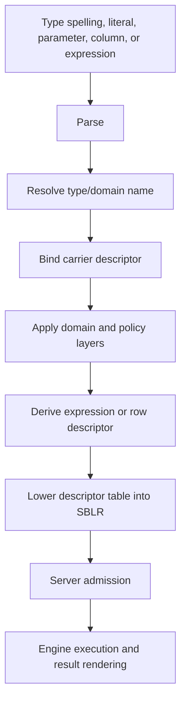

Descriptor binding happens before execution. If a descriptor cannot be resolved
or a value cannot fit the descriptor, the statement returns a diagnostic rather
than allowing implicit best-effort behavior.

## Supported Type Families

| Family | Canonical SBsql Names | Main Use | Fixed Size Or Bounds |
| --- | --- | --- | --- |
| Null marker | `null` | Unknown or absent value before contextual typing. | No payload. Requires nullable target or explicit cast context. |
| Boolean | `boolean`, `bool` | Three-valued logic. | 1 byte logical payload plus null marker. |
| Signed integer | `int8`, `int16`, `int32`, `int64`, `int128`, `smallint`, `int`, `integer`, `bigint` | Exact signed whole numbers. | 1, 2, 4, 8, or 16 bytes. |
| Unsigned integer | `uint8`, `uint16`, `uint32`, `uint64`, `uint128` | Exact unsigned whole numbers. | 1, 2, 4, 8, or 16 bytes. |
| Decimal | `decimal(p,s)`, `numeric(p,s)`, `decfloat(16)`, `decfloat(34)`, `money`, `currency` | Exact base-10, decimal floating, and money-like values. | Precision, scale, rounding, and display are descriptor-owned. |
| Approximate real | `real`, `float4`, `double precision`, `float8`, `float(p)` | Approximate binary floating values. | 4 or 8 byte descriptors in the portable profile. |
| Text | `char(n)`, `varchar(n)`, `text`, `clob`, `nchar(n)`, `nvarchar(n)`, `nclob` | Character data. | Character count, byte count, charset, collation, and overflow are descriptor-owned. |
| Binary | `binary(n)`, `varbinary(n)`, `blob`, `bytea` | Byte-oriented values and binary large values. | Byte count, overflow, and stream policy are descriptor-owned. |
| UUID | `uuid` | Application UUIDs and catalog identity references. | 16 bytes. |
| Temporal | `date`, `time(p)`, `time(p) with time zone`, `timestamp(p)`, `timestamp(p) with time zone`, `interval` | Calendar, clock, instant, and duration values. | Precision, calendar, timezone, and range are descriptor-owned. |
| Document | `json`, `jsonb`, `document` | Structured document values and path-addressable data. | Payload and normalization profile are descriptor-owned. |
| Collection | `array<T>`, `multiset<T>`, `row(...)`, `record(...)` | Structured values, routine arguments, rowsets, and compound domains. | Element descriptors and shape descriptors own bounds. |
| Vector | `vector<T,n>`, `embedding<T,n>` | Fixed-dimension numerical vectors. | Dimension multiplied by element size plus descriptor metadata. |
| Spatial | `geometry`, `geography` | Spatial values, spatial predicates, and spatial indexes. | Shape, coordinate profile, and exact-recheck policy are descriptor-owned. |
| Graph | `graph`, `node`, `edge`, `path` | Graph data and traversal payloads. | Node, edge, path, and traversal descriptors own shape. |
| Search | `search_document`, `lexeme`, search-vector descriptors where admitted | Full-text/search payloads. | Tokenization and index profile are descriptor-owned. |
| Time-series | `timeseries`, `sample`, `bucket` descriptors where admitted | Time-series observations and windows. | Time key, value descriptor, and window profile are descriptor-owned. |
| Key-value | `kv_key`, `kv_value`, map-like descriptors | Key-value and map payloads. | Key descriptor, value descriptor, and ordering/hash policy are descriptor-owned. |
| Protected material | `secret_ref`, `protected_blob_ref`, protected descriptors | References to protected values and release-controlled material. | References only unless release policy admits raw access. |
| Domain | User-defined domain names | Named constraints, defaults, null policy, masks, and operation policy. | Underlying carrier plus domain policy. |

## Canonical Names And Aliases

SBsql can accept aliases, but binding resolves each spelling to a canonical
descriptor. After binding, the engine uses descriptor identity. The original
spelling remains useful for diagnostics and source references, not execution
authority.

Examples:

```sql
create table app.example_types (
    id uuid primary key,
    exact_count uint128,
    label varchar(120),
    payload jsonb,
    embedding vector<float32,1536>,
    created_at timestamp(6) with time zone
);
```

The table definition creates column descriptors for each column. Inserts,
updates, defaults, indexes, constraints, masks, and query projections use those
descriptors.

## Null Behavior

`null` has no standalone carrier. It adopts the target descriptor when the
target is known and nullable.

| Context | Rule |
| --- | --- |
| Assignment to nullable column | `null` is admitted as the target descriptor's null value. |
| Assignment to non-null target | Refused before storage mutation. |
| Function argument | Requires an overload that admits null for that argument. |
| Comparison | Uses three-valued logic unless the operator has explicit null-handling semantics. |
| Domain assignment | Domain null policy is checked before ordinary constraints. |
| Array, row, and document values | Element or field null behavior is descriptor-owned. |

Use an explicit cast when the target type cannot be inferred:

```sql
select cast(null as decimal(18,2)) as empty_amount;
```

## Literal Binding

Literals are parsed text until they bind to descriptors.

| Literal Form | Binding Rule |
| --- | --- |
| Integer literal | Binds by context or to the smallest admitted exact descriptor that can represent it. |
| Unsigned literal | Uses an explicit unsigned suffix or contextual unsigned target. |
| Decimal literal | Binds to an exact decimal descriptor unless context selects another admitted numeric descriptor. |
| String literal | Binds as text until context, cast, charset introducer, or target descriptor changes it. |
| Binary literal | Binds as bytes and does not carry charset or collation. |
| UUID literal | Binds to a 16-byte UUID descriptor. |
| Temporal literal | Binds only when context or explicit cast states the temporal descriptor. |
| Document literal | Binds through document/json descriptor rules. |
| Vector literal | Requires an element descriptor and dimension. |

Ambiguous or lossy literal binding is refused unless a documented conversion
policy admits it.

## Storage And Overflow

Descriptor validity is not the same as storage admission. A value can have a
valid descriptor and still be refused because it cannot fit the row, page,
overflow, stream, transaction, filespace, or policy limits.

| Concern | Controlled By |
| --- | --- |
| Inline row payload | Row descriptor, page size, null map, alignment, and storage policy. |
| Large values | Overflow/large-value descriptor and transaction policy. |
| Text byte size | Character set, encoded byte length, collation key policy, and overflow policy. |
| Binary byte size | Byte descriptor, overflow policy, and stream limits. |
| Index key size | Index descriptor, collation key, expression descriptor, and index policy. |
| Stream frames | Stream descriptor, frame limit, backpressure, timeout, and cancellation policy. |

## Type Authority In SBLR

SBLR carries descriptor tables. An execution envelope can include:

- column descriptors;
- parameter descriptors;
- literal descriptors;
- expression result descriptors;
- row and record descriptors;
- cursor descriptors;
- stream descriptors;
- domain stacks;
- conversion operations;
- result shapes;
- diagnostic shapes.

Server admission rejects malformed, missing, stale, contradictory, or
unsupported descriptor evidence before engine dispatch.

## Related Pages

- [Numeric Types](numeric_types.md)
- [Text, Collation, And Charset](text_collation_and_charset.md)
- [Temporal Types](temporal_types.md)
- [Binary, UUID, And Protected Values](binary_uuid_and_protected_values.md)
- [Document, Graph, Vector, And Multimodel Types](document_graph_vector_and_multimodel_types.md)
- [Domains, Casts, And Coercion](domains_casts_and_coercion.md)
- [Conversion Matrix](conversion_matrix.md)
- [Operator Type Result Matrix](../syntax_reference/operator_type_result_matrix.md)
- [Parser To SBLR Pipeline](../core_paradigms/parser_to_sblr_pipeline.md)

## Verification Checklist

The type-system proof suite should demonstrate:

- every supported type spelling resolves to a canonical descriptor;
- unsupported aliases are refused rather than accepted as inert text;
- `null` binds only through a valid nullable target;
- fixed-width numeric ranges reject overflow and underflow;
- text length checks use character count while storage uses encoded byte count;
- collation affects comparison, grouping, ordering, and indexes consistently;
- temporal precision and timezone policy are descriptor-owned;
- UUID values store as 16 bytes and do not bypass authorization;
- protected material is carried by reference unless release policy admits it;
- document, graph, vector, spatial, search, time-series, and key-value indexes
  produce candidate evidence only;
- domains apply null policy, defaults, constraints, and operation policy in the
  documented order;
- SBLR envelopes carry descriptors rather than executable type text;
- stale descriptor or policy epochs invalidate dependent statements and plans.


### /home/dcalford/CliWork/ScratchBird/docs/documentation/draft/Language_Reference/data_types/binary_uuid_and_protected_values.md

# Binary, UUID, And Protected Values

This page is part of the SBsql Language Reference Manual. It defines binary
descriptors, UUID descriptors, catalog UUID references, large binary values,
protected-material references, conversion behavior, security behavior, and
diagnostics.

Generation task: `data_types_binary_uuid_protected`

## Purpose

Binary values are byte sequences. They do not carry character set, collation, or
text rendering behavior. UUID values are 16-byte descriptors that can be used as
application values or as catalog identity references. Protected values are
security-controlled references to sensitive material and must not be treated as
ordinary text or binary data.

The binder must know which of these categories a value belongs to before SBLR
admission.

## Supported Binary And Identity Types

| Canonical Type | Common Aliases | Unit | Payload | Bounds |
| --- | --- | --- | --- | --- |
| `binary(n)` | fixed byte string | bytes | Exactly `n` bytes plus descriptor metadata. | Exactly `n` bytes. |
| `varbinary(n)` | `binary varying(n)` | bytes | 0 through `n` bytes plus descriptor metadata. | 0 through `n` bytes. |
| `blob` | `binary large object` | bytes or stream chunks | Binary large-value stream or overflow value. | Policy bounded by row, page, overflow, stream, and transaction limits. |
| `bytea` | byte array alias where admitted | bytes | Variable byte payload. | Policy bounded. |
| `uuid` | UUID literal and UUID-valued columns | 16 bytes | RFC-style UUID bytes. | Exactly 16 bytes. |
| `secret_ref` | protected secret reference | UUID plus metadata | Reference to protected material. | Raw secret is not carried in ordinary values. |
| `protected_blob_ref` | protected binary reference | UUID plus metadata | Reference to protected binary material. | Raw payload release requires policy. |

## Binary Values

Binary values are byte descriptors. They can be compared, hashed, stored,
indexed, streamed, and rendered only through binary-aware operations.

| Operation | Rule |
| --- | --- |
| Equality | Byte-wise descriptor comparison unless a domain or operation policy overrides it. |
| Ordering | Byte-ordering only where a binary descriptor admits ordering. |
| Hashing | Uses binary descriptor hash rules. |
| Text functions | Refused unless an explicit conversion supplies charset/encoding. |
| Pattern matching | Requires a binary-pattern operation, not text collation. |
| Indexing | Uses binary descriptor keys and exact recheck where required. |
| Large values | Use overflow or stream descriptors; inline row storage is not assumed. |

Example:

```sql
create table app.file_store (
    file_id uuid primary key,
    digest binary(32) not null,
    payload blob
);
```

## Binary Literals And Encoding

Binary literal syntax binds to byte descriptors. Text literal syntax does not
become binary without an explicit conversion.

| Form | Binding Rule |
| --- | --- |
| Binary literal | Binds as bytes under the active binary literal profile. |
| Hex text converted to binary | Requires explicit decode or cast function. |
| Binary converted to text | Requires explicit encoding or charset conversion. |
| Large binary stream | Requires a stream descriptor and policy-admitted frame limits. |

Invalid hex, invalid base encoding, unsupported encoding, over-length values,
and binary/text confusion return diagnostics.

## UUID Values

UUID values store as 16 bytes. Default rendering is canonical lower-case text
with hyphens.

| Rule | Behavior |
| --- | --- |
| Scalar UUID | Application data value with UUID descriptor. |
| Catalog UUID reference | Identity evidence for a catalog object. Requires object-class, visibility, sandbox, authorization, and policy checks. |
| Literal syntax | `uuid '<canonical-text>'` binds a UUID value. |
| String literal | Remains text until a cast or target descriptor binds it as UUID. |
| Comparison | Uses UUID descriptor comparison. |
| Indexing | UUID indexes use UUID descriptor keys and still require MGA/security recheck. |

Example:

```sql
select cast('018f0000-0000-7000-8000-000000000001' as uuid) as object_id;
```

Example catalog reference:

```sql
describe table uuid '018f0000-0000-7000-8000-000000000001';
```

Knowing a UUID does not grant access. The resolved object must be visible and
authorized.

## Protected Values

Protected values are not ordinary binary or text values. They are references to
material whose release is controlled by security policy.

Protected material can include:

- secrets;
- credentials;
- keys;
- tokens;
- encrypted payload handles;
- protected binary values;
- protected text values;
- sensitive diagnostic fields;
- support-bundle evidence references.

Rules:

- raw secret material must not appear in ordinary parser packets;
- raw secret material must not appear in SBLR payloads except in an explicitly
  protected envelope admitted by policy;
- support bundles, logs, diagnostics, catalog display, and bridge messages
  redact protected material by default;
- casts from protected material to raw text or raw binary are denied unless an
  explicit release surface admits them;
- export, backup, replication, migration, bridge, and stream routes are release
  surfaces when protected values can cross a boundary;
- release should produce audit evidence where policy requires it.

## Protected References

A protected reference can be stored or passed without exposing the raw value.

| Reference | Meaning |
| --- | --- |
| `secret_ref` | Reference to secret material managed by an admitted provider or protected catalog. |
| `protected_blob_ref` | Reference to protected binary material. |
| Protected descriptor UUID | Descriptor controlling release, masking, rotation, expiry, and audit behavior. |
| Policy binding | Rule that decides who can resolve, rotate, release, export, or inspect the protected material. |

Authorized inspection can return redacted metadata such as owner, status,
rotation time, expiry time, reachability, and policy identity. It must not
return the raw protected value unless release authority is explicitly admitted.

## Conversion Rules

| Conversion | Default Rule |
| --- | --- |
| `binary` to `text` | Explicit encoding or charset conversion required. |
| `text` to `binary` | Explicit encoding, decode function, or binary assignment policy required. |
| `text` to `uuid` | Explicit cast or UUID target required; invalid text is diagnostic. |
| `uuid` to `text` | Explicit cast renders canonical UUID text. |
| `uuid` to `binary(16)` | Explicit cast required. |
| `binary(16)` to `uuid` | Explicit cast required and validates UUID descriptor policy. |
| Protected reference to raw value | Denied unless an explicit release route admits it. |
| Raw value to protected reference | Requires an admitted protect/store route, not an ordinary cast. |

## Large Binary Values And Streams

Large binary values use overflow or stream descriptors. They are not guaranteed
to fit inline in a row.

Stream contracts define:

- frame type;
- maximum frame size;
- maximum in-flight bytes;
- timeout;
- cancellation behavior;
- retry behavior;
- checksum or digest policy where required;
- transaction ownership;
- protected-material release behavior;
- completion diagnostics.

## Diagnostics

| Condition | Required Result |
| --- | --- |
| Binary length mismatch for `binary(n)` | Assignment diagnostic. |
| `varbinary(n)` length exceeded | Assignment diagnostic. |
| Large binary exceeds stream or overflow policy | Stream/storage diagnostic. |
| Invalid binary literal encoding | Parse or conversion diagnostic. |
| Binary used as text without conversion | Bind diagnostic. |
| UUID text invalid | Conversion diagnostic. |
| UUID object reference wrong class | Bind/admission diagnostic. |
| UUID object hidden or outside sandbox | Denied or redacted not-visible diagnostic. |
| Protected material rendered without authority | Denied message vector. |
| Protected material appears in support output | Test failure; output must be redacted. |

## Syntax Productions

```ebnf
binary_type             ::= fixed_binary_type
                          | varying_binary_type
                          | large_binary_type ;
```

```ebnf
fixed_binary_type       ::= "binary" "(" length ")" ;
varying_binary_type     ::= "varbinary" "(" length ")"
                          | "binary" "varying" "(" length ")" ;
large_binary_type       ::= "blob"
                          | "binary" "large" "object"
                          | "bytea" ;
```

```ebnf
uuid_type               ::= "uuid" ;
uuid_literal            ::= "uuid" string_literal ;
uuid_ref                ::= "UUID" string_literal ;
```

```ebnf
protected_type          ::= "secret_ref"
                          | "protected_blob_ref" ;
```

## Related Pages

- [Type System Overview](type_system_overview.md)
- [UUID Catalog Identity](../core_paradigms/uuid_catalog_identity.md)
- [Security And Sandboxing](../core_paradigms/security_and_sandboxing.md)
- [Conversion Matrix](conversion_matrix.md)
- [COPY Streaming Import And Export](../syntax_reference/copy.md)
- [Backup, Restore, Replication, And Migration](../syntax_reference/backup_restore_replication_migration.md)

## Verification Checklist

The binary/UUID/protected-value proof suite should demonstrate:

- fixed binary values require exactly the declared byte count;
- variable binary values reject values above the declared byte count;
- binary values do not accidentally use text charset or collation;
- binary-to-text conversion requires an explicit encoding or charset rule;
- UUID values store and compare as 16-byte descriptors;
- UUID catalog references require object-class and authorization checks;
- knowing an object UUID does not bypass sandboxing;
- large binary streams enforce frame and transaction limits;
- protected references do not expose raw values in ordinary result sets;
- logs, diagnostics, support bundles, bridge messages, and catalog projections
  redact protected material by default;
- release routes produce explicit authorization and audit evidence where policy
  requires it.


### /home/dcalford/CliWork/ScratchBird/docs/documentation/draft/Language_Reference/data_types/text_collation_and_charset.md

# Text, Collation, And Charset

This page is part of the SBsql Language Reference Manual. It defines SBsql text
descriptors, character set rules, collation behavior, length semantics,
comparison behavior, index behavior, casts, and diagnostics.

Generation task: `data_types_text_collation`

## Purpose

Text values carry character set and collation descriptors. The descriptor, not
the spelling of the SQL type, controls storage encoding, character length,
comparison, ordering, grouping, uniqueness, pattern matching, hash keys, index
keys, generated columns, masks, and result rendering.

Binary values are not text. A byte string can become text only through an
explicit conversion that states an encoding or through an admitted assignment
policy.

## Supported Text Types

| Canonical Type | Common Aliases | Length Unit | Payload | Value Bounds |
| --- | --- | --- | --- | --- |
| `char(n)` | `character(n)` | characters | Fixed-length encoded text padded according to descriptor policy. | Exactly `n` characters after padding rules. |
| `varchar(n)` | `character varying(n)` | characters | Variable-length encoded text. | 0 through `n` characters. |
| `text` | none | characters | Variable-length encoded text with overflow where admitted. | Policy bounded by row, page, overflow, and stream limits. |
| `clob` | `character large object` | characters or stream chunks | Character large-value stream. | Policy bounded by large-value and stream limits. |
| `nchar(n)` | national fixed character | characters | Fixed-length national-character text. | Exactly `n` characters under the national charset descriptor. |
| `nvarchar(n)` | national varying character | characters | Variable-length national-character text. | 0 through `n` characters under the national charset descriptor. |
| `nclob` | national character large object | characters or stream chunks | National-character large-value stream. | Policy bounded by large-value and stream limits. |

Declared length is a character count. Storage uses encoded bytes plus row,
descriptor, and overflow metadata. A value can satisfy the declared character
count and still be refused if the encoded byte count, collation key, row size,
index key size, stream limit, or policy limit cannot admit it.

## Character Sets

Every text descriptor has a character set.

| Charset Source | Rule |
| --- | --- |
| Database default charset | Used when a declaration omits `character set`. |
| Column charset | Stored in the column descriptor and used by assignment, comparison, functions, indexes, and rendering. |
| Literal introducer | Binds a literal to a charset before coercion. Unsupported or lossy conversion is refused unless policy admits it. |
| National character set | Used by `nchar`, `nvarchar`, and `nclob`. |
| Result expression | Derived from operands, casts, functions, and collation/charset rules. Ambiguity is refused. |

Example:

```sql
create table app.customer (
    customer_id uuid primary key,
    display_name varchar(120) character set utf8 collate default,
    legal_name nvarchar(240)
);
```

The spelling of `utf8` and the national-character descriptor bind to catalog
descriptors. The engine does not rely on the text spelling after binding.

## Collations

Collation is part of the descriptor and affects equality, ordering, grouping,
uniqueness, joins, indexes, and some string functions.

| Collation Concern | Behavior |
| --- | --- |
| Default collation | Applied when neither the column nor expression states a collation. |
| Explicit `collate` | Overrides expression collation for that expression and can define an index key collation. |
| Deterministic comparison | Required for equality, uniqueness, grouping, and B-tree ordering unless a provider proof admits otherwise. |
| Case sensitivity | Descriptor-owned. Do not infer it from display spelling. |
| Accent sensitivity | Descriptor-owned. |
| Normalization | Descriptor-owned. Comparisons must not silently normalize outside the collation contract. |
| Null ordering | Owned by query/index ordering rules, not by text collation alone. |

Example:

```sql
select customer_id, display_name
from app.customer
where display_name collate default = :name
order by display_name collate default;
```

## Length Functions

Text has multiple length concepts.

| Function Class | Meaning |
| --- | --- |
| Character length | Number of characters under the descriptor character set. |
| Octet length | Number of encoded bytes. |
| Collation key length | Internal comparison key length where the collation uses one. |
| Large-value length | Logical character length and/or stream byte length according to descriptor policy. |

Portable scripts should use the function that matches the intended limit rather
than assuming one length measure implies another.

## Assignment And Padding

Assignment to a text target follows this order:

1. bind source descriptor;
2. bind target text or domain descriptor;
3. convert charset if admitted;
4. apply target length rule;
5. apply padding or trimming only where the descriptor says it is allowed;
6. validate domain constraints and policy;
7. store or return the descriptor-bound value.

`char(n)` padding is descriptor-owned. `varchar(n)` and `text` do not imply
padding. Silent truncation is not admitted by default.

## Text Comparison And Indexes

Text indexes use descriptor-aware keys. A text index can accelerate candidate
selection, but final result admission still requires engine recheck.

| Feature | Rule |
| --- | --- |
| Equality | Uses the active text descriptor's collation and normalization rules. |
| Ordering | Uses the active collation and query/index null-order rules. |
| Grouping | Uses the same equality semantics as the descriptor. |
| Unique indexes | Use deterministic collation keys; non-deterministic collations must be refused unless explicitly admitted. |
| Prefix/range indexes | Must preserve the descriptor's ordering and exact recheck requirements. |
| Pattern matching | Uses the descriptor, function/operator policy, and optional collation profile. |
| Full-text/search | Uses search descriptors and tokenization profiles, not ordinary text equality alone. |

Example:

```sql
create index app.customer_name_ix
on app.customer (display_name collate default);
```

## Text Literals

| Literal Form | Binding Rule |
| --- | --- |
| `'text'` | Binds as text under the active literal charset until context chooses a target descriptor. |
| `N'text'` | Binds as national-character text. |
| Character set introducer | Binds the literal to the stated charset before target coercion. |
| Escaped literal | Escape rules are parser-profile controlled and must lower to canonical text bytes. |
| Concatenation | Result descriptor derives charset, collation, and length from operands and operation policy. |

When the target is `uuid`, numeric, temporal, binary, document, or protected
material, a string literal remains text until an explicit cast or assignment
conversion admits the target.

## Text And Protected Values

Text can carry sensitive data. Protected material policy can block rendering,
logging, support-bundle output, casts, concatenation, export, backup,
replication, bridge output, or diagnostic text.

Masking a text column does not change the stored value. It changes the rendered
result under policy.

## Diagnostics

| Condition | Required Result |
| --- | --- |
| Invalid encoded bytes | Conversion diagnostic. |
| Unsupported charset | Bind diagnostic. |
| Unsupported collation | Bind diagnostic. |
| Lossy charset conversion | Diagnostic unless explicitly admitted. |
| Character length exceeded | Assignment diagnostic. |
| Encoded byte limit exceeded | Storage or stream diagnostic. |
| Index key too large | DDL or DML diagnostic according to when the value is known. |
| Non-deterministic collation used for unique key | DDL refusal unless admitted by policy. |
| Binary passed to text function without conversion | Bind diagnostic. |
| Protected value rendered without release authority | Denied message vector. |

## Syntax Productions

```ebnf
text_type               ::= fixed_text_type
                          | varying_text_type
                          | large_text_type
                          | national_text_type ;
```

```ebnf
fixed_text_type         ::= ("char" | "character") "(" length ")" text_type_options? ;
varying_text_type       ::= ("varchar" | "character" "varying") "(" length ")" text_type_options? ;
large_text_type         ::= "text" text_type_options?
                          | "clob" text_type_options? ;
national_text_type      ::= "nchar" "(" length ")"
                          | "nvarchar" "(" length ")"
                          | "nclob" ;
```

```ebnf
text_type_options       ::= character_set_clause? collation_clause? ;
character_set_clause    ::= "character" "set" charset_ref ;
collation_clause        ::= "collate" collation_ref ;
```

## Related Pages

- [Type System Overview](type_system_overview.md)
- [Conversion Matrix](conversion_matrix.md)
- [Domains, Casts, And Coercion](domains_casts_and_coercion.md)
- [Operator Type Result Matrix](../syntax_reference/operator_type_result_matrix.md)
- [Policy, Mask, And RLS Lifecycle](../syntax_reference/policy_mask_and_rls.md)

## Verification Checklist

The text proof suite should demonstrate:

- declared character length is enforced separately from encoded byte length;
- charset conversion refuses unsupported or lossy conversions by default;
- collation affects equality, ordering, grouping, and index behavior
  consistently;
- quoted and unquoted literals bind to the expected descriptors;
- `char(n)` padding follows descriptor policy;
- `varchar(n)` rejects over-length values without silent truncation;
- text indexes use the same comparison rule as expression evaluation;
- non-deterministic collations are refused for features requiring deterministic
  keys unless an admitted proof exists;
- binary values require explicit conversion before text operations;
- protected text is redacted or denied according to policy.


### /home/dcalford/CliWork/ScratchBird/docs/documentation/draft/Operations_Administration/README.md

# ScratchBird Operations And Administration Guide

This directory contains the draft ScratchBird Operations And Administration Guide. It is the operator-facing companion to the Getting Started Guide and the SBsql Language Reference.

The guide explains how to install, configure, run, diagnose, validate, and maintain ScratchBird deployments without treating diagrams or command names as release guarantees. Every operational claim must be checked against the current build output, target platform, configuration, tests, and release notes.

## Directory Map

| Chapter | Purpose |
| --- | --- |
| [Installation And Output Layout](installation_and_output_layout.md) | How staged binaries, parser packages, resource files, configuration, and proof assets should be organized for a usable build. |
| [Configuration Reference](configuration_reference.md) | Configuration areas administrators must understand before starting services or opening databases. |
| [Operating Modes Runbook](operating_modes_runbook.md) | Runbook-level guidance for embedded, IPC, standalone listener, and managed group deployments. |
| [Service Lifecycle](service_lifecycle.md) | Start, readiness, drain, stop, restart, stale endpoint handling, and failure response. |
| [Identity, Security, And Policy](identity_security_and_policy.md) | Authentication, authorization, schema roots, workareas, protected material, and redaction policy. |
| [Parser Registration And Routes](parser_registration_and_routes.md) | Parser package registration, route selection, compatibility boundaries, and refusal behavior. |
| [Database Lifecycle](database_lifecycle.md) | Create, open, close, reopen, detach, attach, verify, refuse, and recover database lifecycle concepts. |
| [Filespaces And Storage](filespaces_and_storage.md) | Filespace identity, storage placement, primary filespace behavior, and storage diagnostics. |
| [Backup, Restore, And Data Movement](backup_restore_and_data_movement.md) | Logical backup/restore, import/export, migration, CDC, replication, ETL, and denied physical or low-level routes. |
| [Diagnostics, Message Vectors, And Support Bundles](diagnostics_message_vectors_and_support_bundles.md) | Diagnostic classes, support-bundle content, redaction, and operator review. |
| [Monitoring, Health, And Readiness](monitoring_health_and_readiness.md) | Health checks, readiness checks, liveness checks, metrics, and operational state. |
| [Troubleshooting](troubleshooting.md) | Symptom-oriented diagnosis paths for startup, connection, parser, security, storage, and transaction issues. |
| [Upgrade And Compatibility Policy](upgrade_and_compatibility_policy.md) | Version policy, format compatibility, parser package compatibility, and unsupported downgrade refusal. |
| [Release Validation Checklist](release_validation_checklist.md) | Operator-facing checklist for validating a build before broader use. |

## Reading Model

Start with [Installation And Output Layout](installation_and_output_layout.md), then [Configuration Reference](configuration_reference.md), then the runbook chapter for the operating mode being tested.

Use the [Getting Started Guide](../Getting_Started/README.md) for conceptual orientation and the [Language Reference](../Language_Reference/README.md) for SBsql syntax and catalog details.

## Draft Status

This is a draft manual baseline. It establishes the chapter structure and expansion scope for the operations documentation.


### /home/dcalford/CliWork/ScratchBird/docs/documentation/draft/Operations_Administration/upgrade_and_compatibility_policy.md

# Upgrade And Compatibility Policy

## Purpose

This chapter defines the operator-facing compatibility and upgrade areas that must be documented before a release can be trusted for durable data.

## Initial Coverage

- database format version policy;
- catalog format version policy;
- page and filespace format policy;
- transaction inventory compatibility;
- index metadata compatibility;
- parser package version compatibility;
- SBLR surface compatibility;
- configuration compatibility;
- upgrade path;
- unsupported downgrade refusal;
- migration notes;
- compatibility proof required before release.

## Compatibility Rule

Unsupported old or new formats should be refused clearly. Silent open with uncertain format compatibility is not an acceptable operational outcome.

## Related Pages

- [Database Lifecycle](database_lifecycle.md)
- [Release Validation Checklist](release_validation_checklist.md)
- [Language Reference](../Language_Reference/README.md)


### /home/dcalford/CliWork/ScratchBird/docs/documentation/draft/Operations_Administration/installation_and_output_layout.md

# Installation And Output Layout

## Purpose

This chapter defines what a staged ScratchBird output should contain before an administrator tries to run it. A usable output is more than one executable; it includes runtime binaries, parser packages, resource files, configuration, and validation material that belongs to the same build.

## Initial Coverage

- platform-specific output directories;
- runtime binaries and shared libraries;
- parser package placement;
- command-line tool placement;
- character set, collation, time zone, and policy resources;
- configuration templates;
- proof and smoke-test material;
- separation between source, build output, release output, and live databases;
- permissions and ownership expectations;
- cleanup rules for temporary or generated files.

## Operator Questions

- Which files are required for the selected mode?
- Which files are generated artifacts rather than source?
- Which files are safe to redistribute?
- Where should live databases be created?
- How does an operator verify that resources match the binaries?

## Related Pages

- [Configuration Reference](configuration_reference.md)
- [Release Validation Checklist](release_validation_checklist.md)
- [Getting Started: Configuration Basics](../Getting_Started/administration/configuration_basics.md)


### /home/dcalford/CliWork/ScratchBird/docs/documentation/draft/Operations_Administration/troubleshooting.md

# Troubleshooting

## Purpose

This chapter provides symptom-oriented diagnosis paths for common operational failures. It should help an administrator identify the likely component and the next diagnostic evidence to collect.

## Initial Coverage

- build output incomplete;
- configuration validation fails;
- service fails to start;
- database open refused;
- IPC endpoint unavailable;
- listener route unavailable;
- parser missing or incompatible;
- authentication failure;
- authorization denied;
- object not visible;
- transaction state invalid;
- storage unavailable;
- recovery required;
- support bundle insufficient or overbroad.

## Troubleshooting Pattern

Each expanded troubleshooting entry should include:

1. symptom;
2. likely area;
3. evidence to collect;
4. safe checks to run;
5. expected refusal classes;
6. escalation point.

## Related Pages

- [Diagnostics, Message Vectors, And Support Bundles](diagnostics_message_vectors_and_support_bundles.md)
- [Configuration Reference](configuration_reference.md)
- [Service Lifecycle](service_lifecycle.md)


### /home/dcalford/CliWork/ScratchBird/docs/documentation/draft/Operations_Administration/diagnostics_message_vectors_and_support_bundles.md

# Diagnostics, Message Vectors, And Support Bundles

## Purpose

This chapter defines the operator-facing diagnostic model: message vectors, log events, refusal classes, support-bundle contents, redaction, and review.

## Initial Coverage

- message-vector classes;
- parser diagnostics;
- engine diagnostics;
- startup and shutdown diagnostics;
- database open diagnostics;
- transaction diagnostics;
- storage diagnostics;
- security and policy diagnostics;
- support-bundle generation;
- redaction policy;
- operator review before sharing.

## Diagnostic Rule

Diagnostics should distinguish unsupported, denied, unavailable, unsafe, invalid, and recovery-required states. A controlled refusal is an expected operational outcome.

## Related Pages

- [Troubleshooting](troubleshooting.md)
- [Monitoring, Health, And Readiness](monitoring_health_and_readiness.md)
- [Language Reference: Refusal Vectors](../Language_Reference/syntax_reference/refusal_vectors.md)


### /home/dcalford/CliWork/ScratchBird/docs/documentation/draft/Operations_Administration/operating_modes_runbook.md

# Operating Modes Runbook

## Purpose

This chapter turns the high-level operating modes into operator runbook sections. It should tell an administrator what must be configured, started, verified, stopped, and diagnosed for each mode.

## Initial Coverage

- embedded engine runbook;
- single-node IPC server runbook;
- standalone listener and parser route runbook;
- managed group deployment runbook;
- mode-specific smoke tests;
- attach and detach checks;
- start, stop, drain, and restart checks;
- diagnostics to collect for each mode;
- boundaries that each mode does not imply.

## Runbook Shape

Each mode should eventually include:

1. prerequisites;
2. configuration inputs;
3. startup sequence;
4. readiness checks;
5. first transaction proof;
6. failure and refusal checks;
7. clean shutdown;
8. restart and reopen proof.

## Related Pages

- [Service Lifecycle](service_lifecycle.md)
- [Monitoring, Health, And Readiness](monitoring_health_and_readiness.md)
- [Getting Started: Choosing A Mode Summary](../Getting_Started/operating_modes/choosing_a_mode_summary.md)


### /home/dcalford/CliWork/ScratchBird/docs/documentation/draft/Operations_Administration/monitoring_health_and_readiness.md

# Monitoring, Health, And Readiness

## Purpose

This chapter defines the operational checks administrators use to decide whether ScratchBird components are alive, ready, healthy, degraded, draining, or refusing work.

## Initial Coverage

- liveness checks;
- readiness checks;
- health checks;
- startup and route readiness;
- database open readiness;
- parser registration readiness;
- transaction and cleanup summaries;
- storage health summaries;
- diagnostic counters;
- metrics scope;
- refusal states that should alert operators.

## Check Categories

| Check | Meaning |
| --- | --- |
| Liveness | The component is running and can answer a minimal check. |
| Readiness | The component is ready to accept intended work. |
| Health | The component and its required dependencies are in an acceptable operating state. |
| Drain | The component is intentionally refusing new work while existing work exits. |

## Related Pages

- [Service Lifecycle](service_lifecycle.md)
- [Diagnostics, Message Vectors, And Support Bundles](diagnostics_message_vectors_and_support_bundles.md)
- [Getting Started: Diagnostics And Support Bundles](../Getting_Started/administration/diagnostics_and_support_bundles.md)


### /home/dcalford/CliWork/ScratchBird/docs/documentation/draft/Operations_Administration/database_lifecycle.md

# Database Lifecycle

## Purpose

This chapter defines the operational lifecycle of a ScratchBird database from creation through open, attach, detach, close, reopen, verification, refusal, and recovery-required states.

## Initial Coverage

- create database;
- open database;
- attach session;
- detach session;
- close database;
- reopen database;
- database route selection;
- database identity and catalog bootstrap;
- initial filespace behavior;
- recovery-required mode;
- read-only or restricted open where implemented;
- refusal diagnostics when open is unsafe.

## Required Proof Shape

The expanded chapter should include a repeatable smoke test:

1. create or open a disposable database;
2. create schema and table;
3. insert rows;
4. commit;
5. detach and close;
6. reopen;
7. verify committed rows;
8. test one controlled refusal.

## Related Pages

- [Filespaces And Storage](filespaces_and_storage.md)
- [Backup, Restore, And Data Movement](backup_restore_and_data_movement.md)
- [Language Reference: Database](../Language_Reference/syntax_reference/database.md)


### /home/dcalford/CliWork/ScratchBird/docs/documentation/draft/Operations_Administration/filespaces_and_storage.md

# Filespaces And Storage

## Purpose

This chapter defines operator-facing storage concepts: filespaces, database files, storage placement, storage health, and storage-related diagnostics.

## Initial Coverage

- first database file and primary filespace concepts;
- filespace identity;
- filespace create, attach, detach, promote, move, and remove concepts where implemented;
- storage permissions;
- temporary storage;
- storage health checks;
- low-space and disk-full behavior;
- refusal when storage state is unsafe;
- relationship between storage diagnostics and support bundles.

## Operator Questions

- Where are durable files allowed to live?
- Which filespace is required to open the database?
- What happens if a filespace is missing or unavailable?
- Which operations are native administrative operations rather than parser compatibility operations?

## Related Pages

- [Database Lifecycle](database_lifecycle.md)
- [Diagnostics, Message Vectors, And Support Bundles](diagnostics_message_vectors_and_support_bundles.md)
- [Language Reference: Filespace](../Language_Reference/syntax_reference/filespace.md)


### /home/dcalford/CliWork/ScratchBird/docs/documentation/draft/Operations_Administration/backup_restore_and_data_movement.md

# Backup, Restore, And Data Movement

## Purpose

This chapter defines operational data movement: backup, restore, import, export, CDC, replication, ETL, migration, validation, and refusal boundaries.

## Initial Coverage

- logical backup streams;
- logical restore streams;
- partial backup and restore where implemented;
- import and export;
- copy-style large streaming;
- CDC and replication;
- ETL workflows;
- migration staging and cutover;
- denied physical page-copy routes through parser compatibility surfaces;
- denied low-level repair or verification through parser compatibility surfaces;
- restore drills and validation queries.

## Core Rule

Logical streams are handled as admitted database work. Physical page-copy, low-level repair, and direct server-local file manipulation require native administrative authority and should not be inferred from parser compatibility syntax.

## Related Pages

- [Diagnostics, Message Vectors, And Support Bundles](diagnostics_message_vectors_and_support_bundles.md)
- [Release Validation Checklist](release_validation_checklist.md)
- [Getting Started: Backup, Restore, And Data Movement Overview](../Getting_Started/administration/backup_restore_and_data_movement_overview.md)


### /home/dcalford/CliWork/ScratchBird/docs/documentation/draft/Operations_Administration/release_validation_checklist.md

# Release Validation Checklist

## Purpose

This chapter defines an operator-facing checklist for validating a ScratchBird build before broader testing or release use.

## Initial Coverage

- output tree completeness;
- required resources present;
- license and notices present where required;
- parser package presence and route tests;
- configuration validation;
- embedded smoke test;
- IPC smoke test;
- listener and parser smoke test;
- managed group entry smoke test where configured;
- database create/open/reopen proof;
- transaction commit and rollback proof;
- backup and restore drill;
- diagnostics and support-bundle redaction proof;
- platform-specific test status;
- known limitations review.

## Checklist Rule

The checklist should be evidence-driven. The presence of a file, directory, or command name is not enough; the behavior must be run and the proof must be reviewable.

## Related Pages

- [Installation And Output Layout](installation_and_output_layout.md)
- [Operating Modes Runbook](operating_modes_runbook.md)
- [Diagnostics, Message Vectors, And Support Bundles](diagnostics_message_vectors_and_support_bundles.md)


### /home/dcalford/CliWork/ScratchBird/docs/documentation/draft/Operations_Administration/identity_security_and_policy.md

# Identity, Security, And Policy

## Purpose

This chapter defines the operator-facing model for identity, authentication, authorization, schema roots, parser workareas, protected material, policy, and redaction.

## Initial Coverage

- identity sources;
- users, services, agents, roles, and groups;
- authentication flow;
- authorization materialization;
- schema roots and sandboxing;
- parser-visible workareas;
- grants and roles;
- policy admission;
- row-level security and masking where implemented;
- protected-material references;
- support-bundle redaction;
- refusal behavior for denied access.

## Operator Rules

- Authentication proves identity.
- Authorization admits work.
- Parser routes do not grant authority by themselves.
- Raw secrets should not appear in scripts, parser packets, ordinary configuration, or diagnostics.
- Denied access should return a controlled message vector.

## Related Pages

- [Configuration Reference](configuration_reference.md)
- [Diagnostics, Message Vectors, And Support Bundles](diagnostics_message_vectors_and_support_bundles.md)
- [Getting Started: Identity, Authentication, And Authorization](../Getting_Started/architecture/identity_authentication_and_authorization.md)


### /home/dcalford/CliWork/ScratchBird/docs/documentation/draft/Operations_Administration/configuration_reference.md

# Configuration Reference

## Purpose

This chapter defines the operational configuration areas an administrator must understand before starting ScratchBird components or admitting users.

## Initial Coverage

- operating mode selection;
- database routes;
- parser routes;
- identity provider configuration;
- authorization and schema-root policy;
- resource file locations;
- storage paths;
- diagnostics and support-bundle settings;
- resource limits and backpressure;
- startup validation;
- refusal behavior when configuration is incomplete or unsafe.

## Configuration Principles

- Prefer explicit configuration for security-sensitive behavior.
- Keep raw secrets out of ordinary configuration files.
- Treat parser routes as separately admitted capabilities.
- Validate configuration before accepting client work.
- Preserve diagnostics while applying redaction policy.

## Related Pages

- [Identity, Security, And Policy](identity_security_and_policy.md)
- [Parser Registration And Routes](parser_registration_and_routes.md)
- [Getting Started: Configuration Basics](../Getting_Started/administration/configuration_basics.md)


### /home/dcalford/CliWork/ScratchBird/docs/documentation/draft/Operations_Administration/service_lifecycle.md

# Service Lifecycle

## Purpose

This chapter defines how ScratchBird services should be started, checked, drained, stopped, restarted, and diagnosed.

## Initial Coverage

- startup sequence;
- configuration validation before startup;
- database open and route activation;
- readiness and liveness checks;
- client attach and detach behavior;
- drain mode;
- clean shutdown;
- forced shutdown;
- restart behavior;
- stale endpoint and stale process handling;
- refusal behavior when lifecycle state is unsafe.

## Lifecycle States

The expanded chapter should distinguish states such as configured, starting, ready, draining, stopped, refused, recovery-required, and operator-action-required.

## Related Pages

- [Monitoring, Health, And Readiness](monitoring_health_and_readiness.md)
- [Diagnostics, Message Vectors, And Support Bundles](diagnostics_message_vectors_and_support_bundles.md)
- [Getting Started: Standalone Server](../Getting_Started/operating_modes/standalone_server.md)


### /home/dcalford/CliWork/ScratchBird/docs/documentation/draft/Operations_Administration/parser_registration_and_routes.md

# Parser Registration And Routes

## Purpose

This chapter defines how parser packages are registered, selected, routed, diagnosed, and refused when unavailable or out of scope.

## Initial Coverage

- parser package discovery;
- parser version and ABI checks;
- route names and endpoint binding;
- native SBsql parser route;
- compatibility parser routes;
- parser-visible schema roots and workareas;
- parser-specific defaults;
- parser package isolation;
- unsupported surface refusal;
- diagnostics when a parser is missing, incompatible, or denied.

## Route Principles

- Each parser is a standalone capability.
- One parser should not silently accept another parser's language.
- Parser acceptance does not bypass engine authorization.
- Parser route configuration should be explicit and testable.

## Related Pages

- [Configuration Reference](configuration_reference.md)
- [Identity, Security, And Policy](identity_security_and_policy.md)
- [Getting Started: Engine Parser Boundary](../Getting_Started/architecture/engine_parser_boundary.md)


### /home/dcalford/CliWork/ScratchBird/docs/documentation/draft/file_listing.txt

/home/dcalford/CliWork/ScratchBird/docs/documentation/draft/Language_Reference/README.md
/home/dcalford/CliWork/ScratchBird/docs/documentation/draft/Language_Reference/core_paradigms/intro_and_mga.md
/home/dcalford/CliWork/ScratchBird/docs/documentation/draft/Language_Reference/core_paradigms/security_and_sandboxing.md
/home/dcalford/CliWork/ScratchBird/docs/documentation/draft/Language_Reference/core_paradigms/bridge_and_cluster_boundaries.md
/home/dcalford/CliWork/ScratchBird/docs/documentation/draft/Language_Reference/core_paradigms/parser_to_sblr_pipeline.md
/home/dcalford/CliWork/ScratchBird/docs/documentation/draft/Language_Reference/core_paradigms/uuid_catalog_identity.md
/home/dcalford/CliWork/ScratchBird/docs/documentation/draft/Language_Reference/core_paradigms/transactions_and_recovery.md
/home/dcalford/CliWork/ScratchBird/docs/documentation/draft/Language_Reference/.generation_state.json
/home/dcalford/CliWork/ScratchBird/docs/documentation/draft/Language_Reference/syntax_reference/update.md
/home/dcalford/CliWork/ScratchBird/docs/documentation/draft/Language_Reference/syntax_reference/insert.md
/home/dcalford/CliWork/ScratchBird/docs/documentation/draft/Language_Reference/syntax_reference/procedural_sql_cursors.md
/home/dcalford/CliWork/ScratchBird/docs/documentation/draft/Language_Reference/syntax_reference/schema.md
/home/dcalford/CliWork/ScratchBird/docs/documentation/draft/Language_Reference/syntax_reference/merge_and_upsert.md
/home/dcalford/CliWork/ScratchBird/docs/documentation/draft/Language_Reference/syntax_reference/README.md
/home/dcalford/CliWork/ScratchBird/docs/documentation/draft/Language_Reference/syntax_reference/select.md
/home/dcalford/CliWork/ScratchBird/docs/documentation/draft/Language_Reference/syntax_reference/security_and_privilege_statements.md
/home/dcalford/CliWork/ScratchBird/docs/documentation/draft/Language_Reference/syntax_reference/table.md
/home/dcalford/CliWork/ScratchBird/docs/documentation/draft/Language_Reference/syntax_reference/database.md
/home/dcalford/CliWork/ScratchBird/docs/documentation/draft/Language_Reference/syntax_reference/procedural_sql_blocks.md
/home/dcalford/CliWork/ScratchBird/docs/documentation/draft/Language_Reference/syntax_reference/procedural_sql.md
/home/dcalford/CliWork/ScratchBird/docs/documentation/draft/Language_Reference/syntax_reference/projection.md
/home/dcalford/CliWork/ScratchBird/docs/documentation/draft/Language_Reference/syntax_reference/order_by_limit_offset.md
/home/dcalford/CliWork/ScratchBird/docs/documentation/draft/Language_Reference/syntax_reference/copy.md
/home/dcalford/CliWork/ScratchBird/docs/documentation/draft/Language_Reference/syntax_reference/view.md
/home/dcalford/CliWork/ScratchBird/docs/documentation/draft/Language_Reference/syntax_reference/group_by_and_having.md
/home/dcalford/CliWork/ScratchBird/docs/documentation/draft/Language_Reference/syntax_reference/management_and_operations.md
/home/dcalford/CliWork/ScratchBird/docs/documentation/draft/Language_Reference/syntax_reference/agent.md
/home/dcalford/CliWork/ScratchBird/docs/documentation/draft/Language_Reference/syntax_reference/schema_tree_and_name_resolution.md
/home/dcalford/CliWork/ScratchBird/docs/documentation/draft/Language_Reference/syntax_reference/operator_type_result_matrix.md
/home/dcalford/CliWork/ScratchBird/docs/documentation/draft/Language_Reference/syntax_reference/transaction_control.md
/home/dcalford/CliWork/ScratchBird/docs/documentation/draft/Language_Reference/syntax_reference/function.md
/home/dcalford/CliWork/ScratchBird/docs/documentation/draft/Language_Reference/syntax_reference/where.md
/home/dcalford/CliWork/ScratchBird/docs/documentation/draft/Language_Reference/syntax_reference/operators.md
/home/dcalford/CliWork/ScratchBird/docs/documentation/draft/Language_Reference/syntax_reference/policy_mask_and_rls.md
/home/dcalford/CliWork/ScratchBird/docs/documentation/draft/Language_Reference/syntax_reference/cluster_gated_statements.md
/home/dcalford/CliWork/ScratchBird/docs/documentation/draft/Language_Reference/syntax_reference/index.md
/home/dcalford/CliWork/ScratchBird/docs/documentation/draft/Language_Reference/syntax_reference/with.md
/home/dcalford/CliWork/ScratchBird/docs/documentation/draft/Language_Reference/syntax_reference/multimodel_statements.md
/home/dcalford/CliWork/ScratchBird/docs/documentation/draft/Language_Reference/syntax_reference/sequence.md
/home/dcalford/CliWork/ScratchBird/docs/documentation/draft/Language_Reference/syntax_reference/from.md
/home/dcalford/CliWork/ScratchBird/docs/documentation/draft/Language_Reference/syntax_reference/domain.md
/home/dcalford/CliWork/ScratchBird/docs/documentation/draft/Language_Reference/syntax_reference/type_descriptor.md
/home/dcalford/CliWork/ScratchBird/docs/documentation/draft/Language_Reference/syntax_reference/trigger.md
/home/dcalford/CliWork/ScratchBird/docs/documentation/draft/Language_Reference/syntax_reference/procedural_sql_triggers_and_events.md
/home/dcalford/CliWork/ScratchBird/docs/documentation/draft/Language_Reference/syntax_reference/procedural_sql_exceptions.md
/home/dcalford/CliWork/ScratchBird/docs/documentation/draft/Language_Reference/syntax_reference/backup_restore_replication_migration.md
/home/dcalford/CliWork/ScratchBird/docs/documentation/draft/Language_Reference/syntax_reference/window.md
/home/dcalford/CliWork/ScratchBird/docs/documentation/draft/Language_Reference/syntax_reference/ebnf/returning_clause.md
/home/dcalford/CliWork/ScratchBird/docs/documentation/draft/Language_Reference/syntax_reference/ebnf/unlicensed_statement.md
/home/dcalford/CliWork/ScratchBird/docs/documentation/draft/Language_Reference/syntax_reference/ebnf/migration_statement.md
/home/dcalford/CliWork/ScratchBird/docs/documentation/draft/Language_Reference/syntax_reference/ebnf/delete_statement.md
/home/dcalford/CliWork/ScratchBird/docs/documentation/draft/Language_Reference/syntax_reference/ebnf/alter_management.md
/home/dcalford/CliWork/ScratchBird/docs/documentation/draft/Language_Reference/syntax_reference/ebnf/rename_statement.md
/home/dcalford/CliWork/ScratchBird/docs/documentation/draft/Language_Reference/syntax_reference/ebnf/predicate.md
/home/dcalford/CliWork/ScratchBird/docs/documentation/draft/Language_Reference/syntax_reference/ebnf/query_statement.md
/home/dcalford/CliWork/ScratchBird/docs/documentation/draft/Language_Reference/syntax_reference/ebnf/native_statement.md
/home/dcalford/CliWork/ScratchBird/docs/documentation/draft/Language_Reference/syntax_reference/ebnf/object_ref.md
/home/dcalford/CliWork/ScratchBird/docs/documentation/draft/Language_Reference/syntax_reference/ebnf/nosql_statement.md
/home/dcalford/CliWork/ScratchBird/docs/documentation/draft/Language_Reference/syntax_reference/ebnf/drop_cluster.md
/home/dcalford/CliWork/ScratchBird/docs/documentation/draft/Language_Reference/syntax_reference/ebnf/copy_source.md
/home/dcalford/CliWork/ScratchBird/docs/documentation/draft/Language_Reference/syntax_reference/ebnf/uuid_ref.md
/home/dcalford/CliWork/ScratchBird/docs/documentation/draft/Language_Reference/syntax_reference/ebnf/search_statement.md
/home/dcalford/CliWork/ScratchBird/docs/documentation/draft/Language_Reference/syntax_reference/ebnf/recreate_function.md
/home/dcalford/CliWork/ScratchBird/docs/documentation/draft/Language_Reference/syntax_reference/ebnf/function_lifecycle_statement.md
/home/dcalford/CliWork/ScratchBird/docs/documentation/draft/Language_Reference/syntax_reference/ebnf/comment_statement.md
/home/dcalford/CliWork/ScratchBird/docs/documentation/draft/Language_Reference/syntax_reference/ebnf/config_statement.md
/home/dcalford/CliWork/ScratchBird/docs/documentation/draft/Language_Reference/syntax_reference/ebnf/denied_statement.md
/home/dcalford/CliWork/ScratchBird/docs/documentation/draft/Language_Reference/syntax_reference/ebnf/upsert_statement.md
/home/dcalford/CliWork/ScratchBird/docs/documentation/draft/Language_Reference/syntax_reference/ebnf/observability_statement.md
/home/dcalford/CliWork/ScratchBird/docs/documentation/draft/Language_Reference/syntax_reference/ebnf/literal.md
/home/dcalford/CliWork/ScratchBird/docs/documentation/draft/Language_Reference/syntax_reference/ebnf/policy_statement.md
/home/dcalford/CliWork/ScratchBird/docs/documentation/draft/Language_Reference/syntax_reference/ebnf/principal_ref.md
/home/dcalford/CliWork/ScratchBird/docs/documentation/draft/Language_Reference/syntax_reference/ebnf/transaction_statement.md
/home/dcalford/CliWork/ScratchBird/docs/documentation/draft/Language_Reference/syntax_reference/ebnf/statement.md
/home/dcalford/CliWork/ScratchBird/docs/documentation/draft/Language_Reference/syntax_reference/ebnf/projection.md
/home/dcalford/CliWork/ScratchBird/docs/documentation/draft/Language_Reference/syntax_reference/ebnf/limit_clause.md
/home/dcalford/CliWork/ScratchBird/docs/documentation/draft/Language_Reference/syntax_reference/ebnf/set_transaction.md
/home/dcalford/CliWork/ScratchBird/docs/documentation/draft/Language_Reference/syntax_reference/ebnf/expression_atom.md
/home/dcalford/CliWork/ScratchBird/docs/documentation/draft/Language_Reference/syntax_reference/ebnf/create_function.md
/home/dcalford/CliWork/ScratchBird/docs/documentation/draft/Language_Reference/syntax_reference/ebnf/describe_statement.md
/home/dcalford/CliWork/ScratchBird/docs/documentation/draft/Language_Reference/syntax_reference/ebnf/where_clause.md
/home/dcalford/CliWork/ScratchBird/docs/documentation/draft/Language_Reference/syntax_reference/ebnf/document_statement.md
/home/dcalford/CliWork/ScratchBird/docs/documentation/draft/Language_Reference/syntax_reference/ebnf/function_signature.md
/home/dcalford/CliWork/ScratchBird/docs/documentation/draft/Language_Reference/syntax_reference/ebnf/explain_statement.md
/home/dcalford/CliWork/ScratchBird/docs/documentation/draft/Language_Reference/syntax_reference/ebnf/cte_list.md
/home/dcalford/CliWork/ScratchBird/docs/documentation/draft/Language_Reference/syntax_reference/ebnf/statement_terminator.md
/home/dcalford/CliWork/ScratchBird/docs/documentation/draft/Language_Reference/syntax_reference/ebnf/commit_transaction.md
/home/dcalford/CliWork/ScratchBird/docs/documentation/draft/Language_Reference/syntax_reference/ebnf/drop_identity.md
/home/dcalford/CliWork/ScratchBird/docs/documentation/draft/Language_Reference/syntax_reference/ebnf/alter_acceleration.md
/home/dcalford/CliWork/ScratchBird/docs/documentation/draft/Language_Reference/syntax_reference/ebnf/drop_function.md
/home/dcalford/CliWork/ScratchBird/docs/documentation/draft/Language_Reference/syntax_reference/ebnf/set_query.md
/home/dcalford/CliWork/ScratchBird/docs/documentation/draft/Language_Reference/syntax_reference/ebnf/acceleration_statement.md
/home/dcalford/CliWork/ScratchBird/docs/documentation/draft/Language_Reference/syntax_reference/ebnf/create_cluster.md
/home/dcalford/CliWork/ScratchBird/docs/documentation/draft/Language_Reference/syntax_reference/ebnf/graph_statement.md
/home/dcalford/CliWork/ScratchBird/docs/documentation/draft/Language_Reference/syntax_reference/ebnf/select_modifier.md
/home/dcalford/CliWork/ScratchBird/docs/documentation/draft/Language_Reference/syntax_reference/ebnf/timeseries_statement.md
/home/dcalford/CliWork/ScratchBird/docs/documentation/draft/Language_Reference/syntax_reference/ebnf/show_statement.md
/home/dcalford/CliWork/ScratchBird/docs/documentation/draft/Language_Reference/syntax_reference/ebnf/projection_list.md
/home/dcalford/CliWork/ScratchBird/docs/documentation/draft/Language_Reference/syntax_reference/ebnf/restore_statement.md
/home/dcalford/CliWork/ScratchBird/docs/documentation/draft/Language_Reference/syntax_reference/ebnf/index.md
/home/dcalford/CliWork/ScratchBird/docs/documentation/draft/Language_Reference/syntax_reference/ebnf/replication_statement.md
/home/dcalford/CliWork/ScratchBird/docs/documentation/draft/Language_Reference/syntax_reference/ebnf/statement_list.md
/home/dcalford/CliWork/ScratchBird/docs/documentation/draft/Language_Reference/syntax_reference/ebnf/alter_function.md
/home/dcalford/CliWork/ScratchBird/docs/documentation/draft/Language_Reference/syntax_reference/ebnf/show_acceleration.md
/home/dcalford/CliWork/ScratchBird/docs/documentation/draft/Language_Reference/syntax_reference/ebnf/select_statement.md
/home/dcalford/CliWork/ScratchBird/docs/documentation/draft/Language_Reference/syntax_reference/ebnf/security_statement.md
/home/dcalford/CliWork/ScratchBird/docs/documentation/draft/Language_Reference/syntax_reference/ebnf/private_cluster_statement.md
/home/dcalford/CliWork/ScratchBird/docs/documentation/draft/Language_Reference/syntax_reference/ebnf/grant_statement.md
/home/dcalford/CliWork/ScratchBird/docs/documentation/draft/Language_Reference/syntax_reference/ebnf/show_management.md
/home/dcalford/CliWork/ScratchBird/docs/documentation/draft/Language_Reference/syntax_reference/ebnf/management_statement.md
/home/dcalford/CliWork/ScratchBird/docs/documentation/draft/Language_Reference/syntax_reference/ebnf/option.md
/home/dcalford/CliWork/ScratchBird/docs/documentation/draft/Language_Reference/syntax_reference/ebnf/set_operator.md
/home/dcalford/CliWork/ScratchBird/docs/documentation/draft/Language_Reference/syntax_reference/ebnf/event_trigger_event.md
/home/dcalford/CliWork/ScratchBird/docs/documentation/draft/Language_Reference/syntax_reference/ebnf/copy_endpoint.md
/home/dcalford/CliWork/ScratchBird/docs/documentation/draft/Language_Reference/syntax_reference/ebnf/support_bundle_statement.md
/home/dcalford/CliWork/ScratchBird/docs/documentation/draft/Language_Reference/syntax_reference/ebnf/backup_statement.md
/home/dcalford/CliWork/ScratchBird/docs/documentation/draft/Language_Reference/syntax_reference/ebnf/archive_replication_migration_statement.md
/home/dcalford/CliWork/ScratchBird/docs/documentation/draft/Language_Reference/syntax_reference/ebnf/update_statement.md
/home/dcalford/CliWork/ScratchBird/docs/documentation/draft/Language_Reference/syntax_reference/ebnf/copy_statement.md
/home/dcalford/CliWork/ScratchBird/docs/documentation/draft/Language_Reference/syntax_reference/ebnf/name_part.md
/home/dcalford/CliWork/ScratchBird/docs/documentation/draft/Language_Reference/syntax_reference/ebnf/begin_transaction.md
/home/dcalford/CliWork/ScratchBird/docs/documentation/draft/Language_Reference/syntax_reference/ebnf/window_clause.md
/home/dcalford/CliWork/ScratchBird/docs/documentation/draft/Language_Reference/syntax_reference/ebnf/merge_statement.md
/home/dcalford/CliWork/ScratchBird/docs/documentation/draft/Language_Reference/syntax_reference/ebnf/package_ref.md
/home/dcalford/CliWork/ScratchBird/docs/documentation/draft/Language_Reference/syntax_reference/ebnf/with_statement.md
/home/dcalford/CliWork/ScratchBird/docs/documentation/draft/Language_Reference/syntax_reference/ebnf/alter_identity.md
/home/dcalford/CliWork/ScratchBird/docs/documentation/draft/Language_Reference/syntax_reference/ebnf/refusal_statement.md
/home/dcalford/CliWork/ScratchBird/docs/documentation/draft/Language_Reference/syntax_reference/ebnf/policy_ref.md
/home/dcalford/CliWork/ScratchBird/docs/documentation/draft/Language_Reference/syntax_reference/ebnf/archive_statement.md
/home/dcalford/CliWork/ScratchBird/docs/documentation/draft/Language_Reference/syntax_reference/ebnf/agent_statement.md
/home/dcalford/CliWork/ScratchBird/docs/documentation/draft/Language_Reference/syntax_reference/ebnf/insert_statement.md
/home/dcalford/CliWork/ScratchBird/docs/documentation/draft/Language_Reference/syntax_reference/ebnf/revoke_statement.md
/home/dcalford/CliWork/ScratchBird/docs/documentation/draft/Language_Reference/syntax_reference/ebnf/values_source.md
/home/dcalford/CliWork/ScratchBird/docs/documentation/draft/Language_Reference/syntax_reference/ebnf/create_statement.md
/home/dcalford/CliWork/ScratchBird/docs/documentation/draft/Language_Reference/syntax_reference/ebnf/unsupported_statement.md
/home/dcalford/CliWork/ScratchBird/docs/documentation/draft/Language_Reference/syntax_reference/ebnf/database_lifecycle_statement.md
/home/dcalford/CliWork/ScratchBird/docs/documentation/draft/Language_Reference/syntax_reference/ebnf/kv_statement.md
/home/dcalford/CliWork/ScratchBird/docs/documentation/draft/Language_Reference/syntax_reference/ebnf/script.md
/home/dcalford/CliWork/ScratchBird/docs/documentation/draft/Language_Reference/syntax_reference/ebnf/drop_statement.md
/home/dcalford/CliWork/ScratchBird/docs/documentation/draft/Language_Reference/syntax_reference/ebnf/order_by_clause.md
/home/dcalford/CliWork/ScratchBird/docs/documentation/draft/Language_Reference/syntax_reference/ebnf/recreate_statement.md
/home/dcalford/CliWork/ScratchBird/docs/documentation/draft/Language_Reference/syntax_reference/ebnf/create_identity.md
/home/dcalford/CliWork/ScratchBird/docs/documentation/draft/Language_Reference/syntax_reference/ebnf/dml_statement.md
/home/dcalford/CliWork/ScratchBird/docs/documentation/draft/Language_Reference/syntax_reference/ebnf/rollback_transaction.md
/home/dcalford/CliWork/ScratchBird/docs/documentation/draft/Language_Reference/syntax_reference/ebnf/filespace_lifecycle_statement.md
/home/dcalford/CliWork/ScratchBird/docs/documentation/draft/Language_Reference/syntax_reference/ebnf/cte.md
/home/dcalford/CliWork/ScratchBird/docs/documentation/draft/Language_Reference/syntax_reference/ebnf/ddl_statement.md
/home/dcalford/CliWork/ScratchBird/docs/documentation/draft/Language_Reference/syntax_reference/ebnf/copy_options.md
/home/dcalford/CliWork/ScratchBird/docs/documentation/draft/Language_Reference/syntax_reference/ebnf/qualified_name.md
/home/dcalford/CliWork/ScratchBird/docs/documentation/draft/Language_Reference/syntax_reference/ebnf/savepoint_statement.md
/home/dcalford/CliWork/ScratchBird/docs/documentation/draft/Language_Reference/syntax_reference/ebnf/alter_statement.md
/home/dcalford/CliWork/ScratchBird/docs/documentation/draft/Language_Reference/syntax_reference/ebnf/create_event_trigger.md
/home/dcalford/CliWork/ScratchBird/docs/documentation/draft/Language_Reference/syntax_reference/ebnf/having_clause.md
/home/dcalford/CliWork/ScratchBird/docs/documentation/draft/Language_Reference/syntax_reference/ebnf/show_cluster.md
/home/dcalford/CliWork/ScratchBird/docs/documentation/draft/Language_Reference/syntax_reference/ebnf/profile_clause.md
/home/dcalford/CliWork/ScratchBird/docs/documentation/draft/Language_Reference/syntax_reference/ebnf/from_clause.md
/home/dcalford/CliWork/ScratchBird/docs/documentation/draft/Language_Reference/syntax_reference/ebnf/copy_format.md
/home/dcalford/CliWork/ScratchBird/docs/documentation/draft/Language_Reference/syntax_reference/ebnf/alter_cluster.md
/home/dcalford/CliWork/ScratchBird/docs/documentation/draft/Language_Reference/syntax_reference/ebnf/schema_ref.md
/home/dcalford/CliWork/ScratchBird/docs/documentation/draft/Language_Reference/syntax_reference/ebnf/policy_clause.md
/home/dcalford/CliWork/ScratchBird/docs/documentation/draft/Language_Reference/syntax_reference/ebnf/vector_statement.md
/home/dcalford/CliWork/ScratchBird/docs/documentation/draft/Language_Reference/syntax_reference/ebnf/expression.md
/home/dcalford/CliWork/ScratchBird/docs/documentation/draft/Language_Reference/syntax_reference/ebnf/option_list.md
/home/dcalford/CliWork/ScratchBird/docs/documentation/draft/Language_Reference/syntax_reference/ebnf/group_by_clause.md
/home/dcalford/CliWork/ScratchBird/docs/documentation/draft/Language_Reference/syntax_reference/script_tokens_and_identifiers.md
/home/dcalford/CliWork/ScratchBird/docs/documentation/draft/Language_Reference/syntax_reference/delete.md
/home/dcalford/CliWork/ScratchBird/docs/documentation/draft/Language_Reference/syntax_reference/procedural_sql_control_flow.md
/home/dcalford/CliWork/ScratchBird/docs/documentation/draft/Language_Reference/syntax_reference/procedure.md
/home/dcalford/CliWork/ScratchBird/docs/documentation/draft/Language_Reference/syntax_reference/refusal_vectors.md
/home/dcalford/CliWork/ScratchBird/docs/documentation/draft/Language_Reference/syntax_reference/filespace.md
/home/dcalford/CliWork/ScratchBird/docs/documentation/draft/Language_Reference/catalog_reference/sys_catalog_type_alias_mapping.md
/home/dcalford/CliWork/ScratchBird/docs/documentation/draft/Language_Reference/catalog_reference/sys_catalog_domain_descriptor.md
/home/dcalford/CliWork/ScratchBird/docs/documentation/draft/Language_Reference/catalog_reference/sys_security_catalog_protected_material_audit_event.md
/home/dcalford/CliWork/ScratchBird/docs/documentation/draft/Language_Reference/catalog_reference/sys_catalog_type_capability.md
/home/dcalford/CliWork/ScratchBird/docs/documentation/draft/Language_Reference/catalog_reference/index.md
/home/dcalford/CliWork/ScratchBird/docs/documentation/draft/Language_Reference/catalog_reference/sys_catalog_type_descriptor.md
/home/dcalford/CliWork/ScratchBird/docs/documentation/draft/Language_Reference/catalog_reference/sys_catalog_protected_material_version.md
/home/dcalford/CliWork/ScratchBird/docs/documentation/draft/Language_Reference/catalog_reference/sys_catalog_operation_descriptor.md
/home/dcalford/CliWork/ScratchBird/docs/documentation/draft/Language_Reference/catalog_reference/sys_catalog_protected_material_policy_binding.md
/home/dcalford/CliWork/ScratchBird/docs/documentation/draft/Language_Reference/catalog_reference/sys_catalog_domain_element.md
/home/dcalford/CliWork/ScratchBird/docs/documentation/draft/Language_Reference/catalog_reference/sys_catalog_protected_material.md
/home/dcalford/CliWork/ScratchBird/docs/documentation/draft/Language_Reference/functional_reference/sb_crypto.md
/home/dcalford/CliWork/ScratchBird/docs/documentation/draft/Language_Reference/functional_reference/sb_temporal.md
/home/dcalford/CliWork/ScratchBird/docs/documentation/draft/Language_Reference/functional_reference/sb_json.md
/home/dcalford/CliWork/ScratchBird/docs/documentation/draft/Language_Reference/functional_reference/sb_range.md
/home/dcalford/CliWork/ScratchBird/docs/documentation/draft/Language_Reference/functional_reference/sb_diagnostic.md
/home/dcalford/CliWork/ScratchBird/docs/documentation/draft/Language_Reference/functional_reference/sb_uuid.md
/home/dcalford/CliWork/ScratchBird/docs/documentation/draft/Language_Reference/functional_reference/sb_regex.md
/home/dcalford/CliWork/ScratchBird/docs/documentation/draft/Language_Reference/functional_reference/sb_timeseries.md
/home/dcalford/CliWork/ScratchBird/docs/documentation/draft/Language_Reference/functional_reference/index.md
/home/dcalford/CliWork/ScratchBird/docs/documentation/draft/Language_Reference/functional_reference/sb_rowset.md
/home/dcalford/CliWork/ScratchBird/docs/documentation/draft/Language_Reference/functional_reference/sb_vector.md
/home/dcalford/CliWork/ScratchBird/docs/documentation/draft/Language_Reference/functional_reference/sb_lob.md
/home/dcalford/CliWork/ScratchBird/docs/documentation/draft/Language_Reference/functional_reference/sb_spatial.md
/home/dcalford/CliWork/ScratchBird/docs/documentation/draft/Language_Reference/functional_reference/sb_cursor.md
/home/dcalford/CliWork/ScratchBird/docs/documentation/draft/Language_Reference/functional_reference/sb_core.md
/home/dcalford/CliWork/ScratchBird/docs/documentation/draft/Language_Reference/functional_reference/sb_operator.md
/home/dcalford/CliWork/ScratchBird/docs/documentation/draft/Language_Reference/functional_reference/sb_xml.md
/home/dcalford/CliWork/ScratchBird/docs/documentation/draft/Language_Reference/data_types/conversion_matrix.md
/home/dcalford/CliWork/ScratchBird/docs/documentation/draft/Language_Reference/data_types/document_graph_vector_and_multimodel_types.md
/home/dcalford/CliWork/ScratchBird/docs/documentation/draft/Language_Reference/data_types/numeric_types.md
/home/dcalford/CliWork/ScratchBird/docs/documentation/draft/Language_Reference/data_types/domains_casts_and_coercion.md
/home/dcalford/CliWork/ScratchBird/docs/documentation/draft/Language_Reference/data_types/temporal_types.md
/home/dcalford/CliWork/ScratchBird/docs/documentation/draft/Language_Reference/data_types/type_system_overview.md
/home/dcalford/CliWork/ScratchBird/docs/documentation/draft/Language_Reference/data_types/binary_uuid_and_protected_values.md
/home/dcalford/CliWork/ScratchBird/docs/documentation/draft/Language_Reference/data_types/text_collation_and_charset.md
/home/dcalford/CliWork/ScratchBird/docs/documentation/draft/Operations_Administration/README.md
/home/dcalford/CliWork/ScratchBird/docs/documentation/draft/Operations_Administration/upgrade_and_compatibility_policy.md
/home/dcalford/CliWork/ScratchBird/docs/documentation/draft/Operations_Administration/installation_and_output_layout.md
/home/dcalford/CliWork/ScratchBird/docs/documentation/draft/Operations_Administration/troubleshooting.md
/home/dcalford/CliWork/ScratchBird/docs/documentation/draft/Operations_Administration/diagnostics_message_vectors_and_support_bundles.md
/home/dcalford/CliWork/ScratchBird/docs/documentation/draft/Operations_Administration/operating_modes_runbook.md
/home/dcalford/CliWork/ScratchBird/docs/documentation/draft/Operations_Administration/monitoring_health_and_readiness.md
/home/dcalford/CliWork/ScratchBird/docs/documentation/draft/Operations_Administration/database_lifecycle.md
/home/dcalford/CliWork/ScratchBird/docs/documentation/draft/Operations_Administration/filespaces_and_storage.md
/home/dcalford/CliWork/ScratchBird/docs/documentation/draft/Operations_Administration/backup_restore_and_data_movement.md
/home/dcalford/CliWork/ScratchBird/docs/documentation/draft/Operations_Administration/release_validation_checklist.md
/home/dcalford/CliWork/ScratchBird/docs/documentation/draft/Operations_Administration/identity_security_and_policy.md
/home/dcalford/CliWork/ScratchBird/docs/documentation/draft/Operations_Administration/configuration_reference.md
/home/dcalford/CliWork/ScratchBird/docs/documentation/draft/Operations_Administration/service_lifecycle.md
/home/dcalford/CliWork/ScratchBird/docs/documentation/draft/Operations_Administration/parser_registration_and_routes.md
/home/dcalford/CliWork/ScratchBird/docs/documentation/draft/file_listing.txt
/home/dcalford/CliWork/ScratchBird/docs/documentation/draft/Getting_Started/README.md
/home/dcalford/CliWork/ScratchBird/docs/documentation/draft/Getting_Started/Notes.md
/home/dcalford/CliWork/ScratchBird/docs/documentation/draft/Getting_Started/architecture/storage_transactions_and_recovery.md
/home/dcalford/CliWork/ScratchBird/docs/documentation/draft/Getting_Started/architecture/recursive_schema_tree.md
/home/dcalford/CliWork/ScratchBird/docs/documentation/draft/Getting_Started/architecture/git_support.md
/home/dcalford/CliWork/ScratchBird/docs/documentation/draft/Getting_Started/architecture/sbsql_and_sblr.md
/home/dcalford/CliWork/ScratchBird/docs/documentation/draft/Getting_Started/architecture/identity_authentication_and_authorization.md
/home/dcalford/CliWork/ScratchBird/docs/documentation/draft/Getting_Started/architecture/engine_parser_boundary.md
/home/dcalford/CliWork/ScratchBird/docs/documentation/draft/Getting_Started/core_concepts/what_is_a_convergent_data_engine.md
/home/dcalford/CliWork/ScratchBird/docs/documentation/draft/Getting_Started/core_concepts/how_scratchbird_implements_a_cde.md
/home/dcalford/CliWork/ScratchBird/docs/documentation/draft/Getting_Started/core_concepts/what_is_a_database.md
/home/dcalford/CliWork/ScratchBird/docs/documentation/draft/Getting_Started/MGA.md
/home/dcalford/CliWork/ScratchBird/docs/documentation/draft/Getting_Started/using_scratchbird/first_sbsql_session.md
/home/dcalford/CliWork/ScratchBird/docs/documentation/draft/Getting_Started/using_scratchbird/first_database.md
/home/dcalford/CliWork/ScratchBird/docs/documentation/draft/Getting_Started/using_scratchbird/schemas_objects_and_names.md
/home/dcalford/CliWork/ScratchBird/docs/documentation/draft/Getting_Started/using_scratchbird/donor_database_compatibility.md
/home/dcalford/CliWork/ScratchBird/docs/documentation/draft/Getting_Started/reference/document_map.md
/home/dcalford/CliWork/ScratchBird/docs/documentation/draft/Getting_Started/reference/glossary.md
/home/dcalford/CliWork/ScratchBird/docs/documentation/draft/Getting_Started/operating_modes/group_deployment.md
/home/dcalford/CliWork/ScratchBird/docs/documentation/draft/Getting_Started/operating_modes/single_node_ipc_server.md
/home/dcalford/CliWork/ScratchBird/docs/documentation/draft/Getting_Started/operating_modes/standalone_server.md
/home/dcalford/CliWork/ScratchBird/docs/documentation/draft/Getting_Started/operating_modes/embedded_engine.md
/home/dcalford/CliWork/ScratchBird/docs/documentation/draft/Getting_Started/operating_modes/choosing_a_mode_summary.md
/home/dcalford/CliWork/ScratchBird/docs/documentation/draft/Getting_Started/administration/choosing_a_deployment_mode.md
/home/dcalford/CliWork/ScratchBird/docs/documentation/draft/Getting_Started/administration/backup_restore_and_data_movement_overview.md
/home/dcalford/CliWork/ScratchBird/docs/documentation/draft/Getting_Started/administration/configuration_basics.md
/home/dcalford/CliWork/ScratchBird/docs/documentation/draft/Getting_Started/administration/diagnostics_and_support_bundles.md
/home/dcalford/CliWork/ScratchBird/docs/documentation/draft/Getting_Started/MGA.pdf


### /home/dcalford/CliWork/ScratchBird/docs/documentation/draft/Getting_Started/README.md

# ScratchBird Getting Started Guide

This directory contains the draft ScratchBird Getting Started Guide for end users, evaluators, and operators who need a high-level understanding before reading the SBsql language reference or building the source tree.

This guide is intentionally cautious. It describes the architecture and intended use of the public source tree without promising production readiness, compatibility completeness, platform support, performance, security certification, or suitability for any particular workload. Always verify the current release notes, build configuration, test results, and component status before treating a feature as available.

## Directory Map

| Directory | Purpose |
| --- | --- |
| core_concepts | Plain-language explanations of databases, Convergent Data Engines, and the ScratchBird architecture. |
| operating_modes | How ScratchBird is intended to run as an embedded engine, IPC server, standalone server, or managed group deployment. |
| architecture | End-user architecture topics: parser separation, recursive schema, SBsql/SBLR, Git-oriented workflows, identity, and recovery. |
| using_scratchbird | First tasks: creating a database, connecting with SBsql, understanding schemas and donor compatibility. |
| administration | Deployment choice, configuration basics, diagnostics, support bundles, backup, restore, and data movement. |
| reference | Glossary and document map. |

## Reading Model

Start with [core_concepts/what_is_a_database.md](core_concepts/what_is_a_database.md) if you are new to database systems. Start with [operating_modes/choosing_a_mode_summary.md](operating_modes/choosing_a_mode_summary.md) if you already know databases and need to decide how ScratchBird fits into an application.

ScratchBird uses several branded component names:

| Name | Role In This Guide |
| --- | --- |
| SBcore | The embedded engine library. |
| SBsrv | The local IPC server. |
| SBgate | The listener and parser-facing network entry point. |
| SBmgr | The single-node manager front door. |
| SBsql | The native ScratchBird SQL language and command-line interface. |
| SBParser | The native SBsql parser package. |
| Donor parser | A parser package that accepts a donor database protocol or dialect and lowers it to ScratchBird execution requests. |

## First Reading Path

1. [What Is A Database?](core_concepts/what_is_a_database.md)
2. [What Is A Convergent Data Engine?](core_concepts/what_is_a_convergent_data_engine.md)
3. [How ScratchBird Implements A CDE](core_concepts/how_scratchbird_implements_a_cde.md)
4. [Choosing A Mode Summary](operating_modes/choosing_a_mode_summary.md)
5. [First Database](using_scratchbird/first_database.md)
6. [First SBsql Session](using_scratchbird/first_sbsql_session.md)

## Related Manuals

| Topic | Manual |
| --- | --- |
| SBsql grammar, syntax, functions, operators, catalog tables, procedural SQL, and EBNF | [../Language_Reference/README.md](../Language_Reference/README.md) |
| Installation, configuration, service lifecycle, diagnostics, backup, restore, and release validation | [../Operations_Administration/README.md](../Operations_Administration/README.md) |
| Schema tree and name resolution details | [../Language_Reference/syntax_reference/schema_tree_and_name_resolution.md](../Language_Reference/syntax_reference/schema_tree_and_name_resolution.md) |
| Operator precedence and result types | [../Language_Reference/syntax_reference/operators.md](../Language_Reference/syntax_reference/operators.md) |
| Procedural SQL | [../Language_Reference/syntax_reference/procedural_sql.md](../Language_Reference/syntax_reference/procedural_sql.md) |

## Draft Status

This is a draft overview. It should be read as orientation material, not as a support contract, compatibility statement, or production deployment recommendation.


### /home/dcalford/CliWork/ScratchBird/docs/documentation/draft/Getting_Started/Notes.md

## The Non-Programmer's Guide to MGA

### 1. Always in a Transaction (The Safety Bubble)

Whenever you open the database, you are automatically placed inside a **Transaction**. Think of this as your own private safety bubble. Anything you do inside this bubble isn't real to the rest of the world until you hit "Save" (Commit). If something goes wrong, the bubble pops (Rolls back), and it's like it never happened.

### 2. Always in Snapshot Mode (The Time-Freeze Photo)

The moment your safety bubble opens, the database takes a digital snapshot of the entire system.

- You only see data that was officially saved **before** your snapshot was taken.

- Even if another user changes a row while you are working, your view remains frozen in time. You will never experience data shifting under your feet.

### 3. Non-Destructive Changes (The LiveJournal Page)

When you **Delete** or **Update** a row, the database *never* overwrites or destroys the original data on the disk.

- **An Update:** Writes a brand new version of the row right next to the old one, with a note saying: *"If you want the version before this, look over there."*

- **A Delete:** Doesn't erase anything. It just attaches a "Dead" sticky note to the row.

## How the Database Decides What You See

When a non-programmer reads the "LiveJournal" page, the database acts as a smart filter by asking three simple questions:

1. **Is the latest version officially saved?** * Looking at the diagram, **Tom's Version 3** isn't saved yet (it's Active). The database immediately ignores it for other users.

2. **Was it saved *before* my snapshot photo was taken?**
   
   - **User A** took their photo after Sarah saved. They see **Version 2 ($12.00)**.
   
   - **User B** took their photo a long time ago, before Sarah even started writing. The database rolls them all the way back to **Version 1 ($10.00)**.

3. **What happens to the old stuff?**
   
   - Eventually, when User B finishes their work and closes their bubble, *nobody* in the system will need Version 1 anymore. The next time the database reads this page, it will quietly clean up and remove Version 1 to save space. This is called **Garbage Collection**.


### /home/dcalford/CliWork/ScratchBird/docs/documentation/draft/Getting_Started/architecture/storage_transactions_and_recovery.md

# Storage, Transactions, And Recovery

## Purpose

ScratchBird stores data through SBcore. Parser packages, client tools, and scripts can request changes, but they do not own storage finality, transaction visibility, or recovery decisions.

This page explains the high-level model for users. It is not a durability certification or crash-safety claim for every build and platform. Read release-specific test results before relying on a deployment for real data.

## Engine-Owned State

SBcore owns durable database state such as:

- database header and create/open state;
- filespace metadata;
- page and row storage;
- catalog rows;
- object UUIDs;
- type and domain descriptors;
- index metadata and index contents;
- overflow or large-value storage metadata;
- transaction inventory;
- visibility and cleanup state;
- materialized authorization state;
- recovery-required or refusal state;
- support-bundle evidence.

Client-visible SQL text and parser state are not the durable database.

## Storage Model At A High Level

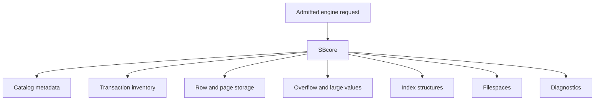

The exact on-disk format belongs to implementation and release documentation. The user-facing rule is that SBcore is the component that understands and maintains durable storage.

## Filespaces

A filespace is a storage area known to the engine. A database can use filespace metadata to describe where durable data lives and how it is organized.

At a high level, filespace behavior should answer:

- which storage areas belong to the database;
- which filespace is primary or special for database bootstrap;
- whether a filespace can be attached, detached, promoted, moved, or removed in the current release;
- what diagnostics are returned when storage is unavailable or unsafe;
- how recovery determines whether filespace metadata is consistent.

Use the Language Reference for exact filespace commands and supported lifecycle operations.

## Transactions

A transaction is a boundary around work. A session can request transaction actions, but the engine owns final visibility.

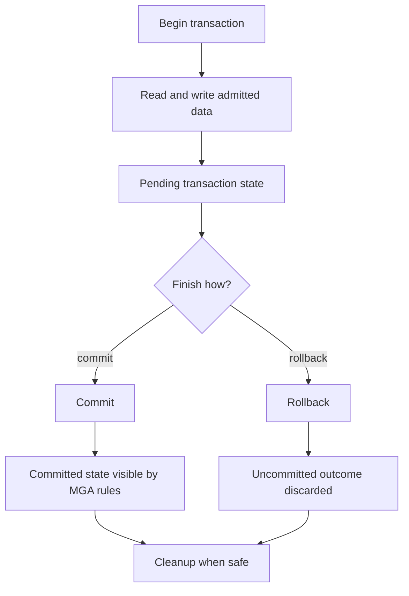

ScratchBird documentation refers to the transaction and visibility authority model as MGA. For an end user, the core point is simple: commit, rollback, visibility, and cleanup are engine decisions.

## Transaction Actions

Common transaction actions include:

| Action | Meaning |
| --- | --- |
| Begin | Start a transaction context where required by the session mode. |
| Commit | Request that admitted changes become final according to engine rules. |
| Rollback | Request that uncommitted changes be discarded. |
| Savepoint | Mark a point within a transaction that can be rolled back to where supported. |
| Release savepoint | Remove a savepoint marker where supported. |
| Autocommit | Let the session or tool commit statement work automatically according to documented rules. |
| Prepare | Enter a prepared transaction state where supported by the engine and selected route. |

Exact syntax and availability are described in the Language Reference.

## Visibility

Visibility decides which committed or uncommitted versions a transaction can see. It affects:

- newly inserted rows;
- updated rows;
- deleted rows;
- catalog objects created or dropped inside transactions;
- index contents;
- cleanup decisions;
- long-running readers;
- recovery after reopen.

Visibility is not decided by the parser. A parser can ask for work; SBcore determines the transactionally valid view.

## Commit And Reopen

A practical first durability check is a commit-and-reopen test:

1. Create or open a disposable database.
2. Begin a session.
3. Create a schema and table.
4. Insert rows.
5. Commit.
6. Detach.
7. Stop the runtime if the selected mode uses one.
8. Reopen the same database.
9. Query the committed rows.

```sql
select count(*) as note_count
from app.notes;
```

This proves more than an in-memory result. It confirms that the selected mode can reopen the database and see committed state for that basic workflow.

## Recovery

Recovery is the engine's process for determining a safe state after normal shutdown, interruption, or uncertain durable state.

Recovery can lead to different outcomes:

| Outcome | Meaning |
| --- | --- |
| Open normally | Durable metadata and transaction state are consistent enough to admit normal work. |
| Open read-only or restricted | The engine can expose limited access while preventing unsafe writes where supported. |
| Recovery required | The engine requires a recovery path before ordinary work proceeds. |
| Operator action required | The engine refuses to decide silently and requires administrative intervention. |
| Fail closed | The engine refuses access because safe state cannot be determined. |

Silent inconsistency is the state to avoid. A clear refusal is safer than pretending that uncertain data is valid.

## Parser Boundary And Storage

Parser packages can request storage-changing operations. They do not write pages directly.

That matters for compatibility routes:

- a parser can accept client syntax;
- a parser can lower admitted work to SBLR;
- the engine still enforces transaction, storage, authorization, and recovery rules;
- physical page-copy formats or low-level repair commands should not bypass SBcore through a parser route;
- logical streams must be interpreted as admitted operations, not as direct file edits.

## Diagnostics

Storage and transaction diagnostics should identify the kind of problem without leaking protected material.

Useful diagnostic categories include:

- database open refused;
- unsupported filespace operation;
- storage path unavailable;
- transaction conflict;
- transaction state invalid for the command;
- recovery required;
- authorization denied;
- policy denied;
- unsupported physical operation through a parser route;
- message vector redacted.

## What This Page Does Not Claim

This page does not claim:

- a specific crash matrix is complete;
- every filespace lifecycle operation is implemented;
- every parser route supports every transaction action;
- every platform build has the same durability proof;
- a logical backup is the same as a physical page copy;
- client tools can repair storage directly.

Use the current build, tests, and Language Reference for exact behavior.

## Where To Go Next

- [First Database](../using_scratchbird/first_database.md)
- [Transaction Control](../../Language_Reference/syntax_reference/transaction_control.md)
- [Filespace](../../Language_Reference/syntax_reference/filespace.md)
- [Database](../../Language_Reference/syntax_reference/database.md)
- [Backup, Restore, Replication, Migration](../../Language_Reference/syntax_reference/backup_restore_replication_migration.md)
- [Diagnostics And Support Bundles](../administration/diagnostics_and_support_bundles.md)


### /home/dcalford/CliWork/ScratchBird/docs/documentation/draft/Getting_Started/architecture/recursive_schema_tree.md

# Recursive Schema Tree

## Purpose

ScratchBird schemas form a tree. A schema can contain database objects and, where supported, child schemas. This is different from a flat model where all schemas live at one level.

The recursive schema tree is important for native SBsql administration, compatibility workareas, sandboxing, catalog projections, and durable UUID-backed object identity.

## Basic Shape

The names below are explanatory labels, not a required database layout.

```text
database_root
|-- system
|   |-- catalog
|   |-- security
|   |-- diagnostics
|   `-- storage
|-- users
|   |-- public
|   `-- home
|-- applications
|   |-- app
|   |   |-- tables
|   |   |-- routines
|   |   `-- policy
|   `-- audit
`-- workareas
    |-- compatibility_area_a
    `-- compatibility_area_b
```

Engine identity is UUID-based. The visible names are labels resolved by the session.

## Why Recursive Schemas Exist

Recursive schemas let ScratchBird represent several ideas without flattening them into one global namespace.

| Need | How The Tree Helps |
| --- | --- |
| Application organization | Application objects can live under a branch. |
| Administrative separation | System, security, diagnostics, and storage metadata can be separated from user objects. |
| User home areas | A user's default namespace can be a branch rather than a single global schema. |
| Compatibility workareas | A parser can present one branch as the client's database root. |
| Catalog projections | Metadata views can be placed where the intended users can see them. |
| Policy scoping | Policy can be attached or reasoned about by branch. |
| Migration staging | Imported or converted objects can be staged in a separate branch before promotion. |

## Durable Identity Versus Path Names

A path such as `applications.app.tables.notes` is user-facing. The durable object is represented by catalog identity and descriptors.

That matters because:

- an object can be renamed;
- a branch can be moved or reorganized where supported;
- parser routes can render names differently;
- dependencies should follow object identity;
- grants should apply to the intended object;
- transaction visibility controls whether a catalog change is visible.

Names are necessary for users. UUID identity is necessary for durable engine authority.

## Session Views

Different sessions can see different roots.

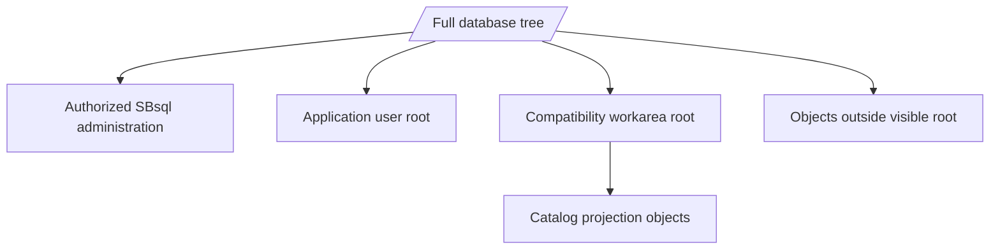

An authorized administrative SBsql session may see broad portions of the tree. A normal application user may see an application branch. A compatibility parser session may see its workarea as the root.

The visible root is part of the security model, not just a display preference.

## Schema Context Variables

ScratchBird documentation uses several schema-context ideas.

| Concept | Meaning |
| --- | --- |
| Database root | The top of the durable database tree. |
| Parser-visible root | The root presented to the selected parser route. |
| Home schema | The schema associated with a user, service, or configured workarea. |
| Current schema | The default schema for unqualified names in the current session. |
| Search path | An ordered set of schemas used by commands that allow path-based lookup. |
| Object parent schema | The schema that owns a specific object's local name. |

The exact inspection and assignment syntax belongs in the Language Reference.

## Name Resolution

Name resolution turns text into object identity.

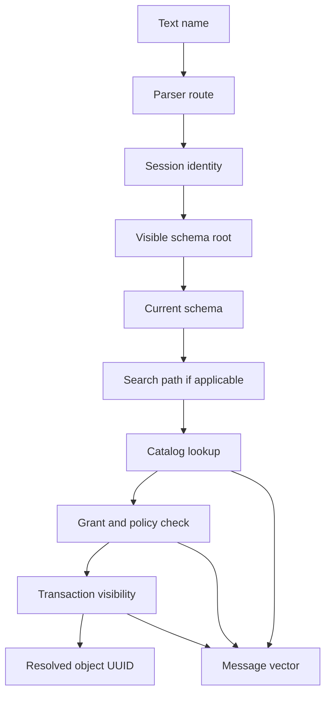

An unqualified name such as `notes` may resolve through the current schema. A qualified name such as `app.notes` gives more path information. Neither form bypasses visibility, grants, policy, or transaction state.

## Compatibility Workareas

A compatibility workarea is a schema branch presented to a parser route as the client-visible database root.

This lets the parser show a client a familiar namespace without giving that client direct access to the entire ScratchBird tree.

```text
database_root
|-- workareas
|   `-- accounting_compat
|       |-- catalog_projection
|       |-- tables
|       |-- views
|       `-- routines
`-- internal
    `-- not_visible_to_that_client
```

A catalog projection can expose selected metadata if the projection object has authority. That is different from giving the connected user direct access outside the workarea.

## Current Schema Examples

An SBsql session may use a current schema for shorter statements.

```sql
create schema app;
set schema app;

create table notes (
    note_id uint64 not null,
    note_text text not null
);

select note_id, note_text
from notes
order by note_id;
```

The unqualified name `notes` resolves relative to the current schema. A more explicit script can use qualified names:

```sql
select note_id, note_text
from app.notes
order by note_id;
```

Use qualified names for administrative scripts and migrations when ambiguity would be expensive.

## Object Lifecycle In The Tree

Object lifecycle operations interact with the tree.

| Operation | Tree Effect |
| --- | --- |
| Create schema | Adds a branch under a parent schema. |
| Create object | Adds an object under a parent schema. |
| Rename object | Changes a visible label while preserving durable identity where supported. |
| Move object | Changes parent context where supported and authorized. |
| Comment on object | Adds descriptive metadata without changing authority. |
| Drop object | Removes or marks the object according to transaction visibility and dependency rules. |
| Describe or show | Presents visible metadata through the current parser route. |

Dependency and authorization checks should prevent unsafe changes.

## Practical Guidance

For new SBsql work:

- create application schemas deliberately;
- avoid placing application objects at the database root;
- qualify names in migrations;
- avoid names that differ only by case;
- do not rely on catalog projections as direct access authority;
- document the intended schema root for each application or parser route;
- verify name resolution after renames;
- include explicit `order by` in result checks when order matters.

## Where To Go Next

- [Schemas, Objects, And Names](../using_scratchbird/schemas_objects_and_names.md)
- [Identity, Authentication, And Authorization](identity_authentication_and_authorization.md)
- [Engine Parser Boundary](engine_parser_boundary.md)
- [Schema Tree And Name Resolution](../../Language_Reference/syntax_reference/schema_tree_and_name_resolution.md)
- [Schema Statements](../../Language_Reference/syntax_reference/schema.md)


### /home/dcalford/CliWork/ScratchBird/docs/documentation/draft/Getting_Started/architecture/git_support.md

# Git-Oriented Workflows

## Purpose

ScratchBird documentation uses Git-oriented workflows to describe how database-related source assets can be reviewed, versioned, tested, and reproduced alongside application code.

Git is useful for managing scripts, configuration templates, fixtures, expected results, and documentation. Git does not replace database backups, recovery, transaction history, authorization, support bundles, or engine-owned catalog state.

## The Core Distinction

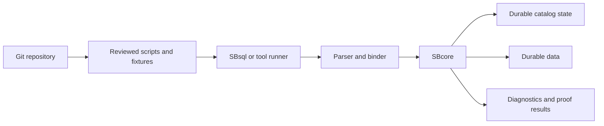

Git tracks the request material and expected proof artifacts. SBcore owns the durable result after admitted execution.

## What Belongs In Git

Git is appropriate for human-reviewed and reproducible artifacts such as:

- schema creation scripts;
- migration scripts;
- rollback scripts where the project maintains them;
- seed data for development or tests;
- test fixtures;
- expected result files;
- parser compatibility inputs;
- configuration templates;
- policy templates without secrets;
- documentation;
- generated proof summaries that are intended for review;
- release notes and upgrade notes.

These files should be written so another user can understand what they request before executing them.

## What Does Not Belong In Git By Default

Git should not be treated as ordinary storage for:

- live database files;
- temporary database files;
- local build output;
- staged release artifacts unless the release process explicitly tracks them;
- raw support bundles that may contain sensitive operational evidence;
- secrets, passwords, keys, or tokens;
- local machine paths;
- generated caches;
- logs with protected material;
- physical backup page copies.

If a project intentionally tracks a generated artifact, document why it is tracked and how it is regenerated.

## Recommended Repository Shape

A project using ScratchBird can keep database source assets organized without mixing them with live storage.

```text
project_root
|-- database
|   |-- schema
|   |-- migrations
|   |-- seed
|   |-- policy_templates
|   `-- expected_results
|-- tests
|   |-- sbsql
|   |-- fixtures
|   `-- proof
`-- docs
    `-- database_notes
```

This is only an example layout. The important rule is to keep source material separate from live database files and local generated output.

## Migration Scripts

A migration script is a reviewed request to change the database. It is not the durable change by itself.

A good migration workflow records:

- the intended precondition;
- the requested schema or data changes;
- the expected postcondition;
- the transaction boundary;
- the verification query or proof;
- the rollback or recovery plan where applicable;
- the minimum ScratchBird build or feature surface required.

Example structure:

```sql
-- migration: add note status
-- intent: add a status column for application filtering

alter table app.notes
    add column note_status text not null default 'open';

select note_id, note_status
from app.notes
order by note_id;

commit;
```

Use exact syntax from the current Language Reference when writing production scripts.

## Expected Results

Expected result files are useful when a script should produce deterministic output.

For example, a test can record:

- row count;
- column names;
- column types;
- ordered result rows;
- expected diagnostic class for an invalid request;
- expected refusal when policy denies an operation.

When row order matters, scripts should request it explicitly with `order by`.

## Configuration Templates

Configuration templates can live in Git when they do not contain secrets and when environment-specific values are clearly separated.

Good template behavior:

- use template variables for local paths and secret references;
- keep raw secrets out of the file;
- document required resource files;
- make parser route admission explicit;
- make diagnostics and redaction policy explicit;
- keep platform-specific notes separate when needed.

## Git And Database Identity

ScratchBird uses UUID-backed catalog identity. Git tracks text files.

That means:

- a script can request `create table app.notes`;
- the engine creates or modifies durable catalog objects;
- a later rename may keep the same durable object identity;
- a Git diff of scripts is not the same as a catalog diff;
- replaying a script against a different database may not produce the same durable identity.

Treat Git as source control for requests, not as the catalog.

## Git And Transactions

Git commit history is not database transaction history.

| Git Concept | Database Concept |
| --- | --- |
| Git commit | Versioned source change in a repository. |
| Database commit | Engine admission of a transaction outcome. |
| Git revert | Source-level reversal of a repository change. |
| Database rollback | Discard uncommitted database work. |
| Git branch | Source-control line of development. |
| Schema branch | Database namespace branch. |

The terms can sound similar, but they are different systems with different authority.

## Git And Backups

Git is not a database backup system.

Git can help reproduce scripts and expected states, but a database backup must preserve the database state according to the documented backup and restore surface. Logical backup, logical restore, import, export, and migration behavior should be handled through the relevant ScratchBird tools or SBsql commands where implemented and admitted.

## Review Checklist

Before merging database-related source changes, review:

- Does the script state its intent?
- Does it use qualified names where clarity matters?
- Does it avoid raw secrets?
- Does it include a transaction boundary?
- Does it include verification queries or expected diagnostics?
- Does it avoid relying on implicit row order?
- Does it avoid server-local paths unless the operation is explicitly intended and admitted?
- Does it avoid claiming feature availability that the current build does not prove?

## Where To Go Next

- [SBsql And SBLR](sbsql_and_sblr.md)
- [Storage, Transactions, And Recovery](storage_transactions_and_recovery.md)
- [First SBsql Session](../using_scratchbird/first_sbsql_session.md)
- [Backup, Restore, And Data Movement Overview](../administration/backup_restore_and_data_movement_overview.md)
- [Script Tokens And Identifiers](../../Language_Reference/syntax_reference/script_tokens_and_identifiers.md)


### /home/dcalford/CliWork/ScratchBird/docs/documentation/draft/Getting_Started/architecture/sbsql_and_sblr.md

# SBsql And SBLR

## Purpose

SBsql is the native ScratchBird command language. SBLR is the bound request representation submitted toward engine authority after parsing and binding.

The practical rule is:

```text
SBsql text is user input.
SBLR is the engine-facing request.
SBcore state is the authority.
```

This page explains the relationship at a high level. Use the Language Reference for exact syntax.

## Where SBsql Fits

SBsql is intended to be the native user language for ScratchBird.

SBsql can be used for:

- creating and changing database objects;
- querying data;
- inserting, updating, deleting, merging, and streaming data where implemented;
- controlling transactions;
- managing schemas, privileges, policies, and diagnostics where authorized;
- defining routines, triggers, domains, types, and sequences where implemented;
- inspecting catalog and operational state;
- running scripts.

Native SBsql should express ScratchBird concepts directly instead of copying a donor language.

## Where SBLR Fits

SBLR is not ordinary end-user SQL. It is the structured request form emitted after a parser accepts and binds a request.

SBLR carries information such as:

- operation kind;
- object identity or name bindings;
- datatype descriptors;
- expression trees;
- parameter bindings;
- transaction context;
- routine bodies or callable operations where supported;
- diagnostics and refusal routing;
- policy-relevant context.

Users normally do not write SBLR directly in an interactive session.

## Statement Pipeline

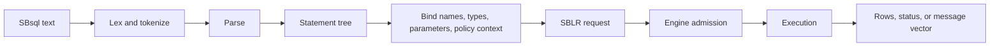

Each stage can refuse the request. For example, parsing can reject malformed syntax, binding can reject an invisible name, and engine admission can reject unauthorized work.

## Example: Create A Table

An SBsql statement might look like this:

```sql
create table app.notes (
    note_id uint64 not null,
    note_text text not null,
    created_at timestamp with time zone not null,
    constraint pk_notes primary key (note_id)
);
```

The parser does not store that text as the durable table. Instead, the accepted request is bound into engine-owned metadata:

- parent schema identity;
- table object identity;
- column descriptors;
- datatype descriptors;
- constraint descriptors;
- default and nullability rules;
- transaction visibility;
- authorization checks.

The original text can be useful as source material or reference, but the engine catalog is the durable authority.

## Example: Query Data

An SBsql query:

```sql
select note_id, note_text
from app.notes
where note_id > 10
order by note_id;
```

The parser and binder must determine:

- which object `app.notes` refers to;
- whether the session can see it;
- which columns are projected;
- which operator and type rules apply to `note_id > 10`;
- what ordering is requested;
- which parameters, collations, or functions are involved;
- whether the engine admits the resulting plan.

The result is returned as rows or as a controlled diagnostic.

## Context-Sensitive Language

SBsql is intended to remain context-sensitive, with as few reserved words as practical. That means a word may be usable as an identifier in one context and a command word in another context.

Practical guidance:

- prefer clear object names;
- avoid names that look like common command words;
- quote identifiers only where the Language Reference says to do so;
- qualify names in administrative scripts;
- do not assume another parser's keyword rules apply to SBsql.

## SBLR And Parser Packages

Native SBsql is not the only possible parser source. A compatibility parser can accept its own client language or protocol and lower accepted work to the same engine authority model.

```mermaid
flowchart TB
    SBsql[SBsql parser]
    Compat[Compatibility parser]
    SBLR[SBLR request surface]
    Engine[SBcore]
    Catalog[Catalog, descriptors, policy]
    Txn[MGA transactions]
    Storage[Storage]

    SBsql --> SBLR
    Compat --> SBLR
    SBLR --> Engine
    Engine --> Catalog
    Engine --> Txn
    Engine --> Storage
```

This lets parser packages preserve their client-facing syntax and defaults without becoming independent engines.

## Diagnostics

SBsql and SBLR participate in structured diagnostics.

| Stage | Example Diagnostic |
| --- | --- |
| Lexing | Invalid token. |
| Parsing | Statement shape not accepted. |
| Binding | Name not visible, ambiguous name, invalid argument count. |
| Type checking | Unsupported coercion or operator/type combination. |
| Engine admission | Authorization denied or feature unsupported by the build. |
| Execution | Constraint violation, transaction conflict, storage refusal. |

The user sees the diagnostic through the client or tool. The underlying message vector should preserve enough structure for support and automation where available.

## What SBsql/SBLR Does Not Mean

An SBsql grammar entry or an SBLR operation name does not, by itself, prove:

- the implementation is complete;
- every platform build includes it;
- every parser can call it;
- every operation is enabled by policy;
- the surface is production-ready;
- the operation bypasses engine authorization.

Availability must be checked against the current build, tests, configuration, and release notes.

## Where To Go Next

- [Engine Parser Boundary](engine_parser_boundary.md)
- [First SBsql Session](../using_scratchbird/first_sbsql_session.md)
- [Script Tokens And Identifiers](../../Language_Reference/syntax_reference/script_tokens_and_identifiers.md)
- [Operators](../../Language_Reference/syntax_reference/operators.md)
- [Procedural SQL](../../Language_Reference/syntax_reference/procedural_sql.md)
- [Language Reference](../../Language_Reference/README.md)


### /home/dcalford/CliWork/ScratchBird/docs/documentation/draft/Getting_Started/architecture/identity_authentication_and_authorization.md

# Identity, Authentication, And Authorization

## Purpose

ScratchBird separates identity, authentication, authorization, schema visibility, and policy admission. A session is not admitted simply because a client reaches a listener, IPC endpoint, or embedded API.

This page explains the high-level model. Exact providers, commands, and policy options depend on the current build and configuration.

## Core Terms

| Term | Meaning |
| --- | --- |
| Identity | The user, service, agent, or principal UUID associated with a session or operation. |
| Authentication | The process of proving the identity. |
| Authorization | The grants, roles, schema roots, object visibility, and policy rules available to that identity. |
| Session | A connected execution context with identity, parser route, transaction state, and schema context. |
| Principal | A user, role, group, service, or other authority-bearing entity. |
| Grant | Permission given to a principal or object. |
| Policy | A rule that can admit, deny, mask, restrict, or require diagnostics for an operation. |
| Sandbox | The visible namespace boundary for a session or parser route. |
| Protected material | Sensitive values that must be referenced, stored, redacted, and used through controlled mechanisms. |

## Connection Flow

```mermaid
sequenceDiagram
    participant Client
    participant Entry as Entry point
    participant Auth as Authentication source
    participant Engine as SBcore
    participant Catalog
    participant Policy

    Client->>Entry: connect
    Entry->>Auth: authenticate identity
    Auth-->>Entry: identity result
    Entry->>Engine: request session
    Engine->>Catalog: load identity, grants, roots, descriptors
    Engine->>Policy: materialize policy context
    Policy-->>Engine: admitted or denied
    Engine-->>Entry: session result or message vector
    Entry-->>Client: connected or refused
```

Authentication proves who the session claims to be. Authorization decides what that identity may do after it is known.

## Identity

Identity should be durable and unambiguous. ScratchBird documentation commonly describes authority-bearing identities as UUID-backed.

An identity may represent:

- an interactive user;
- a service account;
- an administrative principal;
- a background agent;
- a group or role relationship;
- a parser or tool route acting on behalf of a user.

The identity attached to a session matters for:

- current and home schema;
- visible schema root;
- object grants;
- row-level policy;
- protected-material access;
- external access policy;
- support-bundle redaction;
- diagnostic detail.

## Authentication

Authentication establishes the identity. Depending on build and configuration, authentication may be local, shared, delegated, or tool-mediated.

The documentation should be read cautiously:

- a named provider must exist in the build;
- configuration must admit it;
- the target platform must support it;
- diagnostics must make failures clear;
- secrets must not be passed as ordinary parser text unless a documented mechanism allows it.

Authentication failure should return a controlled diagnostic and should not open a database session.

## Authorization

Authorization controls what the authenticated identity can do.

Authorization can include:

- database attach rights;
- schema visibility;
- object privileges;
- routine execution rights;
- catalog projection visibility;
- parser route admission;
- external access policy;
- protected-material use;
- row-level security;
- masks and filtered views;
- administrative operation rights.

Authorization is materialized before engine execution. A parser can present the request, but SBcore owns final admission.

## Schema Roots And Sandboxes

Authorization includes namespace scope.

```mermaid
flowchart TB
    Root[/Database root/]
    Admin[Authorized administrative view]
    Workarea[Client workarea root]
    CatalogProjection[Catalog projection]
    UserObjects[Visible user objects]
    Outside[Objects outside sandbox]

    Root --> Admin
    Root --> Workarea
    Workarea --> CatalogProjection
    Workarea --> UserObjects
    Root --> Outside
```

A native administrative SBsql session may see broad parts of the schema tree when authorized. A compatibility parser session normally sees its assigned workarea as the root. The client should not be able to name arbitrary objects outside that root.

Catalog projection objects can be special: they may expose selected metadata from outside a user's direct sandbox if the projection object itself has been granted that authority. That does not give the user direct access to the underlying objects.

## Grants, Roles, And Policies

Grants and roles describe permissions. Policies can add contextual rules.

| Mechanism | Typical Use |
| --- | --- |
| Grant | Allow a principal to select, insert, update, delete, execute, create, alter, or administer a specific object or object class. |
| Role | Group privileges so they can be assigned and activated consistently. |
| Schema root | Limit what namespace branch a session can see. |
| Row-level policy | Limit which rows are visible or changeable. |
| Mask | Transform protected output values. |
| External access policy | Control whether a session or routine may reach files, network routes, or other external resources. |
| Protected-material policy | Control whether a session may reference, unwrap, rotate, or use sensitive values. |

Policy should fail closed when a safe result cannot be determined.

## Parser Route And Authority

Parser routes do not grant authority by themselves.

A parser route can affect:

- language accepted;
- catalog projection shape;
- default schema behavior;
- visible workarea;
- diagnostic rendering;
- feature refusal.

The authenticated identity and engine authorization still decide whether the resulting operation is admitted.

## Message Vectors

ScratchBird uses message-vector diagnostics to represent failures and refusals.

Common identity and authorization diagnostics include:

- authentication failed;
- identity provider unavailable;
- session denied;
- parser route denied;
- object not visible;
- privilege missing;
- policy denied;
- sandbox denied;
- protected material unavailable;
- external access denied;
- diagnostic redacted.

The exact rendering can differ by parser or tool, but the refusal should be controlled.

## Operational Guidance

For early deployments and tests:

- use explicit identities instead of anonymous defaults;
- keep parser routes scoped to what is being tested;
- avoid broad grants in examples;
- qualify names in administrative scripts;
- verify denied cases as well as allowed cases;
- confirm support-bundle redaction before sharing diagnostics;
- keep raw secrets out of scripts and ordinary configuration files;
- document which identity source a build is using.

## What This Page Does Not Claim

This page does not claim:

- a particular authentication provider is available;
- every policy surface is complete;
- every parser renders the same diagnostics;
- all external access is allowed;
- a connected client can administer every database object;
- sandboxed users can inspect unrelated schema branches directly.

Check the current build, configuration, and Language Reference before relying on a security surface.

## Where To Go Next

- [Recursive Schema Tree](recursive_schema_tree.md)
- [Engine Parser Boundary](engine_parser_boundary.md)
- [Schemas, Objects, And Names](../using_scratchbird/schemas_objects_and_names.md)
- [Configuration Basics](../administration/configuration_basics.md)
- [Security And Privilege Statements](../../Language_Reference/syntax_reference/security_and_privilege_statements.md)
- [Policy, Mask, And RLS](../../Language_Reference/syntax_reference/policy_mask_and_rls.md)


### /home/dcalford/CliWork/ScratchBird/docs/documentation/draft/Getting_Started/architecture/engine_parser_boundary.md

# Engine Parser Boundary

## Purpose

ScratchBird separates client language handling from durable database authority. This is one of the central architectural ideas in the system.

A parser understands a command language, script format, or wire protocol. SBcore owns durable database behavior: catalog identity, descriptors, storage, transactions, authorization, diagnostics, and recovery decisions.

This page explains the boundary at an end-user level. It does not claim that every parser route or command surface is complete in every build.

## The Boundary In One Diagram

```mermaid
flowchart LR
    Client[Client or tool]
    Surface[Language, script, or protocol surface]
    Parser[Parser package]
    Bound[Bound request]
    SBLR[SBLR envelope]
    Engine[SBcore]
    Catalog[UUID catalog]
    Types[Descriptors and types]
    Txn[MGA transaction state]
    Storage[Storage and filespaces]
    Policy[Security and policy]
    Diagnostic[Message vector]

    Client --> Surface
    Surface --> Parser
    Parser --> Bound
    Bound --> SBLR
    SBLR --> Engine
    Engine --> Catalog
    Engine --> Types
    Engine --> Txn
    Engine --> Storage
    Engine --> Policy
    Engine --> Diagnostic
```

The client sends text, frames, parameters, or tool commands. The parser decides whether that surface is accepted. The engine decides whether the resulting bound request is valid, authorized, transactionally safe, and executable.

## Why The Boundary Exists

Without a strict parser/engine boundary, every accepted language surface could become a separate database engine. That would make transaction behavior, catalog identity, security, recovery, and diagnostics drift by parser.

ScratchBird avoids that by making parsers translators, not storage authorities.

| Concern | Parser Package | SBcore |
| --- | --- | --- |
| Syntax | Accepts or refuses the language or protocol it supports. | Does not treat raw client text as authority. |
| Names | Binds visible user names according to parser and session context. | Resolves admitted work to durable UUID-backed catalog identity. |
| Types | Parses literals and applies parser-visible type spelling. | Owns type descriptors, storage encoding, comparison, and coercion authority. |
| Defaults | Applies parser-specific defaults explicitly. | Stores explicit durable object descriptors. |
| Security | Carries session identity and visible context toward the engine. | Materializes authorization and policy before execution. |
| Transactions | Requests begin, commit, rollback, savepoint, or statement work. | Owns final visibility, cleanup, and recovery state. |
| Diagnostics | Renders client-shaped messages where implemented. | Produces authoritative message vectors for engine admission and execution. |

## Parser Responsibilities

A parser package is responsible for:

- accepting only the language or protocol surface it is designed to support;
- rejecting unrelated dialects or malformed protocol input;
- tokenizing and parsing accepted input;
- applying parser-specific identifier, literal, and default rules;
- binding visible names through the session's schema root and search context;
- lowering admitted work into SBLR or another engine-facing request shape;
- rendering rows, status, and diagnostics in the client-facing shape where implemented;
- refusing unsupported, denied, unsafe, or unavailable behavior clearly.

A parser should not write database files, decide final transaction visibility, bypass catalog identity, or grant access outside the session's authority.

## Engine Responsibilities

SBcore is responsible for:

- database create, open, close, and reopen behavior;
- durable object UUIDs and catalog state;
- descriptor validation and type authority;
- transaction begin, commit, rollback, savepoint, visibility, cleanup, and recovery;
- storage pages, row storage, overflow storage, and filespace state;
- index identity and index maintenance;
- materialized authorization and policy checks;
- support-bundle evidence and engine diagnostics;
- final admission, execution, or refusal of a bound request.

The engine may refuse a request even after the parser accepts the syntax. That is expected behavior.

## Statement Lifecycle

```mermaid
sequenceDiagram
    participant Client
    participant Parser
    participant Engine as SBcore
    participant Catalog
    participant Txn as MGA
    participant Storage

    Client->>Parser: Client request
    Parser->>Parser: Parse accepted surface
    Parser->>Parser: Bind visible names and parameters
    Parser->>Engine: Submit bound request
    Engine->>Catalog: Resolve UUID descriptors
    Engine->>Txn: Check transaction visibility and state
    Engine->>Engine: Check authorization and policy
    Engine->>Storage: Execute admitted read or write
    Storage-->>Engine: Data or durable status
    Engine-->>Parser: Result or message vector
    Parser-->>Client: Client-shaped response
```

This lifecycle is the same architectural pattern whether the client uses native SBsql or a compatibility parser route.

## Parser-Specific Defaults

Different parser routes may expose similar objects with different default behavior. Examples include:

- identifier folding;
- default schema selection;
- datatype precision or scale defaults;
- string literal interpretation;
- index null ordering;
- generated constraint names;
- catalog projection shape;
- diagnostic wording.

Those defaults must be lowered into explicit engine requests. The engine should not have to guess which parser default created a durable object later.

## Sandboxing

The parser boundary is also a sandbox boundary.

A session has a visible schema root and authorization context. A compatibility parser may present one schema branch as the connected database. Native SBsql may expose broader tree navigation when the identity is authorized.

The parser cannot simply spell a path outside the visible root and gain authority. Name resolution must end in a visible object identity that the engine admits for the session.

## Refusal Behavior

Refusal can happen at several points.

| Location | Example Refusal |
| --- | --- |
| Listener or entry point | Unknown route, unavailable parser, authentication failure. |
| Parser | Syntax not accepted, malformed protocol input, unsupported parser feature. |
| Binder | Name not visible, ambiguous object, invalid type coercion. |
| Engine admission | Unauthorized object, denied policy, unsupported engine operation. |
| Execution | Constraint violation, transaction conflict, storage refusal, recovery-required state. |

Good refusal is part of compatibility. The system should not return success for work it did not implement or admit.

## What This Boundary Does Not Mean

The parser/engine boundary does not mean:

- all parser packages are complete;
- all parser packages support the same commands;
- parser syntax is native SBsql syntax;
- the engine executes raw SQL text;
- syntax acceptance guarantees execution;
- a compatibility route can bypass ScratchBird storage or transaction rules.

Always check the parser documentation, build output, tests, and release notes for the specific route you intend to use.

## Where To Go Next

- [SBsql And SBLR](sbsql_and_sblr.md)
- [Recursive Schema Tree](recursive_schema_tree.md)
- [Identity, Authentication, And Authorization](identity_authentication_and_authorization.md)
- [Storage, Transactions, And Recovery](storage_transactions_and_recovery.md)
- [Donor Database Compatibility](../using_scratchbird/donor_database_compatibility.md)
- [Parser To SBLR Pipeline](../../Language_Reference/core_paradigms/parser_to_sblr_pipeline.md)


### /home/dcalford/CliWork/ScratchBird/docs/documentation/draft/Getting_Started/core_concepts/what_is_a_convergent_data_engine.md

# What Is A Convergent Data Engine?

## Purpose

This guide uses Convergent Data Engine, or CDE, as a database-engine category. A CDE is an engine design that attempts to bring capabilities that are often split across separate products into one shared engine substrate.

The term is descriptive. It is not a certification, benchmark result, compatibility guarantee, or production-readiness claim. A feature is available only when the current source tree, build target, configuration, tests, and release notes prove that it is available.

## Why The Category Exists

Application systems often grow by adding specialized data products:

- a relational database for transactions;
- a document store for flexible records;
- a search service for text search;
- a vector store for embeddings;
- a graph store for relationships;
- a time-series store for measurements;
- a separate cache;
- separate governance, audit, and backup tooling;
- separate compatibility gateways for old applications.

That can be the right architecture for many teams. It also creates work:

- data has to move between systems;
- security models diverge;
- transaction boundaries become harder to explain;
- backups and restores need product-specific handling;
- operators need several diagnostic systems;
- applications need several drivers and failure models.

A CDE design explores whether more of those capabilities can share one engine authority model.

## The Basic CDE Idea

A CDE does not mean that every language becomes the same language. It means that different surfaces can lower into a common execution and authority layer.

```mermaid
flowchart TB
    Apps[Applications and tools]
    Protocols[Protocols and command surfaces]
    Parsers[Parser packages]
    SBLR[Common bound request representation]
    Engine[Shared engine authority]
    Catalog[Shared catalog and descriptors]
    Txn[Shared transaction authority]
    Security[Shared security and diagnostics]
    Storage[Shared storage layer]

    Apps --> Protocols
    Protocols --> Parsers
    Parsers --> SBLR
    SBLR --> Engine
    Engine --> Catalog
    Engine --> Txn
    Engine --> Security
    Engine --> Storage
```

The parser accepts a client language or wire protocol. The engine owns durable identity, security, transaction finality, recovery, and storage.

## What Converges

The word convergent means several responsibilities can meet at one engine boundary.

| Area | What Converges |
| --- | --- |
| Object identity | Objects can have stable engine identity even when surfaced through different names or parser profiles. |
| Data models | Relational, document, key-value, graph, vector, time-series, and other surfaces can share catalog and transaction authority where implemented. |
| Language surfaces | SBsql and parser packages can map different command styles into a shared bound request model. |
| Security | Authentication, authorization, protected material policy, masking, and row-level policy can be enforced by engine authority. |
| Transactions | Commit, rollback, visibility, and cleanup are not delegated to parser text. |
| Diagnostics | Refusals, unsupported features, policy failures, and runtime errors can be represented through shared message-vector behavior. |
| Operations | Startup, health checks, support bundles, configuration validation, and administrative commands can be handled as product surfaces instead of one-off utilities. |

## What Does Not Converge Automatically

A CDE is not a promise that every client sees the same language or the same behavior.

| Non-Goal | Why |
| --- | --- |
| One universal SQL dialect | Different clients expect different syntax, defaults, catalogs, and diagnostic shapes. |
| Automatic compatibility with every engine | Each compatibility profile requires implementation and proof. |
| Parser authority over storage | Parser packages translate requests; they do not own transaction finality or durable catalog identity. |
| Unlimited feature availability | A surface must be implemented, configured, admitted by policy, and tested for the target build. |
| Silent behavior substitution | If a behavior is unsupported, unsafe, denied, or unlicensed, the system should refuse with a diagnostic rather than pretending success. |

## Examples Of Convergence

The examples below describe the architectural idea. They are not a statement that every listed surface is complete in every build.

| User Need | CDE-Shaped Response |
| --- | --- |
| A native user creates a relational table. | SBsql parses the statement; the engine creates UUID-backed catalog objects and descriptors. |
| A compatibility client asks for its catalog tables. | The parser can project compatibility catalog rows while the engine remains the source of durable authority. |
| An application stores JSON and queries fields. | JSON descriptors and functions can be bound through the same expression and policy system as ordinary scalar values. |
| A vector query ranks candidates by distance. | Vector descriptors, functions, indexes, and execution operators can be tied back to engine catalog and policy rules. |
| A stored routine updates rows and emits diagnostics. | Procedural SQL lowers to engine-controlled operations and message vectors. |

## Why Parser Separation Matters

A CDE that supports multiple client families cannot let raw client text become the database engine.

ScratchBird uses parser packages as translators. A parser package can:

- accept the protocol or language it is designed for;
- apply parser-specific syntax rules;
- render parser-specific diagnostics where implemented;
- map names to visible object identities;
- lower accepted work into SBLR;
- refuse unsupported or unsafe behavior.

The engine then decides whether the bound request is authorized, type-correct, transactionally valid, and executable.

```mermaid
sequenceDiagram
    participant Client
    participant Parser
    participant Engine
    participant Catalog
    participant Storage

    Client->>Parser: Language or protocol request
    Parser->>Parser: Parse and bind visible names
    Parser->>Engine: SBLR request
    Engine->>Catalog: Resolve UUID descriptors and policy
    Engine->>Storage: Execute admitted work
    Engine-->>Parser: Result or message vector
    Parser-->>Client: Client-shaped result
```

## Compatibility Must Be Scoped

In this documentation, a parser profile means a compatibility route exists as a tracked product surface. It does not mean every behavior from that source ecosystem is complete.

Read compatibility cautiously:

- a parser should support only its intended client family;
- a donor-style parser should not silently accept unrelated dialects;
- donor-specific defaults must be documented and tested per parser;
- unsupported or denied behavior should return a diagnostic;
- compatibility status depends on the current tests and release notes.

## CDE And Operations

A CDE design also affects operators. If more behavior runs through one engine authority model, operations need shared answers to ordinary questions:

- Is the database ready?
- Is the session authorized?
- Which parser handled this request?
- Which object UUID was accessed?
- Which transaction controls visibility?
- Why was a request refused?
- Which support bundle evidence can diagnose the failure?

ScratchBird documentation treats those questions as part of the product, not as afterthoughts.

## What To Verify Before Relying On A Feature

Before relying on a CDE feature in a specific build, verify:

- the component exists in the public source tree;
- the build target includes it;
- the parser or API route admits it;
- the engine has an implemented SBLR/runtime path;
- policy allows it;
- tests cover the behavior;
- documentation states any limitations;
- diagnostics are clear when it is refused.

## Where To Go Next

- [How ScratchBird Implements A CDE](how_scratchbird_implements_a_cde.md)
- [Engine Parser Boundary](../architecture/engine_parser_boundary.md)
- [SBsql And SBLR](../architecture/sbsql_and_sblr.md)
- [Choosing A Mode Summary](../operating_modes/choosing_a_mode_summary.md)


### /home/dcalford/CliWork/ScratchBird/docs/documentation/draft/Getting_Started/core_concepts/how_scratchbird_implements_a_cde.md

# How ScratchBird Implements A CDE

## Purpose

ScratchBird is organized as a Convergent Data Engine by separating durable engine authority from parser, protocol, management, and operational surfaces. This page explains that model at a high level for users who are trying to understand what parts of the system they are interacting with.

This is an architectural overview, not a compatibility or deployment certification. A feature is usable only when it is implemented, built for the target platform, enabled by configuration and policy, and covered by the relevant tests for the release being used.

## Design Summary

ScratchBird is built around a small number of boundaries:

- **SBcore** owns durable engine behavior.
- **Parsers** translate client language or protocol requests into engine requests.
- **SBLR** is the bound request representation passed toward engine authority.
- **Catalog identity** uses durable UUIDs rather than relying only on text names.
- **MGA transaction authority** belongs to the engine.
- **Security and policy** are materialized before work is admitted.
- **Operational tools** inspect, configure, diagnose, and manage the running system.

The result is a system where several client surfaces can exist without making any one client language the engine itself.

```mermaid
flowchart TB
    Client[Client or tool]
    Manager[Optional manager entry point]
    Listener[Listener and parser route]
    Parser[Parser package]
    SBLR[SBLR request]
    Engine[SBcore engine authority]
    Catalog[UUID catalog and descriptors]
    Security[Authentication, grants, and policy]
    Txn[MGA transaction state]
    Storage[Storage and filespaces]
    Diagnostics[Message vectors and diagnostics]

    Client --> Manager
    Client --> Listener
    Manager --> Listener
    Listener --> Parser
    Parser --> SBLR
    SBLR --> Engine
    Engine --> Catalog
    Engine --> Security
    Engine --> Txn
    Engine --> Storage
    Engine --> Diagnostics
```

## Main Components

The public names below are the user-facing names used in documentation and output. Internal file names may differ.

| Component | User-Facing Role |
| --- | --- |
| ScratchBird Engine, or SBcore | The embedded engine library that owns catalog identity, descriptors, transaction authority, storage, recovery decisions, materialized security checks, and engine diagnostics. |
| ScratchBird IPC Server, or SBsrv | A local multi-user server process for clients on the same machine. It is useful when local processes need shared access without exposing a network listener. |
| ScratchBird Listener, or SBgate | The parser and parser-pool entry point used for network-facing client traffic. It routes accepted client work to the appropriate parser path. |
| ScratchBird Local Manager, or SBmgr | A single-node front door that can proxy authenticated connections to internal listener routes in managed deployments. |
| ScratchBird SQL, or SBsql | The native ScratchBird command language and script runner surface. |
| ScratchBird Core Parser, or SBParser | The parser package for native SBsql requests. |
| Donor parser packages | Standalone parser packages for specific client families. Each parser should understand only its intended client surface and lower accepted work to ScratchBird engine requests. |
| Administrative tools | Utilities for backup, security, diagnostics, conformance, policy, character set, collation, and related operational work where those tools are present in the release. |
| Resource files | Character sets, collations, time zones, policy files, configuration files, and other resources that make the built output usable as a product instead of only a binary. |

## Engine Authority

ScratchBird treats the engine as the final authority for durable database behavior.

The engine owns:

- database create, open, close, and reopen behavior;
- object identity and catalog state;
- type descriptors and domain descriptors;
- transaction begin, commit, rollback, savepoint, visibility, and cleanup;
- storage pages, row storage, overflow storage, and filespace state;
- materialized authorization and policy checks;
- index identity and index maintenance;
- diagnostic message vectors;
- recovery and refusal decisions.

Parser packages can request work, but they do not own durable identity, final transaction state, storage recovery, or security authority.

```mermaid
sequenceDiagram
    participant User
    participant Parser
    participant Engine
    participant Catalog
    participant Transaction
    participant Storage

    User->>Parser: Command or protocol request
    Parser->>Parser: Parse, bind visible names, apply parser rules
    Parser->>Engine: Submit bound SBLR request
    Engine->>Catalog: Resolve UUID-backed object descriptors
    Engine->>Transaction: Check visibility and transaction state
    Engine->>Storage: Execute admitted read or write
    Engine-->>Parser: Result or message vector
    Parser-->>User: Client-shaped response
```

## Parser Separation

ScratchBird does not require every client to speak SBsql. Parser packages exist so different client families can be supported without moving storage authority into those parsers.

A parser package is responsible for:

- accepting the client language or wire protocol it is built for;
- applying that parser's syntax rules;
- mapping visible names to engine object identities;
- applying parser-local defaults before lowering the request;
- generating SBLR for supported operations;
- rendering results and diagnostics in the expected client shape where implemented;
- refusing unsupported, denied, unsafe, or out-of-scope behavior.

A parser package should not silently accept another parser's language. A donor-style parser is scoped to its donor family. Native SBsql is the ScratchBird language surface.

## SBLR Boundary

SBLR is the bridge between parsed client intent and engine execution. It is where text has already been parsed and bound into a structured request.

That boundary matters because it prevents raw client text from becoming durable authority. It also makes it possible for different parser packages to share engine behavior while preserving their own syntax and diagnostic presentation.

At a high level:

1. A client sends a request.
2. The selected parser accepts or refuses the request.
3. The parser binds names, values, types, and parameters that are visible to that session.
4. The parser emits SBLR for an engine-supported operation.
5. The engine admits, executes, or refuses the request based on engine authority.
6. The parser returns a client-shaped result or message vector.

## Catalog Identity And Names

ScratchBird users work with names. The engine works with durable catalog identity.

Names are still important:

- they are what users type;
- they are what tools display;
- they are part of schema navigation;
- they can be projected differently by different parser surfaces.

Durable identity is deeper than the visible name. Engine catalog objects are tracked through UUID-backed identity and descriptors so the engine can preserve meaning across rename, dependency tracking, parser projection, security evaluation, and transaction visibility.

For example, a table may have a user-facing name inside a schema branch. If that table is renamed, dependencies and grants should follow the object identity rather than treating the renamed table as an unrelated object.

## Recursive Schema Tree

ScratchBird schemas form a recursive tree. A schema can contain objects and child schemas. A session resolves names from its current authority, current schema, home schema, and parser-visible schema root.

This is important for compatibility and security:

- native SBsql can administer or query broader parts of the tree when authorized;
- a compatibility client can be sandboxed so its connected workarea appears to be the root;
- catalog projection objects can expose selected metadata without giving the user direct access outside the sandbox;
- object names can be resolved relative to the session instead of requiring one global flat namespace.

```mermaid
flowchart TB
    Root[/Database Root/]
    System[System Branch]
    Security[Security Branch]
    App[Application Branch]
    Workarea[Compatibility Workarea]
    Catalog[Catalog Projection Objects]
    UserObjects[User Tables, Views, Routines]

    Root --> System
    Root --> Security
    Root --> App
    App --> Workarea
    Workarea --> Catalog
    Workarea --> UserObjects
```

The exact objects visible to a session depend on parser route, authentication, authorization, policy, and schema root.

## Data Model Convergence

ScratchBird's CDE model is intended to let different data shapes share engine authority where those surfaces are implemented.

| Surface | How It Fits The CDE Model |
| --- | --- |
| Relational rows | Tables, columns, indexes, constraints, views, and query execution are represented through catalog descriptors and engine execution. |
| Documents | Document values and document functions can be described by types and operated on through admitted expression and query surfaces. |
| Graph-like relationships | Relationship-oriented objects can be modeled through catalog identity, references, indexes, and query surfaces where implemented. |
| Vector values | Vector descriptors and similarity operations can use engine type, function, and index machinery where implemented. |
| Time-series values | Time-oriented data can use ordinary storage, indexing, functions, and policy while retaining time-specific semantics where implemented. |
| Procedural SQL | Stored routines, triggers, functions, packages, and event-style behavior lower into engine-controlled requests instead of bypassing authority. |
| Operational data | Diagnostics, backup, restore, security, policy, and management surfaces are treated as product behavior with message-vector refusal paths. |

The convergence point is not a single syntax. It is shared authority for identity, security, transactions, storage, and diagnostics.

## Security And Sandboxing

A connected session is not automatically allowed to see every object in the database.

ScratchBird's model separates:

- authentication, which establishes the identity;
- authorization, which determines what that identity may do;
- parser-visible schema root, which shapes the namespace presented to the client;
- policy, which can further restrict rows, values, external access, operational commands, or protected material;
- catalog projections, which can show selected metadata without making the underlying objects directly accessible.

In a compatibility workarea, the client should experience that workarea as its database root. If metadata views show information that requires broader knowledge, that access belongs to the catalog projection object and its grants, not to unrestricted user authority.

## Operating Modes

ScratchBird can be used through several operating modes. The correct mode depends on how the application connects, how many clients need access, where the trust boundary sits, and which binaries are available for the target platform.

| Mode | Path | Typical Use |
| --- | --- | --- |
| Embedded engine | Application -> SBcore | A process links to the engine and owns the local application boundary. |
| Single-node IPC server | Local client -> SBsrv -> SBcore | Several local processes need shared access without a network listener. |
| Standalone server | Client -> SBgate -> parser -> SBcore | Network clients use listener and parser routing. |
| Managed group deployment | Client -> SBmgr -> SBgate -> parser -> SBcore | Local installations need a managed front door and shared identity or policy integration. |

```mermaid
flowchart LR
    EmbeddedApp[Embedded application] --> Core1[SBcore]
    LocalClient[Local client] --> IPC[SBsrv]
    IPC --> Core2[SBcore]
    NetworkClient[Network client] --> Gate[SBgate]
    Gate --> Parser[Parser package]
    Parser --> Core3[SBcore]
    ManagedClient[Managed client] --> Manager[SBmgr]
    Manager --> Gate
```

Read the operating-mode pages before choosing a deployment shape.

## Resources And Built Output

A usable ScratchBird build is more than a compiled executable.

Depending on the release and target platform, the output tree may need:

- runtime binaries;
- parser packages;
- character set definitions;
- collation definitions;
- time zone data;
- policy defaults;
- configuration templates;
- security provider configuration;
- diagnostics and support-bundle tooling;
- test and conformance assets used to prove the build.

Documentation should treat those resources as part of the product because a binary without its required resources may not behave like the tested release.

## Git-Oriented Workflows

ScratchBird documentation may describe Git-oriented workflows and metadata where they are implemented. Git support is an operational and lifecycle concept; it does not replace database transaction authority, recovery behavior, or the engine catalog.

Use Git-oriented features only as documented for the release. Do not assume that a repository operation is the same thing as a database transaction, backup, restore, or repair operation.

## Refusals And Diagnostics

An enterprise-style database surface must be able to say no clearly.

ScratchBird uses message-vector diagnostics so a request can distinguish between cases such as:

- syntax not accepted by the selected parser;
- feature unsupported by the selected parser;
- feature unsupported by the engine build;
- operation denied by policy;
- missing capability or unavailable component;
- authentication or authorization failure;
- unsafe request shape;
- recovery-required or operator-intervention state.

Clear refusal is part of the CDE model. It is better for the system to refuse an operation than to pretend to support behavior that has not been implemented or admitted.

## What To Verify In A Release

Before relying on a ScratchBird capability, verify:

- the required component exists in the release output;
- the parser route is present and configured;
- the target platform is listed for that component;
- the feature is documented as implemented;
- the configuration and policy admit the operation;
- tests or conformance proof cover the behavior;
- refusal diagnostics are documented for unsupported cases.

This is especially important for compatibility parsers and operational commands, where the presence of a parser package does not automatically mean every possible behavior from that client family is implemented.

## Where To Go Next

- [What Is A Database?](what_is_a_database.md)
- [What Is A Convergent Data Engine?](what_is_a_convergent_data_engine.md)
- [Engine Parser Boundary](../architecture/engine_parser_boundary.md)
- [SBsql And SBLR](../architecture/sbsql_and_sblr.md)
- [Recursive Schema Tree](../architecture/recursive_schema_tree.md)
- [Embedded Engine](../operating_modes/embedded_engine.md)
- [Single-Node IPC Server](../operating_modes/single_node_ipc_server.md)
- [Standalone Server](../operating_modes/standalone_server.md)
- [Managed Group Deployment](../operating_modes/group_deployment.md)
- [Language Reference](../../Language_Reference/README.md)


### /home/dcalford/CliWork/ScratchBird/docs/documentation/draft/Getting_Started/core_concepts/what_is_a_database.md

# What Is A Database?

## Purpose

A database is a managed place for durable information. It stores data, describes that data, controls who may use it, and applies rules when the data changes.

The important part is the word managed. A spreadsheet, a text file, and a directory full of JSON files can all hold information. A database adds a system around the information so applications can ask questions, make changes, share access, and recover after failures with predictable rules.

This page explains the idea without assuming that you already know database terminology.

## Data And Metadata

Data is the information users care about: accounts, orders, documents, sensor readings, vectors, audit events, configuration records, and similar values.

Metadata is information about the data:

| Metadata | What It Describes |
| --- | --- |
| Tables and columns | The relational shape of rows. |
| Document descriptors | The expected shape or meaning of document values. |
| Types and domains | Which values are valid and how they compare or convert. |
| Constraints | Rules that values must satisfy. |
| Indexes | Search structures that help find rows or values. |
| Views | Named query projections over stored or derived data. |
| Procedures and functions | Stored routines that perform controlled work. |
| Grants and policies | Who can see or change each object or value. |
| Catalog entries | The durable records that describe database objects. |

In ScratchBird, metadata is not just comments or loose documentation. It is engine-owned state. A parser may accept a text command such as `create table`, but the durable object is represented by catalog identity, descriptors, parent schema identity, grants, and transaction visibility.

## Common Database Responsibilities

Most database systems provide a set of core responsibilities:

| Responsibility | Meaning |
| --- | --- |
| Storage | Keeps data and metadata in durable files, memory-backed structures, or managed devices. |
| Type handling | Knows how values are encoded, compared, sorted, converted, and validated. |
| Query execution | Reads or changes data according to a request. |
| Transactions | Groups work so it can commit, roll back, and recover consistently. |
| Concurrency | Lets multiple sessions work at the same time without corrupting shared state. |
| Security | Controls who can connect and what each identity can see or change. |
| Recovery | Reopens the database after normal shutdown, refused startup, or failure paths according to documented rules. |
| Diagnostics | Explains success, failure, refusal, and recovery-required states to users and operators. |

An application usually experiences these responsibilities through a language, driver, protocol, command-line tool, or embedded API.

## A Simple Example

A table named `orders` might hold order rows:

```sql
create table app.orders (
    order_id uint64 not null,
    account_id uint64 not null,
    status text not null,
    total numeric(18, 2) not null
);
```

That statement is user-facing text. After it is accepted, a database also needs durable metadata:

- the table object's internal identity;
- the parent schema identity;
- each column's descriptor;
- the constraints attached to the table;
- privileges and policies;
- transaction visibility for the catalog change.

The durable database is therefore more than the text statement.

```mermaid
flowchart LR
    Text[SQL text] --> Parser[Parser]
    Parser --> Request[Bound request]
    Request --> Engine[Engine]
    Engine --> Catalog[Catalog metadata]
    Engine --> Storage[Stored data]
    Engine --> Security[Security policy]
    Engine --> Txn[Transaction state]
```

## Tables, Documents, And Other Shapes

Many people first learn databases through relational tables. Tables are still a central model because they give clear names, columns, constraints, indexes, and query behavior.

Modern applications often also need other shapes:

| Shape | Example Use |
| --- | --- |
| Relational rows | Orders, invoices, users, permissions. |
| Documents | Flexible records, application payloads, nested values. |
| Key-value records | Fast lookup by key. |
| Graph relationships | Connected objects and relationship traversal. |
| Vector values | Embeddings and similarity search. |
| Time-series values | Measurements over time. |

ScratchBird documentation uses database language broadly because the system is designed around a common engine authority model for multiple data shapes where those surfaces are implemented.

## Transactions In Plain Language

A transaction is a boundary around work.

Within a transaction, a session can make changes that are not yet final. When the transaction commits, the engine makes the outcome visible according to transaction visibility rules. When the transaction rolls back, the engine discards the uncommitted outcome.

```mermaid
flowchart TD
    Begin[Begin transaction] --> Work[Read and write data]
    Work --> Decision{Finish how?}
    Decision --> Commit[Commit]
    Decision --> Rollback[Rollback]
    Commit --> Visible[Changes become visible]
    Rollback --> Prior[Database keeps prior state]
```

ScratchBird documentation refers to its transaction authority model as MGA. For a new reader, the practical rule is this: commit, rollback, visibility, cleanup, and recovery are engine decisions. Client tools and parser packages can request transaction actions, but they do not own finality.

## Names And Durable Identity

Users work with names such as `app.orders`. Names are convenient and necessary, but names are not the deepest identity of a durable database object.

ScratchBird uses UUID-based internal identity for catalog objects. A table can be renamed, displayed differently through a compatibility parser, or reached through a schema branch, while the engine still tracks the underlying object through durable identity.

This distinction matters for:

- renaming objects;
- resolving dependencies;
- enforcing grants;
- supporting recursive schemas;
- projecting compatibility catalogs;
- diagnosing failures;
- preserving transaction visibility.

## Database Files And Database Systems

It is tempting to describe a database as "the database file." That is incomplete.

A database file can hold pages, metadata, and stored values, but a database system also includes:

- the engine code that understands the file;
- resource files such as character sets, collations, policies, and configuration;
- tools that create, open, verify, back up, restore, or diagnose data;
- parser or protocol packages that accept client requests;
- operational rules for startup, shutdown, refusal, and recovery.

For that reason, copying files, replaying text, or translating syntax is not enough to reproduce a database safely.

## How ScratchBird Uses The Word Database

ScratchBird documentation uses `database` in two related ways:

| Use | Meaning |
| --- | --- |
| Durable database | The engine-owned stored data, metadata, catalog identity, security state, and transaction state. |
| User-facing database | The namespace and compatibility view a connected client sees after authentication and parser routing. |

A native SBsql session, an administrator, and a donor-style client may see different parts of the same durable database because each session can have its own parser profile, identity, grants, and schema root.

## What A Database Is Not

A database is not only:

- a file;
- a query language;
- a network protocol;
- a parser;
- a set of tables;
- a backup stream;
- a catalog dump.

Those can all be part of a database product, but the database itself is the managed combination of durable storage, metadata, identity, transaction rules, security rules, diagnostics, and recovery behavior.

## Why This Matters For ScratchBird

ScratchBird separates language from durable authority.

The parser handles text, wire protocol, dialect rules, and compatibility presentation. The engine handles catalog identity, descriptors, transactions, storage, recovery, and materialized authorization.

That separation is one of the foundations for the Convergent Data Engine model described in the next page.

## Where To Go Next

- [What Is A Convergent Data Engine?](what_is_a_convergent_data_engine.md)
- [How ScratchBird Implements A CDE](how_scratchbird_implements_a_cde.md)
- [Engine Parser Boundary](../architecture/engine_parser_boundary.md)
- [Schema Tree And Name Resolution](../../Language_Reference/syntax_reference/schema_tree_and_name_resolution.md)


### /home/dcalford/CliWork/ScratchBird/docs/documentation/draft/Getting_Started/MGA.md

### The Non-Programmer's Guide to Multi-Generational Architechture (MGA)

#### 1. Always in a Transaction (The Safety Bubble)

Whenever you open the database, you are automatically placed inside a **Transaction**. Think of this as your own private safety bubble. Anything you do inside this bubble isn't real to the rest of the world until you hit "Save" (Commit). If something goes wrong, the bubble pops (Rolls back), and it's like it never happened.

#### 2. Always in Snapshot Mode (The Time-Freeze Photo)

The moment your safety bubble opens, the database takes a digital snapshot of the entire system.

- You only see data that was officially saved **before** your snapshot was taken.

- Even if another user changes a row while you are working, your view remains frozen in time. You will never experience data shifting under your feet.

#### 3. Non-Destructive Changes (The LiveJournal Page)

When you **Delete** or **Update** a row, the database *never* overwrites or destroys the original data on the disk.

- **An Update:** Writes a brand new version of the row right next to the old one, with a note saying: *"If you want the version before this, look over there."*

- **A Delete:** Doesn't erase anything. It just attaches a "Dead" sticky note to the row.

### Visualizing the LiveJournal Page (Record History)

This diagram shows how different users see the exact same piece of data depending on when their "Snapshot Photo" was taken.

```mermaid
graph TD
    classDef active fill:#fff3cd,stroke:#ffc107,stroke-width:1px;
    classDef committed fill:#d4edda,stroke:#28a745,stroke-width:2px;
    classDef dead fill:#f8bbd0,stroke:#c2185b,stroke-width:1px;
    classDef reader fill:#e1f5fe,stroke:#0288d1,stroke-width:2px;

    subgraph Journal_Page [Physical Database Page: The LiveJournal]
        V3["<b>Version 3 (Latest)</b><br/>Price: $15.00<br/>Written by: Tom<br/>Status: <b>ACTIVE (Unsaved)</b>"]

        V2["<b>Version 2</b><br/>Price: $12.00<br/>Written by: Sarah<br/>Status: <b>COMMITTED (Saved)</b>"]

        V1["<b>Version 1 (Original)</b><br/>Price: $10.00<br/>Written by: Bob<br/>Status: <b>COMMITTED (Saved)</b>"]

        V3 -->|Points back to| V2
        V2 -->|Points back to| V1
    end

    subgraph Viewers [Users Reading the Database Right Now]
        UserA["<b>User A</b><br/>(Snapshot taken <i>after</i> Sarah saved, but before Tom started)"]
        UserB["<b>User B</b><br/>(Snapshot taken <i>before</i> Sarah even started)"]
    end

    UserA -->|Skips Tom's unsaved work| V2
    UserB -->|Skips Tom & Sarah's work| V1

    class V3 active;
    class V2,V1 committed;
    class UserA,UserB reader;
```

### How the Database Decides What You See

When a non-programmer reads the "LiveJournal" page, the database acts as a smart filter by asking three simple questions:

1. **Is the latest version officially saved?** * Looking at the diagram, **Tom's Version 3** isn't saved yet (it's Active). The database immediately ignores it for other users.

2. **Was it saved *before* my snapshot photo was taken?**
   
   - **User A** took their photo after Sarah saved. They see **Version 2 ($12.00)**.
   
   - **User B** took their photo a long time ago, before Sarah even started writing. The database rolls them all the way back to **Version 1 ($10.00)**.

3. **What happens to the old stuff?**
   
   Instead of blindly erasing old data to save space (which can corrupt active users' views), ScratchBird uses a careful, two-stage system: **Logical Cleanup** (deciding what is safe to delete) and **Physical Cleanup** (actually reclaiming the disk space).

It functions like a team of editors managing a shared historical journal. They won't delete an old draft until they are 100% sure no reader in the building is still looking at it.

#### 1. Dealing with Long-Running Users (Transaction Pressure)

Because every user session is *always* inside a frozen "snapshot" transaction, a single user who leaves their connection open can block the system from cleaning up old data. ScratchBird manages this with a strict escalation policy.

##### The "Do Not Disturb" Boundary (The Horizon)

ScratchBird calculates a global **Cleanup Horizon**. This is the exact moment in time behind which data is safe to destroy.

- It checks active snapshots, unresolved data, and open sessions to find the absolute **oldest thing anyone cares about**.

- Anything newer than this horizon is strictly hands-off.

##### The Escalation Timer (Pressure Management)

If a user is idle but their open session is keeping the horizon from moving forward, a background manager starts a countdown clock to nudge them out of the way:

| **Time Elapsed** | **ScratchBird's Action**                                                                                                                       |
| ---------------- | ---------------------------------------------------------------------------------------------------------------------------------------------- |
| **~5 Minutes**   | **Warn:** Sends a gentle warning to the client application.                                                                                    |
| **~15 Minutes**  | **Request Restart:** Asks the application to recycle its transaction.                                                                          |
| **~20 Minutes**  | **Request Reauth:** Asks the user to re-authenticate.                                                                                          |
| **~25 Minutes**  | **Request Cancel:** Asks to gracefully cancel the blocking work.                                                                               |
| **~30 Minutes**  | **Force Replacement:** If allowed by policy, it forcibly replaces the old transaction boundary with a fresh one to let cleanup proceed safely. |

#### 2. Dealing with Clutter (Page & Index Bloat)

ScratchBird handles old data versions incrementally in a series of careful checkpoints, ensuring background cleanup never slows down the user's active work.

##### Step 1: Logical Version Cleanup

The engine groups old row versions into a "candidate list." A row version is only eligible to be destroyed if:

1. It was explicitly deleted, rolled back, or replaced by a newer saved version.

2. The transaction that created it is older than the **Cleanup Horizon**.

3. It passes a rigorous safety check ensuring it isn't blocked by an active backup, a legal archive hold, or a recovery process.

##### Step 2: Physical Page Compaction

Once a row version is logically cleared, the physical cleanup coordinator steps in with the "reclaim evidence." It shrinks and packs the actual database pages, recycling the empty space. It refuses to do this unless it has airtight proof from Step 1.

##### Step 3: Index Maintenance

Indexes (the data phonebooks) are cleaned up just as carefully. ScratchBird checks the actual table snapshot before removing stale index entries from its ledger, ensuring search shortcuts never break.

##### Step 4: Debt Scheduling (The Budget)

To keep the database fast, cleanup is treated as a continuous, low-priority background task.

- It scores "cleanup debt" (where the most clutter is).

- If the user is doing heavy foreground work, the cleanup budget is automatically scaled back so it never starves the system of performance.

#### The Ultimate Rule of ScratchBird

> **Safety Over Space:** If a long-running transaction or legal snapshot remains active and authorized, ScratchBird will **always** choose to retain the old versions and let the database grow rather than risk data corruption. It will pressure the blocker to move, but it will never compromise visibility rules.

### How Do Other Database Engines Do This?

Most database systems use WAL - Write Ahead Logs, which is designed with a very different approach to operations.
To understand the difference between these two systems without getting bogged down in computer science jargon, imagine you run a busy **Legal Archive Office** where team members are constantly changing and reading documents.

**Standard WAL** and **ScratchBird MGA** represent two completely different strategies for running this office so that files never get lost and workers don't trip over each other.

### 1. Standard WAL: The "Notebook and Eraser" Strategy

In a standard WAL (Write-Ahead Logging) office, there is one main master binder on the shelf, and one sequential logbook on the desk.

- **Making a Change:** When a worker wants to change a price from \$10$ \ to \  $\$12, they must write it in the logbook first: *"Entry 45: Changing page 5 from \$10$ \ to\   $\$12."* 

- Only after it is written in the logbook are they allowed to go to the master binder, take an eraser, **scratch out \$10$,\  and\  overwrite\  it\  with\  $\$12**.

- **Changing Your Mind (Cancel):** If a worker gets halfway through a massive change and decides to cancel, it is a lot of work. They have to read the logbook backward and physically erase their mistakes in the master binder to restore the original numbers.

- **The Traffic Jam:** Because there is only one master copy of the page, if someone is in the middle of erasing and overwriting a line, nobody else is allowed to look at that page. Readers have to wait in line.

### 2. ScratchBird MGA: The "LiveJournal" Strategy

ScratchBird throws away the erasers. The binders act like a chronological journal where **nothing is ever crossed out or destroyed**.

- **Making a Change:** When a worker wants to change a price from \$10$\  to\  $\$12, they leave the original line completely alone. They simply write a brand new line underneath it: *Price is \$12 (Written by Tom).* Then, they draw a little arrow pointing back to the old line, creating a historical chain.

- **Changing Your Mind (Cancel):** Canceling is instant. If Tom decides to cancel his work, he doesn't have to erase anything. The office manager simply flips a switch marking Tom's name as "Invalid." The next person who reads the book sees Tom's line, sees his name is invalid, and completely ignores it.

- **No Traffic Jams:** Because old data is never destroyed, a reader can open a binder and read a frozen snapshot of the past while a writer is actively adding new lines at the bottom of the same page. No one ever has to wait in line to read.

### 3. How They Handle a Crisis

The biggest danger in a busy office is a worker who opens a book, starts a project, and then goes to lunch for three hours without closing it. Here is how both systems handle that crisis:

#### The WAL Crisis: The Logbook Explodes

Because the master binder only shows the *current* moment, the office cannot throw away or archive the desk logbook while a project is open���it might still need those logs to fix a mistake.

- **The Problem:** As other workers keep doing business, the desk logbook grows longer and longer, eventually spilling out of the room and consuming the entire building until there is no physical space left to stand.

- **The Result:** The office completely grinds to a halt.

#### The ScratchBird Crisis: The Binders Get Heavy

Because ScratchBird keeps historical lines on the page, if a worker keeps a project open for three hours, the office cannot clean up any old lines written during those three hours, because that worker might still look at them.

- **The Problem:** The pages get cluttered with old versions, and the binders get thick and heavy (page bloat).

- **The ScratchBird Solution:** ScratchBird has a built-in "Pressure Manager" that acts like an attentive office supervisor. If it sees a worker has gone to lunch and left a project open, a timer starts:
  
  1. **5 Mins:** The supervisor gives them a gentle nudge.
  
  2. **15 Mins:** Asks them to wrap it up and restart.
  
  3. **25 Mins:** Asks them to cancel.
  
  4. **30 Mins:** If allowed, the supervisor safely takes their paperwork, closes their frozen project, and opens a fresh one for them. This unlocks the backlog and allows the office cleaning crew to shred the unneeded historical lines, shrinking the binders back down.

### Quick Summary

- **Standard WAL** is like a traditional ledger. It's great for quick, short changes, but it relies on erasing data in-place and can cause lines to form when the office gets busy.

- **ScratchBird MGA** is like a historical diary. It takes a little more paper because it keeps a history of changes directly on the page, but it ensures that nobody ever blocks anyone else from reading, and it has a smart supervisor to keep the clutter under control.

## Beyond Simple MGA

### 1. No More "Spy Cameras" (Eliminating CDC Records)

In a traditional database, if you want to copy data to another system or run complex reports (ETL/Recursion), you have to install a "spy camera" called CDC (Change Data Capture). This camera watches the database constantly, writing down every single move a user makes into a separate, heavy stack of paperwork just so you can replay it later.

#### How ScratchBird Does It: The "Whodunit" Journal

Because ScratchBird���s LiveJournal page *already* preserves every version of a row with the writer���s name (Transaction ID) stamped on it, you don't need a spy camera.

- The database record itself tells you exactly who has touched it since the last time you checked.

- Instead of sorting through a giant separate mountain of spy logs, a reporting tool can just look directly at the page and say: *"Show me lines written by anyone who arrived after Transaction 500."* ---

### 2. The Database Time Machine (Point-in-Time Queries)

Normally, as we discussed, the office cleaning crew (Garbage Collection) shreds old lines once everyone goes home, to keep the binders from getting too thick. But what if you need to know exactly what the database looked like last Tuesday at 3:00 PM?

#### How ScratchBird Does It: The Archive Room

Instead of throwing old row versions into a paper shredder, ScratchBird's cleaning crew safely packs those old historical lines into **Archive Storage Binders** (Archive Filespaces).


```mermaid
graph LR
    classDef current fill:#d4edda,stroke:#28a745,stroke-width:2px;
    classDef archive fill:#e1f5fe,stroke:#0288d1,stroke-width:1px;
    classDef user fill:#fff3cd,stroke:#ffc107,stroke-width:1px;

    subgraph Active_DB [Active Database File]
        V3["Version 3 (Today)"]
    end

    subgraph Garbage_Collection [MGA Storage Agent]
        Move[Moves Old Versions Below Horizon]
    end

    subgraph Archive_DB [Archive Filespaces]
        V2["Version 2 (Yesterday)"]
        V1["Version 1 (Last Tuesday)"]
    end

    Active_DB -->|Clean Up| Move
    Move --> Archive_DB

    TimeTravel((User Requests:<br/>'Show me Last Tuesday at 3PM')) -.-> Archive_DB
    TimeTravel -.->|Reconstructs View| V1

    class V3 current;
    class V2,V1 archive;
    class TimeTravel user;
```

When you ask ScratchBird to travel back in time:

1. You give it a date and time (e.g., *Last Tuesday at 3:00 PM*).

2. The database manager flips through its master schedule and figures out exactly which transaction bubble was active at that exact minute.

3. It opens up the main binders *and* the archive binders, ignores everything written after that deadline, and lets you see the world exactly as it looked at that moment.

### 3. DNA Tracking Across the Whole Building (Cluster-Wide UUIDs)

In a giant enterprise system, data isn't kept in just one binder; it���s spread across a **Cluster** of different computers (like an archive office with 24 different rooms).

In a standard setup, if a row gets copied or moved to another room, it gets a new local line number, and its history is lost. It's like a person changing their identity every time they cross state lines.

#### How ScratchBird Does It: The Unchangeable Passport (UUIDs)

ScratchBird gives every single piece of data its own universal, lifelong fingerprint: a **UUID**.

- No matter which computer room a record moves to, splits into, or clones into across the entire global cluster, its UUID passport stays exactly the same.

- Because the historical journal tracks changes by UUID rather than by local page numbers, ScratchBird can follow the full family tree and history of a single record across the entire network of computers seamlessly.

## Summary of the "Next-Level" Upgrade

By anchoring everything to permanent **UUID fingerprints** and moving old data to **Archive Filespaces** instead of destroying it, ScratchBird transforms the database from a simple storage box into a living history book. It gives you all the benefits of data tracking and time travel automatically, without slowing down the daily business of the office.


### /home/dcalford/CliWork/ScratchBird/docs/documentation/draft/Getting_Started/using_scratchbird/first_sbsql_session.md

# First SBsql Session

## Purpose

SBsql is the native ScratchBird command language. A first SBsql session should prove that you can connect to the intended database, understand your schema context, run a small transaction, inspect results, and detach cleanly.

This page uses simple examples. It does not replace the full Language Reference, and it should not be read as a complete list of supported statements.

## What A Session Is

A session is the authenticated conversation between a client and the database through a selected operating mode and parser route.

```mermaid
sequenceDiagram
    participant User
    participant SBsql
    participant Parser
    participant Engine
    participant Storage

    User->>SBsql: Start client session
    SBsql->>Parser: Send native SBsql text
    Parser->>Engine: Submit bound request
    Engine->>Storage: Read or write admitted data
    Storage-->>Engine: Data and metadata
    Engine-->>Parser: Result or message vector
    Parser-->>SBsql: Render response
    SBsql-->>User: Rows, status, or diagnostic
```

Within one session, you normally care about:

- identity: who the engine thinks you are;
- current schema: where unqualified names resolve;
- transaction state: whether work is pending, committed, or rolled back;
- parser route: whether the request is going through native SBsql;
- diagnostics: how success and failure are reported.

## Session Checklist

Before running commands, know:

- which database you are connecting to;
- which operating mode is running;
- which identity is being used;
- whether autocommit is enabled by default for the selected tool;
- where diagnostics and logs can be reviewed;
- whether the database is disposable or persistent.

## Start With Context

Begin by inspecting the session context. Exact output formatting can vary by build.

```sql
show current schema;
show search path;
show current user;
show transaction;
```

The point is to confirm that you are in the database and schema context you intended. If a command is not available in the current build, use the equivalent context-inspection command documented for that release.

## Create A Working Schema

Create a schema for the first test rather than placing test objects at the database root.

```sql
create schema app;
set schema app;

show current schema;
```

After `set schema app`, unqualified names such as `notes` should resolve relative to `app` when visible and unambiguous.

## Create A Table

Use a small table with ordinary scalar values.

```sql
create table notes (
    note_id uint64 not null,
    note_text text not null,
    created_at timestamp with time zone not null,
    constraint pk_notes primary key (note_id)
);
```

This tests several basic behaviors:

- table creation;
- column descriptors;
- scalar datatypes;
- a named constraint;
- current-schema name resolution;
- catalog transaction behavior.

## Insert Rows

Insert more than one row so ordering and row counts are easy to inspect.

```sql
insert into notes (note_id, note_text, created_at)
values
    (1, 'created from the first SBsql session', current_timestamp),
    (2, 'second row in the same statement', current_timestamp),
    (3, 'third row for ordering checks', current_timestamp);
```

Multi-row `values` input is useful for simple smoke tests because it proves that the parser and executor are not limited to one row per insert statement.

## Query Rows

Query the data using an explicit projection and stable ordering.

```sql
select note_id, note_text, created_at
from notes
order by note_id;
```

Avoid `select *` in documentation examples unless the point is to inspect all columns. Explicit projection makes examples clearer and avoids hiding column-order assumptions.

## Commit Or Roll Back Intentionally

End the transaction deliberately.

```sql
commit;
```

If you are experimenting and want to discard the work instead:

```sql
rollback;
```

For a first persistence test, commit the transaction, detach, reconnect, and query the table again.

## Test A Controlled Error

Run one statement that should fail.

```sql
select note_id
from notes_that_do_not_exist;
```

Expected behavior:

- the client receives a diagnostic;
- the session remains controlled;
- protected details are not leaked;
- the next allowed command behaves according to transaction state.

This is part of learning the product. Successful systems explain failures clearly.

## Reconnect And Verify Persistence

After commit:

1. Detach the SBsql client.
2. Stop and restart the selected runtime if appropriate.
3. Connect again.
4. Set the schema or qualify names.
5. Query the committed rows.

```sql
set schema app;

select count(*) as note_count
from notes;

select note_id, note_text
from notes
order by note_id;
```

If the rows are not present, check whether the transaction was committed, whether the same database was reopened, and whether the current schema is the one you expect.

## Clean Up Test Objects

For a disposable first session, remove the test objects after verifying the workflow.

```sql
drop table app.notes;
drop schema app;
commit;
```

Only drop objects that you created for the test. Do not use cleanup examples against a database that contains real work.

## Reading Result Sets

A result set has column names, column order, datatypes, nullability behavior, and row order.

For early tests:

- name the columns you want;
- include `order by` when row order matters;
- test null values intentionally;
- test type conversion intentionally;
- keep result sets small enough to inspect by eye.

## Reading Message Vectors

ScratchBird diagnostics are expected to communicate structured refusal or error information. A user-facing rendering may include text, code, class, source component, object name, or policy information depending on the command and build.

For a first session, record whether failures are:

- syntax errors;
- missing object errors;
- authorization denials;
- unsupported feature refusals;
- configuration problems;
- runtime availability problems.

Different categories require different fixes.

## Common Session Mistakes

| Mistake | What Happens |
| --- | --- |
| Connecting to the wrong database path | Objects appear missing or changes appear to disappear. |
| Forgetting to commit | Reconnect tests may not show expected rows. |
| Using the wrong current schema | Unqualified names resolve somewhere else or fail. |
| Relying on implicit row order | Result rows may not appear in insertion order. |
| Mixing parser expectations | Native SBsql examples should be run through the SBsql parser route. |
| Ignoring diagnostics | A refused command may leave the session in a state that requires commit, rollback, or detach. |

## Where To Go Next

- [First Database](first_database.md)
- [Schemas, Objects, And Names](schemas_objects_and_names.md)
- [Schema Tree And Name Resolution](../../Language_Reference/syntax_reference/schema_tree_and_name_resolution.md)
- [Table Statements](../../Language_Reference/syntax_reference/table.md)
- [Insert](../../Language_Reference/syntax_reference/insert.md)
- [Select](../../Language_Reference/syntax_reference/select.md)
- [Transaction Control](../../Language_Reference/syntax_reference/transaction_control.md)


### /home/dcalford/CliWork/ScratchBird/docs/documentation/draft/Getting_Started/using_scratchbird/first_database.md

# First Database

## Purpose

This page gives a safe path for creating or opening a first ScratchBird database. It is written as an orientation guide rather than a fixed command transcript because command names, binary locations, configuration defaults, and release packaging can vary by build target.

The goal of a first database is modest: prove that the selected build can create or open a database, connect through the intended mode, run a small transaction, return diagnostics, and shut down cleanly.

## Before You Start

Confirm these items before creating a database:

| Item | Why It Matters |
| --- | --- |
| Build output exists | The tools, engine library, parser packages, and resource files must come from the same build. |
| Target platform is known | A Linux, Windows, or BSD output tree may have different file names and service behavior. |
| Operating mode is chosen | Embedded, local IPC, standalone server, and managed group deployments have different startup paths. |
| Resource files are staged | Character sets, collations, time zones, policy defaults, and configuration files are part of a usable deployment. |
| Authentication path is understood | Even a first test should use a known identity and expected authorization behavior. |
| Storage location is deliberate | Put test databases somewhere disposable until you understand cleanup and backup behavior. |

Do not create first-test databases in directories that also hold release binaries or source files.

## Choose A Mode

ScratchBird can be approached through more than one mode. Pick one path for the first test instead of mixing them.

| Mode | First-Test Shape | Use When |
| --- | --- | --- |
| Embedded engine | Application or test tool opens SBcore directly. | You are validating library embedding or an application-local database. |
| Single-node IPC server | Local client talks to SBsrv. | Several local clients need one server process without a network listener. |
| Standalone server | Client enters through SBgate and parser routing. | You are validating network-facing listener and parser behavior. |
| Managed group deployment | Client enters through SBmgr, then listener and parser routing. | You need managed entry points and shared identity or policy integration. |

For a first user workflow, the single-node IPC or standalone server modes are often easiest to reason about because they show a clear client/server boundary. Embedded tests are better when the application itself is the product boundary.

## First Database Flow

```mermaid
flowchart TD
    Output[Locate build output]
    Resources[Verify resources and config]
    Mode[Choose one operating mode]
    Start[Start required runtime process]
    Create[Create or open test database]
    Connect[Connect with SBsql]
    Schema[Create schema and table]
    Work[Insert, query, and commit]
    Negative[Test one controlled failure]
    Stop[Detach and stop cleanly]
    Review[Review diagnostics and logs]

    Output --> Resources
    Resources --> Mode
    Mode --> Start
    Start --> Create
    Create --> Connect
    Connect --> Schema
    Schema --> Work
    Work --> Negative
    Negative --> Stop
    Stop --> Review
```

## Pick A Test Database Name

Use a name that clearly identifies the database as disposable, for example:

- `scratchbird_getting_started`;
- `first_database_test`;
- `sbsql_smoke_test`.

Keep the database in a temporary test location until you know how the selected operating mode handles database paths, configuration, identity, and cleanup.

## Create Or Open The Database

The exact command depends on the selected binary and mode. The operation should establish:

- database file or database resource location;
- initial catalog;
- initial filespace;
- initial character set and collation behavior;
- security and policy baseline;
- parser route for the first session;
- diagnostics location.

In a first test, avoid advanced options. Do not test backup, restore, repair, import, replication, or compatibility parser behavior until a basic create/open/connect/query cycle works.

## First SBsql Workload

Once connected with SBsql, run a small transaction that exercises names, types, inserts, selects, and commit.

```sql
create schema app;

create table app.notes (
    note_id uint64 not null,
    note_text text not null,
    created_at timestamp with time zone not null,
    constraint pk_notes primary key (note_id)
);

insert into app.notes (note_id, note_text, created_at)
values
    (1, 'first note', current_timestamp),
    (2, 'second note', current_timestamp);

select note_id, note_text, created_at
from app.notes
order by note_id;

commit;
```

This example uses native SBsql. If a release changes spelling, available types, or built-in function names, follow the Language Reference for that release.

## Verify A Controlled Refusal

A first database test should include one intentional failure. The goal is not to break the system; the goal is to confirm that invalid work returns a controlled diagnostic.

Example:

```sql
select *
from app.table_that_does_not_exist;
```

Expected behavior:

- the session remains alive;
- the transaction state is understandable;
- the diagnostic says what failed;
- the diagnostic does not expose protected material;
- the client can continue or detach cleanly according to transaction state.

## Confirm The Database Reopens

After the first transaction:

1. Detach the client.
2. Stop the server process if the selected mode uses one.
3. Start the same mode again.
4. Reopen the same test database.
5. Query the rows inserted earlier.

```sql
select count(*) as note_count
from app.notes;

select note_id, note_text
from app.notes
order by note_id;
```

The point is to prove that the database did not only work in memory during the first session.

## What Success Looks Like

A successful first database run proves:

- the selected output tree is internally consistent;
- required resource files can be found;
- the chosen operating mode starts;
- the database can be created or opened;
- SBsql can connect;
- simple DDL and DML execute;
- commit makes data visible after reconnect;
- an invalid query returns a controlled diagnostic;
- the runtime detaches and shuts down without leaving an obvious stuck state.

It does not prove that every parser, datatype, administrative command, or compatibility surface is complete.

## Common Early Problems

| Symptom | Likely Area To Inspect |
| --- | --- |
| Binary starts but cannot find resources | Output staging, configuration paths, character set or collation resources. |
| Client cannot connect | Operating mode, socket or port configuration, listener route, authentication settings. |
| Parser not found | Parser package output, parser registration, configuration. |
| Create database fails | Storage directory permissions, existing file state, configuration, initial security policy. |
| Query fails with syntax error | SBsql syntax version or command spelling. |
| Data disappears after restart | Transaction not committed, wrong database path, temporary test database, failed reopen. |
| Shutdown leaves state behind | Runtime lifecycle handling, stale process, stale socket, or configuration issue. |

## Cleanup

When the first test is complete:

- detach all clients;
- stop server or manager processes started for the test;
- keep logs if a diagnostic needs review;
- delete only disposable test databases that you created for this purpose;
- do not delete shared resource files from the output tree.

## Where To Go Next

- [First SBsql Session](first_sbsql_session.md)
- [Schemas, Objects, And Names](schemas_objects_and_names.md)
- [Choosing A Mode Summary](../operating_modes/choosing_a_mode_summary.md)
- [Configuration Basics](../administration/configuration_basics.md)
- [Language Reference](../../Language_Reference/README.md)


### /home/dcalford/CliWork/ScratchBird/docs/documentation/draft/Getting_Started/using_scratchbird/schemas_objects_and_names.md

# Schemas, Objects, And Names

## Purpose

ScratchBird users work with names, but the engine stores durable identity separately from those names. This page explains how to think about schemas, objects, qualified names, current schema, home schema, compatibility workareas, and recursive schema trees.

For complete syntax, use the Language Reference. This page is the end-user orientation.

## Names Are User-Facing Labels

A name is what a user types or sees in a tool:

```sql
select note_id, note_text
from app.notes;
```

In that example:

- `app` is a schema name;
- `notes` is an object name inside that schema;
- `app.notes` is a qualified name.

The engine does not rely only on text names for durable identity. Objects are represented by catalog identity, descriptors, parent schema identity, grants, and transaction visibility.

## Durable Identity

ScratchBird uses UUID-backed catalog identity for durable database objects.

That distinction matters because a visible name can change:

- an object can be renamed;
- an object can be displayed through a parser-specific catalog projection;
- a session can resolve an unqualified name through a current schema;
- a compatibility workarea can make one schema branch look like the client-visible root;
- a dependency can continue to point at the same object after a rename.

Durable identity lets the engine answer the deeper question: "Which object is this?" Names answer the user-facing question: "How does this session spell it?"

## Recursive Schema Tree

ScratchBird schemas can contain child schemas and database objects. This creates a schema tree rather than one flat namespace.

```mermaid
flowchart TB
    Root[/Database root/]
    System[System schema branch]
    Security[Security schema branch]
    App[app]
    Sales[sales]
    Archive[archive]
    Notes[notes table]
    Orders[orders table]

    Root --> System
    Root --> Security
    Root --> App
    App --> Notes
    App --> Sales
    Sales --> Orders
    App --> Archive
```

A path through the tree gives context. For example, `app.sales.orders` and `app.archive.orders` can be different objects even though both end with `orders`.

## Schema Context

A session can have several schema-related concepts.

| Concept | Meaning |
| --- | --- |
| Database root | The top of the durable database tree. Not every session can see it directly. |
| Parser-visible root | The root of the namespace presented to the selected parser route. |
| Home schema | The schema associated with the connected identity or configured workarea. |
| Current schema | The default schema used for unqualified names in the current session. |
| Search path | An ordered list of schema locations used by commands that allow path-based lookup. |
| Object parent schema | The schema that owns an object's name within the tree. |

The exact variables and commands used to inspect these values are described in the Language Reference for the current release.

## Current Schema

The current schema is the default location for unqualified object names.

```sql
set schema app;

select note_id, note_text
from notes;
```

If `notes` is visible in `app`, the unqualified name can resolve to `app.notes`.

Unqualified names are convenient in scripts, but they can also hide mistakes. When writing administrative scripts, migrations, or examples intended for other users, prefer qualified names where clarity matters.

## Qualified Names

A qualified name includes path information.

```sql
select note_id, note_text
from app.notes;
```

Qualified names make examples easier to read because they show where the object is expected to live. In a recursive schema tree, deeper paths may be used where supported:

```sql
select order_id, order_status
from app.sales.orders;
```

The binder still has to resolve the visible path to a real object identity. A qualified name is not a bypass around security, sandboxing, or transaction visibility.

## Name Resolution

Name resolution is the process of turning user-visible text into engine object identity.

At a high level, name resolution considers:

1. the parser route;
2. the authenticated identity;
3. the parser-visible schema root;
4. the current schema;
5. the search path where applicable;
6. explicit qualification in the statement;
7. grants, policy, and object visibility;
8. transaction visibility for recently created, changed, or dropped objects.

```mermaid
flowchart TD
    Name[Text name in statement]
    Parser[Parser route]
    Identity[Session identity]
    Root[Visible root]
    Current[Current schema or search path]
    Catalog[Catalog lookup]
    Security[Grant and policy check]
    Txn[Transaction visibility]
    Object[Resolved object UUID]
    Refusal[Diagnostic refusal]

    Name --> Parser
    Parser --> Identity
    Identity --> Root
    Root --> Current
    Current --> Catalog
    Catalog --> Security
    Security --> Txn
    Txn --> Object
    Catalog --> Refusal
    Security --> Refusal
    Txn --> Refusal
```

If any step fails, the result should be a diagnostic rather than an accidental lookup outside the intended scope.

## Common Object Types

End users will commonly encounter these object categories:

| Object Type | What It Represents |
| --- | --- |
| Schema | A branch in the namespace tree. |
| Table | Stored rows and column descriptors. |
| Temporary table | A table whose data lifetime is scoped by session or transaction according to the table definition. |
| View | A named query projection. |
| Materialized view | A stored projection that must have refresh and dependency behavior defined by the implementation. |
| Index | A search structure over table or expression data. |
| Constraint | A rule attached to a table, column, or domain. |
| Domain | A reusable constrained type definition. |
| Type descriptor | A named type or type shape known to the engine. |
| Sequence | A database object that generates ordered values according to its definition. |
| Procedure | A stored routine that can perform controlled work. |
| Function | A stored or built-in routine that returns a value or result. |
| Package | A named grouping of routine definitions where supported. |
| Trigger | Routine behavior tied to table, database, transaction, or event-style actions where implemented. |
| Policy | A named rule for row access, masking, external access, or operational admission. |
| Role and privilege | Security objects that describe who can do what. |
| Comment | User-facing descriptive metadata attached to an object. |

Not every parser route exposes every object category in the same way. Native SBsql is the reference language for ScratchBird object administration.

## Object Lifecycle

Most schema objects have a lifecycle:

```mermaid
flowchart LR
    Create[Create]
    Alter[Alter]
    Rename[Rename]
    Comment[Comment]
    Show[Show or describe]
    Use[Use in queries or routines]
    Drop[Drop]

    Create --> Alter
    Alter --> Rename
    Rename --> Comment
    Comment --> Show
    Show --> Use
    Use --> Drop
```

Some object types also support `recreate`, `create or alter`, refresh, attach, detach, validate, or other object-specific actions. The object page in the Language Reference is the authoritative place for supported lifecycle syntax.

## Comments And Descriptions

Comments are descriptive metadata. They help tools and users understand objects, but they do not grant access and they do not change object identity.

Use comments for:

- purpose;
- ownership notes;
- migration context;
- operational warnings;
- column meaning;
- expected units for values.

Avoid putting secrets, passwords, tokens, or protected operational details in comments.

## Compatibility Workareas

A compatibility parser session normally sees a workarea as its root. That means a client can experience the connected workarea as "the database" even though ScratchBird may store it as a branch inside a larger recursive schema tree.

```mermaid
flowchart TB
    FullRoot[/Full ScratchBird database/]
    NativeAdmin[Authorized native administration]
    Workarea[Client-visible workarea root]
    ClientCatalog[Compatibility catalog projection]
    ClientObjects[Client tables, views, routines]
    Outside[Objects outside workarea]

    FullRoot --> NativeAdmin
    FullRoot --> Workarea
    Workarea --> ClientCatalog
    Workarea --> ClientObjects
    FullRoot --> Outside
```

The client cannot simply name `Outside` and access it. If a catalog projection shows selected metadata, that projection is an object with its own authority. It is not proof that the connected user can directly query the underlying object.

## Case, Quoting, And Identifiers

Identifier behavior can vary by parser route. Native SBsql is intended to remain context-sensitive with as few reserved words as practical, but scripts should still be written carefully.

General guidance:

- use clear object names;
- avoid names that differ only by case;
- avoid names that look like built-in functions or command keywords;
- use qualified names in administrative scripts;
- quote identifiers only when the language reference says quoting is required or intended;
- keep migration scripts consistent about naming style.

## Object Defaults Can Be Parser-Specific

Two parser routes can expose similar object concepts while applying different defaults. Examples include:

- index null behavior;
- identifier folding;
- default schema selection;
- default datatype precision;
- string literal handling;
- generated name formatting;
- catalog projection rows;
- diagnostic wording.

The engine still owns the durable object. The parser is responsible for mapping its client-facing defaults into an explicit engine request.

## Practical Naming Guidance

For new ScratchBird-native work:

- create an application schema instead of placing user objects at the root;
- qualify object names in migration and administration scripts;
- choose stable names that describe the object's purpose;
- use comments for human-facing meaning;
- avoid secrets in object names and comments;
- avoid relying on implicit search paths in automated scripts;
- test rename behavior before using it in migration tooling;
- verify grants after moving or renaming important objects.

## Example Schema Layout

A small application might start with this shape:

```text
database_root
|-- app
|   |-- notes
|   |-- note_tags
|   |-- active_notes
|   `-- routines
|-- audit
|   `-- note_events
`-- policy
    `-- application_policies
```

That tree separates application data, audit records, and policy-related objects. The exact layout for a real application depends on authorization, operational needs, and migration strategy.

## Where To Go Next

- [First SBsql Session](first_sbsql_session.md)
- [Donor Database Compatibility](donor_database_compatibility.md)
- [Recursive Schema Tree](../architecture/recursive_schema_tree.md)
- [Schema Tree And Name Resolution](../../Language_Reference/syntax_reference/schema_tree_and_name_resolution.md)
- [Schema Statements](../../Language_Reference/syntax_reference/schema.md)
- [Table Statements](../../Language_Reference/syntax_reference/table.md)
- [Script Tokens And Identifiers](../../Language_Reference/syntax_reference/script_tokens_and_identifiers.md)


### /home/dcalford/CliWork/ScratchBird/docs/documentation/draft/Getting_Started/using_scratchbird/donor_database_compatibility.md

# Donor Database Compatibility

## Purpose

ScratchBird can expose compatibility surfaces through donor parser packages. A donor parser is a standalone parser and protocol adapter for one client family. It lets a client speak the language and protocol shape that parser is built to understand while ScratchBird keeps storage, transactions, identity, security, and recovery inside the ScratchBird engine.

Compatibility is scoped. The presence of a parser package means there is a route for that client family; it does not mean every command, tool behavior, catalog row, wire-protocol edge case, or administrative feature from that source ecosystem is complete in the current build.

## The Compatibility Model

A donor parser sits between a client and SBcore.

```mermaid
flowchart LR
    Client[Compatible client or tool]
    Parser[Matching donor parser]
    SBLR[Bound SBLR request]
    Engine[SBcore]
    Catalog[ScratchBird catalog]
    Txn[MGA transaction authority]
    Storage[ScratchBird storage]
    Result[Client-shaped result or diagnostic]

    Client --> Parser
    Parser --> SBLR
    SBLR --> Engine
    Engine --> Catalog
    Engine --> Txn
    Engine --> Storage
    Engine --> Result
    Result --> Parser
    Parser --> Client
```

The parser is responsible for accepting the client surface. The engine remains responsible for durable authority.

## What The Parser Owns

A donor parser can own client-facing behavior such as:

- protocol negotiation for its client family;
- syntax accepted by that parser;
- parser-specific object defaults;
- parser-specific type spelling and literal handling;
- catalog projections that make ScratchBird metadata visible in the expected shape;
- diagnostic rendering for that client family;
- logical backup, restore, replication, or import/export streams where those surfaces are implemented and admitted by policy;
- mapping accepted work into SBLR.

The parser does not own:

- final transaction authority;
- storage recovery;
- durable catalog identity;
- authorization finality;
- object UUID assignment;
- cleanup and garbage collection decisions;
- page format interpretation outside the engine;
- low-level repair or verification authority.

## Parser Isolation

Each donor parser is isolated from the others.

| Rule | Meaning |
| --- | --- |
| One parser, one client family | A parser should accept only the syntax and protocol shape it is built for. |
| No cross-dialect fallback | A parser should not silently accept unrelated language forms because another parser supports them. |
| No implicit dependency | Installing one donor parser must not imply that any other parser is installed. |
| Parser-local defaults | Object defaults, name folding, null handling, index defaults, and diagnostics are parser-specific where implemented. |
| Engine authority remains shared | Once accepted and lowered, engine execution still uses ScratchBird catalog, security, transaction, and storage rules. |

This separation is intentional. It keeps compatibility behavior explicit and prevents a client from accidentally entering a different dialect.

## Compatibility Areas

Compatibility may involve many independent surfaces. A parser can be strong in one area and incomplete in another, so documentation and proof should be read by surface.

| Area | What To Check |
| --- | --- |
| Connection behavior | Authentication route, session state, database selection, client options, and refusal behavior. |
| SQL syntax | Accepted statements, expressions, functions, procedural blocks, comments, identifiers, and script tokens. |
| Type system | Native type spelling, value ranges, coercions, binary encodings, domain behavior, and null handling. |
| DDL | Create, alter, drop, recreate, rename, comment, show, describe, and object-specific lifecycle behavior. |
| DML and query behavior | Insert, update, delete, merge, upsert, select, joins, grouping, ordering, windowing, recursive common table expressions, and result ordering. |
| Transactions | Autocommit, begin, commit, rollback, savepoints, retain or chain behavior where applicable, and prepared transactions where supported. |
| Procedural SQL | Stored procedures, functions, triggers, packages, events, cursors, result sets, and routine metadata. |
| Catalog projection | System tables, views, metadata functions, dependency rows, privileges, indexes, constraints, and generated objects. |
| Backup and restore | Logical stream support, denied physical copy behavior, server-local file policy, and diagnostics. |
| CDC, replication, and ETL | Direction, ordering, transaction grouping, record identity, quarantine, cutover, and idempotency behavior where implemented. |
| Diagnostics | Error codes, message text, refusal classes, unsupported behavior, denied behavior, and policy failures. |

## Sandboxed Workareas

A donor client normally connects to a compatibility workarea. That workarea is the root of the namespace the client can see.

```mermaid
flowchart TB
    Root[/ScratchBird database root/]
    Admin[Authorized SBsql administration]
    Workarea[Donor workarea root]
    Catalog[Compatibility catalog projections]
    Objects[User objects visible to client]
    Hidden[Objects outside client sandbox]

    Root --> Admin
    Root --> Workarea
    Workarea --> Catalog
    Workarea --> Objects
    Root --> Hidden
```

The client should not be able to spell a path outside its sandbox and read arbitrary objects. Some catalog projection objects may display selected metadata from outside the sandbox when the projection object itself has been granted that authority. That does not give the user unrestricted direct access outside the workarea.

## Logical Streams And File Access

Compatibility commands that move data require careful handling.

Allowed by design when implemented and admitted by policy:

- remote logical backup streams for the connected compatibility database;
- remote logical restore streams that contain metadata and data operations;
- partial logical export or import streams where the parser and engine support them;
- CDC, replication, or ETL streams through the parser's UDR bridge where implemented.

Denied or restricted by design:

- server-local file open or manipulation by a donor parser unless policy explicitly admits a safe surface;
- physical page-copy backup or restore formats;
- low-level repair, verification, or page maintenance through donor parser routes;
- operations targeting objects outside the connected workarea without explicit engine authority.

The key distinction is logical remote stream versus server-local or physical storage access. A logical stream can be interpreted as client work. A physical page copy or repair command attempts to bypass engine authority.

## Refusals Are Compatibility Behavior

A compatibility parser should fail clearly when behavior is not admitted.

Common refusal classes include:

- syntax not accepted by the selected parser;
- feature unsupported by the parser;
- feature unsupported by the engine build;
- operation denied by sandbox policy;
- operation denied because it requires server-local file access;
- operation denied because it is physical backup, restore, repair, or verification;
- unavailable parser UDR or bridge package;
- missing capability for CDC, replication, import, export, or migration;
- ambiguous ordering or transaction grouping in a stream.

A controlled refusal is preferable to pretending that a feature succeeded.

## Reading Compatibility Claims

When evaluating a parser, look for proof of the exact surface you need:

1. The parser package exists in the build output.
2. The parser can be configured and selected.
3. Connection and authentication tests pass.
4. The SQL or protocol surface you need is implemented.
5. Type, index, transaction, and catalog behavior match the parser's documented compatibility target.
6. The behavior is covered by donor-tool regression tests or parser proof gates.
7. Unsupported cases return the documented message vector.

Do not infer readiness from file names, directory names, or generated manifests alone.

## Where To Go Next

- [First Database](first_database.md)
- [Schemas, Objects, And Names](schemas_objects_and_names.md)
- [Engine Parser Boundary](../architecture/engine_parser_boundary.md)
- [SBsql And SBLR](../architecture/sbsql_and_sblr.md)
- [Language Reference](../../Language_Reference/README.md)


### /home/dcalford/CliWork/ScratchBird/docs/documentation/draft/Getting_Started/reference/document_map.md

# Document Map

## Purpose

This document map helps readers move through the draft ScratchBird documentation without having to know the directory layout first. It is organized by reading goal: learn the concepts, choose an operating mode, run a first session, understand architecture, administer a deployment, or continue into the SBsql Language Reference.

This map is a navigation aid. It is not a release checklist, support statement, compatibility guarantee, or production-readiness claim.

## Start Here

| Reader Goal | Start With | Then Read |
| --- | --- | --- |
| I am new to database systems. | [What Is A Database?](../core_concepts/what_is_a_database.md) | [What Is A Convergent Data Engine?](../core_concepts/what_is_a_convergent_data_engine.md) |
| I know databases and want the ScratchBird model. | [How ScratchBird Implements A CDE](../core_concepts/how_scratchbird_implements_a_cde.md) | [Engine Parser Boundary](../architecture/engine_parser_boundary.md) |
| I need to choose how to run it. | [Choosing A Mode Summary](../operating_modes/choosing_a_mode_summary.md) | The operating-mode page for the mode you intend to test. |
| I want to create a first database. | [First Database](../using_scratchbird/first_database.md) | [First SBsql Session](../using_scratchbird/first_sbsql_session.md) |
| I am trying to understand names and schemas. | [Schemas, Objects, And Names](../using_scratchbird/schemas_objects_and_names.md) | [Recursive Schema Tree](../architecture/recursive_schema_tree.md) |
| I need detailed SBsql syntax. | [Language Reference](../../Language_Reference/README.md) | The specific syntax, datatype, function, or catalog page for the command you are using. |

## Recommended First Reading Path

Read these pages in order if you are evaluating ScratchBird for the first time.

1. [What Is A Database?](../core_concepts/what_is_a_database.md)
2. [What Is A Convergent Data Engine?](../core_concepts/what_is_a_convergent_data_engine.md)
3. [How ScratchBird Implements A CDE](../core_concepts/how_scratchbird_implements_a_cde.md)
4. [Choosing A Mode Summary](../operating_modes/choosing_a_mode_summary.md)
5. [First Database](../using_scratchbird/first_database.md)
6. [First SBsql Session](../using_scratchbird/first_sbsql_session.md)
7. [Schemas, Objects, And Names](../using_scratchbird/schemas_objects_and_names.md)
8. [Configuration Basics](../administration/configuration_basics.md)
9. [Diagnostics And Support Bundles](../administration/diagnostics_and_support_bundles.md)

## Core Concepts

| Page | Use It For |
| --- | --- |
| [What Is A Database?](../core_concepts/what_is_a_database.md) | Plain-language explanation of durable data, metadata, transactions, identity, and why a database is more than a file. |
| [What Is A Convergent Data Engine?](../core_concepts/what_is_a_convergent_data_engine.md) | Explanation of the CDE category and the difference between shared engine authority and one universal syntax. |
| [How ScratchBird Implements A CDE](../core_concepts/how_scratchbird_implements_a_cde.md) | ScratchBird-specific overview of SBcore, parsers, SBLR, recursive schema, sandboxing, resources, operating modes, and refusal behavior. |

## Operating Modes

| Page | Use It For |
| --- | --- |
| [Choosing A Mode Summary](../operating_modes/choosing_a_mode_summary.md) | Compare embedded, single-node IPC, standalone server, and managed group deployment at a high level. |
| [Embedded Engine](../operating_modes/embedded_engine.md) | Understand direct SBcore use inside an application process. |
| [Single-Node IPC Server](../operating_modes/single_node_ipc_server.md) | Understand local multi-user access through SBsrv without a network listener. |
| [Standalone Server](../operating_modes/standalone_server.md) | Understand client access through SBgate, parser routing, and server process boundaries. |
| [Managed Group Deployment](../operating_modes/group_deployment.md) | Understand SBmgr as a managed single-node front door with shared identity or policy integration. |

## Architecture Topics

| Page | Use It For |
| --- | --- |
| [Engine Parser Boundary](../architecture/engine_parser_boundary.md) | Understand what parsers do, what SBcore owns, and why raw SQL text is not durable authority. |
| [Recursive Schema Tree](../architecture/recursive_schema_tree.md) | Understand schema branches, visible roots, workareas, catalog projections, and name resolution. |
| [SBsql And SBLR](../architecture/sbsql_and_sblr.md) | Understand the native language surface and the bound request representation submitted to engine authority. |
| [Git-Oriented Workflows](../architecture/git_support.md) | Understand how Git-oriented lifecycle concepts fit around database authority without replacing transactions or recovery. |
| [Identity, Authentication, And Authorization](../architecture/identity_authentication_and_authorization.md) | Understand users, principals, groups, grants, policy checks, and sandboxed access at a high level. |
| [Storage, Transactions, And Recovery](../architecture/storage_transactions_and_recovery.md) | Understand the role of storage, transaction visibility, recovery, and refusal when a database state is uncertain. |

## Using ScratchBird

| Page | Use It For |
| --- | --- |
| [First Database](../using_scratchbird/first_database.md) | Create or open a disposable first database, run a smoke workload, test one controlled refusal, and verify reopen behavior. |
| [First SBsql Session](../using_scratchbird/first_sbsql_session.md) | Run a first native SBsql session with schema creation, table creation, multi-row insert, query, commit, error handling, and cleanup. |
| [Schemas, Objects, And Names](../using_scratchbird/schemas_objects_and_names.md) | Understand current schema, home schema, qualified names, durable UUID identity, object lifecycle, comments, and compatibility workareas. |
| [Donor Database Compatibility](../using_scratchbird/donor_database_compatibility.md) | Understand standalone parser packages, compatibility scope, sandboxing, logical streams, denied physical or low-level actions, and refusal behavior. |

## Administration

| Page | Use It For |
| --- | --- |
| [Choosing A Deployment Mode](../administration/choosing_a_deployment_mode.md) | Translate application needs into an operating mode and deployment shape. |
| [Configuration Basics](../administration/configuration_basics.md) | Understand configuration, resource files, policy defaults, parser registration, and output-tree expectations. |
| [Diagnostics And Support Bundles](../administration/diagnostics_and_support_bundles.md) | Understand message vectors, logs, redaction, support bundles, and troubleshooting evidence. |
| [Backup, Restore, And Data Movement Overview](../administration/backup_restore_and_data_movement_overview.md) | Understand logical backup and restore streams, denied physical copy behavior, import/export, replication, ETL, and migration boundaries. |

## Language Reference Entry Points

Use the Language Reference when you need exact syntax, types, operators, functions, catalog views, or procedural SQL details.

| Area | Entry Point |
| --- | --- |
| Main language index | [Language Reference](../../Language_Reference/README.md) |
| Core engine concepts | [Intro And MGA](../../Language_Reference/core_paradigms/intro_and_mga.md) |
| Parser pipeline | [Parser To SBLR Pipeline](../../Language_Reference/core_paradigms/parser_to_sblr_pipeline.md) |
| Security and sandboxing | [Security And Sandboxing](../../Language_Reference/core_paradigms/security_and_sandboxing.md) |
| UUID catalog identity | [UUID Catalog Identity](../../Language_Reference/core_paradigms/uuid_catalog_identity.md) |
| Transactions and recovery | [Transactions And Recovery](../../Language_Reference/core_paradigms/transactions_and_recovery.md) |
| Type system | [Type System Overview](../../Language_Reference/data_types/type_system_overview.md) |
| Numeric types | [Numeric Types](../../Language_Reference/data_types/numeric_types.md) |
| Text, collation, and character sets | [Text, Collation, And Charset](../../Language_Reference/data_types/text_collation_and_charset.md) |
| Temporal types | [Temporal Types](../../Language_Reference/data_types/temporal_types.md) |
| Documents, graph, vector, and multimodel values | [Document, Graph, Vector, And Multimodel Types](../../Language_Reference/data_types/document_graph_vector_and_multimodel_types.md) |
| Operators | [Operators](../../Language_Reference/syntax_reference/operators.md) |
| Operator precedence and result types | [Operator Type Result Matrix](../../Language_Reference/syntax_reference/operator_type_result_matrix.md) |
| Procedural SQL overview | [Procedural SQL](../../Language_Reference/syntax_reference/procedural_sql.md) |
| Procedural blocks | [Procedural SQL Blocks](../../Language_Reference/syntax_reference/procedural_sql_blocks.md) |
| Procedural control flow | [Procedural SQL Control Flow](../../Language_Reference/syntax_reference/procedural_sql_control_flow.md) |
| Procedural cursors | [Procedural SQL Cursors](../../Language_Reference/syntax_reference/procedural_sql_cursors.md) |
| Procedural exceptions | [Procedural SQL Exceptions](../../Language_Reference/syntax_reference/procedural_sql_exceptions.md) |
| Triggers and events | [Procedural SQL Triggers And Events](../../Language_Reference/syntax_reference/procedural_sql_triggers_and_events.md) |
| Functional reference index | [Functional Reference](../../Language_Reference/functional_reference/index.md) |
| Catalog reference index | [Catalog Reference](../../Language_Reference/catalog_reference/index.md) |

## Syntax Reference By Task

| Task | Pages |
| --- | --- |
| Create or manage databases | [Database](../../Language_Reference/syntax_reference/database.md), [Filespace](../../Language_Reference/syntax_reference/filespace.md) |
| Create or manage schemas | [Schema](../../Language_Reference/syntax_reference/schema.md), [Schema Tree And Name Resolution](../../Language_Reference/syntax_reference/schema_tree_and_name_resolution.md) |
| Create or manage tables | [Table](../../Language_Reference/syntax_reference/table.md), [Domain](../../Language_Reference/syntax_reference/domain.md), [Type Descriptor](../../Language_Reference/syntax_reference/type_descriptor.md) |
| Create or manage views | [View](../../Language_Reference/syntax_reference/view.md), [Projection](../../Language_Reference/syntax_reference/projection.md) |
| Create or manage indexes | [Index](../../Language_Reference/syntax_reference/index.md) |
| Create or manage routines | [Function](../../Language_Reference/syntax_reference/function.md), [Procedure](../../Language_Reference/syntax_reference/procedure.md), [Trigger](../../Language_Reference/syntax_reference/trigger.md) |
| Create or manage sequences | [Sequence](../../Language_Reference/syntax_reference/sequence.md) |
| Query data | [Select](../../Language_Reference/syntax_reference/select.md), [From](../../Language_Reference/syntax_reference/from.md), [Where](../../Language_Reference/syntax_reference/where.md), [Group By And Having](../../Language_Reference/syntax_reference/group_by_and_having.md), [Order By Limit Offset](../../Language_Reference/syntax_reference/order_by_limit_offset.md), [Window](../../Language_Reference/syntax_reference/window.md), [With](../../Language_Reference/syntax_reference/with.md) |
| Change data | [Insert](../../Language_Reference/syntax_reference/insert.md), [Update](../../Language_Reference/syntax_reference/update.md), [Delete](../../Language_Reference/syntax_reference/delete.md), [Merge And Upsert](../../Language_Reference/syntax_reference/merge_and_upsert.md), [Copy](../../Language_Reference/syntax_reference/copy.md) |
| Control transactions | [Transaction Control](../../Language_Reference/syntax_reference/transaction_control.md) |
| Manage security | [Security And Privilege Statements](../../Language_Reference/syntax_reference/security_and_privilege_statements.md), [Policy, Mask, And RLS](../../Language_Reference/syntax_reference/policy_mask_and_rls.md) |
| Move data or migrate | [Backup, Restore, Replication, Migration](../../Language_Reference/syntax_reference/backup_restore_replication_migration.md) |
| Work with multimodel statements | [Multimodel Statements](../../Language_Reference/syntax_reference/multimodel_statements.md) |
| Understand diagnostics | [Refusal Vectors](../../Language_Reference/syntax_reference/refusal_vectors.md), [Management And Operations](../../Language_Reference/syntax_reference/management_and_operations.md) |
| Work with agents | [Agent](../../Language_Reference/syntax_reference/agent.md) |
| Understand scripts and identifiers | [Script Tokens And Identifiers](../../Language_Reference/syntax_reference/script_tokens_and_identifiers.md) |

## Operations And Administration Entry Points

Use the Operations And Administration Guide when you need runbook, configuration, diagnostics, data movement, or release-validation guidance.

| Area | Entry Point |
| --- | --- |
| Main operations index | [Operations And Administration Guide](../../Operations_Administration/README.md) |
| Installation and output layout | [Installation And Output Layout](../../Operations_Administration/installation_and_output_layout.md) |
| Configuration | [Configuration Reference](../../Operations_Administration/configuration_reference.md) |
| Operating modes runbook | [Operating Modes Runbook](../../Operations_Administration/operating_modes_runbook.md) |
| Service lifecycle | [Service Lifecycle](../../Operations_Administration/service_lifecycle.md) |
| Identity, security, and policy | [Identity, Security, And Policy](../../Operations_Administration/identity_security_and_policy.md) |
| Parser routes | [Parser Registration And Routes](../../Operations_Administration/parser_registration_and_routes.md) |
| Database lifecycle | [Database Lifecycle](../../Operations_Administration/database_lifecycle.md) |
| Filespaces and storage | [Filespaces And Storage](../../Operations_Administration/filespaces_and_storage.md) |
| Backup, restore, and data movement | [Backup, Restore, And Data Movement](../../Operations_Administration/backup_restore_and_data_movement.md) |
| Diagnostics and support bundles | [Diagnostics, Message Vectors, And Support Bundles](../../Operations_Administration/diagnostics_message_vectors_and_support_bundles.md) |
| Monitoring and readiness | [Monitoring, Health, And Readiness](../../Operations_Administration/monitoring_health_and_readiness.md) |
| Troubleshooting | [Troubleshooting](../../Operations_Administration/troubleshooting.md) |
| Upgrade and compatibility | [Upgrade And Compatibility Policy](../../Operations_Administration/upgrade_and_compatibility_policy.md) |
| Release validation | [Release Validation Checklist](../../Operations_Administration/release_validation_checklist.md) |

## Functional Reference By Namespace

| Namespace | Page |
| --- | --- |
| Core functions | [sb_core](../../Language_Reference/functional_reference/sb_core.md) |
| Cryptographic and protected-material helpers | [sb_crypto](../../Language_Reference/functional_reference/sb_crypto.md) |
| Cursor helpers | [sb_cursor](../../Language_Reference/functional_reference/sb_cursor.md) |
| Diagnostics | [sb_diagnostic](../../Language_Reference/functional_reference/sb_diagnostic.md) |
| JSON | [sb_json](../../Language_Reference/functional_reference/sb_json.md) |
| Large objects | [sb_lob](../../Language_Reference/functional_reference/sb_lob.md) |
| Operator helpers | [sb_operator](../../Language_Reference/functional_reference/sb_operator.md) |
| Range values | [sb_range](../../Language_Reference/functional_reference/sb_range.md) |
| Regular expressions | [sb_regex](../../Language_Reference/functional_reference/sb_regex.md) |
| Row sets | [sb_rowset](../../Language_Reference/functional_reference/sb_rowset.md) |
| Spatial values | [sb_spatial](../../Language_Reference/functional_reference/sb_spatial.md) |
| Temporal values | [sb_temporal](../../Language_Reference/functional_reference/sb_temporal.md) |
| Time-series values | [sb_timeseries](../../Language_Reference/functional_reference/sb_timeseries.md) |
| UUID values | [sb_uuid](../../Language_Reference/functional_reference/sb_uuid.md) |
| Vector values | [sb_vector](../../Language_Reference/functional_reference/sb_vector.md) |
| XML values | [sb_xml](../../Language_Reference/functional_reference/sb_xml.md) |

## If You Are Looking For A Term

Use [Glossary](glossary.md) for short definitions of component names, authority concepts, session concepts, data movement terms, diagnostics, and parser terminology.

## Draft Status

These files are draft end-user documentation. Verify every operational command against the current build output and current Language Reference before relying on it for real data.


### /home/dcalford/CliWork/ScratchBird/docs/documentation/draft/Getting_Started/reference/glossary.md

# Glossary

## Purpose

This glossary defines terms used in the draft Getting Started Guide and related SBsql Language Reference pages. The definitions are written for end users, evaluators, and operators. They are intentionally concise and cautious: a term appearing here does not mean the related feature is complete, enabled, or available in every build.

## ScratchBird Product Names

| Term | Meaning |
| --- | --- |
| ScratchBird | The project and product line described by this documentation. |
| ScratchBird Convergent Data Engine | The full product concept: engine, parsers, tools, resources, and operational surfaces. |
| SB | Short brand form used in names and examples. |
| SBcore | ScratchBird Engine. The embedded engine library that owns durable catalog identity, transactions, storage, security admission, recovery decisions, and engine diagnostics. |
| SBsql | ScratchBird SQL. The native ScratchBird command language and script runner surface. |
| SBParser | ScratchBird Core Parser. The native SBsql parser package that lowers SBsql requests to SBLR. |
| SBsrv | ScratchBird IPC Server. A local multi-user server process for same-machine clients. |
| SBgate | ScratchBird Listener. The listener and parser-facing entry point used for network-facing client traffic. |
| SBmgr | ScratchBird Local Manager. A single-node front door that can proxy authenticated connections to internal listener routes in managed deployments. |
| SBadm | ScratchBird Administrator. Administrative utility name for configuration, time zone, character set, collation, and policy management where present. |
| SBbak | ScratchBird Backup Manager. Utility name for backup and backup-set operations where present. |
| SBsec | ScratchBird Security. Utility name for security provider, user, role, group, and policy management where present. |
| SBdoc | ScratchBird Doctor. Utility name for analysis, diagnosis, and repair-oriented workflows where present and admitted. |
| SBcop | ScratchBird Conformance Officer. Utility name for conformance and comparison checks where present. |

## Architecture Terms

| Term | Meaning |
| --- | --- |
| Convergent Data Engine | An engine design that attempts to bring multiple data shapes, parser surfaces, transaction rules, security rules, and diagnostics under one shared engine authority model. |
| CDE | Abbreviation for Convergent Data Engine. |
| Engine authority | The rule that durable behavior belongs to SBcore: object identity, descriptors, transactions, security admission, storage, recovery, and diagnostics. |
| Parser boundary | The separation between a client language or wire protocol and engine execution authority. |
| Parser package | A component that accepts a specific language or protocol surface and lowers accepted work to ScratchBird execution requests. |
| Donor parser | A standalone parser package for one compatibility client family. It should not silently accept unrelated dialects. |
| Parser route | The configured path that determines which parser handles a client request. |
| SBLR | ScratchBird's bound engine-facing request representation. Parsers emit SBLR after parsing and binding accepted work. |
| Bound request | A structured request whose names, values, parameters, and types have been resolved enough to submit toward engine authority. |
| Raw text | The command text received from a client before parsing. Raw text is not durable engine authority. |
| Catalog projection | A view or metadata surface that presents engine catalog information in a particular shape for a parser, tool, or user. |
| Workarea | A schema-root area presented to a parser or user as its operating root. |
| Compatibility surface | The subset of behavior a parser or tool is designed and proven to accept, execute, or refuse clearly. |
| Refusal | A controlled response that says a request is unsupported, denied, unavailable, unsafe, or otherwise not admitted. |

## Database And Catalog Terms

| Term | Meaning |
| --- | --- |
| Database | A managed durable store of data, metadata, identity, transactions, security rules, diagnostics, and recovery behavior. |
| Metadata | Information that describes data, such as schemas, tables, columns, types, constraints, indexes, views, routines, grants, policies, and catalog rows. |
| Catalog | Engine-owned metadata that describes durable database objects and their relationships. |
| Catalog identity | The durable identity of a catalog object, separate from the user-facing name used to spell it. |
| UUID identity | Durable object identity based on UUIDs rather than only text names. |
| Object descriptor | Engine metadata describing an object shape, type, storage behavior, dependency, or operational capability. |
| Type descriptor | Metadata describing a datatype, its value behavior, binary representation, capabilities, and related rules. |
| Domain | A reusable constrained type definition. |
| Constraint | A rule attached to a table, column, domain, or related object. |
| Index | A search structure maintained for faster lookup, ordering, constraint enforcement, or query planning where implemented. |
| View | A named query projection. |
| Materialized view | A stored projection whose refresh and dependency behavior must be defined by the implementation. |
| Procedure | A stored routine that can perform controlled work and may return output parameters or result sets where supported. |
| Function | A routine that returns a value or result. |
| Package | A named grouping of routine definitions where supported. |
| Trigger | Routine behavior tied to table, database, transaction, or event-style actions where implemented. |
| Sequence | A database object that generates ordered values according to its definition. |
| Comment | Descriptive metadata attached to an object. Comments do not grant authority and should not contain secrets. |

## Schema And Name Terms

| Term | Meaning |
| --- | --- |
| Schema | A namespace branch that can contain objects and, where supported, child schemas. |
| Recursive schema tree | A schema model where schemas can contain child schemas, creating a tree rather than one flat namespace. |
| Database root | The top of the durable database tree. Not every session can see it directly. |
| Parser-visible root | The root of the namespace presented to the selected parser route. |
| Home schema | The schema associated with a user, identity, or configured workarea. |
| Current schema | The default schema used for unqualified names in a session. |
| Search path | An ordered lookup path used by commands that allow path-based name resolution. |
| Qualified name | A name that includes schema or path information, such as `app.notes`. |
| Unqualified name | A name without schema qualification, such as `notes`. |
| Name resolution | The process of turning a user-visible name into engine object identity. |
| Sandbox | The visible boundary that limits what a session or parser route can name, inspect, or access. |
| Schema branch | A subtree of the database namespace. |
| Object lifecycle | The create, alter, rename, comment, describe, use, refresh, validate, or drop actions that apply to an object type. |

## Transaction And Recovery Terms

| Term | Meaning |
| --- | --- |
| Transaction | A boundary around work that can commit, roll back, and participate in visibility rules. |
| Commit | Make a transaction's admitted changes final according to engine visibility rules. |
| Rollback | Discard uncommitted transaction changes. |
| Savepoint | A named point inside a transaction that can be rolled back without ending the whole transaction where supported. |
| Autocommit | A mode where each statement may be committed automatically according to session and parser rules. |
| MGA | ScratchBird's transaction and visibility authority model. In this documentation, the key rule is that transaction finality belongs to the engine. |
| Visibility | The rule that determines which transaction versions a session can see. |
| Cleanup | Engine-controlled work that reclaims or resolves old transaction state when it is safe. |
| Recovery | The process of reopening or refusing a database after shutdown, interruption, or uncertain durable state. |
| Recovery-required state | A state where the engine requires recovery handling before normal writes can proceed. |
| Fail closed | Refuse work when the safe outcome is uncertain instead of silently accepting it. |
| Reopen proof | A test that closes and reopens a database to verify committed state is still present. |

## Security Terms

| Term | Meaning |
| --- | --- |
| Identity | The authenticated user, service, or agent identity attached to a session or operation. |
| Principal | A user, role, group, service, or other authority-bearing identity. |
| Authentication | Establishing who the session or agent is. |
| Authorization | Deciding what an authenticated identity is allowed to do. |
| Grant | A permission given to a principal or object. |
| Revoke | Removal of a previously granted permission. |
| Role | A named set of privileges that can be granted and activated according to policy. |
| Policy | A rule that controls access, masking, row visibility, external access, operational admission, or protected material use. |
| Row-level security | Policy behavior that limits which rows a session can see or change. |
| Mask | A policy-controlled transformation that hides or changes protected values in query output. |
| Protected material | Secrets or sensitive values that require controlled storage, reference, redaction, and use. |
| Secret reference | A reference to protected material without placing the raw secret in a parser packet, script, or diagnostic. |
| Materialized authorization | Authorization information loaded into an engine-admissible form before work is executed. |
| Denied | A refusal because the authenticated identity, policy, or sandbox does not admit the operation. |

## Data And Type Terms

| Term | Meaning |
| --- | --- |
| Datatype | A named value category with storage, comparison, conversion, and validation behavior. |
| Scalar value | A single value such as an integer, timestamp, boolean, UUID, or text value. |
| Numeric type | A datatype for integer, unsigned integer, decimal, fixed-point, or floating-point values. |
| Text type | A datatype for character data governed by character set and collation rules. |
| Character set | The encoding rules for text values. |
| Collation | The comparison and ordering rules for text values. |
| Temporal type | A datatype for dates, times, timestamps, intervals, or time-zone-aware values. |
| UUID | A fixed-size identifier value commonly used for durable identity. |
| Binary value | A sequence of bytes with type-specific interpretation. |
| Protected value | A value governed by protected-material policy. |
| Document value | A structured value such as JSON-like data where implemented. |
| Graph value | A relationship-oriented value or model surface where implemented. |
| Vector value | A numeric vector used for similarity or embedding-style operations where implemented. |
| Time-series value | A value or record organized around time-oriented measurement behavior where implemented. |
| Coercion | An implicit or explicit conversion between compatible types. |
| Cast | An explicit type conversion requested by the user. |
| Null | A marker for absence of a value, distinct from zero, empty string, or false. |

## Query Terms

| Term | Meaning |
| --- | --- |
| DDL | Data definition language: commands that create, alter, describe, comment on, rename, or drop database objects. |
| DML | Data manipulation language: commands that read or change rows and values. |
| Query | A request that reads data and returns a result set or scalar result. |
| Result set | Rows and columns returned by a query or routine. |
| Projection | The selected output columns or expressions of a query. |
| Predicate | A condition used to filter rows or control logic. |
| Join | A query operation that combines rows from more than one source. |
| Grouping | A query operation that forms groups of rows for aggregate calculations. |
| Aggregate | A calculation over multiple rows, such as count or sum where implemented. |
| Window function | A calculation over a window of rows related to the current row where implemented. |
| CTE | Common table expression. A named temporary query expression inside a statement. |
| Recursive CTE | A CTE that refers to itself according to the rules of the language surface. |
| Ordering | The explicit sort order requested for result rows. |
| Limit | A request to return only a bounded number of rows. |
| Offset | A request to skip a number of rows before returning results. |
| Upsert | Insert-or-update behavior according to a conflict rule where supported. |
| Merge | A statement that conditionally inserts, updates, or deletes based on a source relation where supported. |
| Copy | A large or streaming data input or output surface where implemented and admitted. |

## Procedural Terms

| Term | Meaning |
| --- | --- |
| Procedural SQL | Stored routine language constructs such as blocks, variables, control flow, cursors, exceptions, and triggers where implemented. |
| Block | A procedural unit containing declarations and executable statements. |
| Variable | A named procedural value local to a routine or block. |
| Cursor | A controlled handle over a result set. |
| Result-set cursor | A cursor passed or returned as a routine-controlled result where supported. |
| Exception handler | Procedural logic that handles a diagnostic or error condition. |
| Event trigger | Trigger-style behavior tied to database, transaction, or event actions where implemented. |
| UDR | User-defined routine or parser-support routine package, depending on context. In parser documentation, it commonly means the package that supports bridge or extension behavior for that parser. |
| Bridge | A controlled connection or interface used by a parser-support routine to reach another database surface where configured and admitted. |

## Operations And Data Movement Terms

| Term | Meaning |
| --- | --- |
| Configuration | Settings that control startup, resource locations, parser registration, security providers, policy defaults, and runtime behavior. |
| Resource file | A staged file needed by the product, such as character set, collation, time zone, policy, or configuration data. |
| Health check | A diagnostic check that reports whether a component appears alive and able to answer. |
| Readiness check | A diagnostic check that reports whether a component is ready to accept intended work. |
| Liveness check | A diagnostic check that reports whether a component is still running. |
| Support bundle | A redacted package of diagnostic evidence for review or support. |
| Redaction | Removing or masking protected material before diagnostics are shown or bundled. |
| Message vector | Structured diagnostic output used for errors, refusals, and operational status. |
| Logical stream | Data movement represented as statements, rows, records, or events rather than physical page files. |
| Logical backup | A backup stream that represents database content as logical metadata and data operations. |
| Logical restore | Replaying a logical stream as admitted database operations. |
| Physical backup | A page-copy or file-copy backup shape. Donor parser routes should not treat physical page-copy formats as normal logical restore input. |
| Import | Bring external logical data into a database through an admitted parser or tool route. |
| Export | Write logical data from a database to an external stream or file according to policy. |
| CDC | Change data capture. A stream or record of changes suitable for replication, ETL, or integration where implemented. |
| Replication | Copying changes between systems according to an ordering and identity model where implemented. |
| ETL | Extract, transform, load. A data movement workflow that reads from one source, transforms, and writes to another target. |
| Migration | Moving schema, data, routines, security, or operational behavior from one database shape to another. |
| Quarantine | Holding questionable incoming records or events aside for review instead of applying them silently. |
| Cutover | The controlled switch from one active source or route to another. |
| Idempotency key | A value used to detect repeated events or operations so replay can be handled safely. |

## Build And Release Terms

| Term | Meaning |
| --- | --- |
| Build output | The generated binaries, libraries, parser packages, resources, and configuration artifacts for a target platform. |
| Output tree | The staged directory layout intended for testing or release packaging. |
| Target platform | The operating system and architecture being built or tested. |
| Proof gate | A test or validation step intended to prove that a behavior remains implemented and has not regressed. |
| CTest | The test runner integration used by many project tests. |
| Conformance test | A test that compares behavior against a declared specification, parser expectation, or compatibility target. |
| Smoke test | A small test proving that a basic workflow starts, runs, and stops. |
| Regression test | A test intended to prevent a previously handled behavior from breaking again. |
| Draft documentation | Documentation under active review. Draft status means users should verify commands and claims against the current build and tests. |

## See Also

- [Document Map](document_map.md)
- [What Is A Database?](../core_concepts/what_is_a_database.md)
- [How ScratchBird Implements A CDE](../core_concepts/how_scratchbird_implements_a_cde.md)
- [Schemas, Objects, And Names](../using_scratchbird/schemas_objects_and_names.md)
- [Language Reference](../../Language_Reference/README.md)


### /home/dcalford/CliWork/ScratchBird/docs/documentation/draft/Getting_Started/operating_modes/group_deployment.md

# Managed Group Deployment

## Purpose

A managed group deployment is an operating shape where more than one ScratchBird installation is administered with consistent identity, policy, diagnostics, and manager-front-door conventions. It is about operational consistency across installations.

This page does not describe shared storage, distributed query execution, automatic data placement, or one database transparently spanning several installations. Each database keeps its own durable state and transaction authority.

## High-Level Shape

```mermaid
flowchart TB
    Identity[Shared identity or policy source]
    Operator[Operator configuration]
    ManagerA[SBmgr on installation A]
    ManagerB[SBmgr on installation B]
    ServiceA[Local ScratchBird service A]
    ServiceB[Local ScratchBird service B]
    EngineA[SBcore A]
    EngineB[SBcore B]
    DBA[(Database A)]
    DBB[(Database B)]

    Identity --> ManagerA
    Identity --> ManagerB
    Operator --> ManagerA
    Operator --> ManagerB
    ManagerA --> ServiceA
    ManagerB --> ServiceB
    ServiceA --> EngineA
    ServiceB --> EngineB
    EngineA --> DBA
    EngineB --> DBB
```

## What Is Managed

| Area | Meaning |
| --- | --- |
| Entry convention | SBmgr provides a consistent front-door pattern before traffic reaches local services. |
| Identity validation | Installations can use a shared identity source or shared identity policy where configured. |
| Admission policy | Operators can apply consistent expectations for who may connect and which routes may be used. |
| Parser route policy | Parser availability can be managed deliberately instead of being assumed. |
| Diagnostics | Logs, message vectors, support-bundle expectations, and redaction policy can be made consistent. |
| Configuration style | Installation configuration can follow the same layout and validation rules. |

## What Remains Local

Even in a managed group deployment, important authority remains local to each database.

| Area | Local Authority |
| --- | --- |
| Database files | Each database has its own storage and filespace state. |
| Transactions | Each database keeps its own MGA transaction authority. |
| Recovery | Each database reopens, recovers, or refuses according to its own durable state. |
| Catalog identity | Object UUIDs and descriptors belong to the database that owns them. |
| Grants and schema roots | Authorization is evaluated for the session and database context. |
| Parser workarea | A compatibility session sees the workarea assigned by its local route. |

Managed group deployment is therefore an operating pattern, not a promise that all databases become one database.

## User Connection Flow

```mermaid
sequenceDiagram
    participant User
    participant Manager as SBmgr
    participant Identity as Shared identity or policy source
    participant Service as Local service
    participant Engine as SBcore

    User->>Manager: connect to managed entry point
    Manager->>Identity: validate identity and policy context
    Identity-->>Manager: admitted or refused
    Manager->>Service: open local route
    Service->>Engine: create local session
    Engine->>Engine: materialize authorization
    Engine-->>Service: session admitted or refused
    Service-->>Manager: local session result
    Manager-->>User: connected or diagnostic
```

The user receives a session inside a specific local database context. Grants, parser route, schema root, workarea, and policy determine what the user can see and do.

## When To Evaluate This Mode

Managed group deployment is worth evaluating when:

- several installations should use the same identity conventions;
- users or agents should connect through a manager-controlled front door;
- operators need consistent diagnostics and support-bundle expectations;
- parser routes should be centrally described or consistently admitted;
- policy defaults need to be coordinated;
- installations need a common operational runbook.

If there is only one local application process, read [Embedded Engine](embedded_engine.md). If there are several local clients on one machine, read [Single-Node IPC Server](single_node_ipc_server.md). If the requirement is listener and parser routing for clients, read [Standalone Server](standalone_server.md).

## Configuration Checklist

Before using a managed group shape, define:

- installation identity;
- local database routes;
- SBmgr endpoint and local service routes;
- identity source and authentication behavior;
- authorization mapping for users, roles, groups, or agents;
- parser packages admitted at each installation;
- default schema roots or workareas;
- diagnostics, support-bundle, and redaction policy;
- start, stop, drain, and restart behavior;
- refusal behavior when the identity source or local service is unavailable.

## Refusal Cases

A managed group deployment should refuse clearly when:

- identity validation fails;
- the identity source is unavailable and policy does not allow fallback;
- the requested installation or database route is unknown;
- the local service is unavailable;
- the parser route is not admitted;
- the user is not authorized for the requested schema root or workarea;
- configuration validation fails;
- diagnostics cannot be safely produced.

Controlled refusal is part of the operating model.

## Data Movement Is Separate

Managed group deployment may coexist with backup, restore, migration, import, export, CDC, or replication features where those features are implemented and admitted. Those are separate data movement surfaces.

Do not infer data movement, shared storage, or automatic query routing from the presence of SBmgr. The manager-front-door role is about connection admission and local route control.

## Diagnostics To Collect

Useful evidence for this mode includes:

- SBmgr configuration validation;
- identity source selection;
- authentication result;
- local route selected;
- parser selected;
- database opened;
- session identity and schema root;
- authorization result;
- refusal message vector when connection is denied;
- local service health;
- clean drain and shutdown behavior.

Diagnostics must follow the configured redaction policy.

## What This Mode Does Not Provide

Managed group deployment does not automatically provide:

- one shared database across installations;
- distributed query planning;
- automatic replication;
- automatic failover;
- shared storage;
- cross-installation transaction finality;
- compatibility parser completeness;
- production suitability without release-specific proof.

Those behaviors require separately documented and proven surfaces.

## Where To Go Next

- [Choosing A Mode Summary](choosing_a_mode_summary.md)
- [Standalone Server](standalone_server.md)
- [Choosing A Deployment Mode](../administration/choosing_a_deployment_mode.md)
- [Configuration Basics](../administration/configuration_basics.md)
- [Identity, Authentication, And Authorization](../architecture/identity_authentication_and_authorization.md)
- [Diagnostics And Support Bundles](../administration/diagnostics_and_support_bundles.md)


### /home/dcalford/CliWork/ScratchBird/docs/documentation/draft/Getting_Started/operating_modes/single_node_ipc_server.md

# Single-Node IPC Server

## Purpose

Single-node IPC server mode uses a local server process, SBsrv, for clients on the same machine. It is the mode to evaluate when more than one local client needs a shared engine process but the deployment does not need a network listener.

The defining boundary is local IPC: clients are outside the engine process, but they are still local to the machine.

## High-Level Shape

```mermaid
flowchart LR
    ClientA[Local client A]
    ClientB[Local client B]
    ClientC[Local automation]
    IPC[Local IPC endpoint]
    Server[SBsrv]
    Engine[SBcore]
    DB[(Database files)]
    Diagnostics[Logs and message vectors]

    ClientA --> IPC
    ClientB --> IPC
    ClientC --> IPC
    IPC --> Server
    Server --> Engine
    Engine --> DB
    Server --> Diagnostics
    Engine --> Diagnostics
```

## What This Mode Is For

Use this page when you are evaluating:

- local multi-client access;
- a process boundary between applications and the engine;
- local automation that should not embed SBcore directly;
- service-style lifecycle management on one machine;
- smoke tests that need attach, detach, and restart behavior;
- a setup where network listener behavior is not part of the requirement.

This mode is not a remote access mode. If a client needs to connect through a network-facing listener or parser route, read [Standalone Server](standalone_server.md).

## Component Responsibilities

| Component | Responsibility In This Mode |
| --- | --- |
| Local client | Connects to the configured IPC endpoint and sends requests through the local route. |
| IPC endpoint | Provides the local communication boundary between clients and SBsrv. |
| SBsrv | Owns the local service process, opens engine sessions, routes admitted local requests, and returns results or diagnostics. |
| SBcore | Owns catalog identity, descriptors, transactions, storage, recovery, authorization, and engine diagnostics. |
| Configuration | Defines database paths, resource locations, authentication, authorization, IPC endpoints, diagnostics, and policy. |

## Request Flow

```mermaid
sequenceDiagram
    participant Client as Local client
    participant IPC as IPC endpoint
    participant Server as SBsrv
    participant Engine as SBcore
    participant Database as Database files

    Server->>Engine: initialize engine with configuration
    Engine->>Database: create or open database
    Client->>IPC: attach
    IPC->>Server: local attach request
    Server->>Engine: authenticate and open session
    Engine-->>Server: session admitted or refused
    Server-->>Client: attach result
    Client->>Server: database request
    Server->>Engine: execute admitted work
    Engine-->>Server: result or message vector
    Server-->>Client: response
    Client->>Server: detach
    Server->>Engine: close session
```

## Parser Behavior

Single-node IPC mode may expose different local request surfaces depending on build and configuration. A local client might use native SBsql, a direct local API, or another configured parser route.

The same rules still apply:

- parser packages accept and lower client syntax;
- SBcore owns durable authority;
- unsupported or denied behavior should return a controlled diagnostic;
- parser availability must be proven by the current build and tests.

## First Local IPC Smoke Test

A useful first test should prove:

1. SBsrv starts with the intended configuration.
2. Required resource files are available.
3. A disposable database can be created or opened.
4. A local client can attach through the IPC endpoint.
5. Authentication and authorization produce the expected session.
6. A simple create, insert, select, and commit cycle succeeds.
7. A second local client can attach if the scenario requires it.
8. A controlled invalid request returns a message vector.
9. Clients detach cleanly.
10. SBsrv stops cleanly and can restart.
11. The database reopens with committed data visible.

## Local Isolation

The server process gives isolation that embedded mode does not:

- client crashes do not automatically terminate the server process;
- the engine lifecycle can be supervised separately from clients;
- multiple clients can use a shared local service boundary;
- diagnostics can be collected by the server process.

That isolation is local process isolation. It is not network security, remote routing, or a replacement for authentication and authorization.

## Configuration Checklist

Before using this mode, verify:

- IPC endpoint location and permissions;
- database path and storage permissions;
- resource file locations;
- authentication provider or local identity configuration;
- grants, schema roots, and policy;
- diagnostic output location;
- service start and stop behavior;
- stale endpoint cleanup behavior after abnormal termination;
- parser or local API route configuration.

## Diagnostics To Expect

Useful diagnostics in this mode include:

- configuration validation errors;
- IPC endpoint unavailable or permission denied;
- database open refused;
- authentication failure;
- authorization denied;
- parser route missing or unavailable;
- transaction state diagnostic;
- controlled shutdown or drain messages;
- stale endpoint or stale process state.

## What This Mode Does Not Provide

Single-node IPC server mode does not automatically provide:

- network listener access;
- parser pool management for network clients;
- remote client compatibility;
- shared identity conventions across installations;
- distributed query behavior;
- automatic backup or repair behavior;
- proof that every parser package is available.

Use the standalone server page when listener and parser routing are part of the requirement.

## Where To Go Next

- [Choosing A Mode Summary](choosing_a_mode_summary.md)
- [Standalone Server](standalone_server.md)
- [First Database](../using_scratchbird/first_database.md)
- [Configuration Basics](../administration/configuration_basics.md)
- [Identity, Authentication, And Authorization](../architecture/identity_authentication_and_authorization.md)
- [Diagnostics And Support Bundles](../administration/diagnostics_and_support_bundles.md)


### /home/dcalford/CliWork/ScratchBird/docs/documentation/draft/Getting_Started/operating_modes/standalone_server.md

# Standalone Server

## Purpose

Standalone server mode is the client/server shape where clients enter through listener and parser routing. It is the mode to evaluate when a client needs a network-facing entry point, a parser package, protocol negotiation, or compatibility testing through a client tool.

The defining boundary is that clients do not call SBcore directly. They connect to SBgate, are routed to a parser package, and reach SBcore through the configured local service path.

## High-Level Shape

```mermaid
flowchart LR
    Client[Client tool or application]
    Gate[SBgate listener]
    Parser[Parser package]
    LocalRoute[Local server route]
    Server[SBsrv]
    Engine[SBcore]
    DB[(Database files)]
    Diagnostics[Message vectors and logs]

    Client --> Gate
    Gate --> Parser
    Parser --> LocalRoute
    LocalRoute --> Server
    Server --> Engine
    Engine --> DB
    Parser --> Diagnostics
    Server --> Diagnostics
    Engine --> Diagnostics
```

## What This Mode Is For

Standalone server mode is the right page to read when you are evaluating:

- network-facing client access;
- listener startup and shutdown;
- parser selection and parser pool behavior;
- donor-style client or tool experiments where a parser exists;
- native SBsql over a listener route;
- protocol negotiation and refusal behavior;
- end-to-end client/server smoke tests.

Actual suitability depends on the current release, target platform, parser status, configuration, and proof results.

## Component Responsibilities

| Component | Responsibility In This Mode |
| --- | --- |
| Client | Connects through the configured listener route and sends language or protocol requests. |
| SBgate | Accepts client connections, performs listener-level routing, and hands work to the selected parser path. |
| Parser package | Accepts one client language or protocol family, binds visible names, lowers admitted work to SBLR, and renders client-shaped results or diagnostics. |
| SBsrv | Provides the local service route to SBcore where configured. |
| SBcore | Owns durable catalog identity, descriptors, transactions, storage, recovery, authorization, and engine diagnostics. |
| Configuration | Defines listener endpoints, parser registration, identity sources, database routes, resource files, policy, and diagnostics. |

## Request Flow

```mermaid
sequenceDiagram
    participant Client
    participant Gate as SBgate
    participant Parser as Parser package
    participant Server as SBsrv
    participant Engine as SBcore

    Client->>Gate: connect
    Gate->>Parser: select configured parser route
    Parser->>Server: attach or open session
    Server->>Engine: authenticate and materialize authorization
    Engine-->>Server: session admitted or refused
    Server-->>Parser: session result
    Parser-->>Gate: protocol response
    Gate-->>Client: connected or refused
    Client->>Gate: statement or protocol request
    Gate->>Parser: request bytes or text
    Parser->>Parser: parse and bind
    Parser->>Server: SBLR request
    Server->>Engine: execute admitted work
    Engine-->>Server: result or message vector
    Server-->>Parser: engine result
    Parser-->>Gate: client-shaped response
    Gate-->>Client: rows, status, or diagnostic
```

## Parser Routing

The listener does not make syntax into engine authority. It selects a configured parser path. The parser accepts or refuses the client surface, then submits a bound request to the engine path.

Parser routing must be explicit enough that users can answer:

- which parser handled the connection;
- which database or workarea the session entered;
- which identity was authenticated;
- which schema root the session sees;
- which unsupported or denied requests are refused by the parser;
- which requests reach engine authority.

## Compatibility Parser Boundaries

A compatibility parser is scoped to its own client family.

It should not:

- accept unrelated dialects silently;
- bypass engine transactions;
- write storage directly;
- grant access outside its configured workarea;
- treat physical page-copy data as logical restore input;
- perform low-level repair or verification through a donor route;
- claim unsupported features by returning success without doing the work.

It should:

- accept the supported client surface;
- lower supported work to SBLR;
- apply parser-specific defaults explicitly;
- return controlled diagnostics for unsupported, denied, unsafe, or unavailable behavior;
- keep catalog projections within the configured authority model.

## First Standalone Server Smoke Test

A useful first standalone test should prove:

1. Required binaries, parser packages, and resource files are staged together.
2. Configuration validates before accepting clients.
3. SBsrv can open the database route.
4. SBgate starts and listens on the intended endpoint.
5. The selected parser package is available and registered.
6. A client can connect and authenticate.
7. The parser opens the expected schema root or workarea.
8. A create, insert, select, and commit cycle succeeds.
9. A controlled invalid request returns the expected diagnostic.
10. The client disconnects cleanly.
11. Listener drain or stop behavior completes.
12. The database reopens with committed data visible.

## Diagnostics To Collect

Standalone server mode has more moving parts than embedded or IPC mode. Useful diagnostics include:

- configuration validation result;
- listener endpoint and route selection;
- parser registration and version;
- authentication result;
- session identity and schema root;
- database open result;
- transaction state;
- message vectors for unsupported or denied requests;
- parser-to-engine request identifiers where available;
- clean shutdown, drain, and restart evidence.

Diagnostics should be redacted before sharing outside trusted support channels.

## Security And Exposure

Network-facing entry points require careful configuration.

Before allowing access beyond a local test environment, verify:

- only intended endpoints are listening;
- authentication is configured;
- authorization and schema roots are explicit;
- parser routes are limited to the needed surfaces;
- diagnostics do not expose protected material;
- server-local file access is denied unless an explicit documented policy admits a safe operation;
- unsupported management or low-level actions refuse clearly.

This guide does not certify a deployment shape. It describes the concepts to verify.

## What This Mode Does Not Provide

Standalone server mode does not automatically provide:

- implementation of every command in every parser package;
- compatibility with every external client tool;
- shared identity conventions across separate installations;
- cross-installation query planning;
- automatic data movement;
- physical backup or repair through parser routes;
- production readiness without release-specific proof.

## Where To Go Next

- [Choosing A Mode Summary](choosing_a_mode_summary.md)
- [Single-Node IPC Server](single_node_ipc_server.md)
- [Managed Group Deployment](group_deployment.md)
- [Donor Database Compatibility](../using_scratchbird/donor_database_compatibility.md)
- [Engine Parser Boundary](../architecture/engine_parser_boundary.md)
- [Configuration Basics](../administration/configuration_basics.md)
- [Diagnostics And Support Bundles](../administration/diagnostics_and_support_bundles.md)


### /home/dcalford/CliWork/ScratchBird/docs/documentation/draft/Getting_Started/operating_modes/embedded_engine.md

# Embedded Engine

## Purpose

Embedded mode means an application uses the ScratchBird Engine, SBcore, inside the application's own process. There is no separate server process between the application and the engine, and no network listener is required for that application to reach the database.

This page explains the shape, responsibilities, and boundaries of embedded mode. It does not claim that every API, platform, or feature is available in every build.

## High-Level Shape

```mermaid
flowchart LR
    App[Application process]
    API[Embedded API or native request path]
    Engine[SBcore]
    Catalog[Catalog and descriptors]
    Txn[MGA transaction state]
    Storage[(Database files)]
    Diagnostics[Message vectors]

    App --> API
    API --> Engine
    Engine --> Catalog
    Engine --> Txn
    Engine --> Storage
    Engine --> Diagnostics
```

The application and engine share one process boundary. That is the defining characteristic of embedded mode.

## What Embedded Mode Is For

Embedded mode is a fit to evaluate when:

- one application owns the database lifecycle;
- the application can manage attach, detach, open, close, and shutdown behavior;
- local in-process access is enough;
- a separate server process would add complexity without providing a needed boundary;
- tests or tools need direct engine access;
- the application can collect and handle engine diagnostics.

Embedded mode is often the easiest way to understand the engine itself because fewer runtime components sit between the application and SBcore.

## What The Application Owns

In embedded mode, the application carries responsibilities that a server process would otherwise centralize.

| Responsibility | Embedded Reading |
| --- | --- |
| Process lifetime | If the application starts, stops, or crashes, the embedded engine session is inside that same process boundary. |
| Configuration | The application must pass or locate the correct configuration, resource files, and database paths. |
| Authentication | The application must use the configured identity model correctly for the embedded route. |
| Authorization | The engine still enforces authorization, but the application must not bypass the intended session model. |
| Transactions | The application must begin, commit, roll back, and close transaction scopes intentionally. |
| Diagnostics | Message vectors and errors are returned to the application and must be logged or presented safely. |
| Resource cleanup | The application must detach sessions and close databases cleanly. |

## Engine Authority Still Applies

Embedded mode does not mean the application owns database finality. SBcore remains responsible for:

- durable catalog identity;
- descriptor validation;
- storage and filespace state;
- transaction finality and visibility;
- recovery decisions;
- index maintenance;
- materialized authorization;
- diagnostic message vectors.

The application can request work. The engine admits, executes, or refuses that work.

## Parser Use In Embedded Mode

An embedded application can use different request styles depending on what the build exposes:

- a direct embedded API surface;
- native SBsql through SBParser;
- another configured parser route if the application intentionally embeds that route.

The important boundary remains the same: SQL text or protocol-shaped input must be parsed and lowered before engine execution. Raw text is not durable engine authority.

```mermaid
flowchart TB
    App[Application]
    Direct[Direct engine API request]
    Text[SBsql text or parser input]
    Parser[Parser package]
    SBLR[SBLR request]
    Engine[SBcore authority]

    App --> Direct
    App --> Text
    Text --> Parser
    Parser --> SBLR
    Direct --> Engine
    SBLR --> Engine
```

## First Embedded Smoke Test

A useful first embedded test should prove:

1. The application can locate SBcore and required resources.
2. The application can create or open a disposable database.
3. A session can be established with the intended identity.
4. A transaction can create a schema and table.
5. Rows can be inserted and queried.
6. The transaction can commit.
7. The database can close and reopen.
8. A controlled invalid request returns a diagnostic.
9. The application detaches and exits cleanly.

The test should use a disposable database path until lifecycle behavior is understood.

## Operational Boundaries

| Area | What To Know |
| --- | --- |
| Crash isolation | An application crash affects the engine process because they are the same process. Recovery behavior is still engine-owned after reopen. |
| Local concurrency | Concurrency is limited by the embedded route and process design. Use a server mode when independent clients require a shared boundary. |
| Security boundary | Do not treat in-process access as a reason to skip identity, grants, policy, or protected-material rules. |
| Resource limits | The application must account for engine memory, file handles, timeouts, and cleanup policy. |
| Diagnostics | The application must handle message vectors clearly and redact protected material before logging or support collection. |
| Updates | Application and engine library versioning must be managed together. |

## What Embedded Mode Does Not Provide

Embedded mode does not automatically provide:

- network client access;
- a listener;
- parser pool management;
- a local multi-client service process;
- independent process supervision;
- compatibility with arbitrary external database tools;
- shared identity conventions across multiple installations;
- automatic operational packaging.

Use another mode when those boundaries are required.

## When To Choose Another Mode

Consider [Single-Node IPC Server](single_node_ipc_server.md) when several local clients need a shared service process.

Consider [Standalone Server](standalone_server.md) when clients must connect through listener and parser routing.

Consider [Managed Group Deployment](group_deployment.md) when several installations need consistent manager-mediated entry and shared identity or policy conventions.

## Where To Go Next

- [Choosing A Mode Summary](choosing_a_mode_summary.md)
- [First Database](../using_scratchbird/first_database.md)
- [SBsql And SBLR](../architecture/sbsql_and_sblr.md)
- [Storage, Transactions, And Recovery](../architecture/storage_transactions_and_recovery.md)
- [Diagnostics And Support Bundles](../administration/diagnostics_and_support_bundles.md)


### /home/dcalford/CliWork/ScratchBird/docs/documentation/draft/Getting_Started/operating_modes/choosing_a_mode_summary.md

# Choosing A Mode Summary

## Purpose

ScratchBird can be used through several process and connection shapes. This page helps you choose the first mode to read, test, or configure.

It is not a sizing guide, benchmark, support statement, or deployment recommendation. The right mode depends on the current build output, target platform, configuration, parser packages, resource files, tests, and the application boundary you intend to use.

## The Four Shapes

| Mode | Short Description | Main Entry | Network Listener Required | Read More |
| --- | --- | --- | --- | --- |
| Embedded engine | The application links to SBcore and uses the engine in its own process. | SBcore library/API | No | [Embedded Engine](embedded_engine.md) |
| Single-node IPC server | Local clients connect to a shared local server process. | SBsrv IPC endpoint | No | [Single-Node IPC Server](single_node_ipc_server.md) |
| Standalone server | Clients connect through listener and parser routing. | SBgate and parser packages | Yes | [Standalone Server](standalone_server.md) |
| Managed group deployment | Multiple installations use a managed front-door convention and shared identity or policy integration. | SBmgr plus local services | Depends on local service shape | [Managed Group Deployment](group_deployment.md) |

## Decision Flow

```mermaid
flowchart TD
    Start[What boundary should the application use?]
    SameProcess{Can the application host the engine in-process?}
    IndependentClients{Do independent local clients need a shared process?}
    NetworkClients{Do clients need network-facing listener and parser routing?}
    ManagedIdentity{Do several installations need shared identity or manager-front-door conventions?}
    Embedded[Embedded engine]
    IPC[Single-node IPC server]
    Standalone[Standalone server]
    Group[Managed group deployment]
    Recheck[Recheck requirements and current build output]

    Start --> SameProcess
    SameProcess -- yes --> Embedded
    SameProcess -- no --> IndependentClients
    IndependentClients -- yes --> IPC
    IndependentClients -- no --> NetworkClients
    NetworkClients -- yes --> Standalone
    NetworkClients -- no --> ManagedIdentity
    ManagedIdentity -- yes --> Group
    ManagedIdentity -- no --> Recheck
```

## Quick Recommendations

| Need | First Mode To Evaluate |
| --- | --- |
| One application owns all access and can carry engine lifecycle responsibility. | Embedded engine. |
| Several local processes need a shared database service without accepting network traffic. | Single-node IPC server. |
| A client connects over a listener or requires parser routing for a client protocol. | Standalone server. |
| Several installations need consistent identity validation, policy conventions, and manager-mediated entry. | Managed group deployment. |
| You are only trying to learn SBsql syntax. | Use the simplest mode available in your build, then read [First SBsql Session](../using_scratchbird/first_sbsql_session.md). |
| You are testing a donor parser. | Standalone server, because parser routing and protocol-facing behavior are part of the test. |

## Comparison Table

| Area | Embedded Engine | Single-Node IPC Server | Standalone Server | Managed Group Deployment |
| --- | --- | --- | --- | --- |
| Process boundary | Same process as application. | Separate local server process. | Listener and server processes. | Manager-front-door convention over local services. |
| Client location | Application-local. | Same machine. | Network-facing client boundary where configured. | Operator-defined local installations. |
| Primary component | SBcore. | SBsrv. | SBgate, parser package, SBsrv, SBcore. | SBmgr plus configured local services. |
| Parser route | Optional, depending on application surface. | Depends on local client route. | Required for protocol or SQL client traffic. | Depends on the local service selected by SBmgr. |
| Lifecycle owner | Application. | Local service supervisor or operator. | Service supervisor or operator. | Operator-managed entry and local services. |
| Best first proof | Open database, run transaction, close cleanly. | Start server, attach local clients, run transaction, detach. | Connect through listener, route parser, run transaction, disconnect. | Authenticate through manager, open local route, run scoped session. |
| Main risk to understand | Application crash and engine lifecycle are tied together. | Local IPC configuration and service lifecycle. | Listener, parser, authentication, and routing configuration. | Shared identity and policy expectations across installations. |

## What All Modes Share

Every mode still relies on the same engine authority model.

```mermaid
flowchart LR
    Surface[Selected operating surface]
    Request[Admitted request]
    Engine[SBcore]
    Catalog[UUID catalog]
    Txn[MGA transaction authority]
    Storage[Storage]
    Security[Security and policy]
    Diagnostic[Message vectors]

    Surface --> Request
    Request --> Engine
    Engine --> Catalog
    Engine --> Txn
    Engine --> Storage
    Engine --> Security
    Engine --> Diagnostic
```

The mode changes how a client reaches the engine. It does not move durable object identity, final transaction authority, recovery decisions, or materialized authorization out of SBcore.

## What To Verify Before Choosing

Before selecting a mode for anything more than exploration, verify:

- the required binaries or libraries exist in the build output;
- required parser packages are staged and registered;
- resource files are present;
- configuration files are explicit and valid;
- authentication and authorization behavior are understood;
- diagnostics can be collected and redacted;
- start, stop, attach, detach, and restart tests pass for the target platform;
- the selected mode has proof coverage for the workflow you need.

## Conservative Mode Selection

Use the smallest mode that satisfies the application boundary.

- Do not add a listener if the application only needs embedded access.
- Do not expose network-facing routes when local IPC is enough.
- Do not use a compatibility parser for native SBsql work unless that parser route is the thing being tested.
- Do not treat a managed group deployment as shared storage or distributed query behavior.
- Do not infer availability from a diagram; check the current build output and tests.

## Where To Go Next

- [Embedded Engine](embedded_engine.md)
- [Single-Node IPC Server](single_node_ipc_server.md)
- [Standalone Server](standalone_server.md)
- [Managed Group Deployment](group_deployment.md)
- [First Database](../using_scratchbird/first_database.md)
- [Configuration Basics](../administration/configuration_basics.md)


### /home/dcalford/CliWork/ScratchBird/docs/documentation/draft/Getting_Started/administration/choosing_a_deployment_mode.md

# Choosing A Deployment Mode

## Purpose

This page gives an administrator's view of ScratchBird operating modes. It turns application and operational requirements into a first deployment shape to evaluate.

It is not a performance guide, sizing guide, support statement, or production-readiness claim. A deployment mode is usable only when the current build output, target platform, configuration, tests, and release notes prove the required behavior.

## Start With The Boundary

The first deployment decision is the process and trust boundary.

```mermaid
flowchart TD
    Need[Application need]
    SameProcess{Should the engine live in the application process?}
    LocalShared{Do several local clients need one service process?}
    Listener{Do clients need listener and parser routing?}
    Managed{Do several installations need managed entry and shared identity conventions?}
    Embedded[Embedded engine]
    IPC[Single-node IPC server]
    Standalone[Standalone server]
    Group[Managed group deployment]

    Need --> SameProcess
    SameProcess -- yes --> Embedded
    SameProcess -- no --> LocalShared
    LocalShared -- yes --> IPC
    LocalShared -- no --> Listener
    Listener -- yes --> Standalone
    Listener -- no --> Managed
    Managed -- yes --> Group
    Managed -- no --> IPC
```

Use the smallest mode that satisfies the requirement. Add listener, parser, manager, and shared identity layers only when their behavior is part of the need being tested.

## Deployment Comparison

| Mode | Process Boundary | Client Scope | Main Components | Administrative Focus |
| --- | --- | --- | --- | --- |
| Embedded engine | Same process as the application. | Application-local. | SBcore. | Application lifecycle, resource discovery, transaction handling, diagnostics returned to the application. |
| Single-node IPC server | Separate local server process. | Same-machine clients. | SBsrv and SBcore. | IPC endpoint permissions, local service lifecycle, attach/detach behavior, local diagnostics. |
| Standalone server | Listener and parser route to a local service. | Network-facing client boundary where configured. | SBgate, parser package, SBsrv, SBcore. | Listener endpoints, parser registration, authentication, workarea routing, diagnostics, controlled drain/stop. |
| Managed group deployment | Manager-front-door convention over local services. | Operator-defined local installations. | SBmgr plus configured local services. | Shared identity conventions, route admission, policy consistency, local service health, diagnostics. |

## Questions To Ask

| Question | Why It Matters |
| --- | --- |
| Does one application own all access? | Embedded mode may be enough if the application can carry engine lifecycle responsibility. |
| Do independent local clients need access? | A local server process gives clients a shared boundary without a network listener. |
| Does any client require a network-facing entry point? | Standalone server mode is the listener and parser-routing shape. |
| Is a compatibility parser part of the requirement? | Parser packages require explicit registration, routing, and proof. |
| Are several installations managed under common identity rules? | SBmgr can provide a consistent front-door convention where configured. |
| Do operators need service supervision independent of applications? | Prefer a server process over embedded mode. |
| Is the database disposable, test, or persistent? | Storage paths, backup behavior, diagnostics, and cleanup rules differ by intent. |
| What should happen when startup is uncertain? | The deployment should fail closed with useful diagnostics. |

## Administrative Worksheet

Before configuring a deployment, write down:

- target platform and architecture;
- intended mode;
- database path or database selection mechanism;
- output tree location for binaries and resources;
- required parser packages;
- authentication source;
- authorization and default schema root policy;
- listener endpoint or IPC endpoint;
- expected users, services, or agents;
- diagnostic and support-bundle location;
- redaction policy;
- backup and restore expectation;
- start, stop, drain, and restart procedure;
- proof tests required before the deployment is trusted.

This worksheet should be reviewable without exposing secrets.

## Mode-Specific First Proof

| Mode | Minimum First Proof |
| --- | --- |
| Embedded engine | Application opens a disposable database, runs create/insert/select/commit, closes, reopens, and handles one controlled diagnostic. |
| Single-node IPC server | SBsrv starts, a local client attaches, runs create/insert/select/commit, detaches, server restarts, and committed data is still visible. |
| Standalone server | SBgate starts, a parser route accepts a client, a session authenticates, work reaches SBcore, diagnostics return through the client, and drain/stop behaves cleanly. |
| Managed group deployment | SBmgr validates identity or policy context, opens a local route, admits or refuses the session clearly, and local service diagnostics identify the route used. |

Do not broaden the deployment until the first proof is repeatable.

## Parser And Tool Availability

Parser and tool availability must be checked per build.

Do not assume:

- a parser exists because a directory exists;
- a parser is installed because another parser is installed;
- a parser supports another parser's dialect;
- a management command is admitted because a tool name exists;
- a compatibility surface is complete without proof.

Each parser should be configured as its own standalone capability.

## Security Considerations

For every mode, verify:

- identity source and authentication behavior;
- default grants and roles;
- schema root or workarea assignment;
- protected-material handling;
- external access policy;
- parser route admission;
- diagnostic redaction;
- refusal behavior for denied or unsupported requests.

Security should be explicit. Do not rely on default behavior for anything that protects real data.

## Operational Considerations

Administrators should define:

- who starts and stops the service;
- how clean shutdown is requested;
- how forced shutdown is handled;
- where logs and message vectors are collected;
- how support bundles are generated and reviewed;
- how stale local endpoints are detected;
- how configuration changes are validated before restart;
- how backup and restore drills are performed;
- how a failed open or recovery-required state is escalated.

## What This Page Does Not Claim

This page does not claim:

- a deployment is production-ready;
- a mode is faster or safer than another mode for all workloads;
- every parser route is available;
- every administrative tool exists in every build;
- managed group deployment makes separate databases share storage or transactions;
- backup, restore, or repair behavior is complete without release-specific proof.

## Where To Go Next

- [Choosing A Mode Summary](../operating_modes/choosing_a_mode_summary.md)
- [Embedded Engine](../operating_modes/embedded_engine.md)
- [Single-Node IPC Server](../operating_modes/single_node_ipc_server.md)
- [Standalone Server](../operating_modes/standalone_server.md)
- [Managed Group Deployment](../operating_modes/group_deployment.md)
- [Configuration Basics](configuration_basics.md)
- [Diagnostics And Support Bundles](diagnostics_and_support_bundles.md)


### /home/dcalford/CliWork/ScratchBird/docs/documentation/draft/Getting_Started/administration/backup_restore_and_data_movement_overview.md

# Backup, Restore, And Data Movement Overview

## Purpose

This page explains backup, restore, import, export, CDC, replication, ETL, and migration at a high level. It is an orientation page for administrators, not a complete data-protection policy or release certification.

Any workflow that protects real data must be proven against the current build, target platform, configuration, parser route, and operational policy. A backup is not useful until restore has been tested.

## Core Distinction: Logical Versus Physical

The most important distinction is whether data movement is logical or physical.

| Kind | Meaning | Administrative Reading |
| --- | --- | --- |
| Logical export | Data and metadata are represented as statements, rows, records, events, or structured values. | Can be handled through parser, tool, transaction, authorization, and engine rules where implemented. |
| Logical import | A stream of statements, rows, records, or events is applied as database work. | Should pass through normal admission, type, transaction, and policy checks. |
| Logical backup | A backup stream that represents database content as metadata and data operations. | Restore can be treated as admitted logical work when the format is supported. |
| Logical restore | Applying a logical backup stream to a target database. | Should be tested into a disposable database before trust. |
| Physical copy | Database pages, files, or storage images are copied directly. | Requires engine-native storage rules; it should not be treated as parser-level logical restore input. |
| Low-level repair or verification | Direct inspection or manipulation of storage internals. | Should be limited to documented native administrative surfaces where implemented and authorized. |

Logical streams can be interpreted as work. Physical storage operations require storage authority.

## ScratchBird Data Movement Model

```mermaid
flowchart LR
    Source[Client, tool, or logical stream]
    Parser[Parser or native tool route]
    Bind[Bind records, names, and types]
    Engine[SBcore admission]
    Txn[MGA transaction authority]
    Target[(Database state)]
    Diagnostic[Message vector]

    Source --> Parser
    Parser --> Bind
    Bind --> Engine
    Engine --> Txn
    Txn --> Target
    Engine --> Diagnostic
```

A logical stream still passes through parser, binder, authorization, transaction, and engine rules. It is not a shortcut around SBcore.

## Backup

A backup workflow should define:

- source database;
- backup kind;
- scope: full, partial, schema, table, object, or filtered set where supported;
- consistency point;
- transaction handling;
- output destination;
- retention policy;
- encryption or protected-material handling where applicable;
- verification query or proof;
- restore drill plan.

For a first draft workflow, prefer a logical backup stream where the release documents and tests that surface.

## Restore

A restore workflow should define:

- target database;
- whether the target is empty, existing, or a migration staging area;
- whether the stream is logical or physical;
- how object names and UUID-backed identity are handled;
- how security, grants, policies, and protected material are restored or remapped;
- transaction boundaries;
- conflict handling;
- validation queries;
- failure and rollback behavior.

Do not trust a backup strategy until restore into a non-production target has been tested.

## Remote Logical Streams

Remote logical streams are the safest compatibility shape to reason about because the server receives logical work from a client or tool rather than being asked to open and manipulate arbitrary local files.

Allowed by design where implemented and policy admits it:

- a client sends a logical restore stream;
- a client receives a logical backup stream;
- a tool imports rows or records through an admitted route;
- a tool exports rows or records through an admitted route;
- a parser-support routine streams logical CDC or ETL records.

The stream still has to pass authorization, type, transaction, and policy checks.

## Server-Local File Access

Server-local file access is sensitive. A command that asks the server to open, read, overwrite, or repair a local file should be denied unless a documented native administrative surface and policy explicitly admits it.

For compatibility parser routes, the conservative rule is:

- remote logical streams can be supported where implemented;
- server-local file manipulation should be denied by default;
- physical page-copy backup or restore should be denied through parser routes;
- low-level repair and verification should not be available through donor-style parser routes.

This protects the engine authority boundary and reduces accidental file exposure.

## CDC, Replication, And ETL

CDC, replication, and ETL are logical data movement surfaces.

| Surface | Meaning |
| --- | --- |
| CDC | Change data capture: records changes as ordered logical events. |
| Replication | Applies change streams between systems according to ordering, identity, and conflict rules. |
| ETL | Extract, transform, load: reads data from one source, changes its shape, and writes it to a target. |
| Migration | Moves schema, data, routines, security, and operational behavior from one shape to another. |

These surfaces need explicit rules for:

- source identity;
- target identity;
- transaction grouping;
- record identity;
- ordering token or ordering evidence;
- idempotency;
- quarantine;
- cutover;
- retry;
- refusal when order or identity is ambiguous.

Do not describe a replication or ETL route as available until the relevant parser, tool, engine path, and tests prove it.

## Donor-Compatible Data Movement

Some compatibility parser families expose logical backup, restore, CDC, replication, ETL, import, or export behavior. ScratchBird should support those surfaces only where they are implemented, safe, scoped to that parser, and admitted by policy.

The parser must classify the operation:

| Donor-Style Request | Expected Classification |
| --- | --- |
| Client sends logical metadata and data stream. | Logical restore candidate, if implemented and admitted. |
| Client requests logical backup stream for the connected workarea. | Logical backup candidate, if implemented and admitted. |
| Client asks server to open an arbitrary local file. | Deny by default unless a safe native policy admits it. |
| Client submits physical page-copy format. | Deny through compatibility parser route. |
| Client asks for low-level repair or verification. | Deny through compatibility parser route. |
| Client requests CDC or replication stream. | Admit only if that parser route and engine surface implement it and policy allows it. |

Compatibility does not mean bypassing ScratchBird security, storage, or transaction authority.

## Migration

Migration is broader than import.

A migration may need to handle:

- schemas;
- tables and data;
- datatypes and domains;
- indexes and constraints;
- views and materialized views;
- stored procedures and functions;
- triggers and events;
- security grants and roles;
- policies;
- comments;
- sequences;
- backup and restore behavior;
- application cutover.

Migration should be staged, tested, validated, and reversible where possible.

## Validation Checklist

Before relying on a data movement workflow, verify:

1. The operation is classified as logical or physical.
2. The selected parser or native tool route supports the operation.
3. The source and target are explicit.
4. Authorization admits the operation.
5. External access policy admits any required external resource.
6. Protected material handling is defined.
7. Transaction boundaries are clear.
8. Restore or replay is tested into a disposable target.
9. Row counts, checksums, or validation queries are recorded where appropriate.
10. Expected refusals are tested.
11. Diagnostics are redacted.
12. Failure recovery is documented.

## Restore Drill

A restore drill should be routine and repeatable.

```mermaid
flowchart TD
    Backup[Create backup or export stream]
    Target[Create disposable restore target]
    Restore[Apply restore or import]
    Validate[Run validation queries]
    Reopen[Close and reopen target]
    Compare[Compare expected state]
    Record[Record proof and diagnostics]

    Backup --> Target
    Target --> Restore
    Restore --> Validate
    Validate --> Reopen
    Reopen --> Compare
    Compare --> Record
```

The drill is not complete until the restored target has been reopened and validated.

## What This Page Does Not Claim

This page does not claim:

- every backup or restore command is implemented;
- every parser supports logical backup or restore;
- physical page-copy operations are supported through parser routes;
- replication or CDC is complete for every parser;
- a backup is valid without restore testing;
- repair or verification is available through compatibility parser routes;
- data movement is safe without policy review.

## Where To Go Next

- [Configuration Basics](configuration_basics.md)
- [Diagnostics And Support Bundles](diagnostics_and_support_bundles.md)
- [First Database](../using_scratchbird/first_database.md)
- [Donor Database Compatibility](../using_scratchbird/donor_database_compatibility.md)
- [Backup, Restore, Replication, Migration](../../Language_Reference/syntax_reference/backup_restore_replication_migration.md)
- [Copy](../../Language_Reference/syntax_reference/copy.md)
- [Refusal Vectors](../../Language_Reference/syntax_reference/refusal_vectors.md)


### /home/dcalford/CliWork/ScratchBird/docs/documentation/draft/Getting_Started/administration/configuration_basics.md

# Configuration Basics

## Purpose

ScratchBird configuration controls how components start, which databases they open, which parser routes are available, how identities are authenticated, what policy is applied, and where diagnostics are written.

Exact file names, option names, and command-line flags can vary by build and packaging. This page explains the concepts an administrator should verify before relying on a configuration.

## Configuration Is Part Of The Product

A ScratchBird output tree is not only binaries. A usable deployment may also need:

- parser packages;
- character set resources;
- collation resources;
- time zone resources;
- policy defaults;
- configuration templates;
- security provider configuration;
- diagnostic and support-bundle settings;
- tool configuration;
- tests or proof assets used to validate the output.

If the runtime cannot find the resources it was tested with, the deployment is not the same as the tested build.

## Configuration Areas

| Area | What It Controls |
| --- | --- |
| Operating mode | Embedded, single-node IPC, standalone server, or managed group deployment. |
| Database route | Which database is created or opened for a given request. |
| Storage paths | Where database files, filespaces, temporary files, and diagnostic files may live. |
| Resource files | Character sets, collations, time zones, policies, and other required data. |
| Parser routes | Which parser packages are available for which entry points. |
| Authentication | Which identity source and method are admitted. |
| Authorization | Grants, roles, schema roots, workareas, and policy. |
| External access | Whether file, network, or bridge-like external actions are admitted. |
| Runtime limits | Memory, file handles, frame sizes, timeouts, in-flight bytes, and backpressure. |
| Diagnostics | Log level, message-vector detail, support-bundle scope, and redaction policy. |
| Lifecycle | Start, stop, drain, restart, stale endpoint handling, and refusal behavior. |

## Configuration Flow

```mermaid
flowchart TD
    Files[Configuration files and templates]
    Resources[Resource files]
    Validate[Validate configuration]
    Start[Start component]
    Open[Open database or local route]
    Auth[Authenticate identity]
    Policy[Materialize authorization and policy]
    Serve[Serve admitted requests]
    Refuse[Return controlled diagnostics]

    Files --> Validate
    Resources --> Validate
    Validate --> Start
    Start --> Open
    Open --> Auth
    Auth --> Policy
    Policy --> Serve
    Validate --> Refuse
    Start --> Refuse
    Open --> Refuse
    Auth --> Refuse
    Policy --> Refuse
```

Configuration should be validated before a component accepts ordinary client work.

## Output Tree Expectations

A release or test output tree should make it clear what belongs together.

At a high level, administrators should be able to identify:

- runtime binaries;
- shared libraries;
- parser packages;
- command-line tools;
- configuration templates;
- resource files;
- test or proof material intended for the output;
- platform-specific files;
- documentation for the build.

Avoid mixing live database files with release binaries and resources. Databases should live in deliberate storage locations, not inside source directories or arbitrary build output directories.

## Parser Route Configuration

Parser routes should be explicit.

A parser route should answer:

- which parser package is used;
- which client surface it accepts;
- which endpoint or mode can reach it;
- which database or workarea it attaches to;
- which identity rules apply;
- which schema root is visible;
- which unsupported surfaces are refused;
- where parser diagnostics are written.

Installing one parser should not imply that any other parser exists. A parser should not silently accept another parser's language.

## Database Route Configuration

A database route should answer:

- whether the request creates a database or opens an existing database;
- where the database files live;
- which filespaces are expected;
- which initial character set and collation are used;
- which security baseline applies;
- which parser-visible root or workarea is selected;
- what happens if the database is already open, missing, locked, or recovery-required.

Use disposable paths for early tests until the create/open/reopen lifecycle is understood.

## Authentication And Authorization

Configuration should make identity behavior explicit.

At minimum, know:

- which identity source is used;
- how a user, service, or agent authenticates;
- how failures are reported;
- which roles or grants are loaded;
- which schema root or workarea is assigned;
- whether protected material is referenced by secret reference rather than raw value;
- how policy denies are rendered.

Authentication proves identity. Authorization admits work. Both should be tested.

## Secrets And Protected Material

Do not put raw secrets into ordinary configuration examples, parser packets, scripts, or diagnostics.

Use documented secret-reference mechanisms where available. A configuration review should check:

- whether raw secrets appear in files;
- whether secret references resolve only for authorized identities;
- whether support bundles redact protected material;
- whether diagnostics avoid exposing credentials;
- whether configuration templates can be shared safely.

## Resource Limits And Backpressure

Operational configuration should define limits before the system is under pressure.

Examples include:

- maximum request or frame size;
- maximum in-flight bytes;
- cursor or stream fetch size;
- transaction timeout;
- idle session timeout;
- memory budget;
- temporary storage policy;
- file handle limits;
- diagnostic retention;
- cancellation behavior.

Defaults should be treated as starting points, not as a substitute for workload-specific testing.

## Diagnostics Configuration

Diagnostics need configuration too.

Define:

- where logs go;
- which components log at which detail level;
- how message vectors are rendered;
- what support bundles include;
- what is redacted;
- how long diagnostic material is retained;
- who is allowed to generate or view support bundles.

Diagnostic configuration should be tested with both successful and refused requests.

## Validation Checklist

Before opening a configured deployment to users, verify:

1. Configuration parses successfully.
2. Required resource files are found.
3. Required binaries and parser packages are staged.
4. Database paths are deliberate and writable by the intended service identity.
5. Authentication succeeds for an allowed identity.
6. Authentication fails clearly for an invalid identity.
7. Authorization admits an expected request.
8. Authorization denies an expected forbidden request.
9. Parser routes accept only their intended surfaces.
10. Diagnostics are written and redacted.
11. Clean shutdown works.
12. Restart and reopen prove committed data remains visible.

## Common Configuration Problems

| Symptom | Likely Area |
| --- | --- |
| Component starts but cannot serve requests | Missing resource files, invalid route, unavailable database, or failed policy load. |
| Parser route unavailable | Parser package not staged, not registered, wrong route, or incompatible package version. |
| Authentication succeeds but queries fail | Authorization, schema root, grants, or policy. |
| Object appears missing | Current schema, visible root, workarea, transaction visibility, or wrong database route. |
| Support bundle contains too much detail | Redaction policy or diagnostic scope. |
| Service cannot restart cleanly | Stale endpoint, stale process state, storage lock, or database open refusal. |
| Restore or import refused | Policy, parser support, logical versus physical stream classification, or server-local file restriction. |

## Where To Go Next

- [Choosing A Deployment Mode](choosing_a_deployment_mode.md)
- [Diagnostics And Support Bundles](diagnostics_and_support_bundles.md)
- [Identity, Authentication, And Authorization](../architecture/identity_authentication_and_authorization.md)
- [First Database](../using_scratchbird/first_database.md)
- [Standalone Server](../operating_modes/standalone_server.md)
- [Refusal Vectors](../../Language_Reference/syntax_reference/refusal_vectors.md)


### /home/dcalford/CliWork/ScratchBird/docs/documentation/draft/Getting_Started/administration/diagnostics_and_support_bundles.md

# Diagnostics And Support Bundles

## Purpose

Diagnostics explain what ScratchBird did, refused, could not complete, or could not safely determine. Support bundles collect diagnostic evidence for review while applying redaction policy.

This page explains the expected administrative model. It does not claim that every component emits complete evidence in every build.

## Diagnostic Goals

Good diagnostics should answer:

- Which component handled the request?
- Which identity and parser route were involved, if policy allows that detail?
- Which database or route was selected?
- Was the request accepted, denied, unsupported, unavailable, or failed during execution?
- Was the refusal caused by syntax, binding, authorization, policy, storage, transaction state, or configuration?
- Can the user continue, retry, roll back, detach, or ask an operator to intervene?
- Was any protected material redacted?

Diagnostics are part of the product surface. A controlled refusal is better than an unclear crash or silent success.

## Diagnostic Types

| Type | Meaning |
| --- | --- |
| Error | A request failed during parsing, binding, admission, execution, storage, or transaction handling. |
| Refusal | A request was denied, unsupported, unavailable, unsafe, or outside policy. |
| Warning | Work completed but produced a condition the user or operator should inspect. |
| Info | Operational detail useful for understanding startup, shutdown, routing, or configuration. |
| Evidence | Structured context used to explain a decision, prove a route, or support review. |
| Proof | Test or validation output showing that a behavior was exercised. |

## Message Vectors

ScratchBird uses message vectors for structured diagnostics. A message vector should let tools distinguish between failure categories rather than parsing only human text.

Common message-vector categories include:

- invalid syntax;
- invalid token;
- parser route unavailable;
- parser feature unsupported;
- object not found or not visible;
- ambiguous name;
- invalid type coercion;
- authorization denied;
- policy denied;
- sandbox denied;
- protected material unavailable;
- external access denied;
- missing capability;
- database open refused;
- transaction state invalid;
- recovery required;
- storage unavailable;
- diagnostic redacted.

The exact rendering can differ by parser or tool. The underlying category should remain clear.

## Diagnostic Flow

```mermaid
flowchart TD
    Event[Request, startup, shutdown, or background event]
    Component[Component creates diagnostic]
    Vector[Message vector]
    Redact[Apply redaction policy]
    Log[Write log or event]
    Client[Return client diagnostic]
    Bundle[Optional support bundle]
    Review[Operator review]

    Event --> Component
    Component --> Vector
    Vector --> Redact
    Redact --> Log
    Redact --> Client
    Redact --> Bundle
    Bundle --> Review
```

Redaction must happen before sensitive diagnostic material is shared outside the trusted boundary.

## What To Include In Diagnostics

Where policy allows, useful diagnostics include:

- timestamp;
- component name;
- build or package version;
- operating mode;
- route selected;
- parser package selected;
- session identity or redacted identity reference;
- database route;
- schema root or workarea reference;
- transaction state;
- object name and object UUID where safe;
- message-vector class;
- refusal reason;
- next recommended action;
- correlation identifier;
- support-bundle identifier.

Do not include raw secrets, credentials, protected values, or unnecessary local machine details.

## Support Bundle Purpose

A support bundle is a controlled diagnostic package. It should help an operator or support engineer understand a problem without requiring unrestricted access to the environment.

A support bundle may include:

- configuration summary;
- component versions;
- startup and shutdown evidence;
- parser registration summary;
- database open summary;
- identity provider summary;
- redacted session context;
- message vectors;
- selected logs;
- support-bundle generation metadata;
- resource availability summary;
- test or proof summaries where available.

It should not include raw secrets or protected material.

## Support Bundle Flow

```mermaid
flowchart TD
    Problem[Problem or support request]
    Scope[Select support scope]
    Collect[Collect evidence]
    Redact[Redact protected material]
    Validate[Validate bundle contents]
    Review[Operator review]
    Share[Share if policy allows]
    Retain[Retain or delete according to policy]

    Problem --> Scope
    Scope --> Collect
    Collect --> Redact
    Redact --> Validate
    Validate --> Review
    Review --> Share
    Review --> Retain
```

An operator should review the bundle before sharing it.

## Redaction Policy

Redaction should protect:

- passwords;
- keys;
- tokens;
- raw protected material;
- unwrapped secret values;
- unnecessary local paths;
- credentials in connection strings;
- private user data not needed for diagnosis;
- sensitive policy details where disclosure would create risk.

Redaction can preserve safe evidence such as:

- hashes;
- UUIDs where policy allows;
- component names;
- version identifiers;
- timestamps;
- message-vector classes;
- object names where safe;
- redacted route names;
- counts and summaries.

## Diagnostics By Area

| Area | Useful Evidence |
| --- | --- |
| Startup | Configuration validation, resource discovery, component version, route registration, database open result. |
| Authentication | Provider selected, identity result, refusal class, redacted principal reference. |
| Authorization | Grants loaded, schema root, policy outcome, denied object or route where safe. |
| Parser | Parser selected, accepted surface, unsupported feature refusal, binding failure. |
| Query execution | Statement class, transaction state, object visibility, result or failure class. |
| Storage | Database path class, filespace state, open refusal, storage unavailable, recovery-required state. |
| Transactions | Begin, commit, rollback, savepoint, conflict, invalid state, cleanup restriction. |
| Backup and restore | Logical stream classification, target database, policy result, denied physical operation. |
| Data movement | Source, target, ordering or record identity summary, quarantine or refusal state. |

## Refusal Examples

| User-Facing Situation | Diagnostic Should Distinguish |
| --- | --- |
| A parser command is not implemented. | Unsupported parser feature. |
| The engine build lacks the operation. | Missing engine capability. |
| The identity lacks permission. | Authorization denied. |
| The request targets another schema branch. | Sandbox denied or object not visible. |
| A command asks the server to open a local file. | External access denied or policy denied. |
| A physical page-copy restore is submitted through a parser route. | Unsupported physical operation through that route. |
| A database cannot safely open. | Recovery required or open refused. |

## Operator Review Checklist

Before sharing a support bundle:

1. Confirm the bundle was generated by the intended build.
2. Confirm the scope is limited to the problem.
3. Confirm raw secrets are absent.
4. Confirm protected material is redacted.
5. Confirm local paths are removed or minimized.
6. Confirm user data is not included unless required and authorized.
7. Confirm the message-vector classes are preserved.
8. Confirm timestamps and component names are present.
9. Confirm the bundle can be retained or deleted according to policy.

## What This Page Does Not Claim

This page does not claim:

- every component emits complete diagnostics;
- every support-bundle field exists in every build;
- redaction has been independently certified;
- diagnostics are a substitute for backups;
- support bundles are safe to share without operator review.

Verify support-bundle behavior with the current build before using it in a real support process.

## Where To Go Next

- [Configuration Basics](configuration_basics.md)
- [Choosing A Deployment Mode](choosing_a_deployment_mode.md)
- [Refusal Vectors](../../Language_Reference/syntax_reference/refusal_vectors.md)
- [Management And Operations](../../Language_Reference/syntax_reference/management_and_operations.md)
- [Security And Privilege Statements](../../Language_Reference/syntax_reference/security_and_privilege_statements.md)


### /home/dcalford/CliWork/ScratchBird/docs/documentation/draft/Getting_Started/MGA.pdf

%PDF-1.4
%����
1 0 obj
<</Title (MGA.md)
/Creator (Chromium)
/Producer (Skia/PDF m148)
/CreationDate (D:20260610023241+00'00')
/ModDate (D:20260610023241+00'00')>>
endobj
3 0 obj
<</ca 1
/BM /Normal>>
endobj
7 0 obj
<</Filter /FlateDecode
/Length 2625>> stream
x��ZY�\�~�_q��T�v}�yN������U�J��{nCf0nW��Z�Z$C6�p���&G&������o� y������
��/����o�_~����������H��������Ov���o�����B�#G;���R6�)�!�O����_?�h�G�7H�6����W���nO��_��Ap��a1/���x�~��F��X��< �,�������s�^�4��B���sp�.��},��9P�V��[>����8����ooL��`�t�����3D��;~ W��*�s�#
����H����C�9WUO�}f����e)�ei�u):��5F��[����{�y�UD���U5���q��8��eQX�)�<�8B[��!b�F���|��V�����&��Z�>������l���Y�o�l���T�oq��0�����7o�{��0��i8�8�rD����n����oq�8[PxY��X�cO��M���c��$_��j��������<���@��NTu��p._:G1��	� a7^w*a��"������3}�����+�)z��!+s�"��NA�G�q��GQh��D������3,���~����s�i5f��^u�xn�����(R��<2��!��lFK������\�9F����������e�*M���H����B����tK�
u�/t�y-�����2U5���*�i]�|.�O~����EfWe�3��y�W���m��R�a�M�R�H|��@<M���e�!&���������*Y/j;3 y�O�G������QY�>��dQ�#����V}�:GV�x\C��*�4�}�������Iqxf�Ir��@L����������F+	%Y�x0��a��`3�� �������W�D��Pc��e��@��a)��d5�C�e5Xk�*/rf�&��B���|�PV3�3���
����@��s�Lb9�[LCr1���I.���.�xg)���h�]�k���!�z`� �h�C�����Sj�`,F�*�a0��Nz�` X�b��7�I��P-��6���c����^hEnW�YC6��$��$.�G,��bHVZ$��I��\P*��6!aX,�mG��T��LN����Ry�:C�Y�F�ceZ;��N�x����04C�:��
�0,��Q�������oY��J����������!��p��J9�b��(u�d��(�������RD�b���l�7"���k.�:�Amr�0E��G���W��YWD�"r@�m�4"����	R���������!r�;"+���
V�3 �2� 7��z��e
���c3 B)Q5�u�h�����X��r��B�n9d1��O9�
�N9�	 ����g��3��Q#��;"�|��>���s���"3}8�X9�G�1��s���s�<W��|�kB�������vH���az�!T!����Z��$4�j��������;+T{xW��4Z�^�^��v�uiCOZ��{C��x�� 8T#9;+�_v�]
�X�t��;����d%�$?�<�J{M�GM'~R��W��1�{�p��X�O�9i4������<���T��lk)0�A�:��8�OZ����Q_��������6�C/�|�<���n�}�������Xo1�A�����E]i�>�	��+���Q���5#��	�
l��=��4)�l�(S�A���n~'>1�@�`aJ��=/�"�qR��hX�s���+]��;�G@�,�4�U�+w�uu���>�
���+_�S-��]�jQ�����Ve�0m�0u�E=yI�Vet����e�Z�2m�E�$\L�(S��4jQO��+�AW��E/u��^Mg��i0��,�s���t�t�PE��X��fU�8�0��a,����d�V~z���d
��s�������[���h	�T~2�9wh��V~2�KC?��L]�OO������������Z����k��C>�����Ce:P�vuH�V~s��T�����m&�n�$)�B?�\$"���Zil,�k�o���Z�GX�'�~�t����7��~k��u+~5�>��h�G�Q������:=~Z��.��ftx����>A���R���r�4]$���w�q�^(�|����<��e�CUy�Fv�n_:�^���/:A�u|��-A�2+�:������1PJ:A�2�
:�S���)��k��H�i�Ig�k�.�!��+������zc����ylg��>�V�j��J�)�k���t:�Q����UZ��La��\�dn��:����$����Af�%�ua�,W%�sU�q1LUA��\����O�l:
���\b^Og(7k�hw�=W)���7M�Hh*�1c�rU���b��W�*����C"�d��H:������ ]�8�m����w
��/��_�����}��1�����{��-�R`�)����g��E���O���mn�<����l3���Z����drL������N	����y�:����������Y���T���|U��$!DX/���f*��f�S�����{����O�n�F�\�������b�L�[��{����ti���6���.]��
�z�_i�
�t8
l.���'^i���z�s�8����W<}�������	� 
endstream
endobj
9 0 obj
<</CA 1
/ca 1
/LC 0
/LJ 0
/LW 1
/ML 4
/SA true
/BM /Normal>>
endobj
10 0 obj
<</ca .502
/BM /Normal>>
endobj
11 0 obj
<</ca .8
/BM /Normal>>
endobj
12 0 obj
<</CA 1
/ca 1
/LC 0
/LJ 0
/LW 2
/ML 4
/SA true
/BM /Normal>>
endobj
14 0 obj
<</Filter /FlateDecode
/Length 4569>> stream
x��][��6r~�_��S�;I 0s��s����6�9v����(Q�����9�L���}��R���bWKm�$L�>���(C)�����N��.Y_��z����_����=�������)>��k���~?�����e�`w�y�T�����3q4�IPH<����O��S������cb/<2���@��6p@��Z�zccx��Xf��JF��LoV�� ���T�K�PM�}��=���Dv#�R�K���:��
kbC��f�9OR�0�������o�'�4�?X����~�r���%����M�(�/��F��h������(�b��*�fD}A4B����c��k�=��Z�����}���|�h��qm'DcD��/���~����$M���x]�����BW
���}���`�bo��KJ��2��e_��g�~~��e���4F?�x1����c�K�I���y��:�����t=���?Fg�oj�7e/���jz��yF���f8��*i����Z������O7�0��>����������f��XB#K�R�r�0�F�A�kR������U��s��u�l����2b0	A��J�P�K;������'�
�Xr� �%���!W.am9vC<}=i%�R����L�EA��&W�RK�v�%���s��o'�V��D�b�n�>���������a�����������'���H	p��kA��zb@bu���I<��kvK���%
��0jNP�*g*���3Gs����b�k�zbP��56+���7�9��|H��$P��B�g"5.SB������*�<��)���ZV�
�b\51x.��qq���!����U$�[i�r5���	j5���1��#��'-j5���J��I�r�X��p������)�����!�P�
�$d���q��1��C����E�J'�:Cag)�&m���1��C���~��J2��%�JU�^�����!�p����#�
N��%����5��=~=Qw��S��5��'������'g��5)�q.�|�t���m��*�W|>�%do����;�����"uC��+<�
��H����V)M�l����h~���cv����@8l�`�ZS2S��m��Z�nHtx����j�b�pH�8g�)�#�5�W7��r���
Gt'�tI9�C*���j-��W�L$�
���1��C�����R�T@kFk�	x����q��#��e(Gc�ZQR�)����sv�$,L���K�S���NXZ�1����T���bq)�h�
���o�q@v
���	[�"����*)^Kl�*��m\r�a��2�pI�����'�Hsi".V#�z��V5�����q�������DJ
+R�?*D��5�������?��0YgwXn�{���n������\gi��yw�D/o	������w�O�|K�����~��?��-�N~?�yw�DO��:������=�������w�O�xK�����~��?+q/������"_P��H�(��������D��lhw���f��9����U`����-[6fyZ`�R�b���)�{+��1H�#�NEr����Tl��*E&���V����Ec�3�)�/�9ip
@��[M�+H�p-�����.5�[�����9
��'�
�T=�A���H��\"~=$=`��q�(P��K
��_�y�O\��<q�'.�����x�O\��<q�'.��n�E�����v�`x?9��#��r� B��9�l�b5G
�|8p��`#��g0����
\k���!��!�#Bh��9����w=0�z�\��}9\�@���ds!v����t&�98���
�#W��zBOh�	-<��'������ZxBOh�	-<��'����|��l�Z�l�>�8^�/4�����	��Z��~U�=��|!������9Q��&��'c�����|�a�6�yX�Dds�d��O1��(��kn�'�p��X�s�!��Z�NI�����p(K����t���L�$����!�R�C���x5P!�s&�HDq���U2P�,q��w��
k*!�8�P(c="=B���K��&��4�[^.�RzbOL��i<1�'���4����xbOL��i<1�'�����6��e��(5�3��������k�
��X�lU#a/��O�z}��+���{4��>��J4����Jo���m���Y1���0TpS����
-�� �u��������I�d�J��V��xD��7���
��{��i(}������So����2�z������z��Bs�]{�����>���t~�J�x4)�)��JN\��[qD�;aWa?� $@���N@7�O;A���@�j�QZJ%0�:7\����:5]�-�@	K$�\�C`���
�(��xM��~N�����G���\3(�)�`�n�J�b�Lc�����=��I��"��d�6�U���R�+����iOB�Y��i����6���Z����Jk�XQ��
���O��I)����=�2`n��������������u����m��j�-���M�6�J����W6o�0i's!T���R���S�+~	#rY�%�<���`�V�`��3A�E�)p�]�4�1�f����!���{��g�I�R=���]N����Y���B,��p�q���J�%�~V&�>f�G���p]A�=��%C�*o�J{�*��h��~Fy�n3��B��|�	�����\3A�v)�m��g�,S���d	�	#���l�����8P����]~X�u!P���P�8/�[�h�����t����w��>���8t������o4syC��n�i�ls�v��=�������K�mnF���Lu�|?�7�H��0{^
��$�8)%�"�����Y�6H�xd>f����-�>$����z��Y	��r�����wt��zm�����{��:����v����hM��|?i|�f���_��cq�8��
��q����JM���~DY����p��r�3�����Fgb�.�i��r�IyK5�,��,uKg���	��W�`�l���I.�>��`��b�a�sT�a�d����.x���)��\M�P���\v<�������mK����������<Ax�9�l��~�B_���8���e����oBo�=`&�����w:=v��LH��
�A1�1����KUT�+G�������Z��9�4Zs�������dW�C�G��]��@��c��x��y"�x[������������}�(9n��}^g�~�����2��FX��e���e�/� dbd�L����������.�{�xP61�J�K�v�B�x�\���-��p��KM'� �ns��4��\�0�oo�Pt?����i
�k��3C|,����(�����aM�}{��f l]W�zF6���5��a�1T���9��^�,�F"f�w6=T��v�����h^K�^a�k�<("�a}<X����e��������C�e�%G�/�r��^�/���cY�l��n	��-���A����q����q�_�Z��a�E��xa�������������R����o#�
��n��$P�c��?IW~�,�uJ�~�������r�����!{K^����7�}`������
���+�3hm<������z)�@{ok'<������#;������c��F
�c�M�*�>-�}K�U�������Suz~��y�R�������? �H�;J����i���Zr�C�����A4i��nO�{u��u�dL��2�����zx�����R���
�c���Mr�	�_�yCpu��0���u�����w��o��@L]�y��V�,��������j�1_�����y��!E��2i���.V�����P�g��w����;Z�w_a��AB���+����������?��H&�v2��a[=�"���]e���^r�i���jh��	�*����VS��<��F�)`�a��2���.~������o��g^�#��dKr������j�����g���Y�r�%���^&�g)L�0��L��W�tf����{��M��^]�R��<7e}��A�����$�"�1:9����>N�e��X���Y�4:��dj���C���5��Q
����Z4����h�����1g�]�\�4Bo�|c�S����f��q��������u�k��/�Z�Zr�:�|=��*� ����\rI>B�G�X��ud`��:`�|�W�9&u�|���kZ$���k��\.<M��U��P]wI��T_��n���H��S��������5m&-�_0k�%�'��le8���������eu(���m��(El���Zm�G����eE;��i��h�X�$���2��� �s��0�
�~�ch`8�������a��n��#	�����CVo4F����V��d���u}m�e�����`_�m��+9���p�g�=\��]?Rtg�x|W�%��^>
�G�]����<v��@����=Cp]���1���dq�m��?�C���^�
endstream
endobj
16 0 obj
<</Filter /FlateDecode
/Length 2546>> stream
x��Z��$�
��������lI�!zzw�u�@`�3!��L���eW�T��!����eY����u1��`�����&������g�r^2>����������|x�������sI�}�
��������?pA�_���S~p��
v�v�6`�7�����������p g���I6	V�7kmq�$�Bdoq�6a�[yZg���L��7PdO|K��c"�'�������D��,��G�ea�;q�%`�����(+���RU�����08�3����,����P�6;-���mZ�
�����+Av�����Y�/������(3/V13���q%�=�iQa�
da��b���,fa>/���
��w�`h���-�f�y�d���v��������g����d�9��?9n/?.p��(���m���|f_��gt`)4��eo^�uOz���PY��z���l�T�q=�[��p��������r)�Pv���.%$�A��t�m���������P?���\8����Z�$��~p���
j�3��Z�q>0�C�j��i�c�8��y��!v)�@���^��i{��+���`�U�T�/�N�9�����g�*~��.?��������0��uln�g�^aJ�kv�0����-dz3�b��Hd�]�����Y`0���X0��
��-���p��A����R�����5��`���������b�D�\fh�{��d�K��9�Be���#F,$	V�X<����^/�\d]�F'n���g[I�RL�E�JHaU=�&Pd���7L��8��M�Z41QD���b������(��4��bz���PFp��Q�#�u��@6���4\_/�sL����b�9�)�{��d�u��
����R�����
i�lZ}�C���)$1lQt��B��7
uT)T���2��Y�:F�ZH[d\����6���Mk�m�~�5?�x
?}����������[����&#>������bd;:�H�sT�>W>-�f�um�����������m
y�C���3O[�m�����_��5�|��c���N���'��H�g�S�7����������c>A�� �K���Zbu�~U�Z ���N2��lBn�<s�@�5o$��7�.o$�>o$��7��7i�7�!���M�%����O��$�L����1��(5��x��o�6"�������:�6��������R���:r(
�)s$�.s ��9e�9���$� ������w����k�H�5s$�>s$��9R#]a�8e��D�E�l'J������6���;����)cr����q`�9:�'�����8s`��������bN.jk�5EVZ���z���:(�[a�����ytn�L��	k�O1�-'d��H�N�q
�k_j���]oX#�������F�D��V������hz���[�����J���{Sm�A�s��Z��J���YrP��� e`�h[�����v[���4�;�{�Y������������`i�AB��_vR��������2,���h�,��q�{����Y�?�,@^_k�t��Q��z���jS�l��em t���@�0����~;���x�k9t�������{�;���)�m~�'2�f���K��TW��W�C��a�)���������dv"!m6��"� ��#� �����rf9�b�(��s��]���0���n��qg;7A	u��X��)#���;\���c����� �tWX�N���O���Z#��d���	����%��	hl��Z���*#�3M�3�-��T=��g83�se���G���@�o3B)q�dI��9����U\2��W@'B
:�I��w	�D���'A'R�==8������~T����u�����@K���<���D���g�YQ�F�w����c!�6�h}�s^�E������{����nv���J��,N,�y%�3�2XU�6�L!����=_��S��&	A��g�,:\v��}H�^�q+U@��70���$�����z�^�����~��{����N�
F��3	����%f��j���&�-e{��'w�	l&�Z���h��)\��Y��=��x��'�wU�6�^N���r�D�J8(+;p�UK��gs��hKS���L���;*�$�W�=���
�|�78��te5��� �������+U�Y-�br���o0��d-oT��&�:��}��x��\��E�WOX�����b?��?�Gm�g+d�cf��a?�u�s�s�E�i��M���?|��T/��o�=�k\�"�!�b��Yv���S;�^��xz	w~�k�*i�V��}�����w�)6W�^J�V�������.GL��!+)m�z�N|�����d�����CCPY�:��������!��3��s������������9in_3M�h��S�w�W�}� �����������*�<�g�g�&���Q���*
}P+Up=��{q��wyU��=���44"�"�h��5|�p�������{�~�tL~���[l'b�b�����W?�����������s �
endstream
endobj
18 0 obj
<</Filter /FlateDecode
/Length 2760>> stream
x��Z��$�}���g�hBR�u������?�������0Rj9��*�>y�����R�'6)cc�o���_�3�Q!l?.^��F�+������������?~~�����������(�������|���`�C��X��t?������m�"1~����u>����l<9��+���7Q�����iPAG�� zS�N�-k?�_h�l��[t�Cm�����nJ����e���������l�m��.z��iV�lf<Z�����F���Dd������������W�F$>}E$���H��?��o*��!�_��������[&�X��Dr+��go�z������t9;�s�Z:+����nNWXO��w����,x�h��}���O����mO��e�,�G��s�Y����M8*���Hh���pu/����-	��U����=mK���r�4����/��*�*K��H��J|QY6�j"wx���
��O�4�g�����+������������9<p����,���\~��_m�AK�M��������}5��+(��|����������/�������s�H(JI�Es��p��ba�w�����W����&_GP�k6Gw�JAK�0)�w��u��:(�=�s?p��d����=7+�
�{*(��Q���1JTK������5R�x�gA��.�&�[�L��QV4(�y�����FX/�u_�jc�a��hn���;�e���!
{h�N��Kib�tj���g2�{*n�?�T��`<���0��[T�<j�M�Y,�cl3+6������o5%�5�}J���F�I�D� Q��k,�:�����) ��)��1������$�������L�C6�����U��Y-����tF�w��[��B�XiN�h�t����S���D�e�Z~)��d6/ �a~�$���#�����zp�IB���d���eVG��v._�������AM���3�9����`��W����@=U�|9����r�z�>�n�5����QK!�N�G.����,��l�2z�V����������/�����'iM+-��Z�����bqv�H_�`����w��$%dtpi�(���5��w~_3����Z���
i���v�Q�k.Nk,�S�:P���E�D���ZU��������Ae6�y:(�����
�����5!��ye�C�Tt��w���kV�S}�� ���^�7���S:�mb����,�o�F�������j��2=��'1lD1��p"���~`���2��m��Bb��R�����`(���X�)(�]DMA��.��
�b��������������}���U��$+�h��E4�*t�*5t�&_���������~\�}���A`���D�.��I^��9������C21��5������b�������n�_p���[V����@&�������1���y����`��
[W��x[g�J+[Bl���"u�%8����?��._�2`C^��.�l�>���2je����������������Z,G������Z,G����K�*��Z�	Z��������Z���v���0gp+j5���V����~z�Z���Z~/�-�!���4���"dQS	�4��vnB?h��"���y��Ki�2�'M���X�a3�g���fk}m���������,�8��E���,[���na!����t���T#�{52dK9�x���@�Vb_o!TB���)��[�O���:�Y2�#�P>��X���5��<7�D�i'�V�������j�#����A���O��hi�w�7hX�+�wI�24����h���������=�sBw�����v�?����
��o�&��LdVc���'l��"��6��Y�5�1yl�`���8�x��e��[������p����qb���<��`�C[���^�?��b�����^T�C����)�/'%��i+����=���~���#:����L-���h�H=����M����#S�������km�k����f@���y��fB�����s���1��BG5��G��+c�I�0Q���5��������I�Df�������+�;�i�=RZ����O���C��$�V+$��k�+�������]��G+��6�9�PG�3#�%f���un��
�����fJyE6o�ho���X�T?lIc1�����s�u�]T��������@��+4�b�C����?LF���'!������{��
k�&���D�=�qF���j�G����+$�w8�&}���o]0�x1hS�z��tKR���hs�}�%�1�����@�%)�'���j���j�[�5��YFi��4�EE����1��
�����8];2H��	@�Y�oZ��[��Cc�N��@�"�A���UEe9]�����$kf�=>[R��l������{�[�DpC�)�D�!���s�lf�_CVY�'��}�����G�l����=�<o#N���0�q�F�����y��J�)o�*vi
����� A��p��-���������.���p� ,��.�`Je�/}L����>T��/�@��5_��(��"O�7��!��������#YL��_*#�GV-�3�`�tshH?!m���T;�G(i6+	�+�yv"���z�#����EvH�W;h	�n��!���L�6�kpod�q#������q/=���G�s����jo�������wQv�����n5�����c�Q
endstream
endobj
22 0 obj
<</Filter /FlateDecode
/Length 4451>> stream
x��\[�$�
~�_Q���J�,�>g��9a ?`���@6��\�,���:�%��}�>��EK�$w����l��g����}�v�����|�����������/?����m?��F��6D��_�v�����,�r���d��|1��'����-��@�is��������?l�|��w��=[���n1[���y-���Kn3�Ng�/?�,nno���f�������h.���}'Z�=������4:f��~PS$����#��g�lL)��fc���9��A
�a��f�w<h1[$�1A�a�����;���fb �J!�0��F��`�>e�<������%�����^.�@��f�1��I�Z����SF�B*�����.>�wpJ�
D�iL�Sf�������9���������8?;s���7��-�kvm�|����4�����1iQ[�y�Qw�X�����,��je��M�E,
�/#M�nH�d��2^fQ�y�:Uj��4��V�0����~R���~��������4�}�����������������;@@�����������=�?�q�����/�Ja\	c6;���iBw��cB�X�B�T>>�gm��#Vz:��y�lV���������~���p� �@�����sV�}�	h�G�0��� ����^/Vt�\]����Sfn����3���g���"���=���R���;�}�lj	�+������-
v������P&��+���7��`�����a
�1�0F�'��q��#���`L�O���>�!��D�#��M����i�b�
;�$`�C�����4�-����	G�,����U���E��&����U�j��i���YcX����*FO���q��[g��}���0�`ts�n���������D�E�9������`���^fQ�y�:Uj���|m"������#`U(G���L�������V�>{��-M5��%<0������:w~;�~}�P=�O�y��%}�W���y|%� �6?+3D0|���_����{Tg��B��}UW�F��X�{�cNaXY�>����x�2q�,
+����2M�yBg)�����Z��0��"�P���!T��<�<��B��T��BB�JUU�*�)T��
mU�6��BU��A�H����T�9{�>�O�;Z�1v��v��U��Y("t���!�,�K�GD]o�^e�*�1Py��p�b����Z$�7�C ��f7���P�HUhC�*�)R�����j��T�iaL��2�������+�
s���P��JM��8G����$�H�}��yp���s�\�@Jf�(��{/v�s����n����
�^ou��h��j��<	�a7�����	�1�j�����5i�����]�4�r��mXW��X���0u�T;
cBla�FM_W�(�,�]����4�����G�����#������
z4���0�����)�j�B������C���A$�o�>�J� *�_PY��c����lT�@	��*z?��K����^���M��H�R�V���k@�G��
E�E�DN]BD7������5Ek%A�c���f,B��l\hC���2���Q5)�}oA1h,�������)����o����@��U�Y*2���1K�`�5��iV�"a�a��F�2e��:f��C����u(ZIR��a�E�z$�Rw�j�E�i0f�jij0f�}��xa�EX�8��5���a}��zES�Y�������|��*�=�neD_}��T�\(%o8�Z���D ����L���S�����+�8��;=����e���<&�"gYk��
��(r��cKxA��T#d�9�b��e���������T���P���c;J�u�TX$�?���E���x��@>i�U<�kx����'��z	gUL���?Jt�u���`����8��:jb�����]��}��C�nr2AQ0$������b�3pG��?���X���=KD�.�U���:��A��_B�W@P}&Q�<�d��L��&�����W�j��\��*i���m,��c����a���]��Ce��X��qc�Z=�89����i��`��D!��"m��D!��"m��D
G_��"�l�8D�mh�LT����:�O
�G�����e:��������`P�J����,4��B����e}al�T��H0v0c�����0v0c�����#0&���6c�����F50.O�5��X.#-l��qe�+`��P�`��|m����0@F�M������?�P!����
)�\�h���s<�#�_Q�P��
�"�G/c2b�x�K4��$oqY�cX.�g�n�4,�0�n&��3���PAu�wy�D�%�j���zv��q�����=����5�z�;k��.5�EKg��C�����C����x��)rj�t<9?���m!h|��v�/s��Z;e*��U�NO��!NRj���xj��O����n���������rD����K/c���+QG(��|�2.����u�vm�vm�vUW;�W;=z���� x��4�r���u���(G�*KEB'C,!f��X#���06�*PG�	�y�����5�Q��}j�mFuDQ�FTG��uDu��W��+O�]�`aAbakmC�&����v��7a���Vg&T��g��y����k����b���u�����"@+
����Z�
\����~����>}A~�"�D����V ����rR�{�?dI���Z�1>�X{��`�j��++�S]�a�{���,�5�qs��H�.���Be��Ra�R���[�}�}kmF/�J���4EI���.���6��p�ug
��j�~j��d���,�=����1���5W��D����(^J��:?��8�+���}����Y|�>�C��L�fy\}W-�Q0P��H�!J,N�<�������`�T�#�\�#���6"@����JG��:���6x��J�r���u����H�*�KE�,�1!f	�X#���06�*H�	���G�"���Q��I��y�D� QGH�m�D`�v��>IX�������2�����I��K��,J3o����IM��<aM
�Id�������9�~��H�M���p��4yN��AF�
�����$�e/�����i�C��U�1�%sA����f��z�G���R��54^MV)?�5�WVm!���}�'�� zp�{��.��t������N%���guR�S
�gW�B��P��f�z�����6{=���N�%V�����L���v����*F�Q5S�7�3�����:+��Q�T���hS\�|�w.Z�kO���)����<�9����8��.��*�Y]~=m�
f#\�t�vD��rN�+�C�����]xx�XUE���L�����NU�T�!��")+�P4��5����Q�l{������Vkp��1���������F�h�~	��),.�,�����_�)��n5$O���){2�����8���t���d?�jcO�Z����[P
��`b����y� ������{Q��:U>iA0{���`�(�}����`�� �\1Cy��?XvJ�H�Ae�q����h���N��������T}w?��E��?W���|���NOA�+;B`���g���oG�x��kIb��bs���1����s�����W?Yy��]��s_*/�R�� CU"
���Q^�����QU���K���#��tP]1���T��RY��������T��Ry�����7��'�y��b���?O])!dYJ`}��C�]�<w������<��Q.�lJ�US*�>��j��M��hJ�ES*/�Ry������CS*��T^4���)�M��hJ�eS���������+b8���~N�j�;9��/���������b�V%6������n��B��>�J��Q@�-��	<�i��I��5Q�������r�t����I��LP �����+[-�|�(8�������T\H�{v�*��O�E����nC��$�W�3�B�0��n�<��GFJs��c�+���J�E�������������M�m�|?������c��M{gli�����~Gc#�VE�2�*�~�%���};WY������<��3������^��^���#��R��J�bd�`{t�)�x��E�.\��Q��*~��E~��O�f��(���"^����>]�J�rlW0��N�q�8��Q���F����A�W�u������`���5�z����`�~�p�K��������~�c�M��.Z;�������`~�y$o�>��U~3.�%sU�9���EW�v�����a{��?C�����P9��1t�iz����9k
endstream
endobj
24 0 obj
<</ca .702
/BM /Normal>>
endobj
25 0 obj
<</Filter /FlateDecode
/Length 3279>> stream
x��[��$�
}�����EJ�����9�����A�
�����P����g����V�FR���������nv���?�G��������3�T^���_`��e�_~����/n���~3m����|������|����l9�������qs�[.D~����}g����@&���}
���z
��0	r�L"�L��s���t���A����!l\t�
�t��i��]~~�
�����o`s���p{�~������/���Z
�����?����Z�������T�����l-��n��P�����>Z����_��o��g������8s���6��@�XF|�,K6��O�wn&�U"�I!�c]�a�1�*�[k����J�m������BB`��mk�l
����]�fG�A�6Q�ET��I2��I?�&�L�t7��w��<`4�X�zj��B�.!������X���8��S
�` [7)��Fe ��h�B���ey!��������W^T3s]H�����y�h��\�� 7�mR ���F)SU�0
����v(f�jV�:n�_����� ���t&�l���W8�yS��������;��f�e'k���~���[��+r��0�J�
G�{��T����t<8F+`E"���+M<�]A��l#2
�\_%c�u��e�,��g�6"����[��>�[{�j-Q��C/m�@�>� �C*M0x�L���L��M�����k�O����}j�a|�����?.+J��@����[�2���6������1z���$�]����K��}�e������8��w$eY��n���z�l����[�6�
tU�
�;?�)�`��2t'�\��k	�e�G�!��3��@�1����������=�|�����/��q,�<{U��M�T��T���^�{��Vo�86��0�K����2W���h��n����~1]�/�|�?�!�mr�M'p��8�?J_X����p��#�B�����"}dc\I_�y�0��"]H����D7�C�+R��8_��A��"K6�����'<8��+/(�4����T��B?�a���		�����H����SCi�vi�*~6�0����nOM��*US��I>= �8��"EG�#�����Z�4�O<�H�Wd�+2H9O<�Hmp�MV�bP��^}���7�n3���W�7&>y�,q����i4�M���w�V���cs������M��D�'R,�>A��7��+����{K�����E(-H��Wf�<�Q4a���Qy���	�U|'����A����u�����`�)���[����7�Z��a���<�:��,Za\��<�v�}��P!�op�7����l�,]r�"[r�"�y�8������"���������.���!=��1�lc�R5Z�V4�����5P�E��� t�N���5�'pa����<��,FW�x�b�K�zi���
�,[!�e{�g�
�����&��
��/h�z�k��|�����O��2����6�Q����������������0������G�1�'��>�-v��dYq�LqS9� ]��F���FPiBW�U���>&@W,��[I�z����'?������1A>L�b49����d�N�������E�a����:e������kZ|/�^�|��s5)�t���<GQ�����4]����S�~k	�N�t���=�W�;bl���6�_�����F�X{�mP���z������O���T��u�N'�,\�
����q�OlK=m���Gc�:��/WYUm�L
���x��S�ttUx���A�F�������Q��=���a����G(w���)W��:�W>�������3��+G���?�Oe_U�vVx�P���}�������tN���i�%4	����\�%���B_:=a��|O�Y���[��N�����}V'�MJ�`��7���{6zg�H���{��z�\��oE�0gs�+=a�$T���������:���}R����&���6?|��z0������������R������7>��k��I}��L@u�:�4/���� >�Za�r��|p�r{���l_�fi0A|���"�]p(���������"�� E2� >�\�G�-���\7R�1�������Z���Vt�A�'%	�f]���"�XB��Ta�Z����7Kj ,��@|����5��5��5���7�|��EbU;�@��v��0
���* 2��u�ADT1m�U@�z�
��w7����
 >�|�\m� E�kA����1�sO�y���y��1�0��	�`�����%}��z��<S/���d��"V<	�G��Ft_(��R�uYz�F��T��+����f�����Tb�r���}�d�W���������g�:_PV�|��h���u���!x���,tp��nq2��}KPB�P���~w����)K��bB��l@YJt�dQH0�l?Y:_��@	�@������z���F���������hE�)Q��3�f��"*@�� t�N�Ek%���%���E�^$BX��>~�t��,[�'��g,]���K�*L�*�n�3=�v5�EP����pAE�n��������pw���5���J�T��������A}�7�V(�`��Jp�����Cpf��]��SY�y����+5Z5���[W$!�s�N����g��"���
NW��
eg]i��*�6t��w�$�*�>��%�����3���i�( V9)Z�+l�
J�O=YH�(�]9��_�4�t'0'��IS'�gEs:'������i����aa�����T����/���&���
�Y'����~N���A���D�yw4c���)w��������$v4PGb������,���
d/����X?�����u����k���QAu���g��^s��+�b�(W�A~�"U�>��K����pq}��u:�[���OsY/�����U�E��a���o^��	y��b���Q|aH��E��+�,Z+L�0�1��T?<���'�oi~���������O"Xy��������m��T����I
�����e��Uk�V��,��m���R+��U����W)n���>��u]�(�
IX��C:��M����t]����T����J��wd�
�k�:��7�U�����*W��$W���*�{v)Rhp�E���C��kl5'O������Of�S�.^�k���d��P��������8{�+���7�/�O$T�E��V��t��
endstream
endobj
27 0 obj
<</Filter /FlateDecode
/Length 9784>> stream
x��}�nl9��}=��PQE	88��{<�I��d��d��@�����*����3�u��m����DQ?��\�U�o����nJ�\)����_����e���q�
����e�?����������~��QH���������@!)�o���K�\h���x�P�� [��;�Y�����??a}��}v�+�\b�r	��z���(qs����-���������(o���B������������}*���}J�s����|�>f����.-��V���&^�������.��e�"�������!-���8�_������L�%�X~�-��%R�����U�\��s
;��&�������b��*e�Bu��T*|4������s+?�rk�`������6��h��<��S+'�Jk��y���R[��<��`
�M{�{G2�p������?�����\
G��ZE�)R�6�m���}�}o���1��������l���z�<�N�)�S��+T��{���
M�}���H���q%r�}\�wjr��J$�@��3��ZA+�f�\�L�+J�J�F�r�T2h����E�-d�V��S2*��QH�d�\B-q�
_���#�)D�B���V ���b���B�Q.IJ�I\I�����8�P��2���+�@�����irg'1���R�B>MmA�E��F����xh\����Pf��ks��/��?_/��)����]I%����N�yb�����������H�����+��6���.RN����Q��Zz�_!�v��m����z��5~��a/<���f��.���]�YeGg���q���eo���jq���1>_/o����T�r��q7�����$�Y�p������V�'��,U����O�>+�e2�gk���dM_�	��dF��c���t�>�,��d!�F-o9OF�������V~�.F]������9~��yH|��n���4���[�+qe%��_I�9�����7���$���`�%�I��Kr5���T+�1+|�������a&11�L�.�dr�*L�iT�`�z�,^o�aGClh������S[�}{��Pu>c!��f����m��J9�b��z<V��l��[[,���_�b���X����h������Olfe����~P_����1���a���=���
����5����X��e��Jr����"�m�d{w;D�������.m���
Lm!��bg�X������O������f�f���~j���v��e����{;�}5�W����!���9{O�6�L��f���Lx��zk�f��}��6�=��~i���mW��������y������[�wL���$?M3M��g��!;v��s@N;��{ ��F������[�_8����#kF��I�� ��i���t� n@�v���j��\]�d��yI�~�5S&����jj�c(B��V9�a��r���9��|����S�e���E�n�E_�P&WC�����V`���
���e�Fu�t����Skd��E%�G3�V������a���O�g?^*c0�O��d:�v��<L��c����A7���{u���y��uW��
.��VA�x8"u+��k���z��n����7O�I���Ns����2Y�O�����
�#g�\&��4�;�}�>���4���sp.O_w�8��f����;���4x0�M�:}�a2�S�cN�����u/C�v	�+e� �uW��f'��h�����4�����n����L�g��L�rq"X����n5f�_'��/��,a�?��<� �#�dvn�y?9*�G�4e���y���F�s����"�w�������T�>M����`_��E�������}����f��s����g�����1w������X��8n{����;�y}���z}�<c��>o���\�%`f���*�e��h�C��+����������g�[��~<��� �����R���i�\��G7K�oE?V�D[�-��j)����q��s���o�opG�������^]�ma��0����Rr%���]a��~��+�����������7�H�������Wz9Ju����l��F��t������v>z�A�$a:	,.�Z��u���U����������������"��tX��)�Y�R�� 9��Zc�"�Z$�q&�StT����}����K���u!y	J%�k����G��Q�����KN�HJJOL�*?q�/V f�"
!��T�g�����sVjJ��F=���>V��eE����d{���*"��*�s�H�3[%��D�j���9%�p.�zAEc|yc���D�8�"5�V;_��99)����"Wmbx�,&Y9�F=�7qX���Q��TM`���	g�J�P�����\�U�9q����*��1$�N�"E�='�cV���9��&Dp�%j7g�eO�������%�k�K�
d"3���NP-�)T�����
���b����k��+0V��m��d8GE&'���Dp"\�Yj���BL
m��%�����7r�������K E����w��X7:��Kp9�jyk�,�z�5n���<�����>��H�C0�SD�Y�Hi����}����wU=q��,���8Z'�P�r%8�"��3���(����������/9�F�9VU��>,�.��:��`�f�ug�����-��k�Q�WqY���A��������[M:�*��-���HD� �:�0�N<�*����*>��!^�+5z�")Z	P9�iM�z� D5j�:����.��55�JRv��b�gT_9�my7��L�B��.������O5�r���E|p|��Q��	�����E��(���lT�)u�	��%�kn�$�����tM7�,��-��Fhy!5k	��;��j�����'�K!�|����I����+0g�5-O�	��t�TyAm$J�`"N�,�Z�L2Xr��9�g|�R*������d�p�_��Y��W��
���
��J����p��X��+0=�
�����[[��6��Q A
G�C�D���[�@�����jj���4���iI�?�Q�����������J�L�@
JMNXz�+���
��'��l�Q��.zWb�1>�-�dCT�[qRJ�%�H��P�[�l��.��r1�����T���b[�6���6�;�k����C����(;�;Y��+�JF�4t�fW�.[AU��%��K��jTCUL��r����db���A�5
�}	k��Z�X�]5��lKQ�rl�;����KXcWtr0�������-��A���F����17�}	��8��WCrU�d4Kb��Z���R1�F�9�
�����}k����4`.V��j&5��V�%z�*���dJlM������-{L���Z%]4H�JJ�4��%fi������K+��D5n�A	�jQu���5����UlB5���l��<���5�-�1*��p���b�=o�uZ����������x�Uv���O;0k+��Y��:��2�Pg���w*��p����n��el�iC�|J�Q*�R�K,�����
��"%�Zc�}J+����n�V�y_t8�8H[�G�F�s�#V����X�������6����n�5:����|"�����r��O��p�������H����4����'5�����ji9�4kz�?�;"��f7E����0�
a�?�;bu�:���'�)m{�S��a�,\w8��`���FZ����d��q���P����V|�>�^��]���v�sZ���tG��W�{$����b-1��0���gB4�&��-�!NiC�����������"�@;�H+�������B���7��Bd�#m#�9�qL�$���_���"NiE������R���)�H�U{J��Nw������L�����iC������y*uoGf��]�)�S�s�#����!��JC��6����n����DE���HG���0�?�;";�q�98�>
��6�=�)��*Iv����7�
`�?������}PX����8��0�?�;"��!�E�Q�)m#�9�9b{+�����qsZ���tG���L����}�I+?r�������u�~J���P��
q����1�(.c�n�����1�S/5��*�.��C������;>.�7��7���o��#*�6�
S7�/��<�?.�y
	�-\J(�Q 9�������r;lwY|	>���n����2�x�s��`5��t�����%���/�Q��YK�������E�
���F�EN����d�k9�2���?.8�b��@��p�iz6�Y��w$~["\�q��q!a`��*c}�(�T9�b-��
���]*������XD��b-�R��%��E\��&�	;?*DqK��T���B���oK��K��N
����(�6e;�Y���m	���,E*0
No���85�zW���oK\
|��>���L�+���3�����m	�q�n��'\������+�N�0���+G>8\�G��������7��#������dA�s�:�g���[S*�`4��{Q��%.�Z<>P�
��%x;'p�S"\C1�kK���u�'`����j�3m"��������2�`m�*p�	�R!��er�/��Rf���&��+\�H�����D,�����������c�Hw�XK��D���+	mwa<�t�ex��#�=)V���yB�BM��T��?:)�����!X&!�$�-�M`.�t��3t���}��J���<98?�]�|����g��X���g�VWb��N�����*w�v/&�-������q�89I�
.�B�����H<j}G���ok�����9��<iy���'z�x�lk9���B�&k3��y��{;�4���i�/�Y��Sy��#���?s;�7�|������N�
��|����T��� ��?s;�7�x������N�
/�}�3��S���=������n�yB����o'C�����e����-/�k�m���r�:G��':���a�p���n�cm��1(��kOHF�:)X����9�/���p�3�/�#���-���d��2��8���K�,��N����4�$��)���Y��|���yl������q~l������q~l������q~l��/6������z�$�hW��Tm�{�~��|���mv���-���*�m�nq,;2�])2�o%��c�}h��D���
4	��T��y��>?�����c���>?�����c���>?�����c���>?�����w�3�i"DJ�!m�< ��M�%jVa��J�U3c��GS9����)�C2d_�b��B�D�o��$�F#o(>H���QdOvG|�k��<oQF�c��R
E�)���LI����_`�� D�+�-TL��g�SVq�����B�R9�^��B��4%&k`r���E��������)9$_4k*6D4<�or��S���.�(%�-$
�j�B�3�R���� ��>�6E��`q�|��z�5~U/0�^K\=�sF4������.��)�b_4k�j���
��J�	s��2����!T���3���������k��|��	1���"��-�J���+\�'�`����6f��+�:��r0�����[v)@�->��)+�j�����B���U����-�It1A@M��������)�)9��
LD�Q����]������Sug�E\LI�RS��"�q9����?���3�k��K�*��2[r �2��B.S�dB�b�{=��25!nq���$�����F+*�(���$'W�� 3�ABp��F�.�%|�#�p]�KXc�Kb���(Xw�n�B�A�I��c����nD���M:A��,P�n�f�����zz�+��D�������'W����V�@� )������5~��E�^�/}h��D8���R�U�"b>1)U���s�M�^�-n
�����`"0����b5kp����-c�j��c�p���L�.z�"������1�T�����,y��[h\��Q�"��YP�@�\bA	9���B�Z��u%:_��U��a]������<�:��J�`��Zc&q�e���o�������U~�U�q�����6�b���u�r�d��g@��X���"�����*)�sN����D�g��]��#���\#y��. H������qC�3�1a{�u�v��(NXSc�`����h6d�DK��Q(7nq��'�Z b�]�55��e��*����1��"����� �@��8�8��v)�b���>�2jd��N�����y�
��b���-�V��/�U,Hp;W�H��XZ�@d�	j���(Y�Uk� v���5v�Sl�A'&oAV��!U��Z,�	J������uaRM������p����h:������S���N�l����}I�A���%�r�ue�*F�����bX_����G����bE��5%���������9�{���)� ��E�����!�*��dB��8�5~6O�`�����}4c���Rj1=���Z��Z��2��z���Q9�N=�3F��d�z(�!RjJ-�o�p{�
�[�EE�:K�pn�����S���#�q��L�Q���(!�3���z�D-���TN#?����^��5�lAZ@-�zmP� ��������X�U��.jT���Qs��A���L�Z,D�-�rX�m���q���(�,�Qk�TEh:i�K\��G ���u�-���N���F��*@��4h3����Z�!�/��[A�����T����&�m�#I���d��4p]�.T)<���b�Y��������;�t��xf0H;�(� 
���@���b�^�����M�����` ��	�v�QhA��+�lW 
�B���'!f��6
.H;��#�.������� I'����@�`U�������`�v�QpA4&j�;�`��<tfRG�
.H�l�g$���6
.H��b���� ��F��o&�h���4���N�b�4��D�hS�ib���5���1��� �h���4 jM�u�d������=�L#u����41��;�03� �
MiG��Au!S��Hw�yV�������`�#��e���BQf�������@p�5���J�8�H;�(� 
����gc�;V
�����:���N��$|hX��r��?#M�
�L7&��V?#
9�2�d&u�|��g,c �����`�d�n����U�������N���p�{��=\�.s������e��2�p�{��=\�.s���\�R��[�y 1���K����[��������������
Q7�����7!��s�����x�Z�GL�=��_���del=�b�]�����B��97x'$<�D����C!`W_2��Kw������q���w?��x�T[Pd��>y�Ka�����f��Ly#���{�r��o,�*q�N
pT�X�����P����7���+�����y�?�gS`$��C�f�A6T����pi������!�����3�\����b]&w���|��(�O��3�DJ��]	���UK�����r?�+�?�������r|���C������m{p[��f6��n�����?`��~c���!����dfq&L�A�oWx�f�I�T�n��J��
q����K��l�W�&�bf���[���R_Wu�[�?8���{�����Js<���u>����W���OoU�z�����\#�':���n�����5+��F��
��`����@f��M�n��~�l^f'�M,y6=�K��7�p���!���9�~c���|�`��N|^E�Z��C��������Ev���`z������4ECa�����o��B��uo�d���rh� ""����K^�~nK�@��iL�^g����k��jn�Zu�g��tk����8������������-ng�hO�����{L=�^��&��O��.�J	���s�)
�����^@�Q��.M>��57�C\�p����tC��L�������<��8w$��#�qN�n���d y}����	�W���pqp���M���0����0��L)h�gcI�E���O���S�6���|�p�E�N^E��B#�4	S����ra�8�fx���)V����S3�R-�AR%n!�TAL��R�7}��NK�0�6(V��8��Le��c
^�@�W2�J�_�����O�
R��)��I��#<��_����Qf��������K6d��u5���6��i��h���G��^��}�w����G��^�&��1���G�]�C3���e�DSOx�L:k���]�w���NCa�����ci��i��^�i���i�bd���������z��u-�uY����
r�DL�p��Ia���}h��������;��P��J��k���������Z���1r�J�������u5���!]Y����\��zk��+v]���.^W������Y�.��um���I���>�7S
��B�����u���_������rn������i����������B+�2\O9���s���O��$o7�����zj�� �M7,����^��+��l�NFa�����z�va������
z=j�d&u�L���1J��a2�iLM�a|�0���d���
���B\��b�2�l�`2�_k:	?UiTt4��`2gC15���S��q=������=<u�����q��N��6p���vP����~�#�0��k���f���4��9���8���F_
,���/'n~[c��yG�u�V
�E{a�p���m��/�=���;:������Q��/����X����38�#y9��X��9YZ�;fja������\����c���}5��/���r&���l9q0�rx������q���p�L�w�����^,�����nN�s�^_�C��0���C�������q��8tx:<��C�������q��8tx:<��p�B|	g��Q$��9����H��-%%WX}F�{J�������9���Hw-�_>w�K��������cv���v��{^.�=�}^.q8��Wp����������q���aFC�M�2�'�1�F��G
��_������\�^%�l�~k���>�g���G����O���6�����Q�������9Y��P�z0tOF^��a������R�4z�x)���n����Qr��:3K�=��'���c�K5���g�����n}�5-����}nb:6�\�����&���x��I������Q2U�vD��'E��<y~o��h�_��h�)���/Lb��;�?�����L������(e��^�s[@{��\j0��T��1z2�an����iPjq��=�?v����|:��������o9<Y^���t�i�\��cN��e�w#��e�F���Z�`��u:����S�������*I5����V�c���U���hf������+��i������dV�i���{'��wR���&�$G�/M�
���B���jA��e%���������/cd����x?i��]�����i����/���I��b�t��n�{�����d�-�Z���xo#�`SN�|�k���U�ij��
�W��0�����6�w������z���^nF �������gW�"���d�r�8�����HYCa���i�r����_Y�t�B�U�>	��	�7~_�q8���M��������x����k��t����rZq�e
���'te:���_M���
endstream
endobj
29 0 obj
<</Filter /FlateDecode
/Length 2059>> stream
x��Z��$7������8�m�6������N8�8��ea��?,�����:	d���U�,}��j�u)��`��;�~FoM������g�R^2�}|��&�q+_������n��ym��o������1Z����[
n���[����9�`�q����c�����Y�&���9"n�F�6^	���X�{E0o&n&��e���YX_xk]���Z���n3H�2�q�q{�|��
y{�z��5��c����������~^����g*=���;�+�����e�|�J���W���:��y������)����qV>���MOc�W���� ��?���^<�A(��������+���Ex��+0��e
nf��^,�W�P�4YHP}��'f;3�#�8��4>��,>B�n�x��&d��D���OP�$Yo�X@�-.T��[Q3���g�g$�j���nhf}2H<y����k�|f(4��K������w/h���w�s�cz�����Mk|��j�����'�M���m?/�l<�:��;��iY
]�5���7 ����w�:���Sc������5L���B<5LBW
���I�������1v7��+�im��7��@U2���Z�������u^{X)7c����Y�&�U�uVm���HyYX�F�����h=�ZP�����<rJ��t�YP�QP�L.Q�-1����8������xH���Z�5�����pmU�Ry*4������Z���\��<�UYkFZ��Od��[�gH@_��t7K3O��g��JN���Zq����lm�A
��"�N0K�i����
�V���v
�N���"�!'��6�d��>�&��i#,nAZb��],�|!���&4��r�}JB�������!��S��P[++	,FZ4�
�r
�r���9�}���I�����Yh�8@�!�fL	�u��o���R�\���Z$�
r�!���D�(��ygc���J��Mb�v`��Mp�:7)�l|
�+L����\�Zc0�k ����;�=�L�I�!7�~\���q����>�>�y[�S�����E�
�$&7k�Mp�����m�M�y����7S*@�x�8[qX�w��b�ns�MN�6k��hG�M�X�<��8�xc����5
�)���0s�(������I�;���%	�Z.�5C���7�7�\�>���yKK��v+K��\Z���[���ok���fKe�i�je=/�:��r
������]����T�rU�--���k#�`"Mw���nr���W���a���K�)�B���������\{�Z{���=Qr�EB�iQ��Ps�Tq��$��B�x�=B%@��Gh-��!�}�jrD��d��>�0W��|���fdE}���C��g�
##+eu����4_,E���4�R�MT}��Cn������#m3#�Q����R��j�m�A�$guI�s��P�$��	m_��� �nW���'�1hW��1��hW�����v'G�`LQQ�BG��4W�n�%��F��� �6y����)��*���{i�	�K}�m����4�����$��������a���u�f�+�g�����,m
�RT9�e��+/�*�C��	B_��~=jE��/�YX��]����tTs��������Uw���aP��>�*i�4��0��XG�1��ZcQ&��q^��Y���h�BR~�<�7�O��b'��"_��6i�uH�Ij���;|f�,y��z8�y��S�t�?�]t�Fj����9P�M���3��6��J��?3�8��y��<x������H������f�u2		�����o��}����&����D��B{�V�l�,]�ok:������vs,���t?��6&~��!�.�M�����>Mz���E������[bu��/u��%�4��7^���b���7����t������w3����@j����c�_&��+��Di�;��D;���~2��������lkGz3��ta�fO�d
��+������m��Zv:�����8���d�K����ET/=9��>}�9j������N��
endstream
endobj
2 0 obj
<</Type /Page
/Resources <</ProcSet [/PDF /Text /ImageB /ImageC /ImageI]
/ExtGState <</G3 3 0 R>>
/Font <</F4 4 0 R
/F5 5 0 R
/F6 6 0 R>>>>
/MediaBox [0 0 595.91998 842.88]
/Contents 7 0 R
/Tabs /S
/Parent 30 0 R>>
endobj
8 0 obj
<</Type /Page
/Resources <</ProcSet [/PDF /Text /ImageB /ImageC /ImageI]
/ExtGState <</G3 3 0 R
/G9 9 0 R
/G10 10 0 R
/G11 11 0 R
/G12 12 0 R>>
/Font <</F4 4 0 R
/F5 5 0 R
/F6 6 0 R
/F13 13 0 R>>>>
/MediaBox [0 0 595.91998 842.88]
/Contents 14 0 R
/Tabs /S
/Parent 30 0 R>>
endobj
15 0 obj
<</Type /Page
/Resources <</ProcSet [/PDF /Text /ImageB /ImageC /ImageI]
/ExtGState <</G3 3 0 R>>
/Font <</F4 4 0 R
/F5 5 0 R>>>>
/MediaBox [0 0 595.91998 842.88]
/Contents 16 0 R
/Tabs /S
/Parent 30 0 R>>
endobj
17 0 obj
<</Type /Page
/Resources <</ProcSet [/PDF /Text /ImageB /ImageC /ImageI]
/ExtGState <</G3 3 0 R>>
/Font <</F4 4 0 R
/F5 5 0 R>>>>
/MediaBox [0 0 595.91998 842.88]
/Contents 18 0 R
/Tabs /S
/Parent 30 0 R>>
endobj
19 0 obj
<</Type /Page
/Resources <</ProcSet [/PDF /Text /ImageB /ImageC /ImageI]
/ExtGState <</G3 3 0 R>>
/Font <</F4 4 0 R
/F5 5 0 R
/F6 6 0 R
/F20 20 0 R
/F21 21 0 R>>>>
/MediaBox [0 0 595.91998 842.88]
/Contents 22 0 R
/Tabs /S
/Parent 30 0 R>>
endobj
23 0 obj
<</Type /Page
/Resources <</ProcSet [/PDF /Text /ImageB /ImageC /ImageI]
/ExtGState <</G3 3 0 R
/G24 24 0 R>>
/Font <</F4 4 0 R
/F5 5 0 R>>>>
/MediaBox [0 0 595.91998 842.88]
/Contents 25 0 R
/Tabs /S
/Parent 30 0 R>>
endobj
26 0 obj
<</Type /Page
/Resources <</ProcSet [/PDF /Text /ImageB /ImageC /ImageI]
/ExtGState <</G3 3 0 R
/G9 9 0 R
/G10 10 0 R
/G11 11 0 R
/G12 12 0 R>>
/Font <</F4 4 0 R
/F5 5 0 R
/F6 6 0 R>>>>
/MediaBox [0 0 595.91998 842.88]
/Contents 27 0 R
/Tabs /S
/Parent 30 0 R>>
endobj
28 0 obj
<</Type /Page
/Resources <</ProcSet [/PDF /Text /ImageB /ImageC /ImageI]
/ExtGState <</G3 3 0 R
/G24 24 0 R>>
/Font <</F4 4 0 R
/F5 5 0 R>>>>
/MediaBox [0 0 595.91998 842.88]
/Contents 29 0 R
/Tabs /S
/Parent 30 0 R>>
endobj
30 0 obj
<</Type /Pages
/Count 8
/Kids [2 0 R 8 0 R 15 0 R 17 0 R 19 0 R 23 0 R 26 0 R 28 0 R]>>
endobj
31 0 obj
<</Type /Catalog
/Pages 30 0 R
/ViewerPreferences <</Type /ViewerPreferences
/DisplayDocTitle true>>>>
endobj
32 0 obj
<</Length1 18352
/Filter /FlateDecode
/Length 12338>> stream
x��|`T������}�}�}���Bv7��I��M��$!����aPL A|!��" ��Z����.��O����P�J�((��B[�� ��{�nB����c���9s���3�.�`�.`��zF�p�����h�������z�_�u�M��%���� �,l�n��/I������;�A3��u7��0���V��
G�.hn1��6�`Tk��f������~z����G/�<
���=7��o��,�c�������[�"�����K����)�u{[G' |��hy���k��`�n@�L?0@�>k���!�0W3u����Q��s �0A�&���f�����Sz��!�������<n�-z����f��g����f�������t��a�����~�E���3�`!q8bXB6!��c���!A���P��Qa�l�s�����j��T�>\IM���
ziX����#��@\	� ��"�������|(�1&�U:F3\O1�����2]}��1x�B-�
����C�.~�8��d���<D�1����<x8�.�����%�������S���4���F�NS�����OXr-����B�I��8m����������t�Q��#���hrlp��-�����������r?,�<��-�_z�&N��80� R���}������;�>�����l��d��$�l�R
������f;`
��l�]�8�
�����I^Q�}X��u�}&�a���4�NJa
��������&�g^��f�X�8x���6n&X��	����^�ert�8�8�f;��=u�N�AX>=�z�x��0V���u|z�c�����6���a�����V��,@�E<��� �lj����_%�Rak���K>3P��g�AI>s���g�8�
�<X��:a���0��F��|�mp��L�#Y�B#���}�����&B��p#���A����Q{���*�Ep,�Kn��Ah�1�!��
��X�c�B'!�C���	�)�mp� ��
�A�~��q����L��P���J��A�
7�|�����J��p�~�����V��9h�U��������}$�8�0��o������C�1s�@�����QE�*��(�w���#�4�����.x�tX�F��m��a=��-�-h�KG���~�������<��p��`|�)yc���g����>��X����I�@t����'���(���:��WR�w���k`����Jg����N�h��>}s�P�b���{����~h��d=3���l���V��x����o���+�V����P�'Y7���`'���}�����e��>[��	b|7���ajC��j�`9��#���7����qB�>	pA'��X��������K�,��B�#�Gb�����<��~` ^��
�1�1+��	�1�1#��4?-����jP��~���R��pO����<*����
�n������@���3$~#����No>}�4���`���_�
|~l|������g<S�|F>C�>2����`�Tb*(�
L�^LU�}�*��������w��.3�th����zS�=t�����|�+w���u�d���FY���73�k9+����*wcH�|i|vc�n���)/#�|Yy�����9z�����������b���^$[^<�"���W��h�V�v�w����e��j�=�}JvfNe`{d{����Y�vT�[�Jx������c��y�<��8��&3�
�1e�8*Q�Kh{mO���A'����;j�6m�
<�1+����@�F|�2;����J�,�<H������[O���gUOOw������h��{��J���r��m���q���w��j2�k2�5�����@N;���i��������Ik;��qw�ee��R�vcU����@
z�}Qo�e�y�?�\�h��5������Vf���90�rd�Y�����g��6mLS��1�.>��y�����Je��[y}�m��j����5�����j�^TMv�C���L���*C�)���U�#�8��_/��%���m���?���~c`7��|�1�����U6�f���mm��Q[�M(�����1m���]2r�7�����;m��_;Mj��x��1�^���U��g�i��x_����������
j���4�eF�����
�}�&�::;:��&���7�������Z�4���;::;;!Q�#�r�57�s;r�CG������V��(;�
���I���^�7
���;::���7�2e��XC}����5��\}��+�VM��(�<i�R6a���cJG��*Y�������N�.�n�Z�&�A�9�!yA�*T&#(U6�+��U�y�
oky~^E��I
6��&��WU��p�l
���j�y�IU����K0��2����8GY�����pp7������������j����_,��X(������+���Z�V4�����irx�S~�0�'�'���@�����	�?���1;,���dT4��5�*���P,?o�j
��E0Y'���UA'\DE�u�y{������r��pK��
*���[�T�]�Z�r��p��s�	o~^�5/\^��R��j�L��U.���Tl
������$����Q%�U�m��_�lZ��2�\���yw��p�^�C��W4U�iP�yw����j��1����cb��W�NS���4�$�2���2*�Q����A��*U���T��U���
����]��A���	J$7��&Z�w��]OK�J�7�C�y�f4�U���-��E���Y������	�U�w�Px�C
�Fb:nPe2��,
�\���ZC+�l&�����X�K���_����#X�F(��pES���V��5/���V�&��AU����������pEs��M����T#�v��4��T��E3�*�j�k�
M����H�>��k��"PZ��
�@��������(A��"��T&�bmC�B5��oQ�M�
����Tl�������j�1�n1�V���O�>�atR�D%�fT\B&��O�Q���a6?S���e+U6#<i��f�B�A2�*��R��4.��~�Vs��9���I<�~Q�����j<}U�ir�?%��<���$c��0P�V
1A��0�$cr����R�6��c�����4��Q��ZN*C�y���.z���<B��_�2��\�P��S�����K�����f����I�����*PVFK~���l�����^�CQ�`nC�����
�h�cO�mX����r�4�V7)?o�I;�x��
�3cv�+v��=u
;	��M�b;����
�J(��K��PJ�
;�A����t�������F�a����$�'e�� 07�(Q�Y�����u�0��Te��S�Q���w ����`DxAD�wt���:x7v�0*�FQIHxO����^��~���&�#?����F���`5��c�k�bt�����d���	����HxQ5�LR��I^F�e	8O�Bx��2��z�J&��H-`NC(lW�)�������T,7?o���| 47�r������!���1,0Pv r@r`i���#�!)��B�v���W1��s�����k��[����')�+2Cx4r�7X ���0P�� ���mL��0����#~tj�G�(1wb���O�s��Vv&w�!�`�R���/b�
�d�u7gntI���t��d7�S�i��72&�[��#�o���� ����"���^�l�����6:JK��Hc�.�~F��������R):pF��ed�x�.�Y���F`x).URu�7�$O!+#�v���(`;�]���L��E��}��fyd���_��e�Uc�Y?���j`l^�^��>������^{+�t�	W.c���'_2�}77u���f��������$oLfPSX����Q���?����@��']��w�2��\1gv��[T��#-��FmL>k��N]��%6��8��q:
��dCvm��BY.x���R�������)�H=#�E�J2��FEe�����U��9ZX���i�Y��E��4���L Lf�v���Q��P�|������������:T�r���J�����m�Nj�x�����Z4gd������}�"�^�a����=�e���/����M*�~m�}�<al�����U3��Z�?����W�Nt������W���U�!,G���g.5�A��w$��a�6�<���)v�����c��~(+K�`dUf��(	���������q�m��o�6��z��o}~B��U;��}
D�E��[@�����'<�!�IVH�7�lY���_�n�6�����w�8�M�Ni�&��Y�|�4�������a9�Wc�z���#��!w
1��g�R�u�,�<��`9��s"�*�J!i�p�����
p�����\�f�w�����1����q)h'��T�-t��N�")��	���V������I�*���~VFV���YY�-m���|���#���Co:7���o�;�����i0A��b
��E�U�7 `g�����ES&�B�R�����rwc��<6�	'b����/���)l�{��x%��EpsZ�M.�]�vcG�.@JG���P�z#������O��	X\N���	�#�rO)���W�2;n���~�����������}o������������o�>�����M<I{)��5��=����$��a�4 -�>��s������#����Jx�����0EB���$1�?�'������;bA�IhTa����%l
� ���F�^h���������+9�RO�.6����A�vqQf.'���J���Tds��3���L��_�~���������Y���2�������<�W����w}�Z���r|����75�^����]�����@�������(�$�wb@�.`%�3f�$	�<�^(��X���$�^][
I�bIQ7�*�1�jg�V�8�um�@R��W�1h�c�C�����4�������KY�)�
�A�2���z\.p
��)�N���LI�w�l)��x
bRR���s���#V&�G���������J�wbr���u�^6������3�1�#�c����Q*����E+oZ��J��#��>������
?>��s�����w����9������st��dMt��I�IFX`�����0����=��*rZ��cs�#6���#���o��F<h��F�1b���F,0"��#�1�v#n0b���X6P��W�M�P`��N����E������������Y��j�D��z��2��]��`�y�w���0`��K�e��e���o$W��!�������A��L�����O;I�=�]�=)�
W*�T��-���
�^�a��?��9~����J���3�e��-2`%��$oC+
���0Y*�d����'3���u-�7t,^�F����{�/h���!�4���dd���[*�\Z����fq�����V��T�(w?�
����[Db`@`X�3���K�H�1��E����%���E�N��H�	e	�������I���/I�	��.	�K�P�:	+t�t	���~+��^��H��F���$��p���z��3~�WxG��n�p��w��JX.�(�����%���>(����� �_$a��.	y�M����+	wI��.O�Nw��:$D���#�*��nB-5D]:�wt*�T�u���p �anc��r�]�,�l�q�@/G����%k�p
(+,��F�Qj�IspH�
-BL�	a���i��.Y�wr�v���@_-o�	Z����#tU�>%�_��C��v
���+x ?V��N���gmF/��eBA��w��1�+�".�%�S].��������1��%�B���6��&�J��`/�f0D��'9b/�����A)d����4�
I��Q�"
.�-���C_�14���g^���e��b�����	m-v��#����q�/l�����������4�{�
�B]�)��{�P��F��0F���Dg<f��,;!@�E������,�C<�;R�.L�K��z�v!�:9�
A�C���=w0~4�"��������B���.�zCo���|������n��s�����,^����������R����"e��3.'o��x���c����.����'t�*1H)Z���>����}���-x����#���y�������\��������)�������������f@3ob`Eg��l�*n3�����cl'���8tq�,N�8@d�1d���C�`��lll��&�N
\�F��;�����������33������		�Gt
U)W ���3&3ekC43�XFV!r����p�3�H��"�=��)����VT����v����kW��;�u�HZ��z�z���bu9Y���6u8��c<o�$O<�rI��1�� ��8�f�lt�[O����PqH4����ev|:V{�,l�}W{J�;�����������G?�\����u��+q.^���������i�|�����D��5�Y�hHSL���Z���W|D�1462�SH�k,�X�����k�-Cz�QwhIGE#����h������}?�cY�Y����\w�d��UI+CU_9.T*�U2�8���[8��a�5*�g8�;P��a��qxp���������"k
fQ�H��O1'�n�`���2f���0N�E��,������N�=sd`�
Xw!.�h�x"�&3�f6��N��s�7?�]����������]�r�r��AX�h�y`�@�0i,I�&D��`9�u��"�7>�u��(�n��-V���eM����r2���mb�&���X
�X���}8��c}���y���;>|���}����>���j������}x���|�����A���6��0��������r�t����stx���K���v�p��v��ur�}����trq��e:�3><�s���U��e>���
	+i���s�x��|�\<0S�.��H�������Q%D`�f���_�,�����8%M��v����u�rA2���9|��,��+��������=u�_0c�_��Q"`2Y��,���3�p�h�a�
v����{m���6�.�������Y,�$�x���9�N����75���u����3�s�����8�0���*%�)X@_����XV��X���J��lJA%R�L
S�����.
��������3�����?�vi��f��j�E��������=�}B����s��:���k]���h�_�I����h�}����"�vq�x�N[<f`xG������7����l�.-��[1���B�:�����=�&����}���>��[�b�����5;����G+����u�]{2�AL5\�����])���5����l��1��:���=��QI��t<���t�>:O�X�Rg�v��)��_��*V���i���G�����'j��w/V��Rk_ik
�7��{�K�q%�^�����~\�O74*QE���0����e<�� ��'�"8�=���z���!��_�%�5�}1��t��I�0�����zp�v�����w��E<}_s���=�IZ����5��5���s�P�DD>,Mx^l^����|�xl�p���1�
��e� 0�	��L�=��P0]w��b�|������/�'�S��h�h������O=��S�_�t{Ke��<
����;��������p>����oG��>�������3;�������9�>UR92#wj�j�6{���\����,�R��#��.2b�Y#�5�	}����[��N_�����cpZ��H�V�w���:��#z�.�~��T6������q�^���K��u^����x��l������1�3z�n�����6���L�%`H� �x���O���WX��`�g +r3�vX+e_b??�}���n�?�]��S�<��c���aa�����5NT����v'�u�=D:�:e���8C.>Iz^��d;����}���g��a������Y���/�{�i��w�vV;V�J���VFO�&&F4�q��M"FD4�G�E����#a�:����2�3I����X�i��;J�\w����3w14���
���BQ��=N��5��hY���y3s�>����������}->v��l�a`6��X~�G�|����W���u�����`�1�R�.�G��>f n��#�����������1v|�����������}�A��F�)f�(�A��F)Z�Fq���/���2+��!���u&3���1��L@g�);����{�^o�{��C����������B_�6�e"���^���]��u}��>G��i�W���O�+�������<"!�`�Xk2�<0XE&L7!k��&|��[Mx�	;MXn�"���N��#�����������&�1�1�&�l�.�L�5�^n��&���1�z��&�b�U&�1a���!�zt*M&������C�u	�?�]6��*z�	��� �S��n����CL�����X�3��L�{�Lb���%uT���OH&wp��p��_9D�$Lg�"F�/�����s& 0����^��%JYzV� ���<�����">�6���.��|+26k�J����0O�9��D�c�!��cu1��fabs�^�z.�q��qpR\4�l0���}M����h!�;+��'`1�y\=r��+���j�����w�r
��������L�M�
�js����d����O��-Y|��Z��_����Ms*�Gx��.��	�w���US�}��Sl�d�8%8���,�@8��R�\v+��L�:�3r{i�Ce����%����.^��R�&����r������O�#��6��e�������t�������vV��en�V��g���<��������{v=�W���?�����&)�.�����n&��[�c&oW��X�@���<$tY�K��X�PN�~${�pT	g%��;�,Z���\P�Rlj8�Y�
L�u�������{�����=��]�bi{>����k�:��=���nt��S�c6���c/�;����C��I-�F`q����S*]4K
I.OR�TJ�*����������e>!�3h��/[z�gm��n�~����h���u��-����7^~]��6]���5��)�=&�$��#��l���!�Te����2���6���:=���v��f?��1��j?F��qOW�������^�
��!�C��s�x!4��g�sh:��w}W.���,4vh[�_��V��.�Ej���6�����������(�[���~p�d%��D	q�n�#�l�c&��`�cN���=����4�Fr�S���Q)Z�p3����s�qS���k�������sr��~���{s��K����������z�v6[
!��fe�7�d
�L�����<���Q�������hs�0=6�]���2il!K8������6
���D.(���$�x,�`-�h�����\,C�E7jR������6�f�
�4��q���O����x��m���m_�]��{C��p_������|;|����z??y���_��=�m~�j��m�5^�D6�� ��,�]p��\c�[<���g<���?�{�4U~��nA�]��Kz��d���'�\n-}v����?��p�v}f������%sq��5}op������^�@���g�2�`Y����n�1�D����sbo,0dKN�w�.LUAa2���*�����}*��}|p�a��o@7���`��h2�&�Y`X�"�`�q��;b�����D@�F	�U��7�Nv�$��-�	��#���Q�s������<��f�����lq���pt�s'p����������]�o�A��\�����VC&<���d�T�`H5dg�1.�&f��0.�h�}"?�����.�f��l|-7�F�����X6�F57gcW66�e��@|H��gv�<��Q'�,��JQfV(�QjA��Ev$H����z�$�������7���/���MOj_o�]��8~m��L���<�no?u�����o:-�|o������P�D�k�������
h�
�����������<�2��4���� �%�*���R�c�
�}�PI?��7�~��0�
����l�U��v�Uc�v6y�{�>v�
�&2�A���?jZ��E����p�����&dH�������<r���������/����,����D<��p���p�;�:�p��6����'�������E	����B<q��eO���v��'���o��m_����I��7�����G�f���69��}����Q��I��Y��vA*��s[,b
�8�U�l��7�ou�c�����8u����!�$���z��#���cf��k_s�Q�}���������2E�z{�R�
��������,�=�G��N�	�#[
2LP2�`�z,����b�l����U^<���^�{1�M.h�b1��4/20�����u�(
�F���-g��V�p����1���m�/��U��&��a�R!�!�?������+B�I��������?1�~������\B����k�@�
,��+0r��:[��o��D��C9j%sd�_��HH����T�
h����%�����n�aV�_��u��[��_q�������zw������Z��wG�w�������L�)q��\�|�%�s��
c��NQ4Y��=���c&�`�m���.�4��.,$i|OC���;�'�z��~���6��+�ou�^C�xS����m�4��i���F������
�d���X�&��E��-^���3^T��xn��i���gP��b=�e���2�#{��!�Y����gw�c�~�������^��a�m��'�A�}<���1`�J?��
o4�x���E�q��L$u"N�H�L"�"��+'"�q��K$]�����"Q���h�1�;+�A��Hv���d��w���I�r�N$A]"~$��>7�[DrM���$Y^ ��g�H������V�UDL�D"��v�KT�������]TD����)Ul���g�D�J�����~���&�2������N�m�.k��v���K������>NYO:�#�����7l�M��LvL�/
��[���Og��*����
���J���r�F���#�-2^/c���2��1_F���W�od�L�d|Z~E&e\/���i2����2����/�a�k����
���q��x��K(����1WF��f�����x@�Wt�Ge\GqW�d��S)�X��m2�&�������:�T�q�QB~���F��2��q����=2i��+��r^��RF1�����U&���F9L��yO�H��e�#o�I���b�T����5�$�I7
/�H��������6��;R�}r���~���y&AO3��Y&O�3���O��E�k�hB�N�o�?i�{Y�`��c}7�cz��r9�����uw��!�kd[�1`EI��hbQ�9�0�`4s�Ng,x���-XmI&���)���Y�����3��i���j���
Gj����n&b�6�������U����c�M��lr���aeL���L6��\M�{�nvxp�����<X��t�<�{��<�����wyp������C�Z����tx���ug=����w�
Ox�A����<���u,��
0���y�=}A��2Y�>�_yp��k��t)D{$.]�����������g=xB����gt�:=8Vo(x�����X��{�F'g������/1�!�o��S�e�������"�h���&SCZV��e*�]�H�"�\U�7��,K���m��}�`�V7�m������ElD��|����?�����K�0B��Ex��
���3,Scm(�P�b��f�k�UfL�fC����H��r�b����4���O�����kP��NX6�T�2����f3�\������� RH�uHN�����p+�+|}k�mE�n���V���b��M������2e9a�H���\���H^:�?����
endstream
endobj
33 0 obj
<</Type /FontDescriptor
/FontName /AAAAAA+LiberationSans-Bold
/Flags 4
/Ascent 905.27344
/Descent -211.91406
/StemV 76.171875
/CapHeight -687.98828
/ItalicAngle 0
/FontBBox [-481.93359 -376.46484 1304.19922 1033.20313]
/FontFile2 32 0 R>>
endobj
34 0 obj
<</Type /Font
/FontDescriptor 33 0 R
/BaseFont /AAAAAA+LiberationSans-Bold
/Subtype /CIDFontType2
/CIDToGIDMap /Identity
/CIDSystemInfo <</Registry (Adobe)
/Ordering (Identity)
/Supplement 0>>
/W [0 [750 0 0 277.83203 0 474.12109 0 556.15234 0 722.16797 237.79297] 11 16 333.00781 17 [277.83203] 19 24 556.15234 29 [333.00781] 34 [610.83984] 36 39 722.16797 40 [666.99219 610.83984 777.83203 722.16797 277.83203 556.15234 0 610.83984 833.00781 722.16797 777.83203 666.99219 777.83203 722.16797 666.99219 610.83984 722.16797 666.99219 943.84766 0 666.99219 0 0 277.83203] 68 [556.15234 610.83984 556.15234 610.83984 556.15234 333.00781 610.83984 610.83984 277.83203 0 556.15234 277.83203 889.16016] 81 84 610.83984 85 [389.16016 556.15234 333.00781 610.83984 556.15234 777.83203 556.15234 556.15234] 97 [583.98438]]
/DW 500>>
endobj
35 0 obj
<</Filter /FlateDecode
/Length 326>> stream
x�]���� ��<�����K�IWk�a�n�����h�|��3�M��f�����t6p��{]A��u�����~��:)n�w�Yw��DV��4�J��,I8_��1����L������/��Z1Q���:p�K���@�D�V�u\`��4��
���U���i��#����q�5����)�LyRE�2p���������=foR�H�d��%RD{�)��6'$��
�M��=D�.B����~�~�xj1M�IjGwJ���P9I9:���xI��8�`�(c�|�x!Nv<�2��^��d7?���G���{p��e��u��6C?�U��]���
endstream
endobj
4 0 obj
<</Type /Font
/Subtype /Type0
/BaseFont /AAAAAA+LiberationSans-Bold
/Encoding /Identity-H
/DescendantFonts [34 0 R]
/ToUnicode 35 0 R>>
endobj
36 0 obj
<</Length1 31240
/Filter /FlateDecode
/Length 13124>> stream
x���y|��0\�����-���0IX&��!�2�����g�!	�J`���$�
A$^DrP�Y�("Qq����G��wQ�7 =��g&! ��������~_�a�tU�:�g�S���	 ��T���{�}C>�G�r��j���X?��Z�U)9�`�^_3�wU���@�5�*V��I���i����s���f���j=,���g��Qe\���C }�j�yO��/�>r���U�}D��0�����5������U�������*�P3'Vo�����k���i�z�h�e2h�+`<@�+��	p�����:f�(���2/j�a��0R���Sgo���b:��W�aR��t�+���?�WC)oK�>��?[��u����t7�P�@�'�8�Q.�b�N�����c�<��������>~$H���p*c1$������������,U+Z�DM�XX
��L����`��*��d��up���K�����Y0�0��q�^��������C;ti-]��j��}i+�N����d���L��4����THK�yP���0���UP�a���
n�L��X��\�����p��t�7C5��A_�]V��C�8�3��	�`���a&����aT��)g�`:��X�(�,���������!|p%��90n����0�A
��Pb?�������\�Q�U=�i�,��h��C?�w����	��E��?I�N��2�?���$���}�
�."-�����p��ux�����#�E��L���p�����al�]�p�p,�G�9h�����u�1I=�\^~������{�FX�,d~�?2��f�Rw�2h��8VR��	�`*��0f��K�6@#<	�C�W������V�j�
s�C`>�=�`�
F�#�O��4l�h����B1����0m��0�*��YA�����|=;�A��?T�b8[�%h�#����0 �D���@	���(��8B8&� �t�P/�����[�p[B���C�9�1���CQ/�?��xO���b�����8����S�����_}Y�5���E.��E�#��[O��5�_�Z��~�]���}���o'~�����O�[1L�+���]q|�q$?��L�o�����3C?�w=b���p_�P���L������_�HsMs]3i��H�f[n�wOx��=s�,��q��=�g7��h�!� ����/����w�w��I��F�����L����1M���3-�}��~.���Yl�rt3f���L��9��o�of��K�F�����5�.��}x��k^�]�h��U�U\����L��X��n%��[V]������9��{�������������7����y����<o*z&��<������2����dz�+��-�R��R��k��M��Lds����Pr5���A�Sc�R�XF�7�H����HG���Ey�+������x��"��]���V4O���'2��5���Ef�l�6�1�1�47��B���|�L���s!����}��`��Y��+��H��K�����4v��/�a������D�Y�Ft+�s������%r��RYRu�KeK��.���jo	��������B�)���cAP�c�� ko�X0V��X-�jkc�1����b�c1B�&�wH�
�����M�M��b����y��te��h��	���������K�]|eQ���#�K�aW2�`�����9���f��������zV��d�����X� d�d�,�I��ZT(T���zf���U(��}U>��Rf3����}�>9�J�UuBW�R�O��N)�)up��7��E|��Q_3N[��+F�>�;�����L�`���}�|T+U[_�\t�����Q}�p�^720r��ol��GF��f��+P�{
C�`z�����+����j92��p���G�f��M�Q�#�H�)T�o��:,�m�ji����*���@u�u�2����j �

�����;0J�}�	O���rV`T�T����(��B�(s����G��2����1UI�a������q\�_�(PT��P�5T6T5���|�@�v������'C�T����K�E����l������W/W"�����LF�oV�L2d���~kO��� #e^�a�_����L�������&�}0M�Rv0*3�*������R��)�+��Y%�Kd6ctu�p�,-���������	Xd�O�?�`��
����'�����}2�)�j��d6S��`����������|_A�*�0PX��w�,�\7��7K.&:��RY�+���d�n��.VU�X9{mL9;P#;#:ZWU�p��R�%�Mv���rz2��]H�����rTBUV`l����n�w�`DG�����2�,l(��^�V�����z_������U�@������w�H;G���	�%�%c��J*� �����K�J�����5_)#���fXd.�W$��Ce6C24��a��V��#��JQ�vn�w���W8cT�O}�H(�v�����x�Q�����?�O@�,Ff3|��e.C�Vjq;�d�d6C#3#�)J�K���}���h`�O�"�����Ck9Y���m5���N��7K����2�����r�+�s�c�%���d_�&P2�AH
��-����AV��u@��>��(1��K�:�g
V�FW7����%�J�oW��A	�L�7k;#�p���.?��E�o���2#+GD������/�$�eT��T|��*i\�FC��%�:Je)�>OoF�8M;az3��Ye��$``z3��H��,Lo�$puGa;�U&�8I#i%cd����vp��%�"�4���u��q��u������-J	
�N�P��)�;
`D�~F��*��*��
���J��Z�(wDg5TF��.�����10d&0l;2�A�f����*>���	<����]�?��dfdDF���������`�Nm�h�oV������q]
W��e<L.3�y������%��Z�H^f������q
�nL^��|w~���G�QX�a55Ok����V�~���������k�$�}�����5��^�j��w��n����j�.��l7�v���o���������3�Z���NsW�_�,J�+�X�����������������������������s���n���w1��'@�K���n0���x�b��"fH7�'���-P��^5/���lf�1���A6��F_I���86�;7	Xn<������5�~��0S}f
`���'�<�o��*�J��2������l�&�VXA�����^����1����}���@�d�|��[��X�|�-������h�LbT@S^6���V��p�0���m�.��.��.��.��.��.��.��.��.��.��.��.��.��.��.��h.���`0��<�������9���#,�>l�aA�5d
�����~��o=��8��jr��?���;�f��~�~2y��KJ
H�<�k5�x�@8t�<��4������G��`�����{�B��~k�����N�����c�~��5�RS{�����B�����:�
7 /%�������Fnio�/������I*�;�K}:���?>�o��}
�S���
��Z�bR]��Y$���"���%fIo)6����E=V�M��!u����L$3K�s���s��d+����B��6wAy*��U���n������d�����m�G���9��[��=������P��!:T6���IE[R6>����_�c��>[���sMi�>��L{`����r��Q�;l81���Z<�UT6k��m����k��Sg���}�J��}�m���g���J���93d��4|������#n��"��L����o2����RR�F3|�W��Q�������&b�i���D�\F2vG���73=��z�Me��A���7 ?����2r]�v����W(��4����o\���G�
YG}�����n��a��\�5eec����;w��)S#��&�������N�����7�~��7?v���������'�f������'����\>��
p�T4@���nO������qe�����!�������h��2����aSS�F�X�l	[-�p�F9x#QpAX�� x�+�����d��������I��GO��o����jQ����?���P�@'�^�a����v��%-�?9���9{�Y���/���;�����5W�����TY=|���Uo.8���+0,^t�]k�m)Z��#Knm�r��Sg����4�}.vAq���yw�];�����~g�����p�"o����IO���[������1�u�
��RfwL�C���V�1[t"�;UA���60�3V���d��^xy��m����o�@?:xT�R�Q�U�}x�J)� ��z�:U>�R�ha�@��jaz�\6+|���/o��W-��W��G7����)!����������r
@x-��X=��l�4.
r�
�jt&������8�����D |��<a�l�"�������.���n�-������	���������V��m�����7,e��\2�l12q(�e��7bo@hV�b=-���,N���L���i ��vs��v�@~^ �3{-�Zz�����c����QfS���!��n�#�d#"d��M���c��;��mj��xnIGXp]@v��/��B�����@�$S��=,���A��C��6(�\�Y�:�D�'�����^����O���j��EIJrlu�V,L���}��6������������~�n����z������W����8���x��Ge-�G���rP�H��a=k��AA��jFo�X���k���0���Pv(�����V./#d�;��L�5��)��������y��u1�5p��;�|i`2k���f`�>M��f���6!
����A��e+��?���qy� =�!5&L(��3C=��n��������_���%���-��_t����c����;�Z7�����|��5Ek���I6�[��b�T �b����G�%��{���Z�����c��������h��V"z��X�+m,*�
J���0�|�����.a�{t�s��d1/D������M����=/��y���O_?m��,��!���_���5�d����_�g={��X���ys�>���ko��m��Zw��@��6��R���a4������E5V+�y=�l����v�vu��?O��N4��f���[�f1��{Sid�5��������>��6~����U@?�v��!
�Jy6���p�]�=v��������c��T�p�k�^�����	�&Q�����N���&Uj]l�Iq@�Z/�f��w��:������}�����nz���w��l�o[,�����x�x�{������l�7��i�2|�`c�L������V�r��X��eh��1��`�����Z��_'79r��#G��M-;�`�~R�@��p�d������	�>a�����;f�9����#��1;��?r��'����0N���<)�
@�Ka��4�6�eLD�����y
4OZ��"��&�s��rOv<�7+��[�iMhV�?0Lh�����\�BN�g���Hqncz�6r���u�����������V��jJn�5d@lT��H����t��%��nx���]��;��z�sWX�L�7"�s ,���j`*�u�m�
#6<m�6����96��a��;���PAGG���B���j���O����O2{�+��v��o2�O���2mJ�]����4\�T��>����w+�����@�s��7\=��a�4Xo��E�5i��x}z{�=�"jO�3���H���5�����,��*�a��(k����0�s/c/�}�
��~����Qu��Vn�}@oT��7��g�0����{f����U�~�v�X�qe=��5�������-wn��x��������U����?�-�VC
L�
����h�.I�n4��n�����E#i"�FM����U�1��`�+��O�����������H�Z ���y6�#����?�U���r��^����q���;O�M8��w��?e�**g�6�
��v�+�q�8�����nut=����Av���fN8���"��\�l>'������$���i�flQ�>��O���{Z�/���?q��o�b��Eyq+W��U^@���/E��qj�P�z��)��jAG`
FNS]��K.��q��C
�8@d+�H@[���I�dg(O��@�U�����}����������+CU���<Hk _���k���� �*��l>�Z�o-�j�U����3������?����lh{��_O���I��Z�i��7��������rVD���r�D�TDE;�UDsI`�V�������>�:H!R��^9x�O��3�>��?0����&:�L��k���1��~��EA�
��R���5��W>SZ63o�d��ak����O�3����	�J��:�NK�m��h����!�@��
F���FlPh�!���^ ,��A�R�3b�e#6���5F�4b��j[&��M-/�;������u�����lU�?sv?��-���=�L8�H�p�AW�KU��D6���V$hQ�m,8���a�5Vr�P������HK;~������'a^�RlbQ�pp�!����q_�$������>���Lz�Xm}E�@���J	�����
%��Z����Kg;��F�I������w�GG���U1k��O<���yk�^�@
���6����z��+��z�$@���X��O��w>��y��?'&�
�p�����SH�M��4��<:3�AL��4\��5iX����p@�����g��hH�M��6
+�pe��!��3OP��4\E��?�����G����������4KB��O���N�������*it.
O���KC���/�a��i(L����n�_�p���aw(L]�����y��^��awt���r���{*��UV�v�9����kBZ���<��q���i�r��}�'p��������N�>�s�#�)t:�����3���
p6�[�(����uf�1c�#f��;����q��hf�:2��8n���Y�s�\���R��\��R���I����>�V�	R!GJuj��1Mo���Y�Se�u���o���m��-p�lV|����S8���>������_P�����>Sv�����q������(`��_�����;�71R?EV*��������VD�fNL����>;���yN(�0cS�#`����E�}�7��Ve�~f�w��(��=�%���'��q��Bk�G�yV�S�,e��`��	aMZ0�,q{������������5�ysD��.�*�
��TMu����E�������5�#��'l�����!xx�����=\��_y����?����~Y�����I�n5��$���\<������g��]��
Q�l10�?-�]�E�I���@k��_EtN7�v��nH�j�n),�VD+y��(y56���	Q�O���!�
:K��u��s8��S
���s]���w�A����rD���m����;_|'<oC���W����J�e��G7�(��������:�����E�-ZX8iP�+������p�����5s�O4{��'�T������#}��D��c��B�B-�hq���xN���W����\����Thq�s�h����Z<�EY�+�� ��xZ�	�6-n�b
%IZ�j�%m���S$hq�)-�b��(-��lJ8J�4��xI�>-Z��b��k��2TRR�R��+��������Pq�F�OG/m_5����W�4�^��s"��z�Gm���zs�`��R��"���0qtQ�����D��MN�sb�+�q���^0]�u2&\�tj�h\�&x�9���<�����|�������N?E���|��#o���>��bU-w
W&e
�0�!:�O�19�J]��EwZ�e�P`�6��!,/�k�%:k�r0���"�7�^}��0��������+iM�$���C
�����fsV�X�ja5��z"uZ��u�pb�r��;��G�u"�*�7"~*��"6��L\+n�|g�8X�J�"��"��hqV��'E�L�C"��Y���\�;D�Q��D,q��A�D��x^�oE�o��r;?�q���B�kD��"�MD��m"����P��D|L��*��"SF����WDQD���������D<,Jsp�����N�".���e"S@J�
�J��*�x����I_����"��"2�"q��_<.�ED�x,��8�F��m���]���W��[1�3��:���{���/�W�}�bj��C��o�<�OHfO��p���o�����C��N���KM��P��j���	����A>��5o�E>�]���?_�����%3�?������d�����Q�AY����
���:-DC<��A
K�v���p��t���t�t���b�����e6�p�ktX�CI�(�C����gtx��u�7��Q�u:��a�#:�C�fuxF����]�&*����@E�P�@9PQK(�*'�]NAB�&J�i���+Q�	�H!�RBH���~���K�����g�����z����rF�?���N��_������N�4�a
X��L�h_i��|���)nkf�IA[���8:���8:����(�7���H���I6�^���I����i2�#��Les�w���vs��*�+�Mh6�11zb2Y��H�j�tu3�%�r�1�r�&+s1��9����C�t-;�j���D��-@�X�[}al�����.'5��440a��ax
&��p��'6}���j�/�Y�r?\r��>CR����.���=S�?}c���
�s�����C��7���{�+�"c����;f�7���Q���[Z����=n@�4�;g2=`����8�b$��A�d��(��30���X����g`k�d`�3���x��Y����~��LubBj��F:�n���y�1f+��es������������k�.`z����]����~�D������T�����/�|�@��������K�`t�yA�I�hqG�^�"�J�q�pX,>�������<�����-�Q^����H$�sy/�d�UC�&�*=���Z&�Z��1�/]VYo��l}��S�[�:���i���uL��::�&�����v����5�)7������Ir�;.������d2�y3��9Mz���"Q���F�����5��M�x:��cKz�
:��
<���M��TT�C=�6p�a^�5����J�n�e�]�sDh�����64�Y�`��)�@�?e�|��}s����|u������Nr�y�k�)p�Td��B
�� X����@R 5���MI����H�l��HT�:*b��M"6�X'b���"FD�q��c�S�HM��UN4
�O�����I�D@���nY���Jy���s���^27��x-�?������q��������������;B���������,�yd'�d�.�9��D�v��N�;�=�]�^�^������{�{�{�����[R���f4bvg��Q<��&U���Y�>w���M$7��
����JWc��]����N��M�@^�����j�u��g�z����-�7P8�C���h�g����6,�]W�X�g�dr�-���R����zY��j%^���fv�&GF$�������B$�d�gQ��(��/������4
99��-98&�r�.�s����s�(Mh�&'��i���&�r:�������3{���5/�y����N��H.\��a��o������hdB;n{k�;�c��1�Y~g���
w��r��be������8d����AQ]�����J��r�
eys��o�~�Z�����;���8�V�F�	)�vb�����TlIE9O��x*��b�)kR�c���n%C����+����5`M����+?q���}*'.Z�k��������k�f���3@~��n��r�w���ex��Y*&�,��rf��0>��X�b]�m�����U��N��"i%��f�O����o���5d]�k�.���sg[����&��29��~������j3�}$*�	���p�
W�l8��
����
�6�f���qN{�0���P�a��C��i�+�6<E�G(G�
�lXcC�
�Tb����Nd���������bO�2��E���D|��Ww�Mn�r��~o�<7]�-�5�5��
%�j���r�x����6��;zX!��hQ������e��1ld��
c������"#W`��O*�4���-��F����xf�h1��$��x��t����'��������48�|�����U}�����@;������Kv��c*��=���"���*��d��I���~�4��������rx�="���:�rh���������0N�����k�K��
��Cg�����Bo�K�{z��~�M��i�}�2"�4��
N'��;�_�� �1���>z�h��A<��A|6����0�s�8�R�A��� ��m��(�eAD1���x�f�`X�DA���L���^��8���A,8Gi{��Ds�R�%���i��7Q�T�
=D���lb������ f�	�����+���������ss��<�����=��4nz��3n���7�N�	L�������a���7-\�Fm�����jn]�l}l����������*�2��?T�8�Z���o�S��D����k!���6�V��T1����,F��G��%
�4<M?�i�J��	d
�_l����"���d�;���J
�\�{����{b��'��7�:`�����o?�����n���KYV�u{4&��9T�����L�H+=�`��{:�����_�o������_��w�cV,���Lw���
����(��/Z���?9J�
�d�{
�!]]+x�k�h������N&�V0�5"���21����X���L�gbk&�d���BR]��WGU:;-Lxa�pv����"��9��~s����� �t���������(�?�����^]��Q>���)�����7�~�i�Z�o�+Mpk�VK7b!��h�h�p��(g��������G�QN�F��t�����tlJ��t�NGs:�N��4qy�����\�s��o���;�=�^>��)�����X&�
k��_p������O���!n��s��g��e��:����@b<0K�k���R��v��i�u���B�c�!��]��Ox�N��
��>=#}h��d�������������M��_��d7[}�Z*�=�i�@t�l0���x<�H4�c!�HT .KB����,l���,���pZ�������B�=2�~�*���~L���E�qBv��������u��N�_������a����7�^�3u���F������Y��<v�)����57GV��k�����J�
���~�UUj-z���>\8�PJ7:z�Y��.���p����E�J3cS�A��}W?��k?X����>�#O����!g `�D����%y��~;N����|����M�6lR��'~�|��T����4=��S�DGM���������A�b���H��&V�L�@����������Q����?��1��@~e���~A��:�0���
Z���s�����8��>:���������b���9A�L8F�	�e/^�_N�%�7��c<x1!���H�o���
h1 ���fR����o����7��x��F{���g������=��n�z�q���k��6�o���
�Jq���&b���84�.��'1����+����zNpa��]��B�Y�q�_]x��;\����]xo;�(��p!���?��K~��7]���-qa-e�,�o����[E��v��vq�O��cZ�n>��e.��B��e�S���E�2�h9%.��d��QR�*^���.����Pt�iZ�A���/�����EM{��n]�+T~�6�m��B��Ca��d�Q�r5~N�u������@{��~�������|�����=B���W�������}7��������W����W��T@p�o����	R�5Z��1�p�V�
K�x�G'��$���Ft�5�OF<a���x�����I�����H���]�Lc�q������Jy�����F�Z��F����T��Y�J��H�2���"#;�z�S����������#�0"�K��z�����Hv�'o�MFRKO�L0�d������)n2"���k�*7/�Xd�hx30N:��F����N-V1o^p�����7>q��5�~V��������H��g����^y�-4���A�_VF1Y�I)�'���}�ZtN�L�����'��]c��tZ-1�X�[c7��V��H�?z�n�z����<8��<��A����	~���<����<��R'~�����q���m���({����<������Q�#�y��A���=����<x����?��#MI�w0wpv�u����D�e�[����=h���}�����u���EV��2{�.G�m�HL'+m��3��
#���u���Unf�g�Y��-'8�����W����+�������l^�S���o0���������/��G���8M:��"�5�^��D��5����x@����I����D��z���=Jz�G�z=��c�?�c�������zd�x�]le����r<C�zl��)K�� u.2��(�U��Q��LKk�c�#Tq�w�������K[�7m�����N���8@u3���Ly����8[F2�/;����{�����@�C�/E���0�A6�8��q�P�#d/|����wj__��`i�bz�3 �xV���4��2
�\�!���:���dx������WJK�x��)N4
endstream
endobj
37 0 obj
<</Type /FontDescriptor
/FontName /BAAAAA+LiberationSans
/Flags 4
/Ascent 905.27344
/Descent -211.91406
/StemV 45.898438
/CapHeight -687.98828
/ItalicAngle 0
/FontBBox [-543.94531 -303.22266 1301.75781 979.98047]
/FontFile2 36 0 R>>
endobj
38 0 obj
<</Type /Font
/FontDescriptor 37 0 R
/BaseFont /BAAAAA+LiberationSans
/Subtype /CIDFontType2
/CIDToGIDMap /Identity
/CIDSystemInfo <</Registry (Adobe)
/Ordering (Identity)
/Supplement 0>>
/W [0 [750 0 0 277.83203 0 354.98047 0 556.15234 889.16016 666.99219 190.91797 333.00781 333.00781 389.16016 0 277.83203 333.00781 277.83203 277.83203] 19 24 556.15234 29 30 277.83203 34 [556.15234 0 666.99219 666.99219 722.16797 722.16797 666.99219 610.83984 777.83203 722.16797 277.83203] 47 [556.15234 833.00781 722.16797 777.83203 666.99219 0 722.16797 666.99219 610.83984 722.16797 666.99219 943.84766 0 666.99219 0 0 277.83203] 68 69 556.15234 71 72 556.15234 73 [277.83203 556.15234 556.15234 222.16797 222.16797] 79 [222.16797 833.00781] 81 84 556.15234 85 [333.00781] 87 [277.83203 556.15234] 90 [722.16797] 2016 [1000] 2021 [222.16797]]
/DW 500>>
endobj
39 0 obj
<</Filter /FlateDecode
/Length 326>> stream
x�]��n� E�|�f~4�dY��X����80v�j�0Y��+����Hg�;saUsl��\|�I�yo�	0O���_`�������p�c����c�����+
��'v�a�O3]`��{0����j7L�W�`�de�
�LT���F�e����6.�s�>2�<AV�FOf�i��RJY�����d�����.���f�%/�Ld��%HI���Hi����j�j��i��H��D{tp�u��0���H=3r@u���T��N��@�2J��LQ��)�*#y����2].#yN�gu�J���[|����.�/�I�3���O~U��Q?�
endstream
endobj
5 0 obj
<</Type /Font
/Subtype /Type0
/BaseFont /BAAAAA+LiberationSans
/Encoding /Identity-H
/DescendantFonts [38 0 R]
/ToUnicode 39 0 R>>
endobj
40 0 obj
<</Length1 11328
/Filter /FlateDecode
/Length 7946>> stream
x��z|���9wfv��}of���dHB��	YHb2�d
��������hE���� "�
��|0,A�`�U�����C[h}T�����������3�	�g�o����{����{����;��`�� 2�Q*]{���� D�������W�����������d���������`~
�=�4��0�y�-]�j�k�L@z�;��-�����#P�lY[�\D[p����^vK�[�t��v�h_}v�Ocd/�����~f'\���-m����������Xw���Q*����#��Y`@o
�@��H���q6��6�Hp#uuh@�/�2�� [�	��C_+_�5~�!��Z���[�G�l�N��z�����g������Z�i�H�D�.Y(���0��l���|����8�1�hB���I=����5V���w����V������
@OfzU�@���fW�.��~�*�=GC!�?L��90��rh���*�Hq��qP�az�#
�at������M����L�z.
_�D'��^��,��u��p=M��]J���z�?��3�9��f���.�[�]-�9�'���^����;c�1b�1��:tW�M*�9:�z�U�C!��������c0QmG�����T@��m��(t�t��j����k��``f�B��(s�,���A��%P;L�W!�jXwr�������
h�c0��`^�%�|H����Uo�������AI����L��H�4AM
f ��`����BtA��5p+4Bn��4��(�����j\���0��8���2�)�7�\1Xmp+,�ZP��G����9g
,���\���6X,�8� �"h�X]�2���"(�FS�������
h����C�_�q5�?�V
�NiQ��.��q+,�q�i�����tX����U��+�~s�=>����V�1��p�������a7��a=����9��(�Ix�Tw,�[��wIdz�'�0t�8��!���|7�vx�������p�S��a�
���~�����l���/C�`������:���������G��/����[��T/L���~h�_kM��wB�Vk�6h����a+<��� �	���/0_>
5�nX��i�^�N|�O�NR^8�N����:�&�B���~;,�������u����}�V���~��a&l�y����u#X���� ��{�������~C���;�
�~��9�g����
h���s*��/^�2x����'CN�J���_��,��a��A���Uiw��2��������g��!<<�0��Y�P��_�x����5���n$��Y����2�O>��~�����'����<��<w���s�|�_8������Z��	3�Z��������^ �5���K��B���}��B�����SHx����H5��Z��C*���������{��]|�WS�'�/���;^�y��"�@��p����������G)CD�P���~EQ������Zy�lx�R�`�Ab=8����g����|^y����d�| x�(Nx��&]8 ��`�h�#{F{���
����y��{�����v����c����u��\�>�����}��]gw��]�]vm������1�+�pg����u;�n��������'��������)���moo;���ok�[�U�Jz�b�����{���[�����l�+���%����3���m�6j�6��Uyc�|oW`��30�+w��������50���MF���tT���[��\A%��V�i��m
�{[��zo��.�_���u�:����R���B+UE����
�;���S���������	�v{f��
�"7L�����Q�Y(�3����R7#4�73>������1}tq cz�xp�����@�wZ@��&z�L����`���+Mo����Vjm"M��Z����
V�j������m�������n�Z�v�Y�=28����i������z�
.Pp���������n�M����o���f�+��!%��W7�YzC�-�����Xw��6�Z0	�/��i`�O11��Q-��/Y�N"b�j-��uC������XL��@c���C�Zb����oK,����|0��H�:���|�Si��Zb��T�X�{�IF��/�5�i���5s�����]����z�\Uy��k&WL*/�8�DW\4� ?o�����p�mV��d4�YCS�HP0R�Py�=k�h]q�P������VD!*(��B��uuJ�*BDP����
Q���,�����G8�&L�)j���Y#
8�!$
��1,(4x���Z�\#�sr��M+U[�V	����6RS\��&c�X�f,.�~��Z�6�2F���1��dL��~z���B��F+��Pm
��..��X����HEW���Ha��:l��N��;`��_�bqq���BE��E}Tm_�=����5J���3��j��"��V��R�g��S�KT�<�(�}	
F������0�<����
�Vpv(G-|@D������E=E�&�����u�F�!�����J���b�,�������g���B����B�)T^��3�������Z����Q��e@���E9JOC(Y`!d�VHD����7���a�H���S\T��S��i������%��,T��M���6��7>G�s��
)��

�7m�rAa�����
��6��i����|�B��B�(TH��Z�6����,C�Y()u��#�	)r�P��������H�bm4�`dy�6��$v(.q����j�.oiMR�W��E�V�T��+��/R�TA�%6�N�?q��������\uH��k�B��(��X"K����a�a1�V�N�)��x�9����	�7��
�C�R�$	�8:��[b���0y�>O/�O�:��0yB@����S:Oa��
�gStI���S�!�a�[)<�
�m5)>��
���N�u��tjU�Hu��I��"��yB�c����F�&Qy�B���W]��T[f�N/��61,.9R���G�r���Ss5����U\�@N����jL%���6�r�V��}�<m�,�����>U��
�������$;��uA���(��@rA�������MV�������)w���:~�����~����~S�E���/�����6a�����:25�?77�N��%*VE�A���f�������z4*�!���
��!, I�-�Q���
�I�<�M��}�������d##�e��F���Gu����!��h����!��5���d>����nn��u����40#�����T��f,��m�VX�:�����HX]l�)$O!y��X	
+������6U1�SU|���J�u*��*�����(�:���B9�M2_��l��
����l������w0�!�������s�E(�{8���bftn���(F��sP��Q��J��\q,�/X����*"��"D���f�g�����nN6������1h�)�Q�0�.��~����}v�gH>���Z[��wE��o��;�U���P<R�����fX�|�g��9�L�P�U�g����P��N�/�F��s;-H��/��.��w��<���<�}�����t�{Od�-~i�+��h�0+�.��m���xG�1��}y���x�pAoK�a��=��5�?���O�>�mL|�������}L��S�H<D�cN�8�@X��F�PUew`��6�mN��m�G�z��3�cf1���Py|M��8wc7Y�!&*�!R�Mi�U�(��(��n�U2��3�����y7aa�7����=�!���+���-)���@�
������e���b����Bf7X`��]�Fc����Yk,�z�����*dT���r$GW���-���2��*-sL��/��H��#?�7������������Z�B�1���a�9����c����_�.�|~��w��=�g/ L�~���&��������H���f��tMh��t:���Rs��Js����8��<?��N���o��/��^�y������R�C��/�M�n���\�
F��nw{�\��
�6��X(���2��.�!�;�u��������c�]�����l�lA%�K�t�Y�9lZF��]m[�R���[�;T���?�h��o�|v�u���+.��d����V��;t���7������=%��t��
>����n�Q�z�c�n�����������a��7�b,�M���@�� ���"�U`���{���b��Y�Y�j8U~����gw@E��=�~e�XZ6<����uV�Fu�bnr��5������j[�d���hz����t7�X��C=��z�V�l���wm6����y��v�s���%7����u/�:pKI���w��D}���',�N
Xh��f�.��.@���I�H��,��X�g/�\�Y�r!u��3�8sF}�@}��9�U]!:� TkIW��$�/���MUh?�_��l���7)Aw��7�r!���s�;�b������s6��l�X2(��txp�g��x�����u�S��^Yw�]��O��.\�W��L�����W<{�w={��A"{����~�~s�G����49�u�u��v���=T�_=x��%��������{Ny�y�*�6�yp���<����CJ<��p��V�h�Y)��e-n���E�R�_����aY�cssssgggWWWKs����U�[���}��N{*0��������9����8��u,�T~�)�N�]�9H_86:kA���kO�D�����~�}�2R���������t�X��)���L�e����Q���:�4-R8`�<�d��
�@9]��5��z���6R�:��+^����B�g:�E�:9s��|1���g�������n:��2����p�1���g?�4��;t
��\���5����ce��Y�@���a�"����N�H:R�3�<���_|�b|T6}w6��%��d�^Uf?�~�����'g��F#�\��@gfx<�*��;6�}��<����<�q��|kg�5|=O
y�y4����_��Y���0�'�|��:�G�����WH{x���U���u	�Y�������]�i����������O��k �����
<�*~��S��h���g�����������e6���'Ms
v���N_��[���:�����������D'��#)��3�$G�H��p��Ub���'����2��x���~>+���7��P��)����t�u��^��r���?�������_��>���S�K�����P��'���c��P d��I_C��[,�>�F�M�����`������`�Ti����H��Q!9*T����Z4Ln��rQ
��'��+/����R�t�����Q��Jwq��J,��571��#��=����yS�������?}�U�
�>�2���+7���3�{���3����~|��ija��yM��vn�����d�4��Fri*�b^e}K��3�@V�<=�9
�P7���-)���tZ�V��\G
$��U��k�y}��2Q.'X-�F����e�`�����6�Z8�]�Q�����%VT�|�X�I8\D'���d�J,w�)��Dw��h��r��#���}z�������,�������G�m]8iC���g��3_x�����e-y}����������[�2�n��q��5k�:q����	P'�q�	E��z�'3�{mh�����H�P���`����S��8sR��WZ�&9��:������Z�d�����wU|��[��9�sc�n���{���t|�����5=vh�'����������������|�)��\YF�����v�(���[��"Y`�`��AF0����U����\Q��4�8A����Jr%���IK��Q��}�ex*�������W�7�%��'��u�Z��.9����2b�����k�j�8Oh ,�<V�78+����#@0l���!���
���4&N�j(��S�� ?�u�� ����r$���<��t����?(����������7?��G����x��8s�}����w���cU�[?]���n�]O>���L��9
����!�����:M:�-6P:�!��Y	��;�8�t@E���0�7����J�/u�����g���c'�|���_��4�x\U���N&u��4�����i����E7�Q*�dNk��
�	hZo�0�2��/�H����y�6�>�a��Ag�t������(�;}��T��&TN?���c����:�#<�������~xU��\
�f"�0o3d�^Fb�1���L����nI���*l���JI��sP8?���z ����P����`5Z-���CQ������'��{$�#uKD�������I�J%�']#�lYzQ�s�+�"a��-���h�����(��%��p��%��$�(���"��)"�i�DL�_��	wIx��A��F�����z�X�(�L�O"�$�X�=�IJ� �M$B@B�U��y�"���`9�t�0g�XsE�h2k�*�����*�d����S�������+��
cR�Z��v����G�
-=K�-��,+�����.���F��Bv��L���4������Yj��%���4Xv���
G4�S�n'��������C�S���M�
�����s��>y�P,I|y��H�5��3����<*���-f���a���L��I�t&N�Y�V�hHZ�4���+�`�$K�w�Hys����S���R�7�(����
dS��G�z4�o,��U]S���t)=C;#���������l[6�Ri�`8��d��?�&��u�"��S�U������JB��M�+��~u�Wx��{���z���k��w���r���q�����[����kO���S6#��Lp���7�1�&�Q�������(��F�a��heuZ�6�n��|�x���f$7y�h�����{��8$�S{��O2����Te_��7���0����t=�Ly,�\f��x��������jCfG&1Q��nel�,�f@�`FvE*����G��G��+�2���*�]���&������7w�l�m��%O���|�.,z�[�t�����m���k=|��I�`����?6x���Ixff���\\<fv 4'���H=��9i���<��i�$.��3��i��`���S}�����$��Nm�,�������H~����u���
���^�|m]������\K����m��b���)b��)C�����z2�p��Me��Kj-�����gI7�
U�Rr^�c`������l$�,w���^���5� -���j
����@/�'CL���<��fSZ�E������B��L,R�
�}�Q�����a�������X^V�~���O�o3����y��<$�tO��"?T�_�������eN@��L�X�A������iW:�B3��t���������SOp�sd1����,_Qg�p)'/l����0�:.����qK����=:�{]m]�C�A�u�����3�+��������a7�s�8���8|���#��U��8�L�IIK�������r�5Y��\GX������z��2��ulz� T�OE)yji��6�&@#����Z�3P���[���T3s��#��\=����.�e�.�$��}��1l6�T���������!��<������<+f���&��������
y��e���V�3��Q�6�t8����2���,S�Cr�U�F�U-gnA���U!�wf�v8C��M����o�wX3�(�����~���<�����=n�P�Y��)��/^�3���w!
endstream
endobj
41 0 obj
<</Type /FontDescriptor
/FontName /CAAAAA+LiberationSans-Italic
/Flags 68
/Ascent 905.27344
/Descent -211.91406
/StemV 114.257813
/CapHeight -687.98828
/ItalicAngle -12
/FontBBox [-664.0625 -303.22266 1360.83984 1014.16016]
/FontFile2 40 0 R>>
endobj
42 0 obj
<</Type /Font
/FontDescriptor 41 0 R
/BaseFont /CAAAAA+LiberationSans-Italic
/Subtype /CIDFontType2
/CIDToGIDMap /Identity
/CIDSystemInfo <</Registry (Adobe)
/Ordering (Identity)
/Supplement 0>>
/W [0 [750 0 0 277.83203 0 0 0 556.15234 0 0 0 333.00781 333.00781] 17 [277.83203] 19 22 556.15234 29 [277.83203] 47 [556.15234 833.00781 0 0 666.99219 0 0 0 610.83984 0 0 943.84766] 68 69 556.15234 71 72 556.15234 73 [277.83203] 76 79 222.16797 80 [833.00781 556.15234 556.15234 0 0 333.00781] 87 [277.83203 556.15234] 90 [722.16797]]
/DW 500>>
endobj
43 0 obj
<</Filter /FlateDecode
/Length 324>> stream
x�]��n�0��~
�Cd!	!��H���<�j��8��b7?R }��f�ZT���&p��'�B�����<]�~��X�\��o5v���9��`ll?���\|�`���t��6L|x
���?��v�D{q�F��KV�\C�D����n.��m4�`��=U�C��8�1rDm��av���X!��%/���KV����������:)y!e,K��h�ED�DG�����/%_B��|��(C�UH�)%�rlw����z�e���35��hOE(:�o�)3wD9EG4$e���iJC����ZTd�����Q�����u������������
endstream
endobj
6 0 obj
<</Type /Font
/Subtype /Type0
/BaseFont /CAAAAA+LiberationSans-Italic
/Encoding /Identity-H
/DescendantFonts [42 0 R]
/ToUnicode 43 0 R>>
endobj
44 0 obj
<</Length1 6204
/Filter /FlateDecode
/Length 3930>> stream
x��V}tS�y�=�^}`K�% �^�FG2Ll��C��T*AK�;�� ��$�4	q>�l�F�-�:��+CR�&4[����Kr:N�6dI�������lk�W��4��G�i��������������2@1R���������� >�=1A�_���C�OJ[J���n�������x�����[�	X��Y���voy�q�`��?6:�.*��=@q�GGG�O�)��\3�}��E�b�;Pt��P��g�Z�kpd{��	�N�b/�nKlq�l���xb<9����X�O������(
5x������z��}����&���}@���y ;�r~� ��0���/����
��0lW!n���*�$�bu����D������u}��k�/�.^*x�X��nnpZ��5���(�P������HN���{�����r/@��T�R�k�&�ul�J�:�� p��rg�<V6�6��A���p���������/a�n�Zex>�6���G{�����������w������</'����GLpN��h�lR�UP����y����2�2<��y���e��>/������_��`L���H`c�m�E�!	/�0�mF;&��6�a7j�d+��X���s��y6i�M���Ia�aX�����p}>�o�i��bL���-zXC& a���n��P�����B�v��D
$�b���m��f���	m���
h�������|mZ�G;�m�
�)�)����
�����X+�d�f��Y����f#���5�WZF��,�h	�3�~�����Rw�$�<TE^*��8��Gt���>*��7���x���x�o��+�n?�"��p)ZB��L��	���S�va�.t�\��J*&���{�3��c8���gtI�Gp��_���q��?b��{}>b�q4/���_c���:u9�K5�d?�4^���^�^�����g8N�	�6��9���(�G�� Ao�����g�gG5�kx��N�i�{�W/��MO�.���4�����bF��C(�d�^�����/�&����wg�b~�_��T	r���
�),B5v)a[��B��j---6�L>S��/��K|
��L��n���L�����(w�l�<�e�w�`�����Ir��n������-%�������jkn���-��%`))�]YC��%d��r�k�l"G�)u�z9�@�Uz��f-�W�\����������u�[l����'T��X��/}��r�������������}��y��t�
�����}c/�L�����;1�M�!�=+�6�"�*�"��F[�M�t�������$�"�P'��%%�{b%�>�����l���PX����!�� 0psE0�����nJjk-�����r�YS^Lr���U%��e6�a��U.�Jo�-����6]�x�����G^��,?��g1��
���on8t����Jk��G�����[�M��_>�;�2D��jE)�
z=o0��U��,|��;V@��|g��7qd���n}���}E�M����Z���mYYC��T^X�@�a�Uz�����y��D���i���P�5�-4�v�w_�2����<�������?)l�BT�N���b��^h�������P����$;}l�.;�����[��|��p�~�UrU1��	O����~<{�\/|����_�y���&����~u����N�B�����������K;>������F��C��-��
k�m�E��,\W�b.,0��b����|6���w#��.�R��s��k���n�w��^�0Q@+�>����<2���%TTf���������4�7���gV�wkqc�� �E��k)�B�FR B���u��ZT?��Z��Zp�G=�D�V�����^[=T�,D�����r��2DhY^w�����3��T��������.2�����$(��k�����|��E��(u�p������%������z�&�{�^|������|o����E|��XH� ���C�r����\+������^��5/������a�D<+�/��Ev-���I�&����U����'�������i.���3dU�G�";�}���:��#���:,�
=tT0%�hqY�����Y�������\����t�_?�q0~�K�� w�#+��L_��=��K��G\�C��p��)q����;��:�H�*-��{[���{h��������].qW�K��r��.��������1.��&q�u���*"����!�G�|V���T����Y1���~q��%�.+6�I�%�p�`�`� s�]���o�7����J%�RIDG|D���q�L|���������c��-��;��)��=a�wiUX�-���sW����s����X�����b�c���k]*�z�l��lJ#����l���~C�U\��;Z��
���m��V�����J��)��o�X�1�M�!d��L�+�2+^{�(����^����t��M��1eM��i���M�8��*#�����^��c����`�����3g�:+���~?Cd��h�����SShZ����Q_�`��Q��B�7��K2eh�%'�����A�n��n�{2�t''�����N&)��"��tOj�d2gsC��r�
5pW��R�����IJ&��b�=���R�5��4�:(�L�}���Q��n��F�z{��:7nX�qC{[k8��������_W�v���V��Vx=������U��j1��,0�:���Q<�x�d	'���h�z�P�h����q&%$�3�%��i&9����\	&%�0������� �R�G�Y�C���,����m����j�c;��4Ypi��9�px=�����b��G��x��C���f�y���A���Yn.�z���Z�@��-��p0.T�e�3�f]��P����y=��Xn�\h�(���4JiLM�����3f��E��p��(�1�'����������V}��^Oh�y��s��=��t\����i���0����^mI�-z��T�q��z�u��r8�N�e)���3���,��t��(=�K]QF�����,�@�����.�?z����vo�2��F�w2��k��<��s���^���������A���R���.a�>
���1.�z^���"�'5�������7�f��}X�1�@�����E����?�;�t�E���4��xg����t.�W��`�K
I�5����r��f��R"��R�O�	��x����
������5B_�)-R�)����25��J���Z��d>y�Y����U�
��F��|�63���Q���+)����RP����	�g2�$��V!�������w����-L�����"E���%brt$���lf�g�Zs��^��v�����k���*��}�F��s4L�dF�Q�rv>�����R�	N���	Nfp��if��Um��:)Jv��Y�V-�FZ�8U��T��Ss��^U������#7��	N)�1�9�jQ��\�Sb���8gs�fRkY�6��G��<*1�+��M-�V�|1������*��by=���yE-&��W��j����w��[J����J.�	�8g;����Z�]��/�N��Y
�^�tFQ��yt�J"����h����������U���k�z2�22���(��wS�����E�9���M��5��;zB���V��*���L=�i����' �y���C3�f���f�������m�������(shC3��-�����Z2�@��J���gH5M���, +��d�����<C����C����\��#���l�+�B�ks,kR����;����4�6����t<��l(c��qNb$7�qrC�8}+�G�X������=���U�AnbTF������H���Q�lf��W�i�9��bn�'m���56=�
endstream
endobj
45 0 obj
<</Type /FontDescriptor
/FontName /DAAAAA+LiberationSans-BoldItalic
/Flags 68
/Ascent 905.27344
/Descent -211.91406
/StemV 137.207031
/CapHeight -687.98828
/ItalicAngle -12
/FontBBox [-477.05078 -376.46484 1357.42188 1029.78516]
/FontFile2 44 0 R>>
endobj
46 0 obj
<</Type /Font
/FontDescriptor 45 0 R
/BaseFont /DAAAAA+LiberationSans-BoldItalic
/Subtype /CIDFontType2
/CIDToGIDMap /Identity
/CIDSystemInfo <</Registry (Adobe)
/Ordering (Identity)
/Supplement 0>>
/W [69 [610.83984 0 0 556.15234 333.00781] 82 [610.83984 0 0 389.16016]]
/DW 750>>
endobj
47 0 obj
<</Filter /FlateDecode
/Length 259>> stream
x�]P�j�0��+����%�j ��Ep���br��C���$��H`��s���kk���f���A�p�W'z�!YJK����IXB���m���5�L�
�~���68=���3�oN��f������v���8�����p �~�UL4�.�B���.���S|n!�8K��Y�b�D'���b�1U�4
'h�?�.��A~	�E��b�>��yBMB�{������N8�QV<%o��NU������Bm����6���J� 
endstream
endobj
13 0 obj
<</Type /Font
/Subtype /Type0
/BaseFont /DAAAAA+LiberationSans-BoldItalic
/Encoding /Identity-H
/DescendantFonts [46 0 R]
/ToUnicode 47 0 R>>
endobj
48 0 obj
<</Length1 5596
/Filter /FlateDecode
/Length 2758>> stream
x��VKp�y�zvv/�A<Die�W��HL�
)r%�4�XF$/A���lk��0)d"+LK���rK%�SJIU�YD
d�Rr)|p���!U���t��WY��=��Q��*�U�������g �62�>u�������o�QQ�j�)Nb���xyKZW�?
�����y��z������C�7��}������������K����������K�Zq��� N��tu�ff��6 �\����x�������M1>�}�	@^����O�$@��n^q���1������?Y�@���8�u��,xX���2+������=�2���.����u�1?h,��fE���#?���������]������f^�Z�(�G0���2��lX���nHe���~������g�`M�w�?b�u�c3�_�[�o��Y���#�-�N�'��X�o�7�bV��_K��w��e�O��&9���Vp!�����~>�o�gH���]k��c'�91����9?oM����"����������mZb�9u�������|.�S�<2s����f�l��e
��3�1x6'���P�����G���Q;;���C����wW�D�o�$��C�	���QX�e�f�o��R\�MZ�{�����
�&���E,���\�j2-��h�N��f59���>�����^�v�m{�NcmW������������~���'���f��)������?�~v�3�K1�g���?�����<.��c�������a�x��3�b��mL���,<s0���O��x�q� qe�Hla���p�p����x��*(��a1��B��b�s��.�%\A�X2������hAbe�A�	�_����{��q�����������c����8\���U�L�M����e�p

���F�x��2~���8�g�b����X}

�h����E���\P�\���������
�
�~. ���\C��EBH�U���~��$4�h�%K��*������������/��K�	�KJ�,���!E���M��7;�e��G���E^�O
�AI������#O�A+�L	�8�5e���GS��#dS�;u�g.t��C~�Q�\-(R��>U��$��A����
�J�$e�M:Z����9��1��z 7d�K�QA�d��S�NE�(�Y%�������"
��z��C+��(���b=�qH�	�^�l��������5Iv)nJ�������>����D�R���2�l&�uO���-���?YQ�A����>_�e����eKd���z!^
CI��N�������~���J����_yJ����A�A"���K�Zr��~c���d��L��&����_�f�{gP�}��R+�Q��R$kmsSM�Q���,��^�(SRq5uq���4]x���6
k����!dj��XP�p����N,�F�����&II#�'�����4���@������4j�"wl4�*�1?��H����K���Z���j8M�Z��K�z�\�r>],�i7�:�a�� 9|�'{4��#GV�KF�o�*y$���L�$\>�K^�-���lQ��wq!���dVB��i�_����Y�0�U��O8�B�nMj$�jkV�������"+�d��G��a��q&�G"N&���Sx8tiJ'�t\�O'���X,��I��:�Yt�e��Nr,?��<��t����t����j����V�%�$>�O�Kz�rjO��T��S��)o�J�A#��y���LS�<��W�	����:,�N,��:��,��f9��,�Gt�cyT'y��t��rV'�,�Z.�������HD�i����gvN��=:��q-��<��*�(��?�Q���w[��j|���l���`.4Y��W��8'�|�D��F�S��O�=c�uL������U�����\Oi� ������N��}.U~�������N,L�dY.��@V��v{Y-�X��u���191���0E�)���%CK�������e%�B�����i������v��"�S�������=�} ����e[�j)�����5��.}+�~�T���f= ����#��>�'VR�=���JA����o��x������N��7#[�)�!�d�p%"S�����}�.-��BJI��^-�B�����h����2;�.��+!'�V�����*��moQr\�VP�D�����]�&��������?�/�]�|0��/j%�\�%�����0�a9��KO��]-���z���Q;|MO8�������r��X�r0�r~���j&e>�3i�cR^�:P%dYUz��t2`���-���^�M�b����U)���b��sY'x����'t�3NQ����f�Ok�d��w�O�x�N�����Wt11N�g]�mM����W��dY.�U�[�g5hz�q�S�,9.�u��9�feUw�Y9��e��5�0x�9>����|��@o����R��E�vAo�t�y�	F�e�A�c�A�g�A/����R�>����:�d�`�'���a�b�
�0�h��:.]2q1�l�b���1q1�b�bt��������u�`a���fF��K_L�S�K7��f�9.����l��9/��q^�	>�g�w�����B�q+�L�=����S��WR��/�g���jf��)d��2�u"z�?J!��B&��N����������B���B������$�Lh��	_��A�eK�B��2�@�0��kQf�~s�e��7F�
.
endstream
endobj
49 0 obj
<</Type /FontDescriptor
/FontName /EAAAAA+KaTeX_Main-Regular
/Flags 4
/Ascent 903
/Descent -272
/StemV 141
/CapHeight -683
/ItalicAngle 0
/FontBBox [-471 -272 1803 903]
/FontFile2 48 0 R>>
endobj
50 0 obj
<</Type /Font
/FontDescriptor 49 0 R
/BaseFont /EAAAAA+KaTeX_Main-Regular
/Subtype /CIDFontType2
/CIDToGIDMap /Identity
/CIDSystemInfo <</Registry (Adobe)
/Ordering (Identity)
/Supplement 0>>
/W [15 [278]]
/DW 250>>
endobj
51 0 obj
<</Filter /FlateDecode
/Length 236>> stream
x�]��j�0��~
�C���N�P\9l-����d�E6�s�����$����_�����3�[
v��'�p
[�#��X���6?�v�����/��f\z��:���_s��pva�#���0y��pW���a����I	'����fA��v�R�y?������#B[�y������dhF�	!��Nk�%Cr����5N�����:!Z%�5���z����\��h���r}I�Uy���b��U���r
endstream
endobj
20 0 obj
<</Type /Font
/Subtype /Type0
/BaseFont /EAAAAA+KaTeX_Main-Regular
/Encoding /Identity-H
/DescendantFonts [50 0 R]
/ToUnicode 51 0 R>>
endobj
52 0 obj
<</Length1 7628
/Filter /FlateDecode
/Length 4396>> stream
x��X[p�u��3;;�~?��^�����x�pfA�e�$(�R�]����D��$�V,���v�JU������@dH�TR���(q~��+�Q*�8����eqSwf�");U��L�������s�gA �@���#����G�7��x�y�� ����K+L�u�']�/��p����O���O6��a�9�'�\9����S�;��������k�#�N-7���2�SgW.'��,�
�:s~���N���&�p�y��<��8;�<������_���p����KP q�pq��W~�3a��i� �|��@^�����8vh��k��!��V�	?n}��3��[�)�B����w�M��C������?����>j��se{a{C~H�]�?�W���3z�w��3K0
MxF`�18F?�`�?!��-��=��#��`�� ���[��7aN�y�+�L�e[����-�Z��_o}������ 9z�u��O�n�j�����}���������E���[�I�w��3z�������<|����E|	%O��T�|���_aL��~%�s����5����srC/X�6�K]���*rH�^�R�dc���DT�W��g��0m�n�
U+G^9T������T���]��z��E���@��W6����#2
���7���E���Z��Z�_>����<4�M,C���n���D��gN
�c������>�i�K>����V�����_�1�8��1?�i`�R��F����b��?�p����9`0�0��`V�4�iX��p
N�9X}p�f�A?T`�A`j�$<MX�S��~X�&����{��W��"��e`P�~(�]�~�����M8�
\��pN��\��N%(�N�m4h�Z�e;��v�G`N�2��EX
��q?x���0�����)h����E�Z��p����~?�	�
P�T"���R���r�&>��2��B��?���T�!��#Z��U��xed�~�I9wKnI��-$
�<<4:IFG*��H��$�d���I2<�[Pz����s]_".�TcB���S."PZ�b��M�3�]���pw ~����mY��V|�}������n-9~ N�,�Xj0@�T��Q��������������&�+��jU;xT;R����j�b���J9��o��frx���z�~2:"l������$!�����]��W'$���\d�H�m	�.)9�D��{x�����|��������@L*JT���/�D#��x�	[�i�|�o���-�6y�0��!����z6�'�d*����q��N0N�h��lqG���/>FBBq�Ch�6x4O��X���#�� v�)M*���/���s����;�%y&���d�P��>0z����|�}��P|�d�@�+��ov�u����i='e���bx=
Q[��PlS�J[�Dq;�D7��GF'I�w�["o���a0*�ws��S��BFr�����?Jd_�`P�q�?�b��|��J5�������������F�}��O�J�*�&���������X�)���L���d2Vbl�q�q���"QI��;;�q$�PP� Q�"�\/tD;����/B�I���D)(�:���}C.���H��u�.*�b��� %��h-UHG�}��S���E�z�'����+W��)�����0P�H��h$Z�h��AZ�bW�PtC���T���$���r�Q�����E�3��J����+�HPruO���N�M><j^=��h\��F;
�tP���{���+�u-�����8�$A�\
R=���if��R�s���<^������O�FAC��^�fP���-������U����!�r��$��z
��Op�����d�����o�����7�
���\2HO���8�A|�f������H�����o�H�H�GFI�]}�;9&? ��n��;7s��c�:��8�M6KEr��9�X�vF�;}r:�.)�Lo��H�)u�KR<��l�u�%��X�������q2���=�u!	r���t,����K�9�&����7\
���������~�^�*H�z����x;=x���S0{���!����$������H|�t��
z�r��*���T��E�`G���x���JE"�HhH�%O }-�Yp1�'�Z$��pBd�e{b]�n9}�5B%1$.2H�"��d��K%W�����dW;����)����(a'�#Sd�Sz�9�������_����'������'�����bnO�s������,��W��IL��{9������w~m�T4\Z,E�B�i��������x����35�������%��t���AZ��7|�O������g�f�V��{/�;'�����y?��3��-�d��ST��B�|X
��`R������ty\��l���wI���&rj�EI��P0�/_��y������d�������
��]����2������/�����;:������@������"��sg8h����L����<4��#�j|(����l�h��|���dQ9��f9�9�J�6����Y�����d����-��&����0,7
+/�����+��fs�����(�f�����,Z��	bt1NM�X����0����Z�P{CQ���f
��I�l2l����\,[�#sfq�K3�,������J6�Zc|~������c���uf9�����e�=�K8^B���;�VW��{�k�����F�42�z���4���"��5sH�r���������������.8^�/5����z;�:[�IS1�:wil�q1�\b�m���[1���l��IC���n.�l�r7b��}�����"w���&[e���V���b�P�1�i���z�����'j��vE�n�{Lu
�#��q�b(��b49=~��EN�]��Gc�m�\�.�q�+��F)����W[���1�����iw��Y��
����YU�(��l�� �e��f���W�Ug�����|
'O�oRP�Z�A���e3J�^��<�Y����fU�a��c<d>�0R�:c�p����WDc<l'�]aqUi���`�
�#���<��-�,q�Z����rY�1m�Pm��c�d�9��q���y�fE�&'M�GT<r��
+���i��$�0.��k���ycu����bV����3�8N�y�R�!s�����w��	-��R���0�F��Jh`�Y���b�TP8m����4���0�@\18iZqY��R3=u�'5��S�E�Mk��C�l;5K�6�Y.l�4K�v�f����,�����V����s�1�PSX?'��i���e0�9�%gP�2X���2
xH}`��4�:�b�[��j0U�=�E�U4�b��,��f��4��m�fI��i���%c[�,����v@c
�n0S��a������-i|@�E�j�����4���?�����[Ai+�-I��Ju;����<�3��a��a
���{��D��/h��;��T'�1k�$0��M�����l��|T�OM�|��Q91�t�S�($�������i~����2�4Y�xo]�X#$/�|��!�S���<�6����}�����06�:����i��Y�K���f��w������\,�.\�uoZ��V{����%��������U����]fsi��E���.��7���4��XP�6�2
��{���5�]�~�(��*�
��or�=�r��N��	!�Xj��w���|b#�1�*�s�L��|�����{�Y�U��L!�d��B��M(Y�{�62��-���������#�������%?��sC����t�Ok
��,��)�6�9\���z�U"qU�{�=���k������aj|��YV5>��26�5�:�`*��~^Ru>c���Yp2��~�pB�U��W�����,��76��Kz��U��c�X&��^������������,W�J;/�h6S�_��p���	������z�}N���c|����Y����������Js#[��������jk{U��kk@���m9���r9������(r<�����Tu^���������N�1m�8�G�G=�<=�<=�<=�{��:o����'���'�E��Su����Ap9N�~UU����Bt���l�}����/Dgm����Bt^�`bS�v�O�:����:��I�{����4��9+D��6��9�4vo�����g\v ���@�Y�H��"�Y"�9�������{6��D�D��4��	_w ^t ~G�`js�o�=���������f�6��D����-m�g���RfM��LM�f����ry����k�97[C
endstream
endobj
53 0 obj
<</Type /FontDescriptor
/FontName /FAAAAA+KaTeX_Math-Italic
/Flags 4
/Ascent 717
/Descent -218
/StemV 156
/CapHeight -683
/ItalicAngle 0
/FontBBox [-39 -218 1051 717]
/FontFile2 52 0 R>>
endobj
54 0 obj
<</Type /Font
/FontDescriptor 53 0 R
/BaseFont /FAAAAA+KaTeX_Math-Italic
/Subtype /CIDFontType2
/CIDToGIDMap /Identity
/CIDSystemInfo <</Registry (Adobe)
/Ordering (Identity)
/Supplement 0>>
/W [0 [250] 40 [529 0 0 520 466 0 0 576 345] 53 [600] 57 [451 0 361] 62 [716]]
/DW 485>>
endobj
55 0 obj
<</Filter /FlateDecode
/Length 285>> stream
x�]Q�j�0��+���9MS0�����>��p��+�e!+�}�6M�	f�3���eS5��~R-�������c�V�6*�P���9���j�9���~by�?q0s����t�5��^�7v���l���W��qD@���=��k����'���h�	��\���!���4��4��S�;; ��������`h����T�^}u>V�C��mQ����$�Bh��n�������2Y��.ie�P&�<���{"�DVD�������b��x��{�!�#E�0�s���x~���
endstream
endobj
21 0 obj
<</Type /Font
/Subtype /Type0
/BaseFont /FAAAAA+KaTeX_Math-Italic
/Encoding /Identity-H
/DescendantFonts [54 0 R]
/ToUnicode 55 0 R>>
endobj
xref
0 56
0000000000 65535 f 
0000000015 00000 n 
0000033130 00000 n 
0000000171 00000 n 
0000049237 00000 n 
0000064107 00000 n 
0000073498 00000 n 
0000000208 00000 n 
0000033360 00000 n 
0000002904 00000 n 
0000002980 00000 n 
0000003021 00000 n 
0000003060 00000 n 
0000078560 00000 n 
0000003137 00000 n 
0000033649 00000 n 
0000007778 00000 n 
0000033871 00000 n 
0000010396 00000 n 
0000034093 00000 n 
0000082306 00000 n 
0000087794 00000 n 
0000013228 00000 n 
0000034349 00000 n 
0000017751 00000 n 
0000017792 00000 n 
0000034583 00000 n 
0000021143 00000 n 
0000034861 00000 n 
0000030999 00000 n 
0000035095 00000 n 
0000035199 00000 n 
0000035318 00000 n 
0000047744 00000 n 
0000047999 00000 n 
0000048840 00000 n 
0000049388 00000 n 
0000062600 00000 n 
0000062849 00000 n 
0000063710 00000 n 
0000064253 00000 n 
0000072286 00000 n 
0000072546 00000 n 
0000073103 00000 n 
0000073651 00000 n 
0000077667 00000 n 
0000077932 00000 n 
0000078230 00000 n 
0000078718 00000 n 
0000081562 00000 n 
0000081767 00000 n 
0000081999 00000 n 
0000082457 00000 n 
0000086939 00000 n 
0000087142 00000 n 
0000087438 00000 n 
trailer
<</Size 56
/Root 31 0 R
/Info 1 0 R>>
startxref
87944
%%EOF


